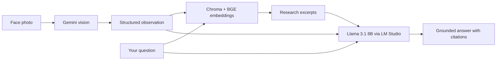

# Facial Acne AI

A research-grounded facial acne assistant. **Google Gemini** analyzes face photos (vision only). **RAG** (retrieval-augmented generation) over ingested dermatology papers powers answers via **LM Studio** — local embeddings and a local chat model. Nothing runs in the cloud except Gemini when you upload a photo.

## How it works



| Component | Role |
|-----------|------|
| **Gemini** (`GEMINI_API_KEY`) | Describes what it sees in a photo (not medical diagnosis). |
| **ChromaDB** (`chroma_db/`) | Vector store of chunked papers under `markdown/`. |
| **BGE embeddings** (LM Studio) | Turns questions and paper chunks into vectors for retrieval. |
| **Llama 3.1 8B** (LM Studio) | Writes the final answer using retrieved excerpts and optional vision notes. |

**Text-only questions** skip Gemini. **Photos** require a valid Gemini API key.

---

## Requirements

- **Python 3.10+** (3.11 or 3.12 recommended)
- **[LM Studio](https://lmstudio.ai/)** — local OpenAI-compatible server for embeddings + chat
- **Google AI API key** — vision only ([Google AI Studio](https://aistudio.google.com/apikey))
- Disk space for two models in LM Studio (~5–8 GB total, depending on quant)

The repo already includes converted paper markdown in `markdown/`. You still need to **ingest** them once into `chroma_db/` (see below).

---

## 1. Clone and open the project

```bash
git clone <your-repo-url> Facial_Acne_AI
cd Facial_Acne_AI
```

---

## 2. Create a virtual environment

**macOS / Linux:**

```bash
python3 -m venv .venv
source .venv/bin/activate
```

**Windows (PowerShell):**

```powershell
python -m venv .venv
.\.venv\Scripts\Activate.ps1
```

Upgrade pip, then install dependencies:

```bash
pip install --upgrade pip
pip install -r requirements-rag.txt
```

`requirements-rag.txt` installs everything needed for ingest, CLI, and the web UI (`chromadb`, `flask`, `google-genai`, etc.).

Optional — only if you need to convert new PDFs with Marker:

```bash
pip install -r requirements.txt   # marker-pdf (heavy)
```

---

## 3. Install and configure LM Studio

### Download LM Studio

1. Go to [https://lmstudio.ai/](https://lmstudio.ai/) and install LM Studio for your OS.
2. Open **Discover** (model search) and download:
   - **`text-embedding-bge-small-en-v1.5`** — embeddings for RAG
   - **`meta-llama-3.1-8b-instruct`** — chat model for answers

Use the exact names shown in LM Studio if they differ slightly (e.g. GGUF variant or quant suffix).

### Run the local server

1. Open the **Local Server** tab (or **Developer** → server, depending on LM Studio version).
2. Load **`meta-llama-3.1-8b-instruct`** as the active chat model and **start the server** (default port **1234**).
3. For ingestion and retrieval, LM Studio must also serve embeddings on the same server:
   - Either load **`text-embedding-bge-small-en-v1.5`** when ingesting/querying, or use LM Studio’s workflow that exposes `/v1/embeddings` for the embedding model you downloaded.
4. On the server screen, note the **model IDs** exactly as shown (e.g. `meta-llama-3.1-8b-instruct`, `text-embedding-bge-small-en-v1.5`). Your `.env` values must match those IDs.

Keep LM Studio running whenever you use this project.

---

## 4. Get a Google (Gemini) API key

1. Sign in at [Google AI Studio](https://aistudio.google.com/apikey).
2. Click **Create API key** (pick or create a Google Cloud project if prompted).
3. Copy the key — you will set `GEMINI_API_KEY` in `.env`.

Gemini is used **only for image analysis**, not for the main chat text model.

---

## 5. Create your `.env` file

From the project root:

```bash
cp .env.example .env
```

Edit `.env` with your values. Example aligned with the models above:

```env
# LM Studio (default port)
LM_STUDIO_BASE_URL=http://localhost:1234
LM_STUDIO_API_KEY=lm-studio

# Must match the embedding model id on LM Studio’s server tab
LM_STUDIO_EMBED_MODEL=text-embedding-bge-small-en-v1.5

# Must match the chat model id on LM Studio’s server tab
LM_STUDIO_CHAT_MODEL=meta-llama-3.1-8b-instruct
LM_STUDIO_MAX_TOKENS=3072

# Vector database (created by ingest_papers.py)
CHROMA_PATH=./chroma_db
COLLECTION_NAME=acne_research

# Paper sources (already in repo)
MARKDOWN_DIR=./markdown
MANIFEST_PATH=./markdown/manifest.json

# Retrieval strictness (lower = stricter). Try 0.24 if results feel off-topic.
RAG_MAX_DISTANCE=0.28

# Gemini — vision only
GEMINI_API_KEY=your_google_api_key_here
GEMINI_MODEL=gemini-2.0-flash
```

**Important:** If ingest or chat fails with “model not found”, copy the model string from LM Studio’s server UI into `LM_STUDIO_EMBED_MODEL` or `LM_STUDIO_CHAT_MODEL` — IDs can include suffixes like `@q4_k_m`.

`.env` is gitignored; never commit API keys.

---

## 6. Ingest research papers into Chroma

With LM Studio running and the **embedding** model available:

```bash
source .venv/bin/activate   # if not already active

# Test embeddings endpoint
python ingest_papers.py --ping

# Build the vector database (first time or after paper updates)
python ingest_papers.py --reset
```

`--reset` deletes and rebuilds the collection. First full ingest can take several minutes depending on CPU/GPU.

Quick test retrieval:

```bash
python ingest_papers.py --query "benzoyl peroxide inflammatory acne"
```

Smaller trial ingest:

```bash
python ingest_papers.py --max-docs 3 --reset
```

---

## 7. Verify LM Studio and Gemini

```bash
# Embeddings
python ask_acne.py --ping-embed

# Chat model
python ask_acne.py --ping-chat
```

---

## 8. Run from the command line (optional)

**Text + RAG (no photo):**

```bash
python ask_acne.py --question "What does research say about benzoyl peroxide for inflammatory acne?"
```

**Photo + RAG + Llama:**

```bash
python ask_acne.py --image path/to/face.jpg --question "What might help based on what you see and the literature?"
```

**Chat only (no paper retrieval):**

```bash
python ask_acne.py --no-rag --question "General question without citations"
```

---

## 9. Run the web UI

```bash
python web_app.py
```

Open [http://127.0.0.1:5000](http://127.0.0.1:5000) in your browser.

Custom host/port:

```bash
python web_app.py --host 0.0.0.0 --port 5000
```

### Testing the website

1. Confirm **LM Studio** server is on and **`meta-llama-3.1-8b-instruct`** is loaded.
2. Confirm **`chroma_db/`** exists (you ran `python ingest_papers.py --reset`).
3. Open the site, type a question (e.g. *What do studies suggest about salicylic acid for acne?*).
4. Leave **Use research (RAG)** enabled — answers should cite numbered sources from retrieved papers.
5. Upload a **JPG, PNG, or WebP** face photo (max 8 MB) and ask a follow-up — Gemini runs first, then RAG + Llama. Without `GEMINI_API_KEY`, text-only mode still works; photo upload will fail until the key is set.
6. Toggle RAG off to use only the local Llama model (no paper citations).

If you see *Chroma database not found*, run ingest again:

```bash
python ingest_papers.py --reset
```

---

## Troubleshooting

| Problem | What to check |
|--------|----------------|
| `ingest_papers.py --ping` fails | LM Studio server started; embedding model loaded; `LM_STUDIO_EMBED_MODEL` matches server model id. |
| `ask_acne.py --ping-chat` fails | Chat model loaded in LM Studio; `LM_STUDIO_CHAT_MODEL` matches server id. |
| Web UI: Chroma not found | Run `python ingest_papers.py --reset`. |
| Photo upload / vision errors | `GEMINI_API_KEY` set; billing/API enabled in Google AI Studio; try `GEMINI_MODEL=gemini-2.0-flash`. |
| Weak or irrelevant citations | Lower `RAG_MAX_DISTANCE` (e.g. `0.24`); re-ingest after changing embed model. |
| Wrong answers after model change | Re-run `python ingest_papers.py --reset` — embeddings must use the same model for ingest and query. |

---

## Project layout (short)

| Path | Purpose |
|------|---------|
| `markdown/` | Converted research papers + `manifest.json` |
| `chroma_db/` | Persistent vector DB (created by ingest; gitignored) |
| `rag/` | Chunking, retrieval, LM Studio clients, Gemini vision, pipeline |
| `ingest_papers.py` | Build / query Chroma index |
| `ask_acne.py` | CLI assistant |
| `web_app.py` | Flask web UI |
| `convert_pdfs.py` | Optional: PDF → markdown via Marker |

---

## Disclaimer

This tool is for **informational and educational** use. It does not diagnose, prescribe, or replace care from a licensed clinician. If you have concerns about your skin, see a dermatologist or qualified healthcare provider.
