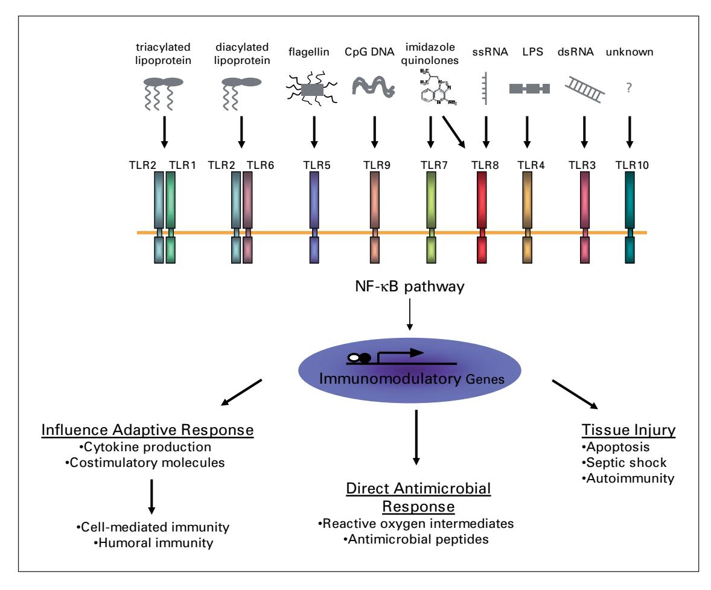
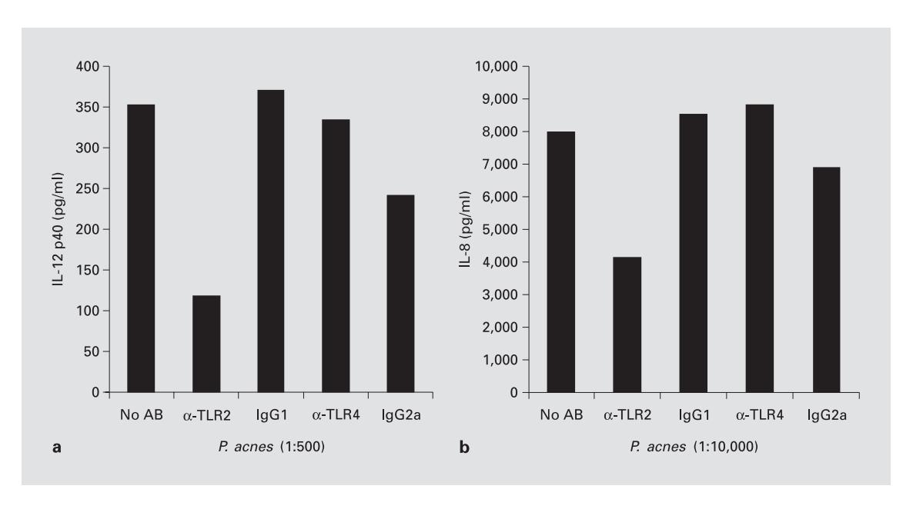
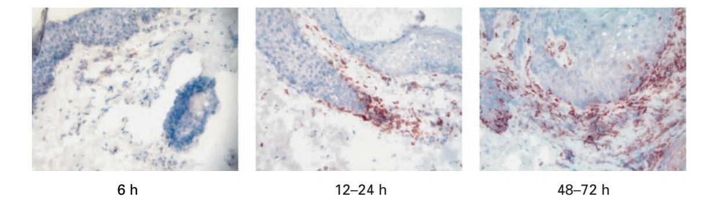

Dermatology 2005;211:193–198

DOI: [10.1159/000087011](http://dx.doi.org/10.1159%2F000087011)

# **Review of the Innate Immune Response in Acne vulgaris: Activation of Toll-Like Receptor 2 in Acne Triggers Infl ammatory Cytokine Responses**

## Jenny Kim

Division of Dermatology, Department of Medicine, David Geffen School of Medicine at University of California Los Angeles, Los Angeles, Calif. , USA

#### **Key Words**

Innate immunity - Toll-like receptors - Monocytes/ macrophages -Acne, infl ammatory cytokine responses

#### **Abstract**

Acne vulgaris is a common disorder that affects 40–50 million people in the USA alone. The pathogenesis of acne is multifactorial, including hormonal, microbiological and immunological mechanisms. One of the factors that contributes to the pathogenesis of acne is *Propionibacterium acnes* ; yet, the molecular mechanism by which *P. acnes* induces infl ammation is not known. Recent studies have demonstrated that microbial agents trigger cytokine responses via Toll-like receptors (TLRs). TLRs are pattern recognition receptors that recognize pathogen-associated molecular patterns conserved among microorganisms and elicit immune responses. We investigated whether TLR2 mediates *P. acnes-* induced cytokine production in acne. Using transfectant cells we found that TLR2 was suffi cient for NF- B activation in response to *P. acnes* . In addition, peritoneal macrophages from wild-type, TLR6 knockout and TLR1 knockout mice, but not TLR2 knockout mice, produced IL-6 in response to *P. acnes. P. acnes* induced activation of IL-12 and IL-8 production by primary human monocytes, and this cytokine production was inhibited by anti-TLR2-blocking antibody. Finally, in acne lesions, TLR2 was expressed on the cell surface of macrophages surrounding pilosebaceous follicles. These data suggest that *P. acnes* triggers infl ammatory cytokine responses in acne by activation of TLR2. As such, TLR2 may provide a novel target for the treatment of this common skin disease.

Copyright © 2005 S. Karger AG, Basel

## **Introduction**

*Pathogenesis of Acne* 

Acne vulgaris is a common disorder that affects 40–50 million people in the USA alone. Although acne is rarely life threatening, it is a disease that can have a signifi cant effect on the patients' physical and psychological well-being. The pathogenesis of acne is multifactorial, including hormonal, microbiological and immunological mechanisms.

Acne lesions fi rst develop in the pilosebaceous unit as subclinical microcomedones that may evolve into closed or open comedones and infl ammatory lesions such as papules, pustules, nodules and cysts. The formation of comedones is believed to involve hyperkeratinization of the follicle secondary to both hyperproliferation of keratinocytes lining the follicle as well as their reduced desquamation. The infl ammatory cytokine IL-1 has also been implicated in this process as IL-1 has been shown to induce hyperkeratinization in vitro [1] . Microcomedones or comedones may then later develop into infl ammatory lesions as a result of CD4+ T-cell activation and migration [2] , cytokine production by keratinocytes as well as macrophages and neutrophils recruited to the site, hormonal factors and enhanced sebum production.

One of the factors that contributes to the pathogenesis of acne is *Propionibacterium acnes* , part of the normal skin fl ora, but which can be signifi cantly increased in pilosebaceous units of patients with acne [3] . This review will focus on how *P. acnes* elicits innate immune responses and plays a role in the pathogenesis of acne.

#### *Propionibacterium acnes*

*P. acnes* has long been implicated as an etiological factor of acne since it was demonstrated that its injection into the skin produces potent infl ammatory responses [4] . This hypothesis was further supported by studies demonstrating failure of erythromycin therapy for acne in patients with erythromycin-resistant *P. acnes* , and studies of teenagers with acne demonstrating signifi cantly higher numbers of *P. acnes* on their skin when compared to agematched controls without acne [3, 5, 6] .

Although *P. acnes* is a gram-positive bacterium, it is variably and weakly gram-positive. It is described as diphtheroid or coryneform because it is rod shaped and slightly curved. A number of unique features of the *P. acnes* cell wall and outer envelope further distinguish it from other gram-positive bacteria [7] . *P. acnes* synthesizes phosphatidyl inositol; this is unlike almost all other bacteria, but is made by virtually all eukaryotes. The peptidoglycan of *P. acnes* is distinct from most gram-positive bacteria, containing a cross-linkage region of peptide chains with *L,L* -diaminopimelic acid and *D* -alanine in which two glycine residues combine with amino and carboxyl groups. These structures may allow for the recognition of *P. acnes* by innate cells via pattern recognition receptors.

The role of *P. acnes* as an etiological factor in acne has been well established; however, the precise role that this bacterium plays in the pathogenesis of acne remains unclear. *P. acnes* contributes to the infl ammatory nature of acne by inducing monocytes to secrete proinfl ammatory cytokines including TNF- - , IL-1 and IL-8 [8] . In particular, IL-8 along with other *P. acnes* -induced chemotactic factors may play an important role in attracting neutrophils to the pilosebaceous unit. In addition, *P. acnes*  releases lipases, proteases and hyaluronidases which contribute to tissue injury [9–12] .

The mechanism by which *P. acnes* activates monocyte cytokine release was unknown but thought to involve pattern recognition receptors of the innate immune system [8] . Recently identifi ed Toll-like receptors (TLRs) are one example of pattern recognition receptor.

## *Toll-Like Receptors*

Toll receptors were fi rst identifi ed in *Drosophila,* and mammalian homologs were found to mediate the immune response to microbial ligands [13, 14] . TLRs are transmembrane proteins capable of mediating responses to pathogen-associated molecular patterns conserved among microorganisms. The extracellular portion of TLRs is composed of leucine-rich repeats while the intracellular portion shares homology with the cytoplasmic domain of the IL-1 receptor. When TLRs are activated by exposure to microbial ligands, the intracellular domain of the TLR may trigger a MyD88-dependent pathway involving factors such as IL-1-receptor-associated kinase and tumor-necrosis-factor-receptor-activated factor 6 that ultimately lead to the nuclear translocation of the transcription factor NF- B. NF- B then acts to modulate expression of many immune response genes [15, 16] . However, ligand exposure may also trigger MyD88 independent pathways in some TLRs. There is evidence that TLR3 and TLR4 also trigger a MyD88-independent pathway that involves IRF-3 to ultimately activate NF- B [17] .

Currently, 10 TLRs have been identifi ed in humans ( fi g. 1 ). The microbial ligands for many of these receptors have been demonstrated and include bacterial cell wall components and genetic material. More specifi cally, TLR4 mediates host responses to bacterial lipopolysaccharide from gram-negative bacteria, TLR2 mediates responses to peptidoglycan from gram-positive bacteria, and TLR5 mediates the host response to bacterial fl agellin [18–20] . In addition, TLR9 mediates the response to the unmethylated CpG DNA comprising bacterial genomes, and TLR3 mediates responses to viral doublestranded RNA [21, 22] . Furthermore, TLR heterodimers have been shown to mediate responses to microbial lipoproteins, with TLR2/1 heterodimers mediating responses to triacylated lipoproteins and TLR2/6 heterodimers mediating responses to diacylated lipoproteins [23, 24] .

We devised a study to elucidate the mechanism by which *P. acnes* induces infl ammatory cytokines in monocytes. The following section provides a summary of our previously published data [25] that *P. acnes* induces monocyte cytokine production through a TLR2-dependent pathway and that the expression of TLR2 in acne lesions indicates that activation of TLR2 can contribute to infl ammation at the site of disease activity.

Fig. 1. Human TLRs and their ligands, CpG = Cytosine guanine nucleotides; LPS = lipopolysaccharide.

#### **Results**

TLR2 Is Sufficient for P. acnes Activation of Monocytes

Previous studies have demonstrated that TLR2 mediates the response of several ligands from gram-positive organisms. We therefore sought to determine whether TLR2 is sufficient for *P. acnes*-induced gene activation. We used TLR2 and TLR4 transfectant cells to measure the NF-κB activation with *P. acnes*. We found that *P. acnes* induced NF-κB in cells expressing TLR2 but not TLR4.

Since TLR2 cooperates with TLR6 and TLR1 in the recognition of microbial ligands [24, 26, 27], we examined the role of TLR6 and TLR1 in mediating activation by *P. acnes* using TLR knockout mice. Peritoneal macrophages were obtained from wild-type, TLR2-/-, TLR6-/- and TLR1-/- mice, activated with *P. acnes*,

and supernatants assayed for the presence of the inflammatory cytokine IL-6. *P. acnes* induced IL-6 release from wild-type mice, TLR1-/- mice and TLR6-/- mice but not TLR2-/- mice (data not shown). These results indicate the specificity of the response that TLR2 but not TLR4, TLR6 or TLR1 mediates *P. acnes*-induced cell activation.

## P. acnes Induces IL-12 and IL-8 Production by Human Adherent Monocytes

IL-12 is a pivotal cytokine in activating Th1 T-cell responses and is one of the major proinflammatory cytokines produced by monocytes in response to gram-positive organisms. To determine whether *P. acnes* induced IL-12 production via a TLR-dependent pathway, primary human monocytes from normal donors were stimulated with various dilutions of *P. acnes* sonicate, and cytokine production was measured. We found that *P. acnes* 

**Fig. 2.** *P. acnes* induces IL-12 and IL-8 production in human monocytes via TLR2. Primary human monocytes were incubated with anti-TLR2, anti-TLR4 or isotype control monoclonal antibodies (AB), then stimulated with *P. acnes* . The production of IL-12 p40 (**a** ) and IL-8 (**b** ) was determined by ELISA. Copyright 2002, American Association of Immunologists Inc.

induced IL-12 production by monocytes in a dose-dependent manner. *P. acnes* also induced the release of IL-8, a cytokine involved in neutrophil chemotaxis.

To determine whether the production of proinfl ammatory cytokines could be mediated through TLRs, monocytes from normal donors were cultured with anti-TLR2 and anti-TLR4 antibodies prior to stimulation with *P. acnes* sonicate. *P. acnes* induction of IL-12 production in monocytes was blocked by approximately 65% with the addition of anti-TLR2 antibody to the culture ( fi g. 2 a). In contrast, the addition of anti-TLR4 and isotype control antibodies had no signifi cant effect on IL-12 production by human monocytes, suggesting that the blocking effect was specifi c to TLR2. Similarly, the production of IL-8 was also blocked by approximately 50% by the addition of anti-TLR2 antibody ( fi g. 2 b). Anti-TLR4 and isotype control antibodies had no signifi cant effect on IL-8 production. These results suggest that one mechanism by which *P. acnes* induces IL-12 and IL-8 production in human monocytes is by the activation of TLR2.

*TLR2 Is Expressed on Macrophages in Acne Lesions* 

We next wanted to determine whether there was any evidence for a TLR-dependent mechanism occurring at the site of the disease activity. We obtained acne biopsies from patients and analyzed the lesions for TLR expression. Immunohistochemistry labeling using a monoclonal antibody specifi c to TLR2 revealed TLR2 expression on large ovoid cells within acne lesions. TLR2+ cells were detected primarily in the infl ammatory infi ltrate around the perifollicular/peribulbar region. Interestingly we found that the frequency of TLR2-expressing cells was determined according to the duration of the acne lesion. In early acne lesions, up to 6 h, few TLR2+ cells were detected ( fi g. 3 ). In lesions obtained between 12 and 24 h, TLR2+ cells were found to be more numerous around the pilosebaceous follicles. Finally, in older lesions obtained between 48 and 72 h, even greater numbers of TLR2+ cells were detected. From these experiments, we concluded that the infi ltration of TLR2+ cells was an early event in the evolution of acne lesions. Furthermore, the frequency of cells expressing TLR2 proteins is upregulated during the infl ammatory process up to 48–72 h after the onset of acne lesions.

To identify the lineage of cells expressing TLR2 in acne lesions, we performed a double immunofl uorescence labeling and utilized confocal laser microscopy. The colocalization of TLR2 with CD14 suggests that TLR2 is expressed on cells of the monocyte/macrophage lineage in acne lesions (data not shown).

**Fig. 3.** TLR2 expression in lesions during various stages of the acne. Skin biopsy specimens of acne lesions were stained by the immunoperoxidase method with monoclonal antibodies specifi c for TLR2. In early acne lesions, up to 6 h, few TLR2+ cells were detected. In lesions obtained between 12 and 24 h, TLR2+ cells were much more numerous around the pilosebaceous follicles. In later older lesions obtained between 48 and 72 h, greater numbers of TLR2+ cells were detected. Copyright 2002, American Association of Immunologists Inc.

## **Discussion**

Recognition of microbial pathogens by the cells of the immune system triggers host defense mechanisms to combat infection and prevent disease. However, activation of these same pathways can also result in infl ammation at the site of disease and subsequent tissue injury. In acne, the host response to *P. acnes* can result in the production of proinfl ammatory cytokines and contribute to the clinical manifestations of disease. In our study, we investigated the molecular mechanism by which *P. acnes*  induces proinfl ammatory cytokines in monocytes and provide evidence that the *P. acnes-* induced release of cytokines is dependent on TLR2. Furthermore, TLR2+ macrophages were present in acne lesions, infi ltrating around pilosebaceous follicles and increased during the evolution of the disease. Our data suggest a novel mechanism by which *P. acnes* induces infl ammation in acne by the activation of TLR2 and the subsequent release of cytokines which regulate the local immune response.

Currently the exact *P. acnes* TLR2 ligand has not been identifi ed. However, our data [25]as well as fi ndings from previous studies [8]point to *P. acnes* peptidoglycan on the cell wall as the TLR2 ligand. Further studies will be required to identify the TLR2 ligand present in *P. acnes*  and to defi ne its role in the pathogenesis of acne.

The primary event in infl ammatory acne involves the disruption of the follicular epithelium and colonization of the follicles with *P. acnes* with subsequent infl ammatory reactions in the surrounding dermis. The detection of TLR2+ cells in the perifollicular region provides indirect evidence that TLR2 activation contributes to the pathogenesis of acne, suggesting that these cells promote infl ammatory responses at the site of the disease activity. Furthermore, activation of TLR2 on monocytes releases proinfl ammatory cytokines, IL-12 and IL-8. IL-8 attracts neutrophils to the site of active lesion, and release of lysosomal enzymes by neutrophils leads to rupture of follicular epithelium and further infl ammation [28] . On the other hand, IL-12 promotes development of Th1-mediated immune responses. Overproduction of Th1 cytokines such as IL-12 has been implicated in the development of tissue injury in certain autoimmune and infl ammatory diseases [29–35] . In this manner, the activation of TLR2 on monocytes and other TLRs as well as other infl ammatory cells is likely involved in the pathogenesis of acne. Given these data, TLR2 appears to be a logical target for therapeutic intervention in order to block infl ammatory cytokine responses in acne and other infl ammatory conditions in which tissue injury is detrimental to the host.

## **Acknowledgments**

I am grateful to have been one of the recipients of the William J. Cunliffe Prize 2004 laureates and would like to thank Dr. William J. Cunliffe for his inspiration. I would also like to thank my colleagues Maria-Teresa Ochoa, Stephan R. Krutzik, Osamu Takeuchi, Satoshi Uematsu, Annaliza J. Legaspi, Hans D. Brightbill, Diana Holland, William J. Cunliffe, Shizuo Akira, Peter A. Sieling, Paul J. Godowski and Robert L. Modlin who contributed to the article 'Activation of Toll-like receptors 2 in acne triggers infl ammatory cytokine responses' which was published in *The Journal of Immunolgy* 2002; 169: 1535–1541. *The Journal of Immunology* has granted permission to reproduce some of the fi gures from this article.

#### **References**

- 1 Guy R, Kealey T: Modelling the infundibulum in acne. Dermatology 1998; 196: 32–37.
- 2 Norris JF, Cunliffe WJ: A histological and immunocytochemical study of early acne lesions. Br J Dermatol 1998; 118: 651–659.
- 3 Leyden JJ, McGinley KJ, Mills OH, Kligman AM: *Propionibacterium* levels in patients with and without acne vulgaris. J Invest Dermatol 1975; 65: 382–384.
- 4 Gilchrist TC: The etiology of acne vulgaris. J Cutan Dis Syphilis 1903; 21: 107–120.
- 5 Leyden JJ, McGinley KJ, Vowels BR: *P. acnes*  colonization in acne and nonacne. Dermatology 1998; 196: 55–58.
- 6 Oberemok SS, Shalita AR: Acne vulgaris. I. Pathogenesis and diagnosis. Cutis 2002; 70: 101–105.
- 7 Kamisango K, Saiki I, Tanio Y, Okumura H, Araki Y, Sekikawa I, Azuma I, Yamamura Y: Structures and biological activities of peptidoglycans of *Listeria monocytogenes* and *Propionibacterium acnes* . J Biochem (Tokyo) 1982; 92: 23–33.
- 8 Vowels BR, Yang S, Leyden JJ: Induction of proinfl ammatory cytokines by a soluble factor of *Propionibacterium acnes* : Implications for chronic infl ammatory acne. Infect Immun 1995; 63: 3158–3165.
- 9 Hoeffl er U: Enzymatic and hemolytic properties of *Propionibacterium acnes* and related bacteria. J Clin Microbiol 1977; 6: 555–558.
- 10 Hoeffl er U, Ko HL, Pulverer G: Antimicrobiol susceptibility of *Propionibacterium acnes* and related microbial species. Antimicrob Agents Chemother 1976; 10: 387–394.
- 11 Ingham E, Holland KT, Gowland G, Cunliffe WJ: Purifi cation and partial characterization of an acid phosphatase (EC 3.1.3.2) produced by *Propionibacterium acnes* . J Gen Microbiol 1980; 118: 59–65.
- 12 Puhvel SM, Reisner RM: The production of hyaluronidase (hyaluronate lyase) by *Corynebacterium acnes.* J Invest Dermatol 1972; 58: 66–70.
- 13 Medzhitov R, Preston-Hurlburt P, Janeway CAJ: A human homologue of the *Drosophila*  Toll protein signals activation of adaptive immunity. Nature 1997; 388: 394–397.
- 14 Yang RB, Mark MR, Gray A, Huang A, Xie MH, Zhang M, Goddard A, Wood WI, Gurney AL, Godowski PJ: Toll-like receptor-2 mediates lipopolysaccharide-induced cellular signalling. Nature 1998; 395: 284–288.
- 15 Suzuki N, Suzuki S, Duncan GS, Millar DG, Wada T, Mirtsos C, Takada H, Wakeham A, Itie A, Li S, Penninger JM, Wesche H, Ohashi PS, Mak TW, Yeh WC: Severe impairment of interleukin-1 and Toll-like receptor signalling in mice lacking IRAK-4. Nature 2002; 416: 750–756.

- 16 Takeda K, Kaisho T, Akira S: Toll-like receptors. Annu Rev Immunol 2003; 21: 335–376.
- 17 Doyle S, Vaidya S, O'Connell R, Dadgostar H, Dempsey P, Wu T, Rao G, Sun R, Haberland M, Modlin R, Cheng G: IRF3 mediates a TLR3/TLR4-specifi c antiviral gene program. Immunity 2002; 17: 251–263.
- 18 Poltorak A, He X, Smirnova I, Liu MY, Van Huffel C, Du X, Birdwell D, Alejos E, Silva M, Galanos C, Freudenberg M, Ricciardi-Castagnoli P, Layton B, Beutler B: Defective LPS signaling in C3H/HeJ and C57BL/10ScCr mice: Mutations in Tlr4 gene. Science 1998; 282: 2085–2088.
- 19 Yoshimura A, Lien E, Ingalls RR, Tuomanen E, Dziarski R, Golenbock D: Cutting edge: Recognition of gram-positive bacterial cell wall components by the innate immune system occurs via Toll-like receptor 2. J Immunol 1999; 163: 1–5.
- 20 Hayashi F, Smith KD, Ozinsky A, Hawn TR, Yi EC, Goodlett DR, Eng JK, Akira S, Underhill DM, Aderem A: The innate immune response to bacterial fl agellin is mediated by Tolllike receptor 5. Nature 2001; 410: 1099–1103.
- 21 Hemmi H, Takeuchi O, Kawai T, Kaisho T, Sato S, Sanjo H, Matsumoto M, Hoshino K, Wagner H, Takeda K, Akira S: A Toll-like receptor recognizes bacterial DNA. Nature 2000; 408: 740–745.
- 22 Alexopoulou L, Holt AC, Medzhitov R, Flavell RA: Recognition of double-stranded RNA and activation of NF-kappaB by Toll-like receptor 3. Nature 2001; 413: 732–738.
- 23 Brightbill HD, Libraty DH, Krutzik SR, Yang RB, Belisle JT, Bleharski JR, Maitland M, Norgard MV, Plevy SE, Smale ST, Brennan PJ, Bloom BR, Godowski PJ, Modlin RL: Host defense mechanisms triggered by microbial lipoproteins through Toll-like receptors. Science 1999; 285: 732–736.
- 24 Ozinsky A, Underhill DM, Fontenot JD, Hajjar AM, Smith KD, Wilson CB, Schroeder L, Aderem A: The repertoire for pattern recognition of pathogens by the innate immune system is defi ned by cooperation between Toll-like receptors. Proc Natl Acad Sci USA 2000; 97: 13766–13771.
- 25 Kim J, Ochoa MT, Krutzik SR, Takeuchi O, Uematsu S, Legaspi AJ, Brightbill HD, Holland D, Cunliffe WJ, Akira S, Sieling PA, Godowski PJ, Modlin RL: Activation of Toll-like receptor 2 in acne triggers infl ammatory cytokine responses. J Immunol 2002; 169: 1535– 1541.

- 26 Takeuchi O, Kawai T, Muhlradt PF, Morr M, Radolf JD, Zychlinsky A, Takeda K, Akira S: Discrimination of bacterial lipoproteins by Toll-like receptor 6. Int Immunol 2001; 13: 933–940.
- 27 Takeuchi O, Sato S, Horiuchi T, Hoshino K, Takeda K, Dong Z, Modlin RL, Akira S: Role of TLR1 in mediating immune response to microbial lipoproteins. J Immunol 2002; 169: 10– 14.
- 28 Webster GF, Leyden JJ, Tsai CC, Baehni P, McArthur WP: Polymorphonuclear leukocyte lysosomal release in response to *Propionibacterium acnes* in vitro and its enhancement by sera from infl ammatory acne patients. J Invest Dermatol 1980; 74: 398–401.
- 29 Windhagen A, Newcombe J, Dangond F, Strand C, Woodroofe MN, Cuzner ML, Hafl er DA: Expression of costimulatory molecules B7–1 (CD80), B7–2 (CD86), and interleukin 12 cytokine in multiple sclerosis lesions. J Exp Med 1995; 182: 1985–1996.
- 30 Balashov KE, Smith DR, Khoury SJ, Hafl er DA, Weiner HA: Increased interleukin 12 production in progressive multiple sclerosis: Induction by activated CD4+ T cells via CD40 ligand. Proc Natl Acad Sci USA 1997; 94: 599– 603.
- 31 Bucht A, Larsson P, Weisbrot L, Thorne C, Pisa P, Smedegard G, Keystone EC, Gronberg A: Expression of interferon-gamma (IFN-gamma), IL-10, IL-12 and transforming growth factor-beta (TGF-beta) mRNA in synovial fl uid cells from patients in the early and late phases of rheumatoid arthritis (RA). Clin Exp Immunol 1996; 103: 357–367.
- 32 Parronchi P, Romagnani P, Annunziato F, Sampognaro S, Becchio A, Giannarini L, Maggi E, Pupilli C, Tonelli F, Romagnani S: Type 1 T-helper cell predominance and interleukin-12 expression in the gut of patients with Crohn's disease. Am J Pathol 1997; 150: 823– 832.
- 33 Via CS, Rus V, Gately MK, Finkelman FD: IL-12 stimulates the development of acute graft-versus-host disease in mice that normally would develop chronic, autoimmune graft-versus-host disease. J Immunol 1994; 153: 4040– 4047.
- 34 Williamson E, Garside P, Bradley JA, Mowat AM: IL-12 is a central mediator of acute graftversus-host disease in mice. J Immunol 1996; 157: 689–699.
- 35 Nishimura T, Sadata A, Yahagi C, Santa K, Otsuki K, Watanabe K, Yahata T, Habu S: The therapeutic effect of interleukin-12 or its antagonist in transplantation immunity. Ann NY Acad Sci 1996; 795: 371–374.