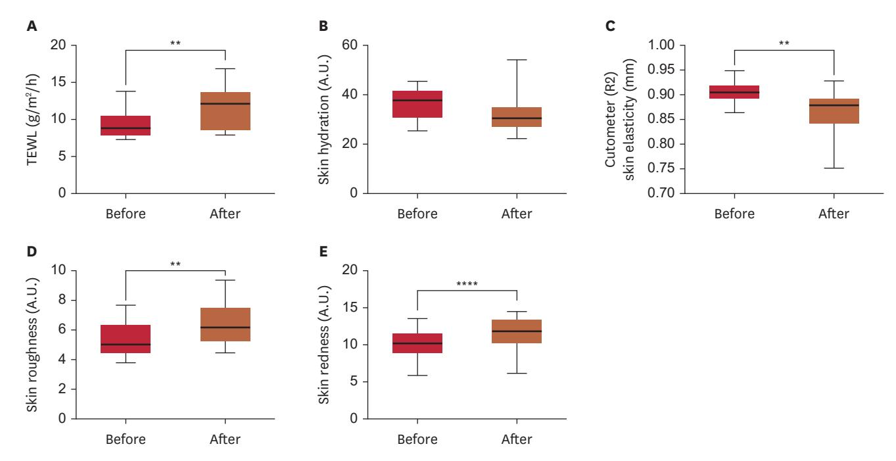
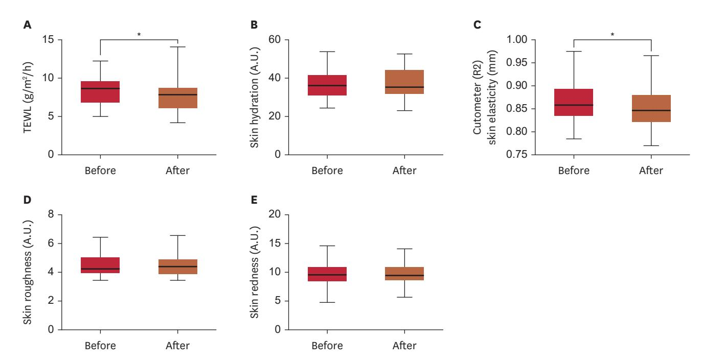
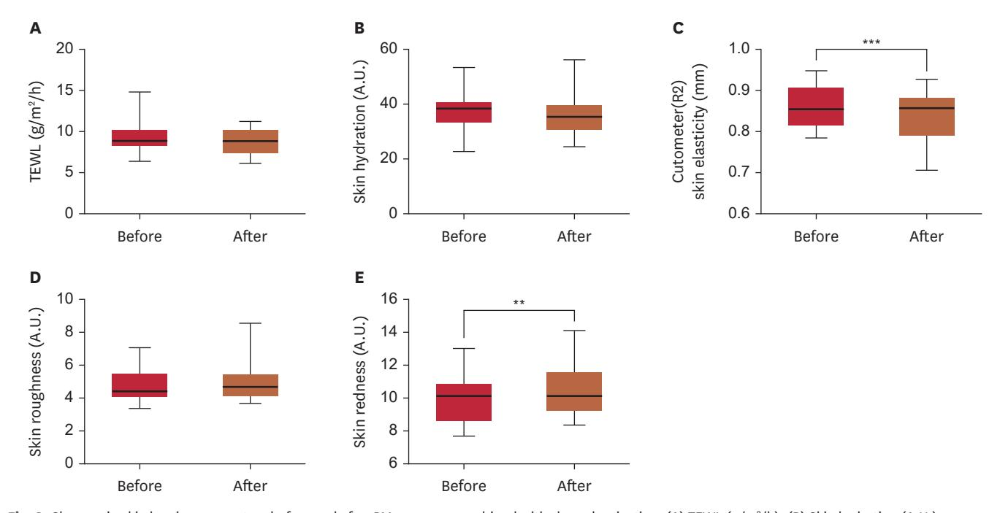
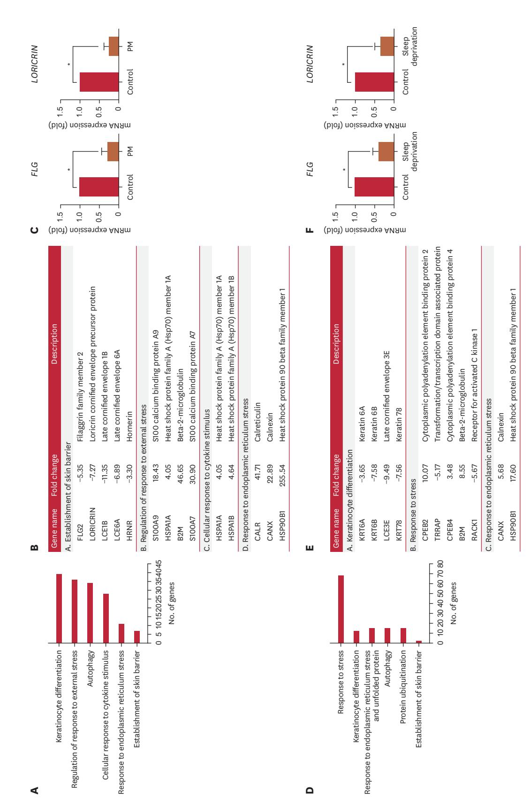

### Original Article

# **Independent and Combined Effects of Particulate Matter and Sleep Deprivation on Human Skin Barrier**

1 Department of Dermatology and Cutaneous Biology Research Institute, Yonsei University College of Medicine, Seoul, Korea

**Received:** Jan 7, 2025 **Revised:** Feb 17, 2025 **Accepted:** Feb 19, 2025 **Published online:** Mar 12, 2025

#### **Correspondence Author:**

#### Sang Ho Oh

Department of Dermatology and Cutaneous Biology Research Institute, Severance Hospital, Yonsei University College of Medicine, 50-1 Yonsei-ro, Seodaemun-gu, Seoul 03722, Korea. Email: oddung93@yuhs.ac

© 2025 The Korean Dermatological Association and The Korean Society for Investigative Dermatology

This is an Open Access article distributed under the terms of the Creative Commons Attribution Non-Commercial License [\(https://](https://creativecommons.org/licenses/by-nc/4.0/) [creativecommons.org/licenses/by-nc/4.0/](https://creativecommons.org/licenses/by-nc/4.0/)) which permits unrestricted non-commercial use, distribution, and reproduction in any medium, provided the original work is properly cited.

# **ABSTRACT**

**Background:** The exposome encompasses all factors people encounter through life, with the skin constantly exposed. While particulate matter (PM) and sleep deprivation are known to contribute to barrier dysfunction, their combined effects remain unclear.

**Objective:** To evaluate the independent and combined effects of PM exposure and short-term sleep deprivation on skin barrier function.

**Methods:** Forty healthy Korean women (aged 24–58 years) were enrolled in this study. Forearms were divided into 4 sites: control, PM exposure, sleep deprivation, and PM plus sleep deprivation. Parameters such as trans-epidermal water loss (TEWL), hydration, elasticity, roughness, and redness were measured at baseline and post-exposure. RNA sequencing and reverse transcription-polymerase chain reaction were conducted on tape-stripped skin samples.

**Results:** PM exposure significantly increased TEWL (+25.59%, *p*<0.01), roughness (+21.9%, *p*<0.01), and redness (+13.7%, *p*<0.0001) while reducing elasticity (−3.98%, *p*<0.01). Sleep deprivation modestly reduced elasticity (−1.39%, *p*<0.05) without affecting other parameters. Combined PM and sleep deprivation did not further exacerbate barrier dysfunction compared to PM alone. RNA sequencing revealed reduced *FLG* and *LORICRIN* expression and upregulated endoplasmic reticulum (ER) stress markers (*HSP90B1*, *CANX*) in both PM and sleep deprivation conditions.

**Conclusion:** PM exposure impaired skin barrier function, while short-term sleep deprivation alone did not significantly affect the barrier, either independently or in combination with PM. However, it was observed that the sleep deprivation-only, while not directly causing barrier damage, induced changes in ER stress-related gene expression in tape-stripped skin samples, like the PM exposure-only. This suggests that such signaling pathways could potentially exacerbate skin barrier deterioration.

**Keywords:** Exposome; Epidermis; ER stress; Particulate matter; Sleep deprivation

131 https://anndermatol.org

P&K Skin Research Center, Seoul, Korea

Research and Innovation Center, Amorepacific, Yongin, Korea

# **INTRODUCTION**

The skin barrier is a vital defense system that protects the body from environmental insults, such as pollutants and physical stressors, while maintaining internal homeostasi[s1,](#page-7-0)[2](#page-7-1) . In recent years, the concept of exposome, which includes all environmental and lifestyle factors impacting human health has gained attention as a critical framework for understanding skin barrier dysfunction [3](#page-7-2)-[5](#page-7-3) . Among various exposomes, particulate matter (PM) and sleep deprivation have emerged as significant contributors to skin barrier disruption. PM, a complex mixture of airborne pollutants, penetrates the skin barrier, inducing oxidative stress, inflammation, and barrier dysfunctio[n6](#page-8-0)[-10](#page-8-1). Concurrently, sleep deprivation, a widespread issue in modern society, delays skin barrier recovery, increases trans-epidermal water loss (TEWL), and reduces skin hydration, leading to compromised epidermal integrity[11](#page-8-2),[12.](#page-8-3)

The clinical implications of PM and sleep deprivation on skin health are substantial. PM exposure has been linked to inflammatory skin conditions, such as atopic dermatitis and acne, as well as premature skin aging, due to its ability to generate reactive oxygen species (ROS) and inflammator[y9](#page-8-4)[,13](#page-8-5)[-16.](#page-8-6) Similarly, sleep deprivation exacerbates oxidative stress and impairs the skin's repair mechanisms, accelerating aging and increasing skin sensitivity[17-](#page-8-7)[20.](#page-8-8) These findings highlight the need to understand how these stressors, both individually and in combination, affect the skin barrier and contribute to dermatological disorders, particularly in urban environments where both factors are prevalent.

Despite significant progress in understanding the effects of individual exposomes on the skin barrier, current studies have mainly focused on single exposomes such as PM or sleep deprivation[6](#page-8-0)[,9](#page-8-4),[12,](#page-8-3)[17.](#page-8-7) In addition, studies published to date have only investigated the effects at the cellular level and not on human subjects. However, in real-world situations, individuals are simultaneously exposed to multiple interacting factors, which may have synergistic effects and amplify skin barrier damage. To date, no studies have investigated the combined effects of PM and sleep deprivation on the skin barrier in real-world human contexts. This study aims to investigate the combined effects of PM and sleep deprivation on human skin barrier function, providing new insights into the interactions of complex exposure factors.

# **MATERIALS AND METHODS**

### **Study participants and ethical considerations**

Forty healthy adult Korean women, aged 24–58 years, were enrolled for this study. All participants received a thorough explanation of the study's purpose, procedures, and potential risks and benefits, and subsequently provided written informed consent before enrollment. Individuals with any acute or chronic dermatologic conditions, systemic diseases, or a known history of sleep disorders were excluded. The study protocol adhered to the principles set forth in the Declaration of Helsinki and was approved by the Institutional Review Board (IRB) of P&K Skin Research Center (IRB approval number: P2309-4972, P2405-6237). All collected data were anonymized, and participant confidentiality was strictly maintained throughout the study.

### **Experimental protocol**

Each participant's forearm was divided into 4 distinct regions: (1) control (phosphate-buffered saline [PBS]-only Finn Chamber, without PM exposure), (2) PM exposure alone (PM + PBS Finn Chamber for 48 hours), (3) sleep deprivation alone (no PM exposure, no Finn Chamber applied), and (4) combined PM exposure and sleep deprivation (PM + PBS Finn Chamber for 48 hours, followed by sleep deprivation). To ensure that occlusive effects from the Finn Chamber were accounted for, a PBS-only Finn Chamber was applied in the control condition (1), while PM exposure conditions (2, 4) included a Finn Chamber containing PM suspended in PBS. The sleep deprivation only condition (3) did not involve Finn Chamber application, as no topical exposure was administered in this group. On Day 1, baseline skin barrier parameters were measured; PM were then applied to the designated PM-only and combined PM-and-sleep-deprivation sites. PM exposure was achieved by applying a Finn Chamber containing a PBS solution of urban PM (NIST1648A; Sigma-Aldrich, St. Louis, MO, USA) at a concentration of 16 mg/ml to the forearm for 48 hours. PBS without PM was also applied to control sites. On Day 3, after 48 hours of PM exposure, the PM and PBS patches were removed. Parameters were then re-measured at the PM and PBS exposure sites, and initial measurements were taken at the sites designated for sleep deprivation. Overnight sleep deprivation was induced in participants for 10 hours from 23:00 to 09:00, and the next morning, parameters were measured on the forearm at the sleep-deprivation-only and combined PM-plus-sleep-deprivation sites. During the sleep deprivation period, participants remained awake under low-level lighting conditions, and study personnel periodically monitored their wakefulness. After PM exposure and sleep deprivation, the skin damaged by exposome was sampled by tape stripping at each site, and RNA sequencing was performed.

### **Evaluation of skin barrier parameters**

Changes in the skin barrier were assessed by 5 parameters: (A) TEWL (g/m2 /h), (B) skin hydration (arbitrary units [A.U.]), (C) skin elasticity (mm), (D) skin roughness (A.U.), and (E) skin redness (A.U.). These measurements were obtained using the following instruments: Tewameter® TM Hex (Courage+Khazaka electronic GmbH, Köln, Germany) for TEWL, Corneometer®

CM825 (Courage+Khazaka electronic GmbH) for skin hydration, Cutometer® MPA580 (Courage+Khazaka eletronic) for skin elasticity, and Antera 3D® CS (Miravex Ltd., Dublin, Ireland) for both skin roughness and skin redness.

### **Tape-stripping and RNA extraction**

Using D-squame tape discs (14 mm in diameter; Cuderm, Dallas, TX, USA), 20 consecutive discs were collected from each forearm (a total of 40 discs per sample). Each tape disc was placed in eppendorf tube. RNA was isolated using an Arcturus PicoPure RNA Isolation Kit (Applied Biosystems, Foster City, CA, USA) according to the manufacturer's instructions.

### **RNA sequencing**

Total RNA concentration was calculated by Quant-IT RiboGreen (Invitrogen, Waltham, MA, USA). To determine the DV200 (% of RNA fragments >200 bp) value, samples are run on the TapeStation RNA screentape (Agilent Technologies, Santa Clara, CA, USA).

A total of 100 ng of total RNA was subjected to a sequencing library construction using the Agilent SureSelect RNA Direct kit according to the manufacturer's protocol. Briefly, the total RNA was first fragmented into small pieces using divalent cations under elevated temperature. The cleaved RNA fragments are copied into first strand cDNA using random primers. This is followed by a second strand cDNA synthesis. These cDNA fragments then go through an end repair process, the addition of a single 'A' base, and then ligation of the adapters. The products are then purified and enriched with polymerase chain reaction (PCR) to create the cDNA library.

For capture of human exonic region, we used the Agilent SureSelect XT Human All Exon V6+UTRs Kit according to the standard Agilent SureSelect Target Enrichment protocol. The 250 ng of cDNA library was mixed with hybridization buffers, blocking mixes, RNase block and 5 µl of SureSelect all exon capture library. Hybridization to the capture baits was conducted at 65°C using heated thermal cycler lid option at 105°C for 24 hours on PCR machine. The captured library was then washed and subjected to a second round of PCR amplification. The final purified product is quantified using KAPA Library Quantification kits for Illumina Sequencing platforms according to the quantitative real-time PCR (qPCR) Quantification Protocol Guide (#KK4854; Kapa Biosystems, Wilmington, MA, USA) and qualified using the TapeStation D1000 ScreenTape (# 5067-5582; Agilent Technologies). Indexed libraries were then submitted to an Illumina NovaSeqX (Illumina, Inc., San Diego, CA, USA), and the paired-end (2×100 bp) sequencing was performed by the Macrogen Incorporate (Seoul, Korea). Gene Ontology enrichments analysis was performed using the DAVID functional Annotation tool ([https://davidbio](https://davidbioinformatics.nih.gov)[informatics.nih.gov](https://davidbioinformatics.nih.gov)) from an expanded subset of genes whose expression levels differed by at least 1.5-fold in the RNA-sequencing experiment.

### **Quantitative real-time reverse transcription-PCR**

cDNA was generated using a PrimeScript 1st strand cDNA Synthesis Kit (Takara Bio, Kusatsu, Japan) according to the manufacturer's instructions. The resulting cDNA was used for qPCR amplification and specific sequence detection using an Applied Biosystems StepOne Real-Time PCR System (Life Technologies Japan, Tokyo, Japan). PCR was performed using Power SYBR Green PCR Master Mix (Applied Biosystems). The relative expression of RPL13A was used to standardize the reaction. The primer sequences were as follows: forward 5'-TCGGCAAATCCTGAAGAATCCA-3' and reverse 5'-GCTTGAGCCAACTTGAATACCA-3' for filaggrin, forward 5'-CTCACCCTTCCTGGTGCTT-3' and reverse 5'-GAGGTC TTCACGCAGTCCA-3' for loricrin, forward 5'-GAGCTCCCAGAG CAGCAA-3' and reverse 5'-GTGCTTTGGCTGTCCTACCT-3' for involucrin, and forward 5'-GCCCTACGACAAGAAAAAGCG-3' and reverse 5'TACTTCCAGCCAACCTCGTGA-3' for RPL13A.

### **Statistical analysis**

Statistical analyses were performed using SPSS Statistics for Windows, version 27.0 (IBM Corp., Armonk, NY, USA). The change rate of skin barrier parameters before and after exposome exposure was confirmed by performing a paired t-test. A statistical analysis result of a *p*-value less than 0.05 was defined as statistically significant.

# **RESULTS**

### **Study participants and baseline characteristics**

The study included 40 healthy Korean adult women, with a mean age of 43.2±9.1 years (range: 24–58). All participants were free of systemic diseases, including dermatological conditions and sleep disorders, to ensure that the effects of PM exposure and sleep deprivation on skin barrier function could be evaluated without confounding factors.

### **Effects of PM exposure on skin barrier**

The effects of PM exposure on skin barrier parameters are shown in **[Fig. 1](#page-3-0)**. After 48 hours of PM exposure, TEWL, skin roughness, and skin redness increased significantly by 25.59% (*p*<0.01, **[Fig. 1A](#page-3-0)**), 21.87% (*p*<0.01, **[Fig. 1D](#page-3-0)**), and 13.71% (*p*<0.0001, **[Fig. 1E](#page-3-0)**), respectively, compared to baseline. Skin elasticity decreased significantly by 3.98% (*p*<0.01, **[Fig. 1C](#page-3-0)**). These results mean that PM significantly damaged the skin barrier. However, although skin hydration decreased by 11.37% following PM exposure, this change was not statistically significant (**[Fig. 1B](#page-3-0)**).

**Fig. 1.** Changes in skin barrier parameters before and after 48 hours of PM exposure. (A) TEWL (g/m2 /h); (B) Skin hydration (A.U.); (C) Cutometer (R2) skin elasticity (mm); (D) Skin roughness (A.U.); (E) Skin redness (A.U.). PM: particulate matter, TEWL: trans-epidermal water loss, A.U.: arbitrary units.

\*\**p*<0.01, \*\*\*\**p*<0.0001, as determined using Student's t-test.

### **Effects of sleep deprivation on skin barrier**

The effects of sleep deprivation on skin barrier parameters are shown in **[Fig. 2](#page-4-0)**. TEWL decreased by 4.96% compared to baseline (*p*<0.05, **[Fig. 2A](#page-4-0)**). Similarly, skin elasticity showed a statistically significant decrease of 1.39% (*p*<0.05, **[Fig. 2C](#page-4-0)**). However, no statistically significant changes were observed in skin hydration, skin roughness, or skin redness following sleep deprivation (**[Fig. 2B, D,](#page-4-0)  [and E](#page-4-0)**). Overall, the skin barrier did not show significant changes when exposed to sleep deprivation alone.

### **Combined effects of PM exposure and sleep deprivation on skin barrier**

The combined effects of PM exposure and sleep deprivation on skin barrier function are illustrated in **[Fig. 3](#page-4-1)**. Under the combined condition of PM exposure followed by sleep deprivation, skin elasticity decreased by 3.02% (*p*<0.001, **[Fig. 3C](#page-4-1)**), and skin redness increased by 3.98% (*p*<0.01, **[Fig. 3E](#page-4-1)**). TEWL, skin hydration, and skin roughness did not show statistically significant changes under the combined condition compared to baseline (**[Fig. 3A, B, and D](#page-4-1)**), even if an increase in TEWL and roughness was observed with PM treatment alone. Combined exposure to PM and sleep deprivation did not exacerbate skin barrier damage beyond that observed with PM alone; rather, sleep deprivation appeared to promote barrier recovery.

### **Gene expression analysis following PM exposure and sleep deprivation**

RNA sequencing and real-time PCR analysis were conducted on RNA extracted from tape-disc samples of skin tissue exposed to PM and sleep deprivation. Gene ontology analysis revealed that genes associated with the establishment of skin barrier (*FLG2*, *LORICRIN*, *LCE1B*, *LCE6A*, *HRNR*), regulation of response to external stress (*S100A9*, *HSPA1A*, *B2M*, *S100A7*), cellular response to cytokine stimulus (*HSPA1A*, *HSPA1B*), and response to endoplasmic reticulum (ER) stress (*CALR*, *CANX*, *HSP90B1*) were altered after PM exposure (**[Fig. 4A and B](#page-5-0)**). In addition, genes associated with keratinocyte differentiation (*KRT6A*, *KRT6B*, *LCE3E*, *KRT78*), response to stress (*CPEB2*, *TRRAP*, *CPEB4*, *B2M*, *RACK1*), and response to ER stress (*CANX*, *HSP90B1*) were differentially expressed after sleep deprivation (**[Fig. 4D and E](#page-5-0)**). These results indicate that both PM exposure and sleep deprivation independently resulted in significant reductions in the expression of skin barrier-related genes, *FLG* and *LORICRIN* (**[Fig. 4C and F](#page-5-0)**). Additionally, the expression of *HSP90B1* and *CANX*, an ER stress-related genes, were significantly upregulated under both PM exposure and sleep deprivation conditions (**[Fig. 4B and E](#page-5-0)**). Sleep deprivation alone did not induce significant changes in clinical parameters related to skin barrier, but it did cause changes in the molecular level. Finally, under the combined condition of PM exposure and sleep deprivation, genes associated with keratinocyte differentiation (*KRT10*, *LCE6A*, *KRT78*,

**Fig. 2.** Changes in skin barrier parameters before and after sleep deprivation. (A) TEWL (g/m2 /h); (B) Skin hydration (A.U.); (C) Cutometer (R2) skin elasticity (mm); (D) Skin roughness (A.U.); (E) Skin redness (A.U.). TEWL: trans-epidermal water loss, A.U.: arbitrary units.

\**p*<0.05, as determined using Student's t-test.

**Fig. 3.** Changes in skin barrier parameters before and after PM exposure combined with sleep deprivation. (A) TEWL (g/m2 /h); (B) Skin hydration (A.U.); (C) Cutometer (R2) skin elasticity (mm); (D) Skin roughness (A.U.); (E) Skin redness (A.U.). PM: particulate matter, TEWL: trans-epidermal water loss, A.U.: arbitrary units. \*\**p*<0.01, \*\*\**p*<0.001, as determined using Student's t-test.

and categories of GO terms as calculated by DAVID. (B, E) List of altered genes in exposeme-exposed skin samples compared with those in control samples. (C, F) The mRNA levels of FLG and Fig. 4. RNA-sequencing analysis using exposome (PM or sleep deprivation)-applied skin. High-throughput RNA sequencing was performed using skin exposed to exposomes. (A, D) Summary of LORICRIN were evaluated in exposome-applied skin samples.

PM: particulate matter, GO: Gene Ontology, DAVID: Database for Annotation, Visualization and Integrated Discovery. 12.0.05, as determined using Student's t-test.

*KLK5*), response to stress (*S100A7*, *S100A9*, *B2M*, *HSPA1A*, *CPEB2*, *TRRAP*), and response to ER stress (*CALR*, *HSP90B1*) were differentially expressed after exposure (**[Supplementary Fig. 1](#page-7-4)**).

# **DISCUSSION**

This study evaluated the effects of PM and sleep deprivation, both independently and in combination, on human skin barrier function. Our findings revealed that PM exposure significantly increased TEWL, skin roughness, and redness, indicating evident skin barrier dysfunction. In contrast, sleep deprivation caused a significant reduction in skin elasticity but did not result in statistically significant changes in TEWL, skin hydration, skin roughness, or redness. Notably, co-exposure to PM and sleep deprivation did not result in greater skin barrier impairment than PM exposure alone.

The findings of this study align with existing literature on the individual effects of PM and sleep deprivation on skin barrier integrity. For instance, previous research has confirmed that PM exposure elevates TEWL and disrupts the skin's lipid matrix, which is critical for maintaining its barrier function[6,](#page-8-0)[9,](#page-8-4)[16](#page-8-6). In addition, PM has been shown to penetrate the epidermis and induce oxidative stress through the generation of ROS, thereby impairing the structural integrity of the skin barrier[15,](#page-8-9)[21](#page-8-10). Similarly, sleep deprivation has been linked to delayed skin recovery, reduced hydration, and heightened oxidative stress, as observed in both clinical and in vitro studies[12,](#page-8-3)[21](#page-8-10),[22](#page-8-11). However, this study did not confirm that the skin barrier was damaged by sleep deprivation alone, or that combined exposure to PM and sleep deprivation damaged the skin barrier more than exposure to PM alone. Interpreting our study results, it seems that short-term sleep deprivation alone may not be sufficient to cause significant skin barrier damage. In fact, due to ethical concerns, continuous sleep deprivation could not be applied to participants and as a result, it is believed that this level of sleep deprivation in this study was not chronic, making it difficult to observe its full effects. In fact, the effect of sleep deprivation on skin condition has not been consistent in previous studies, and one study targeting people who were deprived of sleep for a long period of time showed that their skin condition significantly worsened[11](#page-8-2). In reality, sleep deprivation is mostly chronic and is expected to have a long-term effect on the skin, and since this is achieved through a mechanism involving hormones such as cortisol, it is possible that healthy adults may offset the effect of sleep deprivation on the skin as a compensatory mechanism for short-term sleep deprivation. Furthermore, the increase in TEWL caused by PM alone appeared to be reversed by sleep deprivation. This suggests that the effects of sweat, sebum, and other factors produced during sleep deprivation might have potentially mitigated the impact of PM on skin barrier. Specifically, sleep deprivation activates the sympathetic nervous system, which can increase the activity of eccrine sweat glands. Under stress conditions, eccrine sweat gland secretion is enhanced, leading to the accumulation of sweat on the skin surface. Sweat forms a hydration layer on the skin surface, which may reduce TEWL. Additionally, PM exposure is known to induce oxidative stress in the skin, which may stimulate sebaceous gland activity. This could result in increased sebum secretion on the skin surface, with sebum forming a protective barrier that temporarily suppresses TEWL.

Interestingly, although sleep deprivation did not clearly show skin barrier damage in clinical evaluation, significant upregulation of ER stress-related genes was observed in RNA sequencing analysis of tape-off skin samples under both PM exposure and sleep deprivation conditions. Notably, the mRNA expressions of key barrier-related genes such as *FLG* and *LORICRIN* were reduced following sleep deprivation, despite the absence of immediate physiological changes in skin hydration. This suggests that acute sleep deprivation primarily induces molecular-level stress responses, which may precede measurable alterations in barrier function. It is unlikely that short-term sleep deprivation directly impaired *FLG* and *LORICRIN* expression. Given that *FLG* is stored as profilaggrin before being processed into its active form, and *LORICRIN* is gradually incorporated into the cornified envelope, their transcriptional downregulation may not immediately translate into increased TEWL or decreased hydration. Furthermore, our findings suggest that the observed reduction in *FLG* and *LORIC-RIN* mRNA levels may be mediated through ER stress pathways, as ER stress is known to influence keratinocyte differentiation and protein synthesis. ER stress is a cellular response to the accumulation of unfolded or misfolded proteins in the E[R23-](#page-8-12)[25](#page-8-13). This stress activates the unfolded protein response (UPR), which attempts to restore homeostasis but can lead to cell dysfunction and apoptosis if prolonge[d26,](#page-8-14)[27](#page-8-15). In the skin, keratinocytes depend on UPR for proper differentiation and barrier maintenance[28.](#page-8-16) Therefore, chronic ER stress causes various skin disease[s29-](#page-8-17)[31.](#page-8-18) PM has been shown to induce ER stress in keratinocytes by generating ROS and disrupting calcium homeostasi[s15.](#page-8-9) Sleep deprivation similarly contributes to ER stress by disrupting hormonal balance, particularly increasing cortisol levels and oxidative stress[32](#page-8-19),[33.](#page-8-20) These changes impair keratinocyte protein synthesis and barrier repair mechanisms. In addition, it is known that hyperglycemia and subclinical inflammation can induce changes in ER stress and affect the skin barrier[.23,](#page-8-12)[29](#page-8-17)[,34](#page-8-21)

Therefore, these results indicate that preclinical molecular alterations occur even in the absence of overt barrier disruption, suggesting that ER stress may serve as a shared mechanistic pathway. The significant upregulation of ER stress markers such as *HSP90B1* and *CANX* underscores the critical role of ER stress

and the UPR in mediating damage induced by PM and sleep deprivation.

The clinical significance of this study lies in the fact that this is the first study to directly investigate the combined effects of PM and sleep deprivation on skin barrier function in humans. In addition, there is an advantage in that the skin sample was directly obtained through tape stripping to examine the expression of molecules related to the skin barrier after exposome exposure. Despite its strengths, this study has several limitations. First, the sample size was relatively small. Second, the use of PM mixed with PBS in a Finn Chamber creates an artificial situation, as it exposed the specific site to PM for an extended period. Since the occlusion effect caused by the Finn Chamber may induce changes in barrier indicators such as TEWL, it is necessary to allow sufficient time before evaluation after removing the Finn Chamber. Moreover, in studies comparing PM-treated groups, the control group with PBS should also be subjected to the same conditions using a Finn Chamber. Third, sleep deprivation was only temporary and did not fully reflect chronic sleep deprivation conditions. The short duration of the study may also limit the ability to assess the long-term effects of repeated PM exposure and sleep deprivation. Furthermore, while RNA sequencing provided valuable insights, functional studies are needed to confirm the roles of specific genes and pathways implicated in this study. Additional functional studies, including siRNA-mediated knockdown or protein modulation experiments, could further elucidate the underlying mechanisms. Finally, the study relied on controlled exposure conditions, which, while necessary for standardization, may differ from real-world scenarios where additional variables, such as UV radiation and temperature, are present.

In conclusion, this study shows that PM and sleep deprivation, when combined, can significantly impair skin barrier function through the ER stress pathway. A more significant outcome is expected from future studies designed on long-term and largescale design for sleep deprivation.

#### **ORCID iDs**

Il Joo Kwon

<https://orcid.org/0000-0003-1314-6829>

Eun Jung Lee

<https://orcid.org/0000-0002-8401-2652>

Jong Ho Park

<https://orcid.org/0009-0005-2781-4957>

Ji Young Kim

<https://orcid.org/0000-0002-6217-321X>

Seohyun Park

<https://orcid.org/0009-0003-6649-308X>

Yu Jeong Bae

<https://orcid.org/0000-0001-8861-600X>

Hye-won Na

<https://orcid.org/0000-0002-5024-6100>

Nari Cha

<https://orcid.org/0000-0002-7884-0961>

Geunhyuk Jang

<https://orcid.org/0000-0003-0389-5105>

Hyoung-June Kim

<https://orcid.org/0000-0003-0839-1264>

Hae Kwang Lee

<https://orcid.org/0000-0001-8445-6889>

Sang Ho Oh

<https://orcid.org/0000-0002-4477-1400>

#### **FUNDING SOURCE**

This research was supported by a grant for the Korea Health Technology R&D Project through the Korea Health Industry Development Institute (KHIDI), funded by the Ministry of Health & Welfare, Republic of Korea (grant number: RS-2023-KH141286).

#### **CONFLICTS OF INTEREST**

Park JH and Lee HK are employees of P&K Skin Research Center. Jang G, Na HW, Cha N, and Kim HJ are employees of Amorepacific. The remaining authors declare no conflicts of interest.

#### **DATA SHARING STATEMENT**

The data that support the findings of this study are available from the corresponding author upon reasonable request.

# **SUPPLEMENTARY MATERIAL**

### **[Supplementary Fig. 1](https://anndermatol.org/DownloadSupplMaterial.php?id=10.5021/ad.25.003&fn=ad-37-131-s001.ppt)**

RNA-sequencing analysis using exposome (PM and sleep deprivation)-applied skin. High-throughput RNA sequencing was performed using skin exposed to exposomes. (A) Summary of selected categories of GO terms as calculated by DAVID. (B) List of altered genes in exposome-exposed skin samples compared with those in control samples.

# **REFERENCES**

- [1.](#page-1-0) Chambers ES, Vukmanovic-Stejic M. Skin barrier immunity and ageing. Immunology 2020;160:116-125. **[PUBMED](http://www.ncbi.nlm.nih.gov/pubmed/31709535) | [CROSSREF](https://doi.org/10.1111/imm.13152)**
- [2.](#page-1-1) Rajkumar J, Chandan N, Lio P, Shi V. The skin barrier and moisturization: function, disruption, and mechanisms of repair. Skin Pharmacol Physiol 2023;36:174-185. **[PUBMED](http://www.ncbi.nlm.nih.gov/pubmed/37717558) | [CROSSREF](https://doi.org/10.1159/000534136)**
- [3.](#page-1-2) Wild CP. Complementing the genome with an "exposome": the outstanding challenge of environmental exposure measurement in molecular epidemiology. Cancer Epidemiol Biomarkers Prev 2005;14:1847-1850. **[PUBMED](http://www.ncbi.nlm.nih.gov/pubmed/16103423) | [CROSSREF](https://doi.org/10.1158/1055-9965.EPI-05-0456)**
- 4. Pat Y, Ogulur I, Yazici D, Mitamura Y, Cevhertas L, Küçükkase OC, et al. Effect of altered human exposome on the skin and mucosal epithelial barrier integrity. Tissue Barriers 2023;11:2133877. **[PUBMED](http://www.ncbi.nlm.nih.gov/pubmed/36262078) | [CROSSREF](https://doi.org/10.1080/21688370.2022.2133877)**
- [5.](#page-1-3) Passeron T, Krutmann J, Andersen ML, Katta R, Zouboulis CC. Clinical and biological impact of the exposome on the skin. J Eur Acad Dermatol Venereol 2020;34 Suppl 4:4-25. **[PUBMED](http://www.ncbi.nlm.nih.gov/pubmed/32677068) | [CROSSREF](https://doi.org/10.1111/jdv.16614)**

- [6.](#page-6-0) Liao Z, Nie J, Sun P. The impact of particulate matter (PM2.5) on skin barrier revealed by transcriptome analysis: focusing on cholesterol metabolism. Toxicol Rep 2020;7:1-9. **[PUBMED](http://www.ncbi.nlm.nih.gov/pubmed/31867221) | [CROSSREF](https://doi.org/10.1016/j.toxrep.2019.11.014)**
- 7. Lee CW, Lin ZC, Hu SC, Chiang YC, Hsu LF, Lin YC, et al. Urban particulate matter down-regulates filaggrin via COX2 expression/PGE2 production leading to skin barrier dysfunction. Sci Rep 2016;6:27995. **[PUBMED](http://www.ncbi.nlm.nih.gov/pubmed/27313009) | [CROSSREF](https://doi.org/10.1038/srep27995)**
- 8. Oh SJ, Yoon D, Park JH, Lee JH. Effects of particulate matter on healthy skin: a comparative study between high- and low-particulate matter periods. Ann Dermatol 2021;33:263-270. **[PUBMED](http://www.ncbi.nlm.nih.gov/pubmed/34079186) | [CROSSREF](https://doi.org/10.5021/ad.2021.33.3.263)**
- [9.](#page-6-1) Kim BE, Kim J, Goleva E, Berdyshev E, Lee J, Vang KA, et al. Particulate matter causes skin barrier dysfunction. JCI Insight 2021;6:e145185. **[PUBMED](http://www.ncbi.nlm.nih.gov/pubmed/33497363) | [CROSSREF](https://doi.org/10.1172/jci.insight.145185)**
- [10.](#page-1-4) Lee EH, Ryu D, Hong NS, Kim JY, Park KD, Lee WJ, et al. Defining the relationship between daily exposure to particulate matter and hospital visits by psoriasis patients. Ann Dermatol 2022;34:40-45. **[PUBMED](http://www.ncbi.nlm.nih.gov/pubmed/35221594) | [CROSSREF](https://doi.org/10.5021/ad.2022.34.1.40)**
- [11.](#page-6-2) Jang SI, Lee M, Han J, Kim J, Kim AR, An JS, et al. A study of skin characteristics with long-term sleep restriction in Korean women in their 40s. Skin Res Technol 2020;26:193-199. **[PUBMED](http://www.ncbi.nlm.nih.gov/pubmed/31692145) | [CROSSREF](https://doi.org/10.1111/srt.12797)**
- [12.](#page-6-3) Altemus M, Rao B, Dhabhar FS, Ding W, Granstein RD. Stress-induced changes in skin barrier function in healthy women. J Invest Dermatol 2001;117:309-317. **[PUBMED](http://www.ncbi.nlm.nih.gov/pubmed/11511309) | [CROSSREF](https://doi.org/10.1046/j.1523-1747.2001.01373.x)**
- [13.](#page-1-5) Vierkötter A, Schikowski T, Ranft U, Sugiri D, Matsui M, Krämer U, et al. Airborne particle exposure and extrinsic skin aging. J Invest Dermatol 2010;130:2719-2726. **[PUBMED](http://www.ncbi.nlm.nih.gov/pubmed/20664556) | [CROSSREF](https://doi.org/10.1038/jid.2010.204)**
- 14. Ngoc LTN, Park D, Lee Y, Lee YC. Systematic review and meta-analysis of human skin diseases due to particulate matter. Int J Environ Res Public Health 2017;14:1458. **[PUBMED](http://www.ncbi.nlm.nih.gov/pubmed/29186837) | [CROSSREF](https://doi.org/10.3390/ijerph14121458)**
- [15.](#page-6-4) Dijkhoff IM, Drasler B, Karakocak BB, Petri-Fink A, Valacchi G, Eeman M, et al. Impact of airborne particulate matter on skin: a systematic review from epidemiology to *in vitro* studies. Part Fibre Toxicol 2020;17:35. **[PUBMED](http://www.ncbi.nlm.nih.gov/pubmed/32711561) | [CROSSREF](https://doi.org/10.1186/s12989-020-00366-y)**
- [16.](#page-6-5) Jin SP, Li Z, Choi EK, Lee S, Kim YK, Seo EY, et al. Urban particulate matter in air pollution penetrates into the barrier-disrupted skin and produces ROS-dependent cutaneous inflammatory response *in vivo*. J Dermatol Sci 2018;91:S0923-1811(18)30202-0. **[PUBMED](http://www.ncbi.nlm.nih.gov/pubmed/29731195) | [CROSSREF](https://doi.org/10.1016/j.jdermsci.2018.04.015)**
- [17.](#page-1-6) Li W, Wang Z, Cao J, Dong Y, Chen Y. Melatonin improves skin barrier damage caused by sleep restriction through gut microbiota. J Pineal Res 2023;75:e12874. **[PUBMED](http://www.ncbi.nlm.nih.gov/pubmed/37057339) | [CROSSREF](https://doi.org/10.1111/jpi.12874)**
- 18. Xerfan EMS, Andersen ML, Facina AS, Tufik S, Tomimori J. Sleep loss and the skin: possible effects of this stressful state on cutaneous regeneration during nocturnal dermatological treatment and related pathways. Dermatol Ther 2022;35:e15226. **[PUBMED](http://www.ncbi.nlm.nih.gov/pubmed/34820993) | [CROSSREF](https://doi.org/10.1111/dth.15226)**
- 19. Oyetakin-White P, Suggs A, Koo B, Matsui MS, Yarosh D, Cooper KD, et al. Does poor sleep quality affect skin ageing? Clin Exp Dermatol 2015;40:17-22. **[PUBMED](http://www.ncbi.nlm.nih.gov/pubmed/25266053) | [CROSSREF](https://doi.org/10.1111/ced.12455)**

- [20.](#page-1-7) Sundelin T, Lekander M, Kecklund G, Van Someren EJ, Olsson A, Axelsson J. Cues of fatigue: effects of sleep deprivation on facial appearance. Sleep (Basel) 2013;36:1355-1360. **[PUBMED](http://www.ncbi.nlm.nih.gov/pubmed/23997369) | [CROSSREF](https://doi.org/10.5665/sleep.2964)**
- [21.](#page-6-6) Salsberg J, Andriessen A, Abdulla S, Ahluwalia R, Beecker J, Sander M, et al. A review of protection against exposome factors impacting facial skin barrier function with 89% mineralizing thermal water. J Cosmet Dermatol 2019;18:815-820. **[PUBMED](http://www.ncbi.nlm.nih.gov/pubmed/30964240) | [CROSSREF](https://doi.org/10.1111/jocd.12927)**
- [22.](#page-6-7) Kahan V, Andersen ML, Tomimori J, Tufik S. Can poor sleep affect skin integrity? Med Hypotheses 2010;75:535-537. **[PUBMED](http://www.ncbi.nlm.nih.gov/pubmed/20678867) | [CROSSREF](https://doi.org/10.1016/j.mehy.2010.07.018)**
- [23.](#page-6-8) Lee YB, Hwang HJ, Kim E, Lim SH, Chung CH, Choi EH. Hyperglycemia-activated 11β-hydroxysteroid dehydrogenase type 1 increases endoplasmic reticulum stress and skin barrier dysfunction. Sci Rep 2023;13:9206. **[PUBMED](http://www.ncbi.nlm.nih.gov/pubmed/37280272) | [CROSSREF](https://doi.org/10.1038/s41598-023-36294-y)**
- 24. Seo SH, Kim SE, Lee SE. ER stress induced by ER calcium depletion and UVB irradiation regulates tight junction barrier integrity in human keratinocytes. J Dermatol Sci 2020;98:41-49. **[PUBMED](http://www.ncbi.nlm.nih.gov/pubmed/32376153) | [CROSSREF](https://doi.org/10.1016/j.jdermsci.2020.02.006)**
- [25.](#page-6-9) Sano R, Reed JC. ER stress-induced cell death mechanisms. Biochim Biophys Acta 2013;1833:3460-3470. **[PUBMED](http://www.ncbi.nlm.nih.gov/pubmed/23850759) | [CROSSREF](https://doi.org/10.1016/j.bbamcr.2013.06.028)**
- [26.](#page-6-10) Hetz C. The unfolded protein response: controlling cell fate decisions under ER stress and beyond. Nat Rev Mol Cell Biol 2012;13:89-102. **[PUBMED](http://www.ncbi.nlm.nih.gov/pubmed/22251901) | [CROSSREF](https://doi.org/10.1038/nrm3270)**
- [27.](#page-6-11) Bertolotti A, Zhang Y, Hendershot LM, Harding HP, Ron D. Dynamic interaction of BiP and ER stress transducers in the unfolded-protein response. Nat Cell Biol 2000;2:326-332. **[PUBMED](http://www.ncbi.nlm.nih.gov/pubmed/10854322) | [CROSSREF](https://doi.org/10.1038/35014014)**
- [28.](#page-6-12) Sugiura K, Muro Y, Futamura K, Matsumoto K, Hashimoto N, Nishizawa Y, et al. The unfolded protein response is activated in differentiating epidermal keratinocytes. J Invest Dermatol 2009;129:2126-2135. **[PUBMED](http://www.ncbi.nlm.nih.gov/pubmed/19282840) | [CROSSREF](https://doi.org/10.1038/jid.2009.51)**
- [29.](#page-6-13) Park K, Lee SE, Shin KO, Uchida Y. Insights into the role of endoplasmic reticulum stress in skin function and associated diseases. FEBS J 2019;286:413-425. **[PUBMED](http://www.ncbi.nlm.nih.gov/pubmed/30586218) | [CROSSREF](https://doi.org/10.1111/febs.14739)**
- 30. Yoshida H. ER stress and diseases. FEBS J 2007;274:630-658. **[PUBMED](http://www.ncbi.nlm.nih.gov/pubmed/17288551) | [CROSSREF](https://doi.org/10.1111/j.1742-4658.2007.05639.x)**
- [31.](#page-6-14) Melnik BC. Endoplasmic reticulum stress: key promoter of rosacea pathogenesis. Exp Dermatol 2014;23:868-873. **[PUBMED](http://www.ncbi.nlm.nih.gov/pubmed/25047092) | [CROSSREF](https://doi.org/10.1111/exd.12517)**
- [32.](#page-6-15) Chen Y, Xu W, Chen Y, Gong J, Wu Y, Chen S, et al. The effect of acute sleep deprivation on cortisol level: a systematic review and metaanalysis. Endocr J 2024;71:753-765. **[PUBMED](http://www.ncbi.nlm.nih.gov/pubmed/38777757) | [CROSSREF](https://doi.org/10.1507/endocrj.EJ23-0714)**
- [33.](#page-6-16) Parrado C, Mercado-Saenz S, Perez-Davo A, Gilaberte Y, Gonzalez S, Juarranz A. Environmental stressors on skin aging. mechanistic insights. Front Pharmacol 2019;10:759. **[PUBMED](http://www.ncbi.nlm.nih.gov/pubmed/31354480) | [CROSSREF](https://doi.org/10.3389/fphar.2019.00759)**
- [34.](#page-6-17) Lee SE, Takagi Y, Nishizaka T, Baek JH, Kim HJ, Lee SH. Subclinical cutaneous inflammation remained after permeability barrier disruption enhances UV sensitivity by altering ER stress responses and topical pseudoceramide prevents them. Arch Dermatol Res 2017;309:541-550. **[PUBMED](http://www.ncbi.nlm.nih.gov/pubmed/28631090) | [CROSSREF](https://doi.org/10.1007/s00403-017-1753-0)**