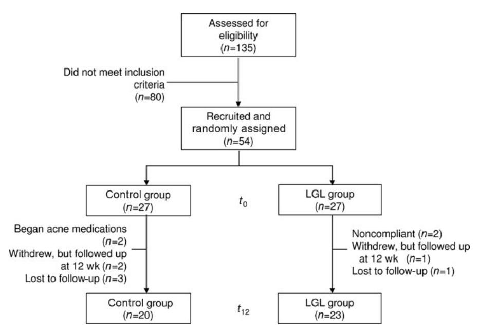
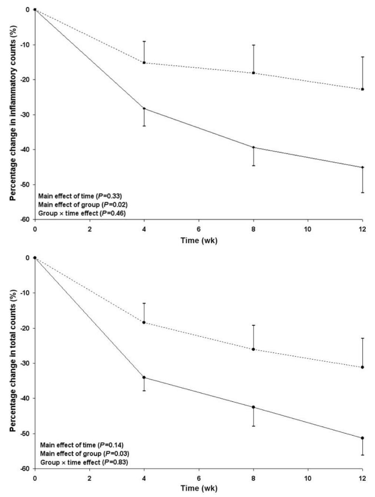
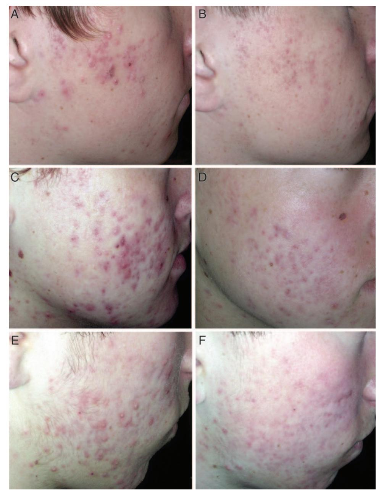
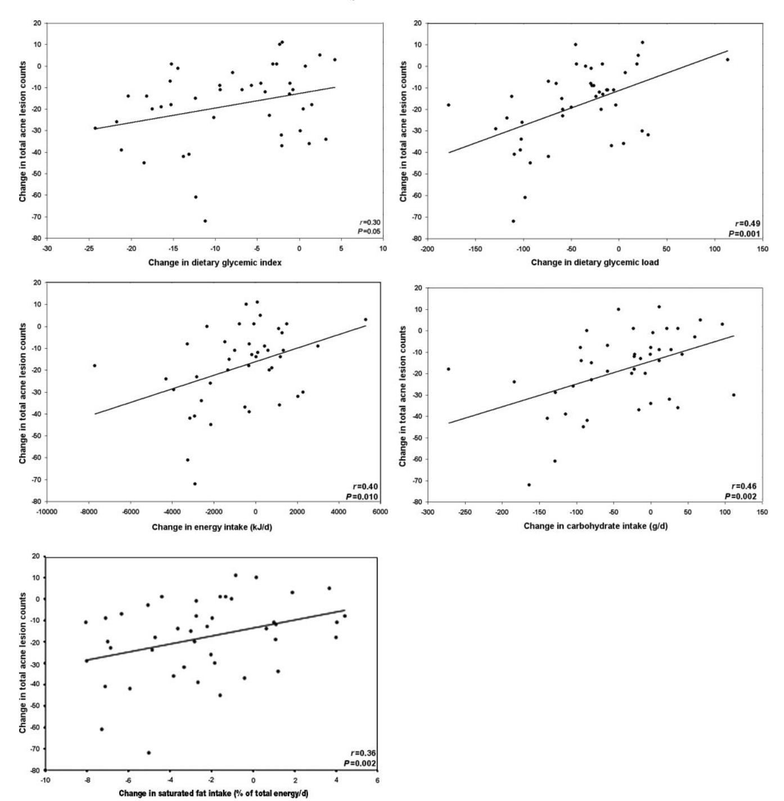

# A low-glycemic-load diet improves symptoms in acne vulgaris patients: a randomized controlled trial13

*Robyn N Smith, Neil J Mann, Anna Braue, Henna Ma¨kela¨inen, and George A.Varigos*

## **ABSTRACT**

**Background:** Although the pathogenesis of acne is currently unknown, recent epidemiologic studies of non-Westernized populations suggest that dietary factors, including the glycemic load, may be involved.

**Objective:**The objective was to determine whether a low-glycemicload diet improves acne lesion counts in young males.

**Design:** Forty-three male acne patients aged 15-25 y were recruited for a 12-wk, parallel design, dietary intervention incorporating investigator-blinded dermatology assessments. The experimental treatment was a low-glycemic-load diet composed of 25% energy from protein and 45% from low-glycemic-index carbohydrates. In contrast, the control situation emphasized carbohydrate-dense foods without reference to the glycemic index. Acne lesion counts and severity were assessed during monthly visits, and insulin sensitivity (using the homeostasis model assessment) was measured at baseline and 12 wk.

**Results:** At 12 wk, mean (SEM) total lesion counts had decreased more (*P* - 0.03) in the low-glycemic-load group (23.5 3.9) than in the control group (12.0 3.5). The experimental diet also resulted in a greater reduction in weight (2.9 0.8 compared with 0.5 0.3 kg; *P* 0.001) and body mass index (in kg/m2 ; 0.92 0.25 compared with 0.01 0.11; *P* - 0.001) and a greater improvement in insulin sensitivity (0.22 0.12 compared with 0.47 0.31; *P* -0.026) than did the control diet.

**Conclusion:** The improvement in acne and insulin sensitivity after a low-glycemic-load diet suggests that nutrition-related lifestyle factors may play a role in the pathogenesis of acne. However, further studies are needed to isolate the independent effects of weight loss and dietary intervention and to further elucidate the underlying pathophysiologic mechanisms. *Am J Clin Nutr* 2007;86: 107–15.

**KEY WORDS** Acne, glycemic index, glycemic load, insulin resistance, hyperinsulinemia

## **INTRODUCTION**

Acne is a common and complex skin disease that affects individuals of all ages. InWestern populations, acne is estimated to affect 79 –95% of the adolescent population, 40 –54% of individuals older than 25 y, and 12% of women and 3% of men by middle age (1). In contrast, acne remains rare in non-Westernized societies such as the Inuit (2), Okinawan Islanders (3), Ache hunter-gatherers, and Kitavan Islanders (1). Although familial and ethnic factors are implicated in acne prevalence, this observation is complicated by the finding that incidence rates of acne have increased with the adoption of Western lifestyles (2). These observations suggest that lifestyle factors, including diet, may be involved in acne pathogenesis.

Historically, much debate has surrounded the subject of diet in the management of acne. In the 1930s, acne was considered to be a disease of disturbed carbohydrate metabolism because early work suggested that impaired glucose tolerance occurred in acne patients (4). On the basis of these observations and the anecdotal impressions of physicians, patients were often discouraged from eating excessive amounts of carbohydrates and high-sugar foods (5, 6). The diet and acne connection finally fell from favor in 1969 when a clinical study found no exacerbation of acne lesions in a group that ingested a chocolate bar compared with a group that ingested a placebo bar (7). Although it is the most widely cited reference dissociating diet and acne, this study has been criticized for a number of design flaws, including the similar nutrient composition ofthe placebo andthe chocolate bar (8 –10).

Recently, there has been a reappraisal of the diet and acne connection because of a greater understanding of how diet may affect endocrine factors involved in acne (1, 10). Of interest is the concept of the glycemic index (GI)—a system of classifying the glycemic response of carbohydrates. Because the GI can only be used to compare foods of equal carbohydrate content, the glycemic load was later developed to characterize the glycemic effect of whole meals or diets (GI available dietary carbohydrate). Cordain et al (1) postulated that high-glycemic-load diets may be a significant contributor to the high prevalence of acne seen in Western countries. The authors speculate that the frequent consumption of high-GI carbohydrates may repeatedly expose adolescents to acute hyperinsulinemia. Hyperinsulinemia has been implicated in acne pathophysiology because of its association with increased androgen bioavailability and free concentrations of insulin-like growth factor I (IGF-I) (10, 11). Therefore, we

Received September 20, 2006.

Accepted for publication February 9, 2007.

1 From the School of Applied Sciences, RMIT University, Melbourne, Australia (RNS and NJM); the Australian Technology Network, Centre for Metabolic Fitness (NJM);the Department of Dermatology, RoyalMelbourne Hospital, Parkville, Australia (AB and GAV); the Department of Biochemistry and Food Chemistry, Turku University, Turku, Finland (HM); and the Department of Dermatology, Royal Children's Hospital, Parkville, Australia (GAV).

2 Supported by a research grant from Meat and Livestock Australia.

3 Address reprint requests to RN Smith, School of Applied Sciences, RMIT University, GPO Box 2476V, Melbourne, Victoria, Australia, 3001. E-mail: robyn.smith@rmit.edu.au.

**FIGURE 1.** Recruitment to completion of participants after 12 wk ( $t_0$  = baseline,  $t_{12}$  = 12 wk).

hypothesized that low-glycemic-load dietary interventions may have a therapeutic effect on acne based on the beneficial endocrine effects of these diets. Consequently, the aim of this preliminary study was to investigate the efficacy of a low-glycemicload diet in reducing the severity of acne symptoms.

#### SUBJECTS AND METHODS

#### **Subjects**

Males with facial acne were recruited through posted fliers at the RMIT University (Melbourne, Australia) and newspaper advertisements. Informed consent was obtained from each participant or guardian (if aged <18 y), and the study was conducted at RMIT University after obtaining approval from the RMIT Human Ethics committee. This study included only male participants aged 15-25 y with mild-to-moderate facial acne. Participants were required to have had acne for >6 mo before recruitment. Individuals were excluded if they were currently taking medications known to affect acne or glucose metabolism. Additionally, a washout period of 6 mo was required for subjects who had previously taken oral retinoids or 2 mo for subjects who had taken oral antibiotics or topical antibacterial or retinoid agents.

#### Study design

It was calculated that 19 subjects per group would provide 80% power (at the 2-sided 5% level) to detect a difference of 20% in the reduction of acne lesions between groups, assuming an SD of 22%. To compensate for subject withdrawal, 54 subjects were enrolled in the study.

Eligible participants were recruited between June 2003 and June 2004. Approximately 2–3 wk after recruitment, participants attended their baseline appointment and were randomly assigned to either the low-glycemic-load (LGL) or the control group (**Figure 1**). Randomization was carried out by computer generated random numbers, and allocation to groups was performed by a third party.

This study was designed as a parallel dietary intervention study with investigator-blinded dermatology assessments. Topical therapy, in the form of a noncomedogenic cleanser, was standardized for both groups, and facial acne was scored at monthly visits (weeks 0, 4, 8, and 12) at the academic research clinic. On all visits, height and weight were measured. All subjects were weighed in light clothes, and body mass index (BMI) was calculated as weight (kg)/height squared (m). At baseline and 12-wk, a venous blood sample was taken after an overnight fast, and an oral glucose insulin sensitivity (OGIS) test was performed in a subgroup of participants from the LGL and control groups.

The primary endpoints of the study were changes in inflammatory lesion counts (papules, pustules, and nodules) and total lesion counts (inflammatory lesions and noninflammatory lesions) after 12 wk. Secondary endpoints included changes in anthropometric measures and insulin sensitivity indexes.

#### **Dietary intervention**

Participants were informed that the study's intent was to compare the dietary carbohydrate to protein ratio and were not informed of the study's true intent. The LGL diet was achieved by modifying the amount and type of carbohydrate. The LGL group was instructed to substitute high-GI foods with foods higher in protein (eg, lean meat, poultry, or fish) or with foods with a lower GI (eg, whole-grain bread, pasta, and fruit). Some staple foods were supplied, and the participants were urged to consume these or similar foods daily. Each participant received individualized dietary plans that were isocalorically matched with their baseline diet as determined from 7-d weighed and measured food records. The recommended LGL diet consisted of 25% of energy from protein, 45% from low-GI carbohydrates, and 30% energy from fats. In contrast, the control group received carbohydrate-dense staples and were instructed to eat these or similar foods daily. The foods provided had moderate-to-high GI values and were typical of their normal diet as evidenced from 7-d weighed and measured food records. The control group was not informed about the GI, but were urged to include carbohydrates as a regular part of their diet. All participants were instructed on how to use food scales and to keep foods records. During the study period, nutrient intakes were calculated from 3-d weighed and measured food records each month by using Australia-specific dietary analysis software (FOODWORKS; Xyris Software, Highgate Hill, Australia). Dietary compliance was monitored via regular telephone interviews, assessments of daily glycemic load, and 24-h urine samples (weeks 0 and 12) for an assessment of urea excretion relative to urinary creatinine as a marker of protein intake.

## **Calculation of dietary glycemic index and glycemic load**

Daily dietary glycemic index and glycemic load were calculated from diet records. The dietary GI was calculated as-(GI for food item proportion of total carbohydrate contributed by item), and the glycemic load was calculated as -(GI for food item its carbohydrate content in grams/100). The GI values used had glucose as the reference food and were taken from reference tables (12) and from Sydney University's GI website (13). If a food from Australia was not available, the GI was estimated by using similar foods of known value.

## **Standardized topical lotion**

All participants were provided with a topical cleanser (Cetaphil gentle skin cleanser; Galderma, Frenchs Forrest, Australia) and advised to use it in place of their normal wash, soap, or cleanser. The subjects began using the topical wash 2 wk before baseline and were asked to maintain a standard level of use during the trial.

## **Dermatology assessment**

Scaling of the acne was performed by a dermatology registrar who was blinded to the group assignment of the participants. The registrar assessed facial acne occurrence and severity only using a modified Cunliffe-Leeds lesion count technique (14). To ensure that all acne lesions were counted, located, and graded by size and severity, lesions were mapped by placing a transparent plastic film with a laser-printed grid gently against the skin. Facial anatomical landmarks, such as the ear, chin, and tip of the nose, were used to ensure consistency between assessments. Each side of the face was assessed separately. Where necessary, the registrar palpated the skin to determine the lesion type. To maintain the reproducibility of this procedure, one physician performed all the dermatology assessments. A small group of volunteers (*n* - 4) was counted 1-wk apart to evaluate the reproducibility by the same physician (9.5% CV).

## **Laboratory analyses**

Code-labeled serum samples were stored at 80 °C for analysis after the study by an independent laboratory. Baseline and 12-wk samples for each participant were included in the same assay run to avoid interassay variability. Serum insulin was measured by using a commercially available microparticle enzyme immunoassay (Abbott Laboratories, Tokyo, Japan; intraassay CV: 4.0%). Capillary blood glucose was measured on the day of testing with a Glucose 201 analyzer (HemoCue, Sweden; intraassay CV: 1.6%).

### **Insulin sensitivity measures**

The homeostasis model assessment of insulin resistance (HOMA-IR) was calculated as fasting glucose (mmol/L) fasting insulin (U/mL)/22.5 (15). We also used the model-derived formula proposed by Mari et al (16) to calculate the OGIS index from a 2-h oral-glucose-tolerance test. This formula was calculated by using 6 fixed-rate constants: oral glucose dose (75 g); body surface area; glucose concentrations (mg/dL) at 0, 90, and 120 min; and insulin concentrations (U/mL) at 0 and 90 min. In the present study, some participants were unable to complete the 2-h test because of scheduling interference (eg, school and work commitments). Consequently, the OGIS data presented are for only 18 subjects in the LGL group and for 17 subjects in the control group.

### **Statistical analysis**

All statistical analyses were performed with the use of SPSS 11.0 for WINDOWS (SPSS Inc, Chicago, IL). Baseline characteristics were analyzed for between-group significance with a Mann-Whitney*U*test or an independent-sample *t* test, depending on whether or not the data were normally distributed. Repeatedmeasures analysis of variance was used to analyze dietary and acne (lesion count) data and to explore the effects of time, treatment, and an interaction of these 2 factors.We compared changes in lesion counts using repeated-measures analysis of logtransformed data at each follow-up visit with baseline lesion counts as the covariate. *P* values 0.05 were considered significant. Analysis of covariance (ANCOVA) was used to test for overall treatment differences at 12 wk, with baseline data as the covariate. Secondary analyses were performed with adjustment for changes in BMI.

The primary clinical outcome (changes in lesion counts at 12 wk) was analyzed by using an intention-to-treat model for all randomized subjects with the use of the last measurement carried forward for all missing data.

Bivariate linear regression analysis was also conducted, pooling data from both groups, to explore relations between dietary variables and acne improvement.

## **RESULTS**

#### **Subjects**

Forty-three subjects completed the study per protocol (Figure 1). Seven participants did not complete the study (5 in the control and 2 in the LGL group), and 4 were removed from data set (2 began taking acne medications and 2 were noncompliant). Baseline characteristics of the subjects are shown in **Table 1**.

#### **Dietary intakes**

Dietary intakes of the LGL and control groups at baseline and during the trial period is shown in **Table 2**. No significant group differences were observed in any of the dietary variables at baseline. During the trial period, dietary glycemic load decreased significantly in the LGL group compared with the control group, and this change was achieved by a reduction in carbohydrate intake and by the consumption of low-GI foods (as indicated by a reduction in the calculated dietary GI). Protein intake increased in the LGL group and decreased slightly in the control group, which indicates that some carbohydrates were replaced with

**TABLE 1**Subject characteristics at baseline by dietary group1

| LGL group $(n = 23)$ | Control group $(n = 20)$                                                                                       | $P^2$                                                                                                                                                                                                                                                                            |
|----------------------|----------------------------------------------------------------------------------------------------------------|----------------------------------------------------------------------------------------------------------------------------------------------------------------------------------------------------------------------------------------------------------------------------------|
|                      |                                                                                                                |                                                                                                                                                                                                                                                                                  |
| 20                   | 17                                                                                                             | 0.60                                                                                                                                                                                                                                                                             |
| 3                    | 3                                                                                                              |                                                                                                                                                                                                                                                                                  |
| $18.2 \pm 0.5^3$     | $18.5 \pm 0.5$                                                                                                 | 0.76                                                                                                                                                                                                                                                                             |
| $73.5 \pm 2.5$       | $73.3 \pm 3.3$                                                                                                 | 0.90                                                                                                                                                                                                                                                                             |
| $22.9 \pm 0.6$       | $22.5 \pm 0.7$                                                                                                 | 0.34                                                                                                                                                                                                                                                                             |
| $40.6 \pm 5.0$       | $34.9 \pm 4.3$                                                                                                 | 0.40                                                                                                                                                                                                                                                                             |
| $31.9 \pm 3.9$       | $28.4 \pm 3.6$                                                                                                 | 0.72                                                                                                                                                                                                                                                                             |
| $481 \pm 9$          | $503 \pm 9$                                                                                                    | 0.12                                                                                                                                                                                                                                                                             |
| $1.6 \pm 0.2$        | $1.5 \pm 0.2$                                                                                                  | 0.88                                                                                                                                                                                                                                                                             |
|                      | $(n = 23)$ $20$ $3$ $18.2 \pm 0.5^{3}$ $73.5 \pm 2.5$ $22.9 \pm 0.6$ $40.6 \pm 5.0$ $31.9 \pm 3.9$ $481 \pm 9$ | $(n = 23)$ $(n = 20)$ $ \begin{array}{cccc} 20 & & 17 \\ 3 & & 3 \\ 18.2 \pm 0.5^3 & & 18.5 \pm 0.5 \\ 73.5 \pm 2.5 & & 73.3 \pm 3.3 \\ 22.9 \pm 0.6 & & 22.5 \pm 0.7 \\ 40.6 \pm 5.0 & & 34.9 \pm 4.3 \\ 31.9 \pm 3.9 & & 28.4 \pm 3.6 \\ 481 \pm 9 & & 503 \pm 9 \end{array} $ |

OGIS, oral glucose insulin sensitivity; HOMA-IR, homeostasis model assessment of insulin resistance; LGL, low glycemic load.

foods higher in protein. This observation was substantiated by a 15.4% increase in the ratio of urinary urea to creatinine at 12 wk for the LGL group compared with a 12.3% decrease for the control group (P=0.009), which indicated good dietary compliance.

#### Study outcomes

As shown in Figure 2, both the LGL and control groups showed reductions in inflammatory and total lesion counts from 0 to 12 wk. Repeated-measures analysis that used baseline counts as the covariate indicated an overall difference between the LGL and control groups (main effect of group), but no significant change over time (main effect of time) or difference in the time course between the groups (group × time interaction) was observed. At 12 wk, the LGL group had a greater reduction in the mean number of total and inflammatory lesions than did the control group (Table 3). Examples of acne improvement in the LGL group are shown in Figure 3. The mean number of total lesions fell by 23.5 (51%) in the LGL group and by 12.0 (31%) in the control group (P = 0.03). Inflammatory lesion counts fell by 17.0 (45%) in the LGL group and by 7.4 (23%) in the control group (P = 0.02). The results at 12 wk were also materially unchanged by an intention-to-treat analysis.

The LGL group also showed significant reductions in weight (P = <0.001), BMI (P = 0.001) and HOMA-IR (P = 0.026) when compared with the control group. The change in HOMA correlated with the change in OGIS index (r = -0.36, P = 0.035), with both models suggesting a trend for improved insulin sensitivity in the LGL group and a trend for increasing insulin resistance in the control group. Statistical adjustment of study endpoints for the change in BMI was found to alter the outcome for HOMA-IR (P = 0.10) and total lesion counts (P = 0.07), but not inflammatory

TABLE 2
Dietary intakes of low-glycemic-load (LGL) and control groups at baseline and during the trial period

| Variable                         | LGL group Control group $(n = 23)$ $(n = 20)$ |                  | $P^{I}$ |         |                          |
|----------------------------------|-----------------------------------------------|------------------|---------|---------|--------------------------|
|                                  |                                               |                  | Group   | Time    | Group × time interaction |
| Energy (kJ/d)                    |                                               |                  | 0.15    | 0.09    | 0.100                    |
| Baseline 2            | $10 625 \pm 572^3$                            | $10540\pm546$    |         |         |                          |
| Trial period 4        | $9320 \pm 460$                                | $10620 \pm 494$  |         |         |                          |
| Dietary glycemic index           |                                               |                  | < 0.001 | < 0.001 | < 0.001                  |
| Baseline                         | $57.5 \pm 1.0$                                | $57.2 \pm 0.8$   |         |         |                          |
| Trial period                     | $43.2 \pm 0.8$                                | $56.4 \pm 0.8$   |         |         |                          |
| Dietary glycemic load            |                                               |                  | < 0.001 | < 0.001 | < 0.001                  |
| Baseline                         | $174.7 \pm 9.1$                               | $181.5 \pm 11.5$ |         |         |                          |
| Trial period                     | $101.5 \pm 6.1$                               | $174.3 \pm 10.7$ |         |         |                          |
| Carbohydrate (% of total energy) |                                               |                  | 0.013   | 0.195   | 0.001                    |
| Baseline                         | $50.2 \pm 1.1$                                | $48.2 \pm 1.2$   |         |         |                          |
| Trial period                     | $44.1 \pm 1.3$                                | $50.1 \pm 1.2$   |         |         |                          |
| Protein (% total energy)         |                                               |                  | 0.001   | < 0.001 | < 0.001                  |
| Baseline                         | $16.3 \pm 0.6$                                | $17.5 \pm 0.9$   |         |         |                          |
| Trial period                     | $22.7 \pm 0.8$                                | $17.4 \pm 0.8$   |         |         |                          |
| Total fat (% total energy)       |                                               |                  | 0.84    | 0.74    | 0.45                     |
| Baseline                         | $32.5 \pm 1.1$                                | $31.8 \pm 1.2$   |         |         |                          |
| Trial period                     | $31.5 \pm 0.9$                                | $31.4 \pm 1.2$   |         |         |                          |
| Saturated fat (% total energy)   |                                               |                  | 0.002   | < 0.001 | < 0.001                  |
| Baseline                         | $13.5 \pm 0.6$                                | $12.9 \pm 0.7$   |         |         |                          |
| Trial period                     | $9.0 \pm 0.4$                                 | $13.0 \pm 0.9$   |         |         |                          |
| Fiber (g/d)                      |                                               |                  | 0.002   | < 0.001 | < 0.001                  |
| Baseline                         | $25.3 \pm 1.8$                                | $25.2 \pm 2.1$   |         |         |                          |
| Trial period                     | $36.9 \pm 2.0$                                | $25.2 \pm 2.0$   |         |         |                          |

&lt;sup>1 Repeated-measures ANOVA was done to incorporate data from all time points and to evaluate the differences between the LGL and the control groups (main effect of group), the change over time (main effect of time), and the differences in the time course between the 2 groups (group × time interaction).

 $^2$  Corresponds with an independent-sample t test or Mann-Whitney U test for means and the Fisher's exact test for ethnicity.

 $^{3}\bar{x} \pm \text{SEM}$  (all such values).

 $^{4}$  n = 18 for the LGL group and n = 17 for the control group.

&lt;sup>2 An independent-sample t test showed no significant differences between the LGL and the control groups for any of the listed dietary variables at baseline.

 $^{3}\bar{x} \pm SE$  (all such values).

&lt;sup>4 Means of data collected at 4, 8, and 12 wk.

**FIGURE 2.** Mean ( $\pm$ SEM) percentage changes from baseline in inflammatory acne lesion counts and in total acne lesion counts in the low-glycemic-load group (solid line; n=23) and the control group (dashed line; n=20) at each visit. Repeated-measures ANOVA was performed by incorporating the absolute data (log transformed) from each follow-up visit, with baseline counts as the covariate.

counts (P = 0.04). However, we found no significant interaction effect of dietary treatment and the change in BMI on acne lesion counts.

### Dietary variables as predictors of acne improvement

Dietary correlates with acne improvement include reductions in glycemic load (r = 0.49, P = 0.001), dietary GI (r = 0.30, P = 0.05), carbohydrate intake (r = 0.46, P = 0.002), percentage saturated fat (r = 0.36, P = 0.019), and total energy intake (r = 0.40, P = 0.010). These relations are shown in **Figure 4**.

#### DISCUSSION

This study was the first randomized controlled intervention to examine the influence of dietary glycemic load on the clinical assessment of acne. After adjustment for differences in acne severity at baseline, we found that the LGL group had greater overall reduction in total and inflammatory lesion counts than did the control group. Analysis of the primary endpoint data also showed that the differences between groups remained significant after an intention-to-treat model was used. However, we found no significant effect of time on acne, possibly because acne is a

**TABLE 3** Absolute mean differences from baseline to 12 wk in outcome variables by dietary group*1*

| Variable                    | LGL group       | Control group   | P2    |  |
|-----------------------------|-----------------|-----------------|-------|--|
| Per protocol analysis       |                 |                 |       |  |
| Total count                 | 23.5  3.9 [23]3 | 12.0  3.5 [20]  | 0.03  |  |
| Inflammatory count          | 17.0  3.1 [23]  | 7.4  2.5 [20]   | 0.02  |  |
| Weight (kg)                 | 2.9  0.8 [23]   | 0.5  0.3 [20]   | 0.001 |  |
| BMI (kg/m2 )             | 0.92  0.25 [23] | 0.01  0.11 [20] | 0.001 |  |
| HOMA-IR4                    | 0.22  0.12 [23] | 0.47  0.31 [20] | 0.026 |  |
| OGIS (mL  m2 min1 )   | 12.7  7.9 [18]  | 18.3  9.9 [17]  | 0.08  |  |
| Intention-to-treat analysis |                 |                 |       |  |
| Total count                 | 22.0  3.5 [27]  | 10.9  2.9 [27]  | 0.02  |  |
| Inflammatory count          | 16.2  2.9 [27]  | 5.6  2.5 [27]   | 0.01  |  |

*1* HOMA-IR, homeostasis model assessment of insulin resistance; OGIS, oral glucose insulin sensitivity index.

dynamic condition in which both spontaneous improvements and flares can occur over time.

Few well-controlled dietary studies have examined the effect of diet on acne. Fulton et al (7), in a crossover single-blind study, found no effect of chocolate on acne when compared with a placebo bar. However, a later examination of the ingredients in the placebo bar indicated that the fatty acid composition and sugar contents were virtually identical to that found in the chocolate (8). Anderson examined the effect of the daily consumption of chocolate, milk, or nuts and found no effect on acne (17). However, this study has also been criticized for its small sample size, short follow-up, and lack of control (18). Chiu et al (19) showed, in university students, an association between worsening diet quality and exacerbation of acne during a preexamination period. However, stress was found to be the main contributing factor, and diet was assessed by using a nonquantitative, selfassessed measure of diet quality. Recently, a retrospective evaluation of dietary intake showed a positive association between milk intake and physician-diagnosed severe acne (20). However, the authors admit that this association may have been affected by the imprecision inherent in the measurement of dietary intakes via dietary recall.

High-glycemic-load diets have recently been implicated in acne etiology because of their ability to increase the insulin demand and other factors associated with insulin resistance (eg, hyperphagia, elevated nonesterified fatty acids, and obesity) (11). Clinical and experimental evidence suggests that insulin may increase androgen production and affect, through its influence on steroidogenic enzymes (21), gonadotrophin releasing hormone secretion (22) and sex hormone– binding globulin production (23–25). Additionally, insulin has been shown to decrease a binding protein for IGF-I, which may facilitate the effect of IGF-I on cell proliferation (26). Overall, these events may influence 1 or more of the 4 underlying causes of acne: *1*) increased proliferation of basal keratinocytes within the pilosebaceous duct, *2*) abnormal desquamation of follicular corneocytes, *3*) androgen-mediated increases in sebum production, and *4*) colonization and inflammation of the comedo by *Propionibacterium acnes* (11).

The role of insulin in acne development is also supported by the high prevalence of acne in women with polycystic ovary syndrome (PCOS), a condition associated with insulin resistance, hyperinsulinemia, and hyperandogenism (27). Insulin resistance is believed to be the underlying disturbance in PCOS, because it generally precedes and gives rise to the cluster of endocrine abnormalities that characterize PCOS (elevated androgen and IGF-I concentrations and low sex hormone– binding globulin; 28). Treatments for PCOS now include oral hypoglycemic agents, which improve insulin sensitivity, restore fertility, and alleviate acne (29).

Our study also suggests that changes in acne may be closely related to changes in insulin sensitivity, because we observed a positive effect of the LGL diet on insulin sensitivity compared with the control diet. However, the improvement in insulin sensitivity may be attributable not only to the reduction in glycemic load (30), but also to the reduction in body mass. The participants in the LGL group lost weight despite receiving dietary advice to maintain their baseline energy intake. This may have been due to the dual effect of added protein and low-GI foods, because both influence hunger and satiety. Feeding studies have shown that low-GI foods increase satiety, delay hunger, and decrease food intake when compared with high-GI foods (31, 32). Similar effects on satiety have been reported for high-protein meals compared with isocaloric high-carbohydrate or high-fat meals (33). Therefore, the combined effect of low-GI foods and added protein may have reduced ad libitum food intake, which made it difficult for our participants to maintain the energy density of their baseline diets.This observationis supported by previous studiesthat showed ad libitum LGL diets to reduce energy intake without the need for an externally imposed energy restriction (34, 35).

Because the participants in the LGL group lost weight, we cannot preclude a role for the change in BMI in the overall treatment effect. When we statistically adjusted the data for changes in BMI, the effect of the LGL diet on total lesion counts and HOMA-IR was lost. This suggests that the therapeutic effect may be a factor of the weight loss or simply that weight loss is another manifestation of an LGL diet. Apart from women with PCOS, little evidence suggests an association between acne severity and body weight. Aizawa and Niimura (36) showed mild peripheral insulin resistance in female acne sufferers that was not associated with obesity or menstrual irregularities. In contrast, Bourne and Jacobs (29) showed that adult men with acne were

*2* By ANCOVA for between-group comparison with baseline as a covariate.

*3 x* SEM; *n* in brackets (all such values). *4* Values are nonparametrically distributed. ANCOVA was performed on log-transformed data.

**FIGURE 3.** Photographs of acne improvement in the low-glycemic-load group. A and B: subject A at baseline and 12 wk respectively; C and D: subject B at baseline and 12 wk, respectively; and E and F: subject C at baseline and 12 wk, respectively.

significantly heavier (5.6 kg) than men without acne. However, the authors showed that this association was dependent on age, because weight was not associated with acne in adolescents aged 15-19 y. Our data also showed a significant correlation between acne lesion counts and BMI in males aged 18-25 y, but this was not true for the subjects aged 18 y (data not shown). The reason for this observation is unknown, but it is possible that the transient decline in insulin sensitivity that occurs with the progression through puberty may trigger acne in the younger population (37, 38).

A few limitations of the study should be addressed. First, it is possible that the topical application of the mild skin cleanser may have contributed to the acne improvement through effects on the epidermal barrier function (39). Because acne improved in the control groupwithoutany significantchangestotheir diet,a possible direct effect of the cleanser should be considered. Second, because of the nature of the LGL dietary intervention, we cannot solely attribute the treatment effects to changes in glycemic load because other dietary factors (eg, zinc and vitamin A intake) may mediate or confound the relation between diet and acne improvement. Last, this study relied on self-reporting of dietary intakes. Underreporting the quantity of food eaten is a known source of measurement error when assessing adolescent diets (40).

To our knowledge, this is the first study to show a therapeutic effect of dietary intervention on acne. After 12 wk, the LGL diet was shown to significantly reduce acne lesion counts and improve insulin sensitivity when compared with a high-glycemic-load diet. Although we could notisolatethe effect ofthe LGL diet fromthat of

**FIGURE 4.** Relations between acne improvement and changes in dietary glycemic index, dietary glycemic load, energy intake, carbohydrate intake, and percentage saturated fat. Bivariate analysis was performed with a 2-tailed Pearson's correlation (*n* -43).

weight loss, these findings are consistent with earlier suggestions of the association between hyperinsulinemia and acne. These observations will need to be substantiated and the underlying mechanisms determined in larger-scale studies.

The authors' responsibilities were as follows—RNS, NJM, and AB: contributed to the writing of this manuscript; RNS, AB, and HM: helped with the data collection; RNS: responsible for the data analysis; and NJM and GAV: provided significant advice and supervised the project. The sponsor of this study, Meat and Livestock Australia, had no role in the data collection, data analysis, data interpretation, or submission of this article for publication. RNS received a postgraduate scholarship from MINTRAC (National Meat Industry Training Council of Australia).

# **REFERENCES**

- 1. Cordain L, Lindeberg S, Hurtado M, Hill K, Eaton B, Brand-Miller B. Acne vulgaris—a disease of Western civilization. Arch Dermatol 2002; 138:1584 –90.
- 2. Schaefer O. When the Eskimo comes to town. Nutr Today 1971;6:8 –16.
- 3. Steiner P. Necropsies on Okinawans: anatomic and pathologic observations. Arch Pathol 1946;42:359 – 80.

- 4. Campbell G. The relation of sugar intolerance to certain diseases of the skin. Br J Dermatol Syph 1931;43:297–304.
- 5. Belsario J. Acne vulgaris: its aetiology and treatment. Aust J Dermatol 1951;1:85–111.
- 6. Sulzberger M, Baer R. Acne vulgaris and its management. Year book of dermatology and syphilology. Chicago, IL: The Year Book Publishers, 1948:9 –39.
- 7. Fulton J, Plewig G, Kligman A. Effect of chocolate on acne vulgaris. JAMA 1969;210:2071– 4.
- 8. Mackie B, Mackie L. Chocolate and acne. Aust J Dermatol 1974;15: 103–9.
- 9. Rasmussen J. Diet and acne. Int J Dermatol 1977;16:488 –91.
- 10. Cordain L. Implications for the role of diet in acne. Semin Cutan Med Surg 2005;24:84 –91.
- 11. Cordain L, Eades M, Eades M. Hyperinsulinemic diseases of civilization: more than just Syndrome X. Comp Biochem Physiol 2003;136: 95–112.
- 12. Foster-Powell K, Holt S, Brand-Miller J. International table of glycemic index and glycemic load values. Am J Clin Nutr 2002;76:5–56.
- 13. Lindeberg S, Eliasson M, Lindahl B, Ahren B. Low serum insulin in traditional Pacific Islanders—the Kitava Study. Metabolism 1999;48: 1216 –9.
- 14. Burke R, Cunliffe W. The assessment of acne vulgaris—the Leeds technique. Br J Dermatol 1984;111:83–92.
- 15. Matthews D, Hosker J, Rudenski A, Naylor B, Treacher D, Turner R. Homeostasis model assessment: insulin resistance and beta-cell function from fasting plasma glucose and insulin concentrations in man. Diabetologica 1985;28:412–9.
- 16. Mari A, Pacini G, Murphy E, Ludvik B, Nolan J. A model-based method for assessing insulin sensitivity from the oral glucose tolerance test. Diabetes Care 2001;24:539 – 48.
- 17. Anderson P. Foods as the cause of acne. Am J Fam Pract 1971;3:102–3.
- 18. Margin P, Pond D, Smith W, Watson A. A systematic review of the evidence for 'myths and misconceptions' in acne management: diet, face-washing and sunlight. Fam Pract 2005;22:62–70.
- 19. Chiu A, Chon S, Kimball A. The response of skin disease to stress: changesinthe severity of acne vulgaris as affected by examination stress. Arch Dermatol 2003;139:897–900.
- 20. Adebamowo C, Spiegelman D, Danby F, Frazier A, Willett W, Holmes M. High school dietary dairy intake and teenage acne. J Am Acad Dermatol 2005;52:207–14.
- 21. Kristiansen S, Endoh A, Casson P, Buster J, Hornsby P. Induction of steroidogenic enzyme genes by insulin and IGF-I in cultured adult human adrenocortical cells. Steroids 1997;62:258 – 65.
- 22. Willis D, Mason H, Gilling-Smith C, Franks S. Modulation by insulin of follicle stimulating and luteinizing hormone action in human granulosa cells of normal and polycystic ovaries. J Clin Endocrinol Metab 1996; 81:302–9.

- 23. Plymate S, Matej L, Jones R, Friedl K. Inhibition of sex hormonebinding globulin production in the human hepatoma (HepG2) cell line by insulin and prolactin. J Clin Endocrinol Metab 1995;67:460 – 4.
- 24. Haffner S. Sex hormone-binding protein, hyperinsulinemia, insulin resistance and non-insulin-dependent diabetes. Horm Res 1996;45:233–7.
- 25. Goodman-Gruen D, Barret-Connor E. Sex hormone-binding globulin and glucose tolerance in postmenopausal women. The Rancho Bernardo study. Diabetes Care 1997;20:645–9.
- 26. Powell D, Suwanichkul A, Cubbage M, DePaolis L, Snuggs M, Lee P. Insulin inhibits transcription of the human gene for insulin-like growth factor-binding protein-1. J Biol Chem 1991;266:18868 –76.
- 27. Franks S. Polycystic ovary syndrome. N Engl J Med 2003;13:853– 61.
- 28. Dunaif A, Segal K, Shelley D, Green G, Dorbrjansky A. Profound peripheral insulin resistance, independent of obesity in polycystic ovary syndrome. Diabetes 1989;38:1165–74.
- 29. Bourne S, Jacobs A. Observations on acne, seborrhoea, and obesity. BMJ 1956;1:1268 –70.
- 30. Frost G, Keogh B, Smith D, Akinsanya K, Leeds A. The effect of low-glycemic carbohydrate on insulin and glucose response in vivo and in vitro in patients with coronary heat disease. Metabolism 1996;45: 669 –72.
- 31. Ball S, Keller K, Moyer-Mileur L, Ding Y, Donaldson D, Jackson W. Prolongation of satiety after low versus moderately high glycemic index meals in obese adolescents. Pediatrics 2003;111:488 –94.
- 32. Ludwig D. Dietary glycemic index and obesity. J Nutr 2000;130(suppl): 280S–3S.
- 33. Poppitt S, McCormack D, Buffenstein R. Short-term effects of macronutrient preloads on appetite and energy intake in lean women. Physiol Behav 1998;64:279 – 85.
- 34. Ebbeling C, Leidig M, Sinclair K, Hangen J, Ludwig D. A reduced glycemic load diet in the treatment of adolescent obesity. Arch Pediatr Adolesc Med 2003;157:773–9.
- 35. Spieth L, Harnish J, Lenders C, et al. A low-glycemic index diet in the treatment of pediatric obesity. Arch Pediatr Adolesc Med 2000;154: 947–51.
- 36. Aizawa H, Niimura M. Mild insulin resistance during oral glucose tolerance test (OGTT) in women with acne. J Dermatol 1996;23:526 –9.
- 37. Caprio S, Plewe G, Diamond M, et al. Increased insulin secretion in puberty: a compensatory response to reductions in insulin sensitivity. J Pediatr 1989;114:963– 67.
- 38. Bloch C, Clemons P, Sperling M. Puberty decreases insulin sensitivity. J Pediatr 1987;110:481–7.
- 39. Draelos Z. The effect of a daily facial cleanser for normal to oily skin on the skin barrier of subjects with acne. Cutis 2006;78(suppl):34 – 40.
- 40. Livingstone M, Robson P. Measurement of dietary intake in children. Proc Nutr Soc 2000;59:279 –93.