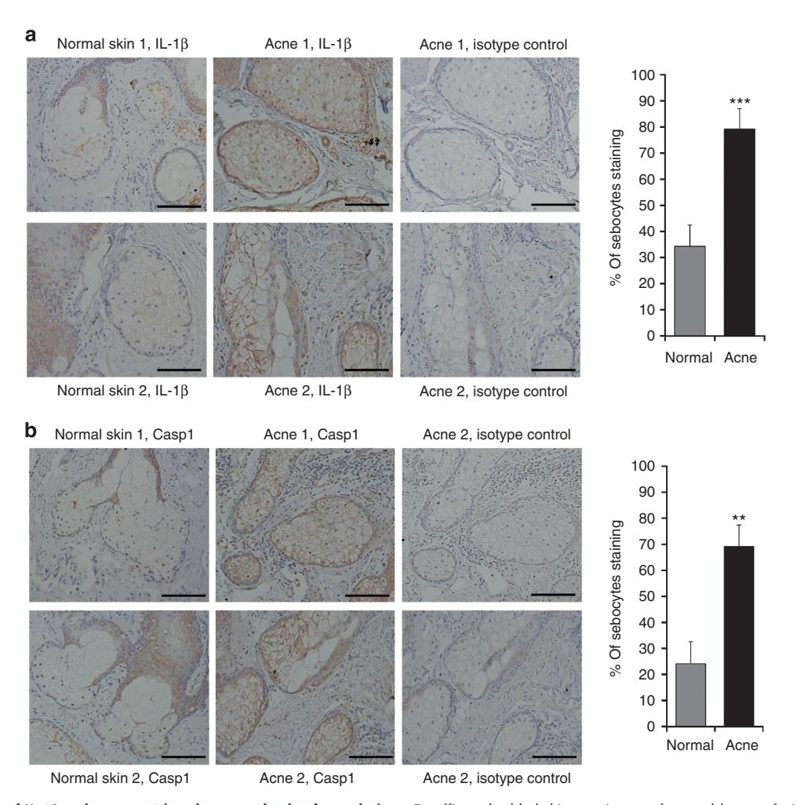
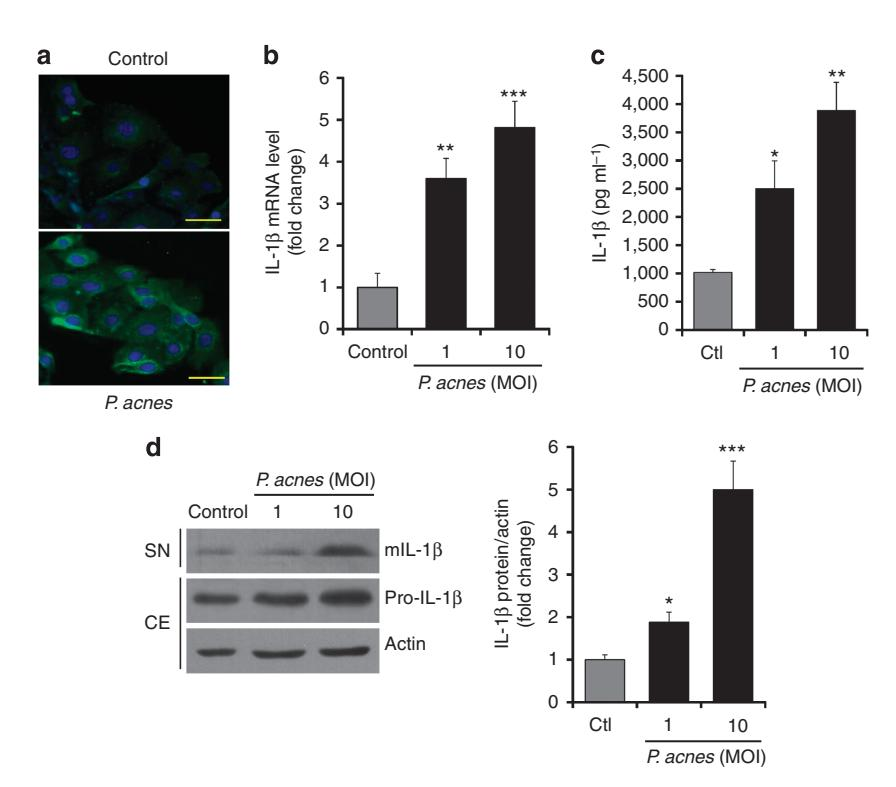
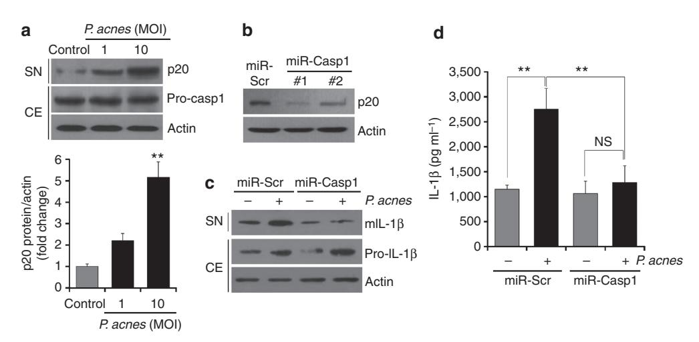
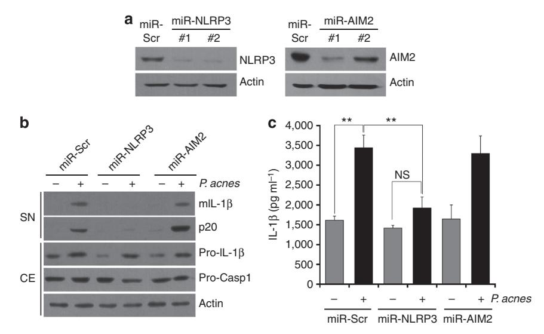
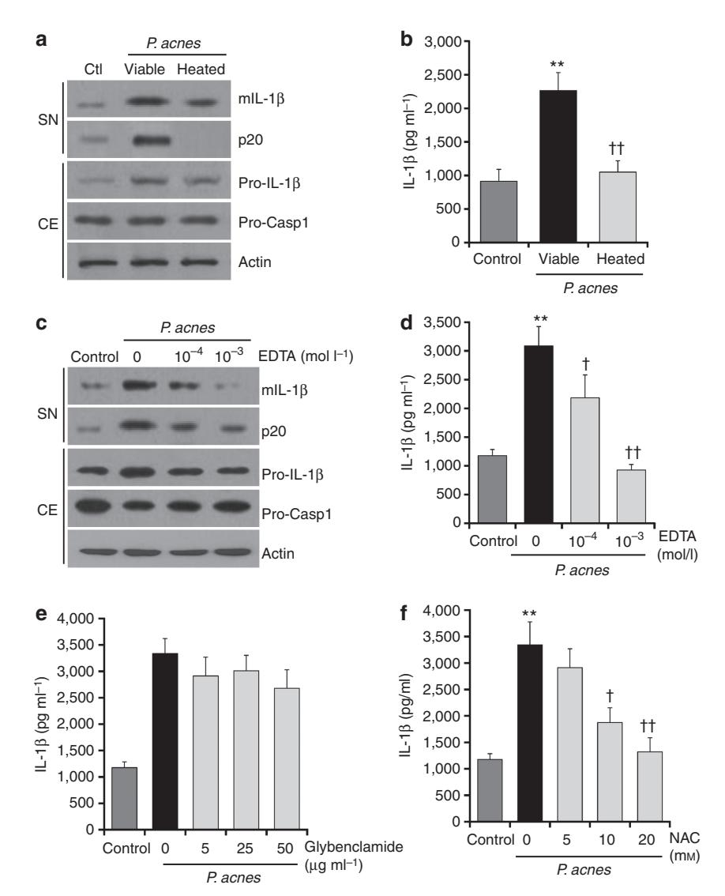
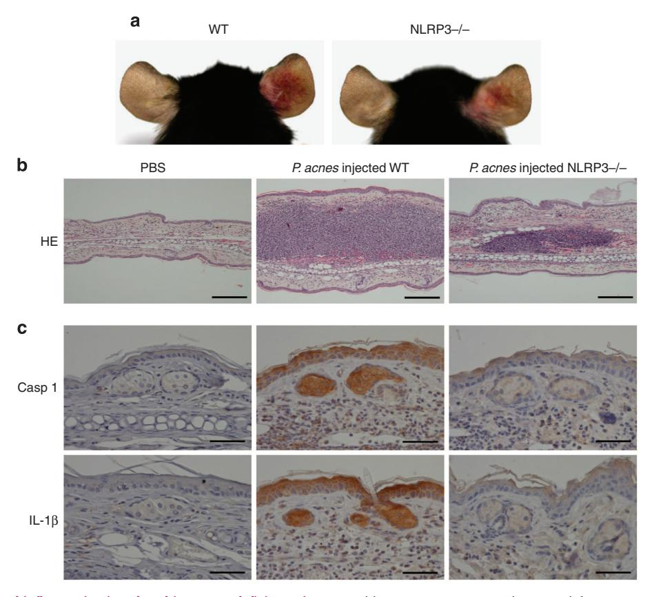

# **Propionibacterium acnes** Activates the NLRP3 Inflammasome in Human Sebocytes

Zheng Jun Li1, Dae Kyoung Choi1, Kyung Cheol Sohn1, Min Seok Seo1, Hae Eul Lee1, Young Lee1, Young Joon Seo1, Young Ho Lee2, Ge Shi3, Christos C. Zouboulis4, Chang Deok Kim1, Jeung Hoon Lee1 and Myung Im1

Propionibacterium acne and sebaceous glands are considered to have an important role in the development of acne. Although information regarding the activation of innate immunity by *P. acnes* in the sebaceous gland is limited, different *P. acnes* phylotypes and a higher prevalence of follicular *P. acnes* macrocolonies/biofilms in sebaceous follicles of skin biopsies from acne compared with control skin and occasionally single *P. acnes* clusters in single sebaceous glands have been detected. In this study, we investigated whether *P. acnes* activates the inflammasome in human sebaceous glands *in vivo* and *in vitro*. We found that IL-1β expression was upregulated in sebaceous glands of acne lesions. After stimulation of human sebocytes with *P. acnes*, the activation of caspase-1 and secretion of IL-1β were enhanced significantly. Moreover, knocking down the expression of NLRP3 abolished *P. acnes*-induced IL-1β production in sebocytes. The activation of the NLRP3 inflammasome by *P. acnes* was dependent on protease activity and reactive oxygen species generation. Finally, we found that NALP3-deficient mice display an impaired inflammatory response to *P. acnes*. These results suggest that human sebocytes are important immunocompetent cells that induce the NLRP3 inflammasome, and that *P. acnes*-induced IL-1β activation in sebaceous glands may have a role in combating skin infections and in acne pathogenesis.

Journal of Investigative Dermatology (2014) 134, 2747-2756; doi:10.1038/jid.2014.221; published online 5 June 2014

### **INTRODUCTION**

Clinically relevant inflammation in acne may be initiated by disruption of the follicular epithelium followed by the spread of bacteria, including *Propionibacterium acnes*, to the dermis, leading to the development of papules, pustules, and nodulocystic lesions (Zouboulis, 2005; Kurokawa *et al.*, 2009). *P. acnes* induces the expression of proinflammatory cytokines in various cells involved in cutaneous innate immunity (Ingham *et al.*, 1992; Kim *et al.*, 2002; Graham *et al.*, 2004). Although *P. acnes* is a commensal bacterium of normal skin, it (together with the sebaceous gland) is considered to have an important role in acne development.

Sebocyte cytokine regulation has a key role in acne pathophysiology. Human sebocytes constitutively express IL-8, and can be induced to also express IL-1 $\alpha$ , IL-1 $\beta$ , and IL-6

(Zouboulis et al., 1998; Alestas et al., 2006). The stimulation of sebocytes with *P. acnes* significantly upregulated the expression of proinflammatory cytokines (Nagy et al., 2006; Clarke et al., 2007; Kurokawa et al., 2009). Moreover, sebocytes may act as immune competent cells capable of pathogen recognition via expression of Toll-like receptor 2, Toll-like receptor 4, CD1, and CD14 (Georgel et al., 2005; Oeff et al., 2006). Toll-like receptors recognize pathogen-associated molecular patterns, such as microorganisms, and then promote the transcription of proinflammatory cytokines and antimicrobial peptides (Koreck et al., 2003). These findings indicate that functional induction of innate immunity in human sebocytes is important for recognizing microbial components and inducing cytokine synthesis in acne.

The innate immune system recognizes pathogens via pattern recognition receptors, such as Toll-like receptors and Nod-like receptors (NLRs). NLR members, including NLRP1, NLRP3, NLRC4 (also known as IPAF), and absent in melanoma 2 (AlM2), can mediate responses to pathogen-associated molecular patterns and subsequently form multiprotein complexes, such as the inflammasome, with the adapter apoptotic speck-like protein containing caspase recruitment domain (CARD) (Apoptosis-associated Speck-like protein containing a CARD (ASC)) and pro-caspase-1. Caspase-1 is then activated, leading to processing and secretion of inflammatory cytokines IL-1β and IL-18, resulting in inflammation *in vivo* (Martinon *et al.*,

Correspondence: Myung Im, Department of Dermatology, College of Medicine, Chungnam National University Hospital, 282-Munhwa-ro, Jung-Gu, Daejeon 301-721, Korea. E-mail: im1177@hanmail.net

Received 18 December 2013; revised 27 April 2014; accepted 30 April 2014; accepted article preview online 12 May 2014; published online 5 June 2014

&lt;sup>1Department of Dermatology, College of Medicine, Chungnam National University, Daejeon, Korea; 2Department of Anatomy, College of Medicine, Chungnam National University, Daejeon, Korea; 3Department of Dermatology, The Affiliated hospital of Guangdong Medical College, Zhanjiang, China and 4Department of Dermatology, Venereology, Allergology and Immunology, Dessau Medical Center, Dessau, Germany

[2002](#page-8-0); [Wilmanski](#page-9-0) et al., 2008). A number of bacteria are known to activate various inflammasomes. NLRP1 and NLRP3 are mainly activated by Gram-positive bacteria, whereas Gram-negative bacteria activate the NLRC4 inflammasome [\(Mariathasan](#page-8-0) et al., 2004; [Mariathasan](#page-8-0) et al., 2006; [Vande](#page-8-0) [Walle and Lamkanfi, 2011](#page-8-0)). The family of P. acnes (Grampositive bacteria) is known to induce chronic inflammation in acne, whereas a role for inflammasome-mediated inflammation in acne pathogenesis has recently been suggested [\(Kistowska](#page-8-0) et al., 2014; Qin et al.[, 2014\)](#page-8-0). However, knowledge on the involvement of inflammasome activation in sebocytes in P. acnes-induced inflammation is limited, although different P. acnes phylotypes and a higher prevalence of follicular P. acnes macrocolonies/biofilms were detected in sebaceous follicles of skin biopsies from acne compared with control skin and occasionally single P. acnes clusters in single sebaceous glands were also detected ([Jahns](#page-8-0) et al.[, 2012\)](#page-8-0). In this study, we explored whether P. acnes triggers IL-1b-mediated inflammatory responses via inflammasome activation in human sebocytes.

### RESULTS

# IL-1b and caspase-1 expression are increased in sebaceous glands of acne lesions

We first examined IL-1b expression in skin lesions of acne patients compared with skin from healthy donors. Immunohistochemical analyses indicated that IL-1b was highly expressed in macrophages surrounding the pilosebaceous unit in acne lesions, and this was consistent with previous studies [\(Kistowska](#page-8-0) et al., 2014). In addition, IL-1b expression was significantly upregulated in sebaceous glands in acne lesions. The percentage of positively stained sebocytes was also higher in the acne lesions than in normal skin ([Figure 1a\)](#page-2-0). Subsequent IL-1b processing is usually mediated by caspase-1 and, consequently, caspase-1 activation in sebaceous glands was also increased in acne lesions [\(Figure 1b\)](#page-2-0). Therefore, we focused on sebocytes to investigate the inflammasome pathway involved in acne lesions.

# P. acnes induces IL-1b processing and secretion in human sebocytes

To explore inflammasome activity in the sebocytes of acne lesions in vitro, we used human SZ95 sebocytes. We first examined whether SZ95 sebocytes contain the molecular components required for inflammasome assembly. Messenger RNA transcripts for the majority of components of the inflammasome were detectable in SZ95 sebocytes, similar with macrophages and keratinocytes, although NLRP1 and IPAF were only detectable in macrophages and keratinocytes (Supplementary Data online; Supplementary Figure S1 online). This finding indicated that cultured human sebocytes also contain the molecular components necessary for inflammasome assembly.

To explore whether P. acnes triggers IL-1b production in vitro, SZ95 sebocytes were exposed to living P. acnes. Similar with immunohistochemical analysis in acne lesions, cytoplasmic expression of IL-1b was upregulated after exposure to P. acnes for 24 hours ([Figure 2a\)](#page-3-0). Using real-time PCR, we also confirmed the elevated levels of IL-1b messenger RNA after stimulation with P. acnes ([Figure 2b\)](#page-3-0). We further analyzed the release of IL-1b in SZ95 sebocytes exposed to P. acnes, and found that it significantly enhanced IL-1b release in a multiplicity of infection-dependent manner [\(Figure 2c\)](#page-3-0). Moreover, significant pro-IL-1b synthesis and subsequent mature IL-1b secretion could be detected by western blot in cell lysates and supernatants, respectively [\(Figure 2d](#page-3-0)).

# P. acnes–induced caspase-1 activation is required for IL-1b secretion

We next investigated whether P. acnes treatment of human sebocytes activated caspase-1, as subsequent proteolytic activation of the IL-1b peptide is mediated by caspase-1. Caspase-1 is initially expressed as an inactive precursor that is cleaved upon stimulation, yielding active p10 and p20 subunits (Walker et al.[, 1994](#page-8-0); [Martinon](#page-8-0) et al., 2002). Compared with unstimulated sebocytes, we found that SZ95 sebocytes stimulated with P. acnes significantly induced the expression of active caspase-1 p20 in a multiplicity of infection-dependent manner [\(Figure 3a](#page-3-0)). To confirm the functional role of caspase-1 in IL-1b secretion, we generated a recombinant adenovirus expressing microRNA (mIR) specific for caspase-1 to knock down expression of this gene ([Figure 3b\)](#page-3-0). As shown in [Figure 3c](#page-3-0), mIR specific for caspase-1 significantly reduced IL-1b secretion by P. acnes stimulation, whereas a scrambled mIR did not. ELISA analysis of supernatants from P. acnes–stimulated SZ95 sebocytes further confirmed that P. acnes activation of caspase-1 has an important role in IL-1b production in SZ95 sebocytes.

# P. acnes induces the release of IL-1b from human sebocytes via the NLRP3 inflammasome

Similar to the results of caspase-1, we found that knocking down the adapter protein ASC abolished the secretion and processing of IL-1b in response to P. acnes (Supplementary Figure S2 online). These data suggest that ASC has a role in sensing P. acnes for induction of IL-1b maturation. We next evaluated whether a specific inflammasome is involved in P. acnes induction of IL-1b. To date, four inflammasomes (NLRP3, NLRP1, NLRC4, and AIM2) have been studied extensively (Davis et al.[, 2011](#page-8-0)). As shown in Supplementary Figure S1 online, NLRP1 and IPAF were almost undetectable in SZ95 sebocytes; therefore, we focused on NLRP3 and AIM2. To determine whether P. acnes activates IL-1b release via the NLRP3 or AIM2 inflammasome, we utilized a recombinant adenovirus expressing miR-NLRP3 and miR-AIM2 [\(Figure 4a\)](#page-4-0). miR-NLRP3, but not miR-AIM2, significantly reduced the generation of active caspase-1 and consequently inhibited the secretion of mature IL-1b induced by P. acnes stimulation [\(Figure 4b\)](#page-4-0). Moreover, ELISA analysis of the supernatants also confirmed that miR-NLRP3 significantly suppressed P. acnes–induced IL-1b secretion [\(Figure 4c\)](#page-4-0). Taken together, these results suggest that the NLRP3 inflammasome is necessary for P. acnes-induced IL-1b generation and secretion in SZ95 sebocytes. To corroborate our in vitro data, which were obtained using SZ95 sebocytes, we have performed additional experiments with primary human

Figure 1. Expression of IL-1b and caspase-1 in sebaceous glands of acne lesions. Paraffin-embedded skin specimens of normal human facial skin (n ¼ 4) and facial inflammatory acne lesions (n ¼ 6) were immunohistochemically stained with (a) anti-IL-1b and (b) caspase-1 (Casp1). The percentage of sebocytes with cytoplasmic immunostaining was evaluated in several sebaceous glands. Bars ¼ 100 mm. Data represent mean±SEM. Data were analyzed by the Student's t-test (\*\*Po0.01, \*\*\*Po0.001).

sebocytes from four donors and confirmed that P. acnes triggers IL-1b via NLRP3 and caspase-1 activation in primary human sebocytes too (Supplementary Figure S3 online).

# P. acnes-induced caspase-1/IL-1b activation depends on metalloproteinase activity

We next investigated the mechanisms underlying NLRP3 inflammasome activation by P. acnes colonization. P. acnes produces extracellular enzymes, such as proteases, which may participate in acne inflammation by matrix breakdown and proteolytic detachment of follicular keratinocytes. In addition to direct proteolytic effects, proteases derived from P. acnes could be potential activators of innate immune responses and inflammation [\(HoeZer, 1977](#page-8-0); [Ingram](#page-8-0) et al., 1983; Lee [et al.](#page-8-0), [2010](#page-8-0)). To investigate whether P. acnes–derived proteases are involved in inflammasome activation, P. acnes was incubated at 65 1C for 30 minutes to inactivate proteases ([Ahern and](#page-8-0) [Klibanov, 1987; Kauffman](#page-8-0) et al., 2006). Using western blots, we found that heat treatment downregulated the generation of active caspase-1 and IL-1b by viable P. acnes ([Figure 5a\)](#page-5-0). In addition, heat-treated P. acnes almost completely blocked IL-1b release according to ELISA analysis [\(Figure 5b\)](#page-5-0). We further tested the effects of a specific protease inhibitor, EDTA. Pre-incubation of P. acnes with EDTA impaired the activation of caspase-1 and inhibited the release of IL-1b in a concentration-dependent manner ([Figure 5c and d\)](#page-5-0). In contrast, the specific cysteine inhibitor E64 did not block the release of IL-1b (data not shown). These data indicate that activation of the NLRP3 inflammasome by P. acnes was dependent on P. acnes–derived metalloprotease activity.

# ROS generation is required for P. acnes-induced IL-1b secretion from sebocytes

We analyzed the mechanism leading to inflammasome activation upon P. acnes exposure. Many bacteria activate the NLRP3 inflammasome through potassium (Kþ ) efflux and reactive oxygen species (ROS) generation [\(Tschopp and](#page-8-0) [Schro¨der, 2010; Koizumi](#page-8-0) et al., 2012). To explore the role

Figure 2. P. acnes-induced IL-1b processing and secretion in SZ95 sebocytes. (a) Immunofluorescence labeling of IL-1b (green) in human SZ95 sebocytes after exposure to Propionibacterium acnes at a multiplicity of infection (MOI) of 10 for 24 hours. Nuclei were counterstained with 4,6-diamidino-2-phenylindole (blue). Bars¼ 100 mm. (b) Quantitative reverse-transcriptase–PCR analysis of IL-1b messenger RNA expression after P. acnes stimulation (MOI of 1 and 10). (c) Mature IL-1b secretion in supernatants at a MOI after P. acnes stimulation was assessed using ELISA. (d) Pro-IL-1b protein in the cell extracts (CE) and mature IL-1b protein (mIL-1b) in supernatants (SN) were determined by western blot. Data represent mean±SEM. Data were analyzed by the Student's t-test (n ¼ 3; \*Po0.05, \*\*Po0.01, \*\*\*Po0.001).

Figure 3. P. acnes-induced IL-1b secretion requires caspase-1 activation in SZ95 sebocytes. (a) The expression of the active caspase-1 p20 subunit (p20) was determined in SZ95 sebocytes by western blot after exposure to Propionibacterium acnes. The p20 protein levels were expressed relative to the actin control (lower panel). (b) SZ95 sebocytes were transduced with an adenovirus expressing caspase-1 specific microRNA (miR-Casp1) and scrambled microRNA (miR-Scr) as the control. (c) Supernatants (SN) and cell extracts (CE) from miR-Scr- and miR-Casp1-transduced sebocytes after P. acnes (multiplicity of infection (MOI) of 10) stimulation were analyzed for expression of IL-1b by western blot. (d) Supernatants were also analyzed for IL-1b by ELISA. NS, no significant difference. Data represent mean±SEM. Data were analyzed by the Student's t-test (n ¼ 3; \*Po0.05, \*\*Po0.01, \*\*\*Po0.001).

of K þ efflux and ROS in P. acnes-induced IL-1b maturation in SZ95 sebocytes, specific inhibitors were used to block their activity. There was no significant change in IL-1b secretion

in the presence of glibenclamide, a selective inhibitor of ATP-sensitive K þ channels [\(Figure 5a\)](#page-5-0). However, the presence of N-acetyl-L-cysteine, an inhibitor of ROS generation,

Figure 4. P. acnes induction of IL-1b is NLRP3-dependent in SZ95 sebocytes. (a) SZ95 sebocytes were transduced with an adenovirus expressing microRNA specific for NLRP3 (miR-NLRP3) and absent in melanoma 2 (AIM2) (miR-AIM2). (b) MicroRNA-transduced SZ95 sebocytes were stimulated with Propionibacterium acnes (multiplicity of infection (MOI) of 10) for 24 hours, and then supernatants (SN) and cell extracts (CE) were analyzed by western blot. (c) Supernatants were also analyzed for IL-1b by ELISA. NS, no significant difference. Data represent mean±SEM. Data were analyzed by the Student's t-test (n ¼ 3; \*\*Po0.01).

abrogated production of P. acnes-induced IL-1b in a dosedependent manner ([Figure 5b](#page-5-0)). Thus, ROS generation is important for P. acnes-induced NLRP3 inflammasome activation in sebocytes.

# P. acnes-induced inflammation is reduced in NALP3-deficient mice

To confirm the role of the inflammasome in P. acnes-induced inflammation in vivo, we used NLRP3-deficient mice and their wild-type littermates. To induce a model of P. acnes inflammation, we injected living P. acnes intradermally into mouse ears. In wild-type mice, significant cutaneous erythema and ear swelling were observed in P. acnes–injected ears 24 hours after challenge, but neither symptom was induced by phosphate-buffered saline (PBS) injection ([Figure 6a](#page-6-0)). Moreover, we found that NLRP3-deficient mice showed a significant decrease in ear thickness compared with wild-type mice [\(Figure 6b](#page-6-0)). Histological observation also showed a significant decrease in the number of infiltrating inflammatory cells after P. acnes injection in NLRP3-deficient mice ([Figure 6c\)](#page-6-0). To determine the specific role of sebaceous glands related with these findings, we performed immunohistochemical detection of caspase-1 and IL-1b in the sebaceous glands of the specimens. As shown in [Figure 6d](#page-6-0), inoculation of P. acnes increased caspase-1 and IL-1b expression in sebaceous glands of the mouse skin compared with PBS-injected skin, while a marked decrease in these expressions was obvious in the skin of NLRP3-deficient mice. In addition, we demonstrated that NLRP3 and caspase-1 were expressed and colocalized in the sebaceous glands of mouse skin after injection of P. acnes (Supplementary Figure S4 online). These observations are consistent with our in vitro data and indicate that the NLRP3 inflammasome triggers an inflammatory reaction in the sebaceous glands at the site of P. acnes colonization.

### DISCUSSION

Sebocytes (together with keratinocytes) are major components of the pilosebaceous unit and may act as immune competent cells activated by P. acnes (Nagy et al.[, 2006](#page-8-0); Jahns [et al.](#page-8-0), [2012](#page-8-0)). With the current work, we provided evidence that human sebocytes contain the necessary elements to form an inflammasome and that P. acnes induces IL-1b release via NLRP3 inflammasome activation. These findings also suggest that acne is an autoinflammatory disease characterized by aberrant regulation of the innate immune system. Previous studies have shown that acne may be capable of triggering innate immune responses via the inflammasome. Several autoinflammatory diseases, such as Pyogenic Arthritis, Pyoderma gangrenosum, and Acne (PAPA) syndrome, result from inflammasome formation and are characterized by severe acne ([Shoham](#page-8-0) et al., 2003; Chen et al.[, 2011](#page-8-0); [Nguyen](#page-8-0) et al., [2013](#page-8-0)). NLRP3 inflammasome activation was recently reported to mediate IL-1b regulation in human monocytes in response to P. acnes [\(Kistowska](#page-8-0) et al., 2014; Qin et al.[, 2014](#page-8-0)).

Owing to the important role of IL-1 in the induction of inflammatory responses, aberrant activity of cytokines and inflammasomes is involved in the pathogenesis of many skin diseases, such as psoriasis, vitiligo, and contact dermatitis ([Jin](#page-8-0) et al.[, 2007](#page-8-0); [Johansen](#page-8-0) et al., 2007; [Watanabe](#page-8-0) et al., 2007). IL-1 is known to have a key role in the early development of acne lesions [\(Zouboulis, 2001;](#page-9-0) Koreck et al.[, 2003\)](#page-8-0). IL-1 is a potent inducer of cell infiltration and proinflammatory cytokine release and it additionally promotes comedone formation after hyper-proliferation of follicular keratinocytes ([Ingham](#page-8-0) et al., 1992; [Guy and Kealey, 1998](#page-8-0); Beylot et al., 2014). It is known that keratinocytes and macrophages in acne lesions are a major source of IL-1 induced by P. acnes ([Kim](#page-8-0) et al.[, 2002;](#page-8-0) Qin et al.[, 2014](#page-8-0)). However, the significance of sebocytes in P. acnes-induced IL-1 activation still remained

Figure 5. Metalloprotease activity and reactive oxygen species generation are required for P. acnes-induced inflammasome activation. Propionibacterium acnes (multiplicity of infection (MOI) of 10) was incubated at 65 1C for 30 minutes and then applied to SZ95 sebocytes. (a) Supernatants (SN) and cell extracts (CE) were analyzed by western blotting. (b) Supernatants were also analyzed for IL-1b by ELISA. (c, d) SZ95 sebocytes were treated with different concentrations of EDTA and were then stimulated with P. acnes. After SZ95 sebocytes were exposed to P. acnes in the presence of (e) glibenclamide and (f) N-acetyl-L-cysteine (NAC), IL-1b release in supernatants was measured by ELISA. Data represent mean±SEM. Data were analyzed by the Student's t-test (n ¼ 3; \*\*Po0.01 vs P. acnes-unstimulated cells; w Po0.05, wwPo0.01 vs only P. acnes-treated cells).

unclear. A previous study treated cultured sebocytes with P. acnes and found no effect on IL-1a, but it did observe upregulated expression of TNF-a and CXCL8 (Nagy [et al.](#page-8-0), [2006](#page-8-0)). However, IL-1a was shown to be produced and released by human sebocytes under stress conditions [\(Zouboulis](#page-9-0) et al., 1998). As shown in [Figures 1 and 2,](#page-2-0) we found that P. acnes stimulates the generation and secretion of IL-1b by sebaceous glands in acne lesions in vivo and cultured sebocytes in vitro. On the other hand, different P. acnes phylotypes have been detected in sebaceous follicles of acne patients (Jahns et al.[, 2012](#page-8-0)) and these vary in their capacity to stimulate an inflammatory response in human sebocytes (Nagy et al.[, 2006\)](#page-8-0). These data can explain the varying findings in our work and that of Nagy et al. [\(2006\).](#page-8-0)

The exact mechanism involved in P. acnes-induced IL-1b secretion in sebocytes remains unclear. However, we demonstrated that proteases are necessary for NLRP3 activation of caspase-1 and subsequent IL-1b release. P. acnes is known to produce exogenous proteases and elicit cellular responses to mediate inflammation via proteinase activated receptor 2 in acne lesions (Lee et al.[, 2010;](#page-8-0) Beylot et al.[, 2014\)](#page-8-0). Functional proteinase activated receptor 2 is expressed by sebocytes as well as keratinocytes and inflammatory cells [\(Rattenholl](#page-8-0) [and Steinho, 2003\)](#page-8-0). We demonstrated that P. acnes–derived proteinase activity is required for P. acnes–mediated inflammasome activation, and that heat or EDTA prevented NLRP3 inflammasome-dependent inflammation. Therefore, the pharmacological regulation of protease expression

Figure 6. P. acnes-induced inflammation is reduced in NALP3-deficient mice. (a) Wild-type (WT) (n ¼ 10) and NLRP3-deficient mice (n ¼ 10) were injected intradermally with 107 colony-forming units of P. acnes (right ear) or an equal volume of phosphate-buffered saline (PBS) (left ear). Inflammation-induced redness of the ear was visualized 24 hours after injection. (b) Hematoxylin and eosin (HE)-stained frozen tissue sections of the ear injected with PBS alone or P. acnes in wild-type (WT) mice or with P. acnes in NLRP3-deficient mice. Bars¼ 200 mm. (c) Each specimen was immunohistochemically stained with anti-caspase-1 (Casp1) and IL-1b monoclonal antibodies. Bars¼ 50 mm.

may provide a target for the treatment of inflammatory acne lesions.

On the other hand, K þ efflux and ROS are common triggers of NLRP3 inflammasome activation. Extracellular ATP released from infected cells can lead to K þ efflux, release of cathepsins, and subsequent induction of NLRP3 inflammasome activation ([Di Virgilio, 2007; Hornung](#page-8-0) et al.[, 2009\)](#page-8-0). However, in this study, sebocytes incubated with K þ channel inhibitors did not show P. acnes-induced IL-1b activation, suggesting that P. acnes activates the NLRP3 inflammasome independently of K þ efflux in sebocytes. Other important crucial elements for NLRP3 activation include ROS. ROS production results in NLRP3 inflammasome activation through the release of thioredoxininteracting protein (Dostert et al.[, 2008; Tschopp and](#page-8-0) [Schro¨der, 2010](#page-8-0); Zhou et al.[, 2010\)](#page-9-0). Our study demonstrated that IL-1b secretion from SZ95 sebocytes exposed to P. acnes was reduced by ROS inhibitors. Proteases and ROS are commonly observed at inflammation sites, and it has been previously shown that proteases stimulate ROS release from various cells (Speer et al.[, 1984](#page-8-0); [Weiss and Regiani, 1984](#page-8-0); [Ossanna](#page-8-0) et al., 1986; [Aoshiba](#page-8-0) et al., 2001). Therefore, we hypothesize that P. acnes–secreted proteases result in ROS

generation, after which IL-1b is released via NLRP3 inflammasome activation in sebocytes.

This study provides first evidence that human sebocytes constitutively express inflammasome proteins, and P. acnes triggers NLRP3 inflammasome activation, resulting in IL-1b release from sebocytes. These findings indicate that inflammasome-dependent activation and secretion of IL-1b is not restricted to macrophages in acne. This new finding for P. acnes suggests a functional role of sebaceous glands in innate immunity [\(Georgel](#page-8-0) et al., 2005) that may be important in combating skin infections and during acne pathogenesis (Alestas et al.[, 2006](#page-8-0)). Understanding the mechanisms of inflammasome activation in sebaceous glands could lead to new approaches in the prevention and treatment of acne.

### MATERIALS AND METHODS

# Reagents

P. acnes (KCTC 3314) was obtained from the Korean Collection for Type Cultures (KCTC, Daejeon, Korea). EDTA was obtained from Biosesang (Seongnam, Korea) and glibenclamide and N-acetyl-Lcysteine were purchased from InvivoGen (San Diego, CA) and Sigma-Aldrich (St Louis, MO), respectively. For western blotting and immunohistochemical analysis, we used the following specific antibodies: IL-1b, AIM2 (Abcam, Cambridge, MA), caspase-1 (Cell Signaling Technology, Danvers, MA), NLRP3, ASC (Adipogen, San Diego, CA), and actin (Santa Cruz Biotechnologies, Santa Cruz, CA).

# Immunohistochemistry

Skin samples from six patients (four men and two women) with acne vulgaris aged 20–28 years were used for this study. Punch biopsy specimens (3-mm thick) were obtained from the inflammatory acne lesions of the face. Normal human facial skin specimens were obtained surgically from the face of four patients (two male and two female), aged 26–48 years, undergoing plastic surgery. Tissue samples were fixed with 10% formaldehyde, embedded in paraffin, and cut into 4-mm-thick sections. The sections were deparaffinized in xylene and then rehydrated using an alcohol series. The primary antibody was diluted 1:200. The sections were then incubated with secondary antibody at room temperature for 30 minutes. The sections were incubated with diaminobenzidine tetrachloride solution at room temperature for 5 minutes and counterstained with Mayer's hematoxylin. Between 40 and 50 sequential sections, representing every fifth section cut, were examined from each skin specimen. Finally, immunostained and unstained cytoplasms in the sebaceous glands were counted. All slides were stained at the same time. All human skin samples were obtained with the written informed consent of the donors and in accordance with the ethical committee approval process of the Institutional Review Board of Chungnam National University Hospital.

### Cell culture

Immortalized human SZ95 sebocytes [\(Zouboulis](#page-9-0) et al., 1999) showing morphologic, phenotypic, and functional characteristics of normal human sebocytes were cultured in Sebomed medium (Biochrom, Berlin, Germany) supplemented with 10% fetal bovine serum (Gibco BRL, Rockville, MD) and 5 ngml- 1 recombinant human epidermal growth factor (Invitrogen, Grand Island, NY). Cultures were maintained at 37 1C in a humidified atmosphere containing 5% CO2.

## Bacterial culture

P. acnes were grown in the brain–heart infusion agar (Oxoid, Basingstoke, UK) to mid-log phase at 37 1C under anaerobic conditions using the Bactron Anaerobic Chamber system (SHELLAB, Cornelius, OR). Gas conditions were 5% H2, 5% CO2, and 90% N2. Bacterial cultures were diluted at a final concentration of 1 and 10 multiplicity of infection and used to stimulate cells.

## Immunofluorescence

SZ95 sebocytes were grown on coverslips, fixed via incubation with 4% paraformaldehyde for 20 minutes, and permeabilized via incubation with 0.1% Triton X-100 in PBS for 10 minutes at room temperature. Cells were then incubated overnight at 4 1C with anti-IL-1b antibody and then for 1 hour at room temperature with FITC-conjugated secondary antibody, and they were finally visualized under a fluorescence microscope (Olympus Corporation, Tokyo, Japan).

### Real-time PCR

Aliquots of a reverse transcription mixture were analyzed by quantitative real-time reverse-transcriptase–PCR using specific primer sets. The following primer sequences were used: IL-1b, forward 50 - ACG AATCTCCGACCACCACTA-30 and reverse 50 -TCCATGGCCACAACA ACTGA-30 . For quantitative real-time reverse-transcriptase–PCR, SYBR Green real-time PCR master mix (Invitrogen, Carlsbad, CA) was used according to the manufacture's protocol. All reactions were independently repeated at least three times to ensure the reproducibility of the results.

# ELISA

To measure cytokine release, supernatants were collected and frozen until used for ELISA assays. IL-1b was detected using ELISA kits from MyBioSource (San Diego, CA) (MBS888258) (sensitivityo2 pg ando0.2 pg per ml, respectively). ELISAs were performed according to the manufacturer's instructions.

### Western blot analysis

Cells were lysed in Proprep solution (Intron, Deajeon, Korea). Samples were run on SDS-polyacrylamide gels, transferred onto nitrocellulose membranes, and incubated with appropriate primary antibodies. Blots were then incubated with peroxidase-conjugated secondary antibodies and visualized by enhanced chemiluminescence (Intron).

# Knock down of gene expression

miR specific for caspase-1, NLRP3, and AIM2 target sequences were designed using Invitrogen's RNAi Designer (Invitrogen, Carlsbad, CA). The double-stranded DNA oligonucleotides were synthesized and cloned into the parental vector pcDNA6.2-GW/EmGFP-miR (Invitrogen, Carlsbad, CA). The expression cassette for miR was moved into the pENT/CMV vector and adenovirus was made as previously reported (Shi et al.[, 2013\)](#page-8-0). The miR sequence is provided in Supplementary Table S1 online.

# Animal studies

We used 7-week-old NLRP3-deficient mice (B6N.129-Nlrp3tm2Hhf/J, The Jackson Laboratory, Bar Harbor, ME) ([Brydges](#page-8-0) et al., 2009) and C57BL/6 mice (Orient Bio, Gyeonggi, Korea) in these experiments. The experiment was approved by Chungnam National University's Institutional Animal Care and Use Committees and was conducted in accordance with the guidelines for the Care and Use of Laboratory Animals. Aliquots (20 ml) of living P. acnes (1 107 colony-forming units) suspended in PBS were intradermally injected in the central portion of the right ear. As a control, an equal volume of PBS was injected into the left ear of the same mice. For histological observation, the ear was fixed with 10% formaldehyde, embedded in paraffin, sectioned, and stained with hematoxylin and eosin.

### Statistical analysis

All experiments were repeated at least three times with separate batches of cells. One-way analysis of variance was used to compare variances within and among groups. Data were evaluated statistically using post hoc two-tailed Student's t-tests. Statistical significance was set at Po0.05.

# CONFLICT OF INTEREST

The authors state no conflict of interest.

# ACKNOWLEDGMENTS

This study was supported by a grant of the Traditional Korean Medicine R&D Project, the Ministry of Health & Welfare, Republic of Korea (HI13C0615).

### SUPPLEMENTARY MATERIAL

Supplementary material is linked to the online version of the paper at <https://www.sciencedirect.com/journal/journal-of-investigative-dermatology>

### REFERENCES

- Ahern TJ, Klibanov AM (1987) Analysis of processes causing thermal inactivation of enzymes. In: Methods of Biochemical Analysis (Glick D ed), John Wiley & Sons Press: Hoboken, 91–127
- Alestas T, Ganceviciene R, Fimmel S et al. (2006) Enzymes involved in the biosynthesis of leukotriene B4 and prostaglandin E2 are active in sebaceous glands. J Mol Med 84:75–87
- Aoshiba K, Yasuda K, Yasui S et al. (2001) Serine proteases increase oxidative stress in lung cells. Am J Physiol Lung Cell Mol Physiol 281:556–64
- Beylot C, Auffret N, Poli F et al. (2014) Propionibacterium acnes: an update on its role in the pathogenesis of acne. J Eur Acad Dermatol Venereol 28: 271–8
- Brydges SD, Mueller JL, McGeough MD et al. (2009) Inflammasome-mediated disease animal models reveal roles for innate but not adaptive immunity. Immunity 30:875–7
- Chen W, Obermayer-Pietsch B, Hong J-B et al. (2011) Acne-associated syndromes: Models for better understanding of acne pathogenesis. J Eur Acad Dermatol Venereol 25:637–46
- Clarke SB, Nelson AM, George RE et al. (2007) Pharmacologic modulation of sebaceous gland activity: mechanisms and clinical applications. Dermatol Clin 25:137–46
- Davis BK, Wen H, Ting JP (2011) The inflammasome NLRs in immunity, inflammation, and associated diseases. Annu Rev Immunol 29:707–35
- Di Virgilio F (2007) Liaisons dangereuses: P2X(7) and the inflammasome. Trends Pharmacol Sci 28:465–72
- Dostert C, Petrilli V, Van Bruggen R et al. (2008) Innate immune activation through Nalp3 inflammasome sensing of asbestos and silica. Science 320:674–7
- Georgel P, Crozat K, Lauth X et al. (2005) A toll-like receptor 2-responsive lipid effector pathway protects mammals against skin infections with grampositive bacteria. Infect Immun 73:4512–21
- Graham GM, Farrar MD, Cruse-Sawyer JE et al. (2004) Proinflammatory cytokine production by human keratinocytes stimulated with Propionibacterium acnes and P. acnes GroEL. Br J Dermatol 150:421–8
- Guy R, Kealey T (1998) The effects of inflammatory cytokines on the isolated human sebaceous infundibulum. J Invest Dermatol 110:410–5
- HoeZer U (1977) Enzymatic and hemolytic properties of Propionibacterium acnes and related bacteria. J Clin Microbiol 6:555–8
- Hornung V, Ablasser A, Charrel-Dennis M et al. (2009) AIM2 recognizes cytosolic dsDNA and forms a caspase-1-activating inflammasome with ASC. Nature 458:514–8
- Ingham E, Eady EA, Goodwin CE et al. (1992) Pro-inflammatory levels of interleukin-1 alpha-like bioactivity are present in the majority of open comedones in acne vulgaris. J Invest Dermatol 98:895–901
- Ingram E, Holland KT, Gowland G et al. (1983) Studies of the extracellular proteolytic activity produced by Propionibacterium acnes. J Appl Bacteriol 54:263–71
- Jahns AC, Lundskog B, Ganceviciene R et al. (2012) An increased incidence of Propionibacterium acnes biofilms in acne vulgaris: a case control study. Br J Dermatol 167:50–8
- Jin Y, Mailloux CM, Gowan K et al. (2007) NALP1 in vitiligo-associated multiple autoimmune disease. N Engl J Med 356:1216–25
- Johansen C, Moeller K, Kragballe K et al. (2007) The activity of caspase-1 is increased in lesional psoriatic epidermis. J Invest Dermatol 127:2857–64
- Kauffman HF, Tamm M, Timmerman JA et al. (2006) House dust mite major allergens Der p1 and Der p5 activate human airway-derived epithelial cells by protease dependent and protease-independent mechanisms. Clin Mol Allergy 4:5

- Kim J, Ochoa MT, Krutzik SR et al. (2002) Activation of toll-like receptor 2 in acne triggers inflammatory cytokine responses. J Immunol 169: 1535–41
- Kistowska M, Gehrke S, Jankovic D et al. (2014) IL-1b drives inflammatory responses to propionibacterium acnes in vitro and in vivo. J Invest Dermatol 134:677–85
- Koizumi Y, Toma C, Higa N et al. (2012) Inflammasome activation via intracellular NLRs triggered by bacterial infection. Cell Microbiol 14: 149–54
- Koreck A, Pivarcsi A, Dobozy A et al. (2003) The role of innate immunity in the pathogenesis of acne. Dermatology 206:96–105
- Kurokawa I, Danby FW, Ju Q et al. (2009) New developments in our understanding of acne pathogenesis and treatment. Exp Dermatol 18: 821–32
- Lee SE, Kim JM, Jeong SK et al. (2010) Protease-activated receptor-2 mediates the expression of inflammatory cytokines, antimicrobial peptides, and matrix metalloproteinases in keratinocytes in response to Propionibacterium acnes. Arch Dermatol Res 302:745–56
- Mariathasan S, Newton K, Monack DM et al. (2004) Differential activation of the inflammasome by caspase-1 adaptors ASC and Ipaf. Nature 430:213–8
- Mariathasan S, Weiss DS, Newton K et al. (2006) Cryopyrin activates the inflammasome in response to toxins and ATP. Nature 440:228–32
- Martinon F, Burns K, Tschopp J (2002) The inflammasome: a molecular platform triggering activation of inflammatory caspases and processing of proIL-beta. Mol Cell 10:417–26
- Nagy I, Pivarcsi A, Kis K et al. (2006) Propionibacterium acnes and lipopolysaccharide induce the expression of antimicrobial peptides and proinflammatory cytokines/ chemokines in human sebocytes. Microbes Infect 8:2195–205
- Nguyen TV, Cowen EW, Leslie KS (2013) Autoinflammation: from monogenic syndromes to common skin diseases. J Am Acad Dermatol 68:834–53
- Oeff MK, Seltmann H, Hiroi N et al. (2006) Differential regulation of Toll-like receptor and CD14 pathways by retinoids and corticosteroids in human sebocytes. Dermatology 213:266
- Ossanna PJ, Test ST, Matheson NR et al. (1986) Oxidative regulation of neutrophil elastase-alpha-1 proteinase inhibitor interactions. J Clin Invest 77:1939–51
- Qin M, Pirouz A, Kim MH et al. (2014) Propionibacterium acnes induces IL-1b secretion via the NLRP3 inflammasome in human monocytes. J Invest Dermatol 134:381–8
- Rattenholl A, Steinho VM (2003) Role of proteinase-activated receptors in cutaneous biology and disease. Drug Dev Res 59:408–16
- Shi G, Sohn KC, Li Z et al. (2013) Expression and functional role of Sox9 in human epidermal keratinocytes. PLoS One 8:e54355
- Shoham NG, Centola M, Mansfield E et al. (2003) Pyrin binds the PSTPIP1/ CD2BP1 protein, defining familial Mediterranean fever and PAPA syndrome as disorders in the same pathway. Proc Natl Acad Sci USA 100:13501–6
- Speer CP, Pabst MJ, Hedgaard HB et al. (1984) Enhanced release of oxygen metabolites by monocyte-derived macrophages exposed to proteolytic enzymes: activity of neutrophil elastase and cathepsin G. J Immunol 133:2151–6
- Tschopp J, Schro¨der K (2010) NLRP3 inflammasome activation: the convergence of multiple signalling pathways on ROS production? Nat Rev Immunol 10:210–5
- Vande Walle L, Lamkanfi M (2011) Inflammasomes: caspase-1-activating platforms with critical roles in host defense. Front Microbiol 2:3
- Walker NP, Talanian RV, Brady KD et al. (1994) Crystal structure of the cysteine protease interleukin-1 beta-converting enzyme: a (p20/ p10)2 homodimer. Cell 78:343–52
- Watanabe H, Gaide O, Pe´trilli V et al. (2007) Activation of the IL-1betaprocessing inflammasome is involved in contact hypersensitivity. J Invest Dermatol 127:1956–63
- Weiss SJ, Regiani S (1984) Neutrophils degrade subendothelial matrices in the presence of alpha-1-antiproteinase inhibitor: cooperative use of lysosomal proteinases and oxygen metabolites. J Clin Invest 73:1297–303

- Wilmanski JM, Petnicki-Ocwieja T, Kobayashi KS (2008) NLR proteins: integral members of innate immunity and mediators of inflammatory diseases. J Leukoc Biol 83:13–30
- Zhou R, Tardivel A, Thorens B et al. (2010) Thioredoxin-interacting protein links oxidative stress to inflammasome activation. Nat Immunol 11: 136–40
- Zouboulis CC (2001) Is acne vulgaris a genuine inflammatory disease? Dermatology 203:277–9
- Zouboulis CC (2005) Acne and sebaceous gland function. Clin Dermatol 22:360–6
- Zouboulis CC, Seltmann H, Neitzel H et al. (1999) Establishment and characterization of an immortalized human sebaceous gland cell line (SZ95). J Invest Dermatol 113:1011–20
- Zouboulis CC, Xia L, Akamatsu H et al. (1998) The human sebocyte culture model provides new insights into development and management of seborrhoea and acne. Dermatology 196:21–31