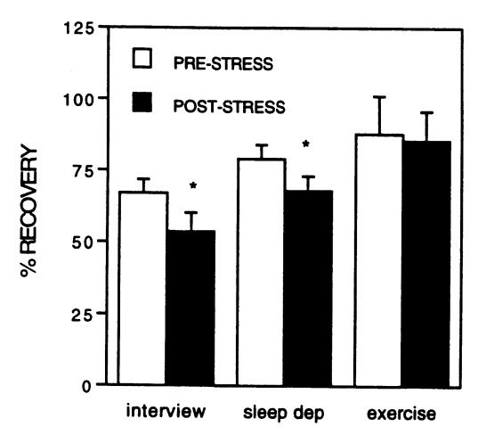
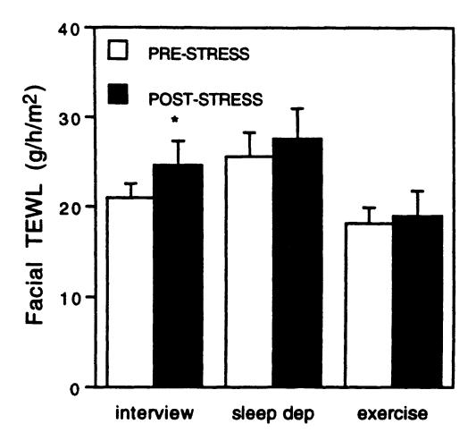
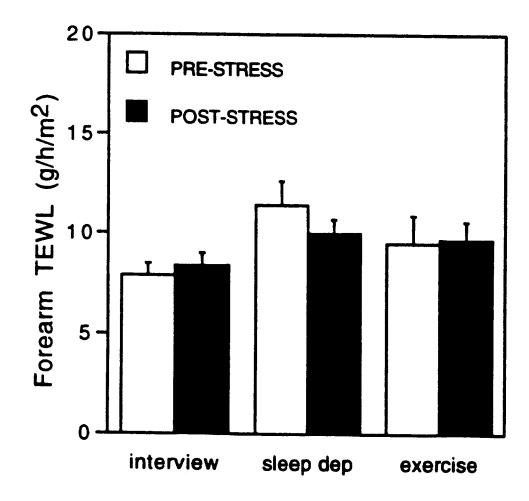
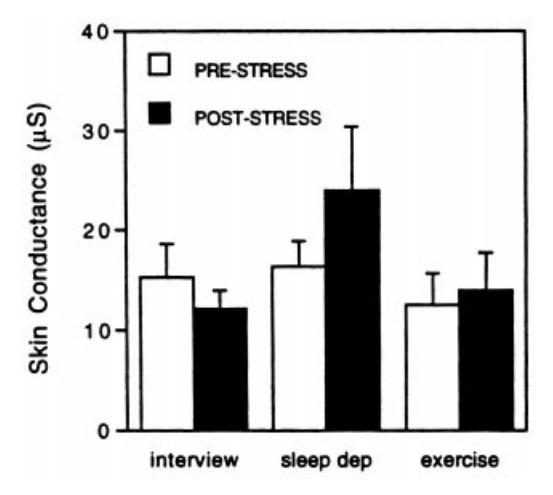

# Stress-Induced Changes in Skin Barrier Function in Healthy Women

Margaret Altemus, Babar Rao,\* Firdaus S. Dhabhar,† Wanhong Ding,\* and Richard D. Granstein\* Departments of Psychiatry and \*Dermatology, Weill Medical College, Cornell University, New York, New York, U.S.A.; †College of Dentistry, The Ohio State University, Columbus, Ohio, U.S.A.

Despite clear exacerbation of several skin disorders by stress, the effect of psychologic or exertional stress on human skin has not been well studied. We investigated the effect of three different stressors, psychologic interview stress, sleep deprivation, and exercise, on several dermatologic measures: transepidermal water loss, recovery of skin barrier function after tape stripping, and stratum corneum water content (skin conductance). We simultaneously measured the effects of stress on plasma levels of several stress-response hormones and cytokines, natural killer cell activity, and absolute numbers of peripheral blood leukocytes. Twenty-five women participated in a laboratory psychologic interview stress, 11 women participated in one night of sleep deprivation, and 10 women participated in a 3 d exercise protocol. The interview stress caused a delay in the recovery of skin barrier function, as well as increases in plasma cortisol, norepinephrine, interleukin-1\beta and interleukin-10, tumor necrosis factorand an increase in circulating natural killer cell activity and natural killer cell number. Sleep deprivation also decreased skin barrier function recovery and increased plasma interleukin-1B, tumor necrosis factor-α, and natural killer cell activity. The exercise stress did not affect skin barrier function recovery, but caused an increase in natural killer cell activity and circulating numbers of both cytolytic T lymphocytes and helper T cells. In addition, cytokine responses to the interview stress were inversely correlated with changes in barrier function recovery. These results suggest that acute psychosocial and sleep deprivation stress disrupts skin barrier function homeostasis in women, and that this disruption may be related to stress-induced changes in cytokine secretion. Key words: cytokine/natural killer cell/psychologic stress/sleep deprivation. J Invest Dermatol 117:309-317, 2001

lthough psychologic stress is believed to exacerbate several skin disorders (Alabadie et al, 1994; Gupta and Gupta, 1996), the effects of psychologic stress on the skin have not been well-studied in humans. Stress can be studied as a constellation of events that begins with a stimulus (the stressor) that precipitates a reaction in the brain (stress perception), which subsequently activates physiologic systems in the body (the stress response) (Dhabhar and McEwen, 1997). Both physical and psychologic stressors are known to produce a set of well-described neuroendocrine responses that can impact several aspects of skin physiology. The two principal biologic effectors of the systemic stress response are the hypothalamic-pituitary adrenal axis that regulates the release of adrenocorticotropin (ACTH),  $\beta$ -endorphin, and cortisol, and the sympathoadrenal medullary system, which regulates release of epinephrine and norepinephrine (Chrousos and Gold, 1992). Activation of these neuroendocrine systems produces several adaptive changes, including cognitive arousal, mobilization of fuel stores to meet metabolic demands, and suppression of vegetative functions, particularly sexual activity and food consumption. In addition, changes in immune function have been associated with

In humans, there is evidence that wound healing is impaired by chronic stress (Kiecolt-Glaser *et al*, 1995), and stress has been associated with decreased inflammatory cytokine secretion at the wound site (Marucha *et al*, 1998; Glaser *et al*, 1999). There has been relatively little study, however, of the effects of acute stress on intact skin in healthy humans.

The skin is a complex organ containing afferent and efferent neural networks, glands, blood vessels, smooth muscle elements, connective tissues, and immune cells, many of which are modulated by catecholamines and by glucocorticoid hormones. Glucocorticoids and catecholamines reach skin tissues as circulating hormones and catecholamines are released in skin by projections of the sympathetic nervous system. Catecholamines also are produced locally by keratinocytes (Schallreuter *et al*, 1995), although it is unclear whether catecholamine production in keratinocytes is enhanced in response to stress. Close associations have been identified between epidermal nerve fibers and several immune

the stress response. Numerous studies examining the effects of stress on immune function have found suppression of some aspects of immune function, such as resistance to viral infection and *ex vivo* proliferative and cytolytic responses of circulating lymphocytes and natural killer cells (Naliboff *et al*, 1995; Cohen and Herbert, 1996; DeRijk *et al*, 1997). Recent studies, however, have also reported a stress-induced enhancement of some immune parameters, including proinflammatory cytokine release (Ackerman *et al*, 1998; Ostrowski *et al*, 1999) and delayed-type hypersensitivity (Dhabhar and McEwen, 1996, 1999).

Manuscript received June 19, 2000; revised March 5, 2001; accepted for publication March 12, 2001.

Reprint requests to: Dr. Margaret Altemus, Box 244, Weill Medical College, Cornell University, 1300 York Ave., New York, NY 10021. Email: maltemus@mail.med.cornell.edu

response cells, including Langerhans cells and mast cells (Hosoi et al, 1993; Egan et al, 1998:). In addition, expression of calcitonin gene related peptide, a neuropeptide that suppresses antigen presentation by Langerhans cells (Hosoi et al, 1993), is increased in skin nerve fibers during stress (Kawaguchi et al, 1997). Animal studies have shown that stress can impair skin barrier function recovery from barrier disruption by tape stripping (Denda et al, 1998; 2000), and can suppress or enhance delayed-type hypersensitivity, depending on the duration and timing of the stress (Okimura et al, 1986; Kawaguchi et al, 1997; Hosoi et al, 1998; Dhabar and McEwen, 1999).

This study was designed to assess the effects of three types of laboratory stressors on several aspects of skin physiology: (i) a simulated job interview; (ii) 42 h sleep deprivation; and (iii) three daily sessions of treadmill exercise. Dermatologic measures included transepidermal water loss (TEWL), skin barrier function recovery after tape stripping, and stratum corneum water content (skin conductance). In addition, we measured changes in circulating hormones and leukocytes that provide an index of the intensity of the degree of experienced stress. Several of these circulating indices also could mediate stress-induced changes in skin physiology. Specifically, we measured the effects of the three stressors on ACTH, cortisol, β-endorphin, epinephrine, and norepinephrine. We also measured the effects of the three stressors on circulating natural killer cell activity, absolute numbers of circulating lymphocyte subtypes, and plasma levels of the pro-inflammatory cytokines interleukin (IL)  $-1\beta$  and tumor necrosis factor (TNF)  $-\alpha$ , and the anti-inflammatory cytokine IL-10.

## MATERIALS AND METHODS

Subjects Forty-six healthy female volunteers, age 18-29, were recruited by advertisement for paid participation in a study of stress. All volunteers were free of medical and psychiatric illness as determined by physical exam, psychiatric diagnostic interview (Structured Clinical Interview for DSM-IV) (Spitzer et al, 1994), and screening laboratory tests, which included a complete blood count, chemistry screen, liver function tests, HIV antibody test, urinalysis, and urine toxicology screen. All participants had not been taking medications, including birth control pills, for at least 2 mo prior to participation. All subjects were nonsmokers. Because gender is known to influence physiologic responses to stress (Allen et al, 1993; Kirschbaum et al, 1999), only women were recruited for this study. In addition, to minimize effects of the menstrual cycle on stress responses (Marinari et al, 1976; Altemus et al, 1997; Kirschbaum et al, 1999), testing was scheduled for the early follicular phase of the menstrual cycle. Estrogen and progesterone levels drawn at the time of stress testing, however, indicated that three of the 25 subjects in the interview stress study were tested in the luteal phase of their

All stress protocols were approved by the Institutional Review Board of Weill Medical College of Cornell University. Subjects gave written, informed consent prior to participation in the studies.

# Stress protocols

Interview stress Twenty-five healthy women participated in the interview stress protocol. This procedure closely follows that described by Kirschbaum et al (1993). During the informed consent procedure completed at the screening visit, subjects were told that they would participate in a mock job interview. On the day prior to the interview stress, subjects had basal skin function measurements, including TEWL, stratum corneum water content, and barrier function recovery after tape stripping, performed between 11.00 and 16.00 h. On the following day, subjects arrived at the laboratory at 11.00 h. After a 40 min rest period, subjects were told that they had 5 min to prepare a 5 min speech explaining to three interviewers why they would be the best candidate for a job as a clerk in a tire store. Subjects were also told that after the 5 min speech, they would answer questions from the interviewers for an additional 5 min. After the 5 min preparation period, three interviewers entered the room and asked the subject to begin. No encouragement or reassurance was given. If the subject stopped talking, she was asked to continue until the 5 min were finished. Next, the interviewers asked the subject to complete a 5 min serial subtraction task. If the subject made an error she was instructed to begin again.

Blood samples were drawn immediately prior to the instructions for the stress interview, 10 min after completion of the stress interview (20 min from baseline blood draw), and 40 min after completion of the stress interview (60 min from baseline blood draw). Ten subjects in the interview stress study had blood samples drawn by repeated needlesticks and 15 subjects had blood withdrawn through an indwelling intravenous catheter that was inserted 40 min prior to the introduction to the stress interview, at the start of the rest period. Poststress TEWL and stratum corneum water content were measured during the 10 min prior to the third blood draw, 30 min after completion of the stress interview. Skin barrier function recovery measures were begun after the third blood draw, 50 min after completion of the stress interview.

Sleep deprivation stress Eleven healthy women participated in the 42 h sleep deprivation protocol. On the day of the sleep deprivation study, baseline skin measures performed from 11.00 to 16.00 h, including TEWL, skin conductance, and barrier function recovery. Baseline blood samples were again drawn at noon. Subjects were kept awake until 16.00 h the following day in the Sleep–Wake Disorders Laboratory at the Weill Cornell campus of the New York-Presbyterian Hospital. Subjects were constantly supervised and kept awake by technicians in the sleep laboratory by social interaction and ambulation. Subjects ate dinner at 20.00 h, a snack at 01.00 h, breakfast at 07.00 h, and lunches at 11.00 h during the period they were in the sleep laboratory. Subjects refrained from caffeine use during the 42 h sleep deprivation study. Postsleep deprivation skin tests were performed the day after sleep deprivation from 11.00 to 16.00 h, and the postsleep deprivation blood draw was obtained at noon.

Exercise stress Ten healthy women participated in the exercise stress protocol. Prior to beginning the exercise protocol, all subjects had a maximal heart-rate determination and a cardiac stress test. On the first day of the study, from noon until 17.00 h, subjects had skin measurements performed, including TEWL, stratum corneum water content, and skin barrier function recovery. In addition, blood samples were drawn immediately following completion of the skin tests. On the following 3 consecutive days, between 08.00 h and 10.00 h, subjects exercised on a treadmill for 1 h at a rate set to elicit 50% of their maximal heart rate. From noon until 17.00 h on the day following the last of the 3 consecutive days of exercise, repeat skin function measurements and blood samples were taken at the same times as the pre-exercise baseline testing.

**Dermatologic test battery** At the start of each skin test measurement battery, subjects washed their face with make-up remover and then with soap. Skin measurements began 1 h following the completion of facial cleansing. On the day of the psychologic stress interview, subjects washed their faces at 11.00 h, prior to the interview and skin testing began 30 min after the stress interview. Room temperature and relative humidity were closely controlled and did not differ by more than 1.1°C or 3%, respectively, between prestress and poststress test sessions. Room temperature ranged from 22.2 to 23.3°C and relative humidity ranged from 25% to 28%. Air convection was kept to a minimum.

TEWL This was measured with an electrolytic water meter that measures the vapor pressure gradient in the air layer close to the skin surface (TEWAMeter TM210, Courage and Khazaka Electric, Koln, Germany). The probe was touched to the left cheek and the flexor surface of the right (prestress) or left (poststress) forearm for 2 min to measure water loss through the skin.

Stratum corneum water content (skin conductance) Electrical capacitance on the surface of the stratum corneum is an indicator of the hydration level of the stratum corneum. Skin conductance was measured using a high-frequency impedance meter (Skicon-100, IBS, Hamamatsu, Japan). A probe was touched to the subjects left cheek for several seconds, seven times in succession, and results of the seven measurements were averaged to determine the stratum corneum water content.

Skin barrier function recovery Skin barrier function was measured before and after each stress, using the flexor surface of the right forearm for the prestress measurement and the flexor surface of the left forearm for the poststress measurements. Skin barrier function was evaluated by measuring TEWL immediately before, and at two time points after disruption of the barrier by tape stripping. After initial measurement of TEWL, the skin of the forearm was stripped with repeated applications of cellophane tape (Cellotape, Bnichiban, Tokyo, Japan) until TEWL was elevated from the basal level of 5–7 g per m² per h to at least 20 g per m² per h. For most subjects, six to 10 tape strippings were required to achieve this degree of barrier disruption. TEWL was measured again immediately after tape stripping and 3 h later. Recovery of barrier

function was calculated as a percentage value because of small session-tosession variations in the extent of barrier disruption caused by the tape stripping (20-24 g per m2 per h) and differences among subjects in baseline TEWL. Change in TEWL during the 3 h from the immediate post-tape strip TEWL to the final TEWL was divided by the change in TEWL from immediately before to immediately after the tape stripping. Subjects who did not have at least 25% barrier function recovery at the prestress test were not included in skin barrier function analyses. Four subjects in the stress interview and one subject in the sleep deprivation study were excluded for this reason.

Blood leukocyte analysis At each blood draw outlined in the stress protocols, a 5 ml sample of blood was drawn into a heparinized tube, kept at room temperature, and analyzed within 6 h. Leukocyte subtypes were identified by three color flow cytometry (FACScan, Becton Dickinson, San Jose, CA). Specific subpopulations were identified by fluorescently conjugated monoclonal antibodies obtained from Becton Dickinson. Briefly, whole blood was incubated with monoclonal antibodies for 20 min at room temperature. The following antibody markers were used: T helper (Th) cells: (CD3 CD4), cytolytic T lymphocytes (CD3 CD8), natural killer cells (CD16 CD56). Staining was followed by lysis of erythrocytes and washing with phosphate-buffered saline. Samples were read on the FACScan with 5,000-10,000 events being acquired from each preparation. Corresponding antibody isotype controls were used to set negative staining criteria. Data were analyzed using Cell Quest software (Becton Dickinson). Complete blood counts, monocyte counts, and total lymphocyte counts were determined from a simultaneous blood read the same day by an automated hematology analyzer (F800, Sysmex, McGraw Park, IL) to enable calculation of total numbers per microliter of each lymphocyte subtype from the percentage values obtained from the flow cytometry. Flow cytometry data were not obtained for one subject in the exercise study and two subjects in the sleep deprivation study.

Natural killer cell activity Lymphocytes were isolated from heparinized peripheral blood. The blood was diluted 1:3 in phosphate-buffered saline, and 30 ml of diluted blood was gently underlayed with 15 ml Ficoll-hypaque (Pharmacia Biotech, Uppsala, Sweden) in a 50 ml centrifuge tube and gradient centrifuged at 450  $\times$  g for 30 min, without the use of a brake. The low buoyant density population (lymphocytes) at the interface was collected, washed three times in medium 199 (Gibco, Grand Island, NY) without phenol red containing 25 mM HEPES buffer, 50 µg gentamicin per ml and 2% bovine serum albumin.

Cells from the cell line K-562 (ATCC, Rockville, MD) were maintained in continuous culture in RPMI 1640 (Gibco, Grand Island, NY) supplemented with 25 mM HEPES buffer, 50 µg per ml gentamicin, and 10% fetal bovine serum (Gemini Bio-Products, Woodland, CA) at 37°C in an atmosphere of 5% carbon dioxide. An aliquot of the desired target cell line (K-562) was removed from culture and was washed three times with phosphate-buffered saline and once in 199albumin medium to remove lactic dehydrogenase (LDH) that is present in fetal bovine serum. Viable cells were counted using trypan blue and diluted to 5 × 105 viable cells per ml. Ficoll-hypaque-purified lymphocytes (effector cells) were washed using the same procedures as for the target cells and diluted to a concentration of  $3 \times 10^7$  cells per ml. Cytotoxicity assays were carried out in a round-bottomed 96-well microtiter plate; 0.1 ml of target cells (K-562) and 0.1 ml of effector cells (lymphocytes) were added to the wells of round bottomed 96-well microtiter plate. The plates were then centrifuged (45  $\times$  g for 5 min), and incubated at 37°C in an atmosphere of 5% carbon dioxide for 4 h. The ratio of effector cells to target cells was 60:1. After 4 h of incubation, 0.05 ml of cold 199-albumin medium was added to each well, the plate was centrifuged (250  $\times$  g for 5 min), and 0.1 ml aliquots of supernatant were transferred to the corresponding wells of an optically clear flat-bottomed microtiter plate. Next, 0.1 ml of LDH substrate  $(5.4 \times 10^{-2} \text{ M} \text{ L}(+) \text{ lactate}, 6.6 \times 10^{-4} \text{ M} \text{ 2-p-iodophenyl-3-p-nitro-}$ phenyl tetrazolium chloride,  $2.8 \times 10^{-4} \, \mathrm{M}$  phenazine methosulfate, and  $1.3 \times 10^{-3}$  M NAD in 0.2 M Tris buffer, pH 8.2) was added to each well. A microtiter plate reader (Molecular Devices, Sunnyvale, CA) was used to monitor the absorbance at 490 nm. All assay chemicals were purchased from Sigma (St Louis, MO) unless otherwise noted. Percentage cytotoxicity was calculated using the formula:

$$%C = (E - S - e)/(M - S) \times 100\%$$

where E is the experimental release of LDH activity from target cells (K-562) incubated in the presence of effector cells (lymphocytes), S is the spontaneous release of LDH activity from target cells (K-562) incubated in the absence of lymphocytes, e is the spontaneous release of LDH activity from effector cells (lymphocytes), and M is the maximal release of LDH activity determined by lysing target cells with 1% Triton X-100. Plasma hormones Plasma samples were drawn into tubes containing ethylenediamine tetraacetic acid at the times outlined in the stress protocols. Samples were kept on ice, centrifuged, and plasma frozen at -80°C within 1 h. Plasma was assayed for ACTH and cortisol using commercial radioimmunoassay kits (ACTH: Nichols IRMA, San Juan Capistrano, CA; Cortisol: Coat a Count, Diagnostic Products, Los Angeles, CA). Catecholamines were measured using high-performance liquid chromatography in the Core Laboratory of the General Clinical Research Center at New York Presbyterian Hospital. Cytokines were measured with a competitive binding immunoassay using commercial kits (Cytimmune Sciences, College Park, MD). Ten subjects in the stress interview study did not have IL-1\$\beta\$ measurements. For each subject, prestress and poststress hormone and cytokine samples were run in the same assay.

Statistical analyses All responses to the sleep deprivation and exercise protocols and skin test responses to the stress interview were assessed using paired t tests. Hormone levels, leukocyte counts, and natural killer cell function responses to the stress interview were analyzed using repeated measures ANOVA with post hoc contrasts if indicated. Results are reported as mean  $\pm$  SEM. Significance was set at p < 0.05 for repeated measures ANOVA and post hoc contrasts. In addition, potential correlations between skin test responses and other variables were tested by using change scores (poststress-prestress) with Pearson's correlation coefficient. Because of the exploratory nature of this analysis and the multiple comparisons, the significance level for the correlations was set at p

### RESULTS

**Interview stress** There were no statistical differences in any results between the group with blood drawn through an indwelling intravenous catheter (n = 10) and the group for which blood was drawn by repeated needle sticks (n = 15), therefore, data from the two groups were combined for these analyses (n = 25).

There was a significant decrease in recovery of skin barrier function after the stress interview (n = 21, t = 2.3, p < 0.04). (Fig 1) There was also a significant increase in TEWL following the interview stress at the cheek (n = 25, t = -2.4, p < 0.03; Fig 2), but not at the flexor surface of the forearm (n = 25, t = 1.1, p = 0.3; Fig 3). There was no change in stratum corneum water content after the interview (Fig 4).

Effects of interview stress on hormonal and immune measures are presented in **Table I**.

There was a significant change in cortisol during the stress interview (F(2,48) = 8.6, p < 0.001), but only a trend toward a change in ACTH (F(2,48) = 2.7, p < 0.08), and no change in  $\beta$ endorphin (F(2,48) = 0.9, p = 0.41). Cortisol was significantly increased at 30 min compared with both the baseline and the 60 min value. Plasma norepinephrine also changed significantly in response to the stress interview (F(2,48) = 4.8, p < 0.02), with a significant increase at 30 min compared with baseline. There was no change in epinephrine in response to the interview (F(2,48) = 1.3, p = 0.27).

There was a significant change in all three cytokines in response to the interview stress: TNF- $\alpha$  (F(2.48) = 3.9, p < 0.03); IL-1 $\beta$ (F(2,28) = 11.1, p < 0.001); and IL-10 (F(2,48) = 5.5, p < 0.01). Post hoc testing revealed that TNF- $\alpha$ , IL-1 $\beta$ , and IL-10 were significantly increased compared with baseline at 60 min. Because monocytes are the principal source of TNF- $\alpha$ , IL-1 $\beta$ , and IL-10 secretion from circulating blood cells, we also examined longitudinal changes in the numbers of circulating monocytes. There was no significant change in circulating monocyte numbers in response to the stress interview (F(2,24) = 0.23, p = 0.76).

There was a significant change in natural killer cell function in response to the stress interview (F(2,44) = 44.1, p < 0.001), with a significant increase at 30 min compared with both the baseline and 60 min values.

Natural killer cell numbers also changed in response to the stress interview (F(2,48) = 7.4, p < 0.01), with a significant increase at

Figure 1. Interview stress and sleep deprivation, but not exercise stress, delayed skin barrier function recovery after tape stripping. \*p<0.05.

Figure 2. Interview stress, but not sleep deprivation or exercise, increased basal facial TEWL. \*p<0.05.

30 min compared with baseline and 60 min, and also a signi®cant decrease at 60 min compared with baseline. There was no signi®cant correlation between the change in natural killer cell function at 30 min poststress and the change in natural killer cell numbers (n = 23, r = 0.30). There was no detectable change in cytolytic T lymphocytes or T helper cells in response to the stress interview.

Signi®cant correlations between stress-induced changes in skin measures and stress-induced changes in hormonal or immune variables are presented in Table II. There were signi®cant negative correlations between the cytokine responses to the stress interview and the stress-associated change in skin barrier function recovery: IL-1b (n = 15, r = ±0.57, p < 0.01); IL-10 (n = 21, r = ±0.57, p < 0.01). Thus a greater fall in barrier function recovery after stress was associated with a greater release of IL-1b and IL-10 with stress. There was no signi®cant relationship between the change in cortisol at 30 min and the change in skin barrier function recovery after stress (n = 21, r = 0.22).

Sleep deprivation Similar to the ®nding in the stress interview study, there was a signi®cant reduction in skin barrier function recovery after sleep deprivation (n = 10, t = 2.5, p < 0.04) (Fig 1). There was no effect of sleep deprivation on TEWL at the face (n = 11, t = ± 1.1, p = 0.3; Fig 2) or forearm (n = 11, t = 1.2, p

Figure 3. Basal forearm TEWL was not changed by any of the three stress paradigms.

Figure 4. Skin conductance was not changed by any of the three stress paradigms.

= 0.2; Fig 3). There was no effect of sleep deprivation on stratum corneum water content (Fig 4).

Effects of sleep deprivation on hormonal and immune measures are presented in Table III.

Forty-two hours of sleep deprivation resulted in signi®cant increases in plasma levels of IL-1b (n = 11, t = 4.2, p < 0.01) and TNF-a (n = 11, t = 2.70 ng per ml, p < 0.03), but no difference in plasma levels of IL-10 (n = 11, t = ±0.14, p = 0.89). There also was an increase in natural killer cell function after sleep deprivation (n = 11, t = ±3.6, p < 0.01). There was no change detected in plasma levels of the stress response hormones b-endorphin, cortisol, ACTH, epinephrine, or norepinephrine, and no change in circulating lymphocyte subset counts after sleep deprivation. There also was no detectable change in circulating monocyte counts after sleep deprivation (n = 9, t = 1.0, p = 0.32).

There were no signi®cant correlations between sleep deprivationinduced changes in any of the skin measures and any of the hormonal or immune measures.

Exercise stress No differences were found in barrier function recovery (Fig 1), TEWL at the face (Fig 2) or forearm (Fig 3), or stratum corneum water content (Fig 4) after 3 d of exercise stress.

Effects of exercise stress on hormonal and immune measures are presented in Table IV.

Table I. Effect of interview stress on hormonal and immune measuresa

| Variable                              | Baseline    | +30 min      | +60 min       |
|---------------------------------------|-------------|--------------|---------------|
| Adrenocorticotropin (pg per ml)       | 16.3 6 3.6  | 17.3 6 2.8   | 11.1 6 2.1    |
| Cortisol (mg per dl)                  | 10.6 6 0.8  | 13.7 6 1.2*  | 11.3 6 1.0#   |
| b-endorphin (ng per ml)               | 1.2 6 0.1   | 1.1 6 0.1    | 1.3 6 0.1     |
| Norepinephrine (pg per ml)            | 488 6 38    | 573 6 47*    | 545 6 36²     |
| Epinephrine (pg per ml)               | 47 6 5      | 51 6 6       | 46 6 4        |
| TNF-a (ng per ml)                     | 7.4 6 1.8   | 11.5 6 2.2   | 14.1 6 2.3*   |
| IL-1b (ng per ml)                     | 1.6 6 0.3   | 3.0 6 0.5    | 4.2 6 0.8*    |
| IL-10 (ng per ml)                     | 8.8 6 1.5   | 14.4 6 2.9   | 20.5 6 3.2*   |
| NK activity (%)                       | 30.7 6 3.1  | 45.4 6 3.3*  | 33.1 6 2.5#   |
| NK cells (1000 per ml)                | 0.20 6 0.02 | 0.23 6 0.03² | 0.16 6 0.01#² |
| Cytolytic T lymphocytes (1000 per ml) | 0.58 6 0.04 | 0.57 6 0.03  | 0.55 6 0.03   |
| Helper T cells (1000 per ml)          | 1.03 6 0.06 | 1.05 6 0.06  | 1.04 6 0.06   |

a Values are means 6 SEM. \*p < 0.01 compared with baseline; #p < 0.01 compared to +30 min; ²p < 0.05 compared with baseline

Table II. Correlations among responses (post-stress value: pre-stress value) to interview stress

|             | Barrier fx recovery | TEWL face | TEWL forearm | Facial skin conductance |
|-------------|------------------------|--------------|-----------------|----------------------------|
| Cort        | ±0.22                  | 0.40         | 0.18            | ±0.23                      |
| NE          | ±0.13                  | ±0.46        | 0.11            | 0.10                       |
| IL-1b       | ±0.57*                 | 0.03         | ±0.26           | 0.08                       |
| IL-10       | ±0.57*                 | 0.10         | 0.03            | 0.07                       |
| TNF-a       | ±0.35                  | ±0.09        | ±0.58*          | ±0.36                      |
| NK cell #   | 0.01                   | ±0.03        | ±0.19           | ±0.10                      |
| NK activity | ±0.09                  | 0.20         | ±0.01           | ±0.01                      |
|             |                        |              |                 |                            |

\*p < 0.01.

After 3 d of 1 h of treadmill exercise, on the following morning increases in natural killer cell function were detected (n = 10, t = 2.3, p < 0.05), as well as a decrease in T helper cell numbers (n = 10, t = 2.6, p < 0.04) and cytolytic T lymphocyte cell numbers (n = 10, t = 2.9, p < 0.02). There was no difference in the number of circulating natural killer cells after the exercise stress and no difference in any of the hormonal or cytokine measures.

# DISCUSSION

This study demonstrates that both acute psychologic stress and one night of sleep deprivation can inhibit recovery of skin barrier function in humans. These ®ndings are consistent with animal data showing that several forms of psychologic stress, including immobilization, crowding, and transfer to a novel cage, can inhibit the recovery of stratum corneum barrier function after mechanical or chemical compromise (Denda et al, 1998, 2000). Impairments in skin barrier function have been found in several chronic skin disorders, including psoriasis (Grice, 1980) and atopic dermatitis (Pinnagoda et al, 1989; Seidenari and Gusti, 1995; DiNardo et al, 1998), and impairment of skin barrier function has been shown to exacerbate both allergic (Proksch and Brasch, 1997) and irritant (Marks et al, 1990) contact dermatitis.

A primary function of the skin is to generate and maintain the cutaneous permeability barrier, localized in the external stratum corneum, which prevents excessive water loss and blocks entry of foreign substances. The stratum corneum contains protein-enriched corneocytes embedded within an intercellular matrix of hydrophobic lipids that are organized into extensive lamellar sheets. Disruption of the cutaneous permeability barrier produces several metabolic events that contribute to rapid restoration of barrier function. Disruption of the barrier induces secretion of preformed lamellar bodies by cells at the stratum granulosum±stratum corneum interface, increases synthesis of cholesterol, ceramide, and fatty acids, and enhances activity of lipid processing enzymes, resulting in formation of new lipid membrane sheets (Elias, 1996; Harris et al, 1997; Jensen et al, 1999). Disruption of barrier function also increases epidermal cell proliferation and DNA synthesis (Williams and Hunter, 1957; Feingold et al, 1991; Proksch et al, 1991, 1996), increases synthesis of keratins associated with hyperproliferation (Ekanayke-Mudiyanselage et al, 1998), and increases local synthesis and secretion of TNF-a, the TNF (p55) receptor, IL-1a, IL-1b, IL-8, IL-10, TGF-a, and TGF-b (Wood et al, 1992, 1997; Nickoloff and Naidu, 1994; Tsai et al, 1994; Denda et al, 1996), but not TNF-b, IL-2, IL-3, IL-4, or IL-5 (Wood et al, 1997). The TNF signaling pathway has been demonstrated to facilitate epidermal barrier function recovery through activation of sphingomyelinases, key epidermal lipid processing enzymes that promote formation of ceramide (Jensen et al, 1999). IL-1 also activates the sphingomyelinase pathway, but IL-1 appears to play a less important part than TNF-a in barrier function repair.1 In rodents, there is evidence that some of these characteristic responses to permeability barrier disruption are inhibited by stress. Stress impairs both proliferation of epidermal cells (Tsuchiya and Horii, 1996) and sebaceous gland lipogenesis (Tsuchiya and Horii, 1994) following permeability barrier disruption.

In mice, stress-induced impairment of barrier function recovery is dependent on glucocorticoids released with stress. A glucocorticoid antagonist prevents the stress-induced impairment of barrier function recovery (Denda et al, 2000) and exogenous administration of glucocorticoids impairs baseline barrier function (Sheu et al, 1997) and barrier function recovery (Denda et al, 2000). In our studies in humans, although there was an increase in cortisol release after the interview stress, we did not ®nd any signi®cant relationship between the cortisol response and the impairment in skin barrier function recovery. Our inability to detect such a relationship may be due to the relatively small changes in cortisol produced in these human stress protocols. Much larger increases in corticosterone were generated in the rodent stress paradigms (Denda et al, 1998, 2000).

Several studies of skin barrier function recovery in humans after tape stripping have found a much slower rate of recovery, compared with the data presented here (Nickoloff and Naidu, 1994; Ghadially et al, 1995; Fluhr et al, 1999). Another study, however, reported 50±60% barrier function recovery 1 h after tape stripping (Denda and Tsuchiya, 2000), consistent with our ®ndings of 75% barrier function recovery after 3 h. Differences among studies in rates of barrier function recovery after tape stripping may be related to differences in degree of skin stripping, differences

1 Jensen JM, Kupper TS, Proksch E: IL-1/IL-1 receptor overexpression and knockout constructs in permeability barrier repair of transgenic mice. J Invest Dermatol 110:499a, 1998 (abstr.)

Table III. Effect of 42 hour sleep deprivation on hormonal and immune measuresa

| Variable                            | Baseline    | Post-sleep deprivation |
|-------------------------------------|-------------|---------------------------|
| Adrenocorticotropin (pg per ml)     | 17.5 6 2.9  | 19.3 6 3.8                |
| Cortisol (ug per dl)                | 5.5 6 0.9   | 6.1 6 0.9                 |
| b-endorphin (ng per ml)             | 2.1 6 0.2   | 2.1 6 1.5                 |
| Norepinephrine (pg per ml)          | 733 6 104   | 730 6 132                 |
| Epinephrine (pg per ml)             | 57 6 11     | 65 6 15                   |
| TNF-a (ng per ml)                   | 5.0 6 0.5   | 6.8 6 0.6²                |
| IL-1b (ng per ml)                   | 1.6 6 0.1   | 2.1 6 0.1*                |
| IL-10 (ng per ml)                   | 5.9 6 1.3   | 6.1 6 0.6                 |
| NK activity (%)                     | 25.4 6 4.1  | 40.0 6 5.8*               |
| NK cells (1000 per ml)              | 0.18 6 0.03 | 0.17 6 0.03               |
| Cytolytic Lymphocytes (1000 per ml) | 0.58 6 0.05 | 0.47 6 0.04               |
| Helper T cells (1000 per ml)        | 1.26 6 0.27 | 1.02 6 0.1                |

a Values are means 6 SEM. \*p < 0.01; ²p < 0.05.

among instruments used to measure TEWL, and varying degrees of trauma or irritation produced by chemical or physical differences among tapes used for stripping. Only six to 10 tape strippings were needed to attain a TEWL of 20 g per m2 per h in our study, but other human studies using the same criteria for barrier disruption required 1.5±3 times this number of tape strippings (Ghadially et al, 1995; Fluhr et al, 1999).

In contrast to impairment of skin barrier function recovery following the interview and sleep deprivation stress, we found an increase in baseline TEWL only in response to the stress interview, and only in skin of the face, not the forearm. In addition, the magnitude of change in forearm TEWL in response to the stress interview was relatively small. A stress-induced increase in TEWL at the cheek but not the arm may be due to relatively more blushing or sweating on the face following stress, either of which could increase water evaporation independent of changes in skin barrier function. Alternatively, because facial skin has a higher basal TEWL, it may be more sensitive than forearm skin to the effects of psychologic stress on baseline TEWL.

This study demonstrates increases in circulating levels of IL-1b, TNF-a, and IL-10 in response to psychologic stress. Multiple studies have found robust secretion of TNF-a and IL-10, and to a lesser degree IL-1b, into the bloodstream during and following exercise stress (Dufaux and Order, 1989; Gannon et al, 1997; Weinstock et al, 1997; Ostrowski et al, 1999). An earlier study of laboratory psychologic stress did not ®nd any change in plasma cytokine levels (Dugue et al, 1993). We may have been better able to detect a cytokine response to psychologic stress by using a more intense stressor and by sampling for up to an hour or more following the termination of the stress. Our study and others (Sprenger et al, 1992; Weinstock et al, 1997; Ostrowski et al, 1999) suggest that maximal cytokine release into the plasma can occur up to an hour or more following acute stress.

We did ®nd a signi®cant inverse relationship between plasma cytokine responses and barrier function recovery with the interview stress. In addition, a cytokine response was only found in the interview and sleep deprivation studies, which were the only two stressors that impaired skin barrier function recovery. These observations suggest that circulating cytokines might contribute to the stress-induced reduction in skin barrier function homeostasis. Local epidermal synthesis of TNF and local application of TNF-a, however, enhance rather than impair barrier function recovery in mice (Jensen et al, 1999). Because cytokines have a broad spectrum of biologic functions and mechanisms of action, it is possible that circulating and local pools of a cytokine such as TNF could have opposing actions on barrier function recovery, or that relatively greater doses of proin¯ammatory cytokines delivered by the

Table IV. Effect of 3 d of 1 h treadmill exercise on hormonal and immune measures

| Variable                            | Baseline    | Post-exercise |
|-------------------------------------|-------------|---------------|
| Adrenocorticotropin (pg per ml)     | 11.3 6 3.1  | 11.2 6 1.9    |
| Cortisol (mg per dl)                | 8.0 6 1.4   | 10.5 6 1.7    |
| b-endorphin (ng per ml)             | 1.4 6 0.1   | 1.6 6 0.1     |
| Norepinephrine (pg per ml)          | 605 6 59    | 568 6 50      |
| Epinephrine (pg per ml)             | 36 6 58     | 75 6 261      |
| TNF-a (ng per ml)                   | 21.9 6 10.3 | 26.8 6 9.0    |
| IL-1b (ng per ml)                   | 2.3 6 1.5   | 1.0 6 0.7     |
| IL-10 (ng per ml)                   | 1.2 6 0.7   | 6.0 6 2.5     |
| NK activity (%)                     | 33.4 6 3.1  | 40.7 6 4.4²   |
| NK cells (1000 per ml)              | 0.16 6 0.02 | 0.13 6 0.02   |
| Cytolytic Lymphocytes (1000 per ml) | 0.57 6 0.06 | 0.47 6 0.04²  |
| Helper T cells (1000 per ml)        | 1.1 6 0.1   | 0.9 6 0.1²    |

a Values are means 6 SEM. ²p < 0.05.

circulation to the skin could impair, rather than enhance, barrier function recovery.

Enhanced delivery of TNF-a, IL-1b, and IL-10 to the skin though the intradermal vasculature during psychologic stress may exacerbate in¯ammatory skin disorders. TNF-a has been shown to play an important part in the development of contact hypersensitivity reactions (Piguet et al, 1991) and epidermal TNF-a levels are increased in a wide range of in¯ammatory conditions, including irritant and allergic contact dermatitis reactions (Grif®ths et al, 1991; Piguet et al, 1991; Hunziker et al, 1992) and psoriasis (Gearing et al, 1990; Nickoloff et al, 1991). In addition, IL-10 secretion is enhanced in the skin and from peripheral blood monocytes of individuals with atopic dermatitis (Ohmen et al, 1995).

The source of increased cytokine levels in plasma in response to stress is unclear. Cytokines may be secreted by circulating monocytes and lymphocytes, or may be produced in greater amounts by the liver in response to stress. Absolute numbers of circulating monocytes did not change in response to the interview or sleep deprivation stress. In vitro studies of release of cytokines from mononuclear cells, however, suggest that enhanced secretion of cytokines from circulating cells is a contributing factor to the increased levels found in plasma after stress. Although in some studies, glucocorticoid administration (DeRijk et al, 1997), acute exercise stress (DeRijk et al, 1997; Weinstock et al, 1997; Smits et al, 1998) and chronic social stress (Kiecolt-Glaser et al, 1995) have been reported to suppress IL-1b, TNF-a, and IL-10 secretion from stimulated mononuclear cells in vitro, other studies have found enhanced secretion of IL-1b, TNF-a, and IL-10 from mitogenstimulated mononuclear cells in response to physical and psychologic stress (Dobbin et al, 1991; Ackerman et al, 1998; Maes et al, 1998; Marshall et al, 1998).

The hormonal responses to the psychologic interview stress agree with multiple prior reports of increases in cortisol and norepinephrine induced by psychologic laboratory stress (Kirschbaum et al, 1993, 1996). We did not ®nd the expected increase in ACTH after the interview stress, most likely because our ®rst poststress blood sample was drawn 10 min after the end of the stress interview. Because ACTH has a relatively short-half life, levels are likely to have fallen substantially from peak values within the ®rst 10 min after ending the stress. The observed increase in natural killer cell function and natural killer cell numbers after the interview stress also agrees with multiple prior laboratory stress studies in both humans and animals. Natural killer cells are large granular lymphocytes important for the recognition and destruction of malignant and virally infected cells. In rats, a 2 h restraint stress causes an initial brief increase in numbers of natural killer cells, and a subsequent decrease in circulating natural killer cells, T and B lymphocytes, and monocytes, accompanied by an increase in the numbers of these leukocytes in bone marrow, lymph nodes, and skin (Dhabhar et al, 1995, 1996; Dhabhar and McEwen, 1996). In humans, a similar rapid increase in natural killer cells followed by a drop in natural killer cells and T lymphocytes for 1±3 h following heavy exercise or parachute jump stress has been repeatedly demonstrated (Petersen et al, 1988; Benschop et al, 1996; Schedlowski et al, 1993; Woods et al, 1999). This pattern of lymphocyte traf®cking has also been seen in one other study after a laboratory psychologic stress (Brosschot et al, 1992). The more persistent drop in leukocyte numbers that follows the natural killer cell increase has been interpreted as a stress-induced migration of leukocytes to peripheral tissues where they will be available to ®ght foreign antigens, promote wound healing, and provide other potential adaptive responses to stress (Dhabar and McEwen, 1999).

Our ®ndings of no hormonal but some immune system changes in the sleep deprivation study are consistent with similar published studies. No changes in circulating cortisol (Rubin et al, 1969; Palmblad et al, 1976; Moldofsky et al, 1989a; Dinges et al, 1994) or catecholamine (Palmbad et al, 1979; Rubin et al, 1969) levels have been noted in other studies of one night of sleep deprivation. Although only a single baseline and post-sleep deprivation cortisol level was obtained in this study, others have shown that the circadian rhythm of cortisol is preserved during sleep deprivation (Moldofsky et al, 1989b). In contrast to our results, another study of the effects of one night of sleep deprivation reported no signi®cant change in natural killer cell activity and no change in circulating levels of TNF-a, or IL-1b (Dinges et al, 1994). One reason for these differences may be that in the study by Dinges et al (1994) blood samples were taken late at night rather than in the afternoon and the subjects were male, not female. Longer periods of sleep deprivation have been associated with increases in natural killer cell activity (Moldofsky et al, 1989; Dinges et al, 1994). Also consistent with our ®nding of no changes in circulating lymphocyte subsets, in the study by Dinges et al (1994) after one night of sleep deprivation, no changes were seen in lymphocyte, monocyte, or macrophage numbers, or numbers of T lymphocyte subsets, except for a small decrease in T helper cell counts.

Few exercise studies have examined the effects of exercise on hormonal and immune measures 24 h following the last bout of exercise. This time point was chosen for the exercise protocol in this study, to allow an opportunity to detect potentially more persistent changes associated with the more chronic 3 d stress, rather than the acute effects of the immediate exercise. In contrast to the interview stress and sleep deprivation, exercise stress did not impair barrier function recovery. This suggests that barrier function recovery may be more sensitive to psychologic than physical stress. Alternatively, our exercise protocol may not have detected any effect of exercise on barrier function recovery because several immediate effects of acute exercise, including increases in ACTH, b-endorphin, cortisol, and cytokines, were not present 24 h after the last exercise bout. An increase in natural killer cell function, however, was evident on the morning following the last exercise session, consistent with reports of increased natural killer cell function after a more prolonged exercise training regimen in some, but not all, animal and human studies (Nieman et al, 1990; Baslund et al, 1993; MacNeil and Hoffman-Goetz, 1993; Jonsdottir et al, 1996). The signi®cance of the observed changes in lymphocyte subset counts after 3 d of exercise is unclear. Prior studies of the effects of exercise training on circulating lymphocyte subsets have produced mixed results (Paquet et al, 1996; Rhind et al, 1996; Baum et al, 1999).

In summary, this study suggests that one mechanism contributing to stress-induced exacerbation of some chronic hyperplastic and in¯ammatory skin disorders is stress-induced impairment of skin permeability barrier homeostasis. Skin barrier disruption is associated with both an increase in keratinocyte proliferation (Proksch et al, 1991; Denda et al, 1996:) and an increase in in¯ammatory cytokine production in the local tissue (Nickoloff and Naidu, 1994; Wood et al, 1992). Both of these effects could potentially trigger or aggravate in¯ammatory, hyperplastic skin disorders such as psoriasis, eczema, and atopic dermatitis, and also aggravate contact dermatitis. Future study of the relationship between stress and skin physiology may point to novel treatments for in¯ammatory skin disorders.

This study was supported by funds from Shiseido Co Ltd. We thank Ruirong Yang for her help with the hormonal assays, the Adult Clinical Research Center at New York Presbyterian Hospital-Weill Cornell Medical Center for performing catecholamine assays, and Jessica Zonana for her help with manuscript preparation. We also thank Dr Toru Tsuchiya for his helpful comments on the manuscript.

## REFERENCES

- Ackerman KD, Martino M, Heyman R, Moyna NM, Rabin BS: Stressor-induced alteration of cytokine reduction in multiple sclerosis patients and controls. Psychosomc Med 60:484±491, 1998
- Alabadie MS, Kent GG, Gawkrodger DJ: The relationship between stress and the onset and exacerbation of psoriasis and other skin conditions. Br J Dermatol 130:199±203, 1994
- Allen MT, Stoney CM, Owens JF, Matthews KA: Hemodynamic adjustments to laboratory stress. The in¯uence of gender and personality. Psychosom Med 55:505±517, 1993
- Altemus M, Redwine L, Leong YM, Yoshikawa T, Yehuda R, Detera-Wadleigh S, Murphy DL: Reduced sensitivity to glucocorticoid feedback and reduced glucocorticoid receptor mRNA expression in the luteal phase of the menstrual cycle. Neuropsychopharmacology 17:100±109, 1997
- Baslund B, Lyngberg K, Anderson V, Halkjaer-Kristensen J, Hansen M, Klokker M, Pedersen BK: Effect of 8 wk of bicycle training on the immune system of patients with rheumatoid arthritis. J Appl Physiol 75:1691±1695, 1993
- Baum M, Klopping-Menke K, Muller-Steinhardt M, Liesen H, Kirchner H: Increased concentrations of interleukin 1-b in whole blood cultures supernatants after 12 weeks of moderate endurance exercise. Eur J Appl Physiol 79:500±503, 1999
- Benschop RJ, Jacobs R, Sommer B, Schurmeyer TH, Raab H-R, Schmidt RE, Schedlowski M: Modulation of the immunologic response to acute stress in humans by b-blockadeorbenzodiazepines. FASEB J 10:517±524, 1996
- Brosschot JF, Benschop RJ, Godaert G, deSmet MBM, Olff M, Heijnen CJ, Ballieux RE: Effects of experimental psychological stress on distribution and function of peripheral blood cells. Psychosom Med 54:394±406, 1992
- Chrousos GP, Gold PW: The concepts of stress and stress system disorders. Overview of physical and behavioral homeostasis. JAMA 267:1244±1252, 1992
- Cohen S, Herbert TB: Psychological factors and physical disease from the perspective of human psychoneuroimmunology. Annu Rev Psychol 47:113±142, 1996
- Denda M, Tsuchiya T: Barrier recovery rate varies time-dependently in human skin. Br J Dermatol 142:881±884, 2000
- Denda M, Wood LC, Emami S, Calhoun C, Brown BE, Elias PM, Feingold KR: The epidermal hyperplasia associated with repeated barrier disruption by acetone treatment or tape stripping cannot be attributed to increased water loss. Arch Dermatol Res 288:230±238, 1996
- Denda M, Tsuchiya T, Hosoi JI Koyama JI: Immobilization-induced and crowded environment-induced stress delay barrier recovery in murine skin. Br J Dermatol 138:780±785, 1998
- Denda M, Tsuchiya T, Elias PM, Feingold KR: Stress alters cutaneous permeability barrier homeostasis. Am J Physiol 27B:1367±1372, 2000
- DeRijk R, Karp DM, Petrides J, Galliven E, Deuster P, Gold PW, Sternberg Em: Exercise and circadian rhythm-inudced variations in plasma cortisol differentially regulate interleukin-1 beta (IL-1 beta), IL-6, and tumor necrosis factor-alpha (TNG alpha) production in humans: high sensitivity of TNF alpha and resistance of IL-6. J Clin Endocrinol Metab 82:2182±2191, 1997
- Dhabhar FS, McEwen BS: Stress-induced enhancement of antigen-speci®c cellmediated immunity. J Immunol 156:2608±2615, 1996
- Dhabhar FS, McEwen BS: Acute stress enhances while chronic stress suppresses immune function in vivo: a role for leukocyte traf®cking. Brain Behav Immun 11:286±306, 1997
- Dhabhar FS, McEwen BS: Enhancing versus suppressive effects of stress hormones on skin immune function. Proc Natl Acad Sci USA 96:1059, 1999
- Dhabhar FS, Miller AH, McEwen BS, Spencer RL: Effects of stress on immune cell distribution. J Immunol 154:5511±5527, 1995
- Dhabhar FS, Miller AH, McEwen BS, Spencer RL: Stress-induced changes in blood leukocyte distribution. J Immunol 157:1638±1644, 1996
- DiNardo A, Wertz P, Giannetti A, Seidenari S: Ceramide and cholesterol composition of the skin of patients with atopic dermatitis. Acta Derm Venereol 78:2±30, 1998
- Dinges DF, Douglas SD, Zaugg L, et al: Leukocytosis and natural killer cell function parallel neurobehavioral fatigue induced by 64 hours of sleep deprivation. J Clin Invest 93:1930±1939, 1994
- Dobbin JP, Harth M, McCain GA, Martin RA, Cousin K: Cytokine production and lymphocyte transformation during stress. Brain Behav Immun 5:339±348, 1991
- Dufaux B, Order U: Plasma elastase-a1-antitrypsin, neopterin, tumor necrosis factor, and soluble interleukin-2 receptor after prolonged exercise. Int J Sports Med 10:434±438, 1989
- Dugue B, Leppanen EA, Teppo AM, Fyhrquist F, Grasbeck R: Effects of psychological stress on plasma interleukins-1 beta and 6, C-reactive protein,

- tumour necrosis factor alpha, anti-diuretic hormone and serum cortisol. Scand J Clin Lab Invest 53:555±561, 1993
- Egan CL, Viglione-Schneck MJ, Walsh U, Green B, Trojanowski JQ, Whitaker-Menezes D, Murphy GF: Characterization of unmyelinated axons uniting epidermal and dermal immune cells in primate and murine skin. J Cutan Pathol 25:20±29, 1998
- Ekanayke-Mudiyanselage S, Aschauer H, Schmook FP, Jensen JM, Meingassner JG, Proksch E: Expression of epidermal keratins and the corni®ed envilope proein involucrin is in¯uenced by permeability barrier disruption. J Invest Dermatol 111:517±523, 1998
- Elias PM: Stratum corneum architecture, metabolic activity, and interactivity with subjacent cell layers. Exp Dermatol 5:191±201, 1996
- Feingold KRM, Mao-Qiang E, Proksch E, Menon GK, Brown B, Elias PM: The lovastatin-treated rodent: characterization of a new model of barrier disruption and epidermal hyperplasia. J Invest Dermatol 96:201±209, 1991
- Fluhr JW, Gloor M, Lehmann L, Lazzerini S, Distante F, Berardesca E: Glycerol accelerates recovery of barrier function in vivo. Acta Derm Venereol 79:418±421, 1999
- Gannon GA, Rhind SG, Suzui M, Shek PN, Shepard RJ: Circulating levels of peripheral blood leukocytes and cytokines following competititve cycling. Can J Appl Physiol 22:133±147, 1997
- Gearing AJ, Fincham NJ, Bird CR, Washaw M, Meager A, Cartwright JE, Camp RD: Cytokines in skin lesions of psoriasis. Cytokine 2:68±75, 1990
- Ghadially R, Brown BE, Sequeria-Martin SM, Feingold KR, Elias PM: The aged epidermal permeability barrier. J Clin Invest 95:2281±2290, 1995
- Glaser R, Kiecolt-Glaser JK, Marucha PT, MacCallum RC, Laskowski BF, Malarkey WB: Stress-related changes in proin¯ammatory cytokine production in wounds. Arch Gen Psychiatry 56:450±456, 1999
- Grice KA. Transepidermal water loss in pathologic skin. In: Jarrett A (ed.). The Physiology and Pathophysiology of the Skin. London: Academic Press, 1980, pp 2147±2155
- Grif®ths CE, Barker JN, Kunkel S, Nickoloff BJ: Modulation of leukocyte adhesion molecules, a T cell chemotaxin, and a regulatory cytokine in allergic contact dermatitis (rhus dermatitis). Br J Dermatol 124:519±526, 1991
- Gupta MA, Gupta AK: Psychodermatology: an update. J Am Acad Dermatol 34:1030±1046, 1996
- Harris IR, Farrell AM, Grunfeld C, Holleran WM, Elias PM, Feingold KR: Permeability barrier disruption coordinately regulates mRNA levels for key enzymes of cholesterol, fatty acid, and ceramide synthesis in the epidermis. J Invest Dermatol 109:783±787, 1997
- Hosoi J, Murphy GF, Egan CL, Lemer EA, Grabbe S, Asahna A, Granstein RD: Regulation of Langerhans cell function by nerves containing calcitonin generelated peptide. Nature 363:159±163., 1993
- Hosoi J, Tsuchiya T, Denda M, Ashida Y, Takashima A, Granstein RD, Koyama J: Modi®cation of LC phenotype and suppression of contact hypersensitivity response by stress. J Cutan Med Surg 3:79±84, 1998
- Hunziker T, Brand C, Kapp A, Waelti ER, Braathen LR: Increased levels of in¯ammatory cytokines in human skin lymph derived from sodium lauryl sulphate-induced contact dermatitis. Br J Dermatol 127:254±257, 1992
- Jensen JM, Schutze S, Forl M, Kronke M, Proksch E: Roles for tumor necrosis factor receptor p55 and sphingomyelinase in repairing the cutaneous permeability barrier. J Clin Invest 104:1761±1770, 1999
- Jonsdottir IH, Asea A, Hoffmann P, Dahigren Ul. :Voluntary chronic exercise augments in vivo natural immunity in rats. J Appl Physiol 80:1799±1803, 1996
- Kawaguchi Y, Okada T, Konishi H, Funino M, Asai J, lto M: Reduction of the DTH response is related to morphological changes of Langerhans cells in mice exposed to acute immobilization stress. Clin Exp Immunol 109:397±401, 1997
- Kiecolt-Glaser JK, Marucha PT, Malarkey WB, Mercado AM, Glaser R: Slowing of wound healing by psychological stress. Lancet 346:1194±1196, 1995
- Kirschbaum C, Pirke KM, Hellhammer DH: The ``Trier Social Stress Test''ÐA tool for investigating psychobiological stress responses in a laboratory setting. Neuropsychobiology 28:76±81, 1993
- Kirschbaum C, Schommer N, Federenco I, et al: Short-term estradiol treatment enhances pituitary-adrenal axis and sympathetic responses to psychosocial stress in healthy young men. J Clin Endocrinol Metab 81:3639±3643, 1996
- Kirschbaum C, Kudielka BM, Gaab J, Schommer NC, Hellhammer DH: Impact of gender, menstrual cycle phase, and oral contraceptives on the activity of the hypothalamic-pituitary-adrenal axis. Psychosom Med 61:154±162, 1999
- MacNeil B, Hoffman-Goetz L: Chronic exercise enhances in vivo and in vitro cytotoxic mechanisms of natural immunity in mice. J Appi Physiol 74:388±395, 1993
- Maes M, Song C, Lin A, et al: The effects of psychological stress on humans: increased production of pro-in¯ammatory cytokines and a Th1-like response in stress-induced anxiety. Cytokine 10:313±318, 1998
- Marinari KT, Leshner AI, Doyle MP: Menstrual cycle status and adrenocortical reactivity to psychological stress. Psychoneuroendocrinology 1:213, 1976
- Marks R, Hill S, Barton SP: The effects of an abrasive agent on normal skin and photoaged skin in comparison with topical tretinoin. Br J Dermatol 123:457±466, 1990
- Marshall GD, Agarwal SK, Lloyd C, Cohen L, Henninger EM, Morris GJ: Cytokine dysregulation associated with exam stress in healthy medical students. Brain Behav Immunity 12:297±307, 1998
- Marucha PT, Kiecolt-Glaser JK, Favegehi M: Mucosal wound healing is impaired by examination stress. Psychosom Med 60:362±365, 1998
- Moldofsky H, Lue F, Davidson J, Gorczynski R: Effects of sleep deprivation on human immune functions. FASEB J 3:1972±1977, 1989a
- Moldofsky H, Lue F, Davidson J, Jephthath-Ochola J, Carayanniotis K, Gorczynski

- R: The effect of 64 hours of wakefulness on immune functions and plasma cortisol in humans. In: Horne J, ed. Sleep 88. Stuttgart: FischerVerlag, 1989b: pp 185±187
- Naliboff BD, Solomon GF, Gilmore SL, Fahey JL, Benton D, Pine J: Rapid changes in cellular immunity following a confrontational role-play stressor. Brain Behav Immun 9:207±219, 1995
- Nickoloff B, Naidu Y: Perturbation of epidermal barrier function correlates with initiation of cytokine cascade in human skin. J Am Acad Dermatol 30:535±546, 1994
- Nickoloff BJ, Karabin GD, Barker JN, et al: Cellular localization of interleukin-8 and its inducer, tumor necrosis factor-alpha in psoriasis. Am J Pathol 138:129±140, 1991
- Nieman DC, Nehlsen-Cannarella SL, Markoff PA, et al: The effects of moderate exercise training on natural killer cells and acute upper respiratory tract infections. Int J Sports Med 11:467±473, 1990
- Ohmen JD, Hani®n JM, Nickoloff BJ, et al: Overexpression of IL-10 in atopic dermatitis. J Immunol 154:1956±1963, 1995
- Okimura T, Ogawa M, Yamauchi T: Stress and immune responses III. Effect of restraint stress on delayed type hypersensitivity (DTH) response, natural killer (NK) activity and phagocytosis in mice. Japan J Pharmacol 41:229±235, 1986
- Ostrowski K, Rohde T, Asp S, Schjerling P, Pedersen BK: Pro- and antiin¯ammatory cytokine balance in strenuous exercise in humans. J Physiol 515:287±291, 1999
- Palmblad J, Cantrell K, Strander H, et al: Stressor exposure and immunological response in man: Interferon-producing capacity and phagocytosis. J Psychosom Res 20:193±199, 1976
- Palmbad J, Akerstedt T, Froberg J, Melander A, vonSchenck H: Thyroid and adrenomedullary reactions during sleep deprivation. Acta Endocrinol 90:223±239, 1979
- Paquet JBMJ, Pizza FX, Starling RD, Holtz RW, Grandjean PW: The effects of moderate aerobic training on lymphocyte proliferation. Int J Sports Med 17:384±389, 1996
- Petersen BK, Tvede N, Hansen FR, et al: Modulation of natural killer cell activity in peripheral blood by physical exercise. Scand J Immunol 27:673±678, 1988
- Piguet PF, Grau GE, Hauser C, Vassalli P: Tumor necrosis factor-alpha is a critical mediator in hapten induced irritant and contact hypersensitivity reactions. J Exp Med 173:673±679, 1991
- Pinnagoda J, Tupker RA, Coenraad PJ, Natar JP: Prediction of susceptibility to an irritant response by transepidermal water loss. Contact Dermatitis 20:341±346, 1989
- Proksch E, Brasch J: In¯uence of epidermal permeability barrier disruption and Langerhans' cell density on allergic contact dermatitis. Acta Derm Venereol 77:102±104, 1997
- Proksch E, Feingold KR, Man MQ, Elias PM: Barrier function regulates epidermal DNA synthesis. J Clin Invest 87:1668±1673, 1991
- Proksch E, Brasch J, Sterry W: Integrity of the permeability barrier regulates epidermal Langerhans cell density. Br J Dermatol 134:630±638, 1996
- Rhind S, Shek PN, Shinkai S, Shephard RJ: Effects of moderate endurance exercise and training on in vitro lymphocyte proliferaton, interleukin-2 production, and IL-2 receptor expression. Eur J Appl Physiol 75:348±360, 1996
- Rubin RT, Kollar EJ, Slater GG, Clark BR: Excretion of 17-hydroxycorticosteroid and vanillymandelic acid excretion during 205 hours of sleep deprivation in man. Psychosom Med 31:68±75, 1969
- Schallreuter KU, Lemke KR, Pittelkow MR, Wood JM, Korner C, Malik R: Catecholamines in human keratinocyte differentiation. J Invest Dermatol 104:953±957, 1995
- Schedlowski M, Jacobs R, Stratmann G, et al: Changes of natural killer cells during acute psychological stress. J Clin Immunol 13:119±126, 1993
- Seidenari S, Gusti G: Objective assessment of the skin of children affected by atopic dermatitis: a study on pH, capacitance and TEWL in eczematous and clinically uninvolved skin. Acta Derm Venereol (Stockh) 75:429±433, 1995
- Sheu HM, Lee JYY, Chai CY, Kuo DW: Depletion of stratum corneum intercellular lipid lamellae and barrier function abnormalities after long-term topical corticosteroid. Br J Dermatol 136:884±890, 1997
- Smits HH, Grunberg K, Derijk RH, Sterk PJ, Hiemstra PS: Cytokine release and its modulation by dexamethasone in whole blood following exercise. Clin Exp Immunol 111:463±468, 1998
- Spitzer RL, Williams JB, Gibbon M, First MB: Structured Clinical Interview for DSM-IV. Patient Edn. New York: New York State Psychiatric Institute, Biometrics Research Department, 1994
- Sprenger H, Jacobs C, Nain M, Gressner AM, Prinz H, Wesemann W, Gemsa D: Enhanced release of cytokines, interleukin-2 receptors, and neopterin after long-distance running. Clin Immunol Immunopathol 63:188±195, 1992
- Tsai JC, Feingold KR, Crumrine D, Wood LC, Grunfeld C, Elias PM: Permeability barrier disruption alters the localization and expression of TNFa protein in the epidermis. Arch Dermatol Res 286:242±248, 1994
- Tsuchiya T, Horii I: Epidermal cell proliferative activity assessed by proliferating cell nuclear antigen (PCNA) decrease following immobilization induced stress in male Syrian hamsters. Psychoneuroendocrinology 21:111±117, 1996
- Tsuchiya T, Horii I: Immobilization-induced stress decreases lipogenesis in sebaceous glands as well as plasma testosterone levels in male Syrian hamsters. Psychoneuroendocrinology 20:221±230, 1994
- Weinstock C, Konig D, Harnischmacher R, Keui J, Berg A, Northoff H: Effect of exhaustive exercise stress on the cytokine response. Med Sci Sports Exercise 29:345±354, 1997
- Williams MG, Hunter R: Studies on epidermal regeneration by means of the strip method. J Invest Dermatol 29:407±413, 1957

Wood LC, Jackson SM, Elias PM, Grunfeld C, Feingold KR: Cutaneous barrier perturbation stimulates cytokine production in epidermis of mice. J Clin Invest 90:482±487, 1992

Wood LC, Stalder AK, Uou A, Campbell IL, Grunfeld C, Elias PM, Feingold KR:

Barrier disruption increases gene expression of cytokines and the 55kD TNF receptor in murine skin. Exp Dermatol 6:98±104, 1997

Woods JA, Davis JM, Smith JA, Nieman DC: Exercise and cellular innate immune function. Med Sci Sports Exerc 31:57±66, 1999