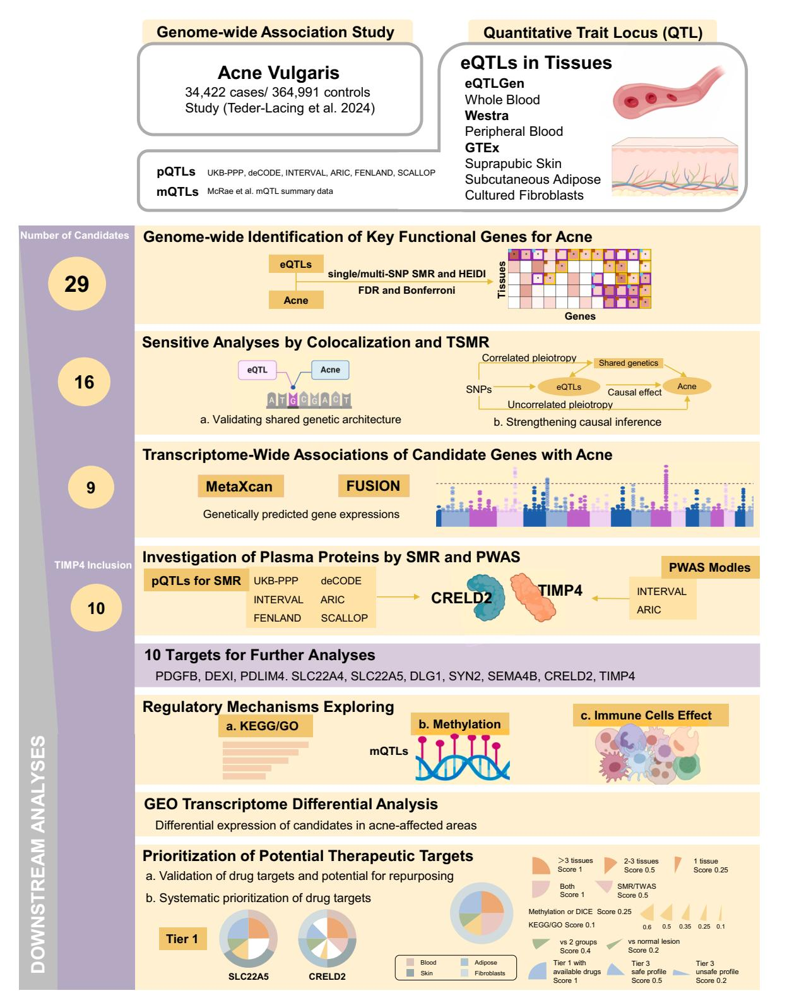
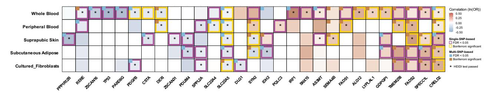
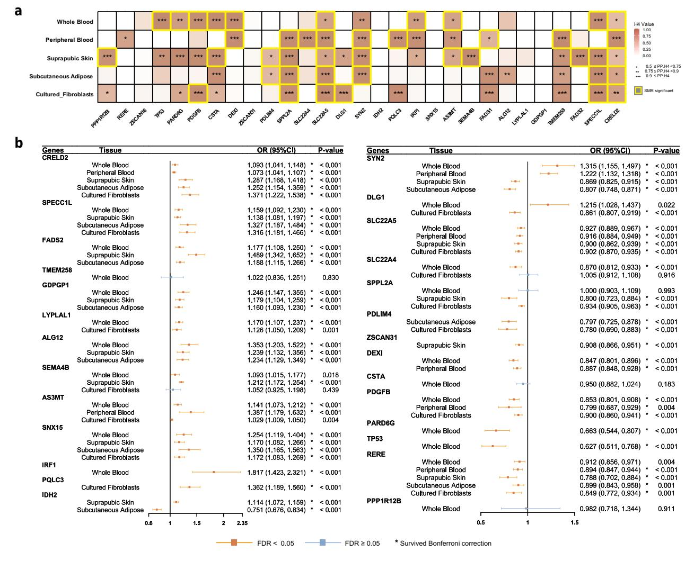
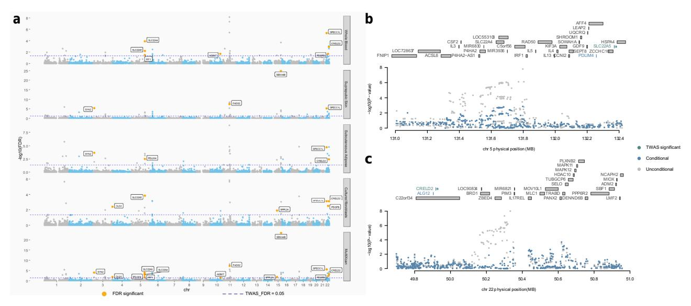
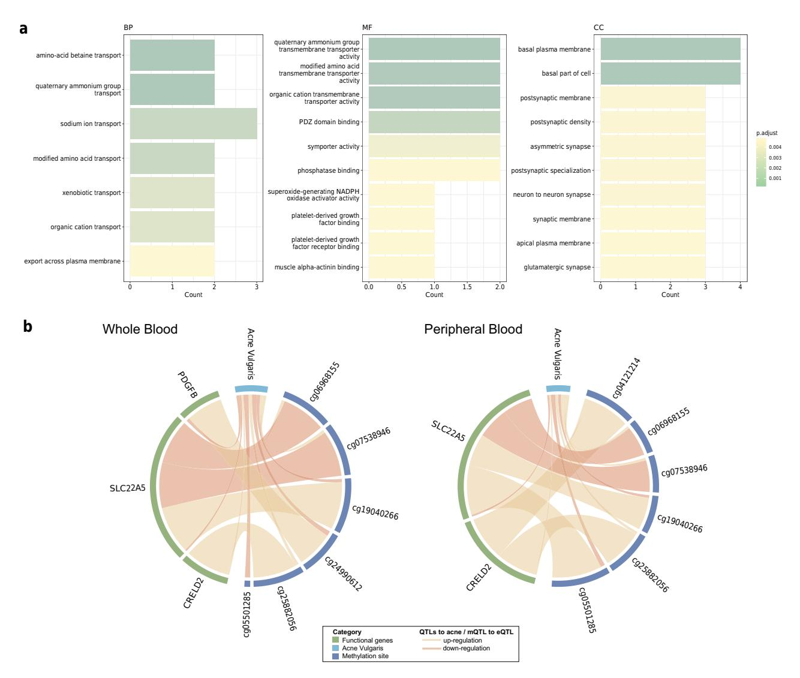
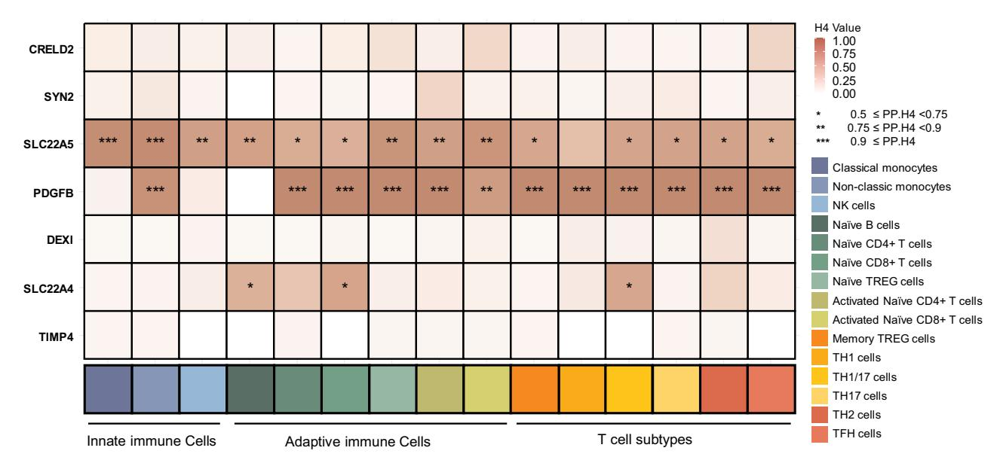
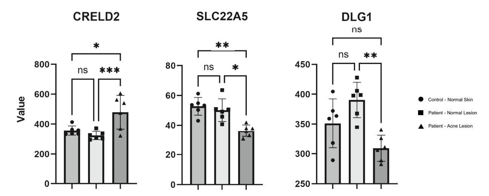
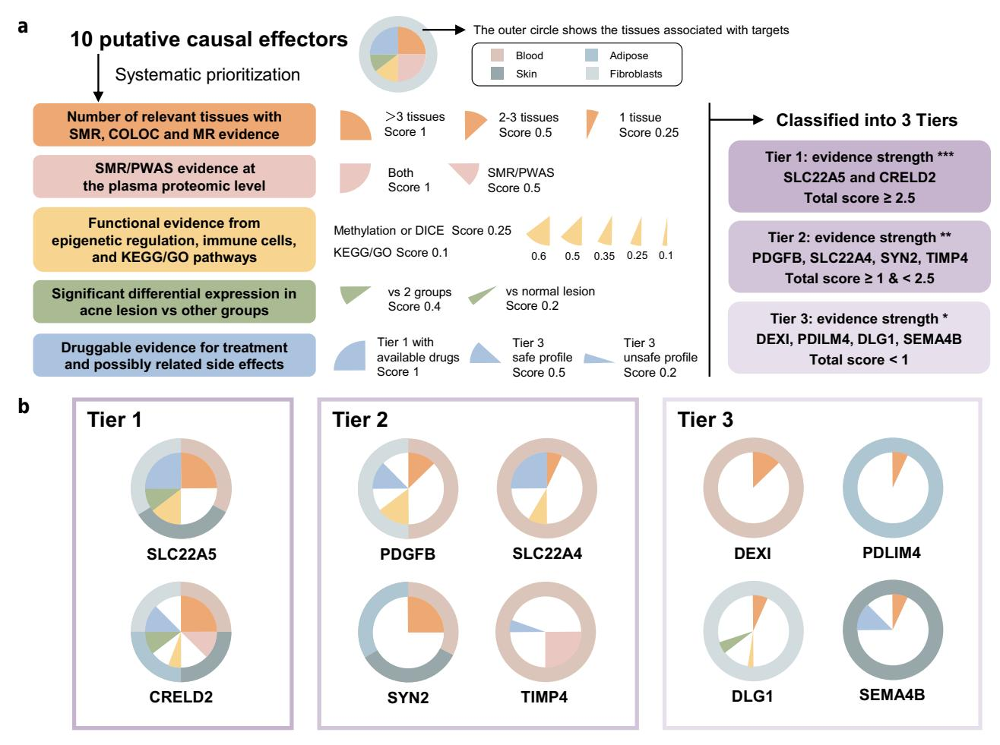

# **Multi-Omics Analysis Identifies Genetic Mechanisms and Therapeutic Targets for Acne Vulgaris**

Xinlan Qiu1,2 , Yibo Feng1,2 , Xiaohui Mo1 and Qiang Ju1

**Journal of Investigative Dermatology** (2025) **145,** 3037—3050; [doi:10.1016/j.jid.2025.04.032](https://doi.org/10.1016/j.jid.2025.04.032) 

Acne vulgaris is a chronic inflammatory disorder with complex pathophysiology. However, challenges such as antibiotic resistance, side effects, and recurrence highlight the need for precision therapies. This study employed a multi-omics approach, integrating summary-data—based Mendelian randomization, colocalization, two-sample Mendelian randomization, transcriptome-wide association studies, proteome-wide association studies, and functional analyses to identify acne-associated genes and proteins. We analyzed acne GWAS data (n\_cases ¼ 34,422; n\_controls ¼ 364,991); expression quantitative trait loci datasets from blood, skin-related tissues, and fibroblasts; 6 protein quantitative trait loci databases in plasma; and a blood methylation quantitative trait loci dataset. Summary-data—based Mendelian randomization and sensitivity analyses identified 16 candidate genes, refined to 9 by transcriptome-wide association studies. Protein-level summary-data—based Mendelian randomization and proteome-wide association studies further recognized 2 plasma proteins (CRELD2 and TIMP4), with CRELD2 also supported by gene-level associations. A total of 10 nonredundant targets were functionally analyzed, revealing pathways beyond molecular transport, such as carnitine metabolism. Moreover, key genes regulated by methylation and immune-cell—specific loci showed significant overlap with acne risk loci. Transcriptomic data confirmed differential expression of several targets in acne lesions. Finally, we prioritized acne drug targets on the basis of our results and their druggability, highlighting *SLC22A5* activators and *CRELD2* inhibitors as promising Tier 1 candidates. These findings advance the molecular understanding of acne pathogenesis and suggest potential therapeutic targets.

**Keywords:** Acne vulgaris, CRELD2, Drug target, GWAS, SLC22A5

### **INTRODUCTION**

Acne vulgaris (AV), commonly referred to as acne, is a chronic inflammatory disorder of the pilosebaceous unit, affecting about 85% of individuals aged 12—25 years, with a rising incidence in adults ([Lynn et al, 2016](#page-12-0); [Vos et al, 2012\)](#page-13-0). It typically manifests as open or closed comedones, papules, pustules, or nodules on the face or torso, often leading to discomfort, redness, hyperpigmentation, or scarring [\(Eichenfield et al, 2021\)](#page-11-0). Consequently, acne significantly impacts health-related QOL, with a burden

Correspondence: Xiaohui Mo, Department of Dermatology, Renji Hospital, Shanghai Jiao Tong University School of Medicine, Pujian Road 160, Shanghai 200127, China. E-mail: [moxiaohui2012@sina.cn](mailto:moxiaohui2012@sina.cn) and Qiang Ju, Department of Dermatology, Renji Hospital, Shanghai Jiao Tong University School of Medicine, Pujian Road 160, Shanghai 200127, China. E-mail: [qiangju401@163.com](mailto:qiangju401@163.com) 

Abbreviations: AV, acne vulgaris; eQTL, expression quantitative trait loci; ER, endoplasmic reticulum; FDR, false discovery rate; GO, gene ontology; HEIDI, heterogeneity in dependent instrument; LD, linkage disequilibrium; mQTL, methylation quantitative trait loci; MR, Mendelian randomization; PP.H4, posterior probability of hypothesis 4; pQTL, protein quantitative trait loci; PWAS, proteome-wide association study; SMR, summary-data—based Mendelian randomization; TWAS, transcriptome-wide association study

Received 14 January 2025; revised 31 March 2025; accepted 29 April 2025; accepted manuscript published online 19 May 2025; corrected proof published online 17 July 2025

comparable with those of chronic conditions such as asthma ([Naveed et al, 2021\)](#page-12-0).

According to guidelines from the American Academy of Dermatology, the European Association for the Study of the Skin and Sexually Transmitted Diseases, and the Italian Society of Dermatology and Venereology, the management of mild-tomoderate acne typically involves a combination of topical, systemic, and physical therapies [\(Conforti et al, 2020\)](#page-11-0). However, significant challenges persist. Long-term antibiotic use has contributed to increasing antibiotic resistance in Cutibacterium acnes, potentially reducing treatment efficacy and impacting the broader microbiome [\(Patel et al, 2010\)](#page-12-0). In addition to the growing concern over antibiotic resistance, acne can have a profound impact on patients' mental health, contributing to low self-esteem, social withdrawal, anxiety, and even depression. Furthermore, isotretinoin, one of the most effective treatments for moderate-to-severe inflammatory acne ([Bagatin and Costa, 2020\)](#page-11-0), is a potent teratogen with significant side effects, such as xerosis, cheilitis, and desquamation, which often hinder patient adherence [\(Harper, 2020\)](#page-12-0). Another key challenge is the high recurrence rate after treatment. Studies indicate that recurrence after oral isotretinoin therapy varies depending on dosage regimen, follow-up duration, and patient characteristics [\(Morales-Cardona and](#page-12-0) [Sa´nchez-Vanegas, 2013](#page-12-0)). These limitations contribute to patient dissatisfaction and highlight the importance of treatment adherence [\(Kircik, 2019](#page-12-0)).

1 Department of Dermatology, Renji Hospital, Shanghai Jiao Tong University School of Medicine, Shanghai, China

These authors contributed equally to this work.

These challenges highlight the urgent need for innovative therapeutic approaches with improved efficacy and safety profiles ([Habeshian and Cohen, 2020](#page-12-0)). Emerging treatments such as biologics, bacteriophage therapy, probiotics, and peptide-based drugs show potential in bridging current treatment gaps and enhancing patient outcomes ([Kim and](#page-12-0) [Kim, 2024\)](#page-12-0). At the core of these therapeutic advancements lies the need for a deeper understanding of acne pathogenesis. Acne development is influenced by a complex interplay of factors, including excessive sebum production, altered keratinization of sebaceous ducts, the presence of Cutibacterium acnes, and inflammatory processes [\(Heng and](#page-12-0)  [Chew, 2020](#page-12-0)). However, the precise molecular mechanisms governing these pathways remain poorly understood. Bridging this knowledge gap is essential for the development of targeted, mechanism-based therapies.

This study was motivated by the need to address the limitations of current acne treatments by elucidating its molecular underpinnings. Although existing studies [\(Deng et al,](#page-11-0) [2024;](#page-11-0) [Ju et al, 2024;](#page-12-0) [Li et al, 2025;](#page-12-0) [Xu et al, 2024\)](#page-13-0) have employed methods such as Mendelian randomization (MR) and colocalization analysis to explore the relationship between plasma proteins and acne risk, several limitations remain. First, most studies focus exclusively on plasma protein levels and rely on a single dataset, lacking robust external validation. Second, the methods used have not been sufficiently integrated, limiting the ability to fully leverage the complementary strengths of different omics data to improve the reliability of causal inferences. To overcome these challenges, we integrated multi-omics data—including expression quantitative trait loci (eQTL), protein quantitative trait loci (pQTL), and methylation quantitative trait loci (mQTL) with GWAS data. We employed a comprehensive analytical framework that combined summary-data—based MR (SMR), colocalization, transcriptome-wide association studies (TWASs), and proteome-wide association studies (PWASs). By integrating these methods, each with its unique strengths and assumptions, we enhanced the robustness of causal genes, proteins, and pathway identification, allowing for a more comprehensive understanding of molecular mechanisms underlying acne.

SMR utilizes GWAS summary statistics in conjunction with xQTL—including but not limited to eQTL data to infer causal relationships between molecular traits (such as gene expression) and acne susceptibility. It assumes that the instrumental genetic variants affect the trait solely through the xQTLassociated molecular feature, without horizontal pleiotropy (ie, no effect on the trait through other pathways) [\(Zhu et al,](#page-13-0) [2016\)](#page-13-0). To ensure that observed associations are not confounded by nearby variants, the heterogeneity in dependent instrument (HEIDI) test is used alongside SMR to differentiate between pleiotropy and linkage disequilibrium (LD). However, SMR is constrained by its dependence on strong QTL signals and the assumption of a linear relationship between the molecular trait and disease risk.

In contrast, Bayesian colocalization does not infer causality. Instead, it tests whether the GWAS and quantitative trait loci signals share a common causal variant [\(Giambartolomei](#page-12-0) [et al, 2014](#page-12-0)), making it a valuable complement to SMR for validating shared genetic architecture. Unlike SMR, colocalization does not require a direct causal relationship between gene expression and disease risk but rather focuses on the potential overlap of genetic signals.

TWAS extends the utility of SMR by incorporating transcriptomic data to impute gene expression across the genome, facilitating the identification of genes whose expression is significantly associated with acne risk ([Gusev et al, 2016](#page-12-0)). This approach is particularly advantageous for detecting genes with moderate eQTL effects and can be leveraged in conjunction with SMR to strengthen causal inference ([Barbeira et al, 2019](#page-11-0), [2018](#page-11-0)). Similarly, PWAS utilizes pQTL data to pinpoint proteins associated with acne susceptibility.

By integrating these complementary approaches, we triangulate evidence across multiple omics layers, thereby mitigating the limitations of individual methods and improving causal inference. Traditional GWAS alone cannot elucidate functional mechanisms, whereas our multi-omics framework enables the identification of regulatory networks that mediate acne susceptibility. The following are the primary objectives of this study:

- 1. To identify genetic and protein-level markers associated with acne susceptibility through a multi-omics analytical framework.
- 2. To investigate the regulatory mechanisms underlying acne pathogenesis by aligning identified targets with established biological pathways, DNA methylation patterns, and immune-cell—specific effects.
- 3. To evaluate the druggability of identified targets, thereby informing the development of therapeutic strategies for acne.

Ultimately, our findings aim to provide a comprehensive, mechanistically informed understanding of acne pathogenesis, overcoming the constraints of single-layer genetic analyses and paving the way for more precise and effective therapeutic strategies. The study design is outlined in [Figure 1](#page-3-0).

### **RESULTS**

# **Identification of key functional genes associated with AV**

We conducted both multi-SNP and single-SNP SMR analysis, while primarily focusing on single-SNP results to mitigate potential overestimation [\(Wu et al, 2018](#page-13-0)). In total, 29 genes exhibited significant associations with acne in at least 1 tissue (false discovery rate [FDR] *<* 0.05), among which 15 remained significant after Bonferroni correction. Importantly, these associations were not confounded by pleiotropy, as indicated by nonsignificant HEIDI test results (p\_HEIDI *>* .05). A summary of the 29 identified genes is presented in [Figure 2](#page-4-0), whereas detailed SMR results are provided in Supplementary Tables S2—6.

Increased expression of 13 genes was associated with a higher risk of acne, whereas another 13 were linked to reduced susceptibility. Notably, CRELD2 and SPECC1L exhibited strong associations with increased acne risk across multiple tissues, including blood, skin-related tissues, and fibroblasts. Similarly, FADS2 was positively correlated with acne susceptibility in several tissues, although only peripheral blood and skin tissue passed HEIDI test. Certain genes demonstrated tissue-specific associations. For instance, GDPGP1, LYPLAL1, and FADS1 were significantly linked to increased acne risk in blood, whereas SEMA4B was particularly prominent in the skin. Conversely, increased expression of SLC22A5 was strongly associated with a reduced risk of acne across blood and multiple tissues, with SLC22A4 exhibiting a similar protective effect in peripheral blood. In addition, PDGFB expression in whole blood and fibroblasts appeared to confer a lower acne risk. PDLIM4 was predominantly associated with lower susceptibility in skin and subcutaneous adipose. Interestingly, DEXI demonstrated a robust protective effect against acne in blood, with both single-SNP and multi-SNP SMR analyses passing Bonferroni correction. Furthermore, DLG1, IDH2, and SYN2 exhibited heterogeneous effects across different tissues, with SYN2 displaying opposing associations in blood and skin, potentially reflecting tissue-specific regulatory mechanisms.

The observed tissue-dependent associations of these genes suggest that their functional roles in acne pathogenesis may be influenced by tissue microenvironments, cellular contexts, or limitations in data availability.

# **Sensitivity analyses**

To ensure that the causal relationships identified by SMR were driven by the same genetic variants, we performed Bayesian colocalization analysis. As shown in [Figure 3](#page-4-0)a and Supplementary Table S7, CRELD2 exhibited colocalization with acne across all tissues, particularly in peripheral blood, consistent with SMR findings. SPECC1L also showed significant colocalization. FADS2 was restricted to skin tissue. Similarly, SLC22A5 shared genetic variation with acne across multiple tissues, with the strongest signals in peripheral blood, subcutaneous adipose, and fibroblasts. In addition, SPPL2A, PDGFB, CSTA, SYN2, and DEXI exhibited colocalization in tissues where SMR results were significant. Notably, some genes (eg, SNX15, LYPLAL1) exhibited significant SMR results but lacked colocalization, suggesting that their effects may not be driven by genetic variation. To further eliminate potential LD and strengthen causal inference, we also conducted a stringent two-sample MR analysis. Five genes (PPP1R12B, CSTA, PQLC3, FADS1, and TMEM258) were excluded owing to the lack of consistent results with SMR [\(Figure 3](#page-4-0)b and Supplementary Table S8). A total of 16 genes exhibited genetic overlap with acne in at least 1 tissue, with supporting evidence from SMR and MR analyses for their potential causal roles.

## **Transcriptome-wide associations of candidate genes with acne**

As shown in [Figure 4,](#page-5-0) to evaluate the selected genes at transcriptome level, we first conducted TWAS using MetaXcan with FDR control to minimize false negatives. All candidate genes remained significant in S-MultiXcan, except DEXI, which lacked corresponding Genotype-Tissue Expression data. Next, FUSION identified independence of genes across tissues after Bonferroni and conditional and joint analysis adjustments. Notably, CRELD2 exhibited consistent and significant associations in multiple tissue types, including whole blood, peripheral blood, fibroblasts, and skin, suggesting a potential systemic role in acne pathogenesis. Tissue-specific associations were observed for DEXI and SLC22A4 in whole blood and for PDLIM4 and SYN2 in adipose tissue, whereas fibroblast-specific associations were identified for PDGFB, DLG1, and SEMA4B. In skin tissue, significant associations were detected for SLC22A5, SYN2, SEMA4B, and CRELD2. Post-adjustment analysis revealed that the associations of PDLIM4 (skin) and SLC22A5, TP53, and PARD6G (whole blood) were not statistically independent, indicating potential confounding effects in their initial associations. Through this rigorous analytical framework, we ultimately identified 9 genes demonstrating strong causal associations with acne susceptibility, each exhibiting independent TWAS signals in at least 1 tissue type. More details are available in Supplementary Figures S1—6 and Supplementary Tables S9—19.

# **Investigation of plasma proteins linked to acne risk through SMR and PWAS**

To further assess the identified genes at the protein level, we performed SMR analysis across multiple pQTL datasets. Of the 6 available databases, protein data were accessible for only 3 target genes (PDLIM4, CRELD2, and PDGFB). Notably, CRELD2 remained statistically significant after correction and successfully passed the HEIDI test in the UK Biobank Pharma Proteomics Project cohort (b\_SMR ¼ 0.1187, FDR ¼ 0.0460, p\_HEIDI ¼ .1607), reinforcing its potential causal role in acne pathogenesis. In addition, TIMP4, a circulating protein previously implicated in acne in similar proteomic study, showed significant associations in both TWAS (ARIC, INTERVAL) and SMR (FENLAND, IN-TERVAL, deCODE), warranting its inclusion in downstream analyses. These findings highlight the potential roles of CRELD2 and TIMP4 in acne susceptibility and emphasize the importance of integrating protein-level evidence into genetic analyses ([Table 1](#page-5-0) and Supplementary Tables S20—27).

# **Regulatory mechanisms underlying acne development: pathways, epigenetics, and immune-cell**—**specific effects**

**Functional pathways.** We performed Kyoto Encyclopedia of Genes and Genomes and gene ontology (GO) overrepresentation analyses (adjusted P *<* .05) on 10 acneassociated targets, including 9 expression-associated genes (eGenes) and TIMP4, which was identified through pQTL and PWAS analyses. Kyoto Encyclopedia of Genes and Genomes analysis yielded limited findings, whereas GO analysis highlighted key transport processes, particularly those mediated by SLC22A4 and SLC22A5, as well as protein-binding interactions such as platelet-derived growth factor (PDGF) binding. These candidates were predominantly linked to cellular and membrane structures, especially the basal plasma membrane. The absence of significant pathway annotations for certain genes (eg, CRELD2) may be attributed to a lack of well-defined pathways. Significant GO overrepresentation analyses results are presented in [Figure 5a](#page-6-0), with the full dataset available in Supplementary Table S28.

**Epigenetic regulation through DNA methylation: a 3-step SMR.** We integrated SMR results with eQTL and mQTL data from blood to explore the role of DNA methylation in acne development ([Figure 5b](#page-6-0) and Supplementary Tables S29 and S30). In whole blood, methylation at cg25882056 upregulated CRELD2, promoting acne, whereas cg06968155

Figure 1. Study design overview. eQTL, expression quantitative trait loci; GEO, Gene Expression Omnibus; GO, gene ontology; KEGG, Kyoto Encyclopedia of Genes and Genomes; mQTL, methylation quantitative trait loci; pQTL, protein quantitative trait loci; GTEx, Genotype-Tissue Expression; PWAS, proteome-wide association study; SMR, summary-data-based Mendelian randomization; UKB-PPP, UK Biobank Pharma Proteomics Project.

and cg07538946 downregulated SLC22A5, increasing acne risk. Conversely, cg19040266 methylation upregulated SLC22A5, potentially reducing the risk. Similar patterns were observed in peripheral blood. In addition, methylation sites associated with PDGFB were identified in whole blood.

Immune-cell—specific effects in acne. As a chronic inflammatory skin disease, acne is closely linked to the immune system. We investigated the roles of immune cell types in blood by analyzing eQTL data of targets across 15 immune cell types. SLC22A5 showed strong colocalization with acne

Figure 2. SMR significant results linking tissue eQTLs to acne. Red shades indicate an increased risk of acne, whereas blue shades signify a decreased risk. Darker colors represent stronger effects, corresponding to larger absolute values of ln(OR). Genes with FDR\_SMR (the false discovery rate-adjusted p\_SMR) < 0.05 are outlined in purple, and genes with p\_SMR values passed by Bonferroni correction are outlined in yellow. Genes passing the HEIDI test are marked with an asterisk (\*). The top-left corner of each gene represents the multi-SNP SMR results, with blue indicating FDR significance and red indicating Bonferroni significance. The heatmap includes only genes that show significant FDR in at least 1 blood, tissue, or cell type and pass the HEIDI test. eQTL, expression quantitative trait loci; FDR, false discovery rate; HEIDI, heterogeneity in dependent instrument; SMR, summary-data—based Mendelian randomization.

Figure 3. Colocalization and TSMR results for SMR-significant genes associated with acne. (a) Colocalization results between SMR-significant genes in tissue eQTLs and acne. The colocalization intensity is categorized into 3 levels:  $0.5 \le PP.H4 < 0.75$  (low colocalization),  $0.75 \le PP.H4 < 0.9$  (moderate colocalization), and  $0.9 \le PP.H4$  (strong colocalization). Darker colors indicate a higher degree of colocalization between the gene and acne in the tissue. Yellow boxes highlight tissue-specific genes with FDR < 0.05 in the SMR analysis that also pass the HEIDI test. (b) TSMR forest plot showing results linking tissue-specific eQTLs to acne. This plot displays the results of the association between tissue-specific eQTLs and acne GWAS, including gene names, tissue types, ORs with 95% CIs, and P-values. Red points indicate genes with FDR < 0.05, whereas blue points represent genes with FDR  $\ge 0.05$ . Asterisks (\*) indicate genes that passed Bonferroni correction. CI, confidence interval; eQTL, expression quantitative trait loci; FDR, false discovery rate; HEIDI, heterogeneity in dependent instrument; PP.H4, posterior probability of hypothesis 4; SMR, summary-data—based Mendelian randomization; TSMR, two-sample Mendelian randomization.

Figure 4. Transcriptome-wide and conditional analysis of candidate genes associated with acne. (a) Manhattan plot showing S-PrediXcan and S-MultiXcan results. The x-axis represents the chromosomes (denoted as chr), and the y-axis represents -log10(FDR). The blue dashed line indicates a threshold of  $-\log_{10}(FDR) > 0.05$ , above which points are considered significant. Orange dots highlight genes that are significantly associated, having passed the preselected significance criteria. (b, c) COJO analysis results from FUSION for acne in skin tissue on chromosomes 5 and 22, respectively. The x-axis represents the BP position, and the y-axis represents -log10(P). COJO was used to identify independent genetic associations by conditioning on the effects of other variants. Green points represent genes that were Bonferroni significant prior to COJO and remain independently significant after COJO analysis, indicating a robust association. Blue points indicate genes that were Bonferroni significant before COJO but are conditionally significant after COJO, suggesting that their significance is influenced by the expression of the green points. Gray points represent genes that were not Bonferroni significant in the initial FUSION analysis, indicating no strong association in the initial analysis. BP, base pair; COJO, Conditional and Joint Analysis; FDR, false discovery rate.

in innate immune cells and moderate involvement in naive regulatory T, activated naive CD4+, and CD8+ T cells, with weaker signals in T cell subsets. PDGFB was strongly associated with acne in all T cells and nonclassical monocytes, whereas SLC22A4 had weaker associations in naive B and CD8+ T cells as well as THSTAR cells. These results are shown in Figure 6 and Supplementary Table S31.

## Transcriptomic profiling of prioritized targets in acne skin

To investigate the differential expression of prioritized targets in acne-affected skin, we analyzed 12,329 genes, identifying these 3 targets with significant differential expression (Figure 7 and Supplementary Table S32). CRELD2 expression was markedly upregulated in acne lesions compared with that in both healthy control skin and unaffected skin from patients with acne, whereas SLC22A5 was significantly downregulated, consistent with previous findings. No significant differences in CRELD2 or SLC22A5 expression were observed between control and unaffected skin. In addition,

rs184262

DLG1 expression showed significant alterations between acne lesions and normal skin. Notably, previous analyses revealed a strong association between these 3 genes in skinrelated tissues and acne susceptibility.

# Prioritization of potential therapeutic targets for AV

Building on the evidence obtained from this study, we established the following criteria for prioritizing promising drug targets for AV (Figure 8): (i) the number of relevant tissues exhibiting eQTL signals, (ii) SMR/PWAS evidence of pQTL involvement, (iii) potential functional validation, (iv) differential expression in RNA-sequencing data, and (v) druggability and target quality. Supplementary Figures S7–16 display the PheWAS results for the 10 prioritized gene and protein candidates.

Among the 10 targets supported by genetic or protein-level evidence of causal involvement, we systematically scored and stratified them into 3 tiers on the basis of these criteria. SLC22A5 and CRELD2 emerged as top-tier drug targets (total

.052009

0.00035030

| Table 1. Plasma Proteins Linked to Acne Risk through SMR Analysis |         |            |    |    |          |            |            |         |
|-------------------------------------------------------------------|---------|------------|----|----|----------|------------|------------|---------|
| Dataset                                                           | Protein | Top SNP    | A1 | A2 | p_SMR    | FDR_SMR    | Bonferroni | p_HEIDI |
| UKB-PPP                                                           | CRELD2  | rs28562884 | С  | Т  | 6.94E-05 | 0.04604085 | False      | .160719 |
| INTERVAL                                                          | TIMP4   | rs454615   | T  | С  | 4.81E-07 | 0.00028255 | True       | .116407 |
| FENLAND                                                           | TIMP4   | rs184262   | Α  | G  | 2.37E-07 | 0.00035588 | True       | .056850 |

Abbreviations: FDR, false discovery rate; HEIDI, heterogeneity in dependent instrument; pQTL, protein quantitative trait loci; SMR, summary-data-based Mendelian randomization; UKB-PPP, UK Biobank Pharma Proteomics Project.

1.96E-07

This table presents plasma pQTL data for proteins significantly associated with acne risk, as identified by SMR analysis. Only CRELD2 and TIMP4 meet the criteria of FDR\_SMR < 0.05 and p\_HEIDI > .05, indicating significant associations without evidence of heterogeneity. The columns include the dataset source, protein, top SNP, effect allele (A1), reference allele (A2), FDR-adjusted P-value (FDR\_SMR), Bonferroni correction, and HEIDI test P-value (p\_HEIDI).

TIMP4

deCODE

Figure 5. Functional enrichment and methylation regulation of acne-associated targets. (a) Functional classification of GO ORA based on 10 effectors. GO ORA was performed across 3 functional categories: BP, CC, and MF. The top 10 overrepresented terms within each category are shown, with only those meeting the threshold of an adjusted P < .05 included in the analysis. (b) Methylation regulation analysis of functional candidates linked to acne in blood. This figure illustrates the methylation regulation of functional candidates significantly associated with acne, analyzed in whole blood (left) and peripheral blood (right). The thickness of each line reflects the strength of the SMR association, whereas the line colors indicate the direction of regulation: orange represents upregulation, and red represents downregulation of genes and proteins associated with an increased risk of acne. Detailed SMR estimates can be found in Supplementary Tables S29 and S30. BP, biological process; CC, cellular component; GO, gene ontology; MF, molecular function; ORA, over-representation analysis; SMR, summary-data-based Mendelian randomization.

score  $\geq$  2.5), demonstrating the strongest therapeutic potential. Four genes were classified as second-tier targets (score between 1 and 2.5), whereas the remaining candidates were designated as third-tier targets. Notably, SLC22A5 received the highest score (3.0), exhibiting robust evidence across all criteria except for protein-level validation, which lacked available data. Similarly, CRELD2 scored 2.65, with strong support from multiple evaluation criteria. On the basis of these findings, we propose that SLC22A5 activators and CRELD2 inhibitors represent promising therapeutic strategies for AV.

#### **DISCUSSION**

AV affects approximately 9.38% of the global population (Vos et al, 2012) and has a profound impact on patients' mental health. Owing to the complex and poorly understood pathophysiology of the condition, current treatments face multiple challenges. In this study, we systematically explored the genetic basis of acne using a multi-omics, and multianalytical approach. By integrating large-scale tissue-specific genomics, transcriptomics, and plasma proteomics data with acne GWAS, we identified 10 high-confidence therapeutic targets, including 9 tissue-specific genes and 2 plasma proteins, with CRELD2 overlapping both categories. Notably, to our knowledge, these targets have not been previously implicated in acne pathogenesis. Pathway enrichment analysis revealed that these targets are primarily involved in substance transport. In addition, we found that SLC22A5, CRELD2, and PDGFB are regulated by upstream methylation. Several of these targets are closely associated with specific immune cell types, offering a better understanding of the

Figure 6. Immune-cell-specific colocalization analysis of functional candidates associated with acne in blood. The colocalization probability (PP.H4) is classified into 3 levels: low colocalization ( $0.5 \le PP.H4 < 0.75$ ), moderate colocalization ( $0.75 \le PP.H4 < 0.9$ ), and strong colocalization ( $PP.H4 \ge 0.9$ ). Darker shades correspond to higher degrees of colocalization. The distinct colors along the bottom axis represent different immune cell types, providing a detailed view of cell-specific associations. PP.H4, posterior probability of hypothesis 4.

underlying mechanisms of acne. After a comprehensive drug target assessment, SLC22A5 and CRELD2 emerged as Tier 1 potential therapeutic targets for AV. This suggests that CRELD2 inhibitors and SLC22A5 activators could serve as promising anti-acne strategies, paving the way for future therapeutic advancements.

# Lipid metabolism

Lipid metabolism plays a pivotal role in acne development. Previous studies have shown that FADS2, a desaturase enzyme, modulates fatty acid composition and enhances sebum secretion, which is strongly associated with acne (Ottaviani et al, 2010; Wang et al, 2020; Zouboulis et al, 2016). FADS2 catalyzes the desaturation of palmitic acid (C16:0) into metabolites with pronounced proinflammatory effects (Flori et al., 2023). Our findings support this, because increased FADS2 expression in the skin was associated with a higher risk of acne, although this effect is likely influenced by other genetic factors.

#### **OCTNs** in inflammation

Inflammation is a hallmark of acne. In recent years, an intriguing connection between inflammation and metabolism has emerged, highlighted by the increased nutrient demands of inflammatory cells (Yu et al, 2022). SLC22A4 and SLC22A5 of the OCTN family have been shown to exert anti-

Figure 7. Transcriptional differences of acne-associated prioritized targets in acne lesions from skin tissues. This figure shows the transcriptional differences of acne-associated genes (CRELD2, SLC22A5, and DLG1) in different skin conditions: control-normal skin, patient-normal skin, and patient-acne lesions. Bars represent mean  $\pm$  SEM. Statistical significance is indicated as follows: \*P < .05, \*\*P < .01, and \*\*\*P < .001. Full statistical results are in Supplementary Table S32. p-adjust, adjusted P-value; ns, not significant.

Figure 8. Evidence-based prioritization framework and classification of candidate drug targets for acne. (a) Criteria for drug target prioritization. Each circle represents a candidate. The outer ring color indicates the most significantly associated tissue. The inner section is divided into 5 evidence components contributing to a total prioritization score (maximum 4 points): Orange: number of tissues with SMR, COLOC, and MR evidence. Pink: plasma proteomic evidence from SMR/PWAS. Yellow: functional evidence from epigenetic regulation, immune cell signals, and KEGG/GO pathways. Green: significant differential expression in acne lesions. Blue: druggability evidence, including known targets and safety profiles. Targets are classified into 3 tiers on the basis of the total score: Tier 1: score ≥ 2.5, Tier 2: 1 ≤ score < 2.5, and Tier 3: score < 1. (b) Results of drug target prioritization. Tier 1 drug candidates include SLC22A5 and CRELD2; Tier 2 includes PDGFB, SLC22A4, SYN2, and TIMP4; and Tier 3 includes DEXI, PDLIM4, DLG1, and SEMA4B. GO, gene ontology; KEGG, Kyoto Encyclopedia of Genes and Genomes; MR, Mendelian randomization; SMR, summary-data-based Mendelian randomization; TWAS, transcriptome-wide association study.

inflammatory effects in chronic inflammatory diseases such as inflammatory bowel disease (Li et al, 2022; Pochini et al, 2024; Smith et al, 2021). OCTN1 (SLC22A4) primarily transports ergothioneine and acetylcholine, whereas OCTN2 (SLC22A5) mediates carnitine and its derivatives, which collectively exhibit anti-inflammatory properties (Hseu et al, 2015; Ishimoto et al, 2018; Martini et al, 2012; Shekhawat et al, 2007). For instance, carnitine regulates metabolic reprogramming from glucose to fatty acid oxidation, promoting M2 macrophage activation while suppressing M1 macrophage inflammasome activation (Batista-Gonzalez et al, 2019; Liu et al, 2012). Our findings suggest that increased expression of SLC22A4 in blood and SLC22A5 across multiple tissues may inhibit acne through substratemediated anti-inflammatory mechanisms, with a strong correlation to immune cells. Importantly, reduced transcription of SLC22A5 in acne lesions highlights its therapeutic potential, warranting further experimental validation.

# **Endoplasmic reticulum stress**

Beyond metabolic pathways, our study underscores the critical role of chronic endoplasmic reticulum (ER) stress in acne. Dysregulated unfolded protein response and excessive ER stress are implicated in various skin disorders, including Darier disease, rosacea, vitiligo, and melanoma (Melnik, 2016; Onozuka et al, 2006; Sakuntabhai et al, 1999; Shimasaki et al, 2010; Sugiura et al, 2009). CRELD2 and SPPL2A were found to significantly contribute to acne pathogenesis through ER stress—related mechanisms in our study, with CRELD2 independently influencing acne development. CRELD2, a member of the cysteine-rich epidermal GF-like domain protein family, is markedly upregulated during ER stress (Tang et al, 2023) and may promote acne risk according to our findings. SPPL2A encodes an aspartic intramembrane protease that regulates intracellular membrane trafficking and fusion through SNARE protein degradation (Mentrup et al, 2024). Loss of SPPL2A activity disrupts membrane system function, exacerbating ER stress [\(Schneppenheim et al,](#page-12-0) [2013\)](#page-12-0).

#### **Cellular signaling, junction regulation, and skin remodeling**

Several other targets were identified, potentially influencing acne through cellular signaling, junction regulation, or tissue remodeling. PDGFB, which encodes PDGFB chain, was found to suppress acne through M2 macrophage expression. Interestingly, prior studies have linked PDGFB-expressing macrophages to extracellular matrix accumulation through activation of SFRP2/ASPNþ fibroblasts [\(Huang et al, 2024\)](#page-12-0). DLG1, a membrane-associated guanylate kinase homolog, regulates intercellular junctions and signaling, potentially acting in concert with SLC22A4 and SLC22A5 at the basal cell layer. Consistent with previous studies, increased expression of TIMP4 protein in the blood promotes acne. As an inhibitor of matrix metalloproteinases, TIMP4 influences extracellular matrix remodeling and tissue repair. SPECC1L, PPP1R12B, and PDLIM4 play key roles in regulating cell motility and cytoskeletal structure ([Fu et al, 2019](#page-12-0)). SEMA4B and SYN2 may influence synapses and postsynaptic membranes [\(Amin et al, 2023](#page-11-0)). DEXI have been identified as risk loci for atopic dermatitis [\(Sobczyk et al, 2021\)](#page-12-0). However, the role of most of targets in inflammatory diseases remains largely unknown.

Our study offers several notable strengths compared with similar research. We implemented rigorous SMR and HEIDI testing, effectively accounting for genetic heterogeneity, while integrating colocalization and two-sample MR, significantly enhancing the robustness of our findings. TWAS and PWAS further provided transcriptomic and proteomic evidence. In addition, we leveraged an extensive range of multiomics resources, including eQTL profiles from blood, tissues, and fibroblasts; pQTL analyses of plasma protein levels; blood mQTL data; single-cell eQTL mapping in immune cells; and transcriptomic sequencing from skin tissues. Our analysis was exhaustive, systematically assessing tens of thousands of genes and proteins across multiple databases. Each candidate was subjected to SMR analysis with acne, and significant associations were identified using FDR and Bonferroni corrections, ensuring rigorous statistical control and high credibility. Furthermore, we developed a comprehensive drug target scoring framework, effectively summarizing multi-omics findings. This integrative and systematic approach provides a robust foundation for elucidating the molecular mechanisms underlying acne pathogenesis.

Our study reveals the complex molecular mechanisms underlying AV, shedding light on key genes, proteins, and pathways involved in lipid metabolism, carnitine transporter, and cellular dynamics. The integration of genetic, epigenetic, and transcriptomic data emphasizes the multifactorial nature of the condition. Notably, SLC22A5 and CRELD2 emerged as pivotal targets, with SLC22A5 showing protective effects and CRELD2 promoting susceptibility. These findings provide a foundation for precision medicine approaches and the development of targeted therapies for AV.

However, several limitations should be considered when evaluating our results. First, the focus on individuals of European ancestry limits the generalizability of our findings to other ethnic groups. Second, although comprehensive analysis offers valuable insights into potential causal relationships, its underlying assumptions may not entirely align with the conditions observed in clinical trials. This discrepancy must be carefully considered when interpreting and applying our findings. Finally, the lack of relevant GWAS data prevented us from conducting analyses between genes and acne subgroups, which could have provided further insight into the heterogeneity of AV. Despite these limitations, our study lays the groundwork for future research and the development of more effective, personalized treatments for acne.

## **MATERIALS AND METHODS**

#### **Study design**

As [Figure 1](#page-3-0) shows, eQTL instrumental variables were selected from whole blood, peripheral blood, skin, subcutaneous adipose, and cultured fibroblasts, followed by SMR and HEIDI tests using AV GWAS data from [Teder-Laving et al \(2024\)](#page-13-0). Sensitivity analyses were conducted using Bayesian colocalization and two-sample MR to further verify the findings. To incorporate transcriptomic evidence, TWAS (MetaXcan and FUSION) was performed to prioritize candidate genes on the basis of expression profiles. At the protein level, significant plasma proteins were identified and validated using PWAS and SMR. In total, 10 targets were selected for functional analysis, including pathway enrichment (over-representation analysis), methylation regulation, and immune single-cell eQTL analysis. Furthermore, differential expression of the targets was assessed in acne lesions using skin tissue transcriptomic data. Finally, we prioritized potential therapeutic targets on the basis of multi-omics evidence scoring approach.

## **Study samples**

**Specific tissue eQTL data as genetic instruments for gene expression analysis.** We selected publicly available cis-eQTL data from tissue, which refer to eQTLs that regulate gene expression in close proximity to the target gene, typically within 1 Mb of the transcription start site. We selected publicly available eQTL data in blood, tissues, and cells. The eQTLGen Consortium [\(https://eqtlgen.](https://eqtlgen.org/index.html) [org/index.html](https://eqtlgen.org/index.html)) was included as the largest meta-analysis of blood eQTLs with 31,684 samples, for primary analysis in whole blood [\(Vo˜sa et al, 2021\)](#page-13-0). eQTL data of [Westra et al \(2013\)](#page-13-0) study were a meta-analysis using nontransformed peripheral blood samples from 5311 individuals. eQTLs in skin tissue (suprapubic), subcutaneous adipose, and cultured fibroblasts from skin were obtained from the Genotype-Tissue Expression project ([GTEx Consortium et al, 2017](#page-12-0)).

**Plasma pQTL data as genetic instruments for protein expression analysis.** We also selected publicly available cis-pQTL data, defined as variants located within 1 Mb of the transcription start site. We obtained cis-pQTL data from 6 large-scale genome-wide proteomic GWAS studies, namely the UK Biobank Pharma Proteomics Project [\(Sun et al, 2023](#page-12-0)), the deCODE [\(Ferkingstad et al, 2021](#page-11-0)), the INTERVAL ([Sun et al, 2018\)](#page-12-0), the ARIC [\(Zhang et al, 2022\)](#page-13-0), the FENLAND [\(Pietzner et al, 2021\)](#page-12-0), and the SCALLOP [\(Folkersen et al,](#page-12-0) [2020\)](#page-12-0). Each of these studies undertook proteomic profiling using either SomaLogic SomaScans or O-link proximal extension assays.

**mQTL for mechanism analysis.** The mQTL summary data we applied was a meta-analysis of the Brisbane Systems Genetics Study and the Lothian Birth Cohorts data [\(Wu et al, 2018](#page-13-0)). The original data was generated in 2 cohorts—Brisbane Systems Genetics Study (n = 614) and the Lothian Birth Cohorts (n = 1366)—in blood (McRae et al, 2018). The methylation states of all the samples that are of European descent were measured on the basis of Illumina HumanMethylation450 chips. Only the DNA methylation probes with at least a cis-mQTL at P < 5e-8 and only SNPs within 2 Mb distance from each probe are available.

Immune-cell-type-specific eQTL data. To investigate celltype specificity, we performed follow-up analyses using immunecell-specific eQTL data to assess the genetically predicted effects. This dataset, sourced from the DICE (Database of Immune Cell Expression) (https://dice-database.org/) (Schmiedel et al, 2018), includes information on 15 distinct immune cell types. We specifically selected cis-eQTLs of the screened candidates.

AV GWAS summary statistics. The GWAS summary for AV was obtained from Teder-Laving et al (2024). This cohort identified 46 susceptibility loci for acne in Europeans on the basis of 34,422 cases and 364,991 controls (Teder-Laving et al, 2024).

Gene Expression Omnibus transcriptome data in acne and normal skin. The transcriptome data were downloaded from the Gene Expression Omnibus database. GSE647520 (Trivedi et al, 2006), including gene expression profiles of acne and normal skin samples from 6 patients with acne, along with 6 controls.

#### Methods

SMR analysis and HEIDI test. SMR analysis (Zhu et al, 2016) was utilized as the primary method to confirm the causal relationship in our study. SMR performs an analogous MR analysis to evaluate the relationship between exposure and outcome. HEIDI was used to demonstrate that the relationship is not attributable to genetic linkage (Wu et al, 2018). To correct for multiple testing, both Benjamini-Hochberg false discovery rate (FDR) adjustment and Bonferroni correction were applied to the p\_SMR values. Exposures with FDR < 0.05 and p\_HEIDI > .05 were deemed significant and passing HEIDI test. The SMR software (version 1.3.1, http:// cnsgenomics.com/software/smr/) (Wu et al, 2018) was applied with default parameters. We selected SNPs with a P < 5e-8 for the analysis to ensure robust genetic associations. For multi-SNP SMR, the SNPs were pruned for LD using a weighted vertex coverage algorithm, with an LD r2 threshold of 0.9 (the default value).

Bayesian colocalization. To enhance the causal inference of our study, Bayesian colocalization was conducted as sensitivity analysis by 'coloc' package (Giambartolomei et al, 2014). The coloc.abf algorithm was employed for this evaluation. We concentrated on the posterior probability of hypothesis 4 (PP.H4), which suggests a shared genetic variant. According to the PP.H4 value, we divided the hypothesis that genes and acne are causally related through the same genetic variant into 3 degrees, including low  $(0.5 \le PP.H4 < 0.75)$ , middle  $(0.75 \le PP.H4 \le 0.9)$ , and strong  $(PP.H4 \ge 0.9)$  colocalization (Gay et al, 2020; Guo et al, 2022; Viñuela et al, 2020). All SNPs within 1 Mb of the cis-eQTL were included. Bayesian colocalization was also used for exploring the specific roles of genes in immune cells. We conducted COLOC with the default prior probabilities:  $p_1 =$  $1 \times 10^{-4}$ ,  $p_2 = 1 \times 10^{-4}$ , and  $p_{12} = 1 \times 10^{-5}$ .

**Two-sample MR.** MR analyses were performed on acne GWAS summary statistics from Teder-Laving et al (2024) using the Two-SampleMR R package. Instrumental variables were selected from cis-eQTLs associated with 29 SMR-significant genes at P < 5e-8, and highly correlated SNPs ( $r^2 < 0.001$ ) within a 10,000-kb window were excluded through LD clumping, using the European (denoted as EUR) reference panel. For single SNPs, the Wald ratio method was applied, whereas for 2 SNPs, the inversevariance weighted method was used. For 3 or more SNPs, multiple MR approaches were employed, with inverse-variance weighted as the primary method, complemented by MR-Egger, weighted median, and weighted mode methods to assess the robustness of the findings. Horizontal pleiotropy was assessed using MR-Egger's intercept test (egger\_pval > .05), and heterogeneity was evaluated using Cochran's Q statistic (Q\_pval > 0.05). Significant heterogeneity led to sensitivity analyses to explore potential sources of variance. Results were reported as ORs with corresponding 95% confidence intervals. Statistical significance was determined after Bonferroni correction to account for multiple comparisons.

TWAS and PWAS. We conducted a TWAS for acne using S-PrediXcan and S-MultiXcan modules in the MetaXcan software. Prior to analysis, the GWAS summary statistics for acne were lifted over from hg19 to hg38, followed by imputation. For S-PrediXcan, we incorporated gene expression models from Genotype-Tissue Expression (version 8) for whole blood, skin, adipose tissue, and fibroblasts, along with single-tissue LD reference covariance files, all obtained from PredictDB (https://predictdb.org/). These models were trained using the mashr framework. To assess multitissue gene expression associations, we applied S-MultiXcan using S-PrediXcan

In parallel, we performed FUSION analysis to complement the S-PrediXcan/S-MultiXcan results and to incorporate additional modeling strategies. FUSION analysis was performed as described previously, allowing for multiple predictive models, independent LD reference panels, additional feature statistics, and cross-validation. The acne GWAS meta-analysis summary statistics were analyzed without applying a preselection significance threshold. Expression weight reference panels were downloaded from the TWAS/FUSION repository (http://gusevlab.org/projects/fusion/) (Gusev et al, 2016) for Genotype-Tissue Expression (version 8) whole blood, skin, adipose tissue, and fibroblasts as well as whole blood from the YFS (Young Finns Study) (http://med.utu.fi/cardio/youngfinnsstudy) (Raitakari et al, 2008) and peripheral blood from the Netherlands Twin Register (Boomsma et al, 2006). In addition, pQTL-based models from the ARIC and INTERVAL cohorts were downloaded and utilized for PWASs within FUSION. To identify conditionally independent genes and assess residual GWAS signals after accounting for functional associations, we applied the FUSION.post\_process.R script to genes that remained significant after Bonferroni correction within each tissue. This script processes outputs from FUSION. assoc\_test.R, computing key statistics and facilitating the identification of independent acne-associated genes within each locus. Default parameters were used in TWAS and PWAS.

Pathway over-representation analysis. GO and Kyoto Encyclopedia of Genes and Genomes pathway over-representation analyses were conducted using the clusterProfiler package (Yu et al, 2012) to elucidate the functional roles of 10 candidates. The analysis was performed using a list of Entrez Gene identifications as input, and significantly enriched GO terms and Kyoto Encyclopedia of Genes and Genomes pathways were identified on the basis of a stringent threshold of adjusted P < .05.

# **X Qiu et al.**

Multi-omics Insights on Acne Molecular Targets

**A 3-step SMR analysis on methylation regulation.** Gene methylation plays a critical role in regulating gene expression. To explore the potential mechanisms underlying this relationship, we conducted a 3-step SMR approach to evaluate the associations among GWAS, eQTL, and mQTL datasets. The steps were as follows:

- 1. Tissue-specific eQTLs served as exposures, with acne GWAS as the outcome.
- 2. Blood mQTLs were used as exposures, and acne GWAS was the outcome.
- 3. Blood mQTLs were exposures, with blood eQTLs as the outcome, focusing on significant genes identified in steps 1.

Significant results were defined by an FDR\_SMR *<* 0.05 and p\_HEIDI *>* .05.

**Gene Expression Omnibus data analysis on differential gene expression.** Differential gene expression analysis was conducted utilizing the DESeq2 package [\(Love et al, 2014\)](#page-12-0) with default set. Pairwise comparisons were performed among 3 groups: healthy controls, unaffected skin from patients with acne, and acne lesions. Genes exhibiting an adjusted P *<* .05 were deemed to have statistically significant transcriptional differences across the groups.

**Drug targets prioritization.** The druggable genome, as defined by Finan et al (2017), consists of a curated set of 4479 proteins, categorized into 3 distinct tiers on the basis of their druggability potential. Candidates that meet the criteria of both the Drug Gene Interaction database [\(https://www.dgidb.org/](https://www.dgidb.org/)) (Cannon et al, 2024) and the druggable genome list from Finan et al (2017) are considered druggable (Supplementary Tables S33 and S34). We employed the AstraZeneca PheWAS (Phenome-Wide Association Study) platform to explore potential associations between candidates and various traits (diseases or phenotypes), assessing the potential risks or side effects. In addition, we utilized DrugBank ([Knox et al, 2024](#page-12-0)) to investigate whether known drugs are available for the identified targets. By integrating these findings, we applied a multifaceted scoring system to identify drugs with potential repurposing opportunities.

# **ETHICS STATEMENT**

All analyses in this study were conducted using publicly available, summary-level data. The datasets used include: eQTLGen Consortium, [Westra et al \(2013\)](#page-13-0) expression quantitative trait loci summary data, Genotype-Tissue Expression Consortium, DICE (Database of Immune Cell Expression), UK Biobank Pharma Proteomics Project, deCODE, INTER-VAL, ARIC, FENLAND, SCALLOP, [McRae et al \(2018\)](#page-12-0) methylation quantitative trait loci summary data, Young Finns Study, Netherlands Twin Register, and [Teder-Laving et al \(2024\)](#page-13-0) GWAS data. All original studies obtained written, informed consent from participants and, where applicable, from a parent or legal guardian. Ethical approval was obtained by the original investigators. Because our study only used publicly available summary-level data, no institutional ethical approval was required. This is in accordance with clause 32 of the "Measures for Ethical Review of Life Science and Medical Research Involving Human Beings" (2023, China), which states that research using legally obtained public data—provided it does not harm human subjects, involve sensitive personal information, or affect commercial interests—may be exempt from additional ethical review.

# **DATA AVAILABILITY STATEMENT**

The datasets analyzed in this study are publicly accessible. Detailed information on the databases, including accession numbers and direct links, is provided in Additional File 1 (Supplementary Table S1). Comprehensive results of the analyses are also included in Additional Files 1 and 2.

#### **ORCIDs**

Xinlan Qiu: <http://orcid.org/0009-0003-5908-7972> Yibo Feng: <http://orcid.org/0009-0005-0302-1741> Xiaohui Mo: <http://orcid.org/0000-0001-8567-4482> Qiang Ju: <http://orcid.org/0000-0002-0251-1598>

#### **CONFLICT OF INTEREST**

The authors state no conflict of interest.

#### **ACKNOWLEDGMENTS**

We acknowledge all the GWASs for making the summary data publicly available, and we appreciate all the investigators and participants who contributed to those studies. Our work was supported by the National Natural Science Foundation of China (82373506). QJ is the guarantor of this work.

#### **AUTHOR CONTRIBUTIONS**

Conceptualization: XQ, XM, QJ; Funding Acquisition: QJ; Investigation: XQ, YF; Methodology: XQ, YF, XM; Project Administration: QJ; Supervision: XM, QJ; Visualization: XQ, YF, XM; Writing — Original Draft Preparation: XQ, YF, XM, QJ; Writing — Review and Editing: XQ, YF, XM, QJ

#### **SUPPLEMENTARY MATERIAL**

Supplementary material is linked to the online version of the paper at [www.](http://www.jidonline.org) [jidonline.org](http://www.jidonline.org), and at [https://doi.org/10.1016/j.jid.2025.04.032.](https://doi.org/10.1016/j.jid.2025.04.032)

#### **REFERENCES**

- [Amin A, Badenes M, Tu¨shaus J, de Carvalho E´, Burbridge E, Faı´sca P, et al.](http://refhub.elsevier.com/S0022-202X(25)00487-7/sref1)  [Semaphorin 4B is an ADAM17-cleaved adipokine that inhibits adipocyte](http://refhub.elsevier.com/S0022-202X(25)00487-7/sref1)  [differentiation and thermogenesis. Mol Metab 2023;73:101731](http://refhub.elsevier.com/S0022-202X(25)00487-7/sref1).
- [Bagatin E, Costa CS. The use of isotretinoin for acne an update on optimal](http://refhub.elsevier.com/S0022-202X(25)00487-7/sref2) [dosing, surveillance, and adverse effects. Expert Rev Clin Pharmacol](http://refhub.elsevier.com/S0022-202X(25)00487-7/sref2)  [2020;13:885](http://refhub.elsevier.com/S0022-202X(25)00487-7/sref2)—97.
- [Barbeira AN, Dickinson SP, Bonazzola R, Zheng J, Wheeler HE, Torres JM,](http://refhub.elsevier.com/S0022-202X(25)00487-7/sref3)  [et al. Exploring the phenotypic consequences of tissue specific gene](http://refhub.elsevier.com/S0022-202X(25)00487-7/sref3) [expression variation inferred from GWAS summary statistics. Nat Commun](http://refhub.elsevier.com/S0022-202X(25)00487-7/sref3)  [2018;9:1825](http://refhub.elsevier.com/S0022-202X(25)00487-7/sref3).
- [Barbeira AN, Pividori M, Zheng J, Wheeler HE, Nicolae DL, Im HK. Inte](http://refhub.elsevier.com/S0022-202X(25)00487-7/sref4)[grating predicted transcriptome from multiple tissues improves association](http://refhub.elsevier.com/S0022-202X(25)00487-7/sref4)  [detection. PLoS Genet 2019;15:e1007889](http://refhub.elsevier.com/S0022-202X(25)00487-7/sref4).
- [Batista-Gonzalez A, Vidal R, Criollo A, Carren˜o LJ. New insights on the role](http://refhub.elsevier.com/S0022-202X(25)00487-7/sref5) [of lipid metabolism in the metabolic reprogramming of macrophages. Front](http://refhub.elsevier.com/S0022-202X(25)00487-7/sref5) [Immunol 2019;10:2993.](http://refhub.elsevier.com/S0022-202X(25)00487-7/sref5)
- [Boomsma DI, de Geus EJ, Vink JM, Stubbe JH, Distel MA, Hottenga JJ, et al.](http://refhub.elsevier.com/S0022-202X(25)00487-7/sref6)  [Netherlands Twin Register: from twins to twin families. Twin Res Hum](http://refhub.elsevier.com/S0022-202X(25)00487-7/sref6) [Genet 2006;9:849](http://refhub.elsevier.com/S0022-202X(25)00487-7/sref6)—57.
- [Cannon M, Stevenson J, Stahl K, Basu R, Coffman A, Kiwala S, et al. DGIdb 5.](http://refhub.elsevier.com/S0022-202X(25)00487-7/sref7) [0: rebuilding the drug-gene interaction database for precision medicine](http://refhub.elsevier.com/S0022-202X(25)00487-7/sref7) [and drug discovery platforms. Nucleic Acids Res 2024;52:D1227](http://refhub.elsevier.com/S0022-202X(25)00487-7/sref7)—35.
- [Conforti C, Chello C, Giuffrida R, di Meo N, Zalaudek I, Dianzani C. An](http://refhub.elsevier.com/S0022-202X(25)00487-7/sref8) [overview of treatment options for mild-to-moderate acne based on Amer](http://refhub.elsevier.com/S0022-202X(25)00487-7/sref8)[ican Academy of Dermatology, European Academy of Dermatology and](http://refhub.elsevier.com/S0022-202X(25)00487-7/sref8) [Venereology, and Italian Society of Dermatology and Venereology guide](http://refhub.elsevier.com/S0022-202X(25)00487-7/sref8)[lines. Dermatol Ther 2020;33:e13548](http://refhub.elsevier.com/S0022-202X(25)00487-7/sref8).
- [Deng S, Mao R, He Y. Unveiling new protein biomarkers and therapeutic](http://refhub.elsevier.com/S0022-202X(25)00487-7/sref9) [targets for acne through integrated analysis of human plasma proteomics](http://refhub.elsevier.com/S0022-202X(25)00487-7/sref9)  [and genomics. Front Immunol 2024;15:1452801.](http://refhub.elsevier.com/S0022-202X(25)00487-7/sref9)
- [Eichenfield DZ, Sprague J, Eichenfield LF. Management of acne vulgaris: a](http://refhub.elsevier.com/S0022-202X(25)00487-7/sref10)  [review. JAMA 2021;326:2055](http://refhub.elsevier.com/S0022-202X(25)00487-7/sref10)—67.
- [Ferkingstad E, Sulem P, Atlason BA, Sveinbjornsson G, Magnusson MI,](http://refhub.elsevier.com/S0022-202X(25)00487-7/sref11)  [Styrmisdottir EL, et al. Large-scale integration of the plasma proteome with](http://refhub.elsevier.com/S0022-202X(25)00487-7/sref11)  [genetics and disease. Nat Genet 2021;53:1712](http://refhub.elsevier.com/S0022-202X(25)00487-7/sref11)—21.
- [Finan C, Gaulton A, Kruger FA, Lumbers RT, Shah T, Engmann J, et al. The](http://refhub.elsevier.com/S0022-202X(25)00487-7/optlwMM7qQway) [druggable genome and support for target identification and validation in](http://refhub.elsevier.com/S0022-202X(25)00487-7/optlwMM7qQway)  [drug development. Sci Transl Med 2017;9:eaag1166.](http://refhub.elsevier.com/S0022-202X(25)00487-7/optlwMM7qQway)
- [Flori E, Mastrofrancesco A, Ottaviani M, Maiellaro M, Zouboulis CC,](http://refhub.elsevier.com/S0022-202X(25)00487-7/sref12)  [Camera E. Desaturation of sebaceous-type saturated fatty acids through the](http://refhub.elsevier.com/S0022-202X(25)00487-7/sref12) [SCD1 and the FADS2 pathways impacts lipid neosynthesis and inflam](http://refhub.elsevier.com/S0022-202X(25)00487-7/sref12)[matory response in sebocytes in culture. Exp Dermatol 2023;32:808](http://refhub.elsevier.com/S0022-202X(25)00487-7/sref12)—21.

- [Folkersen L, Gustafsson S, Wang Q, Hansen DH, Hedman A˚](http://refhub.elsevier.com/S0022-202X(25)00487-7/sref13) K, Schork A, et al. [Genomic and drug target evaluation of 90 cardiovascular proteins in 30,](http://refhub.elsevier.com/S0022-202X(25)00487-7/sref13) [931 individuals. Nat Metab 2020;2:1135](http://refhub.elsevier.com/S0022-202X(25)00487-7/sref13)—48.
- [Fu C, Li Q, Zou J, Xing C, Luo M, Yin B, et al. JMJD3 regulates CD4 T cell](http://refhub.elsevier.com/S0022-202X(25)00487-7/sref14)  [trafficking by targeting actin cytoskeleton regulatory gene Pdlim4. J Clin](http://refhub.elsevier.com/S0022-202X(25)00487-7/sref14)  [Invest 2019;129:4745](http://refhub.elsevier.com/S0022-202X(25)00487-7/sref14)—57.
- [Gay NR, Gloudemans M, Antonio ML, Abell NS, Balliu B, Park Y, et al. Impact](http://refhub.elsevier.com/S0022-202X(25)00487-7/sref15)  [of admixture and ancestry on eQTL analysis and GWAS colocalization in](http://refhub.elsevier.com/S0022-202X(25)00487-7/sref15)  [GTEx. Genome Biol 2020;21:233.](http://refhub.elsevier.com/S0022-202X(25)00487-7/sref15)
- [Giambartolomei C, Vukcevic D, Schadt EE, Franke L, Hingorani AD,](http://refhub.elsevier.com/S0022-202X(25)00487-7/sref16)  [Wallace C, et al. Bayesian test for colocalisation between pairs of genetic](http://refhub.elsevier.com/S0022-202X(25)00487-7/sref16)  [association studies using summary statistics. PLoS Genet 2014;10:](http://refhub.elsevier.com/S0022-202X(25)00487-7/sref16)  [e1004383.](http://refhub.elsevier.com/S0022-202X(25)00487-7/sref16)
- [GTEx Consortium; Laboratory, Data Analysis &Coordinating Center](http://refhub.elsevier.com/S0022-202X(25)00487-7/sref17)  [\(LDACC\)—Analysis Working Group; Statistical Methods groups—Analysis](http://refhub.elsevier.com/S0022-202X(25)00487-7/sref17)  [Working Group; Enhancing GTEx \(eGTEx\) groups; NIH Common Fund;](http://refhub.elsevier.com/S0022-202X(25)00487-7/sref17)  [NIH/NCI; et al. Genetic effects on gene expression across human tissues.](http://refhub.elsevier.com/S0022-202X(25)00487-7/sref17)  [Nature 2017;550:204](http://refhub.elsevier.com/S0022-202X(25)00487-7/sref17)—13.
- [Guo P, Gong W, Li Y, Liu L, Yan R, Wang Y, et al. Pinpointing novel risk loci](http://refhub.elsevier.com/S0022-202X(25)00487-7/sref18)  [for Lewy body dementia and the shared genetic etiology with Alzheimer's](http://refhub.elsevier.com/S0022-202X(25)00487-7/sref18) [disease and Parkinson's disease: a large-scale multi-trait association anal](http://refhub.elsevier.com/S0022-202X(25)00487-7/sref18)[ysis. BMC Med 2022;20:214](http://refhub.elsevier.com/S0022-202X(25)00487-7/sref18).
- [Gusev A, Ko A, Shi H, Bhatia G, Chung W, Penninx BW, et al. Integrative](http://refhub.elsevier.com/S0022-202X(25)00487-7/sref19)  [approaches for large-scale transcriptome-wide association studies. Nat](http://refhub.elsevier.com/S0022-202X(25)00487-7/sref19)  [Genet 2016;48:245](http://refhub.elsevier.com/S0022-202X(25)00487-7/sref19)—52.
- [Habeshian KA, Cohen BA. Current issues in the treatment of acne vulgaris.](http://refhub.elsevier.com/S0022-202X(25)00487-7/sref20)  [Pediatrics 2020;145:S225](http://refhub.elsevier.com/S0022-202X(25)00487-7/sref20)—30.
- [Harper JC. Acne vulgaris: what's new in our 40th year. J Am Acad Dermatol](http://refhub.elsevier.com/S0022-202X(25)00487-7/sref21)  [2020;82:526](http://refhub.elsevier.com/S0022-202X(25)00487-7/sref21)—7.
- [Heng AHS, Chew FT. Systematic review of the epidemiology of acne vulgaris.](http://refhub.elsevier.com/S0022-202X(25)00487-7/sref22)  [Sci Rep 2020;10:5754](http://refhub.elsevier.com/S0022-202X(25)00487-7/sref22).
- [Hseu YC, Lo HW, Korivi M, Tsai YC, Tang MJ, Yang HL. Dermato-protective](http://refhub.elsevier.com/S0022-202X(25)00487-7/sref23) [properties of ergothioneine through induction of Nrf2/ARE-mediated anti](http://refhub.elsevier.com/S0022-202X(25)00487-7/sref23)[oxidant genes in UVA-irradiated Human keratinocytes. Free Radic Biol](http://refhub.elsevier.com/S0022-202X(25)00487-7/sref23)  [Med 2015;86:102](http://refhub.elsevier.com/S0022-202X(25)00487-7/sref23)—17.
- [Huang Y, Pu W, Wang L, Ma Q, Ma Y, Liu Q, et al. Atypical chemokine re](http://refhub.elsevier.com/S0022-202X(25)00487-7/sref24)[ceptor 1-positive endothelial cells mediate leucocyte infiltration and syn](http://refhub.elsevier.com/S0022-202X(25)00487-7/sref24)[ergize with secreted frizzled-related protein 2/asporin-positive fibroblasts](http://refhub.elsevier.com/S0022-202X(25)00487-7/sref24)  [to promote skin fibrosis in systemic sclerosis. Br J Dermatol 2024;191:](http://refhub.elsevier.com/S0022-202X(25)00487-7/sref24)  [964](http://refhub.elsevier.com/S0022-202X(25)00487-7/sref24)—78.
- [Ishimoto T, Nakamichi N, Nishijima H, Masuo Y, Kato Y. Carnitine/organic](http://refhub.elsevier.com/S0022-202X(25)00487-7/sref25)  [cation transporter OCTN1 negatively regulates activation in murine](http://refhub.elsevier.com/S0022-202X(25)00487-7/sref25)  [cultured microglial cells. Neurochem Res 2018;43:116](http://refhub.elsevier.com/S0022-202X(25)00487-7/sref25)—28.
- [Ju R, Ying Y, Zhou Q, Cao Y. Exploring genetic drug targets in acne vulgaris: a](http://refhub.elsevier.com/S0022-202X(25)00487-7/sref26)  [comprehensive proteome-wide Mendelian randomization study. J Cosmet](http://refhub.elsevier.com/S0022-202X(25)00487-7/sref26)  [Dermatol 2024;23:4223](http://refhub.elsevier.com/S0022-202X(25)00487-7/sref26)—9.
- [Kim HJ, Kim YH. Exploring acne treatments: from pathophysiological](http://refhub.elsevier.com/S0022-202X(25)00487-7/sref27)  [mechanisms to emerging therapies. Int J Mol Sci 2024;25:5302.](http://refhub.elsevier.com/S0022-202X(25)00487-7/sref27)
- [Kircik LH. Vehicles always matter. J Drugs Dermatol 2019;18:s99.](http://refhub.elsevier.com/S0022-202X(25)00487-7/sref28)
- [Knox C, Wilson M, Klinger CM, Franklin M, Oler E, Wilson A, et al. DrugBank](http://refhub.elsevier.com/S0022-202X(25)00487-7/sref29)  [6.0: the DrugBank knowledgebase for 2024. Nucleic Acids Res 2024;52:](http://refhub.elsevier.com/S0022-202X(25)00487-7/sref29)  [D1265](http://refhub.elsevier.com/S0022-202X(25)00487-7/sref29)—75.
- [Li M, Yang L, Mu C, Sun Y, Gu Y, Chen D, et al. Gut microbial metabolome in](http://refhub.elsevier.com/S0022-202X(25)00487-7/sref30)  [inflammatory bowel disease: from association to therapeutic perspectives.](http://refhub.elsevier.com/S0022-202X(25)00487-7/sref30)  [Comput Struct Biotechnol J 2022;20:2402](http://refhub.elsevier.com/S0022-202X(25)00487-7/sref30)—14.
- [Li Y, Cao Z, Wu J. Identifying novel risk targets in inflammatory skin diseases](http://refhub.elsevier.com/S0022-202X(25)00487-7/sref31)  [by comprehensive proteome-wide Mendelian randomization study. Post](http://refhub.elsevier.com/S0022-202X(25)00487-7/sref31)[grad Med J 2025:qgaf032.](http://refhub.elsevier.com/S0022-202X(25)00487-7/sref31)
- [Liu TF, Vachharajani VT, Yoza BK, McCall CE. NAD](http://refhub.elsevier.com/S0022-202X(25)00487-7/sref32)þ-dependent sirtuin 1 and [6 proteins coordinate a switch from glucose to fatty acid oxidation during](http://refhub.elsevier.com/S0022-202X(25)00487-7/sref32)  [the acute inflammatory response. J Biol Chem 2012;287:25758](http://refhub.elsevier.com/S0022-202X(25)00487-7/sref32)—69.
- [Love MI, Huber W, Anders S. Moderated estimation of fold change and](http://refhub.elsevier.com/S0022-202X(25)00487-7/sref33) [dispersion for RNA-seq data with DESeq2. Genome Biol 2014;15:550.](http://refhub.elsevier.com/S0022-202X(25)00487-7/sref33)
- [Lynn DD, Umari T, Dunnick CA, Dellavalle RP. The epidemiology of acne](http://refhub.elsevier.com/S0022-202X(25)00487-7/sref34) [vulgaris in late adolescence. Adolesc Health Med Ther 2016;7:13](http://refhub.elsevier.com/S0022-202X(25)00487-7/sref34)—25.
- [Martini M, Ferrara AM, Giachelia M, Panieri E, Siminovitch K, Galeotti T,](http://refhub.elsevier.com/S0022-202X(25)00487-7/sref35)  [et al. Association of the OCTN1/1672T variant with increased risk for](http://refhub.elsevier.com/S0022-202X(25)00487-7/sref35)

- [colorectal cancer in young individuals and ulcerative colitis patients.](http://refhub.elsevier.com/S0022-202X(25)00487-7/sref35) [Inflamm Bowel Dis 2012;18:439](http://refhub.elsevier.com/S0022-202X(25)00487-7/sref35)—48.
- [McRae AF, Marioni RE, Shah S, Yang J, Powell JE, Harris SE, et al. Identifi](http://refhub.elsevier.com/S0022-202X(25)00487-7/sref36)[cation of 55,000 replicated DNA methylation QTL. Sci Rep 2018;8:17605.](http://refhub.elsevier.com/S0022-202X(25)00487-7/sref36)
- [Melnik BC. Rosacea: the blessing of the celts an approach to pathogenesis](http://refhub.elsevier.com/S0022-202X(25)00487-7/sref37)  [through translational research. Acta Derm Venereol 2016;96:147](http://refhub.elsevier.com/S0022-202X(25)00487-7/sref37)—56.
- [Mentrup T, Leinung N, Patel M, Fluhrer R, Schro¨der B. The role of SPP/SPPL](http://refhub.elsevier.com/S0022-202X(25)00487-7/sref38)  [intramembrane proteases in membrane protein homeostasis. FEBS J](http://refhub.elsevier.com/S0022-202X(25)00487-7/sref38) [2024;291:25](http://refhub.elsevier.com/S0022-202X(25)00487-7/sref38)—44.
- [Morales-Cardona CA, Sa´nchez-Vanegas G. Acne relapse rate and predictors](http://refhub.elsevier.com/S0022-202X(25)00487-7/sref39)  [of relapse following treatment with oral isotretinoin. Actas Dermosifiliogr](http://refhub.elsevier.com/S0022-202X(25)00487-7/sref39)  [2013;104:61](http://refhub.elsevier.com/S0022-202X(25)00487-7/sref39)—6.
- [Naveed S, Masood S, Rahman A, Awan S, Tabassum S. Impact of acne on](http://refhub.elsevier.com/S0022-202X(25)00487-7/sref40) [quality of life in young Pakistani adults and its relationship with severity: a](http://refhub.elsevier.com/S0022-202X(25)00487-7/sref40) [multicenter study. Pak J Med Sci 2021;37:727](http://refhub.elsevier.com/S0022-202X(25)00487-7/sref40)—32.
- [Onozuka T, Sawamura D, Goto M, Yokota K, Shimizu H. Possible role of](http://refhub.elsevier.com/S0022-202X(25)00487-7/sref41)  [endoplasmic reticulum stress in the pathogenesis of Darier's disease.](http://refhub.elsevier.com/S0022-202X(25)00487-7/sref41)  [J Dermatol Sci 2006;41:217](http://refhub.elsevier.com/S0022-202X(25)00487-7/sref41)—20.
- [Ottaviani M, Camera E, Picardo M. Lipid mediators in acne. Mediators](http://refhub.elsevier.com/S0022-202X(25)00487-7/sref42)  [Inflamm 2010;2010:858176.](http://refhub.elsevier.com/S0022-202X(25)00487-7/sref42)
- [Patel M, Bowe WP, Heughebaert C, Shalita AR. The development of antimi](http://refhub.elsevier.com/S0022-202X(25)00487-7/sref43)[crobial resistance due to the antibiotic treatment of acne vulgaris: a review.](http://refhub.elsevier.com/S0022-202X(25)00487-7/sref43)  [J Drugs Dermatol 2010;9:655](http://refhub.elsevier.com/S0022-202X(25)00487-7/sref43)—64.
- [Pietzner M, Wheeler E, Carrasco-Zanini J, Kerrison ND, Oerton E, Koprulu M,](http://refhub.elsevier.com/S0022-202X(25)00487-7/sref44) [et al. Synergistic insights into human health from aptamer- and antibody](http://refhub.elsevier.com/S0022-202X(25)00487-7/sref44)[based proteomic profiling. Nat Commun 2021;12:6822.](http://refhub.elsevier.com/S0022-202X(25)00487-7/sref44)
- [Pochini L, Galluccio M, Console L, Scalise M, Eberini I, Indiveri C. Inflam](http://refhub.elsevier.com/S0022-202X(25)00487-7/sref45)[mation and organic cation transporters novel \(OCTNs\). Biomolecules](http://refhub.elsevier.com/S0022-202X(25)00487-7/sref45)  [2024;14:392](http://refhub.elsevier.com/S0022-202X(25)00487-7/sref45).
- [Raitakari OT, Juonala M, Ro¨nnemaa T, Keltikangas-Ja¨rvinen L, Ra¨sa¨nen L,](http://refhub.elsevier.com/S0022-202X(25)00487-7/sref46)  [Pietika¨inen M, et al. Cohort profile: the cardiovascular risk in Young Finns](http://refhub.elsevier.com/S0022-202X(25)00487-7/sref46) [Study. Int J Epidemiol 2008;37:1220](http://refhub.elsevier.com/S0022-202X(25)00487-7/sref46)—6.
- [Sakuntabhai A, Ruiz-Perez V, Carter S, Jacobsen N, Burge S, Monk S, et al.](http://refhub.elsevier.com/S0022-202X(25)00487-7/sref47)  [Mutations in ATP2A2, encoding a Ca2](http://refhub.elsevier.com/S0022-202X(25)00487-7/sref47)þ pump, cause Darier disease. Nat [Genet 1999;21:271](http://refhub.elsevier.com/S0022-202X(25)00487-7/sref47)—7.
- [Schmiedel BJ, Singh D, Madrigal A, Valdovino-Gonzalez AG, White BM,](http://refhub.elsevier.com/S0022-202X(25)00487-7/sref48)  [Zapardiel-Gonzalo J, et al. Impact of genetic polymorphisms on human](http://refhub.elsevier.com/S0022-202X(25)00487-7/sref48)  [immune cell gene expression. Cell 2018;175:1701](http://refhub.elsevier.com/S0022-202X(25)00487-7/sref48)—15.e16.
- [Schneppenheim J, Dressel R, Hu¨ttl S, Lu¨llmann-Rauch R, Engelke M,](http://refhub.elsevier.com/S0022-202X(25)00487-7/sref49)  [Dittmann K, et al. The intramembrane protease SPPL2a promotes B cell](http://refhub.elsevier.com/S0022-202X(25)00487-7/sref49)  [development and controls endosomal traffic by cleavage of the invariant](http://refhub.elsevier.com/S0022-202X(25)00487-7/sref49)  [chain. J Exp Med 2013;210:41](http://refhub.elsevier.com/S0022-202X(25)00487-7/sref49)—58.
- [Shekhawat PS, Srinivas SR, Matern D, Bennett MJ, Boriack R, George V, et al.](http://refhub.elsevier.com/S0022-202X(25)00487-7/sref50)  [Spontaneous development of intestinal and colonic atrophy and inflam](http://refhub.elsevier.com/S0022-202X(25)00487-7/sref50)[mation in the carnitine-deficient jvs \(OCTN2\(-/-\)\) mice. Mol Genet Metab](http://refhub.elsevier.com/S0022-202X(25)00487-7/sref50) [2007;92:315](http://refhub.elsevier.com/S0022-202X(25)00487-7/sref50)—24.
- [Shimasaki S, Koga T, Shuto T, Suico MA, Sato T, Watanabe K, et al. Endo](http://refhub.elsevier.com/S0022-202X(25)00487-7/sref51)[plasmic reticulum stress increases the expression and function of toll-like](http://refhub.elsevier.com/S0022-202X(25)00487-7/sref51)  [receptor-2 in epithelial cells. Biochem Biophys Res Commun 2010;402:](http://refhub.elsevier.com/S0022-202X(25)00487-7/sref51)  [235](http://refhub.elsevier.com/S0022-202X(25)00487-7/sref51)—40.
- [Smith SA, Ogawa SA, Chau L, Whelan KA, Hamilton KE, Chen J, et al.](http://refhub.elsevier.com/S0022-202X(25)00487-7/sref52)  [Mitochondrial dysfunction in inflammatory bowel disease alters intestinal](http://refhub.elsevier.com/S0022-202X(25)00487-7/sref52)  [epithelial metabolism of hepatic acylcarnitines. J Clin Invest 2021;131.](http://refhub.elsevier.com/S0022-202X(25)00487-7/sref52)  [e133371, 133371.](http://refhub.elsevier.com/S0022-202X(25)00487-7/sref52)
- [Sobczyk MK, Richardson TG, Zuber V, Min JL, Gaunt TR, Paternoster L, et al.](http://refhub.elsevier.com/S0022-202X(25)00487-7/sref53)  [Triangulating molecular evidence to prioritize candidate causal genes at](http://refhub.elsevier.com/S0022-202X(25)00487-7/sref53)  [established atopic dermatitis loci. J Invest Dermatol 2021;141:2620](http://refhub.elsevier.com/S0022-202X(25)00487-7/sref53)—9.
- [Sugiura K, Muro Y, Futamura K, Matsumoto K, Hashimoto N, Nishizawa Y,](http://refhub.elsevier.com/S0022-202X(25)00487-7/sref54) [et al. The unfolded protein response is activated in differentiating](http://refhub.elsevier.com/S0022-202X(25)00487-7/sref54)  [epidermal keratinocytes. J Invest Dermatol 2009;129:2126](http://refhub.elsevier.com/S0022-202X(25)00487-7/sref54)—35.
- [Sun BB, Chiou J, Traylor M, Benner C, Hsu YH, Richardson TG, et al. Plasma](http://refhub.elsevier.com/S0022-202X(25)00487-7/sref55) [proteomic associations with genetics and health in the UK Biobank. Nature](http://refhub.elsevier.com/S0022-202X(25)00487-7/sref55) [2023;622:329](http://refhub.elsevier.com/S0022-202X(25)00487-7/sref55)—38.
- [Sun BB, Maranville JC, Peters JE, Stacey D, Staley JR, Blackshaw J, et al.](http://refhub.elsevier.com/S0022-202X(25)00487-7/sref56)  [Genomic atlas of the human plasma proteome. Nature 2018;558:73](http://refhub.elsevier.com/S0022-202X(25)00487-7/sref56)—9.
- [Tang Q, Liu Q, Li Y, Mo L, He J. CRELD2, endoplasmic reticulum stress, and](http://refhub.elsevier.com/S0022-202X(25)00487-7/sref57) [human diseases. Front Endocrinol \(Lausanne\) 2023;14:1117414](http://refhub.elsevier.com/S0022-202X(25)00487-7/sref57).

- [Teder-Laving M, Kals M, Reigo A, Ehin R, Obja¨rtel T, Vaht M, et al. Genome](http://refhub.elsevier.com/S0022-202X(25)00487-7/sref58)[wide meta-analysis identifies novel loci conferring risk of acne vulgaris. Eur](http://refhub.elsevier.com/S0022-202X(25)00487-7/sref58) [J Hum Genet 2024;32:1136](http://refhub.elsevier.com/S0022-202X(25)00487-7/sref58)—43.
- [Trivedi NR, Gilliland KL, Zhao W, Liu W, Thiboutot DM. Gene array](http://refhub.elsevier.com/S0022-202X(25)00487-7/sref59)  [expression profiling in acne lesions reveals marked upregulation of genes](http://refhub.elsevier.com/S0022-202X(25)00487-7/sref59)  [involved in inflammation and matrix remodeling \[published correction ap](http://refhub.elsevier.com/S0022-202X(25)00487-7/sref59)[pears in J Invest Dermatol 2007;127:1825\] J Invest Dermatol 2006;126:](http://refhub.elsevier.com/S0022-202X(25)00487-7/sref59)  [1071](http://refhub.elsevier.com/S0022-202X(25)00487-7/sref59)—9.
- [Vin˜uela A, Varshney A, van de Bunt M, Prasad RB, Asplund O,](http://refhub.elsevier.com/S0022-202X(25)00487-7/sref60) [Bennett A, et al. Genetic variant effects on gene expression in human](http://refhub.elsevier.com/S0022-202X(25)00487-7/sref60) [pancreatic islets and their implications for T2D. Nat Commun](http://refhub.elsevier.com/S0022-202X(25)00487-7/sref60) [2020;11:4912.](http://refhub.elsevier.com/S0022-202X(25)00487-7/sref60)
- [Vos T, Flaxman AD, Naghavi M, Lozano R, Michaud C, Ezzati M, et al. Years](http://refhub.elsevier.com/S0022-202X(25)00487-7/sref61) [lived with disability \(YLDs\) for 1160 sequelae of 289 diseases and injuries](http://refhub.elsevier.com/S0022-202X(25)00487-7/sref61)  [1990-2010: a systematic analysis for the Global Burden of Disease Study](http://refhub.elsevier.com/S0022-202X(25)00487-7/sref61)  [2010 \[published correction appears in Lancet 2013;381:628\]. Lancet](http://refhub.elsevier.com/S0022-202X(25)00487-7/sref61) [2012;380:2163](http://refhub.elsevier.com/S0022-202X(25)00487-7/sref61)—96.
- [Vo˜sa U, Claringbould A, Westra HJ, Bonder MJ, Deelen P, Zeng B, et al.](http://refhub.elsevier.com/S0022-202X(25)00487-7/sref62)  [Large-scale cis- and trans-eQTL analyses identify thousands of genetic loci](http://refhub.elsevier.com/S0022-202X(25)00487-7/sref62)  [and polygenic scores that regulate blood gene expression. Nat Genet](http://refhub.elsevier.com/S0022-202X(25)00487-7/sref62)  [2021;53:1300](http://refhub.elsevier.com/S0022-202X(25)00487-7/sref62)—10.
- [Wang Z, Park HG, Wang DH, Kitano R, Kothapalli KSD, Brenna JT. Fatty acid](http://refhub.elsevier.com/S0022-202X(25)00487-7/sref63)  [desaturase 2 \(FADS2\) but not FADS1 desaturates branched chain and odd](http://refhub.elsevier.com/S0022-202X(25)00487-7/sref63)  [chain saturated fatty acids. Biochim Biophys Acta Mol Cell Biol Lipids](http://refhub.elsevier.com/S0022-202X(25)00487-7/sref63)  [2020;1865:158572.](http://refhub.elsevier.com/S0022-202X(25)00487-7/sref63)

- [Westra HJ, Peters MJ, Esko T, Yaghootkar H, Schurmann C, Kettunen J, et al.](http://refhub.elsevier.com/S0022-202X(25)00487-7/sref64)  [Systematic identification of trans eQTLs as putative drivers of known dis](http://refhub.elsevier.com/S0022-202X(25)00487-7/sref64)[ease associations. Nat Genet 2013;45:1238](http://refhub.elsevier.com/S0022-202X(25)00487-7/sref64)—43.
- [Wu Y, Zeng J, Zhang F, Zhu Z, Qi T, Zheng Z, et al. Integrative analysis of](http://refhub.elsevier.com/S0022-202X(25)00487-7/sref65)  [omics summary data reveals putative mechanisms underlying complex](http://refhub.elsevier.com/S0022-202X(25)00487-7/sref65)  [traits. Nat Commun 2018;9:918.](http://refhub.elsevier.com/S0022-202X(25)00487-7/sref65)
- [Xu D, Yang X, Wu W, Yang J. Identification of novel protein biomarkers and](http://refhub.elsevier.com/S0022-202X(25)00487-7/sref66) [drug targets for acne vulgaris by integrating human plasma proteome with](http://refhub.elsevier.com/S0022-202X(25)00487-7/sref66)  [genome-wide association data. J Inflamm Res 2024;17:4431](http://refhub.elsevier.com/S0022-202X(25)00487-7/sref66)—41.
- [Yu G, Wang LG, Han Y, He QY. clusterProfiler: an R package for comparing](http://refhub.elsevier.com/S0022-202X(25)00487-7/sref67)  [biological themes among gene clusters. Omics 2012;16:284](http://refhub.elsevier.com/S0022-202X(25)00487-7/sref67)—7.
- [Yu W, Wang Z, Yu X, Zhao Y, Xie Z, Zhang K, et al. Kir2.1-mediated mem](http://refhub.elsevier.com/S0022-202X(25)00487-7/sref68)[brane potential promotes nutrient acquisition and inflammation through](http://refhub.elsevier.com/S0022-202X(25)00487-7/sref68)  [regulation of nutrient transporters. Nat Commun 2022;13:3544.](http://refhub.elsevier.com/S0022-202X(25)00487-7/sref68)
- [Zhang J, Dutta D, Ko¨ttgen A, Tin A, Schlosser P, Grams ME, et al. Plasma](http://refhub.elsevier.com/S0022-202X(25)00487-7/sref69) [proteome analyses in individuals of European and African ancestry identify](http://refhub.elsevier.com/S0022-202X(25)00487-7/sref69)  [cis-pQTLs and models for proteome-wide association studies. Nat Genet](http://refhub.elsevier.com/S0022-202X(25)00487-7/sref69)  [2022;54:593](http://refhub.elsevier.com/S0022-202X(25)00487-7/sref69)—602.
- [Zhu Z, Zhang F, Hu H, Bakshi A, Robinson MR, Powell JE, et al. Integration of](http://refhub.elsevier.com/S0022-202X(25)00487-7/sref70) [summary data from GWAS and eQTL studies predicts complex trait gene](http://refhub.elsevier.com/S0022-202X(25)00487-7/sref70) [targets. Nat Genet 2016;48:481](http://refhub.elsevier.com/S0022-202X(25)00487-7/sref70)—7.
- [Zouboulis CC, Picardo M, Ju Q, Kurokawa I, To¨rocsik](http://refhub.elsevier.com/S0022-202X(25)00487-7/sref71) } D, Bı´ro´ T, et al. Beyond [acne: current aspects of sebaceous gland biology and function. Rev Endocr](http://refhub.elsevier.com/S0022-202X(25)00487-7/sref71)  [Metab Disord 2016;17:319](http://refhub.elsevier.com/S0022-202X(25)00487-7/sref71)—34.