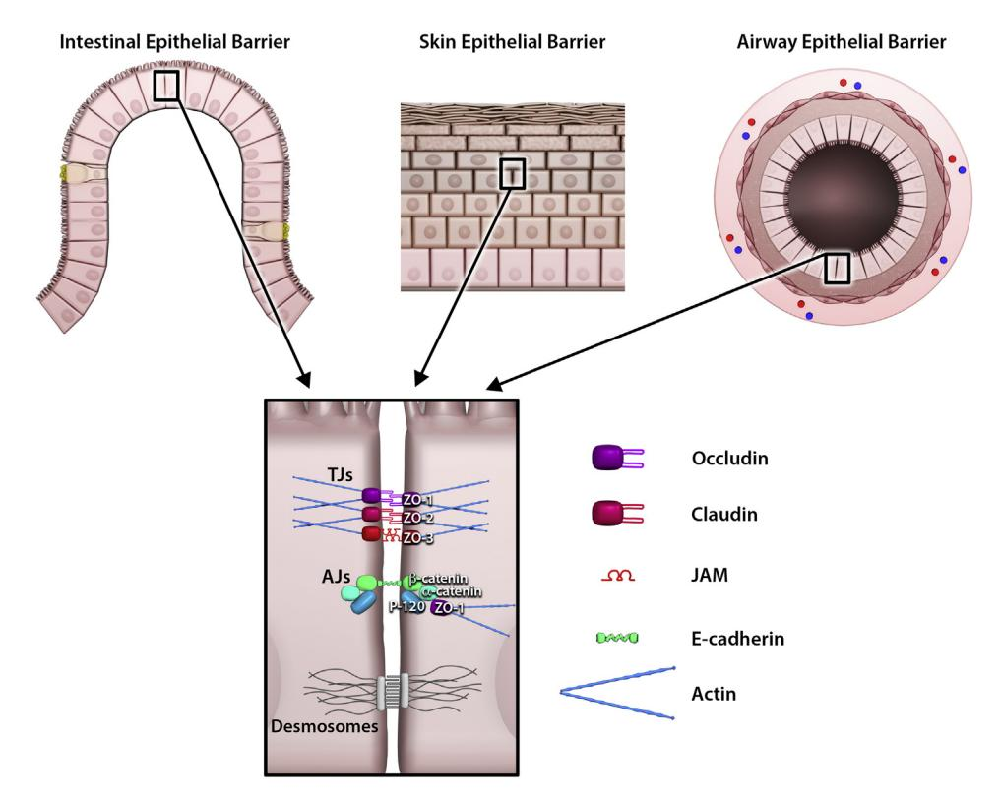
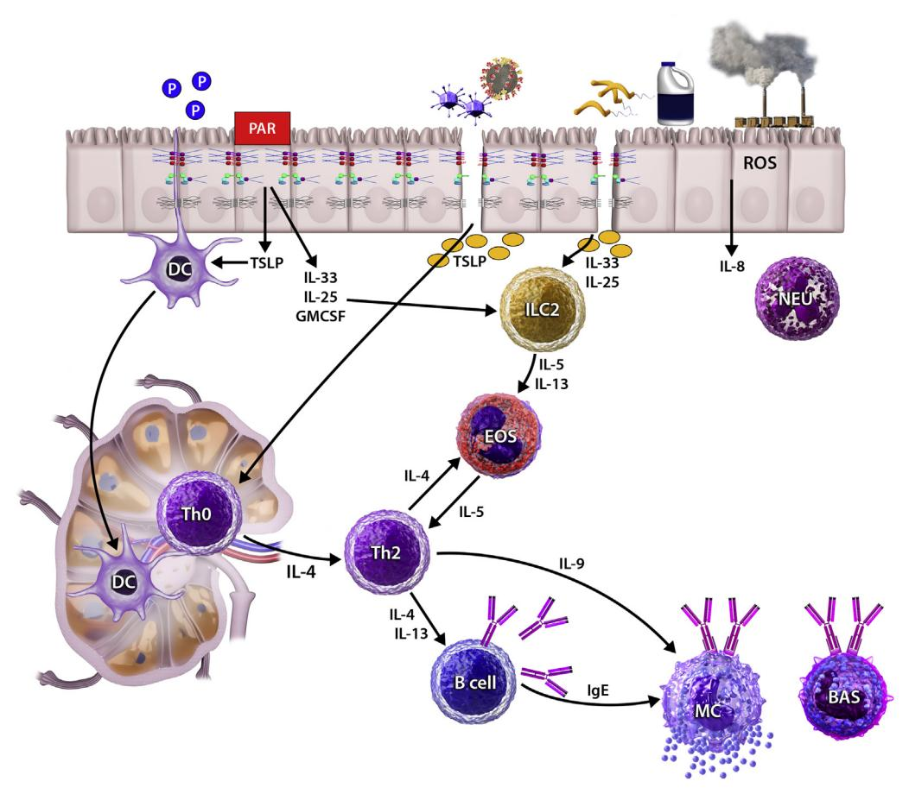

## Environmental factors in epithelial barrier dysfunction

Zeynep Celebi Sozener, MD, € a,b\* Lacin Cevhertas, MSc,a,c,d\* Kari Nadeau, MD, PhD,e Mubeccel Akdis, MD, PhD, € a and Cezmi A. Akdis, MDa,d Davos, Switzerland, Ankara and Bursa, Turkey, and Stanford, Calif

The main interfaces controlling and attempting to homeostatically balance communications between the host and the environment are the epithelial barriers of the skin, gastrointestinal system, and airways. The epithelial barrier constitutes the first line of physical, chemical, and immunologic defenses and provides a protective wall against environmental factors. Following the industrial revolution in the 19th century, urbanization and socioeconomic development have led to an increase in energy consumption, and waste discharge, leading to increased exposure to air pollution and chemical hazards. Particularly after the 1960s, biological and chemical insults from the surrounding environment—the exposome—have been disrupting the physical integrity of the barrier by degrading the intercellular barrier proteins at tight and adherens junctions, triggering epithelial alarmin cytokine responses such as IL-25, IL-33, and thymic stromal lymphopoietin, and increasing the epithelial barrier permeability. A typical type 2 immune response develops in affected organs in asthma, rhinitis, chronic rhinosinusitis, eosinophilic esophagitis, food allergy, and atopic dermatitis. The aim of this article was to discuss the effects of environmental factors such as protease enzymes of allergens, detergents, tobacco, ozone, particulate matter, diesel exhaust, nanoparticles, and microplastic on the integrity of the epithelial barriers in the context of epithelial barrier hypothesis. (J Allergy Clin Immunol 2020;145:1517-28.)

From a the Swiss Institute of Allergy and Asthma Research (SIAF), University of Zurich, Herman-Burchard Strasse 9, Davos; b the Department of Chest Diseases, Division of Allergy and Immunology, Ankara University School of Medicine, Ankara; c the Department of Medical Immunology, Institute of Health Sciences, Bursa Uludag University, Bursa; d Christine K€uhne-Center for Allergy Research and Education (CK-CARE), Davos; and e the Naddisy Foundation, Sean Parker Asthma and Allergy Center, Stanford University, Stanford.

\*First coauthors.

Disclosure of potential conflict of interest: K. Nadeau reports grants from the National Institute of Allergy and Infectious Diseases, Food Allergy Research and Education (FARE), and End Allergies Together (EAT); other fees from Novartis, Sanofi, Astellas, Nestle, BeforeBrands, Alladapt, ForTra, Genentech, AImmune Therapeutics, and DBV Technologies, outside the submitted work; and personal fees from Regeneron. C. A. Akdis reports grants from Allergopharma, Idorsia, Swiss National Science Foundation, Christine K€uhne-Center for Allergy Research and Education, European Commission's Horison's 2020 Framework Programme, Cure, Novartis Research Institutes, Astra Zeneca, and Scibase, and advisory role in Sanofi/Regeneron, outside the submitted work. The rest of the authors declare that they have no relevant conflicts of interest.

Received for publication January 23, 2020; revised April 17, 2020; accepted for publication April 22, 2020.

Corresponding author: Cezmi A. Akdis, MD, Swiss Institute of Allergy and Asthma Research, Herman-Burchard Strasse 9, CH-7265 Davos Wolfgang, Switzerland. E-mail: [akdisac@siaf.uzh.ch.](mailto:akdisac@siaf.uzh.ch)

The CrossMark symbol notifies online readers when updates have been made to the article such as errata or minor corrections

0091-6749/\$36.00

 2020 Published by Elsevier Inc. on behalf of the American Academy of Allergy, Asthma & Immunology

<https://doi.org/10.1016/j.jaci.2020.04.024>

Key words: Epithelial barrier, detergents, particulate matter, ozone, nanoparticles, microplastics, protease allergens

The epithelial tissue acts as a barrier by forming a continuous layer with almost no intracellular gaps and protects the body from environmental stress, physical and chemical damage, infections, and allergens. The structure and the function of the epithelial barrier differs between the skin, the gastrointestinal system, and the respiratory tract, which are the main interfaces between the host and the environment[.1,](#page-8-0)[2](#page-8-1) The skin barrier is multicellular, stratified, tight, and defensive. Stratum corneum forms the upper layer with a physical thickness and strength. The uniform and dense structure of intercellular lamellar lipid and protein complexes is very important for skin barrier functions.[3](#page-8-2) The respiratory barrier is very thin, and it acts as a physical barrier with a continuous physical clearance by cilia, muscle contraction, mucus, and antibacterial function. From the nasal cavity to the bronchi, the conducting part of the respiratory tree, is lined by pseudostratified columnar ciliated epithelium while the alveolar region is lined by a thin layer of squamous epithelial cells that allows gas exchange. Mucociliary escalators, intercellular protein junctions, and secreted antimicrobial products contribute to the respiratory barrier.[4](#page-8-3) The intestinal barrier has selective permeability due to protein-protein networks and is designed to absorb and exchange nutrients, water, and electrolytes, while providing an effective defense against microbes and toxins.[5](#page-9-0)

The environment is a major determinant to our health and wellbeing. Following the industrial revolution in the 19th century, environmental health threats due to industrialization and westernization have increased throughout the world. Several waves of threats to the health of all living beings, particularly humans and domestic animals, occurred with extensive decrease in air quality in cities with increases in particulate matter (PM), diesel exhaust, ozone, and cigarette smoke, increases in the toxic burden caused by cleaning products, detergents, and surfactants, increases in processed foods and use of emulsifiers, and the introduction of nanoparticles (NPs) and microplastics, all of which together significantly increased the health burden caused by environmental exposure within a couple of decades, particularly after the 1960s [\(Table I](#page-2-0)). Early studies on epithelial barrier were performed on gut barrier and its link to inflammatory bowel and celiac diseases[.6-8](#page-9-1) Environmental exposures can alter the structure of the gut microbiome and influence the development of allergic disease by disrupting the normal immunoregulation.[9,](#page-9-2)[10](#page-9-3) Defects in the epithelial barrier, the so-called leaky epithelium, have been demonstrated in affected organs in asthma, chronic rhinosinusitis, allergic rhinitis, atopic dermatitis, eosinophilic esophagitis, and celiac and inflammatory bowel disease, leading to the 1518 CELEBI SÖZENER ET AL JALLERGY CLIN IMMUNOL

Abbreviations used

AJ: Adherens junction

DC: Dendritic cell

e-cigarettes: Electronic cigarettes

ILC2: Group 2 innate lymphoid cell

LC: Langerhans cell NP: Nanoparticle

PM: Particulate matter

PM2.5: PM with diameter less than 2.5 μm

ROS: Reactive oxygen species

SiO2: Silicon dioxide

TiO2: Titanium dioxide

TJ: Tight junction

TSLP: Thymic stromal lymphopoietin

ZO: Zonula occludens

development of the epithelial barrier hypothesis in the pathogenesis of these diseases. 4,6-8,11-20 Recent studies have revealed that environmental exposures, global warming, and climate change have negative effects on respiratory health and increase the allergenicity of some allergens. A systematic review and metaanalysis has reported that exposure to cleaning products is associated with an increased risk of asthma.26 Many epidemiologic and surveillance studies, and several case reports, have identified an association between increased risk of asthma and exposure to cleaning sprays, bleach, ammonia, disinfectants, mixing products, as well as specific works exposed to asthmainducing triggers. 26 The link between these factors and the epithelial barrier is now becoming increasingly clear. Accordingly, the notions of maintenance of epithelial barrier integrity or the restoration of barrier dysfunction,27 treatment modalities for defective barrier, 16,28,29 epigenetic regulation of the barrier, 15 and methods for the detection of barrier leakiness30-32 have been reported as supporting the epithelial barrier hypothesis. This rostrum highlights the effects of environmental factors such as protease allergen enzymes, detergents, tobacco smoke and e-cigarettes, ozone, PM, NPs, emulsifiers, and micro and nanoplastics on the integrity of the epithelial barriers.

#### ORGANIZATION OF THE EPITHELIAL BARRIER

Epithelial tissues are organized according to the needs of the tissues, providing a strong physical barrier in the skin, continuous particle clearance for a healthy gas exchange in the lungs, and extensive nutrient and water exchange in the gastrointestinal system, simultaneously providing protection against microbes, toxins, and the environmental exposome with overall, physical, chemical, and immunologic barrier functions.25

Alignment of epithelial cells differs depending on their location in the body and their role. *The physical barrier of the skin* consists of a large number of epidermal layers and keratinocytes. Stratum corneum, the outermost layer, consists of many layers of corneocytes and lamellar bodies between them to form a thick, strong, and protective barrier.3,33 Intercellular lamellar lipid and protein complexes are essential for skin barrier functions. The main keratin filament production areas, stratum granulosum and stratum spinosum, are located below and provide structural support to the epidermis.3 Unlike the stratified

squamous epithelium of the skin, the respiratory epithelium of trachea and bronchi is covered with pseudostratified columnar ciliated epithelium including goblet cells and neuroendocrine cells. Airway mucus secretion, clearance by cilia, and various antibacterial and immunomodulatory molecules released from secretory cells contribute to the respiratory epithelial barrier.34 Terminal bronchi are lined with nonciliated cuboidal cells (Clara cells). The alveoli are lined with thin, flattened simple squamous (type 1 pneumocytes) and cuboidal (type 2 pneumocytes) epithelium that allows gas exchange. The intestinal epithelium has a single layer of columnar epithelial cells, including absorbent enterocytes, secretory goblet cells, Paneth cells, and enteroendocrine cells.35 Different from the thin and mobile mucous layer in the airway epithelium, the mucous layer in the gut is thick and adherent to the intestinal epithelium.34 It is essential for the selective permeability of the intestinal barrier. The mucous layer prevents direct contact of large particles and microorganisms with epithelial cells, and allows small molecules to pass and protects epithelial cells from digestive enzymes.36 In addition to its protective function, the intestinal epithelium controls the absorption and exchange of the nutrients, water, and electrolytes.

In general terms, epithelia are separated and bound with strong integrin bonds to the underlying extracellular matrix tissue by a fibrous basement membrane.37 Cell junctions, the contact points between the plasma membrane and tissue cells, comprise tight junctions (TJs), adherens junctions (AJs), and desmosomes (Fig 1). TJs create a barrier by sealing the apicolateral borders, blocking free passage of microbes, toxins, and pollutants into the paracellular space, and regulating the cell polarity, paracellular ion, and small molecule transportation. 4,38-40 AJs are located under the TJs and together with the apical part called zonula adherens and TJs constitute an apical junctional complex that forms a continuous ring around the apicolateral region.38 AJs are mainly involved in cell-cell adhesions, and they establish and regulate the structure of apical-basolateral membrane areas. 4 TJs and AJs bind together, link to the actin cytoskeleton via zonula occludens (ZO)-1 and ZO-2, make numerous intracytoplasmic protein interactions, and form a cytosolic plaque that is involved in numerous signal-transducing cascades. 5,41,42 Desmosomes are distributed on the lateral surface of the epithelial cells and connect epithelial cells to each other.4

Transmembrane junctional components, such as claudins, transmembrane junctional complex family members (occludin, tricellulin, Marvel D3), and immunoglobulin-like adhesion molecules, such as junctional adhesion molecule and coxsackie adenovirus receptor at TJs, cadherins and catenins (p-120, αcatenin, \( \beta\)-catenin) at AJs, and desmoglein and desmocollins at desmosomes, act as cell-cell adhesion molecules, cluster at the junctions, and confer adhesion and barrier functions to them.38 Claudins, the important components of TJs, are essential for normal epithelial development. Some of them control the movement of small molecules including ions, whereas several claudins do not contribute to barrier function. 4,39 Cadherins are single transmembrane proteins and regulate Ca++-dependent cell-cell adhesions. To become functional, cadherins need to interact with cytoplasmic catenin proteins (β or p-120). 44 α-Catenin does not bind directly to cadherins; it links the cadherin cell adhesion complex to the actin cytoskeleton via ZO-1. This binding is very important in the formation of TJs and the epithelial barrier.

TABLE I. Environmental factors and epithelial barrier

| Environmental factor        | Mechanism                                                                                                                                                                                                                                                                                                                                                                       | Reference               |
|-----------------------------|---------------------------------------------------------------------------------------------------------------------------------------------------------------------------------------------------------------------------------------------------------------------------------------------------------------------------------------------------------------------------------|-------------------------|
| Protease allergens          | d Elicit non-IgE–mediated reactions via proteinase-activated receptors d Degrade barrier proteins d Increase epithelial permeability                                                                                                                                                                                                                                      | 55,57-64                |
| Detergents                  | d Impair lipid-lipid, lipid-protein interactions of stratum corneum d Disrupt TJs by cleaving occludin and ZO-1 d Increase paracellular permeability d Induce TH2 response by increasing IL-33 and TSLP                                                                                                                                                                | 40,66,70,71,78-82       |
| Cigarettes and E-cigarettes | d Increase alveolar epithelial permeability d Decrease the level of TJ and AJ proteins d Impact the adhesive intercellular junctions d Disrupt monolayer integrity d Destabilize cell adhesion d Cause worse alveolar fluid clearance                                                                                                                            | 88,90-93                |
| Ozone                       | d Cause cell stress, desquamation, and death through ROS d Increase protein leakage, and neutrophil and macrophage influx d Induce IL-1a and IL-33 production from epithelial and myeloid cells d Alter cell junction proteins d Increase peribronchial collagen deposition d Chronic exposure cause remodeling, fibrosis, and emphysema                         | 99-102                  |
| PM2.5, PM10, diesel exhaust | d Damage TJ proteins such as occludin, claudin-1, and ZO-1 d Downregulate claudin-1 expression in human airway cells d PM2.5 suppresses the levels of E-cadherin (in a mouse model) d PM10 and diesel exhaust particles cause reduction and dissociation in occludin from ZO-1 d Increase ROS in the epithelium d Loss of cytokeratin, filaggrin, and E-cadherin | 103,109-111,115,116,119 |
| NPs                         | d Have strong affinity to lipids d Wrap themselves within epithelial membranes d Disrupt cell membrane integrity d Increase paracellular permeability d Induce ROS d Induce cell death (apoptosis, propytosis, necrosis)                                                                                                                                         | 122,123, 125-127     |
| Microplastic                | d Aid in lipid movement in the lipid bilayer d Changes the structure of cell membranes d Because of their 3-dimensional structure they are internalized by cells d Induce proapoptotic protein expression d Alter metabolic profile of bronchial epithelial cells d Cause oxidative stress                                                                       | 131-133                 |

PM10, PM with diameter <2.5 mm.

## TYPE 2 IMMUNE RESPONSE AND EPITHELIAL BARRIER

Immunomodulatory cross-talk between epithelial and immune cells in tissues control barrier homeostasis along with defensive barrier functions. A wide variety of innate and adaptive immune cells populate the tissues with barrier functions, and epithelial cells mediate innate and adaptive immune responses.[2](#page-8-1) Either type 1 or type 2 inflammation beneath the epithelial barrier opens the TJ barrier.[11](#page-9-4)[,15](#page-9-11)[,17](#page-9-25) Upon damage to epithelial barrier integrity and/ or epithelial cells, subsequent adaptive and innate immune responses are activated through the production of cytokines and chemokines.[45](#page-9-26)

Type 2 immune responses can be triggered on production of the master regulatory cytokines (thymic stromal lymphopoietin [TSLP], IL-33, IL-25) by activated or partially damaged epithelial cells. These cytokines activate dendritic cells (DCs) to stimulate TH2 cells and activate group 2 innate lymphoid cells (ILC2s) to allow for type 2 responses. Subsequently, a complex cross-talk occurs between DCs, ILC2, TH2, as well as resident tissue cells and type 2 immune response is stimulated, enhancing cellular and cytokine microenvironment.[46](#page-9-27) Although TH2 cells are known to release type 2 cytokines (IL-4, IL-5, IL-9, IL-13), tissue-resident ILC2s, lacking antigen-specific recognition receptors, are highly responsive and have been shown to be an earlier source of type 2 cytokines, particularly for IL-5, IL-13, and IL-9 and as well as IL-4 on stimulation with other mediators such as cysteinyl leukotriens.[47-49](#page-9-28)

An important step of type 2 immune response is eosinophil activation. IL-5 and IL-9 are responsible for the activation and the recruitment of the eosinophils and mast cells, respectively. Mucus production is induced both by IL-4 and by IL-9 and IL-13. B cells undergo class switching to produce IgE in the presence of IL-4 and IL-13. Specific IgE antibodies bind to their high-affinity receptors on the surface of the basophils and mast cells. Vascular endothelium allows the migration of eosinophils and TH2 cells in the presence of IL-4 and IL-13. In addition, IL-33 and IL-25 stimulate ILC2s, and ILCs contribute to eosinophilia and general type 2 responses by releasing IL-5 and IL-13.[47](#page-9-28)[,48](#page-9-29) TH2 cells, ILC2s, and their secreted cytokines IL-4 and IL-13, which together open the epithelial TJ barrier, have been shown to significantly degrade the bronchial epithelial barrier,[15](#page-9-11)[,17](#page-9-25) leading to increased permeability to fluorescein isothiocyanate-dextran and a decrease

1520 CELEBI SÖZENER ET AL

J ALLERGY CLIN IMMUNOL

JUNE 2020

FIG 1. Epithelial barrier organization: Intestinal barrier, skin barrier, and airway barrier. TJs constitute an apical junctional complex that forms a continuous ring around the apicolateral region. AJs located underlying regulate the structure of apical-basolateral membrane areas. TJs and AJs bind together and link to the actin cytoskeleton via ZO-1, ZO-2, and ZO-3. Desmosomes are distributed on the lateral surface of the epithelial cells and connect epithelial cells to each other. To become functional, cadherins need to interact with cytoplasmic catenin proteins (β or p-120). α-Catenin does not bind directly to cadherins; it links the cadherin cell adhesion complex to the actin cytoskeleton via ZO-1. *JAM*, Junctional adhesion molecule.

in transepithelial electrical resistance in air-liquid interface cultures of human bronchial epithelial cells and in several mouse models. IL-13 has been found to be sufficient in this activity alone and caused disrupted protein expression of TJ proteins and mRNA reduction, which was restored by neutralization of IL-13. Intranasal administration of recombinant IL-33 induced IL-13 in type 2 ILCs and triggered TJ disruption, whereas Rag2(-/-)Il2rg(-/-) and Rora(sg/sg) mice undergoing bone marrow transplantation that lack ILC2s did not show any barrier leakiness. 15,17 A major mechanism in the pathogenesis of asthma has been highlighted by showing that ILC2s alone through IL-13 may be responsible for bronchial epithelial TJ barrier leakage (Fig 2).

In the skin, the immune system is located in both epidermis and dermis, consisting of keratinocytes, Langerhans cells (LCs), DCs, melanocytes, macrophages, and several types of T cells. Just like epithelial cells in the lung and intestine, keratinocytes in the skin can be activated by pathogen-associated molecular patterns and damage-associated molecular patterns via pattern recognition receptors. Triggering pattern recognition receptors can cause secretion of antimicrobial peptides and can affect barrier integrity. Functional keratinocytes are essential for the immune modulation of the skin. Activation of Toll-like receptors on keratinocytes promotes TH1 response and activation of type 1 IFNs. Besides, they are able to produce IL-1, IL-6, IL-10, IL-18, IL-17, IL-22, and TNFs. As a consequence, keratinocytes either directly neutralize the pathogen or indirectly activate

other immune cells.52 Upregulated MHC class II on keratinocytes and LCs enhances leukocyte trafficking into the skin and may ensue a cross-talk with T cells.51 In parallel, LCs, especially specialized in antigen presentation and located in the epidermis, are the first immune contact cells to the skin-invading pathogens. They can migrate to draining lymph nodes and prime the adaptive immunity.50 Moreover, LCs extend between keratinocytes and maintain barrier integrity through their dendrites. This regular movement does not harm skin barrier integrity and does not disrupt *de novo* formation of TJs between skin-resident LCs and keratinocytes.53 An effective innate immune system plays an important role in the regulation of skin barrier functions. Studies demonstrate that the activation of the epidermal innate immune system by barrier disruption can elicit the adaptive TH2 response seen in patients with atopic dermatitis.54

# ENVIRONMENTAL FACTORS AND THE EPITHELIAL BARRIER

### Epithelial barrier-damaging enzymes in allergens

Allergen-sourced enzymes act as promoters of allergenicity. 55 Numerous aeroallergens (pollen, house-dust mite, cockroaches, aspergillus sp, penicillium sp) and some food-derived allergens have protease activity (Table II). When exposed to protease allergens, non-IgE-mediated reactions occur through activation of protease-activated receptors such as protease-activated receptor 2 and epithelial cells release TSLP, which induces innate immune

FIG 2. Epithelial cell activation and type 2 inflammation. Protease allergens, detergents, pollutants, and toxins in the air and in nutrients damage epithelial cells and induce to release TSLP, IL-33, and IL-25 from epithelia. TSLP stimulates the transformation of naive T cells to the TH2 subtype in the presence of IL-4. A general type 2 immune response develops. IL-4 and IL-13 from type 2 cytokines open epithelial TJ barrier. Type 2 cytokines stimulate eosinophils with IL-5, mucus production with IL-9, IgE switch in B cells with IL-4 and IL-13, vascular endothelium for eosinophil, and TH2 cell migration by IL-4 and IL-13. IL-33 and IL-25 stimulate ILC2s and they stimulate eosinophils and a general type 2 response by releasing IL-5 and IL-13. BAS, Basophil; EOS, eosinophil; MC, mast cell; NEU, neutrophil.

functions of DCs[.55](#page-9-30),[56](#page-9-38) In addition, protease allergens have been shown to cause the degradation of junctional proteins in cell culture experiments and in in vivo mouse models.

Major mite (Dermatophagoides pterysinus and Dermatophagoides farinea) and pollen allergens (birch, ragweed, Kentucky blue grass, rye grass) exhibit both cysteine and serine protease activity. Olea europaea, Dactylis glomerata, Cupressus sempervirens, and Pinus sylvestris have serine protease and/or aminopeptidase activity. Mite allergens first break down TJs by cleaving occludin and then inducing intracellular proteolysis of ZO-1,[55,](#page-9-30)[57](#page-9-31)[,58](#page-10-8) whereas proteases released by pollens disrupt occludin, claudin-1, and E-cadherin and thereby increase epidermal permeability.[59,](#page-10-9)[60](#page-10-10) Interestingly, however, timothy grass pollen allergens (Phelium pratense) have been found not to cause significant changes in TJs and were shown to activate epithelial cells by nonproteolytic mechanisms in in vitro studies.[61](#page-10-11) Aspergillus fumigatus proteinases directly disrupt epithelial cell detachment by production of IL-6, IL-8, and monocyte chemoattractant protein 1 from airway epithelial cells.[62](#page-10-12) Serine protease released by Penicillium chrysogenum damages the epithelial barrier by cleaving occludin. Similar to mechanisms with aeroallergens, food

cysteine proteases, actinidine and papain, have been reported to disrupt intestinal epithelial barrier function by degrading TJ proteins and increasing intestinal permeability in both mouse and in vitro models.[63](#page-10-13) Degradation of epithelial barrier by proteaseactive allergens facilitates the presentation of allergens to the immune system, increases allergic sensitivity, and contributes to allergic inflammatory reaction, thereby facilitating sensitivity to secondary allergens.[59](#page-10-9),[60,](#page-10-10)[64](#page-10-14) As a contact allergen, p-Phenylenediamine is used in hair dyes and causes allergic contact dermatitis. Occupationally exposed phenylenediamine induces extensive transcriptomic changes in skin barrier, including downregulation of TJ and stratum corneum proteins, even in the absence of clinical symptoms[.65](#page-10-15)

## Detergents and cleaning products

Throughout the history of mankind, the need for effective cleaning has led to the discovery of various substances for laundry, dishwashing, and household cleaning. The first industrially made synthetic detergent, short-chain alkyl napthalene sulphonate, was developed during the First World War. The

1522 CELEBI SÖZENER ET AL

J ALLERGY CLIN IMMUNOL

JUNE 2020

TABLE II. Enzymes of allergens that may affect the epithelial barrier

| Allergens                                                                                           | Enzymes                               | Effects on epithelial barrier                                                                                                 |  |
|-----------------------------------------------------------------------------------------------------|---------------------------------------|-------------------------------------------------------------------------------------------------------------------------------|--|
| Major mite allergens ( <i>Dermatophagoides farinea-1</i> and <i>Dermatophagoides pterysinus-1</i> ) | Cysteine and serine protease          | Cleave occludin Induce proteolysis of ZO-1 Increase epithelial permeability Increase IL-6, IL-8 release from epithelial cells |  |
| Pollens                                                                                             |                                       |                                                                                                                               |  |
| Birch, ragweed, Kentucky blue grass, rye grass                                                      | Cysteine and serine protease          | Damage TJs                                                                                                                    |  |
| Olea europa, Dactylis glomerata, Cupressus sem- pervirens, Pinus sylvestris                      | Serine protease and/or aminopeptidase | Degrade occludin, claudin-1, E-cadherin Increase epidermal permeability                                                    |  |
| Phellium pratense                                                                                   | Do not have protease enzymes          | Activate epithelial cells by nonproteolytic mechanisms                                                                        |  |
| Aspergillus                                                                                         | Serine protease                       | Disrupt epithelial cell detachments and induce desquamation by IL-6, IL-8, monocyte chemoattractant protein 1           |  |
| Penicillum                                                                                          | Serine protease                       | Cleaves occludin at Gln202, Gln211                                                                                            |  |
| Protease food allergens                                                                             | Actinidin (kiwi fruit)                | Degrade TJ proteins at intestinal barrier                                                                                     |  |
|                                                                                                     | Papain (papaya)                       | Cause barrier disruption in keratinocytes and intestinal epithelial cells                                                     |  |

straight-chain alcohols were then sulphonated and benzenecontaining long-chain alkyl and aryl sulphonates were developed. Currently used laundry detergents consist of builders (water softeners), surfactants (basic cleaning components that affect the surface tension), bleach, various enzymes (proteases, lipases, amylases), soil anti-redeposition agents, foam regulators, corrosion inhibitors, optical brighteners, dye transfer inhibitors, fragrances, dyes, fillers, and formulation aids.66 In 1946, an important development emerged. A builder (phosphate) was added to the detergents to help the surfactants work more efficiently.67 However in 1950s, phosphates in the detergent became an environmental concern. 68 By 1960s, the performance of detergents improved significantly with the addition of surfactants and enzymes (proteases, lipases, amilases, cellulose). 69 Today, cleaning products are in extreme usage in daily life with humans and domestic animals and nowadays all living things are repeatedly exposed to these products. The usage of dishwashers and commercial dishwashers started in 1990s, which rapidly became a common household device of the Western world and an indispensable appliance at restaurants. A high number of constituents of detergents have hazard statements due to their toxicity on the respiratory system and skin.

Even at trace concentrations, anionic surfactants and detergents have been shown to impair barrier functions of the airway and skin epithelium via disrupting the barrier integrity of the keratinocytes and bronchial epithelial cells by hampering TJs and related molecules. 66,70 Consistent with these findings, genes related to cell adhesion and wound healing are generally downregulated with detergent exposure and genes related to lipid metabolism and cell survival are significantly upregulated, suggesting a compensation mechanisms for the damage to cell membranes. Furthermore, in a prospective occupational study, the presence of high transepidermal water loss, which indicates decreased local skin barrier function in areas of skin that are detergent-exposed, showed an increased risk of work-related hand dermatitis in cleaners.71 Continuous exposure to detergents has been demonstrated to cause occupational contact dermatitis either irritant or allergic. 72,73 In addition, occupational allergic due to contact dermatitis preservatives

methylchloroisothiazolinone/methylisothiazolinone found in the detergents has been shown in recent years. 74 Use of these substances in liquid dishwashing and laundry detergents and even liquid household detergents may lead to airborne-induced allergic contact dermatitis. 75-77

Interaction between airway epithelium and airborne environmental pollutants is crucial for the development of airway inflammation. Large amounts of detergent residues on newly washed clothes and on the surface of the floor can be easily inhaled into the airways, damaging the barrier function and bronchial epithelial cells. Significant increases in IL-33 and TSLP in the bronchial epithelium suggests the possibility that a TH2 immune response is induced by laundry detergents. 70 Sprayed forms of the detergents increase the risk of inhalation exposure. 78 Supporting this idea, frequent use of occupational or nonoccupational household cleaning sprays has been associated with an increased incidence of adult asthma. 79,80 Another study reported that exposure to cleaning products exacerbates respiratory symptoms and increases bronchial hyperreactivity in professional cleaners with asthma.81 Launderers, dry cleaners, and pressers have been reported as high-risk occupation groups for respiratory diseases related to cleaning agents, such as detergents, enzymes, and fragrances.82

Numerous synthetic surfactants and emulsifiers are also used by the food industry such as mono- and diglycerides of fatty acids and carboxymethylcellulose polysorbate-80 and can effect cells of the gastrointestinal tract.83 In a study in mice, the ingestion of low-dose emulsifiers led to chronic intestinal inflammation and epithelial damage. 84 When M cells and villous epithelial cells from the gut were exposed to low concentrations of polysorbate-80 in vitro, translocation of Escherichia coli across them increased. 85 Detergents in dishwashing products for dishwashers need to be studied to determine whether they are damaging the gastrointestinal epithelial barrier once clean dishes are removed from the dishwasher and used for food consumption. In addition, professional dishwasher detergents should be very carefully analyzed because the epithelial inflammatory and damaging doses of certain ingredients go down to very small quantities such as 1:100,000 dilution.

## **Tobacco and e-cigarettes**

The World Health Organization estimates that tobacco use kills more than 7 million people each year worldwide, more than 6 million of whom are smokers, whereas 890,000 die from the effects of second-hand smoke exposure.86 There are approximately 5000 chemical components in cigarette smoke, with many toxic to human health. 87 In guinea pigs, with exposure to cigarette smoke, the alveolar epithelial barrier showed increased permeability as determined by pulmonary clearance of fluorescein isothiocyanate-dextran.88 In lung epithelial cells, exposure to cigarette smoke caused epithelial barrier dysfunction as determined by decreases in measure of transepithelial electronic resistance.89 Moreover, multiple TJ and AJ proteins exhibit decreased levels of gene and protein expression. 90 With repeated exposure to cigarette smoke in normal human respiratory epithelial cells, it has been found that the barrier-forming junctions between the cells are disrupted, cellular integrity is affected, and an epithelial to mesenchymal transition occurs with the loss of epithelial barrier function.89 Cortical tension of epithelial cells was observed because of increased actin polymer levels, which further destabilized cell adhesion. 91 In a study of organ transplantation lungs, subjects with a history of smoking were found to have impaired alveolar fluid clearance, which is a measure of alveolar epithelial lung function. 92 Jones et al 93 used 99m technetium-labeled diethylenetriamine penta-acetic acid as a noninvasive method of determining alveolar epithelial barrier permeability in humans and found increased alveolar epithelial barrier permeability in cigarette smokers.

In the last decade, electronic cigarettes (or e-cigarettes) have become popular and were first introduced as a smoking cessation aid. An e-cigarette is a battery-operated device that emits doses of vaporized nicotine combined with flavoring agents. Other substances, such as ultrafine particles and organic volatile compounds, many of which have known toxicities, are also commonly present. Since their emergence in 2004, e-cigarettes have widely become available, and their use has increased exponentially worldwide. Although originally marketed as a safer alternative to conventional cigarettes, the health effects of e-cigarette are unclear. *In vitro* studies indicate that flavorings in tobacco products induce endothelial cell dysfunction however, their effects on epithelial barrier integrity are currently unknown.

#### Ozone

Ozone is a gas with a variable life span, and it is formed when emissions from combusted fossil fuels, such as motor vehicle exhausts, industrial facilities, gasoline vapors, and chemical solvents, react in the presence of sunlight. Although scientists in the 19th century believed that ozone is relevant to maintain human health, in the early 1950s, ozone was measured in the lower atmosphere of earth, near ground level, and was discovered to be a harmful air pollutant and a main component of photochemical smog, a term derived from smoke and fog. Photochemical smog is a combination of certain gases such as ozone, nitric acid, aldehydes, peroxy-acyl nitrates, and other pollutants as a result of industrialization. When ultraviolet light reacts with nitrogen oxides, this reaction converts molecular oxygen to ozone. 96

Acute inhalation of ozone damages alveolar cells, bronchiolar epithelium, and endothelial capillary cells and causes structural changes.99 Initially, ozone causes cell stress, desquamation, and

death through reactive oxygen species (ROS). Subsequently, bronchiolar epithelial cell damage and death continues with protein leakage, neutrophil and macrophage influx, and production of IL-1α and IL-33 from epithelial and myeloid cells. 100 Recently, it was reported in mice that IL-33 mediates ozone-induced inflammation, induces the expression of TJ and AJ proteins (claudin-3, ZO-1, E-cadherin), reduces neutrophil influx, and therefore plays an important role in the homeostasis of airway epithelial barrier. 100,101 With chronic ozone exposure, the total collagen count in the lung increases, remodeling is induced, pulmonary resistance increases, epithelial thickness decreases, and emphysema occurs. 99

Acute ozone exposure impairs epithelial barrier function and causes airway inflammation, peribronchial collagen deposition, and airway hyperresponsiveness. Chronic ozone exposure causes chronic inflammation, small airway remodeling, fibrosis, and emphysema. Epidemiological data show that chronic ozone exposure increases the mortality and morbidity of chronic respiratory diseases such as chronic obstructive pulmonary disease and asthma as a result of chronic inflammation, fibrosis, and respiratory failure. In addition, it is known to be an important trigger for severe asthma exacerbations 99,101,102 Considering the studies related to environmental ozone exposure, several short-term studies are available, but long-term ozone exposure studies are necessary to reveal the long-term effects of ozone on human respiratory epithelium.

## PM with diameter less than 2.5 $\mu$ m, PM with diameter less than 10 $\mu$ m, and diesel exhaust

Because of population growth, increases in human consumption, traffic, house heating, climate change, global warming, and uncontrolled industrial development, the air we breathe has been dangerously polluted. PM, generated by human activity, is very harmful to health and contains a heterogeneous mixture of particles including solids of varying sizes as well as liquid droplets suspended in the air. PM is associated with almost 9 million deaths per year worldwide. 103 Main sources are traffic, diesel and coal combustion, and industry. In just a few years, a substantial increase in forest fires in California, Amazon, and Australia has significantly increased the levels of PM exposure, and studies have demonstrated extreme levels of tissue damage due to smoke and PM especially in wildfires. A recent study has shown that subjects exposed to smoke of wildfires associated with climate change have increased Foxp3 methylation, decreased TH1 proinflammatory T cells, and worsened health outcomes. 104 An in vitro study found that wildfire smoke-extractexposed airway epithelial cells exhibited airway dysfunction (as assessed via permeability of fluorescein tracers and measurement of transepithelial electrical resistance). These cultures also exhibited increased IL-6 secretion consistent with the aberrant and proinflammatory repair. 105

According to aerodynamic diameter, PM is further categorized as coarse PM (PM with a diameter <10  $\mu$ m, called PM10) and fine PM (PM with the diameter <2.5  $\mu$ m [PM2.5]). The composition, size, biological properties, and physical properties of particles are related to the changes in the region, season, and time. PM2.5 mainly consists of heavy metals, carbon sources, sulfate, ammonium, nitrate, and various ions. PM2.5 can be inhaled into the gas exchange area of human lungs where the ultrafine ( $\leq$ 0.1  $\mu$ m) components of are released to the systemic circulation and

**1524** CELEBI SÖZENER ET AL JALLER

J ALLERGY CLIN IMMUNOL

damage cells and tissues.107 The first interaction with inhaled pollution in the airways will be the mucus, cilia, and cell surface receptors.108 It has been reported in *in vitro* studies that PM may affect the integrity of the airway epithelial barrier by degrading TJ proteins such as occludin, claudin-1, and ZO-1109,110 and down-regulating claudin-1 expression in human airway cells. In a mouse model, exposure to PM2.5 has been shown to suppress E-cadherin levels in the bronchoalveolar lavage fluid.111 Likewise, when exposed to PM with diameter less than 10 µm and diesel exhaust particles, occludin is reduced and dissociated from the cytoskeletal linker ZO-1 in human and rat alveolar epithelial cells.109 In a recent study, human nasal epithelial cells were exposed to nontoxic PM2.5 doses resulting in epithelial barrier dysfunction with increased paracellular permeability, decreased transepithelial electric resistance, and downregulated TJ proteins.112

In another study, nasal and sinus biopsies taken during the period of intense pollution in Beijing in 2018 showed damaged epithelial barrier compared with biopsies taken from the control group in summer time, demonstrating that PM2.5 damages the upper respiratory barrier function in vitro. 113 Surface-stabilized environmentally persistent free radicals are formed at lower combustion temperatures during the thermal processing of hazardous organic wastes. 114 PM containing environmentally persistent free radical is capable of inducing the production of ROS. 114 Antioxidant and inflammatory responses in exposed epithelial cells, which is triggered by ROS, were found to be closely related to PM-induced degradation of claudin-1 and occludin proteins in airway epithelia and mouse lung tissue. 103,110 In addition, although environmentally persistent free radicals cause epithelial cell necrosis in high doses, this exposure in low doses causes increased lysosomal membrane permeability, oxidative stress, and lipid peroxidation, leading to epithelial to mesenchymal transition. 115 As a result, environmentally persistent free radicals can trigger pulmonary pathologies and possibly lead to environmental and occupational asthma. 105 Besides, PM and diesel exhaust particles can induce cytokine production like TSLP and IL-17A and contribute to the development or exacerbation of chronic respiratory diseases. 108

In addition, few studies in mice with ambient PM have proven that PM2.5 causes skin damage by inducing oxidative stress both in vivo and in vitro. 116 ROS formation damages cell membranes through DNA damage, irreversible lipid peroxidation, and protein carbonation. 116 Accumulation of oxidized lipids in the lipid bilayers alters the barrier function in terms of permeability. 117 In addition, organic chemicals carrying PM2.5, such as polycyclic aromatic hydrocarbons, are highly lipophilic, making it easier for the molecule to leak into the skin. 118 This has been demonstrated by the loss of structural epidermal proteins such as cytokeratin, filaggrin, and E-cadherin, in pigs treated with polycyclic aromatic hydrocarbons carrying PM in in vivo and in vitro experiments. 119 Furthermore, epidemiologic data support the relationship between air pollution and skin-related allergic diseases. In particular, a cross-sectional study showed that PM2.5 was associated with the development of atopic dermatitis in adult patients. 120 Nevertheless, the effects of PMs on skin barrier or their association with skin-related allergic diseases requires further research.

#### **Nanoparticles**

NPs, synonymous with ultrafine particles, are small (<100 nm) organic or inorganic particles able to confine their electrons and to

produce quantum effects. Therefore, they may be more harmful compared with their larger counterparts with hazard to the human health and the environment. 121 Over the last years, the increase in the widespread use of nanomaterials in several industries cause them to disperse into the air and to become a major contributing factor to air pollution. 122 Most ubiquitous NPs in the air are dioxides of titanium (TiO2) and silicon (SiO2). They have a strong affinity for lipids, accumulate on the membranes, interact with lipid bilayers, and insert themselves within epithelial cell membranes. Several studies have demonstrated that exposure to NPs cause dysfunctions of various lipid-rich environments, such as pulmonary surfactants and endothelial cell junctions in lung blood vessels. 122 In addition, TiO2-NP enhances IL-1α synthesis and induces unbalanced overexpression of immature neurotrophins, leading to apoptotic death of lung epithelial cells. 123 Furthermore, a number of epidemiologic studies have reported that exposure to ambient PM, containing an NP component, may have detrimental effects on human lungs, leading to obstructive and fibrotic disease, and may lead to exacerbation of preexisting airway disease, increased risk of airway inflammation, and hyperreactivity.

Although  $TiO_2$ -NP in sunscreens is of the globular type (35-145 nm), the acicular form of  $TiO_2$ -NP is used to strengthen plastics, ceramics, dyes, filtration materials, and other products. Biological activities on human epidermal keratinocytes have shown that the acicular structure of  $TiO_2$ -NP can be internalized in vitro. 124 Second, these particles stimulate a number-dependent release of proinflammatory cytokines such as IL-1 $\alpha$ , IL-1 $\beta$ , IL-6, TNF- $\alpha$ , and IL-8. 124 So far, there is no in vivo data proving that  $TiO_2$ -NP penetrates the stratum corneum or disrupts the skin barrier by altering the cell junctions. Increasing NP production and their formulations in manufacturing direct skin-contacting NPs require a better understanding of the skin penetration mechanisms of the nanoparticulate and their role in the penetration of other substances in the exposome.

In addition to TiO2 and SiO2 NPs, cationic liposome NPs containing ZnO, silver (Ag), and aluminum (Al) are used as common additives in food, pharmaceuticals, cosmetics, paints, solar panels, and catalysts. 122 It has been previously well described that NPs belonging to different classes, having different sizes, chemical compositions, and coatings, react differently. 125 After oral intake, NPs accumulate on the surfaces of intestinal epithelial cells, M cells, and Peyer patches. 126 They are translocated through the intestinal epithelial barrier either via endocytosis by M cells (TiO2) or by increasing the cell leakage secondary to disruption of the cell membrane integrity (SiO2, TiO2, and ZnO) or by phagocytosis by macrophages. 126 Furthermore, paracellular permeability of the intestinal barrier has been shown to increase after the administration of TiO2-NPs. Both in vitro and in vivo studies have demonstrated that NPs induce ROS following internalization. Ultimately, this oxidative stress induces unbalanced overexpression of proinflammatory mediators and leads to apoptotic or necrotic death of epithelial cells. 127 It has been suggested that danger signals and chronic inflammation secondary to NPs may lead to the development of autoimmune diseases.126

#### Micro and nanoplastics

Despite the advantages of micro and nanoplastic products, such as being lightweight, having a low production cost, product stability, and durability, plastics have a huge negative impact on the environment and human health. Although plastics biodegrade very slowly, they degrade to form micro (5 mm to 1  $\mu m)$  and nanoplastics (<1  $\mu m)$  by ultraviolet exposure, temperature changes, exposure to plasticizers and chemical corrosives, or by the manufacturing process.  $^{128,129}$  Recycling and reuse processes are not efficient, and most of the plastic waste penetrates into natural habitats and rivers and easily interacts with animals and enters the food chain.  $^{130}$ 

It has been shown that micro and nanoplastics can also be found in the atmosphere.  $^{128}$  According to a 5-month follow-up study, microplastic fibers were found to be approximately 750  $\mu m$  in length and microplastic fragments were observed to be 300  $\mu m$  or less.  $^{128}$  Interestingly, even in nonrural areas, the predominant species is defined as microplastic fallout polystyrene, polyethylene, polypropylene, polyvinyl chloride, and polyethylene terephthalate.  $^{128}$ 

Because of their extremely small size, smaller than 100 nm, and their 3-dimensional structure, nanoplastics can be easily adsorbed and internalized by cells, posing a threat to human and animal health. 131,132 The studies on interaction between microplastics, nanoplastics, and proteins and cellular receptors are recent and sparse, but suggest important effects. The interaction of nanoplastics at the molecular level changes the folding of proteins, leading to their dysfunction. 132 Moreover, nanoplastic particles aid in lipid movement, which changes the dynamics and structure of cell movement in the lipid bilayer. 132 A recent study has shown that particles of polystyrene nanoplastics of 25 nm or 70 nm diameter can be taken up by human alveolar epithelial cells in vitro. 131 Plastic particles of both sizes induce proapoptotic protein expression. High expression of BAX, caspase-3, caspase-8, caspase-9, DR5, and cytochrome-c indicates that polystyrene nanoplastics induce apoptosis by the mitochondrial apoptotic route. 131 In addition, nanoplastics have been shown to alter the metabolic profiles of human bronchial epithelial cells in a dose-dependent manner.133 Oxidative stress caused by nanoplastics also causes autophagy in human epithelial lung cells. 133

Because of their inflammable nature, burning plastics emit toxic fumes. Inhalation of the component of chemical residues may irritate the respiratory system because of their low molecular weight. Studies in the nylon industry have shown that nylon workers exhibit symptoms of interstitial lung disease, such as cough, dyspnea, and high sputum production, and impaired lung capacity. 129 In addition, with technological advances in the textile industry, workers exposed to nylon, polyester, polyolefin, or acrylic material have developed interstitial fibrosis, allergic alveolitis, and granulomatous lesions. 129

Plastic pollution in the oceans is at extreme levels,  $^{97}$  and humans and animals absorb plastic through the gastrointestinal tract by consuming shellfish, mussels, oysters, some shrimp species, or other products that have been discussed elsewhere.  $^{130}$  The uptake and the toxic potential of microplastics on the gastrointestinal tract were investigated with 3 different *in vitro* intestinal epithelial models.  $^{134}$  Among 1, 4, and 10- $\mu$ m plastic particles, the highest cytotoxicity was observed with 1  $\mu$ m. This result is reasonable, considering the ability of small particles to react better than large particles because of their high surface volume ratios. Consequently, it has been reported that particles smaller than 1.5  $\mu$ m may penetrate the gastrointestinal epithelial barrier.  $^{134}$ 

However, the mechanism of degradation of the barrier with plastic particles or their effect on TJs and AJs or signaling pathways on both the airway and gastrointestinal epithelium has not yet been elucidated in humans. In mice, exposure to polystyrene microplastic induces gut microbiota dysbiosis with changes in certain genus, alterations in major metabolic pathways of functional genes in the microbiome, intestinal mucus secretion, barrier dysfunction, and metabolic disorders in amino acid metabolism in mice. 135

#### CONCLUSIONS

This rostrum article proposes mechanisms for the damage caused by biological and chemical hazards on epithelial cells and their barrier integrity in the context of epithelial barrier hypothesis. With the rapid spread of industrialization and the growth of the human population, visible and not visible pollution due to above-discussed factors has become a universal problem. Every day, the dangers we face from nonmicrobial pollutants increase as their levels increase and they become a part of the exposome. 136 As long as the countries and humans continue to use fossil fuelburning vehicles and governments support this policy instead of changing them into alternative fuel vehicles in urban areas, the environmental burden damaging the barriers will continue. With exposure to sustained and uncontrolled production and usage of toxic fuels, fine PM, detergents, and other factors, the impairment of epithelial barriers of the skin, airways, and intestines will continue. This vicious cycle of exposing environmental factors causes barrier disruption and leads to chronic tissue inflammation that has mainly occurred in the last few decades. As a result, they are linked to the development and exacerbation of various diseases in the local organs or even in distal organs. The air we breathe, the food we eat, the clothes we wear, and the cleaning products we use appear to constitute a major problem for human and domestic animal health. This becomes much more prominent when these molecules express a synergistic effect on the inflamed tissues that already have a damaged barrier. The epithelial barrier tries to hold against these hazardous environmental factors, but eventually fails because of the subepithelial tissue inflammation that has occurred in the past few decades.

If appropriate measures are not urgently taken, the attacks on epithelial barriers will continue at an increasing pace and will become a bigger and bigger danger to life on earth. Unfortunately, there is so far little knowledge and no international consensus on barrier-damaging effects of NPs, microplastics, cleaning products, PM, and other unidentified environmental factors. This article also calls for international rapid action on the control of epithelial barrier–attacking environmental pollutants. Extensive education of consumers, unions, safety, and health agencies is urgently needed. The production of epithelial barrier–damaging substances should be substantially reduced, dose studies should be performed, their recycle and reuse policies should be implemented, and extreme control and legal actions should be initiated.

#### REFERENCES

-  Loxham M, Davies DE. Phenotypic and genetic aspects of epithelial barrier function in asthmatic patients. J Allergy Clin Immunol 2017;139:1736-51.
-  Moens E, Veldhoen M. Epithelial barrier biology: good fences make good neighbours. Immunology 2012;135:1-8.
-  Egawa G, Kabashima K. Barrier dysfunction in the skin allergy. Allergol Int 2018:67:3-11
- Georas SN, Rezaee F. Epithelial barrier function: at the front line of asthma immunology and allergic airway inflammation. J Allergy Clin Immunol 2014; 134:509-20.

-  Groschwitz KR, Hogan SP. Intestinal barrier function: molecular regulation and disease pathogenesis. J Allergy Clin Immunol 2009;124:3-20; quiz 1-2.
- Schulzke JD, Fromm M, Zeitz M, Menge H, Riecken EO, Bentzel CJ. Tight junction regulation during impaired ion transport in blind loops of rat jejunum. Res Exp Med (Berl) 1990:190:59-68.
- Schulzke JD, Riecken EO. Principles of epithelial transport mechanisms: importance for pathophysiologic understanding, differential diagnosis and treatment of diarrheal diseases [in German]. Z Gastroenterol 1989;27:693-700.
- Fasano A. Leaky gut and autoimmune diseases. Clin Rev Allergy Immunol 2012; 42:71-8
-  Sbihi H, Boutin RC, Cutler C, Suen M, Finlay BB, Turvey SE. Thinking bigger: how early-life environmental exposures shape the gut microbiome and influence the development of asthma and allergic disease. Allergy 2019;74:2103-15.
- 10. Haahtela T. A biodiversity hypothesis. Allergy 2019;74:1445-56.
-  Soyka MB, Wawrzyniak P, Eiwegger T, Holzmann D, Treis A, Wanke K, et al. Defective epithelial barrier in chronic rhinosinusitis: the regulation of tight junctions by IFN-gamma and IL-4. J Allergy Clin Immunol 2012;130: 1087-96.e10.
- De Benedetto A, Rafaels NM, McGirt LY, Ivanov AI, Georas SN, Cheadle C, et al. Tight junction defects in patients with atopic dermatitis. J Allergy Clin Immunol 2011;127:773-86.e1-7.
- Schmitz H, Barmeyer C, Fromm M, Runkel N, Foss HD, Bentzel CJ, et al. Altered tight junction structure contributes to the impaired epithelial barrier function in ulcerative colitis. Gastroenterology 1999;116:301-9.
- Toedter G, Li K, Sague S, Ma K, Marano C, Macoritto M, et al. Genes associated with intestinal permeability in ulcerative colitis: changes in expression following infliximab therapy. Inflamm Bowel Dis 2012;18:1399-410.
-  Wawrzyniak P, Wawrzyniak M, Wanke K, Sokolowska M, Bendelja K, Ruckert B, et al. Regulation of bronchial epithelial barrier integrity by type 2 cytokines and histone deacetylases in asthmatic patients. J Allergy Clin Immunol 2017; 139:93-103.
-  Xiao C, Puddicombe SM, Field S, Haywood J, Broughton-Head V, Puxeddu I, et al. Defective epithelial barrier function in asthma. J Allergy Clin Immunol 2011;128:549-56.e1-12.
-  Sugita K, Steer CA, Martinez-Gonzalez I, Altunbulakli C, Morita H, Castro-Giner F, et al. Type 2 innate lymphoid cells disrupt bronchial epithelial barrier integrity by targeting tight junctions through IL-13 in asthmatic patients. J Allergy Clin Immunol 2018;141:300-10.e11.
- 18. Steelant B, Farre R, Wawrzyniak P, Belmans J, Dekimpe E, Vanheel H, et al. Impaired barrier function in patients with house dust mite-induced allergic rhinitis is accompanied by decreased occludin and zonula occludens-1 expression. J Allergy Clin Immunol 2016;137:1043-53.e1-5.
- Irvine AD, McLean WH, Leung DY. Filaggrin mutations associated with skin and allergic diseases. N Engl J Med 2011;365:1315-27.
- Kortekaas Krohn I, Seys SF, Lund G, Jonckheere AC, Dierckx de Casterle I, Ceuppens JL, et al. Nasal epithelial barrier dysfunction increases sensitization and mast cell degranulation in the absence of allergic inflammation [published online ahead of print November 26, 2019]. Allergy. https://doi.org/10.1111/all. 14132.
- Eguiluz-Gracia I, Mathioudakis AG, Bartel S, Vijverberg SJ, Fuertes E, Comberiati P, et al. The need for clean air: the way air pollution and climate change affect allergic rhinitis and asthma [published online ahead of print January 9, 2020]. Allergy. https://doi.org/10.1111/all.14177.
- Itazawa T, Kanatani KT, Hamazaki K, Inadera H, Tsuchida A, Tanaka T, et al; Japan Environment and Children's Study Group. The impact of exposure to desert dust on infants' symptoms and countermeasures to reduce the effects [published online ahead of print December 30, 2019]. Allergy 2019. https://doi.org/10.1111/ all/14166
- Ruiz-Hornillos J, López-Matas MA, Berges Jimeno P, Henríquez A, Blanco S, Seoane-Rodríguez M, et al. Profilin is a marker of severity in allergic respiratory diseases. Allergy 2020;75:853-61.
- Hew M, Lee J, Susanto NH, Prasad S, Bardin PG, Barnes S, et al. The 2016 Melbourne thunderstorm asthma epidemic: risk factors for severe attacks requiring hospital admission. Allergy 2019;74:122-30.
- 25. Agache I, Miller R, Gern JE, Hellings PW, Jutel M, Muraro A, et al. Emerging concepts and challenges in implementing the exposome paradigm in allergic diseases and asthma: a PRACTALL document. Allergy 2019;74:449-63.
-  Siracusa A, De Blay F, Folletti I, Moscato G, Olivieri M, Quirce S, et al. Asthma and exposure to cleaning products—a European Academy of Allergy and Clinical Immunology task force consensus statement. Allergy 2013;68:1532-45.
-  Pothoven KL, Schleimer RP. The barrier hypothesis and Oncostatin M: restoration of epithelial barrier function as a novel therapeutic strategy for the treatment of type 2 inflammatory disease. Tissue Barriers 2017;5:e1341367.

-  Gopalakrishnan S, Pandey N, Tamiz AP, Vere J, Carrasco R, Somerville R, et al. Mechanism of action of ZOT-derived peptide AT-1002, a tight junction regulator and absorption enhancer. Int J Pharm 2009;365:121-30.
-  Kubo T, Wawrzyniak P, Morita H, Sugita K, Wanke K, Kast JI, et al. CpG-DNA enhances the tight junction integrity of the bronchial epithelial cell barrier. J Allergy Clin Immunol 2015;136:1413-6.e1-8.
-  Oishi H, Ushio Y, Narahara K, Takehara M. Effect of vehicles on percutaneous absorption, I: characterization of oily vehicles by percutaneous absorption and trans-epidermal water loss test. Chem Pharm Bull (Tokyo) 1976;24:1765-73.
- Flohr C, Perkin M, Logan K, Marrs T, Radulovic S, Campbell LE, et al. Atopic dermatitis and disease severity are the main risk factors for food sensitization in exclusively breastfed infants. J Invest Dermatol 2014;134:345-50.
- Rinaldi AO, Morita H, Wawrzyniak P, Dreher A, Grant S, Svedenhag P, et al. Direct assessment of skin epithelial barrier by electrical impedance spectroscopy. Allergy 2019;74:1934-44.
-  Menon GK, Lee SE, Lee SH. An overview of epidermal lamellar bodies: novel roles in biological adaptations and secondary barriers. J Dermatol Sci 2018;92: 10-7.
-  Fahy JV, Dickey BF. Airway mucus function and dysfunction. N Engl J Med 2010;363:2233-47.
-  Peterson LW, Artis D. Intestinal epithelial cells: regulators of barrier function and immune homeostasis. Nat Rev Immunol 2014;14:141-53.
-  De Santis S, Cavalcanti E, Mastronardi M, Jirillo E, Chieppa M. Nutritional keys for intestinal barrier modulation. Front Immunol 2015;6:612.
-  Kechagia JZ, Ivaska J, Roca-Cusachs P. Integrins as biomechanical sensors of the microenvironment. Nat Rev Mol Cell Biol 2019;20:457-73.
-  Vasileva E, Citi S. The role of microtubules in the regulation of epithelial junctions. Tissue Barriers 2018;6:1539596.
-  Shigetomi K, Ikenouchi J. Regulation of the epithelial barrier by posttranslational modifications of tight junction membrane proteins. J Biochem 2017;163:265-72.
- Sjö A, Magnusson K-E, Peterson KH. Protein kinase C activation has distinct effects on the localization, phosphorylation and detergent solubility of the claudin protein family in tight and leaky epithelial cells. J Membrane Biol 2010;236: 181.0
-  Swindle EJ, Collins JE, Davies DE. Breakdown in epithelial barrier function in patients with asthma: identification of novel therapeutic approaches. J Allergy Clin Immunol 2009;124:23-34; quiz 5-6.
-  Marchiando AM, Graham WV, Turner JR. Epithelial barriers in homeostasis and disease. Annu Rev Pathol 2010;5:119-44.
-  Godsel L, Getsios S, Huen A, Green K. The molecular composition and function of desmosomes. In: Behrens J, Nelson WJ, eds. Cell adhesion. Berlin: Springer; 2004:137-93
-  Tian X, Liu Z, Niu B, Zhang J, Tan TK, Lee SR, et al. E-cadherin/beta-catenin complex and the epithelial barrier. J Biomed Biotechnol 2011;2011:567305.
- 45. Komano H, Fujiura Y, Kawaguchi M, Matsumoto S, Hashimoto Y, Obana S, et al. Homeostatic regulation of intestinal epithelia by intraepithelial gamma delta T cells. Proc Natl Acad Sci U S A 1995;92:6147-51.
-  Lloyd CM, Snelgrove RJ. Type 2 immunity: expanding our view. Sci Immunol 2018;3.
-  Maeda K, Caldez MJ, Akira S. Innate immunity in allergy. Allergy 2019;74: 1660-74.
- Hammad H, Lambrecht BN. Barrier epithelial cells and the control of type 2 immunity. Immunity 2015;43:29-40.
- Doherty TA, Broide DH. Airway innate lymphoid cells in the induction and regulation of allergy. Allergol Int 2019;68:9-16.
-  Quaresma JAS. Organization of the skin immune system and compartmentalized immune responses in infectious diseases. Clin Microbiol Rev 2019;32:e00034-18
- 51. Matejuk A. Skin immunity. Arch Immunol Ther Exp (Warsz) 2018;66:45-54.
-  Abdallah F, Mijouin L, Pichon C. Skin immune landscape: inside and outside the organism. Mediators Inflamm 2017;2017:5095293.
-  West HC, Bennett CL. Redefining the role of langerhans cells as immune regulators within the skin. Front Immunol 2018;8:1941.
-  Kuo IH, Yoshida T, De Benedetto A, Beck LA. The cutaneous innate immune response in patients with atopic dermatitis. J Allergy Clin Immunol 2013;131: 266-78.
-  Matsumura Y. Role of allergen source-derived proteases in sensitization via airway epithelial cells. J Allergy (Cairo) 2012;2012:903659.
-  Lambrecht BN, Hammad H. Allergens and the airway epithelium response: gateway to allergic sensitization. J Allergy Clin Immunol 2014;134:499-507.
-  Takai T, Ikeda S. Barrier dysfunction caused by environmental proteases in the pathogenesis of allergic diseases. Allergol Int 2011;60:25-35.

- 58. [Wan H, Winton HL, Soeller C, Taylor GW, Gruenert DC, Thompson PJ, et al. The](http://refhub.elsevier.com/S0091-6749(20)30573-X/sref58) [transmembrane protein occludin of epithelial tight junctions is a functional target](http://refhub.elsevier.com/S0091-6749(20)30573-X/sref58) [for serine peptidases from faecal pellets of](http://refhub.elsevier.com/S0091-6749(20)30573-X/sref58) Dermatophagoides pteronyssinus. Clin [Exp Allergy 2001;31:279-94.](http://refhub.elsevier.com/S0091-6749(20)30573-X/sref58)
- 59. [Hosoki K, Boldogh I, Sur S. Innate responses to pollen allergens. Curr Opin Al](http://refhub.elsevier.com/S0091-6749(20)30573-X/sref59)[lergy Clin Immunol 2015;15:79-88](http://refhub.elsevier.com/S0091-6749(20)30573-X/sref59).
- 60. [Vinhas R, Cortes L, Cardoso I, Mendes VM, Manadas B, Todo-Bom A, et al. Pol](http://refhub.elsevier.com/S0091-6749(20)30573-X/sref60)[len proteases compromise the airway epithelial barrier through degradation of](http://refhub.elsevier.com/S0091-6749(20)30573-X/sref60) [transmembrane adhesion proteins and lung bioactive peptides. Allergy 2011;66:](http://refhub.elsevier.com/S0091-6749(20)30573-X/sref60) [1088-98](http://refhub.elsevier.com/S0091-6749(20)30573-X/sref60).
- 61. [Blume C, Swindle EJ, Dennison P, Jayasekera NP, Dudley S, Monk P, et al. Bar](http://refhub.elsevier.com/S0091-6749(20)30573-X/sref61)[rier responses of human bronchial epithelial cells to grass pollen exposure. Eur](http://refhub.elsevier.com/S0091-6749(20)30573-X/sref61) [Respir J 2013;42:87-97.](http://refhub.elsevier.com/S0091-6749(20)30573-X/sref61)
- 62. [Chaudhary N, Marr KA. Impact of](http://refhub.elsevier.com/S0091-6749(20)30573-X/sref62) Aspergillus fumigatus in allergic airway dis[eases. Clin Transl Allergy 2011;1:4.](http://refhub.elsevier.com/S0091-6749(20)30573-X/sref62)
- 63. [Grozdanovic MM, Cavic M, Nesic A, Andjelkovic U, Akbari P, Smit JJ, et al.](http://refhub.elsevier.com/S0091-6749(20)30573-X/sref63) [Kiwifruit cysteine protease actinidin compromises the intestinal barrier by dis](http://refhub.elsevier.com/S0091-6749(20)30573-X/sref63)[rupting tight junctions. Biochim Biophys Acta 2016;1860:516-26.](http://refhub.elsevier.com/S0091-6749(20)30573-X/sref63)
- 64. [Gavrovic-Jankulovic M, Willemsen LE. Epithelial models to study food allergen](http://refhub.elsevier.com/S0091-6749(20)30573-X/sref64)[induced barrier disruption and immune activation. Drug Discovery Today Dis](http://refhub.elsevier.com/S0091-6749(20)30573-X/sref64) [Models 2015;17:29-36](http://refhub.elsevier.com/S0091-6749(20)30573-X/sref64).
- 65. [Meisser SS, Altunbulakli C, Bandier J, Opstrup MS, Castro-Giner F, Akdis M,](http://refhub.elsevier.com/S0091-6749(20)30573-X/sref65) [et al. Skin barrier damage after exposure to paraphenylenediamine. J Allergy](http://refhub.elsevier.com/S0091-6749(20)30573-X/sref65) [Clin Immunol 2020;145:619-31.e2.](http://refhub.elsevier.com/S0091-6749(20)30573-X/sref65)
- 66. [Xian M, Wawrzyniak P, Ruckert B, Duan S, Meng Y, Sokolowska M, et al.](http://refhub.elsevier.com/S0091-6749(20)30573-X/sref66) [Anionic surfactants and commercial detergents decrease tight junction barrier](http://refhub.elsevier.com/S0091-6749(20)30573-X/sref66) [integrity in human keratinocytes. J Allergy Clin Immunol 2016;138:890-3.e9](http://refhub.elsevier.com/S0091-6749(20)30573-X/sref66).
- 67. [Glennie E, Littlejohn C, Gendebien A, Hayes A, Palfrey R, Sivil D, et al. Phos](http://refhub.elsevier.com/S0091-6749(20)30573-X/sref67)[phates and alternative detergent builders: final report. Wiltshire: EU Environment](http://refhub.elsevier.com/S0091-6749(20)30573-X/sref67) [Directorate; 2002.](http://refhub.elsevier.com/S0091-6749(20)30573-X/sref67)
- 68. [Kehoe T. Merchants of pollution?: The soap and detergent industry and the fight](http://refhub.elsevier.com/S0091-6749(20)30573-X/sref68) [to restore Great Lakes water quality, 1965-1972. Environmental History Review](http://refhub.elsevier.com/S0091-6749(20)30573-X/sref68) [1992;16:21-46](http://refhub.elsevier.com/S0091-6749(20)30573-X/sref68).
- 69. [Leisola M, Jokela J, Pastinen O, Turunen O, Schoemaker H. Industrial use of en](http://refhub.elsevier.com/S0091-6749(20)30573-X/sref69)[zymes. Oxford: Eolss Publishers; 2001](http://refhub.elsevier.com/S0091-6749(20)30573-X/sref69).
- 70. [Wang M, Tan G, Eljaszewicz A, Meng Y, Wawrzyniak P, Acharya S, et al.](http://refhub.elsevier.com/S0091-6749(20)30573-X/sref70) [Laundry detergents and detergent residue after rinsing directly disrupt tight junc](http://refhub.elsevier.com/S0091-6749(20)30573-X/sref70)[tion barrier integrity in human bronchial epithelial cells. J Allergy Clin Immunol](http://refhub.elsevier.com/S0091-6749(20)30573-X/sref70) [2019;143:1892-903](http://refhub.elsevier.com/S0091-6749(20)30573-X/sref70).
- 71. [Douwes J, Slater T, Shanthakumar M, McLean D, Firestone RT, Judd L, et al. De](http://refhub.elsevier.com/S0091-6749(20)30573-X/sref71)[terminants of hand dermatitis, urticaria and loss of skin barrier function in profes](http://refhub.elsevier.com/S0091-6749(20)30573-X/sref71)[sional cleaners in New Zealand. Int J Occup Environ Health 2017;23:110-9.](http://refhub.elsevier.com/S0091-6749(20)30573-X/sref71)
- 72. [Sasseville D. Occupational contact dermatitis. Allergy Asthma Clin Immunol](http://refhub.elsevier.com/S0091-6749(20)30573-X/sref72) [2008;4:59-65.](http://refhub.elsevier.com/S0091-6749(20)30573-X/sref72)
- 73. [Angelova-Fischer I, Stilla T, Kezic S, Fischer TW, Zillikens D. Barrier function](http://refhub.elsevier.com/S0091-6749(20)30573-X/sref73) [and natural moisturizing factor levels after cumulative exposure to short-chain](http://refhub.elsevier.com/S0091-6749(20)30573-X/sref73) [aliphatic alcohols and detergents: results of occlusion-modified tandem repeated](http://refhub.elsevier.com/S0091-6749(20)30573-X/sref73) [irritation test. Acta Derm Venereol 2016;96:880-4.](http://refhub.elsevier.com/S0091-6749(20)30573-X/sref73)
- 74. [Sandvik A, Holm JO. Severe allergic contact dermatitis in a detergent production](http://refhub.elsevier.com/S0091-6749(20)30573-X/sref74) [worker caused by exposure to methylisothiazolinone. Contact Derm 2019;80:](http://refhub.elsevier.com/S0091-6749(20)30573-X/sref74) [243-5](http://refhub.elsevier.com/S0091-6749(20)30573-X/sref74).
- 75. [Aerts O, Goossens A, Lambert J, Lepoittevin JP. Contact allergy caused by iso](http://refhub.elsevier.com/S0091-6749(20)30573-X/sref75)[thiazolinone derivatives: an overview of non-cosmetic and unusual cosmetic sour](http://refhub.elsevier.com/S0091-6749(20)30573-X/sref75)[ces. Eur J Dermatol 2017;27:115-22.](http://refhub.elsevier.com/S0091-6749(20)30573-X/sref75)
- 76. [Van Steenkiste E, Goossens A, Meert H, Apers S, Aerts O. Airborne-induced](http://refhub.elsevier.com/S0091-6749(20)30573-X/sref76) [lymphomatoid contact dermatitis caused by methylisothiazolinone. Contact](http://refhub.elsevier.com/S0091-6749(20)30573-X/sref76) [Derm 2015;72:237-40.](http://refhub.elsevier.com/S0091-6749(20)30573-X/sref76)
- 77. [Recke A, Recke AL, Jappe U. Periorbital contact dermatitis caused by octyliso](http://refhub.elsevier.com/S0091-6749(20)30573-X/sref77)[thiazolinone in a floor-cleaning agent. Contact Derm 2015;72:339-41](http://refhub.elsevier.com/S0091-6749(20)30573-X/sref77).
- 78. [Folletti I, Siracusa A, Paolocci G. Update on asthma and cleaning agents. Curr](http://refhub.elsevier.com/S0091-6749(20)30573-X/sref78) [Opin Allergy Clin Immunol 2017;17:90-5.](http://refhub.elsevier.com/S0091-6749(20)30573-X/sref78)
- 79. [Zock JP, Plana E, Jarvis D, Anto JM, Kromhout H, Kennedy SM, et al. The use of](http://refhub.elsevier.com/S0091-6749(20)30573-X/sref79) [household cleaning sprays and adult asthma: an international longitudinal study.](http://refhub.elsevier.com/S0091-6749(20)30573-X/sref79) [Am J Respir Crit Care 2007;176:735-41](http://refhub.elsevier.com/S0091-6749(20)30573-X/sref79).
- 80. [Medina-Ramon M, Zock JP, Kogevinas M, Sunyer J, Torralba Y, Borrell A, et al.](http://refhub.elsevier.com/S0091-6749(20)30573-X/sref80) [Asthma, chronic bronchitis, and exposure to irritant agents in occupational do](http://refhub.elsevier.com/S0091-6749(20)30573-X/sref80)[mestic cleaning: a nested case-control study. Occup Environ Med 2005;62:](http://refhub.elsevier.com/S0091-6749(20)30573-X/sref80) [598-606](http://refhub.elsevier.com/S0091-6749(20)30573-X/sref80).
- 81. [Vizcaya D, Mirabelli MC, Gimeno D, Anto JM, Delclos GL, Rivera M, et al.](http://refhub.elsevier.com/S0091-6749(20)30573-X/sref81) [Cleaning products and short-term respiratory effects among female cleaners](http://refhub.elsevier.com/S0091-6749(20)30573-X/sref81) [with asthma. Occup Environ Med 2015;72:757-63.](http://refhub.elsevier.com/S0091-6749(20)30573-X/sref81)
- 82. [Carder M, Seed MJ, Money A, Agius RM, van Tongeren M. Occupational and](http://refhub.elsevier.com/S0091-6749(20)30573-X/sref82) [work-related respiratory disease attributed to cleaning products. Occup Environ](http://refhub.elsevier.com/S0091-6749(20)30573-X/sref82) [Med 2019;76:530-6](http://refhub.elsevier.com/S0091-6749(20)30573-X/sref82).

- 83. [Cani PD, Everard A. Keeping gut lining at bay: impact of emulsifiers. Trends En](http://refhub.elsevier.com/S0091-6749(20)30573-X/sref83)[docrinol Metab 2015;26:273-4](http://refhub.elsevier.com/S0091-6749(20)30573-X/sref83).
- 84. [Chassaing B, Koren O, Goodrich JK, Poole AC, Srinivasan S, Ley RE, et al. Di](http://refhub.elsevier.com/S0091-6749(20)30573-X/sref84)[etary emulsifiers impact the mouse gut microbiota promoting colitis and meta](http://refhub.elsevier.com/S0091-6749(20)30573-X/sref84)[bolic syndrome. Nature 2015;519:92-6.](http://refhub.elsevier.com/S0091-6749(20)30573-X/sref84)
- 85. [Roberts CL, Keita AV, Duncan SH, O'Kennedy N, Soderholm JD, Rhodes JM,](http://refhub.elsevier.com/S0091-6749(20)30573-X/sref85) [et al. Translocation of Crohn's disease](http://refhub.elsevier.com/S0091-6749(20)30573-X/sref85) Escherichia coli across M-cells: contrast[ing effects of soluble plant fibres and emulsifiers. Gut 2010;59:1331-9](http://refhub.elsevier.com/S0091-6749(20)30573-X/sref85).
- 86. World Health Organization. Tobacco 2019. Available at: [https://www.who.int/](https://www.who.int/news-room/fact-sheets/detail/tobacco) [news-room/fact-sheets/detail/tobacco.](https://www.who.int/news-room/fact-sheets/detail/tobacco) Accessed July 26, 2019.
- 87. American Lung Association. What's in a cigarette? 2019. Available at: [https://](https://www.lung.org/stop-smoking/smoking-facts/whats-in-a-cigarette.html) [www.lung.org/stop-smoking/smoking-facts/whats-in-a-cigarette.html](https://www.lung.org/stop-smoking/smoking-facts/whats-in-a-cigarette.html). Accessed March 13, 2020.
- 88. [Burns AR, Hosford SP, Dunn LA, Walker DC, Hogg JC. Respiratory epithelial](http://refhub.elsevier.com/S0091-6749(20)30573-X/sref88) [permeability after cigarette smoke exposure in guinea pigs. J Appl Physiol](http://refhub.elsevier.com/S0091-6749(20)30573-X/sref88) [\(1985\) 1989;66:2109-16](http://refhub.elsevier.com/S0091-6749(20)30573-X/sref88).
- 89. [Aghapour M, Raee P, Moghaddam SJ, Hiemstra PS, Heijink IH. Airway epithelial](http://refhub.elsevier.com/S0091-6749(20)30573-X/sref89) [barrier dysfunction in chronic obstructive pulmonary disease: role of cigarette](http://refhub.elsevier.com/S0091-6749(20)30573-X/sref89) [smoke exposure. Am J Respir Cell Mol Biol 2018;58:157-69](http://refhub.elsevier.com/S0091-6749(20)30573-X/sref89).
- 90. [Tatsuta M, Kan OK, Ishii Y, Yamamoto N, Ogawa T, Fukuyama S, et al.](http://refhub.elsevier.com/S0091-6749(20)30573-X/sref90) [Effects of cigarette smoke on barrier function and tight junction proteins in the](http://refhub.elsevier.com/S0091-6749(20)30573-X/sref90) [bronchial epithelium: protective role of cathelicidin LL-37. Respir Res 2019;](http://refhub.elsevier.com/S0091-6749(20)30573-X/sref90) [20:251](http://refhub.elsevier.com/S0091-6749(20)30573-X/sref90).
- 91. [Nishida K, Brune KA, Putcha N, Mandke P, O'Neal WK, Shade D, et al.](http://refhub.elsevier.com/S0091-6749(20)30573-X/sref91) [Cigarette smoke disrupts monolayer integrity by altering epithelial cell-cell](http://refhub.elsevier.com/S0091-6749(20)30573-X/sref91) [adhesion and cortical tension. Am J Physiol Lung Cell Mol Physiol 2017;313:](http://refhub.elsevier.com/S0091-6749(20)30573-X/sref91) [L581-91](http://refhub.elsevier.com/S0091-6749(20)30573-X/sref91).
- 92. [Ware LB, Lee JW, Wickersham N, Nguyen J, Matthay MA, Calfee CS, et al.](http://refhub.elsevier.com/S0091-6749(20)30573-X/sref92) [Donor smoking is associated with pulmonary edema, inflammation and epithelial](http://refhub.elsevier.com/S0091-6749(20)30573-X/sref92) [dysfunction in ex vivo human donor lungs. Am J Transplant 2014;14:2295-302](http://refhub.elsevier.com/S0091-6749(20)30573-X/sref92).
- 93. [Jones JG, Minty BD, Lawler P, Hulands G, Crawley JC, Veall N. Increased alve](http://refhub.elsevier.com/S0091-6749(20)30573-X/sref93)[olar epithelial permeability in cigarette smokers. Lancet 1980;1:66-8.](http://refhub.elsevier.com/S0091-6749(20)30573-X/sref93)
- 94. Centers for Disease Control and Prevention. Electronic cigarettes. 2020 Available at: [https://www.cdc.gov/tobacco/basic\\_information/e-cigarettes/index.](https://www.cdc.gov/tobacco/basic_information/e-cigarettes/index.htm) [htm.](https://www.cdc.gov/tobacco/basic_information/e-cigarettes/index.htm) Accessed February 24, 2020.
- 95. [Fetterman JL, Weisbrod RM, Feng B, Bastin R, Tuttle ST, Holbrook M, et al. Fla](http://refhub.elsevier.com/S0091-6749(20)30573-X/sref95)[vorings in tobacco products induce endothelial cell dysfunction. Arterioscler](http://refhub.elsevier.com/S0091-6749(20)30573-X/sref95) [Thromb Vasc Biol 2018;38:1607-15](http://refhub.elsevier.com/S0091-6749(20)30573-X/sref95).
- 96. [Peake S, Everett B, Boyle G, Ramage J. Penalties: assessing the environmental](http://refhub.elsevier.com/S0091-6749(20)30573-X/sref96) [and health impacts of energy use. In: Boyle G, Everett B, Peake S, Ramage J,](http://refhub.elsevier.com/S0091-6749(20)30573-X/sref96) [eds. Energy Systems and Sustainability: Power for a Sustainable Future. 2nd ed](http://refhub.elsevier.com/S0091-6749(20)30573-X/sref96) [Oxford: Oxford University Press; 2012:505-69](http://refhub.elsevier.com/S0091-6749(20)30573-X/sref96).
- 97. [Cordier M, Uehara T. How much innovation is needed to protect the ocean from](http://refhub.elsevier.com/S0091-6749(20)30573-X/sref97) [plastic contamination? Sci Total Environ 2019;670:789-99.](http://refhub.elsevier.com/S0091-6749(20)30573-X/sref97)
- 98. [Schultz MG, Schr](http://refhub.elsevier.com/S0091-6749(20)30573-X/sref98)€[oder S, Lyapina O, Cooper O, Galbally I, Petropavlovskikh I,](http://refhub.elsevier.com/S0091-6749(20)30573-X/sref98) [et al. Tropospheric ozone assessment report: database and metrics data of global](http://refhub.elsevier.com/S0091-6749(20)30573-X/sref98) [surface ozone observations. Elementa-Sci Anthrop 2017;5](http://refhub.elsevier.com/S0091-6749(20)30573-X/sref98).
- 99. [Michaudel C, Fauconnier L, Jule Y, Ryffel B. Functional and morphological dif](http://refhub.elsevier.com/S0091-6749(20)30573-X/sref99)[ferences of the lung upon acute and chronic ozone exposure in mice. Sci Rep-Uk](http://refhub.elsevier.com/S0091-6749(20)30573-X/sref99) [2018;8:10611.](http://refhub.elsevier.com/S0091-6749(20)30573-X/sref99)
- 100. [Michaudel C, Mackowiak C, Maillet I, Fauconnier L, Akdis CA, Sokolowska M,](http://refhub.elsevier.com/S0091-6749(20)30573-X/sref100) [et al. Ozone exposure induces respiratory barrier biphasic injury and inflamma](http://refhub.elsevier.com/S0091-6749(20)30573-X/sref100)[tion controlled by IL-33. J Allergy Clin Immunol 2018;142:942-58.](http://refhub.elsevier.com/S0091-6749(20)30573-X/sref100)
- 101. [Sokolowska M, Quesniaux VFJ, Akdis CA, Chung KF, Ryffel B, Togbe D. Acute](http://refhub.elsevier.com/S0091-6749(20)30573-X/sref101) [respiratory barrier disruption by ozone exposure in mice. Front Immunol 2019;10:](http://refhub.elsevier.com/S0091-6749(20)30573-X/sref101) [2169.](http://refhub.elsevier.com/S0091-6749(20)30573-X/sref101)
- 102. [Kim BG, Lee PH, Lee SH, Park CS, Jang AS. Impact of ozone on claudins and](http://refhub.elsevier.com/S0091-6749(20)30573-X/sref102) [tight junctions in the lungs. Environ Toxicol 2018;33:798-806.](http://refhub.elsevier.com/S0091-6749(20)30573-X/sref102)
- 103. [Cooper DM, Loxham M. Particulate matter and the airway epithelium: the special](http://refhub.elsevier.com/S0091-6749(20)30573-X/sref103) [case of the underground? Eur Respir Rev 2019;28](http://refhub.elsevier.com/S0091-6749(20)30573-X/sref103).
- 104. [Prunicki M, Zhou X, Nadeau K. The impact of a prescribed burn versus a wildfire](http://refhub.elsevier.com/S0091-6749(20)30573-X/sref104) [on the immune and cardiovascular systems of children. J Allergy Clin Immunol](http://refhub.elsevier.com/S0091-6749(20)30573-X/sref104) [2019;143:AB80.](http://refhub.elsevier.com/S0091-6749(20)30573-X/sref104)
- 105. [Roscioli E, Hamon R, Lester SE, Jersmann HPA, Reynolds PN, Hodge S.](http://refhub.elsevier.com/S0091-6749(20)30573-X/sref105) [Airway epithelial cells exposed to wildfire smoke extract exhibit dysregulated](http://refhub.elsevier.com/S0091-6749(20)30573-X/sref105) [autophagy and barrier dysfunction consistent with COPD. Respir Res 2018;19:](http://refhub.elsevier.com/S0091-6749(20)30573-X/sref105) [234](http://refhub.elsevier.com/S0091-6749(20)30573-X/sref105).
- 106. [Becker S, Soukup J. Coarse \(PM 2.5-10\), fine \(PM 2.5\), and ultrafine air pollution](http://refhub.elsevier.com/S0091-6749(20)30573-X/sref106) [particles induce/increase immune costimulatory receptors on human blood](http://refhub.elsevier.com/S0091-6749(20)30573-X/sref106)[derived monocytes but not on alveolar macrophages. J Toxicol Environ Health](http://refhub.elsevier.com/S0091-6749(20)30573-X/sref106) [A 2003;66:847-59.](http://refhub.elsevier.com/S0091-6749(20)30573-X/sref106)
- 107. [Cho CC, Hsieh WY, Tsai CH, Chen CY, Chang HF, Lin CS. In vitro and in vivo](http://refhub.elsevier.com/S0091-6749(20)30573-X/sref107) [experimental studies of PM2.5 on disease progression. Int J Environ Res Public](http://refhub.elsevier.com/S0091-6749(20)30573-X/sref107) [Health 2018;15:1380](http://refhub.elsevier.com/S0091-6749(20)30573-X/sref107).

- 108. [Huff RD, Carlsten C, Hirota JA. An update on immunologic mechanisms in the](http://refhub.elsevier.com/S0091-6749(20)30573-X/sref108) [respiratory mucosa in response to air pollutants. J Allergy Cin Immunol 2019;](http://refhub.elsevier.com/S0091-6749(20)30573-X/sref108) [143:1989-2001](http://refhub.elsevier.com/S0091-6749(20)30573-X/sref108).
- 109. [Caraballo JC, Yshii C, Westphal W, Moninger T, Comellas AP. Ambient partic](http://refhub.elsevier.com/S0091-6749(20)30573-X/sref109)[ulate matter affects occludin distribution and increases alveolar transepithelial](http://refhub.elsevier.com/S0091-6749(20)30573-X/sref109) [electrical conductance. Respirology 2011;16:340-9.](http://refhub.elsevier.com/S0091-6749(20)30573-X/sref109)
- 110. [Liu J, Chen X, Dou M, He H, Ju M, Ji S, et al. Particulate matter disrupts airway](http://refhub.elsevier.com/S0091-6749(20)30573-X/sref110) [epithelial barrier via oxidative stress to promote](http://refhub.elsevier.com/S0091-6749(20)30573-X/sref110) Pseudomonas aeruginosa infec[tion. J Thorac Dis 2019;11:2617-27.](http://refhub.elsevier.com/S0091-6749(20)30573-X/sref110)
- 111. [Chuang HC, Ho KF, Cao JJ, Chuang KJ, Ho SS, Feng PH, et al. Effects of non](http://refhub.elsevier.com/S0091-6749(20)30573-X/sref111)[protein-type amino acids of fine particulate matter on E-cadherin and inflamma](http://refhub.elsevier.com/S0091-6749(20)30573-X/sref111)[tory responses in mice. Toxicol Lett 2015;237:174-80.](http://refhub.elsevier.com/S0091-6749(20)30573-X/sref111)
- 112. [Zhao R, Guo Z, Zhang R, Deng C, Xu J, Dong W, et al. Nasal epithelial barrier](http://refhub.elsevier.com/S0091-6749(20)30573-X/sref112) [disruption by particulate matter](http://refhub.elsevier.com/S0091-6749(20)30573-X/sref112)<\_ [2.5](http://refhub.elsevier.com/S0091-6749(20)30573-X/sref112) m[m via tight junction protein degradation.](http://refhub.elsevier.com/S0091-6749(20)30573-X/sref112) [J Appl Toxicol 2018;38:678-87.](http://refhub.elsevier.com/S0091-6749(20)30573-X/sref112)
- 113. [Xian M, Wang K, Lou H, Wang Y, Zhang L, Wang C, et al. Particulate matter 2.5](http://refhub.elsevier.com/S0091-6749(20)30573-X/sref113) [causes deficiency in barrier integrity in human nasal epithelial cells. Allergy](http://refhub.elsevier.com/S0091-6749(20)30573-X/sref113) [Asthma Immunol Res 2020;12:56-71.](http://refhub.elsevier.com/S0091-6749(20)30573-X/sref113)
- 114. [Harmon AC, Hebert VY, Cormier SA, Subramanian B, Reed JR, Backes WL,](http://refhub.elsevier.com/S0091-6749(20)30573-X/sref114) [et al. Particulate matter containing environmentally persistent free radicals in](http://refhub.elsevier.com/S0091-6749(20)30573-X/sref114)[duces AhR-dependent cytokine and reactive oxygen species production in human](http://refhub.elsevier.com/S0091-6749(20)30573-X/sref114) [bronchial epithelial cells. PLoS One 2018;13:e0205412](http://refhub.elsevier.com/S0091-6749(20)30573-X/sref114).
- 115. [Thevenot PT, Saravia J, Jin N, Giaimo JD, Chustz RE, Mahne S, et al. Radical](http://refhub.elsevier.com/S0091-6749(20)30573-X/sref115)[containing ultrafine particulate matter initiates epithelial-to-mesenchymal transi](http://refhub.elsevier.com/S0091-6749(20)30573-X/sref115)[tions in airway epithelial cells. Am J Respir Cell Mol Biol 2013;48:188-97.](http://refhub.elsevier.com/S0091-6749(20)30573-X/sref115)
- 116. [Piao MJ, Ahn MJ, Kang KA, Ryu YS, Hyun YJ, Shilnikova K, et al. Particulate](http://refhub.elsevier.com/S0091-6749(20)30573-X/sref116) [matter 2.5 damages skin cells by inducing oxidative stress, subcellular organelle](http://refhub.elsevier.com/S0091-6749(20)30573-X/sref116) [dysfunction, and apoptosis. Arch Toxicol 2018;92:2077-91.](http://refhub.elsevier.com/S0091-6749(20)30573-X/sref116)
- 117. [Wang TY, Libardo MDJ, Angeles-Boza AM, Pellois JP. Membrane oxidation in](http://refhub.elsevier.com/S0091-6749(20)30573-X/sref117) [cell delivery and cell killing applications. ACS Chem Biol 2017;12:1170-82.](http://refhub.elsevier.com/S0091-6749(20)30573-X/sref117)
- 118. [Krutmann J, Liu W, Li L, Pan X, Crawford M, Sore G, et al. Pollution and skin:](http://refhub.elsevier.com/S0091-6749(20)30573-X/sref118) [from epidemiological and mechanistic studies to clinical implications. J Dermatol](http://refhub.elsevier.com/S0091-6749(20)30573-X/sref118) [Sci 2014;76:163-8](http://refhub.elsevier.com/S0091-6749(20)30573-X/sref118).
- 119. [Pan TL, Wang PW, Aljuffali IA, Huang CT, Lee CW, Fang JY. The impact of ur](http://refhub.elsevier.com/S0091-6749(20)30573-X/sref119)[ban particulate pollution on skin barrier function and the subsequent drug absorp](http://refhub.elsevier.com/S0091-6749(20)30573-X/sref119)[tion. J Dermatol Sci 2015;78:51-60.](http://refhub.elsevier.com/S0091-6749(20)30573-X/sref119)
- 120. [Tang KT, Ku KC, Chen DY, Lin CH, Tsuang BJ, Chen YH. Adult atopic derma](http://refhub.elsevier.com/S0091-6749(20)30573-X/sref120)[titis and exposure to air pollutants—a nationwide population-based study. Ann](http://refhub.elsevier.com/S0091-6749(20)30573-X/sref120) [Allergy Asthma Immunol 2017;118:351-5](http://refhub.elsevier.com/S0091-6749(20)30573-X/sref120).
- 121. [Jahnel J, Fleischer T, Seitz S, eds. Risk assessment of nanomaterials and nano](http://refhub.elsevier.com/S0091-6749(20)30573-X/sref121)[products—adaptation of traditional approaches. J Phys Conf Ser 2013;429:](http://refhub.elsevier.com/S0091-6749(20)30573-X/sref121) [012063.](http://refhub.elsevier.com/S0091-6749(20)30573-X/sref121)

- 122. [Urban](http://refhub.elsevier.com/S0091-6749(20)30573-X/sref122)[ci](http://refhub.elsevier.com/S0091-6749(20)30573-X/sref122)[c I, Garvas M, Kokot Bt, Majaron H, Umek P, Cassidy H, et al. Nanopar](http://refhub.elsevier.com/S0091-6749(20)30573-X/sref122)[ticles can wrap epithelial cell membranes and relocate them across the epithelial](http://refhub.elsevier.com/S0091-6749(20)30573-X/sref122) [cell layer. Nano Lett 2018;18:5294-305.](http://refhub.elsevier.com/S0091-6749(20)30573-X/sref122)
- 123. [Chakraborty S, Castranova V, Perez MK, Piedimonte G. Nanoparticles-induced](http://refhub.elsevier.com/S0091-6749(20)30573-X/sref123) [apoptosis of human airway epithelium is mediated by proNGF/p75NTR signaling.](http://refhub.elsevier.com/S0091-6749(20)30573-X/sref123) [J Toxicol Environ Health A 2017;80:53-68](http://refhub.elsevier.com/S0091-6749(20)30573-X/sref123).
- 124. [Hiroike M, Sakabe Ji, Kobayashi M, Shimauchi T, Ito T, Hirakawa S, et al.](http://refhub.elsevier.com/S0091-6749(20)30573-X/sref124) [Acicular, but not globular, titanium dioxide nanoparticles stimulate](http://refhub.elsevier.com/S0091-6749(20)30573-X/sref124) [keratinocytes to produce pro-inflammatory cytokines. J Dermatol 2013;40:](http://refhub.elsevier.com/S0091-6749(20)30573-X/sref124) [357-62.](http://refhub.elsevier.com/S0091-6749(20)30573-X/sref124)
- 125. [Lichtenstein D, Ebmeyer J, Meyer T, Behr AC, Kastner C, Bohmert L, et al. It](http://refhub.elsevier.com/S0091-6749(20)30573-X/sref125) [takes more than a coating to get nanoparticles through the intestinal barrier](http://refhub.elsevier.com/S0091-6749(20)30573-X/sref125) [in vitro. Eur J Pharm Biopharm 2017;118:21-9](http://refhub.elsevier.com/S0091-6749(20)30573-X/sref125).
- 126. [Vita AA, Royse EA, Pullen NA. Nanoparticles and danger signals: oral delivery](http://refhub.elsevier.com/S0091-6749(20)30573-X/sref126) [vehicles as potential disruptors of intestinal barrier homeostasis. J Leukocyte Biol](http://refhub.elsevier.com/S0091-6749(20)30573-X/sref126) [2019;106:95-103.](http://refhub.elsevier.com/S0091-6749(20)30573-X/sref126)
- 127. [Khanna P, Ong C, Bay BH, Baeg GH. Nanotoxicity: an interplay of](http://refhub.elsevier.com/S0091-6749(20)30573-X/sref127) [oxidative stress, inflammation and cell death. Nanomaterials \(Basel\) 2015;5:](http://refhub.elsevier.com/S0091-6749(20)30573-X/sref127) [1163-80](http://refhub.elsevier.com/S0091-6749(20)30573-X/sref127).
- 128. [Allen S, Allen D, Phoenix VR, Le Roux G, Jim](http://refhub.elsevier.com/S0091-6749(20)30573-X/sref128)e[nez PD, Simonneau A, et al. At](http://refhub.elsevier.com/S0091-6749(20)30573-X/sref128)[mospheric transport and deposition of microplastics in a remote mountain catch](http://refhub.elsevier.com/S0091-6749(20)30573-X/sref128)[ment. Nat Geosci 2019;12:339](http://refhub.elsevier.com/S0091-6749(20)30573-X/sref128).
- 129. [Wright SL, Kelly FJ. Plastic and human health: a micro issue? Environ Sci Tech](http://refhub.elsevier.com/S0091-6749(20)30573-X/sref129)[nol 2017;51:6634-47](http://refhub.elsevier.com/S0091-6749(20)30573-X/sref129).
- 130. [Galloway TS. Micro-and nano-plastics and human health. Marine anthropogenic](http://refhub.elsevier.com/S0091-6749(20)30573-X/sref130) [litter. Bremerhaven, Germany: Springer; 2015:343-66.](http://refhub.elsevier.com/S0091-6749(20)30573-X/sref130)
- 131. [Xu M, Halimu G, Zhang Q, Song Y, Fu X, Li Y, et al. Internalization and toxicity:](http://refhub.elsevier.com/S0091-6749(20)30573-X/sref131) [a preliminary study of effects of nanoplastic particles on human lung epithelial](http://refhub.elsevier.com/S0091-6749(20)30573-X/sref131) [cell. Sci Total Environ 2019;694133794.](http://refhub.elsevier.com/S0091-6749(20)30573-X/sref131)
- 132. [Holl](http://refhub.elsevier.com/S0091-6749(20)30573-X/sref132)o[czki O, Gehrke S. Nanoplastics can change the secondary structure of pro](http://refhub.elsevier.com/S0091-6749(20)30573-X/sref132)[teins. Sci Rep-Uk 2019;9:1-7](http://refhub.elsevier.com/S0091-6749(20)30573-X/sref132).
- 133. [Lim SL, Ng CT, Zou L, Lu Y, Chen J, Bay BH, et al. Targeted metabolomics re](http://refhub.elsevier.com/S0091-6749(20)30573-X/sref133)[veals differential biological effects of nanoplastics and nanoZnO in human lung](http://refhub.elsevier.com/S0091-6749(20)30573-X/sref133) [cells. Nanotoxicology 2019;13:1117-32](http://refhub.elsevier.com/S0091-6749(20)30573-X/sref133).
- 134. [Stock V, Bohmert L, Lisicki E, Block R, Cara-Carmona J, Pack LK, et al. Uptake](http://refhub.elsevier.com/S0091-6749(20)30573-X/sref134) [and effects of orally ingested polystyrene microplastic particles in vitro and](http://refhub.elsevier.com/S0091-6749(20)30573-X/sref134) [in vivo. Arch Toxicol 2019;93:1817-33.](http://refhub.elsevier.com/S0091-6749(20)30573-X/sref134)
- 135. [Jin Y, Lu L, Tu W, Luo T, Fu Z. Impacts of polystyrene microplastic on the](http://refhub.elsevier.com/S0091-6749(20)30573-X/sref135) [gut barrier, microbiota and metabolism of mice. Sci Total Environ 2019;649:](http://refhub.elsevier.com/S0091-6749(20)30573-X/sref135) [308-17.](http://refhub.elsevier.com/S0091-6749(20)30573-X/sref135)
- 136. [Cecchi L, D'Amato G, Annesi-Maesano I. External exposome and allergic respi](http://refhub.elsevier.com/S0091-6749(20)30573-X/sref136)[ratory and skin diseases. J Allergy Clin Immunol 2018;141:846-57.](http://refhub.elsevier.com/S0091-6749(20)30573-X/sref136)