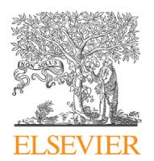
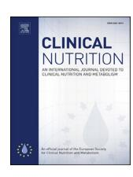
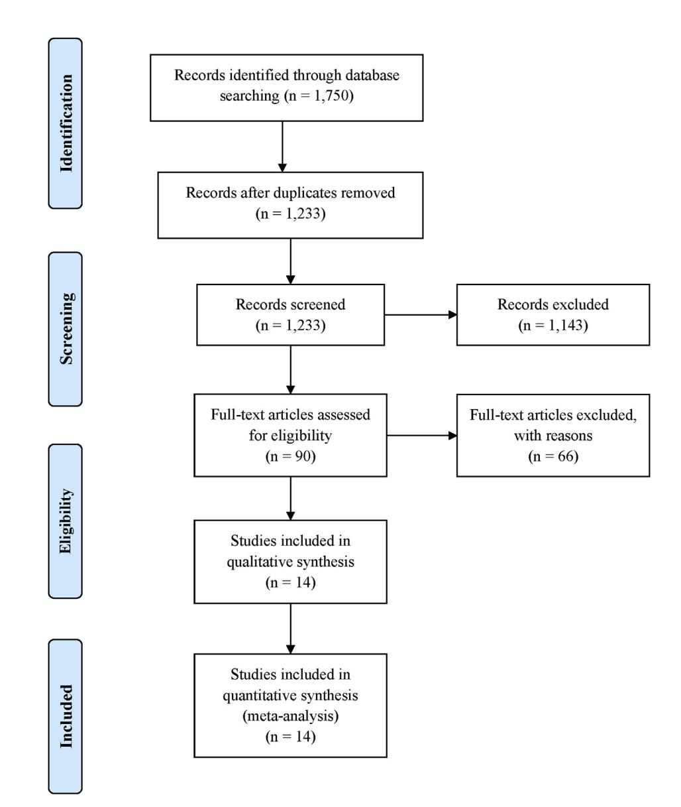
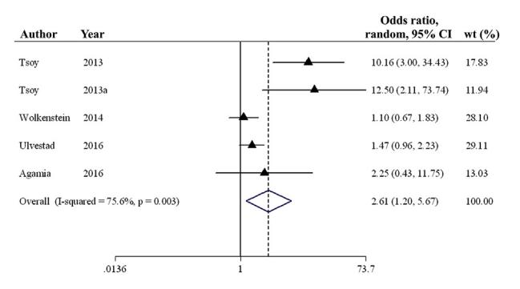
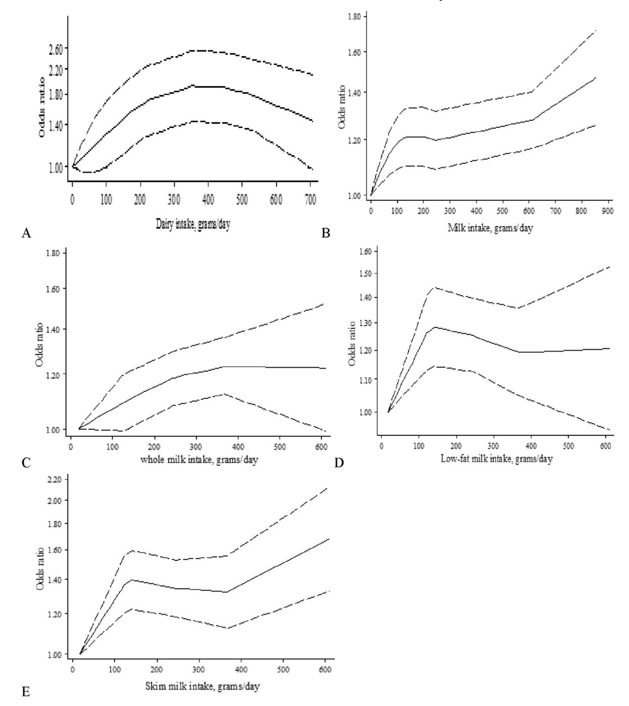
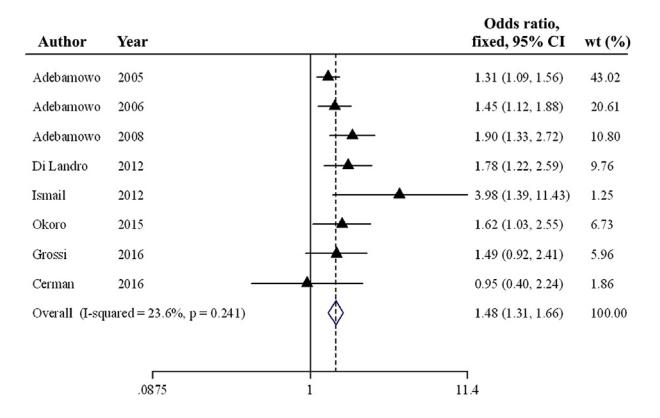
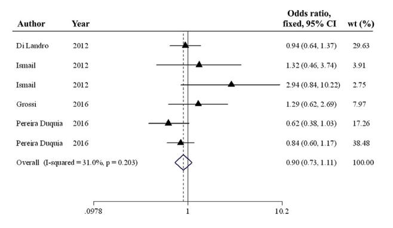

Contents lists available at ScienceDirect

# Clinical Nutrition

journal homepage: http://www.elsevier.com/locate/clnu

# Meta-analyses

# Dairy intake and acne development: A meta-analysis of observational studies

Mohadeseh Aghasi a, Mahdieh Golzarand b, \*, Sakineh Shab-Bidar a, Azadeh Aminianfar a, Mahsa Omidian b, Fatemeh Taheri a

- a Department of Community Nutrition, School of Nutritional Sciences and Dietetics, Tehran University of Medical Sciences, Tehran, Iran
- b Department of Clinical Nutrition, School of Nutritional Sciences and Dietetics, Tehran University of Medical Sciences, Tehran, Iran

#### ARTICLE INFO

Article history: Received 29 March 2018 Accepted 24 April 2018

Keywords: Acne Milk Dairy Meta-analysis Yogurt

#### SUMMARY

Background & aims: In the past, some observational studies have been carried out on the relationship between milk and dairy intake and risk of acne occurrence; however, their results were conflicting. This study is a meta-analysis and dose—response analysis designed to evaluate the relationship between milk and dairy products and acne development.

Materials & methods: Data of the study were searched and collected from Pubmed/Medline, Scopus, Web of Science, and Embase databases. Study design, sex, age, exposure (i.e. dairy, milk, yogurt, cheese), dietary assessment method, acne ascertainment, total sample size, number of total subjects and cases in each category of exposure intake, OR, RR and PR with 95% CI in each category of exposure intake and adjusted variables were extracted.

Results: Highest compared with lowest category of dairy (OR: 2.61, 95% CI: 1.20 to 5.67), total milk (OR: 1.48, 95% CI: 1.31 to 1.66), low-fat milk (OR: 1.25, 95% CI: 1.10 to 1.43) and skim milk (OR: 1.82, 95% CI: 1.34 to 2.47) intake significantly was associated with the presence of acne. Results of dose—response analysis revealed a significant linear relationship between dairy, whole milk and skim milk and risk of acne and nonlinear association between dairy, milk, low-fat milk and skim milk intake and acne.

*Conclusion:* In this meta-analysis we found a positive relationship between dairy, total milk, whole milk, low-fat and skim milk consumption and acne occurrence. In contrary, no significant association between yogurt/cheese and acne development was observed.

© 2018 Elsevier Ltd and European Society for Clinical Nutrition and Metabolism. All rights reserved.

## 1. Introduction

Acne vulgaris is a dermatosis that affects 50–95% of adolescents aged 12–18 years [1–6] and is diagnosed through the presence of comedones, papules, and pustules in the region abundant in sebaceous glands [7]. Acne is developed in all ages, and sexes, but it is common among males and adolescent especially during puberty [8]. The main method of acne development is through the overproduction of sebum by sebaceous glands which then results in hyperliferation and blockage of follicle opening [9]. Acne has social and emotional adverse effects; hence, identification of factors

E-mail address: mahdieh\_golzarand@yahoo.com (M. Golzarand).

causing acne is very important. Several factors are involved in pathogenesis of acne and they include: genetic, sex-hormonal disorders especially androgen, immunological dysfunction, psychological factors, and environment [10].

It has been proposed that dietary habits especially western dietary pattern, high glycemic index (GI) diet, and diet-rich in omega-6 fatty acids contribute to the development of acne [7,11–13]. Regardless of low GI, cow's milk and dairy products are the main components of western diet that has been suggested to play a role in pathogenesis of acne [14–16]. Milk and dairy products contain casein and whey protein that raise insulin-like growth factor-1 (IGF-1) and insulin concentrations, respectively [8,17]. IFG-1 is an important hormone that increased mammalian target of rapamycin (mTOR) activity and sebaceous lipogenesis; hence result in acne development [18,19]. Studies have shown that patients suffering from acne have higher IGF-1 level than subjects without acne [20–22]. In addition, they have sex-hormones such as androgen

\* Corresponding author. Department of Clinical Nutrition, School of Nutritional Sciences and Dietetics, Tehran University of Medical Sciences, No 44, Hojatdoost St., Naderi St., Keshavarz Blvd., P.O.Box:19395-4763, Tehran, Iran. Fax: +98 21 88 9559 79.

which both IGF-1 and androgens are involved in sebaceous hyperplasia and comedogenesis [8,23]. In the past, some observational studies have been carried out on the relationship between milk and dairy intake and risk of acne occurrence; however, their results are yet to be concluded. Results of a large retrospective study on 47,355 nurses have shown that the frequency of milk intake is significantly associated with increased risk of acne occurrence during adolescence [24]. Burris et al. [25] reported that the consumption of milk was higher in patients with mild to severe acne than in subjects with no acne. On the contrary, LaRosa et al. [26] reported that there was no significant difference on dairy intake between acne group and control group. In another study on 2201 adolescents, there was no relationship between the consumption of milk, yogurt and cheese and the presence of acne [27]. To the best of our knowledge, no systematic review and meta-analysis was found in the literature search for the present meta-analysis that determined the relationship between milk and dairy products and risk of acne. Therefore, this meta-analysis and dose-response analysis of observational studies was designed to evaluate the relationship between milk and dairy products and acne development.

#### 2. Methods

#### 2.1. Article source and literature search

This meta-analysis was conducted according to MOOSE's guideline [28]. A comprehensive literature search was carried out in Pubmed/Medline, Scopus, Web of Science and Embase databases for all studies that investigated the relationship between dairy products and acnes up to August 2017 by an investigator. The searched keywords were: "dairy products", "milk", "yogurt", "cheese", "cream", "butter", "ice cream", "dairy", "yoghurt", "buttermilk", "acne" and "Acne vulgaris". There was no limit for date of publication and language. The reference list of the retrieved studies was reviewed to find relevant studies. When the need arises, the investigators of the current study contacted the authors for more details. The population, intervention/exposure, comparison, outcome, and setting (PICOS) criteria were used to define the research question (Table 1).

# 2.2. Study selection

Two researchers (M.A and M.G) reviewed the retrieved articles according to the inclusion and exclusion criteria individually. Inclusion criteria included: a) prospective, case—control and cross-sectional designs, b) reported odds ratio (OR), relative risk (RR) or prevalence ratio (PR) with 95% confidence interval (CI) for the highest vs. lowest category of exposure intake or provided number of cases and total participants in each category of dairy products to calculate OR and 95% CI, c) English language, d) considered dairy, total milk (comprised of low-fat, whole and skimmed milk), yogurt, cheese, butter and ice cream as exposure, and e) considered acne as outcome. Exclusion criteria included: a) randomized clinical trial (RCT) design and b) comment, editorial, review, meta-analysis and

**Table 1** PICOS criteria.

| Population            | Children, adolescent and adults                   |
|-----------------------|---------------------------------------------------|
| Intervention/Exposure | Dairy, total milk, whole milk, low-fat milk, skim |
|                       | milk, yogurt and cheese                           |
| Comparison            | Highest vs. lowest categories of exposure         |
| Outcome               | Acne development                                  |
| Setting               | Observational studies                             |
| Research question     | Are milk and dairy products associated with acne  |
|                       | development                                       |

animal studies. Newcastle-Ottawa Scale (NOS) was used to assess the quality of observational studies [29].

#### 2.3. Data extraction

Data extraction was done according to the predefined form. The following data were extracted: first author, date of publication, country, study design, duration of follow-up, sex, age, exposure (that is, dairy, milk, yogurt, cheese, butter and ice cream), dietary assessment method, acne ascertainment, total sample size, number of total subjects and cases in each category of exposure intake, OR, RR and PR with 95% CI in each category of exposure intake, and adjusted variables.

#### 2.4. Statistical analysis

Stata software version 12 (StataCrop, College Station, Texas, USA) was used to carry out the meta-analysis. ORs (95% CI) for the highest vs. lowest category of dairy and dairy products were used to calculate log OR and its standard error. All results were reported as ORs (95% CI) in order to homogenize risk estimate. If studies have reported several statistical models, the last model with the most adjusted variable was included. According to the heterogeneity between studies, fixed and random model was performed for the pooled ORs (95% CI). Heterogeneity was evaluated using the I-squared ( $I^2$ ).

Dose-response analysis was performed to assess linear and nonlinear relationship between exposures of intake and risk of acne. Cross-sectional studies were excluded from both linear and nonlinear dose-response analyses and studies with <3 categories of exposure intake only from nonlinear dose-response analysis. The median or mean intake of exposure for each category was estimated. If the study reported a range for a category, the average of lower and upper band was calculated. When the lowest or highest category was open ended, it was assumed that the range was similar to the adjacent category. If exposure was reported as serving size, then it was converted to g/day as follows: 177 g for dairy, 244 g for total milk, low-fat, whole, and skimmed milk, and yogurt, and 43 g for cheese. Nonlinear dose-response analysis was carried out using restricted cubic splines with four knots at fixed percentiles (5, 35, 65, and 95%) of the distribution. The linear dose-response was performed using generalized least squares trend according to Greenland and Longnecker method [30]. Linear trend (95% CI) in each study was calculated, then results of studies were pooled together with randomeffect meta-analysis. The linear dose-response was expressed on 177 g dairy and 244 g milk, low-fat, whole, and skimmed milk.

Sensitivity analysis was used to assess impact of studies on the pooled ORs (95% CI). Egger's test was run to show publication bias among included studies.

### 3. Results

Figure 1 shows the flow chart of the study. A total of 1750 articles were included in the study by initial search from Pubmed/Medline (n=407), Scopus (n=696), Web of Science (n=573), and Embase (n=74) databases. Duplicated articles were removed and the remaining 1233 articles were reviewed based on title and abstract and 1143 articles were excluded owing to no sufficient data (n=7), inappropriate design (n=50) and non-English language (n=9). The remaining studies were screened for eligibility based on the inclusion and exclusion criteria. Finally, 14 relevant studies were selected to be included in the meta-analysis [24,27,31–42].

Table 2 shows the characteristics of the included studies. Four studies were prospective design [24,31,32,41], seven studies were

case—control [33–37,39,42] and three studies were cross-sectional framework [27,38,40]. Age of participants ranged from 9 to 30 years. Four and three studied reported PR (95% CI) [24,27,31,32] and OR (95 %CI) [35,37,41] for the highest vs. lowest category of intake, respectively. The remaining articles provided the number of cases and total participants in each category of exposure to calculate ORs (95% CI) [33,34,36,38–40,42]. Six studies used food frequency questionnaire (FFQ) [24,31,32,35,36,38], two studies used food records questionnaire [34,37] and six studies used dietary habit questionnaire [27,33,39–42] to evaluate dairy and dairy products intake. The presence of acne was diagnosed by physician in eight studies [24,27,33–38] and the remaining studies were self-reported [31,32,39–42]. Among included studies, three studies had quality score  $\geq$ 6 [24,32,37].

# 3.1. Meta-analysis on dairy intake and acne

Five studies were evaluated the relationship between dairy intake and the presence of acne [33,39–42]. The Forest plot of the

relationship between dairy intake and acne is shown in Fig. 2. A significant relationship was observed with the presence of acne when the highest category of dairy intake is compared with the lowest (OR: 2.61, 95% CI: 1.20 to 5.67). There was a severe heterogeneity between the studies ( $I^2 = 75.6\%$ , P-heterogeneity = 0.003).

Of the five included studies, three were included in dose—response analysis [40–42], two were excluded because one study has cross-sectional design [39] and the other one did not report the dose of dairy intake in each category [33]. Linear dose—response analysis showed that a 177 g/d increment in dairy intake was positively associated with the risk of acne (OR: 1.83, 95% CI: 1.14 to 2.96) with significant heterogeneity ( $I^2 = 95.8\%$ , P-heterogeneity < 0.001). In addition, evidence of nonlinear dose—response association was observed between dairy intake and acne (P-nonlinearity = 0.0007). Risk of acne was elevated by 80% with increasing intake of dairy between 250 and 450 g/d (goodness-of-fit = 58.4) (Fig. 3).

Sensitivity analysis showed that none of the studies had significant effect on the pooled effect size. No evidence of publication bias was found among the included studies (Egger's test = 0.10).

Fig. 1. Flow chart of retrieved studies.

 Table 2

 Characteristics of included studies based on exposure type.

| Exposure      | Study, year               | Country    | Study deign     | Age (yr) | Case/total  | Exposure assessment | Acne ascertainment | Exposure category          | OR (95% CI)       |
|---------------|---------------------------|------------|-----------------|----------|-------------|---------------------|--------------------|----------------------------|-------------------|
| Dairy         | Agamia, 2016 [33]         | Egypt      | Case-control    | 17–29    | 40/60       | Diet questionnaire  | By physician       | Low vs. high intake        | 2.25 (0.43-11.75) |
|               | Tsoy, 2013 [39]           | Kazakhstan | Case-control    | 17-18    | 431/523     | Diet questionnaire  | Self-reported      | Never vs. daily            | 10.16 (3.00-34.43 |
|               | Tsoy, 2013a [40]          | Kazakhstan | Cross-sectional | _        | 90/182      | Diet questionnaire  | Self-reported      | Never vs. daily            | 12.50 (2.11-73.74 |
|               | Wolkenstein, 2014 [42]    | France     | Case-control    | 15-24    | 1375/2266   | Diet questionnaire  | Self-reported      | Never vs. 4 d              | 1.10 (0.67-1.83)  |
|               | Ulvestad, 2016 [41]       | Norway     | Cohort          | 15-16    | 331/2718    | Diet questionnaire  | Self-reported      | Never vs. ≥2 d             | 1.47 (0.96-2.23)  |
| Fotal milk    | Abedamowo, 2005 [24]      | USA        | Cohort          | 13-18    | 3412/46,879 | FFQ                 | By physician       | <1 wk vs. 2-3 d            | 1.31 (1.09-1.56)  |
|               | Abedamowo, 2006 [32]      | USA        | Cohort          | 9-13     | 2588/3756   | FFQ                 | Self-reported      | $\leq 1$ wk vs. $\geq 2$ d | 1.45 (1.12-1.88)  |
|               | Abedamowo, 2008 [31]      | USA        | Cohort          | 9-13     | 1856/2759   | FFQ                 | Self-reported      | $\leq 1$ wk vs. $\geq 2$ d | 1.90 (1.33-2.72)  |
|               | Di Landro, 2012 [35]      | Italy      | Case-control    | 10-24    | 125/298     | FFQ                 | By physician       | $\leq$ 3 wk vs. >3 wk      | 1.78 (1.22-2.59)  |
|               | Ismail, 2012 [37]         | Malaysia   | Case-control    | 18-30    | 44/88       | Food record         | By physician       | <1 wk vs. ≥1 wk            | 3.98 (1.39-11.43) |
|               | Okoro, 2015 [38]          | Nigeria    | Cross-sectional | 10-17    | 292/450     | FFQ                 | Self-reported      | No vs. yes                 | 1.62 (1.03-2.55)  |
|               | Cerman, 2016 [34]         | Turkey     | Case-control    | 15-22    | 50/86       | Food record         | By physician       | $\leq$ 3 wk vs. >3 wk      | 0.95 (0.40-2.24)  |
|               | Grossi, 2016 [36]         | Italy      | Case-control    | 10-24    | 204/560     | FFQ                 | By physician       | Never vs. >3 wk            | 1.49 (0.92-2.41)  |
| Low-fat milk  | Abedamowo, 2005 [24]      | USA        | Cohort          | 13-18    | 1116/15,268 | FFQ                 | By physician       | <1 wk vs. >1 d             | 1.24 (1.07-1.44)  |
|               | Abedamowo, 2006 [32]      | USA        | Cohort          | 9-13     | 977/1421    | FFQ                 | Self-reported      | $\leq 1$ wk vs. $\geq 2$ d | 1.39 (0.94-2.05)  |
|               | Abedamowo, 2008 [31]      | USA        | Cohort          | 9-13     | 498/765     | FFQ                 | Self-reported      | $\leq 1$ wk vs. $\geq 2$ d | 1.58 (0.97-2.58)  |
|               | Pereira Duquia, 2016 [27] | Brazil     | Cross-sectional | 18       | 241/2201    | Diet questionnaire  | By physician       | No vs. yes                 | 0.91 (0.52-1.58)  |
| Whole milk    | Abedamowo, 2005 [24]      | USA        | Cohort          | 13-18    | 2306/33,185 | FFQ                 | By physician       | <1 wk vs. >1 d             | 1.16 (1.03-1.31)  |
|               | Abedamowo, 2006 [32]      | USA        | Cohort          | 9-13     | 1694/1133   | FFQ                 | Self-reported      | $\leq 1$ wk vs. $\geq 2$ d | 1.37 (1.00-1.88)  |
|               | Abedamowo, 2008 [31]      | USA        | Cohort          | 9-13     | 826/1279    | FFQ                 | Self-reported      | $\leq 1$ wk vs. $\geq 2$ d | 1.69 (1.12-2.53)  |
|               | Di Landro, 2012 [35]      | Italy      | Case-control    | 10-24    | 42/104      | FFQ                 | By physician       | $\leq$ 3 wk vs. >3 wk      | 1.64 (0.81-3.33)  |
|               | Pereira Duquia, 2016 [27] | Brazil     | Cross-sectional | 18       | 241/2201    | Diet questionnaire  | By physician       | No vs. yes                 | 0.69 (-0.52-0.92) |
| Skimmed milk  | Abedamowo, 2005 [24]      | USA        | Cohort          | 13-18    | 682/9492    | FFQ                 | By physician       | <1 wk vs. ≥2 d             | 1.53 (1.26-1.85)  |
|               | Abedamowo, 2006 [32]      | USA        | Cohort          | 9-13     | 1049/1521   | FFQ                 | Self-reported      | $\leq 1$ wk vs. $\geq 2$ d | 1.45 (1.02-2.07)  |
|               | Abedamowo, 2008 [31]      | USA        | Cohort          | 9-13     | 687/1006    | FFQ                 | Self-reported      | $\leq 1$ wk vs. $\geq 2$ d | 3.11 (1.84-5.26)  |
|               | Di Landro, 2012 [35]      | Italy      | Case-control    | 10-24    | 75/170      | FFQ                 | By physician       | $\leq$ 3 wk vs. >3 wk      | 2.20 (1.18-4.10)  |
| Yogurt/cheese | Di Landro, 2012 [35]      | Italy      | Case-control    | 10-24    | 76/213      | FFQ                 | By physician       | $\leq$ 3 wk vs. >3 wk      | 0.94 (0.64-1.37)  |
|               | Ismail, 2012 [37]         | Malaysia   | Case-control    | 18-30    | 44/88       | Food record         | By physician       | $<1$ wk vs. $\geq 1$ wk    | 1.83 (0.82-4.10)  |
|               | Grossi, 2016 [36]         | Italy      | Case-control    | 10-24    | 204/561     | FFQ                 | By physician       | Never vs. >3 wk            | 1.29 (0.62-2.69)  |
|               | Pereira Duquia, 2016 [27] | Brazil     | Cross-sectional | 18       | 241/2197    | Diet questionnaire  | By physician       | No vs. yes                 | 0.76 (0.57-1.00)  |

Fig. 2. Forest plot of association between dairy intake and acne.

## 3.2. Meta-analysis on milk intake and acne

Generally, eight effect sizes from eight studies [24,31,32,34–38] were included. Results of the meta-analysis showed that there was a significant relationship with acne in the highest vs. lowest total milk intake (OR: 1.48, 95% CI: 1.31 to 1.66) (Fig. 4) with no significant between-study heterogeneity ( $l^2 = 23.6\%$ , P-heterogeneity = 0.24).

Seven [24,31,32,34–37] and four [24,31,32,36] studies were included for linear and nonlinear dose—response analyses, respectively. No significant linear dose—response relationship was found between total milk intake and acne (OR for every 244 g increase per day was 1.10, 95% CI: 0.97 to 1.24,  $I^2 = 81.5\%$ , P-heterogeneity < 0.001). The dose—response analysis showed a positive nonlinear relationship between total milk and risk of acne (P-

Fig. 3. Nonlinearity dose—response of association between A. dairy intake (P-nonlinearity = 0.0007), B. total milk intake (P-nonlinearity = 0.004), (C) whole milk intake (P-nonlinearity = 0.003), (D) low-fat milk intake (P-nonlinearity = 0.0004) and (E) skimmed milk intake (P-nonlinearity = 0.0007) and acne.

Fig. 4. Forest plot of association between total milk intake and acne.

**Table 3** Association between different type of milk intake and acne.

| Type of milk               | Model           | Odds ratio (95%CI)                   | P value       | Heterogeneity (%) |
|----------------------------|-----------------|--------------------------------------|---------------|-------------------|
| Whole milk Low-fat milk | Random Fixed | 1.18 (0.89–1.57) 1.25 (1.10–1.43) | 0.001 0.48 | 77.6 0.0       |
| Skimmed milk               | Random          | 1.82 (1.34-2.47)                     | 0.05          | 60.1              |

nonlinearity = 0.004, goodness-of-fit = 58.4) with the strongest risk of elevation at the higher amount of total milk intake (Fig. 3).

The Relationship between consumption of whole milk, low-fat milk and skimmed milk was investigated in five [24,27,31,32,35], four [24,27,31,32] and four [24,31,32,35] studies, respectively. The relationship between different types of milk intake and acne is shown in Table 3. The highest vs. lowest intake of whole milk showed no association with acne (OR: 1.18, 95% CI: 0.89 to 1.58). On the contrary, there was a positive relationship between the highest vs. lowest intake of low-fat milk (OR: 1.25, 95% CI: 1.10 to 1.43) and skimmed milk (OR: 1.82, 95% CI: 1.34 to 2.47) and presence of acne.

Dose—response meta-analysis showed whole milk (OR: 1.13, 95% CI: 1.06 to 1.20,  $I^2 = 0.1\%$ , P-heterogeneity = 0.39) and skimmed milk intake (OR: 1.26, 95% CI: 1.02 to 1.56,  $I^2 = 79.9\%$ , P-heterogeneity = 0.002) were linearly associated with risk of acne. However, there was no statistically significant difference between the linear relationship of low-fat milk intake and acne (OR: 1.08, 95% CI: 0.97 to 1.21,  $I^2 = 51.0\%$ , P-heterogeneity = 0.13). Nonlinear dose—response relationship between whole, low-fat and skimmed milk intake and acne is shown in Fig. 3. Low-fat milk (P-nonlinearity = 0.0004, goodness-of-fit = 12.4) and skimmed milk intake (P-nonlinearity = 0.0007, goodness-of-fit = 26.4) were associated with risk of acne in a nonlinear fashion. There was no

Fig. 5. Forest plot of association between yogurt/cheese intake and acne.

evidence of a nonlinear dose—response trend between whole milk intake and acne (P-nonlinearity = 0.33, goodness-of-fit = 16.1).

Results of the sensitivity analysis showed that no study from the analysis changed the pooled effect size. There was no publication bias amongst studies on total milk (Egger's test = 0.17), whole milk (Egger's test = 0.77), low-fat milk (Egger's test = 0.92) and skimmed milk (Egger's test = 0.25).

#### 3.3. Meta-analysis on yogurt/cheese intake and acne

Findings of meta-analysis on the association between yogurt/ cheese intake and acne are shown in Fig. 5. Six effect sizes from four studies [27,35–37] were included in the meta-analysis. No significant relationship was found between yogurt/cheese intake and acne (OR: 0.90, 95% CI: 0.73 to 1.11). There was no heterogeneity between studies ( $I^2=31.0\%$ , P=0.20). Three studies [35–37] were included for linear dose–response analysis and one study [27] was excluded due to cross-sectional design. No significant linear dose–response was found between yogurt/cheese intake and risk of acne development (OR: 0.72, 95% CI: 0.35 to 1.47,  $I^2=39.5\%$ , Pheterogeneity = 0.19). Nonlinear dose–response relationship between yogurt/cheese intake and acne were no evaluated, because the included studies had <3 exposure category.

According to the sensitivity analysis, no study had influence on the pooled effect size. Results of Egger's test showed no publication bias among the included studies (Egger's test = 0.12).

#### 4. Discussion

In the present meta-analysis, 14 observational studies that investigated the relationship between dairy, total milk, whole milk, low-fat milk, skimmed milk and yogurt/cheese and acne development were included. In the present meta-analysis, showed that dairy, total milk, whole fat milk, low-fat milk and skimmed milk consumption was associated with the presence of acne. Linear dose—response analysis showed that each additional serving of dairy, whole milk and skimmed milk significantly increased the risk of acne by 83, 13 and 26%, respectively. Findings of the nonlinear dose—response analysis showed a nonlinear relationship between consumption of dairy, total milk, low-fat milk and skimmed milk and development of acne. There was no relationship between yogurt/cheese intake and risk of acne. Results of the current meta-analysis support the hypothesis that dairy products are positively associated with acne development.

The present study had several strengths and limitations. To the best of our knowledge, this is the first meta-analysis that evaluated the relationship between dairy products and acne occurrence. In this meta-analysis, a broad range of dairy products were included. Use of linear and nonlinear dose—response analyses was the other strength of the present study. The main limitation of the current study was that few numbers of studies were included in the metaanalysis and dose-response analysis according to each exposure. In addition, subgroup and meta-regression analyses were not conduced due to few numbers of included studies. Residual confounders are the main limitations that can affect the results, because observational studies were used to conduct the current meta-analysis. Moreover, in six studies validated, dietary questionnaire was not used and diagnosis of acne was self-reported and this may cause measurement bias. As well as, included studies in the present meta-analysis considered total milk as sum of whole, low-fat and skimmed milk and assessed its association with acne development, while proportion of total milk from different type of milk was unclear. The last limitation of the current study was lack of data on thermal and bacterial method applied during preparation of milk and dairy products. It seems boiling and ultra-heat treatment (UHT) techniques decline milk and dairy microRNA and have a protective effect against acne [\[43\].](#page-7-0)

The relationship between dairy and acne was investigated in observational studies. Nevertheless, the relationship between milk and dairy products intake with acne creation is yet to be investigated through systematic review and meta-analysis. In this study, results for the highest vs. lowest total milk and different type of milk intake were in agreement with the findings of four large prospective studies that have shown positive relationship between total milk and skimmed milk and acne development, but their results on whole milk and low-fat milk were inconsistent [\[24,31,32,41\]](#page-7-0). The results of caseecontrol and cross-sectional studies were inconsistent. In addition, findings of the present meta-analysis have shown similar findings with the observational studies in which dairy intake was collected using food frequency questionnaire. However, results of the current study were not in agreement with some observational studies that used dietary habit questionnaire to assess dairy intake.

Milk and dairy products are the main sources of protein, calcium, potassium, magnesium, vitamin A and B12 recommended as a part of healthy dietary pattern by guidelines. Evidence has shown that milk and dairy products have paradoxical effect on health. Previous meta-analyses have revealed that milk and dairy products were inversely associated with the risk of hypertension [\[44\],](#page-7-0) gastric cancer [\[45\],](#page-7-0) stroke [\[46,47\],](#page-7-0) colorectal cancer [\[48\].](#page-7-0) On the contrary, they increased the risk of prostate cancer [\[49\]](#page-7-0), non-Hodgkin lymphoma [\[50\]](#page-7-0) and Parkinson [\[51,52\]](#page-7-0) with no relationship with hip fracture [\[53\],](#page-8-0) mortality, cardiovascular disease (CVD) and coronary heart disease (CHD) [\[54,55\].](#page-8-0) The association between milk and dairy products and risk of diabetes is contradictory and is dependent on the type of dairy [\[56](#page-8-0)e[59\]](#page-8-0).

Acnegenic properties of milk and dairy products were explained via several mechanisms. Results of a meta-analysis conducted by Harrison et al. [\[60\]](#page-8-0) have shown that milk and dairy significantly elevate IGF-1 concentration. Milk and dairy products contain IGF-1 that is not hydrolyzed by gut enzymes and lead to plasma IGF-1 elevation [\[24\]](#page-7-0). In addition, casein content of milk and dairy products stimulates hepatic IGF-1 release [\[61\]](#page-8-0), subsequently raise plasma IGF-1 level that in a way that both exogenous and endogenous IGF-1 stimulate sebocytes resulting to acne development [\[24\].](#page-7-0) Studies have shown that milk and dairy intake through IGF-1/ phosphinositide-3-kinase (PI3K)/Akt pathway modulates Forkhead box transcription factor (Fox) O1 expression and causes acne occurrence [\[25,26,33,34\]](#page-7-0). FoxO1 is responsible for regulation of acne-related genes and sebaceous gland secretion and upregulation of FoxO1 play an important role in acne management [\[33\].](#page-7-0) Moreover, FoxO1 is a modulator of mTOR complex 1 (mTORC1) which in involved in sebocytes activation and acnegenesis. Moreover, milk augments branched-chain amino acid (BCAA) levels that stimulate mTOR activity [\[61\].](#page-8-0) IGF-1 also increases androgen receptors and testosterone and dihydrotestosterone (DHT) production that leads to greater androgen activity and stimulation of follicle cells growth, and subsequently acne occurrence [\[14,62,63\].](#page-7-0) Moreover, milk and dairy products contain sex-hormones derivatives such as estrogen, progesterone, androgen, androstenedione, dihydrotestosterone (DHT), dehydroepiandrosterone-sulfate and 5areduced steroids that have acnegenesis properties. They are rich in glucocorticoides, transforming growth factor-b (TGF-b) and neutral thyrotrophin-releasing hormone like peptides that may influence on sebocytes [\[8,11,64\]](#page-7-0). It has also been stated that iodine exist in milk and dairy may agitate acne creation [\[8\]](#page-7-0).

U.S. Department of Agriculture (USDA) guideline recommends three serving milk and dairy products per day for subjects >9 years with emphasis on fat-free and low-fat milk and dairy products [\[65\].](#page-8-0) However, in the present study, low-fat milk and especially skimmed milk has stronger relationship than whole milk with acne development. Some studies have shown the beneficial effects of whole milk intake on risk of hypertension [\[66\]](#page-8-0) and colorectal cancer [\[67\]](#page-8-0). However, several investigations have indicated that whole milk intake augments risk of prostate cancer [\[68,69\].](#page-8-0) There are several mechanisms that may explain this phenomenon. Milk and dairy products comprised of casein (80%) and whey protein (20%) that attribute to IGF-1 (by 15%) and insulin (by 21%) elevation, respectively [\[14\]](#page-7-0). These effects were reinforced when milk undergo fat-reducing processes; stating development of acne is independent of milk-fat content. It has been hypothesized that fat-reducing process possibly raises functional molecules concentration of milk and dairy products which are responsible for development and progression of acne [\[8\].](#page-7-0) In addition, whole milk contains more estrogen concentration than skimmed milk and low-fat milk which suppress acne creation. On the contrary, skimmed milk and low-fat milk have higher amount of a-lactalbumin when compared with the whole milk that stimulates acne occurrence [\[24\]](#page-7-0).

In this meta-analysis, the consumption of yogurt/cheese had no relationship with the risk of acne and this was in agreement with two previous caseecontrol studies [\[35,37\]](#page-7-0). No meta-analysis, cohort study and RCT has been carried out to assess the relationship between yogurt/cheese and acne occurrence. Unlike the results for milk and dairy, no meta-analysis has reported adverse effects of yogurt and cheese intake on health. Previous metaanalyses have shown that the consumption of yogurt decreased the risk of diabetes [\[56\],](#page-8-0) all-causes mortality [\[54\],](#page-8-0) breast cancer [\[70\]](#page-8-0) and hip fracture [\[53\]](#page-8-0) and cheese intake is associated with lower risk of CVD, CHD, stroke [\[47,70\]](#page-7-0) and hip fracture [\[53\].](#page-8-0) Also, milk and dairy, yogurt and cheese are good source of protein, some vitamins, and minerals. The lack of relationship between yogurt/ cheese and acne may be as a result of fermentation process. Milk contains several microRNA especially micrRNA-148a that suppresses DNA methyltransferase 1 (DNMT1) and promote androgen signaling and androgen receptor activity. Fermentation process by enhancement probiotic bacteria which destroys milk exosomes reduces milk microRNAs and prevents acne development [\[43\]](#page-7-0). In addition, it is likely that this process alters functional molecules and hormones concentration of yogurt and cheese that may attenuate acne development [\[32\].](#page-7-0) Fermentation process reduces IGF-1 level of yogurt and cheese which may show the absence of relationship between yogurt/cheese and acne occurrence [\[37\].](#page-7-0)

# 5. Conclusion

In this meta-analysis, a positive relationship was found between dairy, total milk, whole fat, low-fat and skimmed milk consumption and acne occurrence. On the contrary, there was no significant relationship between yogurt/cheese and acne development. Results of the present meta-analysis recommend the consumption of yogurt/cheese to avoid acne creation. Further investigations especially RCT are needed to confirm the effect of milk and dairy products on acne development.

## Statement of authorship

M.A designed the study and conducted initial searches. M.A and M.G contributed to screen retrieved articles and data extraction. Data were analyzed and interpreted by M.G and S.S-B. M.G, A.A and M.O wrote a first draft of the manuscript. M.A, M.G, S.S-B and F.T prepared final draft. All authors read the manuscript and approved it.

## Funding sources

This research did not receive any specific grant from funding agencies in the public, commercial or not-for-profit sectors.

# Conflicts of interest

The authors declare there is no conflict of interest.

## References

- [1] [Bagatin E, Timpano DL, Guadanhim LR, Nogueira VM, Terzian LR, Steiner D,](http://refhub.elsevier.com/S0261-5614(18)30166-3/sref1) [et al. Acne vulgaris: prevalence and clinical forms in adolescents from Sao](http://refhub.elsevier.com/S0261-5614(18)30166-3/sref1) [Paulo, Brazil. An Bras Dermatol 2014;89\(3\):428](http://refhub.elsevier.com/S0261-5614(18)30166-3/sref1)e[35. Epub 2014/06/18](http://refhub.elsevier.com/S0261-5614(18)30166-3/sref1).
- [2] [Bhate K, Williams HC. Epidemiology of acne vulgaris. Br J Dermatol](http://refhub.elsevier.com/S0261-5614(18)30166-3/sref2) [2013;168\(3\):474](http://refhub.elsevier.com/S0261-5614(18)30166-3/sref2)e[85. Epub 2012/12/06.](http://refhub.elsevier.com/S0261-5614(18)30166-3/sref2)
- [3] [Ghodsi SZ, Orawa H, Zouboulis CC. Prevalence, severity, and severity risk](http://refhub.elsevier.com/S0261-5614(18)30166-3/sref3) [factors of acne in high school pupils: a community-based study. J Invest](http://refhub.elsevier.com/S0261-5614(18)30166-3/sref3) [Dermatol 2009;129\(9\):2136](http://refhub.elsevier.com/S0261-5614(18)30166-3/sref3)e[41. Epub 2009/03/14](http://refhub.elsevier.com/S0261-5614(18)30166-3/sref3).
- [4] [Nijsten T, Rombouts S, Lambert J. Acne is prevalent but use of its treatments is](http://refhub.elsevier.com/S0261-5614(18)30166-3/sref4) [infrequent among adolescents from the general population. J Eur Acad Der](http://refhub.elsevier.com/S0261-5614(18)30166-3/sref4)[matol Venereol 2007;21\(2\):163](http://refhub.elsevier.com/S0261-5614(18)30166-3/sref4)e[8. Epub 2007/01/25](http://refhub.elsevier.com/S0261-5614(18)30166-3/sref4).
- [5] [Smithard A, Glazebrook C, Williams HC. Acne prevalence, knowledge about](http://refhub.elsevier.com/S0261-5614(18)30166-3/sref5) [acne and psychological morbidity in mid-adolescence: a community-based](http://refhub.elsevier.com/S0261-5614(18)30166-3/sref5) [study. Br J Dermatol 2001;145\(2\):274](http://refhub.elsevier.com/S0261-5614(18)30166-3/sref5)e[9. Epub 2001/09/05](http://refhub.elsevier.com/S0261-5614(18)30166-3/sref5).
- [6] [Yeung CK, Teo LH, Xiang LH, Chan HH. A community-based epidemiological](http://refhub.elsevier.com/S0261-5614(18)30166-3/sref6) [study of acne vulgaris in Hong Kong adolescents. Acta Derm Venereol](http://refhub.elsevier.com/S0261-5614(18)30166-3/sref6) [2002;82\(2\):104](http://refhub.elsevier.com/S0261-5614(18)30166-3/sref6)e[7. Epub 2002/07/20](http://refhub.elsevier.com/S0261-5614(18)30166-3/sref6).
- [7] [Wyrzykowska N, Wyrzykowski M, Zaba RW, Silny W, Grzymis](http://refhub.elsevier.com/S0261-5614(18)30166-3/sref7)ławski M. Diet [and acne vulgaris. Prz Gastroenterol 2013;8\(2\):93](http://refhub.elsevier.com/S0261-5614(18)30166-3/sref7)e[7](http://refhub.elsevier.com/S0261-5614(18)30166-3/sref7).
- [8] [Costa A, Mois](http://refhub.elsevier.com/S0261-5614(18)30166-3/sref8)e[s TA, Lage D. Acne and diet: truth or myth? An Bras Dermatol](http://refhub.elsevier.com/S0261-5614(18)30166-3/sref8) [2010;85\(3\):346](http://refhub.elsevier.com/S0261-5614(18)30166-3/sref8)e[53.](http://refhub.elsevier.com/S0261-5614(18)30166-3/sref8)
- [9] [Marcason W. Milk consumption and acne](http://refhub.elsevier.com/S0261-5614(18)30166-3/sref9)e[is there a link? J Am Diet Assoc](http://refhub.elsevier.com/S0261-5614(18)30166-3/sref9) [2010;110\(1\):152. Epub 2010/01/28](http://refhub.elsevier.com/S0261-5614(18)30166-3/sref9).
- [10] [Kucharska A, Szmurlo A, Sinska B. Signi](http://refhub.elsevier.com/S0261-5614(18)30166-3/sref10)ficance of diet in treated and untreated [acne vulgaris. Postepy Dermatol Alergol 2016;33\(2\):81](http://refhub.elsevier.com/S0261-5614(18)30166-3/sref10)e[6. Epub 2016/06/10.](http://refhub.elsevier.com/S0261-5614(18)30166-3/sref10)
- [11] [Rezakovi](http://refhub.elsevier.com/S0261-5614(18)30166-3/sref11)[c S, Mokos ZB, Basta-Juzba](http://refhub.elsevier.com/S0261-5614(18)30166-3/sref11)s[i](http://refhub.elsevier.com/S0261-5614(18)30166-3/sref11)c [A. Acne and diet: facts and contro](http://refhub.elsevier.com/S0261-5614(18)30166-3/sref11)[versies. Acta Dermatovenerol Croat 2012;20\(3\):170](http://refhub.elsevier.com/S0261-5614(18)30166-3/sref11)e[4](http://refhub.elsevier.com/S0261-5614(18)30166-3/sref11).
- [12] [Romanska-Gocka K, Wozniak M, Kaczmarek-Skamira E, Zegarska B. The](http://refhub.elsevier.com/S0261-5614(18)30166-3/sref12) [possible role of diet in the pathogenesis of adult female acne. Postepy Der](http://refhub.elsevier.com/S0261-5614(18)30166-3/sref12)[matol Alergol 2016;33\(6\):416](http://refhub.elsevier.com/S0261-5614(18)30166-3/sref12)e[20. Epub 2016/12/31.](http://refhub.elsevier.com/S0261-5614(18)30166-3/sref12)
- [13] [Davidovici BB, Wolf R. The role of diet in acne: facts and controversies. Clin](http://refhub.elsevier.com/S0261-5614(18)30166-3/sref13) [Dermatol 2010;28\(1\):12](http://refhub.elsevier.com/S0261-5614(18)30166-3/sref13)e[6.](http://refhub.elsevier.com/S0261-5614(18)30166-3/sref13)
- [14] [Melnik B. Milk consumption: aggravating factor of acne and promoter of](http://refhub.elsevier.com/S0261-5614(18)30166-3/sref14) [chronic diseases of Western societies. J Dtsch Dermatol Ges 2009;7\(4\):](http://refhub.elsevier.com/S0261-5614(18)30166-3/sref14) [364](http://refhub.elsevier.com/S0261-5614(18)30166-3/sref14)e[70. Epub 2009/02/27](http://refhub.elsevier.com/S0261-5614(18)30166-3/sref14).
- [15] [Melnik BC. Milk](http://refhub.elsevier.com/S0261-5614(18)30166-3/sref15)e[the promoter of chronic Western diseases. Med Hypotheses](http://refhub.elsevier.com/S0261-5614(18)30166-3/sref15) [2009;72\(6\):631](http://refhub.elsevier.com/S0261-5614(18)30166-3/sref15)e[9. Epub 2009/02/24](http://refhub.elsevier.com/S0261-5614(18)30166-3/sref15).
- [16] [Melnik BC. Diet in acne: further evidence for the role of nutrient signalling in](http://refhub.elsevier.com/S0261-5614(18)30166-3/sref16) [acne pathogenesis. Acta Derm Venereol 2012;92\(3\):228](http://refhub.elsevier.com/S0261-5614(18)30166-3/sref16)e[31. Epub 2012/03/](http://refhub.elsevier.com/S0261-5614(18)30166-3/sref16) [16.](http://refhub.elsevier.com/S0261-5614(18)30166-3/sref16)
- [17] [Melnik BC. Evidence for acne-promoting effects of milk and other insulino](http://refhub.elsevier.com/S0261-5614(18)30166-3/sref17)[tropic dairy products. Nestle Nutr Workshop Ser Pediatr Program 2011;67:](http://refhub.elsevier.com/S0261-5614(18)30166-3/sref17) [131](http://refhub.elsevier.com/S0261-5614(18)30166-3/sref17)e[45. Epub 2011/02/22](http://refhub.elsevier.com/S0261-5614(18)30166-3/sref17).
- [18] [Melnik BC. Acne vulgaris: the metabolic syndrome of the pilosebaceous fol](http://refhub.elsevier.com/S0261-5614(18)30166-3/sref18)[licle. Clin Dermatol 2018;36\(1\):29](http://refhub.elsevier.com/S0261-5614(18)30166-3/sref18)e[40. Epub 2017/12/16](http://refhub.elsevier.com/S0261-5614(18)30166-3/sref18).
- [19] [Smith TM, Gilliland K, Clawson GA, Thiboutot D. IGF-1 induces SREBP-1](http://refhub.elsevier.com/S0261-5614(18)30166-3/sref19) [expression and lipogenesis in SEB-1 sebocytes via activation of the phos](http://refhub.elsevier.com/S0261-5614(18)30166-3/sref19)[phoinositide 3-kinase/Akt pathway. J Invest Dermatol 2008;128\(5\):1286](http://refhub.elsevier.com/S0261-5614(18)30166-3/sref19)e[93.](http://refhub.elsevier.com/S0261-5614(18)30166-3/sref19) [Epub 2007/11/09.](http://refhub.elsevier.com/S0261-5614(18)30166-3/sref19)
- [20] [Seleit IBO, Abdou AG, Hashim A. Body mass index, selected dietary factors,](http://refhub.elsevier.com/S0261-5614(18)30166-3/sref20) [and acne severity: are they related to in situ expression of insulin-like growth](http://refhub.elsevier.com/S0261-5614(18)30166-3/sref20) [factor-1? Anal Quant Cytopathol Histopathol 2014;36:267](http://refhub.elsevier.com/S0261-5614(18)30166-3/sref20)e[78](http://refhub.elsevier.com/S0261-5614(18)30166-3/sref20).
- [21] [Ben-Amitai D, Laron Z. Effect of insulin-like growth factor-1 de](http://refhub.elsevier.com/S0261-5614(18)30166-3/sref21)ficiency or [administration on the occurrence of acne. J Eur Acad Dermatol Venereol](http://refhub.elsevier.com/S0261-5614(18)30166-3/sref21) [2011;25\(8\):950](http://refhub.elsevier.com/S0261-5614(18)30166-3/sref21)e[4. Epub 2010/11/09](http://refhub.elsevier.com/S0261-5614(18)30166-3/sref21).
- [22] [Vora S, Ovhal A, Jerajani H, Nair N, Chakrabortty A. Correlation of facial sebum](http://refhub.elsevier.com/S0261-5614(18)30166-3/sref22) [to serum insulin-like growth factor-1 in patients with acne. Br J Dermatol](http://refhub.elsevier.com/S0261-5614(18)30166-3/sref22) [2008;159\(4\):990](http://refhub.elsevier.com/S0261-5614(18)30166-3/sref22)e[1. Epub 2008/07/26](http://refhub.elsevier.com/S0261-5614(18)30166-3/sref22).
- [23] Melnik BC. Linking diet to acne metabolomics, inflammation, and comedogenesis: an update. Clin Cosmet Investig Dermatol 2015;8:371e88 ((Melnik B.C., [melnik@t-online.de](http://melnik@t-online.de)) Department of Dermatology, Environmental Medicine and Health Theory, University of Osnabrück, Germany).
- [24] [Adebamowo CA, Spiegelman D, Danby FW, Frazier AL, Willett WC,](http://refhub.elsevier.com/S0261-5614(18)30166-3/sref24) [Holmes MD. High school dietary dairy intake and teenage acne. J Am Acad](http://refhub.elsevier.com/S0261-5614(18)30166-3/sref24) [Dermatol 2005;52\(2\):207](http://refhub.elsevier.com/S0261-5614(18)30166-3/sref24)e[14.](http://refhub.elsevier.com/S0261-5614(18)30166-3/sref24)
- [25] [Burris J, Rietkerk W, Woolf K. Relationships of self-reported dietary factors](http://refhub.elsevier.com/S0261-5614(18)30166-3/sref25) [and perceived acne severity in a cohort of New York young adults. J Acad Nutr](http://refhub.elsevier.com/S0261-5614(18)30166-3/sref25) [Diet 2014;114\(3\):384](http://refhub.elsevier.com/S0261-5614(18)30166-3/sref25)e[92. Epub 2014/01/15.](http://refhub.elsevier.com/S0261-5614(18)30166-3/sref25)

- [26] [LaRosa CL, Quach KA, Koons K, Kunselman AR, Zhu J, Thiboutot DM, et al.](http://refhub.elsevier.com/S0261-5614(18)30166-3/sref26) [Consumption of dairy in teenagers with and without acne. J Am Acad Der](http://refhub.elsevier.com/S0261-5614(18)30166-3/sref26)[matol 2016;75\(2\):318](http://refhub.elsevier.com/S0261-5614(18)30166-3/sref26)e[22.](http://refhub.elsevier.com/S0261-5614(18)30166-3/sref26)
- [27] [Pereira Duquia R, da Silva Dos Santos I, de Almeida Jr H, Martins Souza PR, de](http://refhub.elsevier.com/S0261-5614(18)30166-3/sref27) [Avelar Breunig J, Zouboulis CC. Epidemiology of acne vulgaris in 18-year-old](http://refhub.elsevier.com/S0261-5614(18)30166-3/sref27) [male army conscripts in a south Brazilian City. Dermatology 2017;233\(2](http://refhub.elsevier.com/S0261-5614(18)30166-3/sref27)e[3\):](http://refhub.elsevier.com/S0261-5614(18)30166-3/sref27) [145](http://refhub.elsevier.com/S0261-5614(18)30166-3/sref27)e[54. Epub 2017/06/14](http://refhub.elsevier.com/S0261-5614(18)30166-3/sref27).
- [28] [Stroup DF, Berlin JA, Morton SC, Olkin I, Williamson GD, Rennie D, et al. Meta](http://refhub.elsevier.com/S0261-5614(18)30166-3/sref28)[analysis of observational studies in epidemiology: a proposal for reporting.](http://refhub.elsevier.com/S0261-5614(18)30166-3/sref28) [Meta-analysis of Observational Studies in Epidemiology \(MOOSE\) group.](http://refhub.elsevier.com/S0261-5614(18)30166-3/sref28) [JAMA 2000;283\(15\):2008](http://refhub.elsevier.com/S0261-5614(18)30166-3/sref28)e[12. Epub 2000/05/02.](http://refhub.elsevier.com/S0261-5614(18)30166-3/sref28)
- [29] [SBOD. The Newcastle](http://refhub.elsevier.com/S0261-5614(18)30166-3/sref29)e[Ottawa Scale \(NOS\) for assessing the quality of non](http://refhub.elsevier.com/S0261-5614(18)30166-3/sref29)[randomised studies in meta-analysis. In: Wells G, editor. Proceedings or the](http://refhub.elsevier.com/S0261-5614(18)30166-3/sref29) [third symposium on systematic reviews beyond the basics; 2000](http://refhub.elsevier.com/S0261-5614(18)30166-3/sref29).
- [30] [Greenland S, Longnecker MP. Methods for trend estimation from summarized](http://refhub.elsevier.com/S0261-5614(18)30166-3/sref30) [dose-response data, with applications to meta-analysis. Am J Epidemiol](http://refhub.elsevier.com/S0261-5614(18)30166-3/sref30) [1992;135\(11\):1301](http://refhub.elsevier.com/S0261-5614(18)30166-3/sref30)e[9.](http://refhub.elsevier.com/S0261-5614(18)30166-3/sref30)
- [31] [Adebamowo CA, Spiegelman D, Berkey CS, Danby EW, Rockett HH, Colditz GA,](http://refhub.elsevier.com/S0261-5614(18)30166-3/sref31) [et al. Milk consumption and acne in teenaged boys. J Am Acad Dermatol](http://refhub.elsevier.com/S0261-5614(18)30166-3/sref31) [2008;58\(5\):787](http://refhub.elsevier.com/S0261-5614(18)30166-3/sref31)e[93](http://refhub.elsevier.com/S0261-5614(18)30166-3/sref31).
- [32] [Adebamowo CA, Spiegelman D, Berkey CS, Danby FW, Rockett HH, Colditz GA,](http://refhub.elsevier.com/S0261-5614(18)30166-3/sref32) [et al. Milk consumption and acne in adolescent girls. Dermatol Online J](http://refhub.elsevier.com/S0261-5614(18)30166-3/sref32) [2006;12\(4\):1. Epub 2006/11/07](http://refhub.elsevier.com/S0261-5614(18)30166-3/sref32).
- [33] [Agamia NF, Abdallah DM, Sorour O, Mourad B, Younan DN. Skin expres](http://refhub.elsevier.com/S0261-5614(18)30166-3/sref33)[sion of mammalian target of rapamycin and forkhead box transcription](http://refhub.elsevier.com/S0261-5614(18)30166-3/sref33) [factor O1, and serum insulin-like growth factor-1 in patients with acne](http://refhub.elsevier.com/S0261-5614(18)30166-3/sref33) [vulgaris and their relationship with diet. Br J Dermatol 2016;174\(6\):](http://refhub.elsevier.com/S0261-5614(18)30166-3/sref33) [1299](http://refhub.elsevier.com/S0261-5614(18)30166-3/sref33)e[307.](http://refhub.elsevier.com/S0261-5614(18)30166-3/sref33)
- [34] [Cerman AA, Aktas E, Altunay IK, Arici JE, Tulunay A, Ozturk FY. Dietary gly](http://refhub.elsevier.com/S0261-5614(18)30166-3/sref34)[cemic factors, insulin resistance, and adiponectin levels in acne vulgaris. J Am](http://refhub.elsevier.com/S0261-5614(18)30166-3/sref34) [Acad Dermatol 2016;75\(1\):155](http://refhub.elsevier.com/S0261-5614(18)30166-3/sref34)e[62. Epub 2016/04/12.](http://refhub.elsevier.com/S0261-5614(18)30166-3/sref34)
- [35] [Di Landro A, Cazzaniga S, Parazzini F, Ingordo V, Cusano F, Atzori L, et al.](http://refhub.elsevier.com/S0261-5614(18)30166-3/sref35) [Family history, body mass index, selected dietary factors, menstrual history,](http://refhub.elsevier.com/S0261-5614(18)30166-3/sref35) [and risk of moderate to severe acne in adolescents and young adults. J Am](http://refhub.elsevier.com/S0261-5614(18)30166-3/sref35) [Acad Dermatol 2012;67\(6\):1129](http://refhub.elsevier.com/S0261-5614(18)30166-3/sref35)e[35. Epub 2012/03/06.](http://refhub.elsevier.com/S0261-5614(18)30166-3/sref35)
- [36] [Grossi E, Cazzaniga S, Crotti S, Naldi L, Di Landro A, Ingordo V, et al. The](http://refhub.elsevier.com/S0261-5614(18)30166-3/sref36) [constellation of dietary factors in adolescent acne: a semantic connectivity](http://refhub.elsevier.com/S0261-5614(18)30166-3/sref36) [map approach. J Eur Acad Dermatol Venereol 2016;30\(1\):96](http://refhub.elsevier.com/S0261-5614(18)30166-3/sref36)e[100](http://refhub.elsevier.com/S0261-5614(18)30166-3/sref36).
- [37] [Ismail NH, Manaf ZA, Azizan NZ. High glycemic load diet, milk and ice cream](http://refhub.elsevier.com/S0261-5614(18)30166-3/sref37) [consumption are related to acne vulgaris in Malaysian young adults: a case](http://refhub.elsevier.com/S0261-5614(18)30166-3/sref37) [control study. BMC Dermatol 2012;16\(12\):13.](http://refhub.elsevier.com/S0261-5614(18)30166-3/sref37)
- [38] [Okoro EO, Ogunbiyi AO, George AO, Subulade MO. Association of diet with](http://refhub.elsevier.com/S0261-5614(18)30166-3/sref38) [acne vulgaris among adolescents in Ibadan, southwest Nigeria. Int J Dermatol](http://refhub.elsevier.com/S0261-5614(18)30166-3/sref38) [2016;55\(9\):982](http://refhub.elsevier.com/S0261-5614(18)30166-3/sref38)e[8](http://refhub.elsevier.com/S0261-5614(18)30166-3/sref38).
- [39] Tsoy N. The infl[uence of dietary habits on acne. World J Med Sci 2013;8\(3\):](http://refhub.elsevier.com/S0261-5614(18)30166-3/sref39) [212](http://refhub.elsevier.com/S0261-5614(18)30166-3/sref39)e[6](http://refhub.elsevier.com/S0261-5614(18)30166-3/sref39).
- [40] [Tsoy NO. Effect of milk and dairy products upon severity of acne for young](http://refhub.elsevier.com/S0261-5614(18)30166-3/sref40) [people. World Appl Sci J 2013;24\(3\):403](http://refhub.elsevier.com/S0261-5614(18)30166-3/sref40)e[7](http://refhub.elsevier.com/S0261-5614(18)30166-3/sref40).
- [41] [Ulvestad M, Bjertness E, Dalgard F, Halvorsen JA. Acne and dairy products in](http://refhub.elsevier.com/S0261-5614(18)30166-3/sref41) [adolescence: results from a Norwegian longitudinal study. J Eur Acad Der](http://refhub.elsevier.com/S0261-5614(18)30166-3/sref41)[matol Venereol 2017;31\(3\):530](http://refhub.elsevier.com/S0261-5614(18)30166-3/sref41)e[5](http://refhub.elsevier.com/S0261-5614(18)30166-3/sref41).
- [42] [Wolkenstein P, Misery L, Amici JM, Maghia R, Branchoux S, Cazeau C, et al.](http://refhub.elsevier.com/S0261-5614(18)30166-3/sref42) [Smoking and dietary factors associated with moderate-to-severe acne in](http://refhub.elsevier.com/S0261-5614(18)30166-3/sref42) [French adolescents and young adults: results of a survey using a represen](http://refhub.elsevier.com/S0261-5614(18)30166-3/sref42)[tative sample. Dermatology 2015;230\(1\):34](http://refhub.elsevier.com/S0261-5614(18)30166-3/sref42)e[9. Epub 2014/11/22.](http://refhub.elsevier.com/S0261-5614(18)30166-3/sref42)
- [43] [Melnik BC. Milk disrupts p53 and DNMT1, the guardians of the genome:](http://refhub.elsevier.com/S0261-5614(18)30166-3/sref43) [implications for acne vulgaris and prostate cancer. Nutr Metabol 2017;14:55.](http://refhub.elsevier.com/S0261-5614(18)30166-3/sref43) [Epub 2017/08/18.](http://refhub.elsevier.com/S0261-5614(18)30166-3/sref43)
- [44] [Soedamah-Muthu SS, Verberne LD, Ding EL, Engberink MF, Geleijnse JM. Dairy](http://refhub.elsevier.com/S0261-5614(18)30166-3/sref44) [consumption and incidence of hypertension: a dose-response meta-analysis](http://refhub.elsevier.com/S0261-5614(18)30166-3/sref44) [of prospective cohort studies. Hypertension \(Dallas, Tex : 1979\) 2012;60\(5\):](http://refhub.elsevier.com/S0261-5614(18)30166-3/sref44) [1131](http://refhub.elsevier.com/S0261-5614(18)30166-3/sref44)e[7. Epub 2012/09/19](http://refhub.elsevier.com/S0261-5614(18)30166-3/sref44).
- [45] [Guo Y, Shan Z, Ren H, Chen W. Dairy consumption and gastric cancer risk: a](http://refhub.elsevier.com/S0261-5614(18)30166-3/sref45) [meta-analysis of epidemiological studies. Nutr Canc 2015;67\(4\):555](http://refhub.elsevier.com/S0261-5614(18)30166-3/sref45)e[68.](http://refhub.elsevier.com/S0261-5614(18)30166-3/sref45) [Epub 2015/04/30.](http://refhub.elsevier.com/S0261-5614(18)30166-3/sref45)
- [46] [de Goede J, Soedamah-Muthu SS, Pan A, Gijsbers L, Geleijnse JM. Dairy con](http://refhub.elsevier.com/S0261-5614(18)30166-3/sref46)[sumption and risk of stroke: a systematic review and updated dose-response](http://refhub.elsevier.com/S0261-5614(18)30166-3/sref46) [meta-analysis of prospective cohort studies. J Am Heart Assoc 2016;5\(5\),](http://refhub.elsevier.com/S0261-5614(18)30166-3/sref46) [e002787. Epub 2016/05/22.](http://refhub.elsevier.com/S0261-5614(18)30166-3/sref46)
- [47] [Alexander DD, Bylsma LC, Vargas AJ, Cohen SS, Doucette A, Mohamed M, et al.](http://refhub.elsevier.com/S0261-5614(18)30166-3/sref47) [Dairy consumption and CVD: a systematic review and meta-analysis. Br J Nutr](http://refhub.elsevier.com/S0261-5614(18)30166-3/sref47) [2016;115\(4\):737](http://refhub.elsevier.com/S0261-5614(18)30166-3/sref47)e[50. Epub 2016/01/21](http://refhub.elsevier.com/S0261-5614(18)30166-3/sref47).
- [48] [Aune D, Lau R, Chan DS, Vieira R, Greenwood DC, Kampman E, et al. Dairy](http://refhub.elsevier.com/S0261-5614(18)30166-3/sref48) [products and colorectal cancer risk: a systematic review and meta-analysis of](http://refhub.elsevier.com/S0261-5614(18)30166-3/sref48) [cohort studies. Ann Oncol 2012;23\(1\):37](http://refhub.elsevier.com/S0261-5614(18)30166-3/sref48)e[45. Epub 2011/05/28.](http://refhub.elsevier.com/S0261-5614(18)30166-3/sref48)
- [49] [Aune D, Navarro Rosenblatt DA, Chan DS, Vieira AR, Vieira R, Greenwood DC,](http://refhub.elsevier.com/S0261-5614(18)30166-3/sref49) [et al. Dairy products, calcium, and prostate cancer risk: a systematic review](http://refhub.elsevier.com/S0261-5614(18)30166-3/sref49) [and meta-analysis of cohort studies. Am J Clin Nutr 2015;101\(1\):87](http://refhub.elsevier.com/S0261-5614(18)30166-3/sref49)e[117.](http://refhub.elsevier.com/S0261-5614(18)30166-3/sref49) [Epub 2014/12/21.](http://refhub.elsevier.com/S0261-5614(18)30166-3/sref49)
- [50] [Wang J, Li X, Zhang D. Dairy product consumption and risk of non-hodgkin](http://refhub.elsevier.com/S0261-5614(18)30166-3/sref50) [lymphoma: a meta-analysis. Nutrients 2016;8\(3\):120. Epub 2016/03/02](http://refhub.elsevier.com/S0261-5614(18)30166-3/sref50).
- [51] [Chen H, O'Reilly E, McCullough ML, Rodriguez C, Schwarzschild MA, Calle EE,](http://refhub.elsevier.com/S0261-5614(18)30166-3/sref51) [et al. Consumption of dairy products and risk of Parkinson's disease. Am J](http://refhub.elsevier.com/S0261-5614(18)30166-3/sref51) [Epidemiol 2007;165\(9\):998](http://refhub.elsevier.com/S0261-5614(18)30166-3/sref51)e[1006. Epub 2007/02/03](http://refhub.elsevier.com/S0261-5614(18)30166-3/sref51).

- [52] [Jiang W, Ju C, Jiang H, Zhang D. Dairy foods intake and risk of Parkinson's](http://refhub.elsevier.com/S0261-5614(18)30166-3/sref52) [disease: a dose-response meta-analysis of prospective cohort studies. Eur J](http://refhub.elsevier.com/S0261-5614(18)30166-3/sref52) [Epidemiol 2014;29\(9\):613](http://refhub.elsevier.com/S0261-5614(18)30166-3/sref52)e[9. Epub 2014/06/05](http://refhub.elsevier.com/S0261-5614(18)30166-3/sref52).
- [53] [Bian S, Hu J, Zhang K, Wang Y, Yu M, Ma J. Dairy product consumption and risk](http://refhub.elsevier.com/S0261-5614(18)30166-3/sref53) [of hip fracture: a systematic review and meta-analysis. BMC Publ Health](http://refhub.elsevier.com/S0261-5614(18)30166-3/sref53) [2018;18\(1\):165. Epub 2018/01/24](http://refhub.elsevier.com/S0261-5614(18)30166-3/sref53).
- [54] [Guo J, Astrup A, Lovegrove JA, Gijsbers L, Givens DI, Soedamah-Muthu SS. Milk](http://refhub.elsevier.com/S0261-5614(18)30166-3/sref54) [and dairy consumption and risk of cardiovascular diseases and all-cause](http://refhub.elsevier.com/S0261-5614(18)30166-3/sref54) [mortality: dose-response meta-analysis of prospective cohort studies. Eur J](http://refhub.elsevier.com/S0261-5614(18)30166-3/sref54) [Epidemiol 2017;32\(4\):269](http://refhub.elsevier.com/S0261-5614(18)30166-3/sref54)e[87. Epub 2017/04/05.](http://refhub.elsevier.com/S0261-5614(18)30166-3/sref54)
- [55] [Larsson SC, Crippa A, Orsini N, Wolk A, Michaelsson K. Milk consumption and](http://refhub.elsevier.com/S0261-5614(18)30166-3/sref55) [mortality from all causes, cardiovascular disease, and cancer: a systematic](http://refhub.elsevier.com/S0261-5614(18)30166-3/sref55) [review and meta-analysis. Nutrients 2015;7\(9\):7749](http://refhub.elsevier.com/S0261-5614(18)30166-3/sref55)e[63. Epub 2015/09/18](http://refhub.elsevier.com/S0261-5614(18)30166-3/sref55).
- [56] [Gijsbers L, Ding EL, Malik VS, de Goede J, Geleijnse JM, Soedamah-Muthu SS.](http://refhub.elsevier.com/S0261-5614(18)30166-3/sref56) [Consumption of dairy foods and diabetes incidence: a dose-response meta](http://refhub.elsevier.com/S0261-5614(18)30166-3/sref56)[analysis of observational studies. Am J Clin Nutr 2016;103\(4\):1111](http://refhub.elsevier.com/S0261-5614(18)30166-3/sref56)e[24. Epub](http://refhub.elsevier.com/S0261-5614(18)30166-3/sref56) [2016/02/26.](http://refhub.elsevier.com/S0261-5614(18)30166-3/sref56)
- [57] [Sluijs I, Forouhi NG, Beulens JW, van der Schouw YT, Agnoli C, Arriola L, et al.](http://refhub.elsevier.com/S0261-5614(18)30166-3/sref57) [The amount and type of dairy product intake and incident type 2 diabetes:](http://refhub.elsevier.com/S0261-5614(18)30166-3/sref57) [results from the EPIC-InterAct Study. Am J Clin Nutr 2012;96\(2\):382](http://refhub.elsevier.com/S0261-5614(18)30166-3/sref57)e[90. Epub](http://refhub.elsevier.com/S0261-5614(18)30166-3/sref57) [2012/07/05.](http://refhub.elsevier.com/S0261-5614(18)30166-3/sref57)
- [58] [Melnik BC. The pathogenic role of persistent milk signaling in mTORC1- and](http://refhub.elsevier.com/S0261-5614(18)30166-3/sref58) [milk-microRNA-driven type 2 diabetes mellitus. Curr Diabetes Rev](http://refhub.elsevier.com/S0261-5614(18)30166-3/sref58) [2015;11\(1\):46](http://refhub.elsevier.com/S0261-5614(18)30166-3/sref58)e[62. Epub 2015/01/15](http://refhub.elsevier.com/S0261-5614(18)30166-3/sref58).
- [59] [Hruby A, Ma J, Rogers G, Meigs JB, Jacques PF. Associations of dairy intake with](http://refhub.elsevier.com/S0261-5614(18)30166-3/sref59) [incident prediabetes or diabetes in middle-aged adults vary by both dairy](http://refhub.elsevier.com/S0261-5614(18)30166-3/sref59) [type and glycemic status. J Nutr 2017;147\(9\):1764](http://refhub.elsevier.com/S0261-5614(18)30166-3/sref59)e[75. Epub 2017/08/05.](http://refhub.elsevier.com/S0261-5614(18)30166-3/sref59)
- [60] [Harrison SLR, Holly J, Higgins JPT, Gardner M, Perks C, Gaunt T, et al. Does milk](http://refhub.elsevier.com/S0261-5614(18)30166-3/sref60) [intake promote prostate cancer initiation or progression via effects on insulin-](http://refhub.elsevier.com/S0261-5614(18)30166-3/sref60)

- [like growth factors \(IGFs\)? A systematic review and meta-analysis. Canc](http://refhub.elsevier.com/S0261-5614(18)30166-3/sref60) [Causes Contr: CCC 2017;28\(6\):497](http://refhub.elsevier.com/S0261-5614(18)30166-3/sref60)e[528. Epub 2002/09/05.](http://refhub.elsevier.com/S0261-5614(18)30166-3/sref60)
- [61] [Melnik BC, John SM, Schmitz G. Milk is not just food but most likely a genetic](http://refhub.elsevier.com/S0261-5614(18)30166-3/sref61) [transfection system activating mTORC1 signaling for postnatal growth. Nutr J](http://refhub.elsevier.com/S0261-5614(18)30166-3/sref61) [2013;12:103. Epub 2013/07/26.](http://refhub.elsevier.com/S0261-5614(18)30166-3/sref61)
- [62] [Danby FW. Diet and acne. Clin Dermatol 2008;26\(1\):93](http://refhub.elsevier.com/S0261-5614(18)30166-3/sref62)e[6](http://refhub.elsevier.com/S0261-5614(18)30166-3/sref62).
- [63] [Danby FW. Diet in the prevention of hidradenitis suppurativa \(acne inversa\).](http://refhub.elsevier.com/S0261-5614(18)30166-3/sref63) [J Am Acad Dermatol 2015;73\(5 Suppl 1\):S52](http://refhub.elsevier.com/S0261-5614(18)30166-3/sref63)e[4. Epub 2015/10/17.](http://refhub.elsevier.com/S0261-5614(18)30166-3/sref63)
- [64] [Danby FW. Nutrition and acne. Clin Dermatol 2010;28\(6\):598](http://refhub.elsevier.com/S0261-5614(18)30166-3/sref64)e[604. Epub](http://refhub.elsevier.com/S0261-5614(18)30166-3/sref64) [2010/11/03.](http://refhub.elsevier.com/S0261-5614(18)30166-3/sref64)
- [65] [Mirmiran P, Golzarand M, Bahadoran Z, Mirzaei S, Azizi F. High-fat dairy is](http://refhub.elsevier.com/S0261-5614(18)30166-3/sref65) [inversely associated with the risk of hypertension in adults: Tehran lipid and](http://refhub.elsevier.com/S0261-5614(18)30166-3/sref65) [glucose study. Int Dairy J 2015;43:22](http://refhub.elsevier.com/S0261-5614(18)30166-3/sref65)e[6](http://refhub.elsevier.com/S0261-5614(18)30166-3/sref65).
- [66] [Larsson SC, Bergkvist L, Wolk A. High-fat dairy food and conjugated linoleic](http://refhub.elsevier.com/S0261-5614(18)30166-3/sref66) [acid intakes in relation to colorectal cancer incidence in the Swedish](http://refhub.elsevier.com/S0261-5614(18)30166-3/sref66) [Mammography Cohort. Am J Clin Nutr 2005;82\(4\):894](http://refhub.elsevier.com/S0261-5614(18)30166-3/sref66)e[900. Epub 2005/10/08](http://refhub.elsevier.com/S0261-5614(18)30166-3/sref66).
- [67] [Kratz M, Baars T, Guyenet S. The relationship between high-fat dairy con](http://refhub.elsevier.com/S0261-5614(18)30166-3/sref67)[sumption and obesity, cardiovascular, and metabolic disease. Eur J Nutr](http://refhub.elsevier.com/S0261-5614(18)30166-3/sref67) [2013;52\(1\):1](http://refhub.elsevier.com/S0261-5614(18)30166-3/sref67)e[24. Epub 2012/07/20](http://refhub.elsevier.com/S0261-5614(18)30166-3/sref67).
- [68] [Lu W, Chen H, Niu Y, Wu H, Xia D, Wu Y. Dairy products intake and cancer](http://refhub.elsevier.com/S0261-5614(18)30166-3/sref68) [mortality risk: a meta-analysis of 11 population-based cohort studies. Nutr J](http://refhub.elsevier.com/S0261-5614(18)30166-3/sref68) [2016;15\(1\):91. Epub 2016/10/22.](http://refhub.elsevier.com/S0261-5614(18)30166-3/sref68)
- [69] [Song Y, Chavarro JE, Cao Y, Qiu W, Mucci L, Sesso HD, et al. Whole milk intake](http://refhub.elsevier.com/S0261-5614(18)30166-3/sref69) [is associated with prostate cancer-speci](http://refhub.elsevier.com/S0261-5614(18)30166-3/sref69)fic mortality among U.S. male physi[cians. J Nutr 2013;143\(2\):189](http://refhub.elsevier.com/S0261-5614(18)30166-3/sref69)e[96. Epub 2012/12/21](http://refhub.elsevier.com/S0261-5614(18)30166-3/sref69).
- [70] [Chen GC, Wang Y, Tong X, Szeto IMY, Smit G, Li ZN, et al. Cheese consumption](http://refhub.elsevier.com/S0261-5614(18)30166-3/sref70) [and risk of cardiovascular disease: a meta-analysis of prospective studies. Eur](http://refhub.elsevier.com/S0261-5614(18)30166-3/sref70) [J Nutr 2017;56\(8\):2565](http://refhub.elsevier.com/S0261-5614(18)30166-3/sref70)e[75. Epub 2016/08/16](http://refhub.elsevier.com/S0261-5614(18)30166-3/sref70).