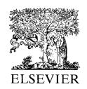
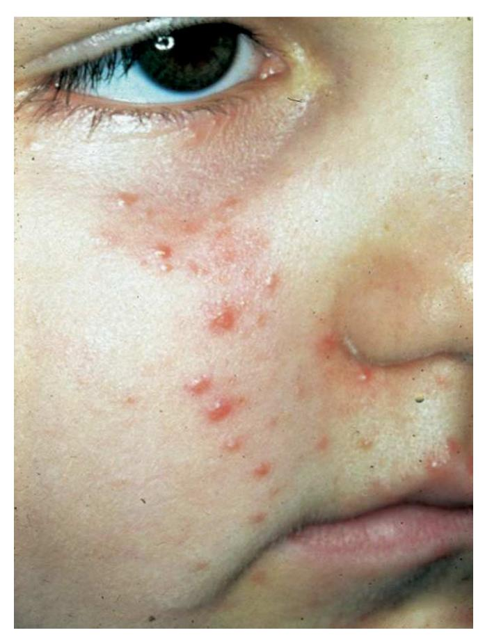
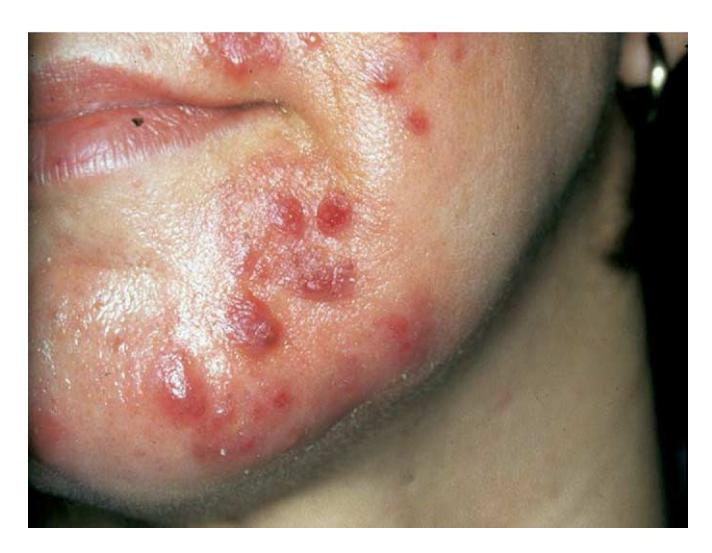
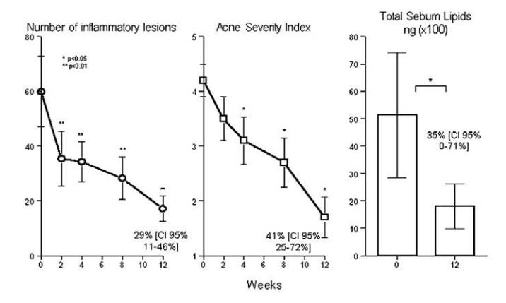

# Acne and Sebaceous Gland Function

CHRISTOS C. ZOUBOULIS, MD

**Abstract:** The embryologic development of the human sebaceous gland is closely related to the differentiation of the hair follicle and the epidermis. The number of sebaceous glands remains approximately the same throughout life, whereas their size tends to increase with age. The development and function of the sebaceous gland in the fetal and neonatal periods appear to be regulated by maternal androgens and by endogenous steroid synthesis, as well as by other morphogens. The most apparent function of the glands is to excrete sebum. A strong increase in sebum excretion occurs a few hours after birth; this peaks during the first week and slowly subsides thereafter. A new rise takes place at about age 9 years with adrenarche and continues up to age 17 years, when the adult level is reached. The sebaceous gland is an important formation site of active androgens. Androgens are well known for their effects on sebum excretion, whereas terminal sebocute differentiation is assisted by peroxisome proliferator-activated receptor ligands. Estrogens, glucocorticoids, and prolactin also influence sebaceous gland function. In addition, stress-sensing cutaneous signals lead to the production and release of corticotrophin-releasing hormone from dermal nerves and sebocytes with subsequent dose-dependent regulation of sebaceous nonpolar lipids. Among other lipid fractions, sebaceous glands have been shown to synthesize considerable amounts of free fatty acids without exogenous influence. Sebaceous lipids are responsible for the three-dimensional skin surface lipid organization. Contributing to the integrity of the skin barrier. They also exhibit strong innate antimicrobial activity, transport antioxidants to the skin surface, and express proinflammatory and anti-inflammatory properties. Acne in childhood has been suggested to be strongly associated with the development of severe acne during adolescence. Increased sebum excretion is a major factor in the pathophysiology of acne vulgaris. Other sebaceous gland functions are also associated with the development of acne, including sebaceous proinflammatory lipids; different cytokines produced locally; periglandular peptides and neuropeptides, such as corticotrophin-releasing hormone, which is produced by sebocytes; and substance P, which is expressed in the nerve endings at the vicinity of healthy-looking glands of acne patients. Current data indicate that acne vulgaris may be a primary inflammatory disease. Future drugs developed to treat acne not only should reduce sebum production and Propionibacterium acnes populations, but also should be targeted to reduce proinflammatory lipids in sebum, down-regulate proinflammatory signals in the pilosebaceous unit, and inhibit leukotriene  $B_a$ -induced accumulation of inflammatory cells. They should also influence peroxisome proliferator-activated receptor regulation. Isotretinoin is still the most active available drug for the treatment of severe acne.

## Sebaceous Gland Development

The human sebaceous gland is a multiacinar, holocrine-secreting tissue present in all areas of the skin except for the palms and soles (and only sparsely on the dorsal surfaces of the hand and foot).1 Its development is closely related to the differentiation of the hair follicle and the epidermis. 2-4 By 13–15 weeks of fetal life, the sebaceous gland is clearly distinguishable arising in a cephalocaudal sequence from the hair follicle. Lipid drops are visible at the center of the gland at 17 weeks.5,6 The future common excretory duct, around which the acini of the sebaceous gland attach, begins as a solid cord. The cells composing the cord are filled with sebum, and eventually they lose their integrity, rupture, and form a channel that establishes the first pilosebaceous canal. New acini result from buds on the peripheral sebaceous duct wall. The cell organization of the neonatal sebaceous acini consists of undifferentiated, differentiating, and mature sebocytes.7

E-mail address: christos.zouboulis@charite.de

The number of sebaceous glands remains approximately constant throughout life, whereas their size tends to increase with age.8,9 Within any one glandular unit, the acini vary in differentiation and maturity. The sebaceous cells of prepupertal and hypogonadal males are qualitatively similar to those of normal adults, even though the glands are smaller.10 Synthesis and discharge of the lipids contained in sebaceous cells takes more than 1 week. The turnover of sebaceous glands is slower in older than in young adults.11

#### **Sebaceous Gland Functions**

The most obvious function of the sebaceous gland is to excrete sebum. Additional functions of the gland are associated with the development of acne (Table 1).

#### Sebum Production

Sebum is a mixture of relatively nonpolar lipids, most of which are synthesized de novo by the sebaceous gland20 to coat the fur as a hydrophobic protection against overwetting and for heat insulation in mammals.21 The composition of sebum is remarkably species-specific.2,20,22 Increased sebum excretion is a major factor involved in the pathophysiology of acne.23

The sebaceous glands are functional from their for-

From the Department of Dermatology, Charité University Medicine Berlin, Campus Benjamin Franklin, Berlin, Germany.

Address correspondence to Christos C. Zouboulis, Department of Dermatology, Charité University Medicine Berlin, Campus Benjamin Franklin, Fabeckstrasse 60-62, 14195 Berlin, Germany.

Table 1. Sebaceous gland functions, which are possibly involved in the development of acne

- Production of sebum (12)
- Regulation of cutaneous steroidogenesis (13-15)
- Regulation of local androgen synthesis (14)
- Interaction with neuropeptides (16)
- Synthesis of specific lipids with antimicrobial activity (17)
- Exhibition of pro- and anti-inflammatory properties (13, 18, 19)

mation; sebum is the first demonstrable glandular product of the human body. 12 It is major ingredient of vernix caseosa, which progressively coats the fetus during the last trimester of gestation. Development and function in the fetal and neonatal periods appear to be regulated by maternal androgens and by endogenous steroid synthesis, as well as by other "morphogens," including growth factors, cell adhesion molecules, extracellular matrix proteins, intracellular signaling molecules (β-catenin and LEF-1), other hormones, cytokines, enzymes, and retinoids.4,24

A significant increase in sebum excretion occurs a few hours after birth and peaks during the first week.25,26 Maternal and neonatal sebum excretion rates directly correlate.26 This correlation is lost in the following weeks and is independent from breast-feeding. At this time, the sebum level per unit skin surface is in the same range as in young adults,25 and the sequence of sebaceous transformation seems identical to that in postnatal life. These events suggest an important role of the maternal hormonal environment on the neonatal sebaceous gland and indicates that androgenetic stimulus for sebum secretion occurs before birth through the placenta. 25,26 Sebum excretion then slowly subsides. A new rise occurs at about age 9 years,27 with adrenarche and continues up to age 17 years, when the adult level is reached.28 It has been suggested that the endocrine environment of the neonate correlates with and may influence sebaceous gland development in puberty.26

## Regulation of Cutaneous Steroidogenesis and Local Androgen Synthesis

The skin, and especially the sebaceous gland, is important sites of formation of actives androgens. 13,14 All enzymes required for transformation of cholesterol to steroids and adrenal precursors [dehydroepiandrosterone (DHEA) sulfate and DHEA] are localized in the skin. 13,15 Hydroxysteroid dehydrogenases (HSD), which activate and inactivate androgens, 14 are present after 16 weeks of fetal life. 29,30 DHEA sulfate is transformed not only systemically,31 but also locally to DHEA by the widely distributed steroid sulfatase.32 DHEA is metabolized to androstenedione and testosterone by  $3\beta$ -hydroxysteroid dehydrogenase- $\Delta^{5-4}$ isomerase and 17β-HSD, which have been localized to the sebaceous gland. 14,33 The intracellular conversion of testosterone to  $5\alpha$ -dihydrotestosterone (DHT), the most potent androgen in tissue, takes place by  $5\alpha$ -reductase. Two types of  $5\alpha$ -reductase have been isolated from human tissues.34 The type I isoform is the predominant type expressed in human skin and can be localized in sebaceous glands, sweat glands, and in the epidermis,35 whereas its highest activity is found in the sebaceous gland with a maximum in sebaceous glands of facial skin and scalp. 36,37 Conversion of adrenal precursors to tissue active androgens is involved in the full development of the sebaceous glands during intrauterine life and adrenarche, whereas gonadal androgens overtake in puberty.4

## Hormonal Control of the Sebaceous Gland

Both clinical observation and experimental evidence confirm the importance of hormones in the pathophysiology of acne. Hormones are most well known for their effects on sebum excretion. It has also been suggested that hormones may play a role in the follicular hyperkeratinization seen in follicles affected by acne. 38,39 From a therapeutic standpoint, the importance of the role of hormones in acne is supported by the clinical efficacy of hormonal therapy in women with acne. Three components of sebocyte function—differentiation, proliferation, and lipid synthesis—are controlled by complex endocrinologic mechanisms. Despite the hormonal control of sebaceous gland size and activity, the acne patient is not considered to be an androgen mismatch.23

Androgens regulate the sebaceous gland function through binding to nuclear androgen receptors (ARs).14 ARs have been detected by immunohistochemistry in sebaceous glands, eccrine glands, and the mesenchymal cells of the hair follicle; the highest AR density in human skin has been demonstrated in the sebaceous gland. 40-42 AR distribution in human skin is consistent with known androgen targets, and its role is obvious in acne. 4,43 In sebaceous glands, AR was identified in basal and differentiating sebocytes, indicating that androgens are involved in the regulation of cell proliferation and lipogenesis. 41,42

Terminal differentiation of cultured preputial rat cells in vitro, which exhibit sebocyte-like differentiation, has been shown to require the presence of not only DHT, but also of peroxisome proliferator-activated receptor (PPAR) ligands. 44 PPARs are present in human sebocytes45 and regulate multiple lipid metabolic genes in mitochondria, peroxisomes, and microsomes. 46 All of these organelles are prominent in the cytoplasm of human sebocytes. 14,46,47

Estrogens exhibit an inhibitory effect on excessive sebaceous gland activity in vivo. 9,13,48,49 This downregulatory effect possibly can be explained by inhibition of gonadotropin secretion or by enhancement of testosterone binding to its binding globulin.2

In patients with adrenal insufficiency, sebum secre-

tion is decreased as it is decreased after substitution with glucocorticoids. A possible mechanism of glucocorticoid action could be through the resulting decreased serum levels of adrenal androgens.50,51

A clinical indication of the influence of prolactin on sebaceous glands is the seborrhea seen in hyperprolactinemic women. The effect of prolactin is mediated indirectly through increased production of adrenal androgens. 52 Neither prolactin synthesis nor prolactin receptors have been identified on human sebaceous glands.

## Interaction With Neuropeptides

There is increasing evidence that the cutaneous nervous system modulates physiologic and pathophysiologic effects in the skin. To effectively deal with cell-damaging signals, the skin has a highly organized corticotropinhormone (CRH)/propiomelanocortin releasing (POMC) system.53 Activation of this pathway by stresssensing cutaneous signals, mainly proinflammatory cytokines, leads to the production and release of CRH from dermal nerves and several skin cells, including sebocytes. 16 CRH stimulates its receptors on skin cells in paracrine and autocrine manners. In sebocytes, CRH leads to a dose-dependent regulation of nonpolar lipids and of the expression of 3β-hydroxysteroid dehydrogenase- $\Delta^{5-4}$  isomerase. 16 The expression of CRH receptors in human sebocytes can be regulated by several hormones, mainly testosterone, estrogens, and growth hormone. CRH enhances the production and secretion of the POMC peptide α-melanocyte–stimulating hormone which reduces interleukin (IL)-8 synthesis in IL-1βchallenged sebocytes in vitro.19 Adrenocorticotropic hormone activates the steroidogenic acute regulatory protein and thus the melanocortin receptors, thereby inducing the production and secretion of cortisol,54 a powerful natural anti-inflammatory factor that counteracts the effect of stress signals and buffers tissue damage. Dermal nerves around the sebaceous glands of acne patients express the neuropeptide substance P, whereas undifferentiated sebocytes at the acinar periphery respond by producing the substance P inactivator neutral endopeptidase. 55,56

#### Sebaceous Lipids

Human sebaceous glands secrete a lipid mixture containing squalene and wax esters, as well as cholesterol esters, triglycerides, and possibly some free cholesterol. The is known that bacterial hydrolases convert some of the triglycerides to free fatty acids on the skin surface; however, there is also evidence indicating that sebaceous glands can also synthesize considerable amounts of free fatty acids. The lipid secretion rates correlate well with low levels of gonadal and adrenal androgens. Although the composition of epidermal

lipids in young children is typically not sebaceous, 12 consisting largely of cholesterol esters and free cholesterol, androgen stimulation of the glands at adrenarche (age 7–10 years) seem to cause an increase in lipid synthesis and changes in lipid composition toward the adult pattern. 60 A number of studies have confirmed changes in the lipid composition of sebum associated with age or with sebaceous gland activity. 20,27,61,62 In addition, the effect of androgens on sebaceous cell proliferation and differentiation is dependent on the origin of the sebaceous glands; for example, facial sebaceous glands are more sensitive to androgens. 63

Among their several functions,  $^{64}$  sebaceous lipids are responsible for the three-dimensional organization of skin surface lipids and the integrity of the skin barrier.  $^{65,66}$  The sebocyte lipid sapienate (C16:1 $\Delta$ 6) $^{67}$  exhibits strong innate antimicrobial activity.  $^{17}$  Sebum transports antioxidants to the skin surface,  $^{68}$  and sebaceous lipids and other products were detected to express proinflammatory and anti-inflammatory properties.  $^{13,18,19,55}$ 

#### Alterations in Acne

Although high levels of sebum linoleate in young children may protect them from comedonal acne, 69 high levels of DHEA immediately after birth and up to 6 months postnatally as well as at adrenarche may be responsible for acne infantum and prepubertal acne (Fig 1). These types of acne often present not only with comedonal acne, but also later with inflammatory lesions, because DHEA exhibits a proinflammatory activity opposing the anti-inflammatory action of glucocorticoids.70 Acne neonatorum, which is present at birth or appears 2–4 weeks after birth, is not uncommon, with a prevalence of approximately 20% in newborns.71 It usually presents with mostly mild facial lesions, is selflimited, and has a male predominance (4.5–5:1). 12 Histological findings from newborns with acne neonatorum demonstrate hyperplasic sebaceous glands with keratin-plugged orifices.71

Acne in childhood has been suggested to be strongly associated with the development of severe acne during adolescence. On the other hand, high sebum production rates are a predisposing factor associated with the formation of primary acne lesions in adolescence. DHEA also may be responsible for acne tarda in females, which presents with inflammatory lesions of the lower part of the face (Fig 2). 43

### Inflammation and Acne Vulgaris

It is widely accepted that inflammation in acne vulgaris may be induced mainly by an immunologic reaction to extracellular products of *P. acnes.*72 However, it is by no means clear that either bacteria or bacterial products initiate follicular inflammation. Ingham et al73 investigated the presence of proinflammatory cytokines in 108

Figure 1. Acne infantum.

open acne comedones from 18 untreated acne patients. Bioactive IL-1α–like material was demonstrated in 76% of open comedones; in 58%, levels exceeded 100 pg/ mg. Most of the open comedones (97%) also contained microorganisms, but there was no significant correlation between levels of any cytokine (in particular, IL-1 $\alpha$ ) and the numbers of microorganisms.

Figure 2. Acne tarda.

Additional results have shown that the sebaceous gland expresses a number of different cytokines at steady state, without the influence of any external factors. Zouboulis et al47 stressed sebocytes in vitro by maintaining them in serum-free medium and detected IL-1α expression at the mRNA and protein levels. Antilla et al74 showed that IL-1 is present in normal sebaceous glands, and Boehm et al75 used in situ hybridization techniques to demonstrate that messenger RNA (mRNA) for IL-1 $\alpha$ , IL-1 $\beta$ , and tumor necrosis factor- $\alpha$ are present at multiple sites in normal skin, including the sebaceous glands. Thus, whereas the presence of bacteria, most notably *P. acnes*, may stimulate up-regulation of cytokine expression in sebaceous glands and in monocytes, 32,76 inflammatory cells are also present around the sebaceous duct, and substance P is expressed in the nerve endings at the vicinity of healthylooking glands of acne patients in the absence of bacteria or their agents. 55,77

## Proinflammatory Cytokines and **Comedone Development**

Guy et al78 assessed the action of IL-1 in the human pilosebaceous infundibulum isolated by microdissection and maintained in keratinocyte serum-free culture for 7 days. The addition of 1 ng/mL IL-1 $\alpha$  resulted in hypercornification of the infundibulum similar to that seen in comedones. The dependence of this effect on a specific action of IL-1α was confirmed in an additional experiment demonstrating that the IL-1 $\alpha$  effect could be nullified by the administration 1000 ng/mL of IL-1 receptor antagonist. They further demonstrated that spontaneous hypercornification of the infundibulum (which occurred in about 20% of isolated pilosebaceous units) could also be blocked by the IL-1α receptor antagonist. These results are compatible with the data of Zouboulis et al,47 Boehm et al,75 Jeremy et al,77 and Ingham et al73 and provide evidence for the involvement of endogenous inflammatory processes in the initiation of acne. In addition, they offer logical support to the current concept of anti-inflammatory treatment of acne18,79,80 (Fig 3).

Therefore, acne vulgaris is a genuine inflammatory disease, and evidence exists indicating that appropriate anti-inflammatory therapy has the potential to effectively treat this condition. Future compounds targeting acne vulgaris should be able to reduce proinflammatory lipids in sebum, down-regulate proinflammatory signals in the pilosebaceous unit, and inhibit LTB4-induced accumulation of inflammatory cells and PPAR regulation, as well as significantly reduce sebum production.

#### Retinoids, the Sebaceous Gland and Acne

Isotretinoin is the most effective compound in reducing sebaceous gland size by decreasing proliferation of

*Figure 3. Efficacy of Zileuton, an oral 5-lipoxygenase inhibitor in inflammatory acne. Significant reduction is seen in (A) the number of inflammatory lesions, (B) the acne severity index, and (C) the total sebum lipid levels after 12 weeks of treatment. The mean values standard error are presented. Values are compared with baseline. (Modified with permission[.80\)](#page-6-0)*

basal sebocytes, suppressing sebum production (up to 90%) and inhibiting sebocyte differentiation *in vivo* and *in vitro* (reviewed i[n81,82\)](#page-6-0). A marked decrease in wax esters, a slight decrease in squalene and a relative increase in cholesterol level have been detected in skin surface lipids[.83](#page-6-0) Oral isotretinoin was also shown to decrease the triglyceride fraction, whereas, free sterols and total ceramides were found increased in comedonal lipids. In contrast, other non-aromatic retinoids, such as tretinoin and alitretinoin have been found to be inferior to isotretinoin in reducing sebocyte proliferation and suppressing sebum production, whereas most aromatic retinoids do not reduce sebum synthesis[.83](#page-6-0) Since retinoids exert most of their effects by modulating gene expression and/or activating nuclear retinoid receptors, the high antisebotropic activity of isotretinoin is particularly surprising because it exhibits low binding affinities for both cellular retinoic acid-binding proteins I and II as well as for nuclear retinoid receptors, retinoic acid receptors (RAR) and retinoid X receptors. Tsukada et a[l84](#page-6-0) have partially elucidated this apparent contradiction by showing that isotretinoin undergoes significant and selective isomerization to tretinoin in cultured sebocytes. Intracellular tretinoin acts then via RAR to exert its antiproliferative effect on these cells. Therefore, isotretinoin acts probably as a prodrug that becomes active in the sebaceous glands after isomerization to tretinoin.

Oral isotretinoin has revolutionized the treatment of severe acne[.82,83](#page-6-0) It is the only drug available that affects all four pathogenic factors of the disease. A 6- to 12 month course of isotretinoin 0.5–1 mg/kg/day in most cases with severe acne, to reach a 150 mg/kg total cumulative dose is recommended[.85](#page-6-0) Individual risk factors must be taken into account for establishing the exact dosage. As a rule, after 2 to 4 weeks of treatment, a 50% reduction of the pustules can be expected. A 6-month treatment course is sufficient for the majority of the patients but a continuation of low-dose treatment (0.2– 0.5 mg/kg/day) may optimize the therapeutic outcome. Improvement continues during the post-treatment period. Relapses may occur after a single 6-month course. Relapses necessitating re-treatment occur significantly more frequently under low-doses among patients with severe acne. A 22 to 30% relapse rate was noted in patients followed for 10 years after having received isotretinoin 1 mg/kg/day (or cumulative dose 120 mg/kg), as compared to 39 to 82% with lower dose schedules[.86](#page-6-0) In female patients, contraception is required and has to be enforced by the physician, because of the strong teratogenicity of isotretinoin. Isotretinoin can be well combined with a contraceptive pill which includes a hormonal anti-androgen.

## **References**

- 1. Benfenati A, Brillanti F. Sulla distribuzione delle ghiandole sebacee nella cute del corpo umino. Arch Ital Dermatol 1939;15:33–42.
- 2. Montagna W. An introduction to sebaceous glands. J Invest Dermatol 1974;62:120 –3.
- 3. Thody AJ, Shuster S. Control and function of sebaceous glands. Physiol Rev 1989;69:383–416.
- 4. Deplewski D, Rosenfield RL. Role of hormones in pilosebaceous unit development. Endocr Rev 2000;21:363–92.
- 5. Fujita H, Asagami C, Murota S, et al. Ultrastructural study of embryonic sebaceous cells, especially of their sebum droplet formation. Acta Derm Venereol 1972;52:99 –115.
- 6. Sato S, Hiraga K, Nishijima A, et al. Neonatal sebaceous glands: fine structure of sebaceous and dendritic cells. Acta Derm Venereol 1977;57:279 –87.
- 7. Tosti A. A comparison of the histodynamics of sebaceous glands and epidermis in man: a microanatomic and morphometric study. J Invest Dermatol 1974;62:147–52.
- 8. Fenske NA, Lober CW. Structural and functional changes of normal aging skin. J Am Acad Dermatol 1986;15:571– 85.
- 9. Zouboulis ChC, Boschnakow A. Chrono- and photoaging of the human sebaceous gland. Clin Exp Dermatol 2001; 26:600 –7.
- 10. Serri F, Huber WM. The development of sebaceous glands in man. In: Montagna W, Ellis RA, Silver AF, editors. Advances in biology of skin, vol IV: sebaceous glands. Oxford, UK: Pergamon, 1963:1–18.
- 11. Plewig G, Kligman AM. Proliferative activity of the sebaceous glands of the aged. J Invest Dermatol 1978;70:314 –7.
- 12. Zouboulis ChC, Fimmel S, Ortmann J, et al. Sebaceous glands. In: Hoath SB, Maibach HI, editors. Neonatal skin: structure and function (ed 2). New York: Marcel Dekker, 2003:59 –88.
- 13. Zouboulis ChC. Human skin: an independent peripheral endocrine organ. Horm Res 2000;54:230 –42.
- 14. Fritsch M, Orfanos CE, Zouboulis ChC. Sebocytes are the key regulators of androgen homeostasis in human skin. J Invest Dermatol 2001;116:793–800.

- 15. Thiboutot D, Jabara S, McAllister JM, et al. Human skin is a steroidogenic tissue: steroidogenic enzymes and cofactors are expressed in epidermis, normal sebocytes, and an immortalized sebocyte cell line (SEB-1). J Invest Dermatol 2003;120:905–14.
- 16. Zouboulis ChC, Seltmann H, Hiroi N, et al. Corticotropinreleasing hormone: an autocrine hormone that promotes lipogenesis in human sebocytes. Proc Natl Acad Sci U S A 2002;99:7148 –53.
- 17. Wille JJ, Kydonieus A. Palmitoleic acid isomer (C16:16) is the active antimicrobial fatty acid in human skin sebum. Skin Pharmacol Appl Skin Physiol 2003;16:176 –87.
- 18. Zouboulis ChC. Is acne vulgaris a genuine inflammatory disease? Dermatology 2001;203:277–9.
- 19. Bo¨hm M, Schiller M, Sta¨nder S, et al. Evidence for expression of melanocortin-1 receptor in human sebocytes in vitro and in situ. J Invest Dermatol 2002;118:533–9.
- 20. Nikkari T. Comparative chemistry of sebum. J Invest Dermatol 1974;62:257–67.
- 21. Pochi P. The sebaceous gland. In: Maibach HI, Boisits EK, editors. Neonatal skin: structure and function. New York: Marcel Dekker, 1982:67–80.
- 22. Wheatley VR. Sebum: its chemistry and biochemistry. Am Perfumer 1956;68:37–47.
- 23. Cunliffe WJ. Acne. London: Martin Dunitz, 1989.
- 24. Niemann C, Unden AB, Lyle S, et al. Indian hedgehog and -catenin signaling: role in the sebaceous lineage of normal and neoplastic mammalian epidermis. Proc Natl Acad SciUSA 2003;100(Suppl 1):11873–80.
- 25. Agache P, Blanc D, Barrand C, et al. Sebum levels during the first year of life. Br J Dermatol 1980;103:643–9.
- 26. Henderson CA, Taylor J, Cunliffe WJ. Sebum excretion rates in mothers and neonates. Br J Dermatol 2000;142: 110 –1.
- 27. Ramasastry P, Downing DT, Pochi PE, et al. Chemical composition of human skin surface lipids from birth to puberty. J Invest Dermatol 1970;54:139 –44.
- 28. Pochi PE, Strauss JS, Downing DT. Sebum, acne and androgens in children [abstract]. Clin Res 1977;25:531A.
- 29. Sharp F, Calman KC, Milne JA, et al. The demonstration of hydroxysteroid dehydrogenase activity in human foetal skin in the first 32 weeks of gestation. Br J Dermatol 1970;83:177–81.
- 30. Sharp F, Hay JB, Hodgins MB. Metabolism of androgens in vitro by human foetal skin. J Endocrinol 1976;70:491–9.
- 31. Billich A, Rot A, Lam C, et al. Immunohistochemical localization of steroid sulfatase in acne lesions: implications for the contribution of dehydroepiandrosterone sulfate to the pathogenesis of acne [abstract]. Horm Res 2000;53:99.
- 32. Kim MH, Herrmann WL. In vitro metabolism of dehydroepiandrosterone sulphate in foreskin, abdominal skin and vaginal mucosa. J Clin Endocrinol Metab 1969;28:187–91.
- 33. Labrie F, Luu-The V, Labrie C, et al. Intracrinology and the skin. Horm Res 2000;54:218 –29.
- 34. Chen W, Zouboulis ChC, Orfanos CE. The 5-reductase system and its inhibitors: recent development and its perspective in treating androgen-dependent skin disorders. Dermatology 1996;193:177–84.
- 35. Luu-The V, Sugimoto Y, Puy L, et al. Characterization, expression, and immunohistochemical localization of 5-

- reductase in human skin. J Invest Dermatol 1994;102: 221–6.
- 36. Thiboutot D, Harris G, Iles V, et al. Activity of the type I 5-reductase exhibits regional differences in isolated sebaceous glands and whole skin. J Invest Dermatol 1995; 105:209 –14.
- 37. Chen W, Zouboulis ChC, Fritsch M, et al. Evidence of heterogeneity and quantitative differences of the type 1 5-reductase expression in cultured human skin cells. Evidence of its presence in melanocytes. J Invest Dermatol 1998;110:84 –9.
- 38. Cunliffe WJ, Forster RA. Androgen control of the pilosebaceous duct (abstract). Br J Dermatol 1987;116:449.
- 39. Thiboutot D, Knaggs H, Gilliland K, et al. Activity of type 1 5-reductase is greater in the follicular infrainfundibulum compared with the epidermis. Br J Dermatol 1997; 136:166 –71.
- 40. Bla¨uer M, Vaalasti A, Pauli SL, et al. Location of androgen receptor in human skin. J Invest Dermatol 1991;97:264 –8.
- 41. Choudhry R, Hodgins MB, Van der Kwast TH, et al. Localization of androgen receptors in human skin by immunohistochemistry: implications for the hormonal regulation of hair growth, sebaceous glands and sweat glands. J Endocrinol 1992;133:467–75.
- 42. Liang T, Hoyer S, Yu R, et al. Immunocytochemical localization of androgen receptors in human skin using monoclonal antibodies against the androgen receptor. J Invest Dermatol 1993;100:663–6.
- 43. Orfanos CE, Adler YD, Zouboulis ChC. The SAHA syndrome. Horm Res 2000;54:251–8.
- 44. Rosenfield RL, Deplewski D, Kentsis A, et al. Mechanisms of androgen induction of sebocyte differentiation. Dermatology 1998;196:43–6.
- 45. Chen W, Yang C-C, Sheu H-M, et al. Expression of peroxisome proliferator-activated receptor and CCAAT/enhancer binding protein transcription factors in cultured human sebocytes. J Invest Dermatol 2003;121:441–7.
- 46. Brun R, Tontonoz P, Forman B, et al. Differential activation of adipogenesis by multiple PPAR isoforms. Genes Dev 1996;10:974 –84.
- 47. Zouboulis ChC, Xia L, Akamatsu H, et al. The human sebocyte culture model provides new insights into development and management of seborrhoea and acne. Dermatology 1998;196:21–31.
- 48. Strauss JS, Kligman AM, Pochi PE. Effect of androgens and estrogens on human sebaceous glands. J Invest Dermatol 1962;39:139 –55.
- 49. Guy R, Ridden C, Kealey T. The improved organ maintenance of the human sebaceous gland: modeling in vitro the effects of epidermal growth factor, androgens, estrogens, 13-cis retinoic acid, and phenol red. J Invest Dermatol 1996;106:454 –60.
- 50. Pochi PE, Strauss JS, Mescon H. The role of adrenocortical steroids in the control of human sebaceous gland activity. J Invest Dermatol 1963;41:391–9.
- 51. Goolamali SK, Plummer N, Burton JL, et al. Sebum excretion and melanocyte stimulating hormone in hypoadrenalism. J Invest Dermatol 1974;63:253–5.
- 52. Glickman SP, Rosenfield RL, Bergenstal RM, et al. Multiple androgenic abnormalities, including elevated free tes-

- tosterone, in hyperprolactinemic women. J Clin Endocrinol Metab 1982;55:251–7.
- 53. Slominski A, Wortman J, Luger T, et al. Corticotropinreleasing hormone and propiomelanocortin involvement in the cutaneous response to stress. Physiol Rev 2000;80: 979-1020.
- 54. Stewart ME, McDonnell MW, Downing DT. Possible genetic control of the proportions of branched-chain fatty acids in human sebaceous wax esters. J Invest Dermatol 1986;86:706 –8.
- 55. Toyoda M, Nakamura M, Makino T, et al. Sebaceous glands in acne patients express high levels of neutral endopeptidase. Exp Dermatol 2002;11:241–7.
- 56. Toyoda M, Morohashi M. Pathogenesis of acne. Med Elect Microsc 2001;34:29 –40.
- 57. Nicolaides N, Wells GC. On the biogenesis of the free fatty acids in human skin surface fat. J Invest Dermatol 1957; 29:423–33.
- 58. Shalita AR. Genesis of free fatty acids. J Invest Dermatol 1974;62:332–5.
- 59. Pochi PE, Strauss JS, Downing DT. Skin surface lipid composition, acne, pubertal development, and excretion and urinary excretion of testosterone and 17-ketosteroids. J Invest Dermatol 1977;69:485–98.
- 60. Yamamoto A, Ito M. Sebaceous gland activity and urinary androgen levels in children. J Dermatol Sci 1992;4:98 –104.
- 61. Stewart ME, Downing DT. Measurement of sebum secretion rates in young children. J Invest Dermatol 1985;84: 59 –61.
- 62. Jacobsen E, Billings JK, Frantz RA, et al. Age-related changes in sebaceous wax ester secretion rates in men and women. J Invest Dermatol 1985;85:483–5.
- 63. Akamatsu H, Zouboulis ChC, Orfanos CE. Control of human sebocyte proliferation in vitro by testosterone and 5--dihydrotestosterone is dependent on the localization of the sebaceous glands. J Invest Dermatol 1992;99:509 –11.
- 64. Zouboulis ChC. Sebaceous gland in human skin: the fantastic future of a skin appendage. J Invest Dermatol 2003; 120:xiv–xv.
- 65. Pilgram GS, van der Meulen J, Gooris GS, et al. The influence of two azones and sebaceous lipids on the lateral organization of lipids isolated from human stratum corneum. Biochim Biophys Acta 2001;1511:244 –54.
- 66. Fluhr JW, Mao-Qiang M, Brown BE, et al. Glycerol regulates stratum corneum hydration in sebaceous gland deficient (a sebia) mice. J Invest Dermatol 2003;120:728 –37.
- 67. Ge L, Gordon JS, Hsuan C. Identification of the -6 desaturase of human sebaceous glands: expression and enzyme activity. J Invest Dermatol 2003;120:707–14.
- 68. Thiele JJ, Weber SU, Packer L. Sebaceous gland secretion is a major physiologic route of vitamin E delivery to skin. J Invest Dermatol 1999;113:1006 –10.
- 69. Nicolaides N, Fu HC, Ansari MNA, et al. The fatty acids of esters and sterol esters from vernix caseosa and from human surface lipid. Lipids 1972;7:506 –17.

- 70. Bradlow HL, Murphy J, Byrne JJ. Immunological properties of dehydroepiandrosterone, its conjugates, and metabolites. Ann N Y Acad Sci 1999;876:91–101.
- 71. Katsambas AD, Katoulis AC, Stavropoulos P. Acne neonatorum: a study of 22 cases. Int J Dermatol 1999;38:128 – 30.
- 72. Burkhart CG, Cantrill J, Butcher CL, et al. *Propionibacterium acnes*: interaction with complement and development of an enzyme-linked immunoassay for the detection of antibody. Int J Dermatol 1999;38:200 –3.
- 73. Ingham E, Eady EA, Goodwin CE, et al. Pro-inflammatory levels of interleukin-1alpha–like bioactivity are present in the majority of open comedones in acne vulgaris. J Invest Dermatol 1992;98:895–901.
- 74. Antilla HS, Reitamo S, Saurat JH. Interleukin 1 immunoreactivity in sebaceous glands. Br J Dermatol 1992;127: 585–8.
- 75. Boehm KD, Yun JK, Strohl KP, et al. Messenger RNAs for the multifunctional cytokines interleukin-1, interleukin-1 and tumor necrosis factor- are present in adnexal tissues and in dermis of normal human skin. Exp Dermatol 1995;4:335–41.
- 76. Vowels BR, Yang S, Leyden JJ. Induction of proinflammatory cytokines by a soluble factor of *Propionibacterium acnes*: implications for chronic inflammation acne. Infect Immun 1995;63:3158 –65.
- 77. Jeremy AHT, Holland DB, Roberts SG, et al. Inflammatory events are involved in acne lesion initiation. J Invest Dermatol 2003;121:20 –7.
- 78. Guy R, Green MR, Kealey T. Modeling acne in vitro. J Invest Dermatol 1996;106:176 –82.
- 79. Zouboulis ChC. Exploration of retinoid activity and the role of inflammation in acne: issues affecting future directions for acne therapy. J Eur Acad Dermatol Venereol 2001;15(Suppl 3):63–7.
- 80. Zouboulis ChC, Nestoris S, Adler YD, et al. A new concept for acne therapy: a pilot study with zileuton, an oral 5-lipoxygenase inhibitor. Arch Dermatol 2003;139:668 –70.
- 81. Orfanos CE, Zouboulis ChC, Almond-Roesler B, et al. Current use and future potential role of retinoids in dermatology. Drugs 1997;53:358 –88.
- 82. Zouboulis ChC, Orfanos CE. Retinoids. In: Millikan LE, editor. Drug Therapy in Dermatology. New York Basel: Marcel Dekker, 2000:171–233.
- 83. Orfanos CE, Zouboulis ChC. Oral retinoids in the treatment of seborrhoea and acne. Dermatology 1998;196:140 –7.
- 84. Tsukada M, Schro¨der M, Roos TC, et al. 13-*cis* Retinoic acid exerts its specific activity on human sebocytes through selective intracellular isomerization to all-*trans* retinoic acid and binding to retinoid acid receptors. J Invest Dermatol 2000;115:321–7.
- 85. Zouboulis ChC, Piquero-Martin J. Update and future of systemic acne treatment. Dermatology 2003;206:37–53.
- 86. Goulden V, Layton AM, Cunliffe WJ. Longterm safety of isotretinoin as a treatment for acne vulgaris. Br J Dermatol 1994;131:360 –3.