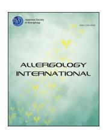
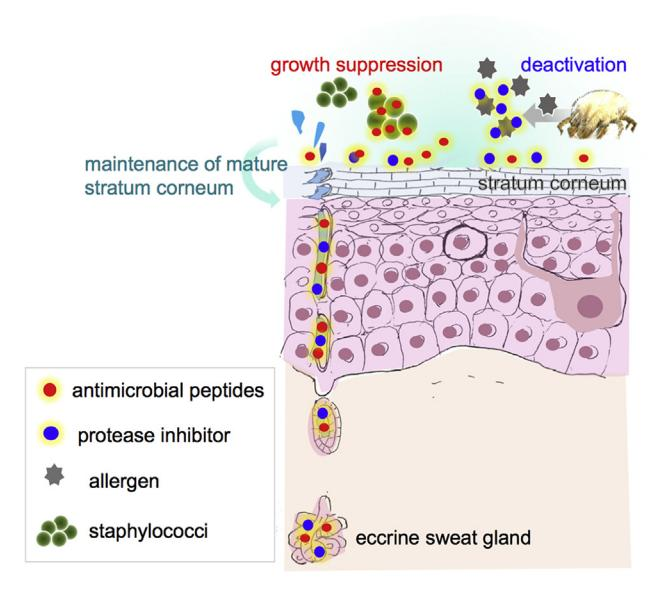
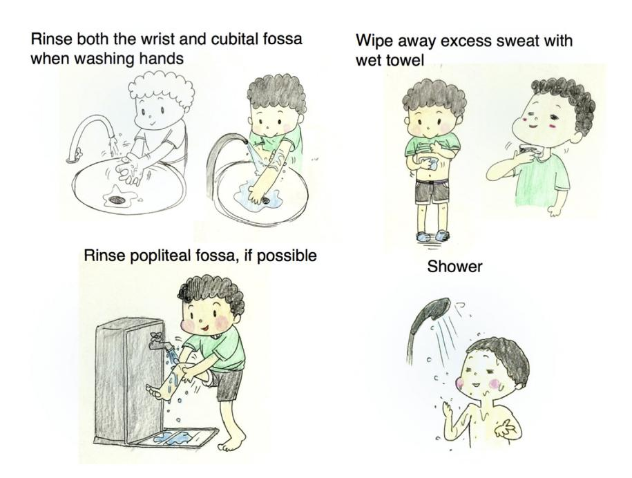
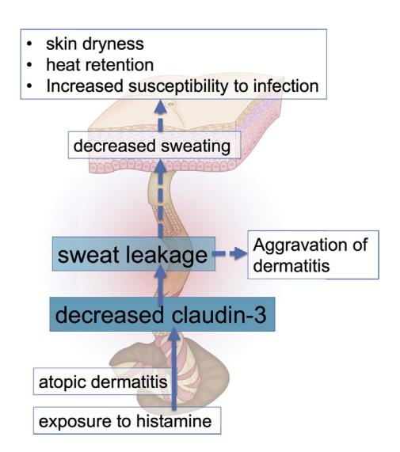
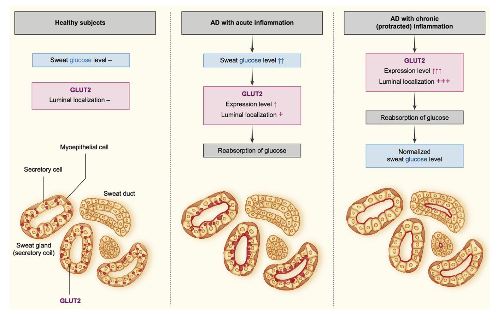

# Allergology International

journal homepage: [http://www.elsevier.com/locate/alit](http://http://www.elsevier.com/locate/alit)

# Invited Review Article

# Sweat in the pathogenesis of atopic dermatitis

Hiroyuki Murota a, \* , Kosuke Yamaga b , Emi Ono b , Ichiro Katayama b

- a Department of Dermatology, Graduate School of Biomedical Sciences, Nagasaki University, Nagasaki, Japan
- b Department of Dermatology, Course of Integrated Medicine, Graduate School of Medicine, Osaka University, Osaka, Japan

### article info

Article history: Received 20 June 2018 Available online 3 August 2018

Keywords: Atopic dermatitis Barrier Metabolome Sweat Tight junction

Abbreviations:

AD atopic dermatitis GSK3b glycogen synthesis kinase 3b

# abstract

Sweat is a transparent hypotonic body fluid made from eccrine sweat glands. Various ingredients contained in sweat are involved in a broad sense in skin homeostasis including temperature regulation, skin moisture, and immune functions. Thus, sweat plays a major role in maintaining skin homeostasis. Therefore, abnormal sweating easily compromises human health. For example, in atopic dermatitis (AD), perspiration stagnation accompanying sweat tube or sweat pore blockage, leakage of perspiration from the sweat gland to the outside tissue, and impaired secretion of sweat from the sweat gland are confirmed. In recent years, the hypothesis that atopic dermatitis is a sweat stasis syndrome has been clarified by the establishment of a sweat and sweat gland dynamic analysis technique. Secretion of sweat and leakage into tissues is caused by dermatitis and is thought to promote itching. Furthermore, from the metabolomic analysis of sweat of patients with atopic dermatitis, it was confirmed that the glucose concentration in AD sweat increased according to severity and skin phenotype, suggesting that elevated glucose affected the homeostasis of the skin. Multifaceted analyses of sweat from subjects with AD have revealed new aspects of the pathology, and appropriate measures to treat sweat can be expected to contribute to long-term control of AD.

Copyright © 2018, Japanese Society of Allergology. Production and hosting by Elsevier B.V. This is an open access article under the CC BY-NC-ND license [\(http://creativecommons.org/licenses/by-nc-nd/4.0/\)](http://creativecommons.org/licenses/by-nc-nd/4.0/).

## Introduction

It is well known that there are many aggravating factors of atopic dermatitis (AD) (e.g., food antigens, perspiration, drying, scratching, physiochemical stimulation, ticks, infections such as from dust, dust, pets, bacteria and fungi, and stress), and the major aggravation factors change with age or disease duration of patients with AD[.1](#page-4-0) Food, skin dryness, and scratching are the major aggravating factors in childhood AD, while psychological stresses and physicochemical stimulation are the major aggravating factors for adolescence to adult AD.[1](#page-4-0) Among the known factors, sweat is recognized as a major aggravating factor at all ages[.1](#page-4-0) In this review, we will outline and update the mutual relationships between sweat and AD.

### Functions of sweat

Sweat greatly contributes to maintenance of skin homeostasis such as temperature control, biological defense, and moisturizing

E-mail address: [h-murota@nagasaki-u.ac.jp](mailto:h-murota@nagasaki-u.ac.jp) (H. Murota).

Peer review under responsibility of Japanese Society of Allergology.

on the surface of the skin[2,3](#page-4-0) ([Fig. 1\)](#page-1-0). The heat of vaporization that occurs when sweat evaporates from the skin surface helps to control body temperature[.3](#page-4-0) An adult weighing 70 kg should sweat 100 cc, which should be evaporated completely from the skin to decrease body temperature by 1 C[.4](#page-4-0) If the amount of sweat is less than the required volume, body temperature regulation will be insufficient. Sweat also has an important role in skin moisturizing. Sweat is liquid, and sweat humidifies the stratum corneum, which contributes to maintaining the function of the stratum barrier, called the first line immune system[.1,3,5](#page-4-0) Sweat is rich in sodium lactate and urea, which are natural moisturizing components that contribute to moisture retention[.2](#page-4-0) Cases of autonomic imbalances such as multiple system atrophy, which actually involve perspiration, are often accompanied by remarkable skin drying and elevated skin temperature.[6](#page-4-0) In addition, there are reports that cases of ectoderm dysplasia and complications of perspiration show dermatitis, fulfilling Hanifin and Rajka 's diagnostic criteria for atopic dermatitis.[7](#page-4-0)

Sweat is involved in the innate host defense system. Cathelicidin (LL-37), b-defensins, and dermcidin are known as representative antimicrobial peptides contained in sweat.[3,8,9](#page-4-0) Furthermore, sweat can be expected to inactivate allergens. The cysteine protease inhibitory action of perspiration suppresses mite antigen (DerP 1) and kiwifruit antigen (actinidin) protease activity and alleviates the

\* Corresponding author. Department of Dermatology, Graduate School of Biomedical Sciences, Nagasaki University, 1-7-1 Sakamoto, Nagasaki, Nagasaki 852- 8501, Japan.

Fig. 1. Sweat maintains the barrier function of the skin. Schematic diagram illustrating the barrier function of sweat. When sweat is normally secreted, it is secreted with enzymes that strip old corneocytes, protease inhibitors that inhibit the enzymatic activity of mite antigens, peptides that inhibit bacterial growth, and other compounds that help protect the skin.

influences of these allergens.[10](#page-4-0) However, because the protease inhibitory action of sweat is impaired with the lapse of time, the effects of sweat are limited to early perspiration[.10](#page-4-0)

These studies highlight the ideal sweating conditions for healthy human skin. Humans should sweat the appropriate amount according to the situation. Thereafter, the amount of perspiration necessary for maintaining the homeostasis of the skin remains on the skin, and the remaining excessive sweat decreases the skin temperature by the heat of vaporization generated by evaporation. In other words, ideally, there is no excess sweat on the skin surface after sweating.

#### Negative effects of sweating

Leaving excessive sweat on the skin surface for a long time has a negative impact skin homeostasis. It has been confirmed that when the skin surface is exposed to constant humidity for a long time by wrapping the skin surface with non-porous materials, the sweat pores will be occluded by keratin plugs, and subsequently anhidrosis will develop on the wrapped area, for several weeks[.11](#page-4-0) Similarly, keratin plugging of sweat pores is the pathological feature of AD-lesion skin that develops hypohidrosis, or so-called "sweat retention syndrome". [11,12](#page-4-0) It is unknown whether the pathogenesis of sweat pore obstruction seen in miliaria and atopic dermatitis are the same. However, the exposure to an excessively moistened environment for a long period could be the cause of decreased sweating ability (hypohidrosis). Therefore, to avoid hypohidrosis, if the excess sweat remains on the skin surface, it should not remain for a long time and should be rinsed with a shower or wiped off with a wet towel, and wet clothing should be changed if possible (Fig. 2).[5](#page-4-0)

#### Sweating ability in AD subjects

Most adult patients with AD show a significant decrease in sweat volume and prolongation of sweat latency in quantitative sudomotor axon reflex tests.[13](#page-4-0)e[15](#page-4-0) Sweat is excreted slowly over time in adults with AD, resulting in a state of anhidrosis. Decreased sweating exacerbates the symptoms of dermatitis because this develops heat retention, skin dryness, and increased susceptibility to infection by some pathogens.[3](#page-4-0) The impaired sweating ability observed in patients with AD may be one of the etiologies that impairs skin homeostasis.[11,16](#page-4-0)

The mechanism of impaired sweating in patients with AD has been recently clarified, as a mechanism by which perspiration

Fig. 2. Practical instructions for how to cope with sweat in pediatric subjects with atopic dermatitis. "Rinse both the affected cubital fossa and wrist under running water when patients wash their hands. If possible, rinsing the popliteal fossa is also recommended. Wipe away excess sweat with a wet towel (without rubbing). Showering is also recommended to reduce the severity of atopic dermatitis." Reused from Murota et al.[5](#page-4-0) with permission.

decreases through the: (A) obstruction of sweat pores by keratin plugs[11,12;](#page-4-0) (B) sweat production and secretion abnormalities from sweat glands; and (C) sweat leakage into surrounding tissues (Fig. 3).[3](#page-4-0) The causes of (B) are autonomic imbalances, attenuated acetylcholine responsiveness in postganglionic neurons, and allergic inflammation[.3](#page-4-0) Some factors related to the pathogenesis of allergic inflammation may suppress sweating; therefore, we examined the literature for factors affecting sweating. The studies confirmed that histamine suppresses sweating induced by acetylcholine[.17,18](#page-4-0) In addition, histamine is a potent inhibitor of perspiration as was assessed by in vivo dynamic analyses of eccrine sweat glands using two-photon microscopy[.18](#page-4-0) These phenomenon are thought to be caused by histamine inhibition of phosphorylation of glycogen synthesis kinase 3b (GSK3b) via histamine type 1 receptors in sweat gland secretory cells, possibly affecting glycogen storage.[17,18](#page-4-0)

In the above-mentioned mechanism of (C), leakage of sweat into the dermis decreases sweat volume on the skin surface. This phenomenon has been suggested from the results of immunostaining of antimicrobial peptides contained in sweat, and dermcidin showed positive in not only sweat glands, but also in tissues surrounding the sweat glands in AD skin lesions.[16](#page-4-0)

## Mechanism of sweat leakage in AD

To clarify the pathogenesis of sweat leakage, we investigated reports of the water barrier of the human sweat gland. The expression patterns of claudins were different between the sweat duct and the sweat gland secretory regions, and claudin-1, -3, -4, -15 and, claudin-3, -4, -10 were expressed in the sweat duct, and in the sweat gland secretion coil, respectively.[19](#page-4-0) Among them, claudin-3 was preserved across species and was expressed between the luminal cells throughout the sweat gland[.19](#page-4-0) Furthermore, the expression of claudin-3 in sweat glands of patients with AD was significantly reduced compared to that of healthy skin. Therefore, in order to confirm the role of claudin-3 in water barrier functions of sweat glands, we determined the localization of structures used to prevent leakage by using a counter-flowing tracer dye to track the flow from sweat pores to sweat ducts. As a result, it was revealed that claudin-3 played a role of a water barrier in the sweat gland and its function depended on its expression level.[19](#page-4-0) The expression of claudin-3 in sweat gland organs is reduced by exposure to histamine. Reduction of claudin-3 has also been confirmed in sweat glands of AD skin lesions, causing sweat to leak into tissues. The sweat leakage into the tissues is thought to be related to painful itching during sweating and the maintenance of inflammation. Because allergic inflammation reduces claudin-3 levels, sweat leakage will improve by treating the dermatitis (Fig. 4).

#### Altered constitution of sweat in patients with AD

There are also reports that qualitatively abnormal sweat is related to the condition of atopic dermatitis. One study determined the amount of antimicrobial peptide contained in sweat. As described above, sweat contains LL-37, b-defensins, and dermcidin as typical antimicrobial peptides. LL-37 is a positively charged antimicrobial peptide belonging to the cathelicidin family. Because

Fig. 4. Decreased claudin-3 induced by allergic inflammation leads to sweat leakage. Histamine release in allergic inflammation decreases the expression level of claudin-3. The leakage of sweat via decreased claudin-3 expression may partly explain the tingling sensation upon sweating that is common among patients with AD.

Fig. 3. Illustration of the abnormalities of sweat glands in atopic dermatitis. "In atopic dermatitis lesional skin, obstruction of sweat gland by a keratotic plug or by mucopolysaccharides, leakage of sweat from the sweat glands into dermal tissues, or histamines have been found to contribute to decreased sweating activity." Reused from Murota et al.[5](#page-4-0) with permission.

Fig. 5. Schematic overview of the possible mechanisms for increased sweat glucose levels and altered GLUT2 expression in atopic dermatitis. Sweat glucose may be increased by acute inflammation, inducing luminal localization of GLUT2 to reabsorb glucose from sweat. Chronic inflammation could further increase GLUT2 expression and luminal localization, which would further lower the glucose concentration in sweat via reabsorption.

bacterial cell membranes are more negatively charged than mammalian host cells, LL-37 exerts antibacterial properties by more selectively adhering to and puncturing the bacterial cell membrane. It has been reported that dermcidin is negatively charged and adheres to the cell membrane via zinc binding, rather than by electrostatic interactions. In patients with AD, the concentrations of LL-37 and dermcidin in sweat have been characterized, and are considered to be related to the susceptibility to AD skin lesions.[20](#page-4-0)e[23](#page-4-0)

We have comprehensively analyzed the properties of sweat from patients with AD and performed metabolomic analyses using nuclear magnetic resonance imaging to profile metabolic products contained in sweat.[24](#page-4-0) As a result, it was revealed that the concentrations of protein, sodium, salt, LL-37, and b-defensin contained in sweat of patients with AD varied from normal sweat with statistical significance. In our metabolomic analyses, an increase in glucose in the sweat of patients with AD was confirmed, and it was shown that the concentration of sweat glucose was significantly higher in patients with AD, reflecting both disease severity and eczema phenotype[.24](#page-4-0) Cases with high sweat glucose were histologically characterized by the localization and expression level of GLUT2, which is involved in active glucose transport (Fig. 5).[24](#page-4-0) Glucose in sweat has been confirmed to affect the homeostatic maintenance of skin. Glucose at the same concentration as that found in the sweat of patients with AD delayed barrier recovery within 30 min (i.e., early) after barrier injury. Furthermore, sweat glucose may affect bacterial flora of the skin in patients with AD.

Autonomic imbalances are also involved in systemic symptoms. For example, the degree of anxiety of the patient has a significantly negative correlation with the perspiration amount in patients with AD[.14](#page-4-0)

#### Future perspectives

Patients with AD have abnormalities in autonomic nerve regulation. In addition to changes in perspiration, the paradoxical temperature response in which an increase in skin temperature precedes the body temperature at the time of exercise should be studied.[25](#page-4-0) Future studies will contribute to the maintenance of long-term remission of atopic dermatitis.

# Acknowledgements

The authors thank Prof. Yoshichika Yoshioka (Biofunctional Imaging Lab, Immunology Frontier Research Center, Osaka University), Prof. Atsushi Tamura, Prof. Sachiko Tsukita (Laboratory of Biological Science, Graduate School of Frontier Biosciences, Graduate School of Medicine, Osaka University), Prof. Junichi Kikuta, Prof. Masaru Ishii, (Department of Immunology and Cell Biology, Graduate School of Frontier Biosciences, Graduate School of Medicine, Osaka University), Prof. Hiroo Yokozeki (Department of Dermatology, Tokyo Medical and Dental University), and Dr. Yuko Nomura (Nomura Dermatology Clinic) for their guidance in our collaborative study. This study was supported by a research grant from the Japan Society for Promotion of Science (ID:17K07591 to H. Murota.), and the Maruho Takagi Dermatology Foundation (to H. Murota).

Conflict of interest

The authors have no conflict of interest to declare.

#### References

- Katayama I, Aihara M, Ohya Y, Saeki H, Shimojo N, Shoji S, et al., and Japanese Society of Allergolgy. Japanese guidelines for atopic dermatitis 2017. Allergol Int 2017;66:230–47.
- Sato K, Kang WH, Saga K, Sato KT. Biology of sweat glands and their disorders. I. Normal sweat gland function. J Am Acad Dermatol 1989;20:537–63.
- Murota H, Matsui S, Ono E, Kijima A, Kikuta J, Ishii M, et al. Sweat, the driving force behind normal skin: an emerging perspective on functional biology and regulatory mechanisms. J Dermatol Sci 2015;77:3–10.
- 4. Kuno Y. Human Perspiration. Illiniois: Springfield; 1956.
- Murota H, Katayama I. Lifestyle guidance for pediatric patients with atopic dermatitis based on age-specific physiological function of skin. *Pediatr Allergy Immunol Pulmonol* 2016;29:196–201.
- Chia KY, Tey HL. Approach to hypohidrosis. J Eur Acad Dermatol Venereol 2013;27:799–804.
- Koguchi-Yoshioka H, Wataya-Kaneda M, Yutani M, Murota H, Nakano H, Sawamura D, et al. Atopic diathesis in hypohidrotic/anhidrotic ectodermal dysplasia. Acta Derm Venereol 2015;95:476–9.
- 8. Murakami M, Ohtake T, Dorschner RA, Schittek B, Garbe C, Gallo RL. Cathelicidin anti-microbial peptide expression in sweat, an innate defense system for the skin. *J Invest Dermatol* 2002;**119**:1090–5.
- Schittek B, Hipfel R, Sauer B, Bauer J, Kalbacher H, Stevanovic S, et al. Dermcidin: a novel human antibiotic peptide secreted by sweat glands. *Nat Immunol* 2001;2:1133-7.
- Yokozeki H, Hibino T, Takemura T, Sato K. Cysteine proteinase inhibitor in eccrine sweat is derived from sweat gland. Am J Physiol 1991;260:R314–20.
- 11. Sulzberger MB, Herrmann F, Zak FG. Studies of sweating; preliminary report with particular emphasis of a sweat retention syndrome. *J Invest Dermatol* 1947;9:221–42.

- 12. Papa CM, Kligman AM. Mechanisms of eccrine anidrosis. I. High level blockade. [ Invest Dermatol 1966;47:1–9.
- **13.** Eishi K, Lee JB, Bae SJ, Takenaka M, Katayama I. Impaired sweating function in adult atopic dermatitis: results of the quantitative sudomotor axon reflex test. *Br | Dermatol* 2002;**147**:683–8.
- 14. Kijima A, Murota H, Matsui S, Takahashi A, Kimura A, Kitaba S, et al. Abnormal axon reflex-mediated sweating correlates with high state of anxiety in atopic dermatitis. *Allergol Int* 2012;**61**:469–73.
- Takahashi A, Murota H, Matsui S, Kijima A, Kitaba S, Lee JB, et al. Decreased sudomotor function is involved in the formation of atopic eczema in the cubital fossa. *Allergol Int* 2013;62:473–8.
- Shiohara T, Doi T, Hayakawa J. Defective sweating responses in atopic dermatitis. Curr Probl Dermatol 2011;41:68–79.
- Matsui S, Murota H, Ono E, Kikuta J, Ishii M, Katayama I. Olopatadine hydrochloride restores histamine-induced impaired sweating. J Dermatol Sci 2014;74:260-1.
- Matsui S, Murota H, Takahashi A, Yang L, Lee JB, Omiya K, et al. Dynamic analysis of histamine-mediated attenuation of acetylcholine-induced sweating via GSK3beta activation. J Invest Dermatol 2014;134:326–34.
- Yamaga K, Murota H, Tamura A, Miyata H, Ohmi M, Kikuta J, et al. Claudin-3 loss causes leakage of sweat from the sweat gland to contribute to the pathogenesis of atopic dermatitis. J Invest Dermatol 2018;138:1279–87.
- Rieg S, Garbe C, Sauer B, Kalbacher H, Schittek B. Dermcidin is constitutively produced by eccrine sweat glands and is not induced in epidermal cells under inflammatory skin conditions. Br J Dermatol 2004;151:534–9.
- Rieg S, Steffen H, Seeber S, Humeny A, Kalbacher H, Dietz K, et al. Deficiency of dermcidin-derived antimicrobial peptides in sweat of patients with atopic dermatitis correlates with an impaired innate defense of human skin in vivo. | Immunol 2005;174:8003-10.
- Kimata H. Increase in dermcidin-derived peptides in sweat of patients with atopic eczema caused by a humorous video. J Psychosom Res 2007;62:57–9.
- 23. Schittek B, Paulmann M, Senyurek I, Steffen H. The role of antimicrobial peptides in human skin and in skin infectious diseases. *Infect Disord Drug Targets* 2008;8:135–43.
- Ono E, Murota H, Mori Y, Yoshioka Y, Nomura Y, Munetsugu T, et al. Sweat glucose and GLUT2 expression in atopic dermatitis: implication for clinical manifestation and treatment. PLoS One 2018;13:e0195960.
- Bothorel B, Heller A, Grosshans E, Candas V. Thermal and sweating responses in normal and atopic subjects under internal and moderate external heat stress. *Arch Dermatol Res* 1992:284:135–40.