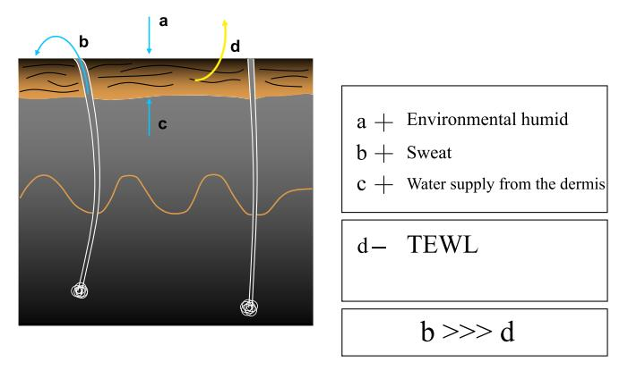
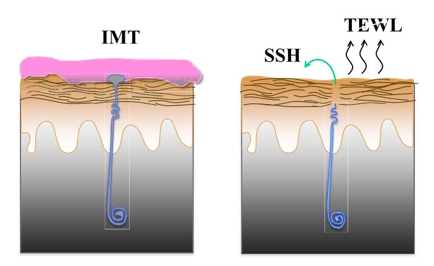
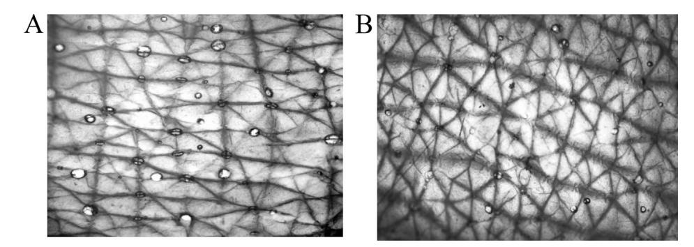
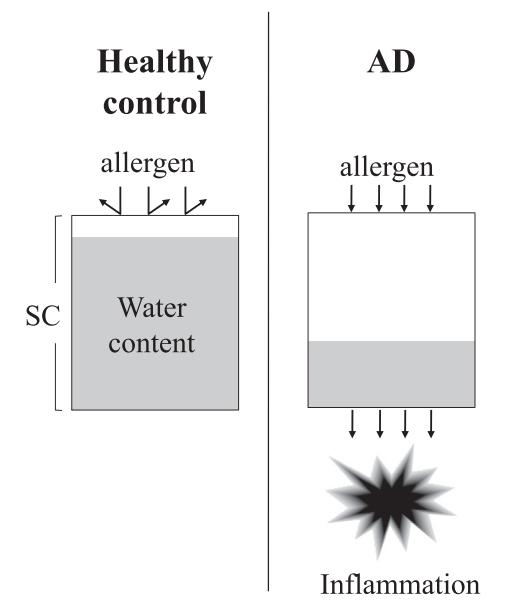

# Allergology International

journal homepage: [http://www.elsevier.com/locate/alit](http://http://www.elsevier.com/locate/alit)

## Invited Review Article

# Sweat is a most efficient natural moisturizer providing protective immunity at points of allergen entry

Tetsuo Shiohara a, \* , Yoshiko Mizukawa a , Yurie Shimoda-Komatsu a , Yumi Aoyama b, c

- a Department of Dermatology, Kyorin University School of Medicine, Tokyo, Japan
- b Department of Dermatology, Kawasaki Medical School, Kurashiki, Japan
- c Dermatology, Kawasaki Hospital, Okayama, Japan

#### article info

Article history: Received 29 June 2018 Received in revised form 8 July 2018 Accepted 26 July 2018 Available online 1 September 2018

Keywords: Atopic dermatitis Basal sweating Impression mold technique Inducible sweating Leakage of sweat

### Abbreviations:

AD, atopic dermatitis; FLG, filaggrin; HZ, herpes zoster; IMT, impression mold technique; DCD, demcidin; SC, stratum corneum; SSH, skin surface hydration; TEWL, transepidermal water loss; TJ, tight junction; VZV, varicella-zoster virus

#### abstract

Although there is a growing acceptance that sweat could play a detrimental role in various allergic skin diseases, the possibility that sweat is also involved in maintenance of skin hydration and skin-specific immune responses has not been acknowledged. We initially describe physiological role of sweat in both maintaining skin hydration and thermoregulation. The purpose of this article is to provide the reader with objective evidence that sweating is intimately linked to vital stratum corneum barrier function and usefulness of application of moisturizers in clinical care of allergic skin diseases. This review also covers how sweating disturbance would leave the skin vulnerable to the development of various allergic skin diseases, such as atopic dermatitis. New therapeutic approaches would specifically target such sweating disturbance in these allergic skin diseases.

Copyright © 2018, Japanese Society of Allergology. Production and hosting by Elsevier B.V. This is an open access article under the CC BY-NC-ND license [\(http://creativecommons.org/licenses/by-nc-nd/4.0/](http://creativecommons.org/licenses/by-nc-nd/4.0/)).

#### Introduction

Sweat is well known to be one of important factors provoking exacerbations of clinical symptoms in many allergic skin diseases including atopic dermatitis (AD)[.1](#page-5-0) Because many patients with AD often complain of aggravation of pruritus and eczematous skin lesions after severe sweating, the prevailing dogma, shaped by such observations, depicts the detrimental role of sweat in the pathogenesis of allergic skin disease, while ignoring the protective role of sweat. However, recent studies have[2](#page-5-0)e[5](#page-5-0) revised this dogma and found that sweating can confer protective immunity under certain conditions. Indeed, the role of sweat in allergic inflammation is more complex than previous studies implied. In recent years, there

E-mail address: [tpshio@ks.kyorin-u.ac.jp](mailto:tpshio@ks.kyorin-u.ac.jp) (T. Shiohara). Peer review under responsibility of Japanese Society of Allergology. is increasing evidence suggesting the protective role of sweat on allergic inflammation.

Dry skin is generally thought to be caused by defects in skin genes that are important for maintaining skin barrier function[.6,7](#page-5-0) Compelling basic science investigations places genetic defects in barrier function as a key factor in barrier dysfunction. In contrast, the role of sweating in maintaining water in the stratum corneum (SC) has received no or little attention despite the overwhelming great capacity of sweat to increase skin surface hydration (SSH) ([Fig. 1\)](#page-1-0).[2,5](#page-5-0) The importance of preserving sweating function, especially in those affected by AD, remains an under-recognized topic even by dermatologists. Although dry skin can be aggravated by environmental factors, such as ambient humidity and modern life style, and by the decreased ability to sweat, as well as genetic defects in skin barrier function, no recommendation is available about the effect of sweat on the maintenance of water in the SC, the role of sweat in barrier function, and the effect of moisturizers and other topical agents on sweating function. The purpose of this article is to provide the reader with objective evidence that sweating is

\* Corresponding author. Department of Dermatology, Kyorin University School of Medicine, 6-20-2 Shinkawa, Mitaka, Tokyo 181-8611, Japan.

Fig. 1. Balance between water retention and water release in the SC. Humid environment, sweat and water supply from the dermis serve to hold and increase water content in the SC, while TEWL serves to lose water from the dermis. Decreased water content in the SC in dry skin would be theoretically compensated fully by increased sweating, given that sweat has much higher water content than TEWL.

intimately linked to vital SC barrier function and usefulness of application of moisturizers in clinical care. It is important to recognize that moisturizers are not all the same and that prescribing should be guided by the ability to preserve or restore SSH and sweating function.

#### Physiological roles of sweat glands/ducts

Most mammals have sweat glands but only limited mammals such as humans, horses and some breeds of cattle use sweating for thermoregulation in response to heat or exercise.[8](#page-5-0) In humans, eccrine sweat glands are distributed widely on both hairy and glabrous skin, such as the palms and soles, with some exceptions.[9](#page-5-0) In contrast, other mammals such as monkeys, dogs and mice, have eccrine glands only on glabrous skin, such as the paw. In other mammals, sweating is thought to be caused by emotional stress, either positive or negative stimuli: stress-induced sweating, unlike thermal-induced sweating, results from activation of both eccrine and apocrine glands in the axilla.[9](#page-5-0) Sweat pores open at the dermal ridge on the palms and soles, while those on the hairy skin, such as forearms, usually open at the fold[s10](#page-5-0) (Fig. 2). According to our recent results, in hairy skin sweat pores usually open at the folds under baseline conditions but upon thermal stimuli also open at

Fig. 2. Methods to quantitatively assess sweating responses. Output of sweat per a sweat gland/duct can be quantitatively assessed by IMT (Left), but not by previously used methods (right), in which exact output of sweat from a sweat gland/duct cannot be assessed. In previously used methods, sweating responses are estimated by the differences in TEWL and SSH levels before and after thermal stimulus.

the ridge[.11](#page-5-0) Based on these results, medical literature suggests that localization of sweat pores relative to skin creases and ridges is different depending on the anatomical sites[.10,11](#page-5-0) These suggestions have been frequently misinterpreted as a total absence of eccrine glands/ducts in the folds on the palms and soles. There are substantial differences in function between sweat pores in hairy skin and glabrous skin: those located in the glabrous skin of the palms and soles secrete sweat in response to emotional or psychological stress, physical exercise, and high environmental temperatures. In contrast, those located in the hairy skin do not necessarily respond well to such stimuli. During evolution, the emergence of eccrine glands in glabrous skin has been suggested to precede that in the hairy skin. This classification, however, is too simplified because even in the hairy skin, sweat pores open not only at the skin folds but also at the ridges, and vice versa in glabrous skin.

To investigate whether the function of sweat would be different depending on the localization of sweat pores in relation to skin surface structures, we established a novel impression mold technique (IMT), which allows an accurate quantification of individual sweat gland/duct activity to secret sweat in a well-defined location and the volume of sweat they produce, repeatedly over time[2,5,11](#page-5-0) ([Fig. 3\)](#page-2-0). With the use of IMT, we demonstrated that, under quiescent conditions, basal levels of sweat could be exclusively excreted from the sweat pores localized at the folds (basal or insensible sweating),[2,11](#page-5-0) while increased levels of sweat would be also secreted from the pores at the ridge upon thermal stimulus (inducible or sensible sweating).[5,11](#page-5-0) We also suggested that physiological roles of sweat glands/ducts would be different depending on the skin surface topography: the major function of sweat glands/ ducts located at the folds is to maintain SSH while that of sweat glands/ducts at the ridges might serve as a backup to impaired function of sweat glands/ducts at the folds or as a thermoregulatory[5,11](#page-5-0) (Fig. 2). In view of the possible function of sweat glands/ ducts on the hairy skin, we can hypothesize that sweat glands/ducts at the ridges may secrete sweat when exposed to different humidity levels, such as exposure to water. Indeed, our unpublished findings indicate that in the fingertip sweat pore openings became detected at the folds, where no sweat pore opening were detected at baseline, but not at the ridges 10 min after water immersion (Aoyama Y et al., unpublished data). Ten min after drying, however, sweat pore opening detected at the folds disappeared coincident with the reappearance of sweat pore openings at the ridges, as before water immersion. In contrast, such alterations of sweating responses after exposure to water depending on sweat glands/duct at the ridges/folds were never observed in hairy skin. These results could be interpreted as suggesting that sweat glands/ducts at the folds in glabrous skin would secrete sweat upon exposure to water, thereby maintaining water at the folds.

#### The relationship between SSH levels and basal sweating

According to our results of sweating responses evaluated by IMT(5, 11), sweat droplets corresponding to sweat pore openings were distributed evenly and usually occupied each dermal fold in hairy skin and were rarely detected in the ridges under quiescent conditions without thermal stimulus. In the IMT measurement, regional differences were minimal when examined in the forearm and abdomen. These results suggest that even under quiescent basal conditions basal levels of sweat could be excreted at the skin surface which may be reflected in the SSH levels ([Fig. 3\)](#page-2-0). We therefore asked whether there could be a true association between the SSH status and sweat volume as evidenced by numbers and sizes of sweat droplets detected at either the folds or ridges under quiescent basal conditions. A strong, positive correlation was found between the SSH status and sweat droplet numbers

**Fig. 3.** Inducible sweating responses evaluated by IMT in AD and healthy controls. Decreased inducible sweating responses 30 min after thermal stimulus are observed in the uninvolved skin in the acute stage of AD **(B)**, as compared with those in healthy controls **(A)**. Modified from the reference Shimoda-Komatsu *et al.* 5.

detected at the folds, indicating that the SSH status under quiescent basal conditions may reflect basal levels of sweating (insensible sweating) from the glands/ducts located at the folds. At 15-30 min after thermal stimulus by immersing both lower legs for 30 min in a water bath maintained at 43 °C, sweat droplets were also detected at the ridges, which could reflect inducible sweating. Indeed, the SSH status after thermal stimulus reflected volume of sweat droplets detected at the ridges. These results indicated that sweat ducts/glands located at the folds would serve to maintain skin hydration under basal conditions while those at the ridges would serve as a thermoregulation, suggesting that dry skin observed in AD patients might be largely dependent on the impaired insensible sweating responses in the ducts/glands located at the folds. Because the volume of water in sweat is much higher than that in transepidermal water loss (TEWL) (Fig. 1), the increase in water loss resulting from the loss-of-function mutations in the gene encoding filaggrin (FLG)6,7 could be theoretically compensated fully by a significant increase in sweating, especially basal sweating. Thus, sweating could improve the disrupted balance between water retention and water release in various disease

**Fig. 4.** The difference in the penetration of hapten through the SC in healthy control and AD. Epicutaneously applied hapten can penetrate more rapidly and abundantly through the SC with low water content (AD skin) than that with higher content (healthy control skin). Increased sweating responses would serve to limit penetration of allergen by increasing water content in the SC.

settings, such as AD. An increase in sweating could sufficiently restore hydration of SC characterized by diminished water-holding capacity, frequently observed in AD. Although environmental factors such as temperature and humidity have been shown to play important roles with regard to itching and AD prevalence.5,11,12 In view of observations that sweating responses could be profoundly enhanced by increases in temperature and humidity, it is likely that the effect supposed to be exerted by these factors on skin barrier function could be mediated through the enhancement of sweating responses rather than their direct action.5 Given that epicutaneously applied hapten can penetrate more rapidly and abundantly through the SC with low water content than that with higher content, 12 increased sweating responses would serve to exert a protective role by increasing skin hydration at points of allergen entry (Fig. 4).

#### Sweating disturbance in AD

There have been conflicting data regarding whether sweating responses are impaired, normal, or enhanced in patients with AD. Given that hyperhidrosis in one area may lead to compensatory hyperhidrosis in another,5,10,11 contradictory results in previous reports13–20 might have been explained by regional differences or differences according to the disease phenotype and stage,5 which cannot be detected by conventional methods to assess sweating responses. To investigate how disease process and sweating defects progress from early asymptomatic stages to the onset of clinically apparent disease, AD patients were divided into two groups, based on the different clinical phenotypes and stages, acute and chronic.5 Patients with active dermatitis characterized by scaling erythematous papules, plaques, lichenoid papules and crusting on the limited area were evaluated as acute AD: most of them had exudate lesions in the flexural areas, usually <5 years after onset. In contrast, patients characterized by systemic dry skin and relative sparing of eczematous lesions in the flexural area were evaluated as chronic AD. There was no significant difference in the severity of the disease assessed by SCORing Atopic Dermatitis (SCORAD) index between the two groups at the time of enrollment. The mean age of acute AD was significantly younger in acute AD (n = 12, 23  $\pm$  1.2 years) than in chronic AD ( $n = 15, 35.3 \pm 2.3$  years).

Sweating responses were induced by two means: the first means was immersion of both legs for 30 min in a water bath maintained at 43 °C. The other means was the injection with 50  $\mu$ l of a 10% solution of acetylchorine (Ach). Sweating responses thus induced were evaluated by the IMT,  $^{5,11}$  as described previously,  $^{5,11,21,22}$  In the normal-appearing uninvolved skin of acute AD, the number of sweat droplets observed at the fold was dramatically decreased not only at basal conditions before thermal

stimulus (basal sweating) but also 15e30 min after thermal stimulus (inducible sweating).[5](#page-5-0) Because the number of sweat droplets observed at the folds was profoundly decreased even at the earliest asymptomatic stage ([Fig. 4](#page-2-0)), where skin surface topography was not disrupted yet by disease process ([Fig. 1\)](#page-1-0), indicating that the decrease in sweat droplet numbers at the folds may represent the actual early event that can trigger the onset of clinically apparent disease, but not the result of disruption of skin surface structures. Decreased sweating in these AD patients was neither due to their inability to produce sweat nor to the blockade of delivery of sweat to the skin surface.[5](#page-5-0) We therefore investigated whether sweat could leak from the sweat glands/ducts upon thermal stimulus, thereby decreasing the output of sweat from the sweat ducts. To this end, we immunohistochemically examined whether sweat gland-specific dermcidin (DCD) antigen could be detected around the duct/glands in the dermis upon thermal stimulus. Leakage of sweat as evidenced by DCD expression in the dermis around the sweat ducts/glands was specifically detected in the normal appearing skin at the earliest asymptomatic stage in acute AD.[5](#page-5-0) Because sweat has been shown to contain various inflammatory cytokines, such as IL-1 and IL-6, that can activate immune cells and cause itching sensations,[20,23](#page-5-0)e[26](#page-5-0) it is likely that leakage of sweat into the dermis could initiate a complex series of events that promote eczematous inflammation. Thus, AD would initially arise from a localized defect in sweating responses from some sweat glands/ducts at the folds: this defect could start with sweat gland/ducts probably due to the genetic fragility of tight junction (TJ),[27](#page-5-0) which can prevent the free diffusion of macromolecules. Leakage of sweat not only provides an inflammatory milieu but also results in the profound decrease in skin hydration. Because this initial event begins days or weeks before the development of clinically apparent AD lesions in an unrecognized fashion, this event would be overlooked and not investigated in previous studies. As a next step, compensatory hyperhidrosis would occur preferentially in the sweat glands/ducts at the ridges because those at the ridges remain fully functional or more productive, which may exacerbate the initial lesions by further accelerating the leakage of sweat into the dermis. Compensatory hyperhidrosis is reflected in larger sizes of the droplets detected preferentially in the ridges either in the involved or uninvolved skin of acute AD.[5](#page-5-0) This event could explain why sensitization to autologous sweat occurs in severe AD[28,29:](#page-5-0) although a previous study suggested that the component of sweat could penetrate deep into the skin and come into contact with skin resident cells such as mast cells in AD lesions through the disruption of epidermal barrier by intense scratching [28,](#page-5-0) our results suggest alternative possibility that mast cells would be sensitized to sweat repeatedly leaked from fragile or damaged sweat glands/ducts upon thermal stimuli: a decrease in the number of sweat droplets and an increase in the diameter are characteristic IMT findings also in inducible sweating. In acute AD lesions, not only basal but also inducible sweating is also impaired. In this stage, AD patients often complain of itching sensation when sweating and manifest exacerbations of clinical symptoms in the flexural areas. Sweating responses to Ach were also significantly decreased in acute AD as compared with those in healthy controls.[5](#page-5-0)

In contrast, sweat droplets observed in chronic AD were much less numerous in number and smaller in size than those in acute A and control[s5,11](#page-5-0) [\(Fig. 4](#page-2-0)). The severity of disease as assessed by SCORAD was positively related to the number of sweat droplets at the ridges in acute AD. These results could be interpreted as indicating that in acute AD compensatory hyperhidrosis could determine the severity of disease and be preferentially observed in the sweat glands/ducts at the ridges while systemic hypohidrosis could be determinative of the severity of disease in chronic AD and sweating responses at the folds contribute to the progression to the full development of chronic AD. Based on our observations on sweating defects observed in the different stages of AD, we propose a threestage model for the disease progression of AD that involve three temporally overlapping stages. At the initial stage, sweating defect could start with leakage of sweat from the sweat glands/ducts due to the generic fragility of TJ. As a next step, compensatory hyperhidrosis would occur preferentially in the inflammatory responses. At the final stage, AD patients eventually would manifest the phenotype with systemic hyperhidrosis not associated with compensatory hyperhidrosis. This model provides an explanation for why conflicting results with respect to sweating responses have been reported in AD patients [\(Fig. 2](#page-1-0)). Sweating responses to Ach were also significantly decreased in sweat glands/ducts at the folds in acute AD, as shown in those to thermal stimulus. Although this finding may be interpreted as suggesting that autonomic dysfunction may play a role in sweating defects, our results indicate that the sweating defects observed in AD would be due to dysfunction of TJ. Sweating defects would be a principal reason for the inability of the host to maintain SSH, lose heat and eliminate the persisting pathogen.

#### Daily practice for restoring sweating disturbance according to our three-step model

Given that leakage of sweat into the dermis could cause not only chronic inflammation associated with itching sensation but also dry skin, therapies for AD should be directed at preventing leakage of sweat at early times while ameliorating inflammatory responses. None of guidelines, however, have not provided consistent recommendations regarding how to maintain the normal functioning o sweating. None of previous studies, however, has addressed a key issue, i.e. how the normal functioning of sweating could be maintained. Although several methods have been proposed to enhance sweating responses,[30](#page-5-0)e[34](#page-5-0) their efficiency has never been compared by a quantitative way. To resolve this issue, we investigated which means could induce most efficiently sweating responses in healthy individuals: in this study, sweating responses were induced by three different means, i.e. immersion of leg in warm water, exposure to warm temperature (28 C) or humid air (80% relative humidity, RH). The results demonstrated that immersion of legs in warm water induced most efficiently sweating responses from sweat ducts/glands located at the ridges thereby reducing skin temperature (Shiohara,T. et al., unpublished data). Although a rapid increase in sweating responses was also observed at the ridges, the increase was transient and some participants were not able to further sweat due to their failure to evaporate the sweat under high humidity conditions: this would be due to their inability to dissipate heat under this condition. Thus, an extremely high humid environment would actually be detrimental to induce efficient sweating responses because of a reduction in skin-to-air humid gradient that governs evaporative potential. Given lack of negative effects on thermoregulation such as heat illness, we can conclude that immersion of legs in warm water is particularly suited for use even in patients with AD who showed defective sweating responses. Indeed, immersion of legs in warm water has long been used for reducing the responsiveness to antigen[34](#page-5-0) without recognizing that this effect could be mediated by increased sweating responses. We hypothesize that sweat ducts/glands located at the ridges could have evolved not only as a thermoregulatory but also as a backup to compensate for impaired functions of those located at the folds: it remains largely unknown, however, how these two types of sweat ducts/glands mutually regulate the function of the other. Thus, we recommend that daily immersion of legs in warm water be repeated to restore sweating disturbance in patients characterized by dry skin and those with heat illness.

#### Postlaser hypohidrosis-related dermatoses

Laser treatment has recently become a reasonable treatment option for selective removal. Although laser hair removal has generally been thought to be a safe and efficient treatment, several adverse effects have recent be reported: most of them are related to laser-induced injury to the treated areas. Both hair follicles and eccrine glands are ectodermal appendages that arise through a series of reciprocal interactions between the embryonic ectoderm and underlying dermis: given the location of eccrine glands near the hair follicles, laser-induced thermal and mechanical damage to hair follicles may have also a strong negative impact on the function of sweat glands. Few reports, however, described changes in sweating functions. In view of the recent view that the list of dermatoses related to sweating dysfunction has been rapidly expanded[,5,11,21,22](#page-5-0) changes in sweating responses occurring after laser treatment could be linked to subsequent development of previously unrecognized hypohidrosis-related diseases: our recent studies have demonstrated that a variety of inflammatory skin diseases ranging from AD to lichen amyloidosis (LA) could be caused by the consequence of extravasated sweat into the dermis/epidermis[.21](#page-5-0)

Indeed, we recently have experienced interesting cases who developed inflammatory skin diseases several months after laser treatment. In these patients, localized hypohidrosis corresponding to the lesions was detected and a significant resolution of the lesions occurred coincident with the restoration of sweating responses: in one patient, sweating dysfunction was limited to the areas previously treated with laser treatment and this localized hypohidrosis was confirmed by our IMT method (Shiohara, T. et al., unpublished data). These postlaser hypohidrosis-related dermatoses include purpura pigmentosa chronica, asteatotic ezema and lichen planus (LP). These lesions were clinically characterized by skin dryness in perilesional skin surrounding the lesions and histologically by syringotropic infiltrates surrounding the sweat ducts/ glands. Clinical manifestations of these diseases were indistinguishable from typical manifestations of these lesions: the hallmark of these postlaser hypohidrosis-related dermatoses is the presence of syringstropic lymphocytic infiltrates and resolution of the lesions after withdrawal of topical corticosteroids followed by topical moisturizers, both of which could results in the restoration of sweating disturbance. Postlaser hypohidrosis-related dermatoses are apparently a heterogenerous group occurring with an insidious onset after laser treatment. The localized hypohidrosis may have been overlooked by many physicians due to unawareness of this form of hypohidrosis, which paradoxically may be associated with compensatory hyperhidrosis in other areas, such as axillae.

#### Postherpetic hypohidrosis-related diseases

Despite numerous reports describing various complications of herpes zoster (HZ), sweating disturbance is thought to be a rare complication. Recent reports of herpetic syringitis have suggested the possibility of sweat gland involvement of varicella-zoster virus (VZV), [22,34](#page-5-0)e[36](#page-5-0) although quantification of sweating responses in these patients has never been reported. In this regard, we have recently reported that hypohidrosis localized to the involved dermatome site as revealed by decreased sweating responses to thermal stimulus or acetylcholine injection is a relatively common sequela of HZ[.22](#page-5-0) Our results suggest that the localized hypohydrosis could be mediated by a reduction in the number of excitable sweat glands rather than the result of a lower sweat output per gland. Alternatively, decreased sweating responses in the resolved HZ dermatome could result from leakage of sweat into the dermis due to sweat gland/duct fragility induced by VZV reactivation but not from nerve damage. In support of this possibility, leakage of sweat into the dermis was identified by the presence of DCD around the sweat glands/ducts[,22](#page-5-0) as demonstrated in AD lesions[.5](#page-5-0) These findings suggest that sweating disturbance after VZV infection would contribute to the onset of many inflammatory dermatoses occurring within the healed HZ lesions. We coin the term "postherpetic hypohidrosis-related isotopic response" to recognize the association between the clinical features common to a distinctive group of patients and postherpetic hypohidrosis. Interestingly, these lesions could resolve by restoring hypohidrosis with moisturizers, but not by topical corticosteroids.

### Efficient management of hypohidrosis-related dermatoses by moisturizers

Although standard recommendations for skin care for patients characterized by dry skin, such as AD patients, stress the importance of maintaining skin hydration and the application of moisturizers, there has been no objective data to guide recommendations regarding optimal emollient or moisturizer application strategies. These emollients or moisturizers appear to be empirically used to expect steroid-sparing effects and increasing skin hydration status without objective measurement of interventions to the skin: previous research has not quantitatively analyzed the effect of topical agents including moisturizers on skin hydration and sweating responses in healthy individuals or AD subjects. As described above, sweating responses from sweat glands/ducts located at the folds in hairy skin, such as extremities and trunk, could function as a natural moisturizer that can maintain skin hydration under baseline conditions. We therefore compared the effects of a moisturizer, named heparinoid, on "insensible" sweating responses with those of petrolatum and topical corticosteroids under baseline conditions. SSH and insensible sweating responses were quantitatively assessed by conductance measurements on skin surface and IMT measurements on the forearm of 10 healthy volunteers. Those topical agents at different doses, such as 1 and 3 finger-tip-unit (FTU) of a moisturizer, petrolatum and corticosteroids were applied twice daily on different sites of the forearms for 14 days. One and 3 FTU of the moisturizer significantly improved skin surface topography and increased SSH levels better than corticosteroids or petrolatum. Importantly, IMT analyses showed that 3 FTU of the moisturizer most efficiently increased insensible basal sweating responses than other topical agents and 1 FTU of the moisturizer. In particular, 3 FTU of the moisturizer markedly increased basal sweating responses from skin folds, which have been shown to be dramatically decreased in AD[29](#page-5-0) (Shiohara,T. et al., unpublished data). The increase was reflected in the increase in the SSH levels. Inducible sweating responses to thermal stimulus were also evaluated by IMT after 14-day application of these topical agents. Application of 3 FTU of the moisturizer significantly increased inducible sweating responses than 1 FTU of the moisturizer and of petrolatum. In contrast, 1 FTU of corticosteroids suppressed inducible sweating responses in a few individuals. Based on these findings, we recommend that sweating disturbance in AD be primarily treated with a high dose (probably >3 FTU) of the moisturizer, heparinoid, but not with petrolatum and corticosteroids. Repeated application of high doses of the moisturizer would serve to either increase skin hydration or to restore skin surface topography by increasing basal insensible sweating responses. High doses of the moisturizer alone for 6 months provided the greatest average sweat output benefit for patients with severe AD characterized by systemic dry skin ([Fig. 2\)](#page-1-0). After repeated application of the moisturizer, leakage of sweat into the dermis was no longer detected[.28](#page-5-0) Repeated application of the moisturizer could have cutaneous effects beyond increasing basal sweating, such as decreasing cutaneous microbiota that may contribute to inflammation.

#### Conclusion

Clinicians involved in the care of inflammatory skin diseases characterized by various degrees of skin dryness need to be aware of the great potential of sweat to increase and maintain skin hydration, because skin hydration under basal conditions is largely dependent on the insensible sweating from the sweat glands/ducts at the skin folds. Our results clearly indicate that treatment of various inflammatory diseases characterized by dry skin should be primarily directed at preventing the leakage of sweat into the dermis and epidermis. From the sweat's viewpoint, a high humidity environment may have evolved the capacity to sweat in children, thereby preventing genetically susceptible children from developing AD. In support of this view, children with AD living in a subtropical climate have been shown to have a lower prevalence of FLG mutations compared with those living in colder and drier parts of Japan.37 Our results should prompt the clinician to focus on preserving or restoring sweating responses by selecting topical agents. Thus, selecting topical agents that preserve sweating responses is of prime importance in treating dermatoses characterized by dry skin.

#### Acknowledgement

This work was supported in part by grants from the Ministry of Education, Culture, Sports, Science and Technology, Japan (to T.S.) and the Health and Labour Sciences Research Grants (Research on Intractable Diseases) from the Ministry of Health, Labour and Welfare of Japan (to T.S.).

Conflict of interest

The authors have no conflict of interest to declare.

#### References

- Morren MA, Przybilla B, Bamelis M, Heykants B, Reynaers A, Degreef H. Atopic dermatitis: triggering factors. J Am Acad Dermatol 1994;31:467–73.
- Shiohara T, Doi T, Hayakawa J. Defective sweating responses in atopic dermatitis. Curr Probl Dermatol 2011;41:68–79.
- Watanabe A, Sugawara T, Kikuchi K, Yamasaki K, Sakai S, Aiba S. Sweat constitutes several natural moisturizing factors, lactate, urea, sodium, and potassium. J Dermatol Sci 2013;72:177–82.
- Rieg S, Steffen H, Seeber S, Humeny A, Kalbacher H, Dietz K, et al. Deficiency of dermcidin-derived antimicrobial peptides in sweat of patients with atopic dermatitis correlates with an impaired innate defense of human skin in vivo. *I Immunol* 2005;174:8003—10.
- Shimoda-Komatsu Y, Sato Y, Yamazaki Y, Takahashi R, Shiohara T. A novel method to assess the potential role of sweating abnormalities in the pathogenesis of atopic dermatitis. Exp Dermatol 2018;27:386–92.
- Palmer CN, Irvine AD, Terron-Kwiatkowski A, Zhao Y, Liao H, Lee SP, et al. Common loss-of-function variants of the epidermal barrier protein filaggrin are a major predisposing factor for atopic dermatitis. *Nat Genet* 2006;38:441–6.
- Sandilands A, Terron-Kwiatkowski A, Hull PR, O'Regan GM, Clayton TH, Watson RM, et al. Comprehensive analysis of the gene encoding filaggrin uncovers prevalent and rare mutations in ichthyosis vulgaris and atopic eczema. Nat Genet 2007:39:650–4.
- Quinton PM, Elder HY, Jenkinson DM, Bovell DL. Structure and function of human sweat glands. In: Laden K, editor. Antiperspirants and Deodrants. New York, NY: Marcel Dekker; 1998. p. 17–57.
- Allen JA, Armstrong JE, Roddie IC. The regional distribution of psychological sweating in man. J Physiol 1973;235:749–59.
- Sato K, Kang WH, Saga K, Sato KT. Biology of sweat glands and their disorders. I. Normal sweat gland function. J Am Acad Dermatol 1989;20:537–63.
- Shiohara T, Shimoda-Komatsu Y, Mizukawa Y, Hayashida Y, Aoyama Y. The role
  of sweat in the pathogenesis of atopic dermatitis. In: Katayama I, Murota H,
  Sato T, editors. Evolution of Atopic Dermatitis in the 21st Century. Heidelberg:
  Springer; 2018. p. 125–40.

- Doi T, Mizukawa Y, Shimoda Y, Yamazaki Y, Shiohara T. Importance of water content of the stratum corneum in mouse models for contact hypersensitivity. [Invest Dermatol 2017;137:151–8.
- 13. Sulzberger MB, Herrmann F, Zak FG. Studies of sweating: preliminary report with particular emphasis of a sweat retention syndrome. *J Invest Dermatol* 1947;9:221–42.
- Lobitz Jr WC, Campbell CJ. Physiologic studies in atopic dermatitis(disseminated neurodermatitis) I. The local cutaneous response to intradermally injected acetylcholine and epinephrine. Arch Dermatol Syphilol 1953;67: 575–89.
- Rovensky J, Saxl O. Differences in dynamics of sweat secretion in atopic children. J Invest Dermatol 1964;43:171–6.
- Warndorff JA. The response of sweat gland to acetylcholine in atopic subjects. Br I Dermatol 1970:83:306–11.
- 17. Murphy GM, Smith SE, Smith SA, Greaves MW. Autonomic function in cholinergic urticarial and atopic eczema. *Br J Dermatol* 1984;**110**:581–6.
- Kiistala R. Cholinergic and adrenergic sweating in atopic dermatitis. Acta Derm Venereol 1992;72:106–8.
- Candas V, Libert JP, Vogt JJ. Human skin wettedness and evaporative efficiency of sweating. J Appl Physiol 1979;46:522–8.
- **20.** Eishi K, Lee JB, Bae SJ, Takenaka M, Katayama I. Impaired sweating function in adult atopic dermatitis: results of the quantitative sudomotor axon reflex test. *Br J Dermatol* 2002;**147**:683–8.
- Shimoda-Komatsu Y, Sato Y, Hayashida Y, Yamazaki Y, Mizukawa Y, Nakajima K, et al. Lichen amyloidosis as a sweat gland/duct disorder: resolution associated with restoration of sweating disturbance. Br J Dermatol 2017:176:1308—15.
- 22. Ushigome Y, Sato Y, Shimoda Y, Yamazaki Y, Shiohara T. Localized hypohidrosis is an unrecognized sequela of herpes zoster. *J Am Acad Dermatol* 2017;**76**: 160–2.
- 23. Ahmed AA, Nordlind K, Schultzberg M, Lidén S. Proinflammatory cytokines and their corresponding receptor proteins in eccrine sweat glands in normal and cutaneous leishmaniasis human skin. An immunohistochmical study. *Exp Dermatol* 1996;5:230–5.
- Faulkner SH, Spilsbury KL, Harvery J, Jackson A, Huang J, Platt M, et al. The detection and measurement of interleukin-6 in venous and capillary blood samples, and in sweat collected at rest and during exercise. Eur J Appl Physiol 2014;114:1207—16.
- 25. Marques-Deak A, Cizza G, Eskandari F, Torvik S, Christie IC, Sternberg EM, et al. Measurement of cytokines in sweat patches and plasma in healthy women: validation in controlled study. *J Immunol Meth* 2006;**315**:99–109.
- Dai X, Okazaki H, Hanakawa Y, Murakami M, Tohyama M, Shirakata Y, et al. Eccrine sweat contains IL-1α, IL-1β and IL-31 and activates epidermal keratinocytes as a danger signal. PLoS One 2013;8:e67.
- Yamaga K, Murota H, Tamura A, Miyata H, Ohmi M, Kikuta J, et al. Claudin-3 loss causes leakage of sweat from the sweat gland to contribute to the pathogenesis of atopic dermatitis. J Invest Dermatol 2018;138:1279–87.
- 28. Hide M, Tanaka T, Yamamura Y, Koro O, Yamamoto S. IgE-mediated hypersensitivity against human sweat antigen in patients with atopic dermatitis. *Acta Derm Venereol* 2002;82:335–40.
- Hiragun T, Ishii K, Hiragun M, Suzuki H, Kan T, Mihara S, et al. Fungal protein MGL\_1304 in sweat is an allergen for atopic dermatitis patients. J Allergy Clin Immunol 2013:132:608–15.
- Immunol 2013;132:608–15.
   Leppäluoto J. Human thermoregulation in sauna. Ann Clin Res 1988;20:240–3.
   Kowatzki D. Macholdt C. Krull K. Schmidt D. Deufel T. Fluhr IW. et al. Effect of
- regular sauna on epidermal barrier function and stratum corneum waterholding capacity in vivo in humans: a controlled study. *Dermatology* 2008;**217**:173–80.
- **32.** Assanasen P, Baroody FM, Naureckas E, Naclerio RM. Warming of feet elevates nasal mucosal surface temperature and reduces the early response to nasal challenge with allergen. *J Allergy Clin Immunol* 1999;**104**:285–93.
- Brearley M, Harrington P, Lee D, Taylor R. Working in hot conditions—a study of electrical utility workers in the northern territory of Australia. *J Occup Environ Hyg* 2015;12:156–62.
- **34.** Desrosiers M, Baroody FM, Proud D, Lichtenstein LM, Kagey-Sobotka A, Naclerio RM. Treatment with hot, humid air reduces the nasal response to allergen challenge. *J Allergy Clin Immunol* 1997;**99**:77–86.
- **35.** Horie C, Mizukawa Y, Yamazaki Y, Shiohara T. Varicella-zoster virus antigen expression of eccrine gland and duct epithelium in herpes zoster lesions. *Br J Dermatol* 2011;**165**:802–7.
- Brabek E, El Shabrawi-Caelen L, Woltsche-Kahr I, Soyer HP, Aberer W. Herpetic folliculitis and syringitis simulating acne excoriee. *Arch Dermatol* 2001;137: 97–8.
- **37.** Sasaki T, Furusyo N, Shiohama A, Takeuchi S, Nakahara T, Uchi H, et al. Filaggrin loss-of-function mutations are not a predisposing factor for atopic dermatitis in an Ishigaki Island under subtropical climate. *J Dermatol Sci* 2014;**76**:10–5.