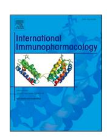
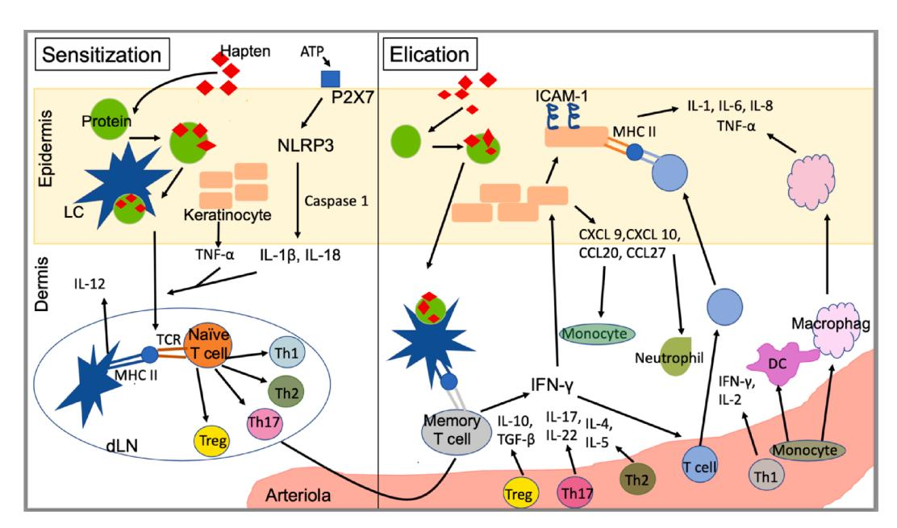
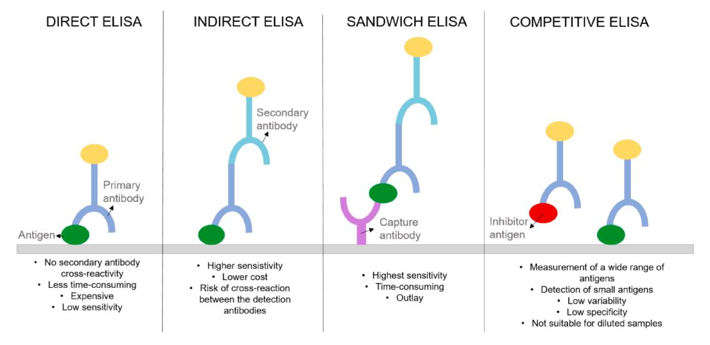
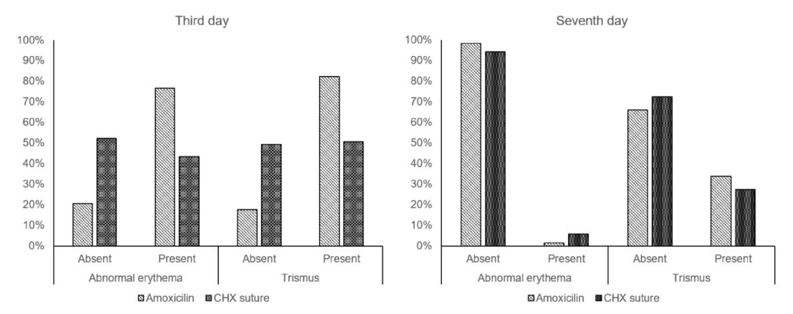

Contents lists available at [ScienceDirect](www.sciencedirect.com/science/journal/15675769)

# International Immunopharmacology

journal homepage: [www.elsevier.com/locate/intimp](https://www.elsevier.com/locate/intimp) 

# Allergies caused by textiles: control, research and future perspective in the medical field

Eva Sanchez Armengol, Aletta Blanka Kerezsi, Flavia Laffleur \*

*Department of Pharmaceutical Technology, Institute of Pharmacy, University of Innsbruck, Innrain 80-82, 6020 Innsbruck, Austria* 

### ARTICLE INFO

*Keywords:*  Allergy Biocide Contact dermatitis Hypersensitivity Textile

#### ABSTRACT

Textile production forms one of the most polluting industries worldwide. However, other than damaging environmental effects, chemical waste products, such as formaldehyde or thiazolinone, are problematic for human health, as allergic potential is present in these compounds. Mostly, contact dermatitis occurs when human skin is exposed to textiles. Moreover, non-eczemous variants are mainly associated to textiles. In order to diagnose the possible allergy of the patient towards these compounds, *in vivo* and *in vitro* methods ca be performed, such as patch testing or cytokine detection assays, respectively. Newest research focuses on medical textiles such as garments or sutures to help in diagnosis, therapy and recovery of the patients. Sutures and dressings with antimicrobial properties, with the release of oxygen and growth factors offer greater properties. In this review, state of the art in the field as well as future perspectives will be discussed, which are based on the smart textiles that are going to become more important and probably widespread after the current limits exceeded.

### **1. Introduction**

Textile industry reaches a constant growing market worldwide and is one of the leading industries. To develop or produce textiles and garments, many chemicals and water are needed during the processes, resulting in notorious pollution rates and causing damages not only environmental issues but also human health. Furthermore, it is widely known that dyes used to pigment textiles have a notorious impact on the aquatic life, as toxic and non biodegradable by-products reach seas and oceans [\[1\].](#page-8-0)

Textiles present well-established dying procedures. Among dyes used nowadays, optical brighteners, finishing agents, biocides and flame retardants are commonly employed. An important drawback of using these dyes is the capability of penetrating through the skin and causing allergies [\[2\].](#page-9-0)

Contact dermatitis is an inflammatory skin disease caused by contact to allergens or irritant substances. Hence, it can appear as irritant contact dermatitis or allergic contact dermatitis. Moreover, the second type can be classified in non-eczemous and eczemous contact dermatitis [\[3\]](#page-9-0). Furthermore, certain allergic skin reactions are type 4 hypersensitivity, leading to activating the immune system and therefore produce cytokines. To diagnose allergic or irritant potential of compounds, there are different *in vitro* assays such as cytokine detection assays or *in vivo* 

testing methodologies such as the patch testing [\[3,4\].](#page-9-0)

In addition, certain medical textiles such as sutures have been potent candidates as antimicrobials. Coating of the fibers with triclosan, however, can also lead to contact dermatitis. As antimicrobial resistance demands developing new approaches or alternatives, biguanide derivates such as chlorhexidine are great candidates [\[5\].](#page-9-0)

Potential candidates, besides drug loaded sutures or dressings, are smart textiles. These materials are equipped with sensors and electrical features to overcome problems presented by the actually used ones. An example of these new inventions is wearable electrical textiles capable of detecting and responding to environmental stimuli. Furthermore, wireless communication is offered and specialists can diagnose easier, faster and provide a personalized and more focused therapy for the patient [\[6\].](#page-9-0)

This review article aims to provide an overview of the problems presented by the textile dyeing industry. However, focus will be given to sutures to potentiate their antimicrobial activity leading to future medical textiles and reduce antimicrobial-resistance, therefore, improving their effectiveness.

\* Corresponding author at: Department of Pharmaceutical Technology, Institute of Pharmacy, University of Innsbruck, Innrain 80-82, 6020 Innsbruck, Austria. *E-mail address:* [Flavia.Laffleur@uibk.ac.at](mailto:Flavia.Laffleur@uibk.ac.at) (F. Laffleur).

### **2. Background**

### *2.1. Textile auxiliaries*

### *2.1.1. Coloring agents*

Coloring agents play an important role in textile industry. Synthetic textile dyes have been developed since the 19th century. However, natural colorants extracted from plants, animals and minerals are commonly used, as the toxicity and allergenic potential are lower and the generated wastewater by-products are biodegradable in comparison to many of the synthetic dyes [\[7\]](#page-9-0). Furthermore, chemical structure of dyes, as far as aromatic rings chromophoric and auxochromic groups are concerned, have a great impact on the intensity of the color. In order to fix a tone, auxochromes are required due to the polar characteristics and the possible interaction with fibres [\[8,9\].](#page-9-0)

Classification of textile coloring agents can be established taking into consideration chemical structure or application [\(Table 1\)](#page-2-0). Moreover, choosing adequately the dye used is depending on the fibre or textile that aims to be tinted [\[9\].](#page-9-0) The main components of coloring materials, used to give synthetic fibre pigmentation, are agents of azo dyes, as these are easy to apply and relatively cheap [\[10\].](#page-9-0) Color strength, light fastness and brighter shades of heterocyclic azo dyes result in an advantageous property in comparison to carbocyclic molecules. In addition, these chemical structures include one or more azo groups bonded to auxochromes, such as hydroxyl or amino groups. Nevertheless, main component of azo dyes is paraphenylenediamine (PPD), a chemical compound that causes toxicity leading to contact dermatitis or eye disorders such as chemosis or permanent blindness [\[11,12\]](#page-9-0).

Among all coloring agents, disperse dyes (DDs) are responsible for most allergic reactions as these are hydrophobic, small molecular weight substances capable of permeate through the skin. The leading factor of possible migration is the fact that DDs are bonded to textile fibres via van der Waals forces and hydrogen bonds [\[13,14\].](#page-9-0) Furthermore, waterinsolubility and no ionicity of these compounds are the reason why an aqueous dispersion is needed to be applied to lipophilic fibres [\[15\].](#page-9-0)

### *2.1.2. Finish resins*

Formaldehyde-containing chemicals have been used in textile industry since the 1920 s to add resistance properties to wrinkling to fibres. Nonetheless, these structures can lead to allergic contact dermatitis. Furthermore, durable-press agents are also commonly used to prevent wrinkling of garments. However, the majority contain formaldehyde as the production process is based on a condensation reaction [\[10,16\].](#page-9-0)

Although formaldehyde is still used in the production process of finishers, a new method was developed in the middle of the 20th century to obtain a durable-press resin with a smaller amount of the chemical compound. For this, a two-step reaction process is carried out based on the first reaction between glyoxal and urea resulting in dihydroxyethyleneurea and a second step of the obtained product with formaldehyde to obtain dimethyloldihydroxyethyleneurea [\(Fig. 1](#page-3-0)) [\[17,18\]](#page-9-0).

It is of great importance to notice that reaction conditions have a notorious effect on features and structure of resin. Furthermore, addition and release, from the final product, of urea and formaldehyde also play an important role on the possible allergic reaction of the sensitized patient [\[19\].](#page-9-0)

Transfer of the mentioned compounds can be carried out through skin surface in three different ways. The first one is due to the friction between the garment and skin, resulting in a direct transfer of the substances. The second pathway is throughout the released vapor when textiles are worn. Finally, sweat can also leach out the formaldehyde molecules, allowing a direct transfer in fluids. However, research exhibited a low concentration of formaldehyde released by the first and second routes. Moreover, reports showed that free formaldehyde can be splitted off by the water present in the sweating. Hence, the third mechanism is the most common route in which formaldehyde is

transferred from textile to skin [\[19\]](#page-9-0).

### *2.1.3. Fire retardants*

To protect the person wearing the textile piece, flame or fire retardants are often applied, more in detail, brominated flame retardants such as polybrominated diphenyl ether (PBDE) or hexabromocyclodecane (HBCD) [\[20\]](#page-9-0). Although there is plenty of room for research in the field of fire retardants, it is known that no physical bonds are established between the PBDE and the textile fibres. However, exposure and permeability of these compounds through epidermis is still of great interest [\[21\].](#page-9-0)

Pawar et al. studied the bioaccessibility of flame retardants such as α-, β- and γ-HBCD, as well as tetrabromobisphenol A from indoor dust to a mixture of artificial sweat and sebum. Results exhibited an increase in bioaccessibility of HBCDs and tetrabomobisphenol A with higher sebum concentrations. Nevertheless, 100% of bioaccessibility was not possible to obtain in any case. When using a mixture of 1:1, values of 41%, 47%, 50% and 41% were reported for α-, β-, γ-HBCD and tetrabromobisphenol A, respectively [\[22\].](#page-9-0)

Further experiments to determine the concentration of fire retardants in the skin surface were carried out by Liu et al. by collecting skin wipes from volunteers. Results showed an average of 25.9 ng of PBDE per day. These were obtained by 124 wiped skin samples from palms and back of the hands, as well as forearms [\[23\]](#page-9-0).

Abdallah et al. examined the bioavailability of brominated flame retardants after being in contact with human skin by using a pentabrominated diphenyl ether mixture and the α-, β- and γ-HBCD isomers ([Table 2\)](#page-3-0). The highest dermal penetration potential was established for brominated diphenyl ether 28 (BDE-28) and α-HBCD. Furthermore, impact of skin hydration, sweat production or environmental matrix have an influence on the absorption of brominated flame retardants, leading to possible migration of the compounds to lower tissue layers. [\[24\]](#page-9-0).

An alternative to brominated flame retardants are phosphorous flame retardants, as these present no covalent bonds between additives and polymeric materials. Araki et al. investigated the relation between phosphorous flame retardants and metabolites in indoor dust and in urine, as well as allergies caused. Briefly, prevalence for wheeze, eczema and rhinoconjunctivitis resulted in 22.7%, 28,1% and 36.7%, respectively, for an assay performed with 128 children. These outcomes could be associated, for allergies, to some phosphorous flame retardants such as tris (1,3-dichloroisopropyl) phosphate. Moreover, tris(1,3-dichloro-2 propyl) phosphate and tris(2-chloroisopropyl) phosphate has a direct correlation to atopic contact dermatitis [\[25\]](#page-9-0).

### *2.1.4. Biocides*

Antimicrobial compounds or biocides are auxiliaries that can be added to the textile fibres in order to prevent the appearance of asthma, eczema or allergies caused by bacteria. However, biocides, such as triclosan, zinc pyrithione, silver particles or dimethyl fumarate, are also the potential cause of dermatitis, as these compounds can affect the skin microflora [\[21,26\].](#page-9-0)

Isothiazolinones are composed of five heterocyclic molecules and contain nitrogen and sulphur groups making these great candidates to occlude growth of microbes in the skin by their enhanced antimicrobial properties. However, even though the capability of penetrating microorganisms and disturb cellular functions, nitrogen-sulphur bond allows evolution of contact allergies [\[27\]](#page-9-0).

### *2.2. Contact dermatitis*

Contact dermatitis is an inflammation process of the skin, when in contact to a sensitizer that can be either chronic or acute. There are two categories: an irritation, which cause 80% of contact dermatitis cases, and the remaining 20% correspond to an allergic reaction. Irritant contact dermatitis arises when in contact to a weak sensitizer, while

**Table 1**  Classification of stains according to application, chemical structure, textile fibre used, as well as an example for each dye.

| Application            | Chemical structure                                                                                                                    | Textile fiber                                           | Example                     |
|------------------------|---------------------------------------------------------------------------------------------------------------------------------------|---------------------------------------------------------|-----------------------------|
| Acid dye               | Anthraquinone, azine, azo, triphenylmethane, xanthene, nitro, nitroso                                                              | Nylon, wool, silk                                       | Acid blue 74                |
| Azoic dye              | Azo                                                                                                                                   | Cotton, rayon, cellulose acetate, polyester          | Bluish red azoic dye        |
| Basic dye              | Cyanine, hemicyanine, diazahemicyanine, diphenylmethane, triarylmethane, azo, azine, xanthene, acridine, oxazine, anthraquinone | Wool, silk, acrylic, nylon, polyester, polypropylene | Basic yellow 37             |
| Direct dye             | Azo, phthalocyanine, stilbene, oxazine                                                                                                | Cotton, rayon, wool, silk, nylon                     | Direct blue 1               |
| Disperse dye        | Azo, anthraquinone, styryl, nitro, benzodifuranone                                                                                    | Polyester, nylon, acrylic, cellulose acetate         | Disperse yellow 3           |
| Reactive dye        | Anthraquinone, azo, formazan, oxazine, phthalocyanine                                                                              | Cotton, rayon, wool, silk, nylon                     | Reactive red 198            |
|                        |                                                                                                                                       |                                                         |                             |
| Sulphur dye Vat dye | Indeterminate structures Anthraquinone and indigoids                                                                               | Cotton, rayon Cotton, wool, rayon                    | Sulfur black Vat green 1 |
|                        |                                                                                                                                       |                                                         |                             |

**Fig. 1.** Synthesis procedure of dimethyloldihydroxyethyleneurea carried out under nitrogen purge by weak acid pH and increased temperature. The molar ratio of the reactants is 1(glyoxal):1.10(urea):1.95(formaldehyde) [\[18\].](#page-9-0)

**Table 2**  Dermal absorbed percentage of applied dose after an one-day exposure of *ex vivo*  human skin to sofa fabric and indoor dust [\[24\]](#page-9-0).

|         | Absorbed percentage of applied dose |           |  |
|---------|-------------------------------------|-----------|--|
|         | Fabric                              | Dust      |  |
| BDE-28  | 3.8 ± 0.7                           | 4.0 ± 0.5 |  |
| BDE-47  | 2.0 ± 0.1                           | 2.3 ± 0.3 |  |
| BDE-99  | 1.2 ± 0.1                           | 1.4 ± 0.1 |  |
| BDE-100 | 1.3 ± 0.2                           | 1.4 ± 0.2 |  |
| BDE-153 | 0.5 ± 0.2                           | 0.7 ± 0.1 |  |
| BDE-154 | 0.5 ± 0.1                           | 0.7 ± 0.1 |  |
| α-HBCD  | 2.3 ± 0.1                           | 5.6 ± 1.1 |  |
| β-HBCD  | 1.7 ± 0.1                           | 3.9 ± 1.5 |  |
| γ-HBCD  | 1.4 ± 0.2                           | 2.8 ± 0.8 |  |

BDE: brominated diphenyl ether; HBCD: hexabromocyclodecane.

allergic contact dermatitis is a type 4 hypersensitivity reaction to an allergen [\[28\]](#page-9-0).

### *2.2.1. Non-eczematous allergic contact dermatitis*

Even though the appearance of allergic contact dermatitis is normally appearing as an eczema, it can also be present in a noneczematous form. However, the similarity to other skin diseases result in a harder diagnosis. Non-eczematous allergic contact dermatitis can be classified by causing agent (Table 3). Moreover, studies have determined that pustular, purpuric, lichenoid and pigmented contact dermatitis are related to textiles [\[3\].](#page-9-0)

Erythema-multiform-like allergic contact dermatitis is the most common type of the non-ezcematous variants. Many molecules can activate it. However, exotic woods, medications, ethylenediamine and formaldehyde are the main causing agents. In contrast, lichenoid contact dermatitis is not usually appearing among patients and it not only affects the skin, but also mucosal membranes present in the organism. Allergens for this type of cutaneous eruption are epoxy resins, nickel, methacrylic acid or paraphenylenediamine. Pigmented allergic contact dermatitis usually appears as unsharply delineated hyperpigmentation. Allergens capable of inducing this type of dermatitis range from azo dyes to optical whiteners used in the washing powder. Moreover, fragances or preservatives can also develop pigmented contact dermatitis. The fourth type of non-eczematous contact dermatitis is the purpuric, where macular petechial-purpuric lessions can be of notice on the skin surface although hemorrage is not present. Isopropyl-N-phenyl-p-

**Table 3**  Classification of non-eczematous contact dermatitis, potential causative allergens and histopathology.

| Non                               | Causing agent                                       | Histopathology                                          | Ref. |
|-----------------------------------|-----------------------------------------------------|---------------------------------------------------------|------|
| ezcematous allergic contact |                                                     |                                                         |      |
| dermatitis                        |                                                     |                                                         |      |
| Erythema multiforme like    | Formaldehyde                                        | No epidermal dyskeratotic cells or interface      | [29] |
|                                   |                                                     | dermatitis.                                             |      |
| Lichenoid                         | Methylchloroisothiazolinone Paraphenylenediamine | Sponginosis and eosinophilia in the epidermis and | [3]  |
|                                   |                                                     | lichenoid band infiltration in the                   |      |
|                                   |                                                     | dermis.                                                 |      |
| Pigmented                         | Azo dye                                             | Basal vacuolar                                          |      |
|                                   | Optical whitener                                    | degeneration and                                        |      |
|                                   |                                                     | increased number                                        |      |
|                                   |                                                     | of melanophages                                         |      |
|                                   |                                                     | with a buildup of                                       |      |
|                                   |                                                     | leukocytes around the blood vessels.                 |      |
| Purpuric                          | Dimethyloldihydroxyethyleneurea                     | Spongiotic                                              |      |
|                                   | Methylchloroisothiazolinone                         | dermatitis and                                          |      |
|                                   | Optical whitener                                    | extravasation of                                        |      |
|                                   |                                                     | erythrocytes                                            |      |
| Pustular                          | Disperse blue                                       | Spongiosis,                                             |      |
|                                   | Disperse red                                        | lymphocytic                                             |      |
|                                   | Disperse yellow 3                                   | infiltrations in the                                    |      |
|                                   | Formaldehyde                                        | epidermis,                                              |      |
|                                   |                                                     | liquefaction                                            |      |
|                                   |                                                     | degeneration at the                                     |      |
|                                   |                                                     | boundary area ´                                         |      |
|                                   |                                                     | between dermis                                          |      |
|                                   |                                                     | and epidermis.                                          |      |

phenylenediamine is the main causing agent. Finally, pustular contact dermatitis is unusual among skin allergies. The main causing chemicals are nitrofurazone, merbromin and fabric dyes such as disperse blue or red [\[3\].](#page-9-0)

### *2.2.2. Eczematous allergic contact dermatitis*

Allergic contact dermatitis is generally presented in an eczematous form localized in the skin area in contact with the allergen. It can appear as acute, subacute or chronic dermatitis and can be characterized by an erythematous phase with ill-defined erythema or oedema, a madidans phase with erosions and moistening followed by crusts and finally the last phase, which is the squamous phase, when the stratum corneum heals [\[3\]](#page-9-0).

Among the different types of eczematous allergic contact dermatitis, the acute one appears after one or two days. Lesions are normally localised and asymmetric. Characteristic symptoms are itchiness, swell and blisters. Lichenfication, fissures and pruritus characterize chronic contact dermatitis. Histology analysis involve spongiosis, operivascular infiltration of lymphocytes, dermal edema and migration of inflammatory cells in the dermis [\[3\].](#page-9-0) Allergic reactions normally occur in two phases: a first one known as sensitization and second one named election phase (Fig. 2) [\[28\]](#page-9-0).

A previous sensitization, for instance the production of allergenspecific T-lymphocytes is a requirement for evolution of allergic contact dermatitis beside activation of innate and adaptive immunity. During the first contact, innate immune system is activated giving an immune response, furthermore non-specific immune system triggers acquired immune reaction [\[3,30\].](#page-9-0)

Innate immune system is capable of detecting pathogen-associated molecular patterns by the pattern recognition receptor (PRR) present in keratinocytes, macrophages and dendritic cells (DCs). PRRs are capable if binding alarmins, including uric acid, heat-shock proteins, reactive oxygen species (ROS) or hyaluronic acid, All produced by tissue damaging factors such as toxins [\[30,31\]](#page-9-0).

Sensitazion to a contact allergen can be interleukin-12 (IL-12) independent, in which case toll-like receptors (TLR) 2 and 4 need to be activated in contrast to IL-12 dependent. In addition, TLR2 and TLR4 activation induce production of proinflammatory cytokines and chemokines such as IL-6, IL-12, TNF-α, pro-IL-1β or pro-IL-18 [\[30\].](#page-9-0) Nod-like receptor 3 (NRLP3) can be activated by ATP or uric acid binding to purinoreceptor 7. After activation, skin immune cells produce proinflammatory cytokines. Another important step to consider is conversion of pro-IL-1β and pro-IL-18 to IL-1β and IL-18 by capases. Consequently, these can allow migration of activated dendritic cells together with TNF [\[31\]](#page-9-0).

pDCs produce type 1 IFNs, which stimulate the myeloid DCs to produce ILs, like IL-12, IL-15, IL-18, and IL-23. These IFNs also cause the

differentiation of the monocytes into DCs and are NK cell modulators. There are three types of natural killers (NK) cell subpopulation, CD62L-CD56highCD16-, of which the latter two aggravate ACD reactions, because they induce the keratinocyte apoptosis and release IFN-γ, TNF-α (64). Another task is the differentiation of the B cells into antibody producing plasmatic cells together with IL-6. Moreover, these pDCs improve the cross presentation of antigens for the CD8 + cells by the mDCs and they conduce their clonal expansion, and also generate the Th1 cell-differentiation [\[30\].](#page-9-0) Furthermore, the differentiation of Th1 and Tc1 are stimulated by the released IL-12 and IFN-γ. In addition, these cells produce IFN-γ and TNF. Polarization of Th17 and Th22 and releasing of IL-17 and IL-22 are promoted by IL-6, TGF-β, IL-21, IL-23 and IL-1-β. Th2 polarization ensue in presence of IL-4, and it also leads to production of IL-4, IL-5 and IL-13. Tregs are differentiated by IL-2 and TGF-β and release IL-10, affecting the magnitude of ACD. The DCs also trigger expression of CLA, CCR4 and CCR10. CLA can bind to e-selectin, CCR4 and CCR10 receptors and cause the T cell migration to site of the exposure [\[32\]](#page-9-0).

As far as the sensitizers are concerned, small molecular weight and polar are two main chemical properties, which allow the penetration through the stratum corneum. Haptens can bind to endogenous epidermal proteins, generating a sensitizer- protein complex. An indispensable action of the sensitization phase is the activation of the innate immune system by this complex. It is also necessary for priming of Tcells. Moreover, dermal dendritic cells have the ability to capture the haptens and interleukine-1β and tumor necrosis factor-α are released, so dermal dendritic cells can migrate to draining lymph nodes, haptens are presented on major histocompatibility complex receptors to naïve T cells, finishing the afferent stage [\[32,33\].](#page-9-0)

In the election phase, the inflammation can be antigen-specific or antigen-non-specific.

On one hand, antigen-non-specific inflammation happens by activating keratinocytes, neutrophils, and mast cells. Due to a hapten, interleukine-1β and tumor necrosis factor-α are secreted by keratinocytes, activating the vascular endothelial cells to produce ICAM-1 and P/ E selectin. These adhesion molecules are responsible for migration of T cells to the site of tissue. Mast cells produce histamine, which increase the permeability of the blood vessels and the keratinocytes will release chemokines, so the T CD8 + cells can infiltrate into skin. On the other

**Fig. 2.** Mechanism of type 4 hypersensitivity characteristic of eczematous allergic contact dermatitis. ATP: adenosine triphosphate; CCL: chemokine C-C motif ligand; CXCL: C-X-C motif chemokine ligand; DC: denditric cell; IFN: interferon; IL: Interleukine; LC: Langerhans cell; MHC: major histocompatibility complex; NLRP3: NOD-like receptor Pyrin domain; P2X7: purinoreceptor 7; TGF: tumor growth factor; Th: T helper cell; TNF: tumor necrosis factor; Treg: regulatory T cell.

hand, antigen-specific inflammation is mediated by T cells releasing IFN-γ and IL-17 after being activated. Following, a recruitment of T cells into skin where Th and Tc can unfold inflammarion is carried out [\[30\]](#page-9-0).

### *2.3. Allergies caused by textiles*

Non-eczematous contact dermatitis is frequently caused by mechanical stimuli. Rubbing of collar interlinings and scratching of tags in the neck are some examples. Moreover, sweating caused by light textiles leads to more sensitivity in skin resulting in higher probability of skin irritation. However, when taking into account how long are textiles exposed to human skin from birth to death, production and use of textiles and how frequent other allergies are, it can be concluded that textiles rarely cause allergies.

As textiles and skin have a very close contact, it is foreseeable that all allergies caused by textiles are categorized as contact allergy. However, allergies are caused by chemical compounds used during textile production such as formaldehyde, metals and organic dyes [\[34\].](#page-9-0)

Formaldehyde is commonly used in textile industry in form of resins as finishing agent in order to develop dimensionally stable and crease resistant textiles. When temperature arises, formaldehyde can be released. However, quantity of released formaldehyde is depending on temperature. The higher the temperature, the more formaldehyde is released. Furthermore, not all of the liberated compound reacts with skin, as it is partly evaporated. A minimal quantity of 30 ppm of formaldehyde is needed in order to cause allergic reaction [\[34,35\]](#page-9-0).

Metals such as nickel, chromium or cobalt are frequently causing contact dermatitis. In particular nickel is well known as one of the most causative agent of allergy due to contact. In example, "jeans-button allergy" is caused by metal nickel and it can also be caused by zippers or rivets. Added to nickel, chromium or cobalt are also found in specific textile dyes. However, if the process of dying is carried out correctly, bonding between dye and metal is so strong that it will not cause an allergic reaction [\[34,36\]](#page-9-0).

As already stated, disperse dyes are used to colour synthetic fibres as polyester,polyamide and acetate. However, most disperse dyes are compounds based on azo- or anthraquinone presenting lipophilic properties, leading to insolubility in water. When allergens reach the skin, contact dermatitis can occur. Allergies by these dyes have historically reached elevated proportions: in the 70 s, a stocking colouring allergy was very common and in the 90 s the "leggings allergy" appeared. Both were caused by dispersed dyes used to color fibers [\[34\]](#page-9-0).

### *2.4. Testing methodologies for contact dermatitis*

## *2.4.1. Patch test*

Although type 4 hypersensitivity reactions such as allergic contact dermatitis can be diagnosed by different methodologies, patch testing is the golden standard in the field. It is based on the creation of an allergic reaction to identify an exact allergen causing it [\[3\]](#page-9-0). It is indicated for patients highly exposed to developing the disease, such as cosmetologists and health care workers or patients with a clinical history for contact dermatitis. Contraindications for testing are pregnancy, breastfeeding or UV light exposure [\[37\]](#page-9-0).

The patch test is, in brief, based on the placement of allergens on the upper back of the patient. Afterwards, the allergens are placed into plastic or aluminium chambers and these are adhered to hypoallergenic tape. After two days of depositing the stripes, these are removed and results are observed. Some allergens take more time to provoke the reaction. For this reason, further observations are performed after one four and seven days of exposure to the causative agent. Moreover, reading is necessary after one week to determine if the dermatitis is allergic or irritant (Table 4) [\[37\].](#page-9-0)

Patch testing is considered to be a safe method to detect allergic contact dermatitis, but some risks, such as anaphylaxis, active sensitization or excited skin syndrome can occur. Excited skin syndrome is also

**Table 4**  Interpretation key of patch test results based on International Contact Dermatitis Research Group.

| Reaction | Presentation                                                            | Assessment          |
|----------|-------------------------------------------------------------------------|---------------------|
| –        | Negative reaction                                                       | Negative            |
| ±        | Faint erythema                                                          | Doubtful            |
| +        | Erythema, infiltration, papules                                         | Weak positive       |
| ++       | Erythema, infiltration, papules, vesicles                               | Strong positive     |
| +++      | Intense erythema, infiltration, coalescing vesicles, possible bullae | Extreme positive |
| IR       | Mixed morphology, ulceration, follicular, glazed erythema            | Irritant            |

IR: irritation.

known as "angry back" and is a generalized false positive reaction. It occurs when co-sensitizer allergens react when positioning between these two is too close and results in difficulties to interpret the test. Moreover, other complications include necrosis, scars when unknown toxic chemicals are tested, depigmentation, hyperpigmentation or koebner phenomenon when patient suffer of active psoriasis, or lichenoid allergic contact dermatitis [\[37\]](#page-9-0).

To determine the concentration of a sensitizer that can lead to dermatitis, repeat open application test (ROAT) is used. Briefly, the material under testing is placed on the arm two times per day. After two to four days, results can be read and after one week, delayed reactions can be observed. The correlation between the ROATand the patch test has not been established. However, positive ROAT is unnecessary after a positive patch test or the other way around [\[37\].](#page-9-0)

### *2.4.2. Lymphocyte transformation test*

The lymphocyte transformation test (LTT) is a commonly used *in vitro* method to identify the cause of an allergic contact reaction. Thus, unknown substances, even toxic ones can be safely tested. Furthermore, strong allergens causing iatrogenic sensitization can be tested *in vivo* to identify allergic contact dermatitis. To execute LTT, a first incubation process with the potential antigen is required. These antigens can be presented in context with major histocompatibility complex I or II molecules. After activation, antigen specific T cells proliferate and are detected and evaluated by using existing techniques such as bromodeoxyuridine incorporation or flow cytometry. The proliferation is expressed by the stimulation index (SI) value, which is calculated by means of a division (*Equation (1))*, where the counts per minute value of the drug-loaded sample is divided by the counts per minute value of the sample without any added drugs [\[38,39\].](#page-9-0)

*SI* =*Counts per minute of loaded sample/Counts per minute of blank sample* (1)

### *2.4.3. Cytokine detection assay*

In vitro tests to determine the sensitizer based on cytokine secretion are potential candidates. During activation of the cells with an allergen, cytokines or cytotoxic markers are released allowing to be detected by enzyme-linked immunosorbent assay (ELISA), enzyme-linked immunospot assay (ELISpot) or bead assays [\[4\].](#page-9-0)

ELISA is known as the golden standard of immunoassays to detect antibodies, proteins, glycoproteins and antigens. There are four different main types of ELISA assays: direct ELISA, indirect ELISA, sandwich ELISA and competitive ELISA ([Fig. 3\)](#page-6-0).

In comparison, ELISpot allows detection of cytokine secretion on a single cell level. Membranes coated with primary antibodies are used for this testing methodology. The unspecific binding sites are blocked by proteins. After an incubation time, cells are removed and detection antibodies couples with biotin are added. the secondary antibodies bind to the analyse-antibody complex. Afterwards, avidin or streptavidin is added to link and results can be observed [\[40\].](#page-9-0)

**Fig. 3.** Schematic representation of four different types of ELISA assays: direct, indirect, sandwich and competitive one.

### **3. Advanced textile technologies in the medical field**

### *3.1. Wound healing textiles*

Wound healing processes involve three main stages: inflammatory, proliferative and tissue remodelling. Therefore, oxygen is of great importance in the oxidative damage of bacteria as it is a cellular messager, increases the differenciation of fibroblasts and keratinocytes, promotes re-epithelization, collagen cross-linking and production of fibroblasts and endothelial cells. Moreover, electric simulation offers a method that can be used for tissue regeneration, promoting wound healing as endogenous stimulation can be reinforced by external electric fields, enhancing fibroblast proliferation an increasing collagen synthesis [\[41,42\].](#page-9-0)

### *3.1.1. Oxygen and growth factor releasing textiles*

OxyzymeTM is an oxygen-releasing hydrogel-based wound dressing by the use of chemical reactions. The hydrogel contains oxidase, a catalyser for the oxidation of hydrogen peroxide in presence of oxygen. Furthermore, hydrogen peroxide diffuses through dressing and is capable of liberating oxygen in solution [\[41\]](#page-9-0).

Centeno-Cerdas et al. developed a photosynthetic suture capable of releasing oxygen and recombinant human growth factors such as vascular endothelial growth factor (VEGF) or platelet derived growth factor (PDGF). To obtain this, a modified microalga, *C. Reinharditi* in polyglactin sutures, was seeded and cultured for ten days. Although sutures changed apparent color, their biomechanical properties remained stable. *Ex-vivo* simulations showed that mechanical stress appearing when suturing does not affect the chlorophyll content and the viability of the cells. The chlorophyll quantity in the suture increased during ten days followed by a plateau phase. The oxygen production was observable in form of bubbles. *In vitro* release of recombinant human growth factors lasted for at least two weeks. Highest concentration that was reached for rh-PDFG was 1.253 ng/mL and 9,836 ng/mL for rh-VEGF. PDFG plays a role at the regeneration of blood vessels and it recruits cells and induces other cells to release VEGF which is necessary for the angiogenesis, proliferation and migration of endothelial cells [\[43\].](#page-9-0)

In order to determine bioactivity of recombinant factors, Centeno-Credas et al. assessed phosphorylation inducing ability of their respective receptors. Results exhibited an increase in phosphorylation after stimulation with the current product in the market as well as with the factors under study. Moreover, optimal concentration of VEGF in body tested by Rennel et al. resulted to be up to 40 ng/mL, so it can be concluded that the clinical application is sufficiently feasible but there is still plenty of room for improvement in this field [\[43,44\].](#page-9-0)

### *3.1.2. Smart devices*

ProcelleraTM is a developed bioelectric dressing made of polyester fabric microcells that contain elementary silver and zinc ions. These elements are applied in a dot-matrix pattern, so microbatteries are created. In the presence of conductive fluids, dot matrix creates low level electrical energy ranging from 0.5 to 0.9 Volt. This dressing presents efficiency against drug resistant organisms, like *Pseudomonas aeruginosa*, *Staphylococcus aureus* and *Klebsiella pneumoniae*. A comparative study of Procellera with a standard of care and a control of the standard was carried out by Housler et al. showing a difference between the two groups. In the control group, 64.9% of the patients and in the treatment group 56.8% of the participants reported wound fluid. However, by the first follow-up visit, there was only one patient who had fluid. These results could be emerging because of the small sizes and mild nature of the wounds [\[45\].](#page-9-0)

Furthermore, smart systems are capable of monitoring and give information about the current status of healing processes. Sensors integrated in textile can measure the wound pH and could help to detect infections due to an increased pH value of above 6.5 represented in infected injuries. That is why a bandage with pH and temperature sensor was developed. It also includes a microheater, a thermo-responsive drug loaded carrier encapsulated in a hydrogel release patch and wireless electronics. In response of the data measured by sensors, drugs were released [\[46\].](#page-9-0)

Although it is still under study, integrating sensors would help to wound healing processes. Sensor should be composed of carbon-zinc and carbon-mangan dioxide electrodes, a silver-coiled conductor and an electrochromic display. The principle is based on formation of galvanic elements when ions from wound reach the sensor. Generated potential activates the display and shows the need of dressing change. The study tested such wound dressings on patients having exudative leg ulcer. Two variants were used, in the first one there was an extra layer of a nonwoven material between the sensor and the dressing, for a potential delayed activation. However, the results have not showed a difference between the two types. The sensors were activated in six out of fifteen cases. These activations happened after few hours after previous changes. These wounds, compared to nine other cases, where activation did not occur, were heavily exudative wounds. The wound healing process was not affected in a negative way, but four adverse effects were reported, like increased pain, inflamed surrounding skin, infection,

mechanical imprints and the adherence [\[47\]](#page-9-0).

Smart textiles have grown from passive or first generation to active or second generation. Active smart textiles present sensors and actuators, as well as shape memory, water-resistance or thermos regulation, among other properties. When coated with nanoparticles, textiles can obtain antimicrobial properties [\[48\]](#page-9-0). Although smart textiles span electronic and adaptive textiles, future perspectives aim for stimuliresponsive textiles. As these can be developed with polymeric materials, coatings or biofriendly materials will be of interest. In conclusion, smart textiles is still a growing field that will gain interest in the next decades not only for good solutions it brings, but also for the materials that will be used. Electric stimulation offers a method that can be used for tissue regeneration. Bioelectrical signals promote the wound healing. During the natural wound healing process an electric field is generated, so the keratinocytes migrate to the injury leading to the heal. This endogenous stimulation can be reinforced by external electric fields. It enhances the proliferation of the fibroblasts, and also increases the collagen synthesis. Such alternatives are needed because of the increased number of antimicrobial or multi drug resistant pathogens [\[42,49\].](#page-9-0)

### *3.2. Antimicrobial medical textiles*

Surgical equipment worldwide include sutures being composed of synthetic or natural fibres aiming to hold tissues. When in contact with a wound, proteins are capable of enhancing microorganisms colonization and formation of biofilms. Although these can be developed over suture, bacteria are protected against the immune system of the patient and systemic or local antibiotics. Surgical site infections commonly appear, leading to prolonged hospitalization times and higher cost for the patient. The composition frequently involves around 20% of *Staphylococcus aureus*, a gram-positive bacteria [\[50,51\]](#page-9-0).

### *3.2.1. Biguanide derivates*

In the early 21st century, first antimicrobial suture was coated with triclosan, an effective biocide against gram-positive and gram-negative bacteria. However, the efficiency of the substance to prevent from surgical site infections is still an interesting topic in the field. Ismail et al. reported a case study of a female patient that received a suture coated with triclosan and developed an allergic contact dermatitis reaction [\[52\]](#page-10-0).

A great approach to overcome the mentioned problem is the use of sutures coated with chlorhexidine due to the antimicrobial and antiseptic activity of the compound. It presents effectiveness against pathogens due to the formation of an antibacterial area around the suture, resulting in an impossible growth of bacteria. Moreover, the secondary positively charged amine groups in the chemical structure of chlorhexidine are capable of interacting with the negatively charged membranes of bacteria, for instance, destroying the microorganism [\[53\]](#page-10-0).

Marquez ´ et al. evaluated biguanide derivates aiming to find out wether high or low molecular weight polymer presented enhanced antimicrobial activity, as well as the highest concentration possible to use without having cytotoxic effects. Moreover, the assessment of chlorhexidine and polyhexamethylene biguanide-coated sutures in terms absorption was carried out. As coating material, copolymer polyglycolide-β-poly(glycolide-co-trimethylene carbonate-co-ε-caprolactone)-β-polyglycolide and the surgical suture was based on polylactide and trimethylene carbonate with a lactid concentration of 30–35% (wt.). Results exhibited a need of coating of suture in order to provide an enhanced drug loading efficiency. Moreover, polyhexamethylene biguanide was needed to avoid the burst effect. Chlorhexidine sutures in a 1% (w/v) presented a bacteriostatic effect. Same properties were shown for 0.3% (w/v) polyhexamethylene biguanide sutures. Furthermore, sutures coated with polyhexamethylene biguanide and chlorhexidine 1.5% (w/v) and 5% (w/v), respectively, exhibited bactericide effect and a complete inhibition was achieved with 3% (w/v) and 10% (w/v) polyhexamethylene biguanide and chlorhexidine-based sutures, respectively [\[53\].](#page-10-0)

As mentioned, surgical site infections are problematic and, to prevent patients, prophylactic antibiotics are of great usage. A case study evaluating 5 years-record of surgical site infection after removing the third molars exhibited that 1 to 5.8% of patients suffered from the appearance of microorganisms infecting the surgical site. However, these results showed that giving antibiotics as prevention is not a necessity. Antimicrobial sutures are potential candidates to overcome this problem. For instance, Mohan et al. compared the efficacy of antibiotics, in this case amoxicillin, to antimicrobial sutures ([Fig. 4](#page-8-0)) after removing the third molar from 150 patients divided in two groups of 75. Another difference was also examined regarding pain on the first visit. Almost 30% of the patients in group one and almost 50% in group two had no pain. In group one fewer patients presented swelling, but it also equalled on the 15th day or 1 month after the surgery [\[51\].](#page-10-0)

### *3.2.2. Silver*

Silver presents a great potential against multidrug-resistance microorganisms, as it is known to be an antimicrobial agent for bacteria, fungi and viruses. The mechanism behind antimicrobial activity of silver lays on the penetration of silver ions inside the microorganism, affecting respiratory chain and therefore, causing loss of cellular components leading to death of the cells [\[50,54\]](#page-9-0).

A study was carried out by Syukri et al., where an aqueous leaf extract from *Eucalyptus maldulensis* and silver nitrite were used for the synthesis of silver nanoparticles (AgNPs). In order to obtain AgNPscoated sutures, textile was soaked for five days into the colloidal solution. A release kinetic of entire silver content (6.14 ± 0,14 µg/mL) in coated sutures resulted as 3.88, 5.33, 5.44 and 6.14% respectively. Moreover, a bacteriostatic effect of AgNPs against gram-positive bacteria appeared to be reduced by under 99% after one day and 99.9% for gram-negative bacteria. Furthermore, AgNPs-coated sutures presented anti-adherent properties, reducing the risk of surgical site infections [\[5\]](#page-9-0).

Clinical trials have been carried out for a silver-based system exhibiting antibacterial effect is the bioelectric silver-zinc dressing, such as JumpStart®. This is a wireless dressing capable of generating advanced microcurrents by silver and zinc batteries, becoming activated when in contact with conductive fluids. An electrical field is created by this, stimulating and forming an antimicrobial area around the suture or the wound [\[55\]](#page-10-0). Silver-coated textiles that can be currently found commercially available consist of a 20% of silver content in total. Clinical studies that were carried out by scoring atopic dermatitis (SCORAD) assessment. Results exhibited improvement of eczematous dermatitis by coating textiles with silver particles due to the antimicrobial properties of this compound. As a result, appearance *S. aureus*  can be reduced leading to a promising strategy to overcome the presented problem [\[56\]](#page-10-0).

### *3.2.3. Spider silk-based compounds*

Spider silk is a natural protein polymer fibre presenting advantages such as a reduced immunogenicity, biocompatibility, biodegradability or unique biomechanical properties. Moreover, a study performed by Franco et al. reported antimicrobial properties of a bioengineered spider-silk protein-coated silk sutures (Perma-Hand®) representing a potential approach for non-drug based antimicrobial coatings. Two different sutures were developed: one coated with bioengineered spider silk protein and the second group coated with bioengineered spider silk protein and human neutrophile peptide 1. Coating did not modify morphology, tensile strength, break point or biodegradable properties of the suture. However, an enhanced diameter and weight were obtained. Antimicrobial activity assays exhibited resistance of 6mer-HNP1 coated sutures against *S. aureus* and *Escherichia coli* in terms of 1.5log and 2log reduction, respectively [\[57\]](#page-10-0).

Another method presenting antimicrobial activity involves dialkylcarbamoylchloride (DACC)-coated surgical sutures.

**Fig. 4.** Results of abnormal erythema and trismus appearance after three days or seven days by the absence or presence of hyperaemia around the wound in terms of percentage for amoxicilin and chlorhexidine (CHX) suture. Patients pertaining the first group were given three times 500 mg amoxicillin for five days after the wound closure with polyglactin suture. The second group of patients were treated with cyclohexyl acrylate-impregnated polyglactin sutures [\[51\].](#page-10-0)

Experimentation performed by Stanirowski et al. [\[58\]](#page-10-0) exhibited that DACC-coated sutures reduced significantly the appearance of surgical site infections after caesarea. Moreover, treatment costs are also reduced and healing of the affected area appeared to be faster in comparison to alginate dressings [\[58\]](#page-10-0).

### **4. Conclusions**

Reducing allergies or irritation caused by textile additives is of great importance for the industry. Adding additives in textile production presenting less toxicity than the ones used nowadays can achieve a decrease in allergies. Moreover, further studies to detect threshold potential of chemicals that could affect health of the customers are needed. Therefore, patch testing is usually done to detect allergies or skin irritation. Nonetheless, not all textile additives are present in the testing procedure. Thus, future research and testing methodologies are necessary to detect possible allergies.

Regarding medical textiles, the field of smart and functional textiles is gaining interest as commercial and medical use will gain relevance in the not too far future. Using smart textile dyes is an accessible and affordable approach. The smart dyes mentioned are currently chromic materials reacting to external stimuli such as pH, temperature, light, moisture and electricity, leading to a colour change in textile.

Another interesting area is the use of photochromic dyes capable of changing textiles from colorless to colored when in presence of ultraviolet rays. An example of this is spirooxazine and naphtopyran dyes. Moreover, negative photochromic compounds can fade away in visible light and intensify color in the dark. Thermochromic dyes are an addition to these mentioned dyes and are capable of changing their pigmentation according to temperature changes.

It is also important to consider environmental effects of production chain for these dyeing processes. Hence, developing new methodologies in the field of textile production to switch negative effects to an environment friendly outcome of the process are potential candidates for the future of the field. Moreover, research also would need to focus to get over limitations to maintain the color, quality and functionality of the textiles for a longer time period.

It can be estimated that smart textiles, or electronic textiles used in the medical fields will also be more widespread in the forthcoming period. Moreover, the existing medical textiles like dressings or bandages with sensors have a high potential not only nowadays but in future as well. However, further research and *in vivo* tests are necessary to guarantee destined properties.

It is certain that wearable electronics could help in diagnosis, recovery process, therapy and rehabilitation. Such textiles are made out of conductive polymers, like poly(3,4-ethylenedioxythiophene with polyelectrolyte poly(styrenesulfonate), polyaniline or polypyrrole. Graphen coatings, gold coatings or other metals also offer a great approach.

Despite the advantages of these materials, technical challenges are known, for instance, not washability, stretchablity and flexiblity compared to textile fibers, which lead to a higher mechanical strain. It is also important and challenging developing electronic textiles repairable and reusable. Concluding, smart textiles are potential candidates in the textile medical field.

Developing modified alternatives to reduce toxicity or allergic reactions in the textile industry has been a hot topic in the field over the past decades. Drug loaded sutures and dressings offer a good opportunity to prevent patients against infections. Nevertheless, because of the increasing drug resistance, the importance of these materials may decrease significantly. Newly developed and excecuted research is needed to find good alternatives, such as textiles capable of mechanically removing microorganisms. For such mechanical remove of bacteria, dialkylcarbamoylchloride coated dressings are good examples, which provide antimicrobial properties, increased wound healing and less therapy costs. Furthermore, for a better wound healing process oxygen releasing textiles and dressings with electric stimulation of the skin have been developed.

Smart textiles are also great candidates as these present favorable features and with the rapid growth of information technology their potential is expected to gain more importance. Due to integration of sensors, smart textiles can record pieces of information from the environment and present a response. It seems to be necessary to overcome some current difficulties, so electronic textiles will become more available and common in any industry, like medicine, fashion, sport or military section.

### **Declaration of Competing Interest**

The authors declare that they have no known competing financial interests or personal relationships that could have appeared to influence the work reported in this paper.

### **Data availability**

No data was used for the research described in the article.

#### **References**

[1] A. Aldalbahi, M.E. El-Naggar, M.H. El-Newehy, M. Rahaman, M.R. Hatshan, T. A. Khattab, Effects of technical textiles and synthetic nanofibers on environmental

- pollution, Polymers (Basel). 13 (2021) 1–26, [https://doi.org/10.3390/](https://doi.org/10.3390/polym13010155) [polym13010155](https://doi.org/10.3390/polym13010155).
- [2] J.L. Bormann, A.S. Filiz Acipayam, H.I. Maibach, Percutaneous absorption of chemicals from fabric (textile), J. Appl. Toxicol. 41 (2021) 194–202, [https://doi.](https://doi.org/10.1002/jat.4077) [org/10.1002/jat.4077](https://doi.org/10.1002/jat.4077).
- [3] O.F. ¨ Elmas, N. Akdeniz, M. Atasoy, A.S. Karadag, Contact dermatitis: A great imitator, Clin. Dermatol. 38 (2020) 176–192, [https://doi.org/10.1016/j.](https://doi.org/10.1016/j.clindermatol.2019.10.003)  [clindermatol.2019.10.003](https://doi.org/10.1016/j.clindermatol.2019.10.003).
- [4] C. Mayorga, D.G. Ebo, D.M. Lang, W.J. Pichler, V. Sabato, M.A. Park, J. Makowska, M. Atanaskovic-Markovic, P. Bonadonna, E. Jares, Controversies in drug allergy: In vitro testing, J. Allergy Clin. Immunol. 143 (2019) 56–65, [https://doi.org/](https://doi.org/10.1016/j.jaci.2018.09.022)  [10.1016/j.jaci.2018.09.022.](https://doi.org/10.1016/j.jaci.2018.09.022)
- [5] D.M. Syukri, O.F. Nwabor, S. Singh, J.C. Ontong, S. Wunnoo, S. Paosen, S. Munah, S.P. Voravuthikunchai, Antibacterial-coated silk surgical sutures by ex situ deposition of silver nanoparticles synthesized with Eucalyptus camaldulensis eradicates infections, J. Microbiol. Methods. 174 (2020), 105955, [https://doi.org/](https://doi.org/10.1016/j.mimet.2020.105955)  [10.1016/j.mimet.2020.105955.](https://doi.org/10.1016/j.mimet.2020.105955)
- [6] G. Ehrmann, A. Ehrmann, Electronic Textiles, Encyclopedia. 1 (2021) 115–130, [https://doi.org/10.3390/encyclopedia1010013.](https://doi.org/10.3390/encyclopedia1010013)
- [7] [P.M.D.S. Silva, T.R. Fiaschitello, R.S.d. Queiroz, H.S. Freeman, S.A.d. Costa, P. Leo,](http://refhub.elsevier.com/S1567-5769(22)00527-6/h0035)  [A.F. Montemor, S.M.d. Costa, Natural dye from Croton urucurana Baill. bark:](http://refhub.elsevier.com/S1567-5769(22)00527-6/h0035)  [Extraction, physicochemical characterization, textile dyeing and color fastness](http://refhub.elsevier.com/S1567-5769(22)00527-6/h0035) [properties, Dye. Pigment. 173 \(2020\) 107953](http://refhub.elsevier.com/S1567-5769(22)00527-6/h0035).
- [8] B. Lellis, C.Z. F´ avaro-Polonio, J.A. Pamphile, J.C. Polonio, Effects of textile dyes on health and the environment and bioremediation potential of living organisms, Biotechnol. Res. Innov. 3 (2019) 275–290, [https://doi.org/10.1016/j.](https://doi.org/10.1016/j.biori.2019.09.001)  [biori.2019.09.001.](https://doi.org/10.1016/j.biori.2019.09.001)
- [9] [R.D. Saini, Textile Organic Dyes: Polluting effects and Elimination Methods from](http://refhub.elsevier.com/S1567-5769(22)00527-6/h0045)  [Textile Waste Water, Int. J. Chem. Eng. Res. 9 \(2017\) 975](http://refhub.elsevier.com/S1567-5769(22)00527-6/h0045)–6442.
- [10] C. Svedman, M. Engfeldt, L. Malinauskiene, Textile Contact Dermatitis: How Fabrics Can Induce Dermatitis, Curr. Treat. Options Allergy. 6 (2019) 103–111, <https://doi.org/10.1007/s40521-019-0197-5>.
- [11] S. Riaz, Ambreen, F.A. Navaid, M.I. Choudhary, A. Jabbar, Synthesis, characterization, solvatochromic study, and application of new heterocyclic monoazo acid dyes, J. Mol. Liq. 287 (2019), 110917, [https://doi.org/10.1016/j.](https://doi.org/10.1016/j.molliq.2019.110917)  [molliq.2019.110917.](https://doi.org/10.1016/j.molliq.2019.110917)
- [12] V. Selvaraj, T. Swarna Karthika, C. Mansiya, M. Alagar, An over review on recently developed techniques, mechanisms and intermediate involved in the advanced azo dye degradation for industrial applications, J. Mol. Struct. 1224 (2021), 129195, [https://doi.org/10.1016/j.molstruc.2020.129195.](https://doi.org/10.1016/j.molstruc.2020.129195)
- [13] [D.M. Leme, A. Sehr, T. Grummt, J.P. Gonçalves, T. Jacomasso, S.M.](http://refhub.elsevier.com/S1567-5769(22)00527-6/h0065)  [B. Winnischofer, F.B. Potrich, C.C.d. Oliveira, E.d.S. Trindade, D.P. de Oliveira, In](http://refhub.elsevier.com/S1567-5769(22)00527-6/h0065)  [vitro characterization of cutaneous immunotoxicity of immortalized human](http://refhub.elsevier.com/S1567-5769(22)00527-6/h0065)  [keratinocytes \(HaCaT\) exposed to reactive and disperse textile dyes, J. Toxicol.](http://refhub.elsevier.com/S1567-5769(22)00527-6/h0065)  [Environ. Heal. - Part A Curr, Issues. 81 \(13\) \(2018\) 589](http://refhub.elsevier.com/S1567-5769(22)00527-6/h0065)–603.
- [14] M.S. Beldean-Galea, F.M. Copaciu, M.V. Coman, Chromatographic analysis of textile dyes, J. AOAC Int. 101 (2018) 1353–1370, [https://doi.org/10.5740/](https://doi.org/10.5740/jaoacint.18-0066) [jaoacint.18-0066](https://doi.org/10.5740/jaoacint.18-0066).
- [15] S. Benkhaya, S. M' rabet, A. El Harfi, A review on classifications, recent synthesis and applications of textile dyes, Inorg. Chem. Commun. 115 (2020), 107891, [https://doi.org/10.1016/j.inoche.2020.107891.](https://doi.org/10.1016/j.inoche.2020.107891)
- [16] K. Maliyar, M. Sachdeva, A. Mufti, J. Yeung, Reply to: "Skin damage among health care workers managing coronavirus disease 2019", J. Am. Acad. Dermatol. 83 (2020) e169–e170,<https://doi.org/10.1016/j.jaad.2020.05.037>.
- [17] L. Emmerich, S. Bollmus, H. Militz, Wood modification with DMDHEU (1.3 dimethylol-4.5-dihydroxyethyleneurea)–State of the art, recent research activities and future perspectives, Wood, Mater. Sci. Eng. 14 (2019) 3–18, [https://doi.org/](https://doi.org/10.1080/17480272.2017.1417907)  [10.1080/17480272.2017.1417907](https://doi.org/10.1080/17480272.2017.1417907).
- [18] [A. Hazarika, T.K. Maji, Properties of wood polymer nanocomposites impregnated](http://refhub.elsevier.com/S1567-5769(22)00527-6/h0090) [with melamine formaldehyde-furfuryl alcohol copolymer and nanoclay, Cellul.](http://refhub.elsevier.com/S1567-5769(22)00527-6/h0090)  [Chem. Technol, Cellul. Chem. Technol. 51 \(2017\) 363](http://refhub.elsevier.com/S1567-5769(22)00527-6/h0090)–377.
- [19] B. Li, Y. Dong, P. Wang, G. Cui, Release behavior and kinetic evaluation of formaldehyde from cotton clothing fabrics finished with DMDHEU-based durable press agents in water and synthetic sweat solution, Text. Res. J. 86 (2016) 1738–1749, <https://doi.org/10.1177/0040517515606356>.
- [20] L. Dong, S. Wang, J. Qu, H. You, D. Liu, New understanding of novel brominated flame retardants (NBFRs): Neuro(endocrine) toxicity, Ecotoxicol. Environ. Saf. 208 (2021), 111570, <https://doi.org/10.1016/j.ecoenv.2020.111570>.
- [21] J. Rovira, J.L. Domingo, Human health risks due to exposure to inorganic and organic chemicals from textiles: A review, Environ. Res. 168 (2019) 62–69, [https://doi.org/10.1016/j.envres.2018.09.027.](https://doi.org/10.1016/j.envres.2018.09.027)
- [22] G. Pawar, M.A.E. Abdallah, E.V. De Saa, ´ S. Harrad, Dermal bioaccessibility of flame retardants from indoor dust and the influence of topically applied cosmetics, J. Expo. Sci. Environ. Epidemiol. 27 (2017) 100–105, [https://doi.org/10.1038/](https://doi.org/10.1038/jes.2015.84)  [jes.2015.84.](https://doi.org/10.1038/jes.2015.84)
- [23] X. Liu, G. Yu, Z. Cao, B. Wang, J. Huang, S. Deng, Y. Wang, H. Shen, X. Peng, Estimation of human exposure to halogenated flame retardants through dermal adsorption by skin wipe, Chemosphere 168 (2017) 272–278, [https://doi.org/](https://doi.org/10.1016/j.chemosphere.2016.10.015) [10.1016/j.chemosphere.2016.10.015](https://doi.org/10.1016/j.chemosphere.2016.10.015).
- [24] M.A.E. Abdallah, S. Harrad, Dermal contact with furniture fabrics is a significant pathway of human exposure to brominated flame retardants, Environ. Int. 118 (2018) 26–33, [https://doi.org/10.1016/j.envint.2018.05.027.](https://doi.org/10.1016/j.envint.2018.05.027)
- [25] A. Araki, M. Bastiaensen, Y. Ait Bamai, N. Van den Eede, T. Kawai, T. Tsuboi, R. M. Ketema, A. Covaci, R. Kishi, Associations between allergic symptoms and phosphate flame retardants in dust and their urinary metabolites among school

- children, Environ. Int. 119 (2018) 438–446, [https://doi.org/10.1016/j.](https://doi.org/10.1016/j.envint.2018.07.018)  [envint.2018.07.018.](https://doi.org/10.1016/j.envint.2018.07.018)
- [26] [M. Isaksson, L. Malinauskiene, Contact Allergy to Textiles, in: J.D. Johansen,](http://refhub.elsevier.com/S1567-5769(22)00527-6/h0130)  [V. Mahler, J.-P. Lepoittevin, P.J. Frosch \(Eds.\), Contact Dermatitis, Springer](http://refhub.elsevier.com/S1567-5769(22)00527-6/h0130) [International Publishing, Cham, 2020, pp. 1](http://refhub.elsevier.com/S1567-5769(22)00527-6/h0130)–23.
- [27] O. Aerts, A. Goossens, Contact allergy to preservatives, Springer Nature Switzerland AG (2020), <https://doi.org/10.1111/j.1600-0536.1986.tb01340.x>.
- [28] A. Rubins, A. Romanova, M. Septe, S. Maddukuri, R.A. Schwartz, S. Rubins, Contact dermatitis: Etiologies of the allergic and irritant type, Acta Dermatovenerologica Alpina, Pannonica Adriat. 25 (2020) 181–184, [https://doi.](https://doi.org/10.15570/actaapa.2020.37) [org/10.15570/actaapa.2020.37](https://doi.org/10.15570/actaapa.2020.37).
- [29] [M. Czarnecka-Operacz, D. Jenerowicz, J. Szulczynska-Gabor,](http://refhub.elsevier.com/S1567-5769(22)00527-6/h0145) ´ E. Teresiak-Mikoł[ajczak, J. Szyfter-Harris, M. Bowszyc-Dmochowska, Vesicular contact](http://refhub.elsevier.com/S1567-5769(22)00527-6/h0145)  [reaction may progress into erythema multiforme, Acta Dermatovenerologica Croat.](http://refhub.elsevier.com/S1567-5769(22)00527-6/h0145)  [24 \(2016\) 307](http://refhub.elsevier.com/S1567-5769(22)00527-6/h0145)–309.
- [30] M.C. Silvestre, V.M.S. dos Reis, M.N. Sato, Innate immunity and effector and regulatory mechanisms involved in allergic contact dermatitis, An. Bras. Dermatol. 93 (2018) 242–250, [https://doi.org/10.1590/abd1806-4841.20186340.](https://doi.org/10.1590/abd1806-4841.20186340)
- [31] L. Feller, N.H. Wood, R.A.G. Khammissa, J. Lemmer, Review: allergic contact stomatitis, Oral Surg, Oral Med. Oral Pathol. Oral Radiol. 123 (2017) 559–565, <https://doi.org/10.1016/j.oooo.2017.02.007>.
- [32] S.A. Koppes, K.A. Engebretsen, T. Agner, I. Angelova-Fischer, T. Berents, J. Brandner, R. Brans, M.L. Clausen, E. Hummler, I. Jakasa, R. Juraki´c-Tonˇcic, S. M. John, D. Khnykin, S. Molin, J.O. Holm, S. Suomela, H.J. Thierse, S. Kezic, S. F. Martin, J.P. Thyssen, Current knowledge on biomarkers for contact sensitization and allergic contact dermatitis, Contact Dermatitis. 77 (2017) 1–16, [https://doi.](https://doi.org/10.1111/cod.12789) [org/10.1111/cod.12789.](https://doi.org/10.1111/cod.12789)
- [33] S.C. Balmert, C. Donahue, J.R. Vu, G. Erdos, L.D. Falo, S.R. Little, In vivo induction of regulatory T cells promotes allergen tolerance and suppresses allergic contact dermatitis, J. Control. Release. 261 (2017) 223–233, [https://doi.org/10.1016/j.](https://doi.org/10.1016/j.jconrel.2017.07.006) [jconrel.2017.07.006](https://doi.org/10.1016/j.jconrel.2017.07.006).
- [34] V.T. Bartels, Handbook of Medical Textiles (2011), [https://doi.org/10.1533/](https://doi.org/10.1533/9780857093691) [9780857093691.](https://doi.org/10.1533/9780857093691)
- [35] G. Ricci, A. Patrizi, F. Bellini, M. Medri, Use of textiles in atopic dermatitis: Care of atopic dermatitis, Curr. Probl. Dermatol. 33 (2006) 127–143, [https://doi.org/](https://doi.org/10.1159/000093940) [10.1159/000093940.](https://doi.org/10.1159/000093940)
- [36] L. Malinauskiene, M. Bruze, K. Ryberg, E. Zimerson, M. Isaksson, Contact allergy from disperse dyes in textiles-a review, Contact Dermatitis. 68 (2013) 65–75, [https://doi.org/10.1111/cod.12001.](https://doi.org/10.1111/cod.12001)
- [37] V. Garg, B. Brod, A.A. Gaspari, Patch testing: Uses, systems, risks/benefits, and its role in managing the patient with contact dermatitis, Clin. Dermatol. 39 (2021) 580–590, [https://doi.org/10.1016/j.clindermatol.2021.03.005.](https://doi.org/10.1016/j.clindermatol.2021.03.005)
- [38] [B. Sachs, A. Fatangare, A. Sickmann, A. Gl](http://refhub.elsevier.com/S1567-5769(22)00527-6/h0190)¨ assner, Lymphocyte transformation test: [History and current approaches, J. Immunol. Methods. 493 \(2021\) 113036](http://refhub.elsevier.com/S1567-5769(22)00527-6/h0190).
- [39] A. Fatangare, A. Gl¨ [assner, B. Sachs, A. Sickmann, Future perspectives on in-vitro](http://refhub.elsevier.com/S1567-5769(22)00527-6/h0195)  [diagnosis of drug allergy by the lymphocyte transformation test, J. Immunol.](http://refhub.elsevier.com/S1567-5769(22)00527-6/h0195) [Methods. 495 \(2021\) 113072.](http://refhub.elsevier.com/S1567-5769(22)00527-6/h0195)
- [40] C. Mobs, ¨ T. Schmidt, Research Techniques Made Simple: Monitoring of T-Cell Subsets using the ELISPOT Assay, J. Invest. Dermatol. 136 (2016) e55–e59, [https://doi.org/10.1016/j.jid.2016.04.009.](https://doi.org/10.1016/j.jid.2016.04.009)
- [41] L.R. Sayadi, D.A. Banyard, M.E. Ziegler, Z. Obagi, J. Prussak, M.J. Klopfer, G.R. D. Evans, A.D. Widgerow, Topical oxygen therapy & micro/nanobubbles: a new modality for tissue oxygen delivery, Int. Wound J. 15 (2018) 363–374, [https://doi.](https://doi.org/10.1111/iwj.12873)  [org/10.1111/iwj.12873.](https://doi.org/10.1111/iwj.12873)
- [42] Y. Xiao, S. Ahadian, M. Radisic, Biochemical and Biophysical Cues in Matrix Design for Chronic and Diabetic Wound Treatment, Tissue Eng. - Part B Rev. 23 (2017) 9–26, [https://doi.org/10.1089/ten.teb.2016.0200.](https://doi.org/10.1089/ten.teb.2016.0200)
- [43] C. Centeno-Cerdas, M. Jarquín-Cordero, M.N. Chavez, ´ U. Hopfner, C. Holmes, D. Schmauss, H.G. Machens, J. Nickelsen, J.T. Egana, ˜ Development of photosynthetic sutures for the local delivery of oxygen and recombinant growth factors in wounds, Acta Biomater. 81 (2018) 184–194, [https://doi.org/10.1016/j.](https://doi.org/10.1016/j.actbio.2018.09.060)  [actbio.2018.09.060](https://doi.org/10.1016/j.actbio.2018.09.060).
- [44] E.S. Rennel, M.A. Hamdollah-zadeh, E.R. Wheatley, Europe PMC Funders Group Recombinant human VEGF 165 b protein is an effective anti-cancer agent in mice 44 (2008) 1883–1894, [https://doi.org/10.1016/j.ejca.2008.05.027.Recombinant.](https://doi.org/10.1016/j.ejca.2008.05.027.Recombinant)
- [45] [G.J. Housler, S. Cross, V. Marcel, D.O. Kennedy, M. Husband, A. Register,](http://refhub.elsevier.com/S1567-5769(22)00527-6/h0225) [T. Roberts, S. Grubbs, D. Dudewicz, N. Setka, C. Bay, M.E. Wendelken, M.](http://refhub.elsevier.com/S1567-5769(22)00527-6/h0225) [J. Izadjoo, A Prospective Randomized Controlled Two-Arm Clinical Study](http://refhub.elsevier.com/S1567-5769(22)00527-6/h0225) [Evaluating the Efficacy of a Bioelectric Dressing System for Blister Management in](http://refhub.elsevier.com/S1567-5769(22)00527-6/h0225)  [US Army Ranger Recruits, J. Spec. Oper. Med. 17 \(2016\) 49](http://refhub.elsevier.com/S1567-5769(22)00527-6/h0225)–58.
- [46] P. Mostafalu, A. Tamayol, R. Rahimi, M. Ochoa, A. Khalilpour, G. Kiaee, I.K. Yazdi, S. Bagherifard, M.R. Dokmeci, B. Ziaie, S.R. Sonkusale, A. Khademhosseini, Smart Bandage for Monitoring and Treatment of Chronic Wounds, Small. 14 (2018) 1–9, [https://doi.org/10.1002/smll.201703509.](https://doi.org/10.1002/smll.201703509)
- [47] J. Henricson, J. Sandh, F. Iredahl, Moisture sensor for exudative wounds A pilot study, Ski. Res. Technol. 27 (2021) 918–924,<https://doi.org/10.1111/srt.13042>.
- [48] M. Syduzzaman, S.U. Patwary, K. Farhana, S. Ahmed, Smart Textiles and Nano-Technology: A General Overview, J. Text. Sci. Eng. 05 (2015), [https://doi.org/](https://doi.org/10.4172/2165-8064.1000181)  [10.4172/2165-8064.1000181](https://doi.org/10.4172/2165-8064.1000181).
- [49] [R.R. Ruckdashel, D. Venkataraman, J.H. Park, Smart textiles: A toolkit to fashion](http://refhub.elsevier.com/S1567-5769(22)00527-6/h0245) [the future, J. Appl. Phys. 129 \(13\) \(2021\) 130903](http://refhub.elsevier.com/S1567-5769(22)00527-6/h0245).
- [50] T. Baygar, N. Sarac, A. Ugur, I.R. Karaca, Antimicrobial characteristics and biocompatibility of the surgical sutures coated with biosynthesized silver nanoparticles, Bioorg. Chem. 86 (2019) 254–258, [https://doi.org/10.1016/j.](https://doi.org/10.1016/j.bioorg.2018.12.034) [bioorg.2018.12.034](https://doi.org/10.1016/j.bioorg.2018.12.034).

- [51] S. Mohan, B.S. Jayanth, S. Saralaya, S.M. Sunil, A.S.M. Sageer, R. Harikrishnan, Comparative Study on the Efficacy of Postsurgical Oral Prophylactic Antibiotic Versus Antimicrobial Suture Placement Alone in Preventing Surgical Site Infection After Removal of Impacted Mandibular Third Molar, J. Maxillofac. Oral Surg. 19 (2020) 546–551, [https://doi.org/10.1007/s12663-019-01267-0.](https://doi.org/10.1007/s12663-019-01267-0)
- [52] F.F. Ismail, R. Nixon, Allergic contact dermatitis to triclosan-coated suture material, Contact Dermatitis. 82 (2020) 330–331, [https://doi.org/10.1111/](https://doi.org/10.1111/cod.13476)  [cod.13476.](https://doi.org/10.1111/cod.13476)
- [53] Y. Marquez, ´ T. Cabral, A. Lorenzetti, L. Franco, P. Turon, L.J. del Valle, J. Puiggalí, Incorporation of biguanide compounds into poly(GL)-b-poly(GL-co-TMC-co-CL)-bpoly(GL) monofilament surgical sutures, Mater. Sci. Eng. C. 71 (2017) 629–640, <https://doi.org/10.1016/j.msec.2016.10.049>.
- [54] J.Y. Cheon, S.J. Kim, Y.H. Rhee, O.H. Kwon, W.H. Park, Shape-dependent antimicrobial activities of silver nanoparticles, Int. J. Nanomedicine. 14 (2019) 2773–2780, <https://doi.org/10.2147/IJN.S196472>.
- [55] A. Bedi, M. Paulauski, B. Downie, T. Maerz, Microcurrent Dressing to Treat Infections, Before, During and After Surgery, Https://Clinicaltrials.Gov/Show/ NCT03156543. (2017).
- [56] U.-C. Hipler, P. Elsner, Biofunctional textiles and the skin, Karger, 2014.
- [57] A.R. Franco, E.M. Fernandes, M.T. Rodrigues, F.J. Rodrigues, M.E. Gomes, I. B. Leonor, D.L. Kaplan, R.L. Reis, Antimicrobial coating of spider silk to prevent bacterial attachment on silk surgical sutures, Acta Biomater. 99 (2019) 236–246, [https://doi.org/10.1016/j.actbio.2019.09.004.](https://doi.org/10.1016/j.actbio.2019.09.004)
- [58] P.J. Stanirowski, H. Davies, J. McMaster, S. Mealing, W. Sawicki, K. Cendrowski, J. Posnett, Cost-effectiveness of a bacterial-binding dressing to prevent surgical site infection following caesarean section, J. Wound Care. 28 (2019) 222–228, [https://](https://doi.org/10.12968/jowc.2019.28.4.222)  [doi.org/10.12968/jowc.2019.28.4.222.](https://doi.org/10.12968/jowc.2019.28.4.222)