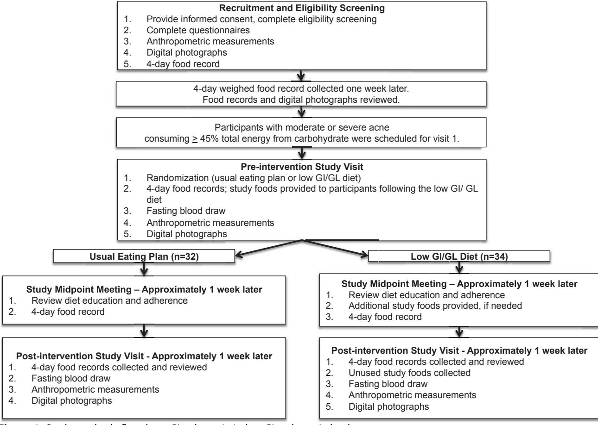
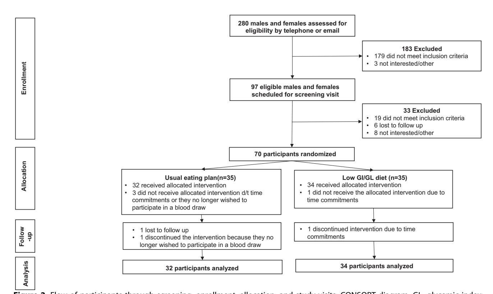

# **Original Research**

# A Low Glycemic Index and Glycemic Load Diet Decreases Insulin-like Growth Factor-1 among Adults with Moderate and Severe Acne: A Short-Duration, 2-Week Randomized Controlled Trial

Jennifer Burris, PhD, RD, CSSD, CSG; James M. Shikany, DrPH; William Rietkerk, MD, MBA; Kathleen Woolf, PhD, RD, FACSM

### **ARTICLE INFORMATION**

### **Article history:**

Submitted 18 August 2017 Accepted 6 February 2018 Available online 21 April 2018

### **Keywords:**

Acne vulgaris Glycemic index Glycemic load Diet Insulin-like growth factor-1

2212-2672/Copyright  $\circledcirc$  2018 by the Academy of Nutrition and Dietetics.

https://doi.org/10.1016/j.jand.2018.02.009

### **ABSTRACT**

**Background** A high glycemic index (GI) and glycemic load (GL) diet may stimulate acne proliferative pathways by influencing biochemical factors associated with acne. However, few randomized controlled trials have examined this relationship, and this process is not completely understood.

**Objective** This study examined changes in biochemical factors associated with acne among adults with moderate to severe acne after following a low GI and GL diet or usual eating plan for 2 weeks.

**Design** This study utilized a parallel randomized controlled design to compare the effect of a low GI and GL diet to usual diet on biochemical factors associated with acne (glucose, insulin, insulin-like growth factor [IGF]-1, and insulin-like growth factor binding protein [IGFBP]-3) and insulin resistance after 2 weeks.

**Participants** Sixty-six participants were randomly allocated to the low GI and GL diet (n=34) or usual eating plan (n=32) and included in the analyses.

**Main outcome measures** The primary outcomes were biochemical factors of acne and insulin resistance with dietary intake as a secondary outcome.

**Statistical analyses** Independent sample *t* tests assessed changes in biochemical factors associated with acne, dietary intake, and body composition pre- and post-intervention, comparing the two dietary interventions.

**Results** IGF-1 concentrations decreased significantly among participants randomized to a low GI and GL diet between pre- and postintervention time points (preintervention= $267.3\pm85.6$  mg/mL, postintervention= $244.5\pm78.7$  ng/mL) (P=0.049). There were no differences in changes in glucose, insulin, or IGFBP-3 concentrations or insulin resistance between treatment groups after 2 weeks. Carbohydrate (P=0.019), available carbohydrate (P<0.001), percent energy from carbohydrate (P<0.001), GI (P<0.001), and GL (P<0.001) decreased significantly among participants following a low GI/GL diet between the pre- and postintervention time points. There were no differences in changes in body composition comparing groups.

**Conclusions** In this study, a low GI and GL diet decreased IGF-1 concentrations, a well-established factor in acne pathogenesis. Further research of a longer duration should examine whether a low GI and GL diet would result in a clinically meaningful difference in IGF-1 concentrations leading to a reduction in acne. This trial was registered at clinicaltrials.gov as NCT02913001.

J Acad Nutr Diet. 2018;118(10):1874-1885.

CNE IS A WIDESPREAD AND CHRONIC INFLAMMAtory skin disease, particularly in developed nations. Although acne is typically misconstrued as a cosmetic disease limited to adolescents, acne affects most age groups and is associated with considerable psychological distress, physical morbidity, and social prejudice. The physical symptoms and psychological

repercussions associated with acne include pain and discomfort, obsessive-compulsiveness, shame, embarrassment, body image concerns, self-consciousness, social assertiveness, and poor self-esteem.8,9 Acne treatment can require a complex therapeutic regimen, frequently including both over-the-counter and prescription medications.10 Unfortunately, existing acne therapies may have unwanted side

effects11,12 and variable adherence.13-15 Moreover, acne treatment is often expensive with the cost of brand-name acne medications increasing 195% from 2009 to 2015.16,17 Thus, alternative prevention and treatment options for patients with acne are needed.

Acne is a multifaceted disease within the pilosebaceous unit, the hair follicle in skin associated with sebaceous (oil) glands. Racne pathogenesis consists of four main processes: (1) an increase in androgen hormones and subsequent increase in sebum production, (2) abnormal keratinocyte proliferation leading to the formation of comedones, (3) inflammation, and (4) bacterial colonization by *Propionibacterium acnes*. Other biochemical factors, including insulin and insulin-like growth factor (IGF)-1, may play a role in the etiology of acne by stimulating androgen hormones and sebum production.

The last decade has experienced a growth of interest in research investigating the association between acne and diet, including the glycemic index (GI) and glycemic load (GL). $^{20-26}$ Carbohydrate-containing foods provoke a wide range of blood glucose and insulin responses, estimated using GI and GL. GI measures the effect of carbohydrate-containing foods on postprandial blood glucose concentrations, relative to a carbohydrate standard, and is a measure of carbohydrate quality.27,28 A high-GI diet is characterized by a relatively high intake of carbohydrate-containing foods that are quickly digested and absorbed, increasing blood glucose and insulin concentrations. The GL takes the portion size of dietary carbohydrate into consideration and therefore is a measure of both the quality and quantity of carbohydrate-containing foods.29 GI and GL are implicated in acne pathogenesis due to diet-induced hyperinsulinemia, stimulating an increase in IGF-1 concentrations and androgen hormones and consequently, amplifying acne-promoting pathways.30,31

Although GI and GL have a biologically plausible role in acne pathophysiology, few randomized controlled trials (RCTs) have examined this relationship, and much remains unknown about how dietary GI and GL may influence acne. Over the past decade, only two RCTs have examined the effect of a low GI and GL diet on biochemical factors associated with acne. 22,23,26 Of these investigations, just one RCT reported significant improvements in insulin resistance among male participants with acne after following a low GL diet compared with a control diet.22,23 Similarly, a nonrandomized parallel controlled feeding study reported a significant improvement in insulin resistance among male participants with acne following a low GL diet compared with a carbohydrate-dense diet.21 Other RCTs have demonstrated improvements in the number and severity of acne lesions among participants following a low GI/GL diet.24,25 However, these studies did not measure changes in biochemical factors associated with acne among participants with acne, limiting the understanding of the suggested mechanisms linking diet and acne. Although these thought-provoking studies provide important preliminary information, the number of RCTs and interventions examining the effect of dietary GI and GL on biochemical factors associated with acne is relatively small, and research has not clearly supported a decrease in GI and GL with changes in biochemical factors associated with acne among participants with acne. Thus, researchers do not yet know if diet may alter the endocrine aspects associated with acne. Understanding the etiopathogenic mechanisms

### RESEARCH SNAPSHOT

Research Question: How does a 2-week low glycemic index [GI] and glycemic load [GL] diet affect changes in biochemical factors associated with acne (concentrations of glucose, insulin, insulin-like growth factor-1 [IGF-1], and insulin-like growth factor binding protein-3 [IGFBP-3]) and insulin resistance among adults with moderate to severe acne?

Research Findings: In this randomized controlled trial, IGF-1 concentrations decreased significantly among participants randomized to a low GI and GL diet between pre- and postintervention points (*P*=0.049). However, the clinical relevance for the change in IGF-1 concentrations requires additional investigation. Future research should consider including a longer duration to examine the effect of a low GI and GL diet on biochemical factors associated with acne and acne development. There were no differences in glucose, insulin, or IGFBP-3 concentrations or insulin resistance between treatment groups after 2 weeks.

involved in the diet-acne hypothesis is fundamental to eventually establishing and increasing the effectiveness of medical nutrition therapy for patients with acne.

To build on the existing evidence and help clarify the proposed mechanisms supporting the diet-acne hypothesis, the purpose of this RCT was to examine biochemical factors associated with acne (insulin, glucose, IGF-1, and insulin-like growth factor binding protein [IGFBP]-3 concentrations) and insulin resistance among adults with moderate to severe acne after following a weight-maintaining low GI and GL diet or usual eating plan for 2 weeks. If the biochemical factors associated with acne are affected by the intervention, a low GI and GL diet may attenuate acne development by influencing some endocrine pathways. This 2-week study will help delineate the effect of diet on biochemical factors associated with acne. The primary outcomes of the study include biochemical factors of acne and insulin resistance with dietary intake as a secondary outcome.

### **METHODS**

### **Experimental Design and Study Sample**

This study followed a parallel RCT design (Figure 1). Participants were recruited from September 2014 to November 2015 in the greater New York City area using flyers and messages posted in local dermatology clinics, university and community boards, LISTSERVS, restaurants, and Craigslist. Participants were eligible for inclusion if they were (1) between 18 and 40 years old; (2) had a body mass index (BMI; calculated as  $kg/m^2$ )  $\geq 18.5$  or < 30.0; (3) had moderate or severe facial acne as determined by a dermatologist at the time of study enrollment; (4) had self-reported moderate or severe acne for at least 6 months prior to study enrollment; and (5) were able to read and speak the English language. Participants were excluded from participation if they (1) had a self-reported history of recent weight change (>10% weight change within the last 6 months); (2) were taking medications known to alter blood glucose or insulin concentrations;

Figure 1. Study methods flowchart. GI¼glycemic index; GL¼glycemic load.

(3) had a medical history of any diagnosis known to alter blood glucose or insulin concentrations, including polycystic ovarian syndrome, type 1 diabetes, type 2 diabetes, or prediabetes; (4) were following a low-carbohydrate diet (<45% of total energy from carbohydrate) as determined by a 4-day food and beverage record analysis; (5) were pregnant or lactating (or were pregnant or lactating within the last year) (females); (6) had a pacemaker or other battery-operated implant; or (7) had facial hair that would make it difficult for a health care provider to assess facial acne. The University Committee on Activities Involving Human Subjects at New York University approved this study prior to data collection.

Participation included one screening visit, two study visits (pre- and postintervention), and one telephone or e-mail midpoint visit. All study visits occurred at New York University (New York, NY). Interested participants contacted study investigators, and eligibility was determined over the telephone or e-mail. Potential participants were invited to a screening visit to confirm eligibility.

During the screening visit, the study investigators reviewed the study methods, and all participants provided written informed consent. The study investigators measured height and weight and took digital photographs of the front and side views of the face of each participant. Participants completed a questionnaire that provided information on demographic characteristics and relevant past medical history and were given instructions on how to complete a 4-day food and beverage record to assess usual dietary intake. Only participants consuming a diet with 45% of total energy from carbohydrate and with a diagnosis of moderate or severe acne were invited to continue with the study, as determined by an analysis of the 4-day food and beverage record and digital photograph.

During the preintervention visit, participants were randomized to follow one of two study diets (a low GI and GL diet or usual eating plan) using a computer generated blocked random allocation sequence. Blood was drawn from fasting subjects, anthropometric measurements were taken, and digital photographs were taken of the front and side views of the face. Participants were given a food and beverage record and asked to log dietary intake for 8 days during the next 2 weeks (4 days per week).

Approximately 1 week later (at the midpoint visit), participants were contacted by telephone or e-mail by a registered dietitian nutritionist to encourage study compliance, review the study protocol, and address study questions. Participants were also encouraged to maintain their usual body weight.

After 2 weeks, the postintervention visit was completed, where blood was again drawn from fasting subjects, anthropometric measurements were conducted, digital photographs were taken of the face, and food and beverage records were collected.

### Anthropometric Measurements

Weight and height were measured and BMI was calculated during the screening, preintervention, and postintervention visits. The measurements recorded during the screening visit confirmed BMI eligibility and were not used in the analysis. Weight was measured without shoes, jackets, or coats using a digital scale (Seca Corporation). Height was measured without shoes using a wall-mounted stadiometer (Seca Corporation). Waist circumference and body composition were measured at both the pre- and postintervention visits. Waist circumference was measured three times at the iliac crest using the Gulick II constant-tension measuring tape (Country Technology, Inc). The mean of the three waist circumference measurements was used in the analyses and waist-to-height ratio was calculated. Anthropometric measurements were recorded to the nearest tenth for centimeters and kilograms. Body composition was measured via bioelectrical impedance analysis using the Quad Scan 4000 multifrequency analyzer (Bodystat).

## Diet Assessment

Participants were given a food and beverage record during the screening and preintervention visits. During the screening visit, participants were asked to record food and beverage intake for 4 days to determine study eligibility and provide a measure of preintervention or typical dietary intake. During the preintervention visit, participants were asked to record food and beverage intake for 8 days after randomization (4 days per week, including 1 weekend day per week, for a total of 2 weeks) to provide a measure of and any changes in dietary intake during the intervention.

Participants were instructed by a registered dietitian nutritionist on techniques to accurately record food and beverage intake (eg, food description, portion sizes, food preparation, brand names, times consumed) using food models, measuring cups, and Gourmet Weigh food scales (Metrokane Inc). Participants were loaned a food scale and given a handout with detailed instructions and examples on techniques to accurately record foods and beverages, including combination foods and foods from fast-food establishments, restaurants, cafeterias, and vending machines. Study investigators reviewed techniques to correctly record food and beverages as needed throughout the duration of the study, and participants were encouraged to contact study investigators with any questions or concerns. Study investigators reviewed the food and beverage records with the participants for accuracy and completeness before data entry.

Nutrient intakes (energy, macronutrients, percent energy from carbohydrate, available carbohydrate [grams of carbohydrateegrams of dietary fiber], GI, and GL) were determined using the Nutrition Data System for Research software, version 8, 2014 (Nutrition Coordinating Center, University of Minnesota). Nutrisystem provided the nutrient composition for the Nutrisystem foods. All GI and GL values were calculated using glucose as the standard. The Nutrition Data System for Research and Nutrisystem values were combined to determine each participant's total intake for the relevant nutrients.

### Dietary Intervention

Participants randomized to the intervention diet received nutrition education on a low GI and GL diet from a registered dietitian nutritionist. Dietary recommendations included methods to modify the frequency, portion, and type of carbohydrate, such as substituting lower GI and GL foods for higher GI and GL foods. Nutrition handouts included information on dietary GI and GL and examples of low and high GI and GL foods, snacks, and meals. The study investigators evaluated participants' understanding of the diet by asking participants to identify low and high GI and GL foods and beverages from a list of foods and beverages. In addition, Nutrisystem provided some low GI and GL staple foods to participants randomized to the intervention diet. Nutrisystem foods with a GI<55 and in the lowest third of GI values for each meal offering were included. Although participants selected the Nutrisystem foods at the preintervention visit, participants could pick up additional Nutrisystem foods throughout the 2-week intervention. Participants randomized to the low GI and GL diet were not required to eat the study provided foods but were encouraged to consume these foods or similar low GI and GL foods, including fruits and vegetables, to maintain usual body weight.

Participants randomized to the usual eating plan were instructed to continue with their typical dietary habits, without reference to carbohydrate intake or GI and GL. Participants following the usual eating plan were encouraged to eat meals or snacks as desired to maintain usual body weight throughout the duration of the study. All participants were provided with handouts summarizing the dietary recommendations for their specific diet. During the midpoint visit, participants received a review of either the low GI and GL diet or usual eating plan nutrition education. After the completion of the study, participants randomized to the usual eating plan were offered the same nutrition education as participants randomized to the low GI and GL diet.

## Laboratory Analyses

Blood was drawn from each fasting participant to measure concentrations of insulin, glucose, IGF-1, and IGFBP-3 at preand postintervention. Blood samples were drawn by venipuncture and centrifuged by a trained phlebotomist. Quest Diagnostics performed all laboratory assays. Insulin resistance was calculated from fasting glucose and insulin concentrations using the homeostatic model assessment of insulin resistance [(glucose (mg/L)insulin (mIU/mL))/405].[32](#page-9-0)

### Dermatology Assessment

Digital photographs were taken of the front and side views of the face to assess acne and ensure that all acne lesions were counted and graded by size and severity during the screening, preintervention, and postintervention visits. All digital photographs were taken in the same well-lit location (during the day time) using a high-resolution camera adequate for close-up facial photographs.[33](#page-9-0) A dermatologist determined acne severity (no, almost no, mild, moderate, or severe acne) using the Investigator Global Assessment Scale and total lesion count as part of the eligibility criteria.[34](#page-9-0) Only participants with moderate or severe acne during the screening visit were eligible to participate. The reliability of acne lesion counting is high when performed by the same trained clinician (reliability estimates, 0.81 to 0.97).35 Thus, the same dermatologist performed all acne assessments.

### Statistical Analysis

Sample size was determined using G\*Power analysis software for Windows. Power calculations determined that 52 participants (26 participants per group) would provide >80% power to detect an effect size of a 20% difference in insulin and IGF-1 concentrations. To allow for possible participant attrition, the recruitment goal was a minimum of 60 participants (30 participants per group).

Baseline characteristics, including anthropometric measurements, biochemical factors, and dietary intakes between the two treatment groups, were compared using independent sample t tests or Mann-Whitney tests, depending on the distribution of the data.  $\chi^2$  tests compared baseline categorical characteristics between the two treatment groups.

The primary clinical outcomes, biochemical factors associated with acne and insulin resistance over a 2-week period, were analyzed using an intent-to-treat model. Independent sample *t* tests examined differences between the two groups in changes in biochemical factors associated with acne, insulin resistance, dietary intake variables, and anthropometric measurements from the pre- and postintervention visit (after 2 weeks). The last observation carried forward method was

used for missing data (a total of one participant).36 A *P* value of <0.05 was used to indicate statistical significance. All study outcomes were assessed for normality and statistical analyses were completed using IBM SPSS Statistics version 23.0.

### **RESULTS**

### **Participants**

The flow of participants through screening, enrollment, randomization, and study visits is shown using a CONSORT diagram in Figure 2. Of the 70 participants who met the inclusion criteria, provided informed consent, and were randomized to one of the two treatments, three withdrew due to time commitments (usual eating plan, n=2; low GI and GL diet, n=1) and one withdrew (usual eating plan) because that participant no longer wanted to complete a blood draw. The data collected from the 66 participants (usual eating plan, n=32; low GI and GL diet, n=34) participating in the preintervention blood draw and anthropometric measurements were included in the final analysis. Comparisons of the baseline characteristics among participants randomized to both treatments are shown in Table 1. At baseline, there were no significant differences in age, sex, ethnicity, race, current smoking, contraceptive use (among females), or history of regular menstrual cycle (among females) between treatment groups. Similarly, there were no differences in BMI, waist circumference, waist-toheight ratio, or percent body fat between the two treatment groups at baseline (Table 2).

**Figure 2.** Flow of participants through screening, enrollment, allocation, and study visits: CONSORT diagram. Gl=glycemic index; GL=glycemic load.

**Table 1.** Preintervention demographic characteristics, anthropometric measurements, and health history among participants with moderate and severe acne in a randomized controlled trial comparing a usual eating plan or low glycemic index/glycemic load diet

| Characteristic                            | Overall (n=66) | Usual eating plan (n=32) | Low GI/GL a diet (n=34) | P value |  |
|-------------------------------------------|----------------|--------------------------|------------------------------------|---------|--|
|                                           | ←              |                          |                                    |         |  |
| Age (years)                               | 22±4           | 23±4                     | 22±4                               | 0.153   |  |
|                                           | ←              |                          |                                    |         |  |
| Sex                                       |                |                          |                                    | 0.072   |  |
| Male                                      | 12 (18)        | 3 (9)                    | 9 (26)                             |         |  |
| Female                                    | 54 (82)        | 29 (91)                  | 25 (75)                            |         |  |
| Ethnicity                                 |                |                          |                                    | 0.563   |  |
| Hispanic                                  | 4 (6)          | 3 (9)                    | 1 (3)                              |         |  |
| Non-Hispanic                              | 62 (94)        | 29 (91)                  | 33 (97)                            |         |  |
| Race                                      |                |                          |                                    | 0.708   |  |
| Black or African American                 | 3 (5)          | 2 (7)                    | 1 (3)                              |         |  |
| Asian                                     | 37 (56)        | 16 (50)                  | 21 (62)                            |         |  |
| White                                     | 20 (30)        | 10 (31)                  | 10 (29)                            |         |  |
| Multiracial                               | 5 (8)          | 3 (10)                   | 2 (6)                              |         |  |
| Other                                     | 1 (1)          | 1 (3)                    | 0 (0)                              |         |  |
| Currently smoking cigarettes b | 4 (6)          | 2 (6)                    | 2 (6)                              | 0.999   |  |
| Contraceptive use c            | 10 (19)        | 3 (10)                   | 7 (28)                             | 0.189   |  |
| Regular menstrual cycle d      | 44 (82)        | 24 (83)                  | 20 (80)                            | 0.999   |  |

&lt;sup>aLow GI/GL=low glycemic index and glycemic load.

### **Biochemical Factors Associated with Acne**

IGF-1 concentrations significantly decreased (mean $\pm$  standard deviation [SD] change= $-22.8\pm56.6$  ng/mL) among participants following the low GI and GL diet compared with participants following their usual eating plan (mean $\pm$ SD change= $1.6\pm40.8$  ng/mL) (P=0.049) after the 2-week intervention (Table 2). There were no significant differences in changes in glucose, insulin, and IGFBP-3 concentrations, or insulin resistance between the two treatment groups from pre- to postintervention. There were no differences in BMI, waist circumference, waist-to-height ratio, or percent body fat, between groups after 2 weeks.

### **Dietary Intake**

Mean energy (kilocalarie and percentages) and macronutrient intakes (grams) are presented in Table 3. Total carbohydrate (P=0.019), available carbohydrate (P<0.001), percent energy carbohydrate (P<0.001), GI (P<0.001), and GL (P<0.001) decreased significantly among participants randomized to follow the low GI and GL diet compared with those following their usual eating plan between the pre- and postintervention time points. However, there were no significant differences in changes in total energy intake

comparing the two groups during the 2-week intervention period.

### **DISCUSSION**

This short-term RCT examined the effect of a low GI and GL diet on biochemical factors associated with acne, with the overall goal of clarifying the proposed mechanisms linking diet and acne and informing future research to explore medical nutrition therapy as a potential treatment option for patients with acne. These results demonstrated that following a low GI and GL diet for 2 weeks significantly decreased IGF-1 concentrations. The change in IGF-1 concentrations among participants randomized to follow a low GI and GL diet from the pre- to postintervention time points was relatively small ( $\sim 10\%$  change) and of marginal statistical significance (P=0.049). Consequently, the clinical relevance is unknown. Nevertheless, the changes in IGF-1 concentrations among participants following a low GI and GL diet are worthy of our attention. In addition, following a low GI and GL diet for 2 weeks resulted in significant decreases in total carbohydrate, available carbohydrate, percent energy from carbohydrate, GI, and GL. This finding demonstrates that nutrition education may have a therapeutic potential in acne

&lt;sup>bParticipants self-reporting smoking any cigarettes within the last year.

&lt;sup>cFemale participants only (n=55) self-reporting any contraceptive use that supplies estrogen supplementation.

dFemale participants only (n=55) self-reporting a menstrual cycle occurring every 28 to 35 days.

**Table 2.** Biochemical factors associated with acne and anthropometric measurements at preintervention and postintervention (after 2 weeks) among participants with moderate and severe acne in a randomized controlled trial comparing a usual eating plan and low glycemic index/glycemic load diet

|                                                                     | Preintervention                 |                   |         | Postintervention |                | Change from Pre- to Postintervention |                  |          |
|---------------------------------------------------------------------|---------------------------------|-------------------|---------|------------------|----------------|--------------------------------------|------------------|----------|
|                                                                     | Usual eating                    | g Low GI/GL       | ı       | Usual eating     | g Low GI/GL    | Usual dating                         | J Low GI/GL      |          |
| Measure                                                             | plan                            | diet              | P value | <u>plan</u>      | diet           | plan                                 | diet             | P value  |
|                                                                     | ← — mean±standard deviation — → |                   |         |                  |                |                                      |                  |          |
| Body mass index (calculated as kg/m²)                            | 22.3±2.6                        | 22.0±2.8          | 0.712   | 22.0±2.7         | 21.9±2.8       | $-0.1 \pm -0.5$                      | −1.4±5.5         | 0.166    |
| Waist circumference (cm)                                            | $78.1 \pm 8.2$                  | 75.6 $\pm$ 6.0    | 0.161   | $78.0 \pm 7.6$   | $75.3 \pm 5.9$ | $-0.1 {\pm} 2.1$                     | $-2.5\pm15.9$    | 9 0.414  |
| Waist-to-height ratio                                               | $0.47{\pm}0.05$                 | $0.46 {\pm} 0.04$ | 0.360   | $0.47{\pm}0.05$  | 0.45±0.04      | $-0.0 {\pm} 0.0$                     | $-0.0 {\pm} 0.1$ | 0.236    |
| Percent body fat (%)                                                | $26.4 \pm 6.1$                  | $23.2 \pm 6.9$    | 0.053   | $27.2 \pm 5.9$   | $23.4 \pm 6.9$ | $0.8 {\pm} 1.4$                      | $-0.6 \pm 6.0$   | 0.419    |
| Glucose (mg/dL) b                                        | $78.4 \pm 7.2$                  | 79.1±5.0          | 0.635   | 77.5 $\pm$ 7.2   | $78.2 \pm 6.7$ | $0.9 \pm 5.4$                        | $-0.9 \pm 5.9$   | 0.983    |
| Insulin (μIU/mL) c                                       | 5.5±4.8                         | $4.8 \pm 2.0$     | 0.470   | 5.7±4.4          | $4.3 \pm 1.9$  | $-0.3 \pm 3.3$                       | $-0.5 \pm 2.1$   | 0.272    |
| Homeostatic model assessment of insulin resistance d     | 1.1±1.1                         | 0.9±0.4           | 0.448   | 1.1±0.9          | 0.8±0.4        | 0.0±0.8                              | $-0.1 \pm 0.4$   | 0.405    |
| Insulin-like growth factor-1 (ng/mL) e                | 236.1±83.1                      | 267.3±85.6        | 0.138   | 237.7±56.7       | 244.5±78.7     | 1.6±40.8                             | −22.8±56.6       | 5 0.049* |
| Insulin-like growth factor binding protein-3 (mg/L) f | 4.5±1.0                         | 4.9±0.8           | 0.169   | 4.7±1.0          | 8.2±19.4       | 0.2±0.5                              | 3.3±19.3         | 3 0.348  |

&lt;sup>aLow GI/GL=low glycemic index and glycemic load.

treatment due to the beneficial effect of a low GI and GL diet on IGF-1 concentrations.

Our finding, that consuming a low GI and GL diet significantly decreased IGF-1 concentrations, is like other RCTs examining the effect of a low GI and GL diet on biochemical factors associated with acne, suggesting, mechanistically, diet-induced hyperinsulinemia leads to higher circulating IGF-1 concentrations. Despite this, few RCTs have investigated the effect of a low GI and GL diet on biochemical factors associated with acne. In an RCT, Smith and colleagues observed a significant improvement in insulin resistance22 and decrease in inflammatory acne lesions, 22,23 total acne lesions, 22,23 and BMI 22,23 among males randomized to follow a low GL diet compared with a carbohydrate-dense diet for 12 weeks. When the researchers adjusted for changes in BMI, the effect of the diet on insulin resistance was no longer significant. Thus, the change in GL, BMI, or a combination of the change in GL and BMI, could be responsible for the improvement in insulin resistance and acne.37 Moreover, because weight loss was a confounding factor the underlying mechanisms linking diet and acne require further delineation. The participants in our study maintained body composition (BMI, waist circumference, waist-to-height ratio, and percent body fat) throughout the 2-week intervention. This outcome is especially important because weight loss may independently affect some hormones and insulin resistance. In a nonrandomized control feeding trial, Smith and colleagues also reported significant improvements in insulin resistance and decreases in IGFBP-3 among male participants with acne consuming a low GL diet compared with participants consuming a high GL diet for 7 days.21 Although the researchers did not detect significant changes in IGF-1 concentrations between treatment groups, the significant increases in IGFBP-3 among participants following a low GL diet may suggest a reduction in IGF-1 activity.

In contrast to our study, Reynolds and colleagues did not observe significant changes in biochemical factors associated with acne, including IGF-1 concentrations, among adolescent males with acne following a low or high GL diet for 10 weeks. Although these results have regularly been mentioned in the research literature as evidence to refute the diet-acne relationship, this study has several methodological concerns, including a relatively high attrition (26%), missing food records (10%), failure to account for baseline diet, no randomization, a lack of blinding of the study participants to the study purpose, a dietary analysis based on foods consumed only on weekends, and a somewhat small difference in GI between treatment groups. In contrast, the

bTo convert mg/dL glucose to mmol/L, multiply mg/dL by 0.0555. To convert mmol/L glucose to mg/dL, multiply mmol/L by 18.0. Glucose of 78.4 mg/dL=4.4 mmol/L.

&lt;sup>CTo convert mIU/mL insulin to pmol/L, multiply mIU/mL by 6.945. To convert pmol/L insulin to mIU/mL, multiply pmol/L by 0.144. Insulin of 5.5 mIU/mL=38.2 pmol/L.

dHomeostatic model assessment of insulin resistance=(glucose (mg/dL)×insulin (μlU/mL))/405.

&lt;sup>eTo convert ng/mL insulin-like growth factor-1 to nmol/L, multiply ng/mL by 0.131. To convert nmol/L insulin-like growth factor-1 to ng/mL, multiply nmol/L by 7.64. Insulin-like growth factor-1 of 236.1 ng/mL=30.9 nmol/L.

To convert mg/L insulin-like growth factor binding protein-3 to nmol/L, multiply mg/L by 35. To convert nmol/L insulin-like growth factor binding protein-3 to mg/L, multiply nmol/L by 0.0286. Insulin-like growth factor binding protein-3 of 4.5 mg/L=157.5 nmol/L.

\*Significant at P < 0.05

**Table 3.** Dietary analysis at pre-intervention and postintervention (after 2 weeks) among participants with moderate and severe acne in a randomized controlled trial comparing a usual eating plan and a low glycemic index/glycemic load diet

|                                         | Pre                            | Preintervention                |         |                      | Postintervention  |                      | Change from Pre- to Postintervention |         |  |
|-----------------------------------------|--------------------------------|--------------------------------|---------|----------------------|-------------------|----------------------|--------------------------------------|---------|--|
| Measure                                 | Usual eating plan           | Low GI/GL a diet | P value | Usual eating plan | Low GI/GL diet | Usual eating plan | Low GI/GL diet                    | P value |  |
|                                         | ← — mean±standard deviation— → |                                |         |                      |                   |                      |                                      |         |  |
| Energy (kcal)                           | 1,815±527                      | 1,839±498                      | 0.853   | 1,650±391            | 1,631±367         | $-177 \pm 326$       | $-214 \pm 466$                       | 0.712   |  |
| Total fat (g)                           | 68±25                          | 66±21                          | 0.814   | 61±17                | 67±18             | $-7\pm13$            | $0.2\pm22$                           | 0.114   |  |
| Total protein (g)                       | 73±30                          | 76±28                          | 0.643   | 64±22                | 82±23             | $-10 \pm 17$         | 6±25                                 | 0.005*  |  |
| Total carbohydrate (g)                  | 227±63                         | 234±64                         | 0.696   | 213±59               | 186±52            | $-15 \pm 52$         | $-49 \pm 60$                         | 0.019*  |  |
| Available carbohydrate (g) b | 206±57                         | 215±62                         | 0.586   | 195±57               | 150±42            | $-11 \pm 48$         | $-67 \pm 56$                         | <0.001* |  |
| Percent energy from carbohydrate (%)    | 51±7                           | 51±7                           | 0.815   | 52±8                 | 46±8              | 1±6                  | −6±7                                 | <0.001* |  |
| Glycemic index                          | 59±5                           | 59±5                           | 0.694   | 59±4                 | 47±6              | 1±4                  | $-12\pm8$                            | <0.001* |  |
| Glycemic load                           | 122±34                         | 128±39                         | 0.476   | 117±34               | 71±23             | −5±31                | −59±36                               | <0.001* |  |

aLow GI/GL=low glycemic index and glycemic load.

participants in our study reported substantial differences in GI and GL and consequently, a significant decrease in IGF-1 concentrations, suggesting a greater decrease in GI and GL is necessary to decrease IGF-1 concentrations.

GI and GL may play a role in the pathophysiology of acne predominately by influencing insulin metabolism. Intervention studies suggest hyperinsulinemia increases IGF-1 concentrations, 38,3 which simultaneously androgen production and inhibit IGFBP-3 concentrations. 40,41 IGF-1 is a mediator of cellular growth and may amplify acne by stimulating androgen synthesis, sebocyte growth, and lipogenesis of sebaceous glands. 19,42 Androgen hormones are well-established factors in acne development, stimulating keratinocyte proliferation, sebum production, and sebaceous gland growth. 43 Suppressing IGFBP-3 may increase the bioavailability of IGF-1, amplifying acne development. Interestingly, treatment with IGF-1 provokes acne development, 44-46 and polymorphisms of IGF-1 are linked to a predisposition to acne, possibly due to higher circulating IGF-1 concentrations.47

A more recent hypothesis suggests diet-induced hyperinsulinemia may promote acne at the cellular level by stimulating IGF-1 concentrations and activating phosphoinositide-3-kinase/Atk pathway. This pathway may reduce the nuclear localization of the forkhead Fox-O1 transcription factor.50 Reduced forkhead Fox-O1 increases the activity of the androgen receptor and decreases the activity of the nutrient-sensitive kinase mammalian target of rapamycin complex and sterol regulatory element-binding protein. 50-52 Therefore, dietary GI and GL may aggravate acne development by activating mammalian target of rapamycin complex and stimulating keratinocyte proliferation and differentiation, androgen signaling, and lipid synthesis.49 Decreased sterol regulatory element-binding protein concentrations may additionally influence acne by amplifying sebocyte growth and inducing sebaceous lipogenesis.25

In our study, participants randomized to follow a low GI and GL diet significantly decreased total carbohydrate, available carbohydrate, percent energy from carbohydrate, GI and GL. Although both groups reported a decrease in total energy over time, there were no significant differences in changes in energy intake between the two treatment groups at baseline or the end of the 2-week intervention. In addition, the participants maintained their body composition (BMI, waist circumference, waist-to-height ratio, and percent body fat). This suggests the self-reported decrease in energy intake and macronutrient intake may reflect participant fatigue with completing food records rather than an actual decrease in energy intake. The decrease in energy intake and macronutrient intake among both groups after 2 weeks, despite maintaining body composition, highlights the challenges of using self-reported food and beverage records to assess dietary intake. Although accurate and consistent measurement and recording of dietary intake is essential in research and clinical practice, recording dietary intake is challenging, may vary over time, and is labor-intensive, conceivably increasing participant burden and fatigue. 53-55

In this study, participants maintained body composition. Limitations of previous research include negative energy balance and weight loss among participants following the low GI and GL diet or changes in body composition were not measured. Thus, previous research cannot attribute the treatment effect to a change in dietary GI and GL or a change in weight. In addition, a registered dietitian nutritionist educated all participants on either a low GI and GL diet or their usual eating plan. Participant nutrient intakes and dietary GI and GL were assessed using a 4-day food record, which is an adequate amount of time to evaluate

&lt;sup>bAvailable carbohydrate (total carbohydrate—dietary fiber).

\*Significant at P < 0.05.

carbohydrate intake.[56](#page-10-0) Furthermore, the study had low attrition, which may be due to the short study duration or the frequent contact by study investigators reminding participants of future study appointments and encouraging study compliance. Finally, this study utilized a rigorous RCT study design and included a diverse study population of males and females with moderate to severe acne whereas previous research has primarily focused on young adult males with acne.[21-24](#page-9-0)

This study also contains some limitations, which should be noted for future research. First, the study duration was not long enough to determine the effect of a low GI and GL diet on acne development or severity. The duration for most clinical acne trials is approximately 10 to 12 weeks.[56-58](#page-10-0) However, the primary objective of our study was to clarify the proposed mechanisms linking dietary GI and GL, not the trajectory of acne. Two weeks is an adequate amount of time to measure changes in biochemical factors associated with acne.[21,59,60](#page-9-0) Thus, the short study duration was not a substantial concern. For instance, as discussed previously, Smith and colleagues observed significant improvements in some biochemical factors associated with acne among participants with acne after following a low GL diet for only 1 week.[21](#page-9-0) The significant changes in IGFBP-3 among participants following a low GL diet suggest a reduction in IGF-1 activity. Second, only one of the primary study outcomes (biochemical factors associated with acne and insulin resistance) was significant, and the overall change in IGF-1 from pre- to postintervention points among participants randomized to follow a low GI and GL diet was relatively small (w10%). Despite this, our results are in accordance with previous research observing a 4% decrease in IGF-1 among participants following a low GI and GL diet.[39](#page-9-0) In addition, the intent of the current study was to determine the efficacy of a low GI and GL diet in changing biochemical factors associated with acne among participants with acne to help clarify the proposed mechanisms linking diet and acne. Thus, the magnitude of the change in IGF-1 concentrations among participants randomized to follow the low GI and GL diet on acne development or severity is not known and cannot be determined with a short study duration. Furthermore, because the research literature investigating the relationship between biochemical markers associated with acne and dietary GI and GL is relatively sparse, it is difficult to determine if the changes in IGF-1 concentrations observed in this sample were coincidental or if these biochemical markers play a major role in the pathogenesis of acne. Additional research is necessary to confirm our findings and determine the minimal change in IGF-1 concentrations necessary to affect acne in response to a low GI and GL diet. Third, although the carbohydrate content of milk and dairy were considered in the calculation of dietary GI and GL, other components of milk and dairy were not studied.[8,20](#page-9-0) The acne-promoting mechanisms of dairy and milk are multifactorial and are largely theorized to play a role in the etiology of acne by influencing insulin and IGF-1 signaling.[61,62](#page-10-0) Fourth, the study participants were not observed under tightly controlled conditions, did not consume the study foods under observation, and self-selected their own foods after receiving a thorough nutrition education. This study excluded participants without acne, and it is unknown if participants without acne would respond differently to the intervention compared with those with acne. Despite this, previous research indicates patients with and without acne have different concentrations of some hormones, including IGF-1.[63,64](#page-10-0) Although there were no significant differences in biochemical factors associated with acne (insulin, glucose, IGF-1, or IGFBP-3 concentrations) or insulin resistance between the two treatment groups at baseline, the participants randomized to follow a low GI and GL diet seem to have higher IGF-1 concentrations compared with participants following a usual diet. Thus, the clinical relevance for the significant change in IGF-1 concentrations among participants randomized to a low GI and GL diet between the pre- and postintervention points is not known and requires additional investigation. In addition, this study did not measure biomarkers to help validate dietary intake. It is possible some participants may not have followed a low GI and GL diet, especially on the days in which a food record was not completed. This study was a free-living study and therefore did not measure the maximum response for participants randomized to the dietary treatment. Nevertheless, translational research mimics a real-world setting and can successfully evaluate the effectiveness of medical nutrition therapy, especially with close participant monitoring. The participants were blinded to the study objectives, and the dermatologist was blinded to the allocation of participant treatment. However, because the participants were following either a low GI and GL diet or their usual eating plan and participants randomized to the low GI and GL diet received some study foods, the study investigators were not blinded to the allocation of participant treatment. Moreover, this study was designed as intent-to-treat, and outcome measures were not available for the participants that withdrew from the study after randomization. The last observation carried forward method was used to handle any postintervention data.[37](#page-9-0) This technique assumes the exposure status of the participant has not changed from visit 1 to visit 2. Although other methods to handle missing data were considered, the current study had a remarkably low attrition (4%), so the method employed probably was not critical. Finally, although this study was adequately powered to detect differences in insulin and IGF-1 concentrations, the study may have been underpowered to detect differences in the other biochemical factors associated with acne (glucose and IGFBP-3 concentrations).

CONCLUSIONS This short-term RCT found that a low GI and GL diet decreased IGF-1 concentrations among male and female adults with moderate to severe acne after 2 weeks, demonstrating the important effects of a low GI and GL diet on factors related to acne and the potential implications of medical nutrition therapy in acne pathogenesis. Although IGF-1 is a well-known factor in the pathophysiology of acne, several questions regarding the effectiveness of medical nutrition therapy on acne remain to be elucidated. In addition to confirming our findings, future research should consider including a longer duration to examine the effect of a low GI and GL diet on biochemical factors associated with acne and acne development, including the number of acne lesions and acne severity. Despite this, our results elucidate the proposed mechanisms linking diet and acne, may aid researchers in designing future interventions focused on improving acne, are promising for translation into clinical practice, and suggest medical nutrition therapy may be a viable treatment option for patients with acne, due to the diet-induced endocrine effects on acne-promoting pathways.

### References

- 1. [Bhate K, Williams HC. Epidemiology of acne vulgaris.](http://refhub.elsevier.com/S2212-2672(18)30164-3/sref1) Br J Dermatol. [2013;168\(3\):474-485.](http://refhub.elsevier.com/S2212-2672(18)30164-3/sref1)
- 2. [Timms RM. Moderate acne as a potential barrier to social relation](http://refhub.elsevier.com/S2212-2672(18)30164-3/sref2)[ships: myth or reality?](http://refhub.elsevier.com/S2212-2672(18)30164-3/sref2) Psychol Health Med. 2013;18(3):310-320.
- 3. [Bowe WP, Leyden JJ, Crerand CE, Sarwer DB, Margolis DJ. Body](http://refhub.elsevier.com/S2212-2672(18)30164-3/sref3) [dysmorphic disorder symptoms among patients with acne vulgaris.](http://refhub.elsevier.com/S2212-2672(18)30164-3/sref3) J Am Acad Dermatol[. 2007;57\(2\):222-230](http://refhub.elsevier.com/S2212-2672(18)30164-3/sref3).
- 4. [Ahmed A, Leon A, Butler DC, Reichenberg J. Quality-of-life effects of](http://refhub.elsevier.com/S2212-2672(18)30164-3/sref4) [common dermatological diseases.](http://refhub.elsevier.com/S2212-2672(18)30164-3/sref4) Semin Cutan Med Surg. [2013;32\(2\):101-109.](http://refhub.elsevier.com/S2212-2672(18)30164-3/sref4)
- 5. [Halvorsen JA, Stern RS, Dalgard F, Thoresen M, Bjertness E, Lien L.](http://refhub.elsevier.com/S2212-2672(18)30164-3/sref5) [Suicidal ideation, mental health problems, and social impairment are](http://refhub.elsevier.com/S2212-2672(18)30164-3/sref5) [increased in adolescents with acne: A population-based study.](http://refhub.elsevier.com/S2212-2672(18)30164-3/sref5) J Invest Dermatol[. 2011;131\(2\):363-370](http://refhub.elsevier.com/S2212-2672(18)30164-3/sref5).
- 6. [Yentzer BA, Hick J, Reese EL, Uhas A, Feldman SR, Balkrishnan R. Acne](http://refhub.elsevier.com/S2212-2672(18)30164-3/sref6) [vulgaris in the United States: A descriptive epidemiology.](http://refhub.elsevier.com/S2212-2672(18)30164-3/sref6) Cutis. [2010;86\(2\):94-99.](http://refhub.elsevier.com/S2212-2672(18)30164-3/sref6)
- 7. [McConnell RC, Fleischer AB Jr, Willford PM, Feldman SR. Most topical](http://refhub.elsevier.com/S2212-2672(18)30164-3/sref7) [tretinoin treatment is for acne vulgaris through the age of 44 years:](http://refhub.elsevier.com/S2212-2672(18)30164-3/sref7) [An analysis of the national ambulatory medical care survey, 1990-](http://refhub.elsevier.com/S2212-2672(18)30164-3/sref7) 1994. J Am Acad Dermatol[. 1998;38\(2 Pt 1\):221-226](http://refhub.elsevier.com/S2212-2672(18)30164-3/sref7).
- 8. [Williams HC, Dellavalle RP, Garner S. Acne vulgaris.](http://refhub.elsevier.com/S2212-2672(18)30164-3/sref8) Lancet. [2010;379\(9813\):361-372.](http://refhub.elsevier.com/S2212-2672(18)30164-3/sref8)
- 9. [Tan JK. Psychosocial impact of acne vulgaris: Evaluating the](http://refhub.elsevier.com/S2212-2672(18)30164-3/sref9) evidence. [Skin Therapy Lett](http://refhub.elsevier.com/S2212-2672(18)30164-3/sref9). 2004;9(7):1-3.
- 10. [Zaenglein AL, Pathy AL, Schlosser BJ, et al. Guidelines of care for the](http://refhub.elsevier.com/S2212-2672(18)30164-3/sref10) [management of acne vulgaris.](http://refhub.elsevier.com/S2212-2672(18)30164-3/sref10) J Am Acad Dermatol. 2016;74(5): [945-973.](http://refhub.elsevier.com/S2212-2672(18)30164-3/sref10)
- 11. [On SC, Zeicher J. Isotretinoin updates.](http://refhub.elsevier.com/S2212-2672(18)30164-3/sref11) Dermatol Ther. 2013;26(5): [377-389.](http://refhub.elsevier.com/S2212-2672(18)30164-3/sref11)
- 12. [Tripathi SV, Gustafson CJ, Huang KE, Feldman SR. Side effects of](http://refhub.elsevier.com/S2212-2672(18)30164-3/sref12) [common acne treatments.](http://refhub.elsevier.com/S2212-2672(18)30164-3/sref12) Expert Opin Drug Saf. 2013;12(1):39-51.
- 13. [Snyder S, Crandell I, Davis SA, Feldman SR. Medical adherence to](http://refhub.elsevier.com/S2212-2672(18)30164-3/sref13) [acne therapy: A systematic review.](http://refhub.elsevier.com/S2212-2672(18)30164-3/sref13) Am J Clin Dermatol. 2014;15(2): [87-94.](http://refhub.elsevier.com/S2212-2672(18)30164-3/sref13)
- 14. [Tan X, Al-Dabagh A, Davis SA, et al. Medication adherence, health](http://refhub.elsevier.com/S2212-2672(18)30164-3/sref14)[care costs and utilization associated with acne drugs in Medicaid](http://refhub.elsevier.com/S2212-2672(18)30164-3/sref14) [enrollees with acne vulgaris.](http://refhub.elsevier.com/S2212-2672(18)30164-3/sref14) Am J Clin Dermatol. 2013;14(3): [243-251.](http://refhub.elsevier.com/S2212-2672(18)30164-3/sref14)
- 15. [Miyachi Y, Hayashi N, Furukawa F, et al. Acne management in Japan:](http://refhub.elsevier.com/S2212-2672(18)30164-3/sref15) [Study of patient adherence.](http://refhub.elsevier.com/S2212-2672(18)30164-3/sref15) Dermatology. 2011;223(2):174-181.
- 16. [Rosenberg ME, Rosenberg SP. Changes in retail prices of prescription](http://refhub.elsevier.com/S2212-2672(18)30164-3/sref16) [dermatologic drugs from 2009-2015.](http://refhub.elsevier.com/S2212-2672(18)30164-3/sref16) JAMA Dermatol. 2016;152(2): [158-163.](http://refhub.elsevier.com/S2212-2672(18)30164-3/sref16)
- 17. [Bickers DR, Lim HW, Margolis D, et al. The burden of skin diseases:](http://refhub.elsevier.com/S2212-2672(18)30164-3/sref17) [2004 a joint project of the American Academy of Dermatology](http://refhub.elsevier.com/S2212-2672(18)30164-3/sref17) [Association and the Society for Investigative Dermatology.](http://refhub.elsevier.com/S2212-2672(18)30164-3/sref17) J Am Acad Dermatol[. 2006;55\(3\):490-500](http://refhub.elsevier.com/S2212-2672(18)30164-3/sref17).
- 18. [Taylor M, Gonzalez M, Porter R. Pathways to in](http://refhub.elsevier.com/S2212-2672(18)30164-3/sref18)flammation: Acne pathophysiology. Eur J Dermatol[. 2011;21\(3\):323-333](http://refhub.elsevier.com/S2212-2672(18)30164-3/sref18).
- 19. [Melnik BC, Schmitz G. Role of insulin, insulin-like growth factor-1,](http://refhub.elsevier.com/S2212-2672(18)30164-3/sref19) [hyperglycaemic food and milk consumption in the pathogenesis of](http://refhub.elsevier.com/S2212-2672(18)30164-3/sref19) acne vulgaris. Exp Dermatol[. 2009;18\(10\):833-841.](http://refhub.elsevier.com/S2212-2672(18)30164-3/sref19)
- 20. [Burris J, Rietkerk W, Woolf K. Acne: A potential role for medical](http://refhub.elsevier.com/S2212-2672(18)30164-3/sref20) nutrition therapy. J Acad Nutr Diet[. 2013;113\(3\):416-430.](http://refhub.elsevier.com/S2212-2672(18)30164-3/sref20)
- 21. [Smith R, Mann N, Mäkeläinen H, Roper J, Braue A, Varigos G. A pilot](http://refhub.elsevier.com/S2212-2672(18)30164-3/sref21) [study to determine the short-term effects of a low glycemic load diet](http://refhub.elsevier.com/S2212-2672(18)30164-3/sref21) [on hormonal markers of acne: A nonrandomized, parallel, controlled](http://refhub.elsevier.com/S2212-2672(18)30164-3/sref21) feeding trial. Mol Nutr Food Res[. 2008;52\(6\):718-726](http://refhub.elsevier.com/S2212-2672(18)30164-3/sref21).
- 22. [Smith RN, Mann NJ, Braue A, Mäkeläinen H, Varigos GA. A low](http://refhub.elsevier.com/S2212-2672(18)30164-3/sref22)[glycemic-load diet improves symptoms in acne vulgaris patients: A](http://refhub.elsevier.com/S2212-2672(18)30164-3/sref22) [randomized controlled trial.](http://refhub.elsevier.com/S2212-2672(18)30164-3/sref22) Am J Clin Nutr. 2007;86(1):107-115.
- 23. [Smith RN, Mann NJ, Braue A, Makelainen H, Varigos GA. The effect of](http://refhub.elsevier.com/S2212-2672(18)30164-3/sref23) [a high-protein, low-glycemic-load diet versus a conventional,](http://refhub.elsevier.com/S2212-2672(18)30164-3/sref23)

- [high-glycemic-load diet on biochemical parameters associated with](http://refhub.elsevier.com/S2212-2672(18)30164-3/sref23) [acne vulgaris: A randomized, investigator-masked, controlled trial.](http://refhub.elsevier.com/S2212-2672(18)30164-3/sref23) J Am Acad Dermatol[. 2007;57\(2\):247-256](http://refhub.elsevier.com/S2212-2672(18)30164-3/sref23).
- 24. [Smith RN, Braue A, Varigos G, Mann NJ. The effect of a low glycemic](http://refhub.elsevier.com/S2212-2672(18)30164-3/sref24) [load diet on acne vulgaris and the fatty acid composition of skin](http://refhub.elsevier.com/S2212-2672(18)30164-3/sref24) [surface triglycerides.](http://refhub.elsevier.com/S2212-2672(18)30164-3/sref24) J Dermatol Sci. 2008;50(1):41-52.
- 25. [Kwon HH, Yoon JY, Hong JS, Jung JY, Park MS, Suh DH. Clinical and](http://refhub.elsevier.com/S2212-2672(18)30164-3/sref25) [histological effect of a low glycaemic load diet in treatment of acne](http://refhub.elsevier.com/S2212-2672(18)30164-3/sref25) [vulgaris in Korean patients: A randomized, controlled trial.](http://refhub.elsevier.com/S2212-2672(18)30164-3/sref25) Acta Derm Venereol[. 2012;92\(3\):241-246](http://refhub.elsevier.com/S2212-2672(18)30164-3/sref25).
- 26. [Reynolds RC, Lee S, Choi JY, Atkinson FS, Stockmann KS, Petocz P,](http://refhub.elsevier.com/S2212-2672(18)30164-3/sref26) [Brand-Miller JC. Effect of the glycemic index of carbohydrates on](http://refhub.elsevier.com/S2212-2672(18)30164-3/sref26) acne vulgaris. Nutrients[. 2010;2\(10\):1060-1072](http://refhub.elsevier.com/S2212-2672(18)30164-3/sref26).
- 27. [Jenkins DJ, Wolever TM, Taylor RH, et al. Glycemic index of foods: A](http://refhub.elsevier.com/S2212-2672(18)30164-3/sref27) [physiological basis for carbohydrate exchange.](http://refhub.elsevier.com/S2212-2672(18)30164-3/sref27) Am J Clin Nutr. [1981;34\(3\):362-366.](http://refhub.elsevier.com/S2212-2672(18)30164-3/sref27)
- 28. [Wolever TM. The glycemic index.](http://refhub.elsevier.com/S2212-2672(18)30164-3/sref28) World Rev Nutr Diet. 1990;62: [120-185.](http://refhub.elsevier.com/S2212-2672(18)30164-3/sref28)
- 29. [Salmerón J, Manson JE, Stampfer MJ, Colditz GA, Wing AL,](http://refhub.elsevier.com/S2212-2672(18)30164-3/sref29) Willett WC. Dietary fi[ber, glycemic load, and risk of non-insulin](http://refhub.elsevier.com/S2212-2672(18)30164-3/sref29)[dependent diabetes mellitus in women.](http://refhub.elsevier.com/S2212-2672(18)30164-3/sref29) JAMA. 1997;277(6):472-477.
- 30. [Cordain L. Implications for the role of diet in acne.](http://refhub.elsevier.com/S2212-2672(18)30164-3/sref30) Semin Cutan Med Surg[. 2005;24\(2\):84-91](http://refhub.elsevier.com/S2212-2672(18)30164-3/sref30).
- 31. [Bronsnick T, Murzaku EC, Rao BK. Diet in dermatology: Part I. Atopic](http://refhub.elsevier.com/S2212-2672(18)30164-3/sref31) [dermatitis, acne, and nonmelanoma skin cancer.](http://refhub.elsevier.com/S2212-2672(18)30164-3/sref31) J Am Acad Dermatol. [2014;71\(6\):1039.e1-1039.e12](http://refhub.elsevier.com/S2212-2672(18)30164-3/sref31).
- 32. [Matthews DR, Hosker JP, Rudenski AS, Naylor BA, Treacher DF,](http://refhub.elsevier.com/S2212-2672(18)30164-3/sref32) [Turner RC. Homeostasis model assessment: Insulin resistance and](http://refhub.elsevier.com/S2212-2672(18)30164-3/sref32) [beta-cell function from fasting plasma glucose and insulin concen](http://refhub.elsevier.com/S2212-2672(18)30164-3/sref32)trations in man. Diabetologia[. 1985;28\(7\):412-419.](http://refhub.elsevier.com/S2212-2672(18)30164-3/sref32)
- 33. [Kaliyadan F, Manoj J, Venkitakrishnan S, Dharmaratnam AD. Basic](http://refhub.elsevier.com/S2212-2672(18)30164-3/sref33) [digital photography in dermatology.](http://refhub.elsevier.com/S2212-2672(18)30164-3/sref33) Indian J Dermatol Venereol Leprol[. 2008;74\(5\):532-536.](http://refhub.elsevier.com/S2212-2672(18)30164-3/sref33)
- 34. US Department of Health and Human Service. Food and Drug Administration. Center for Drug Evaluation and Research 2005. Acne vulgaris: developing drugs for treatment. [http://www.fda.gov/](http://www.fda.gov/downloads/Drugs/.../Guidances/UCM071292.pdf) [downloads/Drugs/.../Guidances/UCM071292.pdf.](http://www.fda.gov/downloads/Drugs/.../Guidances/UCM071292.pdf) Accessed July 5, 2017.
- 35. [Lucky AW, Barber BL, Girman CJ, Williams J, Ratterman J,](http://refhub.elsevier.com/S2212-2672(18)30164-3/sref35) [Waldstreicher J. A multirater validation study to assess the reliability](http://refhub.elsevier.com/S2212-2672(18)30164-3/sref35) [of acne lesion counting.](http://refhub.elsevier.com/S2212-2672(18)30164-3/sref35) J Am Acad Dermatol. 1996;35(4):559-565.
- 36. [Karahalios A, Baglietto L, Carlin JB, English DR, Simpson JA. A review](http://refhub.elsevier.com/S2212-2672(18)30164-3/sref36) [of the reporting and handling of missing data in cohort studies with](http://refhub.elsevier.com/S2212-2672(18)30164-3/sref36) [repeated assessment of exposure measures.](http://refhub.elsevier.com/S2212-2672(18)30164-3/sref36) BMC Med Res Methodol. [2012;12:96.](http://refhub.elsevier.com/S2212-2672(18)30164-3/sref36)
- 37. [Livesey G, Taylor R, Hulshof T, Howlett J. Glycemic response and](http://refhub.elsevier.com/S2212-2672(18)30164-3/sref37) health—[A systematic review and meta-analysis: relations between](http://refhub.elsevier.com/S2212-2672(18)30164-3/sref37) [dietary glycemic properties and health outcomes.](http://refhub.elsevier.com/S2212-2672(18)30164-3/sref37) Am J Clin Nutr. [2008;87\(1\):258S-268S](http://refhub.elsevier.com/S2212-2672(18)30164-3/sref37).
- 38. [Brand-Miller JC, Liu V, Petocz P, Baxter RC. The glycemic index of](http://refhub.elsevier.com/S2212-2672(18)30164-3/sref38) foods infl[uences the postprandial insulin-like growth factor-binding](http://refhub.elsevier.com/S2212-2672(18)30164-3/sref38) [protein responses in lean young subjects.](http://refhub.elsevier.com/S2212-2672(18)30164-3/sref38) Am J Clin Nutr. 2005;82(2): [350-354.](http://refhub.elsevier.com/S2212-2672(18)30164-3/sref38)
- 39. [Runchey SS, Pollak MN, Valsta LM, et al. Glycemic load effect on](http://refhub.elsevier.com/S2212-2672(18)30164-3/sref39) [fasting and post-prandial serum glucose, insulin, IGF-1 and IGFBP-3](http://refhub.elsevier.com/S2212-2672(18)30164-3/sref39) [in a randomized, controlled feeding study.](http://refhub.elsevier.com/S2212-2672(18)30164-3/sref39) Eur J Clin Nutr. [2012;66\(10\):1146-1152.](http://refhub.elsevier.com/S2212-2672(18)30164-3/sref39)
- 40. [Crave JC, Lejeune H, Brébant C, Baret C, Pugeat M. Differential effects](http://refhub.elsevier.com/S2212-2672(18)30164-3/sref40) [of insulin and insulin-like growth factor I on the production of plasma](http://refhub.elsevier.com/S2212-2672(18)30164-3/sref40) [steroid-binding globulins by human hepatoblastomoa-derived \(Hep](http://refhub.elsevier.com/S2212-2672(18)30164-3/sref40) G2) cells. J Clin Endocrinol Metab[. 1995;80\(4\):1283-1289](http://refhub.elsevier.com/S2212-2672(18)30164-3/sref40).
- 41. [Singh A, Hamilton-Fairley D, Koistinen R, et al. Effect of insulin-like](http://refhub.elsevier.com/S2212-2672(18)30164-3/sref41) [growth factor-type I \(IGF-I\) and insulin on the secretion of sex](http://refhub.elsevier.com/S2212-2672(18)30164-3/sref41) [hormone binding globulin and IGF-I binding protein \(IIBP-I\) by](http://refhub.elsevier.com/S2212-2672(18)30164-3/sref41) [human hepatoma cells.](http://refhub.elsevier.com/S2212-2672(18)30164-3/sref41) J Endocrinol. 1990;124(2):R1-R3.
- 42. [Kumari R, Thappa DM. Role of insulin resistance and diet in acne.](http://refhub.elsevier.com/S2212-2672(18)30164-3/sref42) [Indian J Dermatol Venereol Leprol](http://refhub.elsevier.com/S2212-2672(18)30164-3/sref42). 2013;79(3):291-299.
- 43. [Zouboulis CC, Eady A, Philpott M, et al. What is the pathogenesis of](http://refhub.elsevier.com/S2212-2672(18)30164-3/sref43) acne? Exp Dermatol[. 2005;14\(2\):143-152](http://refhub.elsevier.com/S2212-2672(18)30164-3/sref43).
- 44. [Ben-Amitai D, Laron Z. Effect of insulin-like growth factor-1 de](http://refhub.elsevier.com/S2212-2672(18)30164-3/sref44)fi[ciency or administration on the occurrence of acne.](http://refhub.elsevier.com/S2212-2672(18)30164-3/sref44) J Eur Acad Dermatol Venereol[. 2011;25\(8\):950-954](http://refhub.elsevier.com/S2212-2672(18)30164-3/sref44).

# RESEARCH

- 45. [Rosenbloom AL. The role of recombinant insulin-like growth factor 1](http://refhub.elsevier.com/S2212-2672(18)30164-3/sref45) [in the treatment of the short child.](http://refhub.elsevier.com/S2212-2672(18)30164-3/sref45) Curr Opin Pediatr. 2007;19(4): [458-464](http://refhub.elsevier.com/S2212-2672(18)30164-3/sref45).
- 46. [Klinger B, Anin S, Silbergeld A, Eshet R, Laron Z. Development of](http://refhub.elsevier.com/S2212-2672(18)30164-3/sref46) [hyperandrogenism during treatment with insulin-like growth](http://refhub.elsevier.com/S2212-2672(18)30164-3/sref46) [factor-I \(IGF-I\) in female patients with Laron syndrome.](http://refhub.elsevier.com/S2212-2672(18)30164-3/sref46) Clin Endcrinol[. 1998;48\(1\):81-87.](http://refhub.elsevier.com/S2212-2672(18)30164-3/sref46)
- 47. [Tasli L, Turgut S, Kacar N, et al. Insulin-like growth factor-1 gene](http://refhub.elsevier.com/S2212-2672(18)30164-3/sref47) [polymorphism in acne vulgaris.](http://refhub.elsevier.com/S2212-2672(18)30164-3/sref47) J Eur Acad Dermatol Venereol. [2013;27\(2\):254-257.](http://refhub.elsevier.com/S2212-2672(18)30164-3/sref47)
- 48. [Mirdamadi Y, Thielitz A, Wiede A, et al. Insulin and insulin-like](http://refhub.elsevier.com/S2212-2672(18)30164-3/sref48) [growth factor-1 can modulate the phosphoinositide-3-kinase/Akt/](http://refhub.elsevier.com/S2212-2672(18)30164-3/sref48) [FoxO1 pathway in SZ95 sebocytes in vitro.](http://refhub.elsevier.com/S2212-2672(18)30164-3/sref48) Mol Cell Endocrinol. [2015;415:32-44.](http://refhub.elsevier.com/S2212-2672(18)30164-3/sref48)
- 49. [Melnik B. Dietary intervention in acne: attenuation of increased](http://refhub.elsevier.com/S2212-2672(18)30164-3/sref49) [mTORC1 signaling promoted by Western diet.](http://refhub.elsevier.com/S2212-2672(18)30164-3/sref49) Dermatoendocrinol. [2012;4\(1\):20-32.](http://refhub.elsevier.com/S2212-2672(18)30164-3/sref49)
- 50. [Zhao Y, Tindall DJ, Huang H. Modulation of androgen receptor by](http://refhub.elsevier.com/S2212-2672(18)30164-3/sref50) [FOXA1 and FOXO1 factors in prostate cancer.](http://refhub.elsevier.com/S2212-2672(18)30164-3/sref50) Int J Biol Sci. [2014;10\(6\):614-619.](http://refhub.elsevier.com/S2212-2672(18)30164-3/sref50)
- 51. [Melnik BC, Zouboulis CC. Potential role of FoxO1 and mTORC1 in the](http://refhub.elsevier.com/S2212-2672(18)30164-3/sref51) [pathogenesis of Western diet-induced acne.](http://refhub.elsevier.com/S2212-2672(18)30164-3/sref51) Exp Dermatol. [2013;22\(5\):311-315.](http://refhub.elsevier.com/S2212-2672(18)30164-3/sref51)
- 52. [Napolitano M, Megna M, Monfrecola G. Insulin resistance and skin](http://refhub.elsevier.com/S2212-2672(18)30164-3/sref52) disease. Scientifi[cWorldJournal](http://refhub.elsevier.com/S2212-2672(18)30164-3/sref52); 2015:47934.
- 53. [Basiotis PP, Welsh SO, Cronin FJ, Kelsay JL, Mertz W. Number of days](http://refhub.elsevier.com/S2212-2672(18)30164-3/sref53) [of food intake records required to estimate individual and group](http://refhub.elsevier.com/S2212-2672(18)30164-3/sref53) [nutrient intakes with de](http://refhub.elsevier.com/S2212-2672(18)30164-3/sref53)fined confidence. J Nutr. 1987;117(9):1638- [1641](http://refhub.elsevier.com/S2212-2672(18)30164-3/sref53).
- 54. [Gersovitz M, Madden JP, Smiciklas-Wright H. Validity of the 24-hr.](http://refhub.elsevier.com/S2212-2672(18)30164-3/sref54) [dietary recall and seven-day record for group comparisons.](http://refhub.elsevier.com/S2212-2672(18)30164-3/sref54) J Am Diet Assoc[. 1978;73\(1\):48-55.](http://refhub.elsevier.com/S2212-2672(18)30164-3/sref54)

- 55. [Biró G, Hulshof KF, Ovesen L, Amorim Cruz JA; for the EFCOSUM](http://refhub.elsevier.com/S2212-2672(18)30164-3/sref55) [Group. Selection of methodology to assess food intake.](http://refhub.elsevier.com/S2212-2672(18)30164-3/sref55) Eur J Clin Nutr[. 2002;56\(Suppl 2\):S25-32.](http://refhub.elsevier.com/S2212-2672(18)30164-3/sref55)
- 56. [Bingham SA. Limitations of the various methods for collecting](http://refhub.elsevier.com/S2212-2672(18)30164-3/sref56) dietary intake data. Ann Nutr Metab[. 1991;35\(3\):117-127.](http://refhub.elsevier.com/S2212-2672(18)30164-3/sref56)
- 57. [Schaller M, Sebastian M, Ress C, Seidel D, Hennig M. A multicenter,](http://refhub.elsevier.com/S2212-2672(18)30164-3/sref57) [randomized, single-blind, parallel-group study comparing the ef](http://refhub.elsevier.com/S2212-2672(18)30164-3/sref57)fi[cacy and tolerability of benzoyl peroxide 3%/clindamycin 1% with](http://refhub.elsevier.com/S2212-2672(18)30164-3/sref57) [azelaic acid 20% in the topical treatment of mild-to-moderate acne](http://refhub.elsevier.com/S2212-2672(18)30164-3/sref57) vulgaris. [J Eur Acad Dermatol Venereol](http://refhub.elsevier.com/S2212-2672(18)30164-3/sref57). 2016;30(6):966-973.
- 58. [Berger R, Barba A, Fleischer A, et al. A double-blinded, randomized,](http://refhub.elsevier.com/S2212-2672(18)30164-3/sref58) [vehicle-controlled, multicenter, parallel-group study to assess the](http://refhub.elsevier.com/S2212-2672(18)30164-3/sref58) safety and effi[cacy of tretinoin gel microsphere 0.04% in the treat](http://refhub.elsevier.com/S2212-2672(18)30164-3/sref58)[ment of acne vulgaris in adults.](http://refhub.elsevier.com/S2212-2672(18)30164-3/sref58) Cutis. 2007;80(2):152-157.
- 59. Test 36365: Insulin-like growth factor 1 (IGF1), LC-MS and insulin-like growth factor-binding protein 3 (IGFBP3) growth panel. Mayo Clinic May Medical Laboratories website. [https://www.mayomedical](https://www.mayomedicallaboratories.com/test-catalog/Clinical%2Band%2BInterpretive/36365) [laboratories.com/test-catalog/Clinical](https://www.mayomedicallaboratories.com/test-catalog/Clinical%2Band%2BInterpretive/36365)þ[and](https://www.mayomedicallaboratories.com/test-catalog/Clinical%2Band%2BInterpretive/36365)þ[Interpretive/36365](https://www.mayomedicallaboratories.com/test-catalog/Clinical%2Band%2BInterpretive/36365). Accessed March 29, 2018.
- 60. [Abe T, Yasuda T, Midorikawa T, et al. Skeletal muscle size and](http://refhub.elsevier.com/S2212-2672(18)30164-3/sref60) [circulating IGF-1 are increased after two weeks of twice daily](http://refhub.elsevier.com/S2212-2672(18)30164-3/sref60) "KAATSU" resistance training. [Int J Kaatsu Training Res](http://refhub.elsevier.com/S2212-2672(18)30164-3/sref60). 2005;1:6-12.
- 61. [Melnik BC. Evidence for acne-promoting effects of milk and other](http://refhub.elsevier.com/S2212-2672(18)30164-3/sref62) insulinotropic dairy products. [Nestle Nutr Workshop Ser Pediatr](http://refhub.elsevier.com/S2212-2672(18)30164-3/sref62) Program[. 2011;67:131-145.](http://refhub.elsevier.com/S2212-2672(18)30164-3/sref62)
- 62. [Danby FW. Nutrition and acne.](http://refhub.elsevier.com/S2212-2672(18)30164-3/sref63) Clin Derm. 2010;28(6):598-604.
- 63. [Aizawa H, Niimura M. Elevated serum insulin-like growth factor-1](http://refhub.elsevier.com/S2212-2672(18)30164-3/sref64) [\(IGF-1\) levels in women with postadolescent acne.](http://refhub.elsevier.com/S2212-2672(18)30164-3/sref64) J Dermatol. [1995;22\(4\):249-252.](http://refhub.elsevier.com/S2212-2672(18)30164-3/sref64)
- 64. [Burris J, Rietkerk W, Shikany JM, Woolf K. Differences in dietary](http://refhub.elsevier.com/S2212-2672(18)30164-3/sref65) [glycemic load and hormones in New York City adults with no and](http://refhub.elsevier.com/S2212-2672(18)30164-3/sref65) moderate/severe acne. J Acad Nutr Diet[. 2017;117\(9\):1375-1383.](http://refhub.elsevier.com/S2212-2672(18)30164-3/sref65)

AUTHOR INFORMATION J. Burris is a certified diabetes educator and a certified nutrition support clinician, and a part-time faculty member, Department of Kinesiology and Nutritional Science, California State University, Los Angeles, and Department of Nutrition and Food Studies, New York University, New York; at the time of the study, she was a PhD candidate in nutrition, Department of Nutrition and Food Studies, New York University, New York. J. M. Shikany is a professor, Department of Medicine, Division of Preventive Medicine, School of Medicine, University of Alabama at Birmingham. W. Rietkerk is a dermatologist, Conejo Dermatology, Thousand Oaks, CA; at the time of the study, he was a dermatologist, Manhattan Dermatology and Cosmetic Surgery, New York, NY. K. Woolf is an associate professor in nutrition, Department of Nutrition and Food Studies, New York University, New York.

Address correspondence to: Jennifer Burris, PhD, RD, CSSD, CSG, Department of Nutrition and Food Studies, Steinhardt School of Culture, Education and Human Development, New York University, 411 Lafayette, 5th floor, New York, NY 10003. E-mail: [burris.jen@gmail.com](mailto:burris.jen@gmail.com)

### STATEMENT OF POTENTIAL CONFLICT OF INTEREST

No potential conflict of interest was reported by the authors.

### FUNDING/SUPPORT

Nutrisystem Inc provided 2 weeks of shelf-stable low glycemic index foods for 60 participants.

This trial was registered at [clinicaltrials.gov](http://clinicaltrials.gov) as NCT02913001.

### ACKNOWLEDGEMENTS

We acknowledge Nutrisystem Inc for the 2 weeks of shelf-stable low glycemic index foods for 60 participants.

### AUTHOR CONTRIBUTIONS

J. Burris designed research including project conception, development of overall research plan, and study oversight; designed experimental diet (low glycemic index and glycemic load diet), and educational materials (including the experimental group [low glycemic index and glycemic load diet] and the control group [usual eating plan]); conducted research including hands-on conduct of the experiments and data collection; analyzed and interpreted data (including biochemical factors associated with acne, dietary intake, and anthropometric measurements), performed statistical analysis, and performed quality assurance; wrote paper; and had primary responsibility for final content. J. M. Shikany designed research including development of overall research plan and study oversight; designed experimental diet (low glycemic index and glycemic load diet) and educational materials (including the experimental group [low glycemic index and glycemic load diet] and the control group [usual eating plan]); analyzed and interpreted data and statistical analysis (including biochemical factors associated with acne, dietary intake, and anthropometric measurements); wrote paper. W. Rietkerk designed research including project conception; analyzed and interpreted data (including biochemical factors associated with acne); wrote paper; determined and analyzed acne severity and skin history as a part of the study eligibility requirements, among other responsibilities. K. Woolf designed research including project conception, development of overall research plan and study oversight; designed experimental diet (low glycemic index and glycemic load diet) and educational materials (including the experimental group [low glycemic index and glycemic load diet] and the control group [usual eating plan]); conducted research including handson conduct of the experiments and data collection; analyzed and interpreted data (including biochemical factors associated with acne, dietary intake, and anthropometric measurements) and performed statistical analysis; wrote paper.