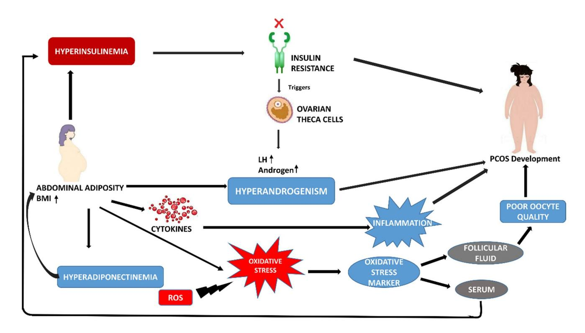
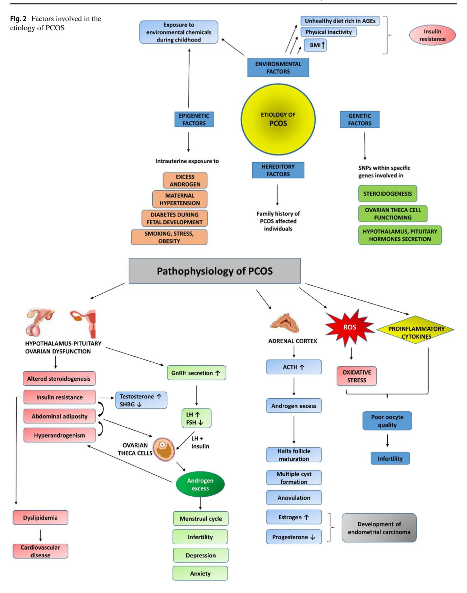
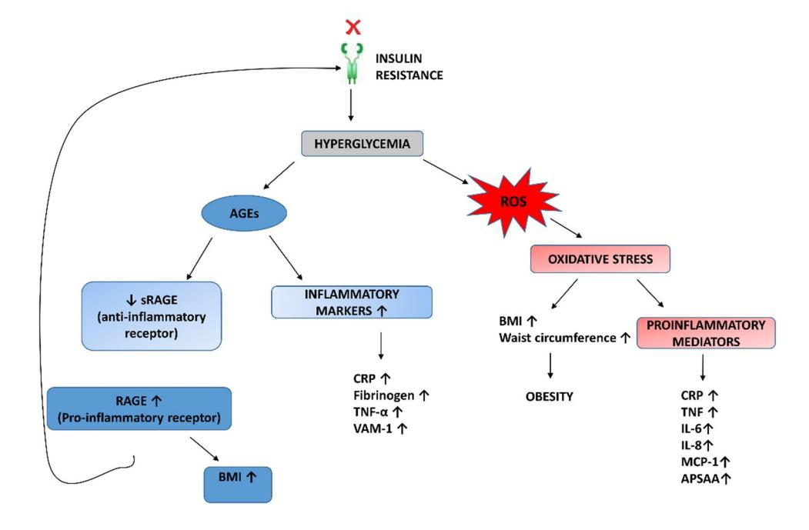
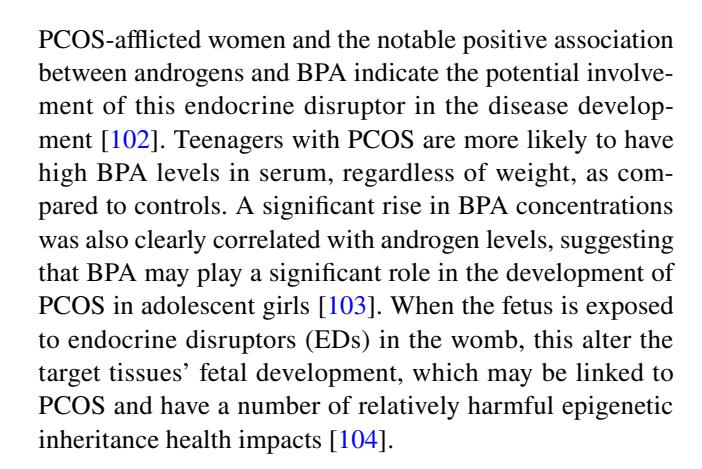
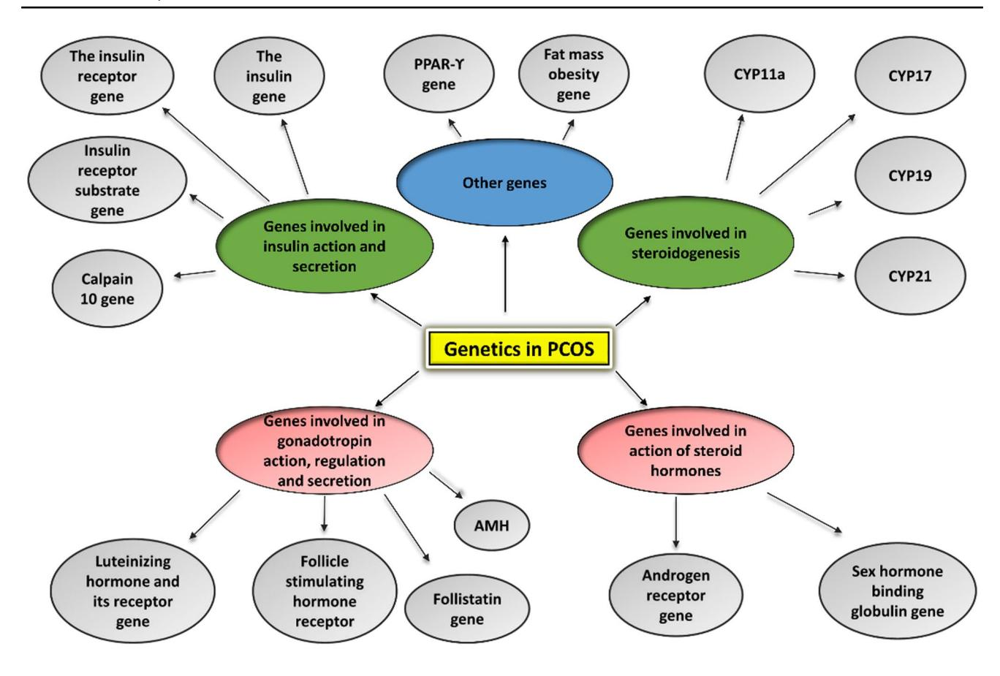
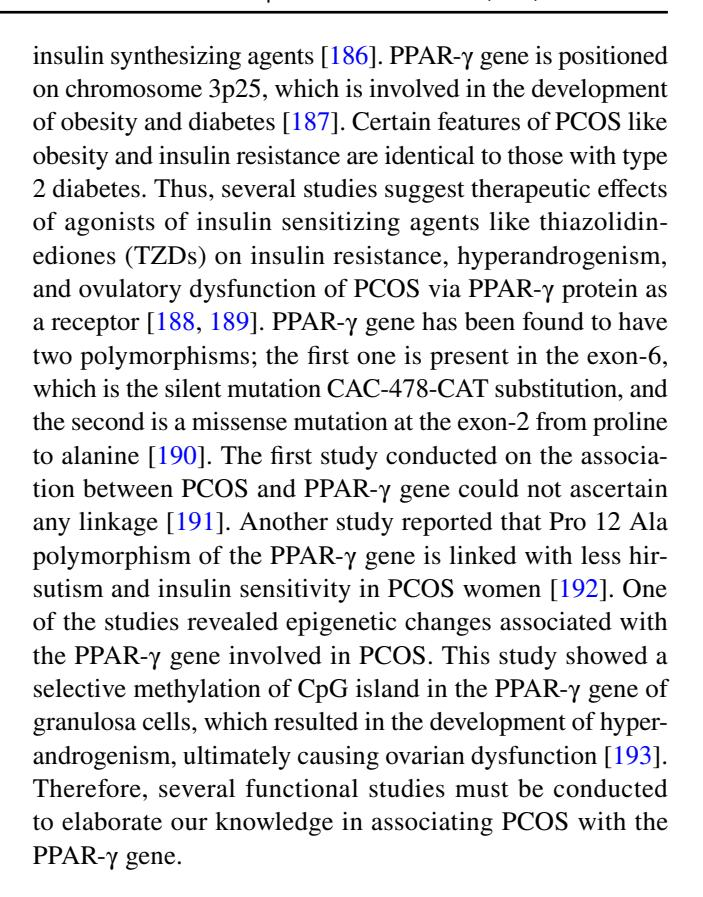
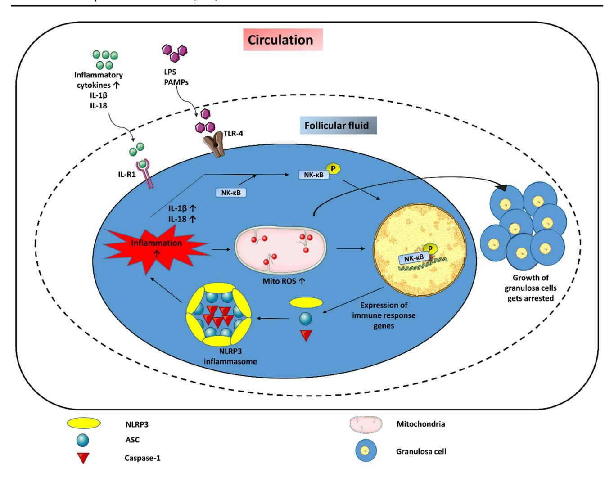

#### **REVIEW**

# **A brief insight into the etiology, genetics, and immunology of polycystic ovarian syndrome (PCOS)**

**Sana Siddiqui1 · Somaiya Mateen1 · Rizwan Ahmad1 · Shagufta Moin[1](http://orcid.org/0000-0003-2116-4832)**

Received: 6 June 2022 / Accepted: 19 September 2022 © The Author(s), under exclusive licence to Springer Science+Business Media, LLC, part of Springer Nature 2022 / Published online: 3 October 2022

#### **Abstract**

Polycystic ovarian syndrome (PCOS) is a prevailing endocrine and metabolic disorder occurring in about 6–20% of females in reproductive age. Most symptoms of PCOS arise early during puberty. Since PCOS involves a combination of signs and symptoms, thus it is considered as a heterogeneous disorderliness. The most accepted diagnostic criteria is Rotterdam criteria which involves two of the latter three features: (a) hyperandrogenism, (b) oligo- or an-ovulation, and (c) polycystic ovaries. The persistent hormonal imbalance leads to multiple small antral follicles formation and irregular menstrual cycle, ultimately causing infertility among females. Insulin resistance, cardiovascular diseases, abdominal obesity, psychological disorders, infertility, and cancer are also related to PCOS. These pathophysiologies associated with PCOS are interrelated with each other. Hyperandrogenism causes insulin resistance and hyperglycemia, leading to ROS formation, oxidative stress, and abdominal adiposity. In consequence, infammation, ROS production, insulin resistance, and hyperandrogenemia also increase. Elevation of AGEs in the body either produced endogenously or consumed from diet exaggerates PCOS symptoms and is also related to ovarian dysfunction. This review summarizes how AGE formation, infammation, and oxidative stress are signifcantly essential in PCOS progression. Alterations during prenatal development like exposure to excess AMH, androgens, or toxins (bisphenol-A, endocrine disruptors, etc.) may also be the etiologic mechanism behind PCOS. Although the etiology of this disorder is unclear, environmental and genetic factors are primarily involved. Physical inactivity, as well as unhealthy eating habits, has a vital role in the progression of PCOS. This review outlines a collection of specifc genes phenotypically linked with PCOS. Furthermore, benefcial efect of metformin in maintaining endocrine abnormalities and ovarian function is also mentioned. Kisspeptin is a protein which helps in onset of puberty and increases GnRH pulsatile release during ovulation as well as role of KNDy neurons in GnRH pulsatile signal required for reproduction are also elaborated. This review also focuses on the immunology related to PCOS involving chronic low-grade infammation, and how the alterations within the follicular microenvironment are intricated in the development of infertility in PCOS patients. How PCOS develops following antiepileptic and psychiatric medication is also expanded in this review. Initiation of antiandrogen treatment in early age (≤25 years) might be helpful in spontaneous conception in PCOS women. The role of BMP (bone morphogenetic proteins) in folliculogenesis and their expression in oocytes and granulosa cells are also explained. GDF8 and SERPINE1 expression in PCOS is given in detail.

**Keywords** Polycystic ovarian syndrome · Insulin resistance · Hyperandrogenism · Oxidative stress · Advanced glycation end products (AGEs) · AMH · Genetics · Kisspeptin · Metformin · BMP (bone morphogenetic proteins) · Antiandrogen treatment · SERPINE1 · GDF8 · Chronic low-grade infammation

# **Introduction**

Polycystic ovarian syndrome (PCOS) is a commonly occurring gynecological disorder prevalent in 15–49 years of reproductive-aged women [[1,](#page-24-0) [2](#page-24-1)]. The etiology of this disorder is still unknown, but the problem arises due to hyperandrogenism and ovulatory dysfunction. The prevalence of this heterogeneous endocrine disorder is ~ 6 to ~ 20%,

\* Shagufta Moin moinshagufta2@gmail.com

1 Department of Biochemistry, Faculty of Medicine, Jawaharlal Nehru Medical College, Aligarh Muslim University, Aligarh, Uttar Pradesh -202002, India

i.e., approximately 1 in almost 15 premenopausal women worldwide [[3](#page-24-2)[–5](#page-24-3)]. A recent fnding suggests that 8.2 to 22.5% women are diagnosed with PCOS in India [[6](#page-24-4)]. This prevalence depends on the region (rural or urban) and lifestyle (physical work and eating habits) of the individual. Adolescents with PCOS exhibit hyperandrogenism and insulin resistance which further leads to hirsutism, acne, menstrual disorders including oligomenorrhea or amenorrhea, anovulation, ovarian enlargement, endometrial cancer, infertility, type II diabetes, and other cardiovascular diseases. About half of the PCOS-afected individuals are obese and depict abdominal obesity, which indicates that a high level of androgens might increase adipose tissue in the abdominal region. Due to abnormal follicular development, PCOS can cause anovulatory infertility and poor oocyte or embryo quality. According to 2003 ESHRE/ASRM (Rotterdam) criteria, any individual displaying two of the subsequent three features, (1) oligo-ovulation/anovulation, (2) hyperandrogenism, and (3) polycystic ovaries; could be diagnosed with PCOS. Rotterdam 2003 criteria have been proposed as one of the main diagnostic criteria recently being used in clinical and biochemical diagnostics of PCOS. Hereditary and environmental factors of an individual are also interwoven with the occurrence of PCOS. The genetic factors involve the family history of PCOS among frst-degree relatives, early sexual maturation, and premature development of the fetus [\[7](#page-24-5)[–9](#page-25-0)]. Environmental factors include physical inactivity, eating junk food high in fat, salt, sugar, advanced glycation end products (AGEs), and obesity [\[9](#page-25-0)].

This review focuses on etiology, pathophysiology, genetics, and immunology of PCOS. Although the etiology of PCOS is still unclear, mainly environmental and genetic factors of an individual are crucial. In this review, etiology and pathophysiology are explained in fowcharts to make it easy to understand (Fig. [2](#page-5-0) and Fig. [3](#page-5-1)). This review also helps in establishing a relationship between insulin resistance, AGEs, oxidative stress, and infammation in the form of a vicious cycle; this clearly shows how these PCOS-associated abnormalities are interrelated with each other (Fig. [4\)](#page-6-0). This review also summarizes genetics and candidate genes involved in PCOS for developing a linkage between PCOS phenotypes and specifc genes (Table [1](#page-2-0)). How chronic low-grade infammation is related to PCOS is also described briefy (Fig. [6](#page-22-0)).

Oxidative stress increases in PCOS women due to the formation of a large number of reactive oxygen species (ROS). Oxidative stress markers are elevated in follicular fuid and serum of PCOS women, which may be one of the reasons for poor quality oocytes [[10,](#page-25-1) [11](#page-25-2)]. ROS is the source of oxidative damage to DNA and lipid peroxidation. Oxidative damage of DNA also leads to cancer. A study indicates that DNA damage due to oxidative stress is found to be linked with ovarian carcinoma in PCOS patients [\[12](#page-25-3)]. One of the complications related to PCOS is impaired glucose tolerance and insulin resistance which eventually causes diabetes. Insulin resistance and hyperinsulinemia are crucial in ascertaining hyperandrogenism by triggering theca cells within the ovaries to exudate androgen and LH in excess [[13](#page-25-4)]. Up to 90% of PCOS women have a higher body mass index (BMI) which intensifes insulin resistance, thus progressing towards diabetes [\[14](#page-25-5)]. Hence, it signifes that obesity plays an intrinsic role in defective insulin metabolism, thus accelerating its progression towards diabetes in PCOS. Usually, it is seen that patients with PCOS have excessive body fat at the abdomen, hips, and thighs, which is known as central adiposity [[15\]](#page-25-6). Abdominal adiposity further promotes androgen secretion, hyperadiponectinemia, cytokine secretion, oxidative stress, and hyperinsulinemia [\[16\]](#page-25-7); this forms a circle in which all these parameters are interdependent, thus complicating the treatment of PCOS (Fig. [1\)](#page-2-1). Thus, PCOS involves multi-drug treatment to minimize all the diagnostic symptoms so that the patient can maintain a healthy life.

# **Defnition of PCOS**

Certain diagnostic criteria can defne PCOS but there is still a debate on which is the relevant criteria for diagnosing PCOS. In 1935, Stein and Leventhal were the frst who described PCOS as an endocrine disorder in women responsible for oligo-ovulatory infertility. Although Rotterdam 2003 criteria is the most extensively used PCOS classifcation, it has not been globally accepted. Presently, there are three defnitions for PCOS authenticated by most scientifc societies and health authorities [[3](#page-24-2)]. The criteria proposed in April 1990, at a conference sponsored by the National Institutes of Health/National Institute of Child Health and Human Development (NIH/NICHD), is one of the accepted classifcations for PCOS. NIH 1990 measures included the following features: (1) hyperandrogenism/hyperandrogenemia; (2) anovulation or oligo-ovulation; and (3) exclusion of several associated disorders, for instance, thyroid, hyperprolactinemia, and congenital adrenal hyperplasia (Table[2\)](#page-3-0) [[17\]](#page-25-8). In Rotterdam, a separate conference was coordinated in May 2003, by the European Society of Human Reproduction and Embryology and American Society of Reproductive Medicine (ESHRE/ASRM) members for including multiple small antral follicles within the ovaries, that is, polycystic ovarian morphology in the defnition of PCOS. According to the Rotterdam classifcation, women having any two of the consecutive three features could be diagnosed with PCOS: (1) oligo-ovulation or anovulation; (2) hyperandrogenism; and (3) polycystic ovarian morphology (PCOM) after excluding related disorders (Tabl[e2\)](#page-3-0) [[17](#page-25-8)]. Prior ESHRE/ASRM-sponsored PCOS consensual workshops that were published in 2004 and 2008 are highly cited which emphasized on diagnosis and infertility control

**Table 1** Diagnostic criteria of PCOS

| Diagnostic criteria                                                                                                                            | Year of proposal of criteria | Diagnostic features                                                                                                                                                                                                                                                                                         |
|------------------------------------------------------------------------------------------------------------------------------------------------|------------------------------|-------------------------------------------------------------------------------------------------------------------------------------------------------------------------------------------------------------------------------------------------------------------------------------------------------------|
| • NIH/NICD (National Institute of Health/National Institute of Child Health and Human Development)                                       | April 1990                   | 1) Hyperandrogenism/hyperandrogenemia 2) Oligo-ovulation or anovulation 3) Exclusion of several related disorders like thyroid, hyperprol                                                                                                                                                             |
| • Rotterdam criteria ESHRE/ASRM (European Society of Human Reproduction and Embryology and American Society of Reproductive Medicine) | May 2003                     | actinemia, and congenital adrenal hyperplasia Women having any two of the subsequent three features: 1) Hyperandrogenism 2) Oligo-ovulation or anovulation 3) Polycystic ovarian morphology                                                                                                     |
| • AE-PCOS (Androgen Excess and PCOS Society)                                                                                                | 2006                         | Elimination of associated disorders 1) Hyperandrogenism include hirsutism (clinical analysis) and hyperandrogenemia (biochemical analysis) 2) Ovarian dysfunction involving oligo-ovulation/anovulation or polycystic ovaries Elimination of excess production of androgen similar disorders |

respectively. The latest third PCOS consensus document outlines current understanding and highlights gaps in knowledge with regard to key PCOS features that afect patients' healthcare [[18\]](#page-25-9).

On the contrary, a conference held in 2006 by Androgen Excess and PCOS Society (AE-PCOS) also proposed the measures for the diagnosis of PCOS: (1) hyperandrogenism, which includes either hirsutism (facial hair appearance) or hyperandrogenemia (biochemical analysis); (2) ovarian dysfunction involving oligo-ovulation/ anovulation or polycystic ovaries; and (3) exclusion of related disorders involving excess androgen production (Table [2](#page-3-0)) [[19](#page-25-10)]. AE-PCOS classification considered PCOS even if PCOM or hyperandrogenemia were not prevalent. However, all three classifications eliminated specific disorders that depicted similar signs and symptoms,

**Fig. 1** Abdominal adiposity, hyperinsulinemia, hyperandrogenism, infammation, and oxidative stress are involved in the development of PCOS. Persistent hyperinsulinemia causes insulin resistance which in turn triggers ovarian theca cells to increase androgen production

leading to hyperandrogenism. Abdominal adiposity also triggers hyperandrogenism, cytokine secretion, oxidative stress, which leads to infammation and poor oocyte quality

| PCOS          |
|---------------|
| $\mathcal{Q}$ |
| $\circ$       |
| Д             |
| Ţ             |
| ith           |
| ⋍             |
| linkage       |
| naving        |
| _             |
| genes         |
| target        |
| Different     |
| Table 2       |

| Target gene                                  | Function                                                                                                                                                               | Linkage with PCOS                                                                                                                                                                                                                                                                                                                                                                                                                                                                                             | References                            |
|----------------------------------------------|------------------------------------------------------------------------------------------------------------------------------------------------------------------------|---------------------------------------------------------------------------------------------------------------------------------------------------------------------------------------------------------------------------------------------------------------------------------------------------------------------------------------------------------------------------------------------------------------------------------------------------------------------------------------------------------------|---------------------------------------|
| CYP11a                                       | Encodes an enzyme involved in the conversion of cholesterol to progesterone                                                                                            | <ul> <li>Positive correlation between increased testosterone levels in PCOS patients with allelic variations in CYP11a gene</li> <li>Increased risk of PCOS development in 8 repeat allelic variation in CYP11a gene</li> <li>SNP in CYP11a gene responsible for increased androgen levels</li> </ul>                                                                                                                                                                                                     | [108] [109] [110]               |
| CYP17                                        | Encodes an enzyme $P450c17\alpha$ involved in the formation of dehydroepiandrosterone and androstenedione                                                              | <ul> <li>Enhanced activity of P450c17α responsible for elevated levels of androgen in PCOS patients</li> <li>SNP in CYP17 gene shows increased chances of developing PCOS</li> <li>Defects in Post-translational modification of P450c17α involving hyperphosphorylation of serine residues leading to androgen excess due to hyperactivation of enzyme</li> </ul>                                                                                                                                            | [111, 112]                            |
| CYP19                                        | Encodes an enzyme P450 aromatase involved in the biosynthesis of estrogen from androgens                                                                               | Encodes an enzyme P450 aromatase involved in •P450 aromatase deficiency observed in hyperandrogenic PCOS patients the biosynthesis of estrogen from androgens •Reduced levels of P450 arom mRNA, estradiol, and P450 arom bioactivity were observed in follicles of PCOS patients •SNP associated with CYP19 gene responsible for PCOS phenotype                                                                                                                                                              | [117, 118] [119] [120]          |
| CYP2 I                                       | Encodes an enzyme 21-hydroxylase involved in adrenal and ovarian steroidogenesis, converts 17-hydroxyprogesterone into 11-deoxycortisol                                | Encodes an enzyme 21-hydroxylase involved in •21-hydroxylase deficiency related with increased levels of 17-hydroxyprogesteradrenal and ovarian steroidogenesis, converts one in PCOS patients 17-hydroxyprogesterone into 11-deoxycortisol •Heterozygous mutation in the CYP21 gene leads to the pathogenesis of PCOS                                                                                                                                                                                        | [121, 122] [123]                   |
| Androgen receptor gene (AR)                  | Encodes for androgen receptor                                                                                                                                          | •Transcriptional activity of androgen receptor gene reciprocally related with CAG repeats which may give rise to PCOS phenotypes                                                                                                                                                                                                                                                                                                                                                                              | [125]                                 |
| Sex hormone binding globulin gene (SHBG)     | Encodes SHBG protein which binds to estrogen and testosterone, regulating their level in serum                                                                         | Encodes SHBG protein which binds to estrogen •Serum SHBG levels are regulated by the secretion of androgens and insulin in and testosterone, regulating their level in PCOS patients  •Pentanucleotide polymorphism present at their promoter region of SHBG gene related with lower SHBG concentration in patients with PCOS  •SNP in exon of SHBG gene associated with PCOS                                                                                                                                 | [126, 127] [130] [131, 132]     |
| Luteinizing hormone and its receptor gene    | Encodes LH and its receptor                                                                                                                                            | <ul> <li>•Two-point mutations (Trp8Arg and Ile15Thr) in β-subunit of LH gene are effective for modifying LH regulation in PCOS women</li> <li>•Mutations in β-subunit of LH gene generate LH variants having increased in-vitro [137] activity</li> <li>•SNP present in the promoter region of β-subunit of LH gene is associated with ovulatory dysfunction, including PCOS</li> <li>•Hyperandrogenism in PCOS patients might be due to Polymorphic markers present close to the LH receptor gene</li> </ul> | [133] [134, 135] [137] [138] |
| Follicle-stimulating hormone receptor (FSHR) | Follicle-stimulating hormone receptor (FSHR) Encodes G-protein-coupled receptor for FSH                                                                                | •Statistical analysis of RFLP using restriction enzymes for FSHR gene in PCOS patients and healthy individuals                                                                                                                                                                                                                                                                                                                                                                                                | [139]                                 |
| AMH                                          | Encodes AMH protein which plays a crucial role in infertility                                                                                                          | ◆The presence of AMH variants in PCOS patients also reveals a link between PCOS and AMH gene                                                                                                                                                                                                                                                                                                                                                                                                               | [140]                                 |
| Follistatin gene                             | Encodes follistatin protein having binding affinity for activin, which induces secretion of FSH, insulin, ovarian follicle maturation and inhibits androgen production | <ul> <li>Follistatin Overexpression in transgenic mice responsible for the reduction of FSH [142] levels in serum and arrest ovarian follicle maturation</li> </ul>                                                                                                                                                                                                                                                                                                                                       | H[142]                                |

| (continued) Table 2 |          |                   |            |
|------------------------|----------|-------------------|------------|
| Target gene            | Function | Linkage with PCOS | References |
|                        |          |                   |            |

| Target gene                             | Function                                                                                                                                                    | Linkage with PCOS                                                                                                                                                                                                                                                                                                                                                                          | References                        |
|-----------------------------------------|-------------------------------------------------------------------------------------------------------------------------------------------------------------|--------------------------------------------------------------------------------------------------------------------------------------------------------------------------------------------------------------------------------------------------------------------------------------------------------------------------------------------------------------------------------------------|-----------------------------------|
| Insulin gene                            | Encodes insulin protein                                                                                                                                     | •VNTR polymorphism present in the insulin gene is associated with insulin resist •Insulin involved in androgen production through Pk-B pathway in theca cells of •An increase in insulin secretion enhances the synthesis of androgen ance and hyperinsulinemia in PCOS patients PCOS patients                                                                                 | [144] [145] [148]           |
| Insulin receptor gene (INSR)            | Encodes insulin receptor                                                                                                                                    | •SNP at the INSR gene present at the tyrosine kinase domain of INSR established a •A dinucleotide repeat marker D19S884 was used to establish linkage between •Sequencing of INSR gene in two obese women with PCOS did not show any INSR and PCOS but could determine no possible association link between lean patients with PCOS and INSR gene mutation in the INSR gene | [152, 153] [150] [154]      |
| Insulin receptor substrate genes (IRSs) | Encodes insulin receptor substrates IRS-1 and IRS-2                                                                                                      | •The frequency of Arg972 in IRS-1 was found to be higher in the Chilean popula •The frequency of Gly972 in IRS-1 was found to be high in Turkish women with tion diagnosed with PCOS PCOS                                                                                                                                                                                         | [156] [157]                    |
| Calpain 10 gene                         | Encodes a calcium-dependent cysteine protease known as calpain 10, which facilitates insulin secretion and action                                     | •SNP44 of CAPN10 gene found to be associated with PCOS in the Spanish popula •Four SNPs of the CAPN10 gene were found to be associated with PCOS •SNP43, SNP44 and SNP45 of CAPN10 gene not associated with PCOS tion                                                                                                                                                             | [181, 182] [181, 182] [183] |
| Fat mass obesity gene (FTO)             | dependent nucleic acid demethylase involved Encodes a protein which is 2-oxoglutarate in energy metabolism                                            | •SNP present in the frst intron of FTO gene was found to be associated with PCOS in East Asian population                                                                                                                                                                                                                                                                               | [185]                             |
| PPAR-γ gene                             | pose tissue synthesis, energy metabolism and also acts as a receptor for insulin sensitizing Encodes a transcription factor involved in adi agents | •CpG island methylation in PPAR-γ gene of granulosa cells results in the develop •Pro12Ala polymorphism of PPAR-γ gene is linked with insulin sensitivity and ment of hyperandrogenism causing ovarian dysfunction hirsutism in PCOS women                                                                                                                                        | [192] [193]                    |

**Fig. 3** Pathophysiological mechanism of PCOS, depicting defects in hypothalamic-pituitary-ovarian axis, adrenal cortex, increasing oxidative stress, and pro-infammatory cytokines

**Fig. 4** Inter-relationship between insulin resistance, AGEs (advanced glycation end products), infammation, and oxidative stress

particularly androgen secreting tumors, congenital adrenal hyperplasia, hyperprolactinemia, hypothyroidism, hyperthecosis, hypercortisolism, Cushing's syndrome, and ovarian tumor. Four distinct PCOS phenotypic expressions have now been discovered based on the probable permutations among these criteria: (a) hyperandrogenism (biochemical or clinical) and persistent anovulation; (b) hyperandrogenism and ultrasound-detected polycystic ovarian morphology (PCOm) having ovulatory cycles; (c) prolonged anovulation and polycystic ovarian morphology lacking hyperandrogenism; and (d) hyperandrogenism accompanied with polycystic ovaries and chronic anovulation [[20\]](#page-25-11). After ruling out other diseases, it has been proposed that the diagnosis of PCOS in adolescent girls is determined on the existence of biochemical and/or clinical signs of hyperandrogenism with chronic oligomenorrhea. Teenagers show PCO morphology and anovulatory symptoms that may be present during normal stages of reproductive maturation, hence they are insufficient for a diagnosis [[21\]](#page-25-12).

Consequently, the controversy exists between these three different criteria considering that in case women who exhibit PCOM and dysfunction in ovulation but do not indicate biochemical or clinical hyperandrogenism should be diagnosed with PCOS or not. This debate is still ongoing; hence all the three classifications are presently in use. Advantages and limitations of applying the Rotterdam Criteria, causes of PCOS, risk factors associated with it, long-term effects of the illness, best practices for the prevention and treatment of PCOS all were outlined in the 2012 NIH Evidence-based Methodological Workshop on PCOS [[22\]](#page-25-13).

# **The etiology and pathophysiology of PCOS**

Etiology is the branch of medical science that deals with the cause and origin of a disease. It may involve factors including hereditary or genetic causes and environmental factors. Despite that, the etiology of PCOS is still not fully known, family history studies demonstrate that PCOS is more widespread in certain specifc families than in the overall population. This hereditary factor includes those families where PCOS history exists among frst-degree relatives. A study suggests that 35% of premenopausal women among 93 PCOS patients, 40% of their sisters were afected with this disorder [[23\]](#page-25-14). Another study proposed that among 80 women diagnosed with PCOS, 22% of their sisters were afected with PCOS while 24% of sisters had hyperandrogenemia with regular menses [\[24](#page-25-15)].

Genetic factors involved in bringing about PCOS etiology comprehend SNPs (single nucleotide polymorphisms) within specifc genes. There are almost 241 gene variations responsible for PCOS [\[25\]](#page-25-16). These gene variations can be either polymorphic or single nucleotide change, which induces faws in the transcriptional activity of a gene. These genes are involved in steroidogenesis, ovarian theca cell functioning, and hypothalamic-pituitary hormone secretion. Other aspects comprise the epigenetic factors which occur during the development of fetus, intrauterine exposure with the maternal excess androgen environment, which may result in some changes in a chromosome showing stable heritable phenotypes without actual alterations in the DNA sequence. These epigenetic changes initiate due to interaction of the environment during fetal and childhood development, which might contribute to PCOS [[3\]](#page-24-2). During pregnancy,

the environmental abuse afecting fetal development refers to maternal hypertension, smoking, stress, obesity, diabetes, androgen excess, drugs, and chemicals within packaged food; these may induce intrauterine growth retardation. These children after birth might develop insulin resistance, glucose intolerance, dysfunction of hypothalamus and pituitary secretion, hypertension, hyperandrogenism, or PCOS during puberty. Environmental factors which may contribute to PCOS during childhood are lifestyle, unhealthy eating habits, and environmental chemicals. Physical inactivity and increased BMI leading to obesity also play a crucial role in inducing PCOS. The environmental chemicals may also trigger some epigenetic changes leading to PCOS. Moreover, the food we consume is adulterated and high in sugars, and AGEs content mainly contributes to insulin resistance leading to PCOS phenotype. The etiology of PCOS is explained in Fig. [2.](#page-5-0)

Pathophysiology is the disordered physiological process associated with the disease, which involves the functional changes resulting from the illness or injury. The pathophysiology related to PCOS is multifaceted, involving numerous characteristics like hypothalamic-pituitary-ovarian axis dysfunction, which results from defects in steroidogenesis, insulin resistance, fat deposition, especially in the abdominal region, and hyperandrogenism. All these defects are interrelated with each other resulting in PCOS. It is mostly seen that fat deposition or increased BMI accelerates insulin resistance and hyperandrogenism, so we can avoid PCOS by reducing weight. The formation of adipose tissues triggers theca cells of ovaries to release more androgen resulting in androgen excess leading to hyperandrogenemia. On the other hand, insulin resistance and hypersecretion of androgen cause obesity and type 2 diabetes, as a consequence of which the menstrual cycle becomes irregular, giving rise to infertility, depression, and anxiety.

Variations in the secretion of gonadotropin-releasing hormone (GnRH) by the hypothalamus causes defective androgen synthesis and progression of insulin resistance. Disturbances in the secretion of GnRH consequently elevate luteinizing hormone (LH) levels and lower follicle-stimulating hormone (FSH) levels [[10](#page-25-1)]. Insulin acts together with LH to ameliorate the production of androgen within ovarian theca cells [\[26](#page-25-17)]. Some of the previous researches show that insulin and LH act synergistically upon theca cells and increase production and secretion of androgen [[27,](#page-25-18) [28\]](#page-25-19)

On the other hand, the adrenal cortex also synthesizes androgen; however, due to some defects in cortical steroidogenesis as a result of hypersecretion of adrenocorticotropic hormone (ACTH), androgen is produced in excess by the adrenal cortex [[29](#page-25-20)]. This hyperandrogenemia halts ovarian follicles' maturation and forms multiple small antral follicles, ultimately leading to anovulation with elevated estrogen levels rising from androgen conversion to estrogen by the aromatase enzyme in the peripheral adipose tissues, and the level of progesterone simultaneously decreases. This imbalance within sex hormones is also one of the causes of endometrial carcinoma [[30,](#page-25-21) [31](#page-25-22)]. PCOS pathophysiology is primarily about abnormalities in the hypothalamic-pituitary-ovarian axis, dysfunction within ovaries, and impairment in insulin action and secretion. The pathophysiological mechanism by which PCOS induces infertility is not entirely comprehended. Defnitely IR, hyperandrogenism, estrogen excess (mainly estrone concentration increases in serum) [\[32,](#page-25-23) [33\]](#page-25-24), and hyperinsulinemia are the main factors responsible for the defects in the functioning of the ovary and endometrium (Fig. [3\)](#page-5-1). Furthermore, oxidative stress and the proinfammatory cytokines also directly afect the oocyte quality and endothelial functioning, thus indicating infertility [\[34](#page-25-25), [35](#page-25-26)]. All the risk factors contributing to PCOS are in one or the other way interdependent (Fig. [3](#page-5-1)). The predisposing factors involving genetic, environmental, excess androgen exposure, and obesity are responsible for causing hyperinsulinemia, hyperandrogenism, oxidative stress, irregular menstrual cycle, defects in ovulation leading to oligo-ovulation or anovulation, infertility, and cardiovascular risks.

### **Hyperandrogenism**

PCOS classically displays that menstrual dysfunction and hyperandrogenism are associated with each other and occur in combination within PCOS afected adolescent population. Hyperandrogenism is the condition that arises during puberty because excessive ovarian and adrenal androgen is secreted. The clinical symptoms mainly indicating hyperandrogenism are acne, hirsutism, alopecia, central obesity, and acanthosis nigricans (skin pigmentation characterized by dark and thick patches of skin formed in the skin folds and creases). In females, the steroids circulating in the blood are known as androgens which comprise dehydroepiandrosterone (DHEA), dehydroepiandrosterone sulfate (DHEAS), testosterone (T), dihydrotestosterone, and androstenedione (A); they are all present in decreasing order concentration in serum respectively [[36](#page-25-27)]. Out of these, androstenedione and testosterone are transformed to estrogen by the activity of enzyme aromatase. Thus, estrogen levels are also high during PCOS with decreased progesterone levels. This imbalance within secondary sexual hormones results in anovulation and menstrual irregularity. Mainly the androgens which are hyper secreted in PCOS include testosterone, androstenedione, DHEA, and DHEAS. Their hypersecretion causes premature development of ovarian follicles, forms multiple small antral follicles in ovaries, and causes anovulation [[26](#page-25-17)]. Hyperandrogenism is mainly manifested by free or unbound testosterone in the blood. Usually 1–2% of testosterone present in serum is free, while 98% of testosterone circulating in

the blood is found primarily bound with sex hormone-binding globulin (SHBG) protein existing in serum. In adolescent females' puberty is characterized by rising levels of testosterone. When this condition becomes more complicated and excess testosterone is secreted, this may induce PCOS. However, increased testosterone levels do not certainly indicate PCOS because testosterone level is usually high during puberty which is one of the reasons for acne appearance in adolescents, but if testosterone level remains considerably high even after few years of menarche, then it may give rise to PCOS [[37,](#page-25-28) [38\]](#page-25-29). Excess androgen production and premature development of multiple follicles ultimately lead to multiple small antral follicles formations. The hypersecretion of GnRH from the hypothalamus is also chiefy involved in the increase in number of antral follicles and growth of primordial follicles by stimulating gonadotropin hormone released from the pituitary gland [\[39](#page-26-0)] (Fig. [3\)](#page-5-1). On the other hand, androgen secretion is stimulated in ovarian theca cells by LH and FSH, which provokes granulosa cells within ovaries to produce estrogen from androgens promoting follicular growth. LH:FSH ratio increases in PCOS females due to a rise in GnRH [[40](#page-26-1)]. Androgen is also produced by adrenal glands in women, but in PCOS, due to an imbalance in cortisol steroidogenesis, ACTH is hyper secreted, which leads to overproduction of androgen by the adrenal glands (Fig. [3](#page-5-1)). Thus, diferent routes give rise to bust production of androgens, causing hyperandrogenism, which is one of the primary roots of developing PCOS pathophysiology.

### **Insulin resistance**

Insulin resistance (IR) is a disordered physiological condition characterized by the lesser biological efect of insulin even when it is high in concentration, leading to disturbances in glucose transfer and utilization. IR is among the pathophysiological factors related to the metabolic anomalies in PCOS women. A signifcant correlation exists between hyperinsulinemia, insulin resistance, testosterone, and androstenedione levels among PCOS women was frst discovered by Burghen et al. in 1980. When the insulin receptor gene gets mutated, the resultant phenotype is insulin resistance, hyperinsulinemia, and hyperandrogenism [[41](#page-26-2)]. However, women with PCOS are commonly diagnosed with hyperinsulinemia and insulin resistance, but it is seen that insulin receptor gene mutations are rare in PCOS females [\[5\]](#page-24-3). Somehow insulin resistance and increased body mass index are not dependent on each other because it has been seen that lean women diagnosed with PCOS also display insulin resistance. Recent studies reveal that about 80% of PCOS women with insulin resistance are overweight while 20% are lean [\[42](#page-26-3), [43](#page-26-4)]. Mainly the function of insulin is in homeostasis and lipid synthesis. After binding to the insulin receptors, insulin mediates its functioning in numerous tissues of the hypothalamic-pituitary-ovarian axis. In the ovaries and adrenal cortex, insulin stimulates steroidogenesis. As a result of insulin resistance, hyperinsulinemia develops, which promotes excessive androgen secretion from ovaries and adrenal glands and decreases synthesis of SHBG. Consequently, testosterone concentration increases in the bloodstream (Fig. [3](#page-5-1)). Hyperinsulinemia also stimulates ovarian theca cells to secrete LH which signals the release of GnRH producing excess androgens. The development of IR and hyperinsulinemia early during puberty results in the progression of PCOS phenotypes [[44](#page-26-5), [45](#page-26-6)]. Dyslipidemia also develops due to insulin resistance; thus, females with PCOS have a severe risk of progressing towards diabetes and evolving cardiovascular diseases (Fig. [3\)](#page-5-1). In PCOS patients, IR is observed due to post insulin receptor defects including impaired glucose phosphorylation, reduced glucose oxidation, and impaired glucose synthesis and glucose transport [\[46](#page-26-7)]. In adipose tissue and skeletal muscles of PCOS patients, levels of phosphorylated serine residues on IRS-1 are higher while phosphorylation levels of tyrosine residues on IRS-1 are lower as compared to controls [[47,](#page-26-8) [48\]](#page-26-9).

In comparison to controls, relative increase in ERK1/2 (extracellular signal-regulated kinase 1/2) levels is found in adipose tissue and serum of PCOS patients, but lower levels of glucose transporter-4 (GLUT-4), insulin receptor, and PI3K have been detected in PCOS patients [[47](#page-26-8), [49](#page-26-10)]. Several studies suggest that vitamin E, N-acetylcysteine, and α-lipoic acid having antioxidant potential impose a positive impact on managing insulin sensitivity and can be new approaches for the treatment of IR [[50](#page-26-11)]. Various studies depicted that managing insulin resistance would decrease androgens concentration and ameliorate PCOS condition; thus, the treatment should be more focused on minimizing insulin resistance that would beneft in the long run.

### **Oxidative stress**

Oxidative stress is associated with the pathophysiology of PCOS. This problem arises when reactive oxygen species (ROS) are produced faster than the antioxidants can remove them from the body. ROS may be generated by hyperglycemia; demonstrated by several studies on peripheral blood leukocytes [[51](#page-26-12)]. The after efects of increased oxidative stress is the production of pro-infammatory cytokines that induce IR and hyperandrogenism and also increase the chances of cardiovascular diseases [\[52](#page-26-13), [53\]](#page-26-14). These ROS also damage proteins, lipids, and DNA, thus ending up in tissue damage. Some of the oxidative stress markers which can be evaluated in determining oxidative stress include (1) total oxidant capacity (TOC), which represents the total number of molecules of oxidants; (2) total antioxidant capacity (TAC), which refects the total number of antioxidants; (3) malonaldehyde (MDA), which reveals lipid peroxidation

status; (4) glutathione (GSH), which depicts non-enzymatic antioxidant capacity; (5) superoxide dismutase (SOD) activity, which exhibits enzymatic antioxidant capacity; (6) oxidative stress index; it is the ratio of TOC to TAC which depicts the comparative level of oxidative stress; (7) asymmetric dimethylarginine (ADMA); it refects endothelial dysfunction and oxidative stress; (8) paraoxonase-1 (PON1); it determines the antioxidant capacity of the cell [[11](#page-25-2), [16](#page-25-7)]. Several studies reveal that markers of oxidative stress are found to be elated in the serum of PCOS women, and this condition also persists in the follicular fuid of oocytes [\[11](#page-25-2)]. Increased markers of oxidative stress found in follicular fuid of oocytes also result in abnormal follicle growth and maturation, and poor quality of oocyte or embryo, thus leading to infertility. Carcinogenesis is also related to oxidative damage of DNA. Reactive oxygen species like superoxide radical, hydroxyl radical, and hydrogen peroxide are capable of causing DNA damage [[54\]](#page-26-15). ROS causes genetic changes by inducing DNA cross-linking, point mutations, DNA strand breaks, and DNA–protein cross-linking, leading to DNA damage. Thus, DNA damage increases the risk of ovarian and endometrial cancer in PCOS women.

Furthermore, OS also gives rise to DNA methylation and epigenetic changes, which silence tumor suppressor genes [[55,](#page-26-16) [56](#page-26-17)]. Consequently, increased OS is mainly responsible for increasing the possibility of gynecological cancers in PCOS women. On the other hand, OS brings about pathological conditions such as hyperandrogenemia, IR, and obesity, which are associated with PCOS. Nearly 42% of PCOS patients have complications of obesity, mainly abdominal obesity characterized by the deposition of visceral adipose tissues in the abdomen thus exhibiting increased waist circumference [[57](#page-26-18)]. Elevated oxidative stress levels are associated with obese patients; thus, they are supposed to have a signifcant increase in markers of oxidative stress, which is observed in correlation with obesity markers such as BMI and waist circumference [\[58\]](#page-26-19). The degree of lipid and protein peroxidation is detected with the help of their markers such as MDA, thiobarbituric reactive substances (TBARS), oxidized low-density lipoprotein (ox. LDL), and advanced oxidation protein products (AOPP). The level of these markers increases abruptly in obese PCOS patients while there is a decrease in antioxidant markers such as glutathione peroxidase (GSH-Px) and superoxide dismutase (SOD) [[59,](#page-26-20) [60](#page-26-21)]. Ultimately, this can be interpreted that obesity chiefy plays a key role in the up-gradation of levels of oxidative stress in PCOS. However, it is not the only factor responsible for increased oxidative stress index. IR induces OS because hyperglycemia and increased levels of free fatty acids produce ROS. Elevated levels of free fatty acids and glucose are assimilated within the cell, leading to the formation of reduced metabolites such as acetyl CoA and pyruvic acid. When transferred into mitochondria for oxidation, they enter into the electron transport chain, gaining a single electron, ultimately ensuing high levels of ROS. In addition, antioxidant enzymes such as peroxidase, SOD, and catalase are not able to withdraw increased ROS in the cell. OS parameters in IR animal model induced by fructose showed enhanced protein carbamoyl, non-esterifed fatty acid (NEFA), MDA, superoxide free radical, and reduced glutathione (GSH) [[61](#page-26-22), [62](#page-26-23)]. Thus, OS is also related to IR in PCOS patients. Similarly, infammation is also related to PCOS and is considered as one of the pathogeneses in the development of PCOS. Infammatory markers that are found to be elevated in PCOS patients are C-reactive protein (CRP), tumor necrosis factor (TNF), interleukin-6 (IL-6), interleukin-8 (IL-8), monocyte chemotactic protein-1 (MCP-1), and acute-phase serum amyloid A (APSAA) [[63,](#page-26-24) [64](#page-26-25)] (Fig. [4\)](#page-6-0). Finally, this has been established that infammation and oxidative stress are interrelated (Fig. [4\)](#page-6-0). ROS stimulates the release of infammatory factors via activating signaling pathways associated with infammation. It has also been revealed that OS and infammation could possibly induce IR by interfering with post insulin receptor signaling pathways. OS and infammation also confer hyperandrogenemia in women with PCOS (Fig. [4\)](#page-6-0). A study suggests that OS and infammatory markers are signifcantly correlated with increasing androgen levels in PCOS [[51,](#page-26-12) [65](#page-26-26)]. In vitro experiments reveal that OS upgrades the activity of enzymes involved in steroidogenesis in ovaries which elevate androgen production [[66\]](#page-26-27). Thus, OS is primitively related to the progression of PCOS.

# **AGEs and PCOS**

Advanced glycation end products (AGEs) are considered common environmental factors responsible for inducing reproductive and metabolic changes detected in the pathophysiology of PCOS [[67](#page-26-28)]. AGEs represent the aggregation of reactive molecular species that are produced by non-enzymatic reactions endogenously; it is also known as Maillard or browning reaction, which takes place between free amino groups of proteins, lipids, or nucleic acids with the carbonyl group of carbohydrates [[68\]](#page-26-29). AGEs are also consumed exogenously, which are present in bulk quantity in fast food. In serum, the AGEs levels are also high in PCOS patients [[69\]](#page-27-0). When these AGEs circulating in the blood get deposited in different tissues, they cause cellular damage. Recent studies suggest that the level of AGEs circulating in the blood and the expression of AGEs receptors in ovarian tissue both are found to be elated in PCOS patients [[70](#page-27-1)]. AGEs receptors are pro-inflammatory receptors, and they are termed as the receptor for advanced glycation end products

(RAGE). Alternatively, the receptors with a protective role in anti-inflammation are named soluble receptors for advanced glycation end products (sRAGE), and they are also formed at high levels [[71\]](#page-27-2). sRAGE circulates in the blood throughout the body. They bind to AGEs, thus negating their binding to RAGE present on the cell membrane, providing a protective effect against inflammation and tissue damage. Studies reveal that low intake of AGEs present in the diet is linked with suitable metabolic and hormone profile, and has fewer OS markers in PCOS patients [[72](#page-27-3)]. It has been found that the expression of RAGE and levels of AGEs in ovarian tissues are raised, thus modifying steroidogenesis and folliculogenesis in women with PCOS [[73\]](#page-27-4). Alteration in steroidogenesis is one of the consequences for abnormal follicular development and excess androgen synthesis in PCOS, thus this shows that AGEs are related to hyperandrogenemia in PCOS patients. Enhanced AGEs serum levels are found to be correlated with the formation of inflammatory markers such as CRP, fibrinogen, tumor necrosis factor-alpha (TNF-α), and vascular adhesion molecule-1 (VAM-1) [[74](#page-27-5), [75\]](#page-27-6) (Fig. [4](#page-6-0)). Endogenous and dietary AGEs induce inflammatory signals and promote oxidative stress [[76](#page-27-7)]. When aggregation of dietary AGEs occurs within the tissues, it causes cellular damage through the formation of reactive oxygen species. AGE deposition in the ovaries has a negative impact on oocyte development and maturation, and also affects the ovaries by changing the composition of chromosomes [\[77\]](#page-27-8). There is the accumulation of AGEs in the ovaries, which also causes upregulation of RAGE in granulosa cells [[70](#page-27-1)]. Thus, AGEs play a crucial role in ovarian dysfunction by modifying oocyte growth and development. OS and inflammation are associated with insulin resistance.

The downstream signaling AGE-RAGE system is also responsible for the pathogenesis of insulin resistance through infammatory responses [[78,](#page-27-9) [79](#page-27-10)]. Since the accumulation of AGEs and the expression of RAGE increases in the granulosa cells of ovarian tissue in patients with PCOS, thus insulin resistance may also be linked with PCOS through AGEs aggregation. Some studies suggest that BMI is inversely related to the expression of serum sRAGE levels, indicating a relationship between obesity and the AGE-RAGE system [\[80](#page-27-11)] (Fig. [4](#page-6-0)). It has been depicted that there is a signifcant direct correlation between serum AGEs level and waist to hip ratio in PCOS women [[73](#page-27-4)]. Decreased RAGE expression corresponds with smaller adipocyte size and low-fat mass, low epidermal fat weight, and reduced body weight [[81\]](#page-27-12). Thus, it can be concluded that the pathogenesis of PCOS in some way or the other is regulated by the AGE-RAGE system. Therefore, PCOS can be managed by improving lifestyle and eating habits.

# **Alterations during prenatal development may be etiologic mechanism for PCOS**

The condition appears to include metabolic, nutritional, environmental, and hereditary components. The onset of PCOS's phenotypic traits can arise in vulnerable women caused by environmental exposures and lifestyle choices that may have an impact on their development from an early age in the mother's womb. Women with PCOS have unbalanced hormone levels. Serum levels of AMH are two to three times higher in non-pregnant PCOS patients than that in women without polycystic ovaries or PCOS [[82,](#page-27-13) [83\]](#page-27-14) and levels of AMH are positively correlated with the severity of the reproductive dysfunction [[84](#page-27-15), [85\]](#page-27-16). Given that the majority of PCOS patients have elevated levels of luteinizing hormone (LH), which is indicative of highfrequency GnRH secretion [\[86\]](#page-27-17), the pathophysiology of PCOS also includes hypothalamic neuronal dysfunction. In comparison to women without reproductive issues, pregnant women with PCOS had significantly greater AMH concentrations [\[87\]](#page-27-18). The development of the female fetus may be impacted by excessive AMH in gestation. In a study, pregnant mice were given AMH and the neuroendocrine phenotype of their female ofspring was monitored postnatally to establish whether the elevation of AMH during pregnancy in women with PCOS is a bystander impact or a driver of the condition in the ofspring [[87](#page-27-18)]. This medication caused maternal neuroendocrine-driven testosterone excess and decreased placental testosterone to estradiol conversion, which masculinized the exposed female fetus and led in an adult neuroendocrine and reproductive phenotype similar to PCOS. Furthermore, therapy with a GnRH antagonist in the adult female progeny brought back the neuroendocrine phenotype to normal in the aficted females' with persistently hyperactivated GnRH neurons [[87\]](#page-27-18). These fndings provide a new possible treatment approach to treat PCOS in adults and show a vital role for excessive prenatal AMH exposure and subsequent aberrant GnRH receptor signaling in the neuroendocrine dysfunctions of PCOS. Animals that were prenatally treated with AMH (PAMH) are efective preclinical models for simulating PCOS in humans. The PAMH is the only rodent model that accurately reproduces the mouse counterparts of the Rotterdam PCOS criteria, typically depicting metabolic disturbances of human PCOS (glucose-intolerance, hyperinsulinemia, hyperglycemia, and type 2 diabetes), without giving high-fat diet [[87,](#page-27-18) [88](#page-27-19)]. The underlying mechanism that promotes a threefold increase in aromatizable testosterone levels in high AMH exposed dams during the gestation period is the suppression of placental aromatase and an increase in GnRH/LH release in the gestating animals [[87](#page-27-18)]. It is well recognized that methylation

is essential for controlling how genes are expressed [[89](#page-27-20)]. Increased AMH is a characteristic of PCOS and plays a mysterious function in the pathophysiology of the condition. Hypo-methylation of the AMH gene may result in higher AMH synthesis due to intrinsic upregulation of the AMH gene in PCOS. AMH is favorably associated with serum concentrations of testosterone and LH and appears to be involved in anovulation by limiting FSH's ability to promote follicle development [[90–](#page-27-21)[95\]](#page-27-22).

The current consensus is further towards an epigenetic phenomena whereby excessive exposure of testosterone in utero for female fetuses afects the expression of certain genes, particularly those linked to ovarian steroidogenesis, insulin action, and GnRH pulsatility. The important work of Abbott et al., who administered testosterone injections to pregnant monkeys at two diferent periods of their pregnancies, served as the foundation for this developmental theory of the etiology of PCOS [[96\]](#page-27-23). Many had polycystic ovaries, elevated LH concentrations in serum, and IR when they were observed after puberty and compared to controls. Girls exposed to high amounts of maternal testosterone during prenatal development have efects on adult life that include tomboy behavior [[97\]](#page-27-24), a higher prevalence of autism spectrum disorders (ASDs), and elevated anti-Mullerian hormone (AMH) serum levels in adolescence [[98\]](#page-28-16). These fndings imply that stimulation by excess of androgens to each component of the fetus' hypothalamicpituitary-ovarian axis may trigger a chain of events that lead to PCOS's metabolic and reproductive efects. Girls who have polycystic ovaries before the start of puberty may have had their ovarian structure and function "programmed" at an early developmental stage, possibly even in utero, during the process of ovarian progression and oogenesis [\[99\]](#page-28-17). In fact, early follicular-phase circulatory AMH levels in female teenage children were statistically strongly linked with circulating maternal total testosterone levels at 18 weeks of gestation [[98\]](#page-28-16). The Hart et al. study ofers proof that the uterine environment may confgure human ovaries at a very young age. There is evidence that during pregnancy, PCOS women have a hyperandrogenic intrauterine environment [[100\]](#page-28-18). Elevated concentrations of maternal androgen is most likely due to a malfunctioning in placenta, or from fetal ovary/ adrenal glands which are the three potential causes of this hyperandrogenism. Under normal circumstances, the placental enzyme aromatase quickly converts maternal androgens or fetal ovarian/adrenal androgens to estrogens. Particularly, placental tissue from PCOS women showed increased 3β-HSD-1 activity and reduced P450 aromatase activity, which would boost hyperandrogenism during pregnancy [\[101\]](#page-28-19).

Additionally, exposure to toxins in the womb afects hormonal function, which may exacerbate PCOS development. The increased levels of bisphenol-A (BPA) in

# **Genetic predisposition and PCOS**

Genetic predisposition refers to a person's genetic makeup that may result in the development of a possible phenotype when exposed to certain environmental conditions. Genetic predisposition is associated with the genetic variations that are often inherited from a parent or arise due to mutations within the same individual. When exposed to certain environmental stress, these genetic variations are responsible for the development of a disease. Many studies suggest that multiple genetic mutations are responsible for the development of PCOS, as a multifactorial syndromic disorder. Mutations in genes that afect the functioning of ovaries precisely or imprecisely are analogous to PCOS. Several groups of genes (Fig. [5\)](#page-12-0) and their involvement in the progression of PCOS are explained below.

### **Genes involved IN STEROIDOGENESIS**

PCOS is represented as excess secretion of adrenal and ovarian androgen. Intrinsic factors, in particular, modifed ovarian steroidogenesis due to genetic mutations and impact of environment exterior to the ovaries; for instance, hyperinsulinemia leads to excess androgen production in ovaries [[105](#page-28-23)]. Normally, diferent stages of follicular maturation start during the gestation period, where primordial follicles are formed prenatally, which constitute meiotically arrested oocytes encircled with pre-granulosa cells. Ovaries remain inactive until the arrival of puberty. These meiotically arrested oocytes continues growing from resting state. The factors responsible for this activation is still not known, but it probably appears to be the increase in follicular density that triggers the growth [\[5\]](#page-24-3). This initial follicular growth until the development of antral follicles is gonadotropin independent. The Anti-Mullerian hormone, which is secreted by the granulosa cells, is a glycoprotein determining the quality of the egg, and its concentration is at its peak in the antral follicles.

**Fig. 5** Diferent genes having a specifc role in the development of PCOS

As soon as FSH-stimulated estradiol concentration increases in granulosa cells and reached its threshold concentration, AMH expression is suppressed by estradiol [[106](#page-28-24)]. Androgens produced during follicular development promote pre-antral and antral follicles growth, and within early antral follicles, it also induces expression of FSH receptors (FSHR) on granulosa cells. Androgens also increase LH receptor expression and aromatase expression. Finally, one follicle is picked out as a predominant follicle, and upon rising estrogen concentration, FSH secretion declines; this loss in FSH concentration within the dominant follicle-stimulates LHR expression and increases LH secretion, ultimately leading to LH surge, which induces ovulation. Altered steroidogenesis is characterized by increased follicular growth and premature growth arrest of antral follicles, and this leads to a classical phenotype of PCOS.

Moreover, AMH concentration also increases with an increase in the number of antral follicles in PCOS women. Several intrinsic alterations in steroidogenesis impart excess androgen secretion and polycystic ovarian morphology. These intrinsic factors are genetic mutations related to PCOS involving several genes. Aromatase enzymes belong to the cytochrome P450 family that are important in the conversion of steroids promoting steroidogenesis. They are responsible for the conversion of androgen to estrogen. When there is any defciency in these enzymes, it leads to the accumulation of androgen, thus raising their level. Some aromatase genes functional in steroidogenesis are CYP11a, CYP17, CYP19, and CYP21.

### **CYP11a**

The enzyme encoded by the CYP11a gene is involved in forming progesterone from cholesterol. This is the intermediate step in the formation of progesterone from cholesterol. It is also considered as the rate-limiting step [[107](#page-28-25)]. This enzyme is present within the inner membrane of mitochondria. The location of the CYP11a gene is at 15q24.1, which contains 10 exons. The enzyme encoded by this gene belongs to the cytochrome P450 family and is responsible for the cleavage of the side chain of cholesterol to convert into progesterone. This gene is involved in steroidogenesis within both ovaries and adrenal glands. A study conducted on 97 PCOS afected women showed a positive correlation between testosterone levels in serum and CYP11a alleles with 5′ untranslated region (UTR), (TTTTA)n pentanucleotide repeats, a VNTR (variable number of tandem repeats) [[108\]](#page-28-0). These studies also reveal a relation between allelic

variants of CYP11a and hyperandrogenemia in PCOS patients. A case study conducted on the South Indian population proposed about 15 allelic variations inCYP11a gene, with the most prevalent being 8 repeat alleles. This study also emphasizes that women with 8 repeat alleles have 3 times increased risk of developing PCOS than controls [[109](#page-28-1)]. Another study conducted in China suggests that polymorphism in the CYP11a gene is one of the causes of developing PCOS. This study showed that single nucleotide polymorphism in the CYP11a gene is responsible for the increased androgen levels via the luteinizing hormone signaling pathway [\[110](#page-28-2)].

#### **CYP17**

CYP17 gene encodes an enzyme P450c17α which is a monooxygenase involved in forming 17-hydroxypregnenolone and 17-hydroxyprogesterone from pregnenolone and progesterone, respectively. This enzyme is also responsible for the formation of dehydroepiandrosterone and androstenedione from these steroids by 17, 20-lyase activity of the enzyme. CYP17 gene consists of 8 exons and is located on chromosome 10q24.32. Few studies proposed that P450c17α enzyme activity was enhanced, which was responsible for elevated levels of androgen in PCOS patients [[111,](#page-28-3) [112](#page-28-4)]. In the promoter region of the CYP17 gene, if there is a rare T/C single nucleotide polymorphism at the promoter region, this manifest increased chances of acquiring PCOS [[113](#page-28-5)]. Post-translational modifcation of the CYP17 gene also plays a role in PCOS pathogenesis. In post-translational regulation of P450c17α enzyme for the activation of 17, 20-lyase enzyme activity, serine residues of enzyme get phosphorylated by serine kinase. When serine residues of the enzyme get phosphorylated by a defective serine kinase, it results in hyperactivity of the enzyme, thus causing androgen excess [\[114\]](#page-28-6).

### **CYP19**

CYP19 gene encodes for the enzyme cytochrome P450 aromatase (P450 arom) that is involved in the production of C18 steroids (estrogens) from C19 steroids (androgens). CYP19 gene is located at 15p21.1 [[115,](#page-28-26) [116](#page-28-27)]. Cytochrome P450 aromatase present in the endoplasmic reticulum is responsible for the biosynthesis of estrogen. In most hyperandrogenic patients, aromatase defciency is observed [[117](#page-28-7), [118](#page-28-8)]. All PCOS patients having reduced concentration of P450 arom mRNA estradiol, and bioactivity of aromatase also decrease in the follicles [[119\]](#page-28-9). Thus, it shows that decreased expression of aromatase and its activity leads to excess androgen accumulation resulting in abnormal follicular development. In both lean and obese PCOS patients, lower activity of aromatase has been revealed. SNP associated with CYP19 gene is also responsible for PCOS phenotype as seen in a Chinese population by comparing PCOS patients with the control [[120](#page-28-10)]. Hence, all these studies suggest that CYP19 is a contender gene in PCOS patients responsible for the development of hyperandrogenism.

#### **CYP21**

CYP21 gene encodes for the enzyme 21-hydroxylase, which plays an important role in adrenal and ovarian steroidogenesis by converting 17-hydroxyprogesterone into 11-deoxycortisol. This gene consists of 10 exons and is located on 6p21.33. An autosomal recessive mutation in the CYP21 gene results in 21-hydroxylase defciency responsible for the increased 17-hydroxyprogesterone levels. It has been shown that hyperandrogenism exhibited in women diagnosed with PCOS also reveals high levels of 17-hydroxyprogesterone in serum [[121,](#page-28-11) [122](#page-28-12)]. Heterozygous mutation in the CYP21 gene may be related to PCOS pathogenesis [[123\]](#page-28-13). This results in defective anabolism of steroidogenesis as the activity of the enzyme decreases because of the variations, ultimately causing PCOS.

### **Genes involved in the action of steroid hormones**

The action of steroid hormones like estrogen and testosterone is regulated by receptors. These can be androgen receptors that afect the functioning of androgens at the target tissue, or it can be sex hormone-binding globulin protein that ligates to androgens, thus regulating their level in serum and their accessibility at the target tissue.

### **Androgen receptor gene**

The androgen receptors (AR) belonging to the family of nuclear transcription factors regulate the functioning of androgens by binding to them. The androgen receptor gene encodes an androgen receptor, which is present on the "q" arm of chromosome X [[124](#page-28-28)]. AR gene translates 90-Kb long protein with three domains and consists of 11 exons. AR gene is made up of three functional domains: the transactivation domain, the DNA binding domain, and the ligand binding domain. CAG repeats are present in exon-1 of transactivation domain encoding polyglutamine chain at the N-terminal. An average of 20 CAG repeats are present within the exon. Transcriptional activity of the androgen receptor gene depends on CAG repeats, and its transcriptional activity is reciprocally related to the increase in the count of CAG repeats. Alterations in the amount of CAG repeats are associated with the elevated and diminished activity of androgen. Hence, increased activity of androgen related to a comparatively low number of CAG repeats may give rise to PCOS phenotypes [\[125\]](#page-28-14). Since the

X-chromosome consists of the AR gene, alterations in a single copy of the gene during X-chromosome inactivation can cause disruptions that are sufcient to cause PCOS.

#### **Sex hormone‑binding globulin gene**

The sex hormone-binding globulin (SHBG) protein binds with androgens and carries them to their target site, thus regulating the action of androgens at the target tissues. The level of sex hormones in the body is controlled by SHBG protein which binds to androgens mainly with testosterone and estrogens, thus regulating their level in serum. About 373 amino acids are incorporated in human SHBG, which is a homodimer glycoprotein synthesized by hepatocytes. The secretion of androgens and insulin regulates the concentration of SHBG [[126](#page-28-15), [127\]](#page-29-0). Reduced serum SHBG levels are found in PCOS patients, chiefy due to hyperinsulinemia and increased androgen levels in PCOS. Human SHBG is positioned at chromosome 17p13-p12 and is about 4 Kb in size [[128,](#page-29-21) [129](#page-29-22)]. A pentanucleotide polymorphism (TAAAA) n is present at the promoter region of the SHBG gene. This polymorphism regulates the transcriptional activity of the gene. A study conducted on the Greek population having PCOS patients suggests that more than eight repeats of this pentanucleotide are related to lower serum SHBG levels, thus afecting the androgens' entry into the target tissues [\[130](#page-29-1)]. In the SHBG gene, a single nucleotide polymorphism also exists in exon 8, which is shown to be related to PCOS in several types of research [[131,](#page-29-2) [132\]](#page-29-3). All this evidence infers that the SHBG gene could play a pivotal role in PCOS development.

### **Genes involved in gonadotropin action, regulation, and secretion**

Gonadotropins are glycoprotein hormones that are secreted by the anterior pituitary gland. These hormones comprise luteinizing hormone, follicle-stimulating hormone, human chorionic gonadotropins. These gonadotropins are used for ovarian stimulation to stimulate ovaries to produce follicles containing oocytes. The genes associated with gonadotropin action, regulation, and secretion are explained underneath.

#### **Luteinizing hormone and its receptor gene**

In PCOS patients, an increased level of LH and modifed action of LH has been observed. These malformations result in anovulation and have a negative impact on the maturation of oocytes. Alterations in LH regulation in PCOS women are mainly contributed by the modifcations in the gene encoding β-subunit of LH. According to a study conducted by Furui et al., Trp 8 Arg and Ile 15 Thr are the two-point mutations found in the β-subunit of the LH gene [[133](#page-29-4)]. These mutations generate structural changes in LH molecules producing LH variants that have increased in-vitro activity [[134,](#page-29-5) [135\]](#page-29-6). Another mutation present in the LH gene was a single missense mutation Gln 102 Ser in the β-subunit of the LH gene [\[136](#page-29-23)]. Another study demonstrated that in the promoter region of the β-subunit of the LH gene, various SNPs are responsible for ovulatory dysfunction, including PCOS [[137](#page-29-7)]. All these mutations are polymorphism resulting in elevated levels of LH, which induce a negative feedback response. Ultimately, this reduces the levels of follicle-stimulating hormone (FSH), thus depicting a subsidiary role in converting androgens to estrogen leading to excess androgen ovarian production. A study conducted on fve families having multiple cases of PCOS showed that in the proximity of the LH receptor gene, certain polymorphic markers are present, which suggests that hyperandrogenism may arise in PCOS patients due to a driving mutation present in the LH receptor gene [\[138](#page-29-8)]. In conclusion, we can say that the LH gene and LH receptor gene may be chiefy involved in generating the pathogenesis of PCOS. However, the physiology and pathophysiology of LH variants still need to be further studied.

#### **Follicle‑stimulating hormone receptor**

This gene consists a total of 14 exons and is located at chromosome 2p16.3. This gene is responsible for encoding a G protein-coupled receptor. FSH binds to FSHR for carrying out its functions and downstream regulation. Mutation in the FSHR gene causes structural changes in the protein that do not facilitate binding of FSH, thus afecting gonad development. These disturbances in gonad development are particularly dysregulation in the development and maturation of ovarian follicles, which are also responsible for hormonal imbalance. These symptoms ultimately result in PCOS. Few kinds of research have been performed to predict the dependency of the FSHR gene with PCOS. One study includes statistical analysis on RFLP (restriction fragment length polymorphism) using restriction enzymes [[139\]](#page-29-9). This study has been helpful in analyzing diferences in PCOS patients and healthy individuals within the FSHR gene.

#### **AMH**

Anti-Mullerian hormone gene consists of 5 exons and is positioned at 19q13.3. This gene encodes for AMH protein that is mainly involved in a female's fertility. AMH is associated with the ovaries and is involved in the formation of follicles in the ovaries. Thus, variations in the AMH gene results in altered levels of AMH and have been found to be associated with PCOS. Since, AMH regulates the menstrual cycle and infertility, we can determine its level in diagnosing

and predicting PCOS. Several variants of the AMH gene also reveal an association of AMH with PCOS [[140](#page-29-10)].

#### **Follistatin gene**

Follistatin gene codes for a monomeric glycoprotein called follistatin, which has a high binding afnity for activin. Activin belongs to the TGF-β superfamily, and it participates in inducing an insulin and FSH secretion, maturation of ovarian follicles, and diminishes androgen production in ovaries via LH stimulation [[141](#page-29-24)]. Since follistatin binds to activin and regulates its functioning so any change in follistatin expression can alter the functions performed by activin. A study revealed a reduction in FSH levels in serum, and maturation of ovarian follicles was also arrested due to overexpression of follistatin in transgenic mice [\[142](#page-29-11)]. Overproduction of follistatin resulted in excessive activin neutralization, which impaired insulin secretion and enhanced production of androgen. As we know, all these alterations are characteristics of PCOS; thus, in PCOS follistatin gene is also considered as a contender gene.

### **Genes involved in secretion and action of insulin**

According to our previous knowledge, we know hyperinsulinemia is considered the biochemical characteristic of PCOS; thus, genes involved in insulin secretion play a pivotal role in PCOS progression. It was also demonstrated in a study that insulin resistance and hyperinsulinemia depicted fuctuating levels in comparison with control women not exhibiting any dependency on obesity [[143](#page-29-25)]. The insulin receptor and insulin secretion genes are essential for PCOS morphology. Some candidate genes involved in secretion and action of insulin are discussed below.

### **The insulin gene**

Insulin (INS) is also involved chiefy in the production of androgen through Pk-B (protein kinase-B) pathway present within theca cells in PCOS patients [[144](#page-29-12)]. Increase in insulin secretion triggers the production of androgens [[145](#page-29-13)]. The location of the INS gene is between the tyrosine hydroxylase gene and the IGF-II gene positioned at 11p15.5 [\[146](#page-29-26)]. INS 5′ regulatory site is embedded with VNTR, which shows polymorphism. It is also seen that VNTR polymorphism regulates the transcriptional rate of PCOS. VNTR repeats present in INS range from 26 to 200, and thus INS VNTR has three classes of possible sizes. Class I allele consisting of about 40 repeats represents a shorter region of polymorphism. About 80 VNTR repeats are present in class II alleles, while class III is the longest, composed of about 157 repeats [\[147\]](#page-29-27). Higher transcriptional activity is associated with the longer polymorphic region than that in the shorter one, thus class III alleles are found to be responsible for bringing about insulin resistance and hyperinsulinemia in PCOS phenotypes [\[148\]](#page-29-14).

#### **The insulin receptor gene**

The insulin receptor (INSR) encoded by the insulin receptor gene is made up of two α and two β-subunits which is a heterotetrameric glycoprotein [\[149\]](#page-29-28). The position of the insulin receptor gene is at the 19th chromosome. To identify the mutations of INSR associated with PCOS, several studies were conducted; among them, a study conducted on two obese women having PCOS was performed on direct sequencing of INSR gene and it did not show any mutations in the INSR gene [[150](#page-29-15)]. Other studies were also conducted to analyze the linkage between INSR and PCOS patients by investigating the transformation within the INSR gene, but any such signifcant mutations could not be found which could relate insulin resistance to PCOS [[151,](#page-29-29) [152](#page-29-16)]. Few studies were conducted on PCOS patients, which investigated the 19p13.2 region of chromosome with a D19S884, a dinucleotide repeat marker which was used to investigate the linkage between INSR with PCOS, but no possible relationship could be determined [\[152,](#page-29-16) [153](#page-29-17)]. A correlation between lean patients with PCOS and INSR gene was also studied by examining INSR. According to this study in the INSR gene, the tyrosine kinase domain had an SNP [[154\]](#page-29-18). This SNP could be responsible for PCOS, or other polymorphisms may exist in the INSR gene, which further needs investigation.

### **Insulin receptor substrate genes**

The downstream signaling of insulin begins when insulin binds to its receptors, after which β-subunits of insulin receptor are auto-phosphorylated by tyrosine kinase activity of the receptor. This tyrosine kinase domain further performs phosphorylation of insulin receptor substrates (IRS), namely IRS-1 and IRS-2. After getting phosphorylated, these insulin receptor substrates further activate downstream signaling, which accelerates the mitogenic and metabolic activity of insulin. A study found that IRS-2 acts as the primary intracellular messenger carrying out insulin signaling but requires a high concentration of insulin for its activation when IRS-1 is not functioning properly [\[155\]](#page-29-30). Thus, it can be concluded that any mutations in the IRS-1 gene might be linked with PCOS, as hyperinsulinemia is an essential biochemical characteristic of PCOS. A study which was conducted by Petermann et al. investigated Chilean patients with PCOS displayed a high prevalence of Arg 972 IRS-1 [\[156](#page-29-19)], whilst another study described a higher frequency of Gly 972 Arg polymorphism in Turkish women with PCOS for IRS-1 [\[157](#page-29-20)]. Some studies show an association of IRS genes with PCOS, while some show no signifcant association.

Thus, further studies must be performed to infer the relationship between PCOS and IRS genes.

When serine residues on IRS1 are phosphorylated, this ofers a dual function, either in enhancing or terminating the efects of insulin while tyrosine residue phosphorylation on IRS1 is necessary for insulin metabolism reactions. At its N-terminus, IRS1 has phosphotyrosine binding (PTB) domains that bind it to phosphorylated IR and Pleckstrin homology (PH). The PTB domain of the IR (insulin receptor) b-subunit selectively binds to phosphotyrosine Y960 of the juxtamembrane. Additionally, IRS1 has 50 possible phosphorylation sites each for serine/threonine and tyrosine phosphorylation. Insulin causes IRS1 to undergo phosphorylation on tyrosine residues, which attracts several signal transducers that contain SH2, such as PI 3-kinase [[155,](#page-29-30) [158\]](#page-29-31). The efector molecules that the phosphorylated proteins interact with downstream can subsequently trigger various signaling pathways. Growth is where the ERK pathway plays a major role. In contrary, the metabolic efects of insulin are principally mediated by the stimulation of phosphatidylinositol 3-kinase (PI 3-kinase), primarily through IRS1 [\[159](#page-30-4)]. Both type 2 diabetes individuals and animal studies of insulin resistance show a decrease in glucose absorption which is correlated with a reduction in tyrosine phosphorylation on IRS1 and PI 3-kinase activity at the molecular level [[158](#page-29-31)]. Although the factors causing the reduction in IRS1 tyrosine phosphorylation have not yet been fully understood, it has been noted that IRS1 serine phosphorylation contributes to desensitizing insulin action [[158\]](#page-29-31). When PKB is activated by the action of insulin release, it also promotes IRS1 phosphorylation on serine residues, creating a positive feedback cycle for insulin activity. Additionally, insulin stimulates JNK, ERK, PKC, and mTOR, all of which cause IRS1 to be phosphorylated on particular serine residues and so impair its functionality. This is a component of the insulin-induced negative feedback regulation system that inhibits the insulin functioning [\[159\]](#page-30-4) Change in conformation of IRS1 may result due to serine phosphorylation on IRS1, which may reduce its binding with the IR and makes IRS1 a poor substrate for the IR [\[160](#page-30-5)]. The phosphorylation of tyrosine residues and interaction of IRS1 with IR both are inhibited by serine/ threonine phosphorylation, which also facilitates the protein's destruction and delocalization. Persistent activation of a signal that suppresses insulin signaling may occur in an insulin resistant state marked by prolonged hyperinsulinemia. The "diabetogenic" factors TNF-alpha [[161](#page-30-6)], FFA (free fatty acids) [[162\]](#page-30-7), or cellular stress [[163,](#page-30-8) [164\]](#page-30-9) all greatly drive this disequilibrium in between benefcial IRS1 phosphorylation and activation vs. the adverse IRS1 serine phosphorylation and degradation. Using cultured skin fbroblasts from women with POCS, Dunaif et al. found that insulin's reduced influence on glycogen formation was linked to aberrantly increased phosphorylation on serine residues of insulin receptor (IR)b-subunit and reduced action of tyrosine kinase in insulin receptor [[165\]](#page-30-10). Additionally, Corbould et al. demonstrated that IRS-1 phosphorylation at Ser312 is persistently elevated in skeletal muscle cell culture from PCOS women [\[166\]](#page-30-11). Moreover, consistently elevated MAPK function within skeletal muscle of PCOS-afected women indicates that ERK-regulated or ERK1/2 kinases are in charge of the elevated phosphorylation of Ser312 in IRS-1 [[167\]](#page-30-12). These fndings lend substantial credence to the idea that elevated phosphorylation of Ser312 plays a key role in insulin resistance in PCOS.

Metformin being an insulin sensitizer has been used in the treatment of polycystic ovarian syndrome since 1994 [[168\]](#page-30-13). By reducing overall basal as well as postprandial plasma glucose, the antihyperglycemic drug metformin helps type 2 diabetes patients better tolerate their blood sugar levels. It enhances sensitivity to insulin by boosting peripheral glucose assimilation, decreasing hepatic glucose synthesis, and decreasing intestinal glucose absorption [\[169](#page-30-14)]. Women having PCOS seem to be predisposed to insulin resistance, which may be the root cause of their health problems. Besides increasing insulin sensitivity, metformin lowers insulin levels, which can reduce levels of androgen in the blood. Additionally, since women having PCOS are more likely to develop insulin resistance, it is essential in the management of PCOS [[170](#page-30-15)]. Metformin does enhance insulin-mediated glucose elimination in PCOS women [[171\]](#page-30-16). Metformin has been shown in research studies to not only alleviate endocrine abnormalities in PCOS patients, but also to control ovarian function and perhaps even help obese PCOS patients to lose weight [\[172\]](#page-30-17). According to a study, metformin can successfully promote ovulation in patients with PCOS, making its usage as an appropriate frstline medication. They did stress that it should be utilized in combination with a lifestyle change, though. Researchers examined 7 studies totalling 156 PCOS women, of which 72 (46%) have ovulated after receiving metformin, compared to 1154 patients who were given a placebo or else no medication, of which 37 (24%) ovulated [\[173\]](#page-30-18). Furthermore, in vitro research showed that metformin dramatically reduced the theca cells' ability to produce testosterone and androstenedione [\[174](#page-30-19)]. Additional studies have shown that the adrenal glands and ovaries produce less androgen when metformin is taken, thus diminishing hyperandrogenism, by lowering the levels of luteinizing hormone from pituitary and increasing the liver's ability to produce SHBG [[175](#page-30-20)]. Miscarriage rates in women with PCOS were shown to be lower when metformin was administered, according to several studies [\[176](#page-30-21), [177\]](#page-30-22). Metformin may also lessen the risk of gestational diabetes (GDM) in women with PCOS [[178](#page-30-23)]. For multiple purposes, the administration of metformin in the treatment of PCOS has attracted a lot of interest. In order to make a

conclusion on the long-term usage of metformin to alleviate PCOS-related problems, a large quantity of research is required.

#### **Calpain 10 gene**

A calcium-dependent cysteine protease known as calpain 10 or CAPN10 is encoded by the calpain 10 gene. CAPN10 is a heterodimer protein related to type 2 diabetes as it is involved in insulin action and secretion [\[179,](#page-30-24) [180](#page-30-25)]. This gene consists of 12 exons and is positioned at chromosome 2q37.3. Any alterations or polymorphism associated with the CAPN10 gene results in PCOS because existing data suggests that PCOS is directly related to insulin resistance and type 2 diabetes. In a study, it was investigated that four SNPs (SNP-19, SNP-43, SNP-44, and SNP-63) related with CAPN10 gene were linked with PCOS [[181,](#page-30-0) [182](#page-30-1)]. The same study also revealed that SNP-44 is found to be associated with PCOS in the Spanish population [[181](#page-30-0), [182\]](#page-30-1). On the other hand, in a study, it was found that three SNPs (SNP-43, SNP-44, and SNP-45) related with CAPN10 are not related with PCOS, and thus any relationship could not be established [[183\]](#page-30-2). These contrasting results propose that any absolute conclusion could not be drawn about the CAPN10 gene, and therefore, further studies need to be conducted.

### **Other genes**

#### **Fat mass obesity gene**

This gene is made up of 14 exons and is positioned at chromosome 16q12.2. The protein encoded by the fat mass obesity (FTO) gene is a nucleic acid demethylase whose activity is dependent on 2-oxoglutarate, which is involved in energy metabolism [\[184\]](#page-30-26). Several studies reveal the afliation of the FTO gene with obesity, body mass index, and type 2 diabetes. Thus, we can interpret that the FTO gene might be involved in PCOS pathogenesis through increased BMI or obesity, as obesity is one of the characteristics in PCOS women. It was investigated that an SNP with T to A change present in the frst intron of the FTO gene was found to be linked with PCOS in the East Asian population [[185](#page-30-3)]. Some studies reveal a positive relationship between the FTO gene and PCOS, while some suggest a negative correlation. Hence, further studies must be conducted related to the SNP present on the FTO gene and their association with PCOS.

### **PPAR‑γ gene (peroxisome proliferator‑activated receptor‑γ gene)**

The protein encoded by the PPAR-γ gene is a transcription factor that binds to DNA and triggers adipose tissue synthesis and energy metabolism, and also acts as a receptor for

# **The role of kisspeptin in PCOS**

Kisspeptin, is a protein transcribed from kiSS-1 gene and is often known as metastin, as it plays a role in the initiation of puberty and is a critical factor in increasing GnRH pulsatile release during ovulation [[194](#page-31-8)]. Although the origin of this systemic circulation of kisspeptin (pancreas, liver, adipose tissue, gonads, brain, etc.) is not clearly evident, there is a positive link between levels of kisspeptin in the blood and elevated plasma LH levels in women with PCOS [[195](#page-31-9)]. Since kisspeptin is found in the brain and other organs, present studies have shown that it primarily triggers the reproductive axis through neural kisspeptin transmission to GnRH neurons [[196\]](#page-31-10). The arcuate nucleus (ARN) of the hypothalamus and the anteroventral periventricular nucleus and periventricular nucleus continuum (AVPV/PeN) are two brain areas where kisspeptin is highly synthesized and thought to play a role in controlling GnRH release. The ARN cells in the hypothalamus are hypothesized to have a role in triggering GnRH/LH signals in both sexes, whereas the AVPV/PeN neurons govern the preovulatory GnRH/LH spike in females. These specialized neurons in the ARN, known as KNDy neurons, are distinguished from others by their co-expression of both neurokinin B (NKB) and dynorphin (Dyn) [\[197\]](#page-31-11). Kisspeptin neuron activity and subsequent modulation of gonadotropin-releasing hormone (GnRH) as

well as luteinizing hormone (LH) release are both afected by NKB and Dyn. Arcuate KNDy neurons were recently discovered to be an essential part of the GnRH pulse signal requisite for reproduction. Yet, a single-cell level visible demonstration of KNDy neuron action during a pulse is still absent. Using in vivo calcium imaging in independently mobile female mice, a study demonstrated that individual KNDy cells are synchronously stimulated in an intermittent fashion, and that these synchronized events always accompany LH pulses. To this end, they revealed that, before each GnRH pulse, single KNDy cells showed synchronized action with remarkable given sequence, with fractions of cells acting as "leaders" or "followers" [\[198\]](#page-31-12). These fndings shed light on the previously unknown spatial architecture of activation and synchronisation inside the GnRH pulse generator, and they imply that distinct populations of KNDy neurons are engaged at the outset, throughout stabilization, and at the end of each pulse. The GABA cells of the medial basal hypothalamus are a critical node in the neuronal circuit that controls GnRH. GABA is the primary inhibitor neurotransmitter in the frontal cortex and many other regions of the brain. Nevertheless, GABA does not inhibit GnRH neurons because of their elevated intracellular chloride content. Research just published shows that PCOS women have higher than average amounts of GABA in their cerebrospinal fuid (CSF) [[199\]](#page-31-13). Considering that GABA has been shown to stimulate GnRH neurons, it is possible that the increased GnRH secretion observed in PCOS women is at least in part contributed because of the elevated CSF GABA levels. GABA neuronal axon synapses to GnRH neurons were shown to be enhanced in PNA (prenatally androgenized) and PAMH (prenatally treated with AMH) mice investigations, lending credence to these claims. GABAergic postsynaptic signals across GnRH neurons have been shown to rise in PNA mouse experiments, as mentioned above [[200\]](#page-31-14). Together, our results suggest that GABA neurons may have a role in PCOS, as depicted by the PAMH and PNA models, by regulating the activity of GnRH neurons. GABA transmission to GnRH neurons is altered, and GABA cells are also similarly changed in PCOS experimental models. Reduced PR (progesterone receptor) expression in ARN GABA neurons is observed in PNA mice, which may contribute to the defective sex steroid hormone feedback observed in this PCOS animal models [[201](#page-31-15), [202\]](#page-31-16) and is consistent with the reduced progesterone feedback characteristic in some women with PCOS [\[203](#page-31-17)]. Furthermore, a study showed that PCOS women required larger doses of progesterone to reduce LH relative to healthy women, providing further evidence of the defective progesterone feedback in women with PCOS. In this way, GABA neurons, and more especially ARN GABA neurons, may play a crucial role in mediating the regular progesterone negative feedback towards the GnRH mechanism, which is disrupted in PCOS-like conditions. An elevated LH/GnRH pulse rate and disorganized gonadotropin production, including an LH surplus and an elevated LH-to-FSH ratio, have long been linked to polycystic ovary syndrome (PCOS). Since hyperandrogenism lowers the body's sensitivity to the negative feedback of sex hormones (progesterone), it plays a role in increasing GnRH pulse generator action. Consistently elevated levels of GnRH pulse rate result in an imbalance that sees more LH produced and less FSH produced [\[204](#page-31-18)]. Androgen production from the ovaries is boosted by these gonadotropin changes, which in turn causes ovulation problems. However, the endogenous excess production of androgen that arises in prenatally androgenized animals seems to perpetuate such anomalies, suggesting that the genesis of these changes in GnRH production may lie during fetal development [\[205,](#page-31-19) [206](#page-31-20)]. Androgen-receptor blockade also cures a few of the neuroendocrine abnormalities seen in preclinical animal models of PCOS [\[200](#page-31-14), [207](#page-31-21)] and normalizes susceptibility of the GnRH pulse signal to negative responses in PCOS women [[205\]](#page-31-19). These results raise the prospect that blocking androgen receptors can normalize GnRH secretion in polycystic ovary syndrome; however, current results are inconsistent and more research is needed in this area. In order to determine the pathway by which PCOS related androgen status, body mass index (BMI), and insulin resistance (IR) infuence pregnancy rates, a study examined the expression of endometrial receptivity-related markers in individuals with PCOS. The endometrium's receptivity determines whether or not the blastocyst attaches, implants, and survives within the endometrium. It was seen that individuals having PCOS and IR condition, hyperandrogenemia, and obesity (BMI 24 kg/m2 ) showed markedly reduced mRNA expression of adiponectin, adiponectin receptor (AdipoR)1, adiponectin receptor (AdipoR)2, progesterone receptor (PR), estrogen receptor (ER), insulin-like growth factor binding protein-1, adapter protein containing PH domain, PTB domain, and leucine zipper motif 1 and IL 15 [\[208](#page-31-22)]. Patients with PCOS who were overweight had lower expression of PR mRNA than those who were obese [[208](#page-31-22)]. Patients with polycystic ovary syndrome (PCOS) have been shown to have lower rates of successful embryo implantation and adverse pregnancy consequences, suggesting that insulin resistant condition, hyperandrogenemia, and obesity may contribute to these problems.

# **BMP signaling in PCOS**

Bone morphogenetic proteins (BMPs) have been studied extensively in rodents, and this research has revealed that BMPs are produced in the ovary at several stages of folliculogenesis, and that their expression varies both spatially and temporally [[209](#page-31-23), [210](#page-31-24)]. In addition to humans, ovines

and bovines also show high expression of BMP15 in oocytes [\[211\]](#page-31-25) In contrast, BMP6 is present mostly in oocytes and granulosa cells. Whereas granulosa cells in rats and cows express BMP2, the theca cells of rats begin to express mRNA for BMP4 and BMP7 at a relatively early period in development (preantral stage) [[209](#page-31-23), [212](#page-31-26)]. The mRNA for the growth factor BMP4 is expressed in granulosa cells, although this is also true for ovaries from the mouse, bovine and human species [[213](#page-31-27)[–215\]](#page-32-0). In humans and other animals, the granulosa cells of developing ovarian follicles secrete a hormone called anti Müllerian hormone (AMH) [[216](#page-32-1)]. It has been speculated that BMPs and AMH, through their divergent efects on FSH responsiveness and FSH-activated steroidogenesis, may confer to PCOS etiology. Researchers looked into the feasibility of using serum BMP levels in clinical diagnosis for PCOS because of their function in FSH responsiveness and FSH-activated steroidogenesis. There was no measurable level of BMP2, BMP4, or BMP6 in the serum. Serum BMP7 levels were detected in 3 patients, but only at the very bottom of the reference range [[217](#page-32-2)]. BMP levels were found to be insignifcant in the majority of individuals. This indicates that measuring serum BMP levels is not a useful diagnostic technique for PCOS at this time due to the low precision of the BMP tests. Bone marrow mesenchymal stem cells have been the subject of intensive study over the past decade due to their anti-infammatory and immunosuppressive properties (BM-hMSCs) [\[218,](#page-32-3) [219](#page-32-4)]. MSCs also possess an intrinsic capability to approach damaged tissues [\[220,](#page-32-5) [221\]](#page-32-6). The bioactive mediators secreted by MSCs at the damaged tissue include cytokines, growth factors, and extracellular vesicles with efects including immunosuppression, anti-apoptosis, anti-fbrosis, angiogenesis, and infammation [[222,](#page-32-7) [223](#page-32-8)]. MSCs have been shown to have a therapeutic efcacy on PCOS in recent investigations [\[224,](#page-32-9) [225](#page-32-10)]. It has been recently revealed that a letrozole-induced PCOS animal model can be treated with BM-hMSCs [\[226](#page-32-11)], and that these cells' secretome drives androgen synthesis in an adrenocortical carcinoma cell line (H295R), much like ovarian theca cells [\[227](#page-32-12), [228\]](#page-32-13). Through earlier research, they hypothesized that BM-hMSC-secreted IL-10 produces a regulatory mechanism for PCOS therapy. But the secretome of BM-hMSCs may contain additional therapeutic agents, such as cytokines that infuence androgen production in PCOS. The BM-hMSCs release numerous growth factors, including bone morphogenetic proteins (BMPs) [\[229](#page-32-14), [230](#page-32-15)], which play an important role in female reproduction [\[231,](#page-32-16) [232\]](#page-32-17), and are engaged in all phases of follicular growth. Various studies, on both PCOS women and animal models, have shown a reduction in BMP levels in PCOS [\[217](#page-32-2), [233](#page-32-18)]. More and more research is pointing to a function for BMPs in the development of PCOS. Ovarian theca cells multiply fast in polycystic ovarian syndrome [\[234](#page-32-19), [235](#page-32-20)], and BMP-2 has been proven to suppress cell growth in vitro [\[236](#page-32-21), [237](#page-32-22)]. Researchers postulated that the reduction in androgen synthesis in H295R cells is driven by BMP-2 released by BMhMSCs. In this study, they demonstrated that the treatment of H295R cells with BMP-2 inhibits cell growth, decreases cAMP levels, and downregulates the transcription of genes essential in androgen production. By blocking BMP-2 in the secretome of BM-hMSCs, they validated BMP-2's efect on H295R cells. Reduced BMP-2 gene expression was also observed in the ovaries of a mouse model of PCOS produced by letrozole. These results show that BMP-2 is a promising chemical for the treatment of PCOS because it infuences steroidogenesis in theca cells [[238\]](#page-32-23). Regarding individuals with persistent PCOS, BM-hMSCs that overexpress BMP-2 may represent a potential stem cell-based therapy**.** Human bone marrow mesenchymal stem cells (hBM-MSCs) have now been shown to control androgen production. As a collection of proteins, the secreted factors (secretome) produced from hBM-MSCs hold great promise considering a cellbased therapy. Therefore, understanding the proteins that communicate with biomolecules associated with disease is crucial. A study aimed to identify the specifc secretome components houses the essential element that blocks testosterone production. A cellular model of PCOS H295R cells was used to conduct an activity assay and a size-based separation of components in the secretome was studied. Based on molecular weight, they separated the conditioned media from hBM-MSCs into three groups and discovered that one of these groups efectively suppressed the expression of genes that produce androgens. Researchers started by searching the published literature for the known CYP17A1 inhibitor routes, which were then used to construct a protein interaction model connected to the CYP17A1 regulatory pathway. Several articles have revealed that CYP17A1 is suppressed by the mitogen-activated protein kinase (MAPK) pathway [\[239](#page-32-24)[–241](#page-32-25)]. They showed that several potential proteins in the MSC secretome (ACTB, A1BG, AHSG, APOA1, COL1A1, COL1A2, FN1, HP, HPX, ITIH4, PGLYRP2, TF, and ALB) interacted directly with proteins in the MAPK pathway (MAP2K1, SRC, EGF, and FGF2) as in STRING dataset [[242\]](#page-32-26). Furthermore, researchers hypothesized that proteins produced from MSCs trigger the MAPK route, which in turn induces the CYP17A1 inhibition pathway. They looked into silencing CYP11A1 and DENND1A using the same method but were unable to identify a recognized suppressive route. Over 20 protein interactions were identifed within the MSC-derived proteins and CYP11A1 and DENND1A using the STRING analysis. Based on their fndings, they suggested that MSCs produce proteins that limit the expression of the genes for cytochrome P450 enzymes 11A1, 17A1, and DENND1A, hence reducing androgen production. This is the frst time that research identifed a group of proteins in the hBM-MSC secretome that can be exploited to regulate androgen production and thereby treat PCOS.

# **GDF8 signaling and SERPINE1 expression in PCOS**

Clinical studies have found that almost 70% of people with PCOS also have IR, highlighting the signifcance of IR in the etiology of PCOS [\[243](#page-32-27)]. More and more research over the past few years has pointed to abnormalities in glucose metabolism in granulosa cells as a primary cause of PCOS progression [[244](#page-33-0), [245](#page-33-1)]. Myostatin, also known as growth diferentiation factor 8 (GDF8), is a candidate of the TGF-b superfamily and has been frst discovered as a mediator regulating the development of skeletal muscles [\[246](#page-33-2)]. Current fndings have shown that GDF8 regulates follicle growth, steroidogenesis, and the diferentiation and proliferation of granulosa cells in the mammalian reproductive system [\[247\]](#page-33-3). GDF8 particularly has a correlation with the pathogenesis of numerous metabolic diseases, such as obesity, insulin resistance, and diabetes [[248](#page-33-4), [249\]](#page-33-5). In a research, it was found that PCOS patients' follicular fuid and human granulosa-lutein (hGL) cells expressed and accumulated more GDF8 than those without the condition. Using hGL cells, GDF8 therapy resulted in abnormalities in glucose metabolism [[250\]](#page-33-6). Findings from transcriptome sequencing demonstrated that SERPINE1 (this gene encodes a member of serine proteinase inhibitor serpin E1 protein also known as endothelial plasminogen activator inhibitor-1) was a mediator of GDF8-induced abnormalities in hGL glucose metabolism. They revealed that GDF8 enhanced SERPINE1 expression through the ALK5-mediated SMAD2/3-SMAD4 signaling pathway utilizing pharmacological and small interfering RNA (siRNA)-mediated silencing methods [[250](#page-33-6)]. However, despite being stimulated by GDF8 therapy, the extracellular signal-regulated kinase 1/2 (ERK1/2) signaling pathway was not involved in GDF8's efect on SERPINE1 expression. Additionally, these fndings demonstrated that TP53 was necessary for the GDF8-induced rise in SERPINE1 expression. This study also showed that SB-431542 (a strong inhibitor of type I TGF-b receptors) treatment greatly alleviated DHEA-induced PCOS-like ovaries, which is important. These results suggest that GDF8 may have a role in PCOS-related metabolic problems. PCOS trait could also be passed down to female mice's ofspring through transgenerational transmission [\[251\]](#page-33-7).

# **Transcriptome analysis of oocytes and cumulus cells in PCOS**

Infertility, insulin resistance, and T2D, as well as other clinical symptoms of PCOS, were linked to specifc genes at 11 loci that were associated with PCOS as previously depicted in genome-wide association studies (GWAS) [[252,](#page-33-8) [253](#page-33-9)]. Such investigations made it easier to comprehend the etiologic causes of PCOS, knowing PCOS has been aided by microarray or RNA sequencing study of granulosa cells, oocytes, or cumulus cells (CCs) in PCOS women [[254,](#page-33-10) [255\]](#page-33-11). It is still unclear what intricate molecular processes underlie PCOS and the low quality of oocytes. They collected matched oocytes and cumulus cells (CCs) from women diagnosed with PCOS, compared them to healthy females of similar age, and used RNA sequencing techniques to investigate the transcription traits of their oocytes and CCs. Additionally, investigators used immunofuorescence to corroborate their recently discovered genetic markers for PCOS. Autonomous grouping fndings revealed that PCOS patients' transposable element (TE) expression profles and overall global gene expression patterns were strongly grouped collectively and markedly diferent from those of healthy individuals. PCOS oocytes have anomalies in functionally signifcant pathways. Particularly, TUBB8 and TUBA1C, genes essential for microtubule processing, are abundantly expressed in oocytes of PCOS women. The CCs and oocytes of PCOS women show dysregulation in the oxidative phosphorylation and metabolic pathways. Apparently not all human chromosomes have the same number of diferently expressed TEs, and they are not evenly distributed within oocytes. Elemental components of endogenous retrovirus 1 (ERV1) spanning chromosomes 2, 3, 4, and 5 are signifcantly induced. The ERV1 elements have been linked to the development of PCOS because they are closely correlated with the expression levels of proteincoding genes like the tubulin-related TUBA1C, TUBB8P8, and TUBA8 genes. An in-depth examination of oocyte and CC gene expression, particularly TE expression, illuminated PCOS's unique molecular characteristics. Additionally, the unusual high expression of TUBB8, TUBA1C, and ERV1 ofers biomarkers for PCOS and might even lead to the impaired developmental of oocyte competence seen in PCOS women. The signifcance of this research for treatments aimed at enhancing oocyte development and pregnancy rates in PCOS women seems promising. These newly discovered potential genes and TEs may be used as biomarkers for PCOS [\[256](#page-33-12)].

# **Immunology and PCOS**

PCOS is also accompanied by the pro-infammatory condition that eventually causes ovulation failure and failure in embryo implantation leading to infertility. A current study reported that PCOS individuals having high body mass index (BMI) depicting hypertriglyceridemia also displayed alterations in adipokines, such as interleukin (IL)- 6, tumor necrosis factor-alpha (TNF-α), and adiponectin [[257](#page-33-13)]. All these alterations were induced due to obesity

related changes. PCOS is usually more common in an individual with an inactive lifestyle and unhealthy eating habits, which leads to accumulation of fat, causes incorporation of immune defense cells [\[140](#page-29-10)]. This afects adipose tissue in target organs such as ovaries [[259\]](#page-33-14) in obese patients with PCOS, due to rising levels of the pro-infammatory condition within them. This pro-infammatory condition gives rise to increased peripheral white blood cells and immune cells such as macrophages, lymphocytes, and eosinophils in PCOS patients as compared to healthy individuals [\[260](#page-33-15)]. Several researches have reported that in PCOS the peripheral blood of patients has a considerably high number of white blood cells and high levels of C-reactive protein (CRP) which indicates that chronic low-grade infammation might be related to PCOS [[261\]](#page-33-16). In PCOS patients the adipocytes present in visceral fat undergo necrosis after hypoxia leading to accumulation of infammatory cells and producing numerous infammatory cytokines ultimately causing low-grade chronic infammation.

Furthermore, it has been shown that in managing the functions of the ovaries, interactions of the ovary with the products such as prostaglandins, steroids, cytokines, hormones, growth factors, and immune cells play an essential role [[262](#page-33-17)]. Granulosa cells in ovaries regulate meiosis in follicles by secreting cytokines before ovulation [[263–](#page-33-18)[265\]](#page-33-19). For the normal development of follicles and ovulation, a sufcient amount of infammatory stress is required; this leads to the normal growth and development of oocytes [[266\]](#page-33-20). In PCOS patients, the development of oocytes is arrested, resulting in ovulatory dysfunction due to chronic low-grade infammation. Further infammation causes mitochondrial dysfunction and infuences the energy supply to oocytes resulting in poor oocyte quality, thus afecting ovulation [[63\]](#page-26-24). This infammatory stress in the microenvironment of follicular fuid may be the main mechanism resulting in PCOS development. Distinct pathogen-related molecular patterns (PAMPs) are recognized by Toll-like receptors (TLRs), which are involved in provoking innate immune response [[267](#page-33-21)]. In addition to the pro-infammatory cytokines such as interleukin-1β (IL-1β), IL-18 binds with IL-1 receptor type-1 (IL-1R); PAMPs, as well as lipopolysaccharide (LPS), binds to TLR4. This binding further facilitates activation and release of nuclear factor NF-κβ complex, which is activated by phosphorylation and is transported into the nucleus where it triggers the expression of immune response genes [[268,](#page-33-22) [269](#page-33-23)] (Fig. [6\)](#page-22-0). NF-κβ is activated by specifcally phosphorylating it at the 65th position, promoting further downstream signaling. An intracellular sensor known as NLRP3 (encoding protein 3 containing NOD, LRR, and pyrin domain) recognizes endogenous damage-associated molecular patterns (DAMPs). It ultimately leads to the formation of a cytoplasmic complex called NLRP3 infammasome with ASC (apoptosis-associated speck-like protein containing a caspase recruitment domain) and pro-caspase-1 [[270](#page-33-24), [271\]](#page-33-25). NLRP3 infammasome regulates the further secretion of IL-1β and IL-18, which causes activation of infammatory cytokines activated NF-κβ pathway and infammation, which fnally causes amplifcation of cascade signals [[272\]](#page-33-26) and further induces the formation of NLRP3 infammasome. Several physiological processes like cell proliferation, cell cycle arrest, metabolism, cell death, aging, and stress response are regulated by the NLRP3 infammasome signaling cascade [[273](#page-33-27)]. This pathway is also found in human follicular cells, where IL-1 signaling is crucial [\[274\]](#page-34-0). In human ovaries, disordered granulosa cells cause activation of the NLRP3 infammasome, which further causes chronic lowgrade infammation condition-related stress in ovaries. Furthermore, in granulosa cells, this NLRP3 infammasome cascade damages mitochondria causing Mito ROS production. These alterations in the follicular microenvironment afect the functioning of granulosa cells, further slowing down granulosa cell division and fnally hampering oocytes' development and growth.

# **PCOS subsequent to antiepileptic medication & psychiatric medication**

Recurring seizures are the primary clinical manifestation of epilepsy, a prevalent persistent neurological illness. Having epilepsy makes a woman more likely to get PCOS as shown in a recent study. Progression of PCOS was 1.95 times more common in women on valproate (VPA) medication compared to those taking other drugs [[275](#page-34-1)]. Reproductive endocrine anomalies are also observed in patients taking other anti-seizure medications (ASMs), including carbamazepine (CBZ), oxcarbazepine (OXC), and lamotrigine (LTG). There is a school of thought that links the rise in occurrence of PCOS to ASMs as well as epilepsy. To wreak havoc on the reproductive endocrine system, epileptic discharges can disrupt the normal functioning of the hypothalamic-pituitary-ovarian (HPO) axis. The HPO axis may potentially be involved in ASMinduced PCOS-like diseases of the reproductive endocrine tract. Because of the intricate web of relationships between GnRH neurons, neurotransmitters, and epilepsy, neurotransmitter imbalances may contribute to HPO-related reproductive endocrine dysfunction. Thus, via modulating adiponectin, leptin, GABA, insulin, and protein structure, VPA influences HPO axis functioning. By modulating signal pathways and influencing hormone metabolism and other mechanisms, VPA can also alter reproductive endocrine function. Different forms of epilepsy, varying ages at which convulsions first appeared,

**Fig. 6** Immunology involved in PCOS infammatory cytokines and LPS circulating in the bloodstream on binding with their receptors IL-R1 and TLR-4 respectively generates an infammatory cascade within granulosa cells by inducing expression of immune response genes through phosphorylation of NF-κB, an NLRP3 infamma-

some is generated by binding of NLRP3, ASC, and caspase-1 which induces infammation, further infammation also damages mitochondria by generating ROS within mitochondria, this whole cascade of infammation arrests growth of granulosa cells

different ages at which medication was began, and various ASMs all have different impacts on reproductive endocrine functioning. In a study conducted on European population, summary GWAS (genome-wide association study) data reveals a link between PCOS and five prevalent psychiatric disorders: bipolar disorder (BIP), anxiety disorder (AD), obsessive compulsive disorder (OCD), major depressive disorder (MDD), and schizophrenia (SCZ) [[276\]](#page-34-2). Based on their research, they concluded that predisposition for PCOS enhanced the incidence for OCD but had no association with BIP, AD, MDD, or SCZ. The findings also demonstrated a positive association between PCOS which was genetically predicted and OCD, but do not predict a link between genetically predicted OCD and PCOS, suggesting that PCOS was the hereditary cause of OCD.

# **Antiandrogen treatment in PCOS**

In most cases, hyperandrogenism and the menstrual irregularity caused by PCOS frst appear during early adolescents. In comparison to control daughters, those daughters of PCOS women in their age prior to puberty had greater concentrations of poststimulated insulin and relatively low levels of adiponectin, according to research conducted by Sir Petermann et al. Daughters of PCOS women who were at puberty had decreased concentrations of SHBG and greater levels of triglycerides, testosterone and poststimulated insulin [[277\]](#page-34-3). They found that adiponectin seems to be a potential initial indicator of metabolic dysregulation in daughters of PCOS mothers, indicating that a few of the metabolic characteristics of PCOS are prevalent in these girls prior to the start of hyperandrogenism. Another study indicated

that daughters of PCOS mothers exhibit hyperinsulinemia and an enlarged ovary prior to the beginning of puberty, and that these conditions are maintained throughout adolescence. The metabolic anomalies of PCOS occur in late puberty. Given the initial manifestations and the extent of the abnormalities, they represent a high chance of risk in this group of girls for biochemical and sexual impairment. According to research conducted by Ibanez et al., teenage girls who have a family history of precocious pubarche are more likely to have hyperinsulinism prior to the start of puberty and at all phases of pubertal development. Pre- and early-pubertal hyperinsulinemia is linked to greater glucose absorption by peripheral tissues and a greater insulin response to glucose, while insulin sensitivity increases later in puberty. Patients also revealed elevated free androgen index (FAI) and reduced blood sex hormone-binding globulin (SHBG) and insulin-like growth factor binding protein-1 (IGFBP-1) levels at the most pubertal phases examined [\[278\]](#page-34-4)**.** The unique discovery was that a PCOS diagnosed at a younger age (≤25 years) was linked to a higher fecundity rate (FR) than a delayed diagnosis [[279\]](#page-34-5). A study conducted on Swedish population revealed that when compared to women with PCOS, women without the condition had a greater chance of giving birth after a spontaneous conception. Extreme hyperandrogenism (defned by the stronger anti-androgenic potency of medication) was connected with reduced FR in PCOS women, while early anti-androgenic treatment onset was linked to reduced PCOS subfertility severity [\[280](#page-34-6)]. Those who have more profound hyperandrogenic clinical symptoms are more prone to beneft from anti-androgenic medication. That's why it should not come as a surprise that women with PCOS who were treated with anti-androgens (at a certain stage in life) took longer to give birth following a spontaneous conception and had a lower FR compared to both healthy controls and normo-androgenic women with PCOS. It is possible that reproductive decisions and family planning are afected by PCOS as anti-androgenic treatment is being started sooner (during youth rather than later in life).

# **Conclusion and future aspects**

PCOS is a commonly occurring gynecological, endocrine disorder prevalent in women of reproductive age, interconnected with insulin resistance, abdominal adiposity, metabolic disorders, cardiovascular disorders, and infertility. It involves multi-organ systems with early-onset during puberty. Pathogenesis of PCOS involves multiple factors, including insulin resistance, altered steroidogenesis, oxidative stress, and genetic as well as environmental factors, lifestyle, and eating habits. But still, the exact knowledge of its characteristics comprising etiology, its development over life, multiple symptoms, and associated morbidities remains unclear. During the early stages of development, fetus may develop PCOS phenotypic features as a result of environmental exposure and lifestyle modifcations that may have an efect on a child's development from an early age in the mother's womb. Hormonal imbalance is a hallmark of PCOS. The degree of reproductive malfunction is positively associated to serum AMH levels. Pregnant women with PCOS had considerably higher AMH concentrations than fertile women without the condition. It has been found that the degree of reproductive impairment is proportional to the level of AMH. High accumulation of AMH during pregnancy may have an efect on the fetus's development. Girls who are exposed to high levels of maternal testosterone in utero are more likely to acquire tomboy tendencies, have a higher risk of developing autistic spectrum disorders, and have higher anti-Mullerian hormone (AMH) serum levels than their peers. PCOS may result from a cascade of events set in motion by the activation of the hypothalamic-pituitaryovarian axis in the fetus, which afects the fetus's metabolism and fertility. Toxic exposure during pregnancy can also disrupt hormone production, which may make PCOS symptoms worse. Genetic factors involving many candidate genes also play a crucial role in PCOS etiology. The development of PCOS and ovarian dysfunction are related to alterations in genes involved in metabolic pathways. Protein kisspeptin helps in the onset of puberty and has a major role in elevating ovulatory GnRH pulses. Blood kisspeptin levels correlate positively with increased plasma LH levels in PCOS women. Recent research indicates that cerebral kisspeptin transmission to GnRH neurons is the primary mechanism by which kisspeptin, which is present in the brain and other organs, initiates the reproductive axis. Reproduction relies on a signal from the hypothalamus, where it was recently established that KNDy neuron cells play a crucial role in transmitting the GnRH pulse. Individual KNDy cells exhibited extraordinary sequenced behavior just before each GnRH pulse, with some cells taking the role of leaders" and others as "followers." The frontal cortex and other parts of the brain rely heavily on the inhibitory efects of GABA. Given that GABA has been known to stimulate GnRH neurons, the higher GnRH secretion found in PCOS women may be attributable, at least in part, to the elevated CSF GABA levels. These fndings point to a possible function for GABA neurons in PCOS. Epilepsy is characterized mostly by recurrent seizures; a new study shows that women with epilepsy are more likely to develop polycystic ovary syndrome. Women receiving valproate (VPA) were 1.95 times more likely to experience PCOS progression than women taking other medicines. Other anti-seizure drugs (ASMs), such as carbamazepine (CBZ), oxcarbazepine (OXC), and lamotrigine, have also been linked to reproductive endocrine abnormalities in patients (LTG). The increasing prevalence

of PCOS has been linked to ASMs and, by extension, epilepsy. The novel fnding was that an earlier age of PCOS diagnosis (≤25 years) was associated with a greater FR than a later age of diagnosis. Earlier initiation of anti-androgenic treatment was associated with less severe PCOS subfertility, but extreme hyperandrogenism (defned by the stronger antiandrogenic potency of medicine) was associated with lower FR in PCOS women. Bone morphogenetic proteins (BMPs) have been the subject of substantial investigation in rodents, where it was shown that BMPs are synthesized in the ovary at various phases of folliculogenesis and that their expression varies spatially and temporally. There is signifcant BMP15 expression in the oocytes of humans, ovines, and bovines. BMP6 is, on the other hand, mostly found in granulosa cells and oocytes. To treat PCOS, scientists have recently discovered a set of proteins in hBM-MSC secretome that can be used to control androgen production. Over through the past several years, studies have been accumulated indicating anomalies in glucose metabolism within granulosa cells as a main cause of PCOS progression. GDF8 expression and accumulation were both increased in the follicular fuid and hGL cells of PCOS patients compared to those without the condition. When GDF8 was administered to hGL cells, problems in glucose metabolism were observed. Transcriptome analysis revealed SERPINE1 to be a key player in mediating GDF8's efects on glucose metabolism anomalies in hGL. Research demonstrated that GDF8 induced SER-PINE1 expression. Based on these fndings, it seems likely that GDF8 contributes to metabolic issues in PCOS. PCOS can only be controlled and managed if the patient pursues a proper healthy diet, recommended medications, and weight loss measures. Dietary AGEs and endogenous AGEs production due to hyperglycemia are chiefy important in the development of PCOS. Thus, reducing AGEs intake in diet shows afrmative efects on hormone profles and ovarian function in women with PCOS. Metformin as an insulin sensitizer has also been utilized in the treatment of PCOS since1994. Insulin resistance appears to be innate in PCOS women and may underlie their health issues. Metformin not only improves insulin sensitivity, but also decreases insulin levels, which may lead to reduced testosterone levels. Studies have indicated that the diabetes drug metformin can help PCOS patients with endocrine irregularities, regulate ovarian function, and even aid with weight loss. Metformin has been shown to be an efective frst-line drug for ovulation promotion in women with PCOS. Metformin has been found in multiple studies to reduce the risk of miscarriage for women with PCOS and it may also reduce the risk of gestational diabetes (GDM). To prevent and treat ovulatory dysfunction and hormonal imbalance, further studies should be established for evidence on the reduced concentration of AGE in diet associated with PCOS patients. Increase in AGEs production also increases ROS generation and oxidative stress leading to the secretion of pro-infammatory cytokines. Abnormal metabolic products formed by damage of fat cells induce accumulation of infammatory cytokines, which induces chronic low-grade infammation. Unusual rise in infammatory cytokines and infammation in the follicular microenvironment causes ovarian function impairment and further progression towards PCOS. Further studies should be conducted on reducing level of proinfammatory mediators, which will ultimately attenuate chronic low-grade infammation and thus can be signifcant in improving the fertility of PCOS patients. In PCOS, women also have high chances of developing hypertension and cardiovascular diseases; thus, further studies should be conducted on relating hypertension with PCOS. Further research should be performed to understand and gather the missing information in our knowledge about PCOS.

**Author contribution** The idea for this review article was given by Shagufta Moin and Somaiya Mateen; the literature search and data analysis were performed by Sana Siddiqui; this review article was drafted by Sana Siddiqui and Rizwan Ahmad; the work was critically revised by Somaiya Mateen and Shagufta Moin.

### **Declarations**

**Ethics approval** This study does not involve human participants, their data or biological material.

**Competing interest** The authors declare no competing interests.

# **References**

- 1. A. Szilagyi and I. Szabo, "Endocrine characteristics of polycystic ovary syndrome (PCOS)," *IJEB Vol.41(07) [July 2003]*, 2003, Accessed: Jan. 18, 2022. [Online]. Available: [http://nopr.niscair.](http://nopr.niscair.res.in/handle/123456789/17119) [res.in/handle/123456789/17119](http://nopr.niscair.res.in/handle/123456789/17119)
- 2. Balen AH, et al. The management of anovulatory infertility in women with polycystic ovary syndrome: an analysis of the evidence to support the development of global WHO guidance. Hum Reprod Update. 2016;22(6):687–708. [https://doi.org/10.1093/](https://doi.org/10.1093/HUMUPD/DMW025) [HUMUPD/DMW025.](https://doi.org/10.1093/HUMUPD/DMW025)
- 3. Escobar-Morreale HF. Polycystic ovary syndrome: defnition, aetiology, diagnosis and treatment. Nature Rev Endocrinol. 2018;14(5):270–84.
- 4. R. Azziz *et al.*, "Polycystic ovary syndrome," *Nature Reviews Disease Primers 2016 2:1* <https://doi.org/10.1038/nrdp.2016.57>.
- 5. Witchel SF, Oberfeld SE, Peña AS. Polycystic ovary syndrome: pathophysiology, presentation, and treatment with emphasis on adolescent girls. J Endocr Soc. 2019;3(8):1545–73. [https://doi.](https://doi.org/10.1210/JS.2019-00078) [org/10.1210/JS.2019-00078](https://doi.org/10.1210/JS.2019-00078).
- 6. Mehreen TS, Ranjani H, Kamalesh R, Ram U, Anjana RM, Mohan V. Prevalence of polycystic ovarian syndrome among adolescents and young women in India. J Diabetol. 2022;12(3):319. [https://doi.org/10.4103/JOD.JOD\\_105\\_20](https://doi.org/10.4103/JOD.JOD_105_20).
- 7. M. F. Yii, C. E. D. Lim, X. Luo, W. S. F. Wong, N. C. L. Cheng, and X. Zhan, "Polycystic ovarian syndrome in adolescence,"

- <https://doi.org/10.1080/09513590903015551>2009 25 10:634– 639 [https://doi.org/10.1080/09513590903015551.](https://doi.org/10.1080/09513590903015551)
- 8. Bronstein J, Tawdekar S, Liu Y, Pawelczak M, David R, Shah B. Age of onset of polycystic ovarian syndrome in girls may be earlier than previously thought. J Pediatr Adolesc Gynecol. 2011;24(1):15–20. [https://doi.org/10.1016/J.JPAG.2010.06.](https://doi.org/10.1016/J.JPAG.2010.06.003) [003.](https://doi.org/10.1016/J.JPAG.2010.06.003)
- 9. S. Balaji *et al.*, "Urban rural comparisons of polycystic ovary syndrome burden among adolescent girls in a hospital setting in India," *BioMed Research International* 2015 [https://doi.org/10.](https://doi.org/10.1155/2015/158951) [1155/2015/158951](https://doi.org/10.1155/2015/158951)
- 10. Dumesic DA, Meldrum DR, Katz-Jafe MG, Krisher RL, Schoolcraft WB. Oocyte environment: follicular fuid and cumulus cells are critical for oocyte health. Fertil Steril. 2015;103(2):303–16. [https://doi.org/10.1016/J.FERTNSTERT.2014.11.015.](https://doi.org/10.1016/J.FERTNSTERT.2014.11.015)
- 11. Liu Y, et al. Oxidative stress markers in the follicular fuid of patients with polycystic ovary syndrome correlate with a decrease in embryo quality. J Assist Reprod Genet. 2021;38(2):471–7. <https://doi.org/10.1007/S10815-020-02014-Y/TABLES/5>.
- 12. Y. Dincer, T. Akcay, T. Erdem, E. Ilker Saygili, and S. Gundogdu, "DNA damage, DNA susceptibility to oxidation and glutathione level in women with polycystic ovary syndrome," 65 8:721–728 2009 <https://doi.org/10.1080/00365510500375263>
- 13. K. Polak, A. Czyzyk, T. Simoncini, and B. Meczekalski, "New markers of insulin resistance in polycystic ovary syndrome," *J Endocrinol Investi* 2016 [https://doi.org/10.1007/](https://doi.org/10.1007/S40618-016-0523-8) [S40618-016-0523-8](https://doi.org/10.1007/S40618-016-0523-8)
- 14. Manco M, et al. Insulin dynamics in young women with polycystic ovary syndrome and normal glucose tolerance across categories of body mass index. PLoS ONE. 2014;9(4):e92995. [https://](https://doi.org/10.1371/JOURNAL.PONE.0092995) [doi.org/10.1371/JOURNAL.PONE.0092995](https://doi.org/10.1371/JOURNAL.PONE.0092995).
- 15. Kirchengast S, Huber J. Body composition characteristics and body fat distribution in lean women with polycystic ovary syndrome. Hum Reprod. 2001;16(6):1255–60. [https://doi.org/10.](https://doi.org/10.1093/HUMREP/16.6.1255) [1093/HUMREP/16.6.1255.](https://doi.org/10.1093/HUMREP/16.6.1255)
- 16. Murri M, Luque-ramírez M, Insenser M, Ojeda-ojeda M, Escobar-morreale HF. Circulating markers of oxidative stress and polycystic ovary syndrome (PCOS): a systematic review and meta-analysis. Hum Reprod Update. 2013;19(3):268–88. [https://](https://doi.org/10.1093/HUMUPD/DMS059) [doi.org/10.1093/HUMUPD/DMS059.](https://doi.org/10.1093/HUMUPD/DMS059)
- 17. Goodarzi MO, Azziz R. Diagnosis, epidemiology, and genetics of the polycystic ovary syndrome. Best Pract Res Clin Endocrinol Metab. 2006;20(2):193–205. [https://doi.org/10.1016/J.BEEM.](https://doi.org/10.1016/J.BEEM.2006.02.005) [2006.02.005](https://doi.org/10.1016/J.BEEM.2006.02.005).
- 18. B. C. J. M. Fauser *et al.*, "Consensus on women's health aspects of polycystic ovary syndrome (PCOS): the Amsterdam ESHRE/ ASRM-Sponsored 3rd PCOS Consensus Workshop Group," *Fertil Steril*,97 1 2012, [https://doi.org/10.1016/J.FERTNSTERT.](https://doi.org/10.1016/J.FERTNSTERT.2011.09.024) [2011.09.024](https://doi.org/10.1016/J.FERTNSTERT.2011.09.024).
- 19. Azziz R, et al. The Androgen Excess and PCOS Society criteria for the polycystic ovary syndrome: the complete task force report. Fertil Steril. 2009;91(2):456–88. [https://doi.org/10.](https://doi.org/10.1016/J.FERTNSTERT.2008.06.035) [1016/J.FERTNSTERT.2008.06.035](https://doi.org/10.1016/J.FERTNSTERT.2008.06.035).
- 20. G. Conway, … D. D.-E. journal of, and undefned 2014, "The polycystic ovary syndrome: a position statement from the European Society of Endocrinology," *eje.bioscientifca.com*, Accessed: Aug. 20, 2022. [Online]. Available: [https://eje.biosc](https://eje.bioscientifica.com/view/journals/eje/171/4/P1.xml) [ientifca.com/view/journals/eje/171/4/P1.xml](https://eje.bioscientifica.com/view/journals/eje/171/4/P1.xml)
- 21. R. Legro, S. Arslanian, … D. E.-T. J. of, and undefned 2013, "Diagnosis and treatment of polycystic ovary syndrome: an Endocrine Society clinical practice guideline," *academic.oup. com*, Accessed: Aug. 20, 2022. [Online]. Available: [https://acade](https://academic.oup.com/jcem/article-abstract/98/12/4565/2833703) [mic.oup.com/jcem/article-abstract/98/12/4565/2833703](https://academic.oup.com/jcem/article-abstract/98/12/4565/2833703)
- 22. "National Institute of Health (NIH)-Evidence based... - Google Scholar." [https://scholar.google.co.in/scholar?hl=en&as\\_sdt=0%](https://scholar.google.co.in/scholar?hl=en&as_sdt=0%2C5&q=National+Institute+of+Health+%28NIH%29-Evidence+based+workshop+on+Polycystic+Ovary+Syndrome+%282012%29&btnG) [2C5&q=National+Institute+of+Health+%28NIH%29-Evide](https://scholar.google.co.in/scholar?hl=en&as_sdt=0%2C5&q=National+Institute+of+Health+%28NIH%29-Evidence+based+workshop+on+Polycystic+Ovary+Syndrome+%282012%29&btnG)

- [nce+based+workshop+on+Polycystic+Ovary+Syndrome+%](https://scholar.google.co.in/scholar?hl=en&as_sdt=0%2C5&q=National+Institute+of+Health+%28NIH%29-Evidence+based+workshop+on+Polycystic+Ovary+Syndrome+%282012%29&btnG) [282012%29&btnG](https://scholar.google.co.in/scholar?hl=en&as_sdt=0%2C5&q=National+Institute+of+Health+%28NIH%29-Evidence+based+workshop+on+Polycystic+Ovary+Syndrome+%282012%29&btnG)= (accessed Aug. 20, 2022).
- 23. Kahsar-Miller MD, Nixon C, Boots LR, Go RC, Azziz R. Prevalence of polycystic ovary syndrome (PCOS) in frst-degree relatives of patients with PCOS. Fertil Steril. 2001;75(1):53–8. [https://doi.org/10.1016/S0015-0282\(00\)01662-9.](https://doi.org/10.1016/S0015-0282(00)01662-9)
- 24. R. S. Legro, D. Driscoll, J. F. Strauss, J. Fox, and A. Dunaif, "Evidence for a genetic basis for hyperandrogenemia in polycystic ovary syndrome," *Proceedings of the National Academy of Sciences*, 95, 25, 1998.
- 25. Ajmal N, Khan SZ, Shaikh R. Polycystic ovary syndrome (PCOS) and genetic predisposition: a review article. Eur J Obstet Gynecol Reproduct Biol. 2019;3:100060. [https://doi.org/10.](https://doi.org/10.1016/J.EUROX.2019.100060) [1016/J.EUROX.2019.100060.](https://doi.org/10.1016/J.EUROX.2019.100060)
- 26. de Andrade VHL, et al. Current aspects of polycystic ovary syndrome: a literature review. Rev Assoc Med Bras. 2016;62(9):867–71. [https://doi.org/10.1590/1806-9282.62.09.](https://doi.org/10.1590/1806-9282.62.09.867) [867.](https://doi.org/10.1590/1806-9282.62.09.867)
- 27. V. Nelson-Degrave, … J. W.-M., and undefned 2005, "Alterations in mitogen-activated protein kinase kinase and extracellular regulated kinase signaling in theca cells contribute to excessive androgen production in," *academic.oup.com*, Accessed: Aug. 20, 2022. [Online]. Available: [https://academic.oup.com/mend/artic](https://academic.oup.com/mend/article-abstract/19/2/379/2741316) [le-abstract/19/2/379/2741316](https://academic.oup.com/mend/article-abstract/19/2/379/2741316)
- 28. Willis D, Mason H, Gilling-Smith C, Franks S. Modulation by insulin of follicle-stimulating hormone and luteinizing hormone actions in human granulosa cells of normal and polycystic ovaries. J Clin Endocrinol Metab. 1996;81(1):302–9. [https://doi.org/](https://doi.org/10.1210/JCEM.81.1.8550768) [10.1210/JCEM.81.1.8550768](https://doi.org/10.1210/JCEM.81.1.8550768).
- 29. da Silva BB, et al. Morphological and morphometric analysis of the adrenal cortex of androgenized female rats. Gynecol Obstet Invest. 2007;64(1):44–8.<https://doi.org/10.1159/000098956>.
- 30. A. Dunaif and C. B. Book, "Insulin resistance in the polycystic ovary syndrome," *Clinical Research in Diabetes and Obesity*, 249–274, 1997, [https://doi.org/10.1007/978-1-4757-3906-0\\_14](https://doi.org/10.1007/978-1-4757-3906-0_14).
- 31. R. Dumitrescu, C. Mehedintu, I. Briceag, V. L. Purcarea, and D. Hudita, "The polycystic ovary syndrome: an update on metabolic and hormonal mechanisms," *Journal of Medicine and Life*, vol. 8, no. 2, p. 142, Apr. 2015, Accessed: Jan. 20, 2022. [Online]. Available: /pmc/articles/PMC4392092/
- 32. Chun S. Relationship between early follicular serum estrone level and other hormonal or ultrasonographic parameters in women with polycystic ovary syndrome. Gynecol Endocrinol. 2020;36(2):143–7. [https://doi.org/10.1080/09513590.2019.](https://doi.org/10.1080/09513590.2019.1633296) [1633296.](https://doi.org/10.1080/09513590.2019.1633296)
- 33. DeVane GW, Czekala NM, Judd HL, Yen SSC. Circulating gonadotropins, estrogens, and androgens in polycystic ovarian disease. Am J Obstet Gynecol. 1975;121(4):496–500. [https://](https://doi.org/10.1016/0002-9378(75)90081-2) [doi.org/10.1016/0002-9378\(75\)90081-2](https://doi.org/10.1016/0002-9378(75)90081-2).
- 34. E. Doh *et al.*, "The relationship between adiposity and insulin sensitivity in african women living with the polycystic ovarian syndrome: a clamp study," *International Journal of Endocrinology*, vol. 2016, <https://doi.org/10.1155/2016/9201701>.
- 35. R. Pasquali and A. Gambineri, "New perspectives on the defnition and management of polycystic ovary syndrome," *Journal of Endocrinological Investigation 2018 41:10*, vol. 41 10:1123– 1135, 2018, [https://doi.org/10.1007/S40618-018-0832-1.](https://doi.org/10.1007/S40618-018-0832-1)
- 36. Burger HG. Androgen production in women. Fertil Steril. 2002;77(4):3–5. [https://doi.org/10.1016/S0015-0282\(02\)](https://doi.org/10.1016/S0015-0282(02)02985-0) [02985-0](https://doi.org/10.1016/S0015-0282(02)02985-0).
- 37. Moll GW, Rosenfield RL. Plasma free testosterone in the diagnosis of adolescent polycystic ovary syndrome. J Pediatr. 1983;102(3):461–4. [https://doi.org/10.1016/S0022-3476\(83\)](https://doi.org/10.1016/S0022-3476(83)80678-7) [80678-7](https://doi.org/10.1016/S0022-3476(83)80678-7).
- 38. van Hoof MHA, Voorhorst FJ, Kaptein MBH, Hirasing RA, Koppenaal C, Schoemaker J. Polycystic ovaries in adolescents

- and the relationship with menstrual cycle patterns, luteinizing hormone, androgens, and insulin. Fertil Steril. 2000;74(1):49–58. [https://doi.org/10.1016/S0015-0282\(00\)00584-7.](https://doi.org/10.1016/S0015-0282(00)00584-7)
- 39. Rosenfeld RL, Ehrmann DA. The pathogenesis of polycystic ovary syndrome (PCOS): the hypothesis of PCOS as functional ovarian hyperandrogenism revisited. Endocr Rev. 2016;37(5):467–520. [https://doi.org/10.1210/ER.2015-1104.](https://doi.org/10.1210/ER.2015-1104)
- 40. Bulsara J, Patel P, Soni A, Acharya S. A review: brief insight into polycystic ovarian syndrome. Endocr Metab Sci. 2021;3:100085. <https://doi.org/10.1016/J.ENDMTS.2021.100085>.
- 41. D. E. Moller and J. S. Flier, "Detection of an alteration in the insulin-receptor gene in a patient with insulin resistance, Acanthosis nigricans, and the polycystic ovary syndrome (type A insulin resistance)," 319, 23:1526–1529 2010, [https://doi.org/](https://doi.org/10.1056/NEJM198812083192306) [10.1056/NEJM198812083192306](https://doi.org/10.1056/NEJM198812083192306).
- 42. S. Toosy, R. Sodi, and J. M. Pappachan, "Lean polycystic ovary syndrome (PCOS): an evidence-based practical approach," *Journal of Diabetes & Metabolic Disorders 2018 17:2* 277–285 2018 [https://doi.org/10.1007/S40200-018-0371-5.](https://doi.org/10.1007/S40200-018-0371-5)
- 43. Aversa A, et al. Fundamental concepts and novel aspects of polycystic ovarian syndrome: expert consensus resolutions. Front Endocrinol. 2020;11:516. [https://doi.org/10.3389/FENDO.2020.](https://doi.org/10.3389/FENDO.2020.00516) [00516.](https://doi.org/10.3389/FENDO.2020.00516)
- 44 Hannon TS, Janosky J, Arslanian SA. longitudinal study of physiologic insulin resistance and metabolic changes of puberty. Pediatric Research. 2006;60(6):759–63. [https://doi.org/10.1203/01.](https://doi.org/10.1203/01.pdr.0000246097.73031.27) [pdr.0000246097.73031.27](https://doi.org/10.1203/01.pdr.0000246097.73031.27).
- 45. Caprio S. Insulin: the other anabolic hormone of puberty. Acta Pædiatrica. 1999;88(433):84–7. [https://doi.org/10.1111/J.1651-](https://doi.org/10.1111/J.1651-2227.1999.TB14410.X) [2227.1999.TB14410.X.](https://doi.org/10.1111/J.1651-2227.1999.TB14410.X)
- 46. Fridlyand LE, Philipson LH. Reactive species and early manifestation of insulin resistance in type 2 diabetes. Diabetes Obes Metab. 2006;8(2):136–45. [https://doi.org/10.1111/J.1463-1326.](https://doi.org/10.1111/J.1463-1326.2005.00496.X) [2005.00496.X.](https://doi.org/10.1111/J.1463-1326.2005.00496.X)
- 47. Seow KM, Juan CC, Hsu YP, Hwang JL, Huang LW, Ho LT. Amelioration of insulin resistance in women with PCOS via reduced insulin receptor substrate-1 Ser312 phosphorylation following laparoscopic ovarian electrocautery. Hum Reprod. 2007;22(4):1003–10. [https://doi.org/10.1093/HUMREP/](https://doi.org/10.1093/HUMREP/DEL466) [DEL466](https://doi.org/10.1093/HUMREP/DEL466).
- 48. Corbould A, et al. Insulin resistance in the skeletal muscle of women with PCOS involves intrinsic and acquired defects in insulin signaling. Am J Physiol Endocrinol Metab. 2005;288(5):51–5. [https://doi.org/10.1152/AJPENDO.00361.](https://doi.org/10.1152/AJPENDO.00361.2004/ASSET/IMAGES/LARGE/ZH10050520890006.JPEG) [2004/ASSET/IMAGES/LARGE/ZH10050520890006.JPEG](https://doi.org/10.1152/AJPENDO.00361.2004/ASSET/IMAGES/LARGE/ZH10050520890006.JPEG).
- 49. Chen L, Xu WM, Zhang D. Association of abdominal obesity, insulin resistance, and oxidative stress in adipose tissue in women with polycystic ovary syndrome. Fertil Steril. 2014;102(4):1167-1174.e4. [https://doi.org/10.1016/J.FERTN](https://doi.org/10.1016/J.FERTNSTERT.2014.06.027) [STERT.2014.06.027.](https://doi.org/10.1016/J.FERTNSTERT.2014.06.027)
- 50. J. L. Evans, B. A. Maddux, and I. D. Goldfne, "The molecular basis for oxidative stress-induced insulin resistance," [https://](https://home.liebertpub.com/ars) [home.liebertpub.com/ars,](https://home.liebertpub.com/ars) 7, 7–8:1040–1052, 2005, [https://doi.](https://doi.org/10.1089/ARS.2005.7.1040) [org/10.1089/ARS.2005.7.1040](https://doi.org/10.1089/ARS.2005.7.1040).
- 51. González F, Rote NS, Minium J, Kirwan JP. reactive oxygen species-induced oxidative stress in the development of insulin resistance and hyperandrogenism in polycystic ovary syndrome. J Clin Endocrinol Metab. 2006;91(1):336–40. [https://doi.org/10.](https://doi.org/10.1210/JC.2005-1696) [1210/JC.2005-1696](https://doi.org/10.1210/JC.2005-1696).
- 52. V. M. Victor, M. Rocha, E. Sola, C. Banuls, K. Garcia-Malpartida, and A. Hernandez- Mijares, "Oxidative stress, endothelial dysfunction and atherosclerosis," *Current Pharmaceutical Design*, 15, 26:2988–3002, 2009, [https://doi.org/10.2174/13816](https://doi.org/10.2174/138161209789058093) [1209789058093](https://doi.org/10.2174/138161209789058093)
- 53. Sabuncu T, Vural H, Harma M, Harma M. Oxidative stress in polycystic ovary syndrome and its contribution to the risk of

- cardiovascular disease☆. Clin Biochem. 2001;34(5):407–13. [https://doi.org/10.1016/S0009-9120\(01\)00245-4.](https://doi.org/10.1016/S0009-9120(01)00245-4)
- 54. Ziech D, Franco R, Pappa A, Panayiotidis MI. Reactive oxygen species (ROS)––induced genetic and epigenetic alterations in human carcinogenesis. Mutat Res/Fundam Mol Mechan Mutagen. 2011;711(1–2):167–73. [https://doi.org/10.1016/J.](https://doi.org/10.1016/J.MRFMMM.2011.02.015) [MRFMMM.2011.02.015.](https://doi.org/10.1016/J.MRFMMM.2011.02.015)
- 55. Donkena KV, Young CYF, Tindall DJ. oxidative stress and dna methylation in prostate cancer. Obstet Gynecol Int. 2010;2010:1– 14. [https://doi.org/10.1155/2010/302051.](https://doi.org/10.1155/2010/302051)
- 56. Franco R, Schoneveld O, Georgakilas AG, Panayiotidis MI. Oxidative stress, DNA methylation and carcinogenesis. Cancer Lett. 2008;266(1):6–11. [https://doi.org/10.1016/J.CANLET.2008.02.](https://doi.org/10.1016/J.CANLET.2008.02.026) [026.](https://doi.org/10.1016/J.CANLET.2008.02.026)
- 57. March WA, Moore VM, Willson KJ, Phillips DIW, Norman RJ, Davies MJ. The prevalence of polycystic ovary syndrome in a community sample assessed under contrasting diagnostic criteria. Hum Reprod. 2010;25(2):544–51. [https://doi.org/10.1093/](https://doi.org/10.1093/HUMREP/DEP399) [HUMREP/DEP399.](https://doi.org/10.1093/HUMREP/DEP399)
- 58. T. Zuo, M. Zhu, and W. Xu, "Roles of oxidative stress in polycystic ovary syndrome and cancers," *Oxidative Medicine and Cellular Longevity*, vol. 2016, 2016, [https://doi.org/10.1155/2016/](https://doi.org/10.1155/2016/8589318) [8589318.](https://doi.org/10.1155/2016/8589318)
- 59. Ozata M, et al. Increased oxidative stress and hypozincemia in male obesity. Clin Biochem. 2002;35(8):627–31. [https://doi.org/](https://doi.org/10.1016/S0009-9120(02)00363-6) [10.1016/S0009-9120\(02\)00363-6.](https://doi.org/10.1016/S0009-9120(02)00363-6)
- 60. Couillard C, et al. Circulating levels of oxidative stress markers and endothelial adhesion molecules in men with abdominal obesity. J Clin Endocrinol Metab. 2005;90(12):6454–9. [https://](https://doi.org/10.1210/JC.2004-2438) [doi.org/10.1210/JC.2004-2438](https://doi.org/10.1210/JC.2004-2438).
- 61. Hu Y, Zhao Y, Ren D, Guo J, Luo Y, Yang X. Hypoglycemic and hepatoprotective effects of d - chiro -inositol-enriched tartary buckwheat extract in high fructose-fed mice. Food Funct. 2015;6(12):3760–9. [https://doi.org/10.1039/C5FO0](https://doi.org/10.1039/C5FO00612K) [0612K](https://doi.org/10.1039/C5FO00612K).
- 62. Castro MC, Massa ML, Arbeláez LG, Schinella G, Gagliardino JJ, Francini F. Fructose-induced infammation, insulin resistance and oxidative stress: a liver pathological triad efectively disrupted by lipoic acid. Life Sci. 2015;137:1–6. [https://doi.org/10.](https://doi.org/10.1016/J.LFS.2015.07.010) [1016/J.LFS.2015.07.010.](https://doi.org/10.1016/J.LFS.2015.07.010)
- 63. Repaci A, Gambineri A, Pasquali R. The role of low-grade infammation in the polycystic ovary syndrome. Mol Cell Endocrinol. 2011;335(1):30–41. [https://doi.org/10.1016/J.MCE.2010.](https://doi.org/10.1016/J.MCE.2010.08.002) [08.002](https://doi.org/10.1016/J.MCE.2010.08.002).
- 64. González F, Rote NS, Minium J, Kirwan JP. Evidence of proatherogenic infammation in polycystic ovary syndrome. Metab. 2009;58(7):954–62. [https://doi.org/10.1016/J.METAB](https://doi.org/10.1016/J.METABOL.2009.02.022) [OL.2009.02.022](https://doi.org/10.1016/J.METABOL.2009.02.022).
- 65. Yilmaz M, et al. The efects of rosiglitazone and metformin on oxidative stress and homocysteine levels in lean patients with polycystic ovary syndrome. Hum Reprod. 2005;20(12):3333–40. <https://doi.org/10.1093/HUMREP/DEI258>.
- 66. Piotrowski PC, et al. Antioxidants inhibit expression of genes involved in testosterone production by theca-interstitial cells. Fertil Steril. 2005;84:S7. [https://doi.org/10.1016/J.FERTN](https://doi.org/10.1016/J.FERTNSTERT.2005.07.016) [STERT.2005.07.016](https://doi.org/10.1016/J.FERTNSTERT.2005.07.016).
- 67. Diamanti-Kandarakis E, Christakou C, Marinakis E. Phenotypes and enviromental factors: their infuence in PCOS. Curr Pharm Des. 2012;18(3):270–82. [https://doi.org/10.2174/1381612127](https://doi.org/10.2174/138161212799040457) [99040457.](https://doi.org/10.2174/138161212799040457)
- 68. Piperi C, Adamopoulos C, Dalagiorgou G, Diamanti-Kandarakis E, Papavassiliou AG. Crosstalk between advanced glycation and endoplasmic reticulum stress: emerging therapeutic targeting for metabolic Diseases. J Clin Endocrinol Metab. 2012;97(7):2231– 42. [https://doi.org/10.1210/JC.2011-3408.](https://doi.org/10.1210/JC.2011-3408)

- 69. Garg D, Merhi Z. Advanced glycation end products: link between diet and ovulatory dysfunction in PCOS? Nutrients. 2015;7(12):10129–44. <https://doi.org/10.3390/NU7125524>.
- 70. Diamanti-Kandarakis E, et al. Immunohistochemical localization of advanced glycation end-products (AGEs) and their receptor (RAGE) in polycystic and normal ovaries. Histochem Cell Biol. 2007;127:581–9.<https://doi.org/10.1007/s00418-006-0265-3>.
- 71. Basta G. Receptor for advanced glycation endproducts and atherosclerosis: from basic mechanisms to clinical implications. Atherosclerosis. 2008;196(1):9–21. [https://doi.org/10.1016/J.](https://doi.org/10.1016/J.ATHEROSCLEROSIS.2007.07.025) [ATHEROSCLEROSIS.2007.07.025.](https://doi.org/10.1016/J.ATHEROSCLEROSIS.2007.07.025)
- 72. Tantalaki E, et al. Impact of dietary modifcation of advanced glycation end products (AGEs) on the hormonal and metabolic profle of women with polycystic ovary syndrome (PCOS). Hormones. 2014;13(1):65–73. [https://doi.org/10.1007/BF03401321.](https://doi.org/10.1007/BF03401321)
- 73. Diamanti-Kandarakis E, Piperi C, Kalofoutis A, Creatsas G. Increased levels of serum advanced glycation end-products in women with polycystic ovary syndrome. Clin Endocrinol. 2005;62(1):37–43. [https://doi.org/10.1111/J.1365-2265.2004.](https://doi.org/10.1111/J.1365-2265.2004.02170.X) [02170.X](https://doi.org/10.1111/J.1365-2265.2004.02170.X).
- 74. Vlassara H, et al. Infammatory mediators are induced by dietary glycotoxins, a major risk factor for diabetic angiopathy. Proc Natl Acad Sci. 2002;99(24):15596–601. [https://doi.org/10.1073/](https://doi.org/10.1073/PNAS.242407999) [PNAS.242407999](https://doi.org/10.1073/PNAS.242407999).
- 75. Uribarri J, et al. Circulating glycotoxins and dietary advanced glycation endproducts: two links to infammatory response, oxidative stress, and aging. J Gerontol Series A. 2007;62(4):427–33. <https://doi.org/10.1093/GERONA/62.4.427>.
- 76. Cai W, di Gao Q, Zhu L, Peppa M, He C, Vlassara H. Oxidative stress-inducing carbonyl compounds from common foods: novel mediators of cellular dysfunction. Mol Med. 2002;8(7):337–46. <https://doi.org/10.1007/BF03402014/FIGURES/5>.
- 77. Tatone C, Eichenlaub-Ritter U, Amicarelli F. Dicarbonyl stress and glyoxalases in ovarian function. Biochem Soc Trans. 2014;42(2):433–8. [https://doi.org/10.1042/BST20140023.](https://doi.org/10.1042/BST20140023)
- 78. Unoki H, Yamagishi S. Advanced glycation end products and insulin resistance. Curr Pharm Des. 2008;14(10):987–9. [https://](https://doi.org/10.2174/138161208784139747) [doi.org/10.2174/138161208784139747](https://doi.org/10.2174/138161208784139747).
- 79. Merhi Z. Advanced glycation end products and their relevance in female reproduction. Hum Reprod. 2014;29(1):135–45. [https://](https://doi.org/10.1093/HUMREP/DET383) [doi.org/10.1093/HUMREP/DET383](https://doi.org/10.1093/HUMREP/DET383).
- 80. Koyama H, et al. Plasma level of endogenous secretory RAGE is associated with components of the metabolic syndrome and atherosclerosis. Arterioscler Thromb Vasc Biol. 2005;25(12):2587– 93. [https://doi.org/10.1161/01.ATV.0000190660.32863.cd.](https://doi.org/10.1161/01.ATV.0000190660.32863.cd)
- 81. Ueno H, et al. Receptor for advanced glycation end-products (RAGE) regulation of adiposity and adiponectin is associated with atherogenesis in apoE-defcient mouse. Atherosclerosis. 2010;211(2):431–6. [https://doi.org/10.1016/J.ATHEROSCLE](https://doi.org/10.1016/J.ATHEROSCLEROSIS.2010.04.006) [ROSIS.2010.04.006.](https://doi.org/10.1016/J.ATHEROSCLEROSIS.2010.04.006)
- 82. P. Pigny, S. Jonard, … Y. R.-T. J. of C., and undefned 2006, "Serum anti-Mullerian hormone as a surrogate for antral follicle count for defnition of the polycystic ovary syndrome," *academic. oup.com*, Accessed: Aug. 20, 2022. [Online]. Available: [https://](https://academic.oup.com/jcem/article-abstract/91/3/941/2843410) [academic.oup.com/jcem/article-abstract/91/3/941/2843410](https://academic.oup.com/jcem/article-abstract/91/3/941/2843410)
- 83. C. Cook, Y. Siow, A. Brenner, M. F.-F. and sterility, and undefned 2002, "Relationship between serum müllerian-inhibiting substance and other reproductive hormones in untreated women with polycystic ovary syndrome and normal," *Elsevier*, Accessed: Aug. 20, 2022. [Online]. Available: [https://www.scien](https://www.sciencedirect.com/science/article/pii/S0015028201029442?casa_token=3ObG0fuGhhUAA​AAA​:ffl0nsmfH5O14HW73cx-pjnR6AKND3wtBrE_Fem1J7RWz111t5uJqetqOOB7b23MjfNEsY7PeQ38) [cedirect.com/science/article/pii/S0015028201029442?casa\\_](https://www.sciencedirect.com/science/article/pii/S0015028201029442?casa_token=3ObG0fuGhhUAA​AAA​:ffl0nsmfH5O14HW73cx-pjnR6AKND3wtBrE_Fem1J7RWz111t5uJqetqOOB7b23MjfNEsY7PeQ38) [token=3ObG0fuGhhUAAAAA:f0nsmfH5O14HW73cx-pjnR6](https://www.sciencedirect.com/science/article/pii/S0015028201029442?casa_token=3ObG0fuGhhUAA​AAA​:ffl0nsmfH5O14HW73cx-pjnR6AKND3wtBrE_Fem1J7RWz111t5uJqetqOOB7b23MjfNEsY7PeQ38) [AKND3wtBrE\\_Fem1J7RWz111t5uJqetqOOB7b23MjfNEsY7](https://www.sciencedirect.com/science/article/pii/S0015028201029442?casa_token=3ObG0fuGhhUAA​AAA​:ffl0nsmfH5O14HW73cx-pjnR6AKND3wtBrE_Fem1J7RWz111t5uJqetqOOB7b23MjfNEsY7PeQ38) [PeQ38](https://www.sciencedirect.com/science/article/pii/S0015028201029442?casa_token=3ObG0fuGhhUAA​AAA​:ffl0nsmfH5O14HW73cx-pjnR6AKND3wtBrE_Fem1J7RWz111t5uJqetqOOB7b23MjfNEsY7PeQ38)
- 84. L. Pellatt, L. Hanna, M. Brincat, … R. G.-T. J. of, and undefined 2007, "Granulosa cell production of anti-Mullerian

- hormone is increased in polycystic ovaries," *academic.oup. com*, Accessed: Aug. 20, 2022. [Online]. Available: [https://](https://academic.oup.com/jcem/article-abstract/92/1/240/2598594) [academic.oup.com/jcem/article-abstract/92/1/240/2598594](https://academic.oup.com/jcem/article-abstract/92/1/240/2598594)
- 85. Pigny P, et al. Elevated serum level of anti-mullerian hormone in patients with polycystic ovary syndrome: relationship to the ovarian follicle excess and to the follicular arrest. J Clin Endocrinol Metab. 2003;88(12):5957–62. [https://doi.org/10.1210/](https://doi.org/10.1210/JC.2003-030727) [JC.2003-030727](https://doi.org/10.1210/JC.2003-030727).
- 86. M. Goodarzi, D. Dumesic, … G. C.-N. reviews, and undefned 2011, "Polycystic ovary syndrome: etiology, pathogenesis and diagnosis," *nature.com*, Accessed: Aug. 21, 2022. [Online]. Available:<https://www.nature.com/articles/nrendo.2010.217>
- 87. Tata B, et al. Elevated prenatal anti-Mullerian hormone reprograms the fetus and induces polycystic ovary syndrome in adulthood. Nat Med. 2018;24(6):834–7. [https://doi.org/10.](https://doi.org/10.1038/S41591-018-0035-5) [1038/S41591-018-0035-5](https://doi.org/10.1038/S41591-018-0035-5).
- 88. N. Mimouni, I. Paiva, A. Barbotin, F. T.-C. metabolism, and undefned 2021, "Polycystic ovary syndrome is transmitted via a transgenerational epigenetic process," *Elsevier*, Accessed: Aug. 21, 2022. [Online]. Available: [https://www.sciencedirect.](https://www.sciencedirect.com/science/article/pii/S1550413121000048) [com/science/article/pii/S1550413121000048](https://www.sciencedirect.com/science/article/pii/S1550413121000048)
- 89. L. Moore, T. Le, G. F.- Neuropsychopharmacology, and undefned 2013, "DNA methylation and its basic function," *nature. com*, Accessed: Aug. 21, 2022. [Online]. Available: [https://](https://www.nature.com/articles/npp2012112) [www.nature.com/articles/npp2012112](https://www.nature.com/articles/npp2012112)
- 90. R. Tal, D. Seifer, M. Khanimov, … H. M.-A. journal of, and undefned 2014, "Characterization of women with elevated antimüllerian hormone levels (AMH): correlation of AMH with polycystic ovarian syndrome phenotypes and assisted," *Elsevier*, Accessed: Aug. 21, 2022. [Online]. Available: [https://](https://www.sciencedirect.com/science/article/pii/S0002937814001689) [www.sciencedirect.com/science/article/pii/S00029378140016](https://www.sciencedirect.com/science/article/pii/S0002937814001689) [89](https://www.sciencedirect.com/science/article/pii/S0002937814001689)
- 91. R. Homburg, A. Ray, P. Bhide, A. Gudi, A. S.-… Reproduction, and undefned 2013, "The relationship of serum anti-Mullerian hormone with polycystic ovarian morphology and polycystic ovary syndrome: a prospective cohort study," *academic.oup.com*, Accessed: Aug. 21, 2022. [Online]. Available: [https://academic.](https://academic.oup.com/humrep/article-abstract/28/4/1077/653152) [oup.com/humrep/article-abstract/28/4/1077/653152](https://academic.oup.com/humrep/article-abstract/28/4/1077/653152)
- 92. Y. Lin *et al.*, "Antimüllerian hormone and polycystic ovary syndrome," *Elsevier*, Accessed: Aug. 21, 2022. [Online]. Available: [https://www.sciencedirect.com/science/article/pii/S001502821](https://www.sciencedirect.com/science/article/pii/S0015028211005863?casa_token=qb4h0HFI1noAAAAA:Od82bVmuVqtLcNfJlQkGjcPuNVgY-Ptj2N6QM2VcyynJt-TcHxkjQgRMD9TB68hJClVDQTr82HY) [1005863?casa\\_token=qb4h0HFI1noAAAAA:Od82bVmuVq](https://www.sciencedirect.com/science/article/pii/S0015028211005863?casa_token=qb4h0HFI1noAAAAA:Od82bVmuVqtLcNfJlQkGjcPuNVgY-Ptj2N6QM2VcyynJt-TcHxkjQgRMD9TB68hJClVDQTr82HY) [tLcNfJlQkGjcPuNVgY-Ptj2N6QM2VcyynJt-TcHxkjQgRM](https://www.sciencedirect.com/science/article/pii/S0015028211005863?casa_token=qb4h0HFI1noAAAAA:Od82bVmuVqtLcNfJlQkGjcPuNVgY-Ptj2N6QM2VcyynJt-TcHxkjQgRMD9TB68hJClVDQTr82HY) [D9TB68hJClVDQTr82HY](https://www.sciencedirect.com/science/article/pii/S0015028211005863?casa_token=qb4h0HFI1noAAAAA:Od82bVmuVqtLcNfJlQkGjcPuNVgY-Ptj2N6QM2VcyynJt-TcHxkjQgRMD9TB68hJClVDQTr82HY)
- 93. A. Piouka, D. Farmakiotis, I. Katsikis, D. Macut, S. Gerou, and D. Panidis, "Anti-Müllerian hormone levels refect severity of PCOS but are negatively infuenced by obesity: Relationship with increased luteinizing hormone levels," *American Journal of Physiology - Endocrinology and Metabolism*, 296, 2, 2009, [https://doi.org/10.1152/AJPENDO.90684.2008.](https://doi.org/10.1152/AJPENDO.90684.2008)
- 94. Eldar-Geva T, et al. Serum anti-Mullerian hormone levels during controlled ovarian hyperstimulation in women with polycystic ovaries with and without hyperandrogenism. Hum Reprod. 2005;20(7):1814–9. <https://doi.org/10.1093/HUMREP/DEH873>.
- 95. "Elevated serum level of anti-mullerian hormone in patients with polycystic ovary syndrome: relationship to the ovarian follicle excess and to the follicular arrest," *academic.oup.com*, Accessed: Aug. 21, 2022. [Online]. Available: [https://academic.oup.com/](https://academic.oup.com/jcem/article-abstract/88/12/5957/2661509) [jcem/article-abstract/88/12/5957/2661509](https://academic.oup.com/jcem/article-abstract/88/12/5957/2661509)
- 96. Abbott DH, Barnett DK, Bruns CM, Dumesic DA. Androgen excess fetal programming of female reproduction: a developmental aetiology for polycystic ovary syndrome? Hum Reprod Update. 2005;11(4):357–74. [https://doi.org/10.1093/HUMUPD/](https://doi.org/10.1093/HUMUPD/DMI013) [DMI013](https://doi.org/10.1093/HUMUPD/DMI013).
- 97. Hines M, Golombok S, Rust J, Johnston KJ, Golding J. Testosterone during pregnancy and gender role behavior of

- preschool children: a longitudinal, population study. Child Dev. 2002;73(6):1678–87.<https://doi.org/10.1111/1467-8624.00498>.
- 98. R. Hart, D. Sloboda, D. Doherty, R. N.-F. and sterility, and undefned 2010, "Circulating maternal testosterone concentrations at 18 weeks of gestation predict circulating levels of antimüllerian hormone in adolescence: a prospective," *Elsevier*, Accessed: Aug. 21, 2022. [Online]. Available: [https://www.sciencedir](https://www.sciencedirect.com/science/article/pii/S0015028209043192?casa_token=w61Hv4KIJ3gAAAAA:BrYdCIuHRtNjgg607BUfC_sKuz4L0X7fqWWYQTAKc6h4Yn29mwqO4BQFvA5v-RiyKTtgzQ9TI9Y) [ect.com/science/article/pii/S0015028209043192?casa\\_token=](https://www.sciencedirect.com/science/article/pii/S0015028209043192?casa_token=w61Hv4KIJ3gAAAAA:BrYdCIuHRtNjgg607BUfC_sKuz4L0X7fqWWYQTAKc6h4Yn29mwqO4BQFvA5v-RiyKTtgzQ9TI9Y) [w61Hv4KIJ3gAAAAA:BrYdCIuHRtNjgg607BUfC\\_sKuz4](https://www.sciencedirect.com/science/article/pii/S0015028209043192?casa_token=w61Hv4KIJ3gAAAAA:BrYdCIuHRtNjgg607BUfC_sKuz4L0X7fqWWYQTAKc6h4Yn29mwqO4BQFvA5v-RiyKTtgzQ9TI9Y) [L0X7fqWWYQTAKc6h4Yn29mwqO4BQFvA5v-RiyKTtgzQ9](https://www.sciencedirect.com/science/article/pii/S0015028209043192?casa_token=w61Hv4KIJ3gAAAAA:BrYdCIuHRtNjgg607BUfC_sKuz4L0X7fqWWYQTAKc6h4Yn29mwqO4BQFvA5v-RiyKTtgzQ9TI9Y) [TI9Y](https://www.sciencedirect.com/science/article/pii/S0015028209043192?casa_token=w61Hv4KIJ3gAAAAA:BrYdCIuHRtNjgg607BUfC_sKuz4L0X7fqWWYQTAKc6h4Yn29mwqO4BQFvA5v-RiyKTtgzQ9TI9Y)
- 99. Webber LJ, et al. Formation and early development of follicles in the polycystic ovary. Lancet. 2003;362(9389):1017–21. [https://](https://doi.org/10.1016/S0140-6736(03)14410-8) [doi.org/10.1016/S0140-6736\(03\)14410-8.](https://doi.org/10.1016/S0140-6736(03)14410-8)
- 100. Palomba S, et al. Pervasive developmental disorders in children of hyperandrogenic women with polycystic ovary syndrome: a longitudinal case-control study. Clin Endocrinol. 2012;77(6):898–904. [https://doi.org/10.1111/J.1365-2265.2012.](https://doi.org/10.1111/J.1365-2265.2012.04443.X) [04443.X](https://doi.org/10.1111/J.1365-2265.2012.04443.X).
- 101. M. Maliqueo, H. E. Lara, F. Sá nchez, B. rbara Echiburú, N. Crisosto, and T. Sir-Petermann, "Placental steroidogenesis in pregnant women with polycystic ovary syndrome," *Elsevier*, 2013, [https://doi.org/10.1016/j.ejogrb.2012.10.015.](https://doi.org/10.1016/j.ejogrb.2012.10.015)
- 102. E. Kandaraki, … A. C.-T. J. of, and undefned 2011, "Endocrine disruptors and polycystic ovary syndrome (PCOS): elevated serum levels of bisphenol A in women with PCOS," *academic. oup.com*, Accessed: Aug. 21, 2022. [Online]. Available: [https://](https://academic.oup.com/jcem/article-abstract/96/3/E480/2597282) [academic.oup.com/jcem/article-abstract/96/3/E480/2597282](https://academic.oup.com/jcem/article-abstract/96/3/E480/2597282)
- 103. L. Akin *et al.*, "The endocrine disruptor bisphenol A may play a role in the aetiopathogenesis of polycystic ovary syndrome in adolescent girls.," *Acta Paediatrica (Oslo, Norway : 1992)*, 104, 4:e171–7, 2015,<https://doi.org/10.1111/APA.12885>
- 104. A. Rutkowska, E. D.-K.-F. and sterility, and undefned 2016, "Polycystic ovary syndrome and environmental toxins," *Elsevier*, Accessed: Aug. 21, 2022. [Online]. Available: [https://www.scien](https://www.sciencedirect.com/science/article/pii/S0015028216627280) [cedirect.com/science/article/pii/S0015028216627280](https://www.sciencedirect.com/science/article/pii/S0015028216627280)
- 105. D. Micic, V. Popovic, M. Nesovic, … M. S.-J. of steroid, and undefned 1988, "Androgen levels during sequential insulin euglycemic clamp studies in patients with polycystic ovary disease," *Elsevier*, Accessed: Aug. 21, 2022. [Online]. Available: [https://](https://www.sciencedirect.com/science/article/pii/0022473188903445) [www.sciencedirect.com/science/article/pii/0022473188903445](https://www.sciencedirect.com/science/article/pii/0022473188903445)
- 106. A. Dumont, G. Robin, D. D. Endocrinology, D. and, and undefned 2018, "Anti-müllerian hormone in the pathophysiology and diagnosis of polycystic ovarian syndrome," *journals.lww.com*, 2018, <https://doi.org/10.1097/MED.0000000000000445>
- 107. S. Franks, C. Gilling-Smith, N. Gharani, and M. McCarthy, "Pathogenesis of polycystic ovary syndrome: evidence for a genetically determined disorder of ovarian androgen production,", 3, 2:77–79, 2009, [https://doi.org/10.1080/1464727002](https://doi.org/10.1080/1464727002000198731) [000198731](https://doi.org/10.1080/1464727002000198731)
- 108. Gharani N, et al. Association of the steroid synthesis gene Cyp11a with polycystic ovary syndrome and hyperandrogenism. Hum Mol Genet. 1997;6(3):397–402. [https://doi.org/10.](https://doi.org/10.1093/HMG/6.3.397) [1093/HMG/6.3.397](https://doi.org/10.1093/HMG/6.3.397).
- 109. Reddy KR, et al. CYP11A1 microsatellite (tttta)n polymorphism in PCOS women from South India. J Assist Reprod Genet. 2014;31(7):857–63. [https://doi.org/10.1007/S10815-014-0236-](https://doi.org/10.1007/S10815-014-0236-X/TABLES/3) [X/TABLES/3.](https://doi.org/10.1007/S10815-014-0236-X/TABLES/3)
- 110. Zhang CW, et al. Association between polymorphisms of the CYP11A1 gene and polycystic ovary syndrome in Chinese women. Mol Biol Rep. 2012;39(8):8379–85. [https://doi.org/10.](https://doi.org/10.1007/S11033-012-1688-7/TABLES/7) [1007/S11033-012-1688-7/TABLES/7](https://doi.org/10.1007/S11033-012-1688-7/TABLES/7).
- 111. Rosenfeld RL, Barnes RB, Cara JF, Lucky AW. Dysregulation of cytochrome P450c17α as the cause of polycystic ovarian syndrome. Fertil Steril. 1990;53(5):785–91. [https://doi.org/10.1016/](https://doi.org/10.1016/S0015-0282(16)53510-9) [S0015-0282\(16\)53510-9](https://doi.org/10.1016/S0015-0282(16)53510-9).

- 112. Rosenfield RL, Barnes RB, Ehrmann DA. Studies of the nature of 17-hydroxyprogesterone hyperresonsiveness to gonadotropin-releasing hormone agonist challenge in functional ovarian hyperandrogenism. J Clin Endocrinol Metab. 1994;79(6):1686–92. [https://doi.org/10.1210/JCEM.79.6.](https://doi.org/10.1210/JCEM.79.6.7989476) [7989476.](https://doi.org/10.1210/JCEM.79.6.7989476)
- 113. Carey AH, et al. Polycystic ovaries and premature male pattern baldness are associated with one allele of the steroid metabolism gene CYP17. Hum Mol Genet. 1994;3(10):1873–6. [https://doi.](https://doi.org/10.1093/HMG/3.10.1873) [org/10.1093/HMG/3.10.1873](https://doi.org/10.1093/HMG/3.10.1873).
- 114. Zhang LH, Rodriguez H, Ohno S, Miller WL. Serine phosphorylation of human P450c17 increases 17,20-lyase activity: implications for adrenarche and the polycystic ovary syndrome. Proc Natl Acad Sci. 1995;92(23):10619–23. [https://doi.org/10.1073/](https://doi.org/10.1073/PNAS.92.23.10619) [PNAS.92.23.10619.](https://doi.org/10.1073/PNAS.92.23.10619)
- 115. D. W. Nebert *et al.*, "The P450 gene superfamily: recommended nomenclature," [http://www.liebertpub.com/dna,](http://www.liebertpub.com/dna) 6, 1:1–11, 2009, <https://doi.org/10.1089/DNA.1987.6.1>.
- 116. S. Chen *et al.*, "Human Aromatase: cDNA cloning, southern blot analysis, and assignment of the gene to chromosome 15," [http://](http://www.liebertpub.com/dna) [www.liebertpub.com/dna](http://www.liebertpub.com/dna), 7, 1:27–38, 2009, [https://doi.org/10.](https://doi.org/10.1089/DNA.1988.7.27) [1089/DNA.1988.7.27](https://doi.org/10.1089/DNA.1988.7.27).
- 117. Harada N, et al. Biochemical and molecular genetic analyses on placental aromatase (P-450AROM) defciency. J Biol Chem. 1992;267(7):4781–5. [https://doi.org/10.1016/S0021-9258\(18\)](https://doi.org/10.1016/S0021-9258(18)42900-6) [42900-6](https://doi.org/10.1016/S0021-9258(18)42900-6).
- 118. Ito Y, Fisher CR, Conte FA, Grumbach MM, Simpson ER. Molecular basis of aromatase defciency in an adult female with sexual infantilism and polycystic ovaries. Proc Natl Acad Sci. 1993;90(24):11673–7. [https://doi.org/10.1073/PNAS.90.24.](https://doi.org/10.1073/PNAS.90.24.11673) [11673](https://doi.org/10.1073/PNAS.90.24.11673).
- 119. Jakimiuk AJ, Weitsman SR, Brzechfa PR, Magofn DA. Aromatase mRNA expression in individual follicles from polycystic ovaries. Mol Hum Reprod. 1998;4(1):1–8. [https://doi.org/10.](https://doi.org/10.1093/MOLEHR/4.1.1) [1093/MOLEHR/4.1.1](https://doi.org/10.1093/MOLEHR/4.1.1).
- 120. J. L. Jin *et al.*, "Association between CYP19 gene SNP rs2414096 polymorphism and polycystic ovary syndrome in Chinese women.," *BMC Med Genet*, 10, 1:139, 2009, [https://doi.org/10.](https://doi.org/10.1186/1471-2350-10-139/TABLES/3) [1186/1471-2350-10-139/TABLES/3.](https://doi.org/10.1186/1471-2350-10-139/TABLES/3)
- 121. Escobar-Morreale H, Pazos F, Potau N, Garcia-Robles R, Sancho JM, Varela C. Ovarian suppression with triptorelin and adrenal stimulation with adrenocorticotropin in functional hyperadrogenism: role of adrenal and ovarian cytochrome P450c17α. Fertil Steril. 1994;62(3):521–30. [https://doi.org/10.1016/S0015-](https://doi.org/10.1016/S0015-0282(16)56940-4) [0282\(16\)56940-4.](https://doi.org/10.1016/S0015-0282(16)56940-4)
- 122. Azziz R, Bradley EL, Potter HD, Boots LR. Adrenal androgen excess in women: lack of a role for 17-hydroxylase and 17,20 lyase dysregulation. J Clin Endocrinol Metab. 1995;80(2):400–5. <https://doi.org/10.1210/JCEM.80.2.7852496>.
- 123. Witchel SF, Kahsar-Miller M, Aston CE, White C, Azziz R. Prevalence of CYP21 mutations and IRS1 variant among women with polycystic ovary syndrome and adrenal androgen excess. Fertil Steril. 2005;83(2):371–5. [https://doi.org/10.1016/J.FERTN](https://doi.org/10.1016/J.FERTNSTERT.2004.10.027) [STERT.2004.10.027](https://doi.org/10.1016/J.FERTNSTERT.2004.10.027).
- 124. D. B. Lubahn, D. R. Joseph, P. M. Sullivan, H. F. Willard, F. S. French, and E. M. Wilson, "Cloning of human androgen receptor complementary dna and localization to the X chromosome," *Science (1979)*, 240, 4850:327–330, 1988, [https://doi.org/10.1126/](https://doi.org/10.1126/SCIENCE.3353727) [SCIENCE.3353727](https://doi.org/10.1126/SCIENCE.3353727).
- 125. Mifsud A, Ramirez S, Yong EL. Androgen receptor gene cag trinucleotide repeats in anovulatory infertility and polycystic ovaries. J Clin Endocrinol Metab. 2000;85(9):3484–8. [https://](https://doi.org/10.1210/JCEM.85.9.6832) [doi.org/10.1210/JCEM.85.9.6832](https://doi.org/10.1210/JCEM.85.9.6832).
- 126. Edmunds SEJ, Stubbs AP, Santos AA, Wilkinson ML. Estrogen and androgen regulation of sex hormone binding globulin secretion by a human liver cell line. J Steroid Biochem Mol

- Biol. 1990;37(5):733–9. [https://doi.org/10.1016/0960-0760\(90\)](https://doi.org/10.1016/0960-0760(90)90358-R) [90358-R.](https://doi.org/10.1016/0960-0760(90)90358-R)
- 127. Nestler JE, et al. A direct efect of hyperinsulinemia on serum sex hormone-binding globulin levels in obese women with the polycystic ovary syndrome. J Clin Endocrinol Metab. 1991;72(1):83– 9.<https://doi.org/10.1210/JCEM-72-1-83>.
- 128. Selby C. Sex hormone binding globulin: origin, function and clinical signifcance. Ann Clin Biochem. 1990;27(6):532–41. [https://doi.org/10.1177/000456329002700603.](https://doi.org/10.1177/000456329002700603)
- 129. Bérubé D, Séralini GE, Gagné R, Hammond GL. Localization of the human sex hormone-binding globulin gene (SHBG) to the short arm of chromosome 17 (17p12→p13). Cytogenet Genome Res. 1990;54(1–2):65–7. [https://doi.org/10.1159/000132958.](https://doi.org/10.1159/000132958)
- 130. Xita N, Tsatsoulis A, Chatzikyriakidou A, Georgiou I. Association of the (TAAAA)n repeat polymorphism in the sex hormonebinding globulin (SHBG) gene with polycystic ovary syndrome and relation to SHBG serum levels. J Clin Endocrinol Metab. 2003;88(12):5976–80. [https://doi.org/10.1210/JC.2003-030197.](https://doi.org/10.1210/JC.2003-030197)
- 131. Wickham EP, Ewens KG, Legro RS, Dunaif A, Nestler JE, Strauss JF. Polymorphisms in the SHBG gene infuence serum SHBG levels in women with polycystic ovary syndrome. J Clin Endocrinol Metab. 2011;96(4):E719–27. [https://doi.org/10.1210/](https://doi.org/10.1210/JC.2010-1842) [JC.2010-1842.](https://doi.org/10.1210/JC.2010-1842)
- 132. C. Chen, J. Smothers, A. Lange, J. E. Nestler, J. F. Strauss, and E. P. Wickham, "Sex hormone-binding globulin genetic variation: associations with type 2 diabetes mellitus and polycystic ovary syndrome," *Minerva Endocrinol*, vol. 35, no. 4, p. 271, Dec. 2010, Accessed: Jan. 24, 2022. [Online]. Available: /pmc/ articles/PMC3683392/
- 133. Furui K, et al. Identifcation of two point mutations in the gene coding luteinizing hormone (LH) beta-subunit, associated with immunologically anomalous LH variants. J Clin Endocrinol Metab. 1994;78(1):107–13. [https://doi.org/10.1210/JCEM.78.1.](https://doi.org/10.1210/JCEM.78.1.7904610) [7904610.](https://doi.org/10.1210/JCEM.78.1.7904610)
- 134. Okuda K, Yamada T, Imoto H, Komatsubara H, Sugimoto O. Antigenic Alteration of an Anomalous Human Luteinizing Hormone Caused by Two Chorionic Gonadotropin-Type Amino-Acid Substitutions. Biochem Biophys Res Commun. 1994;200(1):584–90. <https://doi.org/10.1006/BBRC.1994.1488>.
- 135. Haavisto AM, Pettersson K, Bergendahl M, Virkamäki A, Huhtaniemi I. Occurrence and biological properties of a common genetic variant of luteinizing hormone. J Clin Endocrinol Metab. 1995;80(4):1257–63. [https://doi.org/10.1210/JCEM.80.4.77140](https://doi.org/10.1210/JCEM.80.4.7714098) [98](https://doi.org/10.1210/JCEM.80.4.7714098).
- 136. Roy AC, Liao WX, Chen Y, Arulkumaran S, Ratnam SS. Identifcation of seven novel mutations in LH β-subunit gene by SSCP. Mol Cellular Biochem. 1996;165(2):151–3. [https://doi.org/10.](https://doi.org/10.1007/BF00229477) [1007/BF00229477.](https://doi.org/10.1007/BF00229477)
- 137. Takahashi K, et al. Infuence of missense mutation and silent mutation of LHβ-subunit gene in Japanese patients with ovulatory disorders. Eur J Human Genet. 2003;11(5):402–8. [https://](https://doi.org/10.1038/sj.ejhg.5200968) [doi.org/10.1038/sj.ejhg.5200968.](https://doi.org/10.1038/sj.ejhg.5200968)
- 138. Franks S, Gharani N, McCarthy M. Candidate genes in polycystic ovary syndrome. Hum Reprod Update. 2001;7(4):405–10. [https://doi.org/10.1093/HUMUPD/7.4.405.](https://doi.org/10.1093/HUMUPD/7.4.405)
- 139. A. Al-Hayawi, "The FSHR polymorphisms association with polycystic ovary syndrome in women of Erbil, Kurdistan in North of Iraq", [https://doi.org/10.30526/2017.IHSCICONF.1799.](https://doi.org/10.30526/2017.IHSCICONF.1799)
- 140. Gorsic LK, et al. Pathogenic Anti-Müllerian hormone variants in polycystic ovary syndrome. J Clin Endocrinol Metab. 2017;102(8):2862–72. <https://doi.org/10.1210/JC.2017-00612>.
- 141. Knight PG, Glister C. Potential local regulatory functions of inhibins, activins and follistatin in the ovary. Reprod. 2001;121(4):503–12.<https://doi.org/10.1530/REP.0.1210503>.
- 142. Guo Q, Kumar TR, Woodruf T, Hadsell LA, Demayo FJ, Matzuk MM. Overexpression of mouse follistatin causes reproductive

- defects in transgenic mice. Mol Endocrinol. 1998;12(1):96–106. [https://doi.org/10.1210/MEND.12.1.0053.](https://doi.org/10.1210/MEND.12.1.0053)
- 143. Dunaif A, Segal KR, Futterweit W, Dobrjansky A. Profound peripheral insulin resistance, independent of obesity, in polycystic ovary syndrome. Diabetes. 1989;38(9):1165–74. [https://](https://doi.org/10.2337/DIAB.38.9.1165) [doi.org/10.2337/DIAB.38.9.1165](https://doi.org/10.2337/DIAB.38.9.1165).
- 144. Munir I, et al. Insulin augmentation of 17α-hydroxylase activity is mediated by phosphatidyl inositol 3-kinase but not extracellular signal-regulated kinase-1/2 in human ovarian theca cells. Endocrinol. 2004;145(1):175–83. [https://doi.org/10.1210/EN.](https://doi.org/10.1210/EN.2003-0329) [2003-0329.](https://doi.org/10.1210/EN.2003-0329)
- 145. N. Cataldo, L. Giudice, L. Poretsky, N. A. Cataldo, Z. Rosenwaks, and L. C. Giudice, "The insulin-related ovarian regulatory system in health and disease," 1999, [https://doi.org/10.1210/edrv.](https://doi.org/10.1210/edrv.20.4.0374) [20.4.0374](https://doi.org/10.1210/edrv.20.4.0374).
- 146. Junien C, van Heyningen V. Report of the committee on the genetic constitution of chromosome 11. Cytogenet Genome Res. 1990;55(1–4):153–69. [https://doi.org/10.1159/000133007.](https://doi.org/10.1159/000133007)
- 147 Bell GI, Selby MJ, Rutter WJ. The highly polymorphic region near the human insulin gene is composed of simple tandemly repeating sequences. Nature. 1982;295(5844):31–5. [https://doi.](https://doi.org/10.1038/295031a0) [org/10.1038/295031a0.](https://doi.org/10.1038/295031a0)
- 148. Waterworth DM, et al. Linkage and association of insulin gene VNTR regulatory polymorphism with polycystic ovary syndrome. Lancet. 1997;349(9057):986–90. [https://doi.org/10.1016/](https://doi.org/10.1016/S0140-6736(96)08368-7) [S0140-6736\(96\)08368-7.](https://doi.org/10.1016/S0140-6736(96)08368-7)
- 149. Goldfne ID. The insulin receptor: molecular biology and transmembrane signaling. Endocr Rev. 1987;8(3):235–55. [https://doi.](https://doi.org/10.1210/EDRV-8-3-235) [org/10.1210/EDRV-8-3-235](https://doi.org/10.1210/EDRV-8-3-235).
- 150. Sorbara LR, et al. Absence of insulin receptor gene mutations in three insulin-resistant women with the polycystic ovary syndrome. Metabolism. 1994;43(12):1568–74. [https://doi.org/10.](https://doi.org/10.1016/0026-0495(94)90018-3) [1016/0026-0495\(94\)90018-3](https://doi.org/10.1016/0026-0495(94)90018-3).
- 151. Talbot JA, Bicknell EJ, Rajkhowa M, Krook A, O'Rahilly S, Clayton RN. Molecular scanning of the insulin receptor gene in women with polycystic ovarian syndrome. J Clin Endocrinol Metab. 1996;81(5):1979–83. [https://doi.org/10.1210/JCEM.81.5.](https://doi.org/10.1210/JCEM.81.5.8626868) [8626868.](https://doi.org/10.1210/JCEM.81.5.8626868)
- 152. Tucci S, et al. Evidence for association of polycystic ovary syndrome in caucasian women with a marker at the insulin receptor gene locus. J Clin Endocrinol Metab. 2001;86(1):446–9. [https://](https://doi.org/10.1210/JCEM.86.1.7274) [doi.org/10.1210/JCEM.86.1.7274](https://doi.org/10.1210/JCEM.86.1.7274).
- 153. Urbanek M, et al. Candidate gene region for polycystic ovary syndrome on chromosome 19p13.2. J Clin Endocrinol Metab. 2005;90(12):6623–9. <https://doi.org/10.1210/JC.2005-0622>.
- 154. Siegel S, et al. A C/T single nucleotide polymorphism at the tyrosine kinase domain of the insulin receptor gene is associated with polycystic ovary syndrome. Fertil Steril. 2002;78(6):1240– 3. [https://doi.org/10.1016/S0015-0282\(02\)04241-3](https://doi.org/10.1016/S0015-0282(02)04241-3).
- 155. White MF. IRS proteins and the common path to diabetes. Am J Physiol - Endocrinol Metab. 2002;283(3):46–53. [https://doi.](https://doi.org/10.1152/AJPENDO.00514.2001/ASSET/IMAGES/LARGE/H10920962005.JPEG) [org/10.1152/AJPENDO.00514.2001/ASSET/IMAGES/LARGE/](https://doi.org/10.1152/AJPENDO.00514.2001/ASSET/IMAGES/LARGE/H10920962005.JPEG) [H10920962005.JPEG.](https://doi.org/10.1152/AJPENDO.00514.2001/ASSET/IMAGES/LARGE/H10920962005.JPEG)
- 156. "G972R polymorphism of IRS-1 in women with polycystic ovary syndrome - ProQuest." [https://www.proquest.com/openv](https://www.proquest.com/openview/1eb37ce5cc2b3d46b73650d49adb6791/1?pq-origsite=gscholar&cbl=48469) [iew/1eb37ce5cc2b3d46b73650d49adb6791/1?pq-origsite=gscho](https://www.proquest.com/openview/1eb37ce5cc2b3d46b73650d49adb6791/1?pq-origsite=gscholar&cbl=48469) [lar&cbl=48469](https://www.proquest.com/openview/1eb37ce5cc2b3d46b73650d49adb6791/1?pq-origsite=gscholar&cbl=48469) (accessed Jan. 30, 2022).
- 157. Dilek S, Ertunc D, Tok EC, Erdal EM, Aktas A. Association of Gly972Arg variant of insulin receptor substrate-1 with metabolic features in women with polycystic ovary syndrome. Fertil Steril. 2005;84(2):407–12. [https://doi.org/10.1016/J.FERTNSTERT.](https://doi.org/10.1016/J.FERTNSTERT.2005.01.133) [2005.01.133.](https://doi.org/10.1016/J.FERTNSTERT.2005.01.133)
- 158. Sesti G, Federici M, Hribal ML, Lauro D, Sbraccia P, Lauro R. Defects of the insulin receptor substrate (IRS) system in human metabolic disorders. FASEB J. 2001;15(12):2099–111. [https://](https://doi.org/10.1096/FJ.01-0009REV) [doi.org/10.1096/FJ.01-0009REV.](https://doi.org/10.1096/FJ.01-0009REV)

- 159. P. Gual, Y. le Marchand-Brustel, J. T.- Biochimie, and undefned 2005, "Positive and negative regulation of insulin signaling through IRS-1 phosphorylation," *Elsevier*, Accessed: Aug. 21, 2022. [Online]. Available: [https://www.sciencedirect.com/](https://www.sciencedirect.com/science/article/pii/S0300908404001981) [science/article/pii/S0300908404001981](https://www.sciencedirect.com/science/article/pii/S0300908404001981)
- 160. Paz K, et al. A molecular basis for insulin resistance. J Biol Chem. 1997;272(47):29911–8. [https://doi.org/10.1074/jbc.272.](https://doi.org/10.1074/jbc.272.47.29911) [47.29911.](https://doi.org/10.1074/jbc.272.47.29911)
- 161. H. Kanety, R. Feinstein, M. Papa, … R. H.-J. of B., and undefned 1995, "Tumor necrosis factor α-induced phosphorylation of insulin receptor substrate-1 (IRS-1): POSSIBLE MECHANISM FOR SUPPRESSION OF INSULIN," *ASBMB*, Accessed: Aug. 21, 2022. [Online]. Available: [https://www.jbc.](https://www.jbc.org/article/S0021-9258(18)89979-3/abstract) [org/article/S0021-9258\(18\)89979-3/abstract](https://www.jbc.org/article/S0021-9258(18)89979-3/abstract)
- 162. Yu C, et al. Mechanism by which fatty acids inhibit insulin activation of insulin receptor substrate-1 (IRS-1)-associated phosphatidylinositol 3-kinase activity in muscle. J Biol Chem. 2002;277(52):50230–6. [https://doi.org/10.1074/jbc.M2009](https://doi.org/10.1074/jbc.M200958200) [58200.](https://doi.org/10.1074/jbc.M200958200)
- 163. P. Gual, T. Gonzalez, T. Grémeaux, … R. B.-J. of B., and undefined 2003, "Hyperosmotic stress inhibits insulin receptor substrate-1 function by distinct mechanisms in 3T3-L1 adipocytes," *ASBMB*, Accessed: Aug. 21, 2022. [Online]. Available: [https://www.jbc.org/article/S0021-9258\(20\)](https://www.jbc.org/article/S0021-9258(20)84607-9/abstract) [84607-9/abstract](https://www.jbc.org/article/S0021-9258(20)84607-9/abstract)
- 164. Potashnik R, Bloch-Damti A, Bashan N, Rudich A. IRS1 degradation and increased serine phosphorylation cannot predict the degree of metabolic insulin resistance induced by oxidative stress. Diabetologia. 2003;46(5):639–48. [https://doi.org/](https://doi.org/10.1007/S00125-003-1097-5/FIGURES/7) [10.1007/S00125-003-1097-5/FIGURES/7](https://doi.org/10.1007/S00125-003-1097-5/FIGURES/7).
- 165. A. Dunaif, J. Xia, C. Book, … E. S.-T. J. of clinical, and undefned 1995, "Excessive insulin receptor serine phosphorylation in cultured fbroblasts and in skeletal muscle. A potential mechanism for insulin resistance in the polycystic ovary," *Am Soc Clin Investig*, Accessed: Aug. 21, 2022. [Online]. Available:<https://www.jci.org/articles/view/118126>
- 166. Corbould A, et al. Insulin resistance in the skeletal muscle of women with PCOS involves intrinsic and acquired defects in insulin signaling. Am J Physiol - Endocrinol Metab. 2005;288(5):51–5. [https://doi.org/10.1152/AJPENDO.00361.](https://doi.org/10.1152/AJPENDO.00361.2004) [2004](https://doi.org/10.1152/AJPENDO.00361.2004).
- 167. A. Corbould, H. Zhao, S. Mirzoeva, F. Aird, and A. Dunaif, "Enhanced mitogenic signaling in skeletal muscle of women with polycystic ovary syndrome," *Diabetes*, vol. 55, no. 3, pp. 751–760, Mar. 2006, Accessed: Aug. 21, 2022. [Online]. Available: [https://go.gale.com/ps/i.do?p=AONE&sw=w&](https://go.gale.com/ps/i.do?p=AONE&sw=w&issn=00121797&v=2.1&it=r&id=GALE%7CA143248675&sid=googleScholar&linkaccess=fulltext) [issn=00121797&v=2.1&it=r&id=GALE%7CA143248675&](https://go.gale.com/ps/i.do?p=AONE&sw=w&issn=00121797&v=2.1&it=r&id=GALE%7CA143248675&sid=googleScholar&linkaccess=fulltext) [sid=googleScholar&linkaccess=fulltext](https://go.gale.com/ps/i.do?p=AONE&sw=w&issn=00121797&v=2.1&it=r&id=GALE%7CA143248675&sid=googleScholar&linkaccess=fulltext)
- 168. E. Velazquez, S. Mendoza, T. Hamer, F. S.- Metabolism, and undefned 1994, "Metformin therapy in polycystic ovary syndrome reduces hyperinsulinemia, insulin resistance, hyperandrogenemia, and systolic blood pressure, while facilitating," *Elsevier*, Accessed: Aug. 21, 2022. [Online]. Available: [https://](https://www.sciencedirect.com/science/article/pii/0026049594902097) [www.sciencedirect.com/science/article/pii/0026049594902097](https://www.sciencedirect.com/science/article/pii/0026049594902097)
- 169. R. Dumitrescu, "Metformin-clinical pharmacology in PCOs," *Journal of Medicine and Life*, vol. 8, pp. 187–192.
- 170. H. Escobar-Morreale, … E. C.-H. reproduction, and undefned 2012, "Epidemiology, diagnosis and management of hirsutism: a consensus statement by the Androgen Excess and Polycystic Ovary Syndrome Society," *academic.oup.com*, Accessed: Aug. 21, 2022. [Online]. Available: [https://academic.oup.com/](https://academic.oup.com/humupd/article-abstract/18/2/146/618266) [humupd/article-abstract/18/2/146/618266](https://academic.oup.com/humupd/article-abstract/18/2/146/618266)
- 171. Dunaif A. Drug Insight: Insulin-sensitizing drugs in the treatment of polycystic ovary syndrome - a reappraisal. Nat Clin Pract Endocrinol Metab. 2008;4(5):272–83. [https://doi.org/10.](https://doi.org/10.1038/NCPENDMET0787) [1038/NCPENDMET0787.](https://doi.org/10.1038/NCPENDMET0787)

- 172. K. Blomquist, V. Milsom, R. Barnes, … A. B.-C., and undefned 2012, "Metabolic syndrome in obese men and women with binge eating disorder: developmental trajectories of eating and weight-related behaviors," *Elsevier*, Accessed: Aug. 21, 2022. [Online]. Available: [https://www.sciencedirect.com/](https://www.sciencedirect.com/science/article/pii/S0010440X12000272) [science/article/pii/S0010440X12000272](https://www.sciencedirect.com/science/article/pii/S0010440X12000272)
- 173. T Tang RJ Norman AH Balen JM Lord 2003 Insulin-sensitising drugs (metformin, troglitazone, rosiglitazone, pioglitazone, D-chiro-inositol) for polycystic ovary syndrome Cochrane Database Syst Re[vhttps://doi.org/10.1002/14651858.CD003](https://doi.org/10.1002/14651858.CD003053) [053](https://doi.org/10.1002/14651858.CD003053)
- 174. G. Attia, W. Rainey, B. C.-F. and sterility, and undefned 2001, "Metformin directly inhibits androgen production in human thecal cells," *Elsevier*, Accessed: Aug. 21, 2022. [Online]. Available: [https://www.sciencedirect.com/science/article/pii/S0015](https://www.sciencedirect.com/science/article/pii/S0015028201019756?casa_token=kndwMryayKIAAAAA:lZrv1YXr-yJzXhJGMshXQx12j6blX0mdSjJF0myv0603DHP9XWYFSxcvTR6wUXeQO7XOJMdcya8) [028201019756?casa\\_token=kndwMryayKIAAAAA:lZrv1YXr](https://www.sciencedirect.com/science/article/pii/S0015028201019756?casa_token=kndwMryayKIAAAAA:lZrv1YXr-yJzXhJGMshXQx12j6blX0mdSjJF0myv0603DHP9XWYFSxcvTR6wUXeQO7XOJMdcya8)[yJzXhJGMshXQx12j6blX0mdSjJF0myv0603DHP9XWYFSx](https://www.sciencedirect.com/science/article/pii/S0015028201019756?casa_token=kndwMryayKIAAAAA:lZrv1YXr-yJzXhJGMshXQx12j6blX0mdSjJF0myv0603DHP9XWYFSxcvTR6wUXeQO7XOJMdcya8) [cvTR6wUXeQO7XOJMdcya8](https://www.sciencedirect.com/science/article/pii/S0015028201019756?casa_token=kndwMryayKIAAAAA:lZrv1YXr-yJzXhJGMshXQx12j6blX0mdSjJF0myv0603DHP9XWYFSxcvTR6wUXeQO7XOJMdcya8)
- 175. Bailey CJ, Turner RC. Metformin. N Engl J Med. 1996;334(9):574–9. [https://doi.org/10.1056/NEJM19960229334](https://doi.org/10.1056/NEJM199602293340906) [0906.](https://doi.org/10.1056/NEJM199602293340906)
- 176. S. Thatcher, E. J.-F. and sterility, and undefned 2006, "Pregnancy outcome in infertile patients with polycystic ovary syndrome who were treated with metformin," *Elsevier*, Accessed: Aug. 21, 2022. [Online]. Available: [https://www.sciencedirect.](https://www.sciencedirect.com/science/article/pii/S0015028205042123?casa_token=OpclRqBuXV8AAAAA:LPjTc3bOEsCb5N0B0mrzb47b8dIUCV4uwhK3RpnFozx9JWfhzRv8iBCTXr6VMFbkWxIIPpGE9qM) [com/science/article/pii/S0015028205042123?casa\\_token=OpclR](https://www.sciencedirect.com/science/article/pii/S0015028205042123?casa_token=OpclRqBuXV8AAAAA:LPjTc3bOEsCb5N0B0mrzb47b8dIUCV4uwhK3RpnFozx9JWfhzRv8iBCTXr6VMFbkWxIIPpGE9qM) [qBuXV8AAAAA:LPjTc3bOEsCb5N0B0mrzb47b8dIUCV](https://www.sciencedirect.com/science/article/pii/S0015028205042123?casa_token=OpclRqBuXV8AAAAA:LPjTc3bOEsCb5N0B0mrzb47b8dIUCV4uwhK3RpnFozx9JWfhzRv8iBCTXr6VMFbkWxIIPpGE9qM) [4uwhK3RpnFozx9JWfhzRv8iBCTXr6VMFbkWxIIPpGE9qM](https://www.sciencedirect.com/science/article/pii/S0015028205042123?casa_token=OpclRqBuXV8AAAAA:LPjTc3bOEsCb5N0B0mrzb47b8dIUCV4uwhK3RpnFozx9JWfhzRv8iBCTXr6VMFbkWxIIPpGE9qM)
- 177. Glueck CJ, Wang P, Goldenberg N, Sieve-Smith L. Pregnancy outcomes among women with polycystic ovary syndrome treated with metformin. Hum Reprod. 2002;17(11):2858–64. [https://doi.](https://doi.org/10.1093/HUMREP/17.11.2858) [org/10.1093/HUMREP/17.11.2858](https://doi.org/10.1093/HUMREP/17.11.2858).
- 178. R. Norman, J. Wang, W. H.-C. O. in Obstetrics, and undefned 2004, "Should we continue or stop insulin sensitizing drugs during pregnancy?," *journals.lww.com*, Accessed: Aug. 21, 2022. [Online]. Available: [https://journals.lww.com/co-obgyn/fulltext/](https://journals.lww.com/co-obgyn/fulltext/2004/06000/should_we_continue_or_stop_insulin_sensitizing.7.aspx?casa_token=fkq-L3704Q0AAAAA:UXhl-h-gdaFui3IMGmuE0kZhlxWUVrnPCKD3-SxagZCdvFMLLPTSJJxh787DInABN-KLWi08qmiX_YaDqQHa7vHywaiQIQ) [2004/06000/should\\_we\\_continue\\_or\\_stop\\_insulin\\_sensitizing.7.](https://journals.lww.com/co-obgyn/fulltext/2004/06000/should_we_continue_or_stop_insulin_sensitizing.7.aspx?casa_token=fkq-L3704Q0AAAAA:UXhl-h-gdaFui3IMGmuE0kZhlxWUVrnPCKD3-SxagZCdvFMLLPTSJJxh787DInABN-KLWi08qmiX_YaDqQHa7vHywaiQIQ) [aspx?casa\\_token=fkq-L3704Q0AAAAA:UXhl-h-gdaFui3IMG](https://journals.lww.com/co-obgyn/fulltext/2004/06000/should_we_continue_or_stop_insulin_sensitizing.7.aspx?casa_token=fkq-L3704Q0AAAAA:UXhl-h-gdaFui3IMGmuE0kZhlxWUVrnPCKD3-SxagZCdvFMLLPTSJJxh787DInABN-KLWi08qmiX_YaDqQHa7vHywaiQIQ) [muE0kZhlxWUVrnPCKD3-SxagZCdvFMLLPTSJJxh787DIn](https://journals.lww.com/co-obgyn/fulltext/2004/06000/should_we_continue_or_stop_insulin_sensitizing.7.aspx?casa_token=fkq-L3704Q0AAAAA:UXhl-h-gdaFui3IMGmuE0kZhlxWUVrnPCKD3-SxagZCdvFMLLPTSJJxh787DInABN-KLWi08qmiX_YaDqQHa7vHywaiQIQ) [ABN-KLWi08qmiX\\_YaDqQHa7vHywaiQIQ](https://journals.lww.com/co-obgyn/fulltext/2004/06000/should_we_continue_or_stop_insulin_sensitizing.7.aspx?casa_token=fkq-L3704Q0AAAAA:UXhl-h-gdaFui3IMGmuE0kZhlxWUVrnPCKD3-SxagZCdvFMLLPTSJJxh787DInABN-KLWi08qmiX_YaDqQHa7vHywaiQIQ)
- 179. Sreenan SK, et al. Calpains play a role in insulin secretion and action. Diabetes. 2001;50(9):2013–20. [https://doi.org/10.2337/](https://doi.org/10.2337/DIABETES.50.9.2013) [DIABETES.50.9.2013.](https://doi.org/10.2337/DIABETES.50.9.2013)
- 180. Y. Horikawa *et al.*, "Genetic variation in the gene encoding calpain-10 is associated with type 2 diabetes mellitus," *Nature Genetics 2000 26:2*, vol. 26, no. 2, pp. 163–175, Oct. 2000, doi: <https://doi.org/10.1038/79876>.
- 181. Gonzalez A, et al. CAPN10 alleles are associated with polycystic ovary syndrome. J Clin Endocrinol Metab. 2002;87(8):3971–6. <https://doi.org/10.1210/JCEM.87.8.8793>.
- 182. Gonzalez A, et al. Specifc CAPN10 gene haplotypes infuence the clinical profle of polycystic ovary patients. J Clin Endocrinol Metab. 2003;88(11):5529–36. [https://doi.org/10.1210/JC.](https://doi.org/10.1210/JC.2003-030322) [2003-030322](https://doi.org/10.1210/JC.2003-030322).
- 183. H. F. Escobar-Morreale, B. Peral, G. Villuendas, R. M. Calvo, J. Sancho, and J. L. San Millán, "Common single nucleotide polymorphisms in intron 3 of the calpain-10 gene infuence hirsutism," *Fertility and Sterility*, vol. 77, no. 3, pp. 581–587, Mar. 2002, doi: [https://doi.org/10.1016/S0015-0282\(01\)03206-X.](https://doi.org/10.1016/S0015-0282(01)03206-X)
- 184. Willer CJ, et al. Six new loci associated with body mass index highlight a neuronal infuence on body weight regulation. Nat Genet. 2009;41(1):25. <https://doi.org/10.1038/NG.287>.
- 185. Cai X, Liu C, Mou S. Association between fat mass- and obesityassociated (FTO) gene polymorphism and polycystic ovary syndrome: a meta-analysis. PLoS ONE. 2014;9(1):e86972. [https://](https://doi.org/10.1371/JOURNAL.PONE.0086972) [doi.org/10.1371/JOURNAL.PONE.0086972](https://doi.org/10.1371/JOURNAL.PONE.0086972).

- 186. Rangwala SM, Lazar MA. Peroxisome proliferator-activated receptor γ in diabetes and metabolism. Trends Pharmacol Sci. 2004;25(6):331–6. <https://doi.org/10.1016/J.TIPS.2004.03.012>.
- 187. Vidal-Puig AJ, et al. Peroxisome proliferator-activated receptor gene expression in human tissues. Efects of obesity, weight loss, and regulation by insulin and glucocorticoids. J Clin Investig. 1997;99(10):2416–22. <https://doi.org/10.1172/JCI119424>.
- 188. Dunaif A, Scott D, Finegood D, Quintana B, Whitcomb R. The insulin-sensitizing agent troglitazone improves metabolic and reproductive abnormalities in the polycystic ovary syndrome. J Clin Endocrinol Metab. 1996;81(9):3299–306. [https://doi.org/](https://doi.org/10.1210/JCEM.81.9.8784087) [10.1210/JCEM.81.9.8784087](https://doi.org/10.1210/JCEM.81.9.8784087).
- 189. Azziz R, et al. Troglitazone improves ovulation and hirsutism in the polycystic ovary syndrome: a multicenter, double blind, placebo-controlled trial. J Clin Endocrinol Metab. 2001;86(4):1626– 32. [https://doi.org/10.1210/JCEM.86.4.7375.](https://doi.org/10.1210/JCEM.86.4.7375)
- 190. Meirhaeghe A, Amouyel P. Impact of genetic variation of PPARγ in humans. Mol Genet Metab. 2004;83(1–2):93–102. [https://doi.](https://doi.org/10.1016/J.YMGME.2004.08.014) [org/10.1016/J.YMGME.2004.08.014.](https://doi.org/10.1016/J.YMGME.2004.08.014)
- 191. Urbanek M, et al. Thirty-seven candidate genes for polycystic ovary syndrome: strongest evidence for linkage is with follistatin. Proc Natl Acad Sci. 1999;96(15):8573–8. [https://doi.org/10.](https://doi.org/10.1073/PNAS.96.15.8573) [1073/PNAS.96.15.8573.](https://doi.org/10.1073/PNAS.96.15.8573)
- 192. Hahn S, et al. The peroxisome proliferator activated receptor gamma Pro12Ala polymorphism is associated with a lower hirsutism score and increased insulin sensitivity in women with polycystic ovary syndrome. Clin Endocrinol. 2005;62(5):573–9. [https://doi.org/10.1111/J.1365-2265.2005.02261.X.](https://doi.org/10.1111/J.1365-2265.2005.02261.X)
- 193. Qu F, et al. A molecular mechanism underlying ovarian dysfunction of polycystic ovary syndrome: hyperandrogenism induces epigenetic alterations in the granulosa cells. J Mol Med. 2012;90(8):911–23. [https://doi.org/10.1007/S00109-012-0881-4/](https://doi.org/10.1007/S00109-012-0881-4/FIGURES/5) [FIGURES/5.](https://doi.org/10.1007/S00109-012-0881-4/FIGURES/5)
- 194. Meczekalski B, Katulski K, Podfgurna-Stopa A, Czyzyk A, Genazzani AD. Spontaneous endogenous pulsatile release of kisspeptin is temporally coupled with luteinizing hormone in healthy women. Elsevier. 2016;105:1345-1350.e2. [https://doi.](https://doi.org/10.1016/j.fertnstert.2016.01.029) [org/10.1016/j.fertnstert.2016.01.029](https://doi.org/10.1016/j.fertnstert.2016.01.029).
- 195. Katulski K, Podfgurna A, Czyzyk A, Meczekalski B, Genazzani AD. Kisspeptin and LH pulsatile temporal coupling in PCOS patients. Endocrine. 2018;61(1):149–57. [https://doi.org/10.1007/](https://doi.org/10.1007/S12020-018-1609-1) [S12020-018-1609-1.](https://doi.org/10.1007/S12020-018-1609-1)
- 196. E. A. Coutinho and A. S. Kaufman, "The role of the brain in the pathogenesis and physiology of polycystic ovary syndrome (PCOS)," *Medical Sciences,* 7, 8:84, 2019, [https://doi.org/10.](https://doi.org/10.3390/MEDSCI7080084) [3390/MEDSCI7080084.](https://doi.org/10.3390/MEDSCI7080084)
- 197. R. Goodman, M. Lehman, J. Smith, … L. C.-, and undefned 2007, "Kisspeptin neurons in the arcuate nucleus of the ewe express both dynorphin A and neurokinin B," *academic.oup.com*, Accessed: Aug. 21, 2022. [Online]. Available: [https://academic.](https://academic.oup.com/endo/article-abstract/148/12/5752/2501543) [oup.com/endo/article-abstract/148/12/5752/2501543](https://academic.oup.com/endo/article-abstract/148/12/5752/2501543)
- 198. A. M. Moore, L. M. Coolen, and M. N. Lehman, "In vivo imaging of the GnRH pulse generator reveals a temporal order of neuronal activation and synchronization during each pulse," *Proc Natl Acad Sci U S A*, 119, 6, 2022, [https://doi.org/10.1073/PNAS.](https://doi.org/10.1073/PNAS.2117767119) [2117767119](https://doi.org/10.1073/PNAS.2117767119).
- 199. J. Kawwass, K. Sanders, … T. L.-H., and undefined 2017, "Increased cerebrospinal fuid levels of GABA, testosterone and estradiol in women with polycystic ovary syndrome," *academic. oup.com*, Accessed: Aug. 21, 2022. [Online]. Available: [https://](https://academic.oup.com/humrep/article-abstract/32/7/1450/3770406) [academic.oup.com/humrep/article-abstract/32/7/1450/3770406](https://academic.oup.com/humrep/article-abstract/32/7/1450/3770406)
- 200. Sullivan SD, Moenter SM. Prenatal androgens alter GABAergic drive to gonadotropin-releasing hormone neurons: implications for a common fertility disorder. Proc Natl Acad Sci. 2004;101(18):7129–34. [https://doi.org/10.1073/PNAS.03080](https://doi.org/10.1073/PNAS.0308058101) [58101.](https://doi.org/10.1073/PNAS.0308058101)

- 201. A. Moore, M. Prescott, R. C.- Endocrinology, and undefned 2013, "Estradiol negative and positive feedback in a prenatal androgen-induced mouse model of polycystic ovarian syndrome," *academic.oup.com*, Accessed: Aug. 21, 2022. [Online]. Available: [https://academic.oup.com/endo/article](https://academic.oup.com/endo/article-abstract/154/2/796/2423496)[abstract/154/2/796/2423496](https://academic.oup.com/endo/article-abstract/154/2/796/2423496)
- 202. Moore AM, Prescott M, Marshall CJ, Yip SH, Campbell RE, McEwen BS. Enhancement of a robust arcuate GABAergic input to gonadotropin-releasing hormone neurons in a model of polycystic ovarian syndrome. Proc Natl Acad Sci U S A. 2015;112(2):596–601. [https://doi.org/10.1073/PNAS.14150](https://doi.org/10.1073/PNAS.1415038112/SUPPL_FILE/PNAS.201415038SI.PDF) [38112/SUPPL\\_FILE/PNAS.201415038SI.PDF](https://doi.org/10.1073/PNAS.1415038112/SUPPL_FILE/PNAS.201415038SI.PDF).
- 203. S. Chhabra, C. McCartney, … R. Y.-T. J. of, and undefned 2005, "Progesterone inhibition of the hypothalamic gonadotropin-releasing hormone pulse generator: evidence for varied efects in hyperandrogenemic adolescent girls," *academic.oup. com*, Accessed: Aug. 21, 2022. [Online]. Available: [https://](https://academic.oup.com/jcem/article-abstract/90/5/2810/2836855) [academic.oup.com/jcem/article-abstract/90/5/2810/2836855](https://academic.oup.com/jcem/article-abstract/90/5/2810/2836855)
- 204. McCartney CR, Campbell RE, Marshall JC, Moenter SM. The role of gonadotropin-releasing hormone neurons in polycystic ovary syndrome. J Neuroendocrinol. 2022. [https://doi.org/10.](https://doi.org/10.1111/JNE.13093)) [1111/JNE.13093\)](https://doi.org/10.1111/JNE.13093)).
- 205. C. Eagleson, M. Gingrich, … C. P.-T. J. of, and undefned 2000, "Polycystic ovarian syndrome: evidence that futamide restores sensitivity of the gonadotropin-releasing hormone pulse generator to inhibition by estradiol and," *academic.oup. com*, Accessed: Aug. 21, 2022. [Online]. Available: [https://](https://academic.oup.com/jcem/article-abstract/85/11/4047/2852619) [academic.oup.com/jcem/article-abstract/85/11/4047/2852619](https://academic.oup.com/jcem/article-abstract/85/11/4047/2852619)
- 206. Dulka EA, Burger LL, Moenter SM. Ovarian androgens maintain high GnRH neuron fring rate in adult prenatallyandrogenized female mice. Endocrinology. 2020;161(1):1–14. <https://doi.org/10.1210/endocr/bqz038>.
- 207. M. Silva, M. Prescott, R. C.-J. insight, and undefned 2018, "Ontogeny and reversal of brain circuit abnormalities in a preclinical model of PCOS," *ncbi.nlm.nih.gov*, Accessed: Aug. 21, 2022. [Online]. Available: [https://www.ncbi.nlm.nih.gov/](https://www.ncbi.nlm.nih.gov/pmc/articles/PMC5928858/) [pmc/articles/PMC5928858/](https://www.ncbi.nlm.nih.gov/pmc/articles/PMC5928858/)
- 208. Wang C, Wen Y-X, Mai Q-Y. Impact of metabolic disorders on endometrial receptivity in patients with polycystic ovary syndrome. Exp Ther Med. 2022;23(3):221. [https://doi.org/10.](https://doi.org/10.3892/ETM.2022.11145)) [3892/ETM.2022.11145\).](https://doi.org/10.3892/ETM.2022.11145))
- 209. G. F. Erickson and S. Shimasaki, "The spatiotemporal expression pattern of the bone morphogenetic protein family in rat ovary cell types during the estrous cycle," *Reproductive Biology and Endocrinology*, 1, 2003, [https://doi.org/10.1186/](https://doi.org/10.1186/1477-7827-1-9) [1477-7827-1-9](https://doi.org/10.1186/1477-7827-1-9)
- 210. S. Shimasaki, R. Moore, … F. O.-E., and undefned 2004, "The bone morphogenetic protein system in mammalian reproduction," *academic.oup.com*, Accessed: Aug. 22, 2022. [Online]. Available: [https://academic.oup.com/edrv/article-abstract/25/1/](https://academic.oup.com/edrv/article-abstract/25/1/72/2355266) [72/2355266](https://academic.oup.com/edrv/article-abstract/25/1/72/2355266)
- 211. Elvin JA, Yan C, Matzuk MM. Oocyte-expressed TGF-β superfamily members in female fertility. Mol Cell Endocrinol. 2000;159(1–2):1–5. [https://doi.org/10.1016/S0303-7207\(99\)](https://doi.org/10.1016/S0303-7207(99)00185-9) [00185-9](https://doi.org/10.1016/S0303-7207(99)00185-9).
- 212. Baarends WM, et al. Anti-müllerian hormone and anti-müllerian hormone type II receptor messenger ribonucleic acid expression in rat ovaries during postnatal development, the estrous cycle, and gonadotropin-induced follicle growth. Endocrinol. 1995;136(11):4951–62. [https://doi.org/10.1210/ENDO.136.11.](https://doi.org/10.1210/ENDO.136.11.7588229) [7588229.](https://doi.org/10.1210/ENDO.136.11.7588229)
- 213. von Schalburg KR, Mccarthy SP, Rise ML, Hutson JC, Davidson WS, Koop BF. Expression of morphogenic genes in mature ovarian and testicular tissues: potential stem-cell niche markers and patterning factors. Wiley Online Library. 2006;73(2):142–52. <https://doi.org/10.1002/mrd.20359>.

- 214. A. Bourret *et al.*, "BMP system expression in GCs from polycystic ovary syndrome women and the in vitro efects of BMP4, BMP6, and BMP7 on GC steroidogenesis," *researchgate.net*, 2012, <https://doi.org/10.1530/EJE-12-0891>.
- 215. A. Fatehi, R. van den Hurk, B. C.- Theriogenology, and undefned 2005, "Expression of bone morphogenetic protein2 (BMP2), BMP4 and BMP receptors in the bovine ovary but absence of efects of BMP2 and BMP4 during IVM on bovine," *Elsevier*, Accessed: Aug. 22, 2022. [Online]. Available: [https://www.scien](https://www.sciencedirect.com/science/article/pii/S0093691X04001645) [cedirect.com/science/article/pii/S0093691X04001645](https://www.sciencedirect.com/science/article/pii/S0093691X04001645)
- 216. J. Visser, F. de Jong, … J. L.-, and undefned 2006, "Anti-Mullerian hormone: a new marker for ovarian function," *rep.bioscientifca.com*, Accessed: Aug. 22, 2022. [Online]. Available: [https://](https://rep.bioscientifica.com/view/journals/rep/131/1/1310001.xml) [rep.bioscientifca.com/view/journals/rep/131/1/1310001.xml](https://rep.bioscientifica.com/view/journals/rep/131/1/1310001.xml)
- 217. E. L. A. F. van Houten, J. S. E. Laven, Y. v. Louwers, A. McLuskey, A. P. N. Themmen, and J. A. Visser, "Bone morphogenetic proteins and the polycystic ovary syndrome," *Journal of Ovarian Research*, 6, 1:1–4, 2013, [https://doi.org/10.1186/1757-2215-6-](https://doi.org/10.1186/1757-2215-6-32/TABLES/1) [32/TABLES/1](https://doi.org/10.1186/1757-2215-6-32/TABLES/1).
- 218. Y. Han *et al.*, "Mesenchymal stem cells for regenerative medicine," *mdpi.com*, 2019, [https://doi.org/10.3390/cells8080886.](https://doi.org/10.3390/cells8080886)
- 219. J. Zhang *et al.*, "The challenges and promises of allogeneic mesenchymal stem cells for use as a cell-based therapy," *Stem Cell Research and Therapy*, vol. 6, no. 1, Dec. 2015, doi: [https://doi.](https://doi.org/10.1186/S13287-015-0240-9) [org/10.1186/S13287-015-0240-9.](https://doi.org/10.1186/S13287-015-0240-9)
- 220. M. Ullah, D. D. Liu, and A. S. Thakor, "Mesenchymal stromal cell homing: mechanisms and strategies for improvement," *iScience*, 15:421–438, 2019, [https://doi.org/10.1016/J.ISCI.2019.05.](https://doi.org/10.1016/J.ISCI.2019.05.004) [004](https://doi.org/10.1016/J.ISCI.2019.05.004).
- 221. Chapel A, et al. Mesenchymal stem cells home to injured tissues when co-infused with hematopoietic cells to treat a radiation-induced multi-organ failure syndrome. J Gene Med. 2003;5(12):1028–38. [https://doi.org/10.1002/JGM.452.](https://doi.org/10.1002/JGM.452)
- 222. A. J. Braga Osorio Gomes Salgado *et al.*, "Adipose tissue derived stem cells secretome: soluble factors and their roles in regenerative medicine," *Current Stem Cell Research & Therapy*, 5, 2:103–110, 2010,<https://doi.org/10.2174/157488810791268564>.
- 223. Fan XL, Zhang Y, Li X, Fu QL. Mechanisms underlying the protective efects of mesenchymal stem cell-based therapy. Cell Mol Life Sci. 2020;77(14):2771–94. [https://doi.org/10.1007/](https://doi.org/10.1007/S00018-020-03454-6) [S00018-020-03454-6](https://doi.org/10.1007/S00018-020-03454-6).
- 224. Q. Xie *et al.*, "Mesenchymal stem cells alleviate DHEA-induced polycystic ovary syndrome (PCOS) by inhibiting infammation in mice," *hindawi.com*, Accessed: Aug. 22, 2022. [Online]. Available:<https://www.hindawi.com/journals/sci/2019/9782373/>
- 225. Z. KALHORI, M. AZADBAKHT, M. SOLEIMANI MEHRAN-JANI, and M. A. SHARIATZADEH, "Improvement of the folliculogenesis by transplantation of bone marrow mesenchymal stromal cells in mice with induced polycystic ovary syndrome," *Cytotherapy*, 20, 12:1445–1458, 2018, [https://doi.org/10.1016/J.](https://doi.org/10.1016/J.JCYT.2018.09.005) [JCYT.2018.09.005](https://doi.org/10.1016/J.JCYT.2018.09.005)
- 226. R. M. Chugh *et al.*, "Mesenchymal stem cell therapy ameliorates metabolic dysfunction and restores fertility in a PCOS mouse model through interleukin-10," *Stem Cell Research and Therapy*, 12, 1, 2021, [https://doi.org/10.1186/S13287-021-02472-W.](https://doi.org/10.1186/S13287-021-02472-W)
- 227. Marti N, Bouchoucha N, Sauter KS, Flück CE. Resveratrol inhibits androgen production of human adrenocortical H295R cells by lowering CYP17 and CYP21 expression and activities. PLoS ONE. 2017;12(3):e0174224. [https://doi.org/10.1371/JOURNAL.](https://doi.org/10.1371/JOURNAL.PONE.0174224) [PONE.0174224](https://doi.org/10.1371/JOURNAL.PONE.0174224).
- 228. P Kempná G Hofer P Mullis CF-M Pharmacology undefned, 2007 Pioglitazone inhibits androgen production in NCI-H295R cells by regulating gene expression of CYP17 and HSD3B2 ASPET 2006<https://doi.org/10.1124/mol.106.028902>
- 229. I. Dilogo, J. Fiolin, P. A.-A. S. Letters, and undefned 2018, "Osteogenic potency of secretome bone marrow derived

- mesenchymal stem cells: a literature review," *ingentaconnect. com*, Accessed: Aug. 22, 2022. [Online]. Available: [https://www.](https://www.ingentaconnect.com/contentone/asp/asl/2018/00000024/00000008/art00148) [ingentaconnect.com/contentone/asp/asl/2018/00000024/00000](https://www.ingentaconnect.com/contentone/asp/asl/2018/00000024/00000008/art00148) [008/art00148](https://www.ingentaconnect.com/contentone/asp/asl/2018/00000024/00000008/art00148)
- 230. Polacek M, Bruun J-A, Elvenes J, Figenschau Y, Martinez I. The secretory profles of cultured human articular chondrocytes and mesenchymal stem cells: implications for autologous cell transplantation strategies. Cell Transplant. 2011;20:1381–93. [https://](https://doi.org/10.3727/096368910X550215) [doi.org/10.3727/096368910X550215](https://doi.org/10.3727/096368910X550215).
- 231. Hashimoto O, Moore RK, Shimasaki S. Posttranslational processing of mouse and human BMP-15: potential implication in the determination of ovulation quota. Proc Natl Acad Sci. 2005;102(15):5426–31. [https://doi.org/10.1073/PNAS.04095](https://doi.org/10.1073/PNAS.0409533102) [33102](https://doi.org/10.1073/PNAS.0409533102).
- 232. Yoshino O, et al. The function of bone morphogenetic proteins in the human ovary. Springer. 2011;10(1):1–7. [https://doi.org/10.](https://doi.org/10.1007/s12522-010-0072-3) [1007/s12522-010-0072-3](https://doi.org/10.1007/s12522-010-0072-3).
- 233. N. Xu *et al.*, "Epigenetic mechanism underlying the development of polycystic ovary syndrome (PCOS)-like phenotypes in prenatally androgenized rhesus monkeys," *PLoS ONE*, 6, 11, 2011, <https://doi.org/10.1371/JOURNAL.PONE.0027286>.
- 234. A. A. Bremer, "Polycystic ovary syndrome in the pediatric population,"<https://home.liebertpub.com/met>, vol. 8, no. 5, pp. 375– 394, Oct. 2010, doi: [https://doi.org/10.1089/MET.2010.0039.](https://doi.org/10.1089/MET.2010.0039)
- 235. R. Rosenfeld, D. E.-E. reviews, and undefned 2016, "The pathogenesis of polycystic ovary syndrome (PCOS): the hypothesis of PCOS as functional ovarian hyperandrogenism revisited," *academic.oup.com*, Accessed: Aug. 22, 2022. [Online]. Available: [https://academic.oup.com/edrv/article-abstract/37/5/467/25670](https://academic.oup.com/edrv/article-abstract/37/5/467/2567094) [94](https://academic.oup.com/edrv/article-abstract/37/5/467/2567094)
- 236. Zhang J, et al. Efect of bone morphogenetic protein-2 on proliferation and apoptosis of gastric cancer cells. Int J Med Sci. 2012;9(2):184.<https://doi.org/10.7150/IJMS.3859>.
- 237. J. Hardwick, G. van den Brink, S. B.- Gastroenterology, and undefned 2004, "Bone morphogenetic protein 2 is expressed by, and acts upon, mature epithelial cells in the colon," *Elsevier*, Accessed: Aug. 22, 2022. [Online]. Available: [https://www.scien](https://www.sciencedirect.com/science/article/pii/S0016508503017359) [cedirect.com/science/article/pii/S0016508503017359](https://www.sciencedirect.com/science/article/pii/S0016508503017359)
- 238. R. Chugh, H. Park, S. Esfandyari, … A. E.-I. journal of, and undefned 2021, "Mesenchymal stem cell-conditioned media regulate steroidogenesis and inhibit androgen secretion in a PCOS cell model via BMP-2," *mdpi.com*, Accessed: Aug. 22, 2022. [Online]. Available:<https://www.mdpi.com/1243468>
- 239. M. Sewer, M. W.- Endocrinology, and undefned 2002, "Adrenocorticotropin/cyclic adenosine 3′, 5′-monophosphate-mediated transcription of the human CYP17 gene in the adrenal cortex is dependent on phosphatase," *academic.oup.com*, Accessed: Aug. 22, 2022. [Online]. Available: [https://academic.oup.com/endo/](https://academic.oup.com/endo/article-abstract/143/5/1769/2989540) [article-abstract/143/5/1769/2989540](https://academic.oup.com/endo/article-abstract/143/5/1769/2989540)
- 240. P. Kempná, G. Hofer, P. Mullis, C. F.-M. Pharmacology, and undefned 2007, "Pioglitazone inhibits androgen production in NCI-H295R cells by regulating gene expression of CYP17 and HSD3B2," *ASPET*, Accessed: Aug. 22, 2022. [Online]. Available:<https://molpharm.aspetjournals.org/content/71/3/787.short>
- 241. Huang X, et al. Modulation of expression of 17-Hydroxylase/17,20 lyase (CYP17) and P450 aromatase (CYP19) by inhibition of MEK1 in a human ovarian granulosa-like tumor cell line. Gynecol Endocrinol. 2016;32(3):201–5. [https://doi.org/](https://doi.org/10.3109/09513590.2015.1106470) [10.3109/09513590.2015.1106470.](https://doi.org/10.3109/09513590.2015.1106470)
- 242. F. Diomede *et al.*, "Non-cytokine protein profle of the mesenchymal stem cell secretome that regulates the androgen production pathway," *mdpi.com*, 2022, doi: [https://doi.org/10.3390/](https://doi.org/10.3390/ijms23094633) [ijms23094633.](https://doi.org/10.3390/ijms23094633)
- 243. C. DeUgarte, A. Bartolucci, R. A.-F. and sterility, and undefned 2005, "Prevalence of insulin resistance in the polycystic ovary syndrome using the homeostasis model assessment,"

- *Elsevier*, Accessed: Aug. 22, 2022. [Online]. Available: [https://](https://www.sciencedirect.com/science/article/pii/S0015028205003730?casa_token=5wfGPsSz3xUAA​AAA​:kvoTklN6j9wD9udaRIAdKHWe6XQn-ItidYYoUWLB76_9p34ULtUGXm-WLyOZRdppdVwCPVjUf7g) [www.sciencedirect.com/science/article/pii/S00150282050037](https://www.sciencedirect.com/science/article/pii/S0015028205003730?casa_token=5wfGPsSz3xUAA​AAA​:kvoTklN6j9wD9udaRIAdKHWe6XQn-ItidYYoUWLB76_9p34ULtUGXm-WLyOZRdppdVwCPVjUf7g) [30?casa\\_token=5wfGPsSz3xUAAAAA:kvoTklN6j9wD9ud](https://www.sciencedirect.com/science/article/pii/S0015028205003730?casa_token=5wfGPsSz3xUAA​AAA​:kvoTklN6j9wD9udaRIAdKHWe6XQn-ItidYYoUWLB76_9p34ULtUGXm-WLyOZRdppdVwCPVjUf7g) [aRIAdKHWe6XQn-ItidYYoUWLB76\\_9p34ULtUGXm-](https://www.sciencedirect.com/science/article/pii/S0015028205003730?casa_token=5wfGPsSz3xUAA​AAA​:kvoTklN6j9wD9udaRIAdKHWe6XQn-ItidYYoUWLB76_9p34ULtUGXm-WLyOZRdppdVwCPVjUf7g)[WLyOZRdppdVwCPVjUf7g](https://www.sciencedirect.com/science/article/pii/S0015028205003730?casa_token=5wfGPsSz3xUAA​AAA​:kvoTklN6j9wD9udaRIAdKHWe6XQn-ItidYYoUWLB76_9p34ULtUGXm-WLyOZRdppdVwCPVjUf7g)
- 244. M. Ángeles Martínez-García, S. Moncayo, M. Insenser, F. Álvarez-Blasco, M. Luque-Ramírez, and H. F. Escobar-Morreale, "Metabolic cytokines at fasting and during macronutrient challenges: infuence of obesity, female androgen excess and sex," *mdpi.com*, vol. 11, p. 2566, 2019, doi: [https://doi.org/10.](https://doi.org/10.3390/nu11112566) [3390/nu11112566.](https://doi.org/10.3390/nu11112566)
- 245. Diamanti-Kandarakis E, Dunaif A. Insulin resistance and the polycystic ovary syndrome revisited: an update on mechanisms and implications. Endocr Rev. 2012;33(6):981–1030. [https://](https://doi.org/10.1210/ER.2011-1034) [doi.org/10.1210/ER.2011-1034](https://doi.org/10.1210/ER.2011-1034).
- 246. A. C. McPherron, A. M. Lawler, and S. J. Lee, "Regulation of skeletal muscle mass in mice by a new TGF-p superfamily member," *Nature 1997 387:6628*, vol. 387, no. 6628, pp. 83–90, May 1997, doi:<https://doi.org/10.1038/387083a0>.
- 247. H. Chang, J. Qiao, P. L.-H. reproduction update, and undefned 2017, "Oocyte–somatic cell interactions in the human ovary—novel role of bone morphogenetic proteins and growth diferentiation factors," *academic.oup.com*, Accessed: Aug. 22, 2022. [Online]. Available: [https://academic.oup.com/humupd/](https://academic.oup.com/humupd/article-abstract/23/1/1/2334872) [article-abstract/23/1/1/2334872](https://academic.oup.com/humupd/article-abstract/23/1/1/2334872)
- 248. McPherron AC, Lee S-J. Suppression of body fat accumulation in myostatin-defcient mice. J Clin Investig. 2002;109(5):595– 601.<https://doi.org/10.1172/JCI13562>.
- 249. Park JJ, Berggren JR, Hulver MW, Houmard JA, Hofman EP. GRB14, GPD1, and GDF8 as potential network collaborators in weight loss-induced improvements in insulin action in human skeletal muscle. Physiol Genomics. 2006;27(2):114–21. <https://doi.org/10.1152/PHYSIOLGENOMICS.00045.2006>.
- 250. L. Bai, W. Wang, Y. Xiang, S. Wang, … S. W.-M. T.-N., and undefned 2021, "Aberrant elevation of GDF8 impairs granulosa cell glucose metabolism via upregulating SERPINE1 expression in patients with PCOS," *Elsevier*, Accessed: Aug. 22, 2022. [Online]. Available: [https://www.sciencedirect.com/](https://www.sciencedirect.com/science/article/pii/S2162253120303619) [science/article/pii/S2162253120303619](https://www.sciencedirect.com/science/article/pii/S2162253120303619)
- 251. S. Risal *et al.*, "Prenatal androgen exposure and transgenerational susceptibility to polycystic ovary syndrome," *Nature Medicine 2019 25:12*, vol. 25, no. 12, pp. 1894–1904, Dec. 2019, doi: [https://doi.org/10.1038/s41591-019-0666-1.](https://doi.org/10.1038/s41591-019-0666-1)
- 252. Y. Shi *et al.*, "Genome-wide association study identifes eight new risk loci for polycystic ovary syndrome," *Nature Genetics 2012 44:9*, vol. 44, no. 9, pp. 1020–1025, Aug. 2012, doi: <https://doi.org/10.1038/ng.2384>.
- 253. Z. Chen *et al.*, "Genome-wide association study identifes susceptibility loci for polycystic ovary syndrome on chromosome 2p16. 3, 2p21 and 9q33. 3," *nature.com*, Accessed: Aug. 22, 2022. [Online]. Available: [https://www.nature.com/articles/ng.](https://www.nature.com/articles/ng.732) [732](https://www.nature.com/articles/ng.732)
- 254. Wood JR, Dumesic DA, Abbott DH, Strauss JF. Molecular abnormalities in oocytes from women with polycystic ovary syndrome revealed by microarray analysis. J Clin Endocrinol Metab. 2007;92(2):705–13. [https://doi.org/10.1210/JC.](https://doi.org/10.1210/JC.2006-2123) [2006-2123.](https://doi.org/10.1210/JC.2006-2123)
- 255. Haouzi D, Assou S, Monzo C, Vincens C, Dechaud H, Hamamah S. Altered gene expression profle in cumulus cells of mature MII oocytes from patients with polycystic ovary syndrome. Hum Reprod. 2012;27(12):3523–30. [https://doi.org/10.1093/HUM-](https://doi.org/10.1093/HUMREP/DES325)[REP/DES325.](https://doi.org/10.1093/HUMREP/DES325)
- 256. J. Li *et al.*, "Molecular features of polycystic ovary syndrome revealed by transcriptome analysis of oocytes and cumulus cells," *Frontiers in Cell and Developmental Biology*, vol. 9, Sep. 2021, doi:<https://doi.org/10.3389/FCELL.2021.735684/FULL>.

- 257. Francisco V, et al. Adipokines: Linking metabolic syndrome, the immune system, and arthritic diseases. Biochem Pharmacol. 2019;165:196–206. [https://doi.org/10.1016/J.BCP.2019.](https://doi.org/10.1016/J.BCP.2019.03.030) [03.030](https://doi.org/10.1016/J.BCP.2019.03.030).
- 258. van Elten TM, et al. Preconception lifestyle intervention reduces long term energy intake in women with obesity and infertility: a randomised controlled trial 11 Medical and Health Sciences 1117 Public Health and Health Services 11 Medical and Health Sciences 1111 Nutrition and Dietetics. Int J Behav Nutr Phys Act. 2019;16(1):1–10. [https://doi.org/10.1186/S12966-018-0761-6/](https://doi.org/10.1186/S12966-018-0761-6/FIGURES/3) [FIGURES/3](https://doi.org/10.1186/S12966-018-0761-6/FIGURES/3).
- 259. Talukdar S, et al. Neutrophils mediate insulin resistance in mice fed a high-fat diet through secreted elastase. Nature Med. 2012;18(9):1407–12. <https://doi.org/10.1038/nm.2885>.
- 260. N. J. Su *et al.*, "The peripheral blood transcriptome identifes dysregulation of infammatory response genes in polycystic ovary syndrome," [https://doi.org/10.1080/09513590.2017.1418851,](https://doi.org/10.1080/09513590.2017.1418851) 34, 7:584–588, 2017, [https://doi.org/10.1080/09513590.2017.14188](https://doi.org/10.1080/09513590.2017.1418851) [51](https://doi.org/10.1080/09513590.2017.1418851).
- 261. González F. Infammation in polycystic ovary syndrome: underpinning of insulin resistance and ovarian dysfunction. Steroids. 2012;77(4):300–5. [https://doi.org/10.1016/J.STEROIDS.2011.](https://doi.org/10.1016/J.STEROIDS.2011.12.003) [12.003](https://doi.org/10.1016/J.STEROIDS.2011.12.003).
- 262. Bilbo SD, Klein SL. special issue: the neuroendocrine-immune axis in health and disease. Horm Behav. 2012;62(3):187–90. [https://doi.org/10.1016/J.YHBEH.2012.06.005.](https://doi.org/10.1016/J.YHBEH.2012.06.005)
- 263. Li R, Albertini DF. The road to maturation: somatic cell interaction and self-organization of the mammalian oocyte. Nature Rev Mol Cell Biol. 2013;14(3):141–52. [https://doi.org/10.1038/](https://doi.org/10.1038/nrm3531) [nrm3531.](https://doi.org/10.1038/nrm3531)
- 264. L. A. Jafe and J. R. Egbert, "Regulation of mammalian oocyte meiosis by intercellular communication within the ovarian follicle," *http://dx.doi.org/*[https://doi.org/10.1146/annurev-physi](https://doi.org/10.1146/annurev-physiol-022516-034102) [ol-022516-034102](https://doi.org/10.1146/annurev-physiol-022516-034102)*, 79, 237–260, 2017, [https://doi.org/10.1146/](https://doi.org/10.1146/ANNUREV-PHYSIOL-022516-034102) [ANNUREV-PHYSIOL-022516-034102.](https://doi.org/10.1146/ANNUREV-PHYSIOL-022516-034102)*
- 265. Boots CE, Jungheim ES. Infammation and human ovarian follicular dynamics. Sem Reprod Med. 2015;33(4):270–5. [https://](https://doi.org/10.1055/S-0035-1554928/ID/JR00947A-42) [doi.org/10.1055/S-0035-1554928/ID/JR00947A-42](https://doi.org/10.1055/S-0035-1554928/ID/JR00947A-42).
- 266. Duffy DM, Ko C, Jo M, Brannstrom M, Curry TE. Ovulation: parallels with inflammatory processes. Endocr Rev. 2019;40(2):369–416. <https://doi.org/10.1210/ER.2018-00075>.
- 267. Fitzgerald KA, Kagan JC. Toll-like receptors and the control of immunity. Cell. 2020;180(6):1044–66. [https://doi.org/10.1016/J.](https://doi.org/10.1016/J.CELL.2020.02.041) [CELL.2020.02.041](https://doi.org/10.1016/J.CELL.2020.02.041).
- 268 Barton GM, Kagan JC. A cell biological view of Toll-like receptor function: regulation through compartmentalization. Nature Rev Immunol. 2009;9(8):535–42.<https://doi.org/10.1038/nri2587>.
- 269. K. Hoshino *et al.*, "Cutting Edge: Toll-like receptor 4 (TLR4) defcient mice are hyporesponsive to lipopolysaccharide: evidence for TLR4 as the lps gene product," *The Journal of Immunology*, 162, 7, 1999
- 270. K. v. Swanson, M. Deng, and J. P. Y. Ting, "The NLRP3 infammasome: molecular activation and regulation to therapeutics," *Nature Reviews Immunology*, 19, 8:477–489, 2019, [https://doi.](https://doi.org/10.1038/s41577-019-0165-0) [org/10.1038/s41577-019-0165-0](https://doi.org/10.1038/s41577-019-0165-0)
- 271. Zhao C, Zhao W. NLRP3 infammasome—a key player in antiviral responses. Front Immunol. 2020;11:211. [https://doi.org/10.](https://doi.org/10.3389/FIMMU.2020.00211/BIBTEX) [3389/FIMMU.2020.00211/BIBTEX](https://doi.org/10.3389/FIMMU.2020.00211/BIBTEX).
- 272. M. H. Park and J. T. Hong, "Roles of NF-κB in cancer and infammatory diseases and their therapeutic approaches," *Cells 2016, 5, 15*, 5, 2, 15, 2016, [https://doi.org/10.3390/CELLS50200](https://doi.org/10.3390/CELLS5020015) [15](https://doi.org/10.3390/CELLS5020015)
- 273. Martinon F, Burns K, Tschopp J. The infammasome: a molecular platform triggering activation of infammatory caspases and processing of proIL-β. Mol Cell. 2002;10(2):417–26. [https://doi.](https://doi.org/10.1016/S1097-2765(02)00599-3) [org/10.1016/S1097-2765\(02\)00599-3.](https://doi.org/10.1016/S1097-2765(02)00599-3)

- 274. Popovic M, Sartorius G, Christ-Crain M. Chronic low-grade infammation in polycystic ovary syndrome: is there a (patho) physiological role for interleukin-1? Seminars in Immunopathology. 2019;41(4):447–59. [https://doi.org/10.1007/S00281-019-](https://doi.org/10.1007/S00281-019-00737-4/FIGURES/2) [00737-4/FIGURES/2.](https://doi.org/10.1007/S00281-019-00737-4/FIGURES/2)
- 275. Li S, Zhang L, Wei N, Tai Z, Yu C, Xu Z. Research progress on the efect of epilepsy and antiseizure medications on PCOS through HPO Axis. Front Endocrinol. 2021;12:1710. [https://doi.](https://doi.org/10.3389/FENDO.2021.787854/BIBTEX) [org/10.3389/FENDO.2021.787854/BIBTEX.](https://doi.org/10.3389/FENDO.2021.787854/BIBTEX)
- 276. L. Jin, J. Yu, Y. Chen, H. Pang, J. Sheng, and H. Huang, "Polycystic ovary syndrome and risk of fve common psychiatric disorders among European women: a two-sample Mendelian randomization study," *Frontiers in Genetics*, 12, 2021, [https://doi.](https://doi.org/10.3389/FGENE.2021.689897/FULL) [org/10.3389/FGENE.2021.689897/FULL](https://doi.org/10.3389/FGENE.2021.689897/FULL)
- 277. T. Sir-Petermann, M. Maliqueo, … E. C.-T. J. of, and undefned 2007, "Early metabolic derangements in daughters of women with polycystic ovary syndrome," *academic.oup.com*, Accessed: Aug. 22, 2022. [Online]. Available: [https://academic.oup.com/](https://academic.oup.com/jcem/article-abstract/92/12/4637/2597088) [jcem/article-abstract/92/12/4637/2597088](https://academic.oup.com/jcem/article-abstract/92/12/4637/2597088)
- 278. Ibáñez L, Potau N, Zampolli M, RiquÉ S, Saenger P, Carrascosa A. Hyperinsulinemia and decreased insulin-like growth factorbinding protein-1 are common features in prepubertal and pubertal girls with a history of premature pubarche. J Clin Endocrinol Metab. 1997;82(7):2283–8. [https://doi.org/10.1210/JCEM.82.7.](https://doi.org/10.1210/JCEM.82.7.4084) [4084.](https://doi.org/10.1210/JCEM.82.7.4084)

- 279. S. Persson, E. Elenis, S. Turkmen, … M. K.-H., and undefned 2019, "Fecundity among women with polycystic ovary syndrome (PCOS)—a population-based study," *academic.oup.com*, Accessed: Aug. 22, 2022. [Online]. Available: [https://academic.](https://academic.oup.com/humrep/article-abstract/34/10/2052/5556931) [oup.com/humrep/article-abstract/34/10/2052/5556931](https://academic.oup.com/humrep/article-abstract/34/10/2052/5556931)
- 280. E. Elenis, E. Desroziers, S. Persson, I. Sundström Poromaa, and R. E. Campbell, "Early initiation of anti-androgen treatment is associated with increased probability of spontaneous conception leading to childbirth in women with polycystic ovary syndrome: a population-based multiregistry cohort study in Sweden," *Human Reproduction*, 36, 5:1427–1435, 2021, [https://doi.org/](https://doi.org/10.1093/HUMREP/DEAA357) [10.1093/HUMREP/DEAA357](https://doi.org/10.1093/HUMREP/DEAA357)

**Publisher's Note** Springer Nature remains neutral with regard to jurisdictional claims in published maps and institutional afliations.

Springer Nature or its licensor holds exclusive rights to this article under a publishing agreement with the author(s) or other rightsholder(s); author self-archiving of the accepted manuscript version of this article is solely governed by the terms of such publishing agreement and applicable law.

