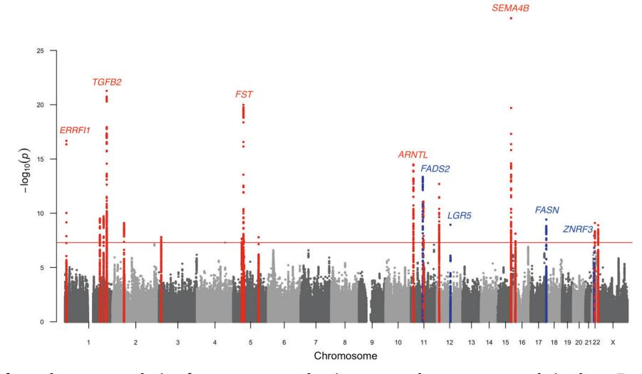
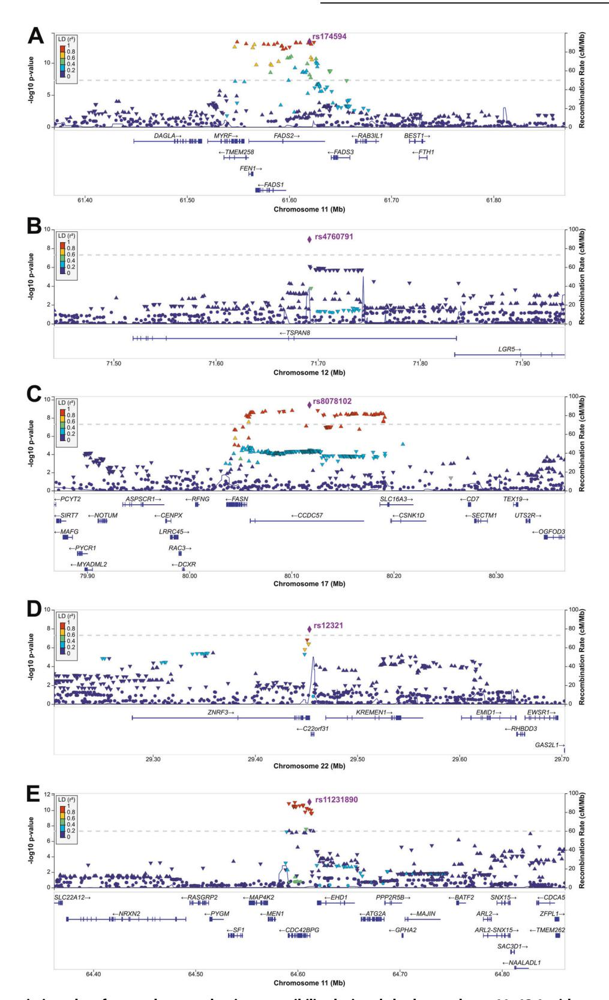
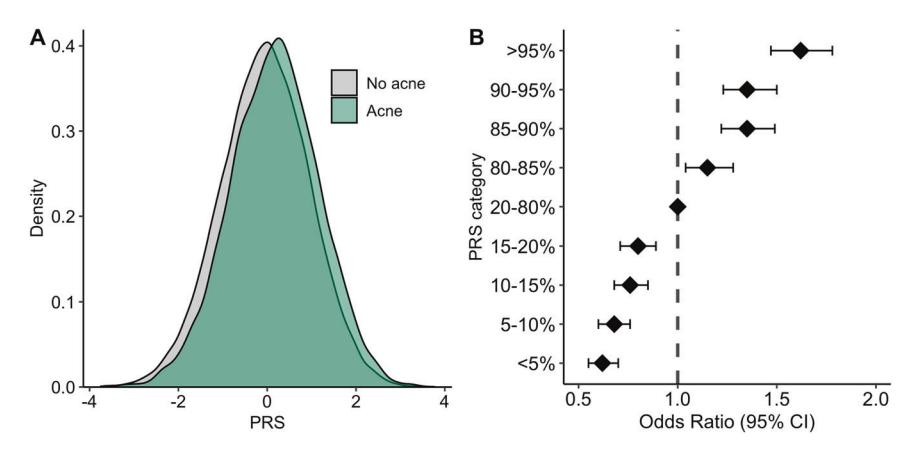

# ARTICLE OPEN

# Genome-wide meta-analysis identifies novel loci conferring risk of acne vulgaris

Maris Teder-Laving 1,8 ™, Mart Kals 1,2,8, Anu Reigo1, Riin Ehin1,3,4, Telver Objärtel 1,5,9, Mariliis Vaht1, Tiit Nikopensius1, Andres Metspalu 1,5,9 and Külli Kingo6,7,9

© The Author(s) 2023, corrected publication 2023

Acne vulgaris is a common chronic skin disorder presenting with comedones, cystic structures forming within the distal hair follicle, and in most cases additionally with inflammatory skin lesions on the face and upper torso. We performed a genome-wide association study and meta-analysis of data from 34,422 individuals with acne and 364,991 controls from three independent European-ancestry cohorts. We replicated 19 previously implicated genome-wide significant risk loci and identified four novel loci [11q12.2 (FADS2), 12q21.1 (LGR5), 17q25.3 (FASN), and 22q12.1 (ZNRF3-KREMEN1)], bringing the total number of reported acne risk loci to 50. Our meta-analysis results explain 9.4% of the phenotypic variance of acne. A polygenic model of acne risk variants showed that individuals in the top 5% of the risk percentiles had a 1.62-fold (95% CI 1.47–1.78) increased acne risk relative to individuals with average risk (20–80% on the polygenic risk score distribution). Our findings highlight the Wnt and MAPK pathways as key factors in the genetic predisposition to acne vulgaris, together with the effects of genetic variation on the structure and maintenance of the hair follicle and pilosebaceous unit. Two novel loci, 11q12.2 and 17q25.3, contain genes encoding key enzymes involved in lipid biosynthesis pathways.

European Journal of Human Genetics (2024) 32:1136-1143; https://doi.org/10.1038/s41431-023-01326-8

## INTRODUCTION

Acne vulgaris (acne) is a common skin disorder characterized by comedones and inflammatory lesions (papules, pustules, nodules and cysts), especially on the face, neck, chest, and back [1, 2]. Acne affects about 85% of adolescents and young adults [3]. It usually regresses by the age of 25 years, but persistence into adulthood is significant, with about 26% of women and 12% of men reporting acne in their 40s [4]. Acne severity varies widely, from mild to moderate up to severe forms in 10% of adolescents as well as young adults [1]. Irreversible facial scarring occurs in up to 20% of teenagers, with a significant long-term negative impact on emotional and mental health including low self-esteem and social isolation. Higher rates of anxiety, depression with suicidal ideation, and an elevated rate of unemployment make acne a significant social and health care burden [5, 6].

The pathogenesis of acne is multifactorial, involving an interplay of several factors [5]. Last decade has set a focus on abnormal differentiation of progenitor cells of the hair follicle (HF) that generate the sebaceous glands (SG) and infundibulum: the "comedo switch" [7]. These leucine-rich repeat and immunoglobulin-like domain 1 positive (LRIG1+) cells in the junctional zone (JZ) of the pilosebaceous unit (PSU) can potentially differentiate into infundibular or SG duct/SG cells. Dysfunctional progenitors (inability to migrate, abnormal cell division and lack of differentiation) will result in cells remaining in the junctional zone, causing it to expand, thus giving rise to comedones. Due to the defect in cellular motility, the SGs are not replenished and will

become atrophic [8, 9]. The pathogenesis of acne inflammation is still not fully understood, although certain *C. acnes* phylotypes (IA1) or lack of microbial diversity might trigger the responses from immune system [10].

Twin studies have shown that acne is highly heritable, with up to 85% of the population variance attributed to genetic factors [11]. Cross-sectional prevalence studies suggest a similar genetic contribution, with the family history correlating strongly with the disease risk and severity [2]. Concordant with current knowledge of the pathogenesis of acne, genetic studies have outlined biological pathways with overlapping functions, such as stem cell homeostasis, tissue remodeling, cell adhesion, and androgen metabolism [12-14]. Genome-wide association studies (GWASs) have led to the identification of 46 susceptibility loci in European populations, highlighting genes with established roles in the determination of hair follicle development, morphology, and activity and underscoring the importance of TGF-β-mediated signaling pathways [15-18]. GWASs and studies of single-gene disorders and syndromes associated with acne have revealed strong links to the tissue microenvironment and remodeling, occurring during sebaceous gland maturation, but not to inflammation, which thus may be considered a secondary event [12]. Understanding the biological processes that govern SG development and homeostasis would reveal potential etiological mechanisms underlying acne and other SG-associated skin disorders [8].

Yet, a significant proportion of the genetic susceptibility to acne remains unclear; therefore, conducting comparative studies with

1Estonian Genome Center, Institute of Genomics, University of Tartu, Tartu, Estonia. 2Institute for Molecular Medicine Finland (FIMM), HiLIFE, University of Helsinki, Helsinki, Finland. 3Institute of Health Technologies, Tallinn University of Technology, Tallinn, Estonia. 4BioCC Ltd, Tartu, Estonia. 5Institute of Molecular and Cell Biology, University of Tartu, Tartu, Estonia. 6Faculty of Medicine, Institute of Clinical Medicine, University of Tartu, Tartu, Estonia. 7Tartu University Hospital, Tartu, Estonia. 8These authors contributed equally: Maris Teder-Laving, Mart Kals 9These authors jointly supervised this work: Andres Metspalu, Külli Kingo. ™email: maris.teder-laving@ut.ee

Received: 21 July 2022 Revised: 2 February 2023 Accepted: 21 February 2023

Published online: 16 March 2023

different populations is essential. The replication of previous findings is crucial to identify true risk loci and unravel key trait-related pathways. We carried out a GWAS with the Estonian Biobank (EstBB) cohort data (30,194 cases, 94,694 controls), followed by a meta-analysis of data from three independent cohorts (34,422 affected individuals and 364,991 population controls) of European ancestry.

# MATERIALS AND METHODS Study cohorts

Data were collected from the EstBB, FinnGen, and Lifelines study cohorts. The reporting of acne cases varied among the cohorts and consisted of clinical assessment documentation, retrieval of ICD-10 codes from electronic health records, and self-reported diagnoses. The final sample consisted of 34,422 cases and 364,991 controls. Detailed information regarding informed consent, ethical approval, recruitment, and the definition of acne for each cohort is provided in Supplementary File 1.

#### Genome-wide association analysis and meta-analysis

Genome-wide single markers were tested using a mixed-effects logistic regression model. Data from the EstBB and FinnGen cohorts were analyzed using REGENIE v2.0.2 [19], and those from the Lifelines cohort were analyzed using SAIGE v0.43.1 [20]. Sex and the first 10 PCs were included as covariates, the latter to reduce the confounding effect introduced by the population structure. Age and genotyping batch were additionally included as covariates for the FinnGen cohort.

Prior to the meta-analysis, all variants were aligned to positions on human genome build GRCh37 (hg19), and variants with imputation INFO score <0.4 and minor allele frequency <1% were excluded. An inversevariance fixed-effects meta-analysis of data from the three cohorts was performed with genomic control correction using METAL (version 2011-03-25) [21]. Variants present in all three cohorts (total = 6,438,535) were retained for downstream analysis.

# Functional annotation of acne risk loci

We used independent computational pipelines for the functional annotation of the GWAS meta-analysis results. Newly identified significant genome-wide risk loci were defined by FUnctional Mapping and Annotation of Genome-Wide Association Studies (FUMA) v1.3.7 [22] SNP2GENE tool (using positional, expression quantitative trait loci (eQTL) and chromatin interaction mapping) as non-overlapping genomic regions with a linkage disequilibrium (LD) window ( $r^2 \ge 0.6$ ) around each lead variant with  $P_{\text{Meta}} < 5 \times 10^{-8}$ . Association signals were merged into a single genomic locus if the distance between lead variants was less than 250 kb. We used Multi-marker Analysis of GenoMic Annotation (MAGMA) v1.08 [23], implemented in FUMA v1.3.7, for gene-based association (we applied a Bonferroni corrected significance of  $2.53 \times 10^{-6}$  (0.05/19,785 genes tested)), and gene-set analysis. Genes defined by SNP2GENE were tested with the GENE2FUNC tool in FUMA for the examination of differentially expressed genes in GTEx v8 tissue types and overrepresentation in various gene sets. Default values were set for multiple testing correction (the Benjamini-Hochberg method), the adjusted P value cutoff (0.05), and the minimum number [2] of overlapping genes. In addition, the functional impact of variants of interest was explored by directly querying available eQTL associations in skin samples (non-sun-exposed and sun-exposed skin) using the GTEx v8 database (https://www.gtexportal.org).

# Heritability estimation

The proportion of variance in acne liability explained by common single nucleotide polymorphisms ( $h^2_{\rm SNP}$ ) was estimated using LDSC v1.0.1 [24]. HapMap phase 3 SNPs (excluding the HLA region) and precomputed LD scores from 1000 Genomes phase 3 data from European-ancestry populations were used. Heritability estimates were reported on a liability scale, assuming a 30% population prevalence of acne.

#### Polygenic risk score calculation

Polygenic risk scores (PRSs) were calculated using PRS-CS-auto (version 2021-01-04) [25], which infers posterior SNP effect sizes under continuous shrinkage priors based on GWAS summary statistics and an external LD reference panel consisting of 503 European-ancestry population samples in 1000 Genomes dataset. For PRS calculation, stratified sampling of EstBB

study participants for sex and reported acne conglobata cases (ICD-10 L70.1) was performed to split the data into training and validation sets in a 2:1 ratio (training set contains 20,130 cases and 63,130 controls; validation set contains non-overlapping 10,064 cases and 31,564 controls). The polygenicity of acne susceptibility was assessed by a PRS leveraging genome-wide effects across all SNPs.

Each PRS was standardized, and average PRSs for acne vs. control groups were compared using the two-tailed Student's t-test. The PRSs were categorized by percentiles (<5, 5–10, 10–15, 15–20, 20–80, 80–85, 85–90, 90–95, and  $\geq$ 95%), and the risk for each category was estimated relative to the average risk (20–80%) using logistic regression adjusted for sex and the first 10 PCs.

#### **RESULTS**

#### Meta-analysis results

Study-level Manhattan and Q–Q plots of three population-based cohorts (EstBB, FinnGen, and Lifelines) are presented in Figs. S1, S2. The results from the 34,422 acne cases and 364,991 population controls were combined using meta-analysis (Fig. 1). There was no evidence of excessive genomic inflation ( $\lambda_{\text{Meta}} = 1.033$ ) in the GWAS meta-analysis (LD score regression intercept = 0.940 (SE = 0.008)) (Fig. S2D). Association summary statistics attaining genome-wide significance ( $P < 5 \times 10^{-8}$ ) in fixed-effects meta-analysis together with study-level association summary statistics are presented in Table S1. All common SNPs across the genome explained 9.4% (SE = 0.0095) of the phenotypic variance (SNP-based heritability) in acne liability.

We identified 1230 significant genome-wide associations ( $P_{\text{Meta}} < 5 \times 10^{-8}$ ), which were mapped to 23 risk loci (Table 1); four loci (11q12.2, 12q21.1, 17q25.3, and 22q12.1) were novel. The association peaks on chromosomes 11, 17, and 22 encompassed several genes, but were ascribed through fatty acid desaturase 2 (*FADS2*), fatty acid synthase (*FASN*), and zinc and ring finger 3 (*ZNRF3*), respectively, after gene prioritization. Of the previously identified risk loci, we replicated 19 at the genome-wide significance level, and seven were borderline significant ( $P < 10^{-6}$ , Table S2).

# Functional annotation and gene prioritization results

The 11q12.2 locus (chr11:61542006–61656117, GRCh37) with the lead variant rs174594 (OR = 1.08, 95% CI 1.06–1.10,  $P=4.45\times10^{-14}$ ) in FADS2 intron 5 encompasses fatty acid desaturase 1 (FADS1), FADS2, and transmembrane protein 258 (TMEM258) genes, all significantly associated by FUMA positional, eQTL, and/or chromatin interaction mapping (Table S3, Figs. 2A, S3A) and highlighted as genome-wide significant genes by MAGMA gene-based testing (Fig. S4, Table S5). FADS1 and FADS2 are expressed in SG cells of sun-exposed skin (Fig. S5). Moreover, eQTL analysis revealed significantly increased FADS2 and TMEM258 expression in sun-exposed and non-sun-exposed skin linked to the risk alleles of the 11q12.2 credible set SNPs (Table S4).

The 12q21.1 locus is defined by the independent lead variant rs4760791 (OR = 1.06, 95% CI 1.04–1.08,  $P = 1.14 \times 10^{-9}$ ) in tetraspanin 8 (*TSPAN8*) intron 2, with a CADD score of 19.2 and RegulomeDB score of 3a (Table S3, Figs. 2B, S3B). eQTL analysis revealed significantly reduced expression of the neighboring leucine-rich G protein–coupled receptor 5 (*LGR5*) gene in sunexposed skin tissue, defined by the rs4760791 risk allele ( $P = 1.4 \times 10^{-5}$ , FDR =  $7.15 \times 10^{-4}$ , Fig. S6). Multi-tissue eQTL comparison for *LGR5* and rs4760791 in GTEx revealed that sunexposed skin was the only tissue predicted to show an eQTL effect of rs4760791 on *LGR5* expression (Fig. S7).

The 17q25.3 locus (chr17:80044078–80191189, GRCh37) with the lead variant rs8078102 (OR = 1.07, 95% CI 1.05–1.09,  $P=3.82\times10^{-10}$ ) in the intron of the coiled-coil domain containing 57 (CCDC57) (Table S3, Figs. 2C, S3C) also encompasses the FASN and solute carrier family 16 member 3 (SLC16A3) genes in

Fig. 1 Manhattan plot from the meta-analysis of 34,423 acne vulgaris cases and 377,643 controls in three European-ancestry cohorts. The x-axis shows the genomic position (chromosomes 1–22 and X) and the y-axis shows the  $-\log_{10}$  association P values for SNPs and indels. The red line indicates the genome-wide significance threshold of  $5 \times 10^{-8}$ . Novel significant loci are in blue (n = 4) and previously identified significant loci are in red (n = 19).

| Table 1. | Genome-wide significant associations with acne vulgaris. |    |    |            |          |         |                  |                        |                            |
|----------|----------------------------------------------------------|----|----|------------|----------|---------|------------------|------------------------|----------------------------|
| Chr      | Pos (GRCh37)                                             | RA | PA | rsID       | Band     | RA Freq | OR (95% CI)      | P value                | Gene region                |
| 1        | 8207579                                                  | C  | G  | rs80293268 | 1p36.23  | 0.080   | 1.17 (1.13–1.21) | $2.10 \times 10^{-17}$ | ERRFI1-(SLC45A1)           |
| 1        | 183166970                                                | Т  | C  | rs3118181  | 1q25.3   | 0.509   | 1.06 (1.04–1.08) | $3.08 \times 10^{-10}$ | LAMC2                      |
| 1        | 202358947                                                | Т  | C  | rs2696958  | 1q32.1   | 0.499   | 1.06 (1.04–1.08) | $1.93 \times 10^{-10}$ | PPP1R12B-UBE2T-LGR6        |
| 1        | 218858745                                                | Α  | G  | rs1481362  | 1q41     | 0.418   | 1.10 (1.08–1.12) | $5.33 \times 10^{-22}$ | TGFB2                      |
| 1        | 219199380                                                | C  | G  | rs1256580  | 1q41     | 0.141   | 1.11 (1.08–1.14) | $2.71 \times 10^{-15}$ | LYPLAL1-DT                 |
| 2        | 60520351                                                 | Т  | Α  | rs9808396  | 2p16.1   | 0.443   | 1.06 (1.04–1.08) | $7.88 \times 10^{-10}$ | BCL11A                     |
| 3        | 12030034                                                 | Т  | C  | rs2600262  | 3p25.2   | 0.787   | 1.07 (1.04–1.09) | $1.57 \times 10^{-8}$  | TIMP4-PPARG                |
| 5        | 44362134                                                 | C  | Т  | rs10941664 | 5p12     | 0.714   | 1.06 (1.04–1.08) | $2.18 \times 10^{-8}$  | FGF10                      |
| 5        | 52628130                                                 | C  | Т  | rs37776    | 5q11.2   | 0.354   | 1.10 (1.08–1.12) | $1.04 \times 10^{-20}$ | ITGA1-ITGA2-MOCS2-FST      |
| 5        | 55596919                                                 | Α  | G  | rs185094   | 5q11.2   | 0.068   | 1.11 (1.07–1.15) | $4.01 \times 10^{-8}$  | ANKRD55                    |
| 5        | 131797578                                                | Т  | C  | rs2522051  | 5q31.1   | 0.458   | 1.05 (1.04–1.07) | $1.59 \times 10^{-8}$  | SLC22A5-IRF1-IL5-(RAD50)   |
| 11       | 13130559                                                 | Т  | C  | rs11022666 | 11p15.3  | 0.349   | 1.08 (1.06–1.10) | $3.19 \times 10^{-15}$ | RASSF10-ARNTL              |
| 11       | 61619829                                                 | C  | Α  | rs174594   | 11q12.2  | 0.379   | 1.08 (1.06-1.10) | $4.45 \times 10^{-14}$ | FADS1-FADS2                |
| 11       | 64611543                                                 | C  | T  | rs11231890 | 11q13.1  | 0.797   | 1.08 (1.06–1.11) | $8.33 \times 10^{-12}$ | CDC42BPG                   |
| 11       | 65521126                                                 | G  | Т  | rs11227289 | 11q13.1  | 0.438   | 1.06 (1.04–1.08) | $1.23 \times 10^{-8}$  | OVOL1-MAP3K11              |
| 12       | 12604777                                                 | Α  | G  | rs10734852 | 12p13.2  | 0.538   | 1.07 (1.05–1.09) | $1.99 \times 10^{-13}$ | BORCS5                     |
| 12       | 71691648                                                 | Α  | G  | rs4760791  | 12q21.1  | 0.586   | 1.06 (1.04-1.08) | $1.14 \times 10^{-9}$  | TSPAN8-LGR5                |
| 15       | 90734426                                                 | C  | Т  | rs34560261 | 15q26.1  | 0.839   | 1.16 (1.13–1.19) | $1.06 \times 10^{-28}$ | SEMA4B                     |
| 16       | 11034933                                                 | G  | Α  | rs6498135  | 16p13.13 | 0.593   | 1.06 (1.04–1.08) | $7.39 \times 10^{-9}$  | CIITA-DEXI-CLEC16A         |
| 17       | 80117478                                                 | c  | Α  | rs8078102  | 17q25.3  | 0.242   | 1.07 (1.05-1.09) | $3.82 \times 10^{-10}$ | FASN-CCDC57-SLC16A3        |
| 22       | 29453193                                                 | G  | C  | rs12321    | 22q12.1  | 0.641   | 1.06 (1.04–1.08) | 1.15×10 -8  | ZNRF3-C22orf31- KREMEN1 |
| 22       | 33221375                                                 | G  | Α  | rs130291   | 22q12.3  | 0.546   | 1.06 (1.04–1.08) | $7.83 \times 10^{-10}$ | TIMP3                      |
| 22       | 50321928                                                 | С  | Т  | rs7410766  | 22q13.33 | 0.215   | 1.07 (1.05–1.10) | $1.26 \times 10^{-9}$  | ALG12-CRELD2-PIM3          |

ORs represent the risk of a risk allele relative to a protective allele. Novel loci are in bold.

Chr chromosome, Pos position, RA risk allele, PA protective allele, RA Freq frequency of risk allele, OR odds ratio, CI confidence interval.

this region; only FASN showed genome-wide significance in genebased testing ( $P = 1.2 \times 10^{-7}$ ; Fig. S4, Table S5). FASN and CCDC57 are highly expressed in skin cell types, including SG cells, adipocytes, and mature keratinocytes (Fig. S8).

The 22q12.1 locus (chr22:29448643-29455687, GRCh37) harbors rs12321 (OR = 1.06, 95% CI 1.04–1.08,  $P = 1.14 \times 10^{-9}$ ) in the

3'UTR of E3 ubiquitin-protein ligase Zinc and ring finger 3 (ZNRF3), with a CADD score of 21.7 (Table S3, Figs. 2D, S3D). ZNRF3 and the neighboring kringle containing transmembrane protein 1 (KRE-MEN1) are expressed in several types of skin cells, including sebocytes and basal, suprabasal and mature keratinocytes (Fig. S9).

Fig. 2 Regional association plots for novel acne vulgaris susceptibility loci and the known locus 11q13.1 with a second independent association signal for rs11231890 from the GWAS meta-analysis data. (A) 11q12.2, rs174594; (B) 12q21.1, rs4760791; (C) 17q25.3, rs8078102; (D) 22q12.1, rs12321; (E) 11q13.1, rs11231890. SNPs are color coded to reflect their LD ( $r^2$ ) with the lead SNP on each panel.

Fig. 3 Acne PRS analysis. (A) Distributions of acne PRSs in individuals with no acne (gray) and acne (green). (B) Associations between categorized PRSs (<5, 5-10, 10-15, 15-20, 20-80, 80-85, 85-90, 90-95,  $\geq 95\%$ ) and acne risk relative to the average risk (20-80%).

Evidence for a second independent association signal at the 11q13.1 locus was observed for rs11231890 (OR = 1.08, 95% CI 1.06–1.11,  $P=8.33\times10^{-12}$ ) in the intron of the CDC42 binding protein kinase gamma (CDC42BPG) (Table S3, Figs. 2E, S10). Conditional analysis for rs11231890 in the EstBB dataset confirmed the independence of its effect from rs11227289 (~900 kb downstream) in known acne locus OVOL1–MAP3K11 ( $P=4.07\times10^{-11}$ ). Likewise, MAGMA gene-based testing supported the genomewide significance of the CDC42BPG ( $P=1.78\times10^{-11}$ ; Fig. S4, Table S5), which was strongly expressed in sun-exposed and nonsun-exposed bulk tissue samples, particularly in basal keratinocytes (Fig. S11). The risk allele of rs11231890 significantly increased the expression of this gene in sun-exposed skin (FDR =  $1.33\times10^{-8}$ ; Table S4).

In addition, we report seven previously known acne loci with borderline genome-wide significant associations ( $P < 10^{-6}$ ; Table S2), with the strongest signals observed for 2q35 (rs146599639,  $P = 6.99 \times 10^{-8}$  and rs72966077,  $P = 9.53 \times 10^{-8}$ ), identifying the Wnt family member 10A (*WNT10A*), and 4q31.22 (rs72955609,  $P = 5.06 \times 10^{-8}$ ), highlighting the endothelin receptor type A (*EDNRA*) (Table S2).

Evidence supporting the prioritization of genes from four novel genome-wide significant loci, and the known locus 11q13.1 with a second independent association signal, is presented in Table S9.

MAGMA gene-based analysis led to the identification of 50 genes with genome-wide significance  $(P < 2.53 \times 10^{-6})$  after Bonferroni correction (Table S5). Subsequent competitive geneset analysis demonstrated enrichment in several possibly relevant gene ontology (GO) biological processes: "GO branch elongation of an epithelium," "GO regulation of metalloendopeptidase activity," and "GO regulation of the trail-activated apoptotic signaling pathway". For Curated gene sets, "KEGG melanoma" and the "Biocarta TCR pathway" were identified (Table S6).

A set of 323 genes prioritized by the SNP2GENE tool and showing expression in skin was selected for further analysis with the GENE2FUNC tool. Analysis against differentially expressed genes in 54 tissue types in the GTEx v8 RNA-seg data demonstrated their significant upregulation in sun-exposed skin and downregulation in thyroid, liver, testis, and several brain areas (Fig. S12). Among GO biological processes, the most significant gene-set enrichment occurred for "GO regulation of steroid biosynthetic process", "GO regulation of lipid metabolic/biosynthetic process" and "GO steroid biosynthetic process". Among other pathways, "Reactome regulation of cholesterol biosynthesis by SREBP-SREBF", "Reactome activation of gene expression by SREBF-SREBP", "Reactome signaling by wnt", "Hallmark cholesterol homeostasis", and "Hallmark MTORC1 signaling" were most significant. The enrichment of the prioritized genes in biological pathways and functional categories is presented in Table S7.

#### Polygenic prediction of acne risk

The polygenicity of acne susceptibility in the EstBB cohort was assessed using PRSs, with the leveraging of genome-wide effects across all variants using the PRS-CS-auto algorithm. Individuals reporting acne had significantly higher mean acne PRSs than did those from the control group (t-test,  $P = 6.87 \times 10^{-82}$ ; Fig. 3A).

In the validation set, we observed significant risk stratification between percentiles. Individuals in the top 5% of the PRS distribution had a risk of acne development elevated by 1.62 (95% CI 1.47–1.78) times and those in the 90–95% PRS stratum had a risk increased by 1.35-fold (95% CI 1.23–1.50) relative to individuals with average risk (20–80%; Fig. 3B, Table S8).

#### DISCUSSION

Our meta-analysis identified four novel loci and brought the number of acne susceptibility loci in European populations to 50. We replicated 19 loci at the genome-wide significance level and seven at borderline significance level ( $P < 10^{-6}$ ). Therefore, 20 of the known 46 susceptibility loci in Europeans did not replicate. Likewise other studies in populations of European descent [15–18], we found no evidence of association at the two loci observed in the Han Chinese population for severe disease [26]. Common variants across the genome (SNP-based heritability) account for 9.4% of the phenotypic variance, indicating that additional loci contributing to disease susceptibility remain to be discovered.

In recent years acne has been reframed as a disorder of SG progenitor differentiation and migration [8]. SG development is coupled to HF morphogenesis, which relies on an extensive epithelial-mesenchymal crosstalk, involving Wnt, EDAR, Bmp, Hedgehog and FGF signaling pathways [27]. Canonical Wnt signaling supports morphogenesis of HF [28] by promoting different lineage choices in specific pilosebaceous stem cell populations [29, 30]. Activation of Wnt signaling in JZ LRIG1+ cells results in expansion of the upper HF [29] and downregulation of Wnt signaling promotes keratin 15-expressing bulge cells to migrate and differentiate into sebocytes [30]. Imbalances in Wnt pathway may lead to abnormal fate determination of the LRIG1+ stem cells, promoting the growth of the JZ instead of SG and leaving the lesion-associated SGs atrophic. Thus, comedones are most likely formed by abnormal differentiation of infundibular keratinocytes, which may become hyperproliferative [8]. Interestingly, Wnt signaling can be modulated by aryl hydrocarbon receptor (AHR) activation [31] in response to increased androgen synthesis at the onset of puberty [1]. By some evidence C. acnes can directly activate AHR signaling and induce terminal differentiation of sebocytes into keratinocyte-like cells [32], but there's no data to prove if this applies to sebaceous progenitors [10].

Three novel acne associated genes are also involved in the Wnt signaling pathway: *ZNRF3* and *KREMEN1* from 22q12.1 and *LGR5* from 12q21.1. Previous GWAS implicated two genes from the same pathway - *LGR6* and *WNT10A* [17].

ZNRF3 and ring finger protein 43 (RNF43) are negative regulators of Wnt/β-catenin signaling cascade, mediating the ubiquitination, endocytosis, and subsequent degradation of frizzled (FZD) Wnt receptor complex components, resulting in the inhibition of canonical and non-canonical Wnt/catenin signaling pathways. ZNRF3 and the neighboring KREMEN1 are both expressed in SG cells and basal, suprabasal and differentiated keratinocytes derived from interfollicular epidermal stem cells [28]. The Dickkopf-1 (DKK1), KREMEN1 and low-density-lipoprotein receptor-related protein 6 (LRP6) complex is recognized as a major ligand-receptor complex regulating Wnt signaling in vertebrates [33]. The DKK1 context-dependent activity of KREMEN1 can inhibit or increase Wnt/β-catenin signaling by removal of or binding to LRP6 [34]. By promoting the turnover of Wnt receptors, FZD, LRP5/ 6, and ZNRF3 (also RNF43) ensure the proper levels of Wnt activity in stem cells [35]. Loss-of-function mutations in ZNRF3 (and RNF43) potentiate the Wnt/ $\beta$ -catenin signaling cascade and  $\beta$ -cateninindependent Wnt-signaling cascades [36].

LGR5, a surface-expressed marker of adult stem cell populations in HF, participates in the maintenance and regulation of Wnt signaling via its association with Wnt receptors and mediating Wnt agonists (R-spondins, ligands for LGR5) [9, 37]. In mice, Lgr5 and Lgr6 exhibit restricted, yet non-overlapping expression patterns in resting adult hair follicles: Lgr5+ cells contribute progeny to all hair follicle components (excluding the sebaceous gland), whereas Lgr6+ cells contribute exclusively differentiated progeny to the sebaceous gland and interfollicular epidermis over entire lifetime [37]. Lgr5 expression occurs in stem cells at sites of active proliferation, being the direct consequence of active Wnt signaling [38], e.g., activation of Wnt signaling in HF LGR5+ bulge cells promotes hair growth [29]. Wnt signaling potentiation can take place through formation of the ZNRF3/RNF43-RSPO-LGR4/5/6 tertiary complex, resulting in the accumulation of FZD receptors on the plasma membrane and corresponding enhanced response to the Wnt ligands in cells [39].

Novel acne susceptibility gene TSPAN8 is a member of the transmembrane 4 (tetraspanin) superfamily. Tetraspanins are implicated in processes relying on cell migration, e.g., cancer invasion, wound healing, and inflammation [40]. TSPAN8 was shown to function as a negative regulator of integrin-linked kinase driven \$1 integrin-dependent adhesion in melanoma cells, thereby decreasing adhesive interaction with the surrounding matrix environment and promoting tumor invasiveness [41]. Downregulation of TSPAN8 was associated with IL-1β mediated inhibition of the Akt/MAPK pathway [42]. The analysis of differentially expressed genes in 18 acne lesions and 18 paired normal skin samples from two datasets led to the identification of TSPAN8 as one of the few genes concurrently down-regulated in acne samples [43]. We detected significant enrichment of TSPAN8, along with other novel genes (LGR5, ZNRF3, KREMEN1) and several known acne susceptibility genes, for the GO biological processes gene sets "GO negative regulation of response to stimulus" and "GO regulation of response to stress".

Two novel acne associated loci, identified in this study, contain genes encoding enzymes involved in lipid metabolism: FADS1/FADS2 and FASN. Although acne lesion-associated SGs are atrophic, sebum production in general is abnormally high and suppression of sebum secretion can reduce acne incidence and severity [44]. The composition of sebum differs from that in normal skin by higher levels of monounsaturated fatty acids (MUFA) and unbalanced ratio of triglycerides to wax esters [45]. Recent study presented significantly higher induction of sebumtype MUFAs with chain length of 14–17 carbon atoms at both forehead and cheek areas in acne patients [46].

Remarkably, human sebum production is highly dependent on local flux through the de novo lipogenesis (DNL) pathway and is >20% higher in acne patients [47]. Up to 85% of the two major fatty acids (FA) in human sebum, palmitate and sapienate (a nonessential FA exclusive to human sebum), is derived from DNL, while the contribution of DNL to circulating very-low-densitylipoprotein (VLDL)-triglyceride palmitate is only ~20%. These findings demonstrate the major role of sebocyte DNL pathway in the overproduction of sebum lipids in humans with acne and highlight the inhibitors of DNL key enzymes as potential therapeutic agents [47]. Palmitic acid, a precursor of sapienic acid, is synthesized in the terminal catalytic steps of long-chain saturated FA synthesis pathway by the multifunctional metabolic enzyme FASN [48]. The level of FASN expression reflects stages of sebocyte differentiation. Along with high level expression of nuclear androgen receptor (AR), high levels of FASN and PPARy are detected in middle-stage differentiated cells, whilst late-stage differentiating sebocytes, in the upper part of the gland, exhibit low levels of AR, FASN, and PPARy and are positive for B-lymphocyte induced maturation protein (BLIMP1/PRDM1), marker of terminal differentiation in all epidermal lineages [49].

The rate-limiting enzyme FADS2 can desaturate at least ten substrates: eight polyunsaturated fatty acids (PUFA), one MUFA when PUFAs are low, and one saturate, palmitic acid into sapienic acid, the predominant unsaturate in human skin [50]. The enhanced DNL in acne may cause a prominent decrease in synthesis of anti-inflammatory PUFA molecules like EPA, DHA and DGLA, because palmitic acid competes with linoleic and αlinolenic acids for FADS2-mediated Δ6-desaturation [50]. Genetic variants in FADS2 cluster were shown to be associated with 18C-PUFA to LC-PUFA conversion efficiencies [51]. The risk-increasing C allele of our top SNP rs174594 in *FADS2* is in high LD ( $r^2 = 0.89$ ) with rs3834458 delT allele in the promoter region. The carriage of delT allele has been associated with decreased activity of ratelimiting FADS2 enzyme, manifesting as lower levels of EPA, DPA and DHA in the blood compared to those of major allele homozygotes. Thus, variations in FADS2 may influence the rate of conversion of  $\alpha$ -linolenic acid into other n-3 PUFAs [52]. As today's western diet contains a low ratio of n-3 to n-6 FAs, this will deepen the low levels of anti-inflammatory EPA and DHA content in delT carriers.

EPA and especially DHA, can inhibit dimerization of TLR-1 and TLR-2 [53] and consequent activation of TLR-signaling pathways in keratinocytes and macrophages in response to *C. acnes*, which otherwise leads to hyperproliferation of keratinocytes and the initiation of inflammatory reaction. Expression of keratinocyte TLR-2 and TLR-4 leads to activation of NF-κB and MAPK pathways and subsequent production of IL-1, IL-6, IL-8, TNF-α, human beta-defensin-2, granulocyte-macrophage colony-stimulating factor (GM-CSF), and matrix metalloproteinases (MMP) [54]. Activation of monocyte TLR-2 leads to the production of proinflammatory cytokines, including IL-1, TNF-α, IL-8, and IL-12 [55]. Thus, DHA and EPA, inhibiting activation of TLR-signaling pathways, may decrease the inflammatory response in patients with acne.

Based on GWAS data from 2/3 of randomized EstBB study participants, we developed an acne PRS that demonstrated strong associations with reported acne status and allows better acne risk stratification. Additional studies including more cases are needed to develop an acne PRS with enhanced predictive utility. Clarification of the roles of genetic factors underlying the observed phenotypic variability will provide a better understanding of the etiology of acne and may eventually enable the earlier identification of individuals at greater risk in combination with clinical risk factors; it will also highlight therapeutically actionable pathways that can be targeted for effective treatment options.

The current study ascertained acne diagnosis in EstBB cohort mostly by ICD-10 codes, but cases from Lifelines were all

self-reported. Acne phenotype was not stratified by severity. It is probable that the meta-analysis cohort (especially EstBB) contains relatively more mild cases; however, some mild cases could remain underdiagnosed and may be included among controls. This may explain why this study lacked sufficient power to replicate approximately half of the known susceptibility loci and provided smaller heritability estimates compared to previously reported estimates.

In conclusion, this study provides additional insight into the genetic predisposition for acne. The identification of novel acne susceptibility genes belonging to Wnt-signaling pathway, known as a determinant of stem and progenitor cell differentiation during hair follicle morphogenesis and regeneration, emphasizes the imbalanced SG homeostasis in acne pathogenesis. The detection of specific loci, containing genes, which encode key enzymes in lipid metabolism, emphasizes the conception of acne, being etiologically linked to other metabolic diseases. Further studies with more diverse populations are warranted to discover more risk loci and to elucidate the biological processes and pathways that mediate the genetic risk of acne.

# DATA AVAILABILITY

Meta-analysis summary statistics generated during the current study have been deposited in the GWAS Catalog (<https://www.ebi.ac.uk/gwas/>) with accession number GCST90245818. The individual level data from Estonian Biobank are available under restricted access and can be obtained after permission of the Estonian Committee on Bioethics and Human Research.

# REFERENCES

- 1. Greydanus DE, Azmeh R, Cabral MD, Dickson CA, Patel DR. Acne in the first three decades of life: An update of a disorder with profound implications for all decades of life. Dis-a-Mon. 2021;67:101103.
- 2. Ghodsi SZ, Orawa H, Zouboulis CC. Prevalence, Severity, and Severity Risk Factors of Acne in High School Pupils: A Community-Based Study. J Investig Dermatol. 2009;129:2136–41.
- 3. Zouboulis CC, Eady A, Philpott M, Goldsmith LA, Orfanos C, Cunliffe WC, et al. What is the pathogenesis of acne? Exp Dermatol. 2005;14:143.
- 4. Collier CN, Harper JC, Cantrell WC, Wang W, Foster KW, Elewski BE. The prevalence of acne in adults 20 years and older. J Am Acad Dermatol. 2008;58:56–9.
- 5. Williams HC, Dellavalle RP, Garner S. Acne vulgaris. Lancet. 2012;379:361–72.
- 6. Ramrakha S, Fergusson DM, Horwood LJ, Dalgard F, Ambler A, Kokaua J, et al. Cumulative mental health consequences of acne: 23-year follow-up in a general population birth cohort study. Br J Dermatol. 2016;175:1079–81.
- 7. Saurat JH. Strategic Targets in Acne: The Comedone Switch in Question. DRM. 2015;231:105–11.
- 8. Clayton RW, Göbel K, Niessen CM, Paus R, van Steensel MAM, Lim X. Homeostasis of the sebaceous gland and mechanisms of acne pathogenesis. Br J Dermatol. 2019;181:677–90.
- 9. Shang W, Tan AYQ, van Steensel MAM, Lim X. Aberrant Wnt Signaling Induces Comedo-Like Changes in the Murine Upper Hair Follicle. J Investig Dermatol. 2022;142:2603–12.e6.
- 10. van Steensel MAM, Goh BC. Cutibacterium acnes: Much ado about maybe nothing much. Exp Dermatol. 2021;30:1471–6.
- 11. Mina-Vargas A, Colodro-Conde L, Grasby K, Zhu G, Gordon S, Medland SE, et al. Heritability and GWAS Analyses of Acne in Australian Adolescent Twins. Twin Res Hum Genet. 2017;20:541–9.
- 12. Common JEA, Barker JN, van Steensel MAM. What does acne genetics teach us about disease pathogenesis? Br J Dermatol. 2019;181:665–76.
- 13. Heng AHS, Say YH, Sio YY, Ng YT, Chew FT. Gene variants associated with acne vulgaris presentation and severity: a systematic review and meta-analysis. BMC Med Genomics. 2021;14:103.
- 14. Demirkan S, Sayın DB, Gündüz Ö. CAG polymorphism in the androgen receptor gene in women may be associated with nodulocystic acne. Postepy Dermatol Alergol. 2019;36:173–6.
- 15. Zhang M, Qureshi AA, Hunter DJ, Han J. A genome-wide association study of severe teenage acne in European Americans. Hum Genet. 2014;133:259–64.
- 16. Navarini AA, Simpson MA, Weale M, Knight J, Carlavan I, Reiniche P, et al. Genome-wide association study identifies three novel susceptibility loci for severe Acne vulgaris. Nat Commun. 2014;5:4020.

- 17. Petridis C, Navarini AA, Dand N, Saklatvala J, Baudry D, Duckworth M, et al. Genome-wide meta-analysis implicates mediators of hair follicle development and morphogenesis in risk for severe acne. Nat Commun. 2018;9:5075.
- 18. Mitchell BL, Saklatvala JR, Dand N, Hagenbeek FA, Li X, Min JL, et al. Genomewide association meta-analysis identifies 29 new acne susceptibility loci. Nat Commun. 2022;13:702.
- 19. Mbatchou J, Barnard L, Backman J, Marcketta A, Kosmicki JA, Ziyatdinov A, et al. Computationally efficient whole-genome regression for quantitative and binary traits. Nat Genet. 2021;53:1097–103.
- 20. Zhou W, Nielsen JB, Fritsche LG, Dey R, Gabrielsen ME, Wolford BN, et al. Efficiently controlling for case-control imbalance and sample relatedness in largescale genetic association studies. Nat Genet. 2018;50:1335–41.
- 21. Willer CJ, Li Y, Abecasis GR. METAL: fast and efficient meta-analysis of genomewide association scans. Bioinformatics. 2010;26:2190–1.
- 22. Watanabe K, Taskesen E, van Bochoven A, Posthuma D. Functional mapping and annotation of genetic associations with FUMA. Nat Commun. 2017;8:1826.
- 23. de Leeuw CA, Mooij JM, Heskes T, Posthuma D. MAGMA: generalized gene-set analysis of GWAS data. PLoS Comput Biol. 2015;11:e1004219.
- 24. Bulik-Sullivan BK, Loh PR, Finucane H, Ripke S, Yang J, Patterson N, et al. LD Score Regression Distinguishes Confounding from Polygenicity in Genome-Wide Association Studies. Nat Genet. 2015;47:291–5.
- 25. Ge T, Chen CY, Ni Y, Feng YCA, Smoller JW. Polygenic prediction via Bayesian regression and continuous shrinkage priors. Nat Commun. 2019;10:1776.
- 26. He L, Wu WJ, Yang JK, Cheng H, Zuo XB, Lai W, et al. Two new susceptibility loci 1q24.2 and 11p11.2 confer risk to severe acne. Nat Commun. 2014;5:2870.
- 27. Zouboulis CC, Picardo M, Ju Q, Kurokawa I, Törőcsik D, Bíró T, et al. Beyond acne: Current aspects of sebaceous gland biology and function. Rev Endocr Metab Disord. 2016;17:319–34.
- 28. Lim X, Nusse R. Wnt Signaling in Skin Development, Homeostasis, and Disease. Cold Spring Harb Perspect Biol. 2013;5:a008029.
- 29. Kretzschmar K, Weber C, Driskell RR, Calonje E, Watt FM. Compartmentalized Epidermal Activation of β-Catenin Differentially Affects Lineage Reprogramming and Underlies Tumor Heterogeneity. Cell Rep. 2016;14:269–81.
- 30. Lien WH, Polak L, Lin M, Lay K, Zheng D, Fuchs E. In vivo transcriptional governance of hair follicle stem cells by canonical Wnt regulators. Nat Cell Biol. 2014;16:179–90.
- 31. Schneider AJ, Branam AM, Peterson RE. Intersection of AHR and Wnt Signaling in Development, Health, and Disease. Int J Mol Sci. 2014;15:17852–85.
- 32. Cao K, Chen G, Chen W, Hou X, Hu T, Lu L, et al. Formalin-killed Propionibacterium acnes activates the aryl hydrocarbon receptor and modifies differentiation of SZ95 sebocytes in vitro. Eur J Dermatol. 2021;31:32–40.
- 33. Feng Q, Gao N. Keeping Wnt Signalosome in Check by Vesicular Traffic. J Cell Physiol. 2015;230:1170–80.
- 34. Cselenyi CS, Lee E. Context-Dependent Activation or Inhibition of Wnt-β-Catenin Signaling by Kremen. Sci Signal. 2008;1:pe10.
- 35. Liang JJ, Li HR, Chen Y, Zhou Z, Shi YQ, Zhang LL, et al. ZNRF3 Regulates Collagen-Induced Arthritis Through NF-kB and Wnt Pathways. Inflammation. 2020;43:1077–87.
- 36. Katoh M, Katoh M. Molecular genetics and targeted therapy of WNT-related human diseases (Review). Int J Mol Med. 2017;40:587–606.
- 37. Barker N, Tan S, Clevers H. Lgr proteins in epithelial stem cell biology. Development 2013;140:2484–94.
- 38. de Lau W, Peng WC, Gros P, Clevers H. The R-spondin/Lgr5/Rnf43 module: regulator of Wnt signal strength. Genes Dev. 2014;28:305–16.
- 39. Raslan AA, Yoon JK, R-spondins, Multi-mode WNT. signaling regulators in adult stem cells. Int J Biochem Cell Biol. 2019;106:26–34.
- 40. Jiang X, Zhang J, Huang Y. Tetraspanins in Cell Migration. Cell Adh Migr. 2015;9:406–15.
- 41. El Kharbili M, Cario M, Béchetoille N, Pain C, Boucheix C, Degoul F, et al. Tspan8 Drives Melanoma Dermal Invasion by Promoting ProMMP-9 Activation and Basement Membrane Proteolysis in a Keratinocyte-Dependent Manner. Cancers. 2020;12:1297.
- 42. Lin X, Bi Z, Hu Q, Li Q, Liu J, Luo ML, et al. TSPAN8 serves as a prognostic marker involving Akt/MAPK pathway in nasopharyngeal carcinoma. Ann Transl Med. 2019;7:470.
- 43. Chen B, Zheng Y, Liang Y. Analysis of Potential Genes and Pathways Involved in the Pathogenesis of Acne by Bioinformatics. Biomed Res Int. 2019;2019:3739086.
- 44. Cong TX, Hao D, Wen X, Li XH, He G, Jiang X. From pathogenesis of acne vulgaris to anti-acne agents. Arch Dermatol Res. 2019;311:337–49.
- 45. Picardo M, Ottaviani M, Camera E, Mastrofrancesco A. Sebaceous gland lipids. Dermatoendocrinol. 2009;1:68–71.
- 46. Okoro OE, Adenle A, Ludovici M, Truglio M, Marini F, Camera E. Lipidomics of facial sebum in the comparison between acne and non-acne adolescents with dark skin. Sci Rep. 2021;11:16591.

- 47. Esler WP, Tesz GJ, Hellerstein MK, Beysen C, Sivamani R, Turner SM, et al. Human sebum requires de novo lipogenesis, which is increased in acne vulgaris and suppressed by acetyl-CoA carboxylase inhibition. Sci Transl Med. 2019;11:eaau8465.
- 48. Menendez JA, Lupu R. Fatty acid synthase and the lipogenic phenotype in cancer pathogenesis. Nat Rev Cancer. 2007;7:763–77.
- 49. Cottle DL, Kretzschmar K, Schweiger PJ, Quist SR, Gollnick HP, Natsuga K, et al. c-MYC-Induced Sebaceous Gland Differentiation Is Controlled by an Androgen Receptor/p53 Axis. Cell Rep. 2013;3:427–41.
- 50. Park HG, Kothapalli KSD, Park WJ, DeAllie C, Liu L, Liang A, et al. Palmitic acid (16:0) competes with omega-6 linoleic and omega-3 α-linolenic acids for FADS2 mediated Δ6-desaturation. Biochim Biophys Acta. 2016;1861:91–7.
- 51. Reynolds LM, Howard TD, Ruczinski I, Kanchan K, Seeds MC, Mathias RA, et al. Tissue-specific impact of FADS cluster variants on FADS1 and FADS2 gene expression. PLoS ONE. 2018;13:e0194610.
- 52. Chen X, Wu Y, Zhang Z, Zheng X, Wang Y, Yu M, et al. Effects of the rs3834458 Single Nucleotide Polymorphism in FADS2 on Levels of n-3 Long-chain Polyunsaturated Fatty Acids: A Meta-analysis. Prostaglandins Leukotrienes Essent Fat Acids. 2019;150:1–6.
- 53. Snodgrass RG, Huang S, Choi IW, Rutledge JC, Hwang DH. Inflammasomemediated secretion of IL-1β in human monocytes through TLR2 activation; Modulation by dietary fatty acids. J Immunol. 2013;191:4337–47.
- 54. Dréno B. What is new in the pathophysiology of acne, an overview. J Eur Acad Dermatol Venereol. 2017;31:8–12.
- 55. Kurokawa I, Nakase K. Recent advances in understanding and managing acne. F1000Res. 2020;9:F1000.

# ACKNOWLEDGEMENTS

We want to acknowledge the participants and investigators of the FinnGen and Lifelines studies, and Estonian Biobank research team (Andres Metspalu, Lili Milani, Tõnu Esko, Reedik Mägi, Mari Nelis and Georgi Hudjashov) for data collection, genotyping, QC and imputation.

# AUTHOR CONTRIBUTIONS

AM, MT-L, MV designed the study, MK, MT-L did most of the statistical analyses, KK, AR analyzed the clinical data, MT-L, AR, TO, RE, MV and TN analysed the data, AM and KK jointly supervised the study, MT-L, TN, AR and MK wrote the first draft, all coauthors participated in writing of the paper, have read the final version and approved it.

#### FUNDING

This work was supported by the European Union through the European Regional Development Fund (Project No. 2014-2020.4.01.15-0012 and Project No. 2014- 2020.4.01.16012), and the Estonian Research Council grant PRG1189. Computations were performed at the High Performance Computing Center, University of Tartu.

#### COMPETING INTERESTS

The authors declare no competing interests.

# ETHICS APPROVAL

This study was approved by Estonian Council of Bioethics and Human Research, decision nr 1.1-12/2338.

#### ADDITIONAL INFORMATION

Supplementary information The online version contains supplementary material available at [https://doi.org/10.1038/s41431-023-01326-8.](https://doi.org/10.1038/s41431-023-01326-8)

Correspondence and requests for materials should be addressed to Maris Teder-Laving.

Reprints and permission information is available at [http://www.nature.com/](http://www.nature.com/reprints) [reprints](http://www.nature.com/reprints)

Publisher's note Springer Nature remains neutral with regard to jurisdictional claims in published maps and institutional affiliations.

Open Access This article is licensed under a Creative Commons Attribution 4.0 International License, which permits use, sharing,

adaptation, distribution and reproduction in any medium or format, as long as you give appropriate credit to the original author(s) and the source, provide a link to the Creative Commons license, and indicate if changes were made. The images or other third party material in this article are included in the article's Creative Commons license, unless indicated otherwise in a credit line to the material. If material is not included in the article's Creative Commons license and your intended use is not permitted by statutory regulation or exceeds the permitted use, you will need to obtain permission directly from the copyright holder. To view a copy of this license, visit [http://](http://creativecommons.org/licenses/by/4.0/) [creativecommons.org/licenses/by/4.0/.](http://creativecommons.org/licenses/by/4.0/)

© The Author(s) 2023, corrected publication 2023