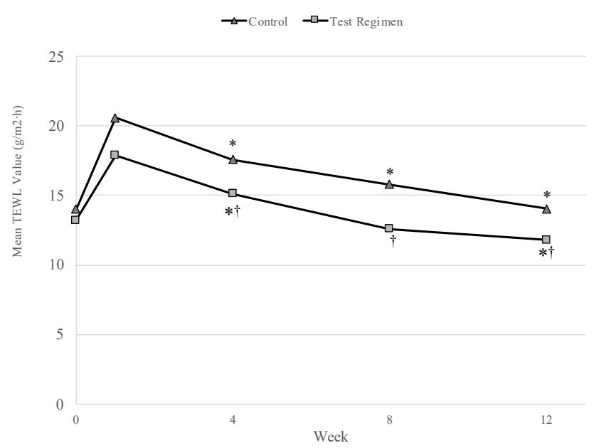
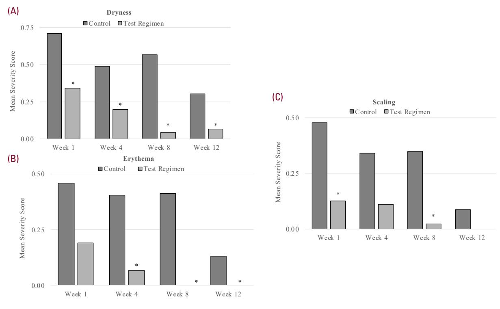
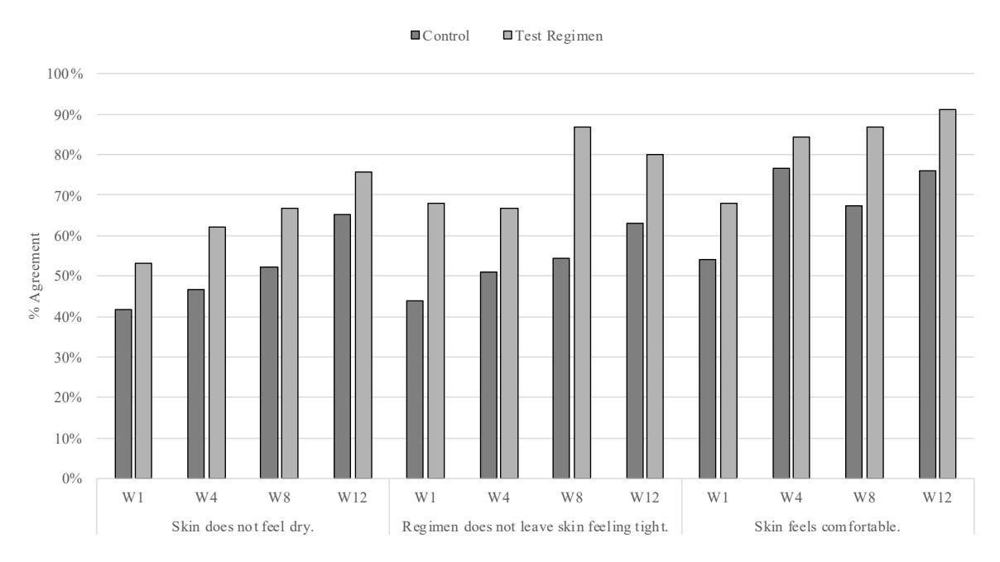
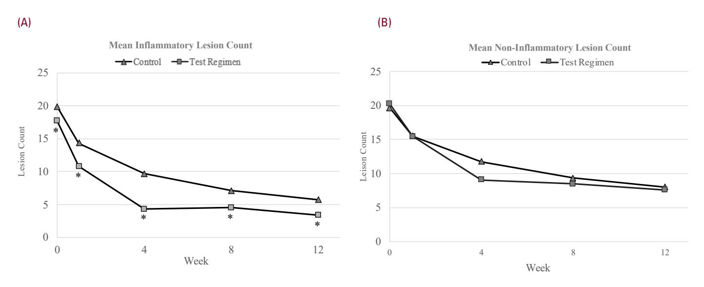

June 2023 S54 Volume 22 • Issue 0

COPYRIGHT © 2023

## ORIGINAL ARTICLE

JOURNAL OF DRUGS IN DERMATOLOGY

# Ceramide-Containing Adjunctive Skin Care for Skin Barrier Restoration During Acne Vulgaris Treatment

Zoe Diana Draelos MD, a Nada Baalbaki PhD, b Gene Colon JD, b Brigitte Dréno MD PhDc

aDermatology Consulting Services , PLLC, High Point, NC bCeraVe, New York, NY

'Nantes Université, INSERM, CNRS, Immunology and New Concepts in ImmunoTherapy, Nantes, France

#### ABSTRACT

Barrier damage caused by facial acne vulgaris can be magnified by topical medication, such as adapalene (0.3%) and benzoyl peroxide (2.5%)(A/BPO), which utilizes a retinoid to normalize follicular keratinization and BPO to decrease the *C. acnes* population. Disease-induced irritation combined with topical medication-induced irritation results in dryness and enhanced inflammation leading to lower compliance and increased skin healing time. Ceramide-based moisturizers have documented barrier repair benefits for eczema but have not been studied for acne. The objective of this double-blind study was to measure the impact of acne treatment on skin barrier function and tolerance when paired with a ceramide routine. Participants were prescribed an A/BPO gel once daily. The treatment group received a ceramide-containing foaming facial cleanser and facial lotion, and the control group received basic foaming face wash for twice-daily use. Participant and investigator tolerability and efficacy were evaluated by both ordinal and clinical measures. Acne lesion counts and Investigator's Global Assessments (IGA) of acne were obtained along with transepidermal water loss (TEWL) measurements for barrier function. TEWL for the treatment group remained significantly lower than the control at all timepoints and significantly improved from baseline by week 12. The treatment group had statistically lower mean investigator scores for dryness at all timepoints. Inflammatory lesion counts were significantly lower for the treatment group. A/BPO damaged the skin barrier, demonstrated by elevated TEWL, contributing to dryness, redness, and scaling. Use of a ceramide-containing cleanser and moisturizer significantly reduced severity and incidence of dryness, erythema, and scaling while more quickly resolving barrier damage and restoring function.

J Drugs Dermatol. 2023;22(6):554-558. doi:10.36849/JDD.7142

## INTRODUCTION

cne vulgaris is a chronic inflammatory skin disease of the pilosebaceous unit, characterized by permeability barrier dysfunction and reduced ceramide levels in the stratum corneum.1,2 Unfortunately, many acne medications, such as retinoids and benzoyl peroxide (BPO), cause irritation as a side effect, which can worsen underlying disease-related barrier issues.3 This irritation can be measured as increased transepidermal water loss (TEWL) and decreased stratum corneum hydration. Functionally, this irritation can result in activation of the innate immune system with subclinical inflammation and proteomic changes, such as increased filaggrin expression and decreased free fatty acid and linoleic acid production.4 Thus, the barrier alterations inherent in acne may be magnified by irritating topical treatments, decreasing patient adherence, and hampering disease resolution.5

Carefully formulated and selected adjunctive skincare products can minimize additive barrier damage. A moisturizer effective in acne medication-induced irritation must provide occlusion to control TEWL, include humectants to attract water to the dehydrated epidermis, contain emollients to smooth the desquamating skin scale, and include physiological lipids to encourage regeneration of the lipid bilayer. This research examined the effect of a ceramide-based skincare regimen as compared to a non-ceramide-containing skincare regimen in participants with moderate facial acne who used adapalene (0.3%) and benzoyl peroxide (2.5%)(A/BPO) once daily in the evening. The goal was to determine the value of ceramides in mitigating acne medication-enhanced barrier dysfunction.

#### MATERIALS AND METHODS

Male and female participants aged 13 to 40 years with Fitzpatrick skin types I-VI and moderate facial acne (IGA = 3) with oily/combination skin types were enrolled in this single center double-blinded randomized study. Participants possessed a minimum of 15 inflammatory lesions and 15 non-inflammatory lesions. Participants signed an IRB-approved informed consent/assent (Allendale Institutional Review Board, Old Lyme, CT) prior to initiating any study activities and were assessed at baseline, week 1, week 4, week 8, and week 12. Participants were excluded if they had used any topical prescription or over-the-counter (OTC) acne medications in the past 2 weeks

JOURNAL OF DRUGS IN DERMATOLOGY JUNE 2023 • VOLUME 22 • ISSUE 6 Z.D. Draelos, N. Baalbaki, G. Colon, et al

and specifically combination benzoyl peroxide/retinoid topical medications in the past 3 months, any oral acne medications in the past 4 weeks, any systemic isotretinoin in the past 6 months, and any anti-androgens in the past 3 months.

At all visits, the investigator assessed the skin for objective irritation parameters including erythema, dryness, scaling/peeling, and edema. The participants also assessed skin irritation in terms of burning, itching, tightness, and dryness. The assessments were completed on a 5-point ordinal scale: 0=none, 1=minimal, 2=mild, 3=moderate, 4=severe. Investigator efficacy was determined by IGA assessment (IGA: 0=clear, 1=almost clear, 2=mild, 3=moderate, 4=severe) along with inflammatory and non-inflammatory lesion counts. TEWL (Evaporimeter, Cyberderm, Broomall, PA) measurements were taken from the right cheek after washing the face with the assigned cleanser and acclimating to the study environment for 30 minutes.

Participants were randomized to receive A/BPO (Taro) once daily in the evening and a ceramide-containing foaming facial cleanser with a ceramide-containing facial lotion twice daily (ceramide treatment group: CeraVe Foaming Cleanser, CeraVe Facial Moisturizing Lotion, CeraVe LLC) or A/BPO once daily in the evening and a basic foaming face wash twice daily (control group: Sébium Foaming Gel Bioderma). Participants were dispensed their acne medication product and ancillary skincare products along with instructions and an application demonstration. They were instructed to use their self-selected sunscreen as needed. A compliance diary was provided for recording all product applications.

A Mann-Whitney two-tailed paired test was used to analyze the non-parametric ordinal data. Numerical acne lesion count data was analyzed using a Student t-test. Statistical significance was defined as P<0.05.

#### RESULTS

The study enrolled 100 participants to complete a with a minimum of 80 participants. Ninety-one participants successfully completed the study (45 participants completed the treatment regimen and 46 participants completed the control regimen). Nine participants discontinued for personal reasons unrelated to the study products. All Fitzpatrick skin types were represented. No adverse events occurred during the conduct of the study.

The study was conducted during the COVID-19 pandemic and TEWL measurements were performed anterior to the right ear around the face mask. Figure 1 demonstrates the increase in TEWL at week 1 in both regimens after treatment initiation, however, the TEWL increase was less for the ceramide treatment group than the control group. TEWL continued to decrease over time for both groups, but there was a statistically significant superior decrease for the ceramide treatment group over the control group at weeks 4, 8, and 12. This bioinstrumental finding was confirmed at the clinical level by the dermatologist investigator ratings for dryness, erythema, and scaling (Figure 2). Beginning at week 1 and continuing through week 4, the ceramide treatment group demonstrated statistically significant less dryness (Figure 2a) as compared to the control group. Erythema resolved in the ceramide treatment group at week 8 but remained in the control group until the end of the study

FIGURE 1. Transepidermal water loss (TEWL).

TEWL scores were significantly reduced with the ceramide treatment regimen at all time points indicating less barrier damage. Asterisk indicates P<0.05. Dagger indicates P<0.01.

JOURNAL OF DRUGS IN DERMATOLOGY JUNE 2023 • VOLUME 22 • ISSUE 6 Z.D. Draelos, N. Baalbaki, G. Colon, et al

FIGURE 2. Investigator assessments.

Investigator-assessed dryness (A), erythema (B), and scaling (C) were reduced for the ceramide treatment regimen indicating less medication-induced irritation. Asterisk indicates P<0.05.

FIGURE 3. Participant assessments.

Participants gave more favorable responses to the ceramide treatment regimen in terms of skin dryness, tightness, and comfort. W indicates week.

JOURNAL OF DRUGS IN DERMATOLOGY JUNE 2023 • VOLUME 22 • ISSUE 6 Z.D. Draelos, N. Baalbaki, G. Colon, et al

FIGURE 4. Acne lesion counts.

The ceramide treatment regimen did not interfere with the prescription acne medication in reducing inflammatory and non-inflammatory lesion counts. Asterisk indicates P<0.05.

(Figure 2b). Finally, scaling was significantly reduced in the ceramide treatment group at week 1 and completely resolved by week 12 (Figure 2c). Thus, the ceramide treatment group outperformed the control group in all investigator-assessed parameters by the completion of the week 12 study.

The investigator assessments were mirrored by the participant assessments (Figure 3). The participants rated the ceramide treatment regimen as superior to the control regimen beginning at week 1 and continuing through week 12 in terms of skin dryness, tightness, and comfort. Most participants (97.8%) were satisfied with the ceramide treatment regimen.

The study also addressed whether the ceramide-based skincare regimen interfered with acne resolution. Inflammatory and non-inflammatory acne lesion counts were obtained at each visit. Both regimens contained the prescription acne medication so both regimens resulted in a decrease in inflammatory and non-inflammatory lesion counts (Figure 4). Thus, the ceramide treatment regimen did not interfere with the prescription acne medication.

## DISCUSSION

Skin with acne is associated with alterations of the skin barrier function, proliferation, and composition, induced by increased sebum rich in unsaturated free fatty acids. The skin barrier is increasingly important in acne as medications are prescribed that can further impair barrier function. This research examined the role of ceramides in restoring the skin barrier as applied in a cleanser and moisturizer to skin treated with A/BPO. BPO is an anti-

inflammatory substance, producing concentration-dependent irritation, while topical retinoids such as second-generation adapalene is comedolytic, disrupting the stratum corneum and inducing acanthosis, epidermal dysadhesion, and desmosomal shedding.7 This results in irritation that decreases patient compliance and slows down acne resolution. Therefore, there is a need for a regimen that is effective but will not induce side effects that contribute to low adherence.11

TEWL, which is a measure of permeability barrier disruption, is minimized by hydrophobic intercellular lipids. Irritants can increase TEWL by denaturing epidermal proteins, damaging the natural moisturizing factor (NMF), and removing intercellular lipids.8 The intercellular lipids are derived from lipid precursors secreted by NMF in the granular layer. The composition of the intercellular lipids is 50% ceramides, 25% cholesterol, and 10% to 20% non-essential free fatty acids.9 Endogenous ceramides play a role in intercellular lipid lamellar organization, skin water retention, cell cycle control, and apoptosis. When applied exogenously, they are thought to integrate into the intercellular lipids, contribute to the skin barrier function, and increase NMF contents in the stratum corneum. This research functionally demonstrated that the ceramide-based skincare treatment regimen significantly reduced TEWL over the control regimen after 4, 8, and 12 weeks of twice-daily application when used with a topical prescription A/BPO acne medication. Paralleling the restoration of skin barrier function, adjunctive application of the ceramide-containing skincare routine with tretinoin A/ BPO significantly improved tolerance, alleviating dryness, scaling, and erythema. For all participants, these cutaneous

558

Journal of Drugs in Dermatology June 2023 • Volume 22 • Issue 6 Z.D. Draelos, N. Baalbaki, G. Colon, et al

adverse events were mild; however, they were significantly less in severity and quicker to resolve for participants using the ceramide-based skincare regimen. The use of adjunctive skin care to improve local tolerance is well accepted, but the direct impact of skin care to maintain and restore an intact skin barrier in successful acne treatment outcomes is less investigated.10 Skin cleanser with an acidic pH is also important in acne treatment to restore a normal profile of microbiome and to remove sebum from the skin surface without damaging the intercellular lipids previously discussed. The ceramide treatment cleanser contained Ceramides 1 (EOP), 3 (NP), and 6-II (AP) in addition to cholesterol and niacinamide. It also contained the humectants glycerin and hydrolyzed hyaluronic acid. Finally, it was sulfate-free, using milder alternative surfactants such as cocamidopropyl hydroxysultaine and sodium lauroyl sarcosinate, with a slightly acidic pH of pH 5.8 (± 0.3). The control cleanser contained sodium cocoamphoacetate and sodium laureth sulfate, which may be more aggressive surfactants. This may in part have accounted for the better investigator ratings for the ceramide treatment group in terms of dryness, erythema, and scaling.

Perhaps the most significant difference between the two groups was the addition of the ceramide-containing moisturizer to the ceramide treatment group. The ceramide moisturizer contained ceramides 1 (EOP), 3 (NP), and 6-II (AP) in a physiologically relevant form. In addition, dimethicone is present to decrease TEWL through occlusion, and glycerin and hyaluronic acid are present as humectants. Niacinamide is incorporated to decrease inflammation, while cholesterol is included as a naturally occurring lipid. All these barrier repair ingredients are presented to the skin in a multivesicular emulsion (MVE). This is a physical emulsion created during formulation due to the presence of behentrimonium methosulfate, which results in the formation of multi-lamellar spheres that release ingredients onto the skin over time. This sustained-release emulsion accounts for the longevity of the moisturizer formulation on the skin and the cumulative benefit that was seen with increased use of the product over the 12-week study period. With the application of the ceramide-containing moisturizer, it was relevant to investigate any potential dilutive effect on activity of the A/BPO treatment. The ceramide treatment group showed equivalent improvement in acne to the control group in inflammatory and non-inflammatory lesion counts, indicating no interference with acne resolution.

Cleansers and moisturizers play an important role in acne treatment during the various phases of therapy. During the facial retinization phase, this research demonstrated a less severe rise in TEWL during the first week of treatment in the ceramide treatment group over the control group. With continued retinoid exposure, the skin becomes retinized and demonstrates less irritation. This was seen with a continued decrease in TEWL

for both groups at weeks 4, 8, and 12; however, the ceramide treatment group had a statistically significant superior TEWL reduction, indicating better restoration of the skin barrier. Decreased TEWL and irritation seen with the addition of ceramide-containing skin care are expected to be associated with an increase in patients' compliance with the treatment regimen. Finally, once acne is resolving, skincare maintenance is necessary to preserve the skin barrier and maintain skin health. Thus, this research may have demonstrated the value of ceramide-containing adjunctive skin care in the initiation, resolution, and maintenance phases of acne therapy.

## CONCLUSION

Topical A/BPO gel damaged the skin barrier, however, the use of a ceramide-containing cleanser and moisturizer significantly reduced the severity and incidence of dryness, erythema, and scaling while resolving barrier damage and restoring barrier function.

#### DISCLOSURES

ZD Draelos MD is a researcher for L'Oreal. B. Dreno is a researcher for L'Oreal. N Baalbaki and G. Colon are employees of CeraVe.

**Funding Source:** This research was supported by an unrestricted educational grant from CeraVe, LLC, a division of L'Oreal.

## REFERENCES

- Del Rosso JQ, Brandt S. The role of skin care as an integral component in the management of acne vulgaris. J Clin Aesthet Dermatol. 2013;6(12):28-36.
- Yamamoto A, Takenouchi K, Ito M. Impaired water barrier function in acne vulgaris. Arch Dermatol Res. 1995;287:214-218.
- Draelos AD, Callender V, Young C, et al. The effect of vehicle formulation acne medication tolerability. Cutis. 2008;82:281-284.
- Thiboutot D, Del Rosso JQ. Acne vulgaris and the epidermal barrier. J Clin Aesthetic Dermatol. 2013;6(2):18-24.
- Gollnick HPM. From new findings in acne pathogenesis to new approaches in treatment. J Eur Acad Dermatol Venereol. 2015;29(Suppl 5):1-7.
- Li WH, Zhang Q, Flach CR, et al. In vitro modeling of unsaturated free fatty acid-mediated tissue impairments seen in acne lesions. Arch Dermatol Res. 2017;309:529–540.
- Del Ross JQ, Levin J. The clinical relevance of maintaining the functional integrity of the stratum corneum in both healthy and disease-affected skin. J Clinic Aesthet Dermatol. 2011;4(9):22-42.
- Lee T, Friedman A. Skin barrier health: regulation and repair of the stratum corneum and the role of OTC skin care. J Drug Dermatol. 2017;16(1, supp 2):s18-s22
- Moore DJ, Rawlings AV. The chemistry, function and (patho) physiology of stratum corneum barrier ceramides. Int J Cosmet Sci. 2017;39(4): 366-372.
- Dréno B, Araviiskaia E, Kerob, D, et al. Nonprescription acne vulgaris treatments: Their role in our treatment armamentarium—An international panel discussion. J Cosmet Dermatol. 2020:19(9): 2201-2211.
- Dreno B, Thiboutot D, Gollnikc Ha, et al. Large-scale worldwide observational study of adherence with acne therapy. *International Journal of Dermatology*. 2010;49(4):448-456.

#### **AUTHOR CORRESPONDENCE**

## Zoe Diana Draelos MD

E-mail: zdraelos@northstate.net