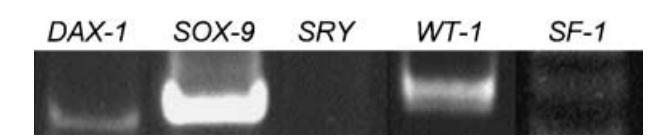
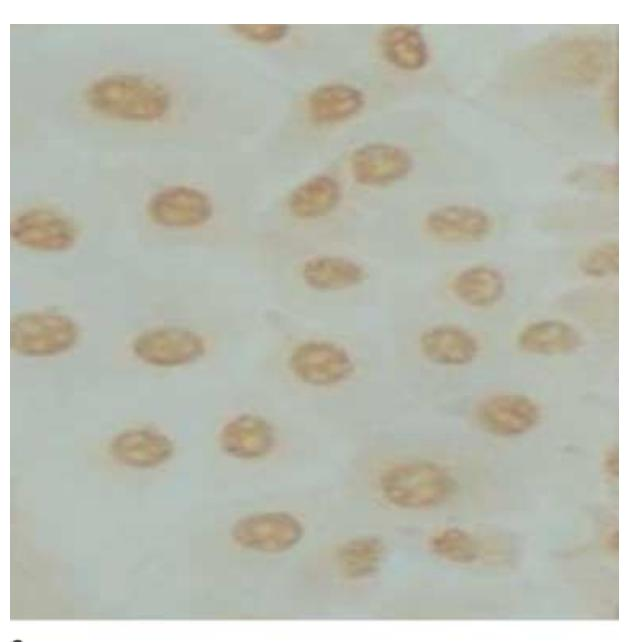
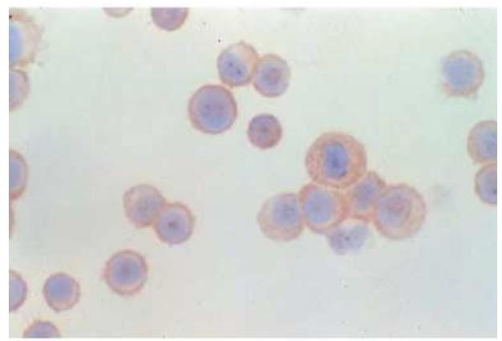
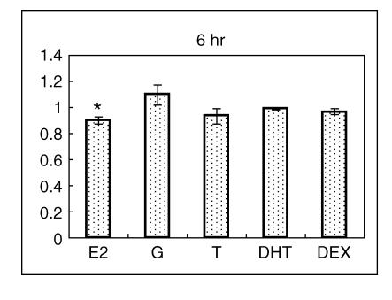
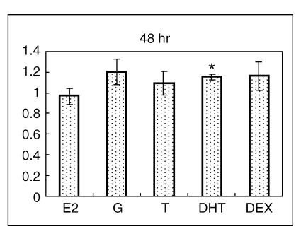
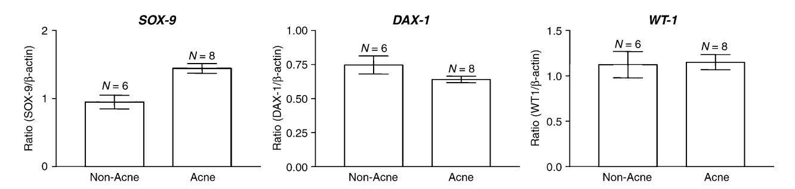
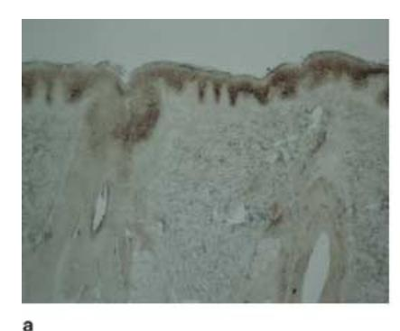
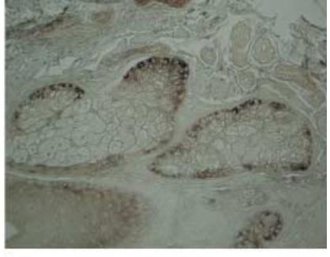

#### Blackwell Publishing Ltd ORIGINAL ARTICLE

# **Expression of sex-determining genes in human sebaceous glands and their possible role in the pathogenesis of acne**

W Chen,†\* CC Yang,‡ CY Liao,† CL Hung,† SJ Tsai,§ KF Chen,§ HM Sheu,‡ CC Zouboulis¶

†Department of Dermatology, Chang Gung Memorial Hospital-Kaohsiung Medical Center, Chang Gung University, College of Medicine, Kaohsiung, Taiwan, Departments of ‡Dermatology and §Physiology, College of Medicine, National Cheng Kung University, Tainan, Taiwan, and ¶Departments of Dermatology and Immunology, Dessau Medical Center, Dessau, Germany

#### **Keywords**

acne, androgen, sebaceous glands, sex determination

\*Corresponding author, Department of Dermatology, Chang Gung University, Chang Gung Memorial Hospital, Kaohsiung, Ta-Pei Road 123, Niao-Sung, 83301 Kaohsiung, Taiwan, tel. +88677317123 ext. 2299; fax +88677337612; E-mail: wchen@cgmh.org.tw

Received: 15 April 2005, accepted 24 May 2005

DOI: 10.1111/j.1468-3083.2006.01663.x

#### **Abstract**

**Background** The human skin, especially the sebaceous gland, is a steroidogenic organ similar to the gonads and adrenal cortex, possessing all the enzymes required for steroid sex-hormone synthesis and metabolism. Factors regulating cutaneous steroidogenesis associated with disease status remain largely unknown.

**Objective** We hypothesized that transcription factors involved in sex formation and regulation of steroidogenesis in the classical steroidogenic organs are also expressed in the sebaceous glands. Their possible role in the pathogenesis of acne were investigated.

**Methods** We used reverse transcription polymerase chain reaction (RT-PCR), *in situ* hybridization and Western blotting to analyse the expression of *SF-1*, *WT-1*, *SRY*, *SOX-9* and *DAX-1* mRNAs and their proteins in cultured human sebocytes and the facial skin of acne patients.

**Results** The *in situ* hybridization study showed *SOX-9* mRNA mainly localized in basal keratinocytes, the basal layer of the sebaceous glands and eccrine glands. Immortalized human sebaceous gland cells (SZ95) expressed mRNA for *SOX-9*, *WT-1* and *DAX-1* but not for *SF-1* or *SRY*. The expression of *DAX-1* protein was slightly inhibited by 10−6 M oestradiol (E2) at 6 h but enhanced by 10−6 M dihydrotestosterone (DHT) at 48 h. The facial expression of *SOX-9* seemed to be higher in the acne-prone male patients, while *DAX-1* was stronger in subjects without acne, although both were statistically insignificant.

**Conclusion** Our findings confirm the expression of some sex-determining genes in human sebaceous glands. Further studies on a larger patient population including the normal controls are needed to elucidate the functional significance of these transcription factors in the pathogenesis of acne.

## **Introduction**

The human skin, especially the sebaceous glands, can *de novo* synthesize androgens from cholesterol or by locally converting weaker circulating androgens to more potent ones. Similar to the classical steroidogenic organs, such as the adrenals and gonads, skin expresses the major androgen-metabolizing enzymes, namely steroid acute regulatory protein (StAR), P450 side-chain cleavage enzyme (P450scc), P450 17-hydroxylase, steroid sulfatase, 3β-hydroxysteroid dehydrogenase, 17β-hydroxysteroid dehydrogenase, steroid 5α-reductase, 3α-hydroxysteroid dehydrogenase, and P450 aromatase.1–3 Local *in situ* androgen production and end-organ response to androgens are considered to have crucial roles in the pathogenesis of androgenic skin disorders. This hypothesis is supported by the findings of enhanced expression of many of the androgen-metabolizing enzymes as well as the increased regional level of androgen receptors in diseased tissues.4 Factors controlling an upstream regulation of steroidogenesis in these disorders remain largely unknown.

Since the cloning of the SRY (sex-determining region Y or Y-located testis-determining factor) in 1990, several other genes have been identified in the process of mammalian sex determination.5 These genes, including *WT-1* (Wilm's tumour 1 gene), *SF-1* (steroidogenic factor 1), *SOX-9* (SRY-related HMG-box-transcription factor) and *DAX-1* (dosage-sensitive sex reversal locus adrenal hypoplasia congenital critical region on the X, gene 1), were later found to play a pivotal role in the regulation of steroidogenesis. Protein–protein interactions and regulatory relationships among these transcription factors are complex.6 *DAX-1* and *SF-1*, members of the orphan nuclear receptor superfamily, are important regulatory components of the hypothalamic–pituitary–adrenal– gonadal axis known to mediate transcriptional regulation of several steroid hydroxylase genes.7 *SF-1* controls basal and cAMP-stimulated transcription of the StAR gene, a procedure that represents the first and rate-limiting step in steroid biosynthesis, as well as many other steroidogenic genes such as P450 aromatase.8 *SF-1*, in part responsible for the tissue-specific expression of these genes, has recently been described in human skin, where it is speculated to play a role in cutaneous steroidogenesis.9 *DAX-1* is coexpressed with *SF-1* in many tissues, including the gonads, where it acts as a negative modulator of *SF-1*-dependent transcription.10 *DAX-1* could exert its multifaceted antiandrogen effect by down-regulating the *SF-1*-mediated induction of steroid biosynthesis, repressing expressions of StAR, P450scc and 3β-hydroxysteroid dehydrogenase as well as inhibiting the activity of androgen receptor and oestrogen receptor.11,12 In *DAX-1*-deficient male mice, aromatase (Cyp19) expression was up-regulated, accompanied by increased intratesticular levels of oestradiol.13 Modulation of *SF-1* action by *WT-1* and *DAX-1* has been shown to represent an important key mechanism in steroidogenesis.14 *WT-1* (–KTS) isoform, as a classic transcription factor, was shown to activate SRY expression in tissue culture cells, while *WT-1* (+KTS), capable of RNA processing, could increase the abundance of SRY transcripts.15 In addition, *WT-1* (–KTS) activates *DAX-1* in mice during the development of gonadal ridge.16 However, previous observations on mammalian sex determination seemed to imply that SRY is merely a Y-chromosomal switch whose role is to activate *SOX-9* and all downstream effects of SRY expression must feed through *SOX-9.* In mice, *DAX-1* seemed to antagonize SRY action by acting in parallel with SRY, exerting an opposite effect on *SOX-9*. 17 *SF-1* and *SOX-9* seem to potentiate the upstream androgenesis by up-regulating StAR. *SOX-9* was also shown to exhibit high-affinitive binding to a conserved site in the *SF-1* proximal promoter (*SOX-BS1* element) to consistently activate *SF-1* promoter–reporter constructs.18 Many other transcription cofactors have been found to interact with SRY and *SOX-9*, such as SRY-interacting protein 1, positive coactivator 4 and heat shock protein 70.19 Taken together, it seems that SRY and *SOX-9* can potentiate steroidogenesis

by way of *SF-1* to activate StAR and *DAX-1* possesses an antagonizing function, while *WT-1* plays a bimodally tuning role by up-regulating both SRY and *DAX-1*.

There have few studies investigating whether steroid hormones regulate the above-mentioned transcriptions factors. In oestrogen (17beta-oestradiol, E2)-deficient aromatase knockout mice, E2 treatment decreased the expression of *SOX-9* and steroidogenic enzymes in ovaries, while the placebo-treated group showed elevated levels of *SOX-9* and *DAX-1* as compared to *WT-1*. 20 *WT-1* protein expression was enhanced in the proliferating breast cancer cells stimulated by E2.21 In chondrocytes prepared from rib cartilage of newborn mice, dexamethasone (DEX) could enhance *SOX-9* expression in a dose-dependent manner within 24 h lasting up to 48 h.22

Based on the common function of steroid hormoneproducing tissues and homologous regulation by the hypothalamo–pituitary axis, the classical steroidogenic organs, such as the adrenal cortex and the gonads, have been suggested to have an intimate ontogenic relationship.23 Common transcriptional factors regulating the differentiation of the peripheral steroidogenic tissues such as the skin have also been suggested.24 In the present study, we propose and examine the hypothesis that the transcription factors involved in sex formation and regulation of steroidogenesis in the classical steroidogenic organs are also important in the regulation of cutaneous steroidogenesis. The functional role of these transcription factors in the aetiopathogenesis of acne is also investigated.

## **Methods**

#### **Cell culture and tissue collection**

Immortalized human sebaceous gland cells (SZ95 sebocytes) were initially grown in Sebomed® basal medium (Biochrom, Berlin, Germany) containing 10% heat inactivated foetal calf serum, and 5 ng/mL human recombinant epidermal growth factor (EGFrh).25 Forty-eight hours before treatment, the culture medium was switched to serum-free, phenol red-free Sebomed® ready-to-use medium (Biochrom) containing 50 µg/mL bovine pituitary extract, 5 ng/mL EGFrh, 1 mg/mL fatty acid-free bovine serum albumin (BSA), and 0.042 µg/mL (*ca*. 1.5 × 10−7 M) linoleic acid. The cells were then treated with testosterone (T), dihydrotestosterone (DHT), DEX, E2 and genistein (G) at 10−6 M for 6 and 48 h, respectively.

Samples from the face of six normal non-acne (age range 30–55 years, mean age 45 years) and eight acne-prone (age range 14–52 years, mean age 34 years) male patients were subjected to Western blot analysis. Samples from normal controls were all taken from the free margin of tissue specimen at the time of skin biopsy or

removal of benign skin tumours, with the consent of the patients.

#### **Reverse transcription polymerase chain reaction (RT-PCR) study**

Total RNA was extracted from the whole scalp specimens and cultured SZ95 sebocytes using a commercial kit (StrataPrep, Statagene, La Jolla, CA, USA), including a specific DNA removal step with DNAse. Total RNA (2 µg) was reverse transcribed using oligo(dT) primers and M-MLV reverse transcriptase (Promega, Madison, WI, USA). The oligonucleotide primers used for RT-PCR (synthesized by GibcoBRL, Tokyo, Japan) are listed in Table 1. PCR amplification of the complementary DNA was carried out for 35 consecutive cycles in 50 µL of amplification buffer (Promega) containing 2.5 U Tag polymerase (Promega) per reaction, and 5′- and 3′-primers each at a concentration of 0.5 µM. The thermal profile was initially 94 °C for 5 min, followed by 35 cycles at 94 °C for 30 s, at hybridization temperature 58 °C (*SF-1*), 50 °C (*WT-1*), 60 °C (*SRY*), 58 °C (*SOX-9*), 60 °C (*DAX-1*) for 45 s, at 72 °C for 45 s and finally at 72 °C for 10 min in a programmable thermal cycler (GeneAmp PCR system 2400, Applied Biosystems, Fostercity, CA, USA).

#### **Immunocytochemistry**

SZ95 sebocytes were either cultured in eight-well tissue culture chambers (Nunc, Naperville, IL, USA) to 50% confluency or cytocentrifuged (Cytospin 2, Shandon, Frankfurt, Germany) on microscope slides. The cells were fixed in cold acetone for 15 min and washed with phosphatebuffered saline (PBS) twice, then treated with 0.3% (v/v) H2O2 in methanol for 15 min to block the endogenous peroxidase activity, and incubated with 0.1% BSA for 30 min to block non-specific staining. Incubation with the primary antibody for *DAX-1* diluted to 1 : 100 in antibody diluent (DAKO, Glostrup, Denmark) was carried out at room temperature for 1 h, followed by sequential 10-min incubation steps with the respective biotinylated link antibodies and peroxidase-labelled streptavidine (DAKO). Staining was completed after incubation with diaminobenzidine/chromogen solution (DAKO) and mounted in aqueous mounting medium.

#### **Western blotting**

Protein extraction was performed using M-PERTM mammalian protein extraction reagent (Pierce, Rockford, IL, USA). Aliquots (10 µg) of total protein isolated from whole scalp specimens and the SZ95 sebocytes were heated for 15 min at 95 °C in a buffer to denaturize proteases. Sodium dodecyl sulfate/polyacrylamide gel electrophoresis (SDS/PAGE) of each sample was performed on 12.5% gels. Proteins were transferred to a PVDF transfer membrane (PolyScreen, NEN, Boston, USA), using a semidry blotting system (Bio-Rad, Hercules, CA, USA). The blots were primarily hybridized with goat polyclonal immunoglobulin G (IgG; anti-human SRY and *WT-1*) and rabbit polyclonal IgG (anti-human *DAX-1* and *SOX-9*) (all from Santa Cruz, CA, USA) at a concentration of 1 : 250 and were

**Table 1** Oligonucleotide primers for mRNA amplification and sizes of PCR products amplified with specific primer pairs

| Gene       | Primer    | Sequence (5'−3')                     | Annealing temperature (°C) | Product size (bp) |
|------------|-----------|--------------------------------------|-------------------------------|----------------------|
| β-actin    | Sense     | AGCGGGAAATCGTGCGTG                   | 58                            | 309                  |
|            | Antisense | CAGGGTACATGGTGGTGGTGCC               |                               |                      |
| SF-1       | Sense     | CCTCATCCGGTGTGAGAGC                  | 58                            | 198                  |
|            | Antisense | GGTGCACGTGTAGTGCTTGT                 |                               |                      |
| WT-1       | Sense     | CATGACCTGGAATCAGATGAAC               | 50                            | 374                  |
|            | Antisense | CAGTCCTTGAAGTCACACTGG                |                               |                      |
| WT-1       | Sense     | GAGGCATTCAGGATGTGC                   | 50                            | 170                  |
| (nested)   | Antisense | GTTTCTCACCAGTGTGCTTC                 |                               |                      |
| SRY        | Sense     | GAATATTCCCGCTCTCCGGA                 | 60                            | 472                  |
|            | Antisense | GCTGGTGCTCCATTCTTGAG                 |                               |                      |
| SOX-9      | Sense     | TGCATCCGCGAGGCGGTCA                  | 58                            | 393                  |
|            | Antisense | AAGATGGCGTTGGGGGAGAT                 |                               |                      |
| DAX-1      | Sense     | AAGGAGTACGCCTACCTCAA                 | 60                            | 251                  |
|            | Antisense | TCCATGCTGACTGTGCCGAT                 |                               |                      |
| T7 + SOX-9 | Sense     | ACTCACTATAGGGAGATGCATCCGCGAGGCGGTCA  | 58                            | 409                  |
|            | Antisense | ACTCACTATAGGGAGAAAGATGGCGTTGGGGGAGAT |                               |                      |
| t7u        |           | TAA GCTTTAATACGACTCACTATAGGGAGA      | 58                            | 423                  |

14683083, 2006, 7, Downloaded from https://onlinelibrary.wiley.com/doi/10.1111/j.1468-3083.2006.01663.x by University Of California - Davis, Wiley Online Library on [19/05/2026]. See the Terms and Conditions (https://onlinelibrary.wiley.com/terms-and-conditions) on Wiley Online Library for rules of use; OA articles are governed by the applicable Creative Commons License

visualized using a chromophore-conjugated anti-IgG antibody at a concentration of 1 : 5000, and enhanced chemiluminescence reagents (ECL Western blotting luminol reagents, Santa Cruz) followed by exposure to BioMax light film (Kodak, Rochester, NY, USA). The results were analysed by densitometry (Bio-1D Version 99, Vilber Lourmat, France).

#### **Construction of complementary RNA (cRNA) probes and** *in situ* **hybridization**

To generate T7 promoter-tailed *SOX-9* DNA templates for *in vitro* transcription for *SOX-9* cRNA probes, two successive PCR reactions were performed as first described by Cone *et al*. (Table 1).26 For *in situ* hybridization, sections were washed twice with 2 × salt sodium citrate (SSC) for 5 min after deparaffinization and rehydration, then prehybridized with DIG Easy Hyb (Roche Molecular Biochemicals, Penzberg, Germany) in a water bath at 42 °C for 1 h. To facilitate the efficacy of hybridization, the sections were heated two times in a microwave oven using the lowest power for 2 min, before overnight hybridization in water bath at 42 °C with DIG-labelled cRNA probe diluted by DIG Easy Hyb at 1 : 100. After hybridization, sections were washed twice with 2 × SSC for 5 min and 0.1 × SSC for 60 min at 42 °C, then immersed with antibody blocking solution (DAKO) for 1 h at room temperature. The digoxigenin-labelled RNA hybrids were detected by incubation for 1 h at room temperature with antidigoxigenin– alkaline phosphate conjugate (Roche Molecular Biochemicals) diluted 1 : 1000. The hybrids were visualized as purple– black precipitates by subsequent alkaline phosphatasechloro-3-indolyl phosphate and nitro blue tetrazolium.

#### **Statistical analysis**

All the *in vitro* experiments were performed in triplicate. The expression of the protein in the cultured cells before and after treatment was estimated by using a two-tailed paired *t*-test. The Wilcoxon rank-sum test was also used to compare the differential expression between non-acne and acne-prone patients. The results were considered to be significant when *P* < 0.05.

#### **Results**

In regular RT-PCR analysis, *SOX-9*, *WT-1* and *DAX-1* were detected, while *SF-1* and SRY were hardly measurable (fig. 1). Immunocytochemistry detected the expression of *DAX-1* within the nuclei of SZ95 sebocytes cultured in chamber slides (fig. 2a), while in the cytocentrifuge preparations *DAX-1* expression was mainly detected in the cytoplasm (fig. 2b). In Western blotting analysis,

**fig. 1** Regular RT-PCR study demonstrates the mRNA expression of *SOX-9*, *DAX-1* and *WT-1* in cultured SZ95 human sebocytes.

**fig. 2** Immunocytochemistry detected the expression of *DAX-1* within the nuclei of cultured SZ95 sebocytes (a), while in the cytocentrifuge preparations *DAX-1* expression was mainly localized to the cytoplasm (b).

*DAX-1* expression was slightly up-regulated by 10−6 M DHT at 48 h (standardized to β-actin), while treatment with 10−6 M E2 showed an inhibitory effect at 6 h (*P <* 0.05 by the two-tailed paired *t*-test) (fig. 3). In the *in vivo* study comparing the non-acne and acne-prone male patients, a higher level of *DAX-1* tended to appear in the face of six

14683083, 2006, 7, Downloaded from https://onlinelibrary.wiley.com/doi/10.1111/j.1468-3083.2006.01663.x by University Of California - Davis, Wiley Online Library on [19/05/2026]. See the Terms and Conditions (https://onlinelibrary.wiley.com/terms-and-conditions) on Wiley Online Library for rules of use; OA articles are governed by the applicable Creative Commons License

**fig. 3** Densitometric analysis of the Western blotting used to evaluate the *DAX-1* protein expression before and after treatment of the SZ95 sebocytes with 10−6 M 17β-oestradiol (E2), genistein (G), testosterone (T), 5α-dihydrotestosterone (DHT) and dexamethasone (DEX) for 6 h and 48 h, respectively. After standardized to the β-actin level and compared to the control group without treatment, E2 down-regulated *DAX-1* expression by 10% at 6 h, while DHT showed an enhancing effect by 15% at 48 h (asterisk).

men without acne (aged 30–55, mean 45 years), while *SOX-9* was expressed more strongly in eight younger acneprone men (aged 14–52, mean 34 years), with *WT-1* and SRY displaying no difference (fig. 4), although no statistical significance could be established (Wilcoxon rank-sum test).

In the *in situ* hybridization study on normal human scalp sections using a specific cRNA probe for *SOX-9*, strong expression of *SOX-9* mRNA was detected in undifferentiated epithelial skin cells, namely in basal epidermal keratinocytes (fig. 5a) and the basal layer of the sebaceous glands (fig. 5b).

# **Discussion**

In the current study, we demonstrated the mRNA expression of *SOX-9*, *DAX-1* and *WT-1* in cultured human SZ95 sebocytes, with the absence of SRY or *SF-1*. The primarily female origin of SZ95 sebocytes may contribute to the scarcity of SRY expression.25 The absence of *SF-1* in sebocytes is compatible with the data obtained in another recent study.2 Whether the missing *SF-1* mRNA expression in skin specimens and human sebocytes could be explained by a delay in transportation and processing of the specimens as suggested previously is unclear.9 In the epidermis, *SF-1* displayed a scattered nuclear pattern across all layers, which was stronger than *DAX-1* in the inner root sheath, matrix cells and dermal papilla cells.2 Our findings are compatible with previous studies of human skin that revealed prominent nuclear immunostaining for *DAX-1* confined to the epidermis, sebaceous glands, sweat glands and outer root sheath of the hair follicle.9 *DAX-1* protein was shown to be able to shuttle between

**fig. 4** The protein expression of *SOX-9* tends to be higher in the face of acne-prone men, while a higher level of *DAX-1* seems to be present in men without acne. Note there is no statistical significance.

**fig. 5** *In situ* hybridization showed strong expression of *SOX-9* mRNA localized mainly (a) at the basal/suprabasal epidermis and (b) at the basal layer of the sebaceous glands.

nucleus and cytoplasm in human adrenal cortex and mouse Leydig tumour cells.27 We also observed different localization of *DAX-1* in SZ95 sebocytes cultured in a Petri dish or after cytocentrifuge isolation. It remains to be determined whether this difference is due to shuttle in response to physiological or pharmacological stimulus or just an artefact occurring during cell preparation. As *SF-1* is present in human pituitaries, it is possible that the expression of *DAX-1* in sebocytes may be influenced by factors in the bovine pituitary extract contained in our culture medium.28

Our finding of *SOX-9* mRNA expression in human skin is interesting. Its strong expression at basal/suprabasal keratinocytes and basal sebocytes indicates its importance in the proliferation and early differentiation of human epidermis. The regulatory effect of retinoic acids on *SOX-9* has been demonstrated in chondrocytes and breast cancer cells.29–31 However, *SOX-9* was also shown to bind adjacent to the CCAAT/enhancer-binding proteins (c/EBP) β and -δ binding site, competing with c/EBP binding.32 In our previous work, strong expression of c/EBP-β in the basal layer of sebaceous glands, especially in the sebaceous naevus, was detected.33 The significance of *SOX-9* in the biology of sebaceous glands merits further investigation, as retinoic acids are known to profoundly influence the growth and differentiation of sebocytes.34 The higher expression of *SOX-9* in acne-prone vs. non-acne males suggested its possible role in the pathogenesis of acne. Age is a confounding factor in the interpretation of our *in vivo* data, as the mean age of the acne-prone group is 11 years younger than those without acne.

In our experiment, treatment of the cultured SZ95 sebocytes with 10−6 M E2 slightly suppressed the *DAX-1* protein expression at 6 h while 10−6 M DHT showed a stimulatory effect at 48 h. Although *DAX-1* plays an important role in the regulation of steroidogenesis,11–13 further studies are required to clarify whether steroids will feedback to regulate the expression of these transcription factors in sebocytes.

In conclusion, the current study demonstrates the expression of *WT-1*, *SOX-9* and *DAX-1* in cultured human sebocytes. The abundance of *SOX-9* in human skin, especially in the sebaceous glands, and its function in regulating some of these transcription factors seem to shed light on its possible role in the pathogenesis of acne. Further studies on a larger population including the normal controls are needed to elucidate the functional significance of these sex-determining genes in the pathogenesis of acne.

#### **Acknowledgements**

This work was supported by grants from the National Science Council Taiwan (NSC 91-2314-B-006-114) and Chang Gung Medicine Research Project (CMRPG-8060) to W.C. as well as from the Bundesinstitut für gesundheitlichen Verbraucherschutz und Veterinärmedizin to Ch.C.Z. (BgVV Z 5.1-1328-156). We are grateful to Dr Pi-Chen Pan (Institute and Department of Public Health, Kaohsiung Medical University, Kaohsiung, Taiwan) for statistical advice. We thank Wen-Chuan Hsieh, Chia-Chie Chiu, Yun-Chung Wu and Holger Seltmann for excellent technical assistance.

#### **References**

- 1 Fritsch M, Orfanos CE, Zouboulis CC. Sebocytes are the key regulators of androgen homeostasis in human skin. *J Invest Dermatol* 2001; **116**: 793–800.
- 2 Thiboutot D, Jabara S, McAllister JM *et al.* Human skin is a steroidogenic tissue: steroidogenic enzymes and cofactors are expressed in epidermis, normal sebocytes, and an immortalized sebocyte cell line (SEB-1). *J Invest Dermatol* 2003; **120**: 905–914.
- 3 Zouboulis CC. Human skin: an independent peripheral endocrine organ. *Horm Res* 2000; **54**: 230–242.
- 4 Chen W, Thiboutot D, Zouboulis CC. Cutaneous androgen metabolism: basic research and clinical perspectives. *J Invest Dermatol* 2002; **119**: 992–1007.
- 5 Vilain E, McCabe ER. Mammalian sex determination: from gonads to brain. *Mol Genet Metab* 1998; **65**: 74–84.
- 6 Bowles J, Koopman P. New clues to the puzzle of mammalian sex determination. *Genome Biol* 2001; **2**: 1025.
- 7 Peter M, Dubuis JM. Transcription factors as regulators of steroidogenic P-450 enzymes. *Eur J Clin Invest* 2000; **30**: 14– 20.
- 8 Sugawara T, Saito M, Fujimoto S. Sp1 and SF-1 interact and cooperate in the regulation of human steroidogenic acute regulatory protein gene expression. *Endocrinology* 2000; **141**: 2895–2903.
- 9 Patel MV, McKay IA, Burrin JM. Transcriptional regulators of steroidogenesis, DAX-1 and SF-1, are expressed in human skin. *J Invest Dermatol* 2001; **117**: 1559–1565.
- 10 Tremblay JJ, Viger RS. Nuclear receptor Dax-1 represses the transcriptional cooperation between GATA-4 and SF-1 in Sertoli cells. *Biol Reprod* 2001; **64**: 1191–1199.
- 11 Lalli E, Melner MH, Stocco DM, Sassone-Corsi P. DAX-1 blocks steroid production at multiple levels. *Endocrinology* 1998; **139**: 4237–4243.
- 12 Holter E, Kotaja N, Makela S *et al.* Inhibition of androgen receptor (AR) function by the reproductive orphan nuclear receptor DAX-1. *Mol Endocrinol* 2002; **16**: 515–528.
- 13 Wang ZJ, Jeffs B, Ito M *et al.* Aromatase (Cyp19) expression is up-regulated by targeted disruption of Dax1. *Proc Natl Acad Sci USA* 2001; **98**: 7988–7993.
- 14 Gurates B, Amsterdam A, Tamura M *et al.* WT1 and DAX-1 regulate SF-1-mediated human P450aromatase gene expression in gonadal cells. *Mol Cell Endocrinol* 2003; **208**: 61–75.

- 15 Clarkson MJ, Harley VR. Sex with two SOX on: SRY and SOX9 in testis development. *Trends Endocrinol Metab* 2002; **13**: 106–111.
- 16 Kim J, Prawitt D, Bardeesy N *et al.* The Wilms' tumor suppressor gene (wt1) product regulates Dax-1 gene expression during gonadal differentiation. *Mol Cell Biol* 1999; **19**: 2289–2299.
- 17 Koopman P, Bullejos M, Bowles J. Regulation of male sexual development by Sry and Sox9. *J Exp Zool* 2001; **290**: 463–474.
- 18 Shen JH, Ingraham HA. Regulation of the orphan nuclear receptor steroidogenic factor 1 by Sox proteins. *Mol Endocrinol* 2002; **16**: 529–540.
- 19 Harley VR, Clarkson MJ, Argentaro A. The molecular action and regulation of the testis-determining factors, SRY (sex-determining region on the Y chromosome) and SOX9 [SRY-related high-mobility group (HMG) box 9]. *Endocr Rev* 2003; **24**: 466–487.
- 20 Britt KL, Stanton PG, Misso M *et al.* The effects of estrogen on the expression of genes underlying the differentiation of somatic cells in the murine gonad. *Endocrinology* 2004; **145**: 3950–3960.
- 21 Zapata-Benavides P, Tuna M, Lopez-Berestein G, Tari AM. Downregulation of Wilms' tumor 1 protein inhibits breast cancer proliferation. *Biochem Biophys Res Commun* 2002; **295**: 784–790.
- 22 Sekiya I, Koopman P, Tsuji K *et al.* Dexamethasone enhances SOX9 expression in chondrocytes. *J Endocrinol* 2001; **169**: 573–579.
- 23 Morohashi K. The ontogenesis of the steroidogenic tissues. *Genes Cells* 1997; **2**: 95–106.
- 24 Zouboulis CC, Seltmann H, Hiroi N *et al.* Corticotropinreleasing hormone: an autocrine hormone that promotes lipogenesis in human sebocytes. *Proc Natl Acad Sci USA* 2002; **99**: 7148–7153.
- 25 Zouboulis CC, Seltmann H, Neitzel H, Orfanos CE. Establishment and characterization of an immortalized

- human sebaceous gland cell line (SZ95). *J Invest Dermatol* 1999; **113**: 1011–1020.
- 26 Lai FJ, Shin SJ, Lee YJ *et al.* Up-regulation of adrenal cortical and medullary atrial natriuretic peptide and gene expression in rats with deoxycorticosterone acetate-salt treatment. *Endocrinology* 2000; **141**: 325–332.
- 27 Lalli E, Ohe K, Hindelang C, Sassone-Corsi P. Orphan receptor DAX-1 is a shuttling RNA binding protein associated with polyribosomes via mRNA. *Mol Cell Biol* 2000; **20**: 4910–4921.
- 28 Asa SL, Bamberger AM, Cao B *et al.* The transcription activator steroidogenic factor-1 is preferentially expressed in the human pituitary gonadotroph. *J Clin Endocrinol Metab* 1996; **81**: 2165–2170.
- 29 Sekiya I, Tsuji K, Koopman P *et al.* SOX9 enhances aggrecan gene promoter/enhancer activity and is up-regulated by retinoic acid in a cartilage-derived cell line, TC6. *J Biol Chem* 2000; **275**: 10738–10744.
- 30 Sekiya I, Koopman P, Tsuji K *et al.* Transcriptional suppression of Sox9 expression in chondrocytes by retinoic acid. *J Cell Biochem Suppl* 2001; **36**: 71–78.
- 31 Afonja O, Raaka BM, Huang A *et al.* RAR agonists stimulate SOX9 gene expression in breast cancer cell lines: evidence for a role in retinoid-mediated growth inhibition. *Oncogene* 2002; **21**: 7850–7860.
- 32 Okazaki K, Li J, YuH et al. CCAAT/enhancer-binding proteins beta and delta mediate the repression of gene transcription of cartilage-derived retinoic acid-sensitive protein induced by interleukin-1 beta. *J Biol Chem* 2002; **277**: 31526–31533.
- 33 Chen W, Yang CC, Sheu HM *et al.* Expression of peroxisome proliferator-activated receptor and CCAAT/enhancer binding protein transcription factors in cultured human sebocytes. *J Invest Dermatol* 2003; **121**: 441–447.
- 34 Wrobel A, Seltmann H, Fimmel S *et al.* Differentiation and apoptosis in human immortalized sebocytes. *J Invest Dermatol* 2003; **120**: 175–181.