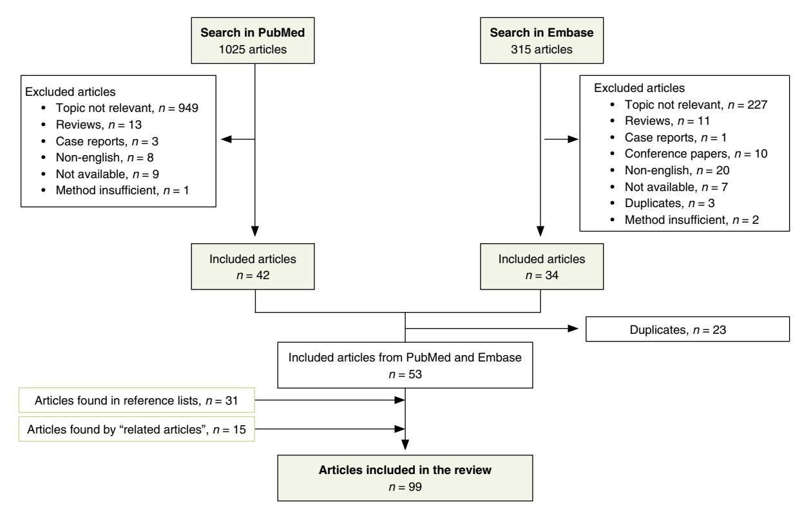
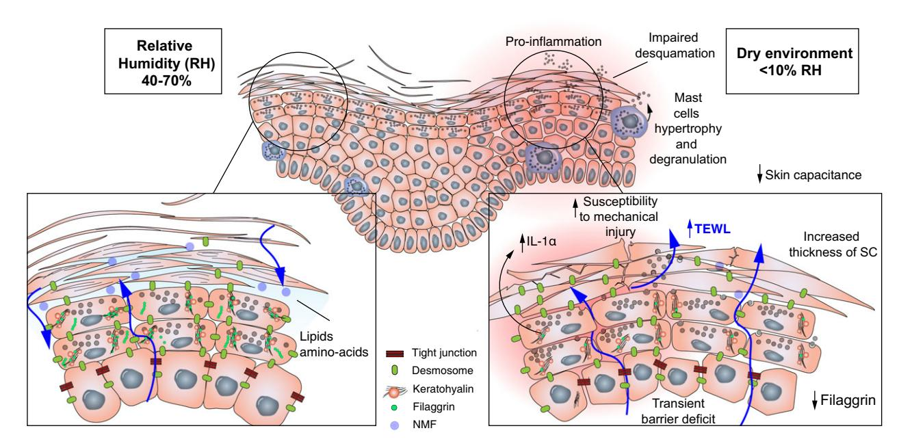

DOI: 10.1111/jdv.13301 JEADV

# REVIEW ARTICLE

# The effect of environmental humidity and temperature on skin barrier function and dermatitis

K.A. Engebretsen,1 \* J.D. Johansen,1 S. Kezic,2 A. Linneberg,3,4,5, J.P. Thyssen1

1 National Allergy Research Centre, Department of Dermato-Allergology, Gentofte University Hospital, University of Copenhagen, Hellerup, Denmark

# Abstract

Physicians are aware that climatic conditions negatively affect the skin. In particular, people living in equator far countries such as the Northern parts of Europe and North America are exposed to harsh weather during the winter and may experience dry and itchy skin, or deterioration of already existing dermatoses. We searched the literature for studies that evaluated the mechanisms behind this phenomenon. Commonly used meteorological terms such as absolute humidity, relative humidity and dew point are explained. Furthermore, we review the negative effect of low humidity, low temperatures and different seasons on the skin barrier and on the risk of dermatitis. We conclude that low humidity and low temperatures lead to a general decrease in skin barrier function and increased susceptible towards mechanical stress. Since pro-inflammatory cytokines and cortisol are released by keratinocytes, and the number of dermal mast cells increases, the skin also becomes more reactive towards skin irritants and allergens. Collectively, published data show that cold and dry weather increase the prevalence and risk of flares in patients with atopic dermatitis.

Received: 6 February 2015; Accepted: 1 June 2015

# Conflicts of interest

The authors have no conflict of interest to disclose.

### Funding source

Supported by the COST Action TD1206 StanDerm. Jacob P. Thyssen and Kristiane Engebretsen are financially supported by an unrestricted grant from the Lundbeck Foundation. No involvement from the funders has taken place.

# Introduction

The stratum corneum (SC) is a complex structure of anucleated cells, proteins and lipids that provides protection against invasion of microorganisms and allergens, but importantly also prevents excessive water loss. Intercellular hydrophobic lipids and osmolytic intracellular molecules such as amino acids, organic acids, urea and inorganic ions – collectively referred to as natural moisturizing factors (NMF) – are critical for adequate skin hydration together with SC thickness.1–3

It is broadly accepted that skin barrier functions may be negatively affected by climatic conditions.4–8 Notably, the prevalence of atopic dermatitis (AD) appears to be latitude dependent with higher estimates in countries distant from the equator.9 While this could be explained by genetic differences, for example common filaggrin gene mutations, climatic effects on skin barrier functions likely play a key role. This article reviews how climatic factors such as low humidity and cold temperatures negatively affect skin barrier functions and increase the risk of dermatitis.

# Method and result

A systematic search in PubMed and Embase was performed in April 2015 where the following search terms were used; (atopic dermatitis OR atopic eczema OR dermatitis OR xerosis OR dry skin OR chapping OR skin barrier) AND (humidity OR weather OR climate OR temperature OR meteorological OR seasonal OR wind OR cold). No limit was set regarding the range of years. A total of 1025 articles were identified in PubMed and 315 articles in Embase. 53 articles were included. In addition, 46 articles were identified in reference lists of included articles and by the database function 'related articles' for selected publications,

2 Coronel Institute of Occupational Health, Academic Medical Centre, 1105 AZ, Amsterdam, The Netherlands

Research Centre for Prevention and Health, Glostrup, The Capital Region of Denmark, Copenhagen, Denmark

4 Department of Clinical Experimental Research, Glostrup University Hospital, Glostrup, Denmark

Department of Clinical Medicine, Faculty of Health and Medical Sciences, University of Copenhagen, Copenhagen, Denmark

\*Correspondence: K.A. Engebretsen. E-mail: kristiane.aasen.engebretsen.02@regionh.dk

224 Engebretsen et al.

resulting in 99 articles in total. Details of the search process and exclusion criteria are shown in Fig. 1.

# Definition of humidity and dew point

Humidity is defined as the amount of water vapour in the air coming from terrestrial and oceanic water. Absolute humidity (AH) is defined as the mass of water vapour in a given volume of air, usually expressed in grams per cubic metre. Importantly, AH does not take temperature into consideration, and a change in temperature or air pressure will alter the AH.

Relative humidity (RH) is the actual amount of water vapour in the air divided by the amount of water vapour the air can hold, expressed as a percentage. RH depends on temperature, and warm air can hold more water than cold air. If air is cold, the same amount of water vapour produces a higher RH than the same amount of water vapour in warmer air.10 This explains why RH in polar region can be higher than RH at lower latitude.

Dew point is the temperature that air would have to be cooled down to for saturation to occur. When air is saturated, water condenses, and it is referred to as dew.5 A high dew point corresponds to high water vapour content and vice versa.

Residents on the northern hemisphere experience cold winters, and accordingly they heat their homes. Most do not have humidifiers, and when cold air is heated, the ability to hold water increases and the RH drops. For example, air with a temperature of 0 °C and a RH of 85% will decrease to 22% if heated to 20 °C.10As we will explore, a double negative influence on the skin barrier occurs in the winter; low indoor humidity and cold temperatures outside.

# Low humidity negatively affects skin barrier functions

### Animal studies

The breakdown of filaggrin proteins depends on environmental humidity. While late foetal rat skin shows accumulation of filaggrin throughout the whole SC,11 postnatal observation shows that filaggrin is degraded when RH declines (Table 1).11 Notably, breakdown can be prevented when covered with an occlusive patch to maintain 100% RH, mimicking the aqueous milieu in utero. This observation suggests that filaggrin proteolysis is controlled by SC water amount.

Hairless mice have been investigated for skin alteration when placed in a dry environment (RH ≤10%), either transferred from normal (RH 40–70%) or humid (RH >80–90%) conditions. After 12 h in a dry environment, skin conductance decreases and epidermal DNA synthesis increases.12 The increased epidermal DNA synthesis can be inhibited by application of petrolatum, again suggesting that the water content in the SC may play a key role for compensatory epidermal recovery mechanisms.12

Figure 1 Flowchart of the systematic review selection procedure.

Table 1 Animal studies on the climatic effects on skin barrier

| Climatic effect | author First      | Reference | publication Year of | Animal                                     | n    | Exposure                                                                                                                   | End points                                                                                                        | Main findings/conclusion                                                                                                                                                                                                                                                            |
|-----------------|----------------------|-----------|------------------------|--------------------------------------------|------|----------------------------------------------------------------------------------------------------------------------------|-------------------------------------------------------------------------------------------------------------------|-------------------------------------------------------------------------------------------------------------------------------------------------------------------------------------------------------------------------------------------------------------------------------------|
| Low humidity    | Scott and Harding | 11        | 1986                   | Colworth-Wistar rats                       | –    | Ambient humidity or 100% RH.                                                                                            | Filaggrin amount and distribution in SC and the amount of free amino acids                                  | The proteolytically breakdown when newborn and adult rats breakdown is dependent on were exposed to 100% RH, of filaggrin was prevented suggesting that filaggrin the water activity of the environment.                                                       |
| Low humidity    | Rawlings             | 17        | 1995                   | Skin from pigs                             | 5    | (RH 80%) conditions for 7 days. Dry (RH 44%) or humid                                                                   | Desmosome degradation and extensibility of SC                                                                  | had decreased extensibility of skin kept in humid conditions. desmosomes compared to Skin kept in dry conditions SC and degradation of                                                                                                                                  |
| Low humidity    | Sato                 | 12        | 1998                   | (HR-1, Hoshino, Hairless mice Japan) | 6–12 | conditions (>90%) for 12 h, application of petrolatum. Dry (RH <10%) or humid                                        | skin conductance and TEWL Epidermal DNA synthesis,                                                             | had increased epidermal DNA mice kept in humid conditions. synthesis and decreased skin inhibited the increase in DNA Mice kept in dry conditions conductance compared to Application of petrolatum synthesis.                                                 |
| Low humidity    | Sato                 | 7         | 1998                   | (HR-1, Hoshino, Hairless mice Japan) | 3–8  | Dry (RH < 10%) or humid conditions (RH > 80%) for 7 days                                                             | Skin surface appearance, water content, dry weight of SC, desmosomal protein and enzyme activity         | water content of SC and less had more scaling, larger dry weight and thickness of SC. Mice kept in dry conditions They also had decreased effectively degraded desmosomes                                                                                         |
| Low humidity    | Denda                | 21        | 1998                   | (HR-1, Hoshino, Hairless mice Japan) | 3–20 | for 2 weeks, barrier disruption Dry (RH < 10%) or humid conditions (RH > 80%) tape stripping. by acetone or    | thickness and recovery rate epidermal morphology and TEWL, lipid content in SC, after barrier disruption | accelerated barrier recovery Mice kept in dry conditions had a lower TEWL, thicker epidermis and SC, more lamellar bodies and an rate.                                                                                                                               |
| Low humidity    | Denda                | 8         | 1998                   | (HR-1, Hoshino, Hairless mice Japan) | 4–12 | disruption and switching between conditions (RH > 80%), barrier Dry (RH < 10%) or humid dry and humid conditions. | hyperplasia and thickness and dermal mast cell hyperplasia Epidermal DNA synthesis, and degranulation    | had increased epidermal DNA and epidermal hyperplasia in disruption they had a further synthesis, but no epidermal Mice kept in dry conditions increase in DNA synthesis hyperplasia. After barrier addition to mast cell hyperplasia and degranulation. |

Table 1 Continued

| Climatic effect | author First | Reference | publication Year of | Animal                                                      | n    | Exposure                                                                                                                                                                                                             | End points                                                                                                                         | Main findings/conclusion                                                                                                                                                                                                                                                                                                                                                                 |
|-----------------|-----------------|-----------|------------------------|-------------------------------------------------------------|------|----------------------------------------------------------------------------------------------------------------------------------------------------------------------------------------------------------------------|------------------------------------------------------------------------------------------------------------------------------------|------------------------------------------------------------------------------------------------------------------------------------------------------------------------------------------------------------------------------------------------------------------------------------------------------------------------------------------------------------------------------------------|
| Low humidity    | Hosoi           | 15        | 2000                   | Japan, Japan)) Charles River Female mice (C57BL/6, | 8–10 | Dry (RH 10%) or humid conditions (RH 80%) for 0–7 days.                                                                                                                                                           | Activation of the skin immune number of LC and allergen system with induction of contact hypersensitivity, penetration | a greater reaction when contact Mice kept in dry conditions had more LC and a greater antigen penetration than mice kept in hypersensitivity was elicited, humid conditions.                                                                                                                                                                                              |
| Low humidity    | Sato            | 16        | 2000                   | Hairless mice (HR-1, Hoshino, Japan)                     | 4–16 | Dry (RH < 10%) or humid conditions (RH > 80%) for 3 days.                                                                                                                                                      | Skin morphology                                                                                                                    | in humid conditions. Application Mice kept in dry conditions had surface compared to mice kept of glycerol and immersion in water content and thickness roughness, suggesting that a significantly rougher skin of SC is important for skin water partly improved the morphology.                                                                             |
| Low humidity    | Sato            | 18        | 2001                   | Hairless mice (HR-1, Hoshino, Japan)                     | 5–12 | Transfer after 2 weeks from normal (RH 40–70%) or humid (RH > 80%) conditions to dry conditions (RH < 10%) for 7 days.                                                                                      | amino acid content in the SC and water-holding capacity, Skin surface conductance skin surface images and                 | compared to those transferred Mice transferred from humid conditions had rougher skin capacity, water content and surface, less water-holding amino acid content in SC from normal conditions.                                                                                                                                                                         |
| Low humidity    | Denda           | 22        | 2001                   | Hairless mice (HR-1, Hoshino, Japan)                     | 5–8  | the mice were killed and analysed. Transfer after 7 days from normal humid (80%) condition for various occlusion of 1% SDS 24 h before (RH 40–70%) to dry (RH 10%) or amount of time. Application and | Epidermal hyperplasia, DNA synthesis and TEWL                                                                                   | significant change in TEWL up DNA synthesis 24 h after SDS increased in those kept under mice kept under low humidity The epidermal thickness and to 1 week, but after 2 weeks found for 1, 4 or 7 days. No treatment was increased in for 2 days. No change was significantly in mice kept under low humidity and the TEWL decreased high humidity. |

Table 1 Continued

| Climatic effect | author First     | Reference | publication Year of | Animal                                  | n    | Exposure                                                                                                                      | End points                                                                        | Main findings/conclusion                                                                                                                                                                                                                                                                                                                                                |
|-----------------|---------------------|-----------|------------------------|-----------------------------------------|------|-------------------------------------------------------------------------------------------------------------------------------|-----------------------------------------------------------------------------------|-------------------------------------------------------------------------------------------------------------------------------------------------------------------------------------------------------------------------------------------------------------------------------------------------------------------------------------------------------------------------|
| Low humidity    | Ashida              | 13        | 2001                   | Hairless mice (HR-1, Hoshino, Japan) | 3–12 | Dry (RH<10%) or humid (>80%) conditions for 4 days.                                                                        | Expression and release of epidermal IL-1a                                      | Mice kept in dry conditions had stripping was also significantly those kept in normal or humid IL-1a after 48 h compared to conditions. The immediate release of IL-1a after tape higher in mice kept in dry a higher expression of conditions.                                                                                                 |
| Low humidity    | Sato                | 19        | 2002                   | Hairless mice (HR-1, Hoshino, Japan) | 12   | normal (RH 40–70%) or humid (RH > 80%) conditions to dry Transfer after 2 weeks from (RH < 10%) for 7 days.          | and morphology of epidermis epidermal DNA synthesis TEWL, SC hydration, pH, | delayed increase in epidermal those transferred from normal defect in barrier function with increased TEWL, decreased Mice transferred from humid DNA synthesis compared to conditions had a transient hydration of SC, and a conditions.                                                                                                       |
| Low humidity    | Ashida and Denda | 14        | 2003                   | Hairless mice (HR-1, Hoshino, Japan) | 5–16 | Dry (RH<10%) or humid (>80%) conditions for 5 days.                                                                        | Mast cell number in dermis and histamine content in epidermis and dermis    | had an increase in mast cells Mice kept in dry conditions compared to those kept in and histamine in dermis humid conditions.                                                                                                                                                                                                                               |
| Low humidity    | Katagiri            | 20        | 2003                   | Hairless mice (HR-1, Hoshino, Japan) | 4–6  | normal (RH 40–70%) or humid (RH > 80%) conditions to dry Transfer after 2 weeks from (RH < 10%) for 7 days.          | Skin conductance, free amino acids and filaggrin expression in SC           | acids and filaggrin expression. filaggrin and free amino acids. They also lacked the ability to skin conductance, free amino conditions had a decrease in adapt to the dry environment increase in the production of Mice transferred from humid Adaption was seen in mice transferred from normal as they did not have an conditions. |
| Temperature     | Denda               | 34        | 2006                   | Hairless mice (HR-1, Hoshino, Japan) | 4–8  | surface temperature from 32 °C disruption by tape stripping. Exposure to a range in skin to 42 °C after skin barrier | Barrier recovery                                                                  | was delayed at 34 and 42 °C. The barrier recovery rate was accelerated at temperatures 34 °C. Barrier recovery rate compared with the area at between 36 and 40 °C                                                                                                                                                                                       |

Table 1 Continued

| Main findings/conclusion | temperature (25.0–26.0 °C). content of the SC compared had increased extensibility, Skin kept at 33.5–37.0 °C independent of the water to skin kept at a lower | content of SC compared to independent of the water temperature (18–22 °C). Skin kept at 4–5 °C had decreased extensibility skin kept at a higher | barrier disruption also inhibits nucleated layers of epidermis the formation of LBs and the after barrier disruption if the pre-exposure leading to dry cold after barrier disruption masking the barrier defect. suggests that exposure to TEWL is misleadingly low prevents barrier recovery. increases to levels above skin. Cold exposure after and even in dermis. This skin temperature is low, When the temperature increases, TEWL also tracer appears in the |
|--------------------------|-------------------------------------------------------------------------------------------------------------------------------------------------------------------------------|-----------------------------------------------------------------------------------------------------------------------------------------------------------------|-----------------------------------------------------------------------------------------------------------------------------------------------------------------------------------------------------------------------------------------------------------------------------------------------------------------------------------------------------------------------------------------------------------------------------------------------------------------------------------------------------------------------|
| End points               | Extensibility of the SC                                                                                                                                                       | Extensibility of the SC                                                                                                                                         | SC (lanthanum) and histology penetration of tracer through TEWL, skin temperature, of epidermis                                                                                                                                                                                                                                                                                                                                                                                                              |
| Exposure                 | Two different temperatures (25.0–26.0 vs. 33.5–37.0).                                                                                                                      | ranges (4–5 °C vs. 18–22 °C). Two different temperature                                                                                                      | Barrier disruption with acetone and cooling from ice cubes.                                                                                                                                                                                                                                                                                                                                                                                                                                                        |
| n                        | –                                                                                                                                                                             | 11– 12                                                                                                                                                       | 6                                                                                                                                                                                                                                                                                                                                                                                                                                                                                                                     |
| Animal                   | Skin from guinea pigs                                                                                                                                                         | Skin from guinea pigs                                                                                                                                           | Hairless mice (HR/HR)                                                                                                                                                                                                                                                                                                                                                                                                                                                                                                 |
| publication Year of   | 1969                                                                                                                                                                          | 1973                                                                                                                                                            | 1995                                                                                                                                                                                                                                                                                                                                                                                                                                                                                                                  |
| Reference                | 35                                                                                                                                                                            | 36                                                                                                                                                              | 37                                                                                                                                                                                                                                                                                                                                                                                                                                                                                                                    |
| author First          | Middleton                                                                                                                                                                     | Middleton                                                                                                                                                       | Sørensen Halkier                                                                                                                                                                                                                                                                                                                                                                                                                                                                                                   |
| Climatic effect          | Temperature                                                                                                                                                                   | Temperature                                                                                                                                                     | Temperature                                                                                                                                                                                                                                                                                                                                                                                                                                                                                                           |

–, not available; LB, lamellar bodies; LC, Langerhans cell; RH, relative humidity; SC, stratum corneum; SDS, sodium dodecyl sulphate; TEWL, transepidermal water loss.

Furthermore, the amount and release of IL-1a, a pro-inflammatory cytokine that is highly abundant in the corneocytes, was higher in mice kept in a dry environment compared to those kept in a humid environment.13 Exposure to low humidity also induce dermal mast cell hypertrophy, degranulation and increased contact hypersensitivity reactions.14,15

After 3 days exposure to low humidity, the mice showed clinical signs of xerosis with a rougher skin surface, more scaling, larger dry weight and increased thickness of SC.7,16 Skin roughness could be improved by application of glycerol or immersion in water.16 Since desmosome degradation is decreased, this may explain the impaired desquamation and scaling recognized from e.g. winter xerosis. Decreased desmosome degradation was also found in pig skin exposed to dry conditions (RH 44%) in addition to decreased extensibility.17

The effect of a dramatic change in humidity was investigated by transferring mice after 2 weeks from either normal (RH 40– 70%) or humid (RH >80%) conditions to a dry environment (RH≤10%).18–20 Those transferred from humid conditions developed a rougher and drier skin surface, increased transepidermal water loss (TEWL), reduced amino acid content and filaggrin expression compared to mice transferred from normal conditions. Collectively, a dry environment can influence the skin barrier by different mechanisms that likely make the skin more sensitive to physical or chemical stress and more prone to inflammation (Fig. 2).

In summary, it appears that the first 1–2 days in a dry environment provokes epidermal proliferation, a reduction in skin hydration, a pro-inflammatory response and a transient barrier deficit. Next, there seems to be an adaption with increased thickness of SC and epidermis, synthesis of lamellar bodies and lipids and enhanced barrier function, indicated by a decrease in TEWL.21,22

### Human studies

Human skin that is exposed to low RH (32%)appears to be more susceptible to mechanical stress and fracture than skin in high RH (96%) (Table 2).23 Also, healthy volunteers exposed to low RH (<10%) for 6 h had a decrease in skin hydration and it appeared clinically dry.24 Similar results were found, when volunteers were transferred from, respectively, normal and high humidity to dry conditions in addition to increased TEWL.25,26 Those transferred from humid to dry conditions, also showed reduced skin elasticity.26 Raman spectroscopy analysis shows that environmental humidity affects the level of partially bound and that unbound water increases with increasing RH. Optimal RH for lipids and protein organization is at 60%.27

Factory workers in ultra-dry working conditions (RH 1–3%) and aircrew personnel are among those most heavily exposed to low humidity. Accordingly, factory workers report significantly more skin symptoms such as itch, contact dermatitis and AD compared to controls.28,29 They also have significantly lower TEWL and skin capacitance values.30 The low TEWL might be due to compensatory mechanisms as seen in hairless mice exposed to dry air for longer periods.21 A large study comparing

Figure 2 The short-term effect of dry environment (RH<10%) on skin barrier function and composition.

Table 2 Human studies on the climatic effects on skin barrier

| First author | Reference | publication Year of | Country | subjects Study                                                          | n    | Exposure                                                                                                                                                                                             | (years) Age     | Female/ Male | End points                                                                                                              | Main findings/conclusion                                                                                                                                                                               |
|--------------|-----------|------------------------|---------|----------------------------------------------------------------------------|------|------------------------------------------------------------------------------------------------------------------------------------------------------------------------------------------------------|--------------------|-----------------|-------------------------------------------------------------------------------------------------------------------------|--------------------------------------------------------------------------------------------------------------------------------------------------------------------------------------------------------|
|              | 23        | 1971                   | USA     | volunteers Skin from healthy                                         | 15   | RH of 32%, 76% or 98%.                                                                                                                                                                               | 20–44              | –               | mechanical insults The ability to withstand                                                                       | stress than skin kept in higher RH. kept in low RH are more fragile and susceptible to mechanical The energy required to break SC increased with increasing RH. This suggests that skin |
| Reinikainen  | 32        | 1992                   | Finland | Office workers                                                             | 290  | humidification (RH 20–30%), 30–40% humidification and building was operated with Six-period cross-over trial the other wing had no air where one wing of the switching every week. | –                  | 148/142         | change in dryness questionnaire and symptoms score (skin, eyes and Self-reported pharyngeal symptoms) | symptoms from the skin (dryness, The overall dryness score was significantly lower during the humidified phases, including irritation, itching).                                           |
|              | 31        | 2002                   | Sweden  | cabin crew and from the same office workers Commercial company | 1681 | Exposure to low RH (between 5–25%) (aircrew) and normal indoor environment (office workers).                                                                                                | Mean age 43 (8) | 891/790         | questionnaire Self-reported symptoms on dermal                                                                 | adjustment for possible confounders. (OR = 2.03) and hands (OR = 3.68) more skin symptoms from face Aircrew reported significantly than office workers after                               |
|              | 24        | 2002                   | Japan   | volunteers Healthy                                                      | 12   | RH of 10% for 6 h                                                                                                                                                                                    | 21–45              | 8/4             | TEWL and skin surface pattern Skin hydration,                                                                     | Significant decrease in TEWL, skin surface pattern resembling those hydration in the upper layers of epidermis and changes in skin of dry skin.                                            |
|              | 28        | 2003                   | Japan   | workers Factory                                                         | 155  | Ultra-dry working conditions (RH 2.5%) or normal conditions.                                                                                                                                   | 22–66              | 22/133          | symptoms, AD and questionnaire on Self-reported exposure asthma                                             | more skin symptoms and had more conditions reported significantly Workers exposed to ultra-dry AD.                                                                                            |
|              | 30        | 2005                   | Taiwan  | workers Factory                                                         | 49   | months or normal conditions. Ultra-dry working conditions (RH 1.5%) for <0.5–>20                                                                                                               | –                  | 19/30           | TEWL and skin capacitance                                                                                            | those working in normal conditions. and a non-significant decrease in Workers exposed to ULH had a significantly decrease in TEWL skin capacitance compared to                             |
|              | 25        | 2006                   | Japan   | volunteers Healthy                                                      | 16   | (50%) to 3 different RH (10, 30 Transfer from normal humidity and 50%) for 180 min                                                                                                             | –                  | 0/16            | TEWL and skin hydration                                                                                              | TEWL of the face increased and (RH 10 and 30%) compared to normal conditions (RH 50%). significantly in dry conditions skin hydration decreased                                            |
| Tsukahara    | 26        | 2007                   | Japan   | volunteers Healthy                                                      | 20   | high humidity (RH 70%) to a Transfer from a room with room with low humidity (RH 40%).                                                                                                      | 28–50              | 10/10           | Water content of SC, skin elasticity and skin wrinkles and texture                                             | Increased amount of fine wrinkles, and loss of elasticity after transfer from a room with high humidity to decreased water content of SC a room with low humidity.                         |

Table 2 Continued

| Main findings/conclusion | dermatitis after 3 years in ULH. No Workers exposed to ULH had an compared to the control group in significant change was seen for large increase in risk of contact 2000 and a 4-fold elevated risk 8-fold elevated risk of skin itch in 2003. Further there was a winter eczema or urticaria. | did not vary with humidity. Partially between 28% and 60%. Unbound 4% and 28% and more prominent proteins were found to be optimal water increased slightly between The level of totally bound water bound water increased sharply organization of SC lipids and between 44% and 75%. The at RH 60%. | dependence was stronger at RH decreasing temperature. This The water content of stratum corneum decreases with below 60%.                     | The scores for dry skin were higher with low temperature, high wind speed and low absolute humidity. | temperatures seemed to increase symptoms were in general better No significant association was the sensation of dry skin. Skin and skin symptoms, but high with increasing absolute and found between temperature relative humidity. | After exposure to dry and cold wind there was a significant decrease in skin hydration, but no change in TEWL. | TEWL increased exponentially temperatures over the range with increasing skin 25 °–39 °C. | Positive correlation between skin temperature and TEWL. |
|--------------------------|-------------------------------------------------------------------------------------------------------------------------------------------------------------------------------------------------------------------------------------------------------------------------------------------------------------------------|---------------------------------------------------------------------------------------------------------------------------------------------------------------------------------------------------------------------------------------------------------------------------------------------------------------------------------|-----------------------------------------------------------------------------------------------------------------------------------------------------------|---------------------------------------------------------------------------------------------------------------|-----------------------------------------------------------------------------------------------------------------------------------------------------------------------------------------------------------------------------------------------------------|-------------------------------------------------------------------------------------------------------------------------|----------------------------------------------------------------------------------------------------|------------------------------------------------------------|
| End points               | itching at any site, contact dermatitis winter eczema, Prevalence of and urticarial.                                                                                                                                                                                                                        | Water distribution and organization of SC lipids and proteins.                                                                                                                                                                                                                                                         | Water content of SC                                                                                                                                    | The occurrence of dry facial skin                                                                          | concerning symptoms of skin rash and skin humidity in all three measurements of temperature and questionnaire Self-reported dryness and continuous wings.                                                                      | Skin hydration and TEWL                                                                                              | TEWL                                                                                               | TEWL                                                       |
| Female/ Male          | 24/0                                                                                                                                                                                                                                                                                                                    | 5/0                                                                                                                                                                                                                                                                                                                             | –                                                                                                                                                         | 55/0                                                                                                          | –                                                                                                                                                                                                                                                         | 12/0                                                                                                                    | –                                                                                                  | 5/17                                                       |
| (years) Age           | –                                                                                                                                                                                                                                                                                                                       | 40–50                                                                                                                                                                                                                                                                                                                           | –                                                                                                                                                         | 18–58                                                                                                         | –                                                                                                                                                                                                                                                         | 53–70                                                                                                                   | –                                                                                                  | >30                                                        |
| Exposure                 | Ultra-dry working conditions (RH 1–3%) for 3 years (between 2000–2003).                                                                                                                                                                                                                                           | Exposure to five different RH (4%, 28%, 44%, 60% and 75%) for 4 h.                                                                                                                                                                                                                                                        | levels of humidity (RH 30%, Four different temperatures 35 °C) at seven different (10 °C, 20 °C, 30 °C or 40%, 60%, 75%, 83%, 93% or 96%). | Seasonal differences in speed and absolute temperature, wind humidity.                               | wings of an office building steam for 1 week each. A non-humidified reference. third wing was used as a study was two separate Six-week cross-over was humidified with                                                                  | Exposure to cold and dry wind for 15 min                                                                             | ranging from 25°–39 °C where sweating was Skin temperatures inhibited.                    | surface temperatures. Five different skin               |
| n                        | 24                                                                                                                                                                                                                                                                                                                      | 5                                                                                                                                                                                                                                                                                                                               | –                                                                                                                                                         | 55                                                                                                            | 368                                                                                                                                                                                                                                                       | 12                                                                                                                      | 17                                                                                                 | 22                                                         |
| subjects Study        | workers Factory                                                                                                                                                                                                                                                                                                      | skin obtained from plastic abdominal surgery Human                                                                                                                                                                                                                                                                  | Skin from cadavers human                                                                                                                            | volunteers Female                                                                                          | workers Office                                                                                                                                                                                                                                         | volunteers Female                                                                                                    | volunteers Healthy                                                                              | Skin from cadavers human                             |
| Country                  | Taiwan                                                                                                                                                                                                                                                                                                                  | France                                                                                                                                                                                                                                                                                                                          | USA                                                                                                                                                       | UK                                                                                                            | Finland                                                                                                                                                                                                                                                   | France                                                                                                                  | UK                                                                                                 | USA                                                        |
| publication Year of   | 2007                                                                                                                                                                                                                                                                                                                    | 2013                                                                                                                                                                                                                                                                                                                            | 1975                                                                                                                                                      | 1992                                                                                                          | 2003                                                                                                                                                                                                                                                      | 2012                                                                                                                    | 1971                                                                                               | 1981                                                       |
| Reference                | 29                                                                                                                                                                                                                                                                                                                      | 27                                                                                                                                                                                                                                                                                                                              | 38                                                                                                                                                        | 42                                                                                                            | 33                                                                                                                                                                                                                                                        | 43                                                                                                                      | 40                                                                                                 | 41                                                         |
| First author             | Chou                                                                                                                                                                                                                                                                                                                    | Vyumvuhore                                                                                                                                                                                                                                                                                                                      | Spencer                                                                                                                                                   | Cooper                                                                                                        | Reinikainen                                                                                                                                                                                                                                               | Roure                                                                                                                   | Grice                                                                                              | Mathias                                                    |
| Climatic effect          | Low humidity                                                                                                                                                                                                                                                                                                            | Low humidity                                                                                                                                                                                                                                                                                                                    | Temperature and humidity                                                                                                                               | Temperature and humidity                                                                                   | Temperature and humidity                                                                                                                                                                                                                               | Temperature and humidity                                                                                             | Temperature                                                                                        | Temperature                                                |

Table 2 Continued

|          | Reference First author | Year of             | Country | Study                                                         | n   | Exposure                                                                                                                                                      | Age                    | Female/      | End points                                                                                                                    | Main findings/conclusion                                                                                                                                                                                                                                                                                                                                                               |
|----------|---------------------------|---------------------|---------|---------------------------------------------------------------|-----|---------------------------------------------------------------------------------------------------------------------------------------------------------------|------------------------|--------------|-------------------------------------------------------------------------------------------------------------------------------|----------------------------------------------------------------------------------------------------------------------------------------------------------------------------------------------------------------------------------------------------------------------------------------------------------------------------------------------------------------------------------------|
| Sørensen | 44                        | publication 1991 | Denmark | processing Workers in subjects industry. the fish | 10  | during a whole working Exposure to iced fish day.                                                                                                       | (years) 19–55       | Male 10/0 | TEWL, skin hydration, skin temperature at skin blood flow and workday and up to 1 h after work. the end of the | values normalized after 1 h, except and skin hydration to levels below normal (compared to controls). All At the end of the work day TEWL, increased to levels above normal flow was low and hydration high. temperature and skin blood flow skin temperature and skin blood After 10 to 15 min, TEWL, skin skin hydration which was still below normal. |
| Sørensen | 45                        | 1991                | Denmark | processing Workers in industry the fish              | 143 | during a whole working Exposure to iced fish day.                                                                                                       | 18–57                  | 127/16       | surface temperature, The relationship TEWL and skin between skin hydration.                                       | between skin hydration and TEWL. was found between skin surface was found between skin surface A significant positive correlation temperature and hydration and significant negative correlation temperature and TEWL and a                                                                                                                                          |
|          | 46                        | 2005                | Germany | volunteers Healthy                                         | 20  | Exposure to cold and SLS or SLS alone.                                                                                                                     | 21–50                  | 10/10        | and visual scoring) TEWL and skin (Chromameter irritation                                                            | together with the SLS, the increase irritation. SLS caused a significant in irritation and TEWL was lower, skin reaction. If cold was applied increase in TEWL and an irritant suggesting a protective effect of Exposure to cold alone did not influence TEWL or cause skin the cold.                                                                         |
|          | 39                        | 2008                | Italy   | volunteers Healthy                                         | 6   | parameters in a climatic Different environmental chamber (Temperature 20 °C, 25 °C or 30 °C, RH 25%, 45%, 65% or 85%).                         | 25–34                  | 6/0          | Skin hydration and TEWL                                                                                                    | correlation between skin hydration, correlation between TEWL and No strong correlation between TEWL and RH, but a positive skin temperature. Positively temperature and RH.                                                                                                                                                                                             |
|          | 47                        | 2010                | Germany | without AD volunteers with and Male                  | 19  | Application of histamine to induce skin itch and different temperatures modulated by a skin the exposure to two (25 °C and 32 °C) thermode. | 27.6 (4.3) Mean age | 0/19         | Itch Questionnaire. and the Eppendorf visual analogue scale (0–100) Itch intensity judged by a                 | higher during the low temperature. Mean itch intensity was generally atopic skin than healthy skin and The scores were also higher for a significantly higher in lesional skin than non-lesional skin.                                                                                                                                                                  |

–, not available; AD, atopic dermatitis; FLG, filaggrin; RH, relative humidity; SC, stratum corneum; SLS, sodium lauryl sulfate; TEWL, transepidermal water loss; ULH, ultra-low humidity.

aircrew personnel and office workers in the same company showed that aircrew personnel reported significantly more skin symptoms from the face and hands than office workers.31 Furthermore, in an experimental study on the effect of air humidification, two different wings of an office building switched between air humidification (RH 30–40%) and (20–30%) over a 6-week period. Participants reported significantly less skin symptoms, during the periods a RH of 30–40%.32 In another similar cross-over study, skin symptoms also improved with increasing absolute and relative humidity.33

# Low temperature negatively affects skin barrier function

### Animal studies

The barrier recovery rate in hairless mice has been found to be optimal between 36–40 °C, and temperatures below or above this delays the recovery (Table 1).34 Experiments on skin from guinea pigs have shown that a reduction in temperature negatively affects the extensibility of the SC, independent of SC water content.35,36 Furthermore, exposure to low temperatures likely obscures a defect in skin barrier function as suggested by a study on hairless mice.37 Immediately after barrier disruption on cooled skin (skin surface temperature 12 °C), TEWL was low, suggesting no defect in barrier function. However, just after cold exposure ceased (within 15 min) TEWL increased to levels above precold exposure and it took more than 5 h before it was normalized. Two observations in this study indicated a barrier deficiency; the increased TEWL and a higher percutaneous penetration rate of a tracer compound than at normal skin temperatures. Furthermore, after cooling, almost no lamellar bodies or lipids were present in the outer layer of the stratum granulosum.37

### Human studies

A study on human skin showed that the SC water content decreased together with temperature, and that the relationship was stronger with low RH (<60%) (Table 2).38In a study on healthy volunteers, a positive correlation between TEWL and skin temperature and between skin hydration, temperature and RH was observed.39 Other studies have also confirmed a positive correlation between skin temperature and TEWL.4,40,41 A study on dry facial skin found a higher dryness score with low temperatures, high wind speed and low humidity,42 and as little as 15 min of cold and dry air has been proven to significantly decrease skin hydration.43 These data suggest that a reduction in temperature leads to a decrease in skin hydration and TEWL, and that this effect is stronger when RH is low.

However, the decrease in TEWL might be misleading and indeed obscure a true skin barrier deficiency.37 Employees in the fish processing industry had a low TEWL and a high skin hydration immediately after work, but when the skin temperature returned to normal (10–15 min), TEWL increased and skin hydration decreased to levels above and below normal, respectively.44 A significant positive correlation was found between skin surface temperature and TEWL and a negative correlation between skin temperature and hydration.45 However, in another study, cold alone for short periods of time (six cycles of 4 °C for 90 s) did not affect TEWL or skin irritation and cold was proved to have an protective effect on the irritation from SLS, suggesting that the duration of cold exposure might influence its effect on skin barrier function.46 In addition, it has been proven that itch is perceived more intense if skin temperature is lowered.47

# Seasonal change significantly affects skin barrier function

Skin complaints during the winter are well-described, and common terms include 'winter itch', 'pruritus hiemalis' and 'frost itch'.48,49 The first article where meteorological conditions were observed in relation to skin complaints was published in 1894.50 In the 1950s, a study on climatic conditions and skin chapping showed that the incidence of chapping peaked in periods with weather shifting from a high dew point and low barometric pressure to a low dew point and high barometric pressure; a typical transition during winter months.5 A plausible explanation is that during periods of high dew point, air holds more water and the skin get hydrated. A low barometric pressure allows water diffusion from the deeper layers of the skin to the epidermis, also increasing skin hydration. With a drop in dew point, the air becomes drier and water evaporates from the skin surface. A rise in the barometric pressure forces water out of epidermis. The skin therefore dries out, leaving it more susceptible to chapping.

Since then, several studies have investigated the influence of season on skin barrier function (Table 3). Briefly, during winter, a decrease in SC lipids and an increase in unsaturated fatty acids have been identified.4,51,52 A decrease in skin hydration as well as an increase in SC pH and stiffness was also observed in addition to lower levels of potassium, lactate, sodium and chlorine, components of the skin NMFs.53–56 Drier skin and increased reaction to skin irritants, suggest that the skin becomes more fragile and permeable during winter time.57

During summer, TEWL and skin hydration increase, and sebum production is higher than during winter.4,58–63 Raman spectra of healthy skin showed a seasonal variation in skin surface hydration with highest values during summer. However, no seasonal variation was found for the depth water profile of the SC.64 This suggests that the upper layer water content of the SC is more affected by environmental exposure than the deeper layers. Corneocyte number also increases during summer, they become smaller and display better desquamation.58,65 However, some studies could not confirm a seasonal variance in skin hydration63 or TEWL66 and another did not find any differences in skin surface lipids.54

Table 3 Studies on the effects of seasonal changes on skin barrier

Table 3 Continued

| Seasonal change                            | First author | Reference | publication Year of | Country            | n  | Study subjects                         | Age    | Female/ Male | Skin properties examined                              | Main findings                                                                                                                                                                                                                                                                                                         |
|--------------------------------------------|--------------|-----------|------------------------|--------------------|----|----------------------------------------|--------|-----------------|-------------------------------------------------------|-----------------------------------------------------------------------------------------------------------------------------------------------------------------------------------------------------------------------------------------------------------------------------------------------------------------------|
| Summer vs. autumn vs. winter vs. spring | Tsukahara    | 62        | 2013                   | Japan              | 32 | volunteers Healthy                  | 35–47  | 16/16           | Intensity of wrinkles and skin hydration           | the skin hydration was significantly women the lowest skin hydration found in men or women. In men, intensity of facial wrinkles was lower in December and March No seasonal variation in the compared to September. In was found in March.                                                      |
| Summer vs. winter                          | Herrmann     | 65        | 1983                   | Germany            | 40 | old volunteers young and Healthy | –      | 20/20           | Size of corneocytes                                   | numbers of removable cells from The size of the corneocytes was older males and females. Low corneocyte cell surface areas summer than during winter in were associated with higher significantly smaller during the skin surface.                                                               |
| Summer vs. winter                          | Den Arend    | 66        | 1988                   | Netherlands The | 26 | and controls Patients with AD    | – – |                 | TEWL and impedance                                    | No seasonal influence on TEWL and impedance in atopics or non-atopics.                                                                                                                                                                                                                                          |
| Summer vs. winter                          | Conti        | 51        | 1996                   | UK                 | 10 | Healthy female volunteers           | 18–25  | 10/0            | cholesterol and fatty acids) SC lipids (ceramides, | cholesterol from summer to winter A 40% reduction in ceramide and and a 5% reduction in fatty acids. linoleate was seen during winter could be reduced by application A greater amount of ceramide 1 of a formula rich in linoleic acid than summer, and the levels over a period of 4 weeks. |
| Summer vs. winter                          | Rogers       | 52        | 1996                   | UK                 | 26 | Healthy female volunteers           | 21–60  | 26/0            | cholesterol and fatty acids) SC lipids (ceramides, | summer to spring and winter and leaving the relative proportions more unsaturated fatty acids declined to the same extent, stratum corneum lipids from during winter time. All lipids A pronounced decline in all the same.                                                                      |

Table 3 Continued

| Seasonal change   | First author | Reference | publication Year of | Country | n   | Study subjects                                       | Age   | Female/ Male | Skin properties examined                                                                                                                          | Main findings                                                                                                                                                                                                                                                                                                                                                                                           |
|-------------------|--------------|-----------|------------------------|---------|-----|------------------------------------------------------|-------|-----------------|---------------------------------------------------------------------------------------------------------------------------------------------------|---------------------------------------------------------------------------------------------------------------------------------------------------------------------------------------------------------------------------------------------------------------------------------------------------------------------------------------------------------------------------------------------------------|
| Summer vs. winter | Kikuchi      | 54        | 2002                   | Japan   | 39  | Healthy female volunteers                         | 24–78 | 39/0            | and hydration state of the SC TEWL, skin surface lipids                                                                                        | summer. No seasonal variation in hydration state decreased during both the forearm and at the facial winter compared to summer. No TEWL increased significantly at change was seen in facial skin. skin during winter compared to skin surface lipids was found. On the flexor forearm, skin                                                                                    |
| Summer vs. winter | Andersen     | 57        | 2004                   | USA     | 8   | itchy skin during Women with dry and winter | 63–78 | 8/0             | irritant (SLS) at the lower legs adhesive tape, skin hydration Dry skin score, amount of and response to a skin skin scale removed by | significant change in skin hydration. This suggest that the skin becomes irritant was found during the winter loser and more permeable during Increased dry skin score, more than during the summer. No increased reaction to a skin removed skin scale and an the winter.                                                                                                      |
| Summer vs. winter | Nakagawa     | 53        | 2004                   | Japan   | 40  | Healthy male volunteers                           | 27–55 | 0/40            | the skin, SC stiffness, pH, SC hydration, elasticity of amount of NMF and their ionic composition                                        | than summer and did not correlate all significantly lower during winter lactate, sodium and chloride were the SC. The levels of potassium, significantly higher during winter compared to the summer. The stiffness and pH during winter with the physical properties of hydration and increase in SC A significant decrease in SC amino acid content was than summer. |
| Summer vs. winter | Qiu          | 59        | 2011                   | China   | 354 | Healthy female volunteers                         | 18–80 | 354/0           | production and skin hydration Signs of ageing, skin tone, pigmentation, sebum                                                               | summer than winter. No signs of production were higher during ageing during the 6 months Skin hydration and sebum between measurements.                                                                                                                                                                                                                                                     |
| Spring vs. winter | Devillers    | 55        | 2010                   | Belgium | 40  | Healthy female volunteers                         | 52–59 | 40/0            | The relationship between environmental dew point and the water-holding capacity of the skin                                              | The water-holding capacity of the found on the lips or on the back the water-holding capacity and correlation was found between cheeks was significantly lower during winter than spring. No of the hand. A weak positive significant differences were environmental dew point.                                                                                                 |

Table 3 Continued

| seasons. Sebum production was spring and winter. Skin elasticity less evident in women receiving decreased and the skin showed in the winter was low compared hormonal replacement therapy scaliness. The changes were hydration during the different During winter skin hydration higher during summer than increased roughness and No clear variation in skin to other seasons. Main findings (HRT). hydration, sebum production, Skin properties examined Seasonal variation in skin Seasonal variation in skin hydration and flaky skin scaliness and elasticity Female/ Male 47/0 89/0 20–38 Age – Postmenopausal Study subjects Healthy female volunteers volunteers female 47 89 n Country France Korea publication Year of 2013 2015 Reference 56 63 First author Delvenne Nam Summer vs. winter Summer vs. winter Seasonal change |  |  |  |  |  |  |
|--------------------------------------------------------------------------------------------------------------------------------------------------------------------------------------------------------------------------------------------------------------------------------------------------------------------------------------------------------------------------------------------------------------------------------------------------------------------------------------------------------------------------------------------------------------------------------------------------------------------------------------------------------------------------------------------------------------------------------------------------------------------------------------------------------------------------------------------------------------------------------------------------------------------------------------------------------------------------------------------------------|--|--|--|--|--|--|
|                                                                                                                                                                                                                                                                                                                                                                                                                                                                                                                                                                                                                                                                                                                                                                                                                                                                                                                                                                                                        |  |  |  |  |  |  |
|                                                                                                                                                                                                                                                                                                                                                                                                                                                                                                                                                                                                                                                                                                                                                                                                                                                                                                                                                                                                        |  |  |  |  |  |  |
|                                                                                                                                                                                                                                                                                                                                                                                                                                                                                                                                                                                                                                                                                                                                                                                                                                                                                                                                                                                                        |  |  |  |  |  |  |

# –, not available; AD, atopic dermatitis; NMF, natural moisturizing factors; SC, stratum corneum; SLS, sodium lauryl sulfate; TEWL, transepidermal water loss.

# Effect of seasonal and climatic variations on the risk of dermatitis

### Atopic dermatitis

Cold and dry weather increase the overall risk of flares in patients with AD and further increase its incidence and prevalence (Table 4).67–73 Accordingly, a higher prevalence of AD was found in American states with low humidity, low UV exposure, low outdoor temperature, use of indoor heating and frequent precipitation.74 The AD prevalence was found to have a positive correlation with latitude and a negative correlation with mean outdoor temperature and indoor RH.75 In Japan, a negative correlation between temperature and humidity and dermatological visits concerning AD has been found.76 Supporting this observation, AD incidence has been found to peak in February and October,77 and AD patients had decreased skin hydration, increased TEWL, a higher flare score, more irritation and dryness in November compared to July.78 Children with AD who spent 4 weeks in a sunny, subtropical climate experienced a significant decrease in symptom severity and a better life quality after their stay and at the 3-month follow-up compared to baseline values.79

It has been hypothesized that birth season might impact the development of atopic diseases. Studies from Japan, the UK and Sweden have indeed shown a higher prevalence of atopic diseases in children born during autumn and winter than spring and summer.80–84 The first months in dry and cold weather might explain this finding.13,24,42 Hence, during the first year of life, the skin's ability to store and transport water is decreased and infants have significantly lower levels of NMFs than adult skin, making it more vulnerable for external stressor such as low humidity and low temperatures.85

It has been suggested that there exists two types of seasonal patterns in patients with AD. Some experience an aggravation during summer while others during winter.86 The summer type has a worsening during periods with high grass pollen exposure and high outdoor temperatures, and the winter type with low outdoor temperatures, indicating different mechanisms. In school children with AD, 40% felt that hot weather worsened their symptoms, whereas 28% felt that cold weather worsened their disease.87 Sudden changes in temperatures may also be perceived as a possible trigger for AD exacerbation.88 In another study, the only significant association between environmental factors and flare of disease was damp weather.89

A recent study also suggested a connection between loss-offunction mutations in the FLG and the susceptibility to climatic exposure in patients with AD. Children with AD and FLG mutations more often developed dermatitis at anatomical localizations exposed to wind and cold (extremities, cheeks, hands and feet).90 Furthermore, children with AD living in a subtropical climate had a lower prevalence of FLG mutations compared to those living in colder and drier parts of Japan,91 suggesting that

Table 4 Studies on the effect of seasonal and climatic variations on the risk of dermatitis

| dermatitis Type of | author First | Reference | publication Year of | Country            | n      | Study subjects                                                                             | Age                    | Female/Male | Outcome                                                                                                           | Main findings                                                                                                                                                                                                                                                                                                                                                                                                                                                      |
|-----------------------|-----------------|-----------|------------------------|--------------------|--------|--------------------------------------------------------------------------------------------|------------------------|-------------|-------------------------------------------------------------------------------------------------------------------|--------------------------------------------------------------------------------------------------------------------------------------------------------------------------------------------------------------------------------------------------------------------------------------------------------------------------------------------------------------------------------------------------------------------------------------------------------------------|
| Atopic dermatitis     | Hellier         | 77        | 1940                   | UK                 | 30 677 | Department in Leeds between 1928–1938 Patients seen at the Dermatological         | –                      | –           | according to season. Incidence of AD                                                                           | rise) and October (smaller rise). The highest incidence of AD was found in February (high                                                                                                                                                                                                                                                                                                                                                                    |
| Atopic dermatitis     | Tupker          | 78        | 1995                   | Netherlands The | 38     | Patients with AD and healthy controls                                                   | 17–53                  | –           | injection of bioactive agents. The influence of season on irritant susceptibility and reactivity to i.c. | skin hydration was decreased. Both groups (AD and control group) had a higher TEWL, November than in July and flare score, visual irritation and dryness score in                                                                                                                                                                                                                                                                                   |
| Atopic dermatitis     | Nilsson         | 80        | 1997                   | Sweden             | 209    | Children                                                                                   | 0–15                   | 143/66      | summer vs. fall-winter). season of birth (spring disease according to Prevalence of atopic               | winter compared to the spring common among children who were born in the autumn and Atopic disease was more and summer.                                                                                                                                                                                                                                                                                                                                |
| Atopic dermatitis     | Remes           | 72        | 1998                   | Finland            | 11 607 | School children                                                                            | 13–14                  | 5874/5733   | The prevalence of allergic rhinitis and AD in four regions of Finland.                                      | due to cold weather and low parts of Finland, most likely The prevalence of AD was slightly higher in northern humidity.                                                                                                                                                                                                                                                                                                                               |
| Atopic dermatitis     | Tariq           | 82        | 1998                   | UK                 | 1456   | Birth cohort                                                                               | 0–4                    | –           | Risk factors for atopy in early childhood.                                                                     | and summer combined (9.6%). and winter combined (14.0%) than those born during spring significantly more common in children born during autumn Atopic disease and allergen sensitization was                                                                                                                                                                                                                                                     |
| Atopic dermatitis     | Aoki            | 84        | 1998                   | Japan              | 10 156 | Patients diagnosed with clinic in Japan between AD at an outpatient 1989 and 1995 | to >31 years From 0 | 4641/5515   | Seasonal variation in the month of first visit for AD patients.                                             | of higher numbers of first visits definite social reasons for the was a significant higher birth the spring, suggesting that it summer. Among children <1 increase in first visits during might be a result of climatic number during autumn and year, there was a tendency number of first visits during For patients <1 year, there lower birth number during during spring and smaller summer. There were no effects. |
| Atopic dermatitis     | Dhar            | 69        | 1998                   | India              | 672    | Infants (0–1 years) and children with AD                                                | 0–12                   | 288/384     | and clinical patterns of AD. Epidemiological factors                                                           | symptoms were seen in 67.1% of the infants and 58.0% of the and 32.9% who experienced children compared to 23.4% aggravation during summer and 9.5% and 7.4% during Winter aggravation of AD spring.                                                                                                                                                                                                                                          |

Table 4 Continued

| dermatitis Type of | author First | Reference | publication Year of | Country     | n       | Study subjects                                                                       | Age   | Female/Male | Outcome                                                      | Main findings                                                                                                                                                                                                                                                                                            |
|-----------------------|-----------------|-----------|------------------------|-------------|---------|--------------------------------------------------------------------------------------|-------|-------------|--------------------------------------------------------------|----------------------------------------------------------------------------------------------------------------------------------------------------------------------------------------------------------------------------------------------------------------------------------------------------------|
| Atopic dermatitis     | Williams        | 9         | 1999                   | Worldwide   | 715 033 | children in the two age groups 6–7 years and A random sample of 13–14 years | 6–14  | –           | Prevalence of AD.                                            | Northern and Western Europe. was found in urban Africa, the The highest prevalence of AD prevalence in low altitudes dependent variation in AD Baltics, Australasia and and high prevalence in Tendency of a latitude Northern Europe and prevalence with low Australasia. |
| Atopic dermatitis     | Kusunoki        | 81        | 1999                   | Japan       | 33 725  | School children                                                                      | 7–15  | –           | Prevalence of AD according to month of birth.             | CI: 0.71–0.88)) prevalence of OR 1.22, 95% CI: 1.01–1.34) and those born during spring lowest (5.5%, OR 0.79, 95% showed the highest (7.5%, Those born during autumn (April to June) showed the (October to December) AD.                                                        |
| Atopic dermatitis     | Uenishi         | 70        | 2001                   | Japan       | 682     | Patients with AD                                                                     | 3–30  | 355/327     | Seasonal aggravation of skin lesions.                     | aggravation, winter being the experienced seasonal 66% of the patients most prevalent.                                                                                                                                                                                                          |
| Atopic dermatitis     | Vocks           | 67        | 2001                   | Switzerland | 2106    | Patients treated for AD at a Swiss clinic                                         | 16–74 | 1326/780    | according to climatic conditions. The severity of itching | conditions were a temperature The most favourable weather humidity around 70%, a fair Increased itching was seen sunshine, snowfall and fog. with low temperature, little amount of sunshine and around 20 °C, relative moderate wind.                                           |
| Atopic dermatitis     | Williams        | 87        | 2004                   | UK          | 225     | Schoolchildren with AD                                                               | 8–14  | –           | Factors influencing disease activity.                     | 40.0% felt hot weather and In the group of children, 28.4% felt cold weather exacerbated their rash.                                                                                                                                                                                            |
| Atopic dermatitis     | Hancox          | 73        | 2004                   | USA         | 296 168 | visits from 1990 to 1998. Dermatological office                                   | –     | –           | dermatologic disease in Seasonal variation in the USA. | during winter. The trend was dermatitis showed a peak Visits concerning atopic however not significant.                                                                                                                                                                                         |

Table 4 Continued

| dermatitis Type of | author First | Reference | publication Year of | Country   | n       | Study subjects                                                                       | Age  | Female/Male | Outcome                                                                                                                                                                                             | Main findings                                                                                                                                                                                                                                                                                                                                                                                                    |
|-----------------------|-----------------|-----------|------------------------|-----------|---------|--------------------------------------------------------------------------------------|------|-------------|-----------------------------------------------------------------------------------------------------------------------------------------------------------------------------------------------------|------------------------------------------------------------------------------------------------------------------------------------------------------------------------------------------------------------------------------------------------------------------------------------------------------------------------------------------------------------------------------------------------------------------|
| Atopic dermatitis     | Weiland         | 75        | 2004                   | Worldwide | 721 601 | children in the two age groups 6–7 years and A random sample of 13–14 years | 6–14 | –           | prevalence of symptoms. Climatic influence on the                                                                                                                                                | temperature both worldwide humidity and AD symptoms correlated with latitude and Western Europe (both age was a negative correlation negatively correlated with groups). Worldwide there symptoms was positively between indoor relative The prevalence of AD (6–7 year olds) and in mean annual outdoor for the 6–7 year olds.                                              |
| Atopic dermatitis     | Kr€amer         | 86        | 2005                   | Germany   | 39      | selected from a birth Children with AD cohort                                  | 8–9  | 21/18       | Seasonality of AD symptoms.                                                                                                                                                                         | The winter type had worsening temperatures and the summer type pattern with aggravation during summer and a winter of symptoms during winter. type whit high grass pollen summer type pattern with aggravation of symptoms Two types of patterns; a of symptoms with low exposure.                                                                                                 |
| Atopic dermatitis     | Langan          | 89        | 2006                   | Ireland   | 25      | Children with AD                                                                     | 0–14 | 11/14       | environmental factors Association between and flare of disease.                                                                                                                               | Heat, damp and stress was disease flare, damp being factors associated to the only significant                                                                                                                                                                                                                                                                                                          |
| Atopic dermatitis     | Byremo          | 79        | 2006                   | Norway    | 56      | Children with severe AD                                                              | 4–13 | 30/26       | and at the 3-month follow-up. and CDLQI after 4 weeks in a sunny, subtropical climate Improvement in SCORAD Bacterial skin colonization with S. Aureus and use of local steroids. | better than in the control group. skin colonization after 4 weeks compared to baseline values. and at the 3-month follow-up, The SCORAD and CDLQI in and at the 3-month follow-up The index group also had a steroids and bacteriological compared to baseline. The significantly after 4 weeks results were significantly the index group declined decrease in use of local |
| Atopic dermatitis     | Kuzume          | 83        | 2007                   | Japan     | 2136    | Infants                                                                              | 0–1  | 1049/1087   | Incidence of AD according to season of birth.                                                                                                                                                    | born during spring and highest lowest (22.3%, OR 0.61, 95% (34.6%, 1.37, 95% CI: 1.11– 1.69) in those born during The incidence of AD was CI: 0.49–0.76) in infants autumn.                                                                                                                                                                                                                    |

Table 4 Continued

| Type of dermatitis | First author   | Reference | Year of publication | Country | u      | Study subjects                                                   | Age            | Female/Male                        | Outcome                                                                                       | Main findings                                                                                                                                                                                                                                                                                                                           |
|--------------------|-------------------|-----------|---------------------|---------|--------|------------------------------------------------------------------|----------------|------------------------------------|-----------------------------------------------------------------------------------------------|-----------------------------------------------------------------------------------------------------------------------------------------------------------------------------------------------------------------------------------------------------------------------------------------------------------------------------------------|
| Atopic dermatitis  | Suárez- Varela | 89        | 2008                | Spain   | 28 394 | School children                                                  | 7-9            | 14 143/14 251                      | Prevalence of disease according to three different climatic regions in Spain.           | The highest prevalence of AD was found in the Atlantic region (32.9%) and the lowest in the Mediterranean region (28.3%). The prevalence of AD symptoms were positively correlated with precipitation and humidity and negatively coorfelated with mean annual temperature and mean annual number of sunny hours.                       |
| Atopic demaitits   | Weiss             | 17        | 2008                | USA     | 280    | Patients with AD                                                 | 1              | 1                                  | Baseline ISGA score according to season of enrolment.                                         | Among those recruited during winter, 70% had a baseline ISGA score of 3 or more compared to 50% of those recruited during spring. This shows a seasonal variation in AD sevenity.                                                                                                                                                       |
| Atopic dermatitis  | Nemoto- Hasebe | 8         | 5000                | Japan   | 54     | Patients with AD, 12 with FLG mutations and 12 without mutations | 9-33           | 10/14                              | Seasonal aggravation of AD symptoms.                                                          | In AD patients with FLG mutations, 3/12 felt they had an aggravation of symptoms during winter. In AD patients without FLG mutations, 2/12 felt aggravation during winter and 4/12 felt aggravation during summer.                                                                                                                      |
| Atopic dermatitis  | Furue             | 76        | 2011                | Japan   | 67 448 | Dermatological out- and inpatients of 170 clinics all over Japan | From 0 to >101 | 36 125/30 899 (424 undescribed) | Prevalence of dematological disorders in Japan. Correlation with temperature and humidity.    | The number of patients visiting due to AD (6733) was negatively correlated with temperature and humidity.                                                                                                                                                                                                                               |
| Atopic dermatitis  | Carson            | 06        | 2012                | Denmark | 397    | Children born to mothers with asthma (COPSAC)                    | 0-7            | т                                  | The influence of FLG mutations on the anatomical localization, morphology and severity of AD. | Children with AD and FLG mutations had a higher severity score of their AD and more often dermatitis at anatomical localizations exposed to drying conditions (e.g. wind, cold, sun and radiation). This suggests that FLG mutations make children with AD more susceptible for climatic exposure than children without a FLG-mutation. |

Table 4 Continued

| dermatitis Type of | author First    | Reference | publication Year of | Country | n      | Study subjects                                          | Age             | Female/Male | Outcome                                                                                                                      | Main findings                                                                                                                                                                                                                                                                                                                               |
|-----------------------|--------------------|-----------|------------------------|---------|--------|---------------------------------------------------------|-----------------|-------------|------------------------------------------------------------------------------------------------------------------------------|---------------------------------------------------------------------------------------------------------------------------------------------------------------------------------------------------------------------------------------------------------------------------------------------------------------------------------------------|
| Atopic dermatitis     | Silverberg         | 74        | 2013                   | USA     | 91 642 | Children living all over the USA                     | 0–17            | –           | Association between climatic factors and prevalence of AD.                                                             | temperature, indoor heating and increased precipitation. with high outdoor humidity, Decreased AD prevalence Increased AD prevalence with low humidity, low UV temperature, decreased high UV exposure, high exposure, low outdoor precipitation.                                                                |
| Atopic dermatitis     | Sasaki             | 91        | 2014                   | Japan   | 721    | Children in a Japanese cohort (KIDs)                 | 0–6             | 336/385     | FLG mutations in children Prevalence of AD and with and without AD.                                                    | colder and drier parts of Japan. FLG mutations in patients with predisposing factor for AD in a A lower prevalence of AD and AD among children living in a subtropical climate with high compared to those living in temperatures and high RH FLG mutations are not a subtropical climate. This suggests that |
| Atopic dermatitis     | Ortiz de Frutos | 88        | 2014                   | Spain   | 241    | with moderate to severe AD Children and adults       | and >16 2–15 | 121/120     | influence on exacerbations. patients to have the largest Triggers perceived by the                                     | 36.0% and among the children changes in temperature as 42.2% associated sudden Among the adult patients a possible trigger for AD exacerbation.                                                                                                                                                                              |
| Irritant dermatitis   | Kavli and Førde | 94        | 1984                   | Norway  | 14 667 | about coronary risk factors Participants in a survey | 20–54           | 7257/7410   | a large Swedish health survey. Prevalence of hand dermatitis compared the prevalence in in northern parts of Norway | dermatitis in northern parts of Norway than in a large health survey from southern parts of sunshine hours, fewer clear humidity) might explain the Higher prevalence of hand differences (less day-time temperatures and low Sweden. The climatic days, lower average difference.                            |
| Irritant dermatitis   | Agner              | 97        | 1989                   | Denmark | 17     | Healthy volunteers                                      | 25–38           | 7/10        | and non-anioic acid, TEWL. Patch test reactions to SLS                                                                    | Significantly stronger reactions value) during the winter than to SLS (judged by TEWL the summer.                                                                                                                                                                                                                                  |
| Irritant dermatitis   | Edman              | 102       | 1989                   | Sweden  | 3063   | Patients patch tested between 1983–1987              | –               | –           | Number of patients positive to the standard series according to season.                                                | A peak of positive results in January (45%) and a low in suggests that this might be June (24%). The author due to UV radiation.                                                                                                                                                                                                |

Table 4 Continued

| dermatitis Type of | author First | Reference | publication Year of | Country                     | n      | Study subjects                                           | Age   | Female/Male   | Outcome                                                                                                             | Main findings                                                                                                                                                                                                                                                                                                                                                      |
|-----------------------|-----------------|-----------|------------------------|-----------------------------|--------|----------------------------------------------------------|-------|---------------|---------------------------------------------------------------------------------------------------------------------|--------------------------------------------------------------------------------------------------------------------------------------------------------------------------------------------------------------------------------------------------------------------------------------------------------------------------------------------------------------------|
| Irritant dermatitis   | Kr€anke         | 107       | 1996                   | Austria                     | 11 516 | Patients patch tested between 1992–1993               | 5–91  | 8234/3282     | The influence of UV irradiation on patch test results.                                                           | thimerosal, only ++ reactions peak in the summer months. showed a significantly lower summer months (June and positive or irritant/doubtful results was found in the August). For nickel and The lowest outcome of                                                                                                                            |
| Irritant dermatitis   | Basketter       | 98        | 1996                   | UK, China Germany and | 100    | Healthy volunteers                                       | Adult | –             | SDS dose response results, the dose response to SDS. and seasonal variation in skin irritant scoring scale | reactions when testing SDS during winter than summer. (colder and drier weather The German population more sensitive to lower Higher rates of positive concentrations of SDS. conditions) appeared                                                                                                                                            |
| Irritant dermatitis   | Uter            | 10        | 1998                   | Germany                     | 1533   | Hairdresser apprentices                                  | –     | –             | Association between irritant skin changes and weather conditions.                                             | Strong association between humidity. Low temperatures increased the risk of irritant irritant skin changes, mean and low absolute humidity temperature and absolute hand dermatitis.                                                                                                                                                             |
| Irritant dermatitis   | Uter            | 103       | 2001                   | Germany                     | 46 887 | Patients patch tested between 1992–1997               |       | 30 523/16 364 | Monthly variation in reaction to formaldehyde.                                                                   | to formaldehyde compared to there was a twofold increase During cold and dry weather in weak positive reactions warm and humid periods.                                                                                                                                                                                                                |
| Irritant dermatitis   | Morris Jones | 93        | 2002                   | UK                          | 335    | caused by physical irritants Patients with dermatitis | 1–78  | 148/187       | behind the irritant dermatitis. materials and mechanisms Characterization of the                              | dermatitis and was found in conditioning was the most common cause of irritant Low humidity due to air 32.7% of the cases.                                                                                                                                                                                                                             |
| Irritant dermatitis   | Uter            | 99        | 2003                   | Germany                     | 1600   | Patients patch tested between 1996–2001               | –     | –             | conditions on patch test results. The influence of meteorological                                                | approximately 50% increased absolute humidity, there is an During cold weather and low and dry air. For one allergen doubtful/irritant reaction to a chance of irritant reaction to (potassium dichromate) the found with low temperature 0.5% SLS. A significantly number of allergens was risk was decreased. increased risk of |

| Main findings          | unchanged over the year, but humidity, suggesting that the summer was observed. The TEWL values from winter to skin is more reactive during significantly correlated with temperature and absolute Basal TEWL values were a sharp decrease in delta delta TEWL value was winter than summer. | during winter. The trend was dermatitis showed a peak Visits concerning contact however not significant. | fourfold increase in the chance compared to warm and humid A strong association between back of the hand. In cold and between weather conditions and reactivity to NaOH was found on the volar forearm. absolute humidity and the reactivity to NaOH on the low temperature and low dry weather there was a weather. No association of a positive reaction | winter being the most prevalent. significant seasonal variation, Contact dermatitis showed a | higher overall irritation to 0.1% average temperature and RH, between irritation scores and however, the dryer climate had a tendency to induce a No statistical correlation SLS (P = 0.071). | chromium and to weak allergic The odds of irritant or doubtful reactions to nickel, cobalt and (positive) reactions to nickel and cobalt increased during cold/dry weather. |
|------------------------|----------------------------------------------------------------------------------------------------------------------------------------------------------------------------------------------------------------------------------------------------------------------------------------------------------------------------|-------------------------------------------------------------------------------------------------------------------|------------------------------------------------------------------------------------------------------------------------------------------------------------------------------------------------------------------------------------------------------------------------------------------------------------------------------------------------------------------------------------------------|----------------------------------------------------------------------------------------------------|-----------------------------------------------------------------------------------------------------------------------------------------------------------------------------------------------------------------|--------------------------------------------------------------------------------------------------------------------------------------------------------------------------------------------|
| Outcome                | conditions on TEWL and patch The influence of metrological test results.                                                                                                                                                                                                                                             | dermatologic disease in the USA. Seasonal variation in                                                         | NaOH-induced skin irritation on the volar forearm and the The influence of season on back of the hand.                                                                                                                                                                                                                                                                                | Seasonal variation in skin disease.                                                             | conditions in three different humid/hot and dry/cold) on The influence of climatic the patch test scores. study sites (dry/hot,                                                                     | meteorological condition on patch test results. The influence of                                                                                                                     |
| Female/Male            | 281/206                                                                                                                                                                                                                                                                                                                    | –                                                                                                                 | 277/277                                                                                                                                                                                                                                                                                                                                                                                        | 953/793                                                                                            | 307/135                                                                                                                                                                                                         | 38 721/22 714                                                                                                                                                                              |
| Age                    | 18–60                                                                                                                                                                                                                                                                                                                      | –                                                                                                                 | mean female was 42 and age was 36 male age Mean                                                                                                                                                                                                                                                                                                                                    | –                                                                                                  | –                                                                                                                                                                                                               | age 46 Mean                                                                                                                                                                             |
| Study subjects         | from a dermatological Volunteers recruited outpatient clinic                                                                                                                                                                                                                                                         | visits from 1990 to 1998. Dermatological office                                                                | Patients who had previously suffered from occupational skin disease                                                                                                                                                                                                                                                                                                                      | New out-patients diagnosed with skin disease                                                    | Volunteers exposed to a and saline as control) irritation test protocol (0.1% SLS as irritant 14-day cumulative                                                                                     | Patients patch tested between 1993–2001                                                                                                                                                 |
| n                      | 487                                                                                                                                                                                                                                                                                                                        | 296 168                                                                                                           | 554                                                                                                                                                                                                                                                                                                                                                                                            | 1746                                                                                               | 442                                                                                                                                                                                                             | 61 435                                                                                                                                                                                     |
| Country                | Germany                                                                                                                                                                                                                                                                                                                    | USA                                                                                                               | Germany                                                                                                                                                                                                                                                                                                                                                                                        | Nepal                                                                                              | USA                                                                                                                                                                                                             | and Austria Germany                                                                                                                                                                     |
| publication Year of | 2003                                                                                                                                                                                                                                                                                                                       | 2004                                                                                                              | 2005                                                                                                                                                                                                                                                                                                                                                                                           | 2006                                                                                               | 2008                                                                                                                                                                                                            | 2008                                                                                                                                                                                       |
| Reference              | 108                                                                                                                                                                                                                                                                                                                        | 73                                                                                                                | 100                                                                                                                                                                                                                                                                                                                                                                                            | 95                                                                                                 | 101                                                                                                                                                                                                             | 105                                                                                                                                                                                        |
| author First        | L€offler                                                                                                                                                                                                                                                                                                                   | Hancox                                                                                                            | John                                                                                                                                                                                                                                                                                                                                                                                           | Jha                                                                                                | Trimble                                                                                                                                                                                                         | Hegewald                                                                                                                                                                                   |
| dermatitis Type of  | Irritant dermatitis                                                                                                                                                                                                                                                                                                        | Irritant dermatitis                                                                                               | Irritant dermatitis                                                                                                                                                                                                                                                                                                                                                                            | Irritant dermatitis                                                                                | Irritant dermatitis                                                                                                                                                                                             | Irritant dermatitis                                                                                                                                                                        |

Table 4 Continued

Table 4 Continued

| dermatitis Type of | author First | Reference | publication Year of | Country                | n      | Study subjects                                                                     | Age                   | Female/Male   | Outcome                                                                                                      | Main findings                                                                                                                                                                                                                                                                                                     |
|-----------------------|-----------------|-----------|------------------------|------------------------|--------|------------------------------------------------------------------------------------|-----------------------|---------------|--------------------------------------------------------------------------------------------------------------|-------------------------------------------------------------------------------------------------------------------------------------------------------------------------------------------------------------------------------------------------------------------------------------------------------------------|
| Irritant dermatitis   | Uter            | 106       | 2008                   | and Austria Germany | 73 691 | Patients patch tested between 1993–2001                                         | –                     | 46 499/27 192 | meteorological conditions on standard series allergens. patch test results with 12 The influence of | formaldehyde, oil of turpentine, For low temperatures and low reactions to 7 of 12 allergens. results was increased for four MDBGN + PE and fragrance significantly increased risk The risk of weak positive humidity there was a of irritant or doubtful allergens, including mix. |
| Irritant dermatitis   | Hegewald        | 104       | 2008                   | and Austria Germany | 61 780 | Patients patch tested between 1993–2001                                         | age 46 Mean        | 38 921/22 859 | meteorological conditions on patch test results The influence of                                       | during cold and dry conditions. The odds of irritant or doubtful formaldehyde) also showed a reactions to three allergens weak allergic reactions and weak association between formaldehyde) increased Two of them (PPD and weather conditions. (PPD, MCI/MI and                       |
| Irritant dermatitis   | Callahan        | 96        | 2013                   | USA                    | 90     | Adult health care workers at least eight times a day. who washed their hands | Mean age 32 ( 9.6) | 58/32         | Association between the development and irritant hand dermatitis and different exposures.           | of irritant hand dermatitis and between the development incidence rate ratio being A significant association winter season, adjusted                                                                                                                                                                  |

–, not available; AD, atopic dermatitis; CI, confidence interval; COPSAC, Copenhagen studies on asthma in childhood; FLG, filaggrin; ISGA, investigator static global assessment; MCI/MI, methylchloroisothiazolinone/methylisothiazolinone; MDBGN + PE, methyldibromo glutaronitrile + phenoxyethanol; NaOH, sodium hydroxide; OR, odds ratio; PPD, p-paraphenylenediamine; RH, relative humidity; SCORAD, scoring of atopic dermatitis; SD, standard deviation; SDS, sodium dodecyl sulfate; SLS, sodium lauryl sulfate; TEWL, transepidermal water loss; UV, ultraviolet.

2.76 (95% CI; 1.35–5.65).

246 Engebretsen et al.

FLG mutations are weaker risk factors for AD in a subtropical climate. For Japanese AD patients reporting a seasonal variation in AD severity, winter was the worst for those with FLG mutations whereas the summer was the worst for those without FLG mutations.92

### Irritant and allergic contact dermatitis

A strong association between irritant skin changes and climatic conditions has been established (Table 4). In hairdresser apprentices, low temperatures and low AH increased the risk of irritant skin changes,10 and in patients with dermatitis caused by physical irritants, low humidity was found to be the most common cause.93 A higher prevalence of hand dermatitis was found in northern parts of Norway than in a similar survey from southern Sweden,94 and contact dermatitis has been shown to be more prevalent during winter.95 In health care workers, a significant association was also found between winter season and irritant hand dermatitis.96 Similar, reactions to the known skin irritants sodium lauryl sulfate (SLS) and sodium hydroxide (NaOH) are significantly stronger during winter than summer, and the risk of doubtful/irritant reactions to 0,5% SLS was increased by 50% with low temperature and dry air.97–100 However, another study found no significant correlation between irritation scores, temperature and RH, although a dry climate had a tendency to induce higher overall irritation to 0.1% SLS.101

Also, there appears to be a seasonal effect on the outcome of patch testing. Hence, the number of patients with a positive patch test reaction peaks in January and drops in June.102 Moreover, an increase in irritant/doubtful and/or weak reactions has been shown for formaldehyde, fragrance mix I, oil of turpentine, nickel, cobalt, chromium, q-paraphenylenediamine, methyldibromo glutaronitrile and methylchloroisothiazolinone/ methylisothiazolinone during cold and dry weather when compared to warm and humid weather.103–106 The decrease in irritant/doubtful reactions during the summer season could be due to UV irradiation,107 but the increase in delta TEWL values from summer to winter after patch testing suggests that the skin actually is more reactive during the winter.108

The above seasonal affects may be biased by ultraviolet (UV) irradiation. While humans are predominantly exposed to UVB (280–320 nm) and UVA (320–400 nm), UVB photons primarily reach epidermis whereas UVA penetrates deeper and affects both epidermis and dermis.109 Notably, suberythemogenic doses of narrowband UVA and UVB have a positive effect on skin barrier function and are therefore commonly applied in treatment of inflammatory skin conditions.110 Briefly, low doses of UVB irradiation activate the cutaneous vitamin D-system and increase the expression of antimicrobial peptides, lipids and skin barrier proteins including filaggrin and involucrin.111 Moreover, UVA and UVB irradiation results in epidermal thickening112 and reduced histamine release from mast cells.113 The absence of UV exposure in winter therefore also affects the risk of skin barrier dysfunction and dermatitis. Nonetheless, available evidence clearly shows the dementrial effect of cold and dry environment on the skin, independent of UV exposure (Fig. 3).

| Low humidity References                                    | [Ref.]               |
|------------------------------------------------------------|----------------------|
| Animal studies                                             |                      |
| Decreased:                                                 |                      |
| Skin hydration                                             | [7, 12, 18, 19, 20]  |
| Desmosome degradation                                      | [7, 17]              |
| Skin extensibility                                         | [17]                 |
| Amino acid content                                         | [18, 20]             |
| Filaggrin expression                                       | [20]                 |
| TEWL (after prolonged exposure)                            | [21, 22]             |
| Increased                                                  |                      |
| Epidermal DNA synthesis                                    | [8,12]               |
| Synthesis and release of IL-1α                             | [13]                 |
| Amount of dermal mast cells                                | [14]                 |
| Degranulation of mast cells                                | [14]                 |
| Contact sensitivity reactions                              | [15]                 |
| Roughness in skin surface                                  | [16, 18]             |
| Scaling                                                    | [7]                  |
| Dry weight of and thickness of SC                          | [7, 21]              |
| TEWL (from humid to dry conditions)                        | [19]                 |
| Human studies                                              |                      |
| Decreased:                                                 |                      |
| Skin hydration                                             | [24, 25, 26, 27]     |
| Elasticity of the skin                                     | [26]                 |
| TEWL (prolonged exposure)                                  | [24, 30]             |
| Increased:                                                 |                      |
| Visual dryness of the skin                                 | [24, 32]             |
| Amount of fine wrinkles                                    | [26]                 |
| Skin complaints (i.e. dryness, pruritus and irritation) | [28, 29, 31, 32]     |
| Susceptibility to mechanical stress                        | [23]                 |
| TEWL (short exposure)                                      | [25]                 |
| Low temperature                                            | [Ref.]               |
| Animal studies                                             |                      |
| Decreased:                                                 |                      |
| Extensibility                                              | [35, 36]             |
| TEWL                                                       | [37]                 |
| Amount of lamellar bodies and lipids                       | [37]                 |
| Recovery rate after barrier disruption                     | [34]                 |
| Human studies                                              |                      |
| Decreased                                                  |                      |
| Skin hydration                                             | [27, 38, 43]         |
| TEWL                                                       | [39, 40, 41, 44, 45] |
| Increased                                                  |                      |
| Dry skin                                                   | [42]                 |
| Sensation of itch                                          | [47]                 |

Figure 3 Climatic effects (low humidity and low temperature) and how they influence skin barrier function. Stratum corneum (SC), transepidermal water loss (TEWL).

### References

- 1 Angelova-Fischer I, Dapic I, Hoek AK et al. Skin barrier integrity and natural moisturising factor levels after cumulative dermal exposure to alkaline agents in atopic dermatitis. Acta Derm Venereol 2014; 94: 640– 644.
- 2 Candi E, Schmidt R, Melino G. The cornified envelope: a model of cell death in the skin. Nat Rev Mol Cell Biol 2005; 6: 328–340.
- 3 Gabard B. Testing the efficacy of moisturizers. In Berardesca E, Maibach HI, Elsner P, eds. Bioengineering of the Skin: Water and the Stratum Corneum. CRC, Boca Raton, FL, 1994: 213.
- 4 Abe T, Mayuzumi J, Kikuchi N et al. Seasonal variations in skin temperature, skin pH, evaporative water loss and skin surface lipid values on human skin. Chem Pharm Bull (Tokyo) 1980; 28: 387–392.
- 5 Gaul LE, Underwood GB. Relation of dew point and barometric pressure to chapping of normal skin. J Invest Dermatol 1952; 19: 9–19.
- 6 Jiang SJ, Chu AW, Lu ZF et al. Ultraviolet B-induced alterations of the skin barrier and epidermal calcium gradient. Exp Dermatol 2007; 16: 985–992.
- 7 Sato J, Denda M, Nakanishi J et al. Dry condition affects desquamation of stratum corneum in vivo. J Dermatol Sci 1998; 18: 163–169.
- 8 Denda M, Sato J, Tsuchiya T et al. Low humidity stimulates epidermal DNA synthesis and amplifies the hyperproliferative response to barrier disruption: implication for seasonal exacerbations of inflammatory dermatoses. J Invest Dermatol 1998; 111: 873–878.
- 9 Williams H, Robertson C, Stewart A et al. Worldwide variations in the prevalence of symptoms of atopic eczema in the International Study of Asthma and Allergies in Childhood. J Allergy Clin Immunol 1999; 103: 125–138.
- 10 Uter W, Gefeller O, Schwanitz HJ. An epidemiological study of the influence of season (cold and dry air) on the occurrence of irritant skin changes of the hands. Br J Dermatol 1998; 138: 266–272.
- 11 Scott IR, Harding CR. Filaggrin breakdown to water binding-compounds during development of the rat stratum-corneum is controlled by the water activity of the environment. Dev Biol 1986; 115: 84–92.
- 12 Sato J, Denda M, Ashida Y et al. Loss of water from the stratum corneum induces epidermal DNA synthesis in hairless mice. Arch Dermatol Res 1998; 290: 634–637.
- 13 Ashida Y, Ogo M, Denda M. Epidermal interleukin-1a generation is amplified at low humidity: implications for the pathogenesis of inflammatory dermatoses. Br J Dermatol 2001; 144: 238–243.
- 14 Ashida Y, Denda M. Dry environment increases mast cell number and histamine content in dermis in hairless mice. Br J Dermatol 2003; 149: 240–247.
- 15 Hosoi J, Hariya T, Denda M et al. Regulation of the cutaneous allergic reaction by humidity. Contact Dermatitis 2000; 42: 81–84.
- 16 Sato J, Yanai M, Hirao T et al. Water content and thickness of the stratum corneum contribute to skin surface morphology. Arch Dermatol Res 2000; 292: 412–417.
- 17 Rawlings A, Sabin R, Harding C et al. The effect of glycerol and humidity on desmosome degradation in stratum corneum. Arch Dermatol Res 1995; 287: 457–464.
- 18 Sato J, Katagiri C, Nomura J et al. Drastic decrease in environmental humidity decreases water-holding capacity and free amino acid content of the stratum corneum. Arch Dermatol Res 2001; 293: 477–480.
- 19 Sato J, Denda M, Chang S et al. Abrupt decreases in environmental humidity induce abnormalities in permeability barrier homeostasis. J Invest Dermatol 2002; 119: 900–904.
- 20 Katagiri C, Sato J, Nomura J et al. Changes in environmental humidity affect the water-holding property of the stratum corneum and its free amino acid content, and the expression of filaggrin in the epidermis of hairless mice. J Dermatol Sci 2003; 31: 29–35.
- 21 Denda M, Sato J, Masuda Y et al. Exposure to a dry environment enhances epidermal permeability barrier function. J Invest Dermatol 1998; 111: 858–863.

- 22 Denda M. Epidermal proliferative response induced by sodium dodecyl sulphate varies with environmental humidity. Br J Dermatol 2001; 145: 252–257.
- 23 Wildnauer RH, Bothwell JW, Douglass AB. Stratum corneum biomechanical properties. I. Influence of relative humidity on normal and extracted human stratum corneum. J Invest Dermatol 1971; 56: 72–78.
- 24 Egawa M, Oguri M, Kuwahara T et al. Effect of exposure of human skin to a dry environment. Skin Res Technol 2002; 8: 212–218.
- 25 Sunwoo Y, Chou C, Takeshita J et al. Physiological and subjective responses to low relative humidity. J Physiol Anthropol 2006; 25: 7–14.
- 26 Tsukahara K, Hotta M, Fujimura T et al. Effect of room humidity on the formation of fine wrinkles in the facial skin of Japanese. Skin Res Technol 2007; 13: 184–188.
- 27 Vyumvuhore R, Tfayli A, Duplan H et al. Effects of atmospheric relative humidity on stratum corneum structure at the molecular level: ex vivo Raman spectroscopy analysis. Analyst 2013; 138: 4103–4111.
- 28 Sato M, Fukayo S, Yano E. Adverse environmental health effects of ultra-low relative humidity indoor air. J Occup Health 2003; 45: 133– 136.
- 29 Chou TC, Lin KH, Sheu HM et al. Alterations in health examination items and skin symptoms from exposure to ultra-low humidity. Int Arch Occup Environ Health 2007; 80: 290–297.
- 30 Chou TC, Lin KH, Wang SM et al. Transepidermal water loss and skin capacitance alterations among workers in an ultra-low humidity environment. Arch Dermatol Res 2005; 296: 489–495.
- 31 Lindgren T, Andersson K, Dammstrom BG et al. Ocular, nasal, dermal and general symptoms among commercial airline crews. Int Arch Occup Environ Health 2002; 75: 475–483.
- 32 Reinikainen LM, Jaakkola JJK. The effect of air humidification on symptoms and perception of indoor air quality in office workers: a six-period cross-over trial. Arch Environ Health 1992; 47: 8–15.
- 33 Reinikainen LM, Jaakkola JJ. Significance of humidity and temperature on skin and upper airway symptoms. Indoor Air 2003; 13: 344–352.
- 34 Denda M, Sokabe T, Fukumi-Tominaga T et al. Effects of skin surface temperature on epidermal permeability barrier homeostasis. J Invest Dermatol 2006; 127: 654–659.
- 35 Middleton JD. The effect of temperature on extensibility of isolatd corneum and its relation to skin chaping. Br J Dermatol 1969; 81: 717–721.
- 36 Middleton J, Allen B. The influence of temperature and humidity on stratum corneum and its relation to skin chapping. J Soc Cosmet Chem 1973; 24: 239–243.
- 37 Halkier-Sørensen L, Menon G, Elias P et al. Cutaneous barrier function after cold exposure in hairless mice: a model to demonstrate how cold interferes with barrier homeostasis among workers in the fish-processing industry. Br J Dermatol 1995; 132: 391–401.
- 38 Spencer TS, Linamen CE, Akers WA et al. Temperature dependence of water content of stratum corneum. Br J Dermatol 1975; 93: 159–164.
- 39 Cravello B, Ferri A. Relationships between skin properties and environmental parameters. Skin Res Technol 2008; 14: 180–186.
- 40 Grice K, Sattar H, Sharratt M et al. Skin temperature and transepidermal water loss. J Invest Dermatol 1971; 57: 108–110.
- 41 Mathias CGT, Wilson DM, Maibach HI. Transepidermal water loss as a function of skin surface temperature. J Investig Dermatol 1981; 77: 219– 220.
- 42 Cooper MD, Jardine H, Ferguson J. Seasonal influence on the occurrence of dry flaking facial skin. In Marks R and Plewig G, eds. The Environmental Threat to the Skin, Vol. 159. Martin Dunitz, London, 1992; 159–164.
- 43 Roure R, Lanctin M, Nollent V et al. Methods to assess the protective efficacy of emollients against climatic and chemical aggressors. Dermatol Res Pract 2012; 2012: 864734.
- 44 Halkier-Sorensen L, Thestrup-Pedersen K. Skin physiological changes in employees in the fish processing industry immediately following work. A field study. Contact Dermatitis 1991; 25: 19–24.

248 Engebretsen et al.

- 45 Halkier-Sorensen L, Thestrup-Pedersen K. The relationship between skin surface temperature, transepidermal water loss and electrical capacitance among workers in the fish processing industry: comparison with other occupations. A field study. Contact Dermatitis 1991; 24: 345–355.
- 46 Fluhr JW, Bornkessel A, Akengin A et al. Sequential application of cold and sodium lauryl sulphate decreases irritation and barrier disruption in vivo in humans. Br J Dermatol 2005; 152: 702–708.
- 47 Pfab F, Valet M, Sprenger T et al. Temperature modulated histamineitch in lesional and nonlesional skin in atopic eczema – a combined psychophysical and neuroimaging study. Allergy 2010; 65: 84–94.
- 48 Corlett WT. A clinical study of pruritus hiemalis, winter itch, frost itch, etc. J Cut Genitourin Dis 1891; 9: 41–48.
- 49 Hutchinson J. Clinical Lecture on Winter Prurigo. Br Med J, 1875; 2: 773–774.
- 50 Corlett W. Cold as an etiological factor in diseases of the skin. J Cutaneous Genito-Urinary Diseases 1894; 12: 466.
- 51 Conti A, Rogers J, Verdejo P et al. Seasonal influences on stratum corneum ceramide 1 fatty acids and the influence of topical essential fatty acids. Int J Cosmet Sci 1996; 18: 1–12.
- 52 Rogers J, Harding C, Mayo A et al. Stratum corneum lipids: the effect of ageing and the seasons. Arch Dermatol Res 1996; 288: 765–770.
- 53 Nakagawa N, Sakai S, Matsumoto M et al. Relationship between NMF (lactate and potassium) content and the physical properties of the stratum corneum in healthy subjects. J Invest Dermatol 2004; 122: 755–763.
- 54 Kikuchi K, Kobayashi H, Le Fur I et al. The winter season affects more severely the facial skin than the forearm skin: comparative biophysical studies conducted in the same Japanese females in later summer and winter. Exog Dermatol 2002; 1: 32–38.
- 55 Devillers C, Pierard GE, Quatresooz P et al. Environmental dew point and skin and lip weathering. J Eur Acad Dermatol Venereol 2010; 24: 513–517.
- 56 Delvenne M, Pierard-Franchimont C, Seidel L et al. The weather-beaten dorsal hand clinical rating, shadow casting optical profilometry, and skin capacitance mapping. Biomed Res Int 2013; 2013: 913646.
- 57 Andersen F, Andersen K, Kligman A. Xerotic skin of the elderly: A summer versus winter comparison based on biophysical measurements. Exog Dermatol 2004; 2: 190–194.
- 58 Black D, Del Pozo A, Lagarde JM et al. Seasonal variability in the biophysical properties of stratum corneum from different anatomical sites. Skin Res Technol 2000; 6: 70–76.
- 59 Qiu H, Long X, Ye JC et al. Influence of season on some skin properties: winter vs. summer, as experienced by 354 Shanghaiese women of various ages. Int J Cosmet Sci 2011; 33: 377–383.
- 60 Ishikawa J, Shimotoyodome Y, Ito S et al. Variations in the ceramide profile in different seasons and regions of the body contribute to stratum corneum functions. Arch Dermatol Res 2013; 305: 151–162.
- 61 Youn SW, Na JI, Choi SY et al. Regional and seasonal variations in facial sebum secretions: a proposal for the definition of combination skin type. Skin Res Technol 2005; 11: 189–195.
- 62 Tsukahara K, Osanai O, Kitahara T et al. Seasonal and annual variation in the intensity of facial wrinkles. Skin Res Technol 2013; 19: 279–287.
- 63 Nam GW, Baek JH, Koh JS et al. The seasonal variation in skin hydration, sebum, scaliness, brightness and elasticity in Korean females. Skin Res Technol 2015; 21: 1–8.
- 64 Egawa M, Tagami H. Comparison of the depth profiles of water and water-binding substances in the stratum corneum determined in vivo by Raman spectroscopy between the cheek and volar forearm skin: effects of age, seasonal changes and artificial forced hydration. Br J Dermatol 2008; 158: 251–260.
- 65 Herrmann S, Scheuber E, Plewig G. Exfoliative Cytology: Effects of the Seasons. In: Marks R, Plewig G, eds. Stratum Corneum. Springer, Berlin, Heidelberg, 1983: 181–185.
- 66 den Arend JA, de Haan AF, Malten KE. Seasonal transepidermal water loss and impedance of forearm skin in atopics and non-atopics. Contact Dermatitis 1988; 19: 376–378.

67 Vocks E, Busch R, Frohlich C et al. Influence of weather and climate on subjective symptom intensity in atopic eczema. Int J Biometeorol 2001; 45: 27–33.

- 68 Suarez-Varela MM, Garcia-Marcos Alvarez L, Kogan MD et al. Climate and prevalence of atopic eczema in 6- to 7-year-old school children in Spain. ISAAC phase III. Int J Biometeorol 2008; 52: 833–840.
- 69 Dhar S, Kanwar AJ. Epidemiology and clinical pattern of atopic dermatitis in a North Indian pediatric population. Pediatr Dermatol 1998; 15: 347.
- 70 Uenishi T, Sugiura H, Uehara M. Changes in the seasonal dependence of atopic dermatitis in Japan. J Dermatol 2001; 28: 244–247.
- 71 Weiss SC, Rowell R, Krochmal L. Impact of seasonality on conducting clinical studies in dermatology. Clin Dermatol 2008; 26: 565–569.
- 72 Remes ST, Korppi M, Kajosaari M et al. Prevalence of allergic rhinitis and atopic dermatitis among children in four regions of Finland. Allergy 1998; 53: 682–689.
- 73 Hancox JG, Sheridan SC, Feldman SR et al. Seasonal variation of dermatologic disease in the USA: a study of office visits from 1990 to 1998. Int J Dermatol 2004; 43: 6–11.
- 74 Silverberg JI, Hanifin J, Simpson EL. Climatic factors are associated with childhood eczema prevalence in the United States. J Invest Dermatol 2013; 133: 1752–1759.
- 75 Weiland SK, Husing A, Strachan DP et al. Climate and the prevalence of symptoms of asthma, allergic rhinitis, and atopic eczema in children. Occup Environ Med 2004; 61: 609–615.
- 76 Furue M, Yamazaki S, Jimbow K et al. Prevalence of dermatological disorders in Japan: a nationwide, cross-sectional, seasonal, multicenter, hospital-based study. J Dermatol 2011; 38: 310–320.
- 77 Hellier FF. Environment and skin disease. British J Dermatol Syphilis 1940; 52: 107–123.
- 78 Tupker RA, Coenraads PJ, Fidler V et al. Irritant susceptibility and weal and flare reactions to bioactive agents in atopic dermatitis. II. Influence of season. Br J Dermatol 1995; 133: 365–370.
- 79 Byremo G, Rød G, Carlsen KH. Effect of climatic change in children with atopic eczema. Allergy 2006; 61: 1403–1410.
- 80 Nilsson L, Bjorksten B, Hattevig G et al. Season of birth as predictor of atopic manifestations. Arch Dis Child 1997; 76: 341–344.
- 81 Kusunoki T, Asai K, Harazaki M et al. Month of birth and prevalence of atopic dermatitis in schoolchildren: dry skin in early infancy as a possible etiologic factor. J Allergy Clin Immunol 1999; 103: 1148–1152.
- 82 Tariq SM, Matthews SM, Hakim EA et al. The prevalence of and risk factors for atopy in early childhood: a whole population birth cohort study. J Allergy Clin Immunol 1998; 101: 587–593.
- 83 Kuzume K, Kusu M. Before-birth climatologic data may play a role in the development of allergies in infants. Pediatr Allergy Immunol 2007; 18: 281–287.
- 84 Aoki T, Kojima M, Adachi J et al. Seasonal variation in the month of first visit for atopic dermatitis patients. Allergology Int 1998; 47: 137–142.
- 85 Nikolovski J, Stamatas GN, Kollias N et al. Barrier function and waterholding and transport properties of infant stratum corneum are different from adult and continue to develop through the first year of life. J Invest Dermatol 2008; 128: 1728–1736.
- 86 Kramer U, Weidinger S, Darsow U et al. Seasonality in symptom severity influenced by temperature or grass pollen: results of a panel study in children with eczema. J Investig Dermatol 2005; 124: 514–523.
- 87 Williams JR, Burr ML, Williams HC. Factors influencing atopic dermatitis-a questionnaire survey of schoolchildren's perceptions. Br J Dermatol 2004; 150: 1154–1161.
- 88 Ortiz de Frutos FJ, Torrelo A, de Lucas R et al. Patient perspectives on triggers, adherence to medical recommendations, and disease control in atopic dermatitis: the DATOP study. Actas Dermosifiliogr 2014; 105: 487–496.
- 89 Langan SM, Bourke JF, Silcocks P et al. An exploratory prospective observational study of environmental factors exacerbating atopic eczema in children. Br J Dermatol 2006; 154: 979–980.

- 90 Carson CG, Rasmussen MA, Thyssen JP et al. Clinical presentation of atopic dermatitis by filaggrin gene mutation status during the first 7 years of life in a prospective cohort study. PLoS One 2012; 7: e48678.
- 91 Sasaki T, Furusyo N, Shiohama A et al. Filaggrin loss-of-function mutations are not a predisposing factor for atopic dermatitis in an Ishigaki Island under subtropical climate. J Dermatol Sci 2014; 76: 10–15.
- 92 Nemoto-Hasebe I, Akiyama M, Nomura T et al. Clinical severity correlates with impaired barrier in filaggrin-related eczema. J Invest Dermatol 2009; 129: 682–689.
- 93 Morris-Jones R, Robertson SJ, Ross JS et al. Dermatitis caused by physical irritants. Br J Dermatol 2002; 147: 270–275.
- 94 Kavli G, Forde OH. Hand dermatoses in Tromso. Contact Dermatitis 1984; 10: 174–177.
- 95 Jha AK, Gurung D. Seasonal variation of skin diseases in Nepal: a hospital based annual study of out-patient visits. Nepal Med Coll J 2006; 8: 266–268.
- 96 Callahan A, Baron E, Fekedulegn D et al. Winter season, frequent hand washing, and irritant patch test reactions to detergents are associated with hand dermatitis in health care workers. Dermatitis 2013; 24: 170–175.
- 97 Agner T, Serup J. Seasonal variation of skin resistance to irritants. Br J Dermatol 1989; 121: 323–328.
- 98 Basketter DA, Griffiths HA, Wang XM et al. Individual, ethnic and seasonal variability in irritant susceptibility of skin: the implications for a predictive human patch test. Contact Dermatitis 1996; 35: 208–213.
- 99 Uter W, Hegewald J, Pfahlberg A et al. The association between ambient air conditions (temperature and absolute humidity), irritant sodium lauryl sulfate patch test reactions and patch test reactivity to standard allergens. Contact Dermatitis 2003; 49: 97–102.
- 100 John S, Uter W. Meteorological influence on NaOH irritation varies with body site. Arch Dermatol Res 2005; 296: 320–326.
- 101 Trimble MW, Kaul N, Wild JE et al. The differences in human cumulative irritation responses to positive and negative irritant controls from three geographical locations. Int J Cosmet Sci 2008; 30: 384.

- 102 Edman B. Seasonal influence on patch test results. Contact Dermatitis 1989; 20: 226.
- 103 Uter W, Geier J, Land M et al. Another look at seasonal variation in patch test results – a multifactorial analysis of surveillance data of the IVDK. Contact Dermatitis 2001; 44: 146–152.
- 104 Hegewald J, Uter W, Kranke B et al. Meteorological conditions and the diagnosis of occupationally related contact sensitizations. Scand J Work Environ Health 2008; 34: 316–321.
- 105 Hegewald J, Uter W, Kranke B et al. Patch test results with metals and meteorological conditions. Int Arch Allergy Immunol 2008; 147: 235– 240.
- 106 Uter W, Hegewald J, Kranke B et al. The impact of meteorological conditions on patch test results with 12 standard series allergens (fragrances, biocides, topical ingredients). Br J Dermatol 2008; 158: 734–739.
- 107 Kr€anke B, Aberer W. Seasonal influence on patch test results in Central Europe. Contact Dermatitis 1996; 34: 215–231.
- 108 Loffler H, Happle R. Influence of climatic conditions on the irritant € patch test with sodium lauryl sulphate. Acta Derm Venereol 2003; 83: 338.
- 109 Hussein MR. Ultraviolet radiation and skin cancer: molecular mechanisms. J Cutan Pathol 2005; 32: 191–205.
- 110 Wulf HC, Bech-Thomsen N. A UVB phototherapy protocol with very low dose increments as a treatment of atopic dermatitis. Photodermatol Photoimmunol Photomed 1998; 14: 1–6.
- 111 Hong SP, Kim MJ, Jung MY et al. Biopositive effects of low-dose UVB on epidermis: coordinate upregulation of antimicrobial peptides and permeability barrier reinforcement. J Invest Dermatol 2008; 128: 2880– 2887.
- 112 Pearse AD, Gaskell SA, Marks R. Epidermal changes in human skin following irradiation with either UVB or UVA. J Invest Dermatol 1987; 88: 83–87.
- 113 Hart PH, Grimbaldeston MA, Finlay-Jones JJ. Sunlight, immunosuppression and skin cancer: role of histamine and mast cells. Clin Exp Pharmacol Physiol 2001; 28: 1–8.