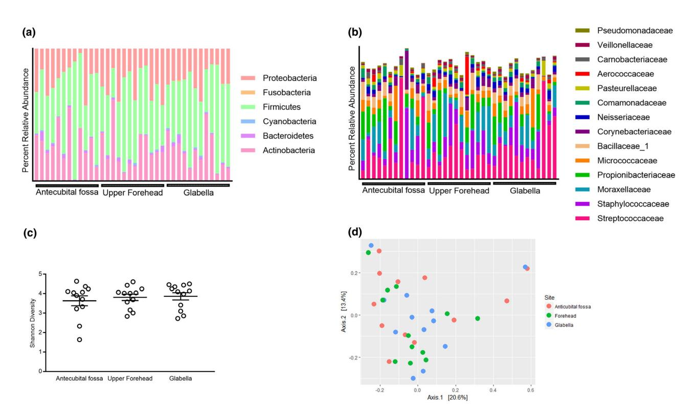
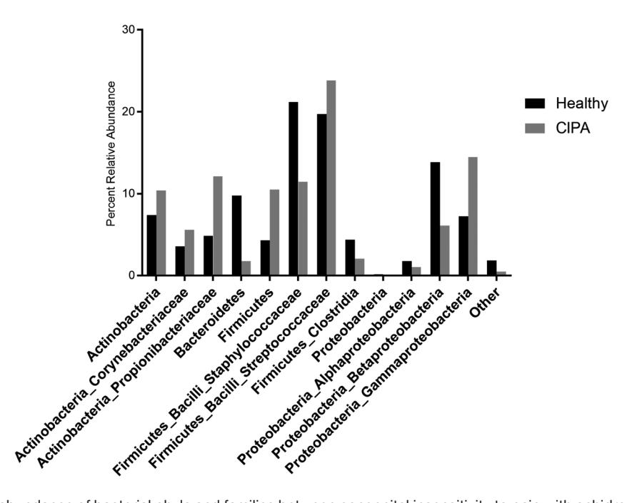

Letters to the Editor e183

commonly used by patients with skin cancers (74.1%, P < 0.001), whereas acupuncture was used more frequently by patients with ISD (23.5%, P = 0.005).

The 49% global rate for CAM use is consistent with the rate observed in other European countries. The typical CAM user has been described as a young woman with a high social status, tus, tus, tus, the but our data do not show any socio-demographic association. Here, we show that the prevalence of CAM use remains the same among patients with cancers and ISD.

Biological-based CAM (bbCAM) methods were used three times more frequently than 'mind-body' CAM, as described in the literature.5 However, our results suggest that patients with skin cancers use more bbCAM. Indeed, CAM intake is perceived to be a safe and natural intervention to fight cancer.6 Loquai et al.1 reported that 85% of patients with melanoma were at risk of drug interactions with their cancer therapy. Patients treated with BRAF and MEK inhibitors are particularly at risk for drug interactions, as many herbal therapies inhibit certain cytochromes (e.g. CYP3A4 and CYP2C8), which play a role in the metabolism of Dabrafenib. Patients undergoing immunotherapy are also at risk, as bbCAM (e.g. mistletoe) could modulate the immune system activation. In the field of ISD, the risk of bbCAM-drug association is no less significant, since cases of interactions have been reported in psoriatic patients taking methotrexate and red clover,7 or ciclosporin and St John's wort.8

Our study was monocentric, and the survey was limited to inpatients. However, conducting the survey anonymously was a strength because most patients do not declare CAM use to their physician.9

Knowing patients' methods of CAM use is helpful to improve the therapeutic alliance and compliance with conventional medicine. Communication regarding CAM could also reduce the risks of misuse, especially in patients with skin cancers.

F. Amatore, 1,\* D. Devey, 1 C. Tabelé, 2 L. Troin, 1 S. Monestier, 1 N. Malissen, 1 C. Gaudy-Marqueste, 1 J.-J. Grob, 1 M.-A. Richard

1Department of Dermatology and Oncodermatology, Timone Hospital, Marseille, France, 2Department of Pharmacy, Timone Hospital, Marseille, France

\*Correspondence: F. Amatore. E-mail: florentamatore@hotmail.fr

## References

- Loquai C, Dechent D, Garzarolli M et al. Risk of interactions between complementary and alternative medicine and medication for comorbidities in patients with melanoma. Med Oncol Northwood Lond Engl 2016; 33: 52.
- 2 Murphy EC, Nussbaum D, Prussick R, Friedman AJ. Use of complementary and alternative medicine by patients with psoriasis. *J Am Acad Dermatol* 2019; 81: 280–283.
- 3 Kearney N, Byrne N, Kirby B, Hughes R. Complementary and alternative medicine use in hidradenitis suppurativa. Br J Dermatol 2019; https://doi. org/10.1111/bjd.18426 [Epub ahead of print].

- 4 Loquai C, Dechent D, Garzarolli M *et al.* Use of complementary and alternative medicine: a multicenter cross-sectional study in 1089 melanoma patients. *Eur J Cancer Oxf Engl* 1990 2017; **71**: 70–79.
- 5 Ernst E. The usage of complementary therapies by dermatological patients: a systematic review. *Br J Dermatol* 2000; **142**: 857–861.
- 6 Loquai C, Dechent D, Garzarolli M et al. Use of complementary and alternative medicine: a multicenter cross-sectional study in 1089 melanoma patients. Eur J Cancer Oxf Engl 1990; 2017: 71, 70–79.
- 7 Orr A, Parker R. Red clover causing symptoms suggestive of methotrexate toxicity in a patient on high-dose methotrexate. *Menopause Int* 2013; 19: 133–134.
- 8 Hu Z, Yang X, Ho PCL *et al.* Herb-drug interactions: a literature review. *Drugs* 2005; **65**: 1239–1282.
- 9 Thomas-Schoemann A, Alexandre J, Mongaret C et al. Use of antioxidant and other complementary medicine by patients treated by antitumor chemotherapy: a prospective study. Bull Cancer (Paris) 2011; 98: 645–653.

DOI: 10.1111/jdv.16142

# The role of sweat in the composition of skin microbiome: lessons learned from patients with congenital insensitivity to pain with anhidrosis

To the Editor,

Congenital insensitivity to pain with anhidrosis (CIPA) is an extremely rare autosomal recessive disorder with only several hundred cases reported worldwide. CIPA results in a number of rare symptoms, including anhidrosis and recurring skin infections, oftentimes caused by Staphylococci spp. 1,2 In an effort to shed light on the contribution of sweat in shaping the composition of the skin microbiome in healthy individuals, as well as to characterize the skin microbiome in this condition, we profiled the skin microbiome of individuals with CIPA (36 samples from 12 CIPA patients) on the forehead, glabella and antecubital fossa and compared the skin microbiome composition to that of healthy volunteers. Written informed consent was obtained from the guardians of the patients according to the approved protocols and procedures of the Helsinki ethical committee of the Soroka University Medical Center, Be'er Sheva, Israel (approval number 0391-15-SOR). DNA was extracted, and 16S rRNA amplicon libraries were prepared, sequenced and analysed as previously described.3,4 The resulting taxonomic tables were compared with an existing skin microbiome database of a paediatric population with matched Tanner levels,5 important due to the effects of puberty on skin microbiome composition.5 Microbial distribution at all three sampled sites was

e184 Letters to the Editor

Figure 1 Congenital insensitivity to pain with anhidrosis (CIPA) microbiome is dominated by four phyla and six families and is not differentiable across skin sites. (a) Relative abundance of the four major phyla Bacteroidetes, Actinobacteria, Proteobacteria and Firmicutes on antecubital fossa, upper forehead and glabella. (b) Relative abundance of the major bacterial families, including Streptococcaceae, Staphylococcaceae, Moraxellaceae, Propiniobacteriaceae Micrococcaceae, Bacillaceae and Corynebacteriaceae on studied skin sites. (c) Shannon diversity index score on studied skin sites for CIPA patients. Line represents mean, and whiskers represent standard error of the mean. No significant difference is noted between skin sites. (d) Non-metric multidimensional scaling of Bray–Curtis dissimilarities do not reveal partitioning between antecubital fossa, forehead or glabella sites.

dominated by the phyla Actinobacteria, Firmicutes and Proteobacteria, similar to previous studies by our group3 and others.6,7 The relative abundance of these three phyla varied between individuals yet not so between sampled sites (Fig. 1a). The most abundant phylum, Firmicutes, represented 48% of bacteria on the antecubital fossa, 46% on the forehead and 52% on the glabella. Similarly, Actinobacteria and Proteobacteria represented 28% and 22% of bacteria respectively on the antecubital fossa, 24% and 28% on the forehead and 23% and 23% on the glabella. This trend was observed at all taxonomic levels above genus (Fig. 1b). Attempts to separate microbial communities by sampled skin site based on alpha or beta diversity metrics were unsuccessful. Shannon diversity, a measure of community diversity, was not statistically significant between any of the sites (Fig. 1c). Furthermore, PERMANOVA of non-metric multidimensional scaling (NMDS) did not indicate any significant differences between sites (Fig 1d). Taken together, these observations indicate that topographical microbial community differences, a hallmark of the skin microbiome in healthy individuals,6,8,9 do not exist in CIPA patients. When compared with healthy individuals (Fig 2), the antecubital fossa microbiome of CIPA patients harboured less Staphylococcaceae (11.4% vs. 21.2%, Fig. 2), a family found almost exclusively on moist sites.8 Conversely, CIPA patients' skin harboured higher relative abundances of a panel of other typical skin-associated microorganisms, including Cutibacterium (12.1% vs. 4.9%), a ubiquitous family known to dominate sebum-rich sites. A number of other important population differences were noted (Fig 2). Taken together, these observations point to an altered microbial landscape on CIPA patients with an observed reduction in the abundance of Staphylococcaceae, a family of skin commensals and opportunistic pathogens, with potential standard of care implications. Additionally, these observations lend credence to the widely accepted theory that the moisture and sebum content of skin contributes towards the composition of the skin microbiome.8 To the best of our knowledge, this is the only study to date exploring the skin microbiome of patients with CIPA and/or anhidrosis. Its implications reach beyond that Letters to the Editor e185

Figure 2 Differential abundance of bacterial phyla and families between congenital insensitivity to pain with anhidrosis (CIPA) patients and healthy controls. Of importance, the relative abundance of *Staphylococcaceae* in CIPA patients is nearly half of what it is in healthy controls.

of the specific understanding of CIPA as a condition and effect our understanding of skin microbiome composition in healthy individuals as well.

Funding: This study was supported by the Israeli Ministry of Science and Technology (Grant 3-11174). Michael Brandwein is a recipient of the Kaete Klausner Fellowship. The funding organizations were not involved in study design, data collection, data analysis or any other stage of the research.

# **Author contribution**

MB, BB, SM and AH designed the study. MB, BB, GF, AI, VP and AH performed research. MB, BB, GF, GS, AS, DS, ZB, NS, SM and AH analysed data. MB, AH, NS and SM wrote the paper. All authors read and approved the final manuscript. In memory of our distinguished colleague, Prof. Daniel Vardy.

### **Data availability**

Sequence data and clinical metadata per subject can be obtained through direct communication with the corresponding author.

M. Brandwein, 1,2 A. Horev, 3,4 B. Bogen, 5 G. Fuks, 6 A. Israel, 2 G. Shalom, 4,7 V. Pinsk, 3,4,8 D. Steinberg, 1 Z. Bentwich, 2 N. Shental, 9,\* S. Meshner2,\*

1Biofilm Research Laboratory, Institute of Dental Sciences, Faculty of Dental Medicine, The Hebrew University of Jerusalem, Jerusalem, Israel, 2Cutaneous Microbiology Laboratory, The Skin Research Institute, The

Dead Sea and Arava Science Center, Masada, Israel, 3Division of Pediatrics, Soroka University Medical Center, Yavne, Israel, 4Faculty of Health Sciences, Ben-Gurion University of the Negev, Beer-Sheva, Israel, 5Department of Dermatology and Venereology, Soroka University Medical Center, Yavne, Israel, 6Department of Physics of Complex Systems, Weizmann Institute of Science, Rehovot, Israel, 7Siaal Research Center for Family Medicine and Primary Care, Beer-Sheva, Israel, 8Department of Pediatrics, Samson Ashdod Assuta Medical Center, Ashdod, Israel, 9Department of Mathematics and Computer Science, Open University of Israel, Raanana, Israel

\*Correspondence: N. Shental and S. Meshner. E-mails: shental@openu.ac.il and Shiri.Meshner@biomicamed.com

MB and AH contributed equally to this study, and should be considered first authors.

### References

- 1 Fruchtman Y, Perry ZH, Levy J. Morbidity characteristics of patients with congenital insensitivity to pain with anhidrosis (CIPA). J Pediatr Endocrinol Metab 2013; 26: 325–332.
- 2 Indo Y. Congenital insensitivity to pain with anhidrosis. 2014.
- 3 Brandwein M, Fuks G, Israel A et al. Temporal stability of the healthy human skin microbiome following dead sea climatotherapy. Acta Derm Venereol 2018; 98: 256–261.
- 4 Fuks G, Elgart M, Amir A et al. Combining 16S rRNA gene variable regions enables high-resolution microbial community profiling. *Microbiome* 2018; 6: 17.
- 5 Oh J, Conlan S, Polley EC, Segre JA, Kong HH. Shifts in human skin and nares microbiota of healthy children and adults. *Genome Med* 2012; 4: 77

e186 Letters to the Editor

- 6 Grice EA, Kong HH, Conlan S et al. Topographical and temporal diversity of the human skin microbiome. Science 2009; 324: 1190–1192.
- 7 Findley K, Oh J, Yang J et al. Topographic diversity of fungal and bacterial communities in human skin. Nature 2013; 498: 367.
- 8 Byrd AL, Belkaid Y, Segre JA. The human skin microbiome. Nat Rev Microbiol 2018; 16: 143.
- 9 Oh J, Byrd AL, Deming C et al. Biogeography and individuality shape function in the human skin metagenome. Nature 2014; 514: 59.

DOI: 10.1111/jdv.16170

# Long-standing patchy alopecia areata along the hairline, a variety of alopecia areata mimicking frontal fibrosing alopecia and other cases of hair loss: case series of 11 patients

Editor

Alopecia areata (AA) is second most frequent non-scarring alopecia,1 and it is classified by extent/pattern of hair loss. We present a new clinical presentation of AA, with mono/bilateral chronic patches on the fronto-parietal hairline, which can be easily misdiagnosed for other hair disorders.

From 2012 to 2017, at Outpatient Consultation for Hair Diseases of Dermatology Unit of the Department of Experimental, Diagnostic and Specialty Medicine (DIMES) in University of Bologna, we collected 11 patients (10 females and 1 male), ageing from 23 to 60 years old (mean 40.2; Table 1) with longstanding isolated patches of alopecia on the fronto-parietal hairline (Fig. 1).

Two symmetrical patches were most common clinical presentation (72.7%), with affected area devoid of inflammatory signs and completely (63.6%) or partially devoid of hair (36.4%). Fringe sign2 was present in all cases. Each patient reported longstanding stable course history, despite previous treatments. Previous diagnoses included frontal fibrosing alopecia and temporal triangular congenital alopecia.

Trichoscopic features were mainly yellow dots (100%), short regrowing hairs (90.9%) and vellus hairs (81.8%); other findings were circle hairs (27.3%), broken hairs (18.2%) and black dots (9.1%). Exclamation mark hairs were never detected.

On histopathology, all patients presented preservation of follicular units, infundibular dilation, increase in miniaturized follicles and reduction in terminal follicles. Miniaturized follicles were represented by high number of vellus follicles (up to 62.5%), telogen germinal units (up to 16.7%), miniaturized telogen (up to 12.5%) and catagen follicles (6.2%). Moreover, 90.9% of patients presented an increased number of 'nanogen' follicles, that is miniaturized quiescent small follicles typical of chronic AA. Additional features included very mild interstitial lymphocytic infiltrate (87.5%) and variable number of fibrous streamers. Signs of acute inflammation with perifollicular infiltrate were not found in any patient.

All patients had been previously treated with low-potency topical corticosteroids for a variable period (2–20 months), without any improvement. We prescribed topical highpotency corticosteroids under occlusion, infiltrations of triamcinolone acetonide or both. Majority of patients (63.6%) did not show any improvement, and 18.2% showed a partial hair regrowth but incomplete resolution at followup; only 18.2% had an optimal response with complete resolution.

Our patients presented patches of alopecia clinically and trichoscopically indistinguishable from other hair disorders. Mean age of patients was slightly higher than that typically reported in AA.1 Patient's history and clinical presentation mimics FFA, especially for duration of hair loss and the site of scalp involvement, with the 'fringe sign'.2

Trichoscopy showed yellow dots, short regrowing hairs and vellus hairs in more than 75% of cases, whereas <25% showed signs of disease activity as broken hairs and black dots.3,4 This finding may support the observation that this variant of AA shows a prolonged duration, with less progression but greater resistance to treatments.

Histopathology was mandatory for diagnosis, showing in all cases features consistent with chronic AA, with clear reduction in terminal hairs and an increase of miniaturized follicles.5 The most predominant were vellus follicles and 'nanogen follicles'. Typical signs of acute inflammation were absent, and only a small interstitial lymphocytic infiltrate was identifiable.6–10 We suggest that histopathological clues to this form of AA include the follwoing: infundibular dilatation, small interstitial lymphocytic infiltrate, reduction in terminal follicles, increase in vellus follicles and nanogen follicles.

Administration of high-potency steroids failed to achieve a complete and satisfactory hair regrowth in the majority of patients. Even cases with complete regrowth required longcourse treatments.

To our knowledge, there are currently no previous reports that describe this peculiar presentation of AA. Despite its apparently benign clinical features, this variant has a poor outcome. Scalp biopsy is mandatory for a proper diagnosis and to start an appropriate therapy as soon as possible.