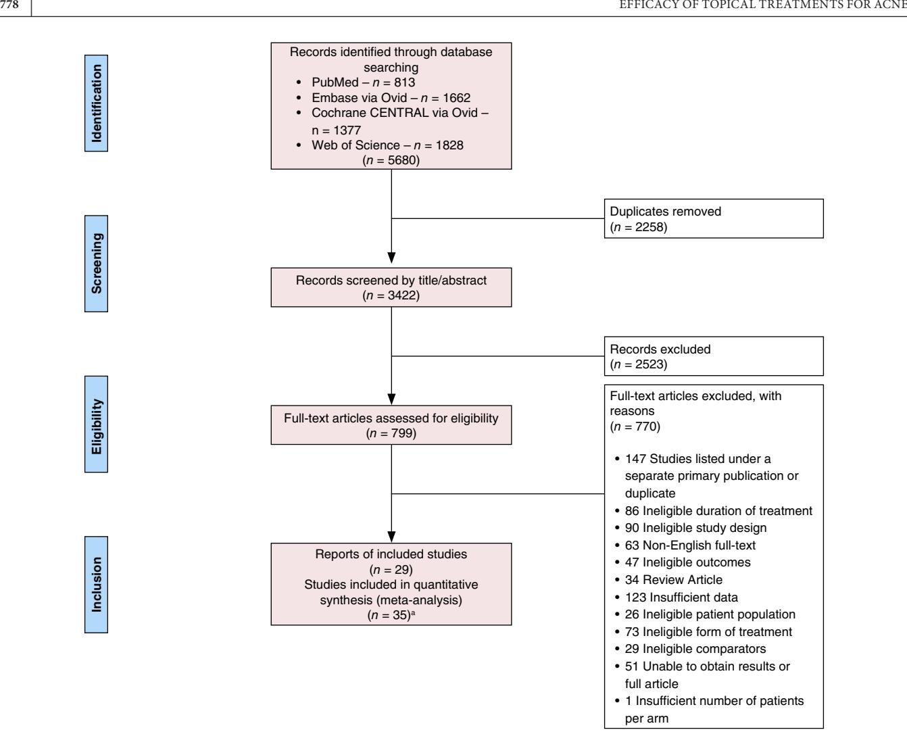
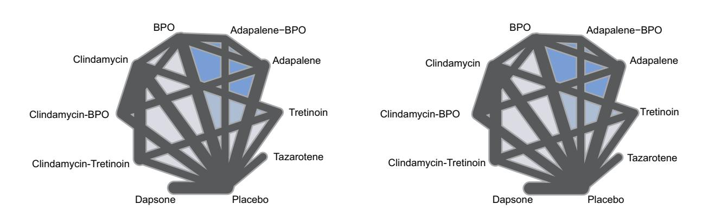
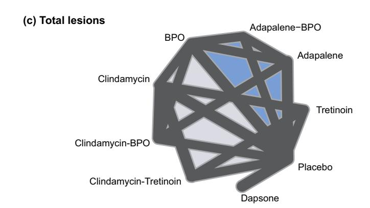
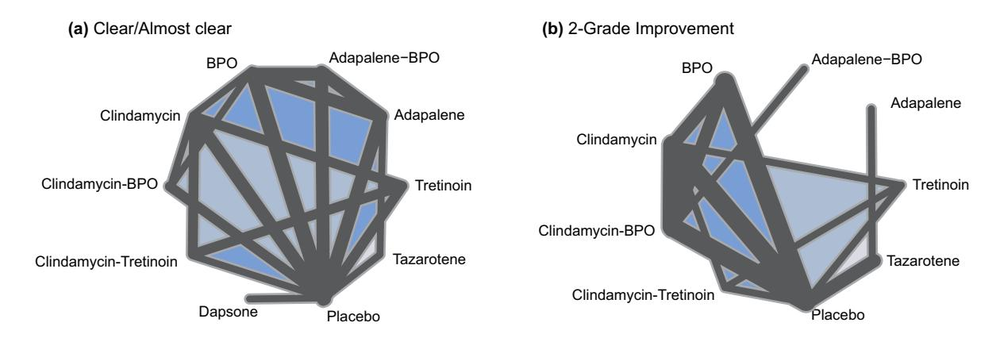

#### SYSTEMATIC REVIEW

# Efficacy of topical treatments for mild-to-moderate acne: A systematic review and meta-analysis of randomized control trials

Efe E. Kakpovbia1 | Trevor Young2 | Emily C. Milam1 | Yingzhi Qian3 | Sallie Yassin3 | Joey Nicholson4 | Jiyuan Hu3 | Andrea B. Troxel3 | Arielle R. Nagler1

#### Correspondence

Arielle R. Nagler, 240 E 38th Street, Floor 12, New York, NY 10016, USA. Email: arielle.nagler@nyulangone.org

#### Funding information

May and Samuel Rudin Family Foundation

#### Abstract

Acne is a common skin condition, but little data exist on the comparative efficacy of topical acne therapies. We conducted a systematic review and network meta-analysis to evaluate the efficacy of topical therapies for mild-to-moderate acne. Searches in PubMed/MEDLINE, Cochrane CENTRAL via Ovid, Embase via Ovid and Web of Science were conducted on 29 November 2021. Randomized controlled trials examining ≥12 weeks of topical treatments for acne vulgaris in subjects aged 12 and older were included. Main outcomes were absolute or percent change in acne lesion count and treatment success on the Investigator's Global Assessment scale. Thirty-five randomized clinical trials with 33,472 participants comparing nine different topical agents were included. Adapalene-benzoyl peroxide (BPO), clindamycin-BPO and clindamycin-tretinoin demonstrated the greatest reduction in non-inflammatory (ratio of means [RoM] 1.76; 95% CI [1.46; 2.12], RoM 1.70; 95% CI [1.44; 2.02] and RoM 1.87; 95% CI [1.53; 2.30], respectively), inflammatory (RoM 1.56; 95% CI [1.44; 1.70], RoM 1.49; 95% CI [1.39; 1.60] and RoM 1.48; 95% CI [1.36; 1.61], respectively) and total lesion count (ROM 1.67; 95% CI [1.47; 1.90], RoM 1.59; 95% CI [1.42; 1.79] and RoM 1.64; 95% CI [1.42; 1.89], respectively) compared to placebo. All single agents outperformed placebo except tazarotene, which did not significantly outperform placebo for inflammatory and non-inflammatory lesion count reduction. Most combination agents significantly outperformed their individual components in lesion count reduction and global assessment scores, except for clindamycin-tretinoin and clindamycin-BPO, which did not significantly outperform tretinoin (RoM 1.13; 95% CI [0.94; 1.36]) and BPO (RoM = 1.15, 95% CI [0.98; 1.36]), respectively, for noninflammatory lesion reduction. There was no significant difference amongst most single agents when evaluating lesion count reduction. Combination agents are generally most effective for mild-to-moderate acne; however for non-inflammatory acne, the addition of clindamycin in topical regimens is unnecessary and should be avoided.

#### INTRODUCTION

Acne vulgaris (AV) is a common skin disorder affecting approximately 85% of 11- to 30-year-olds. Acne can negatively impact quality of life and psychological well-being.

The pathophysiology of acne is multifactorial including abnormal keratinization, sebum overproduction, *Cutibacterium acnes* overgrowth and inflammation.4 Acne lesions can be subdivided into inflammatory or non-inflammatory, with many patients demonstrating a mix.

Linked article: G. Nikolakis et al. J Eur Acad Dermatol Venereol. 2025;39:711–712. https://doi.org/10.1111/jdv.20590.

The authors contributed equally to all portions of the manuscript.

© 2024 European Academy of Dermatology and Venereology.

&lt;sup>1The Ronald O. Perelman Department of Dermatology, New York University Grossman School of Medicine, New York, New York, USA

&lt;sup>2Department of Dermatology, University of Pennsylvania Perelman School of Medicine, Philadelphia, Pennsylvania, USA

&lt;sup>3Department of Population Health, New York University Grossman School of Medicine, New York, New York, USA

&lt;sup>4NYU Health Sciences Library, NYU Grossman School of Medicine, New York, New York, USA

Successful treatment of acne typically requires a multipronged approach, using more than one mechanism of action.[5](#page-8-3) Amongst the many treatment modalities, topical medications serve as first-line for mild-to-moderate AV of the face and are pivotal in maintenance therapy of severe acne treated by oral therapies.

Topical treatments can function as keratolytics, antimicrobials and/or anti-inflammatories. Some agents, such as retinoids, demonstrate more than one mechanism of action.

Despite the abundance of topical agents—many available for decades—there is no evidence-based consensus on which categories and individual agents are most efficacious. While clinical guidelines exist, such as those put forth by the American Academy of Dermatology (AAD), topical treatment of AV often relies on provider and patient preference as well as cost[.5,6](#page-8-3)

Of the available randomized controlled trials (RCTs) assessing topical agents, most focus on just one or two active ingredient(s) compared to a vehicle or placebo, or compare one combination regimen to placebo and its individual ingredients. There are few meta-analyses that more broadly compare topical treatments. A systematic review and detailed analysis of the literature are needed to identify and extrapolate data on broader comparisons from the existing rigorously designed RCTs.

Herein, we detail the results of a comprehensive systematic review and network meta-analysis of topical acne medications for mild-to-moderate AV.

# **METHODS**

# **Protocol, registration and search strategy**

We conducted a systematic review and network metaanalysis of prospective RCTs that examined topical medications for AV. The study was conducted and reported according to the Preferred Reporting Items for Systematic Reviews and Meta-analyses (PRISMA) guidelines[.7](#page-8-4) The protocol for this study was pre-registered at PROSPERO (registration No. CRD42019119757; [https://www.crd.york.ac.](https://www.crd.york.ac.uk/PROSPERO/display_record.php?ID=CRD42019119757) [uk/PROSPERO/display\\_record.php?ID=CRD42019119757\)](https://www.crd.york.ac.uk/PROSPERO/display_record.php?ID=CRD42019119757). Search strategies were developed with a librarian experienced in systematic reviews (Author J.N.). Searches across all databases included keywords and subject headings for acne and topical medications. Search strategies included chemical names as well as trade names for all known topical acne medications. We used the Cochrane validated search filter to limit the search results to clinical trials.[8](#page-8-5) We searched PubMed/MEDLINE, Cochrane CENTRAL via Ovid, Embase via Ovid and Web of Science. Searches were run on 29 November 2021 and included no date limits. Full search strategies for each database are available in Appendix [S1.](#page-9-0)

# **Eligibility criteria**

Studies that met the following inclusion criteria were included: (1) RCTs examining the effectiveness of topical acne medications, including adapalene, azelaic acid, benzoyl peroxide, clindamycin, dapsone, erythromycin, salicylic acid, tretinoin and tazarotene; (2) subjects aged ≥12 years; (3) treatment duration ≥12weeks; and (4) ≥10 patients per study arm. Our primary outcomes were absolute or percent change in acne lesion count (total (TL), inflammatory (IL) and non-inflammatory (NIL)) and treatment success on the Investigator's Global Assessment (IGA) scale, defined as a score of clear or almost clear (grade 0 or 1) or at least a twograde improvement from baseline. Studies needed at least one of these outcomes measures for inclusion. Trials including patients on oral acne treatments were excluded. All potencies were included; however, studies comparing different potencies of the same topical were excluded. We excluded studies that did not have the full text available in English.

# **Study selection**

Two authors (E.M. and E.K.) initially screened all titles and abstracts independently to determine relevance using the Covidence systematic review tool (Covidence systematic review software, Veritas Health Innovation, Melbourne, Australia. Available at [www.covidence.org\)](http://www.covidence.org). Conflicts during title/abstract screening were resolved by a third author (A.N.). Three authors (E.M., E.K. and A.N.) independently reviewed the full-text articles for inclusion using the predetermined eligibility criteria. Each article was reviewed by two authors, with the third author serving to resolve conflicts.

# **Data collection**

Three authors (E.M., E.K. and T.Y.) independently extracted data. Collected data were reviewed by at least two authors to ensure accuracy. If required data were not reported in the manuscript, the investigators attempted to contact the study authors via email. The following data were extracted: primary author, study year, interventions, whether the study was a split-face trial, number of subjects per group, mean age, proportion of females per group, baseline acne severity, absolute and percent change in acne lesion count with corresponding standard deviations or standard errors; proportion of patients with treatment success on the IGA scale, concomitant treatments and side effects.

### **Critical appraisal tool and risk of bias assessment**

We used the Cochrane Collaboration's tool for assessing risk of bias.[9](#page-8-6) Two authors independently evaluated the studies of interest, with conflicts resolved by a third author. Studies were evaluated across seven domains including random sequence generation, allocation concealment, blinding of outcome assessment, blinding of participants and study KAKPOVBIA et al. 777

personnel, incomplete outcome data, selective outcome reporting and other sources of bias.

#### Statistical analysis

All statistical analyses were performed with R version 3.6.10 Meta-analysis R package 'netmeta' was employed to conduct meta-analysis. 11 Cochrane 2023 guidelines were strictly followed to conduct the comprehensive network meta-analysis (NMA). 12 NMA is a powerful analytic strategy for comparing three or more interventions from multiple studies simultaneously in a single analysis. Both direct and indirect evidence across a network of studies was utilized to infer the direct, indirect and combined effects for each comparison. Direct estimates were a result of directly comparing treatment arms. Combined estimates were inferred by combining direct effects within studies, and indirect effects, which were not made directly within studies, but were estimated using available direct intervention effect estimates across studies. Heterogeneity amongst studies was analysed using the  $I^2$  statistic. Heterogeneity was classified as low for  $I^2$  values less than 25%, moderate for values between 25% and 50% and high for values greater than 50%. 13 A random effects model was utilized for two outcomes (reduction in inflammatory lesions and total lesion count) that showed significant heterogeneity amongst included studies. A fixed effects model was used for the remaining outcomes. Ratio of means (RoM) and pooled odds ratios (OR) with 95% confidence intervals were utilized as the effect sizes for continuous and dichotomous outcomes, respectively. Both direct and combined estimates for each comparison are presented with point estimates and 95% confidence intervals. A p value < 0.05 was considered statistically significant. No corrections for multiplicity have been made. The network meta-analysis results of agents were further visualized with a network graph, where treatments that are directly compared in at least one study are connected by a line. The thickness of the line is proportional to the inverse standard error of the direct treatment effect obtained using data from all studies that compared the two treatments. The corresponding shading indicates contribution from a multi-arm study. The analysis R program scripts with detailed methods used are available in the Data S1.

#### RESULTS

#### **Studies characteristics**

Our initial database search yielded 5680 records. Following deduplication, the authors screened 3322 records for relevance by title and abstract, of which 799 were submitted for full-text review. After full-text screening, 29 articles reporting on 35 studies with 33,472 participants were ultimately included for analysis (Figure 1). One manuscript contained three separate trials14 and four manuscripts contained two trials each. Five studies were reported exclusively in trial registries. Five studies were reported exclusively in trial registries.

A detailed list of all clinical trials and their key characteristics is provided in Table S1. 14-42 These studies evaluated nine topical treatment regimens, including six single agents (adapalene, tazarotene, tretinoin, benzoyl peroxide [BPO], clindamycin and dapsone) and three combination regimens (adapalene-BPO, clindamycin-BPO and clindamycin-tretinoin). Most comparisons were with vehicle or placebo, although there were several direct comparisons of active agents (Figures 2 and 3). Mean sample size per group was 408 participants (range 41–1506). The mean proportion of females per trial group was 54.4%, and the mean age in trial groups ranged between 16 and 29 years.

Studies used varying outcome measures: 11 studies evaluated TL, 12 evaluated IL and NIL counts, 24 reported 'clear or almost clear' on the IGA severity scale, and 11 reported 'two-grade improvement' on the IGA scale. Only one study evaluated all outcomes of interest (TL, IL and NIL counts as well as 'clear or almost clear' and 'two-grade improvement' on the IGA scale).27 Due to insufficient data, 123 studies were excluded during full-text screening.

Given the high consistency between the estimated combined effects and direct effects for all comparisons, only combined effects are reported in the following sections for simplicity. Direct effect estimates can be found in Tables 1 and 2.

#### Inflammatory acne

All regimens except for tazarotene (ratio of means [RoM] 1.10; 95% confidence intervals [CI] [0.98; 1.23]) significantly outperformed placebo in reduction of IL counts (Table 1a). Combination agents adapalene-BPO (RoM 1.56; 95% CI [1.44; 1.70]), clindamycin-BPO (RoM 1.49; 95% CI [1.39; 1.60]) and clindamycin-tretinoin (RoM 1.48; 95% CI [1.36; 1.61]) showed greatest reduction in IL counts compared to placebo.

When comparing topical regimens, clindamycin-BPO was significantly more effective than adapalene (RoM 1.16; 95% CI [1.06; 1.27]), BPO (RoM 1.12; 95% CI [1.05; 1.19]) and clindamycin (RoM 1.13; 95% CI [1.08; 1.19]). Clindamycin-tretinoin was significantly more effective than clindamycin (RoM 1.12, 95% CI [1.07; 1.18]) and tretinoin (RoM 1.22, 95% CI [1.13; 1.32]). Adapalene-BPO showed a significantly greater reduction in inflammatory lesion count compared to adapalene (RoM 1.22, 95% CI [1.12; 1.32]) and BPO (RoM 1.17, 95% CI [1.08; 1.27]). There were no significant differences amongst single agents.

#### Non-inflammatory acne

Clindamycin-tretinoin (RoM 1.87; 95% CI [1.53; 2.30]), adapalene-BPO (RoM 1.76; 95% CI [1.46; 2.12]) and clindamycin-BPO (RoM 1.70; 95% CI [1.44; 2.02]) showed a greatest reduction in NIL count compared to placebo

**FIGURE 1** Flow diagram of selected articles for the meta-analysis.

(Table [1b](#page-5-0)). All single agents except tazarotene (ROM 1.10; 95% CI [0.90; 1.33]) significantly outperformed placebo. Tretinoin (RoM 1.66; 95% CI [1.31; 2.10]) showed greatest reduction in NIL counts amongst single agents compared to placebo.

Combination agents clindamycin-BPO (RoM 1.21, 95% CI [1.06; 1.39]) and clindamycin-tretinoin (RoM 1.33, 95% CI [1.16; 1.53]) were significantly more effective than clindamycin. Adapalene-BPO (RoM 1.25, 95% CI [1.04; 1.51]) and clindamycin-BPO (RoM 1.21, 95% CI [1.01; 1.46]) significantly outperformed adapalene. In contrast, clindamycin-BPO and clindamycin-tretinoin were not significantly more effective than BPO (RoM 1.15, 95% CI [0.98; 1.36]) and tretinoin (RoM 1.13, 95% CI [0.94; 1.36]), respectively. There were no significant differences amongst single agents.

# **All acne/total lesion count**

All agents significantly outperformed placebo when evaluating TL count reduction (Table [1c\)](#page-5-0). The combination regimens adapalene-BPO (ROM 1.67; 95% CI [1.47; 1.90]), clindamycin-tretinoin (RoM 1.64; 95% CI [1.42; 1.89]) and clindamycin-BPO (RoM 1.59; 95% CI [1.42; 1.79]) showed greatest reductions in total lesion count compared to placebo. Adapalene-BPO demonstrated a significantly greater total lesion count reduction than adapalene (RoM 1.24; 95% CI [1.09; 1.40]) and BPO (RoM 1.18; 95% CI [1.04; 1.35]). Clindamycin-tretinoin had a significantly greater reduction than clindamycin (RoM 1.22; 95% CI [1.12; 1.34]) and tretinoin (RoM 1.17; 95% CI [1.03; 1.33]). Clindamycin-BPO had a significantly greater reduction than adapalene (RoM 1.18; 95% CI [1.04; 1.34]), BPO (RoM 1.13; 95% CI [1.01; 1.26]) and clindamycin (RoM 1.19; 95% CI [1.09; 1.30]). There were no significant differences amongst single agents.

### **Global assessments**

When evaluating 2-grade improvement, all agents significantly outperformed placebo (Table [2\)](#page-6-0). Combination KAKPOVBIA et al. **| 779**

#### **(a) Inflammatory lesions**

#### **(b) Non-inflammatory lesions**

**FIGURE 2** Change in (a) inflammatory, (b) non-inflammatory and (c) total lesion count. Treatments that are directly compared in at least one study are connected by a line. The thickness of this line is proportional to the inverse standard error of the direct treatment effect obtained using data from all studies which compared the two treatments. The thicker the line, the smaller the standard error and the greater the evidence for that comparison. The shading indicates multi-arm study.

**FIGURE 3** Treatment success on the Investigator's Global Assessment (IGA) scale, defined as (a) score of clear or almost clear, or (b) at least a two-grade improvement from baseline. Treatments that are directly compared in at least one study are connected by a line. The thickness of this line is proportional to the inverse standard error of the direct treatment effect obtained using data from all studies which compared the two treatments. The shading indicates multi-arm study.

agents clindamycin-BPO (OR 2.75, 95% CI [2.28; 3.30]) and clindamycin-tretinoin (OR=2.54, 95% CI [1.91; 3.38]) showed greatest efficacy compared to placebo. Amongst studies evaluating 'clear/almost clear', adapalene-BPO (OR 3.10, 95% CI [2.73; 3.52]), clindamycin-tretinoin (OR 2.81, 95% CI [2.34; 3.38]) and clindamycin-BPO (OR 2.54, 95% CI [2.16; 2.99]) showed greatest efficacy compared to placebo. Combination agents significantly outperformed their

9 1.67 (1.47; 1.90)

1.59 (1.42; 1.79)

1.64 (1.42; 1.89)

**TABLE 1** League tables of estimated effect size of treatments through direct estimate (upper right portion, standardized mean differences [95% CI]) and network estimate (lower left portion, odds ratio [95% CI]) for mild-to-moderate acne.

| (a) |                      |                      |                               |                      |                      |                      |                      |                               |             |                      |  |                      |  |                      |                      |
|-----|----------------------|----------------------|-------------------------------|----------------------|----------------------|----------------------|----------------------|-------------------------------|-------------|----------------------|--|----------------------|--|----------------------|----------------------|
| 1   | Adapalene BPO     |                      |                               | 1.35)                | 1.23 (1.12;          | 1.18 (1.08; 1.29) |                      |                               |             |                      |  |                      |  |                      | 1.51 (1.35; 1.69) |
| 2   | 0.82 (0.76; 0.89) | Clindamy cin-BPO  |                               | 2.07)                | 1.56 (1.17;          | 1.11 (1.04; 1.20) |                      | 1.14 (1.09; 1.20)          |             |                      |  |                      |  |                      | 1.41 (1.29; 1.55) |
| 3   | 0.97 (0.89; 1.05) |                      | Clindamy cin-Treti noin |                      |                      |                      |                      | 1.12 (1.07; 1.17)          |             |                      |  |                      |  | 1.23 (1.14; 1.34) | 1.76 (1.48; 2.10) |
| 4   | 1.22 (1.12; 1.32) | 1.16 (1.06; 1.27) |                               |                      | Adapalene            | 0.96 (0.86; 1.07) |                      |                               |             |                      |  |                      |  |                      | 1.31 (1.21; 1.41) |
| 5   | 1.17 (1.08; 1.27) | 1.12 (1.05; 1.19) |                               | 1.05)                | 0.97 (0.89;          | BPO                  |                      | 1.06 (0.98; 1.16)          |             |                      |  |                      |  |                      | 1.27 (1.18; 1.37) |
| 6   |                      | 1.13 (1.08; 1.19) | 1.12 (1.07; 1.18)          |                      |                      | 1.01 (0.95; 1.09) |                      | Clindamy cin               |             |                      |  |                      |  | 1.10 (1.00; 1.20) | 1.28 (1.17; 1.40) |
| 7   |                      |                      |                               |                      |                      |                      |                      |                               |             | Dapsone              |  |                      |  |                      | 1.14 (1.09; 1.19) |
| 8   |                      |                      |                               |                      |                      |                      |                      |                               |             |                      |  | Tazarotene           |  |                      | 1.10 (1.01; 1.19) |
| 9   |                      |                      | 1.22 (1.13; 1.32)          |                      |                      |                      |                      | 1.09 (1.00; 1.18)          |             |                      |  |                      |  | Tretinoin            | 1.43 (1.19; 1.71) |
| 10  | 1.56 (1.44; 1.70) | 1.49 (1.39; 1.60) | 1.48 (1.36; 1.61)          | 1.38)                | 1.29 (1.20;          | 1.33 (1.24; 1.43) |                      | 1.31 (1.22; 1.42)          |             | 1.14 (1.06; 1.22) |  | 1.10 (0.98; 1.23) |  | 1.21 (1.09; 1.34) | Placebo              |
| (b) |                      |                      |                               |                      |                      |                      |                      |                               |             |                      |  |                      |  |                      |                      |
| 1   | Adapalene BPO     |                      |                               | 1.47)                | 1.21 (0.99;          | 1.54)                | 1.26 (1.03;          |                               |             |                      |  |                      |  |                      | 1.72 (1.38; 2.14) |
| 2   |                      | Clindamy cin-BPO  | 1.53 (1.04; 2.25)          |                      |                      | 1.06 (0.87; 1.29) |                      | 1.23 (1.06; 1.41)          |             |                      |  |                      |  |                      | 1.59 (1.25; 2.01) |
| 3   |                      |                      | Clindamy cin-Treti noin |                      |                      |                      |                      | 1.30 (1.13; 1.50)          |             |                      |  |                      |  | 1.19 (0.98; 1.46) | 2.44 (1.74; 3.44) |
| 4   | 1.25 (1.04; 1.51) | 1.21 (1.01; 1.46) |                               |                      | Adapalene            | 1.28)                | 1.04 (0.85;          |                               |             |                      |  |                      |  |                      | 1.41 (1.21; 1.63) |
| 5   | 1.19 (0.99; 1.44) | 1.15 (0.98; 1.36) |                               | 1.12)                | 0.95 (0.81;          | BPO                  |                      | 1.17 (0.95; 1.45)          |             |                      |  |                      |  |                      | 1.42 (1.21; 1.68) |
| 6   |                      | 1.21 (1.06; 1.39) | 1.33 (1.16; 1.53)          |                      |                      | 1.25)                | 1.05 (0.89;          | Clindamy cin               |             |                      |  |                      |  | 0.83 (0.67; 1.03) | 1.41 (1.15; 1.72) |
| 7   |                      |                      |                               |                      |                      |                      |                      |                               |             | Dapsone              |  |                      |  |                      | 1.23 (1.06; 1.42) |
| 8   |                      |                      |                               |                      |                      |                      |                      |                               |             |                      |  | Tazarotene           |  |                      | 1.10 (0.90; 1.33) |
| 9   |                      |                      | 1.13 (0.94; 1.36)          |                      |                      |                      |                      |                               | 0.85 (0.70; |                      |  |                      |  | Tretinoin            | 2.05 (1.45; 2.89) |
| 10  | 1.76 (1.46; 2.12) | 1.70 (1.44; 2.02) | 1.87 (1.53; 2.30)          | 1.61)                | 1.40 (1.22;          | 1.72)                | 1.48 (1.27;          | 1.03) 1.40 (1.19; 1.66) |             | 1.23 (1.06; 1.42) |  | 1.10 (0.90; 1.33) |  | 1.66 (1.31; 2.10) | Placebo              |
| (c) |                      |                      |                               |                      |                      |                      |                      |                               |             |                      |  |                      |  |                      |                      |
| 1   | Adapalene BPO     |                      |                               | 1.21 (1.06; 1.39) |                      | 1.22 (1.07; 1.40) |                      |                               |             |                      |  |                      |  |                      | 1.64 (1.40; 1.91) |
| 2   |                      | Clindamy cin-BPO  |                               | 1.53 (1.17; 2.01) |                      | 1.08 (0.94; 1.23) |                      | 1.31)                         |             | 1.19 (1.09;          |  |                      |  |                      | 1.48 (1.27; 1.73) |
| 3   |                      |                      | Clindamy cin-Tretinoin     |                      |                      |                      |                      | 1.32)                         |             | 1.21 (1.10;          |  |                      |  | 1.21 (1.06; 1.38) | 2.10 (1.57; 2.81) |
| 4   | 1.24 (1.09; 1.40) | 1.18 (1.04; 1.34) |                               |                      | Adapalene            |                      | 1.01 (0.87; 1.16) |                               |             |                      |  |                      |  |                      | 1.37 (1.23; 1.52) |
| 5   | 1.18 (1.04; 1.35) | 1.13 (1.01; 1.26) |                               |                      | 0.96 (0.86; 1.07) |                      | BPO                  |                               | 1.30)       | 1.13 (0.98;          |  |                      |  |                      | 1.36 (1.21; 1.52) |
| 6   |                      | 1.19 (1.09; 1.30) | 1.22 (1.12; 1.34)          |                      |                      |                      | 1.05 (0.94; 1.18) |                               |             | Clindamycin          |  |                      |  | 0.95 (0.83; 1.09) | 1.31 (1.13; 1.51) |
| 7   |                      |                      |                               |                      |                      |                      |                      |                               |             |                      |  | Dapsone              |  |                      | 1.18 (1.08; 1.29) |
| 8   |                      |                      |                               | 1.17 (1.03;          |                      |                      |                      |                               | 1.09)       | 0.96 (0.84;          |  |                      |  | Tretinoin            | 1.74 (1.30; 2.32) |
|     |                      |                      |                               | 1.33)                |                      |                      |                      |                               |             |                      |  |                      |  |                      |                      |

*Note*: Estimated effect size for reduction in (a) inflammatory lesions (b) non-inflammatory lesions and (c) total lesions. Highlighted cells indicate significance at the *p*<0.05 level. Bolded values reflect topical agents in the comparison. 1.56)

1.41 (1.27;

1.34 (1.19; 1.51)

1.18 (1.08; 1.29)

1.40 (1.19;

1.65) **Placebo**

1.35 (1.22; 1.48)

1.39 (0.95; 2.02)

2.12) **Placebo**

KAKPOVBIA et al. **| 781**

**TABLE 2** League tables of odds ratio of treatment success on the investigator's global assessment (IGA) scale through direct estimate (upper right portion, odds ratio [95% CI]) and network estimate (lower left portion, odds ratio [95% CI]) for mild-to-moderate acne.

| (a) |                      |                      |                               |                      |           |                                     |                      |                      |                      |             |                      |             |                      |                                     |
|-----|----------------------|----------------------|-------------------------------|----------------------|-----------|-------------------------------------|----------------------|----------------------|----------------------|-------------|----------------------|-------------|----------------------|-------------------------------------|
| 1   | Adapalene BPO     |                      |                               | 2.01 (1.77; 2.29) | 1.89)     | 1.66 (1.47;                         |                      |                      |                      |             |                      |             |                      | 3.01 (2.62; 3.47)                |
| 2   |                      | Clindamy cin-BPO  |                               |                      | 1.72)     | 1.43 (1.19;                         | 1.49 (1.24; 1.79) |                      |                      |             |                      |             |                      | 2.39 (1.94; 2.93)                |
| 3   |                      |                      | Clindamy cin-Treti noin |                      |           |                                     | 1.63 (1.37; 1.92) |                      |                      |             |                      |             | 1.68 (1.43; 1.97) | 2.93 (2.26; 3.80)                |
| 4   | 1.97 (1.73; 2.24) |                      |                               | Adapalene            |           | 0.83 (0.72; 0.95)                |                      |                      |                      |             |                      | 0.97 (0.61; |                      | 1.53 (1.31; 1.77)                |
| 5   | 1.67 (1.49; 1.89) | 1.37 (1.17; 1.62) |                               | 0.85 (0.75; 0.97) | BPO       | 1.05 (0.87; 1.27)                |                      |                      |                      |             | 1.54)                |             |                      | 1.82 (1.61; 2.06)                |
| 6   |                      | 1.48 (1.25; 1.75) | 1.64 (1.40; 1.92)          |                      | 1.25)     | 1.08 (0.93;                         |                      | Clindamy cin      |                      |             |                      |             |                      | 1.04 (0.87; 1.68 (1.46; 1.93) |
| 7   |                      |                      |                               |                      |           |                                     |                      |                      | Dapsone              |             |                      |             |                      | 1.59 (1.30; 1.93)                |
| 8   |                      |                      |                               | 0.75 (0.59; 0.96) |           |                                     |                      |                      |                      |             | Tazarotene           |             |                      | 2.28 (1.76; 2.95)                |
| 9   |                      |                      | 1.67 (1.42; 1.96)          |                      |           |                                     |                      | 1.02 (0.86; 1.20) |                      |             |                      |             | Tretinoin            | 1.73 (1.33; 2.25)                |
| 10  | 3.10 (2.73; 3.52) | 2.54 (2.16; 2.99) | 2.81 (2.34; 3.38)          | 1.57 (1.38; 1.80) | 2.08)     | 1.85 (1.65; 1.72 (1.51; 1.95) |                      | 1.59 (1.30; 1.93) |                      |             | 2.10 (1.67; 2.64) |             | 1.69 (1.39; 2.04) | Placebo                             |
| (b) |                      |                      |                               |                      |           |                                     |                      |                      |                      |             |                      |             |                      |                                     |
| 1   | Adapalene BPO     | 0.64 (0.40; 1.01) |                               |                      |           |                                     |                      |                      |                      |             |                      |             |                      |                                     |
| 2   |                      | Clindamy cin-BPO  |                               |                      |           | 1.52 (1.27; 1.82)                |                      | 1.85)                |                      | 1.59 (1.37; |                      |             |                      | 2.80 (2.29; 3.43)                |
| 3   |                      |                      | Clindamy cin-Tretinoin     |                      |           |                                     |                      |                      | 1.58 (1.20; 2.08) |             |                      |             | 1.62 (1.22; 2.14) | 2.25 (1.56; 3.24)                |
| 4   |                      |                      |                               |                      | Adapalene |                                     |                      |                      |                      |             | 0.48 (0.26; 0.87) |             |                      |                                     |
| 5   |                      | 1.47 (1.24; 1.74) |                               |                      |           | BPO                                 |                      | 1.31)                | 1.08 (0.90;          |             |                      |             |                      | 1.96 (1.55; 2.47)                |
| 6   |                      | 1.62 (1.40; 1.88) | 1.94)                         | 1.50 (1.16;          |           | 1.10 (0.93; 1.32)                |                      | Clindamycin          |                      |             |                      |             | 1.02 (0.77; 1.37) | 1.58 (1.29; 1.93)                |
| 7   |                      |                      |                               |                      |           |                                     |                      |                      |                      |             | Tazarotene           |             |                      |                                     |
|     |                      |                      |                               |                      |           |                                     |                      |                      |                      |             |                      |             |                      |                                     |

*Note*: Estimated odds ratio for treatment success on the Investigator's Global Assessment (IGA) scale, defined as (a) score of clear or almost clear, or (b) at least a two-grade improvement from baseline. Highlighted cells indicate significance at the *p*<0.05 level. Bolded values reflect topical agents in the comparison.

. 1.87 (1.52; 2.30)

individual ingredients. Adapalene had significantly lower odds of a 'clear/almost clear' rating compared to tazarotene (OR 0.75, 95% CI [0.59; 0.96]) and BPO (OR 0.85, 95% CI [0.75; 0.97]). No additional differences were identified amongst single agents.

.... .

2.52 (1.91; 3.38)

### **Safety and tolerability assessments**

8

9 . 2.75 (2.28;

3.30)

Tolerability and adverse events (AE) were reported in all studies. Overall, all study agents were well-tolerated, with most side effects being mild to moderate in severity and resolving without residual effects. The most common AEs included dryness, erythema, irritation and desquamation. Serious AEs and drop-out rates due to AEs were consistently low.

Retinoids frequently had a higher rate of AEs. Tazarotene had a consistently higher rate of AEs than adapalene and placebo[.18,19,33,38,39](#page-8-14) Adapalene-BPO and adapalene had higher rates of AEs compared to clindamycin-BPO, BPO and placebo.[14,21,23,26,29,31,40,42](#page-8-11) Clindamycin-tretinoin and tretinoin had more AEs than clindamycin and placebo[.16,30,35](#page-8-15)

. 1.57 (1.16;

1.42) . **Tretinoin**

### **Assessment of risk of bias**

1.08 (0.82;

1.69 (1.41; 2.04)

The results of the risk of bias assessment are provided in Table [S2](#page-9-0). No studies showed high risk of selection bias due to limitations in the randomization process; however, 13 manuscripts did not provide details of the randomization process[.14,20–24,27–29,38–40,42](#page-8-11) In each study, outcome assessors were blinded, mitigating detection bias; however, in nine studies, participants were not blinded to treatment which may have introduced performance bias.[21,22,26,31,33,38,39,41,42](#page-8-16)

# **DISCUSSION**

To determine the relative efficacy of topical agents in the treatment of facial acne, we systematically reviewed the medical literature and completed a network meta-analysis on outcomes data from 35 studies. Ultimately six single agents (BPO, clindamycin, dapsone, and the retinoids adapalene, tretinoin and tazarotene) and three combination agents (clindamycin-BPO, adapalene-BPO and clindamycin-tretinoin) were included.

Our findings demonstrate that almost all monotherapy and combination treatments significantly outperform placebo across all outcome measures. Tazarotene monotherapy did not demonstrate superiority over placebo for NIL and IL. We hypothesize that tazarotene's underperformance as compared to lower potency retinoids may be related to poor adherence owing to tolerability issues.

Most single agents were comparable to one another across most outcomes. Tazarotene was superior to adapalene when evaluating clear/almost clear rating, although tazarotene had higher rates of cutaneous side effects. BPO was significantly more effective than adapalene when evaluating clear/almost clear rating, but did not demonstrate superiority in lesion count reduction. Both BPO and adapalene, which are available in OTC preparations and thus are inherently more accessible, should be considered as cost-effective, yet clinically efficacious alternatives for patients with limited access to prescription topical agents.

Our findings demonstrate evidence that combination agents outperform their individual ingredients in almost every acne category and outcome measure. An exception was noted amongst NIL counts, in which BPO or tretinoin alone were similar to clindamycin-BPO or clindamycintretinoin combination agents, respectively. While these results do not formally demonstrate equivalence amongst these therapies, this may suggest that the addition of clindamycin does not offer additional improvement for patients with NIL acne. As such, with antibiotic stewardship in mind, it may behove dermatologists to reconsider the addition of topical clindamycin for the treatment of NIL acne.

In some regions, more than 50% of *C. acnes* strains have become resistant to topical macrolides, rendering medications like clindamycin less effective.[43](#page-9-3) Antibiotic monotherapy is already largely discouraged, and their incorporation in combination agents can likely be limited as well. Dermatologists prescribe more oral antibiotic courses per clinician than any other specialty, and our use of topical antibiotics is similarly unbated.[44](#page-9-4) We play an important role in antibiotic stewardship and must incorporate these considerations into treatment algorithms.

Combination therapy is an effective and user-friendly option for the topical treatment of acne. Of note, we are unable to reliably decipher whether the superiority of combination agents over their individual ingredients represents a synergistic or purely additive effect. Assuming an additive relationship and comparable treatment vehicles, it may be reasonable to prescribe each active ingredient separately for simultaneous/layered use should a combination agent be cost prohibitive or otherwise unattainable.

### **Comparison with prior studies**

Very few meta-analyses focusing on topical acne medications exist. There are several studies that examine and compare individual or several topical combination agents; however, prior to the initiation of our study, there were no available studies that employed a network meta-analysis to evaluate treatment categories as broadly.

While finalizing our results, a study with a similar network meta-analysis approach was published by Stuart et al.[45](#page-9-5) and found that combination adapalene and BPO topicals appeared to be the most effective treatment for acne. There are several important distinctions between our study and that of Stuart et al. While both limited inclusion to RCTs, the meta-analysis by Stuart et al. included trials with durations less than 12weeks and did not explicitly exclude patients who were treated with systemic antibiotics during or immediately preceding the study period. Furthermore, Stuart et al. did not include studies investigating tazarotene or dapsone.

### **Strengths and Limitations**

Strengths of our study include the numerous categories of topical agents, consideration of their unique effects on inflammatory versus non-inflammatory acne, and rigorous inclusion and exclusion criteria.

As a meta-analysis, the validity and strength of our findings and conclusions are limited by the individual studies incorporated into the analysis. While we attempted to control for study quality with rigorous inclusion criteria, various limitations in the individual RCTs persist, including small sample sizes, lack of participant or investigator blinding, publication bias, varying outcome measures, and trial heterogeneity. Studies with inadequate randomization or participant blinding may result in overestimation of treatment benefit. Moreover, the somewhat subjective nature of the global outcome measures may lead to potential biases.

Our study did not account for topical treatment potencies, nor did it assess the effect of treatments' vehicles, an important factor in the successful delivery of topical agents that must penetrate the stratum corneum to reach their target of interest. While our analysis aimed to include other topical treatments (erythromycin, salicylic acid and azelaic acid), available RCTs on these agents did not meet our inclusion criteria. Finally, our study does not include more recent topical preparations that are newer to the market such as clascoterone 1% cream and topical minocycline.

KAKPOVBIA et al. **| 783**

# **CONCLUSIONS**

This systematic review and network meta-analysis encompassing 35 RCTs on acne topical medications demonstrates that combination agents are, overall, a more effective options for the treatment of mild-to-moderate facial acne. Notably, clindamycin-BPO and clindamycin-tretinoin did not significantly outperform BPO or tretinoin for noninflammatory acne. Given mounting concerns of antibiotic resistance, these data provide further substantiation that antibiotics can be limited without compromising efficacy.

To date, this is the most comprehensive systematic review and meta-analysis of topical treatments for acne. Notably, of 3322 studies initially captured in our literature search, only 35 ultimately met our rigorous inclusion criteria, in part reflecting the substantial heterogeneity of existing RCTs. Future RCTs on both topical and systemic acne agents with aligned study designs and outcome measures are needed to make comparisons more readily discernable.

#### **ACKNOWLEDGEMENTS**

None.

#### **FUNDING INFORMATION**

Supported by the Rudin Foundation.

#### **CONFLICT OF INTEREST STATEMENT**

The authors declare no conflicts of interest.

# **DATA AVA I L A BI L I T Y STAT E M E N T**

The data that support the findings of this study are available in the supplementary material of this article.

#### **ORCID**

*Efe E. Kakpovbia* <https://orcid.org/0000-0002-6959-1385>

#### **REFERENCES**

- 1. Bhate K, Williams HC. Epidemiology of acne vulgaris. Br J Dermatol. 2013;168(3):474–85.
- 2. White GM. Recent findings in the epidemiologic evidence, classification, and subtypes of acne vulgaris. J Am Acad Dermatol. 1998;39(2 Pt 3):S34–S37.
- 3. Gieler U, Gieler T, Kupfer JP. Acne and quality of life - impact and management. J Eur Acad Dermatol Venereol. 2015;29(Suppl 4):12–4.
- 4. Dreno B. What is new in the pathophysiology of acne, an overview. J Eur Acad Dermatol Venereol. 2017;31(Suppl 5):8–12.
- 5. Zaenglein AL, Pathy AL, Schlosser BJ, Alikhan A, Baldwin HE, Berson DS, et al. Guidelines of care for the management of acne vulgaris. J Am Acad Dermatol. 2016;74(5):945–73.e33.
- 6. Gollnick HP, Bettoli V, Lambert J, Araviiskaia E, Binic I, Dessinioti C, et al. A consensus-based practical and daily guide for the treatment of acne patients. J Eur Acad Dermatol Venereol. 2016;30(9):1480–90.
- 7. Moher D, Liberati A, Tetzlaff J, Altman DG, Group P. Preferred reporting items for systematic reviews and meta-analyses: the PRISMA statement. PLoS Med. 2009;6(7):e1000097.
- 8. Higgins JPT, Thomas J, Chandler J, Cumpston M, Li T, Page MJ, et al., editors. Cochrane handbook for systematic reviews of interventions version 6.2 (updated February 2021). Chichester (UK): John Wiley & Sons, 2019. Available from [www.training.cochrane.org/handbook](http://www.training.cochrane.org/handbook)

9. Higgins JP, Altman DG, Gotzsche PC, Juni P, Moher D, Oxman AD, et al. The Cochrane Collaboration's tool for assessing risk of bias in randomised trials. BMJ. 2011;343:d5928.

- 10. R Core Team. R: a language and environment for statistical computing. Vienna: R Foundation for Statistical Computing; 2021.
- 11. Rücker G, Schwarzer G, Krahn U, König J, Schwarzer MG. Network meta-analysis using frequentist methods (Version 07-0). 2023.
- 12. Higgins JPT, Green S. Cochrane handbook for systematic reviews of interventions. Hoboken, UK: John Wiley & Sons, Incorporated; 2008.
- 13. Higgins JP, Thompson SG, Deeks JJ, Altman DG. Measuring inconsistency in meta-analyses. BMJ. 2003;327(7414):557–60.
- 14. Tan J, Gollnick HP, Loesche C, Ma YM, Gold LS. Synergistic efficacy of adapalene 0.1%-benzoyl peroxide 2.5% in the treatment of 3855 acne vulgaris patients. J Dermatolog Treat. 2011;22(4):197–205.
- 15. Thiboutot D, Zaenglein A, Weiss J, Webster G, Calvarese B, Chen D. An aqueous gel fixed combination of clindamycin phosphate 1.2% and benzoyl peroxide 2.5% for the once-daily treatment of moderate to severe acne vulgaris: assessment of efficacy and safety in 2813 patients. J Am Acad Dermatol. 2008;59(5):792–800.
- 16. Leyden JJ, Krochmal L, Yaroshinsky A. Two randomized, doubleblind, controlled trials of 2219 subjects to compare the combination clindamycin/tretinoin hydrogel with each agent alone and vehicle for the treatment of acne vulgaris. J Am Acad Dermatol. 2006;54(1):73–81.
- 17. Draelos ZD, Carter E, Maloney JM, Elewski B, Poulin Y, Lynde C, et al. Two randomized studies demonstrate the efficacy and safety of dapsone gel, 5% for the treatment of acne vulgaris. J Am Acad Dermatol. 2007;56(3):439.e1–439.e10.
- 18. Feldman SR, Werner CP, Alió Saenz AB. The efficacy and tolerability of tazarotene foam, 0.1%, in the treatment of acne vulgaris in 2 multicenter, randomized, vehicle-controlled, double-blind studies. J Drugs Dermatol. 2013;12(4):438–46.
- 19. (NCT02886715). National Library of Medicine. A Study Comparing Tazarotene Cream 0.1% to TAZORAC® (Tazarotene) Cream 0.1% and Both to a Placebo Control in the Treatment of Acne Vulgaris. Published 2016. [cited 2019 Jul 1]. Available from: [https://clinicaltrials.gov/study/](https://clinicaltrials.gov/study/NCT02886715) [NCT02886715](https://clinicaltrials.gov/study/NCT02886715)
- 20. ClinicalTrials.gov. Clinical study to test the efficacy and safety of adapalene NNLoMhcgcsNtN.
- 21. ClinicalTrials.gov. Evaluation of quality of life E, and tolerance of Duac® gel compared to Differin® gel in the treatment of acne (NCT00807014). National Library of Medicine. Published 2008. [cited 2019 Jul 1]. Available from: [https://clinicaltrials.gov/ct2/show/](https://clinicaltrials.gov/ct2/show/NCT00807014?term=NCT00807014&draw=2&rank=1) [NCT00807014?term=NCT00807014&draw=2&rank=1](https://clinicaltrials.gov/ct2/show/NCT00807014?term=NCT00807014&draw=2&rank=1)
- 22. ClinicalTrials.gov. Study STF115287, a Clinical Confirmation Study of GSK2585823 in the Treatment of Acne Vulgaris in Japanese Subjects.
- 23. A Study to Demonstrate the Efficacy and Safety of Adapalene/ Benzoyl Peroxide Topical Gel in Subjects With Acne Vulgaris. [cited 2021 Nov 30]. Available from: [https://clinicaltrials.gov/study/](https://clinicaltrials.gov/study/NCT00421993) [NCT00421993](https://clinicaltrials.gov/study/NCT00421993)
- 24. Berger R, Barba A, Fleischer A, Leyden JJ, Lucky A, Pariser D, et al. A double-blinded, randomized, vehicle-controlled, multicenter, parallel-group study to assess the safety and efficacy of tretinoin gel microsphere 0.04% in the treatment of acne vulgaris in adults. Cutis. 2007;80(2):152–7.
- 25. Dogra S, Sumathy TK, Nayak C, Ravichandran G, Vaidya PP, Mehta S, et al. Efficacy and safety comparison of combination of 0.04% tretinoin microspheres plus 1% clindamycin versus their monotherapy in patients with acne vulgaris: a phase 3, randomized, double-blind study. J Dermatolog Treat. 2020;32:925–33.
- 26. Dréno B, Bissonnette R, Gagné-Henley A, Barankin B, Lynde C, Kerrouche N, et al. Prevention and reduction of atrophic acne scars with adapalene 0.3%/benzoyl peroxide 2.5% gel in subjects with moderate or severe facial acne: results of a 6-month randomized, vehicle-controlled trial using intra-individual comparison. Am J Clin Dermatol. 2018;19(2):275–86.

- 27. Eichenfield LF, Alió Sáenz AB. Safety and efficacy of clindamycin phosphate 1.2%-benzoyl peroxide 3% fixed-dose combination gel for the treatment of acne vulgaris: a phase 3, multicenter, randomized, double-blind, active- and vehicle-controlled study. J Drugs Dermatol. 2011;10(12):1382–96.
- 28. Gold LS, Tan J, Cruz-Santana A, Papp K, Poulin Y, Schlessinger J, et al. A north American study of adapalene-benzoyl peroxide combination gel in the treatment of acne. Cutis. 2009;84(2):110–6.
- 29. Gollnick HP, Draelos Z, Glenn MJ, Rosoph LA, Kaszuba A, Cornelison R, et al. Adapalene-benzoyl peroxide, a unique fixed-dose combination topical gel for the treatment of acne vulgaris: a transatlantic, randomized, double-blind, controlled study in 1670 patients. Br J Dermatol. 2009;161(5):1180–9.
- 30. Jarratt MT, Brundage T. Efficacy and safety of clindamycin-tretinoin gel versus clindamycin or tretinoin alone in acne vulgaris: a randomized, double-blind, vehicle-controlled study. J Drugs Dermatol. 2012;11(3):318–26.
- 31. Jawade SASV, Kondalkar AR. Efficacy and tolerability of adapalene 0.1%-benzoyl peroxide 2.5% combination gel in treatment of acne vulgaris in indian patients: a randomized investigator-blind controlled trial. Iran J Dermatol. 2016;19(4):105–12.
- 32. Kawashima M, Hashimoto H, Alio Sáenz AB, Ono M, Yamada M. Is benzoyl peroxide 3% topical gel effective and safe in the treatment of acne vulgaris in Japanese patients? A multicenter, randomized, double-blind, vehicle-controlled, parallel-group study. J Dermatol. 2014;41(9):795–801.
- 33. Pariser D, Colón LE, Johnson LA, Gottschalk RW. Adapalene 0.1% gel compared to tazarotene 0.1% cream in the treatment of acne vulgaris. J Drugs Dermatol. 2008;7(6 Suppl):s18–s23.
- 34. Pariser DM, Rich P, Cook-Bolden FE, Korotzer A. An aqueous gel fixed combination of clindamycin phosphate 1.2% and benzoyl peroxide 3.75% for the once-daily treatment of moderate to severe acne vulgaris. J Drugs Dermatol. 2014;13(9):1083–9.
- 35. Schmidt N, Gans EH. Clindamycin 1.2% Tretinoin 0.025% gel versus clindamycin gel treatment in acne patients: a focus on Fitzpatrick skin types. J Clin Aesthet Dermatol. 2011;4(6):31–40.
- 36. Shalita AR, Myers JA, Krochmal L, Yaroshinsky A. The safety and efficacy of clindamycin phosphate foam 1% versus clindamycin phosphate topical gel 1% for the treatment of acne vulgaris. J Drugs Dermatol. 2005;4(1):48–56.
- 37. Stein Gold LF, Jarratt MT, Bucko AD, Grekin SK, Berlin JM, Bukhalo M, et al. Efficacy and safety of once-daily dapsone gel, 7.5% for treatment of adolescents and adults with acne vulgaris: first of two identically designed, large, multicenter, randomized, vehicle-controlled trials. J Drugs Dermatol. 2016;15(5):553–61.
- 38. Tanghetti E, Dhawan S, Green L, Del Rosso J, Draelos Z, Leyden J, et al. Randomized comparison of the safety and efficacy of tazarotene 0.1%

- cream and adapalene 0.3% gel in the treatment of patients with at least moderate facial acne vulgaris. J Drugs Dermatol. 2010;9(5):549–58.
- 39. Thiboutot D, Arsonnaud S, Soto P. Efficacy and tolerability of adapalene 0.3% gel compared to tazarotene 0.1% gel in the treatment of acne vulgaris. J Drugs Dermatol. 2008;7(6 Suppl):s3–s10.
- 40. Thiboutot DM, Weiss J, Bucko A, Eichenfield L, Jones T, Clark S, et al. Adapalene-benzoyl peroxide, a fixed-dose combination for the treatment of acne vulgaris: results of a multicenter, randomized doubleblind, controlled study. J Am Acad Dermatol. 2007;57(5):791–9.
- 41. Xu JH, Lu QJ, Huang JH, Hao F, Sun QN, Fang H, et al. A multicentre, randomized, single-blind comparison of topical clindamycin 1%/benzoyl peroxide 5% once-daily gel versus clindamycin 1% twice-daily gel in the treatment of mild to moderate acne vulgaris in Chinese patients. J Eur Acad Dermatol Venereol. 2016;30(7):1176–82.
- 42. Zouboulis CC, Fischer TC, Wohlrab J, Barnard J, Alió AB. Study of the efficacy, tolerability, and safety of 2 fixed-dose combination gels in the management of acne vulgaris. Cutis. 2009;84(4):223–9.
- 43. Walsh TR, Efthimiou J, Dreno B. Systematic review of antibiotic resistance in acne: an increasing topical and oral threat. Lancet Infect Dis. 2016;16(3):e23–e33.
- 44. Barbieri JS, Bhate K, Hartnett KP, Fleming-Dutra KE, Margolis DJ. Trends in oral antibiotic prescription in dermatology, 2008 to 2016. JAMA Dermatol. 2019;155(3):290–7.
- 45. Stuart B, Maund E, Wilcox C, Sridharan K, Sivaramakrishnan G, Regas C, et al. Topical preparations for the treatment of mildto-moderate acne vulgaris: systematic review and network metaanalysis. Br J Dermatol. 2021;185(3):512–25.

#### **SUPPORTING INFORMATION**

Additional supporting information can be found online in the Supporting Information section at the end of this article.

**How to cite this article:** Kakpovbia EE, Young T, Milam EC, Qian Y, Yassin S, Nicholson J, et al. Efficacy of topical treatments for mild-to-moderate acne: A systematic review and meta-analysis of randomized control trials. J Eur Acad Dermatol Venereol. 2025;39:775–784.<https://doi.org/10.1111/jdv.20154>