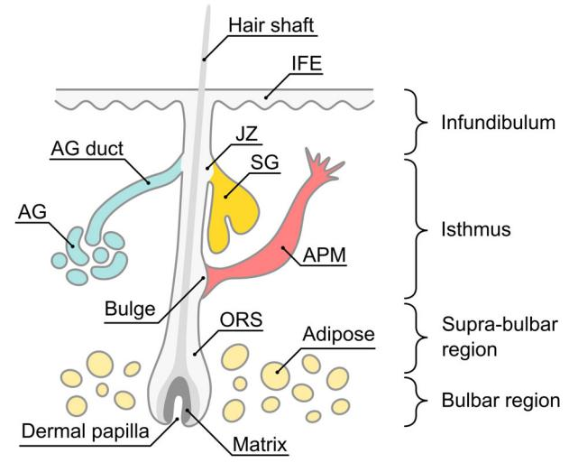
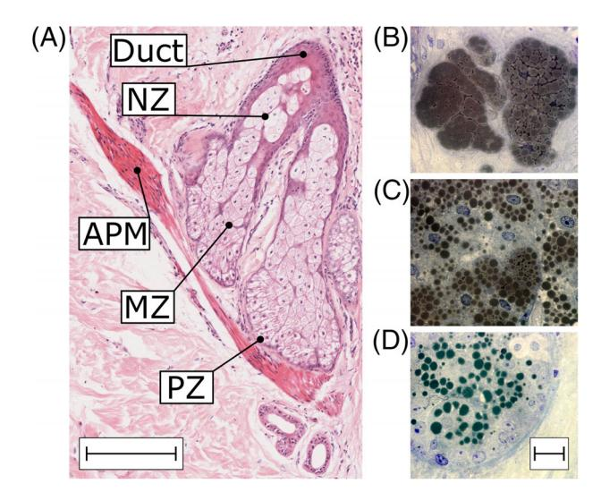
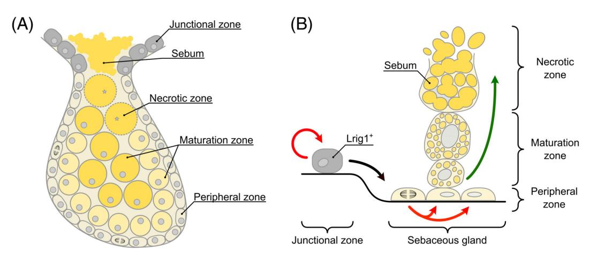
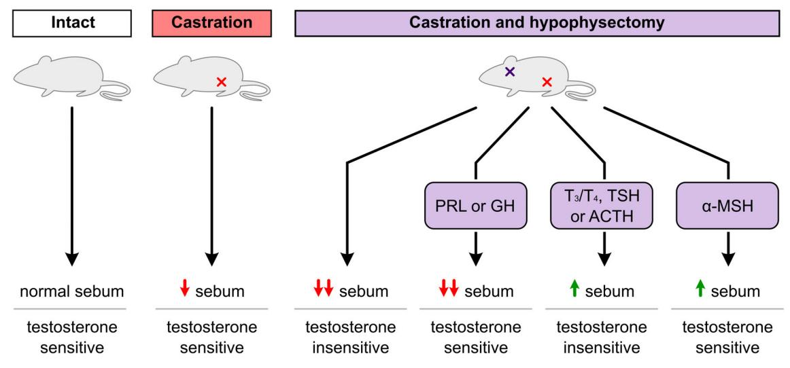
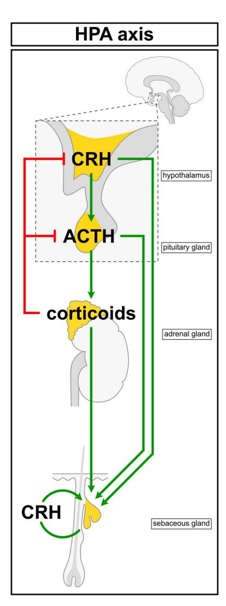
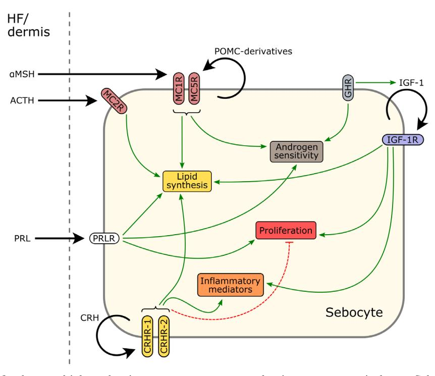
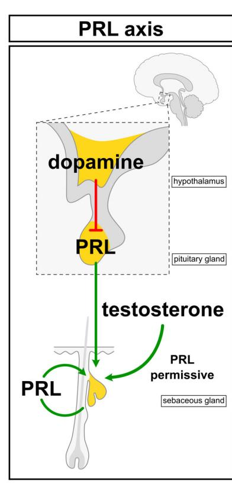
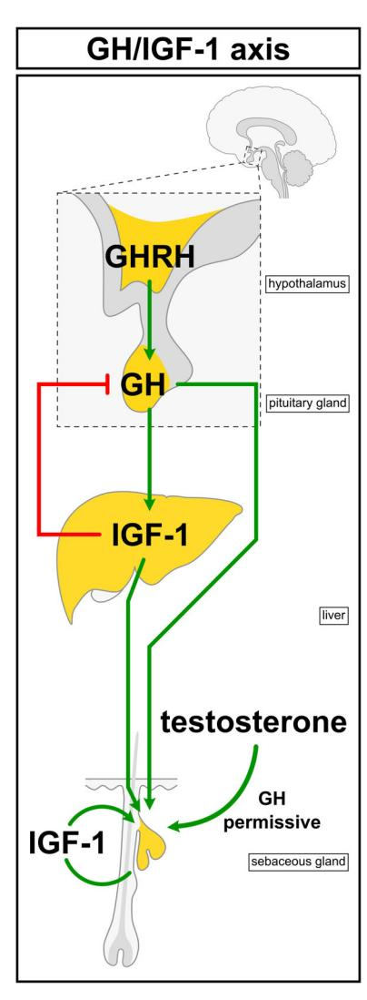
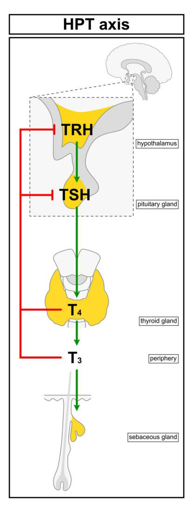
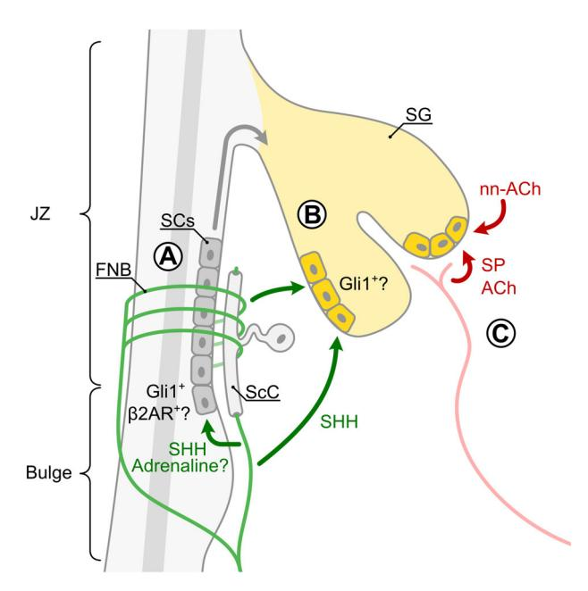

592

Biol. Rev. (2020), **95**, pp. 592–624. doi: 10.1111/brv.12579

# Neuroendocrinology and neurobiology of sebaceous glands

Richard W. Clayton1,2, Ewan A. Langan1,3, David M. Ansell1,4, Ivo J. H. M. de Vos2, Klaus Göbel2,5, Marlon R. Schneider6, Mauro Picardo7, Xinhong Lim8, Maurice A. M. van Steensel2,8†\* and Ralf Paus1,9,10†\*

#### ABSTRACT

The nervous system communicates with peripheral tissues through nerve fibres and the systemic release of hypothalamic and pituitary neurohormones. Communication between the nervous system and the largest human organ, skin, has traditionally received little attention. In particular, the neuro-regulation of sebaceous glands (SGs), a major skin appendage, is rarely considered. Yet, it is clear that the SG is under stringent pituitary control, and forms a fascinating, clinically relevant peripheral target organ in which to study the neuroendocrine and neural regulation of epithelia. Sebum, the major secretory product of the SG, is composed of a complex mixture of lipids resulting from the holocrine secretion of specialised epithelial cells (sebocytes). It is indicative of a role of the neuroendocrine system in SG function that excess circulating levels of growth hormone, thyroxine or prolactin result in increased sebum production (seborrhoea). Conversely, growth hormone deficiency, hypothyroidism, and adrenal insufficiency result in reduced sebum production and dry skin. Furthermore, the androgen sensitivity of SGs appears to be under neuroendocrine control, as hypophysectomy (removal of the pituitary) renders SGs largely insensitive to stimulation by testosterone, which is crucial for maintaining SG homeostasis. However, several neurohormones, such as adrenocorticotropic hormone and α-melanocyte-stimulating hormone, can stimulate sebum production independently of either the testes or the adrenal glands, further underscoring the importance of neuroendocrine control in SG biology. Moreover, sebocytes synthesise several neurohormones and express their receptors, suggestive of the presence of neuro-autocrine mechanisms of sebocyte modulation. Aside from the neuroendocrine system, it is conceivable that secretion of neuropeptides and neurotransmitters from cutaneous nerve endings may also act on sebocytes or their progenitors, given that the skin is richly innervated. However, to date, the neural controls of SG development and function remain poorly investigated and

&lt;sup>1Centre for Dermatology, School of Biological Sciences, University of Manchester, and NIHR Manchester Biomedical Research Centre, Stopford Building, Oxford Road, Manchester, M13 9PT, U.K.

&lt;sup>2Skin Research Institute of Singapore, Agency for Science, Technology and Research, 11 Mandalay Road, #17-01 Clinical Sciences Building, 308232, Singapore

&lt;sup>3Department of Dermatology, Allergology und Venereology, University of Lübeck, Ratzeburger Allee 160, Lübeck, 23538, Germany

&lt;sup>4Division of Cell Matrix Biology and Regenerative Medicine, University of Manchester, Michael Smith Building, Oxford Road, Manchester, M13 9PT, U.K.

&lt;sup>5Department of Dermatology, Cologne Excellence Cluster on Stress Responses in Aging Associated Diseases (CECAD), and Centre for Molecular Medicine Cologne, The University of Cologne, Joseph-Stelzmann-Straße 26, Cologne, 50931, Germany

&lt;sup>6 German Federal Institute for Risk Assessment (BfR), German Centre for the Protection of Laboratory Animals (Bf3R), Max-Dohrn-Straße 8–10, Berlin, 10589, Germany

&lt;sup>7 Cutaneous Physiopathology and Integrated Centre of Metabolomics Research, San Gallicano Dermatological Institute IRCCS, Via Elio Chianesi 53, Rome, 00144, Italy

&lt;sup>8Lee Kong Chian School of Medicine, Nanyang Technological University, 50 Nanyang Avenue, 639798, Singapore

&lt;sup>9Dr. Phllip Frost Department of Dermatology and Cutaneous Surgery, University of Miami Miller School of Medicine, 1600 NW 10th Avenue, RMSB 2023A, Miami, FL, 33136, U.S.A.

&lt;sup>10Monasterium Laboratory, Mendelstraße 17, Münster, 48149, Germany

\* Authors for correspondence (Tel.: +001-305-243-7870; E-mail: rxp803@med.miami.edu); (Tel.: +65-64070694; E-mail: maurice. vansteensel@sris.a-star.edu.sg)

&lt;sup>†Authors contributed equally to this work.

incompletely understood. Botulinum toxin-mediated or facial paresis-associated reduction of human sebum secretion suggests that cutaneous nerve-derived substances modulate lipid and inflammatory cytokine synthesis by sebocytes, possibly implicating the nervous system in acne pathogenesis. Additionally, evidence suggests that cutaneous denervation in mice alters the expression of key regulators of SG homeostasis. In this review, we examine the current evidence regarding neuroendocrine and neurobiological regulation of human SG function in physiology and pathology. We further call attention to this line of research as an instructive model for probing and therapeutically manipulating the mechanistic links between the nervous system and mammalian skin.

Key words: skin, sebaceous gland, sebum, nervous system, neurons, neuroendocrinology, hormones, neuropeptides, androgens, acne vulgaris

#### CONTENTS

| I.    | Relevance of the brain–sebaceous gland axis to skin physiology and pathology 593                 |  |
|-------|-----------------------------------------------------------------------------------------------------|--|
| II.   | Introduction to sebaceous gland biology 594                                                      |  |
|       | (1) Microanatomy of the pilosebaceous unit 594                                                |  |
|       | (2) Development of the sebaceous gland 595                                                    |  |
|       | (3) Structure and cellular homeostasis of the sebaceous gland 595                             |  |
|       | (4) Sebaceous gland progenitor cells 596                                                      |  |
|       | (5) Sebum composition 597                                                                     |  |
| III.  | Neuroendocrine regulation of sebaceous gland function: overview 597                              |  |
| IV.   | The hypothalamic–pituitary–adrenal axis and melanocortin system 598                              |  |
|       | (1) Overview of the hypothalamic-pituitary-adrenal axis and melanocortin system 598           |  |
|       | Reduced sebum secretion in Addison's disease and following adrenalectomy (2) 599              |  |
|       | (3) Melanocortins and corticotropin-releasing hormone act directly on sebocytes 600           |  |
| V.    | Prolactin and dopamine 602                                                                       |  |
|       | (1) Prolactin and sebum during pregnancy and breastfeeding 602                                |  |
|       | Seborrhoea and prolactin in Parkinson's disease and phenylketonuria (2) 602                   |  |
|       | (3) Mechanisms of prolactin-mediated regulation of sebaceous glands 603                       |  |
| VI.   | Growth hormone and insulin-like growth factor 603                                                |  |
| VII.  | Hypothalamic–pituitary–thryoid axis 605                                                          |  |
|       |                                                                                                     |  |
| VIII. | Sebaceous neurobiology 606                                                                       |  |
|       | (1) Clinical evidence for regulation of sebaceous glands by the peripheral nervous system 606 |  |
|       | (2) Characterising sebaceous gland innervation 606                                            |  |
|       | (3) Effects of cutaneous denervation on murine sebaceous glands608                               |  |
|       | (4) Acetylcholine 608                                                                         |  |
|       | (5) Adrenaline 609                                                                            |  |
|       | (6) Substance P 609                                                                           |  |
|       | (7) Neurotrophins 609                                                                         |  |
|       | (8) Endocannabinoids 610                                                                      |  |
| IX.   | Major open questions and translational relevance of neuro-regulation of the sebaceous gland 611  |  |
| X.    | Final perspectives 613                                                                           |  |
| XI.   | Conclusions 613                                                                                  |  |
| XII.  | Acknowledgements 614                                                                             |  |
| XIII. | References 614                                                                                      |  |

# I. RELEVANCE OF THE BRAIN–SEBACEOUS GLAND AXIS TO SKIN PHYSIOLOGY AND PATHOLOGY

Disorders of both the peripheral nervous system and neuroendocrine system are associated with cutaneous manifestations, such as the typical oily skin observed with excess growth hormone (GH) secretion, or the muco-cutaneous pigmentation characteristic of adrenal insufficiency in Addison's disease (AD) (Eedy, 2016; Paus, 2016b). Long-recognised clinical observations such as these highlight the importance of the nervous system in the regulation of human skin physiology and pathology: a subject of increasing interest in both clinical and experimental dermatology (Slominski & Wortsman, 2000; Paus, Theoharides & Arck, 2006; Misery et al., 2014; Finsterer & Wakil, 2015; Leventhal & Braverman, 2016; Paus, 2016a). Yet, in this context, a key appendage of mammalian skin, the sebaceous gland (SG), remains incompletely explored. Careful dissection of the neuroendocrine and neural regulation of SGs promises to improve our understanding of the complex interactions between the nervous system, specialised neuroendocrine glands, and mammalian skin (Arck et al., 2006; Slominski et al., 2012, 2018a, 2018b; Paus, 2016a). The current review strives to help close this knowledge gap, and to call attention to the translational research potential awaiting discovery through comprehensive re-examination of SG biology and pathology from a distinct neurobiological and neuroendocrine perspective.

The cells of the SG, known as sebocytes, synthesise and secrete sebum, which is constituted by a diverse mixture of lipids (Picardo et al., 2009; Camera et al., 2010). Evidence from the cutaneous phenotypes present in mice that are deficient for sebaceous lipids (Ehrmann & Schneider, 2016) highlight the important functions of sebum in skin physiology. These functions include: waterproofing of skin and fur (Chen et al., 1997; Chen et al., 2002; Westerberg et al., 2004; Dahlhoff et al., 2016), anti-microbial activity (Basta, Wilburg & Heczko, 1980; Wille & Kydonieus, 2003; Drake et al., 2008; Lee et al., 2009; Nakatsuji et al., 2010), maintenance of skin barrier function (Sundberg et al., 2000; Fluhr et al., 2003; Westerberg et al., 2004; Man et al., 2009), protection against ultraviolet radiation (Beadle & Burton, 1981; Ohsawa et al., 1984; Passi et al., 2002; Mudiyanselage et al., 2003; Ryu et al., 2009; Dahlhoff et al., 2016), and regulation of body temperature (Chen et al., 1997; Chen et al., 2002; Sampath et al., 2009; Dahlhoff et al., 2016).

Furthermore, several skin conditions exhibit SG abnormalities (Shi et al., 2015). Acne vulgaris, or acne, is an exceedingly common skin disease (Tan & Bhate, 2015; Lynn et al., 2016; Rocha & Bagatin, 2018), which is characterised by the formation of comedones (commonly called 'blackheads' or 'whiteheads'). Comedones are cystic dilations of the distal hair follicle (HF) that are associated with atrophic SGs (Kligman, 1974). Generally however, sebum production in those with acne is higher than normal (Cotterill, Cunliffe & Williamson, 1971; Youn et al., 2005; Pappas et al., 2009; Akaza et al., 2014; Bilgiç et al., 2015; Okoro, Bulus & Zouboulis, 2016). Antibiotics can be used to combat inflammatory acne, while retinoids, such as isotretinoin, are effective 'comedolytics', which reduce the number of comedones, lower sebum secretion, and cause SG involution (Dahlhoff, Zouboulis & Schneider, 2016; Kosmadaki & Katsambas, 2017). Atrophic SGs and altered sebaceous lipid composition have also been observed in patients with psoriasis and atopic dermatitis (Prose, 1965; Wirth, Gloor & Stoika, 1981; Burton & Pye, 1983; Werner, Brenner & Böer, 2008; Takahashi et al., 2014; van Smeden et al., 2014; Liakou et al., 2016; Rittié et al., 2016), suggesting that SG dysfunction may contribute to other inflammatory skin diseases (Shi et al., 2015).

Therefore, understanding the regulatory mechanisms that control SG function is clinically important. In recognition of this, the hormonal control of SGs has been under scrutiny since the first half of the 20th century: a focus that stemmed from early observations of increased sebum production and acne prevalence during adolescence (Bloch, 1931). Subsequently, androgens were the first sebotrophic hormones to be discovered, being identified as essential for both the adolescent

development of SGs and for maintaining normal sebum production levels in adulthood (Hamilton, 1941; Haskin, Lasher & Rothman, 1953; Pochi & Strauss, 1974). We now know that androgens are also instrumental in acne pathogenesis (Hamilton & Mestler, 1963; Lawrence, Shaw & Katz, 1986; Motosko *et al.*, 2019), and anti-androgens can be used therapeutically to combat acne and excess sebum production (Pye *et al.*, 1977; Miller *et al.*, 1986; Patel & Noble, 1987).

Neurohormones were soon after demonstrated to be required for maintaining sebum production in a series of seminal rodent experiments, where the pituitary glands of rats were surgically removed (hypophysectomy) (1954*b*; Lasher, Lorincz & Rothman, 1954a; Ebling, 1957; Ebling, Ebling & Skinner, 1969a; Ebling *et al.*, 1970; Thody & Shuster, 1971*b*). There is now a wealth of clinical evidence from patients with neuroendocrine disorders associated with cutaneous symptoms that indicate neurohormones directly influence sebum production (Paus, 2016*b*) (Table 1).

Although it has long been known that there is a significant neuroendocrine component to the regulation of SG biology, this topic has yet to be comprehensively reviewed. The fields of neuroendocrinology and neurobiology are conceptually similar, in terms of the release of factors from neurons into the extracellular milieu (Goyal & Chaudhury, 2013). Therefore, we will discuss clinical evidence for neuroendocrine and neurobiological control of SGs alongside experimental data acquired in vivo, or through sebocyte culture systems (Ehrmann & Schneider, 2016; Schneider & Zouboulis, 2018; de Bengy et al., 2019). We still make a distinction in our discussions between hormones and regulatory factors typically considered part of the neuroendocrine system, and those associated with the peripheral nervous system [e.g. adrenocorticotropic hormone (ACTH) versus acetylcholine].

# II. INTRODUCTION TO SEBACEOUS GLAND BIOLOGY

#### (1) Microanatomy of the pilosebaceous unit

The SG is connected to the distal portion of the HF via a keratinised duct, through which sebum is released (Figs 1 and 2A). Secreted sebum coats the hair shaft, pilary canal and the surface of the skin. Pilosebaceous units (PSUs) consist of HFs and SG lobes arranged in close proximity, along with an arrector pili muscle and, in regions of skin that contain them, an apocrine gland (AG) (Hinde et al., 2013; Schneider & Paus, 2014) (Fig. 1 and 2A). Furthermore, in humans, the coil of an eccrine gland can also be found adjacent to the HF above the bulbar region, often together with a cone of dermal adipocytes that enwrap the bulge in human scalp HFs (Poblet et al., 2018). The region where the SG duct inserts into the pilary canal is referred to as the junctional zone (JZ). Distal to the JZ is the HF infundibulum, where the hair shaft separates from the follicular epithelium (Fig. 1). The entire PSU is encapsulated by a connective

Phenylketonuria

breastfeeding

Hypothyroidism

deficiency

Growth hormone

Pregnancy,

&

| Condition           | Implicated hormone(s)             | Sebum production | Reference(s)                                                                                                                                                          |
|---------------------|-----------------------------------|---------------------|-----------------------------------------------------------------------------------------------------------------------------------------------------------------------|
| Addison's disease   | ↓CRH, ACTH, or corticosteroids | ↓sebum              | Pochi, Strauss & Mescon (1963)                                                                                                                                        |
| Acromegaly          | ↑GH                               | ↑sebum              | Burton et al. (1972); Borlu et al. (2012)                                                                                                                             |
| Parkinson's disease | ↑PRL, ↓dopamine                   | ↑sebum              | Pochi, Strauss & Mescon (1962a); Burton et al. (1973,b); Binder & Jonelis (1983); Cotterill et al. (1971); Villares of Carlini (1989); Martignoni et al. (1997) |

1 sebum

†sebum

↓sebum

↓sebum

Table 1. Conditions of the central neuroendocrine system linked to altered sebum production

ACTH, adrenocorticotropic hormone; CRH, corticotropin-releasing hormone; GH, growth hormone; PRL, prolactin; TRH, thyrotropin-releasing hormone; TSH, thyroid-stimulating hormone; T3/T4, thyroid hormones.

Arrows indicate increased/decreased levels of hormones or sebum production for a given condition.

(2000)

↑PRL, ↓dopamine

↓TRH, TSH, or T3/T4

↑PRL

↓GH

**Fig. 1.** Anatomy of the human pilosebaceous unit (PSU), comprised of the hair follicle, sebaceous gland (SG) and, in regions of skin that contain them, the apocrine gland (AG). APM, arrector pili muscle; IFE, interfollicular epidermis; JZ, junctional zone; ORS, outer root sheath.

tissue sheath (CTS), or stroma, made up of mesenchymal fibroblasts and collagen (Hinde *et al.*, 2013; Schneider & Paus, 2014).

# (2) Development of the sebaceous gland

Human SGs appear around 3.5 months into the gestational period (Kligman & Strauss, 1956; Montagna & Parakkal, 1974b). However, in mice, the first sebocytes emerge in the late-foetal/early-postnatal period, during the 'bulbous peg

stage' of PSU development (Paus et al., 1999; Frances & Niemann, 2012). Prior to the appearance of sebocytes, a discrete population of cells that express both leucine-rich repeats and immunoglobulin-like domains protein 1 (LRIG1) and SRYbox transcription factor 9 (SOX9) forms within the developing hair peg. As development of the PSU proceeds, two distinct groups of cells emerge that differentially express either LRIG1 or SOX9, and become restricted to the JZ and hair bulge compartments, respectively. The first sebocytes emerge from the LRIG1-expressing population in the JZ (Nowak et al., 2008; Frances & Niemann, 2012; Schepeler, Page & Iensen, 2014; Xu et al., 2015; Ouspenskaia et al., 2016). Human SGs are active in utero, as at least part of the vernix caseosa of neonates is derived from sebaceous secretions (Rissmann et al., 2006; Míková et al., 2014). SGs are then relatively inactive throughout childhood, increasing in size and activity only once adolescence is reached (Pochi, Strauss & Mescon, 1962b; Cotterill et al., 1972; Montagna & Parakkal, 1974b).

Burton, Goolamali & Shuster (1975); Schulpis et al. (1998);

Denecke et al. (2000); van Spronsen (2010); Juhász et al.

Shuster & Cartlidge (1975); Henderson, Taylor & Cunliffe

Goolamali, Burton & Shuster (1973); Pochi & Strauss (1974);

Burton et al. (1970); Shuster & Thody (1974); Burton,

Goolamali, Evered & Shuster (1976)

Tanriverdi et al. (2006); Borlu et al. (2007)

# (3) Structure and cellular homeostasis of the sebaceous gland

The SG has a layered structure that corresponds to different stages of sebocyte differentiation (Figs 2 and 3). The outermost sebocytes make up the basal layer or peripheral zone (PZ), and are relatively undifferentiated and proliferative (Epstein & Epstein, 1966; Hamilton, 1974; Hamilton, Howard & Potten, 1974) (Figs 2A, D and 3). Much of what is known about the factors that drive sebocyte mitosis and differentiation has been ascertained using transgenic mice (Ehrmann & Schneider, 2016; Clayton *et al.*, 2019). Sebocyte proliferation is promoted by multiple factors such as C-myc (Horsley *et al.*, 2006; Jensen *et al.*, 2009; Cottle *et al.*, 2013), androgens (Ebling, Ebling & Skinner, 1969a; Petersen,

Fig. 2. Histology of the human sebaceous gland (SG). (A) Histomicrograph of a haematoxylin and eosin-stained SG, arrector pili muscle (APM), and surrounding stroma and dermis. Scale is equivalent to 200 μm. (B–D) Histomicrographs of OsO4- and toluidine blue-stained SGs showing different stages of sebocyte differentiation. Scale in each panel is equivalent to 20 μm. (B) Terminally differentiated sebocytes comprise the necrotic zone (NZ) where they undergo holocrine secretion, releasing sebum into the SG duct. (C) The maturation zone (MZ) contains differentiating sebocytes, evident by lipid droplet accumulation. (D) The peripheral zone (PZ) contains undifferentiated sebocytes.

Zone & Krueger, 1984; Akamatsu, Zouboulis & Orfanos, 1992; Fujie et al., 1996; Rosignoli et al., 2003), and receptor tyrosine kinases including epidermal growth factor receptor (EGFR) and related receptors (Bol et al., 1998; Kiguchi et al., 2000; Sato et al., 2001; Akimoto et al., 2002; Dahlhoff et al., 2013b; Li et al., 2016), as well as fibroblast growth factor receptor 2b (Fgfr2b) (Danilenko et al., 1995). Recently, caspase 3-mediated activation of yes-associated protein (YAP) was demonstrated to promote mitosis in murine SGs (Yosefzon et al., 2018).

Adjacent to the peripheral layer is the supra-basal layer, or maturation zone (MZ), which contains differentiating sebocytes (Figs 2A, C and 3). Differentiation is evident by the accumulation of lipid droplets in sebocytes within the MZ, and dramatically increased cell size compared to the PZ (Figs 2A, C, D and 3). Finally, the necrotic zone (NZ) is where terminally differentiated sebocytes release sebum by undergoing holocrine secretion, a process that resembles autophagic cell death (Brandes, Bertini & Smith, 1965; Mesquita-Guimar~ates & Coimbra, 1976; Fischer et al., 2017; Zouboulis, 2017; Rossiter et al., 2018) (Figs 2A, B and 3). The time taken for an undifferentiated sebocyte in the peripheral layer to differentiate fully is around 7–14 days, and is comparable between human and rodent SGs (Epstein & Epstein, 1966; Hamilton, 1974; Hamilton, Howard & Potten, 1974; Jung et al., 2015).

Lipid synthesis is central to differentiation in the SG. This is reflected in the importance of transcription factors that promote the expression of lipogenic enzymes to sebocyte differentiation. Such transcription factors include peroxisome proliferator-activated receptor gamma (PPARγ) (Berger & Moller, 2002; Icre, Wahli & Michalik, 2006) and CCAATenhancer-binding proteins (C/EBPs) (Chung et al., 2012; Guo, Li & Tang, 2015), both of which are required for sebum production and SG maintenance (Karnik et al., 2009; House et al., 2010; Sardella et al., 2017). Androgens, through adrenoceptors (ARs), also promote sebocyte differentiation (Ebling, Ebling & Skinner, 1969a; Petersen, Zone & Krueger, 1984; Rosignoli et al., 2003; Cottle et al., 2013). Broad manipulation of wingless (Wnt) signalling throughout the murine PSU reveals that low levels of Wnt promote sebaceous differentiation (Gat et al., 1998; Merrill et al., 2001; Niemann et al., 2002, 2007; Collins & Watt, 2008; Petersson et al., 2011; Kakanj et al., 2013; Lien et al., 2014), while high levels of Wnt signalling result in SG loss and ectopic HF formation (Lo Celso, Prowse & Watt, 2004; Kretzschmar et al., 2016). Conversely, hedgehog signalling may act to promote sebocyte differentiation (Allen et al., 2003; Oro & Higgins, 2003; Gu & Coulombe, 2008).

#### (4) Sebaceous gland progenitor cells

Terminal differentiation of sebocytes results in holocrine secretion and cell death. Therefore, a continuous supply of new sebocytes is required. Lineage tracing studies in mice have demonstrated that a population of Lrig1-expressing cells in the JZ of the PSU generates both the SG and infundibulum, and likely constitutes a progenitor cell population for both compartments (Nowak et al., 2008; Jensen et al., 2009; Barnes, Saurat & Kaya, 2017) (Fig. 3B). LRIG1 also labels undifferentiated cells in human Meibomian glands (Xie et al., 2018), which are a specialised form of SG present in the eyelid (Butovich, 2017). Ectopic activation of Wnt signalling in Lrig1+ cells results in dichotomous expansion of the upper HF and loss of SGs (Kretzschmar et al., 2016). This observation, combined with the described formation of sebaceous tumours in Wnt signalling-deficient mouse skin (Merrill et al., 2001; Niemann et al., 2002, 2007; Petersson et al., 2011; Lien et al., 2014), would suggest that Wnt signalling controls the lineage commitment decisions of progenitors for the SG and infundibulum.

Within the murine SG, cells that express leucine-rich repeat containing G protein-coupled receptor 6 (Lgr6) generate the SG predominantly through stochastic cell division (Snippert et al., 2010; Kretzschmar et al., 2014; Füllgrabe et al., 2015). Other Lgr6+ populations can be found in the HF and interfollicular epidermis (IFE), each contributing to its respective compartment largely independently (Kretzschmar et al., 2014; Füllgrabe et al., 2015). Similar to the phenotype of ectopic Wnt signalling in the Lrig1+ compartment, expression of constitutively active β-catenin in Lgr6-expressing cells leads to loss of SGs and expansion of the upper HF (Kretzschmar et al., 2016).

Fig. 3. Structure and cellular homeostasis of sebaceous glands (SGs). (A) Diagrammatic representation of overall SG structure and compartmentalisation into zones corresponding to different stages of sebocyte differentiation. (B) Schematic of cellular homeostasis of SGs. Stem cells in the junctional zone that express leucine-rich repeats and immunoglobulin-like domains protein 1 (Lrig1) give rise to the SG. Proliferation occurs chiefly within the peripheral zone. Undifferentiated sebocytes in the peripheral layer differentiate by synthesising lipids and moving into the maturation zone. Terminal differentiation and cell death by holocrine secretion occurs in the necrotic zone. Red arrows indicate cell division. The black arrow indicates translocation of cells. The green arrow indicates differentiation.

### (5) Sebum composition

Sebum is composed of several different types of lipids, and sebum composition varies considerably among different species (Thody & Shuster, 1989; Smith & Thiboutot, 2008). In human sebum, triglycerides (TGs), squalene, and wax esters predominate, although cholesterol and cholesterol esters also constitute a small fraction (Summerly & Woodbury, 1971, 1972; Summerly et al., 1976; Ridden, Ferguson & Kealey, 1990; Guy, Ridden & Kealey, 1996; Picardo et al., 2009). While sebum on the surface of the skin contains a significant proportion of free fatty acids (FFAs) (Downing, Strauss & Pochi, 1969; Greene et al., 1970; Nicolaides et al., 1970), analysis of lipid composition from isolated SGs reveals that FFAs comprise only a comparatively small fraction of lipid synthesised in the SG (Summerly & Woodbury, 1971, 1972; Ridden, Ferguson & Kealey, 1990; Guy, Ridden & Kealey, 1996). This discrepancy may be caused by lysis of TGs by commensal microorganisms including Cutibacterium acnes (C. acnes, formerly known as Propionibacterium acnes) and yeasts of the genus Malassezia (Marples, Downing & Kligman, 1971; Puhvel, Reisner & Sakamoto, 1975; Scholz & Kilian, 2016; Sommer et al., 2016).

Human sebum is further characterised by the presence of unique lipids including squalene and Δ6 monounsaturated fatty acids like sapienic acid (Nicolaides, 1974; Thody & Shuster, 1989). Lipid droplet-associated proteins, such as perilipins, regulate the size and rate of formation of lipid droplets (Dahlhoff et al., 2013a, 2015; Camera et al., 2014; Schneider, 2015b; Schneider, Zhang & Li, 2016). Interestingly, sebum composition varies by anatomical region, corresponding to differences in SG number (Ludovici et al., 2018) and SG size (Summerly et al., 1976). Moreover, sebum composition is often altered in diseased skin (Shi et al., 2015). In acne, for example, there is an increased presence of squalene, monounsaturated fatty acids, and diaglycerols (Cotterill et al., 1972; Pappas et al., 2009; Akaza et al., 2014; Camera et al., 2016), while psoriasis and atopic dermatitis both feature a reduction in total FFAs and FFA chain length (Takahashi et al., 2014; van Smeden et al., 2014). Altered sebum composition might also underlie skin hypersensitivity to allergens (Fan et al., 2018). However, the direct functional importance of sebum composition remains untested and is incompletely understood.

#### III. NEUROENDOCRINE REGULATION OF SEBACEOUS GLAND FUNCTION: OVERVIEW

There is substantial clinical evidence indicating that neurohormones are involved in regulating SG function (Table 1). For example, hyperprolactinemia is associated with markedly increased levels of sebum production (Pochi, Strauss & Mescon, 1962a; Cotterill et al., 1971; Burton et al., 1973; Binder & Jonelis, 1983; Juhász et al., 2016). Patients with acromegaly or growth hormone deficiency exhibit increased and decreased sebum production, respectively (Burton et al., 1972; Goolamali, Burton & Shuster, 1973; Pochi & Strauss, 1974; Tanriverdi et al., 2006; Borlu et al., 2007, 2012). Furthermore, psycho-emotional stress activates the hypothalamic–pituitary–adrenal (HPA) axis (Miller & O'Callaghan, 2002), and exacerbation of acne and seborrhoeic dermatitis by stress has long been appreciated (Chiu, Chon & Kimball, 2003; Misery et al., 2007; Yosipovitch et al., 2007; Orion & Wolf, 2014; Dréno, 2017). Conversely, hypo-function of the HPA axis, such as in Addison's disease, results in reduced sebum production (Pochi, Strauss & Mescon, 1963). The challenge has been, and remains, to systematically follow up these clinical pointers experimentally, and to identify the specific neurohormones involved. Research to this end has made extensive use of in vitro sebocyte and SG culture systems, and in vivo data from rodent models.

The seminal experimental observation that hypophysectomy resulted in reduced sebum secretion in rodents first pointed to the neuroendocrine regulation of the skin (Lasher, Lorincz & Rothman, 1954a, 1954b; Ebling, 1957; Ebling, Ebling & Skinner, 1969b; Ebling et al., 1970; Thody & Shuster, 1971b) (Fig. 4). Crucially, where exogenous testosterone restores sebum secretion in castrated animals, such recovery is profoundly impaired in animals that have been both castrated and hypophysectomised (Lasher, Lorincz & Rothman, 1954a, 1954b; Ebling, 1957; Ebling, Ebling & Skinner, 1969b; Ebling et al., 1970; Thody & Shuster, 1971b) (Fig. 4). These observations suggest that the wellknown stimulatory action of testosterone on the SGs depends on the presence of other pituitary-derived hormones. One hypothesis as to the mechanism behind this phenomenon is that neurohormones act on sebocytes to modulate the enzymatic processing of testosterone to more active metabolites, such as dihydroandrosterone (DHT) (Randall & Ebling, 1982; Ebling, 1986). Indeed, while testosterone has little effect in castrated–hypophysectomised rats, DHT remains an effective stimulator of sebum secretion, despite the absence of the pituitary (Ebling et al., 1971, 1973).

Certain neurohormones, such as α-melanocytestimulating hormone (α-MSH) and possibly GH, exert their own testosterone-independent sebotrophic effect, whilst simultaneously facilitating the stimulatory action of testosterone on rat SGs (Ebling, Ebling & Skinner, 1969b; Ebling

et al., 1975a, 1975b). However, ACTH stimulates sebum production while failing to influence the sebaceous response to testosterone (Ebling et al., 1970; Thody & Shuster, 1971a) (Fig. 4). In the more than 40 years that have passed since the last of these seminal experiments, very little further research has been conducted on the regulation of SGs by neurohormones in vivo.

#### IV. THE HYPOTHALAMIC–PITUITARY– ADRENAL AXIS AND MELANOCORTIN SYSTEM

# (1) Overview of the hypothalamic-pituitary-adrenal axis and melanocortin system

The external factors that result in activation of the hypothalamic–pituitary–adrenal (HPA) axis can be collectively termed 'stress'. These include psychological stressors and other factors such as infection or injury (Slominski, Ermak & Mihm, 1996; Slominski & Mihm, 1996; Arck et al., 2006; Slominski et al., 2007). The HPA axis is comprised of several neurohormones and steroid hormones. Corticotropin-releasing hormone (CRH) is released by neurons of the hypothalamic paraventricular nucleus into the hypophyseal blood supply, where it stimulates the release of ACTH from the corticotropic cells of the anterior pituitary. ACTH subsequently activates cells within the adrenal cortex, causing the systemic release of adrenal steroid hormones (Aguilera, 1998; Smith & Vale, 2006) (Fig. 5).

Fig. 4. Effects of castration and hypophysectomy (removal of pituitary gland) on sebum production in rats. Castration results in reduced sebum production that can be rescued by administering exogenous testosterone. However, concomitant castration and hypophysectomy results in an impaired ability to rescue sebum production with testosterone. Sensitivity to testosterone can be restored in castrated–hypophysectomised rats using several pituitary neurohormones including prolactin (PRL) and growth hormone (GH) which have a limited effect on sebum production on their own. Thyroid hormones T3 and T4, thyroid-stimulating hormone (TSH) and adrenocorticotropic hormone (ACTH), when administered, increase sebum production but do not restore sensitivity to testosterone. Both sebum production and sensitivity to testosterone are positively influenced by administration of α-melanocyte-stimulating hormone (α-MSH). Red arrows indicate decreased sebum levels relative to intact rats. Green arrows indicate increased levels of sebum relative to castrated–hypophysectomised rats.

Fig. 5. Control of sebaceous glands (SGs) by the hypothalamic– pituitary–adrenal (HPA) axis. Corticotropin-releasing hormone (CRH), produced by the hypothalamus, stimulates release of adrenocorticotropic hormone (ACTH) from corticotropic cells in the anterior pituitary. In turn, ACTH acts on the adrenal gland, causing release of corticoids, such as cortisol, which participate in a negative feedback loop to reduce CRH and ACTH secretion. Hypothalamic CRH and pituitary-derived ACTH may act directly on SGs, in addition to indirect stimulation by mediating production of adrenal hormones. SG-derived CRH might also act as an autocrine hormone to regulate SG function (see Fig. 6).

The receptor proteins for CRH and ACTH are all G protein-coupled receptors (GPCRs). CRH has two receptors, CRHR1 and CRHR2 (Grammatopoulos, 2012; Slominski et al., 2013), while the primary receptor for ACTH is the MC2R melanocortin receptor (Yang, 2011). However, ACTH can also bind and activate other melanocortin receptors, of which there are five in total (MC1–5R) (Yang, 2011). The HPA axis shares these receptors with the melanocortin system (MCS), which regulates pigmentation and energy homeostasis (Ellacott & Cone, 2006). In addition to ACTH, which also acts as a melanocortin (Hunt et al., 1994), the MCS deploys several other neurohormones, including the melanocyte-stimulating hormones, α-MSH, β-MSH, and γ-MSH. ACTH and the MSHs are derived via proteolytic cleavage of the proopiomelanocortin (POMC) pre-peptide, which is predominantly synthesised in the arcuate nucleus of the hypothalamus and pituitary (Gantz & Fong, 2003).

Aside from the central HPA axis, it is now appreciated that the skin expresses several HPA axis components (Slominski et al., 2001, 2004, 2013). For example, CRH and CRHRs are synthesised in both human skin and scalp HFs (Slominski et al., 1996a, 1998, 2000d; Quevedo et al., 2001; Zbytek et al., 2002; Ito et al., 2005; Zbytek & Slominski, 2005; Ganceviciene et al., 2009), and in mouse skin (Slominski et al., 1996b; Roloff et al., 1998). Human skin also contains urocortin, which is a CRH-related protein and ligand for CRH receptors (Slominski et al., 2000b). Skin CRH receptors undergo alternative splicing (Pisarchik & Slominski, 2001, 2004; Slominski et al., 2006b) and couple alternate signalling transduction mechanisms in different cell types (Fazal et al., 1998; Zbytek, Pfeffer & Slominski, 2003; Zbytek, Pfeffer & Slominski, 2004; Slominski et al., 2006a, 2006b).

Importantly, both human and mouse SGs have been shown to express several key ligands and receptors of both the HPA axis and melanocortin system (see Section IV.3; Table 2) (Kono et al., 2001; Zhang et al., 2006; Ganceviciene et al., 2009; Eisinger et al., 2011), suggesting that not only is the SG competent to respond to the output of these central neuroendocrine axes, but that peripheral equivalents in skin may act as autocrine regulators of SG function.

#### (2) Reduced sebum secretion in Addison's disease and following adrenalectomy

Sebum production in humans correlates with systemic levels of adrenal cortisone and hydrocortisone (Strauss & Kligman, 1959; Undeutsch, 1962; Pochi, Strauss & Mescon, 1962b, 1963; Goolamali et al., 1974). When administered to healthy individuals, both ACTH and hydrocortisone produce an enlargement of SGs and outbreaks of acne lesions (Strauss & Kligman, 1959). Indeed, use of anabolic steroids is well recognised as a clinically relevant cause of acne (Horwitz, Andersen & Dalhoff, 2019). Conversely, adrenalectomy (surgical removal of the adrenal glands) reduces sebum secretion levels, and can also reduce acne severity (Pochi, Strauss & Mescon, 1963; Stratakis et al., 1998).

The effects of bilateral adrenalectomy can be attributed, at least in part, to the loss of adrenal steroid hormones (Strauss & Kligman, 1959; Undeutsch, 1962; Pochi, Strauss & Mescon, 1962b, 1963; Goolamali et al., 1974). However, patients suffering from adrenal insufficiency that is secondary to an underlying hypopituitarism demonstrate an impaired recovery to normal levels of sebum secretion following hydrocortisone replacement therapy. This is in contrast to the comparatively good recovery of sebum secretion seen in patients that exhibit adrenal insufficiency only (Goolamali, Burton &

Table 2. Expression of neuroendocrine system components in sebaceous glands (SGs)

| Component   | Associated system or axis | Description                  | Species/system              | Methodology    | Reference(s)                                                                                                    |
|-------------|---------------------------|------------------------------|-----------------------------|----------------|-----------------------------------------------------------------------------------------------------------------|
| CRH         | HPA                       | Hypothalamic neurohormone | Human SGs                   | ISH, IHC       | Kono et al. (2001); Kim et al. (2006); Ganceviciene et al. (2009)                                         |
| CRH-BP      | HPA                       | CRH-binding protein          | SZ95 sebocytes Human SGs | PCR, WB IHC | Zouboulis et al. (2002) Ganceviciene et al. (2009); Elewa et al. (2012)                                   |
|             |                           |                              | SZ95 sebocytes              | PCR, WB        | Zouboulis et al. (2002)                                                                                         |
| CRHR-1      | HPA                       | GPCR, CRH receptor           | Human SGs                   | IHC            | Ganceviciene et al. (2009); Elewa et al. (2012)                                                                 |
|             |                           |                              | SZ95 sebocytes              | PCR, WB        | Zouboulis et al. (2002)                                                                                         |
| CRHR-2      | Receptor, HPA             | GPCR, CRH receptor           | Human SGs                   | IHC            | Ganceviciene <i>et al.</i> (2009); Elewa <i>et al.</i> (2012)                                                   |
|             |                           |                              | SZ95 sebocytes              | PCR, WB        | Zouboulis et al. (2002)                                                                                         |
| POMC        | Melanocortin, HPA      | Prohormone                   | Human SGs                   | LC-PCR, ISH | Kono et al. (2001)                                                                                              |
|             |                           |                              | Mouse SGs                   | ISH, IHC       | Mazurkiewicz, Corliss & Slominski (2000)                                                                     |
| β-endorphin | Opioid                    | Opioid, POMC- derived     | Mouse SGs                   | ISH, IHC       | Slominski, Paus & Mazurkiewicz (1992); Furkert et al. (1997); Mazurkiewicz, Corliss & Slominski (2000) |
| MC1R        | Melanocortin              | GPCR, melanocortin receptor  | Human SGs                   | IF             | Böhm et al. (2002); Zhang et al. (2006); Whang et al. (2011)                                                    |
|             |                           | 1                            | Primary human sebocytes     | PCR            | Zhang et al. (2003, 2006); Eisinger et al., 2011                                                                |
|             |                           |                              | SZ95 sebocytes              | PCR            | Böhm et al. (2002)                                                                                              |
| MC2R        | Melanocortin              | GPCR, melanocortin receptor  | Human SGs                   | IF, IHC        | Hong-Wei et al. (2010)                                                                                          |
| MC5R        | Melanocortin              | GPCR, melanocortin           | Human SGs                   | IF             | Zhang et al. (2006)                                                                                             |
|             |                           | receptor                     | Primary human sebocytes     | PCR            | Zhang <i>et al.</i> (2003, 2006); Eisinger <i>et al.</i> (2011)                                                 |
|             |                           |                              | Mouse SGs                   | ISH            | Chen et al. (1997)                                                                                              |

CRH, corticotropin-releasing hormone; GPCR, G-protein-coupled receptor; HPA, hypothalamic-pituitary-adrenal axis; IF, immunofluorescence; IHC, immunohistochemistry; ISH, in situ hybridisation; LC-PCR, laser-capture PCR; PCR, polymerase chain reaction; POMC, proopiomelanocortin; WB, western blot.

Shuster, 1973). Therefore, HPA-axis neurohormones may be required for priming SGs to respond to adrenal androgens and corticosteroids. Alternatively, they may be able to contribute to sebum production independently of the adrenal glands.

# (3) Melanocortins and corticotropin-releasing hormone act directly on sebocytes

Administration of ACTH to rats results in an increase in both SG size and sebum excretion (Haskin, Lasher & Rothman, 1953; Ebling *et al.*, 1970; Thody & Shuster, 1970*a*; Ozegović & Milković, 1972). Importantly, these effects still manifest in adrenalectomised rats, indicating that ACTH is able to stimulate SGs independently of adrenal secretions, and therefore independently of the central HPA axis (Thody & Shuster, 1970*a*; Ozegović & Milković, 1972). Furthermore, the action of ACTH does not depend on the presence of the testes, nor does ACTH work synergistically with concomitantly administered testosterone (Ebling *et al.*, 1970) (Fig. 4). Like ACTH, α-MSH also stimulates sebum

secretion in rats, and can do so independently of the pituitary gland and testes (Thody & Shuster, 1975; Ebling *et al.*, 1975*b*; Thody *et al.*, 1976; Thody, Meddis & Shuster, 1978) (Fig. 4). However, unlike ACTH, α-MSH exhibits a synergistic effect on sebum secretion when simultaneously administered with testosterone (Fig. 4) (Thody & Shuster, 1975; Ebling *et al.*, 1975*b*; Thody *et al.*, 1976).

In support of the model of direct action of ACTH and α-MSH on sebocytes, the melanocortin receptors MC1R (Böhm et al., 2002; Zhang et al., 2003, 2006; Eisinger et al., 2011; Whang et al., 2011), MC2R (Hong-Wei et al., 2010) and MC5R (Zhang et al., 2003, 2006, 2011; Eisinger et al., 2011) are expressed in human SGs (Table 2). MC5R is also present in murine SGs (Chen et al., 1997; Thiboutot et al., 2000). Mice that are genetically deficient for Mc5r demonstrate impaired temperature homeostasis and a reduced ability to shed water from their fur, similar to other sebaceous lipid-deficient mice (Chen et al., 1997; Sampath et al., 2009; Dahlhoff et al., 2016). Importantly, Mc5r-/- mice exhibit a 15–20% reduction in sebum production (Chen et al., 1997).

ACTH and α-MSH both induce lipid droplet formation in primary human sebocytes (Zhang et al., 2003). In human skin xenografts and primary human sebocytes, application of specific MC1R and MC5R inhibitors results in reduced lipid production and reduced SG size (Eisinger et al., 2011).

Furthermore, human SGs and SZ95 sebocytes express the receptors for CRH (CRH-R1 and CRH-R2), as well as CRH and CRH-binding protein (CRH-BP) as indicated in Table 2 (Kono et al., 2001; Zouboulis et al., 2002; Kim et al., 2006; Ganceviciene et al., 2009; Elewa et al., 2012). Peri-follicular nerve fibres reportedly also synthesise CRH (Roloff et al., 1998; Slominski et al., 1999). Intriguingly, immunoreactivity for CRH is increased throughout the SG in acne lesions (Ganceviciene et al., 2009) and CRH expression can be induced in human keratinocytes through incubation with bacterial lipopolysaccharide (Zbytek & Slominski, 2007), suggesting that the changes in the skin microbiome observed in acne (Fitz-Gibbon et al., 2013; Xu & Li, 2019) might impact on sebocyte CRH expression.

When applied to SZ95 sebocytes, CRH induces synthesis of both neutral and polar lipids, inhibits proliferation, and stimulates the release of pro-inflammatory interleukins IL-6 and IL-8 (Zouboulis et al., 2002; Krause et al., 2007). These findings are in line with the model of CRH acting as a proinflammatory mediator in skin (Slominski, 2009; Slominski et al., 2013). Moreover, the anti-proliferative effects of CRH on sebocytes mirror the known inhibitory effect of CRH on human scalp HF growth ex vivo (Ito et al., 2005), and can be ameliorated in SZ95 sebocytes using antagonists specific for CRH receptors such as anatalarmin and α-helical CRH (Krause et al., 2007). At a concentration of 100 pM, CRH also produces a significant increase in the mRNA for 3βhydroxysteroid dehydrogenase, which is a key enzyme involved in androgen and progesterone synthesis (Zouboulis et al., 2002).

The expression of both CRH receptors and CRH ligand within the SG would suggest that CRH can act as an autocrine hormone, regulating lipid synthesis and inflammation (Table 2; Fig. 6). Similarly, POMC has been reported to be synthesised within peripheral sebocytes of human SGs (Table 2) (Kono et al., 2001) and mouse SGs exhibit immuno-reactivity for the POMC-derived endogenous opioid, β-endorphin (Slominski, Paus & Mazurkiewicz, 1992; Furkert et al., 1997). Moreover, as mentioned previously, mammalian skin, including human epidermis and scalp HFs, contain peripheral equivalents of the central HPA axis (Slominski & Wortsman, 2000; Slominski et al., 2000c, 2007; Ito et al., 2005; Paus et al., 2014) (Fig. 6). However,

Fig. 6. Regulation of sebocyte biology by intra-cutaneous neuroendocrine system equivalents. Sebocytes express several neurohormones and their cognate receptors, indicating that these neurohormones may act via autocrine mechanisms to modulate sebocyte function. It is also known that the hair follicle (HF) and the dermis express multiple neurohormones which could act on sebaceous glands (SGs) in a paracrine fashion. Secretion and ligand binding are indicated by thick black arrows. Implicated stimulatory effects of receptors are indicated by green arrows, while inhibitory effects are shown using dashed red lines. α-MSH, α-melanocyte-stimulating hormone; ACTH, adrenocorticotropic hormone; CRH, corticotropin-releasing hormone; CRHR-1, CRH receptor 1; CRHR-2, CRH receptor 2; GHR, growth hormone receptor; IGF-1, insulin-like growth factor-1; IGF-1R, IGF-1 receptor; MC1R, melanocortin 1 receptor; MC2R, melanocortin 2 receptor; MC5R, melanocortin 5 receptor; POMC, proopiomelanocortin; PRL, prolactin; PRLR, prolactin receptor.

the functional importance of these skin-derived neurohormones to SG biology, versus those produced by the central nervous system, is not yet known.

# V. PROLACTIN AND DOPAMINE

#### (1) Prolactin and sebum during pregnancy and breastfeeding

Prolactin (PRL) is a pituitary neurohormone, best recognised for its role in promoting lactation in mammals (Horseman & Gregerson, 2014). Typically, circulating PRL levels are higher in women, although this may depend on the menstrual cycle (Tyson et al., 1972; Yamaji et al., 1976; Farland et al., 2017; Langan, 2018). During pregnancy, levels of PRL are increased and peak near term. Circulating levels of PRL decrease postpartum, but further PRL release from the pituitary can be stimulated via breastfeeding (Tyson et al., 1972; Burton, Shuster & Cartlidge, 1975; McNeilly, 1975; Biswas & Rodeck, 1976; Sadovsky et al., 1977). Interestingly, these fluctuations in PRL correlate with similar fluctuations in sebum secretion seen throughout pregnancy and the post-natal period (Table 1). Furthermore, while parturition is associated with a normalisation of sebum secretion, in women that go on to breastfeed their newborns, sebum excretion rate remains elevated (Burton et al., 1970; Shuster & Thody, 1974; Burton, Shuster & Cartlidge, 1975; Henderson, Taylor & Cunliffe, 2000).

These observations highlight clear associations between sebum production, lactation, and the key regulatory hormone of lactation, PRL. Interestingly, the scent of areolar SG secretions from lactating women elicits autonomic and behavioural responses from neonates (Doucet et al., 2009). Therefore, one speculation as to the function of this putative PRL–SG axis is that it serves to facilitate maternal–neonatal chemocommunication (Nicholson, 1984).

# (2) Seborrhoea and prolactin in Parkinson's disease and phenylketonuria

Increased sebum secretion can also be seen in diseases characterised by abnormally high levels of serum PRL (Table 1). For example, in addition to the classic symptoms of tremor and bradykinesia, patients with Parkinson's disease (PD) exhibit elevated PRL levels (Agnoli et al., 1981; Wiesen, Yahr & Krieger, 1982; Winkler, Landau & Chaudhuri, 2002; Nitkowska et al., 2015) and excessive sebum production (Pochi, Strauss & Mescon, 1962a; Burton et al., 1973; Binder & Jonelis, 1983; Villares & Carlini, 1989; Martignoni et al., 1997). Under normal conditions, the release of PRL from the lactotropic cells of the anterior pituitary is inhibited by a tract of neurons referred to as the tuberoinfundibular pathway (Fitzgerald & Dinan, 2008) (Fig. 7).

Tuberoinfundibular neurons chiefly use dopamine as a neurotransmitter, and PD is the archetypical disease of dopaminergic neurons (Franceschi et al., 1988; Fitzgerald &

Fig. 7. Control of sebaceous glands (SGs) by the prolactin (PRL) axis. The secretion of PRL from lactotropic cells in the anterior pituitary is principally regulated by dopamine, which is secreted by tuberoinfundibular neurons in the hypothalamus, acting to inhibit PRL secretion. Disruption of this pathway in hypo-dopaminergic diseases, such as Parkinson's disease, results in excess levels of both PRL and sebum production. Pituitary-derived PRL may directly stimulate SGs and may also have a permissive role in stimulation of SGs by testosterone and other androgens. Intracutaneous sources of PRL could also act as paracrine hormones regulating SG function (see Fig. 6).

Dinan, 2008). Both the seborrhoea and elevated PRL levels in PD can be treated by restoring normal levels of dopamine, e.g. by L-DOPA administration, or use of dopaminergic agonists (Burton, Cartlidge & Shuster, 1973; Kohn et al., 1973; Wiesen, Yahr & Krieger, 1982; Villares & Carlini, 1989; Winkler, Landau & Chaudhuri, 2002). These observations, combined with the positive correlations of PRL and sebum during pregnancy and lactation described above, strongly suggest a stimulatory role of PRL in the regulation of SGs and of sebum production (Franceschi et al., 1988; Fitzgerald & Dinan, 2008) (Fig. 7).

Phenylketonuria (PKU) is another hypo-dopaminergic condition which features both seborrhoea and elevated PRL levels (Table 1) (Burton, Goolamali & Shuster, 1975; Schulpis et al., 1998; Denecke et al., 2000; van Spronsen, 2010; Juhász et al., 2016). PKU is an autosomal recessive disease caused by inactivating mutations in the gene coding for phenylalanine hydroxylase, the enzyme responsible for tyrosine synthesis. Consequently, levels of tyrosine and downstream catecholamines, including dopamine, are reduced in those with PKU (van Spronsen, 2010). As with PD, the seborrhoea of PKU can be ameliorated by L-DOPA (Burton, Goolamali & Shuster, 1975). Overall, loss of dopaminemediated inhibition of PRL secretion results in increased sebum production in PKU and PD.

Finally, anti-psychotic medication is another key factor, well recognised for its ability to induce hyperprolactinaemia, which must be carefully monitored before and during treatment (Bo et al., 2016; González-Blanco et al., 2016; Delgado-Alvarado et al., 2018). Clinically, the resultant hyperprolactinaemia is associated with gynaecomastia, galactorrhoea, menstrual dysfunction, and, in the context of skin, with the development of hirsutism and acne (Garnis-Jones, 1996; Seeman, 2011; Bo et al., 2016).

# (3) Mechanisms of prolactin-mediated regulation of sebaceous glands

PRL partly restores sebum production in hypophysectomised–castrated rats when administered alongside testosterone (Ebling, Ebling & Skinner, 1969a). However, PRL has a limited effect on stimulating sebum production by itself in these animals (Ebling, Ebling & Skinner, 1969a; Nikkari & Valavaara, 1970) (Fig. 4). These observations suggest that, in the context of sebum production, the main function of PRL might be to sensitise SGs to stimulation by androgens (Fig. 7), perhaps by upregulating expression of androgen-metabolising enzymes (Langan, Hinde & Paus, 2018). Indeed, PRL is known to regulate the activity of 5αreductase peripherally, namely in the reproductive organs, but in this context, PRL appears to inhibit 5α-reductase (Yamanaka et al., 1975; Noci et al., 1986; Serafini & Lobo, 1986). Furthermore, inhibition of 5α-reductase via dutasteride or finasteride has no effect on sebum production (Imperato-McGinley et al., 1993; Bhasin et al., 2012), suggesting that modulation of androgen metabolism might not be a crucial component of PRL-mediated regulation of SGs.

It also remains a possibility that PRL acts directly on human SGs, despite the observed lack of effect of PRL on sebum production in rodents (Ebling, Ebling & Skinner, 1969a; Nikkari & Valavaara, 1970). The PRL receptor (PRL-R) has been detected by immuno-histochemistry in the cutaneous SGs of mice and sheep, and in SGs associated with the mouse nipple (Choy, Nixon & Pearson, 1997; Craven et al., 2001; Koizumi et al., 2003). Human SGs also reportedly demonstrate PRL-R immuno-reactivity (Foitzik, Langan & Paus, 2009). It is known that mouse and human HFs are both a source and target of PRL in human skin (Foitzik et al., 2003, 2006; Foitzik, Langan & Paus, 2009; Paus et al., 2014) (Fig. 6), which serves as proof-of-principle that PRL can act directly on cutaneous appendages. Furthermore, a recent study, utilising full-thickness human skin cultured ex vivo, has provided preliminary evidence that PRL increases the size and lipid content of SGs, and also stimulates proliferation of peripheral sebocytes (Langan, Hinde & Paus, 2018). These effects of PRL could be ameliorated using a mutant form of human PRL (Δ1–9-G129R-hPRL) as a competitive PRL-R antagonist (Langan, Hinde & Paus, 2018).

Of course, it is difficult to determine the extent to which circulating PRL is the principal driver of changes in SG physiology in diseases that feature abnormal PRL levels, as these often also involve a number of other endocrine axes (Karaca et al., 2010; Nitkowska et al., 2015). This is further complicated by the fact that PRL-R can be bound and activated by other hormonal ligands, such as GH (Xu et al., 2013). Compounding this problem, both PRL and PRL-R are expressed in both healthy and diseased human skin (Foitzik et al., 2006; El-Khateeb et al., 2011; Yang et al., 2018), suggesting that local intra-cutaneous PRL production may also regulate SG function (Fig. 6).

The relative importance of this putative PRL–SG axis to each gender is also unclear. If the primary physiological function of the PRL–SG axis is to increase perinatal sebum production, then it is perhaps surprising that the same mechanism is evidently present in men (Cotterill et al., 1971; Burton, Goolamali & Shuster, 1975; Schulpis et al., 1998; Nitkowska et al., 2015). A reasonable hypothesis is that the PRL-SG axis in males somehow only becomes conspicuous when systemic levels of PRL are pathologically high.

Experimentally, the use of short-term ex vivo SG culture systems could be readily exploited to dissect the contribution of intra-cutaneous PRL production versus systemic PRL in the regulation of SG physiology, as well as to identify any sexdependent effects (Langan, 2018; Langan, Hinde & Paus, 2018). This would remove the influence of ill-defined serum-derived endocrine factors, thus allowing for the drawing of more definitive conclusions regarding the role of PRL. Indeed, the same approach could be used to investigate the roles of any intra-cutaneous or sebocyte-derived neurohormone.

# VI. GROWTH HORMONE AND INSULIN-LIKE GROWTH FACTOR

The peptide hormone GH is produced chiefly by the somatotropic cells of the anterior pituitary (Fig. 8). Excessive GH production in adulthood results in a condition known as acromegaly: manifesting as enlargement of the hands, feet, and parts of the head, including the supraorbital ridges, nose, jaw, and tongue. Acromegaly and GH deficiency are also associated with a number of skin changes (Lange et al., 2001; Kanaka-Gantenbein et al., 2016). Both acromegalic men and women exhibit greatly increased sebum secretion (Burton et al., 1972; Borlu et al., 2012; Paus, 2016b) (Table 1). Conversely, GH deficiency is associated with abnormally low sebum secretion, which can be normalised using GH-replacement therapy (Goolamali, Burton & Shuster, 1973; Pochi & Strauss, 1974; Tanriverdi et al., 2006; Borlu et al., 2007).

Fig. 8. Control of sebaceous glands (SGs) by the growth hormone (GH)/insulin-like growth factor-1 (IGF-1) axis. Hypothalamic growth hormone-releasing hormone (GHRH) elicits release of growth hormone (GH) from somatotropic cells in the anterior pituitary. GH promotes IGF-1 production in hepatocytes, which in turn stimulates SGs and forms a negative feedback loop to inhibit GH secretion. GH may act directly on SGs and also facilitates the stimulatory action of testosterone on SGs. Sebocyte-derived IGF-1 might also function as an autocrine hormone (see Fig. 6).

In hypophysectomised–castrated rats, GH restores SG sensitivity to testosterone, but has a limited effect on its own (Ebling, Ebling & Skinner, 1969a; Ebling et al., 1975a) (Fig. 4). However, in cultures of rat preputial sebocytes, physiological concentrations of GH cause a significant increase in the number of lipid-producing preputial cells (Deplewski & Rosenfield, 1999). This finding has been corroborated in SZ95 sebocytes (Makrantonaki et al., 2008) suggesting that GH may directly affect sebocytes. Indeed, both rodent and human SGs have demonstrated immuno-reactivity for the

GH receptor (Lobie et al., 1990; Oakes et al., 1992; K}ovári et al., 2018).

Acromegaly and GH deficiency are further characterised by respectively increased, and decreased, levels of insulinlike growth factor 1 (IGF-1), which is a major downstream hormonal mediator of GH (Kwan & Hartman, 2007; Oldfield et al., 2017) (Fig. 8). IGF-1 and insulin signalling are mediated through two receptor tyrosine kinases, the insulin receptor and IGF-1 receptor (IGF-1R), which exhibit partial redundancy through ligand cross-reactivity (Boucher, Tseng & Kahn, 2010; Jung & Suh, 2015). SGs in vivo demonstrate immuno-reactivity for IGF-1R (Hodak et al., 1996; Rudman et al., 1997), and treatment of SZ95 and SEB-1 immortalised sebocytes with IGF-1 results in increased lipogenesis (Smith et al., 2006; Makrantonaki et al., 2008; Im et al., 2012) and increased expression of inflammatory mediators (Im et al., 2012). Similar observations of IGF-1 mediated stimulation of lipid production have been made using primary human sebocytes, which also express IGF-1R (Hwang et al., 2016).

The lipogenic effects of IGF-1 are mediated by increasing expression of sterol regulatory element-binding proteins (SREBPs) via activation of the phosphoinositide 3-kinase/serine-threonine protein kinase AKT1/mammalian target of rapamycin (PI3K/Akt/mTOR) pathway (Smith et al., 2006; Im et al., 2012; Mirdamadi et al., 2015; Hwang et al., 2016). In turn, PI3K/Akt/mTOR activation results in inhibitory phosphorylation of forkhead box (FoxO) transcription factors (Mirdamadi et al., 2015) which, in the context of adipogenesis, inhibit PPARγ-mediated gene transcription (Fan et al., 2009). In line with this model, isotretinoin treatment in acne patients reportedly results in nuclear translocation of non-phosphorylated FoxO1 and FoxO3 in SGs (Agamia et al., 2018).

The PI3K/Akt/mTOR pathway is also known to stimulate proliferation in other tissues (Yu & Cui, 2016). As expected, IGF-1 increases both proliferation and the number of lipid-producing cells in rat preputial sebocytes (Rosenfield et al., 1998). It should be noted however that there are conflicting data on the ability of IGF-1 to stimulate proliferation of SZ95 cells (Im et al., 2012; Mirdamadi et al., 2015). Overall, GH may have the capacity to stimulate sebocytes directly, but likely exerts most of its effects on the SG indirectly through IGF-1 (Fig. 8). Both GH and IGF-1 stimulate lipogenesis, but so far only IGF-1 has been shown to promote cell division in sebocytes (Rosenfield et al., 1998; Mirdamadi et al., 2015). Furthermore, SGs in vivo are immuno-reactive for IGF-1 (Ghahary et al., 1998), and transcribe mRNA for the IGF-1 binding proteins, IGFBP2 and IGFBP4 (Batch et al., 1994). These findings suggest that IGF-1 may promote lipid synthesis and proliferation in sebocytes as an autocrine factor (Fig. 6). Such an autocrine mechanism could be facilitated by pituitary-derived GH, similar to how GH induces IGF-1 production in hepatocytes (Takahashi, 2017) (Fig. 8). While mRNA for GH has been detected in human dermis (Slominski et al., 2000a), it is not known whether human skin synthesises any appreciable quantity of GH peptide.

The evident involvement of IGF-1 in the regulation of sebocyte biology is especially interesting given the known role of insulin/IGF-1 signalling in mediating the systemic response to glucose, and the association of reduced acne severity with consumption of low glycaemic-load diets (Smith et al., 2007, 2008; Kwon et al., 2012). Levels of IGF-1 have been found to correlate positively with sebum production, and are increased in people with acne (Aizawa & Niimura, 1995; Cappel, Mauger & Thiboutot, 2005; Vora et al., 2008; Ji et al., 2018). Furthermore, congenital IGF-1 deficiency is protective against acne development (Ben-Amitai & Laron, 2011). Taken together, these observations strongly suggest that IGF-1 signalling plays a role in acne pathogenesis. Levels of GH may therefore affect predisposition to acne by modulating insulin/IGF-1 signalling.

# VII. HYPOTHALAMIC–PITUITARY– THRYOID AXIS

The thyroid gland regulates metabolism via the production of thyroid hormones, triiodothyronine (T3) and thyroxine (T4). In peripheral tissues, T4 is converted to the more potent T3 (Fig. 9). Thyrotropin-releasing hormone (TRH), produced by the hypothalamus, stimulates the thyrotropic cells of the anterior pituitary to release thyrotropin (TSH or thyroid-stimulating hormone). TSH, in turn, elicits release of thyroid hormones from the thyroid gland, which act on tissues throughout the body (Zoeller, Tan & Tyl, 2007) (Fig. 9).

Hypothyroidism is associated with abnormally low sebum secretion (Goolamali, Evered & Shuster, 1976; Paus, 2016b) (Table 1). Similarly, surgical removal of the thyroid gland in rats results in reduced sebum production (Thody & Shuster, 1970b, 1972). L-thyroxine can partly restore normal sebum secretion in hypothyroid patients (Goolamali, Evered & Shuster, 1976). Conversely, thyrotoxicosis (hyperthyroidism) is associated with increased sebum secretion, but reportedly only in women (Goolamali, Evered & Shuster, 1976). This may perhaps reflect that, physiologically, male SGs are already maximally stimulated by other hormones, such as androgens (Pochi & Strauss, 1974).

TSH and T4 increase sebum secretion when administered to rats, and can partly counteract the reduction in sebum production due to castration and hypophysectomy (Ebling, Ebling & Skinner, 1970; Thody & Shuster, 1972) (Fig. 4). Importantly, TSH treatment in thyroidectomised animals does not produce a sebaceous response, indicating that TSH-mediated stimulation of sebum secretion depends on the presence of the thyroid gland (Thody & Shuster, 1972).

Thyroid hormones seemingly act on the SG independently of androgens, given that TSH and T4 increase sebum secretion even in castrated animals, and that combined treatment of castrated animals with T4 and testosterone does not appear to be synergistic (Ebling, Ebling & Skinner, 1970; Thody & Shuster, 1972; Toh, 1981). Additionally, T3 was shown to almost double the lipogenesis rate in ex vivo cultured

Fig. 9. Control of sebaceous glands (SGs) by the hypothalamic– pituitary–thyroid (HPT) axis. Hypothalamic thyrotropinreleasing hormone (TRH) stimulates secretion of thyroidstimulating hormone (TSH) from thyrotropic cells in the anterior pituitary. In turn, TSH acts on the thyroid gland, stimulating secretion of T4, which is converted to active T3 in peripheral tissues. T3 then stimulates sebum production. Thyroid hormones participate in a negative feedback loop that inhibits TSH and TRH secretion.

human SGs (Guy, Ridden & Kealey, 1996). In further support of a direct action of thyroid hormones on the SG (Fig. 9), the presence of the α1-thyroid hormone receptor has been demonstrated in human scalp SGs (Ahsan et al., 1998), while the CTS surrounding human SGs has also been reported to be immuno-reactive for the TSH receptor (Bodó et al., 2009). The TSH receptor, along with deiodinases 2/3 and TSHβ, have also been demonstrated in human keratinocytes and whole-skin biopsies (Slominski et al., 2002).

It is currently unknown whether the SG synthesises TSH or TRH, or is capable of converting T4 to T3. The HF, however, is known to produce TRH and express TRH-R within the outer root sheath (Gáspár et al., 2010). Both TRH and TSH, as well as thyroid hormones, increase biogenesis and activity of mitochondria when administered to human HFs ex vivo (Vidali et al., 2014), raising the question of whether similar mitochondrial effects are also seen in the SG. While the observed data regarding TSH administration to thyroidectomised rats would suggest that SGs do not respond to HPT-axis neurohormones directly (Ebling, Ebling & Skinner, 1970; Thody & Shuster, 1972), this has yet to be explicitly tested in human SGs. However, the reported observation of TSH receptor protein in the mesenchyme of both human HFs and SGs (Bodó et al., 2009), tentatively suggests that TSH exerts some direct effect on human SGs.

#### VIII. SEBACEOUS NEUROBIOLOGY

# (1) Clinical evidence for regulation of sebaceous glands by the peripheral nervous system

The skin is a densely innervated organ. Neuropeptides and neurotransmitters released from cutaneous nerve fibres control many important processes in the skin, such as epidermal proliferation and apoptosis, wound healing, inflammation, and melanogenesis (Hara *et al.*, 1996; Harvima, Nilsson & Naukkarinen, 2010; Lebonvallet *et al.*, 2012; Blais *et al.*, 2014; Cheret *et al.*, 2014). Furthermore, most skin appendages have a well-described nerve supply, such as the eccrine gland and HF (Montagna & Parakkal, 1974a, 1974c; Botchkarev *et al.*, 1997, 1999; Schulze *et al.*, 1997). However, it has not yet been conclusively demonstrated whether SGs are also directly innervated.

The existence of neuronal control over SG function is, however, indicated by both historical and more recent clinical observations (Table 3). In patients with partial facial paralysis, variations of sebum secretion rate can be observed between the normal and impaired halves of the face (Burton et al., 1971; Summerly, Woodbury & Boddie, 1971). Unilateral facial acne has also been observed following partial facial paralysis (Tagami, 1983; Sudy & Urbina, 2018). Sebum secretion from the thighs of paraplegic patients is significantly higher than that in controls, while the forehead sebum excretion rate is unchanged (Thomas et al., 1985). Furthermore, a significant decrease in sebum secretion can be achieved using topical anti-muscarinic agents (Cartlidge, Burton & Shuster, 1972), and botulinum toxin-A ('Botox') has been used to reduce acne severity and sebum secretion in humans (Jankovic & Diamond, 2006; Shah, 2008; Li et al., 2013b; Min et al., 2015). Together, these observations suggest that functional neurotransmission is important for maintaining normal levels of sebum secretion (Table 3).

#### (2) Characterising sebaceous gland innervation

Previous studies that have attempted to demonstrate the putative sebaceous nerve supply relied primarily on the use of histochemical stains, such as silver nitrate deposition, or enzymatic staining using modified cholinesterase substrates (Champy, Coujard & Coujard-Champy, 1945; Winkelmann & Schmit, 1959; Hashimoto, Ogawa & Lever, 1963; Pawlowski & Weddell, 1967). No study has yet been able to accurately map the extent of sebaceous nerve fibres, nor determine where these nerve fibres terminate. The cholinesterase technique in particular has produced conflicting results, with authors making contrary claims as to the presence of acetylcholine (ACh)-secreting nerve fibres in proximity to the periphery of the SG (Hurley, Shelley & Koelle, 1953; Hellmann, 1955; Montagna & Ellis, 1957). However, limited ultrastructural evidence of the presence of nerves in the SG connective tissue has been reported in rat (Pawlowski & Weddell, 1967; Dugan, 1974) and camel skin (Taha, 1988) (Table 3).

The most recent report regarding sebaceous innervation described substance P (SP)-positive nerve fibres in the stroma of human SGs, yet only in acne lesion-associated glands (Toyoda *et al.*, 2002). In addition, the reduction in sebum secretion that has been achieved using botulinum toxin-A injections occurred only in patients who had seborrhoea prior to treatment (Li *et al.*, 2013b). Taken together, these findings paint a somewhat confusing image of SG innervation and raise the possibility that nervous input to human SGs might only exist, or become manifest, in the context of SG dysfunction. This may explain the historical difficulty in identifying and accurately mapping sebaceous neuroanatomy.

From research on Meibomian glands, it appears that sebaceous innervation does indeed occur in vivo, albeit in this specialised form of SG. Meibomian glands are embedded within the tarsal plate of the eyelid, and therefore are also known as tarsal glands (Butovich, 2017). A substance comparable to sebum ('meibum') is derived from meibocytes, similar to how sebum is generated by sebocytes. Meibum is thought to reduce evaporation of the tear film that covers the eye (Butovich, 2017). Meibomian glands exhibit an extensive network of nerve fibres within their surrounding connective tissue, and these nerves produce several key neurotransmitters and neuropeptides, including calcitonin gene-related peptide, vasoactive intestinal peptide, SP and ACh (Montagna & Parakkal, 1974b; Seifert & Spitznas, 1996; Cox & Nichols, 2014). At the ultrastructural level, unmyelinated axons can be seen to pass within 1  $\mu$ m of the cell membranes of basal meibocytes (Seifert & Spitznas, 1996).

A further, as yet unexplored, possibility is that nerve fibres control the SG not by direct innervation, but by acting on the known sebaceous progenitors within the HF (Füllgrabe *et al.*, 2015; Barnes, Saurat & Kaya, 2017) (Fig. 10). The HF is supplied by a well-characterised neuronal network, consisting of a dense accumulation of perifollicular and longitudinal nerve endings that associate closely with follicular keratinocytes at the level of the upper bulge/lower JZ, and a more loose collection of nerve endings serving the infundibulum (Montagna & Parakkal,

1469185x, 2020, 3, Downloaded from https://onlinelibrary.wiley.com/doi/10.1111/brv.12579 by University Of California - Davis, Wiley Online Library on [19/05/2026]. See the Terms and Conditions (https://onlinelibrary.wiley.com/terms-and-conditions) on Wiley Online Library for rules of use; OA articles are governed by the applicable Creative Commons License

Table 3. Evidence for neurobiological regulation of sebaceous gland (SG) function

| Implicated neurotransmitter, neuropeptide, neurotrophin, or receptor | Species/system                        | Methodology                                                                     | Findings                                                    | Reference(s)                                                                                                    |
|----------------------------------------------------------------------------------|---------------------------------------|---------------------------------------------------------------------------------|-------------------------------------------------------------|-----------------------------------------------------------------------------------------------------------------|
| n/a                                                                              | Rat and camel SGs                     | TEM                                                                             | Reported basal and intraepidermal nerve fibres        | Pawlowski & Weddel (1967); Dugan (1974); Taha (1988)                                                         |
| n/a                                                                              | Human patients with facial paresis | Measurement of sebum excretion rate                                          | Dysregulation of sebum excretion on affected side     | Burton et al. (1971); Summerly, Woodbury & Boddie (1971)                                                  |
| n/a                                                                              | Human paraplegic patients          | Measurement of sebum excretion rate                                          | Increase in sebum excretion below neurological lesion | Thomas et al. (1985)                                                                                            |
| n/a                                                                              | Human in vivo                         | Intradermal botulinum toxin injection                                        | Reduction in sebum excretion                             | Jankovic & Diamond (2006); Shah (2008); Z.J. Li et al. (2013b); Min et al. (2015)                      |
| ACh                                                                              | Human SGs                             | Enzyme histochemistry                                                           | Cholinesterase activity in nerve fibres around SGs    | Montagna & Ellis (1957)                                                                                         |
| ACh                                                                              | Human in vivo                         | Topical treatment with anti-cholinergic (poldine methyl methosulphate) | Reduction in sebum production                            | Cartlidge, Burton & Shuster (1972)                                                                           |
| ACh                                                                              | Primary human facial sebocytes     | Incubation with ACh                                                             | Increase in lipid droplet formation                      | Li et al. (2013b)                                                                                               |
| nAChRα7                                                                          |                                       | Incubation with α-bungarotoxin                                               | Blockade of ACh mediated lipid synthesis                 |                                                                                                                 |
| nAChRα7                                                                          |                                       | WB, PCR                                                                         | nAChRα7 expression                                          |                                                                                                                 |
| nAChRα7 α3, α7, α9, m2, m3, m4, m5, β2 & β4 ACh receptors               | Mouse Human SGs                    | IHC IF, IHC                                                                  | nAChRα7 in SGs ACh receptor expression                   | Fan et al. (2011) Kurzen et al. (2004); Z.J. Li et al. (2013b)                                            |
| SP                                                                               | Rat SGs                               | IHC                                                                             | SP-reactive nerve fibres around SGs                      | Ruocco et al. (2001)                                                                                            |
| SP                                                                               | Human SGs                             | IHC                                                                             | SP-reactive nerves around acne-lesional SGs              | Toyoda et al. (2002)                                                                                            |
| SP                                                                               | Human skin ex vivo                    | Incubation with SP                                                              | Increase in SG and sebocyte cross-sectional area      | Toyoda & Morohasi (2003)                                                                                        |
| SP                                                                               | SZ95 sebocytes                        | Incubation with SP                                                              | Increased expression of IL 1, IL-6, TNFα and PPARγ    | Lee et al. (2008)                                                                                               |
| NT3, NGF, GDNF, TrkA, TrkC, p75, GFRα1/2                                   | Human SGs                             | IF, IHC                                                                         | Expression of neurotrophins and cognate receptors     | Toyoda, Nakamura & Morohashi (2002); Adly et al. (2005, 2006a, 2006b); Adly, Assaf & Hussein (2009) |

1974c; Botchkarev et al., 1997, 1999, 2004; Peters et al., 2001, 2002; Li & Ginty, 2014; Cheng et al., 2018) (Fig. 10). The number of nerve fibres comprising these follicular neuronal networks, as well as the presence of peptidergic and non-peptidergic neurotransmitters, exhibits profound hair-cycle dependence (Botchkarev et al., 1997, 1999; Peters et al., 2001). It can be hypothesised that the known sebaceous progenitors within the HF are subject to regulation by these neurons, or are at least reliant on the presence of peri-neuronal extracellular matrix components (Cheng et al., 2018). Future research must aim to correlate regions of dense pilosebaceous innervation with the presence of SG progenitor populations throughout the hair growth cycle.

Fig. 10. Regulation of sebaceous glands (SGs) by cutaneous nerves and neuromediators: working hypotheses based on available evidence. (A) Neuronal regulation of SG stem cells (SCs) in the hair follicle (HF) epithelium. The junctional zone (JZ) contains leucine-rich repeats and immunoglobulin-like domains protein 1-expressing (Lrig1+) cells and leucine-rich repeat-containing G-protein coupled receptor 6-expressing (Lgr6+) cells, which represent potential SG progenitor populations. The isthmus (JZ and bulge) region of the HF is also densely innervated (known as follicular nerve network B; FNB), and Lgr6 expression is dependent on intact innervation and the presence of Schwann cells (ScC). Zinc finger protein GLI1 (Gli1) expression in the upper bulge is dependent on nerve-derived sonic hedgehog (SHH) and it is unknown if these Gli1+ cells might also contribute to the SG under certain conditions. Β2-adrenoreceptor (β2AR) expression has also been reported in the isthmus/bulge region of the HF. (B) Nerve-derived SHH might act on Gli1+ sebocytes reported in the peripheral zone (PZ). (C) Direct regulation of peripheral sebocytes by other neuromediators including substance P (SP), neuronal acetylcholine (ACh) from dermal nerve fibres, and non-neuronal sources of ACh (nn-ACh) such as keratinocytes.

# (3) Effects of cutaneous denervation on murine sebaceous glands

Denervation of mouse skin has been a valuable experimental technique for investigating the role of nerve fibres in skin homeostasis and disease. While there are currently no reports of SG phenotypes following experimental denervation, certain findings have interesting implications, drawing on what is known about SG homeostasis. For example, expression of Lgr6 in the PSU and epidermis has been shown to depend on intact innervation (Liao & Nguyen, 2014). As previously discussed, Lgr6-expressing cells are long-lived progenitor cells, and intra-sebaceous Lgr6+ cells contribute to the

murine SG (Gong et al., 2012; Page et al., 2013; Liao & Nguyen, 2014; Kretzschmar et al., 2016). Schwann cells are closely associated with Lgr6-expressing cells in the mouse HF and epidermis, and denervation of mouse dorsal skin leads to a loss of both Schwann cells and Lgr6 expression in both compartments (Liao & Nguyen, 2014). Additionally, Lgr6+ cells throughout the PSU are enriched for genes related to axonal outgrowth and synapse maintenance, which could be indicative of direct innervation of these cells (Füllgrabe et al., 2015).

Another finding of potential interest is that in mouse skin, sonic hedgehog (Shh) is produced by a sub-population of follicular nerves, which is required for maintenance of zinc finger protein GLI1 (Gli1) expression in cells of the upper bulge (Fig. 10). Lineage tracing demonstrates that these cells not only contribute to the cycling portion of the HF, but can also regenerate the epidermis and contribute to the SG following wounding (Brownell et al., 2012). RNA sequencing of isolated Gli1+ cells from mouse skin has revealed that these cells express several genes related to neurogenesis, suggestive of direct innervation (Cheng et al., 2018). Moreover, given the long-range signalling capabilities of Shh (Goetz et al., 2002), it is conceivable that nerve-derived Shh also acts on Gli1-expressing cells that have been reported within the SG (Niemann et al., 2003) (Fig. 10).

From the work described above, it can be hypothesised that denervation may result in SG atrophy due to loss of progenitor cells and trophic factors, such as Shh. Future research must systematically interrogate the effects of cutaneous denervation on SG biology and sebum production. If nerves serve only a limited role in SG homeostasis, but can influence SG function in response to various stressors or under pathological conditions, then researchers may aim to identify which conditions and stimuli elicit the development of neuro-regulation, and compare the ability of such stimuli to generate SG phenotypes in intact and denervated backgrounds.

### (4) Acetylcholine

All branches of the nervous system extensively use ACh as an excitatory neurotransmitter. Neurons that synthesise ACh can be detected using colorimetric staining techniques that rely on the activity of cholinesterase, an enzyme involved in ACh metabolism (Saxod, 1978). As previously stated, cholinesterase-positive nerve fibres have been observed within the CTS of human SGs (Table 3) (Montagna & Ellis, 1957). Expression of cholinergic receptors has also been demonstrated in human SGs. For example, the muscarinic receptor m2AChR is reportedly detectable in suprabasal sebocytes via immuno-fluorescence, while the nicotinic receptors nAChRα7, nAChRα10 and nAChRβ4 are expressed throughout the basal, suprabasal and ductal cells of the SG (Kurzen et al., 2004). Of particular note is nAChRα7, of which both mRNA and protein is produced in human primary sebocytes (Kurzen et al., 2004; Li et al., 2013b). Mouse SGs are also immuno-reactive for nAChRα7 (Fan et al., 2011).

Treatment of primary human facial sebocytes with ACh dose-dependently increases lipid production (1-10 nM ACh), and this effect can be partially abrogated using the nAChRα7 antagonist, alpha-bungarotoxin (Li et al., 2013b) (Table 3). These observations suggest that sebocytes can be directly stimulated by nerve-derived ACh, however, stimulation by non-neuronal sources of ACh in the skin remains a possibility (Wessler et al., 2003; Kurzen et al., 2007; Wessler & Kirkpatrick, 2008) (Fig. 10). In further support of a direct action of ACh on SGs, treatment of immortalised human meibocytes with the broad-spectrum cholinergic agonist carbachol causes an increase in proliferation and an influx of intracellular calcium (Kam & Sullivan, 2011). Furthermore, concentrations of pilocarpine akin to those used in anti-glaucoma eye drops are able to inhibit epidermal growth factor (EGF)- and bovine pituitary extract-mediated proliferation of immortalised human meibocytes (Zhang et al., 2017).

#### (5) Adrenaline

Adrenaline (epinephrine) is a major neurotransmitter of the sympathetic nervous system and a hormonal product of the adrenal glands. Propranolol-mediated blockade of adrenergic  $\beta$ -receptors over 8–10 weeks does not affect either sebum excretion rate or acne grade in patients with acne vulgaris (Cunliffe & Cotterill, 1970). This is consistent with earlier observations that intra-dermal injections of adrenaline also do not alter the rate of sebum secretion in humans (Miescher & Schonberg, 1944; Ikai, 1958; Kligman & Shelley, 1958). Furthermore, mapping of adrenergic receptor expression in skin *via* the use of radio-labelled ligands reveals that SGs do not express either  $\beta$ 1- or  $\beta$ 2-adrenergic receptors (Steinkraus *et al.*, 1996).

However, the rat preputial gland is known to receive adrenergic innervation (Ambadkar & Vyas, 1981), and has been shown to increase secretion in response to adrenaline and phenylephrine, an  $\alpha$ -adrenoceptor agonist (Ambadkar & Vyas, 1980). Blockade of α-adrenoceptors, but not β-adrenoceptors, inhibits preputial gland secretion (Ambadkar & Vyas, 1980). Differentiation of human Meibomian gland cells has also been shown to be positively regulated by brimonidine, an α2-adrenoreceptor agonist (Han et al., 2018). Furthermore, in mice, lack of Meibomian gland innervation by dopamine beta hydroxylaseexpressing neurons is associated with blepharoptosis (drooping eyelids) and corneal ulceration, which are symptoms of Meibomian gland dysfunction (Eldredge et al., 2008). Therefore, it cannot yet be ruled out that adrenergic innervation and catecholamines play a role in SG physiology, at least through  $\alpha$ -adrenoceptors, and in selected mammalian species and SG sub-types (Ambadkar & Vyas, 1980).

Interestingly, the β2-adrenocreceptor is selectively upregulated in the isthmus of murine HFs during early anagen (Botchkarev *et al.*, 1999). Given recent evidence indicating a hair-cycle dependent upregulation of SG size (Reichenbach

et al., 2018), it can be hypothesised that the abrupt and transient expression of the  $\beta 2$ -adrenocreceptor reflects a similarly brief involvement of adrenergic signalling in recruitment of sebaceous progenitors to the SG (Fig. 10). This model might also explain why attempts to modulate sebum secretion in humans with adrenergic compounds have been unsuccessful (Miescher & Schonberg, 1944; Ikai, 1958; Kligman & Shelley, 1958; Cunliffe & Cotterill, 1970), given the small percentage of HFs undergoing telogen-to-anagen transition in human skin at any particular time (van Scott, Reinertson & Steinmuller, 1957; Kligman, 1959; Saitoh, Uzuka & Sakamoto, 1970).

#### (6) Substance P

SP is the primary member of the tachykinin family of neuropeptides. In skin, SP modulates nociception, inflammation, and vasodilation (Polak & Bloom, 1981; Paus, Theoharides & Arck, 2006; Sahbaie *et al.*, 2009; Wei *et al.*, 2012). Nerve fibres that produce this prototypic stress- and neurogenic inflammation-associated neuropeptide have been shown to pass within the CTS of rat SGs (Table 3) (Ruocco *et al.*, 2001). SP-immuno-reactive nerve fibres have also been observed in the connective tissue surrounding human SGs (Fig. 10), but only in glands that are associated with acne lesions (Toyoda *et al.*, 2002), as stated previously.

Treatment of mouse skin with 0.1 µM SP ex vivo increases the cross-sectional area of SGs and individual sebocytes, as well as the number of vacuoles in differentiating sebocytes in situ, indicating heightened lipid production (Toyoda & Morohashi, 2003). Primary human sebocytes, treated with 1μM SP, exhibit a pro-inflammatory phenotype, indicated by increased production of interleukins IL-1 and IL-6, as well as increased expression of tumour necrosis factor-α (TNFα) and PPARγ (Lee et al., 2008). These effects of SP can be partially reduced by co-application with the corticosteroid dexamethasone, which has well-described antiinflammatory effects (Newton, 2000; Lee et al., 2008). The evident pro-lipogenic and pro-inflammatory action of SP on sebocytes would implicate SP as a potential aetiologic factor within the proposed inflammatory model of acne pathogenesis (Tanghetti, 2013; Zouboulis, Jourdan & Picardo, 2014).

# (7) Neurotrophins

Neurotrophins are a class of secreted proteins that guide axonal outgrowth and provide trophic support to neurons (Skaper, 2012). Immuno-reactivity for neurotrophin-3 (NT3) (Adly et al., 2005), nerve growth factor (NGF) (Toyoda & Morohashi, 2003; Adly et al., 2006b), glial-derived neurotrophic factor (GDNF) (Adly et al., 2006a), and pigment epithelium-derived factor (PEDF) (Li et al., 2013a) have all been reported in human SGs (Table 3). The presence of neurotrophins does not appear to be restricted to any particular zone of the SG, except for GDNF, which is confined to

peripheral sebocytes (Adly et al., 2006a). Furthermore, NGF protein can be detected in the peripheral sebocytes of acneassociated SGs, but not in the glands of healthy skin (Toyoda, Nakamura & Morohashi, 2002; Toyoda & Morohashi, 2003).

Interestingly, NGF expression can be induced in peripheral sebocytes by incubation of human skin with IL-6 (Toyoda & Morohashi, 2003). Sebaceous production of neurotrophins supports the hypothesis that the SG epithelium can attract a supply of nerve fibres to the gland, possibly under the pro-inflammatory conditions associated with acne. Human SGs also exhibit immuno-reactivity for several neurotrophin receptors including the tropomyosin receptor kinases TrkA and TrkC, the GDNF receptor GFRa1/2 and the low-affinity nerve growth factor receptor (p75NTR) (Adly *et al.*, 2005, 2006*b,a*; Adly, Assaf & Hussein, 2009), suggesting that neurotrophins can exert a direct effect on sebocytes.

Yet, what role neurotrophins may play in the control of sebocyte function remains unclear. A striking historical report demonstrated that subcutaneous injection of murine NGF (0.2 mg/ml) in mice produces a threefold enlargement of SGs near the injection site after two weeks (Reams, 1967). Furthermore, mice that are null for Egr3 (early growth response 3), a downstream effector of NGF signalling, develop symptoms of Meibomian gland dysfunction along with loss of Meibomian gland innervation (Eldredge et al., 2008). A distinction must be made here between several different potential modes of action of neurotrophins on SGs. The reported expression of both neurotrophins and neurotrophin receptors would suggest the existence of a paracrine, or possibly autocrine, mechanism of neurotrophin regulation of sebocytes (Table 3) (Toyoda & Morohashi, 2003; Adly et al., 2005, 2006b,2006a, Adly, Assaf & Hussein, 2009). Alternatively, neurotrophins may indirectly control SG function by modulating the recruitment of nerve fibres to either the SG or perhaps to sebaceous progenitor cells within the follicular epithelium.

Interestingly, HF morphogenesis and cycling in mice depends on neurotrophins (Botchkarev et al., 2004; Peters et al., 2006; Zhou et al., 2006), although cutaneous denervation only moderately affects hair growth and hair cycle progression under wounding conditions (Maurer et al., 1998; Brownell et al., 2012). This would suggest that neurotrophins primarily act as paracrine and/or autocrine hormones within the PSU, rather than solely promoting innervation, although it remains to be seen whether this is true for the SG specifically.

#### (8) Endocannabinoids

Endocannabinoids (ECs) are a group of neuro-modulatory, poly-unsaturated fatty acids that are synthesised throughout the mammalian nervous system, but also in many other tissues, including cutaneous epithelia (Maccarrone *et al.*, 2015). In the nervous system, ECs, such as anandamide

(AEA) or 2-arachidonoylglycerol (2-AG), are synthesised and released from the post-synapse in response to depolarisation of the post-synaptic membrane. These ECs then bind and activate G-protein-coupled receptors within the presynaptic membrane. Activation of these cannabinoid receptors (CB1 or CB2) has several effects including modulation of neuronal excitability and altering gene expression. Cannabinoids can also bind and activate transient receptor potential (TRP) receptors (Caterina, 2014).

Plant-derived cannabinoid compounds are referred to as phytocannabinoids, and these include the psychoactive tetrahydrocannabinol (THC) from the Cannabis plant (Di Marzo & Piscitelli, 2015). Collectively, ECs, their associated receptors, and the enzymes involved in EC synthesis throughout the central and peripheral nervous systems are referred to as the endocannabinoid system (ECS). In the central nervous system, ECs serve a number of important functions, such as the regulation of satiety, sleep, mood, and sensation of pain (Fride, 2005). In cutaneous nerves of humans and rodents, the ECS modulates both nociception and temperature sensation (Cravatt et al., 2001; Potenzieri, Brink & Simone, 2009; Guindon et al., 2011, 2013; Caterina, 2014). Only recently has a non-neuronal ECS been described in human skin, which also appears to regulate several key aspects of sebocyte biology (Maccarrone et al., 2015; Oláh et al., 2016; Zákány et al., 2018).

SZ95 sebocytes produce the ECs AEA and 2-AG, and also express several receptors capable of binding cannabinoid compounds, including CB2 (Dobrosi *et al.*, 2008), TRPV1, TRPV2, and TRPV4 (Oláh *et al.*, 2014) (Table 4). Both AEA and 2-AG promote lipogenesis in SZ95 cells, and upregulate PPARγ and cyclooxygenase-2 (COX2) expression through activation of mitogen-activated protein kinase (MAPK) signalling (Dobrosi *et al.*, 2008). Recently, it was shown that inhibition of endocannabinoid uptake by SZ95 sebocytes suppressed lipopolysaccharide-induced production of inflammatory cytokines (Zákány *et al.*, 2018). Overall, the function of the ECS in sebocytes appears to be to promote both lipogenesis and a shift towards a pro-inflammatory phenotype.

In contrast to ECs, several phytocannabinoids have been shown to negatively regulate lipid and interleukin production in SZ95 sebocytes (Oláh et al., 2014, 2016). For example, cannabidiol (CBD) dose-dependently reverses AEA-induced lipogenesis in SZ95 cells and in organ-cultured human SGs. CBD also reduces lipid synthesis and production of inflammatory mediators elicited by incubation with arachidonic acid, linoleic acid, and testosterone (Oláh et al., 2014). Importantly, these effects of CBD are mediated by a CB1/CB2-independent mechanism, through activation of TRPV4 vanilloid receptors (Oláh et al., 2014).

Given that some of the observations summarised above were made in organ-cultured normal human skin, it is likely that the ECS also regulates human SG function *in vivo*. Yet, this remains to be formally demonstrated. Nevertheless, it has been reported that human SGs are immuno-reactive

| Table 4. Expression of endocannabinoid system (ECS) components in sebaceous glands (SGs) |  |
|---------------------------------------------------------------------------------------------|--|
|---------------------------------------------------------------------------------------------|--|

| Component | Description                               | Species/ system | Methodology | Reference(s)                                    |
|-----------|-------------------------------------------|--------------------|-------------|-------------------------------------------------|
| CB1       | GPCR, cannabinoid receptor                | Human SGs          | IHC         | Ständer et al. (2005); Dobrosi et al. (2008) |
| CB2       | GPCR, cannabinoid receptor                | Human SGs          | IHC         | Ständer et al. (2005); Dobrosi et al. (2008) |
|           |                                           | SZ95 sebocytes  | PCR         | Dobrosi et al. (2008)                           |
|           |                                           | Mouse SGs          | IHC         | Zheng et al. (2012)                             |
| TRPV1/2/4 | Cation channels, vanilloid receptors      | SZ95 sebocytes  | PCR, WB     | Oláh et al. (2014)                              |
| MGL       | Monoacylglycerol lipase, breaks down 2-AG | Human SGs          | IHC         | Zákány et al. (2018)                            |
|           |                                           | SZ95 sebocytes  | PCR, WB     | Zákány et al. (2018)                            |
| FAAH      | Fatty acid amide hydrolase, breaks down   | Human SGs          | IHC         | Zákány et al. (2018)                            |
|           | AEA                                       | SZ95 sebocytes  | PCR, WB     | Zákány et al. (2018)                            |
| DAGLα/β   | Diacylglycerol lipase, synthesises 2-AG   | Human SGs          | IHC         | Zákány et al. (2018)                            |
|           |                                           | SZ95 sebocytes  | PCR, WB     | Zákány et al. (2018)                            |
| NAPE-PLD  | Implicated in AEA synthesis               | Human SGs          | IHC         | Zákány et al. (2018)                            |
|           |                                           | SZ95 sebocytes  | PCR, WB     | Zákány et al. (2018)                            |

2-AG, 2-arachidonoylglycerol; AEA, anandamide; GPCR, G-protein-coupled receptor; IHC, immunohistochemistry; PCR, polymerase chain reaction; WB, western blot.

for both cannabinoid receptors, CB1 and CB2 (Ständer et al., 2005; Dobrosi et al., 2008). Furthermore, mouse and human SGs express several enzymes involved in endocannabinoid synthesis (Ma et al., 2011; Zheng et al., 2012; Zákány et al., 2018) (Table 4).

Based on the SZ95 data described, it could be hypothesised that sebocyte-produced ECs work in an autocrine fashion to modulate both lipid synthesis and the production of inflammatory mediators. Whether such a system operates independently of the ECS that is present in cutaneous nerves is not known. The outcomes of current clinical trials (e.g. NCT03573518: Evaluation of BTX 1503 in patients with moderate to severe acne vulgaris) will soon provide clear indications as to the importance of the ECS in SG biology and pathology.

# IX. MAJOR OPEN QUESTIONS AND TRANSLATIONAL RELEVANCE OF NEURO-REGULATION OF THE SEBACEOUS GLAND

The neurobiology and neuroendocrinology of SGs has, in the past, largely concerned only those with a professional interest in SG-associated diseases. However, research that has indicated several important functions of sebum (Schneider, 2015a; Dahlhoff et al., 2016), will have widened the sphere of interest to clinicians and researchers concerned with broader aspects of skin disease and function. Moreover, the SG is an easily accessible and tractable entity, in which the fundamental aspects of mammalian tissue homeostasis can be studied (Hinde et al., 2013).

It is possible, for example, to image murine SGs in vivo, in real time, and with the ability to resolve and track individual sebocytes (Pineda et al., 2015). Furthermore, human SGs can be extracted from skin and maintained ex vivo, without dissociation into monolayer cultures (Ridden, Ferguson & Kealey, 1990; Guy, Ridden & Kealey, 1996; Langan et al., 2015; Philpott, 2018). Such SG 'organ culture' can be used to dissect, without concern for potential systemic effects, the roles of any number of hormones, neuro-mediators, or small molecules, in directly regulating the turnover of this epithelial compartment.

Specifically, investigating the neuronal and neuroendocrine regulation of SGs promises to contribute further to fields of broad biological interest, such as maintenance of stem cell niches (Liao & Nguyen, 2014; Füllgrabe et al., 2015; Kretzschmar et al., 2016), tumour development and progression (Kyllo, Brady & Hurst, 2015; Quist et al., 2016), lipid synthesis (Guy, Ridden & Kealey, 1996; Schneider & Paus, 2010; Jester, Potma & Brown, 2016), autophagy (Fischer et al., 2017; Rossiter et al., 2018), and interaction of the nervous system with cardinal signalling pathways in peripheral tissues, i.e. Hedgehog (Allen et al., 2003; Brownell et al., 2012), Wingless (Kretzschmar et al., 2016; Lim et al., 2016), and Hippo pathway signalling (Yosefzon et al., 2018). In this review, we have presented the current state of knowledge of regulation of SG function by the nervous system. Where possible, mechanistic models and testable hypotheses have been presented, regarding how neurohormones and other nerve fibre-derived factors act to modulate the SG.

A common feature among several of the discussed pituitary neurohormones is that they are required for SGs to respond to testosterone (Ebling, Ebling & Skinner, 1969a; Petersen, Zone & Krueger, 1984; Akamatsu, Zouboulis & Orfanos, 1992; Fujie *et al.*, 1996; Rosignoli *et al.*, 2003) (Fig. 4), and thus for their continued maintenance (Ebling, 1957; Sweeney *et al.*, 1969; Thody & Shuster, 1971*b*; Chen, Belanger & Labrie, 1996; Azzi, El-Alfy & Labrie, 2006). So far, PRL (Ebling, Ebling & Skinner, 1969a; Ozegović & Milković, 1972), GH (Ebling, Ebling & Skinner, 1969a, 1969b; Ozegović & Milković, 1972; Ebling *et al.*, 1975a), and α-MSH (Thody & Shuster, 1975; Ebling *et al.*, 1975b; Thody *et al.*, 1976) have been demonstrated to exert this testosterone-sensitising ability on the cutaneous SGs of rats.

One hypothesis as to the sensitisation mechanism behind this phenomenon is, as mentioned, that these neurohormones regulate the enzymatic processing of testosterone to more active metabolites within the skin (Ebling et al., 1971, 1973; Randall & Ebling, 1982; Ebling, 1986). Another possibility is that these neurohormones promote AR expression in sebocytes. Both scenarios may or may not involve the direct action of neurohormones on sebocytes themselves, although the reported expression of receptors for PRL (Choy, Nixon & Pearson, 1997; Craven et al., 2001; Koizumi et al., 2003), GH (Lobie et al., 1990; Oakes et al., 1992), and  $\alpha$ -MSH (Chen et al., 1997; Thiboutot et al., 2000; Böhm et al., 2002; Hong-Wei et al., 2010), would suggest that the mode of action is, in fact, direct. Alternatively, these neurohormones might act on fibroblasts within the SG mesenchyme that signal to sebocytes via vet undescribed mechanisms. An alternative hypothesis, is that these neurohormones act on SG progenitor cells within the IZ. So far, none of these possibilities has been investigated.

Furthermore, several pituitary neurohormones can stimulate the SG independently of androgens. ACTH and α-MSH stimulate sebum production in vivo, in the absence of both testes and adrenal glands (Thody & Shuster, 1970a, 1975; Ozegović & Milković, 1972; Ebling et al., 1975b; Thody et al., 1976; Thody, Meddis & Shuster, 1978) (Fig. 4). Again, the presence of cognate receptors for these neurohormones in the SG would strongly suggest that the action is exerted directly on sebocytes (Chen et al., 1997; Thiboutot et al., 2000; Böhm et al., 2002; Hong-Wei et al., 2010; Eisinger et al., 2011; Zhang et al., 2011) (Table 2; Fig. 6). Proof-of-principle, in this regard, can be seen when looking at the effects of the hypothalamic neurohormone CRH on sebocytes in vitro. CRH promotes lipid and cytokine production in SZ95 cells directly (Krause et al., 2007; Ganceviciene et al., 2009). Moreover, the synthesis of CRH (Krause et al., 2007; Ganceviciene et al., 2009), POMC (Kono et al., 2001), and β-endorphin (Slominski, Paus & Mazurkiewicz, 1992; Furkert et al., 1997; Mazurkiewicz, Corliss & Slominski, 2000) by sebocytes suggests the possible existence of autocrine pathways in

sebocytes, utilising neurohormones that are typically associated with the neuroendocrine or nervous systems (Table 2; Fig. 6). Indeed, the HF is known to contain similar peripheral equivalents of central neuroendocrine axes, as mentioned previously (Paus *et al.*, 2014). Alternatively, some of these neurohormones might also be derived from cutaneous nerve endings (Roloff *et al.*, 1998; Slominski *et al.*, 1999). These peripheral 'neuro-autocrine' pathways may regulate several important aspects of follicular biology, including hair cycle progression, hair growth, pigmentation, and inflammation (Paus *et al.*, 2014).

However, given the evidently heavy dependence of the SGs on the presence of a functionally intact pituitary gland (Fig. 4), the function and importance of such peripheral neuroendocrine axes for SGs is as-yet unclear. One hypothesis proposes that external stressors may activate the peripheral neuroendocrine pathways in skin, which in turn activate the central neuroendocrine system, facilitating a systemic response to external stimuli (Jozic *et al.*, 2015). In any case, pharmacological manipulation of these pathways in cultured SGs or sebocyte cell lines should rapidly provide some indication of their importance relative to the central neuroendocrine system (Schneider & Zouboulis, 2018).

Despite the clear evidence demonstrating neurohormonal regulation of SGs, there is a relative dearth of data explicitly indicating that neurohormones contribute to the aetiology of acne. Increased acne prevalence among those suffering from neuroendocrine disorders like acromegaly is suggestive of a neurohormonal component to acne (Chalmers *et al.*, 1983; Jabbour, 2003), but it has so far been impossible to distinguish the role of the respective neurohormones from the fluctuating levels of androgens that are also observed in such conditions (Table 1). The link between seborrhoea and neuroendocrine dysfunction is more evident, especially in PD, where androgen levels are unchanged or even reduced (Ready *et al.*, 2004; Ruffoli *et al.*, 2008; Nitkowska *et al.*, 2015).

It is interesting to note, however, that isotretinoin reduces the systemic concentration of several pituitary neurohormones, which may in part explain its efficacy in treating acne (Karadag *et al.*, 2011, 2015). According to the inflammatory model of acne pathogenesis, CRH could represent an acnegenic neurohormone, having been demonstrated to promote neutral lipid synthesis and interleukin production *in vitro* (Krause *et al.*, 2007). Future research should aim to clarify the cellular targets of neurohormones within the PSU, and assess their ability to modulate sebaceous lipid synthesis and lipid composition, as well as the production of inflammatory mediators.

In addition to the neuroendocrine system, numerous clinical and experimental indicators suggest that the SG is also subject to control by the peripheral nervous system (Table 3). Despite this hypothesis having long been postulated, innervation of the SG has yet to be convincingly demonstrated. Indeed, direct innervation of the SG is only one of several possibilities (Fig. 10). The expression of  $nAChR\alpha7$  in mouse and human sebocytes (Proskocil *et al.*, 2004; Kurzen

et al., 2007; Li et al., 2013b), and the lipogenic response of human sebocytes to ACh, would suggest that the SG can respond to nerve-derived factors directly (Li et al., 2013b), although it may be possible that ACh in vivo, at least with regard to the SG, is derived from non-neuronal sources (Kurzen et al., 2007; Wessler & Kirkpatrick, 2008) (Fig. 10).

A compelling alternative hypothesis is that nerve fibres instead contact and regulate SG progenitors, which are known to exist within the follicular compartment, rather than the SG itself (Nowak et al., 2008; Jensen et al., 2009; Barnes, Saurat & Kaya, 2017) (Fig. 10). The nerve supply to the isthmus region of the murine HF is well characterised, and resides in proximity to where SG progenitors are located (Botchkarev et al., 1997; Bewick & Banks, 2016; Cheng et al., 2018). Human HFs exhibit a very similar arrangement of follicular nerve fibres (Montagna & Parakkal, 1974c; Hordinsky & Ericson, 2008). The observed loss of expression of Lgr6 and Gli1 in the isthmus of mouse PSUs following denervation is particularly interesting (Brownell et al., 2012; Liao & Nguyen, 2014), and may reflect a dependence of these cells on nerve-derived factors, such as Shh (Brownell et al., 2012) (Fig. 10). However, a SG phenotype has yet to be described following cutaneous denervation. Should this model of neuronal regulation of SG progenitors prove to be accurate however, then the peripheral nervous system is potentially of great pathophysiological relevance; especially with regard to the 'comedo switch' hypothesis of acne pathogenesis, which postulates that comedones may form via abnormal differentiation of progenitor cells that supply the SG and infundibulum (Saurat, 2015; Clayton et al., 2019).

Of course, neuronal regulation of the SG may occur by even more indirect means, perhaps through neuronal regulation of blood vessels in proximity to the SG, or even of cells within the CTS or dermis. A further complication can be found in the evidence suggesting that neuronal regulation of SG function may only occur as part of pathology. For example, sensitivity to botulinum toxin-A injection was only observed in those with abnormally high sebum production (Li et al., 2013b), and peri-sebaceous SP immuno-reactive nerve fibres have only been reported in acne lesions (Toyoda et al., 2002). SP, as well as endocannabinoids, may be neuromediators of special relevance to acne vulgaris, given the evidence for their pro-inflammatory effects on cultured sebocytes (Lee et al., 2008). Another interesting, although completely unexplored, aspect of potential means of SG regulation is the interaction between the neuroendocrine and peripheral nervous systems. For example, PRL-R is known to regulate the sensitivity of nociceptive neurons in mice (Patil et al., 2013). Perhaps a component of neurohormonal regulation of SGs is mediated through modulation of cutaneous nerve function.

When revisiting the matter of SG innervation, future researchers will have to keep in consideration the anatomical location of the PSUs, disease status, and hair cycle stage. Previous attempts to find direct innervation of the sebaceous epithelium may have been confounded by thin histological sectioning and a lack of broad-spectrum nerve fibre markers. With the advent of high-resolution confocal microscopy and means of staining and optically clearing entire tissues, it should now be possible to comprehensively and definitively map the nerves associated with rodent and human PSUs.

#### X. FINAL PERSPECTIVES

Evaluation of anti-acne therapies often uses reduced sebum production or SG involution as positive indicators of efficacy (Jalian et al., 2015; Pan, Wang & Tu, 2017; Trivedi et al., 2018), but these may not be desirable outcomes for maintenance of overall skin health, given the important physiological roles of sebum (Smith & Thiboutot, 2008; Dahlhoff et al., 2016; Ehrmann & Schneider, 2016; Kobayashi et al., 2019). Loss of sebum production might also be related to the pathogenesis of other dermatoses such as psoriasis and atopic dermatitis (van Smeden et al., 2014; Shi et al., 2015; Szántó et al., 2019). Furthermore, it seems that certain components of sebum, as well as sebocytederived cytokines and inflammatory mediators, could exacerbate acne (Zouboulis, Jourdan & Picardo, 2014; Choi et al., 2019) or perhaps contribute to comedo formation itself (Motoyoshi, 1983; Kim, Lee & Lee, 2018). Therefore, future research needs to identify signals and factors that can modulate sebum composition and sebocyte behaviour, rather than abrogate sebum production entirely (Tör}ocsik et al., 2018; Zákány et al., 2018). In this context, it may be possible, by manipulating the differentiation of progenitors for the infundibulum and SG (Jensen et al., 2009; Page et al., 2013; Barnes, Saurat & Kaya, 2017; Fontao et al., 2017), to prevent comedo formation in acne without negatively affecting sebum secretion, or indeed, to specifically restore or modulate sebum production. To this end, the signalling pathways and stem cell dynamics underlying SG homeostasis must be thoroughly dissected.

The evidence reviewed above indicates that the nervous system is an important regulator of SG biology, able to modulate sebum production through either the direct action of neurohormones and nerve-derived factors, or by priming sebocytes to respond to other regulatory hormones, like androgens. However, much remains unknown about the specifics of these interactions of the neuroendocrine and peripheral nervous systems with SGs, especially with regard to how the indicated regulatory factors impact on sebum composition and other sebocyte-derived substances. Moreover, in most cases, the underlying molecular and cell biological mechanisms have yet to be identified.

# XI. CONCLUSIONS

(1) Sebaceous glands (SGs) are mammalian epidermal appendages that produce lipids in the form of sebum. Sebum serves important functions in cutaneous physiology, including waterproofing, maintaining skin barrier integrity, protection against ultraviolet radiation, anti-microbial defence, and thermoregulation.

- (2) Acne vulgaris is associated with altered sebum composition; however, acne lesions might arise from abnormal differentiation of stem cells that supply the SG and infundibulum. Other inflammatory dermatoses, like psoriasis and atopic dermatitis, could potentially arise, or be exacerbated by, loss of the physiological functions of sebum.
- (3) Neuroendocrine disorders often exhibit altered sebum levels. Addison's disease, acromegaly, growth hormone deficiency, and hyperprolactinaemia are all associated with abnormal sebum production.
- (4) Pituitary neurohormones are required for normal SG function. Loss of the pituitary gland results in reduced sebum production, and reduced sensitivity of SGs to testosterone. Prolactin (PRL), growth hormone (GH), and α-melanocyte stimulating hormone (α-MSH) can partly restore normal sebum production when administered concomitantly with testosterone.
- (5) Adrenocorticotropic hormone (ACTH) and α-MSH are able to stimulate sebum production independently of the adrenal glands and gonads, suggesting that they possess an ability to act on SGs directly. The hypothalamic neurohormone, corticotropin-releasing hormone (CRH), also exerts a direct effect on sebocytes, and may represent an autocrine neurohormone, produced by sebocytes to regulate lipid synthesis and cytokine production.
- (6) Seborrhoea associated with Parkinson's disease (PD), phenylketonuria (PKU), anti-psychotics, and late pregnancy/lactation, may be a product of increased levels of systemic PRL. In PD and PKU, hyperprolactinaemia arises from loss of dopaminergic inhibition of PRL release, and pro-dopamine therapeutics reduce both PRL levels and sebum production. However, given that the skin itself can reportedly produce PRL, the extent to which local or systemic PRL is the key sebotrop(h)ic factor is unclear.
- (7) GH may facilitate sebum production independently of testosterone, by up-regulating levels of insulin-like growth factor-1 (IGF-1). IGF-1 stimulates lipid synthesis and proliferation in sebocytes, and is also linked to acne vulgaris. The hypothalamic–pituitary–thyroid axis exerts a testosterone-independent sebotrophic effect through thyroid hormones.
- (8) Peripheral nervous system disorders have been linked to aberrant sebum production in humans, and botulinum toxin has been used effectively to reduce sebum levels in seborrheic patients, indicating neuronal control of SG function. However, it remains unclear whether the SG is directly innervated by cutaneous nerves. Human sebocytes in vitro respond to several neurotransmitters, including acetylcholine and substance P (SP), which supports the hypothesis of direct innervation.
- (9) An alternative model to that of direct SG innervation, is that cutaneous nerve fibres control the supply of cells to the SG, by innervating and regulating the sebaceous progenitor

cells within the hair follicle (HF). The putative location of SG progenitors within the pilosebaceous unit (PSU) is densely innervated.

(10) Sebocytes synthesise and respond to endocannabinoids (ECs), which appear to act in an autocrine fashion to promote lipid synthesis and the production of inflammatory mediators. Phytocannabinoids, such as cannabidiol, ameliorate the pro-lipogenic and inflammatory effects of ECs in vitro. It is not yet known whether this sebaceous endocannabinoid system (ECS) operates independently of the peripheral nervous system.

# XII. ACKNOWLEDGEMENTS

The authors wish to thank Professor Desmond Tobin for his help in acquiring the photomicrographs featured in Fig. 2B– D, and The Inkscape™ Team for the software used to generate figures.

# XIII. REFERENCES

- ADLY, M. A., ASSAF, H. A., HUSSEIN, M. R. & PAUS, R. (2006a). Analysis of the expression pattern of glial cell line-derived neurotrophic factor, neurturin, their cognate receptors GFRalpha-1 and GFRalpha-2, and a common signal transduction element c-Ret in the human scalp skin. Journal of Cutaneous Pathology 33, 799–808.
- ADLY, M. A., ASSAF, H. A. & HUSSEIN, M. R. A. (2009). Expression pattern of p75 neurotrophin receptor protein in human scalp skin and hair follicles: hair cycledependent expression. Journal of the American Academy of Dermatology 60, 99–109.
- ADLY, M. A., ASSAF, H. A., NADA, E. A., SOLIMAN, M. & HUSSEIN, M. (2005). Human scalp skin and hair follicles express neurotrophin-3 and its high-affinity receptor tyrosine kinase C, and show hair cycle-dependent alterations in expression. British Journal of Dermatology 153, 514–520.
- ADLY, M. A., ASSAF, H. A., NADA, E. A., SOLIMAN, M. & HUSSEIN, M. (2006b). Expression of nerve growth factor and its high-affinity receptor, tyrosine kinase A proteins, in the human scalp skin. Journal of Cutaneous Pathology 33, 559–568.
- AGAMIA, N. F., HUSSEIN, O. M., ABDELMAKSOUD, R. E., ABDALLA, D. M., TALAAT, I. M., ZAKI, E. I., EL TAWDY, A. & MELNIK, B. C. (2018). Effect of oral isotretinoin on the nucleo-cytoplasmic distribution of FoxO1 and FoxO3 proteins in sebaceous glands of patients with acne vulgaris. Experimental Dermatology 27, 1344–1351.
- AGNOLI, A., BALDASSARRE, M., RUGGIERI, S., FALASCHI, P., URSO, R. D. & ROCCO, A. (1981). Prolactin response as an index of dopaminergic receptor function in Parkinson's disease. Correlation with clinical findings and therapeutic response. Journal of Neural Transmission 51, 123–134.
- AGUILERA, G. (1998). Corticotropin releasing hormone, receptor regulation and the stress response. Trends in Endocrinology and Metabolism 9, 329–336.
- AHSAN, M. K., URANO, Y., KATO, S., OURA, H. & ARASE, S. (1998). Immunohistochemical localization of thyroid hormone nuclear receptors in human hair follicles and in vitro effect of L-triiodothyronine on cultured cells of hair follicles and skin. The Journal of Medical Investigation 44, 179–184.
- AIZAWA, H. & NIIMURA, M. (1995). Elevated serum insulin-like growth factor-1 (IGF-1) levels in women with postadolescent acne. Journal of Dermatology 22, 249–252.
- AKAMATSU, H., ZOUBOULIS, C. C. & ORFANOS, C. E. (1992). Control of human sebocyte proliferation in vitro by testosterone and 5-alpha-dihydrotestosterone is dependent on the localization of the sebaceous glands. Journal of Investigative Dermatology 99, 509–511.
- AKAZA, N., AKAMATSU, H., NUMATA, S., MATSUSUE, M., MASHIMA, Y., MIYAWAKI, M., YAMADA, S., YAGAMI, A., NAKATA, S. & MATSUNAGA, K. (2014). Fatty acid compositions of triglycerides and free fatty acids in sebum depend on amount of triglycerides, and do not differ in presence or absence of acne vulgaris. Journal of Dermatology 41, 1069–1076.
- AKIMOTO, N., SATO, T., SAKIGUCHI, T., KITAMURA, K., KOHNO, Y. & ITO, A. (2002). Cell proliferation and lipid formation in hamster sebaceous gland cells. Dermatology 204, 118–123.
- ALLEN, M., GRACHTCHOUK, M., SHENG, H., GRACHTCHOUK, V., WANG, A., WEI, L., LIU, J., RAMIREZ, A., METZGER, D., CHAMBON, P., JORCANO, J. & DLUGOSZ, A. A.

- (2003). Hedgehog signaling regulates sebaceous gland development. American Journal of Pathology 163, 2173–2178.
- AMBADKAR, P. M. & VYAS, D. M. (1980). In vitro characterization of adrenergic receptors mediating extrusion of preformed sebum from preputial gland of rat. Experientia 36, 307–308.
- AMBADKAR, P. M. & VYAS, D. M. (1981). Innervation of the rat preputial gland. Acta Anatomica 110, 98–102.
- ARCK, P. C., SLOMINSKI, A., THEOHARIDES, T. C., PETERS, E. M. J. & PAUS, R. (2006). Neuroimmunology of stress: skin takes center stage. Journal of Investigative Dermatology 126, 1697–1704.
- AZZI, L., EL-ALFY, M. & LABRIE, F. (2006). Gender differences and effects of sex steroids and dehydroepiandrosterone on androgen and oestrogen alpha receptors in mouse sebaceous glands. British Journal of Dermatology 154, 21–27.
- BARNES, L., SAURAT, J. H. & KAYA, G. (2017). Senescent atrophic epidermis retains Lrig1+stem cells and loses Wnt signaling, a phenotype shared with CD44KO Mice. PLoS One 12, 1–16.
- BASTA, M., WILBURG, J. & HECZKO, P. B. (1980). In vitro effects of skin lipid extracts on skin bacteria in relation to age and acne changes. Journal of Investigative Dermatology 74, 437–439.
- BATCH, J. A., MERCURI, F. A., EDMONDSON, S. R. & WERTHER, G. A. (1994). Localization of messenger ribonucleic acid for insulin-like growth factor-binding proteins in human skin by in situ hybridization. Journal of Clinical Endocrinology and Metabolism 79, 1444–1449.
- BEADLE, P. C. & BURTON, J. L. (1981). Absorption of ultraviolet radiation by skin surface lipid. British Journal of Dermatology 104, 549–551.
- BEN-AMITAI, D. & LARON, Z. (2011). Effect of insulin-like growth factor-1 deficiency or administration on the occurrence of acne. Journal of the European Academy of Dermatology and Venereology 25, 950–954.
- DE BENGY, A.-F., FORRAZ, N., DANOUX, L., BERTHELEMY, N., CADAU, S., DEGOUL, O., ANDRE, V., PAIN, S. & MCGUCKIN, C. (2019). Development of new 3D human ex vivo models to study sebaceous gland lipid metabolism and modulations. Cell Proliferation 52, e12524.
- BERGER, J. & MOLLER, D. E. (2002). The mechanisms of action of PPARs. Annual Review of Medicine 53, 409–435.
- BEWICK, G. S. & BANKS, R. W. (2016). Optical monitoring of living nerve terminal labeling in hair follicle lanceolate endings of the ex vivo mouse ear skin. Journal of Visualized Experiments, (110), e53855.
- BHASIN, S., TRAVISON, T. G., STORER, T. W., LAKSHMAN, K., KAUSHIK, M., MAZER, N. A., NGYUEN, A.-H., DAVDA, M. N., JARA, H., AAKIL, A., ANDERSON, S., KNAPP, P. E., HANKA, S., MOHAMMED, N., DAOU, P., et al. (2012). Effect of testosterone supplementation with and without a dual 5α-reductase inhibitor on fat-free mass in men with suppressed testosterone production. Journal of the American Medical Association (JAMA) 307, 931–939.
- BILGIC¸ , O¨ ., ALTINYAZAR, C., HIRA, H. & DODU, M. (2015). Investigation of the association of the second-to-fourth digit ratio with skin sebum levels in females with acne vulgaris. American Journal of Clinical Dermatology 16, 559–564.
- BINDER, R. L. & JONELIS, F. J. (1983). Seborrheic dermatitis in neuroleptic-induced parkinsonism. Archives of Dermatology 119, 473–475.
- BISWAS, S. & RODECK, C. H. (1976). Plasma prolactin levels during pregnancy. British Journal of Obstetrics and Gynaecology 83, 683–687.
- BLAIS, M., MOTTIER, L., GERMAIN, M.-A., BELLENFANT, S., CADAU, S. & BERTHOD, F. (2014). Sensory neurons accelerate skin reepithelialization via substance P in an innervated tissue-engineered wound healing model. Tissue Engineering 20, 2180–2188.
- BLOCH, B. (1931). Metabolism, endocrine glands and skin diseases, with special reference to acne vulgaris and xanthoma. British Journal of Dermatology and Syphilis 43, 61–87.
- BO, Q., DONG, F., LI, X., WANG, Z., MA, X. & WANG, C. (2016). Prolactin related symptoms during risperidone maintenance treatment: results from a prospective, multicenter study of schizophrenia. BMC Psychiatry 16, 386.
- BODO´ , E., KROMMINGA, A., BI ´RO´ , T., BORBI´RO´ , I., GA´ SPA´R, E., ZMIJEWSKI, M. A., VAN BEEK, N., LANGBEIN, L., SLOMINSKI, A. T. & PAUS, R. (2009). Human female hair follicles are a direct, nonclassical target for thyroid-stimulating hormone. Journal of Investigative Dermatology 129, 1126–1139.
- BO¨ HM, M., SCHILLER, M., STA¨NDER, S., SELTMANN, H., LI, Z., BRZOSKA, T., METZE, D., SCHIO¨ TH, H. B., SKOTTNER, A., SEIFFERT, K., ZOUBOULIS, C. C., LUGER, T. A., BO¨ HM, M., SCHILLER, M., STA¨NDER, S., et al. (2002). Evidence for expression of melanocortin-1 receptor in human sebocytes in vitro and in situ. Journal of Investigative Dermatology 118, 533–539.
- BOL, D., KIGUCHI, K., BELTRA´N, L., RUPP, T., MOATS, S., GIMENEZ-CONTI, I., JORCANO, J. & DIGIOVANNI, J. (1998). Severe follicular hyperplasia and spontaneous papilloma formation in transgenic mice expressing the Neu oncogene under the control of the bovine keratin 5 promoter. Molecular Carcinogenesis 21, 2–122.
- BORLU, M., KARACA, Z., YILDIZ, H., TANRIVERDI, F., DEMIREL, B., ELBUKEN, G., CAKIR, I., DOKMETAS, H. S., COLAK, R., UNLUHIZARCI, K. & KELESTIMUR, F. (2012). Acromegaly is associated with decreased skin transepidermal water loss and temperature, and

- increased skin pH and sebum secretion partially reversible after treatment. Growth Hormone & IGF Research 22, 82–86.
- BORLU, M., TANRIVERDI, F., KOC, C., UNLUHIZARCI, K., UTAS, S. & KELESTIMUR, F. (2007). The effects of severe growth hormone deficiency on the skin of patients with Sheehan's syndrome. Journal of the European Academy of Dermatology and Venereology 21, 199–204.
- BOTCHKAREV, V. A., BOTCHKAREVA, N. V., PETERS, E. M. J. & PAUS, R. (2004). Epithelial growth control by neurotrophins: leads and lessons from the hair follicle. Progress in Brain Research 146, 493–513.
- BOTCHKAREV, V. A., LLER, S. E., JOHANSSON, O. & PAUS, R. (1997). Hair cycledependent plasticity of skin and hair follicle innervation in normal murine skin. Journal of Comparative Neurology 386, 379–395.
- BOTCHKAREV, V. A., PETERS, E. M. J., BOTCHKAREVA, N. V., MAURER, M. & PAUS, R. (1999). Hair cycle-dependent changes in adrenergic skin innervation, and hair growth modulation by adrenergic drugs. Journal of Investigative Dermatology 113, 878–887.
- BOUCHER, J., TSENG, Y. H. & KAHN, C. R. (2010). Insulin and insulin-like growth factor-1 receptors act as ligand-specific amplitude modulators of a common pathway regulating gene transcription. Journal of Biological Chemistry 285, 17235–17245.
- BRANDES, D., BERTINI, F. & SMITH, E. W. (1965). Role of lysosomes in cellular lytic processes: II. Cell death during holocrine secretion in sebaceous glands. Experimental and Molecular Pathology 4, 245–265.
- BROWNELL, I., GUEVARA, E., BAI, C. B., LOOMIS, C. A. & JOYNER, A. L. (2012). Nervederived Sonic Hedgehog defines a niche for hair follicle stem cells capable of becoming epidermal stem cells. Cell Stem Cell 8, 552–565.
- BURTON, J. L., CARTLIDGE, M., CARTLIDGE, N. E. F. & SHUSTER, S. (1973). Sebum excretion in Parkinsonism. British Journal of Dermatology 88, 263–266.
- BURTON, J. L., CARTLIDGE, M. & SHUSTER, S. (1973). Effect of L-dopa on the seborrhoea of Parkinsonism. British Journal of Dermatology 88, 475–479.
- BURTON, J. L., CUNLIFFE, W. J., MILLAR, D. G. & SHUSTER, S. (1970). Effect of pregnancy on sebum excretion. British Medical Journal 2, 769–771.
- BURTON, J. L., CUNLIFFE, W. J., SAUNDERS, I. G. G. & SHUSTER, S. (1971). The effect of facial nerve paresis on sebum excretion. British Journal of Dermatology 84, 135–138.
- BURTON, J. L., GOOLAMALI, S. K. & SHUSTER, S. (1975). An abnormality in sebaceous function in phenylketonuria. British Medical Journal 1, 19–20.
- BURTON, J. L., LIBMAN, L. J., CUNLIFFE, W. J., WILKINSON, R., HALL, R. & SHUSTER, S. (1972). Sebum excretion in acromegaly. British Medical Journal 1, 406–408.
- BURTON, J. L. & PYE, R. J. (1983). Seborrhoea is not a feature of seborrhoeic dermatitis. British Medical Journal 286, 1169–1170.
- BURTON, J. L., SHUSTER, S. & CARTLIDGE, M. (1975). The sebotrophic effect of pregnancy. Acta Dermato-Venereologica 55, 11–13.
- BUTOVICH, I. A. (2017). Meibomian glands, meibum, and meibogenesis. Experimental Eye Research 163, 2–16.
- CAMERA, E., DAHLHOFF, M., LUDOVICI, M., ZOUBOULIS, C. C. & SCHNEIDER, M. R. (2014). Perilipin 3 modulates specific lipogenic pathways in SZ95 sebocytes. Experimental Dermatology 23, 759–761.
- CAMERA, E., LUDOVICI, M., GALANTE, M., SINAGRA, J.-L. & PICARDO, M. (2010). Comprehensive analysis of the major lipid classes in sebum by rapid resolution high-performance liquid chromatography and electrospray mass spectrometry. Journal of Lipid Research 51, 3377–3388.
- CAMERA, E., LUDOVICI, M., TORTORELLA, S., SINAGRA, J.-L., CAPITANIO, B., GORACCI, L. & PICARDO, M. (2016). Use of lipidomics to investigate sebum dysfunction in juvenile acne. Journal of Lipid Research 57, 1051–1058.
- CAPPEL, M., MAUGER, D. & THIBOUTOT, D. (2005). Correlation between serum levels of insulin-like growth factor 1, dehydroepiandrosterone sulfate, and dihydrotestosterone and acne lesion counts in adult women. Archives of Dermatology 141, 333–338.
- CARTLIDGE, M., BURTON, J. L. & SHUSTER, S. (1972). The effect of prolonged topical application of an anticholinergic agent on the sebaceous glands. British Journal of Dermatology 86, 61–64.
- CATERINA, M. J. (2014). TRP channel cannabinoid receptors in skin sensation, homeostasis, and inflammation. ACS Chemical Neuroscience 5, 1107–1116.
- CHALMERS, R. J., EAD, R. D., BECK, M. H., DEWIS, P. & ANDERSON, D. C. (1983). Acne vulgaris and hidradenitis suppurativa as presenting features of acromegaly. British Medical Journal 287, 1346–1347.
- CHAMPY, C., COUJARD, R. & COUJARD-CHAMPY, C. (1945). L'innervation sympathique des glandes. Cells, Tissues, Organs 1, 233–283.
- CHEN, C., BELANGER, A. & LABRIE, F. (1996). Adrenal steroid precursors exert potent androgenic action in the hamster sebaceous glands of flank organs and ears. Endocrinology 137, 1752–1757.
- CHEN, H. C., SMITH, S. J., TOW, B., ELIAS, P. M. & FARESE, R. V. JR. (2002). Leptin modulates the effects of acyl CoA: diacylglycerol acyltransferase deficiency on murine fur and sebaceous glands. Journal of Clinical Investigation 109, 175–181.
- CHEN, W., KELLY, M. A., OPITZ-ARAYA, X., THOMAS, R. E., LOW, M. J. & CONE, R. D. (1997). Exocrine gland dysfunction in MC5-R-deficient mice: evidence for

- coordinated regulation of exocrine gland function by melanocortin peptides. Cell 91, 789–798.
- CHENG, C.-C., TSUTSUI, K., TAGUCHI, T., SANZEN, N., NAKAGAWA, A., KAKIGUCHI, K., YONEMURA, S., TANEGASHIMA, C., KEELEY, S. D., KIYONARI, H., FURUTA, Y., TOMONO, Y., WATT, F. M. & FUJIWARA, H. (2018). Hair follicle epidermal stem cells define a niche for tactile sensation. eLife 7, e38883.
- CHERET, J., LEBONVALLET, N., BUHE, V., CARRE, J. L., MISERY, L., LE GALL-IANOTTO, C., CHE´RET, J., LEBONVALLET, N., BUHE´, V., CARRE, J. L., MISERY, L. & LE GALL-IANOTTO, C. (2014). Influence of sensory neuropeptides on human cutaneous wound healing process. Journal of Dermatological Science 74, 193–203.
- CHIU, A., CHON, S. Y. & KIMBALL, A. B. (2003). The response of skin disease to stress: changes in the severity of acne vulgaris as affected by examination stress. JAMA Archives of Dermatology 139, 897–900.
- CHOI, C. W., KIM, Y., KIM, J. E., SEO, E. Y., ZOUBOULIS, C. C., KANG, J. S., YOUN, S. W. & CHUNG, J. H. (2019). Enhancement of lipid content and inflammatory cytokine secretion in SZ95 sebocytes by palmitic acid suggests a potential link between free fatty acids and acne aggravation. Experimental Dermatology 28, 207–210.
- CHOY, V., NIXON, A. & PEARSON, A. (1997). Distribution of prolactin receptor immunoreactivity in ovine skin and changes during the wool follicle growth cycle. Journal of Endocrinology 155, 265–275.
- CHUNG, S. S., LEE, J. S., KIM, M., AHN, B. Y., JUNG, H. S., LEE, H. M., KIM, J.-W. & PARK, K. S. (2012). Regulation of Wnt/β-catenin signaling by CCAAT/enhancer binding protein β during adipogenesis. Obesity 20, 482–487.
- CLAYTON, R. W., GO¨ BEL, K., NIESSEN, C. M., PAUS, R., STEENSEL, M. A. M. & LIM, X. (2019). Homeostasis of the sebaceous gland and mechanisms of acne pathogenesis. British Journal of Dermatology 181, 677–690.
- COLLINS, C. A. & WATT, F. M. (2008). Dynamic regulation of retinoic acid-binding proteins in developing, adult and neoplastic skin reveals roles for β-catenin and Notch signalling. Developmental Biology 324, 55–67.
- COTTERILL, J. A., CUNLIFFE, W. J., WILLIAMSON, B., ARROWSMITH, W. A., COOK, J. B. & SUMNER, D. (1971). Sebum-excretion rate and skin-surface lipid composition in Parkinson's disease before and during therapy with levodopa. Lancet 1, 1271–1272.
- COTTERILL, J. A., CUNLIFFE, W. J., WILLIAMSON, B. & BULUSU, L. (1972). Age and sex variation in skin surface lipid composition and sebum excretion rate. British Journal of Dermatology 87, 333–340.
- COTTERILL, J. A., CUNLIFFE, W. J. J. & WILLIAMSON, B. (1971). Severity of acne and sebum excretion rate. British Journal of Dermatology 1, 1–10.
- COTTLE, D. L., KRETZSCHMAR, K., SCHWEIGER, P. J., QUIST, S. R., GOLLNICK, H. P., NATSUGA, K., AOYAGI, S. & WATT, F. M. (2013). c-MYC-induced sebaceous gland differentiation is controlled by an androgen receptor/p53 axis. Cell Reports 3, 427–441.
- COX, S. M. & NICHOLS, J. J. (2014). The neurobiology of the Meibomian glands. The Ocular Surface 12, 167–177.
- CRAVATT, B. F., DEMAREST, K., PATRICELLI, M. P., BRACEY, M. H., GIANG, D. K., MARTIN, B. R. & LICHTMAN, A. H. (2001). Supersensitivity to anandamide and enhanced endogenous cannabinoid signaling in mice lacking fatty acid amide hydrolase. PNAS 98, 9371–9376.
- CRAVEN, A. J., ORMANDY, C. J., ROBERTSON, F. G., WILKINS, R. J., KELLY, P. A., NIXON, A. J., PEARSON, A. J. & CRAVEN, T. (2001). Prolactin signaling influences the timing mechanism of the hair follicle: analysis of hair growth cycles in prolactin receptor knockout mice. Endocrinology 142, 2533–2539.
- CUNLIFFE, W. J. & COTTERILL, J. (1970). The effect of propranolol on acne vulgaris and the rate of sebum excretion. British Journal of Dermatology 83, 550–551.
- DAHLHOFF, M., CAMERA, E., PICARDO, M., ZOUBOULIS, C. C., CHAN, L., CHANG, B. H.- J. & SCHNEIDER, M. R. (2013a). PLIN2, the major perilipin regulated during sebocyte differentiation, controls sebaceous lipid accumulation in vitro and sebaceous gland size in vivo. Biochimica et Biophysica Acta 1830, 4642–4649.
- DAHLHOFF, M., CAMERA, E., SCHA¨FER, M., EMRICH, D., RIETHMACHER, D., FOSTER, A., PAUS, R. & SCHNEIDER, M. R. (2016). Sebaceous lipids are essential for water repulsion, protection against UVB-induced apoptosis, and ocular integrity in mice. Development 143, 1823–1831.
- DAHLHOFF, M., DE ANGELIS, M. H., WOLF, E. & SCHNEIDER, M. R. (2013b). Ligandindependent epidermal growth factor receptor hyperactivation increases sebaceous gland size and sebum secretion in mice. Experimental Dermatology 22, 667–669.
- DAHLHOFF, M., FROHLICH, T., ARNOLD, G. J., MULLER, U., LEONHARDT, H., ZOUBOULIS, C. C. & SCHNEIDER, M. R. (2015). Characterization of the sebocyte lipid droplet proteome reveals novel potential regulators of sebaceous lipogenesis. Experimental Cell Research 332, 146–155.
- DAHLHOFF, M., ZOUBOULIS, C. C. & SCHNEIDER, M. R. (2016). Expression of dermcidin in sebocytes supports a role for sebum in the constitutive innate defense of human skin. Journal of Dermatological Science 81, 124–126.
- DANILENKO, D. M., RING, B. D., YANAGIHARA, D., BENSON, W., WIEMANN, B., STARNES, C. O. & PIERCE, G. F. (1995). Keratinocyte growth factor is an important endogenous mediator of hair follicle growth, development, and differentiation.

- Normalization of the nu/nu follicular differentiation defect and amelioration of chemotherapy-induced alopecia. American Journal of Pathology 147, 145–154.
- DELGADO-ALVARADO, M., TORDESILLAS-GUTIERREZ, D., AYESA-ARRIOLA, R., CANAL, M., DE LA FOZ, V. O.-G., LABAD, J. & CRESPO-FACORRO, B. (2018). Plasma prolactin levels are associated with the severity of illness in drug-naive first-episode psychosis female patients. Archives of Women's Mental Health 22, 367–373.
- DENECKE, J., SCHLEGEL, W., KOCH, G. H., FELDMANN, R., HARMS, E. & WEGLAGE, J. (2000). Prolactin, a marker for cerebral dopamine deficiency in patients suffering from phenylketonuria (PKU)? Journal of Inherited Metabolic Disease 23, 849–851.
- DEPLEWSKI, D. & ROSENFIELD, R. L. (1999). Growth hormone and insulin-like growth factors have different effects on sebaceous cell growth and differentiation. Endocrinology 140, 4089–4094.
- DI MARZO, V. & PISCITELLI, F. (2015). The endocannabinoid system and its modulation by phytocannabinoids. Neurotherapeutics 12, 692–698.
- DOBROSI, N., TO´ TH, B. I., NAGY, G., DO´ ZSA, A., GE´CZY, T., NAGY, L., ZOUBOULIS, C. C., PAUS, R., KOVA´CS, L. & BI ´RO´ , T. (2008). Endocannabinoids enhance lipid synthesis and apoptosis of human sebocytes via cannabinoid receptor-2-mediated signaling. The FASEB Journal 22, 3685–3695.
- DOUCET, S., SOUSSIGNAN, R., SAGOT, P. & SCHAAL, B. (2009). The secretion of areolar (Montgomery's) glands from lactating women elicits selective, unconditional responses in neonates. PLoS One 4, e7579.
- DOWNING, D. T., STRAUSS, J. S. & POCHI, P. E. (1969). Variability in the chemical composition of human skin surface lipids. Journal of Investigative Dermatology 53, 322–327.
- DRAKE, D. R., BROGDEN, K. A., DAWSON, D. V. & WERTZ, P. W. (2008). Thematic review series: skin lipids. Antimicrobial lipids at the skin surface. Journal of Lipid Research 49, 4–11.
- DRE´NO, B. (2017). What is new in the pathophysiology of acne, an overview. Journal of the European Academy of Dermatology and Venereology 31, 8–12.
- DUGAN, K. H. (1974). Ultrastructural observation of possible nerve endings in rat sebaceous gland. Cell and Tissue Research 150, 9–12.
- EBLING, F. J. (1957). The action of testosterone on the sebaceous glands and epidermis in castrated and hypophysectomized male rats. Journal of Endocrinology 15, 297–306.
- EBLING, F. J. (1986). Hair follicles and associated glands as androgen targets. Clinics in Endocrinology and Metabolism 15, 319–339.
- EBLING, F. J., EBLING, E., MCCAFFERY, V. & SKINNER, J. (1971). The response of the sebaceous glands of the hypophysectomized-castrated male rat to 5 dihydrotestosterone, androstenedione, dehydroepiandrosterone and androsterone. Journal of Endocrinology 51, 181–190.
- EBLING, F. J., EBLING, E., MCCAFFERY, V. & SKINNER, J. (1973). The responses of the sebaceous glands of the hypophysectomized-castrated male rat to 5alphaandrostanedione and 5alpha-androstane-3beta, 17beta-diol. Journal of Investigative Dermatology 60, 183–187.
- EBLING, F. J., EBLING, E., RANDALL, V. & SKINNER, J. (1975a). The sebotrophic action of growth hormone (BGH) in the rat. British Journal of Dermatology 92, 325–332.
- EBLING, F. J., EBLING, E., RANDALL, V. & SKINNER, J. (1975b). The synergistic action of alpha-melanocyte-stimulating hormone and testosterone of the sebaceous, prostate, preputial, Harderian and lachrymal glands, seminal vesicles and brown adipose tissue in the hypophysectomized-castrated rat. Journal of Endocrinology 66, 407–412.
- EBLING, F. J., EBLING, E. & SKINNER, J. (1969a). The influence of pituitary hormones on the response of the sebaceous glands of the male rat to testosterone. Journal of Endocrinology 45, 245–256.
- EBLING, F. J., EBLING, E. & SKINNER, J. (1969b). The influence of the pituitary on the response of the sebaceous and preputial glands of the rat to progesterone. Journal of Endocrinology 45, 257–263.
- EBLING, F. J., EBLING, E. & SKINNER, J. (1970). The effects of thyrotrophic hormone and of thyroxine on the response of the sebaceous glands of the rat to testosterone. Journal of Endocrinology 48, 83–90.
- EBLING, F. J., EBLING, E., SKINNER, J. & WHITE, A. (1970). The response of the sebaceous glands of hypophysectomized-castrated male rats to adrenocorticotrophic hormone and to testosterone. Journal of Endocrinology 48, 73–81.
- EEDY, D. (2016). Chapter 85, Neurological conditions affecting the skin. In Rook's Textbook of Dermatology, 9th Edition (eds C. E. M. GRIFFITHS, J. BARKER, T. BLEIKER, R. CHALMERS and D. CREAMER). Wiley, Chichester.
- EHRMANN, C. & SCHNEIDER, M. R. (2016). Genetically modified laboratory mice with sebaceous glands abnormalities. Cellular and Molecular Life Sciences 73, 4623–4642.
- EISINGER, M., LI, W.-H. H., ANTHONAVAGE, M., PAPPAS, A., ZHANG, L., ROSSETTI, D., HUANG, Q. & SEIBERG, M. (2011). A melanocortin receptor 1 and 5 antagonist inhibits sebaceous gland differentiation and the production of sebum-specific lipids. Journal of Dermatological Science 63, 23–32.
- ELDREDGE, L. C., GAO, X. M., QUACH, D. H., LI, L., HAN, X., LOMASNEY, J. & TOURTELLOTTE, W. G. (2008). Abnormal sympathetic nervous system development and physiological dysautonomia in Egr3-deficient mice. Development 135, 2949–2957.

- ELEWA, R. M., ABDALLAH, M., YOUSSEF, N. & ZOUBOULIS, C. C. (2012). Aging-related changes in cutaneous corticotropin-releasing hormone system reflect a defective neuroendocrine-stress response in aging. Rejuvenation Research 15, 366–373.
- EL-KHATEEB, E. A., ZUEL-FAKKAR, N. M., EID, S. M. & ABDUL-WAHAB, S. E. (2011). Prolactin level is significantly elevated in lesional skin of patients with psoriasis. International Journal of Dermatology 50, 693–696.
- ELLACOTT, K. L. J. & CONE, R. D. (2006). The role of the central melanocortin system in the regulation of food intake and energy homeostasis: lessons from mouse models. Philosophical Transactions of the Royal Society of London. Series B, Biological Sciences 361, 1265–1274 The Royal Society.
- EPSTEIN, E. H. & EPSTEIN, W. L. (1966). New cell formation in human sebaceous glands. Journal of Investigative Dermatology 46, 453–458.
- FAN, L., JIA, Y., CUI, L., LI, X. & HE, C. (2018). Analysis of sensitive skin barrier function: basic indicators and sebum composition. International Journal of Cosmetic Science 40, 117–126.
- FAN, W., IMAMURA, T., SONODA, N., SEARS, D. D., PATSOURIS, D., KIM, J. J. & OLEFSKY, J. M. (2009). FOXO1 transrepresses peroxisome proliferator-activated receptor gamma transactivation, coordinating an insulin-induced feed-forward response in adipocytes. Journal of Biological Chemistry 284, 12188–12197.
- FAN, Y.-Y., YU, T.-S., WANG, T., LIU, W.-W., ZHAO, R., ZHANG, S.-T., MA, W.-X., ZHENG, J.-L. & GUAN, D.-W. (2011). Nicotinic acetylcholine receptor α7 subunit is time-dependently expressed in distinct cell types during skin wound healing in mice. Histochemistry and Cell Biology 135, 375–387.
- FARLAND, L. V., MU, F., ELIASSEN, A. H., HANKINSON, S. E., TWOROGER, S. S., BARBIERI, R. L., DOWSETT, M., POLLAK, M. N. & MISSMER, S. A. (2017). Menstrual cycle characteristics and steroid hormone, prolactin, and growth factor levels in premenopausal women. Cancer Causes & Control 28, 1441–1452.
- FAZAL, N., SLOMINSKI, A., CHOUDHRY, M. A., WEI, E. T. & SAYEED, M. M. (1998). Effect of CRF and related peptides on calcium signaling in human and rodent melanoma cells. FEBS Letters 435, 187–190.
- FINSTERER, J. & WAKIL, S. (2015). Abnormalities of skin and cutaneous appendages in neuromuscular disorders. Pediatric Neurology 53, 301–308.
- FISCHER, H., FUMICZ, J., ROSSITER, H., NAPIREI, M., BUCHBERGER, M., TSCHACHLER, E. & ECKHART, L. (2017). Holocrine secretion of sebum is a unique DNase2-dependent mode of programmed cell death. Journal of Investigative Dermatology 137, 587–594.
- FITZGERALD, P. & DINAN, T. G. (2008). Prolactin and dopamine: what is the connection? A review article. Journal of Psychopharmacology 22, 12–19.
- FITZ-GIBBON, S., TOMIDA, S., CHIU, B.-H., NGUYEN, L., DU, C., LIU, M., ELASHOFF, D., ERFE, M. C., LONCARIC, A., KIM, J., MODLIN, R. L., MILLER, J. F., SODERGREN, E., CRAFT, N., WEINSTOCK, G. M., et al. (2013). Propionibacterium acnes strain populations in the human skin microbiome associated with acne. Journal of Investigative Dermatology 133, 2152–2160.
- FLUHR, J. W., MAO-QIANG, M., BROWN, B. E., WERTZ, P. W., CRUMRINE, D., SUNDBERG, J. P., FEINGOLD, K. R. & ELIAS, P. M. (2003). Glycerol regulates stratum corneum hydration in sebaceous gland deficient (asebia) mice. Journal of Investigative Dermatology 120, 728–737.
- FOITZIK, K., KRAUSE, K., CONRAD, F., NAKAMURA, M., FUNK, W. & PAUS, R. (2006). Human scalp hair follicles are both a target and a source of prolactin, which serves as an autocrine and/or paracrine promoter of apoptosis-driven hair follicle regression. American Journal of Pathology 168, 748–756.
- FOITZIK, K., KRAUSE, K., NIXON, A. J., FORD, C. A., OHNEMUS, U., PEARSON, A. J. & PAUS, R. (2003). Prolactin and its receptor are expressed in murine hair follicle epithelium, show hair cycle-dependent expression, and induce catagen. American Journal of Pathology 162, 1611–1621.
- FOITZIK, K., LANGAN, E. A. & PAUS, R. (2009). Prolactin and the skin: a dermatological perspective on an ancient pleiotropic peptide hormone. Journal of Investigative Dermatology 129, 1071–1087.
- FONTAO, F., BARNES, L., KAYA, G., SAURAT, J.-H. & SORG, O. (2017). High susceptibility of lrig1 sebaceous stem cells to TCDD in mice. Toxicological Sciences 160, 230–243.
- FRANCES, D. & NIEMANN, C. (2012). Stem cell dynamics in sebaceous gland morphogenesis in mouse skin. Developmental Biology 363, 138–146.
- FRANCESCHI, M., CAMERLINGO, M., PEREGO, L., BOTTACCHI, E., TRUCI, G. & MAMOLI, A. (1988). Tuberoinfundibular dopaminergic function in Parkinson's disease. European Neurology 28, 117–119.
- FRIDE, E. (2005). Endocannabinoids in the central nervous system: from neuronal networks to behavior. Current Drug Targets: CNS and Neurological Disorders 4, 633–642.
- FUJIE, T., SHIKIJI, T., UCHIDA, N., URANO, Y., NAGAE, H. & ARASE, S. (1996). Culture of cells derived from the human sebaceous gland under serum-free conditions without a biological feeder layer or specific matrices. Archives of Dermatological Research 288, 703–708.
- FU¨ LLGRABE, A., JOOST, S., ARE, A., JACOB, T., SIVAN, U., HAEGEBARTH, A., LINNARSSON, S., SIMONS, B. D., CLEVERS, H., TOFTGA˚ RD, R. & KASPER, M. (2015). Dynamics of Lgr6+ progenitor cells in the hair follicle, sebaceous gland, and interfollicular epidermis. Stem Cell Reports 5, 843–855.

- FURKERT, J., KLUG, U., SLOMINSKI, A., EICHMU¨ LLER, S., MEHLIS, B., KERTSCHER, U. & PAUS, R. (1997). Identification and measurement of β-endorphin levels in the skin during induced hair growth in mice. Biochimica et Biophysica Acta - General Subjects 1336, 315–322.
- GANCEVICIENE, R., GRAZIENE, V., FIMMEL, S. & ZOUBOULIS, C. C. C. (2009). Involvement of the corticotropin-releasing hormone system in the pathogenesis of acne vulgaris. British Journal of Dermatology 160, 345–352.
- GANTZ, I. & FONG, T. M. (2003). The melanocortin system. American Journal of Physiology, Endocrinology and Metabolism 284, E468–E474.
- GARNIS-JONES, S. (1996). Dermatologic side effects of psychopharmacologic agents. Dermatologic Clinics 14, 503–508.
- GA´ SPA´ R, E., HARDENBICKER, C., BODO´ , E., WENZEL, B., RAMOT, Y., FUNK, W., KROMMINGA, A. & PAUS, R. (2010). Thyrotropin releasing hormone (TRH): a new player in human hair-growth control. The FASEB Journal 24, 393–403.
- GAT, U., DASGUPTA, R., DEGENSTEIN, L. & FUCHS, E. (1998). De Novo hair follicle morphogenesis and hair tumors in mice expressing a truncated beta-catenin in skin. Cell 95, 605–614.
- GHAHARY, A., SHEN, Y. J., WANG, R., SCOTT, P. G. & TREDGET, E. E. (1998). Expression and localization of insulin-like growth factor-1 in normal and post-burn hypertrophic scar tissue in human. Molecular and Cellular Biochemistry 183, 1–9.
- GOETZ, J. A., SUBER, L. M., ZENG, X. & ROBBINS, D. J. (2002). Sonic Hedgehog as a mediator of long-range signaling. BioEssays 24, 157–165.
- GONG, X., CARMON, K. S., LIN, Q., THOMAS, A., YI, J. & LIU, Q. (2012). LGR6 is a high affinity receptor of R-spondins and potentially functions as a tumor suppressor. PLoS One 7, e37137.
- GONZA´LEZ-BLANCO, L., GREENHALGH, A. M. D., GARCIA-RIZO, C., FERNANDEZ-EGEA, E., MILLER, B. J. & KIRKPATRICK, B. (2016). Prolactin concentrations in antipsychoticnaïve patients with schizophrenia and related disorders: a meta-analysis. Schizophrenia Research 174, 156–160.
- GOOLAMALI, S., PLUMMER, N., BURTON, J., SHUSTER, S. & THODY, A. (1974). Sebum excretion and melanocyte-stimulating hormone in hypoadrenalism. Journal of Investigative Dermatology 63, 253–255.
- GOOLAMALI, S. K., BURTON, J. L. & SHUSTER, S. (1973). Sebum excretion in hypopituitarism. British Journal of Dermatology 89, 21–24.
- GOOLAMALI, S. K., EVERED, D. & SHUSTER, S. (1976). Thyroid disease and sebaceous function. British Medical Journal 1, 432–433.
- GOYAL, R. K. & CHAUDHURY, A. (2013). Structure activity relationship of synaptic and junctional neurotransmission. Autonomic Neuroscience 176, 11–31.
- GRAMMATOPOULOS, D. K. (2012). Insights into mechanisms of corticotropin-releasing hormone receptor signal transduction. British Journal of Pharmacology 166, 85–97.
- GREENE, R. S., DOWNING, D. T., POCHI, P. E. & STRAUSS, J. S. (1970). Anatomical variation in the amount and composition of human skin surface lipid. Journal of Investigative Dermatology 54, 240–247.
- GU, L.-H. & COULOMBE, P. A. (2008). Hedgehog signaling, keratin 6 induction, and sebaceous gland morphogenesis. American Journal of Pathology 173, 752–761.
- GUINDON, J., GUIJARRO, A., PIOMELLI, D. & HOHMANN, A. G. (2011). Peripheral antinociceptive effects of inhibitors of monoacylglycerol lipase in a rat model of inflammatory pain. British Journal of Pharmacology 163, 1464–1478.
- GUINDON, J., LAI, Y., TAKACS, S. M., BRADSHAW, H. B. & HOHMANN, A. G. (2013). Alterations in endocannabinoid tone following chemotherapy-induced peripheral neuropathy: effects of endocannabinoid deactivation inhibitors targeting fatty-acid amide hydrolase and monoacylglycerol lipase in comparison to reference analgesics following c. Pharmacological Research 67, 94–109.
- GUO, L., LI, X. & TANG, Q.-Q. (2015). Transcriptional regulation of adipocyte differentiation: a central role for CCAAT/enhancer-binding protein (C/EBP) β. Journal of Biological Chemistry 290, 755–761.
- GUY, R., RIDDEN, C. & KEALEY, T. (1996). The improved organ maintenance of the human sebaceous gland: modeling in vitro the effects of epidermal growth factor, androgens, estrogens, 13-cis retinoic acid, and phenol red. Journal of Investigative Dermatology 106, 454–460.
- HAMILTON, E. (1974). Cell kinetics in the sebaceous glands of the mouse. I. The glands in resting skin. Cell and Tissue Kinetics 7, 389–398.
- HAMILTON, E., HOWARD, A. & POTTEN, C. S. (1974). Cell kinetics in the sebaceous glands of the mouse. II. The glands during hair growth. Cell and Tissue Kinetics 7, 399–405.
- HAMILTON, J. B. (1941). Male hormone substance: a prime factor in acne. The Journal of Clinical Endocrinology 1, 570–592.
- HAMILTON, J. B. & MESTLER, G. E. (1963). Low values for sebum in eunuchs and oophorectomized women. Proceedings of the Society for Experimental Biology and Medicine 112, 374–378.
- HAN, X., LIU, Y., KAM, W. R. & SULLIVAN, D. A. (2018). Effect of brimonidine, an α2 adrenergic agonist, on human meibomian gland epithelial cells. Experimental Eye Research 170, 20–28.
- HARA, M., TOYODA, M., YAAR, M., BHAWAN, J., AVILA, E. M., PENNER, I. R., GILCHREST, B. A., MASAHIRO HARA, B., TOYODA, M., BHAWAN, J., AVILA, E. M.,

- PENNER, I. R. & GILCHREST, B. A. (1996). Innervation of melanocytes in human skin. The Journal of Experimental Medicine 184, 1385–1395.
- HARVIMA, I. T., NILSSON, G. & NAUKKARINEN, A. (2010). Role of mast cells and sensory nerves in skin inflammation. Giornale Italiano di Dermatologia e Venereologia 145, 195–204.
- HASHIMOTO, K., OGAWA, K. & LEVER, W. F. (1963). Histochemical studies of the skin. Journal of Investigative Dermatology 40, 15–26.
- HASKIN, D., LASHER, N. & ROTHMAN, S. (1953). Some effects of ACTH, cortisone, progesterone and testosterone on sebaceous glands in the white rat. Journal of Investigative Dermatology 20, 207–213.
- HELLMANN, K. (1955). Cholinesterase and amine oxidase in the skin: a histochemical investigation. The Journal of Physiology 129, 454–463.
- HENDERSON, C. A., TAYLOR, J. & CUNLIFFE, W. J. (2000). Sebum excretion rates in mothers and neonates. British Journal of Dermatology 142, 110–111.
- HINDE, E., HASLAM, I. S., SCHNEIDER, M. R., LANGAN, E. A., KLOEPPER, J. E., SCHRAMM, C., ZOUBOULIS, C. C. & PAUS, R. (2013). A practical guide for the study of human and murine sebaceous glands in situ. Experimental Dermatology 22, 631–637.
- HODAK, E., GOTTLIEB, A. B., ANZILOTTI, M., KRUEGER, J. G., LICE, A., GOTTLIEB, B., ANZILOTTI, M. & KRUEGER, J. G. (1996). The insulin-like growth factor 1 receptor is expressed by epithelial cells with proliferative potential in human epidermis and skin appendages: correlation of increased expression with epidermal hyperplasia. Journal of Investigative Dermatology 106, 564–570.
- HONG-WEI, G., JUN, D., XI-CHUAN, Y., BAI-YU, Z., ZHU, S., SHAO-YAN, Y., BAO-HENG, L. & FEI, H. (2010). Melanocortin receptor type 2 (MC2R, ACTH receptor) expression in patients with alopecia areata. Experimental Dermatology 19, 1020–1022.
- HORDINSKY, M. & ERICSON, M. (2008). Hair follicle vascularization and innervation. In Hair Growth and Disorders, First Edition (eds U. BLUME-PEYTAVI, D. A. WHITING and R. M. TRÜEB), pp. 75–83. Springer Berlin Heidelberg, Berlin, Heidelberg.
- HORSEMAN, N. D. & GREGERSON, K. A. (2014). Prolactin actions. Journal of Molecular Endocrinology 52, R95–R106.
- HORSLEY, V., O'CARROLL, D., TOOZE, R., OHINATA, Y., SAITOU, M., OBUKHANYCH, T., NUSSENZWEIG, M., TARAKHOVSKY, A. & FUCHS, E. (2006). Blimp1 defines a progenitor population that governs cellular input to the sebaceous gland. Cell 126, 597–609.
- HORWITZ, H., ANDERSEN, J. T. & DALHOFF, K. P. (2019). Health consequences of androgenic anabolic steroid use. Journal of Internal Medicine 285, 333–340.
- HOUSE, J. S., ZHU, S., RANJAN, R., LINDER, K. & SMART, R. C. (2010). C/EBPalpha and C/EBPbeta are required for sebocyte differentiation and stratified squamous differentiation in adult mouse skin. PLoS One 5, e9837.
- HUNT, G., TODD, C., KYNE, S. & THODY, A. J. (1994). ACTH stimulates melanogenesis in cultured human melanocytes. Journal of Endocrinology 140, R1–R3.
- HURLEY, H. J., SHELLEY, W. B. & KOELLE, G. B. (1953). The distribution cholinesterases in human skin, with special reference to eccrine and apocrine sweat glands. Journal of Investigative Dermatology 21, 139–147.
- HWANG, Y.-L., IM, M., LEE, M.-H., ROH, S.-S., CHOI, B. W., KIM, S. J., SOHN, K.-C., LEE, Y., SEO, Y.-J., LEE, J.-H. & KIM, C. D. (2016). Inhibitory effect of imperatorin on insulin-like growth factor-1-induced sebum production in human sebocytes cultured in vitro. Life Sciences 144, 49–53.
- ICRE, G., WAHLI, W. & MICHALIK, L. (2006). Functions of the peroxisome proliferatoractivated receptor (PPAR) α and β in skin homeostasis, epithelial repair, and morphogenesis. Journal of Investigative Dermatology Symposium Proceedings 11, 30–35.
- IKAI, K. (1958). Rate of sebum excretion from the glands to the skin surface. Journal of Investigative Dermatology 32, 27–33.
- IM, M., KIM, S. Y., SOHN, K. C., CHOI, D. K., LEE, Y., SEO, Y. J., KIM, C. D., HWANG, Y. L., ZOUBOULIS, C. C. & LEE, J. H. (2012). Epigallocatechin-3-gallate suppresses IGF-I-induced lipogenesis and cytokine expression in SZ95 sebocytes. Journal of Investigative Dermatology 132, 2700–2708.
- IMPERATO-MCGINLEY, J., GAUTIER, T., CAI, L. Q., YEE, B., EPSTEIN, J. & POCHI, P. (1993). The androgen control of sebum production. Studies of subjects with dihydrotestosterone deficiency and complete androgen insensitivity. The Journal of Clinical Endocrinology & Metabolism 76, 524–528.
- ITO, N., ITO, T., KROMMINGA, A., BETTERMANN, A., TAKIGAWA, M., KEES, F., STRAUB, R. H. & PAUS, R. (2005). Human hair follicles display a functional equivalent of the hypothalamic-pituitary-adrenal axis and synthesize cortisol. The FASEB Journal 19, 1332–1334.
- JABBOUR, S. A. (2003). Cutaneous manifestations of endocrine disorders: a guide for dermatologists. American Journal of Clinical Dermatology 4, 315–331.
- JALIAN, H. R., TAM, J., VUONG, L. N., FISHER, J., GARIBYAN, L., MIHM, M. C., ZURAKOWSKI, D., EVANS, C. L. & ANDERSON, R. R. (2015). Selective cryolysis of sebaceous glands. Journal of Investigative Dermatology 135, 2173–2180.
- JANKOVIC, J. & DIAMOND, A. (2006). Botulinum toxin in dermatology Beyond wrinkles and sweat. Journal of Cosmetic Dermatology 5, 169.
- JENSEN, K. B., COLLINS, C. A., NASCIMENTO, E., TAN, D. W., FRYE, M., ITAMI, S. & WATT, F. M. (2009). Lrig1 expression defines a distinct multipotent stem cell population in mammalian epidermis. Cell Stem Cell 4, 427–439.
- JESTER, J. V., POTMA, E. & BROWN, D. J. (2016). PPARγ regulates mouse meibocyte differentiation and lipid synthesis. The Ocular Surface 14, 484–494.

- JI, J., ZHANG, R.-H., LI, H.-M., GUO, Q., ZHANG, L.-L., ZHU, J. & CHEN, L. (2018). Correlations of SOX9 expression with serum IGF1 and inflammatory cytokines IL-1α and IL-6 in skin lesions of patients with acne. European Review for Medical and Pharmacological Sciences 22, 2549–2555.
- JOZIC, I., STOJADINOVIC, O., KIRSNER, R. S. F. & TOMIC-CANIC, M. (2015). Skin under the (spot)-light: cross-talk with the central hypothalamic–pituitary–adrenal (HPA) axis. Journal of Investigative Dermatology 135, 1469–1471.
- JUHA´ SZ, E., KISS, E., SIMONOVA, E., PATO´ CS, A. & REISMANN, P. (2016). Serum prolactin as a biomarker for the study of intracerebral dopamine effect in adult patients with phenylketonuria: a cross-sectional monocentric study. European Journal of Medical Research 21, 22.
- JUNG, H. J. & SUH, Y. (2015). Regulation of IGF-1 signaling by microRNAs. Frontiers in Genetics 5, 472.
- JUNG, Y., TAM, J., JALIAN, H. R., ANDERSON, R. R. & EVANS, C. L. (2015). Longitudinal, 3D in vivo imaging of sebaceous glands by coherent anti-Stokes Raman scattering microscopy – Normal function and response to cryotherapy. Journal of Investigative Dermatology 42, 39–44.
- KAKANJ, P., REUTER, K., SE´QUARIS, G., WODTKE, C., SCHETTINA, P., FRANCES, D., ZOUBOULIS, C. C., LANSKE, B. & NIEMANN, C. (2013). Indian hedgehog controls proliferation and differentiation in skin tumorigenesis and protects against malignant progression. Cell Reports 4, 340–351.
- KAM, W. R. & SULLIVAN, D. A. (2011). Neurotransmitter influence on human Meibomian gland epithelial cells. Investigative Opthalmology & Visual Science 52, 8543.
- KANAKA-GANTENBEIN, C., KOGIA, C., ABDEL-NASER, M. B. & CHROUSOS, G. P. (2016). Skin manifestations of growth hormone-induced diseases. Reviews in Endocrine & Metabolic Disorders 17, 259–267.
- KARACA, Z., TANRIVERDI, F., UNLUHIZARCI, K. & KELESTIMUR, F. (2010). Pregnancy and pituitary disorders. European Journal of Endocrinology 162, 453–475.
- KARADAG, A. S., ERTUGRUL, D. T., TUTAL, E. & AKIN, K. O. (2011). Isotretinoin influences pituitary hormone levels in acne patients. Acta Dermato-Venereologica 91, 31–34.
- KARADAG, A. S., TAKCI, Z., ERTUGRUL, D. T., BILGILI, S. G., BALAHOROGLU, R. & TAKIR, M. (2015). The effect of different doses of isotretinoin on pituitary hormones. Dermatology 230, 354–359.
- KARNIK, P., TEKESTE, Z., MCCORMICK, T. S., GILLIAM, A. C., PRICE, V. H., COOPER, K. D. & MIRMIRANI, P. (2009). Hair follicle stem cell-specific PPARgamma deletion causes scarring alopecia. Journal of Investigative Dermatology 129, 1243–1257.
- KIGUCHI, K., BOL, D., CARBAJAL, S., BELTRA´N, L., MOATS, S., CHAN, K., JORCANO, J. & DIGIOVANNI, J. (2000). Constitutive expression of erbB2 in epidermis of transgenic mice results in epidermal hyperproliferation and spontaneous skin tumor development. Oncogene 19, 4243–4254.
- KIM, H. S., CHO, D. H., KIM, H. J., LEE, J. Y., CHO, B. K. & PARK, H. J. (2006). Immunoreactivity of corticotropin-releasing hormone, adrenocorticotropic hormone and alpha-melanocyte-stimulating hormone in alopecia areata. Experimental Dermatology 15, 515–522.
- KIM, Y. J., LEE, S.-B. & LEE, H. B. (2018). Oleic acid enhances keratinocytes differentiation via the upregulation of miR-203 in human epidermal keratinocytes. Journal of Cosmetic Dermatology 18, 383–389.
- KLIGMAN, A. M. (1959). The human hair cycle. Journal of Investigative Dermatology 33, 307–316.
- KLIGMAN, A. M. (1974). An overview of acne. Journal of Investigative Dermatology 62, 268–287.
- KLIGMAN, A. M. & SHELLEY, W. B. (1958). An investigation of the biology of the human sebaceous gland. Journal of Investigative Dermatology 30, 99–125.
- KLIGMAN, A. M. & STRAUSS, J. S. (1956). The formation of vellus hair follicles from human adult epidermis. Journal of Investigative Dermatology 27, 19–23.
- KOBAYASHI, T., VOISIN, B., KIM, D. Y., KENNEDY, E. A., JO, J.-H., SHIH, H.-Y., TRUONG, A., DOEBEL, T., SAKAMOTO, K., CUI, C.-Y., SCHLESSINGER, D., MORO, K., NAKAE, S., HORIUCHI, K., ZHU, J., et al. (2019). Homeostatic control of sebaceous glands by innate lymphoid cells regulates commensal bacteria equilibrium. Cell 176, 982–997.e16.
- KOHN, S., POCHI, P., STRAUSS, J., SAX, D., FELDMAN, R. & TIMBERLAKE, W. (1973). Sebaceous gland secretion in Parkinson's Disease during L-Dopa treatment. Journal of Investigative Dermatology 60, 134–136.
- KOIZUMI, M., HORIGUCHI, K., TOMITA, Y., KATO, Y. & HARIGAYA, T. (2003). Prolactin gene expression in the mouse nipple. Journal of Reproduction and Development 49, 465–472.
- KONO, M., NAGATA, H., UMEMURA, S., KAWANA, S. & OSAMURA, R. Y. (2001). In situ expression of corticotropin-releasing hormone (CRH) and proopiomelanocortin (POMC) genes in human skin. The FASEB Journal 15, 2297–2299.
- KOSMADAKI, M. & KATSAMBAS, A. (2017). Topical treatments for acne. Clinics in Dermatology 35, 173–178.
- Ko}VA´RI, B., KOCSIS, L., VARGA, E. & CSERNI, G. (2018). Expression of growth hormonereleasing hormone receptors in apocrine adnexal tumours and apocrine glands of the skin. Polish Journal of Pathology 69, 48–52.

- KRAUSE, K., SCHNITGER, A., FIMMEL, S., GLASS, E. & ZOUBOULIS, C. C. (2007). Corticotropin-releasing hormone skin signaling is receptor-mediated and is predominant in the sebaceous glands. *Hormone and Metabolic Research* 39, 166–170.
- Kretzschmar, K., Cottle, D. L., Donati, G., Chiang, M.-F., Quist, S. R., Gollnick, H. P., Natsuga, K., Lin, K.-I. & Watt, F. M. (2014). BLIMP1 is required for postnatal epidermal homeostasis but does not define a sebaceous gland progenitor under steady-state conditions. *Stem Cell Reports* 3, 620–633.
- KRETZSCHMAR, K., WEBER, C., DRISKELL, R. R., CALONJE, E. & WATT, F. M. (2016). Compartmentalized epidermal activation of β-catenin differentially affects lineage reprogramming and underlies tumor heterogeneity. Cell Reports 14, 269–281.
- KURZEN, H., BERGER, H., JÄGER, C., HARTSCHUH, W., NÄHER, H., GRATCHEV, A., GOERDT, S. & DEICHMANN, M. (2004). Phenotypical and molecular profiling of the extraneuronal cholinergic system of the skin. *Journal of Investigative Dermatology* 123, 937–949
- KURZEN, H., WESSLER, I., KIRKPATRICK, C. J., KAWASHIMA, K. & GRANDO, S. A. (2007).
  The non-neuronal cholinergic system of human skin. Hormone and Metabolic Research
  39 125–135
- KWAN, A. Y. M. & HARTMAN, M. L. (2007). IGF-I measurements in the diagnosis of adult growth hormone deficiency. *Pituitary* 10, 151–157.
- Kwon, H. H., Yoon, J. Y., Hong, J. S., Jung, J., Park, M. S. & Suh, D. H. (2012). Clinical and histological effect of a low glycaemic load diet in treatment of acne vulgaris in Korean patients: a randomized, controlled trial. *Acta Dermato-Venereologica* 92, 241–246.
- KYLLO, R. L., BRADY, K. L. & HURST, E. A. (2015). Sebaceous carcinoma: review of the literature. Dermatologic Surgery 41, 1–15.
- LANGAN, E. A. (2018). Prolactin and human skin-the effects of sex and site on expression and function. *Endocrine* 59, 700–701.
- LANGAN, E. A., HINDE, E. & PAUS, R. R. (2018). Prolactin as a candidate sebotrop(h)ic hormone? Experimental Dermatology 27, 729–736.
- LANGAN, E. A., PHILPOTT, M. P., KLOEPPER, J. E. & PAUS, R. (2015). Human hair follicle organ culture: theory, application and perspectives. *Experimental Dermatology* 24, 903-011
- Lange, M., Thulesen, J., Feldt-Rasmussen, U., Skakkebaek, N. E., Vahl, N., Jørgensen, J. O., Christiansen, J. S., Poulsen, S. S., Sneppen, S. B. & Juul, A. (2001). Skin morphological changes in growth hormone deficiency and acromegaly. *European Journal of Endocrinology* 145, 147–153.
- LASHER, N., LORINCZ, A. L. & ROTHMAN, S. (1954a). Hormonal effects on sebaceous glands in the white rat. Journal of Investigative Dermatology 24, 499–505.
- LASHER, N., LORINCZ, A. L. & ROTHMAN, S. (1954b). Hormonal effects on sebaceous glands in the white rat. II. The effect of the pituitary-adrenal axis. *Journal of Investigative Dermatology* 22, 25–29.
- LAWRENCE, D., SHAW, M. & KATZ, M. (1986). Elevated free testosterone concentration in men and women with acne vulgaris. Clinical and Experimental Dermatology 11, 263–273.
- Lebonvallet, N., Boulais, N., Le Gall, C., Pereira, U., Gauché, D., Gobin, E., Pers, J.-O., Jeanmaire, C., Danoux, L., Pauly, G. & Misery, L. (2012). Effects of the re-innervation of organotypic skin explants on the epidermis. *Experimental Dermatology* 21, 156–158.
- LEE, D.-Y., HUANG, C.-M., NAKATSUJI, T., THIBOUTOT, D., KANG, S.-A., MONESTIER, M. & GALLO, R. L. (2009). Histone H4 is a major component of the antimicrobial action of human sebocytes. *Journal of Investigative Dermatology* 129, 2489–2496.
- LEE, W. J., JUNG, H. D., LEE, H. J., KIM, B. S., LEE, S.-J. J. & KIM, D. W. (2008). Influence of substance-P on cultured sebocytes. Archives of Dermatological Research 300, 311–316.
- LEVENTHAL, J. S. & BRAVERMAN, I. M. (2016). Skin manifestations of endocrine and neuroendocrine tumors. Seminars in Oncology 43, 335–340.
- Li, C.-M., Li, W., Man, X.-Y., Liu, Z.-G. & Zheng, M. (2013a). Expression of pigment epithelium-derived factor in human cutaneous appendages. *Clinical and Experimental Dermatology* 38, 652–658.
- LI, Z. J., PARK, S. B., SOHN, K. C., LEE, Y., SEO, Y. J., KIM, C. D., KIM, Y. S., LEE, J. H. & IM, M. (2013b). Regulation of lipid production by acetylcholine signalling in human sebaceous glands. *Journal of Dermatological Science* 72, 116–122.
- LI, L. & GINTY, D. D. (2014). The structure and organization of lanceolate mechanosensory complexes at mouse hair follicles. eLife 3, e01901.
- LI, Y., STOLL, S. W., SEKHON, S., TALSMA, C., CAMHI, M. I., JONES, J. L., LAMBERT, S., MARLEY, H., RITTIÉ, L., GRACHTCHOUK, M., FRITZ, Y., WARD, N. L. & ELDER, J. T. (2016). Transgenic expression of human amphiregulin in mouse skin: inflammatory epidermal hyperplasia and enlarged sebaceous glands. *Experimental Dermatology* 25, 187–193.
- LIAKOU, A. I., NYENGAARD, J. R., BONOVAS, S., KNOLLE, J., MAKRANTONAKI, E. & ZOUBOULIS, C. C. (2016). Marked reduction of the number and individual volume of sebaceous glands in psoriatic lesions. *Dermatology* 232, 415–424.
- LIAO, X.-H. & NGUYEN, H. (2014). Epidermal expression of Lgr6 is dependent on nerve endings and Schwann cells. Experimental Dermatology 23, 195–198.

- LIEN, W. H., POLAK, L., LIN, M., LAY, K., ZHENG, D. & FUCHS, E. (2014). In vivo transcriptional governance of hair follicle stem cells by canonical Wnt regulators. *Nature Cell Biology* 16, 179–190.
- Lim, X., Tan, S. H., Yu, K. L., Lim, S. B. H. & Nusse, R. (2016). Axin2 marks quiescent hair follicle bulge stem cells that are maintained by autocrine Wnt/β-catenin signaling. PNAS 113, E1498–E1505.
- Lo Celso, C., Prowse, D. M. & Watt, F. M. (2004). Transient activation of betacatenin signalling in adult mouse epidermis is sufficient to induce new hair follicles but continuous activation is required to maintain hair follicle tumours. *Development* 131, 1787–1799.
- Lobie, P. E., Breipohl, W., Lincoln, D. T., García-Aragón, J. & Waters, M. J. (1990). Localization of the growth hormone receptor/binding protein in skin. *Journal of Endocrinology* 126, 467–471.
- LUDOVICI, M., KOZUL, N., MATERAZZI, S., RISOLUTI, R., PICARDO, M. & CAMERA, E. (2018). Influence of the sebaceous gland density on the stratum corneum lipidome. Scientific Reports 8, 11500.
- LYNN, D. D., UMARI, T., DUNNICK, C. A. & DELLAVALLE, R. P. (2016). The epidemiology of acne vulgaris in late adolescence. Adolescent Health, Medicine and Therapeutics 7, 13–25.
- MA, W.-X., Yu, T.-S., FAN, Y.-Y., ZHANG, S.-T., REN, P., WANG, S.-B., ZHAO, R., PI, J.-B. & GUAN, D.-W. (2011). Time-dependent expression and distribution of monoacylglycerol lipase during the skin-incised wound healing in mice. *International Journal of Legal Medicine* 125, 549–558.
- MACCARRONE, M., BAB, I., BÍRÓ, T., CABRAL, G. A., DEY, S. K., DI MARZO, V., KONJE, J. C., KUNOS, G., MECHOULAM, R., PACHER, P., SHARKEY, K. A. & ZIMMER, A. (2015). Endocannabinoid signaling at the periphery: 50 years after THC. Trends in Pharmacological Sciences 36, 277–296.
- MAKRANTONAKI, E., VOGEL, K., FIMMEL, S., OEFF, M., SELTMANN, H. & ZOUBOULIS, C. C. (2008). Interplay of IGF-I and 17beta-estradiol at age-specific levels in human sebocytes and fibroblasts in vitro. *Experimental Gerontology* 43, 939–946.
- MAN, M. Q., XIN, S. J., SONG, S. P., CHO, S. Y., ZHANG, X. J., TU, C. X., FEINGOLD, K. R. & ELIAS, P. M. (2009). Variation of skin surface pH, sebum content and stratum corneum hydration with age and gender in a large Chinese population. Skin Pharmacology and Physiology 22, 190–199.
- MARPLES, R. R., DOWNING, D. T. & KLIGMAN, A. M. (1971). Control of free fatty acids in human surface lipids by Corynebacterium acnes. Journal of Investigative Dermatology 56, 127–131.
- MARTIGNONI, E., GODI, L., PACCHETTI, C., BERARDESCA, E., VIGNOLI, G. P., ALBANI, G., MANCINI, F. & NAPPI, G. (1997). Is seborrhea a sign of autonomic impairment in Parkinson's disease? *Journal of Neural Transmission* 104, 1295–1304.
- MAURER, M., PETERS, E. M. J., BOTCHKAREV, V. A. & PAUS, R. (1998). Intact hair follicle innervation is not essential for anagen induction and development. Archives of Dermatological Research 290, 574–578.
- MAZURKIEWICZ, J. E., CORLISS, D. & SLOMINSKI, A. (2000). Spatiotemporal expression, distribution, and processing of POMC and POMC-derived peptides in murine skin. *Journal of Histochemistry and Cytochemistry* 48, 905–914.
- McNellly, A. S. (1975). Lactation and the physiology of prolactin secretion. *Postgraduate Medical Journal* 51, 231–235.
- MERRILL, B. J., GAT, U., DASGUPTA, R. & FUCHS, E. (2001). Tcf3 and Lcf1 regulate lineage differentiation of multipotent stem cells in skin. Genes & Development 15, 1688–1705.
- MESQUITA-GUIMARTES, J. & COIMBRA, A. (1976). Holocrine cell lysis in the rat preputial sebaceous gland. Evidence of autophagocytosis during cell involution. *The Anatomical Record* 186, 49–67.
- MIESCHER, G. & SCHONBERG, A. (1944). Untersuchungen über die Funktion der Talgdrusen. Bulletin der Schweizerischen Akademie der Medizinischen Wissenschaften 1, 101.
- Μίκονά, R., Vrkoslav, V., Hanus, R., Hákova, E., Hábová, Z., Doležal, A., Plavka, R., Coufal, P. & Cvačka, J. (2014). Newborn boys and girls differ in the lipid composition of vernix caseosa. PLoS One 9, e99173.
- MILLER, D. B. & O'CALLAGHAN, J. P. (2002). Neuroendocrine aspects of the response to stress. Metabolism: Clinical and Experimental 51, 5–10.
- MILLER, J. A., WOJNAROWSKA, F. T., DOWD, P. M., ASHTON, R. E., O'BRIEN, T. J., GRIFFITHS, W. A. & JACOBS, H. S. (1986). Anti-androgen treatment in women with acne: a controlled trial. *British Journal of Dermatology* 114, 705–716.
- MIN, P., XI, W., GRASSETTI, L., TRISLIANA PERDANASARI, A., TORRESETTI, M., FENG, S., SU, W., PU, Z., ZHANG, Y. X. Y., HAN, S., ZHANG, Y. X. Y., DI BENEDETTO, G. & LAZZERI, D. (2015). Sebum production alteration after botulinum toxin Type A injections for the treatment of forehead rhytides: a prospective randomized double-blind dose-comparative clinical investigation. Aesthetic Surgery Journal 35, 600–610.
- MIRDAMADI, Y., THIELITZ, A., WIEDE, A., GOIHL, A., PAPAKONSTANTINOU, E., HARTIG, R., ZOUBOULIS, C. C., REINHOLD, D., SIMEONI, L., BOMMHARDT, U., QUIST, S. & GOLLNICK, H. (2015). Insulin and insulin-like growth factor-1 can modulate the phosphoinositide-3-kinase/Akt/FoxO1 pathway in SZ95 sebocytes in vitro. Molecular and Cellular Endocrinology 415, 32—44.

- MISERY, L., BODERE, C., GENESTET, S., ZAGNOLI, F. & MARCORELLES, P. (2014). Smallfibre neuropathies and skin: news and perspectives for dermatologists. European Journal of Dermatology 24, 147–153.
- MISERY, L., TOUBOUL, S., VINC¸ OT, C., DUTRAY, S., ROLLAND-JACOB, G., CONSOLI, S.-G., FARCET, Y., FETON-DANOU, N., CARDINAUD, F., CALLOT, V., DE LA CHAPELLE, C., POMEY-REY, D., CONSOLI, S.-M. & Pour le Groupe Psychodermatologie (2007). Stress and seborrheic dermatitis. Annales de Dermatologie et de Vénéréologie 134, 833–837.
- MONTAGNA, W. & ELLIS, R. (1957). Histology and cytochemistry of human skin XII cholinesterases in the hair follicles of the scalp. Journal of Investigative Dermatology 37, 145–151.
- MONTAGNA, W. & PARAKKAL, P. (1974a). Eccrine sweat glands. In The Structure & Function of Skin, Third Edition (eds W. MONTAGNA and P. F. PARAKKAL), pp. 366–411. London Academic Press, Beaverton.
- MONTAGNA, W. & PARAKKAL, P. (1974c). The pilary apparatus. In The Structure & Function of Skin, Third Edition (eds W. MONTAGNA and P. F. PARAKKAL), pp. 172–258. London Academic Press, Beaverton.
- MONTAGNA, W. & PARAKKAL, P. F. (1974b). Sebaceous glands. In The Structure & Function of Skin, 3rd Edition (eds W. MONTAGNA and P. F. PARAKKAL), pp. 280–331. London Academic Press, Beaverton.
- MOTOSKO, C. C., ZAKHEM, G. A., POMERANZ, M. K. & HAZEN, A. (2019). Acne: a sideeffect of masculinizing hormonal therapy in transgender patients. British Journal of Dermatology 180, 26–30.
- MOTOYOSHI, K. (1983). Enhanced comedo formation in rabbit ear skin by squalene and oleic acid peroxides. British Journal of Dermatology 109, 191–198.
- MUDIYANSELAGE, S. E., ELSNER, P., THIELE, J. J. & HAMBURGER, M. (2003). Ultraviolet A induces generation of squalene monohydroperoxide isomers in human sebum and skin surface lipids in vitro and in vivo. Journal of Investigative Dermatology 120, 915–922.
- NAKATSUJI, T., KAO, M. C., ZHANG, L., ZOUBOULIS, C. C., GALLO, R. L. & HUANG, C.- M. (2010). Sebum free fatty acids enhance the innate immune defense of human sebocytes by upregulating β-defensin-2 expression. Journal of Investigative Dermatology 130, 985–994.
- NEWTON, R. (2000). Molecular mechanisms of glucocorticoid action: what is important? Thorax 55, 603–613.
- NICHOLSON, B. (1984). Does kissing aid human bonding by semiochemical addiction? British Journal of Dermatology 111, 623–627.
- NICOLAIDES, N. (1974). Skin lipids: their biochemical uniqueness. Science 186, 19–26.
- NICOLAIDES, N., ANSARI, M. N. A., FU, H. C. & LINDSAY, D. G. (1970). Lipid composition of comedones compared with that of human skin surface in acne patients. Journal of Investigative Dermatology 54, 487–495.
- NIEMANN, C., OWENS, D. M., HU¨ LSKEN, J., BIRCHMEIER, W., WATT, F. M. & WATT, F. M. (2002). Expression of DeltaNLef1 in mouse epidermis results in differentiation of hair follicles into squamous epidermal cysts and formation of skin tumours. Development 129, 95–109.
- NIEMANN, C., OWENS, D. M., SCHETTINA, P. & WATT, F. M. (2007). Dual role of inactivating Lef1 mutations in epidermis: tumor promotion and specification of tumor type. Cancer Research 67, 2916–2921.
- NIEMANN, C., UNDEN, A. B., LYLE, S., ZOUBOULIS, C. C., TOFTGA˚ RD, R. & WATT, F. M. (2003). Indian hedgehog and beta-catenin signaling: role in the sebaceous lineage of normal and neoplastic mammalian epidermis. PNAS 100(Suppl. 1), 11873–11880.
- NIKKARI, T. & VALAVAARA, M. (1970). Effects of androgens and prolactin on the rate of production and composition of sebum in hypophysectomized female rats. Journal of Endocrinology 48, 373–378.
- NITKOWSKA, M., TOMASIUK, R., CZYzYK \_ , M. & FRIEDMAN, A. (2015). Prolactin and sex hormones levels in males with Parkinson's disease. Acta Neurologica Scandinavica 131, 411–416.
- NOCI, I., TANTINI, C., NARDI, E., SALTARELLI, O., CHELO, E., SCARSELLI, G., BIGAZZI, M. & MESSORI, A. (1986). Hyperprolactinemia and 5-alpha-reductase activity. Acta Europaea Fertilitatis 17, 129–131.
- NOWAK, J. A., POLAK, L., PASOLLI, H. A. & FUCHS, E. (2008). Hair follicle stem cells are specified and function in early skin morphogenesis. Cell Stem Cell 3, 33–43.
- OAKES, S. R., HAYNES, K. M., WATERS, M. J., HERINGTON, A. C. & WERTHER, G. A. (1992). Demonstration and localization of growth hormone receptor in human skin and skin fibroblasts. The Journal of Clinical Endocrinology & Metabolism 75, 1368–1373.
- OHSAWA, K., WATANABE, T., MATSUKAWA, R., YOSHIMURA, Y. & IMAEDA, K. (1984). The possible role of squalene and its peroxide of the sebum in the occurrence of sunburn and protection from the damage caused by U.V. irradiation. The Journal of Toxicological Sciences 9, 151–159.
- OKORO, E. O., BULUS, N. G. & ZOUBOULIS, C. C. (2016). Study of facial sebum levels and follicular red fluorescence in patients with acne vulgaris in Nigeria. Dermatology 232, 156–161.
- OLA´ H, A., MARKOVICS, A., SZABO´ -PAPP, J., SZABO´ , P. T., STOTT, C., ZOUBOULIS, C. C. & BI ´RO´ , T. (2016). Differential effectiveness of selected non-psychotropic phytocannabinoids on human sebocyte functions implicates their introduction in dry/seborrheic skin and acne treatment. Experimental Dermatology 25, 701–707.

- OLA´ H, A., TO´ TH, B. I., BORBI´RO´ , I., SUGAWARA, K., SZO¨ LLO˜ SI, A. G., CZIFRA, G., PA´L, B., AMBRUS, L., KLOEPPER, J., CAMERA, E., LUDOVICI, M., PICARDO, M., VOETS, T., ZOUBOULIS, C. C., PAUS, R., et al. (2014). Cannabidiol exerts sebostatic and antiinflammatory effects on human sebocytes. Journal of Clinical Investigation 124, 3713–3724.
- OLDFIELD, E. H., JANE, J. A., THORNER, M. O., PLEDGER, C. L., SHEEHAN, J. P. & VANCE, M. L. (2017). Correlation between GH and IGF-1 during treatment for acromegaly. Journal of Neurosurgery 126, 1959–1966.
- ORION, E. & WOLF, R. (2014). Psychologic factors in the development of facial dermatoses. Clinics in Dermatology 32, 763–766.
- ORO, A. E. & HIGGINS, K. (2003). Hair cycle regulation of Hedgehog signal reception. Developmental Biology 255, 238–248.
- OUSPENSKAIA, T., MATOS, I., MERTZ, A. F., FIORE, V. F. & FUCHS, E. (2016). WNT-SHH antagonism specifies and expands stem cells prior to niche formation. Cell 164, 156–169.
- OZEGOVI, B. & MILKOVI, S. (1972). Effects of adrenocorticotrophic hormone, growth hormone, prolactin, adrenalectomy and corticoids upon the weight, protein and nucleic acid content of the female rat preputial glands. Endocrinology 90, 903–908.
- PAGE, M. E., LOMBARD, P., NG, F., GO¨ TTGENS, B. & JENSEN, K. B. (2013). The epidermis comprises autonomous compartments maintained by distinct stem cell populations. Cell Stem Cell 13, 471–482.
- PAN, J., WANG, Q. & TU, P. (2017). A topical medication of all-trans retinoic acid reduces sebum excretion rate in patients with forehead acne. American Journal of Therapeutics 24, e207–e212.
- PAPPAS, A., JOHNSEN, S., LIU, J.-C. & EISINGER, M. (2009). Sebum analysis of individuals with and without acne. Dermato-Endocrinology 1, 157–161.
- PASSI, S., DE PITA`, O., PUDDU, P. & LITTARRU, G. P. (2002). Lipophilic antioxidants in human sebum and aging. Free Radical Research 36, 471–477.
- PATEL, S. & NOBLE, W. C. (1987). Analysis of human skin surface lipid during treatment with anti-androgens. British Journal of Dermatology 117, 735–740.
- PATIL, M. J., RUPAREL, S. B., HENRY, M. A. & AKOPIAN, A. N. (2013). Prolactin regulates TRPV1, TRPA1, and TRPM8 in sensory neurons in a sex-dependent manner: contribution of prolactin receptor to inflammatory pain. American Journal of Physiology, Endocrinology and Metabolism 305, E1154–E1164.
- PAUS, R. (2016a). Exploring the 'brain-skin connection': leads and lessons from the hair follicle. Current Research in Translational Medicine 64, 207–214.
- PAUS, R. (2016b). Chapter 149. The skin and endocrine disorders. In Rook's Textbook of Dermatology, Ninth Edition (eds C. E. M. GRIFFITHS, J. BARKER, T. BLEIKER, R. CHALMERS and D. CREAMER). Wiley, Chichester.
- PAUS, R., LANGAN, E. A., VIDALI, S., RAMOT, Y. & ANDERSEN, B. (2014). Neuroendocrinology of the hair follicle: principles and clinical perspectives. Trends in Molecular Medicine 20, 559–570.
- PAUS, R., MU¨ LLER-RO¨ VER, S., VAN DER VEEN, C., MAURER, M., EICHMU¨ LLER, S., LING, G., HOFMANN, U., FOITZIK, K., MECKLENBURG, L. & HANDJISKI, B. (1999). A comprehensive guide for the recognition and classification of distinct stages of hair follicle morphogenesis. Journal of Investigative Dermatology 113, 523–532.
- PAUS, R., THEOHARIDES, T. C. & ARCK, P. C. (2006). Neuroimmunoendocrine circuitry of the 'brain-skin connection'. Trends in Immunology 27, 32–39.
- PAWLOWSKI, A. & WEDDELL, G. (1967). The lability of cutaneous neural elements. British Journal of Dermatology 79, 14–19.
- PETERS, E. M. J., BOTCHKAREV, V. A., BOTCHKAREVA, N. V., TOBIN, D. J. & PAUS, R. (2001). Hair-cycle-associated remodeling of the peptidergic innervation of murine skin, and hair growth modulation by neuropeptides. Journal of Investigative Dermatology 116, 236–245.
- PETERS, E. M. J., BOTCHKAREV, V. A., MU¨ LLER-RO¨ VER, S., MOLL, I., RICE, F. L. & PAUS, R. (2002). Developmental timing of hair follicle and dorsal skin innervation in mice. Journal of Comparative Neurology 448, 28–52.
- PETERS, E. M. J., HENDRIX, S., GO¨ LZ, G., KLAPP, B. F., ARCK, P. C. & PAUS, R. (2006). Nerve growth factor and its precursor differentially regulate hair cycle progression in mice. Journal of Histochemistry and Cytochemistry 54, 275–288.
- PETERSEN, M. J., ZONE, J. J. & KRUEGER, G. G. (1984). Development of a nude mouse model to study human sebaceous gland physiology and pathophysiology. Journal of Clinical Investigation 74, 1358–1365.
- PETERSSON, M., BRYLKA, H., KRAUS, A., JOHN, S., RAPPL, G., SCHETTINA, P. & NIEMANN, C. (2011). TCF/Lef1 activity controls establishment of diverse stem and progenitor cell compartments in mouse epidermis. EMBO Journal 30, 3004–3018.
- PHILPOTT, M. P. (2018). Culture of the human pilosebaceous unit, hair follicle and sebaceous gland. Experimental Dermatology 27, 571–577.
- PICARDO, M., OTTAVIANI, M., CAMERA, E. & MASTROFRANCESCO, A. (2009). Sebaceous gland lipids. Dermatoendocrinol 1, 68–71.
- PINEDA, C. M., PARK, S., MESA, K. R., WOLFEL, M., GONZALEZ, D. G., HABERMAN, A. M., ROMPOLAS, P. & GRECO, V. (2015). Intravital imaging of hair follicle regeneration in the mouse. Nature Protocols 10, 1116–1130.
- PISARCHIK, A. & SLOMINSKI, A. (2004). Molecular and functional characterization of novel CRFR1 isoforms from the skin. European Journal of Biochemistry 271, 2821–2830.

- PISARCHIK, A. & SLOMINSKI, A. T. (2001). Alternative splicing of CRH-R1 receptors in human and mouse skin: identification of new variants and their differential expression. The FASEB Journal 15, 2754–2756.
- POBLET, E., JIMENEZ, F., ESCARIO-TRAVESEDO, E., HARDMAN, J. A., HERNA´NDEZ-HERNA´NDEZ, I., AGUDO-MENA, J. L., CABRERA-GALVAN, J. J., NICU, C. & PAUS, R. (2018) Eccrine sweat glandsassociate with the human hair follicle within a defined compartment of dermalwhite adipose tissue. British Journal of Dermatology 178, 1163–1172.
- POCHI, P. E. & STRAUSS, J. S. (1974). Endocrinologic control of the development and activity of the human sebaceous gland. Journal of Investigative Dermatology 62, 191–201.
- POCHI, P. E., STRAUSS, J. S. & MESCON, H. (1962a). Sebum production and fractional 17-ketosteroid excretion in parkinsonism. Journal of Investigative Dermatology 38, 45–51.
- POCHI, P. E., STRAUSS, J. S. & MESCON, H. (1962b). Sebum secretion and urinary fractional 17-ketosteroid and total 17-hydroxycorticoid excretion in male castrates. Journal of Investigative Dermatology 39, 475–483.
- POCHI, P. E., STRAUSS, J. S. & MESCON, H. (1963). The role of adrenocortical steroids in the control of human sebaceous gland activity. The Journal of Inestigative Dermatology 41, 391–399.
- POLAK, J. M. & BLOOM, S. R. (1981). The peripheral substance P-ergic system. Peptides 2 (Suppl. 2), 133–148.
- POTENZIERI, C., BRINK, T. S. & SIMONE, D. A. (2009). Excitation of cutaneous C nociceptors by intraplantar administration of anandamide. Brain Research 1268, 38–47.
- PROSE, P. (1965). Pathologic changes in eczema. The Journal of Pediatrics 66, 178–199.
- PROSKOCIL, B. J., SEKHON, H. S., JIA, Y., SAVCHENKO, V., BLAKELY, R. D., LINDSTROM, J. & SPINDEL, E. R. (2004). Acetylcholine is an autocrine or paracrine hormone synthesized and secreted by airway bronchial epithelial cells. Endocrinology 145, 2498–2506.
- PUHVEL, S. M., REISNER, R. M. & SAKAMOTO, M. (1975). Analysis of lipid composition of isolated human sebaceous gland homogenates after incubation with cutaneous bacteria. Thin-layer chromatography. Journal of Investigative Dermatology 64, 406–411.
- PYE, R. J., MEYRICK, G., PYE, M. J. & BURTON, J. L. (1977). Effect of oral contraceptives on sebum excretion rate. British Medical Journal 2, 1581–1582.
- QUEVEDO, M. E., SLOMINSKI, A., PINTO, W., WEI, E. & WORTSMAN, J. (2001). Pleiotropic effects of corticotropin releasing hormone on normal human skin keratinocytes. In Vitro Cellular & Developmental Biology. Animal 37, 50–54.
- QUIST, S. R., ECKARDT, M., KRIESCHE, A. & GOLLNICK, H. P. (2016). Expression of epidermal stem cell markers in skin and adnexal malignancies. British Journal of Dermatology 175, 520–530.
- RANDALL, V. A. & EBLING, F. J. (1982). Is the metabolism of testosterone to 5 alphadihydrotestosterone required for androgen action in the skin? British Journal of Dermatology 107(Suppl. 23), 47–53.
- READY, R. E., FRIEDMAN, J., GRACE, J. & FERNANDEZ, H. (2004). Testosterone deficiency and apathy in Parkinson's disease: a pilot study. Journal of Neurology, Neurosurgery & Psychiatry 75, 1323–1326.
- REAMS, W. M. (1967). Effects of nerve-growth promoting protein on murine integument. Journal of Investigative Dermatology 49, 552–558.
- REICHENBACH, B., CLASSON, J., AIDA, T., TANAKA, K., GENANDER, M. & GO¨ RITZ, C. (2018). Glutamate transporter Slc1a3 mediates inter-niche stem cell activation during skin growth. EMBO Journal 37, e98280.
- RIDDEN, J., FERGUSON, D. & KEALEY, T. (1990). Organ maintenance of human sebaceous glands: in vitro effects of 13-cis retinoic acid and testosterone. Journal of Cell Science 95(Pt. 1), 125–136.
- RISSMANN, R., GROENINK, H. W. W., WEERHEIM, A. M., HOATH, S. B., PONEC, M. & BOUWSTRA, J. A. (2006). New insights into ultrastructure, lipid composition and organization of vernix caseosa. Journal of Investigative Dermatology 126, 1823–1833.
- RITTIE´, L., TEJASVI, T., HARMS, P. W., XING, X., NAIR, R. P., GUDJONSSON, J. E., SWINDELL, W. R. & ELDER, J. T. (2016). Sebaceous gland atrophy in psoriasis: an explanation for psoriatic alopecia? Journal of Investigative Dermatology 136, 1792–1800.
- ROCHA, M. A. & BAGATIN, E. (2018). Adult-onset acne: prevalence, impact, and management challenges. Clinical, Cosmetic and Investigational Dermatology 11, 59–69.
- ROLOFF, B., FECHNER, K., SLOMINSKI, A., FURKERT, J., BOTCHKAREV, V. A., BULFONE-PAUS, S., ZIPPER, J., KRAUSE, E. & PAUS, R. (1998). Hair cycle-dependent expression of corticotropin-releasing factor (CRF) and CRF receptors in murine skin. The FASEB Journal 12, 287–297.
- ROSENFIELD, R. L., DEPLEWSKI, D., KENTSIS, A. & CILETTI, N. (1998). Mechanisms of androgen induction of sebocyte differentiation. Dermatology 196, 43–46.
- ROSIGNOLI, C., NICOLAS, J. C., JOMARD, A. & MICHEL, S. (2003). Involvement of the SREBP pathway in the mode of action of androgens in sebaceous glands in vivo. Experimental Dermatology 12, 480–489.
- ROSSITER, H., STU¨ BIGER, G., GRO¨ GER, M., KO¨ NIG, U., GRUBER, F., SUKSEREE, S., MLITZ, V., BUCHBERGER, M., OSKOLKOVA, O., BOCHKOV, V., ECKHART, L. & TSCHACHLER, E. (2018). Inactivation of autophagy leads to changes in sebaceous gland morphology and function. Experimental Dermatology 27, 1142–1151.

- RUDMAN, S. M., PHILPOTT, M. P., THOMAS, G. A. & KEALEY, T. (1997). The role of IGF-I in human skin and its appendages: morphogen as well as mitogen? Journal of Investigative Dermatology 109, 770–777.
- RUFFOLI, R., GIAMBELLUCA, M. A., SCAVUZZO, M. C., PASQUALI, L., GIANNESSI, F. & FORNAI, F. (2008). MPTP-induced Parkinsonism is associated with damage to Leydig cells and testosterone loss. Brain Research 1229, 218–223.
- RUOCCO, I., CUELLO, A. C., SHIGEMOTO, R. & RIBEIRO-DA-SILVA, A. (2001). Light and electron microscopic study of the distribution of substance P-immunoreactive fibers and neurokinin-1 receptors in the skin of the rat lower lip. Journal of Comparative Neurology 432, 466–480.
- RYU, A., ARAKANE, K., KOIDE, C., ARAI, H. & NAGANO, T. (2009). Squalene as a target molecule in skin hyperpigmentation caused by singlet oxygen. Biological & Pharmaceutical Bulletin 32, 1504–1509.
- SADOVSKY, E., WEINSTEIN, D., BEN-DAVID, M. & POLISHUK, W. Z. (1977). Serum prolactin in normal and pathologic pregnancy. Obstetrics and Gynecology 50, 559–561.
- SAHBAIE, P., SHI, X., GUO, T.-Z., QIAO, Y., YEOMANS, D. C., KINGERY, W. S. & CLARK, D. J. (2009). Role of substance P signaling in enhanced nociceptive sensitization and local cytokine production after incision. Pain 145, 341–349.
- SAITOH, M., UZUKA, M. & SAKAMOTO, M. (1970). Human hair cycle. Journal of Investigative Dermatology 54, 65–81.
- SAMPATH, H., FLOWERS, M. T., LIU, X., PATON, C. M., SULLIVAN, R., CHU, K., ZHAO, M. & NTAMBI, J. M. (2009). Skin-specific deletion of stearoyl-CoA desaturase-1 alters skin lipid composition and protects mice from high fat dietinduced obesity. Journal of Biological Chemistry 284, 19961–19973.
- SARDELLA, C., WINKLER, C., QUIGNODON, L., HARDMAN, J. A., TOFFOLI, B., MARIA, G., ATTIANESE, P. G., HUNDT, J. E., MICHALIK, L., VINSON, C. R., PAUS, R., DESVERGNE, B., GILARDI, F., GIORDANO ATTIANESE, G. M. P., HUNDT, J. E., et al. (2017). Delayed hair follicle morphogenesis and hair follicle dystrophy in a lipoatrophy mouse model of Pparg total deletion. Journal of Investigative Dermatology 138, 500–510.
- SATO, T., IMAI, N., AKIMOTO, N., ITO, A., SAKIGUCHI, T. & KITAMURA, K. (2001). Epidermal growth factor and 1α,25-dihydroxyvitamin D3 suppress lipogenesis in hamster sebaceous gland cells in vitro. Journal of Investigative Dermatology 117, 965–970.
- SAURAT, J.-H. (2015). Strategic targets in acne: the comedone switch in question. Dermatology 231, 105–111.
- SAXOD, R. (1978). Combination of cholinesterase staining of nerves and stereoscopic viewing for three-dimensional study of skin innervation on whole mounts. Journal of Investigative Dermatology 70, 95–97.
- SCHEPELER, T., PAGE, M. E. & JENSEN, K. B. (2014). Heterogeneity and plasticity of epidermal stem cells. Development 141, 2559–2567.
- SCHNEIDER, M. R. (2015a). Fifty years of the asebia mouse: origins, insights and contemporary developments. Experimental Dermatology 24, 340–341.
- SCHNEIDER, M. R. (2015b). Lipid droplets and associated proteins in sebocytes. Experimental Cell Research 340, 205–208.
- SCHNEIDER, M. R. & PAUS, R. (2010). Sebocytes, multifaceted epithelial cells: lipid production and holocrine secretion. International Journal of Biochemistry & Cell Biology 42, 181–185.
- SCHNEIDER, M. R. & PAUS, R. (2014). Deciphering the functions of the hair follicle infundibulum in skin physiology and disease. Cell and Tissue Research 358, 697–704.
- SCHNEIDER, M. R., ZHANG, S. & LI, P. (2016). Lipid droplets and associated proteins in the skin: basic research and clinical perspectives. Archives of Dermatological Research 308, 1–6.
- SCHNEIDER, M. R. & ZOUBOULIS, C. C. (2018). Primary sebocytes and sebaceous gland cell lines for studying sebaceous lipogenesis and sebaceous gland diseases. Experimental Dermatology 27, 484–488.
- SCHOLZ, C. F. P. & KILIAN, M. (2016). The natural history of cutaneous propionibacteria, and reclassification of selected species within the genus Propionibacterium to the proposed novel genera Acidipropionibacterium gen. nov., Cutibacterium gen. nov. and Pseudopropionibacterium gen. nov. International Journal of Systematic and Evolutionary Microbiology 66, 4422–4432.
- SCHULPIS, K. H., PAPAKONSTANTINOU, E., MICHELAKAKIS, H., THEODORIDIS, T., PAPANDREOU, U. & CONSTANTOPOULOS, A. (1998). Elevated serum prolactin concentrations in phenylketonuric patients on a 'loose diet'. Clinical Endocrinology 48, 99–101.
- SCHULZE, E., WITT, M., FINK, T., HOFER, A. & FUNK, R. H. W. (1997). Immunohistochemical detection of human skin nerve fibers. Acta Histochemica 99, 301–309.
- VAN SCOTT, E. J., REINERTSON, R. P. & STEINMULLER, R. (1957). The growing hair roots of the human scalp and morphologic changes therein following amethopterin therapy. Journal of Investigative Dermatology 29, 197–204.
- SEEMAN, M. (2011). Antipsychotics and physical attractiveness. Clinical Schizophrenia & Related Psychoses 5, 142–146C.
- SEIFERT, P. & SPITZNAS, M. (1996). Immunocytochemical and ultrastructural evaluation of the distribution of nervous tissue and neuropeptides in the meibomian gland. Graefe's Archive for Clinical and Experimental Ophthalmology 234, 648–656.

- SERAFINI, P. & LOBO, R. A. (1986). Prolactin modulates peripheral androgen metabolism. Fertility and Sterility 45, 41–46.
- SHAH, A. R. (2008). Use of intradermal botulinum toxin to reduce sebum production and facial pore size. Journal of Drugs in Dermatology 7, 847–850.
- SHI, V. Y., LEO, M., HASSOUN, L., CHAHAL, D. S., MAIBACH, H. I. & SIVAMANI, R. K. (2015). Role of sebaceous glands in inflammatory dermatoses. Journal of the American Academy of Dermatology 73, 856–863.
- SHUSTER, S. & THODY, A. J. (1974). The control and measurement of sebum secretion. Journal of Investigative Dermatology 62, 172–190.
- SKAPER, S. D. (2012). The neurotrophin family of neurotrophic factors: an overview. Methods in Molecular Biology 846, 1–12.
- SLOMINSKI, A. (2009). On the role of the corticotropin-releasing hormone signalling system in the aetiology of inflammatory skin disorders. British Journal of Dermatology 160, 229.
- SLOMINSKI, A., BAKER, J., ERMAK, G., CHAKRABORTY, A. & PAWELEK, J. (1996a). Ultraviolet B stimulates production of corticotropin releasing factor (CRF) by human melanocytes. FEBS Letters 399, 175–176.
- SLOMINSKI, A., ERMAK, G., HWANG, J., MAZURKIEWICZ, J., CORLISS, D. & EASTMAN, A. (1996b). The expression of proopiomelanocortin (POMC) and of corticotropin releasing hormone receptor (CRH-R) genes in mouse skin. Biochimica et Biophysica Acta 1289, 247–251.
- SLOMINSKI, A., ERMAK, G., MAZURKIEWICZ, J. E., BAKER, J. & WORTSMAN, J. (1998). Characterization of corticotropin-releasing hormone (CRH) in human skin. The Journal of Clinical Endocrinology and Metabolism 83, 1020–1024.
- SLOMINSKI, A., ERMAK, G. & MIHM, M. (1996). ACTH receptor, CYP11A1, CYP17 and CYP21A2 genes are expressed in skin. The Journal of Clinical Endocrinology and Metabolism 81, 2746–2749.
- SLOMINSKI, A., MALARKEY, W. B., WORTSMAN, J., ASA, S. L. & CARLSON, A. (2000a). Human skin expresses growth hormone but not the prolactin gene. Journal of Laboratory and Clinical Medicine 136, 476–481.
- SLOMINSKI, A. & MIHM, M. (1996). Potential mechanism of the skin response to stress. International Journal of Dermatology 35, 849–851.
- SLOMINSKI, A., PAUS, R. & MAZURKIEWICZ, J. (1992). Proopiomelanocortin expression in the skin during induced hair growth in mice. Experientia 48, 50–54.
- SLOMINSKI, A., PISARCHIK, A., TOBIN, D. J., MAZURKIEWICZ, J. E. & WORTSMAN, J. (2004). Differential expression of a cutaneous corticotropin-releasing hormone system. Endocrinology 145, 941–950.
- SLOMINSKI, A., ROLOFF, B., CURRY, J., DAHIYA, M., SZCZESNIEWSKI, A. & WORTSMAN, J. (2000b). The skin produces urocortin. The Journal of Clinical Endocrinology and Metabolism 85, 815–823.
- SLOMINSKI, A. & WORTSMAN, J. (2000). Neuroendocrinology of the skin. Endocrine Reviews 21, 457–487.
- SLOMINSKI, A., WORTSMAN, J., KOHN, L., AIN, K. B., VENKATARAMAN, G. M., PISARCHIK, A., CHUNG, J. H., GIULIANI, C., THORNTON, M., SLUGOCKI, G. & TOBIN, D. J. (2002). Expression of hypothalamic-pituitary-thyroid axis related genes in the human skin. The Journal of Investigative Dermatology 119, 1449–1455.
- SLOMINSKI, A., WORTSMAN, J., LUGER, T., PAUS, R. & SOLOMON, S. (2000c). Corticotropin releasing hormone and proopiomelanocortin involvement in the cutaneous response to stress. Physiological Reviews 80, 979–1020.
- SLOMINSKI, A., WORTSMAN, J., PISARCHIK, A., ZBYTEK, B., LINTON, E. A., MAZURKIEWICZ, J. E. & WEI, E. T. (2001). Cutaneous expression of corticotropinreleasing hormone (CRH), urocortin, and CRH receptors. The FASEB Journal 15, 1678–1693.
- SLOMINSKI, A., WORTSMAN, J., TUCKEY, R. C. & PAUS, R. (2007). Differential expression of HPA axis homolog in the skin. Molecular and Cellular Endocrinology 265–266, 143–149.
- SLOMINSKI, A., ZBYTEK, B., PISARCHIK, A., SLOMINSKI, R. M., ZMIJEWSKI, M. A. & WORTSMAN, J. (2006a). CRH functions as a growth factor/cytokine in the skin. Journal of Cellular Physiology 206, 780–791.
- SLOMINSKI, A., ZBYTEK, B., ZMIJEWSKI, M., SLOMINSKI, R. M., KAUSER, S., WORTSMAN, J. & TOBIN, D. J. (2006b). Corticotropin releasing hormone and the skin. Frontiers in Bioscience 11, 2230–2248.
- SLOMINSKI, A. T., BOTCHKAREV, V., CHOUDHRY, M., FAZAL, N., FECHNER, K., FURKERT, J., KRAUSE, E., ROLOFF, B., SAYEED, M., WEI, E., ZBYTEK, B., ZIPPER, J., WORTSMAN, J. & PAUS, R. (1999). Cutaneous expression of CRH and CRH-R. Is there a skin stress response system? Annals of the New York Academy of Sciences 885, 287–311.
- SLOMINSKI, A. T., HARDELAND, R., ZMIJEWSKI, M. A., SLOMINSKI, R. M., REITER, R. J. & PAUS, R. (2018a). Melatonin: a cutaneous perspective on its production, metabolism, and functions. Journal of Investigative Dermatology 138, 490–499.
- SLOMINSKI, A. T., ROLOFF, B., ZBYTEK, B., WEI, E. T., FECHNER, K., CURRY, J. & WORTSMAN, J. (2000d). Corticotropin releasing hormone and related peptides can act as bioregulatory factors in human keratinocytes. In Vitro Cellular & Developmental Biology. Animal 36, 211–216.
- SLOMINSKI, A. T., ZMIJEWSKI, M. A., PLONKA, P. M., SZAFLARSKI, J. P. & PAUS, R. (2018b). How UV light touches the brain and endocrine system through skin, and why. Endocrinology 159, 1992–2007.

- SLOMINSKI, A. T., ZMIJEWSKI, M. A., SKOBOWIAT, C., ZBYTEK, B., SLOMINSKI, R. M. & STEKETEE, J. D. (2012). Sensing the environment: regulation of local and global homeostasis by the skin's neuroendocrine system. Advances in Anatomy, Embryology, and Cell Biology 212, 1–115.
- SLOMINSKI, A. T., ZMIJEWSKI, M. A., ZBYTEK, B., TOBIN, D. J., THEOHARIDES, T. C. & RIVIER, J. (2013). Key role of CRF in the skin stress response system. Endocrine Reviews 34, 827–884.
- VAN SMEDEN, J., JANSSENS, M., KAYE, E. C. J., CASPERS, P. J., LAVRIJSEN, A. P., VREEKEN, R. J. & BOUWSTRA, J. A. (2014). The importance of free fatty acid chain length for the skin barrier function in atopic eczema patients. Experimental Dermatology 23, 45–52.
- SMITH, K. R. & THIBOUTOT, D. M. (2008). Thematic review series: skin Lipids. Sebaceous gland lipids: friend or foe? Journal of Lipid Research 49, 271–281.
- SMITH, R. N., BRAUE, A., VARIGOS, G. A. & MANN, N. J. (2008). The effect of a low glycemic load diet on acne vulgaris and the fatty acid composition of skin surface triglycerides. Journal of Dermatological Science 50, 41–52.
- SMITH, R. N., MANN, N. J., BRAUE, A., MA¨KELA¨INEN, H. & VARIGOS, G. A. (2007). The effect of a high-protein, low glycemic–load diet versus a conventional, high glycemic–load diet on biochemical parameters associated with acne vulgaris: a randomized, investigator-masked, controlled trial. Journal of the American Academy of Dermatology 57, 247–256.
- SMITH, S. M.& VALE, W. W. (2006). The role of the hypothalamic-pituitary-adrenal axis in neuroendocrine responses to stress. Dialogues in Clinical Neuroscience 8, 383–395.
- SMITH, T. M., CONG, Z., GILLILAND, K. L., CLAWSON, G. A. & THIBOUTOT, D. M. (2006). Insulin-like growth factor-1 induces lipid production in human SEB-1 sebocytes via sterol response element-binding protein-1. Journal of Investigative Dermatology 126, 1226–1232.
- SNIPPERT, H. J., HAEGEBARTH, A., KASPER, M., JAKS, V., VAN ES, J. H., BARKER, N., VAN DE WETERING, M., VAN DEN BORN, M., BEGTHEL, H., VRIES, R. G., STANGE, D. E., TOFTGARD, R. & CLEVERS, H. (2010). Lgr6 marks stem cells in the hair follicle that generate all cell lineages of the skin. Science 327, 1385–1389.
- SOMMER, B., OVERY, D. P., HALTLI, B. & KERR, R. G. (2016). Secreted lipases from Malassezia globosa: recombinant expression and determination of their substrate specificities. Microbiology 162, 1069–1079.
- VAN SPRONSEN, F. J. (2010). Phenylketonuria: a 21st century perspective. Nature Reviews Endocrinology 6, 509–514.
- STA¨NDER, S., SCHMELZ, M., METZE, D., LUGER, T. & RUKWIED, R. (2005). Distribution of cannabinoid receptor 1 (CB1) and 2 (CB2) on sensory nerve fibers and adnexal structures in human skin. Journal of Dermatological Science 38, 177–188.
- STEINKRAUS, V., MAK, J. C., PICHLMEIER, U., MENSING, H., RING, J. & BARNES, P. J. (1996). Autoradiographic mapping of beta-adrenoceptors in human skin. Archives of Dermatological Research 288, 549–553.
- STRATAKIS, C. A., MASTORAKOS, G., MITSIADES, N. S., MITSIADES, C. S. & CHROUSOS, G. P. (1998). Skin manifestations of Cushing disease in children and adolescents before and after the resolution of hypercortisolemia. Pediatric Dermatology 15, 253–258.
- STRAUSS, J. S. & KLIGMAN, A. M. (1959). The effect of ACTH and hydrocortisone on the human sebaceous gland. Journal of Investigative Dermatology 33, 9–14.
- SUDY, E. & URBINA, F. (2018). Unilateral acne after facial palsy. Anais Brasileiros de Dermatologia 93, 441–442.
- SUMMERLY, R. & WOODBURY, S. (1971). The in vitro incorporation of 14 C-acetate into the isolated sebaceous glands and appendage-freed epidermis of human skin. A technique for the study of lipid synthesis in the isolated sebaceous gland. British Journal of Dermatology 85, 424–431.
- SUMMERLY, R. & WOODBURY, S. (1972). Lipid synthesis (14C-Acetate incorporation) in the isolated human sebaceous gland, the appendage-freed epidermis, the sebocytes (Steatocystoma) and the wen (Keratinous cyst of skin). British Journal of Dermatology 86, 614–620.
- SUMMERLY, R., WOODBURY, S. & BODDIE, H. G. (1971). The effect of facial nerve paresis on sebum production. British Journal of Dermatology 84, 602–604.
- SUMMERLY, R., YARDLEY, H. J., RAYMOND, M., TABIOWO, A. & ILDERTON, E. (1976). The lipid composition of sebaceous glands as a reflection of gland size. British Journal of Dermatology 94, 45–53.
- SUNDBERG, J. P., BOGGESS, D., SUNDBERG, B. A., EILERTSEN, K., PARIMOO, S., FILIPPI, M. & STENN, K. (2000). Asebia-2J (Scd1ab2J): a new allele and a model for scarring alopecia. American Journal of Pathology 156, 2067–2075.
- SWEENEY, T. M., SZARNJCKI, R. J., STRAUSS, J. S. & POCHI, P. E. (1969). The effect of estrogen and androgen on the sebaceous gland turnover time. Journal of Investigative Dermatology 53, 8–10.
- SZA´ NTO´ , M., OLA´ H, A., SZO¨ LLoSI } , A. G., TO´ TH, K. F., PA´ YER, E., CZAKO´ , N., PO´ R, ., KOVA´CS, I., ZOUBOULIS, C. C., KEME´NY, L., BI ´RO´ , T. & TO´ TH, B. I. (2019). Activation of TRPV3 inhibits lipogenesis and stimulates production of inflammatory mediators in human sebocytes-a putative contributor to dry skin dermatoses. Journal of Investigative Dermatology 139, 250–253.
- TAGAMI, H. (1983). Unilateral steroid acne on the paralyzed side of the face. The Journal of Dermatology 10, 281–282.

- TAHA, A. A. M. (1988). Ultrastructure of the sebaceous glands of the camel (Camelus dromedarius). Journal of Anatomy 156, 157–168.
- TAKAHASHI, H., TSUJI, H., MINAMI-HORI, M., MIYAUCHI, Y. & IIZUKA, H. (2014). Defective barrier function accompanied by structural changes of psoriatic stratum corneum. Journal of Dermatology 41, 144–148.
- TAKAHASHI, Y. (2017). The role of growth hormone and insulin-like growth factor-I in the liver. International Journal of Molecular Sciences 18, 1447.
- TAN, J. K. L. & BHATE, K. (2015). A global perspective on the epidemiology of acne. British Journal of Dermatology 172(Suppl. 1), 3–12.
- TANGHETTI, E. A. (2013). The role of inflammation in the pathology of acne. The Journal of Clinical and Aesthetic Dermatology 6, 27–35.
- TANRIVERDI, F., BORLU, M., ATMACA, H., KOC, C. A., UNLUHIZARCI, K., UTAS, S. & KELESTIMUR, F. (2006). Investigation of the skin characteristics in patients with severe GH deficiency and the effects of 6 months of GH replacement therapy: a randomized placebo controlled study. Clinical Endocrinology 65, 579–585.
- THIBOUTOT, D., SIVARAJAH, A., GILLILAND, K., CONG, Z. & CLAWSON, G. (2000). The melanocortin 5 receptor is expressed in human sebaceous glands and rat preputial cells. Journal of Investigative Dermatology 115, 614–619.
- THODY, A. J., COOPER, M. F., BOWDEN, P. E., MEDDIS, D. & SHUSTER, S. (1976). Effect of α-melanocyte stimulating hormone and testosterone on cutaneous and modified sebaceous glands in the rat. Journal of Endocrinology 71, 279–288.
- THODY, A. J., MEDDIS, D. & SHUSTER, S. (1978). Increased sebaceous gland activity in the adult rat after alpha-melanocyte-stimulating hormone treatment during early life. Journal of Investigative Dermatology 70, 328–330.
- THODY, A. J. & SHUSTER, S. (1970a). Effect of adrenalectomy and adrenocorticotrophic hormone on sebum secretion in the rat. Journal of Endocrinology 49, 325–328.
- THODY, A. J. & SHUSTER, S. (1970b). The pituitary and sebaceous gland activity. Journal of Endocrinology 48, 139–140.
- THODY, A. J. & SHUSTER, S. (1971a). Sebotrophic activity of beta-lipotrophin. Journal of Endocrinology 50, 533–534.
- THODY, A. J. & SHUSTER, S. (1971b). The effect of hypophysectomy on the response of the sebaceous gland to testosterone propionate. Journal of Endocrinology 49, 329–333.
- THODY, A. J. & SHUSTER, S. (1972). A study of the relationship between the thyroid gland and sebum secretion in the rat. Journal of Endocrinology 54, 239–244.
- THODY, A. J. & SHUSTER, S. (1975). Control of sebaceous gland function in the rat by alpha-melanocyte-stimulating hormone. Journal of Endocrinology 64, 503–510.
- THODY, A. J. & SHUSTER, S. (1989). Control and function of sebaceous glands. Physiological Reviews 69, 383–416.
- THOMAS, S. E., CONWAY, J., EBLING, F. J. & HARRINGTON, C. I. (1985). Measurement of sebum excretion rate and skin temperature above and below the neurological lesion in paraplegic patients. British Journal of Dermatology 112, 569–573.
- TOH, Y. C. (1981). Combined effects of neonatal thyroxine treatment and neonatal castration on sebum production in adult male rats. Journal of Endocrinology 89, 225–228.
- TO¨ RoCSIK } , D., KOVA´CS, D., PO´ LISKA, S., SZENTKERESZTY-KOVA´CS, Z., LOVA´ SZI, M., HEGYI, K., SZEGEDI, A., ZOUBOULIS, C. C. & STA˚ HLE, M. (2018). Genome wide analysis of TLR1/2- and TLR4-activated SZ95 sebocytes reveals a complex immune-competence and identifies serum amyloid A as a marker for activated sebaceous glands. PLoS One 13, e0198323.
- TOYODA, M. & MOROHASHI, M. (2003). New aspects in acne inflammation. Dermatology 206, 17–23.
- TOYODA, M., NAKAMURA, M., MAKINO, T., KAGOURA, M. & MOROHASHI, M. (2002). Sebaceous glands in acne patients express high levels of neutral endopeptidase. Experimental Dermatology 11, 241–247.
- TOYODA, M., NAKAMURA, M. & MOROHASHI, M. (2002). Neuropeptides and sebaceous glands. European Journal of Dermatology 12, 422–427.
- TRIVEDI, M. K., BOSANAC, S. S., SIVAMANI, R. K. & LARSEN, L. N. (2018). Emerging therapies for acne vulgaris. American Journal of Clinical Dermatology 19, 505–516.
- TYSON, J. E. E., HWANG, P., GUYDA, H. & FRIESEN, H. G. G. (1972). Studies of prolactin secretion in human pregnancy. American Journal of Obstetrics and Gynecology 113, 14–20.
- UNDEUTSCH, W. (1962). Small-nodular sebaceous gland hypertrophy after cortisone treatment of Addison's disease. Zeitschrift für Haut- und Geschlechtskrankheiten 33, 340–345.
- VIDALI, S., KNUEVER, J., LERCHNER, J., GIESEN, M., BI ´RO´ , T., KLINGER, M., KOFLER, B., FUNK, W., POEGGELER, B. & PAUS, R. (2014). Hypothalamic–pituitary–thyroid axis hormones stimulate mitochondrial function and biogenesis in human hair follicles. Journal of Investigative Dermatology 134, 33–42.
- VILLARES, J. C. B. & CARLINI, E. A. (1989). Sebum secretion in idiopathic Parkinson's disease: effect of anticholinergic and dopaminergic drugs. Acta Neurologica Scandinavica 80, 57–63.
- VORA, S., OVHAL, A., JERAJANI, H., NAIR, N. & CHAKRABORTTY, A. (2008). Correlation of facial sebum to serum insulin-like growth factor-1 in patients with acne. British Journal of Dermatology 159, 990–991.

- WEI, T., GUO, T.-Z., LI, W.-W., HOU, S., KINGERY, W. S. & CLARK, J. D. (2012). Keratinocyte expression of inflammatory mediators plays a crucial role in substance P-induced acute and chronic pain. Journal of Neuroinflammation 9, 676.
- WERNER, B., BRENNER, F. M. & BO¨ ER, A. (2008). Histopathologic study of scalp psoriasis: peculiar features including sebaceous gland atrophy. American Journal of Dermatopathology 30, 93–100.
- WESSLER, I., KILBINGER, H., BITTINGER, F., UNGER, R. & KIRKPATRICK, C. J. (2003). The non-neuronal cholinergic system in humans: expression, function and pathophysiology. Life Sciences 72, 2055–2061.
- WESSLER, I. & KIRKPATRICK, C. J. (2008). Acetylcholine beyond neurons: the nonneuronal cholinergic system in humans. British Journal of Pharmacology 154, 1558–1571.
- WESTERBERG, R., TVRDIK, P., UNDE´N, A.-B., MA˚ NSSON, J.-E., NORLE´N, L., JAKOBSSON, A., HOLLERAN, W. H., ELIAS, P. M., ASADI, A., FLODBY, P., TOFTGA˚ RD, R., CAPECCHI, M. R. & JACOBSSON, A. (2004). Role for ELOVL3 and fatty acid chain length in development of hair and skin function. Journal of Biological Chemistry 279, 5621–5629.
- WHANG, S. W., LEE, S. E. S. H., KIM, J. M., KIM, H. J., JEONG, S. K., ZOUBOULIS, C. C., SEO, J. T. & LEE, S. E. S. H. (2011). Effects of α-melanocyte-stimulating hormone on calcium concentration in SZ95 sebocytes. Experimental Dermatology 20, 19–23.
- WIESEN, M., YAHR, M. D. & KRIEGER, D. T. (1982). Plasma beta-lipotropin levels in Parkinson's Disease. Journal of Neural Transmission 82, 75–82.
- WILLE, J. J. & KYDONIEUS, A. (2003). Palmitoleic acid isomer (C16:1Δ6) in human skin sebum is effective against gram-positive bacteria. Skin Pharmacology and Physiology 16, 176–187.
- WINKELMANN, R. K. & SCHMIT, R. W. (1959). Cholinesterase in the skin of the rat, dog, cat, guinea pig and rabbit. Journal of Investigative Dermatology 33, 185–190.
- WINKLER, A. S., LANDAU, S. & CHAUDHURI, K. R. (2002). Serum prolactin levels in Parkinson's disease and multiple system atrophy. Clinical Autonomic Research 12, 393–398.
- WIRTH, H., GLOOR, M. & STOIKA, D. (1981). Sebaceous glands in uninvolved skin of patients suffering from atopic dermatitis. Archives of Dermatological Research 270, 167–169.
- XIE, H.-T., SULLIVAN, D. A., CHEN, D., HATTON, M. P., KAM, W. R. & LIU, Y. (2018). Biomarkers for progenitor and differentiated epithelial cells in the human Meibomian gland. Stem Cells Translational Medicine 7, 887–892.
- XU, H. & LI, H. (2019). Acne, the skin microbiome, and antibiotic treatment. American Journal of Clinical Dermatology 20, 335–344.
- XU, J., SUN, D., JIANG, J., DENG, L., ZHANG, Y., YU, H., BAHL, D., LANGENHEIM, J. F., CHEN, W. Y., FUCHS, S. Y. & FRANK, S. J. (2013). The role of prolactin receptor in GH signaling in breast cancer cells. Molecular Endocrinology 27, 266–279.
- XU, Z., WANG, W., JIANG, K., YU, Z., HUANG, H., WANG, F., ZHOU, B. & CHEN, T. (2015). Embryonic attenuated Wnt/β-catenin signaling defines niche location and long-term stem cell fate in hair follicle. eLife 4, e10567.
- YAMAJI, T., SHIMAMOTO, K., ISHIBASHI, M., KOSAKA, K. & ORIMO, H. (1976). Effect of age and sex on circulating and pituitary prolactin levels in human. Acta Endocrinologica 83, 711–719.
- YAMANAKA, H., KIRDANI, R. Y., SAROFF, J., MURPHY, G. P. & SANDBERG, A. A. (1975). Effects of testosterone and prolactin on rat prostatic weight, 5alpha-reductase, and arginase. American Journal of Physiology 229, 1102–1109.
- YANG, H., LI, X., XUE, F., XIA, Q., ZHAO, X., WANG, D., CHEN, L., CAO, H., XU, H., SHEN, X., YUAN, W., ZHAO, X., SHI, R. & ZHENG, J. (2018). Local production of prolactin in lesions may play a pathogenic role in psoriatic patients and imiquimod-induced psoriasis-like mouse model. Experimental Dermatology 27, 1245–1253.
- YANG, Y. (2011). Structure, function and regulation of the melanocortin receptors. European Journal of Pharmacology 660, 125–130.
- YOSEFZON, Y., SOTERIOU, D., FELDMAN, A., KOSTIC, L., KOREN, E., BROWN, S., ANKAWA, R., SEDOV, E., GLASER, F. & FUCHS, Y. (2018). Caspase-3 regulates YAPdependent cell proliferation and organ size. Molecular Cell 70, 573–587.e4.
- YOSIPOVITCH, G., TANG, M., DAWN, A., CHEN, M., GOH, C., HUAK, Y. & SENG, L. (2007). Study of psychological stress, sebum production and acne vulgaris in adolescents. Acta Dermato-Venereologica 87, 135–139.
- YOUN, S. W., PARK, E.-S., LEE, D.-H., HUH, C.-H. & PARK, K.-C. (2005). Does facial sebum excretion really affect the development of acne? British Journal of Dermatology 153, 919–924.
- YU, J. S. L. & CUI, W. (2016). Proliferation, survival and metabolism: the role of PI3K/AKT/mTOR signalling in pluripotency and cell fate determination. Development 143, 3050–3060.
- ZA´ KA´ NY, N., OLA´ H, A., MARKOVICS, A., TAKA´ CS, E., ARANYA´ SZ, A., NICOLUSSI, S., PISCITELLI, F., ALLARA`, M., PO´ R, ., KOVA´ CS, I., ZOUBOULIS, C. C., GERTSCH, J., DI MARZO, V., BI ´RO´ , T. & SZABO´ , T. (2018). Endocannabinoid tone regulates human sebocyte biology. Journal of Investigative Dermatology 138, 1699–1706.

- ZBYTEK, B., MYSLIWSKI, A., SLOMINSKI, A., WORTSMAN, J., WEI, E. T. & MYSLIWSKA, J. (2002). Corticotropin-releasing hormone affects cytokine production in human HaCaT keratinocytes. Life Sciences 70, 1013–1021.
- ZBYTEK, B., PFEFFER, L. M. & SLOMINSKI, A. T. (2003). Corticotropin-releasing hormone inhibits nuclear factor-kappaB pathway in human HaCaT keratinocytes. Journal of Investigative Dermatology 121, 1496–1499.
- ZBYTEK, B., PFEFFER, L. M. & SLOMINSKI, A. T. (2004). Corticotropin-releasing hormone stimulates NF-kappaB in human epidermal keratinocytes. Journal of Endocrinology 181, R1–R7.
- ZBYTEK, B. & SLOMINSKI, A. T. (2005). Corticotropin-releasing hormone induces keratinocyte differentiation in the adult human epidermis. Journal of Cellular Physiology 203, 118–126.
- ZBYTEK, B. & SLOMINSKI, A. T. (2007). CRH mediates inflammation induced by lipopolysaccharide in human adult epidermal keratinocytes. The Journal of Investigative Dermatology 127, 730–732.
- ZHANG, L., ANTHONAVAGE, M., HUANG, Q., LI, W.-H. & EISINGER, M. (2003). Proopiomelanocortin peptides and sebogenesis. Annals of the New York Academy of Sciences 994, 154–161.
- ZHANG, L., LI, W.-H., ANTHONAVAGE, M. & EISINGER, M. (2006). Melanocortin-5 receptor: a marker of human sebocyte differentiation. Peptides 27, 413–420.
- ZHANG, L., LI, W.-H., ANTHONAVAGE, M., PAPPAS, A., ROSSETTI, D., CAVENDER, D., SEIBERG, M. & EISINGER, M. (2011). Melanocortin-5 receptor and sebogenesis. European Journal of Pharmacology 660, 202–206.

- ZHANG, Y., KAM, W. R., LIU, Y., CHEN, X. & SULLIVAN, D. A. (2017). Influence of pilocarpine and timolol on human Meibomian gland epithelial cells. Cornea 36, 719–724.
- ZHENG, J.-L., YU, T.-S., LI, X.-N., FAN, Y.-Y., MA, W.-X., DU, Y., ZHAO, R. & GUAN, D.-W. (2012). Cannabinoid receptor type 2 is time-dependently expressed during skin wound healing in mice. International Journal of Legal Medicine 126, 807–814.
- ZHOU, Z., KAWANA, S., AOKI, E., KATAYAMA, M., NAGANO, M. & SUZUKI, H. (2006). Dynamic changes in nerve growth factor and substance P in the murine hair cycle induced by depilation. Journal of Dermatology 33, 833–841.
- ZOELLER, R. T., TAN, S. W. & TYL, R. W. (2007). General background on the hypothalamic-pituitary-thyroid (HPT) axis. Critical Reviews in Toxicology 37, 11–53.
- ZOUBOULIS, C. C. (2017). Further evidence of sebaceous differentiation uniqueness: holocrine secretion of sebocytes is a multistep, cell-specific lysosomal DNase2-mediated mode of programmed cell death. Journal of Investigative Dermatology 137, 537–539.
- ZOUBOULIS, C. C., JOURDAN, E. & PICARDO, M. (2014). Acne is an inflammatory disease and alterations of sebum composition initiate acne lesions. Journal of the European Academy of Dermatology and Venereology 28, 527–532.
- ZOUBOULIS, C. C., SELTMANN, H., HIROI, N., CHEN, W., YOUNG, M., OEFF, M., SCHERBAUM, W. A., ORFANOS, C. E., MCCANN, S. M. & BORNSTEIN, S. R. (2002). Corticotropin-releasing hormone: an autocrine hormone that promotes lipogenesis in human sebocytes. PNAS 99, 7148–7153.

(Received 21 May 2019; revised 17 December 2019; accepted 19 December 2019; published online 22 January 2020)