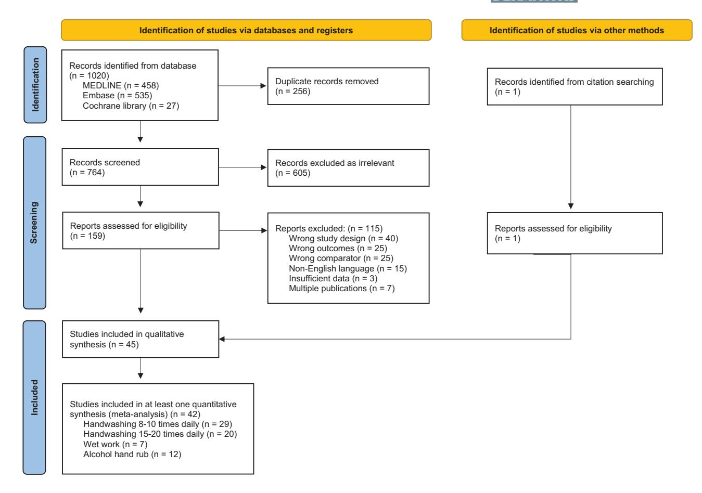
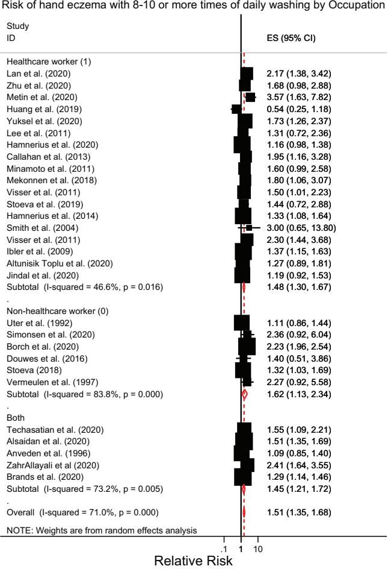
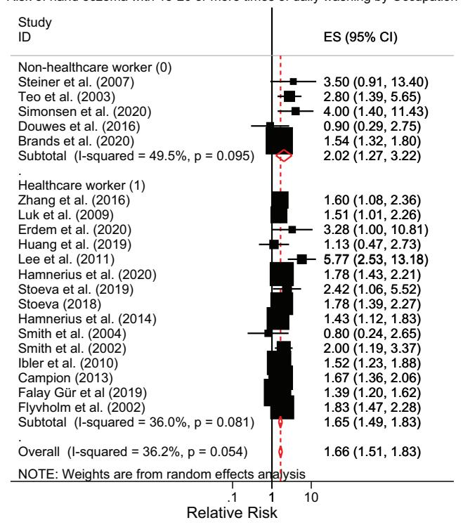
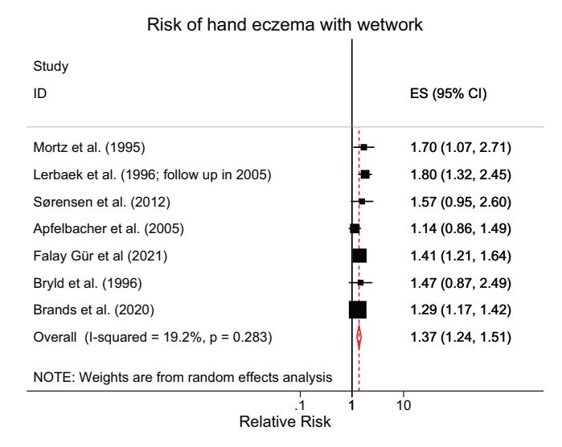
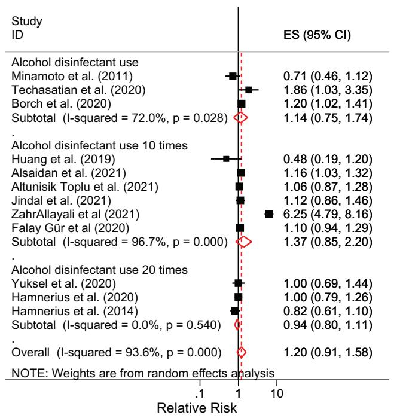

DOI: 10.1111/cod.14133

### REVIEW

## Hand hygiene and hand eczema: A systematic review and meta-analysis

Enver De Wei Loh1 | Yik Weng Yew1,2

1 Lee Kong Chian School of Medicine, Nanyang Technological University, Singapore

### Correspondence

Yik Weng Yew National Skin Centre, 1 Mandalay Rd, Singapore 308205. Email: [ywyew@nsc.com.sg](mailto:ywyew@nsc.com.sg)

### Abstract

Hand eczema is a common inflammatory condition of the skin that has been linked to hand hygiene. This systematic review and meta-analysis aims to determine the risks of hand eczema associated with hand hygiene, including frequency of handwashing, wetwork and use of alcohol hand rub. A comprehensive search of MEDLINE, EMBASE and Cochrane Library was performed for cohort, case–control or cross-sectional studies that analysed the association between hand hygiene and risk of hand eczema. Results of individual studies were presented in respective forest plots and pooled summary relative risks were estimated using a random-effects model. Forty-five studies were included in analysis. Handwashing at least 8–10 times daily significantly increased risk of hand eczema (relative risk [RR] 1.51; 95% confidence interval [CI]: 1.35–1.68; p < 0.001). The risk was related to handwashing frequency, with higher pooled RR of 1.66 (95% CI: 1.51–1.83; p < 0.001) with increased handwashing at least 15–20 times daily. However, use of alcohol-based hand sanitizer was not significantly associated with risk of hand eczema. Given the widespread implementation of hand hygiene practices during the COVID-19 pandemic, there is a pertinent need to understand skin care habits specific to the hands to avoid a greater incidence of hand eczema.

### KEYWORDS

contact dermatitis, epidemiology, hand eczema, hand hygiene

### 1 | INTRODUCTION

Hand eczema is an inflammation of the skin limited to the hands and/or wrists. It is a common condition, with lifetime prevalence reaching 14.5% in the general population[.1](#page-9-0) The condition is often debilitating and causes marked impairment on the quality of life of patients.[2](#page-9-0)

Risk factors for hand eczema have been extensively examined, with both endogenous and exogenous factors known to play a role[.3](#page-9-0) The most significant risk factor has been found to be atopic dermatitis[,4](#page-9-0)–7 while exogenous factors include contact allerg[y6,8,9](#page-9-0) and exposure to irritants.[10,11](#page-9-0) Wet work and hand washing have also been implicated as risk factors for hand eczema[,8,12](#page-9-0) but other studies have found no association.[6](#page-9-0) Amidst the COVID-19 pandemic, hand hygiene, which includes handwashing with soap and use of alcoholbased hand rub, has been advocated to reduce the spread of the virus. With the increased hand hygiene practices adopted by the general population, it is pertinent to evaluate its risk on hand eczema, in order to advise guidelines on handwashing and sanitizer use and avoid a concomitant rise in incidence of hand eczema.

This systematic review and meta-analysis therefore aims to present an overview of the association between hand hygiene practices (frequency of handwashing, use of alcohol hand rub, wet work) and the risk on hand eczema.

### 2 | METHODS

A systematic review and meta-analysis was performed according to the PRISMA (Preferred Reporting Items for Systematic Reviews and Meta-Analyses) 2020 guidelines.[13](#page-9-0) A protocol outlining the aims and strategy of

2 National Skin Centre, Singapore

the systematic review and meta-analysis was developed and reviewed by all authors prior to the start of the study, but not registered.

for downgrading or upgrading.[16,17](#page-9-0) Any discrepancy in rating was resolved by consensus.

## 2.1 | Search strategy

The comprehensive search included databases of MEDLINE via PubMed, EMBASE and Cochrane library. The search terms used were: (Eczema[MeSH Terms] OR Dermatitis, Eczematous OR Skin Diseases, Eczematous[MeSH Terms] OR Eczematous Disorders OR Eczematous Skin Diseases OR Hand Dermatoses[MeSH Terms] OR Hand Dermatosis) AND (Hand Hygiene[MeSH Terms] OR 'Hand Disinfection' or 'Hand Washing' or 'Wet Work' or 'Wet Exposure') (Table S1).

All studies published from inception to 10 April 2022 were included in the search. Additional articles were included from manual search in the reference list of articles.

All studies were then assessed based on title and abstract for relevance to hand eczema and association with hand hygiene.

### 2.2 | Selection of articles

Studies published in English language from all countries and evaluating all populations were considered. Cohort, case–control or cross-sectional studies that analysed the association between hand hygiene and risk of hand eczema were included. Studies had to report adequate information such as relative risks (RR), odds ratio (OR) and confidence interval (CI) in order for further meta-analysis to be performed. For studies which did not report such ratios, studies should have crude data such as total cases of hand eczema among those exposed and unexposed. The primary outcome measured in this study is the relative risk of hand eczema in the different exposure groups. Definition of hand eczema in the various studies includes physician diagnosis as well as characteristic signs and symptoms of hand eczema.

From the title and abstract, two reviewers independently selected studies for full-text review based on the inclusion criteria. The fulltext articles were then evaluated independently by two reviewers to determine eligibility for inclusion, and any disagreements were resolved by consensus.

Study quality was assessed by two independent reviewers using the Newcastle–Ottawa scale (NOS)[14](#page-9-0) for cohort and case–control studies, while cross-sectional studies were assessed using an adapted version of NOS.[15](#page-9-0) Studies were scored in three areas: selection of study population, comparability between groups and assessment of outcome. A maximum score of 9 or 10 could be achieved for cohort studies and cross-sectional studies respectively, and NOS score of ≥7 was considered low risk of bias or high quality.

Certainty of evidence for each outcome was rated by two independent reviewers using the Grading of Recommendations, Assessment, Development and Evaluations (GRADE) assessment tool. Evidence from observational studies started at the low quality level, and was subsequently assessed across various domains including risk of bias, imprecision, inconsistency, indirectness and publication bias

### 2.3 | Data extraction

Data were extracted from the selected studies by two reviewers independently, using a standardized data extraction form. Information extracted included: study year, country and population, study design, total number of participants, outcome and assessment of outcome, risk ratios and 95% CI for groups compared. For studies which did not report risk ratios, crude data were extracted, including total cases of hand eczema, number of cases exposed and unexposed. Studies that provided insufficient information to calculate relative risks of hand eczema or their standard errors among groups of interests were excluded. Where possible, efforts were made to contact the authors for more information.

### 2.4 | Meta-analysis

Selected studies were classified based on whether they analysed frequency of handwashing or use of alcohol hand rub. Studies related to handwashing were then divided into two groups based on the threshold of daily handwashing frequency that was compared: at least 8–10 times versus <8–10 times, and at least 15–20 times versus <15–20 times. Studies that investigated wet work (defined as contact with liquids >2 h/day, use of occlusive gloves >2 h/day or handwashing >20 times/ day) were analysed separately. Studies related to alcohol hand rub were divided into three groups: use of alcohol hand rub versus no use of alcohol hand rub, alcohol hand rub >10 times daily versus ≤10 times daily and alcohol hand rub >20 times daily versus ≤20 times daily.

In both controlled and uncontrolled studies, most of the included studies reported odds ratios or risk ratios. They were included for metaanalysis when available; otherwise, ratios were estimated from the crude data. Pooled estimate of relative risk (RR) from selected studies was derived from these ratios, as they approximated one another mathematically under the rare disease assumption[.18](#page-10-0) Results of individual studies were presented as a forest plot and the pooled summary relative risks was estimated using random-effects model of DerSimonian and Laird to account for variance between and within the studies. Heterogeneity between studies was assessed using χ2 test and the I 2 statistic; values of 25, 50 and 75% were considered to be low, moderate and high heterogeneity, respectively. A funnel plot was constructed and visually inspected for asymmetry to qualitatively assess publication bias. All analyses were performed using STATA Version 13.0 (StataCorp).

### 3 | RESULTS

## 3.1 | Search results

The comprehensive search of MEDLINE, Embase and Cochrane Library yielded a total of 1020 studies, of which 256 duplicates were

FIGURE 1 PRISMA flow diagram showing summary of the systematic review and meta-analysis

removed from further evaluation. Based on the titles and abstracts of the remaining 764 articles, 605 studies were excluded. Among the 159 full-text articles assessed, 44 studies fulfilled the inclusion criteria and the rest were excluded for reasons reported in the PRISMA flow diagram (Figure 1). An additional article was found from the citation list of another article. Finally, 45 studies were included in the systematic review, and 42 studies included in at least one meta-analysis.

### 3.2 Description of included studies

Six studies utilized a cohort study design,  $^{5,12,19-22}$  three studies were case–control studies,  $^{23-25}$  while the other studies (n=36) employed a cross-sectional study design. There were 17 studies performed in Asia, and 28 were from non-Asia countries. The majority (n=28, 62.2%) of studies were performed in healthcare workers, 12 (26.7%) were in non-healthcare workers and five included the general population regardless of occupation.  $^{23,26-29}$  Outcomes were assessed by self-reported questionnaire in most studies (n=35), of which 12 were based on the NOSQ-2002 questionnaire,  $^{30}$  and 10 studies relied on clinical examination by dermatologist or trained professional. Most of the studies were of high quality (n=35), and 10 were considered lower quality (NOS < 7). The general characteristics of each study are summarized in Table 1. Further details are provided in Tables S2–S5.

# 3.3 | Risks of hand eczema with at least 8–10 times of daily handwashing

The meta-analysis included 29 studies that examined the risks of hand eczema with at least 8–10 times of daily handwashing versus fewer than 8–10 times (Table S2). The pooled RR of hand eczema among those who washed their hands at least 8–10 times daily was 1.51 (95% CI: 1.35–1.68; p < 0.001), as compared to those who washed their hands fewer times (Figure 2). There was moderate heterogeneity between studies ( $I^2 = 71.0\%$ , p < 0.001), hence a random-effects model was used. The funnel plot appeared symmetrical and did not show obvious publication bias (Figure S1).

In healthcare workers, the RR was 1.48 (95% CI: 1.30–1.67; p < 0.001) versus 1.62 (95% CI: 1.13–2.34; p = 0.009) for non-healthcare workers, and 1.45 (95% CI: 1.21–1.72;  $p \le 0.001$ ) for the general population. While the point estimate of hand eczema risk from handwashing of at least 8–10 times a day appeared to be higher among non-healthcare workers, the difference was not significant given their overlapping confidence intervals.

The pooled RRs were also similar across different geographical regions where the study was conducted (Figure S2). Studies performed in Asia reported a pooled RR of 1.51 (95% CI: 1.28–1.78; p < 0.001), while studies outside of Asia demonstrated RR 1.52 (95% CI: 1.31–1.76; p < 0.001).

TABLE 1 Characteristics of all selected articles and their references

| Authors (start year)                  | Country           | Population                                                                                                                                             | Number of participants | Number of cases (%) | Outcome                                                      | Assessment of outcome                                                                                                    | Study design             | NOS |
|------------------------------------------|-------------------|--------------------------------------------------------------------------------------------------------------------------------------------------------|---------------------------|------------------------|--------------------------------------------------------------|--------------------------------------------------------------------------------------------------------------------------|-----------------------------|-----|
| Alsaidan et al. (2020)27           | Saudi Arabia      | Students and employees of university                                                                                                                | 2354                      |                        | 821 (34.8) Skin changes or symptoms over hands            | Self-administered online questionnaire                                                                                | Cross sectional study | 6   |
| Altunisik Toplu et al. (2020)31 | Turkey            | Healthcare workers in a tertiary university hospital                                                                                             | 276                       |                        | 203 (73.6) Hand-skin-related symptoms                     | Self-reported via self administered online questionnaire                                                           | Cross sectional study | 6   |
| Anveden et al. (1996)23            | Sweden            | General population aged 20-65 years                                                                                                                 | 364                       | 182 (50)               | Prevalence of hand eczema during the past 12 months    | Self-reported hand eczema via self administered postal questionnaire                                            | Case– control study   | 7   |
| Apfelbacher et al. (2005)24        | Germany           | Individuals who had been followed until the end of their apprenticeship in the original cohort study in the car industry (1990–1998) | 230                       |                        | 110 (47.8) Current hand eczema                               | Dermatological examination                                                                                            | Case– control study   | 7   |
| Borch et al. (2020)32                 | Denmark           | Children                                                                                                                                               | 6273                      |                        | 4496 (42.4) Incidence of irritant contact dermatitis      | Parental self administered questionnaire                                                                           | Cross sectional study | 6   |
| Brands et al. (2020)29                | Netherlands       | General population aged 18 years and older                                                                                                          | 57 046                    | 4158 (7.3)             | 1-year prevalence of hand eczema                          | Self-reported via self administered digital questionnaire (based on NOSQ-2002)                                  | Cross sectional study | 8   |
| Bryld et al. (1996)6                  | Denmark           | Twins                                                                                                                                                  | 1076                      |                        | 449 (41.7) Prevalence of hand eczema                      | Self-reported hand eczema via self administered postal questionnaire                                            | Cross sectional study | 8   |
| Callahan et al. (2013)19           | United States     | Healthcare workers                                                                                                                                     | 90                        |                        | 46 (51.1) Incidence of irritant hand dermatitis (IHD)     | Assessment by dermatologist                                                                                           | Cohort study             | 8   |
| Campion (2013)25                      | United Kingdom | Healthcare workers                                                                                                                                     | 2762                      |                        | 424 (15.3) Prevalence of occupational skin disease     | Self-reported via self administered questionnaire (modified NOSQ 2002)                                       | Case– control study   | 7   |
| Douwes et al. (2016)33             | New Zealand       | Cleaners                                                                                                                                               | 425                       |                        | 63 (14.8) Current hand/arm dermatitis in past 3 months | NOSQ-2002 (face to face interview)                                                                                    | Cross sectional study | 9   |
| Erdem et al. (2020)34                 | Turkey            | Healthcare workers working in COVID-19 patient care units of hospital                                                                         | 107                       |                        | 54 (50.5) Prevalence of hand eczema                       | Examination by dermatologist using hand eczema severity index (HECSI) for standardi zation of HE severity | Cross sectional study | 7   |
| Falay Gür et al. (2019)35          | Turkey            | Healthcare professionals working in a tertiary hospital                                                                                          | 601                       | 308 (51)               | Lifetime prevalence of hand eczema                        | Self-reported via self administered questionnaire (modified NOSQ 2002); confirmed by clinical examination | Cross sectional study | 8   |
| Flyvholm et al. (2002)36           | Denmark           | Hospital employees                                                                                                                                     | 1246                      |                        | 256 (22.8) Hand eczema within the past 12 months          | Self-reported via self administered questionnaire (based on NOSQ-2002)                                          | Cross sectional study | 5   |

TABLE 1 (Continued)

| TABLE 1                         | (Continued)          |                                                                                           |                           |                        |                                                                                                        |                                                                                                                                                                  |                             |     |
|---------------------------------|----------------------|-------------------------------------------------------------------------------------------|---------------------------|------------------------|--------------------------------------------------------------------------------------------------------|------------------------------------------------------------------------------------------------------------------------------------------------------------------|-----------------------------|-----|
| Authors (start year)         | Country              | Population                                                                                | Number of participants | Number of cases (%) | Outcome                                                                                                | Assessment of outcome                                                                                                                                            | Study design             | NOS |
| Forrester et al. (1998)37 | United States        | Healthcare professionals in ICU                                                        | 126                       |                        | 70 (55.6) Prevalence of occupational hand dermatitis                                             | Self-administered questionnaire                                                                                                                               | Cross sectional study | 5   |
| Hamnerius et al. (2014)38 | Sweden               | Healthcare workers (nurses, assistant nurses, physicians)                           | 9051                      | 1870 (21)              | 1-year prevalence of hand eczema                                                                    | Self-reported questionnaire                                                                                                                                   | Cross sectional study | 7   |
| Hamnerius et al. (2020)39 | Sweden               | Healthcare workers                                                                        | 5094                      | 1469 (29)              | 1-year prevalence of hand eczema                                                                    | Self-reported (survey)                                                                                                                                           | Cross sectional study | 7   |
| Huang et al. (2019)40        | China (Guangzhou) | Nurses, doctors                                                                           | 521                       | 50 (9.6)               | 1-year prevalence of hand eczema                                                                    | Self-report via modified NOSQ-2002 questionnaire                                                                                                           | Cross sectional study | 9   |
| Ibler et al. (2009)41        | Denmark              | Healthcare workers                                                                        | 2269                      |                        | 396 (17.5) 1-year prevalence of hand eczema                                                         | Self-reported hand eczema via self administered questionnaire based on NOSQ-2002                                                                     | Cross sectional study | 7   |
| Jindal et al. (2020)42       | India                | Healthcare workers (doctors and nurses) working in designated COVID-19 hospitals | 160                       |                        | 105 (65.6) Point prevalence of hand eczema                                                          | Self-reported signs and symptoms of hand eczema via self administered online questionnaire                                                           | Cross sectional study | 5   |
| Lan et al. (2007)43          | Taiwan               | Nursing staff                                                                             | 140                       | 35 (25)                | Prevalence of non-atopic hand dermatitis during past 1 year                                      | Non-atopic eczema assessed by physician according to Hanifin and Rajka criteria; hand dermatitis by self-report via validated questionnaire | Cross sectional study | 8   |
| Lan et al. (2020)44          | China                | Physicians, nurses in tertiary hospitals                                               | 542                       |                        | 392 (72.3) Prevalence of skin damage in the hands                                                   | Self-reported via self administered online questionnaire                                                                                                   | Cross sectional study | 6   |
| Lee et al. (2011)45          | Korea                | Hospital nursing staff                                                                    | 525                       |                        | 397 (75.6) Prevalence of symptom based hand eczema in past 12 months                             | Questionnaire survey; self-reported hand eczema or symptom based hand eczema                                                                            | Cross sectional study | 8   |
| Lerbaek et al. (1996)12   | Denmark              | Population-based twin cohort                                                           | 4128                      | 244 (5.9)              | Incidence of hand eczema                                                                            | Self-reported via question naire                                                                                                                           | Cohort study             | 7   |
| Luk et al. (2009)46          | Hong Kong            | Nurses                                                                                    | 724                       |                        | 160 (22.1) Prevalence of hand eczema                                                                | Self-report questionnaire (based on NOSQ 2002)                                                                                                             | Cross sectional study | 8   |
| Mekonnen et al. (2018)47  | Ethiopia             | Healthcare workers                                                                        | 422                       |                        | 133 (31.5) 1-year prevalence of self-report occupational contact dermatitis                   | Self-report contact dermatitis via NOSQ 2002                                                                                                               | Cross sectional study | 9   |
| Metin et al. (2020)48        | Turkey               | Healthcare professionals (doctors, nurses)                                             | 523                       |                        | 379 (72.5) Prevalence of hand eczema in the previous week, after 1 month of COVID-19 outbreak | Self-report via online questionnaire                                                                                                                          | Cross sectional study | 6   |
| Minamoto et al. (2011)49  | Japan                | Dental workers: dentists, hygienists, technicians, assistants, receptionists     | 528                       |                        | 209 (39.6) 1-year period prevalence of chronic hand eczema                                       | Self-administered questionnaire (NOSQ 2002)                                                                                                                | Cross sectional study | 7   |

TABLE 1 (Continued)

| Authors (start year)            | Country      | Population                                                   | Number of participants | Number of cases (%) | Outcome                                                                                          | Assessment of outcome                                                                                                                        | Study design                | NOS |
|------------------------------------|--------------|--------------------------------------------------------------|---------------------------|------------------------|--------------------------------------------------------------------------------------------------|----------------------------------------------------------------------------------------------------------------------------------------------|--------------------------------|-----|
| Mortz et al. (1995)5            | Denmark      | Unselected young adults followed from primary school   | 889                       |                        | 126 (14.2) 1-year period prevalence of hand eczema in 2010                                 | History of HE self reported via NOSQ 2002 questionnaire, point prevalence evaluated clinically by dermatologist               | Cohort study                | 9   |
| Simonsen et al. (2020)50     | Denmark      | Children attending day care centres throughout Denmark | 6858                      |                        | 1668 (24.3) Incident hand eczema (in children without previous hand eczema)                | Parental self administered electronic questionnaire                                                                                 | Cross sectional study    | 8   |
| Smith et al. (2002)51           | Japan        | Female nurses                                                | 305                       | 108 (35)               | 1-year period prevalence of hand dermatitis                                                   | Self-reported HD questionnaire                                                                                                            | Cross sectional study    | 8   |
| Smith et al. (2004)52           | Japan        | Clinical nurses                                              | 860                       |                        | 458 (53.3) 1-year period prevalence of hand dermatitis                                        | Self-report via a previously validated HD questionnaire                                                                                | Cross sectional study    | 8   |
| Sørensen et al. (2012)53     | Denmark      | Individuals with work related hand eczema                 | 773                       |                        | 80 (10.3) Severe and very severe hand eczema                                                  | Self-reported via questionnaire; severity assessed by use of validated photographic guide                                        | Cross sectional study    | 7   |
| Steiner et al. (2007)54         | Scotland     | Bakery workers                                               | 93                        | 15 (16)                | 1-year prevalence of hand dermatitis                                                          | Self-reported questionnaire                                                                                                               | Cross sectional study    | 6   |
| Stoeva et al. (2019)55          | Bulgaria     | Dental students                                              | 467                       |                        | 99 (21.2) Prevalence of work related skin symptoms                                            | Self-reported via online questionnaire                                                                                                    | Cross sectional study    | 8   |
| Stoeva (2018)56                 | Bulgaria     | Dentists                                                     | 4675                      |                        | 1477 (31.6) Point prevalence of work-related skin symptoms                                 | Self-reported via online questionnaire                                                                                                    | Cross sectional study    | 7   |
| Techasatian et al. (2020)26  | Thailand     | All individuals >18 years of age                          | 805                       |                        | 168 (20.9) Point prevalence of hand eczema                                                    | Self-report via questionnaire                                                                                                             | Cross sectional study    | 7   |
| Teo et al. (2003)57             | Singapore    | Restaurant, catering and fast-food outlet staff           | 335                       | 35 (10)                | 12-month period prevalence of contact dermatitis                                           | Clinical examination by trained investigator                                                                                              | Cross sectional study    | 8   |
| Uter et al. (1992)20            | Germany      | Hairdressing apprentices 2352                                |                           |                        | 1134 (55.1) Point prevalence of skin changes (any degree)                                     | Clinical examination                                                                                                                         | Cohort study                | 8   |
| Vermeulen et al. (1997)58    | Netherlands  | Male rubber manufacturing workers                      | 202                       | 56 (28)                | Point prevalence of minor hand dermatitis                                                     | Dermatologist assessment                                                                                                                  | Cross sectional study    | 7   |
| Visser et al. (2011)21          | Netherlands  | Apprentice nurses                                            | 533                       | 285 (53)               | Prevalence of hand eczema                                                                     | Self-report then diagnosed by dermatologist                                                                                            | Cohort study                | 9   |
| Yüksel et al. (2020)59          | Denmark      | Healthcare workers                                           | 2125                      |                        | 311 (14.7) 1-year period prevalence of hand eczema                                            | Self-administered digital questionnaire based on NOSQ-2002                                                                             | Cross sectional study    | 7   |
| Yüksel et al. (2020)22          | Denmark      | Healthcare workers                                           | 795                       |                        | 93 (11.7) 1-year prevalence of hand eczema at follow up                                    | Self-reported via self administered digital questionnaire based on NOSQ-2002                                                        | Prospective cohort study | 7   |
| ZahrAllayali et al. (2020)28 | Saudi Arabia | General population                                           | 783                       |                        | 86 (11.0) New onset symptoms of skin damage (for people with no history of hand eczema) | Self-administered online questionnaire (modified from previous studies), validated by 3 dermatologists before distribution | Cross sectional study    | 6   |

TABLE 1 (Continued)

| Authors (start year)  | Country | Population                                                 | Number of participants | Number of cases (%) | Outcome                                            | Assessment of outcome                                     | Study design             | NOS |
|--------------------------|---------|------------------------------------------------------------|---------------------------|------------------------|----------------------------------------------------|-----------------------------------------------------------|-----------------------------|-----|
| Zhang et al. (2016)60 | China   | Nurses                                                     | 934                       | 183 (20)               | Point prevalence of hand eczema                 | Self-reported questionnaire, adapted from NOSQ-2002 | Cross sectional study | 9   |
| Zhu et al. (2020)61   | China   | Doctors and nurses caring for patients with COVID-19 | 376                       |                        | 280 (74.5) Prevalence of adverse skin reactions | Self-report via questionnaire                          | Cross sectional study | 7   |

FIGURE 2 Forest plot of risks of hand eczema with at least 8–10 times of daily handwashing versus <8–10 times, with subgroup analysis by healthcare worker occupation. CI, confidence interval; ES, effect estimate

Studies with a lower NOS quality score reported higher risks of hand eczema from 8 to 10 or more times of daily handwashing (RR: 1.79; 95% CI: 1.41–2.27; p < 0.001) than studies with NOS ≥7 (RR: 1.37; 95% CI: 1.25–1.49; p < 0.001) (Figure S2).

## 3.4 | Risks of hand eczema with at least 15–20 times of daily handwashing

Twenty studies were included in meta-analysis on the risks of hand eczema with handwashing at least 15–20 times daily versus Risk of hand eczema with 15-20 or more times of daily washing by Occupation

FIGURE 3 Forest plot of risks of hand eczema with at least 15– 20 times of daily handwashing versus <15–20 times, with subgroup analysis by healthcare worker occupation. CI, confidence interval; ES, effect estimate

handwashing frequencies reported to be fewer than 15–20 times (Table S3a). The comparator groups in all studies had various handwashing frequencies, which may impact on the accuracy of the pooled estimate. However, despite this, there was low heterogeneity among the studies (I 2 = 36.2%, p = 0.054). Visualization of the funnel plot did not suggest any significant publication bias (Figure S3).

The pooled RR of hand eczema among those who washed their hands at least 15–20 times daily was 1.66 (95% CI: 1.51–1.83; p < 0.001). As depicted in Figure 3, non-healthcare workers had higher risks of hand eczema with at least 15–20 times of daily handwashing (RR: 2.02; 95% CI: 1.27–3.22; p = 0.003) as compared to healthcare workers (RR: 1.65; 95% CI: 1.49–1.83; p < 0.001). However, this difference was not significant, as their respective interval estimates were overlapping.

FIGURE 4 Forest plot of risks of hand eczema with wet work versus no wet work. CI, confidence interval; ES, effect estimate

The pooled RR of hand eczema was 1.74 (95% CI: 1.32–2.29; p < 0.001) for studies conducted in Asia versus 1.65 (95% CI: 1.52– 1.79; p < 0.001) for studies conducted in other countries (Figure S4). Geographical region did not significantly affect the association of handwashing 15–20 or more times daily with hand eczema.

The two studies with a low NOS quality scor[e36,54](#page-10-0) reported a higher risk of hand eczema (RR: 1.86; 95% CI: 1.50–2.31; p < 0.001) compared to studies with NOS ≥7 which reported RR 1.64 (95% CI: 1.48–1.82, p < 0.001) (Figure S4). Additionally, Forrester and Roth,[37](#page-10-0) which was only included in qualitative analysis, reported RR 4.13 for occupational hand dermatitis with handwashing at least 35 times per shift versus <35 times (Table S3b).

## 3.5 | Risks of hand eczema with wet work

Seven studies examined the risks of hand eczema with wet work versus no wet work (Table S4). As represented in Figure 4, the pooled RR of hand eczema with wet work was 1.37 (95% CI: 1.24–1.51, p < 0.001). There was low heterogeneity among the studies (I 2 = 19.2%, p = 0.283) and there was no significant publication bias seen in the funnel plot (Figure S5).

## 3.6 | Risks of hand eczema with use of alcohol hand rub

Fourteen studies examined the risks of hand eczema with the use of alcohol hand rub; however, two studies[22,43](#page-10-0) were not included in final meta-analysis as the frequency of alcohol hand rub reported was different from the rest of the other studies (Table S5a,b). The remaining 12 studies were analysed as three groups based on frequency of alcohol disinfectant use: use of

### Risk of hand eczema with alcohol hand rub

FIGURE 5 Forest plot of risks of hand eczema with use of alcohol hand rub. CI, confidence interval; ES, effect estimate

alcohol disinfectant versus no use of alcohol disinfectant, more than 10 times daily versus ≤10 times daily and more than 20 times daily versus ≤20 times daily. There was high heterogeneity among the studies included in the meta-analysis (I 2 = 93.6%, p < 0.001). The funnel plot appeared asymmetrical, suggesting a publication bias (Figure S6).

There was no statistically significant relationship between risks of hand eczema and use of alcohol hand rub (p = 0.548), alcohol hand rub more than 10 times daily (p = 0.196) or alcohol hand rub more than 20 times daily (p = 0.452), as shown in Figure 5.

In the studies that were only included in qualitative analysis, Lan et al.[43](#page-10-0) found that there was no statistically significant risk of hand eczema with use of alcohol hand rub more than nine times within 4 h versus ≤9 times (p = 0.2886). A prospective cohort study by Yüksel et al.[22](#page-10-0) described that increased use of alcohol-based hand rubs on wet skin by healthcare workers during the COVID-19 pandemic was associated with increased 1-year prevalence of hand eczema at follow up (RR: 1.78; 95% CI: 1.11–2.87).

### 3.7 | GRADE assessment: certainty in evidence

The GRADE certainty ratings for the following outcomes: risks of hand eczema from at least 8 to 10 times handwashing, 15 to 20 times handwashing and wet work were low. The GRADE certainty rating for risk of hand eczema from alcohol hand rub was very low (Table [2\)](#page-8-0). Therefore, the overall GRADE quality rating for risks of hand eczema

TABLE 2 GRADE assessment tool: certainty in evidence for evaluated outcomes

|                                                                           | Quality assessments  |                          |                 |                                        |                      |                              |                         |                  |
|---------------------------------------------------------------------------|----------------------|--------------------------|-----------------|----------------------------------------|----------------------|------------------------------|-------------------------|------------------|
| Outcome                                                                   | Number of studies | Study design             | Risk of bias | Imprecision Inconsistency Indirectness |                      | Publication bias          | RR (95% CI)          | GRADE quality |
| Risks of hand eczema with at least 8–10 times of daily handwashing     | 29                   | Observational studies | Not serious  | Not serious Seriousa                   |                      | Not serious Not serious 1.51 | (1.35, 1.68)         | LL◯◯ Low      |
| Risks of hand eczema with at least 15–20 times of daily handwashing | 20                   | Observational studies | Not serious  | Not serious Not serious                | Seriousb             | Not serious 1.66             | (1.51, 1.83)         | LL◯◯ Low      |
| Risks of hand eczema with wet work                                     | 7                    | Observational studies | Not serious  | Not serious Not serious                | Seriousb             | Not serious 1.37             | (1.24, 1.51)         | LL◯◯ Low      |
| Risks of hand eczema with use of alcohol hand rub                      | 12                   | Observational studies | Not serious  | Not serious Seriousa                   | Not serious Seriousc |                              | 1.20 (0.91, 1.58) | L◯◯◯ Very low |

Note: Low quality: our confidence in the effect estimate is limited. The true effect may be markedly different from the estimate of the effect. Very low quality: we have very little confidence in the effect estimate. The true effect is likely to be markedly different from the estimate of effect. Abbreviations: CI, confidence interval; RR, relative risk.

from various hand hygiene practices, excluding alcohol hand rub use, would be considered low.

### 4 | DISCUSSION

This study demonstrated a significant increase in risk of hand eczema associated with frequency of handwashing and wet work, but not with use of alcohol hand rub.

Handwashing at least 8–10 times a day significantly increased the risk of hand eczema (RR: 1.51) as compared to washing hands fewer times; the risk was even higher when handwashing frequency was increased to at least 15–20 times a day (RR: 1.66). The associations between hand hygiene practices and risk of hand eczema were consistent regardless of geographical region or occupation. It is also noted that there could possibly be a dose–response relationship given that the pooled risk ratios of hand eczema were higher with more frequent handwashing. However, our meta-analysis results showed that 8–10 times of daily handwashing is enough to cause a significantly higher risk of hand eczema than someone who washes hands less frequently. On the other hand, no significant association has been established between use of alcohol hand rub and risk of hand eczema. However, healthcare workers often perceive alcohol disinfection to be more damaging to the skin than handwashing,[49,62](#page-10-0) despite alcohol-based hand rubs being found to cause less skin irritation than handwashing in tests of skin hydration, erythema and transepidermal water loss.[63](#page-11-0) This misconception may have stemmed from the stinging sensation when alcohol is applied to previously damaged skin.[63,64](#page-11-0) The present study re-affirms that alcohol hand rub may be a viable substitute for handwashing with soap since it is as effective in reducing hand bacterial contamination[,65](#page-11-0) without significant risk of hand eczema. More studies are needed to investigate the effect of alcohol hand rub on skin barrier function and irritation, to further ascertain the difference between alcohol hand rub and handwashing with soap.

In light of the associated risks of hand eczema, there is a need to advocate for appropriate hand care advice even for handwashing as low as 8–10 times daily. It is recommended that moisturizers are used, multiple times per day and particularly after handwashing, to keep the skin hydrated[.66,67](#page-11-0)

Information on the prevalence of hand eczema is essential to guide interventions and primary prevention of the condition developing among susceptible patients. There have been various reports of a high prevalence of hand eczema associated with hand hygiene recommendations during the COVID-19 pandemic. Simonsen et al.[50](#page-10-0) found that 28.6% of Danish children developed incident hand eczema after returning to day-care and adopting the implemented handwashing regimen. In Turkey, a cross-sectional study of healthcare professionals reported that prevalence of hand eczema increased from 23.1% before the COVID-19 outbreak, to 72.5% after 1 month of the outbreak.[48](#page-10-0)

Besides handwashing and alcohol hand rubs, wearing of occlusive gloves is also a risk factor for hand eczema.[38,47](#page-10-0) The gloves lead to a state of hyper-hydration causing maceration of the skin, enhancing the penetration of soaps and alcohol sanitizers[.68](#page-11-0) This meta-analysis included studies on wet work which encompassed the use of occlusive gloves, but did not examine the independent role of gloves in increasing the risk of hand eczema. Although glove use is less common among the general population, it is a factor that should also be considered in future studies in the context of healthcare workers who routinely use gloves at work.

This review has several limitations. First, the data were gathered from observational studies that were prone to the effects of

a Heterogeneity statistic I 2 was greater than 70% and these outcomes were downgraded for inconsistency.

b Downgraded for varied definitions of exposures in the studies.

c Publication bias as demonstrated by asymmetrical funnel plot.

various confounding factors. This study lacked adequate information on prior atopy, prior skin diseases and lifestyle information such as smoking habits and hobbies to adjust for confounding. Observational studies (e.g., cross-sectional studies) are susceptible to reverse causation bias and therefore no conclusion regarding direction of the found association can be drawn. For example, hand washing increases risk of hand eczema; however, people with hand eczema might avoid hand washing. This can cause an underestimation of the true effect. There is a dearth of cohort studies that analyse hand hygiene practices as risk factors in the incidence of hand eczema.

Second, information such as duration of handwashing and type of soap use, as well as current prevailing hand care habits, was not available in the various studies included. Thus, the effectiveness of modifications to handwashing practices, or the use of hand care, in preventing hand eczema could not be evaluated. This study highlighted the need for intervention studies to prevent the incidence of hand eczema by encouraging hand care and use of alcohol hand rubs.

Finally, the studies used different methods for assessment of hand eczema. The most reliable assessment of hand eczema is clinical diagnosis by a physician. Most studies used questionnaires to determine prevalence of hand eczema. While some studies employed the Nordic Occupational Skin Questionnaire (NOSQ-2002)[30](#page-10-0) for screening of hand eczema and exposures, others relied on self-reported questionnaires that may not have been validated in detecting hand eczema accurately. Self-reported questionnaires have been found to demonstrate high specificity of over 90%, but sensitivity is less than 70%, and hence tend to underestimate the true prevalence of hand eczema[.30](#page-10-0)

In conclusion, this meta-analysis highlights the significant risk of hand eczema associated with handwashing, but not the use of alcohol hand rubs. This risk is observed regardless of geographical region or population. The burden of hand eczema is especially significant amidst the current COVID-19 pandemic, when a higher frequency of hand hygiene has been recommended for the general public. Knowledge of this risk is valuable in underscoring the need to encourage hand care to reduce the incidence of hand eczema.

### AUTHOR CONTRIBUTIONS

Enver De Wei Loh: Conceptualization (equal); data curation (equal); formal analysis (equal); investigation (equal); methodology (equal); project administration (equal); resources (equal); software (equal); validation (equal); visualization (equal); writing – original draft (equal); writing – review and editing (equal). Yik Weng Yew: Conceptualization (equal); data curation (equal); formal analysis (equal); investigation (equal); methodology (equal); project administration (equal); resources (equal); software (equal); supervision (equal); validation (equal); visualization (equal); writing – original draft (equal); writing – review and editing (equal).

### CONFLICTS OF INTEREST

The authors declare that there are no conflicts of interest.

### DATA AVAILABILITY STATEMENT

The data that support the findings of this study are provided in supplementary tables. These data were derived from resources available in the public domain and have been referenced.

### ORCID

Enver De Wei Loh <https://orcid.org/0000-0002-9205-1854>

#### REFERENCES

- 1. Quaade AS, Simonsen AB, Halling A-S, Thyssen JP, Johansen JD. Prevalence, incidence, and severity of hand eczema in the general population – a systematic review and meta-analysis. Contact Dermatitis. 2021;84(6):361-374.
- 2. Charan U, Peter CV, Pulimood S. Impact of hand eczema severity on quality of life. Indian Dermatol Online J. 2013;4(2):102-105.
- 3. Diepgen TL, Weisshaar E. Risk factors in hand eczema. In: Alikhan A, Lachapelle J-M, Maibach HI, eds. Textbook of Hand Eczema. Springer Berlin Heidelberg; 2014:85-97.
- 4. Thyssen JP, Johansen JD, Linneberg A, Menné T. The epidemiology of hand eczema in the general population – prevalence and main findings\*. Contact Dermatitis. 2010;62(2):75-87.
- 5. Mortz CG, Bindslev-Jensen C, Andersen KE. Hand eczema in the Odense Adolescence Cohort Study on Atopic Diseases and Dermatitis (TOACS): prevalence, incidence and risk factors from adolescence to adulthood. Brit J Dermatol. 2014;171(2):313-323.
- 6. Bryld LE, Hindsberger C, Kyvik KO, Agner T, Menné T. Risk factors influencing the development of hand eczema in a population-based twin sample. Brit J Dermatol. 2003;149(6):1214-1220.
- 7. Dotterud L, Falk E. Contact allergy in relation to hand eczema and atopic diseases in north Norwegian schoolchildren. Acta Paediatr. 1995;84(4):402-406.
- 8. Meding B, Liden C, Berglind N. Self-diagnosed dermatitis in adults: results from a population survey in Stockholm. Contact Dermatitis. 2001;45(6):341-345.
- 9. Mortz CG, Lauritsen JM, Bindslev-Jensen C, Andersen KE. Nickel sensitization in adolescents and association with ear piercing, use of dental braces and hand eczema. Acta Derm Venereol. 2002;82(5):359-364.
- 10. Meding B, Swanbeck G. Occupational hand eczema in an industrial city. Contact Dermatitis. 1990;22(1):13-23.
- 11. Nilsson E, Mikaelsson B, Andersson S. Atopy, occupation and domestic work as risk factors for hand eczema in hospital workers. Contact Dermatitis. 1985;13(4):216-223.
- 12. Lerbaek A, Kyvik KO, Ravn H, Menné T, Agner T. Incidence of hand eczema in a population-based twin cohort: genetic and environmental risk factors. Brit J Dermatol. 2007;157(3):552-557.
- 13. Page MJ, McKenzie JE, Bossuyt PM, et al. The PRISMA 2020 statement: an updated guideline for reporting systematic reviews. BMJ. 2021;372:n71.
- 14. Wells GSB, O'Connell D, Peterson J, Welch V, Losos M, Tugwell P. The Newcastle-Ottawa Scale (NOS) for assessing the quality of nonrandomised studies in meta-analyses. 2013. [http://www.ohri.ca/](http://www.ohri.ca/programs/clinical_epidemiology/oxford.asp) [programs/clinical\\_epidemiology/oxford.asp](http://www.ohri.ca/programs/clinical_epidemiology/oxford.asp).
- 15. Herzog R, Alvarez-Pasquin MJ, Díaz C, Del Barrio JL, Estrada JM, ´ Gil A. Are healthcare workers' intentions to vaccinate related to their ´ knowledge, beliefs and attitudes? A systematic review. BMC Public Health. 2013;13(1):154.
- 16. Papola D, Ostuzzi G, Thabane L, Guyatt G, Barbui C. Antipsychotic drug exposure and risk of fracture: a systematic review and metaanalysis of observational studies. Int Clin Psychopharmacol. 2018; 33(4):181-196.
- 17. Kirmayr M, Quilodrán C, Valente B, Loezar C, Garegnani L, Franco JVA. The GRADE approach, part 1: how to assess the certainty of the evidence. Medwave. 2021;21(2):e8109.

- 18. Symons MJ, Moore DT. Hazard rate ratio and prospective epidemiological studies. J Clin Epidemiol. 2002;55(9):893-899.
- 19. Callahan A, Baron E, Fekedulegn D, et al. Winter season, frequent hand washing, and irritant patch test reactions to detergents are associated with hand dermatitis in health care workers. Dermatitis. 2013; 24(4):170-175.
- 20. Uter W, Pfahlberg A, Gefeller O, Schwanitz HJ. Hand dermatitis in a prospectively-followed cohort of hairdressing apprentices: final results of the POSH study. Prevention of occupational skin disease in hairdressers. Contact Dermatitis. 1999;41(5):280-286.
- 21. Visser MJ, Verberk MM, van Dijk FJ, Bakker JG, Bos JD, Kezic S. Wet work and hand eczema in apprentice nurses; part I of a prospective cohort study. Contact Dermatitis. 2014;70(1):44-55.
- 22. Yüksel YT, Nørreslet LB, Flachs EM, Ebbehøj NE, Agner T. Hand eczema, wet work exposure, and quality of life in health care workers in Denmark during the COVID-19 pandemic. JAAD Int. 2022;7:86-94.
- 23. Anveden I, Wrangsjo K, Jarvholm B, Meding B. Self-reported skin exposure - a population-based study. Contact Dermatitis. 2006;54(5): 272-277.
- 24. Apfelbacher CJ, Funke U, Radulescu M, Diepgen TL. Determinants of current hand eczema: results from case-control studies nested in the PACO follow-up study (PACO II). Contact Dermatitis. 2010;62(6):363-370.
- 25. Campion KM. A survey of occupational skin disease in UK health care workers. Occup Med. 2015;65(1):29-31.
- 26. Techasatian L, Thaowandee W, Chaiyarit J, et al. Hand hygiene habits and prevalence of hand eczema during the COVID-19 pandemic. J Prim Care Community Health. 2021;12:21501327211018013.
- 27. Alsaidan MS, Abuyassin AH, Alsaeed ZH, AaA A, Alshmmari SH, Bindaaj TF. The prevalence and determinants of hand and face dermatitis during COVID-19 pandemic: a population-based survey. Dermatol Res Pract. 2020;2020:6627472.
- 28. Zahrallayali A, Al-Doboke A, Alosaimy R, et al. The prevalence and clinical features of skin irritation caused by infection prevention measures during covid-19 in the mecca region, Saudi Arabia. Clin, Cosm Investig Dermatol. 2021;14:889-899.
- 29. Brands MJ, Loman L, Schuttelaar MLA. Exposure and work-related factors in subjects with hand eczema: data from a cross-sectional questionnaire within the lifelines cohort study. Contact Dermatitis. 2022; 1-14. [https://onlinelibrary.wiley.com/doi/10.1111/cod.](https://onlinelibrary.wiley.com/doi/10.1111/cod.14066) [14066](https://onlinelibrary.wiley.com/doi/10.1111/cod.14066)
- 30. Susitaival P, Flyvholm MA, Meding B, et al. Nordic Occupational Skin Questionnaire (NOSQ-2002): a new tool for surveying occupational skin diseases and exposure. Contact Dermatitis. 2003;49(2):70-76.
- 31. Altunisik Toplu S, Altunisik N, Turkmen D, Ersoy Y. Relationship between hand hygiene and cutaneous findings during COVID-19 pandemic. J Cosmet Dermatol. 2020;19(10):2468-2473.
- 32. Borch L, Thorsteinsson K, Warner TC, et al. COVID-19 reopening causes high risk of irritant contact dermatitis in children. Dan Med J. 2020;67(9):A05200357.
- 33. Douwes J, Slater T, Shanthakumar M, et al. Determinants of hand dermatitis, urticaria and loss of skin barrier function in professional cleaners in New Zealand. Int J Occup Environ Health. 2017;23(2): 110-119.
- 34. Erdem Y, Altunay IK, Aksu Cerman A, et al. The risk of hand eczema in healthcare workers during the COVID-19 pandemic: do we need specific attention or prevention strategies? Contact Dermatitis. 2020; 83(5):422-423.
- 35. Falay Gur T, Savas Erdogan S, Dogan B. Investigation of the prevalence of hand eczema among healthcare professionals in Turkey: a cross-sectional study. J Cosmet Dermatol. 2021;21:1727-1735.
- 36. Flyvholm MA, Bach B, Rose M, Jepsen KF. Self-reported hand eczema in a hospital population. Contact Dermatitis. 2007;57(2):110-115.
- 37. Forrester BG, Roth VS. Hand dermatitis in intensive care units. J Occup Environ Med. 1998;40(10):881-885.

- 38. Hamnerius N, Svedman C, Bergendorff O, Björk J, Bruze M, Pontén A. Wet work exposure and hand eczema among healthcare workers: a cross-sectional study. Br J Dermatol. 2018;178(2):452-461.
- 39. Hamnerius N, Pontén A, Bergendorff O, Bruze M, Björk J, Svedman C. Skin exposures, hand eczema and facial skin disease in healthcare workers during the COVID-19 pandemic: a cross-sectional study. Acta Derm Venereol. 2021;101(9):adv00543.
- 40. Huang D, Tang Z, Qiu X, et al. Hand eczema among healthcare workers in Guangzhou City: a cross-sectional study. Ann Transl Med. 2020;8(24):58847.
- 41. Ibler KS, Jemec GBE, Agner T. Exposures related to hand eczema: a study of healthcare workers. Contact Dermatitis. 2012;66(5):247-253.
- 42. Jindal R, Pandhi D. Effect of hand hygiene practices in healthcare workers on development of hand eczema during Coronavirus-19 pandemic: a cross sectional online survey. Indian J Dermatol. 2021;66(4): 440-444.
- 43. Lan CC, Tu HP, Lee CH, et al. Hand dermatitis among university hospital nursing staff with or without atopic eczema: assessment of risk factors. Contact Dermatitis. 2011;64(2):73-79.
- 44. Lan JSZ, Miao X, Li H, et al. Skin damage among health care workers managing coronavirus disease-2019. J Am Acad Dermatol. 2020; 82(5):2.
- 45. Lee SW, Cheong SH, Byun JY, Choi YW, Choi HY. Occupational hand eczema among nursing staffs in Korea: self-reported hand eczema and contact sensitization of hospital nursing staffs. J Dermatol. 2013; 40(3):182-187.
- 46. Luk N-MT, Lee H-CS, Luk C-KD, et al. Hand eczema among Hong Kong nurses: a self-report questionnaire survey conducted in a regional hospital. Contact Dermatitis. 2011;65(6):329-335.
- 47. Mekonnen TH, Yenealem DG, Tolosa BM. Self-report occupationalrelated contact dermatitis: prevalence and risk factors among healthcare workers in Gondar town, Northwest Ethiopia, 2018 - a cross-sectional study. Environ Health Prevent Med. 2019;24(1):11.
- 48. Metin N, Turan C, Utlu Z. Changes in dermatological complaints among healthcare professionals during the COVID-19 outbreak in Turkey. Acta Dermatovenerol Alp Pannonica Adriat. 2020;29(3): 115-122.
- 49. Minamoto K, Watanabe T, Diepgen TL. Self-reported hand eczema among dental workers in Japan - a cross-sectional study. Contact Dermatitis. 2016;75(4):230-239.
- 50. Simonsen AB, Ruge IF, Quaade AS, Johansen JD, Thyssen JP, Zachariae C. Increased occurrence of hand eczema in young children following the Danish hand hygiene recommendations during the COVID-19 pandemic. Contact Dermatitis. 2021;84(3):144-152.
- 51. Smith DR, Ohmura K, Yamagata Z. Prevalence and correlates of hand dermatitis among nurses in a Japanese teaching hospital. J Epidemiol. 2003;13(3):157-161.
- 52. Smith DR, Adachi Y, Mihashi M, Kawano S, Ishitake T. Hand dermatitis risk factors among clinical nurses in Japan. Clin Nurs Res. 2006; 15(3):197-208.
- 53. Sorensen JA, Fisker MH, Agner T, Clemmensen KKB, Ebbehoj NE. Associations between lifestyle factors and hand eczema severity: are tobacco smoking, obesity and stress significantly linked to eczema severity? Contact Dermatitis. 2017;76(3):138-145.
- 54. Steiner MF, Dick FD, Scaife AR, Semple S, Paudyal P, Ayres JG. High prevalence of skin symptoms among bakery workers. Occup Med. 2011;61(4):280-282.
- 55. Stoeva I, Dencheva M, Georgiev N, Chonin A. Skin reactions among Bulgarian dental students: a self-report questionnaire survey. Contact Dermatitis. 2019;81(4):274-279.
- 56. Stoeva IL. Work-related skin symptoms among Bulgarian dentists. Contact Dermatitis. 2020;82(6):380-386.
- 57. Teo S, Siang LH, Lin GS, Teik-Jin Goon A, Koh D. Occupational dermatoses in restaurant, catering and fast-food outlets in Singapore. Occup Med. 2009;59(7):466-471.

- 58. Vermeulen R, Kromhout H, Bruynzeel DP, de Boer EM, Brunekreef B. Dermal exposure, handwashing, and hand dermatitis in the rubber manufacturing industry. Epidemiology. 2001;12(3):350-354.
- 59. Yüksel YT, Ebbehøj NE, Agner T. An update on the prevalence and risk exposures associated with hand eczema in Danish hospital employees: a cross-sectional questionnaire-based study. Contact Dermatitis. 2022;86(2):89-97.
- 60. Zhang D, Zhang J, Sun S, Gao M, Tong A. Prevalence and risk factors of hand eczema in hospital-based nurses in northern China. Australas J Dermatol. 2018;59(3):e194-e197.
- 61. Zhu S, Li L, Lin P, et al. Adverse skin reactions among healthcare workers during the coronavirus disease 2019 outbreak: a survey in Wuhan and its surrounding regions. Brit J Dermatol. 2020;183(1):190-192.
- 62. Stutz N, Becker D, Jappe U, et al. Nurses' perceptions of the benefits and adverse effects of hand disinfection: alcohol-based hand rubs vs. hygienic handwashing: a multicentre questionnaire study with additional patch testing by the German contact dermatitis research group. Brit J Dermatol. 2009;160(3):565-572.
- 63. Löffler H, Kampf G, Schmermund D, Maibach HI. How irritant is alcohol? Br J Dermatol. 2007;157(1):74-81.
- 64. Kampf G, Löffler H. Dermatological aspects of a successful introduction and continuation of alcohol-based hand rubs for hygienic hand disinfection. J Hosp Infect. 2003;55(1):1-7.
- 65. Girou E, Loyeau S, Legrand P, Oppein F, Brun-Buisson C. Efficacy of handrubbing with alcohol based solution versus standard

- handwashing with antiseptic soap: randomised clinical trial. BMJ. 2002;325(7360):362.
- 66. Beiu C, Mihai M, Popa L, Cima L, Popescu MN. Frequent hand washing for COVID-19 prevention can cause hand dermatitis: management tips. Cureus. 2020;12(4):e7506.
- 67. Yan Y, Chen H, Chen L, et al. Consensus of Chinese experts on protection of skin and mucous membrane barrier for health-care workers fighting against coronavirus disease 2019. Dermatol Ther. 2020;33(4): e13310.
- 68. Jindal R, Pandhi D. Hand hygiene practices and risk and prevention of hand eczema during the COVID-19 pandemic. Indian Dermatol Online J. 2020;11(4):540-543.

### SUPPORTING INFORMATION

Additional supporting information may be found in the online version of the article at the publisher's website.

How to cite this article: Loh EDW, Yew YW. Hand hygiene and hand eczema: A systematic review and meta-analysis. Contact Dermatitis. 2022;1‐12. doi:[10.1111/cod.14133](info:doi/10.1111/cod.14133)