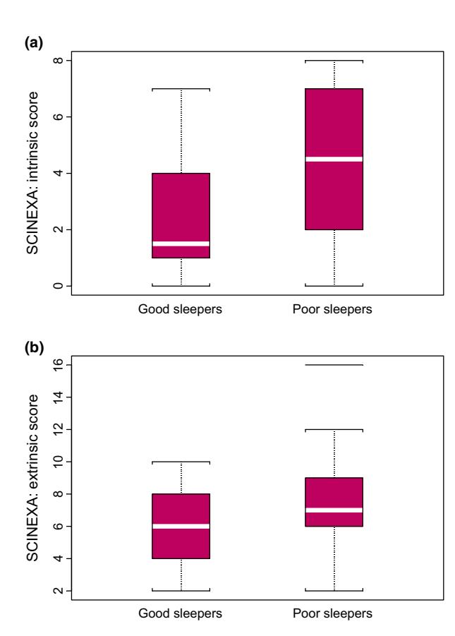
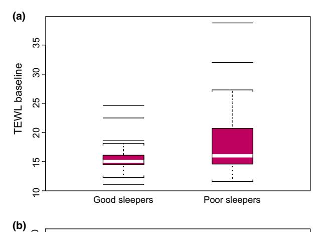
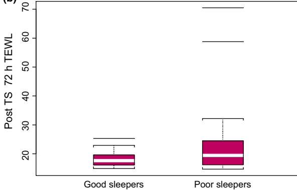

# Does poor sleep quality affect skin ageing?

# P. Oyetakin-White,1 A. Suggs,1 B. Koo,2 M. S. Matsui,3 D. Yarosh,3 K. D. Cooper1 and E. D. Baron1

1 Department of Dermatology and 2 Department of Pulmonary and Sleep Medicine, University Hospitals Case Medical Center, Cleveland, OH, USA; and 3 Estee Lauder Companies Inc, Melville, NY, USA

doi:10.1111/ced.12455

Summary Background. Sleep is important for growth and renewal of multiple physiological systems. The effects of chronic poor sleep quality on human skin function and visible signs of ageing have not been elucidated.

> Aim. To evaluate the effect of chronic poor sleep quality on measures of skin health and ageing. Self-perceived satisfaction with appearance was also assessed.

> Methods. 60 healthy caucasian women, who were categorized as poor quality sleepers [Pittsburg Sleep Quality Index (PSQI) > 5, sleep duration ≤ 5 h] or good quality sleepers (PSQI ≤ 5, sleep duration 7–9 h). A validated clinical tool, SCI-NEXATM, was used to assess intrinsic and extrinsic skin ageing. Dark under-eye circles were evaluated using standardized photos. Measurement of in vivo transepidermal water loss (TEWL) was used to assess recovery of the skin barrier after tape stripping. Subjects were exposed to simulated solar ultraviolet light, and recovery from erythema was monitored. Subjects also completed a questionnaire evaluating self-perception of attractiveness.

> Results. Good sleepers had significantly lower intrinsic skin ageing scores by SCINEXATM. At baseline, poor sleepers had significantly higher levels of TEWL. At 72 h after tape stripping, good sleepers had 30% greater barrier recovery compared with poor sleepers. At 24 h after exposure to ultraviolet light, good sleepers had significantly better recovery from erythema. Good sleepers also reported a significantly better perception of their appearance and physical attractiveness compared with poor sleepers.

> Conclusions. This study indicates that chronic poor sleep quality is associated with increased signs of intrinsic ageing, diminished skin barrier function and lower satisfaction with appearance.

# Introduction

According to the US Centers for Disease Control, insufficient sleep is a public health epidemic.1 Sleep is increasingly recognized as important to public health,

Correspondence: Dr Elma D. Baron, Department of Dermatology, University Hospitals Case Medical Center 11100 Euclid Avenue, Lakeside 3500, Mailstop 5028, Cleveland, OH 44106-5028, USA E-mail: elma.baron@uhhospitals.org

Conflict of interest: MSM and DY are employed by Estee Lauder Companies, and funding for this study was provided by the Estee Lauder Companies. the other authors declare that they have no conflicts of interest.

Accepted for publication 3 April 2014

with sleep insufficiency linked to motor vehicle crashes,2 industrial disasters, and medical and other occupational errors.3 People experiencing sleep insufficiency are also more likely to have chronic diseases such as hypertension, diabetes, depression and obesity, as well as cancer, increased mortality, and reduced quality of life and productivity.3

The skin functions as a barrier against environmental insults, plays a key role in thermoregulatory functions, and has its own peripheral circadian rhythm.4–6 Yosipovitch et al.6 has shown that human skin has time-dependent variations in barrier function, transepidermal water loss (TEWL), temperature and surface pH.

There are indications that increased oxidative stress plays a key role in mediating the negative effects of sleep disturbances.7,8 Few studies have specifically examined the effect of sleep deprivation on skin function, but it has been hypothesized that lack of sleep and presence of psychological stress can impair skin integrity.9 Acute sleep deprivation has been shown to exacerbate psoriasis inflammation in animal models,10 and to reduce the perception of health and attractiveness.11,12 The association between chronic poor sleep quality and skin function, integrity and appearance in human subjects has not been studied. We hypothesized that chronic poor sleep quality would be correlated with skin dysfunction, accelerated ageing, and lower satisfaction with facial appearance. A crosssectional study was performed to evaluate if sleep quality is associated with skin changes.

# Methods

Institutional review board (IRB) approval of the study protocol was obtained prior to initiation of study procedures and data collection. All participants provided written informed consent.

# Subjects

Healthy women aged 30–50 years were recruited from northeast Ohio through IRB-approved advertisements to achieve the enrolment goal of 60 subjects (30 per group). Subject had to have Fitzpatrick skin type (FST) I to IV, and be pre-menopausal, not pregnant or lactating and be regular night sleepers (i.e. not shift workers). We excluded subjects with critical illness or immunocompromise, recent skin disease and/or surgery, use of photosensitizing medications, known diagnosis of obstructive sleep apnoea (OSA) and excessive use of alcohol. In total, 75 women were enrolled, of whom 10 failed screening and 5 withdrew. Subject demographics are shown in Table 1. Study visits were scheduled in the morning from 6.00 to 9.00 h for both groups to minimize time-dependent skin variations.

#### Sleep quality assessment

Each subject's sleep quality was evaluated using the Pittsburg Sleep Quality Index (PSQI) self-assessment questionnaire,13 which evaluates seven components of sleep: duration, disturbances, latency, daytime dysfunction due to sleepiness, efficiency, subjective sleep quality, and medications needed for sleep. Subjects with a total PSQI ≤ 5 and sleep duration 7–9 h were

Table 1 Subject demographics.

| Characteristic       | Good sleepers (n = 30) | Poor sleepers (n = 30) | P     |
|----------------------|---------------------------|---------------------------|-------|
| Age, years, mean  SD | 37.5  5.5                 | 39.6  5                   | 0.13* |
| Skin phototype       |                           |                           |       |
| I                    | 1                         | 1                         | 0.32† |
| II                   | 9                         | 10                        |       |
| III                  | 19                        | 14                        |       |
| IV                   | 1                         | 5                         |       |
| BMI, mean  SD        | 27.9  6.9                 | 29.5  7.1                 | 0.37* |
| ≤ 18.5 (underweight) | 0                         | 0                         | 0.21† |
| 18.5–25 (normal)     | 14                        | 9                         |       |
| 25–30 (overweight)   | 10                        | 9                         |       |
| ≤ 30                 | 6                         | 12                        |       |

BMI, body mass index. \*t-Test; †v² test.

categorized as good sleepers, and subjects with a total PSQI > 5 and sleep duration ≤ 5 h were categorized as poor sleepers. To be categorized as either a good or poor sleeper, the subject had to meet the criteria for both PSQI and sleep duration. Subjects with values between the two categories were excluded to avoid any confounding ambiguity.

#### Intrinsic and extrinsic skin ageing

The SCINEXATM tool14 used was used to assess skin ageing. This is a validated, noninvasive ageing score, composed of 5 items characteristic of intrinsic ageing and 18 items characteristic of extrinsic ageing.

#### Recovery from ultraviolet-induced erythema

Twelve areas of skin, 1 cm2 in size, on the right upper inner arm, were exposed to increasing doses of simulated solar radiation (SSR), while the rest of the body was protected. SSR was delivered by a 1000 W xenon arc lamp, which emits ultraviolet wavelengths of 290–400 nm, resembling natural sunlight. Erythema readings were obtained at 24 and 48 h after SSR exposure via a chromameter (CR300; Minolta, Ramsey, NJ, USA) to monitor the kinetics of erythema resolution.

#### Skin barrier recovery

To analyse skin barrier function, TEWL was determined by standard evaporimetry using a evaporimeter (DermaLab Cortex TEWL Measurement Unit; Derma-Lab-; Cortex Technology, Hadsund, Denmark), according to published guidelines.15

To disrupt the skin barrier, strips of commercially available tape (Dsquame-) were applied and removed, and this was repeated 6–30 times until a TEWL reading of 20 g/m2 h at the tape-stripped site was achieved. TEWL measurements were then repeated at 1, 24 and 72 h after barrier disruption.

#### Self-evaluation questionnaire

Subjects completed a questionnaire rating their satisfaction with their relative attractiveness, skin health and general appearance (Table 2).

#### Evaluation of under-eye dark circles

At the baseline visit, a trained study staff member evaluated the periocular region of each subjects and scored the severity of dark circles using standardized photographs, based on a scale from 1–9 (none to severe).

#### Statistical analysis

Statistical analyses were performed by Dr P. Fu at Case Western Reserve University. The t-test and v² test were used to assess differences in subject characteristics. The UV-induced erythema data, which were summarized by the area under the curve, were compared between groups using t-test and multiple regression analysis. Box plot and t-test were used to analyze SCINEXATM scores, TEWL, the self-evaluation questionnaire, and the difference in under-eye dark circles between groups. P < 0.05 was considered statistically significant for all data.

# Results

#### Subject demographics

The 60 women enrolled were aged 30–49 years; 30 were good sleepers and 30 were poor sleepers based

Table 2 Self-evaluation questionnaire.

on PSQI and sleep duration. There was no significant difference in age, FST or average BMI between the two groups (Table 1). However, based on BMI, more poor sleepers than good sleepers were considered obese.

#### Intrinsic and extrinsic skin ageing

The severity of intrinsic and extrinsic ageing is directly reflected in SCINEXA score values.14 Good sleepers had significantly (P < 0.001) lower intrinsic ageing scores (2.2 2) than poor sleepers (4.5 2.5), indicating that poor-quality sleepers had more advanced signs of intrinsic ageing (Fig. 1). The difference in extrinsic ageing scores between the two groups did not reach statistical significance (P = 0.06).

#### Recovery from ultraviolet-induced erythema

Within the range of UV doses administered, good sleepers had significantly better recovery from erythema at 24 h after SSR compared with poor sleepers (P = 0.02), and this trend continued until 48 h post-SSR, although the difference at that time point was not statistically significant (P = 0.08). After controlling for the effects of age and BMI, multiple regression did show a marginally significant difference in minimum erythema dose (MED) for UVA (P = 0.06) and a significant difference in MED for UVB (P = 0.04), with the good sleepers having a lower MED threshold.

#### Skin barrier recovery

At baseline, poor sleepers had significantly greater water loss through the skin as demonstrated by higher TEWL (P = 0.04) (Fig. 2a). All participants had been tape-stripped to the same TEWL. There was no

|                                              |                                                              | Mean score                   |                              |
|----------------------------------------------|--------------------------------------------------------------|------------------------------|------------------------------|
| No.                                          | Question                                                     | Good sleepers (n = 30) | Poor sleepers (n = 30) |
| 1                                            | Compared with your friends how do you think you look?        | 3.5                          | 3.13                         |
| 2*                                           | Do you think you look older or younger than your age?        | 3.8                          | 3.37                         |
| 3                                            | On the whole, how do you feel about the way your skin looks? | 3.37                         | 2.57                         |
| 4                                            | How satisfied are you with the way you look for your age?    | 3.73                         | 3.23                         |
| 5                                            | How healthy do you think your face looks?                    | 3.47                         | 2.8                          |
| 6                                            | Overall, how satisfied are you with your complexion?         | 3.47                         | 2.67                         |
| Total feelings about facial appearance score |                                                              | 21.33                        | 17.77                        |

\*Question 2 was rated on a scale from 1 (older) to 5 (younger). On a scale from 1 (poor) to 5 (excellent), subjects rated their level of satisfaction for each of the questions. For each survey question, the average level of satisfaction with their own appearance was higher among good sleepers.

Figure 1 Intrinsic ageing score. Results showed a significant difference in intrinsic SCINEXA score (P < 0.001) (Fig. 1a) and marginally significant difference of extrinsic score (P = 0.06) (Fig. 1b) between good sleepers and poor sleepers.

significant difference in TEWL between good and poor sleepers immediately after tape stripping (P = 0.62), at 1h(P = 0.67) or at 24 h (P = 0.23), but at 72 h after stripping, good sleepers showed 30% greater barrier recovery (as measured by return of TEWL toward baseline) compared with poor sleepers (P = 0.04) (Fig. 2b).

#### Self-evaluation questionnaire

For each question and the total score of all the questions, good sleepers had a significantly better score for satisfaction with their appearance, and had a higher perception of their physical attractiveness compared with poor sleepers (P < 0.01) (Table 2).

#### Evaluation of under-eye dark circles

There was no significant difference in total scores of presence or intensity of dark circles between good sleepers (9 3.2) and poor sleepers (9.8 3.3) (P = 0.37).

Figure 2 Transepidermal water loss (TEWL) before and after tape stripping. There was a significant difference between (a) baseline and (b) 72 h after tape stripping.

# Discussion

Studies have suggested that acute sleep deprivation may impair the integrity of the skin.16,17 In this study, we determined that chronic poor sleep quality is associated with skin ageing and skin responses to exogenous stressors. We also observed an association between sleep quality and self-perception of skin and facial appearance.

SCINEXA is a validated, noninvasive skin ageing assessment tool used to discriminate between intrinsic (internal or chronological) vs. extrinsic (external or photo-) ageing. Intrinsic ageing is thought to result from factors inherent in chronological ageing such as metabolic oxidative stress, whereas extrinsic ageing is primarily due to exogenous factors such as exposure to UVR and air pollution.14 In our study, total intrinsic scores were significantly lower for good sleepers compared with poor sleepers. Poor sleepers showed higher values for uneven pigmentation, fine wrinkling, skin laxity, loss of subcutaneous fat and benign skin growths. This indicates that chronic poor quality sleep is associated with accelerated intrinsic ageing. Future studies should determine whether the higher oxidative stress previously shown to exist in sleep disturbances is correlated with intrinsic skin ageing, as free radicals have been shown to be a probable mechanism of skin ageing.18 Total extrinsic ageing scores were only marginally lower for good sleepers. Extrinsic skin changes are known to be significantly affected by factors such as smoking,19 sun exposure20 and air pollution.21

Within the range of UV doses administered, there was a significantly greater rate of recovery from erythema at 24 h post-SSR among good sleepers compared with poor sleepers (P = 0.02). Such differences cannot be attributed to skin phototype, as there was no significant difference in FST between the two groups. These results suggest a more efficient DNA repair mechanism in good sleepers. The relationship between erythema and DNA damage and repair has been established in previous studies.22 Interestingly, the mean MED (for UVB) of good sleepers was significantly lower than that of poor sleepers (P = 0.04). Hence, it appears that at the outset, good sleepers have a more brisk erythema response to UV, but they also recover faster from UV-induced inflammation and damage. Molecular analysis of skin biopsies in future studies would help to determine the mechanisms for this.

At baseline, poor sleepers had significantly higher levels of TEWL, considered to reflect a more compromised barrier. At 72 h after tape stripping, good sleepers showed 30% greater barrier recovery compared with poor sleepers. This agrees with other studies, which have suggested that sleep deprivation can result in decreased skin barrier function recovery.16,17 Altemus et al.17 demonstrated this in acute short-term sleep deprivation. Kahan et al.16 speculated that sleep deprivation leads to decreased recovery of skin barrier function. To our knowledge, our study is the first to report clinical data that establish an association between chronic poor sleep quality and impaired skin barrier function.

Good sleepers reported a significantly better perception of their current attractiveness compared with poor sleepers. For each survey question, the level of satisfaction with personal appearance was higher among good sleepers. This suggests that people with adequate sleep may be more self-confident and happier with how they look. Of note, there were more obese subjects in the poor sleepers group. Nonetheless, the difference in score is thought to be associated with sleep quality and not BMI, as there was no significant difference in self-appearance score between obese and nonobese subjects (P = 0.48).

It is commonly thought that dark circles are more severe in sleep-deprived individuals. However, in our study, no significant difference in dark under-eye circles was noted between the two groups. This corresponds to a recent study of almost 500 Brazilian women, which found no correlation between dark under-eye circles and lack of sleep.23

It should be noted that the volunteers in this study were healthy individuals without frank sleep pathology. Those with OSA were excluded because this condition is known to have severe health consequences.24 As these results were obtained from subjects with no serious sleep pathology, the implications for those with serious sleep disorders could be even greater. Interestingly, a recent study noted that patients with OSA had improved perceived facial appearance after use of positive airway pressure.25 Our study population was also relatively young (aged 30–50 years); in older subjects, the association of poor sleep and signs of skin ageing might be even stronger.

# Conclusions

There is scant literature on the association between chronic poor sleep quality and skin function, integrity and appearance in human subjects. Our study demonstrated that chronic poor quality sleep is associated with accelerated intrinsic skin ageing and less effective skin barrier function. Good quality sleep was associated with more efficient recovery from UV-induced erythema, and better self-perception of overall appearance. Future studies should explore oxidative stress as a mechanism for these results.

# What's already known about this topic?

- Stress and acute sleep deprivation can impair the integrity of skin in humans.
- Acute sleep loss can result in decreased skin barrier function recovery, and a decrease in subjective perceptions of facial health and attractiveness.
- Chronic sleep deficiency increases the risk of obesity.

#### What does this study add?

● Chronic poor sleep quality is associated with an acceleration in the signs of ageing.

- Chronic poor sleep quality is associated with decreased skin barrier function recovery and recovery from sunburn.
- Chronic poor sleep quality is associated with decreased satisfaction with personal appearance.

# Acknowledgements

This study was conducted by the Skin Study Center staff at Case Western Reserve University/University Hospitals. Funding for this research was obtained from the Estee Lauder Corporation. We thank Dr P. Fu, from the Biostatistical Core at Case Western Reserve University for all his help with the statistics for the study. This study utilized the REDCap (Research Electronic Data Capture) System and has been supported in part by the Clinical and Translational Science Award (CTSC) - UL1TR 000439.

### References

- 1 CDC. Insufficient sleep is a public health epidemic 2014. Available from: http://www.cdc.gov/features/dssleep/ (accessed 24 January 2014).
- 2 Strohl K, Blatt J, Council F et al. Drowsy driving and automobile crashes. Available from: http://www.nhtsa. gov/people/injury/drowsy\_driving1/Drowsy.html - NCSDR/NHTSA (accessed 24 January 2014).
- 3 Colten H, Altevogt BM, eds. Sleep Disorders and Sleep Deprivation: An Unmet Public Health Problem Washington, DC: The National Academies Press, 2006.
- 4 Sandu C, Dumas M, Malan A et al. Human skin keratinocytes, melanocytes, and fibroblasts contain distinct circadian clock machineries. Cell Mol Life Sci 2012; 69: 3329–39.
- 5 Sporl F, Korge S, Jurchott K et al. Kruppel-like factor 9 is a circadian transcription factor in human epidermis that controls proliferation of keratinocytes. Proc Natl Acad Sci USA 2012; 109: 10903–8.
- 6 Yosipovitch G, Xiong GL, Haus E et al. Time-dependent variations of the skin barrier function in humans: Transepidermal water loss, stratum corneum hydration, skin surface pH, and skin temperature. J Invest Dermatol 1998; 110: 20–3.
- 7 Kontogianni K, Messini-Nikolaki N, Christou K et al. DNA damage and repair capacity in lymphocytes from obstructive sleep apnea patients. Environ Mol Mutagen 2007; 48: 722–7.
- 8 Yamauchi M, Nakano H, Maekawa J et al. Oxidative stress in obstructive sleep apnea. Chest 2005; 127: 1674–9.
- 9 Kahan V, Andersen ML, Tomimori J, Tufik S. Stress, immunity and skin collagen integrity: evidence from

- animal models and clinical conditions. Brain Behav Immun 2009; 23: 1089–95.
- 10 Hirotsu C, Rydlewski M, Araujo MS et al. Sleep loss and cytokines levels in an experimental model of psoriasis. PLoS ONE 2012; 7: e51183.
- 11 Axelsson J, Sundelin T, Ingre M et al. Beauty sleep: experimental study on the perceived health and attractiveness of sleep deprived people. Br Med J 2010; 341: c6614.
- 12 Sundelin T, Lekander M, Kecklund G et al. Cues of fatigue: effects of sleep deprivation on facial appearance. Sleep 2013; 36: 1355–60.
- 13 Buysse D, Reynolds CF, Monk TH et al. The Pittsburgh Sleep Quality Index: a new instrument for psychiatric practice and research. Psychiatry Res 1989; 28: 193–213.
- 14 Vierkotter A, Ranft U, Kramer U et al. The SCINEXA: a novel, validated score to simultaneously assess and differentiate between intrinsic and extrinsic skin aging. J Dermatol Sci 2009; 53: 207–11.
- 15 Rogiers V. EEMCO guidance for the assessment of transepidermal water loss in cosmetic sciences. Skin Pharmacol Appl Skin Physiol 2001; 14: 117–28.
- 16 Kahan V, Andersen ML, Tomimori J, Tufik S. Can poor sleep affect skin integrity? Med Hypotheses 2010; 75: 535–7.
- 17 Altemus M, Rao B, Dhabhar FS et al. Stress-induced changes in skin barrier function in healthy women. J Invest Dermatol 2001; 117: 309–17.
- 18 Knaggs H. A new source of aging? J Cosmet Dermatol 2009; 8: 77–82.
- 19 Okada H, Alleyne B, Varghai K et al. Facial changes caused by smoking: a comparison between smoking and nonsmoking identical twins. Plast Reconstr Surg 2013; 132: 1085–92.
- 20 Uitto J. Understanding premature skin aging. N Engl J Med 1997; 337: 1463–5.
- 21 Vierk€otter A, Krutmann J. Environmental influences on skin aging and ethnic-specific manifestations. Dermatoendocrinol 2012; 4: 227–31.
- 22 Young A, Chadwick CA, Harrison GI et al. The in situ repair kinetics of epidermal thymine dimers and 6–4 photoproducts in human skin types I and II. J Invest Dermatol 1996; 106: 1307–13.
- 23 Matsui M, Vanderover G, Ennis C et al. Peri-orbital dark circles in Brazilian women: risk factors and hyperspectral image analysis. J Invest Dermatol 2013; 133: s234.
- 24 Edwards B, O'Driscoll DM, Ali A et al. Aging and sleep: physiology and pathophysiology. Semin Respir Crit Care Med 2010; 31: 618–33.
- 25 Chervin R, Ruzicka DL, Vahabzadeh A et al. The face of sleepiness: Improvement in appearance after treatment of sleep apnea. J Clin Sleep Med 2013; 9: 845–52.