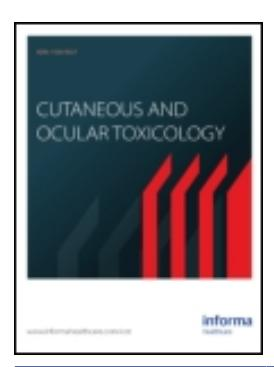
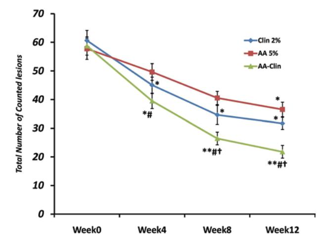
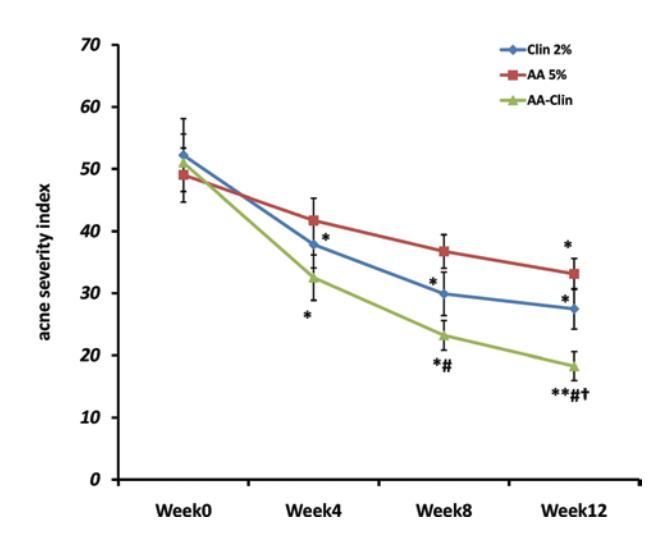

### **Cutaneous and Ocular Toxicology**

**ISSN: 1556-9527 (Print) 1556-9535 (Online) Journal homepage: [www.tandfonline.com/journals/icot20](https://www.tandfonline.com/journals/icot20?src=pdf)**

## **Combination of azelaic acid 5% and clindamycin 2% for the treatment of acne vulgaris**

**Hamidreza Pazoki-Toroudi, Mohamad Ali Nilforoushzadeh, Marjan Ajami, Fariba Jaffary, Nahid Aboutaleb, Mansour Nassiri-Kashani & Alireza Firooz**

**To cite this article:** Hamidreza Pazoki-Toroudi, Mohamad Ali Nilforoushzadeh, Marjan Ajami, Fariba Jaffary, Nahid Aboutaleb, Mansour Nassiri-Kashani & Alireza Firooz (2011) Combination of azelaic acid 5% and clindamycin 2% for the treatment of acne vulgaris, Cutaneous and Ocular Toxicology, 30:4, 286-291, DOI: [10.3109/15569527.2011.581257](https://www.tandfonline.com/action/showCitFormats?doi=10.3109/15569527.2011.581257)

**To link to this article:** <https://doi.org/10.3109/15569527.2011.581257>

| Published online: 08 Nov 2011.          |
|-----------------------------------------|
| Submit your article to this journal     |
| Article views: 470                      |
| View related articles                   |
| Citing articles: 5 View citing articles |

#### informa healthcare

#### **RESEARCH ARTICLE**

# Combination of azelaic acid 5% and clindamycin 2% for the treatment of acne vulgaris

Hamidreza Pazoki-Toroudi1, 2, 3, Mohamad Ali Nilforoushzadeh1, 4, Marjan Ajami5, Fariba Jaffary4, Nahid Aboutaleb2, Mansour Nassiri-Kashani6, Alireza Firooz6

1Skin and Stem cell Research Center, Tehran University of Medical Sciences, Tehran, Iran, 2Physiology Research Center, Tehran University of Medical Sciences, Tehran, Iran, 3Nano Vichar Pharmaceutical Ltd, Tehran, Iran sciences, Tehran, Iran, 4Skin Diseases and Leishmaniasis Research Centre, Isfahan University of Medical Sciences, Isfahan, Iran, 5Departments of Nutrition, Tehran University of Medical Sciences, Tehran, Iran, and 6Center for Research and Training in Skin Diseases and Leprosy, Tehran University of Medical Sciences, Tehran, Iran

#### Abstract

Context and objective: Acne vulgaris, an inflammatory skin disease with different clinical appearances, is a common problem in most adolescents. It seems that using combinations of topical agents can decrease resistance to the treatment and improve the efficacy. Therefore, we evaluated the effects of azelaic acid (AA) 5% and clindamycin (Clin) 2% combination (AA-Clin) on mild-to-moderate acne vulgaris.

Materials and methods: The efficacy and safety of 12-week treatment with AA-Clin in patients with mild-to-moderate facial acne vulgaris were evaluated by a multicenter, randomized, and double-blind study. A total of 88 male and 62 female patients were randomly assigned to one of these treatments: AA 5%, Clin 2%, and combination of them. Every 4 weeks, total inflammatory and noninflammatory lesions were counted, acne severity index (ASI) was calculated, and patient satisfaction was recorded.

Results: Treatment for 12 weeks with combination gel significantly reduced the total lesion number compared with baseline (p<0.01), as well as Clin 2% or AA 5% treatment groups (p<0.05 or p<0.01). The percentage of reduction in ASI in combination treated group (64.16±6.01) was significantly more than those in the Clin 2% (47.73±6.62, p<0.05) and 5% AA (32.46±5.27, p<0.01) groups after 12 weeks. Among the patients in the AA-Clin group, 75.86% of males were satisfied or very satisfied and 85.71% of females were satisfied or very satisfied. This trend was significant in comparison to the number of patients who were satisfied with AA 5% or Clin 2% treatment (p<0.01). Seven patients in AA-Clin group (incidence=22%) showed adverse effects that were not statistically significant compared to treatment with individual active ingredients.

*Discussion and conclusion:* The profound reduction in lesion count and ASI by combination therapy with AA-Clin gel in comparison to individual treatment with 5% AA or Clin 2% suggested the combination formula as an effective alternative in treatment of acne vulgaris.

Keywords: azelaic acid, clindamycin, acne vulgaris

#### Introduction

Acne vulgaris, an inflammatory skin disease with different clinical appearances, is a common problem in most adolescents (1–3). The main pathophysiological mechanisms of acne include: hyperkeratinization of pilosebaceous follicles, amplified activity of sebaceous glands, and increased bacterial colonization in pilosebaceous

units as well as perifollicular inflammation (4). Because topical treatment with a single substance is not able to remove all involved mechanisms, combining an antibiotic with a follicular plugging reducer is often applied as an effective treatment for mild-to-moderate acne (5).

Among various treatments for mild-to-moderate acne vulgaris, a well-known aliphatic dicarboxylic acid,

Address for Correspondence: Dr. Hamidreza Pazoki-Toroudi, PhD, Tehran University of Medical Sciences, Physiology Research Center, Hemmat Street, Tehran, Islamic Republic of Iran. E-mail: hpazooki@farabi.tums.ac.ir

azelaic acid (AA), is one of the most effective compounds, with efficacy equal to that of other approved treatments including benzoyl peroxide, erythromycin, and tretinoin (6–10). Previously, it has been demonstrated that AA on one hand has predominant antibacterial activity and on the other hand has a modest comedolytic effect. These properties of AA have made it available to use alone or in combination with other treatments in the reduction of sebum production on different parts of face including forehead, chin, and cheek (5,11–14).

Some antibiotics including oral tetracycline, doxycycline, minocycline, and topical clindamycin (Clin) and erythromycin are used in the treatment of acne disease (15) and are well known for their antibacterial and anti-inflammatory effects, which act by suppressing the growth of propionibacterial species (especially *Propionibacterium acnes* and *Propionibacterium granulosum*). Such treatments effectively reduce the severity of acne disease (16–17). Topical Clin, a lincosamide antibiotic, is used in different countries with different formulations in the form of lotions, topical solutions, and gels (18–21). Clin appears to be superior in efficacy compared with erythromycin and tetracycline (22). Nevertheless, the main problem of treatment with antibiotics is increased resistance, which limits their effectiveness in treatment of acne disease (23–24). It seems that applying the combinations of topical agents that include an antibiotic and other antiacne factor (e.g. topical retinoid, benzoyl peroxide, or AA plus Clin or erythromycin) can decrease resistance to the treatment on one hand and also improve efficacy due to the activity of more agents with different mechanisms of action and synergistic activity against bacteria (22,25–28).

In the present study, we evaluated the effect of a combination of AA 5% and Clin 2% (AA-Clin) on mild-tomoderate acne vulgaris.

#### **Methods**

A total of 150 patients with a clinical diagnosis of mildto-moderate facial acne vulgaris (with ≥10 facial lesions) from three clinics in Tehran were included in the present clinical trial study from April 2009 to November 2009. The study groups comprised equal numbers of male and female patients. All patients signed written consent forms.

Inclusion criteria were age from 14 to 40 years old and mild-to-moderate acne vulgaris with at least 10 inflammatory lesions on the face.

Exclusion criteria included: 1–Nodulocystic lesions (>3), 2—Other types of acne such as acne conglubata or fulminans and acne secondary to pregnancy or lactation, 3—Other skin diseases such as psoriasis, dermatitis, or papulopustular rosacea that affect the therapeutic course, 4—History of hepatic or kidney disease, 5—Malnutrition, 6—Topical antiacne therapy or systemic therapy with antibiotics 45 days before the beginning of the study, 7—History of allergic reaction to prescribed drugs, 8—Taking drugs such as theophyllin, phenytoin, barbiturates, carbamazepine, cyclosporine, warfarin, ergotamine, and triazolam within 1 week before beginning the study, and 9—Pregnant or lactating patients.

#### **Study design**

Patients were assigned randomly to one of the three treatment groups: (I) Topical AA 5% gel, (II) Topical Clin 2% gel, and (III) AA-Clin gel. The patients were trained to apply gel on the area two times per day for 12 weeks. Both patients and their dermatologists were blinded regarding the type of treatment.

Evaluations of pretreatment period included the baseline determination of acne severity index (ASI), which was determined from the number of dermatologist-counted lesions and calculated using the following formula: (7)

ASI P apules (pustules 2 ) (comedones0.25)

The impressions of patients regarding the severity of their acne disease before study were recorded. At every 4-week interval during the 12-week treatment period, disease status was evaluated by a dermatologist, and total number of lesions including papules, pustules, and comedones were counted. Then, the ASI was calculated for each patient. Patient satisfaction was rated as follows: 0, very unsatisfied; 1, unsatisfied; 2, moderately satisfied; 3, satisfied; and 4, very satisfied. Adverse effects including scaling, pruritus, erythema, dry skin, and oiliness were evaluated at each visit.

#### **Statistical analysis**

Results obtained from lesion count, ASI, and patient satisfaction were analyzed by comparing the data between groups. Paired-sample *t*-test was used for the comparison of data during each visit after treatment with baseline values. One-way analysis of variance (ANOVA) and *post hoc* analysis (Tukey's test) were performed to assess specific group comparisons with regard to lesion counts. Patient satisfaction values were analyzed using the Mann–Whitney *U*-test. Incidences of adverse reactions were compared between groups using a contingency table χ[2](#page-5-0) -test. The level of statistical significance was accepted as *p* < 0.05. Calculations were performed using the SPSS statistical package (version 14).

#### **Results**

Among 150 patients in the present study, 50 received Clin 2% (32 male and 18 female patients), 50 received AA 5% (27 male and 23 female), and the remaining 50 patients received combination therapy with AA-Clin (29 male and 21 female). The mean age of patients in groups Clin 2%, AA 5%, and AA-Clin was 23.39±2.69, 22.48±2.50, and 22.1±1.89, respectively. Other demographic data are shown in Table 1.

From total 150 patients, 6 patients did not refer to the center in week 8 (3 from AA 5%, 1 from Clin 2%, and 2 from AA-Clin group), and 18 patients did not refer to the center in week 12 (5 from AA 5%, 7 from Clin 2%, and 6 from AA-Clin group). For patients who did not refer to the center at weeks 8 or 12, data for patient's satisfaction were collected from them by calling or inviting for a final evaluation. Two of these patients did not refer to the center because of the lack of effect (AA 5% group), and rest of them for other reasons.

#### **Lesion count**

The effects of different types of treatment on reduction of total lesion count are illustrated in [Figure 1.](#page-3-0) In comparison to the baseline value of total lesions in groups Clin 2%, AA 5%, and AA-Clin (60.64±3.53, 57.76±3.70, and 58.75±3.20, respectively), all treatments reduced acne significantly after 12 weeks (31.68±2.11; *p*<0.05, 36.52±2.54; *p*<0.05, and 21.77±2.21; *p*<0.01, respectively). Effects of Clin 2% and AA-Clin on reduction of total lesion count were observed from week 4 of treatment (45.04±2.78; *p*<0.05, and 39.49±2.62; *p*<0.05, respectively); however, in the case of AA reductions in lesion count were observed from week 12 (36.52±2.54, *p*<0.05). Among-group comparison showed that the reduction of the total number of lesions in the AA-Clintreated group was significantly greater in magnitude than two individual treatments (from week 4–12 vs. AA 5% group, *p*<0.05, and from week 8–12 vs. Clin 2%; *p*<0.05, [Figure 1](#page-3-0)). Comparison of percentage reduction from baseline values of total number of lesions showed that the effects of AA-Clin were significantly greater than the effects observed with the two other types of treatment (*p*<0.05 vs. Clin 2% from week 8–12 and *p*<0.01 vs. AA 5%, from week 4–12, Table 2). Percentage of reduction from baseline values for each of lesion is presented in Table 2, which shows that the effects of AA-Clin were superior to AA 5% and Clin 2% with regard to reduction of papules (*p*<0.05 vs. Clin 2% and *p*<0.01 vs. AA 5%), pustules, and comedones (*p*<0.05).

#### **ASI and percentage of reduction for different lesions**

ASI was 52.22±4.33, 49.04±5.89, and 51.00±4.63 for Clin 2%, AA 5%, and AA-Clin groups, respectively, before

Table 1. Demographic data of the patients.

|                       | Clin 2%    | AA 5%      | AA + Clin  |
|-----------------------|------------|------------|------------|
| Male                  |            |            |            |
| N                     | 32         | 27         | 29         |
| Age (mean)            | 23.33±2.76 | 23.42±2.50 | 22.97±2.61 |
| Weight (mean)         | 66.01±4.12 | 63.71±3.24 | 65.57±4.6  |
| History (year)        | 2.42±0.56  | 2.21±0.82  | 3. 16±0.64 |
| Family history (n, %) | 21 (65.56) | 19 (70.37) | 24 (82.75) |
| Female                |            |            |            |
| N                     | 18         | 23         | 21         |
| Age (mean)            | 21.46±2.52 | 20.97±2.49 | 22.07±2.13 |
| Weight (mean)         | 54.44±3.29 | 55.12±3.60 | 54.75±4.03 |
| History (year)        | 2.37±0.64  | 2.39±0.84  | 2.40±0.81  |
| Family history (n, %) | 13 (72.22) | 17 (73.91) | 14 (66.66) |
|                       |            |            |            |

AA, azelaic acid 5%; Clin, clindamycin 2%; AA-Clin, azelaic acid 5% + clindamycin 2%.

treatment. These values decreased significantly after week 4 for Clin 2% and AA-Clin groups (37.85±3.63, *p*<0.05 and 32.53±3.66, *p*<0.05; [Figure 2\)](#page-4-0) and after week 12 for the AA 5% group (33.12±3.27, *p*<0.05; [Figure 2\)](#page-4-0). Among-group comparisons showed that the percentage of reduction of ASI from baseline in the AA-Clin group was superior to that observed for either of the two treatments separately (week 4–12, *p*<0.05 vs. Clin 2% and *p*<0.01 vs. AA 5%; Table 2).

#### **Patient satisfaction**

Results of patient satisfaction with treatment are presented in Table 3. Among all 88 male patients, 17.04% were very satisfied; 45.45% were satisfied, and 31.81% were moderately satisfied or unsatisfied with regard to the results. Among all 62 female patients, 17.74% were very satisfied, 43.54% were satisfied, and 37.09% were moderately satisfied or unsatisfied regarding the results of treatment. Statistical analysis did not show significant differences between AA 5% and Clin 2% with regard to patient satisfaction. However, patients in group AA-Clin (75.86% satisfied or very satisfied male patients and 85.71% satisfied or very satisfied female patients) showed a significant improvement in satisfaction as compared to AA 5% or Clin 2% (*p*<0.05). Only 12% of AA-Clintreated patients graded their satisfaction less than grade 3 (satisfied).

#### **Adverse effect evaluation**

The total number of patients having specific adverse effects confirmed by dermatologists is shown in Table 4. Some patients showed two or more adverse effects (data not shown). The incidence of adverse effects was 32% and 40% in AA 5% and Clin 2% groups (12 and 8 patients showed these results, respectively). Seven patients in group AA-Clin (incidence=22%) showed adverse effects that were not statistically significant compared to other groups.

Figure 1. Effects of 12-week treatment with azelaic acid 5% (AA 5%), clindamycin 2% (Clin 2%), or AA 5% plus Clin 2% gel (AA-Clin) on reduction of total number of counted acne lesions. \**p*<0.05 and \*\**p*<0.01 vs. week 0 of same group, # *p*<0.05 vs. AA 5% and † *p*<0.05 vs. Clin 2%.

Table 2. The efficacy of AA, Clin, or combination of AA and Clin on reduction of total lesion count, acne severity index, and different types of acne lesions during 12 weeks of treatment.

|         |       | Percent reduction from the baseline value (week 0) |                     |               |              |              |  |
|---------|-------|----------------------------------------------------|---------------------|---------------|--------------|--------------|--|
|         | Weeks | Total lesion counting                              | Acne severity index | Papules       | Pustules     | Comedones    |  |
| Clin 2% | 0     | —                                                  | —                   | —             | —            | —            |  |
|         | 4     | 26.54±3.32†                                        | 27.52±4.34          | 26.45±2.74††  | 29.84±2.52   | 23.32±2.54   |  |
|         | 8     | 42.24±3.17†                                        | 42.72±4.52          | 47.23±3.51††  | 38.63±3.64   | 40.85±3.56   |  |
|         | 12    | 46.89±3.62†                                        | 47.73±6.62          | 53.03±3.26†   | 42.10±4.41   | 45.54±4.29   |  |
| AA 5%   | 0     | —                                                  | —                   | —             | —            | —            |  |
|         | 4     | 14.51±1.24                                         | 14.89±2.89          | 2.71±0.94     | 23.31±2.16   | 17.51±2.51   |  |
|         | 8     | 27.83±2.01                                         | 25.04±5.40          | 12.98±2.74    | 29.56±3.07   | 40.96±3.21   |  |
|         | 12    | 34.94±2.67                                         | 32.46±5.27          | 28.00±3.21    | 32.39±3.22   | 44.43±4.34   |  |
| AA-Clin | 0     | —                                                  | —                   | —             | —            | —            |  |
|         | 4     | 34.16±3.72††                                       | 36.22±4.50†         | 35.13±3.32††# | 39.73±3.67†# | 27.62±3.73†  |  |
|         | 8     | 54.72±3.64††#                                      | 54.58±4.49††#       | 55.31±3.37††# | 53.36±4.81†# | 55.48±5.06†# |  |
|         | 12    | 62.97±3.62††#                                      | 64.16±6.01††#       | 67.54±4.11††# | 62.15±5.49†# | 59.21±5.54†# |  |

Percent of reduction in each week=(baseline value − value in that week)/ baseline value)×100.

AA 5%, azelaic acid 5%; Clin 2%, clindamycin 2%; AA-Clin, AA 5% + Clin 2% gel.

# *p*<0.05 vs. Clin 2% and † *p*<0.05 and ††*p*<0.01 vs. AA 5%.

#### **Discussion**

The present study is the first to evaluate the effect of gel composed of AA 5% and Clin 2% on the treatment of acne vulgaris. The results of the present study showed that this combination was significantly more effective than AA 5% or Clin 2% alone in decreasing the total number of lesions and decreasing each type of lesion (papules and pustules). Moreover, AA-Clin reduced ASI more effectively than treatment with AA 5% or Clin 2% alone after 4 weeks; this effect was significantly prominent until the end of the study (week 12). Patient satisfaction confirmed the significant efficacy of combination therapy compared with the two other single treatments. In spite of the significant effects of combination therapy on reducing the signs of disease, there was no significant difference between groups with regard to the incidence of adverse side effects following treatment.

Previous studies have evaluated the effects of AA on skin tissue and demonstrated that treatment with AA decreases proliferative activity in keratinocytes and modulates epidermal differentiation. It seems that AA provide its inhibitory effects on keratinization by decreasing DNA in a dose- and time-dependent manner and protein synthesis by acting primarily on mitochondria and rough endoplasmic reticulum (29–30). In addition, bacteriostatic properties of AA that affect both aerobic and anaerobic bacteria including *Propionibacterium* have rendered this drug the preferred method for clinical treatment of acne disease (15,31). Other possible mechanisms that may underlie the effects of AA in reducing the severity of acne disease include its inhibitory effects on 5 α-reductase, which converts testosterone to 5-dihydrotestosterone (32). These findings suggest that the effectiveness of this agent in the treatment of human skin disease is derived from effects on androgens (33). Although the majority of acne patients exhibit normal levels of circulating androgens, sebaceous glands from acne regions exhibit

Figure 2. Effects of 12-week treatment with azelaic acid 5% (AA 5%), clindamycin 2% (Clin 2%), or AA 5% plus Clin 2% gel (AA-Clin) on reduction of acne severity index. \**p*<0.05 and \*\**p*<0.01 vs. week 0 of same group, # *p*<0.05 vs. AA 5% and † *p*<0.05 vs. Clin 2%.

a stronger sensitivity to androgens than the sebaceous glands from other parts of the body, which confirm the role of androgenic hormones in acne disease (34–35).

Antiacne properties of AA have been demonstrated in previous clinical trials (11,12) and are extensively used in the clinic, alone or in combination with other treatments including erythromycin or benzoyl peroxide (36). In addition, in some cases, acne can leave behind hyperpigmentation on face skin (37,38), while AA has been demonstrated to be an effective and well-tolerated treatment for hyperpigmentation (39,40). Therefore, AA can be useful in treatment of both acne and its effects on skin pigmentation.

Aside from the useful effects of treatment with AA alone as confirmed in the present study, combination with Clin showed more potent efficacy in the reduction

Table 3. Patient's satisfaction of acne treatments during 12 weeks of the study.

|            | Patient satisfaction (0–4) |            |            |           |          |       |
|------------|----------------------------|------------|------------|-----------|----------|-------|
| Treatments | 4                          | 3          | 2          | 1         | 0        | Total |
| Male       |                            |            |            |           |          |       |
| Clin 2%    | 6 (18.75)                  | 14 (43.75) | 8 (25)     | 4 (12.5)  | 0        | 32    |
| AA 5%      | 3 (11.11)                  | 10 (37.03) | 8 (29.62)  | 5 (18.51) | 1 (3.7)  | 27    |
| AA-Clin†#  | 6 (20.68)                  | 16 (55.17) | 3 (10.34)  | 0         | 0        | 29    |
| Female     |                            |            |            |           |          |       |
| Clin 2%    | 3 (16.66)                  | 8 (44.44)  | 5 (27.77)  | 2 (1.11)  | 0        | 18    |
| AA 5%      | 2 (8.69)                   | 7 (30.43)  | 12 (52.17) | 1 (4.34)  | 1 (4.34) | 23    |
| AA-Clin†#  | 6 (28.57)                  | 12 (57.14) | 2 (9.52)   | 1 (4.76)  | 0        | 21    |

Data are shown as the number and percent of patients regarding the patient judgment of overall efficacy of different treatments at the end of the study (week 12).

AA 5%, azelaic acid 5%; Clin 2%, clindamycin 2%; AA-Clin, AA 5% + Clin 2% gel.

Table 4. Adverse events observed in treated groups.

| Side effects | AA 5%  | Clin 2% | AA-Clin |
|--------------|--------|---------|---------|
| Scaling      | 4 (8)  | 6 (12)  | 3 (6)   |
| Dry skin     | 5 (10) | 3 (6)   | 2 (4)   |
| Erythema     | 3 (6)  | 4 (8)   | 2 (4)   |
| Oiliness     | 5 (10) | 4 (8)   | 4 (8)   |
| Pruritus     | 4 (8)  | 3 (6)   | 2 (4)   |

AA 5%, azelaic acid 5%; Clin 2%, clindamycin 2%; AA-Clin, AA 5% + Clin 2% gel.

In all groups the signs were checked during 12 weeks of treatment.

of lesion count and ASI, resulting in superior patient satisfaction following treatment. It seems that the antiinflammatory effects of Clin (41–43) enhanced the therapeutic potential of AA 5%, because a significant reduction of both inflammatory and noninflammatory lesions was obtained by combination therapy as compared to treatment with either drug alone [\(Figure 1](#page-3-0) and Table 2).

Previously, combination therapies of Clin with benzoyl peroxide have shown more successful results with highly favorable safety and tolerability profiles as compared to treatment with individual active ingredients (26,44,45). Other combinations of Clin include lotions of Clin and tretinoin or Clin and salicylic acid; these have also shown more potent effects in reducing the ASI and the numbers of inflammatory and noninflammatory lesions (46,47). One important feature of the results of combination therapy with Clin or AA is the tolerability of patients to this type of treatment (37,48,49). The combination of AA with Clin did not produce significant adverse effects as compared to treatment with individual active ingredients (Table 4), while higher levels of patient satisfaction (Table 3) suggest the potential of this approach in clinical applications.

Although propionibacterial species always show resistance to Clin (restricting its utility as a therapeutic agent for acne) (23–24), combination therapy by topical agents like retinoid, benzoyl peroxide, or AA and successful control of infection (i.e. washing hands between patient visits in the clinic) can extend Clin's efficacy during long-term treatment for acne disease (17,22–23). In the present study, a combination of AA with Clin showed increasing therapeutic efficacy during 12 weeks of treatment (Table 2 and [Figures 1](#page-3-0) and [2\)](#page-4-0).

In conclusion, through the effective reduction of the number of inflammatory and noninflammatory acne lesions and ASI on one hand and increased patient satisfaction with safe and tolerable features on the other, the combination of AA + Clin seems to be useful for clinical applications.

#### **Declaration of interest**

All parts of present work was founded by Tehran University of medical Sciences, and there was no conflict of interest to other institutions.

#### **References**

- 1. Ozolins M, Eady EA, Avery AJ, Cunliffe WJ, Po AL, O'Neill C, Simpson NB, Walters CE, Carnegie E, Lewis JB, Dada J, Haynes M, Williams K, Williams HC. Comparison of five antimicrobial regimens for treatment of mild to moderate inflammatory facial acne vulgaris in the community: Randomised controlled trial. Lancet 2004;364:2188–2195.
- 2. Purdy S. Acne vulgaris. Clin Evid 2006:2183–2201.
- 3. Jeremy AH, Holland DB, Roberts SG, Thomson KF, Cunliffe WJ. Inflammatory events are involved in acne lesion initiation. J Invest Dermatol 2003;121:20–27.
- 4. Webster GF. Inflammation in acne vulgaris. J Am Acad Dermatol 1995;33:247–253.
- 5. Rao S, Malik MA, Wilder L, Mott T. Clinical inquiries. What is the best treatment for mild to moderate acne? J Fam Pract 2006;55:994–996.
- 6. Gupta AK, Gover MD. Azelaic acid (15% gel) in the treatment of acne rosacea. Int J Dermatol 2007, 46, 533–538.
- 7. Iraji F, Sadeghinia A, Shahmoradi Z, Siadat AH, Jooya A. Efficacy of topical azelaic acid gel in the treatment of mild-moderate acne vulgaris. Indian J Dermatol Venereol Leprol 2007;73:94–96.
- 8. Shemer A, Weiss G, Amichai B, Kaplan B, Trau H. Azelaic acid (20%) cream in the treatment of acne vulgaris. J Eur Acad Dermatol Venereol 2002;16:178–179.
- 9. Gollnick HPM, Graupe K. Azelaic acid for the treatment of acne. Comparative trials. J Dermatol Treatm 1989;1:27–30.
- 10. Gollnick HPM, Graupe K, Detmar M, Zaumseil RP. Azelainsäure für die Behandlung der Akne: Pharmakologie, in vitro- und in

0: Very unsatisfied, 1: unsatisfied, 2: moderately satisfied, 3: satisfied, 4: very satisfied.

*p*<0.05 compared to AA 20% group and # *p*<0.05 vs. Clin 2% patients.

- vivo-Effekte, sowie klinische Ergebnisse und Toleranz. Z. Hautkr 1992;67:975–987.
- 11. Gollnick HP, Graupe K, Zaumseil RP. [Azelaic acid 15% gel in the treatment of acne vulgaris. Combined results of two doubleblind clinical comparative studies]. J Dtsch Dermatol Ges 2004;2:841–847.
- 12. Thiboutot D. Versatility of azelaic acid 15% gel in treatment of inflammatory acne vulgaris. J Drugs Dermatol 2008;7:13–16.
- 13. Holland KT, Bojar RA. Antimicrobial effects of Azelaic acid. J Dermatol Treatment 1993:4S8–4S11.
- 14. Fitton A, Goa KL. Azelaic acid. A review of its pharmacological properties and therapeutic efficacy in acne and hyperpigmentary skin disorders. Drugs 1991;41:780–798.
- 15. Del Rosso JQ. Journal of Drugs in Dermatology: New methods and Techniques. Managing acne with adapalene 0.1% and 0.3% gels. Introduction. J Drugs Dermatol 2008;7:s2.
- 16. Worret WI, Fluhr JW. [Acne therapy with topical benzoyl peroxide, antibiotics and azelaic acid]. J Dtsch Dermatol Ges 2006;4:293–300.
- 17. Ochsendorf F. Systemic antibiotic therapy of acne vulgaris. J Dtsch Dermatol Ges 2006;4:828–841.
- 18. Elsaie ML, Choudhary S. Updates on the pathophysiology and management of acne rosacea. Postgrad Med 2009;121:178–186.
- 19. Korting HC, Schöllmann C. [Management of acne vulgaris: focus on clindamycin and zinc]. Hautarzt 2009;60:42–47.
- 20. Rizer RL, Sklar JL, Whiting D, Bucko A, Shavin J, Jarratt M. Clindamycin phosphate 1% gel in acne vulgaris. Adv Ther 2001;18:244–252.
- 21. Leyden JJ, Hickman JG, Jarratt MT, Stewart DM, Levy SF. The efficacy and safety of a combination benzoyl peroxide/clindamycin topical gel compared with benzoyl peroxide alone and a benzoyl peroxide/ erythromycin combination product. J Cutan Med Surg 2001;5:37–42.
- 22. Guay DR. Topical clindamycin in the management of acne vulgaris. Expert Opin Pharmacother 2007;8:2625–2664.
- 23. Tanghetti E. The impact and importance of resistance. Cutis 2007;80:5–9.
- 24. Simonart T, Dramaix M. Treatment of acne with topical antibiotics: lessons from clinical studies. Br J Dermatol 2005;153:395–403.
- 25. Del Rosso JQ, Jitpraphai W, Bhambri S, Momin S. Clindamycin phosphate 1.2%-tretinoin 0.025% gel: Vehicle characteristics, stability, and tolerability. Cutis 2008;81:405–408.
- 26. McKeage K, Keating GM. Clindamycin/benzoyl peroxide gel (BenzaClin): A review of its use in the management of acne. Am J Clin Dermatol 2008;9:193–204.
- 27. Schlessinger J, Menter A, Gold M, Leonardi C, Eichenfield L, Plott RT, Leyden J, Wortzman M; ZIANA Study Group. Clinical safety and efficacy studies of a novel formulation combining 1.2% clindamycin phosphate and 0.025% tretinoin for the treatment of acne vulgaris. J Drugs Dermatol 2007;6:607–615.
- 28. Tschen E, Jones T. A new treatment for acne vulgaris combining benzoyl peroxide with clindamycin. J Drugs Dermatol 2002;1:153–157.
- 29. Detmar M, Mayer-da-Silva A, Stadler R, Orfanos CE. Effects of azelaic acid on proliferation and ultrastructure of mouse keratinocytes *in vitro*. J Invest Dermatol 1989;93:70–74.
- 30. Mayer-da-Silva A, Gollnick H, Imcke E, Organos C. Azelaic acid vs. placebo: Effects on normal human keratinocytes and melanocytes. Electron microscopic evaluation after long-term application *in vivo*. Acta Derm Venereol (Stockh) 1987;67:116–122.
- 31. Blandon PT, Burke BM, Cunliffe WJ, Forster RA, Holland KT, King K. Topical azelaic acid and the treatment of acne: A clinical

- and laboratory comparison with oral tetracycline. Br J Dermatol 1986;114:493–499.
- 32. Stamatiadis D, Bulteau-Portois MC, Mowszowicz I. Inhibition of 5 alpha-reductase activity in human skin by zinc and azelaic acid. Br J Dermatol 1988;119:627–632.
- 33. Passi S, Picardo M, De Luca C, Nazzaro-Porro M. Mechanism of azelaic acid action in acne. G Ital Dermatol Venereol 1989;124:455–463.
- 34. Zouboulis CC. [Acne vulgaris: The role of hormones.] Hautarzt 2010;61:107–114.
- 35. Thiboutot D, Gilliland K, Light J, Lookingbill D. Androgen metabolism in sebaceous glands from subjects with and without acne. Arch Dermatol 1999;135:1041–1045.
- 36. Webster G. Combination azelaic acid therapy for acne vulgaris. J Am Acad Dermatol 2000;43:S47–S50.
- 37. Shamban AT, Narurkar VA. Multimodal treatment of acne, acne scars and pigmentation. Dermatol Clin 2009;27:459–471.
- 38. Garg VK, Sinha S, Sarkar R. Glycolic acid peels versus salicylicmandelic acid peels in active acne vulgaris and post-acne scarring and hyperpigmentation: A comparative study. Dermatol Surg 2009;35:59–65.
- 39. Breathnach AS. Melanin hyperpigmentation of skin: Melasma, topical treatment with azelaic acid, and other therapies. Cutis 1996;57(1 Suppl):36–45.
- 40. Lowe NJ, Rizk D, Grimes P, Billips M, Pincus S. Azelaic acid 20% cream in the treatment of facial hyperpigmentation in darkerskinned patients. Clin Ther 1998;20:945–959.
- 41. Tanghetti E. Fixed-combination clindamycin 1%-benzoyl peroxide 5% hydrating gel: A flexible component of acne management. Cutis 2009;84(5 Suppl):18–24.
- 42. Kircik L. Rapid and efficacious fixed-combination monotherapy: Desired results for the patient and improved adherence for the clinician. Cutis 2009;84(5 Suppl):5–11.
- 43. Eichenfield L. Fixed-combination monotherapy with clindamycin 1%- benzoyl peroxide 5% gel: Focus on acne patient benefits and clinical use. Introduction. Cutis 2009;84(5 Suppl):3–4.
- 44. Williams H. Clindamycin and benzoyl peroxide combined was more effective than either agent alone or placebo for acne vulgaris. Evid Based Med 2009;14:85.
- 45. Thiboutot D, Zaenglein A, Weiss J, Webster G, Calvarese B, Chen D. An aqueous gel fixed combination of clindamycin phosphate 1.2% and benzoyl peroxide 2.5% for the once-daily treatment of moderate to severe acne vulgaris: Assessment of efficacy and safety in 2813 patients. J Am Acad Dermatol 2008;59:792–800.
- 46. NilFroushzadeh MA, Siadat AH, Baradaran EH, Moradi S. Clindamycin lotion alone versus combination lotion of clindamycin phosphate plus tretinoin versus combination lotion of clindamycin phosphate plus salicylic acid in the topical treatment of mild to moderate acne vulgaris: A randomized control trial. Indian J Dermatol Venereol Leprol 2009;75:279–282.
- 47. Abdel-Naser MB, Zouboulis CC. Clindamycin phosphate/tretinoin gel formulation in the treatment of acne vulgaris. Expert Opin Pharmacother 2008;9:2931–2937.
- 48. Zouboulis CC, Fischer TC, Wohlrab J, Barnard J, Alió AB. Study of the efficacy, tolerability, and safety of 2 fixed-dose combination gels in the management of acne vulgaris. Cutis 2009;84:223–9.
- 49. Eichenfield LF, Wortzman M. A novel gel formulation of 0.25% tretinoin and 1.2% clindamycin phosphate: Efficacy in acne vulgaris patients aged 12 to 18 years. Pediatr Dermatol 2009;26:257–261.