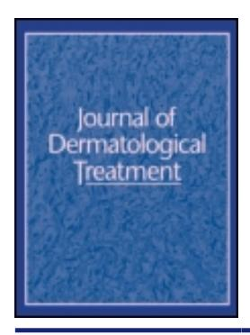

### **Journal of Dermatological Treatment**

**ISSN: 0954-6634 (Print) 1471-1753 (Online) Journal homepage: [www.tandfonline.com/journals/ijdt20](https://www.tandfonline.com/journals/ijdt20?src=pdf)**

## **Combination of azelaic acid 5% and erythromycin 2% in the treatment of acne vulgaris**

**Hamidreza Pazoki-Toroudi, Mansour Nassiri-Kashani, Hossein Tabatabaie, Marjan Ajami, Rouhollah Habibey, Mohammad Shizarpour, Shahab Babakoohi, Makan Rahshenas & Alireza Firooz**

**To cite this article:** Hamidreza Pazoki-Toroudi, Mansour Nassiri-Kashani, Hossein Tabatabaie, Marjan Ajami, Rouhollah Habibey, Mohammad Shizarpour, Shahab Babakoohi, Makan Rahshenas & Alireza Firooz (2010) Combination of azelaic acid 5% and erythromycin 2% in the treatment of acne vulgaris, Journal of Dermatological Treatment, 21:3, 212-216, DOI: [10.3109/09546630903440064](https://www.tandfonline.com/action/showCitFormats?doi=10.3109/09546630903440064)

**To link to this article:** <https://doi.org/10.3109/09546630903440064>

| Published online: 15 Apr 2010.          |
|-----------------------------------------|
| Submit your article to this journal     |
| Article views: 300                      |
| View related articles                   |
| Citing articles: 3 View citing articles |

#### **ORIGINAL ARTICLE**

# Combination of azelaic acid 5% and erythromycin 2% in the treatment of acne vulgaris

HAMIDREZA PAZOKI-TOROUDI1,2, MANSOUR NASSIRI-KASHANI1, HOSSEIN TABATABAIE1, MARJAN AJAMI3, ROUHOLLAH HABIBEY4, MOHAMMAD SHIZARPOUR1, SHAHAB BABAKOOHI1, MAKAN RAHSHENAS1 & ALIREZA FIROOZ1

1Center for Research & Training in Skin Diseases & Leprosy, Tehran University of Medical Sciences, Tehran, Iran, 2Nano Vichar Pharmaceutical Ltd, Tehran, Iran, 3Department of Nutrition, Iran University of Medical Sciences, Tehran, Iran and 4Department of Physiology, Iran University of Medical Sciences, Tehran, Iran

#### **Abstract**

Introduction: Acne vulgaris is a common problem, particularly among adolescents, which is usually resistant to monotherapy. We evaluated the efficacy and safety of a combination of azelaic acid (AA) 5% and erythromycin 2% gel (AzE) compared with AA 20% or erythromycin 2% gels in facial acne vulgaris. Methods: We conducted a 12-week, multicenter, randomized double-blind study on 147 patients with mild-to-moderate acne vulgaris. Four treatment group were determined (placebo, erythromycin, AA and AzE) and followed in 4-week intervals for 12 weeks, except the placebo group which was changed to routine treatment after 4 weeks. Results: The combination of AA 5% and erythromycin 2% gel significantly reduced the number of papules, pustules and comedones compared with placebo (p < 0.001), erythromycin 2% (p < 0.01) or AA 20% (p < 0.05). The incidence of adverse effects observed in patients treated with AzE (27%) was less than that with erythromycin 2% (54%) and AA 20% (45%). Conclusions: The combination of AA 5% and erythromycin 2% produced more potent therapeutic effects in comparison with erythromycin 2% or AA 20% alone, and with fewer side effects.

Key words: acne vulgaris, azelaic acid, erythromycin

#### Introduction

Acne development is attributed to a constellation of factors including pilosebaceous follicle hyperkeratinization (plugging); increased sebaceous gland activity; increased bacterial colonization of pilosebaceous units; and perifollicular inflammation (1). No single topical agent has been developed to overcome all of these factors. So, combination therapy that often includes an antibiotic and an agent to reduce plug formation has become the mainstay of treatment of mild-to-moderate acne (2).

Azelaic acid (AA), an aliphatic dicarboxylic acid, is an effective treatment in mild-to-moderate acne vulgaris, with efficacy comparable to other approved treatments including benzoyl peroxide, erythromycin, and tretinoin (3-6). It has a predominant antibacterial activity, though is not classified classically as an antibiotic, a modest comedolytic effect, and it reduces sebum production on the forehead, chin and the cheek alone or in combination with other treatments (2,7-9).

Erythromycin is a bacteriostatic macrolide that can be used as a topical or systemic treatment for acne vulgaris (10). Topical antibiotics are often used for mild-to-moderate acne, while systemic antibiotics are reserved for moderate-to-severe inflammatory ones (11). Increasing resistance to antibiotics in *Propionibacterium acnes* strains has become a challenge in the further usefulness of erythromycin as a single

Correspondence: Hamidreza Pazoki-Toroudi, Center for Research & Training in Skin Diseases & Leprosy, Tehran University of Medical Sciences, 415 Taleghani Avenue, Tehran 14166, Iran. E-mail: shahabmdt@gmail.com

therapeutic agent for acne (12). A combination of antibiotics with other agents has been investigated to cope with this problem. Moreover, in combination therapy, the synergistic action of different antibacterial mechanisms can produce better outcome, more convenience for patients, and fewer adverse effects along with a lower possibility of resistance than a single agent (13–17).

In the present study, we evaluated the effects of a combination of AA 5% and erythromycin 2% (AzE) on mild-to-moderate acne vulgaris.

#### Patients and methods

This study was performed on patients with mild-to-moderate facial acne vulgaris referred to three dermatology clinics between March 2008 and February 2009.

Inclusion criteria were: age between 14 and 40 years, mild-to-moderate forms of acne vulgaris with at least 10 inflammatory lesions on the face (with a maximum of three nodules).

The following patients were excluded at the beginning of the study: patients with other types of acne such as acne conglobata, acne fulminans and acne secondary to pregnancy or lactation; those suffering from other skin diseases such as psoriasis, dermatitis, and papulopustular rosacea, which affect the treatment course; patients with a history of hepatic or kidney disease, allergic drug reaction, malnutrition, or those receiving topical or systemic anti-acne anti-biotic therapy within 45 days or isotretinoin within 6 months before the beginning of the study; in addition, anyone taking drugs such as theophyllin, phenytoin, barbiturates, carbamazepine, cyclosporine, warfarin, ergotamine and triazolam within 1 week before the beginning of the study.

A total of 147 patients (86 males, 58% and 61 females, 42%) were included. The mean age of patients in the placebo group, AA 20% group, erythromycin 2% group and the AzE group was 20.75  $\pm$ 1.83,  $19.24 \pm 2.45$ ,  $22.1 \pm 1.89$  and  $20.33 \pm 2.43$ , respectively. The patients were randomly assigned to four treatment groups: (I) topical placebo gel (hydroxypropyl cellulose, propylene glycol, ethyl alcohol, and deionized water), with a similar appearance to active treatment gels, for 4 weeks and then returned to routine treatment determined by the dermatologist; (II) AA 20% gel; (III) erythromycin 2% gel; and (IV) AA 5% + erythromycin 2% gel (AzE). The patients were instructed to apply the gels twice daily for 12 weeks. Both the patients and their dermatologists were blinded about the type of treatment.

Before starting the treatment the lesion numbers were counted by a dermatologist and the impressions

of the patients about the severity of their acne were sought. The disease status was evaluated every 4 weeks by a dermatologist. In each session, the total numbers of lesions (papules, pustules and comedones) were counted. The photography, evaluation of adverse effects and patient satisfaction were performed in week 12 (in the case of the placebo group, these variables were evaluated at week 4 and then the patients returned to routine treatments). Patient satisfaction was rated as: 0: very unsatisfied, 1: unsatisfied, 2: moderately satisfied, 3: satisfied, 4: very satisfied. Adverse effects including scaling, pruritus, erythema, dry skin and oiliness were evaluated at each visit.

Results obtained from the lesion counts, overall disease severity and improvement, as well as patient satisfaction were analyzed by comparing the data between and within groups. SPSS 14 was used for statistical analysis. A paired-sample t-test was used for comparison of pre- and post-treatment results. Oneway analysis of variance (ANOVA) and then post-hoc analysis (Tukey test) was performed for assessing specific group comparisons in the case of lesion counts between different groups. The severity of symptoms graded by the physician and patient satisfaction scores were analyzed using the Mann-Whitney *U*-test. The incidence of adverse reactions was compared among groups using a contingency table  $\chi^2$  test. A p-value < 0.05 was considered statistically significant.

#### Results

A total of 106 of 127 non-placebo patients completed the study. The majority of drop-outs were due to the long distance some patients had to travel to follow-up appointments or due to the high expectations of some to see dramatic results in just a few days. The number of inflammatory lesions (papules and pustules) and non-inflammatory lesions (open and closed comedones) are shown in Table I. Within-group analysis revealed a significant reduction of papules and pustules from week 4 in all treatment groups (p < 0.01 for erythromycin 2%, and p < 0.001 for AA 20% and AzE), except placebo. The number of open and closed comedones also showed a significant reduction in these groups of patients (p < 0.001).

In each session, the mean number of lesions, as well as the mean change from baseline, were compared among the different groups. After 4 weeks, the number of papules, pustules and comedones were reduced significantly in all treatment groups compared with the placebo group (p < 0.001). The effects of AA 20% on reducing the number of papules and pustules at

Table I. Mean lesion count at week 0 (before any treatment) and weeks 4, 8 and 12.

| n   | Placebo gel                                                               | Azelaic acid 20%                                                                                                                                                                                    | Erythromycin 2%                                      | AzE                                                  |
|-----|---------------------------------------------------------------------------|-----------------------------------------------------------------------------------------------------------------------------------------------------------------------------------------------------|------------------------------------------------------|------------------------------------------------------|
|     |                                                                           |                                                                                                                                                                                                     |                                                      |                                                      |
| 147 | $20.62 \pm 1.02$                                                          | $23.14 \pm 1.53$                                                                                                                                                                                    | $18.11\pm1.7$                                        | $22.40\pm1.2$                                        |
| 142 | $22.22 \pm 1.64$                                                          | $14.02\pm0.78^a$                                                                                                                                                                                    | $10.62\pm0.92^b$                                     | $8.53 \pm 0.62^a$                                    |
| 116 |                                                                           | $10.21 \pm 1.31^a$                                                                                                                                                                                  | $8.16 \pm 0.31^a$                                    | $6.01\pm0.23^{a}$                                    |
| 106 |                                                                           | $10.87\pm0.11^{a}$                                                                                                                                                                                  | $11.04\pm0.54^{b}$                                   | $6.27\pm0.41^{a}$                                    |
|     |                                                                           |                                                                                                                                                                                                     |                                                      |                                                      |
| 147 | $10.42\pm0.92$                                                            | $11.26 \pm 0.84$                                                                                                                                                                                    | $12.01 \pm 0.62$                                     | $11.15\pm0.64$                                       |
| 142 | $12.22 \pm 1.04$                                                          | $5.9 \pm 0.61^{a}$                                                                                                                                                                                  | $8.21\pm0.74^{b}$                                    | $5.72 \pm 0.66^{a}$                                  |
| 116 |                                                                           | $5.11\pm0.7^a$                                                                                                                                                                                      | $8.06 \pm 0.51^{b}$                                  | $4.2\pm0.39^a$                                       |
| 106 |                                                                           | $5.32 \pm 0.41^a$                                                                                                                                                                                   | $7.12 \pm 0.27^{b}$                                  | $4.22\pm0.3^a$                                       |
|     |                                                                           |                                                                                                                                                                                                     |                                                      |                                                      |
| 147 | $29.75\pm2.8$                                                             | $29.24 \pm 3.33$                                                                                                                                                                                    | $27.64 \pm 2.89$                                     | $30.20 \pm 2.63$                                     |
| 142 | $30.02 \pm 3.0$                                                           | $6.12 \pm 0.39^a$                                                                                                                                                                                   | $8.8\pm0.46^a$                                       | $5.24 \pm 0.61^a$                                    |
| 116 |                                                                           | $5.52 \pm 0.71^a$                                                                                                                                                                                   | $7.32 \pm 0.51^a$                                    | $2.22 \pm 0.21^a$                                    |
| 106 |                                                                           | $3.29\pm0.43^{a}$                                                                                                                                                                                   | $5.36 \pm 0.31^{a}$                                  | $2.28 \pm 0.09^{a}$                                  |
|     | 147 142 116 106 147 142 116 106 147 142 116 | $147 \qquad 20.62 \pm 1.02$ $142 \qquad 22.22 \pm 1.64$ $116$ $106$ $147 \qquad 10.42 \pm 0.92$ $142 \qquad 12.22 \pm 1.04$ $116$ $106$ $147 \qquad 29.75 \pm 2.8$ $142 \qquad 30.02 \pm 3.0$ $116$ | $\begin{array}{cccccccccccccccccccccccccccccccccccc$ | $\begin{array}{cccccccccccccccccccccccccccccccccccc$ |

In the case of the placebo group, the signs were evaluated only at weeks 0 and 4.

weeks 8 and 12 was more than erythromycin 2% (p < 0.05), but the difference in the number of comedones became significant just after 12 weeks of treatment. In the group treated with AzE, a significant reduction in the number of all lesions (inflammatory or non-inflammatory) compared with AA 20% and erythromycin 2% was observed at weeks 4, 8 and 12 (p < 0.05 and p < 0.01, respectively).

Patient satisfaction is shown in Table II. Detailed analysis did not show a statistical difference between AA 20% and erythromycin 2%, whereas patients in group AzE showed significantly more satisfaction compared with AA 20% or erythromycin 2% (p < 0.05), with 80% of them satisfied or very satisfied.

At least one adverse effect was shown in 42% of patients (Table III): 16 (45%) AA 20% patients, 17 (54%) erythromycin 2% patients, and 11 (27%) AzE patients showed adverse effects because of treatment

(Table III). Adverse effects were significantly lower in patients treated with AzE compared with other groups (p < 0.05). The most common adverse effects in the total study population were pruritus (10 patients; 9.4%) and erythema (10 patients; 9.4%). Although bothersome, the adverse effects did not lead to patients quitting treatment.

#### Discussion

To our knowledge, this is the first study evaluating the combination of AA 5% and erythromycin 2% for the treatment of acne vulgaris. The results showed that this combination was significantly more effective than AA 20% or erythromycin 2% alone in decreasing the number of comedones and inflammatory lesions. Moreover, AzE showed its effect on reducing lesions

Table II. Patient satisfaction of treatments at week 12 of the study.

|                     | Satisfaction grade obtained from patients |            |           |           |          |       |
|---------------------|-------------------------------------------|------------|-----------|-----------|----------|-------|
| Treatments          | 4                                         | 3          | 2         | 1         | 0        | Total |
| Azelaic acid 20%    | 8 (22.86)                                 | 13 (37.14) | 9 (25.71) | 4 (11.43) | 1 (2.86) | 35    |
| Erythromycin 2%     | 7 (22.58)                                 | 9 (29.03)  | 9 (29.03) | 4 (12.90) | 2 (6.45) | 31    |
| AzE a, b | 11 (27.5)                                 | 21 (52)    | 6 (15)    | 2 (5)     | 0        | 40    |

Data are shown as the number and percent of patients belonging to each grade regarding patient judgment of the therapeutic effect of different treatments at the end of the study (week 12). 0: Very unsatisfied; 1: unsatisfied; 2: moderately satisfied; 3: satisfied; 4: very satisfied.  $^ap < 0.05$  compared with the azelaic acid 20% group and  $^bp < 0.05$  vs erythromycin 2% patients.

 $^{a}p < 0.001$  and  $^{b}p < 0.01$  compared with the baseline values (week 0). In each group the values on weeks 4, 8 and 12 were compared with the value at baseline. (Paired sample *t*-test was used for comparisons of values before and after treatment.) Data presented as mean  $\pm$  SD.

Table III. Adverse events observed in treated groups.

| Side effects | Placebo $n = 20$ | Azelaic acid 20% $n = 35$ | Erythromycin 2% $n = 31$ | AzE $n = 40$ |
|--------------|------------------|---------------------------|--------------------------|--------------|
| Side checks  | n - 20           | n = 33                    | n-31                     | n = 40       |
| Scaling      | -                | 4 (11.43)                 | 2 (6.45)                 | 1 (2.5)      |
| Dry skin     | -                | 2 (5.71)                  | 4 (12.9)                 | 3 (7.5)      |
| Erythema     | 1 (5)            | 3 (8.57)                  | 5 (16.1)                 | 2 (5)        |
| Oiliness     | -                | 3 (8.57)                  | 3 (9.68)                 | 2 (5)        |
| Pruritus     | -                | 4 (11.43)                 | 3 (9.68)                 | 3 (7.5)      |

In the case of the placebo group, the signs were evaluated at week 4. In the remaining groups the signs were checked at week 12 of treatment. Percentages given in parenthesis.

faster than the two other treatments. Evaluation of disease severity, side effects, and patient satisfaction confirmed there were more significant and fewer harming effects of AzE compared with the two other single treatments.

A reduces keratinocyte proliferation and modulates epidermal differentiation, the mechanisms that involve inhibition of DNA and protein synthesis (18). Moreover, AA possesses bacteriostatic activity and acts on both aerobic and anaerobic bacteria, including *P. acnes* (19). AA also acts as a competitive inhibitor of mitochondrial oxidoreductases (20) and has an inhibitory effect on 5-alpha-reductase, so it may be effective in acne treatment in which the role of androgenic hormones has been demonstrated previously (21,22).

The present study confirmed the results of previous clinical trials that evaluated the effects of AA 20% on acne (23,24). However, the main propose of this study was the evaluation of an AA 5% and erythromycin 2% combination to achieve an effective compound with a low rate of adverse effects. The anti-inflammatory effects of erythromycin 2% potentiated the therapeutic properties of AA 5% as both inflammatory and non-inflammatory lesions were decreased significantly compared with each treatment alone (Table III). Previously, combination therapies with AA have demonstrated more efficacy than a single agent. Most of these combinations include AA and an antibiotic (25,26). There have also been studies carried out on a combination of erythromycin with other agents including zinc acetate (26), tretinoin (27), and benzoyl peroxide (13). The results of the present study suggest that erythromycin 2% is an effective supplement in the treatment of acne vulgaris with AA 5%. After 4 weeks an attenuated response to treatment was seen in almost all groups. Perhaps this is due to the natural course of acne in which the physician usually modifies the treatment, but in this study we continued the same treatment. This can be interpreted as necessity of exact follow-up of acne patients in order to modify the medication if the situation aggravates or reaches a plateau.

In conclusion, the present study has demonstrated that AzE effectively reduced the number of inflammatory and non- inflammatory acne lesions and was more potent and had fewer adverse effects than AA 20% or erythromycin 2% alone. AzE also gave more patient satisfaction. These results suggest that the combination of low concentrations of AA with an appropriate antibiotic may give a better clinical outcome with fewer unwanted effects in the treatment of acne vulgaris.

#### Acknowledgement

Hereby, the cooperation of medical staff of Dowlati Skin Clinic in performing this trial and the efforts of Mr Akhavan in preparing the material for this study are greatly appreciated.

**Declaration of interest:** The authors report no conflicts of interest. The authors alone are responsible for the content and writing of the paper.

#### References

- Webster GF. Inflammation in acne vulgaris. J Am Acad Dermatol. 1995;33:247–253.
- Weiss JS. Current options for the topical treatment of acne vulgaris. Pediatr Dermatol. 1997;14:480–488.
- Cavicchini S, Caputo R. Long-term treatment of acne with 20% azelaic acid cream. Acta Derm Venereol Suppl (Stockh). 1989:143:40–44.
- Cunliffe WJ, Holland KT. Clinical and laboratory studies of treatment with 20% azelaic acid cream for acne. Acta Derm Venereol Suppl (Stockh). 1989;143:31–34.
- Gollnick HPM, Graupe K, Detmar M, Zaumseil RP. Azelainsäure für die Behandlung der Akne: Pharmakologie, in vitro- und in vivo-Effekte, sowie klinische Ergebnisse und Toleranz. Z Hautkr. 1992;67:975–987.
- Katsambas A, Graupe K, Stratigos I. Clinical studies of 20% azelaic acid cream in the treatment of acne vulgaris:

- Comparison with vehicle and topical tretinoin. Acta Derm Venereol Suppl (Stockh). 1989;143:35–39.
- 7. King K, Leeming JP, Holland KT, Cunliffe SS. The effect of azelaic acid on cutaneous microflora in vivo and in vitro. J Invest Dermatol. 1985;84:438A.
- 8. Holland KT, Bojar RA. Antimicrobial effects of azelaic acid. J Dermatolog Treat. 1993;4:S8–S11.
- 9. Fitton A, Goa KL. Azelaic acid. A review of its pharmacological properties and therapeutic efficacy in acne and hyperpigmentary skin disorders. Drugs. 1991;41:780–798.
- 10. Schachner L, Eaglstein W, Kittles C, Mertz P. Topical erythromycin and zinc therapy for acne. J Am Acad Dermatol. 1990;22(2 Pt 1):253–260.
- 11. Gollnick HP, Graupe K, Zaumseil RP. Comparison of combined azelaic acid cream plus oral minocycline with oral isotretinoin in severe acne. Eur J Dermatol. 2001; 11(6):538–544.
- 12. Eady EA, Cove JH, Holland KT, Cunliffe WJ. Erythromycin resistant propionibacteria in antibiotic treated acne patients: Association with therapeutic failure. Br J Dermatol. 1989; 121:51–57.
- 13. Gupta AK, Lynde CW, Kunynetz RA, Amin S, Choi K, Goldstein E. A randomized, double-blind, multicenter, parallel group study to compare relative efficacies of the topical gels 3% erythromycin/5% benzoyl peroxide and 0.025% tretinoin/erythromycin 4% in the treatment of moderate acne vulgaris of the face. J Cutan Med Surg. 2003;7(1):31–37.
- 14. Burkhart CN, Specht K, Neckers D. Synergistic activity of benzoyl peroxide and erythromycin. Skin Pharmacol Appl Skin Physiol. 2000;13(5):292–296.
- 15. Leyden J, Levy S. The development of antibiotic resistance in Propionibacterium acnes. Cutis. 2001;67:21–24.
- 16. Leyden JJ, Hickman JG, Jarratt MT, Stewart DM, Levy SF. The efficacy and safety of a combination benzoyl peroxide/ clindamycin topical gel compared with benzoyl peroxide alone and a benzoyl peroxide/erythromycin combination product. J Cutan Med Surg. 2001;5(l):37–42.
- 17. Webster G. Combination azelaic acid therapy for acne vulgaris. J Am Acad Dermatol. 2000;43(2 Pt 3):S47–S50.

- 18. Mayer-da-Silva A, Gollnick H, Imcke E, Organos C. Azelaic acid vs. placebo: Effects on normal human keratinocytes and melanocytes. Electron microscopic evaluation after long-term application in vivo. Acta Derm Venereol (Stockh). 1987;67: 116–122.
- 19. Nazzaro-Porro M, Passi S, Picardo M, Breathnach A, Clayton R, Zina G. Beneficial effect of 15% azelaic acid cream on acne vulgaris. Br J Dermatol. 1983;109:45–48.
- 20. Passi S, Picardo M, De Luca C, Nazzaro-Porro M. Mechanism of azelaic acid action in acne. G Ital Dermatol Venereol. 1989;124(10):455–463.
- 21. Stamatiadis D, Bulteau-Portois MC, Mowszowicz I. Inhibition of 5 alpha-reductase activity in human skin by zinc and azelaic acid. Br J Dermatol. 1988;119(5): 627–632.
- 22. Thiboutot D, Gilliland K, Light J, Lookingbill D. Androgen metabolism in sebaceous glands from subjects with and without acne. Arch Dermatol. 1999;135(9):1041–1045.
- 23. Iraji F, Sadeghinia A, Shahmoradi Z, Siadat AH, Jooya A. Efficacy of topical azelaic acid gel in the treatment of mild– moderate acne vulgaris. Indian J Dermatol Venereol Leprol. 2007;73(2):94–96.
- 24. Gollnick HP, Graupe K, Zaumseil RP. Azelaic acid 15% gel in the treatment of acne vulgaris. Combined results of two double-blind clinical comparative studies. J Dtsch Dermatol Ges. 2004;2(10):841–847.
- 25. Spellman MC, Pincus SH. Efficacy and safety of azelaic acid and glycolic acid combination therapy compared with tretinoin therapy for acne. Clin Ther. 1998;20(4): 711–721.
- 26. Langner A, Sheehan-Dare R, Layton A. A randomized, singleblind comparison of topical clindamycin + benzoyl peroxide (Duac) and erythromycin + zinc acetate (Zineryt) in the treatment of mild to moderate facial acne vulgaris. J Eur Acad Dermatol Venereol. 2007;21(3):311–319.
- 27. Kreusch J, Bextermöller R. Efficacy and tolerability of a topical erythromycin/tretinoin combination preparation in acne treatment: Post-marketing surveillance study involving over 6500 patients. Curr Med Res Opin. 2000;16(1):1–7.