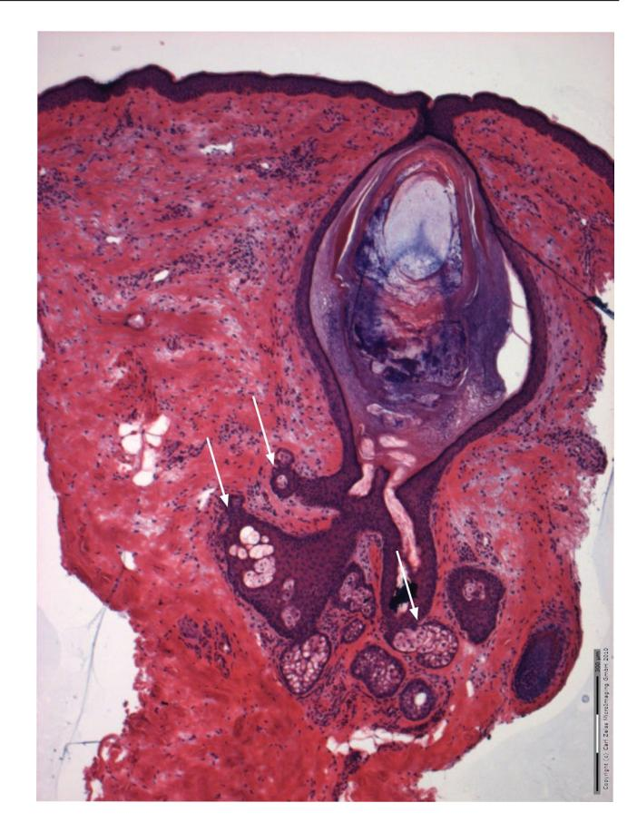

DOI: 10.1111/exd.14394

#### **VIEWPOINT**

# *Cutibacterium acnes***: Much ado about maybe nothing much**

## **Maurice A. M. van Steensel1,2** | **Boon Chong Goh3**

Lee Kong Chian School of Medicine, Nanyang Technological University, Singapore, Singapore

Skin Research Institute of Singapore, Agency for Science, Technology and Research, Singapore, Singapore

Antimicrobial Resistance Interdisciplinary Research Group, Singapore-MIT Alliance for Research and Technology Centre Center, Singapore, Singapore

#### **Correspondence**

Maurice A.M. van Steensel, Lee Kong Chian School of Medicine, Nanyang Technological University, Singapore, Singapore.

Email: [maurice\\_vansteensel@ntu.edu.sg](mailto:maurice_vansteensel@ntu.edu.sg)

#### **Funding information**

MvS is supported by Biomedical Research Council (BMRC) A\*STAR IAF-PP grants H17/01/a0/004 and. H17/01/a0/008. BCG is supported by the Singapore-MIT Alliance for Research and Technology Innovation Centre and the Antimicrobial Resistance Interdisciplinary Research Group. GBC and MvS are both supported by a SMART Innovation Grant

## **Abstract**

*Cutibacterium acnes* (also known as *Propionibacterium acnes*) has long been implicated in the pathogenesis of acne, inspiring both therapeutic and personal care approaches aiming to control the disease by controlling the bacterium. The purported association has made people with acne feel dirty and led to the—at times excessive—use of cleansers, antiseptics and antibiotics for the condition. However, recent evidence seems to weaken the case for *C*. *acnes'* involvement. New genetics and molecular biology findings strongly suggest that abnormal differentiation of sebaceous progenitor cells causes comedones, the primary lesions in acne. Comodegenesis is initiated by androgens and is unlikely to be triggered by *C*. *acnes*, which probably doesn't affect sebaceous differentiation. Is there still a place for it in this understanding of acne? It is necessary to critically address this question because it has consequences for treatment. Antibiotic use for acne noticeably contributes to microbial drug resistance, which we can ill afford. In this Viewpoint, we explore if and how *C*. *acnes* (still) fits into the developing view on acne. We also briefly discuss the implications for therapy in the light of antibiotic resistance and the need for more targeted therapies.

#### **KEYWORDS**

acne, aryl hydrocarbon receptor, comedo, *Cutibacterium acnes*, phage, *Propionibacterium acnes*

## **1** | **INTRODUCTION**

Acne vulgaris is the most common skin disease in the world.1 Its hallmark lesion is the comedo (black/whitehead), a cystic dilation of the junctional zone just above the place where the sebaceous duct meets the infundibulum.2 Acne can manifest with comedones only, but more typically progresses to include inflamed papules and pustules. Mild disease is usually selflimiting. More severe acne requires medical intervention to prevent significant, permanent scarring. Currently, antibiotics still constitute the mainstay of treatment. This is mostly because acne, and in particular, its inflammatory phenotype is thought to be triggered and maintained by *Cutibacterium acnes*.

## **1.1** | **Cutibacterium acnes**

*C*. *acnes* is a Gram-positive bacterium that prefers anaerobic conditions. It got its species name because Sabouraud isolated it from acne lesions in 1897 (reviewed in 3 ). Correlation doesn't equal causation and certainly, it has emerged that *C*. *acnes* is a commensal. It belongs to the normal human skin microbiome and there exerts beneficial effects, such as helping to control *Staphylococcus aureus*. 4

*C*. *acnes* was previously known as *Propionibacterium acnes*. It was recently and somewhat controversially reclassified to be in a separate genus.5 This to account for certain adaptive changes in its genome that set it apart from other *Propionibacteria*. The *C*. *acnes genome* is 2.5 Mb in size and shows clear adaptation to life in a low-oxygen, lipid rich environment such as exists in the pilosebaceous unit. For example, it produces lipases that degrade sebum lipids for energy production, such as triacylglycerol lipase and lysophospholipase (reviewed in 6 ).

Based on taxonomic characteristics such as lipase activity, *C*. *acnes* has three recognized phylotypes (I-III), which in turn, can be further subdivided into a total of six. Even deeper subdivisions have been reported upon genetic analysis (clonal complexes, reviewed in 7 ). Amongst *C*. *acnes* isolated from people with acne, phylotype IA1 seems to dominate8,9 although there are conflicting data (for instance, 10). We will later see why this could be important.

Ever since Sabouraud's work, *C*. *acnes* has been implicated in the pathogenesis of acne vulgaris, the most common skin disease worldwide. This, perhaps, because *nomen est omen*. This viewpoint argues—somewhat irreverently and perhaps controversially—that more than a century later, the case for this villainous role may not be as strong as thought. As the comedo is the key acne lesion,2 let's start with examining whether it has anything to do with *C*. *acnes*.

## **1.2** | *Cutibacterium acnes* **and comedones**

Much of the reasoning around acne pathogenesis has been built on experiments exposing isolated, immortalized sebocytes to the bacteria in 2D culture. The extent to which this model reflects the *in vivo* situation is debatable, to say the least. There is no evidence for *C*. *acnes* being present inside the sebaceous gland proper.11 And, importantly, it is not this structure that is affected in the disease process. Sebocytes do not make comedones (the primary lesion in acne). Instead, they result from cystic expansion of the junctional zone (JZ), which contains sebaceous progenitor cells that in mice as well as in humans express the marker LRIG1 (Leucine Rich Repeats And Immunoglobulin Like Domains 1; own unpublished data, 12 ).

Saurat had already proposed this idea in 2015, referring to it as the 'comedone switch hypothesis'.2 Our own observations in mouse models (manuscript submitted) strongly suggest that it is correct. We have observed that uncontrolled Wnt activity inhibits differentiation of Lrig1+ JZ progenitor cells, causing cystic expansion of the JZ with concomitant atrophy of the sebaceous gland (manuscript submitted). This situation closely mimics human comedones (Figure 1). More evidence for the involvement of sebaceous progenitor differentiation derives from recent genome-wide association study data. These clearly point to a gain of function variant in *WNT10A* as the strongest risk factor for developing acne.13 Signals associated with infection, inflammation and immunity are noticeably absent from the GWAS data. Likewise, monogenic disorders that cause the condition uniformly do not point in this direction. Rather, they point towards mitotic stimuli, tissue remodelling and retinoid transport as major factors in the pathogenesis.14

So, what is it then that induces sebaceous progenitors to misbehave and form comedones? Clearly, androgens are the prime mover—without them, no acne.15 The seborrhoea in people with acne reflects their (over) stimulation of the sebaceous progenitor

**FIGURE 1** A comedo in a biopsy taken form facial skin in an individual with acne vulgaris. This is a representative sample. Note the atrophy of the associated sebaceous glands (white arrows). Scale bare: 300 µm

cells, leading to (excessive) growth of the sebaceous gland and subsequent overproduction of sebum. It seems straightforward that a strong androgenic growth stimulus can combine with genetic predisposition to disrupt differentiation of sebaceous progenitors, causing blackheads to form.15 Consequent to their mechanism of formation, these are—it cannot be stressed enough—associated with hypoplastic sebaceous glands. This sequence of events does not seem to need any bacteria (or other micro-organisms). But given the wellestablished association between acne prevalence and lifestyle,16 there are likely to be environmental influences. Could those then be (derived from) bacteria, in particular, *C*. *acnes*?

Metabolizing Acquired Dioxin-Induced Skin Hamartomas (MADISH), also known as chloracne, could be a good model to probe this question. In this condition, exposure to 2,3,7,8-tetra chlorodibenzo-P-dioxin (TCDD) causes pronounced comedo formation. The sebaceous glands in the affected pilosebaceous units are atrophic.17,18 As such, MADISH comedones accurately reflect what is happening in acne vulgaris (Figure 1). TCDD and related compounds strongly activate aryl hydrocarbon receptor (AHR) signalling.18 It was recently shown in mice that TCDD specifically affects the Lrig1+ sebaceous progenitor cells, causing them to cease differentiating and hyper-proliferate instead. They accumulate in the JZ, forming the hallmark MADISH lesions, which are blackheads.19 Intriguingly, it has been reported that AHR receptor activation can modulate Wnt signalling 20 as well as expression of *OVOL1*, another risk factor identified by GWAS.21 Clearly, this connection between the two systems has the potential to elegantly explain at least the MADISH phenotype, if not acne vulgaris as well.

The molecular pathways governing skin development are highly conserved in evolution. Thus, it stands to reason that similar, if not identical mechanisms are at play in human skin. The AHR has evolved to detect xenobiotics and as such can detect bacterial components and metabolites. There is some evidence that *C*. *acnes* can directly activate AHR signalling in sebocytes.22 The relevance of this observation is debatable: these observations were made in sebocytes. If they do apply to sebaceous progenitors, there is, as previously mentioned, no good evidence for direct contact between these cells and *C*. *acnes*. However, it can metabolize tryptophan ([https://](https://www.genome.jp/kegg-bin/show_pathway?pak01100%2BM00018) [www.genome.jp/kegg-bin/show\\_pathway?pak01100+M00018](https://www.genome.jp/kegg-bin/show_pathway?pak01100%2BM00018)), potentially generating compounds such as indirubin, kynurenine and 6- formylindolo[3,2-b] carbazole (FICZ), which can certainly act at a distance. So, does this mean that *C*. *acnes* is a player after all, or does it not? After all, it is a commensal that lives on everyone. If its metabolites were to kickstart comedogenesis, one might expect acne to be purely comedonic more often. One would also expect acne lesions to be much more numerous, and to consistently contain the bacterium in larger numbers than healthy pilosebaceous units. However, they do not.23 This same line of reasoning applies to sebum metabolites of *C*. *acnes* such as squalene, which is supposed to promote comedogenesis. In this context, we would also like to point out that many skincare products contain (a lot of) squalene, yet they do not cause users to develop blackheads.

## **1.3** | *Cutibacterium acnes* **and inflammation**

Rather than causing comedones to form, *C*. *acnes* may contribute to inflammation. Certainly, the case for this role seems much stronger. Many excellent reviews (for example 24-26 ) discuss the available evidence in great detail.

Briefly, several mechanisms are thought to be involved. People with acne tend to produce more sebum than people without. *C*. *acnes* living on sebum lipids means that it might then enjoy a competitive advantage, enabling it to outgrow other skin microbiota. However, people with acne do not have more *C*. *acnes* in their hair follicles than people without.23 They do tend to have more phylotype IA1 and less of IB and II in inflammatory lesions. It has been speculated that this lack of microbial diversity might trigger an innate immune response, but it is difficult to distinguish cause and consequence. If causal, one would need to explain why IA1 grows more readily than other strains if sebum production has increased. Altered composition, as has been reported in acne,24 might be a reason but there is presently no evidence.

If we accept that the number of bacteria doesn't matter, then perhaps the host response does. *C*. *acnes* has been shown to interact with innate immunity in many ways. Keratinocytes can detect it with Toll-like receptors 2 and 4, producing several cytokines and chemokines in response.25 These will attract various immune effector cells, such as neutrophils. The bacterium can also trigger the production of metalloproteases by keratinocytes and sebocytes.26

There may also be a role for adaptive immunity. It has been observed long ago that early acne lesions tend to get infiltrated by CD4+ T-lymphocytes.27 Recent work has demonstrated that acne lesions show strong upregulation of IL-17A, Th1 and Th17 effector cytokines, transcription factors and chemokine receptors. *In vitro* experiments by the same group indicated that *C*. *acnes* can stimulate mixed Th17/Th1 responses by inducing specific CD4+ T cells to produce IL-17A and IFN-γ. Also, *C*. *acnes*-specific Th17 and Th17/ Th1 cells can be found in the peripheral circulation of patients with acne. Of note, they are also present in healthy individuals albeit at lower frequencies.

Anti *C*. *acnes* antibody titres are higher in people with severe acne, even though their bacterial load is not larger.28 Healthy controls also had anti-*C*. *acnes* antibodies. It might be argued that having more reactive T cells and a higher antibody titre could be secondary to a more vigorous immune reaction, hence stronger inflammation. So, people without inflammatory acne symptoms would just be poor responders to *C*. *acnes*. However, plausible this explanation might seem, the presence of high antibody titres in the context of continued disease seems counter-intuitive. It is of considerable interest to resolve this apparent contradiction, as vaccine strategies are being pursued to treat or prevent acne.29 These have been aimed at *C*. *acnes* itself, and more recently at secreted virulence factors such as Christie-Atkins-Munch-Peterson (CAMP) factor.30 CAMP has several activities that could contribute to inflammation in acne. Vaccination of mice with CAMP factor considerably reduced the growth of *C*. *acnes* injected intradermally.31 However, mice are not normally a host. Thus, the response noted may not reflect or predict what will happen in humans. So far, there are no data from any clinical trials.

At this point, it is probably worth reiterating that nothing in acne genetics points to a major role for immunity and inflammation in triggering the condition. No disorder of inflammasome activation causes acne to develop, and there is no indication (yet) that anti-IL17 therapy would improve its symptoms. As mentioned, monogenic disorders that cause classic acne have no immediately obvious relation to inflammation. Neither do the strongest GWAS signals. Like the monogenic disorders, they point to stem cell homeostasis, tissue remodelling and cell adhesion.14

It may, therefore, well be that the interactions found to date between the bacterium and immunity represent the normal system of checks and balances that exist between any commensal and its host. There is no clear evidence for any host factor that might cause this system to be disrupted in acne. The most damning evidence *contra* is the observation that *C*. *acnes* antibiotic resistance is on the rise, yet antibiotic treatment does not seem to have become any less effective. If the bacterium were a key factor in acne inflammation, one would expect this to have happened by now. Finally, it could

16000625, 2021, 10, Downloaded from https://onlinelibrary.wiley.com/doi/10.1111/exd.14394 by University Of California - Davis, Wiley Online Library on [19/05/2026]. See the Terms and Conditions (https://onlinelibrary.wiley.com/terms-and-conditions) on Wiley Online Library for rules of use; OA articles are governed by the applicable Creative Commons License

be argued that the beneficial effects of antiseptics such as benzoyl peroxide could be taken as an argument in favour of a bacterial component. However, these compounds have other effects that could explain their therapeutic benefits.32

In all, the evidence for *C*. *acnes* being involved in inflammation is fragmentary and a smoking gun remains to be found.28 Koch's postulates have never been satisfied for it, although admittedly that is not an easy requirement for a commensal to meet. What causes the pronounced inflammation in acne, therefore, remains an open question. A contribution by responses to specific *C*. *acnes* phylotypes cannot be ruled out.

## **1.4** | **What does this mean for our understanding of the condition?**

Acne starts with comedone formation, and it is not contentious that androgens are the prime mover. Any effect of altered sebum composition or quantity seems unlikely, as one would in that case expect there to be many more acne lesions than there are in the average patient. We would rather propose that MADISH is telling us that there are environmental influences at play. Via AHR signalling, these trigger a genetic predisposition that affects sebaceous progenitor differentiation and proliferation, on a background of sebaceous gland growth at the onset of puberty. This sequence of events would go some way towards explaining the known effects of cigarette smoke, and the mostly hypothesized ones of pollutants. Diet might be a factor as well, although given the available evidence, it is more likely to act through insulin/IGF1 signalling.33

Whilst the case seems clear-cut for comedogenesis, this is less so for inflammation. There is not enough solid evidence to rule out a role for *C*. *acnes* there, but not enough either to unequivocally say there is one after all. In our opinion, there is a case to be made that reduced microbial diversity is a factor in acne inflammation. Overrepresentation of one or 2 *C*. *acnes* phylotypes, or underrepresentation of lowabundance species that would normally dampen inflammation34 might contribute to (innate) immune activation. Individual variation in the strength of immune responses could also play a role. It is an intriguing thought that the adaptive component might be a determinant of disease severity, but the evidence seems weak.

## **1.5** | **What this means for treatment—phage to the rescue**

If we accept this conclusion, bacterial control is still part of acne treatment. Finding alternatives to antibiotics then becomes even more urgent. Given the potential contribution of reduced microbial diversity, it will be essential that such alternatives can selectively target *C*. *acnes* (as opposed to antibiotics), perhaps even specific phylotypes. It seems difficult to conceive of any small molecular actives that could do this. However, Nature has provided a potential solution that we would like to highlight here.

There exist viruses that infect and kill bacteria. These bacteriophages, also known as phage(s), are specific to a single bacterial species. Some only target a select few strains within that species. Such high host specificity makes phage a promising candidate for acne treatment that only targets pathogenic *C*. *acnes* phylotypes, whilst conserving the native skin microbiome.

One of the first *C*. *acnes* phages isolated, ø174, can lyse 88% of the *C*. *acnes* strains tested.35 Since then, many more have been isolated, sequenced and characterized. Phages are the most abundant and diverse biological entities in the biosphere, with an estimated 1031 of them on Earth.36 Interestingly, the ones targeting *C*. *acnes* have little genetic diversity, with over 85% nucleotide identity in the genome.37,38 Often, the *C*. *acnes* phage population is dominated by one strain.38 One concern that stems from this high homogeneity is the development of cross-resistance.39

The lack of genetic diversity and broad host range of *C*. *acnes* phage does present an opportunity to engineer them for selectively targeting pathogenic *C*. *acnes* phylotypes. There are also naturally occurring phage that could do the trick. For example, BX001 from BiomX, which is currently in phase 2 clinical trial [\(https://www.](https://www.biomx.com) [biomx.com\)](https://www.biomx.com), consists of a cocktail of native phage that is active against antibiotic-resistant *C*. *acnes*.

An equally or perhaps even more attractive option is to use lysins. These are specific peptidoglycan hydrolases that are encoded in the phage genomes. They are particularly effective against Grampositive bacteria such as *C*. *acnes*. The use of phage lysins to treat bacterial infections has been demonstrated both in vitro and in vivo.40-42 As lysins target and cleave the highly conserved peptidoglycan bonds in the bacterial cell wall, resistance against them is not likely to develop. Accordingly, it has so far not been reported.43 Of note, lysins can be produced using standard recombinant protein expression and scaled up using existing manufacturing facilities.

All *C*. *acnes* lysins identified thus far are >95% conserved at the amino acid level.37 Protein engineering techniques can be applied to add desirable features such as higher thermostability and broader host range. Importantly, lysins remain effective even on bacteria that are phage resistant.44 Therefore, any acne treatment using a lysin will likely be effective after repeated use. The lack of strain specificity is a potential limitation. Many lysins also target multiple species in the same genus. With the microbial community in the pilosebaceous unit dominated by *C. acnes*, 9 there might be undesirable consequences if it is completely eradicated from the skin microbiome.

## **2** | **RECOMMENDATIONS FOR FUTURE WORK**

Before embarking upon efforts to kill *C*. *acnes* more efficiently, it is imperative to unequivocally establish its pathogenicity or lack thereof. To begin with, we would like to suggest trying to fulfil Koch's postulates. This might be done by exposing healthy volunteers to sufficiently high numbers of *C*. *acnes* phylotypes associated with acne (IA1).

16000625, 2021, 10, Downloaded from https://onlinelibrary.wiley.com/doi/10.1111/exd.14394 by University Of California - Davis, Wiley Online Library on [19/05/2026]. See the Terms and Conditions (https://onlinelibrary.wiley.com/terms-and-conditions) on Wiley Online Library for rules of use; OA articles are governed by the applicable Creative Commons License

For any further *in vitro* studies, we would propose to use primary sebocytes in 2D culture no longer. Instead, any work moving forward should be with human sebaceous organoids.45 Using either genetic or pharmacological manipulation of WNT or AHR signalling, it might be possible to use them for modelling the altered state of differentiation in the sebaceous progenitors that causes them to form comedones. The resulting structures could then be exposed to relevant *C*. *acnes* phylotypes. One issue with that is that sebaceous organoids are enclosed structures, with the differentiating sebocytes and their product on the inside.

To mimic the *in vivo* situation as closely as possible, the bacteria would have to be introduced into their interior via micro-injection. Given their average size of 100 µm (in our hands) it would be challenging to do so. That said, organoids with abnormal differentiation mimicking comedones might be considerably larger. Subsequent analysis of organoid-bacterium interaction can be achieved using a multitude of experimental approaches. Of note, organoids can be used for compound screening. Once there is firm evidence of pathogenicity, new ways of targeting *C*. *acnes* could then be explored. As outlined above, we would argue that phage and their lysins should be amongst those novel approaches.

Resistance to antibiotics is becoming increasingly problematic and their extensive use in dermatology is a major contributing factor. It is therefore imperative that an effort be made to settle once and for all how important *Cutibacterium acnes* really is.

## **ACKNOWLEDGEMENTS**

MvS is funded by the Biomedical Research Council (BMRC) A\*STAR, BMRC-A\*STAR-EDB IAF-PP for the Skin Research Institute of Singapore (H17/01/a0/004) and the Acne and Sebaceous Gland Program (H17/01/a0/008), and a SMART Innovation Grant. GBC is supported by the Innovation Centre and Antimicrobial Resistance IRG of the Singapore-MIT Alliance for Research and Technology Centre, supported by the National Research Foundation, Prime Minister's Office, Singapore under its Campus for Research Excellence and Technological Enterprise (CREATE) Program. He is also supported by a SMART Innovation Grant.

#### **CONFLICTS OF INTEREST**

We declare that there are no conflicts of interest.

#### **AUTHOR CONTRIBUTION**

MvS and GBC wrote and edited the manuscript. MvS was responsible for proofreading. Both authors have read and approved the final submitted manuscript.

#### **ORCID**

*Maurice A. M. van Steensel* [https://orcid.](https://orcid.org/0000-0002-7507-2442) [org/0000-0002-7507-2442](https://orcid.org/0000-0002-7507-2442)

#### **REFERENCES**

1. Zaenglein AL, Pathy AL, Schlosser BJ, et al. Guidelines of care for the management of acne vulgaris. *J Am Acad Dermatol*. 2016;74:945- 73.e33.

- 2. Saurat J-H. Strategic targets in acne: the comedone switch in question. *Dermatology (Basel)*. 2015;231:105-111.
- 3. Tilles G. Acne pathogenesis: history of concepts. *Dermatology*. 2014;229:1-46.
- 4. Shu M, Wang Y, Yu J, et al. Fermentation of *Propionibacterium acnes*, a commensal bacterium in the human skin microbiome, as skin probiotics against methicillin-resistant Staphylococcus aureus. *PLoS One*. 2013;8.e55380.
- 5. Scholz CFP, Kilian M. The natural history of cutaneous propionibacteria, and reclassification of selected species within the genus Propionibacterium to the proposed novel genera Acidipropionibacterium gen. nov., Cutibacterium gen. nov. and Pseudopropionibacterium gen. nov. *Int J Syst Evol Microbiol*. 2016;66(11):4422-4432. [https://doi.org/10.1099/](https://doi.org/10.1099/ijsem.0.001367) [ijsem.0.001367](https://doi.org/10.1099/ijsem.0.001367).
- 6. Szabó K, Erdei L, Bolla BS, et al. Factors shaping the composition of the cutaneous microbiota. *Br J Dermatol*. 2017;176:344-351.
- 7. Platsidaki E, Dessinioti C. Recent advances in understanding *Propionibacterium acnes* (*Cutibacterium acnes*) in acne. *F1000Res*. 2018;7:1953.
- 8. Zhang N, Yuan R, Xin KZ, et al. Antimicrobial susceptibility, biotypes and phylotypes of clinical cutibacterium (formerly propionibacterium) acnes strains isolated from acne patients: an observational study. *Dermatol Ther (Heidelb)*. 2019;9:735-746.
- 9. Fitz-Gibbon S, Tomida S, Chiu B-H, et al. *Propionibacterium acnes* strain populations in the human skin microbiome associated with acne. *J Invest Dermatol*. 2013;133:2152-2160.
- 10. Paugam C, Corvec S, Saint-Jean M, et al. *Propionibacterium acnes* phylotypes and acne severity: an observational prospective study. *J Eur Acad Dermatol Venereol*. 2017;31:e398-e399.
- 11. Knutson DD. Ultrastructural observations in acne vulgaris: the normal sebaceous follicle and acne lesions. *J Invest Dermatol*. 1974;62:288-307.
- 12. Jensen KB, Collins CA, Nascimento E, et al. Lrig1 expression defines a distinct multipotent stem cell population in mammalian epidermis. *Cell Stem Cell*. 2009;4:427-439.
- 13. Petridis C, Navarini AA, Dand N, et al. Genome-wide meta-analysis implicates mediators of hair follicle development and morphogenesis in risk for severe acne. *Nat Commun*. 2018;9:5075-5078.
- 14. Common JEA, Barker JN, van Steensel MAM. What does acne genetics teach us about disease pathogenesis? *Br J Dermatol*. 2019;181:665-676.
- 15. Clayton RW, Göbel K, Niessen CM, et al. Homeostasis of the sebaceous gland and mechanisms of acne pathogenesis. *Br J Dermatol*. 2019;181:677-690.
- 16. Sachdeva M, Tan J, Lim J, et al. The prevalence, risk factors, and psychosocial impacts of acne vulgaris in medical students: a literature review. *Int J Dermatol*. 2020.
- 17. Fabbrocini G, Kaya G, Caseiro Silverio P, et al. Aryl hydrocarbon receptor activation in acne vulgaris skin: a case series from the region of Naples, Italy. *Dermatology (Basel)*. 2015;231:334-338.
- 18. Saurat J-H, Kaya G, Saxer-Sekulic N, et al. The cutaneous lesions of dioxin exposure: lessons from the poisoning of Victor Yushchenko. *Toxicol Sci*. 2012;125:310-317.
- 19. Fontao F, Barnes L, Kaya G, et al. From the cover: high susceptibility of Lrig1 sebaceous stem cells to TCDD in mice. *Toxicol Sci*. 2017;160:230-243.
- 20. Schneider AJ, Branam AM, Peterson RE. Intersection of AHR and Wnt signaling in development, health, and disease. *Int J Mol Sci*. 2014;15:17852-17885.
- 21. Tsuji G, Hashimoto-Hachiya A, Kiyomatsu-Oda M, et al. Aryl hydrocarbon receptor activation restores filaggrin expression via OVOL1 in atopic dermatitis. *Cell Death Dis*. 2017;8:e2931.
- 22. Cao K, Chen G, Chen W, et al. Formalin-killed *Propionibacterium acnes* activates the aryl hydrocarbon receptor and modifies differentiation of SZ95 sebocytes in vitro. *Eur J Dermatol*. 2021;31(1):32-40.

16000625, 2021, 10, Downloaded from https://onlinelibrary.wiley.com/doi/10.1111/exd.14394 by University Of California - Davis, Wiley Online Library on [19/05/2026]. See the Terms and Conditions (https://onlinelibrary.wiley.com/terms-and-conditions) on Wiley Online Library for rules of use; OA articles are governed by the applicable Creative Commons License

- 23. Dreno B, Pécastaings S, Corvec S, et al. Cutibacterium acnes (*Propionibacterium acnes*) and acne vulgaris: a brief look at the latest updates. *J Eur Acad Dermatol Venereol*. 2018;32(Suppl 2):5-14.
- 24. Zouboulis CC, Jourdan E, Picardo M. Acne is an inflammatory disease and alterations of sebum composition initiate acne lesions. *J Eur Acad Dermatol Venereol*. 2014;28:527-532.
- 25. Jugeau S, Tenaud I, Knol AC, et al. Induction of toll-like receptors by *Propionibacterium acnes*. *Br J Dermatol*. 2005;153:1105-1113.
- 26. Lee SE, Kim J-M, Jeong SK, et al. Protease-activated receptor-2 mediates the expression of inflammatory cytokines, antimicrobial peptides, and matrix metalloproteinases in keratinocytes in response to *Propionibacterium acnes*. *Arch Dermatol Res*. 2010;302:745-756.
- 27. Cunliffe WJ, Holland DB, Jeremy A. Comedone formation: etiology, clinical presentation, and treatment. *Clin Dermatol*. 2004;22:367-374.
- 28. Shaheen B, Gonzalez M. A microbial aetiology of acne: what is the evidence? *Br. J. Dermatol*. 2011;165:474-485.
- 29. Zouboulis CC, Dessinioti C, Tsatsou F, et al. Anti-acne drugs in phase 1 and 2 clinical trials. *Expert Opin Investig Drugs*. 2017;26:813-823.
- 30. Keshari S, Kumar M, Balasubramaniam A, et al. Prospects of acne vaccines targeting secreted virulence factors of *Cutibacterium acnes*. *Expert Rev Vaccines*. 2019;18:433-437.
- 31. Wang Y, Hata TR, Tong YL, et al. The anti-inflammatory activities of *Propionibacterium acnes* CAMP factor-targeted acne vaccines. *J Invest Dermatol*. 2018;138:2355-2364.
- 32. Melnik BC, Schmitz G, Zouboulis CC. Anti-acne agents attenuate FGFR2 signal transduction in acne. *J Invest Dermatol*. 2009;129:1868-1877.
- 33. Burris J, Shikany JM, Rietkerk W, et al. A low glycemic index and glycemic load diet decreases insulin-like growth factor-1 among adults with moderate and severe acne: a short-duration, 2-week randomized controlled trial. *J Acad Nutr Diet*. 2018;118: 1874-1885.
- 34. Brandi J, Cheri S, Manfredi M, et al. Exploring the wound healing, anti-inflammatory, anti-pathogenic and proteomic effects of lactic acid bacteria on keratinocytes. *Sci Rep*. 2020;10:1-14.
- 35. Zierdt CH, Webster C, Rude WS. Study of the anaerobic *Corynebacteria*. *Int J Syst Bacteriol*. 1968;18:33-47.

- 36. Comeau AM, Hatfull GF, Krisch HM, et al. Exploring the prokaryotic virosphere. *Res Microbiol*. 2008;159:306-313.
- 37. Marinelli LJ, Fitz-Gibbon S, Hayes C, et al. *Propionibacterium acnes* bacteriophages display limited genetic diversity and broad killing activity against bacterial skin isolates. *MBio*. 2012;3(5):e00279-12.
- 38. Liu J, Yan R, Zhong Q, et al. The diversity and host interactions of *Propionibacterium acnes* bacteriophages on human skin. *ISME J*. 2015;9:2078-2093.
- 39. Brüggemann H, Lood R. Bacteriophages infecting *Propionibacterium acnes*. *Biomed Res Int*. 2013;705741.
- 40. Fischetti VA. Bacteriophage lysins as effective antibacterials. *Curr Opin Microbiol*. 2008;11:393-400.
- 41. Fischetti VA. Bacteriophage endolysins: a novel anti-infective to control Gram-positive pathogens. *Int J Med Microbiol*. 2010;300:357-362.
- 42. Binte Muhammad Jai HS, Dam LC, Tay LS, et al. Engineered lysins with customized lytic activities against Enterococci and Staphylococci. *Front Microbiol*. 2020;11.574739
- 43. Nelson DC, Schmelcher M, Rodriguez-Rubio L, et al. Endolysins as antimicrobials. *Adv Virus Res*. 2012;83:299-365.
- 44. Jończyk-Matysiak E, Weber-Dąbrowska B, Żaczek M, et al. Prospects of phage application in the treatment of acne caused by *Propionibacterium acnes*. *Front Microbiol*. 2017;8:164.
- 45. Oulès B, Philippeos C, Segal J, et al. Contribution of GATA6 to homeostasis of the human upper pilosebaceous unit and acne pathogenesis. *Nat Commun*. 2020;11:5067.

**How to cite this article:** van Steensel MAM, Chong GB. *Cutibacterium acnes*: Much ado about maybe nothing much. *Exp Dermatol*. 2021;30:1471–1476. [https://doi.org/10.1111/](https://doi.org/10.1111/exd.14394) [exd.14394](https://doi.org/10.1111/exd.14394)