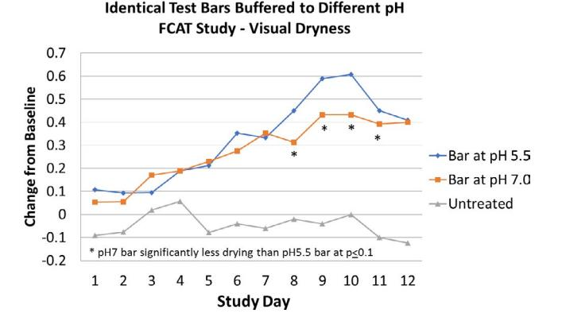
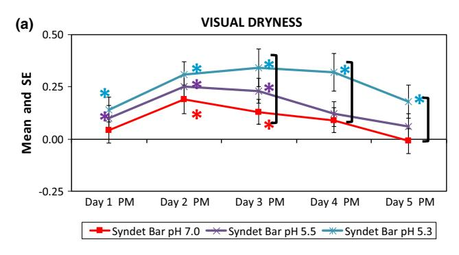
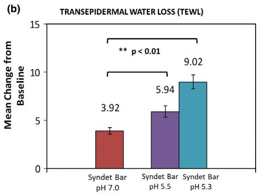
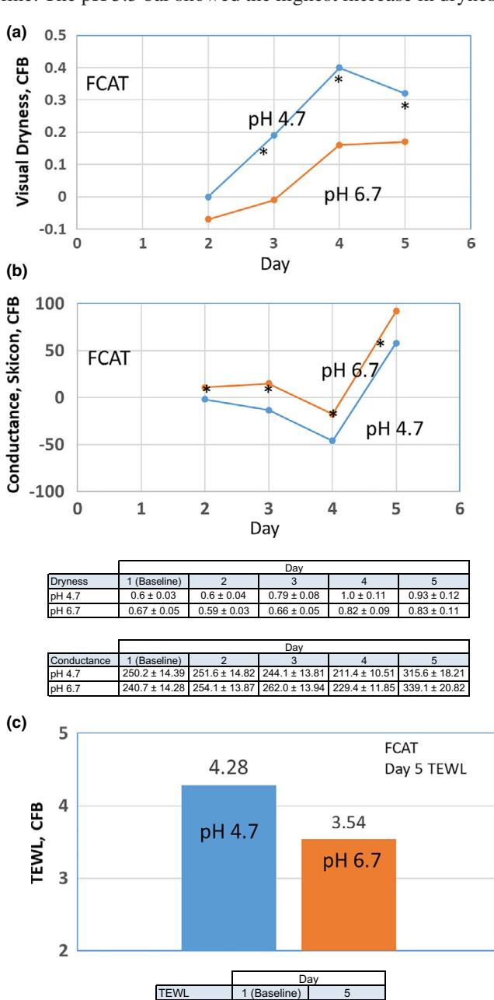
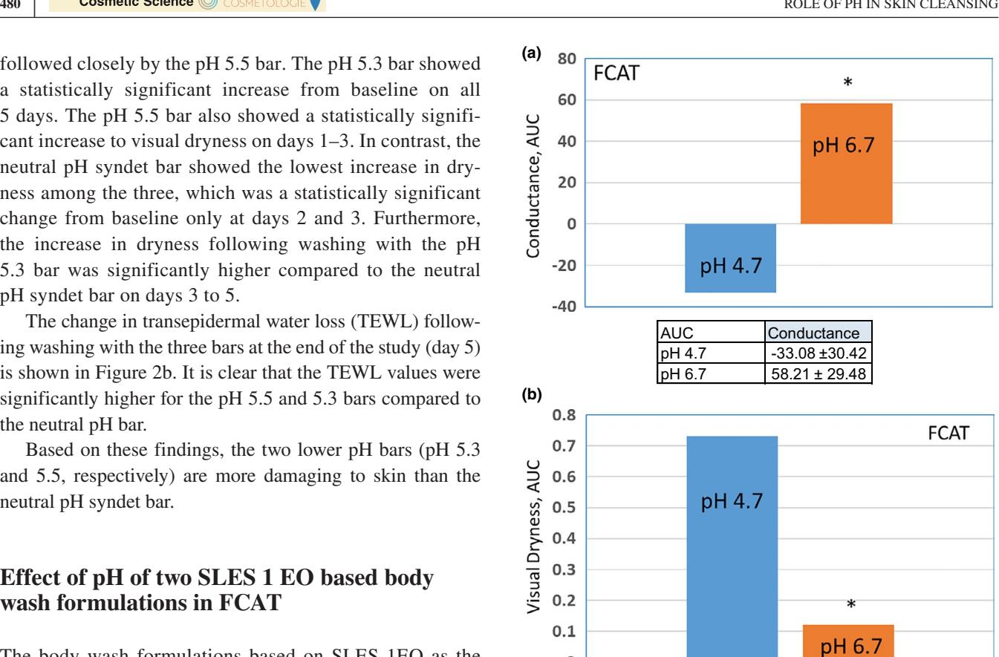
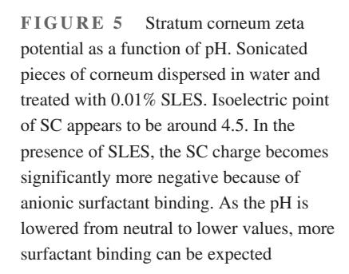
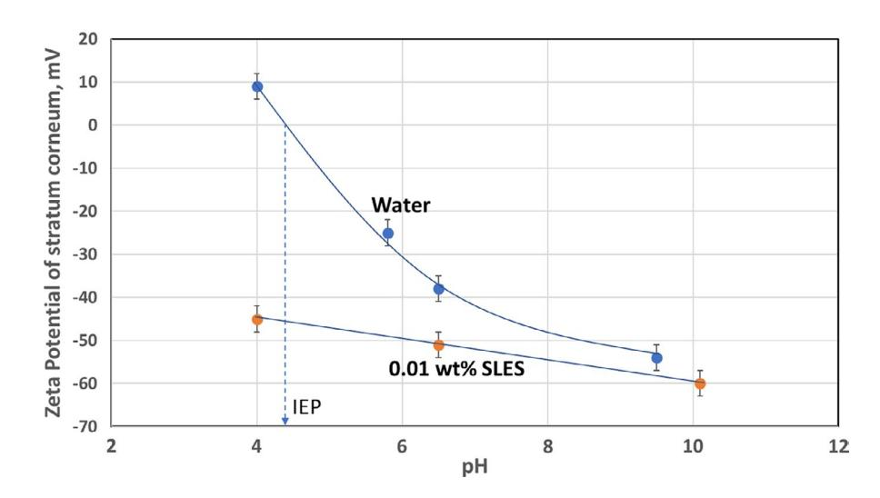

# **ORIGINAL ARTICLE**

# **Role of pH in skin cleansing**

# **Stacy Hawkins1** | **Bivash R. Dasgupta1** | **Kavssery P. Ananthapadmanabhan[2](https://orcid.org/0000-0002-0624-3578)**

1 Unilever Research and Development, Trumbull, CT, USA

JL Winkle College of Pharmacy, University of Cincinnati, Cincinnati, OH, USA

### **Correspondence**

Kavssery P. Ananthapadmanabhan, JL Winkle College of Pharmacy, University of Cincinnati, Cincinnati, OH, 45267, USA.

Email: [ananthky@uc.edu](mailto:ananthky@uc.edu)

#### **Funding information**

Unilever

### **Abstract**

**Background:** The importance of maintaining the acid-mantle of human stratum corneum to maintain its healthy barrier and skin's biological functions such as desquamation and lipid biosynthesis is well recognized in the literature. An outcome of this has been an increase in the number of skincare products formulated at or near the skin pH with an implication that a product formulated at skin pH will be good for skin. Such an assumption often does not take into account the specific interactions of ingredients in the product with the stratum corneum under skin pH conditions.

**Objective:** The objective of this research was to determine whether a skin cleansing product by virtue of its pH being same as "skin pH" is milder to skin.

**Methods:** A well established Forearm Controlled Application Test (FCAT) protocol was used in clinical studies to compare "skin pH" cleansing systems with neutral pH cleansing systems. Specifically, certain commercially available "skin pH" cleansing bars were compared with a neutral pH syndet bar in two separate FCAT studies. Since these bars differed in their surfactant composition, in a separate FCAT study, two identical prototype bar formulations differed only in their pH were compared. Additionally, two body wash liquid prototypes, identical in composition but differing only in their pH were also compared in another FCAT study.

**Results:** The results obtained showed that skin-cleansing systems formulated solely or predominantly with anionic surfactants under skin pH conditions can result in increased skin dryness and irritation compared to those under neutral pH conditions. The results are explained in terms of the increased electrostatic interaction of anionic surfactants with stratum corneum under low pH conditions compared to neutral pH conditions.

**Conclusion:** Skin-cleansing systems formulated solely or predominantly with anionic surfactants under skin pH conditions can result in increased skin dryness and irritation compared to those under neutral pH conditions. Any skin cleansing product by virtue of its pH being same as that of "skin pH" does not guarantee that it will be good for skin. The mildness of a cleanser will be determined by the interactions of its surfactants and other ingredients with stratum corneum under its formulated pH conditions.

#### **KEYWORDS**

claim substantiation in vivo, skin pH, mildness, moisturisation, pH effects on cleansing, skin cleansing

This is an open access article under the terms of the [Creative Commons Attribution-NonCommercial-NoDerivs](http://creativecommons.org/licenses/by-nc-nd/4.0/) License, which permits use and distribution in any medium, provided the original work is properly cited, the use is non-commercial and no modifications or adaptations are made.

© 2021 Unilever R&D. International Journal of Cosmetic Science published by John Wiley & Sons Ltd on behalf of Society of Cosmetic Scientists and Societe Francaise de Cosmetologie.

### **Résumé**

**Contexte:** l'importance de la protection du manteau acide de la couche cornée humaine en vue de maintenir une barrière saine et les fonctions biologiques de la peau, telles que la desquamation et la biosynthèse lipidique, est bien reconnue dans la littérature médicale. Cela a eu pour résultat l'augmentation du nombre de produits cosmétiques formulés à un pH proche ou identique au pH de la peau, impliquant ainsi qu'un produit formulé au pH de la peau sera bon pour la peau. Cette hypothèse ne tient souvent pas compte des interactions spécifiques des ingrédients du produit avec la couche cornée dans des conditions de pH de la peau.

**Objectif:** l'objectif de cette recherche était de déterminer si un nettoyant pour la peau formulé à un pH identique au « pH de la peau » est, pour cette raison, plus doux pour la peau.

**Méthodes:** un protocole bien établi de test d'application contrôlée sur l'avant-bras (Forearm Controlled Application Test, FCAT) a été utilisé dans des études cliniques pour comparer les nettoyants à « pH de la peau » et les nettoyants à pH neutre. Plus précisément, certains savons à « pH de la peau » disponibles dans le commerce ont été comparés à un savon surgras à pH neutre dans deux études distinctes faisant appel au FCAT. La composition en termes d'agents de surface de ces savons étant différente, une étude distincte faisant appel au FCAT a comparé deux prototypes de savons de composition identique mais de pH différent. De plus, deux prototypes de savon liquide pour le corps, de composition identique mais de pH différent, ont également été comparés dans une autre étude faisant appel au FCAT.

**Résultats:** les résultats obtenus ont montré que les nettoyants pour la peau formulés uniquement ou principalement avec des agents de surface anioniques dans des conditions de pH de la peau peuvent entraîner une augmentation de la sécheresse et de l'irritation cutanées, par rapport à ceux formulés dans des conditions de pH neutre. Les résultats s'expliquent par l'interaction électrostatique accrue des agents de surface anioniques avec la couche cornée dans des conditions de pH faible par rapport aux conditions de pH neutre.

**Conclusion:** les nettoyants pour la peau formulés uniquement ou principalement avec des agents de surface anioniques dans des conditions de pH de la peau peuvent entraîner une augmentation de la sécheresse et de l'irritation cutanées, par rapport à ceux formulés dans des conditions de pH neutre. La formulation d'un nettoyant pour la peau à un pH identique au « pH de la peau » ne garantit pas qu'il sera bon pour la peau. La douceur d'un nettoyant sera déterminée par les interactions de ses agents de surface et de ses autres ingrédients avec la couche cornée dans ses conditions de formulation en termes de pH.

### **INTRODUCTION**

The acid mantle of healthy human stratum corneum (SC) and its importance in ensuring skin's innate antimicrobial activity and various bioprocesses such as desquamation and lipid synthesis are well recognized in the literature [1-3]. Typical pH of healthy non-diseased SC surface is around 4.0–6.0 [4-8] which among other things depends on gender [5], age [6, 9, 10], ethnicity [11], body site [6, 8, 10] and physiological condition [5]. Skin pH has a gradient reaching neutral pH values near the base of the corneum [1-3]. The origin of acidic pH of the corneum is from the fatty acids in skin lipids, various amino acids such as urocanic acid in the NMFs (natural moisturizing factor) and proton release by the keratinocyte plasma

membrane Na+/H+ antiporter (NHE1) [1]. Literature results also show that SC with abnormal conditions such as dryness or atopic dermatitis exhibits elevated pH [5, 12]. In all such cases, it is not clear whether these pH changes are the cause or the result of changes in the skin condition.

Among the many exogenous factors that are thought to change skin pH, even if transiently, are skin cleansing products [3, 13, 14]. It has been shown [15] that long-term washing with neutral or relatively high pH cleansers in healthy skin did not affect the baseline pH of skin. However, cleansing products [4, 13, 16] with 'skin pH' claims have appeared in the marketplace. The implied benefit here is that skin cleansing products that have the same pH range as that of skin are preferable for maintaining the acid mantle and skin's natural pH. If this argument is true, then washing skin with a dilute acid at pH 5.5 should also be better than washing skin with water at pH 7. Therefore, such a univariate characterization of a multi-component system to assess skin interaction of a cleanser misses other key attributes of the system and can lead to misplaced recommendations regarding the product's suitability for skin.

Current understanding is that the overall composition of a product will determine its mildness towards skin rather than just its pH. Specifically, interaction of the various ingredients in the product with the stratum corneum under its formulated pH conditions will determine its overall mildness. In the present research, the question of whether a product by virtue of its pH being same as 'skin pH' is milder to skin has been examined by conducting clinical studies with typical marketed skin pH and neutral/near neutral pH (pH = 7) syndet bars and liquids. Past work has shown that even acidic cleansers can cause transient increases of skin pH, similar to that observed when washing with water alone [13, 17].

## **BACKGROUND**

### **Stratum corneum pH and biological processes in skin**

It is well established that the pH of the human SC is important in the regulation of bioprocesses such as desquamation [18], lipid synthesis and skin's natural ability to defend against pathogenic organisms [1, 3]. It is also well established that the pH of skin impacts the composition of the microflora on skin both by direct effects on bacterial growth kinetics [3, 8, 19] and by impacting the activities of antimicrobial peptides on skin [8, 20]. Based on the role of pH in regulating enzyme activity within the SC, Elias et al in their studies on mice skin showed that hyper-acidification of severely compromised or diseased skin can lead to accelerated barrier recovery [21]. Two studies, one by Angelova-Fischer et al. [22] showed that a pH 4 emulsion, compared to a pH 5.8 emulsion, accelerated barrier recovery and enhanced the barrier integrity in elderly participants, while a second study by Buraczewska and Loden [7] did not find any difference between a pH 4 and a pH 7.5 leave-on cream on barrier recovery or TEWL (transepidermal water loss) on surfactant challenged (SLS = sodium lauryl sulphate) skin. These findings are indeed interesting and raises questions about the differences between surfactant treated skin and naturally dry or ageing skin. Clearly, more studies are needed to fully validate the hypothesis that hyperacidification indeed will lead to superior skin barrier.

# **pH and skin cleansing**

Marketed cleansing products vary significantly in their pH, ranging from 3.8 to as high as 11 [23, 24]. Soaps (typically alkali metal salts of carboxylates) tend to be in the alkaline range, whereas those based on synthetic surfactants are in the mildly acidic and neutral pH range. Cleanser formulations also can vary significantly in their composition with several of them containing moisturizing and skin enhancing ingredients. Most of the clinical studies reported in the literature are on comparison of neutral pH syndet bar with common soaps [25, 26]. There are also studies that have investigated the skin pH change after wash with cleansing products [3, 4, 13]. As mentioned earlier, water wash and a 'skin pH' cleanser wash can cause a transient increase in pH immediately after wash that returns to normal values within a few hours [13, 17].

Common soaps without any other skin emollients or moisturizers formulated at high pH (>−8.5) are harsher to skin compared to neutral pH syndet (synthetic detergent) cleansing bars [25, 26]. These differences stem from a combination of the differences in the pH of the formulation as well as their cleansing actives [27]. It is also recognized that the performance of high pH soap bars can be enhanced by incorporating moisturizing lipids and humectants [28, 29]. For example, superfatted soap bars and those with high levels of glycerine are milder than common soap bars. Similarly, incorporation of moisturizing lipids in syndet neutral pH bars has been shown to enhance their overall mildness. Thus, it is not just the pH of a bar that determines its mildness, but its overall composition and the interaction of its ingredients with skin under its solution conditions. Similarly, on the acidic pH side, with the recent advances in our understanding of the effect of SC pH on its biological processes, a newer class of syndets formulated at skin pH or even below the skin pH has begun to appear in the marketplace [4, 13, 16]. The implied claim here is that a cleanser at skin pH is more skin friendly than a neutral pH cleanser. Such arguments do not, however, take into account the chemistry of the surfactants and their interactions with skin when formulated at a low (skin) pH condition. Furthermore, clinical studies comparing the performance of an acidic cleanser with neutral pH cleanser

have been limited. In previously published studies [27], it was shown that some marketed syndet bars with acidic pH were actually harsher than a marketed neutral pH syndet bar. In order to further understand whether these findings have broader implications, further clinical studies have been conducted and reported here, to compare the performance of two of the currently marketed low pH syndet bars with a marketed neutral syndet pH bar. Further, to investigate the impact of pH changes beyond bars, two identical body wash formulations differing in just their pH, acidic (4.7) and neutral (6.7), have been evaluated clinically.

# **METHODS AND MATERIALS**

# **Materials**

Three clinical studies were conducted using standard protocols to evaluate mildness of formulations while varying cleanser pH. In the first study, two prototype bars that were identical in surfactant composition but varying in pH levels were developed and identified here as pH 5.5 and pH 7.0 bars. In the second study, three commercial syndet bars were investigated. Two of these bars were labelled as 'skin pH bars' by their manufacturers and are identified here as syndet pH 5.3 bar and syndet pH 5.5 bar. The third bar was a neutral pH bar identified here as syndet pH 7 bar. The compositions of these bars as listed in their ingredient listing are given in Table 1. The pH values for all bars in the two bar studies correspond to pH of 10% slurry solutions. For the third study, two body wash liquid formulations, identical in surfactant composition but differing in their pH, were evaluated. These formulations were based on SLES 1 EO (sodium lauryl ether sulphate with an average of 1 ethylene oxide unit), as the major anionic surfactant and their pH values were 6.7 and 4.7, respectively. The pH was adjusted with NaOH/citric acid. These are minor ingredients at very low levels and are not expected to influence the results. The compositions of the two liquid body wash formulations are given in Table 1.

# **Methods**

# Clinical studies

*Forearm Controlled Application Technique (FCAT) studies to evaluate cleanser mildness*

The forearm controlled application technique (FCAT) clinical protocol [26] is a recognized industry standard for reliably evaluating cleanser mildness under consumer relevant conditions. The procedure also allows for testing multiple products within the same individual. The FCAT standard

| Product                                                                     | Key Ingredients as listed in marketed products and prototype cleansers                                                                                                                                                                                                                                                                                                                                                                                                                                                              |
|-----------------------------------------------------------------------------|-------------------------------------------------------------------------------------------------------------------------------------------------------------------------------------------------------------------------------------------------------------------------------------------------------------------------------------------------------------------------------------------------------------------------------------------------------------------------------------------------------------------------------------|
| Syndet Bar pH 5.5 (Sebamed Cleansing Bar)                             | Disodium Lauryl Sulfosuccinate, Triticum Vulgare Starch, Stearic Acid, Cetearyl Alcohol, Palmitic Acid, Talc, Lactic Acid, Agua, Lecithin, Sodium Lauroyl Sarcosinate, Cocamidopropyl Betaine, Panthenol, Inulin, Sodium Cocoyl Glutamate, Tocopheryl Acetate, Glycine, Magnesium Aspartate, Alanine, Lysine, Leucine, Benzophenone-4, Tartaric Acid, Parfum, CI 47005, CI 61570, CI 77891.                                                                                                                                |
| Syndet Bar pH 5.3 (Daffy Cleansing and moisturizing Syndet Bar) | Syndet Base*, Aqua, Butyrospermum Parkii Butter, Cocos Nucifera (Coconut) Oil and Aloe Barbadensis Leaf Extract, Perfume, Pentaerythrityl Tetra-di-t-Butyl Hydroxyhydrocinnamate, Disodium Distyrylbiphenyl Disulfonate Syndet Base Contains: Sodium Potassium Lauryl Sulfosuccinate, Sodium Coco Sulphate, Cetostearyl Alcohol, Maltodextrin, Sodium Cocoyl Glycinate, Glycerin, Polyquaternium-7, Potassium Chloride, Phosphoric Acid, Sodium Chloride, Disodium Etidronic Acid, 2-Octyl-1-Decanol, Titanium Dioxide. |
| Syndet Bar pH 7.0 (Dove)                                                 | Sodium Lauroyl Isethionate, Stearic Acid, Sodium Tallowate Or Sodium Palmitate, Lauric Acid, Sodium Isethionate, Water, Sodium Stearate, Cocamidopropyl Betaine, Sodium Cocoate Or Sodium Palm Kernelate, Fragrance, Sodium Chloride, Tetrasodium EDTA, Tetrasodium Etidronate, Titanium Dioxide (CI 77891).                                                                                                                                                                                                                  |
| Prototype Body Wash pH 6.7                                               | Water, Sodium Laureth Sulfate 1 EO, Glycerin, CAPB (Cocamidopropyl betaine, Cocamide MEA, Acrylate copolymer Fragrance, Sodium benzoate, Isopropyl Palmitate, Titanium Dioxide, Guar Hydroxypropyltrimonium Chloride, Sodium Hydroxide, DMDM Hydantoin and Iodopropynyl Butylcarbamate), Disodium EDTA.                                                                                                                                                                                                                       |
| Prototype Body Wash pH 4.7                                               | Water, Sodium Laureth Sulfate 1 EO, Glycerin, CAPB (Cocamidopropyl betaine), Cocamide MEA, Acrylate Copolymer, Fragrance, Sodium benzoate, Isopropyl Palmitate, Titanium Dioxide, Guar Hydroxypropyl Trimonium Chloride, Citric Acid, Disodium EDTA.                                                                                                                                                                                                                                                                          |
| Prototype pH 7 Bar                                                       | Sodium Cocoyl Isethionate, Stearic Acid/Palmitic acid, Sodium Tallowate Or Sodium cocoate, Water, Sodium Isethionate, Sodium Stearate, Cocamidopropyl Betaine, Fragrance, Sodium Chloride, Tetrasodium EDTA, Tetrasodium Etidronate, Titanium Dioxide.                                                                                                                                                                                                                                                                        |
| Prototype pH 5.5 Bar                                                     | Sodium Cocoyl Isethionate, Stearic Acid/Palmitic acid, Coco fatty acid, Water, Sodium Isethionate, Stearin/stearic acid, Cocamidopropyl Betaine, Fragrance, Sodium Chloride, Tetrasodium EDTA, Tetrasodium Etidronate, Titanium Dioxide.                                                                                                                                                                                                                                                                                      |

duration is 5 days of application; however, sometimes an extended product application phase is used when evaluating ultra-mild cleanser formulations. For the FCAT studies described here, approximately 50 healthy male and female participants, ages from 18 to 65, provided informed consent to participate in IRB-approved randomized, balanced, double-blind forearm studies. Participants were provided a marketed bar to use for their general cleansing needs approximately 5 days prior to the product application phase, which they continued to use throughout product application (excluding test sites, which were water-rinsed only) and discontinued use of all moisturizing products. At the end of the conditioning phase, participants having dryness scores of 0.5 to 2 and erythema scores <2 using a 0–6 scale [29] continued into the product application phase. The first bar study consisted of twelve days of product application, and the other studies consisted of five days of product application. Study participants' volar forearms were divided into 6 sites (3 on each arm, each 3.0 cm diameter round) and washed by study personnel under controlled conditions. Each wash procedure consisted of a 10-second wash of the site, 90-second retention time and 15-second rinse.

The test includes twice-daily wash sessions (two sequential wash cycles, as described above) and daily measures include expert visual dryness and erythema using a 0–6 scale [29], objective instrumental hydration (Corneometer: capacitance; Skicon: conductance) and transepidermal water loss (TEWL), as a measure of barrier quality. Measurements are obtained at baseline, each morning prior to application (AM assessments) from day 2 onward and approximately 2 hours following the second wash cycle of the day (PM assessments).

In the studies reported here, data from AM and PM evaluations were analysed independently. With relatively harsher cleansers, a greater disruption to the skin barrier initially leads to increased water loss (TEWL) which, over time, leads to a visible and measurable increase in skin dryness. Further, as the study protocol is a mild exaggeration over normal consumer use (e.g. more frequent than typical daily washing) done over a week, these results provide valuable information on which cleansers are relatively milder and less disruptive to skin condition.

### *Statistical analysis*

For all clinical tests, within-product and between-product effects (e.g. mean change from baseline, CFB) and the comparison of overall product effects were assessed using analysis of variance. For each product treatment at each time point, the least squares mean, standard error, confidence intervals and *p*-values were reported. Significance was determined at *p* < 0.05 for both within-treatment and between-treatment comparisons, using Tukey's honestly significant difference (HSD) test for between-treatment comparisons. An ANOVA comparing product sites by assessment was conducted at baseline to confirm no baseline imbalance was observed prior to statistical analysis.

#### *Zeta potential measurements*

Stratum corneum samples were cut into small pieces and treated with appropriate buffer or surfactant solutions for desired length of time. Samples were then homogenized using a tissue homogenizer to reduce their size further. Homogenized samples were filtered using 5-µm cut-off Millipore filter. The zeta potential was measured using a commercial instrument, Zeta Plus (manufactured by Brookhaven Instruments Corp., Holtsville, NY) instrument based on laser Doppler light scattering technique. The instrument measures both charge and size of the particles.

## **RESULTS**

## **Effect of pH of an acidic syndet bar compared to a neutral pH syndet bar in forearm controlled application test (FCAT)**

Results for change from baseline in visual dryness for the bars at pH 5.5 and 7.0 are provided in Figure 1. As stated earlier, these two bars were identical in composition and differed only in their pH. Fifty healthy participants (20 males and 30 females) completed the study, which consisted of twelve days of product application. Both bars were well tolerated, as exaggerated washing was tolerated on both product application sites over the course of twelve days. The pH 5.5 reached a higher level of dryness

**FIGURE 1** Change from baseline visual dryness from a FCAT study using two syndet bars with identical surfactant composition, varying in pH only. pH of bar slurries used in the study was 5.5 and 7.0. \* indicates significantly less change for the pH 7.0 bar compared to the pH 5.5 bar, *p* < 0.1. Values indicate PM measurements. Both bars showed significantly increased dryness from baseline condition compared to the untreated control site, although both were well tolerated considering the exaggerated protocol of washing [Colour

compared to the pH 7.0 bar by day 8 of product application. As expected, both bars exceeded dryness levels of the untreated control site, which did not show a significant change in dryness throughout the study.

# **Effect of pH of two acidic syndet bars with a neutral pH syndet bar in forearm controlled application test (FCAT)**

Results for change from baseline in visual dryness for the two acidic syndet bars at pH 5.5 and 5.3 and the neutral pH syndet bar are given in Figure 2a. Fifty-two healthy participants (42 males and 10 females) completed the study.

**FIGURE 2** (a) Change from baseline visual dryness from a FCAT study using three syndet bars. pH of bar slurries used in the study was 7.0, 5.5 and 5.3, respectively. \* indicates significant increase from baseline condition, *p* < 0.05. Values indicate PM measurements. pH 5.5 bar showed increase in visual dryness from baseline during days 1–3. pH 5.3 bar showed increased in visual dryness during days 1–5. Syndet bar at pH 7.0 showed visual dryness increase during days 2 and 3. Indicates statistical difference from the pH 7.0 bar. The pH 5.3 bar showed significantly higher visual dryness compared to the pH 7.0 bar on days 3 to 5. (b) Change from baseline transepidermal water loss (TEWL) from a FCAT study using three syndet bars. pH of bar slurries used in the study was 7.0, 5.5 and 5.3, respectively. \* indicates significant increase from pH 7.0 bar, *p* < 0.01. Values indicate TEWL change from base line to day 5 AM. Bars at pH 5.5 and 5.3 showed statistically significant increase in TEWL compared to the bar at pH 7.0 (*p* < 0.01) [Colour figure can be viewed at [wileyonlinelibrary.com\]](www.wileyonlinelibrary.com)

Mean visual dryness across the evaluation sites was 0.68, and there was no visible erythema across the sites at baseline. The pH 5.3 bar showed the highest increase in dryness

**FIGURE 3** FCAT (forearm controlled application test) study results for SLES 1 EO-CAPB based regular body wash formulations differing only in pH. (a) Visual dryness, change from baseline, (b) Conductance change from baseline indicating skin hydration and (c) Transepidermal water loss (TEWL) on day 5, change from baseline. Raw means by assessment and standard error of the mean are provided in tables below each graph. Results show that the lower pH formulation at pH 4.7 is more drying, less hydrated and losing more water than the one at pH 6.7. Surfactants in the formulation: SLES 1EO: sodium lauryl ether sulphate with 1 ethylene oxide group and Betaine is cocamidopropyl betaine. \*shows statistical significance between treatments at *p* < 0.05 [Colour figure can be viewed at

pH 4.7 4.64 ± 0.25 9.04 ± 0.55 pH 6.7 4.35 ± 0.24 7.89 ± 0.41 followed closely by the pH 5.5 bar. The pH 5.3 bar showed a statistically significant increase from baseline on all 5 days. The pH 5.5 bar also showed a statistically significant increase to visual dryness on days 1–3. In contrast, the neutral pH syndet bar showed the lowest increase in dryness among the three, which was a statistically significant change from baseline only at days 2 and 3. Furthermore, the increase in dryness following washing with the pH 5.3 bar was significantly higher compared to the neutral pH syndet bar on days 3 to 5.

The change in transepidermal water loss (TEWL) following washing with the three bars at the end of the study (day 5) is shown in Figure 2b. It is clear that the TEWL values were significantly higher for the pH 5.5 and 5.3 bars compared to the neutral pH bar.

Based on these findings, the two lower pH bars (pH 5.3 and 5.5, respectively) are more damaging to skin than the neutral pH syndet bar.

# **Effect of pH of two SLES 1 EO based body wash formulations in FCAT**

The body wash formulations based on SLES 1EO as the primary surfactant were identical in composition and differed only in their pH values. The acidic pH cleanser was at pH 4.7, and the comparison was with a near neutral pH 6.7 cleanser. Forty-nine healthy participants (29 females and 20 males) completed the study. Mean visual dryness across the evaluation sites was 0.6, and there was no visible erythema across the sites at baseline. The results for change from baseline values of visual dryness and hydration (Skicon) measured in the mornings of days 2 to 5 are given in Figure 3a and b, respectively. Visual dryness for the pH 4.7 cleanser was found to be significantly higher than that for the pH 6.7 cleanser on days 3, 4 and 5 (*p* < 0.05). The pH 6.7 cleanser showed a statistically significant (*p* < 0.05) increase in hydration over time and also showed increased hydration compared to the pH 4.7 cleanser at all time points. An analysis of the results as an overall response, by area under the curve analysis, confirmed the observations of significantly higher dryness and lower hydration for the pH 4.7 cleanser compared to the near neutral pH 6.7 cleanser (see Figure 4a and b, respectively).

# **DISCUSSION**

The pH of normal skin is in the range of 4.5 to about 6.0, and it varies depending upon the body site and skin condition among other factors. The importance of maintaining the acid mantle of SC is also well recognized. Using this as a premise, several skin cleansing products formulated at the 'skin

**FIGURE 4** FCAT (forearm controlled application test) study results for SLES 1 EO-CAPB based regular body wash formulations differing only in pH. (a) Skicon reading, change from baseline, Area under the curve over 5 days. (b) Visual dryness change from baseline indicating skin hydration. Mean and standard error of the mean are presented in the table below the graph. Results show that the lower pH formulation at pH 4.7 is more drying and less hydrated than the one at pH 6.7. Surfactants in the formulation: SLES 1EO: sodium lauryl ether sulphate with 1 ethylene oxide group and Betaine is cocamidopropyl betaine. \* shows statistical significance at *p* < 0.05 [Colour figure can

AUC Dryness pH 4.7 0.73 ± 0.2 pH 6.7 0.12 ± 0.19 14682494, 2021, 4, Downloaded from https://onlinelibrary.wiley.com/doi/10.1111/ics.12721 by University Of California - Davis, Wiley Online Library on [19/05/2026]. See the Terms and Conditions (https://onlinelibrary.wiley.com/terms-and-conditions) on Wiley Online Library for rules of use; OA articles are governed by the applicable Creative Commons License

pH', which fall within a broader range of skin pH in healthy individuals, have appeared in the marketplace. The implied benefit behind these products is that by virtue of their pH being same as skin pH, they are milder to skin than those formulated under other pH conditions. Such arguments completely ignore the interaction of the ingredients in a cleansing product with skin under the skin pH conditions. Furthermore, some of our results published elsewhere [27] clearly showed that bars formulated under skin pH conditions can be even harsher than the ones formulated under neutral pH conditions. The role of cleanser pH on skin condition is further examined in the present investigation with clinical studies

using two prototype cleansing bars identical in composition, but differing only in pH, currently marketed low pH bars at pH 5.5 and 5.3 against a neutral pH syndet bar and two body wash formulations identical in composition at pH values 4.7 and 6.7.

The results given in Figures 1 and 2 clearly show that the lower pH bars are harsher than the ones formulated under neutral pH conditions. It is equally interesting to note that anionic SLES 1 EO rich body wash formulation also showed higher dryness and TEWL under lower 'skin pH' conditions than its identical neutral pH counterpart (Figures 3 and 4). These findings from the present study are also in agreement with the previously reported results [27] of two similar commercial low pH bars (pH 5.5) compared to the neural pH syndet bar. In fact, the earlier reported study was an extended 2-week FCAT study and the increased dryness of the low pH bars compared to the neutral pH bar was clearly more pronounced during the 2nd week.

It is clear from the results of both 'skin pH' bars and liquids that lower pH formulations can be harsher towards skin than the ones under neutral pH conditions. These results clearly dispel the notion that a cleanser by virtue of its pH being same as skin pH will be milder to skin. Factors that could account for the increased harshness of these low pH formulations could stem from the differences in their ingredients and their interactions with the stratum corneum under low vs neutral pH conditions. Since the tested formulations included one set each of bars and liquids identical in composition and differing only in pH, it is reasonable to hypothesize that pH itself may be a factor contributing to the increased harshness of low pH cleansers. Possible reasons for the increased harshness of formulations under 'skin pH' conditions over the neutral pH formulations in these tests are examined below.

In order to understand the effect of a cleanser or a leave-on lotion on skin under various pH conditions, it is important to take into account the changes in the properties of skin as well as that of the ingredients and the associated interactions under such pH conditions. One such factor that affects the interaction of anionic surfactant with SC is its electrostatic charge at the skin–solution interface. A plot of zeta potential of human SC given in Figure 4 shows that it has an IEP (isoelectric point) around pH 4.0. At the IEP, SC will have essentially the same number of positive and negative groups making the net charge zero. At pH values above the IEP, SC will have excess negative charges and below IEP excess positive charges. Accordingly, when skin is exposed to solutions with pH above the IEP, for example neutral pH, it will have relatively a smaller number of positive sites for anionic surfactant binding than at lower pH conditions. However, when the pH is lowered towards its IEP and beyond, the number of positive charges will continually increase and therefore the amount of anionic surfactant binding to SC will also increase. This is evident from the significant increase in the negative zeta potential of SC in the presence of 0.01% SLES (see Figure 5). Previously reported results for the binding of an anionic surfactant, sodium lauroyl isethionate, on human stratum corneum show that the binding increases with decrease in pH in the neutral to acidic pH range [30]. Under higher surfactant binding conditions, it is not unreasonable to expect higher levels of surfactant penetration into deeper layers as well as higher levels left behind even after wash. These effects can lead to increased dryness, lower hydration and barrier damage under low pH conditions. Thus, for cleansers with an anionic surfactant, skin pH may not be the ideal pH for skin mildness.

The results presented here do not, by any means, imply that it is not possible to create a mild cleanser under skin pH or even under hyper-acidified conditions (pH values slightly below the pH of normal skin). The key is in finding a surfactant system that is mild under low pH conditions while providing consumer desired sensory.

## **SUMMARY AND CONCLUSIONS**

Results presented here clearly show that for anionic surfactant-based cleansers simply lowering the pH of the formulation to 'skin pH' may not lead to a milder product. Increased binding of anionic surfactants to SC under low pH conditions compared to neutral pH conditions is thought to be a factor contributing to this effect. While formulating a low pH cleanser, it is important to consider the interactions of surfactants and other ingredients in the formulations with the stratum corneum under low pH conditions. Thus, any cleanser formulated to be at skin pH in itself does not guarantee that it is mild to skin.

#### **ACKNOWLEDGEMENT**

The authors would like to thank Unilever R & D for permission to publish this material.

#### **ORCID**

*Kavssery P. Ananthapadmanabhan* [https://orcid.](https://orcid.org/0000-0002-0624-3578) [org/0000-0002-0624-3578](https://orcid.org/0000-0002-0624-3578)

### **REFERENCES**

- 1. T. M. Mauro. SC pH: Measurements, origins and functions. In: *Skin Barrier* (P. Elias, K. R. Feingold (Eds.), (Taylor and Francis group, NY, 2006), p. 223.
- 2. J. Blaak, R. Wohlfahrt, N. Schurer, Treatment of aged skin with a pH 4 skin care product normalizes increased skin surface pH and improves barrier function: Results of a pilot study. Int. J. Cos. Dermatol. Sci. Appl. 1, 50 (2011).
- 3. M. H. Schmid-Wendtmer, H. C. Korting, The pH of the skin surface and its impact on the barrier function. Skin Pharmacol. Physiol. 19, 296–302 (2006).
- 4. J. L. Parra, M. Paye, EEMCO guidance for the in-vivo assessment of skin surface pH. Skin Pharmacol. Appl. Skin Physiol. 16, 188– 202 (2003).
- 5. S. M. Ali, G. Yosipovitch, Skin pH: from basic science to basic skin care. Acta Derma. Venereol. 93, 261–267 (2013).
- 6. A. Zlotogorski, Distribution of skin surface pH on the forehead and cheek of adults. Arch. Dermatol. Res. 279, 398–401 (1987).
- 7. I. Buraczewska, M. Loden, Treatment of surfactant-damaged skin in humans with creams of different pH values. Pharmacology. 73, 1–7 (2005).
- 8. S. A. Ansari, chapter 14: Skin pH and skin microflora In: *Handbook of cosmetic science and technology*, A. O. Barel, M. Paye, H. I. Maibach (Eds.), 4th ed. (CRC Press, 2014), pp. 163–173.
- 9. G. Yosipovitch, A. Maayan-Metzger, P. Merlob, L. Sirota, Skin barrier properties in different body areas in neonates. Pediatrics. 106, 105–108 (2000).
- 10. M. Q. Man, S. J. Xin, S. P. Song, S. Y. Cho, X. J. Zhang, C. X. Tu, K. R. Feingold, P. M. Elias, Variation of skin surface pH, sebum content and stratum corneum hydration with age and gender in a large Chinese population. Skin Pharmacol. Physiol. 22, 190–199 (2009).
- 11. R. Gunathilake, N. Y. Schurer, B. A. Shoo, A. Celli, J. P. Hachem, D. Crumrine, G. Sirimanna, K. R. Feingold, T. M. Mauro, P. M.

- Elias, pH-regulated mechanisms account for pigment-type differences in epidermal barrier function. J. Invest. Dermatol. 129, 1719–1729 (2009).
- 12. F. Rippke, V. Schreiner, H. Schwanitz, The acidic milieu of the horny layer: new findings on the physiology and pathophysiology of skin pH. Am. J. Clin. Dermatol. 3(4), 261–272 (2002).
- 13. J. Blaak, P. Staib, The relation of pH and skin cleansing. Curr. Probl. Dermatol. Basel, Karger. 54, 132–142 (2018).
- 14. M. Moldovan, A. Nanu, Influence of cleansing product type on several skin parameters after single use. FARMACIA. 58(1), 29– 37 (2010).
- 15. Y. Takagi, K. Kaneda, M. Miyaki, K. Matsuo, H. Kawada, H. Hosokawa, The long-term use of soap does not affect the pH maintenance mechanism of human skin. Skin Res. Tech. 21, 144–148 (2015).
- 16. M. H. Schmid, H. C. Korting, The concept of the acid mantle of the skin: Its relevance for the choice of skin cleansers. Dermatology. 191(4), 276–280 (1995).
- 17. U. Assmus, B. Banowski, M. Brock, J. Erasmy, A. Fitzner, U. Kortemeier, S. Langer, S. Munke, H. Schmidt-Lewerkühne, D. Segger et al., Impact of cleansing products on the skin surface pH. IFSCC Magazine. 16, 17–24 (2013).
- 18. J. Hachem, M.-Q. Man, D. Crumrine, Y. Uchida, B. E. Brown, V. Rogiers, D. Roseeuw, K. R. Feingold, P. M. Elias, Sustained serine proteases activity by prolonged increase in pH leads to degradation of lipid processing enzymes and profound alterations of barrier function and stratum corneum integrity. J. Invest. Dermatol. 125, 510–520 (2005).
- 19. H. C. Korting, M. Kober, M. Mueller, O. Braun-Falco, Influence of repeated washings with soap and synthetic detergents on pH and resident flora of the skin of forehead and forearm. Acta Derm. Venerol. 67, 41–47 (1987).

14682494, 2021, 4, Downloaded from https://onlinelibrary.wiley.com/doi/10.1111/ics.12721 by University Of California - Davis, Wiley Online Library on [19/05/2026]. See the Terms and Conditions (https://onlinelibrary.wiley.com/terms-and-conditions) on Wiley Online Library for rules of use; OA articles are governed by the applicable Creative Commons License

- 20. G. Maisetta, A. Vitali, A. Scorciapino, A. C. Rinaldi, R. Petruzzelli, F. L. Brancatisano, S. Esin, A. Stringaro, M. Colone, C. Luzi et al., pH-dependent disruption of Escherichia coli ATCC 25922 and model membranes by the human antimicrobial peptides hepcidin 20 and 25. FEBS J. 280, 2842–2854 (2013).
- 21. J. Hachem, T. Roelandt, N. Schurer, J. Fluhr, C. Giddelo, M. Man, D. Crumrine, D. Roseeuw, K. R. Feingold, T. Mauro et al., Acute acidification of stratum corneum membrane domains using polyhydroxyl acids improves lipid processing and inhibits degradation of corneodesmosomes. J. Inv. Derm. 130(2), 500– 510 (2010).
- 22. I. Angelova-Fischer, T. W. Fischer, C. Abels, D. Zillikens, Accelerated barrier recovery and enhancement of the barrier integrity and properties by topical application of a pH 4 vs. a pH 5·8 water-in-oil emulsion in aged skin. Br J. Derm. 179, 471–477 (2018).
- 23. N. C. Dlova, T. Naicker, P. Naidoo, Soaps and cleansers for atopic eczema, friends or foes? SAJCH 11(3), 146–148 (2017).
- 24. L. Baranda, R. González-Amaro, B. Torres-Alvarez, C. Alvarez, V. Ramírez, Correlation between pH and irritant effect of cleansers marketed for dry skin. Int. J. Dermatol. 41, 494–499 (2002).
- 25. P. J. Frosch, A. M. Kligman, The soap chamber test A new method for assessing the irritancy of soaps. J. Am. Acad. Dermatol. 1(1), 35–41 (1979).
- 26. K. D. Ertel, B. H. Keswick, P. B. Bryant, A forearm controlled application technique for estimating the relative mildness of personal cleansing products. J. Soc. Cosmet. Chem. 46, 67–76 (1995).

- 27. A. W. Johnson, K. P. Ananthapadmanabhan, S. Hawkins, G. Nole, *Cosmetic Dermatology: Products and Procedures*, Z. D. Draelos (Ed.), 2nd ed. (John Wiley and Sons Inc., Chichester, 2016), pp. 83–95.
- 28. R. M. Dahlgren, M. F. Lukacovic, S. E. Michaels, M. O. Visscher, Effects of bar soap constituents on product mildness. In: A. R. Baldwin (Ed.), *Second World Conference on Detergents*. (A.O.C.S, 1987), pp 127–134.
- 29. M. F. Lukacovic, F. E. Dunlap, S. E. Michaels, M. O. Visscher, D. D. Watson, Forearm wash test to evaluate the clinical mildness of cleansing product, J. Soc. Cosmet. Chem. 39, 355–366 (1988).
- 30. K. P. Ananthapadmanabhan, K. K. Yu, C. L. Meyers, M. P. Aronson, Binding of surfactants to stratum corneum. J. Soc. Cosmet. Chem. 47, 185 (1996).

**How to cite this article:** S. Hawkins, B. R. Dasgupta, K. P. Ananthapadmanabhan, Role of pH in skin cleansing. Int. J. Cosmet. Sci. 43, 474–483 (2021). <https://doi.org/10.1111/ics.12721>