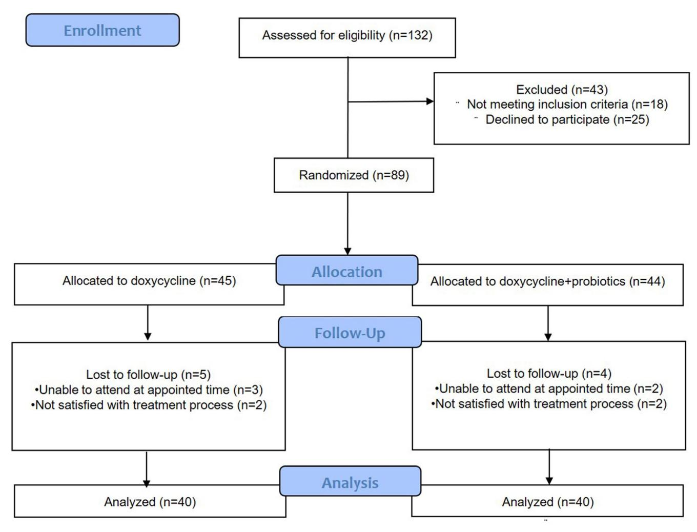
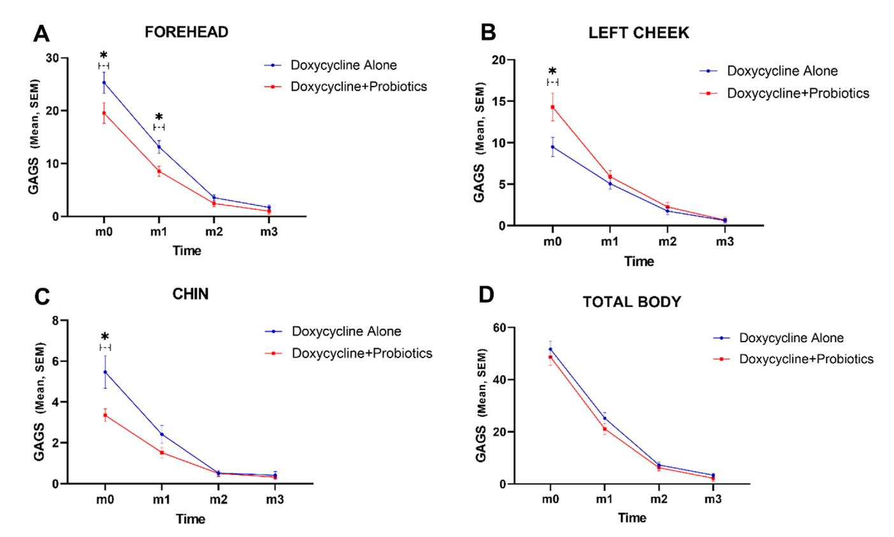

**ORIGINAL ARTICLE [OPEN ACCESS](https://doi.org/10.1111/jocd.16614)**

# **Evaluating the Effectiveness of Probiotic Supplementation in Combination With Doxycycline for the Treatment of Moderate Acne: A Randomized Double-Blind Controlled Clinical Trial**

| Najmolsadat Atefi1   Masoumeh Mohammadi1 | Mohammad Bodaghabadi2   Marjan Mehrali3  |
|---------------------------------------------|------------------------------------------------|
| Elham Behrangi1                             | Alireza Jafarzadeh1                            |
| Mohammadreza Ghassemi1                      | Azadeh Goodarzi1                               |

1Department of Dermatology, Rasool Akram Medical Complex Clinical Research Development Center (RCRDC), School of Medicine, Iran University of Medical Sciences, Tehran, Iran | 2Department of Geriatric and Gerentology, Semnan University of Medical Sciences, Semnan, Iran | 3School of Medicine, Iran University of Medical Sciences, Tehran, Iran

**Correspondence:** Azadeh Goodarzi ([goodarzi.a@iums.ac.ir;](mailto:goodarzi.a@iums.ac.ir) [azadeh\\_goodarzi1984@yahoo.com](mailto:azadeh_goodarzi1984@yahoo.com))

**Received:** 13 August 2024 | **Revised:** 10 September 2024 | **Accepted:** 20 September 2024

**Keywords:** acne | acne vulgaris | doxycycline | efficacy | lactobacillus | microbial supplement | microbiome | probiotic | RCT | safety

# **ABSTRACT**

**Background:** Acne is a chronic inflammatory skin disease that negatively affects patients' quality of life. Increasing antibiotic resistance is making acne less responsive to treatment. Probiotics are live microorganisms that can provide health benefits by fighting pathogens and maintaining intestinal homeostasis and skin microbiome balance. This study investigates the effects of probiotics in the treatment of acne vulgaris.

**Methods:** In this randomized controlled clinical trial, 80 patients with moderate acne were divided into two groups of 40. All patients received the same topical treatment, which consisted of a daily antibacterial face wash and Adapalene gel every other night. The control group received one capsule of doxycycline (100mg) daily, whereas the intervention group received one probiotic capsule daily in addition to doxycycline. Patients underwent photography of facial acne lesions, and treatment response was assessed using the global acne grading system (GAGS) and acne grading method at baseline, as well as during follow-up visits at 1, 2, and 3months.

**Results:** The global acne grading system indicated that both groups showed improvement. However, analyses revealed that outcomes were significantly better in the doxycycline plus probiotics group for the forehead (*p*=0.018), chin (*p*=0.021), and nose (*p*=0.021). No significant differences were observed for the left and right cheeks, back, and chest areas, with the mean GAGS score reduction between the two groups differing by only 2%. Treatment with probiotics significantly reduced the severity of lesions compared to the control group (*p*<0.001). The acne grading method also indicated that the intervention group had a significantly better treatment response than the control group (*p*<0.001). Furthermore, treatment with probiotics did not result in any side effects.

**Conclusion:** Probiotics can serve as an effective and safe treatment option, enhancing the outcomes of routine acne treatments, particularly for patients with acne on the forehead, chin, and nose.

Najmolsadat Atefi and Masoumeh Mohammadi are co-first authors and equally contributed to this study.

This is an open access article under the terms of the [Creative Commons Attribution](http://creativecommons.org/licenses/by/4.0/) License, which permits use, distribution and reproduction in any medium, provided the original work is properly cited.

© 2024 The Author(s). *Journal of Cosmetic Dermatology* published by Wiley Periodicals LLC.

# **1 | Introduction**

Acne is a prevalent issue for both teenagers and adults, affecting 47%–90% of younger people [\[1\]](#page-8-0). Key factors contributing to its development include increased sebum production, hyperkeratinization in pilosebaceous ducts, colonization by *Propionibacterium acnes* (*P.acnes*), and heightened inflammatory responses [\[2, 3](#page-8-1)]. Acne is also associated with psychological problems such as anxiety, insomnia, and depression, and can result in dysmorphias and lasting scars if not addressed [\[4](#page-8-2)].

The skin contains around one billion bacteria per square centimeter, and imbalances in this microbial community can lead to various non-infectious conditions, including acne. Treatment approaches vary based on severity and may include local, systemic, phototherapy, or laser therapies [\[5](#page-8-3)]. Tetracyclines are effective in inhibiting *P. acnes*, but antibiotic resistance, especially with *Staphylococcus aureus*, is becoming increasingly problematic [\[6](#page-8-4)]. Alternative treatments like retinoids and benzoyl peroxide are often used in combination to improve effectiveness but face issues such as side effects and costs [\[7](#page-8-5)]. Current recommendations advise against using antibiotics in isolation, highlighting the importance of combination therapies [[8\]](#page-8-6).

Probiotics, which are beneficial live microorganisms, have been investigated for their potential benefits in treating various health conditions, including skin disorders. They may aid acne treatment by managing the growth of *P.acnes*, lowering sebum production, and reducing inflammation [\[9, 10\]](#page-8-7). Studies suggest that oral probiotics can impact the gut–brain–skin axis, potentially alleviating systemic inflammation and modulating immune responses [\[11\]](#page-8-8).

This study intends to assess the effects of oral probiotics as a supplementary treatment alongside systemic antibiotics for acne. It represents a new exploration involving a group of 80 participants and will examine how the treatment affects different areas of the face.

### **2 | Materials and Methods**

This study was carried out at a healthcare center using a randomized, double-blind design with two parallel groups, conducted by the researcher and analyst between 2018 and 2020. Considering an alpha level of 0.05 (type I error) and a power of 80% (*β*−1), as indicated by the GEHAN table and the NW=N/1−W formula, the estimated sample size for the entire study was determined to be 89 participants (Figure [1](#page-2-0)).

### **2.1 | Eligibility Criteria**

Participants aged 15–35years with moderate acne, defined as grade 2 or 3 on the Global Acne Assessment Scale and exhibiting between 20 and 50 inflammatory lesions, were included in the study. The details of the Global Acne Assessment Scale are found in Table [1.](#page-2-1)

Exclusion criteria included pregnant or lactating women, individuals with a history of taking oral probiotics in the past month, those with dyspepsia, and anyone allergic to the study medication.

## **2.2 | Random Sequencing and Allocation**

Patients were assigned to the treatment groups through random selection in a 1:1 ratio, using a box containing 89 sealed envelopes labeled either A or B. Group A served as the control group, whereas Group B represented the intervention group.

### **2.3 | Follow-Up and Evaluation**

In both groups, the response to treatment was assessed using the acne grading method, the Global Acne Grading System (GAGS) [\[12](#page-8-9)], Global Acne Assessment Scale (GAAS) [\[13, 14\]](#page-8-10) and digital photography. Evaluations were conducted at baseline and after 1, 2, and 3months following treatment. Details of the GAGS and the acne grading method are provided in Tables [3](#page-3-0) and [4,](#page-5-0) respectively.

### **2.4 | Blinding**

Unlike the first researcher, the second researcher and the analyst only had access to the contractual codes A and B, without knowledge of the actual treatment type for each group.

### **2.5 | Therapeutic Regimens**

Participants in both groups were subjected to the same topical treatment, consisting of a daily antibacterial face wash and Adapalene cream every other night. Additionally, both groups received oral doxycycline capsules at a dose of 100mg daily (ENTERIDOX 100mg capsule, Behshad Darou, Iran) in the evenings to prevent possible photosensitivity. Group B received additional supplementation of two daily probiotic capsules from LactoCare (Zist Takhmir, Iran). Each capsule contains seven probiotic strains: *Lactobacillus casei*, *Lactobacillus acidophilus*, *Lactobacillus rhamnosus*, *Lactobacillus bulgaricus*, *Bifidobacterium breve*, *Bifidobacterium longum*, and *Streptococcus thermophilus*, with a colony count exceeding 109 colony-forming units.

### **2.6 | Statistics and Data Analysis**

Statistical analyses were performed using SPSS version 26 software, using the chi-square test, Fisher's exact test, independent *t*-test, and logistic regression analysis.

### **2.7 | Ethical Approval**

This study received approval from the Ethics Committee (registration number: IR.IUMS.FMD.REC.1398.130) and was registered with the Clinical Trial Registration Center (code: IRCT20190830044645N1).

**FIGURE 1** | Flow diagram of the phases of the study.

**TABLE 1** | Global Acne Assessment Scale.

| Location           |   | Factor X Grade (0–4)=local score   |
|--------------------|---|---------------------------------------|
| Forehead           | 2 | [Global score:                        |
| Right cheek        | 2 | 0=None, 1–18=Mild, 19–30=Moderate, |
| Left cheek         | 2 | 31–38=Severe,                         |
| Nose               | 1 | >39=very severe]                      |
| Chin               | 1 |                                       |
| Chest & upper back | 3 |                                       |

## **3 | Results**

The present study involved 89 patients with acne, of whom 80 were included in the analyses. Among these, 37 (46.2%) were female and 43 (53.8%) were male. A total of 68 (85%) patients were aged 15–25years, whereas 12 (15%) were aged 25–35years. Patients were divided into two groups: those receiving oral probiotics combined with doxycycline and those receiving doxycycline alone. Table [2](#page-3-1) presents the demographic characteristics of the two groups, which showed no significant differences (*p*>0.05).

### **3.1 | GAGS Scoring Analyses**

The mean Global Acne Grading System (GAGS) scores for the forehead, left and right cheeks, chin, nose, back, chest, and total body surface were assessed at four time points, as detailed in the methods section. Table [3](#page-3-0) and Figure [2](#page-4-0) summarize the statistical analyses concerning the impact of treatment type on each area.

#### **3.1.1** | **Forehead**

The GAGS score for the forehead was significantly higher in the doxycycline-only group at both baseline and one month (*p*<0.05). The repeated measures ANOVA indicated a significant effect of treatment type (*p*=0.018). Additionally, withingroup analysis revealed significant decreases in GAGS scores over time for both groups (*p*<0.001).

### **3.1.2** | **Left-Side Cheek**

The GAGS score was significantly higher at baseline for the Doxycycline + Probiotic group (*p*=0.019), but no differences were found between groups at later time points (*p*>0.05). A repeated

**TABLE 2** | Demographics of the two groups receiving doxycycline either with or without oral probiotics; *p*-value, *t*-test.

|                         |                        | Study group                       |                                         |       |  |
|-------------------------|------------------------|-----------------------------------|-----------------------------------------|-------|--|
| Characteristics         |                        | Doxycycline + probiotic (n=40) | Doxycycline without probiotic (n=40) | p     |  |
| Sex                     | Male                   | 20 (50.0%)                        | 23 (57.5%)                              | 0.654 |  |
|                         | Female                 | 20 (50.0%)                        | 17 (42.5%)                              |       |  |
| Age group               | 15–25                  | 36 (90.0%)                        | 32 (80.0%)                              | 0.348 |  |
|                         | 25–35                  | 4 (10.0%)                         | 8 (20.0%)                               |       |  |
| Global Acne Assessment  | Mild                   | 25 (62.5%)                        | 26 (65.0%)                              | 1.000 |  |
| Scale                   | Moderate               | 15 (37.5%)                        | 14 (35.0%)                              |       |  |
| Previous retinoid usage | Yes                    | 36 (90.0%)                        | 39 (97.5%)                              | 0.152 |  |
|                         | No                     | 4 (10.0%)                         | 1 (2.5%)                                |       |  |
| Hyperandrogenism        | No                     | 30 (75.0%)                        | 28 (70.0%)                              | 0.969 |  |
|                         | PCO                    | 1 (2.5%)                          | 2 (5.0%)                                |       |  |
|                         | Irregular menstruation | 3 (7.5%)                          | 3 (7.5%)                                |       |  |
|                         | Hirsutism              | 1 (2.5%)                          | 1 (2.5%)                                |       |  |
|                         | Androgenic hair loss   | 5 (12.5%)                         | 6 (15.0%)                               |       |  |
| BMI (mean±SD)           |                        | 23.67±2.27                        | 24.11±2.97                              | 0.457 |  |

**TABLE 3** | Comparison of mean±SD GAGS score in different body area between two intervention groups.

|            |             | GAGSm0a     | GAGSm1      |             | GAGSm2    |           | GAGSm3    |           |
|------------|-------------|-------------|-------------|-------------|-----------|-----------|-----------|-----------|
|            | D+Pb        | D           | D+P         | D           | D+P       | D         | D+P       | D         |
| Forehead   | 19.65±12.32 | 25.30±12.51 | 8.55±6.24   | 13.15±7.45  | 2.47±3.56 | 3.57±3.31 | 1.00±3.32 | 1.70±2.73 |
|            |             | p*=0.045    | p=0.004     |             | p=0.157   |           | p=0.307   |           |
| Left cheek | 14.30±10.42 | 9.50±7.17   | 5.90±4.70   | 5.05±3.97   | 2.25±3.57 | 1.75±2.60 | 0.65±2.19 | 0.60±1.64 |
|            |             | p=0.019     | p=0.385     |             | p=0.477   |           | p=0.988   |           |
| Chin       | 3.35±2.01   | 5.47±5.10   | 1.52±1.58   | 2.42±2.72   | 0.5±0.9   | 0.52±0.81 | 0.32±0.69 | 0.42±1.17 |
|            |             | p=0.017     | p=0.075     |             | p=0.897   |           | p=0.644   |           |
| Nose       | 0.4±1.44    | 0.3±0.93    | 0.12±0.64   | 0.35±1.44   | 0.2±0.16  | 0.0±0.0   | 0.0±0.0   | 0.0±0.0   |
|            |             | p=0.715     | p=0.371     |             | p=0.324   |           | —         |           |
| Back &     | 1.25±4.54   | 1.65±4.07   | 0.35±1.91   | 0.8±2.74    | 0.0±0.0   | 0.0±0.0   | 0.07±0.47 | 0.0±0.0   |
| chest      |             | p=0.68      | p=0.398     |             | —         |           | p=0.323   |           |
| Total body | 48.7±20.64  | 51.72±18.92 | 21.12±13.49 | 25.22±13.45 | 6.28±7.57 | 7.31±7.11 | 2.22±6.51 | 3.4±4.88  |
|            |             | p=0.497     |             | p=0.178     | p=0.56    |           |           | p=0.364   |

aGAGS score after 0month from treatment.

measures ANOVA showed no significant treatment effect on GAGS scores for the left cheek (*p*=0.07). However, both groups experienced significant decreases in GAGS scores over time (*p*<0.001).

#### **3.1.3** | **Right-Side Cheek**

The repeated measures ANOVA indicated no significant effect of treatment type on GAGS scores for the right cheek (*p*=0.369).

bDoxycycline + Probiotics.

\**p*-value.

**FIGURE 2** | Charts represent mean and standard error of mean (SEM) GAGS score in forehead (A), left cheek (B), chin (C), and total body (D); \**p*value<0.05.

However, within-group analysis showed significant decreases in GAGS scores over time (*p*<0.001).

analysis showed significant decreases in GAGS scores over time (*p*=0.003).

# **3.1.4** | **Chin**

At baseline, the GAGS score was significantly higher in the doxycycline-only group (*p*=0.017), with no significant differences between groups at subsequent time points (*p*>0.05). The repeated measures ANOVA showed a significant treatment effect on GAGS scores for the chin (*p*=0.021). Additionally, within-group analysis revealed significant decreases in GAGS scores over time (*p*<0.001).

#### **3.1.5** | **Nose**

There were no significant differences in GAGS scores between the two groups at any time point (*p*>0.05), and the repeated measures ANOVA showed no significant treatment effect for the nose (*p*=0.907). However, within-group analysis indicated significant decreases in GAGS scores over time (*p*=0.021).

# **3.1.6** | **Back and Chest**

No significant differences in GAGS scores were found between the two groups at any time point (*p*>0.05), and the repeated measures ANOVA revealed no significant treatment effect for back and chest acne (*p*=0.574). However, within-group

# **3.1.7** | **Total Body**

The study assessed GAGS scores for total body acne across four time points for both Doxycycline + Probiotic and Doxycyclineonly groups. Between-group analysis showed no significant difference in treatment effects (*p* = 0.247). However, both groups exhibited significant decreases in GAGS scores over time (*p* = 0.003). Overall, the treatment types were similarly effective over the four months, with the Doxycycline + Probiotic group showing a marginally greater decrease of only 2% compared to the control group, which was not statistically significant.

### **3.2 | GAAS Scoring Analysis**

The distribution of Global Acne Assessment Scale (GAAS) classifications in the Doxycycline + Probiotic and Doxycycline without Probiotic groups was not significantly different at all examination times according to the chi-square test (*p*>0.05). The rate of GAAS grade reduction was also analyzed using Friedman's test, which indicated a significant decrease in GAAS grade frequency among patients over time (*p*<0.001). Additionally, Friedman's test revealed a significant main effect of treatment type on GAAS classifications, with the Doxycycline + Probiotic group showing a greater frequency of patients with lower GAAS grades compared to the Doxycycline without Probiotic group.

### **3.3 | Acne Grading Method Analysis**

The distribution of Acne Grading Method categories in the two groups was analyzed using a chi-square test, revealing no significant difference between the groups at any examination time (*p*>0.05). Table [4](#page-5-0) presents the distribution of Acne Grading Method categories for the Doxycycline + Probiotic and Doxycycline without Probiotic groups. Friedman's test indicated a significant main effect of treatment type on Acne Grading Method classifications, with the Doxycycline + Probiotic group showing a higher frequency of patients with lower grades compared to the Doxycycline without Probiotic group (*p*<0.001).

### **3.4 | Side Effects**

At the end of the treatment period, side effects were evaluated in both groups. In the doxycycline group, complications included dyspepsia in 9 patients (22.5%), diarrhea in 4 patients (10%), and headache in 2 patients (5%). In contrast, the group receiving combined treatment of doxycycline and probiotics reported dyspepsia in 3 patients (7.5%) and headache in 3 patients (7.5%).

# **4 | Discussion**

The present study involved 80 patients with acne. An evaluation of the demographic characteristics of the two groups one receiving oral doxycycline with probiotics and the other receiving doxycycline alone—showed no significant differences.

Statistical analyses demonstrated significant improvements in acne for both groups over the four measurement points. Repeated measures analysis indicated that the addition of probiotics to doxycycline significantly improved acne in the forehead (*p*=0.018), chin (*p*=0.021), and nose (*p*=0.021) compared to doxycycline alone. However, the overall treatment outcomes did not differ significantly between the two groups. The mean reduction in GAGS scores for total body acne at three months was 2% greater in the Doxycycline + Probiotics group.

Acne showed improvement in all areas for both groups over time, with a significant difference observed in the forehead area according to the GAGS criteria. The variation in response rates to the combined treatment of doxycycline and probiotics across different areas can be attributed to factors such as the initial intensity of the lesions, the density of sebaceous glands in the area, and the degree of inflammation of the lesions.

According to the GAAS grading system, the Doxycycline + Probiotics group showed a greater reduction in acne severity compared to the doxycycline alone group (*p*<0.001). Additionally, statistical analysis using the Acne Grading Method indicated that the intervention group responded better to treatment than the control group (*p*<0.001).

The most relevant studies conducted worldwide are listed below and compared in Table [5.](#page-6-0)

# **4.1 | In Vitro Studies**

Laboratory studies have demonstrated the ability of probiotics, such as *Streptococcus salivarius* and *Enterococcus faecalis*, to prevent acne growth through the production of antibacterial proteins. Hacivelioglu et al. [\[12\]](#page-8-9) found that one such protein, bacteriocinlike inhibitory substance (BLIS), significantly inhibits the growth of *P.acnes*. Additionally, these probiotics exhibit modulatory effects on the immune system in keratinocytes and epithelial cells, supporting their use as an adjunct in acne treatment.

The beneficial effects of probiotics stem from both direct and indirect mechanisms: they inhibit the growth of *P.acnes*, reduce inflammatory responses, and mitigate the side effects associated

**TABLE 4** | Acne grading method classification distribution in two groups of Doxycycline + Probiotic and Doxycycline without probiotic.

|                                           |                            | Study group                      | p         |       |
|-------------------------------------------|----------------------------|----------------------------------|-----------|-------|
| Time                                      | Doxycycline + probiotic | Doxycycline without probiotic |           |       |
| Acne Grading Method first visit           | Grade 2                    | 28 (70.0)                        | 21 (52.5) | 0.168 |
|                                           | Grade 4                    | 12 (30.0)                        | 19 (47.5) |       |
| Acne Grading Method month 1, second visit | Grade 0                    | 1 (2.5)                          | 0 (0.0)   | 0.359 |
|                                           | Grade 2                    | 36 (90.0)                        | 39 (97.5) |       |
|                                           | Grade 4                    | 3 (7.5)                          | 1 (2.5)   |       |
| Acne Grading Method month 2, third visit  | Grade 0                    | 23 (57.5)                        | 18 (45.0) | 0.371 |
|                                           | Grade 2                    | 17 (42.5)                        | 22 (55.0) |       |
| Acne Grading Method month 3, fourth visit | Grade 0                    | 37 (92.5)                        | 33 (82.5) | 0.311 |
|                                           | Grade 2                    | 3 (7.5)                          | 7 (17.5)  |       |

*Note:* The table represents frequencies; *p*-value, chi-square test.

**TABLE 5** | A summary of previous studies on the effects of probiotics in active inflammatory acne.

| Study                     | Sample size | Type of study                        | Probiotics                                                                                                                                                                                 | Adjuvant therapy                            | Result                                                                                                                                  |
|---------------------------|----------------|-----------------------------------------|--------------------------------------------------------------------------------------------------------------------------------------------------------------------------------------------|------------------------------------------------|-----------------------------------------------------------------------------------------------------------------------------------------|
| Siver et al. [26]         | 300            | Cross sectional                      | Lactobacillus acidophilus and Lactobacillus bulgaricus                                                                                                                                  | —                                              | Possible interaction between the skin manifestations of acne vulgaris and the metabolic processes of the intestinal tract   |
| Marchetti et al. [27]  | 40             | Clinical trial                          | Lactobacillus acidophilus and Bifidobacterium bifidum                                                                                                                                   | Systemic treatment                          | A better clinical response, wound healing and tolerance to oral antibiotics                                                       |
| Jung et al. [28]          | 45             | Randomized Controlled Trial       | Lactobacillus acidophilus and Lactobacillus delbrueckii subspecies bulgaricus and Biftdobacterium biftdum                                                                         | Minocycline occurs better and faster in the |                                                                                                                                         |
| Kim et al. [29]           | 36             | Randomized Controlled Trial       | Lactoferrin                                                                                                                                                                                | Fermented milk                              | Decreased sebum content                                                                                                                 |
| Muizzuddin et al. [24] | 10             | Clinical trial                          | Lactobacillus plantarum                                                                                                                                                                    | —                                              | Reductions in mild acne lesions and erythema plus increases in skin barrier recovery                                           |
| Kang et al. [23]          | 70             | Randomized Controlled Trial       | Enterococcus faecalis SL-5 as a species of Lactobacillus genus                                                                                                                          | —                                              | Inhibition of P. acnes and reduction in its inflammatory mediators synthesis. Reduction in inflammatory lesions             |
| Our study                 | 80             | Randomized Control Clinical Trial | Lactobacillus casei, Lactobacillus acidophilus, Lactobacillus rhamnosu, Lactobacillus bulgaricus, Bifidobacterium breve, Bifidobacterium longum, Streptococcus thermophilus | Doxycycline                                    | No reduction in the whole-body acne score. Reduction of the inflammatory lesions in the areas of forehead, nose and chin |

with current treatments [\[13, 14\]](#page-8-10). Another study highlighted that *S.salivarius*, found in the oropharynx, inhibits *P.acnes* growth in vitro by producing BLIS, suggesting that topical formulations containing BLIS or BLIS-producing bacteria could be effective for treating acne vulgaris [\[15](#page-8-11)].

Moreover, these probiotics inhibit the pro-inflammatory cytokine IL-8 in epithelial cells and keratinocytes, leading to immune regulation. This anti-inflammatory response helps regulate genes related to epithelial adhesion and homeostasis, thus preventing the overgrowth of harmful bacteria without disrupting the skin's microbiome. Probiotics may be particularly beneficial for treating grade 3 and 4 acne, where inflammation is more pronounced [\[16\]](#page-8-12).

An in vitro study by Wang et al. indicated that skin microorganisms, especially *Staphylococcus epidermidis* (*S. epidermidis*), can ferment glycerol and inhibit the overgrowth of *P. acnes* in culture. Therefore, the presence of *S. epidermidis* may serve as a natural defense against acne, and its increase through probiotic use could improve patient outcomes [\[17\]](#page-8-13).

Another study reported that bacteriocin produced by Lactobacillus HY499 inhibited inflammation and the growth of skin pathogens, including *S. epidermidis*, *Staphylococcus aureus* (*S. aureus*), *Streptococcus pyogenes*, and *P. acnes*. Notably, bacteriocin did not inhibit the growth of fibroblasts, and no allergic or irritant reactions were observed in human patch tests. The authors explored using bacteriocin from *Lactococcus* sp. HY499 as an antimicrobial agent in cosmetic formulations, emphasizing its safety compared to current treatments [\[18\]](#page-8-14).

Furthermore, a study conducted by Gueniche et al. showed that *Lactobacillus paracasei* CNCM I-2116 (ST11) can inhibit skin inflammation caused by substance P and facilitate the regeneration of skin barrier function. ST11 effectively eliminated the effects of substance P, including vasodilation, edema, mast cell degranulation, and TNF-α release, compared to control samples. The ex vivo skin culture method indicated faster restoration of the skin barrier with ST11, which could be especially beneficial in countering the side effects of traditional treatments that generate free radicals [\[19\]](#page-8-15).

# **4.2 | In Vivo Studies (Topical Probiotics)**

Kang et al. [\[23](#page-8-21)] investigated the effects of a lotion formulated with Enterococcus faecalis SL-5 (EFSL5), a species of lactobacilli extracted from human feces, against *P.acnes*. This species shows strong efficacy against gram-positive bacteria, particularly *P.acnes*. A concentrated powder was prepared from sterilized culture medium, and an aqueous lotion was developed. The placebo consisted of the same lotion but without the CBT SL-5 powder. Seventy patients diagnosed with mild to moderate acne vulgaris participated in this 8-week randomized study. Participants were instructed to apply the lotion twice daily to the affected areas. Evaluations were conducted at the beginning of the study and after 2, 4, and 8weeks. The significant reduction in inflammatory lesions in the intervention group suggests that CBT SL-5 lotion inhibits *P.acnes* by reducing the production of inflammatory mediators synthesized and released by this pathogen [\[20](#page-8-22)].

Muizzuddin et al. observed a reduction in mild acne lesions by diminishing erythema and promoting skin barrier regeneration through a clinical study using *Lactobacillus plantarum* (*L.plantarum*). The formulation containing 5% of *L.plantarum* significantly reduced lesion size and erythema, whereas the 1% formulation did not yield significant results. This study indicates that a formulation with 5% *L.plantarum* may be effective in treating mild acne lesions, and highlights the dose-dependent effects of lactobacilli, as no benefits were observed with the 1% concentration [\[21\]](#page-8-23).

# **4.3 | Interventional Studies**

In 1930, Stokes and Pillsbury first highlighted the therapeutic potential of *Lactobacillus acidophilus* and *L.acidophilus* milk in the inflammatory processes affecting the brain, intestine, and skin. Concurrently, other physicians noted the popularity of *L. acidophilus* cultures among the public as a remedy for acne [\[22\]](#page-8-24). However, this earlier research lacked the rigor of clinical trials and merely suggested possible dermatologic benefits.

Despite historical interest, research on probiotic effectiveness remains limited. In 1961, Robert H. Seaver monitored 300 patients using a commercial probiotic (Laxinex tablets containing *L. acidophilus* and *L. bulgaricus*), reporting that 80% of acne sufferers experienced some degree of clinical improvement, particularly those with inflammatory acne. Without a control group, Seaver concluded that "there is an interaction between the skin manifestations of acne vulgaris and the metabolic processes of the intestinal tract" [\[23](#page-8-21)]. However, probiotics should not be used as a sole treatment.

In a study involving 40 patients, half received an oral probiotic supplement containing 250mg of freeze-dried *Lactobacillus acidophilus* and *Bifidobacterium bifidum* alongside systemic treatment. The probiotic group showed better clinical responses, enhanced wound healing, and improved tolerance to oral antibiotics compared to the control group [\[24](#page-8-20)].

Similarly, another study evaluated acne patients with impaired bacterial microflora and found that those receiving gut microbiotacorrecting agents alongside traditional treatments experienced faster clinical improvement than those who did not [\[25](#page-8-25)].

In a trial by Jung et al., 45 female patients were divided into three groups: one receiving only probiotics, another receiving probiotics with minocycline, and a third receiving only minocycline. All groups showed significant improvement in lesion counts after four weeks, with continued benefits noted at a 12 week follow-up. The combination therapy group experienced a notably greater reduction in lesions, while the minocycline-only group developed vaginal candidiasis [\[26\]](#page-8-16). This study, like ours, demonstrated that the group receiving probiotics had better and faster treatment responses, suggesting that probiotics may serve as a treatment accelerator.

Additionally, a study by Kim et al. involving 36 acne patients indicated that consumption of a lactoferrin-enriched fermented milk over 12weeks significantly improved clinical aspects of acne, particularly reducing total lesion counts and sebum production. While lactoferrin (an anti-inflammatory milk protein) enhanced efficacy, the benefits of probiotics alone further support their role in acne treatment [\[27](#page-8-17)].

Currently, numerous studies are examining acne, its severity, and factors influencing treatment effectiveness, including procedural methods for addressing acne and its scars. The authors of this study emphasize ongoing research into the microbiomes associated with acne vulgaris, a common condition and cause of scarring [\[24, 28, 29\]](#page-8-20).

Further clinical trials involving diverse populations are encouraged, as microbiota composition varies across groups. Our study's sample size may be a limitation, and we urge researchers to investigate the topic more thoroughly, especially concerning severe acne. Future investigations should also consider patients' preferences and adherence to specific probiotic forms. Given the high prevalence of acne, even non-significant improvements should be acknowledged in clinical practice.

# **5 | Limitations**

This study has several limitations affecting the interpretation of results. Participant adherence to treatment varied, potentially impacting the effectiveness of doxycycline and probiotics. Additionally, variations in baseline acne severity could skew results, although demographic differences were not significant.

Inconsistencies in follow-up times may introduce variability in treatment effects, and the sample size of 80 patients limits the generalizability of findings. A larger, multi-center approach would provide a broader understanding of treatment effects. The short duration of the study (four months) may not capture longterm effects or recurrence of acne after treatment ends. Lastly, despite using validated scoring systems, potential subjectivity in assessments could affect the outcomes. Addressing these limitations will improve the clarity and reliability of the findings.

### **6 | Conclusion**

This study demonstrates that both doxycycline with probiotics and doxycycline alone effectively reduce acne, with the combination showing slightly greater improvements in GAGS scores. Clinicians should consider incorporating probiotics into treatment regimens, particularly for patients unresponsive to antibiotics. The findings advocate for personalized treatment approaches in acne management, encouraging clinicians to adopt a holistic strategy that includes adjunctive therapies like probiotics. This could enhance patient outcomes and contribute to evolving standards of care in acne treatment.

### **Author Contributions**

N.A., Ma.Mo., A.G. and Ma.Me. performed the research. A.J., E.B., M.B. and M.G. designed the research study. A.J. and A.G. contributed essential reagents or tools. Ma.Mo., N.A. and E.B. analyzed the data. M.B. and M.G. wrote the paper. All authors have read and approved the final manuscript.

#### **Conflicts of Interest**

The authors declare no conflicts of interest.

#### **Data Availability Statement**

The data that support the findings of this study are available from the corresponding author upon reasonable request.

#### **References**

- 1. A. C. Perkins, J. Maglione, G. G. Hillebrand, K. Miyamoto, and A. B. Kimball, "Acne Vulgaris in Women: Prevalence Across the Life Span," *Journal of Women's Health* 21, no. 2 (2012): 223–230.
- 2. M. Patel, W. P. Bowe, C. Heughebaert, and A. R. Shalita, "The Development of Antimicrobial Resistance Due to the Antibiotic Treatment of Acne Vulgaris: A Review," *Journal of Drugs in Dermatology* 9, no. 6 (2010): 655–664.
- 3. A. J. Cooper, "Systematic Review of Propionibacterium Acnes Resistance to Systemic Antibiotics," *Medical Journal of Australia* 169, no. 5 (1998): 259–261.
- 4. R. J. Hay, N. E. Johns, H. C. Williams, et al., "The Global Burden of Skin Disease in 2010: An Analysis of the Prevalence and Impact of Skin Conditions," *Journal of Investigative Dermatology* 134, no. 6 (2014): 1527–1534.
- 5. J. I. Silverberg and N. Silverberg, "Epidemiology and Extracutaneous Comorbidities of Severe Acne in Adolescence: A US Population-Based Study," *British Journal of Dermatology* 170, no. 5 (2014): 1136–1142.
- 6. N. D. Cresce, S. A. Davis, W. W. Huang, and S. R. Feldman, "The Quality of Life Impact of Acne and Rosacea Compared to Other Major Medical Conditions," *Journal of Drugs in Dermatology* 13, no. 6 (2014): 692–697.
- 7. K. L. Anderson, E. H. Dothard, K. E. Huang, and S. R. Feldman, "Frequency of Primary Nonadherence to Acne Treatment," *JAMA Dermatology* 151, no. 6 (2015): 623–626.
- 8. B. A. Yentzer, R. A. Ade, J. M. Fountain, et al., "Simplifying Regimens Promotes Greater Adherence and Outcomes With Topical Acne Medications: A Randomized Controlled Trial," *Cutis* 86, no. 2 (2010): 103–108.
- 9. S. Awan and J. Lu, "Management of Severe Acne During Pregnancy: A Case Report and Review of the Literature," *International Journal of Women's Dermatology* 3, no. 3 (2017): 145–150.
- 10. A. Layton, E. A. Eady, M. Peat, et al., "Identifying Acne Treatment Uncertainties Via a James Lind Alliance Priority Setting Partnership," *BMJ Open* 5, no. 7 (2015): e008085.
- 11. D. Thiboutot, H. Gollnick, V. Bettoli, et al., "New Insights Into the Management of Acne: An Update From the Global Alliance to Improve Outcomes in Acne Group," *Journal of the American Academy of Dermatology* 60, no. 5 (2009): S1–S50.

- 12. S. Hacivelioglu, A. N. Gungor, M. Gencer, et al., "Acne Severity and the Global Acne Grading System in Polycystic Ovary Syndrome," *International Journal of Gynaecology and Obstetrics* 123, no. 1 (2013): 33–36, [https://doi.org/10.1016/j.ijgo.2013.05.005.](https://doi.org/10.1016/j.ijgo.2013.05.005)
- 13. I. A. Hasan, Z. N. Mahdi, and R. K. Obeed, "Evaluation of the Efficacy of RF Microneedling and Oral Isotretinoin in Comparison With Oral Isotretionoin Alone in the Treatment of Acne Vulgaris," *Postepy Dermatologii I Alergologii* 40, no. 1 (2023): 111–114, [https://doi.org/10.](https://doi.org/10.5114/ada.2022.124109) [5114/ada.2022.124109.](https://doi.org/10.5114/ada.2022.124109)
- 14. A. S. Bazargan, A. Jafarzadeh, F. Danandeh, and S. Salehi, "Investigating Metabolic Syndrome Markers and Body Mass Index Changes in Patients With Acne Vulgaris Treated With Isotretinoin: A Prospective Study," *Journal of Cosmetic Dermatology* (2024), [https://doi.org/10.](https://doi.org/10.1111/jocd.16533) [1111/jocd.16533.](https://doi.org/10.1111/jocd.16533) Epub ahead of print. PMID: 39143842.
- 15. H. Gollnick, W. Cunliffe, D. Berson, et al., "Management of Acne: A Report From a Global Alliance to Improve Outcomes in Acne," *Journal of the American Academy of Dermatology* 49, no. 1 (2003): S1–S37.
- 16. B. Dreno, D. Thiboutot, H. Gollnick, et al., "Antibiotic Stewardship in Dermatology: Limiting Antibiotic Use in Acne," *European Journal of Dermatology* 24, no. 3 (2014): 330–334.
- 17. A. Nast, B. Dréno, V. Bettoli, et al., "European Evidence-Based (S3) Guidelines for the Treatment of Acne," *Journal of the European Academy of Dermatology and Venereology* 26 (2012): 1–29.
- 18. World Health Organization, "Antibiotic Resistance-A Threat to Global Health Security," 2014.
- 19. N. Abdel Fattah and Y. Darwish, "In Vitro Antibiotic Susceptibility Patterns of Propionibacterium Acnes Isolated From Acne Patients: An Egyptian University Hospital-Based Study," *Journal of the European Academy of Dermatology and Venereology* 27, no. 12 (2013): 1546–1551.
- 20. K. Nakase, H. Nakaminami, N. Noguchi, S. Nishijima, and M. Sasatsu, "First Report of High Levels of Clindamycin-Resistant Propionibacterium Acnes Carrying Erm (X) in Japanese Patients With Acne Vulgaris," *Journal of Dermatology* 39, no. 9 (2012): 794–796.
- 21. O. Mills, Jr., C. Thornsberry, C. W. Cardin, K. A. Smiles, and J. J. Leyden, "Bacterial Resistance and Therapeutic Outcome Following Three Months of Topical Acne Therapy With 2% Erythromycin Gel Versus Its Vehicle," *Acta Dermato-Venereologica* 82, no. 4 (2002): 260–265.
- 22. R. M. Levy, E. Y. Huang, D. Roling, J. J. Leyden, and D. J. Margolis, "Effect of Antibiotics on the Oropharyngeal Flora in Patients With Acne," *Archives of Dermatology* 139, no. 4 (2003): 467–471.
- 23. B. S. Kang, J. G. Seo, G. S. Lee, et al., "Antimicrobial Activity of Enterocins From Enterococcus Faecalis SL-5 Against Propionibacterium Acnes, the Causative Agent in Acne Vulgaris, and Its Therapeutic Effect," *Journal of Microbiology* 47, no. 1 (2009): 101–109.
- 24. N. Muizzuddin, W. Maher, M. Sullivan, S. Schnittger, and T. Mammone, "Physiological Effect of a Probiotic on Skin," *Journal of Cosmetic Science* 63, no. 6 (2012): 385–395. PMID: 23286870.
- 25. H. C. Williams, R. P. Dellavalle, and S. Garner, "Acne Vulgaris," *Lancet* 379, no. 9813 (2012): 361–372.
- 26. R. Siver, "Lactobacillus for the Control of Acne," *Journal of the Medical Society of New Jersey* 59 (1961): 52–53.
- 27. F. Marchetti, R. Capizzi, and A. Tulli, "Efficacy of Regulators of the Intestinal Bacterial Flora in the Therapy of Acne Vulgaris," *La Clinica Terapeutica* 122, no. 5 (1987): 339–343.
- 28. G. W. Jung, J. E. Tse, I. Guiha, and J. Rao, "Prospective, Randomized, Open-Label Trial Comparing the Safety, Efficacy, and Tolerability of an Acne Treatment Regimen With and Without a Probiotic Supplement and Minocycline in Subjects With Mild to Moderate Acne," *Journal of Cutaneous Medicine and Surgery* 17, no. 2 (2013): 114–122.
- 29. J. Kim, Y. J. Ko, J. J. Cha, et al., "Dietary Effect of Lactoferrin-Enriched Fermented Milk on Skin Surface Lipid and Clinical Improvement of Acne Vulgaris," *Nutrition* 26, no. 9 (2010): 902–909.