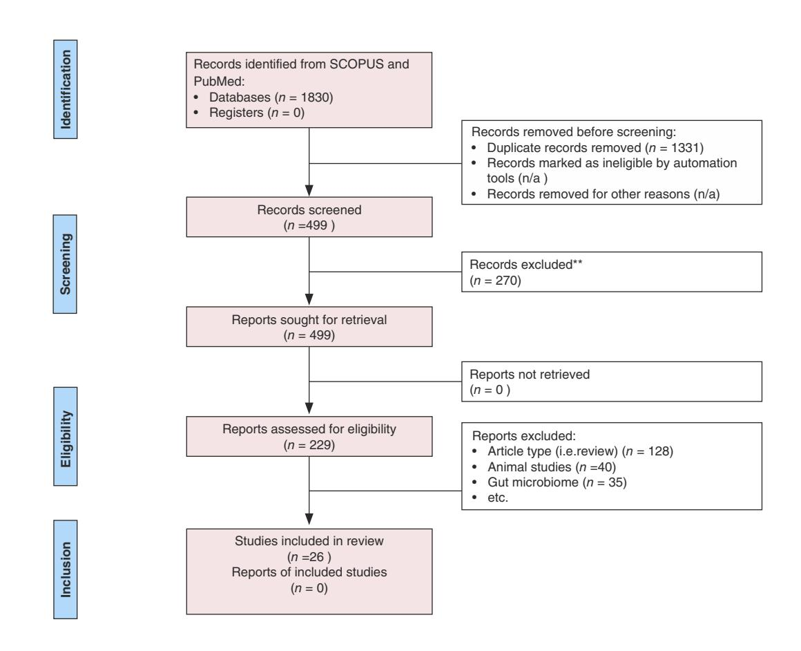
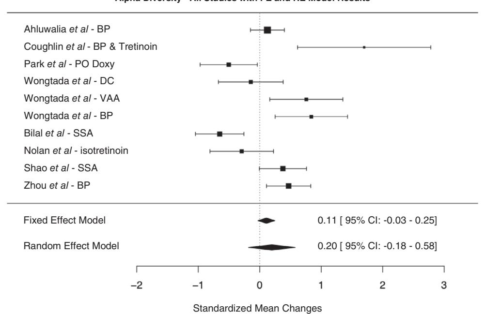
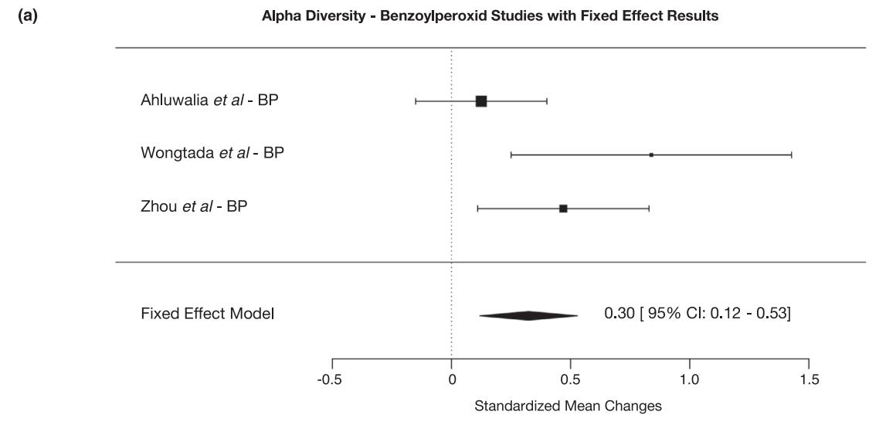
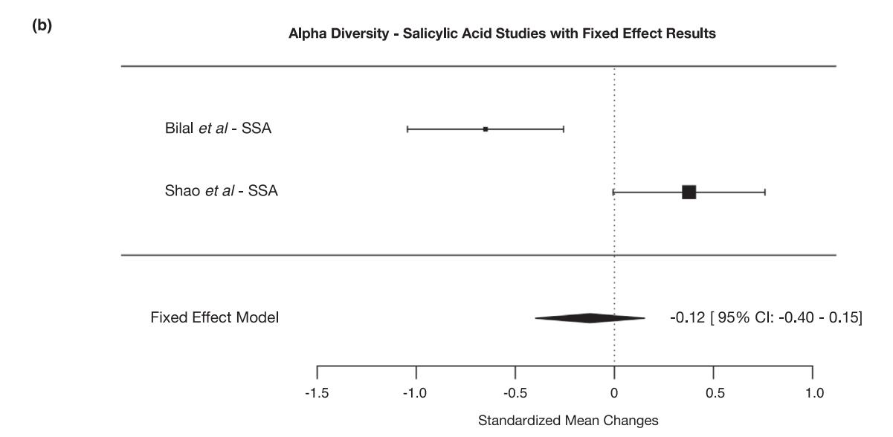

#### **SYSTEMATIC REVIEW**

# **Acne and the cutaneous microbiome: A systematic review of mechanisms and implications for treatments**

**Alicia Podwojnia[k1](#page-0-0)** | **Isabella J. Tan[2](#page-0-1)** | **John Saue[r1](#page-0-0)** | **Zachary Neubaue[r3](#page-0-2)** | **Hanna Rothenber[g1](#page-0-0)** | **Hira Ghan[i4](#page-0-3)** | **Aarushi K. Parikh[2](#page-0-1)** | **Bernard Cohen[5](#page-0-4)**

#### **Correspondence**

Isabella J. Tan, Rutgers Robert Wood Johnson Medical School, 125 Paterson St, New Brunswick, NJ 08901, USA. Email: [ijt11@rwjms.rutgers.edu](mailto:ijt11@rwjms.rutgers.edu)

#### **Abstract**

**Background:** Acne vulgaris is a pervasive skin disease characterized by inflammation of sebaceous units surrounding hair follicles. It results from the complex interplay between skin physiology and the intricate cutaneous microbiome. Current acne treatments, while effective, have major limitations, prompting a shift towards microbiome-based therapeutic approaches.

**Objectives:** This study aims to determine the relationship between acne and the cutaneous microbiome, assess the effects of current treatments on the cutaneous microbiome, and explore the implications for developing new therapies.

**Methods:** A systematic review was performed using PubMed and SCOPUS databases within the last 10 years. Methodological quality was assessed independently by two authors. The search retrieved 1830 records, of which 26 articles met the inclusion criteria. Meta-analysis of alpha diversity change was assessed using fixed and randomized effect models per therapeutic group.

**Results:** Eight studies pertain to the role of the cutaneous microbiome in acne, identifying *C. acnes, S. aureus* and *S. epidermidis* as key contributors through overproliferation, commensalism, or dysbiosis. Eleven studies discuss current acne treatments, including doxycycline (1), topical benzoyl peroxide (BPO) (4), isotretinoin (2), sulfacetamide-sulfur (SSA) (2) and aminolevulinic acid-photodynamic therapy (ALA-PDT) (2), identified as modulating the cutaneous microbiome as a mechanism of efficacy in acne treatment. Seven studies discuss new treatments with topical probiotics, plant derivatives, and protein derivatives, which contribute to acne clearance via modulation of dysbiosis, inflammatory markers and diversity indexes. A meta-analysis of the effects of existing therapeutics on the cutaneous microbiome identified benzoyl peroxide as the only treatment to facilitate significant change in diversity.

**Conclusions:** Despite the heterogeneity of study types and microbiome classifications limiting the analysis, this review underscores the complexity of microbial involvement in acne pathogenesis. It delineates the effects of acne therapeutics on microbial diversity, abundance, and composition, emphasizing the necessity for personalized approaches in acne management based on microbiome modulation.

**Linked article:** K. Szabó et al. J Eur Acad Dermatol Venereol. 2025;39:715–716. [https://doi.org/10.1111/jdv.20587.](https://doi.org/10.1111/jdv.20587)

Alicia Podwojniak and Isabella J. Tan indicates co-first author.

This is an open access article under the terms of the [Creative Commons Attribution-NonCommercial](http://creativecommons.org/licenses/by-nc/4.0/) License, which permits use, distribution and reproduction in any medium, provided the original work is properly cited and is not used for commercial purposes.

© 2024 The Author(s). *Journal of the European Academy of Dermatology and Venereology* published by John Wiley & Sons Ltd on behalf of European Academy of Dermatology and Venereology.

1 Rowan-Virtua School of Osteopathic Medicine, Stratford, New Jersey, USA

Rutgers Robert Wood Johnson Medical School, New Brunswick, New Jersey, USA

3 Thomas Jefferson University-Sidney Kimmel Medical College, Philadelphia, Pennsylvania, USA

4 Department of Dermatology, Northwestern University Feinberg School of Medicine, Chicago, Illinois, USA

5 Department of Dermatology, The Johns Hopkins Hospital, Baltimore, Maryland, USA

# **INTRODUCTION**

Acne vulgaris, colloquially referred to as acne, is a pervasive dermatological pathology, affecting individuals of diverse backgrounds and ages. It is characterized by the inflammation of sebaceous units within hair follicles. Beyond its cutaneous manifestation, acne has profound psychosocial implications, significantly diminishing the quality of life for those it affects[.1](#page-10-0) In 2019, the Global Burden of Disease Report estimated a staggering 117.4million cases of acne vulgaris worldwide, underscoring its global prevalence.[2](#page-10-1)

The consequences of acne extend beyond the confines of personal health, reaching into the economic domain as well. The American Academy of Dermatology (AAD) calculated that the economic burden of acne surpassed \$1.2 billion, encompassing expenses related to medical treatments, skincare products and the loss of productivity due to psychosocial distress.[3](#page-10-2) Acne's complexity lies in its connection to skin physiology and the intricate skin microbiome.

Changes in microbiome are often measured by means of diversity indexes. Alpha diversity refers to the diversity of microbial species within a specific environment, indicating changes in microbial richness (the number of different species) and evenness (how evenly these species are distributed).[4](#page-10-3) Extensive research focuses on the role of bacteria in acne development, with potential therapeutic implications.

Current acne treatments, while effective, have major limitations, potentially prompting a shift towards microbiome-based approaches and prospective application to precision medicine.[5](#page-10-4) This review aims to comprehensively evaluate the relationship between acne and the cutaneous microbiome, address current conventional therapeutic options for acne and explore challenges in developing new treatments.

# **METHODS**

A systematic review was conducted following PRISMA guidelines to investigate the current understanding of cutaneous microbiome in acne development and the impact of various treatments on the microbiome.[6](#page-10-5) This manuscript is registered on PROSPERO, ID: CRD42023488844. The search encompassed articles published within the past decade, from 2013 to 2023, to ensure the most up-to-date findings, given the profound expansion of microbiome literature in recent years. It was carried out using the PubMed and SCOPUS databases. In adherence to the established inclusion criteria, selected studies were in the English language, had full-text availability, involved human subjects and represented primary original literature. Systematic reviews, literature reviews, books, other non-primary literature sources and sources discussing the gut microbiome were excluded from this review. A bibliography review was not conducted. To identify relevant studies, the following search terms were utilized in PubMed and SCOPUS: ("acne" OR "acne

### **Why was the study undertaken?**

• This study aimed to investigate the relationship between acne vulgaris and the cutaneous microbiome, focusing on how the microbiome influences acne development and treatment outcomes.

### **What does this study add?**

• This review provides a comprehensive analysis of recent literature, revealing specific bacterial changes associated with acne and the effects of various treatments on microbiome diversity. It also identifies the role of future therapeutics that function via modulation of the cutaneous microbiome.

### **What are the implications of this study of disease understanding and/or clinical care?**

• The findings suggest that targeting the cutaneous microbiome could enhance acne treatment strategies, offering a refreshed perspective on managing acne through microbiome modulation and personalized therapeutic approaches.

vulgaris") AND ("cutaneous microbiome" OR "cutaneous microbiota" OR "skin microbiome" OR "skin microbiota"). The titles, abstracts and full-texts of the articles retrieved were then screened by two independent reviewers (A.P. and I.T.) for the inclusion and exclusion criteria. Full-text screening assessed each potential study for inclusion using a data extraction sheet defining the study design, interventions and final decision for inclusion or exclusion.

The selected articles were subjected to a thorough review of their findings regarding the clinical outcomes of acne and the cutaneous microbiome and compared to each other. Primary outcomes were multifaceted, relating to specific bacterial community presence or absence in acne, microbiota changes after using specified acne treatments, or clinical acne improvement post-therapeutic intervention. Additional outcomes include changes in diversity indexes. The studies were evaluated to ascertain their level of evidence and potential sources of bias. The risk of bias was assessed by A.P. and I.T. using JBI Critical Appraisal Checklist, allowing assessment of risk grading, scored at low, moderate or high. Any disagreements related to quality ratings were resolved by a third reviewer (J.S)[.7](#page-10-6) Both qualitative and quantitative analyses were conducted. For result sections regarding the overall role of the cutaneous microbiome in acne (I) and the role of future treatments (III), a qualitative analysis was chosen due to the heterogeneity of sampling methodologies and by nature of including multiple aspects of the cutaneous microbiome with different levels of classification, such as genus or species.

PODWOJNIAK ET AL. 795

Quantitative analysis was conducted for result section II, regarding effects of existing treatments on the cutaneous microbiome. A meta-analysis of changes between pretreatment and post-treatment cutaneous microbiome diversity was performed. Studies that reported quantitative results on changes to alpha diversity in a cohort before and after treatment were included. In studies that used multiple alpha diversity measures, results from the Shannon diversity index were used. In studies with multiple treatment arms, each treatment arm was analysed as an independent result. When the statistical significance of results was expressed as below a threshold value, the upper bound of the significance cut-off was used to characterize the result; for example, a study stating a result was significant to 'p < 0.05' and was interpreted as p = 0.05 for the meta-analysis. Changes in alpha diversity measures between pretreatment and post-treatment were normalized to 'Standardized Mean Change', defined as:

$$\frac{\text{(pre-treatment mean)} - \text{(post-treatment mean)}}{\text{(Standard deviation of the change score)}}.$$
 (1)

where the standard deviation of the change score is calculated as:

$$\sqrt{\mathrm{SD_{Pre}}^2 - \mathrm{SD_{Post}}^2 - 2 \times \mathrm{ri} \times \mathrm{SD_{Pre}} \times \mathrm{SD_{Post}}}.$$
 (2)

The term 'ri' represents the correlation between measurements at the two measurement occasions as outlined by Gibbons et al.8

Meta-analysis was performed using the R 'metafor' package.9 To assess changes in alpha diversity in acne treatment generally, the standardized mean changes of the included studies were incorporated into both fixed effect and randomized effect models. To assess changes in alpha diversity for specific treatment types, additional fixed effect meta-analyses were performed on studies that used the same treatment type. The results of the models were the combined standardized mean change in alpha diversity between pretreatment and post-treatment for all studies. Results and 95% confidence intervals were reported.

#### RESULTS

The PRISMA diagram of the study selection process is available in Figure 1.6 By including time parameters in the first search, 1830 records were identified, and after the removal of duplicates, 499 were abstract-screened. Out of these, 229 progressed to full-text screening. Overall, 26 articles met the inclusion criteria and were included in this article. Key reasons articles were excluded pertain to article type, including animal models, or pertaining to the gut microbiome rather than the cutaneous microbiome.

FIGURE 1 PRISMA diagram of the systematic study selection process.

Levels of evidence for papers range from 2b (Cohort Studies) to 1b (Randomized Controlled Trials/RCT), with a mixed predominance of each (Tables [1–3](#page-3-0)). The basis of levels is outlined according to The Centre for Evidence-Based Medicine Levels of Therapeutic Studies[.10](#page-10-9)

# **Role of cutaneous microbiome in acne vulgaris**

# *C. acnes*, and others

Eight studies explored the cutaneous microbiome's role in acne, focusing on bacterial species and diversity changes. One study found *Cutibacterium acnes* (*C*. *acnes*) as the predominant strain in both acne and non-acne lesions, with distinct strain patterns: ribotypes RT4, RT5, RT8 and RT10 were more common in acne lesions, while RT6 was linked to healthy skin (*p*<0.05)[.11](#page-10-10) Another study observed significant alpha and beta diversity changes during puberty, with a higher prevalence of *C*. *acnes* in late puberty (*p*<0.05)[.12](#page-10-11)

A metagenomic analysis suggested a probiotic role for *C*. *acnes* and *Cutibacterium granulosum* (*C*. *granulosum*) in skin balance, noting fewer virulence factors in *C*. *granulosum* and the modulation role of *C*. *acnes* phages in older subjects[.13](#page-10-12) Another study found elevated *C*. *acnes* antibodies (*p*<0.001) and reduced *Staphylococcal aureus* (*S*. *aureus*) antibodies (*p*<0.01) in acne patients.[14](#page-10-13)

Further research identified a high prevalence of the IA1 phylotype in acne patients, linked to increased biofilm adhesion, biomass, antibiotic tolerance and reduced alpha diversity (*p*<0.0001) (Table [4\)](#page-6-0)[.15](#page-10-14) Another study confirmed the presence of *C*. *acnes* and *Staphylococcus epidermidis* (*S*. *epidermidis*) in both inflammatory and non-inflammatory acne lesions, with *S*. *epidermidis* persisting in non-acne lesions, emphasizing *C*. *acnes*' role in acne pathogenesis.[16](#page-10-15)

# Alpha diversity

Microbial diversity is often discussed as a means of alpha and beta diversity, and dysbiosis refers to an imbalance or disruption in the normal microbial community.[5,17](#page-10-4) Dagnielie et al. examined differences in microbial diversity between acne locations, particularly the back and face. Significant variations in alpha diversity were found in back lesions among patients with severe acne (*p*=0.001), and significant bacterial divergence was identified on the face (*p*=0.008)[.18](#page-10-16) *Enterococcaceae* were overwhelmingly present on both face and back lesions. Elevated percentages of *Staphylococcal* species were observed in acne patients, especially on the face, endorsing the concept of dysbiosis and inflammation as primary mechanisms in acne development.[5,18](#page-10-4)

Li et al. discerned species, including *Faecalibacterium*, *Klebsiella*, *Odoribacter* and *Bacteroides*, gram-negative

**TABLE 1** Role of cutaneous microbiome in acne vulgaris.

| Main contributor | Authors              | No. participants | Outcome(s)                                                                                                                            | Type of study/level of evidence                    |
|------------------|----------------------|------------------|---------------------------------------------------------------------------------------------------------------------------------------|----------------------------------------------------|
| C. acnes         | Fitz-Gibbon et al.11 | 78               | RT4, RT5 ribotypes of C. acnes associated with acne samples; RT6 ribotype seen with non-acne samples                            | Cross-sectional genomic sequencing analysis; 2b |
|                  | Schneider et al.12   | 48               | Increased amounts of C. acnes, C. granulosum and S. epidermidis in acne lesions compared to non-acne controls                   | Cross-sectional pilot study; 2b                    |
|                  | Barnard et al.13     | 83               | RT4, RT5 and RT8 ribotypes of C. acnes associated with acne; RT1, RT2 and RT3 ribotypes of C. acnes associated with non-acne | Cross-sectional genomic sequencing analysis; 2b |
|                  | Huang et al.14       | 15               | Increased C. acnes and its antibodies, with decreased S. aureus antibodies in patients with acne                                | Cross-sectional genomic sequencing analysis; 2b |
|                  | Cavallo et al.15     | 20               | Alpha diversity significantly reduced in inflammatory acne lesions compared to healthy skin                                     | Cross-sectional genomic sequencing analysis; 2b |
| S. epidermidis   | Jusuf et al.16       | 40               | S. epidermidis found to be most common species in both inflammatory and non inflammatory acne                                   | Cross-sectional observational study; 2b         |
| Diversity index  | Dagnelie et al.18    | 36               | Enterococcaceae were overwhelmingly present on both face and back; alpha diversity significantly decreased in severe acne    | Cross-sectional observational study; 2b         |
|                  | Li et al.19          | 76               | Alpha diversity in acne patients was greater than that of healthy individuals.                                                     | Cross-sectional genomic sequencing analysis; 2b |

**TABLE 2** Studies on the effects of current treatments on cutaneous microbiome.

|                                  | Studies on the effects of current treatments on cutaneous microbiome |                  |                                                                                                                                                                                                    |                                                           |
|----------------------------------|----------------------------------------------------------------------|------------------|----------------------------------------------------------------------------------------------------------------------------------------------------------------------------------------------------|-----------------------------------------------------------|
| Treatment                        | Authors                                                              | No. participants | Outcome(s)                                                                                                                                                                                         | Type of study/level of evidence                           |
| Doxycycline                      | Park et al.21                                                        | 20               | Clinical improvements following 100mg PO doxycycline 2x/day for 6weeks; with a decrease in C. acnes, increase S. epidermidis and increase in alpha diversity                                 | Prospective interventional cohort study; 2b               |
| Benzoyl peroxide                 | Zhou et al.20                                                        | 33               | Increase in Staphylococcus, Actinobacter; decrease in Corynebacterium; decreased alpha diversity following use of 5% topical BPO for 12weeks                                                    | Prospective interventional cohort study; 2b               |
|                                  | Ahluwalia et al.23                                                   | 51               | Decreased number of acne lesions after 4% BPO wash (6–8weeks) in adolescent females; no significant difference in alpha diversity                                                               | Prospective interventional cohort study; 2b               |
|                                  | Coughlin et al.24                                                    | 5                | decreased alpha diversity, with a nonsignificant decrease in colonization 5% BPO and (0.025%) tretinoin treatments for 7–10weeks significantly abundance                                     | Prospective, randomized controlled pilot study; 1b        |
|                                  | Wongtada et al.25                                                    | 45               | Significant reduction in alpha diversity observed following 2.5% BPO gel use (0, 1, 3months) in paediatric patients; clinical improvement of acne noted                                      | Randomized, investigator-blinded exploratory study; 1b |
| Isotretinoin                     | Ryan-Kewley et al.27                                                 | 22               | mg/kg/day oral isotretinoin for Significant decrease in C. acnes following 1 28weeks                                                                                                         | Prospective interventional cohort study; 2b               |
|                                  | Nolan et al.28                                                       | 18               | mg/kg/day oral for further Increase in beta diversity with no affect on alpha diversity following use of month and 1 0.5mg/kg/day oral isotretinoin for 1 5month duration              | Pilot, longitudinal cohort study; 2b                      |
| Supramolecular Salicylic acid | Bilal et al.31                                                       | 30               | Significant increase in alpha and beta diversity, with improved acne lesions following 8weeks of 2% SSA use                                                                                     | Prospective interventional cohort study; 2b               |
|                                  | Shao et al.32                                                        | 28               | Significant improvements in, pH, sebum production, transepidermal water loss, skin water content and redness following 8weeks of 30% SSA use                                                    | Prospective interventional cohort study; 2b               |
| ALA-PDT                          | Guo et al.34                                                         | 26               | difference in C. acnes levels between healthy and acne groups following Clinical improvements in acne appearance noted, without significant 3weeks (1x/week) of treatment                    | Prospective interventional cohort study; 2b               |
|                                  | Yang et al.35                                                        | 5                | A significant decline in C. acnes, increase in Bacillus sp. and Lactobacillus sp., was observed, with increased alpha diversity in the follicular sample following 4 sessions (every 2weeks) | Prospective interventional cohort study; 2b               |

| TABLE 3            | Studies on the implications for future treatment.                                                  |                     |                                              |                                                                                                                                                                                                             |                                                                     |
|--------------------|----------------------------------------------------------------------------------------------------|---------------------|----------------------------------------------|-------------------------------------------------------------------------------------------------------------------------------------------------------------------------------------------------------------|---------------------------------------------------------------------|
|                    | Studies on the implications for future treatment                                                   |                     |                                              |                                                                                                                                                                                                             |                                                                     |
| Treatment          |                                                                                                    | Authors             | No. of participants                          | Outcome(s)                                                                                                                                                                                                  | Type of study/level of evidence                                     |
| Probiotics         | Lactobacillus plantarum-GMNL6                                                                      | Tsai et al.36       | 15                                           | clinically improved skin; led to a significant Lactobacillus Plantarum-GMNL6 cream increase in Staphylococcus                                                                                         | Randomized, parallel, open-label trial; 1b                          |
|                    | E. faecalis CBT SL-5                                                                               | Han et al.37        | 20                                           | improved acne severity; decreased C. acnes and E. faecalis CBT SL-5 lotion significantly S. aureus                                                                                                    | Randomized, placebo-controlled, split- face comparative study;1b |
|                    | Specific C. acnes strains                                                                          | Karoglan et al.38   | 20                                           | Topical use of non-acne causing C. acnes strains lead to a decreased comedone count                                                                                                                      | Randomized, open-label pilot study; 1b                              |
|                    | Topical lactobacilli                                                                               | Lebeer et al.39     | 36                                           | Significant decrease in inflammatory lesions following 8–12weeks of topical lactobacillus cream                                                                                                       | Double-blind, placebo-controlled study; 1b                       |
|                    | in combination with mannitol, Lactiplantibacillus planetarium hyaluronic acid and vitamin B1 | Podrini et al.41    | N not available Skin sample sebocytes; | inflammatory cytokines, sebum and C. acnes planetarium, mannitol, hyaluronic acid and Significant decrease in the production of prevalence following Lactiplantibacillus vitamin B1 combination | Experimental observational study;1b                                 |
| Plant extract      | Rhodomyrtus tomentosa (RT)                                                                         | Geravason et al.44  | 17                                           | increased microbial diversity and clinical Decreased abundance of C. granulosum, improvement in inflammatory and non- inflammatory lesions                                                         | Prospective interventional study; 2b                                |
| Protein derivative | poly-l-lysine dendrimer (G2 dendrimer)                                                          | Leignadier et al.46 | 16                                           | dysbiosis and maintenance of commensal significant decrease in IL-8, reduction in 28days of topical G2 dendrimer led to strains                                                                    | Clinical, split-face interventional study; 2b                    |

**TABLE 4** Summary of key clinical implications.

Effects of therapeutics on microbiome:

- Doxycycline decreases *C*. *acnes* prevalence and increases alpha diversity.[21](#page-11-0)
- BPO decreases alpha diversity in acne patients and tends to lead to increases in *S*. *aureus* prevalence.[20,23–25](#page-11-1)
- Isotretinoin is found to decrease *C*. *acnes* prevalence with mixed outcome regarding diversity.[27,28](#page-11-5)
- SSA decreased prevalence of Staphylococcal species and pro-inflammatory markers with one study showing increases in diversity.[31,32](#page-11-7)
- ALA-PDT decreased *Corynebacterium* and *Cutibacterium* and increased alpha diversity.[34,35](#page-11-9)

Potential therapeutics: • Probiotic therapies (*Lactobacillus*, *Enterococcus faecalis*, non-acne causing *C*. *acnes* strains) and other modulators (poly-l-lysine dendrimer, plant extracts) were found to modulate the microbiome and may have a role in acne treatment.[36–39,41,44,46](#page-11-11)

Future studies must be directed specifically towards:

- mechanisms of existing therapies and their changes on the microbiome
- considerations of how hormonal and locational differences contribute to microbiome changes and acne
- the development of targeted and personalized therapies that account for individual microbial profiles

species, to be more prevalent in patients having severe acne. In this study, increased alpha diversity in acne patients[.19](#page-10-17) Zhou et al. explored the role of epidermal barrier integrity in acne pathogenesis. Skin samples from acne patients exhibited increased transepidermal water loss, sebum, pH levels, erythema and decreased microbial diversity.[20](#page-11-1) Correlations between the presence of the 20 most prevalent bacterial genera and these parameters highlighted varying positive and negative correlations[.18](#page-10-16)

# **Existing acne therapeutics and the cutaneous microbiome**

# Antibiotic therapy

Park et al. investigated the effects of doxycycline on the cutaneous microbiome. Using 100mg oral doxycycline, the study demonstrated clinical improvement, correlated with a decrease in *C*. *acnes* presence (*p*=0.01), and an increase in alpha diversity.[21](#page-11-0) At baseline, the two most prevalent species were *C*. *acnes* and *S*. *epidermidis*, and following treatment, *S*. *epidermidis* was more prevalent.

# Benzoyl peroxide

Four articles investigated the effects of benzoyl peroxide (BPO) on the cutaneous microbiome and acne development in this review. BPO, a potent oxidizing agent with presumed comedolytic action, induces alterations in skin microbiota composition.[22](#page-11-18) One study showed that 5% topical BPO led to an increase in *Staphylococcus* and *Actinobacter*, coupled with a decrease in *Corynebacterium*, and decreased alpha microbial diversity post-treatment (*p*<0.005).[20](#page-11-1) In another study, 4% topical BPO wash led to a decrease in an overall number of acne lesions, but no significant difference in alpha diversity.[23](#page-11-2) 5% BPO was tested against topical tretinoin 0.025% in another study, and both BPO and tretinoin treatments were found to significantly disrupt alpha diversity (*p*<0.001), with a nonsignificant decrease in colonization abundance.[24](#page-11-3)

A randomized controlled study explored three topical treatments, including BPO in mild acne. A significant reduction in alpha diversity was observed in the BPO group (*p*=0.004), along with decreased *Cutibacterium* and increased *Staphylococcus*. Clinical acne appearance significantly improved in the BPO group (*p*=0.007).[25](#page-11-4)

# Isotretinoin

Isotretinoin, an oral retinoic acid derivative, treats refractory acne by reducing sebaceous gland function and keratinization.[26](#page-11-19) Two studies explored its impact on the cutaneous microbiome, revealing potential implications for acne treatment. In one study, elevated levels of antibiotic-resistant *C*. *acnes* strains were identified in samples, including resistance to previously used antibiotics. Post-treatment, a significant decrease in *C*. *acnes* indicated a potential influence of the changed local environment on bacterial survival (*p*<0.05).[27](#page-11-5) In the second study, beta diversity was increased without affecting alpha diversity, and *C*. *acnes* was the only significantly impacted bacterium, with identified alterations in key metabolic pathways, including amino acid and folate synthesis and histidine and pyrimidine metabolism.[28](#page-11-6)

# Supramolecular salicylic acid

Salicylic acid (SA), a monohydroxybenzoic acid, is utilized for acne treatment, with the newer formulation supramolecular salicylic acid (SSA) found to improve solubility and reduce xerotic side effects.[29](#page-11-20) Its mechanism involves antisebum actions, reducing nuclear factor kappa-B, and inflammation reduction.[30](#page-11-21) Two studies explored the effects of SSA on the cutaneous microbiome and acne pathogenesis.

In the first study, 2% SSA was assessed on moderate acne and was found to significantly increase alpha and beta diversity and clinically improve acne lesions (*p*<0.001). *Staphylococcus*, *Ralstonia* and *Streptococcus* species decreased in relative abundance post-treatment.[31](#page-11-7) In the second study, the effects of 30% SSA were analysed after four SSA peeling sessions. Improvements in skin parameters, including pH, sebum production, transepidermal water loss and redness, were noted post-treatment. Alpha diversity was not significantly affected, a decrease in the relative abundance of *Staphylococcal* species was observed, and *C*. *acnes* levels remained unaffected. Additionally, the study identified significantly decreased levels of pro-inflammatory markers (IL-1α, IL-6, IL-17, TGFβ, TLR2) in the post-treatment group (*p*<0.05).[32](#page-11-8)

# Photodynamic therapy

Photodynamic therapy (PDT) for acne involves using a photosensitizer and light source to generate reactive oxygen species. While the exact mechanism is not fully understood, it is believed to impact sebaceous gland secretion and inflammation.[33](#page-11-22) Two studies in this review explored the effects of PDT on the cutaneous microbiome.

In one study, patients with severe acne were treated with (ALA) PDT over 3 consecutive weeks. Despite subjective clinical improvements in acne appearance, there was no significant difference in *C*. *acnes* levels between healthy and acne groups. A relative decrease in *C*. *acnes* was noted throughout treatment, along with differences in the skin microbial composition among post-treatment groups (*p*<0.05).[34](#page-11-9) The dominant pretreatment flora included *Staphylococcal*, *Corynebacterium* and *Cutibacterium*, with a decrease in *Corynebacterium* and *Cutibacterium* in the Week 1 to Week 3 treatment group.[34](#page-11-9) In a second study, *C*. *acnes* dominated the pretreatment follicular microbiome, while *Bacillus* sp. and *Lactobacillus* sp. dominated the epidermal microbiome.[35](#page-11-10) Post-treatment, a significant decline in *C*. *acnes*, along with an increase in *Bacillus* sp. and *Lactobacillus* sp., was observed, with an increased alpha diversity in the follicular sample(*p*=0.003).[35](#page-11-10)

Eight studies examined changes in alpha diversity between patients pretreatment and post-treatment. Ten treatment arms were described in the eight studies. A fixed effect model of the 10 treatment arms showed acne treatment caused a nonsignificant standardized mean change (SMC) of 0.11 (95% CI −0.03 to 0.25) to alpha diversity. A random effect model of all studies also showed a nonsignificant SMD of 0.20 (95% CI −0.18 to 0.58). A forest plot showing a summary of the studies, fixed effect model and random effect model can be seen in Figure [2](#page-8-0).

Meta-analysis was performed on groups of studies categorized by treatment type. The treatment groups analysed were benzoyl peroxide and salicylic acid. Isoretinoic acid, topical retinoids and oral doxycycline treatments were only represented in one study each; thus, a meta-analysis could not be performed on these treatments. Three studies examining benzoyl peroxide as a treatment were analysed; a fixed effect model showed a significant SMC of 0.32 (95% CI 0.21 to 0.53). Two studies using salicylic acid as a treatment were analysed; a fixed effect model showed a nonsignificant SMC of −0.12 (95% CI −0.40 to 0.15). Forest plots for the treatment subanalysis can be seen in Figure [3.](#page-9-0)

# **Potential therapeutic targets**

# Probiotic therapy

In an RCT by Tsai et al., *Lactobacillus plantarum-GMNL6* was found to enhance collagen synthesis, upregulate genes for skin integrity, inhibit *S*. *aureus* biofilm formation and suppress *C*. *acnes* proliferation.[36](#page-11-11)

Antibiotic-resistant *C*. *acnes* and skin microbiome disruptions are growing challenges in acne treatment. *Enterococcus faecalis*, a probiotic, showed antimicrobial effectiveness against *C*. *acnes*. In a randomized, placebo-controlled, splitface study, one side of participants' faces was treated with *E*. *faecalis CBT SL-5* extract lotion and the other with a vehicle. The *E*. *faecalis*-treated side showed significant improvement at 2weeks (*p*=0.009) and 6weeks (*p*<0.0005).[37](#page-11-12) Transepidermal water loss and skin hydration did not differ significantly, and skin microbiota diversity decreased non significantly, suggesting *E*. *faecalis CBT SL-5* extract as a viable option for mild-to-moderate acne.[37](#page-11-12)

A pilot study using formulations with specific non-acne causing *C*. *acnes* strains resulted in a shift in skin microbiome composition, reduced non-inflamed lesions, decreased skin pH and improved comedone counts without adverse effects.[38](#page-11-13)

One study with a topical cream containing live *Lactobacillus* strains demonstrated a significant decrease in inflammatory lesions, which was not seen in the placebo group of a double-blind study.[39](#page-11-14)

Another study examined a formulation with *Lactobacillus plantarum*, mannitol, hyaluronic acid and vitamin B1. Tested ex vivo on human sebocytes, it significantly decreased proinflammatory cytokines (IL-1α, IL-6, IL-8), sebum production and the prevalence of *C*.*acnes* and *S*. *epidermidis*, suggesting an anti-inflammatory and microbiome-modulating mechanism for acne treatment[.40,41](#page-11-23)

# Other modulators

Rhodomyrtus tomentosa (RT) is a South Asian native plant with antibacterial components, including piceatannol, malic acid, quinic acid and acyl phloroglucinol rhodomyrtone.[42–44](#page-11-24) One study observed a decreased abundance of *C*. *granulosum*, increased microbial diversity and significant clinical improvement in blackheads, papules and both inflammatory and non-inflammatory lesions, highlighting the potential of RT in acne management (*p*<0.05)[.44](#page-11-16)

A poly-l-lysine dendrimer (G2 dendrimer formulation) was previously identified as having antimicrobial activity.[45](#page-11-25) One study compared a 1% G2-containing cream to 10% benzoyl peroxide (BPO), and the G2 formulation exhibited favourable effects on non-acne-producing *C*.*acnes* strains without impacting other commensal skin bacteria. It targeted acne-inducing strains of *C*.*acnes*, did not affect *S*. *epidermidis*, *S*. *hominis* or *Corynebacterium* species and led to a significant decrease in IL-8 production[.46](#page-11-17)

#### **Alpha Diversity - All Studies with FE and RE Model Results**

**FIGURE 2** Forest plot of standardized mean change to cohort pretreatment and post-treatment alpha diversity in eight studies. Confidence bounds represent the 95% confidence intervals. Treatment types per study are abbreviated: benzoyl peroxide (BPO), oral doxycycline (PO Doxy) and salicylic acid (SSA). The Wongtada et al.[25](#page-11-4) study includes three treatment arms, which were analysed as separate results: Benzoyl peroxide (BP), retinoic acid (VVA) and a commercial cream-gel dermo-cosmetic (DC). Results of a fixed effect and random effect meta-analysis are displayed with 95% confidence intervals.

# **DISCUSSION**

Traditionally, *C*. *acnes* in sebaceous glands and follicles has been seen as a primary acne contributor. This gram-positive, anaerobic, lipophilic bacteria contributes to acne through its lipophilic activity and helps maintain the natural epidermal barrier by preventing pathogenic colonization and maintaining pH[.47,48](#page-11-26)

This review highlights the critical role of the cutaneous microbiome in acne vulgaris. Differences were noted between inflammatory and non-inflammatory lesions, age groups and microbial species dysbiosis. Increased alpha diversity correlated with improved acne lesions, suggesting a balanced microbiome promotes skin homeostasis and host defence[.15,49–51](#page-10-14) Some studies found higher alpha diversity in acne patients, with successful treatments like doxycycline, SSA and ALA-PDT showing varying effects on diversity, suggesting multiple mechanisms at play[.19,21,24,25,29,52,53](#page-10-17) Commonly identified species include *C*. *acnes*, *S*. *epidermidis* and *S*. *aureus*. Specific *C*. *acnes* ribotypes (RT4, RT5, RT8, RT10) were prevalent in acne, while RT6 was associated with healthy skin. RT4 and RT5 may increase virulence[.11,13,54,55](#page-10-10) Increased porphyrin production during puberty worsened inflammatory lesions, and the IA1 phylotype was linked to biofilm adhesion, biomass and antibiotic tolerance in acne patients.[13,15,56](#page-10-12)

*C*. *acnes* interacts with *C*. *granulosum*, potentially leading to acne, and its relationship with *S*. *aureus* enhances virulence. *S*. *epidermidis* maintains a symbiotic relationship with *C*. *acnes*, supporting healthy skin. Tetracycline antibiotics favoured *C*. *granulosum* and *S*. *epidermidis*, promoting skin health.[15,16,20,21,57](#page-10-14) Gram-negative species (*Faecalibacterium*, *Klebsiella*, *Odoribacter*, *Bacteroides*) were more prevalent in severe acne, suggesting skin barrier destruction as a potential mechanism[.19,58](#page-10-17) Dysbiosis likely affects barrier integrity, contributing to increased transepidermal water loss, sebum, pH levels and erythema.

Treatments including doxycycline, topical BPO, retinoids, isotretinoin, SSA and ALA-PDT alter the skin microbiome. BPO disrupts species directly, while retinoids and isotretinoin affect the local environment and metabolic pathways. SSA stabilizes the microbiome and reduces inflammation, while ALA-PDT inhibits *C*. *acnes* and diversifies the microbiome.[21,24,28,31,32,34,59](#page-11-0) Benzoyl peroxide was the only identified treatment to yield significant results in meta-analysis, with findings of significant alteration in diversity index (Figure [3a](#page-9-0)). This is likely due to its known antimicrobial and bactericidal activity, acting through the oxidation of bacterial proteins to damage bacterial proteins.[60,61](#page-12-0) Furthermore, it exhibits comedolytic and keratolytic activities, helping to reduce sebum in the pilosebaceous unit and significantly altering the microenvironment for bacterial proliferation. It is not clear if the nonsignificant findings in the other studied therapeutics (i.e. isotretinoin, SSA) were due to clinical insignificance or rather inconsistencies in how the studies measured diversity indexes and limited sample sizes. SSA

**FIGURE 3** Meta-analysis results for studies using the same treatment agent. (a) Forest plot of standardized mean change to alpha diversity in 3 studies that used benzoyl peroxide for treatment. Fixed effect meta-analysis results are shown with 95% confidence intervals. The meta-analysis showed a significant standardized mean change (*p*=0.002). (b) Forest plot of standardized mean change in alpha diversity in two studies that used salicylic acid for treatment. Fixed effect meta-analysis results are shown with 95% confidence intervals. The meta-analysis showed no significant standardized mean change (*p*=0.381).

is known to have antimicrobial properties, along with the ability to remove lipids, reduce keratinocyte adhesions and has been shown to reduce sebum levels.[62,63](#page-12-1) Isotretinoin is believed to have an indirect antimicrobial effect through sebum reduction and subsequent bacterial reduction.[64](#page-12-2) As such, one may expect to see more statistically significant differences in these measures. However, additional research would be warranted to further explore these therapeutics as they did show clinical improvement in lesions and qualitative changes in microbiota.

Probiotics and plant derivatives, such as L. plantarum-GMNL6, lactobacilli, and RT, also modulate the microbiome and reduce inflammation.[36,39,40,42,45](#page-11-11) As changes, such as those in sebum and hydration, are known to impact acne development, temporal relationships must be further explored to delineate the changes to the microenvironment and subsequent effect.[65](#page-12-3)

Furthermore, a systematic review by Lam et al. discussed acne treatment impacts on the skin microbiome, focusing on treatments like lymecycline and minocycline and analysing changes in diversity index, particularly *Cutibacterium*. [66](#page-12-4) Our review expands on baseline microbiota characteristics and future microbiome-based therapeutics.

Preliminary evidence suggests promising acne management through microbiome modulation, using probiotics, non-acne-inducing bacterial strains, tailored formulations

and natural compounds to reduce inflammation and address acne. Further investigation is needed to explore their efficacy and mechanisms, considering study design heterogeneity, microbial classifications and acne categorization variations. Future research should focus on existing therapy mechanisms, microbiome changes and the impact of hormonal and locational differences on acne.

### **AUTHOR CONTRIBUTIONS**

Podwojniak, Tan and Sauer had full access to all the data in the study and took responsibility for the integrity of the data and the accuracy of the data analysis. Study concept and design: Podwojniak and Tan. Acquisition, analysis or interpretation of data: Podwojniak, Tan, Sauer, Neubauer, Rothenberg and Parikh. Drafting of manuscript: Podwojniak, Tan, Sauer, Neubauer, Rothenberg, Ghani, Parikh and Cohen. Critical revision of manuscript for important intellectual content: Ghani, Parikh and Cohen. Statistical Analysis: Neubauer and Rothenberg. Graphical Abstract: Aarushi Parikh. Obtained Funding: N/A. Administrative, technical or material support: Ghani and Cohen. Study supervision: Cohen.

### **ACKNOWLEDGEMENTS**

None.

### **FUNDING INFORMATION**

None.

### **CONFLICT OF INTEREST STATEMENT** None declared.

# **DATA AVA I L A BI L I T Y STAT E M E N T**

The data that support the findings of this review are available from publicly accessible sources and repositories. All references and citations to the primary studies, datasets and literature sources utilized in this review are listed in the reference section.

### **E T H IC A L A PPROVA L**

There was no ethical approval required for this study.

#### **ETHICS STATEMENT**

This systematic review did not involve collecting new data from human participants and did not include any patient identifiers. All data used in this review were derived from previously published studies, and as such, no informed consent was required.

### **ORCID**

*Alicia Podwojniak* <https://orcid.org/0009-0005-5109-2405>

### **REFERENCES**

1. Chen H, Zhang TC, Yin XL, Man JY, Yang XR, Lu M. Magnitude and temporal trend of acne vulgaris burden in 204 countries and territories from 1990 to 2019: an analysis from the Global Burden of Disease Study 2019. Br J Dermatol. 2022;186(4):673–83. [https://doi.org/10.](https://doi.org/10.1111/bjd.20882) [1111/bjd.20882](https://doi.org/10.1111/bjd.20882)

- 2. Wang H, Abbas KM, Abbasifard M, Abbasi-Kangevari M, Abbastabar H, Abd-Allah F, et al. Global age-sex-specific fertility, mortality, healthy life expectancy (HALE), and population estimates in 204 countries and territories, 1950-2019: a comprehensive demographic analysis for the global burden of disease study 2019. Lancet. 2020;396:1160–203.
- 3. American Academy of Dermatology/Milliman. Burden of Skin Disease. 2017 [www.aad.org/BSD](http://www.aad.org/BSD)
- 4. Walters KE, Martiny JBH. Alpha-, beta-, and gamma-diversity of bacteria varies across habitats. PLoS One. 2020;15(9):e0233872. [https://](https://doi.org/10.1371/journal.pone.0233872) [doi.org/10.1371/journal.pone.0233872](https://doi.org/10.1371/journal.pone.0233872)
- 5. Dréno B, Dagnelie MA, Khammari A, Corvec S. The skin microbiome: a new actor in inflammatory acne. Am J Clin Dermatol. 2020;21(Suppl 1):18–24. [https://doi.org/10.1007/](https://doi.org/10.1007/s40257-020-00531-1) [s40257-020-00531-1](https://doi.org/10.1007/s40257-020-00531-1)
- 6. Page MJ, McKenzie JE, Bossuyt PM, Boutron I, Hoffmann TC, Mulrow CD, et al. The PRISMA 2020 statement: an updated guideline for reporting systematic reviews. BMJ. 2021;372:n71. [https://doi.org/](https://doi.org/10.1136/bmj.n71) [10.1136/bmj.n71](https://doi.org/10.1136/bmj.n71)
- 7. Aromataris E, Fernandez R, Godfrey C, Holly C, Kahlil H, Tungpunkom P. Summarizing systematic reviews: methodological development, conduct and reporting of an umbrella review approach. Int J Evid Based Healthc. 2015;13(3):132–40. [https://doi.org/10.1097/](https://doi.org/10.1097/XEB.0000000000000055) [XEB.0000000000000055](https://doi.org/10.1097/XEB.0000000000000055)
- 8. Gibbons RD, Hedeker DR, Davis JM. Estimation of effect size from a series of experiments involving paired comparisons. J Educ Stat. 1993;18(3):271–9.<https://doi.org/10.3102/10769986018003271>
- 9. Viechtbauer W. Conducting meta-analyses in R with the metafor package. J Stat Softw. 2010;36(3):1–48. [https://doi.org/10.18637/jss.](https://doi.org/10.18637/jss.v036.i03) [v036.i03](https://doi.org/10.18637/jss.v036.i03)
- 10. Burns PB, Rohrich RJ, Chung KC. The levels of evidence and their role in evidence-based medicine. Plast Reconstr Surg. 2011;128(1):305–10. <https://doi.org/10.1097/PRS.0b013e318219c171>
- 11. Fitz-Gibbon S, Tomida S, Chiu BH, Nguyen L, Du C, Lui M, et al. *Propionibacterium acnes* strain populations in the human skin microbiome associated with acne. J Invest Dermatol. 2013;133(9):2152– 60. <https://doi.org/10.1038/jid.2013.21>
- 12. Schneider AM, Nolan ZT, Banerjee K, Paine A, Cong Z, Gettle S, et al. Evolution of the facial skin microbiome during puberty in normal and acne skin. J Eur Acad Dermatol Venereol. 2023;37(1):166–75. <https://doi.org/10.1111/jdv.18616>
- 13. Barnard E, Shi B, Kang D, Craft N, Li H. The balance of metagenomic elements shapes the skin microbiome in acne and health [published correction appears in Sci Rep. 2020;10(1):6037]. Sci Rep. 2016;6:39491. <https://doi.org/10.1038/srep39491>
- 14. Huang RY, Lee CN, Moochhala S. Circulating antibodies to skin bacteria detected by serological lateral flow immunoassays differentially correlated with bacterial abundance. Front Microbiol. 2021;12:709562. <https://doi.org/10.3389/fmicb.2021.709562>
- 15. Cavallo I, Sivori F, Truglio M, Maio F, Lucantoni F, Cardinali G, et al. Skin dysbiosis and *Cutibacterium acnes* biofilm in inflammatory acne lesions of adolescents. Sci Rep. 2022;12(1):21104. [https://doi.org/](https://doi.org/10.1038/s41598-022-25436-3) [10.1038/s41598-022-25436-3](https://doi.org/10.1038/s41598-022-25436-3)
- 16. Jusuf NK, Putra IB, Sari L. Differences of microbiomes found in non-inflammatory and inflammatory lesions of acne vulgaris. Clin Cosmet Investig Dermatol. 2020;13:773–80. [https://doi.org/10.2147/](https://doi.org/10.2147/CCID.S272334) [CCID.S272334](https://doi.org/10.2147/CCID.S272334)
- 17. Finotello F, Mastrorilli E, Di Camillo B. Measuring the diversity of the human microbiota with targeted next-generation sequencing. Brief Bioinform. 2018;19(4):679–92. [https://doi.org/10.1093/bib/](https://doi.org/10.1093/bib/bbw119) [bbw119](https://doi.org/10.1093/bib/bbw119)
- 18. Dagnelie MA, Montassier E, Khammari A, Mounier C, Corvec S, Dréno B. Inflammatory skin is associated with changes in the skin microbiota composition on the back of severe acne patients. Exp Dermatol. 2019;28(8):961–7. <https://doi.org/10.1111/exd.13988>
- 19. Li CX, You ZX, Lin YX, Liu HY, Su J. Skin microbiome differences relate to the grade of acne vulgaris. J Dermatol. 2019;46(9):787–90. <https://doi.org/10.1111/1346-8138.14952>

- 20. Zhou L, Chen L, Liu X, Huang Y, Xu Y, Xiong X, et al. The influence of benzoyl peroxide on skin microbiota and the epidermal barrier for acne vulgaris. Dermatol Ther. 2022;35(3):15288. [https://doi.org/10.](https://doi.org/10.1111/dth.15288) [1111/dth.15288](https://doi.org/10.1111/dth.15288)
- 21. Park SY, Kim HS, Lee SH, Kim S. Characterization and analysis of the skin microbiota in acne: impact of systemic antibiotics. J Clin Med. 2020;9(1):168.<https://doi.org/10.3390/jcm9010168>
- 22. Kircik LH. The role of benzoyl peroxide in the new treatment paradigm for acne. J Drugs Dermatol. 2013;12(6):73–6.
- 23. Ahluwalia J, Borok J, Haddock ES, Ahluwalia R, Schwartz E, Hosseini D, et al. The microbiome in preadolescent acne: assessment and prospective analysis of the influence of benzoyl peroxide. Pediatr Dermatol. 2019;36(2):200–6. <https://doi.org/10.1111/pde.13741>
- 24. Coughlin CC, Swink SM, Horwinski J, Sfyroera G, Bugayev J, Grice E, et al. The preadolescent acne microbiome: A prospective, randomized, pilot study investigating characterization and effects of acne therapy. Pediatr Dermatol. 2017;34(6):661–4. [https://doi.org/10.1111/](https://doi.org/10.1111/pde.13261) [pde.13261](https://doi.org/10.1111/pde.13261)
- 25. Wongtada C, Prombutara P, Asawanonda P, Noppakun N, Kumtornrut C, Chatsuwan T. Distinct skin microbiome modulation following different topical acne treatments in mild acne vulgaris patients: A randomized, investigator-blinded exploratory study. Exp Dermatol. 2023;32(6):906–14. <https://doi.org/10.1111/exd.14779>
- 26. Goldstein JA, Comite H, Mescon H, Pochi PE. Isotretinoin in the treatment of acne: histologic changes, sebum production, and clinical observations. Arch Dermatol. 1982;118(8):555–8.
- 27. Ryan-Kewley AE, Williams DR, Hepburn N, Dixon RA. Non-antibiotic isotretinoin treatment differentially controls *Propionibacterium acnes* on skin of acne patients. Front Microbiol. 2017;8:1381. [https://](https://doi.org/10.3389/fmicb.2017.01381) [doi.org/10.3389/fmicb.2017.01381](https://doi.org/10.3389/fmicb.2017.01381)
- 28. Nolan ZT, Banerjee K, Cong Z, Gettle S, Longenecker A, Kawasawa YI, et al. Treatment response to isotretinoin correlates with specific shifts in *Cutibacterium acnes* strain composition within the follicular microbiome. Exp Dermatol. 2023;32(7):955–64. [https://doi.org/10.](https://doi.org/10.1111/exd.14798) [1111/exd.14798](https://doi.org/10.1111/exd.14798)
- 29. Zheng Y, Yin S, Xia Y, Chen J, Ye C, Zeng Q, et al. Efficacy and safety of 2% supramolecular salicylic acid compared with 5% benzoyl peroxide/0.1% adapalene in the acne treatment: a randomized, split-face, open-label, single-center study. Cutan Ocul Toxicol. 2019;38:48–54. <https://doi.org/10.1080/15569527.2018.1518329>
- 30. Lu J, Cong T, Wen X, Li X, Du D, He G, et al. Salicylic acid treats acne vulgaris by suppressing AMPK/SREBP1 pathway in sebocytes. Exp Dermatol. 2019;28(7):786–94.<https://doi.org/10.1111/exd.13934>
- 31. Bilal H, Xiao Y, Khan MN, Chen J, Wang Q, Zeng Y, et al. Stabilization of acne vulgaris-associated microbial dysbiosis with 2% supramolecular salicylic acid. Pharmaceuticals (Basel). 2023;16(1):87. [https://doi.](https://doi.org/10.3390/ph16010087) [org/10.3390/ph16010087](https://doi.org/10.3390/ph16010087)
- 32. Shao X, Chen Y, Zhang L, Zhang Y, Ariyawati A, Chen T, et al. Effect of 30% supramolecular salicylic acid peel on skin microbiota and inflammation in patients with moderate-to-severe acne vulgaris. Dermatol Ther (Heidelb). 2023;13(1):155–68. [https://doi.org/10.1007/](https://doi.org/10.1007/s13555-022-00844-5) [s13555-022-00844-5](https://doi.org/10.1007/s13555-022-00844-5)
- 33. Ozog DM, Rkein AM, Fabi SG, Gold M, Goldman M, Lowe N, et al. Photodynamic therapy: a clinical consensus guide [published correction appears in Dermatol Surg. 2017;43(2):319]. Dermatol Surg. 2016;42(7):804–27. <https://doi.org/10.1097/DSS.0000000000000800>
- 34. Guo Y, Zeng M, Yuan Y, Yuan M, Chen Y, Yu H, et al. Photodynamic therapy treats acne by altering the composition of the skin microbiota. Skin Res Technol. 2023;29(1):13269. [https://doi.org/10.1111/srt.](https://doi.org/10.1111/srt.13269) [13269](https://doi.org/10.1111/srt.13269)
- 35. Yang Y, Tao S, Zeng R, Zheng H, Ge Y. Modulation of skin microbiome in acne patients by aminolevulinic acid-photodynamic therapy. Photodiagnosis Photodyn Ther. 2021;36:102556. [https://doi.org/10.](https://doi.org/10.1016/j.pdpdt.2021.102556) [1016/j.pdpdt.2021.102556](https://doi.org/10.1016/j.pdpdt.2021.102556)
- 36. Tsai WH, Chou CH, Chiang YJ, Lin CG, Lee CH. Regulatory effects of lactobacillus plantarum-GMNL6 on human skin health by improving skin microbiome. Int J Med Sci. 2021;18(5):1114–20. [https://doi.](https://doi.org/10.7150/ijms.51545) [org/10.7150/ijms.51545](https://doi.org/10.7150/ijms.51545)

- 37. Han HS, Shin SH, Choi BY, Koo N, Lim S, Son D, et al. A split face study on the effect of an anti-acne product containing fermentation products of *Enterococcus faecalis* CBT SL-5 on skin microbiome modification and acne improvement [published correction appears in *J Microbiol*. 2022;60(7):766]. J Microbiol. 2022;60(5):488–95. [https://](https://doi.org/10.1007/s12275-022-1520-6) [doi.org/10.1007/s12275-022-1520-6](https://doi.org/10.1007/s12275-022-1520-6)
- 38. Karoglan A, Paetzold B, Pereira de Lima J, Bruggemann H, Tuting T, Schanze D, et al. Safety and efficacy of topically applied selected cutibacterium acnes strains over five weeks in patients with acne vulgaris: an open-label, pilot study. Acta Derm Venereol. 2019;99(13):1253–7. <https://doi.org/10.2340/00015555-3323>
- 39. Lebeer S, Oerlemans EFM, Claes I, Henkens T, Delanghe L, Wuyts S, et al. Selective targeting of skin pathobionts and inflammation with topically applied lactobacilli. Cell Rep Med. 2022;3(2):100521. [https://](https://doi.org/10.1016/j.xcrm.2022.100521) [doi.org/10.1016/j.xcrm.2022.100521](https://doi.org/10.1016/j.xcrm.2022.100521)
- 40. Delanghe L, Spacova I, Van Malderen J, Oerlemans E, Claes I, Lebeer S. The role of lactobacilli in inhibiting skin pathogens. Biochem Soc Trans. 2021;49:617–27. <https://doi.org/10.1042/BST20200329>
- 41. Podrini C, Schramm L, Marianantoni G, Apolinarska J, McGuckin C, Forraz N, et al. Topical administration of lactiplantibacillus plantarum (SkinDuoTM) serum improves anti-acne properties. Microorganisms. 2023;11(2):417. [https://doi.org/10.3390/microorgan](https://doi.org/10.3390/microorganisms11020417) [isms11020417](https://doi.org/10.3390/microorganisms11020417)
- 42. Vo TS, Ngo DH. The health beneficial properties of *Rhodomyrtus tomentosa* as potential functional food. Biomolecules. 2019;9(2):76. <https://doi.org/10.3390/biom9020076>
- 43. Wunnoo S, Saising J, Voravuthikunchai SP. Rhodomyrtone inhibits lipase production, biofilm formation, and disorganizes established biofilm in *Propionibacterium acnes*. Anaerobe. 2017;43:61–8. [https://](https://doi.org/10.1016/j.anaerobe.2016.12.002) [doi.org/10.1016/j.anaerobe.2016.12.002](https://doi.org/10.1016/j.anaerobe.2016.12.002)
- 44. Gervason S, Metton I, Gemrot E, Ranouille E, Skorski G, Cabannes M, et al. *Rhodomyrtus tomentosa* fruit extract and skin microbiota: a focus on *C*. *acnes* phylotypes in acne subjects. Cosmetics. 2020;7(3):53. <https://doi.org/10.3390/cosmetics7030053>
- 45. Attia-Vigneau J, Barreau M, Le Toquin E, Feuilloley MGJ, Loing E, Lesouhaitier O. Polylysine dendrigraft is able to differentially impact *Cutibacterium acnes* strains preventing acneic skin. Exp Dermatol. 2022;31(7):1056–64. <https://doi.org/10.1111/exd.1455>
- 46. Leignadier J, Drago M, Lesouhaitier O, Barreau M, Dashi A, Worsley O, et al. Lysine-Dendrimer, a new non-aggressive solution to rebalance the microbiota of acne-prone skin. Pharmaceutics. 2023;15(8):2083. <https://doi.org/10.3390/pharmaceutics15082083>
- 47. Dréno B, Pécastaings S, Corvec S, Veraldi S, Khammari A, Roques C. *Cutibacterium acnes* (*Propionibacterium acnes*) and acne vulgaris: a brief look at the latest updates. J Eur Acad Dermatol Venereol. 2018;32(Suppl 2):5–14.<https://doi.org/10.1111/jdv.15043>
- 48. Marples RR, Downing DT, Kligman AM. Control of free fatty acids in human surface lipids by *Corynebacterium acnes*. J Invest Dermatol. 1971;56(2):127–31. <https://doi.org/10.1111/1523-1747.ep12260695>
- 49. Liu PF, Hsieh YD, Lin YC, Two A, Shu CW, Huang CM. *Propionibacterium acnes* in the pathogenesis and immunotherapy of acne vulgaris. Curr Drug Metab. 2015;16(4):245–54. [https://doi.org/](https://doi.org/10.2174/1389200216666150812124801) [10.2174/1389200216666150812124801](https://doi.org/10.2174/1389200216666150812124801)
- 50. O'Neill AM, Gallo RL. Host-microbiome interactions and recent progress into understanding the biology of acne vulgaris. Microbiome. 2018;6(1):177. <https://doi.org/10.1186/s40168-018-0558-5>
- 51. Dagnelie MA, Corvec S, Khammari A, Dréno B. Bacterial extracellular vesicles: a new way to decipher host-microbiota communications in inflammatory dermatoses. Exp Dermatol. 2020;29(1):22. [https://](https://doi.org/10.1111/exd.14050) [doi.org/10.1111/exd.14050](https://doi.org/10.1111/exd.14050)
- 52. Agak GW, Kao S, Ouyang K, Qin M, Moon D, Butt A, et al. Phenotype and antimicrobial activity of Th17 cells induced by *Propionibacterium acnes* strains associated with healthy and acne skin. J Invest Dermatol. 2018;138(2):316.<https://doi.org/10.1016/j.jid.2017.07.842>
- 53. Choi EJ, Lee HG, Bae IH, Kim W, Park J, Lee T, et al. *Propionibacterium acnes*-derived extracellular vesicles promote acne-like phenotypes in human epidermis. J Invest Dermatol. 2018;138(6):1371–9. [https://doi.](https://doi.org/10.1016/j.jid.2018.01.007) [org/10.1016/j.jid.2018.01.007](https://doi.org/10.1016/j.jid.2018.01.007)

54. Schreiner HC, Sinatra K, Kaplan JB, Furgang D, Kachlany SC, Planet PJ, et al. Tight-adherence genes of *Actinobacillus actinomycetemcomitans* are required for virulence in a rat model. Proc Natl Acad Sci USA. 2003;100(12):7295–300.<https://doi.org/10.1073/pnas.1237223100>

- 55. Kachlany SC, Planet PJ, Bhattacharjee MK, Kollia E, DeSalle R, Fine DH, et al. Nonspecific adherence by *Actinobacillus actinomycetemcomitans* requires genes widespread in *Bacteria* and *archaea*. J Bacteriol. 2000;182(21):6169–76. [https://doi.org/10.1128/JB.82.21.](https://doi.org/10.1128/JB.82.21.6169-6176.2000) [6169-6176.2000](https://doi.org/10.1128/JB.82.21.6169-6176.2000)
- 56. Mayslich C, Grange PA, Dupin N. *Cutibacterium acnes* as an opportunistic pathogen: an update of its virulence-associated factors. Microorganisms. 2021;9(2):303. [https://doi.org/10.3390/microorgan](https://doi.org/10.3390/microorganisms9020303) [isms9020303](https://doi.org/10.3390/microorganisms9020303)
- 57. Jahns AC, Oprica C, Vassilaki I, Golovleva I, Palmer RH, Alexeyev OA. Simultaneous visualization of *Propionibacterium acnes* and *Propionibacterium granulosum* with immunofluorescence and fluorescence in situ hybridization. Anaerobe. 2013;23:48–54. [https://doi.](https://doi.org/10.1016/j.anaerobe.2013.07.002) [org/10.1016/j.anaerobe.2013.07.002](https://doi.org/10.1016/j.anaerobe.2013.07.002)
- 58. Neubert U, Jansen T, Plewig G. Bacteriologic and immunologic aspects of gram-negative folliculitis: a study of 46 patients. Int J Dermatol. 1999;38(4):270–4. [https://doi.org/10.1046/j.1365-4362.](https://doi.org/10.1046/j.1365-4362.1999.00688.x) [1999.00688.x](https://doi.org/10.1046/j.1365-4362.1999.00688.x)
- 59. Leyden JJ. A review of the use of combination therapies for the treatment of acne vulgaris. J Am Acad Dermatol. 2003;49(3 Suppl):S200– S210. [https://doi.org/10.1067/s0190-9622\(03\)01154-x](https://doi.org/10.1067/s0190-9622(03)01154-x)
- 60. Okamoto K, Kanayama S, Ikeda F, Fujikawa K, Fujiwara S, Nozawa N, et al. Broad spectrum in vitro microbicidal activity of benzoyl peroxide against microorganisms related to cutaneous diseases. J Dermatol. 2021;48(4):551–5.<https://doi.org/10.1111/1346-8138.15739>
- 61. Baldwin H, Elewski B, Hougeir F, Yamauchi P, Levy-Hacham O, Hamil K, et al. Sixty years of benzoyl peroxide use in dermatology.

- J Drugs Dermatol. 2023;22(1):54–9. [https://doi.org/10.36849/JDD.](https://doi.org/10.36849/JDD.7150) [7150](https://doi.org/10.36849/JDD.7150)
- 62. Zhang L, Shao X, Chen Y, Wang J, Ariyawati A, Zhang Y, et al. 30% supramolecular salicylic acid peels effectively treats acne vulgaris and reduces facial sebum. J Cosmet Dermatol. 2022;21(8):3398–405. <https://doi.org/10.1111/jocd.14799>
- 63. Arif T. Salicylic acid as a peeling agent: a comprehensive review. Clin Cosmet Investig Dermatol. 2015;8:455–61. [https://doi.org/10.2147/](https://doi.org/10.2147/CCID.S84765) [CCID.S84765](https://doi.org/10.2147/CCID.S84765)
- 64. Weissmann A, Wagner A, Plewig G. Reduction of bacterial skin flora during oral treatment of severe acne with 13-cis retinoic acid. Arch Dermatol Res. 1981;270(2):179. <https://doi.org/10.1007/BF00408231>
- 65. Mukherjee S, Mitra R, Maitra A, Gupta S, Kumaran S, Chakrabortty A, et al. Sebum and hydration levels in specific regions of human face significantly predict the nature and diversity of facial skin microbiome. Sci Rep. 2016;6(1):36062. <https://doi.org/10.1038/srep36062>
- 66. Lam M, Hu A, Fleming P, Lynde CW. The impact of acne treatment on skin bacterial microbiota: a systematic review. J Cutan Med Surg. 2022;26(1):93–7.<https://doi.org/10.1177/12034754211037994>

**How to cite this article:** Podwojniak A, Tan IJ, Sauer J, Neubauer Z, Rothenberg H, Ghani H, et al. Acne and the cutaneous microbiome: A systematic review of mechanisms and implications for treatments. J Eur Acad Dermatol Venereol. 2025;39:793–805. [https://doi.](https://doi.org/10.1111/jdv.20332) [org/10.1111/jdv.20332](https://doi.org/10.1111/jdv.20332)