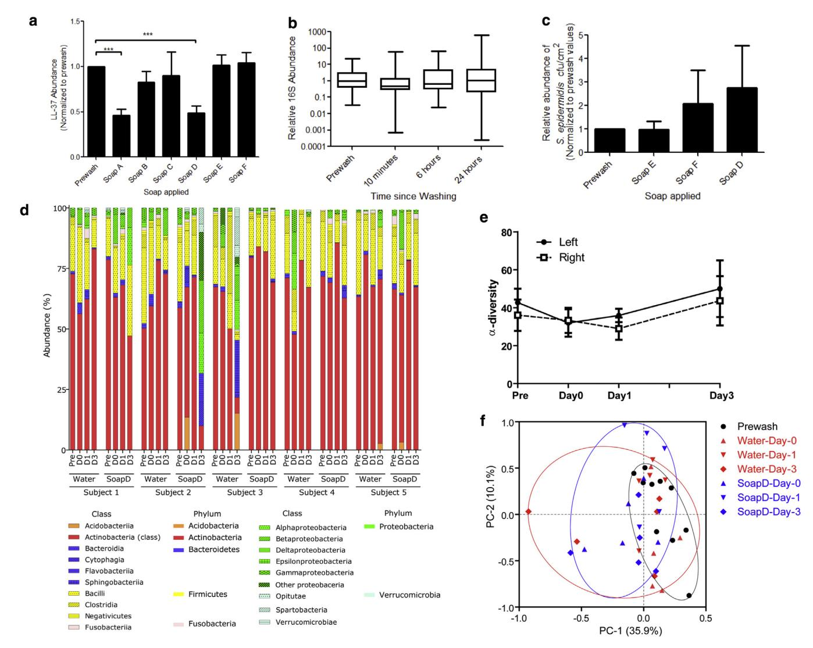
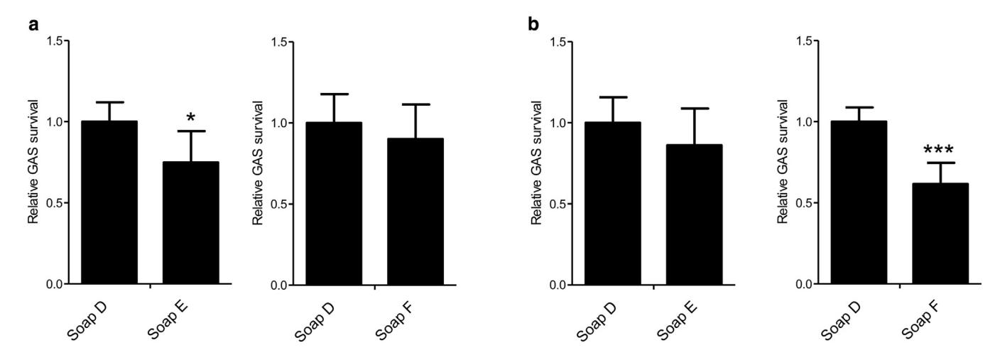

# The Cutaneous Microbiome and Aspects of Skin Antimicrobial Defense System Resist **Acute Treatment with Topical Skin Cleansers**

Aimee M. Two1, Teruaki Nakatsuji1, Paul F. Kotol1, Evangelia Arvanitidou2, Laurence Du-Thumm2, Tissa R. Hata1 and Richard L. Gallo1

The human skin microbiome has been suggested to play an essential role in maintaining health by contributing to innate defense of the skin. These observations have inspired speculation that the use of common skin washing techniques may be detrimental to the epidermal antibacterial defense system by altering the microbiome. In this study, several common skin cleansers were used to wash human forearms and the short-term effect on the abundance of the antimicrobial peptide LL-37 and the abundance and diversity of bacterial DNA was measured. Despite small but significant decreases in the amount of LL-37 on the skin surface shortly after washing, no significant change in the bacterial community was detected. Furthermore, Group A Streptococcus did not survive better on the skin after washing. In contrast, the addition of antimicrobial compounds such as benzalkonium chloride or triclocarban to soap before washing decreased the growth of Group A Streptococcus applied after rinse. These results support prior studies that hand washing techniques in the health care setting are beneficial and should be continued. Additional research is necessary to better understand the effects of chronic washing and the potential impact of skin care products on the development of dysbiosis in some individuals.

Journal of Investigative Dermatology (2016) 136, 1950-1954; doi:10.1016/j.jid.2016.06.612

# **INTRODUCTION**

Epithelial surfaces such as the skin and the intestine are colonized by an abundant and diverse community of microbes that collectively have been referred to as the "microbiome" (Schommer and Gallo, 2013). Recent evidence has suggested that these epithelia are more than passive hosts of microbes, but also require the contribution of resident bacteria to enhance immunity and help the organism resist infection from nonresident pathogenic microorganisms (Sanford and Gallo, 2013). These beneficial functions of the microbiome combine with other elements of the epithelial environment such as antimicrobial peptides, pH, lipids, temperature, mucins, salts, and hydration to form a chemical defensive shield that represents the first line of innate immune defense (Gallo and Hooper, 2012). However, the skin, unlike the intestine, is frequently exposed to cleansers that are applied to remove undesirable surface contaminants. Indeed, hand washing is thought to be one of the most important factors in infection control and plays an essential role in preventing the onset of infections.

Correspondence: Richard L. Gallo, Department of Dermatology, University of California San Diego, 9500 Gilman Drive, #0869, San Diego, California 92093, USA. E-mail: rgallo@ucsd.edu

Abbreviations: GAS, Group A Streptococcus; S. epidermidis, Staphylococcus

Received 28 February 2016; revised 6 June 2016; accepted 8 June 2016; accepted manuscript published online 1 July 2016; corrected proof published online 23 August 2016

Prior work has described great diversity in the skin microbiome both within subjects and between different individuals (Grice et al., 2009, Oh et al., 2014). However, despite shifts in the microbiome during disease flares such as atopic dermatitis (Kong et al., 2012), the composition of the microbiome within a given individual appears to remain fairly stable over time (Oh et al., 2016). This stability appears to occur despite the wide variation in environmental insults, and potential changes in hygiene practices, that take place in normal life. In this study, we sought to understand how the short-term use of common soaps and detergents alters endogenous antimicrobial defense and the composition of the microbiome.

## **RESULTS AND DISCUSSION**

To approach the question of how common skin washing might influence the microbiome, we designed a small series of experiments to evaluate the effects of skin cleansers on the presence of antimicrobial peptides, bacterial abundance, bacterial diversity, and inherent antibacterial function. Soaps tested were commonly available skin cleansers: Softsoap lavender and chamomile hand soap (soap A), Softsoap soothing aloe vera moisturizing hand soap (soap B), Softsoap rich shea butter moisturizing hand soap (soap C), Softsoap aguarium series hand soap (soap D), Softsoap soap containing benzalkonium chloride (soap E), or Softsoap soap containing triclocarban (soap F). Washing and analysis was performed on the forearm of healthy normal subjects and in a standardized fashion by an investigator blinded to the analysis.

To test the capacity to remove antimicrobial peptides from human skin, we measured the abundance of the cathelicidin

&lt;sup>1Department of Dermatology, University of California San Diego, San Diego, California, USA; and 2Research and Development Department, Colgate-Palmolive Company, New York, New York, USA

peptide LL-37 as a representative alpha-helical cationic peptide [\(Nakatsuji et al., 2012\)](#page-4-0). LL-37 on the volar forearms of 22 human subjects was measured using tape stripping methods before and after washing with the cleansers. Of the six soaps studied, two resulted in a significant decrease in LL-37 abundance detected on the tape strip samples 5 minutes after washing (Figure 1a). Skin washed by these soaps also showed less LL-37 at 4 hours and 24 hours after washing (data not shown).

Because a decrease in LL-37 after washing could alter the capacity of microbes to survive on the skin surface, we next measured the abundance of commensal organisms on the skin after washing. The abundance of bacteria on the skin of 10 human subjects was measured by swabbing the skin surface and quantitative PCR of DNA with universal primers for 16S ribosomal DNA. No significant difference in relative total microbial abundance as measured by real-time polymerase chain reaction was noted over a 24-hour period after washing with a soap that decreased LL-37 (soap D) (Figure 1b). Furthermore, Staphylococcus epidermidis (S. epidermidis) is the most frequently cultured member of the normal skin bacterial microbiome and has been shown in several studies to have potentially beneficial functions for skin health ([Sanford and Gallo, 2013](#page-4-0)). When the abundance of S. epidermidis was measured after washing, it was found that the inclusion of the antimicrobial compounds benzalkonium chloride and triclocarban did not result in a statistically significant difference in abundance at 10 minutes (not shown), or 6 (Figure 1c) or 24 hours (not shown). Similarly, 16S pyrosequencing did not reveal a major change in the taxa of

Figure 1. Antimicrobial peptides and the skin microbiome after the use of skin cleansers. (a) LL-37 on human skin 5 minutes after washing with indicated soaps. Data represent mean SEM (n ¼ 22). \*\*\*P 0.001. (b) Total bacterial DNA abundance at indicated times after washing with soap D as measured by qPCR of16S RNA (n ¼ 10). (c) Relative abundance of S. epidermidis 6 hours after washing with soap D, which does not contain antimicrobial compounds, and soaps E and F, both of which contain antimicrobial compounds. There was no significant difference in S. epidermidis abundance at any of the time points tested after washing with any of the different soaps. (d) Bacterial taxa identified by 16S sequencing on five participants' forearms before washing, 10 minutes after washing (D0), or 1 or 3 days after washing with either water or soap. (e) No significant difference in the a-diversity was detected between the left arm (washed with water) and the right arm (washed with soap D) on any of the days tested. Data represent mean SEM of data from 10 subjects. (f) PCoA plot analysis displaying similarity of composition of bacterial 16S rRNA gene sequences on the skin surface before (Prewash) and after washing with water or soap D. SEM, standard error of the mean; PCoA, principal coordinate analysis; qPCR, real-time polymerase chain reaction; rRNA, ribosomal RNA.

the skin bacterial community when comparing the use of soap D with washing with only water and sampling for up to 3 days after washing ([Figure 1d](#page-1-0)). Weighted principal coordinate analysis suggested a slight change in the bacterial community after washing with water compared with washing with soap in two individuals on day 3 [\(Figure 1f](#page-1-0)). However, using soap compared with water did not reveal a major difference in the similarity of the bacterial community in most subjects.

Finally, we performed a functional test to determine if washing changed innate functional defense of the skin by measuring the survival of a newly introduced and potentially pathogenic bacterial species Group A Streptococcus (GAS). Participants' forearms were washed with control soap (soap D) and the other arm was washed with the same soap containing an antimicrobial compound such as benzalkonium chloride (soap E) or triclocarban (soap F). After washing and rinsing in a controlled manner, GAS was applied. After 30 minutes, a small but significant decrease in the recovery of live GAS was observed when the soap contained triclocarban (Figure 2a). This experiment was then repeated after 1 week and GAS survival measured 60 minutes after washing. At this later time point, washing with benzalkonium chloride showed a significant decrease compared with control soap (Figure 2b).

These observations demonstrate the skin surface bacterial community and antimicrobial action against GAS is relatively resilient despite the capacity of some detergents to transiently alter antimicrobial peptide abundance. In fact, the use of antimicrobial soaps resulted in increased resistance to a subsequent challenge by GAS. This increased resistance was present 30 minutes after triclocarban and 60 minutes after washing with a soap containing benzalkonium chloride, a difference that may reflect the different mechanisms of action of these antimicrobials ([McMurry et al., 1998\)](#page-4-0).

As in any study, technical aspects involved in performing the analysis may have influenced the results. Tape stripping was used to collect LL37 on the surface, but this analysis could be influenced by changes in the capacity of the adhesive to collect surface material. Therefore, an apparent loss in LL37 after the use of two of the soaps may reflect an effect of the soap on the capacity of the adhesive to collect the sample. However, this is unlikely because sample LL37 abundance was normalized to total protein and the soap had no consistent effect on this endpoint. Thus, we believe that some soaps may be more effective in eluting amphipathic peptides from the stratum corneum, but this acute change does not have a significant effect on the composition of the bacterial microbiome. The bacterial community may be resistant to the removal of LL37 because the baseline concentration of LL37 on normal skin is less than that needed to kill common skin commensals such as S. epidermidis, and observations have shown that some of the skin bacterial community resides below the stratum corneum ([Nakatsuji](#page-4-0) [et al., 2012](#page-4-0)). In this case, the deeper bacteria may be available to rapidly repopulate the surface. Another limitation of this work is the application of 16S sequencing methodology to describe the bacterial community composition. Although the approach we applied of using V1eV3 sequencing data has been suggested in a recent report to be more accurate than V4 sequence information for the skin ([Meisel et al.,](#page-4-0) [2016\)](#page-4-0), accurate identification of bacteria at the species or strain level is not possible by the approach applied here and with the currently available pipeline of reference genomes. This lack of fine resolution therefore warrants the question if our inability to detect a difference in bacterial diversity after washing has missed more subtle changes. Future work will be needed to resolve this issue.

Our findings suggest that the short-term use of skin cleansers does not significantly change the cutaneous microbiome or the aspects of the antimicrobial defense system we have measured here. This is significant in the health care setting, where hand hygiene is the best-accepted single

Figure 2. Resistance against survival of Group A Streptococcus (GAS) after the use of skin cleansers. GAS survival at the skin surface after washing with a control soap (soap D) compared with two soaps containing the same detergent but with the addition of antimicrobial compounds (soaps E and F). Subjects' forearms were washed and rinsed prior to GAS application. Data were normalized to the number of GAS colonies surviving after washing with control soap. (a) Thirty minutes after removing the bacteria-coated agar disk, the number of GAS colonies surviving on the forearms of participants washed with soap E (contains triclocarban) was significantly less than the number of GAS colonies surviving on forearms washed with control soap without antimicrobial compound added (P ¼ 0.01). (b) Sixty minutes after removing the bacteria-coated agar disk, there were significantly fewer bacteria colonies surviving on the forearms of participants that had been washed with soap F (contains benzalkonium chloride) (P ¼ 0.006). Data represent mean SEM (n ¼ 10). SEM, standard error of the mean.

intervention to reduce health care-associated infections. Since 1977, more than 20 hospital-based studies have investigated the utility of hand hygiene in preventing health care-associated infections ([Allegranzi et al., 2009\)](#page-4-0), with almost all of them reporting a temporal association between improvement in hand hygiene practices and reduction in infection and/or cross-transmission rates [\(Capretti et al.,](#page-4-0) [2008; Casewell et al.,1977; Conly et al., 1989; Doebbeling](#page-4-0) [et al.,1992; Grayson et al., 2008; Hilburn et al., 2003;](#page-4-0) [Johnson et al., 2005; Larson et al., 2000; MacDonald et al.,](#page-4-0) [2004; Nguyen et al., 2008; Pittet et al., 2000, 2004;](#page-4-0) [Rosenthal et al., 2005; Thi et al., 2007; Webster](#page-4-0) [et al.,1994; Won et al., 2004; Zafar et al.,1995; Zerr et al.,](#page-4-0) [2005\)](#page-4-0). Furthermore, studies investigating the utility of implementing national and institution-wide hand hygiene programs have shown improvement in health care-associated infection rates after implementation of such measures [\(Jarlier](#page-4-0) [et al., 2010; Stone et al., 2012](#page-4-0)). The findings of the current study are consistent with these results, supporting the safety of hand cleansers for hygiene purposes. Because the current study only investigated the short-term impact of cleansers on a small population, further research on the chronic use of such products is necessary and may reveal that more chronic or aggressive washing could reduce skin defense. Indeed, this complex interaction between skin, microbes, and the environment must be better understood to optimize hygiene practices.

#### MATERIALS AND METHODS

#### Human subjects

This single-site study was conducted at the University of California San Diego. All study-related activities complied with the Declaration of Helsinki and were approved by the University of California San Diego Institutional Review Board (reference numbers 111295, 111296, and 122610). Subject recruitment was limited to healthy individuals with no history of skin disease (Supplementary Table S1 online), and all subjects provided written informed consent before participation. Participants were not permitted to shower, exercise, sunbathe, or apply any topical products to their forearms from the day each study started until the final set of samples for the study was taken.

#### Washing technique

The same washing technique was used for all studies. First, 1.5 ml of test product was placed on participants' forearms. The product was spread over the volar forearm with a gloved hand for 30 seconds and then rinsed off with tap water while being scrubbed with a gloved hand for 60 seconds. Forearms were allowed to air-dry before taking measurements.

## Measurement of LL-37 removal from human skin

LL-37 abundance was measured on the volar forearms of subjects using tape strip sampling before and then 5 minutes, 4 hours, and 24 hours after their forearms were washed with one of six commercially available hand soaps (soaps AeF). Tape stripping was performed by firmly applying a 1 1 cm2 D-squame tape (CuDerm, Dallas, TX) to each site for 10 seconds and then repeating this procedure nine times with the same tape. This process was repeated on neighboring parts of the forearm at each time point for a total of three tape strips per time point. Tape strip samples were stored at 80 C until processing.

To extract LL-37, tape strips were immersed in 1 ml of 10 mM Tris-HCl (pH 7.8) with 0.1% Triton and vortexed with beads. Protein extracts were completely lyophilized and the pellet was dissolved in 40 ml of phosphate buffered saline at a pH of 7.4. For quantification of LL-37, 1 ml of each sample or serially diluted synthetic LL-37 peptide as a standard was dotted onto a nitrocellulose membrane. The membrane was blocked with blocking buffer (Licor, Lincoln, NE) for 1 hour, incubated overnight with rabbit anti-LL-37 at 4 C, followed by incubation for 1 hour with IRDye800 goat-anti-rabbit IgG (Licor). LL-37 immunoreactivity was detected by an Odyssey imaging system (Licor). The relative amount of LL-37 was determined by comparing immunoreactivity with a standard amount of LL-37. Values were normalized to each participant's baseline (prewash) value by dividing the average LL-37 abundance at baseline, 5 minutes, 4 hours, and 24 hours by the patient's baseline LL-37 abundance level. A two-tailed paired t-test was used to compare the normalized baseline LL-37 abundance values (equal to 1) with the normalized LL-37 abundance for each patient at 5 minutes, 4 hours, and 24 hours. A P-value less than 0.05 was considered statistically significant.

## Skin surface bacterial studies

Microbial abundance measurements were conducted by swabbing a 3 5 cm area on participants' volar forearms using an Epicentre Catch-All Sample Collection Swab (Epicentre Biotechnologies, Madison, WI). Microbial genomic DNA was purified from the swab head with a QIAamp DNA kit (Qiagen, Valencia, CA). Real-time polymerase chain reaction was used to determine bacterial abundance with universal 16S ribosomal RNA primers for total bacterial abundance, or species-specific primers targeting the S. epidermidis SodA gene for the abundance of this specific bacterium. Microbial counts were compared across different time points using a paired ttest. A P-value less than 0.05 was considered statistically significant. To characterize the proportion of microbial community, pyrosequencing for bacterial 16S ribosomal RNA gene was performed using a 454 pyrosequencer as described previously ([Nakatsuji et al.,](#page-4-0) [2013\)](#page-4-0). Briefly, the V1eV3 region of 16S ribosomal RNA gene was amplified with 16S-28F and 16S-519R primers (Supplementary Table S2 online) with sample-specific barcode. Amplicons were sequenced by the 454 FLX Titanium Platform (454 Life Sciences, Branford, CT). Sequences were binned based on sample-specific barcode sequences and then the barcode and primer sequences were trimmed. Sequences including ambiguous bases or shorter than 200 bp were removed. High-quality sequence reads were first dereplicated using 97% similarity using BlastN against the Ribosomal Database Project. Operational taxonomic units were assigned with MG-RAST (v3.2) [\(http://metagenomics.anl.gov/\)](http://metagenomics.anl.gov/). To compare similarity of microbiome, weighted principal coordinate analysis was performed. a-Diversity of annotated samples was estimated from the distribution of the species-level annotations.

16S abundance values were normalized to each participant's baseline (prewash) value by dividing the average 16S abundance at baseline, 5 minutes, 4 hours, and 24 hours by the patient's baseline 16S abundance level. S. epidermidis abundance values were normalized to the baseline (prewash) value by dividing the average S. epidermidis abundances after washing with each of the soaps by the prewash S. epidermidis abundance level. A two-tailed paired t-test was used to compare the normalized baseline abundance values (equal to 1) with the normalized abundance value for each time point/ soap. A P-value less than 0.05 was considered statistically significant.

The Microbiome Resists Skin Cleansers

GAS survival studies were completed by first washing participants' forearms, applying six agar disks coated with 1 105 colonyforming units of GAS strain NZ131 to each forearm for 5 minutes. Either 30 or 60 minutes later, a 2 2 cm area centered over the location of the agar disks was swabbed three times with a cotton swab. Swabs were then vortexed for 30 seconds in Todd-Hewitt broth, and 10 ml of serial dilutions of each bacteria suspension was then spotted on a 1% agar plate. Plates were incubated overnight at 37 C and surviving GAS colonies counted the following day. The number of GAS colonies at each time point for each individual was normalized to the measurement of baseline colonization after the use of control soap for each experiment. A Wilcoxon signed rank test was used to compare the number of GAS colonies in the control soap with soap containing the antimicrobial compound. A P-value less than 0.05 was considered statistically significant.

#### Data access

The 16S pyrosequencing data for this study has been submitted to the DNA Database of Japan Sequence Read Archive ([http://trace.](http://trace.ddbj.nig.ac.jp/dra/index_e.html) [ddbj.nig.ac.jp/dra/index\\_e.html](http://trace.ddbj.nig.ac.jp/dra/index_e.html)) through the BioProject ID PRJDB4881 and published under the Accession Code DRA004758.

#### CONFLICT OF INTEREST

EA and LD-T are employees of Colgate-Palmolive Company.

#### ACKNOWLEDGMENTS

The authors wish to thank the members of the UCSD Dermatology Research program for helpful discussions and technical support regarding this work. This work was supported in part by an investigator-initiated grant from Colgate-Palmolive Company and by National Institute of Health grants, R01AR064781, R01AI116576, and R01AI052453, to RLG.

## SUPPLEMENTARY MATERIAL

Supplementary material is linked to the online version of the paper at [www.](http://www.jidonline.org) [jidonline.org](http://www.jidonline.org), and at <http://dx.doi.org/10.1016/j.jid.2016.06.612>.

## REFERENCES

- [Allegranzi B, Pittet D. Role of hand hygiene in healthcare-associated infection](http://refhub.elsevier.com/S0022-202X(16)32085-1/sref1) [prevention. J Hosp Infect 2009;73:305](http://refhub.elsevier.com/S0022-202X(16)32085-1/sref1)e[15](http://refhub.elsevier.com/S0022-202X(16)32085-1/sref1).
- [Capretti MG, Sandri F, Tridapalli E, Galletti S, Petracci E, Faldella G. Impact of](http://refhub.elsevier.com/S0022-202X(16)32085-1/sref2) [a standardized hand hygiene program on the incidence of nosocomial](http://refhub.elsevier.com/S0022-202X(16)32085-1/sref2) [infection in very low birth weight infants. Am J Infect Control 2008;36:](http://refhub.elsevier.com/S0022-202X(16)32085-1/sref2) [430](http://refhub.elsevier.com/S0022-202X(16)32085-1/sref2)e[5](http://refhub.elsevier.com/S0022-202X(16)32085-1/sref2).
- [Casewell M, Phillips I. Hands as route of transmission for](http://refhub.elsevier.com/S0022-202X(16)32085-1/sref3) Klebsiella species. [Br Med J 1977;2:1315](http://refhub.elsevier.com/S0022-202X(16)32085-1/sref3)e[7](http://refhub.elsevier.com/S0022-202X(16)32085-1/sref3).
- [Conly JM, Hill S, Ross J, Lertzman J, Louie TJ. Handwashing practices in an](http://refhub.elsevier.com/S0022-202X(16)32085-1/sref4) [intensive care unit: the effects of an educational program and its rela](http://refhub.elsevier.com/S0022-202X(16)32085-1/sref4)[tionship to infection rates. Am J Infect Control 1989;17:330](http://refhub.elsevier.com/S0022-202X(16)32085-1/sref4)e[9](http://refhub.elsevier.com/S0022-202X(16)32085-1/sref4).
- [Doebbeling BN, Stanley GL, Sheetz CT, Pfaller MA, Houston AK, Annis L,](http://refhub.elsevier.com/S0022-202X(16)32085-1/sref5) [et al. Comparative efficacy of alternative hand-washing agents in reducing](http://refhub.elsevier.com/S0022-202X(16)32085-1/sref5) [nosocomial infections in intensive care units. N Engl J Med 1992;327:](http://refhub.elsevier.com/S0022-202X(16)32085-1/sref5) [88](http://refhub.elsevier.com/S0022-202X(16)32085-1/sref5)e[93](http://refhub.elsevier.com/S0022-202X(16)32085-1/sref5).
- [Gallo RL, Hooper LV. Epithelial antimicrobial defence of the skin and intes](http://refhub.elsevier.com/S0022-202X(16)32085-1/sref6)[tine. Nat Rev Immunol 2012;12:503](http://refhub.elsevier.com/S0022-202X(16)32085-1/sref6)e[16](http://refhub.elsevier.com/S0022-202X(16)32085-1/sref6).
- [Grayson ML, Jarvie LJ, Martin R, Jodoin ME, McMullan C, Gregory RH, et al.](http://refhub.elsevier.com/S0022-202X(16)32085-1/sref7) [Significant reductions in methicillin-resistant](http://refhub.elsevier.com/S0022-202X(16)32085-1/sref7) Staphylococcus aureus bac[teraemia and clinical isolates associated with a multisite, hand hygiene](http://refhub.elsevier.com/S0022-202X(16)32085-1/sref7) [culture-change program and subsequent successful statewide roll-out. Med](http://refhub.elsevier.com/S0022-202X(16)32085-1/sref7) [J Aust 2008;188:633](http://refhub.elsevier.com/S0022-202X(16)32085-1/sref7)e[40](http://refhub.elsevier.com/S0022-202X(16)32085-1/sref7).
- [Grice EA, Kong HH, Conlan S, Deming CB, Davis J, Young AC, et al. Topo](http://refhub.elsevier.com/S0022-202X(16)32085-1/sref8)[graphical and temporal diversity of the human skin microbiome. Science](http://refhub.elsevier.com/S0022-202X(16)32085-1/sref8) [2009;324:1190](http://refhub.elsevier.com/S0022-202X(16)32085-1/sref8)e[2](http://refhub.elsevier.com/S0022-202X(16)32085-1/sref8).
- [Hilburn J, Hammond BS, Fendler EJ, Groziak PA. Use of alcohol hand sani](http://refhub.elsevier.com/S0022-202X(16)32085-1/sref9)[tizer as an infection control strategy in an acute care facility. Am J Infect](http://refhub.elsevier.com/S0022-202X(16)32085-1/sref9) [Control 2003;31:109](http://refhub.elsevier.com/S0022-202X(16)32085-1/sref9)e[16.](http://refhub.elsevier.com/S0022-202X(16)32085-1/sref9)
- [Jarlier V, Trystram D, Brun-Buisson C, Fournier S, Carbonne A, Marty L, et al.](http://refhub.elsevier.com/S0022-202X(16)32085-1/sref10) [Curbing methicillin-resistant](http://refhub.elsevier.com/S0022-202X(16)32085-1/sref10) Staphylococcus aureus in 38 French hospitals

- [through a 15-year institutional control program. Arch Intern Med](http://refhub.elsevier.com/S0022-202X(16)32085-1/sref10) [2010;170:552](http://refhub.elsevier.com/S0022-202X(16)32085-1/sref10)e[9](http://refhub.elsevier.com/S0022-202X(16)32085-1/sref10).
- [Johnson PD, Martin R, Burrell LJ, Grabsch EA, Kirsa SW, O'Keeffe J, et al.](http://refhub.elsevier.com/S0022-202X(16)32085-1/sref11) [Efficacy of an alcohol/chlorhexidine hand hygiene program in a hospital](http://refhub.elsevier.com/S0022-202X(16)32085-1/sref11) [with high rates of nosocomial methicillin-resistant](http://refhub.elsevier.com/S0022-202X(16)32085-1/sref11) Staphylococcus aureus [\(MRSA\) infection. Med J Aust 2005;183:509](http://refhub.elsevier.com/S0022-202X(16)32085-1/sref11)e[14.](http://refhub.elsevier.com/S0022-202X(16)32085-1/sref11)
- [Kong HH, Oh J, Deming C, Conlan S, Grice EA, Beatson MA, et al. Temporal](http://refhub.elsevier.com/S0022-202X(16)32085-1/sref12) [shifts in the skin microbiome associated with disease flares and treatment](http://refhub.elsevier.com/S0022-202X(16)32085-1/sref12) [in children with atopic dermatitis. Genome Res 2012;22:850](http://refhub.elsevier.com/S0022-202X(16)32085-1/sref12)e[9.](http://refhub.elsevier.com/S0022-202X(16)32085-1/sref12)
- [Larson EL, Early E, Cloonan P, Sugrue S, Parides M. An organizational climate](http://refhub.elsevier.com/S0022-202X(16)32085-1/sref13) [intervention associated with increased handwashing and decreased noso](http://refhub.elsevier.com/S0022-202X(16)32085-1/sref13)[comial infections. Behav Med 2000;26:14](http://refhub.elsevier.com/S0022-202X(16)32085-1/sref13)e[22.](http://refhub.elsevier.com/S0022-202X(16)32085-1/sref13)
- [MacDonald A, Dinah F, MacKenzie D, Wilson A. Performance feedback of](http://refhub.elsevier.com/S0022-202X(16)32085-1/sref14) [hand hygiene, using alcohol gel as the skin decontaminant, reduces the](http://refhub.elsevier.com/S0022-202X(16)32085-1/sref14) [number of inpatients newly affected by MRSA and antibiotic costs. J Hosp](http://refhub.elsevier.com/S0022-202X(16)32085-1/sref14) [Infect 2004;56:56](http://refhub.elsevier.com/S0022-202X(16)32085-1/sref14)e[63](http://refhub.elsevier.com/S0022-202X(16)32085-1/sref14).
- [McMurry LM, Oethinger M, Levy SB. Triclosan targets lipid synthesis. Nature](http://refhub.elsevier.com/S0022-202X(16)32085-1/sref15) [1998;394:531](http://refhub.elsevier.com/S0022-202X(16)32085-1/sref15)e[2](http://refhub.elsevier.com/S0022-202X(16)32085-1/sref15).
- [Meisel JS, Hannigan GD, Tyldsley AS, SanMiguel AJ, Hodkinson BP, Zheng Q,](http://refhub.elsevier.com/S0022-202X(16)32085-1/sref16) [et al. Skin microbiome surveys are strongly influenced by experimental](http://refhub.elsevier.com/S0022-202X(16)32085-1/sref16) [design. J Invest Dermatol 2016;136:947](http://refhub.elsevier.com/S0022-202X(16)32085-1/sref16)e[56](http://refhub.elsevier.com/S0022-202X(16)32085-1/sref16).
- [Nakatsuji T, Chiang HI, Jiang SB, Nagarajan H, Zengler K, Gallo RL. The](http://refhub.elsevier.com/S0022-202X(16)32085-1/sref17) [microbiome extends to subepidermal compartments of normal skin. Nat](http://refhub.elsevier.com/S0022-202X(16)32085-1/sref17) [Commun 2013;4:1431.](http://refhub.elsevier.com/S0022-202X(16)32085-1/sref17)
- [Nakatsuji T, Gallo RL. Antimicrobial peptides: old molecules with new ideas.](http://refhub.elsevier.com/S0022-202X(16)32085-1/sref18) [J Invest Dermatol 2012;132:887](http://refhub.elsevier.com/S0022-202X(16)32085-1/sref18)e[95.](http://refhub.elsevier.com/S0022-202X(16)32085-1/sref18)
- [Nguyen KV, Nguyen PT, Jones SL. Effectiveness of an alcohol-based hand](http://refhub.elsevier.com/S0022-202X(16)32085-1/sref19) [hygiene programme in reducing nosocomial infections in the urology ward](http://refhub.elsevier.com/S0022-202X(16)32085-1/sref19) [of Binh Dan Hospital, Vietnam. Trop Med Int Health 2008;13:1297](http://refhub.elsevier.com/S0022-202X(16)32085-1/sref19)e[302.](http://refhub.elsevier.com/S0022-202X(16)32085-1/sref19)
- [Oh J, Byrd AL, Deming C, Conlan S. NISC Comparative Sequencing Program,](http://refhub.elsevier.com/S0022-202X(16)32085-1/sref20) [Kong HH, Segre JA. Biogeography and individuality shape function in the](http://refhub.elsevier.com/S0022-202X(16)32085-1/sref20) [human skin metagenome. Nature 2014;514:59](http://refhub.elsevier.com/S0022-202X(16)32085-1/sref20)e[64.](http://refhub.elsevier.com/S0022-202X(16)32085-1/sref20)
- [Oh J, Byrd AL, Park M, , NISC Comparative Sequencing Program, Kong HH,](http://refhub.elsevier.com/S0022-202X(16)32085-1/sref21) [Segre JA. Temporal stability of the human skin microbiome. Cell 2016;165:](http://refhub.elsevier.com/S0022-202X(16)32085-1/sref21) [854](http://refhub.elsevier.com/S0022-202X(16)32085-1/sref21)e[64](http://refhub.elsevier.com/S0022-202X(16)32085-1/sref21).
- [Pittet D, Hugonnet S, Harbarth S, Mourouga P, Sauvan V, Touveneau S, et al.](http://refhub.elsevier.com/S0022-202X(16)32085-1/sref22) [Effectiveness of a hospital-wide programme to improve compliance with](http://refhub.elsevier.com/S0022-202X(16)32085-1/sref22) [hand hygiene. Lancet 2000;356:1307](http://refhub.elsevier.com/S0022-202X(16)32085-1/sref22)e[12](http://refhub.elsevier.com/S0022-202X(16)32085-1/sref22).
- [Pittet D, Sax H, Hugonnet S, Harbarth S. Cost implications of successful hand](http://refhub.elsevier.com/S0022-202X(16)32085-1/sref23) [hygiene promotion. Infect Control Hosp Epidemiol 2004;25:264](http://refhub.elsevier.com/S0022-202X(16)32085-1/sref23)e[6.](http://refhub.elsevier.com/S0022-202X(16)32085-1/sref23)
- [Rosenthal VD, Guzman S, Safdar N. Reduction in nosocomial infection with](http://refhub.elsevier.com/S0022-202X(16)32085-1/sref24) [improved hand hygiene in intensive care units of a tertiary care hospital in](http://refhub.elsevier.com/S0022-202X(16)32085-1/sref24) [Argentina. Am J Infect Control 2005;33:392](http://refhub.elsevier.com/S0022-202X(16)32085-1/sref24)e[7.](http://refhub.elsevier.com/S0022-202X(16)32085-1/sref24)
- [Sanford JA, Gallo RL. Functions of the skin microbiota in health and disease.](http://refhub.elsevier.com/S0022-202X(16)32085-1/sref25) [Semin Immunol 2013;25:370](http://refhub.elsevier.com/S0022-202X(16)32085-1/sref25)e[7.](http://refhub.elsevier.com/S0022-202X(16)32085-1/sref25)
- [Schommer NN, Gallo RL. Structure and function of the human skin micro](http://refhub.elsevier.com/S0022-202X(16)32085-1/sref26)[biome. Trends Microbiol 2013;21:660](http://refhub.elsevier.com/S0022-202X(16)32085-1/sref26)e[8](http://refhub.elsevier.com/S0022-202X(16)32085-1/sref26).
- [Stone SP, Fuller C, Savage J, Cookson B, Hayward A, Cooper B, et al. Eval](http://refhub.elsevier.com/S0022-202X(16)32085-1/sref27)[uation of the national Cleanyourhands campaign to reduce](http://refhub.elsevier.com/S0022-202X(16)32085-1/sref27) Staphylococcus aureus bacteraemia and Clostridium difficile [infection in hospitals in](http://refhub.elsevier.com/S0022-202X(16)32085-1/sref27) [England and Wales by improved hand hygiene: four year, prospective,](http://refhub.elsevier.com/S0022-202X(16)32085-1/sref27) [ecological, interrupted time series study. BMJ 2012;344:e3005](http://refhub.elsevier.com/S0022-202X(16)32085-1/sref27).
- [Thi Anh Thu L, Dibley MJ, Nho VV, Archibald L, Jarvis WR, Sohn AH.](http://refhub.elsevier.com/S0022-202X(16)32085-1/sref28) [Reduction in surgical site infections in neurosurgical patients associated](http://refhub.elsevier.com/S0022-202X(16)32085-1/sref28) [with a bedside hand hygiene program in Vietnam. Infect Control Hosp](http://refhub.elsevier.com/S0022-202X(16)32085-1/sref28) [Epidemiol 2007;28:583](http://refhub.elsevier.com/S0022-202X(16)32085-1/sref28)e[8.](http://refhub.elsevier.com/S0022-202X(16)32085-1/sref28)
- [Webster J, Faoagali JL, Cartwright D. Elimination of methicillin-resistant](http://refhub.elsevier.com/S0022-202X(16)32085-1/sref29) Staphylococcus aureus [from a neonatal intensive care unit after hand](http://refhub.elsevier.com/S0022-202X(16)32085-1/sref29) [washing with triclosan. J Paediatr Child Health 1994;30:59](http://refhub.elsevier.com/S0022-202X(16)32085-1/sref29)e[64](http://refhub.elsevier.com/S0022-202X(16)32085-1/sref29).
- [Won SP, Chou HC, Hsieh WS, Chen CY, Huang SM, Tsou KI, et al. Hand](http://refhub.elsevier.com/S0022-202X(16)32085-1/sref30)[washing program for the prevention of nosocomial infections in a neonatal](http://refhub.elsevier.com/S0022-202X(16)32085-1/sref30) [intensive care unit. Infect Control Hosp Epidemiol 2004;5:742](http://refhub.elsevier.com/S0022-202X(16)32085-1/sref30)e[6](http://refhub.elsevier.com/S0022-202X(16)32085-1/sref30).
- [Zafar AB, Butler RC, Reese DJ, Gaydos LA, Mennonna PA. Use of 0.3%](http://refhub.elsevier.com/S0022-202X(16)32085-1/sref31) [triclosan \(Bacti-Stat\) to eradicate an outbreak of methicillin-resistant](http://refhub.elsevier.com/S0022-202X(16)32085-1/sref31) Staphylococcus aureus [in a neonatal nursery. Am J Infect Control](http://refhub.elsevier.com/S0022-202X(16)32085-1/sref31) [1995;23:200](http://refhub.elsevier.com/S0022-202X(16)32085-1/sref31)e[8](http://refhub.elsevier.com/S0022-202X(16)32085-1/sref31).
- [Zerr DM, Allpress AL, Heath J, Bornemann R, Bennett E. Decreasing hospital](http://refhub.elsevier.com/S0022-202X(16)32085-1/sref32)[associated rotavirus infection: a multidisciplinary hand hygiene campaign](http://refhub.elsevier.com/S0022-202X(16)32085-1/sref32) [in a children's hospital. Pediatr Infect Dis J 2005;24:397](http://refhub.elsevier.com/S0022-202X(16)32085-1/sref32)e[403](http://refhub.elsevier.com/S0022-202X(16)32085-1/sref32).