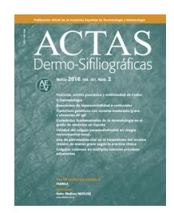
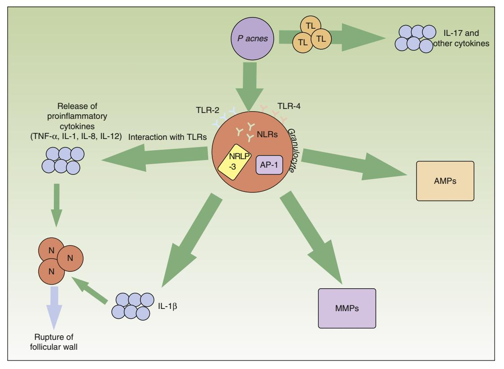

# OPINION ARTICLE

# **The Importance of Innate Immunity in Acne**-**Importancia de la inmunidad innata en el acné**

**O.M. Moreno-Arrones,**∗ **P. Boixeda**

*Departamento de Dermatología, Hospital Universitario Ramón y Cajal, Madrid, Spain*

Received 16 April 2016; accepted 17 July 2016

#### **Innate Immunity**

One of the various functions of the skin is to serve as a physical, chemical, and biological barrier against pathogens. This barrier function forms part of the immune system. The immune system is made up of the innate immune system, which provides a rapid and stereotyped response, and the adaptive immune system, which has longer latency and provides targeted action.

In the skin, the components of the innate immune system are the hematopoietic cells (such as the cells of the mononuclear phagocyte system and natural killer cells), soluble factors (such as complement, cytokines, metalloproteinases, and antimicrobial peptides), and the skin cells themselves.[1](#page-2-0)

The innate system is not nonspecific; its cells have highly evolutionarily conserved receptors that recognize the molecular patterns of pathogens and metabolic products arising from cellular stress. These receptors are the toll-like receptors (TLRs),2 [w](#page-2-0)hich are present in cell membranes, and the cytosolic NOD-like receptors (NLRs).[3](#page-3-0)

There has recently been growing interest in inflammasome, a fundamental component of innate immunity. Inflammasomes are found at the intracellular level of

tancia de la inmunidad innata en el acné. Actas Dermosifiliogr.

effector cells of the innate immune system, such as neutrophils and macrophages. Inflammasomes are intracellular protein complexes made up of proteins from the family of NACHT-, LRR-, and pyrin domain (PYD)-containing proteins (NALPs) that act as a nexus between TLRs and NLRs with the release proinflammatory cytokines such as interleukin (IL)-1by these cells.[4](#page-3-0)

Inflammasomes are responsible for triggering an inflammatory response to various types of stimuli, including bacterial RNA, uric acid crystals, and UV-B radiation.[5---7](#page-3-0) Of the various inflammasomes, NRLP3 is probably the best characterized.

# **Relationship Between Acne Vulgaris and Inflammation**

Acne is the most prevalent skin disease in adolescents and young adults8 [:](#page-3-0) up to 80% of the population is affected by the condition at some point in their lives.[9](#page-3-0) The pathophysiology of acne is complex and has traditionally been described as involving 4 factors: follicular hyperkeratinization, increased sebum production, *Propionibacterium acnes*, and secondary inflammation. Microcomedones, a consequence of follicular obstruction with sebum and keratin, have traditionally been described as the precursor lesion to acne. However, the sequence of events in the formation of acne lesions is not fully understood.

Studies from more than 2 decades ago found a close relationship between acne vulgaris and underlying inflammation,[10,11](#page-3-0) but our understanding of the disease has not changed until recently.[12](#page-3-0)

-Please cite this article as: Moreno-Arrones O, Boixeda P. Impor-

2016;107:801---805. ∗ Corresponding author. *E-mail address:* [o.m.m.arrones@gmail.com](mailto:o.m.m.arrones@gmail.com) (O.M. Moreno-Arrones).

Jeremy et al.[13](#page-3-0) showed that inflammatory cells and molecules such as IL-1 were present prior to the formation of comedones in apparently healthy skin in patients with acne. This finding underscores the fundamental role of inflammation in the initial stages of comedogenesis.

Do et al.[14](#page-3-0) demonstrated that more than half of inflammatory acne lesions were preceded by microcomedones, in apparently healthy skin in up to a third of cases.

In addition, elevated levels of inflammatory molecules have been found in both microcomedones and comedones. Finally, an increase in the expression of genes involved in inflammation and extracellular matrix remodeling has been found in patients affected by acne.[15](#page-3-0)

*P acnes* is an anaerobic, saprophytic, gram-positive bacterium with a particular preference for the pilosebaceous unit. It plays a major role in the appearance and chronification of inflammation in acne (Fig. 1).

TLR-2, present in perifollicular macrophages, has an affinity against *P acnes* and triggers the release of proinflammatory cytokines such as IL-8 and IL-12.[16,17](#page-3-0) These interleukins favor neutrophil chemotaxis and the release of lysosomal enzymes that are involved in the rupture of the follicular wall. Apparently, the expression of TLR-2 by immune cells is also directly related to acne severity.[16](#page-3-0) This could explain why topical retinoids----specifically adapalene, which significantly decreases the expression of TLR-2----are useful in inflammatory lesions.[18](#page-3-0)

*P acnes* is also capable of activating the NRLP3 inflammasome by means of various NLRs. This multiprotein complex activates proteolytic enzymes, such as capase-1, which transforms the precursor of IL-1 into its functional form.[19](#page-3-0) The activation of the inflammasome by this bacterium in cutaneous monocytes and sebocytes has been demonstrated in humans.[20,21](#page-3-0) Knowledge of this relationship between *P acnes* and the inflammasome opens up new therapeutic prospects.

Similarly, *P acnes* can stimulate T lymphocytes. A recent in-vitro study showed that *P acnes* induced T helper 1 and T helper 17 lymphocytes to produce IL-17 and other proinflammatory cytokines.[22](#page-3-0) The same study found that vitamin A (transretinoic acid) and vitamin D (1,25 dihydroxyvitamin D3) inhibited this inflammatory stimulation. This finding could open up another possibility for acne treatment.

**Figure 1** Inflammatory pathways involved in the pathogenesis of acne vulgaris. *Propionibacterium acnes* can interact directly with T lymphocytes and favor the release of inflammatory cytokines such as IL-17. In addition, synthesis of other inflammatory cytokines is favored through the TLR-2 and TLR-4 receptors of the perifollicular inflammatory cells. The NRLP3 inflammasome also plays an important role in the production of IL-1-. The release of all these proinflammatory cytokines into the extracellular medium leads to the inflammatory-cell-mediated rupture of the follicular wall. *P acnes* also induces an increase in several matrix metalloproteinases through the transcription factor activator protein 1. These enzymes play an active role in tissue destruction and scarring. Finally, the bacteria are capable of causing the inveterate activation of antimicrobial peptides that perpetuate the inflammatory microenvironment. AMP indicates antimicrobial peptide; AP, activator protein; IL, interleukin; MMPs, matrix metalloproteinases; N, neutrophil; NLR, NOD-like receptor; *P acnes*, *Propionibacterium acnes*; TL, T lymphocyte; TLR, toll-like receptor; TNF, tumor necrosis factor.

Matrix metalloproteinases (MMPs) play a physiological role in the maintenance of the dermal extracellular matrix. They also cause tissue destruction and scar formation in acne. Various studies have found that *P acnes* induces an increase in the activity of several MMPs.[23---25](#page-3-0) In addition, patients affected by acne probably have individual susceptibility to aberrant scarring. Certain inflammatory expression profiles are known to be linked to increased risk of abnormal scarring.[26](#page-3-0) Knowledge of these molecular targets could make it possible to design specific treatments to modulate cutaneous scar formation.

In the innate immune system, the action of antimicrobial peptides such as --defensins and cathelicidins are important in the control of resident and transient bacterial flora in the skin. The presence of *P acnes* in patients with acne is known to stimulate the action of these peptides in a sustained manner, exacerbating the inflammatory environment characteristic of this entity.[27](#page-3-0)

Ultimately, the skin microbiome has a direct and indirect effect on the immune system and the inflammatory response to *P acnes*. This inflammation has been shown to vary depending on the strain of *P acnes* and the intrinsic sensitivity of the patient.[28](#page-3-0)

Therefore, we must disabuse ourselves of the notion that acne is a three-stage disease consisting of a preinflammatory stage (comedones), an inflammatory stage (papules, pustules, nodules, and cysts), and a postinflammatory stage (scarring and residual hyperpigmentation). In reality, it is a condition in which inflammation plays a fundamental and defining role: subclinical inflammation is present in the skin even when no lesions are visible, and inflammation is also involved in the onset of the lesions (microcomedones and comedones) and their perpetuation.

### **Consequences for Clinical Practice**

Knowledge of the etiology and pathogenesis of acne has a direct translation to clinical practice in the form of new therapeutic targets and the reassessment of the indications of current treatments.[29,30](#page-3-0) One example is topical retinoids, which, in addition to their well-known keratinregulating effect,[31](#page-3-0) play an anti-inflammatory role by modulating inflammatory molecule production[18](#page-3-0) and neutrophil chemotaxis; their utility therefore extends beyond the traditionally described preinflammatory lesions.[32](#page-3-0)

Similarly, the usefulness of oral isotretinoin in the treatment of acne is not due solely to its keratin-regulating effect; its therapeutic efficacy is also mediated by its anti-inflammatory action. Recent studies have shown that isotretinoin decreases monocyte TLR-2 expression.[33](#page-3-0) This effect lasts for several months after withdrawal of the drug. Moreover, isotretinoin inhibits several MMPs of the extracellular matrix.[34](#page-3-0)

Regarding the utility of antibiotics such as macrolides or tetracyclines in the treatment of acne vulgaris, in addition to their bacteriostatic effect on *P acnes*, they also have an anti-inflammatory effect,[35](#page-3-0) even at subantimicrobial doses.[36](#page-3-0) This effect also explains most of the therapeutic action of these drugs.[37](#page-3-0)

Therefore, because acne vulgaris is a chronic inflammatory disease, we should adjust the dose and duration of treatment to prevent the development of antibiotic resistance.

Benzoyl peroxide (BPO) acts against *P acnes* because of its oxidative effect, and it also has keratolytic and antiinflammatory properties. BPO is especially useful when used in combination with retinoids or topical antibiotics in order to prevent antibiotic resistance.[38](#page-3-0)

It is of particular clinical interest to be familiar with various entities, currently grouped under the term autoinflammatory diseases, in which aberrant IL-1 activity and direct neutrophil participation are involved in etiology and pathogenesis. Acneiform or pustular lesions are often present in these diseases. Examples of these syndromes include SAPHO syndrome[39](#page-3-0) and autoinflammatory diseases related to PAPA syndrome, such as PASH syndrome, PAPASH syndrome, and PASS syndrome.[40](#page-3-0) In these conditions, blocking the IL-1 signaling pathway with biologic agents such as anakinra or anti-TNF agents improves symptoms considerably. In addition, drugs that act by blocking this pathway by means of other cytokines (IL-12, IL-23, or IL-17) that are involved in the pathophysiology of acne vulgaris and are also therapeutic targets in psoriasis are proving to be useful in the treatment of psoriasis and are therefore another alternative that should be explored in the treatment of acne.

Finally, the Western diet has been associated with metabolomic changes that exacerbate existing inflammation in acne vulgaris.[41](#page-3-0) Although current guidelines on the treatment of acne do not suggest specific dietary modifications,[42](#page-4-0) data from recent studies suggest that a paleolithic-type diet, consisting of low-glycemic-index carbohydrates and anti-inflammatory omega-3 fatty acids, could be useful.[41](#page-3-0)

The future of acne treatment appears promising, thanks to our improved understanding of the pathophysiology of the disease. In addition to new formulations of existing combinations (0.3% adapalene---2.5% benzoyl peroxide,[43](#page-4-0) 1.2% clindamycin phosphate---3.75% benzoyl peroxide,[44](#page-4-0) and 7.5% topical dapsone[45](#page-4-0)), new drugs----mainly anti-inflammatory agents such as acetyl-coenzyme A carboxylase inhibitor,[46](#page-4-0) minocycline foam,[47](#page-4-0) topical nitric oxide,[48](#page-4-0) and even a suspension of gold-coated silica microparticles for use in photodynamic therapy49[----](#page-4-0)will expand our therapeutic arsenal.

In conclusion, acne is a chronic inflammatory disease of the pilosebaceous unit in which *P acnes* plays an active role in the chronification of the inflammatory process. With an understanding of how the innate immune system interacts with *P acnes*, it will be possible to identify new therapeutic windows that will allow us to address the challenge of acne and explore optimal treatment regimens that reduce inflammation without contributing to antibiotic resistance.

#### **Conflicts of Interest**

The authors declare that they have no conflicts of interest.

# **References**

- 1. [Bolognia](http://refhub.elsevier.com/S1578-2190(16)30223-2/sbref0250) [J,](http://refhub.elsevier.com/S1578-2190(16)30223-2/sbref0250) [editor.](http://refhub.elsevier.com/S1578-2190(16)30223-2/sbref0250) [Dermatology](http://refhub.elsevier.com/S1578-2190(16)30223-2/sbref0250) [\[ExpertConsult\].](http://refhub.elsevier.com/S1578-2190(16)30223-2/sbref0250) [3rd](http://refhub.elsevier.com/S1578-2190(16)30223-2/sbref0250) [ed.](http://refhub.elsevier.com/S1578-2190(16)30223-2/sbref0250) [Edin](http://refhub.elsevier.com/S1578-2190(16)30223-2/sbref0250)[burgh:](http://refhub.elsevier.com/S1578-2190(16)30223-2/sbref0250) [Elsevier,](http://refhub.elsevier.com/S1578-2190(16)30223-2/sbref0250) [Saunders;](http://refhub.elsevier.com/S1578-2190(16)30223-2/sbref0250) [2012.](http://refhub.elsevier.com/S1578-2190(16)30223-2/sbref0250)
- 2. [Fritz](http://refhub.elsevier.com/S1578-2190(16)30223-2/sbref0255) [JH,](http://refhub.elsevier.com/S1578-2190(16)30223-2/sbref0255) [Girardin](http://refhub.elsevier.com/S1578-2190(16)30223-2/sbref0255) [SE.](http://refhub.elsevier.com/S1578-2190(16)30223-2/sbref0255) [How](http://refhub.elsevier.com/S1578-2190(16)30223-2/sbref0255) [Toll-like](http://refhub.elsevier.com/S1578-2190(16)30223-2/sbref0255) [receptors](http://refhub.elsevier.com/S1578-2190(16)30223-2/sbref0255) [and](http://refhub.elsevier.com/S1578-2190(16)30223-2/sbref0255) [Nod-like](http://refhub.elsevier.com/S1578-2190(16)30223-2/sbref0255) [receptors](http://refhub.elsevier.com/S1578-2190(16)30223-2/sbref0255) [contribute](http://refhub.elsevier.com/S1578-2190(16)30223-2/sbref0255) [to](http://refhub.elsevier.com/S1578-2190(16)30223-2/sbref0255) [innate](http://refhub.elsevier.com/S1578-2190(16)30223-2/sbref0255) [immunity](http://refhub.elsevier.com/S1578-2190(16)30223-2/sbref0255) [in](http://refhub.elsevier.com/S1578-2190(16)30223-2/sbref0255) [mammals.](http://refhub.elsevier.com/S1578-2190(16)30223-2/sbref0255) [J](http://refhub.elsevier.com/S1578-2190(16)30223-2/sbref0255) [Endo](http://refhub.elsevier.com/S1578-2190(16)30223-2/sbref0255)[toxin](http://refhub.elsevier.com/S1578-2190(16)30223-2/sbref0255) [Res.](http://refhub.elsevier.com/S1578-2190(16)30223-2/sbref0255) [2005;11:390---4.](http://refhub.elsevier.com/S1578-2190(16)30223-2/sbref0255)

- 3. [Martinon](http://refhub.elsevier.com/S1578-2190(16)30223-2/sbref0260) [F,](http://refhub.elsevier.com/S1578-2190(16)30223-2/sbref0260) [Tschopp](http://refhub.elsevier.com/S1578-2190(16)30223-2/sbref0260) [J.](http://refhub.elsevier.com/S1578-2190(16)30223-2/sbref0260) [NLRs](http://refhub.elsevier.com/S1578-2190(16)30223-2/sbref0260) [join](http://refhub.elsevier.com/S1578-2190(16)30223-2/sbref0260) [TLRs](http://refhub.elsevier.com/S1578-2190(16)30223-2/sbref0260) [as](http://refhub.elsevier.com/S1578-2190(16)30223-2/sbref0260) [innate](http://refhub.elsevier.com/S1578-2190(16)30223-2/sbref0260) [sensors](http://refhub.elsevier.com/S1578-2190(16)30223-2/sbref0260) [of](http://refhub.elsevier.com/S1578-2190(16)30223-2/sbref0260) [pathogens.](http://refhub.elsevier.com/S1578-2190(16)30223-2/sbref0260) [Trends](http://refhub.elsevier.com/S1578-2190(16)30223-2/sbref0260) [Immunol.](http://refhub.elsevier.com/S1578-2190(16)30223-2/sbref0260) [2005;26:447---54.](http://refhub.elsevier.com/S1578-2190(16)30223-2/sbref0260)
- 4. [Martinon](http://refhub.elsevier.com/S1578-2190(16)30223-2/sbref0265) [F,](http://refhub.elsevier.com/S1578-2190(16)30223-2/sbref0265) [Tschopp](http://refhub.elsevier.com/S1578-2190(16)30223-2/sbref0265) [J.](http://refhub.elsevier.com/S1578-2190(16)30223-2/sbref0265) [Inflammatory](http://refhub.elsevier.com/S1578-2190(16)30223-2/sbref0265) [caspases](http://refhub.elsevier.com/S1578-2190(16)30223-2/sbref0265) [and](http://refhub.elsevier.com/S1578-2190(16)30223-2/sbref0265) [inflamma](http://refhub.elsevier.com/S1578-2190(16)30223-2/sbref0265)[somes:](http://refhub.elsevier.com/S1578-2190(16)30223-2/sbref0265) [Master](http://refhub.elsevier.com/S1578-2190(16)30223-2/sbref0265) [switches](http://refhub.elsevier.com/S1578-2190(16)30223-2/sbref0265) [of](http://refhub.elsevier.com/S1578-2190(16)30223-2/sbref0265) [inflammation.](http://refhub.elsevier.com/S1578-2190(16)30223-2/sbref0265) [Cell](http://refhub.elsevier.com/S1578-2190(16)30223-2/sbref0265) [Death](http://refhub.elsevier.com/S1578-2190(16)30223-2/sbref0265) [Differ.](http://refhub.elsevier.com/S1578-2190(16)30223-2/sbref0265) [2007;14:10---22.](http://refhub.elsevier.com/S1578-2190(16)30223-2/sbref0265)
- 5. [Kanneganti](http://refhub.elsevier.com/S1578-2190(16)30223-2/sbref0270) [T-D,](http://refhub.elsevier.com/S1578-2190(16)30223-2/sbref0270) [Ozören](http://refhub.elsevier.com/S1578-2190(16)30223-2/sbref0270) [N,](http://refhub.elsevier.com/S1578-2190(16)30223-2/sbref0270) [Body-Malapel](http://refhub.elsevier.com/S1578-2190(16)30223-2/sbref0270) [M,](http://refhub.elsevier.com/S1578-2190(16)30223-2/sbref0270) [Amer](http://refhub.elsevier.com/S1578-2190(16)30223-2/sbref0270) [A,](http://refhub.elsevier.com/S1578-2190(16)30223-2/sbref0270) [Park](http://refhub.elsevier.com/S1578-2190(16)30223-2/sbref0270) [J-H,](http://refhub.elsevier.com/S1578-2190(16)30223-2/sbref0270) [Franchi](http://refhub.elsevier.com/S1578-2190(16)30223-2/sbref0270) [L,](http://refhub.elsevier.com/S1578-2190(16)30223-2/sbref0270) [et](http://refhub.elsevier.com/S1578-2190(16)30223-2/sbref0270) [al.](http://refhub.elsevier.com/S1578-2190(16)30223-2/sbref0270) [Bacterial](http://refhub.elsevier.com/S1578-2190(16)30223-2/sbref0270) [RNA](http://refhub.elsevier.com/S1578-2190(16)30223-2/sbref0270) [and](http://refhub.elsevier.com/S1578-2190(16)30223-2/sbref0270) [small](http://refhub.elsevier.com/S1578-2190(16)30223-2/sbref0270) [antiviral](http://refhub.elsevier.com/S1578-2190(16)30223-2/sbref0270) [com](http://refhub.elsevier.com/S1578-2190(16)30223-2/sbref0270)[pounds](http://refhub.elsevier.com/S1578-2190(16)30223-2/sbref0270) [activate](http://refhub.elsevier.com/S1578-2190(16)30223-2/sbref0270) [caspase-1](http://refhub.elsevier.com/S1578-2190(16)30223-2/sbref0270) [through](http://refhub.elsevier.com/S1578-2190(16)30223-2/sbref0270) [cryopyrin/Nalp3.](http://refhub.elsevier.com/S1578-2190(16)30223-2/sbref0270) [Nature.](http://refhub.elsevier.com/S1578-2190(16)30223-2/sbref0270) [2006;440:233---6.](http://refhub.elsevier.com/S1578-2190(16)30223-2/sbref0270)
- 6. [Mariathasan](http://refhub.elsevier.com/S1578-2190(16)30223-2/sbref0275) [S,](http://refhub.elsevier.com/S1578-2190(16)30223-2/sbref0275) [Weiss](http://refhub.elsevier.com/S1578-2190(16)30223-2/sbref0275) [DS,](http://refhub.elsevier.com/S1578-2190(16)30223-2/sbref0275) [Newton](http://refhub.elsevier.com/S1578-2190(16)30223-2/sbref0275) [K,](http://refhub.elsevier.com/S1578-2190(16)30223-2/sbref0275) [McBride](http://refhub.elsevier.com/S1578-2190(16)30223-2/sbref0275) [J,](http://refhub.elsevier.com/S1578-2190(16)30223-2/sbref0275) [O'Rourke](http://refhub.elsevier.com/S1578-2190(16)30223-2/sbref0275) [K,](http://refhub.elsevier.com/S1578-2190(16)30223-2/sbref0275) [Roose-Girma](http://refhub.elsevier.com/S1578-2190(16)30223-2/sbref0275) [M,](http://refhub.elsevier.com/S1578-2190(16)30223-2/sbref0275) [et](http://refhub.elsevier.com/S1578-2190(16)30223-2/sbref0275) [al.](http://refhub.elsevier.com/S1578-2190(16)30223-2/sbref0275) [Cryopyrin](http://refhub.elsevier.com/S1578-2190(16)30223-2/sbref0275) [activates](http://refhub.elsevier.com/S1578-2190(16)30223-2/sbref0275) [the](http://refhub.elsevier.com/S1578-2190(16)30223-2/sbref0275) [inflammasome](http://refhub.elsevier.com/S1578-2190(16)30223-2/sbref0275) [in](http://refhub.elsevier.com/S1578-2190(16)30223-2/sbref0275) [response](http://refhub.elsevier.com/S1578-2190(16)30223-2/sbref0275) [to](http://refhub.elsevier.com/S1578-2190(16)30223-2/sbref0275) [toxins](http://refhub.elsevier.com/S1578-2190(16)30223-2/sbref0275) [and](http://refhub.elsevier.com/S1578-2190(16)30223-2/sbref0275) [ATP.](http://refhub.elsevier.com/S1578-2190(16)30223-2/sbref0275) [Nature.](http://refhub.elsevier.com/S1578-2190(16)30223-2/sbref0275) [2006;440:228](http://refhub.elsevier.com/S1578-2190(16)30223-2/sbref0275)---[32.](http://refhub.elsevier.com/S1578-2190(16)30223-2/sbref0275)
- 7. [Martinon](http://refhub.elsevier.com/S1578-2190(16)30223-2/sbref0280) [F,](http://refhub.elsevier.com/S1578-2190(16)30223-2/sbref0280) [Pétrilli](http://refhub.elsevier.com/S1578-2190(16)30223-2/sbref0280) [V,](http://refhub.elsevier.com/S1578-2190(16)30223-2/sbref0280) [Mayor](http://refhub.elsevier.com/S1578-2190(16)30223-2/sbref0280) [A,](http://refhub.elsevier.com/S1578-2190(16)30223-2/sbref0280) [Tardivel](http://refhub.elsevier.com/S1578-2190(16)30223-2/sbref0280) [A,](http://refhub.elsevier.com/S1578-2190(16)30223-2/sbref0280) [Tschopp](http://refhub.elsevier.com/S1578-2190(16)30223-2/sbref0280) [J.](http://refhub.elsevier.com/S1578-2190(16)30223-2/sbref0280) [Gout](http://refhub.elsevier.com/S1578-2190(16)30223-2/sbref0280)[associated](http://refhub.elsevier.com/S1578-2190(16)30223-2/sbref0280) [uric](http://refhub.elsevier.com/S1578-2190(16)30223-2/sbref0280) [acid](http://refhub.elsevier.com/S1578-2190(16)30223-2/sbref0280) [crystals](http://refhub.elsevier.com/S1578-2190(16)30223-2/sbref0280) [activate](http://refhub.elsevier.com/S1578-2190(16)30223-2/sbref0280) [the](http://refhub.elsevier.com/S1578-2190(16)30223-2/sbref0280) [NALP3](http://refhub.elsevier.com/S1578-2190(16)30223-2/sbref0280) [inflammasome.](http://refhub.elsevier.com/S1578-2190(16)30223-2/sbref0280) [Nature.](http://refhub.elsevier.com/S1578-2190(16)30223-2/sbref0280) [2006;440:237](http://refhub.elsevier.com/S1578-2190(16)30223-2/sbref0280)--[-41.](http://refhub.elsevier.com/S1578-2190(16)30223-2/sbref0280)
- 8. [Stathakis](http://refhub.elsevier.com/S1578-2190(16)30223-2/sbref0285) [V,](http://refhub.elsevier.com/S1578-2190(16)30223-2/sbref0285) [Kilkenny](http://refhub.elsevier.com/S1578-2190(16)30223-2/sbref0285) [M,](http://refhub.elsevier.com/S1578-2190(16)30223-2/sbref0285) [Marks](http://refhub.elsevier.com/S1578-2190(16)30223-2/sbref0285) [R.](http://refhub.elsevier.com/S1578-2190(16)30223-2/sbref0285) [Descriptive](http://refhub.elsevier.com/S1578-2190(16)30223-2/sbref0285) [epidemiology](http://refhub.elsevier.com/S1578-2190(16)30223-2/sbref0285) [of](http://refhub.elsevier.com/S1578-2190(16)30223-2/sbref0285) [acne](http://refhub.elsevier.com/S1578-2190(16)30223-2/sbref0285) [vulgaris](http://refhub.elsevier.com/S1578-2190(16)30223-2/sbref0285) [in](http://refhub.elsevier.com/S1578-2190(16)30223-2/sbref0285) [the](http://refhub.elsevier.com/S1578-2190(16)30223-2/sbref0285) [community.](http://refhub.elsevier.com/S1578-2190(16)30223-2/sbref0285) [Australas](http://refhub.elsevier.com/S1578-2190(16)30223-2/sbref0285) [J](http://refhub.elsevier.com/S1578-2190(16)30223-2/sbref0285) [Dermatol.](http://refhub.elsevier.com/S1578-2190(16)30223-2/sbref0285) [1997;38:115](http://refhub.elsevier.com/S1578-2190(16)30223-2/sbref0285)---[23.](http://refhub.elsevier.com/S1578-2190(16)30223-2/sbref0285)
- 9. [Williams](http://refhub.elsevier.com/S1578-2190(16)30223-2/sbref0290) [HC1,](http://refhub.elsevier.com/S1578-2190(16)30223-2/sbref0290) [Dellavalle](http://refhub.elsevier.com/S1578-2190(16)30223-2/sbref0290) [RP,](http://refhub.elsevier.com/S1578-2190(16)30223-2/sbref0290) [Garner](http://refhub.elsevier.com/S1578-2190(16)30223-2/sbref0290) [S.](http://refhub.elsevier.com/S1578-2190(16)30223-2/sbref0290) [Acne](http://refhub.elsevier.com/S1578-2190(16)30223-2/sbref0290) [vulgaris.](http://refhub.elsevier.com/S1578-2190(16)30223-2/sbref0290) [Lancet.](http://refhub.elsevier.com/S1578-2190(16)30223-2/sbref0290) [2012;379:361](http://refhub.elsevier.com/S1578-2190(16)30223-2/sbref0290)---[72.](http://refhub.elsevier.com/S1578-2190(16)30223-2/sbref0290)
- 10. [Norris](http://refhub.elsevier.com/S1578-2190(16)30223-2/sbref0295) [JF,](http://refhub.elsevier.com/S1578-2190(16)30223-2/sbref0295) [Cunliffe](http://refhub.elsevier.com/S1578-2190(16)30223-2/sbref0295) [WJ.](http://refhub.elsevier.com/S1578-2190(16)30223-2/sbref0295) [A](http://refhub.elsevier.com/S1578-2190(16)30223-2/sbref0295) [histological](http://refhub.elsevier.com/S1578-2190(16)30223-2/sbref0295) [and](http://refhub.elsevier.com/S1578-2190(16)30223-2/sbref0295) [immunocytochemical](http://refhub.elsevier.com/S1578-2190(16)30223-2/sbref0295) [study](http://refhub.elsevier.com/S1578-2190(16)30223-2/sbref0295) [of](http://refhub.elsevier.com/S1578-2190(16)30223-2/sbref0295) [early](http://refhub.elsevier.com/S1578-2190(16)30223-2/sbref0295) [acne](http://refhub.elsevier.com/S1578-2190(16)30223-2/sbref0295) [lesions.](http://refhub.elsevier.com/S1578-2190(16)30223-2/sbref0295) [Br](http://refhub.elsevier.com/S1578-2190(16)30223-2/sbref0295) [J](http://refhub.elsevier.com/S1578-2190(16)30223-2/sbref0295) [Dermatol.](http://refhub.elsevier.com/S1578-2190(16)30223-2/sbref0295) [1988;118:651---9.](http://refhub.elsevier.com/S1578-2190(16)30223-2/sbref0295)
- 11. [Layton](http://refhub.elsevier.com/S1578-2190(16)30223-2/sbref0300) [AM,](http://refhub.elsevier.com/S1578-2190(16)30223-2/sbref0300) [Morris](http://refhub.elsevier.com/S1578-2190(16)30223-2/sbref0300) [C,](http://refhub.elsevier.com/S1578-2190(16)30223-2/sbref0300) [Cunliffe](http://refhub.elsevier.com/S1578-2190(16)30223-2/sbref0300) [WJ,](http://refhub.elsevier.com/S1578-2190(16)30223-2/sbref0300) [Ingham](http://refhub.elsevier.com/S1578-2190(16)30223-2/sbref0300) [E.](http://refhub.elsevier.com/S1578-2190(16)30223-2/sbref0300) [Immunohistochem](http://refhub.elsevier.com/S1578-2190(16)30223-2/sbref0300)[ical](http://refhub.elsevier.com/S1578-2190(16)30223-2/sbref0300) [investigation](http://refhub.elsevier.com/S1578-2190(16)30223-2/sbref0300) [of](http://refhub.elsevier.com/S1578-2190(16)30223-2/sbref0300) [evolving](http://refhub.elsevier.com/S1578-2190(16)30223-2/sbref0300) [inflammation](http://refhub.elsevier.com/S1578-2190(16)30223-2/sbref0300) [in](http://refhub.elsevier.com/S1578-2190(16)30223-2/sbref0300) [lesions](http://refhub.elsevier.com/S1578-2190(16)30223-2/sbref0300) [of](http://refhub.elsevier.com/S1578-2190(16)30223-2/sbref0300) [acne](http://refhub.elsevier.com/S1578-2190(16)30223-2/sbref0300) [vulgaris.](http://refhub.elsevier.com/S1578-2190(16)30223-2/sbref0300) [Exp](http://refhub.elsevier.com/S1578-2190(16)30223-2/sbref0300) [Dermatol.](http://refhub.elsevier.com/S1578-2190(16)30223-2/sbref0300) [1998;7:191---7.](http://refhub.elsevier.com/S1578-2190(16)30223-2/sbref0300)
- 12. [Suh](http://refhub.elsevier.com/S1578-2190(16)30223-2/sbref0305) [DH,](http://refhub.elsevier.com/S1578-2190(16)30223-2/sbref0305) [Kwon](http://refhub.elsevier.com/S1578-2190(16)30223-2/sbref0305) [HH.](http://refhub.elsevier.com/S1578-2190(16)30223-2/sbref0305) [What's](http://refhub.elsevier.com/S1578-2190(16)30223-2/sbref0305) [new](http://refhub.elsevier.com/S1578-2190(16)30223-2/sbref0305) [in](http://refhub.elsevier.com/S1578-2190(16)30223-2/sbref0305) [the](http://refhub.elsevier.com/S1578-2190(16)30223-2/sbref0305) [physiopathology](http://refhub.elsevier.com/S1578-2190(16)30223-2/sbref0305) [of](http://refhub.elsevier.com/S1578-2190(16)30223-2/sbref0305) [acne?](http://refhub.elsevier.com/S1578-2190(16)30223-2/sbref0305) [Br](http://refhub.elsevier.com/S1578-2190(16)30223-2/sbref0305) [J](http://refhub.elsevier.com/S1578-2190(16)30223-2/sbref0305) [Dermatol.](http://refhub.elsevier.com/S1578-2190(16)30223-2/sbref0305) [2015;172:13---9.](http://refhub.elsevier.com/S1578-2190(16)30223-2/sbref0305)
- 13. [Jeremy](http://refhub.elsevier.com/S1578-2190(16)30223-2/sbref0310) [AH,](http://refhub.elsevier.com/S1578-2190(16)30223-2/sbref0310) [Holland](http://refhub.elsevier.com/S1578-2190(16)30223-2/sbref0310) [DB,](http://refhub.elsevier.com/S1578-2190(16)30223-2/sbref0310) [Roberts](http://refhub.elsevier.com/S1578-2190(16)30223-2/sbref0310) [SG,](http://refhub.elsevier.com/S1578-2190(16)30223-2/sbref0310) [Thomson](http://refhub.elsevier.com/S1578-2190(16)30223-2/sbref0310) [KF,](http://refhub.elsevier.com/S1578-2190(16)30223-2/sbref0310) [Cunliffe](http://refhub.elsevier.com/S1578-2190(16)30223-2/sbref0310) [WJ.](http://refhub.elsevier.com/S1578-2190(16)30223-2/sbref0310) [Inflammatory](http://refhub.elsevier.com/S1578-2190(16)30223-2/sbref0310) [events](http://refhub.elsevier.com/S1578-2190(16)30223-2/sbref0310) [are](http://refhub.elsevier.com/S1578-2190(16)30223-2/sbref0310) [involved](http://refhub.elsevier.com/S1578-2190(16)30223-2/sbref0310) [in](http://refhub.elsevier.com/S1578-2190(16)30223-2/sbref0310) [acne](http://refhub.elsevier.com/S1578-2190(16)30223-2/sbref0310) [lesion](http://refhub.elsevier.com/S1578-2190(16)30223-2/sbref0310) [initiation.](http://refhub.elsevier.com/S1578-2190(16)30223-2/sbref0310) [J](http://refhub.elsevier.com/S1578-2190(16)30223-2/sbref0310) [Invest](http://refhub.elsevier.com/S1578-2190(16)30223-2/sbref0310) [Dermatol.](http://refhub.elsevier.com/S1578-2190(16)30223-2/sbref0310) [2003;121:20---7.](http://refhub.elsevier.com/S1578-2190(16)30223-2/sbref0310)
- 14. [Do](http://refhub.elsevier.com/S1578-2190(16)30223-2/sbref0315) [TT,](http://refhub.elsevier.com/S1578-2190(16)30223-2/sbref0315) [Zarkhin](http://refhub.elsevier.com/S1578-2190(16)30223-2/sbref0315) [S,](http://refhub.elsevier.com/S1578-2190(16)30223-2/sbref0315) [Orringer](http://refhub.elsevier.com/S1578-2190(16)30223-2/sbref0315) [JS,](http://refhub.elsevier.com/S1578-2190(16)30223-2/sbref0315) [Nemeth](http://refhub.elsevier.com/S1578-2190(16)30223-2/sbref0315) [S,](http://refhub.elsevier.com/S1578-2190(16)30223-2/sbref0315) [Hamilton](http://refhub.elsevier.com/S1578-2190(16)30223-2/sbref0315) [T,](http://refhub.elsevier.com/S1578-2190(16)30223-2/sbref0315) [Sachs](http://refhub.elsevier.com/S1578-2190(16)30223-2/sbref0315) [D,](http://refhub.elsevier.com/S1578-2190(16)30223-2/sbref0315) [et](http://refhub.elsevier.com/S1578-2190(16)30223-2/sbref0315) [al.](http://refhub.elsevier.com/S1578-2190(16)30223-2/sbref0315) [Computer-assisted](http://refhub.elsevier.com/S1578-2190(16)30223-2/sbref0315) [alignment](http://refhub.elsevier.com/S1578-2190(16)30223-2/sbref0315) [and](http://refhub.elsevier.com/S1578-2190(16)30223-2/sbref0315) [tracking](http://refhub.elsevier.com/S1578-2190(16)30223-2/sbref0315) [of](http://refhub.elsevier.com/S1578-2190(16)30223-2/sbref0315) [acne](http://refhub.elsevier.com/S1578-2190(16)30223-2/sbref0315) [lesions](http://refhub.elsevier.com/S1578-2190(16)30223-2/sbref0315) [indicate](http://refhub.elsevier.com/S1578-2190(16)30223-2/sbref0315) [that](http://refhub.elsevier.com/S1578-2190(16)30223-2/sbref0315) [most](http://refhub.elsevier.com/S1578-2190(16)30223-2/sbref0315) [inflammatory](http://refhub.elsevier.com/S1578-2190(16)30223-2/sbref0315) [lesions](http://refhub.elsevier.com/S1578-2190(16)30223-2/sbref0315) [arise](http://refhub.elsevier.com/S1578-2190(16)30223-2/sbref0315) [from](http://refhub.elsevier.com/S1578-2190(16)30223-2/sbref0315) [comedones](http://refhub.elsevier.com/S1578-2190(16)30223-2/sbref0315) [and](http://refhub.elsevier.com/S1578-2190(16)30223-2/sbref0315) [de](http://refhub.elsevier.com/S1578-2190(16)30223-2/sbref0315) [novo.](http://refhub.elsevier.com/S1578-2190(16)30223-2/sbref0315) [J](http://refhub.elsevier.com/S1578-2190(16)30223-2/sbref0315) [Am](http://refhub.elsevier.com/S1578-2190(16)30223-2/sbref0315) [Acad](http://refhub.elsevier.com/S1578-2190(16)30223-2/sbref0315) [Dermatol.](http://refhub.elsevier.com/S1578-2190(16)30223-2/sbref0315) [2008;58:603---8.](http://refhub.elsevier.com/S1578-2190(16)30223-2/sbref0315)
- 15. [Trivedi](http://refhub.elsevier.com/S1578-2190(16)30223-2/sbref0320) [NR,](http://refhub.elsevier.com/S1578-2190(16)30223-2/sbref0320) [Gilliland](http://refhub.elsevier.com/S1578-2190(16)30223-2/sbref0320) [KL,](http://refhub.elsevier.com/S1578-2190(16)30223-2/sbref0320) [Zhao](http://refhub.elsevier.com/S1578-2190(16)30223-2/sbref0320) [W,](http://refhub.elsevier.com/S1578-2190(16)30223-2/sbref0320) [Liu](http://refhub.elsevier.com/S1578-2190(16)30223-2/sbref0320) [W,](http://refhub.elsevier.com/S1578-2190(16)30223-2/sbref0320) [Thiboutot](http://refhub.elsevier.com/S1578-2190(16)30223-2/sbref0320) [DM.](http://refhub.elsevier.com/S1578-2190(16)30223-2/sbref0320) [Gene](http://refhub.elsevier.com/S1578-2190(16)30223-2/sbref0320) [array](http://refhub.elsevier.com/S1578-2190(16)30223-2/sbref0320) [expression](http://refhub.elsevier.com/S1578-2190(16)30223-2/sbref0320) [profiling](http://refhub.elsevier.com/S1578-2190(16)30223-2/sbref0320) [in](http://refhub.elsevier.com/S1578-2190(16)30223-2/sbref0320) [acne](http://refhub.elsevier.com/S1578-2190(16)30223-2/sbref0320) [lesions](http://refhub.elsevier.com/S1578-2190(16)30223-2/sbref0320) [reveals](http://refhub.elsevier.com/S1578-2190(16)30223-2/sbref0320) [marked](http://refhub.elsevier.com/S1578-2190(16)30223-2/sbref0320) [upregulation](http://refhub.elsevier.com/S1578-2190(16)30223-2/sbref0320) [of](http://refhub.elsevier.com/S1578-2190(16)30223-2/sbref0320) [genes](http://refhub.elsevier.com/S1578-2190(16)30223-2/sbref0320) [involved](http://refhub.elsevier.com/S1578-2190(16)30223-2/sbref0320) [in](http://refhub.elsevier.com/S1578-2190(16)30223-2/sbref0320) [inflammation](http://refhub.elsevier.com/S1578-2190(16)30223-2/sbref0320) [and](http://refhub.elsevier.com/S1578-2190(16)30223-2/sbref0320) [matrix](http://refhub.elsevier.com/S1578-2190(16)30223-2/sbref0320) [remodeling.](http://refhub.elsevier.com/S1578-2190(16)30223-2/sbref0320) [J](http://refhub.elsevier.com/S1578-2190(16)30223-2/sbref0320) [Invest](http://refhub.elsevier.com/S1578-2190(16)30223-2/sbref0320) [Dermatol.](http://refhub.elsevier.com/S1578-2190(16)30223-2/sbref0320) [2006;126:1071---9.](http://refhub.elsevier.com/S1578-2190(16)30223-2/sbref0320)
- 16. [Kim](http://refhub.elsevier.com/S1578-2190(16)30223-2/sbref0325) [J,](http://refhub.elsevier.com/S1578-2190(16)30223-2/sbref0325) [Ochoa](http://refhub.elsevier.com/S1578-2190(16)30223-2/sbref0325) [M-T,](http://refhub.elsevier.com/S1578-2190(16)30223-2/sbref0325) [Krutzik](http://refhub.elsevier.com/S1578-2190(16)30223-2/sbref0325) [SR,](http://refhub.elsevier.com/S1578-2190(16)30223-2/sbref0325) [Takeuchi](http://refhub.elsevier.com/S1578-2190(16)30223-2/sbref0325) [O,](http://refhub.elsevier.com/S1578-2190(16)30223-2/sbref0325) [Uematsu](http://refhub.elsevier.com/S1578-2190(16)30223-2/sbref0325) [S,](http://refhub.elsevier.com/S1578-2190(16)30223-2/sbref0325) [Legaspi](http://refhub.elsevier.com/S1578-2190(16)30223-2/sbref0325) [AJ,](http://refhub.elsevier.com/S1578-2190(16)30223-2/sbref0325) [et](http://refhub.elsevier.com/S1578-2190(16)30223-2/sbref0325) [al.](http://refhub.elsevier.com/S1578-2190(16)30223-2/sbref0325) [Activation](http://refhub.elsevier.com/S1578-2190(16)30223-2/sbref0325) [of](http://refhub.elsevier.com/S1578-2190(16)30223-2/sbref0325) [toll-like](http://refhub.elsevier.com/S1578-2190(16)30223-2/sbref0325) [receptor](http://refhub.elsevier.com/S1578-2190(16)30223-2/sbref0325) [2](http://refhub.elsevier.com/S1578-2190(16)30223-2/sbref0325) [in](http://refhub.elsevier.com/S1578-2190(16)30223-2/sbref0325) [acne](http://refhub.elsevier.com/S1578-2190(16)30223-2/sbref0325) [triggers](http://refhub.elsevier.com/S1578-2190(16)30223-2/sbref0325) [inflammatory](http://refhub.elsevier.com/S1578-2190(16)30223-2/sbref0325) [cytokine](http://refhub.elsevier.com/S1578-2190(16)30223-2/sbref0325) [responses.](http://refhub.elsevier.com/S1578-2190(16)30223-2/sbref0325) [J](http://refhub.elsevier.com/S1578-2190(16)30223-2/sbref0325) [Immunol.](http://refhub.elsevier.com/S1578-2190(16)30223-2/sbref0325) [2002;169:1535](http://refhub.elsevier.com/S1578-2190(16)30223-2/sbref0325)---[41.](http://refhub.elsevier.com/S1578-2190(16)30223-2/sbref0325)
- 17. [Jugeau](http://refhub.elsevier.com/S1578-2190(16)30223-2/sbref0330) [S,](http://refhub.elsevier.com/S1578-2190(16)30223-2/sbref0330) [Tenaud](http://refhub.elsevier.com/S1578-2190(16)30223-2/sbref0330) [I,](http://refhub.elsevier.com/S1578-2190(16)30223-2/sbref0330) [Knol](http://refhub.elsevier.com/S1578-2190(16)30223-2/sbref0330) [AC,](http://refhub.elsevier.com/S1578-2190(16)30223-2/sbref0330) [Jarrousse](http://refhub.elsevier.com/S1578-2190(16)30223-2/sbref0330) [V,](http://refhub.elsevier.com/S1578-2190(16)30223-2/sbref0330) [Quereux](http://refhub.elsevier.com/S1578-2190(16)30223-2/sbref0330) [G,](http://refhub.elsevier.com/S1578-2190(16)30223-2/sbref0330) [Khammari](http://refhub.elsevier.com/S1578-2190(16)30223-2/sbref0330) [A,](http://refhub.elsevier.com/S1578-2190(16)30223-2/sbref0330) [et](http://refhub.elsevier.com/S1578-2190(16)30223-2/sbref0330) [al.](http://refhub.elsevier.com/S1578-2190(16)30223-2/sbref0330) [Induction](http://refhub.elsevier.com/S1578-2190(16)30223-2/sbref0330) [of](http://refhub.elsevier.com/S1578-2190(16)30223-2/sbref0330) [toll-like](http://refhub.elsevier.com/S1578-2190(16)30223-2/sbref0330) [receptors](http://refhub.elsevier.com/S1578-2190(16)30223-2/sbref0330) [by](http://refhub.elsevier.com/S1578-2190(16)30223-2/sbref0330) *[Propionibacterium](http://refhub.elsevier.com/S1578-2190(16)30223-2/sbref0330) [acnes](http://refhub.elsevier.com/S1578-2190(16)30223-2/sbref0330)*[.](http://refhub.elsevier.com/S1578-2190(16)30223-2/sbref0330) [Br](http://refhub.elsevier.com/S1578-2190(16)30223-2/sbref0330) [J](http://refhub.elsevier.com/S1578-2190(16)30223-2/sbref0330) [Dermatol.](http://refhub.elsevier.com/S1578-2190(16)30223-2/sbref0330) [2005;153:1105](http://refhub.elsevier.com/S1578-2190(16)30223-2/sbref0330)---[13.](http://refhub.elsevier.com/S1578-2190(16)30223-2/sbref0330)
- 18. [Tenaud](http://refhub.elsevier.com/S1578-2190(16)30223-2/sbref0335) [I,](http://refhub.elsevier.com/S1578-2190(16)30223-2/sbref0335) [Khammari](http://refhub.elsevier.com/S1578-2190(16)30223-2/sbref0335) [A,](http://refhub.elsevier.com/S1578-2190(16)30223-2/sbref0335) [Dreno](http://refhub.elsevier.com/S1578-2190(16)30223-2/sbref0335) [B.](http://refhub.elsevier.com/S1578-2190(16)30223-2/sbref0335) [In](http://refhub.elsevier.com/S1578-2190(16)30223-2/sbref0335) [vitro](http://refhub.elsevier.com/S1578-2190(16)30223-2/sbref0335) [modulation](http://refhub.elsevier.com/S1578-2190(16)30223-2/sbref0335) [of](http://refhub.elsevier.com/S1578-2190(16)30223-2/sbref0335) [TLR-2,](http://refhub.elsevier.com/S1578-2190(16)30223-2/sbref0335) [CD1d](http://refhub.elsevier.com/S1578-2190(16)30223-2/sbref0335) [and](http://refhub.elsevier.com/S1578-2190(16)30223-2/sbref0335) [IL-10](http://refhub.elsevier.com/S1578-2190(16)30223-2/sbref0335) [by](http://refhub.elsevier.com/S1578-2190(16)30223-2/sbref0335) [adapalene](http://refhub.elsevier.com/S1578-2190(16)30223-2/sbref0335) [on](http://refhub.elsevier.com/S1578-2190(16)30223-2/sbref0335) [normal](http://refhub.elsevier.com/S1578-2190(16)30223-2/sbref0335) [human](http://refhub.elsevier.com/S1578-2190(16)30223-2/sbref0335) [skin](http://refhub.elsevier.com/S1578-2190(16)30223-2/sbref0335) [and](http://refhub.elsevier.com/S1578-2190(16)30223-2/sbref0335) [acne](http://refhub.elsevier.com/S1578-2190(16)30223-2/sbref0335) [inflammatory](http://refhub.elsevier.com/S1578-2190(16)30223-2/sbref0335) [lesions.](http://refhub.elsevier.com/S1578-2190(16)30223-2/sbref0335) [Exp](http://refhub.elsevier.com/S1578-2190(16)30223-2/sbref0335) [Dermatol-.](http://refhub.elsevier.com/S1578-2190(16)30223-2/sbref0335) [2007;16:500---6.](http://refhub.elsevier.com/S1578-2190(16)30223-2/sbref0335)
- 19. [Kistowska](http://refhub.elsevier.com/S1578-2190(16)30223-2/sbref0340) [M,](http://refhub.elsevier.com/S1578-2190(16)30223-2/sbref0340) [Gehrke](http://refhub.elsevier.com/S1578-2190(16)30223-2/sbref0340) [S,](http://refhub.elsevier.com/S1578-2190(16)30223-2/sbref0340) [Jankovic](http://refhub.elsevier.com/S1578-2190(16)30223-2/sbref0340) [D,](http://refhub.elsevier.com/S1578-2190(16)30223-2/sbref0340) [Kerl](http://refhub.elsevier.com/S1578-2190(16)30223-2/sbref0340) [K,](http://refhub.elsevier.com/S1578-2190(16)30223-2/sbref0340) [Fettelschoss](http://refhub.elsevier.com/S1578-2190(16)30223-2/sbref0340) [A,](http://refhub.elsevier.com/S1578-2190(16)30223-2/sbref0340) [Feldmeyer](http://refhub.elsevier.com/S1578-2190(16)30223-2/sbref0340) [L,](http://refhub.elsevier.com/S1578-2190(16)30223-2/sbref0340) [et](http://refhub.elsevier.com/S1578-2190(16)30223-2/sbref0340) [al.](http://refhub.elsevier.com/S1578-2190(16)30223-2/sbref0340) [IL-1](http://refhub.elsevier.com/S1578-2190(16)30223-2/sbref0340) [drives](http://refhub.elsevier.com/S1578-2190(16)30223-2/sbref0340) [inflammatory](http://refhub.elsevier.com/S1578-2190(16)30223-2/sbref0340) [responses](http://refhub.elsevier.com/S1578-2190(16)30223-2/sbref0340) [to](http://refhub.elsevier.com/S1578-2190(16)30223-2/sbref0340) *[Pro](http://refhub.elsevier.com/S1578-2190(16)30223-2/sbref0340)[pionibacterium](http://refhub.elsevier.com/S1578-2190(16)30223-2/sbref0340) [acnes](http://refhub.elsevier.com/S1578-2190(16)30223-2/sbref0340)* [in](http://refhub.elsevier.com/S1578-2190(16)30223-2/sbref0340) [vitro](http://refhub.elsevier.com/S1578-2190(16)30223-2/sbref0340) [and](http://refhub.elsevier.com/S1578-2190(16)30223-2/sbref0340) [in](http://refhub.elsevier.com/S1578-2190(16)30223-2/sbref0340) [vivo.](http://refhub.elsevier.com/S1578-2190(16)30223-2/sbref0340) [J](http://refhub.elsevier.com/S1578-2190(16)30223-2/sbref0340) [Invest](http://refhub.elsevier.com/S1578-2190(16)30223-2/sbref0340) [Dermatol.](http://refhub.elsevier.com/S1578-2190(16)30223-2/sbref0340) [2014;134:677---85.](http://refhub.elsevier.com/S1578-2190(16)30223-2/sbref0340)
- 20. [Li](http://refhub.elsevier.com/S1578-2190(16)30223-2/sbref0345) [ZJ,](http://refhub.elsevier.com/S1578-2190(16)30223-2/sbref0345) [Choi](http://refhub.elsevier.com/S1578-2190(16)30223-2/sbref0345) [DK,](http://refhub.elsevier.com/S1578-2190(16)30223-2/sbref0345) [Sohn](http://refhub.elsevier.com/S1578-2190(16)30223-2/sbref0345) [KC,](http://refhub.elsevier.com/S1578-2190(16)30223-2/sbref0345) [Seo](http://refhub.elsevier.com/S1578-2190(16)30223-2/sbref0345) [MS,](http://refhub.elsevier.com/S1578-2190(16)30223-2/sbref0345) [Lee](http://refhub.elsevier.com/S1578-2190(16)30223-2/sbref0345) [HE,](http://refhub.elsevier.com/S1578-2190(16)30223-2/sbref0345) [Lee](http://refhub.elsevier.com/S1578-2190(16)30223-2/sbref0345) [Y,](http://refhub.elsevier.com/S1578-2190(16)30223-2/sbref0345) [et](http://refhub.elsevier.com/S1578-2190(16)30223-2/sbref0345) [al.](http://refhub.elsevier.com/S1578-2190(16)30223-2/sbref0345) *[Propioni](http://refhub.elsevier.com/S1578-2190(16)30223-2/sbref0345)[bacterium](http://refhub.elsevier.com/S1578-2190(16)30223-2/sbref0345) [acnes](http://refhub.elsevier.com/S1578-2190(16)30223-2/sbref0345)* [activates](http://refhub.elsevier.com/S1578-2190(16)30223-2/sbref0345) [the](http://refhub.elsevier.com/S1578-2190(16)30223-2/sbref0345) [NLRP3](http://refhub.elsevier.com/S1578-2190(16)30223-2/sbref0345) [inflammasome](http://refhub.elsevier.com/S1578-2190(16)30223-2/sbref0345) [in](http://refhub.elsevier.com/S1578-2190(16)30223-2/sbref0345) [human](http://refhub.elsevier.com/S1578-2190(16)30223-2/sbref0345) [sebocytes.](http://refhub.elsevier.com/S1578-2190(16)30223-2/sbref0345) [J](http://refhub.elsevier.com/S1578-2190(16)30223-2/sbref0345) [Invest](http://refhub.elsevier.com/S1578-2190(16)30223-2/sbref0345) [Dermatol.](http://refhub.elsevier.com/S1578-2190(16)30223-2/sbref0345) [2014;134:2747---56.](http://refhub.elsevier.com/S1578-2190(16)30223-2/sbref0345)
- 21. [Qin](http://refhub.elsevier.com/S1578-2190(16)30223-2/sbref0350) [M,](http://refhub.elsevier.com/S1578-2190(16)30223-2/sbref0350) [Pirouz](http://refhub.elsevier.com/S1578-2190(16)30223-2/sbref0350) [A,](http://refhub.elsevier.com/S1578-2190(16)30223-2/sbref0350) [Kim](http://refhub.elsevier.com/S1578-2190(16)30223-2/sbref0350) [M-H,](http://refhub.elsevier.com/S1578-2190(16)30223-2/sbref0350) [Krutzik](http://refhub.elsevier.com/S1578-2190(16)30223-2/sbref0350) [SR,](http://refhub.elsevier.com/S1578-2190(16)30223-2/sbref0350) [Garbán](http://refhub.elsevier.com/S1578-2190(16)30223-2/sbref0350) [HJ,](http://refhub.elsevier.com/S1578-2190(16)30223-2/sbref0350) [Kim](http://refhub.elsevier.com/S1578-2190(16)30223-2/sbref0350) [J.](http://refhub.elsevier.com/S1578-2190(16)30223-2/sbref0350) *[Propionibacterium](http://refhub.elsevier.com/S1578-2190(16)30223-2/sbref0350) [acnes](http://refhub.elsevier.com/S1578-2190(16)30223-2/sbref0350)* [induces](http://refhub.elsevier.com/S1578-2190(16)30223-2/sbref0350) [IL-1](http://refhub.elsevier.com/S1578-2190(16)30223-2/sbref0350) [secretion](http://refhub.elsevier.com/S1578-2190(16)30223-2/sbref0350) [via](http://refhub.elsevier.com/S1578-2190(16)30223-2/sbref0350) [the](http://refhub.elsevier.com/S1578-2190(16)30223-2/sbref0350) [NLRP3](http://refhub.elsevier.com/S1578-2190(16)30223-2/sbref0350) [inflammasome](http://refhub.elsevier.com/S1578-2190(16)30223-2/sbref0350) [in](http://refhub.elsevier.com/S1578-2190(16)30223-2/sbref0350) [human](http://refhub.elsevier.com/S1578-2190(16)30223-2/sbref0350) [monocytes.](http://refhub.elsevier.com/S1578-2190(16)30223-2/sbref0350) [J](http://refhub.elsevier.com/S1578-2190(16)30223-2/sbref0350) [Invest](http://refhub.elsevier.com/S1578-2190(16)30223-2/sbref0350) [Dermatol.](http://refhub.elsevier.com/S1578-2190(16)30223-2/sbref0350) [2014;134:381---8.](http://refhub.elsevier.com/S1578-2190(16)30223-2/sbref0350)
- 22. [Agak](http://refhub.elsevier.com/S1578-2190(16)30223-2/sbref0355) [GW,](http://refhub.elsevier.com/S1578-2190(16)30223-2/sbref0355) [Qin](http://refhub.elsevier.com/S1578-2190(16)30223-2/sbref0355) [M,](http://refhub.elsevier.com/S1578-2190(16)30223-2/sbref0355) [Nobe](http://refhub.elsevier.com/S1578-2190(16)30223-2/sbref0355) [J,](http://refhub.elsevier.com/S1578-2190(16)30223-2/sbref0355) [Kim](http://refhub.elsevier.com/S1578-2190(16)30223-2/sbref0355) [M-H,](http://refhub.elsevier.com/S1578-2190(16)30223-2/sbref0355) [Krutzik](http://refhub.elsevier.com/S1578-2190(16)30223-2/sbref0355) [SR,](http://refhub.elsevier.com/S1578-2190(16)30223-2/sbref0355) [Tristan](http://refhub.elsevier.com/S1578-2190(16)30223-2/sbref0355) [GR,](http://refhub.elsevier.com/S1578-2190(16)30223-2/sbref0355) [et](http://refhub.elsevier.com/S1578-2190(16)30223-2/sbref0355) [al.](http://refhub.elsevier.com/S1578-2190(16)30223-2/sbref0355) *[Propionibacterium](http://refhub.elsevier.com/S1578-2190(16)30223-2/sbref0355) [acnes](http://refhub.elsevier.com/S1578-2190(16)30223-2/sbref0355)* [induces](http://refhub.elsevier.com/S1578-2190(16)30223-2/sbref0355) [an](http://refhub.elsevier.com/S1578-2190(16)30223-2/sbref0355) [IL-17](http://refhub.elsevier.com/S1578-2190(16)30223-2/sbref0355) [response](http://refhub.elsevier.com/S1578-2190(16)30223-2/sbref0355) [in](http://refhub.elsevier.com/S1578-2190(16)30223-2/sbref0355) [acne](http://refhub.elsevier.com/S1578-2190(16)30223-2/sbref0355) [vul](http://refhub.elsevier.com/S1578-2190(16)30223-2/sbref0355)[garis](http://refhub.elsevier.com/S1578-2190(16)30223-2/sbref0355) [that](http://refhub.elsevier.com/S1578-2190(16)30223-2/sbref0355) [is](http://refhub.elsevier.com/S1578-2190(16)30223-2/sbref0355) [regulated](http://refhub.elsevier.com/S1578-2190(16)30223-2/sbref0355) [by](http://refhub.elsevier.com/S1578-2190(16)30223-2/sbref0355) [vitamin](http://refhub.elsevier.com/S1578-2190(16)30223-2/sbref0355) [A](http://refhub.elsevier.com/S1578-2190(16)30223-2/sbref0355) [and](http://refhub.elsevier.com/S1578-2190(16)30223-2/sbref0355) [vitamin](http://refhub.elsevier.com/S1578-2190(16)30223-2/sbref0355) [D.](http://refhub.elsevier.com/S1578-2190(16)30223-2/sbref0355) [J](http://refhub.elsevier.com/S1578-2190(16)30223-2/sbref0355) [Invest](http://refhub.elsevier.com/S1578-2190(16)30223-2/sbref0355) [Dermatol.](http://refhub.elsevier.com/S1578-2190(16)30223-2/sbref0355) [2014;134:366---73.](http://refhub.elsevier.com/S1578-2190(16)30223-2/sbref0355)
- 23. [Jalian](http://refhub.elsevier.com/S1578-2190(16)30223-2/sbref0360) [HR,](http://refhub.elsevier.com/S1578-2190(16)30223-2/sbref0360) [Liu](http://refhub.elsevier.com/S1578-2190(16)30223-2/sbref0360) [PT,](http://refhub.elsevier.com/S1578-2190(16)30223-2/sbref0360) [Kanchanapoomi](http://refhub.elsevier.com/S1578-2190(16)30223-2/sbref0360) [M,](http://refhub.elsevier.com/S1578-2190(16)30223-2/sbref0360) [Phan](http://refhub.elsevier.com/S1578-2190(16)30223-2/sbref0360) [JN,](http://refhub.elsevier.com/S1578-2190(16)30223-2/sbref0360) [Legaspi](http://refhub.elsevier.com/S1578-2190(16)30223-2/sbref0360) [AJ,](http://refhub.elsevier.com/S1578-2190(16)30223-2/sbref0360) [Kim](http://refhub.elsevier.com/S1578-2190(16)30223-2/sbref0360) [J.](http://refhub.elsevier.com/S1578-2190(16)30223-2/sbref0360) [All](http://refhub.elsevier.com/S1578-2190(16)30223-2/sbref0360) [transretinoic](http://refhub.elsevier.com/S1578-2190(16)30223-2/sbref0360) [acid](http://refhub.elsevier.com/S1578-2190(16)30223-2/sbref0360) [shifts](http://refhub.elsevier.com/S1578-2190(16)30223-2/sbref0360) *[Propionibacterium](http://refhub.elsevier.com/S1578-2190(16)30223-2/sbref0360) [acnes](http://refhub.elsevier.com/S1578-2190(16)30223-2/sbref0360)*[-induced](http://refhub.elsevier.com/S1578-2190(16)30223-2/sbref0360) [matrix](http://refhub.elsevier.com/S1578-2190(16)30223-2/sbref0360) [degradation](http://refhub.elsevier.com/S1578-2190(16)30223-2/sbref0360) [expression](http://refhub.elsevier.com/S1578-2190(16)30223-2/sbref0360) [profile](http://refhub.elsevier.com/S1578-2190(16)30223-2/sbref0360) [toward](http://refhub.elsevier.com/S1578-2190(16)30223-2/sbref0360) [matrix](http://refhub.elsevier.com/S1578-2190(16)30223-2/sbref0360) [preservation](http://refhub.elsevier.com/S1578-2190(16)30223-2/sbref0360) [in](http://refhub.elsevier.com/S1578-2190(16)30223-2/sbref0360) [human](http://refhub.elsevier.com/S1578-2190(16)30223-2/sbref0360) [monocytes.](http://refhub.elsevier.com/S1578-2190(16)30223-2/sbref0360) [J](http://refhub.elsevier.com/S1578-2190(16)30223-2/sbref0360) [Invest](http://refhub.elsevier.com/S1578-2190(16)30223-2/sbref0360) [Dermatol.](http://refhub.elsevier.com/S1578-2190(16)30223-2/sbref0360) [2008;128:2777](http://refhub.elsevier.com/S1578-2190(16)30223-2/sbref0360)---[82.](http://refhub.elsevier.com/S1578-2190(16)30223-2/sbref0360)

- 24. [Choi](http://refhub.elsevier.com/S1578-2190(16)30223-2/sbref0365) [JY,](http://refhub.elsevier.com/S1578-2190(16)30223-2/sbref0365) [Piao](http://refhub.elsevier.com/S1578-2190(16)30223-2/sbref0365) [MS,](http://refhub.elsevier.com/S1578-2190(16)30223-2/sbref0365) [Lee](http://refhub.elsevier.com/S1578-2190(16)30223-2/sbref0365) [JB,](http://refhub.elsevier.com/S1578-2190(16)30223-2/sbref0365) [Oh](http://refhub.elsevier.com/S1578-2190(16)30223-2/sbref0365) [JS,](http://refhub.elsevier.com/S1578-2190(16)30223-2/sbref0365) [Kim](http://refhub.elsevier.com/S1578-2190(16)30223-2/sbref0365) [IG,](http://refhub.elsevier.com/S1578-2190(16)30223-2/sbref0365) [Lee](http://refhub.elsevier.com/S1578-2190(16)30223-2/sbref0365) [SC.](http://refhub.elsevier.com/S1578-2190(16)30223-2/sbref0365) *[Propi](http://refhub.elsevier.com/S1578-2190(16)30223-2/sbref0365)[onibacterium](http://refhub.elsevier.com/S1578-2190(16)30223-2/sbref0365) [acnes](http://refhub.elsevier.com/S1578-2190(16)30223-2/sbref0365)* [stimulates](http://refhub.elsevier.com/S1578-2190(16)30223-2/sbref0365) [pro-matrix](http://refhub.elsevier.com/S1578-2190(16)30223-2/sbref0365) [metalloproteinase-2](http://refhub.elsevier.com/S1578-2190(16)30223-2/sbref0365) [expression](http://refhub.elsevier.com/S1578-2190(16)30223-2/sbref0365) [through](http://refhub.elsevier.com/S1578-2190(16)30223-2/sbref0365) [tumor](http://refhub.elsevier.com/S1578-2190(16)30223-2/sbref0365) [necrosis](http://refhub.elsevier.com/S1578-2190(16)30223-2/sbref0365) [factor-alpha](http://refhub.elsevier.com/S1578-2190(16)30223-2/sbref0365) [in](http://refhub.elsevier.com/S1578-2190(16)30223-2/sbref0365) [human](http://refhub.elsevier.com/S1578-2190(16)30223-2/sbref0365) [der](http://refhub.elsevier.com/S1578-2190(16)30223-2/sbref0365)[mal](http://refhub.elsevier.com/S1578-2190(16)30223-2/sbref0365) [fibroblasts.](http://refhub.elsevier.com/S1578-2190(16)30223-2/sbref0365) [J](http://refhub.elsevier.com/S1578-2190(16)30223-2/sbref0365) [InvestDermatol.](http://refhub.elsevier.com/S1578-2190(16)30223-2/sbref0365) [2008;128:846---54.](http://refhub.elsevier.com/S1578-2190(16)30223-2/sbref0365)
- 25. [Kang](http://refhub.elsevier.com/S1578-2190(16)30223-2/sbref0370) [S,](http://refhub.elsevier.com/S1578-2190(16)30223-2/sbref0370) [Cho](http://refhub.elsevier.com/S1578-2190(16)30223-2/sbref0370) [S,](http://refhub.elsevier.com/S1578-2190(16)30223-2/sbref0370) [Chung](http://refhub.elsevier.com/S1578-2190(16)30223-2/sbref0370) [JH,](http://refhub.elsevier.com/S1578-2190(16)30223-2/sbref0370) [Hammerberg](http://refhub.elsevier.com/S1578-2190(16)30223-2/sbref0370) [C,](http://refhub.elsevier.com/S1578-2190(16)30223-2/sbref0370) [Fisher](http://refhub.elsevier.com/S1578-2190(16)30223-2/sbref0370) [GJ,](http://refhub.elsevier.com/S1578-2190(16)30223-2/sbref0370) [Voorhees](http://refhub.elsevier.com/S1578-2190(16)30223-2/sbref0370) [JJ.](http://refhub.elsevier.com/S1578-2190(16)30223-2/sbref0370) [Inflammation](http://refhub.elsevier.com/S1578-2190(16)30223-2/sbref0370) [and](http://refhub.elsevier.com/S1578-2190(16)30223-2/sbref0370) [extracellular](http://refhub.elsevier.com/S1578-2190(16)30223-2/sbref0370) [matrix](http://refhub.elsevier.com/S1578-2190(16)30223-2/sbref0370) [degradation](http://refhub.elsevier.com/S1578-2190(16)30223-2/sbref0370) [medi](http://refhub.elsevier.com/S1578-2190(16)30223-2/sbref0370)[ated](http://refhub.elsevier.com/S1578-2190(16)30223-2/sbref0370) [by](http://refhub.elsevier.com/S1578-2190(16)30223-2/sbref0370) [activated](http://refhub.elsevier.com/S1578-2190(16)30223-2/sbref0370) [transcription](http://refhub.elsevier.com/S1578-2190(16)30223-2/sbref0370) [factors](http://refhub.elsevier.com/S1578-2190(16)30223-2/sbref0370) [nuclear](http://refhub.elsevier.com/S1578-2190(16)30223-2/sbref0370) [factor-kappaB](http://refhub.elsevier.com/S1578-2190(16)30223-2/sbref0370) [and](http://refhub.elsevier.com/S1578-2190(16)30223-2/sbref0370) [activator](http://refhub.elsevier.com/S1578-2190(16)30223-2/sbref0370) [protein-1](http://refhub.elsevier.com/S1578-2190(16)30223-2/sbref0370) [in](http://refhub.elsevier.com/S1578-2190(16)30223-2/sbref0370) [inflammatory](http://refhub.elsevier.com/S1578-2190(16)30223-2/sbref0370) [acne](http://refhub.elsevier.com/S1578-2190(16)30223-2/sbref0370) [lesions](http://refhub.elsevier.com/S1578-2190(16)30223-2/sbref0370) [in](http://refhub.elsevier.com/S1578-2190(16)30223-2/sbref0370) [vivo.](http://refhub.elsevier.com/S1578-2190(16)30223-2/sbref0370) [Am](http://refhub.elsevier.com/S1578-2190(16)30223-2/sbref0370) [J](http://refhub.elsevier.com/S1578-2190(16)30223-2/sbref0370) [Pathol.](http://refhub.elsevier.com/S1578-2190(16)30223-2/sbref0370) [2005;166:1691---9.](http://refhub.elsevier.com/S1578-2190(16)30223-2/sbref0370)
- 26. [Holland](http://refhub.elsevier.com/S1578-2190(16)30223-2/sbref0375) [DB,](http://refhub.elsevier.com/S1578-2190(16)30223-2/sbref0375) [Jeremy](http://refhub.elsevier.com/S1578-2190(16)30223-2/sbref0375) [AHT,](http://refhub.elsevier.com/S1578-2190(16)30223-2/sbref0375) [Roberts](http://refhub.elsevier.com/S1578-2190(16)30223-2/sbref0375) [SG,](http://refhub.elsevier.com/S1578-2190(16)30223-2/sbref0375) [Seukeran](http://refhub.elsevier.com/S1578-2190(16)30223-2/sbref0375) [DC,](http://refhub.elsevier.com/S1578-2190(16)30223-2/sbref0375) [Layton](http://refhub.elsevier.com/S1578-2190(16)30223-2/sbref0375) [AM,](http://refhub.elsevier.com/S1578-2190(16)30223-2/sbref0375) [Cunliffe](http://refhub.elsevier.com/S1578-2190(16)30223-2/sbref0375) [WJ.](http://refhub.elsevier.com/S1578-2190(16)30223-2/sbref0375) [Inflammation](http://refhub.elsevier.com/S1578-2190(16)30223-2/sbref0375) [in](http://refhub.elsevier.com/S1578-2190(16)30223-2/sbref0375) [acne](http://refhub.elsevier.com/S1578-2190(16)30223-2/sbref0375) [scarring:](http://refhub.elsevier.com/S1578-2190(16)30223-2/sbref0375) [A](http://refhub.elsevier.com/S1578-2190(16)30223-2/sbref0375) [comparison](http://refhub.elsevier.com/S1578-2190(16)30223-2/sbref0375) [of](http://refhub.elsevier.com/S1578-2190(16)30223-2/sbref0375) [the](http://refhub.elsevier.com/S1578-2190(16)30223-2/sbref0375) [responses](http://refhub.elsevier.com/S1578-2190(16)30223-2/sbref0375) [in](http://refhub.elsevier.com/S1578-2190(16)30223-2/sbref0375) [lesions](http://refhub.elsevier.com/S1578-2190(16)30223-2/sbref0375) [from](http://refhub.elsevier.com/S1578-2190(16)30223-2/sbref0375) [patients](http://refhub.elsevier.com/S1578-2190(16)30223-2/sbref0375) [prone](http://refhub.elsevier.com/S1578-2190(16)30223-2/sbref0375) [and](http://refhub.elsevier.com/S1578-2190(16)30223-2/sbref0375) [not](http://refhub.elsevier.com/S1578-2190(16)30223-2/sbref0375) [prone](http://refhub.elsevier.com/S1578-2190(16)30223-2/sbref0375) [to](http://refhub.elsevier.com/S1578-2190(16)30223-2/sbref0375) [scar.](http://refhub.elsevier.com/S1578-2190(16)30223-2/sbref0375) [Br](http://refhub.elsevier.com/S1578-2190(16)30223-2/sbref0375) [J](http://refhub.elsevier.com/S1578-2190(16)30223-2/sbref0375) [Dermatol.](http://refhub.elsevier.com/S1578-2190(16)30223-2/sbref0375) [2004;150:72](http://refhub.elsevier.com/S1578-2190(16)30223-2/sbref0375)---[81.](http://refhub.elsevier.com/S1578-2190(16)30223-2/sbref0375)
- 27. [Nakatsuji](http://refhub.elsevier.com/S1578-2190(16)30223-2/sbref0380) [T,](http://refhub.elsevier.com/S1578-2190(16)30223-2/sbref0380) [Kao](http://refhub.elsevier.com/S1578-2190(16)30223-2/sbref0380) [MC,](http://refhub.elsevier.com/S1578-2190(16)30223-2/sbref0380) [Zhang](http://refhub.elsevier.com/S1578-2190(16)30223-2/sbref0380) [L,](http://refhub.elsevier.com/S1578-2190(16)30223-2/sbref0380) [Zouboulis](http://refhub.elsevier.com/S1578-2190(16)30223-2/sbref0380) [CC,](http://refhub.elsevier.com/S1578-2190(16)30223-2/sbref0380) [Gallo](http://refhub.elsevier.com/S1578-2190(16)30223-2/sbref0380) [RL,](http://refhub.elsevier.com/S1578-2190(16)30223-2/sbref0380) [Huang](http://refhub.elsevier.com/S1578-2190(16)30223-2/sbref0380) [CM.](http://refhub.elsevier.com/S1578-2190(16)30223-2/sbref0380) [Sebum](http://refhub.elsevier.com/S1578-2190(16)30223-2/sbref0380) [free](http://refhub.elsevier.com/S1578-2190(16)30223-2/sbref0380) [fatty](http://refhub.elsevier.com/S1578-2190(16)30223-2/sbref0380) [acids](http://refhub.elsevier.com/S1578-2190(16)30223-2/sbref0380) [enhance](http://refhub.elsevier.com/S1578-2190(16)30223-2/sbref0380) [the](http://refhub.elsevier.com/S1578-2190(16)30223-2/sbref0380) [innate](http://refhub.elsevier.com/S1578-2190(16)30223-2/sbref0380) [immune](http://refhub.elsevier.com/S1578-2190(16)30223-2/sbref0380) [defense](http://refhub.elsevier.com/S1578-2190(16)30223-2/sbref0380) [of](http://refhub.elsevier.com/S1578-2190(16)30223-2/sbref0380) [human](http://refhub.elsevier.com/S1578-2190(16)30223-2/sbref0380) [sebocytes](http://refhub.elsevier.com/S1578-2190(16)30223-2/sbref0380) [by](http://refhub.elsevier.com/S1578-2190(16)30223-2/sbref0380) [upregulating](http://refhub.elsevier.com/S1578-2190(16)30223-2/sbref0380) [beta-defensin-2](http://refhub.elsevier.com/S1578-2190(16)30223-2/sbref0380) [expression.](http://refhub.elsevier.com/S1578-2190(16)30223-2/sbref0380) [J](http://refhub.elsevier.com/S1578-2190(16)30223-2/sbref0380) [Invest](http://refhub.elsevier.com/S1578-2190(16)30223-2/sbref0380) [Dermatol.](http://refhub.elsevier.com/S1578-2190(16)30223-2/sbref0380) [2010;130:985](http://refhub.elsevier.com/S1578-2190(16)30223-2/sbref0380)---[94.](http://refhub.elsevier.com/S1578-2190(16)30223-2/sbref0380)
- 28. [Jasson](http://refhub.elsevier.com/S1578-2190(16)30223-2/sbref0385) [F,](http://refhub.elsevier.com/S1578-2190(16)30223-2/sbref0385) [Nagy](http://refhub.elsevier.com/S1578-2190(16)30223-2/sbref0385) [I,](http://refhub.elsevier.com/S1578-2190(16)30223-2/sbref0385) [Knol](http://refhub.elsevier.com/S1578-2190(16)30223-2/sbref0385) [AC,](http://refhub.elsevier.com/S1578-2190(16)30223-2/sbref0385) [Zuliani](http://refhub.elsevier.com/S1578-2190(16)30223-2/sbref0385) [T,](http://refhub.elsevier.com/S1578-2190(16)30223-2/sbref0385) [Khammari](http://refhub.elsevier.com/S1578-2190(16)30223-2/sbref0385) [A,](http://refhub.elsevier.com/S1578-2190(16)30223-2/sbref0385) [Dreno](http://refhub.elsevier.com/S1578-2190(16)30223-2/sbref0385) [B.](http://refhub.elsevier.com/S1578-2190(16)30223-2/sbref0385) [Different](http://refhub.elsevier.com/S1578-2190(16)30223-2/sbref0385) [strains](http://refhub.elsevier.com/S1578-2190(16)30223-2/sbref0385) [of](http://refhub.elsevier.com/S1578-2190(16)30223-2/sbref0385) *[Propionibacterium](http://refhub.elsevier.com/S1578-2190(16)30223-2/sbref0385) [acnes](http://refhub.elsevier.com/S1578-2190(16)30223-2/sbref0385)* [modulate](http://refhub.elsevier.com/S1578-2190(16)30223-2/sbref0385) [differ](http://refhub.elsevier.com/S1578-2190(16)30223-2/sbref0385)[ently](http://refhub.elsevier.com/S1578-2190(16)30223-2/sbref0385) [the](http://refhub.elsevier.com/S1578-2190(16)30223-2/sbref0385) [cutaneous](http://refhub.elsevier.com/S1578-2190(16)30223-2/sbref0385) [innate](http://refhub.elsevier.com/S1578-2190(16)30223-2/sbref0385) [immunity.](http://refhub.elsevier.com/S1578-2190(16)30223-2/sbref0385) [Exp](http://refhub.elsevier.com/S1578-2190(16)30223-2/sbref0385) [Dermatol.](http://refhub.elsevier.com/S1578-2190(16)30223-2/sbref0385) [2013;22:](http://refhub.elsevier.com/S1578-2190(16)30223-2/sbref0385) [587---92.](http://refhub.elsevier.com/S1578-2190(16)30223-2/sbref0385)
- 29. [Kircik](http://refhub.elsevier.com/S1578-2190(16)30223-2/sbref0390) [LH.](http://refhub.elsevier.com/S1578-2190(16)30223-2/sbref0390) [Re-evaluating](http://refhub.elsevier.com/S1578-2190(16)30223-2/sbref0390) [treatment](http://refhub.elsevier.com/S1578-2190(16)30223-2/sbref0390) [targets](http://refhub.elsevier.com/S1578-2190(16)30223-2/sbref0390) [in](http://refhub.elsevier.com/S1578-2190(16)30223-2/sbref0390) [acne](http://refhub.elsevier.com/S1578-2190(16)30223-2/sbref0390) [vulgaris:](http://refhub.elsevier.com/S1578-2190(16)30223-2/sbref0390) [Adapting](http://refhub.elsevier.com/S1578-2190(16)30223-2/sbref0390) [to](http://refhub.elsevier.com/S1578-2190(16)30223-2/sbref0390) [a](http://refhub.elsevier.com/S1578-2190(16)30223-2/sbref0390) [new](http://refhub.elsevier.com/S1578-2190(16)30223-2/sbref0390) [understanding](http://refhub.elsevier.com/S1578-2190(16)30223-2/sbref0390) [of](http://refhub.elsevier.com/S1578-2190(16)30223-2/sbref0390) [pathophysiology.](http://refhub.elsevier.com/S1578-2190(16)30223-2/sbref0390) [J](http://refhub.elsevier.com/S1578-2190(16)30223-2/sbref0390) [Drugs](http://refhub.elsevier.com/S1578-2190(16)30223-2/sbref0390) [Dermatol.](http://refhub.elsevier.com/S1578-2190(16)30223-2/sbref0390) [2014;13:s57---60.](http://refhub.elsevier.com/S1578-2190(16)30223-2/sbref0390)
- 30. [Dreno](http://refhub.elsevier.com/S1578-2190(16)30223-2/sbref0395) [B,](http://refhub.elsevier.com/S1578-2190(16)30223-2/sbref0395) [Gollnick](http://refhub.elsevier.com/S1578-2190(16)30223-2/sbref0395) [HPM,](http://refhub.elsevier.com/S1578-2190(16)30223-2/sbref0395) [Kang](http://refhub.elsevier.com/S1578-2190(16)30223-2/sbref0395) [S,](http://refhub.elsevier.com/S1578-2190(16)30223-2/sbref0395) [Thiboutot](http://refhub.elsevier.com/S1578-2190(16)30223-2/sbref0395) [D,](http://refhub.elsevier.com/S1578-2190(16)30223-2/sbref0395) [Bettoli](http://refhub.elsevier.com/S1578-2190(16)30223-2/sbref0395) [V,](http://refhub.elsevier.com/S1578-2190(16)30223-2/sbref0395) [Torres](http://refhub.elsevier.com/S1578-2190(16)30223-2/sbref0395) [V,](http://refhub.elsevier.com/S1578-2190(16)30223-2/sbref0395) [et](http://refhub.elsevier.com/S1578-2190(16)30223-2/sbref0395) [al.](http://refhub.elsevier.com/S1578-2190(16)30223-2/sbref0395) [Understanding](http://refhub.elsevier.com/S1578-2190(16)30223-2/sbref0395) [innate](http://refhub.elsevier.com/S1578-2190(16)30223-2/sbref0395) [immunity](http://refhub.elsevier.com/S1578-2190(16)30223-2/sbref0395) [and](http://refhub.elsevier.com/S1578-2190(16)30223-2/sbref0395) [inflammation](http://refhub.elsevier.com/S1578-2190(16)30223-2/sbref0395) [in](http://refhub.elsevier.com/S1578-2190(16)30223-2/sbref0395) [acne:](http://refhub.elsevier.com/S1578-2190(16)30223-2/sbref0395) [Implications](http://refhub.elsevier.com/S1578-2190(16)30223-2/sbref0395) [for](http://refhub.elsevier.com/S1578-2190(16)30223-2/sbref0395) [management.](http://refhub.elsevier.com/S1578-2190(16)30223-2/sbref0395) [J](http://refhub.elsevier.com/S1578-2190(16)30223-2/sbref0395) [Eur](http://refhub.elsevier.com/S1578-2190(16)30223-2/sbref0395) [Acad](http://refhub.elsevier.com/S1578-2190(16)30223-2/sbref0395) [Dermatol](http://refhub.elsevier.com/S1578-2190(16)30223-2/sbref0395) [Venereol.](http://refhub.elsevier.com/S1578-2190(16)30223-2/sbref0395) [2015;29:3---11.](http://refhub.elsevier.com/S1578-2190(16)30223-2/sbref0395)
- 31. [Czernielewski](http://refhub.elsevier.com/S1578-2190(16)30223-2/sbref0400) [J,](http://refhub.elsevier.com/S1578-2190(16)30223-2/sbref0400) [Michel](http://refhub.elsevier.com/S1578-2190(16)30223-2/sbref0400) [S,](http://refhub.elsevier.com/S1578-2190(16)30223-2/sbref0400) [Bouclier](http://refhub.elsevier.com/S1578-2190(16)30223-2/sbref0400) [M,](http://refhub.elsevier.com/S1578-2190(16)30223-2/sbref0400) [Baker](http://refhub.elsevier.com/S1578-2190(16)30223-2/sbref0400) [M,](http://refhub.elsevier.com/S1578-2190(16)30223-2/sbref0400) [Hensby](http://refhub.elsevier.com/S1578-2190(16)30223-2/sbref0400) [JC.](http://refhub.elsevier.com/S1578-2190(16)30223-2/sbref0400) [Ada](http://refhub.elsevier.com/S1578-2190(16)30223-2/sbref0400)[palene](http://refhub.elsevier.com/S1578-2190(16)30223-2/sbref0400) [biochemistry](http://refhub.elsevier.com/S1578-2190(16)30223-2/sbref0400) [and](http://refhub.elsevier.com/S1578-2190(16)30223-2/sbref0400) [the](http://refhub.elsevier.com/S1578-2190(16)30223-2/sbref0400) [evolution](http://refhub.elsevier.com/S1578-2190(16)30223-2/sbref0400) [of](http://refhub.elsevier.com/S1578-2190(16)30223-2/sbref0400) [a](http://refhub.elsevier.com/S1578-2190(16)30223-2/sbref0400) [new](http://refhub.elsevier.com/S1578-2190(16)30223-2/sbref0400) [topical](http://refhub.elsevier.com/S1578-2190(16)30223-2/sbref0400) [retinoid](http://refhub.elsevier.com/S1578-2190(16)30223-2/sbref0400) [for](http://refhub.elsevier.com/S1578-2190(16)30223-2/sbref0400) [treatment](http://refhub.elsevier.com/S1578-2190(16)30223-2/sbref0400) [of](http://refhub.elsevier.com/S1578-2190(16)30223-2/sbref0400) [acne.](http://refhub.elsevier.com/S1578-2190(16)30223-2/sbref0400) [J](http://refhub.elsevier.com/S1578-2190(16)30223-2/sbref0400) [Eur](http://refhub.elsevier.com/S1578-2190(16)30223-2/sbref0400) [Acad](http://refhub.elsevier.com/S1578-2190(16)30223-2/sbref0400) [Dermatol](http://refhub.elsevier.com/S1578-2190(16)30223-2/sbref0400) [Venereol.](http://refhub.elsevier.com/S1578-2190(16)30223-2/sbref0400) [2001;15](http://refhub.elsevier.com/S1578-2190(16)30223-2/sbref0400) [Suppl](http://refhub.elsevier.com/S1578-2190(16)30223-2/sbref0400) [3:5---12.](http://refhub.elsevier.com/S1578-2190(16)30223-2/sbref0400)
- 32. [Leyden](http://refhub.elsevier.com/S1578-2190(16)30223-2/sbref0405) [JJ,](http://refhub.elsevier.com/S1578-2190(16)30223-2/sbref0405) [Shalita](http://refhub.elsevier.com/S1578-2190(16)30223-2/sbref0405) [A,](http://refhub.elsevier.com/S1578-2190(16)30223-2/sbref0405) [Thiboutot](http://refhub.elsevier.com/S1578-2190(16)30223-2/sbref0405) [D,](http://refhub.elsevier.com/S1578-2190(16)30223-2/sbref0405) [Washenik](http://refhub.elsevier.com/S1578-2190(16)30223-2/sbref0405) [K,](http://refhub.elsevier.com/S1578-2190(16)30223-2/sbref0405) [Webster](http://refhub.elsevier.com/S1578-2190(16)30223-2/sbref0405) [G.](http://refhub.elsevier.com/S1578-2190(16)30223-2/sbref0405) [Topical](http://refhub.elsevier.com/S1578-2190(16)30223-2/sbref0405) [retinoids](http://refhub.elsevier.com/S1578-2190(16)30223-2/sbref0405) [in](http://refhub.elsevier.com/S1578-2190(16)30223-2/sbref0405) [inflammatory](http://refhub.elsevier.com/S1578-2190(16)30223-2/sbref0405) [acne:](http://refhub.elsevier.com/S1578-2190(16)30223-2/sbref0405) [A](http://refhub.elsevier.com/S1578-2190(16)30223-2/sbref0405) [retrospective,](http://refhub.elsevier.com/S1578-2190(16)30223-2/sbref0405) [investigator-blinded,](http://refhub.elsevier.com/S1578-2190(16)30223-2/sbref0405) [vehicle-controlled,](http://refhub.elsevier.com/S1578-2190(16)30223-2/sbref0405) [photographic](http://refhub.elsevier.com/S1578-2190(16)30223-2/sbref0405) [assess](http://refhub.elsevier.com/S1578-2190(16)30223-2/sbref0405)[ment.](http://refhub.elsevier.com/S1578-2190(16)30223-2/sbref0405) [Clin](http://refhub.elsevier.com/S1578-2190(16)30223-2/sbref0405) [Ther.](http://refhub.elsevier.com/S1578-2190(16)30223-2/sbref0405) [2005;27:216---24.](http://refhub.elsevier.com/S1578-2190(16)30223-2/sbref0405)
- 33. [Dispenza](http://refhub.elsevier.com/S1578-2190(16)30223-2/sbref0410) [MC,](http://refhub.elsevier.com/S1578-2190(16)30223-2/sbref0410) [Wolpert](http://refhub.elsevier.com/S1578-2190(16)30223-2/sbref0410) [EB,](http://refhub.elsevier.com/S1578-2190(16)30223-2/sbref0410) [Gilliland](http://refhub.elsevier.com/S1578-2190(16)30223-2/sbref0410) [KL,](http://refhub.elsevier.com/S1578-2190(16)30223-2/sbref0410) [Dai](http://refhub.elsevier.com/S1578-2190(16)30223-2/sbref0410) [JP,](http://refhub.elsevier.com/S1578-2190(16)30223-2/sbref0410) [Cong](http://refhub.elsevier.com/S1578-2190(16)30223-2/sbref0410) [Z,](http://refhub.elsevier.com/S1578-2190(16)30223-2/sbref0410) [Nelson](http://refhub.elsevier.com/S1578-2190(16)30223-2/sbref0410) [AM,](http://refhub.elsevier.com/S1578-2190(16)30223-2/sbref0410) [et](http://refhub.elsevier.com/S1578-2190(16)30223-2/sbref0410) [al.](http://refhub.elsevier.com/S1578-2190(16)30223-2/sbref0410) [Systemic](http://refhub.elsevier.com/S1578-2190(16)30223-2/sbref0410) [isotretinoin](http://refhub.elsevier.com/S1578-2190(16)30223-2/sbref0410) [therapy](http://refhub.elsevier.com/S1578-2190(16)30223-2/sbref0410) [normalizes](http://refhub.elsevier.com/S1578-2190(16)30223-2/sbref0410) [exaggerated](http://refhub.elsevier.com/S1578-2190(16)30223-2/sbref0410) [TLR-2-mediated](http://refhub.elsevier.com/S1578-2190(16)30223-2/sbref0410) [innate](http://refhub.elsevier.com/S1578-2190(16)30223-2/sbref0410) [immune](http://refhub.elsevier.com/S1578-2190(16)30223-2/sbref0410) [responses](http://refhub.elsevier.com/S1578-2190(16)30223-2/sbref0410) [in](http://refhub.elsevier.com/S1578-2190(16)30223-2/sbref0410) [acne](http://refhub.elsevier.com/S1578-2190(16)30223-2/sbref0410) [patients.](http://refhub.elsevier.com/S1578-2190(16)30223-2/sbref0410) [J](http://refhub.elsevier.com/S1578-2190(16)30223-2/sbref0410) [Invest](http://refhub.elsevier.com/S1578-2190(16)30223-2/sbref0410) [Dermatol.](http://refhub.elsevier.com/S1578-2190(16)30223-2/sbref0410) [2012;132:2198-](http://refhub.elsevier.com/S1578-2190(16)30223-2/sbref0410)--[205.](http://refhub.elsevier.com/S1578-2190(16)30223-2/sbref0410)
- 34. [Papakonstantinou](http://refhub.elsevier.com/S1578-2190(16)30223-2/sbref0415) [E,](http://refhub.elsevier.com/S1578-2190(16)30223-2/sbref0415) [Aletras](http://refhub.elsevier.com/S1578-2190(16)30223-2/sbref0415) [AJ,](http://refhub.elsevier.com/S1578-2190(16)30223-2/sbref0415) [Glass](http://refhub.elsevier.com/S1578-2190(16)30223-2/sbref0415) [E,](http://refhub.elsevier.com/S1578-2190(16)30223-2/sbref0415) [Tsogas](http://refhub.elsevier.com/S1578-2190(16)30223-2/sbref0415) [P,](http://refhub.elsevier.com/S1578-2190(16)30223-2/sbref0415) [Dionyssopou](http://refhub.elsevier.com/S1578-2190(16)30223-2/sbref0415)[los](http://refhub.elsevier.com/S1578-2190(16)30223-2/sbref0415) [A,](http://refhub.elsevier.com/S1578-2190(16)30223-2/sbref0415) [Adjaye](http://refhub.elsevier.com/S1578-2190(16)30223-2/sbref0415) [J,](http://refhub.elsevier.com/S1578-2190(16)30223-2/sbref0415) [et](http://refhub.elsevier.com/S1578-2190(16)30223-2/sbref0415) [al.](http://refhub.elsevier.com/S1578-2190(16)30223-2/sbref0415) [Matrix](http://refhub.elsevier.com/S1578-2190(16)30223-2/sbref0415) [metalloproteinases](http://refhub.elsevier.com/S1578-2190(16)30223-2/sbref0415) [of](http://refhub.elsevier.com/S1578-2190(16)30223-2/sbref0415) [epithelial](http://refhub.elsevier.com/S1578-2190(16)30223-2/sbref0415) [origin](http://refhub.elsevier.com/S1578-2190(16)30223-2/sbref0415) [in](http://refhub.elsevier.com/S1578-2190(16)30223-2/sbref0415) [facial](http://refhub.elsevier.com/S1578-2190(16)30223-2/sbref0415) [sebum](http://refhub.elsevier.com/S1578-2190(16)30223-2/sbref0415) [of](http://refhub.elsevier.com/S1578-2190(16)30223-2/sbref0415) [patients](http://refhub.elsevier.com/S1578-2190(16)30223-2/sbref0415) [with](http://refhub.elsevier.com/S1578-2190(16)30223-2/sbref0415) [acne](http://refhub.elsevier.com/S1578-2190(16)30223-2/sbref0415) [and](http://refhub.elsevier.com/S1578-2190(16)30223-2/sbref0415) [their](http://refhub.elsevier.com/S1578-2190(16)30223-2/sbref0415) [regulation](http://refhub.elsevier.com/S1578-2190(16)30223-2/sbref0415) [by](http://refhub.elsevier.com/S1578-2190(16)30223-2/sbref0415) [isotretinoin.](http://refhub.elsevier.com/S1578-2190(16)30223-2/sbref0415) [J](http://refhub.elsevier.com/S1578-2190(16)30223-2/sbref0415) [Invest](http://refhub.elsevier.com/S1578-2190(16)30223-2/sbref0415) [Dermatol.](http://refhub.elsevier.com/S1578-2190(16)30223-2/sbref0415) [2005;125:673](http://refhub.elsevier.com/S1578-2190(16)30223-2/sbref0415)---[84.](http://refhub.elsevier.com/S1578-2190(16)30223-2/sbref0415)
- 35. [Jain](http://refhub.elsevier.com/S1578-2190(16)30223-2/sbref0420) [A,](http://refhub.elsevier.com/S1578-2190(16)30223-2/sbref0420) [Sangal](http://refhub.elsevier.com/S1578-2190(16)30223-2/sbref0420) [L,](http://refhub.elsevier.com/S1578-2190(16)30223-2/sbref0420) [Basal](http://refhub.elsevier.com/S1578-2190(16)30223-2/sbref0420) [E,](http://refhub.elsevier.com/S1578-2190(16)30223-2/sbref0420) [Kaushal](http://refhub.elsevier.com/S1578-2190(16)30223-2/sbref0420) [GPA.](http://refhub.elsevier.com/S1578-2190(16)30223-2/sbref0420) [Anti-inflammatory](http://refhub.elsevier.com/S1578-2190(16)30223-2/sbref0420) [effects](http://refhub.elsevier.com/S1578-2190(16)30223-2/sbref0420) [of](http://refhub.elsevier.com/S1578-2190(16)30223-2/sbref0420) [erythromycin](http://refhub.elsevier.com/S1578-2190(16)30223-2/sbref0420) [and](http://refhub.elsevier.com/S1578-2190(16)30223-2/sbref0420) [tetracycline](http://refhub.elsevier.com/S1578-2190(16)30223-2/sbref0420) [on](http://refhub.elsevier.com/S1578-2190(16)30223-2/sbref0420) *[Propionibacterium](http://refhub.elsevier.com/S1578-2190(16)30223-2/sbref0420) [acnes](http://refhub.elsevier.com/S1578-2190(16)30223-2/sbref0420)* [induced](http://refhub.elsevier.com/S1578-2190(16)30223-2/sbref0420) [production](http://refhub.elsevier.com/S1578-2190(16)30223-2/sbref0420) [of](http://refhub.elsevier.com/S1578-2190(16)30223-2/sbref0420) [chemotactic](http://refhub.elsevier.com/S1578-2190(16)30223-2/sbref0420) [factors](http://refhub.elsevier.com/S1578-2190(16)30223-2/sbref0420) [and](http://refhub.elsevier.com/S1578-2190(16)30223-2/sbref0420) [reac](http://refhub.elsevier.com/S1578-2190(16)30223-2/sbref0420)[tive](http://refhub.elsevier.com/S1578-2190(16)30223-2/sbref0420) [oxygen](http://refhub.elsevier.com/S1578-2190(16)30223-2/sbref0420) [species](http://refhub.elsevier.com/S1578-2190(16)30223-2/sbref0420) [by](http://refhub.elsevier.com/S1578-2190(16)30223-2/sbref0420) [human](http://refhub.elsevier.com/S1578-2190(16)30223-2/sbref0420) [neutrophils.](http://refhub.elsevier.com/S1578-2190(16)30223-2/sbref0420) [Dermatol](http://refhub.elsevier.com/S1578-2190(16)30223-2/sbref0420) [Online](http://refhub.elsevier.com/S1578-2190(16)30223-2/sbref0420) [J.](http://refhub.elsevier.com/S1578-2190(16)30223-2/sbref0420) [2002;8:2.](http://refhub.elsevier.com/S1578-2190(16)30223-2/sbref0420)
- 36. [Akamatsu](http://refhub.elsevier.com/S1578-2190(16)30223-2/sbref0425) [H,](http://refhub.elsevier.com/S1578-2190(16)30223-2/sbref0425) [Kurokawa](http://refhub.elsevier.com/S1578-2190(16)30223-2/sbref0425) [I,](http://refhub.elsevier.com/S1578-2190(16)30223-2/sbref0425) [Nishijima](http://refhub.elsevier.com/S1578-2190(16)30223-2/sbref0425) [S,](http://refhub.elsevier.com/S1578-2190(16)30223-2/sbref0425) [Asada](http://refhub.elsevier.com/S1578-2190(16)30223-2/sbref0425) [Y.](http://refhub.elsevier.com/S1578-2190(16)30223-2/sbref0425) [Inhibition](http://refhub.elsevier.com/S1578-2190(16)30223-2/sbref0425) [of](http://refhub.elsevier.com/S1578-2190(16)30223-2/sbref0425) [neutrophil](http://refhub.elsevier.com/S1578-2190(16)30223-2/sbref0425) [chemotactic](http://refhub.elsevier.com/S1578-2190(16)30223-2/sbref0425) [factor](http://refhub.elsevier.com/S1578-2190(16)30223-2/sbref0425) [production](http://refhub.elsevier.com/S1578-2190(16)30223-2/sbref0425) [in](http://refhub.elsevier.com/S1578-2190(16)30223-2/sbref0425) [comedonal](http://refhub.elsevier.com/S1578-2190(16)30223-2/sbref0425) [bacte](http://refhub.elsevier.com/S1578-2190(16)30223-2/sbref0425)[ria](http://refhub.elsevier.com/S1578-2190(16)30223-2/sbref0425) [by](http://refhub.elsevier.com/S1578-2190(16)30223-2/sbref0425) [subminimal](http://refhub.elsevier.com/S1578-2190(16)30223-2/sbref0425) [inhibitory](http://refhub.elsevier.com/S1578-2190(16)30223-2/sbref0425) [concentrations](http://refhub.elsevier.com/S1578-2190(16)30223-2/sbref0425) [of](http://refhub.elsevier.com/S1578-2190(16)30223-2/sbref0425) [erythromycin.](http://refhub.elsevier.com/S1578-2190(16)30223-2/sbref0425) [Dermatology.](http://refhub.elsevier.com/S1578-2190(16)30223-2/sbref0425) [1992;185:41---3.](http://refhub.elsevier.com/S1578-2190(16)30223-2/sbref0425)
- 37. [Mays](http://refhub.elsevier.com/S1578-2190(16)30223-2/sbref0430) [RM,](http://refhub.elsevier.com/S1578-2190(16)30223-2/sbref0430) [Gordon](http://refhub.elsevier.com/S1578-2190(16)30223-2/sbref0430) [RA,](http://refhub.elsevier.com/S1578-2190(16)30223-2/sbref0430) [Wilson](http://refhub.elsevier.com/S1578-2190(16)30223-2/sbref0430) [JM,](http://refhub.elsevier.com/S1578-2190(16)30223-2/sbref0430) [Silapunt](http://refhub.elsevier.com/S1578-2190(16)30223-2/sbref0430) [S.](http://refhub.elsevier.com/S1578-2190(16)30223-2/sbref0430) [New](http://refhub.elsevier.com/S1578-2190(16)30223-2/sbref0430) [antibi](http://refhub.elsevier.com/S1578-2190(16)30223-2/sbref0430)[otic](http://refhub.elsevier.com/S1578-2190(16)30223-2/sbref0430) [therapies](http://refhub.elsevier.com/S1578-2190(16)30223-2/sbref0430) [for](http://refhub.elsevier.com/S1578-2190(16)30223-2/sbref0430) [acne](http://refhub.elsevier.com/S1578-2190(16)30223-2/sbref0430) [and](http://refhub.elsevier.com/S1578-2190(16)30223-2/sbref0430) [rosacea.](http://refhub.elsevier.com/S1578-2190(16)30223-2/sbref0430) [Dermatol](http://refhub.elsevier.com/S1578-2190(16)30223-2/sbref0430) [Ther.](http://refhub.elsevier.com/S1578-2190(16)30223-2/sbref0430) [2012;25:](http://refhub.elsevier.com/S1578-2190(16)30223-2/sbref0430) [23---37.](http://refhub.elsevier.com/S1578-2190(16)30223-2/sbref0430)
- 38. [Tanghetti](http://refhub.elsevier.com/S1578-2190(16)30223-2/sbref0435) [EA,](http://refhub.elsevier.com/S1578-2190(16)30223-2/sbref0435) [Popp](http://refhub.elsevier.com/S1578-2190(16)30223-2/sbref0435) [KF.](http://refhub.elsevier.com/S1578-2190(16)30223-2/sbref0435) [A](http://refhub.elsevier.com/S1578-2190(16)30223-2/sbref0435) [current](http://refhub.elsevier.com/S1578-2190(16)30223-2/sbref0435) [review](http://refhub.elsevier.com/S1578-2190(16)30223-2/sbref0435) [of](http://refhub.elsevier.com/S1578-2190(16)30223-2/sbref0435) [topical](http://refhub.elsevier.com/S1578-2190(16)30223-2/sbref0435) [benzoyl](http://refhub.elsevier.com/S1578-2190(16)30223-2/sbref0435) [peroxide:](http://refhub.elsevier.com/S1578-2190(16)30223-2/sbref0435) [New](http://refhub.elsevier.com/S1578-2190(16)30223-2/sbref0435) [perspectives](http://refhub.elsevier.com/S1578-2190(16)30223-2/sbref0435) [on](http://refhub.elsevier.com/S1578-2190(16)30223-2/sbref0435) [formulation](http://refhub.elsevier.com/S1578-2190(16)30223-2/sbref0435) [and](http://refhub.elsevier.com/S1578-2190(16)30223-2/sbref0435) [utilization.](http://refhub.elsevier.com/S1578-2190(16)30223-2/sbref0435) [Der](http://refhub.elsevier.com/S1578-2190(16)30223-2/sbref0435)[matol](http://refhub.elsevier.com/S1578-2190(16)30223-2/sbref0435) [Clin.](http://refhub.elsevier.com/S1578-2190(16)30223-2/sbref0435) [2009;27:17---24.](http://refhub.elsevier.com/S1578-2190(16)30223-2/sbref0435)
- 39. [Firinu](http://refhub.elsevier.com/S1578-2190(16)30223-2/sbref0440) [D,](http://refhub.elsevier.com/S1578-2190(16)30223-2/sbref0440) [Garcia-Larsen](http://refhub.elsevier.com/S1578-2190(16)30223-2/sbref0440) [V,](http://refhub.elsevier.com/S1578-2190(16)30223-2/sbref0440) [Manconi](http://refhub.elsevier.com/S1578-2190(16)30223-2/sbref0440) [PE,](http://refhub.elsevier.com/S1578-2190(16)30223-2/sbref0440) [del](http://refhub.elsevier.com/S1578-2190(16)30223-2/sbref0440) [Giacco](http://refhub.elsevier.com/S1578-2190(16)30223-2/sbref0440) [SR.](http://refhub.elsevier.com/S1578-2190(16)30223-2/sbref0440) [SAPHO](http://refhub.elsevier.com/S1578-2190(16)30223-2/sbref0440) [syndrome:](http://refhub.elsevier.com/S1578-2190(16)30223-2/sbref0440) [Current](http://refhub.elsevier.com/S1578-2190(16)30223-2/sbref0440) [developments](http://refhub.elsevier.com/S1578-2190(16)30223-2/sbref0440) [and](http://refhub.elsevier.com/S1578-2190(16)30223-2/sbref0440) [approaches](http://refhub.elsevier.com/S1578-2190(16)30223-2/sbref0440) [to](http://refhub.elsevier.com/S1578-2190(16)30223-2/sbref0440) [clinical](http://refhub.elsevier.com/S1578-2190(16)30223-2/sbref0440) [treatment.](http://refhub.elsevier.com/S1578-2190(16)30223-2/sbref0440) [Curr](http://refhub.elsevier.com/S1578-2190(16)30223-2/sbref0440) [Rheumatol](http://refhub.elsevier.com/S1578-2190(16)30223-2/sbref0440) [Rep.](http://refhub.elsevier.com/S1578-2190(16)30223-2/sbref0440) [2016;18:35.](http://refhub.elsevier.com/S1578-2190(16)30223-2/sbref0440)
- 40. [Leuenberger](http://refhub.elsevier.com/S1578-2190(16)30223-2/sbref0445) [M,](http://refhub.elsevier.com/S1578-2190(16)30223-2/sbref0445) [Berner](http://refhub.elsevier.com/S1578-2190(16)30223-2/sbref0445) [J,](http://refhub.elsevier.com/S1578-2190(16)30223-2/sbref0445) [di](http://refhub.elsevier.com/S1578-2190(16)30223-2/sbref0445) [Lucca](http://refhub.elsevier.com/S1578-2190(16)30223-2/sbref0445) [J,](http://refhub.elsevier.com/S1578-2190(16)30223-2/sbref0445) [Fischer](http://refhub.elsevier.com/S1578-2190(16)30223-2/sbref0445) [L,](http://refhub.elsevier.com/S1578-2190(16)30223-2/sbref0445) [Kaparos](http://refhub.elsevier.com/S1578-2190(16)30223-2/sbref0445) [N,](http://refhub.elsevier.com/S1578-2190(16)30223-2/sbref0445) [Con](http://refhub.elsevier.com/S1578-2190(16)30223-2/sbref0445)[rad](http://refhub.elsevier.com/S1578-2190(16)30223-2/sbref0445) [C,](http://refhub.elsevier.com/S1578-2190(16)30223-2/sbref0445) [et](http://refhub.elsevier.com/S1578-2190(16)30223-2/sbref0445) [al.](http://refhub.elsevier.com/S1578-2190(16)30223-2/sbref0445) [PASS](http://refhub.elsevier.com/S1578-2190(16)30223-2/sbref0445) [syndrome:](http://refhub.elsevier.com/S1578-2190(16)30223-2/sbref0445) [An](http://refhub.elsevier.com/S1578-2190(16)30223-2/sbref0445) [IL-1-driven](http://refhub.elsevier.com/S1578-2190(16)30223-2/sbref0445) [autoinflammatory](http://refhub.elsevier.com/S1578-2190(16)30223-2/sbref0445) [disease.](http://refhub.elsevier.com/S1578-2190(16)30223-2/sbref0445) [Dermatology.](http://refhub.elsevier.com/S1578-2190(16)30223-2/sbref0445) [2016;232:254---8.](http://refhub.elsevier.com/S1578-2190(16)30223-2/sbref0445)
- 41. [Melnik](http://refhub.elsevier.com/S1578-2190(16)30223-2/sbref0450) [B.](http://refhub.elsevier.com/S1578-2190(16)30223-2/sbref0450) [Linking](http://refhub.elsevier.com/S1578-2190(16)30223-2/sbref0450) [diet](http://refhub.elsevier.com/S1578-2190(16)30223-2/sbref0450) [to](http://refhub.elsevier.com/S1578-2190(16)30223-2/sbref0450) [acne](http://refhub.elsevier.com/S1578-2190(16)30223-2/sbref0450) [metabolomics,](http://refhub.elsevier.com/S1578-2190(16)30223-2/sbref0450) [inflammation,](http://refhub.elsevier.com/S1578-2190(16)30223-2/sbref0450) [and](http://refhub.elsevier.com/S1578-2190(16)30223-2/sbref0450) [comedogenesis:](http://refhub.elsevier.com/S1578-2190(16)30223-2/sbref0450) [An](http://refhub.elsevier.com/S1578-2190(16)30223-2/sbref0450) [update.](http://refhub.elsevier.com/S1578-2190(16)30223-2/sbref0450) [Clin](http://refhub.elsevier.com/S1578-2190(16)30223-2/sbref0450) [Cosmet](http://refhub.elsevier.com/S1578-2190(16)30223-2/sbref0450) [Investig](http://refhub.elsevier.com/S1578-2190(16)30223-2/sbref0450) [Dermatol.](http://refhub.elsevier.com/S1578-2190(16)30223-2/sbref0450) [2015;8:371](http://refhub.elsevier.com/S1578-2190(16)30223-2/sbref0450)---[88.](http://refhub.elsevier.com/S1578-2190(16)30223-2/sbref0450)

- 42. [Zaenglein](http://refhub.elsevier.com/S1578-2190(16)30223-2/sbref0455) [AL,](http://refhub.elsevier.com/S1578-2190(16)30223-2/sbref0455) [Pathy](http://refhub.elsevier.com/S1578-2190(16)30223-2/sbref0455) [AL,](http://refhub.elsevier.com/S1578-2190(16)30223-2/sbref0455) [Schlosser](http://refhub.elsevier.com/S1578-2190(16)30223-2/sbref0455) [BJ,](http://refhub.elsevier.com/S1578-2190(16)30223-2/sbref0455) [Alikhan](http://refhub.elsevier.com/S1578-2190(16)30223-2/sbref0455) [A,](http://refhub.elsevier.com/S1578-2190(16)30223-2/sbref0455) [Baldwin](http://refhub.elsevier.com/S1578-2190(16)30223-2/sbref0455) [HE,](http://refhub.elsevier.com/S1578-2190(16)30223-2/sbref0455) [Berson](http://refhub.elsevier.com/S1578-2190(16)30223-2/sbref0455) [DS,](http://refhub.elsevier.com/S1578-2190(16)30223-2/sbref0455) [et](http://refhub.elsevier.com/S1578-2190(16)30223-2/sbref0455) [al.](http://refhub.elsevier.com/S1578-2190(16)30223-2/sbref0455) [Guidelines](http://refhub.elsevier.com/S1578-2190(16)30223-2/sbref0455) [of](http://refhub.elsevier.com/S1578-2190(16)30223-2/sbref0455) [care](http://refhub.elsevier.com/S1578-2190(16)30223-2/sbref0455) [for](http://refhub.elsevier.com/S1578-2190(16)30223-2/sbref0455) [the](http://refhub.elsevier.com/S1578-2190(16)30223-2/sbref0455) [man](http://refhub.elsevier.com/S1578-2190(16)30223-2/sbref0455)[agement](http://refhub.elsevier.com/S1578-2190(16)30223-2/sbref0455) [of](http://refhub.elsevier.com/S1578-2190(16)30223-2/sbref0455) [acne](http://refhub.elsevier.com/S1578-2190(16)30223-2/sbref0455) [vulgaris.](http://refhub.elsevier.com/S1578-2190(16)30223-2/sbref0455) [J](http://refhub.elsevier.com/S1578-2190(16)30223-2/sbref0455) [Am](http://refhub.elsevier.com/S1578-2190(16)30223-2/sbref0455) [Acad](http://refhub.elsevier.com/S1578-2190(16)30223-2/sbref0455) [Dermatol.](http://refhub.elsevier.com/S1578-2190(16)30223-2/sbref0455) [2016;74:](http://refhub.elsevier.com/S1578-2190(16)30223-2/sbref0455) [945---73.](http://refhub.elsevier.com/S1578-2190(16)30223-2/sbref0455)
- 43. A Multi-center, Double-blind, Randomized, Placebo, Controlled, Parallel-group Study, Comparing Adapalene/BP Gel, 0.3%/2.5% to EPIDUO® FORTE GEL and Both Active Treatments to a Placebo Control in the Treatment of Acne Vulgaris. [https://clinicaltrials.](https://clinicaltrials.gov/ct2/show/NCT02709902) [gov/ct2/show/NCT02709902.](https://clinicaltrials.gov/ct2/show/NCT02709902) Accessed May 28, 2016.
- 44. [Cook-Bolden](http://refhub.elsevier.com/S1578-2190(16)30223-2/sbref0465) [FE.](http://refhub.elsevier.com/S1578-2190(16)30223-2/sbref0465) [Efficacy](http://refhub.elsevier.com/S1578-2190(16)30223-2/sbref0465) [and](http://refhub.elsevier.com/S1578-2190(16)30223-2/sbref0465) [tolerability](http://refhub.elsevier.com/S1578-2190(16)30223-2/sbref0465) [of](http://refhub.elsevier.com/S1578-2190(16)30223-2/sbref0465) [a](http://refhub.elsevier.com/S1578-2190(16)30223-2/sbref0465) [fixed](http://refhub.elsevier.com/S1578-2190(16)30223-2/sbref0465) [combination](http://refhub.elsevier.com/S1578-2190(16)30223-2/sbref0465) [of](http://refhub.elsevier.com/S1578-2190(16)30223-2/sbref0465) [clindamycin](http://refhub.elsevier.com/S1578-2190(16)30223-2/sbref0465) [phosphate](http://refhub.elsevier.com/S1578-2190(16)30223-2/sbref0465) [\(1.2%\)](http://refhub.elsevier.com/S1578-2190(16)30223-2/sbref0465) [and](http://refhub.elsevier.com/S1578-2190(16)30223-2/sbref0465) [benzoyl](http://refhub.elsevier.com/S1578-2190(16)30223-2/sbref0465) [peroxide](http://refhub.elsevier.com/S1578-2190(16)30223-2/sbref0465) [\(3.75%\)](http://refhub.elsevier.com/S1578-2190(16)30223-2/sbref0465) [aqueous](http://refhub.elsevier.com/S1578-2190(16)30223-2/sbref0465) [gel](http://refhub.elsevier.com/S1578-2190(16)30223-2/sbref0465) [in](http://refhub.elsevier.com/S1578-2190(16)30223-2/sbref0465) [moderate](http://refhub.elsevier.com/S1578-2190(16)30223-2/sbref0465) [or](http://refhub.elsevier.com/S1578-2190(16)30223-2/sbref0465) [severe](http://refhub.elsevier.com/S1578-2190(16)30223-2/sbref0465) [adolescent](http://refhub.elsevier.com/S1578-2190(16)30223-2/sbref0465) [acne](http://refhub.elsevier.com/S1578-2190(16)30223-2/sbref0465) [vulgaris.](http://refhub.elsevier.com/S1578-2190(16)30223-2/sbref0465) [J](http://refhub.elsevier.com/S1578-2190(16)30223-2/sbref0465) [Clin](http://refhub.elsevier.com/S1578-2190(16)30223-2/sbref0465) [Aesthet](http://refhub.elsevier.com/S1578-2190(16)30223-2/sbref0465) [Dermatol.](http://refhub.elsevier.com/S1578-2190(16)30223-2/sbref0465) [2015;8:28-](http://refhub.elsevier.com/S1578-2190(16)30223-2/sbref0465)--[32.](http://refhub.elsevier.com/S1578-2190(16)30223-2/sbref0465)
- 45. [Stein](http://refhub.elsevier.com/S1578-2190(16)30223-2/sbref0470) [Gold](http://refhub.elsevier.com/S1578-2190(16)30223-2/sbref0470) [LF,](http://refhub.elsevier.com/S1578-2190(16)30223-2/sbref0470) [Jarratt](http://refhub.elsevier.com/S1578-2190(16)30223-2/sbref0470) [MT,](http://refhub.elsevier.com/S1578-2190(16)30223-2/sbref0470) [Bucko](http://refhub.elsevier.com/S1578-2190(16)30223-2/sbref0470) [AD,](http://refhub.elsevier.com/S1578-2190(16)30223-2/sbref0470) [Grekin](http://refhub.elsevier.com/S1578-2190(16)30223-2/sbref0470) [SK,](http://refhub.elsevier.com/S1578-2190(16)30223-2/sbref0470) [Berlin](http://refhub.elsevier.com/S1578-2190(16)30223-2/sbref0470) [JM,](http://refhub.elsevier.com/S1578-2190(16)30223-2/sbref0470) [Bukhalo](http://refhub.elsevier.com/S1578-2190(16)30223-2/sbref0470) [M,](http://refhub.elsevier.com/S1578-2190(16)30223-2/sbref0470) [et](http://refhub.elsevier.com/S1578-2190(16)30223-2/sbref0470) [al.](http://refhub.elsevier.com/S1578-2190(16)30223-2/sbref0470) [Efficacy](http://refhub.elsevier.com/S1578-2190(16)30223-2/sbref0470) [and](http://refhub.elsevier.com/S1578-2190(16)30223-2/sbref0470) [safety](http://refhub.elsevier.com/S1578-2190(16)30223-2/sbref0470) [of](http://refhub.elsevier.com/S1578-2190(16)30223-2/sbref0470) [once-daily](http://refhub.elsevier.com/S1578-2190(16)30223-2/sbref0470) [dapsone](http://refhub.elsevier.com/S1578-2190(16)30223-2/sbref0470) [gel,](http://refhub.elsevier.com/S1578-2190(16)30223-2/sbref0470) [7.5%](http://refhub.elsevier.com/S1578-2190(16)30223-2/sbref0470) [for](http://refhub.elsevier.com/S1578-2190(16)30223-2/sbref0470) [treatment](http://refhub.elsevier.com/S1578-2190(16)30223-2/sbref0470) [of](http://refhub.elsevier.com/S1578-2190(16)30223-2/sbref0470) [adolescents](http://refhub.elsevier.com/S1578-2190(16)30223-2/sbref0470) [and](http://refhub.elsevier.com/S1578-2190(16)30223-2/sbref0470) [adults](http://refhub.elsevier.com/S1578-2190(16)30223-2/sbref0470) [with](http://refhub.elsevier.com/S1578-2190(16)30223-2/sbref0470) [acne](http://refhub.elsevier.com/S1578-2190(16)30223-2/sbref0470) [vulgaris:](http://refhub.elsevier.com/S1578-2190(16)30223-2/sbref0470) [First](http://refhub.elsevier.com/S1578-2190(16)30223-2/sbref0470) [of](http://refhub.elsevier.com/S1578-2190(16)30223-2/sbref0470) [two](http://refhub.elsevier.com/S1578-2190(16)30223-2/sbref0470) [identically](http://refhub.elsevier.com/S1578-2190(16)30223-2/sbref0470) [designed,](http://refhub.elsevier.com/S1578-2190(16)30223-2/sbref0470) [large,](http://refhub.elsevier.com/S1578-2190(16)30223-2/sbref0470) [multicen](http://refhub.elsevier.com/S1578-2190(16)30223-2/sbref0470)[ter,](http://refhub.elsevier.com/S1578-2190(16)30223-2/sbref0470) [randomized,](http://refhub.elsevier.com/S1578-2190(16)30223-2/sbref0470) [vehicle-controlled](http://refhub.elsevier.com/S1578-2190(16)30223-2/sbref0470) [trials.](http://refhub.elsevier.com/S1578-2190(16)30223-2/sbref0470) [J](http://refhub.elsevier.com/S1578-2190(16)30223-2/sbref0470) [Drugs](http://refhub.elsevier.com/S1578-2190(16)30223-2/sbref0470) [Dermatol.](http://refhub.elsevier.com/S1578-2190(16)30223-2/sbref0470) [2016;15:553](http://refhub.elsevier.com/S1578-2190(16)30223-2/sbref0470)--[-61.](http://refhub.elsevier.com/S1578-2190(16)30223-2/sbref0470)

- 46. Masure J, Bonnel D, Stauber J, Hunt D, Hofland HE. DRM01, a novel, topical sebum inhibitor for the treatment of acne. Scottsdale, AZ: Poster presented at the Society for Investigative Dermatology 75th Annual Meeting; 2016.
- 47. [Shemer](http://refhub.elsevier.com/S1578-2190(16)30223-2/sbref0480) [A,](http://refhub.elsevier.com/S1578-2190(16)30223-2/sbref0480) [Shiri](http://refhub.elsevier.com/S1578-2190(16)30223-2/sbref0480) [J,](http://refhub.elsevier.com/S1578-2190(16)30223-2/sbref0480) [Mashiah](http://refhub.elsevier.com/S1578-2190(16)30223-2/sbref0480) [J,](http://refhub.elsevier.com/S1578-2190(16)30223-2/sbref0480) [Farhi](http://refhub.elsevier.com/S1578-2190(16)30223-2/sbref0480) [R,](http://refhub.elsevier.com/S1578-2190(16)30223-2/sbref0480) [Gupta](http://refhub.elsevier.com/S1578-2190(16)30223-2/sbref0480) [AK.](http://refhub.elsevier.com/S1578-2190(16)30223-2/sbref0480) [Topical](http://refhub.elsevier.com/S1578-2190(16)30223-2/sbref0480) [minocy](http://refhub.elsevier.com/S1578-2190(16)30223-2/sbref0480)[cline](http://refhub.elsevier.com/S1578-2190(16)30223-2/sbref0480) [foam](http://refhub.elsevier.com/S1578-2190(16)30223-2/sbref0480) [for](http://refhub.elsevier.com/S1578-2190(16)30223-2/sbref0480) [moderate](http://refhub.elsevier.com/S1578-2190(16)30223-2/sbref0480) [to](http://refhub.elsevier.com/S1578-2190(16)30223-2/sbref0480) [severe](http://refhub.elsevier.com/S1578-2190(16)30223-2/sbref0480) [acne](http://refhub.elsevier.com/S1578-2190(16)30223-2/sbref0480) [vulgaris:](http://refhub.elsevier.com/S1578-2190(16)30223-2/sbref0480) [Phase](http://refhub.elsevier.com/S1578-2190(16)30223-2/sbref0480) [2](http://refhub.elsevier.com/S1578-2190(16)30223-2/sbref0480) [randomized](http://refhub.elsevier.com/S1578-2190(16)30223-2/sbref0480) [double-blind,](http://refhub.elsevier.com/S1578-2190(16)30223-2/sbref0480) [vehicle-controlled](http://refhub.elsevier.com/S1578-2190(16)30223-2/sbref0480) [study](http://refhub.elsevier.com/S1578-2190(16)30223-2/sbref0480) [results.](http://refhub.elsevier.com/S1578-2190(16)30223-2/sbref0480) [J](http://refhub.elsevier.com/S1578-2190(16)30223-2/sbref0480) [Am](http://refhub.elsevier.com/S1578-2190(16)30223-2/sbref0480) [Acad](http://refhub.elsevier.com/S1578-2190(16)30223-2/sbref0480) [Dermatol.](http://refhub.elsevier.com/S1578-2190(16)30223-2/sbref0480) [2016;74:1251---2.](http://refhub.elsevier.com/S1578-2190(16)30223-2/sbref0480)
- 48. Eichenfield L, Stein-Gold L, Quiring J, Enloe C, Rico MJ. A multicenter, randomized, evaluator-blinded, vehicle-controlled, parallel-group study evaluating the efficacy, tolerability, and safety of SB204 gel once or twice daily in the treatment of acne vulgaris over 12 weeks. Washington, DC: Poster presented at the American Academy of Dermatology Annual Meeting; 2016.
- 49. [Paithankar](http://refhub.elsevier.com/S1578-2190(16)30223-2/sbref0490) [DY,](http://refhub.elsevier.com/S1578-2190(16)30223-2/sbref0490) [Sakamoto](http://refhub.elsevier.com/S1578-2190(16)30223-2/sbref0490) [FH,](http://refhub.elsevier.com/S1578-2190(16)30223-2/sbref0490) [Farinelli](http://refhub.elsevier.com/S1578-2190(16)30223-2/sbref0490) [WA,](http://refhub.elsevier.com/S1578-2190(16)30223-2/sbref0490) [Kositratna](http://refhub.elsevier.com/S1578-2190(16)30223-2/sbref0490) [G,](http://refhub.elsevier.com/S1578-2190(16)30223-2/sbref0490) [Blom](http://refhub.elsevier.com/S1578-2190(16)30223-2/sbref0490)[gren](http://refhub.elsevier.com/S1578-2190(16)30223-2/sbref0490) [RD,](http://refhub.elsevier.com/S1578-2190(16)30223-2/sbref0490) [Meyer](http://refhub.elsevier.com/S1578-2190(16)30223-2/sbref0490) [TJ,](http://refhub.elsevier.com/S1578-2190(16)30223-2/sbref0490) [et](http://refhub.elsevier.com/S1578-2190(16)30223-2/sbref0490) [al.](http://refhub.elsevier.com/S1578-2190(16)30223-2/sbref0490) [Acne](http://refhub.elsevier.com/S1578-2190(16)30223-2/sbref0490) [treatment](http://refhub.elsevier.com/S1578-2190(16)30223-2/sbref0490) [based](http://refhub.elsevier.com/S1578-2190(16)30223-2/sbref0490) [on](http://refhub.elsevier.com/S1578-2190(16)30223-2/sbref0490) [selective](http://refhub.elsevier.com/S1578-2190(16)30223-2/sbref0490) [photothermolysis](http://refhub.elsevier.com/S1578-2190(16)30223-2/sbref0490) [of](http://refhub.elsevier.com/S1578-2190(16)30223-2/sbref0490) [sebaceous](http://refhub.elsevier.com/S1578-2190(16)30223-2/sbref0490) [follicles](http://refhub.elsevier.com/S1578-2190(16)30223-2/sbref0490) [with](http://refhub.elsevier.com/S1578-2190(16)30223-2/sbref0490) [topically](http://refhub.elsevier.com/S1578-2190(16)30223-2/sbref0490) [deliv](http://refhub.elsevier.com/S1578-2190(16)30223-2/sbref0490)[ered](http://refhub.elsevier.com/S1578-2190(16)30223-2/sbref0490) [light-absorbing](http://refhub.elsevier.com/S1578-2190(16)30223-2/sbref0490) [gold](http://refhub.elsevier.com/S1578-2190(16)30223-2/sbref0490) [microparticles.](http://refhub.elsevier.com/S1578-2190(16)30223-2/sbref0490) [J](http://refhub.elsevier.com/S1578-2190(16)30223-2/sbref0490) [Invest](http://refhub.elsevier.com/S1578-2190(16)30223-2/sbref0490) [Dermatol.](http://refhub.elsevier.com/S1578-2190(16)30223-2/sbref0490) [2015;135:1727](http://refhub.elsevier.com/S1578-2190(16)30223-2/sbref0490)---[34.](http://refhub.elsevier.com/S1578-2190(16)30223-2/sbref0490)