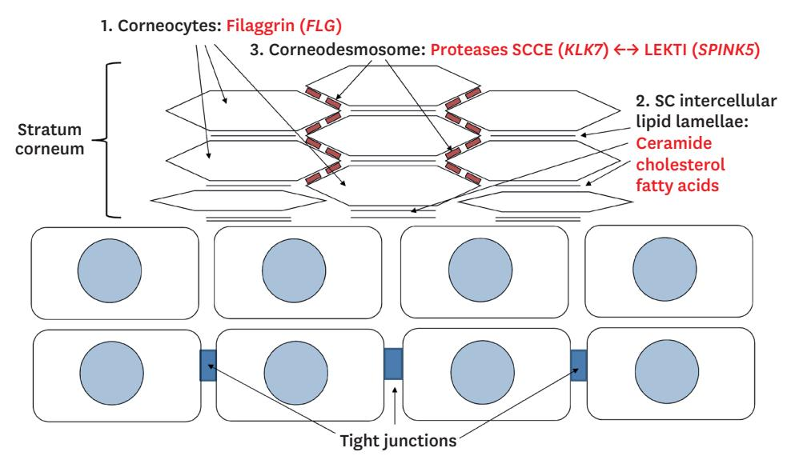
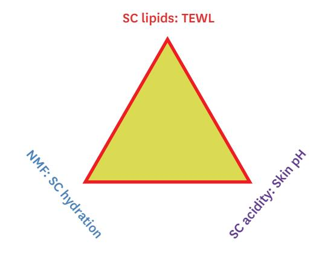
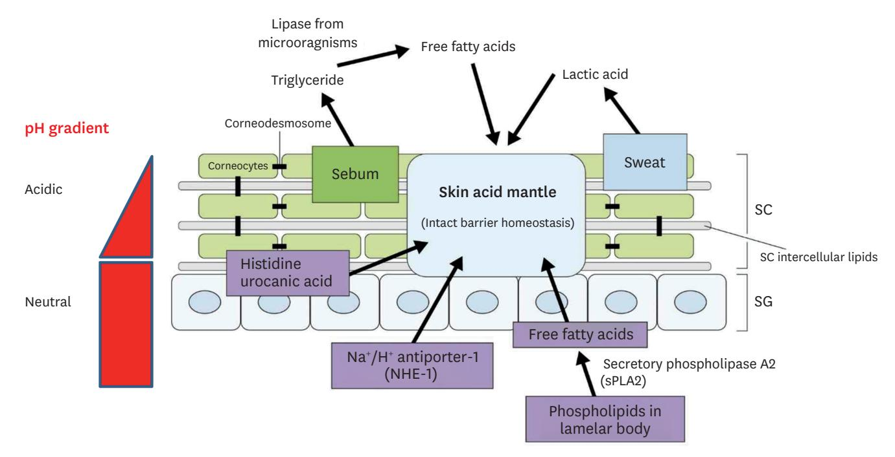
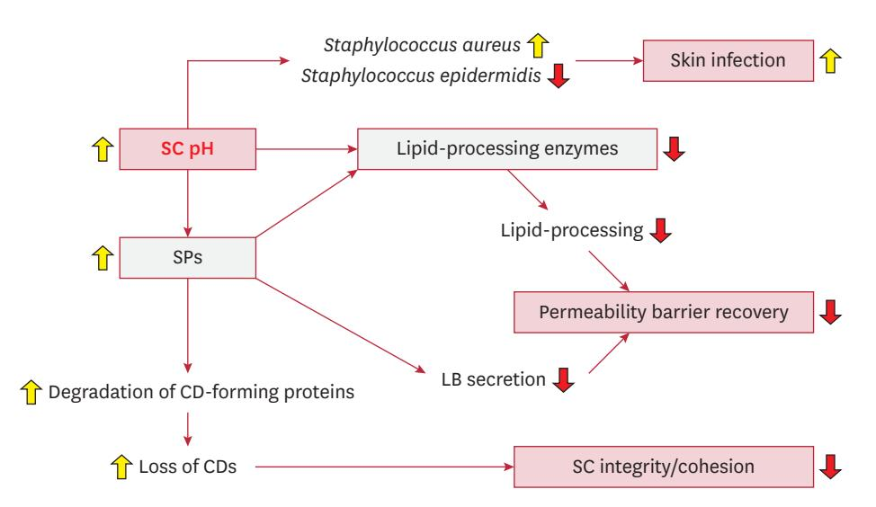
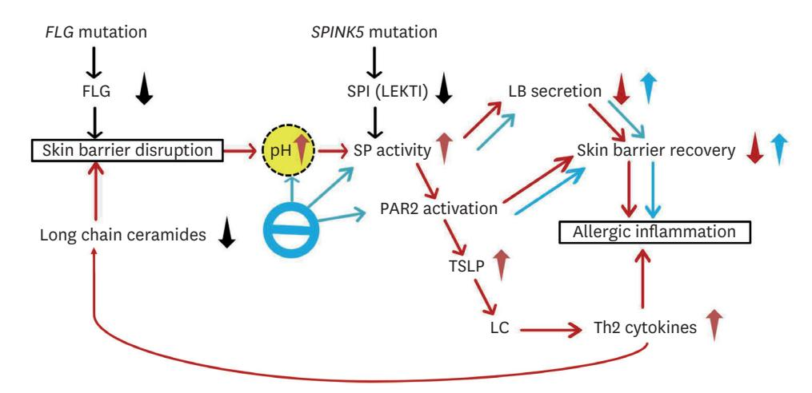
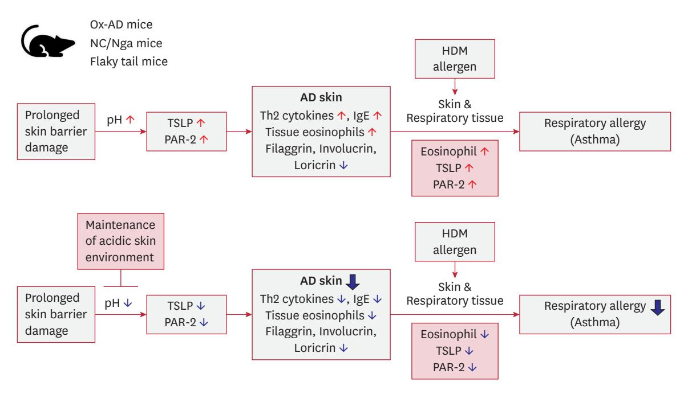

# Review Article

# **Importance of Stratum Corneum Acidification to Restore Skin Barrier Function in Eczematous Diseases**

**Received:** Aug 7, 2023 **Revised:** Sep 18, 2023 **Accepted:** Oct 5, 2023 **Published online:** Dec 20, 2023

#### **Corresponding Author:**

Email: choieh@yonsei.ac.kr

#### Eung Ho Choi

Department of Dermatology, Yonsei University Wonju College of Medicine, 20 Ilsan-ro, Wonju 26426, Korea.

© 2024 The Korean Dermatological Association and The Korean Society for Investigative Dermatology This is an Open Access article distributed under the terms of the Creative Commons Attribution Non-Commercial License [\(https://](https://creativecommons.org/licenses/by-nc/4.0/)

[creativecommons.org/licenses/by-nc/4.0/](https://creativecommons.org/licenses/by-nc/4.0/)) which permits unrestricted non-commercial use, distribution, and reproduction in any medium, provided the original work is properly cited.

**Eung Ho Choi [,](https://orcid.org/0000-0002-0148-5594) Hyun Kang**

Department of Dermatology, Yonsei University Wonju College of Medicine, Wonju, Korea

# **ABSTRACT**

Skin barrier function relies on three essential components: stratum corneum (SC) lipids, natural moisturizing factors (NMFs), and the acidic pH of the SC surface. Three endogenous pathways contribute to acidity: free fatty acids from phospholipids, trans-urocanic acid from filaggrin (FLG), and the sodium-proton antiporter (NHE1) activity. An acidic SC environment boosts the activity of enzymes to produce ceramides, which are vital for skin health. Conversely, an elevated pH can lead to increased skin infections, reduced lipid-processing enzyme activity, impaired permeability barrier recovery, and compromised integrity and cohesion of the SC due to increased serine protease (SP) activity. Elevated SC pH is observed in neonatal, aged, and inflamed skin. In atopic dermatitis (AD), it results from decreased NMF due to reduced FLG degradation, decreased fatty acids from reduced lamellar body secretion, and reduced lactic acid due to decreased sweating. Moreover, the imbalance between SP and SP inhibitors disrupts barrier homeostasis. However, acidifying the SC can help restore balance and reduce SP activity. Acidic water bathing has been found to be safe and effective for AD. In three different AD murine models, SC acidification prevented the progression of AD to respiratory allergies. In aging skin, a decrease in NHE1 leads to an increased skin pH. Mild acidic skin care products or moisturizers containing NHE1 activators can normalize skin pH and improve barrier function. In conclusion, maintaining the acidity of the SC is crucial for healthy skin barrier function, leading to significant benefits for various skin conditions, such as AD and aging-related skin issues.

**Keywords:** Skin aging; Atopic dermatitis; Sodium-proton antiporter; Staratum corneum; Epidermal barrier

# **STRATUM CORNEUM (SC) ACIDITY IS IMPORTANT FOR HEALTHY SKIN BARRIER FUNCTION**

The skin is the body's largest organ and serves as a crucial barrier between the internal organs and the external environment. The skin barrier is composed of SC and tight junction[1](#page-6-0) . The SC, the outermost layer of the skin, is responsible for maintaining the integrity of this barrier. In the SC, corneocytes, SC intercellular lipid lamellae, and corneodesmosomes are the major components of the skin barrier[2](#page-6-1) (**[Fig. 1](#page-1-0)**).

### **Three key components to regulate skin barrier function**

SC lipids include ceramides, cholesterol, and free fatty acid[s3](#page-6-2) . Their main function is to prevent transepidermal water loss (TEWL) by forming a protective barrier that keeps moisture in the skin[4](#page-6-3) . When the lipid barrier is disrupted, either through external

https://anndermatol.org 1

**Fig. 1.** Skin barrier is composed of SC and tight junction. In the SC, corneocytes, SC intercellular lipid lamellae, and corneodesmosomes are the major components of the skin barrier. Filaggrin is the main protein in the corneocyte. Ceramide is the most abundant lipid in the SC. Proteases such as SCCE encoded by the KLK7 gene degrade the corneodesmosomes. Serine protease inhibitors such as LEKTI encoded by SPINK5 inhibit the protease activity. All of these are related to SC pH. SC: stratum corneum, SCCE: stratum corneum chymotryptic enzyme, KLK7: kallikrein 7, LEKTI: Lympho-epithelial Kazal-type-related inhibitor, SPINK5: serine protease inhibitor Kazal-type 5.

factors such as harsh soaps or internal factors such as genetics, TEWL increases, and the skin can become dry and irritated. Natural moisturizing factors (NMFs) are substances naturally found in the skin that help to maintain its hydration levels[5](#page-6-4) . They include amino acids, lactate, and urea, among others. NMFs attract water molecules to the skin's surface, binding with lipids to create a barrier that helps prevent TEWL[6](#page-6-5) . When the levels of NMFs are low, the skin can become dehydrated, leading to dryness, flakiness, and even skin barrier dysfunction. The SC has an acidic pH, typically ranging from 4.5 to 5.[57](#page-6-6) . This acidity is essential for maintaining healthy skin barrier function in several ways. First, it helps to create an environment that supports the growth of beneficial microorganisms while inhibiting the growth of harmful ones[8](#page-6-7),[9](#page-6-8) . Second, it contributes to the overall integrity of the skin barrier by regulating the activity of enzymes that break down SC proteins[2,](#page-6-1)[10](#page-6-9),[11.](#page-6-10) Third, it helps to maintain the hydration of the skin by regulating the activity of enzymes involved in the synthesis of NMF[s12,](#page-6-11)[13](#page-6-12).

Hence, the skin barrier function relies on a delicate balance of lipids, NMFs, and acidity. Any disruption of these elements can lead to its dysfunction, resulting in dryness, irritation, and various other skin conditions. Thus, preserving a healthy skin barrier necessitates proper care and attention to each of these components (**[Fig. 2](#page-1-1)**). The common findings associated with skin barrier defects include elevated skin pH, as well as other findings such as increased basal TEWL, reduced SC integrity, decreased SC hydration, and elevated serine protease (SP) activity. All of the other findings are related to skin pH.

### **Factors influencing skin surface pH**

Several factors contribute to the skin surface pH. Both intrinsic and extrinsic factors influence the skin surface pH[14](#page-6-13)[-16](#page-6-14). Intrinsic factors are genetics, age, gender, skin hydration, sweating, sebum secretion, pigmentation, body site, and diabetic conditions. A study revealed time-dependent fluctuations in skin pH, showing a correlation with circadian rhythms. The highest pH levels were observed around noon, and the lowest pH levels were recorded around midnigh[t17.](#page-6-15) Extrinsic factors are skin care products, cosmetics, climate, skin irritants, and skin microflora. Maintaining an acidic pH in the SC is important for establishing a healthy skin

**Fig. 2.** For healthy skin barrier function, 3 components must be maintained properly. They are SC lipids for normal TEWL, NMFs for SC hydration, and acidic SC for skin surface pH.

SC: stratum corneum, TEWL: transepidermal water loss, NMF: natural moisturizing factor.

barrier. The SC exhibits a pH gradient, with a decrease in pH as it gets closer to the surface[18](#page-6-16). To maintain the acid mantle of the SC, sebum-derived free fatty acids and sweat-derived lactic acid are also important as well as 3 endogenous pathways[19.](#page-6-17) Three endogenous pathways have been identified as contributing to the acidic pH of the SC: 1) the non-energy-dependent Na+ /H+ antiporter, NHE1, 2) the generation of free fatty acids from phospholipids by secretory phospholipase A2, 3) the generation of urocanic acid from histidine by histidas[e20](#page-6-18). Deterioration of any of these pathways leads to an elevation in SC pH, which is linked to the alteration of permeability barrier homeostasis and SC integrity/ cohesion (**[Fig. 3](#page-2-0)**). The NHE1 is an ion transporter found in the SC-SG interface that pumps protons out of the cells, contributing to SC acidity[19](#page-6-17)[,21](#page-6-19),[22](#page-6-20). This transporter is activated by various factors, including hydration and cytokines. When NHE1 activity is disrupted, either through genetic mutations or environmental factors, the pH of the SC can become elevated, leading to skin barrier dysfunction. Phospholipids are a major component of the epidermis, and they contain esterified fatty acids. When these phospholipids are hydrolyzed by phospholipase A2, free fatty acids are released, contributing to SC acidit[y23](#page-6-21). These free fatty acids also have other functions, including acting as antimicrobial agents and helping to maintain the permeability barrier. Trans-urocanic acid is a breakdown product of filaggrin (FLG), a protein found in the epidermis. It is converted from its trans form to its cis form by exposure to UV radiation, and this conversion contributes to SC acidity. Trans-urocanic acid also has immunomodulatory properties, helping to regulate the immune response in the ski[n24](#page-7-0).

### **Role of acidic skin surface pH for skin homeostasis**

The skin surface exhibits a pH ranging from 4.5 to 5.5, whereas the pH of the living epidermis is approximately 7.4[25.](#page-7-1) The disparity of 2–3 pH units between the living epidermis and the skin surface called the pH gradient presents the proton concentration gradient over a remarkably short distance of 15–20 μm. This acidic pH of the skin surface, along with the existing pH gradient, has been demonstrated to play a crucial role in various processes associated with the synthesis and maintenance of the skin barrie[r26](#page-7-2)[,27.](#page-7-3) Maintaining SC acidity contributes to the elevation of the activity of ceramide-generating enzymes, such as β-glucocerebrosidase, phospholipase A2, and acid sphingomyelinase, thereby increasing the levels of ceramides between corneocytes and ultimately creating a healthy skin barrie[r28.](#page-7-4)

The acidic pH of the skin surface plays a pivotal role in maintaining a balanced and healthy skin microbiome. An elevated pH

**Fig. 3.** Maintaining an acidic pH in the SC is important for establishing a healthy skin barrier. The SC exhibits a pH gradient, with a decrease in pH as it gets closer to the surface. To maintain the acid mantle of the SC, sebum-derived free fatty acids and sweat-derived lactic acid are also important as well as 3 endogenous pathways. Three endogenous pathways include 1) the non-energy-dependent Na+ /H+ antiporter, NHE1, 2) the generation of free fatty acids from phospholipids by sPLA2, 3) the generation of urocanic acid from histidine by histidase. Deterioration of any of these pathways leads to an elevation in SC pH, which is linked to the alteration of permeability barrier homeostasis and SC integrity/cohesion. SC: stratum corneum, sPLA2: secretory phospholipase A2, SG: stratum granulosum.

level encourages the growth of harmful bacteria, while a mildly acidic pH of around 5 supports the growth of beneficial microorganisms like *Staphylococcus epidermidis*, which is essential for skin health. On the other hand, it inhibits the growth of potentially harmful bacteria such as *Staphylococcus aureus*, *Escherichia*, and *Pseudomonas* spp[8](#page-6-7) . Changes in the skin microbiome balance have been observed in various skin disorders[29](#page-7-5),[30.](#page-7-6) In the context of atopic dermatitis (AD), there is a significant association with increased bacterial colonization and heightened susceptibility to *S. aureus* infections. During AD flares, temporal shifts in the skin microbiome occur, with a noticeable increase in *S. aureus* levels compared to baseline or post-treatment periods. Research has also demonstrated that the application of acidic water leads to a reduction in *S. aureus* levels in atopic skin lesions[8,](#page-6-7)[29](#page-7-5)[-34.](#page-7-7)

### **Functional consequences of elevated pH of SC**

Elevated pH of SC not only inactivates lipid-processing enzymes but also elevates the activity of SPs (**[Fig. 4](#page-3-0)**). Increased SPs directly decrease lipid-processing enzymes, degrade corneodesmosome-forming proteins, and inhibit the secretion of the lamellar body (LB). Therefore, the functional consequences are 1) increasing the risk of skin infections by allowing the growth of harmful microorganisms, 2) delayed barrier recovery, and 3) reduced SC integrity/cohesion. Representative skin conditions associated with an increase in the pH of the SC are neonatal skin, aged skin, and inflamed skin such as AD. Therefore, the reversal of pH abnormality may be a possible preventive or therapeutic strategy for these problems.

# **BARRIER FUNCTION DISRUPTED IN ECZEMA LESIONS COULD BE RESTORED WITH SC ACIDIFICATION**

Given the interdependence of skin surface pH and barrier homeostasis, it is unsurprising to find perturbations in skin surface pH in various skin disorders, including AD, irritant contact dermatiti[s35,](#page-7-8) and diaper dermatiti[s36.](#page-7-9) AD is the most prevalent and extensively studied form of dermatitis. Skin barrier dysfunction is regarded as the initial stage in the pathogenesis of AD symptoms[37](#page-7-10),[38.](#page-7-11) Numerous studies have demonstrated that patients affected by AD exhibit elevated skin surface pH, and this increase correlates with the severity of the symptoms. It is crucial to emphasize that the elevated skin surface pH in AD can play a significant role in the progression of AD pathology. In patients with AD, the pH of the SC increases in eczema lesions. This can be attributed to several factors, including a decrease in pyrrolidone carboxylic acid and urocanic acid as degradation products of FLG[39,](#page-7-12) reduced lactic acid levels due to decreased sweating[40](#page-7-13), and decreased fatty acid content resulting from reduced secretion of LB[41.](#page-7-14)

## **Elevated SC pH: a comprehensive therapeutic target to offset three paths of AD pathology**

The imbalance of SP/SP inhibitor (SPI) in the skin barrier homeostasis are observed in the patients with AD. Many AD patients are known to have genetic mutations associated with skin barrier defects. AD patients with mutations in the FLG gene exhibit an

**Fig. 4.** The functional consequences of elevated pH of SC. Elevated pH of the SC not only inactivates lipid-processing enzymes but also elevates the activity of SP. Increased SPs directly decrease lipid-processing enzymes, degrade CD-forming proteins, and inhibit the secretion of LB. Therefore, the functional consequences are 1) negative effects on the skin microbiota, 2) delayed barrier recovery, and 3) reduced SC integrity/cohesion. SC: stratum corneum, SP: serine protease, LB: lamellar body, CD: corneodesmosome.

**Fig. 5.** The imbalance between SP and SPI in the skin barrier homeostasis is observed in the patients with AD (modified from Choi and Yoo[n42\)](#page-7-15). Many AD patients are known to have genetic mutations associated with skin barrier defects. AD patients with mutations in the FLG gene exhibit an elevated pH in the skin due to barrier disruption and filaggrin deficiency. On the other hand, AD patients with mutations in the SPINK5 gene experience uncontrolled activity of SPs following the pH elevation. The uncontrolled SP activity subsequently activates PAR-2, leading to the increased production of TSLP. This, in turn, activates LCs and further stimulates Th2 lymphocytes, resulting in the development of allergic inflammation. Therefore, these 3 points in this pathway could become therapeutic targets. As shown in this figure, lowering the SC pH can potentially correct the subsequent pathways. SP: serine proteinase, SPI: serine proteinase inhibitor, AD: atopic dermatitis, FLG: filaggrin, SPINK5: serine peptidase inhibitor Kazal type 5, PAR-2: proteaseactivated receptor-2, TSLP: thymic stromal lymphopoietin, LC: Langerhans cell, LEKTI: Lympho-epithelial Kazal-type-related inhibitor, LB: lamellar body.

elevated pH in the skin due to barrier disruption and FLG deficiency. On the other hand, AD patients with mutations in the SPI Kazal type 5 gene experience uncontrolled activity of SPs following the pH elevation. The uncontrolled SP activity subsequently activates protease-activated receptor-2 (PAR-2), leading to the increased production of thymic stromal lymphopoietin (TSLP). This, in turn, activates Langerhans cells and further stimulates Th2 lymphocytes, resulting in the development of allergic inflammatio[n42.](#page-7-15) Therefore, these three points in this pathway could become therapeutic targets. As shown in this figure, lowering the SC pH can potentially correct the subsequent pathways (**[Fig. 5](#page-4-0)**).

### **Experiments utilizing SC acidification as AD treatment**

In Japan, bathing in acidic hot springs (with a pH around 2.5) located near a dormant volcano is known to be effective for severe or refractory AD. Acidic water has been known to exhibit antibacterial effects against *S. aureus*, which is commonly found in high density on the eczematous skin of individuals with A[D43.](#page-7-16) Seventy patients repeatedly took a 10-minute 42°C acidic hotspring bath twice daily. The skin symptoms were improved in 76% of cases. Everyday bathing in an acidic hot spring can be challenging. Another research group in Japan has developed a new therapeutic strategy for AD[44.](#page-7-17) They sprayed acid electrolytic water twice a day for a week. During the study, they observed that the improvement in AD symptoms could be attributed to a reduction in *S. aureus* colonization in the affected skin lesions. In a study using an AD mouse model, it was confirmed that maintaining the acidity of the SC restored skin barrier function and increased hydration, thus preventing the emergence of A[D45](#page-7-18).

We also conducted an intriguing vinegar study. Vinegar is a fermented acid originating from fruits and herbs homemade by the traditional method and contains various acetic acids, amino acids, and many herbal contents. Vinegar has been traditionally used in Korean folk medicine to treat various dermatological conditions, including eczema and tinea pedis. In order to determine whether the therapeutic effect of vinegar is due to its source materials rather than its acidity, we conducted an animal experiment using oxazolone-induced atopic dermatitis (Ox-AD) mic[e46.](#page-7-19) In our study, we divided Ox-AD mice into 5 groups, and each group was treated with creams of different acidity levels; 1) vehicle cream alone (pH 5.5), 2) neutralized vinegar cream (pH 7.4), 3) pH 3.5 vinegar cream, 4) pH 5.0 vinegar cream, and 5) pH 3.5 hydrogen chloride cream. Simultaneously, the mice were subjected to Ox challenges. After treatment for three weeks, we assessed eczema scores, TEWL, and SC hydration. We found that AD mice treated with acidic creams had significantly lower eczema scores compared to the groups given only vehicle and neutral cream. Also, they had significantly decreased basal TEWL and increased SC hydration compared to only vehicle or neutral cream-treated group. In conclusion, our findings indicate that the acidity itself, rather than the specific content of fermented herbs, plays a crucial role in restoring skin barrier function and preventing eczema.

Our second experiment aimed to determine whether the same effects could be observed in patients with AD. We assessed the impact of bathing in artificial acid water, prepared using citric acid, on individuals with AD. The participants bathed in the acidic water for 40 minutes, twice a day, over a duration of two days. We compared the results with those obtained from wet

Fig. 6. Maintaining an acidic environment on the SC inhibits the atopic march pathway. Three kinds of AD murine models (Ox-AD, NC/Nga, and Flaky tail mice) allowed us to observe the progression of respiratory allergies following exposure to the HDM antigen. The maintenance of a neutral skin environment exacerbates the progression of AD to respiratory allergies (the atopic march). Application of HDM antigen to the AD-like skin lesions and respiratory system of the mice resulted in the development of respiratory allergies. This was evidenced by the presence of airway eosinophilia and increased expression of PAR-2 and TSLP in the lung tissue, which are indicative of allergic inflammation and sensitization. This suggests that promoting an acidic environment on the skin might serve as a novel intervention method to impede the progression of AD to respiratory allergies, thereby inhibiting the atopic march. SC: stratum corneum, AD: atopic dermatitis, HDM: house dust mite, PAR-2: protease-activated receptor-2, TSLP: thymic stromal lymphopoietin, Ox-AD: oxazolone-induced atopic dermatitis, IgE: immunoglobulin E.

wrap occlusive dressing, a well-established and highly effective therapy for severe or refractory AD patients. All enrolled patients had refractory AD that required long-term maintenance with cyclosporine to control their atopic eczema. Eight patients (positive control group) were treated with wet-wrap dressing and ten patients (treatment group) were treated with acidic water bathing. There was no statistical difference in the initial Eczema Area and Severity Index (EASI) score between the two treated groups. The improvement of the score of AD was indicated by delta EASI (delta EASI = EASI score at pre-treatment EASI sscore at post-treatment). It showed that the patient group treated with acidic water bathing had no significant difference compared to the group treated with wet-wrap dressing. Improvement of skin barrier functions was indicated by delta TEWL and delta SC hydration. They showed that the acidic water bathing treated group showed no significant difference compared to the wet-wrap dressing group in both normal skin and skin lesions47.

Based on the previous studies, our hypothesis was that maintaining an acidic pH in the SC could potentially impede the progression of the atopic march, preventing the transition from AD to respiratory allergies. Our studies used three kinds of AD murine models: Oxazolone-AD, NC/Nga, and Flaky tail mice48-50. These models allowed us to observe the progression

of respiratory allergies following exposure to the house dust mite (HDM) antigen. Application of HDM antigen to the AD-like skin lesions and respiratory system of the mice resulted in the development of respiratory allergies. This was evidenced by the presence of airway eosinophilia and increased expression of PAR-2 and TSLP in the lung tissue, which are indicative of allergic inflammation and sensitization. The maintenance of a neutral skin environment exacerbates the progression of AD to respiratory allergies (the atopic march). Our study revealed that maintaining an acidic environment on the SC blocked this pathway. This suggests that promoting an acidic environment on the skin might serve as a novel intervention method to impede the progression of AD to respiratory allergies, thereby inhibiting the atopic march (**Fig. 6**).

#### SC acidification needed for senile xerosis in elderly

Aged skin also showed elevated skin surface pH. In the epidermis of moderately aged mice, there was a decrease in NHE1 expression compared to younger mice21. Two papers published in Europe strongly recommend the application of acidic moisturizer for the elderly. Skin care products for the elderly have to be adjusted in the pH range of 3.5 to 4.0. Application of a pH 4 emulsion can improve the epidermal barrier as well as the SC organization

in aged skin[51](#page-7-23)[,52.](#page-7-24) We investigated whether *Melissa officinalis*, a known NHE1 activator, can lower skin pH and restore skin barrier function. Rosmarinic acid is the most predominant compound of *M. officinalis*. In immunofluorescence staining of 3D-cultured skin study, NHE1 expression was found to be proportional to the rosmarinic acid concentration, and the duration of rosmarinic cream applicatio[n53](#page-7-25).

# **CONCLUSION**

The key points discussed in this review are as follows: 1) Maintaining the acidity of the SC is crucial for preserving a healthy skin barrier function. 2) Reversal of pH abnormality can be a possible therapeutic strategy for AD and senile xerotic eczema in aged skin. 3) Acidification of the SC has shown promise in preventing the progression of AD to respiratory allergies in murine models. From previous works, our next question will be whether we effectively impede the progression of the atopic march in humans by implementing therapeutic interventions that maintain SC acidity in newborns prone to atopy.

#### **ORCID iDs**

Eung Ho Choi <https://orcid.org/0000-0002-0148-5594> Hyun Kang <https://orcid.org/0000-0003-4885-9503>

#### **FUNDING SOURCE**

None.

### **CONFLICTS OF INTEREST**

The authors have nothing to disclose.

#### **DATA SHARING STATEMENT**

No datasets were generated or analyzed during the current paper.

# **REFERENCES**

- [1.](#page-0-0) Yuki T, Komiya A, Kusaka A, Kuze T, Sugiyama Y, Inoue S. Impaired tight junctions obstruct stratum corneum formation by altering polar lipid and profilaggrin processing. J Dermatol Sci 2013;69:148-158. **[PUBMED](http://www.ncbi.nlm.nih.gov/pubmed/23273645) | [CROSSREF](https://doi.org/10.1016/j.jdermsci.2012.11.595)**
- [2.](#page-1-2) Choi EH. Aging of the skin barrier. Clin Dermatol 2019;37:336-345. **[PUBMED](http://www.ncbi.nlm.nih.gov/pubmed/31345321) | [CROSSREF](https://doi.org/10.1016/j.clindermatol.2019.04.009)**
- [3.](#page-0-1) Weerheim A, Ponec M. Determination of stratum corneum lipid profile by tape stripping in combination with high-performance thin-layer chromatography. Arch Dermatol Res 2001;293:191-199. **[PUBMED](http://www.ncbi.nlm.nih.gov/pubmed/11380152) | [CROSSREF](https://doi.org/10.1007/s004030100212)**
- [4.](#page-0-2) Grubauer G, Elias PM, Feingold KR. Transepidermal water loss: the signal for recovery of barrier structure and function. J Lipid Res 1989;30:323-333. **[PUBMED](http://www.ncbi.nlm.nih.gov/pubmed/2723540) | [CROSSREF](https://doi.org/10.1016/S0022-2275(20)38361-9)**

- [5.](#page-1-3) White-Chu EF, Reddy M. Dry skin in the elderly: complexities of a common problem. Clin Dermatol 2011;29:37-42. **[PUBMED](http://www.ncbi.nlm.nih.gov/pubmed/21146730) | [CROSSREF](https://doi.org/10.1016/j.clindermatol.2010.07.005)**
- [6.](#page-1-4) Lodén M. Role of topical emollients and moisturizers in the treatment of dry skin barrier disorders. Am J Clin Dermatol 2003;4:771-788. **[PUBMED](http://www.ncbi.nlm.nih.gov/pubmed/14572299) | [CROSSREF](https://doi.org/10.2165/00128071-200304110-00005)**
- [7.](#page-1-5) Ali SM, Yosipovitch G. Skin pH: from basic science to basic skin care. Acta Derm Venereol 2013;93:261-267. **[PUBMED](http://www.ncbi.nlm.nih.gov/pubmed/23322028) | [CROSSREF](https://doi.org/10.2340/00015555-1531)**
- [8.](#page-3-1) Lambers H, Piessens S, Bloem A, Pronk H, Finkel P. Natural skin surface pH is on average below 5, which is beneficial for its resident flora. Int J Cosmet Sci 2006;28:359-370. **[PUBMED](http://www.ncbi.nlm.nih.gov/pubmed/18489300) | [CROSSREF](https://doi.org/10.1111/j.1467-2494.2006.00344.x)**
- [9.](#page-1-6) Percival SL, McCarty S, Hunt JA, Woods EJ. The effects of pH on wound healing, biofilms, and antimicrobial efficacy. Wound Repair Regen 2014;22:174-186. **[PUBMED](http://www.ncbi.nlm.nih.gov/pubmed/24611980) | [CROSSREF](https://doi.org/10.1111/wrr.12125)**
- [10.](#page-1-7) Hachem JP, Crumrine D, Fluhr J, Brown BE, Feingold KR, Elias PM. pH directly regulates epidermal permeability barrier homeostasis, and stratum corneum integrity/cohesion. J Invest Dermatol 2003;121:345-353. **[PUBMED](http://www.ncbi.nlm.nih.gov/pubmed/12880427) | [CROSSREF](https://doi.org/10.1046/j.1523-1747.2003.12365.x)**
- [11.](#page-1-8) Harding CR. The stratum corneum: structure and function in health and disease. Dermatol Ther 2004;17 Suppl 1:6-15. **[PUBMED](http://www.ncbi.nlm.nih.gov/pubmed/14728694) | [CROSSREF](https://doi.org/10.1111/j.1396-0296.2004.04S1001.x)**
- [12.](#page-1-9) Rosso JD, Zeichner J, Alexis A, Cohen D, Berson D. Understanding the epidermal barrier in healthy and compromised skin: clinically relevant information for the dermatology practitioner: proceedings of an expert panel roundtable meeting. J Clin Aesthet Dermatol 2016;9:S2-S8. **[PUBMED](http://www.ncbi.nlm.nih.gov/pubmed/28936279)**
- [13.](#page-1-10) Harding CR, Watkinson A, Rawlings AV, Scott IR. Dry skin, moisturization and corneodesmolysis. Int J Cosmet Sci 2000;22:21-52. **[PUBMED](http://www.ncbi.nlm.nih.gov/pubmed/18503460) | [CROSSREF](https://doi.org/10.1046/j.1467-2494.2000.00001.x)**
- [14.](#page-1-11) Farage MA, Hood W, Berardesca E, Maibach H. Intrinsic and extrinsic factors affecting skin surface pH. Curr Probl Dermatol 2018;54:33-47. **[PUBMED](http://www.ncbi.nlm.nih.gov/pubmed/30130773) | [CROSSREF](https://doi.org/10.1159/000489516)**
- 15. Gethin G. The significance of surface pH in chronic wounds. Wounds UK 2007;3:52-56.
- [16.](#page-1-12) Lukić M, Pantelić I, Savić SD. Towards optimal pH of the skin and topical formulations: from the current state of the art to tailored products. Cosmetics 2021;8:69. **[CROSSREF](https://doi.org/10.3390/cosmetics8030069)**
- [17.](#page-1-13) Yosipovitch G, Xiong GL, Haus E, Sackett-Lundeen L, Ashkenazi I, Maibach HI. Time-dependent variations of the skin barrier function in humans: transepidermal water loss, stratum corneum hydration, skin surface pH, and skin temperature. J Invest Dermatol 1998;110:20-23. **[PUBMED](http://www.ncbi.nlm.nih.gov/pubmed/9424081) | [CROSSREF](https://doi.org/10.1046/j.1523-1747.1998.00069.x)**
- [18.](#page-2-1) Behne MJ, Barry NP, Hanson KM, Aronchik I, Clegg RW, Gratton E, et al. Neonatal development of the stratum corneum pH gradient: localization and mechanisms leading to emergence of optimal barrier function. J Invest Dermatol 2003;120:998-1006. **[PUBMED](http://www.ncbi.nlm.nih.gov/pubmed/12787127) | [CROSSREF](https://doi.org/10.1038/jid.2003.11)**
- [19.](#page-2-2) Fluhr JW, Elias PM. Stratum corneum pH: formation and function of the 'acid mantle'. Exogenous Dermatol 2002;1:163-175. **[CROSSREF](https://doi.org/10.1159/000066140)**
- [20.](#page-2-3) Mauro T. SC pH: measurement, origins, and functions, In: Elias PM, Feingold KR, editors. Skin barrier. New York: Taylor & Francis, 2006:223-230.
- [21.](#page-5-1) Choi EH, Man MQ, Xu P, Xin S, Liu Z, Crumrine DA, et al. Stratum corneum acidification is impaired in moderately aged human and murine skin. J Invest Dermatol 2007;127:2847-2856. **[PUBMED](http://www.ncbi.nlm.nih.gov/pubmed/17554364) | [CROSSREF](https://doi.org/10.1038/sj.jid.5700913)**
- [22.](#page-2-4) Xu W, Hong SJ, Zeitchek M, Cooper G, Jia S, Xie P, et al. Hydration status regulates sodium flux and inflammatory pathways through epithelial sodium channel (ENaC) in the skin. J Invest Dermatol 2015;135:796-806. **[PUBMED](http://www.ncbi.nlm.nih.gov/pubmed/25371970) | [CROSSREF](https://doi.org/10.1038/jid.2014.477)**
- [23.](#page-2-5) Fluhr JW, Behne MJ, Brown BE, Moskowitz DG, Selden C, Mao-Qiang M, et al. Stratum corneum acidification in neonatal skin: secretory phospholipase A2 and the sodium/hydrogen antiporter-1 acidify neonatal rat stratum corneum. J Invest Dermatol 2004;122:320-329. **[PUBMED](http://www.ncbi.nlm.nih.gov/pubmed/15009712) | [CROSSREF](https://doi.org/10.1046/j.0022-202X.2003.00204.x)**

- [24.](#page-2-6) Hart PH, Norval M. The multiple roles of urocanic acid in health and disease. J Invest Dermatol 2021;141:496-502. **[PUBMED](http://www.ncbi.nlm.nih.gov/pubmed/32919759) | [CROSSREF](https://doi.org/10.1016/j.jid.2020.07.017)**
- [25.](#page-2-7) Zlotogorski A. Distribution of skin surface pH on the forehead and cheek of adults. Arch Dermatol Res 1987;279:398-401. **[PUBMED](http://www.ncbi.nlm.nih.gov/pubmed/3674963) | [CROSSREF](https://doi.org/10.1007/BF00412626)**
- [26.](#page-2-8) Öhman H, Vahlquist A. The pH gradient over the stratum corneum differs in X-linked recessive and autosomal dominant ichthyosis: a clue to the molecular origin of the "acid skin mantle"? J Invest Dermatol 1998;111:674-677. **[PUBMED](http://www.ncbi.nlm.nih.gov/pubmed/9764852) | [CROSSREF](https://doi.org/10.1046/j.1523-1747.1998.00356.x)**
- [27.](#page-2-9) Elias PM. Stratum corneum acidification: how and why? Exp Dermatol 2015;24:179-180. **[PUBMED](http://www.ncbi.nlm.nih.gov/pubmed/25406867) | [CROSSREF](https://doi.org/10.1111/exd.12596)**
- [28.](#page-2-10) Holleran WM, Takagi Y, Imokawa G, Jackson S, Lee JM, Elias PM. β-glucocerebrosidase activity in murine epidermis: characterization and localization in relation to differentiation. J Lipid Res 1992;33:1201-1209. **[PUBMED](http://www.ncbi.nlm.nih.gov/pubmed/1431599) | [CROSSREF](https://doi.org/10.1016/S0022-2275(20)40772-2)**
- [29.](#page-3-2) Schommer NN, Gallo RL. Structure and function of the human skin microbiome. Trends Microbiol 2013;21:660-668. **[PUBMED](http://www.ncbi.nlm.nih.gov/pubmed/24238601) | [CROSSREF](https://doi.org/10.1016/j.tim.2013.10.001)**
- [30.](#page-3-3) Hachem JP, Roelandt T, Schürer N, Pu X, Fluhr J, Giddelo C, et al. Acute acidification of stratum corneum membrane domains using polyhydroxyl acids improves lipid processing and inhibits degradation of corneodesmosomes. J Invest Dermatol 2010;130:500-510. **[PUBMED](http://www.ncbi.nlm.nih.gov/pubmed/19741713) | [CROSSREF](https://doi.org/10.1038/jid.2009.249)**
- 31. Miajlovic H, Fallon PG, Irvine AD, Foster TJ. Effect of filaggrin breakdown products on growth of and protein expression by *Staphylococcus aureus*. J Allergy Clin Immunol 2010;126:1184-1190.e3. **[PUBMED](http://www.ncbi.nlm.nih.gov/pubmed/21036388) | [CROSSREF](https://doi.org/10.1016/j.jaci.2010.09.015)**
- 32. Kamisango K, Saiki I, Tanio Y, Okumura H, Araki Y, Sekikawa I, et al. Structures and biological activities of peptidoglycans of *Listeria monocytogenes* and *Propionibacterium acnes*. J Biochem 1982;92:23-33. **[PUBMED](http://www.ncbi.nlm.nih.gov/pubmed/6811573) | [CROSSREF](https://doi.org/10.1093/oxfordjournals.jbchem.a133918)**
- 33. Leung DY. New insights into atopic dermatitis: role of skin barrier and immune dysregulation. Allergol Int 2013;62:151-161. **[PUBMED](http://www.ncbi.nlm.nih.gov/pubmed/23712284) | [CROSSREF](https://doi.org/10.2332/allergolint.13-RAI-0564)**
- [34.](#page-3-4) Kong HH, Oh J, Deming C, Conlan S, Grice EA, Beatson MA, et al. Temporal shifts in the skin microbiome associated with disease flares and treatment in children with atopic dermatitis. Genome Res 2012;22:850-859. **[PUBMED](http://www.ncbi.nlm.nih.gov/pubmed/22310478) | [CROSSREF](https://doi.org/10.1101/gr.131029.111)**
- [35.](#page-3-5) Seidenari S, Francomano M, Mantovani L. Baseline biophysical parameters in subjects with sensitive skin. Contact Dermat 1998;38:311-315. **[PUBMED](http://www.ncbi.nlm.nih.gov/pubmed/9687028) | [CROSSREF](https://doi.org/10.1111/j.1600-0536.1998.tb05764.x)**
- [36.](#page-3-6) Adam R. Skin care of the diaper area. Pediatr Dermatol 2008;25:427- 433. **[PUBMED](http://www.ncbi.nlm.nih.gov/pubmed/18789081) | [CROSSREF](https://doi.org/10.1111/j.1525-1470.2008.00725.x)**
- [37.](#page-3-7) Dharmage SC, Lowe AJ, Matheson MC, Burgess JA, Allen KJ, Abramson MJ. Atopic dermatitis and the atopic march revisited. Allergy 2014;69:17- 27. **[PUBMED](http://www.ncbi.nlm.nih.gov/pubmed/24117677) | [CROSSREF](https://doi.org/10.1111/all.12268)**
- [38.](#page-3-8) Lowe AJ, Leung DY, Tang ML, Su JC, Allen KJ. The skin as a target for prevention of the atopic march. Ann Allergy Asthma Immunol 2018;120:145-151. **[PUBMED](http://www.ncbi.nlm.nih.gov/pubmed/29413338) | [CROSSREF](https://doi.org/10.1016/j.anai.2017.11.023)**
- [39.](#page-3-9) Jung M, Choi J, Lee SA, Kim H, Hwang J, Choi EH. Pyrrolidone carboxylic acid levels or caspase-14 expression in the corneocytes of lesional skin correlates with clinical severity, skin barrier function and lesional inflammation in atopic dermatitis. J Dermatol Sci 2014;76:231-239. **[PUBMED](http://www.ncbi.nlm.nih.gov/pubmed/25315296) | [CROSSREF](https://doi.org/10.1016/j.jdermsci.2014.09.004)**
- [40.](#page-3-10) Rippke F, Schreiner V, Doering T, Maibach HI. Stratum corneum pH in atopic dermatitis: impact on skin barrier function and colonization with *Staphylococcus aureus*. Am J Clin Dermatol 2004;5:217-223. **[PUBMED](http://www.ncbi.nlm.nih.gov/pubmed/15301569) | [CROSSREF](https://doi.org/10.2165/00128071-200405040-00002)**
- [41.](#page-3-11) Elias PM, Wakefield JS. Mechanisms of abnormal lamellar body secretion and the dysfunctional skin barrier in patients with atopic dermatitis. J Al-

- lergy Clin Immunol 2014;134:781-791.e1. **[PUBMED](http://www.ncbi.nlm.nih.gov/pubmed/25131691) | [CROSSREF](https://doi.org/10.1016/j.jaci.2014.05.048)**
- [42.](#page-4-1) Choi EH, Yoon NY. Pathogenesis of atopic dermatitis. J Korean Med Assoc 2014;57:218-225. **[CROSSREF](https://doi.org/10.5124/jkma.2014.57.3.218)**
- [43.](#page-4-2) Kubota K, Machida I, Tamura K, Take H, Kurabayashi H, Akiba T, et al. Treatment of refractory cases of atopic dermatitis with acidic hot-spring bathing. Acta Derm Venereol 1997;77:452-454. **[PUBMED](http://www.ncbi.nlm.nih.gov/pubmed/9394980) | [CROSSREF](https://doi.org/10.2340/0001555577452454)**
- [44.](#page-4-3) Sasai-Takedatsu M, Kojima T, Yamamoto A, Hattori K, Yoshijima S, Taniuchi S, et al. Reduction of *Staphylococcus aureus* in atopic skin lesions with acid electrolytic water--a new therapeutic strategy for atopic dermatitis. Allergy 1997;52:1012-1016. **[PUBMED](http://www.ncbi.nlm.nih.gov/pubmed/9360754) | [CROSSREF](https://doi.org/10.1111/j.1398-9995.1997.tb02423.x)**
- [45.](#page-4-4) Hatano Y, Man MQ, Uchida Y, Crumrine D, Scharschmidt TC, Kim EG, et al. Maintenance of an acidic stratum corneum prevents emergence of murine atopic dermatitis. J Invest Dermatol 2009;129:1824-1835. **[PUBMED](http://www.ncbi.nlm.nih.gov/pubmed/19177139) | [CROSSREF](https://doi.org/10.1038/jid.2008.444)**
- [46.](#page-4-5) Lee NR, Lee HJ, Yoon NY, Kim D, Jung M, Choi EH. Application of topical acids improves atopic dermatitis in murine model by enhancement of skin barrier functions regardless of the origin of acids. Ann Dermatol 2016;28:690-696. **[PUBMED](http://www.ncbi.nlm.nih.gov/pubmed/27904267) | [CROSSREF](https://doi.org/10.5021/ad.2016.28.6.690)**
- [47.](#page-5-2) Lee NR, Lee HJ, Yoon NY, Kim D, Jung M, Choi EH. Acidic water bathing could be a safe and effective therapeutic modality for severe and refractory atopic dermatitis. Ann Dermatol 2016;28:126-129. **[PUBMED](http://www.ncbi.nlm.nih.gov/pubmed/26848237) | [CROSSREF](https://doi.org/10.5021/ad.2016.28.1.126)**
- [48.](#page-5-3) Lee HJ, Yoon NY, Lee NR, Jung M, Kim DH, Choi EH. Topical acidic cream prevents the development of atopic dermatitis- and asthma-like lesions in murine model. Exp Dermatol 2014;23:736-741. **[PUBMED](http://www.ncbi.nlm.nih.gov/pubmed/25078153) | [CROSSREF](https://doi.org/10.1111/exd.12525)**
- 49. Lee HJ, Lee NR, Jung M, Kim DH, Choi EH. Atopic march from atopic dermatitis to asthma-like lesions in NC/Nga mice is accelerated or aggravated by neutralization of stratum corneum but partially inhibited by acidification. J Invest Dermatol 2015;135:3025-3033. **[PUBMED](http://www.ncbi.nlm.nih.gov/pubmed/26399697) | [CROSSREF](https://doi.org/10.1038/jid.2015.333)**
- [50.](#page-5-4) Lee HJ, Lee NR, Kim BK, Jung M, Kim DH, Moniaga CS, et al. Acidification of stratum corneum prevents the progression from atopic dermatitis to respiratory allergy. Exp Dermatol 2017;26:66-72. **[PUBMED](http://www.ncbi.nlm.nih.gov/pubmed/27376923) | [CROSSREF](https://doi.org/10.1111/exd.13144)**
- [51.](#page-6-22) Jürgen B, Rainer W, Nanna YS. Treatment of aged skin with a pH 4 skin care product normalizes increased skin surface pH and improves barrier function: results of a pilot study. J Cosmet Dermatol Sci Appl 2011;1:50-58. **[CROSSREF](https://doi.org/10.4236/jcdsa.2011.13009)**
- [52.](#page-6-23) Kilic A, Masur C, Reich H, Knie U, Dähnhardt D, Dähnhardt-Pfeiffer S, et al. Skin acidification with a water-in-oil emulsion (pH 4) restores disrupted epidermal barrier and improves structure of lipid lamellae in the elderly. J Dermatol 2019;46:457-465. **[PUBMED](http://www.ncbi.nlm.nih.gov/pubmed/31106905) | [CROSSREF](https://doi.org/10.1111/1346-8138.14891)**
- [53.](#page-6-24) Jung SW, Park GH, Kim E, Yoo KM, Kim HW, Lee JS, et al. Rosmarinic acid, as an NHE1 activator, decreases skin surface pH and improves the skin barrier function. Int J Mol Sci 2022;23:3910. **[PUBMED](http://www.ncbi.nlm.nih.gov/pubmed/35409270) | [CROSSREF](https://doi.org/10.3390/ijms23073910)**

Eung Ho Choi (M.D., Ph.D.) is a Professor in the Department of Dermatology at Yonsei University Wonju College of Medicine, Korea. From 2003 to 2005, he conducted skin barrier research at Professor Elias' laboratory at UCSF, USA. His research primarily focuses on the skin barrier and atopic dermatitis. He has held leadership roles, including the presidency of KSID and directorship of the Korean Skin Barrier Research Society. Currently, he serves as the president

of the Korean Atopic Dermatitis Association, and the editor of Experimental Dermatology.