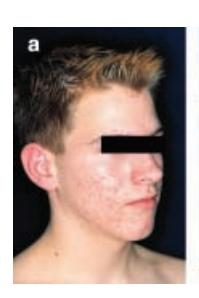
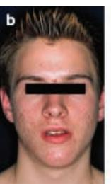
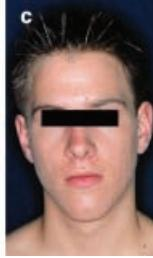

#### CASE REPORT

# Congenital adrenal hyperplasia and acne in male patients

K.DEGITZ, M.PLACZEK, B.ARNOLD, H.SCHMIDT\* AND G.PLEWIG

Department of Dermatology and \*Department of Paediatrics, Ludwig-Maximilian-University, München, Germany

Accepted for publication 19 November 2002

### **Summary**

Seborrhoea is one pathogenic factor for acne. Androgens induce sebum production, and excess androgen may provoke or aggravate acne. In women an androgen disorder is frequently suspected when acne is accompanied by hirsutism or menstrual irregularities. In men acne may be the only symptom of androgen excess. We report three male acne patients in whom hormonal screening revealed irregularities of androgen metabolism suggestive of late-onset congenital adrenal hyperplasia and who benefitted from low-dose glucocorticoids. Disorders of androgen metabolism may influence acne not only in women, but also in men, and these patients may benefit from low-dose glucocorticoid therapy.

Key words: acne vulgaris, congenital adrenal hyperplasia, hyperandrogenism

Acne is a very common skin disease affecting about one-third of persons aged 15–44 years. Seborrhoea is recognized as one pathogenic factor for acne. Sebum production is regulated by androgens, and androgen excess may provoke or aggravate acne in susceptible individuals. Excessive androgen production may, among other things, be due to androgen-producing tumours, polycystic ovarian syndrome, or congenital adrenal hyperplasia. In women, androgen-triggered acne is frequently accompanied by hirsutism or menstrual irregularities. However, in men, acne may be the only clinical sign of androgen excess. We here report three male acne patients in whom hormonal screening revealed irregularities in androgen metabolism and who benefitted from low-dose glucocorticoid therapy.

#### Methods

Three male acne patients were subjected to endocrinological investigations. Serum levels of gonadotrophins (luteinizing hormone, LH; follicle-stimulating hormone, FSH), testosterone, dehydroepiandrosterone sulphate, androstenedione, and 17-hydroxyprogesterone were determined using commercially available kits. Normal

Correspondence: Dr K.Degitz, Department of Dermatology, Ludwig-Maximilian-University, Frauenlobstrasse 9-11, D-80337 München, Germany.

E-mail: klaus.degitz@lrz.uni-muenchen.de

values were LH  $0.8-6.1 L^{-1}$ , FSH  $1.6-11.0 L^{-1}$ , testosterone  $3-10\,$  ng  $\,\mathrm{mL}^{-1}$ ; dehydroepiandrosterone sulphate  $80-300 \,\mu g \,dL^{-1}$ ; androstenedione  $44-264 \,ng \,dL^{-1}$ ; and 17-hydroxyprogesterone 36–298 ng dL-1. Blood samples were taken between 08.00 and 09.00 h to exclude intraday variations. Subjects were regarded to have a state of hyperandrogenism if elevated basal levels of testosterone, dehydroepiandrosterone sulphate, androstenedione, or 17-hydroxyprogesterone were recorded. An adrenocorticotrophic hormone (ACTH) stimulation test was performed in order to detect those patients with mild forms of congenital adrenal hyperplasia that present with normal basal adrenal steroids.4,5 Tetracosactid (25 IU) (hormonally active ACTH fragment, Synacthen®; Novartis, Nurnberg, Germany) was injected. After 60 min another blood sample was collected for the determination of stimulated 17-hydroxyprogesterone serum levels. The possibility of late-onset congenital adrenal hyperplasia was considered, if basal 17-hydroxyprogesterone serum levels were increased and/or ACTH-stimulated 17-hydroxyprogesterone was >260 ng dL-1 above the basal level.

#### Case reports

Case 1

An 18-year-old man was seen in the outpatient clinic. He had a 3-year history of acne that had been deteriorating over the last half year. Two months earlier his dermatologist had started him on systemic isotretinoin (20 mg day)1 ), but the patient felt that his condition had not improved. He presented with facial comedones, papulopustules and inflammatory nodules. His past medical history was otherwise unremarkable. The patient was diagnosed as having nodular acne. Routine laboratory tests were performed and results were unremarkable. Because his acne was severe and appeared to be resistant to retinoids, endocrinology tests including an ACTH stimulation test were initiated. Isotretinoin was discontinued and replaced with an anti-inflammatory and antibacterial regimen consisting of methylprednisolone (initially 80 mg day)1 with rapid tapering) and trimethoprim 160 mg with sulfamethoxazole 800 mg twice daily. His condition improved. After 2 weeks, the antibiotics were stopped and isotretinoin was reintroduced at 20 mg day)1 . At that time endocrinology test results were available. Testosterone, dehydroepiandrosterone sulphate, androstenedione, LH and FSH values were all normal, but there was an abnormal increase of 17-hydroxyprogesterone in response to ACTH (an increase by 271 ng dL)1 from a baseline level of 118– 389 ng dL)1 60 min after ACTH stimulation), suggestive of a late-onset type of congenital adrenal hyperplasia. Therefore, methylprednisolone was not completely tapered, but, in order to counteract adrenal androgen production, the patient was kept on lowdose methylprednisolone (4 mg every other day) along with isotretinoin. Six weeks after starting methylprednisolone and after 3 weeks at the low-dose regimen, the condition was markedly improved and remained in remission under a continuous isotretinoin ⁄ low-dose methylprednisolone therapy within a follow-up period of 6 months.

## Case 2

An 18-year-old man had a 4-year history of acne. Topical therapies had been used with little success. His past medical history was otherwise unremarkable. Two months prior to his first visit to our clinic he had been started on systemic isotretinoin (40 mg day)1 ), but the condition had not improved since. He presented with nodular acne on the face and trunk. The patient was continued on isotretinoin (40 mg day)1 ) with the expectation that the acne would finally resolve as a result of continued use of the retinoid. However, after an additional 2 months of isotretionin therapy he still had marked inflammatory lesions. Endocrinology tests revealed an elevated baseline 17-hydroxyprogesterone (315 ng dL)1 ) suggestive of a late-onset type of congenital adrenal hyperplasia, whereas values for testosterone, dehydroepiandrosterone sulphate, androstenedione, LH and FSH were normal. In addition to isotretinoin the patient was given methylprednisolone at a low dosage (4 mg every other day). The condition improved gradually over the following weeks, almost completely cleared after 9 weeks of combined therapy and remained stable under this regimen for a follow-up period of 6 months.

#### Case 3

A 17-year-old boy with a 4-year history of acne presented with comedones, papules and pustules on the face and upper trunk (Fig. 1a). Topical benzoyl peroxide had been used with only temporary improvement. Endocrinology tests revealed normal values for testosterone, dehydroepiandrosterone sulphate, androstenedione, LH and FSH. However, an elevated baseline 17-hydroxyprogesterone (303 ng dL)1 ) was suggestive of a late-onset type of congenital adrenal hyperplasia. The patient was commenced on low-dose methylprednisolone (4 mg every other day). There was no improvement after 4 weeks (Fig. 1b); however, marked amelioration was observed after 8 weeks of therapy (Fig. 1c).

## Discussion

If moderately severe or severe acne occurs in women or prepubertal children, disorders of androgen metabolism are frequently suspected and have been extensively investigated and documented.3 However, there may be a tendency to underestimate the relevance of excessive androgen in men with moderately severe or severe acne in clinical practice, and there are only a few published studies addressing this phenomenon. Men

Figure 1. Patient (a) before treatment, (b) after 4 and (c) after 8 weeks of systemic low-dose methylprednisolone.

with persistent acne had significantly higher serum levels of androgens than a group of aged-matched control individuals,6 and excess androgens of adrenal origin were frequently detected in men with severe (cystic) acne.7

A frequent cause of hyperandrogenism is congenital adrenal hyperplasia, which is also one of the most common autosomal recessive disorders in humans.8,9 It is a heterogeneous group of enzyme defects that impair adrenal cortisol biosynthesis, and 95% of congenital adrenal hyperplasia is due to a defect of 21-hydroxylase. The low cortisol biosynthesis is counteracted by increased pituitary ACTH production. This leads to normal cortisol levels, at the cost of an ACTH-induced excess production of adrenal androgens, which are responsible for the clinical symptoms. Severe enzyme defects cause classic forms of congenital adrenal hyperplasia, which manifest themselves in infancy as virilization and ⁄ or salt wasting (if the synthesis of mineral corticoids is also affected), or in childhood as pseudopubertas praecox. In the nonclassic forms, patients display less severe symptoms at or after puberty (late-onset congenital adrenal hyperplasia). The symptoms are mainly acne, hirsutism or menstrual disturbances. In some instances, congenital adrenal hyperplasia may even remain asymptomatic (cryptic forms). The classic and nonclassic forms of congenital adrenal hyperplasia represent a heterogeneous group of allelic variants of the 21-hydroxylase gene. One or both alleles may carry various mutations leading to more or less severe impairment of 21-hydroxylase activity.10 Laboratory diagnosis relies on biochemical methods, especially on the determination of the adrenal androgen precursor 17-hydroxyprogesterone, the immediate substrate for 21-hydroxylase, before and after ACTH stimulation. Molecular screening techniques for 21 hydroxylase also exist,11 but presently they are not routinely utilized.

Female patients with acne with signs of androgen excess due to congenital adrenal hyperplasia can be successfully treated with low-dose glucocorticoids,12 but will also benefit from various forms of antiandrogen strategies including oral contraceptives, spironolactone or flutamide.13 Therapy of male acne patients with biochemical signs of adrenal androgen overproduction relies on low-dose glucocorticoids,7 which, by means of a negative feedback, inhibit ACTH secretion and subsequent adrenal androgen production. However, long-term administration of glucocorticoids, even at low doses, is associated with the risk of osteoporosis, especially in teenagers whose bone development is still ongoing. Therefore, low-dose glucocorticoids should not be taken for a time period longer than 6 months. We here report two observations that emphasize the potential to treat acne in men by correcting irregularities of androgen metabolism, e.g. due to congenital adrenal hyperplasia. Firstly, low-dose methylprednisolone as the only means of systemic treatment markedly improved the acne in a man with biochemical signs of congenital adrenal hyperplasia. This effect was probably due to glucocorticoid substitution, although a minor anti-inflammatory effect cannot be formally excluded. Secondly, in a patient who could not be cured by a 4-month intake of the usually very effective systemic isotretinoin, correction of hyperandrogenism by low-dose methylprednisolone markedly improved his condition. We also previously reported biochemical signs suggestive of late-onset congenital adrenal hyperplasia in a boy with acne fulminans that was not controlled by retinoids alone, but responded well to additional systemic glucocorticoids.14 Although not formally studied yet, we feel that an endocrinology investigation is especially rewarding in acne patients who experience a very early onset or very severe form of acne, whose disease persists beyond the usual age, or who did not benefit from systemic isotretinoin.

# Acknowledgments

Parts of these case reports were presented at the -Diaklinik of the XVII Fortbildungswoche fu¨r praktische Dermatologie und Venerologie, Mu¨nchen, 23–28 July 2000.

## References

- 1 Stern RS. The prevalence of acne on the basis of physical examination. J Am Acad Dermatol 1992; 26: 931–5.
- 2 Plewig G, Kligman AM. Acne and Rosacea, 3rd edn. Berlin: Springer, 2000.
- 3 Lucky AW. Hormonal correlates of acne and hirsutism. Am J Med 1995; 98 (Suppl. 1A): 89S–94S.
- 4 New MI, Lorenzen F, Lerner AJ et al. Genotyping steroid 21-hydroxylase deficiency: hormonal reference data. J Clin Endocrinol Metab 1983; 57: 320–6.
- 5 White PC, New MI, Dupont B. Congenital adrenal hyperplasia. Part 1. N Engl J Med 1987; 316: 1519–24.
- 6 Ramsay B, Alaghband-Zadeh J, Carter G et al. Raised serum 11 deoxycortisol in men with persistent acne vulgaris. Clin Endocrinol (Oxf) 1995; 43: 305–10.
- 7 Marynick SP, Chakmakjian ZH, McCaffree DL et al. Androgen excess in cystic acne. N Engl J Med 1983; 308: 981–6.
- 8 Grumbach MM, Conte FA. Disorders of sex differentiation. In: Williams Textbook of Endocrinology (Wilson JD, Foster DW,

- Kronenberg HM, Larsen PR eds). Philadelphia: W.B. Saunders, 1998: 1303–425.
- 9 Merke DP, Bornstein SR, Avila NA et al. NIH Conference. Future directions in the study and management of congenital adrenal hyperplasia due to 21-hydroxylase. Ann Intern Med 2002; 136: 320–34.
- 10 Speiser PW, New M. Genotype and hormonal phenotype in nonclassical 21-hydroxylase deficiency. J Clin Endocrinol Metab 1987; 64: 86–91.
- 11 Blanche´ H, Vexiau P, Clauin S et al. Exhaustive screening of the 21-hydroxylase gene in a population of hyperandrogenic women. Hum Genet 1997; 101: 56–60.
- 12 Rose LI, Birnbaum MD. Therapy of adrenocortical hydroxylase deficiencies in acne vulgaris. Int J Dermatol 1976; 18: 386–9.
- 13 Shaw JC. Antiandrogen and hormonal treatment of acne. Dermatol Clin 1996; 14: 803–11.
- 14 Placzek M, Degitz K, Schmidt H et al. Acne fulminans in a patient with late-onset congenital hyperplasia. Lancet 1999;354: 739–40.