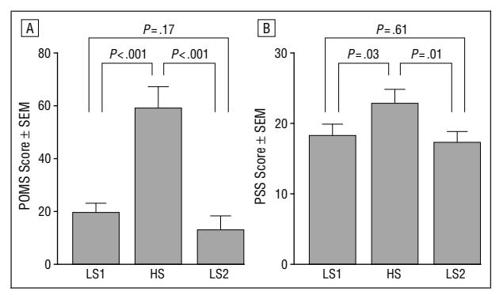
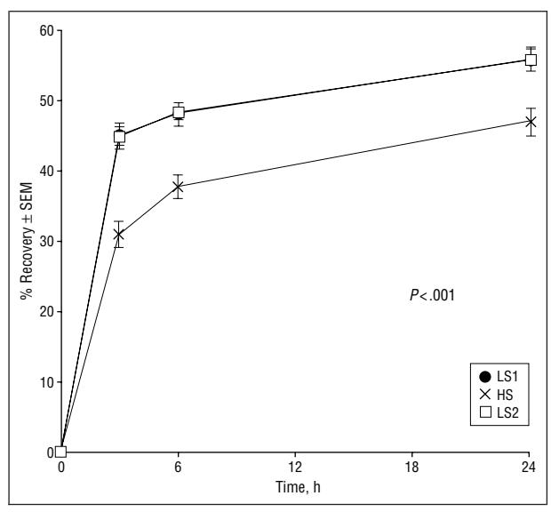
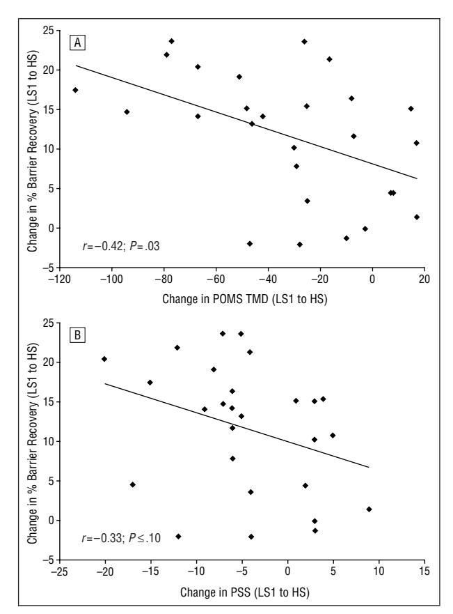
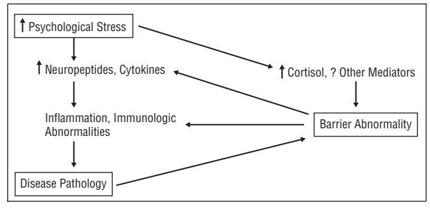

# Psychological Stress Perturbs Epidermal Permeability Barrier Homeostasis

## Implications for the Pathogenesis of Stress-Associated Skin Disorders

Amit Garg, BA; Mary-Margaret Chren, MD; Laura P. Sands, PhD; Mary S. Matsui, PhD; Kenneth D. Marenus, PhD; Kenneth R. Feingold, MD; Peter M. Elias, MD

**Background:** A large number of skin diseases, including atopic dermatitis and psoriasis, appear to be precipitated or exacerbated by psychological stress. Nevertheless, the specific pathogenic role of psychological stress remains unknown. In 3 different murine models of psychological stress, it was recently shown that psychological stress negatively impacts cutaneous permeability barrier function and that coadministration of tranquilizers blocks this stress-induced deterioration in barrier function.

**Objectives and Methods:** The relationship between psychological stress and epidermal permeability barrier function was investigated in 27 medical, dental, and pharmacy students without coexistent skin disease. Their psychological state was assessed with 2 well-validated measures: the Perceived Stress Scale and the Profile of Mood States. Barrier function was assessed simultaneously with the stress measures at periods of presumed higher stress (during final examinations) and at 2 assumed, lower stress occasions (after return from winter vacation [approximately 4 weeks before final examinations] and during spring vacation [approximately 4 weeks after final examinations]).

**Results:** The subjects as a group demonstrated a decline in permeability barrier recovery kinetics after barrier disruption by cellophane tape stripping, in parallel with an increase in perceived psychological stress during the higher vs the initial lower stress occasions. During the follow-up, presumed lower stress period, the subjects again displayed lower perceived psychological stress scores and improved permeability barrier recovery kinetics, comparable to those during the initial lower stress period. Moreover, the greatest deterioration in barrier function occurred in those subjects who demonstrated the largest increases in perceived psychological stress.

**Conclusion:** These studies provide the first link between psychological status and cutaneous function in humans and suggest a new pathophysiological paradigm, ie, stress-induced derangements in epidermal function as precipitators of inflammatory dermatoses.

Arch Dermatol. 2001;137:53-59

From the Dermatology (Mr Garg and Drs Chren and Elias), Geriatrics (Drs Chren and Sands), and Metabolism (Dr Feingold) Services, Veterans Affairs Medical Center, San Francisco, Calif; the Departments of Dermatology (Drs Chren, Feingold, and Elias) and Medicine (Dr Feingold), University of California, San Francisco; and the Department of Research and Development, Estée Lauder Inc, Melville, NY (Drs Matsui and Marenus).

LTHOUGH psychological stress appears to be capable of provoking, exacerbating, and propagating disease, 1-3 the possible causal relationship is obscured, at least in part, because chronic disease itself can lead to an increase in perceived stress. Moreover, the influence of psychological stress on disease is often perceived as being either too subjective or nonquantifiable for scientific assessment.4 Yet, a number of studies point to a possible pathogenic link between psychological stress and disease. For example, sustained psychological stress is associated with alterations in both humoral and cellular immune responses.5-12 Furthermore, there is increasing evidence that psychological stress can influence the progression and survival of patients with cancer.8,13-16 Likewise, reduced psychological stress appears both

to decrease medication requirements and to improve organ function in systemic inflammatory disorders.17

# For editorial comment see page 78

Among dermatoses, atopic dermatitis, 18-21 psoriasis, 22-27 and a variety of other dermatoses are anecdotally linked to psychological stress. 2,24,28-30 Psychological stress also is associated with delayed wound healing in both humans31 and a murine model. 32 It also is widely accepted that optimal management of these skin conditions requires consideration of coexistent emotional factors. 20 Accordingly, stress-reduction techniques, such as meditation, biofeedback, and hypnosis, may benefit some patients with these disorders. 20,33-37

It is noteworthy that some of the most common skin disorders that are com-

## *SUBJECTS AND METHODS*

#### **EXPERIMENTAL SUBJECTS AND STUDY DESIGN**

Twenty-seven students who were randomly chosen from a larger group of students attending the University of California, San Francisco, School of Medicine, Pharmacy, or Dentistry provided informed consent to participate as paid volunteers in a study on the effects of psychological stress on permeability barrier function in normal skin. The study subjects, who ranged in age from 23 to 27 years (mean age, 24.4 years), represented a broad cross section of their respective student bodies.

| Characteristics  | No. (%) of Subjects |
|------------------|---------------------|
| School           |                     |
| Medical          | 14 (52)             |
| Pharmacy         | 7 (26)              |
| Dental           | 6 (22)              |
| Sex              |                     |
| M                | 6 (22)              |
| F                | 21 (78)             |
| Ethnicity        |                     |
| White            | 12 (44)             |
| Asian            | 9 (33)              |
| Hispanic         | 3 (11)              |
| Other            | 2 (7)               |
| African American | 1 (4)               |

The subjects were in good health and free of preexisting primary skin disease, and none was receiving sedatives, antidepressants, psychotherapy, or exogenous steroid hormones (however, 12 of the 21 women were taking oral contraceptives). Since prior studies showed that barrier recovery kinetics are not affected by sex or race,48 no subjects were excluded based on these criteria.

We assessed permeability barrier function in parallel with completion of 2 standard self-report inventories for psychological stress at 3 occasions: (1) an initial period of presumed lower stress (LS1), ie, shortly after return from winter vacation (January 1999); (2) a period of presumed higher stress (HS), approximately 4 weeks later, during final examination week (February 1999); and (3) a recurrent period of presumed lower stress (LS2), approximately 4 weeks after the HS period, shortly after return from spring vacation. Because of scheduling difficulties, only a limited number of students (n=17) were available for reexamination at the LS2 period. These students did not differ from the group as a whole, as examined during the other 2 periods. Because of prolonged cold weather during the winter of 1999, both outdoor temperatures and humidity levels remained comparable in San Francisco, from January through mid-March 1999.

#### **PSYCHOLOGICAL STRESS ASSAYS**

The extent of perceived psychological stress and related anxiety were assessed using 2 self-report measures: the Profile of Mood States (POMS) and the Perceived Stress Scale (PSS). The POMS is a 65-point, descriptive rating scale that identifies and assesses transient fluctuations in mood state.49 The POMS consists of 6 individual subscales: Tension-Anxiety, Depression-Dejection, Anger-Hostility, Vigor-Activity, Fatigue-Inertia, and Confusion-Bewilderment. The total score of the POMS, referred to as *total mood disturbance*, represents a summation of the 6 subscale scores. In contrast, the PSS is a 14-item scale that assesses global

monly associated with increased psychological stress, eg, psoriasis, eczema, and healing wounds,38 are characterized by defective cutaneous permeability barrier function. For example, even the apparently uninvolved skin of patients with atopic dermatitis demonstrates increased transepidermal water loss (TEWL), and barrier function deteriorates still further in involved skin sites.39,40 Psoriatic lesions also display abnormalities in TEWL,41,42 and the severity of lesional phenotype in psoriasis correlates directly with the extent of the barrier abnormality.43 Recent studies suggest that a barrier abnormality, coupled with epidermal injury, provokes or sustains these cutaneous disorders through activation of an epidermal initiated cytokine cascade.44,45

Our laboratory has explored the potential pathogenic link between psychological stress and permeability barrier homeostasis. In 3 different murine models of psychological stress, Denda et al46,47 recently demonstrated defects in barrier function that were reversed by the systemic coadministration of anxiolytic agents. In the present study, we assessed whether increased levels of psychological stress in medical, dental, and pharmacy students are paralleled by alterations in permeability barrier homeostasis. We found that increased psychological stress during examination periods, a well-accepted stress model, is associated with a reversible deterioration in transcutaneous water permeability. These findings point to a potential pathogenic link between psychological stress, permeability barrier homeostasis, and the induction, exacerbation, and propagation of inflammatory skin disorders.

#### RESULTS

#### **PERCEIVED STRESS DURING THE DIFFERENT PERIODS**

Psychological stress levels and permeability barrier function were assessed first in all 27 subjects shortly after their return from winter vacation, the LS1 period. To test the hypothesis that the perceived psychological stress of examinations results in decompensation of permeability barrier homeostasis, we reevaluated the same parameters in the same subjects 6 weeks later, ie, during final examination week, the HS period. During the HS period, the subjects as a group perceived a significant increase in psychological stress relative to the LS1 period on both the POMS and the PSS (**Figure 1**; *P*,.001 and *P*,.05 for the POMS and the PSS, respectively). Moreover, the increases in stress scores extended to all subscales of the POMS; ie, most subjects reported significantly higher levels of anger, confusion, depression, fatigue, tension, and reduced vigor (**Table**; *P*#.02). We also examined perceived levels of stress and barrier repair approximately perceptions of psychological stress, and measures the extent to which the subject appraises situations in his or her life as unpredictable,uncontrollable,and/oroverloading.50Bothmeasures are widely employed, have strong normative data, and are psychometrically credible in terms of their reliability and validity. Moreover, there is strong evidence for their validity and usefulness for the measurement of psychological experiences that together or separately reflect psychological stress. The PSS and the POMS were administered to subjects at each of the 3 designated time points, immediately prior to assessment of permeability barrier function (see below). For both instruments, higher scores indicate greater levels of psychologicalstress.Sincestudentsinall3professionalschools(medical, dental, and pharmacy) exhibited comparable changes in stress during the LS1-HS-LS2 intervals, subsequent analyses considered the group as a unit.

#### **MEASUREMENTS OF PERMEABILITY BARRIER HOMEOSTASIS**

Students kept their arms and forearms free of topical emollients for at least 1 week before each testing period. The LS1 and LS2 measurements were obtained on the nondominant forearm, and the HS assessments were obtained on the dominant forearm to avoid any residual effects of tape stripping. In preliminary studies, barrier recovery was found to be similar on the dominant and the nondominant forearms. Using an evaporimeter (Servo Med; Varberg, Sweden), basal TEWL was assessed at 3 sites on the volar surface of the forearm at distances between 4 and 10 cm below the antecubital fossa. Measurements were obtained in a temperature-controlled room (24°C) and were recorded in grams per square meter per hour.51 Relative

humidity ranged between 31% and 45%, and atmospheric pressure ranged from 7.1 to 11.6 mm Hg during measurement periods. Each of the 3 sites was individually disrupted by a minimally invasive, nonpainful method, ie, sequential applications of cellophane tape (Tuck; Tesa Tuck Inc, New Rochelle, NY). Transepidermal water loss rates were assessed over the same sites after each group of 5 successive tape strippings until a TEWL level of 20 to 30 g/m2 per hour was attained (a total of 15 or 20 strippings was required in all cases). The TEWL then was assessed over each of the 3 sites at 0, 3, 6, and 24 hours after barrier disruption. The 2 sites that displayed TEWL values closest to each other were used for further data analysis (see below). Data from the most proximal vs the most distal sites presumably differed more because of known differences in barrier function over proximal vs distal forearm skin.

#### **ANALYTICAL METHODS**

Since we used repeated measures on the same subjects, we used multivariate analysis of variance to test whether (1) perceived stress increased during finals and (2) skin barrier recovery at 3, 6, and 24 hours differed between the HS period and both LS periods. If significant main effects were detected, then post hoc *t* tests were conducted to determine the source of these differences. Correlations were computed to show that changes in perceived stress (as measured by the POMS and the PSS) from LS1 to HS are associated with changes in 3-hour skin barrier recovery from LS1 to HS. A random regression analysis was conducted to determine whether HS POMS subscale scores predicted 3-, 6-, and 24 hour skin barrier recovery at LS1 and HS after LS1 POMS subscale scores were controlled for.

4 weeks later, after the students had returned from spring vacation. Seventeen of the original 27 students agreed to return for this third evaluation (LS2). On both the PSS and the POMS, these students displayed psychological stress levels that were significantly lower than those recorded during the HS period (Figure 1; *P*,.05 and *P*,.001 for the PSS and the POMS, respectively). In fact, stress levels, as measured by both instruments, returned to levels similar to those of the LS1 period (Figure 1). Moreover, all 6 subscales of the POMS also demonstrated significantly reduced scores during the LS2 period compared with the HS period (Table; *P*#.01 for each component).

#### **BARRIER RECOVERY DURING THE DIFFERENT PERIODS**

We simultaneously assessed permeability barrier homeostasis in these subjects. Under basal conditions, ie, prior to experimental disruption by tape stripping, there were no differences in permeability barrier function at the LS1, HS, or LS2 period and very low intersubject and intrasubject variability (not shown). Similarly, barrier integrity, as measured by the number of tape strippings required to disrupt the permeability barrier to less than 20 g/m2 of water loss, did not differ significantly among subjects under HS vs LS. However, in contrast to basal TEWL levels, after an acute insult (tape stripping), repeated-measures analysis revealed significant changes in the rates of barrier recovery across the 3 periods. Post hoc analysis revealed that barrier recovery slowed significantly at 3, 6, and 24 hours in the subjects as a whole during the HS period compared with recovery rates during both LS1 and LS2 periods (**Figure 2**; F=18.87; *df*=12.2; *P*,.001). In contrast, there were no significant differences at these 3 time points between the LS1 and the LS2 periods. The greatest differences in rates of barrier recovery were at the 3-hour point during the HS period vs the LS1 period. Thus, an increase in perceived psychological stress was associated with delayed barrier recovery after acute permeability barrier disruption in the subjects as a group.

To further assess whether permeability barrier homeostasis is influenced by psychological stress, we next measured permeability barrier homeostasis during the LS2 period. As seen in Figure 2, the kinetics of recovery returned to levels comparable to those of the LS1 period. These findings suggest that the apparent adverse effects of examination-induced psychological stress on permeability barrier homeostasis are reversible during a subsequent low-stress occasion. Taken together, these results show a negative association between perceived psychological stress and permeability barrier homeostasis.

#### **RELATIONSHIP OF CHANGES IN PSYCHOLOGICAL STRESS TO CHANGES IN BARRIER HOMEOSTASIS**

We then examined the relationship of changes in the level of stress with changes in barrier homeostasis from the LS1 to the HS period. As shown in **Figure 3**, there was a strong correlation between increased stress levels and decreased barrier recovery rates (at 3 hours) for the POMS (*r*=−0.42; *P*=.03), and a lesser correlation for the PSS, which did not reach statistical significance (*r*=−0.33; *P*#.10). Thus, the subjects who demonstrated the greatest increase in perceived psychological stress also displayed the greatest abnormality in barrier recovery rates.

#### **EFFECTS OF SPECIFIC STRESSORS ON BARRIER RECOVERY**

Finally, to measure the effects of alterations in psychological stress on skin barrier recovery, we performed random regression analyses that took into account baseline (LS1) psychological stress, as assessed by the POMS subscales during the LS1 period, and skin barrier recovery. The dependent variables were 3-, 6-, and 24-hour skin barrier recovery at LS1 and HS. The HS POMS Tension and Vigor subscales (*P*=.05 and *P*=.01, respectively) significantly predicted a delay in skin barrier recovery.

**Figure 1.** A,Total mood disturbance on the Profile of Mood States (POMS). B, Mean Perceived Stress Scale (PSS) scores for students during the indicated psychological stress period. The P values refer to the results of the post hoc tests. LS1 indicates low stress 1; HS, high stress; and LS2, low stress 2 (see the "Experimental Subjects and Study Design" subsection of the "Subjects and Methods" section for further explanation of the pyschological stress periods).

#### COMMENT

Recent studies in rodents found that imposition of 3 unrelated forms of psychological stress provokes an abnormality in permeability barrier homeostasis.46,47 The present study is the first to find in humans that a decline in permeability barrier homeostasis parallels the superimposed stress of taking examinations. In the animal models, coadministration of tranquilizers with stressors normalized permeability barrier function.46 It is therefore plausible that the changes in psychological stress were responsible for the decline in barrier function demonstrated in the present study. This conclusion is further supported by the observation that those subjects who demonstrated the greatest increase in psychological stress by both the POMS and the PSS displayed the greatest impairment in barrier function. Moreover, barrier function returned to normal coincident with a reduction of psychological stress in both assays during a subsequent vacation period. Furthermore, both psychological instruments that we used demonstrated substantial evidence of validity, because the mean responses (and the subscales of one of them, the POMS) changed exactly as we hypothesized they would during both the LS and the HS periods. Yet, we do not know whether other unrelated or less stressful stimuli would produce similar functional alterations. These findings also could not be attributed to seasonal fluctuations, since neither temperature nor humidity levels changed during the study period, and they could not be explained by other differences among subjects, since they served as their own controls. Furthermore, observer bias probably did not influence these results, because each site on each subject was tape stripped equivalently at all time points. Finally, it is important to note that basal permeability rates did not change in these subjects, even with concurrent increases in psychological stress. Thus, these studies demonstrate the importance of dynamic (in this case, the kinetics of barrier recovery), rather than static measures, to unearth potentially important differences in cutaneous function.48,52

Some investigators believe that stress-induced release of neuroimmune substances adversely influences cutaneous homeostasis through activation of immunologic/inflammatory processes in deeper skin layers.2,30,53 However, recent studies support an alternate or parallel pathway, ie, that stress adversely affects permeability bar-

| Subscale   | LS1, Mean (SD) | LS1-HS, P | Finals Week, Mean (SD) | HS-LS2, P | LS2, Mean (SD) | LS1-LS2, P |
|------------|-------------------|-----------|---------------------------|-----------|----------------|------------|
| Anger      | 7.57 (5.58)       | .02       | 13.14 (9.38)              | .001      | 5.64 (3.18)    | .13        |
| Confusion  | 8.07 (4.21)       | .001      | 12.28 (3.38)              | ,.001     | 7.57 (2.56)    | .59        |
| Depression | 6.50 (4.20)       | .006      | 13.07 (10.60)             | .008      | 6.00 (6.18)    | .72        |
| Fatigue    | 7.57 (2.74)       | ,.001     | 14.00 (5.76)              | ,.001     | 6.07 (4.53)    | .15        |
| Tension    | 8.21 (2.99)       | ,.001     | 18.29 (6.94)              | ,.001     | 7.29 (6.19)    | .47        |
| Vigor      | 18.71 (4.12)      | ,.001     | 12.14 (5.67)              | .002      | 20.07 (5.86)   | .33        |

\*POMS indicates Profile of Mood States; LS1, low stress 1; HS, high stress; and LS2, low stress 2 (see the "Experimental Subjects and Study Design" subsection of the "Subjects and Methods" section for further explanation of the psychological stress periods). The P values are based on post hoc tests from repeated-measures multivariate analysis of the 6 subscale scores from the 3 periods.

**Figure 2.** Mean percentage of permeability barrier recovery at 3, 6, and 24 hours for students during the indicated psychological stress period. LS1 indicates low stress 1; HS, high stress; and LS2, low stress 2 (see the "Experimental Subjects and Study Design" subsection of the "Subjects and Methods" section for further explanation of the pyschological stress periods). Differences in mean percent recoveries between the LS1 and LS2 intervals are nonsignificant at both time points. P,.001 for comparisons between LS1 and HS and between HS and LS2 at 3, 6, and 24 hours.

rier homeostasis by increasing systemic glucocorticoid levels. The following observations support this scheme: (1) in both rodents47 and humans,54-56 the induction of psychological stress is associated with increased endogenous glucocorticoid production; (2) the adminstration of systemic glucocorticoids adversely affects barrier homeostasis47 and epidermal cell proliferation57 in rodents; and (3) the coadministration of the steroid hormone receptor antagonist RU-486, along with psychological stressors, blocks development of the barrier abnormality,47 further suggesting that glucocorticoids play an important role in mediating the adverse effects of stress on the skin. Other investigators have also shown that antagonism of glucocorticoid action reverses a psychological stress–induced delay in wound healing in rodents.32 Finally, the potential relevance of increased glucocorticoid production or responsiveness for disease pathogenesis is supported further by the presence of elevated serum cortisol levels in patients with psoriasis during acute exacerbations25 and by the clinical observation that exogenous steroids frequently trigger flares of both psoriasis and atopic dermatitis.58 Yet, serum and salivary cortisol levels do not always change with altered psychological stress in humans, despite significant outcome differences.59-63 In summary, substantial evidence supports a role for glucocorticoids in the stressinduced deterioration of barrier homeostasis, but the mechanisms by which glucocorticoids effect barrier homeostasis remain to be elucidated.

The peripheral nervous system and the skin are intimately connected via free nerve endings that extend to the epidermis.64-66 Because these afferent nerves are thought to serve as neurosecretory effectors,67,68 descending autonomic fibers could antidromically release neuropeptides within or near the epidermis during times of

**Figure 3.** Relationship of changes in levels of stress with changes in barrier homeostasis. Data shown are for the Profile of Mood States (POMS) (A) and the Perceived Stress Scale (PSS) (B) instruments administered at the initial low-stress (LS1) vs high-stress (HS) period vs barrier recovery rates at 3 hours. TMD indicates total mood disturbance (see the "Experimental Subjects and Study Design" subsection of the "Subjects and Methods" section for further explanation of the pyschological stress periods).

increased psychological stress.30,53,69 A pathogenic role for neuropeptides is supported by (1) the observations that both substance P and vasoactive intestinal peptide levels change in the involved skin of atopic dermatitis and psoriasis70-75; (2) both of these neuropeptides are known keratinocyte mitogens53,76-78; and (3) cutaneous nerves may activate Langerhans cells.66,79 Conversely, topical applications of capsaicin, which depletes neuropeptides from primary sensory neurons,80 parenteral administration of somatostatin, a neuropeptide that inhibits the release of peptide hormones or peripheral nerve reaction,81 and peripheral nerve resection82 improve lesion severity in psoriasis.

The clinical relevance of our observations relates to the potential role of psychological stress-induced perturbations in the initiation or aggravation of skin diseases. Several of these disorders, including such common conditions as atopic dermatitis, contact dermatitis, and psoriasis, are anecdotally provoked by enhanced psychological stress. Moreover, these disorders also are often triggered, sustained, or exacerbated by external physical insults to the epidermis.45,46 These insults, in turn, are known to lead to enhanced synthesis and release of cytokines from the epidermis.44,45,83 Moreover, epidermal hyperplasia, Langerhans cell activation, and inflammation develop rapidly following these acute insults.84-86 Thus, psychological stress

**Figure 4.** Diagram illustrating the potential interplay of psychological stress, endogenous glucocorticoids, barrier homeostasis, and disease pathogenesis.

could change the threshold for physical insults (eg, the Koebner phenomenon in psoriasis), or it could prolong the recovery from such insults, resulting in enhanced epidermal mediator production. The net effect would be a lowered threshold for disease induction, or interference with disease resolution (**Figure 4**).44,45 Despite the fact that the responsible pathogenic signaling mechanisms in humans remain speculative, these studies have important implications for the primary and ancillary management of diverse dermatologic disorders, such as dishydrotic eczema, psoriasis, atopic dermatitis, contact dermatitis, and wound healing, all of which are characterized by barrier dysfunction. If the results of this pilot study are confirmed in subsequent cohorts of subjects, they would provide a potent rationale to include stress-reduction measures in the management of many common skin conditions.87

*Accepted for publication July 5, 2000.*

*This work was supported by grants AR 19098, AR39369, and AR01962 (K08) from the National Institutes of Health, Bethesda, Md; by the Medical Research Service, Veterans Administration, Washington, DC; and by an unrestricted grant from Este´e Lauder Inc, Melville, NY.*

*Ray Rosenman, MD, provided thoughtful advice, feedback, and editorial assistance, and Sue Allen provided able administrative and editorial assistance.*

*Corresponding author: Peter M. Elias, MD, Dermatology Service (190), Veterans Affairs Medical Center, 4150 Clement St, San Francisco, CA 94121 (e-mail: eliaspm @itsa.ucsf.edu).*

#### REFERENCES

- 1. Selye H. The general adaptation syndrome and the diseases of adaptation. J Clin Endocrinol. 1946;6:117-230.
- 2. Panconesi E, Hautmann G. Psychophysiology of stress in dermatology: the psychobiologic pattern of psychosomatics. Dermatol Clin. 1996;14:399-421.
- 3. Spiegel D. Healing words: emotional expression and disease outcome. JAMA. 1999;281:1328-1329.
- 4. Cohen S, Williamson GM. Stress and infectious disease in humans. Psychol Bull. 1991;109:5-24.
- 5. Glaser R, Kiecolt-Glaser JK, Speicher C, et al. Stress, loneliness, and changes in herpesvirus latency. J Behav Med. 1985;8:249-260.
- 6. Glaser R, Rice J, Sheridan J, et al. Stress-related immune suppression: health implications. Brain Behav Immun. 1987;1:7-20.
- 7. Glaser R, Kiecolt-Glaser JK, Malarkey WB, Sheridan JF. The influence of psychological stress on the immune response to vaccines. Ann N Y Acad Sci. 1998; 840:649-655.
- 8. Palmblad JE. Stress-related modulation of immunity: a review of human studies. Cancer Detect Prev. 1987;1:57-64.

- 9. O'Leary A. Stress, emotion, and human immune function. Psychol Bull. 1990; 108:363-382.
- 10. Bonneau RH, Sheridan JF, Feng NG, Glaser R. Stress-induced suppression of herpes simplex virus (HSV)–specific cytotoxic T lymphocyte and natural killer cell activity and enhancement of acute pathogenesis following local HSV infection. Brain Behav Immun. 1991;5:170-192.
- 11. Kiecolt-Glaser JK, Glaser R, Gravenstein S, Malarkey WB, Sheridan J. Chronic stress alters the immune response to influenza virus vaccine in older adults. Proc Natl Acad Sci U S A. 1996;93:3043-3047.
- 12. Sheridan JF, Dobbs C, Jung J, et al. Stressed-induced neuroendocrine modulation of viral pathogens and immunity. Ann N Y Acad Sci. 1998;840:803- 808.
- 13. Shavit Y, Terman GW, Martin FC, Lewis JW, Liebeskind JC, Gale RP. Stress, opioid peptides, the immune system, and cancer. J Immunol. 1985;135:834-837.
- 14. Spiegel D, Bloom JR, Kraemer HC, Gottheil E. Effect of psychosocial treatment on survival of patients with metastatic breast cancer. Lancet. 1989;2:888-891.
- 15. Spiegel D, Sephton SE, Terr AI, Stites DP. Effects of psychosocial treatment in prolonging cancer survival may be mediated by neuroimmune pathways. Ann N Y Acad Sci. 1998;840:674-683.
- 16. Fawzy FI, Fawzy NW, Hyun CS, et al. Malignant melanoma: effects of an early structured psychiatric intervention, coping, and affective state on recurrence and survival 6 years later. Arch Gen Psychiatry. 1993;50:681-689.
- 17. Smyth JM, Stone AA, Hurewitz A, Kaell A. Effects of writing about stressful experiences on symptom reduction in patients with asthma or rheumatoid arthritis: a randomized trial. JAMA. 1999;281:1304-1309.
- 18. Ullman KC, Moore RW, Reidy M. Atopic eczema: a clinical psychiatric study. J Asthma Res. 1977;14:91-99.
- 19. Faulstich ME, Williamson DA. An overview of atopic dermatitis: toward a biobehavioural integration. J Psychosom Res. 1985;29:647-654.
- 20. Koblenzer CS, Koblenzer PJ. Chronic intractable atopic eczema: its occurrence as a physical sign of impaired parent-child relationships and psychologic developmental arrest: improvement through parent insight and education. Arch Dermatol. 1988;124:1673-1677.
- 21. Kodama A, Horikawa T, Suzuki T, et al. Effect of stress on atopic dermatitis: investigation in patients after the Great Hanshin Earthquake. J Allergy Clin Immunol. 1999;104:173-176.
- 22. Reiss F. Psoriasis and stress. Dermatology. 1956;113:71-78.
- 23. Baughman R, Sobel R. Psoriasis, stress, and strain. Arch Dermatol. 1971;103: 599-605.
- 24. Fava GA, Perini GI, Santonastaso P, Fornasa CV. Life events and psychological distress in dermatologic disorders: psoriasis, chronic urticaria and fungal infections. Br J Med Psychol. 1980;53:277-282.
- 25. Arnetz BB, Fjellner B, Eneroth P, Kallner A. Stress and psoriasis: psychoendocrine and metabolic reactions in psoriatic patients during standardized stressor exposure. Psychosom Med. 1985;47:528-541.
- 26. Gaston L, Lassonde M, Bernier-Buzzanga J, Hodgins S, Crombez JC. Psoriasis and stress: a prospective study. J Am Acad Dermatol. 1987;17:82-86.
- 27. Mazzetti M, Mozzetta GC, Soavi E, et al. Psoriasis, stress, and psychiatry: psychodynamic characteristics of stressors. Acta Derm Venereol Suppl (Stockh). 1994;186:62-64.
- 28. Rostenberg A Jr. The role of psychogenic factors in skin disease. Arch Dermatol. 1960;81:81-83.
- 29. Whitlock FA. Psychophysiological Aspects of Skin Disease. London, England: WB Saunders Co Ltd; 1976:1-40.
- 30. O'Sullivan RL, Lipper G, Lerner EA. The neuro-immuno-cutaneous-endocrine network: relationship of mind and skin. Arch Dermatol. 1998;134:1431-1435.
- 31. Kiecolt-Glaser JK, Marucha PT, Malarkey WB, Mercado AM, Glaser R. Slowing of wound healing by psychological stress. Lancet. 1995;346:1194-1196.
- 32. Padgett DA, Marucha PT, Sheridan JF. Restraint stress slows cutaneous wound healing in mice. Brain Behav Immun. 1998;12:64-73.
- 33. Frankel FH, Misch RC. Hypnosis in a case of long-standing psoriasis in a person with character problems. Int J Clin Exp Hypn. 1973;21:121-130.
- 34. Hughes HH, England R, Goldsmith DA. Biofeedback and psychotherapeutic treatment of psoriasis: a brief report. Psychol Rep. 1981;48:99-102.
- 35. Gaston L, Crombez JC, Joly J, et al. Efficacy of imagery and meditation techniques in treating psoriasis. Imaginative Cognit Pers. 1988;81:25-38.
- 36. Winchell SA, Watts RA. Relaxation therapies in the treatment of psoriasis and possible pathophysiologic mechanisms. J Am Acad Dermatol. 1988;18:101-104.
- 37. Kabat-Zinn J, Wheeler E, Light T, et al. Influence of a mindfulness meditationbased stress reduction intervention on rates of skin clearing in patients with moderate to severe psoriasis undergoing phototherapy (UVB) and photochemotherapy (PUVA). Psychosom Med. 1998;60:625-632.
- 38. Suetaki T, Sasai S, Zhen Y-X, Ohi T, Tazami H. Functional analysis of the stratum corneum in scars: sequential studies after injury and comparison among keloids, hypertrophic scars, and atrophic scars. Arch Dermatol. 1996;132:1453-1458.

- 39. Shahidullah M, Ralffle EJ, Rimmer AR, Frain-Bell W. Transepidermal water loss in patients with dermatitis. Br J Dermatol. 1969;81:722.
- 40. Yoshiike T, Aikawa Y, Sindhvananda J, et al. Skin barrier defect in atopic dermatitis: increased permeability of the stratum corneum using dimethyl sulfoxide and theophylline. J Dermatol Sci. 1993;5:92-96.
- 41. Felsher Z, Rothman S. The insensible perspiration of the skin in hyperkeratotic disorders. J Invest Dermatol. 1945;6:271-278.
- 42. Grice KA, Bettley FR. Skin water loss and accidental hypothermia in psoriasis, ichthyosis, and erythroderma. BMJ. 1967;4:195-198.
- 43. Ghadially R, Reed JT, Elias PM. Stratum corneum structure and function correlates with phenotype in psoriasis. J Invest Dermatol. 1996;107:558-564.
- 44. Elias PM, Ansel JC, Wood LC, Feingold KR. Signaling networks in barrier homeostasis: the mystery widens. Arch Dermatol. 1996;132:1505-1506.
- 45. Elias PM, Wood LC, Feingold KF. Epidermal pathogenesis of inflammatory dermatoses. Am J Contact Dermat. 1999;10:119-126.
- 46. Denda M, Tsuchiya T, Hosoi J, Koyama J. Immobilization-induced and crowded environment-induced stress delay barrier recovery in murine skin. Br J Dermatol. 1998;138:780-785.
- 47. Denda M, Tsuchiya T, Elias PM, Feingold KR. Stress alters cutaneous permeability barrier homeostasis. Am J Physiol. 2000;278:R367-R372.
- 48. Reed JT, Ghadially R, Elias PM. Skin type, but neither race nor gender, influence epidermal permeability barrier function. Arch Dermatol. 1995;131:1134-1138.
- 49. McNair DM, Lorr M, Dropplemann LF. EITS Manual for the Profile of Mood States. San Diego, Calif: Educational and Industrial Testing Service; 1981.
- 50. Cohen S, Williamson GM. Perceived stress in a probability sample of the United States. In: Spacapan S, Oskanp S, eds. Social Psychology of Health. Beverly Hills, Calif: Sage; 1988:31-67.
- 51. Blichmann CW, Serup J. Reproducibility and variability of transepidermal water loss measurement: studies on the Servo Med evaporimeter. Acta Derm Venereol. 1987;67:206-210.
- 52. Ghadially R, Brown BE, Sequeira-Martin SM, Feingold KR, Elias PM. The aged epidermal permeability barrier: structural, functional, and lipid biochemical abnormalities in humans and a senescent murine model. J Clin Invest. 1995;95: 2281-2290.
- 53. Farber EM, Lanigan SW, Boer J. The role of cutaneous sensory nerves in the maintenance of psoriasis. Int J Dermatol. 1990;29:418-420.
- 54. van Eck M, Berkhof H, Nicolson N, Sulon J. The effects of perceived stress, traits, mood states, and stressful daily events on salivary cortisol. Psychosom Med. 1996;58:447-458.
- 55. Chatterton RT Jr, Vogelsong KM, Lu Y-C, Hudgens GA. Hormonal responses to psychological stress in men preparing for skydiving. J Clin Endocrinol Metab. 1997;82:2503-2509.
- 56. Pruessner JC, Gaab J, Hellhammer DH, Lintz D, Schommer N, Kirschbaum C. Increasing correlations between personality traits and cortisol stress responses obtained by data aggregation. Psychoneuroendocrinology. 1997;22:615-625.
- 57. Tsuchiya T, Horii I. Epidermal cell proliferative activity assessed by proliferating cell nuclear antigen (PCNA) decreases following immobilization-induced stress in male Syrian hamsters. Psychoneuroendocrinology. 1996;21:111-117.
- 58. Weigl BA. Immunoregulatory mechanisms and stress hormones in psoriasis. Int J Dermatol. 1998;37:350-357.
- 59. Allen PI, Batty KA, Dodd CA, et al. Dissociation between emotional and endocrine responses preceding an academic examination in male medical students. J Endocrinol. 1985;107:163-170.
- 60. Semple CG, Gray CE, Borland W, Espie CA, Beastall GH. Endocrine effects of examination stress. Clin Sci. 1988;74:255-259.
- 61. Glaser R, Pearl DK, Kiecolt-Glaser JK, Malarkey WB. Plasma cortisol levels and reactivation of latent Epstein-Barr virus in response to examination stress. Psychoneuroendocrinology. 1994;19:765-772.
- 62. Malarkey WB, Pearl DK, Demers LM, Kiecolt-Glaser JK, Glaser R. Influence of academic stress and season on 24-hour mean concentrations of ACTH, cortisol, and b-endorphin. Psychoneuroendocrinology. 1995;20:499-508.

- 63. Harrell E, Kelly K, Stutts, W. Situational determinants of correlations between serum cortisol and self-reported stress measures. Psychology. 1996;33:22-25.
- 64. Miller MR, Kasahara M. The pattern of cutaneous innervation of the human foot. Am J Anat. 1959;105:233-256.
- 65. Karanth SS, Springall DR, Kuhn DM, Levene MM, Polak JM. An immunocytochemical study of cutaneous innervation and the distribution of neuropeptides and protein gene product 9.5 in man and commonly employed laboratory animals. Am J Anat. 1991;191:369-383.
- 66. Hosoi J, Murphy GF, Egan CL, et al. Regulation of Langerhans cell function by nerves containing calcitonin gene-related peptide. Nature. 1993;363:159-162.
- 67. Fitzgerald M. Capsaicin and sensory neurones: a review. Pain. 1983;15:109-130.
- 68. Maggi CA, Meli A. The sensory-efferent function of capsaicin-sensitive sensory neurons. Gen Pharmacol. 1988;19:1-43.
- 69. Lotti T, Hautmann G, Panconesi E. Neuropeptides in skin. J Am Acad Dermatol. 1995;33:482-496.
- 70. Giannetti A, Girolomoni G. Skin reactivity to neuropeptides in atopic dermatitis. Br J Dermatol. 1989;121:681-688.
- 71. Pincelli C, Fantini F, Massimi P, Girolomoni G, Seidenari S, Giannetti A. Neuropeptides in skin from patients with atopic dermatitis: an immunohistochemical study. Br J Dermatol. 1990;122:745-750.
- 72. Anand P, Springall DR, Blank MA, Sellu D, Polak JM, Bloom SR. Neuropeptides in skin disease: increased VIP in eczema and psoriasis but not axillary hyperhidrosis. Br J Dermatol. 1991;124:547-549.
- 73. Eedy DJ, Johnston CF, Shaw C, Buchanan KD. Neuropeptides in psoriasis: an immunocytochemical and radioimmunoassay study. J Invest Dermatol. 1991; 96:434-438.
- 74. Naukkarinen A, Nickoloff BJ, Farber EM. Quantification of cutaneous sensory nerves and their substance P content in psoriasis. J Invest Dermatol. 1989;92:126-129.
- 75. Ostlere LS, Cowen T, Rustin MH. Neuropeptides in the skin of patients with atopic dermatitis. Clin Exp Dermatol. 1995;20:462-467.
- 76. Haegerstrand A, Jonzon B, Dalsgaard CJ, Nilsson J. Vasoactive intestinal polypeptide stimulates cell proliferation and adenylate cyclase activity of cultured human keratinocytes. Proc Natl Acad Sci U S A. 1989;86:5993-5996.
- 77. Wilkinson DI. Mitogenic effect of substance P and CGRP on keratinocytes. J Cell Biol. 1989;107:509.
- 78. Hsieh S-T, Lin W-M. Modulation of keratinocyte proliferation by skin innervation. J Invest Dermatol. 1999;113:579-586.
- 79. Torii H, Yan Z, Hosoi J, Granstein RD. Expression of neurotrophic factors and neuropeptide receptors by Langerhans cells and the Langerhans cell–like cell line XS52: further support for a functional relationship between Langerhans cells and epidermal nerves. J Invest Dermatol. 1997;109:586-591.
- 80. Bernstein JE, Parish LC, Rapaport M, Rosenbaum MM, Roenigk HH Jr. Effects of topically applied capsaicin on moderate and severe psoriasis vulgaris. J Am Acad Dermatol. 1986;15:504-507.
- 81. Venier A, De Simone C, Forni L, et al. Treatment of severe psoriasis with somatostatin: four years of experience. Arch Dermatol Res. 1988;280(suppl):S51-S54.
- 82. Dewing SB. Remission of psoriasis associated with cutaneous nerve section. Arch Dermatol. 1971;104:220-221.
- 83. Nickoloff BJ, Naidu Y. Perturbation of epidermal barrier function correlates with initiation of the cytokine cascade in human skin. J Am Acad Dermatol. 1994;30: 535-546.
- 84. Denda M, Wood LC, Emami S, et al. The epidermal hyperplasia associated with repeated barrier disruption by acetone treatment or tape stripping cannot be attributed to increased water loss. Arch Dermatol Res. 1996;288:230-238.
- 85. Proksch E, Brasch J, Sterry W. Integrity of the permeability barrier regulates epidermal Langerhans cell density. Br J Dermatol. 1996;134:630-638.
- 86. Proksch E, Brasch J. Influence of epidermal permeability barrier disruption and Langerhans' cell density in allergic contact dermatitis. Acta Derm Venereol. 1997; 77:102-104.
- 87. Bilkis MR, Mark KA. Mind-body medicine: practical applications in dermatology. Arch Dermatol. 1998;134:1437-1441.