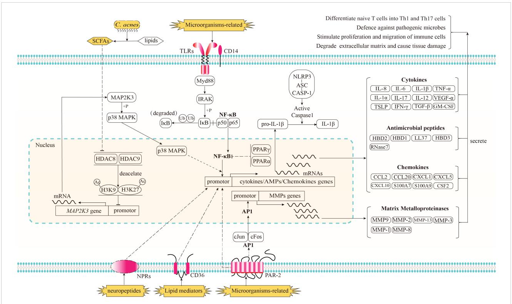
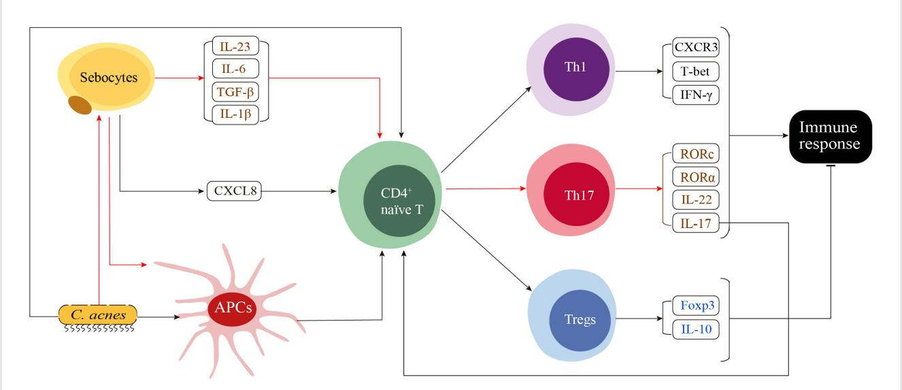
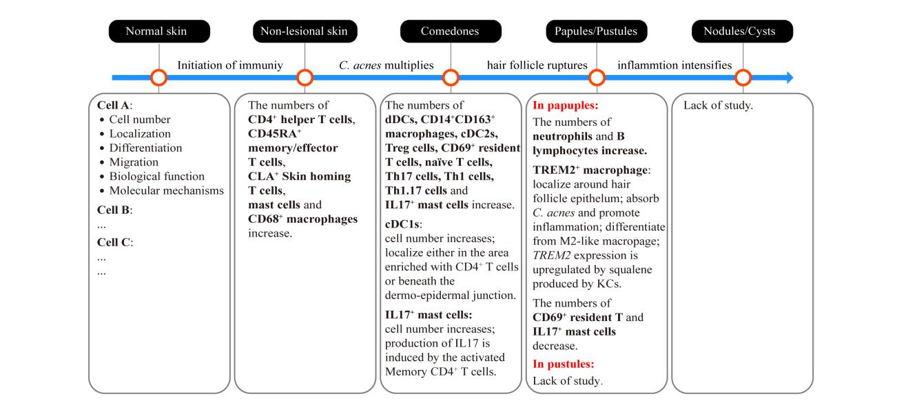

#### OPEN ACCESS

EDITED BY Mark Mellett, University Hospital Zürich, Switzerland

REVIEWED BY Takashi K. Satoh, LMU Munich University Hospital, Germany Utpal Sengupta, The Leprosy Mission Trust India, India

\*CORRESPONDENCE Li He [drheli2662@126.com](mailto:drheli2662@126.com)

RECEIVED 20 October 2023 ACCEPTED 30 November 2023 PUBLISHED 15 December 2023

#### CITATION

Jin Z, Song Y and He L (2023) A review of skin immune processes in acne. Front. Immunol. 14:1324930. [doi: 10.3389/fimmu.2023.1324930](https://doi.org/10.3389/fimmu.2023.1324930)

© 2023 Jin, Song and He. This is an openaccess article distributed under the terms of the [Creative Commons Attribution License](http://creativecommons.org/licenses/by/4.0/) [\(CC BY\).](http://creativecommons.org/licenses/by/4.0/) The use, distribution or reproduction in other forums is permitted, provided the original author(s) and the copyright owner(s) are credited and that the original publication in this journal is cited, in accordance with accepted academic practice. No use, distribution or reproduction is permitted which does not comply with these terms.

# [A review of skin immune](https://www.frontiersin.org/articles/10.3389/fimmu.2023.1324930/full) [processes in acne](https://www.frontiersin.org/articles/10.3389/fimmu.2023.1324930/full)

Zhongcai Jin, Yujun Song and Li He\*

Skin Health Research Center, Yunnan Characteristic Plant Extraction Laboratory, Kunming, Yunnan, China

Acne vulgaris is one of the most prevalent skin conditions, affecting almost all teenagers worldwide. Multiple factors, including the excessive production of sebum, dysbiosis of the skin microbiome, disruption of keratinization within hair follicles, and local inflammation, are believed to trigger or aggravate acne. Immune activity plays a crucial role in the pathogenesis of acne. Recent research has improved our understanding of the immunostimulatory functions of microorganisms, lipid mediators, and neuropeptides. Additionally, significant advances have been made in elucidating the intricate mechanisms through which cutaneous innate and adaptive immune cells perceive and transmit stimulatory signals and initiate immune responses. However, our understanding of precise temporal and spatial patterns of immune activity throughout various stages of acne development remains limited. This review provides a comprehensive overview of the current knowledge concerning the immune processes involved in the initiation and progression of acne. Furthermore, we highlight the significance of detailed spatiotemporal analyses, including analyses of temporal dynamics of immune cell populations as well as single-cell and spatial RNA sequencing, for the development of targeted therapeutic and prevention strategies.

#### KEYWORDS

acne vulgaris, immune response, microorganism, lipid mediators, neuropeptides, single-cell analysis

### 1 Introduction

Acne vulgaris is a dermatological condition that predominantly affects approximately 85% individuals in adolescence and early adulthood [\(1](#page-9-0), [2](#page-9-0)). Acne tends to occur in regions characterized by a high concentration of sebaceous glands, such as facial and upper back regions [\(3\)](#page-9-0). Pilosebaceous units (PSUs), composed of sebaceous glands and hair follicles, are the fundamental structures affected in acne lesions. In typical PSUs, the production and secretion of sebum (a mixture of lipids) are primarily carried out by the sebaceous glands. Secreted sebum travels through the sebaceous duct and enters the lumen of the hair follicle channel, where it coats the keratinocyte wall. The commensal microbiota within the hair follicle possesses the

ability to metabolize specific lipid species into free acids, resulting in an environment with a low pH, hindering the colonization or proliferation of harmful microorganisms.

Acne vulgaris manifests when the harmonious equilibrium within the PSU is disturbed. Considering the hair follicle duct as a conduit, hypercornification of the hair infundibulum combined with excess sebum, microorganisms, and keratin squamae can result in the development of microcomedones. These microcomedones subsequently develop into either white or black comedones [\(4\)](#page-9-0), causing the obstruction of the hair follicle ducts.

Comedones coupled with the excessive production of sebum establish a relatively anaerobic environment, which facilitates the proliferation of specific species of microorganisms, ultimately resulting in dysbiosis of the skin microflora. The altered composition of microorganisms in the PSUs along with the virulence factors they release in conjunction with the enlarged comedones exert pressure on the wall of hair follicles, leading to their compression and subsequent rupture. This process ultimately compromises the structural integrity of the skin barrier within the hair follicles.

Subsequently, invading pathogens, their secreted virulence factors, and degraded sebum penetrate the dermis and activate immune cells, resulting in an intensified inflammatory response. This process results in the development of inflammatory lesions, including papules and pustules. In patients with severe acne, papules and pustules can lead to the development of nodules or cysts. Owing to the destruction of the dermis or hypodermis, certain lesions pose challenges in terms of restoration, ultimately leading to scar formation.

Prior studies have established that the immune system plays a critical role in all stages of acne development. This review provides a comprehensive overview of the immune processes involved in acne development, including a summary of the stimulators that activate the immune response, the mechanisms involved in both innate and adaptive immune responses, and the sequence of infiltrated immune cells in different types of acne lesions.

### 2 Stimulators triggering immune response

Substances that interfere with the regular functioning of PSUs generally stimulate innate immune responses. At present, these substances can be categorized into two distinct types: (1) exogenous substances originating from the external environment, including a diverse range of microorganisms and their virulent metabolites, and (2) autoantigens generated by the host, such as specific lipid mediators from sebum and blood and neuropeptides secreted by neuroendocrine cells. Stimulators with experimental evidence using human cells or tissues are listed in [Table 1.](#page-2-0)

### 2.1 Skin microbiome

The skin microbiome consists of bacteria, viruses, fungi, and archaea that reside in or temporarily inhabit the skin or its appendages ([41](#page-9-0)). The human skin provides diverse microhabitats (differing in thickness, moistness, gland and hair follicle density, and other parameters) for various microbial communities. The most frequently isolated microorganisms in hair follicles are Cutibacterium acnes and Staphylococcus epidermidis [\(42\)](#page-9-0).

The capacity of C. acnes to elicit an immune response has been evaluated extensively ([14\)](#page-9-0). Previous in vivo and in vitro studies have demonstrated that certain strains of C. acnes as well as their toxic metabolites and cell wall components, such as peptidoglycan (PGN), lipoteichoic acid (LTA), and short-chain fatty acids (SCFAs) produced under lipid-rich hypoxic conditions, can induce a significant increase in cytokine expression in cultured keratinocytes ([12](#page-9-0), [31](#page-9-0)), sebocytes ([16](#page-9-0), [17\)](#page-9-0), peripheral blood mononuclear cells (PBMCs) ([9](#page-9-0), [29\)](#page-9-0), and monocytes [\(12](#page-9-0), [31\)](#page-9-0). The activation of the skin immune system in response to C. acnes has also been demonstrated in vivo. For instance, Ashbee et al. demonstrated that the levels of IgG1 and IgG3 antibodies targeting C. acnes were higher in individuals with severe acne than in those with normal skin, whereas IgG2 specific to C. acnes was higher in patients with moderate-to-severe acne than in those with mild acne ([43](#page-9-0)). These in vivo results suggest that C. acnes plays a progressive role in acne of varying severity.

Despite evidence that C. acnes contributes to the development of acne, a consistent difference in the relative abundance of this bacterium between individuals with and without acne has not been detected ([44](#page-9-0)–[46](#page-10-0)). There is a widely accepted consensus that the dysbiosis of C. acnes at the strain level, the presence of virulent genetic elements, and altered transcriptional activity provide a more comprehensive explanation for the observed functional disparities between individuals with healthy skin and those with acne. This viewpoint is supported by several studies [\(15,](#page-9-0) [25](#page-9-0), [42](#page-9-0), [46](#page-10-0)–[51\)](#page-10-0).

In addition to the extensively studied C. acnes, other microorganisms, such as the most abundant skin commensal fungal genus Malassezia and species of Staphylococcus, are associated with acne ([44](#page-9-0), [52,](#page-10-0) [53\)](#page-10-0). The potential impact of Malassezia on the pathogenesis of acne is supported by its positive response to antifungal agents in cases of refractory acne ([54\)](#page-10-0), its increased abundance in young individuals with acne [\(20,](#page-9-0) [55\)](#page-10-0), increased levels of secreted lipases and stimulation of immune responses in PBMCs and keratinocytes ([18](#page-9-0), [48,](#page-10-0) [56\)](#page-10-0).

There is evidence for associations between Staphylococcus species and acne. For example, they are highly abundant on the surfaces of comedones, papules, and pustules [\(45\)](#page-9-0). Furthermore, the occurrence of S. epidermidis is higher in patients with acne than in heathy controls ([57,](#page-10-0) [58](#page-10-0)). The NF-kB pathway is activated in keratinocytes upon treatment with S. epidermidis [\(21\)](#page-9-0) and the mitogen-activated protein kinase (MAPK) is activated by S. aureus ([59](#page-10-0)). However, Xia et al. claimed that LTA generated by S. epidermidis could inhibit the proliferation of C. acnes and reduce the protein expression of toll-like receptor (TLR)-2 in keratinocytes ([60\)](#page-10-0). Further studies are required to elucidate the functions of S. epidermidis in acne development and resolve inconsistencies.

Given that the immune responses of cultured cells to microorganisms or their secreted virulence factors depend on direct physical contact in vitro, it is crucial to determine whether pathogens co-localize with the same cells in vivo. To address this issue, Alexeyev et al. used fluorescent in situ hybridisation,

TABLE 1 Experimentally evidenced stimulators and receptors of immune responses in acne development.

| Stimulators            | Receptors                        | Response cell/tissue  | References   |
|------------------------|----------------------------------|-----------------------|--------------|
| Microorganisms-related |                                  |                       |              |
| C. acnes               | TLR2, TLR4, CD14, PAR-2 | KCs                   | (5–8)        |
|                        |                                  | PBMCs                 | (9–11)       |
|                        |                                  | Monocytes             | (12)         |
|                        |                                  | CD3+ T cells          | (13)         |
|                        |                                  | CD4+ CD45R T cells | (9, 13)      |
|                        |                                  | Explants              | (14, 15)     |
|                        |                                  | Sebocytes             | (16, 17)     |
|                        |                                  | THP-1 cells           | (12)         |
| Malassezia species     |                                  | PBMCs                 | (18)         |
|                        |                                  | KCs                   | (19)         |
|                        |                                  | Acne lesions          | (20)         |
| Staphylococcus species | TLR2                             | KCs                   | (21)         |
|                        |                                  | PBMCs                 | (11)         |
|                        |                                  | Acne lesions          | (22, 23)     |
| Porphyrin III          |                                  | KCs                   | (24)         |
|                        |                                  | Acne lesions          | (25)         |
| CAMP1                  | TLR2                             | KCs                   | (26, 27)     |
|                        |                                  | Acne lesions          | (28)         |
| Extracellular vesicles | TLR2                             | KCs                   | (29)         |
|                        |                                  | THP-1 cells           | (29)         |
| HSP60                  |                                  | KCs                   | (30)         |
| SCFAs                  |                                  | Monocytes             | (31)         |
|                        |                                  | KCs                   | (31)         |
| Lipase                 |                                  | Acne lesions          | (20, 22, 32) |
| Lipoprotein            | TLR2                             | Monocytes             | (33)         |
|                        |                                  | KCs                   | (34)         |
| Enterotoxin B          |                                  | PBMCs                 | (9)          |
| Lipid mediators        |                                  |                       |              |
| Oleic acid             | CD36                             | Sebocytes             | (35)         |
| Lauric acid            | CD36                             | Sebocytes             | (35)         |
| Palmitic acid          | CD36                             | Sebocytes             | (35)         |
| Squalene               |                                  | KCs                   | (36)         |
|                        |                                  | TREM2+ macrophages    | (37)         |
| Neuropeptides          |                                  |                       |              |
| Substance P            |                                  | Sebocytes             | (38, 39)     |
| CRH                    | CRH-R                            | Sebocytes             | (5, 40)      |
| a-MSH                  | MC-1R                            | Sebocytes             | (40)         |
|                        |                                  |                       |              |

CAMP, Christie-Atkins-Munch-Peterson; HSP, heat shock protein; SCFAs, short-chain fatty acids; CRH, Corticotropin-releasing hormone; TLR, Toll-like receptor; PAR-2, proteinase-activated receptor-2; CRH-R, corticotropin-releasing hormone receptor; a-MSH, alpha-melanocyte stimulating hormone; MC-1R, melanocortin-1 receptor; KCs, keratinocytes; PBMCs, peripheral blood mononuclear cells.

immunofluorescence microscopy, and immunohistochemistry. They observed that within the hair follicle, both microcolonies and biofilms of C. acnes were present on the follicular wall, indicating that there is a direct interaction between C. acnes and keratinocytes ([32](#page-9-0)). Using quantitative PCR, Gram staining, immunofluorescence microscopy, and 16S ribosomal RNA sequencing, Nakatasuji et al. identified acne-associated C. acnes and S. epidermidis within dermal tissues. This finding provides evidence for direct physical interactions between bacteria and different cells in the dermal layer ([61](#page-10-0)). Further studies are necessary to obtain more accurate observations of the direct interactions between particular microbial species as well as secreted virulence factors and skin cells in different acne lesions.

### 2.2 Lipid mediators

Lipids that function as immune-stimulating substances in acne mainly originate from sebum [\(62\)](#page-10-0). Under typical circumstances, sebum contributes to the defense of the skin against pathogens and maintenance of moisture. However, several studies have shown that changes in the composition of lipid species as well as the oxidant/ antioxidant and saturated/unsaturated ratios may convert lipids into immune stimulators during the development of acne [\(35,](#page-9-0) [36](#page-9-0), [62](#page-10-0)–[66\)](#page-10-0). For instance, sebum free fatty acids, such as lauric acid, palmitic acid, and oleic acid, can enhance the innate immune defense of sebocytes by upregulating a human antimicrobial peptide (AMP), human bdefensin (hBD)-2 [\(35](#page-9-0)); Additionally, peroxidated squalene can upregulate the expression levels of inflammatory mediators, such as NF-kB, peroxisome proliferator-activated receptors (PPAR)a, and IL-6 [\(36\)](#page-9-0); Furthermore, quantities of sebum oxidation-induced lipid peroxide (LPO) and interleukin (IL)-1a are higher in the inflammatory comedones than in non-inflammatory comedones, suggesting that a certain amount of LPO may be involved in inflammatory changes in early acne lesions [\(67](#page-10-0)).

Various lipid species come from not only sebum but also other skin surface lipids ([62](#page-10-0)) and serum ([68](#page-10-0)). Although several studies have reported characteristic differences of these lipids between patients with acne and healthy controls ([66](#page-10-0), [68](#page-10-0)–[72](#page-10-0)), further research is needed to understand the mechanisms linking these lipids to immune activity.

### 2.3 Neuropeptides

Acne vulgaris is often exacerbated in individuals with mental stress or endocrine dyscrasia ([58](#page-10-0), [73,](#page-10-0) [74](#page-10-0)). This highlights the association between acne and the neuroendocrine system. As a crucial component of the peripheral neuroendocrine system, human skin not only acts as a recipient of signals from various neuropeptides secreted by the central nervous system and transported via the bloodstream but also produces neuropeptides that modulate skin cells via paracrine, juxtracrine, autocrine, and intracrine pathways ([75](#page-10-0)–[77\)](#page-10-0).

Obligate immune cells, such as mast cells, Langerhans cells, and macrophages, as well as nonobligate immune cells, such as sebocytes, melanocytes, endothelial cells, and keratinocytes, have been identified as targets of neuropeptides in the cutaneous immune system ([75](#page-10-0), [78\)](#page-10-0). For example, calcitonin gene-related peptide (CGRP) secreted by skin sensory nerve fibers stimulate the adhesion of leukocytes and monocytes to endothelial cells as well as the release of proinflammatory mediators, such as tumor necrosis factor (TNF)-a and IL-8, from mast cells [\(79\)](#page-10-0).

However, limited studies have characterized the direct effect of neuropeptides on the immune response in acne. Corticotropinreleasing hormone (CRH), a neuropeptide, shows significantly stronger expression in sebaceous gland cells of acne-affected skin than in non-affected skin ([40](#page-9-0)). It can be secreted by the hypothalamic-pituitary-adrenal axis, keratinocytes, melanocytes, dermal fibroblasts, or endothelial cells and targets one of its receptors, corticotropin-releasing hormone receptor 2 (CRH-R2), to stimulate the release of IL-6 and IL-8 in SZ95 sebocytes ([5\)](#page-9-0). Substance P (SP), another neuropeptide, is present at higher concentrations in the nerve fibers around sebaceous glands in patients with acne than in healthy controls ([38\)](#page-9-0). Cultured sebocytes treated with SP exhibit increased secretion of proinflammatory cytokines, including IL-6, IL-1, and TNF-a ([39](#page-9-0)).

Further studies are needed to determine the secretory patterns of other neuropeptides in patients with acne and their potential to initiate an immune response.

### 3 Innate immune response

In response to aforementioned immunostimulators, immunerelated cells in the skin show alterations in proliferation and/or differentiation as well as in signaling and/or metabolic pathways. This response results in the production of defensin substances or secondary signaling molecules that activate the immune systems.

The rapid and nonspecific immune response for the prevention of the rapid spread of antigens is referred to as innate immunity. In typical skin, a relatively low pH and low oxygen microenvironment, epidermal keratinocytes in the hair follicles serve as the initial barrier against a multitude of harmful microorganisms and external factors. When the integrity of this barrier is compromised due to imbalances in physiological activity or excessive stimulation from external factors, antigens can penetrate the epidermis and reach the dermis, thereby triggering a more intense and uncontrolled inflammatory response in the deeper layers of the skin. The components of the cutaneous innate immune system, including skin cells (follicular keratinocytes, sebocytes, melanocytes and Langerhans cells), haematopoietic cells, and soluble factors (e.g., cytokines and AMPs) have been comprehensively documented by Dreno et al. ([80](#page-10-0)). In this section, we illustrate the intricate processes by which immune-related cells in acne identify immune stimulators, transmit signals within cells, and generate responses. A schematic of these immune processes is shown in [Figure 1.](#page-4-0)

### 3.1 Recognition

TLRs, especially TLR2 and TLR4 in conjunction with CD14, are major receptors involved in the recognition of microorganisms or

FIGURE 1

Recognition of immune stimulators and the signaling pathways implicated in the innate immune response of acne and its subsequent biological effects. Microorganisms-related stimulators can be detected by Toll-like receptors (TLRs) in conjunction with CD14 and proteinase-activated receptor-2 (PAR2). The activation of TLRs triggers the downstream NF-kB signaling pathway, resulting in the translocation of NF-kB into the nucleus and the upregulation of genes encoding cytokines, chemokines, and antimicrobial peptides (AMPs); The activation of PAR2 has been shown to elicit the transcriptional upregulation of genes encoding cytokines, chemokines, and AMPs via an unidentified pathway. Additionally, PAR2 activation triggers the downstream signaling pathway of activator protein-1 (AP-1), resulting in the translocation of AP-1 into the nucleus and an enhanced transcriptional expression of matrix metalloproteinases (MMPs). As potent anti-inflammatory factors, the nuclear receptors, peroxisome proliferatoractivated receptors (PPARs) PPARa and PPARg have the ability to inhibit the activation of NF-kB. When cultivated in an environment rich in lipids, the anaerobic fermentation of C. acnes can produce short chain free fatty acids (SCFAs). Certain species of SCFAs have the ability to inhibit the deacetylation function of histone deacetylase (HDAC) 8/9. The inhibition of HDAC8/9 consequently results in an amplification of the acetylation process on histone residues H3K9 and H3K27, which marker the promoter region of MAP2K3. This, in turn, leads to an enhanced transcription of MAP2K3. The heightened expression level of MAP2K3 then triggers the phosphorylation of p38 MAPK, ultimately resulting in the activation of p38 MAPK and an increase in the expression of genes responsible for cytokines and chemokines. Lipid mediators produced by sebaceous glands, such as certain species of free fatty acids (FFAs), have the potential to be identified by the lipid translocator CD36, while neuropeptide stimulators are believed to be recognized by their corresponding neuropeptide receptors (NPRs). Both of these mediators have the ability to enhance the expression of genes involved in immune responses, although the specific signaling pathways through which these receptors and immune response genes operate remain unclear. Prior to being released in an active state into the extracellular region, the inactive form of proinflammatory cytokines, such as pro-IL-1b, necessitates proteolytic processing. This processing is facilitated through the activation of the NLRP3 inflammasome complex. Subsequently, proteins of cytokines, AMPs, chemokines, and MMPs are secreted into the extracellular regions in order to regulate the functioning of neighboring cells, thereby resulting in a cascade of subsequent effects.

microbial-derived factors, such as PGN and LTA. These transmembrane proteins have been discovered in culture systems and within skin tissues. They are expressed in various skin cells, such as keratinocytes ([81,](#page-10-0) [82](#page-10-0)) and sebocytes [\(16,](#page-9-0) [83](#page-10-0)), and in haematopoietic cells, such as PBMCs ([10](#page-9-0)) and monocytic ([12,](#page-9-0) [84](#page-10-0)). Their expression levels are positively regulated by C. acnes ([81](#page-10-0)) and negatively regulated by retinoids ([10](#page-9-0)). In addition to TLRs, proteinase-activated receptor-2 (PAR-2) is directly stimulated by proteases produced by C. acnes. Lee et al. found that PAR-2 levels are higher in keratinocytes and sebaceous glands of acne lesions than in non-lesional skin. Lee et al. found that PAR-2 levels are higher in keratinocytes and sebaceous glands of acne lesions than in non-lesional skin [\(85](#page-10-0), [86](#page-10-0)). In vitro experiments using cultured keratinocytes and sebocytes further demonstrated the role of PAR-2 in mediating innate immunity and sebaceous lipogenesis.

Few studies have evaluated signal-receiving elements responsible for the recognition of various lipid mediators. Only free fatty acids, including lauric acid, palmitic acid, and oleic acid, have been shown to be transported by the transmembrane lipid translocator CD36 in cultured SZ95 sebocytes [\(35\)](#page-9-0).

Neuropeptides stimulate immune responses through recognition by their corresponding neuropeptide receptors [\(40,](#page-9-0) [79,](#page-10-0) [87\)](#page-10-0). However, studies of the roles of neuropeptide-mediated immune responses in acne are limited.

### 3.2 Signal transduction

When TL2 or TL4 binds to antigens with the assistance of its coreceptor, CD14, its cytoplasmic TIR domains interact with the TIR

domain of Myd88, an adaptor downstream of TLRs and IL-1 receptors. The death domain of Myd88 interacts with IL-1R-associated kinase (IRAK) family kinases via homotypic protein-protein interactions (88). Activated IRAK stimulates the NF- $\kappa$ B signaling pathway. In humans, NF- $\kappa$ B is a transcription factor in a complex consisting of p50 (NF- $\kappa$ B1) and p65 (rel-A) subunits (89). In normal conditions, NF- $\kappa$ B is sequestered in the cytoplasmic region by binding to the inhibitor of  $\kappa$ B (I $\kappa$ B) in the cytoplasmic region. After receiving the upstream inflammatory signals, I $\kappa$ B kinase (IKK) is activated to phosphorylate I $\kappa$ B, and the phosphorylated I $\kappa$ B will undergo ubiquitylation and proteasomal degradation, resulting in the translocation of NF- $\kappa$ B members into the nucleus (90). The nuclear translocation of NF- $\kappa$ B positively regulates the mRNA expression of proinflammatory cytokines.

PAR-2 enables the activation of activator protein-1 (AP-1). Once activated, AP-1 is translocated into the nucleus and promotes the transcription of matrix metalloproteinases (MMPs) (85). However, the downstream effectors that mediate the PAR-2 pathway and stimulate cytokines and AMPs in acne have not been determined.

Before they are released into the extracellular region in an active form, the inactive form of proinflammatory cytokines, like pro-IL- $1\beta$ , requires proteolytic processing. This process is dependent on the proteolytic activity of caspase-1. The inactive form of procaspase-1 is a part of the nucleotide-binding oligomerization domain, leucine-rich repeat, and pyrin domain-containing protein (NLRP) inflammasome complex. Several NLRPs have been characterized according to the types of pathogen-associated molecular patterns (PAMPs) and damage-associated molecular patterns (DAMPs) they are activated by (6). In acne vulgaris, NLRP3 contributes to the recognition of C. acnes in human monocytes, and its activation by C. acnes requires ROS, K+ efflux, phagocytosis, and lysosomal destabilization (12). The activation of NLRP3 leads to proteolytic cleavage of the caspase recruitment domain (CARD) of pro-caspase-1, resulting in active caspase-1 and subsequent proteolysis of pro-IL-1 $\beta$  into mature and secreted active IL-1B (91).

PPARs act as anti-inflammatory factors. Dozsa et al. observed that patients with acne have lower expression levels of PPAR $\gamma$  and its target genes in sebocytes than those in healthy controls (92). Ottaviani et al. found that in cultured keratinocytes, peroxidated squalene could induce the secretion of the proinflammatory cytokine IL-6 through the activation of NF- $\kappa$ B. In this inflammatory environment, the PPAR $\alpha$  expression level is increased, supporting the feedback reaction of PPARs to reduce inflammation via the inhibition of the NF- $\kappa$ B pathway (36).

Recently, histone deacetylases (HDACs) were identified as negative regulators inhibiting TLR-induced cytokine expression in keratinocytes. This regulation is crucial for maintaining immune tolerance under normal microbial conditions (31). Under hypoxic growth condition with lipid sources, *C. acnes* utilizes lipids to produce SCFAs, which in turn inhibit the activity of HDAC8 and HDAC9 (31). The inhibition of HADC8/9 increases the acetylation of histone residues H3K9 and H3K27, which mark the promoter

region of MAP2K3. This increased level of acetylation opens the chromatin in MAP2K3 and activates the facilitates chromatin transcription (FACT) complex, ultimately increasing the transcription of MAP2K3. The heightened expression of MAP2K3 is responsible for the phosphorylation of p38 MAPK and subsequent increased expression of IL-6, IL-8, TNF- $\alpha$ , thymic stromal lymphopoietin (TSLP), chemokine (C-C motif) ligand 5, and IFN- $\beta$  (31, 93). IFN- $\beta$  activates cutaneous immunity by promoting dendritic cell (DC) maturation and subsequent T cell proliferation (93).

#### 3.3 Production of immune-related factors

After recognizing stimulators and modulating intracellular signaling pathways, skin immune cells produce and secrete immune-related soluble factors, including AMPs, cytokines, chemokines, and MMPs. AMPs are 12–50 amino acid, cationic, and amphiphilic peptides. In human skin, the best-characterized AMPs are cathelicidins and  $\beta$ -defensins (35, 94). They are produced in human keratinocytes and sebocytes in response to stimulators, like *C. acnes*, PGN, LPS, and *Malessezia furfur* (19, 95). AMPs directly inhibit *C. acnes* proliferation and immunomodulation by inducing angiogenesis and cytokine release (94).

Cytokines are regulators produced by host cells in response to infections and immune responses. IL-6, IL-8, IL-1 $\beta$ , and TNF- $\alpha$  are the most well-studied cytokines in acne research. IL-6 and IL-8 are secreted by monocytes (12), keratinocytes (31), PBMCs (29), and sebocytes (39) when stimulated by C. acnes or SP. Elevated expression levels of IL-6 and IL-8 in acne lesions also have been reported (33, 96). IL-1β expression is induced in PBMCs (10, 29), monocytes (12), and keratinocyte (31) when stimulated by C. acnes and SCFAs produced by C. acnes. IL-1 receptors (IL-1R) expressed on the membrane surface can transduce IL-1β signals into intracellular signals to activate NF-κB and AP-1 signaling pathways (89). These activated signals in effector cells promote cytokine production. TNF- $\alpha$  could be stimulated by C. acnes in cultured Th1 cells (29), infundibular keratinocyte (12), sebocytes (39), and monocytes (12) when stimulated by C.acnes or SP. Secreted TNF- $\alpha$  interacts with TNF- $\alpha$  receptors, stimulating the expression of vascular intercellular adhesion molecule 1 (ICAM-1) and increasing the activity of NF-κB and AP-1 (89). In addition to the aforementioned well-studied cytokines, a recent study has discovered that vascular endothelial growth factor  $\alpha$  (VEGF- $\alpha$ ), is secreted by a specific subset of type I conventional dendritic cells (cDC1s) during infection with either C. acnes or S. aureus in the mouse model of inflammatory acne. This secreted VEGF-  $\!\alpha$  has the ability to attract neutrophils to the site of infection (97).

Chemokines are another important factor in the immune response. They act as critical mediators of immune cell migration during immune surveillance and immune development (98). In acne vulgaris, keratinocyte-secreted chemokines, including CCL2 and CCL5, TREM2+ macrophage-secreted chemokines, such as CXCL16 and SPP1 (37), and sebocyte-secreted chemokines, like

CXCL8 ([13\)](#page-9-0), have the ability to attract immune cells to the acne region.

### 4 Adaptive immune response

Theoretically, adaptive immunity is activated upon exposure to antigens presented by the major histocompatibility complex (MHC) of antigen-presenting cells. The adaptive immune response is characterized by a slow speed, high specificity, and the ability to develop memory. Dendritic cells (DCs) are the key professional antigen-presenting cells activating T and B lymphocytes ([3](#page-9-0)). However, specific DC subtypes responsible for the antigen presentation in acne remains understudied. In this section, we illustrate the immune cells that have been identified as critical players in adaptive immune response. And a model proposed based on these discoveries is presented in Figure 2.

Th1 and Th17 represent distinct subsets of CD3+ CD4+ T helper cells and are the predominant immune cell populations infiltrating the dermal papilla and around the perifollicular regions in early-stage acne. Th1 cells are recruited and activated in early acne lesions, as determined by Mouser et al. ([99](#page-11-0)). who generated 14 T-cell lines from early papular inflammatory acne lesions with enhanced proliferative responses to antigens derived from C. acnes. Further, a Th1 cytokine pattern characterized by high IFN-g production and low IL-4 production indicated the involvement of Th1 cells in the adaptive immune response in acne vulgaris, particularly in the early stage [\(99\)](#page-11-0). This result was later verified by Agak et al. in a study of peripheral blood mononuclear cells treated with C. acnes [\(9\)](#page-9-0).

The effector functions of Th17 cells differ from those of Th1 cells [\(99,](#page-11-0) [100](#page-11-0)). The differentiation and proliferation of Th17 cells are facilitated by various cytokines, such as IL-17, IL-1b, IL-6, TGF-b, and IL-23 ([9](#page-9-0)). Agak et al. [\(9\)](#page-9-0) found that Th17 can be differentiated from CD4+ T cells rather than CD8+ T cells when stimulated by C. acnes. This differentiation was indicated by the upregulation of IL-17 related genes, including IL-17, IL-17 receptor genes (IL-17RA and IL-17RC), and the downstream transcription factors (RORa and RORc). Moreover, Vitamin A (ATRA) and D (1,25D3), two commonly used immunomodulators in acne therapeutics, can inhibit C. acnes-induced Th17 differentiation ([9](#page-9-0)).

Matti et al. demonstrated an accumulation of CD4+ IL-17+ cells in close proximity to the PSU, which suggests the interaction between sebocytes and these CD4+ IL-17+ cells [\(13](#page-9-0)). Moreover, the chemoattractant process can be further enhanced by proinflammatory cytokines, such as IFN-g, IL-17, and TNF-a. Although the CD4+ CD45RO+ effector T cell subset was the most abundant T cell subset attracted by sebocytes, functional activation was not observed. In contrast, the small number of CD4+ CDRA+ naïve T cells attracted by sebocytes are targets for differentiation into Th17 cells. This differentiation is mediated by the sebocyte supernatant in a manner dependent on IL-1b, IL-6, and TGF-b as well as by the DCs generated in the presence of the SZ95 supernatant. This population of activated Th17 cells is characterized by elevated levels of IL-17 and IL-22. The supernatant of C. acnes-prestimulated SZ95 sebocytes has the

FIGURE 2

A proposed model of the adaptive immune response in acne. The innate immune response stimulates skin cells, such as sebocytes, to secrete CXCL8, which in turn recruits CD4+ naïve T cells to the sites surrounding the pilosebaceous unit. CD4+ naïve T cells in this region receive various stimulating signals, including cytokine signals from sebocytes, pathogen stress signals from C. acnes and major histocompatibility complex signals from C. ances and seboctes-stimulated antigen presenting cells (APCs). These signals determine the differentiation of CD4+ naïve T cells into Th1, Th17 or Tregs. C. acnes directly induces the differentiation of CD4+ naïve T cells into both Th1 and Th17 cells. Th17-related cytokines secreted by sebocytes, including IL-6, TGF-b and IL-1b, as well as the IL-23 secreted by currently unidentified cells, induce the differentiation of CD4+ naïve T cells toward Th17. Additionally, the functional interaction between sebocytes and C. acnes induces the maturation of APCs, resulting in a preferential generation of Th17 cells over Th1 cells. The activation of Th1 and Th17 cells enhances both the innate and adaptive immune responses, while activated Tregs function as suppressors that negatively regulate the immune response.

potential to influence the primary capacity of DCs, leading to increased differentiation of naïve T cells toward Th17 rather than Th1 subsets [\(13\)](#page-9-0).

T regulatory cells (Tregs) is characterized by high expression levels of IL-10 and FOXP3. IL-10 is an anti-inflammatory cytokine, and FOXP3 plays as a suppressive role in the immune system. Elevated expression levels of these molecules were observed in both the serum and papillary dermis of patients with acne. This finding suggests that Tregs cells may contribute to the prevention of autoimmunity and the suppression of excessive immune response in acne ([7\)](#page-9-0).

### 5 Sequential involvement of immune cells

In addition to characterizing the detailed functions of the aforementioned immune-associated factors, it is crucial to elucidate the order in which immune-related cells participate in acne development. Recently, Eliasse et al. used a multipronged approach that included flow cytometry, confocal microscopy, and bioinformatics to demonstrate that distinct cell populations play dominant roles at different stages of acne development ([8](#page-9-0)). Combined with the findings of in vivo studies of inflammatory processes [\(8](#page-9-0), [96,](#page-11-0) [101](#page-11-0)–[103](#page-11-0)), a primary immune landscape of the acne process is beginning to emerge ([Figures 2](#page-6-0), 3). Disrupted homeostasis caused by the dysbiosis of microorganisms, sebum, neuroactivity, or environmental virulence factors triggers a response in the cells of PSUs. The initial immune response is triggered by keratinocytes and sebocytes, that secrete AMPs, cytokines and chemokines to attract immune cells, including CD4+ helper T cells, CD45RA+ memory/effector T cells, CLA+ skin homing T cells, mast cells and CD68+ macrophages. Although with immune cells infiltration, there are no clinical symptoms at this stage (non-lesional skin). Infiltrated immune cells in the comedone lesions include APCs (CD14+ dermal DCs, CD14+CD163+macrophages, CD1c+ conventional DC2s, conventional DC1s), CD3+ CD4+ helper T subsets (CD69+ resident T cells, regulatory T cells, naïve T cells, CD161+ CXCR3- Th17 cells, CD161- CXCR3+ Th1 cells, CD161+ CXCR3+ Th1.17 cells) and IL17+ mast cells. These cells are predominantly cluster in the papillary dermal, periductal or perivascular regions. As the comedones progress into papules and pustules, the number of CD69+ resident T cells decreases, while neutrophils and B lymphocytes start to be recruited in large numbers within the lumen of pilosebaceous ducts (Figure 3).

However, little is known about the immune processes at the stages of pustules, nodules, cysts, and scars, and there are inconsistencies in study results (Figure 3). For instance, Demina et al. ([104\)](#page-11-0) revealed a decrease in anti-inflammatory cytokines (IL-4 and IL-10) in the serum of patients with acne. This suggests that an insufficient anti-inflammatory immune response may contribute to

#### FIGURE 3

Sequential involvement of immune cells in different types of acne lesions and the critical events that drive the initiation and progression of acne. The dysbiosis of microorganisms, sebum, neuroactivity, or environmental virulence factors triggers the initiation of an immune response. At this stage, immune cells have already infiltrated the skin without any visible clinical lesions (non-lesional skin). This early-stage immune activity induces the hypercornification of the hair infundibulum and overstimulates sebocyte function, resulting in the formation of microcomedones and later comedones. C. acnes multiplies during the development of comedones. Continued stress from C. acnes and the enlargement of comedones on the hair follicles result in the rupture of the follicle wall. The contents of the comedones, including microorganisms, sebum and keratin squamae are released into the dermis, leading to the formation of papules or pustules. Ultimately, if the inflammation intensifies without control, papules or pustules may develop into more severe lesions, such as nodules and cysts. The sequential involvement of immune cells currently observed in different types of acne lesions is summarized in the corresponding text box. Further studies are needed to obtain more information, including the cell numbers, tissue localization, differentiation and migration trajectory, as well as the biological functions of specific immune cells involved in different acne lesions. Moreover, it is crucial to elucidate the molecular mechanisms that underlie these characteristics to facilitate the development of targeted treatment and prevention strategies for acne.

immunodeficiency. However, Kelhala et al. [\(96](#page-11-0)) found higher levels of IL-10 and Foxp3+ Tregs, which can prevent autoimmunity and suppress the immune response in acne. Further investigations focused on various stages of acne are required to provide additional clarification regarding these contradictory findings and to construct a more comprehensive immune response process map at a more precise temporal-spatial scale.

Recently, single-cell sequencing technology has emerged as a powerful tool for acne research [\(37,](#page-9-0) [105\)](#page-11-0). In an impressive example, Do et al. (2020) used single-cell and spatial RNA sequencing techniques to successfully identify a distinct subcluster of macrophages, known as TREM2+ macrophages. These macrophages exhibit specificity and accumulate in early-stage acne lesions. Differentially expressed genes in TREM2+ macrophages are involved in lipid metabolism and proinflammatory processes. A pseudo-time analysis revealed that TREM2+ macrophages were differentiated from M2-like macrophages. Spatial RNA sequencing and ultra-high-resolution Seq-Scope have shown that TREM2 is localized in proximity to the hair follicle epithelium, which expresses squalene epoxidase. Wet experiments demonstrated that keratinocytes present in acne lesions exhibit an increased capacity for squalene synthesis. Squalene stimulates TREM2 expression in macrophages. Increased TREM2 expression enhances the phagocytic capacity of macrophages, allowing them to effectively absorb C. acnes and lipids. However, absorbed squalene inhibits the oxidative killing of C. acnes. Additionally, the upregulation of 25 proinflammatory genes was associated with the recruitment and activation of immune cells ([37\)](#page-9-0). These data provide a basis for identifying the specific cell types involved in the development of acne and provide information on their distribution, differentiation and migration trajectory, gene expression pattern, and biological function as well as interrelationships between different skin cells and microorganisms [\(Figure 3](#page-7-0)).

### 6 Conclusion

There has been substantial progress in our understanding of the mechanisms underlying the immune responses associated with acne development. The immune response in acne is intricately connected to the modified profiles of C. acnes phylotypes, related gene pools, and altered transcriptional activity. It is crucial to recognize that acne is not solely determined by the quantities of secreted sebum but also by the composition of diverse lipid species and the oxidant/ antioxidant and saturated/unsaturated ratios, which ultimately determine whether these lipids exert beneficial or detrimental effects. The recognition of microbial pathogens and lipid mediators is attributed to TLRs, PAR-2, and CD36. The NF-kB, AP-1, and NLRP3 inflammasome signaling pathways play crucial roles in the expression and secretion of soluble factors associated with immuneinflammation. Conversely, the PPAR and HDAC8/9 pathways are responsible for the negative regulation of these immune-and inflammation-related soluble factors. Inflammatory events precede hyperproliferative alterations in keratinocytes within the pilosebaceous duct. Single-cell and spatial multi-omics techniques have provided key insights into the distribution, expression patterns, and functional characteristics of specific skin immune-associated cells in the context of acne and are important tools for further research.

Additional research is necessary to fully understand the influence of particular microbial phylotypes, genetic factors, lipid species compositions, and neuroendocrine activity on immune responses linked to acne in vivo. Obtaining comprehensive data is crucial to accurately portray immune activity in diverse lesion types with varying degrees of acne severity. Furthermore, it is imperative to determine whether these immune processes differ according to individual genetics, living conditions, and lifestyle choices. A thorough understanding of the immune processes involved in the development of acne can facilitate the implementation and advancement of targeted treatments and prevention approaches.

### Author contributions

ZJ: Conceptualization, Writing – original draft, Writing – review & editing. YS: Writing – review & editing. LH: Conceptualization, Supervision, Writing – review & editing.

### Funding

The author(s) declare financial support was received for the research, authorship, and/or publication of this article. The study was supported by the independent research fund of Yunnan Characteristic Plant Extraction Laboratory (2023YKZY001). The funder was not involved in the study design, collection, analysis, interpretation of data, the writing of this article, or the decision to submit it for publication.

### Acknowledgments

The authors would like to thank Dr. Yunhua Tu, Dr. Jiaqi Feng, and Xianli Long for providing helpful discussions during the preparation of the manuscript. We would like to thank Editage ([www.editage.cn](http://www.editage.cn)) for English language editing.

## Conflict of interest

All authors are employed by Yunnan Characteristic Plant Extraction Laboratory.

### Publisher's note

All claims expressed in this article are solely those of the authors and do not necessarily represent those of their affiliated organizations, or those of the publisher, the editors and the reviewers. Any product that may be evaluated in this article, or claim that may be made by its manufacturer, is not guaranteed or endorsed by the publisher.

#### References

- 1. Bhate K, Williams HC. Epidemiology of acne vulgaris: Epidemiology of acne vulgaris. Br J Dermatol (2013) 168:474-85. doi: 10.1111/bjd.12149
- 2. Dreno B, Bordet C, Seite S, Taieb Cfor the 'Registre Acné' Dermatologists. Acne relapses: impact on quality of life and productivity. *J Eur Acad Dermatol Venereol* (2019) 33:937–43. doi: 10.1111/jdv.15419
- 3. Bernales Salinas A. Acne vulgaris: role of the immune system. Int J Dermatol (2021) 60:1076-81. doi: 10.1111/ijd.15415
- 4. Eichenfield DZ, Sprague J, Eichenfield LF. Management of acne vulgaris: A review. JAMA (2021) 326:2055. doi: 10.1001/jama.2021.17633
- 5. Krause K, Schnitger A, Fimmel S, Glass E, Zouboulis C. Corticotropin-releasing hormone skin signaling is receptor-mediated and is predominant in the sebaceous glands. *Horm Metab Res* (2007) 39:166–70. doi: 10.1055/s-2007-961811
- 6. Contassot E, Beer H, French L. Interleukin-1, inflammasomes, autoinflammation and the skin. Swiss Med Wkly (2012) 142:w13590. doi: 10.4414/smw.2012.13590
- 7. Sardana K, Verma G. *Propionibacterium acnes* and the Th1/Th17 axis, implications in acne pathogenesis and treatment. *Indian J Dermatol* (2017) 62:392–4. doi: 10.4103/ijd.IJD\_483\_16
- 8. Eliasse Y, Leveque E, Garidou L, Battut L, McKenzie B, Nocera T, et al. IL-17+ Mast cell/T helper cell axis in the early stages of acne. *Front Immunol* (2021) 12:740540. doi: 10.3389/fimmu.2021.740540
- 9. Agak GW, Qin M, Nobe J, Kim M-H, Krutzik SR, Tristan GR, et al. Propionibacterium acnes induces an IL-17 response in acne vulgaris that is regulated by vitamin A and vitamin D. I Invest Dermatol (2014) 134:366–73. doi: 10.1038/iid.2013.334
- 10. Dispenza MC, Wolpert EB, Gilliland KL, Dai JP, Cong Z, Nelson AM, et al. Systemic isotretinoin therapy normalizes exaggerated TLR-2-mediated innate immune responses in acne patients. *J Invest Dermatol* (2012) 132:2198–205. doi: 10.1038/jid.2012.111
- 11. Walters CE, Ingham E, Eady EA, Cove JH, Kearney JN, Cunliffe WJ. In vitro modulation of keratinocyte-derived interleukin- $1\alpha$  (IL- $1\alpha$ ) and peripheral blood mononuclear cell-derived IL- $1\beta$  Release in response to cutaneous commensal microorganisms. *Infect Immun* (1995) 63: 1223–8. doi: 10.1128/iai.63.4.1223-1228.1995
- 12. Kistowska M, Gehrke S, Jankovic D, Kerl K, Fettelschoss A, Feldmeyer L, et al. IL-1 $\beta$  Drives inflammatory responses to *Propionibacterium acnes in vitro* and *in vivo. J Invest Dermatol* (2014) 134:677–85. doi: 10.1038/jid.2013.438
- 13. Mattii M, Lovászi M, Garzorz N, Atenhan A, Quaranta M, Lauffer F, et al. Sebocytes contribute to skin inflammation by promoting the differentiation of T helper 17 cells. *Br J Dermatol* (2018) 178:722–30. doi: 10.1111/bjd.15879
- 14. Jasson F, Nagy I, Knol AC, Zuliani T, Khammari A, Dréno B. Different strains of *Propionibacterium acnes* modulate differently the cutaneous innate immunity. *Exp Dermatol* (2013) 22:587–92. doi: 10.1111/exd.12206
- 15. Dagnelie M-A, Corvec S, Saint-Jean M, Nguyen J-M, Khammari A, Dréno B. *Cutibacterium acnes* phylotypes diversity loss: a trigger for skin inflammatory process. *J Eur Acad Dermatol Venereol* (2019) 33:2340–8. doi: 10.1111/jdv.15795
- 16. Nagy I, Pivarcsi A, Kis K, Koreck A, Bodai L, McDowell A, et al. *Propionibacterium acnes* and lipopolysaccharide induce the expression of antimicrobial peptides and proinflammatory cytokines/chemokines in human sebocytes. *Microbes Infect* (2006) 8:2195–205. doi: 10.1016/j.micinf.2006.04.001
- 17. Sato T, Kurihara H, Akimoto N, Noguchi N, Sasatsu M, Ito A. Augmentation of gene expression and production of promatrix metalloproteinase 2 by *Propionibacterium acnes*-derived factors in hamster sebocytes and dermal fibroblasts: A possible mechanism for acne scarring. *Biol Pharm Bull* (2011) 34:295–9. doi: 10.1248/bpb.34.295
- 18. Kesavan S, Walters CE, Holland KT, Ingham E. The effects of *Malassezia* on proinflammatory cytokine production by human peripheral blood mononuclear cells in *vitro*. *Med Mycol* (1998) 36:97–106. doi: 10.1080/02681219880000161
- 19. Donnarumma G, Paoletti I, Buommino E, Orlando M, Tufano MA, Baroni A. *Malassezia furfur* induces the expression of  $\beta$ -defensin-2 in human keratinocytes in a protein kinase C-dependent manner. *Arch Dermatol Res* (2004) 295:474–81. doi: 10.1007/s00403-003-0445-0
- 20. Akaza N, Akamatsu H, Numata S, Yamada S, Yagami A, Nakata S, et al. Microorganisms inhabiting follicular contents of facial acne are not only *Propionibacterium* but also *Malassezia* spp. *J Dermatol* (2016) 43:906–11. doi: 10.1111/1346-8138.13245
- 21. Wanke I, Steffen H, Christ C, Krismer B, Götz F, Peschel A, et al. Skin commensals amplify the innate immune response to pathogens by activation of distinct signaling pathways. *J Invest Dermatol* (2011) 131:382–90. doi: 10.1038/jid.2010.328
- 22. Josse G, Mias C, Le Digabel J, Filiol J, Ipinazar C, Villaret A, et al. High bacterial colonization and lipase activity in microcomedones. *Exp Dermatol* (2020) 29:168–76. doi: 10.1111/exd.14069
- 23. Saising J. Lipase, protease, and biofilm as the major virulence factors in *staphylococci* isolated from acne lesions. *Biosci Trends* (2012) 6:160–4. doi: 10.5582/bst.2012.v6.4.160

- 24. Schaller M, Loewenstein M, Borelli C, Jacob K, Vogeser M, Burgdorf WHC, et al. Induction of a chemoattractive proinflammatory cytokine response after stimulation of keratinocytes with *Propionibacterium acnes* and coproporphyrin III. *Br J Dermatol* (2005) 153:66–71. doi: 10.1111/j.1365-2133.2005.06530.x
- 25. Schneider AM, Nolan ZT, Banerjee K, Paine AR, Cong Z, Gettle SL, et al. Evolution of the facial skin microbiome during puberty in normal and acne skin. *J Eur Acad Dermatol Venereol* (2023) 37:166–75. doi: 10.1111/jdv.18616
- 26. Jahns AC, Lundskog B, Ganceviciene R, Palmer RH, Golovleva I, Zouboulis CC, et al. An increased incidence of *Propionibacterium acnes* biofilms in acne vulgaris: a case-control study: Increased incidence of P. acnes biofilms in acne vulgaris. *Br J Dermatol* (2012) 167:50–8. doi: 10.1111/j.1365-2133.2012.10897.x
- 27. Mayslich C, Grange PA, Castela M, Marcelin AG, Calvez V, Dupin N. Characterization of a *Cutibacterium acnes* camp factor 1-related peptide as a new TLR-2 modulator in *in vitro* and *ex vivo* models of inflammation. *Int J Mol Sci* (2022) 23:5065. doi: 10.3390/iims23095065
- 28. Lheure C, Grange PA, Ollagnier G, Morand P, Désiré N, Sayon S, et al. TLR-2 recognizes *Propionibacterium acnes* CAMP factor 1 from highly inflammatory strains. *PloS One* (2016) 11:e0167237. doi: 10.1371/journal.pone.0167237
- 29. Choi E-J, Lee HG, Bae I-H, Kim W, Park J, Lee TR, et al. *Propionibacterium acnes*-derived extracellular vesicles promote acne-like phenotypes in human epidermis. *J Invest Dermatol* (2018) 138:1371–9. doi: 10.1016/j.jid.2018.01.007
- 30. Graham GM, Farrar MD, Cruse-Sawyer JE, Holland KT, Ingham E. Proinflammatory cytokine production by human keratinocytes stimulated with *Propionibacterium acnes* and P. acnes GroEL. *Br J Dermatol* (2004) 150:421–8. doi: 10.1046/j.1365-2133.2004.05762.x
- 31. Sanford JA, Zhang L-J, Williams MR, Gangoiti JA, Huang C-M, Gallo RL. Inhibition of HDAC8 and HDAC9 by microbial short-chain fatty acids breaks immune tolerance of the epidermis to TLR ligands. *Sci Immunol* (2016) 1:eaah4609. doi: 10.1126/sciimmunol.aah4609
- 32. Alexeyev OA, Lundskog B, Ganceviciene R, Palmer RH, McDowell A, Patrick S, et al. Pattern of tissue invasion by *Propionibacterium acnes* in acne vulgaris. *J Dermatol Sci* (2012) 67:63–6. doi: 10.1016/j.jdermsci.2012.03.004
- 33. Kim J, Ochoa M-T, Krutzik SR, Takeuchi O, Uematsu S, Legaspi AJ, et al. Activation of toll-like receptor 2 in acne triggers inflammatory cytokine responses. *J Immunol* (2002) 169:1535–41. doi: 10.4049/jimmunol.169.3.1535
- 34. Kawai K, Shimura H, Minagawa M, Ito A, Tomiyama K, Ito M. Expression of functional Toll-like receptor 2 on human epidermal keratinocytes. *J Dermatol Sci* (2002) 30:185–94. doi: 10.1016/S0923-1811(02)00105-6
- 35. Nakatsuji T, Kao MC, Zhang L, Zouboulis CC, Gallo RL, Huang C-M. Sebum free fatty acids enhance the innate immune defense of human sebocytes by upregulating  $\beta$ -defensin-2 expression. *J Invest Dermatol* (2010) 130:985–94. doi: 10.1038/jid.2009.384
- 36. Ottaviani M, Alestas T, Flori E, MastroFrancesco A, Zouboulis CC, Picardo M. Peroxidated squalene induces the production of inflammatory mediators in HaCaT keratinocytes: A possible role in acne vulgaris. *J Invest Dermatol* (2006) 126:2430–7. doi: 10.1038/sj.jid.5700434
- 37. Do TH, Ma F, Andrade PR, Teles R, de Andrade Silva BJ, Hu C, et al. TREM2 macrophages induced by human lipids drive inflammation in acne lesions. *Sci Immunol* (2022) 7:eabo2787. doi: 10.1126/sciimmunol.abo2787
- 38. Toyoda M, Nakamura M, Makino T, Kagoura M, Morohashi M. Sebaceous glands in acne patients express high levels of neutral endopeptidase: Acne and neutral endopeptidase. *Exp Dermatol* (2002) 11:241–7. doi: 10.1034/j.1600-0625.2002.110307.x
- 39. Lee WJ, Jung HD, Lee HJ, Kim BS, Lee S-J, Kim DW. Influence of substance-P on cultured sebocytes. *Arch Dermatol Res* (2008) 300:311–6. doi: 10.1007/s00403-008-0254.1
- 40. Ganceviciene R, Böhm M, Fimmel S, Zouboulis CC. The role of neuropeptides in the multifactorial pathogenesis of acne vulgaris. *Dermatoendocrinol* (2009) 1:170–6. doi: 10.4161/derm.1.3.8496
- 41. Chen YE, Fischbach MA, Belkaid Y. Skin microbiota–host interactions. Nature (2018) 553:427–36. doi: 10.1038/nature25177
- 42. O'Neill AM, Gallo RL. Host-microbiome interactions and recent progress into understanding the biology of acne vulgaris. *Microbiome* (2018) 6:177. doi: 10.1186/s40168-018-0558-5
- 43. Ashbee HR, Muir SR, Cunliffe WJ, Ingham E. IgG subclasses specific to *Staphylococcus epidermidis* and *Propionibacterium acnes* in patients with acne vulgaris. *Br J Dermatol* (1997) 136:730. doi: 10.1046/j.1365-2133.1997.6641649.x
- 44. Dréno B, Dagnelie MA, Khammari A, Corvec S. The skin microbiome: A new actor in inflammatory acne. Am J Clin Dermatol (2020) 21:18–24. doi: 10.1007/s40257-020-00531-1
- 45. Dreno B, Martin R, Moyal D, Henley JB, Khammari A, Seité S. Skin microbiome and *acne vulgaris: Staphylococcus*, a new actor in acne. *Exp Dermatol* (2017) 26:798–803. doi: 10.1111/exd.13296

- 46. Barnard E, Shi B, Kang D, Craft N, Li H. The balance of metagenomic elements shapes the skin microbiome in acne and health.  $Sci\ Rep\ (2016)\ 6:39491.$  doi: 10.1038/srep39491
- 47. Barnard E, Nagy I, Hunyadkürti J, Patrick S, McDowell A. Multiplex touchdown PCR for rapid typing of the opportunistic pathogen. *Propionibacterium acnes. J Clin Microbiol* (2015) 53:1149–55. doi: 10.1128/JCM.02460-14
- 48. Xu H, Li H. Acne, the skin microbiome, and antibiotic treatment. Am J Clin Dermatol (2019) 20:335–44. doi: 10.1007/s40257-018-00417-3
- 49. Lee YB, Byun EJ, Kim HS. Potential role of the microbiome in acne: A comprehensive review. *J Clin Med* (2019) 8:987. doi: 10.3390/jcm8070987
- 50. Bek-Thomsen M, Lomholt HB, Scavenius C, Enghild JJ, Brüggemann H. Proteome analysis of human sebaceous follicle infundibula extracted from healthy and acne-affected skin. *PloS One* (2014) 9:e107908. doi: 10.1371/journal.pone.0107908
- 51. Kang D, Shi B, Erfe MC, Craft N, Li H. Vitamin B 12 modulates the transcriptome of the skin microbiota in acne pathogenesis. *Sci Transl Med* (2015) 7: 293ra103. doi: 10.1126/scitranslmed.aab2009
- 52. Claudel J-P, Auffret N, Leccia M-T, Poli F, Corvec S, Dréno B. Staphylococcus epidermidis: A potential new player in the physiopathology of acne? Dermatology (2019) 235:287–94. doi: 10.1159/000499858
- 53. Zhou L, Liu X, Li X, He X, Xiong X, Lai J. Epidermal barrier integrity is associated with both skin microbiome diversity and composition in patients with acne vulgaris. *Clin Cosmet Investig Dermatol* (2022) 15:2065–75. doi: 10.2147/CCID.8377759
- 54. Gang HU, Yu-Ping W, Jie F. Malassezia infection: is there any chance or necessity in refractory acne? Chin Med J (2010) 123:5.
- 55. Song YC, Hahn HJ, Kim JY, Ko JH, Lee YW, Choe YB, et al. Epidemiologic study of *Malassezia* yeasts in acne patients by analysis of 26S rDNA PCR-RFLP. *Ann Dermatol* (2011) 23:321. doi: 10.5021/ad.2011.23.3.321
- 56. Akaza N, Akamatsu H, Takeoka S, Mizutani H, Nakata S, Matsunaga K. Increased hydrophobicity in *Malassezia* species correlates with increased proinflammatory cytokine expression in human keratinocytes. *Med Mycol* (2012) 50:802–10. doi: 10.3109/13693786.2012.678019
- 57. Pathak R, Kasama N, Kumar R, Gautam HK. *Staphylococcus epidermidis* in human skin microbiome associated with acne: A cause of disease or defence? *Res J Biotechnol* (2013) 8:78–82.
- 58. Rocha MA, Bagatin E. Skin barrier and microbiome in acne. Arch Dermatol Res (2018) 310:181–5. doi: 10.1007/s00403-017-1795-3
- 59. Christensen GJM, Brüggemann H. Bacterial skin commensals and their role as host guardians. *Benef Microbes* (2014) 5:201–15. doi: 10.3920/BM2012.0062
- 60. Xia X, Li Z, Liu K, Wu Y, Jiang D, Lai Y. *Staphylococcal* LTA-Induced miR-143 Inhibits *Propionibacterium acnes*-Mediated Inflammatory Response in Skin. *J Invest Dermatol* (2016) 136:621–30. doi: 10.1016/j.jid.2015.12.024
- 61. Nakatsuji T, Chiang H-I, Jiang SB, Nagarajan H, Zengler K, Gallo RL. The microbiome extends to subepidermal compartments of normal skin. *Nat Commun* (2013) 4:1431. doi: 10.1038/ncomms2441
- 62. Knox S, O'Boyle NM. Skin lipids in health and disease: A review. Chem Phys Lipids (2021) 236:105055. doi: 10.1016/j.chemphyslip.2021.105055
- 63. Smith RN, Braue A, Varigos GA, Mann NJ. The effect of a low glycemic load diet on acne vulgaris and the fatty acid composition of skin surface triglycerides. *J Dermatol Sci* (2008) 50:41-52. doi: 10.1016/j.jdermsci.2007.11.005
- 64. Kurokawa I, Danby FW, Ju Q, Wang X, Xiang LF, Xia L, et al. New developments in our understanding of acne pathogenesis and treatment.  $Exp\ Dermatol\ (2009)\ 18:821-32.\ doi: 10.1111/j.1600-0625.2009.00890.x$
- 65. Zouboulis CC, Jourdan E, Picardo M. Acne is an inflammatory disease and alterations of sebum composition initiate acne lesions. *J Eur Acad Dermatol Venereol* (2014) 28:527–32. doi: 10.1111/jdv.12298
- 66. Zhou M, Gan Y, He C, Chen Z, Jia Y. Lipidomics reveals skin surface lipid abnormity in acne in young men. *Br J Dermatol* (2018) 179:732–40. doi: 10.1111/bid.16655
- 67. Tochio T, Tanaka H, Nakata S, Ikeno H. Accumulation of lipid peroxide in the content of comedones may be involved in the progression of comedogenesis and inflammatory changes in comedones. *J Cosmet Dermatol* (2009) 8:152–8. doi: 10.1111/j.1473-2165.2009.00437.x
- 68. Younis S, Shamim S, Nisar K, Deeba F, Mehmood S, Mumtaz S, et al. Association of TNF- $\alpha$  polymorphisms (–857, –863 and –1031), TNF- $\alpha$  serum level and lipid profile with acne vulgaris. *Saudi J Biol Sci* (2021) 28:6615–20. doi: 10.1016/j.sjbs.2021.07.042
- 69. Zhou M, Yang M, Zheng Y, Dong K, Song L, He C, et al. Skin surface lipidomics revealed the correlation between lipidomic profile and grade in adolescent acne. *J Cosmet Dermatol* (2020) 19:3349–56. doi: 10.1111/jocd.13374
- 70. Zhou M, Wang H, Yang M, He C, Yang M, Gao Y, et al. Lipidomic analysis of facial skin surface lipids reveals an altered lipid profile in infant acne. *Br J Dermatol* (2020) 182:817–8. doi: 10.1111/bjd.18474
- 71. Sobhan M, Seif Rabiei MA, Amerifar M. Correlation between lipid profile and acne vulgaris. Clin Cosmet Investig Dermatol (2020) 13:67–71. doi: 10.2147/CCID.S230617

- 72. Abulnaja KO. Changes in the hormone and lipid profile of obese adolescent Saudi females with acne vulgaris. Braz J Med Biol Res (2009) 42:501–5. doi: 10.1590/50100-879X2009000600005
- 73. Yang J, Yang H, Xu A, He L. A review of advancement on influencing factors of acne: an emphasis on environment characteristics. *Front Public Health* (2020) 8:450. doi: 10.3389/fpubh.2020.00450
- 74. Heng AHS, Chew FT. Systematic review of the epidemiology of acne vulgaris. *Sci Rep* (2020) 10:5754. doi: 10.1038/s41598-020-62715-3
- 75. Scholzen T, Armstrong CA, Bunnett NW, Luger TA, Olerud JE, Ansel JC. Neuropeptides in the skin: interactions between the neuroendocrine and the skin immune systems. *Exp Dermatol* (1998) 7:81–96. doi: 10.1111/j.1600-0625.1998.tb00307.x
- 76. Zouboulis CC. Human skin: an independent peripheral endocrine organ. *Horm Res Paediatr* (2000) 54:230–42. doi: 10.1159/000053265
- 77. Slominski AT, Slominski RM, Raman C, Chen JY, Athar M, Elmets C. Neuroendocrine signaling in the skin with a special focus on the epidermal neuropeptides. *Am J Physiol Cell Physiol* (2022) 323:C1757–76. doi: 10.1152/ajpcell.00147.2022
- 78. Marek-Jozefowicz L, Nedoszytko B, Grochocka M, Żmijewski MA, Czajkowski R, Cubała WJ, et al. Molecular mechanisms of neurogenic inflammation of the skin. *Int J Mol Sci* (2023) 24:5001. doi: 10.3390/ijms24055001
- 79. Lotti T, D'Erme AM, Hercogová J. The role of neuropeptides in the control of regional immunity. *Clin Dermatol* (2014) 32:633-45. doi: 10.1016/j.clindermatol.2014.04.011
- 80. Dreno B, Gollnick HPM, Kang S, Thiboutot D, Bettoli V, Torres V, et al. Understanding innate immunity and inflammation in acne: implications for management. *J Eur Acad Dermatol Venereol* (2015) 29:3–11. doi: 10.1111/jdv.13190
- 81. Jugeau S, Tenaud I, Knol AC, Jarrousse V, Quereux G, Khammari A, et al. Induction of toll-like receptors by *Propionibacterium acnes. Br J Dermatol* (2005) 153:1105–13. doi: 10.1111/j.1365-2133.2005.06933.x
- 82. Martin M, Verena V, Gabriele K, Christian P, Roland R, Markus G, et al. Toll-like receptor expression in human keratinocytes: nuclear factor kappaB controlled gene activation by *Staphylococcus aureus* is toll-like receptor 2 but not toll-like receptor 4 or platelet activating factor receptor dependent. *J Invest Dermatol* (2003) 121:1389–96. doi: 10.1111/j.1523-1747.2003.12630.x
- 83. Dull K, Fazekas F, Deák D, Kovács D, Póliska S, Szegedi A, et al. miR-146a modulates TLR1/2 and 4 induced inflammation and links it with proliferation and lipid production via the indirect regulation of GNG7 in human SZ95 sebocytes. *Sci Rep* (2021) 11:21510. doi: 10.1038/s41598-021-00907-1
- 84. Qin M, Pirouz A, Kim M-H, Krutzik SR, Garbán HJ, Kim J. *Propionibacterium acnes* Induces IL-1β Secretion via the NLRP3 Inflammasome in Human Monocytes. *J Invest Dermatol* (2014) 134:381–8. doi: 10.1038/jid.2013.309
- 85. Lee SE, Kim J-M, Jeong SK, Jeon JE, Yoon H-J, Jeong M-K, et al. Protease-activated receptor-2 mediates the expression of inflammatory cytokines, antimicrobial peptides, and matrix metalloproteinases in keratinocytes in response to *Propionibacterium acnes. Arch Dermatol Res* (2010) 302:745–56. doi: 10.1007/s00403-010-1074-z
- 86. Lee SE, Kim J-M, Jeong SK, Choi EH, Zouboulis CC, Lee SH. Expression of protease-activated receptor-2 in SZ95 sebocytes and its role in sebaceous lipogenesis, inflammation, and innate immunity. *J Invest Dermatol* (2015) 135:2219–27. doi: 10.1038/jid.2015.151
- 87. Gratton R, Del Vecchio C, Zupin L, Crovella S. Unraveling the role of sex hormones on keratinocyte functions in human inflammatory skin diseases. *Int J Mol Sci* (2022) 23:3132. doi: 10.3390/ijms23063132
- 88. Deguine J, Barton GM. MyD88: a central player in innate immune signaling.  $F1000Prime\ Rep\ (2014)\ 6:97.$  doi: 10.12703/P6-97
- 89. Kang S, Cho S, Chung JH, Hammerberg C, Fisher GJ, Voorhees JJ. Inflammation and extracellular matrix degradation mediated by activated transcription factors nuclear factor-κB and activator protein-1 in inflammatory acne lesions in vivo. *Am J Pathol* (2005) 166:1691–9. doi: 10.1016/S0002-9440(10)62479-0
- 90. Sun S-C. The non-canonical NF- $\kappa$ B pathway in immunity and inflammation. Nat Rev Immunol (2017) 17:545–58. doi: 10.1038/nri.2017.52
- 91. Zhu W, Wang H-L, Bu X-L, Zhang J-B, Lu Y-G. A narrative review of research progress on the role of NLRP3 inflammasome in acne vulgaris. *Ann Transl Med* (2022) 10:645–5. doi: 10.21037/atm-21-5924
- 92. Dozsa A, Mihaly J, Dezso B, Csizmadia E, Keresztessy T, Marko L, et al. Decreased peroxisome proliferator-activated receptor  $\gamma$  level and signalling in sebaceous glands of patients with acne vulgaris. Clin Exp Dermatol (2016) 41:547–51. doi: 10.1111/ced.12794
- 93. Sawada Y, Nakatsuji T, Dokoshi T, Kulkarni NN, Liggins MC, Sen G, et al. Cutaneous innate immune tolerance is mediated by epigenetic control of MAP2K3 by HDAC8/9. *Sci Immunol* (2021) 6:eabe1935. doi: 10.1126/sciimmunol.abe1935
- 94. Harder J, Tsuruta D, Murakami M, Kurokawa I. What is the role of antimicrobial peptides (AMP) in acne vulgaris? *Exp Dermatol* (2013) 22:386–91. doi: 10.1111/exd.12159
- 95. Nagy IN, Pivarcsi A, Koreck A, Szé MR, Kemé L. distinct strains of propionibacterium acnes induce selective human b-defensin-2 and interleukin-8

expression in human keratinocytes through toll-like receptors. J Invest Dermatol (2005) 124:931–8. doi: [10.1111/j.0022-202X.2005.23705.x](https://doi.org/10.1111/j.0022-202X.2005.23705.x)

- 96. Kelhälä H-L, Palatsi R, Fyhrquist N, Lehtimäki S, Väyrynen JP, Kallioinen M, et al. IL-17/th17 pathway is activated in acne lesions. PloS One (2014) 9:e105238. doi: [10.1371/journal.pone.0105238](https://doi.org/10.1371/journal.pone.0105238)
- 97. Janela B, Patel AA, Lau MC, Goh CC, Msallam R, Kong WT, et al. A subset of type I conventional dendritic cells controls cutaneous bacterial infections through VEGFa-mediated recruitment of neutrophils. Immunity (2019) 50:1069–1083.e8. doi: [10.1016/j.immuni.2019.03.001](https://doi.org/10.1016/j.immuni.2019.03.001)
- 98. Chen K, Bao Z, Tang P, Gong W, Yoshimura T, Wang JM. Chemokines in homeostasis and diseases. Cell Mol Immunol (2018) 15:324–34. doi: [10.1038/cmi.2017.134](https://doi.org/10.1038/cmi.2017.134)
- 99. Mouser PE, Seaton ED, Chu AC, Baker BS. Propionibacterium acnes-reactive T helper-1 cells in the skin of patients with acne vulgaris. J Invest Dermatol (2003) 121:1226–8. doi: [10.1046/j.1523-1747.2003.12550\\_6.x](https://doi.org/10.1046/j.1523-1747.2003.12550_6.x)

- 100. Thiboutot DM, Layton AM, Anne Eady E. IL-17: A key player in the P. acnes inflammatory cascade? J Invest Dermatol (2014) 134:307–10. doi: [10.1038/jid.2013.400](https://doi.org/10.1038/jid.2013.400)
- 101. Firlej E, Kowalska W, Szymaszek K, Roliński J, Bartosińska J. The role of skin immune system in acne. J Clin Med (2022) 11:1579. doi: [10.3390/jcm11061579](https://doi.org/10.3390/jcm11061579)
- 102. Norris JFB, Cunliffe WJ. A histological and immunocytochemical study of early acne lesions. Br J Dermatol (1988) 118:651–9. doi: [10.1111/j.1365-2133.1988.tb02566.x](https://doi.org/10.1111/j.1365-2133.1988.tb02566.x)
- 103. Jeremy AHT, Holland DB, Roberts SG, Thomson KF, Cunli WJ. Infammatory events are involved in acne lesion initiation. J Invest Dermatol (2003) 121:20–7. doi: [10.1046/j.1523-1747.2003.12321.x](https://doi.org/10.1046/j.1523-1747.2003.12321.x)
- 104. Dеmina O, Kartelishev A, Karpova E, Danischuk O. Role of cytokines in the pathogenesis of acne. Int J BioMed (2017) 7:37–40. doi: [10.21103/Article7\(1\)\\_OA3](https://doi.org/10.21103/Article7(1)_OA3)
- 105. O'Neill AM, Liggins MC, Seidman JS, Do TH, Li F, Cavagnero KJ, et al. Antimicrobial production by perifollicular dermal preadipocytes is essential to the pathophysiology of acne. Sci Transl Med (2022) 14:eabh1478. doi: [10.1126/scitranslmed.abh1478](https://doi.org/10.1126/scitranslmed.abh1478)