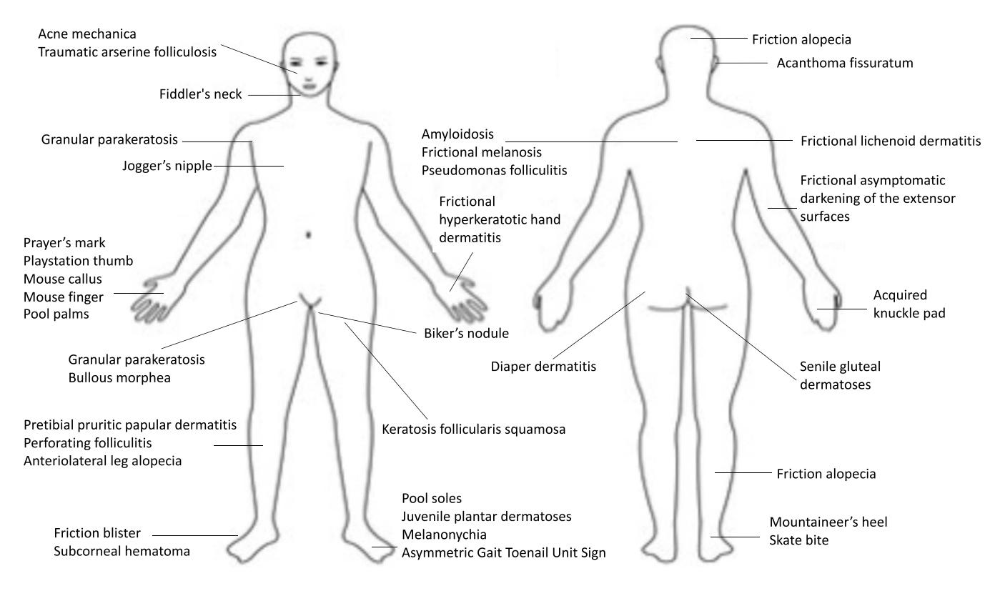
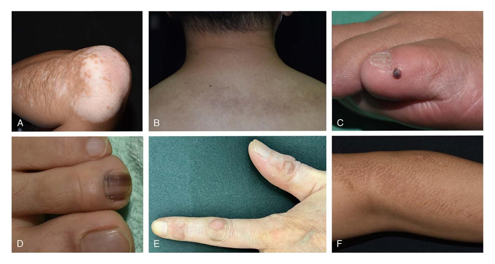

REVIEWS

# Friction-Induced Skin Disorders—A Review

Chang-Yu Hsieh, MD, and Tsen-Fang Tsai, MD

Abstract: Friction is unavoidable in activites of daily life and is associated with various dermatological disorders. A comprehensive literature review showed friction can induce epidermal changes, dermatitis, alteration of the dermis, diseases of abnormal deposition, alteration of the hair and follicles, nail diseases, pigmentary disorders, and skin tumors. Cultural, religious, and occupational factors may predispose to the development friction-related skin disorders. However, friction often occurs together with other external stimuli, such as pressure and occlusion. Careful observation and investigation are required to establish the exact role of friction in the development of various dermatoses.

# Capsule Summary

-Friction can trigger various skin disorders, including epidermal changes, dermatitis, alteration of the dermis, diseases of abnormal deposition, alteration of the hair and follicles, nail diseases, pigmentary disorders, and skin tumors. -Physicians should consider occupational, cultural, and religious factors when evaluating friction-associated dermatoses.

Skin is the interface between our body and the environment, so friction is inevitable in our daily life. Repeated friction results in microtrauma and may damage the skin integrity and induce numerous disorders. Friction plays a crucial role in many occupational and recreational dermatoses, especially sport-related skin problems. In addition, repeated friction from sociocultural and religious practices may also lead to various dermatoses. This review provides an overview of friction-triggered skin disorders.

From the Department of Dermatology, National Taiwan University Hospital, Taipei.

Address reprint requests to Tsen-Fang Tsai, MD, Department of Dermatology, National Taiwan University Hospital and National Taiwan University College of Medicine, No. 7, Zhongshan S Rd, Zhongzheng District, Taipei City 100, Taiwan (Republic of China). E-mail: [tftsai@yahoo.com](mailto:tftsai@yahoo.com).

T.-F.T. has conducted clinical trials or received honoraria for serving as a consultant for AbbVie, Boehringer Ingelheim, Bristol-Myers Squibb, Celgene, Eli-Lilly, Galderma, Janssen-Cilag, Merck Sharp & Dohme, Novartis International AG, Pfizer, Inc, and UCB Pharma. C.-Y.H. has no funding or conflicts of interest to declare.

This article is based on previously conducted studies and does not contain any studies with human participants or animals performed by any of the authors. Searching strategies were specified in "Method" section.

#### DOI: 10.1097/DER.0000000000000934

© 2023 American Contact Dermatitis Society. All Rights Reserved.

# METHOD

Literature search was performed on PubMed by using the following key words: (friction OR rubbing) AND (skin OR nail OR dermatoses OR dermatitis OR hair OR cutaneous). Articles published up to February 19, 2022, were reviewed. Articles whose title or abstract discussing friction-related dermatological disorders were included. Additional articles were identified from the reference list. Articles that did not clarify the causal relationship of friction and dermatoses, without available full text or not written in English, were excluded. Dermatoses resulting from lack of friction, such as dermatitis neglecta1 and terra firma-forme dermatosis2 were excluded. Because of limited space, articles delving into friction-aggravated diseases, such as psoriasis, hidradenitis suppurativa, Hailey-Hailey disease, and atopic dermatitis, were excluded. Oral lesions induced by friction, such as oral frictional keratosis, alveolar ridge keratosis, and oral warty dyskeratoma, were also excluded.

# RESULT

All the identified reports are categorized as hereinafter and in Table 1. Figure 1 provides an overview of the predilected sites of friction-induced dermatoses. Figure 2 includes photos of frictioninduced skin diseases.

# Alteration of the Epidermis

# Proliferation of the Epidermis

Hyperkeratosis is the prototype of friction-induced skin changes. Mousing callus is common among gamers after prolonged manipulation of a mouse or video game controllers characterized by lichenification and hyperkeratosis.3

Friction-induced hyperkeratosis is also observed at mucosal site, such as oral mucosa and genital area.4 Prayer marks are asymptomatic, chronic skin changes that develop on the forehead, knees, ankles, and dorsa of the feet as a consequence of repeated pressure and friction during prayers.5

Friction (combined with pressure) stimulates epidermis proliferation (lichenification) and contributes to various diseases, including

# TABLE 1. Summary of Friction-Related Skin Diseases Categorized by the Structure Involved and Pathogenesis Behind

Alteration of the Epidermal proliferation

epidermis Burn

Friction blister

Chafing, abrasion, erosion, and ulcer

Acanthoma fissuratum Disorder of keratinization

Dermatitis Lichenoid dermatitis Diaper dermatitis

PPPD

Frictional dermatitis

Frictional purpuric eruption

Alteration of the dermis EPS

Abnormal deposition Amyloidosis

Mucin deposition Fibrin deposition Calciphylaxis

Alteration of hair and hair

Acne mechanica

follicle Folliculitis

Follicular keratosis or traumatic anserine

folliculosis Frictional alopecia

ALH

Nail disease Melanonychia

Asymmetric gait toenail unit sign

Pigmentary disorders Frictional melanosis

Frictional asymptomatic darkening of the

extensor surfaces

Vitiligo Nevus

Friction-induced skin SCC

tumor Skate bite or biker's nodule

> PG Skin tag

AF, acanthoma fissuratum; ALH, Acquired localized hypertrichosis; EPS, elastosis perforans serpiginosa; PG, pyogenic granuloma; PPPD, Pretibial pruritic papular dermatitis; SCC, squamous cell carcinoma

acquired knuckle pads,6 elephantiasis nostras verrucose,7 senile gluteal dermatoses8 and lichen simplex chronicus.9 Lichen simplex chronicus is a common skin disorder characterized by circumscribed, lichenified, pruritic plaque secondary to local repetitive trauma, notably rubbing, and scratching.10

#### Friction Burn

A friction burn, also be referred to as skinning, chafing, is a form of abrasion caused by the friction of skin rubbing against a surface. Rapid friction occurs with the rise of temperature and further result in burn. Friction burn is common in pediatric group from the inadvertent contact of treadmill,11 car tire,12 or vacuum cleaner.13 Industrial accident is another important cause of friction burn.14 Health care workers should be aware of friction burn because there have been case reports about friction burns within the tibia during reaming15 and friction burns to thigh caused by tourniquet.16

# Friction Blister

Blisters result from frictional forces that mechanically separate epidermal cells at the level of the stratum spinosum.17 Blisters occur frequently, especially in vigorously active populations such as athletes18 and soldiers.19 It may also be induced by a tightly tied drawstring, a traditional costume in Asia.20

# Chafing, Abrasion, Erosion, and Ulcer

Repeated friction of the skin may lead to chafing, abrasion, erosion, and ulcers. Jogger's nipple is a painful chafing of the nipples due to friction of cotton-type T-shirts.21 Friction ulcer from the mountaineering boots has been named as Mountaineer's heel.22 Besides, friction is an established risk factor for pressure injury in a systematic review.23

# Subcorneal Hematoma

Friction can result in the development of a subcorneal hematoma in which blister formation and blood sequestration occur in the epidermis just below the stratum corneum. French term "talon noir" (which translates to black heel) is often used to describe this friction-induced subcorneal hematoma.24 Subcorneal hematoma has been described in athletes21 as well as in gamers.25

#### Acanthoma Fissuratum

Acanthoma fissuratum (AF) is a relatively rare condition that can mimic skin tumors such as basal cell carcinomas. It is caused by persistent irritation and rubbing to the skin, classically by poorly fitting glasses.26 Case report of AF induced by tight underwear has been proposed.27 Most cases of AF regressed after the external stimulus was removed.

#### Disorder of Keratinization

Friction can lead to various disorders of keratinization such as granular parakeratosis and pagetoid dyskeratosis. Granular parakeratosis is an acquired disorder of keratinization that affects flexures, presents as a flexural eruption composed of reddish-brown papules, or plaques with variable hyperpigmentation. Friction and hyperhidrosis may be contributary factors.28 Pagetoid dyskeratosis is characterized by pale cells within the epidermis resembling those of Paget disease. The lesion is considered a reactive process in which a small proportion of the normal population of keratinocytes is altered by external triggers such as friction.29

# Friction-Related Dermatitis

## Lichenoid Dermatitis

Frictional lichenoid eruption is also referred to as dermatitis papulosa juvenilis, summertime lichenoid dermatitis of the elbows or Sutton's summer prurigo. The dermatosis is characterized by lichenoid papules with regular borders, 1 to 2 mm in diameter, sometimes aggregated in plaques. The eruption is almost exclusively confined to the backs of the hands, fingers, elbows, and knees in children.30 Friction may play a role regarding the unexplained striking localization of vulnerable areas.31

Figure 1. Friction-induced dermatoses and predilected sites.

Localized friction from tight clothing has been regarded as a trigger factor for lichen planus pigmentosus.32 Drawstring on traditional Indian garments such as sari or salwar kameez, may induce lichen planus.33 Guasha is an ancient therapeutic technique in which the skin is scraped to produce light bruising. It may also result in lichen planus pigmentosus in treated area.34 Two patients with

Figure 2. Examples of friction-induced skin diseases (A, vitiligo; B, frictional melanosis; C, subcorneal hematoma; D, frictional melanonychia; E, knuckle pads; F, macular amyloidosis).

lichen sclerosus of vulva developed similar lesion on the skin under brassiere straps and under the waist band, indicating that friction from tight clothing might be a potential trigger for lichen sclerosis.35

# Diaper Dermatitis

Friction between the skin and clothes is an important trigger for diaper dermatitis. Friction damages epidermal barrier functions with subsequent increased penetration of irritants. This role is strongly suggested by the increased susceptibility to the rash of the convex skin surfaces in the napkin area rather than the folds.36

## Pretibial Pruritic Papular Dermatitis

Pretibial pruritic papular dermatitis (PPPD) consists of pretibial erythematous to flesh-colored pruritic papules with a smooth surface. In later stages, the grouping of papules can create a cobblestone appearance.37 It is caused by the delicate and persistent rubbing of pretibial skin. Histologically, the absence of uneven psoriasiform epidermal hyperplasia, marked compact orthokeratosis, hypergranulosis, and coarse bundles of collagen arranged in vertical streaks in the papillary dermis distinguished PPPD from lichen simplex chronicus, whereas the lack of amyloid deposits in the dermal papillae differentiated PPPD from lichen amyloidosis.38

# Frictional Dermatitis

Friction is an important but underrecognized cause of physical irritant contact dermatitis, which is often related to occupational exposure of the hands.39 Frictional hyperkeratotic hand dermatitis is an unusual form of chronic eczema relating to repeated frictional trauma. This form of hand eczema is often occupationally related and recalcitrant to therapy.40 There are articles referring to occupational frictional hyperkeratotic hand dermatitis in different jobs, including surgeon,40 office worker, secretary, and bus driver.41 Frictional hyperkeratotic hand dermatitis has also been reported in leg amputee due to frictional irritation from the hand holes of crutches.42

Fiddler's neck is a condition affecting violin and viola players. The etiologies are probably attributable to a combination of factors including increased pressure, friction, poor hygiene, and excessive perspiration.43 Athletes is a common group experiencing frictional dermatitis. Pool palms or pool soles are the subtypes of frictional dermatitis induced by friction between the hands or feet with the rough surface of swimming pool.44 Wrestler's45 and Kendo players46 are prone to develop frictional hand dermatitis.

Playstation thumb refers to a specific frictional dermatitis caused by excessive video game playing.47 Mouse finger was characterized by erythema, rhagades, and scaling on the palmar side of the fingertips, often observed in computer programmer48 Irritation from the cloth, such as band of underpants, drawstring of sari,49 or even pacemaker strip,50 have been reported to induce frictional dermatitis. Juvenile plantar dermatoses involve predominantly the weightbearing areas of the feet. It is a frictional contact dermatitis to which atopic individuals are prone.51

## Frictional Purpuric Eruption

Friction purpuric eruption stands for a specific drug eruption secondary to angiotensin receptor blocker use. Histopathology showed hyperkeratosis, epidermal hyperplasia with focal spongiosis, basal layer vacuolization, lymphocytic exocytosis, superficial perivascular lymphocytic infiltrate in the papillary dermis, telangiectasia, and extravasated erythrocytes into the dermis and epidermis. It is characterized by purpuric dermatitis mainly involving sites of friction and is reversible after discontinuing angiotensin receptor blocker.52

# Alteration of the Dermis

#### Elastosis Perforans Serpiginosa

Elastosis perforans serpiginosa (EPS) is a rare and intractable skin disease, which is sometimes associated with Ehlers-Danlos syndrome, pseudoxanthoma elasticum, or D-penicillamine. Ashida et al53 published a case report of penicillamine-related EPS persisted for more than 10 years even after cessation of D-penicillamine. However, after educating the patient refrain from rubbing, the skin lesion improved within 1 month, indicating that friction is a key factor to provoke transepidermal eliminations of degenerated elastic fibers.53

# Diseases of Abnormal Deposition

# Amyloidosis

Various forms of amyloidosis may be induced by friction, including lichen amyloidosis,54 macular amyloidosis,54 and bullous amyloidosis.55 This entity has been described as other terms, such as frictional melanosis and nylon towel dermatitis. In Japan, people used to scrub their body with nylon towel during a bath; thus, several case reports of frictional amyloidosis on the upper back in Japanese population have been described.56 Patients with chronic pruritus may use diverse tool, such as back scratcher,57 to scratch. Therefore, they carry a high risk of frictional amyloidosis.

# Mucin Deposition

Secondary cutaneous mucinosis is sometimes caused by collagen degeneration or a reactive response to various stimuli. A case report of soft fibroma-like polypoid mucinosis secondary to friction by clothes, has been described.58

#### Fibrin Deposition

The localized presence of fibrin immediately below the epidermis has been proposed as a histopathological clue of friction. It has been observed in several entities, including chrondrodermatitis nodularis helicis chronica, prurigo nodularis, and AF. Friction damage of superficial papillary vessels, which later contributes to fibrin extravasation, has been postulated.59

#### Calciphylaxis

Calciphylaxis refers to a generally fatal, necrotizing cutaneous syndrome secondary to vascular calcification. It is usually observed in patients having end-stage renal disease with secondary hyperparathyroidism. Mechanical frictional stimulation inflicted on the local skin was suspected to have precipitated the calciphylaxis.60

# Alteration of Hair and Hair Follicle

# Acne Mechanica

Mechanical factors contribute to the development of inflammatory papules, open comedones in acne-prone areas.61 Exogenous acne refers to acneiform lesions due to external factors, such as cosmetic agents, exposure to various oils, skin rubbing or friction, or chloracne.62 Mask acne or "maskne," which has arisen during the COVID-19 pandemic, refers to a form of acne mechanica arising from textile-skin friction.63

# Folliculitis

Folliculitis typically arises in areas prone to occlusion, friction, and increased levels of perspiration.64 Folliculitis mechanica referred to folliculitis triggered by external force,61 and "frictional folliculitis" specifically indicates friction-induced folliculitis. Friction leads to follicular irritation, exposure to follicular alloantigens that evoke an immune response with inflammation, follicular destruction, and transepidermal elimination of the hair shafts in the dermis.65 It has been proposed that as with Kyrle disease, chronic friction leads to abnormal keratinization of the follicular epithelium, which eventually results in follicular perforation.66

Pseudomonas folliculitis (PF) develops after exposure to contaminated water, such as whirlpools, swimming pools, water slides, and hot tubs. In a study of 8 Japanese patients with PF, 8 of them were rubbing their bodies with nylon towels or sponges during bathing. Discontinued use of nylon towels resulted in prompt resolution of PF and no recurrence in all cases.67

# Follicular Keratosis or Traumatic Arserine Folliculosis

Traumatic anserine folliculosis is an underrecognized and underreported entity that is commonly mistaken as comedonal acne. It is seen in children and young adults, and friction has been implicated as a probable causal factor.68 Clinically, traumatic anserine folliculosis presents with grouped yellow to white or skin-colored papules with or without surrounding erythema. Histopathology reveals dilated follicular openings and presence of retained keratotic material.69

In a recent case series including 20 African American children, all patients presented clinically with an asymptomatic, localized hyperpigmented patch with follicular prominence on the cheek, chin, jawline, or upper lip and was diagnosed with "follicular keratosis." Nearly half of the patients presented during the COVID-19 pandemic, suggesting that friction from facial mask wearing may have played a role in pathogenesis.70 Keratosis follicularis squamosa is another entity characterized by asymptomatic small scaly patches with follicular plugs scattered on the trunk and thighs. Irritation by clothing, for example, swimming suit, has been recognized as a triggering factor.71

# Frictional Alopecia

Frictional alopecia is hair loss secondary to frequent rubbing of the hair, which leads to hair breakage at different levels and splitting at the ends.72 When it is self-inflicting, frictional alopecia is referred to as trichoteiromania, a psychiatric disorder characterized by compulsive rubbing of the hair.73Anterolateral leg alopecia also called peroneal alopecia is one of the best-known alopecia possibly due to friction. Other hypotheses include leg crossing, trouser rubbing, and association with androgenetic alopecia.74 Repeatedly playing water slide can lead to frictional alopecia on the calf.75 Friction alopecia can occur also on the scalp72 and abdomen.76 Friction due to footwear, socks, and tight clothing is one of the causes of lower limb alopecia.77 Neonatal occipital alopecia has been thought to be friction. It is recently clear that neonatal occipital alopecia is related to the physiological hair shedding.78

# Acquired Localized Hypertrichosis

Acquired localized hypertrichosis may be associated with chronic irritation, inflammation, and friction.79 In artistic gymnastics athletes, alopecia, hypertrichosis of the forearms, and thickening of the skin of the radial epiphysis are pathognomonic with relation to the activity of these athletes.80

# Nail Disease

# Melanonychia

Friction and pressure may stimulate melanocytes and result in melanonychia. Frictional melanonychia is a very common form of melanocytic activation and is typically localized only on the fifth or fourth toenails, due to the frequently chronic friction of these digits with the shoes. The band is usually gray-black, and its background is brown with parallel thin lines.81

#### Asymmetric Gait Toenail Unit Sign

Asymmetric gait nail unit signs are produced by the friction of the closed shoe in patients with an asymmetric gait, resulting primarily from the ubiquitous uneven flat feet.82 It is the most common worldwide toenail abnormality in shoe-wearing societies. The clinical abnormalities of the asymmetric gait syndrome include onycholysis, nail bed keratosis, nail plate surface abnormalities, and a diagnostic nail plate shape.83

# Friction-Related Pigmentary Disorders

# Frictional Melanosis

Frictional melanosis is an acquired pigmentary disorder characterized by brownish pigmentation, distributed on the skin over the bony regions of the trunk and extremities due to habitual scrubbing with different bathing tools, such as nylon towel84 or scrub pads.85,86 There are also reports about frictional melanosis related to traditional clothing87 and training bench.88 Frictional melanosis was suspected to share the same location and etiology as macular amyloidosis without amyloid deposition.89 Friction melanosis also contributes to the appearance of atopic dirty neck.90

# Frictional Asymptomatic Darkening of the Extensor Surfaces

Frictional asymptomatic darkening of the extensor surfaces (FADES) is characterized by brown darkening over the extensor surfaces of the elbows and knees with minimal scaling. Unlike friction melanosis, FADES failed to show evidence of an increase in dermal melanin pigment but show papillomatosis with acanthosis, hyperkeratosis, and no significant inflammation.91 Keratolytic agents are beneficial for FADES.

## Vitiligo

Detachment and transepidermal elimination of melanocytes after minor mechanical trauma in nonlesional vitiligo skin are probably the cause of depigmentation occurring in friction-triggered vitiligo.92 During COVID-19 pandemic, a case report of mask vitiligoassociated repeat friction from the mask has been published.93

## Nevus

Trauma has been postulated as a risk factor for development of nevi. There is one case report of linearly arranged melanocytic nevi secondary to chronic friction from ski boot.94

# Friction-Induced Skin Tumor

#### Squamous Cell Carcinoma

Trauma is a known risk factor for squamous cell carcinoma (SCC). An 80-year-old man presented with irritated papules on the posterior upper sulci of the ears bilaterally. These areas were frequently rubbed and had become irritated since he began wearing a face mask at the beginning of the COVID-19 pandemic. Pathology for both areas was consistent with SCC in situ.95 Another case report of "sari cancer," referring to SCC induced by friction of the petticoat and sari, has been published.20 Nonetheless, the development of SCC is multifactorial, and friction-induced SCC has only been mentioned in anecdotal case reports. It is also possible that these SCCs arose solely from classic causes, such as chronic UV exposure or hereditary factors, and friction simply exacerbated the presentation and symptoms.95

# Skate Bite or Biker's Nodule

Skate bite or biker's nodule represents a form of athlete's nodules found on sites of recurrent friction and trauma. Biker's nodule, also called perineal nodular induration, cyclist's nodule, ischiatic hygroma, third testicle, or an accessory testicle, is a reactive fibroblastic and myofibroblastic pseudotumor almost exclusively reported in male cyclists. Histopathology showed paucicellular fibroblastic proliferation containing CD34-reactive spindle and epithelioid cells, small foci of fibrinoid degeneration, numerous blood vessels, and entrapped groups of mature fat cells.96 Skate bites are found on the ankles of hockey players and ice skaters who wear tight-fitting skates. Histology reveals an increase in collagen bundles in the reticular dermis resembling a collagenoma.97

#### Pyogenic Granuloma

Pyogenic granuloma is a benign vascular tumor that may follow trauma. Articles about nail bed pyogenic granuloma after frictional onycholysis have been described.98 Pyogenic granuloma on the hand subsequent to friction blister in a hand surgeon has been reported.99

# Skin Tag

Skin tags are common benign neoplasm located predominantly in intertriginous skin. A patient who developed multiple skin tags arranged in a linear fashion after the brassiere straps suggests an etiopathogenic role of friction.100 A review, including 300 subjects, demonstrated that skin tag mostly occurred in friction-prone area, such as the neckline, where collars rub against the skin.101

# DISCUSSION

A moderate degree of friction is unavoidable in daily life. However, excessive friction to the skin can damage the barrier function, induce inflammatory processes, stimulate keratinocytes or melanocytes proliferation, facilitate infection, and even induce tumor formation. It is worth noting that friction from repetitive movements of work was associated various occupational skin disorders. Friction-related skin disorders are commonly seen in athletes, musicians, and health professionals. During the COVID-19 pandemic when personal protective equipment is essential, friction from the mask can be associated with acne, vitiligo, follicular keratosis, and even SCC. Some traditional costumes, religious rituals, and even lifestyles (such as using nylon towel for bath) can be the core reason for frictional dermatoses. The impact of friction on skin is often multifactorial and difficult to separate from pressure and occlusion. Careful observations and investigations are required to establish the exact role of friction in the development of various dermatoses.

# CONCLUSIONS

Repeated friction and rubbing can result in various dermatoses, including changes of the epidermis, dermis, and adnexal structures. Occupational, cultural, and religious factors may account for the reason behind. Frictional-related dermatoses are common among athletes, musicians, and health care professionals. Physicians should consider the role of friction when skin lesions appear at trauma predilection areas.

# REFERENCES

- 1. Saha A, Seth J, Sharma A, Biswas D. Dermatitis neglecta—a dirty dermatosis: report of three cases. Indian J Dermatol 2015;60(2):185–187. doi:10. 4103/0019-5154.152525.
- 2. Vakirlis E, Theodosiou G, Lallas A, Apalla Z, Sotiriou E. Terra firma-forme dermatosis: differential diagnosis and response to salicylic acid therapy. Pediatr Dermatol 2019;36(4):501–504. doi:10.1111/pde.13807.
- 3. Ghasri P, Feldman SR. Frictional lichenified dermatosis from prolonged use of a computer mouse: case report and review of the literature of computer-related dermatoses. Dermatol Online J 2010;16(12):3. doi:10. 5070/d39bs5w7c3.
- 4. Manam SP, Lewis FM, Calonje JE. Frictional keratosis of the vulva: a new entity. Eur J Obstet Gynecol Reprod Biol. 2020;254(254):336–337. doi:10. 1016/j.ejogrb.2020.09.034.
- 5. Abanmi AA, Al Zouman AY, Al Hussaini H, Al-Asmari A. Prayer marks. Int J Dermatol 2002;41(7):411–414. doi:10.1046/j.1365-4362.2002.01398.x.
- 6. Dickens R, Adams BB, Mutasim DF. Sports-related pads. Int J Dermatol 2002;41(5):291–293. doi: 10.1046/j.1365-4362.2002.01356\_3.x.
- 7. Hotta E, Asai J, Okuzawa Y, et al. Verrucous lesions arising in lymphedema and diabetic neuropathy: elephantiasis nostras verrucosa or verrucous skin lesions on the feet of patients with diabetic neuropathy? J Dermatol 2016;43 (3):329–331. doi:10.1111/1346-8138.13063.

- 8. Liu HN, Wang WJ, Chen CC, Lee DD, Chang YT. Senile gluteal dermatosis: a clinical study of 137 cases. Int J Dermatol 2014;53(1):51–55. doi:10.1111/j. 1365-4632.2012.05702.x.
- 9. Juarez MC, Kwatra SG. A systematic review of evidence based treatments for lichen simplex chronicus. J Dermatolog Treat 2021;32(7):684–692. doi: 10.1080/09546634.2019.1708856.
- 10. Tiengo C, Deluca J, Belloni-Fortina A, Salmaso R, Galifi F, Alaibac M. Occurrence of squamous cell carcinoma in an area of lichen simplex chronicus: case report and pathogenetic hypothesis. J Cutan Med Surg 2012;16(5): 350–352. doi:10.1177/120347541201600513.
- 11. Wong A, Maze D, La Hei E, Jefferson N, Nicklin S, Adams S. Pediatric treadmill injuries: a public health issue. J Pediatr Surg 2007;42(12):2086–2089. doi: 10.1016/j.jpedsurg.2007.08.031.
- 12. Al-Qattan MM. Car-tyre friction injuries of the foot in children. Burns 2000; 26(4):399–408. doi:10.1016/S0305-4179(99)00130-8.
- 13. Walsh K, Osman-Elabd M, Sheikh Z, Soueid A. Vacuum cleaner friction injuries in paediatrics: a 10 year review of national trends. Burns 2021:2–7. doi:10.1016/j.burns.2021.09.001.
- 14. Al-Qattan MM, Al-Zahrani K, Al-Shanawani B, Al-Arfaj N. Friction burn injuries to the dorsum of the hand after car and industrial accidents: classification, management, and functional recovery. J Burn Care Res 2010;31(4): 610–615. doi:10.1097/BCR.0b013e3181e4d6b9.
- 15. Giannoudis PV, Snowden S, Matthews SJ, Smye SW, Smith RM. Friction burns within the tibia during reaming. Are they affected by the use of a tourniquet?. J Bone Joint Surg Br 2002;84(4):492–496. doi:10.1302/0301-620X. 84B4.12563.
- 16. Choudhary S, Koshy C, Ahmed J, Evans J. Friction burns to thigh caused by tourniquet. Br J Plast Surg 1998;51(2):142–143. doi:10.1054/bjps.1997.0189.
- 17. Knapik JJ, Reynolds KL, Duplantis KL, Jones BH. Friction blisters. Pathophysiology, prevention and treatment. Sports Med 1995;20(3):136–147. doi:10.2165/00007256-199520030-00002.
- 18. Burkhart CG. Skin disorders of the foot in active patients. Phys Sportsmed 1999;27(2):88–101. doi:10.3810/psm.1999.02.673.
- 19. Brennan FH Jr, Jackson CR, Olsen C, Wilson C. Blisters on the battlefield: the prevalence of and factors associated with foot friction blisters during Operation Iraqi Freedom I. Mil Med 2012;177(2):157–162. doi:10.7205/ MILMED-D-11-00325.
- 20. Verma SB. Dermatological signs in South Asian women induced by sari and petticoat drawstrings. Clin Exp Dermatol 2010;35(5):459–461. doi:10.1111/j. 1365-2230.2009.03587.x.
- 21. Conklin RJ. Common cutaneous disorders in athletes. Sports Med 1990;9 (2):100–119. doi:10.2165/00007256-199009020-00004.
- 22. Strauss RM. Mountaineer's heel. Br J Sports Med 2004;38(3):344–345. doi: 10.1136/bjsm.2002.004184.
- 23. Bradford NK. Repositioning for pressure ulcer prevention in adults—a Cochrane review. Int J Nurs Pract 2016;22(1):108–109. doi:10.1111/ijn. 12426.
- 24. Cohen PR. Pool toes: case report and review of pool-associated pedal dermatoses. Cureus 2020;12(11):1–10. doi:10.7759/cureus.11756.
- 25. Lennox M, Rizzo J, Lennox L, et al. Subcorneal hematomas in excessive video game play. Cutis 2016;97(1):35–38.
- 26. Ramroop S. Successful treatment of acanthoma fissuratum with intralesional triamcinolone acetonide. Clin Case Rep 2020;8(4):702–703. doi:10. 1002/ccr3.2708.
- 27. Lee JI, Lee YB, Cho BK, Park HJ. Acanthoma fissuratum on the penis. Int J Dermatol 2013;52(3):382–384. doi:10.1111/j.1365-4632.2011.04903.x.
- 28. Chamberlain AJ, Tam MM. Intertriginous granular parakeratosis responsive to potent topical corticosteroids. Clin Exp Dermatol 2003;28(1):50–52. doi:10.1046/j.1365-2230.2003.01159.x.

- 29. Val-Bernal JF, Garijo MF. Pagetoid dyskeratosis of the prepuce. An incidental histologic finding resembling extramammary Paget's disease. J Cutan Pathol 2000;27(8):387–391. doi:10.1034/j.1600-0560.2000.027008387.x.
- 30. Patrizi A, Di Lernia V, Ricci G, Masi M. Atopic background of a recurrent papular eruption of childhood (frictional lichenoid eruption). Pediatr Dermatol 1990;7(2):111–115. doi:10.1111/j.1525-1470.1990.tb00665.x.
- 31. Pierson JC, Hunt JT. Summertime elbow eruptions: facts and friction. J Am Acad Dermatol 2013;69(3):484–485. doi:10.1016/j.jaad.2013.03.039.
- 32. Robles-Méndez JC, Rizo-Frías P, Herz-Ruelas ME, Pandya AG, Ocampo Candiani J. Lichen planus pigmentosus and its variants: review and update. Int J Dermatol 2018;57(5):505–514. doi:10.1111/ijd.13806.
- 33. Kumara L, Rangaraj M, Karthikeyan K. Drawstring lichen planus: a unique case of Koebnerization. Indian Dermatol Online J 2016;7(3):201. doi:10. 4103/2229-5178.182368, 202.
- 34. Yang G, Tan C. Lichen planus pigmentosus-like reaction to Guasha. J Cutan Med Surg 2016;20(6):586–588. doi:10.1177/1203475416659857.
- 35. Todd P, Halpern S, Kirby J, Pembroke A. Lichen sclerosus and the Köbner phenomenon. Clin Exp Dermatol 1994;19(3):262–263. doi:10.1111/j.1365- 2230.1994.tb01183.x.
- 36. Atherton DJ. Understanding irritant napkin dermatitis. Int J Dermatol 2016; 55:7–9. doi:10.1111/ijd.13334.
- 37. Kecelj B, Kecelj Leskovec N, Žgavec B. A case report and differential diagnosis of pruritic pretibial skin lesions. Acta Dermatovenerol Alp Pannonica Adriat 2020;29(3):157–159. doi:10.15570/actaapa.2020.32.
- 38. Annessi G, Petresca M, Petresca A. Pretibial pruritic papular dermatitis: a distinctive cutaneous manifestation in response to chronic rubbing. Am J Dermatopathol 2006;28(2):117–121. doi:10.1097/01.dad.0000200017.37082.e4.
- 39. Bennike NH, Johansen JD, Menné T. Friction from paper and cardboard causing occupational dermatitis in non-atopic individuals. Contact Dermatitis 2016;74(5):307–308. doi:10.1111/cod.12530.
- 40. Walling HW, Swick BL, Storrs FJ, Boddicker ME. Frictional hyperkeratotic hand dermatitis responding to Grenz ray therapy. Contact Dermatitis 2008; 58(1):49–51. doi:10.1111/j.1600-0536.2007.01152.x.
- 41. Menne T, Hjorth N. Frictional contact dermatitis. Am J Ind Med 1985;8 (4–5):401–402. doi:10.1002/ajim.4700080421.
- 42. Wollina U, Heinig B, Tchernev G, França K, Lotti T, Städtisches Klinikum UW. Unilateral palmar callus and irritant hand eczema—underreported signs of dependency on crutches. Maced J Med Sci 2018;6(1):103–104. doi: 10.3889/oamjms.2018.031.
- 43. Jue MS, Kim YS, Ro YS. Fiddler's neck accompanied by allergic contact dermatitis to nickel in a viola player. Ann Dermatol. 2010;22(1):88–90. doi:10. 5021/ad.2010.22.1.88.
- 44. Morgado-Carrasco D, Feola H, Vargas-Mora P. Pool Palms. Dermatol Pract Concept. 2020;10(1):e2020009. doi:10.5826/dpc.1001a09.
- 45. Inui S, Itami S. 2 Cases of sumo wrestlers' friction dermatitis. Contact Dermatitis 2008;58(6):374–375. doi:10.1111/j.1600-0536.2007.01303.x.
- 46. Yoshida M, Oiso N, Kawada A. Hyperkeratosis and frictional dermatitis from practicing Kendo. Case Rep Dermatol 2010;2(2):65–68. doi:10.1159/ 000314318.
- 47. Wolf R, Wolf D. Playstation thumb. Int J Dermatol 2014;53(5):617–618. doi: 10.1111/ijd.12368.
- 48. Vermeer MH, Bruynzeel DP. Mouse fingers, a new computer-related skin disorder. J Am Acad Dermatol 2001;45(3):477. doi:10.1067/mjd.2001. 114567.
- 49. Lilly E, Kundu R V. Dermatoses secondary to Asian cultural practices. Int J Dermatol 2012;51(4):372–382. doi:10.1111/j.1365-4632.2011.05170.x.
- 50. Matsubara T, Sato T, Ohnishi S, Yamasaki M. Pacemaker dermatitis induced by backpack strap friction. Am J Med 2015;128(9):e1-e2. doi:10. 1016/j.amjmed.2015.05.015.

- 51. Moorthy TT, Rajan VS. Juvenile plantar dermatosis in Singapore. Int J Dermatol 1984;23(7):476–479. doi:10.1111/ijd.1984.23.7.476.
- 52. Foti C, Carbonara AM, Guida S, et al. Frictional purpuric eruption associated with angiotensin II receptor blockers. Dermatol Ther 2014;27(2):97–100. doi:10.1111/dth.12063.
- 53. Ashida M, Okubo Y, Iwanaga A, Utani A. No rubbing, no elastosis perforans serpiginosa. J Dermatol 2017;44(8):e202-e203. doi:10.1111/1346- 8138.13874.
- 54. Iwasaki K, Mihara M, Nishiura S, Shimao S. Biphasic amyloidosis arising from friction melanosis. J Dermatol 1991;18(2):86–91. doi:10.1111/j.1346- 8138.1991.tb03048.x.
- 55. Ochiai T, Morishima T, Hao T, Takayama A. Bullous amyloidosis: the mechanism of blister formation revealed by electron microscopy. J Cutan Pathol 2001;28(8):407–411. doi:10.1034/j.1600-0560.2001.028008407.x.
- 56. Yoshida A, Takahashi K, Tagami H, Akasaka T. Lichen amyloidosis induced on the upper back by long-term friction with a nylon towel. J Dermatol 2009;36(1):56–59. doi:10.1111/j.1346-8138.2008.00586.x.
- 57. Wong CK, Lin CS. Friction amyloidosis. Int J Dermatol 1988;27(5):302–307. doi:10.1111/j.1365-4362.1988.tb02357.x.
- 58. Chen HH, Chung CJ, Kuo TT, Hong HS. A solitary soft fibroma-like polypoid mucinosis: report of an unusual case. Dermatol Surg 2004;30(3):450–451. doi:10.1111/j.1524-4725.2004.30124.x.
- 59. Wong E, MacDonald DM. Localized subepidermal fibrin deposition–a histopathological feature of friction induced cutaneous lesions. Clin Exp Dermatol 1982;7(5):499–504. doi:10.1111/j.1365-2230.1982.tb02466.x.
- 60. Sato N, Teramura T, Ishiyama T, Tagami H. Fulminant and relentless cutaneous necrosis with excruciating pain caused by calciphylaxis developing in a patient undergoing peritoneal dialysis. J Dermatol 2001;28(1):27–31. doi: 10.1111/j.1346-8138.2001.tb00082.x.
- 61. Dreno B, Bettoli V, Perez M, Bouloc A, Ochsendorf F. Cutaneous lesions caused by mechanical injury. Eur J Dermatology. 2015;25(2):114–121. doi: 10.1684/ejd.2014.2502.
- 62. Seneschal J, Kubica E, Boursault L, et al. Exogenous inflammatory acne due to combined application of cosmetic and facial rubbing. Dermatology 2012; 224(3):221–223. doi:10.1159/000338694.
- 63. Teo WL. The "Maskne" microbiome—pathophysiology and therapeutics. Int J Dermatol 2021;60(7):799–809. doi:10.1111/ijd.15425.
- 64. Tlougan BE, Mancini AJ, Mandell JA, Cohen DE, Sanchez MR. Skin conditions in figure skaters, ice-hockey players and speed skaters: part II—coldinduced, infectious and inflammatory dermatoses. Sports Med 2011;41 (11):967–984. doi:10.2165/11592190-000000000-00000.
- 65. Haddad V Junior, Campos LM, Haddad GR, Rossetto AL, Rossetto AL. Aseptic folliculitis in freshwater and marine fishermen. Int J Occup Environ Med. 2020;11(4):210–212. doi:10.34172/ijoem.2020.2136.
- 66. Patterson JW, Graff GE, Eubanks SW. Perforating folliculitis and psoriasis. J Am Acad Dermatol 1982;7(3):369–376. doi:10.1016/S0190-9622(82) 70124-0.
- 67. Teraki Y, Nakamura K. Rubbing skin with nylon towels as a major cause of pseudomonas folliculitis in a Japanese population. J Dermatol 2015;42(1): 81–83. doi:10.1111/1346-8138.12712.
- 68. Arora P, Ankad BS, Sardana K, Bansal P. Traumatic anserine folliculosis and comedones: the role of dermoscopy in differentiation. Indian Dermatol Online J 2021;12(4):587–589. doi:10.4103/idoj.IDOJ\_631\_20.
- 69. Dorjay K, Sinha S, Sachdeva S. "Chin on palms sign" to diagnose traumatic anserine folliculosis: an observational analysis. J Assoc Physicians India 2021;69(11):11–12.
- 70. Grullon K, Ashi SA, Shea CR, Ruiz de Luzuriaga AMM, Stein SL, Rosenblatt AEE. Follicular keratosis of the face in pediatric patients of color. Pediatr Dermatol 2022;39(2):1–5. doi:10.1111/pde.14946.

- 71. Murayama S, Mizawa M, Takegami Y, Makino T, Shimizu T. Two cases of keratosis follicularis squamosa (Dohi) caused by swimsuit friction. Eur J Dermatol 2013;23(2):230–232. doi:10.1684/ejd.2013.2002.
- 72. Fowler E, Tosti A. A case of friction alopecia in a healthy 15-year-old girl. Skin Appendage Disord 2019;5(2):97–99. doi:10.1159/000490712.
- 73. Banky JP, Sheridan AT, Dawber RPR. Weathering of hair in trichoteiromania. Australas J Dermatol 2004;45(3):186–188. doi:10.1111/j.1440-0960. 2004.00087.x.
- 74. Srinivas SM, Sacchidanand S, Jagannathan B. Anterolateral leg alopecia. Int J Trichology. 2016;8(1):49–50. doi:10.4103/0974-7753.179402.
- 75. Adams BB. Water-slide alopecia. Cutis 2001;67(5):399–400.
- 76. Sharquie KE, Al-Rawi JR, Al-Janabi HA. Frictional hair loss in Iraqi patients. J Dermatol 2002;29(7):419–422. doi:10.1111/j.1346-8138.2002.tb00297.x.
- 77. Jakhar D, Kaur I. Frictional (sock) alopecia of the legs: trichoscopy as an aid. Int J Trichology 2018;10(3):129–130. doi:10.4103/ijt.ijt\_96\_17.
- 78. Kim MS, Na CH, Choi H, Shin BS. Prevalence and factors associated with neonatal occipital alopecia: a retrospective study. Ann Dermatol 2011;23(3): 288–292. doi:10.5021/ad.2011.23.3.288.
- 79. Ma HJ, Yang Y, Ma HY, Jia CY, Li TH. Acquired localized hypertrichosis induced by internal fixation and plaster cast application. Ann Dermatol. 2013;25(3):365–367. doi:10.5021/ad.2013.25.3.365.
- 80. Biolcati G, Berlutti G, Bagarone A, Caselli G. Dermatological marks in athletes of artistic and rhythmic gymnastics. Int J Sports Med 2004;25(8): 638–640. doi:10.1055/s-2004-815714.
- 81. Starace M, Alessandrini A, Brandi N, Piraccini BM. Use of nail dermoscopy in the management of melonychia: Review. Dermatol Pract Concept 2019;9 (1):38–43. doi:10.5826/dpc.0901a10.
- 82. Zaias N, Rebell G, Casal G, et al. The asymmetric gait toenail unit sign. Skinmed 2012;10(4):213–217.
- 83. Zaias N, Escovar SX, Rebell G. Opportunistic toenail onychomycosis. The fungal colonization of an available nail unit space by non-dermatophytes is produced by the trauma of the closed shoe by an asymmetric gait or other trauma. A plausible theory. J Eur Acad Dermatol Venereol 2014;28(8):1002–1006. doi:10.1111/jdv.12458.
- 84. Hata S, Tanigaki T, Misaki K, Nakata K, Okada A. Incidence of friction melanosis in young Japanese women induced by using nylon towels and brushes. J Dermatol 1987;14(5):437–439. doi:10.1111/j.1346-8138.1987.tb03606.x.
- 85. Magaña-García M, Carrasco E, Herrera-Goepfert R, Pueblitz-Peredo S. Hyperpigmentation of the clavicular zone: a variant of friction melanosis. Int J Dermatol 1989;28(2):119–122. doi:10.1111/j.1365-4362.1989.tb01331.x.
- 86. Al-Aboosi MM, Abalkhail A, Kasim O, et al. Friction melanosis: a clinical, histologic, and ultrastructural study in Jordanian patients. Int J Dermatol 2004;43(4):261–264. doi:10.1111/j.1365-4632.2004.01606.x.
- 87. El-Azhari J, Boui M. Friction melanosis and mode of dress. Pan Afr Med J. 2018;30:1–2. doi:10.11604/pamj.2018.30.215.16239.
- 88. Kang HY, Rhee SH, Kim YC, Lee E-S. Friction melanosis and striae distensa caused by stretch training on a bench press. J Dermatol 2005;32(9):765–766. doi:10.1111/j.1346-8138.2005.tb00840.x.
- 89. Mysore V, Malkud S, Anitha B. Frictional melanosis and its clinical and histopathological features. Iran J Dermatology 2018;21(4):124–127.
- 90. Seghers AC, Lee JSS, Tan CS, et al. Atopic dirty neck or acquired atopic hyperpigmentation? An epidemiological and clinical study from the national skin centre in Singapore. Dermatology 2014;229(3):174–182. doi:10.1159/ 000362596.
- 91. Krishnamurthy S, Sigdel S, Brodell RT. Frictional asymptomatic darkening of the extensor surfaces. Cutis 2005;75(6):349–355.
- 92. Gauthier Y, Cario-Andre M, Lepreux S, Pain C, Taïeb A. Melanocyte detachment after skin friction in non lesional skin of patients with generalized vitiligo. Br J Dermatol 2003;148(1):95–101. doi:10.1046/j.1365-2133.2003. 05024.x.

- 93. Sinha S, Savitha B, Sardana K. "Mask vitiligo" secondary to frictional dermatitis from surgicalmasks.ContactDermatitis 2021;85(1):121–123. doi:10.1111/cod.13813.
- 94. Navarini AA, Kolm I, Calvo X, et al. Trauma as triggering factor for development of melanocytic nevi. Dermatology 2010;220(4):291–296. doi:10. 1159/000276983.
- 95. Farmer W, Tallman R, Kiavash K, Codrea V. Bilateral posterior ear squamous cell carcinoma in situ lesions along the path of mask strap friction. Dermatol Surg 2021;47(10):1400–1401. doi:10.1097/DSS.0000000000003180.
- 96. Khedaoui R, Martín-fragueiro LM, Tardío JC. Perineal nodular induration ("biker's nodule"): report of two cases with fine-needle aspiration cytology and immunohistochemical study. Int J Surg Pathol. 2014;22(1):71-5. doi: 10.1177/1066896912465008.
- 97. Englund SL, Adams BB. Winter sports dermatology: a review. Cutis 2009; 83(1):42–48.
- 98. Richert B. Frictional pyogenic granuloma of the nail bed. Dermatology 2001; 202(1):80–81. doi:10.1159/000051599.
- 99. Sasmaz S, Karaoguz A, Uzel M, Coban K. Pyogenic granuloma on the hand subsequent to friction blister in a hand surgeon. Dermatol Online J 2006; 12(3):8–10. doi:10.5070/d30zv279dw.
- 100. Allegue F, Fachal C, Pérez-Pérez L. Friction induced skin tags. Dermatol Online J 2008;14(3):19–21. doi:10.5070/d30cs6h02d.
- 101. Rodbard S, Epstein S. The role of friction in the induction of cutaneous papilliferous growths. Am J Med Sci 1965;249:685–690. doi:10.1097/00000441- 196506000-00009.