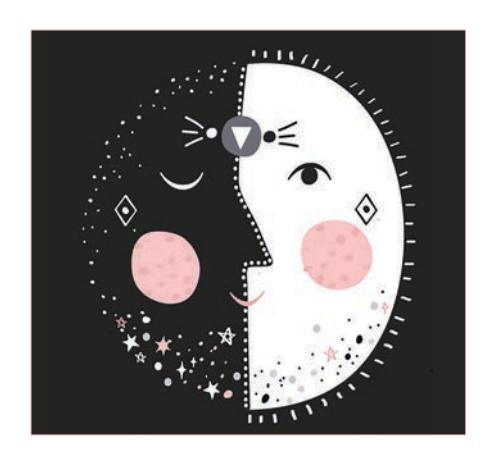

# **Circadian Rhythm and** the Skin: A Review of the Literature

#### ABSTRACT

Disruption of the circadian rhythm has been implicated in a wide variety of dermatologic conditions. Research has shown that previous ultraviolet light exposure can continue to damage the deoxyribonucleic acid (DNA) of the skin, even in the dark, and has demonstrated that repair of these skin cells peaks at night. In this article, the authors reviewed the current literature on circadian rhythm effects on the skin and describe and discuss its basic principles. Better understanding of the role circadian rhythm plays in overall skin health will assist physicians in providing optimal treatment to patients, including appropriate recommendations regarding the use of topical medications and skin care at their most effective times during a 24-hour cycle. Dermatologists should also be aware that adequate sleep is necessary for optimal DNA repair activity in the skin.

KEYWORDS: Circadian rhythm, DNA repair, melatonin

# by ALEXIS B. LYONS, MD; LAUREN MOY, MD; RONALD MOY, MD; and REBECCA TUNG, MD

Dr. Lyons is with the Department of Dermatology at Henry Ford Hospital in Detroit, Michigan. Drs. L. Moy and Tung are with the Department of Dermatology at Loyola University Medical Center in Chicago, Illinois. Dr. R. Moy is with Moy, Fincher, Chipps Facial Plastics and Dermatology in Beverly Hills, California.

J Clin Aesthet Dermatol. 2019;12(9):42-45

The term *circadian rhythm* refers to the body's endogenous 24-hour physiologic, metabolic, and behavioral rhythms. The circadian rhythm is controlled by the central regulator, or master clock, which is located in the suprachiasmatic nucleus (SCN) of the anterior hypothalamus and is greatly influenced by light and the environment.1,2 The clock mechanisms function by transcription and translation feedback loops of circadian clock genes and their proteins.3 Peripheral organs, such as the skin, also contribute to the circadian rhythm and possess endogenous rhythmicity.2

The pineal gland secretes melatonin, which is considered to be a major regulator of circadian homeostasis.4 Melatonin levels fluctuate with the circadian rhythm and are typically high at night and low during the day.5 Exposure to light leads to an acute drop in melatonin levels and a decrease in melatonin production secondary to feedback inhibition.6 Melatonin has been associated with hair growth, suppression of ultraviolet (UV) damage in skin cells, wound healing, and antitumor effects. 4,5,7 Oral melatonin supplements are commonly used to promote sleep, and studies have shown melatonin can advance the onset of nocturnal melatonin secretion.8,9 Because it has antioxidant effects, topical melatonin has been used in wound healing, sun protection, and antiaging products with varying results. 10-14

Circadian rhythm disruption has been studied in detail and is thought to contribute to the risk of cancer and other diseases, as well as have various effects on the skin, ranging from transepidermal water loss to keratinocyte proliferation. 15 Studies have also shown that repair of DNA-damaged skin cells, as a result of UV exposure, peaks at night.16 Additionally, previous exposure to UV light can continue to damage skin DNA, even in the dark.17

By understanding the basic principles of the circadian rhythm, including skin changes throughout the day, physicians might better target therapy for their patients by recommending use of topical medications and skin care products at optimal times of the day, (e.g., sunscreen during the day, DNA repair enzyme cream at night). Dermatologists should also be aware that adequate sleep is necessary for optimal DNA repair activity in the skin. In this article, we review the current literature regarding circadian rhythm and its effects on overall skin health as well as implications that time of day can impact the effectiveness of topical medications and skin care products.

#### CIRCADIAN RHYTHM AND THE SKIN

In addition to the SCN, the circadian system is also composed of peripheral circadian oscillators in many other cells, including the skin. 18 The skin contains circadian clock genes,

**FUNDING:** No funding was provided for this study.

**DISCLOSURES:** The authors have no conflicts of interest relevant to the content of this article.

**CORRESPONDENCE:** Alexis Lyons, MD; Email: alexisblyons@gmail.com

which play a role in the regulation of the circadian rhythm.18 Transepidermal water loss, keratinocyte proliferation, skin blood ow, and skin temperature have all been shown to have circadian variations.

The stratum corneum undergoes circadian rhythm changes, with skin permeability being higher in the evening than in the morning.16 Aquaporin 3 (AQP3) is expressed in the epidermis and is regulated by molecular clocks, which contribute to transepidermal water loss.15 Because transepidermal water loss is associated with increased pruritus in cases of atopic dermatitis, this increase in water loss from the skin in the evening coincides increased itchiness at night.19 These factors of increased in ammation and skin permeability at night could be important clinically. Thus, moisturizers and topical steroids might o er increased bene ts when used in the evening hours.

The e ect that topical medications have on the skin also varies throughout the day. Skin penetration of hydrophilic and lipophilic topical medications is at its maximum at around 04:00 hours (4:00am), with absorption slowing throughout the daylight hours.20 The penetration of topical lidocaine is also greater at night.21 This is likely due to the increase in skin permeability at night, as discussed above.

Another component that may a ect the e cacy of topical medications and absorption is the rate of blood ow in the skin. The skin blood ow rate has also been shown to be a ected by the circadian rhythm, increasing in the late afternoon and at night.22 A study by Yosipovitch et al16 demonstrated that these circadian rhythm blood ow rates were maintained even during treatment with topical corticosteroids. Vasodilation and increased skin blood ow have been shown to accelerate drug passage through the skin and di usion through the tissues into the systemic circulation.23

Proliferation of keratinocytes has also been found to vary during the day, with the highest rate of proliferation occurring around midnight.24 Cancerous skin cells have been shown to lose their rhythmicity, while healthy cells appear to peak around midnight and trough at midday.25 Sebaceous gland activity also varies throughout the day, with minimal activity around 04:00 hours and maximum activity at midday.16 This variation is not thought to be linked to variations in skin temperature or hormone production, but the cause of the rhythmicity is unknown.26

Human hair follicles have been shown to experience circadian changes and express the core clock genes *CLOCK*, *BMAL1*, and *Period1*, which modulate the hair follicle cycle even in the absence of input from the SCN.27 A study by Al-Nuaimi et al27 suggested that these clock genes could be potential therapeutic targets for stimulating hair growth. In a study by Hardman et al,28 researchers found that hair follicle melanin content was increased by silencing *BMAL1* and *PER1*, suggesting that the circadian clock genes play a role in pigmentation. Targeting these genes could potentially aid in treatment of hair pigmentation disorders.

Cortisol levels also uctuate throughout the day. There is a natural trough in cortisol levels during the evening, which could be a contributing factor in patients with in ammatory skin conditions who have increased pruritus at night.6 Approximately 65 percent of patients with in ammatory dermatoses, including atopic dermatitis and psoriasis, have increased pruritus at night.7

The circadian rhythm also controls the core body temperature and skin temperature.16,29 The core body temperature has predictable uctuations with higher temperatures in the daylight hours than during the night hours, with a trough in the early morning,6 whereas skin temperature peaks in the afternoon and has a trough at night.16 Relating to this, psoriasis has been associated with problems related to thermoregulation , which might lead to di culty falling asleep and disruption of the circadian rhythm.30

Psoriasis has also been linked to circadian rhythm abnormalities, although the pathophysiology is still unclear. A study by Mozzanica31 found that patients with psoriasis had reduced levels of melatonin. Another study showed an increased incidence of psoriasis in night-shift workers.32 Additionally, the *CLOCK* gene has been linked to the regulation of psoriasis by regulating interleukin-23R expression in mice.33 Further studies are needed to elucidate the relation of the circadian clock with psoriasis.

# **CIRCADIAN RHYTHM AND CANCER**

Numerous studies have shown that alterations in sleep/wake cycles that interfered with the circadian rhythm resulted in an increased cancer risk. Nurses who work the night shift have been shown to have an

increased risk of breast cancer compared to those who work the day shift.5,34 The incidence of breast cancer has also been shown to be higher in female ight attendants, who frequently cross time zones and experience disruptions in their circadian rhythm.35 In breast and endometrial cancer, the expression of the circadian period gene, *Per2*, is inhibited, possibly leading to tumor development.1 This disruption in circadian rhythm suggests that shift workers have lower levels of melatonin. Sleep deprivation leads to melatonin suppression and subsequent immunode ciency via the suppression of natural killer-cell activity and changes in T-helper cell cytokine balance.36–38

The circadian rhythm in rodent models has also been studied. As mentioned above, the pineal gland secretes melatonin, which regulates the circadian rhythm.39 Rodents in which the pineal gland was removed experienced an increased number of tumors.40 Exposure to light during non-daylight hours in mice resulted in inactivation of *Per2*, which promoted tumor development.41

In contrast with other malignancies, the risk of skin cancer in night-shift workers has been shown to be reduced compared to individuals who worked during the day. In a study by Schernhammer et al, 42 there was an overall 14-percent decreased risk for skin cancer and 44-percent decreased risk for melanoma among night-shift workers. These ndings are in contrast with the ndings of studies that showed an association between lower levels of melatonin and an increased risk of other cancers among night-shift workers.5,34,35 Schernhammer et al41attributes these lower rates of skin cancer ndings to the protection against melanoma and nonmelanoma skin cancers that lower melatonin levels might o er.42 Despite this, a true cause-and-e ect relationship between melatonin and the development of melanoma is not well-established. While causality is not established, perhaps getting a good night's sleep following exposure to the sun is not su cient for repair to occur using the body's own defenses. Another theory for this lower rate of skin cancer is that the night-shift workers presumably have less sun exposure, since they are typically sleeping during the day and are awake at night. Nevertheless, additional studies examinining incidence of skin

## REVIEW

cancer in shift workers have found no signi cant di erences when compared with to the general population.43,44

# **CIRCADIAN RHYTHM, IMMUNODEFICIENCY, AND DNA REPAIR**

The repair of skin cells with DNA damage from the sun appears to peaks at night.16 A recent study by Manzella et al45 found that oxidative damage followed a circadian rhythm, where the DNA damage was less in the morning hours than later on in the day. This variation was thought to be due to 8-oxoguanine DNA glycosylase (OGG1), which acts to repair 8-Oxoguanine (8-oxoG) DNA damage via the DNA base excision repair pathway.45 OOG1 DNA repair activity was higher in the morning and, thus, 8-oxoG DNA damage levels were lower in the morning.45 This same study found that night-shift workers had decreased levels of OGG1 DNA repair expression compared to the control group.45 This suggests that during the early morning hours, the body best performs DNA repair and that optimal DNA repair occurs with optimal sleep.

A study by Premi et al17 found that sun exposure continued to damage skin DNA for up to three hours following exposure via a chemical process called the "dark pathway." These investigators found that direct exposure to UV light caused DNA damage in all skin cells, but only the melanocytes accumulated DNA damage in the absence of light. Premi et al17 also proposed that α-tocopherol (vitamin E) and ethyl sorbate could stop DNA damage from occurring after UV exposure. Studies have also shown that vitamin D exhibits antiin ammatory e ects after UV exposure and reduces sunburn, thymidine dimer formation, and photocarcinogenesis.46–48 A recent combination supplement containing vitamin D resulted in an increased minimal erythema dose in patients, thus providing photoprotection and reducing sunburn risk.49 These studies suggest that daytime sun protection with sunscreens and nighttime application with topical DNA repair enzyme creams might be the optimal regimen for preventing skin cancer.

## **CONCLUSION**

The important role that circadian rhythm plays in skin health is a fundamental concept and is regulated by the SCN and peripheral oscillators. Physicians should be aware of

variations in skin function and characteristics throughout the day to better understand patient symptoms and to maximize therapeutic bene t. By understanding the basic principles of the circadian rhythm including skin changes that occur throughout the day, physicians can better target therapy for their patients by recommending the use of topical medications and skin care products at optimal times of the day, including sunscreens during the day and DNA repair enzyme creams at night. Dermatologists should also be aware that adequate sleep is necessary for optimal DNA repair activity to occur in the skin.

## **REFERENCES**

- 1. Chen ST, Choo KB, Hou MF, Yeh KT, Kuo SJ, Chang JG. Deregulated expression of the PER1, PER2 and PER3 genes in breast cancers. *Carcinogenesis.*  2005;26(7):1241–1246.
- 2. Tanioka M, Yamada H, Doi M, et al. Molecular clocks in mouse skin. *J Invest Dermatol.* 2009;129(5):1225–1231.
- 3. Ukai H, Ueda HR. Systems biology of mammalian circadian clocks. *Annu Rev Physiol.* 2010;72:579– 603.
- 4. Kleszczynski K, Hardkop LH, Fischer TW. Di erential e ects of melatonin as a broad range UV-damage preventive dermato-endocrine regulator. *Dermatoendocrinol.* 2011;3(1):27–31.
- 5. Schernhammer ES, Laden F, Speizer FE, et al. Rotating night shifts and risk of breast cancer in women participating in the nurses' health study. *J Natl Cancer Inst.* 2001;93(20):1563–1568.
- 6. Gupta MA, Gupta AK. Sleep-wake disorders and dermatology. *Clin Dermatol.* 2013;31(1):118– 126.
- 7. Ozler M, Simsek K, Ozkan C, et al. Comparison of the e ect of topical and systemic melatonin administration on delayed wound healing in rats that underwent pinealectomy. *Scand J Clin Lab Invest.* 2010;70(6):447–452.
- 8. Lewy AJ, Ahmed S, Jackson JM, Sack RL. Melatonin shifts human circadian rhythms according to a phase-response curve. *Chronobiol Int.* 1992;9(5):380–392.
- 9. Deacon S, Arendt J. Melatonin-induced temperature suppression and its acute phaseshifting e ects correlate in a dose-dependent manner in humans. *Brain Res.* 1995;688 (1–2):77–85.
- 10. Dreher F, Gabard B, Schwindt DA, Maibach HI. Topical melatonin in combination with vitamins E and C protects skin from ultraviolet-induced

- erythema: a human study in vivo. *Br J Dermatol.* 1998;139(2):332–339.
- 11. Scheuer C, Pommergaard HC, Rosenberg J, Gogenur I. Dose dependent sun protective e ect of topical melatonin: A randomized, placebocontrolled, double-blind study. *J Dermatol Sci.*  2016;84(2):178–185.
- 12. ŞEner A, ÇEvİK Ö, DoĞAn Ö, et al. The e ects of topical melatonin on oxidative stress, apoptosis signals, and p53 protein expression during cutaneous wound healing. Turk J Biol. 2015;39(6):888Turkish Journal of Biology. 895.
- 13. Ozler M, Simsek K, Ozkan C, et al. Comparison of the e ect of topical and systemic melatonin administration on delayed wound healing in rats that underwent pinealectomy. *Scand J Clin Lab Invest.* 2010;70(6):447–452.
- 14. Day D, Burgess CM, Kircik LH. Assessing the potential role for topical melatonin in an antiaging skin regimen. *J Drugs Dermatol.* 2018;17(9):966–969.
- 15. Matsunaga N, Itcho K, Hamamura K, et al. 24-hour rhythm of aquaporin-3 function in the epidermis is regulated by molecular clocks. *J Invest Dermatol.* 2014;134(6):1636–1644.
- 16. Yosipovitch G, Xiong GL, Haus E, et al. Timedependent variations of the skin barrier function in humans: transepidermal water loss, stratum corneum hydration, skin surface pH, and skin temperature. *J Invest Dermatol.* 1998;110(1):20– 23.
- 17. Premi S, Wallisch S, Mano CM, et al. Photochemistry. Chemiexcitation of melanin derivatives induces DNA photoproducts long after UV exposure. *Science.* 2015;347(6224):842– 847.
- 18. Zanello SB, Jackson DM, Holick MF. Expression of the circadian clock genes clock and period1 in human skin. *J Invest Dermatol.* 2000;115(4): 757–760.
- 19. Patel T, Ishiuji Y, Yosipovitch G. Nocturnal itch: why do we itch at night?. *Acta Derm Venereol.*  2007;87(4):295–298.
- 20. Reinberg AE, Soudant E, Koulbanis C, et al. Circadian dosing time dependency in the forearm skin penetration of methyl and hexyl nicotinate. *Life Sci.* 1995;57(16):1507–1513.
- 21. Bruguerolle B, Giaufre E, Prat M. Temporal variations in transcutaneous passage of drugs: the example of lidocaine in children and in rats. *Chronobiol Int.* 1991;8(4):277–282.
- 22. Smolander J, Harma M, Lindqvist A, et al. Circadian variation in peripheral blood ow in relation to core temperature at rest. *Eur J Appl*

# REVIEW

- *Physiol Occup Physiol.* 1993;67(2):192–196. 23 Lemmer B, Bruguerolle B.
  - Chronopharmacokinetics. Are they clinically relevant?. *Clin Pharmacokinet.* 1994;26(6): 419–427.
- 24. Frentz G, Moller U, Holmich P, Christensen IJ. On circadian rhythms in human epidermal cell proliferation. *Acta Derm Venereol.*  1991;71(1):85–87.
- 25. Zagula-Mally Z, Cardoso SS, Williams D, et al. Time point di erences in skin mitotic activity of actinic keratosis and skin cancers. In: Reinberg A, HF, ed. *Chronopharmacology.* New York: Pergamon Press; 1979:399–402.
- 26. Le Fur I, Reinberg A, Lopez S, et al. Analysis of circadian and ultradian rhythms of skin surface properties of face and forearm of healthy women. *J Invest Dermatol.* 2001;117(3): 718–724.
- 27. Al-Nuaimi Y, Hardman JA, Biro T, et al. A meeting of two chronobiological systems: circadian proteins Period1 and BMAL1 modulate the human hair cycle clock. *J Invest Dermatol.* 2014;134(3):610–619.
- 28. Hardman JA, Tobin DJ, Haslam IS, et al. The peripheral clock regulates human pigmentation. *J Invest Dermatol.* 2015;135(4):1053–1064.
- 29. Rogers NL FS. Thermoregulation and sleep-wake behavior in humans. In: Amlaner CJ, Fuller PM, ed. *Basics of Sleep Guide.* 2nd ed. Westchester IL: Sleep Research Society; 2009:179–186.
- 30. Leibowitz E, Seidman DS, Laor A, et al. Are psoriatic patients at risk of heat intolerance? *Br J Dermatol.* 1991;124(5):439–442.
- 31. Mozzanica N, Tadini G, Radaelli A, et al. Plasma melatonin levels in psoriasis. *Acta Derm Venereol.* 1988;68(4):312-316.
- 32. Li WQ, Qureshi AA, Schernhammer ES, Han J.

- Rotating night-shift work and risk of psoriasis in US women. *J Invest Dermatol.* 2013;133(2): 565–567.
- 33. Ando N, Nakamura Y, Aoki R, et al. Circadian gene clock regulates psoriasis-like skin in ammation in mice. *J Invest Dermatol.* 2015;135(12):3001– 3008.
- 34. Schernhammer ES, Kroenke CH, Laden F, Hankinson SE. Night work and risk of breast cancer. *Epidemiology.* 2006;17(1):108–111.
- 35. Megdal SP, Kroenke CH, Laden F, Pukkala E, Schernhammer ES. Night work and breast cancer risk: a systematic review and meta-analysis. *Eur J Cancer.* 2005;41(13):2023–2032.
- 36. Everson CA. Sustained sleep deprivation impairs host defense. *Am J Physiol.* 1993;265(5 Pt 2):R1148–1154.
- 37. Irwin M, McClintick J, Costlow C, et al. Partial night sleep deprivation reduces natural killer and cellular immune responses in humans. *FASEB J.*  1996;10(5):643–653.
- 38. Dimitrov S, Lange T, Tieken S, et al. Sleep associated regulation of T helper 1/T helper 2 cytokine balance in humans. *Brain Behav Immun.* 2004;18(4):341–348.
- 39. Lerner AB, Case JD, Takahashi Y, Lee TH, Mori W. Isolation of melatonin, the pineal gland factor that lightens melanocytes. *J Am Chem Soc.*  1958;80(10):2587–2587.
- 40. Anisimov VN, Baturin DA, Popovich IG, et al. E ect of exposure to light-at-night on life span and spontaneous carcinogenesis in female CBA mice. *Int J Cancer.* 2004;111(4):475–479.
- 41. Fu L, Pelicano H, Liu J, Huang P, Lee C. The circadian gene Period2 plays an important role in tumor suppression and DNA damage response in vivo. *Cell.* 2002;111(1):41–50.
- 42. Schernhammer ES, Razavi P, Li TY, Qureshi AA,

- Han J. Rotating night shifts and risk of skin cancer in the nurses' health study. *J Natl Cancer Inst.* 2011;103(7):602–606.
- 43. Schwartzbaum J, Ahlbom A, Feychting M. Cohort study of cancer risk among male and female shift workers. *Scand J Work Environ Health.*  2007;33(5):336–343.
- 44. Parent ME, El-Zein M, Rousseau MC, Pintos J, Siemiatycki J. Night work and the risk of cancer among men. *Am J Epidemiol.* 2012;176(9): 751–759.
- 45. Manzella N, Bracci M, Strafella E, et al. Circadian modulation of 8-oxoguanine DNA damage repair. *Sci Rep.* 2015;5:13752.
- 46. Song EJ, Gordon-Thomson C, Cole L, et al. 1alpha,25-Dihydroxyvitamin D3 reduces several types of UV-induced DNA damage and contributes to photoprotection. *J Steroid Biochem Mol Biol.* 2013;136:131–138.
- 47. Gordon-Thomson C, Gupta R, Tongkao-on W, et al. 1alpha,25 dihydroxyvitamin D3 enhances cellular defences against UV-induced oxidative and other forms of DNA damage in skin. *Photochem Photobiol Sci.* 2012;11(12): 1837–1847.
- 48. Dixon KM, Norman AW, Sequeira VB, et al. 1alpha,25(OH)(2)-vitamin D and a nongenomic vitamin D analogue inhibit ultraviolet radiationinduced skin carcinogenesis. *Cancer Prev Res (Phila).* 2011;4(9):1485–1494.
- 49. Morse NL, Reid AJ, St-Onge M. An open-label clinical trial assessing the e cacy and safety of Bend Skincare Anti-Aging Formula on minimal erythema dose in skin. *Photodermatol Photoimmunol Photomed.* 2018;34(2):152–161.

**JCAD**