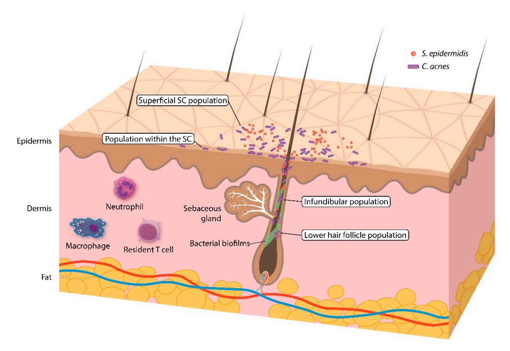
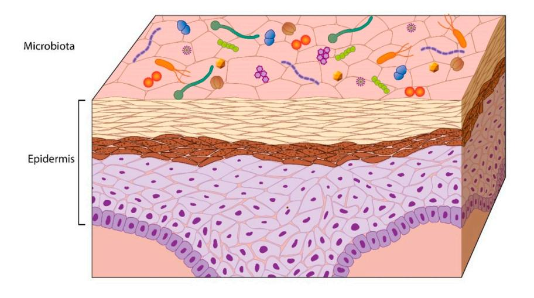
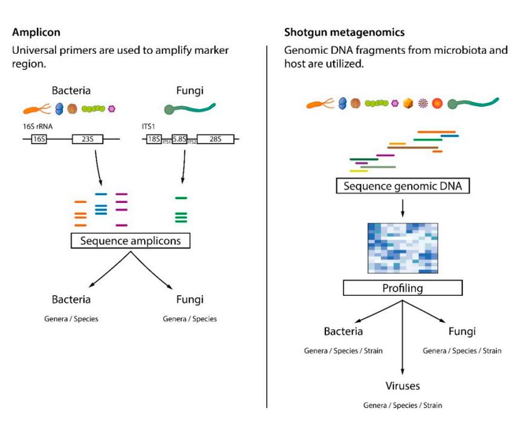
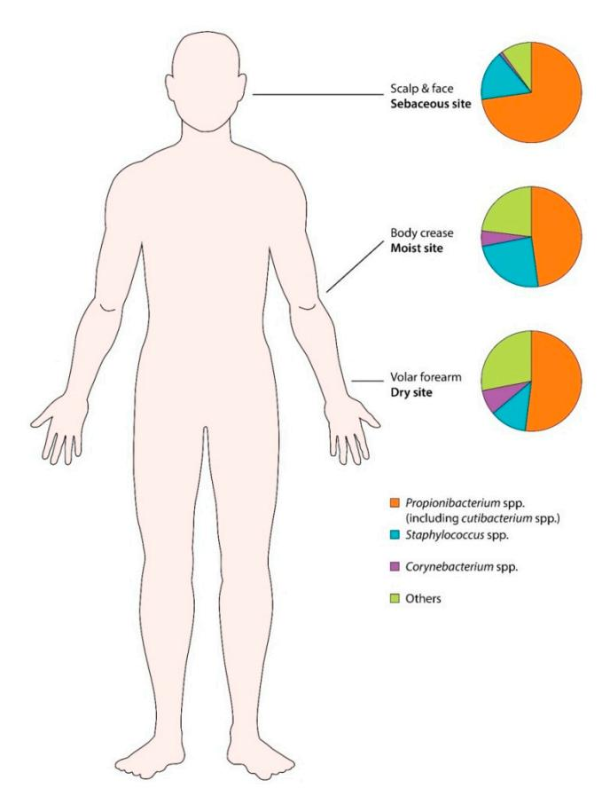
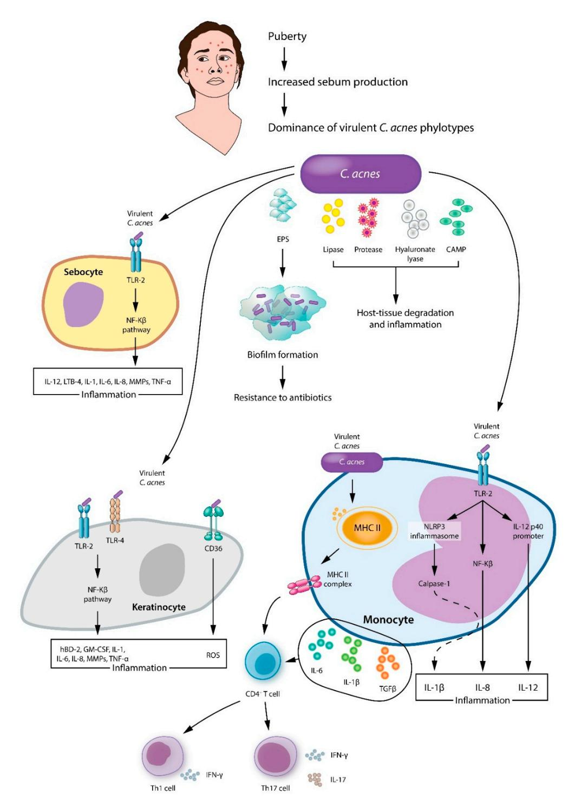
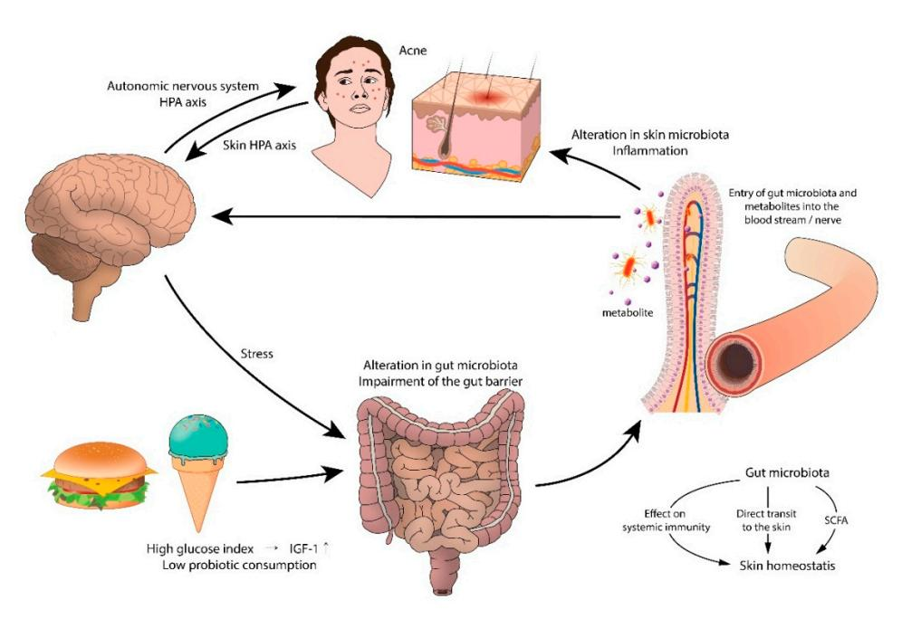

Review

# Potential Role of the Microbiome in Acne: A Comprehensive Review

Young Bok Lee 1, Eun Jung Byun 2 and Hei Sung Kim 2,3,\*

- Department of Dermatology, Uijeongbu St. Mary's Hospital, The Catholic University of Korea, Seoul 06591, Korea
- Department of Dermatology, Incheon St. Mary's Hospital, The Catholic University of Korea, Seoul 06591, Korea
- Department of Biomedicine & Health Sciences, The Catholic University of Korea, 222 Banpo-daero, Seocho-gu, Seoul 06591, Korea
- \* Correspondence: hazelkimhoho@gmail.com; Tel.: +82-32-280-5105

Received: 2 June 2019; Accepted: 4 July 2019; Published: 7 July 2019

**Abstract:** Acne is a highly prevalent inflammatory skin condition involving sebaceous sties. Although it clearly develops from an interplay of multiple factors, the exact cause of acne remains elusive. It is increasingly believed that the interaction between skin microbes and host immunity plays an important role in this disease, with perturbed microbial composition and activity found in acne patients. Cutibacterium acnes (C. acnes; formerly called Propionibacterium acnes) is commonly found in sebum-rich areas and its over-proliferation has long been thought to contribute to the disease. However, information provided by advanced metagenomic sequencing has indicated that the cutaneous microbiota in acne patients and acne-free individuals differ at the virulent-specific lineage level. Acne also has close connections with the gastrointestinal tract, and many argue that the gut microbiota could be involved in the pathogenic process of acne. The emotions of stress (e.g., depression and anxiety), for instance, have been hypothesized to aggravate acne by altering the gut microbiota and increasing intestinal permeability, potentially contributing to skin inflammation. Over the years, an expanding body of research has highlighted the presence of a gut-brain-skin axis that connects gut microbes, oral probiotics, and diet, currently an area of intense scrutiny, to acne severity. This review concentrates on the skin and gut microbes in acne, the role that the gut-brain-skin axis plays in the immunobiology of acne, and newly emerging microbiome-based therapies that can be applied to treat acne.

Keywords: acne; microbiota; microbiome; skin; gut; brain; therapeutic implications

# 1. Introduction

The term 'microbiome' covers a whole range of micro-organisms, including bacteria, viruses, and fungi, their genes and metabolites, and the environment surrounding them. The word 'microbiota' is more confined, describing the group of commensals, symbiotic, and pathogenic micro-organisms found in a fixed environment. The number of microbial cells colonizing the human body is striking, being 10 times the number of human cells. Aside from the number, researchers are starting to appreciate that the indigenous microbes of the skin and gut are vital to the immunologic, hormonal, and metabolic equilibrium of the host [1,2].

Acne is an inflammatory condition involving the pilosebaceous unit that affects up to 90% of teenagers. Severe forms of acne can cause disfiguration and scarring, resulting in low self-esteem, difficulties in social interaction, and psychological distress. Increased sebum production, inflammatory mediators of the skin, and follicular keratinization of the pilosebaceous ducts are believed to contribute

*J. Clin. Med.* **2019**, *8*, 987 2 of 25

to acne development. Colonization by *Cutibacterium acnes* (*C. acnes*; formerly called *Propionibacterium acnes*) is also recognized in acne patients, but its role is unclear because it is ubiquitous in the sebaceous areas of healthy skin from puberty onward. As part of the rising interest in the human microbiome, study findings have begun to clarify how skin microorganisms participate in health and disease (i.e., acne).

Emerging data suggest that dietary factors (i.e., the Western diet) may influence acne development. A typical Western pattern diet which includes foods with complex mixture of fat (i.e., red meat), high glycemic index, and dairy may aggravate acne by raising the levels of insulin-like growth factor-1 (IGF-1) and insulin [\[3](#page-14-2)[–6\]](#page-15-0). Diet also shapes the gut microbiota. A large body of evidence indicates that a low fiber-high fat Western diet causes fundamental changes in the intestinal microbiota, producing metabolic and inflammatory skin diseases [\[7\]](#page-15-1).

In this review, we discuss host–microbe interactions in acne to clarify understanding of the disease and enable better treatments.

#### **2. Methods**

In September 2018, we searched the MEDLINE (1946 to present) database for publications covering the microbiome in acne. To search for relevant papers, the following keywords were used: "microbiome", "microbiota", "skin", "gut", "pathogenesis", "*Cutibacterium* (*Propionibacterium*) *acnes*", "oral antibiotics", "isotretinoin", "treatment", "probiotics", and "acne". Inclusion criteria were original reports (human, animal, and cell studies) and review papers on microbiome in acne. Bibliographies were searched for additional studies that met the inclusion criteria. Studies in languages other than English, meeting abstracts, and posters were excluded.

## **3. Skin Microbiota (Overview)**

Human skin, which covers an area of 2 m2 in adults, is the body's largest organ and provides the first line of defense against external agents. The skin functions as both a physical and immunological barrier, performing a wide range of innate and adaptive immune functions [\[8\]](#page-15-2). Resident skin microbes stabilize the host's barrier by fighting off pathogens, interacting with immune cells in the skin [\[9\]](#page-15-3), and modifying host immunity [\[10\]](#page-15-4). Therefore, the skin microbiota is as an essential part of human health, and dysbiosis is thought to cause or aggravate skin diseases [\[11\]](#page-15-5). Advances in sequencing technology, such as 16S ribosomal RNA (16S rRNA) gene sequencing, have provided tremendous insights into the human microbiome.

#### *3.1. Skin Microbiome Sampling*

Acquiring an accurate and representative sample is a major challenge in studying the skin microbiome. Four sampling methods have been popularly documented in prior studies: skin swabbing, scraping, pore stripping, and punch biopsies (Table [1\)](#page-2-0). Among the different methodologies, swabbing is the most practical, being simple, quick, and noninvasive. However, swabbing might not correctly reflect the microbiota across all skin layers. Skin scraping offers the benefits of collecting skin cells and their associated microbes. Pore stripping with a pliable, adhesive tape, or cyanoacrylate glue collects follicular contents, and can be useful in acne studies. A punch biopsy samples all three layers of the skin and might best represent the skin microbiota (Figure [1\)](#page-2-1). Unfortunately, it is also intrusive and covers a smaller area than the other sampling methods. The diversity profile of human skin microbes has been compared among the different sampling methods. Grice et al. reported a 97% match in operational taxonomic units (phylotypes), regardless of the sampling method (swab, scrape, punch biopsy) [\[12\]](#page-15-6). Hall et al. [\[13\]](#page-15-7) found that *C. acnes* was identified equally by swabbing, commercial pore strips, and a cyanoacrylate glue follicular biopsy, suggesting that the sampling method does not alter *C. acnes*-related characteristics and that all methods are appropriate for acne research. However, Prast-Nielsen et al. [\[14\]](#page-15-8) recently demonstrated that skin swabs and skin biopsies produce different microbial profiles.

|                             | Sampling Method                                                    |                                                                              |                                                                        |                                                                       |
|-----------------------------|--------------------------------------------------------------------|------------------------------------------------------------------------------|------------------------------------------------------------------------|-----------------------------------------------------------------------|
|                             | Swab                                                               | Scrape                                                                       | Pore Strip                                                             | Biopsy                                                                |
| C. acnes populations        |                                                                    |                                                                              |                                                                        |                                                                       |
| Superficial stratum corneum | +                                                                  | +                                                                            | +                                                                      | ± a                                                        |
| Within stratum corneum      | -                                                                  | +                                                                            | +                                                                      | +                                                                     |
| Infundibulum                | _                                                                  | _                                                                            | +                                                                      | +                                                                     |
| Lower hair follicle         | _                                                                  | _                                                                            | _                                                                      | +                                                                     |
| Follicular biofilms         | _                                                                  | _                                                                            | _                                                                      | ± b                                                        |
| Advantages and disa         | ndvantages                                                         |                                                                              |                                                                        |                                                                       |
| Pros                        | Simple, quick, and noninvasive.                                    | Enables collection of skin cells and their associated                  | Collects follicular contents.                                          | Samples all layers of the skin.                                       |
| Cons                        | Might not correctly reflect the microbiota across all skin layers. | microbes. Might not correctly reflect the microbiota across all skin layers. | Might not reflect the microbiota in the lower hair follicles. | Is invasive and covers a smaller surface area than the other sampling |

**Table 1.** Comparison of the different skin sampling methods.

methods.

Figure 1. Overview of the skin (pilosebaceous unit) and the *C. acnes* population within it.

## 3.2. Skin Microbiome Analysis

Early studies of the skin microbiota used culture-based methods for bacterial identification and characterization. Microbial communities described by culture-based approaches are insufficient, with less than 1% of bacterial species being cultured. Furthermore, those studies have selectively focused on coagulase-negative staphylococci and *Propionibacterium* to reduce labor time, making their outcomes even more incomplete. To overcome those limitations, culture-independent microbial DNA-based approaches have been introduced (Figure 2). Among them, 16S rDNA amplicon sequencing

&lt;sup>a Likely removed during preparation of the field with antiseptics; b Likely requires special pre-treatment, e.g., sonication prior to DNA extraction and sequencing.

J. Clin. Med. 2019, 8, 987 4 of 25

has been a major breakthrough in bacterial identification, enabling bacterial differentiation at the species level. Although useful for taxonomic assignment, it is time-consuming. Another well-known culture-independent approach is shotgun metagenomics, which uses all the DNA present in the sample for sequencing [15]. Because shotgun sequencing analyzes the diverse gene content within a sample, multi-kingdom strain-level resolution is possible, and even the functional properties of communities are captured [16]. Despite those benefits, shotgun sequencing faces several challenges. First, it requires large amounts of DNA for analysis which is difficult to obtain using the typical noninvasive sampling techniques. Second, the metagenomic data are complex and large, which complicates the informatic analysis. Additional challenges are the need to implement a database with reference genomes and high cost [17]. Nonetheless, shotgun metagenomics (untargeted) sequencing provides more in-depth information than amplicon-based profiling approaches.

**Figure 2.** Amplicon and whole genome (shotgun) metagenomic sequencing. In amplicon sequencing, primers are used to amplify marker regions. Whole genome sequencing captures all the genetic information within a sample. Only shotgun metagenomics can identify viruses and offer resolution at the strain level.

J. Clin. Med. 2019, 8, 987 5 of 25

#### 3.3. Human Skin Microbiota (Healthy Skin)

As the major inhabitant of the skin, bacteria are the best studied parts of the skin microbiota. Most commensal skin bacteria are categorized into the following four phyla: Actinobacteria (i.e., Corynebacterineae, Propionibacterineae), Proteobacteria, Firmicutes (i.e., Staphylococcaceae), and Bacteroidetes [18]. The bacterial composition differs from person to person and varies according to the body site [19–21]. Environmental factors such as the use of soaps, cosmetics, antibiotics, occupation, temperature, humidity, and UV exposure [22] also influence microbial colonization [23,24].

Body sites are divided into three categories: moist, sebaceous, and dry (Figure 3). The microbes preferentially found in moist areas (i.e., axillae, inguinal area, sole, popliteal fossa) are *Staphylococcus* and *Corynebacterium* species. Sebaceous sites such as the forehead, retro-auricular area, back, and alar crease, show the lowest bacterial diversity, indicating that only a small subset of organisms can tolerate this condition. *Propionibacterium* (including *Cutibacterium*) species are the main isolates from sebaceous areas, because they can survive in an anaerobic, lipid-rich condition. Dry areas of the skin (i.e., forearm) have the most diverse microbial community, carrying a mixture of the four major phyla [25].

**Figure 3.** Human skin microbiota in different body sites (moist, sebaceous, and dry). *Propionibacterium* spp. (including *Cutibacterium* spp.) are most prevalent in sebum rich areas.

Skin microbial composition changes with age. In neonates, the microbiota on the skin largely depends on the route of delivery (vaginal vs. cesarean section), and in infancy, Firmicutes becomes dominant [26]. The microbiota of the sebaceous areas (i.e., face) takes shape during puberty as hormonal changes activate the sebaceous glands [19]. Notably, interpersonal variation is greater than the changes within the same person over time [27]. Gender is also an important host factor that influences bacterial composition and diversity. Women's hand surfaces and forearms are colonized by a more diverse set of microbes than men's, whereas men carry more *Malassezia* than women [23]. Such a gender difference could be partially explained by behavioral habits, such as the use of make-up [28].

*J. Clin. Med.* **2019**, *8*, 987 6 of 25

## **4. Skin Microbiota and Acne**

Since its first observation in acne lesions by Unna (1896) and its isolation by Sabouraud (1897), *C. acnes* has been considered the likeliest pathogen of acne. *C. acnes* was originally named *Bacillus acnes*, and subsequently renamed *Corynebacterium acnes* because it is morphologically akin to *Corynebacterium*. It was labeled *P. acnes* in the 1940s because of its ability to produce propionic acid. In 2016, a novel genus, *Cutibacterium* was proposed for a *Propionibacterium* subset (cutaneous *Propionibacterium*), and thus *P. acnes* is now called *Cutibacterium acnes (C. acnes)* [\[29\]](#page-15-22).

*C. acnes* is the major occupant of the pilosebaceous unit, accounting for up to 90% of the microbiota in sebum rich sites such as the scalp, face, chest, and back [\[30\]](#page-16-0). The scalp and face carry the highest density of *C. acnes,* followed by the upper limbs and trunk, with lower limbs showing the least *C. acnes* [\[30,](#page-16-0)[31\]](#page-16-1). The abundance of *C. acnes* also changes with age. *C. acnes* is scarce on the skin in childhood, gradually increases from puberty to adulthood and then decreases after the age of 50 years.

Although the role of *C. acnes* in the pathophysiology of acne remains uncertain, *C. acnes* is primarily known as a beneficial commensal. It helps maintain a low skin pH by releasing free fatty acids, and it blocks pathogens (i.e., *Staphylococcus aureus* and *Streptococcus*) from colonizing the skin [\[32\]](#page-16-2).

# *4.1. Classification of C. acnes*

*C. acnes* is a major skin commensal in both acne patients and acne-free individuals. It is worth mentioning that excess *C. acnes* colonization might not be an important factor in acne pathogenesis with some studies reporting little difference in the comparative amount of *C. acnes* in individuals with and without acne [\[33\]](#page-16-3). Recent studies suggest that *C. acnes* acts as a pathogen or a commensal according to the strain and balance among the metagenomic elements [\[33,](#page-16-3)[34\]](#page-16-4).

Initially, *C. acnes* was grouped into two types, I and II, based on their cell wall sugar content, serum lectin response, and vulnerability to phages [\[35\]](#page-16-5). Later, a new phylotype, type III, with long slender filaments was found [\[36\]](#page-16-6). Now some researchers have proposed reclassifying phylotype I as *C. acnes* subsp. *acnes* [\[37\]](#page-16-7), phylotype II as *C. acnes* subsp. *defendens* [\[38](#page-16-8)[,39\]](#page-16-9), and phylotype III as *C. acnes* subsp. *elongatum* [\[40\]](#page-16-10).

Because *C. acnes* has a striking clonal population structure with relative sequence preservation, multi-locus sequence typing (MLST) is needed for higher strain typing resolution. Within type I, *C. acnes* is further divided into clades IA1, IA2, IB, and IC according to the Belfast MLST program [\[41\]](#page-16-11) and I-1a, I-1b, and I-2 in the Aarhus MLST measure [\[42\]](#page-16-12). Whole genome sequencing has been able to provide a higher-resolution phylogeny of *C. acnes* [\[43\]](#page-16-13). Using its gene-based single nucleotide polymorphisms, *C. acnes* is stratified into phylogenetic clades IA-1, IA-2, IB-1, IB-2, IB-3, IC, II, and III [\[33](#page-16-3)[,43\]](#page-16-13). Table [2](#page-6-0) presents the names of the phylogenetic clades (*C. acnes* strains) from whole-genome sequencing and different MLST programs. An alternative process was described by Fitz-Gibbon et al. [\[33\]](#page-16-3) who performed 16S rRNA gene sequencing as well as complete genome sequencing to classify *C. acnes* into ribotypes (RTs). These classifications can distinguish the presence of healthy and acne-related *C. acnes* strains. Strains from clades IA-2 (mostly RT4 and RT5), IB-1 (RT8) and IC (RT5) are closely linked with acne. Type II strains that include RT2 and RT6 are often found in healthy (acne-free) skin. Strains from clades IA-1, IB-2, and IB-3 are associated with both acne-free individuals and acne patients [\[33,](#page-16-3)[43](#page-16-13)[,44\]](#page-16-14) (Table [2\)](#page-6-0). Type III strains are rare on the face but profuse on the trunk and connected to progressive macular hypomelanosis [\[29,](#page-15-22)[45,](#page-16-15)[46\]](#page-16-16).

J. Clin. Med. 2019, 8, 987 7 of 25

| <b>Table 2.</b> Summary of the nomenclatures | of <i>C. acnes</i> phylotypes and | d their association with acne and |
|----------------------------------------------|-----------------------------------|-----------------------------------|
| healthy skin.                                |                                   |                                   |

| Clade (Based on Whole-Genome Sequencing) | Clade (Based on Belfast eMLST [38]) | Clade (Based on Aarhus MLST [39]) | RT [30]  | Acne         | Healthy Skin |
|---------------------------------------------|----------------------------------------|--------------------------------------|----------|--------------|--------------|
| IA-1                                        | IA1                                    | I-1a                                 | RT1      | √            |              |
| IA-2                                        | IA1                                    | I-1a                                 | RT4, RT5 | V            |              |
| IB-1                                        | IA1                                    | I-1b                                 | RT8      | V            |              |
| IB-2                                        | IA2                                    | I-1a                                 | RT3      | V            | $\checkmark$ |
| IB-3                                        | IB                                     | I-2                                  | RT1      | $\checkmark$ | $\checkmark$ |
| IC                                          | IC                                     | NA                                   | RT5      | $\checkmark$ |              |
| II                                          | II                                     | II                                   | RT2, RT6 |              | $\checkmark$ |
| III                                         | III                                    | III                                  | NA       |              |              |

eMLST: expanded multi-locus sequence typing; MLST: multi-locus sequence typing; NA: not assigned; RT ribotype.

Recent metagenomic studies have cast new light on the strain-level differences of *C. acnes* in health and disease (acne). Tomida et al. [43] compared the full DNA sequences of *C. acnes* strains to find that the non-core genomic sector of acne-related *C. acnes* strains carry extra virulence genes compared with healthy strains. Johnson et al. [47] identified that acne-related strains generate more porphyrin, a substance that generates reactive oxygen species (ROS) and can stir up inflammation in keratinocytes [48]. It was further demonstrated that *C. acnes* strains respond differently to vitamin B12 supplements—porphyrin spikes in acne-related strains, whereas the level remains largely the same in healthy strains [47,49]. Acne-associated *C. acnes* strains are also known to induce an inflammatory response in sebocytes, keratinocytes, and peripheral blood mononuclear cells, whereas healthy strains do not [50–53].

#### 4.2. Cutibacterium acnes in Acne

C. acnes is an aerotolerant, anaerobic, Gram-positive, pleomorphic rod that belongs to the Actinobacteria phylum. Several mechanisms have been proposed by which *C. acnes* aggravates acne, including augmentation of lipogenesis, comedone formation, and host inflammation [29] (Figure 4). As for lipogenesis, C. acnes encouraged hamster sebocytes to synthesize lipid droplets and triacylglycerol. In addition, its application to hamster auricles induced sebum to accumulate [54]. C. acnes promotes comedogenesis by generating oxidized squalene and free fatty acids, causing a qualitative change in sebum [55,56]. In addition, C. acnes activates the IGF-1/IGF-1 receptor signaling pathway to upregulate filaggrin expression, which increases integrin- $\alpha 3$ ,  $-\alpha 6$ , and v $\beta 6$  levels, thereby affecting keratinocyte proliferation and differentiation and resulting in comedone formation [57,58]. Last but not least, C. acnes induces and aggravates inflammation. C. acnes activates Toll-like receptors (TLR-2 and TLR-4) on keratinocytes, which leads to the activation of the MAPK and NF-kB pathways. Subsequently, keratinocytes produce interleukin (IL)-1, IL-6, IL-8, tumor necrosis factor-α, granulocyte-macrophage colony stimulating factor, human β-defensin-2, and matrix metalloproteinases [50,59,60]. Next to TLR-2 and TLR-4, CD-36 recognizes C. acnes [61] and stimulates ROS production from keratinocytes to wipe out bacteria and induce inflammation [62]. Sebocytes are also involved in the inflammatory response. As in keratinocytes, sebocyte TLR-2 recognizes C. acnes and activates the NF-kB pathway, resulting in inflammation [63]. C. acnes is also spotted by the TLR-2 expressed on monocyte/macrophage lineage cells, which results in the production of the inflammatory cytokines IL-8 and IL-12 [6]. In addition, C. acnes stimulates the gene expression of caspase-1 and NLRP3 inflammasome in monocytes, causing an excess of IL-1β [64]. C. acnes also has T cell mitogenic activity [65]. The C. acnes-induced adaptive immune response involves CD4+ Tlymphocytes, specifically Thelper (Th)1 and Th17 cells [66]. C. acnes provokes peripheral blood mononuclear cells to secrete IL-6, IL-1β, and transforming growth factor-β and encourages naive CD4+CD45RA T lymphocytes to differentiate into Th1 and Th17 cells [66,67]. As a result, Th effector cytokines such as IL-17 and interferon-γ are upregulated [68].

**Figure 4.** A proposed model of main pathologic processes induced by *C. acnes* involve sebocytes, keratinocytes, and monocytes in acne vulgaris. EPS: extracellular polymeric substances; CAMP: cyclic adenosine monophosphate; TLR: toll like receptor; IL: interleukin; TNF: tumor necrosis factor; LTB: leukotriene B; CD36: cluster of differentiation 36; GM-CSF: granulocyte-macrophage colony stimulating factor; hBD: human β-defensin; MMPs: matrix metalloproteinases.

*C. acnes* strains that are highly virulent and resistant to antibiotics (i.e., RT4, 5, 10), are dominant on acne patients' skin [33,69]. Virulence factors such as lipase, protease, hyaluronate lyase, endoglycoceramidase, neuraminidase, and Christie–Atkins–Munch-Petersen (CAMP) factor cause host-tissue degradation and inflammation. Lipase chemoattracts neutrophils and hydrolyzes sebum triglycerides to free fatty acids, inducing inflammation and hyperkeratosis [70–72]. Protease,

*J. Clin. Med.* **2019**, *8*, 987 9 of 25

hyaluronate lyase, endoglycoceramidase, and neuraminidase have degrading properties and aid the invasion of *C. acnes* by breaking down extracellular matrix constituents [\[73](#page-18-5)[–75\]](#page-18-6). As the extracellular matrix resolves, inflammatory cells (i.e., neutrophils, monocytes, dendritic cells,) invade the hair follicle, bringing about the effusion of bacteria, keratin, and sebum to the dermis, which provokes foreign body granuloma and scarring [\[76\]](#page-18-7).

Another pathological feature of *C. acnes* is biofilm [\[60\]](#page-17-10), an aggregate of microbiota embedded within a self-made matrix of extracellular polymeric substance (EPS), adhered to a surface. The structural properties and physiology of biofilm bacteria confer resistance to antibacterial agents and host inflammatory cells. Whole genome sequencing of *C. acnes* has provided evidence of the formation of biofilms. Type I strains associated with acne carry a novel linear plasmid with a tight adhesion locus that is essential for biofilm formation, colonization, and virulence [\[33](#page-16-3)[,77\]](#page-18-8). Skin biopsies have provided further evidence, with a greater degree of follicular *C. acnes* colonization and biofilm found in acne samples compared with controls [\[78\]](#page-18-9). As for intrinsic antimicrobial resistance, EPS acts as a diffusion barrier and delays the inflow of antimicrobial agents, by chemically antagonizing the antimicrobial molecules or limiting antimicrobial transport. Another mechanism in biofilm resistance is the reduced growth rate and metabolism of biofilm-associated organisms, which slows their take-up of antimicrobial agents [\[79\]](#page-18-10). In terms of acquired resistance, transfer of resistance-conferring plasmids takes place by conjugation among the different organisms within a biofilm [\[80\]](#page-18-11).

# *4.3. Other Acne-Associated Microbiota*

Human skin is colonized by a wide variety of microbes, which function in maintaining skin health or exacerbating disease. Although *C. acnes* is best-known for its connection with acne, it is speculated that other bacteria might also (indirectly) contribute to the inflammatory process (Table [3\)](#page-9-0). Rajiv et al. [\[81\]](#page-18-12) observed that *C. acnes* and *S. epidermidis* were more prevalent in acne patients, than in the control population. The applicability of the finding was tested using explant models and *S. epidermidis* was found to prevent acne and exert antimicrobial activity. Recently, it has been noted that *S. epidermidis* not only infects humans but also protects us from several pathogenic bacteria [\[82](#page-18-13)[,83\]](#page-18-14). *S. epidermidis* has been reported to produce antimicrobial peptides such as epidermin, phenol-soluble modulins, Pep5, and epilancin (K7, 15X) [\[84–](#page-18-15)[86\]](#page-18-16). Some studies hint that *S. epidermidis* can inhibit the growth of *C. acnes*. Wang et al. [\[87\]](#page-19-0) claimed that *S. epidermidis* strains release succinic acid, which has an anti-*C. acnes* effect. Christensen et al. [\[88\]](#page-19-1) reported that *S. epidermidis* secretes polymorphic toxins that inhibit *C. acnes* growth. In addition, *S. epidermidis* was shown to generate *staphylococcal* lipoteichoic acid, which dampens *C. acnes*-related inflammation by increasing the expression of miR-143 and blocking TLR-2 expression in keratinocytes [\[89\]](#page-19-2). Thus, *S. epidermidis* might play a role in acne prevention, but that hypothesis needs further testing.

Culture-based studies have reported that *C. granulosum* is highly abundant in the comedones and pustules of acne patients [\[90\]](#page-19-3). Furthermore, *C. granulosum* displays stronger virulence (i.e., lipase activity) than *C. acnes* [\[91\]](#page-19-4). On the other hand, the currently available genome data for this bacterium suggests a limited range of virulence-associated genes, with a striking absence of the CAMP factor, sialidase, and hyaluronate lyase that contribute to *C. acnes*–host interaction in acne. Further studies are needed to find the exact role of this minor *Cutibacterium* species in acne and health [\[92](#page-19-5)[,93\]](#page-19-6).

*Malassezia* is the most copious cutaneous fungal organism and has long been thought to cause acne [\[94\]](#page-19-7). According to a study by Hu et al. [\[95\]](#page-19-8) treatment-resistant acne papules disappeared after the use of anti-fungal agents. Therefore, those authors argued that *Malassezia,* rather than *C. acnes* is associated with refractory acne. Several other study findings are in line with that theory. Song et al. [\[96\]](#page-19-9) and Numata et al. [\[97\]](#page-19-10) found that *Malassezia restricata* and *Malassezia globosa* are easily collected from young acne patients. Akaza et al. [\[98\]](#page-19-11) revealed that the activity of *Malassezia* lipase is 100 times greater than that of *C. acnes. Malassezia* hydrolyzes sebum triglycerides into free fatty acids, which causes hyper-keratinization of hair follicular ducts and comedone formation [\[99\]](#page-19-12). It also chemo-attracts neutrophils and promotes the release of pro-inflammatory cytokines from monocytes

and keratinocytes [100,101]. The involvement of *Malassezia* in the pathophysiology of acne remains to be clarified [29].

**Table 3.** Skin and gut microbiota of acne patients compared with healthy controls.

| Significant Changes in Skin Microbiota | Significant Changes in Gut Microbiota |
|----------------------------------------|---------------------------------------|
| ↑Cutibacterium acnes                   | ↑Bacteroides                          |
| †Cutibacterium granulosum              |                                       |
| †Staphylococcus epidermidis            |                                       |
| †Proteobacteria and Firmicutes         |                                       |
| ↓Actinobacteria                        |                                       |
| <i>†Sterptococcus</i> (pre-adolescent) |                                       |
| †Malassezia species                    |                                       |

#### 5. Acne Treatment and Skin Microbes

Because acne is a multifactorial inflammatory skin condition, a handful of treatment options are available, including topical and oral antibiotics, retinoids, and photodynamic therapy [102]. Acne is not a typical skin infection, but antibiotics have played a central part in acne treatment for more than 40 years. Topical antibiotics suppress *C. acnes* and act as an anti-inflammatory agent [103]. Oral antibiotics are best for moderate-to-severe acne, especially for those who fail to respond to or tolerate topical agents. According to the therapeutic guidelines and expert opinion, macrolides, clindamycin, and tetracyclines are the antibiotics of choice for acne [104–107]. Erythromycin, roxithromycin, clarithromycin, and azithromycin are macrolides. Clindamycin is a lincosamide antibiotic. Tetracyclines frequently used on acne are doxycycline, tetracycline, and minocycline.

Other popular agents that directly inhibit *C. acnes* colonization include benzoyl peroxide and azelaic acid [63]. The therapeutic effect of benzoyl peroxide comes from its mild comedolytic action and ability to kill *C. acnes* via the release of free oxygen radicals [108]. Topical azelaic acid has anti-inflammatory and antibacterial properties, in addition to its comedolytic effects [109].

Isotretinoin is an all-trans retinoic acid pro-drug and has been the final option for patients with severe recalcitrant acne [110]. Its repression of sebum production is well known, and it was recently found to normalize the *C. acnes*/TLR-2-mediated innate immune response in acne patients [111]. It is reasonable to think that isotretinoin indirectly affects skin microbes, because it blocks the supply of an essential nutrient and stabilizes the overzealous immune system, but few have examined this in detail. Both oral [112–114] and topical [115] retinoids were reported to bring down the number of *C. acnes* and cause changes in microbial diversity in patients with acne. In a recent study by McCoy et al., isotretinoin was shown to have varying effects on the *Propionibacterium* subtaxa [116].

Alternative acne treatments include blue light, ultraviolet (UV) phototherapy, and photodynamic therapy [117–119]. These approaches could improve acne by reshaping the skin microbiota and lowering *C. acnes* counts within the lesions. UV light is a well-documented bactericidal treatment [22] that can block the release of lipoteichoic acid, lipopolysaccharides, and other bacterial metabolites with pro-inflammatory effects.

#### 5.1. Antibiotics and the Acne Skin Microbiota

Few studies have examined the effects of antibiotics on the skin microbiota in acne. According to culture-based research, tetracycline antibiotics cause a decrease in the abundance of *Cutibacterium* in acne patients' skin [120].

Recently, Chien et al. [121] examined the changes in the skin microbial composition of acne patients following oral antibiotic therapy (sampling method: swabbing). Using 16S rRNA gene sequencing, *C. acnes* was found to be dominant at baseline. Four weeks of minocycline caused a 1.4-fold reduction of *C. acnes* in acne patients, with a recovery to baseline *C. acnes* levels 8 weeks after stopping the antibiotic. In addition to *C. acnes* reduction, there was a 5.6-fold increase in *Pseudomonas* species after

*J. Clin. Med.* **2019**, *8*, 987 11 of 25

taking the antibiotics for 4 weeks. The growth of *Pseudomonas* explains the opportunistic skin infections (i.e., gram-negative folliculitis) common among acne patients receiving prolonged antibiotic therapy. A 4.7-fold decrease in *Lactobacillus* relative to baseline was found 8 weeks following minocycline cessation, but whether that presents an increased risk for skin infections needs to be determined.

A 16S rRNA sequencing study by Kelhala et al. [\[112\]](#page-20-5), reported that lymecycline treatment decreases the abundance of *Cutibacterium* in skin with acne (sampling method: swabbing). They also claimed that the skin microbiota became more diverse after lymecycline treatment. Alpha diversity is supposedly increased as a result of the moderation of *Cutibacterium* colonization, which allows other flora to become more visible.

# *5.2. Antibiotic Resistance in the Microbiota of Skin with Acne*

Topical and oral antibiotics have been the center of acne treatment for a long time. *C. acnes* resistance to antibiotics has increased over the years and become a worldwide problem in acne patients, with higher rates of resistance being reported for clindamycin (lincosamide) (36–90%) and erythromycin (macrolide) (21–98%) than for tetracyclines (4–16%) [\[122–](#page-20-13)[126\]](#page-21-0). This is in line with the fact that topical macrolides and clindamycin are the most commonly used. The molecular mechanisms that underlie erythromycin and clindamycin resistance are point mutations in the 23S rRNA, and the presence of an *erm*(X) gene, respectively [\[69,](#page-18-2)[127–](#page-21-1)[130\]](#page-21-2). Tetracycline resistance is associated with chromosomal point mutation in the 16s rRNA gene of *C. acnes* [\[69\]](#page-18-2). *C. acnes* becomes less susceptible to doxycycline when amino acid is substituted in the ribosomal S10 protein [\[131\]](#page-21-3).

The degree of antibiotic resistance varies among the different *C. acnes* strains. It is well known that acne-associated phylotype IA1 strains (ribotypes R4, R5) are most often antibiotic-resistant [\[41](#page-16-11)[,128](#page-21-4)[,132\]](#page-21-5). Furthermore, McDowell et al. [\[41\]](#page-16-11) reported that all the phylotype IC isolates (ribotype R5 strain) used in their study were resistant to erythromycin and tetracycline.

The use of clindamycin and macrolides in acne not only causes *C. acnes* to be resistant to antibiotics but also leads to increased drug resistance among other skin bacteria. Potential mechanisms include acquiring mobile genetic elements with multi-drug resistance genes through horizontal gene transfer between bacterial species. At least 30% of *S. epidermidis* isolated from skin with acne were resistant to roxithromycin, erythromycin, and clindamycin [\[133\]](#page-21-6). Little is known about the effect of tetracyclines on skin microbiota other than *C. acnes*.

With the regular use of antibiotics in acne, recommendations are made to minimize the risk of antimicrobial resistance [\[106](#page-19-18)[,134\]](#page-21-7). First, antibiotics are not meant for comedones. As a baseline rule, the use of topical antibiotics alone must be avoided. Topical antibiotics, if necessary, should be combined with retinoid or benzoyl peroxide to lessen the risk of antimicrobial resistance [\[135\]](#page-21-8). For maintenance, topical retinoid is a good choice and benzoyl peroxide can be added for further defense against *C. acnes*. Azelaic acid is also great because it blocks cellular protein synthesis in *C. acnes* without causing bacterial resistance [\[106\]](#page-19-18).

Systemic antibiotics, combined with a topical agent (i.e., benzoyl peroxide, tretinoin, azelaic acid) are preferable for moderate to severe inflammatory acne, but they should not be used for more than 3 months. Oral tetracyclines (i.e., lymecycline, doxycycline) are the antibiotics of choice for acne with high macrolide-resistance [\[106](#page-19-18)[,134,](#page-21-7)[136\]](#page-21-9).

#### *5.3. Skin Microbiota As a Biomarker for Acne Drug Development*

Several studies have compared the skin microbiota of acne patients and acne-free individuals to find differences in the dominant *C. acnes* strains (more virulent stains were associated with acne) [\[33](#page-16-3)[,34\]](#page-16-4). Acne treatment is also known to reduce the number of *C. acnes* on the skin and cause an increase in the diversity of skin bacteria [\[112](#page-20-5)[,121\]](#page-20-12). Given the clear link between acne and *C. acnes*, the skin microbiota could be used as a biomarker for acne drug development and clinical trials [\[137\]](#page-21-10).

*J. Clin. Med.* **2019**, *8*, 987 12 of 25

## **6. Gut Microbiota and the Skin**

The skin and gut, both heavily vascularized and richly innervated organs with critical neuroendocrine and immune functions, are somewhat similar [\[134\]](#page-21-7). Interestingly, mounting evidence suggests that the two organs have a bidirectional connection, and many studies link intestinal health to skin homeostasis and allostasis [\[92,](#page-19-5)[138\]](#page-21-11).

The gut contains an extensive collection of bacteria, fungi, viruses, and protozoa that outnumbers its host cells by 10-fold [\[139](#page-21-12)[,140\]](#page-21-13). Recent advances in metagenomics have broadened our understanding on the intestinal microbiota and its influence in human health and disease [\[141\]](#page-21-14). The intestinal microbiota performs metabolic and immune functions, playing an essential role in the maintenance of physiological homeostasis. Gut flora break down food and indigestible complex polysaccharides, synthesize essential vitamins (vitamin K and biotin), and thus provide nutritional benefits to the host [\[142\]](#page-21-15). The gut microbiota also intricately regulates the host immune system, making possible both tolerance to dietary and environmental antigens and defense against potential pathogens [\[143\]](#page-21-16).

Currently, strong evidence indicates that gut microbes play a mediating role between skin inflammation and emotion [\[7\]](#page-15-1). In 1930, Stokes and Pillsbury issued a 'theoretical and practical consideration of a gastrointestinal mechanism' by which the skin is altered by emotional and nervous states. Those authors linked emotions such as worry, anxiety, and depression to changes in gut microorganisms, which they proposed would promote focal and systemic inflammation (the brain–gut–skin theory) [\[144\]](#page-21-17).

Although not yet fully known, the mechanism by which the gut microbiota influences skin homeostasis seems to come from its modulatory effect on systemic immunity [\[92\]](#page-19-5). In addition, evidence suggests that the gut flora can affect the skin more directly, by transporting the gut microbiota to the skin [\[92](#page-19-5)[,145\]](#page-21-18). When the intestinal barrier is disrupted, gut microbiota and their metabolites quickly enter the bloodstream, accumulate in the skin, and disturb the skin equilibrium [\[92\]](#page-19-5). The gut microbiota may also affect the skin microbiota by generating short chain fatty acids (SCFAs), during fiber fermentation in the gut [\[143\]](#page-21-16). SCFAs such as propionic acid were shown to have a profound antimicrobial effect against USA 300, the most prevailing community-acquired methicillin-resistant *Staphylococcus aureus* and is suggested to play a role in shaping the skin microbiota, which may influence cutaneous immunity [\[146\]](#page-21-19). *S. epidermidis* and *C. acnes* are examples of skin commensals that endure wider SCFA shifts than other skin microorganisms.

# *6.1. Gut Microbiota and Acne*

The intestinal flora is thought to influence acne, possibly by interacting with the mTOR pathway [\[147](#page-22-0)[–149\]](#page-22-1). Metabolites from the gut microbiota may constitutively control cell expansion, fat metabolism, and other metabolic functions through the mTOR pathway [\[150\]](#page-22-2). The mTOR pathway itself may also affect the gut microbiota by controlling the intestinal barrier [\[151\]](#page-22-3). In cases of gut dysbiosis and a disturbed intestinal barrier, a positive feedback loop can be formed, which may amplify the host metabolism and inflammation [\[152–](#page-22-4)[155\]](#page-22-5). Considering the possible role of mTORC1 in acne pathophysiology [\[156\]](#page-22-6), the interaction between mTOR and gut microbiota may serve as a mechanism by which the intestinal flora aggravates acne.

The connection between acne and gastrointestinal dysfunction can originate in the brain. Supporting this hypothesis is the stress-induced aggravation of acne. Experimental animal and human studies have shown that stress impairs the normal gut microflora, most notably *Lactobacillus* and *Bifidobacterium* species [\[144\]](#page-21-17). Psychological stressors cause intestinal microbes to produce neurotransmitters (i.e., acetylcholine, serotonin, norepinephrine) that cross the intestinal mucosa to enter the blood stream, resulting in systemic inflammation.

In recent years, the role of environmental factors, especially the Western diet, has been raised in acne pathogenesis. The Western diet includes dairy products, refined carbohydrates, chocolate, and saturated fat, which may aggravate acne by activating nutrient-derived metabolic signals [\[157,](#page-22-7)[158\]](#page-22-8). Evidence also indicates that the intestinal flora associated with the Western diet contribute to inflammatory

skin diseases. For instance, high-fat diets reduce the level of gut flora and increase the concentration of lipopolysaccharides, causing systemic inflammation by impairing colonic epithelial integrity and barrier function, decreasing mucus layer thickness, and increasing the secretion of pro-inflammatory cytokines [159,160].

In 1930, Stokes and Pillsbury reported that a high proportion of acne patients had hypochlorhydria. Low acidity levels allow the relocation of colonic bacteria to the distal part of the small intestine, creating a state of gut dysbiosis and small intestine bacterial overgrowth [161,162], which causes increased intestinal permeability, and leads to skin inflammation [142] (Figure 5).

**Figure 5.** A proposed model of the gut–brain–skin axis in acne. HPA: hypothalamic pituitary adrenal; IGF-1: Insulin-like growth factor-1; SCFA: short chain fatty acid.

#### 6.2. Gut Microbiota in Acne

Only a few researchers have examined the gut flora of acne patients. The first such study was conducted in 1955 and compared the presence of potentially pathogenic bacteria in 10 acne patients with that in acne-free individuals [163]. It is noteworthy that the *Bacteroides* species, which increase under stress conditions, were frequently isolated from acne patients. A Russian study reported that people with acne exhibit markedly different intestinal flora compared with acne-free controls [164].

In a study by Deng et al. [159], acne patients exhibited lower gut microbiota diversity and a higher ratio of *Bacteroidetes* to *Firmicutes*, which is an enterotype of the Western diet. In addition, Yan et al. [165] found a decrease in *Lactobacillus*, *Bifidobacterium*, *Butyricicoccus*, *Coprobacillus*, and *Allobaculum* in acne patients compared with controls, which provides a new understanding of the link between acne and the alteration of gut flora. *Lactobacillus* and *Bifidobacterium* are common probiotic species that balance the intestinal microbiota by fermenting unabsorbed oligosaccharides in the upper gut [166]. They also strengthen the intestinal barrier by decreasing permeability and enhancing the epithelial resistance of the gut [167]. In addition, *Bifidobacterium* and *Lactobacillus* encourage the production of CD4+Foxp3+T cells (regulatory T cells), and regulatory dendritic cells, suppressing T helper cell and B cell response and cytokine production [168]. *Butyricicoccus* generates butyrate, which provides energy to cells and prevents mucosal barrier damage and inflammation [169].

Further studies should be performed to identify the enteral flora of acne patients and find changes in the gut microbiota following acne therapy (i.e., oral antibiotics and isotretinoin). In a murine study [170], doxycycline caused long term changes in the intestinal microorganism. Isotretinoin did

*J. Clin. Med.* **2019**, *8*, 987 14 of 25

not have a significant effect on fecal microbes. On the other hand, isotretinoin did not have a significant effect on the fecal microbes in mice [\[170\]](#page-23-3).

### **7. Probiotics and the Skin**

Probiotics are living microorganisms that are beneficial to the host's health. Upon ingestion, they provide a protective shield across the intestinal mucosa [\[171\]](#page-23-4). The most commonly used and therefore, the best studied probiotic strains to date are *Lactobacillus* and *Bifidobacterium*. The official definition of prebiotics is a non-digestible food component that benefits the host by stimulating the growth or activity of bacterial species present in the colon [\[172\]](#page-23-5). Although oral probiotics/prebiotics have been used in the past to prevent and treat bowel disease, evidence suggests that by adjusting the composition of the microbial community, probiotics induce immune reactions that expand beyond the gut to act on the skin [\[173](#page-23-6)[,174\]](#page-23-7). Oral probiotics have been reported to enhance insulin sensitivity in animal models [\[175\]](#page-23-8) and regulate skin inflammation by interacting with gut-associated lymphoid tissue [\[176\]](#page-23-9). Certain strains of *Lactobacillus* encourage the production of IL-10 (an anti-inflammatory cytokine) and promote T-regulatory cell function, which suggests that probiotics help balance the immune system in response to stimuli [\[176\]](#page-23-9). *Bifidobacterium coagulans (B. coagulans)* also has immune-regulatory properties that can affect skin health. Incubating polymorphonuclear cells and peripheral blood mononuclear cells with *B. coagulans* supernatant and cell wall fragments promoted the maturation of antigen presenting cells and blocked ROS formation [\[177](#page-23-10)[,178\]](#page-23-11).

## *Probiotics and Acne*

Growing evidence indicates that probiotics modify the pathophysiologic factors that contribute to acne, potentially improving patient compliance [\[174\]](#page-23-7). Probiotics directly inhibit *C. acnes* with antimicrobial proteins. In an in vitro study, *Streptococcus salivarius* suppressed the growth of *C. acnes* by secreting a bacteriocin-like inhibitory substance [\[179\]](#page-23-12). Similarly, strains of *Lactococcus sp. HY449* blocked *C. acnes* through the release of bacteriocins [\[180\]](#page-23-13). Probiotics, when topically applied, also improved the skin barrier and produced a secondary increase in antimicrobial peptides. *Streptococcus thermophiles* for instance, was shown to enhance ceramide production both in vitro and in vivo when applied as a cream for a week [\[181–](#page-23-14)[183\]](#page-23-15). Ceramides are well-known for trapping water in the skin, but other than that, certain ceramide sphingolipids (i.e., phytosphingosine) display antimicrobial activity against *C. acnes,* thereby improving acne [\[184\]](#page-23-16). By producing ceramides, probiotics help strengthen the skin barrier, which is beneficial to acne patients because it calms the irritation caused by topical agents.

Probiotics also have immunomodulatory properties on keratinocytes and epithelial cells. *S. salivarius* strain K12 inhibited the release of pro-inflammatory cytokine IL-8 from keratinocytes [\[185\]](#page-23-17). Likewise, *L. paracasei* NCC2461 suppressed substance P-induced skin inflammation in human skin cultures [\[186,](#page-24-0)[187\]](#page-24-1). Because substance P is involved in sebum production and acne inflammation, its suppression by probiotics suggests that probiotics could work as an adjunct in acne treatment [\[174](#page-23-7)[,188\]](#page-24-2). IGF-1 is thought to participate in acne development. Foods rich in dairy and carbohydrates increase the risk of acne, probably by elevating IGF-1 [\[3,](#page-14-2)[189\]](#page-24-3). Adding *Lactobacillus* to fermented milk caused a 4-fold decrease in IGF-1 compared with nonfermented skim milk [\[190\]](#page-24-4). Thus, probiotics could improve acne by regulating the IGF-1 level.

Clinical trials have assessed the effect of probiotics on acne. Kang et al. [\[191\]](#page-24-5) reported that 8 weeks of topical *Enterococcus faecalis* treatment resulted in a 50% reduction in inflammatory acne count compared with placebo. A 5% extract of *Lactobacillus plantarum* also reduced acne severity (i.e., acne size, count, and associated erythema) [\[192\]](#page-24-6). In an Italian study [\[193\]](#page-24-7), the group that received oral probiotics (250 mg of freeze-dried *Bifidobacterium bifidum* and *L. acidophilus*) as a supplement to acne treatment showed greater resolution of acne compared with the non-supplemented group. In addition, patients with probiotics supplementation showed greater tolerance of and compliance with oral antibiotics. A recent clinical trial [\[194\]](#page-24-8) also indicated that probiotics decrease the side effects (i.e., vaginal candidiasis) associated with systemic antibiotics (i.e., minocycline) while providing

synergistic benefits for inflammatory acne. Taken together, the findings suggest that the microbiota plays an important role in acne pathogenesis and can be modulated for clinical improvement, but efforts should be made to identify the exact mechanisms and therapeutic effects of oral/topical probiotics in acne (Table 4).

Table 4. Probiotics and acne.

| Key Microbes Involved                                          | crobes Involved Potentially Beneficial Main Mechanism of Action |                                                                                                                                           | Experimental Model |
|----------------------------------------------------------------|-----------------------------------------------------------------|-------------------------------------------------------------------------------------------------------------------------------------------|-----------------------|
|                                                                | Staphylococcus epidermidis [18]                                 | Fermentation of glycerol (inhibition of <i>C. acnes</i> growth)                                                                           | In vitro              |
| C. acne (hyper-colonization and dominance of virulent strains) | Streptococcus salivarius [166]                                  | Production of bacteriocin-like inhibitory substance (inhibition of <i>C. acnes</i> growth)                                                | In vitro              |
|                                                                | Lactococcus sp. HY449 [167]                                     | Release of bacteriocin (inhibition of <i>C. acnes</i> growth)                                                                             | In vitro              |
|                                                                | Streptococcus thermophiles [169,170]                            | Increase in ceramide production, secondary antimicrobial activity (restoration of the skin barrier, inhibition of <i>C. acnes</i> growth) | In vivo, In vitro  |
|                                                                | Lactobacillus paracasei [173,174]                               | Suppression of substance P-induced inflammation (reduction of inflammation)                                                               | Ex vivo               |
|                                                                | Enterococcus faecalis [178]                                     | Production of enterocins (inhibition of <i>C. acnes</i> growth)                                                                           | In vivo               |
|                                                                | Lactobacillus plantarum [179]                                   | Production of antimicrobial peptides (inhibition of <i>C. acnes</i> growth)                                                               | In vivo               |

#### 8. Conclusions

Using advances in technology, researchers have increased what is known about the human microbiome. Each person's microbial environment is complex and individualized. Researchers have sought the link between microbiota and *C. acnes* for the past 100 years. Recent metagenomic studies have shown that acne vulgaris is characterized by the dominance of virulent strains of *C. acnes*, but the limitations and biases of current skin sampling methods indicate the need for a better approach. Also, given the growing number of patients who are treatment resistant, longitudinal assessments are needed on phenotypic changes in the skin microbiome with isotretinoin and antibiotic treatment. Until recently, diet and psychological stress were thought to have little relevance to the pathophysiology of acne. However, with the understanding that the brain–gut–skin axis exists, it is now clear that intestinal microbes have significant effects on acne. As understanding of the microbiome in healthy skin and the pathophysiology of acne continues to develop, new therapeutic targets are arising. Novel systemic and topical interventions that influence the microbiota (i.e., probiotics, prebiotics), custom tailored to each patient according to their unique microbial 'fingerprint', are worthy of intense research.

**Author Contributions:** All authors made substantial contributions to the concept and design of the work and approved the submitted version (Conceptualization, H.S.K.; Writing—Original Draft Preparation, Review, and Editing, Y.B.L, E.J.B., and H.S.K.; Funding Acquisition, H.S.K.).

**Funding:** This study was supported by a National Research Foundation of Korea (NRF) grant funded by the South Korean government (2017R1C1B5016144), and a grant from the Translational R&D Project through the Institute for Bio-medical Convergence, at Incheon St. Mary's Hospital, The Catholic University of Korea.

Acknowledgments: We thank Jungwoo Suh for the illustrations in this paper.

Conflicts of Interest: The authors declare no conflict of interest.

#### References

- 1. Salvucci, E. Microbiome, holobiont and the net of life. *Crit. Rev. Microbiol.* **2016**, 42, 485–494. [CrossRef] [PubMed]
- 2. Hooper, L.V.; Littman, D.R.; Macpherson, A.J. Interactions between the microbiota and the immune system. *Science* **2012**, *336*, 1268–1273. [CrossRef] [PubMed]
- 3. Adebamowo, C.A.; Spiegelman, D.; Berkey, C.S.; Danby, F.W.; Rockett, H.H.; Colditz, G.A.; Willett, W.C.; Holmes, M.D. Milk consumption and acne in teenaged boys. *J. Am. Acad. Dermatol.* **2008**, *58*, 787–793. [CrossRef] [PubMed]
- 4. Adebamowo, C.A.; Spiegelman, D.; Berkey, C.S.; Danby, F.W.; Rockett, H.H.; Colditz, G.A.; Willett, W.C.; Holmes, M.D. Milk consumption and acne in adolescent girls. *Dermatol. Online J.* **2006**, 12, 1. [PubMed]

*J. Clin. Med.* **2019**, *8*, 987 16 of 25

5. Agamia, N.F.; Abdallah, D.M.; Sorour, O.; Mourad, B.; Younan, D.N. Skin expression of mammalian target of rapamycin and forkhead box transcription factor O1, and serum insulin-like growth factor-1 in patients with acne vulgaris and their relationship with diet. *Br. J. Dermatol.* **2016**, *174*, 1299–1307. [\[CrossRef\]](http://dx.doi.org/10.1111/bjd.14409)

- 6. Kim, H.; Moon, S.Y.; Sohn, M.Y.; Lee, W.J. Insulin-Like Growth Factor-1 Increases the Expression of Inflammatory Biomarkers and Sebum Production in Cultured Sebocytes. *Ann. Dermatol.* **2017**, *29*, 20–25. [\[CrossRef\]](http://dx.doi.org/10.5021/ad.2017.29.1.20) [\[PubMed\]](http://www.ncbi.nlm.nih.gov/pubmed/28223742)
- 7. Bowe, W.; Patel, N.B.; Logan, A.C. Acne vulgaris, probiotics and the gut-brain-skin axis: From anecdote to translational medicine. *Benef. Microbes* **2014**, *5*, 185–199. [\[CrossRef\]](http://dx.doi.org/10.3920/BM2012.0060)
- 8. Pasparakis, M.; Haase, I.; Nestle, F.O. Mechanisms regulating skin immunity and inflammation. *Nat. Rev. Immunol.* **2014**, *14*, 289–301. [\[CrossRef\]](http://dx.doi.org/10.1038/nri3646)
- 9. Naik, S.; Bouladoux, N.; Wilhelm, C.; Molloy, M.J.; Salcedo, R.; Kastenmuller, W.; Deming, C.; Quinones, M.; Koo, L.; Conlan, S.; et al. Compartmentalized control of skin immunity by resident commensals. *Science* **2012**, *337*, 1115–1119. [\[CrossRef\]](http://dx.doi.org/10.1126/science.1225152)
- 10. Belkaid, Y.; Segre, J.A. Dialogue between skin microbiota and immunity. *Science* **2014**, *346*, 954–959. [\[CrossRef\]](http://dx.doi.org/10.1126/science.1260144)
- 11. Palm, N.W.; de Zoete, M.R.; Flavell, R.A. Immune-microbiota interactions in health and disease. *Clin. Immunol.* **2015**, *159*, 122–127. [\[CrossRef\]](http://dx.doi.org/10.1016/j.clim.2015.05.014) [\[PubMed\]](http://www.ncbi.nlm.nih.gov/pubmed/26141651)
- 12. Grice, E.A.; Kong, H.H.; Renaud, G.; Young, A.C.; Bouffard, G.G.; Blakesley, R.W.; Wolfsberg, T.G.; Turner, M.L.; Segre, J.A. A diversity profile of the human skin microbiota. *Genome Res.* **2008**, *18*, 1043–1050. [\[CrossRef\]](http://dx.doi.org/10.1101/gr.075549.107) [\[PubMed\]](http://www.ncbi.nlm.nih.gov/pubmed/18502944)
- 13. Hall, J.B.; Cong, Z.; Imamura-Kawasawa, Y.; Kidd, B.A.; Dudley, J.T.; Thiboutot, D.M.; Nelson, A.M. Isolation and Identification of the Follicular Microbiome: Implications for Acne Research. *J. Investig. Dermatol.* **2018**, *138*, 2033–2040. [\[CrossRef\]](http://dx.doi.org/10.1016/j.jid.2018.02.038) [\[PubMed\]](http://www.ncbi.nlm.nih.gov/pubmed/29548797)
- 14. Prast-Nielsen, S.; Tobin, A.M.; Adamzik, K.; Powles, A.; Hugerth, L.; Sweeney, C.; Kirby, B.; Engstrand, L.; Fry, L. Investigation of the Skin Microbiome: Swabs vs Biopsies. *Br. J. Dermatol.* **2019**. [\[CrossRef\]](http://dx.doi.org/10.1111/bjd.17691) [\[PubMed\]](http://www.ncbi.nlm.nih.gov/pubmed/30693476)
- 15. Harris, J.K.; Wagner, B.D. Bacterial identification and analytic challenges in clinical microbiome studies. *J. Allergy Clin. Immunol.* **2012**, *129*, 441–442. [\[CrossRef\]](http://dx.doi.org/10.1016/j.jaci.2011.12.969) [\[PubMed\]](http://www.ncbi.nlm.nih.gov/pubmed/22284932)
- 16. Grogan, M.D.; Bartow-McKenney, C.; Flowers, L.; Knight, S.A.B.; Uberoi, A.; Grice, E.A. Research Techniques Made Simple: Profiling the Skin Microbiota. *J. Investig. Dermatol.* **2019**, *139*, 747–752. [\[CrossRef\]](http://dx.doi.org/10.1016/j.jid.2019.01.024) [\[PubMed\]](http://www.ncbi.nlm.nih.gov/pubmed/30904077)
- 17. Hamady, M.; Knight, R. Microbial community profiling for human microbiome projects: Tools, techniques, and challenges. *Genome Res.* **2009**, *19*, 1141–1152. [\[CrossRef\]](http://dx.doi.org/10.1101/gr.085464.108)
- 18. Dreno, B.; Martin, R.; Moyal, D.; Henley, J.B.; Khammari, A.; Seite, S. Skin microbiome and acne vulgaris: Staphylococcus, a new actor in acne. *Exp. Derm.* **2017**, *26*, 798–803. [\[CrossRef\]](http://dx.doi.org/10.1111/exd.13296)
- 19. Leyden, J.J.; McGinley, K.J.; Mills, O.H.; Kligman, A.M. Age-related changes in the resident bacterial flora of the human face. *J. Investig. Dermatol.* **1975**, *65*, 379–381. [\[CrossRef\]](http://dx.doi.org/10.1111/1523-1747.ep12607630)
- 20. Marples, R.R. Sex, constancy, and skin bacteria. *Arch. Dermatol. Res.* **1982**, *272*, 317–320. [\[CrossRef\]](http://dx.doi.org/10.1007/BF00509062)
- 21. Giacomoni, P.U.; Mammone, T.; Teri, M. Gender-linked differences in human skin. *J. Derm. Sci.* **2009**, *55*, 144–149. [\[CrossRef\]](http://dx.doi.org/10.1016/j.jdermsci.2009.06.001) [\[PubMed\]](http://www.ncbi.nlm.nih.gov/pubmed/19574028)
- 22. Faergemann, J.; Larko, O. The effect of UV-light on human skin microorganisms. *Acta Derm. Venereol.* **1987**, *67*, 69–72.
- 23. Fierer, N.; Hamady, M.; Lauber, C.L.; Knight, R. The influence of sex, handedness, and washing on the diversity of hand surface bacteria. *Proc. Natl. Acad. Sci. USA* **2008**, *105*, 17994–17999. [\[CrossRef\]](http://dx.doi.org/10.1073/pnas.0807920105) [\[PubMed\]](http://www.ncbi.nlm.nih.gov/pubmed/19004758)
- 24. McBride, M.E.; Duncan, W.C.; Knox, J.M. The environment and the microbial ecology of human skin. *Appl. Environ. Microbiol.* **1977**, *33*, 603–608.
- 25. Grice, E.A.; Segre, J.A. The skin microbiome. *Nat. Rev. Microbiol.* **2011**, *9*, 244–253. [\[CrossRef\]](http://dx.doi.org/10.1038/nrmicro2537) [\[PubMed\]](http://www.ncbi.nlm.nih.gov/pubmed/21407241)
- 26. Capone, K.A.; Dowd, S.E.; Stamatas, G.N.; Nikolovski, J. Diversity of the human skin microbiome early in life. *J. Investig. Dermatol.* **2011**, *131*, 2026–2032. [\[CrossRef\]](http://dx.doi.org/10.1038/jid.2011.168) [\[PubMed\]](http://www.ncbi.nlm.nih.gov/pubmed/21697884)
- 27. Human Microbiome Project Consortium. Structure, function and diversity of the healthy human microbiome. *Nature* **2012**, *486*, 207–214. [\[CrossRef\]](http://dx.doi.org/10.1038/nature11234)
- 28. Staudinger, T.; Pipal, A.; Redl, B. Molecular analysis of the prevalent microbiota of human male and female forehead skin compared to forearm skin and the influence of make-up. *J. Appl. Microbiol.* **2011**, *110*, 1381–1389. [\[CrossRef\]](http://dx.doi.org/10.1111/j.1365-2672.2011.04991.x)
- 29. Xu, H.; Li, H. Acne, the Skin Microbiome, and Antibiotic Treatment. *Am. J. Clin. Dermatol.* **2019**, *20*, 335–344. [\[CrossRef\]](http://dx.doi.org/10.1007/s40257-018-00417-3)

*J. Clin. Med.* **2019**, *8*, 987 17 of 25

30. Grice, E.A.; Kong, H.H.; Conlan, S.; Deming, C.B.; Davis, J.; Young, A.C.; Program, N.C.S.; Bouffard, G.G.; Blakesley, R.W.; Murray, P.R.; et al. Topographical and temporal diversity of the human skin microbiome. *Science* **2009**, *324*, 1190–1192. [\[CrossRef\]](http://dx.doi.org/10.1126/science.1171700)

- 31. Patel, A.; Calfee, R.P.; Plante, M.; Fischer, S.A.; Green, A. Propionibacterium acnes colonization of the human shoulder. *J. Shoulder Elb. Surg.* **2009**, *18*, 897–902. [\[CrossRef\]](http://dx.doi.org/10.1016/j.jse.2009.01.023) [\[PubMed\]](http://www.ncbi.nlm.nih.gov/pubmed/19362854)
- 32. Christensen, G.J.; Bruggemann, H. Bacterial skin commensals and their role as host guardians. *Benef. Microbes* **2014**, *5*, 201–215. [\[CrossRef\]](http://dx.doi.org/10.3920/BM2012.0062) [\[PubMed\]](http://www.ncbi.nlm.nih.gov/pubmed/24322878)
- 33. Fitz-Gibbon, S.; Tomida, S.; Chiu, B.H.; Nguyen, L.; Du, C.; Liu, M.; Elashoff, D.; Erfe, M.C.; Loncaric, A.; Kim, J.; et al. Propionibacterium acnes strain populations in the human skin microbiome associated with acne. *J. Investig. Dermatol.* **2013**, *133*, 2152–2160. [\[CrossRef\]](http://dx.doi.org/10.1038/jid.2013.21) [\[PubMed\]](http://www.ncbi.nlm.nih.gov/pubmed/23337890)
- 34. Barnard, E.; Shi, B.; Kang, D.; Craft, N.; Li, H. The balance of metagenomic elements shapes the skin microbiome in acne and health. *Sci. Rep.* **2016**, *6*, 39491. [\[CrossRef\]](http://dx.doi.org/10.1038/srep39491) [\[PubMed\]](http://www.ncbi.nlm.nih.gov/pubmed/28000755)
- 35. Johnson, J.L.; Cummins, C.S. Cell wall composition and deoxyribonucleic acid similarities among the anaerobic coryneforms, classical propionibacteria, and strains of Arachnia propionica. *J. Bacteriol.* **1972**, *109*, 1047–1066. [\[PubMed\]](http://www.ncbi.nlm.nih.gov/pubmed/5062339)
- 36. McDowell, A.; Perry, A.L.; Lambert, P.A.; Patrick, S. A new phylogenetic group of Propionibacterium acnes. *J. Med. Microbiol.* **2008**, *57*, 218–224. [\[CrossRef\]](http://dx.doi.org/10.1099/jmm.0.47489-0) [\[PubMed\]](http://www.ncbi.nlm.nih.gov/pubmed/18201989)
- 37. Scholz, C.F.; Kilian, M. The natural history of cutaneous propionibacteria, and reclassification of selected species within the genus Propionibacterium to the proposed novel genera Acidipropionibacterium gen. nov., Cutibacterium gen. nov. and Pseudopropionibacterium gen. nov. *Int. J. Syst. Evol. Microbiol.* **2016**, *66*, 4422–4432. [\[CrossRef\]](http://dx.doi.org/10.1099/ijsem.0.001367) [\[PubMed\]](http://www.ncbi.nlm.nih.gov/pubmed/27488827)
- 38. McDowell, A.; Barnard, E.; Liu, J.; Li, H.; Patrick, S. Corrigendum: Proposal to reclassify Propionibacterium acnes type I as Propionibacterium acnes subsp. acnes subsp. nov. and Propionibacterium acnes type II as Propionibacterium acnes subsp. defendens subsp. nov. *Int. J. Syst. Evol. Microbiol.* **2017**, *67*, 4880. [\[CrossRef\]](http://dx.doi.org/10.1099/ijsem.0.002385) [\[PubMed\]](http://www.ncbi.nlm.nih.gov/pubmed/29130432)
- 39. McDowell, A.; Barnard, E.; Liu, J.; Li, H.; Patrick, S. Emendation of Propionibacterium acnes subsp. acnes (Deiko et al. 2015) and proposal of Propionibacterium acnes type II as Propionibacterium acnes subsp. defendens subsp. nov. *Int. J. Syst. Evol. Microbiol.* **2016**, *66*, 5358–5365. [\[CrossRef\]](http://dx.doi.org/10.1099/ijsem.0.001521)
- 40. Dekio, I.; Culak, R.; Misra, R.; Gaulton, T.; Fang, M.; Sakamoto, M.; Ohkuma, M.; Oshima, K.; Hattori, M.; Klenk, H.P.; et al. Dissecting the taxonomic heterogeneity within Propionibacterium acnes: Proposal for Propionibacterium acnes subsp. acnes subsp. nov. and Propionibacterium acnes subsp. elongatum subsp. nov. *Int. J. Syst. Evol. Microbiol.* **2015**, *65*, 4776–4787. [\[CrossRef\]](http://dx.doi.org/10.1099/ijsem.0.000648)
- 41. McDowell, A.; Barnard, E.; Nagy, I.; Gao, A.; Tomida, S.; Li, H.; Eady, A.; Cove, J.; Nord, C.E.; Patrick, S. An expanded multilocus sequence typing scheme for propionibacterium acnes: Investigation of 'pathogenic', 'commensal' and antibiotic resistant strains. *PLoS ONE* **2012**, *7*, e41480. [\[CrossRef\]](http://dx.doi.org/10.1371/journal.pone.0041480) [\[PubMed\]](http://www.ncbi.nlm.nih.gov/pubmed/22859988)
- 42. Lomholt, H.B.; Kilian, M. Population genetic analysis of Propionibacterium acnes identifies a subpopulation and epidemic clones associated with acne. *PLoS ONE* **2010**, *5*, e12277. [\[CrossRef\]](http://dx.doi.org/10.1371/journal.pone.0012277) [\[PubMed\]](http://www.ncbi.nlm.nih.gov/pubmed/20808860)
- 43. Tomida, S.; Nguyen, L.; Chiu, B.H.; Liu, J.; Sodergren, E.; Weinstock, G.M.; Li, H. Pan-genome and comparative genome analyses of propionibacterium acnes reveal its genomic diversity in the healthy and diseased human skin microbiome. *mBio* **2013**, *4*, e00003–00013. [\[CrossRef\]](http://dx.doi.org/10.1128/mBio.00003-13) [\[PubMed\]](http://www.ncbi.nlm.nih.gov/pubmed/23631911)
- 44. McDowell, A.; Nagy, I.; Magyari, M.; Barnard, E.; Patrick, S. The opportunistic pathogen Propionibacterium acnes: Insights into typing, human disease, clonal diversification and CAMP factor evolution. *PLoS ONE* **2013**, *8*, e70897. [\[CrossRef\]](http://dx.doi.org/10.1371/journal.pone.0070897) [\[PubMed\]](http://www.ncbi.nlm.nih.gov/pubmed/24058439)
- 45. Barnard, E.; Liu, J.; Yankova, E.; Cavalcanti, S.M.; Magalhaes, M.; Li, H.; Patrick, S.; McDowell, A. Strains of the Propionibacterium acnes type III lineage are associated with the skin condition progressive macular hypomelanosis. *Sci. Rep.* **2016**, *6*, 31968. [\[CrossRef\]](http://dx.doi.org/10.1038/srep31968) [\[PubMed\]](http://www.ncbi.nlm.nih.gov/pubmed/27555369)
- 46. Petersen, R.L.; Scholz, C.F.; Jensen, A.; Bruggemann, H.; Lomholt, H.B. Propionibacterium Acnes Phylogenetic Type III is Associated with Progressive Macular Hypomelanosis. *Eur. J. Microbiol. Immunol.* **2017**, *7*, 37–45. [\[CrossRef\]](http://dx.doi.org/10.1556/1886.2016.00040) [\[PubMed\]](http://www.ncbi.nlm.nih.gov/pubmed/28386469)
- 47. Johnson, T.; Kang, D.; Barnard, E.; Li, H. Strain-Level Differences in Porphyrin Production and Regulation in Propionibacterium acnes Elucidate Disease Associations. *mSphere* **2016**, *1*. [\[CrossRef\]](http://dx.doi.org/10.1128/mSphere.00023-15)

*J. Clin. Med.* **2019**, *8*, 987 18 of 25

48. Schaller, M.; Loewenstein, M.; Borelli, C.; Jacob, K.; Vogeser, M.; Burgdorf, W.H.; Plewig, G. Induction of a chemoattractive proinflammatory cytokine response after stimulation of keratinocytes with Propionibacterium acnes and coproporphyrin III. *Br. J. Dermatol.* **2005**, *153*, 66–71. [\[CrossRef\]](http://dx.doi.org/10.1111/j.1365-2133.2005.06530.x)

- 49. Kang, D.; Shi, B.; Erfe, M.C.; Craft, N.; Li, H. Vitamin B12 modulates the transcriptome of the skin microbiota in acne pathogenesis. *Sci. Transl. Med.* **2015**, *7*, 293ra103. [\[CrossRef\]](http://dx.doi.org/10.1126/scitranslmed.aab2009)
- 50. Nagy, I.; Pivarcsi, A.; Koreck, A.; Szell, M.; Urban, E.; Kemeny, L. Distinct strains of Propionibacterium acnes induce selective human beta-defensin-2 and interleukin-8 expression in human keratinocytes through toll-like receptors. *J. Investig. Dermatol.* **2005**, *124*, 931–938. [\[CrossRef\]](http://dx.doi.org/10.1111/j.0022-202X.2005.23705.x)
- 51. Nagy, I.; Pivarcsi, A.; Kis, K.; Koreck, A.; Bodai, L.; McDowell, A.; Seltmann, H.; Patrick, S.; Zouboulis, C.C.; Kemeny, L. Propionibacterium acnes and lipopolysaccharide induce the expression of antimicrobial peptides and proinflammatory cytokines/chemokines in human sebocytes. *Microbes Infect.* **2006**, *8*, 2195–2205. [\[CrossRef\]](http://dx.doi.org/10.1016/j.micinf.2006.04.001) [\[PubMed\]](http://www.ncbi.nlm.nih.gov/pubmed/16797202)
- 52. Agak, G.W.; Kao, S.; Ouyang, K.; Qin, M.; Moon, D.; Butt, A.; Kim, J. Phenotype and Antimicrobial Activity of Th17 Cells Induced by Propionibacterium acnes Strains Associated with Healthy and Acne Skin. *J. Investig. Dermatol.* **2018**, *138*, 316–324. [\[CrossRef\]](http://dx.doi.org/10.1016/j.jid.2017.07.842) [\[PubMed\]](http://www.ncbi.nlm.nih.gov/pubmed/28864077)
- 53. Yu, Y.; Champer, J.; Agak, G.W.; Kao, S.; Modlin, R.L.; Kim, J. Different Propionibacterium acnes Phylotypes Induce Distinct Immune Responses and Express Unique Surface and Secreted Proteomes. *J. Investig. Dermatol.* **2016**, *136*, 2221–2228. [\[CrossRef\]](http://dx.doi.org/10.1016/j.jid.2016.06.615) [\[PubMed\]](http://www.ncbi.nlm.nih.gov/pubmed/27377696)
- 54. Iinuma, K.; Sato, T.; Akimoto, N.; Noguchi, N.; Sasatsu, M.; Nishijima, S.; Kurokawa, I.; Ito, A. Involvement of Propionibacterium acnes in the augmentation of lipogenesis in hamster sebaceous glands in vivo and in vitro. *J. Investig. Dermatol.* **2009**, *129*, 2113–2119. [\[CrossRef\]](http://dx.doi.org/10.1038/jid.2009.46) [\[PubMed\]](http://www.ncbi.nlm.nih.gov/pubmed/19282842)
- 55. Saint-Leger, D.; Bague, A.; Cohen, E.; Chivot, M. A possible role for squalene in the pathogenesis of acne. I. In vitro study of squalene oxidation. *Br. J. Dermatol.* **1986**, *114*, 535–542. [\[CrossRef\]](http://dx.doi.org/10.1111/j.1365-2133.1986.tb04060.x) [\[PubMed\]](http://www.ncbi.nlm.nih.gov/pubmed/2941049)
- 56. Saint-Leger, D.; Bague, A.; Lefebvre, E.; Cohen, E.; Chivot, M. A possible role for squalene in the pathogenesis of acne. II. In vivo study of squalene oxides in skin surface and intra-comedonal lipids of acne patients. *Br. J. Dermatol.* **1986**, *114*, 543–552. [\[CrossRef\]](http://dx.doi.org/10.1111/j.1365-2133.1986.tb04061.x) [\[PubMed\]](http://www.ncbi.nlm.nih.gov/pubmed/2941050)
- 57. Jarrousse, V.; Castex-Rizzi, N.; Khammari, A.; Charveron, M.; Dreno, B. Modulation of integrins and filaggrin expression by Propionibacterium acnes extracts on keratinocytes. *Arch. Dermatol. Res.* **2007**, *299*, 441–447. [\[CrossRef\]](http://dx.doi.org/10.1007/s00403-007-0774-5) [\[PubMed\]](http://www.ncbi.nlm.nih.gov/pubmed/17684752)
- 58. Isard, O.; Knol, A.C.; Aries, M.F.; Nguyen, J.M.; Khammari, A.; Castex-Rizzi, N.; Dreno, B. Propionibacterium acnes activates the IGF-1/IGF-1R system in the epidermis and induces keratinocyte proliferation. *J. Investig. Dermatol.* **2011**, *131*, 59–66. [\[CrossRef\]](http://dx.doi.org/10.1038/jid.2010.281) [\[PubMed\]](http://www.ncbi.nlm.nih.gov/pubmed/20927124)
- 59. Graham, G.M.; Farrar, M.D.; Cruse-Sawyer, J.E.; Holland, K.T.; Ingham, E. Proinflammatory cytokine production by human keratinocytes stimulated with Propionibacterium acnes and P. acnes GroEL. *Br. J. Dermatol.* **2004**, *150*, 421–428. [\[CrossRef\]](http://dx.doi.org/10.1046/j.1365-2133.2004.05762.x)
- 60. Jugeau, S.; Tenaud, I.; Knol, A.C.; Jarrousse, V.; Quereux, G.; Khammari, A.; Dreno, B. Induction of toll-like receptors by Propionibacterium acnes. *Br. J. Dermatol.* **2005**, *153*, 1105–1113. [\[CrossRef\]](http://dx.doi.org/10.1111/j.1365-2133.2005.06933.x)
- 61. Schmuth, M.; Ortegon, A.M.; Mao-Qiang, M.; Elias, P.M.; Feingold, K.R.; Stahl, A. Differential expression of fatty acid transport proteins in epidermis and skin appendages. *J. Investig. Dermatol.* **2005**, *125*, 1174–1181. [\[CrossRef\]](http://dx.doi.org/10.1111/j.0022-202X.2005.23934.x) [\[PubMed\]](http://www.ncbi.nlm.nih.gov/pubmed/16354187)
- 62. Grange, P.A.; Chereau, C.; Raingeaud, J.; Nicco, C.; Weill, B.; Dupin, N.; Batteux, F. Production of superoxide anions by keratinocytes initiates P. acnes-induced inflammation of the skin. *PLoS Pathog.* **2009**, *5*, e1000527. [\[CrossRef\]](http://dx.doi.org/10.1371/journal.ppat.1000527) [\[PubMed\]](http://www.ncbi.nlm.nih.gov/pubmed/19629174)
- 63. Cong, T.X.; Hao, D.; Wen, X.; Li, X.H.; He, G.; Jiang, X. From pathogenesis of acne vulgaris to anti-acne agents. *Arch. Dermatol. Res.* **2019**, *311*, 337–349. [\[CrossRef\]](http://dx.doi.org/10.1007/s00403-019-01908-x) [\[PubMed\]](http://www.ncbi.nlm.nih.gov/pubmed/30859308)
- 64. Qin, M.; Pirouz, A.; Kim, M.H.; Krutzik, S.R.; Garban, H.J.; Kim, J. Propionibacterium acnes Induces IL-1beta secretion via the NLRP3 inflammasome in human monocytes. *J. Investig. Dermatol.* **2014**, *134*, 381–388. [\[CrossRef\]](http://dx.doi.org/10.1038/jid.2013.309) [\[PubMed\]](http://www.ncbi.nlm.nih.gov/pubmed/23884315)
- 65. Jappe, U.; Ingham, E.; Henwood, J.; Holland, K.T. Propionibacterium acnes and inflammation in acne; P. acnes has T-cell mitogenic activity. *Br. J. Dermatol.* **2002**, *146*, 202–209. [\[CrossRef\]](http://dx.doi.org/10.1046/j.1365-2133.2002.04602.x)
- 66. Mouser, P.E.; Baker, B.S.; Seaton, E.D.; Chu, A.C. Propionibacterium acnes-reactive T helper-1 cells in the skin of patients with acne vulgaris. *J. Investig. Dermatol.* **2003**, *121*, 1226–1228. [\[CrossRef\]](http://dx.doi.org/10.1046/j.1523-1747.2003.12550_6.x)

*J. Clin. Med.* **2019**, *8*, 987 19 of 25

67. Agak, G.W.; Qin, M.; Nobe, J.; Kim, M.H.; Krutzik, S.R.; Tristan, G.R.; Elashoff, D.; Garban, H.J.; Kim, J. Propionibacterium acnes Induces an IL-17 Response in Acne Vulgaris that Is Regulated by Vitamin A and Vitamin D. *J. Investig. Dermatol.* **2014**, *134*, 366–373. [\[CrossRef\]](http://dx.doi.org/10.1038/jid.2013.334) [\[PubMed\]](http://www.ncbi.nlm.nih.gov/pubmed/23924903)

- 68. Kistowska, M.; Meier, B.; Proust, T.; Feldmeyer, L.; Cozzio, A.; Kuendig, T.; Contassot, E.; French, L.E. Propionibacterium acnes promotes Th17 and Th17/Th1 responses in acne patients. *J. Investig. Dermatol.* **2015**, *135*, 110–118. [\[CrossRef\]](http://dx.doi.org/10.1038/jid.2014.290)
- 69. Ross, J.I.; Snelling, A.M.; Eady, E.A.; Cove, J.H.; Cunliffe,W.J.; Leyden, J.J.; Collignon, P.; Dreno, B.; Reynaud, A.; Fluhr, J.; et al. Phenotypic and genotypic characterization of antibiotic-resistant Propionibacterium acnes isolated from acne patients attending dermatology clinics in Europe, the U.S.A., Japan and Australia. *Br. J. Dermatol.* **2001**, *144*, 339–346. [\[CrossRef\]](http://dx.doi.org/10.1046/j.1365-2133.2001.03956.x)
- 70. Higaki, S.; Kitagawa, T.; Kagoura, M.; Morohashi, M.; Yamagishi, T. Correlation between Propionibacterium acnes biotypes, lipase activity and rash degree in acne patients. *J. Dermatol.* **2000**, *27*, 519–522. [\[CrossRef\]](http://dx.doi.org/10.1111/j.1346-8138.2000.tb02219.x)
- 71. Katsuta, Y.; Iida, T.; Hasegawa, K.; Inomata, S.; Denda, M. Function of oleic acid on epidermal barrier and calcium influx into keratinocytes is associated with N-methyl D-aspartate-type glutamate receptors. *Br. J. Dermatol.* **2009**, *160*, 69–74. [\[CrossRef\]](http://dx.doi.org/10.1111/j.1365-2133.2008.08860.x) [\[PubMed\]](http://www.ncbi.nlm.nih.gov/pubmed/18808414)
- 72. Lee, W.L.; Shalita, A.R.; Suntharalingam, K.; Fikrig, S.M. Neutrophil chemotaxis by Propionibacterium acnes lipase and its inhibition. *Infect. Immun.* **1982**, *35*, 71–78. [\[PubMed\]](http://www.ncbi.nlm.nih.gov/pubmed/7054130)
- 73. Holland, C.; Mak, T.N.; Zimny-Arndt, U.; Schmid, M.; Meyer, T.F.; Jungblut, P.R.; Bruggemann, H. Proteomic identification of secreted proteins of Propionibacterium acnes. *BMC Microbiol.* **2010**, *10*, 230. [\[CrossRef\]](http://dx.doi.org/10.1186/1471-2180-10-230) [\[PubMed\]](http://www.ncbi.nlm.nih.gov/pubmed/20799957)
- 74. Makris, G.; Wright, J.D.; Ingham, E.; Holland, K.T. The hyaluronate lyase of Staphylococcus aureus—A virulence factor? *Microbiology (Read. Engl.)* **2004**, *150*, 2005–2013. [\[CrossRef\]](http://dx.doi.org/10.1099/mic.0.26942-0) [\[PubMed\]](http://www.ncbi.nlm.nih.gov/pubmed/15184586)
- 75. Steiner, B.; Romero-Steiner, S.; Cruce, D.; George, R. Cloning and sequencing of the hyaluronate lyase gene from Propionibacterium acnes. *Can. J. Microbiol.* **1997**, *43*, 315–321. [\[CrossRef\]](http://dx.doi.org/10.1139/m97-044) [\[PubMed\]](http://www.ncbi.nlm.nih.gov/pubmed/9115089)
- 76. Rocha, M.A.; Bagatin, E. Skin barrier and microbiome in acne. *Arch. Dermatol. Res.* **2018**, *310*, 181–185. [\[CrossRef\]](http://dx.doi.org/10.1007/s00403-017-1795-3)
- 77. Kasimatis, G.; Fitz-Gibbon, S.; Tomida, S.; Wong, M.; Li, H. Analysis of complete genomes of Propionibacterium acnes reveals a novel plasmid and increased pseudogenes in an acne associated strain. *Biomed Res. Int.* **2013**, *2013*, 11. [\[CrossRef\]](http://dx.doi.org/10.1155/2013/918320)
- 78. Jahns, A.C.; Lundskog, B.; Ganceviciene, R.; Palmer, R.H.; Golovleva, I.; Zouboulis, C.C.; McDowell, A.; Patrick, S.; Alexeyev, O.A. An increased incidence of Propionibacterium acnes biofilms in acne vulgaris: A case-control study. *Br. J. Dermatol.* **2012**, *167*, 50–58. [\[CrossRef\]](http://dx.doi.org/10.1111/j.1365-2133.2012.10897.x)
- 79. Donlan, R.M.; Costerton, J.W. Biofilms: Survival mechanisms of clinically relevant microorganisms. *Clin. Microbiol. Rev.* **2002**, *15*, 167–193. [\[CrossRef\]](http://dx.doi.org/10.1128/CMR.15.2.167-193.2002)
- 80. Donlan, R.M. Biofilm formation: A clinically relevant microbiological process. *Clin. Infect. Dis. O*ff*. Publ. Infect. Dis. Soc. Am.* **2001**, *33*, 1387–1392. [\[CrossRef\]](http://dx.doi.org/10.1086/322972)
- 81. Rajiv, P.; Nitesh, K.; Raj, K.; Hemant, G. Staphylococcus epidermidis in Human Skin Microbiome associated with Acne: A Cause of Disease or Defence? *Res. J. Biotechnol.* **2013**, *8*, 78–82.
- 82. Iwase, T.; Uehara, Y.; Shinji, H.; Tajima, A.; Seo, H.; Takada, K.; Agata, T.; Mizunoe, Y. Staphylococcus epidermidis Esp inhibits Staphylococcus aureus biofilm formation and nasal colonization. *Nature* **2010**, *465*, 346–349. [\[CrossRef\]](http://dx.doi.org/10.1038/nature09074) [\[PubMed\]](http://www.ncbi.nlm.nih.gov/pubmed/20485435)
- 83. Otto, M.; Echner, H.; Voelter, W.; Gotz, F. Pheromone cross-inhibition between Staphylococcus aureus and Staphylococcus epidermidis. *Infect. Immun.* **2001**, *69*, 1957–1960. [\[CrossRef\]](http://dx.doi.org/10.1128/IAI.69.3.1957-1960.2001) [\[PubMed\]](http://www.ncbi.nlm.nih.gov/pubmed/11179383)
- 84. Bierbaum, G.; Gotz, F.; Peschel, A.; Kupke, T.; van de Kamp, M.; Sahl, H.G. The biosynthesis of the lantibiotics epidermin, gallidermin, Pep5 and epilancin K7. *Antonie Van Leeuwenhoek* **1996**, *69*, 119–127. [\[CrossRef\]](http://dx.doi.org/10.1007/BF00399417) [\[PubMed\]](http://www.ncbi.nlm.nih.gov/pubmed/8775972)
- 85. Cogen, A.L.; Nizet, V.; Gallo, R.L. Skin microbiota: A source of disease or defence? *Br. J. Dermatol.* **2008**, *158*, 442–455. [\[CrossRef\]](http://dx.doi.org/10.1111/j.1365-2133.2008.08437.x) [\[PubMed\]](http://www.ncbi.nlm.nih.gov/pubmed/18275522)
- 86. Ekkelenkamp, M.B.; Hanssen, M.; Danny Hsu, S.T.; de Jong, A.; Milatovic, D.; Verhoef, J.; van Nuland, N.A. Isolation and structural characterization of epilancin 15X, a novel lantibiotic from a clinical strain of Staphylococcus epidermidis. *FEBS Lett.* **2005**, *579*, 1917–1922. [\[CrossRef\]](http://dx.doi.org/10.1016/j.febslet.2005.01.083) [\[PubMed\]](http://www.ncbi.nlm.nih.gov/pubmed/15792796)

*J. Clin. Med.* **2019**, *8*, 987 20 of 25

87. Wang, Y.; Dai, A.; Huang, S.; Kuo, S.; Shu, M.; Tapia, C.P.; Yu, J.; Two, A.; Zhang, H.; Gallo, R.L.; et al. Propionic acid and its esterified derivative suppress the growth of methicillin-resistant Staphylococcus aureus USA300. *Benef. Microbes* **2014**, *5*, 161–168. [\[CrossRef\]](http://dx.doi.org/10.3920/BM2013.0031)

- 88. Christensen, G.J.; Scholz, C.F.; Enghild, J.; Rohde, H.; Kilian, M.; Thurmer, A.; Brzuszkiewicz, E.; Lomholt, H.B.; Bruggemann, H. Antagonism between Staphylococcus epidermidis and Propionibacterium acnes and its genomic basis. *BMC Genom.* **2016**, *17*, 152. [\[CrossRef\]](http://dx.doi.org/10.1186/s12864-016-2489-5)
- 89. Xia, X.; Li, Z.; Liu, K.; Wu, Y.; Jiang, D.; Lai, Y. Staphylococcal LTA-Induced miR-143 Inhibits Propionibacterium acnes-Mediated Inflammatory Response in Skin. *J. Investig. Dermatol.* **2016**, *136*, 621–630. [\[CrossRef\]](http://dx.doi.org/10.1016/j.jid.2015.12.024)
- 90. Gehse, M.; Hoffler, U.; Gloor, M.; Pulverer, G. Propionibacteria in patients with acne vulgaris and in healthy persons. *Arch. Dermatol. Res.* **1983**, *275*, 100–104. [\[CrossRef\]](http://dx.doi.org/10.1007/BF00412883)
- 91. Whiteside, J.A.; Voss, J.G. Incidence and lipolytic activity of Propionibacterium acnes (Corynebacterium acnes group I) and P. granulosum (C. acnes group II) in acne and in normal skin. *J. Investig. Dermatol.* **1973**, *60*, 94–97. [\[CrossRef\]](http://dx.doi.org/10.1111/1523-1747.ep12724177) [\[PubMed\]](http://www.ncbi.nlm.nih.gov/pubmed/4266325)
- 92. O'Neill, C.A.; Monteleone, G.; McLaughlin, J.T.; Paus, R. The gut-skin axis in health and disease: A paradigm with therapeutic implications. *Bioessays News Rev. Mol. Cell. Dev. Biol.* **2016**, *38*, 1167–1176. [\[CrossRef\]](http://dx.doi.org/10.1002/bies.201600008) [\[PubMed\]](http://www.ncbi.nlm.nih.gov/pubmed/27554239)
- 93. Mak, T.N.; Schmid, M.; Brzuszkiewicz, E.; Zeng, G.; Meyer, R.; Sfanos, K.S.; Brinkmann, V.; Meyer, T.F.; Bruggemann, H. Comparative genomics reveals distinct host-interacting traits of three major human-associated propionibacteria. *BMC Genom.* **2013**, *14*, 640. [\[CrossRef\]](http://dx.doi.org/10.1186/1471-2164-14-640) [\[PubMed\]](http://www.ncbi.nlm.nih.gov/pubmed/24053623)
- 94. Akaza, N.; Akamatsu, H.; Numata, S.; Yamada, S.; Yagami, A.; Nakata, S.; Matsunaga, K. Microorganisms inhabiting follicular contents of facial acne are not only Propionibacterium but also Malassezia spp. *J. Dermatol.* **2016**, *43*, 906–911. [\[CrossRef\]](http://dx.doi.org/10.1111/1346-8138.13245) [\[PubMed\]](http://www.ncbi.nlm.nih.gov/pubmed/26705192)
- 95. Gang, H.; Wei, Y.-p.; Jie, F. Malasseziainfection: Is there any chance or necessity in refractory acne? *Chin. Med. J.* **2010**, *123*, 628–632.
- 96. Song, Y.C.; Hahn, H.J.; Kim, J.Y.; Ko, J.H.; Lee, Y.W.; Choe, Y.B.; Ahn, K.J. Epidemiologic Study of Malassezia Yeasts in Acne Patients by Analysis of 26S rDNA PCR-RFLP. *Ann. Dermatol.* **2011**, *23*, 321–328. [\[CrossRef\]](http://dx.doi.org/10.5021/ad.2011.23.3.321) [\[PubMed\]](http://www.ncbi.nlm.nih.gov/pubmed/21909202)
- 97. Numata, S.; Akamatsu, H.; Akaza, N.; Yagami, A.; Nakata, S.; Matsunaga, K. Analysis of facial skin-resident microbiota in Japanese acne patients. *Dermatology (Baselswitz.)* **2014**, *228*, 86–92. [\[CrossRef\]](http://dx.doi.org/10.1159/000356777) [\[PubMed\]](http://www.ncbi.nlm.nih.gov/pubmed/24356463)
- 98. Akaza, N.; Akamatsu, H.; Takeoka, S.; Sasaki, Y.; Mizutani, H.; Nakata, S.; Matsunaga, K. Malassezia globosa tends to grow actively in summer conditions more than other cutaneous Malassezia species. *J. Dermatol.* **2012**, *39*, 613–616. [\[CrossRef\]](http://dx.doi.org/10.1111/j.1346-8138.2011.01477.x)
- 99. Katsuta, Y.; Iida, T.; Inomata, S.; Denda, M. Unsaturated fatty acids induce calcium influx into keratinocytes and cause abnormal differentiation of epidermis. *J. Investig. Dermatol.* **2005**, *124*, 1008–1013. [\[CrossRef\]](http://dx.doi.org/10.1111/j.0022-202X.2005.23682.x)
- 100. Kesavan, S.; Walters, C.E.; Holland, K.T.; Ingham, E. The effects of Malassezia on pro-inflammatory cytokine production by human peripheral blood mononuclear cells in vitro. *Med. Mycol.* **1998**, *36*, 97–106. [\[CrossRef\]](http://dx.doi.org/10.1080/02681219880000161)
- 101. Akaza, N.; Akamatsu, H.; Takeoka, S.; Mizutani, H.; Nakata, S.; Matsunaga, K. Increased hydrophobicity in Malassezia species correlates with increased proinflammatory cytokine expression in human keratinocytes. *Med. Mycol.* **2012**, *50*, 802–810. [\[CrossRef\]](http://dx.doi.org/10.3109/13693786.2012.678019) [\[PubMed\]](http://www.ncbi.nlm.nih.gov/pubmed/22548238)
- 102. Zaenglein, A.L.; Pathy, A.L.; Schlosser, B.J.; Alikhan, A.; Baldwin, H.E.; Berson, D.S.; Bowe, W.P.; Graber, E.M.; Harper, J.C.; Kang, S.; et al. Guidelines of care for the management of acne vulgaris. *J. Am. Acad. Dermatol.* **2016**, *74*, 945–973. [\[CrossRef\]](http://dx.doi.org/10.1016/j.jaad.2015.12.037) [\[PubMed\]](http://www.ncbi.nlm.nih.gov/pubmed/26897386)
- 103. Dreno, B. Topical antibacterial therapy for acne vulgaris. *Drugs* **2004**, *64*, 2389–2397. [\[CrossRef\]](http://dx.doi.org/10.2165/00003495-200464210-00002) [\[PubMed\]](http://www.ncbi.nlm.nih.gov/pubmed/15481998)
- 104. Eichenfield, L.F.; Krakowski, A.C.; Piggott, C.; Del Rosso, J.; Baldwin, H.; Friedlander, S.F.; Levy, M.; Lucky, A.; Mancini, A.J.; Orlow, S.J.; et al. Evidence-based recommendations for the diagnosis and treatment of pediatric acne. *Pediatrics* **2013**, *131*, S163–186. [\[CrossRef\]](http://dx.doi.org/10.1542/peds.2013-0490B) [\[PubMed\]](http://www.ncbi.nlm.nih.gov/pubmed/23637225)
- 105. Sardana, K.G.T.; Kumar, B.; Gautam, H.K.; Goh, C.L.; Abad-Casintahan, F.; Aw, D.C.; Baba, R.; Chan, L.C.; Hung, N.T.; Kulthanan, K.; et al. South-East Asia study alliance guidelines on the management of acne vulgaris in South-East Asian patients. *J. Dermatol.* **2015**, *42*, 945–953. [\[CrossRef\]](http://dx.doi.org/10.1111/1346-8138.12993)
- 106. Gollnick, H.P.; Bettoli, V.; Lambert, J.; Araviiskaia, E.; Binic, I.; Dessinioti, C.; Galadari, I.; Ganceviciene, R.; Ilter, N.; Kaegi, M.; et al. A consensus-based practical and daily guide for the treatment of acne patients. *J. Eur. Acad. Dermatol. Venereol. JEADV* **2016**, *30*, 1480–1490. [\[CrossRef\]](http://dx.doi.org/10.1111/jdv.13675) [\[PubMed\]](http://www.ncbi.nlm.nih.gov/pubmed/27177989)

*J. Clin. Med.* **2019**, *8*, 987 21 of 25

107. Thiboutot, D.M.; Dreno, B.; Abanmi, A.; Alexis, A.F.; Araviiskaia, E.; Barona Cabal, M.I.; Bettoli, V.; Casintahan, F.; Chow, S.; da Costa, A.; et al. Practical management of acne for clinicians: An international consensus from the Global Alliance to Improve Outcomes in Acne. *J. Am. Acad. Dermatol.* **2018**, *78*, S1–S23. [\[CrossRef\]](http://dx.doi.org/10.1016/j.jaad.2017.09.078) [\[PubMed\]](http://www.ncbi.nlm.nih.gov/pubmed/29127053)

- 108. Kircik, L.H. The role of benzoyl peroxide in the new treatment paradigm for acne. *J. Drugs Dermatol. JDD* **2013**, *12*, s73–s76.
- 109. Bojar, R.A.; Cunliffe, W.J.; Holland, K.T. Disruption of the transmembrane pH gradient–a possible mechanism for the antibacterial action of azelaic acid in Propionibacterium acnes and Staphylococcus epidermidis. *J. Antimicrob. Chemother.* **1994**, *34*, 321–330. [\[CrossRef\]](http://dx.doi.org/10.1093/jac/34.3.321)
- 110. Layton, A. The use of isotretinoin in acne. *Derm. Endocrinol.* **2009**, *1*, 162–169. [\[CrossRef\]](http://dx.doi.org/10.4161/derm.1.3.9364)
- 111. Dispenza, M.C.; Wolpert, E.B.; Gilliland, K.L.; Dai, J.P.; Cong, Z.; Nelson, A.M.; Thiboutot, D.M. Systemic isotretinoin therapy normalizes exaggerated TLR-2-mediated innate immune responses in acne patients. *J. Investig. Dermatol.* **2012**, *132*, 2198–2205. [\[CrossRef\]](http://dx.doi.org/10.1038/jid.2012.111) [\[PubMed\]](http://www.ncbi.nlm.nih.gov/pubmed/22513780)
- 112. Kelhala, H.L.; Aho, V.T.E.; Fyhrquist, N.; Pereira, P.A.B.; Kubin, M.E.; Paulin, L.; Palatsi, R.; Auvinen, P.; Tasanen, K.; Lauerma, A. Isotretinoin and lymecycline treatments modify the skin microbiota in acne. *Exp. Dermatol.* **2018**, *27*, 30–36. [\[CrossRef\]](http://dx.doi.org/10.1111/exd.13397) [\[PubMed\]](http://www.ncbi.nlm.nih.gov/pubmed/28636791)
- 113. Ryan-Kewley, A.E.; Williams, D.R.; Hepburn, N.; Dixon, R.A. Non-antibiotic Isotretinoin Treatment Differentially Controls Propionibacterium acnes on Skin of Acne Patients. *Front. Microbiol.* **2017**, *8*, 1381. [\[CrossRef\]](http://dx.doi.org/10.3389/fmicb.2017.01381) [\[PubMed\]](http://www.ncbi.nlm.nih.gov/pubmed/28790988)
- 114. Oprica, C.; Emtestam, L.; Hagstromer, L.; Nord, C.E. Clinical and microbiological comparisons of isotretinoin vs. tetracycline in acne vulgaris. *Acta Derm. Venereol.* **2007**, *87*, 246–254. [\[CrossRef\]](http://dx.doi.org/10.2340/00015555-0211) [\[PubMed\]](http://www.ncbi.nlm.nih.gov/pubmed/17533492)
- 115. Coughlin, C.C.; Swink, S.M.; Horwinski, J.; Sfyroera, G.; Bugayev, J.; Grice, E.A.; Yan, A.C. The preadolescent acne microbiome: A prospective, randomized, pilot study investigating characterization and effects of acne therapy. *Pediatr. Dermatol.* **2017**, *34*, 661–664. [\[CrossRef\]](http://dx.doi.org/10.1111/pde.13261) [\[PubMed\]](http://www.ncbi.nlm.nih.gov/pubmed/29024079)
- 116. McCoy, W.H.; Otchere, E.; Rosa, B.A.; Martin, J.; Mann, C.M.; Mitreva, M. Skin Ecology during Sebaceous Drought-How Skin Microbes Respond to Isotretinoin. *J. Investig. Dermatol.* **2019**, *139*, 732–735. [\[CrossRef\]](http://dx.doi.org/10.1016/j.jid.2018.09.023) [\[PubMed\]](http://www.ncbi.nlm.nih.gov/pubmed/30579608)
- 117. Charakida, A.; Seaton, E.D.; Charakida, M.; Mouser, P.; Avgerinos, A.; Chu, A.C. Phototherapy in the treatment of acne vulgaris: What is its role? *Am. J. Clin. Dermatol.* **2004**, *5*, 211–216. [\[CrossRef\]](http://dx.doi.org/10.2165/00128071-200405040-00001)
- 118. Rassai, S.; Rafeie, E.; Ramirez-Fort, M.K.; Feily, A. Adjuvant Narrow Band UVB Improves the Efficacy of Oral Azithromycin for the Treatment of Moderate to Severe Inflammatory Facial Acne Vulgaris. *J. Cutan. Aesthet. Surg.* **2014**, *7*, 151–154. [\[CrossRef\]](http://dx.doi.org/10.4103/0974-2077.146664)
- 119. de Annunzio, S.R.; de Freitas, L.M.; Blanco, A.L.; da Costa, M.M.; Carmona-Vargas, C.C.; de Oliveira, K.T.; Fontana, C.R. Susceptibility of Enterococcus faecalis and Propionibacterium acnes to antimicrobial photodynamic therapy. *J. Photochem. Photobiol. B Biol.* **2018**, *178*, 545–550. [\[CrossRef\]](http://dx.doi.org/10.1016/j.jphotobiol.2017.11.035)
- 120. Eady, E.A.; Cove, J.H.; Holland, K.T.; Cunliffe, W.J. Superior antibacterial action and reduced incidence of bacterial resistance in minocycline compared to tetracycline-treated acne patients. *Br. J. Dermatol.* **1990**, *122*, 233–244. [\[CrossRef\]](http://dx.doi.org/10.1111/j.1365-2133.1990.tb08270.x)
- 121. Chien, A.L.; Tsai, J.; Leung, S.; Mongodin, E.F.; Nelson, A.M.; Kang, S.; Garza, L.A. Association of Systemic Antibiotic Treatment of Acne With Skin Microbiota Characteristics. *JAMA Dermatol.* **2019**. [\[CrossRef\]](http://dx.doi.org/10.1001/jamadermatol.2018.5221) [\[PubMed\]](http://www.ncbi.nlm.nih.gov/pubmed/30758497)
- 122. Walsh, T.R.; Efthimiou, J.; Dreno, B. Systematic review of antibiotic resistance in acne: An increasing topical and oral threat. *Lancet Infect. Dis.* **2016**, *16*, e23–33. [\[CrossRef\]](http://dx.doi.org/10.1016/S1473-3099(15)00527-7)
- 123. Sardana, K.; Gupta, T.; Kumar, B.; Gautam, H.K.; Garg, V.K. Cross-sectional Pilot Study of Antibiotic Resistance in Propionibacterium Acnes Strains in Indian Acne Patients Using 16S-RNA Polymerase Chain Reaction: A Comparison Among Treatment Modalities Including Antibiotics, Benzoyl Peroxide, and Isotretinoin. *Indian J. Dermatol.* **2016**, *61*, 45–52. [\[CrossRef\]](http://dx.doi.org/10.4103/0019-5154.174025) [\[PubMed\]](http://www.ncbi.nlm.nih.gov/pubmed/26955094)
- 124. Gonzalez, R.; Welsh, O.; Ocampo, J.; Hinojosa-Robles, R.M.; Vera-Cabrera, L.; Delaney, M.L.; Gomez, M. In vitro antimicrobial susceptibility of Propionibacterium acnes isolated from acne patients in northern Mexico. *Int. J. Dermatol.* **2010**, *49*, 1003–1007. [\[CrossRef\]](http://dx.doi.org/10.1111/j.1365-4632.2010.04506.x) [\[PubMed\]](http://www.ncbi.nlm.nih.gov/pubmed/20931669)
- 125. Grech, I. Susceptibility profiles of Propionibacterium acnes isolated from patients with acne vulgaris. *J. Glob. Antimicrob. Resist.* **2014**, *2*, 35–38. [\[CrossRef\]](http://dx.doi.org/10.1016/j.jgar.2013.10.003) [\[PubMed\]](http://www.ncbi.nlm.nih.gov/pubmed/27873635)

*J. Clin. Med.* **2019**, *8*, 987 22 of 25

126. Luk, N.M.; Hui, M.; Lee, H.C.; Fu, L.H.; Liu, Z.H.; Lam, L.Y.; Eastel, M.; Chan, Y.K.; Tang, L.S.; Cheng, T.S.; et al. Antibiotic-resistant Propionibacterium acnes among acne patients in a regional skin centre in Hong Kong. *J. Eur. Acad. Dermatol. Venereol. JEADV* **2013**, *27*, 31–36. [\[CrossRef\]](http://dx.doi.org/10.1111/j.1468-3083.2011.04351.x) [\[PubMed\]](http://www.ncbi.nlm.nih.gov/pubmed/22103749)

- 127. Ross, J.I.; Snelling, A.M.; Carnegie, E.; Coates, P.; Cunliffe, W.J.; Bettoli, V.; Tosti, G.; Katsambas, A.; Galvan Perez Del Pulgar, J.I.; Rollman, O.; et al. Antibiotic-resistant acne: Lessons from Europe. *Br. J. Dermatol.* **2003**, *148*, 467–478. [\[CrossRef\]](http://dx.doi.org/10.1046/j.1365-2133.2003.05067.x) [\[PubMed\]](http://www.ncbi.nlm.nih.gov/pubmed/12653738)
- 128. Giannopoulos, L.; Papaparaskevas, J.; Refene, E.; Daikos, G.; Stavrianeas, N.; Tsakris, A. MLST typing of antimicrobial-resistant Propionibacterium acnes isolates from patients with moderate to severe acne vulgaris. *Anaerobe* **2015**, *31*, 50–54. [\[CrossRef\]](http://dx.doi.org/10.1016/j.anaerobe.2014.10.007)
- 129. El-Mahdy, T.S.; Abdalla, S.; El-Domany, R.; Mohamed, M.S.; Ross, J.I.; Snelling, A.M. Detection of a new erm(X)-mediated antibiotic resistance in Egyptian cutaneous propionibacteria. *Anaerobe* **2010**, *16*, 376–379. [\[CrossRef\]](http://dx.doi.org/10.1016/j.anaerobe.2010.06.003)
- 130. Nakase, K.; Nakaminami, H.; Takenaka, Y.; Hayashi, N.; Kawashima, M.; Noguchi, N. Relationship between the severity of acne vulgaris and antimicrobial resistance of bacteria isolated from acne lesions in a hospital in Japan. *J. Med. Microbiol.* **2014**, *63*, 721–728. [\[CrossRef\]](http://dx.doi.org/10.1099/jmm.0.067611-0)
- 131. Nakase, K.; Nakaminami, H.; Takenaka, Y.; Hayashi, N.; Kawashima, M.; Noguchi, N. Propionibacterium acnes is developing gradual increase in resistance to oral tetracyclines. *J. Med. Microbiol.* **2017**, *66*, 8–12. [\[CrossRef\]](http://dx.doi.org/10.1099/jmm.0.000392) [\[PubMed\]](http://www.ncbi.nlm.nih.gov/pubmed/28218057)
- 132. Lomholt, H.B.; Kilian, M. Clonality and anatomic distribution on the skin of antibiotic resistant and sensitive Propionibacterium acnes. *Acta Derm. Venereol.* **2014**, *94*, 534–538. [\[CrossRef\]](http://dx.doi.org/10.2340/00015555-1794)
- 133. Nishijima, S.; Kurokawa, I.; Katoh, N.; Watanabe, K. The bacteriology of acne vulgaris and antimicrobial susceptibility of Propionibacterium acnes and Staphylococcus epidermidis isolated from acne lesions. *J. Dermatol.* **2000**, *27*, 318–323. [\[CrossRef\]](http://dx.doi.org/10.1111/j.1346-8138.2000.tb02174.x) [\[PubMed\]](http://www.ncbi.nlm.nih.gov/pubmed/10875198)
- 134. Nast, A.; Dreno, B.; Bettoli, V.; Bukvic Mokos, Z.; Degitz, K.; Dressler, C.; Finlay, A.Y.; Haedersdal, M.; Lambert, J.; Layton, A.; et al. European evidence-based (S3) guideline for the treatment of acne—Update 2016—Short version. *J. Eur. Acad. Dermatol. Venereol. JEADV* **2016**, *30*, 1261–1268. [\[CrossRef\]](http://dx.doi.org/10.1111/jdv.13776)
- 135. Feneran, A.N.; Kaufman, W.S.; Dabade, T.S.; Feldman, S.R. Retinoid plus antimicrobial combination treatments for acne. *Clin. Cosmet. Investig. Dermatol.* **2011**, *4*, 79–92. [\[CrossRef\]](http://dx.doi.org/10.2147/ccid.S13873) [\[PubMed\]](http://www.ncbi.nlm.nih.gov/pubmed/21760743)
- 136. Thiboutot, D.; Gollnick, H.; Bettoli, V.; Dreno, B.; Kang, S.; Leyden, J.J.; Shalita, A.R.; Lozada, V.T.; Berson, D.; Finlay, A.; et al. New insights into the management of acne: An update from the Global Alliance to Improve Outcomes in Acne group. *J. Am. Acad. Dermatol.* **2009**, *60*, S1–50. [\[CrossRef\]](http://dx.doi.org/10.1016/j.jaad.2009.01.019)
- 137. Niemeyer-van der Kolk, T.; van der Wall, H.E.C.; Balmforth, C.; Van Doorn, M.B.A.; Rissmann, R. A systematic literature review of the human skin microbiome as biomarker for dermatological drug development. *Br. J. Clin. Pharmacol.* **2018**, *84*, 2178–2193. [\[CrossRef\]](http://dx.doi.org/10.1111/bcp.13662)
- 138. Levkovich, T.; Poutahidis, T.; Smillie, C.; Varian, B.J.; Ibrahim, Y.M.; Lakritz, J.R.; Alm, E.J.; Erdman, S.E. Probiotic bacteria induce a 'glow of health'. *PLoS ONE* **2013**, *8*, e53867. [\[CrossRef\]](http://dx.doi.org/10.1371/journal.pone.0053867)
- 139. Ipci, K.; Altintoprak, N.; Muluk, N.B.; Senturk, M.; Cingi, C. The possible mechanisms of the human microbiome in allergic diseases. *Eur. Arch. Oto-Rhino-Laryngol.* **2017**, *274*, 617–626. [\[CrossRef\]](http://dx.doi.org/10.1007/s00405-016-4058-6)
- 140. Wu, G.D.; Lewis, J.D. Analysis of the human gut microbiome and association with disease. *Clin. Gastroenterol. Hepatol. O*ff*. Clin. Pract. J. Am. Gastroenterol. Assoc.* **2013**, *11*, 774–777. [\[CrossRef\]](http://dx.doi.org/10.1016/j.cgh.2013.03.038)
- 141. Moore-Connors, J.M.; Dunn, K.A.; Bielawski, J.P.; Van Limbergen, J. Novel Strategies for Applied Metagenomics. *Inflamm. Bowel Dis.* **2016**, *22*, 709–718. [\[CrossRef\]](http://dx.doi.org/10.1097/MIB.0000000000000717) [\[PubMed\]](http://www.ncbi.nlm.nih.gov/pubmed/26848519)
- 142. Clark, A.K.; Haas, K.N.; Sivamani, R.K. Edible Plants and Their Influence on the Gut Microbiome and Acne. *Int. J. Mol. Sci.* **2017**, *18*, 1070. [\[CrossRef\]](http://dx.doi.org/10.3390/ijms18051070) [\[PubMed\]](http://www.ncbi.nlm.nih.gov/pubmed/28513546)
- 143. Salem, I.; Ramser, A.; Isham, N.; Ghannoum, M.A. The Gut Microbiome as a Major Regulator of the Gut-Skin Axis. *Front. Microbiol.* **2018**, *9*, 1459. [\[CrossRef\]](http://dx.doi.org/10.3389/fmicb.2018.01459) [\[PubMed\]](http://www.ncbi.nlm.nih.gov/pubmed/30042740)
- 144. Bowe, W.P.; Logan, A.C. Acne vulgaris, probiotics and the gut-brain-skin axis - Back to the future? *Gut Pathog.* **2011**, *3*, 1. [\[CrossRef\]](http://dx.doi.org/10.1186/1757-4749-3-1) [\[PubMed\]](http://www.ncbi.nlm.nih.gov/pubmed/21281494)
- 145. Samuelson, D.R.; Welsh, D.A.; Shellito, J.E. Regulation of lung immunity and host defense by the intestinal microbiota. *Front. Microbiol.* **2015**, *6*, 1085. [\[CrossRef\]](http://dx.doi.org/10.3389/fmicb.2015.01085) [\[PubMed\]](http://www.ncbi.nlm.nih.gov/pubmed/26500629)
- 146. Schwarz, A.; Bruhs, A.; Schwarz, T. The Short-Chain Fatty Acid Sodium Butyrate Functions as a Regulator of the Skin Immune System. *J. Investig. Dermatol.* **2017**, *137*, 855–864. [\[CrossRef\]](http://dx.doi.org/10.1016/j.jid.2016.11.014) [\[PubMed\]](http://www.ncbi.nlm.nih.gov/pubmed/27887954)

*J. Clin. Med.* **2019**, *8*, 987 23 of 25

147. Jung, M.J.; Lee, J.; Shin, N.R.; Kim, M.S.; Hyun, D.W.; Yun, J.H.; Kim, P.S.; Whon, T.W.; Bae, J.W. Chronic Repression of mTOR Complex 2 Induces Changes in the Gut Microbiota of Diet-induced Obese Mice. *Sci. Rep.* **2016**, *6*, 30887. [\[CrossRef\]](http://dx.doi.org/10.1038/srep30887)

- 148. Ryu, J.H.; Kim, S.H.; Lee, H.Y.; Bai, J.Y.; Nam, Y.D.; Bae, J.W.; Lee, D.G.; Shin, S.C.; Ha, E.M.; Lee, W.J. Innate immune homeostasis by the homeobox gene caudal and commensal-gut mutualism in Drosophila. *Science* **2008**, *319*, 777–782. [\[CrossRef\]](http://dx.doi.org/10.1126/science.1149357)
- 149. Sommer, F.; Adam, N.; Johansson, M.E.; Xia, L.; Hansson, G.C.; Backhed, F. Altered mucus glycosylation in core 1 O-glycan-deficient mice affects microbiota composition and intestinal architecture. *PLoS ONE* **2014**, *9*, e85254. [\[CrossRef\]](http://dx.doi.org/10.1371/journal.pone.0085254)
- 150. Kimura, I.; Ozawa, K.; Inoue, D.; Imamura, T.; Kimura, K.; Maeda, T.; Terasawa, K.; Kashihara, D.; Hirano, K.; Tani, T.; et al. The gut microbiota suppresses insulin-mediated fat accumulation via the short-chain fatty acid receptor GPR43. *Nat. Commun.* **2013**, *4*, 1829. [\[CrossRef\]](http://dx.doi.org/10.1038/ncomms2852)
- 151. Feng, Y.; Ralls, M.W.; Xiao, W.; Miyasaka, E.; Herman, R.S.; Teitelbaum, D.H. Loss of enteral nutrition in a mouse model results in intestinal epithelial barrier dysfunction. *Ann. N. Y. Acad. Sci.* **2012**, *1258*, 71–77. [\[CrossRef\]](http://dx.doi.org/10.1111/j.1749-6632.2012.06572.x) [\[PubMed\]](http://www.ncbi.nlm.nih.gov/pubmed/22731718)
- 152. Thomson, A.W.; Turnquist, H.R.; Raimondi, G. Immunoregulatory functions of mTOR inhibition. *Nat. Rev. Immunol.* **2009**, *9*, 324–337. [\[CrossRef\]](http://dx.doi.org/10.1038/nri2546) [\[PubMed\]](http://www.ncbi.nlm.nih.gov/pubmed/19390566)
- 153. Arpaia, N.; Campbell, C.; Fan, X.; Dikiy, S.; van der Veeken, J.; deRoos, P.; Liu, H.; Cross, J.R.; Pfeffer, K.; Coffer, P.J.; et al. Metabolites produced by commensal bacteria promote peripheral regulatory T-cell generation. *Nature* **2013**, *504*, 451–455. [\[CrossRef\]](http://dx.doi.org/10.1038/nature12726) [\[PubMed\]](http://www.ncbi.nlm.nih.gov/pubmed/24226773)
- 154. Smith, P.M.; Howitt, M.R.; Panikov, N.; Michaud, M.; Gallini, C.A.; Bohlooly, Y.M.; Glickman, J.N.; Garrett, W.S. The microbial metabolites, short-chain fatty acids, regulate colonic Treg cell homeostasis. *Science* **2013**, *341*, 569–573. [\[CrossRef\]](http://dx.doi.org/10.1126/science.1241165) [\[PubMed\]](http://www.ncbi.nlm.nih.gov/pubmed/23828891)
- 155. Furusawa, Y.; Obata, Y.; Fukuda, S.; Endo, T.A.; Nakato, G.; Takahashi, D.; Nakanishi, Y.; Uetake, C.; Kato, K.; Kato, T.; et al. Commensal microbe-derived butyrate induces the differentiation of colonic regulatory T cells. *Nature* **2013**, *504*, 446–450. [\[CrossRef\]](http://dx.doi.org/10.1038/nature12721) [\[PubMed\]](http://www.ncbi.nlm.nih.gov/pubmed/24226770)
- 156. Monfrecola, G.; Lembo, S.; Caiazzo, G.; De Vita, V.; Di Caprio, R.; Balato, A.; Fabbrocini, G. Mechanistic target of rapamycin (mTOR) expression is increased in acne patients' skin. *Exp. Dermatol.* **2016**, *25*, 153–155. [\[CrossRef\]](http://dx.doi.org/10.1111/exd.12885) [\[PubMed\]](http://www.ncbi.nlm.nih.gov/pubmed/26477999)
- 157. Melnik, B.C. Linking diet to acne metabolomics, inflammation, and comedogenesis: An update. *Clin. Cosmet. Investig. Dermatol.* **2015**, *8*, 371–388. [\[CrossRef\]](http://dx.doi.org/10.2147/CCID.S69135)
- 158. Marcason, W. Milk consumption and acne–is there a link? *J. Am. Diet. Assoc.* **2010**, *110*, 152. [\[CrossRef\]](http://dx.doi.org/10.1016/j.jada.2009.11.011)
- 159. Deng, Y.; Wang, H.; Zhou, J.; Mou, Y.; Wang, G.; Xiong, X. Patients with Acne Vulgaris Have a Distinct Gut Microbiota in Comparison with Healthy Controls. *Acta Derm. Venereol.* **2018**, *98*, 783–790. [\[CrossRef\]](http://dx.doi.org/10.2340/00015555-2968)
- 160. Morales, P.; Fujio, S.; Navarrete, P.; Ugalde, J.A.; Magne, F.; Carrasco-Pozo, C.; Tralma, K.; Quezada, M.; Hurtado, C.; Covarrubias, N.; et al. Impact of Dietary Lipids on Colonic Function and Microbiota: An Experimental Approach Involving Orlistat-Induced Fat Malabsorption in Human Volunteers. *Clin. Transl. Gastroenterol.* **2016**, *7*, e161. [\[CrossRef\]](http://dx.doi.org/10.1038/ctg.2016.20)
- 161. Reddymasu, S.C.; Sostarich, S.; McCallum, R.W. Small intestinal bacterial overgrowth in irritable bowel syndrome: Are there any predictors? *BMC Gastroenterol.* **2010**, *10*, 23. [\[CrossRef\]](http://dx.doi.org/10.1186/1471-230X-10-23) [\[PubMed\]](http://www.ncbi.nlm.nih.gov/pubmed/20175924)
- 162. Lombardo, L.; Foti, M.; Ruggia, O.; Chiecchio, A. Increased incidence of small intestinal bacterial overgrowth during proton pump inhibitor therapy. *Clin. Gastroenterol. Hepatol. O*ff*. Clin. Pract. J. Am. Gastroenterol. Assoc.* **2010**, *8*, 504–508. [\[CrossRef\]](http://dx.doi.org/10.1016/j.cgh.2009.12.022) [\[PubMed\]](http://www.ncbi.nlm.nih.gov/pubmed/20060064)
- 163. Loveman, D.E.; Noojin, R.O.; Winkler, C.H., Jr. Comparative studies of enteric bacterial flora in acne vulgaris. *J. Investig. Dermatol.* **1955**, *25*, 135–137. [\[CrossRef\]](http://dx.doi.org/10.1038/jid.1955.110) [\[PubMed\]](http://www.ncbi.nlm.nih.gov/pubmed/13263687)
- 164. Volkova, L.A.; Khalif, I.L.; Kabanova, I.N. Impact of the impaired intestinal microflora on the course of acne vulgaris. *Klin. Meditsina* **2001**, *79*, 39–41.
- 165. Yan, H.M.; Zhao, H.J.; Guo, D.Y.; Zhu, P.Q.; Zhang, C.L.; Jiang, W. Gut microbiota alterations in moderate to severe acne vulgaris patients. *J. Dermatol.* **2018**, *45*, 1166–1171. [\[CrossRef\]](http://dx.doi.org/10.1111/1346-8138.14586) [\[PubMed\]](http://www.ncbi.nlm.nih.gov/pubmed/30101990)
- 166. Lee, D.K.; Kim, M.J.; Ham, J.W.; An, H.M.; Cha, M.K.; Lee, S.W.; Park, C.I.; Shin, S.H.; Lee, K.O.; Kim, K.J.; et al. In vitro evaluation of antibacterial activities and anti-inflammatory effects of Bifidobacterium spp. addressing acne vulgaris. *Arch. Pharmacal. Res.* **2012**, *35*, 1065–1071. [\[CrossRef\]](http://dx.doi.org/10.1007/s12272-012-0614-9) [\[PubMed\]](http://www.ncbi.nlm.nih.gov/pubmed/22870816)

*J. Clin. Med.* **2019**, *8*, 987 24 of 25

167. Madsen, K.; Cornish, A.; Soper, P.; McKaigney, C.; Jijon, H.; Yachimec, C.; Doyle, J.; Jewell, L.; De Simone, C. Probiotic bacteria enhance murine and human intestinal epithelial barrier function. *Gastroenterology* **2001**, *121*, 580–591. [\[CrossRef\]](http://dx.doi.org/10.1053/gast.2001.27224)

- 168. Kwon, H.K.; Lee, C.G.; So, J.S.; Chae, C.S.; Hwang, J.S.; Sahoo, A.; Nam, J.H.; Rhee, J.H.; Hwang, K.C.; Im, S.H. Generation of regulatory dendritic cells and CD4+Foxp3+ T cells by probiotics administration suppresses immune disorders. *Proc. Natl. Acad. Sci. USA* **2010**, *107*, 2159–2164. [\[CrossRef\]](http://dx.doi.org/10.1073/pnas.0904055107)
- 169. Mahowald, M.A.; Rey, F.E.; Seedorf, H.; Turnbaugh, P.J.; Fulton, R.S.; Wollam, A.; Shah, N.; Wang, C.; Magrini, V.; Wilson, R.K.; et al. Characterizing a model human gut microbiota composed of members of its two dominant bacterial phyla. *Proc. Natl. Acad. Sci. USA* **2009**, *106*, 5859–5864. [\[CrossRef\]](http://dx.doi.org/10.1073/pnas.0901529106)
- 170. Becker, E.; Schmidt, T.S.B.; Bengs, S.; Poveda, L.; Opitz, L.; Atrott, K.; Stanzel, C.; Biedermann, L.; Rehman, A.; Jonas, D.; et al. Effects of oral antibiotics and isotretinoin on the murine gut microbiota. *Int. J. Antimicrob. Agents* **2017**, *50*, 342–351. [\[CrossRef\]](http://dx.doi.org/10.1016/j.ijantimicag.2017.03.017)
- 171. Servin, A.L.; Coconnier, M.H. Adhesion of probiotic strains to the intestinal mucosa and interaction with pathogens. *Best Pract. Res. Clin. Gastroenterol.* **2003**, *17*, 741–754. [\[CrossRef\]](http://dx.doi.org/10.1016/S1521-6918(03)00052-0)
- 172. Gibson, G.R.; Roberfroid, M.B. Dietary modulation of the human colonic microbiota: Introducing the concept of prebiotics. *J. Nutr.* **1995**, *125*, 1401–1412. [\[CrossRef\]](http://dx.doi.org/10.1093/jn/125.6.1401) [\[PubMed\]](http://www.ncbi.nlm.nih.gov/pubmed/7782892)
- 173. Ouwehand, A.; Isolauri, E.; Salminen, S. The role of the intestinal microflora for the development of the immune system in early childhood. *Eur. J. Nutr.* **2002**, *41*, I32–37. [\[CrossRef\]](http://dx.doi.org/10.1007/s00394-002-1105-4) [\[PubMed\]](http://www.ncbi.nlm.nih.gov/pubmed/12420114)
- 174. Kober, M.M.; Bowe, W.P. The effect of probiotics on immune regulation, acne, and photoaging. *Int. J. Womens Dermatol.* **2015**, *1*, 85–89. [\[CrossRef\]](http://dx.doi.org/10.1016/j.ijwd.2015.02.001) [\[PubMed\]](http://www.ncbi.nlm.nih.gov/pubmed/28491964)
- 175. Hsieh, F.C.; Lee, C.L.; Chai, C.Y.; Chen, W.T.; Lu, Y.C.; Wu, C.S. Oral administration of Lactobacillus reuteri GMNL-263 improves insulin resistance and ameliorates hepatic steatosis in high fructose-fed rats. *Nutr. Metab.* **2013**, *10*, 35. [\[CrossRef\]](http://dx.doi.org/10.1186/1743-7075-10-35) [\[PubMed\]](http://www.ncbi.nlm.nih.gov/pubmed/23590862)
- 176. Hacini-Rachinel, F.; Gheit, H.; Le Luduec, J.B.; Dif, F.; Nancey, S.; Kaiserlian, D. Oral probiotic control skin inflammation by acting on both effector and regulatory T cells. *PLoS ONE* **2009**, *4*, e4903. [\[CrossRef\]](http://dx.doi.org/10.1371/journal.pone.0004903) [\[PubMed\]](http://www.ncbi.nlm.nih.gov/pubmed/19300508)
- 177. Benson, K.F.; Redman, K.A.; Carter, S.G.; Keller, D.; Farmer, S.; Endres, J.R.; Jensen, G.S. Probiotic metabolites from Bacillus coagulans GanedenBC30 support maturation of antigen-presenting cells in vitro. *World J. Gastroenterol.* **2012**, *18*, 1875–1883. [\[CrossRef\]](http://dx.doi.org/10.3748/wjg.v18.i16.1875)
- 178. Jensen, G.S.; Benson, K.F.; Carter, S.G.; Endres, J.R. GanedenBC30 cell wall and metabolites: Anti-inflammatory and immune modulating effects in vitro. *BMC Immunol.* **2010**, *11*, 15. [\[CrossRef\]](http://dx.doi.org/10.1186/1471-2172-11-15)
- 179. Bowe, W.P.; Filip, J.C.; DiRienzo, J.M.; Volgina, A.; Margolis, D.J. Inhibition of propionibacterium acnes by bacteriocin-like inhibitory substances (BLIS) produced by Streptococcus salivarius. *J. Drugs Dermatol. JDD* **2006**, *5*, 868–870.
- 180. Oh, S.; Kim, S.H.; Ko, Y.; Sim, J.H.; Kim, K.S.; Lee, S.H.; Park, S.; Kim, Y.J. Effect of bacteriocin produced by Lactococcus sp. HY 449 on skin-inflammatory bacteria. *Food Chem. Toxicol. Int. J. Publ. Br. Ind. Biol. Res. Assoc.* **2006**, *44*, 1184–1190. [\[CrossRef\]](http://dx.doi.org/10.1016/j.fct.2005.08.008)
- 181. Di Marzio, L.; Centi, C.; Cinque, B.; Masci, S.; Giuliani, M.; Arcieri, A.; Zicari, L.; De Simone, C.; Cifone, M.G. Effect of the lactic acid bacterium Streptococcus thermophilus on stratum corneum ceramide levels and signs and symptoms of atopic dermatitis patients. *Exp. Derm.* **2003**, *12*, 615–620. [\[CrossRef\]](http://dx.doi.org/10.1034/j.1600-0625.2003.00051.x) [\[PubMed\]](http://www.ncbi.nlm.nih.gov/pubmed/14705802)
- 182. Di Marzio, L.; Cinque, B.; Cupelli, F.; De Simone, C.; Cifone, M.G.; Giuliani, M. Increase of skin-ceramide levels in aged subjects following a short-term topical application of bacterial sphingomyelinase from Streptococcus thermophilus. *Int. J. Immunopathol. Pharmacol.* **2008**, *21*, 137–143. [\[CrossRef\]](http://dx.doi.org/10.1177/039463200802100115) [\[PubMed\]](http://www.ncbi.nlm.nih.gov/pubmed/18336739)
- 183. Di Marzio, L.; Cinque, B.; De Simone, C.; Cifone, M.G. Effect of the lactic acid bacterium Streptococcus thermophilus on ceramide levels in human keratinocytes in vitro and stratum corneum in vivo. *J. Investig. Dermatol.* **1999**, *113*, 98–106. [\[CrossRef\]](http://dx.doi.org/10.1046/j.1523-1747.1999.00633.x) [\[PubMed\]](http://www.ncbi.nlm.nih.gov/pubmed/10417626)
- 184. Pavicic, T.; Wollenweber, U.; Farwick, M.; Korting, H.C. Anti-microbial and -inflammatory activity and efficacy of phytosphingosine: An in vitro and in vivo study addressing acne vulgaris. *Int. J. Cosmet. Sci.* **2007**, *29*, 181–190. [\[CrossRef\]](http://dx.doi.org/10.1111/j.1467-2494.2007.00378.x) [\[PubMed\]](http://www.ncbi.nlm.nih.gov/pubmed/18489348)
- 185. Cosseau, C.; Devine, D.A.; Dullaghan, E.; Gardy, J.L.; Chikatamarla, A.; Gellatly, S.; Yu, L.L.; Pistolic, J.; Falsafi, R.; Tagg, J.; et al. The commensal Streptococcus salivarius K12 downregulates the innate immune responses of human epithelial cells and promotes host-microbe homeostasis. *Infect. Immun.* **2008**, *76*, 4163–4175. [\[CrossRef\]](http://dx.doi.org/10.1128/IAI.00188-08)

*J. Clin. Med.* **2019**, *8*, 987 25 of 25

186. Gueniche, A.; Bastien, P.; Ovigne, J.M.; Kermici, M.; Courchay, G.; Chevalier, V.; Breton, L.; Castiel-Higounenc, I. Bifidobacterium longum lysate, a new ingredient for reactive skin. *Exp. Derm.* **2010**, *19*, e1–e8. [\[CrossRef\]](http://dx.doi.org/10.1111/j.1600-0625.2009.00932.x) [\[PubMed\]](http://www.ncbi.nlm.nih.gov/pubmed/19624730)

- 187. Gueniche, A.; Benyacoub, J.; Philippe, D.; Bastien, P.; Kusy, N.; Breton, L.; Blum, S.; Castiel-Higounenc, I. Lactobacillus paracasei CNCM I-2116 (ST11) inhibits substance P-induced skin inflammation and accelerates skin barrier function recovery in vitro. *Eur. J. Dermatol. EJD* **2010**, *20*, 731–737. [\[CrossRef\]](http://dx.doi.org/10.1684/ejd.2010.1108)
- 188. Lee, W.J.; Jung, H.D.; Lee, H.J.; Kim, B.S.; Lee, S.J.; Kim, D.W. Influence of substance-P on cultured sebocytes. *Arch. Dermatol. Res.* **2008**, *300*, 311–316. [\[CrossRef\]](http://dx.doi.org/10.1007/s00403-008-0854-1)
- 189. Bowe, W.P.; Logan, A.C. Clinical implications of lipid peroxidation in acne vulgaris: Old wine in new bottles. *Lipids Health Dis.* **2010**, *9*, 141. [\[CrossRef\]](http://dx.doi.org/10.1186/1476-511X-9-141)
- 190. Quadros, E.; Landzert, N.M.; LeRoy, S.; Gasparini, F.; Worosila, G. Colonic absorption of insulin-like growth factor I in vitro. *Pharm. Res.* **1994**, *11*, 226–230. [\[CrossRef\]](http://dx.doi.org/10.1023/A:1018999106684)
- 191. Kang, B.S.; Seo, J.G.; Lee, G.S.; Kim, J.H.; Kim, S.Y.; Han, Y.W.; Kang, H.; Kim, H.O.; Rhee, J.H.; Chung, M.J.; et al. Antimicrobial activity of enterocins from Enterococcus faecalis SL-5 against Propionibacterium acnes, the causative agent in acne vulgaris, and its therapeutic effect. *J. Microbiol. (Seoulkorea)* **2009**, *47*, 101–109. [\[CrossRef\]](http://dx.doi.org/10.1007/s12275-008-0179-y) [\[PubMed\]](http://www.ncbi.nlm.nih.gov/pubmed/19229497)
- 192. Muizzuddin, N.; Maher, W.; Sullivan, M.; Schnittger, S.; Mammone, T. Physiological effect of a probiotic on skin. *J. Cosmet. Sci.* **2012**, *63*, 385–395. [\[PubMed\]](http://www.ncbi.nlm.nih.gov/pubmed/23286870)
- 193. Marchetti, F.; Capizzi, R.; Tulli, A. Efficacy of regulators of the intestinal bacterial flora in the therapy of acne vulgaris. *Clin. Ter.* **1987**, *122*, 339–343. [\[PubMed\]](http://www.ncbi.nlm.nih.gov/pubmed/2972450)
- 194. Jung, G.W.; Tse, J.E.; Guiha, I.; Rao, J. Prospective, randomized, open-label trial comparing the safety, efficacy, and tolerability of an acne treatment regimen with and without a probiotic supplement and minocycline in subjects with mild to moderate acne. *J. Cutan. Med. Surg.* **2013**, *17*, 114–122. [\[CrossRef\]](http://dx.doi.org/10.2310/7750.2012.12026) [\[PubMed\]](http://www.ncbi.nlm.nih.gov/pubmed/23582165)

© 2019 by the authors. Licensee MDPI, Basel, Switzerland. This article is an open access article distributed under the terms and conditions of the Creative Commons Attribution (CC BY) license (http://[creativecommons.org](http://creativecommons.org/licenses/by/4.0/.)/licenses/by/4.0/).