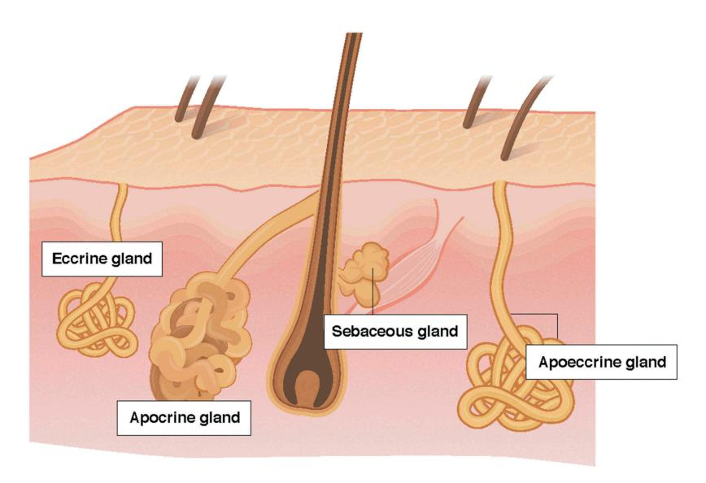
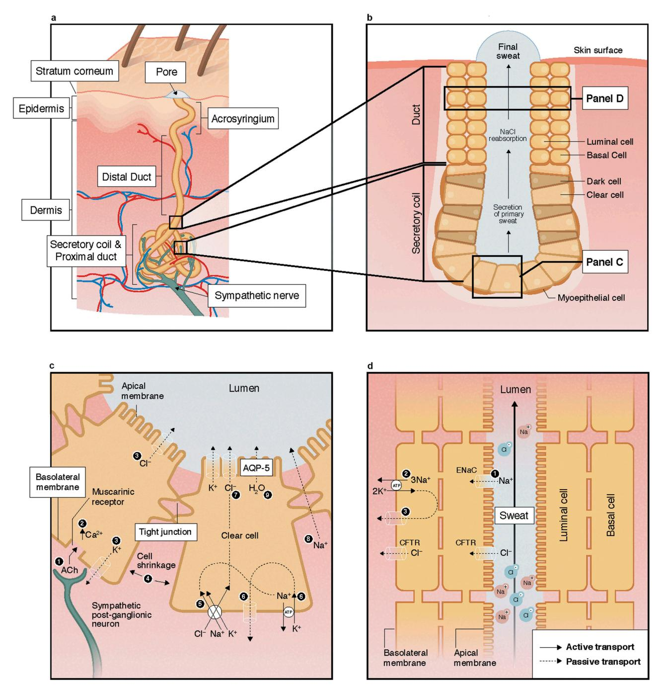
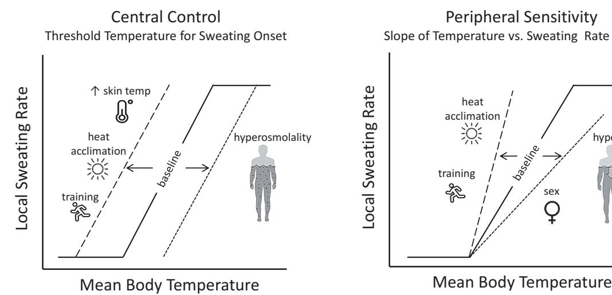
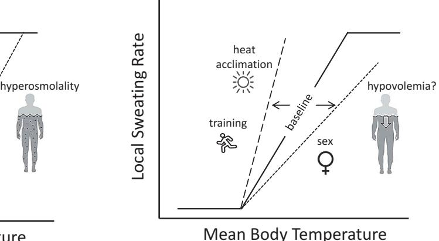
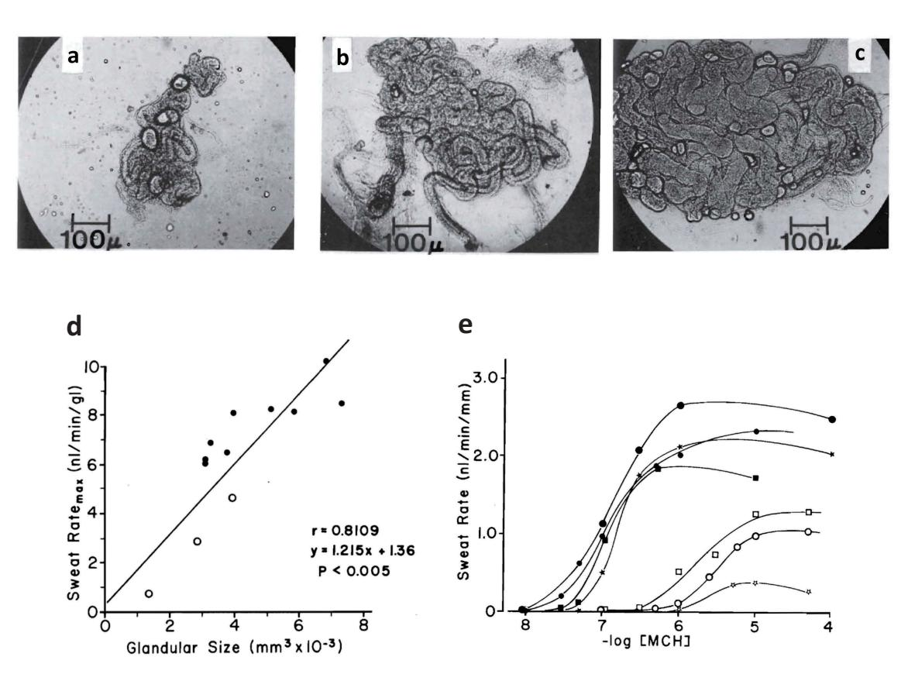
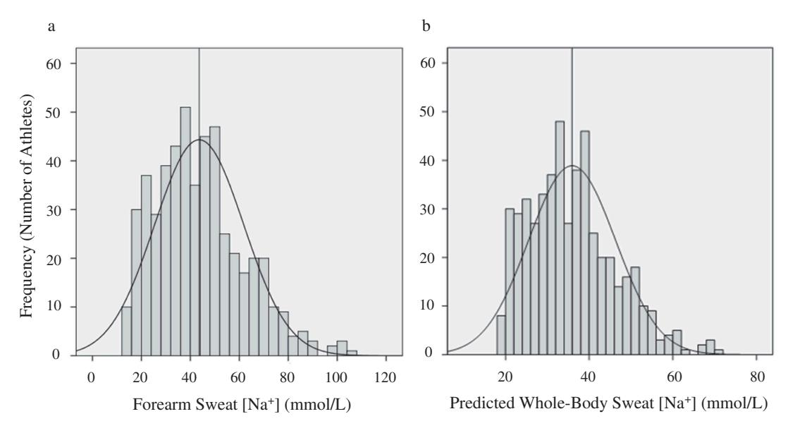
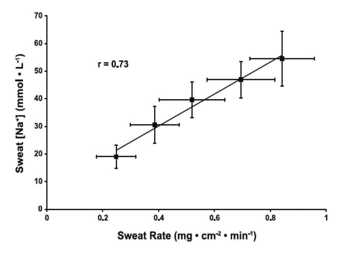
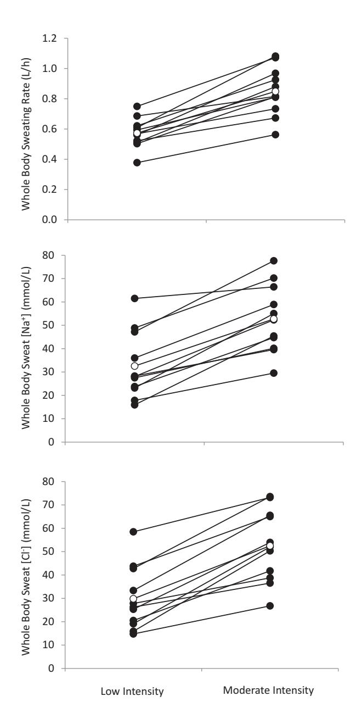
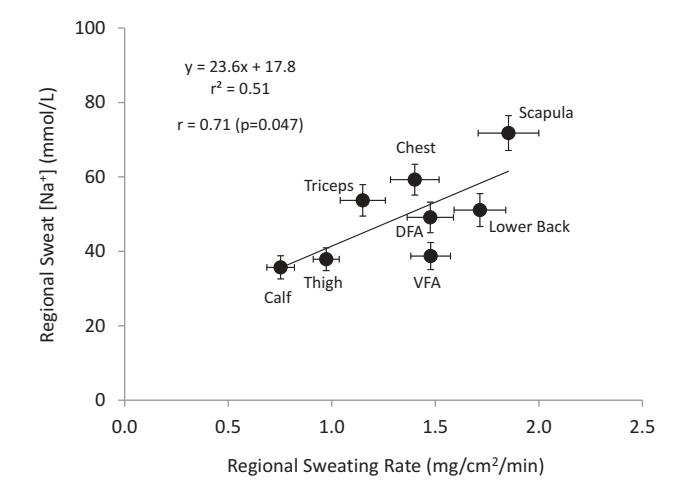
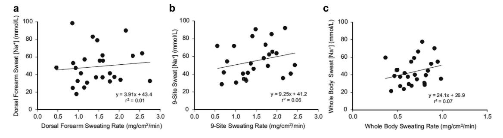

#### COMPREHENSIVE REVIEW

# Physiology of sweat gland function: The roles of sweating and sweat composition in human health

Lindsay B. Baker

Gatorade Sports Science Institute, PepsiCo R&D Physiology and Life Sciences, Barrington, IL, USA

#### ABSTRACT

The purpose of this comprehensive review is to: 1) review the physiology of sweat gland function and mechanisms determining the amount and composition of sweat excreted onto the skin surface; 2) provide an overview of the well-established thermoregulatory functions and adaptive responses of the sweat gland; and 3) discuss the state of evidence for potential non-thermoregulatory roles of sweat in the maintenance and/or perturbation of human health. The role of sweating to eliminate waste products and toxicants seems to be minor compared with other avenues of excretion via the kidneys and gastrointestinal tract; as eccrine glands do not adapt to increase excretion rates either via concentrating sweat or increasing overall sweating rate. Studies suggesting a larger role of sweat glands in clearing waste products or toxicants from the body may be an artifact of methodological issues rather than evidence for selective transport. Furthermore, unlike the renal system, it seems that sweat glands do not conserve water loss or concentrate sweat fluid through vasopressin-mediated water reabsorption. Individuals with high NaCl concentrations in sweat (e.g. cystic fibrosis) have an increased risk of NaCl imbalances during prolonged periods of heavy sweating; however, sweat-induced deficiencies appear to be of minimal risk for trace minerals and vitamins. Additional research is needed to elucidate the potential role of eccrine sweating in skin hydration and microbial defense. Finally, the utility of sweat composition as a biomarker for human physiology is currently limited; as more research is needed to determine potential relations between sweat and blood solute concentrations.

#### ARTICLE HISTORY

Received 30 April 2019 Revised 6 June 2019 Accepted 8 June 2019

#### KEYWORDS

Chloride; potassium; sauna; sodium; sweat biomarkers; thermoregulation

### Introduction

Sweat evaporation from the skin surface plays a critical role in human thermoregulation and this is most apparent when the ability to sweat is compromised during periods of strenuous physical labor and/or exposure to hot environments [[1\]](#page-34-0). For example, in anhidrotic patients [\[2](#page-34-1)[,3](#page-34-2)] or individuals wearing encapsulating protective clothing/equipment [[4\]](#page-34-3), body core temperature rises sharply with exercise-heat stress, which can lead to heat exhaustion or heat stroke if other means of cooling are not provided. Despite the well-accepted thermoregulatory role of sweating, it is common perception that sweating has a variety of other critical homeostatic functions unrelated to thermoregulation. For instance, sweat glands are perceived to play an important excretory function, similar to that of the renal system, responsible for clearing excess micronutrients, metabolic waste, and toxicants from the body. This belief can lead individuals to engage in practices (e.g. prolonged sauna exposure, exercise in

uncompensable conditions) designed to induce heavy sweat losses for their perceived health benefits. However, the effectiveness of sweat glands as an excretory organ for homeostatic purposes is currently unclear as there are no comprehensive reviews on this topic. Another common perception is that excretion of certain constituents in sweat may lead to perturbations in health, such as micronutrient imbalances. A few studies have investigated this notion but a thorough review of the literature has not been published to date. Therefore, the first aim of this paper is to provide a comprehensive review of the physiology of sweat gland function, including the types of sweat glands, their structure, and mechanisms that determine the amount and the composition of sweat excreted onto the skin surface. This will provide the background necessary to then discuss the physiological roles of sweat in the maintenance and/or perturbation of human health. In particular, this paper will provide the state of the evidence for the nonthermoregulatory as well as the thermoregulatory

roles of sweating, consider the methodological challenges of studies in this area, and make suggestions where future research is needed.

#### Types of sweat glands

The purpose of this section is to compare and contrast the three main types of sweat glands: eccrine, apocrine, and apoeccrine [5,6], which are illustrated in Figure 1. Eccrine sweat glands are the most numerous, distributed across nearly the entire body surface area, and responsible for the highest volume of sweat excretion [5]. By contrast, apocrine and apoeccrine glands play a lesser role in overall sweat production as they are limited to specific regions of the body [7–10]. However, it is important to briefly discuss the apocrine and apoeccrine glands since their secretions can also impact the composition of sweat collected at the skin surface.

#### **Eccrine sweat glands**

Eccrine glands were the first type of sweat gland discovered; as they were initially described in 1833 by Purkinje and Wendt and in 1834 by Breschet and Roussel de Vouzzeme, but were not named eccrine glands until almost 100 years later by Schiefferdecker [11]. Eccrine glands are often referred to as the small gland variety, but are by far the most ubiquitous type of sweat gland [12]. Humans have ~2-4 million eccrine sweat glands in total and are found on both glabrous (palms, soles) and non-glabrous (hairy)

skin [13-15]. Gland density is not uniform across the body surface area. The highest gland densities are on the palms and soles ( $\sim 250-550$  glands/cm2) [16] and respond to emotional as well as thermal stimuli. The density of eccrine glands on non-glabrous skin, such as the face, trunk, and limbs are ~2-5-fold lower than that of glabrous skin [16], but distributed over a much larger surface area and are primarily responsible for thermoregulation.

The eccrine glands are functional early in life and, starting at ~2-3 years of age, the total number of eccrine glands is fixed throughout life [12-14]. Therefore, overall sweat gland density decreases with skin expansion during growth from infancy and is generally inversely proportional to body surface area. As a result, children have higher sweat gland densities than adults [11], and larger or more obese individuals have lower sweat gland densities than their smaller or leaner counterparts [13,17]. However, higher sweat gland density does not necessarily translate to higher sweating rate. In fact, most of the variability in regional and whole-body sweating rate within and between individuals is due to differences in sweat secretion rate per gland, rather than the total number of active sweat glands [18,19]. Eccrine sweat is mostly water and NaCl, but also contains a mixture of many other chemicals originating from the interstitial fluid and the eccrine gland itself. The structure and function of eccrine glands and the composition of eccrine sweat will be discussed in more detail in subsequent sections of this paper.

Figure 1. Comparison of the apocrine, eccrine, and apoeccrine glands in the axilla.

### Apocrine sweat glands

The apocrine gland is a second type of sweat gland, which was first recognized by Krause in 1844 and later named by Schiefferdecker in 1922 [[20,](#page-35-7)[21\]](#page-35-8). Apocrine sweat glands are located primarily in the axilla, breasts, face, scalp, and the perineum [[21,](#page-35-8)[22](#page-35-9)]. As shown in [Figure 1,](#page-1-0) these glands differ from eccrine glands in that they are larger and open into hair follicles instead of onto the skin surface [\[12](#page-34-9)]. In addition, although present from birth, the secretory function of apocrine glands does not begin until puberty [[23\]](#page-35-10). Apocrine glands produce viscous, lipid-rich sweat, which is also comprised of proteins, sugars, and ammonia [[21,](#page-35-8)[23\]](#page-35-10). The function of apocrine glands in many species is generally regarded as scent glands involved in production of pheromones (body odor), although this social/sexual function is rudimentary in humans. Apocrine gland innervation is poorly understood, but isolated sweat glands have been found to respond equally to adrenergic and cholinergic stimuli [\[23\]](#page-35-10).

#### Apoeccrine sweat glands

A third type of sweat gland, only recently described by Sato et al. in 1987 [\[23](#page-35-10),[24](#page-35-11)] is the apoeccrine gland. Apoeccrine glands develop from eccrine sweat glands between the ages of ~8 to 14 years and increase to as high as 45% of the total axillary glands by age 16–18 [\[23](#page-35-10)]. They are intermediate in size, but as the name suggests, apoeccrine glands share properties with both eccrine and apocrine glands. Like apoeccrine glands, apoeccrine glands are limited in distribution, as they are contained to only the axillary region. Apoeccrine glands are more similar to eccrine glands in that the distal duct connects to and empties sweat directly onto skin surface [\[23](#page-35-10)]. In addition, the apoeccrine gland produces copious salt water secretions similar to eccrine sweat [\[23](#page-35-10)]. The function of this secretion is unknown, but unlikely to play a significant role in thermoregulation since evaporation is inefficient in the axilla region. The innervation of the apocrine gland is still poorly understood, but in vitro models suggest the apocrine gland is more sensitive to cholinergic than adrenergic stimuli [\[23](#page-35-10),[24\]](#page-35-11).

Sebaceous glands are not a type of sweat gland but worth mentioning here since their secretions can impact the composition of sweat collected at the skin surface [[25\]](#page-35-12). Sebaceous glands, first described by Eichorn in 1826 [[26\]](#page-35-13), are associated with hair follicles and present over much of the body surface but particularly the scalp, forehead, face, and anogenital area [\[26](#page-35-13),[27\]](#page-35-14). They are absent on the palms of hands and soles of the feet [\[26](#page-35-13)]. Sebaceous glands are holocrine glands that secrete a viscous, lipid-rich fluid consisting of triglycerides, wax esters, squalene, cholesterol, and cholesterol esters [[25](#page-35-12)–[27\]](#page-35-14). The rate of sebum production is related to the number and size of glands which is under hormonal (androgen) control [\[26](#page-35-13)]. The importance of sebaceous gland secretions is uncertain but sebum is thought to have antibacterial and antifungal properties and function as a pheromone [\[28](#page-35-15)].

Eccrine glands will be the focus of this review; therefore, unless otherwise specified, sweating rate and sweat composition will hereafter refer to that of the eccrine glands. The reader is referred to other papers for more details on apocrine and apoeccrine glands [[12](#page-34-9),[20](#page-35-7)–[24,](#page-35-11)[27,](#page-35-14)[29,](#page-35-16)[30\]](#page-35-17) as well as sebaceous glands [[26](#page-35-13)–[28\]](#page-35-15).

### Structure and function of eccrine sweat glands

#### Anatomy

The anatomical structure of the eccrine sweat gland, illustrated in [Figure 2](#page-3-0), consists of a secretory coil and duct made up of a simple tubular epithelium. The secretory tubule is continuous with and tightly coiled with the proximal duct. The distal segment of the duct is relatively straight and connects with the acrosyringium in the epidermis [\[5\]](#page-34-4). The secretory coil has three types of cells: clear, dark, and myoepithelial. As shown in [Figure 2\(c](#page-3-0)), clear cells are responsible for the secretion of primary sweat, which is nearly isotonic with blood plasma [\[6](#page-34-5)–[8](#page-34-10)]. The clear cells contain a system of intercellular canaliculi, glycogen, and a large amount of mitochondria and Na-K-ATPase activity [\[5](#page-34-4)]. The dark cells are distinguishable by the abundance of dark cell granules in the

Figure 2. Structure of the eccrine sweat gland (panels A-B) and mechanisms of sweat secretion in the secretory coil (panel C) and Na and Cl reabsorption in the proximal duct (panel D). ACh; acetylcholine; AQP-5, aquaporin-5; CFTR, cystic fibrosis membrane channel; ENaC, epithelial Na channel; NaCl, sodium chloride.

cytoplasm. Their function is poorly understood, but thought to potentially act as a repository for various bioactive materials involved in regulation of clear cell and duct cell function [\[9](#page-34-11)[,10](#page-34-7)]. The function of the myoepithelial cells is provision of structural support for the gland against the hydrostatic pressure generated during sweat production [\[5\]](#page-34-4). The duct has two cell layers: basal and luminal cells. Its primary

function is reabsorption of Na and Cl ions as sweat flows through the duct, as shown in [Figure 2\(d](#page-3-0)). Most of the NaCl reabsorption occurs in the proximal duct, as these cells contain more mitochondria and Na-K-ATPase activity than that of the distal segment of the eccrine duct [[5](#page-34-4)]. The result is a hypotonic final sweat excreted onto the skin surface [[6](#page-34-5),[9](#page-34-11)].

### Mechanisms of secretion and reabsorption

### Secretion

The basic mechanism by which secretion of primary sweat occurs in the clear cells, according to the Na-K-2Cl cotransport model, is illustrated in [Figure 2\(c\)](#page-3-0). First, binding of acetylcholine to muscarinic receptors on the basolateral membrane of the clear cell triggers a release of intracellular Ca stores and an influx of extracellular Ca into cytoplasm. This is followed by an efflux of KCl through Cl channels in the apical membrane and K channels in the basolateral membrane. This leads to cell shrinkage, which triggers an influx of Na, K, and Cl via Na-K-2Cl cotransporters on the basolateral membrane and subsequently Na and K efflux via Na-K-ATPase and K channels on basolateral membrane as well as Cl efflux via Cl channels on apical membrane. Increased Cl concentration in the lumen creates an electrochemical gradient for Na movement across the cell junction [\[9,](#page-34-11)[10\]](#page-34-7). In turn, the net KCl efflux from the cell creates an osmotic gradient for water movement into the lumen via aquaporin-5 channels [\[31](#page-35-18)–[33](#page-35-19)].

### Ion reabsorption

[Figure 2\(d\)](#page-3-0) shows the mechanism of ion reabsorption according to the modified Ussing leak-pump model. On the apical membrane of the luminal cells passive influx of Na occurs through amiloride-sensitive epithelial Na channels. Active transport of Na across the basolateral membrane of the basal cells occurs via Na-K-ATPase, which is accompanied by passive efflux of K through K channels on the basolateral membrane. The movement of Cl is largely passive via cystic fibrosis membrane channels (CFTR) on both the apical and basolateral membranes [\[9,](#page-34-11)[34,](#page-35-20)[35](#page-35-21)]. The two cell layers are thought to be coupled and behave like a syncytium. The sweat duct also reabsorbs bicarbonate, either directly or through hydrogen ion secretion, but the specific mechanism is unknown [\[5,](#page-34-4)[8](#page-34-10),[36](#page-35-22)[,37\]](#page-35-23). The activity of Na-K-ATPase is influenced by the hormonal control of aldosterone [[38\]](#page-35-24). Overall the rate of Na, Cl, and bicarbonate reabsorption is also flow-dependent, such that higher sweating rates are associated with proportionally lower reabsorption rates resulting in higher final sweat electrolyte

concentrations [[39,](#page-35-25)[40](#page-35-26)]. This concept will be covered in more detail in the Effect of sweat flow rate section below.

#### Sweat gland metabolism

Transport of Na across cellular membranes is an active process, thus sweat secretion in the clear cells and Na reabsorption in the duct require ATP. The main route of energy production for sweat gland activity is oxidative phosphorylation of plasma glucose [\[6](#page-34-5)[,41](#page-35-27)]. Cellular glycogen is also mobilized in the eccrine sweat gland during sweat secretion, but its absolute amount is too limited to sustain sweat secretion. Thus, the sweat gland depends almost exclusively on exogenous substrates, especially glucose, as its fuel sources [[6](#page-34-5)[,42](#page-35-28)]. Although the sweat gland is capable of utilizing lactate and pyruvate as energy sources, these intermediates are less efficient than glucose [[6](#page-34-5)[,9\]](#page-34-11). Indeed, studies have shown that arterial occlusion of forearms [\[43](#page-35-29),[44\]](#page-35-30) and removal of glucose and oxygen from the bathing medium of isolated sweat glands [\[6,](#page-34-5)[45\]](#page-35-31) inhibits sweat production. Consequently, lactate (as an end product of glycolysis) and NaCl concentrations in sweat rise sharply. Taken together, these results indicate that oxygen supply to the sweat gland is important for maintaining sweat secretion and ion reabsorption [[45\]](#page-35-31).

#### Control of eccrine sweating

Eccrine sweat glands primarily respond to thermal stimuli; particularly increased body core temperature [[40\]](#page-35-26), but skin temperature and associated increases in skin blood flow also play a role [[9](#page-34-11)[,46](#page-35-32)–[49](#page-36-0)]. An increase in body temperature is sensed by central and skin thermoreceptors and this information is processed by the preoptic area of the hypothalamus to trigger the sudomotor response. Recent studies suggest that thermoreceptors in the abdominal region [[50,](#page-36-1)[51\]](#page-36-2) and muscles [[52\]](#page-36-3) also play a role in the control of sweating. Thermal sweating is mediated predominately by sympathetic cholinergic stimulation. Sweat production is stimulated through the release of acetylcholine from nonmyelinated class C sympathetic postganglionic fibers, which binds to muscarinic (subtype 3) receptors on the sweat gland (see

[Figure 2\(c](#page-3-0))) [\[9\]](#page-34-11). Eccrine glands also secrete sweat in response to adrenergic stimulation, but to a much lesser extent than that of cholinergic stimulation [[6](#page-34-5),[53\]](#page-36-4). Catecholamines, as well as other neuromodulators, such as vasoactive intestinal peptide, calcitonin gene-related peptide, and nitric oxide, have also been found to play minor roles in the neural stimulation of eccrine sweating [[9](#page-34-11)[,54](#page-36-5),[55\]](#page-36-6). In addition, eccrine sweat glands respond to non-thermal stimuli related to exercise and are thought to be mediated by feed-forward mechanisms related to central command, the exercise pressor reflex (muscle metabo- and mechanoreceptors), osmoreceptors, and possibly baroreceptors [[55,](#page-36-6)[56](#page-36-7)].

Sweating rate over the whole body is a product of the density of active sweat glands and the secretion rate per gland. Upon stimulation of sweating, the initial response is a rapid increase in sweat gland recruitment, followed by a more gradual increase in sweat secretion per gland [[13,](#page-35-0)[57](#page-36-8)–[59\]](#page-36-9). Two important aspects of thermoregulatory sweating, depicted in [Figure 3,](#page-5-0) are the onset (i.e. body core temperature threshold) and sensitivity (i.e. slope of the relation between sweating rate and the change in body core temperature) of the sweating response to hyperthermia [\[60](#page-36-10)]. Shifts in the sweating temperature threshold are thought to be central (hypothalamic) in origin, whereas changes in sensitivity are peripheral (at the level of sweat glands) [\[61](#page-36-11)].

### Modifiers of eccrine sweating

Several intra- and interindividual factors can modify the control of sweating [\[60](#page-36-10)], some of which are shown in [Figure 3](#page-5-0). For example, the enhancement of sweating with heat acclimation [\[62](#page-36-12)–[65](#page-36-13)] and aerobic training [[66](#page-36-14)–[69](#page-36-15)] has been associated with both an earlier onset and greater responsiveness of sweating in relation to body core temperature [[64](#page-36-16)[,70](#page-36-17)–[75](#page-36-18)]. By contrast, dehydration has been shown to delay the sweating response [[76](#page-36-19)[,77\]](#page-36-20), as hyperosmolality increases the body temperature threshold for sweating onset [\[78](#page-36-21)–[81\]](#page-36-22). Hypovolemia may reduce sweating sensitivity [[82](#page-37-0)], but this finding has not been consistent [[79](#page-36-23)[,83\]](#page-37-1).

Other examples of host and external factors that modify regional and/or whole-body sweating are provided in [Table 1.](#page-6-0) For example, older adults exhibit a lower sweat output per activated gland in response to a given pharmacological stimulus or passive heating compared with younger adults [\[84](#page-37-2)–[86](#page-37-3)]. This decline in sweating occurs gradually throughout adulthood [\[85](#page-37-4)[,87](#page-37-5)] and there are regional differences in the agerelated decrement in sweat gland function [\[88](#page-37-6)–[91\]](#page-37-7). However, the decline in sweating rate with aging has been primarily attributed to mechanisms related to a decline in aerobic fitness and heat acclimation (possibly due to decreased sensitivity of sweat glands to cholinergic stimulation [\[67](#page-36-24)[,92](#page-37-8)]), rather than age per se [\[67](#page-36-24)[,68](#page-36-25)[,85](#page-37-4)[,93](#page-37-9)–[96](#page-37-10)]. In addition, lifetime ultraviolet

Figure 3. An illustration of central and peripheral control of sweating and the factors that modify the sweating response to hyperthermia. Shifts in the onset (threshold) and sensitivity (slope) of the sweating response to hyperthermia are depicted by the dashed lines. Other potential factors that may directly or indirectly modify sweating (altitude/hypoxia, microgravity, menstrual cycle, maturation, aging) are discussed in the text.

Table 1. Host and environmental factors that modify sweat gland function.

|                                                                                             | Timing            | Effect on sweating rate and/or sweat composition                                                                                                                                                                                                             |
|---------------------------------------------------------------------------------------------|-------------------|--------------------------------------------------------------------------------------------------------------------------------------------------------------------------------------------------------------------------------------------------------------|
| Host and external factors                                                                   |                   |                                                                                                                                                                                                                                                              |
| Dietary NaCl                                                                                | Chronic Acute/ | No effect on sweating rate [224,236,242–244]; mixed results for effect on sweat [Na] and [Cl] (see Table 5): most studies involving several days to weeks of dietary Na manipulation are associated with significant changes in sweat [Na]                |
|                                                                                             |                   | [224,235,236,239,240], but there is no correlation between the change in Na intake and the change in sweat [Na] [247]; shorter duration (≤3 days) of Na manipulation has minimal or no impact [134,195,242,244,245]                                       |
| Dietary intake of other minerals (Ca, Fe, Zn, Cu) and vitamins (ascorbic acid, thiamine) | Chronic Acute/ | No effect on sweat mineral or vitamin concentrations [230,231,248–250]                                                                                                                                                                                       |
| Fluid intake                                                                                | Acute             | Water ingestion results in a reflex (oropharyngeal) transient increase in RSR, especially when in a hypohydrated state                                                                                                                                       |
|                                                                                             |                   | [360,361]; no effect on sweat Na, K, Cl, and lactate concentrations [361]                                                                                                                                                                                    |
| Dehydration                                                                                 | Acute             | Reduced WBSR and RSR attributed to hyperosmolality-induced increase in threshold for sweat onset and to a lesser extent by a hypovolemia-induced decrease in sweat sensitivity (see Figure 3) [42,76–78,80,82]; equivocal effects on sweat [Na] and       |
|                                                                                             |                   | [Cl] [134,153,190–195]; no effect on sweat [K] [190]                                                                                                                                                                                                         |
| Alcohol                                                                                     | Acute             | No effect on sweating rate [331,332]; sweat ethanol concentration increases with ethanol ingestion and rises linearly with                                                                                                                                   |
| Exercise Intensity                                                                          | Acute             | Increase in WBSR and RSR with increases in exercise intensity [104,362] as metabolic heat production is directly increases in blood alcohol concentration [334,335]                                                                                       |
|                                                                                             |                   | proportional to energy expenditure [201,203]; sweat [Na] and [Cl] increase with increases in exercise intensity because the relative rate of Na and Cl reabsorption is flow dependent [39,159], minimal or no effect on sweat [K] [159], inverse relation |
|                                                                                             |                   | between sweating rate and sweat lactate [162] and ammonia concentrations [6,15] (see Table 4), limited data on other sweat constituents                                                                                                                   |
| Environment                                                                                 | Acute             | Increase in WBSR and RSR [201,363–368] with increased environmental heat stress (increased air temperature, increased                                                                                                                                        |
|                                                                                             |                   | solar radiation, decreased air velocity) at a given workload; suppression of sweating via hidromeiosis with prolonged                                                                                                                                        |
|                                                                                             |                   | exposure to humid/still air [366,369–371]. Increase in sweat [Na] and [Cl] with an increase in ambient temperature [158,372]                                                                                                                              |
| Altitude/hypoxia                                                                            | Acute             | Equivocal effects on sweating; reduced sweat sensitivity for RSR [118,119,373], but mixed results for WBSR [374–378].                                                                                                                                        |
|                                                                                             |                   | Limited data on sweat composition.                                                                                                                                                                                                                           |
| Clothing/protective equipment                                                               | Acute             | Increase in WBSR and RSR because of reduced evaporative and radiant heat loss from covering the skin surface, heavy                                                                                                                                          |
| Body mass                                                                                   | Chronic           | Increased WBSR in individuals with larger body mass because of increased metabolic heat production at a given absolute protective gear can also increase metabolic heat production [4,379,380]; limited data on sweat composition                         |
|                                                                                             |                   | workload during weight-bearing exercise [381–383] and possibly lower sweating efficiency [384]; limited data on sweat                                                                                                                                        |
|                                                                                             |                   | composition                                                                                                                                                                                                                                                  |
| Heat acclimation                                                                            | Chronic           | Increase in WBSR [64,220,222,385], variable effects at the regional level such that RSR at the limbs (forearm) tend to                                                                                                                                       |
|                                                                                             |                   | increase proportionally more than at central sites (chest, back), suggesting a possible preferential redistribution toward the                                                                                                                               |
|                                                                                             |                   | [62,63,158,217,218,220], but no change in other minerals (K, Mg, Ca, Fe, Cu, Zn) [227]. Sudomotor changes due to gland periphery resulting in more uniform sweating across the body [221,222]; reduced sweat [Na] and [Cl]                                |
|                                                                                             |                   | hypertrophy, increased cholinergic and aldosterone sensitivity, and decreased threshold for sweat onset (see Figure 3).                                                                                                                                      |
| Aerobic training                                                                            | Chronic           | Increase in WBSR and RSR because of increased cholinergic sensitivity and decreased threshold for sweat onset [66–69] (see                                                                                                                                   |
|                                                                                             |                   | Figure 3); limited data for sweat composition                                                                                                                                                                                                                |
| Sex                                                                                         | Chronic           | Higher WBSR and RSR in men because of greater cholinergic responsiveness (see Figure 3) and maximal sweating rate, but                                                                                                                                       |
|                                                                                             |                   | only at high evaporative requirements for heat balance [83,99–102]; otherwise higher WBSR often observed in men are                                                                                                                                          |
|                                                                                             |                   | related to higher body mass and metabolic heat production, rather than sex per se [104–108]. Minimal differences in sweat                                                                                                                                    |
|                                                                                             |                   | [Na], [Cl], and [lactate] due to sex per se [103,134,156,386–388]; limited data on other constituents                                                                                                                                                        |
| Menstrual cycle                                                                             | Cyclical          | No effect on WBSR [123,126–128], but lower RSR at a given body core temperature (increased threshold and decreased                                                                                                                                           |
| Circadian Rhythm                                                                            | Cyclical          | Increased sweating threshold in the afternoon (1200–1600 h) vs. early morning (400–530 h) [121,122]; no data on sweat slope) during luteal phase [122–125]; no effect on sweat [Na], [Cl], or [K] [389]                                                   |
|                                                                                             |                   | composition                                                                                                                                                                                                                                                  |
|                                                                                             |                   |                                                                                                                                                                                                                                                              |

(Continued)

| ( == | 4 | ١.,١ |
|------|---|------|
| 7    | - |      |

 Table 1. (Continued).

|                  | Timing      | Effect on sweating rate and/or sweat composition                                                                                                                                                                                                                                |
|------------------|-------------|---------------------------------------------------------------------------------------------------------------------------------------------------------------------------------------------------------------------------------------------------------------------------------|
| Race/Ethnicity C | :hronic     | No inherent race or ethnicity differences in WBSR, RSR, or sweat composition [134,390,391]; but heat habituation, characterized by lower (lower ASGD and SGO) and more efficient sweating (less dripping), occurs in people indigenous to hot or tropical climates (70,392–397) |
| Maturation P.    | Progressive | Lower WBSR and sweat [Na] in pre-pubertal vs. post-pubertal boys [94,115–117]                                                                                                                                                                                                   |
| Aging P          | Progressive | Reduced WBSR and RSR related to decreased SGO associated with decline in aerobic fitness and heat acclimation rather than aging how so 167 RS 03 041. Airting everyise—host stress differences more evident for host sweating rate for during                                   |
|                  | , 5 1 | their using per section (2017). Limited data on sweat composition, but there seems to be no impact of age per se on sweat fixal fixal fixal section.                                                                                                                            |

ASGD: activated sweat gland density; RSR: regional sweating rate; SGO: sweat gland output; WBSR;, whole-body sweating rate

exposure and other environmental factors may have an interactive effect with chronological age in determining sweat gland responsiveness [84]. Nonetheless, it is important to note that most studies have reported no significant difference in sweating between older and younger adults during exercise in the heat; with the exception of peak sweating rates associated with hot dry climates [94,97,98]. Therefore the ability of older adults to maintain body core temperature during heat stress is usually not compromised. When the effects of concurrent factors, such as fitness level, body composition, and chronic disease are removed, thermal tolerance appears to be minimally compromised by age [93].

It is often reported that men exhibit higher sweating rates than women; and several factors, some of which are independent effects of sex and others due to confounding physical characteristics, seem to contribute depending upon the study design. Men have a greater cholinergic responsiveness (see Figure 3) and maximal sweating rate than women [83,99-101]. However, studies in which subjects were matched for body mass, surface area, and metabolic heat production, have shown that sex differences in whole-body sweat production are only evident above a certain combination of environmental conditions (e.g. 35-40°C, 12% rh) and rate of metabolic heat production (e.g. 300-500 W/m2) leading to high evaporative requirements for heat balance [83,100-102]. Sweat gland density is generally higher in women than men (due in part to lower body surface area) [17,69,103]. Accordingly, the lower sweating rates by women reported in some studies were a result of lower output per gland [99,101,103]. Otherwise, higher whole-body sweating rates observed in men than women (e.g. in cross-sectional studies) can usually be attributed to higher body mass and metabolic heat production (higher absolute exercise intensities), rather than sex per se [104-109]. Taken together it seems that women are not at a thermoregulatory disadvantage compared with men for most activities and environmental conditions typically encountered [110,111]. As discussed in more detail elsewhere [109,110,112], other factors such as body size, surface area-to-mass ratio, heat acclimation status, aerobic capacity, exercise intensity, and environmental conditions (all of which directly or indirectly impact the evaporative

Figure 4. Top row (panels A-C): Variation in the size of human eccrine sweat glands taken from the backs of three different men who were described as poor (A), moderate (B), and heavy sweaters (C). Bottom row: Correlation between size of sweat gland and sweat ratemax per gland (panel D). Dose-response curves (expressed per unit length of tubule) of sweat rates of 7 men to methacholine. Closed symbols show moderate to heavy sweaters. Open symbols show poor sweaters. Reprinted from Sato and Sato 1983 [\[131](#page-38-15)]with permission.

requirement for heat balance) are more important than sex in determining sudomotor responses to exercise-heat stress. The reader is referred to published reviews for more comprehensive discussions on the effects of sex and sex hormones on thermoregulation [\[110,](#page-37-22)[113,](#page-37-25)[114](#page-38-11)].

Additional factors, such as maturation [[94](#page-37-16)[,115](#page-38-9)– [117\]](#page-38-10), altitude/hypoxia [\[118](#page-38-1)–[120\]](#page-38-12), circadian rhythm [\[121,](#page-38-8)[122\]](#page-38-6), and menstrual cycle [[122](#page-38-6)–[125](#page-38-7)] have been shown to modify the onset and/or sensitivity of the sudomotor response (see [Table 1](#page-6-0)). However, modifications in the onset and/or sensitivity of regional sweating in relation to body core temperature are not necessarily associated with significant differences in overall whole-body sweat losses during exercise. Two examples of this were noted above, with respect to the impact of sex and chronological age on sweating. Another example is the menstrual cycle: during the luteal phase regional sweating rate is lower at a given body core temperature (increased threshold and

decreased slope) [\[122](#page-38-6)–[125](#page-38-7)], but there are no differences in whole-body sweating rate across the menstrual cycle phases [\[123,](#page-38-3)[126](#page-38-4)–[129](#page-38-13)]. Additionally, for trained females their menstrual phase is of little physiological or performance consequence during exercise in the heat [[103,](#page-37-15)[130\]](#page-38-14).

Some of the variability in sweating rate can be explained by differences in the structure of sweat glands. For example, with habitual activation, sweat glands show some plasticity in their size and neural/hormonal sensitivity [[18,](#page-35-5)[19\]](#page-35-6). Sato and colleagues have shown that glandular size (volume) can vary by as much as fivefold between individuals [[9](#page-34-11)[,131\]](#page-38-15), and there is a significant positive correlation between the size of isolated sweat glands and their methacholine sensitivity and maximal secretory rate [\[131\]](#page-38-15) (see [Figure 4](#page-8-0)). Sweat gland hypertrophy and increased cholinergic sensitivity have been reported to occur with aerobic training [\[131\]](#page-38-15) and heat acclimation [[38\]](#page-35-24) (see [Table 1](#page-6-0) for more information).

|                                                     | Methodological issue                                                                                                                                                                                                                                                                                           | Sweat constituents most affected                                                                                                                                                                                                                                                                                                                                              | Recommendation                                                                                                                                                                                                                                                                                                                                                |
|-----------------------------------------------------|----------------------------------------------------------------------------------------------------------------------------------------------------------------------------------------------------------------------------------------------------------------------------------------------------------------|-------------------------------------------------------------------------------------------------------------------------------------------------------------------------------------------------------------------------------------------------------------------------------------------------------------------------------------------------------------------------------|---------------------------------------------------------------------------------------------------------------------------------------------------------------------------------------------------------------------------------------------------------------------------------------------------------------------------------------------------------------|
| Skin cleaning/preparation Cleaning technique     | Skin surface contamination of epidermal origin (desquamation) [227,228,254] Sebum contamination [25,323] ● ●                                                                                                                                                                                       | Overestimation of lipophilic compounds abundant in secretions from sebaceous glands (e.g. cytokines, lac concentrations, but negligible effect on Na and Cl Overestimation (by up to 2–3x) of micronutrient tate, vitamins, persistent organic pollutants) [134,183,227,228] [25,316,318] ● ●                                                         | Avoid sebum contamination by collecting sweat from sites with fewer sebaceous glands and using absorbent Thoroughly clean skin site when measuring micro Avoid hand/arm bag technique because of high likelihood of desquamation [228,285] pad technique [398] minerals [228] ● ● ●                                                |
| Timing of collection                                | Sweat collection at onset of exercise (when sweating rate is low) not representative of includes skin surface contamination from sweat electrolyte concentrations at steady residual sweat in ductal lumen [234,399] Sweat collected at the onset of exercise state sweating rate. ● ● | Sweat [Na] and [Cl] lower at onset of exercise during Overestimation (by 1.2-5x) of trace minerals (Fe, Ca, ammonia, lactate, cytokines, amino acids) compared with later in exercise [228,229,232–234,239,399,400], but negligible effect on Na, Cl, and K [227–229] Zn, Mg, Cu) and most other constituents (urea, ramping up of sweating rate. ● ● | Begin sweat collection after onset of sweating, i.e. 20–90 min, sweating rate, then clean skin/wipe away sweat from surface (shorter for NaCl, longer for trace minerals) to allow flushing of contaminants from lumen and time to reach steady state depending on sweating rate and constituent of interest prior to collection [228,229,234] |
| Sweat stimulation Sauna (steam)                  | Contamination from steam condensation on skin [25]                                                                                                                                                                                                                                                             | Dilution of sweat constituent concentrations from Bacteria, xenobiotics in steam contaminate skin, sweat [25,401] water vapor ● ●                                                                                                                                                                                                                              | Use collection method (Parafilm-M® pouch, absorbent patch) that prevents contamination from surrounding steam                                                                                                                                                                                                                                              |
| Passive (dry) heat                                  | May not be entirely applicable to sweating response in athletes during exercise (non-thermal stimuli) [55,56]                                                                                                                                                                                            | Potentially all sweat constituents; sweat [Na] and [Cl] lower during passive heat vs. exercise [134,402]                                                                                                                                                                                                                                                                   | Use if interested in measuring sweat composition in response interested in understanding sweat constituent losses relevant to environmental heat stress alone (non-athletes). Avoid if to exercise [132,137,403,404]                                                                                                                                 |
| Exercise                                            | Limited to certain collection methods during exercise, especially in athletes in contact sports [132]                                                                                                                                                                                                       | All sweat constituents                                                                                                                                                                                                                                                                                                                                                        | Collect sweat during exercise representative of train ing/competition intensities and environmental con ease of application with athletes and to avoid con Use regional method such as absorbent patch for tamination [156] ditions [132,159] ● ●                                                                                        |
| pilocarpine iontophoresis) Pharmacological (e.g. | cholinergic stimulation of sweat glands, whereas with mediators are involved in sweat stimulation [55,56] exercise and/or heat stress other local and central Sweat secretion only induced via local                                                                                                  | Significantly different RSR response, pH, and sweat constituent concentrations (Na, Cl, K, lactate) compared with exercise/heat stress [8,16,134,404–408]                                                                                                                                                                                                               | Appropriate for research regarding physiological mechanisms understanding sweat constituent losses relevant to exercise/ of local control of sweating. Avoid if interested in whole body heat stress [132,403,404]                                                                                                                                   |
| Whole body washdown Sweat collection             | Primarily limited to laboratory studies                                                                                                                                                                                                                                                                        | All sweat constituents                                                                                                                                                                                                                                                                                                                                                        | Criterion method because all sweat loss is accounted for and preferred, especially when quantifying total sweat losses or normal evaporation is permitted. Whole body washdown is conducting electrolyte/micronutrient balance studies [134,144,403,409]                                                                                          |

(Continued)

| Table 2. (Continued). |  |
|-----------------------|--|

| Regional methods (in general) | Usually not an accurate surrogate for whole body sweat composition (see Tables 3 and 4) Variability among regional sites [16] Methodological issue ● ●                                                                              | Up to 2–3.5 fold inter-regional variability for sweat Ca, Mg, Zn, Cu, Fe, Na, Cl [146,147,159,274,286]; inter-regional variability Sweat constituents most affected minimal for K [146,159]                                  | Collect sweat from regions that are most representative or highly correlated with whole body across various sweating rates (e.g. forearm for [Na] and [Cl]) [159] Recommendation                                                                                                                                                                |
|----------------------------------|----------------------------------------------------------------------------------------------------------------------------------------------------------------------------------------------------------------------------------------------------|---------------------------------------------------------------------------------------------------------------------------------------------------------------------------------------------------------------------------------------|----------------------------------------------------------------------------------------------------------------------------------------------------------------------------------------------------------------------------------------------------------------------------------------------------------------------------------------------------------|
| Absorbent patches                | Creates microenvironment (increases local skin temperature and humidity) [362] and Absorbent pad may introduce background can alter regional sweating rate compared with uncovered skin [370,410] contamination [149,286] ● ● | Background Na, Cl, Ca, Mg, Cu, Mn, Fe, Zn reported Potentially any constituent impacted by changes in RSR (Na, Cl, HCO3) in patches [149,286] ● ●                                                                      | trate adhesive barrier (TegadermTM) so can be worn Measure and correct for any relevant background in Contaminants from the environment cannot pene Limit duration of patch on skin and remove well during normal activities, including exercise and the absorbent pad [149] before saturation [411] swimming [412]. ● ● ● |
| Parafilm-M® pouch                | Collection is limited to certain regions Not practical for field studies (back) [228] ● ●                                                                                                                                              | All sweat constituents                                                                                                                                                                                                                | Preferred method for serial measurements of composition (via aspiration of sweat at desired intervals) [413]                                                                                                                                                                                                                                          |
| Macroduct®/Megaduct              | Takes long time (>60 min) to collect enough sweat for analysis (0.5 mL capacity for Can only be used on forearm. Not practical for field tests Megaduct) [414] ● ● ●                                                          | All sweat constituents                                                                                                                                                                                                                | May be appropriate for use during prolonged heat exposure (>60 min), when not interested shorter duration exercise or serial measurements [414]                                                                                                                                                                                                    |
| Ventilated sweat capsule         | skin facilitates higher RSR under the capsule than surrounding skin (at least in a humid/ Forced ventilation and maintenance of dry Primarily limited to laboratory studies still ambient air) [415,416] ● ●                     | RSR mostly; not often used to measure sweat composition                                                                                                                                                                               | maximal RSR representative of compensable environment is Criterion method for RSR; preferred method, especially if desired [417–419]                                                                                                                                                                                                               |
| Arm bag                          | Microenvironment created by encapsulation Particularly susceptible to skin surface con culty in cleaning irregular surfaces of hand tamination due to desquamation and diffi which alters RSR [369,420,421] [228] ● ●         | Overestimation (by 1.5-6x) in sweat Na, Cl, K, Mn, nickel, lead, Cu, Fe, Zn, Ca [228,285,420,421]                                                                                                                                  | Avoid or use modified technique excluding the hand [422]                                                                                                                                                                                                                                                                                                 |
| Scraping methods                 | tum corneum layer into collection container Evaporation of water portion of sweat [399] surface contamination by scraping of stra [399,423] ● ●                                                                                     | Artificial elevation of concentrations of contaminants of epidermal origin (e.g. by 20x for aminopeptidase) Overestimation (by ~30%) in all sweat constituent concentrations due to evaporation [183,319] [423] ● ● | Avoid                                                                                                                                                                                                                                                                                                                                                    |
|                                  |                                                                                                                                                                                                                                                    |                                                                                                                                                                                                                                       |                                                                                                                                                                                                                                                                                                                                                          |

| 1  | _ |   |
|----|---|---|
| (4 | Ė | 9 |

|                                   | Methodological issue                                                                                                     | Sweat constituents most affected                                                                                                                                                                                  | Recommendation                                                                                                                                                                                                                                                          |
|-----------------------------------|--------------------------------------------------------------------------------------------------------------------------|-------------------------------------------------------------------------------------------------------------------------------------------------------------------------------------------------------------------|-------------------------------------------------------------------------------------------------------------------------------------------------------------------------------------------------------------------------------------------------------------------------|
| ping methods                      | t and surface                                                                                                            | Overestimation in all sweat constituent concentrations due to Avoid evaporation [399]                                                                                                                             | Avoid                                                                                                                                                                                                                                                                   |
| iple storage ing. temperature. | portion of sweat: mold                                                                                                   | growth 6–42% increase in sweat [CI] after 3 days and 12–66% increase Seal (e.g. Parafilm-M®) in an airtight tube [424]: refrigerate for                                                                           | Seal (e.g. Parafilm-M®) in an airtight tube [424]; refrigerate for                                                                                                                                                                                                      |
| uration                           |                                                                                                                          | after 5 days when vials not Parafilm-M®-sealed [424]. When sealed during storage, no change in sweat [Na], [CI], or [K] when refrigerated, frozen, or at room temperature for 7 days [425].                       | up to 1–2 weeks [143,425], or freeze when longer storage durations are necessary                                                                                                                                                                                        |
| lytical technique                 |                                                                                                                          |                                                                                                                                                                                                                   |                                                                                                                                                                                                                                                                         |
| oratory and field                 | <ul> <li>Significant differences between analytical techniques</li> <li>Wide range in ease of use, cost, etc.</li> </ul> | Sweat [Na] ion chromatography $\leq$ ion-selective electrode < flame photometry $\leq$ conductivity [132,156,372,426–429], 4–30% variation between techniques; not enough information on other sweat constituents | <ul> <li>Criterion laboratory-based methods are ion chromatography, inductively coupled mass spectroscopy, flame atomic emission, or absorption spectrometry [430–432]</li> <li>Portable ion-selective electrode acceptable for field analysis [426,429,433]</li> </ul> |

RSR: regional sweating rate.

### **Eccrine sweat composition**

### **Methodological considerations**

In science, the accuracy and reliability of study methodology are critical to interpret results and draw conclusions about the impact of an intervention or other factor on the outcome measure of interest. Measuring sweat composition is no exception. Previous papers have comprehensively reviewed the effect of methodology on intra- and inter-individual variability in sweating rate and sweat composition as well as made suggestions for best practices [16,83,132]. Therefore, this topic will not be reviewed extensively here. Instead, these methodological considerations and supporting references have been summarized in Table 2. This table includes the main aspects of sweat methodology that are important to consider when interpreting and designing sweat composition research; these include 1) skin cleaning/preparation, 2) sweat stimulation, 3) sweat collection, 4) sample storage, and 5) analytical technique.

Specific examples illustrating the importance of valid methodology in interpreting study results are discussed throughout the remaining sections of this paper. However, it is worth noting a couple of overarching themes. First, it is important to realize that depending upon the methodology used, sweat collected from the surface of the skin may contain, not only thermal sweat secreted by the eccrine sweat gland but also, residual contents of the sweat duct, sebum secretions, epidermal cells, and other skin surface contaminants. This can lead to artificial elevations in sweat constituent concentrations and, in some cases, the overestimation is not small. For example, as shown in Table 2, two- to five-fold increases in constituent concentrations have been reported for trace minerals such as Fe and Ca. Unless care is taken to avoid contaminants it is difficult to draw conclusions about sweat composition and its utility as a biomarker, its impact on micronutrient balance, and assess the effectiveness of the sweat gland in excretion of waste products or toxicants. By contrast, dermal contamination from extra-sweat NaCl seems to be negligible compared with NaCl contained in the sweat itself, as studies have reported only 0.2 mmol/h of Cl on the skin without sweat activity [133-135].

Another important methodological consideration is to ensure that the conditions of the

Table 3. Sweat micronutrients: Mechanisms and methodological considerations.

|           | Concentration in sweat                           | regional and whole Comparison of body sweat                                                                                                                                                | Correlation between sweat and blood                                                                                                           | Sweat gland mechanisms                                                                                                                                                                                                                                                                                            | Potential methodological Issues                                                                                                                                                            |
|-----------|-----------------------------------------------------|--------------------------------------------------------------------------------------------------------------------------------------------------------------------------------------------------|--------------------------------------------------------------------------------------------------------------------------------------------------|-------------------------------------------------------------------------------------------------------------------------------------------------------------------------------------------------------------------------------------------------------------------------------------------------------------------|--------------------------------------------------------------------------------------------------------------------------------------------------------------------------------------------|
| Sodium    | 10–90 mmol/L [145–148,156]                       | chest, upper arm) but body concentrations thigh) regional sites overestimate whole correlation; many not all (foot, calf, [146,147,149,159] (forehead, back, Significant | correlated because of other factors [228,295]; plasma [Na] influences that dictate reabsorption rates sweat [Na], but not reliably a | Secreted via paracellular transport [15]. Primary sweat is transporters [9,34] (see Figure 2), resulting in hypotonic reabsorbed in the duct via epithelial Na channels and Na-K-ATPase (activity influenced by aldosterone) [38] nearly isotonic with blood plasma [8,307,434]; Na is final sweat | Concentration varies (up to 2–3 fold) with sweating rate [6,39,40,159]                                                                                                                  |
| Chloride  | 149,152,159,435] 10–90 mmol/L [147–           | chest, upper arm) but body concentrations thigh) regional sites overestimate whole correlation; many not all (foot, calf, [146,147,149,159] (forehead, back, Significant | correlated because of other factors [152,195]; plasma [Cl] influences that dictate reabsorption rates sweat [Cl], but not reliably a | plasma [8,434]; Cl is reabsorbed in the duct via the CFTR Secreted via Na-K-2Cl cotransport model [15]. Primary [35] (see Figure 2), resulting in hypotonic final sweat sweat is slightly hypertonic compared with blood                                                                                 | Concentration varies (up to 2-3 fold) with sweating rate [6,152,159]                                                                                                                    |
| Potassium | [146,147,435] 2–8 mmol/L                         | respect to correlation Mixed results with [146,147,149,159]                                                                                                                                | [228] a                                                                                                                                       | Mixed results with respect to relation between flow rate Secreted via Na-K-2Cl cotransport model [15]. Primary during sweat passage along the duct, but mechanism and sweat [K] [6,147,159,436]; thought to be secreted sweat is nearly isotonic with blood plasma [6,8,434]; unknown [437–439]    | Often overestimated (by up to 2-3x) with arm bag technique due to surface contamination [134,228]                                                                                    |
| Calcium   | b0.2–2.0 mmol/L [144,219,227– 229,235,286]    | body concentrations overestimate whole regional measures No correlation; [286]                                                                                                       | No [283]                                                                                                                                         | NA                                                                                                                                                                                                                                                                                                                | origin and residual Ca in the sweat gland lumen Overestimation (by up to 3x) both of epidermal [134,228]                                                                             |
| Magnesium | [219,227–229] b0.02–0.40 mmol/L               | body concentrations overestimate whole regional measures No correlation; [286]                                                                                                       | NA                                                                                                                                               | NA                                                                                                                                                                                                                                                                                                                | Overestimation (by up to 3x) from skin surface contamination [228]                                                                                                                      |
| Iron      | b0.0001–0.03 [219,228,233, 234,274] mmol/L | body concentrations overestimate whole Regional measures [285]                                                                                                                          | No [233,251]                                                                                                                                     | NA                                                                                                                                                                                                                                                                                                                | gland lumen [134,228,233,234]; cell-rich sweat epidermal origin and residual Fe in the sweat particularly high in Fe [184,233,234,253,254] Overestimation (by up to 2-3x) both of |
| Zinc      | b0.0001–0.02 [219,227– 229,274] mmol/L     | body concentrations overestimate whole Regional measures [285]                                                                                                                          | NA                                                                                                                                               | NA                                                                                                                                                                                                                                                                                                                | Overestimation (by up to 2x) from skin surface contamination [228]                                                                                                                      |

|    | _ |    |
|----|---|----|
|    |   | \  |
| (4 | ź | (ر |
| 1  | _ | '  |

|          | Concentration in sweat                                          | Comparison of Concentration in regional and whole sweat body sweat       | Correlation between sweat and blood | Sweat gland mechanisms | Potential methodological Issues                                              |
|----------|-----------------------------------------------------------------|--------------------------------------------------------------------------|-------------------------------------|------------------------|------------------------------------------------------------------------------|
| Copper   | <b>b</b> 0.0005-0.02 mmol/L [219,227- 229,274,285,286] | No correlation; regional measures overestimate whole body concentrations | NA                                  |                        | Overestimation (by up to 3.5x) from skin surface contamination [228]         |
| Vitamins | е                                                               | [263,286] NA                                                          | NA                                  |                        | Overestimation from skin surface contamination and sebum secretions [25,134] |

 Table 3. (Continued)

NA: no data available; amixed results or too few studies available to draw conclusion; bvalues are from regional or whole-body sweat reported from studies that took measures to prevent epidermal contamination (e.g. pre-rinsed skin and analyzed cell-free sweat) protocol, including the method of sweat stimulation and anatomical location of sweat collection, are specific to the research question of interest. As described in Table 2 sudomotor responses vary among pharmacological-, passive heat-, and exercise-induced sweating and so these methods should not be used interchangeably. Similarly, because of regional variability in sweating rate and sweat constituent concentrations, data from one region cannot be generalized to other regions or the whole body.

### Overview of sweat composition

Sweat is a very complex aqueous mixture of chemicals. Although sweat is mostly water and NaCl, it also contains a multitude of other solutes in varying concentrations [6,136-139]. Tables 3 and 4 list some of the micronutrients and non-micronutrients, respectively, present in sweat. This is obviously not an exhaustive list but includes some of the more commonly researched constituents. Tables 3 and 4 include the range in sweat constituent concentrations, mechanisms of secretion and reabsorption, and functional role in health, where known or applicable. Micronutrients include the electrolytes Na and Cl, which are the constituents found in the highest concentrations in sweat, as well as K, vitamins, and trace minerals. Non-micronutrient ingredients listed in Table 4 include products of metabolism, proteins, amino acids, and toxicants. It is important to note that concentrations listed in these tables are approximate ranges and are not intended to reflect normal reference ranges. There are insufficient data, perhaps with the exception of Na, Cl, and K, to inform normative ranges for sweat constituents at this time. Instead the ranges listed are meant to provide some context in terms of relative order of magnitude of concentrations across all of the constituents, in order of higher (e.g. NaCl) to lower (e.g. trace minerals and heavy metals) concentrations (in mmol/L). For some constituents, higher values outside the range listed have been reported, but are relatively rare, involve individuals with medical conditions, or may be inflated because of methodological issues; all of these points are discussed in more detail in later sections of this paper.

Because interstitial fluid is the precursor fluid for primary sweat, it follows that many

Table 4. Selected non-micronutrient components of eccrine sweat: Mechanisms and methodological considerations.

|                      |                    |                          | Correlation    |                                                        |                                                                  |                                 |
|----------------------|--------------------|--------------------------|----------------|--------------------------------------------------------|------------------------------------------------------------------|---------------------------------|
|                      |                    |                          |                |                                                        |                                                                  |                                 |
|                      |                    | Comparison of            | between        |                                                        |                                                                  |                                 |
|                      | Concentration in   | regional and whole       | sweat and      |                                                        |                                                                  |                                 |
|                      | sweat              | body sweat               | blood          | Sweat gland mechanisms                                 | Functional role in eccrine sweat Potential methodological Issues |                                 |
| Lactate              | 5–40 mmol/L        | No correlation [147]     | No             | Produced by eccrine sweat gland metabolism             | Natural skin moisturizer                                         | Concentration varies with       |
|                      | [6,45,147,162,440– |                          | [45,181,440–   | [13,15,45,134,140]. Inverse relation between           | [15,214]                                                         | changes in sweating rate. Skin  |
|                      | 443]               |                          | 442]           | sweating rate and sweat lactate concentration          | Excretion of metabolic waste –                                   | surface contamination from      |
|                      |                    |                          |                | (dilution effect), but direct relation between         | not enough evidence [440]                                        | residual lactate in sweat ducts |
|                      |                    |                          |                | sweating rate and lactate excretion rate [161–         |                                                                  | [163,442]                       |
|                      |                    |                          |                | 163].                                                  |                                                                  |                                 |
| Urea                 | 4–12 mmol/L        | Significant correlation, | a              | Primarily derived from plasma [239]. Readily           | Natural skin moisturizer [15]                                    | Concentration changes with      |
|                      | [45,193,441]       |                          | [337,339,441]  |                                                        | Excretion of metabolic waste –                                   |                                 |
|                      |                    | but regional measures    |                | crosses glandular wall and cell membrane and           |                                                                  | variation in sweating rate [6]. |
|                      |                    | overestimate whole       |                | therefore concentrations expected to be same as        | not enough evidence [134]                                        | Skin surface contamination from |
|                      |                    | body concentrations      |                | or slightly higher than plasma [15]. However,          |                                                                  | residual urea in sweat gland    |
|                      |                    | [444]                    |                | measured concentrations are often significantly        |                                                                  | lumen [183,239]                 |
|                      |                    |                          |                | higher in sweat than plasma [337–339]; possibly        |                                                                  |                                 |
|                      |                    |                          |                | because synthesis of urea by the gland [6] or          |                                                                  |                                 |
|                      |                    |                          |                |                                                        |                                                                  |                                 |
|                      |                    |                          |                | surface contamination issues.                          |                                                                  |                                 |
| Ethanol              | 2–30 mmol/L        | NA                       |                | Yes [334,335] Primarily derived from plasma [334,335]. | Detoxification – not enough                                      | Evaporation of ethanol during   |
|                      | [334,335]          |                          |                |                                                        | evidence [336]                                                   | sweat collection [401]          |
| Ammonia              | 1–8 mmol/L         | Regional measures        | [400,441] a | Concentrations 20-50x that of plasma and is            | Excretion of metabolic waste –                                   | Skin surface contamination from |
|                      |                    |                          |                |                                                        |                                                                  |                                 |
|                      | [15,193,400,441]   | overestimate whole       |                | inversely related to sweating rate and pH.             | not enough evidence [134,193]                                    | residual NH3 in sweat gland     |
|                      |                    | body concentrations      |                | Primarily derived from plasma NH3 by nonionic          |                                                                  | lumen and/or breakdown of       |
|                      |                    | [445]                    |                | passive diffusion of NH3 to acidic ductal sweat        |                                                                  | urea by bacteria on skin [400]  |
|                      |                    |                          |                | and ionic trapping of NH4 [6,15].                      |                                                                  |                                 |
| Bicarbonate          |                    |                          |                |                                                        |                                                                  |                                 |
|                      | 0.5–5.0 mmol/L     | NA                       | a [443]        | Primary fluid in secretory coil is lower than          | Dictates pH of sweat [5,8]                                       | Concentration varies with       |
|                      | [147,443]          |                          |                | blood plasma [5,434]. HCO3 is reabsorbed in the        |                                                                  | changes in sweating rate        |
|                      |                    |                          |                | sweat duct (via CFTR directly [36] or via H+           |                                                                  | [37,160]                        |
|                      |                    |                          |                | secretion), resulting in acidification of final        |                                                                  |                                 |
|                      |                    |                          |                | sweat [36]. HCO3 reabsorption is inversely             |                                                                  |                                 |
|                      |                    |                          |                | related to sweating rate (i.e. reabsorption is         |                                                                  |                                 |
|                      |                    |                          |                | higher at low sweating rate). Thus final sweat         |                                                                  |                                 |
|                      |                    |                          |                |                                                        |                                                                  |                                 |
|                      |                    |                          |                | pH is lower (more acidic) at lower sweating rate       |                                                                  |                                 |
| Glucose              | 0.01–0.20 mmol/    | NA                       | a [134,446–    | [5,8,37,160]                                           |                                                                  | Possible skin surface           |
|                      |                    |                          |                | Secreted via paracellular transport [449]. Plasma      | NA specific to its presence in                                   |                                 |
|                      | [183,446,447] L |                          | 448]           | glucose is the primary energy source for eccrine       | sweat                                                            | contamination from residual     |
|                      |                    |                          |                | sweat gland secretory activity [6,41].                 |                                                                  | glucose in sweat ducts          |
| Heavy Metals         | Lead 0.00002–      | Regional measures        | No [318,325]   | Concentrations are often significantly higher in       | Detoxification – not enough                                      | Skin surface contamination from |
| (e.g. arsenic, lead, | 0.00006 mmol/L     | overestimate whole       |                | sweat than plasma [280,314,318], but no known          | evidence [325]                                                   | epidermis and/or sebum          |
| mercury, cadmium)    | [285,325]          | body concentrations      |                | mechanisms for preferential secretion.                 |                                                                  | secretions [318,321,322]        |
|                      |                    | [285]                    |                |                                                        |                                                                  |                                 |
|                      |                    |                          |                |                                                        |                                                                  |                                 |
|                      |                    |                          |                |                                                        |                                                                  | (Continued)                     |

|                                                                                                                                                        | Concentration in sweat | regional and whole Comparison of body sweat | Correlation sweat and between blood | Sweat gland mechanisms                                                                                                                                                                                                                                            | Functional role in eccrine sweat Potential methodological Issues                                                                                 |                                                                                                                                        |
|--------------------------------------------------------------------------------------------------------------------------------------------------------|---------------------------|---------------------------------------------------|----------------------------------------------|-------------------------------------------------------------------------------------------------------------------------------------------------------------------------------------------------------------------------------------------------------------------|--------------------------------------------------------------------------------------------------------------------------------------------------|----------------------------------------------------------------------------------------------------------------------------------------|
| Antibodies (e.g. IgG, Antimicrobial peptides (e.g. cathelicidin, lactoferrin) dermcidin, IgA) and                                    | a                         | NA                                                | NA                                           | Mechanism of secretion unclear [450]; produced by eccrine sweat gland [211–214]                                                                                                                                                                                | bacterial counts on skin surface controlling certain pathogenic Protect against infections by [211–214]                                 | Skin surface contamination from antimicrobial peptides in sweat residual antibodies and ducts                                 |
| albumin, α-globulin, Other Proteins (e.g. γ-globulin)                                                                                            | a                         | NA                                                | NA                                           | understood; thought to involve tight-junction Paracellular transport, but pathway not fully remodeling [451]                                                                                                                                                | NA specific to its presence in sweat                                                                                                          | sweating rate [15]. Potential for contamination by epidermal Concentration varies with protein [6].                           |
| (e.g. Interleukin-1α, 1β, 6, 8, 31, TNFα) Cytokines                                                                                              | a                         | NA                                                | a [452,453]                                  | and plasma [10,399,454,455]. Concentrations increase with increasing sweating rate [399]. induced increased secretion of Interluekin-1) Derived from eccrine sweat gland (stress                                                                         | NA specific to its presence in sweat                                                                                                          | residual cytokines in the sweat both of epidermal origin and Skin surface contamination, gland lumen [454]                    |
| urocanic acid, serine, aspartic acid, lysine) histadine, ornithine, (e.g. pyrrolidone glycine, alanine, carboxylic acid, Amino acids | a                         | NA                                                | NA                                           | Secretory mechanisms are unknown [6]. Present in sweat but varied in concentrations perhaps because of contamination [15]                                                                                                                                   | maintain barrier integrity of Natural skin moisturizers, skin [206,207]                                                                    | sweat gland lumen [15,136,207] both of epidermal origin and Skin surface contamination, residual amino acids in the           |
| Proteolytic enzymes                                                                                                                                    | a                         | NA                                                | NA                                           | Derived from eccrine sweat gland [10,456] and/ or epidermis [423]. Concentrations increase with increasing sweating rate [457].                                                                                                                             | protection via desquamation of horny layer, hydrolysis of debris in the ductal lumen, allergen Skin maintenance and inhibition [456] | both of epidermal origin [423] enzymes in the sweat gland Skin surface contamination, and residual proteolytic lumen [457] |
| organochlorinated Persistent Organic polychlorinated perfluorinated compounds) Pollutants pesticides, biphenyls, (e.g.         | a                         | NA                                                | [312,316,458] No                          | mechanisms for preferential secretion. Persistent Concentrations are often significantly higher in organic pollutants are lipophilic and thus may sweat than plasma [312,316], but no known appear on skin surface through sebum secretions [458]. | Detoxification – not enough evidence [458]                                                                                                    | Skin surface contamination from epidermis and/or sebum secretions [323,458]                                                      |
| (e.g. BPA, phthalate, diphenyl ethers) polybrominated Other toxicants                                                                         | a                         | NA                                                | [311,313,317] No                          | sweat than plasma [311,313,317], but no known Concentrations are often significantly higher in mechanisms for preferential secretion.                                                                                                                       | Detoxification – not enough evidence [323,324]                                                                                                | Skin surface contamination from epidermis and/or sebum secretions [323]                                                          |
|                                                                                                                                                        |                           |                                                   |                                              |                                                                                                                                                                                                                                                                   |                                                                                                                                                  |                                                                                                                                        |

BPA: bisphenol-A; NA: no data available; HCO3: bicarbonate; NH3: ammonia; a mixed results or too few studies available to draw conclusion.

components of final sweat originate from this fluid space. However, the exact mechanisms of secretion are largely unknown for most constituents other than Na and Cl. Potential mechanisms and supporting references are listed in [Tables 3](#page-12-0) and [4](#page-14-0) and may include active or passive (diffusion across membranes or paracellular transport) mechanisms of transport. Some sweat constituents do not originate from the interstitial fluid, but instead, appear in sweat as a result of sweat gland metabolism (e.g. lactate) [[140\]](#page-38-25). Yet others (e.g. antimicrobial peptides, proteolytic enzymes) are thought to be produced by the sweat gland and play a functional role in skin health [\(Table 4\)](#page-14-0). It should be noted that many other chemicals (not in [Tables](#page-12-0) [3](#page-12-0) and [4\)](#page-14-0), such as cortisol [[141](#page-38-26),[142](#page-38-27)] neuropeptides, bradykinin, cyclic AMP, angiotensins, and histamines [\[9](#page-34-11),[15](#page-35-1)] are also present in sweat. Some researchers have hypothesized that one or more of these ingredients may be biologically functional, and involved in the regulation of sweat gland and/or ductal function; however, support for this notion is currently limited [\[9](#page-34-11)]. For a more comprehensive list of sweat constituents, the reader is referred to other published reviews [\[6](#page-34-5),[134](#page-38-0)] and studies [[139,](#page-38-24)[143\]](#page-38-21), including metabolomic analysis of sweat [[136](#page-38-23)–[138](#page-38-28)].

#### Sodium chloride

It is well established that sweat [Na] and [Cl] can vary considerably among individuals. Regional sweat [Na] typically ranges from 10 to 90 mmol/L ([Figure 5\(a\)](#page-16-0); see also [\[144](#page-38-18)–[148](#page-39-8)]), while whole-body sweat [Na] is ~20–80 mmol/L (predicted shown in [Figure 5\(b\)](#page-16-0); measured in references [\[144](#page-38-18)[,146](#page-39-5),[147,](#page-39-6)[149\]](#page-39-7)). The range in sweat [Cl] is similar, but perhaps slightly lower than that of sweat [Na], with whole-body values reported to be ~20–70 mmol/L [\[134](#page-38-0)[,144](#page-38-18),[149\]](#page-39-7). [Table 1](#page-6-0) shows the host and environmental factors that account for some of the variability in sweat [Na] and [Cl]. The [Na] and [Cl] of final sweat are determined predominately by the rate of Na reabsorption in the duct relative to the rate of Na secretion in the clear cells.

Na ion reabsorption is controlled by Na-K-ATPase activity, which is influenced by plasma aldosterone concentration and/or sweat gland sensitivity to aldosterone. Resting (genomic) plasma aldosterone is dictated by an individual's chronic physiological condition, dictated in part by heat acclimation, fitness, and diet. Circulating aldosterone also changes acutely in response to non-genomic factors such as exercise and dehydration. Yoshida et al. [[150\]](#page-39-13) demonstrated that individual variations in the sweat [Na] response to an increase in the sweating rate during exercise were correlated with resting aldosterone, but not to

Figure 5. Frequency histograms of forearm sweat sodium concentration (Panel A) and predicted whole-body sweat sodium concentration (Panel B) in 506 skill-sport and endurance athletes during training/competition in a wide range of environmental conditions. The vertical line represents the mean value. Reprinted from Baker et al. 2016 [\[156\]](#page-39-4) with permission.

Figure 6. Relation between regional sweating rate and regional sweat [Na]. Values are means ± SE for 10 subjects' regional (forearm) sweating rate and sweat [Na] while exercising at 50%, 60%, 70%, 80%, and 90% of maximal heart rate. The mean r for the group was 0.73 (P < 0.05). y = 59.7(x)+6.7. Reprinted from Buono et al. 2008 [[39\]](#page-35-25) with permission.

exercising aldosterone. Therefore the genomic action of aldosterone may have a stronger impact on interindividual variations in sweat [Na] than the rapid non-genomic action of aldosterone during exercise in humans [\[150\]](#page-39-13). Both [Na] and [Cl] in sweat are influenced by the availability of CFTR chloride channels; with lower CFTR abundance resulting in less ductal reabsorption and therefore higher final sweat [Na] and [Cl]. CFTR availability is clearly reduced with defects in CFTR genes (i.e. cystic fibrosis, discussed in more detail in the Sweat composition as a biomarker section below) and recent evidence suggests that healthy (non-CF) individuals with salty sweat may also exhibit lower abundance of sweat duct Cl channel CFTR [[151\]](#page-39-14).

## Effect of sweat flow rate

#### Sodium chloride

Sweat flow rate is another important factor determining final sweat [Na] and [Cl] and of other aspects of sweat composition. This concept has been known since as early as 1911 [[152\]](#page-39-9) and several studies since then have confirmed a direct relation between sweating rate and final sweat [Na] and [Cl] [[5](#page-34-4)[,6](#page-34-5)[,11](#page-34-8)[,15](#page-35-1)[,40,](#page-35-26)[153](#page-39-0)[,154](#page-39-15)]. In 2008, Buono et al. [\[39](#page-35-25)] reported data providing insight to the physiological mechanism responsible for the relation between sweat flow rate and sweat [Na] and [Cl]. They found that as forearm sweating rate increased (from ~0.25 to 0.82 mg/cm2 /min), the rate of Na secretion in primary sweat increased proportionally more than the rate of Na reabsorption along the duct [\[39\]](#page-35-25).Within this range in sweating rate, which was stimulated via a progressive increase in exercise intensity (from 50% to 90% HRmax), sweat [Na] increased from 19 ± 5 to 59 ± 10 mmol/L [\(Figure 6\)](#page-17-0) [\[39\]](#page-35-25). An important point is that the absolute rate of Na reabsorption actually increased continuously with increases in sweating rate. However, the percentage of secreted Na that was reabsorbed in the duct decreased with a rise in sweating rate. That is, at the lowest sweating rate 86 ± 3% of the secreted Na was reabsorbed, while at the highest sweating rate only 65 ± 6% of Na was reabsorbed from the duct. Therefore, the faster the primary sweat travels along the duct the smaller the percentage of Na that can be reabsorbed [\[39\]](#page-35-25). Underlying mechanisms are unclear, but Buono et al. [\[39](#page-35-25)] speculated that possible factors could include decreased contact time of sweat with the apical membrane of the duct, saturation of transporters, and/or decreased activity of epithelial sodium channels due to decreased cytosolic pH associated with higher sweating rates. According to some studies, there may be a minimum threshold sweating rate (~0.3 mg/cm2/min) required before sweat [Na] starts to rise with an increase in sweating rate [\[15](#page-35-1)[,155\]](#page-39-16). For context, this equates to ~0.3 L/h (for a 1.8 m2 individual), which is at the very low end of the range of sweating rates expected during exercise/heat stress [[105](#page-37-26)[,156](#page-39-4)[,157\]](#page-39-17).

Given the well-established relation between sweat flow rate and sweat electrolyte concentrations, it follows that any factors stimulating acute increases in sweating rate (e.g. increases in air temperature or exercise intensity) within an individual would result in higher sweat [Na] and [Cl] [\[152](#page-39-9),[158](#page-39-3)]. This has been found at the whole-body level [\[159](#page-39-1)] ([Figure 7\)](#page-18-0) as well as within isolated sweat glands [\[6\]](#page-34-5) and given skin regions [\[39\]](#page-35-25). The effect of sweat flow rate on relative Na reabsorption may also partially explain regional differences in sweat [Na] and [Cl] within subjects. Studies measuring sweating rate and sweat [Na] and/or [Cl] across multiple body sites have found that sites with higher sweating rate also tend to exhibit higher sweat [Na] and [Cl] [\[146](#page-39-5),[147\]](#page-39-6). This concept is illustrated in [Figure 8,](#page-18-1) which shows a significant correlation (r = 0.71, p < 0.05) between mean regional sweating rate and mean sweat [Na] across eight different regions, where sweat [Na] ranged from 36

Figure 7. Whole-body sweating rate and whole-body sweat [Na] and [CI] comparison between low (45% maximal oxygen uptake) and moderate (65% maximal oxygen uptake) intensity cycling exercise in a warm (30°C and 44% relative humidity) environment (n = 11 men and women). Solid circles show individual data. Open circles show mean data (p < 0.05 between low and moderate intensity for sweating rate, sweat [Na] and sweat [CI]). Redrawn from Baker et al. 2019 [159].

mmol/L on the calf (lowest sweating rate) to 72 mmol/L on the scapula (highest sweating rate) [149].

To date, the relation between sweat flow rate and sweat [Na] has been well-established in studies in which subjects served as their own control (e.g. Figure 6–8). However, the regional sweating rate vs. regional sweat [Na] relation for between-subject

Figure 8. Regional sweating rate vs. regional sweat [Na]. Data points represent the group (26 subjects) mean  $\pm$  SEM at each regional site (DFA, dorsal forearm; VFA, ventral forearm). Regional sweating rate and sweat [Na] measured with the absorbent patch technique during cycling exercise in the heat (30°C, 42% relative humidity). Redrawn from Baker et al. 2018 [149].

comparisons has been researched to a lesser extent. When plotting regional sweating rate vs. regional sweat [Na] across subjects, Baker et al. [149] found a significant relation between sweating rate and sweat [Na] at only one region (thigh, r = 0.43) out of 11 regions studied and no significance at the whole-body level (Figure 9). This may suggest that other factors affecting sweat [Na] and [Cl], such as CFTR genes or genomic effects of aldosterone on Na-K-ATPase may play a more important role in determining inter-individual differences in sweat [Na] and [Cl] during exercise/heat stress. On the other hand, acute changes in sweating rate play a significant role in intra-individual differences in sweat [Na] and [Cl] [39,159].

#### Bicarbonate, pH, and lactate

In addition to Na and Cl conservation, another important function of the sweat gland is reabsorption of bicarbonate for the maintenance of acid-base balance of the blood [8]. Exact mechanisms are not fully understood, but it is thought that bicarbonate is reabsorbed directly via CFTR chloride channels [36] and/ or hydrogen ions are secreted in the sweat duct [5]. In the process, sweat fluid in the ductal lumen is acidified before excretion onto the skin surface [36]. The pH of primary sweat starts at ~7.1-7.4 [5,8]. Bicarbonate reabsorption in the duct is inversely related to sweating rate [5,8,37,160]. At low sweating rates, the luminal fluid is exposed to the duct for a longer period of

Figure 9. Regression of regional sweating rate vs. regional sweat [Na] within site for the dorsal forearm (A), and the 9-site aggregate (weighted for body surface area and regional sweating rate), as well as regression of whole-body sweating rate vs. whole-body sweat [Na]. Correlations between sweating rate and sweat [Na] were not significant (p > 0.05). Reprinted from Baker et al. 2018 [[149](#page-39-7)] with permission.

time and is acidified to a greater extent, resulting in a decrease in pH to as low as ~4–5 [[5](#page-34-4)[,134](#page-38-0)]. At faster sweat flow rates, pH of sweat can remain as high as ~6.9 [\[5](#page-34-4),[134\]](#page-38-0).

As discussed previously, lactate is produced by eccrine sweat gland metabolism [[13](#page-35-0)[,15](#page-35-1)[,45](#page-35-31)[,134](#page-38-0),[140\]](#page-38-25). Thus, there is a direct relation between sweating rate and lactate excretion rate, such that the higher the sweating rate (and the greater metabolic activity of the sweat gland) the more lactate is secreted in sweat in terms of mmol/min. However, because of the diluting effect of higher sweat fluid volume, there is an inverse relation between sweating rate and sweat lactate concentration [\[161](#page-39-10)–[163\]](#page-39-11). Accordingly, sweat lactate concentration decreases with increasing exercise intensity [\[161](#page-39-10),[162\]](#page-39-2). More details regarding the effect of sweat flow rate on sweat composition are provided in [Tables 3](#page-12-0) and [4](#page-14-0).

#### Sweat composition as a biomarker

There has been considerable interest recently in the use of sweat as a non-invasive alternative to blood analysis to provide insights to human physiology, health, and performance. The development of wearable devices and sensing techniques for sweat diagnostics is an expanding field. Perhaps the best example of a sweat biomarker is the use of sweat [Cl] for the diagnosis of cystic fibrosis, although this practice is not new [\[164](#page-39-18)]. The association between high sweat Cl and cystic fibrosis was first recognized by di Sant'Agnese et al. in 1953 [\[165\]](#page-39-19); and subsequently, a standardized sweat test (Quantitative Pilocarpine Iontophoretic Test) was developed by Gibson and Cooke in 1959 [[166\]](#page-39-20). Individuals with cystic fibrosis have higher than

normal sweat [Cl] because of a genetic absence of a functioning CFTR (two defective genes, homozygote) [[167](#page-39-21)–[170](#page-39-22)]. The cutoff for a positive sweat test consistent with cystic fibrosis is sweat [Cl] >60 mmol/L [[171\]](#page-39-23). However, sweat [Cl] in cystic fibrosis patients can be much higher, with values in the 80–130 range commonly reported [[165,](#page-39-19)[166](#page-39-20)[,172](#page-39-24)–[176\]](#page-39-25). Because the epithelial Na channels depend upon a functioning CFTR, Na is also poorly reabsorbed in individuals with cystic fibrosis [[170](#page-39-22)]. Individuals with one defective gene for CFTR (heterozygote) may also have elevated sweat [Na] and [Cl] [\[169](#page-39-26),[177\]](#page-39-27). For more details, the reader is referred to the following reviews on cystic fibrosis [[169,](#page-39-26)[178](#page-39-28)–[180](#page-40-11)].

Apart from the use of sweat [Cl] for the diagnosis of cystic fibrosis, the application of sweat diagnostics has been limited to date [[181](#page-40-6),[182\]](#page-40-12). There are perhaps a few constituents in sweat whose concentrations may change in accordance with large disturbances in homeostasis. For example, sweat glucose concentration has been shown to increase 2–3x in response to oral and intravenous glucose which increased blood glucose concentration to 200–250 mg/dl [\[183](#page-40-4)]. In addition, iron-deficient anemic patients have lower than normal [Fe] in sweat (especially in cell-rich sweat [[184\]](#page-40-5)) and sweat [Fe] has been shown to increase with iron therapy [\[185](#page-40-13)]. However, the utility of glucose, micronutrients, and other constituents as sweat biomarkers is questionable, especially as a realtime monitoring tool, because correlations between sweat and blood have not been established. As shown in [Tables 3](#page-12-0) and [4,](#page-14-0) the literature has reported mixed results regarding the correlation between sweat and blood for glucose, cytokines, urea, ammonia, and bicarbonate and no significant correlation for micronutrients, lactate, heavy metals, or environmental toxicants.

One of the proposed uses of sweat composition as a biomarker is the prediction of hydration status from sweat electrolyte concentrations or some ratio of [Na], [Cl], and/or [K] [\[186](#page-40-14)–[189](#page-40-15)]. However, a fundamental issue with this assertion is that sweat [Na] and [Cl] are known to vary considerably within and among individuals; and a change in hydration status is only one of many factors that could play a role in this variability [[132\]](#page-38-16). This is further complicated by the fact that dehydration could have differential effects on sweat [Na] and [Cl]. Dehydration-induced hemoconcentration would increase extracellular [Na] and in turn increase Na of the primary sweat, in theory leading to a small increase in final sweat [Na]. On the other hand, dehydration would also be expected to reduce sweating rate [\(Figure 3\)](#page-5-0), which would, in turn, lead to lower sweat [Na]. Other factors such as heat acclimatization, exercise intensity, environment, diet, and sweat stimulation/collection methodology influence sweat [Na] and [Cl] [\(Table 1\)](#page-6-0). These confounding factors likely explain the discrepancy in results across studies measuring sweat composition and changes in hydration status. Dehydration has been associated with increased [[134](#page-38-0)[,153,](#page-39-0)[190\]](#page-40-1), decreased [[191](#page-40-16),[192\]](#page-40-17), or no change [[193](#page-40-7)–[195](#page-40-0)] in sweat [Na] and [Cl]. Sweat [K] and pH are also poor indicators of hydration status [[190\]](#page-40-1). Additionally, sweat composition (Na, Cl, K, pH, lactate) explains very little of the variation in individuals' sweating rate during exercise [\[147](#page-39-6),[149\]](#page-39-7).

In summary, while the notion of a non-invasive tool for real-time hydration, nutrition, and health monitoring is attractive, more research is needed to determine the utility of sweat composition as a biomarker for human physiological status. To date, few well-designed, adequately powered studies have investigated the correlation between sweat and blood solute concentrations. Moreover, as discussed throughout this paper, final sweat composition is not only influenced by blood solute concentrations, but also the method of sweat stimulation (active vs. passive), ion secretion and/or reabsorption in the proximal duct, sweat flow rate, byproducts of sweat gland metabolism, skin surface contamination from epidermal cells as well as sebum secretions, among other factors. These challenges need to be considered in future research and applications of sweat diagnostics.

## Physiological purpose of sweating: Roles in the maintenance/disturbance of human health

#### Thermoregulation

It is well-established that the primary physiological function of sweating is heat dissipation for body temperature regulation. The mechanical efficiency of humans is ≤30% [\[196\]](#page-40-18); therefore, during exercise, a large amount of heat is produced by the contracting muscles as a byproduct of metabolism. In addition, heat is transferred from the air to the body when ambient temperature is greater than skin temperature. With sweating, heat is transferred from the body to water on the surface of the skin. The latent heat of vaporization of sweat is 580 kcal of heat per 1 kg of evaporated sweat (2426 J per gram of sweat) [[197](#page-40-19)]. According to heatbalance theory, the amount of sweat production is determined by the relation between the evaporative requirement for heat balance (Ereq) and maximum evaporative capacity of the environment [[198,](#page-40-20)[199\]](#page-40-21). Ereq is represented by the following equation [\[200](#page-40-22)]:

$$E_{req} = M - W \pm (R + C + K)$$

where M is metabolic energy expenditure, W is external work, R is radiant heat exchange, C is convective heat exchange, and K is conductive heat exchange [[201,](#page-40-2)[202\]](#page-40-23). The primary means by which the body gains heat is from metabolism (which is directly proportional to exercise intensity) and the environment; therefore, these factors are also the primary determinants of sudomotor activity [\[201,](#page-40-2)[203](#page-40-3)]. It is important to note that some sweat can drip from the body and not be evaporated. Therefore during conditions of low sweat efficiency (e.g. humid environment), a higher sweating rate than calculated from Ereq may be needed to achieve a given level of evaporation [[198](#page-40-20),[204](#page-40-24)]. For a more comprehensive discussion on the role of sweat evaporation in human thermoregulation, the reader is referred to other reviews [\[83](#page-37-1),[200,](#page-40-22)[205\]](#page-40-25).

#### Skin health

Eccrine sweat is thought to play a role in epidermal barrier homeostasis through its delivery of

water, natural moisturizing factors, and antimicrobial peptides to the skin surface. Natural moisturizing factors include amino acids (or their derivatives), lactate, urea, Na, and K; which can act as humectants allowing the outermost layers of the stratum corneum to remain hydrated [[206](#page-40-9)]. Some of these natural moisturizing factors, such as lactate, urea, Na, and K originate from eccrine sweat [[206\]](#page-40-9), while amino acids on the skin surface may be produced in the stratum corneum [[207](#page-40-10)]. Nevertheless studies have shown that perspiration increases stratum corneum hydration [\[206](#page-40-9)[,208](#page-40-26)] and this may occur via moisture transfer from the eccrine gland coil directly into the skin before commencement of surface sweating [\[13](#page-35-0),[208](#page-40-26)]. Therefore, it has been proposed that preservation of sweating may be an important therapeutic strategy for improving atopic dermatitis or other conditions of dry skin [[206](#page-40-9)[,209\]](#page-40-27), albeit direct evidence is still needed. On a related topic, wetting of the skin with eccrine sweat on the palmar surfaces can improve tactile sense and enhance grip as an aspect of the fight or flight response in humans [[210\]](#page-40-28). Finally, recent immunohistochemistry studies suggest that sweat glands produce and excrete antimicrobial peptides such as dermcidin [[211](#page-40-8)], cathelicidin [\[212](#page-41-22)], and lactoferrin [[213](#page-41-23)], pointing to a potential role of sweating in host defense against skin infection [[214](#page-41-21)]. The reader is referred to recent reviews for more details on the role of sweat in skin hydration [[209](#page-40-27),[214](#page-41-21),[215\]](#page-41-24) and microbial defense [\[216\]](#page-41-25).

## Role in micronutrient balance

### Sweat gland adjustments in response to deficiency or excess

### Heat acclimation

Sodium chloride. The changes in sweat [Na] and [Cl] during heat acclimation have been well established and reviewed in previous papers [\[134](#page-38-0)[,169](#page-39-26)] and therefore will not be comprehensively discussed here. In brief, adaptation to the heat leads to improved salt conservation through a decrease in sweat [Na] and [Cl] [[62,](#page-36-12)[63](#page-36-27),[152](#page-39-9)[,158,](#page-39-3)[217](#page-41-12)–[220](#page-41-9)]. While the degree of conservation varies across studies due in part to methodological differences, the reported decrease in sweat [Na] and [Cl] after ~10 days of heat acclimation ranges from ~30% to

60%. Most studies have involved a 7–10-day heat acclimation protocol, but Buono et al. [\[217](#page-41-12)] recently showed that Na conservation may begin after just two consecutive days of heat exposure and sweat [Na] decreases linearly over time.

Somewhat paradoxically, the decrease in sweat [Na] and [Cl] occurs despite increases in sweating rate that accompany heat acclimation. This can be explained by the disparate effects of acute changes in sweat flow rate (discussed above) versus the longer-term adaptations in the sweat gland that occur with heat acclimation. Buono et al. [\[218](#page-41-13)] found that the linear relation between sweat flow rate (up to 1 mg/cm2 /min) and sweat [Na] persist after a 10-day heat acclimation protocol, but there is a downward shift such that the y-intercept of the relation decreased by 15 mmol/L. The slope of the relation did not change after heat acclimation. Thus, at any given sweating rate on the forearm, heat acclimation resulted in significantly lower forearm sweat [Na] [[218](#page-41-13)]. However, changes in the slope and y-intercept in response to heat acclimation have not been established for the relation between whole-body sweating rate and wholebody sweat [Na] or [Cl]. Most heat acclimation studies have measured regional sweat electrolyte concentrations. Because of the variable effects of heat acclimation on regional sweating rate, such that regional sweating rate on the limbs (forearm) tend to increase proportionally more than at central sites (chest, back) [[221](#page-41-11),[222](#page-41-10)], future research is needed to confirm the effects of heat acclimation on whole-body sweat [Na] and [Cl] and its relation with whole-body sweating rate.

The underlying mechanism for NaCl conservation is thought to be related to increased sensitivity of the sweat gland to circulating aldosterone [\[62\]](#page-36-12). Aldosterone impacts Na reabsorption in the eccrine sweat duct by increasing Na-K-ATPase activity [[38](#page-35-24),[223\]](#page-41-26). However, it is important to clarify that the presence of a salt deficit is required for NaCl conservation to occur with heat acclimation. In studies where subjects consumed enough NaCl to replace losses incurred during the repeated exerciseheat stress, sweat [Na] and [Cl] did not change or increased slightly [\[45,](#page-35-31)[169](#page-39-26)[,224](#page-41-0),[225\]](#page-41-27). This topic will be discussed further in the Diet – Sodium Chloride section below.

Trace minerals. A common question on the topic of heat acclimation is whether or not electrolytes or minerals other than NaCl are conserved. Only a few studies have investigated this and mixed results have been reported. For example, in a study with college basketball players, dermal Ca losses measured via a cotton shirt method decreased by 32% from the first to last day of a 10-day training session [\[226\]](#page-41-28). In 2008, Chinevere et al. [\[219\]](#page-41-19) measured sweat mineral concentrations (Ca, Mg, Fe, Zn, and Cu) using the polyethylene arm glove technique and found a 23–75% decrease in mineral concentrations from day 1 to 10 of a heat acclimation protocol. However, in a subsequent heat acclimation study from the same laboratory, Ely et al. [[227](#page-41-14)] found that the changes in sweat mineral concentrations varied depending upon the sweat collection methodology. In arm bag sweat, [Ca], [Mg], and [Cu] trended progressively downward by 26–29% from day 1 to 10 [[227\]](#page-41-14). However, there were no changes in sweat mineral concentrations with heat acclimation at the scapular site that had been thoroughly washed [[227\]](#page-41-14). The authors attributed the decline in sweat mineral concentrations in this [\[227\]](#page-41-14) and their previous heat acclimation study [[219](#page-41-19)] to an artifact of epidermal contamination when using the arm bag technique and/or not pre-washing/cleaning the skin at the site of collection [[228](#page-41-15)]. That is, progressive flushing of mineral residue lying on the skin surface with daily-repeated profuse sweating may have contributed to the decrease in sweat mineral concentrations over the 10 days of testing [[227\]](#page-41-14).

There have been some suggestions that conservation of sweat trace mineral loss occurs on an acute basis during a single bout of exercise. For example, several studies have shown decreases in sweat mineral (Fe, Zn, Mg, Ca) concentrations during 1–7 h of exercise [\[229](#page-41-17)–[232\]](#page-41-18). Because sweat mineral concentrations decreased despite stable or increasing sweating rates over time, it was hypothesized that mineral conservation may have been taking place. However, again, this is likely an artifact of skin surface contamination, as studies using methodology to collect clean or cell-free sweat have shown no evidence of trace mineral conservation in response to acute exerciseinduced sweating [\[228](#page-41-15)[,233](#page-41-20),[234\]](#page-41-16). Moreover, there are no known physiological mechanisms by which Ca,

Mg, Fe, Cu, and other trace minerals would be reabsorbed by the eccrine sweat gland duct in order to facilitate conservation of loss via sweating.

### Diet

Sodium chloride. It is a common perception that Na ingestion influences sweat [Na] or the rate of sweat Na excretion. However, study results to date have been mixed. For example, in a systematic review of six endurance exercise studies, McCubbin and Costa (2018) found no relation between the change in Na intake and the change in sweat [Na] across studies. For example, in one study Costa et al. [\[235\]](#page-41-4) found just a 4 mmol/L mean difference in whole-body sweat [Na] in men after 6-weeks of consuming either 3.4 g Na/day or 5.6 g Na/day (2.2 g/day intake difference). On the other hand, Hargreaves et al. [[236](#page-41-1)] reported a 12 mmol/L difference in whole-body sweat [Na] after 2 weeks of either 1.15 g Na/day or 3.45 g Na/day (2.3 g/day intake difference). Thus, McCubbin and Costa concluded that the impact of dietary Na intake on sweat [Na] during exercise is uncertain and future studies are needed [\[237\]](#page-41-29).

[Table 5](#page-23-0) shows a summary of the studies assessing the effects of Na intake on sweat electrolyte concentration and total sweat electrolyte loss during exercise and/or heat stress. The disparate results among studies may be reconciled in part by considering the time course of sweat glands' response to variations in salt balance and associated changes in circulating aldosterone. As noted by Robinson in the early 1950s, while the renal system responds to a salt deficiency or excess within 1–3 h, the sweat glands typically require 1–4 days [\[134](#page-38-0)[,238](#page-41-30)]. The literature summary in [Table 5](#page-23-0) is in general agreement with this notion. Indeed, most studies have shown that several days to weeks of dietary Na manipulation are associated with changes in sweat [Na] [\[45,](#page-35-31)[224](#page-41-0)[,225](#page-41-27),[235](#page-41-4),[236,](#page-41-1)[239](#page-41-5)–[241\]](#page-41-31). Other studies, usually of shorter duration (up to 3 days) [[195,](#page-40-0)[242\]](#page-41-2) or with relatively small changes in daily Na ingestion [\[243](#page-41-32),[244](#page-41-3)] have reported no or minimal effect of dietary Na on sweat [Na] or the rate of Na excretion. The relation between acute (i.e. shortly before/during exercise) Na intake and sweat [Na] has not been well-studied. However, in one investigation, Hamouti et al. (2012) found no differences in sweat [Na] when various amounts of Na (0, 1.45 g, or 2.9 g) were ingested 1.5 h before exercise [[245\]](#page-42-1). This

Table 5. Studies on sodium intake and sweat electrolyte concentration and total electrolyte loss during exercise and/or heat stress.

| Study                        | Protocol/Subjects                                                     | Study Arms                          | Na and/or Cl intake           | Duration         | Sweat [Na] and/or [Cl]                                   | Sweating Rate                                          | Sweat Na and/or Cl loss                             |
|------------------------------|-----------------------------------------------------------------------|-------------------------------------|----------------------------------|------------------|----------------------------------------------------------|--------------------------------------------------------|-----------------------------------------------------|
|                              |                                                                       |                                     |                                  |                  |                                                          |                                                        |                                                     |
|                              | McCance 1938 [225] 2 non-HA men; crossover; repeated                  | NaCl deficiency                     | NA                               | 5–8 days         | 72 to 33 mM Na                                           | NA                                                     | 162 to 73 mmol Na                                   |
|                              | exposure to passive heat stress;                                      | Generous NaCl intake             | NA                               | 5–8 days         | 62 to 70 mM Na                                           | NA                                                     | 150 to 186 mmol Na                                  |
|                              | whole body sweat                                                      |                                     |                                  |                  |                                                          |                                                        |                                                     |
| Weiner and Van               | 1 non- HA man; crossover; HA                                          | High NaCl followed                  | 300 mmol/d                       | 1st week         | 35 to 40 mM Cl                                           | Increase in WBSR                                       | 40 to 69 mmol Cl                                    |
| Heyningen 1952               | protocol (2 h exercise+heat); whole                                   | by                                  | (10.7 g/d) Cl                    | 2nd week         | 40 to 13 mM Cl                                           | with HA, especially in                                 | 69 to 19 mmol Cl                                    |
| [45]                         | body sweat                                                            | Low NaCl                            | 16 mmol/d (0.57 g/d) Cl       |                  |                                                          | week: 0.56 vs. 0.85 week: L/h; end of 2nd 1st |                                                     |
|                              |                                                                       |                                     |                                  |                  |                                                          | 0.72 L/h                                               |                                                     |
| Komives et al. 1966          | 4 men (HA status NA); 3–5 h                                           | Excessive NaCl                      | 150–200 mEq                      | Day 1–7          | 50 to 15 mM Cl from day 8                                | NC (mean data NA)                                      | NA                                                  |
| [239]                        | exercise+heat; whole body sweat                                       | intake followed by moderate NaCl | NaCl over 6 days (8.8–11.7 g) | Day 8–13         | to 13                                                    |                                                        |                                                     |
|                              |                                                                       | deficiency                          | during salt                      |                  |                                                          |                                                        |                                                     |
| Sigal and Dobson             | 3 men (HA status NA); passive heat                                    | High NaCl intake                    | 20 g/d NaCl deficiency        | 5 days           | Low NaCl intake associated                               | NC in forehead                                         | NA                                                  |
| 1968 [240]                   | stress; forehead sweat via filter                                     | followed by low                     | 0.5 g/d NaCl                     | 5 days           | with lower sweat [Na] at a                               | sweating rate (mean                                    |                                                     |
|                              | paper                                                                 | NaCl intake 1                       |                                  |                  | given sweating rate vs. high                             | data NA)                                               |                                                     |
|                              |                                                                       | month later                         |                                  |                  | NaCl intake (mean data NA).                              |                                                        |                                                     |
| Costa et al. 1969            | 12 HA men; parallel groups (n = 6                                     | Formula diet                        | 3.4 g/d Na                       | 6 weeks          | Space diet associated with                               | ND in WBSR: 0.54 vs.                                   | NA                                                  |
| [235]                        | each); 40 min exercise in                                             | Space diet                          | 5.6 g/d Na                       | 6 weeks          | higher sweat [Na] vs.                                    | 0.53 L/h                                               |                                                     |
|                              | temperate environment; regional                                       |                                     |                                  |                  | Formula diet:                                            |                                                        |                                                     |
|                              | sweat via patches and arm bag and                                     |                                     |                                  |                  | Upper arm: 47 vs. 44 ●                                |                                                        |                                                     |
|                              | whole body sweat                                                      |                                     |                                  |                  | mM                                                       |                                                        |                                                     |
|                              |                                                                       |                                     |                                  |                  | Back: 70 vs. 48 mM ●                                  |                                                        |                                                     |
|                              |                                                                       |                                     |                                  |                  | Chest: 71 vs. 54 mM ●                                 |                                                        |                                                     |
|                              |                                                                       |                                     |                                  |                  | Arm bag: 52 vs. 30 ●                                  |                                                        |                                                     |
|                              |                                                                       |                                     |                                  |                  | mM                                                       |                                                        |                                                     |
|                              |                                                                       |                                     |                                  |                  | Whole body: 21 vs. 17 ●                               |                                                        |                                                     |
|                              |                                                                       |                                     |                                  |                  | mM                                                       |                                                        |                                                     |
|                              |                                                                       |                                     |                                  |                  |                                                          |                                                        |                                                     |
| Costill et al. 1975 [244] | 10 men, 2 women; moderately HA; crossover; 1.5–2.5 h exercise+heat | rehydration with Post-exercise   | CES (1.3% Water               | 5 days 5 days | ND between CES and water on day 1, 3, or 5 (mean data | and CES, but WBSL NS between water                  | No within-day differences between water vs. CES. |
|                              |                                                                       |                                     |                                  |                  |                                                          |                                                        |                                                     |
|                              | to 3% BML; whole body sweat                                           | water or CES, but                   | glucose, 23 mM                   |                  | NA)                                                      | greater on day 5 than                                  | Increase from Day 1 to Day                          |
|                              |                                                                       | same daily NaCl                     | Na, 14.8 mM Cl)                  |                  |                                                          | day 1*                                                 | 5* due to increased WBSR                            |
|                              |                                                                       | intake otherwise                    |                                  |                  |                                                          | Day 1: 2.09 vs. 2.09 L                                 | Day 1: 74 vs 73 mmol Na NS                          |
|                              |                                                                       |                                     |                                  |                  |                                                          | Day 3: 2.22 vs. 2.21 L                                 | Day 3: 71 vs. 78 mmol Na NS                         |
|                              |                                                                       |                                     |                                  |                  |                                                          | Day 5: 2.30 vs. 2.31 L                                 | Day 5: 84 vs. 88 mmol Na NS                         |
| Konikoff et al. 1986         | 5 HA men; crossover; 2 h exercise                                     | Control                             | Normal diet                      | 3 days           | 31 mM Na                                                 | 0.87 L/h                                               | NA                                                  |
| [242]                        | +heat; whole body sweat                                               | NaCl loading                        | Normal diet                      | 3 days           | 26 mM Na NS                                              | 0.92 L/h NS                                            |                                                     |
|                              |                                                                       |                                     | +10.2 g/d NaCl                   |                  | 21 mM Cl                                                 |                                                        |                                                     |
|                              |                                                                       |                                     | tablets                          |                  | 17 mM Cl**                                               |                                                        |                                                     |
| Armstrong et al.             | 9 non-HA men; crossover; HA                                           | Low Na                              | 98 mmol/d (2.3                   | 8 days           | 45 to 26 mM Na*                                          | 0.94 to 0.96 L/h                                       | 63 to 38 mmol Na*                                   |
| 1985 [224]                   | protocol (1.5 h exercise+heat);                                       | High Na                             | g) Na                            | 8 days           | 41 to 56 mM Na* **                                       | 1.00 to 1.04 L/h NS                                    | 61 to 87 mmol Na* **                                |
|                              | whole body sweat                                                      |                                     | 399 mmol/d (9.2                  |                  |                                                          |                                                        |                                                     |
|                              |                                                                       |                                     | g) Na                            |                  |                                                          |                                                        |                                                     |
|                              |                                                                       |                                     |                                  |                  |                                                          |                                                        |                                                     |
|                              |                                                                       |                                     |                                  |                  |                                                          |                                                        | (Continued)                                         |

Study Protocol/Subjects Study Arms Na and/or Cl intake Duration Sweat [Na] and/or [Cl] Sweating Rate Sweat Na and/or Cl loss Hargreaves et al. 1989 [[236](#page-41-1)] 8 non-HA men; crossover; 1 h exercise+heat; whole body sweat Low Na Control 50 mmol/d (1.15 g/d) Na 150 mmol/d (3.45 g/d) Na 2 weeks 2 weeks 38 mM Na at end of 2 weeks 50 mM Na at end of 2 weeks\*\* 1.12 L/h 1.15 L/h NS 41 mmol/h Na 55 mmol/h Na\*\* Allsopp et al. 1998 [[241](#page-41-31)] 25 non-HA men; parallel groups; HA protocol (heat only); whole body sweat Low Na (n = 9) Moderate Na (n = 9) High Na (n = 7) 66 mmol/d (1.5 g/d) Na 174 mmol/d (4 g/d) Na 348 mmol/d (8 g/d) Na 5 days 5 days 5 days NA NA 54 to 25 mmol Na\* 64 to 39 mmol Na\* \*\* 79 to 53 mmol Na\* \*\* \*\*final sweat Na loss greater in high and moderate groups vs. low group, but groups not matched at baseline Koenders et al. 2017 [[243](#page-41-32)] 9 non-HA men; crossover; 3 h exercise+heat; regional sweat via patches on arm, back, chest, leg Low Na High Na Subjects instructed to reduce Na intake Subjects instructed to eat a normal Western diet Compliance assessed via 24h urinary Na excretion: Low Na: 58.6 mmol/d (1.3 g/ d) Na High Na: 165.1 mmol/d (3.8 g/ d) Na 9 days 9 days 55 mM Na 55 mM Na NS (average of 4 sites) 1.30 L/h 1.24 L/h NS 74 mmol/h Na 69 mmol/h Na NS

Table 5. (Continued).

Table 5. (Continued).

|                               |                                                                                                                                                                |                                                                  | Na and/or Cl                                                                                                                                                                                                                                             |                         |                                                                                                                                                                                                                                                                                                                                                                                                                                    |                                                                                                             |                                                                                                                                          |
|-------------------------------|----------------------------------------------------------------------------------------------------------------------------------------------------------------|------------------------------------------------------------------|----------------------------------------------------------------------------------------------------------------------------------------------------------------------------------------------------------------------------------------------------------|-------------------------|------------------------------------------------------------------------------------------------------------------------------------------------------------------------------------------------------------------------------------------------------------------------------------------------------------------------------------------------------------------------------------------------------------------------------------|-------------------------------------------------------------------------------------------------------------|------------------------------------------------------------------------------------------------------------------------------------------|
| Study                         | Protocol/Subjects                                                                                                                                              | Study Arms                                                       | intake                                                                                                                                                                                                                                                   | Duration                | Sweat [Na] and/or [Cl]                                                                                                                                                                                                                                                                                                                                                                                                             | Sweating Rate                                                                                               | Sweat Na and/or Cl loss                                                                                                                  |
| Robinson et al. 1956 [195] | exercise+heat protocols (separated 4 HA men; 4 x 25-h intermittent by 1 week); whole body sweat                                                          | 4 arms in which water and NaCl balanced were controlled | depleted by maintained maintained maintained mmol (6.0) Cl balance, salt by 169 Cl balance 3.1% BML 3.4% BML 157 mmol and EUH (5.6 g) Cl depleted DEH to DEH to and Cl EUH, Cl ● ● ● ● | 25 h each arm           | EUH/NaCl maintained increase started at 14 h Decrease during EUH/ trial (25 to 21 mM Cl) trial (25 to 21 mM Cl) and continued thru 25 and continued thru 25 decline started at 14 h Increase during DEH/ Small decrease during Small decrease during NaCl maintained trial DEH/NaCl depletion NaCl depletion trial (25 to 32 mM Cl); (28 to 17 mM Cl); h. h ● ● ● ● | NaCl balance (mean 15% lower in DEH trials; no effect of data NA)                                  | and increased during DEH/Cl during EUH/Cl depleted trial sweat Cl output decreased Mean data NA, but hourly maintained trial |
| Hamouti et al. 2012 [245]  | h exercise+heat; regional sweat via controlled Na intake 1.5h before 2 extrapolated to whole body 10 non-HA men; crossover; patch on back and [Na] | Moderate Na High Na Control                                | 1.45 g Na 2.90 g Na 0 g Na                                                                                                                                                                                                                         | 3.5 h 3.5 h 3.5 h | NS among trials: 36 mM Na 39 mM Na 38 mM Na                                                                                                                                                                                                                                                                                                                                                                               | 1.8, 1.9, and 1.8 mg/ Back sweating rate: WBSR: 1.4 L/h all NS among trials: cm2/min trials; | NS among trials: 110 mmol Na 116 mmol Na 113 mmol Na                                                                            |

Values are means; \*p < 0.05 vs. baseline, \*\*p < 0.05 between Na intake levels; NS: no statistically significant difference. Statistical analysis not reported in refs [[45](#page-35-31),[195](#page-40-0),[225](#page-41-27),[235,](#page-41-4)[239,](#page-41-5)[240](#page-41-6)]. Rows shaded gray involved acute NaCl intake differences before/during exercise. All other studies involved differences in chronic NaCl dietary intake. BML: body mass loss through dehydration; CES: carbohydrate-electrolyte solution; Cl: chloride; DEH: dehydration; EUH: euhydration; HA: heat-acclimated or heat acclimation; NA: not available; NC: no change from baseline (based on authors' conclusions, but data/stats NA); ND: no difference between Na intake levels (based on authors' conclusions, but data/stats NA); Na: sodium; NaCl: salt (sodium chloride); SL: sweat loss; WBSR: whole-body sweating rate.

result is perhaps not surprising based on the time course of sweat gland responsiveness, which is also in agreement with the notion that genomic effects of aldosterone on sweat [Na] are stronger than nongenomic actions (as discussed above in the Overview of Sweat Composition section) [[150\]](#page-39-13). Regardless of duration, all studies have been consistent in finding no effect of salt deficiency or excess on sweating rate [\(Table 5](#page-23-0)). Therefore, any change in the rate of sweat NaCl excretion associated with dietary NaCl is likely due to changes in sweat concentrations.

Finally, it is important to discuss the dietary Na vs. sweat [Na] literature within a practical context. Several studies have employed study designs with large, perhaps unrealistic changes in dietary Na intake. For example, in five out of the 12 studies in [Table 5](#page-23-0) the high Na diet consisted of ≥8 g Na/day sustained over 5 days or more [\[45](#page-35-31)[,224,](#page-41-0)[240](#page-41-6)–[242](#page-41-2)]. The low Na diet in these same studies was 0.5 to 2.3 g/day, resulting in vast differences in controlled daily Na intakes (by at least ~6 g). Few studies included "normal" dietary Na trials, which is 3.4 g/day for Americans [\[246\]](#page-42-8). The variation in sweat [Na] as a result of smaller deviations in Na intake, more realistic to a free-living individual, is yet to be fully elucidated. Nonetheless, in these five studies, the change in mean sweat [Na] was inconsistent, ranging from −5 mmol/L to +30 mmol/L. In addition, some studies measured sweat [Na] via regional techniques [\[240,](#page-41-6)[243](#page-41-32)], which may not be indicative of changes at the whole-body level. Others have used a parallel study design where sweat [Na] was not matched between groups at baseline [[241](#page-41-31)]. Thus, it is important that future studies address these and other methodological limitations as also pointed out by McCubbin and Costa [[247](#page-42-0)].

Trace minerals. Several studies have investigated the hypothesis that dietary intake of trace minerals and vitamins influences sweat composition. However, most [\[230,](#page-41-7)[231](#page-41-8),[248](#page-42-2)–[251\]](#page-42-6) but not all [[184,](#page-40-5)[185](#page-40-13)[,252\]](#page-42-9) studies reported no association between dietary intake of trace minerals (Zn, Fe, Ca, Cu) and their concentrations or excretion rates in sweat. This research has included acute supplementation (within ~24 h of sweat collection) as well as controlled and free-living chronic dietary intake of minerals and vitamins. Regardless of study duration, the impact of diet on sweat mineral and vitamin loss seems to be minimal, at

least in healthy individuals with no known deficiencies. For example, Vellar et al. [\[251\]](#page-42-6) measured whole-body cell-free sweat before and after giving an acute oral iron load (ferrous succinate tablets) to healthy men that led to nearly a twofold increase in serum [Fe]. There was no change in sweat [Fe] or sweating rate during 60 min of passive heat stress as a result of the acute iron load [\[251\]](#page-42-6). Similarly, Lug and Ellis [\[250\]](#page-42-3) found no significant changes in sweat vitamin concentrations in healthy heat-acclimatized men after administration of a dietary supplement of 500 mg L-ascorbic acid during the 24 h before sweat collection. Furthermore, in a 30-day controlled diet study in healthy men, Jacob et al. [\[248](#page-42-2)] found no association between dietary intake of Zn, Cu, and Fe and whole-body sweat [Zn], [Cu], and [Fe], respectively.

A few studies have found a significant change in sweat mineral concentrations associated with dietary intake [\[184](#page-40-5),[185](#page-40-13),[252](#page-42-9)] and the commonality of these studies is that they included patient populations with known mineral deficiencies or involved controlled interventions designed to deplete and subsequently replete mineral stores of healthy subjects. For example, Milne et al. [[252](#page-42-9)] measured daily whole-body sweat Zn loss during controlled periods of Zn intake. For the first 5 weeks, Zn intake was 8.3 mg/d, then reduced to 3.6 mg/d for the next 16 weeks, followed by an increase to 33.7 mg/d for the final 4 weeks of the study. Corresponding sweat Zn loss was 0.49 mg/d, 0.24 mg/d, and 0.62 mg/d, respectively; equivalent to a 51% decrease with Zn restriction and a 27% increase with excess dietary Zn [\[252\]](#page-42-9). It is also important to interpret these results within the context of the source of mineral concentrations found in sweat. As pointed out by Milne et al., [[252\]](#page-42-9) sweat samples included desquamated cell debris as well as cell-free eccrine sweat. Therefore, in this study [\[252\]](#page-42-9) it is difficult to discern how much of the sweat Zn originated from the body surface (epidermal cells) versus the interstitial fluid (secreted by the eccrine sweat gland), as changes in body mineral homeostasis can impact the mineral stores of the skin as well as that of the interstitial fluid [[184,](#page-40-5)[185](#page-40-13)[,253\]](#page-42-7).

Some studies have compared mineral concentrations of cell-free and cell-rich sweat in Fe and

Zn-deficient patient populations versus healthy normal controls [\[184,](#page-40-5)[185](#page-40-13)]. Prasad et al. [\[184](#page-40-5)] found that [Fe] and [Zn] in cell-rich sweat was lower in patients versus the healthy control group. However, in cell-free sweat, only [Zn] was lower in patients, while there were no differences in [Fe] between Fe and Zn-deficient patients and healthy controls. This study suggests that most of the Fe collected at the skin surface originates from desquamated epithelial cells, while most of the Zn is present in the cell-free portion of sweat. This may also partly explain why an acute increase in blood [Fe] in the study by Vellar et al. [\[251\]](#page-42-6) resulted in no change in cell-free sweat [Fe].

There are no known reabsorption or secretion mechanisms by which the eccrine sweat gland could actively conserve or preferentially excrete minerals. Therefore, any significant changes in sweat mineral concentrations would be expected to be a result of significant changes in the mineral content of interstitial fluid (impacting cell-free sweat) and/or epidermal cells (impacting cell-rich sweat). Therefore, sweat mineral concentrations may be altered in situations of depletion in intervention studies or chronic deficiencies in patient populations. Note that this is not necessarily evidence of a homeostatic mechanism; rather a result of passive transport of minerals in accordance with concentration gradients during secretion of primary sweat in the secretory coil (cellfree sweat) and an artifact of surface contamination (cell-rich sweat). Furthermore, the impact of diet on cell-rich and cell-free sweat mineral concentrations will differ depending upon the mineral of interest. As discussed above, Fe and Ca are found in much higher concentrations, and Zn in lower concentrations in cell-rich versus cell-free sweat [[134](#page-38-0)[,184,](#page-40-5)[233](#page-41-20)[,234](#page-41-16),[254](#page-42-4)]; further complicating the interpretation of study results. Future studies on diet, mineral balance, and sweat mineral losses should carefully choose the methodology employed and consider the source of the minerals measured in the sweat. Regardless, based on the available evidence to date, the take-home message for healthy individuals is that small fluctuations in dietary mineral intake (that do not significantly alter mineral status or whole-body stores) seem to have minimal impact on sweat mineral loss.

### Sweating-induced deficiencies

Sodium chloride. Of all the substances lost in sweat, Na and Cl are lost in the highest concentrations. Therefore, it has been suggested that Na and Cl are the principal electrolytes whose loss may affect homeostasis [\[7](#page-34-6)[,134,](#page-38-0)[191](#page-40-16)]. Plasma [Na] is normally between 135 and 145 mmol/L and is a function of the mass balance of Na, K, and water [[255](#page-42-10)[,256\]](#page-42-11). Hyponatremia is defined as a plasma [Na] less than 135 mmol/L [\[257\]](#page-42-12) and can be life-threatening depending upon the severity of plasma sodium dilution (e.g. <125–130 mmol/L) and the rapidity in which it occurs [[256\]](#page-42-11). This is because a reduction in solute concentration in plasma promotes movement of water from the extracellular to intracellular space, which can cause swelling in the brain and/or congestion in the lungs [\[257](#page-42-12)]. Hyponatremia has been reported in healthy athletes [[256\]](#page-42-11), laborers [[174](#page-39-29),[258](#page-42-13)[,259\]](#page-42-14), and soldiers [[176](#page-39-25)[,260\]](#page-42-15), as well as clinical populations (e.g. psychogenic polydipsia) [\[261\]](#page-42-16). Based on mathematical models using the prediction equation developed by Ngyuen and Kurtz [\[255\]](#page-42-10), plasma [Na] is most sensitive to changes in total body water and thus the primary cause of hyponatremia is an increase in body mass due to overdrinking (of water or other hypotonic fluid) relative to body water losses [\[256\]](#page-42-11). However, the model also predicts that plasma [Na] is moderately sensitive to changes in the mass balance of Na and K [[262](#page-42-17)], such as through loss of electrolytes in sweat. Excessive sweat Na losses can exacerbate decreases in plasma [Na] caused primarily by overdrinking for a long period of time [\[263](#page-42-18)] (e.g. during a > 4 h endurance event). Hyponatremia has also been documented concomitant with dehydration, suggesting that in these cases excessive sweat Na loss was the primary etiology underlying a fall in plasma [Na] [\[174](#page-39-29),[259](#page-42-14)[,264](#page-42-19)–[266\]](#page-42-20). However, hypovolemic hyponatremia is rare compared with hypervolemic hyponatremia and usually requires excessive sweating over longer durations (>8 h) [\[264](#page-42-19)].

An individual's sweat [Na] impacts their risk for developing hyponatremia in situations of prolonged thermoregulatory sweating. For example, according to Na balance prediction models [[262](#page-42-17)], a 70 kg athlete drinking 800 ml/h of water while running at 10 km/h in an air temperature of 28°C would reach hyponatremia (plasma [Na] <130) in ~6–8 h if their sweat [Na] was 75 mmol/L. If an athlete in the same set of conditions had a sweat [Na] of only 25 mmol/L, the model predicts that plasma [Na] would still be above 135 mmol/L after 12 h [\[262\]](#page-42-17). Empirical evidence in line with these prediction models can be found in the case study literature; which report numerous instances where the combination of excessive sweating (physical labor, hot/humid conditions) and high sweat [Na] and [Cl] have precipitated the development of hyponatremia and hypochloremia [\[174](#page-39-29)– [176,](#page-39-25)[259](#page-42-14)[,263,](#page-42-18)[265](#page-42-21)–[267\]](#page-42-22). For example, a systematic review paper reported that subacute (≤14 days) presentation of electrolyte disturbances in 172 cystic fibrosis patients was often associated with heat exposure (61% of cases) and excessive sweating (26% of cases) [[265](#page-42-21)]. Other electrolyte imbalances reported alongside hyponatremia in these case studies include hypokalemia, hypochloremia, and/or metabolic alkalosis [[174,](#page-39-29)[176](#page-39-25)[,259,](#page-42-14)[265](#page-42-21)].

It is important to define or contextualize high sweat [Na] and [Cl], sometimes referred to as "salty sweat". The individuals with hyponatremia referenced in the case studies were reported to have sweat [Na] values >80 mmol/L and sweat [Cl] >70 mmol/L as measured on the forearm using the pilocarpine-stimulated sweat test. According to normative data, a forearm sweat [Na] of 80 mmol/L is approximately two standard deviations above average [\[156](#page-39-4)] [\(Figure 5\)](#page-16-0). "Salty sweat" has been observed in both healthy individuals [[151](#page-39-14)[,263,](#page-42-18)[266](#page-42-20)[,268,](#page-42-23)[269](#page-42-24)] and cystic fibrosis patients [[174](#page-39-29)–[176,](#page-39-25)[259](#page-42-14),[263](#page-42-18),[267](#page-42-22)[,270\]](#page-42-25). Regardless of the underlying cause of the high sweat [Na] and [Cl], case reports and theoretical models alike demonstrate that excessive electrolyte losses through sweating can contribute to the development of Na and Cl imbalances.

Trace minerals and vitamins. There have been some suggestions that athletes may require dietary supplementation of certain trace minerals due in part to excessive losses in sweat. The two trace minerals that have received the most attention in terms of sweat-induced deficiencies are Ca and Fe. For example, the most recent consensus statement from the International Olympic Committee mentions that excess losses in sweat, in combination with other factors, may lead to suboptimal Fe status in athletes and therefore may require dietary

supplementation [[271](#page-42-26)]. Other papers have suggested that sweat or dermal Ca losses in athletes may contribute to reduced bone mineral density through stimulation of parathyroid hormone during training [[226](#page-41-28),[272](#page-42-27)[,273\]](#page-42-28). However, the balance of the evidence suggests that sweat losses probably contribute minimally to whole-body trace mineral and vitamin deficiencies [\[134](#page-38-0)[,148](#page-39-8),[250](#page-42-3)[,253,](#page-42-7)[274](#page-42-5)–[279](#page-43-6)].

First, it is important to reiterate that many of the studies reporting substantial trace mineral and vitamin losses in sweat have used methods (e.g. arm bag or other regional techniques, scraping methods, minimal cleaning, inclusion of initial sweat at start of exercise) [\[226](#page-41-28)[,280](#page-43-5)–[284\]](#page-43-7) that overestimate sweat vitamin and mineral concentrations, including [Ca] and [Fe], by up to 2-3 fold [\[134,](#page-38-0)[228](#page-41-15)[,233,](#page-41-20)[234](#page-41-16)]. For example, 65 years ago Robinson and Robinson [[134](#page-38-0)] recognized that a primary source of Ca and Fe found in sweat is associated with desquamated cell debris, which is characteristic of the arm bag technique. Regional measures of sweat trace minerals are also higher and more variable (e.g. inter-regional differences) than that of whole body [\[285,](#page-43-0)[286](#page-43-1)], which makes it difficult to draw conclusions about the amount of sweat Ca and Fe losses and impact on homeostasis.

Studies have shown that during an acute bout of 1–2 h exercise serum ionized [Ca] decreases, resulting in subsequent elevation of parathyroid hormone and activation of bone reabsorption. The long-term concern with this is a reduction in athletes' bone mineral density throughout the course of training. While the underlying mechanisms are yet to be elucidated, one hypothesis is that the exercise-induced increase in PTH is triggered by sweat Ca loss. However, only one study has reported an association between sweat Ca loss and any measure of Ca homeostasis or bone mineral density. Barry and Kohrt [\[273\]](#page-42-28) found a significant inverse correlation between sweat Ca losses (measured during 2-h cycling) and baseline bone mineral density at the hip, femoral neck, and femoral shaft (r = −0.6 to −0.8) in competitive male cyclists. While the cyclists' bone mineral density decreased over the course of one year of training, there was no correlation between sweat Ca loss and changes in bone mineral density [[273](#page-42-28)]. Several other studies have reported no association between sweat Ca loss and measures of Ca homeostasis (bone mineral density, parathyroid hormone, C-terminal telopeptide of Type I collagen, or bone-specific alkaline phosphatase) in female cyclists [[287\]](#page-43-8), male cyclists [\[288](#page-43-9)[,289\]](#page-43-10), basketball players [\[226\]](#page-41-28), or firefighters [\[277\]](#page-43-11).

It is important to note that Ca supplementation (or infusion) can attenuate increases in PTH and activation of bone resorption during exercise [[278,](#page-43-12)[287](#page-43-8)[,288\]](#page-43-9); however, the underlying mechanism is apparently unrelated to replacement of sweat Ca loss. In addition to the lack of evidence discussed above, the timing of changes in Ca homeostasis during exercise does not agree with the sweat Ca loss hypothesis. As pointed out by Kohrt et al. [[278](#page-43-12)], because the decrease in serum ionized [Ca] occurs early in exercise (first 15 min) it is unlikely that the extent of Ca loss would be large enough to impact Ca homeostasis. Furthermore, while in extreme circumstances excess mineral loss cannot be ruled out as a contributing factor to suboptimal trace mineral status [[290\]](#page-43-13), for most athletes the main routes of loss are likely through other avenues such as urine or the gastrointestinal tract [[249](#page-42-29),[291](#page-43-14)[,292\]](#page-43-15). Taken together, micronutrient supplementation does not seem to be necessary on the basis of sweat excretion during physical activity, provided that dietary intakes are normal [\[250\]](#page-42-3).

#### Comparison of sweat gland and kidney function

### Water conservation and excretion

The sweat glands are often compared to the nephrons of the kidneys, whose main function, among others, is to conserve the vital constituents of the body [[293](#page-43-16)]. Indeed, sweat glands share some similarities with the renal system; as eccrine glands have mechanisms to conserve Na, Cl, and bicarbonate losses in sweat as discussed in detail in the Mechanisms of secretion and reabsorption section above. For example, in response to aldosterone, sweat glands increase Na reabsorption in the duct leading to a decrease in sweat [Na], albeit with a greater time lag than that of the kidneys. A vital function of the kidneys is to regulate body water balance, stimulating diuresis with overhydration and antidiuresis with hypohydration and/or heat stress. These adjustments are mediated through changes in renal water reabsorption in response

to arginine vasopressin (AVP) concentrations in the plasma [[294](#page-43-17)]. With hyperosmotic hypovolemia, AVP binds to vasopressin type 2 receptors of the distal tubule and collecting duct of the kidneys, stimulating aquaporin transport of water. It has been suggested that AVP might facilitate eccrine gland water reabsorption in a similar manner, resulting in attenuated sweating rates and more concentrated sweat (as a consequence of water removal from the primary fluid along the duct) [\[295](#page-43-2)–[298](#page-43-18)]. However, the majority of studies have concluded that neither administration of AVP (e.g. subcutaneous injection of pitressin) nor suppression of its effects (e.g. via ethanol ingestion) alter sweating rate or sweat electrolyte concentrations during heat exposure or exercise [\[193,](#page-40-7)[299](#page-43-19)–[305](#page-43-20)]. These studies also reported no correlation between plasma AVP concentrations and sweating rate or sweat [Na] [\[151](#page-39-14),[302](#page-43-21),[306](#page-43-22)]. Moreover, one study showed that pharmacological manipulation of vasopressin type 2 receptors with an agonist (desmopressin) or antagonist (tolvaptan) prior to exercise had no effect on sweat [Na] [[306\]](#page-43-22). These results may be explained in part by the relatively sparse ductal membrane expression of aquaporin-5 compared with the secretory coil [[151\]](#page-39-14). Taken together it appears that AVP does not regulate water loss via the sweat glands as it does in the kidneys; and the sweat duct does not play an important role in water conservation during exercise-heat stress [\[210](#page-40-28)[,301](#page-43-23),[306](#page-43-22),[307](#page-43-3)]. Additionally, a recent study suggests that intradermal administration of atrial natriuretic peptide, a cardiac hormone that promotes urinary excretion of sodium and water, has no effect on sweating rate in young adults nor does it affect sweating in response to muscarinic receptor activation [\[308\]](#page-43-24).

#### Excretion of toxicants

The notion that sweating is a means to accelerate the elimination of persistent environmental contaminants from the human body has been around for many years [[309](#page-44-20),[310\]](#page-44-21). Detoxification methods include several hours per day of sauna bathing to stimulate excessive sweating, resulting supposedly in purification of the body and release of toxins from the blood. Some proponents of this method claim that increasing sweating via exercise or heat

stress (sauna) is an effective clinical tool to protect against or overcome illness and disease [\[311](#page-44-16)–[313](#page-44-17)]. Others suggest that physical activity leads to better health outcomes as a result of accelerated toxin elimination via thermal sweating [\[314](#page-44-12),[315](#page-44-22)]. As attractive as this idea sounds, there is little if any evidence to date that supports these claims [[309,](#page-44-20)[310\]](#page-44-21).

In a series of studies, Genuis et al. [[311](#page-44-16)–[313](#page-44-17)[,316](#page-44-5)– [318\]](#page-44-6) measured the concentration of environmental toxicants in the blood, sweat, and urine of humans. The overall finding of these studies was that many chemicals, including persistent organic pollutants, heavy metals, bisphenol A (BPA), and phthalate are excreted in sweat. Interestingly, the concentrations in sweat were often higher than that of blood and/or urine, and in some cases, chemicals were detected in sweat but absent in blood and urine. Such reports [[280,](#page-43-5)[314](#page-44-12)[,318\]](#page-44-6) have led some to hypothesize that these chemicals are perhaps preferentially excreted in sweat to reduce the body burden. However there are several important methodological limitations to consider when measuring environmental toxicants in sweat. First, many of these studies used sweat collection methods that are susceptible to surface contamination and sweat evaporation, which would artificially increase the concentration of toxicants measured in sweat samples. For instance, in most of these studies [\[311](#page-44-16)–[314,](#page-44-12)[316](#page-44-5)–[318](#page-44-6)], sweat was collected by the subjects on their own (uncontrolled, unsupervised), from any site on their body, by scraping sweat from the skin surface with a stainless steel spatula into a glass jar. With these methods, it is probable that sweat samples were tainted with sebum secretions. Scraping methods increase the likelihood of skin surface (epidermal cells) contamination because scraped sweat contains 4-10x more lipid than clean sweat [\[319\]](#page-44-7); potentially explaining the high concentrations of some the of lipophilic toxicants in sweat. Furthermore, the method of sweat stimulation (exercise, sauna) and timing (with respect to how long sweating had commenced before collection) were not controlled [\[311](#page-44-16)– [314,](#page-44-12)[316](#page-44-5)–[318](#page-44-6)]. Other studies [\[280](#page-43-5)[,320\]](#page-44-23) used the arm bag method which is also susceptible to skin surface contamination. As previously discussed the epidermis contains many contaminants, including heavy metals measured in these studies (arsenic and lead) [[321](#page-44-13),[322\]](#page-44-14).

When using these methods Genuis et al. [[311](#page-44-16)] found consistently higher concentrations of BPA in sweat than urine. Furthermore, BPA was detected in the sweat of 16 of the 20 subjects, but only two of the 20 subjects had BPA in their serum. In another study, PCB52 concentration was higher in sweat than blood and urine [[316\]](#page-44-5). Given that interstitial fluid is the precursor to primary sweat secretion it is unlikely that the BPA or PCB52 collected at the skin surface in these studies can be attributed to eccrine sweat if the chemical is absent in the blood. Instead the chemicals could have originated from sebum secretions or epidermal cell contamination. One study lends support for this line of thinking: Porucznik et al. [\[323](#page-44-4)] collected sweat (via PharmChek absorbent patches) and urine for 7 days and found BPA in urine, but an absence of BPA in sweat. For example, the highest measured urine BPA concentration was 195 ng/ml for an individual with deliberate exposure, but no BPA was detected above background in the corresponding sweat patch. These results suggest that the renal system is primarily responsible for BPA elimination from the body and pharmacokinetic studies provide additional support for this: in humans, it has been shown that 84–97% of BPA is eliminated in urine 5– 7 h after exposure and 100% is eliminated after 24 h [[324](#page-44-19)]. The primary avenue for heavy metals excretion, based on tracer studies, is fecal output [\[325\]](#page-44-11). Meanwhile, there are no known mechanisms by which the sweat glands would preferentially secrete (concentrate) BPA, persistent organic pollutants, and trace metals to facilitate transport out of the body. Thus direct evidence for sweating as an effective detoxification method is lacking.

Still, future well-controlled studies designed to collect clean eccrine sweat are needed to clarify or refute any potential role of sweating as a therapeutic tool to eliminate toxins from the body. While therapeutic health benefits (mostly subjective measures) from detoxification protocols in some patient populations have been documented, it is important to note that sauna is only one component of a holistic intervention [\[310\]](#page-44-21). Most protocols also include several weeks of strict changes in diet, exercise, and sleep and therefore it is not possible to attribute any benefit solely to sauna therapy [\[309](#page-44-20),[310,](#page-44-21)[326](#page-44-24)–[328\]](#page-44-25). Moreover, the sauna protocols used in these studies have employed 2–5 h/day of excessive sweating. The efficacy of lower rates of sweat loss, more realistic to the context of everyday life, is unknown [[309\]](#page-44-20).

#### Excretion of ethanol

Another perceived function of the eccrine sweat glands is the elimination of ethanol from the body through increases in sweating rate and/or sweat ethanol concentration. In fact, increased sweating is often considered a hangover symptom and is part of the Alcohol Hangover Severity Scale used as the standard in alcohol hangover research [\[329\]](#page-44-26). Furthermore, it is commonly believed that an effective cure for hangovers after heavy drinking is to stimulate sweating (via exercise or sauna bathing) to accelerate recovery from alcohol intoxication. However, the evidence to date does not support these ideas; not to mention there are significant health concerns with sauna bathing during alcohol hangover [\[330](#page-44-27)].

In a validation study, the 12-symptom Alcohol Hangover Severity Scale questionnaire (which includes perceived sweating as well as fatigue, dizziness, clumsiness, thirst, nausea, and others) had a hangover severity predictive validity of r2 = 0.92 [[329\]](#page-44-26). Interestingly though, perceived sweating was not significantly different between the hangover and control groups in this naturalistic study, while all other individual symptoms successfully differentiated between the two conditions [[329](#page-44-26)]. Furthermore, alcohol intake has been found to have no or minimal impact on sweating rate in laboratory intervention studies [\[302](#page-43-21)[,331](#page-44-0)–[333\]](#page-44-28). For instance, two separate studies found no differences in regional sweating rate (chest or upper arm) in response to hot water immersion [[332\]](#page-44-1) or exerciseheat stress [\[331\]](#page-44-0) after alcohol ingestion (that lead to 0.07–0.11 g/dl blood alcohol concentration) compared with the placebo conditions. One study did find a higher chest sweating rate during passive heat stress (33°C) 10–30 min after 0.36 g/kg alcohol ingestion compared with water. However, the elevated sudomotor response was transient, as sweating rate decreased after 30 min and became even with the water trial by 40 min into heating [[333\]](#page-44-28). In addition, differences in sweating rates were very low (up to 0.1–0.2 mg/cm2 /min) and unlikely to be of practical significance from a

detoxification perspective. On the whole-body level, the difference would be equivalent to ≤100 g over the course of 30 min in a 1.8 m2 individual, but this is likely to be an overestimate since chest sweating rate is higher than that of whole body. On this point, no study to the author's knowledge has measured changes in whole-body sweating rate in response to alcohol ingestion, either immediately after ingestion or during alcohol hangover.

It does seem that sweat ethanol concentration increases with ethanol ingestion and rises linearly with increases in blood alcohol concentration. For example, Buono et al. collected serial sweat samples (using the anaerobic technique) via pilocarpine iontophoresis for 3 h after 13 mmol/kg ethanol ingestion and found a significant correlation between blood versus sweat ethanol concentrations and the slope of the relation was 1.01 [\[334](#page-44-2)[,335](#page-44-3)]. This nearly identical ethanol concentration between blood and sweat supports the idea that sweat ethanol originates from the interstitial fluid and its concentration is not significantly altered during transport through the duct onto the skin surface; which is counter to the suggestion that the sweat glands have homeostatic mechanisms to detoxify the blood (via concentrating mechanisms). Moreover, the main avenue of ethanol elimination from the body is known to be via oxidation by alcohol dehydrogenase and aldehyde dehydrogenase eventually breaking ethanol down to acetyl CoA, all of which occurs in the liver. It is in this manner that 90% of alcohol is removed from the body, with the other 10% being excreted in breath, sweat, and urine [[336\]](#page-44-10). Taken together the available evidence suggests that sweating likely plays a very small role in alcohol detoxification or hangover cures.

#### Excretion of metabolic waste

Another important function of the kidneys is excretion of metabolic and dietary waste products. Since some waste products appear in sweat the eccrine glands are also thought of as an excretory organ. For example, sweat contains urea, the major nitrogen-containing metabolic product of protein catabolism. According to Sato [\[15](#page-35-1)], urea readily crosses the eccrine glandular wall and cell membrane and therefore concentrations of urea in sweat are expected to be about the same as that

|                                               | Timing               | Table 6. Conditions and medications that alter sweat gland function. Effect on sweating rate and/or sweat composition                                                                                                                                                                                                                      |
|-----------------------------------------------|----------------------|-----------------------------------------------------------------------------------------------------------------------------------------------------------------------------------------------------------------------------------------------------------------------------------------------------------------------------------------------|
| Selected conditions and                       |                      |                                                                                                                                                                                                                                                                                                                                               |
| medications                                   |                      |                                                                                                                                                                                                                                                                                                                                               |
| Cystic fibrosis                               | Chronic              | Higher sweat [Na] and [Cl] than normal because of a genetic deficiency or absence of functioning CFTR leading to lower Na and Cl reabsorption rates in the sweat duct [167,168,170]                                                                                                                                                        |
| Addison's disease                             | Chronic              | Higher sweat [Na] and [Cl] than normal because of impaired adrenal cortex function (aldosterone secretion) leading to lower Na and Cl reabsorption rates in the sweat duct [345,346]                                                                                                                                                       |
| Diabetes mellitus                             | Chronic              | Reduced sweating with T1DM and T2DM; potential mechanisms related to autonomic neuropathy and reduced thermosensitivity, reduced maximal sweating rate, and/or lower number of active sweat glands; impaired ability to dissipate heat, especially during higher thermal loads and in individuals with lower fitness level [340–344] |
| Multiple sclerosis                            | Chronic              | Reduced sweating because of lesions within central nervous system leading to reduced sweat output per gland [459]                                                                                                                                                                                                                          |
| Spinal cord injury                            | Chronic              | Reduced or complete absence of sweating in the insensate skin due to disruption in neural pathways involved in central and peripheral control of sweating [460,461]; compensatory increase in sweating occurs in sensate skin above the spinal injury [462,463]                                                                         |
| Severe burns and skin grafting             | Chronic              | Reduced or complete absence of sweating in the burned area because entire epidermal and majority of the dermal layer (including sweat glands) are excised. Disruption in sweating remains even as the skin graft heals [347–349]                                                                                                        |
| Sunburn                                       | Acute                | Reduced sweating in artificially-induced mildly sunburned skin [350]                                                                                                                                                                                                                                                                          |
| Miliaria rubra (heat rash or prickly heat) | Acute                | Reduced sweating because of pore occlusion via keratin plugs causing mechanical blockage of sweat flow onto skin surface; caused by high humidity (excessive sweat) on skin surface for long duration [351,352]                                                                                                                         |
| Atopic dermatitis (eczema)                    | Episodic             | Reduced sweating onto the skin surface because of obstruction of sweat pores by keratin plugs, leakage of sweat into dermal tissue around the glands, and/or potentially histamine-induced sweat suppression [215,353,354]; sweat glucose concentration may be higher than normal with acute atopic dermatitis [464]                 |
| Anhidrotic ectodermal dysplasia            | Chronic              | Reduced or complete lack of sweating because of genetic paucity or absence of sweat glands over entire body surface [3]                                                                                                                                                                                                                    |
| Primary hyperhidrosis                         | Chronic/ Episodic | Increased sweating with focal or bilateral distribution affecting primarily the axilla, palms, soles, and craniofacial areas [356,359]. Etiology involves neurogenic overactivity of otherwise normal sweat glands [3,29]; associated with genetic predisposition [359,465]. Limited data on sweat composition.                         |
| Secondary hyperhidrosis                       | Chronic/ Episodic | Increased sweating with generalized or unilateral distribution as a result of underlying physiologic condition (fever, pregnancy, menopause), pathology (malignancy, infection, cardiovascular disease, endocrine/metabolic, neurological or psychiatric disorders), or medication [3,356–359]. Limited data on sweat composition.   |
| Tattoos                                       | Chronic              | Reduced sweating rate and higher sweat [Na] in response to pharmacologically-induced local sweating than non-tattooed skin; unknown etiology [466–468]. More research involving exercise or heat induced whole body sweating is needed.                                                                                                 |
| Medications                                   | Acute/ Chronic    | Antimuscarinic anticholinergic agents, carbonic anhydrase inhibitors, and tricyclic antidepressants can cause generalized hypohydrosis; cholinesterase inhibitors, SSRI, opioids, and TCA can cause generalized hyperhidrosis [346,355]. Limited data on sweat composition.                                                             |

CFTR: cystic fibrosis transmembrane conductance regulator; SSRI: selective serotonin reuptake inhibitors; T1DM and T2DM, type 1 and 2 diabetes mellitus; TCA: tricyclic antidepressants

of the plasma. Some studies report very high urea concentrations in sweat [\[337](#page-44-8)–[339\]](#page-44-9), up to 50x that of serum [[337](#page-44-8)], and suggest that this is evidence for a selective transport mechanism across the sweat gland, especially in patients with kidney damage, to clear the blood of high urea concentrations [\[337\]](#page-44-8). However, many of these studies used methods susceptible to sample evaporation (collection of sweat drippage) [[337,](#page-44-8)[339\]](#page-44-9) or surface contamination (sweat collected at onset of exercise) [[338\]](#page-44-29), which can lead to artificial increases in sweat urea concentrations (see [Table 2\)](#page-9-0). Other

studies have shown that uric acid and creatinine excretion via sweat is insignificant compared with elimination rates through the kidneys [[337](#page-44-8),[339](#page-44-9)]. Taken together, there is limited evidence that the sweat glands excretory function makes a substantial contribution to homeostasis [\[134](#page-38-0)[,193\]](#page-40-7).

## Altered sweat gland function from conditions and medications

As shown in [Table](#page-32-0) 6, certain medical conditions and medications can impact sweating rate and sweat composition. As discussed in the Thermoregulation section above, evaporation of sweat is crucial for temperature regulation in warm conditions and this is evident in patients suffering from anhidroses. Diabetes mellitus, multiple sclerosis, spinal cord injury, and anhidrotic ectodermal dysplasia are associated with a significant reduction in sweating; which, in some cases, can severely impair one's ability to dissipate heat during higher thermal loads [\[340](#page-44-30)–[344](#page-45-14)]. In particular, heat intolerance is well documented in patients with anhidrotic ectodermal dysplasia, a genetic condition resulting in a paucity of sweat glands over the entire body surface [\[3](#page-34-2)[,15\]](#page-35-1). In addition, the important function of salt conservation by the sweat gland is evident in patients with reduced ion reabsorptive capacities due to a genetic deficiency or absence of functioning CFTRs (cystic fibrosis) or impaired adrenal cortex function (Addison's disease) [\[345,](#page-45-12)[346\]](#page-45-13); who may be more susceptible to electrolyte imbalances [\[174](#page-39-29)–[176](#page-39-25),[259](#page-42-14),[263](#page-42-18)[,265,](#page-42-21)[267\]](#page-42-22).

Other conditions associated with reduced sweating include burns and skin grafting [\[347](#page-45-15)– [349\]](#page-45-16), sunburn [[350\]](#page-45-17), miliaria rubra [[351,](#page-45-18)[352](#page-45-19)], and atopic dermatitis [[215](#page-41-24)[,353](#page-45-20),[354\]](#page-45-21), as well as medications that interfere with neural sudomotor mechanisms (e.g. anticholinergics and tricyclic antidepressants) [[346](#page-45-13),[355\]](#page-45-24). Hyperhidrosis, where sweating occurs in excess of thermoregulatory demands, can occur with primary etiology [\[3](#page-34-2)[,29\]](#page-35-16) or secondary to physiologic condition (fever, pregnancy, menopause), pathology (malignancy, endocrine, metabolic, or psychiatric disorder), or medication (cholinesterase inhibitors, SSRIs, opioids) [[3,](#page-34-2)[356](#page-45-22)–[359](#page-45-23)]. However, these types of hypo- and hyperhidrosis are often localized and/or episodic and the impact on whole-body thermoregulation and/or fluid balance during exercise and/or heat stress is not well-studied. The reader is referred to the supporting references in [Table 6](#page-32-0) for more details on each of the conditions and medications that alter sweat gland function.

### Conclusions

This paper discussed sweat gland physiology and the state of the evidence regarding various roles of sweating and sweat composition in human health. Based on this review of the literature, the following conclusions were drawn:

- It is well established that eccrine sweat glands have a tremendous capacity to secrete sweat for the liberation of heat during exercise and exposure to hot environments. They also have the capacity to enhance sweating rate with heat acclimation for improved heat tolerance.
- Eccrine sweat glands reabsorb NaCl and bicarbonate to minimize disruptions to whole-body electrolyte balance and acid–base balance, respectively.
- NaCl reabsorption by the sweat glands improves with whole-body NaCl deficits (heat acclimation, dietary restriction), but the response is somewhat delayed (1–3 days) compared with that of the kidneys (within 1–3 h).
- Individuals with salty sweat (e.g. [Cl] and [Na] ≥70–80 mmol/L) have an increased risk of NaCl imbalances during prolonged periods of heavy sweating.
- Eccrine gland mechanisms for secretion and reabsorption of other sweat solutes are poorly understood; nonetheless, sweating-induced deficiencies appear to be of minimal risk for trace minerals (e.g. Ca and Fe), vitamins, and other constituents.
- Eccrine sweating may play a role in skin hydration and microbial defense, but additional research is required.
- The role of the sweat glands in eliminating waste products and toxicants from the body seems to be minor compared with other avenues of breakdown (liver) and excretion (kidneys and gastrointestinal tract).
- Evidence for a selective mechanism to excrete metabolic and dietary waste products and toxicants via the sweat glands is lacking. That is, sweat glands do not appear to adapt in any way to increase excretion rates of these substances (either via concentrating sweat or increasing overall sweating rate) as the kidneys do in contributing to the regulation of blood concentrations.

- Unlike the renal system, sweat glands do not appear to conserve water loss or concentrate sweat fluid through AVP-mediated water reabsorption.
- Studies suggesting a larger role of sweat glands in clearing waste products or toxicants from the body (e.g. concentrations in sweat greater than that of blood) may be an artifact of methodological issues rather than evidence for selective transport.
- The utility of sweat composition as a biomarker for human physiology is currently limited; more research is needed to determine potential relations between sweat and blood solute concentrations.

### Abbreviations

ASGD activated sweat gland density

AVP arginine vasopressin ATP adenosine triphosphate

BPA bisphenol-A Ca calcium

CFTR cystic fibrosis transmembrane conductance regulator

Cl chloride Cu copper

Ereq evaporative requirement for heat balance

Fe iron HCO3 bicarbonate K potassium Mg magnesium Mn mangenese Na sodium NH3 ammonia

RSR regional sweating rate SGO sweat gland output WBSR whole body sweating rate

Zn zinc

## Disclosure statement

The author is employed by the Gatorade Sports Science Institute, a division of PepsiCo, Inc. The views expressed in this article are those of the authors and do not necessarily reflect the position or policy of PepsiCo, Inc.

### Funding

This work was supported by the Gatorade Sports Science Institute, a division of PepsiCo, Inc.

### Notes on contributor

Lindsay B. Baker, PhD, is Senior Principal Scientist at the Gatorade Sports Science Institute (GSSI) and a PepsiCo R&D Associate Fellow. Lindsay has been conducting sports nutrition, hydration, and sweat studies for the GSSI research program since 2007. She is a Fellow of the American College of Sports Medicine and is on the Scientific Advisory Board for the Korey Stringer Institute.

### References

- [1] Casa DJ, Cheuvront SN, Galloway SD, et al. Fluid needs for training, competition, and recovery in track-and-field athletes. Int J Sport Nutr Exerc Metab. [2019;](#page-0-0)29(2):175–180.
- [2] Shibasaki M, Davis SL. Human perspiration and cutaneous circulation. In: Meyer F, Szygula Z, Wilk B, editors. Fluid balance, hydration, and athletic performance. Boca Raton (FL): CRC Press; [2016.](#page-0-1) p. 33–58.
- [3] Sato K, Kang WH, Saga K, et al. Biology of sweat glands and their disorders. II. Disorders of sweat gland function. J Am Acad Dermatol. [1989](#page-0-1);20(5 Pt 1):713–726.
- [4] McLellan TM, Daanen HAM, Cheung SS. Encapsulated environment. Compr Physiol. [2013](#page-0-2);3 (3):1363–1391.
- [5] Sato K. The physiology and pharmacology of the eccrine sweat gland. In: Goldsmith L, editor. Biochemistry and physiology of the skin. New York: Oxford University Press; [1983](#page-1-1). p. 596–641.
- [6] Sato K. The physiology, pharmacology, and biochemistry of the eccrine sweat gland. Rev Physiol Biochem Pharmacol. [1977;](#page-1-2)79:51–131.
- [7] Costill DL. Sweating: its composition and effects on body fluids. Ann N Y Acad Sci. [1977;](#page-1-3)301:160–174.
- [8] Sato K, Sato F. Na+, K+, H+, Cl-, and Ca2+ concentrations in cystic fibrosis eccrine sweat in vivo and in vitro. J Lab Clin Med. [1990;](#page-2-0)115(4):504–511.
- [9] Sato K. The mechanism of eccrine sweat secretion. In: Gisolfi DRLCV, Nadel ER, editors. Exercise, heat, and thermoregulation. Dubuque (IA): Brown & Benchmark; [1993](#page-3-1). p. 85–117.
- [10] Sato K, Ohtsuyama M, Samman G. Eccrine sweat gland disorders. J Am Acad Dermatol. [1991;](#page-1-3)24(6 Pt 1):1010–1014.
- [11] Montagna W, Parakkal PF. Eccrine sweat glands. In: Montagna W, Parakkal PF, editors. The structure and function of skin. New York (NY): Academic Press, Inc.; [1974](#page-1-4). p. 366–411.
- [12] Weiner JS, Hellmann K. The sweat glands. Biol Rev. [1960](#page-1-5);35:141–186.

- [13] Kuno Y. Human perspiration. Springfield (IL): Charles C. Thomas Publisher; [1956.](#page-1-6)
- [14] Kuno Y. Variations in secretory activity of human sweat glands. Lancet. [1938](#page-1-5);1:299–303.
- [15] Sato K, Kang WH, Saga K, et al. Biology of sweat glands and their disorders. I. Normal sweat gland function. J Am Acad Dermatol. [1989;](#page-1-7)20(4):537–563.
- [16] Taylor NA, Machado-Moreira CA. Regional variations in transepidermal water loss, eccrine sweat gland density, sweat secretion rates and electrolyte composition in resting and exercising humans. Extrem Physiol Med. [2013](#page-1-8);2(1):4.
- [17] Bar-Or O, Magnusson LI, Buskirk ER. Distribution of heat-activated sweat glands in obese and lean men and women. Hum Biol. [1968](#page-1-6);40(2):235–248.
- [18] Sato F, Owen M, Matthes R, et al. Functional and morphological changes in the eccrine sweat gland with heat acclimation. J Appl Physiol (1985). [1990;](#page-1-9)69 (1):232–236.
- [19] Sato K, Dobson RL. Regional and individual variations in the function of the human eccrine sweat gland. J Invest Dermatol. [1970](#page-1-9);54(6):443–449.
- [20] Hibbs RG. Electron microscopy of human apocrine sweat glands. J Invest Dermatol. [1962](#page-2-1);38:77–84.
- [21] Montagna W, Parakkal PF. Apocrine glands. In: Montagna W, Parakkal PF, editors. The structure and function of skin. New York (NY): Academic Press, Inc.; [1974](#page-2-2). p. 332–365.
- [22] Robertshaw D. Apocrine sweat glands. In: Goldsmith LA, editor. Biochemistry and physiology of the skin. New York: Oxford University Press, Inc.; [1983](#page-2-3). p. 642–653.
- [23] Sato K, Leidal R, Sato F. Morphology and development of an apoeccrine sweat gland in human axillae. Am J Physiol. [1987](#page-2-4);252(1 Pt 2):R166–80.
- [24] Sato K, Sato F. Sweat secretion by human axillary apoeccrine sweat gland in vitro. Am J Physiol. [1987](#page-2-1);252(1 Pt 2):R181–7.
- [25] Hussain JN, Mantri N, Cohen MM. Working up a good sweat - the challenges of standardising sweat collection for metabolomics analysis. Clin Biochem Rev. [2017;](#page-2-5)38(1):13–34.
- [26] Montagna W, Parakkal PF. Sebaceous glands. In: Montagna W, Parakkal PF, editors. The structure and function of skin. New York (NY): Academic Press, Inc.; [1974](#page-2-6). p. 280–331.
- [27] Porter AM. Why do we have apocrine and sebaceous glands? J R Soc Med. [2001](#page-2-1);94(5):236–237.
- [28] Strauss JS, Downing DT, Ebling FJ. Sebaceous glands. In: Goldsmith LA, editor. Biochemistry and physiology of the skin. New York: Oxford University Press, Inc.; [1983](#page-2-6). p. 569–595.
- [29] Lonsdale-Eccles A, Leonard N, Lawrence C. Axillary hyperhidrosis: eccrine or apocrine? Clin Exp Dermatol. [2003](#page-2-1);28(1):2–7.
- [30] Ebling FJ. Apocrine glands in health and disorder. Int J Dermatol. [1989](#page-2-1);28(8):508–511.

- [31] Inoue R, Sohara E, Rai T, et al. Immunolocalization and translocation of aquaporin-5 water channel in sweat glands. J Dermatol Sci. [2013;](#page-4-0)70(1):26–33.
- [32] Nejsum LN, Kwon T-H, Jensen UB, et al. Functional requirement of aquaporin-5 in plasma membranes of sweat glands. Proc Natl Acad Sci U S A. 2002;99 (1):511–516.
- [33] Xie L, Jin L, Feng J, et al. The expression of AQP5 and UTs in the sweat glands of uremic patients. Biomed Res Int. [2017](#page-4-0);2017:8629783.
- [34] Quinton PM. Effects of some ion transport inhibitors on secretion and reabsorption in intact and perfused single human sweat glands. Pflugers Arch. [1981](#page-4-1);391 (4):309–313.
- [35] Reddy MM, Quinton PM. Rapid regulation of electrolyte absorption in sweat duct. J Membr Biol. [1994](#page-4-1);140 (1):57–67.
- [36] Choi JY, Muallem D, Kiselyov K, et al. Aberrant CFTRdependent HCO3- transport in mutations associated with cystic fibrosis. Nature. [2001](#page-4-2);410(6824):94–97.
- [37] Kaiser D, Songo-Williams R, Drack E. Hydrogen ion and electrolyte excretion of the single human sweat gland. Pflugers Arch. [1974](#page-4-2);349(1):63–72.
- [38] Sato K, Dobson RL. The effect of intracutaneous daldosterone and hydrocortisone on human eccrine sweat gland function. J Invest Dermatol. [1970;](#page-4-3)54 (6):450–462.
- [39] Buono MJ, Claros R, Deboer T, et al. Na+ secretion rate increases proportionally more than the Na+ reabsorption rate with increases in sweat rate. J Appl Physiol (1985). [2008;](#page-4-4)105(4):1044–1048.
- [40] Cage GW, Dobson RL. Sodium secretion and reabsorption in the human eccrine sweat gland. J Clin Invest. [1965;](#page-4-5)44:1270–1276.
- [41] Sato K, Dobson RL. Glucose metabolism of the isolated eccrine sweat gland. II. The relation between glucose metabolism and sodium transport. J Clin Invest. [1973;](#page-4-6)52(9):2166–2174.
- [42] Dobson RL, Sato K. The secretion of salt and water by the eccrine sweat gland. Arch Dermatol. [1972](#page-4-7);105 (3):366–370.
- [43] Elizondo RS. Local control of eccrine sweat gland function. Fed Proc. [1973](#page-4-8);32(5):1583–1587.
- [44] Elizondo RS, Banerjee M, Bullard RW. Effect of local heating and arterial occlusion on sweat electrolyte content. J Appl Physiol. [1972](#page-4-8);32(1):1–6.
- [45] Weiner JS, Van Heyningen RE. Observations on lactate content of sweat. J Appl Physiol. [1952;](#page-4-9)4(9):734–744.
- [46] Smiles KA, Elizondo RS, Barney CC. Sweating responses during changes of hypothalamic temperature in the rhesus monkey. J Appl Physiol. [1976;](#page-4-10)40 (5):653–657.
- [47] Wingo JE, Low DA, Keller DM, et al. Skin blood flow and local temperature independently modify sweat rate during passive heat stress in humans. J Appl Physiol. 2010;109(5):1301–1306.

- [48] Nadel ER, Bullard RW, Stolwijk JA. Importance of skin temperature in the regulation of sweating. J Appl Physiol. 1971;31(1):80–87.
- [49] Nadel ER, Mitchell JW, Saltin B, et al. Peripheral modifications to the central drive for sweating. J Appl Physiol. [1971;](#page-4-10)31(6):828–833.
- [50] Morris NB, Bain AR, Cramer MN, et al. Evidence that transient changes in sudomotor output with cold and warm fluid ingestion are independently modulated by abdominal, but not oral thermoreceptors. J Appl Physiol (1985). [2014;](#page-4-11)116(8):1088–1095.
- [51] Morris NB, Jay O. Staying warm in the cold with a hot drink: the role of visceral thermoreceptors. Temperature. [2017;](#page-4-11)4(2):123–125. doi: [10.1080/](https://doi.org/10.1080/23328940.2017.1299667) [23328940.2017.1299667](https://doi.org/10.1080/23328940.2017.1299667)
- [52] Todd G, Gordon CJ, Groeller H, et al. Does intramuscular thermal feedback modulate eccrine sweating in exercising humans? Acta Physiol (Oxf). [2014](#page-4-12);212(1):86–96.
- [53] Sato K. Stimulation of pentose cycle in the eccrine sweat gland by adrenergic drugs. Am J Physiol. [1973](#page-5-1);224(5):1149–1154.
- [54] Sawka MN, Leon LR, Montain SJ, et al. Integrated physiological mechanisms of exercise performance, adaptation, and maladaptation to heat stress. Compr Physiol. [2011;](#page-5-2)1(4):1883–1928.
- [55] Shibasaki M, Crandall CG. Mechanisms and controllers of eccrine sweating in humans. Front Biosci (Schol Ed). [2010](#page-5-3);2:685–696.
- [56] Shibasaki M, Kondo N, Crandall CG. Non-thermoregulatory modulation of sweating in humans. Exerc Sport Sci Rev. [2003;](#page-5-3)31(1):34–39.
- [57] Kondo N, Shibasaki M, Aoki K, et al. Function of human eccrine sweat glands during dynamic exercise and passive heat stress. J Appl Physiol (1985). [2001;](#page-5-4)90 (5):1877–1881.
- [58] Kondo N, Takano S, Aoki K, et al. Regional differences in the effect of exercise intensity on thermoregulatory sweating and cutaneous vasodilation. Acta Physiol Scand. 1998;164(1):71–78.
- [59] Randall WC. Quantitation and Regional Distribution of Sweat Glands in Man. J Clin Invest. [1946](#page-5-4);25(5):761–767.
- [60] Armstrong LE, Maresh CM. Effects of training, environment, and host factors on the sweating response to exercise. Int J Sports Med. [1998;](#page-5-5)19 Suppl 2:S103–5.
- [61] Nadel ER. Control of sweating rate while exercising in the heat. Med Sci Sports. [1979](#page-5-6);11(1):31–35.
- [62] Kirby CR, Convertino VA. Plasma aldosterone and sweat sodium concentrations after exercise and heat acclimation. J Appl Physiol. [1986;](#page-5-7)61(3):967–970.
- [63] Allan JR, Wilson CG. Influence of acclimatization on sweat sodium concentration. J Appl Physiol. [1971;](#page-6-1)30 (5):708–712.
- [64] Pandolf KB, Cadarette BS, Sawka MN, et al. Thermoregulatory responses of middle-aged and young men during dry-heat acclimation. J Appl Physiol (1985). [1988;](#page-5-8)65(1):65–71.

- [65] Wenger CB. Human heat acclimitization. Pandolf KB, Sawka MN, Gonzalez RR, Editors. Indianapolis: Benchmark Press; [1988.](#page-5-7) p. 153–197.
- [66] Greenleaf JE, Castle BL, Ruff WK. Maximal oxygen uptake, sweating and tolerance to exercise in the heat. Int J Biometeorol. [1972;](#page-5-9)16(4):375–387.
- [67] Inoue Y, Havenith G, Kenney WL, et al. Exercise- and methylcholine-induced sweating responses in older and younger men: effect of heat acclimation and aerobic fitness. Int J Biometeorol. [1999;](#page-5-10)42(4):210–216.
- [68] Buono MJ, McKenzie BK, Kasch FW. Effects of ageing and physical training on the peripheral sweat production of the human eccrine sweat gland. Age Ageing. [1991;](#page-5-10)20(6):439–441.
- [69] Buono MJ, Sjoholm NT. Effect of physical training on peripheral sweat production. J Appl Physiol (1985). [1988](#page-5-9);65(2):811–814.
- [70] Taylor NA. Human heat adaptation. Compr Physiol. [2014](#page-5-8);4(1):325–365.
- [71] Roberts MF, Wenger CB, Stolwijk JA, et al. Skin blood flow and sweating changes following exercise training and heat acclimation. J Appl Physiol Respir Environ Exerc Physiol. 1977;43(1):133–137.
- [72] Nadel ER, Pandolf KB, Roberts MF, et al. Mechanisms of thermal acclimation to exercise and heat. J Appl Physiol. 1974;37(4):515–520.
- [73] Lee J-B, Kim T-W, Min Y-K, et al. Long distance runners present upregulated sweating responses than sedentary counterparts. PLoS One. 2014;9(4):e93976.
- [74] Baum E, Bruck K, Schwennicke HP. Adaptive modifications in the thermoregulatory system of long-distance runners. J Appl Physiol. 1976;40(3):404–410.
- [75] Buono MJ, White CS, Connolly KP. Cholinergic sensitivity of the eccrine sweat gland in trained and untrained men. J Dermatol Sci. [1992;](#page-5-8)4(1):33–37.
- [76] Sawka MN, Young AJ, Francesconi RP, et al. Thermoregulatory and blood responses during exercise at graded hypohydration levels. J Appl Physiol. [1985](#page-5-11);59(5):1394–1401.
- [77] Montain SJ, Latzka WA, Sawka MN. Control of thermoregulatory sweating is altered by hydration level and exercise intensity. J Appl Physiol. [1995;](#page-5-11)79 (5):1434–1439.
- [78] Fortney SM, Wenger CB, Bove JR, et al. Effect of hyperosmolality on control of blood flow and sweating. J Appl Physiol. [1984](#page-5-12);57(6):1688–1695.
- [79] Libert JP, Candas V, Amoros C, et al. Local sweating responses of different body areas in dehydrationhydration experiments. J Physiol (Paris). [1988;](#page-5-13)83 (1):19–25.
- [80] Lynn AG, Gagnon D, Binder K, et al. Divergent roles of plasma osmolality and the baroreflex on sweating and skin blood flow. Am J Physiol Regul Integr Comp Physiol. [2012;](#page-6-2)302(5):R634–42.
- [81] Ito T, Itoh T, Hayano T, et al. Plasma hyperosmolality augments peripheral vascular response to

- baroreceptor unloading during heat stress. Am J Physiol Regul Integr Comp Physiol. [2005;](#page-5-12)289(2): R432–R440.
- [82] Fortney SM, Nadel ER, Wenger CB, et al. Effect of blood volume on sweating rate and body fluids in exercising humans. J Appl Physiol. [1981](#page-5-14);51(6):1594–1600.
- [83] Gagnon D, Crandall CG. Sweating as a heat loss thermoeffector. Handb Clin Neurol. [2018;](#page-5-13)156:211–232.
- [84] Ellis FP, Exton-Smith AN, Foster KG, et al. Eccrine sweating and mortality during heat waves in very young and very old persons. Isr J Med Sci. [1976;](#page-5-15)12 (8):815–817.
- [85] Kenney WL, Fowler SR. Methylcholine-activated eccrine sweat gland density and output as a function of age. J Appl Physiol (1985). [1988;](#page-5-10)65(3):1082–1086.
- [86] Inoue Y. Longitudinal effects of age on heat-activated sweat gland density and output in healthy active older men. Eur J Appl Physiol Occup Physiol. [1996;](#page-5-15)74(1– 2):72–77.
- [87] Larose J, Boulay P, Sigal RJ, et al. Age-related decrements in heat dissipation during physical activity occur as early as the age of 40. PLoS One. [2013](#page-5-16);8 (12):e83148.
- [88] Foster KG, Ellis FP, Doré C, et al. Sweat responses in the aged. Age Ageing. [1976](#page-5-17);5(2):91–101.
- [89] Inoue Y, Nakao M, Araki T, et al. Regional differences in the sweating responses of older and younger men. J Appl Physiol (1985). 1991;71(6):2453–2459.
- [90] Inoue Y, Shibasaki M. Regional differences in agerelated decrements of the cutaneous vascular and sweating responses to passive heating. Eur J Appl Physiol Occup Physiol. 1996;74(1–2):78–84.
- [91] Smith CJ, Alexander LM, Kenney WL. Nonuniform, age-related decrements in regional sweating and skin blood flow. Am J Physiol Regul Integr Comp Physiol. [2013](#page-5-17);305(8):R877–85.
- [92] Inoue Y, Shibasaki M, Ueda H, et al. Mechanisms underlying the age-related decrement in the human sweating response. Eur J Appl Physiol Occup Physiol. [1999](#page-5-18);79(2):121–126.
- [93] Kenney WL, Munce TA. Invited review: aging and human temperature regulation. J Appl Physiol (1985). [2003](#page-5-10);95(6):2598–2603.
- [94] Inbar O, Morris N, Epstein Y, et al. Comparison of thermoregulatory responses to exercise in dry heat among prepubertal boys, young adults and older males. Exp Physiol. [2004;](#page-7-0)89(6):691–700.
- [95] Tankersley CG, Smolander J, Kenney WL, et al. Sweating and skin blood flow during exercise: effects of age and maximal oxygen uptake. J Appl Physiol (1985). 1991;71(1):236–242.
- [96] Best S, Caillaud C, Thompson M. The effect of ageing and fitness on thermoregulatory response to highintensity exercise. Scand J Med Sci Sports. [2012;](#page-5-10)22 (4):e29–37.
- [97] Kenney WL. Thermoregulation at rest and during exercise in healthy older adults. In: Holloszy JO,

- editor. Exercise and sport sciences reviews. Baltimore (MD): Williams & Wilkins; [1997.](#page-7-1) p. 41–76.
- [98] Kenney WL, Anderson RK. Responses of older and younger women to exercise in dry and humid heat without fluid replacement. Med Sci Sports Exerc. [1988](#page-7-2);20(2):155–160.
- [99] Inoue Y, Ichinose-Kuwahara T, Funaki C, et al. Sex differences in acetylcholine-induced sweating responses due to physical training. J Physiol Anthropol. [2014;](#page-6-3)33:13.
- [100] Gagnon D, Crandall CG, Kenny GP. Sex differences in postsynaptic sweating and cutaneous vasodilation. J Appl Physiol (1985). [2013;](#page-7-3)114(3):394–401.
- [101] Gagnon D, Kenny GP. Sex differences in thermoeffector responses during exercise at fixed requirements for heat loss. J Appl Physiol (1985). [2012;](#page-7-4)113(5):746–757.
- [102] Gagnon D, Kenny GP. Sex modulates whole-body sudomotor thermosensitivity during exercise. J Physiol. [2011;](#page-6-3)589(Pt 24):6205–6217.
- [103] Bar-Or O. Thermoregulation in females from a life span perspective. In: Bar-Or O, Lamb DR, Clarkson PM, editors. Exercise and the Female. A Life Span Approach. Carmel (IN): Cooper Publishing Group; [1996](#page-6-4). p. 249–288.
- [104] Smith CJ, Havenith G. Body mapping of sweating patterns in athletes: a sex comparison. Med Sci Sports Exerc. [2012](#page-6-5);44(12):2350–2361.
- [105] Sawka MN, Sawka MN, Burke LM, et al. American college of sports medicine position stand. Exercise and fluid replacement. Med Sci Sports Exerc. [2007](#page-17-1);39(2):377–390.
- [106] Avellini BA, Shapiro Y, Pandolf KB, et al. Physiological responses of men and women to prolonged dry heat exposure. Aviat Space Environ Med. 1980;51(10):1081–1085.
- [107] Shapiro Y, Pandolf KB, Avellini BA, et al. Physiological responses of men and women to humid and dry heat. J Appl Physiol. 1980;49(1):1–8.
- [108] Havenith G, van Middendorp H. The relative influence of physical fitness, acclimatization state, anthropometric measures and gender on individual reactions to heat stress. Eur J Appl Physiol Occup Physiol. [1990](#page-6-5);61(5–6):419–427.
- [109] Notley SR, Park J, Tagami K, et al. Variations in body morphology explain sex differences in thermoeffector function during compensable heat stress. Exp Physiol. [2017](#page-7-5);102(5):545–562.
- [110] Charkoudian N, Stachenfeld N. Sex hormone effects on autonomic mechanisms of thermoregulation in humans. Auton Neurosci. [2016;](#page-7-5)196:75–80.
- [111] Iyoho AE, Ng LJ, MacFadden L. Modeling of gender differences in thermoregulation. Mil Med. [2017](#page-7-6);182 (S1):295–303.
- [112] Kenney WL. A review of comparative responses of men and women to heat stress. Environ Res. [1985;](#page-7-5)37(1):1–11.
- [113] Charkoudian N, Stachenfeld NS. Reproductive hormone influences on thermoregulation in women. Compr Physiol. [2014](#page-8-1);4(2):793–804.

- [114] Gagnon D, Kenny GP. Does sex have an independent effect on thermoeffector responses during exercise in the heat? J Physiol. [2012;](#page-8-1)590(23):5963–5973.
- [115] Rowland T. Thermoregulation during exercise in the heat in children: old concepts revisited. J Appl Physiol. [2008;](#page-7-7)105(2):718–724.
- [116] Meyer F, Bar-Or O, MacDougall D, et al. Sweat electrolyte loss during exercise in the heat: effects of gender and maturation. Med Sci Sports Exerc. 1992;24(7):776–781.
- [117] Falk B, Bar-Or O, Calvert R, et al. Sweat gland response to exercise in the heat among pre-, mid-, and late-pubertal boys. Med Sci Sports Exerc. [1992;](#page-7-7)24 (3):313–319.
- [118] Kolka MA, Stephenson LA, Rock PB, et al. Local sweating and cutaneous blood flow during exercise in hypobaric environments. J Appl Physiol (1985). [1987](#page-6-6);62(6):2224–2229.
- [119] DiPasquale DM, Kolkhorst FW, Nichols JF, et al. Effect of acute normobaric hypoxia on peripheral sweat rate. High Alt Med Biol. [2002](#page-6-6);3(3):289–292.
- [120] Kacin A, Golja P, Eiken O, et al. The influence of acute and 23 days of intermittent hypoxic exposures on the exercise-induced forehead sweating response. Eur J Appl Physiol. [2007](#page-8-2);99(5):557–566.
- [121] Wenger CB, Roberts MF, Stolwijk JA, et al. Nocturnal lowering of thresholds for sweating and vasodilation. J Appl Physiol. [1976;](#page-6-7)41(1):15–19.
- [122] Stephenson LA, Kolka MA. Menstrual cycle phase and time of day alter reference signal controlling arm blood flow and sweating. Am J Physiol. [1985](#page-6-7);249(2 Pt 2):R186–91.
- [123] Inoue Y, Tanaka Y, Omori K, et al. Sex- and menstrual cycle-related differences in sweating and cutaneous blood flow in response to passive heat exposure. Eur J Appl Physiol. [2005;](#page-6-8)94(3):323–332.
- [124] Kuwahara T, Inoue Y, Taniguchi M, et al. Effects of physical training on heat loss responses of young women to passive heating in relation to menstrual cycle. Eur J Appl Physiol. 2005;94(4):376–385.
- [125] Kolka MA, Stephenson LA. Control of sweating during the human menstrual cycle. Eur J Appl Physiol Occup Physiol. [1989;](#page-6-9)58(8):890–895.
- [126] Horvath SM, Drinkwater BL. Thermoregulation and the menstrual cycle. Aviat Space Environ Med. [1982](#page-6-8);53 (8):790–794.
- [127] Sunderland C, Nevill M. Effect of the menstrual cycle on performance of intermittent, high-intensity shuttle running in a hot environment. Eur J Appl Physiol. 2003;88(4–5):345–352.
- [128] Janse XAK, Thompson MW, Chuter VH, et al. Exercise performance over the menstrual cycle in temperate and hot, humid conditions. Med Sci Sports Exerc. [2012](#page-6-8);44(11):2190–2198.
- [129] Notley SR, Dervis S, Poirier MP, et al. Menstrual cycle phase does not modulate whole body heat loss during

- exercise in hot, dry conditions. J Appl Physiol (1985). [2019](#page-8-3);126(2):286–293.
- [130] Lei TH, Mundel T. Humid heat stress affects trained female athletes more than does their menstrual phase. Temperature. [2018;](#page-8-4)5(3):202–204. doi: [10.1080/23328940.](https://doi.org/10.1080/23328940.2018.1436394) [2018.1436394](https://doi.org/10.1080/23328940.2018.1436394)
- [131] Sato K, Sato F. Individual variations in structure and function of human eccrine sweat gland. Am J Physiol. [1983](#page-8-5);245(2):R203–8.
- [132] Baker LB. Sweating rate and sweat sodium concentration in athletes: A review of methodology and intra/ interindividual variability. Sports Med. [2017](#page-9-1);47(Suppl 1):111–128.
- [133] Arn KD, Reimer A. Minimal sodium losses through the skin. J Clin Invest. [1950](#page-11-0);29(10):1342–1346.
- [134] Robinson S, Robinson AH. Chemical composition of sweat. Physiol Rev. [1954](#page-6-4);34(2):202–220.
- [135] Freyberg RH, Grant RL. Loss of minerals through the skin of normal humans when sweating is avoided. J Clin Invest. [1937](#page-11-0);16(5):729–731.
- [136] Souza SL, Graca G, Oliva A. Characterization of sweat induced with pilocarpine, physical exercise, and collected passively by metabolomic analysis. Skin Res Technol. [2018;](#page-13-0)24(2):187–195.
- [137] Delgado-Povedano MM, Calderón-Santiago M, Luque de Castro MD, et al. Metabolomics analysis of human sweat collected after moderate exercise. Talanta. [2018](#page-9-2);177:47–65.
- [138] Harshman SW, Pitsch RL, Smith ZK, et al. The proteomic and metabolomic characterization of exerciseinduced sweat for human performance monitoring: A pilot investigation. PLoS One. [2018](#page-16-1);13(11):e0203133.
- [139] Stefaniak AB, Harvey CJ. Dissolution of materials in artificial skin surface film liquids. Toxicol In Vitro. [2006](#page-13-0);20(8):1265–1283.
- [140] Gordon RS Jr., Thompson RH, Muenzer J, et al. Sweat lactate in man is derived from blood glucose. J Appl Physiol. [1971;](#page-14-1)31(5):713–716.
- [141] Steckl AJ, Ray P. Stress biomarkers in biological fluids and their point-of-use detection. ACS Sens. [2018](#page-16-2);3 (10):2025–2044.
- [142] Jia M, Chew WM, Feinstein Y, et al. Quantification of cortisol in human eccrine sweat by liquid chromatography - tandem mass spectrometry. Analyst. [2016](#page-16-2);141(6):2053–2060.
- [143] Harvey CJ, LeBouf RF, Stefaniak AB. Formulation and stability of a novel artificial human sweat under conditions of storage and use. Toxicol In Vitro. [2010;](#page-11-1)24 (6):1790–1796.
- [144] Shirreffs SM, Maughan RJ. Whole body sweat collection in humans: an improved method with preliminary data on electrolyte content. J Appl Physiol. [1997](#page-9-3);82(1):336–341.
- [145] Maughan, R.J. and S.M. Shirreffs. Fluid and electrolyte loss and replacement in exercise. In: Harries M, Williams C, Stanish WD, Micheli L, editors. Oxford

- textbook of sports medicine. New York (USA): Oxford University Press; [1998](#page-12-1). p. 97–113.
- [146] Baker LB, Stofan JR, Hamilton AA, et al. Comparison of regional patch collection vs. whole body washdown for measuring sweat sodium and potassium loss during exercise. J Appl Physiol. [2009;](#page-10-0)107(3):887–895.
- [147] Patterson MJ, Galloway SD, Nimmo MA. Variations in regional sweat composition in normal human males. Exp Physiol. [2000;](#page-10-1)85(6):869–875.
- [148] Verde T, Shephard RJ, Corey P, et al. Sweat composition in exercise and in heat. J Appl Physiol. [1982;](#page-12-1)53 (6):1540–1545.
- [149] Baker LB, Ungaro CT, Sopeña BC, et al. Body map of regional versus whole body sweating rate and sweat electrolyte concentrations in men and women during moderate exercise-heat stress. J Appl Physiol. 2018;124:1304–1318.
- [150] Yoshida T, Shin-ya H, Nakai S, et al. Genomic and non-genomic effects of aldosterone on the individual variation of the sweat Na+ concentration during exercise in trained athletes. Eur J Appl Physiol. [2006;](#page-16-3)98 (5):466–471.
- [151] Brown MB, Haack KKV, Pollack BP, et al. Low abundance of sweat duct Cl- channel CFTR in both healthy and cystic fibrosis athletes with exceptionally salty sweat during exercise. Am J Physiol Regul Integr Comp Physiol. [2011;](#page-17-2)300(3):R605–15.
- [152] Johnson RE, Pitts GC, Consolazio FC. Factors influencing chloride concentration in human sweat. Am J Physiol. [1944;](#page-12-2)141:575–589.
- [153] Lichton IJ. Osmotic pressure of human sweat. J Appl Physiol. [1957;](#page-6-10)11(3):422–424.
- [154] Dill DB, Hall FG, Edwards HT. Changes in composition of sweat during acclimatization to heat. Am J Physiol. [1938;](#page-17-3)123:412–419.
- [155] Shamsuddin AK, Yanagimoto S, Kuwahara T, et al. Changes in the index of sweat ion concentration with increasing sweat during passive heat stress in humans. Eur J Appl Physiol. [2005](#page-17-4);94(3):292–297.
- [156] Baker LB, Barnes KA, Anderson ML, et al. Normative data for regional sweat sodium concentration and whole-body sweating rate in athletes. J Sports Sci. [2016](#page-6-4);34(4):358–368.
- [157] Sawka MN. Physiological consequences of hypohydration: exercise performance and thermoregulation. Med Sci Sports Exerc. [1992](#page-17-1);24(6):657–670.
- [158] Robinson S, Gerking SD, Turrell ES, et al. Effect of skin temperature on salt concentration of sweat. J Appl Physiol. [1950;](#page-6-1)2(12):654–662.
- [159] Baker LB, De Chavez PJD, Ungaro CT, et al. Exercise intensity effects on total sweat electrolyte losses and regional vs. whole-body sweat [Na(+)], [Cl(-)], and [K (+)]. Eur J Appl Physiol. [201](#page-6-11)9;119(2):361–375.
- [160] Collins KJ, Crockford GW, Weiner JS. The local training effect of secretory activity on the response of eccrine sweat glands. J Physiol. [1966;](#page-14-2)184(1):203–214.

- [161] Derbyshire PJ, Barr H, Davis F, et al. Lactate in human sweat: a critical review of research to the present day. J Physiol Sci. [2012](#page-14-3);62(6):429–440.
- [162] Buono MJ, Lee NV, Miller PW. The relationship between exercise intensity and the sweat lactate excretion rate. J Physiol Sci. [2010;](#page-6-12)60(2):103–107.
- [163] Falk B, Bar-Or O, MacDougall JD, et al. Sweat lactate in exercising children and adolescents of varying physical maturity. J Appl Physiol (1985). [1991;](#page-14-4)71 (5):1735–1740.
- [164] Gahm N, Shwachman H. Studies in cystic fibrosis of the pancreas; a simple test for the detection of excessive chloride on the skin. N Engl J Med. [1956](#page-19-1);255 (21):999–1001.
- [165] Di Sant'Agnese PA, Darling RC, Perera GA, et al. Abnormal electrolyte composition of sweat in cystic fibrosis of the pancreas; clinical significance and relationship to the disease. Pediatrics. [1953](#page-19-2);12(5):549–563.
- [166] Gibson LE, Cooke RE. A test for concentration of electrolytes in sweat in cystic fibrosis of the pancreas utilizing pilocarpine by iontophoresis. Pediatrics. [1959](#page-19-2);23(3):545–549.
- [167] Rowe SM, Miller S, Sorscher EJ. Cystic fibrosis. N Engl J Med. [2005;](#page-19-3)352(19):1992–2001.
- [168] Goodman BE, Percy WH. CFTR in cystic fibrosis and cholera: from membrane transport to clinical practice. Adv Physiol Educ. [2005](#page-32-1);29(2):75–82.
- [169] Eichner ER. Genetic and other determinants of sweat sodium. Curr Sports Med Rep. [2008](#page-19-4);7:S36–S40.
- [170] Reddy MM, Quinton PM. Functional interaction of CFTR and ENaC in sweat glands. Pflugers Arch. [2003](#page-19-5);445(4):499–503.
- [171] Beauchamp M, Lands LC. Sweat-testing: a review of current technical requirements. Pediatr Pulmonol. [2005](#page-19-6);39(6):507–511.
- [172] Mishra A, Greaves R, Smith K, et al. Diagnosis of cystic fibrosis by sweat testing: age-specific reference intervals. J Pediatr. [2008](#page-19-2);153(6):758–763.
- [173] Traeger N, Shi Q, Dozor AJ. Relationship between sweat chloride, sodium, and age in clinically obtained samples. J Cyst Fibros. 2014;13(1):10–14.
- [174] Davé S, Honney S, Raymond J, et al. An unusual presentation of cystic fibrosis in an adult. Am J Kidney Dis. [2005](#page-27-0);45(3):e41–4.
- [175] Priou-Guesdon M, Malinge M-C, Augusto J-F, et al. Hypochloremia and hyponatremia as the initial presentation of cystic fibrosis in three adults. Ann Endocrinol (Paris). 2010;71(1):46–50.
- [176] Smith HR, Dhatt GS, Melia WM, et al. Cystic fibrosis presenting as hyponatraemic heat exhaustion. BMJ. [1995](#page-19-2);310(6979):579–580.
- [177] Farrell PM, Koscik RE. Sweat chloride concentrations in infants homozygous or heterozygous for F508 cystic fibrosis. Pediatrics. [1996](#page-19-7);97(4):524–528.
- [178] Collie JTB, Massie RJ, Jones OAH, et al. Sixty-five years since the New York heat wave: advances in

- sweat testing for cystic fibrosis. Pediatr Pulmonol. [2014](#page-19-4);49(2):106–117.
- [179] Quinton PM. Physiological basis of cystic fibrosis: a historical perspective. Physiol Rev. 1999;79(1 Suppl): S3–S22.
- [180] Quinton PM. Cystic fibrosis: lessons from the sweat gland. Physiology (Bethesda). [2007;](#page-19-4)22:212–225.
- [181] Gao W, Brooks GA, Klonoff DC. Wearable physiological systems and technologies for metabolic monitoring. J Appl Physiol (1985). [2018](#page-14-5);124(3):548–556.
- [182] Heikenfeld J, Jajack A, Rogers J, et al. Wearable sensors: modalities, challenges, and prospects. Lab Chip. [2018](#page-19-8);18(2):217–248.
- [183] Boysen TC, Yanagawa S, Sato F, et al. A modified anaerobic method of sweat collection. J Appl Physiol. [1984;](#page-9-4)56(5):1302–1307.
- [184] Prasad AS, Schulert AR, Sandstead HH, et al. Zinc, iron, and nitrogen content of sweat in normal and deficient subjects. J Lab Clin Med. [1963;](#page-12-3)62:84–89.
- [185] Hussain R, Patwardhan VN. Iron content of thermal sweat in iron-deficiency anaemia. Lancet. [1959](#page-19-9);1 (7082):1073–1074.
- [186] Zhou Y, Han H, Naw HPP, et al. Real-time colorimetric hydration sensor for sport activities. Mater Des. [2016](#page-20-0);90:1181–1185.
- [187] Gao W, Emaminejad S, Nyein HYY, et al. Fully integrated wearable sensor arrays for multiplexed in situ perspiration analysis. Nature. 2016;529(7587):509–514.
- [188] Alizadeh A, Burns A, Lenigk R, et al. A wearable patch for continuous monitoring of sweat electrolytes during exertion. Lab Chip. 2018;18(17):2632–2641.
- [189] Rose DP, Ratterman ME, Griffin DK, et al. Adhesive RFID sensor patch for monitoring of sweat electrolytes. IEEE Trans Biomed Eng. [2015;](#page-20-0)62(6):1457–1465.
- [190] Morgan RM, Patterson MJ, Nimmo MA. Acute effects of dehydration on sweat composition in men during prolonged exercise in the heat. Acta Physiol Scand. [2004](#page-6-10);182(1):37–43.
- [191] Costill DL, Cote R, Fink W. Muscle water and electrolytes following varied levels of dehydration in man. J Appl Physiol. [1976;](#page-20-1)40(1):6–11.
- [192] Armstrong LE, Hubbard RW, Szlyk PC, et al. Voluntary dehydration and electrolyte losses during prolonged exercise in the heat. Aviat Space Environ Med. [1985](#page-20-1);56(8):765–770.
- [193] Amatruda TT, Welt LG. Secretion of electrolytes in thermal sweat. J Appl Physiol. [1953](#page-14-6);5:759–772.
- [194] Walsh RM, Noakes TD, Hawley JA, et al. Impaired high-intensity cycling performance time at low levels of dehydration. Int J Sports Med. 1994;15(7):392–398.
- [195] Robinson S, Maletich RT, Robinson WS, et al. Output of NaCl by sweat glands and kidneys in relation to dehydration and to salt depletion. J Appl Physiol. [1956](#page-6-10);8(6):615–620.
- [196] Joyner MJ, Coyle EF. Endurance exercise performance: the physiology of champions. J Physiol. [2008](#page-20-2);586(1):35–44.

- [197] Wenger CB. Heat of evaporation of sweat: thermodynamic considerations. J Appl Physiol. [1972](#page-20-3);32 (4):456–459.
- [198] Shapiro Y, Pandolf KB, Goldman RF. Predicting sweat loss response to exercise, environment and clothing. Eur J Appl Physiol Occup Physiol. [1982;](#page-20-4)48(1):83–96.
- [199] Bain AR, Deren TM, Jay O. Describing individual variation in local sweating during exercise in a temperate environment. Eur J Appl Physiol. [2011](#page-20-5);111 (8):1599–1607.
- [200] Gagge AP, Gonzalez RR. Mechanisms of heat exchange: biophysics and physiology. In: Fregley MJ, Blatteis CM, editors. Handbook of physiology. New York (NY): Oxford University Press; [1996.](#page-20-6) p. 45–84.
- [201] Gagnon D, Jay O, Kenny GP. The evaporative requirement for heat balance determines whole-body sweat rate during exercise under conditions permitting full evaporation. J Physiol. [2013](#page-6-13);591(Pt 11):2925–2935.
- [202] Nielsen M. Die Regulation der Korpertemperatur beiMuskelarbeit. Skand Arch Physiol. [1938;](#page-20-7)79:193–230.
- [203] Cramer MN, Jay O. Explained variance in the thermoregulatory responses to exercise: the independent roles of biophysical and fitness/fatness-related factors. J Appl Physiol (1985). [2015;](#page-6-14)119:982–989.
- [204] Sawka MN, Castellani JW, Cheuvront SN, et al. Physiologic systems and their responses to conditions of heat and cold. In: Farrell PA, Joyner MJ, Caiozzo VJeditors. ACSM's advanced exercise physiology. Baltimore (MD): Lippincott Williams & Wilkins; [2012](#page-20-4). p. 567–602.
- [205] Sawka MN, Wenger CB. Physiological responses to acute exercise-heat stress. In: Pandolf KB, Sawka MN, Gonzalez RR, editors. Human performance physiology and environmental medicine at terrestrial extremes. Carmel (IN): Cooper Publishing Group; [1988](#page-20-6). p. 97–151.
- [206] Watabe A, Sugawara T, Kikuchi K, et al. Sweat constitutes several natural moisturizing factors, lactate, urea, sodium, and potassium. J Dermatol Sci. [2013](#page-15-0);72(2):177–182.
- [207] Dunstan RH, Sparkes DL, Dascombe BJ, et al. Sweat facilitated amino acid losses in male athletes during exercise at 32-34 degrees C. PLoS One. [2016;](#page-15-1)11(12): e0167844.
- [208] Gerrett N, Griggs K, Redortier B, et al. Sweat from gland to skin surface: production, transport, and skin absorption. J Appl Physiol (1985). [2018](#page-21-0);125(2):459–469.
- [209] Shiohara T, Mizukawa Y, Shimoda-Komatsu Y, et al. Sweat is a most efficient natural moisturizer providing protective immunity at points of allergen entry. Allergol Int. [2018;](#page-21-1)67(4):442–447.
- [210] Lobitz WC Jr., Mason HL. Chemistry of palmar sweat; discussion of studies on chloride, urea, glucose, uric acid, ammonia nitrogen and creatinine. Arch Derm Syphilol. [1948;](#page-21-2)57(5):907–915.
- [211] Schittek B, Hipfel R, Sauer B, et al. Dermcidin: a novel human antibiotic peptide secreted by sweat glands. Nat Immunol. [2001](#page-15-2);2(12):1133–1137.

- [212] Murakami M, Ohtake T, Dorschner RA, et al. Cathelicidin anti-microbial peptide expression in sweat, an innate defense system for the skin. J Invest Dermatol. [2002](#page-21-3);119(5):1090–1095.
- [213] Park J-H, Park G-T, Cho IH, et al. An antimicrobial protein, lactoferrin exists in the sweat: proteomic analysis of sweat. Exp Dermatol. [2011](#page-21-3);20(4):369–371.
- [214] Murota H, Matsui S, Ono E, et al. Sweat, the driving force behind normal skin: an emerging perspective on functional biology and regulatory mechanisms. J Dermatol Sci. [2015](#page-14-7);77(1):3–10.
- [215] Shiohara T, Sato Y, Komatsu Y, et al. Sweat as an efficient natural moisturizer. Curr Probl Dermatol. [2016](#page-21-1);51:30–41.
- [216] Schröder JM, Harder J. Antimicrobial skin peptides and proteins. Cell Mol Life Sci. [2006;](#page-21-4)63(4):469–486.
- [217] Buono MJ, Kolding M, Leslie E, et al. Heat acclimation causes a linear decrease in sweat sodium ion concentration. J Therm Biol. [2018](#page-6-1);71:237–240.
- [218] Buono MJ, Ball KD, Kolkhorst FW. Sodium ion concentration vs. sweat rate relationship in humans. J Appl Physiol. [2007;](#page-6-1)103(3):990–994.
- [219] Chinevere TD, Kenefick RW, Cheuvront SN, et al. Effect of heat acclimation on sweat minerals. Med Sci Sports Exerc. [2008;](#page-12-4)40(5):886–891.
- [220] Nielsen B, Strange S, Christensen NJ, et al. Acute and adaptive responses in humans to exercise in a warm, humid environment. Pflugers Arch. [1997;](#page-6-1)434(1):49– 56.
- [221] Smith CJ, Havenith G. Upper body sweat mapping provides evidence of relative sweat redistribution towards the periphery following hot-dry heat acclimation. Temperature. [2019;](#page-6-15)6:50–65. doi: [10.1080/](https://doi.org/10.1080/23328940.2019.1570777) [23328940.2019.1570777](https://doi.org/10.1080/23328940.2019.1570777)
- [222] Poirier MP, Gagnon D, Kenny GP. Local versus whole-body sweating adaptations following 14 days of traditional heat acclimation. Appl Physiol Nutr Metab. [2016;](#page-6-15)41(8):816–824.
- [223] Ladell WSS, Shephard RJ. Aldosterone inhibition and acclimatization to heat. Proc Physiol Soc. [1961](#page-21-5);3– 4:19P–20P.
- [224] Armstrong LE, Costill DL, Fink WJ, et al. Effects of dietary sodium on body and muscle potassium content during heat acclimation. Eur J Appl Physiol Occup Physiol. [1985;](#page-6-16)54(4):391–397.
- [225] McCance RA. The effect of salt deficiency in man on the volume of the extracellular fluids, and on the composition of sweat, saliva, gastric juice and cerebrospinal fluid. J Physiol. [1938](#page-21-6);92(2):208–218.
- [226] Klesges RC, Ward KD, Shelton ML, et al. Changes in bone mineral content in male athletes. Mechanisms of action and intervention effects. JAMA. [1996](#page-22-0);276 (3):226–230.
- [227] Ely MR, Kenefick RW, Cheuvront SN, et al. The effect of heat acclimation on sweat microminerals: artifact of surface contamination. Int J Sport Nutr Exerc Metab. [2013](#page-6-1);23(5):470–479.

- [228] Ely MR, Kenefick RW, Cheuvront SN, et al. Surface contamination artificially elevates initial sweat mineral concentrations. J Appl Physiol. [2011](#page-9-5);110 (6):1534–1540.
- [229] Montain SJ, Cheuvront SN, Lukaski HC. Sweat mineral-element responses during 7 h of exerciseheat stress. Int J Sport Nutr Exerc Metab. [2007;](#page-9-5)17 (6):574–582.
- [230] DeRuisseau KC, Cheuvront SN, Haymes EM, et al. Sweat iron and zinc losses during prolonged exercise. Int J Sport Nutr Exerc Metab. [2002;](#page-6-17)12(4):428–437.
- [231] Mitchell HH, Hamilton TS. The dermal excretion under controlled environmental conditions of nitrogen and minerals in human subjects, with particular reference to calcium and iron. J Biol Chem. [1949](#page-6-17);178 (1):345–361.
- [232] Waller MF, Haymes EM. The effects of heat and exercise on sweat iron loss. Med Sci Sports Exerc. [1996](#page-9-6);28(2):197–203.
- [233] Paulev PE, Jordal R, Pedersen NS. Dermal excretion of iron in intensely training athletes. Clin Chim Acta. [1983](#page-12-3);127(1):19–27.
- [234] Brune M, Magnusson B, Persson H, et al. Iron losses in sweat. Am J Clin Nutr. [1986;](#page-9-5)43(3):438–443.
- [235] Costa F, Calloway DH, Margen S. Regional and total body sweat composition of men fed controlled diets. Am J Clin Nutr. [1969](#page-6-16);22(1):52–58.
- [236] Hargreaves M, Morgan TO, Snow R, et al. Exercise tolerance in the heat on low and normal salt intakes. Clin Sci (Lond). [1989](#page-6-16);76(5):553–557.
- [237] McCubbin AJ, Costa RJS. The impact of dietary sodium intake on sweat sodium concenctration in response to endurance exercise: a systematic review. Int J Sports Sci. [2018;](#page-22-1)8:25–37.
- [238] Robinson S, Nicholas JR, Smith JH, et al. Time relation of renal and sweat gland adjustments to salt deficiency in men. J Appl Physiol. [1955;](#page-22-2)8(2):159–165.
- [239] Komives GK, Robinson S, Roberts JT. Urea transfer across the sweat glands. J Appl Physiol. [1966;](#page-6-16)21 (6):1681–1684.
- [240] Sigal CB, Dobson RL. The effect of salt intake on sweat gland function. J Invest Dermatol. [1968;](#page-6-16)50 (6):451–455.
- [241] Allsopp AJ, Sutherland R, Wood P, et al. The effect of sodium balance on sweat sodium secretion and plasma aldosterone concentration. Eur J Appl Physiol Occup Physiol. [1998](#page-22-3);78(6):516–521.
- [242] Konikoff F, Shoenfeld Y, Magazanik A, et al. Effects of salt loading during exercise in a hot dry climate. Biomed Pharmacother. [1986;](#page-6-18)40(8):296–300.
- [243] Koenders EE, Franken CPG, Cotter JD, et al. Restricting dietary sodium reduces plasma sodium response to exercise in the heat. Scand J Med Sci Sports. [2017;](#page-22-4)27(11):1213–1220.
- [244] Costill DL, Coté R, Miller E, et al. Water and electrolyte replacement during repeated days of work in the heat. Aviat Space Environ Med. [1975](#page-6-18);46(6):795–800.

- [245] Hamouti N, Fernández-Elías VE, Ortega JF, et al. Ingestion of sodium plus water improves cardiovascular function and performance during dehydrating cycling in the heat. Scand J Med Sci Sports. [2012;24:507](#page-6-18)–518.
- [246] USDA. What we eat in America, NHANES 2013- 2014. [cited 2019 Mar 24]. Available from: [https://](https://www.ars.usda.gov/ARSUserFiles/80400530/pdf/1314/Table_1_NIN_GEN_13.pdf) [www.ars.usda.gov/ARSUserFiles/80400530/pdf/1314/](https://www.ars.usda.gov/ARSUserFiles/80400530/pdf/1314/Table_1_NIN_GEN_13.pdf) [Table\\_1\\_NIN\\_GEN\\_13.pdf.](https://www.ars.usda.gov/ARSUserFiles/80400530/pdf/1314/Table_1_NIN_GEN_13.pdf)
- [247] McCubbin AJ, Costa RJS. The impact of dietary sodium intake on sweat sodium concentration in response to endurance exercise: a systematic review. Int J Sports Sci. [2018;](#page-6-16)8(1):25–37.
- [248] Jacob RA, Sandstead HH, Munoz JM, et al. Whole body surface loss of trace metals in normal males. Am J Clin Nutr. [1981;](#page-6-17)34(7):1379–1383.
- [249] Wheeler EF, el-Neil H, Willson JO, et al. The effect of work level and dietary intake on water balance and the excretion of sodium, potassium and iron in a hot climate. Br J Nutr. [1973;](#page-29-0)30(1):127–137.
- [250] Lugg JW, Ellis FP. Some water-soluble vitamins in the sweat of tropically acclimatized European men. Br J Nutr. [1954](#page-6-17);8(1):71–77.
- [251] Vellar OD. Studies on sweat losses of nutrients. II. The influence of an oral iron load on the iron content of whole body cell-free sweat. Scand J Clin Lab Invest. [1968](#page-12-5);21(4):344–346.
- [252] Milne DB, Canfield WK, Mahalko JR, et al. Effect of dietary zinc on whole body surface loss of zinc: impact on estimation of zinc retention by balance method. Am J Clin Nutr. [1983](#page-26-0);38(2):181–186.
- [253] Green R, Charlton R, Seftel H, et al. Body iron excretion in man: a collaborative study. Am J Med. [1968;](#page-12-3)45 (3):336–353.
- [254] Weintraub LR, Demis DJ, Conrad ME, et al. Iron excretion by the skin. Selective localization of iron-59 in epithelial cells. Am J Pathol. [1965](#page-9-7);46:121–127.
- [255] Nguyen MK, Kurtz I. New insights into the pathophysiology of the dysnatremias: a quantitative analysis. Am J Physiol Renal Physiol. [2004](#page-27-1);287(2): F172–80.
- [256] Hew-Butler T, Rosner MH, Fowkes-Godek S, et al. Statement of the 3rd international exercise-associated hyponatremia consensus development conference, Carlsbad, California, 2015. Br J Sports Med. [2015;](#page-27-2)49 (22):1432–1446.
- [257] Montain SJ, Sawka MN, Wenger CB. Hyponatremia associated with exercise: risk factors and pathogenesis. Exerc Sport Sci Rev. [2001;](#page-27-3)29(3):113–117.
- [258] Moss KN. Some effects of high air temperatures and muscular exertion upon colliers. Proc Roy Soc London B. [1923](#page-27-4);95:181–200.
- [259] Bates CM, Baum M, Quigley R. Cystic fibrosis presenting with hypokalemia and metabolic alkalosis in a previously healthy adolescent. J Am Soc Nephrol. [1997](#page-27-0);8(2):352–355.

- [260] O'Brien KK, Montain SJ, Corr WP, et al. Hyponatremia associated with overhydration in U.S. Army trainees. Mil Med. [2001](#page-27-4);166(5):405–410.
- [261] Institute of Medicine. Water. In: Dietary reference intakes for water, potassium, sodium, chloride, and sulfate. Washington (DC): National Academies Press; [2005](#page-27-5). p. 73–185.
- [262] Montain SJ, Cheuvront SN, Sawka MN. Exercise associated hyponatraemia: quantitative analysis to understand the aetiology. Br J Sports Med. [2006](#page-27-6);40(2): 98– 105. discussion 98-105.
- [263] Lewis D, Blow A, Tye J, et al. Considering exerciseassociated hyponatraemia as a continuum. BMJ Case Rep 2018. [2018.](#page-27-7)
- [264] Hiller WD. Dehydration and hyponatremia during triathlons. Med Sci Sports Exerc. [1989;](#page-27-8)21(5 Suppl): S219–21.
- [265] Scurati-Manzoni E, Fossali EF, Agostoni C, et al. Electrolyte abnormalities in cystic fibrosis: systematic review of the literature. Pediatr Nephrol. [2014;](#page-28-0)29 (6):1015–1023.
- [266] Leoni GB, Pitzalis S, Podda R, et al. A specific cystic fibrosis mutation (T3381) associated with the phenotype of isolated hypotonic dehydration. J Pediatr. [1995](#page-27-0);127(2):281–283.
- [267] Epaud R, Girodon E, Corvol H, et al. Mild cystic fibrosis revealed by persistent hyponatremia during the French 2003 heat wave, associated with the S1455X C-terminus CFTR mutation. Clin Genet. [2005](#page-28-1);68(6):552–553.
- [268] Godek SF, Peduzzi C, Burkholder R, et al. Sweat rates, sweat sodium concentrations, and sodium losses in 3 groups of professional football players. J Athl Train. [2010](#page-28-2);45(4):364–371.
- [269] Horswill CA, Stofan JR, Lacambra M, et al. Sodium balance during U. S. football training in the heat: cramp-prone vs. reference players. Int J Sports Med. [2009](#page-28-2);30(11):789–794.
- [270] Augusto J-F, Sayegh J, Malinge M-C, et al. Severe episodes of extra cellular dehydration: an atypical adult presentation of cystic fibrosis. Clin Nephrol. [2008](#page-28-1);69(4):302–305.
- [271] Maughan RJ, Burke LM, Dvorak J, et al. IOC consensus statement: dietary supplements and the high-performance athlete. Br J Sports Med. [2018;](#page-28-3)52(7):439–455.
- [272] Beatty T, Webner D, Collina SJ. Bone density in competitive cyclists. Curr Sports Med Rep. [2010](#page-28-4);9 (6):352–355.
- [273] Barry DW, Kohrt WM. BMD decreases over the course of a year in competitive male cyclists. J Bone Miner Res. [2008;](#page-28-5)23(4):484–491.
- [274] Aruoma OI, Reilly T, MacLaren D, et al. Iron, copper and zinc concentrations in human sweat and plasma; the effect of exercise. Clin Chim Acta. [1988](#page-10-1);177(1):81–87.
- [275] Harrison ME, Walls C, Korslund MK, et al. An estimation of mineral losses through arm sweat of preadolescent children. Am J Clin Nutr. 1976;29(8):842–846.

- [276] Vellar OD, Askevold R. Studies on sweat losses of nutrients. 3. Calcium, magnesium, and chloride content of whole body cell-free sweat in healthy unacclimatized men under controlled environmental conditions. Scand J Clin Lab Invest. 1968;22(1):65–71.
- [277] O'Toole ML, Johnson KC, Satterfield S, et al. Do sweat calcium losses affect bone mass during firefighting training? J Occup Environ Med. [2000](#page-29-1);42:1054– 1059.
- [278] Kohrt WM, Wherry SJ, Wolfe P, et al. Maintenance of serum ionized calcium during exercise attenuates parathyroid hormone and bone resorption responses. J Bone Miner Res. [2018;](#page-29-2)33(7):1326–1334.
- [279] Martin BR, Davis S, Campbell WW, et al. Exercise and calcium supplementation: effects on calcium homeostasis in sportswomen. Med Sci Sports Exerc. [2007](#page-28-6);39(9):1481–1486.
- [280] Hohnadel DC, Sunderman FW, Nechay MW, et al. Atomic absorption spectrometry of nickel, copper, zinc, and lead in sweat collected from healthy subjects during sauna bathing. Clin Chem. [1973;](#page-14-8)19(11):1288–1292.
- [281] Lamanca JJ, Haymes EM, Daly JA, et al. Sweat iron loss of male and female runners during exercise. Int J Sports Med. 1988;9(1):52–55.
- [282] Consolazio CF, Matoush LO, Nelson RA, et al. Relationship between calcium in sweat, calcium balance, and calcium requirements. J Nutr. 1962;78:78–88.
- [283] Barry DW, Kohrt WM. Acute effects of 2 hours of moderate-intensity cycling on serum parathyroid hormone and calcium. Calcif Tissue Int. [2007](#page-12-6);80:359–365.
- [284] Tang Y-M, Wang D-G, Li J, et al. Relationships between micronutrient losses in sweat and blood pressure among heat-exposed steelworkers. Ind Health. [2016](#page-28-7);54(3):215–223.
- [285] Cohn JR, Emmett EA. The excretion of trace metals in human sweat. Ann Clin Lab Sci. [1978](#page-9-8);8(4):270–275.
- [286] Baker LB, Stofan JR, Lukaski HC, et al. Exerciseinduced trace mineral element concentration in regional versus whole-body wash-down sweat. Int J Sport Nutr Exerc Metab. [2011](#page-10-2);21(3):233–239.
- [287] Haakonssen EC, Ross ML, Knight EJ, et al. The effects of a calcium-rich pre-exercise meal on biomarkers of calcium homeostasis in competitive female cyclists: a randomised crossover trial. PLoS One. [2015](#page-29-3);10(5): e0123302.
- [288] Barry DW, Hansen KC, van Pelt RE, et al. Acute calcium ingestion attenuates exercise-induced disruption of calcium homeostasis. Med Sci Sports Exerc. [2011](#page-29-3);43(4):617–623.
- [289] Barry DW, Kohrt WM. Acute effects of 2 hours of moderate-intensity cycling on serum parathyroid hormone and calcium. Calcif Tissue Int. [2007;](#page-29-4)80(6):359–365.
- [290] Labib M, Obeid D. Hyperhidrosis and iron deficiency. Ann Clin Biochem. [1995](#page-29-5);32(Pt 5):509–510.
- [291] Nickerson HJ, Holubets MC, Weiler BR, et al. Causes of iron deficiency in adolescent athletes. J Pediatr. [1989](#page-29-0);114(4 Pt 1):657–663.

- [292] Clarkson PM, Haymes EM. Exercise and mineral status of athletes: calcium, magnesium, phosphorus, and iron. Med Sci Sports Exerc. [1995;](#page-29-0)27(6):831–843.
- [293] Agu KA. Can sweat glands act as temporary or permanent replacement for the excretory function of the kidney? Emer Lif Sci Res. [2017](#page-29-6);3(2):37–41.
- [294] Rowell LB. Neural-humoral adjustments to orthostasis and long-term control. In: Rowell LB, editor. Human Cardiovascular Control. New York: Oxford University Press; [1993](#page-29-7). p. 81–117.
- [295] Hew-Butler T, Noakes TD, Soldin SJ, et al. Acute changes in arginine vasopressin, sweat, urine and serum sodium concentrations in exercising humans: does a coordinated homeostatic relationship exist? Br J Sports Med. [2010;](#page-12-7)44(10):710–715.
- [296] Fasciolo JC, Totel GL, Johnson RE. Antidiuretic hormone and human eccrine sweating. J Appl Physiol. 1969;27(3):303–307.
- [297] Hankiss J. Effect of antidiuretic hormone on sweating as a proof of its extrarenal action. Am J Med Sci. 1959;238:452–455.
- [298] Schlein EM, Spooner GR, Day C, et al. Extrarenal water loss and antidiuretic hormone. J Appl Physiol. [1971](#page-29-8);31(4):569–572.
- [299] Pearcy M, ROBINSON S, MILLER DI, et al. Effects of dehydration, salt depletion and pitressin on sweat rate and urine flow. J Appl Physiol. [1956;](#page-29-9)8(6):621–626.
- [300] Senay LC Jr., Van Beaumont W. Antidiuretic hormone and evaporative weight loss during heat stress. Pflugers Arch. 1969;312(3):82–90.
- [301] Ratner AC, Dobson RL. The effect of antidiuretic hormone on sweating. J Invest Dermatol. [1964](#page-29-10);43:379–381.
- [302] Gibinski K, Kozłowski S, Chwalbińska-Moneta J, et al. ADH and thermal sweating. Eur J Appl Physiol Occup Physiol. [1979;](#page-29-11)42(1):1–13.
- [303] Taussig LM, Braunstein GD. Effects of vasopressin on sweat rate and composition in patients with diabetes insipidus and normal controls. J Invest Dermatol. 1973;60(4):197–202.
- [304] Ladell WSS, Whitcher HW. The effect of pituitrin on sweating. J Physiol. 1960;154:44–45P.
- [305] Allen JA, Roddie IC. The effect of antidiuretic hormone on human sweating. J Physiol. [1974](#page-29-9);236(2):403–412.
- [306] Hew-Butler T, Hummel J, Rider BC, et al. Characterization of the effects of the vasopressin V2 receptor on sweating, fluid balance, and performance during exercise. Am J Physiol Regul Integr Comp Physiol. [2014;](#page-29-10)307(4):R366–75.
- [307] Dobson RL. The human eccrine sweat gland: structural and functional interrelationships. Arch Environ Health. [1965](#page-12-8);11:423–429.
- [308] Fujii N, McNeely BD, Nishiyasu T, et al. Intradermal administration of atrial natriuretic peptide has no effect on sweating and cutaneous vasodilator responses in young male adults. Temperature. [2017](#page-29-12);4 (4):406–413. doi: [10.1080/23328940.2017.1356433](https://doi.org/10.1080/23328940.2017.1356433)

- [309] Crinnion WJ. Sauna as a valuable clinical tool for cardiovascular, autoimmune, toxicant- induced and other chronic health problems. Altern Med Rev. [2011](#page-29-13);16(3):215–225.
- [310] Hussain J, Cohen M. Clinical effects of regular dry sauna bathing: a systematic review. Evid Based Complement Alternat Med. [2018](#page-29-13);2018:1857413.
- [311] Genuis SJ, Beesoon S, Birkholz D, et al. Human excretion of bisphenol A: blood, urine, and sweat (BUS) study. J Environ Public Health. [2012](#page-15-3);2012:185731.
- [312] Genuis SJ, Lane K, Birkholz D. Human elimination of organochlorine pesticides: blood, urine, and sweat study. Biomed Res Int. [2016](#page-15-4);2016:1624643.
- [313] Genuis SK, Birkholz D, Genuis SJ. Human excretion of polybrominated diphenyl ether flame retardants: blood, urine, and sweat study. Biomed Res Int. [2017](#page-15-3);2017:3676089.
- [314] Sheng J, Qiu W, Xu B, et al. Monitoring of heavy metal levels in the major rivers and in residents' blood in Zhenjiang City, China, and assessment of heavy metal elimination via urine and sweat in humans. Environ Sci Pollut Res Int. [2016](#page-14-8);23 (11):11034–11045.
- [315] Lee D-H, Jacobs DR, Park HY, et al. A role of low dose chemical mixtures in adipose tissue in carcinogenesis. Environ Int. [2017;](#page-30-0)108:170–175.
- [316] Genuis SJ, Beesoon S, Birkholz D. Biomonitoring and elimination of perfluorinated compounds and polychlorinated biphenyls through perspiration: blood, urine, and sweat study. ISRN Toxicol. [2013](#page-9-9);2013:483832.
- [317] Genuis SJ, Beesoon S, Lobo RA, et al. Human elimination of phthalate compounds: blood, urine, and sweat (BUS) study. ScientificWorldJournal. [2012](#page-15-3);2012:615068.
- [318] Genuis SJ, Birkholz D, Rodushkin I, et al. Blood, urine, and sweat (BUS) study: monitoring and elimination of bioaccumulated toxic elements. Arch Environ Contam Toxicol. [2011](#page-9-9);61(2):344–357.
- [319] Takemura T, Wertz PW, Sato K. Free fatty acids and sterols in human eccrine sweat. Br J Dermatol. [1989](#page-10-3);120(1):43–47.
- [320] Omokhodion FO, Crockford GW. Lead in sweat and its relationship to salivary and urinary levels in normal healthy subjects. Sci Total Environ. [1991](#page-30-1);103(2– 3):113–122.
- [321] Lilley SG, Florence TM, Stauber JL. The use of sweat to monitor lead absorption through the skin. Sci Total Environ. [1988;](#page-14-9)76(2–3):267–278.
- [322] Yousuf AK, Misbahuddin M, Rahman MS. Secretion of arsenic, cholesterol, vitamin E, and zinc from the site of arsenical melanosis and leucomelanosis in skin. Clin Toxicol (Phila). [2011](#page-14-9);49(5):374–378.
- [323] Porucznik CA, Cox KJ, Wilkins DG, et al. A preliminary study of biomonitoring for bisphenol-A in human sweat. J Anal Toxicol. [2015](#page-9-10);39(7):562–566.
- [324] Völkel W, Colnot T, Csanády GA, et al. Metabolism and kinetics of bisphenol a in humans at low doses

- following oral administration. Chem Res Toxicol. [2002](#page-15-5);15(10):1281–1287.
- [325] Rabinowitz MB, Wetherill GW, Kopple JD. Kinetic analysis of lead metabolism in healthy humans. J Clin Invest. [1976](#page-14-10);58(2):260–270.
- [326] Rea WJ, Pan Y, Johnson AR. Clearing of toxic volatile hydrocarbons from humans. Bol Asoc Med P R. [1991](#page-30-2);83(7):321–324.
- [327] Lennox RD, Cecchini-Sternquist M. Safety and tolerability of sauna detoxification for the protracted withdrawal symptoms of substance abuse. J Int Med Res. 2018;46(11):4480–4499.
- [328] Ross GH, Sternquist MC. Methamphetamine exposure and chronic illness in police officers: significant improvement with sauna-based detoxification therapy. Toxicol Ind Health. [2012;](#page-30-2)28(8):758–768.
- [329] Penning R, McKinney A, Bus LD, et al. Measurement of alcohol hangover severity: development of the alcohol hangover severity scale (AHSS). Psychopharmacology (Berl). [2013;](#page-31-0)225(4):803–810.
- [330] Ylikahri R, Heikkonen E, Soukas A. The sauna and alcohol. Ann Clin Res. [1988;](#page-31-1)20(4):287–291.
- [331] Desruelle AV, Boisvert P, Candas V. Alcohol and its variable effect on human thermoregulatory response to exercise in a warm environment. Eur J Appl Physiol Occup Physiol. [1996](#page-6-19);74(6):572–574.
- [332] Allison TG, Reger WE. Thermoregulatory, cardiovascular, and psychophysical response to alcohol in men in 40 degrees C water. J Appl Physiol (1985). [1992;](#page-6-19)72 (6):2099–2107.
- [333] Yoda T, Crawshaw LI, Nakamura M, et al. Effects of alcohol on thermoregulation during mild heat exposure in humans. Alcohol. [2005;](#page-31-2)36(3):195–200.
- [334] Buono MJ. Sweat ethanol concentrations are highly correlated with co-existing blood values in humans. Exp Physiol. [1999;](#page-6-20)84(2):401–404.
- [335] Phillips M, McAloon MH. A sweat-patch test for alcohol consumption: evaluation in continuous and episodic drinkers. Alcohol Clin Exp Res. [1980](#page-6-20);4 (4):391–395.
- [336] Cederbaum AI. Alcohol metabolism. Clin Liver Dis. [2012](#page-14-11);16(4):667–685.
- [337] al-Tamer YY, Hadi EA, al B II. Sweat urea, uric acid and creatinine concentrations in uraemic patients. Urol Res. [1997;](#page-14-12)25(5):337–340.
- [338] Gorski J, Lerczak K, Wojcieszak I. Urea excretion in sweat during short-term efforts of high intensity. Eur J Appl Physiol Occup Physiol. [1985](#page-32-2);54(4):416–419.
- [339] Huang C-T, Chen M-L, Huang -L-L, et al. Uric acid and urea in human sweat. Chin J Physiol. [2002;](#page-14-12)45(3):109–115.
- [340] Kenny GP, Stapleton JM, Yardley JE, et al. Older adults with type 2 diabetes store more heat during exercise. Med Sci Sports Exerc. [2013;](#page-32-3)45(10):1906–1914.
- [341] Stapleton JM, Yardley JE, Boulay P, et al. Whole-body heat loss during exercise in the heat is not impaired in type 1 diabetes. Med Sci Sports Exerc. 2013;45 (9):1656–1664.

- [342] Carter MR, McGinn R, Barrera-Ramirez J, et al. Impairments in local heat loss in type 1 diabetes during exercise in the heat. Med Sci Sports Exerc. 2014;46(12):2224–2233.
- [343] Fealey RD, Low PA, Thomas JE. Thermoregulatory sweating abnormalities in diabetes mellitus. Mayo Clin Proc. 1989;64(6):617–628.
- [344] Kenny GP, Sigal RJ, McGinn R. Body temperature regulation in diabetes. Temperature. [2016](#page-32-3);3(1):119– 145.doi: [10.1080/23328940.2015.1131506](https://doi.org/10.1080/23328940.2015.1131506) PMCID: PMC4861190
- [345] Conn JW. Electrolyte composition of sweat; clinical implications as an index of adrenal cortical function. Arch Intern Med (Chic). [1949](#page-32-4);83(4):416–428.
- [346] Cheshire WP, Freeman R. Disorders of sweating. Semin Neurol. [2003;](#page-32-5)23(4):399–406.
- [347] Davis SL, Shibasaki M, Low DA, et al. Skin grafting impairs postsynaptic cutaneous vasodilator and sweating responses. J Burn Care Res. [2007;](#page-32-6)28(3):435–441.
- [348] Davis SL, Shibasaki M, Low DA, et al. Impaired cutaneous vasodilation and sweating in grafted skin during whole-body heating. J Burn Care Res. 2007;28 (3):427–434.
- [349] Davis SL, Shibasaki M, Low DA, et al. Sustained impairments in cutaneous vasodilation and sweating in grafted skin following long-term recovery. J Burn Care Res. [2009](#page-32-6);30(4):675–685.
- [350] Pandolf KB, Gange RW, Latzka WA, et al. Human thermoregulatory responses during heat exposure after artificially induced sunburn. Am J Physiol. [1992](#page-32-7);262(4 Pt 2):R610–6.
- [351] Pandolf KB, Griffin TB, Munro EH, et al. Persistence of impaired heat tolerance from artificially induced miliaria rubra. Am J Physiol. [1980;](#page-32-8)239(3):R226–32.
- [352] Pandolf KB, Griffin TB, Munro EH, et al. Heat intolerance as a function of percent of body surface involved with miliaria rubra. Am J Physiol. [1980](#page-32-8);239 (3):R233–40.
- [353] Murota H, Yamaga K, Ono E, et al. Sweat in the pathogenesis of atopic dermatitis. Allergol Int. [2018](#page-32-9);67(4):455–459.
- [354] Matsui S, Murota H, Takahashi A, et al. Dynamic analysis of histamine-mediated attenuation of acetylcholine-induced sweating via GSK3beta activation. J Invest Dermatol. [2014;](#page-32-9)134(2):326–334.
- [355] Cheshire WP, Fealey RD. Drug-induced hyperhidrosis and hypohidrosis: incidence, prevention and management. Drug Saf. [2008](#page-32-5);31(2):109–126.
- [356] Nawrocki S, Cha J. The etiology, diagnosis and management of hyperhidrosis: a comprehensive review. part II. Therapeutic options. J Am Acad Dermatol. [2019](#page-32-10).
- [357] Schlereth T, Dieterich M, Birklein F. Hyperhidrosis– causes and treatment of enhanced sweating. Dtsch Arztebl Int. 2009;106(3):32–37.

- [358] Mold JW, Holtzclaw BJ, McCarthy L. Night sweats: a systematic review of the literature. J Am Board Fam Med. 2012;25(6):878–893.
- [359] Walling HW. Clinical differentiation of primary from secondary hyperhidrosis. J Am Acad Dermatol. [2011](#page-32-10);64(4):690–695.
- [360] Takamata A, Mack GW, Gillen CM, et al. Osmoregulatory modulation of thermal sweating in humans: reflex effects of drinking. Am J Physiol. [1995](#page-6-21);268(2 Pt 2):R414–22.
- [361] Cage GW, Wolfe SM, Thompson RH, et al. Effects of water intake on composition of thermal sweat in normal human volunteers. J Appl Physiol. [1970;](#page-6-21)29(5):687–690.
- [362] Smith CJ, Havenith G. Body mapping of sweating patterns in male athletes in mild exercise-induced hyperthermia. Eur J Appl Physiol. [2011](#page-6-22);111(7):1391–1404.
- [363] Gonzalez RR, Cheuvront SN, Ely BR, et al. Sweat rate prediction equations for outdoor exercise with transient solar radiation. J Appl Physiol. [2012;](#page-6-13)112(8):1300–1310.
- [364] Nielsen B, Kassow K, Aschengreen FE. Heat balance during exercise in the sun. Eur J Appl Physiol Occup Physiol. 1988;58(1–2):189–196.
- [365] Gagge AP, Hardy JD. Thermal radiation exchange of the human by partitional calorimetry. J Appl Physiol. 1967;23(2):248–258.
- [366] Adams WC, Mack GW, Langhans GW, et al. Effects of varied air velocity on sweating and evaporative rates during exercise. J Appl Physiol (1985). [1992;](#page-6-23)73 (6):2668–2674.
- [367] Shaffrath JD, AdamsWC. Effects of airflow and work load on cardiovascular drift and skin blood flow. J Appl Physiol Respir Environ Exerc Physiol. 1984;56(5):1411–1417.
- [368] Adams WC. Influence of exercise mode and selected ambient conditions on skin temperature. Ann N Y Acad Sci. [1977;](#page-6-13)301:110–127.
- [369] Collins KJ, Weiner JS. Observations on arm-bag suppression of sweating and its relationship to thermal sweat-gland 'fatigue'. J Physiol. [1962](#page-6-23);161:538–556.
- [370] Randall WC, Peiss CN. The relationship between skin hydration and the suppression of sweating. J Invest Dermatol. [1957](#page-10-4);28(6):435–441.
- [371] Candas V, Libert JP, Vogt JJ. Sweating and sweat decline of resting men in hot humid environments. Eur J Appl Physiol Occup Physiol. [1983](#page-6-23);50(2):223–234.
- [372] Dziedzic CE, Ross ML, Slater GJ, et al. Variability of measurements of sweat sodium using the regional absorbent patch method. Int J Sports Physiol Perform. [2014](#page-6-24);9:832–838.
- [373] Kolka MA, Stephenson LA, Gonzalez RR. Depressed sweating during exercise at altitude. J Therm Biol. [1989](#page-6-6);14:167–170.
- [374] Gonzalez RR, Kenefick RW, Muza SR, et al. Sweat rate and prediction validation during high-altitude treks on Mount Kilimanjaro. J Appl Physiol (1985). [2013](#page-6-6);114(4):436–443.

- [375] Westerterp KR, Robach P, Wouters L, et al. Water balance and acute mountain sickness before and after arrival at high altitude of 4,350 m. J Appl Physiol (1985). 1996;80(6):1968–1972.
- [376] Varene P, Jacquemin C, Durand J, et al. Energy balance during moderate exercise at altitude. J Appl Physiol. 1973;34(5):633–638.
- [377] Buskirk ER. Body fluid volumes in relation to altitude, exercise and cold exposure. Arctic Aeromed. Lab., Fort Wainwright, Alaska. Proc Symp on Arctic Med Biol. 1966;375–413.
- [378] Houdas Y, LeCroart JL, Ledru C, et al. Thermal sweat rate response to an acute short exposure at a simulated altitude of 4,600m. Aviat Space Environ Med. [1979](#page-6-6);50(1):60–62.
- [379] Armstrong LE, Johnson EC, Casa DJ, et al. The American football uniform: uncompensable heat stress and hyperthermic exhaustion. J Athl Train. [2010](#page-6-25);45(2):117–127.
- [380] Mathews DK, Fox EL, Tanzi D. Physiological responses during exercise and recovery in a football uniform. J Appl Physiol. [1969;](#page-6-25)26(5):611–615.
- [381] Dennis SC, Noakes TD. Advantages of a smaller bodymass in humans when distance running in warm humid conditions. Eur J Appl Physiol. [1999](#page-6-26);79:280–284.
- [382] Marino FE, Mbambo Z, Kortekaas E, et al. Advantages of smaller body mass during distance running in warm, humid environments. Pflugers Arch. 2000;441 (2–3):359–367.
- [383] Buresh R, Berg K, Noble J. Heat production and storage are positively correlated with measures of body size/composition and heart rate drift during vigorous running. Res Q Exerc Sport. [2005;](#page-6-26)76 (3):267–274.
- [384] Deren TM, Coris EE, Bain AR, et al. Sweating is greater in NCAA football linemen independently of heat production. Med Sci Sports Exerc. [2012](#page-6-26);44(2):244–252.
- [385] Nielsen B, Hales JR, Strange S, et al. Human circulatory and thermoregulatory adaptations with heat acclimation and exercise in a hot, dry environment. J Physiol. [1993;](#page-6-27)460:467–485.
- [386] Morimoto T, Slabochova Z, Naman RK, et al. Sex differences in physiological reactions to thermal stress. J Appl Physiol. [1967](#page-6-4);22(3):526–532.
- [387] Green JM, Bishop PA, Muir IH, et al. Gender differences in sweat lactate. Eur J Appl Physiol. 2000;82 (3):230–235.
- [388] Brown G, Dobson RL. Sweat sodium excretion in normal women. J Appl Physiol. [1967;](#page-6-4)23(1):97–99.
- [389] Wells CL, Horvath SM. Responses to exercise in a hot environment as related to the menstrual cycle. J Appl Physiol. [1974;](#page-6-9)36(3):299–302.
- [390] McLean A, Brown RC, Black KE. The fluid and electrolyte balance of New Zealand European and Maori/ Pacific Island athletes: an observational study. Eur J Sport Sci. [2016](#page-7-8);16(3):336–343.

- [391] Kawahata A, Sakamoto H. Some observations on sweating of the Aino. Jpn J Physiol. [1951](#page-7-8);2(2):166–169.
- [392] Hori S. Adaptation to heat. Jpn J Physiol. [1995;](#page-7-9)45 (6):921–946.
- [393] Bae J-S, Lee J-B, Matsumoto T, et al. Prolonged residence of temperate natives in the tropics produces a suppression of sweating. Pflugers Arch. 2006;453(1):67–72.
- [394] Candas V. Adaptation to extreme environments. Thermophysiological changes in man during humid heat acclimation. In: Dejours P, editor. Comparative physiology of environmental adaptations. Basel (Switzerland): Karger; 1987. p. 76–93.
- [395] Lee J-B, Bae J-S, Matsumoto T, et al. Tropical Malaysians and temperate Koreans exhibit significant differences in sweating sensitivity in response to iontophoretically administered acetylcholine. Int J Biometeorol. 2009;53(2):149–157.
- [396] Lee JB, Kim JH, Murota H. Perspiration functions in different ethnic, age, and sex populations: modification of sudomotor function. Curr Probl Dermatol. 2016;51:109–119.
- [397] Lee J, Shin Y. Comparison of density and output of sweat gland in tropical Africans and temperate Koreans. Auton Neurosci. [2017;](#page-7-9)205:67–71.
- [398] Russell E, Koren G, Rieder M, et al. The detection of cortisol in human sweat: implications for measurement of cortisol in hair. Ther Drug Monit. [2014;](#page-9-11)36(1):30–34.
- [399] Sato K, Sato F. Interleukin-1 alpha in human sweat is functionally active and derived from the eccrine sweat gland. Am J Physiol. [1994;](#page-9-6)266(3 Pt 2):R950–9.
- [400] Ament W, Huizenga JR, Mook GA, et al. Lactate and ammonia concentration in blood and sweat during incremental cycle ergometer exercise. Int J Sports Med. [1997](#page-9-6);18(1):35–39.
- [401] Nyman E, Palmlov A. The elimination of ethyl alcohol in sweat. Skand Arch Physiol. [1936;](#page-9-12)74:155–159.
- [402] Ikai K, Sato K, Sugiyama K, et al. Comparison of human sweat electrolyte concentration in mental, thermal and exercise perspiration. Nagoya Med J. [1969](#page-9-13);15(1):47–66.
- [403] Haymes EM. Mineral sweat losses during exercise. In: Institute of Medicine, editor. Mineral requirements for military personnel. Washington (DC): National Academies Press; [2006. p. 323](#page-9-3)–329.
- [404] Collins KJ. Composition of palmar and forearm sweat. J Appl Physiol. [1962;](#page-9-1)17:99–102.
- [405] Hjortskov N, Jepsen LT, Nielsen B, et al. Pilocarpine iontophoresis test: an index of physiological sweat secretion? Clin Physiol. 1995;15(4):409–414.
- [406] Vimieiro-Gomes AC, Magalhães FC, Amorim FT, et al. Comparison of sweat rate during graded exercise and the local rate induced by pilocarpine. Braz J Med Biol Res. 2005;38(7):1133–1139.
- [407] Sato K, Feibleman C, Dobson RL. The electrolyte composition of pharmacologically and thermally stimulated sweat: a comparative study. J Invest Dermatol. 1970;55(6):433–438.

- [408] Schwachman H, Antonowicz I. The sweat test in cystic fibrosis. Ann New York Acad Sci. [1962;](#page-9-14)93:600–624.
- [409] Lemon PW, Yarasheski KE. Feasibility of sweat collection by whole body washdown in moderate to high humidity environments. Int J Sports Med. [1985;](#page-9-3)6(1):41–43.
- [410] Candas V, Libert JP, Vogt JJ. Human skin wettedness and evaporative efficiency of sweating. J Appl Physiol Respir Environ Exerc Physiol. [1979](#page-10-4);46(3):522–528.
- [411] Havenith G, Fogarty A, Bartlett R, et al. Male and female upper body sweat distribution during running measured with technical absorbents. Eur J Appl Physiol. [2008;](#page-10-5)104(2):245–255.
- [412] Maughan RJ, Dargavel LA, Hares R, et al. Water and salt balance of well-trained swimmers in training. Int J Sport Nutr Exerc Metab. [2009](#page-10-6);19(6):598–606.
- [413] Brisson GR, Boisvert P, Péronnet F, et al. A simple and disposable sweat collector. Eur J Appl Physiol Occup Physiol. [1991;](#page-10-7)63(3–4):269–272.
- [414] Ely MR, Ely BR, Chinevere TD, et al. Evaluation of the Megaduct sweat collector for mineral analysis. Physiol Meas. [2012;](#page-10-8)33(3):385–394.
- [415] Brengelmann GL, McKeag M, Rowell LB. Use of dewpoint detection for quantitative measurement of sweating rate. J Appl Physiol. [1975](#page-10-9);39(3):498–500.
- [416] Graichen H, Rascati R, Gonzalez RR. Automatic dewpoint temperature sensor. J Appl Physiol Respir Environ Exerc Physiol. [1982](#page-10-9);52(6):1658–1660.
- [417] Boisvert P, Desruelle AV, Candas V. Comparison of sweat rate measured by a pouch collector and a hygrometric technique during exercise. Can J Appl Physiol. [1997](#page-10-10);22(2):161–170.
- [418] Morris NB, Cramer MN, Hodder SG, et al. A comparison between the technical absorbent and ventilated capsule methods for measuring local sweat rate. J Appl Physiol (1985). 2013;114(6):816–823.
- [419] Kenefick RW, Cheuvront SN, Elliott LD, et al. Biological and analytical variation of the human sweating response: implications for study design and analysis. Am J Physiol Regul Integr Comp Physiol. [2012](#page-10-10);302(2):R252–8.
- [420] Weiner JS, Van Heyningen R. Lactic acid and sweat gland function. Nature. [1949;](#page-10-11)164(4165):351.
- [421] Van Heyningen R, Weiner JS. A comparison of arm-bag sweat and body sweat. J Physiol. [1952;](#page-10-11)116(4):395–403.
- [422] Omokhodion FO, Howard JM. Trace elements in the sweat of acclimatized persons. Clin Chim Acta. [1994](#page-10-12);231(1):23–28.
- [423] Yokozeki H, Sato K. Thiol-dependent aminopeptidase (350,000 mol wt) as a marker of epidermal contamination in sweat. J Appl Physiol (1985). [1987;](#page-10-13)63(3):1040–1048.
- [424] Bergeron J, Bachmann LM, Miller WG. Influence of sample storage conditions on sweat chloride results. Clin Chem. [2011](#page-11-2);57(4):641–643.
- [425] Baker LB, Barnes KA, Sopeña BC, et al. Sweat sodium, potassium, and chloride concentrations analyzed same day as collection versus after 7 days storage in a range

- of temperatures. Int J Sport Nutr Exerc Metab. [2018](#page-11-1);28 (3):238–245.
- [426] Goulet ED, Asselin A, Gosselin J, et al. Measurement of sodium concentration in sweat samples: comparison of five analytical techniques. Appl Physiol Nutr Metab. [2017;](#page-11-3)42:861–868.
- [427] Boisvert P, Candas V. Validity of the Wescor's sweat conductivity analyzer for the assessment of sweat electrolyte concentrations. Eur J Appl Physiol Occup Physiol. 1994;69(2):176–178.
- [428] Goulet ED, Dion T, Myette-Cote E. Validity and reliability of the Horiba C-122 compact sodium analyzer in sweat samples of athletes. Eur J Appl Physiol. 2012;112:3479–3485.
- [429] Baker LB, Ungaro CT, Barnes KA, et al. Validity and reliability of a field technique for sweat Na+ and K+ analysis during exercise in a hot-humid environment. Physiol Rep. [2014;](#page-11-3)2(5):e12007.
- [430] Doorn J, Storteboom TTR, Mulder AM, et al. Ion chromatography for the precise analysis of chloride and sodium in sweat for the diagnosis of cystic fibrosis. Ann Clin Biochem. [2015;](#page-11-4)52(Pt 4):421–427.
- [431] Thienpont LM, Van Nuwenborg JE, Reinauer H, et al. Validation of candidate reference methods based on ion chromatography for determination of total sodium, potassium, calcium and magnesium in serum through comparison with flame atomic emission and absorption spectrometry. Clin Biochem. 1996;29(6):501–508.
- [432] Pullan NJ, Thurston V, Barber S. Evaluation of an inductively coupled plasma mass spectrometry method for the analysis of sweat chloride and sodium for use in the diagnosis of cystic fibrosis. Ann Clin Biochem. [2013](#page-11-4);50 (Pt 3):267–270.
- [433] Goulet EDB, Asselin A, Gosselin J, et al. Measurement of sodium concentration in sweat samples: comparison of 5 analytical techniques. Appl Physiol Nutr Metab. [2017;](#page-11-3)42(8):861–868.
- [434] Sato K, Sato F. Nonisotonicity of simian eccrine primary sweat induced in vitro. Am J Physiol. [1987](#page-12-9);252(6 Pt 2): R1099–105.
- [435] Dill DB, Hall FG, Van Beaumont W. Sweat chloride concentration: sweat rate, metabolic rate, skin temperature, and age. J Appl Physiol. [1966;](#page-12-10)21(1):99–106.
- [436] Gordon RS Jr., Cage GW. Mechanism of water and electrolyte secretion by the eccrine sweat gland. Lancet. [1966;](#page-12-11)1(7449):1246–1250.
- [437] Buono MJ, Stone M, Cannon DT. Leaching from the stratum corneum does not explain the previously reported elevated potassium ion concentration in sweat. J Basic Clin Physiol Pharmacol. [2016](#page-12-12);27(2):171–173.
- [438] Sato K. Electrochemical driving forces for K+ secretion by rat paw eccrine sweat gland. Am J Physiol. 1980;239(3):C90–7.
- [439] Sato K. Sweat induction from an isolated eccrine sweat gland. Am J Physiol. [1973](#page-12-12);225(5):1147–1152.

- [440] Green JM, Bishop PA, Muir IH, et al. Effects of high and low blood lactate concentrations on sweat lactate response. Int J Sports Med. [2000](#page-14-13);21(8):556–560.
- [441] Alvear-Ordenes I, García-López D, De Paz JA, et al. Sweat lactate, ammonia, and urea in rugby players. Int J Sports Med. [2005;](#page-14-14)26(8):632–637.
- [442] Fellmann N, Grizard G, Coudert J. Human frontal sweat rate and lactate concentration during heat exposure and exercise. J Appl Physiol Respir Environ Exerc Physiol. [1983;](#page-14-4)54(2):355–360.
- [443] Patterson MJ, Galloway SDR, Nimmo MA. Effect of induced metabolic alkalosis on sweat composition in men. Acta Physiol Scand. [2002;](#page-14-15)174(1):41–46.
- [444] Lemon PW, Yarasheski KE, Dolny DG. Validity/reliability of sweat analysis by whole-body washdown vs. regional collections. J Appl Physiol. [1986;](#page-14-16)61(5):1967–1971.
- [445] Colombani P, Spati S, Spleiss C, et al. Exerciseinduced swet nitrogen excretion: evaluation of a regional collection method using gauze pads. Eur J Nutr. [1997](#page-14-17);36:237–243.
- [446] Moyer J, Wilson D, Finkelshtein I, et al. Correlation between sweat glucose and blood glucose in subjects with diabetes. Diabetes Technol Ther. [2012;](#page-14-18)14(5):398– 402.
- [447] Lee H, Song C, Hong YS, et al. Wearable/disposable sweat-based glucose monitoring device with multistage transdermal drug delivery module. Sci Adv. [2017;](#page-14-19)3(3): e1601314.
- [448] Silvers S, Forster W, Talbert GA. Simultaneous study of the constituents of the sweat, urine and blood, also gastric acidity and other manifestations resulting from sweating. VI. Sugar. Am J Physiol. [1928](#page-14-18);84:577–582.
- [449] Jajack A, Brothers M, Kasting G, et al. Enhancing glucose flux into sweat by increasing paracellular permeability of the sweat gland. PLoS One. [2018](#page-14-20);13(7): e0200009.
- [450] Page CO Jr., Remington JS. Immunologic studies in normal human sweat. J Lab Clin Med. [1967;](#page-15-6)69(4):634–650.
- [451] Heikenfeld J, Jajack A, Feldman B, et al. Accessing analytes in biofluids for peripheral biochemical monitoring. Nat Biotechnol. [2019;](#page-15-7)37:407–419.
- [452] Cizza G, Marques AH, Eskandari F, et al. Elevated neuroimmune biomarkers in sweat patches and plasma of premenopausal women with major depressive disorder in remission: the POWER study. Biol Psychiatry. [2008](#page-15-8);64(10):907–911.
- [453] Marques-Deak A, Cizza G, Eskandari F, et al. Measurement of cytokines in sweat patches and plasma in healthy women: validation in a controlled study. J Immunol Methods. [2006](#page-15-8);315(1–2):99–109.

- [454] Dai X, Okazaki H, Hanakawa Y, et al. Eccrine sweat contains IL-1alpha, IL-1beta and IL-31 and activates epidermal keratinocytes as a danger signal. PLoS One. [2013](#page-15-9);8(7):e67666.
- [455] Reitamo S, Anttila HS, Didierjean L, et al. Immunohistochemical identification of interleukin I alpha and beta in human eccrine sweat-gland apparatus. Br J Dermatol. [1990](#page-15-10);122(3):315–323.
- [456] Yokozeki H, Hibino T, Takemura T, et al. Cysteine proteinase inhibitor in eccrine sweat is derived from sweat gland. Am J Physiol. [1991](#page-15-11);260(2 Pt 2):R314–20.
- [457] Horie N, Yokozeki H, Sato K. Proteolytic enzymes in human eccrine sweat: a screening study. Am J Physiol. [1986](#page-15-12);250(4 Pt 2):R691–8.
- [458] Imbeault P, Ravanelli N, Chevrier J. Can POPs be substantially popped out through sweat? Environ Int. [2018](#page-15-13);111:131–132.
- [459] Davis SL, Wilson TE, Vener JM, et al. Pilocarpineinduced sweat gland function in individuals with multiple sclerosis. J Appl Physiol (1985). [2005;](#page-32-11)98(5):1740–1744.
- [460] Castle PC, Kularatne BP, Brewer J, et al. Partial heat acclimation of athletes with spinal cord lesion. Eur J Appl Physiol. [2013;](#page-32-12)113(1):109–115.
- [461] Yaggie JA, Niemi TJ, Buono MJ. Adaptive sweat gland response after spinal cord injury. Arch Phys Med Rehabil. [2002](#page-32-12);83(6):802–805.
- [462] Price MJ. Thermoregulation during exercise in individuals with spinal cord injuries. Sports Med. [2006;](#page-32-13)36 (10):863–879.
- [463] Price MJ, Campbell IG. Thermoregulatory responses of paraplegic and able-bodied athletes at rest and during prolonged upper body exercise and passive recovery. Eur J Appl Physiol Occup Physiol. [1997;](#page-32-13)76 (6):552–560.
- [464] Ono E, Murota H, Mori Y, et al. Sweat glucose and GLUT2 expression in atopic dermatitis: implication for clinical manifestation and treatment. PLoS One. [2018](#page-32-14);13(4):e0195960.
- [465] Lear W, Kessler E, Solish N, et al. An epidemiological study of hyperhidrosis. Dermatol Surg. [2007;](#page-32-15)33(1 Spec No.):S69–75.
- [466] Luetkemeier MJ, Hanisko JM, Aho KM. Skin Tattoos Alter Sweat Rate and Na+ Concentration. Med Sci Sports Exerc. [2017](#page-32-16);49(7):1432–1436.
- [467] Pizzey FK, Parupia IM, Allen DR, et al. Attenuated sweating responses in tattooed skin during a passive whole-body heat stress. Faseb J. 2017;31(1 Supplement):lb746.
- [468] Cotton DW, Kuypers BR. Thermal induced sweating in tattooed skin. Dermatologica. [1970](#page-32-16);141(3):252–254.