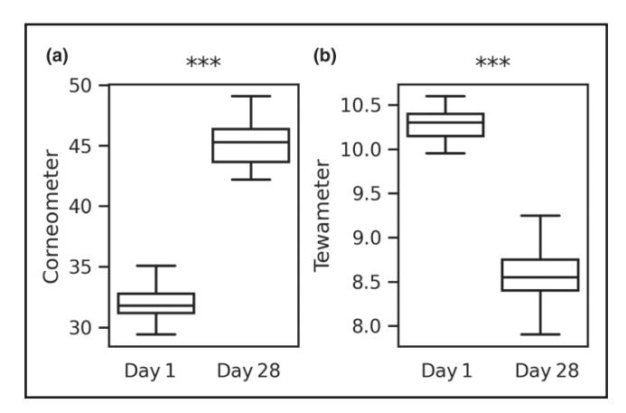
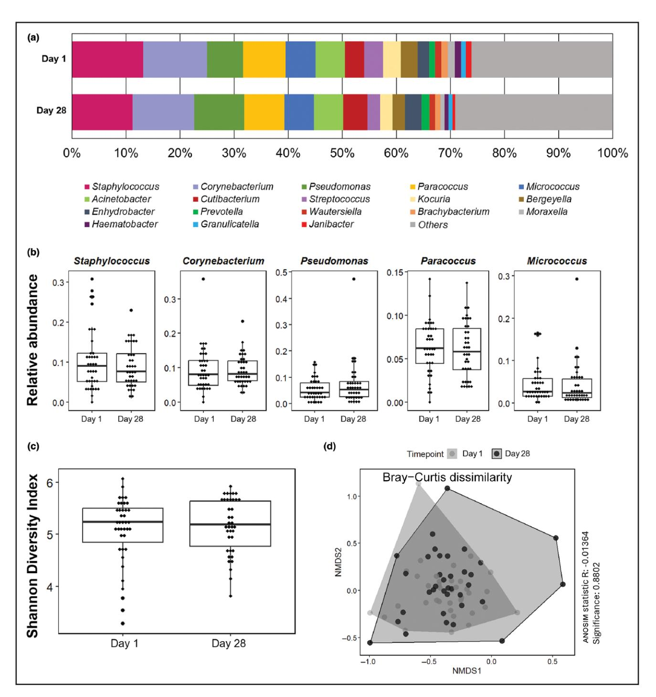
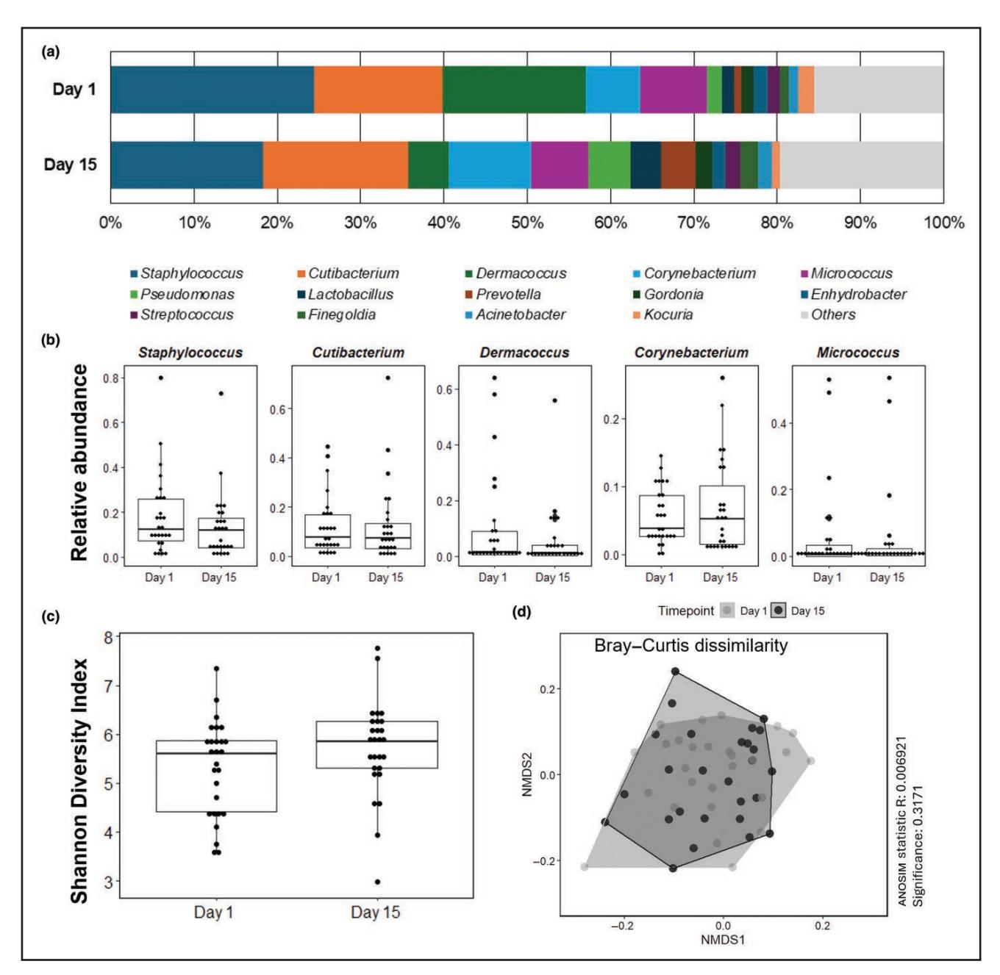
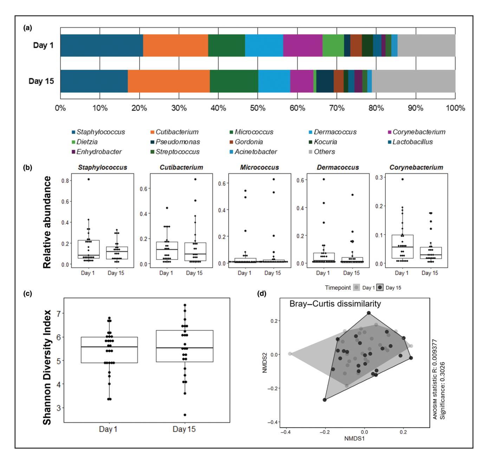
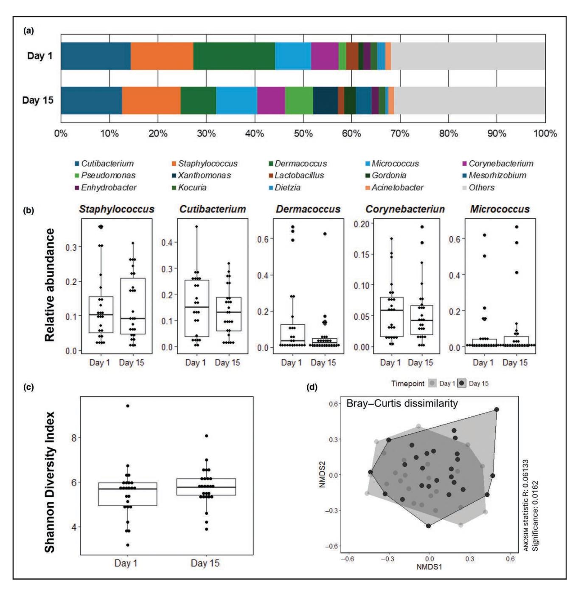
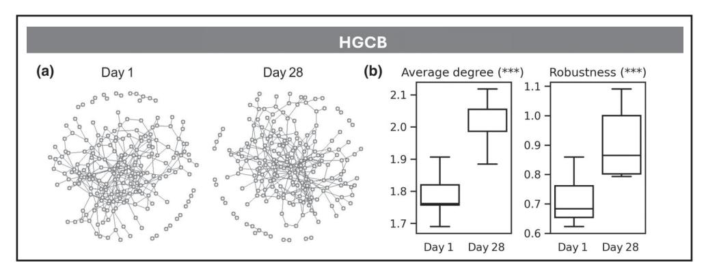
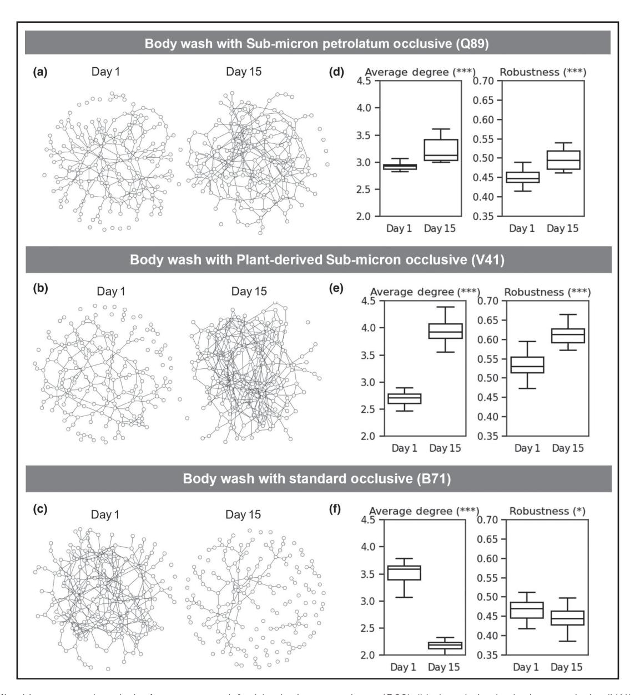

# **Mild skin cleansers strengthen microbiome networks without affecting the skin microbiome**

**Bharat Cheviti[,1](#page-0-0) Andrew Cawley,[2](#page-0-1) Shruti Malviya[,1](#page-0-0) Barry Murphy,[2](#page-0-1) Gouri Malhotra,[3](#page-0-2) Thanumalayan K Sivaram,[3](#page-0-2) Simone Sethna,[3](#page-0-2) Naresh Ghatlia[,4](#page-0-3) Karen A Darling,[2](#page-0-1) Stacy Hawkins[,4](#page-0-3) Bivash R Dasgupta,[4](#page-0-3) Amitabha Majumdar[2](#page-0-1) and Rupak Mitr[a1](#page-0-0)**

Unilever R&D, Bangalore, India

[2](#page-0-5)Unilever R&D, Port Sunlight, Wirral, UK

[3](#page-0-6)Unilever R&D, Mumbai, India

[4](#page-0-7)Unilever R&D, Trumbull, CT, USA

Correspondence: Rupak Mitra. Email: [rupak.mitra@unilever.com](mailto:rupak.mitra@unilever.com)

#### **Abstract**

**Background** Human skin, and its associated microbiome, is a delicate ecosystem that faces daily challenges from various external factors such as ultraviolet exposure, pollutants, hygiene habits and cosmetics use. The microbiome can also be affected by internal influences such as diet and stress. Hygiene practices, especially the use of soap and bodywash, play a crucial role in maintaining skin health, hygiene and balance of the microbial ecosystem.

**Objectives** To understand the effects of daily usage of cleansing products on the skin microbiome.

**Methods** Here, we performed 16S rRNA gene-sequencing (V1–V2) analysis of the skin microbiome from participants' forearms to investigate the effects of regular use of a cleansing product such as a marketed high-glycerine cast melt bar (HGCB) on the skin microbiome. In an additional study, participants' legs were washed with a marketed bodywash with standard petrolatum emulsions, and two uniquely formulated isethionate–taurate-based bodywashes with submicron emulsions containing two different types of occlusives, i.e. petrolatum and plant-derived occlusives.

**Results** The findings from the studies conducted across two distinct geographical locations, involving diverse ethnic populations and various body sites, demonstrate that skin microbiome diversity is preserved following the use of a properly formulated HGCB in addition to all bodywashes containing standard or submicron occlusives. However, single-sample network analysis showed that glycerine-containing cast melt bars and bodywashes containing plant-derived submicron occlusives help to increase the network properties of the skin microbiome, which are reported to be an indicator of healthy skin.

**Conclusions** Our studies demonstrate that the daily use of a HGCB for 4 weeks or daily use of a bodywash containing plant-derived submicron occlusives for 2 weeks has no significant effect on the skin microbiome diversity. The increase in microbial co-occurrence network indicates a resilience to use of such uniquely formulated cleansing products on a regular basis.

## **Lay summary**

Human skin, as an ecosystem, hosts a variety of microorganisms, known as the skin microbiome. It faces daily challenges from external factors such as ultraviolet radiation exposure. Other such challenges include pollutants, hygiene habits and cosmetics use. The microbiome can also be affected by internal influences such as diet, age and stress. Hygiene practices play a crucial role in maintaining healthy skin. Such practices often include the use of soap and bodywash. In this study, we performed an analysis on participants' arms and legs to understand the effects of soaps and bodywashes. The results showed that skin microbiome diversity remained stable after use of bodywash and soap. This result was not affected by geographical location, ethnicity or body site. Our study found that use of a mild soap bar helped to increase the network properties of the skin microbiome. This was also the case for bodywash with submicron plant-based occlusives. Such increased network properties are an indicator of healthy skin. We found an increase in the microbial co-occurrence network. This suggests resilience to external factors when using cleansing products.

#### **What is already known about this topic?**

- Human skin a highly dynamic organ of the body functioning as a physical, chemical and immune barrier against external challenges.
- The skin microbiome is an individual-specific stable ecosystem.
- Understanding the skin microbiome as a complex network of microorganisms and maintaining a balanced microbiome are essential for healthy skin.

#### **What does this study add?**

- The properties of microbiome networks serve as a critical indicator of the performance of skin-cleansing products independent of geographical location, ethnicity and body site.
- Mild soap bars containing glycerine and bodywash containing submicron plant-based occlusives help to increase the network properties of the skin microbiome, which is reported to be an indicator of healthy skin.

Human skin is a highly dynamic organ of the body, functioning as a physical, chemical and immune barrier against external aggressors. Skin is formed of three layers, termed the epidermis, dermis and hypodermis, which are composed of fibroblast cells, keratinocyte cells, sweat glands, hair follicles and sebaceous glands[.1](#page-9-0)

The skin microbiome constitutes the resident microbes on the skin surface. It is a diverse ecosystem with an approximate density of 104 to 106 microbes per cm2 of the outer skin surface, dependent on specific body location. The unique biogeographical environment created by the layers of the skin coupled with complexity of and distribution of sebaceous and eccrine glands ensures a distinct niche for the skin microbiome. These differences affect the abundance and composition of the microbial communities found at each skin site. The skin is home to approximately 18 phyla, with 4 dominant groups: *Actinobacteria*, *Firmicute*s, *Proteobacteria* and *Bacteroidetes*, in descending order of dominance, as reported in White populations vs. *Firmicutes*, *Proteobacteria*, *Actinobacteria* and *Bacteroidetes* as reported in Indian populations.[2](#page-9-1)

The niche-specific composition of the skin microbiome in dry, sebaceous and moist regions of the human body has been characterized. In sebaceous sites, *Cutibacterium* is the most prevalent genus, whereas *Staphylococcus* and *Corynebacterium* are the most common genera in moist areas. The skin microbiome is an integral part of the skin barrier that affects skin health by protecting and modulating host immune responses and regulating the skin functions.[3](#page-9-2)

Several factors (both intrinsic and extrinsic) can affect the skin microbiota composition. These include age, sex, ethnicity, ultraviolet radiation exposure, hygiene habits, use of cosmetics, use of antibiotics and geographic location. A diverse and resilient skin microbiome is essential for healthy skin homeostasis and dysbiosis has been the hallmark of diseases onset, such as atopic dermatitis and psoriasis[.4](#page-9-3) Previous studies have shown a highly stable individual-specific skin microbiome, despite continuous exposure to external factors. Interestingly, Oh *et al.*[5](#page-9-4) provided insights into how biogeography and individuality influence the stability and transience of the skin microbiome community[.6](#page-9-5)–[9](#page-9-6) Studies have investigated the connectivity and robustness of the skin microbiome, using network theory to understand the functional importance of the skin microbiome in health and diseases from a microbial ecology perspective. Increasing evidence indicates a link between skin conditions with altered microbial assembly processes and a more fragile microbiome co-occurrence network. Using the microbiome network of an individual (MNI) method generated from 16S rRNA gene-sequencing data, it was reported that the microbiome cooccurrence network reflects the skin's physiological response towards environmental factors[10](#page-9-7),[11](#page-9-8) such as pollution, smoking and even cosmetic dry skin. Wang *et al*. [11](#page-9-8) demonstrated a weaker network connectivity with increasing exposure to pollution stress. While the use of diversity analysis such as alpha and beta diversity has been prevalent in the literature and shows differences in microbial ecology for skin, it has been found to be not as sensitive when differentiating between cosmetic dry and nondry skin and cosmetic interventions.

Skin cleansing is an integral part of daily hygiene routines worldwide. Numerous hygiene products are available on the market, with an increasing consumer shift towards liquid cleansers over soap and bathing bars.[12](#page-9-9)[,13](#page-9-10) Although use of personal care products such as mild syndet bars and liquid cleansers has shown skin benefits[,14](#page-9-11)[,15](#page-9-12) the impact of high levels of glycerol in cast melt bars and mild taurate–isethionate-based cleansers with plant-derived submicron-sized emulsions on the skin microbiome has not been investigated in detail[.15](#page-9-12)[–18](#page-9-13)

Glycerol, a widely used functional ingredient, serves as a humectant in topical formulations. It is known to diffuse into the stratum corneum (SC) and retain water within the skin. The hydrating effect of glycerol is influenced by the amount absorbed and its physicochemical properties in the SC. It penetrates the skin and remains within the lipid bilayers without disrupting the lamellar structure. The hydrating effect of glycerol has been shown in a number of studies, and decreased delivery of endogenous glycerol in the skin, either via the aquaporin-3 channel or by synthesis of sebum lipids in the stratum granulosum, results in impaired skin hydration[.19](#page-9-14)

Petrolatum [petroleum jelly (PJ)] has been used as an occlusive in the cosmetic industry for a long time. Czarnowicki *et al*.[,20](#page-10-0) studied the cutaneous molecular and structural effects induced by application of petrolatum in healthy individuals and in patients with atopic dermatitis. Their study showed that in skin biopsies collected from petrolatum-occluded skin, antimicrobial peptides markers, innate immune markers and skin barrier markers [interleukin (IL)-6, IL-8 and IL-1β] were upregulated when compared with control and occluded-only skin.[20](#page-10-0) Lodén and Barany[,21](#page-10-1) have shown that petrolatum can decrease transepidermal water loss (TEWL), thereby facilitating barrier repair in irritated human skin. Sustainable alternatives for petroleum-derived ingredients, have also been explored to replace PJ. This reflects evolving consumer trends towards use of natural, plant-derived and sustainable ingredients in cosmetics.

This study seeks to determine whether MNI can be a sensitive analytical tool to monitor changes in microbial ecology resulting from cosmetic interventions like skin cleansing. We conducted controlled cohort studies to understand and establish the dynamics of the microbiome network as an indicator of the effects of different product usage. Specifically, based on the predominant consumer preference in the two geographies, we evaluated the impact of using a high-glycerol cast melt bar (HGCB) in India and a taurate–isethionate-based mild liquid bodywash containing plant-derived submicron occlusives in the UK.

## **Materials and methods**

#### Study population

We conducted two separate cohort studies. In the first study, 38 participants used an HGCB for their daily cleansing ritual (conducted in Bangalore, India). In the second study, 27 participants used liquid bodywash containing submicron petrolatum and plant-derived occlusives, and a marketed bodywash with standard petrolatum emulsions for their cleansing ritual (conducted in Edinburgh, UK).

#### *High-glycerine cast melt bar study*

Thirty-eight healthy female participants were recruited under ethical clearance from CLINICOM, an independent ethics committee in Bangalore, India. All the participants were aged 18–45 years with a mean age of 32 years (SD 0.25) and were provided with an HGCB. Each participant was instructed to use only the HGCB for their daily cleansing rituals all over the body, including the forearm, at least once a day during the study (28 days, 4 weeks). On day 1 the baseline skin microbiome sampling[22](#page-10-2) was performed on the volar forearm; samples were collected using the cup scrub method.[22–](#page-10-2)[24](#page-10-3) On day 28, 16 h after the last use of the HGCB, microbiome samples were collected following the above protocol. The collected samples were immediately frozen at −80 °C. Each participant also had their skin hydration (Corneometer®, Courage+Khazaka Electronic GmbH, Cologne, Germany) and TEWL (Tewameter, Courage+Khazaka Electronic GmbH) measurement taken at day 1 (baseline) and day 28 from their forearm after completing the microbiome sampling.

## *Bodywash study*

Twenty-seven healthy female participants aged between 19 and48 years (mean age 28.6 years) with moderately cosmetic dry skin on both legs (sample sites evaluated were on the lower outer leg, between the knee and ankle) were recruited. Local ethical approval was obtained. Each participant was assisted by the staff at the study site to use the prototype bodywash [marketed standard petrolatum emulsion (B71), submicron petrolatum (Q89) and plantderived submicron occlusive (V41)] once a day for 2 weeks based on any one of the three spots randomized on left and right leg. Cup scrub samples for microbiome analysis were collected from the outer leg from the region between the knee and the ankle from all participants on day 1 (baseline) of the study and on day 15 of product application as previously described[.24](#page-10-3) The collected microbiome samples were immediately frozen at −80 °C.

#### *16S rRNA gene sequencing from skin samples*

DNA extraction for the HGCB study was done using QIAamp BiOstic Bacteremia DNA isolation kit (ID:12240, Qiagen, Hilden, Germany) and Illumina library preparation was performed using NexteraXT following manufacturers' protocol. Sequencing of the V1–V2 (16S) DNA (paired 250 bp) from the samples was carried out using NextSeq 2000 (Illumina, San Diego, CA, USA).[25](#page-10-4)–[28](#page-10-5) Similar methodologies were used for the bodywash study wherein DNA extractions and library preparation and sequencing were carried out as previously described by Murphy *et al.*[24](#page-10-3) For both the studies, bioinformatic sequence processing was performed using an in-house Quantitative Insights into Microbial Ecology (QIIME2) microbiome analysis pipeline.[26](#page-10-6) Where appropriate for the downstream analysis, e.g. alpha and beta diversity analysis, data were normalized for both the studies with the minimum read depth of 20 000 for the bar study and 15 000 for the bodywash study [\(File S1;](http://academic.oup.com/bjd/article-lookup/doi/10.1093/bjd/ljaf282#supplementary-data) see [Supporting Information](http://academic.oup.com/bjd/article-lookup/doi/10.1093/bjd/ljaf282#supplementary-data)).

#### Statistical analyses

Alpha diversity was assessed using the following indices: (i) observed features or richness (the number of amplicon sequence variants) and (ii) the Shannon Diversity Index, which accounts for species richness and evenness. Differences in alpha diversity were tested using the Wilcoxon signed-rank test. Beta diversity (i.e. the difference in bacterial diversity across samples) was assessed using the Bray–Curtis dissimilarity metric, and differences were tested using anosim.[29](#page-10-7) Microbial differential abundance testing was performed using Analysis of Compositions of Microbiomes with Bias Correction.[30,](#page-10-8)[31](#page-10-9) Microbial networks were constructed using Sparse InversE Covariance Estimation for Ecological Association and Statistical Inference (SPIEC-EASI version 0.1.2),[32](#page-10-10) implemented in the R package *SpiecEasi*. The characteristics of the inferred networks, specifically average connectivity and network robustness, were compared across different skin product treatments[.33](#page-10-11) The *t*-test was conducted to examine differences in network connectivity and robustness. Data analyses were performed using R software (version 4.2.1). Figures were generated using the R packages *ggplot2* and *igraph*[.34](#page-10-12)–[36](#page-10-13)

## **Results**

Effect of long-term marketed high-glycerine cast melt bar usage on forearm skin barrier and skin hydration

Each participant had forearm hydration (Corneometer) and TEWL (Tewameter) measured at day 1 (baseline)

**Figure 1** The effect of long-term use of marketed high-glycerine cast melt bar (HGCB) on forearm skin hydration and water loss as measured by Corneometer (Courage+Khazaka Electronic GmbH, Cologne, Germany) and Tewameter (Courage+Khazaka Electronic GmbH), respectively. After 28 days (4 weeks) of HGCB use, skin hydration increased significantly with a concomitant decrease in transepidermal water loss. \*\*\**P* < 0.001.

and on day 28 (4 weeks) of product use. We found a significant improvement in the skin hydration across volunteers after 28 days (4 weeks) of HGCB usage. (Figure [1a\)](#page-3-0). Concomitantly, we found a significantly lower TEWL (Figure [1b\)](#page-3-0) value indicating well moisturized healthy forearm skin.

#### Effect of long-term marketed high-glycerine cast melt bar usage on forearm skin microbiome profiles

The distribution of the predominant bacterial genera at day 1 and at day 28 is presented in Figure [2a.](#page-4-0) The primary bacterial genera identified at both timepoints were *Staphylococcus*, *Corynebacterium*, *Pseudomonas*, *Paracoccus* and *Micrococcus*, collectively representing nearly 45% of the total bacterial abundance. Their distribution remained consistent between the day 1 and day 28 timepoints. Rare taxa, with a relative abundance of less than 1%, were grouped under 'Others' and accounted for 24–29% of the total reads across both timepoints. The relative abundances of these top five bacterial genera on forearm skin sites did not exhibit significant differences between the two timepoints (Figure [2b](#page-4-0)). The Shannon Diversity Index was utilized to measure genus-level bacterial diversity, which was not significantly different between the two timepoints (Kruskal–Wallis pairwise test, *H*=1.89, *q*=0.093) (Figure [2c\)](#page-4-0). anosim was conducted to evaluate the beta diversity in the skin microbial composition between the two timepoints. The anosim statistic (R) was −0.014, with a significance level of 0.874. This indicates that the overall skin microbial composition remained stable, with no significant differences observed between the two timepoints (Figure [2d](#page-4-0)). Collectively, these results suggest that the use of the HGCB did not significantly alter the skin microbial composition over the usage period (28 days).

#### *Effect of 2-week usage of bodywash with submicron petrolatum occlusive (Q89) on skin microbiome profiles*

The top bacterial genera observed were *Staphylococcus*, *Cutibacterium*, *Dermacoccus*, *Corynebacterium* and *Micrococcus* (Figure [3a\)](#page-5-0). The relative abundances of these genera showed minimal changes between day 1 and day 15 (Figure [3b\)](#page-5-0). The Shannon Diversity Index used to measure alpha diversity did not indicate any significant changes over time (Kruskal–Wallis pairwise test, *H* =2.730, *q*=0.576) (Figure [3c\)](#page-5-0). Beta diversity also did not show any significant changes, suggesting that the bacterial community composition remained stable (anosim, *R*=0.007, *P*=0.317) (Figure [3d](#page-5-0)).

## *Effect of 2-week usage of bodywash with plantderived submicron occlusive (V41) on skin microbiome profiles*

The predominant bacterial genera identified included *Staphylococcus*, *Cutibacterium*, *Micrococcus*, *Dermacoccus* and *Corynebacterium* (Figure [4a](#page-6-0)). The relative abundances of these genera showed no significant differences between day 1 and day 15 (Figure [4b](#page-6-0)). Alpha diversity (Figure [4c](#page-6-0), Kruskal–Wallis pairwise test, *H*=0.205, *q*=0.844) and beta diversity (anosim, *R*=0.009, *P*=0.303) (Figure [4d\)](#page-6-0) were not significantly influenced by product usage.

## *Effect of 2-week usage of bodywash with standard occlusive (B71) on skin microbiome profiles*

The top five genera accounted for nearly 50% of the total abundance. A notable decrease in *Dermacoccus* was observed on day 15, whereas *Pseudomonas* and *Xanthomonas* showed a significant increase (Figure [5a, b\)](#page-7-0). Genus-level bacterial diversity, as measured by the Shannon Diversity Index, did not exhibit any significant change over time (Kruskal–Wallis pairwise test, *H* =1.059, *q*=0.303) (Figure [5c\)](#page-7-0). Beta diversity analysis [anosim results (*R*=0.061, *P*=0.016)] indicated a stable skin microbial composition (Figure [5d](#page-7-0)).

#### Microbiome network analysis

Co-occurrence network analysis was conducted for both the cast melt bar and bodywash studies. A prevalence threshold of 30% was employed to ensure stable network connectivity. Networks representing microbiome communities from participants treated with the two products were created, demonstrating that exposure to different skin products resulted in distinct network structures. Each node represents a different bacterial taxon, and the edges represent the co-occurrence between two nodes (Figures [6a](#page-8-0) and [7a\)](#page-8-1). Specifically, these networks exhibit variations in the number of nodes and connectivity.

Visual inspection of these networks (Figure [6a](#page-8-0) and [7a–c](#page-8-1)) suggests that different products indeed influence the microecology of human skin. Notably, networks associated with HGCB appear to include a greater number of taxa, possess higher connectivity, and exhibit significantly more

**Figure 2** Effect of long-term use of marketed high-glycerine cast melt bar (HGCB) on forearm skin microbiome profiles. (a) Distribution of top bacterial genera across day 1 and day 28 timepoints. Rare taxa with relative abundance<1% were merged and labelled as *Others*. Relative abundances of (b) top five genera on facial skin sites were not significantly different between the two timepoints. (c) Genus-level bacterial diversity, measured by the Shannon Diversity Index, also remained not significantly different. (d) Skin microbial composition was not significantly different between the two timepoints. Polygons indicate 95% confidence intervals. For analyses shown here, all collected skin samples were used (*n*=76; 38 for day 1, 38 for day 28).

stability over time. The stronger connectivity and robustness observed for the HGCB indicates increased interactions between bacterial genera and a stable microbial community (Figure [6b](#page-8-0)).

A co-occurrence network from the bodywash also showed variations in the number of nodes and connectivity over 2 weeks of product usage. Visual examination of these networks (Figure [7a–c](#page-8-1)) suggests that bacterial communities restructure in response to submicron petrolatum and plant-derived occlusives differently from the marketed bodywash where occlusives are added as standard emulsion. A statistically significant increased connectivity, indicative of a relatively more stable community, was observed over time for petrolatum and plant-derived submicron occlusives. Although improvements in connectivity and robustness were noted for both bodywash types, the

**Figure 3** The effect of long-term submicron petrolatum (Q89) on skin microbiome profiles from the leg. (a) Distribution of top bacterial genera across day 1 and day 15 timepoints. Rare taxa with relative abundance<1% were merged and labelled as *Others*. Relative abundances of (b) top five genera were not significantly different between the two timepoints. (c) Genus-level bacterial diversity, measured using the Shannon Diversity Index, also remained not significantly different. (d) Beta diversity was assessed using Bray–Curtis dissimilarity. Skin microbial composition was not significantly different between the two timepoints. Polygons indicate 95% confidence intervals. For analyses shown here, all collected skin samples were used (*n*=54; 27 for day 1, 27 for day 15).

changes were more pronounced in the group that used bodywash with plant-derived submicron occlusive (Figure [7d–f\)](#page-8-1). In contrast, the connectivity and robustness for the marketed bodywash containing occlusive added as a standard emulsion remained unchanged. The stronger connectivity and robustness observed with the bodywash containing plant-derived submicron occlusives group implies enhanced interactions among bacterial genera and a more stable and healthy microbial community.

## **Discussion**

Cast melt bars and bodywash are used as daily personal care products and therefore exposure of the skin microbiome to the surfactants and cosmetic ingredients from such products is long-term and continuous. Thus, knowledge of the effects of the surfactants and cosmetic ingredients on the skin microbiome is of critical importance and continually developing. We conducted two ethically approved,

**Figure 4** Effect of long-term plant-derived submicron occlusive (V41) usage on skin microbiome profiles from the leg. (a) Distribution of top bacterial genera across day 1 and day 15 timepoints. Rare taxa with relative abundance<1% were merged and labelled as *Others*. Relative abundances of (b) top five genera were not significantly different between the two timepoints. (c) Genus-level bacterial diversity, measured using the Shannon Diversity Index, also remained not significantly different. (d) Beta diversity was assessed using Bray–Curtis dissimilarity. Skin microbial composition was not significantly different between the two timepoints. Polygons indicate 95% confidence intervals. For analyses shown here, all collected skin samples were used (*n*=51; 27 for day 1, 24 for day 15).

self-controlled, cohort studies designed to systematically understand the effects of specially formulated bathing bars and bodywash on the diversity, structure and network of the skin microbiome.

In our study design, we recruited participants across two different geographical areas, i.e. India (predominantly bathing bar users) and the UK (predominantly bodywash users). According to our study, upon usage of the HGCB, the skin barrier and moisturization was significantly improved, reestablishing the beneficial role of glycerine that can be delivered through a bathing bar.[28](#page-10-5) The results of this study provide a unique insight on the effects of different skin-cleansing products on the skin microbiome. It investigates the impact of HGCB, and mild isethionate–taurate-based bodywashes containing petrolatum and plant-derived submicron occlusive, and a marketed bodywash with standard petrolatum emulsion, across two different ethnic groups based at two different geographical locations. The findings suggest that marketed HGCBs and plant-derived submicron occlusive-containing bodywashes support a stable and healthy skin microbiome (Figures [2–](#page-4-0)[5](#page-7-0)).

The microbiome profile analysis revealed that the use of HGCB did not alter the skin microbial composition over the study period (Figures [2a\)](#page-4-0). The co-occurrence network

**Figure 5** Effect of standard occlusive (B71) usage on skin microbiome profiles from the leg. (a) Distribution of top bacterial genera across day 1 and day 15 timepoints. Rare taxa with relative abundance<1% were merged and labelled as *Others*. Relative abundances of (b) top five genera were not significantly different between the two timepoints. (c) Genus-level bacterial diversity, measured using the Shannon Diversity Index, also remained not significantly different. (d) Beta diversity was assessed using Bray–Curtis dissimilarity. Skin microbial composition was not significantly different between the two timepoints. Polygons indicate 95% confidence intervals. For analyses shown here, all collected skin samples were used (*n*=50; 24 for day 1, 26 for day 15).

analysis demonstrated that exposure to the HGCB resulted in distinct network structures. Networks associated with use of the HGCB showed greater connectivity and stability over time, indicating increased interactions between bacterial genera and a stable microbial community. This suggests that the HGCB strengthens microbiome networks without altering the skin microbiome (Figure [6](#page-8-0)).

The bodywash study demonstrated that formulations containing submicron petrolatum occlusive (Q89), submicron plant-derived occlusive (V41) and a standard petrolatum (B71), did not significantly change the skin microbiome composition over a 2-week period (Figures [3](#page-5-0)–[5\)](#page-7-0). However, the microbiome network analysis indicated that different products influenced the microbial ecology of human skin differently. The submicron occlusives showed an increase in network properties (Figure [7d](#page-8-1), [e\)](#page-8-1), whereas the standard emulsion occlusive demonstrated a statistically significant drop in network properties (Figure [7f\)](#page-8-1). The plant-derived

**Figure 6** Microbiome network analysis. Average network for marketed high-glycerine cast melt bar (HGCB). Single-sample network analysis was performed, and the calculated network properties were compared across the two timepoints. The robustness of the microbial network of an individual showed significant difference. Long-term HGCB usage showed stronger network connectivity. \*\*\**P* < 0.001.

**Figure 7** Microbiome network analysis. Average network for (a) submicron petrolatum (Q89), (b) plant-derived submicron occlusive (V41) and (c) standard occlusive (B71). Single-sample network analysis was performed, and the calculated network properties were compared for (d) submicron petrolatum (Q89), (e) plant-derived submicron occlusive (V41) and (F) standard occlusive (B71). \**P* < 0.05, \*\*\**P* < 0.001.

submicron occlusive exhibited more pronounced improvements in connectivity and robustness compared with the petrolatum submicron group (Figure [7e](#page-8-1)).

Diversity and compositional analysis are the most common approaches used in understanding the microbial community signatures. However, these approaches overlook the microbial structural differences driven by microbial interactions and are often not sensitive enough to demonstrate meaningful differences in the skin, as this study shows. Correlationbased techniques, including Pearson or Spearman correlation, are among the most popular methods for studying microbial interactions in human gut, oral soil and skin microbiomes[.7](#page-9-15)[,16](#page-9-16)[,28,](#page-10-5)[29](#page-10-7) A previous study by Wang *et al.*[11](#page-9-8) has shown that the microbiome network of an individual could be a signature of the adverse effects of air pollution on skin health, and smoking deepened the negative effects of pollution stress on facial skin microbiota. Our study demonstrated that microbiome network properties can be a key indicator of skin health in relation to use of cosmetic products. It is appropriate that a similar validation study be conducted among male participants under comparable conditions.

In conclusion, previous studies have highlighted the importance of understanding the skin microbiome as a complex network of microorganisms and the benefits of maintaining a balanced microbiome for skin health independent of geographical location and ethnicity[.11](#page-9-8) Our study findings substantiate the idea that the properties of microbiome networks can serve as a critical indicator of the performance of skin-cleansing products as demonstrated on two separate body sites in two different ethnic populations, based in different geographical locations.

## Acknowledgements

The authors thank the participants who took part in the study. They also thank the DNA sequencing partners in India and the UK. The authors acknowledge the input from Janhavi Raut and Saurabh Shresth (Unilever R&D, Bangalore, India). The authors also acknowledge the constant support and guidance from Vibhav Sanzgiri (Unilever R&D, Mumbai, India), and Samantha Samaras (Unilever R&D Trumbull, CT, USA).

#### Funding sources

This paper was published as part of a supplement financially supported by Unilever Global R&D.

#### Conflicts of interest

The authors of this manuscript are employees of Unilever.

#### Data availability

Data will be uploaded into The National Center for Biotechnology Information Sequence Read Archive repository.

## Ethics statement

Ethics approval was obtained from an independent ethics committee in India and the UK.

#### Patient consent

Written patient consent for publication was obtained.

## **Supporting Information**

Additional [supporting information](http://academic.oup.com/bjd/article-lookup/doi/10.1093/bjd/ljaf282#supplementary-data) may be found in the online version of this article at the publisher's website.

# **References**

- 1 Yousef H, Alhajj M, Fakoya AO, Sharma S. *Anatomy, Skin (Integument), Epidermis*. Treasure Island, FL: StatPearls, 2025.
- 2 Chaudhari DS, Dhotre DP, Agarwal DM *et al.* Gut, oral and skin microbiome of Indian patrilineal families reveal perceptible association with age. *Sci Rep* 2020; **10**:5685.
- 3 Byrd AL, Belkaid Y, Segre JA. The human skin microbiome. *Nat Rev Microbiol* 2018; **16**:143–55.
- 4 Boxberger M, Cenizo V, Cassir N, La Scola B. Challenges in exploring and manipulating the human skin microbiome. *Microbiome* 2021; **9**:125.
- 5 Oh J, Byrd AL, Deming C *et al.* Biogeography and individuality shape function in the human skin metagenome. *Nature* 2014; **514**:59–64.
- 6 Flores GE, Caporaso JG, Henley JB *et al.* Temporal variability is a personalized feature of the human microbiome. *Genome Biol* 2014; **15**:531.
- 7 Gajer P, Brotman RM, Bai G *et al.* Temporal dynamics of the human vaginal microbiota. *Sci Transl Med* 2012; **4**:132ra52.
- 8 Grice EA, Kong HH, Conlan S *et al.* Topographical and temporal diversity of the human skin microbiome. *Science* 2009; **324**:1190–2.
- 9 Oh J, Byrd AL, Park M *et al.* Temporal stability of the human skin microbiome. *Cell* 2016; **165**:854–66.
- 10 Rottjers L, Faust K. From hairballs to hypotheses – biological insights from microbial networks. *FEMS Microbiol Rev* 2018; **42**:761–80.
- 11 Wang L, Xu YN, Chu CC, *et al.* Facial skin microbiota-mediated host response to pollution stress revealed by microbiome networks of individual. mSystems 2021; **6**:e0031921.
- 12 Mukhopadhyay P. Cleansers and their role in various dermatological disorders. *Indian J Dermatol* 2011; **56**:2–6.
- 13 Mijaljica D, Spada F, Harrison IP. Skin cleansing without or with compromise: soaps and syndets. *Molecules* 2022; **27**:2010
- 14 Subramanyan K, Hawkins S, Johnson A. Cosmetic benefits of mild cleansing syndet bars versus soap. *J Am Acad Dermatol* 2005; **52** (Suppl.):P88.
- 15 Mim MF, Sikder MH, Chowdhury MZH *et al.* The dynamic relationship between skin microbiomes and personal care products: a comprehensive review. *Heliyon* 2024; **10**:e34549.
- 16 Capone K, Kirchner F, Zaleski E. Evaluation of the mildness potential of liquid cleansers. *J Am Acad Dermatol* 2020; **83** (Suppl.):AB215.
- 17 Two AM, Nakatsuji T, Kotol PF *et al.* The cutaneous microbiome and aspects of skin antimicrobial defense system resist acute treatment with topical skin cleansers. *J Invest Dermatol* 2016; **136**:1950–4.
- 18 Sfriso R, Claypool J. Microbial reference frames reveal distinct shifts in the skin microbiota after cleansing. *Microorganisms* 2020; **8**:1634.
- 19 Fluhr JW, Darlenski R, Surber C. Glycerol and the skin: holistic approach to its origin and functions. *Br J Dermatol* 2008; **159**:23–34.

- 20 Czarnowicki T, Malajian D, Khattri S *et al.* Petrolatum: barrier repair and antimicrobial responses underlying this "inert" moisturizer. *J Allergy Clin Immunol* 2016; **137**:1091–102.e7.
- 21 Lodén M, Barany E. Skin-identical lipids versus petrolatum in the treatment of tape-stripped and detergent-perturbed human skin. *Acta Derm Venereol* 2000; **80**:412–15.
- 22 ASTM International. Standard practice for recovery of microorganisms from skin using the cup scrub technique. Available at: <https://store.astm.org/e1874-22e01.html> (last accessed 10 July 2025).
- 23 Williamson P, Kligman A. A new method for the quantitative investigation of cutaneous bacteria. *J Invest Dermatol* 1965; **45**:498–503.
- 24 Murphy B, Grimshaw S, Hoptroff M *et al.* Alteration of barrier properties, stratum corneum ceramides and microbiome composition in response to lotion application on cosmetic dry skin. *Sci Rep* 2022; **12**:5223.
- 25 Murphy B, Hoptroff M, Arnold D *et al. In-vivo* impact of common cosmetic preservative systems in full formulation on the skin microbiome. *PLOS ONE* 2021; **16**:e0254172.
- 26 Adams SE, Arnold D, Murphy B *et al.* A randomised clinical study to determine the effect of a toothpaste containing enzymes and proteins on plaque oral microbiome ecology. *Sci Rep* 2017; **7**:43344.

- 27 Zhang H, Wang X, Chen A *et al.* Comparison of the full-length sequence and sub-regions of 16S rRNA gene for skin microbiome profiling. *mSystems* 2024; **9**:e0039924.
- 28 Lee HB, Jeong DH, Cho BC, Park JS. Comparative analyses of eight primer sets commonly used to target the bacterial 16S rRNA gene for marine metabarcoding-based studies. *Front Marine Sci* 2023; **10**:1199116.
- 29 Kim Y. Bioinformatic and statistical analysis of microbiome data. *Methods Mol Biol* 2023; **2629**:183–229.
- 30 Lin H, Peddada SD. Analysis of compositions of microbiomes with bias correction. *Nature Commun* 2020; **11**:3514.
- 31 Xia Y, Sun J, Chen DG. *Statistical Analysis of Microbiome Data with R*. New York, NY: Springer, 2018.
- 32 Kurtz ZD, Muller CL, Miraldi ER *et al.* Sparse and compositionally robust inference of microbial ecological networks. *PLOS Comput Biol* 2015; **11**:e1004226.
- 33 Birt HWG, Dennis PG. Inference and analysis of SPIEC-EASI microbiome networks. *Methods Mol Biol* 2021; **2232**:155–71.
- 34 Wallach D, Makowski D, Jones JW, Brun F. *Working with Dynamic Crop Models Methods, Tools and Examples for Agriculture and Environment*. Amsterdam: Elsevier, 2019.
- 35 Wickham H. ggplot2. *WIRES Comp Stat* 2011; **3**:180–5.
- 36 Wickham H, Sievert C. *ggplot2: Elegant Graphics for Data Analysis*. New York, NY: Springer, 2009.