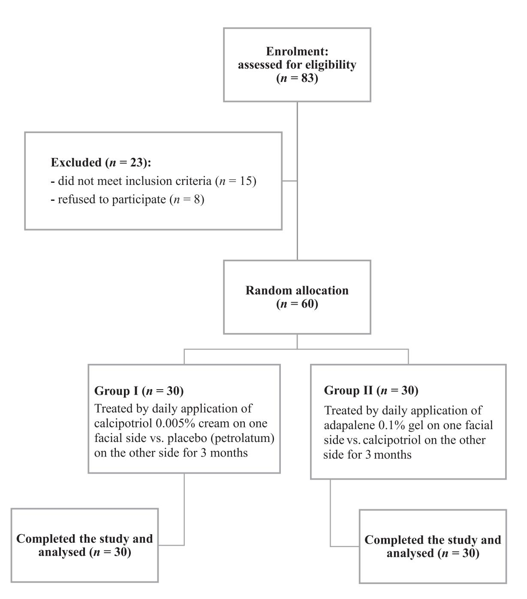
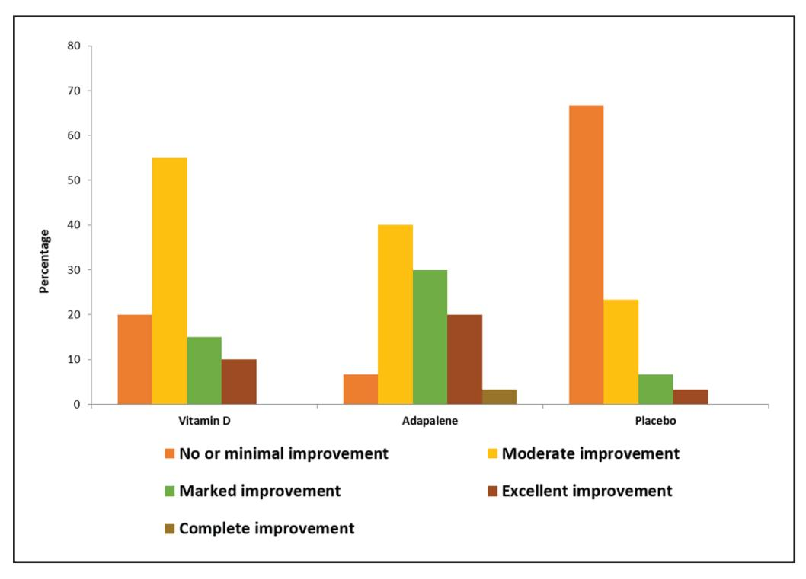
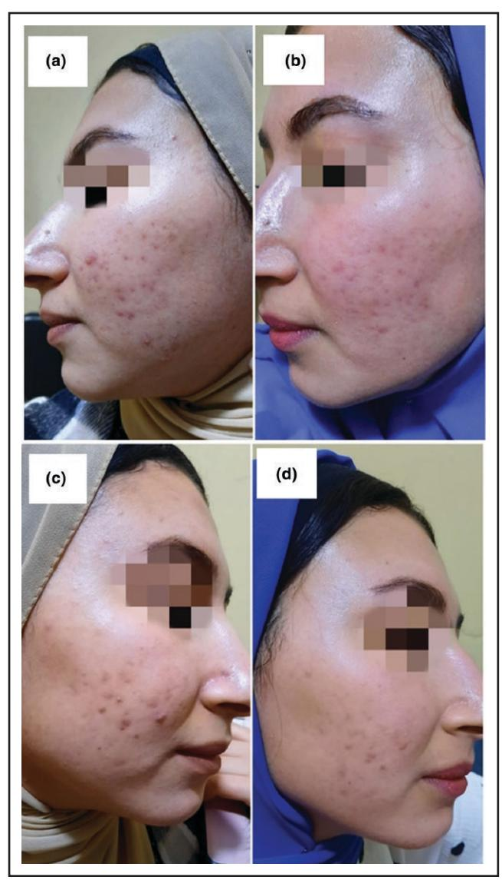
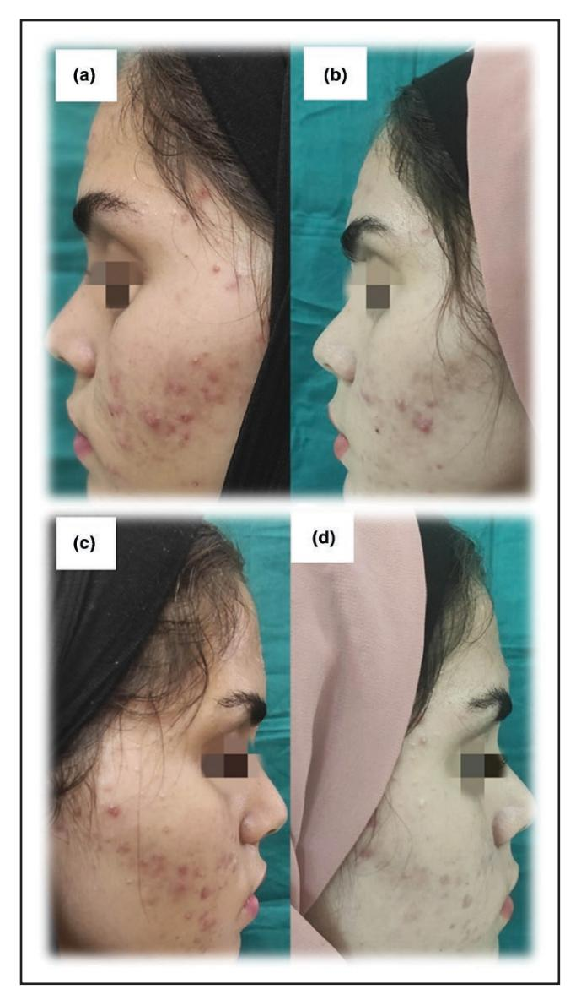
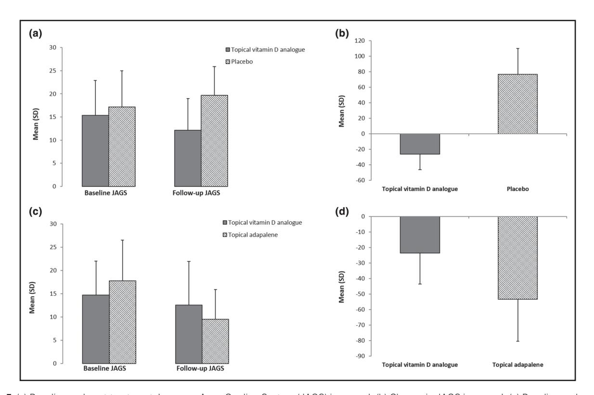

# **Efficacy and safety of calcipotriol as a potential topical treatment of acne vulgaris: a randomized, controlled, triple blinded, split-face clinical trial**

**Ayman Mahran[,1](#page-0-0) Alaa Ghazally[,1](#page-0-0) Ali Saleh Al[i2](#page-0-1) and Radwa M. Bak[r](https://orcid.org/0000-0002-0818-6407) [1](#page-0-0)**

1 Department of Dermatology, Venereology and Andrology, Faculty of Medicine, Assiut University, Assiut, Egypt

2Department of Dermatology and Venereology, Alhaud Almarsaud Hospital, Cairo, Egypt

Correspondence: Radwa M. Bakr. Email: [radwabakr@aun.edu.eg](mailto:radwabakr@aun.edu.eg)

#### **Abstract**

**Background** Acne vulgaris is a common skin problem that may result in significant scarring and systemic comorbidities. Adverse effects and increasing resistance to available treatments urge the development of new therapeutics. Topical vitamin D analogues have been successfully used in psoriasis; however, the efficacy and safety of calcipotriol as a potential topical treatment of acne is yet to be established.

**Objectives** To evaluate the efficacy and safety of calcipotriol in treating acne compared with adapalene and placebo.

**Methods** Sixty patients with acne were included and randomly divided into two groups of 30 patients each. Group I participants were treated by daily application of calcipotriol 0.005% cream on one facial side vs. placebo (petrolatum) over the other side. Group II were treated by daily application of adapalene 0.1% gel over one facial side vs. calcipotriol on the other. Therapeutic response was evaluated using the Japanese Acne Grading System (JAGS) and through photographic evaluation using Mean Improvement Score by Physician.

**Results** Adapalene-treated skin gave the greatest improvement and the highest patient satisfaction compared with skin treated with calcipotriol or placebo (*P*=0.001). Nonetheless, the calcipotriol-treated side showed a significantly greater reduction in post-treatment JAGS score and much greater satisfaction than placebo. As treatment continued, improved tolerability to calcipotriol was noted, with comparable side-effects between the three study arms.

**Conclusions** Calcipotriol seems to be a promising new safe topical therapeutic option for acne. However, adapalene is still superior in efficacy, tolerability and patient satisfaction.

#### **What is already known about this topic?**

- Acne vulgaris (AV) is among the most common dermatological disorders.
- Vitamin D has immunoregulatory and anti-inflammatory effects.

#### **What does this study add?**

- To our knowledge, this is the first study to investigate calcipotriol's effectiveness in treating AV compared with placebo and adapalene.
- Calcipotriol is a promising new treatment for AV.

Acne vulgaris (AV), a chronic inflammatory disease of the pilosebaceous unit,[1](#page-7-0) represents one of the most prevalent skin conditions worldwide[,2](#page-7-1) with the disease mainly affecting adolescents[.3](#page-7-2) Increased sebum production under hormonal influence, with abnormal differentiation and desquamation of follicular keratinocytes, results in comedone formation. When *Cutibacterium acnes* (formerly *Propionibacterium acnes*) proliferate in the microcomedones and metabolize trapped sebum into proinflammatory mediators, inflammatory lesions appear.[4](#page-7-3) Patients with moderate-to-severe acne usually experience low self-esteem and social isolation.[5](#page-7-4) Because of the frequent undesired side-effects of the available treatments for AV, new therapeutic options with minimal side-effects are always a target of researchers.[6](#page-7-5),[7](#page-7-6)

Vitamin D is a fat-soluble prohormone with many immunoregulatory, anti-inflammatory and antimicrobial effects that may be crucial in various skin diseases[.8](#page-7-7) Furthermore, it has antioxidant and anticomedogenic properties. Hence, vitamin D deficiency is incriminated as an aetiopathogenic factor of AV. Thus, vitamin D analogues could be a promising therapeutic modality for acne.[9](#page-7-8) This research aimed to evaluate the safety and efficacy of calcipotriol, a synthetic vitamin D2 derivative, as a potential new therapeutic option for AV.

Because AV can wax and wane without treatment, exploring the efficacy of calcipotriol against a placebo seemed crucial. To the best of our knowledge, this is the first study to investigate calcipotriol's effectiveness in treating AV compared with placebo. Additionally, to completely fulfil our aim, we compared calcipotriol with adapalene, a well-established topical treatment of AV.

# **Patients and methods**

#### Study design

This randomized controlled triple-blinded clinical trial (NCT03866447) was performed after being approved by the local Ethics Committee, Faculty of Medicine, Assiut University, in April 2019 (IRB:17100718).

#### Patients and treatment protocol

This study was conducted on 60 patients with acne. All study participants were recruited from the Dermatology

**Figure 1** Flowchart of study patients.

**Table 1** Demographic and clinical data of 60 patients with acne vulgaris

| Characteristic                              | N=60              |  |
|---------------------------------------------|-------------------|--|
| Age, years; mean (SD)                       | 27.80 (4.48)      |  |
| Sex                                         |                   |  |
| Male                                        | 31 (52)           |  |
| Female                                      | 29 (48)           |  |
| Residence                                   |                   |  |
| Rural                                       | 41 (68)           |  |
| Nonrural                                    | 19 (32)           |  |
| Occupation                                  |                   |  |
| Not working                                 | 17 (28)           |  |
| Working                                     | 43 (72)           |  |
| Grading of acne                             |                   |  |
| Mild                                        | 13 (22)           |  |
| Moderate                                    | 31 (52)           |  |
| Severe                                      | 16 (27)           |  |
| Skin phototype                              |                   |  |
| Phototype III                               | 13 (22)           |  |
| Phototype IV                                | 36 (60)           |  |
| Phototype V                                 | 11 (18)           |  |
| Disease duration, months; mean (SD) (range) | 3.45 (1.55) (2–6) |  |

Data are presented as *n* (%) unless otherwise indicated.

Clinic, Assiut University Hospital, between October 2019 and June 2021. Informed consent was obtained from those who agreed to participate.

The patients were randomized (using computer-based randomization) into two groups of 30 patients each (Figure [1\)](#page-1-0). Group I received topical calcipotriol (50 μg g–1) cream vs. placebo (petrolatum), split face. Group II received topical adapalene (0.1%) gel vs. topical calcipotriol, split face. Patients were instructed to treat the same facial side nightly for 1 h and then wash it thoroughly with water. This was done daily for 3 months.

Inclusion criteria were patients of both sexes, with facial acne vulgaris, aged between 18 and 35 years, who were willing to participate in the study. Patients were excluded if pregnant and lactating; if on topical treatment (4 weeks before participation) or on systemic treatment (3 months before enrolment); if they had any concomitant dermatological or systemic illness; if they had unrealistic expectations; or if they were unable to be followed up.

#### Patient assessment

All patients were subjected to complete history taking, general examination and dermatological examination, (i) to detect skin phototype and exclude any associated dermatological illness, and (ii) to estimate acne severity according to the Japanese Acne Grading System (JAGS). The JAGS scale is based on half-face counting of inflammatory lesions (red papules and pustules). Acne is then classified by the number of inflammatory lesions: mild if≤5, moderate if 6–20; severe if 21–50; and very severe if>50[.10](#page-7-9)

## Patient observation protocol

Patients were evaluated at baseline, every month and, finally, at the end of the 3-month treatment period as follows. Photographic evaluation was done using Mean Improvement Score by Physician (MISP):<25%=no or minimal improvement, 25–49%=moderate, 50–74%=marked, 75–99%=excellent and 100%=complete improvement[.11](#page-7-10)

Clinical evaluation was done using the JAGS. The evaluation was carried out by two experienced dermatologists who were blind to the nature of the study.

Photographs were obtained using a Samsung SM-N950F 12-megapixel, optically stabilized dual camera (Samsung, Suwon-si, South Korea), regular wide angle (f/1.7). Right and left views were taken with the same camera at the same distance with the same light source.

Treatment tubes were covered with numbered plaster tapes by the head nurse, who had the key that was explored at the end of the study after carrying out the statistical analyses.

Side-effects were recorded during each visit. Patient satisfaction was assessed at the end of the study based on a 5-point Likert scale[:12](#page-7-11) very much satisfied=5; somewhat satisfied=4; undecided= 3; not really satisfied=2; and not at all satisfied=1.

#### Statistical analysis

Data were collected and analysed using IBM SPSS Statistics version 20 (IBM, Armonk, New York, NY, USA). Data were expressed as mean (SD) and *n* (%). Statistical tests used were χ2-test, Student *t*-test and anova. The percentage change in JAGS score was determined as follows: (follow-up score − baseline score)/(baseline score) × 100. The correlation of the percentage change in JAGS score with other variables was determined by Pearson correlation. Statistical significance was considered if *P*<0.05. The statistician was blinded to the nature of the study.

# **Results**

Demographic and clinical data of the patients are presented in Table [1.](#page-2-0)

### Photographic evaluation of therapeutic responses using Mean Improvement Score by Physician

As measured by photographic evaluation of therapeutic response using MISP, the facial side treated with adapalene showed the most significant improvement compared with the sides treated with calcipotriol or placebo (*P*=0.001). On the other hand, the calcipotriol side showed a greater improvement than the placebo side (Table [2](#page-3-0) and Figures [2](#page-3-1), [3,](#page-4-0) [4](#page-4-1)).

#### Baseline and post-treatment Japanese Acne Grading System

Results are presented in Table [3](#page-5-0) and Figure [5](#page-5-1). In group I, regarding JAGS and its classes, there were no significant differences between the two sides of the face before treatment (*P*=0.36 and.0.34, respectively). However, after treatment, significant improvement in the JAGS score and its classes was noted on the side treated with calcipotriol (both *P*<0.001) compared with placebo.

In group II, there was no significant difference between the two sides of the face regarding mean (SD) JAGS score [14.70 (7.29) vs. 17.80 (8.69); *P*=0.14] or its classes at baseline (*P*=0.33). However, post-treatment, JAGS score was

**Table 2** Photographic evaluation of therapeutic response using Mean Improvement Score by Physician, to compare adapalene with calcipotriol and placebo in treating acne vulgaris

| Clinical improvement      | Calcipotriol (n=60) | Adapalene (n=30) | Placebo (n=30) | P-valuea |
|---------------------------|---------------------|------------------|----------------|----------|
| No or minimal improvement | 12 (20)             | 2 (7)            | 20 (67)        | 0.001    |
| Moderate improvement      | 33 (55)             | 12 (40)          | 7 (23)         |          |
| Marked improvement        | 9 (15)              | 9 (30)           | 2 (7)          |          |
| Excellent improvement     | 6 (10)              | 6 (20)           | 1 (3)          |          |
| Complete improvement      | 0 (0)               | 1 (3)            | 0 (0)          |          |

Data are presented as *n* (%). a*P*-value represents significance of improvement on the adapalene-treated side as compared with calcipotriol- or placebo-treated sides, assessed using a χ2-test, significant at *P*<0.05.

significantly lower on the side treated with topical adapalene (*P*=0.04). Regarding the mean percentage change in JAGS score, significant improvement was noted (*P*<0.02) on the side treated with topical adapalene [−53.48 (27.33)] when compared with that treated with calcipotriol [−23.65 (20.17)].

#### Correlation between percentage of change in Japanese Acne Grading System and disease duration

A significant negative correlation between disease duration and percentage change in JAGS in both patient groups was detected, with *r*=−0.706 and *P*<0.001 for group I; and *r*=−0.691 and *P*<0.001 for group II. The other demographic or clinical data did not significantly influence the therapeutic response. All of the reported side-effects are listed in Table [4](#page-6-0).

## Patient satisfaction

See Table [5](#page-6-1). For group I, patients reported significantly better satisfaction with the calcipotriol-treated side (*P*<0.001) than with placebo. However, in group II, patients were

significantly more satisfied with the adapalene-treated side (*P*=0.01).

### **Discussion**

AV is one of the skin diseases most frequently seen in daily practice by dermatologists. Lesions can be severe, resulting in significant unsightly scars. Furthermore, AV may have systemic comorbidities with profound implications on patients' psychological well-being[.13](#page-7-12)

The currently available therapeutic strategies target one or more of the aetiopathogenic factors of acne and include topical, systemic and interventional therapies. However, none of them has proven to be ideal.[7](#page-7-6)

Calcipotriol is a synthetic analogue of calcitriol, a vitamin D. Nowadays, it is considered an exciting treatment for many inflammatory skin diseases[.14](#page-7-13) Vitamin D appears to regulate the growth and differentiation of skin cells. Also, sebocytes have been identified as bioactive vitamin D-responsive target cells. Additionally, vitamin D inhibits *P. acnes*-induced T-helper 17 cell differentiation, indicating that vitamin D may be a potential option for treating AV.[9](#page-7-8)

**Figure 2** Photographic evaluation of therapeutic response using Mean Improvement Score by Physician.

**Figure 3** Facial skin of a group I female patient, 26 years old. Left side treated with calcipotriol: (a) before treatment and (b) after treatment, showing marked improvement. Right side treated with placebo: (c) before treatment and (d) after treatment, showing moderate improvement.

This research evaluated calcipotriol as a potential new therapeutic option for AV compared with petrolatum as a control and adapalene as an active arm. To our knowledge, only one study, by Abdel-Wahab *et al*., has to date investigated the efficacy of calcipotriol vs. adapalene in treating AV[.15](#page-7-14) However, ours is the first controlled study to do so.

Photographic evaluation using MISP showed that 53% of the patients who received adapalene achieved≥50% improvement. This was significantly higher than the percentage of patients achieving≥50% improvement in the calcipotriol and the placebo-treated arms (*P*=0.001).

In group I, significant improvement in JAGS and its classes was observed on the calcipotriol-treated side compared with placebo (*P*<0.001). Regarding the percentage change in JAGS, there was a significantly greater reduction on the topical calcipotriol-treated side compared with

**Figure 4** Facial skin of a group II female patient, 19 years old. Left side treated with adapalene: (a) before treatment and (b) after treatment, showing excellent improvement. Right side treated with calcipotriol: (c) before treatment and (d) after treatment, showing marked improvement.

the placebo-treated side (*P*<0.001). Additionally, patients reported significantly higher satisfaction on the same side (*P*<0.001).

The role of vitamin D as an immune-modulating, anti-inflammatory, antimicrobial and cutaneous lipid-modifying agent, besides its regulatory roles on keratinocytes and sebocyte proliferation, might explain its effectiveness in treating AV[.16,](#page-7-15)[17](#page-7-16) Ahmed *et al*. [18](#page-7-17) noted significant improvement in acne with the administration of oral vitamin D for 3 months. Another study reported that supplementation with vitamin D (1000 IU per day) for 2 months resulted in a statistically significant increase in vitamin D levels, with significant improvement in inflammatory acne lesions[.17](#page-7-16)

In group II, we found that post-treatment JAGS was significantly lower on the adapalene-treated side (*P*=0.04). Also, classes of JAGS showed significantly greater improvement on the adapalene-treated side than the calcipotriol-treated

**Table 3** Baseline and post-treatment Japanese Acne Grading System (JAGS) in study groups

|                                   | Group I                    |               |              |
|-----------------------------------|----------------------------|---------------|--------------|
|                                   | Topical vitamin D analogue | Placebo       | P-valuea     |
| Baseline JAGS, mean (SD) Class | 15.33 (7.53)               | 17.13 (7.82)  | 0.36 0.34 |
| Mild                              | 6 (20)                     | 6 (20)        |              |
| Moderate                          | 16 (53)                    | 11 (37)       |              |
| Severe                            | 8 (27)                     | 13 (43)       |              |
| Follow-up JAGS, mean (SD)         | 12.10 (6.91)               | 19.67 (6.25)  | < 0.001      |
| Class                             |                            |               | < 0.001      |
| Mild                              | 7 (23)                     | 2 (7)         |              |
| Moderate                          | 21 (70)                    | 12 (40)       |              |
| Severe                            | 2 (7)                      | 16 (53)       |              |
| Change, %; mean (SD)              | −26.28 (20.17)             | 76.66 (33.45) | < 0.001      |

#### **Group II**

|                           | Topical vitamin D analogue | Topical adapalene | P-valuea |
|---------------------------|----------------------------|-------------------|----------|
| Baseline JAGS, mean (SD)  | 14.70 (7.29)               | 17.80 (8.69)      | 0.14     |
| Class                     |                            |                   | 0.33     |
| Mild                      | 7 (23)                     | 7 (23)            |          |
| Moderate                  | 15 (50)                    | 10 (33)           |          |
| Severe                    | 8 (27)                     | 13 (43)           |          |
| Follow-up JAGS, mean (SD) | 12.56 (9.38)               | 9.53 (6.35)       | 0.04     |
| Class                     |                            |                   | 0.03     |
| Mild                      | 7 (23)                     | 9 (30)            |          |
| Moderate                  | 17 (57)                    | 21 (70)           |          |
| Severe                    | 6 (20)                     | 0 (0)             |          |
| Change, %; mean (SD)      | −23.65 (20.17)             | −53.48 (27.33)    | 0.02     |

Data are presented as *n* (%) unless otherwise indicated. aMean JAGS and percentage of change were compared by Student *t*-test while class of JAGS was compared by χ2-test. *P*-values in bold are significant at *P*<0.05.

**Figure 5** (a) Baseline and post-treatment Japanese Acne Grading System (JAGS) in group I. (b) Change in JAGS in group I. (c) Baseline and posttreatment JAGS in group II. (d) Change in JAGS in group II.

**Table 4** Side-effects among the studied groups

| Calcipotriol (n=60) | Adapalene (n=30)                                                                                                   | Placebo (n=30)                                                                                        | P-valuea                                                                                                             |
|------------------------|-----------------------------------------------------------------------------------------------------------------------|----------------------------------------------------------------------------------------------------------|----------------------------------------------------------------------------------------------------------------------|
|                        |                                                                                                                       |                                                                                                          |                                                                                                                      |
|                        |                                                                                                                       |                                                                                                          | 0.041                                                                                                                |
|                        |                                                                                                                       |                                                                                                          | 0.029                                                                                                                |
|                        |                                                                                                                       |                                                                                                          | 0.473                                                                                                                |
|                        |                                                                                                                       |                                                                                                          | 0.001                                                                                                                |
|                        |                                                                                                                       |                                                                                                          |                                                                                                                      |
|                        |                                                                                                                       |                                                                                                          | 0.459                                                                                                                |
|                        |                                                                                                                       |                                                                                                          | 0.066                                                                                                                |
|                        |                                                                                                                       |                                                                                                          | 0.347                                                                                                                |
|                        |                                                                                                                       |                                                                                                          | 0.097                                                                                                                |
|                        |                                                                                                                       |                                                                                                          |                                                                                                                      |
|                        |                                                                                                                       |                                                                                                          | 0.590                                                                                                                |
|                        |                                                                                                                       |                                                                                                          | 0.99                                                                                                                 |
|                        |                                                                                                                       |                                                                                                          | 0.99                                                                                                                 |
|                        |                                                                                                                       |                                                                                                          | 0.595                                                                                                                |
|                        | 21 (35) 15 (25) 6 (10) 24 (40) 12 (20) 9 (15) 3 (5) 12 (20) 9 (15) 3 (5) 3 (5) 3 (5) | 8 (27) 4 (13) 5 (17) 7 (23) 6 (20) 3 (10) 4 (13) 4 (13) 4 (13) 2 (7) 2 (7) | 3 (10) 1 (3) 2 (7) 1 (3) 3 (10) 0 (0) 1 (3) 1 (3) 2 (7) 1 (3) 1 (3) 3 (10) 1 (3) |

Data are presented as *n* (%). aData were compared by χ2-test or Fisher's exact test. *P*-values in bold are significant at *P*<0.05.

side (*P*=0.03). Regarding the percentage of change in JAGS, there was a significantly greater reduction on the topical adapalene-treated side compared with the calcipotriol-treated side (*P*<0.02).

In terms of patient satisfaction, we noticed that patients were significantly more satisfied with their adapalene-treated side (*P*=0.01). Previous studies also confirmed high patient satisfaction rates in patients treated with adapalene[.19,](#page-7-18)[20](#page-7-19) The study of Abdel-Wahab *et al*.[,15](#page-7-14) which compared the efficacy of calcipotriol vs. adapalene in a split-face design, reported comparable efficacy of both treatments, with nonsignificant differences in clinical improvement and patient satisfaction. Adapalene possesses anticomedogenic, comedolytic and anti-inflammatory properties. In addition, several studies demonstrated the superiority of adapalene compared with placebo in AV.[21–](#page-7-20)[23](#page-7-21)

This study noted a significant negative correlation between disease duration and the percentage of change in JAGS in both groups (*P*<0.001). This finding signifies that chronicity is indicative of poor therapeutic response. However, our results were contradicted by Ghaffarpour *et al*.[,24](#page-7-22) who found that clinical improvement had no relation with the duration of acne. Therefore, chronicity is usually associated with multiple failed, inadequate and inappropriate therapeutic attempts, which could cause therapeutic resistance.

Regarding the cutaneous side-effects, the percentages of redness, dryness and burning were significantly higher on the calcipotriol-treated sides than the sides treated with adapalene or placebo after 1 month. However, these significant values became insignificant in the second and third months of treatment. Our explanation of this finding is increased tolerability as treatment continues. Similarly to our results, Goh *et al*.[25](#page-7-23) reported that side-effects after treatment of acne with adapalene were mild and became well tolerated with time. On the other hand, Abdel-Wahab *et al*. [15](#page-7-14) reported better tolerability and fewer side-effects with calcipotriol than with adapalene throughout the treatment period.

In conclusion, this study highlights the clinical efficacy and safety of calcipotriol as an exciting treatment modality for AV that could potentially reduce inappropriate antibiotic prescription and boost therapeutic response when combined with other therapeutic options. Future therapeutic trials exploring topical vitamin D analogues either as a mono- or combined therapeutic option for acne are very much warranted to design their best therapeutic protocols.

#### Funding sources

This research received no specific grant from any funding agency in the public, commercial or not-for-profit sectors.

# Conflicts of interest

The authors declare no conflicts of interest.

**Table 5** Patient satisfaction in group I and group II (both *n*=30)

| Group I              |                            |         |          |
|----------------------|----------------------------|---------|----------|
|                      | Topical vitamin D analogue | Placebo | P valuea |
| Patient satisfaction |                            |         | < 0.001  |
| Very much satisfied  | 3 (10)                     | 0       |          |
| Somewhat satisfied   | 19 (63)                    | 0       |          |
| Undecided            | 6 (20)                     | 7 (25)  |          |
| Not really satisfied | 2 (7)                      | 12 (43) |          |
| Not at all satisfied | 0 (0)                      | 11 (37) |          |

| Group II                   |                   |                    |
|----------------------------|-------------------|--------------------|
| Topical vitamin D analogue | Topical adapalene | P valuea           |
|                            |                   | 0.01               |
|                            |                   |                    |
|                            |                   |                    |
| 4 (13)                     | 0                 |                    |
|                            | 3 (10) 23 (77) | 11 (37) 19 (63) |

Data are expressed as *n* (%). aData were compared by χ2-test. *P*-values in bold are significant at *P*<0.05.

## Data availability

The data underlying this article will be shared on reasonable request to the corresponding author.

### Ethics statement

This study (NCT03866447) was approved by the local Ethics Committee, Faculty of Medicine, Assiut University, in April 2019 (IRB: 17100718). Informed written consent was obtained from participants.

## **References**

- [1](#page-0-2) Tan JK, Gold LS, Alexis AF, Harper JC. Current concepts in acne pathogenesis: pathways to inflammation. *Semin Cutan Med Surg* 2018; **37**:S60–2.
- [2](#page-0-3) Lynn DD, Umari T, Dunnick CA, Dellavalle RP. The epidemiology of acne vulgaris in late adolescence. *Adolesc Health Med Ther* 2016; **7**:13–25.
- [3](#page-0-4) Heng AHS, Chew FT. Systematic review of the epidemiology of acne vulgaris. *Sci Rep* 2020; **10**:5754.
- [4](#page-0-5) Oberemok SS, Shalita AR. Acne vulgaris, I: pathogenesis and diagnosis. *Cutis* 2002; **70**:101–5.
- [5](#page-0-6) Aktan S, Özmen E, Sanli B. Anxiety, depression, and nature of acne vulgaris in adolescents. *Int J Dermatol* 2000; **39**:354–7.
- [6](#page-0-7) Suh D, Kwon H. What's new in the physiopathology of acne? *Br J Dermatol* 2015; **172**:13–19.
- [7](#page-0-8) De Sousa ICVD. New and emerging drugs for the treatment of acne vulgaris in adolescents. *Expert Opin Pharmacother* 2019; **20**:1009–24.
- [8](#page-0-9) Alhetheli G, Elneam AIA, Alsenaid A, Al-Dhubaibi M. Vitamin D levels in patients with and without acne and its relation to acne severity: a case–control study. *Clin Cosmet Investig Dermatol* 2020; 2020:759–65.
- [9](#page-1-1) Wang M, Zhou Y, Yan Y. Vitamin D status and efficacy of vitamin D supplementation in acne patients: a systematic review and meta-analysis. *J Cosmet Dermatol* 2021; **20**:3802–7.
- [10](#page-2-1) Hayashi N, Akamatsu H, Kawashima M, Acne Study Group. Establishment of grading criteria for acne severity. *J Dermatol* 2008; **35**:255–60.
- [11](#page-2-2) El-Husseiny R, Elframawy S, Abdallah M. Comparative study between fractional carbon dioxide laser vs intralesional steroid injection in treatment of alopecia areata. *Dermatol Ther* 2020; **33**:e13742.

- [12](#page-2-3) Voutilainen A, Pitkäaho T, Kvist T *et al.* How to ask about patient satisfaction? The visual analogue scale is less vulnerable to confounding factors and ceiling effect than a symmetric Likert scale. *J Adv Nurs* 2016; **72**:946–57.
- [13](#page-3-2) Eichenfield DZ, Sprague J, Eichenfield LF. Management of acne vulgaris: a review. *JAMA* 2021; **326**:2055–67.
- [14](#page-3-3) Reichrath J. Vitamin D and the skin: an ancient friend, revisited. *Exp Dermatol* 2007; **16**:618–25.
- [15](#page-4-2) Abdel-Wahab HM, Ali AK, Ragaie MH. Calcipotriol: a novel tool in treatment of acne vulgaris. *Dermatol Ther* 2022; **35**:e15690.
- [16](#page-4-3) Cheng HM, Kim S, Park G-H *et al.* Low vitamin D levels are associated with atopic dermatitis, but not allergic rhinitis, asthma, or IgE sensitization, in the adult Korean population. *J Allergy Clin Immunol* 2014; **133**:1048–55.
- [17](#page-4-4) Lim S-K, Ha J-M, Lee Y-H *et al.* Comparison of vitamin D levels in patients with and without acne: a case–control study combined with a randomized controlled trial. *PLOS ONE* 2016; **11**:e0161162.
- [18](#page-4-5) Ahmed Mohamed A, Salah Ahmed EM, Abdel-Aziz RT *et al.* The impact of active vitamin D administration on the clinical outcomes of acne vulgaris. *J Dermatolog Treat* 2021; **32**:756–61.
- [19](#page-6-2) Babaeinejad S, Fouladi R. The efficacy, safety and tolerability of adapalene versus benzoyl peroxide in the treatment of mild acne vulgaris; a randomized trial. *J Drugs Dermatol* 2013; **12**:1033–8.
- [20](#page-6-3) Takigawa M, Tokura Y, Shimada S *et al.* Clinical and bacteriological evaluation of adapalene 0.1% gel plus nadifloxacin 1% cream versus adapalene 0.1% gel in patients with acne vulgaris. *J Dermatol* 2013; **40**:620–5.
- [21](#page-6-4) Eichenfield LF, Jarratt M, Schlessinger J *et al.* Adapalene 0.1% lotion in the treatment of acne vulgaris: results from two placebo-controlled, multicenter, randomized double-blind, clinical studies. *J Drugs Dermatol* 2010; **9**:639–46.
- 22 Kawashima M, Harada S, Loesche C, Miyachi Y. Adapalene gel 0.1% is effective and safe for Japanese patients with acne vulgaris: a randomized, multicenter, investigator-blinded, controlled study. *J Dermatol Sci* 2008; **49**:241–8.
- [23](#page-6-5) Parikh NR, Sood SV, Rana D *et al.* Evaluation of adapalene alone versus combination therapy of adapalene with benzoyl peroxide and adapalene with clindamycin in treatment of acne vulgaris: a prospective, observational study. *Int J Res Dermatol* 2019; **5**:831.
- [24](#page-6-6) Ghaffarpour G, Mazloomi S, Soltani-Arabshahi R, Seyed KSA. Oral isotretinoin for acne, adjusting treatment according to patient's response. *J Drugs Dermatol* 2006; **5**:878–82.
- [25](#page-6-7) Goh CL, Tang MB, Briantais P *et al.* Adapalene gel 0.1% is better tolerated than tretinoin gel 0.025% among healthy volunteers of various ethnic origins. *J Dermatolog Treat* 2009; **20**:282–8.