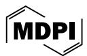
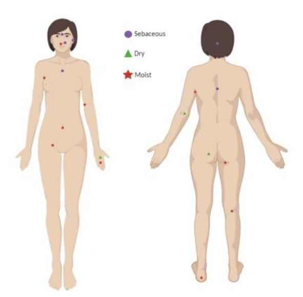
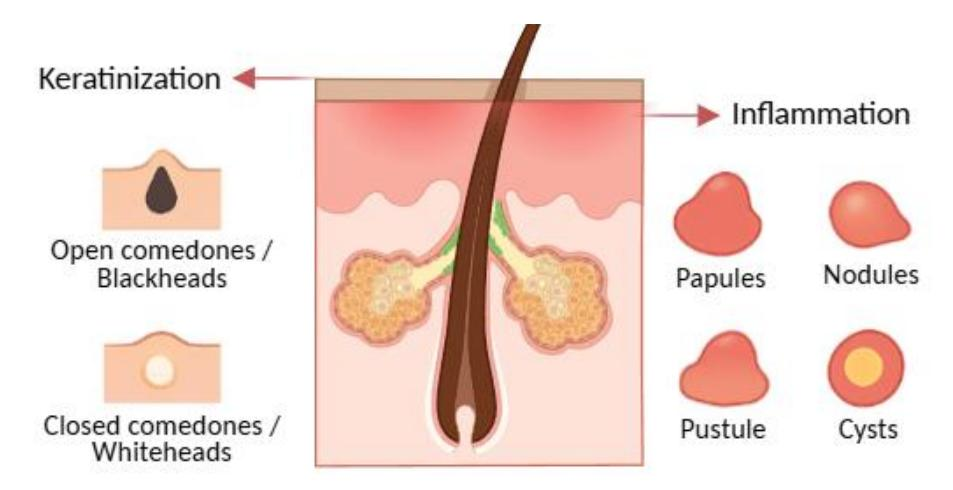
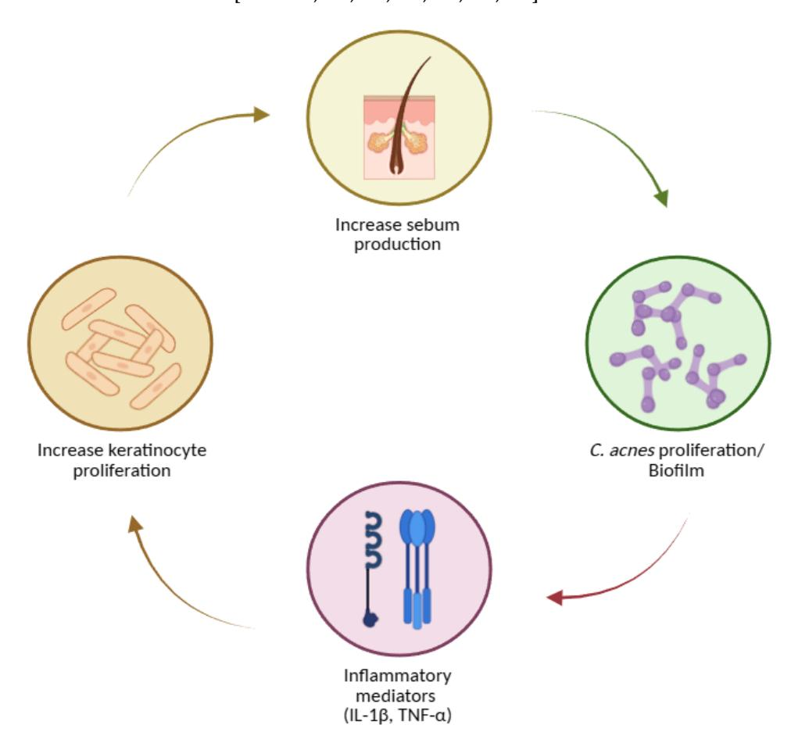
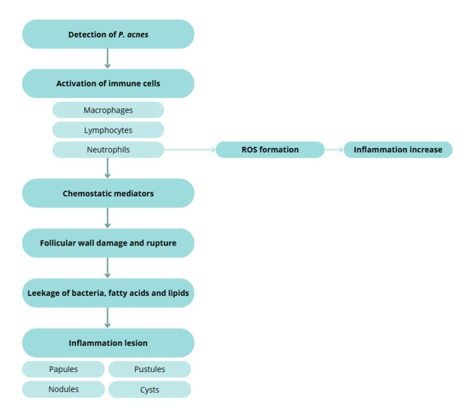
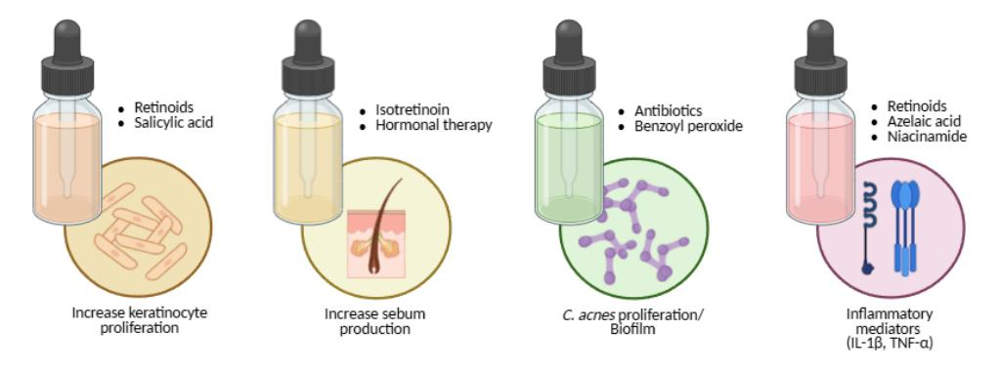
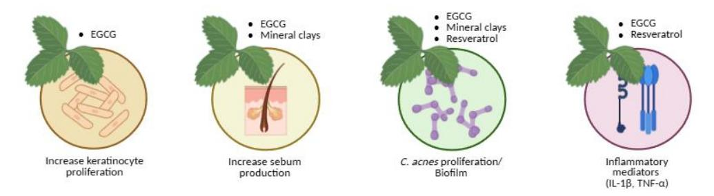

*Review*

# **Rebalancing the Skin: The Microbiome, Acne Pathogenesis, and the Future of Natural and Synthetic Therapies**

**Maria Beatriz Oliveira 1,2, Ana Colette Maurício 1,2,3 [,](https://orcid.org/0000-0002-0018-9363) Ana Novo Barros [4](https://orcid.org/0000-0001-5834-6141) and Cláudia Botelho 1,2,[\\*](https://orcid.org/0000-0001-8221-419X)**

- 1 Centre for Animal Science Studies (CECA), Institute of Sciences, Technologies and Agroenvironment (ICETA), University of Porto, 5050-313 Porto, Portugal; up202402415@up.pt (M.B.O.); acmauricio@icbas.up.pt (A.C.M.)
- 2 Associated Laboratory for Animal and Veterinary Science (AL4AnimalS), 1300-477 Lisbon, Portugal
- 3 Department of Veterinary Clinic, School of Medicine and Biomedical Sciences (ICBAS), University of Porto, 5050-313 Porto, Portugal
- 4 Centre for the Research and Technology of Agro-Environmental and Biological Sciences (CITAB), Inov4Agro, University of Trás-os-Montes and Alto Douro (UTAD), 5000-801 Vila Real, Portugal; abarros@utad.pt
- **\*** Correspondence: claudiabotelho@me.com

### **Abstract**

The skin serves as a primary interface between the human body and the external environment, functioning both as a protective barrier and as a habitat for a complex and diverse microbiome. These microbial communities contribute to immune regulation, barrier integrity, and defence against pathogens. Disruptions in this equilibrium can precipitate dermatological disorders such as acne vulgaris, which affects millions of adolescents and adults worldwide. This chronic inflammatory disorder of the pilosebaceous unit is driven by microbial dysbiosis, hyperkeratinisation, sebum overproduction, and inflammation. This review synthesizes data from over 100 sources to examine the interplay between the skin microbiome and acne pathogenesis, and to compare synthetic treatments, including retinoids, antibiotics, and hormonal therapies, with natural approaches such as polyphenols, minerals, and resveratrol. The analysis highlights the therapeutic convergence of traditional pharmacology and bioactive natural compounds, proposing microbiome-conscious and sustainable strategies for future acne management.

**Keywords:** skin microbiome; acne vulgaris; *Cutibacterium acnes*; natural bioactives; retinoids; antimicrobial resistance; EGCG; resveratrol; one health

Academic Editor: Andrzej Slominski

Received: 10 October 2025 Revised: 30 November 2025 Accepted: 5 December 2025 Published: 7 December 2025

**Citation:** Oliveira, M.B.; Maurício, A.C.; Barros, A.N.; Botelho, C. Rebalancing the Skin: The Microbiome, Acne Pathogenesis, and the Future of Natural and Synthetic Therapies. *Molecules* **2025**, *30*, 4684. [https://doi.org/10.3390/](https://doi.org/10.3390/molecules30244684) [molecules30244684](https://doi.org/10.3390/molecules30244684)

**Copyright:** © 2025 by the authors. Licensee MDPI, Basel, Switzerland. This article is an open access article distributed under the terms and conditions of the Creative Commons Attribution (CC BY) license [\(https://creativecommons.org/](https://creativecommons.org/licenses/by/4.0/) [licenses/by/4.0/\)](https://creativecommons.org/licenses/by/4.0/).

# **1. Introduction**

The human skin is a multifunctional organ that operates as both a physical barrier and a dynamic biological ecosystem where host cells and microorganisms coexist in equilibrium. The skin microbiome refers to all microorganisms present on the skin and their collective genetic material, while the microbiota encompasses only the microorganisms themselves. This distinction matters, as microbial genes contribute metabolic and immunological capacities that complement the host genome, conferring adaptive advantages the human genome alone has not evolved to provide [\[1](#page-13-0)[–9\]](#page-13-1).

Healthy skin hosts a rich and diverse community comprising bacteria, fungi, viruses, and microscopic arthropods. These microbial communities form a structured ecosystem, with each organism occupying a niche defined by topography, humidity, temperature, sebum content, and pH. The skin stands out among epithelial surfaces for its complex ecological interactions with the external environment. Gram-positive species dominate, *Molecules* **2025**, *30*, 4684 2 of 23

particularly *Cutibacterium*, *Staphylococcus*, and *Corynebacterium*, because their thick peptidoglycan walls provide high structural stability, enabling survival under desiccation, osmotic stress, and UV exposure [\[1](#page-13-0)[–8](#page-13-2)[,10\]](#page-13-3).

Cutaneous microbes also play essential defensive and metabolic roles. They produce inhibitory substances—such as bacteriocins, enzymes, and low-molecular-weight antimicrobials—that prevent colonisation by pathogenic species. This ecological competition, both intra- and interspecific, contributes to maintaining a stable and resilient microbiome. The overall stability of the skin's microbial community, even under environmental fluctuation, suggests long-term coevolution between host and microflora [\[8,](#page-13-2)[9,](#page-13-1)[11](#page-13-4)[–17\]](#page-13-5).

In healthy adults, pilosebaceous follicles and sebum-rich areas harbour abundant populations of *Cutibacterium acnes* (formerly *Propionibacterium acnes*) and related propionibacteria, which occupy ecological niches that might otherwise be colonized by pathogens. Under physiological conditions, these bacteria are either benign or beneficial; however, they may acquire pathogenic potential in response to trauma, immune dysregulation, or barrier disruption [\[5,](#page-13-6)[16–](#page-13-7)[22\]](#page-13-8).

Homeostasis within the cutaneous ecosystem depends on a delicate balance between microbiota and host. Disruptions—whether endogenous (e.g., genetic variation) or exogenous (e.g., excessive washing, antibiotic exposure, or altered hygiene practices)—can precipitate dysbiosis and increase susceptibility to inflammatory or infectious dermatoses Individual differences in skin biochemistry, local physiology, and product use make it difficult to establish universal links, site physiology, and product use, establishing universal correlations between specific organisms and skin function is challenging [\[8,](#page-13-2)[18,](#page-13-9)[20](#page-13-10)[–25\]](#page-13-11).

Host–microbe relationships on the skin can be categorised as mutualistic, commensal, or parasitic. In mutualism, both partners benefit (for example, *Staphylococcus epidermidis* can stimulate host antimicrobial peptide production); in commensalism, one benefits without harming the other; and in parasitism, one benefits at the host's expense. Microorganisms obtain nutrients and a stable environment, the host benefits from microbial metabolic flexibility and rapid evolutionary adaptability. These dynamics are central to the skin's immune equilibrium [\[8](#page-13-2)[,21](#page-13-12)[,22](#page-13-8)[,26](#page-13-13)[–28\]](#page-14-0).

Physiologically, the skin is relatively cool, acidic (average pH ≈ 5.0), and relatively dry, but it includes multiple microhabitats that vary in temperature, humidity, lipid composition, and antimicrobial milieu. Structural appendages such as hair follicles, sebaceous, eccrine, and apocrine glands generate distinct environments that shape microbial diversity. In healthy skin, nutrients such as amino acids, vitamins, lactate, and lipids derive from sweat and sebum. Elements of the innate immune system—including β-defensins (HBD-1, -2, -3) and dermcidin—help control microbial growth and modulate microbial population density. Dermcidin, secreted in sweat, functions optimally under native saline and acidic conditions and inhibits both Gram-positive and Gram-negative bacteria [\[5](#page-13-6)[,29](#page-14-1)[–34\]](#page-14-2).

Ecologically, the skin can be divided into three principal microenvironments—sebaceous, moist, and dry—each with characteristic taxa. Sebaceous regions (e.g., glabella, alar crease, external auditory canal, occiput, upper chest, and back) favour lipid-adapted speciessuch as *Cutibacterium* and *Malassezia*; moist regions (e.g., nares, axilla, antecubital fossa, interdigital spaces, inguinal crease, umbilicus, popliteal fossa, plantar heel) support *Staphylococcus* and *Corynebacterium*; dry sites (e.g., volar forearm, hypothenar palm, buttocks) exhibit greater diversity, including β-Proteobacteria and Flavobacteriales [\[1](#page-13-0)[,23](#page-13-14)[,34–](#page-14-2)[37\]](#page-14-3) (Figure [1\)](#page-2-0).

Local physiochemistry further shapes colonisation. Fatty acids in sweat help maintain the acid mantle (pH ≈ 5), which inhibits *Staphylococcus aureus* and *Streptococcus pyogenes*, while occlusion can raise the surface pH and can favour their growth. Warmer, more humid regions support Gram-negative bacilli, *S. aureus*, and coryneforms. Sites with high

*Molecules* **2025**, *30*, 4684 3 of 23

sebaceous gland density (e.g., the face) selectively encourage *lipophilic Cutibacterium* and *Malassezia* [\[9](#page-13-1)[,38–](#page-14-4)[46\]](#page-14-5).

**Figure 1.** Identification of representative human skin regions with distinct physiological profiles ( sebaceous, dry, and moist body sites) Created with BioRender.com.

The skin microbiome also depends on host factors such as age, sex, and anatomical location. Delivery mode shapes early colonisation: infants born by Caesarean section acquire predominantly skin-associated taxa, whereas vaginally delivered infants acquire maternal vaginal communities. Puberty markedly alters the microbiome as sebaceous activity increases; prepubescent skin is enriched for Streptococcaceae, Firmicutes, Proteobacteria, and Bacteroidetes with a more diverse mycobiome, while postpubescent skin favours lipophilic *Cutibacterium, Corynebacterium*, and *Malassezia*. With advancing age, community structure continues to evolve and correlates with age-associated dermatoses: staphylococcal atopic dermatitis in childhood, *C. acnes*–associated acne in adolescence, and *Malassezia*-associated tinea versicolor in adulthood. Sex-linked anatomical and physiological differences (e.g., sebum output, barrier features) and environmental exposures (clothing, medications, occupation) add further variance [\[5](#page-13-6)[,9,](#page-13-1)[44,](#page-14-6)[46](#page-14-5)[–60\]](#page-15-0).

High-resolution surveys underscore this topographical and temporal diversity. In a 16S rRNA gene phylotyping study, 51.8% of sequences were assigned to Actinobacteria, 24.4% to Firmicutes, 16.5% to Proteobacteria, and 6.3% to Bacteroidetes. Among 205 genera, *Corynebacterium*, *Cutibacterium* (historically "Propionibacteria"), and *Staphylococcustogether* accounted for over 62% of sequences. Sebaceous sites were dominated by *Cutibacterium* and *Staphylococcus*, moist sites by *Corynebacterium* and *Staphylococcus*, and dry sites by a broader set including β-Proteobacteria and Flavobacteriales [\[23,](#page-13-14)[61](#page-15-1)[,62\]](#page-15-2).

Cutaneous propionibacteria (now classified within *Cutibacterium*) are commensals of keratinised epithelia and include *C. acnes* (formerly *P. acnes*), *C. granulosum*, *C. avidum*, *C. lymphophilum*, and *C. propionicum*. They are non-motile, Gram-positive, and exhibit coryneform morphology. Historically, these organisms have been grouped with Bacillus, anaerobic diphtheroids, and Corynebacterium. *C. acnes* and *C. granulosum* are typically isolated from sebaceous skin (face, back, upper chest), whereas *C. avidum* is enriched in the axilla [\[5](#page-13-6)[,18](#page-13-9)[,19](#page-13-15)[,63](#page-15-3)[–65\]](#page-15-4).

Although bacteria predominate numerically, the cutaneous mycobiome—notably *Malassezia* spp.—is consistently detected. Smaller studies using 18S rRNA and other markers highlight *Malassezia* restricta, *M. globosa*, and *M. sympodialis* as prevalent isolates, especially in lipid-rich, sebum-dense sites, reflecting their lipophilic metabolism [\[35](#page-14-7)[,66](#page-15-5)[–69\]](#page-15-6). *Molecules* **2025**, *30*, 4684 4 of 23

Together, these findings portray the skin as a site-stratified, physiochemically diverse ecosystem. Its resident communities are co-adapted with host structures and defences and vary predictably with life stage, sex, and environment—principles that are essential to understanding dysbiosis and the pathogenesis of acne.

In recent years, the skin has been recognised nor merely as a physical barrier but as a neuro-immune-endocrine interface capable of integrating environmental signals and coordinating systemic homeostasis [\[70](#page-15-7)[–72\]](#page-15-8). According to recent evidence, the cutaneous epithelium expresses a functional equivalent of the hypothalamic–pituitary–adrenal (HPA) axis, including CRH, ACTH, cortisol, and related receptors, which enable local adaptation to stressors such as UV lights, pollutants, pathogens, and psychosocial triggers [\[70](#page-15-7)[,72–](#page-15-8)[79\]](#page-15-9). Keratinocytes, sebocytes, immune cells, and peripheral nerve endings participate in this bidirectional communication network, linking the nervous, endocrine, and immune systems. Environmental stimuli can therefore modulate innate immune activation, antimicrobial peptide expression, melanogenesis, lipid production, and barrier function [\[76,](#page-15-10)[77,](#page-15-11)[80–](#page-15-12)[82\]](#page-15-13). This neuro-immunocutaneous integration is especially relevant for acne, a condition strongly influenced by stress-responsive sebocytes, inflammatory amplification loops, and microbiome dynamics. Incorporating these neuroendocrine pathways is essential for understanding how internal physiology and external exposures jointly shape skin homeostasis [\[73,](#page-15-14)[76,](#page-15-10)[77,](#page-15-11)[80,](#page-15-12)[81,](#page-15-15)[83\]](#page-16-0).

Objective and Scope

This narrative review provides an updated synthesis of the current evidence linking the skin microbiome to the pathogenesis of acne vulgaris. It also compares synthetic and natural therapeutic approaches, highlighting translational opportunities and emerging biotechnological strategies. By integrating mechanistic insights with clinical relevance, the review aims to outline future directions for microbiome-based acne management.

To achieve this objective, a comprehensive literature search was conducted using PubMed, Scopus, and Web of Science databases, covering the period from 2010 to 2025. The search employed the keywords: "*acne vulgaris*", "*microbiome*", "*retinoids*", "*polyphenols*" and "*Cutibacterium acnes*". Only peer-reviewed articles published in English that addressed mechanistic or therapeutic aspects were included. Additional references were identified from the bibliographies of key reviews and primary research articles.

Acne

Even though host and microorganisms typically coexist in balance, shifts in host physiology or the cutaneous environment can drive normally beneficial or benign microbes toward pathogenic behaviour. Many common dermatoses are associated with dysbiosis, i.e., alterations in the composition or function of commensal communities. In acne, dysbiosis reflects quantitative and qualitative changes in commensals within the pilosebaceous niche, and accumulating evidence suggests that both individual taxa and the broader microbial community contribute to disease expression [\[33,](#page-14-8)[84–](#page-16-1)[88\]](#page-16-2).

## • Definition and clinical spectrum

Acne is a chronic inflammatory dermatosis of the pilosebaceous unit, historically associated with *Propionibacterium acnes* (now *Cutibacterium acnes*), and characterised by non-inflammatory lesions such as open comedones, more commonly called blackheads, and closed comedones or whiteheads and inflammatory lesions like papules, pustules, nodules, and cysts (Figure [2\)](#page-4-0) [\[89](#page-16-3)[,90\]](#page-16-4). The condition involves altered bacterial colonisation within follicles, but pathogenesis is multifactorial. Notably, *C. acnes* is abundant in the microbiota of most adults; however, only a subset develop acne, indicating that strain-level differences, host factors, and micro environmental context modulate pathogenicity. Transcriptional profiles of *C. acnes* also differ between healthy and acne skin, supporting a functional rather than purely abundance-based shift [\[5,](#page-13-6)[22,](#page-13-8)[33,](#page-14-8)[87,](#page-16-5)[91–](#page-16-6)[96\]](#page-16-7).

*Molecules* **2025**, *30*, 4684 5 of 23

**Figure 2.** Acne lesions, illustrating comedonal (open and closed comedones) and inflammatory (papules, pustules, nodules, and cysts) types. Created with BioRender.com, with additional AIassisted graphic design.

#### • Distribution and onset

Lesions predominate at sites with a high density of pilosebaceous units—the face, back, neck, upper chest, and shoulders [\[97](#page-16-8)[,98\]](#page-16-9). Acne typically begins in early puberty with increasing sebum output, mid-facial comedones, and subsequent inflammatory lesions; it is commonly seen in girls around 12 years and in boys somewhat later, often from ~15 years. Prepubertal acne can occur and is usually comedonal, reflecting limited sebaceous activity at younger ages [\[98](#page-16-9)[–102\]](#page-16-10). Family history and early-onset comedones can help predict severity [\[99,](#page-16-11)[103](#page-16-12)[–105\]](#page-16-13).

Modifiers and triggers Several endogenous and exogenous factors influence onset and flares. Emotional stress, cyclical hormonal fluctuations (e.g., perimenstrual), and excoriation/skin picking can exacerbate disease. Occlusion and comedogenic products, friction and sweat (e.g., sports gear), and certain medications (notably some antiepileptics) can provoke monomorphic eruptions; anabolic-androgenic steroids may induce severe forms. Evidence for sunlight, diet, and hygiene is mixed; counselling should be individualised [\[106–](#page-16-14)[121\]](#page-17-0).

#### • Burden and psychosocial impact

Beyond pruritus, soreness, and pain, acne carries a substantial psychosocial burden. Visible lesions and scarring can cause embarrassment, anxiety, and reduced well-being. Because acne peaks during adolescence—a critical period for identity and self-esteem—minimising scarring and controlling inflammation are central to care; clinicians should avoid trivialising acne as merely self-limited [\[97](#page-16-8)[,122](#page-17-1)[–127\]](#page-17-2).

Pathogenesis: four interlocking processes

Acne arises from the convergence of four tightly connected biological processes within the pilosebaceous unit:

- 1. Follicular hyperkeratinisation produces microcomedones through abnormal keratinocyte proliferation and desquamation, narrowing the infundibulum and obstructing outflow [\[128](#page-17-3)[–135\]](#page-17-4).
- 2. Sebum overproduction and altered composition, driven by androgens and metabolic signals such as IGF-1, creates a lipid-rich, anaerobic niche; sebum output correlates with acne severity [\[131,](#page-17-5)[134](#page-17-6)[,136–](#page-17-7)[140\]](#page-18-0).
- 3. Microbial factors—especially *C. acnes* colonisation—promote disease via lipases, hyaluronidases, and proteases that liberate free fatty acids, compromise the barrier,

*Molecules* **2025**, *30*, 4684 6 of 23

- and foster comedogenesis; biofilm formation may shield bacteria from host defences and antibiotics [\[22,](#page-13-8)[87,](#page-16-5)[131,](#page-17-5)[140](#page-18-0)[–144\]](#page-18-1).
- 4. Inflammation and innate–adaptive crosstalk amplifies and sustain lesions: IL-1 signalling, neutrophil recruitment and ROS generation, and leukotriene B4–mediated cascades are implicated. Sebocytes synthesize neuropeptides, antimicrobial peptides, and antibacterial lipids, linking stress (CRH axis) and vitamin D signalling to sebaceous activity [\[22](#page-13-8)[,128](#page-17-3)[–130](#page-17-8)[,136,](#page-17-7)[137,](#page-18-2)[140,](#page-18-0)[145](#page-18-3)[–147\]](#page-18-4).

These processes can be envisioned as a self-reinforcing loop (Figure [3\)](#page-5-0): hyperkeratinisation and altered sebum favour *C. acnes* growth and biofilms; bacterial products intensify inflammation; inflammatory mediators (including IL-1) further dysregulate keratinisation and sebaceous function [\[128](#page-17-3)[–130,](#page-17-8)[136,](#page-17-7)[137,](#page-18-2)[141,](#page-18-5)[142](#page-18-6)[,145](#page-18-3)[,148\]](#page-18-7).

**Figure 3.** Key steps in acne pathogenesis, including increased sebum production, *Cutibacterium acnes* proliferation and biofilm formation, induction of inflammatory mediators (IL-1β, TNF-α), and enhanced keratinocyte proliferation. Created with BioRender.com.

Sebum, comedogenesis, and lesion evolution

Excess sebum—stimulated by androgens, particularly testosterone—correlates with disease severity [\[131,](#page-17-5)[139](#page-18-8)[,149\]](#page-18-9). Hyperproliferation and dysregulated shedding of keratinocytes lead to accumulation of corneocytes, lipids, and filamentous material within the follicle, forming microcomedones that progress to visible open or closed comedones [\[22,](#page-13-8)[131–](#page-17-5)[133,](#page-17-9)[135,](#page-17-4)[150\]](#page-18-10). In both normal follicles and comedones, microflora typically include *Staphylococcus epidermidis* (coagulase-negative), *C. acnes* and *C. granulosum* (anaerobic diphtheroids), and *Pityrosporum* spp. (lipophilic yeasts). *S. epidermidis*—an aerobic surface commensal—appears less implicated in inflammation than *C. acnes*, consistent with antibody response patterns. In contrast, *Molecules* **2025**, *30*, 4684 7 of 23

*C. acnes* thrive in sebaceous follicles and hydrolyses triglycerides to free fatty acids and glycerol, promoting comedogenesis and inflammation (Figure [4\)](#page-6-0) [\[22,](#page-13-8)[86,](#page-16-15)[87](#page-16-5)[,131,](#page-17-5)[143](#page-18-11)[,151,](#page-18-12)[152\]](#page-18-13).

**Figure 4.** Inflammatory response to *C. acnes*, illustrating immune cell activation, ROS formation, chemo tactic mediator release, follicular wall rupture, and the development of inflammatory lesions (papules, pustules, nodules, and cysts). Created with BioRender.com.

Classical work on cutaneous endocrinology established the concept of the skin as a stress organ, capable of synthesizing and metabolizing neuro hormones traditionally associated with central endocrine organs. Acute or chronic stress activates cutaneous CHR receptors, inducing sebocyte proliferation, enhancing lipid synthesis, and promoting abnormal desquamation, which are key steps in microcomedone formation. Stress also reduces barrier integrity and shifts antimicrobial peptide expression, facilitating colonization by acne associated *C. acnes* phylotypes [\[75,](#page-15-16)[78,](#page-15-17)[153–](#page-18-14)[155\]](#page-18-15).

Inflammatory cascades and tissue injury

Host detection of *C. acnes* triggers macrophage, lymphocyte, and neutrophil activation. Chemotactic factors and ROS generation contribute to follicular wall damage and rupture with extrusion of keratin, lipids, and bacteria into the dermis, producing papules, pustules, nodules, and cysts [\[123](#page-17-10)[,131](#page-17-5)[,132,](#page-17-11)[145,](#page-18-3)[156,](#page-18-16)[157\]](#page-18-17).

Inflammation in acne is increasingly understood as a convergence of classical immune pathways with neurogenic mediators. Substance P, CGRP, and other neuropeptides released from peripheral nerve endings stimulate keratinocytes, mast cells, and sebocytes, provoking IL-1, IL-6, TNF-α, and matrix metalloproteinase release. These mediators intensify neutrophilic infiltration and oxidative stress while altering sebocyte lipid profiles in ways that support *C. acnes* proliferation. Neurogenic inflammation therefore acts as an upstream trigger that lowers the immune activation threshold within the pilosebaceous unit [\[22,](#page-13-8)[135,](#page-17-4)[158–](#page-18-18)[161\]](#page-19-0).

Melatonin, long known for its circadian and neuroendocrine roles, is now recognized as a key cutaneous antioxidant and immunomodulator. Human skin synthesizes melatonin and converts it to metabolites such as AFMK and AMK, which exhibit strong ROS

*Molecules* **2025**, *30*, 4684 8 of 23

scavenging capacity, anti-inflammatory activity, mitochondrial protection, and microbiome modulating effects [\[162](#page-19-1)[–167\]](#page-19-2). These molecules counteract lipid peroxidation within sebocytes, inhibit NF-κB and MAPK signalling, reduce IL-1β and TNF-α expression, and support balanced keratinocyte differentiation. Dysregulation of local melatonin metabolism may therefore exacerbate oxidative stress and inflammatory cascades central to acne pathophysiology. Given the melatonin metabolites originate evolutionary in early organisms such as bacteria and insects, their conserved antioxidant function may reflect an ancient defence system relevant to modern skin disorders [\[163,](#page-19-3)[164,](#page-19-4)[166–](#page-19-5)[168\]](#page-19-6).

Vitamin D signalling is also integral to skin homeostasis and acne development. Active vitamin D (1,25-dihydroxyvitamin D) regulates sebocyte proliferation, suppresses lipid synthesis, and enhances antimicrobial peptide production, particularly cathelicidin (LL-37), which modulates *C. acnes* survival and immune activation [\[169](#page-19-7)[–173\]](#page-19-8). Vitamin D additionally downregulates Th1/Th17 pathways and reduces IL-17-mediated inflammation, mechanisms implicated in nodulocystic disease. Dysregulated vitamin D signalling may promote barrier dysfunction, dysbiosis, and heightened inflammation [\[170](#page-19-9)[–176\]](#page-19-10).

Strain-level insights

Culture-independent studies show that while overall *C. acnes* abundance may not differ dramatically between acne and controls, specific phylotypes/lineages associate with disease, whereas others are enriched in health. Follicular biopsies from acne patients reveal higher frequencies of disease-linked *C. acnes* strains and a greater proportion of colonised follicles, supporting a strain-selective colonisation model rather than a simple overgrowth model [\[22,](#page-13-8)[88,](#page-16-2)[93,](#page-16-16)[177](#page-19-11)[–179\]](#page-19-12).

These data demonstrate the multifactorially, dysbiosis-linked inflammatory disorder of the pilosebaceous unit in which keratinisation dynamics, sebum quantity/quality, microbial traits (including biofilms and strain diversity), and immune networks intersect to drive lesion initiation, progression, and scarring.

Acne Treatments

Management of acne aims to control active lesions, reduce inflammation, prevent and treat scarring, and minimise relapses. Each treatment must be tailored to the patient's clinical history and specific needs, considering lesion morphology, severity, distribution, age, sex, psychosocial impact, and prior response [\[180\]](#page-19-13). Several therapeutic approaches are available—topical, systemic, and natural/non-drug treatments—and combining agents that target different pathogenic mechanisms generally yields faster and more durable outcomes, as it can be seen in Table [1](#page-8-0) [\[181\]](#page-19-14).

*Molecules* **2025**, *30*, 4684 9 of 23

**Table 1.** Comparative overview of acne therapies.

| Therapy Class                        | Representative Agents                                          | Mechanism of Action                                                            | Reported Efficacy                                                        | Common Adverse Effects                                       | References                                |
|--------------------------------------|----------------------------------------------------------------|--------------------------------------------------------------------------------|--------------------------------------------------------------------------|--------------------------------------------------------------|-------------------------------------------|
| Topical Retinoids                    | Tretinoin, Adapalene, Tazarotene                            | Normalize follicular keratinization; anti-inflammatory; comedolytic      | High efficacy in mild–moderate acne; cornerstone of therapy           | Erythema, peeling, dryness, photosensitivity              | [122–124,131–133,180,182–187]             |
| Topical Antibiotics                  | Erythromycin, Clindamycin                                      | Inhibit C. acnes protein synthesis via 50S ribosomal binding       | Moderate efficacy, enhanced when combined with BPO                    | Local irritation, bacterial resistance (~60% C. acnes) | [180,182,183,185–192]                     |
| Topical Agents (Other)               | Benzoyl peroxide, Azelaic acid, Niacinamide, Salicylic acid | Antimicrobial, keratolytic, anti-inflammatory, sebum regulation          | Moderate efficacy, useful as adjuncts or maintenance                  | Irritation, dryness, bleaching (BPO)                      | [122,123,180,185–187,193–200]             |
| Systemic Retinoids                   | Isotretinoin                                                   | Reduces sebaceous gland size and sebum output; normalizes keratinization | Highest efficacy for severe/nodulocystic acne; long-term remission | Teratogenicity, mucocutaneous dryness, lipid elevation | [123,183,185,187,201–204]                 |
| Systemic Antibiotics                 | Doxycycline, Erythromycin, Clindamycin, Levofloxacin        | Suppress C. acnes and reduce inflammation                                | Moderate–high efficacy for inflammatory acne                          | GI upset, photosensitivity, resistance risk               | [132,182,185,187,192,193,201– 203,205] |
| Hormonal Therapy                     | Combined oral contraceptives, Spironolactone                | Decrease androgenic stimulation of sebaceous glands                         | Moderate efficacy, especially in adult female acne                    | Nausea, mood changes, thromboembolism                     | [132,182,198,201,206]                     |
| Natural Polyphenols                  | Green tea EGCG, Resveratrol                                    | Antioxidant, anti-inflammatory, antibacterial, sebo-suppressive             | Clinical studies show 40–60% lesion reduction in 8–12 weeks           | Minimal irritation; mild dryness                          | [182,207–216]                             |
| Mineral Clays                        | Kaolin, Halloysite, Sericite, Talc                             | Adsorb sebum, cleanse pores, mild antimicrobial effect                      | Moderate efficacy; beneficial as adjunct masks                        | Dryness, transient irritation                             | [217,218]                                 |
| Other Natural/ Adjunct Approaches | Probiotics, botanical extracts (e.g., niacinamide)          | Modulate inflammation and microbial balance                                 | Variable efficacy; promising in small trials                          | Mild irritation, sensitivity reactions                    | [194–197,207,208]                         |

This comparative summary underscores that retinoids remain the most effective acne therapies but are limited by irritation and safety concerns. Antibiotic use is effective yet increasingly constrained by resistance, emphasizing combination and stewardship strategies. Hormonal agents benefit select female patients, while natural bioactives such resveratrol offer promising microbiome-friendly alternatives that require further clinical validation.

*Molecules* **2025**, *30*, 4684 10 of 23

Topical treatments

Topical therapy remains the foundation for mild-to-moderate acne and is available in creams, gels, lotions, and cleansers. While these agents act directly on the affected area, local irritation and dryness may occur [\[185,](#page-20-15)[188\]](#page-20-16).

Retinoids are first-line agents because they normalise follicular desquamation, prevent microcomedone formation, and exert anti-inflammatory activity [\[132](#page-17-11)[,182,](#page-19-18)[185](#page-20-15)[,219\]](#page-21-3). Tretinoin regulates epithelial desquamation, preventing blockage of the pilosebaceous unit and reducing inflammation [\[122](#page-17-1)[,180,](#page-19-13)[184](#page-20-17)[,185,](#page-20-15)[219](#page-21-3)[,220\]](#page-21-4). Adapalene, a synthetic lipophilic analogue, penetrates the follicle efficiently, normalises keratinocyte differentiation, and is generally best tolerated for maintenance [\[122,](#page-17-1)[123,](#page-17-10)[183](#page-19-19)[,185,](#page-20-15)[219](#page-21-3)[,220\]](#page-21-4). Tazarotene, a pro-drug converted to tazarotenic acid in keratinocytes, modulates proliferation and differentiation and has strong anti-inflammatory properties [\[122](#page-17-1)[,131,](#page-17-5)[185,](#page-20-15)[219,](#page-21-3)[220\]](#page-21-4). Retinoids can be used alone in predominantly comedonal acne or combined with antimicrobial agents for inflammatory forms. Gradual titration and attention to vehicle and formulation improve adherence and tolerability. Innovative micro- or nano-delivery systems are being explored to increase potency at the target while minimising irritation [\[122](#page-17-1)[–124,](#page-17-18)[131–](#page-17-5)[133](#page-17-9)[,182,](#page-19-18)[183,](#page-19-19)[185](#page-20-15)[,219,](#page-21-3)[220\]](#page-21-4).

Topical antibiotics reduce *Cutibacterium acnes* and inflammatory lesions (Figure [5\)](#page-9-0). Erythromycin (a macrolide) and clindamycin (a lincosamide) act by binding the bacterial 50S ribosomal subunit, inhibiting protein synthesis [\[122,](#page-17-1)[180,](#page-19-13)[182,](#page-19-18)[185,](#page-20-15)[205,](#page-20-18)[221\]](#page-21-5). Resistance to erythromycin has reached approximately 60% in *C. acnes* [\[180,](#page-19-13)[185,](#page-20-15)[188,](#page-20-16)[221\]](#page-21-5), so both agents should be prescribed only short-term (≈12 weeks) and never as monotherapy. Combining antibiotics with benzoyl peroxide (BPO) or retinoids enhances efficacy and mitigates resistance [\[185](#page-20-15)[,189–](#page-20-19)[192,](#page-20-20)[222,](#page-21-6)[223\]](#page-21-7).

**Figure 5.** Mapping acne therapies to the core pathogenic pathways: keratinocyte hyperproliferation, sebogenesis, *Cutibacterium acnes* overgrowth and biofilm, and inflammatory mediator release (IL-1β, TNF-α). Created with BioRender.com.

Benzoyl peroxide is a potent oxidising and comedolytic agent that kills *C. acnes* independently of resistance mechanisms (Figure [5\)](#page-9-0). It reduces comedones but may cause peeling, dryness, erythema, or fabric bleaching [\[122](#page-17-1)[,180](#page-19-13)[,193,](#page-20-21)[220,](#page-21-4)[222](#page-21-6)[–224\]](#page-21-8). Azelaic acid offers comedolytic, antibacterial, and anti-tyrosinase effects, making it valuable for post-inflammatory hyperpigmentation and safe in pregnancy (Figure [5\)](#page-9-0) [\[122](#page-17-1)[,123](#page-17-10)[,180,](#page-19-13)[185](#page-20-15)[,193](#page-20-21)[,198,](#page-20-22)[225\]](#page-21-9).

Niacinamide (vitamin B3 amide) decreases sebocyte lipid output and inflammation and strengthens the epidermal barrier (Figure [5\)](#page-9-0) [\[185,](#page-20-15)[194–](#page-20-23)[197](#page-20-24)[,199](#page-20-25)[,200,](#page-20-26)[225\]](#page-21-9). Salicylic acid, a keratolytic agent, dissolves intercellular cement, enhances penetration of co-applied actives, and exerts mild bacteriostatic and fungistatic effects (Figure [5\)](#page-9-0) [\[122](#page-17-1)[,180](#page-19-13)[,185](#page-20-15)[,225\]](#page-21-9).

Systemic treatments

Systemic therapy is indicated for moderate-to-severe, nodular, truncal, or scarring acne, or when topical management fails.

*Molecules* **2025**, *30*, 4684 11 of 23

Oral isotretinoin remains the only drug capable of long-term remission. It induces sebaceous-gland involution, markedly suppresses sebum production, normalises keratinisation, and alters the follicular microenvironment (Figure [5\)](#page-9-0) [\[123,](#page-17-10)[183](#page-19-19)[,185](#page-20-15)[,201](#page-20-27)[–204,](#page-20-28)[226](#page-21-10)[–230\]](#page-21-11). Because of teratogenic risk, strict pregnancy-prevention protocols and laboratory monitoring are mandatory. Counselling should also address mucocutaneous dryness, lipid changes, and mood symptoms [\[185,](#page-20-15)[226](#page-21-10)[–230\]](#page-21-11).

Oral antibiotics are reserved for moderate-to-severe inflammatory acne or widespread disease [\[185](#page-20-15)[,192](#page-20-20)[,193,](#page-20-21)[201\]](#page-20-27). Tetracyclines (e.g., doxycycline) combine antimicrobial and antiinflammatory activity with relatively low resistance rates [\[182,](#page-19-18)[185,](#page-20-15)[193](#page-20-21)[,229–](#page-21-12)[231\]](#page-21-13). Macrolides (erythromycin, clindamycin) serve as alternatives when tetracyclines are contraindicated but show higher resistance potential. Fluoroquinolones (e.g., levofloxacin) are discouraged under stewardship principles [\[132](#page-17-11)[,182](#page-19-18)[,185](#page-20-15)[,192,](#page-20-20)[202,](#page-20-29)[205,](#page-20-18)[229](#page-21-12)[–231\]](#page-21-13). To maximise efficacy and reduce resistance, oral antibiotics should always be combined with topical retinoids or BPO and prescribed for the shortest effective duration [\[132,](#page-17-11)[182,](#page-19-18)[185](#page-20-15)[,201](#page-20-27)[,229](#page-21-12)[,231\]](#page-21-13).

Hormonal therapy targets androgen-driven sebogenesis. Combined oral contraceptives and anti-androgens such as spironolactone reduce free testosterone and suppress sebaceous activity (Figure [5\)](#page-9-0) [\[132,](#page-17-11)[182,](#page-19-18)[185](#page-20-15)[,198,](#page-20-22)[201](#page-20-27)[,206](#page-20-30)[,229](#page-21-12)[,230\]](#page-21-11). They are suitable for adolescent and adult women when hormonal influence is evident, provided contraindications (e.g., thromboembolic risk) are assessed individually [\[185,](#page-20-15)[229,](#page-21-12)[230\]](#page-21-11).

Natural and adjunct approaches

Natural products treatment

Given the side-effects and resistance issues associated with conventional drugs, natural bioactives have emerged as safe, multi-target alternatives. Therefore, researchers are focusing on natural bioactive options. It has been that these compounds may act differently disrupting distinct metabolic pathways [\[207\]](#page-20-31). It is important to mention that natural approaches can influence the hormonal characteristics of the disease, sebum production, inflammation, infection and hyperkeratinization [\[208\]](#page-20-32).

#### • Green tea

Green tea polyphenols, particularly epigallocatechin-3-gallate (EGCG), display antiinflammatory, antioxidant, antimicrobial, and sebo-suppressive properties [\[182,](#page-19-18)[209,](#page-20-33)[232,](#page-21-14)[233\]](#page-21-15). EGCG targets key acne pathways—reducing *C. acnes* growth, inflammation, and aberrant keratinisation—and clinical studies have shown decreased inflammatory and noninflammatory lesions after eight weeks of topical use (Figure [6\)](#page-10-0) [\[210,](#page-20-34)[232](#page-21-14)[,233\]](#page-21-15).

**Figure 6.** Natural therapeutic options for acne aligned with their corresponding pathogenic targets.

Mechanistically, epigallocatechin-3-gallate (EGCG) mitigates oxidative stress by scavenging reactive oxygen species (ROS) and protecting skin cells from oxidative damage. It also helps regulate sebum production by inhibiting 5α-reductase, thereby reducing androgen-mediated acne. Additionally, EGCG suppresses several pro-inflammatory mediators and signalling pathways, including TNF-α, NF-κB, and PI3K/Akt, while downregulating IL-23 mRNA expression, collectively contributing to its anti-acne efficacy [\[182](#page-19-18)[,234\]](#page-21-16).

*Molecules* **2025**, *30*, 4684 12 of 23

## • Mineral clays

Mineral clays (halloysite, talc, sericite, kaolin) have been used since antiquity for acne and blackheads. Applied as masks, they open pilosebaceous orifices, absorb sebum, and promote perspiration [\[217,](#page-21-17)[235,](#page-21-18)[236\]](#page-21-19). The therapeutic benefits of clays are attributed to their high adsorption capacity, which allows them to bind sebum, impurities, and toxins while forming a protective film on the skin surface. This action helps shield the skin from external chemical and physical irritants and supports barrier regeneration. By reducing excess oiliness and promoting a cleaner skin environment, clay-based formulations are considered beneficial for acne management [\[217](#page-21-17)[,235](#page-21-18)[–238\]](#page-21-20).

In vitro studies have demonstrated that clays can inhibit *C. acnes* and *S. epidermidis*, although clinical outcomes depend on the specific composition and formulation (Figure [6\)](#page-10-0) [\[218\]](#page-21-21). For example, a study by Meier [\[239\]](#page-22-0) evaluated the effectiveness of facial masks containing clay and jojoba oil in individuals with mild acne. Treatment with these masks resulted in reductions in papules, pustules, and comedones, indicating clear clinical improvement.

#### • Resveratrol

Resveratrol, a natural phytoalexin, possesses anti-inflammatory and anti-proliferative activity and inhibits *C. acnes* [\[211](#page-20-35)[–215,](#page-21-22)[240,](#page-22-1)[241\]](#page-22-2). In vitro, it acts bacteriostatically at 50–100 mg/L and bactericidally at 200 mg/L [\[212\]](#page-20-36); in pilot clinical trials, topical resveratrol gels used for 60 days reduced pustules, macro- and micro-comedones, and epidermal hyperproliferation (Figure [6\)](#page-10-0) [\[214\]](#page-21-23). Research by Dos Santos [\[242\]](#page-22-3) demonstrated that resveratrol, together with quercetin and gallic acid, can inhibit the growth of *C. acnes* at concentrations of 5 µg/mL. For comparison, the commonly used acne treatment benzoyl peroxide achieved similar inhibition at 1 µg/mL. In animal studies, resveratrol reduced skin swelling by 40% and decreased the levels of IL-1β, a key mediator of acne-related inflammation, by 50%, as well as myeloperoxidase by 35%. These findings suggest that phenolic compounds such as resveratrol may alleviate acne by blocking critical inflammatory pathways, including MAPK and NF-κB, triggered by *C. acnes* [\[240](#page-22-1)[,241](#page-22-2)[,243,](#page-22-4)[244\]](#page-22-5).

Natural compounds modulate key biological processes involved in acne pathogenesis, including keratinocyte proliferation, sebum production, *C. acnes* proliferation/biofilm formation, and inflammatory mediator release. Created with BioRender.com.

Future acne therapies may benefit from incorporating neuroendocrine targeted compounds such as melatonin metabolites and vitamin D analogues. Their ability to modulate inflammation, oxidative stress, sebocyte activity, and microbial homeostasis positions them as attractive candidates for combination or adjunct therapy [\[163](#page-19-3)[,245–](#page-22-6)[248\]](#page-22-7). Integration of these pathways into personalised treatment algorithms, potentially guided by biomarker profiling or neuroendocrine and vitamin D axis activity, may support more precise, durable, and microbiome friendly acne treatments [\[245](#page-22-6)[–247\]](#page-22-8). These approaches also align with sustainability and One Health principles by reducing reliance on broad-spectrum antibiotics and supporting endogenous regulatory mechanisms.

Clinical integration and outlook

In practice, effective regimens combine a topical retinoid to normalise desquamation with BPO or azelaic acid to reduce bacterial load and inflammation, adding short antibiotic courses or isotretinoin for severe or refractory disease [\[185](#page-20-15)[,187\]](#page-20-37). In women with hormonal influence, anti-androgen therapy provides a targeted adjunct [\[185,](#page-20-15)[186\]](#page-20-38). Maintenance (lowirritancy retinoid ± azelaic acid), gentle skincare, and photoprotection reduce relapse [\[185\]](#page-20-15).

Across all modalities, the guiding objective is to increase therapeutic potency at the target site while preserving tolerability, microbial balance, and long-term safety, in alignment with principles of antimicrobial stewardship [\[122–](#page-17-1)[124,](#page-17-18)[131–](#page-17-5)[133](#page-17-9)[,180](#page-19-13)[–183,](#page-19-19)[186](#page-20-38)[,188–](#page-20-16) [191](#page-20-39)[,193](#page-20-21)[,201–](#page-20-27)[203,](#page-20-40)[205,](#page-20-18)[249](#page-22-9)[,250\]](#page-22-10).

*Molecules* **2025**, *30*, 4684 13 of 23

Critical Perspective

Traditional, Synthetic, and Natural Approaches

Current acne management reflects a dual paradigm. On one side, traditional synthetic therapies—retinoids, antibiotics, hormonal agents—remain the cornerstone of evidencebased practice. They are supported by extensive clinical data, predictable pharmacodynamics, and regulatory familiarity. However, their limitations are increasingly evident: antibiotic resistance, irritation, photosensitivity, teratogenicity, systemic toxicity, and microbiome disruption. The overuse of broad-spectrum antibiotics has particularly raised concerns regarding antimicrobial stewardship, as *Cutibacterium acnes* resistance threatens both dermatological and systemic infection control [\[180](#page-19-13)[,183](#page-19-19)[,185](#page-20-15)[,186](#page-20-38)[,188](#page-20-16)[–192](#page-20-20)[,201–](#page-20-27)[203](#page-20-40)[,205,](#page-20-18)[232,](#page-21-14)[249\]](#page-22-9). Furthermore, patient adherence often declines with chronic irritation, dryness, or psychological burden linked to treatment complexity.

Despite substantial progress in elucidating acne pathophysiology and expanding therapeutic options, clinical translation remains inconsistent. Synthetic agents, such as retinoids and antibiotics, demonstrate the highest efficacy but are limited by irritation, teratogenicity, and the rising threat of antimicrobial resistance [\[132](#page-17-11)[,182,](#page-19-18)[192\]](#page-20-20). In contrast, natural bioactives—including EGCG, resveratrol, and clay minerals—show promise for multi-target modulation of inflammation and sebum regulation; however, they lack robust pharmacokinetic data and randomized clinical evidence [\[204,](#page-20-28)[234,](#page-21-16)[237,](#page-21-24)[238](#page-21-20)[,243](#page-22-4)[,249](#page-22-9)[,251](#page-22-11)[,252\]](#page-22-12).

Bridging these gaps requires integrated approaches that combine the precision of synthetic agents with the biocompatibility of natural compounds, guided by microbiome-based diagnostics and antimicrobial stewardship principles. Future research should prioritize long-term, head-to-head trials, mechanistic clarity, and sustainable formulations that maintain microbial equilibrium.

# **2. Conclusions and Future Perspectives**

Acne vulgaris exemplifies the complex interplay between host biology, microbial ecology, and environmental factors. Future acne management should adopt personalized, multimodal, and microbiome-conscious approaches. Artificial intelligence combined with microbiome sequencing can facilitate patient-specific treatment algorithms by identifying microbial signatures predictive of therapeutic response. Additionally, nanocarrier and hydrogel delivery systems can improve the local bioavailability of retinoids and polyphenols while minimizing irritation. These technologies address unmet needs for targeted, sustainable, and patient-friendly therapeutics.

**Author Contributions:** Conceptualization: C.B.; Investigation and Data Curation: C.B. and M.B.O.; Writing—Original Draft Preparation: M.B.O.; Writing—Review and Editing: C.B., A.C.M. and A.N.B.; Visualization and Figure Preparation: M.B.O.; Supervision and Project Administration: C.B. All authors have read and agreed to the published version of the manuscript.

**Funding:** This research was supported by the Foundation for Science and Technology (FCT) through LA/P/0059/2020, UIDB/00211/2020 and UID/04033/2025.

**Acknowledgments:** The authors gratefully acknowledge institutional and technical support from Centre for Studies in Animal Science (CECA) from Institute of Sciences, Technologies and Agroenvironment (ICETA), University of Porto, Centre for the Research and Technology of Agro-Environmental and Biological Sciences (CITAB) and Department of Veterinary Clinics, School of Medicine and Biomedical Sciences (ICBAS), University of Porto (UP), and for the funding and availability of all technical, structural, and human resources necessary for the development of this work. This research was supported by the Foundation for Science and Technology (FCT) through LA/P/0059/2020, UIDB/00211/2020 and UID/04033/2025. The authors acknowledge the use of artificial intelligence tools for language refinement and editing assistance. All intellectual content, data interpretation, and conclusions were developed and verified by the authors.

*Molecules* **2025**, *30*, 4684 14 of 23

**Conflicts of Interest:** The authors declare no conflicts of interest. The funders had no role in the design of the study; in the collection, analyses, or interpretation of data; in the writing of the manuscript; or in the decision to publish the results.

# **References**

- 1. Chen, Y.; Knight, R.; Gallo, R.L. Evolving Approaches to Profiling the Microbiome in Skin Disease. *Front. Immunol.* **2023**, *14*, 1151527. [\[CrossRef\]](https://doi.org/10.3389/fimmu.2023.1151527)
- 2. Lee, H.-J.; Kim, M. Skin Barrier Function and the Microbiome. *Int. J. Mol. Sci.* **2022**, *23*, 13071. [\[CrossRef\]](https://doi.org/10.3390/ijms232113071) [\[PubMed\]](https://www.ncbi.nlm.nih.gov/pubmed/36361857)
- 3. Fournière, M.; Latire, T.; Souak, D.; Feuilloley, M.G.J.; Bedoux, G. *Staphylococcus epidermidis* and *Cutibacterium acnes*: Two Major Sentinels of Skin Microbiota and the Influence of Cosmetics. *Microorganisms* **2020**, *8*, 1752. [\[CrossRef\]](https://doi.org/10.3390/microorganisms8111752) [\[PubMed\]](https://www.ncbi.nlm.nih.gov/pubmed/33171837)
- 4. Loomis, K.H.; Wu, S.K.; Ernlund, A.; Zudock, K.; Reno, A.; Blount, K.; Karig, D.K. A Mixed Community of Skin Microbiome Representatives Influences Cutaneous Processes More than Individual Members. *Microbiome* **2021**, *9*, 22. [\[CrossRef\]](https://doi.org/10.1186/s40168-020-00963-1) [\[PubMed\]](https://www.ncbi.nlm.nih.gov/pubmed/33482907)
- 5. Bojar, R.A.; Holland, K.T. Acne and *Propionibacterium acnes*. *Clin. Dermatol.* **2004**, *22*, 375–379. [\[CrossRef\]](https://doi.org/10.1016/j.clindermatol.2004.03.005)
- 6. Segre, J.A. Epidermal Barrier Formation and Recovery in Skin Disorders. *J. Clin. Investig.* **2006**, *116*, 1150–1158. [\[CrossRef\]](https://doi.org/10.1172/JCI28521) [\[PubMed\]](https://www.ncbi.nlm.nih.gov/pubmed/16670755)
- 7. Marples, M.J. *The Ecology of the Human Skin*; Ch. C. Thomas: Springfield, IL, USA, 1965.
- 8. Schommer, N.N.; Gallo, R.L. Structure and Function of the Human Skin Microbiome. *Trends Microbiol.* **2013**, *21*, 660–668. [\[CrossRef\]](https://doi.org/10.1016/j.tim.2013.10.001)
- 9. Grice, E.A.; Segre, J.A. The Skin Microbiome. *Nat. Rev. Microbiol.* **2011**, *9*, 244–253. [\[CrossRef\]](https://doi.org/10.1038/nrmicro2537)
- 10. Wang, P.; Li, H.; Zhang, X.; Wang, X.; Sun, W.; Zhang, X.; Chi, B.; Go, Y.; Chan, X.H.F.; Wu, J.; et al. Microecology In Vitro Model Replicates the Human Skin Microbiome Interactions. *Nat. Commun.* **2025**, *16*, 3085. [\[CrossRef\]](https://doi.org/10.1038/s41467-025-58377-2) [\[PubMed\]](https://www.ncbi.nlm.nih.gov/pubmed/40164644)
- 11. Glatthardt, T.; Lima, R.D.; de Mattos, R.M.; Ferreira, R.B.R. Microbe Interactions within the Skin Microbiome. *Antibiotics* **2024**, *13*, 49. [\[CrossRef\]](https://doi.org/10.3390/antibiotics13010049)
- 12. Torres Salazar, B.O.; Heilbronner, S.; Peschel, A.; Krismer, B. Secondary Metabolites Governing Microbiome Interaction of Staphylococcal Pathogens and Commensals. *Microb. Physiol.* **2021**, *31*, 198–216. [\[CrossRef\]](https://doi.org/10.1159/000517082)
- 13. Yang, Y.; Qu, L.; Mijakovic, I.; Wei, Y. Advances in the Human Skin Microbiota and Its Roles in Cutaneous Diseases. *Microb. Cell Fact.* **2022**, *21*, 176. [\[CrossRef\]](https://doi.org/10.1186/s12934-022-01901-6)
- 14. Swaney, M.H.; Kalan, L.R. Living in Your Skin: Microbes, Molecules, and Mechanisms. *Infect. Immun.* **2021**, *89*, iai.00695-20. [\[CrossRef\]](https://doi.org/10.1128/IAI.00695-20)
- 15. Holland, K.T.; Cunliffe, W.J.; Roberts, C.D. The Role of Bacteria in Acne Vulgaris: A New Approach. *Clin. Exp. Dermatol.* **1978**, *3*, 253–257. [\[CrossRef\]](https://doi.org/10.1111/j.1365-2230.1978.tb01496.x) [\[PubMed\]](https://www.ncbi.nlm.nih.gov/pubmed/32979)
- 16. Holland, K.T.; Ingham, E.; Cunliffe, W.J. A Review, the Microbiology of Acne. *J. Appl. Bacteriol.* **1981**, *51*, 195–215. [\[CrossRef\]](https://doi.org/10.1111/j.1365-2672.1981.tb01234.x) [\[PubMed\]](https://www.ncbi.nlm.nih.gov/pubmed/6457823)
- 17. Eady, E.A.; Ingham, E. *Propionibacterium acnes*—Friend or Foe? *Rev. Med. Microbiol.* **1994**, *5*, 163–173. [\[CrossRef\]](https://doi.org/10.1097/00013542-199407000-00003)
- 18. Rozas, M.; Hart de Ruijter, A.; Fabrega, M.J.; Zorgani, A.; Guell, M.; Paetzold, B.; Brillet, F. From Dysbiosis to Healthy Skin: Major Contributions of *Cutibacterium acnes* to Skin Homeostasis. *Microorganisms* **2021**, *9*, 628. [\[CrossRef\]](https://doi.org/10.3390/microorganisms9030628)
- 19. Brüggemann, H.; Salar-Vidal, L.; Gollnick, H.P.M.; Lood, R. A Janus-Faced Bacterium: Host-Beneficial and -Detrimental Roles of *Cutibacterium acnes*. *Front. Microbiol.* **2021**, *12*, 673845. [\[CrossRef\]](https://doi.org/10.3389/fmicb.2021.673845) [\[PubMed\]](https://www.ncbi.nlm.nih.gov/pubmed/34135880)
- 20. De Almeida, C.V.; Antiga, E.; Lulli, M. Oral and Topical Probiotics and Postbiotics in Skincare and Dermatological Therapy: A Concise Review. *Microorganisms* **2023**, *11*, 1420. [\[CrossRef\]](https://doi.org/10.3390/microorganisms11061420) [\[PubMed\]](https://www.ncbi.nlm.nih.gov/pubmed/37374920)
- 21. Cha, J.; Kim, T.-G.; Ryu, J.-H. Conversation between Skin Microbiota and the Host: From Early Life to Adulthood. *Exp. Mol. Med.* **2025**, *57*, 703–713. [\[CrossRef\]](https://doi.org/10.1038/s12276-025-01427-y)
- 22. Mias, C.; Mengeaud, V.; Bessou-Touya, S.; Duplan, H. Recent Advances in Understanding Inflammatory Acne: Deciphering the Relationship between *Cutibacterium acnes* and Th17 Inflammatory Pathway. *J. Eur. Acad. Dermatol. Venereol.* **2023**, *37*, 3–11. [\[CrossRef\]](https://doi.org/10.1111/jdv.18794)
- 23. Grice, E.A.; Kong, H.H.; Conlan, S.; Deming, C.B.; Davis, J.; Young, A.C.; Nisc Comparative Sequencing Program; Bouffard, G.G.; Blakesley, R.W.; Murray, P.R.; et al. Topographical and Temporal Diversity of the Human Skin Microbiome. *Science* **2009**, *324*, 1190–1192. [\[CrossRef\]](https://doi.org/10.1126/science.1171700) [\[PubMed\]](https://www.ncbi.nlm.nih.gov/pubmed/19478181)
- 24. Human Microbiome Project Consortium. Structure, Function and Diversity of the Healthy Human Microbiome. *Nature* **2012**, *486*, 207–214. [\[CrossRef\]](https://doi.org/10.1038/nature11234) [\[PubMed\]](https://www.ncbi.nlm.nih.gov/pubmed/22699609)
- 25. Costello, E.K.; Lauber, C.L.; Hamady, M.; Fierer, N.; Gordon, J.I.; Knight, R. Bacterial Community Variation in Human Body Habitats Across Space and Time. *Science* **2009**, *326*, 1694–1697. [\[CrossRef\]](https://doi.org/10.1126/science.1177486) [\[PubMed\]](https://www.ncbi.nlm.nih.gov/pubmed/19892944)
- 26. Kortekaas Krohn, I.; Callewaert, C.; Belasri, H.; De Pessemier, B.; Diez Lopez, C.; Mortz, C.G.; O'Mahony, L.; Pérez-Gordo, M.; Sokolowska, M.; Unger, Z.; et al. The Influence of Lifestyle and Environmental Factors on Host Resilience through a Homeostatic Skin Microbiota: An EAACI Task Force Report. *Allergy* **2024**, *79*, 3269–3284. [\[CrossRef\]](https://doi.org/10.1111/all.16378) [\[PubMed\]](https://www.ncbi.nlm.nih.gov/pubmed/39485000)

*Molecules* **2025**, *30*, 4684 15 of 23

- 27. Faust, K.; Raes, J. Microbial Interactions: From Networks to Models. *Nat. Rev. Microbiol.* **2012**, *10*, 538–550. [\[CrossRef\]](https://doi.org/10.1038/nrmicro2832)
- 28. Chinnappan, M.; Harris-Tryon, T.A. Novel Mechanisms of Microbial Crosstalk with Skin Innate Immunity. *Exp. Dermatol.* **2021**, *30*, 1484–1495. [\[CrossRef\]](https://doi.org/10.1111/exd.14429)
- 29. Grice, E.A.; Kong, H.H.; Renaud, G.; Young, A.C.; Bouffard, G.G.; Blakesley, R.W.; Wolfsberg, T.G.; Turner, M.L.; Segre, J.A. A Diversity Profile of the Human Skin Microbiota. *Genome Res.* **2008**, *18*, 1043–1050. [\[CrossRef\]](https://doi.org/10.1101/gr.075549.107)
- 30. Tagami, H. Location-Related Differences in Structure and Function of the Stratum Corneum with Special Emphasis on Those of the Facial Skin. *Int. J. Cosmet. Sci.* **2008**, *30*, 413–434. [\[CrossRef\]](https://doi.org/10.1111/j.1468-2494.2008.00459.x)
- 31. Fulton, C.; Anderson, G.M.; Zasloff, M.; Bull, R.; Quinn, A.G. Expression of Natural Peptide Antibiotics in Human Skin. *Lancet* **1997**, *350*, 1750–1751. [\[CrossRef\]](https://doi.org/10.1016/S0140-6736(05)63574-X)
- 32. Schittek, B.; Hipfel, R.; Sauer, B.; Bauer, J.; Kalbacher, H.; Stevanovic, S.; Schirle, M.; Schroeder, K.; Blin, N.; Meier, F.; et al. Dermcidin: A Novel Human Antibiotic Peptide Secreted by Sweat Glands. *Nat. Immunol.* **2001**, *2*, 1133–1137. [\[CrossRef\]](https://doi.org/10.1038/ni732)
- 33. Byrd, A.L.; Belkaid, Y.; Segre, J.A. The Human Skin Microbiome. *Nat. Rev. Microbiol.* **2018**, *16*, 143–155. [\[CrossRef\]](https://doi.org/10.1038/nrmicro.2017.157) [\[PubMed\]](https://www.ncbi.nlm.nih.gov/pubmed/29332945)
- 34. Pérez-Losada, M.; Crandall, K.A. Spatial Diversity of the Skin Bacteriome. *Front. Microbiol.* **2023**, *14*, 1257276. [\[CrossRef\]](https://doi.org/10.3389/fmicb.2023.1257276) [\[PubMed\]](https://www.ncbi.nlm.nih.gov/pubmed/37795302)
- 35. Vijaya Chandra, S.H.; Srinivas, R.; Dawson, T.L.; Common, J.E. Cutaneous Malassezia: Commensal, Pathogen, or Protector? *Front. Cell. Infect. Microbiol.* **2021**, *10*, 614446. [\[CrossRef\]](https://doi.org/10.3389/fcimb.2020.614446) [\[PubMed\]](https://www.ncbi.nlm.nih.gov/pubmed/33575223)
- 36. Wei, Q.; Li, Z.; Gu, Z.; Liu, X.; Krutmann, J.; Wang, J.; Xia, J. Shotgun Metagenomic Sequencing Reveals Skin Microbial Variability from Different Facial Sites. *Front. Microbiol.* **2022**, *13*, 933189. [\[CrossRef\]](https://doi.org/10.3389/fmicb.2022.933189)
- 37. Plázár, D.; Metyovinyi, Z.; Kiss, N.; Bánvölgyi, A.; Makra, N.; Dunai, Z.; Mayer, B.; Holló, P.; Medvecz, M.; Ostorházi, E. Microbial Imbalance in Darier Disease: Dominance of Various Staphylococcal Species and Absence of Cutibacteria. *Sci. Rep.* **2024**, *14*, 24039. [\[CrossRef\]](https://doi.org/10.1038/s41598-024-74936-x)
- 38. Gribbon, E.M.; Cunliffe, W.J.; Holland, K.T. Interaction of *Propionibacterium acnes* with Skin Lipids in Vitro. *J. Gen. Microbiol.* **1993**, *139*, 1745–1751. [\[CrossRef\]](https://doi.org/10.1099/00221287-139-8-1745)
- 39. Gallo, R.L.; Hooper, L.V. Epithelial Antimicrobial Defence of the Skin and Intestine. *Nat. Rev. Immunol.* **2012**, *12*, 503–516. [\[CrossRef\]](https://doi.org/10.1038/nri3228)
- 40. Roth, R.R.; James, W.D. Microbial Ecology of the Skin. *Annu. Rev. Microbiol.* **1988**, *42*, 441–464. [\[CrossRef\]](https://doi.org/10.1146/annurev.mi.42.100188.002301)
- 41. Elias, P.M. The Skin Barrier as an Innate Immune Element. *Semin. Immunopathol.* **2007**, *29*, 3–14. [\[CrossRef\]](https://doi.org/10.1007/s00281-007-0060-9)
- 42. Aly, R.; Shirley, C.; Cunico, B.; Maibach, H.I. Effect of Prolonged Occlusion on the Microbial Flora, pH, Carbon Dioxide and Transepidermal Water Loss on Human Skin. *J. Investig. Dermatol.* **1978**, *71*, 378–381. [\[CrossRef\]](https://doi.org/10.1111/1523-1747.ep12556778)
- 43. Korting, H.C.; Hübner, K.; Greiner, K.; Hamm, G.; Braun-Falco, O. Differences in the Skin Surface pH and Bacterial Microflora Due to the Long-Term Application of Synthetic Detergent Preparations of pH 5.5 and pH 7.0. Results of a Crossover Trial in Healthy Volunteers. *Acta Derm. Venereol.* **1990**, *70*, 429–431. [\[CrossRef\]](https://doi.org/10.2340/0001555570429431) [\[PubMed\]](https://www.ncbi.nlm.nih.gov/pubmed/1980979)
- 44. Townsend, E.C.; Kalan, L.R. The Dynamic Balance of the Skin Microbiome across the Lifespan. *Biochem. Soc. Trans.* **2023**, *51*, 71–86. [\[CrossRef\]](https://doi.org/10.1042/BST20220216) [\[PubMed\]](https://www.ncbi.nlm.nih.gov/pubmed/36606709)
- 45. Proksch, E. pH in Nature, Humans and Skin. *J. Dermatol.* **2018**, *45*, 1044–1052. [\[CrossRef\]](https://doi.org/10.1111/1346-8138.14489) [\[PubMed\]](https://www.ncbi.nlm.nih.gov/pubmed/29863755)
- 46. Smythe, P.; Wilkinson, H.N. The Skin Microbiome: Current Landscape and Future Opportunities. *Int. J. Mol. Sci.* **2023**, *24*, 3950. [\[CrossRef\]](https://doi.org/10.3390/ijms24043950)
- 47. Wang, Y.-R.; Zhu, T.; Kong, F.-Q.; Duan, Y.-Y.; Galzote, C.; Quan, Z.-X. Infant Mode of Delivery Shapes the Skin Mycobiome of Prepubescent Children. *Microbiol. Spectr.* **2022**, *10*, e02267-22. [\[CrossRef\]](https://doi.org/10.1128/spectrum.02267-22)
- 48. Zhu, T.; Liu, X.; Kong, F.-Q.; Duan, Y.-Y.; Yee, A.L.; Kim, M.; Galzote, C.; Gilbert, J.A.; Quan, Z.-X. Age and Mothers: Potent Influences of Children's Skin Microbiota. *J. Investig. Dermatol.* **2019**, *139*, 2497–2505.e6. [\[CrossRef\]](https://doi.org/10.1016/j.jid.2019.05.018)
- 49. Li, Z.; Bai, X.; Peng, T.; Yi, X.; Luo, L.; Yang, J.; Liu, J.; Wang, Y.; He, T.; Wang, X.; et al. New Insights Into the Skin Microbial Communities and Skin Aging. *Front. Microbiol.* **2020**, *11*, 565549. [\[CrossRef\]](https://doi.org/10.3389/fmicb.2020.565549)
- 50. Dominguez-Bello, M.G.; Costello, E.K.; Contreras, M.; Magris, M.; Hidalgo, G.; Fierer, N.; Knight, R. Delivery Mode Shapes the Acquisition and Structure of the Initial Microbiota across Multiple Body Habitats in Newborns. *Proc. Natl. Acad. Sci. USA* **2010**, *107*, 11971–11975. [\[CrossRef\]](https://doi.org/10.1073/pnas.1002601107)
- 51. Mueller, N.T.; Bakacs, E.; Combellick, J.; Grigoryan, Z.; Dominguez-Bello, M.G. The Infant Microbiome Development: Mom Matters. *Trends Mol. Med.* **2015**, *21*, 109–117. [\[CrossRef\]](https://doi.org/10.1016/j.molmed.2014.12.002)
- 52. Somerville, D.A. The Normal Flora of the Skin in Different Age Groups. *Br. J. Dermatol.* **1969**, *81*, 248–258. [\[CrossRef\]](https://doi.org/10.1111/j.1365-2133.1969.tb13976.x)
- 53. Oh, J.; Conlan, S.; Polley, E.C.; Segre, J.A.; Kong, H.H. Shifts in Human Skin and Nares Microbiota of Healthy Children and Adults. *Genome Med.* **2012**, *4*, 77. [\[CrossRef\]](https://doi.org/10.1186/gm378)
- 54. Jo, J.-H.; Deming, C.; Kennedy, E.A.; Conlan, S.; Polley, E.C.; Ng, W.-I.; NISC Comparative Sequencing Program; Segre, J.A.; Kong, H.H. Diverse Human Skin Fungal Communities in Children Converge in Adulthood. *J. Investig. Dermatol.* **2016**, *136*, 2356–2363. [\[CrossRef\]](https://doi.org/10.1016/j.jid.2016.05.130) [\[PubMed\]](https://www.ncbi.nlm.nih.gov/pubmed/27476723)

*Molecules* **2025**, *30*, 4684 16 of 23

55. Jo, J.-H.; Kennedy, E.A.; Kong, H.H. Topographical and Physiological Differences of the Skin Mycobiome in Health and Disease. *Virulence* **2017**, *8*, 324–333. [\[CrossRef\]](https://doi.org/10.1080/21505594.2016.1249093)

- 56. Havlickova, B.; Czaika, V.A.; Friedrich, M. Epidemiological Trends in Skin Mycoses Worldwide. *Mycoses* **2008**, *51* (Suppl. 4), 2–15. [\[CrossRef\]](https://doi.org/10.1111/j.1439-0507.2008.01606.x) [\[PubMed\]](https://www.ncbi.nlm.nih.gov/pubmed/18783559)
- 57. Seebacher, C.; Bouchara, J.-P.; Mignon, B. Updates on the Epidemiology of Dermatophyte Infections. *Mycopathologia* **2008**, *166*, 335–352. [\[CrossRef\]](https://doi.org/10.1007/s11046-008-9100-9) [\[PubMed\]](https://www.ncbi.nlm.nih.gov/pubmed/18478365)
- 58. Kyriakis, K.P.; Terzoudi, S.; Palamaras, I.; Pagana, G.; Michailides, C.; Emmanuelides, S. Pityriasis Versicolor Prevalence by Age and Gender. *Mycoses* **2006**, *49*, 517–518. [\[CrossRef\]](https://doi.org/10.1111/j.1439-0507.2006.01285.x)
- 59. Marples, R.R. Sex, Constancy, and Skin Bacteria. *Arch. Dermatol. Res.* **1982**, *272*, 317–320. [\[CrossRef\]](https://doi.org/10.1007/BF00509062)
- 60. Giacomoni, P.U.; Mammone, T.; Teri, M. Gender-Linked Differences in Human Skin. *J. Dermatol. Sci.* **2009**, *55*, 144–149. [\[CrossRef\]](https://doi.org/10.1016/j.jdermsci.2009.06.001)
- 61. Suwarsa, O.; Hazari, M.N.; Dharmadji, H.P.; Dwiyana, R.F.; Effendi, R.M.R.A.; Hidayah, R.M.N.; Avriyanti, E.; Gunawan, H.; Sutedja, E. A Pilot Study: Composition and Diversity of 16S rRNA Based Skin Bacterial Microbiome in Indonesian Atopic Dermatitis Population. *CCID* **2021**, *14*, 1737–1744. [\[CrossRef\]](https://doi.org/10.2147/CCID.S338550)
- 62. Mohammedsaeed, W. Identification of Skin Microbiota in Saudi Female Community and Their Effects on Keratinocytes Viability (In Vitro). *J. Taibah Univ. Sci.* **2022**, *16*, 24–30. [\[CrossRef\]](https://doi.org/10.1080/16583655.2021.2015899)
- 63. Leeming, J.P.; Holland, K.T.; Cunliffe, W.J. The Microbial Ecology of Pilosebaceous Units Isolated from Human Skin. *J. Gen. Microbiol.* **1984**, *130*, 803–807. [\[CrossRef\]](https://doi.org/10.1099/00221287-130-4-803)
- 64. McGinley, K.J.; Webster, G.F.; Leyden, J.J. Regional Variations of Cutaneous Propionibacteria. *Appl. Env. Microbiol.* **1978**, *35*, 62–66. [\[CrossRef\]](https://doi.org/10.1128/aem.35.1.62-66.1978) [\[PubMed\]](https://www.ncbi.nlm.nih.gov/pubmed/623473)
- 65. Dekio, I.; Asahina, A.; Shah, H.N. Unravelling the Eco-Specificity and Pathophysiological Properties of *Cutibacterium* Species in the Light of Recent Taxonomic Changes. *Anaerobe* **2021**, *71*, 102411. [\[CrossRef\]](https://doi.org/10.1016/j.anaerobe.2021.102411) [\[PubMed\]](https://www.ncbi.nlm.nih.gov/pubmed/34265438)
- 66. Findley, K.; Oh, J.; Yang, J.; Conlan, S.; Deming, C.; Meyer, J.A.; Schoenfeld, D.; Nomicos, E.; Park, M.; Kong, H.H.; et al. Topographic Diversity of Fungal and Bacterial Communities in Human Skin. *Nature* **2013**, *498*, 367–370. [\[CrossRef\]](https://doi.org/10.1038/nature12171) [\[PubMed\]](https://www.ncbi.nlm.nih.gov/pubmed/23698366)
- 67. Paulino, L.C.; Tseng, C.-H.; Blaser, M.J. Analysis of Malassezia Microbiota in Healthy Superficial Human Skin and in Psoriatic Lesions by Multiplex Real-Time PCR. *FEMS Yeast Res.* **2008**, *8*, 460–471. [\[CrossRef\]](https://doi.org/10.1111/j.1567-1364.2008.00359.x) [\[PubMed\]](https://www.ncbi.nlm.nih.gov/pubmed/18294199)
- 68. Xu, J.; Saunders, C.W.; Hu, P.; Grant, R.A.; Boekhout, T.; Kuramae, E.E.; Kronstad, J.W.; DeAngelis, Y.M.; Reeder, N.L.; Johnstone, K.R.; et al. Dandruff-Associated Malassezia Genomes Reveal Convergent and Divergent Virulence Traits Shared with Plant and Human Fungal Pathogens. *Proc. Natl. Acad. Sci. USA* **2007**, *104*, 18730–18735. [\[CrossRef\]](https://doi.org/10.1073/pnas.0706756104)
- 69. Theelen, B.; Cafarchia, C.; Gaitanis, G.; Bassukas, I.D.; Boekhout, T.; Dawson, T.L., Jr. Malassezia Ecology, Pathophysiology, and Treatment. *Med. Mycol.* **2018**, *56*, S10–S25. [\[CrossRef\]](https://doi.org/10.1093/mmy/myx134)
- 70. Zmijewski, M.A.; Slominski, A.T. Neuroendocrinology of the Skin. *Dermatoendocrinol* **2011**, *3*, 3–10. [\[CrossRef\]](https://doi.org/10.4161/derm.3.1.14617)
- 71. Paus, R.; Theoharides, T.C.; Arck, P.C. Neuroimmunoendocrine Circuitry of the "Brain-Skin Connection". *Trends Immunol.* **2006**, *27*, 32–39. [\[CrossRef\]](https://doi.org/10.1016/j.it.2005.10.002)
- 72. Slominski, A.; Wortsman, J. Neuroendocrinology of the Skin. *Endocr. Rev.* **2000**, *21*, 457–487. [\[CrossRef\]](https://doi.org/10.1210/er.21.5.457)
- 73. Tang, L.; Bi, H.; Lin, K.; Chen, Y.; Xian, H.; Li, Y.; Xie, H.; Zheng, G.; Wang, P.; Chen, Y.; et al. The Skin-Brain Axis in Psoriasis and Depression: Roles of Inflammation, Hormones, Neuroendocrine Pathways, Neuropeptides, and the Microbiome. *Psoriasis* **2025**, *15*, 411–428. [\[CrossRef\]](https://doi.org/10.2147/PTT.S535900)
- 74. Kim, J.E.; Cho, B.K.; Cho, D.H.; Park, H.J. Expression of Hypothalamic-Pituitary-Adrenal Axis in Common Skin Diseases: Evidence of Its Association with Stress-Related Disease Activity. *Acta Derm. Venereol.* **2013**, *93*, 387–393. [\[CrossRef\]](https://doi.org/10.2340/00015555-1557)
- 75. Saric-Bosanac, S.; Clark, A.K.; Sivamani, R.K.; Shi, V.Y. The Role of Hypothalamus-Pituitary-Adrenal (HPA)-like Axis in Inflammatory Pilosebaceous Disorders. *Dermatol. Online J.* **2020**, *26*, 2. [\[CrossRef\]](https://doi.org/10.5070/D3262047430)
- 76. Slominski, A.T.; Slominski, R.M.; Raman, C.; Chen, J.Y.; Athar, M.; Elmets, C. Neuroendocrine Signaling in the Skin with a Special Focus on the Epidermal Neuropeptides. *Am. J. Physiol.-Cell Physiol.* **2022**, *323*, C1757–C1776. [\[CrossRef\]](https://doi.org/10.1152/ajpcell.00147.2022) [\[PubMed\]](https://www.ncbi.nlm.nih.gov/pubmed/36317800)
- 77. Slominski, R.M.; Chen, J.Y.; Raman, C.; Slominski, A.T. Photo-Neuro-Immuno-Endocrinology: How the Ultraviolet Radiation Regulates the Body, Brain, and Immune System. *Proc. Natl. Acad. Sci. USA* **2024**, *121*, e2308374121. [\[CrossRef\]](https://doi.org/10.1073/pnas.2308374121) [\[PubMed\]](https://www.ncbi.nlm.nih.gov/pubmed/38489380)
- 78. Slominski, A.; Wortsman, J.; Luger, T.; Paus, R.; Solomon, S. Corticotropin Releasing Hormone and Proopiomelanocortin Involvement in the Cutaneous Response to Stress. *Physiol. Rev.* **2000**, *80*, 979–1020. [\[CrossRef\]](https://doi.org/10.1152/physrev.2000.80.3.979) [\[PubMed\]](https://www.ncbi.nlm.nih.gov/pubmed/10893429)
- 79. Slominski, A.T.; Zmijewski, M.A.; Zbytek, B.; Tobin, D.J.; Theoharides, T.C.; Rivier, J. Key Role of CRF in the Skin Stress Response System. *Endocr. Rev.* **2013**, *34*, 827–884. [\[CrossRef\]](https://doi.org/10.1210/er.2012-1092)
- 80. Slominski, R.M.; Raman, C.; Jetten, A.M.; Slominski, A.T. Neuro–Immuno–Endocrinology of the Skin: How Environment Regulates Body Homeostasis. *Nat. Rev. Endocrinol.* **2025**, *21*, 495–509. [\[CrossRef\]](https://doi.org/10.1038/s41574-025-01107-x) [\[PubMed\]](https://www.ncbi.nlm.nih.gov/pubmed/40263492)
- 81. Oleszycka, E.; Kwiecien, K.; Kwiecinska, P.; Morytko, A.; Pocalun, N.; Camacho, M.; Brzoza, P.; Zabel, B.A.; Cichy, J. Soluble Mediators in the Function of the Epidermal-Immune-Neuro Unit in the Skin. *Front. Immunol.* **2022**, *13*, 1003970. [\[CrossRef\]](https://doi.org/10.3389/fimmu.2022.1003970)
- 82. Jin, R.; Luo, L.; Zheng, J. The Trinity of Skin: Skin Homeostasis as a Neuro–Endocrine–Immune Organ. *Life* **2022**, *12*, 725. [\[CrossRef\]](https://doi.org/10.3390/life12050725)

*Molecules* **2025**, *30*, 4684 17 of 23

83. Skobowiat, C.; Dowdy, J.C.; Sayre, R.M.; Tuckey, R.C.; Slominski, A. Cutaneous Hypothalamic-Pituitary-Adrenal Axis Homolog: Regulation by Ultraviolet Radiation. *Am. J. Physiol. Endocrinol. Metab.* **2011**, *301*, E484–E493. [\[CrossRef\]](https://doi.org/10.1152/ajpendo.00217.2011) [\[PubMed\]](https://www.ncbi.nlm.nih.gov/pubmed/21673307)

- 84. Iebba, V.; Totino, V.; Gagliardi, A.; Santangelo, F.; Cacciotti, F.; Trancassini, M.; Mancini, C.; Cicerone, C.; Corazziari, E.; Pantanella, F.; et al. Eubiosis and Dysbiosis: The Two Sides of the Microbiota. *New Microbiol.* **2016**, *39*, 1–12.
- 85. Huang, C.; Zhuo, F.; Han, B.; Li, W.; Jiang, B.; Zhang, K.; Jian, X.; Chen, Z.; Li, H.; Huang, H.; et al. The Updates and Implications of Cutaneous Microbiota in Acne. *Cell Biosci.* **2023**, *13*, 113. [\[CrossRef\]](https://doi.org/10.1186/s13578-023-01072-w)
- 86. Chen, Q.; Liu, C.; Tao, J.; Zeng, W.; Zhu, Z.; Yao, C.; Shang, Y.; Tang, J.; Jin, T. Insights into Microbial Dysbiosis and *Cutibacterium acnes* CAMP Factor Interactions in Acne Vulgaris. *Microb. Genom.* **2025**, *11*, 001449. [\[CrossRef\]](https://doi.org/10.1099/mgen.0.001449)
- 87. Cavallo, I.; Sivori, F.; Truglio, M.; De Maio, F.; Lucantoni, F.; Cardinali, G.; Pontone, M.; Bernardi, T.; Sanguinetti, M.; Capitanio, B.; et al. Skin Dysbiosis and *Cutibacterium acnes* Biofilm in Inflammatory Acne Lesions of Adolescents. *Sci. Rep.* **2022**, *12*, 21104. [\[CrossRef\]](https://doi.org/10.1038/s41598-022-25436-3)
- 88. Dréno, B.; Dagnelie, M.A.; Khammari, A.; Corvec, S. The Skin Microbiome: A New Actor in Inflammatory Acne. *Am. J. Clin. Dermatol.* **2020**, *21*, 18–24. [\[CrossRef\]](https://doi.org/10.1007/s40257-020-00531-1)
- 89. Leyden, J.J.; McGinley, K.J.; Mills, O.H.; Kligman, A.M. Propionibacterium Levels in Patients with and without Acne Vulgaris. *J. Investig. Dermatol.* **1975**, *65*, 382–384. [\[CrossRef\]](https://doi.org/10.1111/1523-1747.ep12607634)
- 90. Strauss, J.S.; Krowchuk, D.P.; Leyden, J.J.; Lucky, A.W.; Shalita, A.R.; Siegfried, E.C.; Thiboutot, D.M.; Van Voorhees, A.S.; Beutner, K.A.; Sieck, C.K.; et al. Guidelines of Care for Acne Vulgaris Management. *J. Am. Acad. Dermatol.* **2007**, *56*, 651–663. [\[CrossRef\]](https://doi.org/10.1016/j.jaad.2006.08.048) [\[PubMed\]](https://www.ncbi.nlm.nih.gov/pubmed/17276540)
- 91. Degitz, K.; Placzek, M.; Borelli, C.; Plewig, G. Pathophysiology of Acne. *J. Dtsch. Dermatol. Ges.* **2007**, *5*, 316–323. [\[CrossRef\]](https://doi.org/10.1111/j.1610-0387.2007.06274.x) [\[PubMed\]](https://www.ncbi.nlm.nih.gov/pubmed/17376098)
- 92. Tomida, S.; Nguyen, L.; Chiu, B.-H.; Liu, J.; Sodergren, E.; Weinstock, G.M.; Li, H. Pan-Genome and Comparative Genome Analyses of *Propionibacterium acnes* Reveal Its Genomic Diversity in the Healthy and Diseased Human Skin Microbiome. *mBio* **2013**, *4*, e00003–e00013. [\[CrossRef\]](https://doi.org/10.1128/mBio.00003-13)
- 93. Fitz-Gibbon, S.; Tomida, S.; Chiu, B.-H.; Nguyen, L.; Du, C.; Liu, M.; Elashoff, D.; Erfe, M.C.; Loncaric, A.; Kim, J.; et al. *Propionibacterium acnes* Strain Populations in the Human Skin Microbiome Associated with Acne. *J. Investig. Dermatol.* **2013**, *133*, 2152–2160. [\[CrossRef\]](https://doi.org/10.1038/jid.2013.21)
- 94. Kang, D.; Shi, B.; Erfe, M.C.; Craft, N.; Li, H. Vitamin B12 Modulates the Transcriptome of the Skin Microbiota in Acne Pathogenesis. *Sci. Transl. Med.* **2015**, *7*, 293ra103. [\[CrossRef\]](https://doi.org/10.1126/scitranslmed.aab2009)
- 95. O'Neill, A.M.; Cavagnero, K.J.; Seidman, J.S.; Zaramela, L.; Chen, Y.; Li, F.; Nakatsuji, T.; Cheng, J.Y.; Tong, Y.L.; Do, T.H.; et al. Genetic and Functional Analyses of *Cutibacterium acnes* Isolates Reveal the Association of a Linear Plasmid with Skin Inflammation. *J. Investig. Dermatol.* **2024**, *144*, 116–124.e4. [\[CrossRef\]](https://doi.org/10.1016/j.jid.2023.05.029) [\[PubMed\]](https://www.ncbi.nlm.nih.gov/pubmed/37478901)
- 96. Spittaels, K.-J.; van Uytfanghe, K.; Zouboulis, C.C.; Stove, C.; Crabbé, A.; Coenye, T. Porphyrins Produced by Acneic *Cutibacterium acnes* Strains Activate the Inflammasome by Inducing K+ Leakage. *iScience* **2021**, *24*, 102575. [\[CrossRef\]](https://doi.org/10.1016/j.isci.2021.102575) [\[PubMed\]](https://www.ncbi.nlm.nih.gov/pubmed/34151228)
- 97. Williams, H.C.; Dellavalle, R.P.; Garner, S. Acne Vulgaris. *Lancet* **2012**, *379*, 361–372. [\[CrossRef\]](https://doi.org/10.1016/S0140-6736(11)60321-8) [\[PubMed\]](https://www.ncbi.nlm.nih.gov/pubmed/21880356)
- 98. Shanmuga Sundaram, V.; Gunalan, P.; Steffi Elizabeth, S. A Study of Clinical Pattern of Acne Vulgaris—In a Tertiary Care Hospital in India. *IP Indian J. Clin. Exp. Dermatol.* **2025**, *6*, 15–17. [\[CrossRef\]](https://doi.org/10.18231/j.ijced.2020.004)
- 99. Lucky, A.W. A Review of Infantile and Pediatric Acne. *Dermatology* **1998**, *196*, 95–97. [\[CrossRef\]](https://doi.org/10.1159/000017838) [\[PubMed\]](https://www.ncbi.nlm.nih.gov/pubmed/9557239)
- 100. Adebamowo, C.A.; Spiegelman, D.; Berkey, C.S.; Danby, F.W.; Rockett, H.H.; Colditz, G.A.; Willett, W.C.; Holmes, M.D. Milk Consumption and Acne in Teenaged Boys. *J. Am. Acad. Dermatol.* **2008**, *58*, 787–793. [\[CrossRef\]](https://doi.org/10.1016/j.jaad.2007.08.049)
- 101. Friedlander, S.F.; Eichenfield, L.F.; Fowler, J.F.; Fried, R.G.; Levy, M.L.; Webster, G.F. Acne Epidemiology and Pathophysiology. *Semin. Cutan. Med. Surg.* **2010**, *29*, 2–4. [\[CrossRef\]](https://doi.org/10.1016/j.sder.2010.04.002)
- 102. Jakobsen, N.E.; Petersen, J.H.; Aksglaede, L.; Hagen, C.P.; Busch, A.S.; Johannsen, T.H.; Frederiksen, H.; Juul, A.; Holmboe, S.A. Adolescent Acne: Association to Sex, Puberty, Testosterone and Dihydrotestosterone. *Endocr. Connect.* **2025**, *14*, e250009. [\[CrossRef\]](https://doi.org/10.1530/EC-25-0009)
- 103. Ghodsi, S.Z.; Orawa, H.; Zouboulis, C.C. Prevalence, Severity, and Severity Risk Factors of Acne in High School Pupils: A Community-Based Study. *J. Investig. Dermatol.* **2009**, *129*, 2136–2141. [\[CrossRef\]](https://doi.org/10.1038/jid.2009.47)
- 104. Heng, A.H.S.; Chew, F.T. Systematic Review of the Epidemiology of Acne Vulgaris. *Sci. Rep.* **2020**, *10*, 5754. [\[CrossRef\]](https://doi.org/10.1038/s41598-020-62715-3)
- 105. Du-Harpur, X.; Maxwell, J.; Mitchell, B.L.; Pardo, L.M.; Witkam, W.C.A.M.; Dand, N.; Bartels, M.; Betti, M.; Boomsma, D.I.; Dong, X.; et al. O10 Acne Polygenic Risk Score Derived from Genome-Wide Association Metaregression Enables Prediction of Severity. *Br. J. Dermatol.* **2025**, *193*, ljaf085.025. [\[CrossRef\]](https://doi.org/10.1093/bjd/ljaf085.025)
- 106. Stoll, S.; Shalita, A.R.; Webster, G.F.; Kaplan, R.; Danesh, S.; Penstein, A. The Effect of the Menstrual Cycle on Acne. *J. Am. Acad. Dermatol.* **2001**, *45*, 957–960. [\[CrossRef\]](https://doi.org/10.1067/mjd.2001.117382)
- 107. Yosipovitch, G.; Tang, M.; Dawn, A.G.; Chen, M.; Goh, C.L.; Huak, Y.; Seng, L.F. Study of Psychological Stress, Sebum Production and Acne Vulgaris in Adolescents. *Acta Derm. Venereol.* **2007**, *87*, 135–139. [\[CrossRef\]](https://doi.org/10.2340/00015555-0231)
- 108. Plewig, G.; Fulton, J.E.; Kligman, A.M. Pomade Acne. *Arch. Dermatol.* **1970**, *101*, 580–584. [\[CrossRef\]](https://doi.org/10.1001/archderm.1970.04000050084011)
- 109. Valeyrie-Allanore, L.; Sassolas, B.; Roujeau, J.-C. Drug-Induced Skin, Nail and Hair Disorders. *Drug Saf.* **2007**, *30*, 1011–1030. [\[CrossRef\]](https://doi.org/10.2165/00002018-200730110-00003) [\[PubMed\]](https://www.ncbi.nlm.nih.gov/pubmed/17973540)

*Molecules* **2025**, *30*, 4684 18 of 23

110. Melnik, B.; Jansen, T.; Grabbe, S. Abuse of Anabolic-Androgenic Steroids and Bodybuilding Acne: An Underestimated Health Problem. *J. Dtsch. Dermatol. Ges.* **2007**, *5*, 110–117. [\[CrossRef\]](https://doi.org/10.1111/j.1610-0387.2007.06176.x) [\[PubMed\]](https://www.ncbi.nlm.nih.gov/pubmed/17274777)

- 111. Green, J.; Sinclair, R.D. Perceptions of Acne Vulgaris in Final Year Medical Student Written Examination Answers. *Australas. J. Dermatol.* **2001**, *42*, 98–101. [\[CrossRef\]](https://doi.org/10.1046/j.1440-0960.2001.00489.x) [\[PubMed\]](https://www.ncbi.nlm.nih.gov/pubmed/11309030)
- 112. Magin, P.; Pond, D.; Smith, W.; Watson, A. A Systematic Review of the Evidence for "myths and Misconceptions" in Acne Management: Diet, Face-Washing and Sunlight. *Fam. Pract.* **2005**, *22*, 62–70. [\[CrossRef\]](https://doi.org/10.1093/fampra/cmh715)
- 113. Chen, Y.; Peng, L.; Li, Y.; Peng, Y.; Dai, S.; Han, K.; Xin, J. Amplicon-Based Analysis Reveals Link between Adolescent Acne and Altered Facial Skin Microbiome Induced by Negative Emotional States. *Front. Cell. Infect. Microbiol.* **2025**, *15*, 1543616. [\[CrossRef\]](https://doi.org/10.3389/fcimb.2025.1543616)
- 114. Kostecka, M.; Kostecka, J.; Szwed-Gułaga, O.; Jackowska, I.; Kostecka-Jarecka, J. The Impact of Common Acne on the Well-Being of Young People Aged 15–35 Years and the Influence of Nutrition Knowledge and Diet on Acne Development. *Nutrients* **2022**, *14*, 5293. [\[CrossRef\]](https://doi.org/10.3390/nu14245293)
- 115. Rao, A.; Douglas, S.C.; Hall, J.M. Endocrine Disrupting Chemicals, Hormone Receptors, and Acne Vulgaris: A Connecting Hypothesis. *Cells* **2021**, *10*, 1439. [\[CrossRef\]](https://doi.org/10.3390/cells10061439) [\[PubMed\]](https://www.ncbi.nlm.nih.gov/pubmed/34207527)
- 116. Aravamuthan, R.; Arumugam, S. Clinico-Epidemiological Study of Mask Induced Acne Due to Increased Mask Use among Health Care Workers during COVID Pandemic in a Tertiary Care Institute. *Int. J. Res. Dermatol.* **2021**, *7*, 48–52. [\[CrossRef\]](https://doi.org/10.18203/issn.2455-4529.IntJResDermatol20205594)
- 117. Han, C.; Shi, J.; Chen, Y.; Zhang, Z. Increased Flare of Acne Caused by Long-Time Mask Wearing during COVID-19 Pandemic among General Population. *Dermatol. Ther.* **2020**, *33*, e13704. [\[CrossRef\]](https://doi.org/10.1111/dth.13704) [\[PubMed\]](https://www.ncbi.nlm.nih.gov/pubmed/32472634)
- 118. Cong, T.-X.; Hao, D.; Wen, X.; Li, X.-H.; He, G.; Jiang, X. From Pathogenesis of Acne Vulgaris to Anti-Acne Agents. *Arch. Dermatol. Res.* **2019**, *311*, 337–349. [\[CrossRef\]](https://doi.org/10.1007/s00403-019-01908-x) [\[PubMed\]](https://www.ncbi.nlm.nih.gov/pubmed/30859308)
- 119. Ryguła, I.; Pikiewicz, W.; Kaminiów, K. Impact of Diet and Nutrition in Patients with Acne Vulgaris. *Nutrients* **2024**, *16*, 1476. [\[CrossRef\]](https://doi.org/10.3390/nu16101476)
- 120. Sadkowska, P.; Popow, W.; Jania, K.; Antczak, T.; Gajda-Bathelt, M.; D ˛abek, M.; Perlicka, Z.; Smoli´nska, K.; Kulczycka, J.; Ciołkosz, M. THE ROLE OF DIET IN THE PATHOGENESIS AND TREATMENT OF ACNE VULGARIS. *Int. J. Innov. Technol. Soc. Sci.* **2025**, *1*, 47. [\[CrossRef\]](https://doi.org/10.31435/ijitss.3(47).2025.3522)
- 121. Meixiong, J.; Ricco, C.; Vasavda, C.; Ho, B.K. Diet and Acne: A Systematic Review. *JAAD Int.* **2022**, *7*, 95–112. [\[CrossRef\]](https://doi.org/10.1016/j.jdin.2022.02.012)
- 122. Akhavan, A.; Bershad, S. Topical Acne Drugs: Review of Clinical Properties, Systemic Exposure, and Safety. *Am. J. Clin. Dermatol.* **2003**, *4*, 473–492. [\[CrossRef\]](https://doi.org/10.2165/00128071-200304070-00004)
- 123. Feldman, S.; Careccia, R.E.; Barham, K.L.; Hancox, J. Diagnosis and Treatment of Acne. *Am. Fam. Physician* **2004**, *69*, 2123–2130.
- 124. Ayer, J.; Burrows, N. Acne: More than Skin Deep. *Postgrad. Med. J.* **2006**, *82*, 500–506. [\[CrossRef\]](https://doi.org/10.1136/pgmj.2006.045377) [\[PubMed\]](https://www.ncbi.nlm.nih.gov/pubmed/16891439)
- 125. Szepietowska, M.; Stefaniak, A.A.; Krajewski, P.K.; Matusiak, L. Females May Have Less Severe Acne, but They Suffer More: A Prospective Cross-Sectional Study on Psychosocial Consequences in 104 Consecutive Polish Acne Patients. *J. Clin. Med.* **2024**, *13*, 4. [\[CrossRef\]](https://doi.org/10.3390/jcm13010004) [\[PubMed\]](https://www.ncbi.nlm.nih.gov/pubmed/38202011)
- 126. Dumont, S.; Lorthe, E.; Loizeau, A.; Richard, V.; Nehme, M.; Posfay-Barbe, K.M.; Barbe, R.P.; Toutous Trellu, L.; Stringhini, S.; Guessous, I.; et al. Acne-Related Quality of Life and Mental Health among Adolescents: A Cross-Sectional Analysis. *Clin. Exp. Dermatol.* **2025**, *50*, 795–803. [\[CrossRef\]](https://doi.org/10.1093/ced/llae453) [\[PubMed\]](https://www.ncbi.nlm.nih.gov/pubmed/39425672)
- 127. Kazan, D.; Bahar Inci, B.; Ilchan, S.; Ozkoca, D. Evaluation of Depression, Self-Esteem, Anxiety, and Dermatological Quality of Life Index in Adolescent Acne Patients: A Case-Control Study. *Med. Bull. Sisli Etfal Hosp.* **2024**, *58*, 210–215. [\[CrossRef\]](https://doi.org/10.14744/SEMB.2024.38268)
- 128. Jeremy, A.H.T.; Holland, D.B.; Roberts, S.G.; Thomson, K.F.; Cunliffe, W.J. Inflammatory Events Are Involved in Acne Lesion Initiation. *J. Investig. Dermatol.* **2003**, *121*, 20–27. [\[CrossRef\]](https://doi.org/10.1046/j.1523-1747.2003.12321.x)
- 129. Kurokawa, I.; Danby, F.W.; Ju, Q.; Wang, X.; Xiang, L.F.; Xia, L.; Chen, W.; Nagy, I.; Picardo, M.; Suh, D.H.; et al. New Developments in Our Understanding of Acne Pathogenesis and Treatment. *Exp. Dermatol.* **2009**, *18*, 821–832. [\[CrossRef\]](https://doi.org/10.1111/j.1600-0625.2009.00890.x)
- 130. Alestas, T.; Ganceviciene, R.; Fimmel, S.; Müller-Decker, K.; Zouboulis, C.C. Enzymes Involved in the Biosynthesis of Leukotriene B4 and Prostaglandin E2 Are Active in Sebaceous Glands. *J. Mol. Med.* **2006**, *84*, 75–87. [\[CrossRef\]](https://doi.org/10.1007/s00109-005-0715-8)
- 131. Gollnick, H. Current Concepts of the Pathogenesis of Acne: Implications for Drug Treatment. *Drugs* **2003**, *63*, 1579–1596. [\[CrossRef\]](https://doi.org/10.2165/00003495-200363150-00005)
- 132. Gollnick, H.; Cunliffe, W.; Berson, D.; Dreno, B.; Finlay, A.; Leyden, J.J.; Shalita, A.R.; Thiboutot, D. Management of Acne: A Report From a Global Alliance to Improve Outcomes in Acne. *J. Am. Acad. Dermatol.* **2003**, *49*, S1–S37. [\[CrossRef\]](https://doi.org/10.1067/mjd.2003.618) [\[PubMed\]](https://www.ncbi.nlm.nih.gov/pubmed/12833004)
- 133. Webster, G.F. Acne. *Curr. Probl. Dermatol.* **1996**, *8*, 237–268. [\[CrossRef\]](https://doi.org/10.1016/S1040-0486(96)80004-4)
- 134. Oulès, B.; Philippeos, C.; Segal, J.; Tihy, M.; Vietri Rudan, M.; Cujba, A.-M.; Grange, P.A.; Quist, S.; Natsuga, K.; Deschamps, L.; et al. Contribution of GATA6 to Homeostasis of the Human Upper Pilosebaceous Unit and Acne Pathogenesis. *Nat. Commun.* **2020**, *11*, 5067. [\[CrossRef\]](https://doi.org/10.1038/s41467-020-18784-z) [\[PubMed\]](https://www.ncbi.nlm.nih.gov/pubmed/33082341)
- 135. Firlej, E.; Kowalska, W.; Szymaszek, K.; Roli ´nski, J.; Bartosi ´nska, J. The Role of Skin Immune System in Acne. *J. Clin. Med.* **2022**, *11*, 1579. [\[CrossRef\]](https://doi.org/10.3390/jcm11061579) [\[PubMed\]](https://www.ncbi.nlm.nih.gov/pubmed/35329904)
- 136. Zouboulis, C.C.; Böhm, M. Neuroendocrine Regulation of Sebocytes—A Pathogenetic Link between Stress and Acne. *Exp. Dermatol.* **2004**, *13* (Suppl. 4), 31–35. [\[CrossRef\]](https://doi.org/10.1111/j.1600-0625.2004.00254.x) [\[PubMed\]](https://www.ncbi.nlm.nih.gov/pubmed/15507110)

*Molecules* **2025**, *30*, 4684 19 of 23

137. Zouboulis, C.C.; Baron, J.M.; Böhm, M.; Kippenberger, S.; Kurzen, H.; Reichrath, J.; Thielitz, A. Frontiers in Sebaceous Gland Biology and Pathology. *Exp. Dermatol.* **2008**, *17*, 542–551. [\[CrossRef\]](https://doi.org/10.1111/j.1600-0625.2008.00725.x)

- 138. Del Rosso, J.Q.; Kircik, L. The Cutaneous Effects of Androgens and Androgen-Mediated Sebum Production and Their Pathophysiologic and Therapeutic Importance in Acne Vulgaris. *J. Dermatol. Treat.* **2024**, *35*, 2298878. [\[CrossRef\]](https://doi.org/10.1080/09546634.2023.2298878)
- 139. Del Rosso, J.Q.; Kircik, L. The Primary Role of Sebum in the Pathophysiology of Acne Vulgaris and Its Therapeutic Relevance in Acne Management. *J. Dermatol. Treat.* **2024**, *35*, 2296855. [\[CrossRef\]](https://doi.org/10.1080/09546634.2023.2296855)
- 140. Kurokawa, I.; Layton, A.M.; Ogawa, R. Updated Treatment for Acne: Targeted Therapy Based on Pathogenesis. *Dermatol. Ther.* **2021**, *11*, 1129–1139. [\[CrossRef\]](https://doi.org/10.1007/s13555-021-00552-6) [\[PubMed\]](https://www.ncbi.nlm.nih.gov/pubmed/34115308)
- 141. Iinuma, K.; Sato, T.; Akimoto, N.; Noguchi, N.; Sasatsu, M.; Nishijima, S.; Kurokawa, I.; Ito, A. Involvement of *Propionibacterium acnes* in the Augmentation of Lipogenesis in Hamster Sebaceous Glands In Vivo and In Vitro. *J. Investig. Dermatol.* **2009**, *129*, 2113–2119. [\[CrossRef\]](https://doi.org/10.1038/jid.2009.46)
- 142. McDowell, A.; Gao, A.; Barnard, E.; Fink, C.; Murray, P.I.; Dowson, C.G.; Nagy, I.; Lambert, P.A.; Patrick, S. A Novel Multilocus Sequence Typing Scheme for the Opportunistic Pathogen *Propionibacterium acnes* and Characterization of Type I Cell Surface-Associated Antigens. *Microbiology* **2011**, *157*, 1990–2003. [\[CrossRef\]](https://doi.org/10.1099/mic.0.049676-0)
- 143. Burkhart, C.G.; Burkhart, C.N.; Lehmann, P.F. Acne: A Review of Immunologic and Microbiologic Factors. *Postgrad. Med. J.* **1999**, *75*, 328–331. [\[CrossRef\]](https://doi.org/10.1136/pgmj.75.884.328)
- 144. Ruffier d'Epenoux, L.; Fayoux, E.; Veziers, J.; Dagnelie, M.-A.; Khammari, A.; Dréno, B.; Corvec, S. Biofilm of *Cutibacterium acnes*: A Target of Different Active Substances. *Int. J. Dermatol.* **2024**, *63*, 1541–1550. [\[CrossRef\]](https://doi.org/10.1111/ijd.17194)
- 145. Akamatsu, H.; Horio, T.; Hattori, K. Increased Hydrogen Peroxide Generation by Neutrophils from Patients with Acne Inflammation. *Int. J. Dermatol.* **2003**, *42*, 366–369. [\[CrossRef\]](https://doi.org/10.1046/j.1365-4362.2003.01540.x)
- 146. Jin, Z.; Song, Y.; He, L. A Review of Skin Immune Processes in Acne. *Front. Immunol.* **2023**, *14*, 1324930. [\[CrossRef\]](https://doi.org/10.3389/fimmu.2023.1324930)
- 147. Scholzen, T.; Armstrong, C.A.; Bunnett, N.W.; Luger, T.A.; Olerud, J.E.; Ansel, J.C. Neuropeptides in the Skin: Interactions between the Neuroendocrine and the Skin Immune Systems. *Exp. Dermatol.* **1998**, *7*, 81–96. [\[CrossRef\]](https://doi.org/10.1111/j.1600-0625.1998.tb00307.x)
- 148. Thiboutot, D.; Gollnick, H.; Bettoli, V.; Dréno, B.; Kang, S.; Leyden, J.J.; Shalita, A.R.; Lozada, V.T.; Berson, D.; Finlay, A.; et al. New Insights into the Management of Acne: An Update from the Global Alliance to Improve Outcomes in Acne Group. *J. Am. Acad. Dermatol.* **2009**, *60*, S1–S50. [\[CrossRef\]](https://doi.org/10.1016/j.jaad.2009.01.019) [\[PubMed\]](https://www.ncbi.nlm.nih.gov/pubmed/19376456)
- 149. da Rocha, M.A.D.; Aroman, M.S.; Mengeaud, V.; Carballido, F.; Doat, G.; Coutinho, A.; Bagatin, E. Unveiling the Nuances of Adult Female Acne: A Comprehensive Exploration of Epidemiology, Treatment Modalities, Dermocosmetics, and the Menopausal Influence. *IJWH* **2024**, *16*, 663–678. [\[CrossRef\]](https://doi.org/10.2147/IJWH.S431523) [\[PubMed\]](https://www.ncbi.nlm.nih.gov/pubmed/38650835)
- 150. Cruz, S.; Vecerek, N.; Elbuluk, N. Targeting Inflammation in Acne: Current Treatments and Future Prospects. *Am. J. Clin. Dermatol.* **2023**, *24*, 681–694. [\[CrossRef\]](https://doi.org/10.1007/s40257-023-00789-1) [\[PubMed\]](https://www.ncbi.nlm.nih.gov/pubmed/37328614)
- 151. Białecka, A.; Mak, M.; Biedro ´n, R.; Bobek, M.; Kasprowicz, A.; Marcinkiewicz, J. Different Pro-Inflammatory and Immunogenic Potentials of *Propionibacterium acnes* and *Staphylococcus epidermidis*: Implications for Chronic Inflammatory Acne. *Arch. Immunol. Ther. Exp.* **2005**, *53*, 79–85.
- 152. Dreno, B.; Dekio, I.; Baldwin, H.; Demessant, A.L.; Dagnelie, M.-A.; Khammari, A.; Corvec, S. Acne Microbiome: From Phyla to Phylotypes. *J. Eur. Acad. Dermatol. Venereol.* **2024**, *38*, 657–664. [\[CrossRef\]](https://doi.org/10.1111/jdv.19540) [\[PubMed\]](https://www.ncbi.nlm.nih.gov/pubmed/37777343)
- 153. Pondeljak, N.; Lugovi´c-Mihi´c, L. Stress-Induced Interaction of Skin Immune Cells, Hormones, and Neurotransmitters. *Clin. Ther.* **2020**, *42*, 757–770. [\[CrossRef\]](https://doi.org/10.1016/j.clinthera.2020.03.008)
- 154. Mar, K.; Rivers, J.K. The Mind Body Connection in Dermatologic Conditions: A Literature Review. *J. Cutan. Med. Surg.* **2023**, *27*, 628–640. [\[CrossRef\]](https://doi.org/10.1177/12034754231204295) [\[PubMed\]](https://www.ncbi.nlm.nih.gov/pubmed/37898903)
- 155. Zhang, H.; Wang, M.; Zhao, X.; Wang, Y.; Chen, X.; Su, J. Role of Stress in Skin Diseases: A Neuroendocrine-Immune Interaction View. *Brain Behav. Immun.* **2024**, *116*, 286–302. [\[CrossRef\]](https://doi.org/10.1016/j.bbi.2023.12.005)
- 156. Webster, G.F.; Poyner, T.; Cunliffe, B. Clinical reviewAcne vulgarisCommentary: A UK Primary Care Perspective on Treating Acne. *BMJ* **2002**, *325*, 475–479. [\[CrossRef\]](https://doi.org/10.1136/bmj.325.7362.475) [\[PubMed\]](https://www.ncbi.nlm.nih.gov/pubmed/12202330)
- 157. Feng, Y.; Li, J.; Mo, X.; Ju, Q. Macrophages in Acne Vulgaris: Mediating Phagocytosis, Inflammation, Scar Formation, and Therapeutic Implications. *Front. Immunol.* **2024**, *15*, 1355455. [\[CrossRef\]](https://doi.org/10.3389/fimmu.2024.1355455) [\[PubMed\]](https://www.ncbi.nlm.nih.gov/pubmed/38550588)
- 158. Zouboulis, C.C.; Coenye, T.; He, L.; Kabashima, K.; Kobayashi, T.; Niemann, C.; Nomura, T.; Oláh, A.; Picardo, M.; Quist, S.R.; et al. Sebaceous Immunobiology—Skin Homeostasis, Pathophysiology, Coordination of Innate Immunity and Inflammatory Response and Disease Associations. *Front. Immunol.* **2022**, *13*, 1029818. [\[CrossRef\]](https://doi.org/10.3389/fimmu.2022.1029818)
- 159. Kim, H.J.; Lee, Y.S.; Lee, B.-S.; Han, C.-H.; Kim, S.G.; Kim, C.-H. NLRP3 Inflammasome Activation and NETosis Positively Regulate Each Other and Exacerbate Proinflammatory Responses: Implications of NETosis Inhibition for Acne Skin Inflammation Treatment. *Cell Mol. Immunol.* **2024**, *21*, 466–478. [\[CrossRef\]](https://doi.org/10.1038/s41423-024-01137-x)
- 160. Marek-Jozefowicz, L.; Nedoszytko, B.; Grochocka, M.; Zmijewski, M.A.; Czajkowski, R.; Cubała, W.J.; Slominski, A.T. Molecular ˙ Mechanisms of Neurogenic Inflammation of the Skin. *Int. J. Mol. Sci.* **2023**, *24*, 5001. [\[CrossRef\]](https://doi.org/10.3390/ijms24055001) [\[PubMed\]](https://www.ncbi.nlm.nih.gov/pubmed/36902434)

*Molecules* **2025**, *30*, 4684 20 of 23

161. Erdei, L.; Bolla, B.S.; Bozó, R.; Tax, G.; Urbán, E.; Kemény, L.; Szabó, K. TNIP1 Regulates *Cutibacterium acnes*-Induced Innate Immune Functions in Epidermal Keratinocytes. *Front. Immunol.* **2018**, *9*, 2155. [\[CrossRef\]](https://doi.org/10.3389/fimmu.2018.02155) [\[PubMed\]](https://www.ncbi.nlm.nih.gov/pubmed/30319618)

- 162. Jaworek, A.K.; Szepietowski, J.C.; Hałubiec, P.; Wojas-Pelc, A.; Jaworek, J.; Jaworek, A.K.; Szepietowski, J.C.; Hałubiec, P.; Wojas-Pelc, A.; Jaworek, J. Melatonin as an Antioxidant and Immunomodulator in Atopic Dermatitis—A New Look on an Old Story: A Review. *Antioxidants* **2021**, *10*, 1179. [\[CrossRef\]](https://doi.org/10.3390/antiox10081179)
- 163. Slominski, A.T.; Kim, T.-K.; Janjetovic, Z.; Slominski, R.M.; Ganguli-Indra, G.; Athar, M.; Indra, A.K.; Reiter, R.J.; Kleszczy ´nski, K. Melatonin and the Skin: Current Progress and Perspectives for Human Health. *J. Investig. Dermatol.* **2025**, *145*, 1345–1360.e2. [\[CrossRef\]](https://doi.org/10.1016/j.jid.2024.11.012) [\[PubMed\]](https://www.ncbi.nlm.nih.gov/pubmed/39918482)
- 164. Taheri, M.; Seirafianpour, F.; Fallahian, A.; Hosseinzadeh, A.; Reiter, R.J.; Mehrzadi, S. Exploring Melatonin's Signalling Pathways in the Protection against Age-Related Skin Deterioration. *Pharmacol. Rep.* **2025**, *77*, 375–391. [\[CrossRef\]](https://doi.org/10.1007/s43440-025-00699-5)
- 165. Bocheva, G.; Slominski, R.M.; Janjetovic, Z.; Kim, T.-K.; Böhm, M.; Steinbrink, K.; Reiter, R.J.; Kleszczy´nski, K.; Slominski, A.T. Protective Role of Melatonin and Its Metabolites in Skin Aging. *Int. J. Mol. Sci.* **2022**, *23*, 1238. [\[CrossRef\]](https://doi.org/10.3390/ijms23031238) [\[PubMed\]](https://www.ncbi.nlm.nih.gov/pubmed/35163162)
- 166. Holtkamp, C.E.; Warmus, D.; Bonowicz, K.; Gagat, M.; Linowiecka, K.; Wolnicka-Glubisz, A.; Reiter, R.J.; Böhm, M.; Slominski, A.T.; Steinbrink, K.; et al. Ultraviolet Radiation-Induced Mitochondrial Disturbances Are Attenuated by Metabolites of Melatonin in Human Epidermal Keratinocytes. *Metabolites* **2023**, *13*, 861. [\[CrossRef\]](https://doi.org/10.3390/metabo13070861) [\[PubMed\]](https://www.ncbi.nlm.nih.gov/pubmed/37512568)
- 167. Sevilla, A.; Chéret, J.; Slominski, R.M.; Slominski, A.T.; Paus, R. Revisiting the Role of Melatonin in Human Melanocyte Physiology: A Skin Context Perspective. *J. Pineal Res.* **2022**, *72*, e12790. [\[CrossRef\]](https://doi.org/10.1111/jpi.12790)
- 168. Zhang, S.; Yao, X. Mechanism of Action and Promising Clinical Application of Melatonin from a Dermatological Perspective. *J. Transl. Autoimmun.* **2023**, *6*, 100192. [\[CrossRef\]](https://doi.org/10.1016/j.jtauto.2023.100192)
- 169. Kwa´sna, J.; Bychowski, M.; Górski, M.; Zał˛eska, A.; Ka´zmierczyk, I.; Lenart, K.; Homza, M.; Zakrzewska, N.; Bednarek, S.; Kulicka, J. The Role of Vitamin D in Acne Vulgaris: A Comprehensive Review of Recent Advances. *Qual. Sport.* **2024**, *35*, 56315. [\[CrossRef\]](https://doi.org/10.12775/QS.2024.35.56315)
- 170. Singh, A.; Khurana, A.; Sardana, K.; Dixit, N.; Chitkara, A. Correlation of Serum 25-Hydroxy Vitamin D and Interleukin-17 Levels with Disease Severity in Acne Vulgaris. *Indian J. Dermatol.* **2021**, *66*, 291. [\[CrossRef\]](https://doi.org/10.4103/ijd.IJD_551_19)
- 171. Bukvi´c Mokos, Z.; Tomi´c Krsnik, L.; Harak, K.; Marojevi´c Tomi´c, D.; Tešanovi´c Perkovi´c, D.; Vukojevi´c, M. Vitamin D in the Prevention and Treatment of Inflammatory Skin Diseases. *Int. J. Mol. Sci.* **2025**, *26*, 5005. [\[CrossRef\]](https://doi.org/10.3390/ijms26115005) [\[PubMed\]](https://www.ncbi.nlm.nih.gov/pubmed/40507817)
- 172. Dahlan, N.H.; Sitohang, I.B.S.; Indriatmi, W.; Wibowo, H.; Enggy, L.E. Correlation Between Reduced IL-1β; Levels in Acne Lesions and the Decrease in Acne Inflammatory Lesions Following Topical Vitamin D Administration: A Double-Blind Randomized Controlled Trial. *CCID* **2024**, *17*, 2183–2195. [\[CrossRef\]](https://doi.org/10.2147/CCID.S475068)
- 173. Slominski, A.T.; Kim, T.-K.; Janjetovic, Z.; Slominski, R.M.; Li, W.; Jetten, A.M.; Indra, A.K.; Mason, R.S.; Tuckey, R.C. Biological Effects of CYP11A1-Derived Vitamin D and Lumisterol Metabolites in the Skin. *J. Investig. Dermatol.* **2024**, *144*, 2145–2161. [\[CrossRef\]](https://doi.org/10.1016/j.jid.2024.04.022)
- 174. Lesiak, A.; Paprocka, P.; Wnorowska, U.; Ma´nkowska, A.; Król, G.; Głuszek, K.; Piktel, E.; Spałek, J.; Okła, S.; Fiedoruk, K.; et al. Significance of Host Antimicrobial Peptides in the Pathogenesis and Treatment of Acne Vulgaris. *Front. Immunol.* **2024**, *15*, 1502242. [\[CrossRef\]](https://doi.org/10.3389/fimmu.2024.1502242) [\[PubMed\]](https://www.ncbi.nlm.nih.gov/pubmed/39744637)
- 175. Deng, Y.; Wang, F.; He, L. Skin Barrier Dysfunction in Acne Vulgaris: Pathogenesis and Therapeutic Approaches. *Med. Sci. Monit.* **2024**, *30*, e945336. [\[CrossRef\]](https://doi.org/10.12659/MSM.945336)
- 176. Slominski, A.T.; Zmijewski, M.A.; Skobowiat, C.; Zbytek, B.; Slominski, R.M.; Steketee, J.D. *Sensing the Environment: Regulation of Local and Global Homeostasis by the Skin's Neuroendocrine System*; Advances in Anatomy, Embryology and Cell Biology; Springer: Berlin/Heidelberg, Germany, 2012; Volume 212, pp. 1–115. [\[CrossRef\]](https://doi.org/10.1007/978-3-642-19683-6_1)
- 177. Jahns, A.C.; Lundskog, B.; Ganceviciene, R.; Palmer, R.H.; Golovleva, I.; Zouboulis, C.C.; McDowell, A.; Patrick, S.; Alexeyev, O.A. An Increased Incidence of *Propionibacterium acnes* Biofilms in Acne Vulgaris: A Case–Control Study. *Br. J. Dermatol.* **2012**, *167*, 50–58. [\[CrossRef\]](https://doi.org/10.1111/j.1365-2133.2012.10897.x)
- 178. Dréno, B.; Pécastaings, S.; Corvec, S.; Veraldi, S.; Khammari, A.; Roques, C. *Cutibacterium acnes* (*Propionibacterium acnes*) and Acne Vulgaris: A Brief Look at the Latest Updates. *J. Eur. Acad. Dermatol. Venereol.* **2018**, *32*, 5–14. [\[CrossRef\]](https://doi.org/10.1111/jdv.15043)
- 179. Hamann, T.; Brüggemann, H.; Feidenhansl, C.; Rruci, E.; Gallinger, J.; Gallinat, S.; Hüpeden, J. Distinct Intraspecies Variation of *Cutibacterium acnes* and *Staphylococcus epidermidis* in Acne Vulgaris and Healthy Skin. *Microorganisms* **2025**, *13*, 299. [\[CrossRef\]](https://doi.org/10.3390/microorganisms13020299) [\[PubMed\]](https://www.ncbi.nlm.nih.gov/pubmed/40005665)
- 180. Krautheim, A.; Gollnick, H. Transdermal Penetration of Topical Drugs Used in the Treatment of Acne. *Clin. Pharmacokinet.* **2003**, *42*, 1287–1304. [\[CrossRef\]](https://doi.org/10.2165/00003088-200342140-00005) [\[PubMed\]](https://www.ncbi.nlm.nih.gov/pubmed/14606932)
- 181. Olutunmbi, Y.; Paley, K.; English, J.C. Adolescent Female Acne: Etiology and Management. *J. Pediatr. Adolesc. Gynecol.* **2008**, *21*, 171–176. [\[CrossRef\]](https://doi.org/10.1016/j.jpag.2007.07.004) [\[PubMed\]](https://www.ncbi.nlm.nih.gov/pubmed/18656070)
- 182. Fox, L.; Csongradi, C.; Aucamp, M.; Du Plessis, J.; Gerber, M. Treatment Modalities for Acne. *Molecules* **2016**, *21*, 1063. [\[CrossRef\]](https://doi.org/10.3390/molecules21081063) [\[PubMed\]](https://www.ncbi.nlm.nih.gov/pubmed/27529209)
- 183. Bershad, S.V. The Modern Age of Acne Therapy: A Review of Current Treatment Options. *Mt. Sinai J. Med.* **2001**, *68*, 279–286.

*Molecules* **2025**, *30*, 4684 21 of 23

184. Callender, V.D.; Baldwin, H.; Cook-Bolden, F.E.; Alexis, A.F.; Stein Gold, L.; Guenin, E. Effects of Topical Retinoids on Acne and Post-Inflammatory Hyperpigmentation in Patients with Skin of Color: A Clinical Review and Implications for Practice. *Am. J. Clin. Dermatol.* **2022**, *23*, 69–81. [\[CrossRef\]](https://doi.org/10.1007/s40257-021-00643-2) [\[PubMed\]](https://www.ncbi.nlm.nih.gov/pubmed/34751927)

- 185. Reynolds, R.V.; Yeung, H.; Cheng, C.E.; Cook-Bolden, F.; Desai, S.R.; Druby, K.M.; Freeman, E.E.; Keri, J.E.; Gold, L.F.S.; Tan, J.K.L.; et al. Guidelines of Care for the Management of Acne Vulgaris. *J. Am. Acad. Dermatol.* **2024**, *90*, e1–e1006. [\[CrossRef\]](https://doi.org/10.1016/j.jaad.2023.12.017)
- 186. Kim, H.J.; Kim, Y.H. Exploring Acne Treatments: From Pathophysiological Mechanisms to Emerging Therapies. *Int. J. Mol. Sci.* **2024**, *25*, 5302. [\[CrossRef\]](https://doi.org/10.3390/ijms25105302)
- 187. Valente Duarte de Sousa, I.C. An Update on the Pharmacological Management of Acne Vulgaris: The State of the Art. *Expert. Opin. Pharmacother.* **2024**, *25*, 2177–2190. [\[CrossRef\]](https://doi.org/10.1080/14656566.2024.2418986)
- 188. Bowe, W.P.; Shalita, A.R. Effective Over-the-Counter Acne Treatments. *Semin. Cutan. Med. Surg.* **2008**, *27*, 170–176. [\[CrossRef\]](https://doi.org/10.1016/j.sder.2008.07.004) [\[PubMed\]](https://www.ncbi.nlm.nih.gov/pubmed/18786494)
- 189. Shaw, L.; Kennedy, C. The Treatment of Acne. *Paediatr. Child. Health* **2007**, *17*, 385–389. [\[CrossRef\]](https://doi.org/10.1016/j.paed.2007.07.005)
- 190. Gollnick, H.P.M.; Krautheim, A. Topical Treatment in Acne: Current Status and Future Aspects. *Dermatology* **2003**, *206*, 29–36. [\[CrossRef\]](https://doi.org/10.1159/000067820)
- 191. Lavers, I. Diagnosis and Management of Acne Vulgaris. *Nurse Prescr.* **2014**, *12*, 330–336. [\[CrossRef\]](https://doi.org/10.12968/npre.2014.12.7.330)
- 192. Dessinioti, C.; Katsambas, A. Antibiotics and Antimicrobial Resistance in Acne: Epidemiological Trends and Clinical Practice Considerations. *Yale J. Biol. Med.* **2022**, *95*, 429–443. [\[PubMed\]](https://www.ncbi.nlm.nih.gov/pubmed/36568833)
- 193. Webster, G.F.; Graber, E.M. Antibiotic Treatment for Acne Vulgaris. *Semin. Cutan. Med. Surg.* **2008**, *27*, 183–187. [\[CrossRef\]](https://doi.org/10.1016/j.sder.2008.07.001) [\[PubMed\]](https://www.ncbi.nlm.nih.gov/pubmed/18786496)
- 194. Namazi, M.R. Nicotinamide in Dermatology: A Capsule Summary. *Int. J. Dermatol.* **2007**, *46*, 1229–1231. [\[CrossRef\]](https://doi.org/10.1111/j.1365-4632.2007.03519.x)
- 195. Draelos, Z.D.; Matsubara, A.; Smiles, K. The Effect of 2% Niacinamide on Facial Sebum Production. *J. Cosmet. Laser Ther.* **2006**, *8*, 96–101. [\[CrossRef\]](https://doi.org/10.1080/14764170600717704)
- 196. Draelos, Z.D. Novel Topical Therapies in Cosmetic Dermatology. *Curr. Probl. Dermatol.* **2000**, *12*, 235–239. [\[CrossRef\]](https://doi.org/10.1016/S1040-0486(00)80007-1)
- 197. Gehring, W. Nicotinic Acid/Niacinamide and the Skin. *J. Cosmet. Dermatol.* **2004**, *3*, 88–93. [\[CrossRef\]](https://doi.org/10.1111/j.1473-2130.2004.00115.x) [\[PubMed\]](https://www.ncbi.nlm.nih.gov/pubmed/17147561)
- 198. Xu, J.; Mavranezouli, I.; Kuznetsov, L.; Murphy, M.S.; Healy, E. Management of Acne Vulgaris: Summary of NICE Guidance. *BMJ* **2021**, *374*, n1800. [\[CrossRef\]](https://doi.org/10.1136/bmj.n1800) [\[PubMed\]](https://www.ncbi.nlm.nih.gov/pubmed/34544730)
- 199. Ong, R.R.; Goh, C.F. Niacinamide: A Review on Dermal Delivery Strategies and Clinical Evidence. *Drug Deliv. Transl. Res.* **2024**, *14*, 3512–3548. [\[CrossRef\]](https://doi.org/10.1007/s13346-024-01593-y)
- 200. Tempark, T.; Shem, A.; Lueangarun, S. Efficacy of Ceramides and Niacinamide-Containing Moisturizer versus Hydrophilic Cream in Combination with Topical Anti-Acne Treatment in Mild to Moderate Acne Vulgaris: A Split Face, Double-Blinded, Randomized Controlled Trial. *J. Cosmet. Dermatol.* **2024**, *23*, 1758–1765. [\[CrossRef\]](https://doi.org/10.1111/jocd.16212) [\[PubMed\]](https://www.ncbi.nlm.nih.gov/pubmed/38299457)
- 201. Katsambas, A.; Papakonstantinou, A. Acne: Systemic Treatment. *Clin. Dermatol.* **2004**, *22*, 412–418. [\[CrossRef\]](https://doi.org/10.1016/j.clindermatol.2004.03.014)
- 202. Zouboulis, C.C.; Piquero-Martin, J. Update and Future of Systemic Acne Treatment. *Dermatology* **2003**, *206*, 37–53. [\[CrossRef\]](https://doi.org/10.1159/000067821)
- 203. Leyden, J.J.; McGinley, K.J.; Foglia, A.N. Qualitative and Quantitative Changes in Cutaneous Bacteria Associated with Systemic Isotretinoin Therapy for Acne Conglobata. *J. Investig. Dermatol.* **1986**, *86*, 390–393. [\[CrossRef\]](https://doi.org/10.1111/1523-1747.ep12285658) [\[PubMed\]](https://www.ncbi.nlm.nih.gov/pubmed/2943823)
- 204. Xia, E.; Han, J.; Faletsky, A.; Baldwin, H.; Beleznay, K.; Bettoli, V.; Dréno, B.; Goh, C.L.; Stein Gold, L.; Gollnick, H.; et al. Isotretinoin Laboratory Monitoring in Acne Treatment: A Delphi Consensus Study. *JAMA Dermatol.* **2022**, *158*, 942–948. [\[CrossRef\]](https://doi.org/10.1001/jamadermatol.2022.2044) [\[PubMed\]](https://www.ncbi.nlm.nih.gov/pubmed/35704293)
- 205. Sinclair, W.; Jordaan, H.F. Global Alliance to Improve Outcomes in Acne Acne Guideline 2005 Update. *S. Afr. Med. J.* **2005**, *95*, 881–892. [\[PubMed\]](https://www.ncbi.nlm.nih.gov/pubmed/16344888)
- 206. Smith, C.A.; Gosnell, E.; Karatas, T.B.; Deitelzweig, C.; Collins, E.M.B.; Yeung, H. Hormonal Therapies for Acne: A Comprehensive Update for Dermatologists. *Dermatol. Ther.* **2025**, *15*, 45–59. [\[CrossRef\]](https://doi.org/10.1007/s13555-024-01324-8)
- 207. Fisk, W.A.; Lev-Tov, H.A.; Sivamani, R.K. Botanical and Phytochemical Therapy of Acne: A Systematic Review. *Phytother. Res.* **2014**, *28*, 1137–1152. [\[CrossRef\]](https://doi.org/10.1002/ptr.5125)
- 208. Magin, P.J.; Adams, J.; Pond, C.D.; Smith, W. Topical and Oral CAM in Acne: A Review of the Empirical Evidence and a Consideration of Its Context. *Complement. Ther. Med.* **2006**, *14*, 62–76. [\[CrossRef\]](https://doi.org/10.1016/j.ctim.2005.10.007)
- 209. Gaur, S.; Agnihotri, R. Green Tea: A Novel Functional Food for the Oral Health of Older Adults. *Geriatr. Gerontol. Int.* **2014**, *14*, 238–250. [\[CrossRef\]](https://doi.org/10.1111/ggi.12194)
- 210. Yoon, J.Y.; Kwon, H.H.; Min, S.U.; Thiboutot, D.M.; Suh, D.H. Epigallocatechin-3-Gallate Improves Acne in Humans by Modulating Intracellular Molecular Targets and Inhibiting P. Acnes. *J. Investig. Dermatol.* **2013**, *133*, 429–440. [\[CrossRef\]](https://doi.org/10.1038/jid.2012.292)
- 211. Simonart, T. Newer Approaches to the Treatment of Acne Vulgaris. *Am. J. Clin. Dermatol.* **2012**, *13*, 357–364. [\[CrossRef\]](https://doi.org/10.2165/11632500-000000000-00000) [\[PubMed\]](https://www.ncbi.nlm.nih.gov/pubmed/22920095)
- 212. Docherty, J.J.; McEwen, H.A.; Sweet, T.J.; Bailey, E.; Booth, T.D. Resveratrol Inhibition of *Propionibacterium acnes*. *J. Antimicrob. Chemother.* **2007**, *59*, 1182–1184. [\[CrossRef\]](https://doi.org/10.1093/jac/dkm099)

*Molecules* **2025**, *30*, 4684 22 of 23

213. Donnelly, L.E.; Newton, R.; Kennedy, G.E.; Fenwick, P.S.; Leung, R.H.F.; Ito, K.; Russell, R.E.K.; Barnes, P.J. Anti-Inflammatory Effects of Resveratrol in Lung Epithelial Cells: Molecular Mechanisms. *Am. J. Physiol. Lung Cell Mol. Physiol.* **2004**, *287*, L774–L783. [\[CrossRef\]](https://doi.org/10.1152/ajplung.00110.2004)

- 214. Fabbrocini, G.; Staibano, S.; De Rosa, G.; Battimiello, V.; Fardella, N.; Ilardi, G.; La Rotonda, M.I.; Longobardi, A.; Mazzella, M.; Siano, M.; et al. Resveratrol-Containing Gel for the Treatment of Acne Vulgaris: A Single-Blind, Vehicle-Controlled, Pilot Study. *Am. J. Clin. Dermatol.* **2011**, *12*, 133–141. [\[CrossRef\]](https://doi.org/10.2165/11530630-000000000-00000)
- 215. Frémont, L. Biological Effects of Resveratrol. *Life Sci.* **2000**, *66*, 663–673. [\[CrossRef\]](https://doi.org/10.1016/S0024-3205(99)00410-5) [\[PubMed\]](https://www.ncbi.nlm.nih.gov/pubmed/10680575)
- 216. Eawsakul, K.; Bunluepuech, K.; Wisessombat, S. Evaluation of the Antibacterial Efficacy of Combinations of *Garcinia mangostana*, *Curcuma comosa*, and *Acanthus ebracteatus* for Acne Vulgaris Treatment: In Silico and in Vitro Validation. *BMC Complement. Med. Ther.* **2025**, *25*, 256. [\[CrossRef\]](https://doi.org/10.1186/s12906-025-04997-6)
- 217. Carretero, M.I. Clay Minerals and Their Beneficial Effects upon Human Health. A Review. *Appl. Clay Sci.* **2002**, *21*, 155–163. [\[CrossRef\]](https://doi.org/10.1016/S0169-1317(01)00085-0)
- 218. Park, S.K.; Lee, C.W.; Lee, M.Y. Antibacterial Effects of Minerals from Ores Indigenous to Korea. *J. Env. Biol.* **2009**, *30*, 151–154.
- 219. Baldwin, H.; Webster, G.; Stein Gold, L.; Callender, V.; Cook-Bolden, F.E.; Guenin, E. 50 Years of Topical Retinoids for Acne: Evolution of Treatment. *Am. J. Clin. Dermatol.* **2021**, *22*, 315–327. [\[CrossRef\]](https://doi.org/10.1007/s40257-021-00594-8) [\[PubMed\]](https://www.ncbi.nlm.nih.gov/pubmed/33871811)
- 220. Kolli, S.S.; Pecone, D.; Pona, A.; Cline, A.; Feldman, S.R. Topical Retinoids in Acne Vulgaris: A Systematic Review. *Am. J. Clin. Dermatol.* **2019**, *20*, 345–365. [\[CrossRef\]](https://doi.org/10.1007/s40257-019-00423-z) [\[PubMed\]](https://www.ncbi.nlm.nih.gov/pubmed/30674002)
- 221. Otlewska, A.; Baran, W.; Batycka-Baran, A. Adverse Events Related to Topical Drug Treatments for Acne Vulgaris. *Expert. Opin. Drug Saf.* **2020**, *19*, 513–521. [\[CrossRef\]](https://doi.org/10.1080/14740338.2020.1757646)
- 222. Czyz, S.; Yang, K.; Jafarian, F. Benzoyl Peroxide in the Treatment of Acne: Are There Potential Health Concerns? *Front. Pediatr.* **2025**, *13*, 1599491. [\[CrossRef\]](https://doi.org/10.3389/fped.2025.1599491)
- 223. Ghannoum, M.; Gamal, A.; Kadry, A.; Rosso, J.Q.D.; Gold, L.S.; Kircik, L.H.; Harper, J.C. Criticality of Benzoyl Peroxide and Antibiotic Fixed Combinations in Combating Rising Resistance in *Cutibacterium acnes*. *CCID* **2025**, *18*, 755–766. [\[CrossRef\]](https://doi.org/10.2147/CCID.S506254)
- 224. Kumar, S.; Devi, B.; Goud, V. A Comparative Study of Acne Vulgaris with Special Reference to Therapeutic Options. *ResearchGate* **2019**, *5*, 306–311. [\[CrossRef\]](https://doi.org/10.18231/j.ijced.2019.064)
- 225. Liu, H.; Yu, H.; Xia, J.; Liu, L.; Liu, G.J.; Sang, H.; Peinemann, F. Topical Azelaic Acid, Salicylic Acid, Nicotinamide, Sulphur, Zinc and Fruit Acid (Alpha-hydroxy Acid) for Acne. *Cochrane Database Syst. Rev.* **2020**, *5*, CD011368. [\[CrossRef\]](https://doi.org/10.1002/14651858.CD011368.pub2)
- 226. Tolino, E.; Skroza, N.; Proietti, I.; Mambrin, A.; Balduzzi, V.; Marchesiello, A.; Maddalena, P.; Michelini, S.; Volpe, S.; Bernardini, N.; et al. Efficacy and Safety of Systemic Isotretinoin Treatment for Moderate to Severe Acne (Insights from the Real-Life Clinical Setting). *Dermatol. Ther.* **2020**, *33*, e14392. [\[CrossRef\]](https://doi.org/10.1111/dth.14392) [\[PubMed\]](https://www.ncbi.nlm.nih.gov/pubmed/33037685)
- 227. Bagatin, E.; Costa, C.S. The Use of Isotretinoin for Acne—An Update on Optimal Dosing, Surveillance, and Adverse Effects. *Expert Rev. Clin. Pharmacol.* **2020**, *13*, 885–897. [\[CrossRef\]](https://doi.org/10.1080/17512433.2020.1796637) [\[PubMed\]](https://www.ncbi.nlm.nih.gov/pubmed/32744074)
- 228. Villani, A.; Nastro, F.; Di Vico, F.; Fabbrocini, G.; Annunziata, M.C.; Genco, L. Oral Isotretinoin for Acne: A Complete Overview. *Expert Opin. Drug Saf.* **2022**, *21*, 1027–1037. [\[CrossRef\]](https://doi.org/10.1080/14740338.2022.2102605) [\[PubMed\]](https://www.ncbi.nlm.nih.gov/pubmed/35852102)
- 229. Huang, C.-Y.; Chang, I.-J.; Bolick, N.; Hsu, W.-T.; Su, C.-H.; Hsieh, T.-S.; Huang, I.-H.; Lee, C.-C. Comparative Efficacy of Pharmacological Treatments for Acne Vulgaris: A Network Meta-Analysis of 221 Randomized Controlled Trials. *Ann. Fam. Med.* **2023**, *21*, 358–369. [\[CrossRef\]](https://doi.org/10.1370/afm.2995)
- 230. Sitohang, I.B.S. Isotretinoin for treating acne vulgaris. *Int. J. Appl. Pharm.* **2021**, *13*, 20–25. [\[CrossRef\]](https://doi.org/10.22159/ijap.2021v13i2.40045)
- 231. Patel, D.J.; Bhatia, N. Oral Antibiotics for Acne. *Am. J. Clin. Dermatol.* **2021**, *22*, 193–204. [\[CrossRef\]](https://doi.org/10.1007/s40257-020-00560-w) [\[PubMed\]](https://www.ncbi.nlm.nih.gov/pubmed/32918267)
- 232. Ramsis, T.; Selim, H.M.R.M.; Elseedy, H.; Fayed, E.A. The Role of Current Synthetic and Possible Plant and Marine Phytochemical Compounds in the Treatment of Acne. *RSC Adv.* **2024**, *14*, 24287–24321. [\[CrossRef\]](https://doi.org/10.1039/D4RA03865G) [\[PubMed\]](https://www.ncbi.nlm.nih.gov/pubmed/39104563)
- 233. Chathangad, S.N.; George, J.A.; Sahadevan, R.; Sadhukhan, S. Chemoproteomics in Live Bacteria Identifies Covalent Interactome of Epigallocatechin-3-Gallate (EGCG) Underlying Its Multimodal Antibacterial Mechanism. *J. Agric. Food Chem.* **2025**, *73*, 19834–19847. [\[CrossRef\]](https://doi.org/10.1021/acs.jafc.5c04484)
- 234. Koch, W.; Zagórska, J.; Marzec, Z.; Kukula-Koch, W. Applications of Tea (*Camellia sinensis*) and Its Active Constituents in Cosmetics. *Molecules* **2019**, *24*, 4277. [\[CrossRef\]](https://doi.org/10.3390/molecules24234277) [\[PubMed\]](https://www.ncbi.nlm.nih.gov/pubmed/31771249)
- 235. Zhang, X.; Zhang, Z.; Tao, H.; He, X.; Hsu, K.; Wang, W.; Fang, X.; Steel, A. Comprehensive Assessment of the Efficacy and Safety of a Clay Mask in Oily and Acne Skin. *Ski. Res. Technol.* **2023**, *29*, e13513. [\[CrossRef\]](https://doi.org/10.1111/srt.13513)
- 236. Nomicisio, C.; Ruggeri, M.; Bianchi, E.; Vigani, B.; Valentino, C.; Aguzzi, C.; Viseras, C.; Rossi, S.; Sandri, G. Natural and Synthetic Clay Minerals in the Pharmaceutical and Biomedical Fields. *Pharmaceutics* **2023**, *15*, 1368. [\[CrossRef\]](https://doi.org/10.3390/pharmaceutics15051368) [\[PubMed\]](https://www.ncbi.nlm.nih.gov/pubmed/37242610)
- 237. Gubitosa, J.; Rizzi, V.; Fini, P.; Cosma, P. Hair Care Cosmetics: From Traditional Shampoo to Solid Clay and Herbal Shampoo, A Review. *Cosmetics* **2019**, *6*, 13. [\[CrossRef\]](https://doi.org/10.3390/cosmetics6010013)
- 238. Favero, J.d.S.; Parisotto-Peterle, J.; Weiss-Angeli, V.; Brandalise, R.N.; Gomes, L.B.; Bergmann, C.P.; dos Santos, V. Physical and Chemical Characterization and Method for the Decontamination of Clays for Application in Cosmetics. *Appl. Clay Sci.* **2016**, *124–125*, 252–259. [\[CrossRef\]](https://doi.org/10.1016/j.clay.2016.02.022)

*Molecules* **2025**, *30*, 4684 23 of 23

239. Meier, L.; Stange, R.; Michalsen, A.; Uehleke, B. Clay Jojoba Oil Facial Mask for Lesioned Skin and Mild Acne—Results of a Prospective, Observational Pilot Study. *Forsch. Komplementärmedizin Res. Complement. Med.* **2012**, *19*, 75–79. [\[CrossRef\]](https://doi.org/10.1159/000338076)

- 240. Gugleva, V.; Zasheva, S.; Hristova, M.; Andonova, V. Topical Use of Resveratrol: Technological Aspects. *Pharmacia* **2020**, *67*, 89–94. [\[CrossRef\]](https://doi.org/10.3897/pharmacia.67.e48472)
- 241. Meng, T.; Xiao, D.; Muhammed, A.; Deng, J.; Chen, L.; He, J. Anti-Inflammatory Action and Mechanisms of Resveratrol. *Molecules* **2021**, *26*, 229. [\[CrossRef\]](https://doi.org/10.3390/molecules26010229)
- 242. dos Santos, Z.M.Q.; dos Santos, M.Q.; Zancanaro, V.; Bellaver, E.H.; Nardi, G.M.; Gelinski, J.M.L.; Locatelli, C. Topical Application of Phenolic Compounds Suppresses *Propionibacterium acnes*-Induced Inflammatory Responses in Mice with Ear Edema. *Naunyn-Schmiedeberg's Arch. Pharmacol.* **2019**, *392*, 529–540. [\[CrossRef\]](https://doi.org/10.1007/s00210-018-01604-z)
- 243. Koch, W.; Zagórska, J.; Michalak-Tomczyk, M.; Karav, S.; Wawruszak, A. Plant Phenolics in the Prevention and Therapy of Acne: A Comprehensive Review. *Molecules* **2024**, *29*, 4234. [\[CrossRef\]](https://doi.org/10.3390/molecules29174234)
- 244. Wei, Z.; Chen, G.; Hu, T.; Mo, X.; Hou, X.; Cao, K.; Wang, L.; Pan, Z.; Wu, Q.; Li, X.; et al. Resveratrol Ameliorates Lipid Accumulation and Inflammation in Human SZ95 Sebocytes via the AMPK Signaling Pathways in Vitro. *J. Dermatol. Sci.* **2021**, *103*, 156–166. [\[CrossRef\]](https://doi.org/10.1016/j.jdermsci.2021.07.010)
- 245. Papadopoulou, S.N.A.; Anastasiou, E.A.; Adamantidi, T.; Ofrydopoulou, A.; Letsiou, S.; Tsoupras, A.; Papadopoulou, S.N.A.; Anastasiou, E.A.; Adamantidi, T.; Ofrydopoulou, A.; et al. A Comprehensive Review on the Beneficial Roles of Vitamin D in Skin Health as a Bio-Functional Ingredient in Nutricosmetic, Cosmeceutical, and Cosmetic Applications. *Appl. Sci.* **2025**, *15*, 796. [\[CrossRef\]](https://doi.org/10.3390/app15020796)
- 246. Ruikchuchit, T.; Juntongjin, P. Role of Vitamin D Supplement Adjunct to Topical Benzoyl Peroxide in Acne: A Randomized Double-Blinded Controlled Study. *Int. J. Women's Dermatol.* **2024**, *10*, e163. [\[CrossRef\]](https://doi.org/10.1097/JW9.0000000000000163)
- 247. Ahmed Mohamed, A.; Salah Ahmed, E.M.; Abdel-Aziz, R.T.A.; Eldeeb Abdallah, H.H.; El-Hanafi, H.; Hussein, G.; Abbassi, M.M.; El Borolossy, R. The Impact of Active Vitamin D Administration on the Clinical Outcomes of Acne Vulgaris. *J. Dermatol. Treat.* **2021**, *32*, 756–761. [\[CrossRef\]](https://doi.org/10.1080/09546634.2019.1708852)
- 248. Abdel-Wahab, H.M.; Ali, A.K.; Ragaie, M.H. Calcipotriol: A Novel Tool in Treatment of Acne Vulgaris. *Dermatol. Ther.* **2022**, *35*, e15690. [\[CrossRef\]](https://doi.org/10.1111/dth.15690) [\[PubMed\]](https://www.ncbi.nlm.nih.gov/pubmed/35789164)
- 249. Dessinioti, C.; Katsambas, A. The Microbiome and Acne: Perspectives for Treatment. *Dermatol. Ther.* **2024**, *14*, 31–44. [\[CrossRef\]](https://doi.org/10.1007/s13555-023-01079-8) [\[PubMed\]](https://www.ncbi.nlm.nih.gov/pubmed/38183614)
- 250. Kola-Mustapha, A.T.; Raji, M.A.; Alzahrani, Y.A.; Binsaeed, N.H.; Adam, D.R.; Shameh, R.A.; Garaween, N.M.; Garaween, G. Formulation, Optimization, and Comprehensive Characterization of Topical Essential Oil-Loaded Anti-Acne Microemulgels. *Gels* **2025**, *11*, 612. [\[CrossRef\]](https://doi.org/10.3390/gels11080612) [\[PubMed\]](https://www.ncbi.nlm.nih.gov/pubmed/40868743)
- 251. Pannakal, S.T.; Prasad, A.; Phadke, S.; Sanyal, A.; Butti, S.; Khodr, A.; Morain, C.; Agnaou, R.; Shariff, R.; Benazzouz, A.; et al. Acnocure, a Synergistic Anti-Microbial and Anti-Inflammatory Combination of Thymol and *Curcuma* Turmerones, Formulation and Time-Kill Studies Against *C. acnes*. *Cosmetics* **2025**, *12*, 37. [\[CrossRef\]](https://doi.org/10.3390/cosmetics12020037)
- 252. Puspadewi, R.; Milanda, T.; Muhaimin, M.; Chaerunisaa, A.Y. Nanoparticle-Encapsulated Plant Polyphenols and Flavonoids as an Enhanced Delivery System for Anti-Acne Therapy. *Pharmaceuticals* **2025**, *18*, 209. [\[CrossRef\]](https://doi.org/10.3390/ph18020209)

**Disclaimer/Publisher's Note:** The statements, opinions and data contained in all publications are solely those of the individual author(s) and contributor(s) and not of MDPI and/or the editor(s). MDPI and/or the editor(s) disclaim responsibility for any injury to people or property resulting from any ideas, methods, instructions or products referred to in the content.