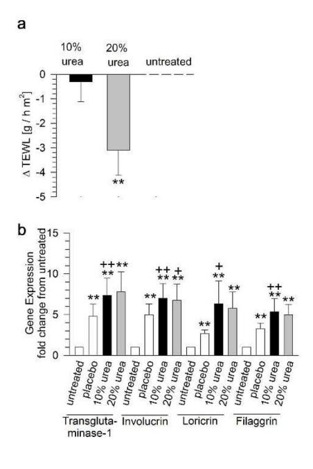
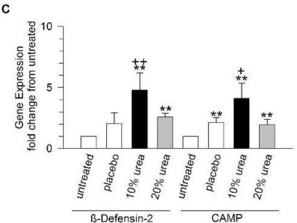
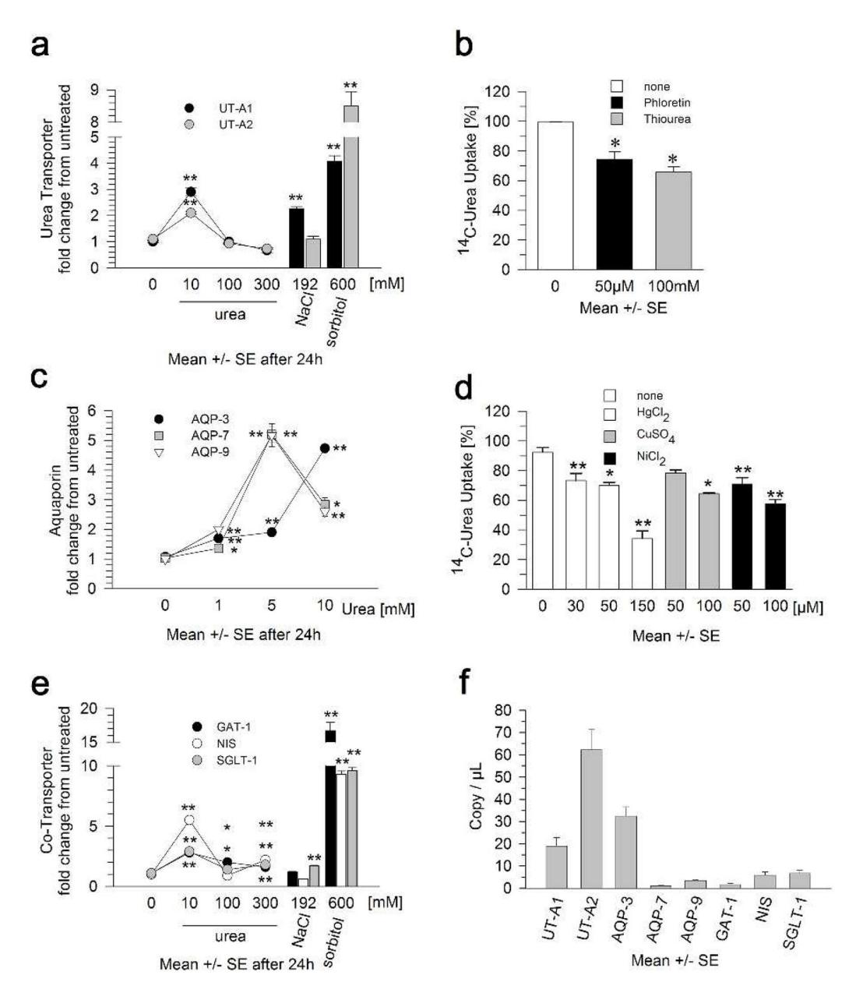
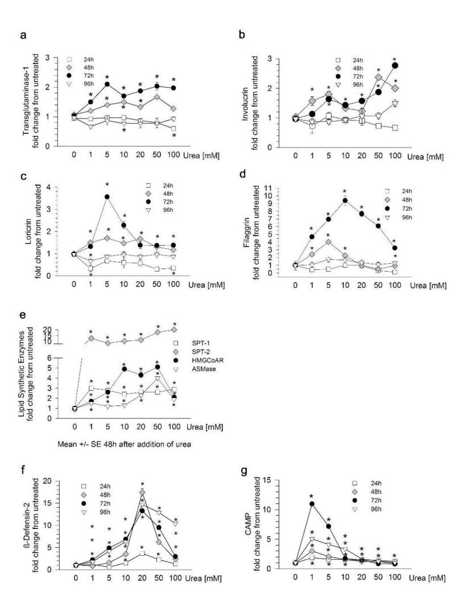
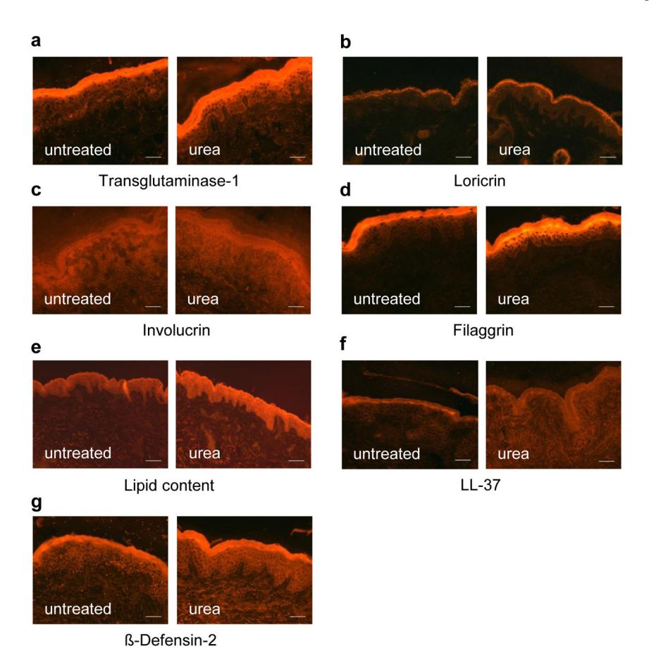
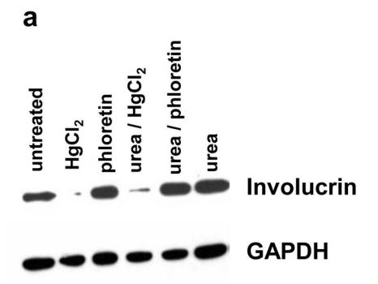
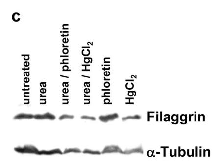
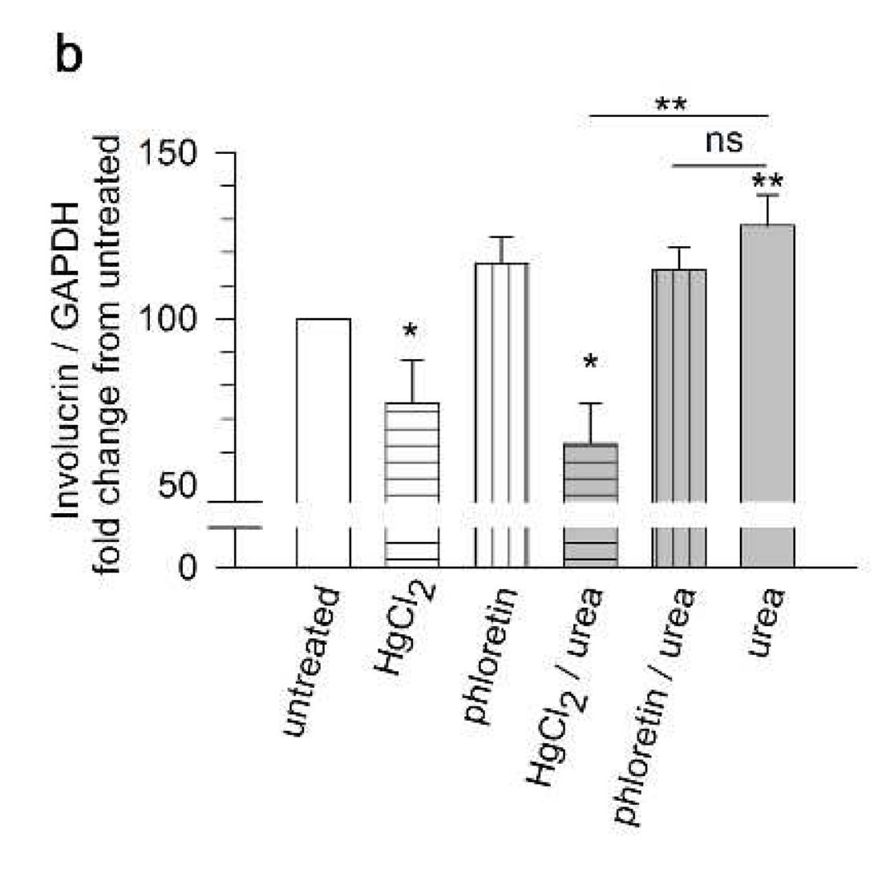
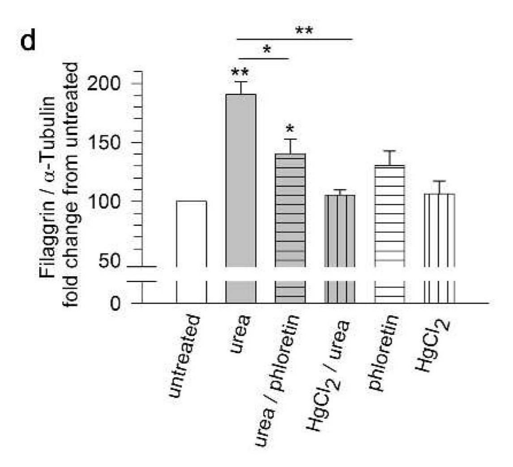
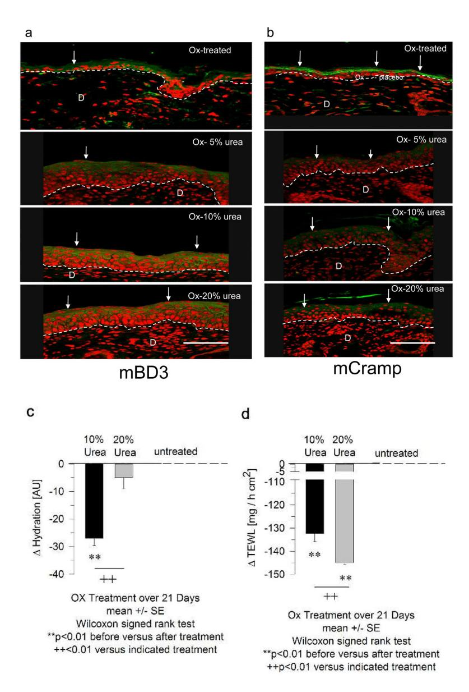

# **HHS Public Access**

Author manuscript

*J Invest Dermatol*. Author manuscript; available in PMC 2012 December 01.

Published in final edited form as:

*J Invest Dermatol*. 2012 June ; 132(6): 1561–1572. doi:10.1038/jid.2012.42.

## **Urea uptake enhances barrier function and antimicrobial defense in humans by regulating epidermal gene expression**

**Susanne Grether-Beck**1, **Ingo Felsner**1, **Heidi Brenden**1, **Zippora Kohne**1, **Marc Majora**1, **Alessandra Marini**1, **Thomas Jaenicke**1, **Marina Rodriguez-Martin**2, **Carles Trullas**3, **Melanie Hupe**4, **Peter M. Elias**4, and **Jean Krutmann**1

1 IUF – Leibniz Research Institute for Environmental Medicine, Duesseldorf, Germany, Auf'm Hennekamp 50, D-40225 Duesseldorf, Germany

2Hospital Universitario de Canarias, Tenerife, Spain

3 ISDIN, Barcelona, Spain

4VA Medical Center, San Francisco, CA, USA

### **Abstract**

Urea is an endogenous metabolite, known to enhance stratum corneum hydration. Yet, topical urea anecdotally also improves permeability barrier function, and it appears to exhibit antimicrobial activity. Hence, we hypothesized that urea is not merely a passive metabolite, but a smallmolecule regulator of epidermal structure and function. In 21 human volunteers, topical urea improved barrier function in parallel with enhanced antimicrobial peptide (LL-37 and βdefensin-2) expression. Urea both stimulates expression of, and is transported into keratinocytes by two urea transporters, UT-A1 and UT-A2, and by aquaporin 3, 7 and 9. Inhibitors of these urea transporters block the downstream biological effects of urea, which include increased mRNA and protein levels for: (i) transglutaminase-1, involucrin, loricrin and filaggrin; (ii) epidermal lipid synthetic enzymes, and (iii) cathelicidin/LL-37 and β-defensin-2. Finally, we explored the potential clinical utility of urea, showing that topical urea applications normalized both barrier function and antimicrobial peptide expression in a murine model of atopic dermatitis (AD). Together, these results show that urea is a small-molecule regulator of epidermal permeability barrier function and antimicrobial peptide expression after transporter uptake, followed by gene regulatory activity in normal epidermis, with potential therapeutic applications in diseased skin.

#### **Keywords**

skin barrier; differentiation; antimicrobial peptides; urea; liposynthetic enzymes

Users may view, print, copy, and download text and data-mine the content in such documents, for the purposes of academic research, subject always to the full Conditions of use:[http://www.nature.com/authors/editorial\\_policies/license.html#terms](http://www.nature.com/authors/editorial_policies/license.html#terms)

Address correspondence to Susanne Grether-Beck, Institut fuer Umweltmedizinische Forschung (IUF), Auf'm Hennekamp 50, D-40225 Düsseldorf, Germany. Phone: 49.211.3389.303; Fax: 49.211.3389.330; Grether-Beck@uni-duesseldorf.de.

Supplementary material is linked to the online version of the paper at <http://www.nature.com/jid>

#### **CONFLICT OF INTEREST**

Peter M. Elias and Jean Krutmann are members of the Scientific Advisory Board of ISDIN, Barcelona, Spain. Carles Trullas is a former employee of this company.

### **INTRODUCTION**

Human epidermis is the most external tissue of the body, serving at least three critical functions, i.e., provision of a barrier against i) transcutaneous water loss, ii) penetration of microbial pathogens and iii) ingress of potentially toxic xenobiotics (Marks, 2004). These major barrier functions localize to the outermost layer of the epidermis, i.e., the stratum corneum, which consists of extracellular lipid-enriched lipid lamellar bilayers enriched in ceramides, cholesterol and free fatty acids surrounding anucleate corneocytes, filled with filaggrin and its metabolites and keratin filaments (Lodén, 2005). Individual corneocytes are surrounded by a unique cornified envelope composed of proteins (e.g. involucrin and loricrin), which are cross-linked into a rigid, mechanically-resistant structure, by the calcium-dependent enzyme, transglutaminase 1, TG-1 (Iismaa *et al.*, 2009).

During epidermal differentiation, keratinocytes progress vertically from mitotically-active basal cells into transcriptionally-active spinous and granular cells to flattened, differentiated squames in the stratum corneum. This carefully-orchestrated program allows continuous epidermal regeneration over a lifetime. Epidermal barrier function is regulated by several small molecules, including lipid and hormonal activators of nuclear hormone receptors, cytokines, and divalent cations, particularly calcium (Proksch *et al.*, 2008). While topical urea has been used for decades to enhance hydration, as well as a keratolytic agent in psoriasis, ichthyosis and dermatophytosis (Scheinfeld, 2010, Lodén 2005), anecdotal reports also suggest that urea improves barrier function after topical use, and that urea is beneficial for cutaneous infectious diseases, such as onychomycosis. While it is widely assumed that urea acts solely by virtue of its moisturizing capacity, all of these disorders also are characterized by a perturbation of epidermal barrier function and/or altered antimicrobial defense. These observations together lead us to hypothesize that the beneficial effects of urea extend beyond its passive role as a moisturizer or keratolytic agent, suggesting instead that urea could have additional regulatory activities within the nucleated layers of the epidermis, which could impact cutaneous barrier function and/or antimicrobial defense.

In previous studies, we have shown that normal human keratinocytes (NHK) possess an osmolyte strategy that maintains cell volume as a part of their response to exogenous perturbations, such as UV radiation (Warskulat *et al.,* 2004; Rockel *et al.,* 2007). Urea is a non-toxic, water-soluble carrier of excreted nitrogen, which can only be further metabolized by urease-positive, micro-organisms within the gut (Walser and Bodenlos, 1959). In many extracutaneous cell types, exogenous urea is taken up by specific urea transporters (UTs), UT-A and UT-B (Lucien *et al.,* 1998; Bagnasco *et al.,* 2001; Sands, 2002). The first gene encodes several, alternatively-spliced isoforms, named UT-A1 to UT-A6, which are expressed primarily in the renal tubules, except for UT-A5, which is expressed only in testis (Smith and Rousselet, 2001). The major renal UT-A isoforms, UT-A1, UT-A2 and UT-A3 act in concert to concentrate urea in the renal medulla, thereby negating the osmotic effects of urea in the urine. This action, together with that of vasopressin-regulated aquaporins, allows water reabsorption across the medullary collecting ducts and excretion of hyperosmotic urine (Smith, 2009). In contrast, the UT-B gene is primarily expressed in erythrocytes, but also in endothelial cells of the kidney and brain (Stewart *et al.,* 2004). Whether one or more of the above mentioned UTs are expressed in NHK; the downstream

metabolic consequences of such transport, as well as the potential clinical relevance of urea transport and uptake into epidermis are not known.

In this study, we first assessed whether topical urea enhances epidermal barrier function, and the potential biochemical basis for such improvement. We then analysed whether one or more functionally-active UTs are expressed by human keratinocytes. We then determined whether genes that are involved in skin barrier formation are regulated by exogenous urea. Specifically, we studied the effects of exogenous urea on the expression of TG-1, involucrin, loricrin and filaggrin, which play important roles in keratinocyte differentiation; genes encoding for epidermal lipid and antimicrobial peptide (AMP) (i.e. LL-37 and β-defensin-2) production (Braff and Gallo, 2006). Once secreted within the extracellular spaces of the stratum corneum, these AMP are well localized to inhibit invading pathogens. Moreover, at least one of these AMP, the carboxypeptide cleavage product of human cathelicidin LL-37 is also necessary for normal permeability barrier function (Aberg *et al.,* 2008), demonstrating the convergence of these two critical defensive functions (Elias, 2007).

### **RESULTS**

**Topical urea enhances human cutaneous permeability barrier function and antimicrobial peptide expression in normal human skin in vivo**

> Several anecdotal reports suggest that topical urea could improve epidermal permeability barrier function. In order to assess the impact of urea on cutaneous barrier function, we conducted a placebo-controlled, double-blinded study of 10 and 20% urea vs. placebo applications in 21 healthy human volunteers. After 4 weeks of once-daily applications, epidermal barrier function was assessed as changes in transepidermal water loss (TEWL) on the arms and buttocks, followed by biopsies for real time PCR and immunohistochemistry from treated and untreated sites on the buttocks. Basal urea concentration are ~ 150nmol/cm2 , corresponding to ~ 125mM, which can be raised 3.5-to 5-fold upon applications of as little as 2 and 4% urea, respectively (Gabard and Chatelain, 2003). While 10% urea did not significantly alter TEWL, 20% urea significantly improved skin barrier function, shown as a 31% decrease in TEWL levels (from 10.0±0.9 g/h m2 to 6.9±0.5 g/h m2 ; p=0.003) in the 21 healthy volunteers (Figure 1a). Biopsies taken at the end of urea treatments showed that both 10% and 20% urea significantly enhanced expression of markers for epidermal antimicrobial defense. Improved barrier function in normal human volunteers treated with 20% urea was paralleled by increased mRNA levels for transglutaminase-1, involucrin, loricrin, and filaggrin (Figure 1b), as well as LL-37 and βdefensin-2 (Figure 1c). Yet, while 10% urea treatment also significantly upregulated the expression of genes involved in epidermal differentiation and AMP production, it should be noted that TEWL levels did not significantly improve at this urea concentration. These studies indicate that topical applications of 20% urea improve cutaneous barrier function and expression of antimicrobial defense in normal human skin.

### **UT-A1 and A2, as well as aquaporin 3, 7 and 9, function as urea transporters in keratinocytes**

To begin to assess the basis for urea-induced barrier improvement we first determined whether urea is taken up by NHK, and the responsible transporters. Since exogenous urea has been shown to induce the expression of UTs in a variety of cell types (Smith and Rousselet, 2001; Stewart *et al.,* 2004), we first assessed basal and urea-induced expression for the four UTs that have been cloned to date (i.e. the human isoforms UT-A1, UT-A2, and UT-A6, and UT-B (Fenton and Knepper, 2007) in NHK under normosmotic (10mM urea) and hyperosmotic conditions, such as 100mM urea, 192mM NaCl (Warskulat *et al.,* 2004), and 600mM sorbitol. Expression of UT-A6 and UT-B could only be identified in the control cell lines HepG2 and caCo-2 (for details see supplementary material Figure S1c & S1d) Both UT-A1 and UT-A2 are expressed in NHK (Figure 2a), and their expression increased by 2.9-fold and 2.1-fold under normosmotic conditions, respectively, comparable to changes in the physiological ranges that occur in human serum (1 to 10mM, (Wu, 2006)). The extent of upregulation of UT-A1 and UT-A2 at 10mM was similar to those observed in nonkeratinocyte cell lines. Finally, the subsequent decline in UT-A1 and UT-A2 expression to background levels after treatment with 100mM urea for 24h in NHK was not due to cell death because viability was not affected despite an increased osmolarity increased (i.e., to 400mosmol/L); (for details see supplementary material Figures S1a & S1b).

One or both UTs is (are) functional, because NHK took up 14C-labelled urea in a manner that could be significantly inhibited by co-applications of either phloretin or the poreblocking analogue, thiourea (Figure 2b), which also inhibited facilitated transport of urea in kidney, liver and red blood cells (Chou and Knepper, 1989; Inoue *et al*, 2004; Zhao *et al*, 2007) (Figure 2b). Since neither phloretin nor thiourea completely blocked urea transport, we next assessed whether aquaporins, which are known to transport small molecules, such as glycerol (Rojek *et al.,* 2008), also transport urea. Both AQP-3 and -9 are expressed in the differentiating layers of human epidermal skin equivalents (Sugiyama *et al.,* 2001) and AQP-7 localizes to superficial epithelial cells of the gastrointestinal tract (Laforenza *et al.,*  2005). Yet, all 3 AQPs, including AQP-7, are expressed in NHK after stimulation with relatively low doses of exogenous urea (i.e., 1 to 10mM) (Figures 2c). By binding to cysteine residues (Cys11 in human AQP-3), mercury inhibits water and glycerol transport by mammalian AQPs (Kuwahara *et al*, 1997), and both nickel and copper cations inhibit glycerol permeability in human lung epithelial cells by interference with the extracellular amino acids Trp128, Ser152, and His241 (Zelenina *et al*, 2003, 2004). Accordingly, all 3 of these divalent cations also significantly inhibited 14C-labelled urea uptake into NHK (Figure 2d), indicating that AQPs also contribute to the net uptake of urea by NHK. As urea transport in Xenopus laevis oocytes has been described for active cotransporters such as the low affinity Na+-glucose cotransporter (SGLT-1), the Na+-iodide cotransporter (NIS) and the Na+Cl-GABA cotransporter (GAT-1) (Leung *et al.*, 2000) in the absence of their proper substrates, we also tested urea-inducible expression of these cotransporters after urea applications in NHK (Figure 2e). Leung and coworkers (2000) presented evidence that urea transport by SGLT-1 is not inhibited by urea analogues, such as thiourea. We then studied inhibition of urea transport of i) 34% by the UT-inhibitor, thiourea (Figure 2b), and ii) 66% by the AQP-inhibitor HgCl2 (Figure 2d). Finally, determination of copy numbers yielded the

highest copy numbers for UT-A2 (62±9SE copies/μL, followed by AQP-3 (32±4SE copies/μL) and UT-A1 (19±4SE copies/μL), whereas copy numbers for SGLT-1, NIS and GAT-1 were found to be as low as 7±1.2SE, 6±1.4SE, and 2±0.4SE, respectively, indicating only a minor revelance by these cotransporters (Figure 2f) (for further details see also supplementary Figures S2a–c).

### **Urea upregulates mRNA expression of differentiation markers, lipid synthetic enzymes, and AMP**

We next assessed the basis for the benefits of urea for permeability barrier function and antimicrobial defense in normal epidermis. At the gene level, skin barrier function actively depends on two parallel processes; i.e., keratinocyte differentiation, which generates the corneocytes that contribute to barrier function by several mechanisms (Elias, 2007), and epidermal lipid synthesis which generates the extracellular lamellar bilayers (Elias, 2005) as well as generation of tight junction proteins (Furuse *et al.,* 2002). Keratinocyte differentiation is orchestrated by regulation of a number of genes (Eckert and Welter, 1996), including involucrin, filaggrin, loricrin and TG-1 (Chen *et al.,* 1995). While TG-1 mRNA levels did not change over the initial 24h incubation, mRNA levels increased significantly after exposure of NHK to 5–50mM urea for 48h, and at even lower urea doses after 72h (Figure 3d). Similar results were observed for both involucrin and loricrin at 48h, while filaggrin expression increased primarily by 72h of exposure (Figures 3b–d). Specifically, upregulation of involucrin mRNA (Figure 3b) reached a 1.8-fold±0.1 SE increase after stimulation with 5mM urea for 48h and a 1.28±9.3SE increase in involucrin protein after 10mM urea treatment for 24h (Figure 5a). These changes are comparable to changes in involucrin when keratinocytes are treated with 1.2mM Ca2+ for 24h or 48h (Morizane *et al*., 2010). In contrast, exogenous urea at 5–10mM did not upregulate expression of the tight junction protein, claudin-1, at any of the time points (data not shown).

As noted above, formation of the permeability barrier requires not only the participation of corneocytes, but also epidermal lipid synthesis, as well as at least one AMP; i.e., the cathelicidin carbocyterminal peptide, LL-37, which is required not only for antimicrobial defense, but also for permeability barrier function. Accordingly, gene expression of enzymes involved in lipid synthesis, such as serine palmitoyl transferase (SPT-1/SPT-2), 3 hydroxy-3-methyl-glutaryl-CoA reductase (HMGCoAR) and acidic sphingomyelinase (ASMase) increased after 48h of exposure to urea (Figure 3e). Moreover, urea stimulated mRNA expression of both β-defensin-2 and cathelicidin in NHK over a wide dose range, and at four time points assessed (Figures 3, f & g). While the most striking enhancement by urea on cathelicidin expression occurred even at low concentrations, β-defensin-2 levels increased mainly after exposure to ≥20mM urea for 72 to 96h.

We next confirmed these mRNA results at the protein and lipid level. Immunohistochemical analyses revealed that expression of tranglutaminase-1, loricrin, involucrin, filaggrin, LL-37, and β-defensin-2, as well as lipid content increased after 10% urea application compared to untreated skin (Figures 4a-g). For volunteer #17, we observed a 7.2-fold increase of loricrin on the protein level after 10% urea treatment corresponding to a 9.1-fold increase on the mRNA level. Within the volunteers assessed (n=3), epidermal thickness did not change

significantly (92.5μm±1.5 SE for untreated skin, 91.5μm±1.5 SE for 10% urea, p=0.647 paired student's t-test). Together, these results indicate that exogenous urea not only stimulates urea transport, but also transcription of genes involved in keratinocyte differentiation, epidermal lipid synthesis and antimicrobial peptide production, providing a mechanistic basis for improved barrier function and antimicrobial defense.

### **Urea-induced enhancement of epidermal barrier function and AMP expression requires urea uptake**

We next assessed whether improved barrier function and antimicrobial peptide expression require prior urea uptake. Since we employed an inhibitor-approach, we first determined the concentration ranges of inhibitors that were not toxic to NHK. Urea-induced upregulation of involucrin, filaggrin and transglutaminase-1 (TG-1) expression, as demonstrated above is completely inhibited by phloretin or thiourea (Table 1). Moreover, a partial but significant inhibition of urea-induced gene expression was detected following application of inhibitors for AQPs such as HgCl2 or CuSO4 (Table 1). Western blot analyses of extracts from ureatreated NHK in the presence or absence of inhibitors also showed that urea-induced increase of involucrin protein expression was significantly inhibited by HgCl2, while phloretin affected involucrin expression to a lesser extend due to its own inducing effects on this protein (Figure 5a & 5b). In addition, urea-induced expression of filaggrin protein was significantly diminished by co-incubation with either HgCl2 or phloretin (Figures 5c & 5d) (Simon *et al.,* 1996). Likewise, expression of the genes involved in lipid synthesis was largely blocked by co-application of the urea transport inhibitors. While urea-induced upregulation of SPT-1 was completely inhibited by the UT-inhibitors above, SPT-2 and HMGCoAR upregulation were partially diminished (Table 1). Because the expression of LL-37 and β-defensin-2 occurs relatively late in differentiation, the effects of UT and AQP blockade on AMP expression were assessed 72h post-exposure to 5mM urea. In contrast to the complete inhibition of urea-induced stimulation of differentiation markers by phloretin and thiourea, the urea-induced stimulation of β-defensin-2 and LL-37 expression was partially diminished in NHK co-incubated with phloretin, or thiourea (Table 1). In addition, incubation with aquaporin inhibitors, HgCl2 or CuSO4, blocked urea-induced upregulation of AMP to a similar extent (Table 1). Together, these results indicate that urea transport and uptake is necessary for the urea-induced stimulation of epidermal differentiation, lipid synthesis, and AMP expression.

### **Urea improves barrier function and upregulates AMP in a mouse AD model**

We asked next whether these newly-appreciated characteristics of urea predict potential clinical utility. For these studies, we assessed the effects of topical urea in an established murine model with AD (Hatano *et al.,* 2010; Man *et al.,* 2008; Hatano *et al.,* 2009), a disease that displays abnormalities in both permeability barrier function and antimicrobial defense. AD-like dermatosis is generated by repeated hapten (oxazolone, Ox) challenges (Ox-AD model). We first assessed whether applications of urea concurrent with hapten challenges improved epidermal function in Ox-AD mice. In placebo-treated, Ox-AD mice, repeated Ox challenges induced the expected decline in AMP expression (Man *et al.*, 2008). But, co-treatment with 20% urea reverted both mCramp and mBD3 (murine homologues of cathelicidin and hBD2, respectively,) expression in Ox-AD mice (Figures 6a & 6b). In

addition, 10% urea significantly improved stratum corneum hydration (Figure 6c) and barrier function, assessed as TEWL levels (Figure 6d). These results suggest that topical applications of 10% or 20% urea improve both epidermal function and AMP expression in this AD model. Epidermal thickness gradually increased by urea treatment from 10μm (only oxazolone treated) over 12μm after 5% urea and 25μm after 10% and 20% urea, respectively.

### **DISCUSSION**

In the present study we describe the mechanistic basis for unexpected, new properties of topical urea. Human epidermal keratinocytes appear to take up urea via specific transport mechanisms including UT-A1, UT-A2 and AQPs (i.e. 3, 7 and/or 9). Although these conclusions are based upon inhibitor studies, rather than a gene knock-down approach, we utilized non-toxic doses of these agents, and demonstrated comparable effects with several chemically-unrelated molecules. Moreover, urea uptake is followed by gene regulatory events, including increased expression of the UTs mentioned above, and more importantly, of a number of genes that are critical for cutaneous skin barrier function and antimicrobial defense. To our knowledge this is previously unreported that urea, which has previously been relegated to solely relatively minor role in the skin as an endogenous moisturizer, likely plays much more than a merely passive role in the maintenance of epidermal homeostasis. In fact, urea appears to be a highly-active small molecule regulator of genes that impact keratinocyte differentiation, lipid synthesis and antimicrobial peptide production, together leading to improved permeability barrier function and likely antimicrobial defense as well.

While the signaling pathways involved in urea induced changes in gene expression are currently not known, urea-induced gene regulation does not result from osmotic stress, because they occur under normal osmotic conditions, and require the presence of specific transporters. The time-course of urea-induced gene expression points to an indirect mechanism, because significant upregulation of some of the genes; i.e. loricrin, filaggrin, LL-37 and β-defensin 2 can only be observed 48 to 72h after urea exposure. One explanation for the delayed effects of urea might be that urea activates the non-energy-dependent, sodium-proton exchanger (NHE1), which could contribute to optimal barrier function by controlling not only intracellular pH (Mauro *et al.* 1995) but also acidification of extracellular domains of the lower stratum corneum. Acidification in turn activates pHsensitive enzymes that both form the epidermal permeability barrier and facility desquamation of cells mainly in the outer layers of the stratum corneum. In addition, ureainduced non-enzymatic carbamylation might also contribute to delayed gene expression, although the effect of carbamylation on protein modification, assessed for hemoglobin, only results in a 1.7-fold increase of protein modification, when urea concentrations were raised from 4.8 to 30mM (Wynckel *et al.,* 2000). Besides this more indirect effect, urea can activate transcription, translation of, and trans-activation by the immediate early gene transcription factor Egr-1, probably via serum-responsive elements together with adjacent Ets motifs in physiological doses with regards to the renal medulla (Cohen *et al.*, 1996). Although further studies with transporter knockout animals might be useful, it is possible that deletion of one transporter could alter the expression of other transporters, as shown for

UT-B deletions in erythrocytes, which upregulate UT-A2, AQP-2 and AQP-3 in a compensatory fashion (Klein *et al.,* 2004). Similarly, UT-B has been shown to transport water, when AQP-1 is knocked out in erythrocytes (Yang and Verkman, 2002). Further studies will be required to clarify the signalling mechanisms that account for the stimulation of the multiple proteins and enzymes shown here.

Our results may explain the many anecdotal observations that patients with perturbed barrier function and increased susceptibility towards skin infections benefit from topical urea application (Stüttgen, 1992, Bissonnette *et al.,* 2010). Accordingly, we show that urea can prevent development of abnormal barrier function and reverse the decrease in AMP expression in a murine AD model. Moreover, stimulation of AMP expression could explain in part the clinical observation that patients with infectious skin diseases, such as onychomycosis benefit from urea treatment by improving barrier function, since tinea infections abrogate the barrier (Bonifaz and Ibarra, 2000; Baran and Tosti, 2002). Urea also could be useful for the treatment of other skin conditions that display both altered permeability and antimicrobial defense, such as AD. Accordingly, acute and chronic lesions of AD patients are characterized by a decreased expression of β-defensin-2 and LL-37, which likely explains their propensity to be colonized by *S. aureus* and viral pathogens (Kim *et al.,* 2007). UVB radiation was recently described to induce expression of hBD2 (Glaser *et al.,* 2009) and the precursor of LL-37, hCAP18 (Mallbris *et al.,* 2005), in human skin *in vivo*. Accordingly, suberythemal UVB also enhances barrier function and mCramp production in mice (Hong *et al.*, 2008; Rodriguez-Martin *et al.*, 2011). Barrier function was also increased after topical application of calcipotriol in healthy human skin (Weber *et al.,*  2005), and in lesional psoriatic skin, vitamin D analogues increase LL-37, but decrease βdefensin-2 expression (Peric *et al.,* 2009).

The present studies add urea to the list of potential inducers of antimicrobial defense in human skin. Since urea is a widely used molecule, with a very low toxicity profile, these observations should prompt further interest in the use of urea and urea-related molecules as potential stimulators of skin antimicrobial defense mechanisms.

In addition to antimicrobial defense, the skin of AD patients also exhibits defective permeability barrier function. Accordingly, involucrin and loricrin mRNA and protein expression but also lipids such as ceramides are greatly diminished in affected, but also in unaffected skin of AD patients (Kim *et al.,* 2008), and the current observation that urea can increase the expression of these differentiation genes and the lipid synthetic enzymes e.g. serine palmitoyl transferase provides another rational for the beneficial effects of urea treatment in this skin disease. Interestingly, among all differentiation markers studied, filaggrin expression showed the strongest upregulation upon urea treatment. Accordingly filaggrin expression, which is reduced in a substantial proportion of AD patients (Weidinger *et al.,* 2006), might be improved by topical applications of urea to the skin of heterozygous null allele carriers (Sandilands *et al.,* 2006; Sergeant *et al.,* 2009).

### **MATERIALS AND METHODS**

### **Volunteers**

Approval had been obtained from the Ethics Committee of the Heinrich-Heine University. The double-blind, placebo-controlled study was conducted according to the ethical rules stated in the Declaration of Helsinki Principles and the ICH GCP guideline was observed insofar as applicable. Twenty-one healthy human volunteers (seven female and fourteen male) were enrolled after written informed consent. Their age ranged from 21 to 59 years with a mean age of 40±2.7SE years, and all individuals were non-smokers and had no history of any skin disease.

#### **Topical treatment**

The volunteers were requested not to use any topical preparations for at least 2 weeks prior to the study. Urea was used in concentrations of either 0%, 10% or 20% in a placebo, prepared and provided by ISDIN (Barcelona, Spain), containing isopropyl myristate, paraffin, glyceryl stearate, PEG-40 stearate, sorbitol, cetearyl ethylhexanoate, cetyl alcohol, dimethicone, Persea Gratissima, stearic acid, sodium carbomer, acrylates, allantoin, methylparaben, propylparaben, lactic acid, parfum, 2-bromo-2-nitropropane-1,3 diol in water. For skin physiological assessments, volunteers were treated once daily for 4 weeks at three different 4cmx4cm areas on the left inner forearm (placebo), the right inner forearm (10% urea) and the right upper arm (20% urea), respectively. In parallel, three different 4cmx4cm large skin areas on the buttocks were treated identically to obtain 4mm punch biopsies (Grether-Beck *et al.,* 2008a), which were cut in halves for either RNA isolation or immunohistochemical staining.

#### **Assessment of permeability barrier function**

TEWL levels were measured before and after applications of the treatments with an evaporimeter (Tewameter TM300, Courage and Khazaka Electronic GmbH, Cologne, Germany), according to guidelines provided by the European Society of Contact Dermatitis (Pinnagoda *et al.,* 1990). The inner forearms and upper arms have been chosen as treatment locations, because intra- and inter-individual variation coefficients are reasonable small. The results were expressed as ΔTEWL=TEWLaftertreatment−TEWLbeforetreatment in mg/h m2±SE.

### **Cells and cell culture**

Primary human epidermal keratinocytes (NHK) were prepared from neonatal foreskin and maintained in culture under serum free conditions as described previously (Grether-Beck *et al.,* 2008a). For induction of differentiation NHK were seeded and grown up to confluence. Urea (diaminomethanal, carbamide) was obtained from ISDIN (Barcelona, Spain). See the Methods section and Figures S1 (a) and (b) in the supplementary material at [http:/](http:/www.nature.com/jid) [www.nature.com/jid](http:/www.nature.com/jid) for further details on cell viability and osmolarity.

### **RNA isolation and PCR**

Total RNA was extracted from cell culture dishes or from frozen biopsies and gene expression measured by a two-step reverse transcription real time PCR as described

(Grether-Beck *et al.,* 2008a and b). The primer sequences are available in supplements (Table S1). For comparison of relative expression in real time PCR untreated control cells/ biopsies and treated cells/biopsies the 2−ΔΔC(t) method was used (Livak and Schmittgen, 2001).

#### **Expression of urea transporters, aquaporins, and cotransporters**

mRNA expression of UTs was assessed using quantitative real time PCR. See the Methods section and Figures S1 (c) and (d) in supplementary material at <http:/www.nature.com/jid> for further details on validation of primers in control cell lines and determination of copy numbers.

### **Measurement of [14C]-urea transport**

To test their function in NHK, expression of the transporters was induced 16h prior to start of radio-labelling by 10mM urea in the absence of bovine pituitary extract. For radiolabelling, 74kBq (2μCi) 14C urea (Hartmann Analytic GmbH, Braunschweig) were added and the cells were incubated for another 4 minutes as described (Klein *et al.,* 1999). Classical inhibitors (all from Sigma-Aldrich, Steinheim, Germany) of urea transport (Inoue *et al.,* 2004) e.g. phloretin (50μM), thiourea (100mM) were added together with 14C urea, while mercury (HgCl2, 30, 50 and 150μM (Kuwahara *et al.,* 1997)), nickel (NiCl2, 50 and 100μM (Zelenina *et al.,* 2003)) and copper (CuSO4, 50 and 100 μM (Zelenina *et al.,* 2004)) to inhibit AQP, were preincubated for 24h. The urea influx was stopped simultaneously by three rapid washes with ice-cold solution containing 150mM NaCl, 1mM CaCl2, 1mM MgCl2, 0.05mM phloretin using a centrifuge. Supernatants and dried cell pellets were harvested separately. Cell pellets were solubilized in 0.5ml of 25mM NaOH with 0.5% deoxycholate; 100μl from each well was used to measure the protein content with the BCA assay (Pierce, Rockford, IL), and 500μl were counted by a standard scintillation procedure (Beckman Coulter LS 6000IC, Beckman Coulter GmbH, Krefeld, Germany) using CytoScint ES (ICN, Irvine, CA) as scintillation fluid. Transport was calculated as Bq/mg protein (nmol urea/mg protein) and set as 100% for urea-stimulated cells.

#### **Western blots**

Confluent NHK were stimulated with urea and/or the inhibitor and cultivated for 24h or 72h. The cells were lysed in a buffer composed of 60mM Tris-HCl (pH 7.8), 150mM NaCl, 5mM EDTA, 10% glycerol and 60mM n-octyl-β-D glucopyranoside. 10μg of the lysates for involucrin, and 50μl lysate in Laemmli final sample buffer for filaggrin were resolved by SDS-Page and immunoblotted on nitrocellulose membrane (Trans-blot; Bio-Rad, Munich, Germany). Antibodies were obtained from Santa Cruz (Santa Cruz, CA): rabbit polyclonal antibody against human involucrin (H-120, 1:250), and a rabbit polyclonal antibody against human filaggrin (H-300). GAPDH (Millipore, Temecula, CA) or α-tubulin (Abcam, Cambridge, UK) served as loading control. The blots were visualized with the SuperSignal West Pico detection system (Pierce, Rockford, IL), and were scanned and quantified using spot denso function from AlphaEase FluorChem 8900, Version 3.2.3 (Alpha Innotech Corp., San Leandro,CA).

#### **Immunohistochemical staining**

Acetone-fixed frozen sections (6μm) were stained with the following primary antibodies overnight at 4°C: From Abcam plc (Cambridge, UK) polyclonal rabbit anti human filaggrin antibody (1:1000), polyclonal mouse anti loricrin antibody (1:500), monoclonal mouse anti involucrin antibody (1:200), monoclonal mouse anti transglutaminase-1 antibody (1:20); from Santa Cruz (Santa Cruz, CA) polyclonal rabbit anti human LL-37 antibody (1:500), and polyclonal rabbit anti human β-defensin 2 antibody (1:500). After rinsing in phosphatebuffered saline, the sections were visualized using a Vectastain ABC-AP kit (Axxora, Lörrach, Germany). Total lipid staining using Nile Red from Sigma-Aldrich (Steinheim, Germany) was performed in frozen sections as described, (Gunathilake *et al.,* 2009) and examined with an Olympus BX60 fluorescence microscope. The entire field of each section was examined at x 400 magnification. For quantification of fluorescence intensity, ImageJ software (1.41) was used. In detail, the images were saved as tif files, the ratio of stained areas versus background areas was calculated for each file, setting this ratio to 1 for untreated skin samples. Epidermal thickness was measured using ImageJ software. For each treatment (urea or untreated), ten different sites on three different skin sections were measured and the mean epidermal thickness was calculated.

#### **Mouse AD model**

Female hairless mice (hr/hr) aged 6–8 weeks old were purchased from Charles River Laboratories (Wilmington, MA) and fed a standard mouse diet (Ralston-Purina Co., St Louis, MO) and water *ad libitum*. All animal procedures were approved by the Animal Studies Subcommittee of the San Francisco Veterans Administration Medical Center and performed in accordance with their guidelines.

Animals were sensitized with a single topical application of 1% oxazolone (Ox, 50μl) to the flank. One week after sensitization, hairless mice were treated topically with 60μl of 0.1% Ox on both flanks once every other day for an additional period of 3 weeks (totally, 10 challenges over 20–21 days) (Man *et al.,* 2008). These mice with an AD like dermatosis were divided into four groups (8 animals each) at the beginning of challenges, and were treated with placebo containing 0%, 5%, 10% or 20% urea. The placebo (Cetaphil®, Galderma, Düsseldorf) cream contains water, petrolatum, glyceryl polymethacrylate, dicaprylyl ether, glycerol, dimethicone, glyceryl stearate, cetyl alcohol, Prunus amygdalus dulcis (sweet almond) oil, PEG-30 glyceryl stearate, tocopheryl acetate, benzyl alcohol, phenoxyethanol, sodium hydroxide, acrylates/C10–30 alkyl acrylate crosspolymer, dimethiconol, disodium EDTA, propylene glycol. Treatments were applied twice-daily at an interval of 6 hours, and at least one hour after prior Ox treatments. Both before challenges and at the end of the treatment periods, TEWL was measured with an electrolytic water analyzer (Meeco, Warrington, PA) and stratum corneum hydration was assessed as capacitance, with a Corneometer CM820 (Courage & Khazaka, Cologne, Germany).

Full-thickness skin specimens were fixed in 10% formaldehyde and embedded in paraffin. Sections (5μm) were cut and immunostained for mBD3 and mCramp (primary antibodies from Santa Cruz (Santa Cruz, CA). After de-paraffinization, sections were rehydrated sequentially with 100%, 90% and 70% ethanol and incubated for 15 min in Tris-buffered

saline (TBS) to inactivate endogenous peroxidases. Samples then were treated for 10 min with a blocking serum solution and incubated overnight at 4°C with the primary antibody (1:100 dilution). After several washes in TBS, they were incubated for 40 min with a secondary antibody, FITC-conjugated goat anti-rabbit (Alpha Diagnostics, San Antonio, TX) at room temperature. Slides were counterstained with propidium iodide for nuclear visualization, and examined on a Leica TCS-SP laser confocal microscope. The thickness of epidermis in mice was measured in three confocal pictures for each therapy and the oxtreated animals (3 different measures each) using NIS-Elements 3.0.

#### **Statistical analyses**

NHK cell culture experiments were performed in 3 independent experiments with cells derived from 3 different donors. Data shown in each Figure are from experiments performed in 1 representative individual in triplicate, unless otherwise indicated. Data are presented as mean±SE. Student's t-test or Wilcoxon signed rank test were used for comparison between two groups, p<0.05 was considered significant.

### **Supplementary Material**

Refer to Web version on PubMed Central for supplementary material.

### **Acknowledgments**

This work was supported by a grant from ISDIN, Barcelona, for the human studies and from the Deutsche Forschungsgemeinschaft, SFB 728, project C1 and from NIH AR19098.

We thank Monika Weber and Ursula Schubhart for excellent technical assistance, and Boris Görg and Dieter Häussinger from the Clinic for Gastroenterology, Hepatology and Infectiology, Heinrich Heine University, Moorenstrasse 5, D-40225 Düsseldorf, Germany, for determination of osmolarity in cell culture media.

### **Abbreviations used**

**AD** Atopic dermatitis

**AMP** antimicrobial peptides

**AQP** aquaporin

**ASMase** acidic sphingomyelinase

**HBD2** human β-defensin-2

**HMGCoAR** 3-hydroxy-3-methyl-glutaryl-CoA reductase

**NHK** normal human keratinocytes

**CAMP** human cathelicidin gene

**mBD3** mouse β-defensin 3

**mCramp** murine cathelin related antimicrobial peptide

**Ox** oxazolone

**SPT-1/SPT-2** serine palmitoyl transferase

**TEWL** transepidermal water loss

**UT** urea transporter

### **References**

Aberg KM, Man MQ, Gallo RL, et al. Co-regulation and interdependence of the mammalian epidermal permeability and antimicrobial barriers. J Invest Dermatol. 2008; 128:917–25. [PubMed: 17943185]

- Bagnasco SM, Peng T, Janech MG, et al. Cloning and characterization of the human urea transporter UT-A1 and mapping of the human Slc14a2 gene. Am J Physiol Renal Physiol. 2001; 281:F400–6. [PubMed: 11502588]
- Baran R, Tosti A. Chemical avulsion with urea nail lacquer. J Dermatolog Treat. 2002; 13:161–4. [PubMed: 19753735]
- Bissonnette R, Maari C, Provost N, et al. A double-blind study of tolerance and efficacy of a new ureacontaining moisturizer in patients with atopic dermatitis. J Cosmet Dermatol. 2010; 9:16–21. [PubMed: 20367668]
- Bonifaz A, Ibarra G. Onychomycosis in children: treatment with bifonazole-urea. Pediatr Dermatol. 2000; 17:310–4. [PubMed: 10990584]
- Braff MH, Gallo RL. Antimicrobial peptides: an essential component of the skin defensive barrier. Curr Top Microbiol Immunol. 2006; 306:91–110. [PubMed: 16909919]
- Chen CS, Lavker RM, Rodeck U, et al. Use of a serum-free epidermal culture model to show deleterious effects of epidermal growth factor on morphogenesis and differentiation. J Invest Dermatol. 1995; 104:107–12. [PubMed: 7798626]
- Chou CL, Knepper MA. Inhibition of urea transport in inner medullary collecting duct by phloretin and urea analogues. Am J Physiol. 1989; 257:F359–65. [PubMed: 2506765]
- Cohen DM, Gullans SR, Chin WW. Urea inducibility of *egr-1* in murine inner medullary collecting duct cells is mediated by the serum response element and adjacent Ets motifs. J Biol Chem. 1996; 271:12903–12908. [PubMed: 8662677]
- Eckert RL, Welter JF. Transcription factor regulation of epidermal keratinocyte gene expression. Mol Biol Rep. 1996; 23:59–70. [PubMed: 8983019]
- Elias PM. Stratum corneum defensive functions: an integrated view. J Invest Dermatol. 2005; 125:183–200. [PubMed: 16098026]
- Elias PM. The skin barrier as an innate immune element. Semin Immunopathol. 2007; 29:3–14. [PubMed: 17621950]
- Fenton RA, Knepper MA. Urea and renal function in the 21st century: insights from knockout mice. J Am Soc Nephrol. 2007; 18:679–88. [PubMed: 17251384]
- Furuse M, Hata M, Furuse K, et al. Claudin-based tight junctions are crucial for the mammalian epidermal barrier: a lesson from claudin-1-deficient mice. J Cell Biol. 2002; 156:1099–1111. [PubMed: 11889141]
- Gabard, B.; Chatelain, E. Concentration of urea in the stratum corneum and moisturizing effect. In: Wohlrab, J.; Neubert, RRH.; Wohlrab, W., editors. Trends in clinical and experimental dermatology vol 2 advances in experimental dermatology. Shaker; Aachen: 2003. p. 27-36.
- Glaser R, Navid F, Schuller W, et al. UV-B radiation induces the expression of antimicrobial peptides in human keratinocytes *in vitro* and *in vivo*. J Allergy Clin Immunol. 2009; 123:1117–23. [PubMed: 19342087]
- Grether-Beck S, Muhlberg K, Brenden H, et al. Bioactive molecules from the Blue Lagoon: *in vitro*  and *in vivo* assessment of silica mud and microalgae extracts for their effects on skin barrier function and prevention of skin ageing. Exp Dermatol. 2008a; 17:771–9. [PubMed: 18312388]
- Grether-Beck S, Salahshour-Fard M, Timmer A, et al. Ceramide and raft signaling are linked with each other in UVA radiation-induced gene expression. Oncogene. 2008b; 27:4768–78. [PubMed: 18438433]

Gunathilake R, Schurer NY, Shoo BA, et al. pH-regulated mechanisms account for pigment-type differences in epidermal barrier function. J Invest Dermatol. 2009; 129:1719–29. [PubMed: 19177137]

- Hatano Y, Man MQ, Uchida Y, et al. Maintenance of an acidic stratum corneum prevents emergence of murine atopic dermatitis. J Invest Dermatol. 2009; 129:1824–35. [PubMed: 19177139]
- Hatano Y, Man MQ, Uchida Y, et al. Murine atopic dermatitis responds to peroxisome proliferatoractivated receptors alpha and beta/delta (but not gamma) and liver X receptor activators. J Allergy Clin Immunol. 2010; 125:160–9. [PubMed: 19818482]
- Hong SP, Kim MJ, Jung MY, et al. Biopositive effects of low-dose UVB on epidermis: coordinate upregulation of antimicrobial peptides and permeability barrier reinforcement. J Invest Dermatol. 2008; 128:2880–7. [PubMed: 18580964]
- Inoue H, Jackson SD, Vikulina T, et al. Identification and characterization of a Kidd antigen/UT-B urea transporter expressed in human colon. Am J Physiol Cell Physiol. 2004; 287:C30–5. [PubMed: 14985236]
- Iismaa SE, Mearns BM, Lorand L, et al. Transglutaminases and disease: lessons from genetically engineered mouse models and inherited disorders. Physiol Rev. 2009; 89:991–1023. [PubMed: 19584319]
- Kim BE, Leung DY, Boguniewicz M, et al. Loricrin and involucrin expression is down-regulated by Th2 cytokines through STAT-6. Clin Immunol. 2008; 126:332–7. [PubMed: 18166499]
- Kim BE, Leung DY, Streib JE, et al. Macrophage inflammatory protein 3alpha deficiency in atopic dermatitis skin and role in innate immune response to vaccinia virus. J Allergy Clin Immunol. 2007; 119:457–63. [PubMed: 17141855]
- Klein JD, Sands JM, Qian L, et al. Upregulation of urea transporter UT-A2 and water channels AQP2 and AQP3 in mice lacking urea transporter UT-B. J Am Soc Nephrol. 2004; 15:1161–7. [PubMed: 15100356]
- Klein JD, Timmer RT, Rouillard P, et al. UT-A urea transporter protein expressed in liver: upregulation by uremia. J Am Soc Nephrol. 1999; 10:2076–83. [PubMed: 10505683]
- Kuwahara M, Gu Y, Ishibashi K, et al. Mercury-sensitive residues and pore site in AQP3 water channel. Biochemistry. 1997; 36:13973–8. [PubMed: 9369468]
- Laforenza U, Gastaldi G, Grazioli M, et al. Expression and immunolocalization of aquaporin-7 in rat gastrointestinal tract. Biol Cell. 2005; 97:605–13. [PubMed: 15943587]
- Livak KJ, Schmittgen TD. Analysis of relative gene expression data using real-time quantitative PCR and the 2(−Delta Delta C(T)) Method. Methods. 2001; 25:402–8. [PubMed: 11846609]
- Loden M. The clinical benefit of moisturizers. J Eur Acad Dermatol Venereol. 2005; 19:672–88. [PubMed: 16268870]
- Lucien N, Sidoux-Walter F, Olives B, et al. Characterization of the gene encoding the human Kidd blood group/urea transporter protein. Evidence for splice site mutations in Jknull individuals. J Biol Chem. 1998; 273:12973–80. [PubMed: 9582331]
- Mallbris L, Edstrom DW, Sundblad L, et al. UVB upregulates the antimicrobial protein hCAP18 mRNA in human skin. J Invest Dermatol. 2005; 125:1072–4. [PubMed: 16297211]
- Man MQ, Hatano Y, Lee SH, et al. Characterization of a hapten-induced, murine model with multiple features of atopic dermatitis: structural, immunologic, and biochemical changes following single versus multiple oxazolone challenges. J Invest Dermatol. 2008; 128:79–86. [PubMed: 17671515]
- Marks R. The stratum corneum barrier: The final frontier. J Nutr. 2004; 134:2017S–21S. [PubMed: 15284392]
- Mauro T, Dixon DB, Hanley K, et al. Amiloride blocks a keratinocyte nonspecific cation channel and inhibits Ca(++)-induced keratinocyte differentiation. J Invest Dermatol. 1995; 105:203–8. [PubMed: 7543548]
- Morizane S, Yamasaki K, Kabigting FD, et al. Kallikrein expression and cathelicidin processing are independently controlled in keratinocytes by calcium, vitamin D(3), and retinoic acid. J Invest Dermatol. 2010; 130:1297–306. [PubMed: 20090765]
- Peric M, Koglin S, Dombrowski Y, et al. Vitamin D analogs differentially control antimicrobial peptide/"alarmin"expression in psoriasis. PLoS One. 2009; 4:e6340. [PubMed: 19623255]

Pinnagoda J, Tupker RA, Agner T, et al. Guidelines for transepidermal water loss (TEWL) measurement. A report from the Standardization Group of the European Society of Contact Dermatitis. Contact Dermatitis. 1990; 22:164–78. [PubMed: 2335090]

- Rodriguez-Martin M, Martin-Ezquerra G, Man MQ, et al. Expression of epidermal cAMP changes in parallel with permeability barrier status. J Invest Dermatol. 2011; 131:2263–70. [PubMed: 21796152]
- Proksch E, Brandner JM, Jensen JM. The skin: an indispensable barrier. Exp Dermatol. 2008; 17:1063–72. [PubMed: 19043850]
- Rockel N, Esser C, Grether-Beck S, et al. The osmolyte taurine protects against ultraviolet B radiationinduced immunosuppression. J Immunol. 2007; 179:3604–3612. [PubMed: 17785795]
- Rojek A, Praetorius J, Frokiaer J, et al. A current view of the mammalian aquaglyceroporins. Annu Rev Physiol. 2008; 70:301–27. [PubMed: 17961083]
- Sandilands A, O'Regan GM, Liao H, et al. Prevalent and rare mutations in the gene encoding filaggrin cause ichthyosis vulgaris and predispose individuals to atopic dermatitis. J Invest Dermatol. 2006; 126:1770–5. [PubMed: 16810297]
- Sands JM. Molecular approaches to urea transporters. J Am Soc Nephrol. 2002; 13:2795–806. [PubMed: 12397052]
- Scheinfeld NS. Urea: a review of scientific and clinical data. Skinmed. 2010; 8:102–6. [PubMed: 20527144]
- Sergeant A, Campbell LE, Hull PR, et al. Heterozygous null alleles in filaggrin contribute to clinical dry skin in young adults and the elderly. J Invest Dermatol. 2009; 129:1042–5. [PubMed: 18987673]
- Simon M, Haftek M, Sebbag M, et al. Evidence that filaggrin is a component of cornified cell envelopes in human plantar epidermis. Biochem J. 1996; 317:173–7. [PubMed: 8694761]
- Smith CP. Mammalian urea transporters. Exp Physiol. 2009; 94:180–5. [PubMed: 19028811]
- Smith CP, Rousselet G. Facilitative urea transporters. J Membr Biol. 2001; 183:1–14. [PubMed: 11547347]
- Stewart GS, Fenton RA, Thevenod F, et al. Urea movement across mouse colonic plasma membranes is mediated by UT-A urea transporters. Gastroenterology. 2004; 126:765–73. [PubMed: 14988831]
- Stüttgen G. Results and consequences of long-term urea therapy for clinical practice. Hautarzt. 1992; 43(Suppl 11):9–12. [PubMed: 1555945]
- Sugiyama Y, Ota Y, Hara M, et al. Osmotic stress up-regulates aquaporin-3 gene expression in cultured human keratinocytes. Biochim Biophys Acta. 2001; 1522:82–8. [PubMed: 11750058]
- Walser M, Bodenlos LJ. Urea metabolism in man. J Clin Invest. 1959; 38:1617–26. [PubMed: 13842664]
- Warskulat U, Reinen A, Grether-Beck S, et al. The osmolyte strategy of normal human keratinocytes in maintaining cell homeostasis. J Invest Dermatol. 2004; 123:516–21. [PubMed: 15304091]
- Weber G, Heilborn JD, Chamorro Jimenez CI, et al. Vitamin D induces the antimicrobial protein hCAP18 in human skin. J Invest Dermatol. 2005; 124:1080–2. [PubMed: 15854055]
- Weidinger S, Illig T, Baurecht H, et al. Loss-of-function variations within the filaggrin gene predispose for atopic dermatitis with allergic sensitizations. J Allergy Clin Immunol. 2006; 118:214–9. [PubMed: 16815158]
- Wu, ABH., editor. Tietz clinical guide to laboratory tests. 4. Saunders Elsevier; St. Louis, MO: 2006.
- Wynckel A, Randoux C, Millart H, et al. Kinetics of carbamylated haemoglobin in acute renal failure. Nephrol Dial Transplant. 2000; 15:1183–8. [PubMed: 10910442]
- Yang B, Verkman AS. Analysis of double knockout mice lacking aquaporin-1 and urea transporter UT-B. Evidence for UT-B-facilitated water transport in erythrocytes. J Biol Chem. 2002; 277:36782–6. [PubMed: 12133842]
- Zelenina M, Bondar AA, Zelenin S, et al. Nickel and extracellular acidification inhibit the water permeability of human aquaporin-3 in lung epithelial cells. J Biol Chem. 2003; 278:30037–43. [PubMed: 12773542]

Zelenina M, Tritto S, Bondar AA, et al. Copper inhibits the water and glycerol permeability of aquaporin-3. J Biol Chem. 2004; 279:51939–43. [PubMed: 15456785]

Zhao D, Sonawane ND, Levin MH, et al. Comparative transport efficiencies of urea analogues through urea transporter UT-B. Biochim Biophys Acta. 2007; 1768:1815–21. [PubMed: 17506977]

**Figure 1.** *In vivo* **effect of urea treatments on barrier function of normal human volunteers** (a) 21 normal volunteers were treated once-daily for 4 weeks at three different areas of the left forearm (placebo), the right forearm (10% urea) and the right upper arm (20% urea), respectively. Skin barrier function was measured as transepidermal water loss (TEWL). Upregulation of skin differentiation markers (b) and AMP (c) was also assessed in biopsies taken from buttocks of the same 21 volunteers with normal skin after treatment once daily over a period of 4 weeks receiving either no treatment (untreated), or placebo with 0%, 10% or 20% urea. Gene expression is normalized to 18S rRNA. All data represent mean ± SE. Statistical significance was tested by Wilcoxon signed rank test: \*\*p<0.01 before versus after treatment (a), \*\*p<0.01 versus untreated, +p<0.05, ++p<0.01 versus placebo (b and c).

**Figure 2. Human keratinocytes express and upregulate mRNA encoding urea transporters (a), aquaporins (c) and uptake urea functionality (b,d)**

Under the various conditions indicated, functionality of transporters is shown by inhibition of uptake of 14C-labelled urea in the presence of phloretin or thiourea (b) and/or HgCl2, CuSO4, or NiCl2 (d). Expression of cotransporters such as SGLT1, NIS and GAT in NHK is presented (e) and copy numbers for all transporters assessed in untreated NHK is given in (f). Paired student's t-test was used for statistical analyses: \*p<0.05, \*\*p<0.01 versus control.

**Figure 3. Upregulation of mRNA encoding keratinocyte differentiation markers and AMP by urea** *in vitro*

Expression of epidermal differentiation markers given as mean±SE for the indicated time points (a) transglutaminase-1, (b) involucrin, (c) loricrin and (d) filaggrin, (e) major epidermal lipid synthetic enzymes, and AMP (f) β-defensin-2 and (g) LL-37 has been assessed as indicated in NHK. Paired student's t-test with \*p<0.05 versus time matched untreated sample.

**Figure 4. Increased skin differentiation, lipid content and AMP expression after application of 10% urea to human skin**

Immunocytochemistry shown in cryosections for transglutaminase-1 (a), loricrin (b), involucrin (c), filaggrin (d), total lipid (e), LL-37 (f), and β-defensin 2 (g) of three randomly chosen volunteers.

Quantification with Image J resulted in increases of 3.1-fold for transglutaminase-1 (volunteer #17), 27.2-fold for loricrin (volunteer #17), 1.5-fold for filaggrin (volunteer #7), 1.7-fold for involucrin (volunteer #17), 1.5-fold for lipid content (volunteer #7), 2.7-fold for LL-37 (volunteer #16), and 1.7-fold for β-defensin-2 (volunteer #16) after treatment with 10% urea as compared to the untreated skin area. Bar = 50μm.

**Figure 5. Inhibition of urea transport by phloretin (50μM) or HgCl2 (150μM) decreases expression of epidermal differentiation markers**

Urea-induced (10mM) expression of involucrin (n=5) (a), or filaggrin (n=3) (b) was assessed by Western blot analysis of total cell extracts from NHK treated for 24h or 72h, respectively. All data represent mean±SE. Paired student's t-test was used for statistical analyses: \*p<0.05, \*\*p<0.01 versus untreated or as indicated, ns not significant.

**Figure 6. Urea increases expression of AMP, increases skin hydration and improves TEWL in a mouse AD model**

After 10 Ox challenges over a period of 3 weeks and co-application of urea treatment twice daily, immunocytochemistry was performed in paraffin sections (5μm) for (a) mCramp and (b) mBD3 as compared to a sample with 10 OX challenges alone (untreated with regards to urea or placebo). Bar = 40μm. Skin hydration (c) was measured by corneometry and skin barrier function as transepidermal water loss (d) in groups of 8 animals each.

Author Manuscript

**Table 1**

Effect of inhibitors for UTs (thiourea 100mM, phloretin 50μM) and AQPs (HgCl2 30μM, CuSO4 50μM) on urea induced expression of markers involved in epidermal skin barrier formation at time points indicated. Given is gene expression based on 18 S rRNA.

|             |      |                       |         |           | Gene Expression in % |        |                   |
|-------------|------|-----------------------|---------|-----------|----------------------|--------|-------------------|
|             |      |                       |         |           | Inhibition of UT     |        | Inhibition of AQP |
| Marker      | Time | Concentration of urea | Urea    | +Thiourea | +Phloretin           | +HgCl2 | +CuSO4            |
| Transglut-1 | 48h  | 5mM                   | 100±8   | 0±0*      | 0±5*                 | 17±2*  | 29±4*             |
| Involurin   | 48h  | 5mM                   | 100±2   | 0±8**     | 0±15**               | 45±6** | 22±5**            |
| Filaggrin   | 48h  | 5mM                   | 100±5   | 0±11*     | 0±11*                | 42±6** | 17±4**            |
| Loricrin    | 48h  | 5mM                   | 100±0.6 | 0±0*      | 0±8**                | 39±4** | 17±6**            |
| Transglut-1 | 48h  | 50mM                  | 100±3   | 0±17*     | 0±14*                | nd     | nd                |
| Involucrin  | 48h  | 50mM                  | 100±3   | 0±5**     | 0±5**                | nd     | nd                |
| Filaggrin   | 48h  | 50mM                  | 100±9   | 5±5*      | 0±10*                | nd     | nd                |
| Loricrin    | 48h  | 50mM                  | 100±3   | 0±8**     | 0±0**                | nd     | nd                |
| Transglut-1 | 48h  | 100mM                 | 100±14  | 0±0*      | 0±0*                 | nd     | nd                |
| Involucrin  | 48h  | 100mM                 | 100±12  | 0±0*      | 0±9*                 | nd     | nd                |
| Filaggrin   | 48h  | 100mM                 | 100±14  | 0±12*     | 0±25*                | nd     | nd                |
| Loricrin    | 48h  | 100mM                 | 100±10  | 0±14**    | 0±0*                 | nd     | nd                |
| SPT-1       | 48h  | 5mM                   | 100±2   | 0±6**     | 0±6*                 | 00±6** | 67±8ns            |
| SPT-2       | 48h  | 5mM                   | 100±2   | 31±2**    | 0±3**                | 9±7**  | 48±2**            |
| HMGCoAR     | 48h  | 5mM                   | 100±3   | 62±2*     | 40±2*                | 28±6*  | 51±6*             |
| BD2         | 72h  | 5mM                   | 100±0.9 | 46±14**   | 54±7**               | 49±4*  | 39±4**            |
| CAMP        | 72h  | 5mM                   | 100±0.9 | 51±0.9**  | 28±17**              | 60±0** | 40±5*             |
| BD2         | 72h  | 10mM                  | 100±6   | nd        | nd                   | 52±0ns | 55±4ns            |
| CAMP        | 72h  | 10mM                  | 100±2   | nd        | nd                   | 32±0** | 51±2**            |
|             |      |                       |         |           |                      |        |                   |

Gene expression under urea treatment for the indicated markers was set 100%, and effect of inhibitors is given as remaining gene expression. Paired student's t-test versus urea treatment \*p<0.05, \*\*p<0.01; ns not significant; nd not detected.