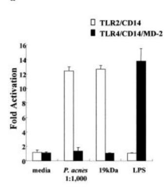
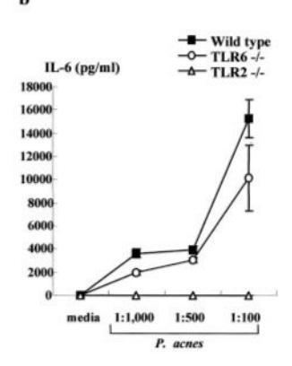
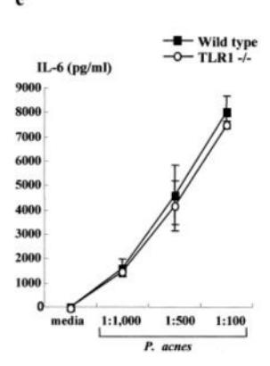
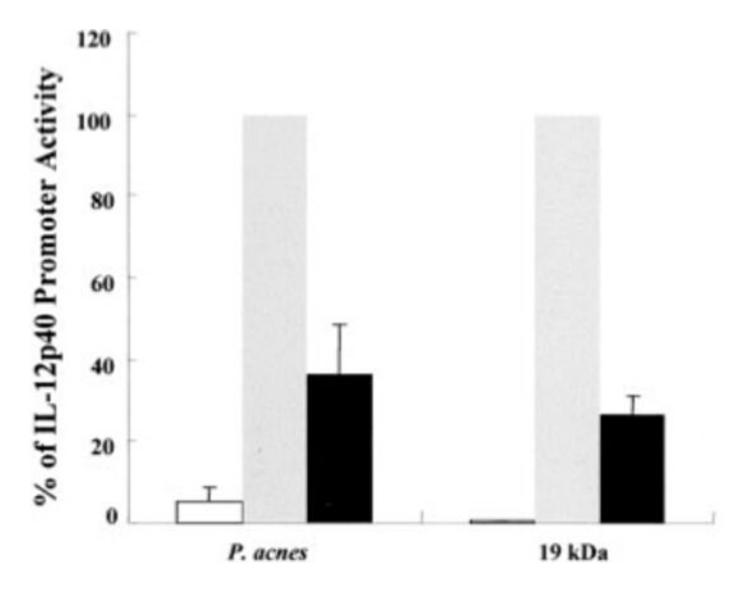
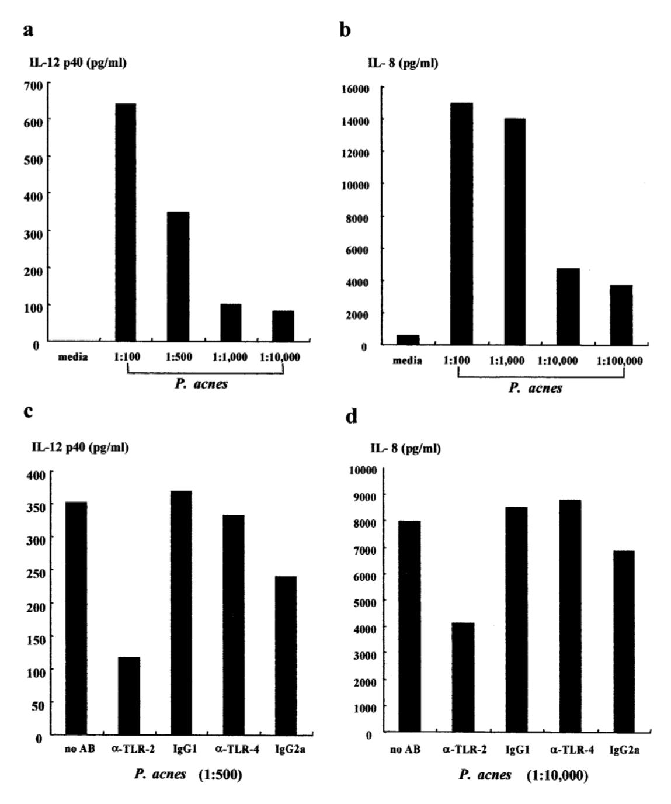
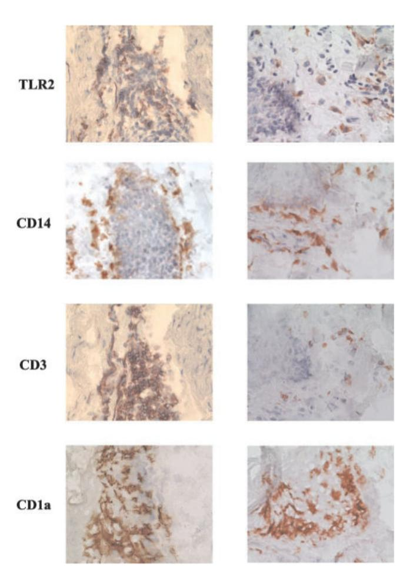
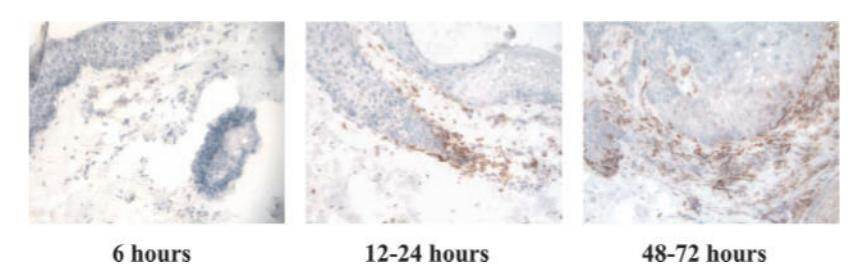
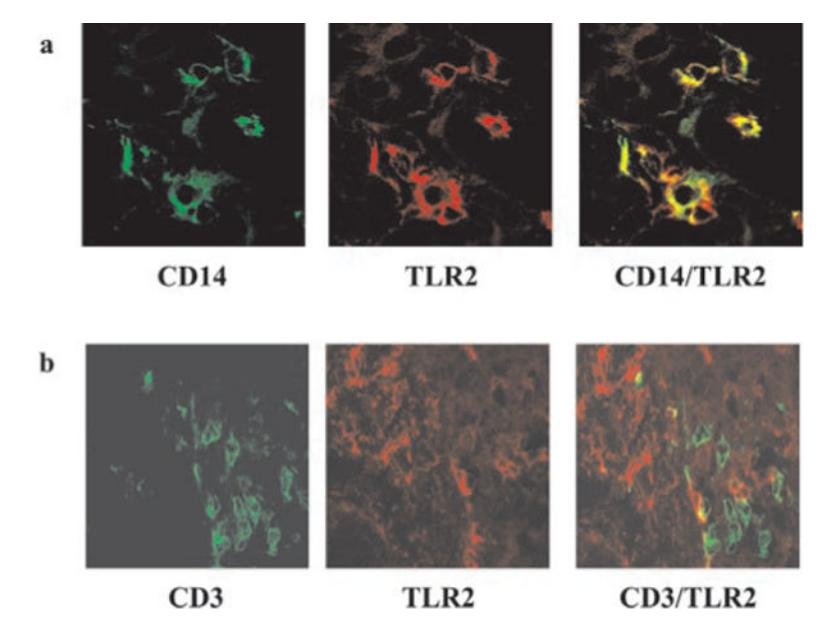

# **HHS Public Access**

Author manuscript

*J Immunol*. Author manuscript; available in PMC 2015 November 06.

Published in final edited form as:

*J Immunol*. 2002 August 1; 169(3): 1535–1541.

## **Activation of Toll-Like Receptor 2 in Acne Triggers Inflammatory Cytokine Responses1**

**Jenny Kim**\* , **Maria-Teresa Ochoa**\* , **Stephan R. Krutzik**†, **Osamu Takeuchi**§, **Satoshi Uematsu**§, **Annaliza J. Legaspi**\* , **Hans D. Brightbill**†, **Diana Holland**¶ , **William J. Cunliffe**¶ , **Shizuo Akira**§, **Peter A. Sieling**\* , **Paul J. Godowski**‖ , and **Robert L. Modlin**2,\*,†,‡

\*Division of Dermatology, University of California, Los Angeles, School of Medicine, Los Angeles, CA 90095

†Department of Microbiology and Immunology, University of California, Los Angeles, School of Medicine, Los Angeles, CA 90095

‡Molecular Biology Institute, University of California, Los Angeles, School of Medicine, Los Angeles, CA 90095

§Department of Host Defense, Research Institute for Microbial Diseases, Osaka University, Osaka, Japan

¶Department of Dermatology, Skin Research Center, General Infirmary, University of Leeds, Leeds, United Kingdom

‖Genentech, South San Francisco, CA 94080

### **Abstract**

One of the factors that contributes to the pathogenesis of acne is *Propionibacterium acnes;* yet, the molecular mechanism by which *P. acnes* induces inflammation is not known. Recent studies have demonstrated that microbial agents trigger cytokine responses via Toll-like receptors (TLRs). We investigated whether TLR2 mediates *P. acnes*-induced cytokine production in acne. Transfection of TLR2 into a nonresponsive cell line was sufficient for NF-κB activation in response to *P. acnes*  In addition, peritoneal macrophages from wild-type, TLR6 knockout, and TLR1 knockout mice, but not TLR2 knockout mice, produced IL-6 in response to *P. acnes*. *P. acnes* also induced activation of IL-12 p40 promoter activity via TLR2. Furthermore, *P. acnes* induced IL-12 and IL-8 protein production by primary human monocytes and this cytokine production was inhibited by anti-TLR2 blocking Ab. Finally, in acne lesions, TLR2 was expressed on the cell surface of macrophages surrounding pilosebaceous follicles. These data suggest that *P. acnes* triggers inflammatory cytokine responses in acne by activation of TLR2. As such, TLR2 may provide a novel target for treatment of this common skin disease.

1This work was supported by Grant 47868 from the National Institutes of Health. J.K is the recipient of a National Institutes of Health National Research Service Award fellowship and a University of California, Los Angeles, Specialty Training and Advance Research fellowship.

2Address correspondence and reprint requests to Dr. Robert L. Modlin, Division of Dermatology, University of California, Los Angeles, School of Medicine, 52-121 Center for Health Sciences, 10833 Le Conte Avenue, Los Angeles, CA 90095. rmodlin@mednet.ucla.edu.

Acne vulgaris is a common disorder that affects 17 million people in the U.S. alone. Although acne is rarely life threatening, it is a disease that can have a significant effect on patients' physical and psychological well-being. The pathogenesis of acne is multifactorial, including hormonal, microbiological, and immunological mechanisms.

One of the factors that contributes to the pathogenesis of acne is *Propionibacterium acnes*, part of normal skin flora that can be significantly increased in the pilosebaceous units of patients with acne (1). Although *P. acnes* is a Gram-positive bacteria, it is variably and weakly Gram-positive. It is described as diphtheroid or coryneform because it is rod-shaped and slightly curved. A number of unique features of the *P. acnes* cell wall and outer envelope further distinguishes it from other Gram-positive bacteria. *P. acnes* synthesizes phosphatidylinositol, this is unlike almost all other bacteria, but is made by virtually all eukaryotes. The peptidoglycan of *P. acnes* is distinct from most Gram-positive bacteria, containing a cross-linkage region of peptide chains with L, L-diaminopimelic acid and Dalanine in which two glycine residues combine with amino and carboxyl groups of two L, Ldiaminopimelic acid residues (2).

*P. acnes* contributes to the inflammatory nature of acne by inducing monocytes to secrete proinflammatory cytokines including TNF-α, IL-1β, and IL-8 (3). In particular, IL-8 along with other *P. acnes*-induced chemotactic factors may play an important role in attracting neutrophils to the pilosebaceous unit. In addition, *P. acnes* releases lipases, proteases, and hyaluronidases which contribute to tissue injury (4–7). For these reasons, *P. acnes* has been a major target of therapy in inflammatory acne.

The mechanism by which *P. acnes* activates monocyte cytokine release is unknown but is thought to involve pattern recognition receptors (PRRs)3 of the innate immune system (3). Recently identified Toll-like receptors (TLRs) are one example of PRR. Toll receptors were first identified in *Drosophila*, and mammalian homologues were found to mediate immune response to microbial ligands (8, 9). Although it has been suggested that TLRs can discriminate between Gram-positive and Gram-negative organisms (10), bacterial ligands from Gram-positive bacteria have been identified that can activate monocytes via TLR2 or TLR4 (11).

The present study was devised to elucidate the mechanism by which *P. acnes* induces inflammatory cytokines in monocytes. In this study, we provide evidence that *P. acnes*  induces monocyte cytokine production through a TLR2-dependent pathway. The expression of TLR2 in acne lesions indicates that activation of TLR2 can contribute to inflammation at the site of disease activity.

3Abbreviations used in this paper: PRR, pattern recognition receptor; TLR, Toll-like receptor; ELAM, endothelial leukocyte adhesion molecule; HEK, human embryonic kidney; CAT, chloramphenicol acetyltransferase; TLR2 dn1, TLR2 dominant negative mutant.

### **Materials and Methods**

### **Ags and Abs**

*P. acnes* was obtained from American Type Culture Collection (Manassas, VA) and prepared by probe sonication. The level of endotoxin contaminating the *P. acnes* was quantified with a *Limulus* Amoebocyte Lysate assay (BioWhittaker, Walkersville, MD) and found to be <0.1 ng/ml. LPS derived from *Salmonella typhosa* (Sigma-Aldrich, St. Louis, MO) and the 19-kDa lipoprotein of *Mycobacterium tuberculosis* (12) were used. The following Abs were used: a mAb specific to human TLR2 (clone 2392; Ref. 13) and TLR4 (clone HTA125; Ref. 14) was provided by P. J. Godowski (Genentech, San Francisco, CA); B355.1 (anti-CD3; Biomeda, Foster City, CA), RPA-MI (anti-CD14; Zymed Laboratories, South San Francisco, CA), NA1/34 (anti-CD1a; DAKO, Carpinteria, CA), and IgG controls (Sigma-Aldrich).

### **Samples from patients**

Patients were clinically diagnosed with acne at the General Infirmary at Leeds (Leeds, U.K.). After informed consent was obtained, comedones and inflamed acne lesions (papules and pustules) from the upper back were biopsied under local anesthesia using a 4-mm punch. Nineteen acne samples (3 comedones, 1 pustule, and 15 papules) were obtained from sixteen different patients. To ascertain the duration of the papules, an established "mapping" technique (15) was used which allowed a reasonably accurate assessment of the duration of the lesion. Such timed biopsies were classified into four time zones (up to 6 h, from 6 to 24 h, from 24 to 48 h, and from 48 to 72 h). The biopsies were snap frozen in liquid nitrogen and stored at −70°C until sectioning.

#### **NF-**κ**B activation in human TLR-transfected cell lines**

TLR2 negative human embryonic kidney (HEK) 293 cells were stably transfected with TLR2 and CD14 (9). Cells were plated at 1 × 105 cells/well in six-well plates and transiently transfected the following day with the NF-κB responsive endothelial leukocyte adhesion molecule (ELAM) enhancer luciferase (pGL3) reporter gene (0.5 μg/ml) by the Superfect protocol at a 1:3 ratio of DNA to Superfect (Qiagen, Valencia, CA). Multiple transfectants were pooled and divided for activation with *P. acnes, M. tuberculosis* 19-kDa lipoprotein, or LPS for 6 h, lysed in reporter lysis buffer (Promega, Madison, WI), and used in the luciferase assay. BaF3 cells stably expressing TLR4, MD2, CD14, and an ELAM luciferase reporter gene (14) were plated at 7.5 × 105 cells/well and activated with *P. acnes, M. tuberculosis* 19-kDa lipoprotein, or LPS. Cells were harvested 6 h after activation and used in the luciferase assay.

### **Responses in TLR-deficient mice**

Peritoneal macrophages from TLR2−/− (11), TLR6−/− (16), and TLR1−/− (17) mice were collected 3 days after i.p. injection of 2 ml of 4% thioglycollate (Difco, Detroit, MI) and cultured in RPMI 1640 medium supplemented with 10% FCS. Cells (5 × 104 ) were incubated in the presence of the indicated concentration of *P. acnes* for 24 h. Concentrations

of IL-6 in the culture supernatants were measured by ELISA (R&D Systems, Minneapolis, MN). The data represent the mean ± SD of triplicate wells.

#### **IL-12 p40 promoter activity**

The murine macrophage cell line, RAW 264.7 (American Type Culture Collection), was transiently transfected with a murine IL-12 p40 promoter chloramphenicol acetyltransferase (CAT) reporter as previously described (18). TLR2 dominant negative mutant (TLR2 dn1) expression plasmids were transfected together with the IL-12 p40 promoter construct and βgalactosidase as an internal control. Transfected cells were either left unactivated or stimulated with *P. acnes* or *M. tuberculosis* 19-kDa lipoprotein for 24 h. IL-12 p40 promoter activity was measured according to CAT activity (percent chloramphenicol acetylation) with a phosphor imager (Amersham, Sunnyvale, CA). Data were normalized to a cotransfected βgalactosidase construct for transfection efficiency.

### **Cytokine ELISA**

PBMCs were isolated from normal healthy volunteers on Ficoll-Paque gradients (Pharmacia, Piscataway, NJ) and cultured for 1 h in 1% human serum. Adherent cells were recovered and plated (1 × 104 to 5 × 104 /well) in 96-well plates. Cells were left untreated or incubated with mouse anti-human TLR2 neutralizing mAb, mouse anti-human TLR4 neutralizing Ab, or with isotype control mouse Abs, IgG1 and IgG2a, for 30 min before stimulation with LPS (10 ng/ml), *P. acnes* (1:100), or 19-kDa lipoprotein (50 ng/ml). Supernatants were harvested 18 h later and assayed for IL-12 p40 and IL-8 by ELISA (BD PharMingen, San Diego, CA). All samples were assayed in duplicate.

### **Immunoperoxidase staining**

Cryostat sections (3–4 *μ*m) were acetone fixed and blocked with normal horse serum before incubation with the mAbs for 60 min, followed by biotinylated horse anti-mouse IgG for 30 min. Primary Abs were visualized with the ABC Elite system (Vector Laboratories, Burlingame, CA), counterstained with hematoxylin, and mounted in aqueous dry mounting medium (Crystal Mount; Biomeda).

### **Two-color immunofluorescence labeling in acne lesions**

Cryostat sections (3–4 *μ*m) were fixed in acetone and blocked with 10% goat serum for 30 min. Double immunofluorescence was performed by serially incubating sections with mouse anti-human CD14 or CD3 mAbs for 1 h followed by incubation with isotype-specific FITCconjugated goat anti-mouse IgG2a (Caltag Laboratories, Burlingame, CA). Sections were then incubated with anti-TLR2 (1 *μ*g/ml) for 1 h, followed by a tetramethylrhodamine isothiocyanate-conjugated anti-mouse IgG1 (Southern Biotechnology Associates, Birmingham, AL). Sections were mounted in Vectashield mounting medium (Vector Laboratories). Controls included isotype-matched irrelevant Abs.

### **Confocal laser microscopy**

Double immunofluorescence of sections and cells was examined with a Leica-TCS-SP inverted confocal laser-scanning microscope (Heidelberg, Germany) and illuminated with

488 and 568 nm of light. Images decorated with FITC and tetramethylrhodamine isothiocyanate were recorded simultaneously through separate optical detectors with a 530 nm band-pass filter and a 590-nm long-pass filter, respectively. Pairs of images were superimposed for colocalization analysis.

### **Results**

### **TLR2 is sufficient for P. acnes activation of monocytes**

Previous studies have demonstrated that TLR2 mediates the response of several ligands from Gram-positive organisms. Therefore, we sought to determine whether TLR2 is sufficient for *P. acnes*-induced gene activation. HEK 293 cells and BaF3 cells were used because these cells do not express endogenous TLRs and are unresponsive to microbial ligands (12, 14). HEK 293 cells (expressing TLR2, CD14, and a NF-κB responsive ELAM enhancer) and BaF3 cells (expressing TLR4, CD14, MD2, and ELAM) were activated with *P. acnes, M. tuberculosis* 19-kDa lipoprotein, or LPS. NF-κB activation was examined because it has been shown that NF-κB activation is required for several proinflammatory cytokine promoter activities (18–21). In stable transfectants expressing TLR2 and CD14, *P. acnes* induced NF-κB activation (Fig. 1*a*). In contrast, *P. acnes* could not activate NF-κB in transfectants expressing TLR4, CD14, and MD2. Similar results were seen when cells were stimulated with 19-kDa lipoprotein from *M. tuberculosis*. In contrast, LPS activated NF-κB in stable transfectants expressing TLR4 but not TLR2. This is consistent with findings that LPS activation of cytokine production in monocytes is dependent on TLR4.

Because TLR2 cooperates with TLR6 and TLR1 in the recognition of microbial ligands (16, 17, 22), we examined the role of TLR6 and TLR1 in mediating activation by *P. acnes* using TLR knockout mice. Peritoneal macrophages were obtained from wild-type, TLR2−/−, TLR6−/−, and TLR1−/− mice, activated with *P. acnes*, and supernatants were assayed for the presence of IL-6. *P. acnes* induced IL-6 release from wild-type and TLR6−/− mice, but not TLR2−/− mice (Fig. 1*b*). *P. acnes* also induced IL-6 release from TLR1−/− mice (Fig. 1*c*). As controls, the diacylated lipopeptide mycoplasmal macrophage-activating lipopeptide-2 kDa activated wild-type and TLR1−/− mice, but not TLR2−/− or TLR6−/− mice, whereas LPS activated macrophages from all mice (data not shown). In contrast, a synthetic *N*-palmitoyl-*S*-dipalmitoylglycerl (Pam3) CSK4 activated wild-type mice, but TLR1−/− activation was partially inhibited as previously described (Ref. 17; data not shown). These results indicate the specificity of the response that TLR2 but not TLR4, TLR6, or TLR1 mediates *P. acnes*induced cell activation.

#### **P. acnes induces IL-12 p40 promoter activity via TLR2**

IL-12 is a pivotal cytokine in activating Th1 T cell responses and is one of the major proinflammatory cytokines produced by monocytes in response to Gram-positive organisms. To determine whether *P. acnes*-induced IL-12 promoter activity, an IL-12 p40 promoter CAT reporter construct was transiently transfected into the murine macrophage cell line RAW 264.7. Cells were stimulated with *P. acnes* and the promoter activity was measured by CAT assay. *P. acnes* induced IL-12 p40 promoter activity in a dose-dependent manner and at a level comparable to *M. tuberculosis* 19-kDa lipoprotein (data not shown).

To determine whether *P. acnes*-induced cytokine production was dependent upon TLR activation, the RAW 264.7 macrophage cell line was transfected with the TLR2 dn1 construct containing a truncation of 13 amino acids at the COOH terminus, along with the IL-12 p40 promoter construct. *P. acnes* induced IL-12 p40 promoter activity in the absence of TLR2 dn1 in RAW cells, but this activity was abrogated in cells transfected with the TLR2 dn1 construct (Fig. 2). Consistent with previously published results, transfection of TLR2 dn1 also inhibited *M. tuberculosis* 19-kDa lipoprotein-induced IL-12 p40 promoter activation (12). The IL-12 p40 promoter activity was not inhibited by transfection of RAW cells with another control vector containing the IL-1R (data not shown). These data suggest that *P. acnes* activates IL-12 p40 promoter activity in a TLR2-dependent mechanism.

### **P. acnes induces IL-12 and IL-8 production by human adherent monocytes**

We next determined whether cytokine protein production was also dependent on TLR activation. Primary human monocytes from normal donors were stimulated with various dilutions of *P. acnes* sonicate and cytokine production was measured. IL-12 was measured given that IL-12 promoter activation by *P. acnes* occurred via TLR2. We found that *P. acnes* induced IL-12 production by monocytes in a dose-dependent manner (Fig. 3*a*). *P. acnes* also induced the release of IL-8, a cytokine involved in neutrophil chemotaxis (Fig. 3*b*). These findings were consistent in all normal donors tested (*n* = 3).

To determine whether the production of proinflammatory cytokines could be mediated through TLRs, monocytes from normal donors were cultured with anti-TLR2 and anti-TLR4 Abs for 30 min before stimulation with *P. acnes* sonicate. *P. acnes* induction of IL-12 production in monocytes was blocked by ~65% with the addition of anti-TLR2 Ab to the culture (Fig. 3*c*). In contrast, the addition of anti-TLR4 and isotype control Abs had no significant effect on IL-12 production by human monocytes, suggesting that the blocking effect was specific to TLR2. Induction of IL-12 production by monocytes upon addition of another Gram-positive bacterial ligand, the *M. tuberculosis* 19-kDa lipoprotein, was also blocked with the addition of anti-TLR2 (data not shown), as demonstrated previously (12). Similarly, the production of IL-8 was also blocked by ~50% by the addition of anti-TLR2 Ab (Fig. 3*d*). Anti-TLR4 and isotype control Abs had no significant effect on IL-8 production. These results suggest that one mechanism by which *P. acnes* induces IL-12 and IL-8 production in human monocytes is by the activation of TLR2.

### **TLR2 is expressed on macrophages in acne lesions**

We next wanted to determine whether there was any evidence for the TLR-dependent mechanism occurring at the site of the disease activity. We obtained acne biopsies from patients and analyzed the lesions for TLR expression. Immunohistochemistry labeling using a mAb specific to TLR2 (23) revealed TLR2 expression on large ovoid cells within acne lesions (Fig. 4). TLR2+ cells were detected primarily in the inflammatory infiltrate around the perifollicular/peribulbar region. Numerous CD14+ and CD3+ cells were detected in the similar area. We also detected a number of CD1a+ cells, but they were within the follicular wall and in the epidermis. Anti-CD20 and control Abs did not stain any of the cells (data not shown). All acne lesions tested (*n*=19) contained TLR2+ cells whether the tissue was

obtained from comedonal, papular, or pustular lesions. TLR2+ cells were not detected in normal skin biopsies (data not shown).

To determine the kinetics of TLR2 expression according to the evolution of the lesion, the frequency of TLR2-expressing cells was determined according to the duration of the acne lesion. In early acne lesions, up to 6 h, few TLR2+ cells were detected (Fig. 5). In lesions obtained between 12 and 24 h, TLR2+ cells were found to be more numerous around the pilosebaceous follicles. Finally, in older lesions obtained between 48 and 72 h, even greater numbers of TLR2+ cells were detected. From these experiments, we concluded that the infiltration of TLR2+ cells was an early event in the evolution of acne lesions. Furthermore, the frequency of cells expressing TLR2 proteins is up-regulated during the inflammatory process up to 48–72 h after the onset of acne lesions.

To identify the lineage of cells expressing TLR2 in acne lesions, we performed double immunofluorescence labeling and used confocal laser microscopy. The colocalization of TLR2 with CD14 and CD3 was examined because these cells appeared to be numerous in acne lesions and also localized to perifollicular areas where numerous TLR2+ cells were detected. CD14 colocalized with TLR2 on cells infiltrating around acne lesions (Fig. 6*a*). In contrast, although CD3+ cells were abundant in acne lesions, CD3 did not colocalize with TLR2 (Fig. 6*b*). These data suggest that TLR2 is expressed on cells of the monocyte/ macrophage lineage in acne lesions.

### **Discussion**

Recognition of microbial pathogens by the cells of the immune system triggers host defense mechanisms to combat infection and prevent disease. However, activation of these same pathways can also result in inflammation at the site of disease and subsequent tissue injury. In acne, the host response to *P. acnes* can result in the production of proinflammatory cytokines and contribute to the clinical manifestations of disease. We investigated the molecular mechanism by which *P. acnes* induces proinflammatory cytokines in monocytes and provide evidence that the *P. acnes*-induced release of cytokines is dependent on TLR2. Furthermore, TLR2+ macrophages were present in acne lesions, infiltrating around pilosebaceous follicles, and increased during the evolution of the disease. Our data suggest a novel mechanism by which *P. acnes* induces inflammation in acne by the activation of TLR2 and subsequent release of cytokines which regulate the local immune response.

Toll receptors were first identified in *Drosophila* as an integral part of the innate immune system and have been shown to play a crucial role in antimicrobial defense in adult flies (24, 25). Recent studies suggest that mammalian Toll homologues, TLRs, mediate responsiveness to a variety of molecular structures from microbial pathogens. The present study provides evidence that TLR2 mediates innate immune responses to *P. acnes. P. acnes*  activated NF-κB in cell lines transfected with TLR2 but not TLR4. In addition, peritoneal macrophages from wild-type, TLR6−/−, and TLR1−/−, but not TLR2−/−, mice produced IL-6 in response to *P. acnes*. A role for TLR2 in mediating the response to *P. acnes* was further demonstrated by using a dominant negative construct of TLR2 that inhibited *P. acnes*  induction of cytokine promoter activity. TLR2 mediated the ability of *P. acnes* sonicate to

activate monocyte-release of IL-12 and IL-8, because cytokine induction could be blocked using an anti-TLR2 mAb. Using transgenic mice, Akira and colleagues (16, 17) have demonstrated that TLR1 associates with TLR2 and recognizes triacylated lipopeptide, but TLR6 and TLR2 interact to recognize diacylated lipopeptide. The peptidoglycan of *P. acnes*  is distinct from most Gram-positive bacteria, containing a cross-linkage region of peptide chains with L, L-diaminopimelic acid and D-alanine in which two glycine residues combine with amino and carboxyl groups of two L, L-diaminopimelic acid residues (2). Previous studies have indicated that the addition of jimson lectin, which binds peptidoglycan, blocked the ability of *P. acnes* to induce cytokines by ~70% (3). Given our result that *P. acnes*  induced IL-6 release from macrophages from wild-type, TLR6−/−, and TLR1−/− mice, but not from TLR2−/− mice, it is likely that the TLR ligand in *P. acnes* is a peptidoglycan. Further studies will be required to identify the TLR2 ligands present in *P. acnes* and their role in inflammation.

The primary event in inflammatory acne involves the disruption of the follicular epithelium and colonization of the follicles with *P. acnes* with subsequent inflammatory reactions in the surrounding dermis. The detection of TLR2+ cells in the perifollicular region provides indirect evidence that TLR2 activation contributes to the pathogenesis of acne, suggesting that these cells promote inflammatory responses at the site of the disease activity. This disease mechanism was supported by the colocalization of TLR2 with CD14, indicating its presence on cells of the monocyte/macrophage lineage. Previously, TLR2+ cells have been demonstrated in tuberculoid lesions (26) but not all macrophages in lesions express TLR2, for example those in lepromatous leprosy (our unpublished observations). Furthermore, activation of TLR2 on monocytes releases proinflammatory cytokines, IL-12 and IL-8. IL-8 attracts neutrophils to the site of active lesion, and release of lysosomal enzymes by neutrophils leads to rupture of follicular epithelium and further inflammation (27). In contrast, IL-12 promotes development of Th1-mediated immune responses. Overproduction of Th1 cytokines such as IL-12 has been implicated in the development of tissue injury in certain autoimmune and inflammatory diseases (28–34). In this manner, the activation of TLR2 on monocytes and other TLRs as well as other inflammatory cells are likely involved in the pathogenesis of acne.

In addition to its primary role in combating infection, the immune system also plays a role in the pathogenesis of certain disease states. In fact, the very pathogens that the immune system is attempting to fight often play a critical role in mediating the inflammatory responses that lead to disease states. Examples of this include group A β-hemolytic streptococcus in rheumatic fever, rheumatic heart disease, and glomerulonephritis, *Helicobacter pylori* in gastritis and peptic ulcer disease, *Chlamydia pneumoniae* in atherosclerosis, and *Pityrosporum ovale* in seborrheic dermatitis. In all of the above examples, infection by the organism itself is not the main cause of the disease, but rather the various inflammatory responses initiated by the microbial agents lead to the destruction of the host tissue. Such responses include the formation of immune complexes, the recruitment and activation of neutrophils and monocytes, the release of cytokines, and the release of degradative enzymes. *P. acnes* has been implicated as an important mediator of inflammation in the pathogenesis of acne. Clearly, treatment of patients with antibiotics

reduces the number of *P. acnes* and inflammatory cells and results in clinical improvement of acne lesions (35–37). Interestingly, the inflammatory cytokine responses triggered by *P. acnes* and mediated by TLR2 are unlikely to have a protective role in acne. It is tempting to speculate that the release of proinflammatory cytokines mediated through TLR2 has a harmful effect in acne by promoting inflammation and tissue destruction. Given these data, TLR2 is a logical target for therapeutic intervention to block inflammatory cytokine responses in acne and other inflammatory conditions in which tissue injury is detrimental to the host.

### **Acknowledgments**

We thank Drs. Frederick Beddingfield, Jennifer Gansert, and Cheryl Hertz for helpful comments and suggestions.

### **References**

- 1. Leyden JJ, McGinley KJ, Mills OH, Kligman AM. *Propionibacterium* levels in patients with and without acne vulgaris. J Invest Dermatol. 1975; 65:382. [PubMed: 126263]
- 2. Kamisango K, Saiki I, Tanio Y, Okumura H, Araki Y, Sekikawa I, Azuma I, Yamamura Y. Structures and biological activities of peptidoglycans of *Listeria monocytogenes* and *Propionibacterium acnes*. J Biochem. 1982; 92:23. [PubMed: 6811573]
- 3. Vowels BR, Yang S, Leyden JJ. Induction of proinflammatory cytokines by a soluble factor of *Propionibacterium acnes*: implications for chronic inflammatory acne. Infect Immun. 1995; 63:3158. [PubMed: 7542639]
- 4. Hoeffler U. Enzymatic and hemolytic properties of *Propionibacterium acnes* and related bacteria. J Clin Microbiol. 1977; 6:555. [PubMed: 201661]
- 5. Hoeffler U, Ko HL, Pulverer G. Antimicrobiol susceptibility of *Propionibacterium acnes* and related microbial species. Antimicrob Agents Che-mother. 1976; 10:387.
- 6. Ingham E, Holland KT, Gowland G, Cunliffe WJ. Purification and partial characterization of an acid phosphatase (EC 3.1.3.2) produced by *Propionibacterium acnes*. J Gen Microbiol. 1980; 118:59. [PubMed: 7420057]
- 7. Puhvel SM, Reisner RM. The production of hyaluronidase (hyaluronate lyase) by *Corynebacterium acnes*. J Invest Dermatol. 1972; 58:66. [PubMed: 4258461]
- 8. Medzhitov R, Preston-Hurlburt P, Janeway CAJ. A human homologue of the *Drosophila* Toll protein signals activation of adaptive immunity. Nature. 1997; 388:394. [PubMed: 9237759]
- 9. Yang RB, Mark MR, Gray A, Huang A, Xie MH, Zhang M, Goddard A, Wood WI, Gurney AL, Godowski PJ. Toll-like receptor-2 mediates lipopolysaccharide-induced cellular signalling. Nature. 1998; 395:284. [PubMed: 9751057]
- 10. Underhill DM, Ozinsky A, Hajjar AM, Stevens A, Wilson CB, Bassetti M, Aderem A. The Tolllike receptor 2 is recruited to macrophage phagosomes and discriminates between pathogens. Nature. 1999; 401:811. [PubMed: 10548109]
- 11. Takeuchi O, Hoshino K, Kawai T, Sanjo H, Takada H, Ogawa T, Takeda K, Akira S. Differential roles of TLR2 and TLR4 in recognition of gram-negative and gram-positive bacterial cell wall components. Immunity. 1999; 11:443. [PubMed: 10549626]
- 12. Brightbill HD, Libraty DH, Krutzik SR, Yang RB, Belisle JT, Bleharski JR, Maitland M, Norgard MV, Plevy SE, Smale ST, et al. Host defense mechanisms triggered by microbial lipoproteins through Toll-like receptors. Science. 1999; 285:732. [PubMed: 10426995]
- 13. Yang RB, Mark MR, Gurney AL, Godowski PJ. Signaling events induced by lipopolysaccharideactivated Toll-like receptor 2. J Immunol. 1999; 163:639. [PubMed: 10395652]
- 14. Shimazu R, Akashi S, Ogata H, Nagai Y, Fukudome K, Miyake K, Kimoto M. MD-2, a molecule that confers lipopolysaccharide responsiveness on Toll-like receptor 4. J Exp Med. 1999; 189:1777. [PubMed: 10359581]

15. Norris JF, Cunliffe WJ. A histological and immunocytochemical study of early acne lesions. Br J Dermatol. 1988; 118:651. [PubMed: 2969256]

- 16. Takeuchi O, Kawai T, Muhlradt PF, Morr M, Radolf JD, Zychlinsky A, Takeda K, Akira S. Discrimination of bacterial lipoproteins by Tolllike receptor 6. Int Immunol. 2001; 13:933. [PubMed: 11431423]
- 17. Takeuchi O, Sato S, Horiuchi T, Hoshino K, Takeda K, Dong Z, Modlin RL, Akira S. Role of TLR1 in mediating immune response to microbial lipoproteins. J Immunol. 2002 In press.
- 18. Plevy SE, Gemberling JH, Hsu S, Dorner AJ, Smale ST. Multiple control elements mediate activation of the murine and human interleukin 12 p40 promoters: evidence of functional synergy between C/EBP and Rel proteins. Mol Cell Biol. 1997; 17:4572. [PubMed: 9234715]
- 19. Murphy TL, Cleveland MG, Kulesza P, Magram J, Murphy KM. Regulation of interleukin 12 p40 expression through an NF-κB half-site. Mol Cell Biol. 1995; 15:5258. [PubMed: 7565674]
- 20. Kunsch C, Rosen CA. NF-κB subunit-specific regulation of the interleukin-8 promoter. Mol Cell Biol. 1993; 13:6137. [PubMed: 8413215]
- 21. Stein B, Baldwin AS Jr. Distinct mechanisms for regulation of the interleukin-8 gene involve synergism and cooperativity between C/EBP and NF-κB. Mol Cell Biol. 1993; 13:7191. [PubMed: 8413306]
- 22. Ozinsky A, Underhill DM, Fontenot JD, Hajjar AM, Smith KD, Wilson CB, Schroeder L, Aderem A. The repertoire for pattern recognition of pathogens by the innate immune system is defined by cooperation between Toll-like receptors. Proc Natl Acad Sci USA. 2000; 97:13766. [PubMed: 11095740]
- 23. Aliprantis AO, Yang RB, Mark MR, Suggett S, Devaux B, Radolf JD, Klimpel GR, Godowski P, Zychlinsky A. Cell activation and apoptosis by bacterial lipoproteins through Toll-like receptor-2. Science. 1999; 285:736. [PubMed: 10426996]
- 24. Lemaitre B, Reichhart JM, Hoffmann JA. *Drosophila* host defense: differential induction of antimicrobial peptide genes after infection by various classes of microorganisms. Proc Natl Acad Sci USA. 1997; 94:14614. [PubMed: 9405661]
- 25. Williams MJ, Rodriguez A, Kimbrell DA, Eldon ED. The 18-wheeler mutation reveals complex antibacterial gene regulation in *Drosophila* host defense. EMBO J. 1997; 16:6120. [PubMed: 9321392]
- 26. Thoma-Uszynski S, Stenger S, Takeuchi O, Ochoa MT, Engele M, Sieling PA, Barnes PF, Rollinghoff M, Bolcskei PL, Wagner M, et al. Induction of direct antimicrobial activity through mammalian Toll-like receptors. Science. 2001; 291:1544. [PubMed: 11222859]
- 27. Webster GF, Leyden JJ, Tsai CC, Baehni P, McArthur WP. Polymorphonuclear leukocyte lysosomal release in response to *Propionibacterium acnes* in vitro and its enhancement by sera from inflammatory acne patients. J Invest Dermatol. 1980; 74:398. [PubMed: 6445921]
- 28. Windhagen A, Newcombe J, Dangond F, Strand C, Woodroofe MN, Cuzner ML, Hafler DA. Expression of costimulatory molecules B7-1 (CD80), B7-2 (CD86), and interleukin 12 cytokine in multiple sclerosis lesions. J Exp Med. 1995; 182:1985. [PubMed: 7500044]
- 29. Balashov KE, Smith DR, Khoury SJ, Hafler DA, Weiner HL. Increased interleukin 12 production in progressive multiple sclerosis: induction by activated CD4+ T cells via CD40 ligand. Proc Natl Acad Sci USA. 1997; 94:599. [PubMed: 9012830]
- 30. Bucht A, Larsson P, Weisbrot L, Thorne C, Pisa P, Smedegard G, Keystone EC, Gronberg A. Expression of interferon-γ (IFN-γ), IL-10, IL-12 and transforming growth factor-β (TGF-β) mRNA in synovial fluid cells from patients in the early and late phases of rheumatoid arthritis (RA). Clin Exp Immunol. 1996; 103:357. [PubMed: 8608632]
- 31. Parronchi P, Romagnani P, Annunziato F, Sampognaro S, Becchio A, Giannarini L, Maggi E, Pupilli C, Tonelli F, Romagnani S. Type 1 T-helper cell predominance and interleukin-12 expression in the gut of patients with Crohn's disease. Am J Pathol. 1997; 150:823. [PubMed: 9060820]
- 32. Via CS, Rus V, Gately MK, Finkelman FD. IL-12 stimulates the development of acute graftversus-host disease in mice that normally would develop chronic, autoimmune graft-versus-host disease. J Immunol. 1994; 153:4040. [PubMed: 7930611]

33. Williamson E, Garside P, Bradley JA, Mowat AM. IL-12 is a central mediator of acute graftversus-host disease in mice. J Immunol. 1996; 157:689. [PubMed: 8752918]

- 34. Nishimura T, Sadata A, Yahagi C, Santa K, Otsuki K, Watanabe K, Yahata T, Habu S. The therapeutic effect of interleukin-12 or its antagonist in transplantation immunity. Ann NY Acad Sci. 1996; 795:371. [PubMed: 8958958]
- 35. Freinkel RK, Strauss JS, Yip SY, Pochi PE. Effect of tetracycline on the composition of sebum in acne vulgaris. N Engl J Med. 1965; 273:850. [PubMed: 4220510]
- 36. Hubbell CG, Hobbs ER, Rist T, White JW Jr. Efficacy of minocycline compared with tetracycline in treatment of acne vulgaris. Arch Dermatol. 1982; 118:989. [PubMed: 6216858]
- 37. Leyden JJ, McGinley KJ, Kligman AM. Tetracycline and minocycline treatment. Arch Dermatol. 1982; 118:19. [PubMed: 6460472]

### **FIGURE 1.**

TLR2, but not TLR4, TLR6, or TLR1, is sufficient for induction by *P. acnes* of monocyte activation. *a*, HEK 293 cells transfected with TLR2, CD14, and the NF-κB responsive Eselectin (ELAM) enhancer luciferase reporter gene and BaF3 cells stably expressing TLR4, CD14, MD-2, and an ELAM luciferase reporter gene were activated with *P. acnes, M. tuberculosis* 19-kDa lipoprotein, or LPS for 6 h. NF-κB activity was measured by luciferase assay. Data reflect at least two independent experiments. *b*, Peritoneal macrophages were obtained from wild-type, TLR2−/−, and TLR6−/− mice, activated with *P. acnes*, and supernatants were assayed for the presence of IL-6. *c*, Peritoneal macrophages were obtained from wild-type and TLR1−/− mice, activated with *P. acnes*, and supernatants were assayed for the presence of IL-6.

#### **FIGURE 2.**

*P. acnes* induces IL-12 p40 promoter activity via TLR2. RAW 264.7 cells were transiently transfected with a murine IL-12 p40 promoter CAT reporter. Cells were also cotransfected with TLR2 dn1 (■) or with a vector control ( ). Transfected cells were stimulated with *P. acnes* sonicate or *M. tuberculosis* 19-kDa lipoprotein, or left unstimulated (□) for 24 h. Activation of IL-12 p40 promoter activity was measured according to CAT activity (percent chloramphenicol acetylation) with a phosphor imager. Data reflects at least two independent experiments and are reported as a percentage of Ag-stimulated IL-12 p40 promoter activity cotransfected with a vector control. Media controls were comparable between vector control and TLR2 dn1 transfectants.

**FIGURE 3.**  *P. acnes* induces IL-12 and IL-8 production in human adherent monocytes via TLR2. Human adherent monocytes were stimulated with *P. acnes* and the production of IL-12 p40 and IL-8 was determined by ELISA. A dose-response curve demonstrates the ability of *P. acnes* to stimulate monocytes to release IL-12 p40 (*a*) and IL-8 (*b*). Cells were coincubated with anti-TLR2, anti-TLR4, or isotype control mAbs. The IL-12 p40 (*c*) and IL-8 (*d*) release into the supernatants was determined by ELISA. The results from one representative experiment of three are shown.

**FIGURE 4.** 

TLR2 expression in acne lesions. Representative sections from skin biopsy specimens from two acne patients stained by the immunoperoxidase method with mAbs specific for TLR2, CD14, CD3, and CD1a. Multiple TLR2+ cells were detected primarily in the inflammatory infiltrate around the perifollicular/peribulbar region. Numerous CD14+ and CD3+ cells were detected in the similar area. CD1a+ cells were found within the follicular wall and in the epidermis. A total of 19 different lesions from acne patients were examined. Original magnification, ×40.

#### **FIGURE 5.**

Kinetics of TLR2 expression in acne according to the evolution of the lesion. Representative sections from skin biopsy specimens of acne lesions stained by the immunoperoxidase method with mAbs specific for TLR2. In early acne lesions, up to 6 h, few rare TLR2+ cells were detected. In lesions obtained between 12 and 24 h, TLR2+ cells were much more numerous around the pilosebaceous follicles. In later older lesions obtained between 48 and 72 h, greater numbers of TLR2+ cells were detected.

**FIGURE 6.**  Phenotype of cells expressing TLR2 in acne lesions. Two-color immunofluorescence confocal images were obtained for (*a*) CD14, (*b*) CD3 (*green, first panel of* each row), and TLR2 (red, *second panel of* each row). The two images were then superimposed (*third panel*  of each row). Double-positive cells are shown in yellow. TLR2-positive cells near the follicular bulbar region colocalized with CD14+ macrophages but not with CD3+ T cells. Original magnification, ×630.