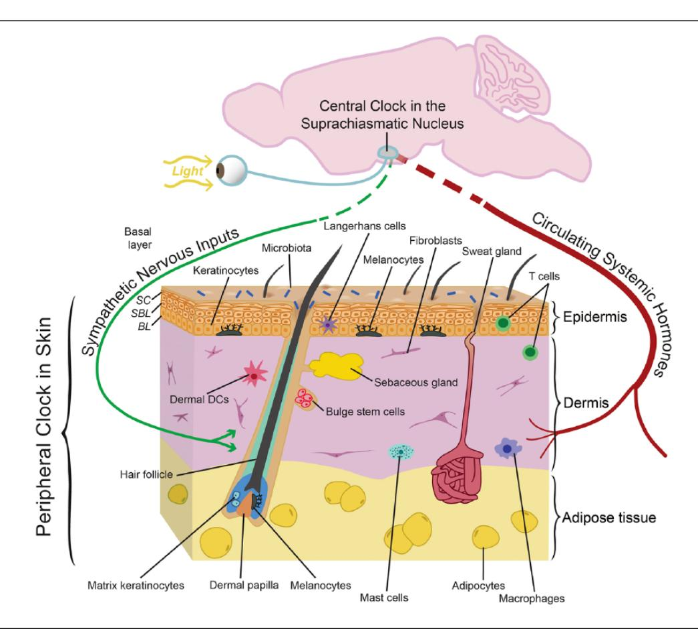
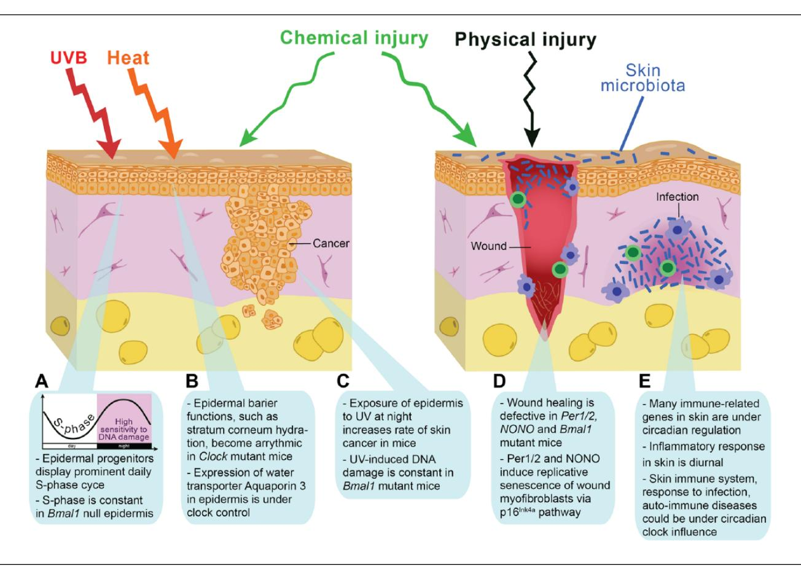
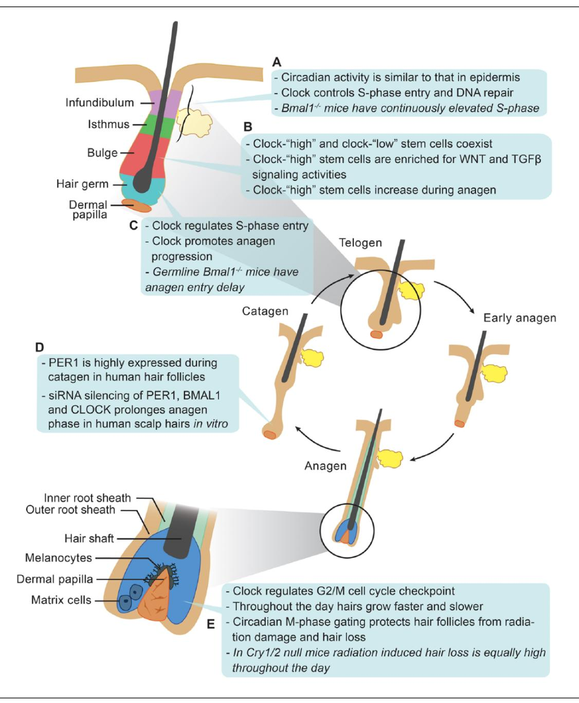
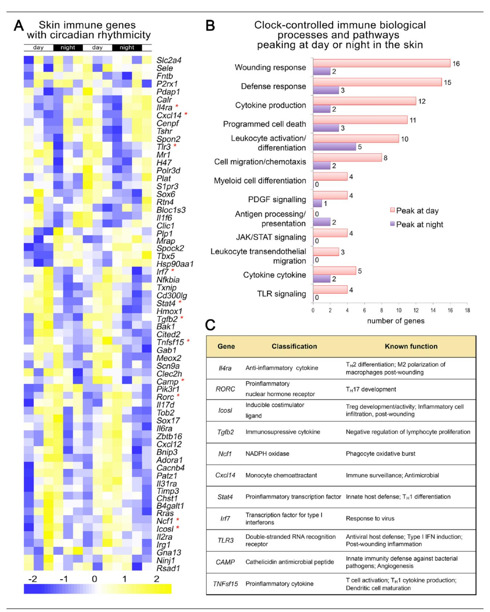

# **The Body Clocks Review Series**

# The Circadian Clock in Skin: Implications for Adult Stem Cells, Tissue Regeneration, Cancer, Aging, and Immunity

Maksim V. Plikus,\*,†,‡ Elyse N. Van Spyk,‡,§,|| Kim Pham,\*,† Mikhail Geyfman,¶ Vivek Kumar,#, \*\* Joseph S. Takahashi,#, \*\* and Bogi Andersen‡,§,||,1

*\*Department of Developmental and Cell Biology, University of California, Irvine, Irvine, CA, † Sue and Bill Gross Stem Cell Research Center, University of California, Irvine, Irvine, CA, ‡ Center for Complex Biological Systems, University of California, Irvine, Irvine, CA, § Department of Biological Chemistry, University of California, Irvine, Irvine, CA, ||Division of Endocrinology, Department of Medicine, University of California, Irvine, Irvine, CA, ¶ Kythera Biopharmaceuticals, Westlake Village, CA, # Department of Neuroscience, University of Texas Southwestern Medical Center, Dallas, TX, and \*\*Howard Hughes Medical Institute, University of Texas Southwestern Medical Center, Dallas, TX*

> *Abstract* Historically, work on peripheral circadian clocks has been focused on organs and tissues that have prominent metabolic functions, such as the liver, fat, and muscle. In recent years, skin has emerged as a model for studying circadian clock regulation of cell proliferation, stem cell functions, tissue regeneration, aging, and carcinogenesis. Morphologically, skin is complex, containing multiple cell types and structures, and there is evidence for a functional circadian clock in most, if not all, of its cell types. Despite the complexity, skin stem cell populations are well defined, experimentally tractable, and exhibit prominent daily cell proliferation cycles. Hair follicle stem cells also participate in recurrent, long-lasting cycles of regeneration: the hair growth cycles. Among other advantages of skin is a broad repertoire of available genetic tools enabling the creation of cell type– specific circadian mutants. Also, due to the accessibility of skin, in vivo imaging techniques can be readily applied to study the circadian clock and its outputs in real time, even at the single-cell level. Skin provides the first line of defense against many environmental and stress factors that exhibit dramatic diurnal variations such as solar ultraviolet (UV) radiation and temperature. Studies have already linked the circadian clock to the control of UVB-induced DNA damage and skin cancers. Due to the important role that skin plays in the defense against microorganisms, it also represents a promising model system to further explore the role of the clock in the regulation of the body's immune functions. To that end, recent studies have already linked the circadian clock to psoriasis, one of the most common immune-mediated skin disorders. Skin also provides opportunities to interrogate the clock regulation of tissue metabolism in the context of stem cells and regeneration. Furthermore, many animal species feature prominent seasonal hair molt cycles, offering an attractive model for investigating the role of the clock in seasonal organismal behaviors.

1. To whom all correspondence should be addressed: Bogi Andersen, Sprague Hall, Room 206, 839 Health Sciences Road, University of California, Irvine, Irvine, CA 92697-4030; e-mail: [bogi@uci.edu.](mailto:bogi@uci.edu)

*Keywords* skin, stem cells, regeneration, cancer, UV exposure, immunity, aging, hair follicle, cell cycle, autoimmune diseases

# **Introduction To The Organization And Function Of The Circadian Clock In Skin**

Day and night create widely different environments for the skin. As examples, the risks of toxin or pathogen exposure, risk of physical injuries, ultraviolet (UV) radiation exposure, exposure to extreme temperatures, and potential for water loss vary greatly depending on the time of day. Therefore, it should not come as a surprise if the circadian clock, an evolutionary ancient system that adjusts organismal physiology to diurnal changes stemming from the rotation of Earth, modulates skin functions. In fact, work in recent years has begun to elucidate the diverse functions of the circadian clock within skin.

A full description of the circadian clock is beyond the scope of this review, but at a molecular level, the circadian clock consists of an autoregulatory gene expression feedback loop. Clock and Bmal1 transcription factors induce expression of their own inhibitors, Periods (Pers) and Cryptochromes (Crys), thereby creating self-sustainable 24-hour rhythms in gene expression. The nuclear receptors Rors and RevErbs constitute an auxiliary transcriptional loop that regulates the expression of Bmal1. Furthermore, by acting at their genomic regulatory sequences, the circadian clock transcription factors generate rhythmic oscillations in the expression of a large number of output genes, which are largely tissue and cell type specific (Mohawk et al., 2012). At least 1400 genes involved in multiple different functions show circadian expression changes in mouse skin, suggesting that the circadian clock may, in fact, influence various aspects of skin physiology (Geyfman et al., 2012). In addition, while it is known that the central clock affects circadian rhythms within skin (Tanioka et al., 2009), new evidence indicates that the clock regulation of skin functions is not merely a consequence of the central suprachiasmatic nucleus clock exerting its influence via neuroendocrine mediators; rather, skin itself, like most, if not all, organs, harbors a robust, intrinsic clock (Geyfman et al., 2012; Plikus et al., 2013; Al-Nuaimi et al., 2014). The ontogeny of the circadian clock in skin remains to be studied, but evidence suggests that skin development proceeds entirely normally in mice mutated for core clock genes (Kondratov et al., 2006; Lin et al., 2009; Plikus et al., 2013). Based on work in other organs, it is likely that the circadian clock in skin matures in the early postnatal period (Kovacikova et al., 2006; Sladek et al., 2007; Ansari et al., 2009).

Serving primarily to protect the body against environmental insults, skin is a large and complex organ composed of multiple cell types, organized into layers, and featuring thousands of mini-organ structures, such as hair follicles and sweat glands. Therefore, it may be misleading to think of "the skin clock" as a single entity analogous to how the clock is often thought of in anatomically and functionally more homogenous organs such as the liver, muscle, and fat. A more useful model is to consider multiple independent, but most likely coordinated, peripheral clocks that function within distinct anatomic compartments of the skin. In part, such a framework is more useful because in all likelihood, the circadian clock affects the expression of distinct gene sets and physiological functions in the different cell types of skin.

Already more than a decade ago, circadian oscillators were found to be present in several principal skin cell types, including epidermal and hair follicle keratinocytes, dermal fibroblasts, and melanocytes (Zanello et al., 2000; Bjarnason et al., 2001; Kawara et al., 2002; Oishi et al., 2002; Brown et al., 2005). A series of more recent studies taking advantage of genetic mouse models (Lin et al., 2009; Gaddameedhi et al., 2011; Janich et al., 2011; Geyfman et al., 2012; Plikus et al., 2013) and gene knockdowns in human hair follicles in vitro (Al-Nuaimi et al., 2014; Hardman et al., 2014) have confirmed the ubiquitous presence of the clock in skin, identified specific functional clock outputs, and importantly, demonstrated an impressive degree of compartmentalization of the clock across the spatial "landscape" of skin and along the temporal axis of the hair growth cycle. Importantly, the circadian regulation of skin functions is likely an ancient evolutionary feature. To further advance the argument for "multiple skin clocks," below, we provide a brief overview of the distribution of circadian oscillators in key skin compartments in the context of diverse skin functions.

# **The Interfollicular Epidermal Clock: Working in Layers**

The interfollicular (i.e., between hair follicles) epidermis is a continuously renewing stratified squamous epithelium (Fig. 1) of a vast size, covering a surface of 1.8 m2 in an average adult human. Its basal cell compartment contains progenitor/stem cells, whose proliferative activity ensures both the physiological maintenance of the epidermis as well as restoration of its integrity following an injury (Fig. 2). The progeny of proliferative basal cells exit the cell cycle

**Figure 1. The complex anatomic organization of skin and its circadian clocks. The schematic drawing depicts the 3 principal layers of skin: the keratinocyte-containing epidermis (brown), the fibroblast-rich dermis (purple), and the fat cell–containing adipose tissue (yellow). The interfollicular epidermis is a stratified squamous epithelium containing stem/progenitor cells in the basal layer (BL) and postmitotic differentiated cells in the suprabasal layer (SBL). The top layer of the epidermis, the stratum corneum (SC), is composed of dead cells with a tough cell envelope that is sealed by an impermeable intercellular lipid layer. Also highlighted are hair follicles with associated lipid-rich sebaceous glands as well as sweat glands; both are keratinocyte-containing mini-organs that develop as outgrowths from the epidermis. The skin is also inhabited by melanocytes, melanin-producing pigment cells that confer color to hair and skin. In mice, melanocytes are primarily found in hair follicles, while in humans, melanocytes are also prominent at the epidermal-dermal junction. In addition, several types of resident and transient immune cells are found within skin. These include Langerhans cells and dendritic cells (DCs), antigen-presenting cells residing in the epidermis and dermis, respectively, as well as lymphocytes, macrophages, and mast cells. The skin is also richly vascularized and innervated; cells within these structures likely have their own circadian clock that could modify their functions including sensory responses, heat regulation, and oxygenation. The surface of the skin is populated by a large number of commensal bacteria (microbiota) that may play a role in skin function and disease. There is evidence for an active circadian clock in all cell types of the skin, and it is highly likely that distinct functions are modulated in different cell types. It is also known that circadian clock activity in skin is coordinated by the suprachiasmatic nucleus, presumably through neuronal and hormonal mediators, although this remains to be defined in skin.**

as they move up into the suprabasal compartment. There, epidermal keratinocytes progressively differentiate as they move towards the skin's surface, ultimately forming the uppermost stratum corneum, a tough and highly cross-linked protective lipid/protein composite that contributes to the skin's barrier function (Doupe and Jones, 2013; Lopez-Pajares et al., 2013).

There is robust circadian clock activity in stem and progenitor cells of the basal epidermal layer. The deletion of core clock genes in the germline, and selectively in keratinocytes, shows that in this epidermal compartment, the clock modulates diurnal cycles of DNA replication and repair (Lin et al., 2009; Gaddameedhi et al., 2011; Geyfman et al., 2012; Janich et al., 2013; Kumar et al., 2013) (Fig. 2A and 2B). Thus, the circadian clock intrinsic to keratinocytes appears to be a key control mechanism responsible for the prominent diurnal variation in the cell proliferation activity of epidermal progenitor cells, a remarkable phenomenon known since the early part of the 20th century (Fortuyn-Van Leyden, 1917; Bullough, 1948) and demonstrated in vertebrate species beyond mammals, including the zebrafish (Idda et al., 2012)

**Figure 2. The circadian clock modulates skin responses to environmental stresses. Protection against a variety of environmental insults, including UVB radiation, temperature, chemical and physical injuries, and microbial infections, is a major function of skin. (A, C) There are prominent diurnal rhythms in DNA replication, DNA repair mechanisms, and cell division in progenitor/stem cells of the epidermis, features that depend on an intact circadian clock within epidermal keratinocytes. The exposure of mouse epidermis to UVB at night, during the replicative burst when DNA excision repair is at its nadir, causes more DNA damage and a higher incidence of skin cancer than during the day. Based on these mouse studies and the fact that in diurnal humans the epidermis is more proliferative during the day, it has been proposed that the epidermis could be most susceptible to UVB-induced DNA damage during the day, the time of maximum solar exposure (Gaddameedhi et al., 2011; Geyfman et al., 2012). If correct, this hypothesis implies that the circadian clock confers regulation that promotes rather than protects against UVB-induced skin cancer formation and skin aging in humans. (B) Epidermal barrier functions, such as transepidermal water loss and stratum corneum hydration, are also prominently regulated by the circadian clock and become largely arrhythmic in** *Clock* **mutant mice. The diurnal cycle in epidermal barrier functions at least in part depends on the daily changes in aquaporin 3 expresion levels, the putative clock output gene in basal epidermal keratinocytes. (D) Disruption of the circadian clock in the germline leads to aberrant wound healing in mice. Wound healing is a very complex process involving most, if not all, major cell types in the skin, and the underlying mechanisms for clock modulation of wound healing remain to be defined. However, it is known that during injury-induced wound healing, the circadian clock contributes to the replicative slowdown of myofibroblasts (also known as senescence), a process important for conversion from scar production to scar remodeling and its proper maturation. (E) The immune system is under control of the circadian clock. The influx of immune cells into tissues has been shown to be regulated by the circadian clock. In the skin, studies in hamsters have shown circadian variation in the trafficking of antigen-presenting cells. In mice, both acute- and delayed-type inflammatory responses have been linked to clock regulation. Many immune-related genes in skin have circadian rhythmicity, suggesting that skin responses to infections and autoimmune insults can be time of day-dependent.**

and salamander (Chiakulas and Scheving, 1966). The interfollicular epidermal pattern of clock activity and function extends into the upper epithelial compartments of the hair follicle, the infundibulum and the isthmus (Geyfman et al., 2012) (Fig. 3A). Unlike the hair follicle bulge, which houses hair-fated stem cells, the infundibulum and isthmus house stem cells that, in terms of their proliferation activity, behave more like interfollicular epidermal stem cells (Jensen et al., 2009; Snippert et al., 2010; Geyfman et al., 2012). These cells also routinely contribute to maintenance and repair of the nearby epidermis (reviewed in Plikus et al., 2012).

Functions of the differentiated suprabasal epidermal compartments are also under circadian clock influence. Diurnal variations in several physiological

**Figure 3. The circadian clock modulates hair follicle regeneration. (A) Circadian clock activity in the infundibulum and isthmus of hair follicles is similar to that of the interfollicular epidermis. In these progenitor/stem cell populations, the clock intrinsic to keratinocytes is required for diurnal variation in DNA replication. (B) There is heterogeneity in circadian output in bulge stem cells. High clock activity correlates with the high expression of WNT and TGF**β **pathway genes, components of signaling pathways involved in stem cell activation. The functional consequence of the clock-WNT/TGF**β **connection is unclear because the deletion of** *Bmal1* **within keratinocytes does not affect stem cell activation and timing of the first 2 hair growth cycles (Geyfman et al., 2012). Clock regulation of these signaling pathways, however, could affect the aging and cancer-forming susceptibility of these stem cells. (C) Epithelial hair germ progenitors display prominent circadian activity prior to and during anagen onset. Whereas the germline deletion of** *Bmal1* **delays anagen initiation, such effects are not found in mice deleted for** *Bmal1* **in keratinocytes. These findings suggest that the influence of the clock on anagen initiation is through other cell types, for example, dermal papilla cells, or through more global regulation, such as the modulation of systemic hormones that affect hair growth. (D) Silencing of clock genes in human hair follicles in vitro prolongs the active growth phase. Due to technical limitations, the influence of the clock on other aspects of human hair follicle growth could not be studied. (E) During the active growth phase in mouse hair follicles, the circadian clock gates cell cycle progression in the epithelial matrix cells at the G2/M checkpoint. The administration of ionizing radiation to mice leads to more severe hair loss in the morning during the mitotic peak.**

skin parameters that depend on the functional state of the suprabasal epidermal layers, including skin pH, transepidermal water loss, and stratum corneum capacitance, were first noted almost 2 decades ago (Reinberg et al., 1996; Yosipovitch et al., 1998; Le Fur et al., 2001; reviewed in Geyfman and Andersen, 2009) and further validated in recent studies (Flo et al., 2014; Matsunaga et al., 2014). Also, a study on cultured human keratinocytes provided support for clock regulation of the epidermal differentiation program (Janich et al., 2013). Considering that the stratum corneum is composed of dead cells and that proteins delivered to the stratum corneum are long lived, the mechanisms underlying daily variations in the above-mentioned epidermal parameters are likely driven by the circadian output genes in the live epidermal strata: the basal and/or immediate suprabasal layers. To that end, a recent study by Matsunaga et al. (2014) showed that daily cycles in stratum corneum hydration and transepidermal water loss depend on the levels of aquaporin 3 (Aqp3), a membrane transporter for water and glycerol, and a putative epidermal clock output gene, whose expression is under positive regulation by the CLOCK-regulated transcription factor DBP. Both *Aqp3* expression and stratum corneum hydration are markedly decreased in *Clock*-mutated mice. In line with the notion that circadian variations in suprabasal epidermal functions depend on circadian fluctuations in gene expression and protein activities in the living epidermal layers, *Aqp3* was shown to be prominently expressed in basal keratinocytes (Hara-Chikuma and Verkman, 2008).

# **The Hair Follicle Clock: Clock in the Context of Stem Cell Cornucopia**

Beneath the epidermis and spanning through dermal and adipose skin layers are the hair follicles, miniature but anatomically complex ectodermal appendages (Fig. 1). Hair follicles have a radially symmetric, onion-like organization of several concentric layers of epithelial cells sitting above and partially surrounding a cluster of specialized dermal papilla cells (Paus et al., 1999; Muller-Rover et al., 2001) (Fig. 3). A prominent feature of hair follicles is the hair growth cycle, a repetitive cycle in which follicles go through consecutive phases of cell proliferation–driven growth (anagen), apoptosis-mediated involution (catagen), and relative mitotic quiescence (telogen) (Stenn and Paus, 2001; Schneider et al., 2009) (Fig. 3). During each cycle, hair follicles regenerate new hair shafts, the final product of their growth activities. The lifelong ability of hair follicles to regenerate hairs is supported by several distinct stem cell populations, most notably by the slow-cycling bulge stem cells (Cotsarelis et al., 1990; Morris et al., 2004; Tumbar et al., 2004; Snippert et al., 2010). The mesenchymal dermal papilla primarily acts as a signaling niche, generating critical growth factor signals that induce the activation of stem cells and sustain the proliferation of their progeny over the course of hair shaft production (Enshell-Seijffers et al., 2010a; Enshell-Seijffers et al., 2010b; Clavel et al., 2012) (Fig. 3).

Most mammals, including humans, have many thousands, even millions, of hair follicles on their body. In many mammalian species, cycling among all body hair follicles is coordinated with the yearly seasons, allowing the production of two, often dramatically different, types of fur coats to suit the animal's unique needs: one for summer and one for winter. In humans, hair follicles appear to cycle relatively continuously throughout life, although subtle seasonal hair growth changes have been noted (Randall and Ebling, 1991). In house mice (*Mus musculus*), the most widely used model species for studying hair biology, initial hair follicle morphogenesis completes by the end of week 2 after birth. This is followed by two relatively synchronized hair growth cycles, after which hair cycles become distinctly asynchronous (Plikus and Chuong, 2008).

Intimately connected with the hair follicles are the sebaceous glands, whose lipid-rich secretion provides water-repellant and protective coating to hairs, and the stratum corneum of the neighboring epidermis (Fig. 1). Human skin is also densely populated by sweat glands, which drive perspiration-based thermoregulation (Fig. 1). In mice, sweat gland distribution is reduced to just ventral surfaces of their paws, where sweating aids in generating friction.

Over the course of the hair cycle, bulge stem cells periodically give rise to all of the epithelial cell types that constitute the lower portion of the follicle (Morris et al., 2004; Tumbar et al., 2004). While cellular dynamics in the epithelial hair lineage are complex, this lineage generally alternates between dormant hair germ progenitors during telogen and their actively dividing progeny, in particular, activated hair germ cells at the beginning of anagen and hair matrix cells during full anagen (Muller-Rover et al., 1999; Greco et al., 2009). Hair follicle compartments that lie below the isthmus display complex circadian expression patterns and seem to vary in terms of the strength of circadian outputs. During telogen and at the telogen-to-anagen transition, circadian genes are robustly expressed in hair germ progenitors (Lin et al., 2009), contrasting with the patchy expression in the bulge stem cells (Janich et al., 2011; Plikus et al., 2013) (Fig. 3C). Once the hair lineage fully expands during anagen, the clock (Plikus et al., 2013; Al-Nuaimi et al., 2014) and clock output genes (Lin et al., 2009) become most highly expressed in the epithelial hair matrix cells located at the very base of the hair follicle, known as the hair bulb. At this stage of the hair cycle, clock activity is also prominent in the specialized fibroblasts of the dermal papilla, the mesenchymal structure serving as the key signaling center of hair growth activities (Plikus et al., 2013) (Fig. 3E). Interestingly, although all of the core clock genes are expressed in telogen and anagen skin, only about 6% of clock-regulated genes overlap between these two phases of the hair growth cycle (Geyfman et al., 2012). This demonstrates that circadian programs are not only tissue-specific (Yan et al., 2008) but can also differ in the same tissue in different physiological states, such as in phases of hair regeneration. Recent studies by Al-Nuaimi et al. (2014) and Hardman et al. (2014) showed that clock activity in human hair follicles is similar to that of mice and is present in the hair matrix and dermal papilla as well as in other key compartments of anagen hair follicles, namely, the outer root sheath and dermal sheath. Robust circadian activity in human hair follicles is maintained in vitro in the absence of synchronizing inputs from the central nervous system (CNS). Furthermore, disruption of the follicle autonomous clock using an siRNA approach leads to the prolonged growth of hair follicles in culture and their hyperpigmentation.

Functionally, it is known that the germline deletion of *Bmal1* in mice leads to a delay in the expansion of the secondary hair germ and initiation of anagen (Lin et al., 2009), and *Cry1/Cry2* deletion alters the daily mitotic rhythm of hair matrix cells (Plikus et al., 2013). Janich et al. (2011) reported that bulge stem cells are heterogenous for circadian reporter fluorescence levels, containing distinct populations of reporter-high and reporter-low stem cell types (Fig. 3B). Comparative gene expression profiling of both stem cell subpopulations indicates that the reporterhigh subpopulation is enriched for mediators of WNT and TGFβ signaling pathways, whose activity is implicated in stem cell activation (reviewed in Plikus, 2012). Furthermore, the ratio of reporter-high to reporter-low bulge stem cells changes as the hair cycle progresses, with the percentage of reporter-low stem cells decreasing from 50% to just 10% between resting and active phases of the cycle. While intriguing, these results raise questions about the functional correspondence to these findings, as there does not appear to be a defect in bulge stem cell activation in mice with *Bmal1* deleted in keratinocytes (Geyfman et al., 2012). Also, it is unclear whether the reported high and low states represent true differences in clock amplitude or whether they are caused by the heterogeneity (i.e., temporal shift) in the circadian phase. Although in vitro data suggest the possibility that there are daily cycles of WNT and TGFβ

responsiveness (Janich et al., 2011; Janich et al., 2013), this idea remains to be tested in a biologically meaningful manner in vivo.

While the idea that the hair growth cycle is governed by a simple "pacemaker mechanism" is attractive (Paus and Foitzik, 2004), studies on the influence of the circadian clock on the hair growth cycle indicate that the circadian clock does not fulfill such a role. Rather, the circadian clock seems to be involved in modulating cell proliferation activity at distinct stages of the hair cycle, and clock gene mutations lead to subtle hair cycle phenotypes. Given the possible role of the circadian clock in the regulation of seasonal physiology, it is likely that clock mechanisms have a more prominent role in species exhibiting seasonal control of hair cycles (Bradshaw and Holzapfel, 2010; Dardente et al., 2010; Geyfman and Andersen, 2010). Supporting this hypothesis, in Arctic reindeers, which live in extreme latitudes where environmental light cycles are absent during polar summer and winter, skin fibroblasts do not have circadian rhythms (Lu et al., 2010). However, further studies on this subject are required.

Lastly, because of their prominent clock and ease of access, hairs provide a convenient and noninvasive tissue source for assessing human circadian rhythms (Akashi et al., 2010; Watanabe et al., 2012; Watts et al., 2012). Thus, hair sampling can enable populationlevel epidemiological studies of circadian clock disruptions and disease associations. To that end, using plucked scalp hairs, Akashi et al. (2010) already demonstrated desynchrony between clock gene expression and lifestyle in rotating shift workers.

# **Dermal and Adipose Clocks: New Frontiers for Circadian Skin Biology**

The dermis, lying immediately beneath the epidermis, is a fibroblast-rich structure that provides tensile strength to the skin and support to hair follicles through an extensive collagen network. Skin adipose tissue, a thin, finely structured layer of white adipocytes, lies below the dermis and marks the innermost boundary of the skin (Fig. 1). While fibroblasts have been a model cell type of choice for in vitro circadian studies for over a decade (Balsalobre et al., 1998), and extensive work has been performed on the circadian biology of adipocytes, especially as it relates to endocrine and metabolic functions (Guo et al., 2012; Paschos et al., 2012; reviewed in Shostak et al., 2013a; Shostak et al., 2013b), specific inquiries into the role of the clock in cutaneous fibroblasts and adipocytes are lacking. What we currently know is that circadian genes are expressed in at least a subset of cells in the skin dermis and adipose tissue (Lin et al., 2009; Plikus

## **Immune, Vascular, and Neuronal Clocks: Skin in an Organismal Context**

In addition to characteristic skin cell types, epidermal keratinocytes and dermal fibroblasts, skin harbors an impressive array of tissue-resident and transient immune cell types, constantly "patrolling" for microorganisms and working to counter the development of infections. These immune cells are in part under the control of factors expressed and secreted by epidermal keratinocytes, allowing for concerted epidermal and immune responses to injuries and infections (Di Meglio et al., 2011). In contrast to this barrier-enhancing function, deregulation of the cutaneous immune system is causally associated with many inflammatory skin diseases, prominently psoriasis (Schon et al., 1997; Nickoloff and Nestle, 2004) and atopic dermatitis (Leung et al., 2004; De Benedetto et al., 2009), emphasizing the importance of balancing the immune response. In principle, the circadian clock could provide means to increase skin immunity during times of highest risk for encountering infections while minimizing the tendency for autoimmunity by suppressing immune responses during other times of the day. Although a detailed review of the skin's immune system is outside the scope of this article, briefly, within the epidermis, Langerhans cells and different types of T cells are prominent, and within the dermis, macrophages, mast cells, T cells, and dendritic cells are abundant (reviewed in Pasparakis et al., 2014) (Fig. 1). In addition to countering pathogenic organisms, the immune system interacts with the prominent and complex commensal flora of the skin.

The role of the circadian clock in regulating the immune system is an emerging area of research, revealing a prominent clock within immune cells and generally supporting a clock-controlled diurnal variation in the ability to counter infections (Scheiermann et al., 2013). Thus, the circulating leukocyte count peaks during the day in rodents and during the night in humans. Further, circadian variation in the expression of endothelial cell adhesion molecules and tissue chemokines/chemokine receptors mediates time of day–dependent recruitment of leukocytes into tissues. In fact, studies in several epithelial organs have demonstrated that the susceptibility to infections is time of day-dependent. In the lung, the circadian regulation of chemokine CXCL5 within Clara cells mediates diurnal changes in neutrophil recruitment and host responses to *Streptococcus pneumoniae* infections (Gibbs et al., 2014). Additionally, in the gut, the clock controls the immune response to the enteric pathogen *Salmonella Typhimurium* (Bellet et al., 2013).

Several immune function–related genes are found among the set of genes showing circadian regulation in mouse skin, suggesting that the skin's immune system could be under circadian clock influence (based on Geyfman et al., 2012) (Fig. 4). Consistent with this idea, studies are now emerging that specifically address how the circadian clock affects the skin's immune system. Exploring the cause of diurnal variation in allergic symptoms, Nakamura et al. (2011, 2014) found that the circadian clock intrinsic to mast cells contributed to IgE-mediated degranulation and diurnal variation in cutaneous anaphylactic reactions. The same group also found that the delayedtype skin allergic reactions, thought to model human allergic contact dermatitis, are more severe in mice mutated for *Clock* (Takita et al., 2013). Furthermore, pinealectomy in hamsters, which leads to the loss of nocturnal melatonin signals, abolished circadian changes in the trafficking of antigen-presenting dendritic cells in skin and impaired cutaneous antigenspecific delayed-type hypersensitivity reactions (Prendergast et al., 2013).

Skin is also highly vascularized and densely innervated (Fig. 1), thus providing humoral and neuronal pathways as entry points for the CNS circadian activities to be imposed on top of autonomous cell type– specific circadian functions. Neuronal inputs from the CNS also provide essential means for the entrainment of peripheral skin clocks to external changes in photoperiods, as skin cells themselves, such as epidermal keratinocytes, are "blind" to external light inputs despite being constantly exposed to it (Tanioka et al., 2009). It is also likely that cells of the skin vasculature and neurons are themselves under circadian control, although possible functional consequences of such regulation have not been explored.

### **The Pigment Cell System of Skin**

Melanocytes, specialized pigment-producing cells residing in skin, confer the pigment patterning of the epidermis and the hair, and provide protection against UV radiation. Melanocytes synthesize and actively transfer UV-absorbing melanin granules to their neighboring keratinocytes, endowing the latter with natural sunscreen properties. As such, any potential circadian variations in the pigment-producing function of melanocytes can impact the overall UV sensitivity of the epidermis.

In fish (Hayashi et al., 1993), amphibian (Binkley et al., 1988; Filadelfi et al., 2005), and reptile species

**Figure 4. Many immune genes in skin display circadian rhythmicity. (A) A heat map showing the expression of immune-related genes in telogen over 2 days based on previously published whole skin microarray datasets generated in mice (Geyfman et al., 2012). Multiple genes with established immune functions exhibit circadian expression. The day and night periods are indicated at the top and gene expression strength indicated at the bottom. (B) Shown is the gene ontology for the circadian immune genes. The number at the end of the bars refers to the number of genes with the specific function. Genes that peak at day or night are indicated with the pink and purple color. (C) The function of selective immune genes is indicated. These genes are marked with an asterisk in A.**

(Fan et al., 2014), which mostly lack appendage structures, there is often a prominent circadian rhythm in skin pigmentation. Mechanistically, red abdominal pigmentation in neon tetra and cardinal tetra species of fish depends on the activity of skin erythrophores, which changes in circadian fashion as a function of rhythmic nocturnal melatonin production. Melatonin causes the aggregation of erythrophores, which in turn leads to fading in red coloration (Hayashi et al., 1993).

In mammals, melanocytes are known to harbor an active circadian clock (Zanello et al., 2000; Sandu et al., 2012; Lengyel et al., 2013b), but their circadian biology is just starting to be elucidated. A recent study by Hardman et al. (2014) investigated the role of the peripheral circadian clock in regulating hair pigmentation using an in vitro model of human hair follicles. siRNA-mediated silencing of *BMAL1* or *PER1* results in increased hair pigmentation. Mechanistically, this effect is mediated by changes at different levels of melanocyte function, including increases in TYRP1/2 and tyrosinase expression and activity, as well as melanocyte dendricity. Future studies using melanocyte lineage-specific circadian gene deletions will be needed to define the role of the clock in melanocyte biology in mice. Furthermore, it will be intriguing to see if circadian effects, similar to these in hair follicle melanocytes, also occur in human epidermal melanocytes and if this mechanism can be leveraged for enhanced UV protection. It should also be noted that unlike in humans, in mammalian species with a dense hair coat, such as mice, melanocytes typically do not localize to the epidermis, and for the most part, UV protection is accomplished by the light-shielding property of the fur.

# **Circadian Cell Cycle Control In The Epidermis: Diverse Checkpoint Strategies**

An intimate molecular relationship between the circadian clock pathway and the cell cycle signaling machinery has been underscored in multiple studies. One hypothesis is that temporal partitioning of the organismal exposure to solar irradiation, DNA repair, and DNA synthesis was a major factor shaping the evolution of the clock (Rosbash, 2009; Khapre et al., 2010). If true, this ancient clock function, separating DNA synthesis from external genotoxic stress, remains highly relevant for the mammalian epidermis. Indeed, UVB penetration into the body is largely limited to the interfollicular epidermis (Biniek et al., 2012), where circadian cell cycle gating is prominent (Gaddameedhi et al., 2011; Geyfman et al., 2012). However, in deep tissues, where solar UVB radiation does not penetrate, there appears to be circadian variation in cell proliferation as well (Matsuo et al., 2003; Granda et al., 2005). Also, in humans, evidence suggests that the highest proportion of epidermal progenitors goes through S-phase during the day, the time of maximum solar exposure. Therefore, it has been suggested that circadian gating of the cell cycle could be to minimize the overlap between sensitive cell cycle phases and endogenous genotoxic factors, including reactive by-products of oxidative metabolism (reviewed in Johnson, 2010; Khapre et al., 2010; Masri et al., 2013). Daily oscillations in epidermal stem cell metabolism consistent with this model were recently demonstrated (Stringari et al, 2014). Below, we will review circadian cell cycle control strategies in various anatomic skin compartments, including the epidermis and hair follicles, and under various physiological states, including regeneration, wound healing, and aging.

## **The Interfollicular Epidermal Strategy: Raising UV Awareness for Skin Cancer**

A prominent daily cycle of epidermal progenitor/stem cell proliferation was first noted almost a century ago (Fortuyn-Van Leyden, 1917; Bullough, 1948). In the nocturnal mouse, the highest proportion of epidermal progenitors are in S-phase during the night, while in diurnal humans, the situation is reversed with the highest proportion of keratinocytes in S-phase during the day (Brown, 1991) (Fig. 2). Cell cycle kinetic studies suggested that this regulation might be mediated through an effect on S-phase duration (Clausen et al., 1979). More recent studies demonstrated that this diurnal variation depends on an intact circadian clock both systemically and within keratinocytes (Gaddameedhi et al., 2011; Geyfman et al., 2012; Plikus et al., 2013). In the absence of Bmal1 in keratinocytes, the proportion of cells in S-phase is constant and high, indicating that in mice, the role of Bmal1 is to suppress the proportion of cells in S-phase during the day (Geyfman et al., 2012). Superimposed on this cell cycle regulation is the circadian expression of the nucleotide excision repair factor xeroderma pigmentosum group A (XPA), which is antiphasic with S-phase progression, with the lowest level during the night in mice (Gaddameedhi et al., 2011). The antiphasic regulation of S-phase and XPA may relate to the fact that UVB-induced DNA lesions, cyclobutane pyrimidine dimers and the (6-4) photoproducts, and possibly reactive oxygen species–induced lesions (Maria Berra et al., 2013) are corrected via nucleotide excision repair, a delicate and time-consuming process (Ikehata and Ono, 2011). When activated during S-phase, the latter interferes with DNA replication and requires slowing and stalling of the replicative fork, which in turn enhances the degree of genomic instability and the rate of DNA replication errors.

Several molecular mechanisms have been suggested as important for the circadian clock's influence on the cell cycle. Studies on liver regeneration, the first in vivo studies to investigate this theme, identified the cell cycle regulator Wee1 and the G2/M checkpoint as the key targets for the circadian clock (Matsuo et al., 2003). In fact, Wee1 is highly circadian in mouse skin (Lin et al., 2009; Geyfman et al., 2012). Other studies, mostly based on in vitro experiments, have identified several other G1/S cell cycle regulators as targets of the clock. These include NONO, which controls the expression of cell cycle inhibitor p16-INK4a, p21, cyclin D1, and Myc (Khapre et al., 2010; Maier and Kramer, 2013). Another recent study identified KLF9 as the circadian transcription factor that controls cell proliferation in the human epidermis (Sporl et al., 2012). Functional experiments in mice will be needed to determine if the clock targets the aforementioned cell cycle mechanisms to influence daily variations in epidermal cell proliferation.

Ultraviolet radiation from the sun is the major carcinogen for skin, both for melanoma and the more common nonmelanoma cancers. In this respect, recent studies showed that the mouse epidermis is more sensitive to UVB-induced DNA damage at night (Gaddameedhi et al., 2011; Geyfman et al., 2012) and that this translates into more skin carcinogenesis when UVB is applied at night than during the day (Gaddameedhi et al., 2011). These diurnal differences are obliterated when core clock genes *Bmal1* and *Cry1/Cry2* are mutated, indicating that this variation in sensitivity is controlled by the circadian clock. The underlying mechanisms may be the aforementioned clock-controlled variability in DNA repair, which is less efficient at night, or the increased proportion of epidermal stem cells in S-phase during the night. As the human epidermis shows the opposite diurnal pattern in cell proliferation, and possibly DNA repair, this clock-controlled mechanism may contribute to the high incidence of skin carcinogenesis in humans; our skin is expected to be especially sensitive to UVB-induced DNA damage during times of maximum sun exposure. In fact, people living in UVB-rich regions of the planet developed constitutively dark pigmentation required to protect their epidermis from DNA-damaging radiation (Jablonski and Chaplin, 2010). The skin, therefore, is an outstanding model to understand how the clock affects our response to environmental carcinogens, a topic of major importance in cancer biology, as most forms of common human cancers are caused by environmental effects.

#### **The Hair Follicle Strategy: When Speed Matters**

Compared to progenitor/stem cells in the basal epidermis, hair matrix cells proliferate more rapidly to ensure fast and uninterrupted hair shaft growth. Unlike the epidermis, the hair matrix does not show an identifiable DNA replication rhythm. Instead, it shows a daily mitotic rhythm, which appears to depend on circadian gating of the G2/M cell cycle checkpoint (Plikus et al., 2013) (Fig. 3E), mechanisms similar to that in regenerating the liver (Matsuo et al., 2003). Because mitotic cells are more vulnerable to double-stranded DNA breaks compared to G1- or S-phase cells, growing mouse hair follicles are more sensitive to genotoxic stress and display more severe hair loss following exposure to the same dose of γ-radiation in the morning, during the mitotic peak, than in the midafternoon, during the mitotic decline. This diurnal effect disappeared in arrhythmic *Cry1/ Cry2* null mice, which experience significant hair loss irrespective of the time of day. It is unclear why in the hair matrix, the circadian clock preferentially times mitosis rather than the DNA replication phase. One possibility, which remains to be tested, is that such a gating strategy achieves a compromise between maintaining high speeds of hair growth and protecting the most vulnerable subset of cells, mitotic cells, against diurnal fluctuations in genotoxic stress factors.

# **Skin Aging and Scarring: Leveraging the Senescence Pathway**

A gradual decline in cell proliferation and physiological tissue repair, as well as a rise in cellular senescence, are prominent features of tissue aging. In addition to a role in modulating cell cycle progression, the clock has been implicated in the regulation of cellular senescence pathways. Senescence describes a permanent and often irreversible replicative block initiated by a variety of genomic stress stimuli and mediated by a handful of signaling mechanisms, most prominently p53-p21 and p16Ink4a-pRb pathways (reviewed in Campisi, 2013; van Deursen, 2014).

Normally, skin undergoes a high cellular renewal rate, and therefore provides a sensitive model system for studying defects in physiological tissue renewal. Hair graying, hair loss, a decrease in the cutaneous fat layer, and a delay in skin wound healing can all be used as sensitive readouts for skin aging. In this respect, *Bmal1*-deficient mice that develop premature aging in multiple tissues and have a decreased life span also show several signs of premature skin aging, including delayed hair regrowth, thinning of the cutaneous fat layer (Kondratov et al., 2006; Lin et al., 2009), and significant deficiency of wound closure (Kowalska et al., 2013). Normally, Bmal1 appears to counteract tissue senescence by negatively regulating mammalian target of rapamycin complex 1 (Khapre et al., 2014), known for its ability to promote the accumulation of reactive oxygen species and the induction of replicative senescence (Iglesias-Bartolome et al., 2012).

While the role of senescence in age-dependent proliferative decline is not surprising, its role in normal tissue regeneration is somewhat counterintuitive. However, recent studies suggest that the programmed activation of senescence in wound myofibroblasts is, in fact, an integral part of skin injury repair response (Jun and Lau, 2010; Kowalska et al., 2013). Following wounding, skin integrity is restored via robust proliferation of myofibroblasts and the formation of so-called granulation tissue, the early form of the scar. Importantly, after the initial proliferative burst, myofibroblasts enter replicative senescence, the process initiated by CCN1 adhesive protein signaling and executed via the activation of both p53-p21 and p16Ink4a-pRb senescence pathways (Jun and Lau, 2010). Myofibroblasts' senescence is thought to aid proper skin wound healing in two complementary ways: 1) a replicative block puts breaks on cell overproliferation; and 2) activation of the so-called senescence-associated secretory phenotype, characterized by multiple immune-modulating cytokines and matrix metalloproteinases, helps to drive granulation tissue remodeling into mature and functional scar tissue and dampen excessive fibrosis. Importantly, recent studies implicated NONO, a multifunctional nuclear factor and a binding partner of Per proteins, in timing the replicative senescence of wound myofibroblasts (Kowalska et al., 2013; Maier and Kramer, 2013). The replicative block in myofibroblasts following CCN1 signaling (Jun and Lau, 2010) requires activation of the p16Ink4a cell cycle inhibitor. NONO, whose daily cycle in the nucleus appears to depend on a Per2 rhythm, drives the rhythmic transcription of p16Ink4a and, under normal conditions, facilitates replicative senescence onset. Kowalska et al. (2013) showed that the rhythmic activation of p16Ink4a in *NONO* and *Per1*/*2* double mutant mice becomes disrupted, and mutant wound scars displayed myofibroblast overproliferation. However, considering that skin wound healing is a highly complex process involving the concerted activity of multiple cell types, future tissue-specific circadian gene deletion studies will be necessary to fully dissect the complex wound healing phenotype displayed by *NONO, Per1/2*, and *Bmal1* mutant mice (Fig. 2C).

# **Unresolved Questions And Opportunities In Circadian Clock Skin Research**

Research into the circadian clock in skin is a relatively new and underexplored field. Therefore, many important questions remain unresolved about how the circadian clock is regulated within skin and which skin functions are modulated by the clock. In addition, work into the skin's circadian clock provides several unique opportunities that will likely impact how we think of the role of the circadian clock more generally. For example, work on peripheral clocks has been dominated by studies in organs such as the liver, whose primary function is to regulate diurnal changes in organismal metabolism. In contrast, the skin features stem cell–generated epithelia required for barrier formation and tissue repair, making it a useful model to study the role of the clock in adult stem cells and regeneration, clock functions that we know little about.

#### **Regulation of the Clock in Skin**

It is known that various skin compartments contain an intrinsic clock and that overall activity of the clock depends on the central suprachiasmatic pacemaker (Tanioka et al., 2009). Although neurohumoral mechanisms are generally assumed, it remains unknown how the central clock communicates with the skin. For example, it is possible that the link to the clock in different skin compartments could vary; some skin compartments are in close proximity to nerve endings, while others are not. In addition, the phase of peripheral clocks can be modulated by different mechanisms such as physical activity and time of food intake (Matsuo et al., 2003; Granda et al., 2005), and whether this is the case in skin remains unknown. This is an exciting area of research because it may reveal unexpected regulation of skin biology such as through sleep deprivation, food intake, and metabolism in general. In this respect, it is increasingly recognized that the skin disease psoriasis is linked to obesity, metabolic syndrome, and cardiovascular disease (Armstrong et al., 2013; Jensen et al., 2013), conditions in which circadian disruption may contribute to the pathogenesis (Buxton et al., 2012; Shi et al., 2013). Also, as the skin clock is involved in the response to UV exposure and injury, it remains to be investigated whether these insults in turn regulate the skin clock. Furthermore, an intriguing possibility remains to be tested that at least some circadian skin functions can impact molecular clock works in other organs, perhaps through immune or endocrine mechanisms.

### **The Role of the Clock in Adult Stem Cells**

Skin, and hair follicles in particular, are recognized for their well-defined and experimentally tractable populations of stem cells (Plikus et al., 2012; Hsu et al., 2014; Rompolas and Greco, 2014). As of today, stem cell–specific circadian knockouts (such as *Bmal1* knockouts) are possible with the help of well-characterized *Cre* lines. Undoubtedly, such future studies will advance our understanding of circadian heterogeneity in stem cell populations and explain the extent to which the clock impacts stem cell quiescence and activation (Janich et al., 2011; Janich et al., 2013). While challenging to study due to the complex nature of skin, the well-defined stem cell populations are likely to contribute to our understanding on the role of the circadian clock in stem cells. For such studies, the field will have to increasingly adapt in situ singlecell analysis methods (Abe et al., 2013; Rompolas et al., 2013; Blacker et al., 2014; Stringari et al., 2014). The role of the clock in regulating diurnal changes in progenitor cell proliferation has been shown (Gaddameedhi et al., 2011; Geyfman et al., 2012; Plikus et al., 2013), but the biologically relevant control mechanisms for this regulation remain unknown. The interfollicular epidermis and hair follicles provide an opportunity to investigate the physiologically relevant mechanisms in vivo.

Given the role of the clock in cell cycle control, the skin epithelial lineage provides an advantage, as within this lineage, cells can be quiescent (bulge stem cells), relatively proliferative (interfollicular progenitor/stem cells), or highly proliferative (secondary hair germ and matrix). While in vitro studies have provided many candidate mechanisms for the clock control of cell proliferation, it is likely that a more complete understanding of how the clock interacts physiologically with cell proliferation can be derived from studies on the epidermal lineage in vivo.

Another area of future inquiries relates to the role of the clock in the stem cell niche. Hair follicles feature a prominent niche cell population, the dermal papilla, and several recently reported dermal papilla–specific *Cre* lines allow for niche-specific circadian loss-offunction studies (Clavel et al., 2012; Ramos et al., 2013; Morgan, 2014). *Bmal1* knockdown studies in dermal papilla cells in vitro already suggest that several hair growth–related genes can be under circadian control (Watabe et al., 2013). In this respect, it is of note that while germline *Bmal1* knockout affects anagen initiation (Lin et al., 2009), such an effect is not observed when *Bmal1* is deleted specifically from keratinocytes (Geyfman et al., 2012), suggesting the possibility of important regulation within nonkeratinocyte populations. Thus, skin is a highly suitable organ to test whether the clock is involved in coordination between the stem cells and their niche. Also, recent advances in human hair follicle culture and siRNAbased gene knockdown protocols enable studies into the circadian regulation of diverse biological functions, such as regeneration and pigmentation, under organotypic conditions in a translationally relevant context (Al-Nuaimi et al., 2014; Hardman et al., 2014).

Skin, with its robust and extensively studied wound healing abilities, provides an ideal model system for examining the circadian regulation of tissue repair after an injury. While complex and involving many systems, the immune system in particular, effective wound healing depends on proper stem cell regulation. Wound healing defects were already noted in several circadian mutants: *NONO, Per1/2*, and *Bmal1* null mice (Kowalska et al., 2013). Given the complexity of cellular dynamics during wound repair, studying epidermal-, dermal-, and immunespecific circadian knockouts will be crucial for attributing circadian wound healing phenotypes to a particular cell type(s) and function(s).

The skin is also an especially attractive model for aging research; mice deleted for *Bmal1* exhibit accelerated skin aging (Kondratov et al., 2006). One model for aging proposes stem cell exhaustion and dysfunction as the underlying mechanism (Nishimura et al., 2005; Inomata et al., 2009), which could be affected by the circadian clock (Lin et al., 2009; Janich et al., 2011; Geyfman et al., 2012; Plikus et al., 2013; Al-Nuaimi et al., 2014; Stringari et al., 2014). There is already strong evidence that epidermal stem cells are the initiating cells in skin carcinogenesis (Lapouge et al., 2011; White et al., 2014), suggesting that beyond the diurnal changes in susceptibility to UV-induced DNA damage and skin cancer formation (Gaddameedhi et al., 2011; Geyfman et al., 2012), epidermal stem cells might be a useful model to study the role of the circadian clock in endogenous mutation formation that is thought to contribute to carcinogenesis more generally.

# **The Circadian Clock and the Role of Metabolism in Epithelia**

Among the clock-controlled processes, metabolism, by far, is the most recognized and well studied (reviewed in Bass, 2012; Sahar and Sassone-Corsi, 2012). Most of our knowledge about the role of the clock in metabolism comes from tissues such as the liver and skeletal muscle that are involved in largescale organismal adjustment of metabolism. We know much less about how the clock affects metabolism in "nonmetabolic" organs such as the skin. In this respect, it is of interest that among the genes showing circadian variation in telogen skin, metabolic genes are among the most highly enriched (Geyfman et al., 2012). Clearly, stem cell and regenerative functions of skin depend on appropriate metabolic regulation. Whether the circadian clock affects such functions in skin is an exciting area of research. In this case, the easy accessibility of skin for advanced imaging makes skin a unique model system for real-time in vivo measurements of circadian metabolic outputs.

Related to the issue of circadian metabolic control is the evolutionary question of what causes diurnal changes in progenitor/stem cell proliferation as observed in epithelia such as the epidermis and the gut (Neal and Potten, 1981). As discussed previously, it is difficult to argue that the underlying evolutionary pressure is protection against UV exposure since diurnal cell proliferation changes are observed in internal organs, and in humans, the epidermis has the highest proportion of cells in S-phase during the day, the period of maximum UV exposure. One possibility is that this phenomenon evolved to temporally separate oxidative metabolism, which generates DNA-damaging oxygen radicals, from the most vulnerable cell cycle stages, as suggested for metabolic cycles in yeast (Klevecz et al., 2004; Klevecz and Li, 2007). Consistent with this idea, Stringari et al. (2014) used two-photon excitation and fluorescence lifetime imaging microscopy of the intrinsic metabolic biomarker NADH to demonstrate that in epidermal stem cells the circadian clock controls daily rhythms in the NAD/NADH ratio, a reflection of the ratio of oxidative phosphorylation to glycolysis. Glycolysis is favored during night when the highest proportion of epidermal stem cells is in S-phase. The epidermis provides a highly suitable model to investigate this interesting clock-related phenomenon and the biological consequences of deregulating the diurnal change in cell proliferation.

# **Circadian Modulation of Immune Skin Function and Microbiota**

Immune dysfunction is at the cornerstone of many common skin diseases, prominently psoriasis, atopic dermatitis, pemphigus, pemphigoid, alopecia areata, and vitiligo. Several recent studies indicate that immune cell release from hematopoietic organs, their homing to peripheral tissues, and inflammatory cytokine production are all under the cyclic circadian control (reviewed in Arjona et al., 2012; Scheiermann et al., 2013). Furthermore, in tissues beyond skin, prominent diurnal changes in pathogen sensitivity (Silver et al., 2012) and autoimmune disease presentation (Cutolo, 2012) have already been noted. Working night shifts confers an increased risk of psoriasis based on large epidemiological studies (Li et al., 2013), suggesting the possibility that circadian disruption could contribute to psoriasis development, possibly through an effect on the immune system. Furthermore, an experimental study in BALB/cJ mice with active psoriasis-like inflammation demonstrated increased levels of proinflammatory cytokines in response to paradoxical sleep deprivation (Hirotsu et al., 2012), suggesting that sleep deprivation and circadian disruption, a common consequence of the disease's bothersome symptoms, could also contribute to the maintenance of psoriasis inflammation. These initial studies in psoriasis, combined with strong data on the general role of the circadian clock in immune modulation, should stimulate further work on the role of the clock in the pathogenesis of autoimmune and other inflammatory skin diseases. The availability of mouse models for the circadian clock and skin inflammation allows the exploration of the underlying mechanisms; such work may ultimately turn into preventative and therapeutically useful insights.

Intimately linked with skin immunity, autoimmune disorders, and infections is the highly prominent commensal skin microbiome (Kong et al., 2012; Chehoud et al., 2013; Sanford and Gallo, 2013; Srinivas et al., 2013). Recent studies into the relationship between the clock and the gut microbiota (Bellet et al., 2013; Henao-Mejia et al., 2013; Mukherji et al., 2013) suggest that skin may be fertile ground to investigate whether the circadian clock may confer diurnal microbiome changes in skin and/or coordinate activities of the skin immune system with the microbiome.

# **The Effect of Circadian Disruption on Skin in Health and Disease**

Irregular work schedules, frequent travel, and light pollution–prominent features of modern society–cause disruption of circadian rhythms. Epidemiological and experimental studies provide evidence for the role of circadian disruption in many diseases, especially metabolic and cardiovascular diseases and cancer (Sigurdardottir et al., 2012; Armstrong et al., 2013; Jensen et al., 2013; Lengyel et al., 2013a; Relogio et al., 2014). The aforementioned epidemiological study by Li et al. (2013) into the association of shift work with increased risk of psoriasis suggests the possibility that lifestyle changes and circadian disruption, not normally associated with skin health, could be more important for skin diseases than previously recognized.

So far, genetic studies have not conclusively identified circadian clock genes as being important in the pathogenesis of skin diseases. However, comprehensive evaluations of circadian clock gene expression changes, including epigenetic changes, in the context of various skin diseases have not been performed. Given the established role of the clock in modulating cell proliferation, cellular senescence, epidermal barrier function, and immune regulation, this might be a fruitful area of translational skin research. In fact, a recent study showed that HRAS-transformed metastatic malignant keratinocytes have a lower circadian amplitude, significantly longer period, and significantly delayed phase compared to nontransformed human keratinocytes (Relogio et al., 2014).

Chronotherapy is another promising area of research that remains underexplored in skin diseases. The goal of chronotherapy is to coordinate drug administration with circadian rhythms such that the therapeutic effect is maximized while side effects are minimized. In line with this idea, various metabolism genes, including drug-metabolizing enzymes, show prominent circadian variation in the skin (Geyfman et al., 2012). While highly speculative at this stage, drugs could be administered when their targets are expressed at the highest level and/or when pathways that metabolize them are at their nadir. The principle behind this idea has been demonstrated in mice in which hair loss after radiation therapy is time of daydependent (Plikus et al., 2013). Another promising direction for skin chronotherapy relates to improving the transdermal delivery of topical drugs. Indeed, the study by Matsunaga et al. (2014) that identified diurnal rhythm in the expresion of epidermal water transporter Aqp3 suggests that daily variations in epidermal barrier functions can be exploited for improving transcutaneous absorption of topically appied drugs.

# **Acknowledgments**

M.V.P. is supported by National Institutes of Health (NIH) National Institute of Arthritis and Musculoskeletal and Skin Diseases (NIAMS) grant R01-AR067273 and an Edward Mallinckrodt Jr. Foundation grant. E.N.V.S. is supported by National Science Foundation Graduate Research Fellowship DGE-1321846. B.A. is supported by R01-AR056439 from the NIH-NIAMS.

#### **Conflict Of Interest Statement**

The author(s) have no potential conflicts of interest with respect to the research, authorship, and/or publication of this article.

# **References**

Abe T, Sakaue-Sawano A, Kiyonari H, Shioi G, Inoue K, Horiuchi T, Nakao K, Miyawaki A, Aizawa S, and Fujimori T (2013) Visualization of cell cycle in mouse

- embryos with Fucci2 reporter directed by Rosa26 promoter. Development 140:237-246.
- Akashi M, Soma H, Yamamoto T, Tsugitomi A, Yamashita S, Yamamoto T, Nishida E, Yasuda A, Liao JK, and Node K (2010) Noninvasive method for assessing the human circadian clock using hair follicle cells. Proc Natl Acad Sci U S A 107:15643-15648.
- Al-Nuaimi Y, Hardman JA, Biro T, Haslam IS, Philpott MP, Toth BI, Farjo N, Farjo B, Baier G, Watson RE, et al. (2014) A meeting of two chronobiological systems: circadian proteins Period1 and BMAL1 modulate the human hair cycle clock. J Invest Dermatol 134:610-619.
- Ansari N, Agathagelidis M, Lee C, Korf HW, and von Gall C (2009) Differential maturation of circadian rhythms in clock gene proteins in the suprachiasmatic nucleus and the pars tuberalis during mouse ontogeny. Eur J Neurosci 29:477-489.
- Arjona A, Silver AC, Walker WE, and Fikrig E (2012) Immunity's fourth dimension: approaching the circadian-immune connection. Trends Immunol 33:607-612.
- Armstrong AW, Harskamp CT, and Armstrong EJ (2013) Psoriasis and metabolic syndrome: a systematic review and meta-analysis of observational studies. J Am Acad Dermatol 68:654-662.
- Balsalobre A, Damiola F, and Schibler U (1998) A serum shock induces circadian gene expression in mammalian tissue culture cells. Cell 93:929-937.
- Bass J (2012) Circadian topology of metabolism. Nature 491:348-356.
- Bellet MM, Deriu E, Liu JZ, Grimaldi B, Blaschitz C, Zeller M, Edwards RA, Sahar S, Dandekar S, Baldi P, et al. (2013) Circadian clock regulates the host response to Salmonella. Proc Natl Acad Sci U S A 110:9897-9902.
- Biniek K, Levi K, and Dauskardt RH (2012) Solar UV radiation reduces the barrier function of human skin. Proc Natl Acad Sci U S A 109:17111-17116.
- Binkley S, Mosher K, Rubin F, and White B (1988) Xenopus tadpole melanophores are controlled by dark and light and melatonin without influence of time of day. J Pineal Res 5:87-97.
- Bjarnason GA, Jordan RC, Wood PA, Li Q, Lincoln DW, Sothern RB, Hrushesky WJ, and Ben-David Y (2001) Circadian expression of clock genes in human oral mucosa and skin: association with specific cell-cycle phases. Am J Pathol 158:1793-1801.
- Blacker TS, Mann ZF, Gale JE, Ziegler M, Bain AJ, Szabadkai G, and Duchen MR (2014) Separating NADH and NADPH fluorescence in live cells and tissues using FLIM. Nat Commun 5:3936.
- Bradshaw WE and Holzapfel CM (2010) Light, time, and the physiology of biotic response to rapid climate change in animals. Annu Rev Physiol 72:147-166.
- Brown SA, Fleury-Olela F, Nagoshi E, Hauser C, Juge C, Meier CA, Chicheportiche R, Dayer JM, Albrecht U, and Schibler U (2005) The period length of fibroblast circadian gene expression varies widely among human individuals. PLoS Biol 3:e338.

- Brown WR (1991) A review and mathematical analysis of circadian rhythms in cell proliferation in mouse, rat, and human epidermis. J Invest Dermatol 97:273-280.
- Bullough WS (1948) Mitotic activity in the adult male mouse, Mus. musculus L: the diurnal cycles and their relation to waking and sleeping. Proc R Soc Lond B Biol Sci 135:212-233.
- Buxton OM, Cain SW, O'Connor SP, Porter JH, Duffy JF, Wang W, Czeisler CA, and Shea SA (2012) Adverse metabolic consequences in humans of prolonged sleep restriction combined with circadian disruption. Sci Transl Med 4:129ra143.
- Campisi J (2013) Aging, cellular senescence, and cancer. Annu Rev Physiol 75:685-705.
- Chehoud C, Rafail S, Tyldsley AS, Seykora JT, Lambris JD, and Grice EA (2013) Complement modulates the cutaneous microbiome and inflammatory milieu. Proc Natl Acad Sci U S A 110:15061-15066.
- Chiakulas JJ and Scheving LE (1966) Circadian phase relationships of 3H-thymidine uptake, numbers of labeled nuclei, grain counts and cell division rate in larval urodele epidermis. Exp Cell Res 44:256-262.
- Clausen OP, Thorud E, Bjerknes R, and Elgjo K (1979) Circadian rhythms in mouse epidermal basal cell proliferation: variations in compartment size, flux and phase duration. Cell Tissue Kinet 12:319-337.
- Clavel C, Grisanti L, Zemla R, Rezza A, Barros R, Sennett R, Mazloom AR, Chung CY, Cai X, Cai CL, et al. (2012) Sox2 in the dermal papilla niche controls hair growth by fine-tuning BMP signaling in differentiating hair shaft progenitors. Dev Cell 23:981-994.
- Cotsarelis G, Sun TT, and Lavker RM (1990) Label-retaining cells reside in the bulge area of pilosebaceous unit: implications for follicular stem cells, hair cycle, and skin carcinogenesis. Cell 61:1329-1337.
- Cutolo M (2012) Chronobiology and the treatment of rheumatoid arthritis. Curr Opin Rheumatol 24:312-318.
- Dardente H, Wyse CA, Birnie MJ, Dupre SM, Loudon AS, Lincoln GA, and Hazlerigg DG (2010) A molecular switch for photoperiod responsiveness in mammals. Curr Biol 20:2193-2198.
- De Benedetto A, Agnihothri R, McGirt LY, Bankova LG, and Beck LA (2009) Atopic dermatitis: a disease caused by innate immune defects? J Invest Dermatol 129:14-30.
- Di Meglio P, Perera GK, and Nestle FO (2011) The multitasking organ: recent insights into skin immune function. Immunity 35:857-869.
- Doupe DP and Jones PH (2013) Cycling progenitors maintain epithelia while diverse cell types contribute to repair. Bioessays 35:443-451.
- Enshell-Seijffers D, Lindon C, Kashiwagi M, and Morgan BA (2010a) Beta-catenin activity in the dermal papilla regulates morphogenesis and regeneration of hair. Dev Cell 18:633-642.
- Enshell-Seijffers D, Lindon C, Wu E, Taketo MM, and Morgan BA (2010b) Beta-catenin activity in the

- dermal papilla of the hair follicle regulates pigment-type switching. Proc Natl Acad Sci U S A 107:21564-21569.
- Fan M, Stuart-Fox D, and Cadena V (2014) Cyclic colour change in the bearded dragon pogona vitticeps under different photoperiods. PLoS One 9:e111504.
- Festa E, Fretz J, Berry R, Schmidt B, Rodeheffer M, Horowitz M, and Horsley V (2011) Adipocyte lineage cells contribute to the skin stem cell niche to drive hair cycling. Cell 146:761-771.
- Filadelfi AM, Vieira A, and Louzada FM (2005) Circadian rhythm of physiological color change in the amphibian Bufo ictericus under different photoperiods. Comp Biochem Physiol A Mol Integr Physiol 142:370-375.
- Flo A, Diez-Noguera A, Calpena AC, and Cambras T (2014) Circadian rhythms on skin function of hairless rats: light and thermic influences. Exp Dermatol 23:214-216.
- Fortuyn-Van Leyden C (1917) Some observations on periodic nuclear division in the cat. Proc K Ned Akad Wet C 19:38-44.
- Gaddameedhi S, Selby CP, Kaufmann WK, Smart RC, and Sancar A (2011) Control of skin cancer by the circadian rhythm. Proc Natl Acad Sci U S A 108:18790-18795.
- Geyfman M and Andersen B (2010) Clock genes, hair growth and aging. Aging 2:122-128.
- Geyfman M and Andersen B (2009) How the skin can tell time. J Invest Dermatol 129:1063-1066.
- Geyfman M, Kumar V, Liu Q, Ruiz R, Gordon W, Espitia F, Cam E, Millar SE, Smyth P, Ihler A, et al. (2012) Brain and muscle Arnt-like protein-1 (BMAL1) controls circadian cell proliferation and susceptibility to UVBinduced DNA damage in the epidermis. Proc Natl Acad Sci U S A 109:11758-11763.
- Gibbs J, Ince L, Matthews L, Mei J, Bell T, Yang N, Saer B, Begley N, Poolman T, Pariollaud M, et al. (2014) An epithelial circadian clock controls pulmonary inflammation and glucocorticoid action. Nat Med 20:919-926.
- Granda TG, Liu XH, Smaaland R, Cermakian N, Filipski E, Sassone-Corsi P, and Levi F (2005) Circadian regulation of cell cycle and apoptosis proteins in mouse bone marrow and tumor. FASEB J 19:304-306.
- Greco V, Chen T, Rendl M, Schober M, Pasolli HA, Stokes N, Dela Cruz-Racelis J, and Fuchs E (2009) A two-step mechanism for stem cell activation during hair regeneration. Cell Stem Cell 4:155-169.
- Guo B, Chatterjee S, Li L, Kim JM, Lee J, Yechoor VK, Minze LJ, Hsueh W, and Ma K (2012) The clock gene, brain and muscle Arnt-like 1, regulates adipogenesis via Wnt signaling pathway. FASEB J 26:3453-3463.
- Hara-Chikuma M and Verkman AS (2008) Roles of aquaporin-3 in the epidermis. J Invest Dermatol 128:2145-2151.
- Hardman JA, Tobin DJ, Haslam IS, Farjo N, Farjo B, Al-Nuaimi Y, Grimaldi B, and Paus R (2014) The peripheral clock regulates human pigmentation. J Invest Dermatol. Epub Oct 13.
- Hayashi H, Sugimoto M, Oshima N, and Fujii R (1993) Circadian motile activity of erythrophores in the red

- abdominal skin of tetra fishes and its possible significance in chromatic adaptation. Pigment Cell Res 6:29-36.
- Henao-Mejia J, Strowig T, and Flavell RA (2013) Microbiota keep the intestinal clock ticking. Cell 153:741-743.
- Hirotsu C, Rydlewski M, Araujo MS, Tufik S, and Andersen ML (2012) Sleep loss and cytokines levels in an experimental model of psoriasis. PLoS One 7:e51183.
- Hsu YC, Li L, and Fuchs E (2014) Emerging interactions between skin stem cells and their niches. Nat Med 20:847-856.
- Idda ML, Kage E, Lopez-Olmeda JF, Mracek P, Foulkes NS, and Vallone D (2012) Circadian timing of injuryinduced cell proliferation in zebrafish. PLoS One 7:e34203.
- Iglesias-Bartolome R, Patel V, Cotrim A, Leelahavanichkul K, Molinolo AA, Mitchell JB, and Gutkind JS (2012) mTOR inhibition prevents epithelial stem cell senescence and protects from radiation-induced mucositis. Cell Stem Cell 11:401-414.
- Ikehata H and Ono T (2011) The mechanisms of UV mutagenesis. J Radiat Res 52:115-125.
- Inomata K, Aoto T, Binh NT, Okamoto N, Tanimura S, Wakayama T, Iseki S, Hara E, Masunaga T, Shimizu H, and Nishimura EK (2009) Genotoxic stress abrogates renewal of melanocyte stem cells by triggering their differentiation. Cell 137:1088-1099.
- Jablonski NG and Chaplin G (2010) Colloquium paper: human skin pigmentation as an adaptation to UV radiation. Proc Natl Acad Sci U S A 107 Suppl 2:8962- 8968.
- Janich P, Pascual G, Merlos-Suarez A, Batlle E, Ripperger J, Albrecht U, Cheng HY, Obrietan K, Di Croce L, and Benitah SA (2011) The circadian molecular clock creates epidermal stem cell heterogeneity. Nature 480:209-214.
- Janich P, Toufighi K, Solanas G, Luis NM, Minkwitz S, Serrano L, Lehner B, and Benitah SA (2013) Human epidermal stem cell function is regulated by circadian oscillations. Cell Stem Cell 13:745-753.
- Jensen KB, Collins CA, Nascimento E, Tan DW, Frye M, Itami S, and Watt FM (2009) Lrig1 expression defines a distinct multipotent stem cell population in mammalian epidermis. Cell Stem Cell 4:427-439.
- Jensen P, Zachariae C, Christensen R, Geiker NR, Schaadt BK, Stender S, Hansen PR, Astrup A, and Skov L (2013) Effect of weight loss on the severity of psoriasis: a randomized clinical study. JAMA Dermatol 149:795-801.
- Johnson CH (2010) Circadian clocks and cell division: what's the pacemaker? Cell Cycle 9:3864-3873.
- Jun JI and Lau LF (2010) The matricellular protein CCN1 induces fibroblast senescence and restricts fibrosis in cutaneous wound healing. Nat Cell Biol 12:676-685.
- Kawara S, Mydlarski R, Mamelak AJ, Freed I, Wang B, Watanabe H, Shivji G, Tavadia SK, Suzuki H, Bjarnason GA, et al. (2002) Low-dose ultraviolet B rays alter the mRNA expression of the circadian clock genes in cultured human keratinocytes. J Invest Dermatol 119: 1220-1223.

- Khapre RV, Kondratova AA, Patel S, Dubrovsky Y, Wrobel M, Antoch MP, and Kondratov RV (2014) BMAL1 dependent regulation of the mTOR signaling pathway delays aging. Aging 6:48-57.
- Khapre RV, Samsa WE, and Kondratov RV (2010) Circadian regulation of cell cycle: molecular connections between aging and the circadian clock. Ann Med 42:404-415.
- Klevecz RR, Bolen J, Forrest G, and Murray DB (2004) A genomewide oscillation in transcription gates DNA replication and cell cycle. Proc Natl Acad Sci U S A 101:1200-1205.
- Klevecz RR and Li CM (2007) Evolution of the clock from yeast to man by period-doubling folds in the cellular oscillator. Cold Spring Harb Symp Quant Biol 72: 421-429.
- Kondratov RV, Kondratova AA, Gorbacheva VY, Vykhovanets OV, and Antoch MP (2006) Early aging and age-related pathologies in mice deficient in BMAL1, the core componentof the circadian clock. Genes Dev 20:1868-1873.
- Kong HH, Oh J, Deming C, Conlan S, Grice EA, Beatson MA, Nomicos E, Polley EC, Komarow HD, Program NCS, et al. (2012) Temporal shifts in the skin microbiome associated with disease flares and treatment in children with atopic dermatitis. Genome Res 22: 850-859.
- Kovacikova Z, Sladek M, Bendova Z, Illnerova H, and Sumova A (2006) Expression of clock and clock-driven genes in the rat suprachiasmatic nucleus during late fetal and early postnatal development. J Biol Rhythms 21:140-148.
- Kowalska E, Ripperger JA, Hoegger DC, Bruegger P, Buch T, Birchler T, Mueller A, Albrecht U, Contaldo C, and Brown SA (2013) NONO couples the circadian clock to the cell cycle. Proc Natl Acad Sci U S A 110:1592-1599.
- Kumar V, Andersen B, and Takahashi JS (2013) Epidermal stem cells ride the circadian wave. Genome Biol 14:140.
- Lapouge G, Youssef KK, Vokaer B, Achouri Y, Michaux C, Sotiropoulou PA, and Blanpain C (2011) Identifying the cellular origin of squamous skin tumors. Proc Natl Acad Sci U S A 108:7431-7436.
- Le Fur I, Reinberg A, Lopez S, Morizot F, Mechkouri M, and Tschachler E (2001) Analysis of circadian and ultradian rhythms of skin surface properties of face and forearm of healthy women. J Invest Dermatol 117:718-724.
- Lengyel Z, Battyani Z, Szekeres G, Csernus V, and Nagy AD (2013a) Circadian clocks and tumor biology: what is to learn from human skin biopsies? Gen Comp Endocrinol 188:67-74.
- Lengyel Z, Lovig C, Kommedal S, Keszthelyi R, Szekeres G, Battyani Z, Csernus V, and Nagy AD (2013b) Altered expression patterns of clock gene mRNAs and clock proteins in human skin tumors. Tumour Biol 34: 811-819.
- Leung DY, Boguniewicz M, Howell MD, Nomura I, and Hamid QA (2004) New insights into atopic dermatitis. J Clin Invest 113:651-657.

- Li WQ, Qureshi AA, Schernhammer ES, and Han J (2013) Rotating night-shift work and risk of psoriasis in US women. J Invest Dermatol 133:565-567.
- Lin KK, Kumar V, Geyfman M, Chudova D, Ihler AT, Smyth P, Paus R, Takahashi JS, and Andersen B (2009) Circadian clock genes contribute to the regulation of hair follicle cycling. PLoS Genet 5:e1000573.
- Lopez-Pajares V, Yan K, Zarnegar BJ, Jameson KL, and Khavari PA (2013) Genetic pathways in disorders of epidermal differentiation. Trends Genet 29:31-40.
- Lu W, Meng QJ, Tyler NJ, Stokkan KA, Loudon AS (2010) A circadian clock is not required in an arctic mammal. Curr Biol. 2010 Mar 23;20(6):533-7. doi: 10.1016/j. cub.2010.01.042. Epub 2010 Mar 11. PubMed PMID: 20226667.
- Maier B and Kramer A (2013) A NONO-gate times the cell cycle. Proc Natl Acad Sci U S A 110:1565-1566.
- Maria Berra C, de Oliveira CS, Machado Garcia CC, Reily Rocha CR, Koch Lerner L, de Andrade Lima LC, da Silva Baptista M, and Martins Menck CF (2013) Nucleotide excision repair activity on DNA damage induced by photoactivated methylene blue. Free Radic Biol Med 61C:343-356.
- Masri S, Cervantes M, and Sassone-Corsi P (2013) The circadian clock and cell cycle: interconnected biological circuits. Curr Opin Cell Biol 25:730-734.
- Matsunaga N, Itcho K, Hamamura K, Ikeda E, Ikeyama H, Furuichi Y, Watanabe M, Koyanagi S, and Ohdo S (2014) 24-hour rhythm of aquaporin-3 function in the epidermis is regulated by molecular clocks. J Invest Dermatol 134:1636-1644.
- Matsuo T, Yamaguchi S, Mitsui S, Emi A, Shimoda F, and Okamura H (2003) Control mechanism of the circadian clock for timing of cell division in vivo. Science 302:255- 259.
- Mohawk JA, Green CB, and Takahashi JS (2012) Central and peripheral circadian clocks in mammals. Annu Rev Neurosci 35:445-462.
- Morgan BA (2014) The dermal papilla: an instructive niche for epithelial stem and progenitor cells in development and regeneration of the hair follicle. Cold Spring Harb Perspect Med 4:a015180.
- Morris RJ, Liu Y, Marles L, Yang Z, Trempus C, Li S, Lin JS, Sawicki JA, and Cotsarelis G (2004) Capturing and profiling adult hair follicle stem cells. Nat Biotechnol 22:411-417.
- Mukherji A, Kobiita A, Ye T, and Chambon P (2013) Homeostasis in intestinal epithelium is orchestrated by the circadian clock and microbiota cues transduced by TLRs. Cell 153:812-827.
- Muller-Rover S, Handjiski B, van der Veen C, Eichmuller S, Foitzik K, McKay IA, Stenn KS, and Paus R (2001) A comprehensive guide for the accurate classification of murine hair follicles in distinct hair cycle stages. J Invest Dermatol 117:3-15.
- Muller-Rover S, Tokura Y, Welker P, Furukawa F, Wakita H, Takigawa M, and Paus R (1999) E- and P-cadherin

- expression during murine hair follicle morphogenesis and cycling. Exp Dermatol 8:237-246.
- Nakamura Y, Harama D, Shimokawa N, Hara M, Suzuki R, Tahara Y, Ishimaru K, Katoh R, Okumura K, Ogawa H, et al. (2011) Circadian clock gene Period2 regulates a time-of-day-dependent variation in cutaneous anaphylactic reaction. J Allergy Clin Immunol 127:1038-1045. e1-3.
- Nakamura Y, Nakano N, Ishimaru K, Hara M, Ikegami T, Tahara Y, Katoh R, Ogawa H, Okumura K, Shibata S, et al. (2014) Circadian regulation of allergic reactions by the mast cell clock in mice. J Allergy Clin Immunol 133:568-575.
- Neal JV and Potten CS (1981) Circadian rhythms in the epithelial cells and the pericryptal fibroblast sheath in three different sites in the murine intestinal tract. Cell Tissue Kinet 14:581-587.
- Nickoloff BJ and Nestle FO (2004) Recent insights into the immunopathogenesis of psoriasis provide new therapeutic opportunities. J Clin Invest 113:1664-1675.
- Nishimura EK, Granter SR, and Fisher DE (2005) Mechanisms of hair graying: incomplete melanocyte stem cell maintenance in the niche. Science 307:720-724.
- Oishi K, Fukui H, Sakamoto K, Miyazaki K, Kobayashi H, and Ishida N (2002) Differential expressions of mPer1 and mPer2 mRNAs under a skeleton photoperiod and a complete light-dark cycle. Brain Res Mol Brain Res 109:11-17.
- Paschos GK, Ibrahim S, Song WL, Kunieda T, Grant G, Reyes TM, Bradfield CA, Vaughan CH, Eiden M, Masoodi M, et al. (2012) Obesity in mice with adipocyte-specific deletion of clock component Arntl. Nat Med 18:1768-1777.
- Pasparakis M, Haase I, and Nestle FO (2014) Mechanisms regulating skin immunity and inflammation. Nat Rev Immunol 14:289-301.
- Paus R and Foitzik K (2004) In search of the "hair cycle clock": a guided tour. Differentiation 72:489-511.
- Paus R, Muller-Rover S, Van Der Veen C, Maurer M, Eichmuller S, Ling G, Hofmann U, Foitzik K, Mecklenburg L, and Handjiski B (1999) A comprehensive guide for the recognition and classification of distinct stages of hair follicle morphogenesis. J Invest Dermatol 113:523-532.
- Plikus MV (2012) New activators and inhibitors in the hair cycle clock: targeting stem cells' state of competence. J Invest Dermatol 132:1321-1324.
- Plikus MV and Chuong CM (2008) Complex hair cycle domain patterns and regenerative hair waves in living rodents. J Invest Dermatol 128:1071-1080.
- Plikus MV, Gay DL, Treffeisen E, Wang A, Supapannachart RJ, and Cotsarelis G (2012) Epithelial stem cells and implications for wound repair. Semin Cell Dev Biol 23:946-953.
- Plikus MV, Mayer JA, de la Cruz D, Baker RE, Maini PK, Maxson R, and Chuong CM (2008) Cyclic dermal BMP signalling regulates stem cell activation during hair regeneration. Nature 451:340-344.

- Plikus MV, Vollmers C, de la Cruz D, Chaix A, Ramos R, Panda S, and Chuong CM (2013) Local circadian clock gates cell cycle progression of transient amplifying cells during regenerative hair cycling. Proc Natl Acad Sci U S A 110:E2106-E2115.
- Prendergast BJ, Cable EJ, Patel PN, Pyter LM, Onishi KG, Stevenson TJ, Ruby NF, and Bradley SP (2013) Impaired leukocyte trafficking and skin inflammatory responses in hamsters lacking a functional circadian system. Brain Behav Immun 32:94-104.
- Ramos R, Guerrero-Juarez CF, and Plikus MV (2013) Hair follicle signaling networks: a dermal papilla-centric approach. J Invest Dermatol 133:2306-2308.
- Randall VA and Ebling FJ (1991) Seasonal changes in human hair growth. Br J Dermatol 124:146-151.
- Reinberg AE, Touitou Y, Soudant E, Bernard D, Bazin R, and Mechkouri M (1996) Oral contraceptives alter circadian rhythm parameters of cortisol, melatonin, blood pressure, heart rate, skin blood flow, transepidermal water loss, and skin amino acids of healthy young women. Chronobiol Int 13:199-211.
- Relogio A, Thomas P, Medina-Perez P, Reischl S, Bervoets S, Gloc E, Riemer P, Mang-Fatehi S, Maier B, Schafer R, et al. (2014) Ras-mediated deregulation of the circadian clock in cancer. PLoS Genet 10:e1004338.
- Rompolas P and Greco V (2014) Stem cell dynamics in the hair follicle niche. Semin Cell Dev Biol 25-26:34-42.
- Rompolas P, Mesa KR, and Greco V (2013) Spatial organization within a niche as a determinant of stem-cell fate. Nature 502:513-518.
- Rosbash M (2009) The implications of multiple circadian clock origins. PLoS Biol 7:e62.
- Sahar S and Sassone-Corsi P (2012) Regulation of metabolism: the circadian clock dictates the time. Trends Endocrinol Metab 23:1-8.
- Sandu C, Dumas M, Malan A, Sambakhe D, Marteau C, Nizard C, Schnebert S, Perrier E, Challet E, Pevet P, and Felder-Schmittbuhl MP (2012) Human skin keratinocytes, melanocytes, and fibroblasts contain distinct circadian clock machineries. Cell Mol Life Sci 69:3329-3339.
- Sanford JA and Gallo RL (2013) Functions of the skin microbiota in health and disease. Semin Immunol 25:370-377.
- Scheiermann C, Kunisaki Y, and Frenette PS (2013) Circadian control of the immune system. Nat Rev Immunol 13:190-198.
- Schneider MR, Schmidt-Ullrich R, and Paus R (2009) The hair follicle as a dynamic miniorgan. Curr Biol 19:R132-R142.
- Schon MP, Detmar M, and Parker CM (1997) Murine psoriasis-like disorder induced by naive CD4+ T cells. Nat Med 3:183-188.
- Shi SQ, Ansari TS, McGuinness OP, Wasserman DH, and Johnson CH (2013) Circadian disruption leads to insulin resistance and obesity. Curr Biol 23:372-381.
- Shostak A, Husse J, and Oster H (2013a) Circadian regulation of adipose function. Adipocyte 2:201-206.

- Shostak A, Meyer-Kovac J, and Oster H (2013b) Circadian regulation of lipid mobilization in white adipose tissues. Diabetes 62:2195-2203.
- Sigurdardottir LG, Valdimarsdottir UA, Fall K, Rider JR, Lockley SW, Schernhammer E, and Mucci LA (2012) Circadian disruption, sleep loss, and prostate cancer risk: a systematic review of epidemiologic studies. Cancer Epidemiol Biomarkers Prev 21:1002-1011.
- Silver AC, Arjona A, Walker WE, and Fikrig E (2012) The circadian clock controls toll-like receptor 9-mediated innate and adaptive immunity. Immunity 36:251- 261.
- Sladek M, Jindrakova Z, Bendova Z, and Sumova A (2007) Postnatal ontogenesis of the circadian clock within the rat liver. Am J Physiol Regul Integr Comp Physiol 292:R1224-R1229.
- Snippert HJ, Haegebarth A, Kasper M, Jaks V, van Es JH, Barker N, van de Wetering M, van den Born M, Begthel H, Vries RG, et al. (2010) Lgr6 marks stem cells in the hair follicle that generate all cell lineages of the skin. Science 327:1385-1389.
- Sporl F, Korge S, Jurchott K, Wunderskirchner M, Schellenberg K, Heins S, Specht A, Stoll C, Klemz R, Maier B, et al. (2012) Kruppel-like factor 9 is a circadian transcription factor in human epidermis that controls proliferation of keratinocytes. Proc Natl Acad Sci U S A 109:10903-10908.
- Srinivas G, Moller S, Wang J, Kunzel S, Zillikens D, Baines JF, and Ibrahim SM (2013) Genome-wide mapping of gene-microbiota interactions in susceptibility to autoimmune skin blistering. Nat Commun 4:2462.
- Stenn KS and Paus R (2001) Controls of hair follicle cycling. Physiol Rev 81:449-494.
- Stringari C, Wang H, Geyfman M,Crosignani V, Kumar V, Takahashi JS, Andersen B, and Gratton E (2014) In vivo single cell detection of metabolic oscillations in stem cells. Cell Reports 10.1016/j.celrep.2014.12.007
- Takita E, Yokota S, Tahara Y, Hirao A, Aoki N, Nakamura Y, Nakao A, and Shibata S (2013) Biological clock dysfunction exacerbates contact hypersensitivity in mice. Br J Dermatol 168:39-46.
- Tanioka M, Yamada H, Doi M, Bando H, Yamaguchi Y, Nishigori C, and Okamura H (2009) Molecular clocks in mouse skin. J Invest Dermatol 129:1225-1231.
- Tumbar T, Guasch G, Greco V, Blanpain C, Lowry WE, Rendl M, and Fuchs E (2004) Defining the epithelial stem cell niche in skin. Science 303:359-363.
- Uitto J (2008) The role of elastin and collagen in cutaneous aging: intrinsic aging versus photoexposure. J Drugs Dermatol 7:s12-s16.
- van Deursen JM (2014) The role of senescent cells in ageing. Nature 509:439-446.
- Watabe Y, Tomioka M, Watabe A, Aihara M, Shimba S, and Inoue H (2013) The clock gene brain and muscle Arntlike protein-1 (BMAL1) is involved in hair growth. Arch Dermatol Res 305:755-761.

- Watanabe M, Hida A, Kitamura S, Enomoto M, Ohsawa Y, Katayose Y, Nozaki K, Moriguchi Y, Aritake S, Higuchi S, et al. (2012) Rhythmic expression of circadian clock genes in human leukocytes and beard hair follicle cells. Biochem Biophys Res Commun 425:902-907.
- Watts LM, Browne JA, and Murphy BA (2012) Investigation of a non-invasive method of assessing the equine circadian clock using hair follicle cells. J Circadian Rhythms 10:7.
- White AC, Khuu JK, Dang CY, Hu J, Tran KV, Liu A, Gomez S, Zhang Z, Yi R, Scumpia P, et al. (2014) Stem cell quiescence acts as a tumour suppressor in squamous tumours. Nat Cell Biol 16:99-107.
- Yan J, Wang H, Liu Y, and Shao C (2008) Analysis of gene regulatory networks in the mammalian circadian rhythm. PLoS Comput Biol 4:e1000193.
- Yosipovitch G, Xiong GL, Haus E, Sackett-Lundeen L, Ashkenazi I, and Maibach HI (1998) Time-dependent variations of the skin barrier function in humans: transepidermal water loss, stratum corneum hydration, skin surface pH, and skin temperature. J Invest Dermatol 110:20-23.
- Zanello SB, Jackson DM, and Holick MF (2000) Expression of the circadian clock genes clock and period1 in human skin. J Invest Dermatol 115:757-760.