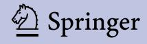

Hautarzt 2005 · 56:1040-1047 DOI 10.1007/s00105-005-1039-x Online publiziert: 5. Oktober 2005 © Springer Medizin Verlag 2005

A. Thielitz · H. Gollnick

Klinik für Dermatologie und Venerologie, Otto-von-Guericke-Universität Magdeburg

# Systemische Aknetherapie

Akne ist eine polyätiologische und polymorphe Dermatose mit sehr hoher Prävalenz. Bis zu 30% der Betroffenen entwickeln eine "klinische Akne", die einer fachärztlichen Behandlung bedarf. Eine nicht oder nur unzureichend behandelte Akne kann schwere physische und psychische Konsequenzen nach sich ziehen. Die adäquate stadiengerechte Therapie erfordert die objektive Einschätzung des klinischen Schweregrades und die Kenntnis um die Eigendynamik der Erkrankung sowie interne und externe Triggerfaktoren. Bei 2-7% aller Patienten liegen schwere Verlaufsformen mit Vernarbungstendenz vor, die den **Einsatz systemischer Aknetherapeuti**ka von Anfang an erfordern.

## **Altersprävalenz** und Erscheinungsformen

Die Akne mit ihren verschiedenen klinischen Ausprägungen nimmt weltweit den

Spitzenplatz aller dermatologischen Diagnosen ein und betrifft ca. 80-85% aller Jugendlichen und Adoleszenten. Während sich beim überwiegenden Teil der Aknepatienten das klinische Erscheinungsbild zwischen dem 20. und 25. Lebensjahr aufgrund noch unbekannter Mechanismen zurückbildet, kann bei einem Teil der Erwachsenen, in bis zu 8% bei den 25- bis 34-Jährigen und bei immerhin noch 3% der 35- bis 44-Jährigen eine Persistenz beobachtet werden [12].

Bei etwa 70% der Betroffenen im 2. Lebensjahrzehnt handelt es sich um milde "physiologische" Erscheinungsformen der Akne; 30% jedoch haben Verläufe, die einer fachärztlichen Behandlung bedürfen, die sog. klinische Akne. Objektives Erscheinungsbild und psychische Beeinträchtigung korrelieren nicht immer. Bereits Patienten mit einer leichten bis mittelschweren Akne haben gegenüber Vergleichspersonen eine erhöhte psychische Komorbidität, die sich in Form von mangelndem Selbstwertgefühl, Angst, Depressionen bis hin zu Suizidgedanken äußern

kann [22]. Eine unzureichende Behandlung der Akne kann dementsprechend schwere physische und psychische Konsequenzen nach sich ziehen. Eine schwere Akne gilt als Risikofaktor für erhöhte Suizidalität und schränkt die Berufswahl ein. da das äußere Erscheinungsbild in vielen Berufsgruppen ein wichtiges Einstellungskriterium ist.

### Indikationen zur systemischen Aknetherapie

Eine stadiengerechte Therapie der Akne erfordert eine objektive Einschätzung des klinischen Schweregrades [4, 8] anhand der Auszählung entzündlicher und nichtentzündlicher Effloreszenzen und der Beurteilung des Inflammationsgrades unter Berücksichtigung des Palpationsbefundes und der Vernarbungstendenz ( Tabelle 1). Weitere Kriterien sind die familiäre Belastung, die Geschwindigkeit der Entwicklung einer Akne, das bisherige Ansprechen auf die Therapie, Provokationsfaktoren und schlussendlich psychoreakti-

| iabelle | ı |
|---------|---|
|         |   |

| Beurteilung des Akneschweregrades. (Nach Gollnick und Orfanos, 1993; [4, 8]) |                 |                    |                     |                                |                               |            |
|------------------------------------------------------------------------------|-----------------|--------------------|---------------------|--------------------------------|-------------------------------|------------|
| Schweregrad aufgrund des Befundes                                         | Komedonen       | Papeln, Pusteln | Knötchen (<1 cm) | Knoten, Zysten, Fistelgänge | Entzündung                    | Vernarbung |
| I A. comedonica                                                              | <20             | <10                | Keine               | Keine                          | Keine                         | Keine      |
| II leichte A. papulopustulosa                                                | >20             | 10-20              | <10                 | Keine                          | Deutlich                      | Keine      |
| III schwere A. papulopustulosa                                               | >20             | >20                | 10–20               | Wenige                         | Stark                         | Vorhanden  |
| IV A. conglobata                                                             | Fistelkomedonen | >30                | >20                 | Viele                          | Sehr stark und tief gehend | Vorhanden  |

# **Zusammenfassung · Abstract**

ve Fak to ren so wie be ruf li ches und so ziales Um feld.

Der so for ti ge Ein satz von Sys tem thera peu ti ka ist ge recht fer tigt beim Vor liegen ei ner Acne conglo ba ta oder pa pu lopu stu lo sa-no do sa (Plewig und Klig man Grad IV) bzw. Grad III und IV nach Gollnick und Or fa nos (1993), ei ner fa mi li ären Be las tung hin sicht lich ei ner ver nar benden Akne, ei ner un ter ad äqua ter Lo kal thera pie nicht aus rei chend kon trol lier ba ren Akne oder ei ner star ken psy cho re ak ti ven Be ein flus sung.

Schwe re Ver laufs for men mit Ver narbung lie gen bei etwa 2–7 der Be trof fenen vor, aber auch Pa ti en ten mit leich ter bis mit tel schwe rer Akne kön nen be reits un ter ei ner psy chi schen Be ein träch ti gung in Form ei ner re ak ti ver De pres si on oder von Schwie rig kei ten auf grund der be ruf lichen Ex po si ti on lei den und soll ten da her sys te misch be han delt wer den. Eine frühzei ti ge sys te mi sche The ra pie ist eben falls an ge zeigt bei dunk ler Haut zur Ver meidung postin flam ma to ri scher Hy per pigmen tie run gen [24].

Grund sätz lich ist eine sinn vol le Kombi na ti on von sys te mi schen und to pi schen Ak ne the ra peu ti ka an zu stre ben ([9, 10, 16]; . **Abb. 1**). Dies gilt nicht bei der al lei nigen The ra pie mit ora lem Isot re ti noin, wo in al ler Re gel auf eine be glei ten de und to pische Be hand lung ver zich tet wer den kann. Beim Ein satz von ora len An ti bio ti ka oder/ und ora len an ti an dro ge nen Hor mo nen bzw. An ti kon zep ti va soll ten stets to pi sche Ak ne mit tel die The ra pie ad di tiv oder syner gis tisch er gän zen, um durch einen paral le len An griff an meh re ren pa tho ge ne tischen Haupt fak to ren einen schnel le ren und ef fek ti ver en Wirk ein tritt zu er zie len [10, 16]. Wei ter hin soll ten mög li che exo gene Pro vo ka ti ons fak to ren der Akne er fragt und eli mi niert wer den. Dazu ge hö ren z. B. UVA-Licht, hohe Luft feuch tig keit, tran spira ti ons min dern de Klei dungs stof fe oder Kon takt mit ak ne ge nen Sub stan zen (z. B. Ha lo ge ne wie Chlor, Brom, Di oxin, Öl); ko me do ge ne Lo kal the ra peu ti ka oder Medi ka men te und Er näh rungs fak to ren, die von in nen her die Akne un ter hal ten können (z. B. An ti kon zep ti va mit re standro gener Kom po nen te, Ana bo li ka wie Tes tos teron oder Clen bu te rol, hoch do sier te Vi tamin-B-Kom bi na tio nen, Li thi um, Phe ny toin u. a.; [4]).

Haut arzt 2005 · 56:1040–1047 DOI 10.1007/s00105-005-1039-x © Sprin ger Me di zin Ver lag 2005

**A. Thie litz · H. Goll nick**

## **Sys te mi sche Ak ne the ra pie**

#### **Zu sam men fas sung**

Die Ent wick lung ei ner Ver nar bung durch mit tel schwe re und schwe re ent zünd li che For men der Acne vul ga ris kann für den Betrof fe nen le bens lan ge psy cho so zia le Konse quen zen ha ben. Der früh zei ti ge Ein satz sys te mi scher Ak ne the ra peu ti ka kann die se Ver läu fe ver hin dern. An ti in flam ma to risch wirk sa me An ti bio ti ka wie Te tra cy cli ne sind bei pa pu lo pu stu lö sen Ak ne for men in diziert und soll ten über einen Zeit raum von 3 Mo na ten ver ab reicht wer den. Die Kom bina ti on mit to pi schen Re ti noiden führt zu ei ner schnel le ren und ef fek ti ver en Re duk tion der Ak neef flo res zen zen, wäh rend Benzoyl per oxid die Ent wick lung bak te ri el ler Re sis ten zen ver hin dert. Ora les Isot re ti noin ist in di ziert bei schwe ren Ak ne for men ohne aus rei chen des An spre chen auf kon ventio nel le Be hand lung. Bei Frau en stellt eine an ti an dro ge ne Hor mon the ra pie eine wirkungs vol le The ra pie al ter na ti ve dar, die obli gat beim Vor lie gen ei ner Acne tar da und kli ni schen An dro ge ni sie rungs zei chen zum Ein satz kommt.

#### **Schlüs sel wör ter**

Ak ne the ra pie · Sys te mi sche An ti bio ti ka · Isot re ti noin · An ti an dro ge ne · Ver nar bung

## **Sys tem ic acne ther a py**

#### **Ab stract**

The de vel op ment of scar ring in in flam mato ry acne may in duce per ma nent dis figure ment and con sid er able psy cho so cial im pact on the lives of af fect ed in di vid uals. The ear ly use of sys tem ic acne ther apy can help to pre vent these un for tu nate con se quences. An ti in flam ma to ry an tibiotics such as tetra cy clines are re quired in mod er ate to se vere pap u lo pus tu lar acne. The rec om mend ed treat ment du ra tion is 3 months; com bi na tion with top i cal retinoids and ben zoyl per ox ide in creas es the speed and ef fi ca cy of le sion re duc tion and

helps to pre vent bac te ri al re sis tance. Oral iso tret in oin is the treat ment of choice in severe acne re sis tant to ad e quate con ven tional ther a py. Hor mon al treat ment rep re sents an al ter na tive reg i men for wom en with acne and is the first choice in late-on set acne and in those with clin i cal signs of hy peran dro ge nism.

## **Key words**

Acne ther a py · Sys tem ic An tibi otics · Iso tret in oin · An tian dro gens · Scar ring

|                            |                                                                         | 4                                                                       | 3                                                                             |                                                                                         | No.                                                                                       |
|----------------------------|-------------------------------------------------------------------------|-------------------------------------------------------------------------|-------------------------------------------------------------------------------|-----------------------------------------------------------------------------------------|-------------------------------------------------------------------------------------------|
|                            | Lei A. comedon.                                                      | cht A. pap.pust.                                                     |                                                                               | schwer Se A. pap.pust.nod.                                                           | chwer A. conglobata                                                                    |
| 1. Wahl                    | Topisches Retinoid                                                   | Topisches Retinoid + anderes top. antibakt. AM                 | Orales Antibiotikum + top. Retinoid ± BPO                            | Orales Antibiotikum + top. Retinoid + BPO                                               | Orales Isotretinoin                                                                    |
| Alternativen               | Anderes top. Retinoid oder Azelain- säure oder Salizylsäure | Anderes top. Antibakt. AM + and. Retinoid oder Azelainsäure | Anderes orales Antibiotikum + and. top. Retinoid ± BPO                        | Orales Isotretinoin oder and. top. Retinoid ± BPO/ Azelainsäure                         | Hohe Dosis orales Antibiotikum + top. Retinoid + BPO                          |
| Alternativen für Frauen | Siehe 1. Wahl                                                           | Siehe 1. Wahl                                                           | Orales Antiandrogen + top. Retinoid/Azelain- säure ± top. antibakterielles AM | Orales Antiandrogen + top. Retinoid ± orales Antibiotikum ± anderes antibakterielles AM | Hohe Dosis orales Antiandrogen + top. Retinoid ± anderes top. antibakt. AM |
| Erhaltungstherapie         | Topisches Retinoid                                                      |                                                                         | То                                                                            | pisches Retinoid + Bl                                                                   | PO                                                                                        |

Abb. 19 **Emp feh lun gen der "Glo bal Al lian ce to Im pro ve Out co mes in Acne" (über setzt und mo di fi ziert nach [10])**

## **Sys te mi sche An ti bio ti ka**

Sys te mi sche An ti bio ti ka grei fen in die mikro bi ell get rig ger te Ag gra va ti on der Entzün dungs kas ka de ein und bil den seit über 30 Jah ren einen we sent li chen Bau stein der Ak ne the ra pie. Pri mär in di ziert sind sie bei al len mitt le ren bis schwe ren Ak ne for men mit deut li cher in flam ma to ri scher Kom ponen te [5, 10, 24]. Sie soll ten je doch nie als Mono the ra pie ein ge setzt wer den, um einer seits ei ner Re sis ten z ent wick lung von P. ac nes und Sta phy lo coc cus au reus [6] vor zu beu gen und an de rer seits die The rapie ef fek ti vi tät durch Be ein flus sung meh rerer pa tho ge ne ti scher Fak to ren zu stei gern [10, 16].

Durch Kom bi na ti on mit to pi schen Reti noiden er rei chen z. B. Te tra cy cli ne eine sig ni fi kant bes se re und schnel le re Reduk ti on sämt li cher Ak neef flo res zen zen, da über eine Be ein flus sung der fol li ku lären Hy per ke ra to se nicht nur ein ko me doly ti scher Ef fekt er zielt wird, son dern über die Ver min de rung der Mi kro ko me do nen auch der Neu bil dung der Ko me do nen sowie in flam ma to ri scher Ef flo res zen zen präven tiv ent ge gen ge wirkt wird.

# &gt; **Die emp foh le ne The ra pie dau er be trägt 2–3 Mo na te**

Der Ef fekt ei ner ora len An ti bio ti ka the rapie kann in der Re gel erst nach 6–8 Wo-

chen be wer tet wer den, da nach ei nem Behand lungs zeit raum von 1 Mo nat erst die ent schei den de wei te re kli ni sche Ver besse rung be ob ach tet wur de [5]. Die empfoh le ne The ra pie dau er von 2–3 Mo na ten [5, 10] soll te nur bei zu er war ten der weite rer Ver bes se rung und ge si cher ter Complian ce über schrit ten wer den. Die par alle le Ap pli ka ti on von 2,5–5 Ben zoyl peroxid gel zur Ver mei dung bak te ri el ler Resis ten zen und Stei ge rung der Ef fek ti vi tät ist un be dingt emp feh lens wert bzw. ob ligat bei al len Pa ti en ten nach ei ner The rapie dau er von >8 Wo chen oder zwi schen 2 An ti bio ti ka zy klen [5, 6, 10]. Eine Kombi na ti on to pi scher und sys te mi scher Anti bio ti ka un ter schied li cher Wirk stoff klassen ist kli nisch in ef fek tiv und ob so let, erhöht eher noch die Ge fahr der Re sis tenzbil dung [6, 21]. Bei wie der hol ten ora len The ra pie zy klen emp fiehlt es sich, das gleiche An ti bio ti kum zu ver wen den, so fern es ef fek tiv war.

Als sys te mi sche An ti bio ti ka kom men pri mär Te tra cy cli ne bzw. de ren De ri va te und Ma kro li de zum Ein satz. Clin da my cin kommt auf grund mög li cher schwe rer Neben wir kun gen (pseu do mem bra nö se Ko litis) eben so wie das im an gel säch si schen Sprach raum ver wen de te Co tri moxa zol/ Tri me tho prim (all er gi sche Re ak tio nen) als The ra pie der 3. Wahl in Fra ge, wenn Kon train di ka tio nen ge gen über den an deren An ti bio tika klas sen vor lie gen [5].

Alle an de ren Sub stanz klas sen von An tibio ti ka sind auf grund ih res Si cher heits profils und man geln der Wirk sam keit in der routi ne mä ßi gen Ak ne the ra pie un ge eig net bzw. noch nicht über zeu gend ge prüft [5, 10].

Ora le An ti bio ti ka wir ken zu nächst über eine Re duk ti on der Ko lo ni sa ti on mit P. ac nes und Sta phy lo kok ken und be hindern da durch die mi kro bi el le Trig ge rung der Ge ne se in flam ma to ri scher Ak nef flores zen zen (. **Ta bel le 2**). Dar über hin aus wei sen sie aber po ten te an ti in flam ma to rische Ef fek te auch in nied ri ger Do sis auf [5, 26]: Te tra cy cli ne ver min dern die Kom plement ak ti vie rung, hem men die Ak ti vi tät von Mat rix-Me tal lo pro teasen, ha ben an tikol la ge no ly ti sche Ef fek te und mo du lie ren die al pha-MSH Pro duk ti on in Ke ra ti no zyten (Mi no cy clin).

Über eine Hem mung der Neu tro philen che mo ta xis, der Pro duk ti on frei er Sauer stoffra di ka le, Lym pho zy ten pro li fe ra tion und Zy to kin pro duk ti on (TNF-α, IL-1, IL-6) der in fil trie ren den Ent zün dungs zellen, bak te ri el len Li pa se pro duk ti on und bestimm ter Ma kro pha gen funk tio nen schwächen Te tra cy cli ne und Ma kro li de die Immu n ant wort ge gen P. ac nes ab, die mit dem Ak ne schwe re grad kor re liert.

## **Te tra cy cli ne**

Te tra cy cli ne sind die The ra peu ti ka der 1. Wahl, ins be son de re die der 2. Ge ne ra-

**Ta bel le 2**

| Ein fluss sys te mi scher Ak ne the ra peu ti ka auf die pa tho ge ne ti schen |  |
|--------------------------------------------------------------------------------|--|
| Haupt fak to ren                                                               |  |

|                    | Hy per se bor rhö | Fol li ku lä re Hy per ke ra to se | Bak te ri el le Hy per ko lo ni sa ti on | Ent zün dung |
|--------------------|-------------------|---------------------------------------|---------------------------------------------|--------------|
| An ti bio ti ka    | −                 | (+)                                   | ++                                          | +            |
| An ti an dro ge ne | ++                | +                                     | (+)                                         | (+)          |
| Isot re ti noin    | +++               | ++                                    | (+)                                         | ++           |

+++ sehr stark, ++ stark, + mä ßig, (+) in di rekt/schwach.

ti on (Mi no cy clin, Doxy cy clin, Ly me cyclin), die ge gen über dem preis wer ten Tetra cy clin den Vor teil der län ge ren Halbwerts zeit (Do si s in ter val le 12–24 h) so wie der aus rei chen den Ab sorp ti on bei Ein nahme zu den Mahl zei ten und – da raus re sultie rend – ei ner ver bes ser ten Pa ti en ten complian ce auf wei sen (. **Ta bel le 3**). Die empfoh le nen Do sie run gen lie gen bei 2-mal 500 mg/Tag für Te tra cy clin, 100 mg/Tag für Doxy cy clin und 100 mg/Tag bzw. 2 mal 50 mg/Tag für Mi no cy clin für 12 Wochen [5]. Die häu fig prak ti zier te pro longier te Low-dose-The ra pie nach ini ti a ler Bes se rung kann nur emp foh len wer den, wenn der Aus bil dung von De-novo-Re sisten zen an de rer Kom men sa len wie Sta phylo kok ken durch par al le le An wen dung von BPO ent ge gen ge wirkt wird. Zu den häu figen Ne ben wir kun gen zäh len ga stro in testina le Symp to me so wie ins be son de re bei Te tra cy clin und Doxy cy clin eine er höh te UV-Pho to sen si ti vi tät, die ent spre chen de Schutz maß nah men er for dert. Kon train diziert sind Te tra cy cli ne in der Schwan gerschaft und bei Kin dern (<8–10 Jah re) aufgrund der Gelb fär bung der Zäh ne und eines ver zö ger ten Kno chen wachs tums.

Mi no cy clin ist be son ders li po phil und soll im Talg drü sen fol li kel ak ku mu lie ren. Die hö he ren The ra pie kos ten un ter Mi nocy clin wer den im All ge mei nen mit ei nem et was schnel le ren Wirk ein tritt und ei ner hö he ren The ra pie ef fek ti vi tät ge recht fertigt. Das Ne ben wir kungs- und Si cher heitspro fil un ter Mi no cy clin ist je doch, be rücksich tigt man die Zahl von pub li zier ten Fall be rich ten zu schwe ren Mi no cy clin-indu zier ten Ne ben wir kun gen, als un günsti ger ein zu schät zen und gab vor kur z em An lass, die Si cher heit und Ef fek ti vi tät dieser Sub stanz in ei nem Cochra ne-Re view zu be wer ten [7]. Nach Ein schät zung der Re view er zeigt die der zei ti ge Da ten la ge

auf Ba sis der Er geb nis se von 27 Stu di en kei ne si che re Evi denz für eine über le gene Wirk sam keit von Mi no cy clin ge genüber an de ren Te tra cy cli nen und soll te daher auf grund des Kos ten- und Si cher heitspro fils nicht mehr als First-line-The ra pie ein ge setzt wer den [5]. Ein Vor teil von Mino cy clin ist je doch die ge rin ge Re sis tenzbil dung von P. ac nes: Te tra cy clin re sis ten te Stäm me re a gie ren kreuz re sis tent auf Doxycy clin, sind aber noch sen si bel ge gen über Mi no cy clin [2]. Das Ri si ko für Hy per pigmen tie run gen un ter Mi no cy clin so wie der In duk ti on ei nes "Lu pus-like-Syn drom", einem me di ka men ten in du zier ten SLE-ähnli chen re ver sib len Krank heits bild, kann mit der ku mu la ti ven Ge samt do sis steigen [7]. Die gleich zei ti ge Gabe von sys temi schem Isot re ti noin er höht das Ri si ko eines "Pseu do tu mor cere bri" und ist da her kon train di ziert.

## **Ma kro li de**

Pro to typ ist das Ery thro my cin, das in einer Do sie rung von 0,5–1 g/Tag ähn lich effek tiv ist wie Te tra cy clin oder Doxy cy lin. Auf grund der zu neh men den Re sis ten z entwick lung von P. ac nes [2, 6] soll te Ery thromy cin nur bei Kon train di ka tio nen ge gen Te tra cy cli ne oder bei Te tra cy cli nun ver träglich keit ge ge ben wer den. An de re Ver tre ter die ser Sub stanz grup pe, die in den letz ten Jah ren im Rah men klei ne rer Stu di en als Ak ne the ra peu ti ka ein ge setzt wur den, sind Azi thro my cin und Ro xi thro my cin [14]. Sie bie ten zwar den Vor teil ei nes ver besser ten Ne ben wir kungs pro fils hin sicht lich ga stro in tes tina ler Ne ben wir kun gen so wie ei ner güns ti gen Com plian ce auf grund der ge rin gen Ein nah me fre quenz (Azi thro mycin), je doch wur de bis her hin sicht lich der Ef fek ti vi tät in kei ner Stu die eine Über legen heit ge gen über etab lier ten Ak ne the-

ra peu ti ka ge zeigt. Er fah run gen aus großen dop pelblin den ran do mi sier ten und pla ce bo kon trol lier ten Ver gleichs stu di en feh len. Au ßer dem sind Kreuz re sis ten zen nach to pi scher oder sys te mi scher Ery thromy cinan wen dung zu er war ten, die für Staphy lo kok ken und Strep to kok ken be reits be schrie ben sind [14]. Auf grund der mangeln den Er fah rung und des un güns ti gen Kos ten pro fils im Ver gleich zu an de ren Akne the ra peu ti ka sind sie da her mo men tan für die Rou ti ne the ra pie nicht zu emp fehlen.

## **Hor mo nel le Be hand lungs stra te gi en**

Eine hor mo nel le an ti an dro ge ne The rapie ist stets dann an ge zeigt, wenn Frau en nicht aus rei chend auf kon ven tio nel le Thera pie an spre chen und/oder der Wunsch nach ora ler Kon tra zep ti on be steht bzw. im Rah men ei ner sys te mi schen Isot re tinoin be hand lung not wen dig wird. Sie eignet sich auch und in be son de rer Wei se bei gleich zei ti gem Vor lie gen ei ner aus ge prägten Se bor rhö, bei an dro ge ne ti scher Alope zie, SAHA-(Se bor rhoe, Akne, Hir sutis mus, An dro ge ne ti sche Alo pe zie-)Syndrom.

Ob wohl die meis ten Ak ne pa ti en tin nen (>92) kei ne en do kri no lo gi schen Auf fällig kei ten auf wei sen, kann eine hor mo nelle Eva lua ti on beim Vor lie gen der ge nannten Be gleit sym pto me sinn voll sein [23]. Zu Grun de lie gen könn ten ein "late-onset" oder "cryp tic va ri ant" ad re no ge ni tales Syn drom (AGS) mit ei nem par ti el len 21- oder 11-Hy dro xyla se de fekt in der Neben nie re oder häu fi ger ein Syn drom der po ly zys ti schen Ova ri en (PCOS) mit ei ner kli ni schen Tri as aus An dro ge ni sie rungser schei nun gen, Zy klusun re gel mä ßig keiten und me ta bo li schem Syn drom. Die Di ag nos tik um fasst die Be stim mung von DHEAS, Tes tos te ron und frei em Tes tos teron, LH/FSH-Ra tio, Pro lak tin und 17-Hydro xy pro ges te ron und soll te nach Zy klusbe ginn bis zum 8. Tag er fol gen. Bei ex zessiv er höh ten An dro ge nen soll ten ein ova riel ler und ad rena ler Tu mor bzw. PCOS ausge schlos sen wer den, bei nor ma len Werten und kli ni schen An dro ge ni sie rungs zeichen kann ein ACTH-i.v.-Be las tungs test (Syn ac then® ) mit nach fol gen dem An stieg von 17-OHP ein kryp ti sches AGS nach wei-

#### **Ta bel le 3**

| Te tra cy cli ne zur Ak ne the ra pie |                                        |                                                                                                                           |                                                                                                                                                                                                                                                                                                                                           |  |
|---------------------------------------|----------------------------------------|---------------------------------------------------------------------------------------------------------------------------|-------------------------------------------------------------------------------------------------------------------------------------------------------------------------------------------------------------------------------------------------------------------------------------------------------------------------------------------|--|
| An ti bio ti kum                      | Do sie rung                            | Vor tei le                                                                                                                | Ne ben wir kun gen/Nach tei le                                                                                                                                                                                                                                                                                                            |  |
| Te tra cy clin                        | 500 mg 2-mal/Tag                       | Preis wert                                                                                                                | Re sorp ti on durch Nah rungs auf nah me und Milch pro duk te ge stört, kur ze Halb werts zeit, ga stro in tes tina le Ne ben wir kun gen häu fig                                                                                                                                                                                   |  |
| Ly me cy clina                        | 300–600 mg/Tag                         | Gu tes Ne ben wir kungs- und Si cher heits pro fil                                                                     |                                                                                                                                                                                                                                                                                                                                           |  |
| Doxy cy clin                          | 100 mg/Tag (100 mg 2-mal /Tagb)     | Ein nah me zu den Mahl zei ten, preis wert, lan ge Halb werts zeit                                                     | Pho to sen si ti vi tät, kei ne Ein nah me mit Milch pro duk ten                                                                                                                                                                                                                                                                       |  |
| Mi no cy clin                         | 50 mg 2-mal/Tag (100 mg 2-mal/Tagb) | Ein nah me zu den Mahl zei ten, gute Ab sorp ti on und Fol li kel pe ne tra ti on, ge rings te Re sis tenz bil dung | Teu er, un güns ti ge res Si cher heits pro fil [7] Häu fig (>1%) ga stro in tes tina le Ne ben wir kun gen, Schwin del, Kopf schmerz; Hauter schei nun gen; ge le gent lich (<1%) Hy per pig men tie run gen; sehr sel ten (<0,001%) au toim mu no lo gi sche Ne ben wir kun gen wie "Lu pus-like-Syn drom", He pa ti tis |  |

a In Deutsch land nicht zu ge las sen. bNur in Aus nah me fäl len wie star ker Se bor rhö emp foh len [5].

#### **Ta bel le 4**

| An ti an dro ge ne in Kom bi na ti ons prä pa ra ten mit Zu las sung zur Ak ne the ra pie |                                                                                                                                                                        |                                                            |
|-------------------------------------------------------------------------------------------|------------------------------------------------------------------------------------------------------------------------------------------------------------------------|------------------------------------------------------------|
| Prä pa ra tena me                                                                         | Zu sam men set zung                                                                                                                                                    | Her stel ler                                               |
| Diane® 35 Cle via® Ju li et te® Bel la HE XAL 35® Cy pro derm                 | 35 µg Ethi ny le stra di ol + 2 mg Cy pro te ro nace tat                                                                                                               | Sche ring Her mal Merck dura Hexal Derm apharm |
| Esti cia®                                                                                 | 50 µg Me stra nol + 2 mg Chlor ma di no nace tat                                                                                                                       | Her mal                                                    |
| Neo-Eu no min®                                                                            | 1. Pha se = 11 Tage 50 µg Ethi ny le stra di ol + 1 mg Chlor ma di no nace tat 2. Pha se = 11 Tage 50 µg Ethi ny le stra di ol + 2 mg Chlor ma di no nace tat | Grün en thal                                               |
| Va let te®                                                                                | 30 µg Ethi ny le stra di ol + 2 mg Die no gest                                                                                                                         | Jen apharm                                                 |

sen. Da auf grund des En zym de fek tes ein Shunt de fekt der ad rena len Ste ro id syn these vor liegt mit re sul tie ren der ACTH-Stimu la ti on und An dro gen über pro duk ti on, kann hier eine nied rig do sier te ora le Gluko kor ti ko id the ra pie (2,5–5 mg Pred nisolon/Tag) the ra peu tisch nütz lich sein [10].

## &gt; **An dro ge ne spie len eine we sent li che Rol le in der In duk ti on der pri mären pa tho ge ne ti schen Fak to ren der Akne**

An dro ge ne spie len eine we sent li che Rolle in der In duk ti on der pri mären pa tho gene ti schen Fak to ren der Akne [9, 23], demzu fol ge kann man über eine an ti an dro gene The ra pie so wohl einen se bo sup pres siven Ef fekt er zie len als auch den an dro gen-

sen si ti ven Fol li kel ke ra ti no zy ten einen kome do ge nen Sti mu lus ent zie hen (. **Ta belle 2**). Auch ohne hor mo nel le Auf fäl lig keiten im pe ri phe ren Blut spre chen Frau en jen seits der Pu ber tät mit ei ner ent zündlich-pa pu lös bis kno ti gen Akne ty pi scherwei se der un te ren Ge sichts hälf te stets sehr gut auf eine an ti an dro ge ne, to pisch oder auch sys te misch be glei te te The ra pie an [23, 24, 25].

Vom an ti an dro ge nen Wirk me cha nismus un ter schei det man An dro gen re zeptor blo cker (Cy pro te ro nace tat, Chlor ma dino nace tat, Die no gest, Dro spi re non, Spi rono lac ton, Flutamid) von Sub stan zen, die über eine Feed back-in du zier te Sup pres sion der en do ge nen ova ri el len oder ad renalen An dro gen pro duk ti on wir ken (Östro gene, be stimm te ora le Kon tra zep ti va, Glu kokor ti ko i de) bzw. ihre an ti an dro ge ne Wirkung durch An griff an der Hy po phy se aus üben (GnRH-Ana lo ga, Do pa mi nagonis ten bei Hy per pro lak tinämie).

The ra peu tisch ste hen An ti an dro ge ne in ers ter Li nie in Kom bi na ti ons prä pa ra ten auch in Form ora ler Kon tra zep ti va zur Verfü gung. An de re nichts te ro i da le Sub stanzen (Flutamid, Ke to ko na zol, Ci me ti din) kön nen die Akne po si tiv be ein flus sen. Sie kom men aber nur in be son de ren Fäl len zum Ein satz, denn Letz te re sind für die spe zi el le In di ka ti on in Deutsch land nicht zu ge las sen.

## **An dro gen re zep tor blo cker/ An ti an dro ge ne in Kom bi na ti ons prä pa ra ten**

Die in Deutsch land spe zi ell für die Ak nethe ra pie zu ge las se nen Kom bi na ti ons prä para te mit An dro gen re zep tor blo ckern sind in . **Ta bel le 4** zu sam men ge fasst. Ge gen Akne zu ge las se ne Kom bi na tio nen kann der Haut arzt selbst stän dig ver ord nen, wobei sich eine Ko ope ra ti on mit dem be handeln den Gy nä ko lo gen in be son de ren Fällen emp fiehlt. Prä pa ra te mit an ti an dro gener Wir kung und Wirk sam keit bei der Akne ohne spe zi el le Zu las sung für die Indi ka ti on sind Be la ra® (Chlor ma di no nacetat 2 mg/Ethi ny le stra di ol 30 µg), Yas min® bzw. Pe ti bel le® (Dro spi re non 3 mg/Ethi nyle stra di ol 30 µg.

Alle An dro gen re zep tor blo cker habe sich in Stu di en un ter schied li cher Qua li tät als wirk sam ge gen die Akne er wie sen [1, 25]; al ler dings lie gen Ver gleichs stu di en dieser Prä pa ra te un ter ein an der nur ver ein zelt vor. Die ent spre chend der pub li zier ten Daten la ge mei st un ter such te Kom bi na ti on ist CPA 2 mg/Ethi ny le stra di ol 35 µg. Nach 6 mo na ti ger The ra pie dau er ist eine Re duk tion der Se bu mex kre ti ons ra te um 25 und eine glo ba le Bes se rung der Akne um 64– 90 zu er war ten [25]. Bei Frau en mit einem pa tho lo gi schen An dro gen me ta bo lismus kön nen wäh rend der ers ten 10 Zy klusta ge zu sätz lich 10–20 mg CPA zu sätz lich per oral ver ab reicht wer den bzw. 100 mg wäh rend des 5.–14. Zy klus ta ges [20]. Das an ti an dro ge ne Kon tra zep ti vum Yas min®/ Pe ti bel le®, be ste hend aus ei ner Kom bi na tion aus Dro spi re non 3 mg/Ethi ny le stra diol 30 µg, er wies sich in ei ner Ver gleichs studie der Evi denz klas se 1b (*n*=128) der Kombi na ti on mit CPA 2 mg/Ethi ny le stra di ol 35 µg als gleich wer tig [1]. Dro spi re non ist ein syn the ti sches 17β-Spi ro no lac ton-ähn liches Pro ge s tin der 3. Ge ne ra ti on mit an timi ne ra lo kor ti ko i der und an ti an dro ge ner Ak ti vi tät.

## **Ora le Kon tra zep ti va**

Die meis ten ora len Kon tra zep ti va be stehen aus ei nem Pro ge s tin in Ver bin dung mit ei nem nied rig do sier ten Öst ro gen. Die se Kom bi na ti on ver min dert das Ri si ko ei nes En do me tri umkar zi noms und ver bessert das Ne ben wir kungs pro fil ei ner klas sischen Östro gen the ra pie. Ob wohl ei ni ge Pro ge s ti ne eine in t rin si sche an dro ge ne Akti vi tät be sit zen, ver bes sern Pro ge s ti ne der 2. (Le von or ge strol, No rethin dron) und 3. Ge ne ra ti on (Dro spi re non >De so ge strel >Ge sto den, Nor ge sti mat) in Kom bi na ti on mit ei nem Öst ro gen die Akne über eine Sup pres si on der go na do tro pin sti mu lierten ova ri el len An dro gen pro duk ti on und Ver min de rung des frei en Te stos te rons sowie östro gen in du zier te er höh te SHBG-Pro duk ti on in der Le ber. Ein kom bi pha sisches Prä pa rat mit De so ge strel 25/125 µg mit Ethi ny le stra di ol 40/30 µg (Bi vi ol®) erwies sich in 2 Ver gleichs stu di en mit 183 bzw. 172 Pro ban den (Evi den ze be ne 2b) der Kom bi na ti on aus CPA 2 mg/Ethi ny lestra di ol 35 µg als gleich wer tig [1]. Kom bina tio nen aus Le von or ge strel und Ethi ny lestra di ol ver bes sern die Akne, sind je doch Kom bi na tio nen mit CPA, CMA und De soge strel un ter le gen [1, 25]. Östro ge ne oder

Gesta ge ne je weils als Mono the ra pie werden für die Akne nicht emp foh len.

Kon train di ka tio nen ei ner ora len an tian dro ge nen Kon tra zep ti ons the ra pie sind Schwan ger schaft, Ni ko tina bu sus (>15/ Tag) bei Al ter über 35 Jah ren, Throm bo se oder Lun gen em bo lie in der Anam ne se, unkon trol lier te ar te ri el le Hy per to nie, Dia betes mel li tus mit Se kun där kom pli ka tio nen, be stimm te For men der Mig rä ne und Le berer kran kun gen wie He pa ti tis, de kom pensier te Zir rho se oder Tu mor.

# **Ora les Isot re ti noin**

Isot re ti noin ist all ge mein als er folg reichstes Ak ne the ra peu ti kum an er kannt [3, 18, 19]. Dis kre pan zen hin sicht lich der Produkt in for ma ti on und Do sie rungs richt li nien in ner halb der EU er for der ten eine euro pa wei te Har mo ni sie rung. Ent spre chend der Eu ro pä ischen Di rek ti ve zur Ver schreibung von sys te mi schem Isot re ti noin bei Acne vul ga ris ist Isot re ti noin bei schweren For men der Akne (wie Acne no du laris oder Acne conglo ba ta oder Akne mit

dem Ri si ko ei ner per ma nen ten Nar benbil dung) in di ziert, die sich ge gen über adäqua ten Stan dard the ra pie zy klen mit sys temi schen An ti bio ti ka und to pi scher Thera pie als re sis tent er wie sen ha ben. Demnach ist Isot re ti noin nur noch als Se condline-The ra peu ti kum ein zu set zen. Wei terhin wird die Ver ord nung bei Kin dern unter 12 Jah ren nicht mehr emp foh len.

## &gt; **Isot re ti noin ist nur noch als Se cond-line-The ra peu ti kum ein zu set zen**

Ora les Isot re ti noin ist das ein zi ge Prä parat, das alle 4 pa tho ge ne ti schen Fak to ren der Akne gleich zei tig be ein flus sen kann (. **Ta bel le 2**). Es wirkt stark se bo sup pressiv über eine Ver min de rung der Tag drüsen grö ße und -se kre ti on um bis zu 90, nor ma li siert die fol li ku lä re Hy per ke ra to se, wirkt in di rekt, aber ef fek tiv auf die bak teri el le Ko lo ni sa ti on über eine Mi lieu än derung im Fol li kel bzw. Ent zug des bak te riel len Nähr bo dens und hat po ten te an ti inflam ma to ri sche Ef fek te [18].

#### **Infobox**

#### **Nütz li che Links**

**http://www.bfarm.de/de/vi gi lanz/ am\_si cher\_akt/isot ret/leit fa den.pdf http://www.bfarm.de/de/vi gi lanz/ am\_si cher\_akt/isot ret/pa ti en ten in fo.pdf http://www.bfarm.de/de/vi gi lanz/**

**am\_si cher\_akt/isot ret/isot re ti noin\_FI.rtf**

**http://www.emea.eu.int/**

## **Do sie rung von Isot re ti noin**

Um Ne ben wir kun gen wie das ini ti a le Auffla ckern zu mi ni mie ren, wird eine Anfangs do sis von 0,5 mg/kg/Tag emp foh len [3, 19], die auch in die EU-Di rek ti ve auf genom men wur de. Un ter die ser Do sie rung kann mit ei nem ra schen Ein set zen der Wir kung so wie ver tret ba ren Ne ben wirkun gen ge rech net wer den. Bei gu ter Verträg lich keit kann ins be son de re bei Acne conglo ba ta oder Lo ka li sa ti on am Stamm nach 1 Mo nat auf 0,8–1 mg/kg ge stei gert wer den. Bei ei ner The ra pie dau er von 5– 6 Mo na ten er reicht man so leicht die empfoh le ne ku mu la ti ve Ge samt do sis von 120– 150 mg/kg, un ter der eine ver min der te Rezi div nei gung be ob ach tet wur de [15]. Die meis ten Re zi di ve tre ten in ner halb der ersten 3 Jah re nach The ra pie en de auf, wobei ins be son de re jun ge Pa ti en ten mit einer seit kur z em be ste hen den Akne und sol che mit ei ner schwe ren stamm be tonten Akne eine hö he re Re zi div wahr scheinlich keit auf wei sen. Ab hän gig von Schwere grad, Ne ben wir kun gen und the ra peu tischem An spre chen ist es sinn voll, die Dosis in di vi du ell an zu pas sen.

Die in den letz ten Jah ren ge le gent lich prak ti zier te Low-dose-Isot re ti noin the rapie (0,1–0,3 mg/kg/Tag oder in ter mit tierend) ist ne ben wir kungs arm und eig net sich für be stimm te Pa ti en ten grup pen, bei de nen letzt lich eine Kon trol le der ent zündli chen Ak neef flo res zen zen an ge strebt wird (z. B. äl te re Pa ti en ten, re zi di vie ren de pa pu lo pu stu lö se Ak ne for men oder Acne tar da so wie schwe re per sis tie ren de Se borrhö nach Ab hei lung der Akne; [11, 24]).

## **Ne ben wir kun gen**

Sehr häu fi ge Ne ben wir kun gen sind die do si s ab hän gi gen mu ko ku ta nen Be gleiter-

schei nun gen wie Aus trock nung der Haut und Schleim häu te mit der ty pi schen Cheili tis [18, 19]. Sie kön nen als Kri te ri um für die zu ver läs si ge Ein nah me be trach tet werden. Bei etwa 6–7 der Pa ti en ten kommt es in ner halb der ers ten 2(–4) Wo chen zu ei ner tran si en ten leich ten Ver schlech terung vor be ste hen der Ak ne lä sio nen, die durch den Wirk me cha nis mus er klär bar ist (z. B. Ex pul si on vor be ste hen der Mi kroko me do nen, pro in flam ma to ri scher Ef fekt von bak te ri el len Zer falls pro duk ten).

Für Kon takt lin sen trä ger kann die Kera to con junc ti vi tis sic ca zum Pro b lem werden, manch mal tre ten Epi sta xis und sekun däre Haut in fek ti on mit Sta phy lo coccus au reus auf, die leicht mit to pi schen Anti sep ti ka kon trol liert wer den kön nen. Arthral gi en und My al gi en eben so wie leichte re Kopf schmer zen zu Be ginn der The rapie tre ten ge le gent lich auf, schwe re Kopfschmer zen soll ten je doch als Warn symptom für einen Pseu do tu mor cere bri ange se hen wer den, der bei Pa ti en ten mit Dosie run gen über 1 mg/kg bei gleich zei ti ger Te tra cy clin ga be be ob ach tet wur de.

Pa ti en ten soll ten auf eine mög li che einge schränk te Dun ke la d ap ta ti on so wie erhöh te UV-Licht emp find lich keit auf grund ei ner leich ten Ver dün nung des Stra tum cor ne um hin ge wie sen wer den. Phy si kali sche und che mi sche Pee lings, La ser behand lung und Wach se pi la ti on sind während und ent spre chend der EU-Di rek ti ve bis 6 Mo na te nach Ab bruch der Be handlung zu ver mei den.

## &gt; **Die The ra pie mit Isot re ti noin er for dert eine in ten si ve Pa ti en ten auf klä rung**

Die The ra pie mit Isot re ti noin er for dert eine in ten si ve Pa ti en ten auf klä rung so wie deren Do ku men ta tion [19]. Ins be son de re für Frau en sind die Si cher heits maß nah men auf grund der ho hen Te ra to ge ni tät mit den Ent schei dun gen der EU-Kom mis si on zu isot re ti noin hal ti gen Arz nei mit teln im Okto ber 2003 ver schärft wor den: Die Ab ga be von Isot re ti noin an ge bär fä hi ge Frau en darf nur er fol gen, wenn die Be din gun gen des Schwan ger schafts ver hü tungs pro gramms ein ge hal ten wer den: Dies bein hal tet, dass die The ra pie erst be gin nen kann, wenn vor und nach ei nem Zeit raum von 4 Wo chen mit kon se quen ter Ver hü tung (ide al 2 Me-

tho den) 2 aus rei chend sen si ti ve Schwanger schafts tes te ne ga tiv aus fie len, die dann in mo nat li chen Ab stän den 4 Wo chen vor bis 5 Wo chen nach der Be hand lung zu wieder ho len sind. Die Ab ga be von Isot re ti noin darf nur kon trol liert für einen 30-tä gi gen Be darf in ner halb von 3 Ta gen nach ei nem ne ga ti ven Schwan ger schafts test er fol gen.

Eine de tail lier te Über sicht über die erfor der li chen Maß nah men gibt ein beim BfArM on li ne ab ruf ba rer Leit fa den für Ärz te und Apo the ker zur Ver ord nung von Isot re ti noin.

Bei etwa 20 der Pa ti en ten tre ten Erhö hun gen der Tri gly ze ri de und des Choles te rols auf, die je doch sel ten den obe ren Norm be reich über schrei ten und nach Dosis re duk ti on re ver si bel sind [19]. Zur Gewähr leis tung der Pa ti en ten si cher heit wird zu The ra pie be ginn und nach 4 Wo chen als di ag nos ti sches Mi ni mal pro gramm die (Nüch tern-)Be stim mung der Tri gly ze ri de, des Cho les te rols so wie ei ni ger Le ber funkti ons pa ra me ter, wie z. B. Tran sa mi na sen und γ-GT, emp foh len, die dann in 3-mo nati gen Ab stän den wie der holt wer den soll. Eng ma schi ge re Kon trol len sind bei pa tholo gi schen Wer ten, Ri si ko pa ti en ten oder bei Do sis s tei ge rung zu emp feh len.

Die Au to ren in ter pre tie ren die Richt lini en der EU-Di rek ti ve al ler dings als Ausdruck ei nes über stei ger ten Si cher heits bedürf nis ses, re sul tie rend in ei ner Dis so zia tion von Kos ten, Auf wand und Nut zen und da her ethisch be denk lich.

Der ge gen wär ti ge Kennt nis stand be züglich der Kont ro ver se hin sicht lich ei ner Kausa li tät zwi schen Isot re ti noin ga be und Sui zida li tät kann da hin ge hend zu sam men ge fasst wer den, dass kein Be weis für eine As so zia tion ge ge ben ist und bis her auch kein me chanis ti scher Er klä rungs an satz vor liegt [13, 17]. Grund sätz lich ist bei ei ner Bes se rung der Akne un ter Isot re ti noin zwar auch mit ei ner Bes se rung der Stim mungs la ge zu rech nen, je doch sind auch ge gen läu fi ge psy chi sche Auf fäl lig kei ten be ob ach tet wor den, und aufgrund der bis he ri gen Da ten la ge kann eine ur säch li che Be tei li gung des Re ti no ids nicht völ lig aus ge schlos sen wer den. Für die Praxis er gibt sich da raus die Not wen dig keit eines be wuss ten Um gangs mit die ser Pro b lema tik bei der In di ka ti ons stel lung und Pa tien ten füh rung. Pa ti en ten mit schwe rer Akne sind grund sätz lich in eine hö he re Ri siko klas se be züg lich psych ia tri scher Er krankungen einzustufen und sollten bei positiver Anamnese in fachspezifische Betreuung überwiesen werden.

#### Fazit für die Praxis

Die objektive Einschätzung des klinischen Schweregrades und die Erkennung besonderer Verlaufsformen der Akne sind Voraussetzung für eine adäquate stadiengerechte Therapie. Geringste Anzeichen einer physischen Vernarbung und psychischen Beeinträchtigung rechtfertigen den sofortigen Einsatz von Systemtherapeutika. Antibiotika sollten mit topischen Retinoiden und Benzoylperoxid kombiniert und zur Vermeidung von Resistenzen zeitlich definiert und in richtiger Dosierung verabreicht werden. Therapeutika der 1. Wahl sind Tetracycline. Die hormonelle antiandrogene Therapie eignet sich bei Frauen mit Kontrazeptionswunsch, Acne tarda sowie gleichzeitigem Vorliegen einer ausgeprägten Seborrhö, androgenetischer Alopezie und Hyperandrogenismus. Sie ist keine primäre Monotherapie einer milden entzündlichen Akne und sollte stets mit additiv oder synergistisch wirksamen topischen Aknemitteln ergänzt werden. Orales Isotretinoin sollte bei allen schweren bzw. vernarbenden Akneformen eingesetzt werden, die nicht ausreichend auf eine adäquate konventionelle Kombinationstherapie ansprechen.

## **Korrespondierender Autor**

#### Prof. Dr. H. Gollnick

Klinik für Dermatologie und Venerologie. Otto-von-Guericke-Universität Magdeburg, Leipziger Straße 44, 39120 Magdeburg E-Mail: Harald.Gollnick@ medizin.uni-magdeburg.de

Interessenkonflikt: Der korrespondierende Autor versichert, dass keine Verbindungen mit einer Firma, deren Produkt in dem Artikel genannt ist, oder einer Firma, die ein Konkurrenzprodukt vertreibt, bestehen.

#### Literatur

1. Arowojolu AO, Gallo MF, Grimes DA, Garner SE (2004) Combined oral contraceptive pills for treatment of acne. Cochrane Database Syst Rev CD004425

- 2. Cooper AJ (1998) Systematic review of Propionibacterium acnes resistance to systemic antibiotics. Med I Aust 169-259-261
- 3. Cunliffe WJ, van de Kerkhof PC, Caputo R et al. (1997) Roaccutane treatment quidelines: results of an international survey. Dermatology 194:351-357
- 4. Cunliffe WJ (1993) Natürlicher Verlauf der Akne. Klinische Erscheinungsformen der Akne. In: Gollnick HPM, Orfanos CE (übersetzt und bearbeitet) Akne. Hippokrates, Stuttgart, S 2-75, S 115-122
- 5. Dreno B, Bettoli V, Ochsendorf F et al. (2004) European recommendations on the use of oral antibiotics for acne. Eur J Dermatol 14:391-399
- 6. Eady EA (1998) Bacterial resistance in acne. Dermatology 196:59-66
- 7. Garner SE, Eady EA, Popescu C et al. (2000) Minocycline for acne vulgaris: efficacy and safety. Cochrane Database Syst Rev CD002086
- 8. Gollnick H (2002) "Akne und ihre Subtypen" Leitlinie. Hautarzt 53:322-327
- 9. Gollnick H (2003) Current concepts of the pathogenesis of acne: implications for drug treatment. Drugs 63:1579-1596
- 10. Gollnick H, Cunliffe W, Berson D et al. (2003) Management of acne: a report from a Global Alliance to Improve Outcomes in Acne. J Am Acad Derma-
- 11. Goulden V. Clark SM. McGeown C. Cunliffe WJ (1997) Treatment of acne with intermittent isotretinoin, Br J Dermatol 137:106-108
- 12. Goulden V, Stables GI, Cunliffe WJ (1999) Prevalence of facial acne in adults. J Am Acad Dermatol 41.577-580
- 13. Hull PR, D'Arcy C (2003) Isotretinoin use and subsequent depression and suicide: presenting the evidence. Am J Clin Dermatol 4:493-505
- 14. Kunynetz R (2002) Systemic antibiotic therapy for acne. A review. Skin Therapy Lett 7:3-7
- 15. Layton AM, Knaggs H, Taylor J, Cunliffe WJ (1993) Isotretinoin for acne vulgaris – 10 years later: a safe and successful treatment. Br J Dermatol 129-292-296
- 16. Leyden JJ (2003) A review of the use of combination therapies for the treatment of acne vulgaris. J Am Acad Dermatol 49:S200-S210
- 17. Magin P. Pond D. Smith W (2005) Isotretinoin, depression and suicide: a review of the evidence. Br J Gen Pract 55:134–138
- 18 Orfanos CE Zouboulis CC (1998) Oral retinoids in the treatment of seborrhea and acne. Dermatology 196:140-147
- 19. Plewig G, Albrecht G, Henz BM et al. (1997) Systemische Behandlung der Akne mit Isotretinoin: Aktueller Stand. Hautarzt 48:881-885
- 20. Raudrant D, Rabe T (2003) Progestogens with antiandrogenic properties. Drugs 63:463-492
- 21. Tan AW, Tan HH (2005) Acne vulgaris: a review of antibiotic therapy. Expert Opin Pharmacother 6:409-418
- 22. Tan JK (2004) Psychosocial impact of acne vulgaris: evaluating the evidence. Skin Ther Lett 9:1-3, 9
- 23. Thiboutot D, Chen WC (2003) Update and future of hormonal therapy in acne. Dermatology 206:57-
- 24. Zouboulis CC, Piquero-Martin J (2003) Update and future of systemic acne treatment. Dermatology
- 25. Zouboulis CC (2003) Therapie der Akne mit Antiandrogenen – Eine evidenzbasierte Übersicht. JDDG 7.535-546
- 26. Webster GF (1995) Inflammation in acne vulgaris. J Am Acad Dermatol 33:247-253

#### **Fachnachrichten**

## Neuer Impfstoff gegen Vogelgrippe

Molekularbiologen des Friedrich-Loeffler-Instituts auf der Insel Riems haben auf Basis des Geflügel-Herpesvirus einen neuen Impfstoff gegen die Vogelgrippe entwickelt. In dieses Virus setzten sie die Erbinformation für das Hämagglutinin-Protein des Geflügelpestvirus (AIV) ein. Nach der Impfung kommt es daher nicht nur zu einer Immunantwort gegen das Geflügel-Herpesvirus, sondern auch gegen das Geflügelpestvirus und somit zu einem Schutz gegen beide Viren.

Der Vorteil der Nutzung des Herpesvirus als Vektor liegt unter anderem darin, dass Antikörper nur gegen das Hämagglutinin-Protein des Grippevirus induziert werden, während eine natürliche Infektion zur Ausbildung von Immunreaktionen gegen eine Reihe anderer viraler Eiweißstoffe führt. Damit lassen sich geimpfte Tiere von virusinfizierten Tieren unterscheiden. Da sich das Geflügel-Herpesvirus nur im Geflügel vermehren kann, ist eine Ausbreitung des gentechnisch veränderten Impfvirus in Wildvögeln zudem nicht zu erwarten. Durch die Möglichkeit einer Impfung über Spray, Augentropfen oder das Trinkwasser ist eine leichte Erreichbarkeit der Tiere auch in großen Haltungen gegeben. Versuche haben gezeigt, dass die entwickelten Impfstoffe Hühner gegen Grippeviren der Subtypen H5 und H7, die unter anderem für die Ausbrüche von Geflügelpest in Holland im Jahr 2003 (H7) und derzeit in Südostasien (H5) verantwortlich sind, schützen können.

Ouelle: Bundesministerium für Verbraucherschutz, Ernähung und Landwirtschaft