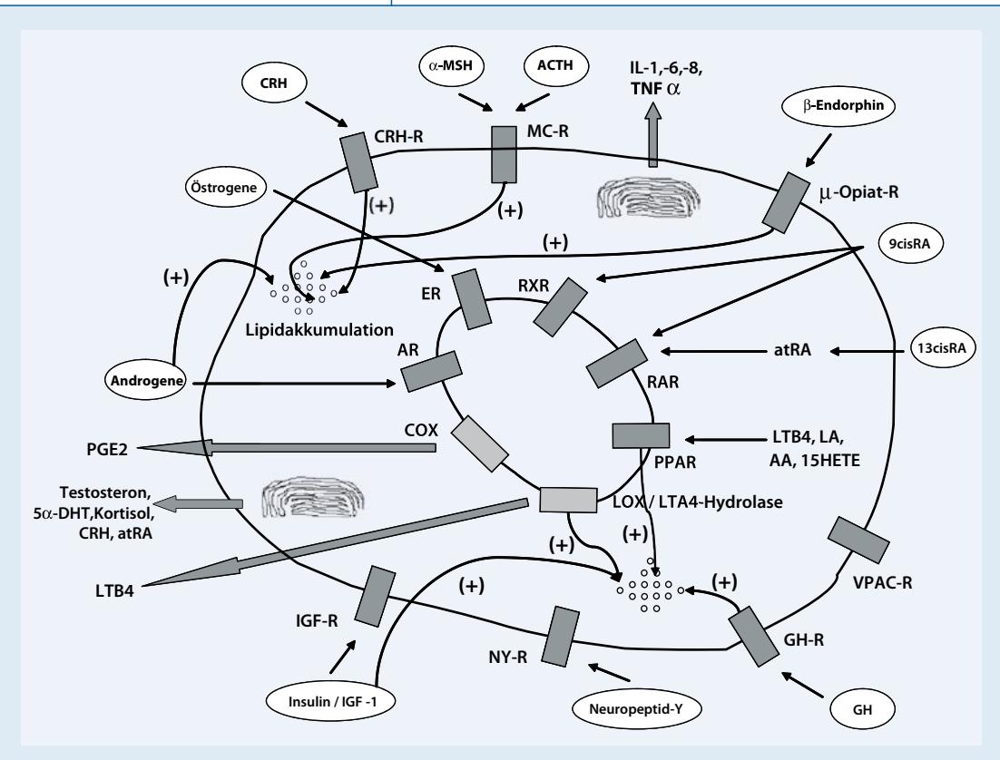

#### **Leitthema**

Hautarzt 2010 · 61:467–477 DOI 10.1007/s00105-009-1894-y Online publiziert: 30. Mai 2010 © Springer-Verlag 2010

#### **C.C. Zouboulis**

Klinik für Dermatologie, Venerologie und Allergologie / Immunologisches Zentrum, Städtisches Klinikum Dessau

# **Die Talgdrüse**

Talgdrüsen sind in der Haut von allen Säugetieren außer Walen und Tümmlern zu finden [1]. Eine ihrer wichtigsten Funktionen ist, Talg, eine Mischung aus überwiegend neutralen Lipiden, von denen die meisten de novo in den Talgdrüsen synthetisiert werden, und Zelldebris durch den Follikelkanal auszuscheiden [2], dies dient als hydrophober Schutz für das Tierfell und zur Hitzeisolierung [3]. Die Zusammensetzung des Talgs ist bemerkenswert artenspezifisch [2, 4, 5]. Außerdem sind spezialisierte talgdrüsenähnliche Strukturen, wie die Präputialdrüsen von Nagetieren, bei vielen Arten dafür verantwortlich, Pheromone für die territoriale Markierung und sexuelle Anziehung zu produzieren [6, 7]. Beim Menschen scheinen diese Talgdrüsenfunktionen weniger wichtig zu sein. Obwohl Talg den größten Anteil der menschlichen Hautoberflächenlipide ausmacht, formt er keine Hautbarriere. Die antibakterielle Wirkung des Talgs in vivo blieb initial unberücksichtigt [8]. Als wichtigste Funktion der Talgdrüse wurde die Talgsynthese betrachtet, eine gesteigerte Talgausscheidung ist einer der kardinalen ätiologischen Faktoren bei Akne. Auch wenn Hormone Talgdrüsengröße und -aktivität kontrollieren [9], werden Aknenpatienten nicht als endokrinologisch erkrankt betrachtet. A. Kligman hat formuliert, dass die Talgdrüsen eine Erinnerung an die menschliche Entwicklung darstellen, ein "Fossil mit Vergangenheit, aber ohne Zukunft" [8].

Ausmaß und Qualität der Talgdrüsenforschung haben in den letzten Jahren bedeutend zugenommen (. **Tab. 1**), weil sich spezifische Zellkulturmodelle und molekulare Techniken im Allgemeinen weiterentwickelt haben [10, 11]. Die Ergebnisse haben unsere Vorstellungen von der Physiologie der Talgdrüse und der Pathogenese von Talgdrüsenkrankheiten wesentlich erweitert und die Bestimmung molekularer Targets für die Medikamentenentwicklung vorangebracht. Auch die Verwendung von Tieren in der Akne- und Talgdrüsenforschung wurde rasch verringert.

Die biologische Aktivität der Talgdrüsenzellen wird durch Hormonrezeptoren koordiniert [12, 13]. Die wichtigsten sind die Androgen- und Östrogenrezeptoren, die Peroxisom-Proliferator-aktivierenden Rezeptoren (PPAR), die Leber-X-Rezeptoren (LXR) [14], Rezeptoren für Neuropeptide, Retinoide und Vitamin D (Übersicht in [12, 13, 15, 16, 17]). Liganden-Rezeptor-Komplexe aktivieren Signalpfade, die Zellproliferation, Differenzierung, Lipogenese, Hormonstoffwechsel und Zytokin- und Chemokinsynthese in Talgdrüsenzellen koordinieren.

### **Talgdrüsenentwicklung und Zelldifferenzierung**

Die Entwicklung der Talgdrüsen ist eng mit der Differenzierung der anderen zwei epithelialen Abstammungslinien, Haarfollikeln und Epidermis, verwandt [13]. Zwischen der 10. und 12. Woche des fötalen Lebens ist ein Stratum intermedium erkennbar. Während dieser Zeit wird die Entwicklung einer Haaranlage prominent. In den folgenden Wochen wächst die Haaranlage Richtung Dermis, und ein Ansatz einer Talgdrüse wird ersichtlich. Von der 13. bis 15. Woche entwickelt sich die Talgdrüse aus der Haaranlage. Die Zellen der Talgdrüsenanlage sind mit denen der Basalschicht der Epidermis und des follikulären Kanals identisch.

Ab einem gestationalen Alter von 15 Wochen reguliert das adrenokortikotrope Hormon (ACTH) die steroidogene Aktivität der fötalen Nebennierenzone, der Hauptquelle für DHEA (Dehydroepiandrosteron)-Sulfat ist [18, 19]. Das zirkulierende DHEA-Sulfat wird von Blutmonozyten in DHEA metabolisiert [20]. DHEA kann weiter in Androstendion und Testosteron verstoffwechselt werden, insbesondere in der Talgdrüse, die als einzige Zelle der Haut das notwendige Enzym 3β-Hydroxysteroiddehydrogenase-Δ5–4-Iso-

#### **Tab. 1 Endokrine Funktionen der Talgdrüse**

*Synthetische Aktivität*

- Produktion der Vernix caseosa
- Produktion von Sebum
- Expression des Histamin-1-Rezeptors, Hemmung der Squalensynthese mittels Antihistaminika

*Endokrine Eigenschaften*

- Regulation der unabhängigen endokrinen Funktion der Haut
- Expression aller Enzyme, die für die Steroidgenese aus den im Kreislaufzirkulierenden Lipiden verantwortlich sind
- Regulation der lokalen Androgensynthese
- Grundlegende Beteiligung am hormonell induzierten Hautalterungsprozess
- Modifikation der Lipidsynthese durch kombinierten Androgen- und Peroxisom-Proliferator-aktivierende-Rezeptorliganden, Östrogene und"Insulin-like-growthfactor-1"-Achse
- Expression des Vitamin-D-Rezeptors und der Vitamin D metabolisierenden Enzyme
- Expression des Retinoid-metabolisierenden Cytochrom-P450-Enzymsystems
- Selektive Kontrolle derWirkung der Hormone und Xenobiotika auf die Haut
- Beeinflussung durch ein regulatorisches Neuropeptidprogramm

| Tab. 2 Fettsäuren der Talgdrüse und ihre Synthese |                                                                                     |                 |
|------------------------------------------------------|-------------------------------------------------------------------------------------|-----------------|
| Vorläufer                                            | Produkt                                                                             | Enzym           |
| Linolsäure (ω6, C18:2, 9,12)a                        | γ-Linolensäure (ω6, C18:3, 8,11,14) Stearidonsäure (ω3, C18:4, 6,9,12,15)        | FADS2b FADS2 |
| α-Linolensäure (ω3, C18:3, 9,12,15)a                 | Stearidonsäure (ω3, C18:4, 6,9,12,15)                                               | FADS2           |
| Palmitinsäure (16:0)                                 | Sapiensäure (16:1, 6) Palmitolensäure (C16:1, 9)                                 | FADS2 SCDb   |
| Stearinsäure (18:0)                                  | Ölsäure (C18:19)                                                                    | SCD             |
| a                                                    | Essenzielle Fettsäuren;bmRNA- und Proteinexpression in SZ95-Sebozyten nachgewiesen; |                 |

merase exprimiert [21, 22]. Die Talgdrüse ist wahrscheinlich das wichtigste Zielorgan der fötalen Androgene in der Haut. Sie erreicht ihren Aktivitätsgipfel im dritten Trimester der Schwangerschaft [3]. Ihre Sekretion formt einen wesentlichen Teil der Vernix caseosa, der variabel klebenden "Hautoberflächenfolie", die aus Lipiden, toten Keratinozyten, Wasser und anderen Substanzen der Amnionflüssigkeit besteht.

FADS2 Fettsäuredesaturase-2; SCD Stearoyl-CoA-Desaturase.

Kurz nach der Geburt kommt es zu einem starken, schnellen Anstieg der Sebumexkretion, der seinen Höhepunkt während der ersten Woche findet [18, 22]. Es besteht eine direkte Korrelation zwischen maternaler und neonataler Sebumexkretion [23]. Diese Korrelation verliert sich in den folgenden Wochen und ist unabhängig von der Stillsituation. Zu dieser Zeit entspricht der Sebumgehalt pro Hautoberflächeneinheit dem junger Erwachsener[18], und die Sequenz der Transformation scheint identisch mit der im postnatalen Leben. Diese Vorgänge deuten an, dass die maternale hormonelle Umgebung die Talgdrüsen des Neugeborenen wesentlich beeinflusst, und zeigen, dass es vor der Geburt zu einem diaplazentaren androgenen Stimulus kommt [18, 22]. In diesem Zusammenhang ist es interessant, dass mütterliche Akne in der Anamnese den Schweregrad einer Akne bei den Nachkommen am meisten beeinflusst [24]. Danach nimmt die Sebumexkretion langsam ab. Das Sebumexkretionsmuster unterscheidet sich bei Mädchen und Jungen: Direkt nach der Geburt sind die Konzentrationen bei Mädchen geringer als bei Jungen, aber zwischen dem 3. und 6. Lebenstag kommt es zu einem erheblichen Anstieg, danach zu einem Abfall, sodass die Konzentrationen unter denen von Jungen liegen. Im Alter von 6 Monaten sind die Konzentrationen bei beiden Geschlechtern niedrig. Im Alter zwischen 6 Monaten und Präpubertät bleibt es bei sehr niedrigen Konzentrationen, etwa 10 µg/cm2 , häufig <0,5 µg/ cm2 [25]. Mit der Adrenarche, mit etwa 9 Jahren [26], kommt es zu einem erneuten Anstieg, der bis etwa zum 18. Lebensjahr andauert, dann ist das Erwachsenenniveau erreicht [25]. Diskutiert worden ist, ob die endokrine Umgebung während der Neonatalperiode die Entwicklung der Talgdrüsen während der Pubertät beeinflusst [23].

#### **Sebum and Talgdrüsenlipide**

Das Sebum (Talg) hat ganz besondere, einzigartige Eigenschaften; Squalen und einige andere Fettsäuren werden nur von Sebozyten synthetisiert ([27], . **Tab. 2**). Squalen ist ein lineares Intermediärprodukt in der Cholesterinbiosynthese. Anders als in anderen Geweben, in denen Squalen rasch in Lanosterol und schließlich in Cholesterin umgewandelt wird, bleibt das in der Talgdrüse synthetisierte Squalen erhalten. Squalen wird durch die Fusion zweier Farnesylpyrophosphatmoleküle durch die Squalensynthase gebildet. Im Vergleich mit anderen Spezies ist die Wachsesterbiosynthese in humanen Talgdrüsenzellen relativ hoch [27]. Fettsäure und Fettalkohole sind die physiologischen, direkten Vorläufer von Wachsestern. In vitro synthetisieren Sebozyten weniger Squalen, Wach- und Cholesterinester als in vivo, doch ihre Lipogenese kann hochreguliert werden, beispielsweise durch Linolsäure (LA) oder Arachidonsäure (AA; [28, 29]).

Die lipogenen Faktoren, die Transkriptionsfaktoren "CCAAT enhancer binding protein", Galectin-12, Resistin und das SREBP1 ("sterol response element binding protein 1") wurden in SZ95-Sebozytenkultzuren nachgewiesen [30, 32]. SREBP1 erhöhte die Transkription der humanen Squalensynthase in der Leber von transgenen Mäusen. Als Reaktion auf Insulin und IGF-1 ("insulin-like growth factor 1") war SREBP1 in SEB-1-Sebozyten erhöht [33]. Squalensynthase-mRNA wird in SZ95-Sebozyten exprimiert [34], und Squalen könnte ein Marker für die terminale Sebozytendifferenzierung sein [30].

Ge et al. [35] identifizierten die ∆6-Desaturase/Fettsäuredesaturase 2 (FADS2) als Hauptfettsäuredesaturase in humanen Talgdrüsen, die von Sebozyten zur Synthetisierung sehr langer Fettsäureketten verwendet wird. Desaturasen führen Doppelbindungen an den C-Atomen 6 und 7 von Präkursoren ein und ermöglichen so die Produktion der mehrfach ungesättigten Fettsäuren γ-Linolen- und Stearidonsäure durch die Sebozyten. Bei Aknepatienten sind niedrige LA-Konzentrationen auf der Hautoberfläche beschrieben [36]. Linolsäure unterliegt peroxisomaler β-Oxidation, es entstehen AA und andere Fettsäuren, wohingegen die Fähigkeit der Sebozyten zur Synthetisierung von Wachsestern mit dem Niveau der β-Oxidation in diesen Zellen korreliert. Es sieht so aus, als sei die β-Oxidation von Linolsäure sebozytenspezifisch und mit der Sebozytendifferenzierung assoziiert [27].

Die Δ6-Desaturation von Palmitinsäure ergibt die einfach ungesättigte Sapiensäure (Palmitolsäure). Sapiensäure und Octadecadiensäure ("sebaleic acid"; 18:2, 5,8) sind die wesentlichen Fettsäuren, die beim Menschen im Vergleich zu anderen behaarten Säugetieren auftreten [12, 13]. Sapiensäure aus humanem Sebum zeigt antibakterielle Aktivität gegen grampositive Bakterien, wie *Propionibacterium acnes (P. acnes)*. *P. acnes* setzt Lipasen frei, die Sebumstoffwechselvorgänge initiieren, deren Produkte dann inflammatorische Prozesse anzustoßen scheinen.

Neben FADS2 exprimieren Sebozyten in menschlicher Gesichtshaut auch die funtionelle Stearoyl-CoA-Desaturase (SCD, Δ9-Desaturase), das am meisten "upstream" liegende Enzym der Steroidgenese [30, 36]. Das mikrosomale Enzym SCD ist ein eisenbindendes, 41 kDa Protein. Es besteht aus 355 Aminosäuren mit sechs Transmembrandomänen und katalysiert die Δ9-Desaturierung langkettiger

# Hier steht eine Anzeige.

Springer

|                                                                                                                                                                                                                                                                                                       | Natürliche Liganden                                                                                                                                                                                                          | Wirkung auf kultivierte Talgdrüsenzellen                                                                                                                                                                                                                                                                                                                                                            |
|-------------------------------------------------------------------------------------------------------------------------------------------------------------------------------------------------------------------------------------------------------------------------------------------------------|------------------------------------------------------------------------------------------------------------------------------------------------------------------------------------------------------------------------------|-----------------------------------------------------------------------------------------------------------------------------------------------------------------------------------------------------------------------------------------------------------------------------------------------------------------------------------------------------------------------------------------------------|
| Peptidhormone und Neurotransmitterrezeptoren                                                                                                                                                                                                                                                          |                                                                                                                                                                                                                              |                                                                                                                                                                                                                                                                                                                                                                                                     |
| Serpentinrezeptoren (Siebentransmembrandomäne) - "Corticotropin-releasing"-Hormon (CRH)-Rezeptoren 1 und 2 (CRH-R1>CRH-R2) - Melanocortin-1- und 5-Rezeptoren (MC-1R und MC-5R) - µ-Opiatrezeptoren - VPAC-Rezeptoren - Cannabinoidrezeptoren (CR1 und CR2) - Histaminrezeptor-1 | CRH, Urokortin α-Melanozyten-stimulierendes Hormon (α-MSH) β-Endorphin Vasoaktivesintestinales Polypeptid, Rezeptoren für Neuropeptid-Y und Cal citoningen-assoziiertes Peptid Cannabinoide Histamin | ↓ Proliferation, ↑ Δ5–4 3β-Hyroxysteroiddehydro genase (CRH), ↑ Lipidsynthese (CRH), ↑ IL6- und IL8-Freisetzung (CRH) ↓ IL1-induzierte IL8-Synthese (MC-5R), Differenzie rungsmarker (MC-1R) ↓ EGF-induzierte Proliferation, ↑ Lipidsynthese Neuropeptid-Y-stimulierte IL6- und IL8-Freisetzung Regulation der Squalensynthese                                                 |
| Einzel-Transmembrandomäne-Rezeptoren mit endo gener Tyrosinkinaseaktivität -"Insulin-like growth factor" (IGF)-1-Rezeptor                                                                                                                                                                       | IGF-1, Insulin                                                                                                                                                                                                               | ↑ Lipogenese                                                                                                                                                                                                                                                                                                                                                                                        |
| Einzel-Transmembrandomänrezeptoren ohne endogene Tyrosinkinaseaktivität Wachstumshormon (GH)-Rezeptor                                                                                                                                                                                           | GH                                                                                                                                                                                                                           | ↑ Differenzierung, ↑ DHT-Wirkung auf die Lipo genese                                                                                                                                                                                                                                                                                                                                             |
| Nuklearrezeptoren                                                                                                                                                                                                                                                                                     |                                                                                                                                                                                                                              |                                                                                                                                                                                                                                                                                                                                                                                                     |
| Steroidrezeptoren - Androgenrezeptor - Progesteronrezeptor                                                                                                                                                                                                                                      | Testosteron, 5α-Dihydrotestosteron (DHT) Progesteron                                                                                                                                                                   | ↑ Proliferation (zusammen mit PPAR-Liganden: ↑ Lipogenese) ?                                                                                                                                                                                                                                                                                                                                  |
| Schilddrüsenhormonrezeptoren - Östrogenrezeptoren (ER-α- und -β) - Retinsäurerezeptoren (RAR-α und -γ) - Retinoid-X-Rezeptoren (RXR-α, >PXR-β, -γ) - Vitamin-D-Rezeptor - Peroxisom-Proliferator-aktivierende Rezeptoren (PPARα, PPARγ>PPARβ) - Leber-X-Rezeptoren (LXRα und -β) | 17β-Östradiol All-trans-Retinsäure (atRA) All-trans-Retinsäure (atRA) 9-cis-RA Vitamin D3 Linolsäure (RRARβ/δ), Leukotrien-B4 (LTB4) 22(R)-Hydroxycholesterol                                           | ↑ Synthese polarer Lipide ↓ Proliferation Reguliert die Lipogenese (?) Reguliert Zellproliferation, Zellzyklus, Lipidinhalt, IL6- und IL8-Freisetzung ↑ Lipogenese, ↑ Prostaglandin-E2-Freisetzung, ↑ IL6-Freisetzung, ↑ Cycloxygenase-2-Synthese ↓ Proliferation, ↑ Lipogenese, ↓ Cycloxygenase-2- und induzierbare Stickoxidsynthetase ("nitric oxid synthetase", NOS) |

ungesättigter Fettsäuren, Hauptprodukte sind also Palmitolsäure und Ölsäure.

Erhöhte Squalenperoxidation und verminderte LA-Konzentration führen zu vermehrter Verhornung duktaler Keratinozyten [36, 37, 38]. Es wurde in Betracht gezogen, dass die Fraktion der freien Fettsäuren im Sebum am inflammatorischen Prozess bei Akne teilnimmt. Das Anstoßen des AA-Pfades durch LA ist der erste Schritt auf dem Weg zur Produktion proinflammatorischer Zyklooxygenaseprodukte. Auch für Squalenperoxid wurde ein stimulierender Effekt auf die Proliferation von HaCaT-Keratinozyten in vitro nachgewiesen [39].

An Kulturen primärer Hamster- und Rattensebozytenklone zeigten Nagai et al. [40], dass von den Sebozyten Membranvesikel sezerniert werden, die Sebosomen, die Squalen-kondensierte Lipidpartikel und Histon H3, ein kationisches Protein, enthalten. Diese Sebozytensvesikel weisen auf eine bisher nicht bekannte Funktion dieser Zellen hin, die mit der Sekretion antibakterieller Proteine und mit der Sterolregulation zusammenhängt. Diese Moleküle können die Hautoberfläche schützten. Auf der Oberfläche der intrazellulären Lipidtröpfchen in differenzierten Hamstersebozyten in vitro wurde eine Perilipin-A-Expression nachgewiesen [41]. Perilipin ist ein Säugetierprotein, das in Fettzellen Lipidtröpfchen umschließt und sie vor dem Enzym hormonsensitive Lipase schützt. Auch das Fettsäuretransportprotein 4 (FATP4) wird in Talgdrüsen hoch exprimiert. Dieses Transmembranprotein erhöht die Aufnahme langkettiger Fettsäuren in diese Zellen [42].

Lipide der Sebozyten können in der Ölrot-Färbung sichtbar gemacht werden [43]. Squalen, Wachsester, Triglyzeride und freie Fettsäuren – Zeichen für reife Sebozyten – wurden dünnschichtchromatographisch in vitro nachgewiesen [10]. Die Behandlung von SZ95-Sebozyten mit AA führt zur Lipidakkumulation und Zellapoptose. Terminale Differenzierung und Apoptose sind zwei verschiedene programmierte Zellereignisse, wobei auf beide der Tod der Zelle folgt. Die Lipidsynthese in Sebozyten ist ein Teil ihrer terminalen Differenzierung: Sie beginnt mit der Akkumulation von Lipidtröpfchen im Zytoplasma, dann kommt es zum Zerplatzen der Zelle und zu ihrem Tod. Die Apoptose ist an diesem Vorgang beteiligt, dies wird deutlich durch den Nachweis von nuklearer Fragmentierung und bcl-2-Reduktion in SZ95-Sebozytenkulturen [44]. AA führt auch zu einer Hochregulation der Sekretion von Interleukin (IL) 6 und IL8 in Sebozyten [45]. AA wird durch 5-Lipoxygenase metabolisiert, es entsteht Leukotrien (LT) B4, ein PPARα-Ligand, und führt zu einer Hochregulation der Lipogenese in humanen Sebozyten.

Die Regulation der Lipogenese durch All-trans-Retinsäure (atRA) und Androgene in Hamstersebozyten ähnelt der in humanen Sebozyten [10]. Epidermaler

### **Zusammenfassung · Abstract**

Wachstumsfaktor (EGF) und Vitamin D3 (1α,25-Dihydroxyvitamin D) supprimieren in vitro die Lipogenese in Hamstersebozyten [46]. EGF, "transforming growth factor" (TGF)-α und Fibroblastenwachstumsfaktor (FGF) entfalten mitogene Aktivitäten in Hamstersebozyten, die beiden letztgenannten sind antilipogene Faktoren. Weiterhin ist es wahrscheinlich, dass die Bildung intrazellulärer Lipidtröpfchen in Hamstersebozyten unabhängig von der Zellproliferation ist.

#### **Hormone und Hormonrezeptoren**

Sebozyten exprimieren Rezeptoren für Peptidhormone und Neurotransmitter, die sich hauptsächlich auf der Zelloberfläche befinden, sowie für Steroid- und Schilddrüsenhormone (. **Tab. 3**), die sich im Zytoplasma oder im nuklearen Kompartiment befinden [12].

#### **Peptidhormone und Neurotransmitterrezeptoren**

Drei von vier Gruppen von Peptidhormonen und Neurotransmitterrezeptoren sind in humanen Sebozyten repräsentiert. Im Folgenden werden zunächst die zur ersten Gruppe, zu den sog. Serpentinrezeptoren oder Siebentransmembrandömänenrezeptoren gehörenden, aufgeführt.

*"Corticotropin-releasing-hormone"-Rezeptoren-1 und -2* (CRH-R1 ist häufiger) scheinen die CRH-Aktivität zu regulieren [47, 48]. Durch Bindung an CRH-R1 reduzieren CRH und Urokortin die Sebozytenproliferation. CRH führt zu einer Hochregulierung der Expression der Δ5– 4-3β-Hyroxysteroiddehydrogenase, der Neutralfettsynthese und der Freisetzung von IL-6 und -8.

*Melanocortin-1 und -5-Rezeptoren* (MC-1R und MC-5R) binden α-MSH und befinden sich auf der Zelloberfläche von Sebozyten. MC-1R regulieren inflammatorische Prozesse in SZ95-Sebozyten [49] und wird stärker exprimiert von Talgdrüsen in Aknearealen [50]. Die Expression von MC-5R ist zwar schwächer als die von MC-1R, aber sie ist ein Marker für die Differenzierung humaner Sebozyten, denn die Expression besteht ausschließlich in differenzierten, lipidhaltigen Sebozyten [51].

Hautarzt 2010 · 61:467–477 DOI 10.1007/s00105-009-1894-y © Springer-Verlag 2010

#### **C.C. Zouboulis Die Talgdrüse**

#### **Zusammenfassung**

In der Fetal- und Neugeborenenzeit werden Entwicklung und Funktion der Talgdrüse von maternalen Androgenen, endogenen Steroiden und anderen Morphogenen gesteuert. Die offensichtlichste Funktion der Talgdrüse ist die Sebumsekretion. Kurz nach der Geburt kommt eszu einem starken Anstieg der Sebumexkretion und einem Peak in der ersten Lebenswoche, danach zu einem allmählichen Abfall. Im Rahmen der Adrenarche im Alter von etwa 9 Jahren entsteht ein erneuter Anstieg, der bis etwa zum 17. Lebensjahr anhält, bis das Erwachsenenniveau erreicht ist. Die Talgdrüse ist Zielorgan, aber auch Bildungsort von Hormonen (v. a. aktiven Androgenen). Sebozyten weisen ein breites Spektrum von Hormonrezeptoren auf. DieWirkung von Androgenen auf die Sebumexkretion ist bekannt, die Differenzierung terminaler Sebozyten wird von Peroxisom-Proliferator-aktivierenden Rezeptorliganden unterstützt. Auch Östrogene, Glukokortikoide und Prolaktin beeinflussen die Talgdrüsenfunktion. Zusätzlich induzieren Stress-sensible kutane Signale die Produktion und Freisetzung von CRH ("corticotrohin releasing hormone") mit nachfolgender dosisabhängiger Regulierung der neutralen Lipide. Ohne exogene Einflüsse synthetisieren Talgdrüsen neben anderen Lipidfragmenten erhebliche Mengen freier Fettsäuren. Atopische bzw.seborrhoische Dermatitis, Psoriasis und Akne vulgariszählen zu den Krankheitsbildern, an deren Entstehung und Ausprägung Talgdrüsenlipide wahrscheinlich odersicher beteiligtsind.

#### **Schlüsselwörter**

Hormone ·Wachstumsfaktoren · Androgene · Östrogene · Sebozyten

#### **The sebaceous gland**

#### **Abstract**

The development and function of the sebaceous gland in the fetal and neonatal periods appear to be regulated by maternal androgens and by endogenoussteroid synthesis, as well as by other morphogens. The most apparent function of the glandsisto excrete sebum. A strong increase in sebum excretion occurs a few hours after birth; this peaks during the first week and slowly subsidesthereafter. A new rise takes place at about age 9 years with adrenarche and continues up to age 17 years, when the adult level isreached. The sebaceous gland is a target organ but also an important formation site of hormones, and especially of active androgens. Hormonal activity is based on an hormone (ligand) receptor interaction, whereassebocytes express a wide spectrum of hormone receptors. Androgens are well known for their effects on sebum excretion, whereasterminal sebocyte differentiation is assisted by peroxisome proliferator-activated receptor ligands. Estrogens, glucocorticoids, and prolactin also influence sebaceous gland function. In addition,stress-sensing cutaneoussignalslead to the production and release of corticotrophin-releasing hormone from dermal nerves and sebocytes with subsequent dose-dependent regulation ofsebaceous nonpolar lipids. Among other lipid fractions,sebaceous glands have been shown to synthesize considerable amounts of free fatty acids without exogenousinfluence. Atopic dermatitis,seborrheic dermatitis, psoriasis and acne vulgaris are some of the disease on which pathogenesis and severity sebaceouslipids may or are surely involved.

#### **Keywords**

Hormones · Growth factors · Androgens · Estrogens · Sebozyten

**Abb. 1**8Interaktion zwischen Enzymen, Membran- und Nuklearrezeptoren sowie ihrer Liganden in humanen Talgdrüsenzellen, Einfluss auf die Lipidakkumulation, Freisetzung von Hormonen und Entzündungsmediatoren. *R* Rezeptor, *CRH* "corticotropin-releasing-hormone", *α-MSH* α-Melanozyten-stimulierendes Hormon, *ACTH* adrenokortikotropes Hormon, *IL* Interleukin, *TNFα* Tumornekrosefaktor-α, *9cisRA* 9-cis-Retinsäure, *atRA* All-trans-Retinsäure, *LTB* Leukotrien, *AA* Arachidonsäure, *LA* Linolsäure, *VPAC-R* vasoaktiver intestinaler Peptidrezeptor, *GH* Wachstumshormon, *NY* Neuropeptid-Y, *IGF-1* insulinähnlicherWachstumsfaktor 1, *PG* Prostaglandin, *DHT* 5α-Dihydrotestosteron, *ER* Östrogenrezeptor, *AR* Androgenrezeptor, *RXR* Retinoid-X-Rezeptor, *RAR* Retinsäurerezeptor, *PPAR* Peroxisom-Proliferator-aktivierender Rezeptor, *LOX* Lipoxygenase, *LTA4-Hydrolase* Leukotrien-A4-Hydrolase, *COX* Zyklooxygenase

*µ-Opiatrezeptoren* binden β-Endorphin, das die Lipogenese stimuliert und insbesondere die Konzentrationen von C16:0-, C16:1-, C18:0-, C18:1- und C18:2- Fettsäuren erhöht, ähnlich dem Ausmaß der Linolsäure in Sebozyten [52].

*VPAC-Rezeptoren*, die vasoaktives intestinales Peptid binden, Rezeptoren für Neuropeptid-Y und Calcitoningen-assoziiertes Peptid [53]. NY aktiviert die Zytokinsynthese. CGRP ist oft kolokalisiert mit Substanz P [54].

*Cannabinoidrezeptoren* (CBR) 1 und 2 werden in SZ95-Sebozyten und in Talgdrüsen exprimiert [54, 55]. CBR1 wurden in differenzierten Sebozyten nachgewiesen, CBR2 in nichtdifferenzierten Zellen. Endocannabinoide beeinflussen die Sebozytendifferenzierung über CBR2.

*Histamin-1-Rezeptoren*, an die Histamin bindet, regulieren die Squalensynthese [56]. Antihistaminika, Liganden des Histamin-1-Rezeptors, verringerten die Squalensynthese in SZ95-Sebozyten.

Der *IGF-1-Rezeptor* gehört zur zweiten Gruppe, zu den Einzeltransmembrandomänenrezeptoren mit intrinsischer Tyrosinkinaseaktivität. Er wird auf der Oberfläche von SZ95-Sebozyten exprimiert und wird durch IGF-1 sowie durch hohe Insulinkonzentrationen aktiviert [57]. Dosisabhängig verstärkt IGF-1 die Lipidakkumulation in SZ95-Sebozyten. Die Aktivierung des IGF-1-Rezeptors induzierte in SEB-1-Sebozyten die Lipogenese über"sterol regulatory element-binding protein" (SREBP)-abhängige wie auch SREBP-unabhängige Pfade [33]. IGF-1 stimuliert ferner Proliferation und Differenzierung von Präputialdrüsenzellen der Ratten, die Sebozyten ähnlich sind, besonders in Kombination mit Wachstumshormon (GH; [31]).

Die Rezeptoren der dritten Gruppe sind zwar funktionell denen der zweiten ähnlich, besitzen aber keine intrinsische Tyrosinkinaseaktivität, sondern scheinen durch Interaktion mit löslichen Transducer-Molekülen zu funktionieren, die eine solche Aktivität besitzen. In humanen Sebozyten wird diese Gruppe durch den *GH-Rezeptor* repräsentiert [48], über den GH die Sebozytendifferenzierung hochreguliert und den Effekt von 5α-Dihydrotestosteron (DHT) auf die Sebumsynthese verstärkt [57].

#### **Nuklearrezeptoren**

Nuklearrezeptoren sind lösliche Moleküle, die transkriptionale Regulierung verwenden, um ihre biologischen Wirkungen zu fördern. Auch wenn manche Rezeptoren kompartimentiert im Zytoplasma und manche an den Nukleus gebunden sind, operieren sie alle innerhalb des Kernchromatins, wo sie an einem spezifischen "hormone response element" binden. Diese Rezeptoren werden in humanen Sebozyten exprimiert, basierend auf strukturellen und funktionellen Eigenschaften können sie in zwei große Gruppen eingeteilt werden.

Von der ersten Gruppe, der Steroidrezeptorfamilie, befinden sich der *Androgenrezeptor (AR)* und der *Progesteronrezeptor (PR)* in basalen und den früh differenzierten humanen Sebozyten [15, 21]. AR sind immunhistochemisch in Talgdrüsen nachgewiesen, in Talgdrüsen ist die AR-Dichte höher als in allen anderen Teilen der menschlichen Haut [58, 59].

Der *AR* wird stabilisiert und hochreguliert durch Ligandenbindung, seine Downregulation reduziert die Sebozytenproliferation [60]. Fünf intrazelluläre Enzyme, die alle in Sebozyten exprimiert werden [21], sind an der Aktivierung beteiligt – vor der Bindung an den AR – und an der Inaktivierung von Androgenen. DHEA-S wird durch SCD zu DHEA metabolisiert, DHEA und Androsteron werden durch 5α-Reduktase zu Testosteron und später zu DHT [21, 61]. Akamatsu et al. [62] sowie Zouboulis et al. [10] haben eine dosisabhängige Induktion der Sebozytenproliferation durch Testosteronapplikation gezeigt [62] und einen fehlenden Effekt auf die Lipidstimulierung [10]. Rosenfield et al. [64] sowie Makrantonaki et al. [63] haben nachgewiesen, dass der Androgeneffekt auf Talgdrüsenlipide durch PPAR-Liganden vermittelt wird [63, 64].

*PR* wurden in den Nuclei basaler Sebozyten der Talgdrüse nachgewiesen [15, 65].

Im Folgenden werden Rezeptoren der zweiten Gruppe, der Thyreoidrezeptorfamilie, besprochen, die in humanen Sebozyten exprimiert werden.

*Östrogenrezeptoren,* α- und β-Isoformen (ER; [65, 66, 67]): ER-β wird in basalen und partiell differenzierten Sebozyten exprimiert, ER-α in basalen und früh differenzierten Sebozyten. Ein natürliches Östrogen, Östradiol, entsteht wie Testosteron durch oxidative Reduktion von 4-Androsten-3-17-dion. Die Behandlung von Sebozyten mit 17β-Östradiol wirkte auf die Produktion polarer Lipide, hatte aber keinen stimulierenden Effekt auf neutrale Lipide [68]. Ältere In-vitro-Daten wiesen darauf hin, dass Östrogene die biologische Aktivität von Talgdrüsen beeinflussen können [69].

*Retinolsäurerezeptoren,* α- und γ-Isoformen (RAR) und *Retinoid-X-Rezeptoren,* α-, β- und γ-Isoformen (RXR; [70, 71]): RARα und -γ sowie RXRα sind die Hauptretinoidrezeptoren in humanen Sebozyten. RAR regulieren die Zellproliferation [71]. Die natürlichen Liganden für RAR und RXR sind atRA und 9-cis-Retinsäure. 13-cis-Retinsäure (13cRA) inhibiert die Proliferation in SZ95-Sebozyten. 13cRA wird intrazellulär metabolisiert zum RAR-Liganden atRA. RXR-Agonisten stimulieren Sebozytendifferenzierung und -proliferation. In Kombination mit den spezifischen PPAR-Agonisten, WY 14643, Troglitazon und Carbaprostazyklin, beeinflusste der RXR-Agonist Rexinoid in vitro die Differenzierung und das Wachstum von sebozytenähnlichen Präputialzellen der Ratte [72].

*Vitamin-D-Rezeptor (VDR)* [73]: SZ95- Sebozyten exprimieren auch Vitamin-D-25-Hydroxylase (25OHase), 25-Hydroxy-Vitamin-D-1α-Hydroxylase (1αOHase) und 1,25-Dihydroxy-Vitamin-D-24-Hydroxylase (24OHase; [74]). Vitamin D3 induziert in Sebozytenkulturen eine zeitund dosisabhängige Modulation von Zellproliferation, Zellzyklusregulation, Lipidgehalt sowie IL6- und IL8-Sekretion. Auch die RNA-Expression von VDR und 24OHase wurde mit der Vitamin-D3-Applikation hochreguliert.

*PPARα* und *-γ* sind die wesentlichen Subtypen in humanen Sebozyten. PPAR befinden sich in Mitochondrien, Peroxisomen und Mikrosomen von Sebozyten und regulieren zahlreiche Lipidstoffwechselgene [42, 45, 63].

*LXR, -α und -β-Isoformen* [14, 75]: SZ95-Sebozyten exprimieren sowohl Rezeptoren auf der mRNA-Ebene wie auch auf Proteinebene. Die Applikation von natürlichem 22(R)-Hydroxycholesterin oder synthetischen Liganden führte zu einer deutlichen Proliferationshemmung und zu verstärkter Lipogenese. Die Expression bekannter LXR-Targets, so beispielsweise von Fettsäuresynthase oder SREBP1, wurde durch den synthetischen LXR-Liganden TO901317 induziert, der auch die Expression der Zyklooxygenase2 und der induzierbaren Stickoxidsynthetase (iNOS) verringerte, die durch Lipopolysaccharidbehandlung induziert worden war [14].

Der *Vanilloidrezeptor(VR)* zählt zu den transienten Ionenkanälen und wird in sich differenzierenden Sebozyten exprimiert [76]. Der VR-Ligand Capsicain vermindert die Proliferation von SZ95-Sebozyten.

## **Andere Rezeptoren in humanen Sebozyten**

Die *Fibroblastenwachstumsfaktorrezeptoren* (FGFR) sind eine Familie miteinander verwandter, aber individuell unterschiedlicher Tyrosinkinaserezeptoren [77]. Vier FGFR sind schon identifiziert worden, FGFR1 bis FGFR4, zwei Splice-Varianten von FGFR2: FGFR2b und FGFR2c. FGFR2b sind vor allem in der suprabasalen Epidermisschicht und in Sebozyten lokalisiert, sie spielen eine essenzielle Rolle bei der Regulation von Epithelproliferation und -differenzierung. Impliziert worden ist, dass an der Pathogenese von Akne erhöhte FGFR2-Signalgebung beteiligt ist. Sie erklärt auch Akne beim Apert-Syndrom sowie den unilateralen mit Gain-offunction-Punktmutationen von FGFR2 assoziierten akneiformen Nävus [77].

Auch EGF [78] ist in Sebozyten vorhanden.

Das Produkt des *c-MET-Protoonkogens*, der *c-MET-Rezeptor*, eine Rezeptortyrosinkinase, die als Rezeptor für Hepatopoetin A (HGF-SF; [79]) fungiert, wurde in Sebozyten nachgewiesen.

Dass ferner *CD14* (Endotoxinrezeptor), die *Toll-like-Rezeptoren* (TLR) *TLR-2* (CD282), *TLR-4* (CD284) und *TLR-6* (CD286) nachgewiesen wurden, spricht dafür, dass humane Sebozyten immunologisch aktive Zellen sind, dass sie TLRund CD14-vermittelt Bakterien erkennen können und eine wichtige Rolle dabei innehaben, die Aktivierung sowohl innater als auch adaptiver Immunreaktionen zu initiieren und zu perpetuieren [80, 81].

#### **Hormonelle Kontrolle**

Zweifellos spielen Androgene eine große Rolle bei der Regulation der Talgdrüsenaktivität, doch direkt oder indirekt ist eine Vielzahl von Hormonen daran beteiligt (. **Abb. 1**). Die wesentlichen Funktionen der Sebozyten – Differenzierung, Proliferation und Lipidsynthese – unterliegen komplexen endokrinen Regulationsmechanismen.

#### **Androgene**

Androgene regulieren die Sebozytenfunktionen, indem sie an nukleare AR binden [21, 58]. Auf der anderen Seite ist die Haut, besonders die Talgdrüse, ein wichtiger Bildungsort aktiver Androgene [12, 21]. Die für die Transformation der adrenalen Vorläufer (DHEA-S und DHEA) erforderlichen Enzyme sind in den Talgdrüsen lokalisiert [82]. DHEA-S wird lokal durch die reichlich vorhandene Steroidsulfatase in DHEA metabolisiert [83], DHEA durch 3β-Hydroxysteroiddehydrogenase/Δ5–4-Isomerase und 17β-Hydroxysteroiddehydrogenase zu Androstendion und Testosteron. Die intrazelluläre Konversion von Testosteron zu DHT, dem stärksten Gewebeandrogen, durch 5α-Reduktase stimuliert die Sebumsekretion in vivo [84].

#### **Östrogene**

Östrogene inhibieren eine exzessive Talgdrüsenaktivität; niedrige Östrogenkonzentrationen, wie sie postmenopausal bestehen, sind assoziiert mit verminderter Talgdrüsenaktivität [12, 84]. Östrogenen kommt also eine regulierende Rolle bei der Talgdrüsenhomöostase zu. Möglicherweise kann der downregulierende Effekt von Östrogenen auf aktivierte Talgdrüsen durch die Inhibition der Gonadotropinsekretion oder durch die Verstärkung der Bindung von Testosteron an sein Bindungsglobulin erklärt werden [84]. Östrogene, die während der frühen endokrinen Umgebung einwirken, scheinen keinen langfristigen Einfluss auf die Talgdrüsenaktivität zu haben. Eine frühe Ovarektomie hatte keine Einflüsse auf die Sebumproduktion in erwachsenen Ratten [85].

#### **Progesteron**

Die möglichen Auswirkungen von Progesteron auf die Aktivität der Talgdrüsen werden nach wie vor kontrovers diskutiert. Ein stimulierender Effekt auf die Sebumsekretion zeigte sich bei weiblichen und kastrierten Ratten, doch nicht bei nichtkastrierten [86]. Es bestand eine zeitliche Beziehung zwischen dem Grad der Stimulation und der Gonadektomie: Die Stimulation war höher, wenn vor der Pubertät gonadektomiert worden war. Bei nicht kastrierten männlichen Ratten wurde die Sebumsekretion durch Progesteron inhibiert. Diese Ergebnisse weisen darauf hin, dass der Einfluss von Progesteron auf Talgdrüsen wahrscheinlich abhängig vom Geschlecht und von der frühen endokrinen Umgebung ist.

#### **Glukokortikoide**

Bei Patienten mit Nebenniereninsuffizienz ist die Sebumsekretion vermindert, sogar noch nach Glukokortikoidsubstitution. Ein möglicher Mechanismus der Glukokortikoidwirkung könnte in den resultierenden erniedrigten Serumkonzentrationen adrenaler Androgene bestehen [87]. Die Sebumexkretion konnte beim Menschen durch topisch aufgebrachte Kortikosteroide signifikant reduziert werden [88]. In-vitro-Untersuchungen zeigten einen direkten, dosisabhängigen stimulierenden Effekt von Hydrokortison auf die Proliferation humaner Sebozyten [29]. Kortisol erwies sich als notwendig für die Differenzierung von Präputialzellen der Ratte und schien überdies essenziell zu sein für eine optimale Reaktion der Zelle auf GH und IGF-1 [84]. Die widersprüchlichen Ergebnisse von In-vivo- und In-vitro-Untersuchungen sind wahrscheinlich bedingt durch noch nicht vollständig erforschte komplexe endokrinologische Interaktionen in vivo.

#### **Schilddrüsenhormone**

Auch Schilddrüsenhormone scheinen an der Regulierung der Talgdrüsenaktivität beteiligt zu sein. An hypophysektomierten Ratten wurde eine Sebumstimulation durch Schilddrüsenhormone nachgewiesen [89], und der Schilddrüsenhormonrezeptor β1 wurde in humanen Talgdrüsen lokalisiert [90].

#### **Insulin**

Zu den Auswirkungen von Insulin auf die Talgdrüsen ist nur sehr wenig bekannt. Bei an Diabetes erkrankten Ratten ist eine verminderte Sebumproduktion nachgewiesen worden [85]. In vitro wurde eine dosisabhängige Stimulierung der Sebozytenproliferation und -differenzierung durch hohe Insulindosen nachgewiesen

Prominent ist eine Seborrhöe beim HAIR (Hyperandrogenämie, Insulinresistenz)-AN (Acanthosis nigricans)-Syndrom, einer Variante des SAHA (Seborrhö, Akne, Hirsutismus, Alopezie)-Syndroms mit Hyperinsulinämie [91].

#### **Wachstumshormon, insulinähnlicheWachstumsfaktoren**

Die Hypophyse spielt eine übergeordnete Rolle in der Regulierung der Talgdrüsenaktivität. Hypophysäre Hormone agieren wahrscheinlich über komplexe direkte oder indirekte Mechanismen. Erhöhte Serum-GH-Konzentrationen bei Akromegalie sind assoziiert mit hohen Sebumsekretionsleveln [92]. In Ratten mit Hypophyseninsuffizienz waren die Präputialdrüsen atropisch; erst nach Substitution von Testosteron und GH (nicht nach alleiniger Testosteronsubstitution) erreichten sie wieder ihre ursprüngliche Größe [93]. Tierexperimentell wurde gezeigt, dass die testosteroninduzierte Sebumproduktion von GH unterstützt wird [94]. An Präputialdrüsenzellen von Ratten wiesen Deplewski et al. [31] nach, dass GH die Differenzierung stimuliert, die Proliferation hingegen nicht beeinflusst. Zusätzlich verstärkt GH den DHT-Effekt auf die Zelldifferenzierung. Im Gegensatz dazu liegt der Haupteffekt von IGF-1 in seiner Wirkung auf die Proliferation. GH kann deshalb sowohl direkt agieren, nach Bindung an seinen Rezeptor, und indirekt, durch IGF-Produktion. GH scheint für humane Sebozyten ein trophischer Faktor zu sein [84].

#### **Prolaktin**

Ein klinischer Hinweis für den Einfluss von Prolaktin auf die Talgdrüse ist die bekannte Seborrhö bei Hyperprolaktinämie. Prolaktineffekte werden indirekt vermit-

# Hier steht eine Anzeige.

Springer

telt, durch vermehrte Produktion adrenaler Androgene [95]. In humanen Talgdrüsen wurden weder Prolaktin noch Prolaktinrezeptoren nachgewiesen.

#### **Gonadotrope Hormone**

Auf indirekte Weise modulieren die gonadotropen Hormone die Talgdrüsenaktivität: indem sie die Sekretion von Geschlechtshormonen stimulieren. Wie zu erwarten, konnte bei kastrierten und hypophysektomierten Ratten kein direkter Effekt von gonadotropen Hormonen auf Talgdrüsen festgestellt werden [84].

## **CRH und Proopiomelanocortinpeptide**

CRH ist ein wichtiges autokrines Hormon in diesen Zellen mit homöostatischer Aktivität Richtung Differenzierung. Unabhängig von der Hypothalamus-Hypophysen-Nebennierenrinden-Achse induziert CRH direkt die Lipidsynthese und Steroidgenese. Es wurde gezeigt, dass Testosteron und GH, die ebenfalls die Lipidsynthese in Talgdrüsen erhöhen, die CRH-Aktivität und die CRH-Rezeptor-Expression antagonisieren. Diese Befunde implizieren die Beteiligung von CRH an der Entwicklung von sowohl Akne und Seborrhö als auch anderen Hauterkrankungen, die mit Veränderungen in der Bildung von Talgdrüsenlipiden einhergehen [48, 96]. Das vollständige CRH-System wird in an Akne beteiligten Talgdrüsen reichlich exprimiert [97]. Dies aktiviert möglicherweise pathogenetische Pfade, die Immunund Inflammationsprozesse beeinflussen, die zur Entwicklung von Akne führen und zu ihrer stressinduzierten Exazerbation.

CRH erhöht die Produktion und Sekretion der Proopiomelanocortinpeptide α-MSH, ACTH, und β-Endorphin in einigen Hautkompartimenten, nicht aber in den Talgdrüsen [12]. ACTH aktiviert das "steroidogenic acute regulatory protein" und damit Melanocortinrezeptoren; so induziert es die die Produktion und Sekretion von Kortisol, einem natürlichen antiinflammatorischen Faktor, der den Auswirkungen von Stress entgegenwirkt und Gewebeschädigungen abmildert. Auch wenn α-MSH die Sebozytenproliferation nicht beeinflusst [29], so wurde doch gezeigt, dass es die IL8-Synthese in IL1-stimulierten humanen Sebozyten reduziert [49].

#### **Veränderungen bei Erkrankungen**

#### **Atopische Dermatitis**

Die Trockenheit der Haut bei atopischer Dermatitis ist immer wieder auf verminderte Talgdrüsenaktivität zurückgeführt worden [3], doch jüngere Studien mit nichterkrankten Kontrollpersonen haben gezeigt, dass Talgdrüsenlipide bei Patienten mit atopischer Dermatitis nicht vermindert sind [98]. Diese Ergebnisse stützen frühere Untersuchungen, in denen sich auf der Stirn gemessene Lipidkonzentrationen bei Patienten mit atopischer Dermatitis nicht von denen bei nichterkrankten Kontrollen unterschieden [99]. Veränderte Aktivitäten von für die Lipidsynthese relevanten Enzymen sind identifiziert worden, dies mag die Veränderungen in den Anteilen verschiedener epidermaler Lipide erklären [98]. Eine reduzierte Menge an und/oder strukturelle Veränderungen im endogenen Ceramid 1 aus epidermalen Keratinozyten könnten wesentlich und ursächlich zur beeinträchtigten Wasserbarrierefunktion der Haut bei atopischer Dermatitis beitragen. Auf der anderen Seite zeigte sich bei konstitutionell trockener Haut eine Korrelation zwischen einem reduzierten Anteil an Neutralfetten (Sterolester, Triglyzeride) kombiniert mit erhöhten Mengen an freien Fettsäuren einerseits und dem Schweregrad der Hauttrockenheit andererseits [100].

#### **Seborrhoische Dermatitis**

Es ist wahrscheinlich, dass die seborrhoische Dermatitis gar nicht mit Sebumexkretionsraten in Beziehung steht [98, 101]. Deshalb ist "Dermatitis in talgdrüsenreichen Arealen" möglicherweise eine richtigere Bezeichnung.

# **Psoriasis**

In einer Untersuchung der Haartalgdrüseneinheit auf der Kopfhaut von Patienten mit Psoriasis im Patch- und Plaquestadium war eine Talgdrüsenatrophie ein häufiges Phänomen in Psoriasisläsionen, wahrscheinlich auch mit einer Verkleinerung der Haarfollikel und dünneren Haarschäften [102]. In einer anderen Studie dagegen waren die Zellproliferationsraten in Talgdrüsen, Matrix und äußerem Wurzelschaft bei Patienten mit Psoriasis capitis denen bei Kontrollen mit normaler Kopfhaut sehr ähnlich [103].

#### **Acne vulgaris**

Während hohe Konzentrationen von Linolsäure im Sebum kleine Kinder vor Acne comedonica schützen kann [104], bedingen hohe DHEA-Konzentrationen unmittelbar nach der Geburt und bis zu sechs Monaten postnatal sowie einsetzend mit der Adrenarche möglicherweise die Acne infantum und die präpuberale Akne. Diese Aknevarianten präsentieren sich häufig mit entzündlichen Läsionen, denn DHEA weist, im Gegensatz zu Glukokortikoiden, eine proinflammatorische Aktivität auf. Acne neonatorum, die unmittelbar oder 2 bis 4 Wochen nach der Geburt auftritt, ist nicht selten, die Prävalenz bei Neugeborenen liegt bei etwa 20% [105]. Sie zeigt sich in der Regel mit hauptsächlich milden fazialen Läsionen, ist selbstlimitierend und häufiger bei männlichen Säuglingen (4,5–5:1). Histologisch zeigen sich bei Acne neonatorum hyperplatische Talgdrüsen mit von Keratin verstopften Follikelausgängen.

Es ist angedeutet worden, dass eine ausgeprägte Korrelation besteht zwischen Akne in der Kindheit und der Entwicklung einer schweren Akne während der Pubertät. Auf der anderen Seite prädisponieren hohe Sebumproduktionsraten für primäre Akneläsionen während der Adoleszenz [29].

#### **Korrespondenzadresse**

#### **Prof. Dr. C.C. Zouboulis**

Klinik für Dermatologie, Venerologie und Allergologie / Immunologisches Zentrum, Städtisches Klinikum Dessau Auenweg 38, 06847 Dessau christos.zouboulis@klinikum-dessau.de

**Interessenkonflikt.** Der korrespondierende Autor gibt an, dass kein Interessenkonflikt besteht.

#### **Literatur (Auswahl)**

 2. Nikkari T (1974) Comparative chemistry of se- 2. Nikkari T (1974) Comparative chemistry ofsebum. J Invest Dermatol 62:257–267

- 10. Zouboulis CC, Seltmann H, Neitzel H, Orfanos CE (1999) Establishment and characterization of an immortalized human sebaceous gland cell line (SZ95). J Invest Dermatol 113:1011–1020
- 11. Zouboulis CC, Schagen S, Alestas T (2008) The sebocyte culture – a model to study the pathophysiology of the sebaceous gland in sebostasis,seborrhoea and acne. Arch Dermatol Res 300:397– 413
- 12. Zouboulis CC (2004) The human skin as a hormone target and an endocrine gland. Hormones 3:9–26
- 13. Zouboulis CC (2005) Acne and sebaceous gland function. Clin Dermatol 22:360–366
- 15. Zouboulis CC, ChenW, Thornton MJ et al (2007) Sexual hormonesin human skin. Horm Metab Res 39:85–95
- 16. Reichrath J, Lehmann B, Carlberg C et al (2007) Vitamins as hormones. Horm Metab Res 39:71– 84
- 17. Schmuth M,Watson REB, Deplewski D et al (2007) Nuclear hormone receptorsin human skin. Horm Metab Res 39:96–105
- 21. Fritsch M, Orfanos CE, Zouboulis CC (2001) Sebocytes are the key regulators of androgen homeostasisin human skin. J Invest Dermatol 116:793–800
- 24. Ghodsi SZ, Orawa H, Zouboulis CC (2009) Prevalence,severity and severity risk factors of acne in high school pupils: A community-based study. J Invest Dermatol 129:2136–2141
- 29. Zouboulis CC, Xia L, Akamatsu H et al (1998) The human sebocyte culture model provides new insightsinto development and management of seborrhoea and acne. Dermatology 196:21–31
- 30. ChenW, Yang C, Sheu H et al (2003) Expression of peroxisome proliferator-activated receptor and CCAAT/enhancer binding protein transcription factorsin cultured human sebocytes. J Invest Dermatol 121:441–447
- 32. HarrisonWJ, Bull JJ, Seltmann H et al (2007) Expression of lipogenic factors galectin-12, resistin, SREBP-1 and SCD in human sebaceous glands and cultured sebocytes. J Invest Dermatol 127:1309–1317
- 34. Lo Celso C, Berta M, Braun K et al (2008) Characterisation of bipotential epidermal progenitors derived from human sebaceous gland: contrasting roles of c-Myc and β-catenin. Stem Cells 26:1241–1252
- 39. Ottaviani M, Alestas T, Flori E et al (2006) Peroxidated squalene inducesthe production of inflammatory mediatorsin HaCaT keratinocytes: A possible role in acne vulgaris. J Invest Dermatol 126:2430–2437
- 44. Wróbel A, Seltmann H, Fimmel S et al (2003) Differentiation and apoptosisin human immortalized sebocytes. J Invest Dermatol 120:175–181
- 45. Alestas T, Ganceviciene R, Fimmel S et al (2006) Enzymesinvolved in the biosynthesis of leukotriene B4 and prostaglandin E2 are active in sebaceous glands. J Mol Med 84:75–87
- 47. Krause K, Schnitger A, Fimmel S et al (2007) Corticotropin-releasing hormone skin signalling is receptor-mediated and is predominant in the sebaceous glands. Horm Metab Res 39:166–170
- 48. Zouboulis CC, Seltmann H, Hiroi N et al (2002) Corticotropin releasing hormone: an autocrine hormone that promoteslipogenesisin human sebocytes. Proc Natl Acad Sci U S A 99:7148– 7153

- 57. Makrantonaki E, Adjaye J, Herwig R et al (2006) Age-specific hormonal decline is accompanied by transcriptional changesin human sebocytes in vitro. Aging Cell 5:331–344
- 60. Fimmel S, Saborowski A, Térouanne B et al (2007) Inhibition of the androgen receptor by antisense oligonucleotidesregulatesthe biological activity of androgensin SZ95 sebocytes. Horm Metab Res 39:149–156
- 63. Makrantonaki E, Zouboulis CC (2007) Testosterone metabolism to 5α-dihydrotestosterone and synthesis ofsebaceouslipidsisregulated by the peroxisome proliferators-activated receptor ligand linoleic acid in human sebocytes. Br J Dermatol 156:428–432
- 68. Makrantonaki E, Vogel K, Fimmel S et al (2008) Interplay of IGF-I and 17ß-estradiol at age-specific levelsin human sebocytes and fibroblastsin vitro. Exp Gerontol 43:939–946
- 71. Tsukada M, Schroder M, Roos T et al (2000) 13 cisretinoic acid exertsitsspecific activity on human sebocytesthrough selective intracellular isomerization to all-transretinoic acid and binding to retinoid acid receptors. J Invest Dermatol 115:321–327
- 74. Krämer C, Seltmann H, Seifert M et al (2009) Characterization of the vitamin D endocrine system in human sebocytesin vitro. J Steroid Biochem Mol Biol 113:9–16
- 81. Nagy I, Pivarcsi A, Kis K et al (2006) Propionibacterium acnes and lipopolysaccharide induce the expression of antibacterial peptides and proinflammatory cytokines/chemokinesin human sebocytes. MicrobesInfect 8:2195–2205
- 84. Deplewski D, Rosenfield RL (2000) Role of hormonesin pilosebaceous unit development. Endocr Rev 21:363–392
- 91. Orfanos CE, Adler YD, Zouboulis CC (2000) The SAHA syndrome. Horm Res 54:251–258
- 94. Ganceviciene R, Graziene V, Fimmel S, Zouboulis CC (2009) Involvement of the corticotropin-releasing hormone system in the pathogenesis of acne vulgaris. Br J Dermatol 160:345–352
- 97. Zouboulis CC, Böhm M (2004) Neuroendocrine regulation ofsebocytes – a pathogenetic link between stress and acne. Exp Dermatol 13(Suppl 4):31–35
- 98. Schaich B, Korting HC, Hollmann J (1993) Hautlipide bei mit Seborrhoe- und Sebostase-assoziierten Hauterkrankungen. Hautarzt 44:75–80
- 104. Nicolaides N, Fu HC, Ansari MNA, Rice GR (1972) The fatty acids of esters and sterol estersfrom vernix caseosa and from human surface lipid. Lipids 7:506–517
- 105. Katsambas AD, Katoulis AC, Stavropoulos P (1999) Acne neonatorum: a study of 22 cases. Int J Dermatol 38:128–130

#### **Das vollständige Literaturverzeichnis ...**

**... finden Sie in der html-Version dieses Beitragsim Online-Archiv auf der Zeitschriftenhomepage www.DerHautarzt.de**

# **Fachnachrichten**

#### **Professor Stefan Vieths neuer Vizepräsident des PEI**

Der Lebensmittelchemiker Stefan Viethsist seit Anfang April der neue Vizepräsident des Paul-Ehrlich-Instituts. Prof. Viethsistseit 2002 Leiter der Abteilung Allergologie und zudem der Forschungsbeauftragte desInstituts. Auch als Vizepräsident wird er die Abteilung Allergologie vorerst weiter leiten. Viethsist Lebensmittelchemiker und wurde im Mai 2001 zum außerplanmäßigen Professor für Lebensmittelchemie an der Johann-Wolfgang-Goethe Universität Frankfurt ernannt und leitete dort von 2007 bis 2009 im Nebenamt dasInstitut für Lebensmittelchemie. DesWeiteren ist Vieths Mitglied in zahlreichen Fachgesellschaften sowie in internationalen Arbeitsgruppen und Komitees. Als Forscher am Paul-Ehrlich-Institut beschäftigen Vieths prüfungsbegleitende Fragen wie die Verbesserung von Methoden zur Standardisierung von Allergenpräparationen. Er ist aktiv bei der Suche nach einem Impfstoff gegen Allergien. Sein Hauptaugenmerk gilt allerdings dem Ziel, mittels hochreiner, biotechnologisch hergestellter Allergenkomponenten die bisher üblichen Allergenextrakte zu ersetzen. Damitsoll es möglich werden, eine Labordiagnostik für Allergien zu entwickeln, die hochempfindlich ist und gleichzeitig verbesserte Aussagen über das klinische Bild des allergischen Patienten erbringt. Diese Arbeiten sind ein wichtiges Teilprojekt in der multizentrischen von der EU geförderten Studie EuroPrevall (Prävalenz, Kosten und Grundlagen von Lebensmittelallergien in Europa).

> *Quelle: Paul-Ehrlich-Institut, www.pei.de*