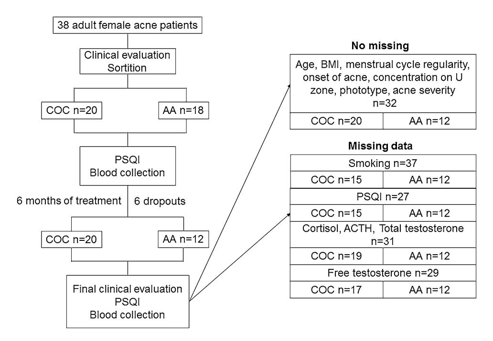
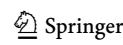
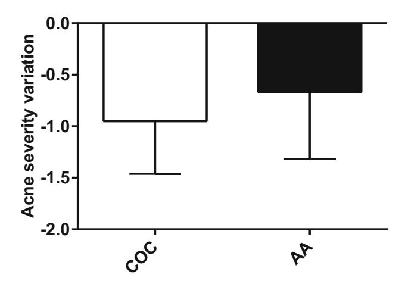
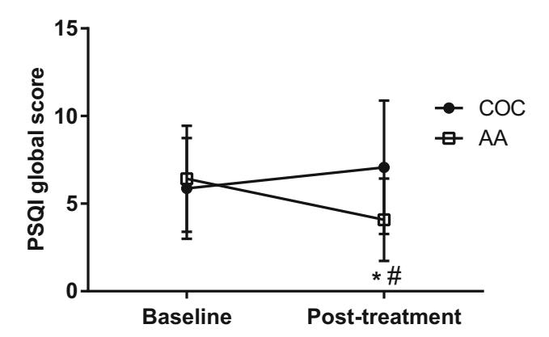
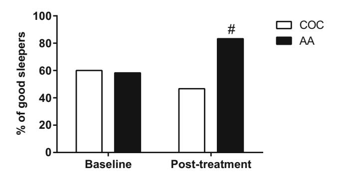
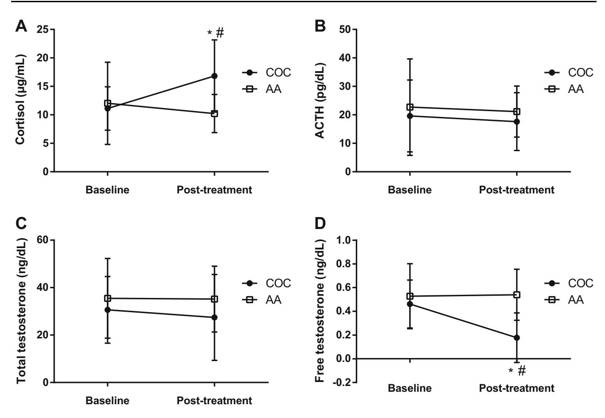
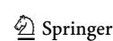

#### ORIGINAL PAPER

# A randomized comparative trial of a combined oral contraceptive and azelaic acid to assess their effect on sleep quality in adult female acne patients

Rachel Gimenes Albuquerque $^1$  · Marco Alexandre Dias da Rocha $^2$  · Camila Hirotsu $^1$  · Helena Hachul $^1$  · Edileia Bagatin $^2$  · Sergio Tufik $^1$  · Monica Levy Andersen $^1$ 

Received: 6 December 2014/Revised: 29 May 2015/Accepted: 24 September 2015/Published online: 15 October 2015 © Springer-Verlag Berlin Heidelberg 2015

**Abstract** Several studies have reported an increase in the prevalence of adult female acne. This subtype of acne presents particular characteristics, and can be triggered by several factors such as smoking, stress, the use of oily cosmetics and even by poor sleep. Sleep quality is related to well-being and the maintenance of body homeostasis. In addition, several skin diseases present a bidirectional relationship with sleep, demonstrating an important connection between skin and the central nervous system. With this in mind, we aimed to compare the effect of two types of treatment for adult female acne (azelaic acid or a combined oral contraceptive) on sleep quality and on concentrations of stress hormones. Also, we proposed to assess the correlation of sleep and hormonal parameters with acne severity. In order to do this, 32 women underwent a clinical evaluation, completed the Pittsburgh Sleep Quality Index (PSQI) questionnaire and had their blood collected for hormone assays. These procedures were performed at baseline and after 6 months of treatment. At baseline there were no differences between the groups in terms of body mass index, age, acne severity and hormone concentrations. Results showed that both treatments demonstrated effectiveness but that women treated with azelaic acid presented a better sleep quality after the

R. G. Albuquerque and M. A. D. da Rocha are equal contributors.

treatment compared to baseline and to the group treated with the combined oral contraceptive. The combined oral contraceptive group presented an increase in cortisol and a decrease in free testosterone concentration in relation to baseline. These data suggest that both azelaic acid and combined oral contraceptive are effective in the treatment of adult female acne but, azelaic acid seems to be a more suitable option for those women who may benefit from a better subjective sleep quality.

**Keywords** Sleep · Acne · Cortisol · Drospirenone · Ethinyl estradiol · Azelaic acid

#### Introduction

Over the last few years, several studies have reported an increased prevalence of adult female acne [16, 20]. Adult female acne is notably different from adolescent acne since it presents a predominance of inflammatory lesions, has a specific distribution of lesions, and requires a different therapeutic approach due to more sensitive skin and refractoriness to some treatments [19]. Excluding genetics and other intrinsic factors, as hormonal and metabolic [9], it is very difficult to define the main reasons for this increase. Current literature suggests some contributing factors such as smoking [13], stress [37], the use of oily cosmetics [55] and even a modern life style characterized by sleep deprivation [3].

It is a fact that our society has been exposed to sleep curtailment [1]. Several studies have already demonstrated that lack of sleep is harmful to the body [47], having a particular impact on the hypothalamus–pituitary–adrenal (HPA) axis, mainly through an increase in stress hormone secretion [5, 10]. More recently, some promising data have

Monica Levy Andersen ml.andersen12@gmail.com; mandersen@unifesp.br

Departamento de Psicobiologia, Universidade Federal de São Paulo, Rua Napoleão de Barros, 925, 04024-002 São Paulo, SP, Brazil

Departamento de Dermatologia, Universidade Federal de São Paulo, Rua Borges Lagoa, 508, 04038-001 São Paulo, SP, Brazil

suggested a bidirectional relationship between sleep and some skin diseases such as eczema [[42\]](#page-10-0), atopic dermatitis [\[46](#page-10-0)] and psoriasis [\[28](#page-9-0), [53\]](#page-10-0). Interestingly, adult female acne is notably more frequently observed in patients during stress periods [\[26](#page-9-0), [37](#page-10-0)]. Therefore, it is likely that sleep quality also influences acne development due to its role in the stress response system [[25,](#page-9-0) [56\]](#page-10-0).

A wide range of medications are used in the treatment of acne vulgaris which can also be used to treat adult female acne, these include: topical retinoids and antibiotics, azelaic acid (AA), systemic antibiotics, hormonal contraceptives and isotretinoin [\[45](#page-10-0)]. Most of the hormonal contraceptive methods are combinations of an estrogen, like ethinyl estradiol (EE), and a progestin, such as drospirenone (DRSP). DRSP is an anti-androgen, a blocker of androgen receptors [\[32](#page-9-0)], which acts on androgen-metabolizing cells of the pilosebaceous follicle, leading to sebostasis and decreasing sebum production [\[57](#page-10-0)]. Estrogens are also known to suppress sebum production, inhibiting testosterone secretion and increasing sex hormone-binding globulin [[21\]](#page-9-0). Due to its efficacy in the treatment of acne lesions, and to provide contraception, hormonal contraceptives are widely prescribed for adult female patients with acne by gynecologists and dermatologists, especially in oral formulation. In particular, a DSRP and EE combination (combined oral contraceptive, COC) has demonstrated marked effects, reducing not only the number of inflammatory, but also non-inflammatory skin lesions [[31,](#page-9-0) [36\]](#page-10-0). In addition, it is a cost-effective option for adult female acne treatment [\[30](#page-9-0)]. Another important option for acne treatment is azelaic acid (AA). This acid has antiinflammatory and anti-oxidative properties and is also effective against the antibiotic-resistant bacterial strains present in acne [[41\]](#page-10-0). AA has proved to be very effective in adult female acne treatment, even in patients previously treated unsuccessfully with isotretinoin, oral and topical antibiotics, and other topical treatments such as adapalen and benzoyl peroxide gel [[50\]](#page-10-0). However, the adverse effects of AA are still unknown. It has been related to cutaneous irritation symptoms, but in most cases, these symptoms were classified as transient and from mild to moderate severity [\[35](#page-10-0)]. There are no data in the literature about its possible effects on sleep or stress hormones.

Our aim was, therefore, to compare the effect of two different treatments, topical gel of AA 15 % and COC composed by EE ? DRSP, on stress hormones (cortisol and adrenocorticotropic hormone—ACTH) and subjective sleep quality in adult female patients with acne. We were also interested in correlating acne severity to sleep quality and to hormonal parameters (cortisol, ACTH, free testosterone and total testosterone). The patients were evaluated before and after the respective treatment, in order to be able to compare the results obtained at baseline and post treatment in both groups. This allowed us an opportunity to better understand the relationship between these two different approaches, acne severity, sleep and stress.

# Materials and methods

## Subjects

This randomized clinical trial study was conducted from March 2012 through November 2013 at the Dermatology Outpatient Clinic at the Escola Paulista de Medicina-Universidade Federal de Sa˜o Paulo (EPM-UNIFESP). The study was submitted to Plataforma Brasil, an electronic registry of research involving human subjects created by the Brazilian Federal Government (Protocol No. 039695/2012) and approved by the Ethics Committee of the Universidade Federal de Sa˜o Paulo (CEP-UNIFESP).

To select the volunteers to participate in the study, we used the following inclusion criteria: healthy women between 25 and 44 years old; no other hyperandrogenic signs, only acne; absence of topical treatment for acne in the previous 3 months (except cleansers); absence of oral antibiotic treatment for acne and for any other reason in the previous 3 months; absence of isotretinoin treatment in the previous 2 years; absence of oral contraceptive use in the previous 3 months; and absence of clinical evidence of immunosuppression. The non-inclusion criteria were: pregnant or nursing women; use of cortisone derivatives, lithium, anticonvulsants, isoniazid, androgens, danazol, iodides, bromides, disulfiram, cyclosporine, azathioprine, thioureas and vitamins B2, B6 and B12; facial skin treatment in the previous 3 months (topical retinoids such as tretinoin and adapalene, azelaic acid, benzoyl peroxide, clindamycin, erythromycin, nicotinamina); and use of oily cosmetics. The exclusion criteria for the COC group were: contraindications for hormonal contraception; smokers aged over 35; history of deep venous thrombosis; history of stroke and/or breast cancer; jaundice, active or severe liver disease and/or biliary disease; diabetes mellitus for 20 years or with ocular, neurological or renal damage; blood pressure greater than or equal to 160 mmHg for systolic and 100 mmHg for diastolic; cardiovascular disease and/or frequent presence of severe headache associated with blurred vision. The exclusion criteria for the AA group were: cutaneous hypersensibility to AA and presence of allergic and/or irritant symptoms with the use of AA.

The patients eligible for the criteria in the study were randomly allocated into two different parallel groups: one group taking a COC composed of 20 lg EE and 3 mg of DRSP (COC group) to be taken for 6 months (24/4 day regimen) and the other using topical azelaic acid gel (AA group) two times a day for 6 months. The randomization

was conducted in the presence of the patient at the ambulatory clinic using a smartphone application. The trial conducted was a randomized clinical trial with two parallel groups evaluated.

Besides the treatment with COC or AA along 6 months, the patients had to complete the Pittsburgh Sleep Quality Index (PSQI) and have their blood collected to measure cortisol, ACTH, and total and free testosterone levels at baseline and after 6 months of treatment. We included 38 women in the study, but 6 did not return for the final clinical evaluation and were considered as dropouts. In addition, one patient returned for the final clinical evaluation, but did not return for blood collection and to complete the PSQI questionnaire. Thirty-one patients fulfilled the entire protocol (COC group, n = 19; AA group, n = 12); however, it was not possible to measure the free testosterone concentrations of two participants (COC group, n = 17; AA group, n = 12). Finally, 5 PSQI questionnaires were invalid (COC group, n = 15; AA group, n = 12) due to missing data and/or incorrect completion (Fig. 1).

## The Pittsburgh sleep quality index (PSQI)

The PSQI is a very important tool developed by Buysse et al. [\[12](#page-9-0)] which provides information about the sleep quality of subjects, enabling them to be classified as either ''good sleepers'' or ''poor sleepers''. The PSQI consists of 19 self-rated questions and 5 questions rated by the bed partner or roommate. The last five questions are only used for clinical information. The 19 self-rated questions are tabulated in the final score of the PSQI and are grouped into seven components scores: (1) subjective sleep quality, (2) sleep latency, (3) sleep duration, (4) habitual sleep efficiency, (5) sleep disturbances, (6) use of sleeping medication and (7) daytime dysfunction. Each component is scored from 0 to 3, allowing a maximum score of 21 points. There is a scoring algorithm that allows these points to be converted into a global score, which classifies the subject as a ''good sleeper'' if the score is B5 points, or a poor sleeper, if the score is [5 points.

#### Clinical evaluation and anthropometric parameters

At the clinical evaluation, we collected personal and anthropometric data such as date of birth, height and weight for body mass index (BMI) calculation, smoking and menstrual cycle regularity. Moreover, the dermatological evaluation provided information about phototype, acne severity (before and after the treatment), onset of acne and if there was a predominance of lesions on U zone (cheeks, chin and around the mouth). The phototype was

Fig. 1 Flowchart of the study. Initially, we selected 38 patients from the Dermatology Outpatient Clinic who had undergone a first clinical evaluation. Only one patient did not answer if she smoked or not. The random selection distributed 20 patients in the combined oral contraceptive group (COC) and 18 patients in the azelaic acid group (AA). During the 6 months, six patients from the AA group dropped-

out and did not return for the final evaluation, reducing this group to 12 patients. One patient did not return for blood collection and questionnaire evaluations. Finally, from 31 patients who completed the entire protocol, it was not possible to measure free testosterone concentration from two patients and five PSQI were invalid

classified according to the Fitzpatrick's Classification of Skin Types [[23\]](#page-9-0), which takes into consideration the ability of the skin to burn and tan when challenged with UV radiation. According to Fitzpatrick, there are six phototypes gradually varying from I (marked sunburn after short explosion to sunlight and absolutely incapable of tanning) to VI (rarely burn and easily get tanned). Acne severity was rated according to the protocol of Lehmann et al. [\[33](#page-9-0)] with some modifications: no acne (grade 0), rare comedones and papules (grade 1), predominance of papulo-pustular lesions (grade 2) and presence of nodules (grade 3).

#### Measurements of hormonal concentrations

Blood was collected between the first and fifth days of menstrual cycle, in order to avoid interference from the reproductive cycle, and between 8:00 AM and 10:00 AM for basal ACTH, cortisol, total and free testosterone concentration measurements. The blood was collected in tubes with ethylenediaminetetraacetic acid (EDTA), stored on ice and immediately transported to the Associac¸a˜o Fundo de Incentivo a` Pesquisa (AFIP) laboratory, where the analyses were performed. The tubes were centrifuged at 3500 rpm for 10 min, at room temperature for serum and at 4 C for plasma separation. ACTH was measured in the plasma and cortisol in the serum. The assays were made using the chemiluminescence method (ADVIA-Centauro) and analyzed according to the standard reference values for adult women. For cortisol the normal range was 6.7–22.6 g/dL, for ACTH up to 46 pg/mL, for total testosterone up to 75 ng/dL and for free testosterone from 0.01 to 1.07 ng/dL.

## Statistical analysis

Variables (cortisol, ACTH, total testosterone and free testosterone, PSQI domains and global score) were analyzed by General Linear Model (GLM) through repeated measures relative to the following factors: treatment (COC or AA), time (baseline and post-treatment) and time 9 treatment interaction. Chi square test was used to assess potential associations between categorical variables (frequency of smoking, menstrual cycle regularity, onset of acne, concentration of lesions on U zone, phototype and acne severity) and the group of treatment. Independent T test was used for comparison of BMI and age, between the groups COC and AA. Spearman's correlation was performed for acne severity, hormones (cortisol, ACTH, total testosterone and free testosterone) and sleep parameters (PSQI domains and global score). Results are represented as mean ± standard deviation (SD) or observed frequency (%). The level of significance was set at p B 0.05. All analyses were performed using the statistical software SPSS 19.0 (Chicago, USA). For graphics we used GraphPad Prism 6 (California, USA).

# Results

The patients were not matched for weight and age, but no differences were observed between the groups for BMI and age as well as for frequency of smoking, menstrual cycle regularity, onset of acne, concentration of lesions on U zone and phototype (p[0.05, Table 1).

Figure [2](#page-4-0) shows the improvement of acne severity induced by COC or AA after 6 months of treatment. The analysis by independent T test revealed that both treatments reduced acne severity without statistical differences (t = -1.3, df = 30, p[0.05).

Figure [3](#page-4-0) depicts the global score of PSQI in the COC and AA groups at baseline and post-treatment. We found an effect of time 9 treatment interaction (F1,25 = 10.89; p\0.01). After 6 months of treatment, the COC group demonstrated a higher global PSQI score in comparison to the AA group at the same time-point. In addition, the AA group demonstrated a decreased PSQI global score at the post-treatment time-point in comparison to baseline, i.e., an improvement in sleep quality after the AA treatment. No change was observed for PSQI global score in the COC group after the treatment compared to baseline.

Table 1 Descriptive data (mean ± standard deviation) about anthropometric and clinical parameters in women at baseline evaluation

|                     | COC        | AA         | p     |
|---------------------|------------|------------|-------|
| Age (years)         | 33.9 ± 5.4 | 33.1 ± 5.5 | [0.05 |
| BMI                 | 25.6 ± 4.8 | 24.8 ± 3.6 | [0.05 |
| Smoking (%)*        | 5.0        | 11.8       | [0.05 |
| Menstrual cycle (%) |            |            |       |
| Regular             | 65         | 66.7       | [0.05 |
| Irregular           | 35         | 33.3       |       |
| Acne severity       | 2.0 ± 0.3  | 2.3 ± 0.6  | [0.05 |
| Onset (%)           |            |            |       |
| Adolescence         | 40.0       | 55.6       | [0.05 |
| Adult               | 60.0       | 44.4       |       |
| U zone (%)          | 70.0       | 72.2       | [0.05 |
| Phototype (%)       |            |            |       |
| I                   | 15         | 11.1       | [0.05 |
| II                  | 30         | 27.8       |       |
| III                 | 15         | 33.3       |       |
| IV                  | 30         | 27.8       |       |
| V                   | 10         | 0          |       |

COC combined oral contraceptive, AA azelaic acid, BMI body mass index, p statistical significance

Fig. 2 Acne severity variation (difference between acne severity at post-treatment and acne severity at baseline) in combined oral contraceptive group (COC, n = 20) and azelaic acid group (AA, n = 12)

Fig. 3 Global score of the Pittsburgh Sleep Quality Index (PSQI) in combined oral contraceptive group (COC, n = 15) and azelaic acid group (AA, n = 12) at baseline and post-treatment. # p\0.05 compared with COC group at the respective time; \*p\0.05 compared with respective baseline group

Figure 4 presents the frequency of good sleep quality self-report in the COC and AA groups at baseline and after the treatment. Statistical analysis showed an association between good sleep quality and AA treatment at the posttreatment time-point (v2 = 3.84, df = 1; p = 0.05). At baseline, 60.0 % of COC group and 58.3 % of AA women had good sleep quality. However, after the treatment, the percentage of good sleepers decreased to 46.4 % in the COC group and increased to 83.3 % in the AA group.

All the seven components of PSQI (subjective sleep quality, sleep latency, sleep duration, habitual sleep efficiency, sleep disturbances, use of sleeping medication and daytime dysfunction) are represented in Table [2](#page-5-0). We found a time 9 treatment interaction when evaluating the third component of PSQI: sleep duration (F1.25 = 3.94;

Fig. 4 Frequency of patients classified as good sleepers (%) in combined oral contraceptive group (COC, n = 15) and azelaic acid group (AA, n = 12) at post-treatment. # p\0.05 observed frequency significantly different from expected frequency

p = 0.05). After the treatment, the COC group presented a higher score in this component in comparison to baseline. Evaluating the fifth component of PSQI, sleep disturbances, there was also a time 9 treatment interaction (F1.25 = 4.85; p\0.04), showing that the COC group presented a higher score in this component in comparison to the AA group post-treatment. Regarding the sixth component of PSQI, use of sleeping medication, we also found a time 9 treatment interaction (F1.25 = 7.04; p\0.02). At baseline, the COC group presented a lower score in this component in comparison to the AA group. However, after 6 months of treatment, there was a normalization of the score, and the AA group presented a lower score in comparison to its own baseline.

The hormonal concentrations of the COC and AA groups at baseline and post-treatment time-points are demonstrated in Fig. [5.](#page-6-0) Mean concentrations were within the normal range at both baseline and post-treatment for cortisol, ACTH, total and free testosterone in both COC and AA groups. Evaluating the cortisol concentrations, statistical analysis revealed time 9 treatment interaction (F1,29 = 10.78, p\0.01), as the COC group had higher cortisol levels in comparison to AA group post-treatment, and also in comparison to itself at baseline. In addition, free testosterone concentrations demonstrated the effect of time (F1,29 = 9.89, p\0.01), treatment (F1,29 = 8.78, p\0.01) and time 9 treatment interaction (F1,29 = 11.66, p\0.01). The COC group had lower concentrations of free testosterone in comparison to the AA group post treatment and in comparison to itself at baseline. We found no significant effect for ACTH and total testosterone concentrations (p[0.05).

To better understand the relationship between the hormones and sleep, we made a correlation analysis between the global score of PSQI and the hormonal parameters at baseline and post-treatment time-points (Table [3](#page-6-0)). At baseline we found a positive correlation between free

Table 2 Descriptive data (mean ± SD) regarding the Pittsburgh Sleep Quality Index (PSQI) components: subjective sleep quality, sleep latency, sleep duration, habitual sleep efficiency, sleep

disturbances, use of sleeping medication and daytime dysfunction in combined oral contraceptive (COC, n = 15) and azelaic acid (AA, n = 12) groups at baseline and post-treatment time-points

| Component                  | Time-point     | COC          | AA           | p     |           |                  |
|----------------------------|----------------|--------------|--------------|-------|-----------|------------------|
|                            |                |              |              | Time  | Treatment | Time 9 treatment |
| Subjective sleep quality   | Baseline       | 1.20 ± 0.86  | 1.17 ± 0.72  | [0.05 | [0.05     | [0.05            |
|                            | Post-treatment | 1.20 ± 0.77  | 075 ± 0.62   |       |           |                  |
| Sleep latency              | Baseline       | 0.93 ± 1.03  | 1.00 ± 0.95  | [0.05 | [0.05     | [0.05            |
|                            | Post-treatment | 1.00 ± 1.20  | 0.58 ± 0.67  |       |           |                  |
| Sleep duration             | Baseline       | 0.73 ± 0.70  | 1.08 ± 1.08  | [0.05 | [0.05     | £0.05            |
|                            | Post-treatment | 1.27 ± 0.88* | 0.83 ± 1.11  |       |           |                  |
| Habitual sleep efficiency  | Baseline       | 0.60 ± 0.99  | 0.33 ± 0.49  | [0.05 | [0.05     | [0.05            |
|                            | Post-treatment | 0.47 ± 0.83  | 0.17 ± 0.39  |       |           |                  |
| Sleep disturbances         | Baseline       | 1.33 ± 0.62  | 1.25 ± 0.75  | [0.05 | [0.05     | £0.05            |
|                            | Post-treatment | 1.60 ± 0.74# | 1.00 ± 0.00  |       |           |                  |
| Use of sleeping medication | Baseline       | 0.00 ± 0.00# | 0.67 ± 1.15  | [0.05 | [0.05     | £0.05            |
|                            | Post-treatment | 0.47 ± 1.06  | 0.00 ± 0.00* |       |           |                  |
| Daytime dysfunction        | Baseline       | 1.07 ± 0.88  | 0.92 ± 0.79  | [0.05 | [0.05     | [0.05            |
|                            | Post-treatment | 1.07 ± 0.80  | 0.75 ± 0.97  |       |           |                  |

Bold values are statistically significant

AA azelaic acid, COC combined oral contraceptive; p statistical significance

testosterone concentrations and PSQI global score (R = 0.49; p B 0.05), indicating that the lower the free testosterone levels, the better the sleep quality. However, post-treatment, no significant correlation was found. We also performed correlation analysis between acne severity, hormones, PSQI global score, and components of PSQI, but found no significant correlation between these variables (data not shown).

# Discussion

In this study, we demonstrated that COC and AA treatments equally improved acne severity after 6 months. After the treatment, the COC group presented a higher score in the ''sleep duration'' component in comparison to baseline, as well as in the ''sleep disturbances'' component in comparison to the AA group. In addition, we verified that in the component ''use of sleeping medication'' the AA group presented a higher score in comparison to the COC group at baseline, but it normalized after the treatment. The analysis of the PSQI global score demonstrated that after 6 months of treatment the AA group presented better sleep quality in comparison to the COC group and to baseline. In addition, higher levels of morning cortisol and lower levels of free testosterone were observed in the COC group after 6 months of treatment in relation to the AA group, although all concentrations were within the normal range. These findings suggest that AA could have an additional positive effect on sleep quality in adult female patients with acne, independent of cortisol and acne improvement.

Hormonal contraceptives are widely used to treat adult female acne. First, it is important to note that several studies relate a strong connection between thrombosis and the use of this method of contraception. According to a review from Vandenbroucke et al. [[49](#page-10-0)], even a low dose of COC increases the risk of venous thrombosis, and consequently deep venous thromboembolism and pulmonary embolism among its users, in comparison to non-users. It is suggested that COC increases the levels of anticoagulant proteins and coagulant factors such as prothrombin, factors VII, VIII and X [\[49](#page-10-0)]. Not only COC users, but also vaginal ring and transdermal patches users have a 6.5 and 7.9 times increased risk of venous thrombosis in comparison to nonusers of hormonal contraception [\[34](#page-9-0)]. Thus, family history and a detailed clinical evaluation of the patients must be conducted before prescribing hormonal contraceptives.

Different studies have provided information about the influence of hormonal contraception on sleep pattern. However, it is difficult to establish if they are beneficial to sleep due to conflicting results. Baker et al. found that women under monophasic pills treatment (containing EE and a synthetic progestin) demonstrated higher time spent in N2 sleep at the active phase of treatment in comparison

\* Statistically different compared with the respective baseline time-point (COC or AA); # statistically different compared to AA group in the respective time-point (baseline or post-treatment)

**Fig. 5** Concentrations of cortisol (COC, n = 19; AA, n = 12) (a), ACTH (COC, n = 19; AA, n = 12) (b), total (COC, n = 19; AA, n = 12) (c) and free testosterone (COC, n = 17; AA, n = 12) (d) at

baseline and post-treatment.  $^*p \leq 0.05$  compared with AA group at the respective time-point;  $^*p \leq 0.05$  compared with respective baseline group

**Table 3** Correlation analysis between Pittsburgh Sleep Quality Index (PSQI) global score and cortisol (n = 27), ACTH (n = 27), total testosterone (n = 27) and free testosterone (n = 25) circulating concentrations at baseline and post-treatment time-points

| Variable           | Baseline       |      | Post-treatment |      |
|--------------------|----------------|------|----------------|------|
|                    | $\overline{R}$ | p    | $\overline{R}$ | p    |
| Cortisol           | -0.16          | 0.42 | -0.15          | 0.45 |
| ACTH               | 0.15           | 0.47 | -0.09          | 0.67 |
| Total testosterone | 0.04           | 0.83 | -0.05          | 0.82 |
| Free testosterone  | 0.49           | 0.01 | 0.27           | 0.19 |

Bold values are statistically significant

ACTH adrenocorticotropic hormone, R Spearman's coefficient, p statistical significance

to the placebo phase and to normal cycling women [7]. In the meantime, they presented less time spent in slow wave sleep (SWS) and higher body temperature in comparison to normal cycling women [7, 8]. More recently, work by Hachul et al. [27] using a sleep questionnaire, suggested that oral contraceptives do not seem to affect subjective sleep quality or sleep efficiency, except in women with an irregular menstrual cycle. They only found differences in the objective sleep of women taking oral contraceptives: short REM latency, decreased arousals and less snoring complaints [27].

Our results showed that the use of COC did not change the overall sleep quality of the adult acne women. However, looking individually to each component, we could observe that COC treatment led to a higher score in the "sleep duration" and "sleep disturbances" components, suggesting a possible impairment of specific domains of sleep quality. Possibly, these alterations in sleep pattern may occur because women using hormonal contraceptive therapy do not present the hormonal oscillation found in natural cycling women. A further factor to consider is that as temperature regulation is physiologically necessary for sleep maintenance, hormonal contraceptives could alter sleep due to their known effect of altering body temperature [7]. It is well known that progesterone and progestins have thermogenic characteristics and can increase body temperature [39]. Nevertheless, most of these data were

obtained through objective sleep evaluations such as polysomnography (PSG), which is considered the gold standard for sleep evaluation. A few studies also used questionnaires, which are subjective evaluations. The data obtained by questionnaires are sometimes different from PSG findings. PSG is, however, a very expensive technique and if there are not enough resources available to carry it out, the use of questionnaires is strongly recommended, as if properly validated, they can be very useful instruments and give relevant data about sleep architecture. There are no studies evaluating the effects of DRSP-containing hormonal contraceptives on healthy women in the reproductive phase, only in the menopausal period [\[24](#page-9-0)], postmenopausal period [[40,](#page-10-0) [51\]](#page-10-0) and in women with polycystic ovary syndrome [\[6](#page-9-0)]. We demonstrated that women using a COC composed by 20 lg EE and 3 mg of DRSP for 6 months, did not change their self-perception about sleep quality in comparison to the baseline evaluation, although around 13 % of them changed their perception from good sleepers to poor sleepers. Conversely, women treated with AA, i.e., 15 % azelaic acid gel, presented an improvement in sleep quality, indicated by a lower score on PSQI and its components.

It has to be borne in mind that oral contraceptives have different concentrations of hormones, which may induce different sleep effects, but in general the evidence points to hormonal contraceptives sometimes affect sleep architecture, but not necessarily impair sleep quality. The improvement in sleep quality which we found in the AA group might have been explained by the treatment resulting in a decrease in acne severity, were it not for the fact that we found no correlation between sleep quality and levels of acne severity in this study. Moreover, it cannot be even explained by hormonal changes, as ACTH, cortisol, testosterone and free testosterone levels did not alter after the AA treatment. Additionally, the lack of important sleep changes in the COC group associated with acne lesions improvement suggests that the hormonal changes induced by COC (an increase in morning cortisol and a decrease in free testosterone levels) could have overshadowed a possible improvement in sleep quality in association with the improvement in acne severity. However, this is only a hypothetical argument that cannot be proved in this study, since the COC treatment led to a decrease in acne severity independently of sleep quality and no correlation was found between acne severity and the hormones evaluated. Unfortunately, there is no other study about the effects of AA on sleep, or other acids used for acne treatment. A hypothesis to explain our data could be that the reduction in acne severity brought about by the AA treatment, without increasing cortisol levels, could have led to a reduction in anxiety, which ultimately a better sleep quality. However, we did not apply questionnaires for assessing this symptom.

In our study, both treatments demonstrated no statistically significant differences in ACTH and total testosterone concentrations; however, we found a significant increase in cortisol concentrations in women treated with COC after 6 months in comparison to baseline and to the AA group. The effects of hormonal contraceptives on stress hormones have been widely studied. Most of studies present data about COC composed by EE and a progestin, a formulation that is extensively used. An older study conducted in 1979 demonstrated that women taking a steroidal contraceptive presented lower concentrations of basal serum ACTH and higher concentrations of basal serum cortisol in comparison to untreated women [\[14](#page-9-0)]. More recently, Sˇimu˚nkova´ et al. [\[44](#page-10-0)] showed that after 3 months of treatment with a monophasic oral contraceptive composed by EE and a progestin, women exhibited an increase in basal serum cortisol and stimulated serum cortisol by ACTH in comparison to baseline. Increased levels of ACTH were also found during oral contraceptive use [\[44](#page-10-0)]. Other studies also demonstrated that hormonal contraception, even in low hormonal doses, can increase basal cortisol levels and even cortisol response to ACTH [[52\]](#page-10-0). However, in respect of EE combined with DRSP, only two other studies have evaluated cortisol concentrations after the use of this COC. De Leo et al. [\[18](#page-9-0)] evaluated women before and after 3 months of treatment with a COC composed of 30 lg EE plus 3 mg DRSP, but no significant differences were observed in ACTH and cortisol concentrations before and after the treatment. More recently, Ahmed et al. [\[2](#page-9-0)] evaluated patients after 3 weeks of treatment with 20 lg EE plus 3 mg DRSP, and found an increase in cortisol after treatment. Indeed, studies on the effects of hormonal contraceptives on cortisol and ACTH levels have produced conflicting results. We would like to highlight the fact that that the composition and concentration of hormones, as well as the time of the treatment, must be taken into consideration when comparing these studies. The collection of the biological sample, the transportation and storage, and even the techniques used to measure the hormone concentration must be carefully considered. We should also mention a limitation of our study, which was that we did not include a very important factor: the circadian rhythm of the stress hormones. The ACTH and the cortisol have a well-defined rhythm of secretion, being higher in the early morning after waking up and lower at the night, near the sleep period [[43\]](#page-10-0). To assert that there is an increase or decrease in these hormone concentrations it is necessary to evaluate several time-points at different hours of the day, and not only baseline values.

In the current study, we found a positive correlation between free testosterone concentrations and PSQI global score, indicating that the higher the free testosterone levels, the poorer the sleep quality. Although the COC treatment

resulted in a decrease in free testosterone levels, which was already expected as demonstrated by the literature [[54\]](#page-10-0), we cannot directly correlate this with an improvement in sleep quality, since the correlation was not observed in the posttreatment time-point, but only in the baseline. According to a review by Andersen et al. [[4\]](#page-9-0), testosterone also has a circadian rhythm, with a peakin the early morning and a decrease during the day. The same review also demonstrated that testosterone starts to rise with sleep onset and reaches a plateau at REM onset [\[4\]](#page-9-0). The relationship between high testosterone concentrations and sleep disturbances in women are well explained in studies conducted in polycystic ovary syndrome patients. In general, more than 70 % of these patients present hyperandrogenism, while approximately 57 and 32 % present supranormal concentrations of free and total testosterone, respectively [\[29](#page-9-0)]. Overall, it seems that the frequency of sleep disordered breathing (SDB) and daytime sleepiness are 2–3 fold higher in polycystic ovary syndrome patients, and androgen excess may be associated with the presence of obstructive sleep apnea [\[17](#page-9-0)]. In addition, a study compared women with SDB and polycystic ovary syndrome with women with polycystic ovary syndrome only, and found that the first group presented higher concentrations of free testosterone with a positive correlation with increasing severity of SDB. Also, a higher prevalence of excessive daytime sleepiness was observed in women with SDB and polycystic ovary syndromein comparisonto women with only polycystic ovary syndrome [\[15](#page-9-0)]. It is important to highlight other factors such as BMI and the presence of metabolic syndrome, the frequency of which is higher in polycystic ovary syndrome women, which must play a role on SDB.

In general, the current study demonstrated that 20 lg EE plus 3 mg DRSP can increase cortisol concentrations without affecting sleep quality after 6 months of use. Indeed, there is a clear association between increased cortisol and EE use, as previously demonstrated by other studies. However, we found that the combination of EE plus DRSP impaired the ''sleep duration'' component of PSQI indicated by an increased score for this component after the COC treatment, although the global score did not demonstrate significant changes comparing the COC group at baseline and post-treatment. The AA group demonstrated an improvement in sleep quality in comparison to COC group and its baseline, and both treatment approaches had good efficacy for acne treatment. The higher concentrations of serum cortisol observed only in the COC group after 6 months of treatment may be responsible for the instances of self-reported impaired sleep duration. Indeed, it is well documented that hypercortisolemia promotes sleep fragmentation [\[22](#page-9-0), [48](#page-10-0)]. In addition, sleep disturbances can be related to higher levels of nocturnal cortisol and a hyper-responsive HPA axis [[11,](#page-9-0) [38](#page-10-0)].

# Conclusion

Collectively, our data suggest that EE plus DRSP COC increases cortisol concentrations, affects subjective sleep duration without overall changes in the sleep quality demonstrated by the PSQI global score after 6 months of treatment. In respect of the better sleep quality observed in the AA group, we suggest that the treatment of the lesions decreased discomfort and improved facial appearance, promoting a better quality of life, and consequently, sleep. These results may contribute to helping to choose the best treatment for adult female acne based on each case. In agreement with other data, quality of life and lifestyle should be taken into consideration when prescribing a COC. Although this paper demonstrated that COC can increase cortisol concentrations, there is still an option for acne treatment, as they are generally well tolerated and necessary when considering their role in relation to family planning.

# Limitations

Some patients did not return for the final visit. We assume that those whose acne had improved most or had got worse probably had no interest in returning. Also, the dropouts occurred only in the AA group, probably because women in the COC group had an interest in continuing to receive the medication. It would be of great value if we had the same amount of data from the hormonal concentrations and from the PSQI so we could better compare and correlate the variables, and maybe get more information about the relationship between sleep, stress and adult female acne. In addition, it would be more interesting if we had collected blood from patients at different times of the day to better evaluate cortisol and ACTH, and not only in the morning. We acknowledge the small sample size as a limitation of the study, although dropouts and missing data are common in clinical trials. With regard to questionnaires, although they are subjective and not the gold standard for sleep evaluation, they are very useful and reliable tools and not as expensive as polysomnography tests. An evaluation of depression and anxiety would have been a useful addition to the data, due to the relationship between acne, sleep and psychiatric disorders. We must also consider the possibility that the exclusion criteria used in the selection of each group could lead to a bias in the randomization process, although as no women were excluded, this did not affect our study on this occasion. However, this did not affect our study as no woman needed to be excluded, all fitted the criteria.

Acknowledgments Our studies are supported by a fellowship from the Associac¸a˜o Fundo de Incentivo a` Pesquisa (AFIP), Sa˜o Paulo Research Foundation (FAPESP, grant #2014/00923-4 to RGA, grant #2014/15259-2 to CH, grant #2012/21794-2 to MLA). ST and MLA also received support from Conselho Nacional de Desenvolvimento Cientifico e Tecnolo´gico (CNPq).

#### Compliance with ethical standards

Conflict of interest Combined oral contraceptive (20 lg of EE and 3 mg of DRSP) and 15 % AA gel were provided by Bayer (Germany).

# References

- 1. Adenekan B, Pandey A, McKenzie S, Zizi F, Casimir GJ, Jean-Louis G (2013) Sleep in America: role of racial/ethnic differences. Sleep Med Rev 17:255–262
- 2. Ahmed AH, Gordon RD, Taylor PJ, Ward G, Pimenta E, Stowasser M (2011) Effect of contraceptives on aldosterone/renin ratio may vary according to the components of contraceptive, renin assay method, and possibly route of administration. J Clin Endocrinol Metab 96:1797–1804
- 3. Albuquerque RG, Rocha MA, Bagatin E, Tufik S, Andersen ML (2014) Could adult female acne be associated with modern life? Arch Dermatol Res 306:683–688
- 4. Andersen ML, Alvarenga TF, Mazaro-Costa R, Hachul HC, Tufik S (2011) The association of testosterone, sleep, and sexual function in men and women. Brain Res 1416:80–104
- 5. Andersen ML, Martins PJ, D'Almeida V, Bignotto M, Tufik S (2005) Endocrinological and catecholaminergic alterations during sleep deprivation and recovery in male rats. J Sleep Res 14:83–90
- 6. Bajuk Studen K, Jensterle Sever M, Pfeifer M (2013) Cardiovascular risk and subclinical cardiovascular disease in polycystic ovary syndrome. Front Horm Res 40:64–82
- 7. Baker FC, Mitchell D, Driver HS (2001) Oral contraceptives alter sleep and raise body temperature in young women. Pflugers Arch 442:729–737
- 8. Baker FC, Waner JI, Vieira EF, Taylor SR, Driver HS, Mitchell D (2001) Sleep and 24 hour body temperatures: a comparison in young men, naturally cycling women and women taking hormonal contraceptives. J Physiol 530:565–574
- 9. Bataille V, Snieder H, MacGregor AJ, Sasieni P, Spector TD (2002) The influence of genetics and environmental factors in the pathogenesis of acne: a twin study of acne in women. J Invest Dermatol 119:1317–1322
- 10. Born J, Hansen K, Marshall L, Mo¨lle M, Fehm HL (1999) Timing the end of nocturnal sleep. Nature 397:29–30
- 11. Buckley TM, Schatzberg AF (2005) On the interactions of the hypothalamic-pituitary-adrenal (HPA) axis and sleep: normal HPA axis activity and circadian rhythm, exemplary sleep disorders. J Clin Endocrinol Metab 90:3106–3114
- 12. Buysse DJ, Reynolds CF 3rd, Monk TH, Berman SR, Kupfer DJ (1989) The Pittsburgh Sleep Quality Index: a new instrument for psychiatric practice and research. Psychiatry Res 28:193–213
- 13. Capitanio B, Sinagra JL, Bordignon V, Cordiali Fei P, Picardo M, Zouboulis CC (2010) Underestimated clinical features of postadolescent acne. J Am Acad Dermatol 63:782–788
- 14. Carr BR, Parker CR Jr, Madden JD, MacDonald PC, Porter JC (1979) Plasma levels of adrenocorticotropin and cortisol in women receiving oral contraceptive steroid treatment. J Clin Endocrinol Metab 49:346–349
- 15. Chatterjee B, Suri J, Suri JC, Mittal P, Adhikari T (2014) Impact of sleep-disordered breathing on metabolic dysfunctions in

- patients with polycystic ovary syndrome. Sleep Med 15:1547– 1553
- 16. Collier CN, Harper JC, Cafardi JA, Cantrell WC, Wang W, Foster KW, Elewski BE (2008) The prevalence of acne in adults 20 years and older. J Am Acad Dermatol 58:56–59 (Erratum in:58:874)
- 17. Conway G, Dewailly D, Diamanti-Kandarakis E, Escobar-Morreale HF, Franks S, Gambineri A, Kelestimur F et al (2014) The polycystic ovary syndrome: a position statement from the European Society of Endocrinology. Eur J Endocrinol 171:P1–P29
- 18. De Leo V, Morgante G, Piomboni P, Musacchio MC, Petraglia F, Cianci A (2007) Evaluation of effects of an oral contraceptive containing ethinylestradiol combined with drospirenone on adrenal steroidogenesis in hyperandrogenic women with polycystic ovary syndrome. Fertil Steril 88:113–117
- 19. Dre´no B, Layton A, Zouboulis CC, Lo´pez-Estebaranz JL, Zalewska-Janowska A, Bagatin E, Zampeli VA et al (2013) Adult female acne: a new paradigm. J Eur Acad Dermatol Venereol 27:1063–1070
- 20. Dre´no B, Thiboutot D, Layton AM, Berson D, Perez M, Kang S, The Global Alliance to Improve Outcomes in Acne (2014) Largescale international study enhances understanding of an emerging acne population: adult females. J Eur Acad Dermatol Venereol. doi:[10.1111/jdv.12757](http://dx.doi.org/10.1111/jdv.12757)
- 21. Ebede TL, Arch EL, Berson D (2009) Hormonal treatment of acne in women. J Clin Aesthet Dermatol 2:16–22
- 22. Ekstedt M, Akerstedt T, So¨derstro¨m M (2004) Microarousals during sleep are associated with increased levels of lipids, cortisol, and blood pressure. Psychosom Med 66:925–931
- 23. Fitzpatrick TB (1988) The validity and practicality of sun-reactive skin types I through VI. Arch Dermatol 124:869–871
- 24. Gambacciani M, Rosano G, Cappagli B, Pepe A, Vitale C, Genazzani AR (2011) Clinical and metabolic effects of drospirenone-estradiol in menopausal women: a prospective study. Climacteric 14:18–24
- 25. Ganceviciene R, Graziene V, Fimmel S, Zouboulis CC (2009) Involvement of the corticotropin-releasing hormone system in the pathogenesis of acne vulgaris. Br J Dermatol 160:345–352
- 26. Goulden V, Clark SM, Cunliffe WJ (1997) Post-adolescent acne: a review of clinical features. Br J Dermatol 136:66–70
- 27. Hachul H, Andersen ML, Bittencourt LR, Santos-Silva R, Conway SG, Tufik S (2010) Does the reproductive cycle influence sleep patterns in women with sleep complaints? Climacteric 13:594–603
- 28. Hirotsu C, Rydlewski M, Arau´jo MS, Tufik S, Andersen ML (2012) Sleep loss and cytokines levels in an experimental model of psoriasis. PLoS One 7:e51183
- 29. Huang A, Brennan K, Azziz R (2010) Prevalence of hyperandrogenemia in the polycystic ovary syndrome diagnosed by the National Institutes of Health 1990 criteria. Fertil Steril 93:1938–1941
- 30. Joish VN, Boklage S, Lynen R, Schmidt A, Lin J (2011) Use of drospirenone/ethinyl estradiol (DRSP/EE) among women with acne reduces acne treatment-related resources. J Med Econ 14:681–689
- 31. Koltun W, Maloney JM, Marr J, Kunz M (2011) Treatment of moderate acne vulgaris using a combined oral contraceptive containing ethinylestradiol 20 lg plus drospirenone 3 mg administered in a 24/4 regimen: a pooled analysis. Eur J Obstet Gynecol Reprod Biol 155:171–175
- 32. Krattenmacher R (2000) Drospirenone: pharmacology and pharmacokinetics of a unique progestogen. Contraception 62:29–38
- 33. Lehmann HP, Robinson KA, Andrews JS, Holloway V, Goodman SN (2002) Acne therapy: a methodologic review. J Am Acad Dermatol 47:231–240
- 34. Lidegaard O, Nielsen LH, Skovlund CW, Løkkegaard E (2001) Venous thrombosis in users of non-oral hormonal contraception: follow-up study, Denmark 2001–10. BMJ 344:e2990

- 35. Liu RH, Smith MK, Basta SA, Farmer ER (2006) Azelaic acid in the treatment of papulopustular rosacea: a systematic review of randomized controlled trials. Arch Dermatol 142:1047–1052
- 36. Palli MB, Reyes-Habito CM, Lima XT, Kimball AB (2013) A single-center, randomized double-blind, parallel-group study to examine the safety and efficacy of 3 mg drospirenone/0.02 mg ethinyl estradiol compared with placebo in the treatment of moderate truncal acne vulgaris. J Drugs Dermatol 12:633–637
- 37. Poli F, Dreno B, Verschoore M (2001) An epidemiological study of acne in female adults: results of a survey conducted in France. J Eur Acad Dermatol Venereol 15:541–545
- 38. Rodenbeck A, Huether G, Ru¨ther E, Hajak G (2002) Interactions between evening and nocturnal cortisol secretion and sleep parameters in patients with severe chronic primary insomnia. Neurosci Lett 324:159–163
- 39. Rogers SM, Baker MA (1997) Thermoregulation during exercise in women who are taking hormonal contraceptives. Eur J Appl Physiol 75:34–38
- 40. Schu¨rmann R, Holler T, Benda N (2004) Estradiol and drospirenone for climacteric symptoms in postmenopausal women: a double-blind, randomized, placebo-controlled study of the safety and efficacy of three dose regimens. Climacteric 7:189–196
- 41. Sieber MA, Hegel JK (2014) Azelaic acid: properties and mode of action. Skin Pharmacol Physiol 27(Suppl 1):9–17
- 42. Silverberg JI, Garg NK, Paller AS, Fishbein AB, Zee PC (2015) Sleep disturbances in adults with eczema are associated with impaired overall health: a US population-based study. J Invest Dermatol 135:56–66
- 43. Simpson ER, Waterman MR (1988) Regulation of the synthesis of steroidogenic enzymes in adrenal cortical cells by ACTH. Annu Rev Physiol 50:427–440
- 44. Simu˚nkova´ K, Sta´rka L, Hill M, Krı´z L, Hampl R, Vondra K (2008) Comparison of total and salivary cortisol in a low-dose ACTH (Synacthen) test: influence of three-month oral contraceptives administration to healthy women. Physiol Res 57(Suppl 1):S193–S199
- 45. Strauss JS, Krowchuk DP, Leyden JJ, Lucky AW, Shalita AR, Siegfried EC, Thiboutot DM et al (2007) Guidelines of care for acne vulgaris management. J Am Acad Dermatol 56:651–663
- 46. Tien KJ, Chou CW, Lee SY, Yeh NC, Yang CY, Yen FC, Wang JJ et al (2014) Obstructive sleep apnea and the risk of atopic

- dermatitis: a population-based case control study. PLoS One 9:e89656
- 47. Tufik S, Andersen ML, Bittencourt LR, Mello MT (2009) Paradoxical sleep deprivation: neurochemical, hormonal and behavioral alterations. Evidence from 30 years of research. An Acad Bras Cienc 81:521–538
- 48. Van Cauter E, Leproult R, Plat L (2000) Age-related changes in slow wave sleep and REM sleep and relationship with growth hormone and cortisol levels in healthy men. JAMA 284:861–868
- 49. Vandenbroucke JP, Rosing J, Bloemenkamp KW, Middeldorp S, Helmerhorst FM, Bouma BN, Rosendaal FR (2001) Oral contraceptives and the risk of venous thrombosis. N Engl J Med 344:1527–1535
- 50. Vargas-Diez E, Hofmann MA, Bravo B, Malgazhdarova G, Katkhanova OA, Yutskovskaya Y (2014) Azelaic acid in the treatment of acne in adult females: case reports. Skin Pharmacol Physiol 27(Suppl 1):18–25
- 51. White WB, Hanes V, Mallareddy M, Chauhan V (2008) Effects of the hormone therapy, drospirenone and 17-beta estradiol, on early morning blood pressure in postmenopausal women with hypertension. J Am Soc Hypertens 2:20–27
- 52. Winkler UH, Sudik R (2009) The effects of two monophasic oral contraceptives containing 30 mcg of ethinyl estradiol and either 2 mg of chlormadinone acetate or 0.15 mg of desogestrel on lipid, hormone and metabolic parameters. Contraception 79:15–23
- 53. Yang YW, Kang JH, Lin HC (2012) Increased risk of psoriasis following obstructive sleep apnea: a longitudinal populationbased study. Sleep Med 13:285–289
- 54. Zimmerman Y, Eijkemans MJ, Coelingh Bennink HJ, Blankenstein MA, Fauser BC (2014) The effect of combined oral contraception on testosterone levels in healthy women: a systematic review and meta-analysis. Hum Reprod Update 20:76–105
- 55. Zouboulis CC (2000) Acne venenataund Acne cosmetica. In: Braun-Falco O, Gloor M, Korting HC (eds) Nutzen und Risiko von Kosmetika. Springer, Berlin, pp 116–123
- 56. Zouboulis CC, Bo¨hm M (2004) Neuroendocrine regulation of sebocytes—a pathogenetic link between stress and acne. Exp Dermatol 13(Suppl 4):31–35
- 57. Zouboulis CC, Rabe T (2010) Hormonal antiandrogens in acne treatment. J Dtsch Dermatol Ges 8(Suppl 1):S60–S74

