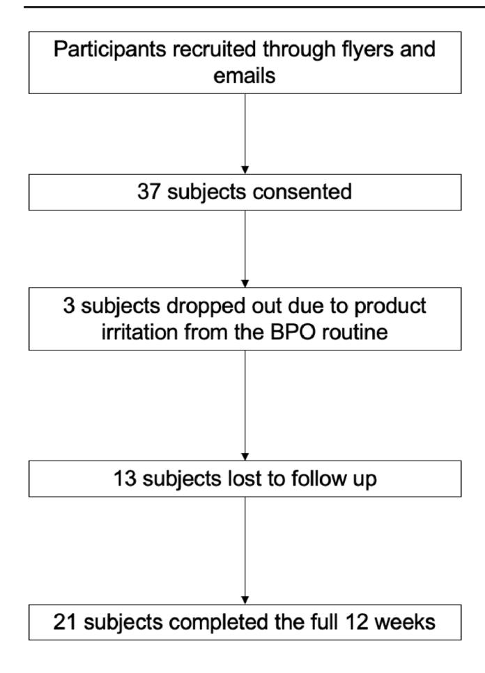
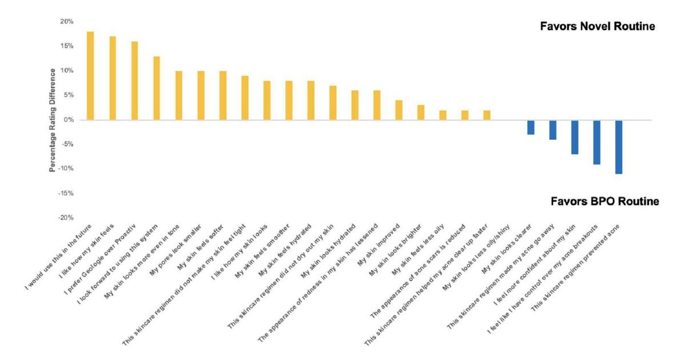
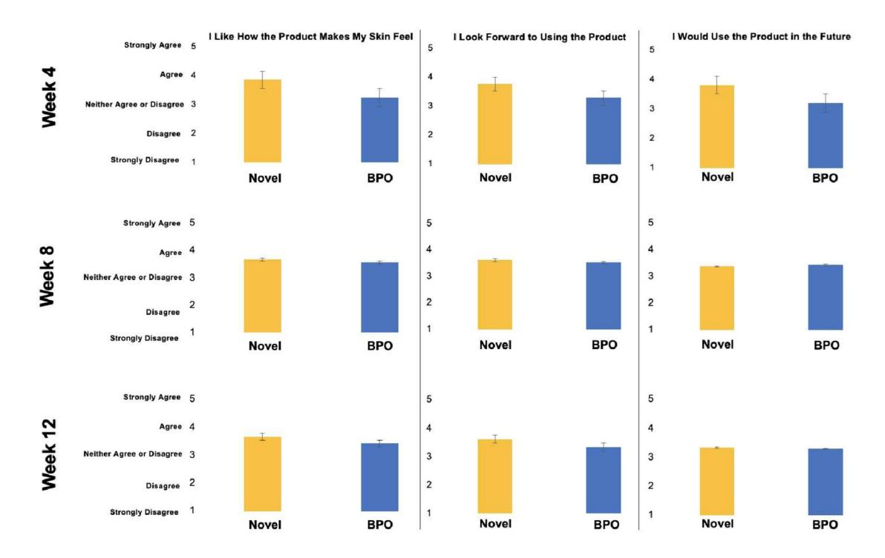
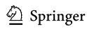
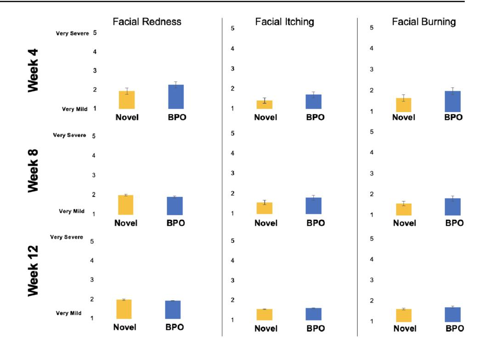
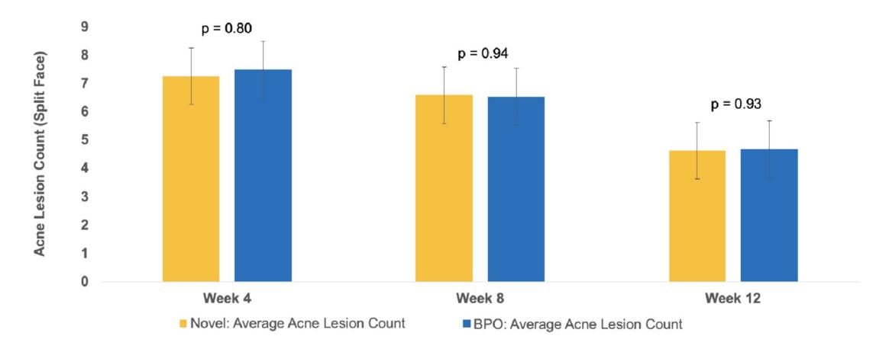
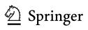
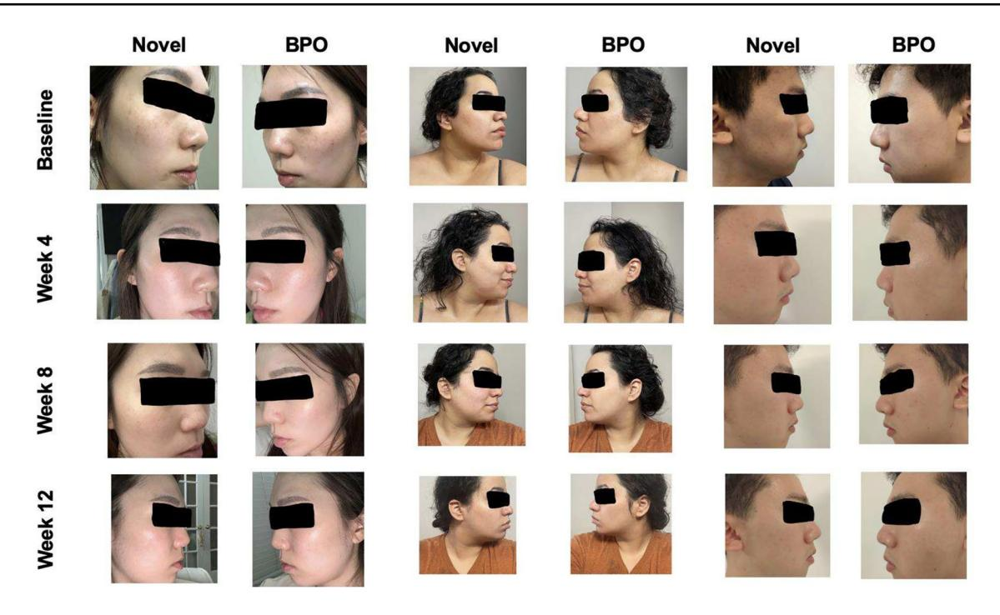

#### **ORIGINAL PAPER**

# **A randomized controlled double‑blinded split‑face prospective clinical trial to assess the efcacy, safety, and tolerability of a novel 3‑step routine compared to benzoyl peroxide for the treatment of mild to moderate acne vulgaris**

**Alison Gern1 · Jessica Walter2 · Shuai Xu1,3,4 · Paras P. Vakharia1**

Received: 20 February 2024 / Revised: 20 February 2024 / Accepted: 7 April 2024 / Published online: 24 May 2024 © The Author(s), under exclusive licence to Springer-Verlag GmbH Germany, part of Springer Nature 2024

### **Abstract**

Adult acne vulgaris afects up to 43–51% of individuals. While there are numerous treatment options for acne including topical, oral, and energy-based approaches, benzoyl peroxide (BPO) is a popular over the counter (OTC) treatment. Although BPO monotherapy has a long history of efcacy and safety, it sufers from several disadvantages, most notably, skin irritation, particularly for treatment naïve patients. In this prospective, randomized, controlled, split-face study, we evaluated the comparative efcacy, safety, and tolerability of a novel 3-step azelaic acid, salicylic acid, and graduated retinol regimen versus a common OTC BPO-based regimen over 12 weeks. A total of 37 adult subjects with self-reported mild to moderate acne vulgaris were recruited. A total of 21 subjects underwent a 2-week washout period and completed the full study with 3 dropping out due to product irritation from the BPO routine, and 13 being lost to follow-up. Detailed tolerability surveys were conducted at Week 4. Additional surveys on tolerability and product preferences were collected monthly, at Week 4, Week 8, and Week 12. A blinded board-certifed dermatologist objectively scored the presence and type of acne lesions (open or closed comedones, papules, pustules, nodules, and cysts) at baseline, Week 4, Week 8, and Week 12. Patients photographed themselves and uploaded the images using personal mobile phones. Detailed Week 4 survey results showed across 25 domains of user-assessed product performance, the novel routine outperformed the BPO routine in 19 (76%) which included domains in preference (e.g. "I would use this in the future) and performance ("my skin improved" and "helped my acne clear up faster"). Users of the novel routine reported less facial redness, itching, and burning, though diferences did not reach statistical signifcance. In terms of efcacy, both products performed similarly, reducing total acne lesions by 36% (novel routine) and 40% (BPO routine) by Week 12. Overall, accounting for user preferences and tolerability the novel routine was more preferred than the BPO routine in 79% of domains (22/28). Diferences in objective acne lesion reduction were not statistically signifcant (p=0.97). In a randomized split-face study, a 3-step azelaic acid, salicylic acid, and graduated retinol regimen delivered similar acne lesion reduction, fewer user dropouts, greater user tolerability, and higher use preference compared to a 3-step BPO routine based in a cohort of participants with mild-to-moderate acne vulgaris.

**Keywords** Acne vulgaris · Benzoyl peroxide · Azelaic acid · Salicylic acid · Retinol

- \* Shuai Xu stevexu@northwestern.edu
- 1 Department of Dermatology, Northwestern University Feinberg School of Medicine, Chicago, IL, USA
- 2 Department of Obstetrics and Gynecology, Northwestern University Feinberg School of Medicine, Chicago, IL, USA
- 3 Department of Pediatrics (Dermatology), Northwestern University Feinberg School of Medicine, Chicago, IL, USA
- 4 Sibel Health Inc., Chicago, IL, USA

## **Introduction**

Acne vulgaris is one of the most common human diseases in adults afecting 43–51% of individuals between the ages of 20 to 29 and up to 35% of individuals between the ages of 30 to 39 [[1\]](#page-6-0). The disease can be disfguring with a profound psychological impact, contributing to both anxiety and depression [\[2](#page-6-1)]. Currently, there are a wide range of topical, oral, and energy-based therapies for acne. Topical, over-thecounter (OTC) therapies are popular, representing a global

\$5 billion USD market [\[3](#page-6-2)]. Within this category of topical treatments, benzoyl-peroxide (BPO) based therapies remain one of the most commonly used worldwide.

While BPO as a monotherapy is an efective treatment for acne [\[4](#page-6-3)], it has signifcant side efects that afect adherence, including skin irritation and patient intolerability, particularly among individuals with sensitive skin. In one study, 35% of BPO users noted side efects with a discontinuation rate of 44% at 6 months [[5\]](#page-6-4). Importantly, the prevalence of sensitive skin in the adult population is greater than 70% in a recent systematic review [[6](#page-6-5)]. In addition to tolerability challenges, a recent study conducted by an independent laboratory (Valisure, New Haven, CT) demonstrated that a wide range of widely available acne products with benzoyl peroxide degraded into benzene, a widely known human carcinogen, to well over safe levels when subjected to elevated storage temperatures [\[18](#page-6-6)]. Thus, new OTC regimens ofering comparable efcacy with greater tolerability, and no risk of benzene degradation, compared to existing BPO therapies would be benefcial to adult patients with mild-to-moderate acne vulgaris.

We hypothesized a novel 3-step regimen with 3 primary anti-acne ingredients (azelaic acid, salicylic acid, and retinol) would ofer similar efcacy and greater tolerability compared to a 3-step BPO based product in adult patients with mild-to-moderate acne vulgaris. Therefore, we conducted a randomized controlled split-face study to investigate the efcacy, safety, and tolerability of both OTC regimens.

## **Materials and methods**

## **Regimens**

Two OTC regimens were compared. The frst OTC regimen (Geologie, New York City, New York) included 3 separate products: (1) a cleanser (2% salicylic acid), (2) a day cream (5% azelaic acid, 2% hyaluronic acid, and 1% niacinamide), and (3) a night cream with graduated levels of retinol to maximize patient tolerability. From baseline to week 4, subjects were given a night cream with 0.1% retinol. From week 4 to week 8, subjects were given a night cream with 0.2% retinol. Finally, from week 8 to week 12, subjects were given a night cream with 0.3% retinol. The second OTC Regimen (Proactiv Solution, Southaven, Mississippi) also included 3 separate products: (1) a cleanser (2.5% BPO), (2) a toner (glycolic acid), and (3) repairing treatment (2.5% BPO). Proactiv Solution was selected given its high level of popularity as a BPO routine, and a similar 3-step routine as the Geologie Clear System. All products from each OTC regimen were transferred to unlabeled bottles to maximize blinding. Instructions on applications and use were provided per each manufacturers' instructions. The dermatologist performing skin lesion grading was blinded to treatment laterality.

# **Study design, enrollment, inclusion / exclusion criteria, and study endpoints**

This was a prospective, randomized controlled, double-blinded, single-center study (clinicaltrials.gov: NCT05446402) conducted at Northwestern University in the Department of Dermatology after IRB approval (STU00217056). Patients were recruited in person and via social media (e.g., Facebook). A split-face design was used to compare the novel routine versus the BPO routine. All eligible subjects (>18 years of age with a clinical diagnosis of mild or moderate acne vulgaris and without an active skin infection or known allergy to the ingredients being evaluated) were recruited and consented. Acne lesion count (open comedones, closed comedones, papules, pustules, nodules, and cysts) was determined by a blinded board-certifed dermatologist (PV) at baseline, Week 4, Week 8, and Week 12 of the study via the Facial Lesion Count [[7](#page-6-7)]. Patients self-collected images with standard mobile phones. Subjects were asked to complete both tolerance and product preference surveys at Week 4, Week 8, and Week 12. For tolerability, subjects were asked to rate their level of redness, itching, and burning on a 5-point scale with 1 being very mild and 5 being very severe. For patient preferences, subjects were asked to complete questions related to the product's efect on their skin, and their propensity to use the product in the future on a 5-point scale. The primary endpoint was acne lesion count with secondary endpoints including both patient preference and tolerability survey results.

As a non-inferiority study, 20 subjects would enable the detection of an absolute diference of 20% with at least 80% power and a 5% level of signifcance if the standard deviation of this diference is no larger than 50%. Adjusting for a drop rate of 25%, a target of 27 subjects for recruitment and consent was set. The data were analyzed using Stata. Aggregated data for lesion counts were determined for each time point during the study (baseline, Weeks 4, 8, and 12 of treatment use). Descriptive statistics are presented as means. Paired t-tests, used to compare performance with all p-values, were two-tailed assuming equal variances with a level of signifcance of p≤0.05.

## **Results**

A total of 37 subjects were recruited and consented for the 12-week study. Expansion of the initial target recruitment was required due to drop out of three subjects due to intolerance of the BPO routine and a higher than anticipated lost-to-follow up rate (n=13) (Fig. [1\)](#page-2-0). Prior to starting both

**Fig. 1** Flow chart of recruitment and fnal analysis dataset

regimens, the fnal cohort of patients (n=21) completed a 2-week washout period where no acne treatments, prescription, or OTC medications were used. The fnal analysis cohort included 10 females, 10 males, and 1 not reported (Table [1\)](#page-2-1). Most subjects were between the ages of 20–29 (n=10) and 30–39 (n=6). Self-reported skin type was most reported as a combination of oily and dry (61%; n=13/21).

Both the novel routine and the BPO routine demonstrated a high degree of efcacy evidenced by reduction in facial lesions. At week 4, both regimens had a similar mean number of acne lesions (novel routine: 7.2 and BPO routine: 7.5) with no statistical diference (p=0.80). At week 8, the novel routine had an average of 6.6 acne lesions and the BPO routine had an average of 6.5 acne lesions (p=0.94). At week 12, the novel routine had an average of 4.6 acne lesions and the BPO routine had an average of 4.7 acne lesions (p=0.93). Over the entire 12 weeks, each product reduced total acne lesions by 36% (novel routine) and 40% (BPO routine).

Detailed patient preference and user tolerability in Week 4 are shown in Fig. [2](#page-3-0). Across a total of 25 domains,

**Table 1** Final demographics of *n*=21 subjects with mild to moderate acne vulgaris

| Demographics          |    |
|-----------------------|----|
| Total                 | 21 |
| Sex                   |    |
| Male                  | 10 |
| Female                | 10 |
| Prefer not to say     | 1  |
| Age                   |    |
| 20–29                 | 10 |
| 30–39                 | 6  |
| 40–49                 | 2  |
| Not reported          | 3  |
| Skin type             |    |
| Dry                   | 2  |
| Normal                | 2  |
| Combination           | 13 |
| Oily                  | 4  |
| Embarrassment on skin |    |
| Very much             | 1  |
| A lot                 | 4  |
| A little              | 13 |
| Not at all            | 3  |
| Ethnicity             |    |
| Asian                 | 5  |
| Black                 | 2  |
| Hispanic or Latino    | 4  |
| White                 | 8  |
| Other                 | 2  |

the novel routine outperformed the BPO routine in 19 domains (76%). The novel routine's highest performing categories were a patient's likelihood to use the product in the future, skin feel, and preference. In addition, the novel routine was preferred in domains for efficacy (faster acne clearing, skin less oily) and skin look and feel (softer, smoother, brighter, and more hydrated). The BPO routine was favored in other categories related to acne prevention. When aggregating both user preferences and tolerability the novel routine was more preferred than the BPO routine in 79% of domains (22/28) at Week 4. In Fig. [3,](#page-3-1) users reported higher scores for the the novel routine in skin feel and future product usage at Week 4 and Week 8. At Week 12, these differences were less apparent (Fig. [3\)](#page-3-1). Additional survey results on tolerability and product preferences were collected at Week 4, Week 8, and Week 12. Detailed Week 4 survey results showed that across 25 domains of user-assessed product performance, in terms of tolerability, users of the novel routine reported less facial redness, itching, burning, and dryness (Fig. [4](#page-4-0)).

**Fig. 2** Detailed tolerability and preference survey conducted at Week 4 showed greater preference for the novel routine across the majority of domains

**Fig. 3** Week 4, Week 8, and Week 12 preference survey comparing key domains for the novel routine versus the BPO routine

## **Safety**

No adverse events were reported during this study, although three subjects dropped out due to intolerance to the BPO routine during the course of the 12-week study (Figs. [5](#page-4-1) and [6](#page-5-0)).

## **Discussion**

The pathogenesis of acne vulgaris is multi-factorial driven by increased sebum production via hyperplastic sebaceous glands, bacterial colonization by *p. acnes*, follicular hyperkeratinization, and infammation [\[8](#page-6-8)]. BPO based treatments

**Fig. 4** Week 4, Week 8, and Week 12 tolerability survey comparing key domains for the novel routine versus the BPO routine. Higher preferences were reported for the novel routine in Week 4 compared to Week 8 and Week 12

**Fig. 5** Week 4, Week 8, and Week 12 objective acne lesion (both infammatory and non-infammatory) counts for each regimen. There were no statistically signifcant diferences at any week between the

novel routine versus the BPO routine. The fnal reduction in objective acne lesions from baseline was 36% for the novel routine and 40% for the BPO routine

have long been a cornerstone treatment for acne vulgaris given its ability to reduce antibacterial activity against *Cutibacterium acnes* and suppress sebum production [\[9](#page-6-9)]. However, skin irritation and tolerability remain a key drawback of BPO-based treatments, particularly at higher concentrations[[10](#page-6-10)] —an issue likely exacerbated in the adult acne population with a high underlying prevalence of skin sensitivity. The BPO routine studied here includes 2 products with BPO and glycolic acid toner. For BPO, the predominate mechanism of action is antibacterial [[11\]](#page-6-11). Glyolic acid has largely anti-hyperkeratinization activity[[12\]](#page-6-12). The novel routine was rationally designed to deliver comparable efcacy to BPO based treatments with greater tolerability and less irritation to maximize compliance—this is evident in that no participants dropped out of the study due to intolerance to the novel routine compared to 3 subjects who dropped out due to the BPO routine. Azelaic acid, already FDA-cleared as a topical treatment for acne in a 20% cream formulation,

**Fig. 6** Select before and after pictures self-collected by users Week 4, Week 8, and Week 12 between the novel routine and the BPO routine

ofers multiple efect anti-acne benefts including being bactericidal for *C. acnes*, anti-infammatory, and skin lightening for post-infammatory hyperpigmentation [\[13](#page-6-13)]. Salicylic acid, a beta-hydroxy acid, has also long been a mainstay of acne treatments with a positive efect on abnormal keratinization and infammation. Niacinamide also address abnormal sebum production and anti-infammatory activities. Retinols address hyper-keratinization, provide antibacterial action, and deliver color correction [[12](#page-6-12)]. Given that retinols, like BPO, have well-established skin irritation and dryness side efects, particularly in treatment naïve or sensitive skin patients, the graduated retinol percentage process (0.1% at month 1, 0.2% at month 2, and 0.3% at month 3) was designed to enhance patient tolerability without loss of efcacy. Combination therapies, such as those ofered by the novel routine, have shown to ofer better overall performance than monotherapy strategies [[14\]](#page-6-14).

The overall results show nearly identical efcacy in reducing objective acne lesion reduction at 12 weeks between both the novel routine and the BPO routine. In contrast, and particularly at the Week 4 time point, the novel routine exhibited higher ratings by user report across multiple domains from direct product preferences to skin appearance and skin feel. These diferences were less apparent at Week 8 and Week 12, although the novel routine was still rated higher in skin look and feel, and product perception at the end of the study. In regards to tolerability, the novel routine demonstrated less severe redness, itching, and burning with the greatest diferences seen at Week 4. These tolerability differences, analogous to the user preference reports, were less evident at Week 12. Overall, tolerability and user acceptance is critical in the management of acne, a chronic disease typically requiring on-going maintenance treatment. User tolerance is particularly relevant among adults with comorbid sensitive skin. Between 30% to 65% of all patients with acne do not adhere to a treatment regimen and as a result 50% do not receive the full benefts of treatment [\[15](#page-6-15)]. For OTC regimens, skin irritation and drying is the most common side efect [[16\]](#page-6-16). To drive greater adherence and overall treatment success, products should be both efective and also tolerable to use [\[14,](#page-6-14) [17\]](#page-6-17). These results suggest that positive early experiences by new users is especially important the novel routine performed better in 79% of user reported domains in efcacy, product performance, and tolerability at the critical 4 week mark. Though outside the scope of this study, early positive experiences may encourage continued and longer-term adherence to treatment, reducing rates of drop out among new users and providing long term benefts in terms of acne reduction. Traditionally, skin irritation and tolerability remain a key drawback of BPO-based treatments, particularly at higher concentrations [[10\]](#page-6-10)—an issue likely exacerbated in the adult acne population with a high underlying prevalence of skin sensitivity. Most recently, BPO acne products may now also present a potential carcinogenicity risk through chemical degradation to benzene [[18](#page-6-6)]. BPObased acne products can be exposed to higher temperatures

in the setting of travel or non-climate controlled storage settings (e.g. in a car). More data is still needed to fully assess the risk, but providers who care for vulnerable populations such as cancer survivors and pregnant persons with acne may recommend non-BPO acne treatments until further data can be obtained.

There are some relevant limitations to note for this study. While a randomized double-blind split-face design lowers the risk of confounders, the fnal analysis set included only 21 subjects.

The high dropout rate where patients were lost to follow up may reduce the confdence in the overall results we anticipate this to largely be due to high survey burden. Future work should expand on these initial fndings in a larger cohort.

# **Conclusion**

A rationally designed 3-step regimen with azelaic acid, niacinamide, salicylic acid, and graduated nightly retinol resulted in comparable acne lesion reduction with higher overall patient tolerability and patient preferences compared to a 3-step regimen with BPO and glycolic acid in a randomized, double-blind, split-face study of 21 adult patients with acne vulgaris over 12 weeks of therapy.

## **Ethical approval**

SX has stock options and is a consultant of Regimen—the manufacturer of one of the products studied here. JRW has a spouse with stock options and a consultant of Regimen—the manufacturer of one of the products studied here.

#### **Acknowledgements** None.

**Author contribution** AG collected data, analyzed data, and generated fgures. SR oversaw data collection, IRB approval, and study conduct. SX wrote manuscript and analyzed results. JRW performed statistical analysis and provided critical revisions of the manuscript. PV supported data collection, made critical edits to the manuscript, and scored all raw data outputs.

#### **Funding** Regimen.

**Data availability** The datasets generated and analyzed during the current study are available from the corresponding author on reasonable request.

# **Declarations**

**Competing interests** Shuai Xu has stock options and is a consultant of Geologie - the manufacturer of one of the products studied here. Jessica Walter has a spouse with stock options and a consultant of Geologie – the manufacturer of one of the products studied here.

## **References**

- 1. Collier CN, Harper JC, Cafardi JA et al (2008) The prevalence of acne in adults 20 years and older. J Am Acad Dermatol 58(1):56–59
- 2. Samuels DV, Rosenthal R, Lin R, Chaudhari S, Natsuaki MN (2020) Acne vulgaris and risk of depression and anxiety: A metaanalytic review. J Am Acad Dermatol 83(2):532–541
- 3. Insights FB. U.S. Acne Treatment Market Size, Share & COVID-19 Impact Analysis. [https://www.fortunebusinessinsights.com/u](https://www.fortunebusinessinsights.com/u-s-acne-treatment-market-106565)[s-acne-treatment-market-106565](https://www.fortunebusinessinsights.com/u-s-acne-treatment-market-106565). Published 2023. Accessed October 10, 2023, 2023.
- 4. Tanghetti EA, Popp KF (2009) A current review of topical benzoyl peroxide: new perspectives on formulation and utilization. Dermatol Clin 27(1):17–24
- 5. Sevimli DB (2019) Topical treatment of acne vulgaris: efciency, side efects, and adherence rate. J Int Med Res 47(7):2987–2992
- 6. Chen W, Dai R, Li L (2020) The prevalence of self-declared sensitive skin: a systematic review and meta-analysis. J Eur Acad Dermatol Venereol 34(8):1779–1788
- 7. Lucky AW, Barber BL, Girman CJ, Williams J, Ratterman J, Waldstreicher J (1996) A multirater validation study to assess the reliability of acne lesion counting. J Am Acad Dermatol 35(4):559–565
- 8. Williams HC, Dellavalle RP, Garner S (2012) Acne vulgaris. Lancet 379(9813):361–372
- 9. Fulton JE Jr, Farzad-Bakshandeh A, Bradley S (1974) Studies on the mechanism of action to topical benzoyl peroxide and vitamin A acid in acne vulgaris. J Cutan Pathol 1(5):191–200
- 10. Sagransky M, Yentzer BA, Feldman SR (2009) Benzoyl peroxide: a review of its current use in the treatment of acne vulgaris. Expert Opin Pharmacother 10(15):2555–2562
- 11. Matin T, Goodman MB (2023) Benzoyl Peroxide. In: *StatPearls.* Treasure Island (FL) ineligible companies. Disclosure: Marcus Goodman declares no relevant fnancial relationships with ineligible companies.2023
- 12. Araviiskaia E, Dreno B (2016) The role of topical dermocosmetics in acne vulgaris. J Eur Acad Dermatol Venereol 30(6):926–935
- 13. Schulte BC, Wu W, Rosen T (2015) Azelaic Acid: Evidencebased Update on Mechanism of Action and Clinical Application. J Drugs Dermatol 14(9):964–968
- 14. Gollnick H, Cunlife W, Berson D et al (2003) Management of acne: a report from a Global Alliance to Improve Outcomes in Acne. J Am Acad Dermatol 49(1 Suppl):S1-37
- 15. Thiboutot D, Dreno B, Layton A (2008) Acne counseling to improve adherence. Cutis 81(1):81–86
- 16. Decker A, Graber EM (2012) Over-the-counter Acne Treatments: A Review. J Clin Aesthet Dermatol 5(5):32–40
- 17. Flanders PA, McNamara JR (1985) Enhancing acne medication compliance: a comparison of strategies. Behav Res Ther 23(2):225–227
- 18. Valisure (2024) Valisure discovers benzoyl peroxide acne treatment products are unstable and form benzene

**Publisher's Note** Springer Nature remains neutral with regard to jurisdictional claims in published maps and institutional afliations.

Springer Nature or its licensor (e.g. a society or other partner) holds exclusive rights to this article under a publishing agreement with the author(s) or other rightsholder(s); author self-archiving of the accepted manuscript version of this article is solely governed by the terms of such publishing agreement and applicable law.

